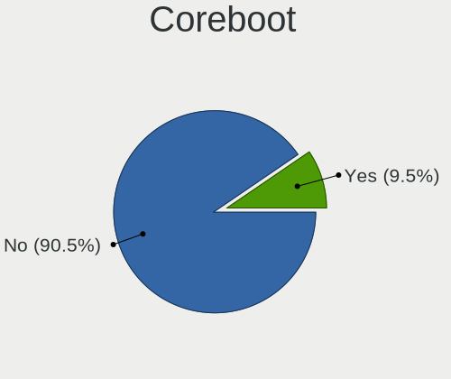
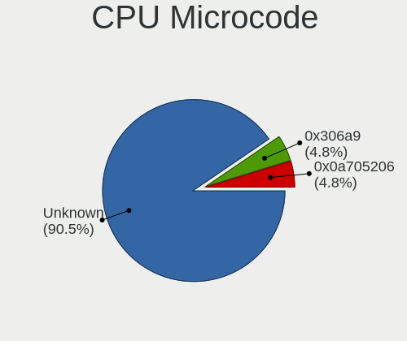
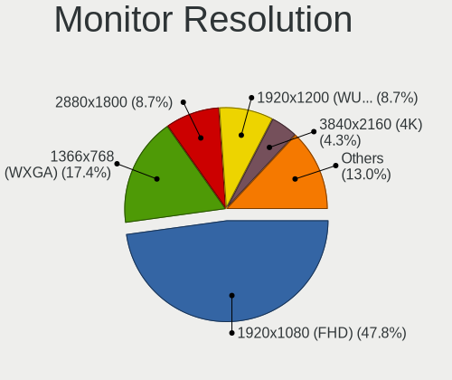
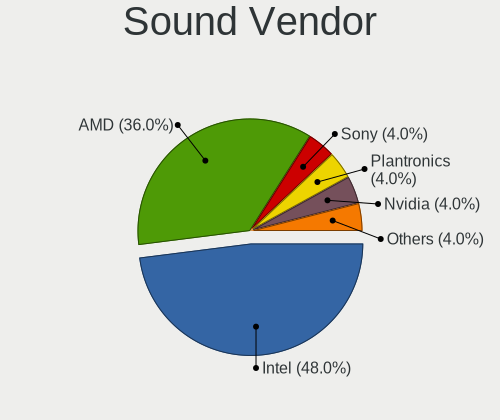
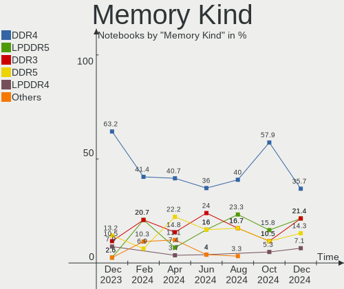

EndeavourOS - Hardware Trends (Notebooks)
-----------------------------------------

A project to identify most popular hardware characteristics and track their change
over time based on data collected by Linux users at https://Linux-Hardware.org.

Anyone can contribute to this report by the [hw-probe](https://github.com/linuxhw/hw-probe) tool:

    sudo -E hw-probe -all -upload

This report is for one last month. Overall report since the beginning of time: [TestDays](https://github.com/linuxhw/TestDays)

Period: May, 2023.

Contents
--------

* [ System ](#system)
  - [ OS                       ](#os)
  - [ OS Family                ](#os-family)
  - [ Kernel                   ](#kernel)
  - [ Kernel Family            ](#kernel-family)
  - [ Kernel Major Ver.        ](#kernel-major-ver)
  - [ Arch                     ](#arch)
  - [ DE                       ](#de)
  - [ Display Server           ](#display-server)
  - [ Display Manager          ](#display-manager)
  - [ OS Lang                  ](#os-lang)
  - [ Boot Mode                ](#boot-mode)
  - [ Filesystem               ](#filesystem)
  - [ Part. scheme             ](#part-scheme)
  - [ Dual Boot with Linux/BSD ](#dual-boot-with-linuxbsd)
  - [ Dual Boot (Win)          ](#dual-boot-win)

* [ Board ](#board)
  - [ Vendor                   ](#vendor)
  - [ Model                    ](#model)
  - [ Model Family             ](#model-family)
  - [ MFG Year                 ](#mfg-year)
  - [ Form Factor              ](#form-factor)
  - [ Secure Boot              ](#secure-boot)
  - [ Coreboot                 ](#coreboot)
  - [ RAM Size                 ](#ram-size)
  - [ RAM Used                 ](#ram-used)
  - [ Total Drives             ](#total-drives)
  - [ Has CD-ROM               ](#has-cd-rom)
  - [ Has Ethernet             ](#has-ethernet)
  - [ Has WiFi                 ](#has-wifi)
  - [ Has Bluetooth            ](#has-bluetooth)

* [ Location ](#location)
  - [ Country                  ](#country)
  - [ City                     ](#city)

* [ Drives ](#drives)
  - [ Drive Vendor             ](#drive-vendor)
  - [ Drive Model              ](#drive-model)
  - [ HDD Vendor               ](#hdd-vendor)
  - [ SSD Vendor               ](#ssd-vendor)
  - [ Drive Kind               ](#drive-kind)
  - [ Drive Connector          ](#drive-connector)
  - [ Drive Size               ](#drive-size)
  - [ Space Total              ](#space-total)
  - [ Space Used               ](#space-used)
  - [ Malfunc. Drives          ](#malfunc-drives)
  - [ Malfunc. Drive Vendor    ](#malfunc-drive-vendor)
  - [ Malfunc. HDD Vendor      ](#malfunc-hdd-vendor)
  - [ Malfunc. Drive Kind      ](#malfunc-drive-kind)
  - [ Failed Drives            ](#failed-drives)
  - [ Failed Drive Vendor      ](#failed-drive-vendor)
  - [ Drive Status             ](#drive-status)

* [ Storage controller ](#storage-controller)
  - [ Storage Vendor           ](#storage-vendor)
  - [ Storage Model            ](#storage-model)
  - [ Storage Kind             ](#storage-kind)

* [ Processor ](#processor)
  - [ CPU Vendor               ](#cpu-vendor)
  - [ CPU Model                ](#cpu-model)
  - [ CPU Model Family         ](#cpu-model-family)
  - [ CPU Cores                ](#cpu-cores)
  - [ CPU Sockets              ](#cpu-sockets)
  - [ CPU Threads              ](#cpu-threads)
  - [ CPU Op-Modes             ](#cpu-op-modes)
  - [ CPU Microcode            ](#cpu-microcode)
  - [ CPU Microarch            ](#cpu-microarch)

* [ Graphics ](#graphics)
  - [ GPU Vendor               ](#gpu-vendor)
  - [ GPU Model                ](#gpu-model)
  - [ GPU Combo                ](#gpu-combo)
  - [ GPU Driver               ](#gpu-driver)
  - [ GPU Memory               ](#gpu-memory)

* [ Monitor ](#monitor)
  - [ Monitor Vendor           ](#monitor-vendor)
  - [ Monitor Model            ](#monitor-model)
  - [ Monitor Resolution       ](#monitor-resolution)
  - [ Monitor Diagonal         ](#monitor-diagonal)
  - [ Monitor Width            ](#monitor-width)
  - [ Aspect Ratio             ](#aspect-ratio)
  - [ Monitor Area             ](#monitor-area)
  - [ Pixel Density            ](#pixel-density)
  - [ Multiple Monitors        ](#multiple-monitors)

* [ Network ](#network)
  - [ Net Controller Vendor    ](#net-controller-vendor)
  - [ Net Controller Model     ](#net-controller-model)
  - [ Wireless Vendor          ](#wireless-vendor)
  - [ Wireless Model           ](#wireless-model)
  - [ Ethernet Vendor          ](#ethernet-vendor)
  - [ Ethernet Model           ](#ethernet-model)
  - [ Net Controller Kind      ](#net-controller-kind)
  - [ Used Controller          ](#used-controller)
  - [ NICs                     ](#nics)
  - [ IPv6                     ](#ipv6)

* [ Bluetooth ](#bluetooth)
  - [ Bluetooth Vendor         ](#bluetooth-vendor)
  - [ Bluetooth Model          ](#bluetooth-model)

* [ Sound ](#sound)
  - [ Sound Vendor             ](#sound-vendor)
  - [ Sound Model              ](#sound-model)

* [ Memory ](#memory)
  - [ Memory Vendor            ](#memory-vendor)
  - [ Memory Model             ](#memory-model)
  - [ Memory Kind              ](#memory-kind)
  - [ Memory Form Factor       ](#memory-form-factor)
  - [ Memory Size              ](#memory-size)
  - [ Memory Speed             ](#memory-speed)

* [ Printers & scanners ](#printers--scanners)
  - [ Printer Vendor           ](#printer-vendor)
  - [ Printer Model            ](#printer-model)
  - [ Scanner Vendor           ](#scanner-vendor)
  - [ Scanner Model            ](#scanner-model)

* [ Camera ](#camera)
  - [ Camera Vendor            ](#camera-vendor)
  - [ Camera Model             ](#camera-model)

* [ Security ](#security)
  - [ Fingerprint Vendor       ](#fingerprint-vendor)
  - [ Fingerprint Model        ](#fingerprint-model)
  - [ Chipcard Vendor          ](#chipcard-vendor)
  - [ Chipcard Model           ](#chipcard-model)

* [ Unsupported ](#unsupported)
  - [ Unsupported Devices      ](#unsupported-devices)
  - [ Unsupported Device Types ](#unsupported-device-types)

System
------

OS
--

Installed operating systems

| Name                | Notebooks | Percent |
|---------------------|-----------|---------|
| EndeavourOS Rolling | 32        | 100%    |

OS Family
---------

OS without a version

| Name        | Notebooks | Percent |
|-------------|-----------|---------|
| EndeavourOS | 32        | 100%    |

Kernel
------

Version of the Linux kernel

| Version           | Notebooks | Percent |
|-------------------|-----------|---------|
| 6.3.1-arch1-1     | 7         | 21.88%  |
| 6.3.4-arch1-1     | 5         | 15.63%  |
| 6.3.1-arch2-1     | 3         | 9.38%   |
| 6.2.13-arch1-1    | 3         | 9.38%   |
| 6.3.2-arch1-1     | 2         | 6.25%   |
| 6.3.1-zen1-1-zen  | 2         | 6.25%   |
| 6.1.29-1-lts      | 2         | 6.25%   |
| 6.3.4-zen1-1-zen  | 1         | 3.13%   |
| 6.3.4-273-tkg-pds | 1         | 3.13%   |
| 6.3.3-zen1-1-zen  | 1         | 3.13%   |
| 6.3.2-zen1-1-zen  | 1         | 3.13%   |
| 6.3.2-273-tkg-bmq | 1         | 3.13%   |
| 6.3.0-ging        | 1         | 3.13%   |
| 6.2.10-arch1-1    | 1         | 3.13%   |
| 6.1.11-arch1-1    | 1         | 3.13%   |

Kernel Family
-------------

Linux kernel without a distro release

| Version | Notebooks | Percent |
|---------|-----------|---------|
| 6.3.1   | 12        | 37.5%   |
| 6.3.4   | 7         | 21.88%  |
| 6.3.2   | 4         | 12.5%   |
| 6.2.13  | 3         | 9.38%   |
| 6.1.29  | 2         | 6.25%   |
| 6.3.3   | 1         | 3.13%   |
| 6.3.0   | 1         | 3.13%   |
| 6.2.10  | 1         | 3.13%   |
| 6.1.11  | 1         | 3.13%   |

Kernel Major Ver.
-----------------

Linux kernel major version

| Version | Notebooks | Percent |
|---------|-----------|---------|
| 6.3     | 25        | 78.13%  |
| 6.2     | 4         | 12.5%   |
| 6.1     | 3         | 9.38%   |

Arch
----

OS architecture (x86_64, i586, etc.)

| Name   | Notebooks | Percent |
|--------|-----------|---------|
| x86_64 | 32        | 100%    |

DE
--

Desktop Environment

| Name       | Notebooks | Percent |
|------------|-----------|---------|
| GNOME      | 12        | 37.5%   |
| KDE5       | 11        | 34.38%  |
| XFCE       | 4         | 12.5%   |
| X-Cinnamon | 2         | 6.25%   |
| MATE       | 1         | 3.13%   |
| i3         | 1         | 3.13%   |
| bspwm      | 1         | 3.13%   |

Display Server
--------------

X11 or Wayland

| Name    | Notebooks | Percent |
|---------|-----------|---------|
| X11     | 19        | 59.38%  |
| Wayland | 12        | 37.5%   |
| Tty     | 1         | 3.13%   |

Display Manager
---------------

SDDM, LightDM, etc.

| Name    | Notebooks | Percent |
|---------|-----------|---------|
| LightDM | 13        | 40.63%  |
| SDDM    | 9         | 28.13%  |
| GDM     | 6         | 18.75%  |
| Unknown | 4         | 12.5%   |

OS Lang
-------

Language

| Lang  | Notebooks | Percent |
|-------|-----------|---------|
| en_US | 19        | 59.38%  |
| en_GB | 4         | 12.5%   |
| nl_NL | 2         | 6.25%   |
| zh_CN | 1         | 3.13%   |
| pt_BR | 1         | 3.13%   |
| pl_PL | 1         | 3.13%   |
| it_IT | 1         | 3.13%   |
| es_AR | 1         | 3.13%   |
| en_CA | 1         | 3.13%   |
| el_GR | 1         | 3.13%   |

Boot Mode
---------

EFI or BIOS

| Mode | Notebooks | Percent |
|------|-----------|---------|
| EFI  | 24        | 75%     |
| BIOS | 8         | 25%     |

Filesystem
----------

Type of filesystem

| Type  | Notebooks | Percent |
|-------|-----------|---------|
| Ext4  | 22        | 68.75%  |
| Btrfs | 10        | 31.25%  |

Part. scheme
------------

Scheme of partitioning

| Type    | Notebooks | Percent |
|---------|-----------|---------|
| GPT     | 26        | 81.25%  |
| Unknown | 4         | 12.5%   |
| MBR     | 2         | 6.25%   |

Dual Boot with Linux/BSD
------------------------

Hosting more than one Linux/BSD

| Dual boot | Notebooks | Percent |
|-----------|-----------|---------|
| No        | 26        | 81.25%  |
| Yes       | 6         | 18.75%  |

Dual Boot (Win)
---------------

Hosting Linux and Windows

| Dual boot | Notebooks | Percent |
|-----------|-----------|---------|
| No        | 23        | 71.88%  |
| Yes       | 9         | 28.13%  |

Board
-----

Vendor
------

Motherboard manufacturer

| Name             | Notebooks | Percent |
|------------------|-----------|---------|
| Lenovo           | 14        | 43.75%  |
| ASUSTek Computer | 4         | 12.5%   |
| Dell             | 3         | 9.38%   |
| Acer             | 3         | 9.38%   |
| Hewlett-Packard  | 2         | 6.25%   |
| Timi             | 1         | 3.13%   |
| Sony             | 1         | 3.13%   |
| Notebook         | 1         | 3.13%   |
| MSI              | 1         | 3.13%   |
| HUAWEI           | 1         | 3.13%   |
| Apple            | 1         | 3.13%   |

Model
-----

Motherboard model

| Name                                     | Notebooks | Percent |
|------------------------------------------|-----------|---------|
| Timi TM1701                              | 1         | 3.13%   |
| Sony SVE1713X1EB                         | 1         | 3.13%   |
| Notebook NS5x_NS7xPU                     | 1         | 3.13%   |
| MSI Modern 14 B11MOL                     | 1         | 3.13%   |
| Lenovo Yoga 710-11IKB 80V6               | 1         | 3.13%   |
| Lenovo ThinkPad X230 23252UU             | 1         | 3.13%   |
| Lenovo ThinkPad X1 Carbon 2nd 20A8S0ET00 | 1         | 3.13%   |
| Lenovo ThinkPad W530 24473F2             | 1         | 3.13%   |
| Lenovo ThinkPad T480 20L5A00PCD          | 1         | 3.13%   |
| Lenovo ThinkBook 15 G2 ITL 20VE          | 1         | 3.13%   |
| Lenovo Legion Y540-17IRH 81Q4            | 1         | 3.13%   |
| Lenovo Legion 5 Pro 16ACH6 82JS          | 1         | 3.13%   |
| Lenovo Legion 5 15ARH7H 82RD             | 1         | 3.13%   |
| Lenovo Legion 5 15ACH6H 82JU             | 1         | 3.13%   |
| Lenovo IdeaPad 510-15IKB 80SV            | 1         | 3.13%   |
| Lenovo IdeaPad 5 Pro 16ACH6 82L5         | 1         | 3.13%   |
| Lenovo IdeaPad 3 15ITL6 82H8             | 1         | 3.13%   |
| Lenovo G560 0679                         | 1         | 3.13%   |
| HUAWEI CREM-WXX9                         | 1         | 3.13%   |
| HP Laptop 15s-eq2xxx                     | 1         | 3.13%   |
| HP Laptop 14s-dk1xxx                     | 1         | 3.13%   |
| Dell Inspiron 5577                       | 1         | 3.13%   |
| Dell Inspiron 5402                       | 1         | 3.13%   |
| Dell Inspiron 3583                       | 1         | 3.13%   |
| ASUS X455LF                              | 1         | 3.13%   |
| ASUS VivoBook_ASUSLaptop X415EA_F415EA   | 1         | 3.13%   |
| ASUS N56VB                               | 1         | 3.13%   |
| ASUS GL553VD                             | 1         | 3.13%   |
| Apple MacBookPro16,2                     | 1         | 3.13%   |
| Acer Aspire E5-575G                      | 1         | 3.13%   |
| Acer Aspire E5-573G                      | 1         | 3.13%   |
| Acer Aspire A315-42G                     | 1         | 3.13%   |

Model Family
------------

Motherboard model prefix

| Name               | Notebooks | Percent |
|--------------------|-----------|---------|
| Lenovo ThinkPad    | 4         | 12.5%   |
| Lenovo Legion      | 4         | 12.5%   |
| Lenovo IdeaPad     | 3         | 9.38%   |
| Dell Inspiron      | 3         | 9.38%   |
| Acer Aspire        | 3         | 9.38%   |
| HP Laptop          | 2         | 6.25%   |
| Timi TM1701        | 1         | 3.13%   |
| Sony SVE1713X1EB   | 1         | 3.13%   |
| Notebook NS5x      | 1         | 3.13%   |
| MSI Modern         | 1         | 3.13%   |
| Lenovo Yoga        | 1         | 3.13%   |
| Lenovo ThinkBook   | 1         | 3.13%   |
| Lenovo G560        | 1         | 3.13%   |
| HUAWEI CREM-WXX9   | 1         | 3.13%   |
| ASUS X455LF        | 1         | 3.13%   |
| ASUS VivoBook      | 1         | 3.13%   |
| ASUS N56VB         | 1         | 3.13%   |
| ASUS GL553VD       | 1         | 3.13%   |
| Apple MacBookPro16 | 1         | 3.13%   |

MFG Year
--------

Motherboard manufacture year

| Year | Notebooks | Percent |
|------|-----------|---------|
| 2021 | 9         | 28.13%  |
| 2022 | 3         | 9.38%   |
| 2019 | 3         | 9.38%   |
| 2017 | 3         | 9.38%   |
| 2016 | 3         | 9.38%   |
| 2012 | 3         | 9.38%   |
| 2020 | 2         | 6.25%   |
| 2015 | 2         | 6.25%   |
| 2018 | 1         | 3.13%   |
| 2014 | 1         | 3.13%   |
| 2013 | 1         | 3.13%   |
| 2010 | 1         | 3.13%   |

Form Factor
-----------

Physical design of the computer

| Name     | Notebooks | Percent |
|----------|-----------|---------|
| Notebook | 32        | 100%    |

Secure Boot
-----------

Enabled or disabled

| State    | Notebooks | Percent |
|----------|-----------|---------|
| Disabled | 32        | 100%    |

Coreboot
--------

Have coreboot on board

| Used | Notebooks | Percent |
|------|-----------|---------|
| No   | 32        | 100%    |

RAM Size
--------

Total RAM memory

| Size in GB | Notebooks | Percent |
|------------|-----------|---------|
| 4.01-8.0   | 9         | 28.13%  |
| 16.01-24.0 | 8         | 25%     |
| 8.01-16.0  | 7         | 21.88%  |
| 32.01-64.0 | 5         | 15.63%  |
| 3.01-4.0   | 3         | 9.38%   |

RAM Used
--------

Used RAM memory

| Used GB   | Notebooks | Percent |
|-----------|-----------|---------|
| 4.01-8.0  | 8         | 25%     |
| 2.01-3.0  | 7         | 21.88%  |
| 3.01-4.0  | 6         | 18.75%  |
| 1.01-2.0  | 5         | 15.63%  |
| 8.01-16.0 | 5         | 15.63%  |
| 0.51-1.0  | 1         | 3.13%   |

Total Drives
------------

Number of drives on board

| Drives | Notebooks | Percent |
|--------|-----------|---------|
| 1      | 19        | 59.38%  |
| 2      | 12        | 37.5%   |
| 3      | 1         | 3.13%   |

Has CD-ROM
----------

Has CD-ROM on board

| Presented | Notebooks | Percent |
|-----------|-----------|---------|
| No        | 24        | 75%     |
| Yes       | 8         | 25%     |

Has Ethernet
------------

Has Ethernet on board

| Presented | Notebooks | Percent |
|-----------|-----------|---------|
| Yes       | 25        | 78.13%  |
| No        | 7         | 21.88%  |

Has WiFi
--------

Has WiFi module

| Presented | Notebooks | Percent |
|-----------|-----------|---------|
| Yes       | 32        | 100%    |

Has Bluetooth
-------------

Has Bluetooth module

| Presented | Notebooks | Percent |
|-----------|-----------|---------|
| Yes       | 28        | 87.5%   |
| No        | 4         | 12.5%   |

Location
--------

Country
-------

Geographic location (country)

| Country     | Notebooks | Percent |
|-------------|-----------|---------|
| USA         | 7         | 21.88%  |
| Netherlands | 3         | 9.38%   |
| Italy       | 3         | 9.38%   |
| Brazil      | 3         | 9.38%   |
| Poland      | 2         | 6.25%   |
| Indonesia   | 2         | 6.25%   |
| Germany     | 2         | 6.25%   |
| Canada      | 2         | 6.25%   |
| Spain       | 1         | 3.13%   |
| Serbia      | 1         | 3.13%   |
| Russia      | 1         | 3.13%   |
| Morocco     | 1         | 3.13%   |
| Greece      | 1         | 3.13%   |
| Finland     | 1         | 3.13%   |
| Belgium     | 1         | 3.13%   |
| Argentina   | 1         | 3.13%   |

City
----

Geographic location (city)

| City                 | Notebooks | Percent |
|----------------------|-----------|---------|
| Montreal             | 2         | 6.25%   |
| Vantaa               | 1         | 3.13%   |
| Turin                | 1         | 3.13%   |
| Salvador             | 1         | 3.13%   |
| Rydułtowy           | 1         | 3.13%   |
| Rotterdam            | 1         | 3.13%   |
| Poznan               | 1         | 3.13%   |
| Portland             | 1         | 3.13%   |
| Piraeus              | 1         | 3.13%   |
| Palermo              | 1         | 3.13%   |
| Ocoee                | 1         | 3.13%   |
| New Orleans          | 1         | 3.13%   |
| Natal                | 1         | 3.13%   |
| Moscow               | 1         | 3.13%   |
| Los Angeles          | 1         | 3.13%   |
| Koblenz              | 1         | 3.13%   |
| Jakarta              | 1         | 3.13%   |
| Fortaleza            | 1         | 3.13%   |
| Fes                  | 1         | 3.13%   |
| Edmond               | 1         | 3.13%   |
| Dallas               | 1         | 3.13%   |
| Castello di Cisterna | 1         | 3.13%   |
| Buenos Aires         | 1         | 3.13%   |
| Brussels             | 1         | 3.13%   |
| Brey                 | 1         | 3.13%   |
| Belgrade             | 1         | 3.13%   |
| Barcelona            | 1         | 3.13%   |
| Bandung              | 1         | 3.13%   |
| Appingedam           | 1         | 3.13%   |
| Amsterdam            | 1         | 3.13%   |
| Akron                | 1         | 3.13%   |

Drives
------

Drive Vendor
------------

Hard drive vendors

| Vendor                         | Notebooks | Drives | Percent |
|--------------------------------|-----------|--------|---------|
| Samsung Electronics            | 9         | 10     | 20.93%  |
| Sandisk                        | 4         | 4      | 9.3%    |
| Kingston                       | 4         | 4      | 9.3%    |
| WDC                            | 3         | 3      | 6.98%   |
| Seagate                        | 3         | 3      | 6.98%   |
| SK hynix                       | 2         | 3      | 4.65%   |
| Kingston Technology Company    | 2         | 2      | 4.65%   |
| Crucial                        | 2         | 2      | 4.65%   |
| Unknown                        | 1         | 1      | 2.33%   |
| Toshiba                        | 1         | 1      | 2.33%   |
| Solid State Storage Technology | 1         | 1      | 2.33%   |
| Shenzhen Longsys Electronics   | 1         | 1      | 2.33%   |
| Realtek Semiconductor          | 1         | 1      | 2.33%   |
| Realtek                        | 1         | 1      | 2.33%   |
| Mushkin                        | 1         | 1      | 2.33%   |
| Micron Technology              | 1         | 1      | 2.33%   |
| LITEONIT                       | 1         | 1      | 2.33%   |
| LITEON                         | 1         | 1      | 2.33%   |
| Intel                          | 1         | 1      | 2.33%   |
| Fujitsu                        | 1         | 1      | 2.33%   |
| Apple                          | 1         | 1      | 2.33%   |
| A-DATA Technology              | 1         | 1      | 2.33%   |

Drive Model
-----------

Hard drive models

| Model                                                | Notebooks | Percent |
|------------------------------------------------------|-----------|---------|
| Seagate ST1000LM035-1RK172 1TB                       | 2         | 4.65%   |
| Sandisk WD Black SN750 / PC SN730 NVMe SSD 256GB     | 2         | 4.65%   |
| Samsung NVMe SSD Controller SM981/PM981/PM983 256GB  | 2         | 4.65%   |
| Kingston Company OM3PDP3 NVMe SSD 256GB              | 2         | 4.65%   |
| Kingston SA400S37480G 480GB SSD                      | 2         | 4.65%   |
| WDC WDS500G2B0B-00YS70 500GB SSD                     | 1         | 2.33%   |
| WDC WD10SPZX-21Z10T0 1TB                             | 1         | 2.33%   |
| WDC WD10JPCX-24UE4T0 1TB                             | 1         | 2.33%   |
| Unknown MMC Card  128GB                              | 1         | 2.33%   |
| Toshiba THNSNK128GVN8 M.2 2280 128GB SSD             | 1         | 2.33%   |
| Solid State Storage NVMe CL1-8D512 512GB             | 1         | 2.33%   |
| SK hynix SKHynix_HFS512GDE9X084N 512GB               | 1         | 2.33%   |
| SK hynix SKHynix_HFS001TEJ9X115N 1TB                 | 1         | 2.33%   |
| Shenzhen Longsys SM2263EN/SM2263XT-based OEM SSD 1TB | 1         | 2.33%   |
| Seagate Expansion 1TB                                | 1         | 2.33%   |
| Sandisk WD_BLACK SN750 SE 500GB                      | 1         | 2.33%   |
| SanDisk SD8SNAT128G1002 128GB SSD                    | 1         | 2.33%   |
| Samsung SSD 980 500GB                                | 1         | 2.33%   |
| Samsung SSD 870 EVO 500GB                            | 1         | 2.33%   |
| Samsung SSD 860 PRO 256GB                            | 1         | 2.33%   |
| Samsung SSD 860 EVO M.2 250GB                        | 1         | 2.33%   |
| Samsung NVMe SSD Controller PM9A1/PM9A3/980PRO 1TB   | 1         | 2.33%   |
| Samsung MZVLQ512HBLU-00BH1 512GB                     | 1         | 2.33%   |
| Samsung MZALQ512HALU-000L2 512GB                     | 1         | 2.33%   |
| Realtek ADATA SX6000LNP 512GB                        | 1         | 2.33%   |
| Realtek RTL9210B-CG 1TB                              | 1         | 2.33%   |
| Mushkin MKNSSDEC120GB                                | 1         | 2.33%   |
| Micron 2210_MTFDHBA512QFD 512GB                      | 1         | 2.33%   |
| LITEONIT LCS-128M6S 128GB SSD                        | 1         | 2.33%   |
| LITEON CV1-8B256 256GB SSD                           | 1         | 2.33%   |
| Kingston SV300S37A60G 64GB SSD                       | 1         | 2.33%   |
| Kingston SKC3000D2048G 2TB                           | 1         | 2.33%   |
| Intel SSDPEKNW512GZL 512GB                           | 1         | 2.33%   |
| Fujitsu MHY2080BH 80GB                               | 1         | 2.33%   |
| Crucial CT250MX500SSD1 250GB                         | 1         | 2.33%   |
| Crucial CT240BX500SSD1 240GB                         | 1         | 2.33%   |
| Apple ANS2 NVMe Controller 256GB                     | 1         | 2.33%   |
| A-DATA IM2P33F3A NVMe 256GB                          | 1         | 2.33%   |

HDD Vendor
----------

Hard disk drive vendors

| Vendor  | Notebooks | Drives | Percent |
|---------|-----------|--------|---------|
| Seagate | 3         | 3      | 50%     |
| WDC     | 2         | 2      | 33.33%  |
| Fujitsu | 1         | 1      | 16.67%  |

SSD Vendor
----------

Solid state drive vendors

| Vendor              | Notebooks | Drives | Percent |
|---------------------|-----------|--------|---------|
| Samsung Electronics | 3         | 3      | 21.43%  |
| Kingston            | 3         | 3      | 21.43%  |
| Crucial             | 2         | 2      | 14.29%  |
| WDC                 | 1         | 1      | 7.14%   |
| Toshiba             | 1         | 1      | 7.14%   |
| SanDisk             | 1         | 1      | 7.14%   |
| Mushkin             | 1         | 1      | 7.14%   |
| LITEONIT            | 1         | 1      | 7.14%   |
| LITEON              | 1         | 1      | 7.14%   |

Drive Kind
----------

HDD or SSD

| Kind | Notebooks | Drives | Percent |
|------|-----------|--------|---------|
| NVMe | 19        | 24     | 50%     |
| SSD  | 12        | 14     | 31.58%  |
| HDD  | 6         | 6      | 15.79%  |
| MMC  | 1         | 1      | 2.63%   |

Drive Connector
---------------

SATA, SAS, NVMe, etc.

| Type | Notebooks | Drives | Percent |
|------|-----------|--------|---------|
| NVMe | 19        | 23     | 51.35%  |
| SATA | 15        | 19     | 40.54%  |
| SAS  | 2         | 2      | 5.41%   |
| MMC  | 1         | 1      | 2.7%    |

Drive Size
----------

Size of hard drive

| Size in TB | Notebooks | Drives | Percent |
|------------|-----------|--------|---------|
| 0.01-0.5   | 13        | 15     | 72.22%  |
| 0.51-1.0   | 5         | 5      | 27.78%  |

Space Total
-----------

Amount of disk space available on the file system

| Size in GB     | Notebooks | Percent |
|----------------|-----------|---------|
| 1001-2000      | 8         | 25%     |
| 101-250        | 6         | 18.75%  |
| 251-500        | 4         | 12.5%   |
| 501-1000       | 4         | 12.5%   |
| More than 3000 | 2         | 6.25%   |
| 21-50          | 2         | 6.25%   |
| 2001-3000      | 2         | 6.25%   |
| Unknown        | 2         | 6.25%   |
| 1-20           | 1         | 3.13%   |
| 51-100         | 1         | 3.13%   |

Space Used
----------

Amount of used disk space

| Used GB   | Notebooks | Percent |
|-----------|-----------|---------|
| 1-20      | 7         | 21.88%  |
| 101-250   | 6         | 18.75%  |
| 251-500   | 5         | 15.63%  |
| 21-50     | 4         | 12.5%   |
| 501-1000  | 3         | 9.38%   |
| 1001-2000 | 2         | 6.25%   |
| 51-100    | 2         | 6.25%   |
| Unknown   | 2         | 6.25%   |
| 0         | 1         | 3.13%   |

Malfunc. Drives
---------------

Drive models with a malfunction

| Model                                    | Notebooks | Drives | Percent |
|------------------------------------------|-----------|--------|---------|
| Toshiba THNSNK128GVN8 M.2 2280 128GB SSD | 1         | 1      | 33.33%  |
| Seagate ST1000LM035-1RK172 1TB           | 1         | 1      | 33.33%  |
| SanDisk SD8SNAT128G1002 128GB SSD        | 1         | 1      | 33.33%  |

Malfunc. Drive Vendor
---------------------

Vendors of faulty drives

| Vendor  | Notebooks | Drives | Percent |
|---------|-----------|--------|---------|
| Toshiba | 1         | 1      | 33.33%  |
| Seagate | 1         | 1      | 33.33%  |
| SanDisk | 1         | 1      | 33.33%  |

Malfunc. HDD Vendor
-------------------

Vendors of faulty HDD drives

| Vendor  | Notebooks | Drives | Percent |
|---------|-----------|--------|---------|
| Seagate | 1         | 1      | 100%    |

Malfunc. Drive Kind
-------------------

Kinds of faulty drives

| Kind | Notebooks | Drives | Percent |
|------|-----------|--------|---------|
| SSD  | 2         | 2      | 66.67%  |
| HDD  | 1         | 1      | 33.33%  |

Failed Drives
-------------

Failed drive models

Zero info for selected period =(

Failed Drive Vendor
-------------------

Failed drive vendors

Zero info for selected period =(

Drive Status
------------

Number of failed and malfunc. drives

| Status   | Notebooks | Drives | Percent |
|----------|-----------|--------|---------|
| Works    | 27        | 35     | 79.41%  |
| Detected | 5         | 7      | 14.71%  |
| Malfunc  | 2         | 3      | 5.88%   |

Storage controller
------------------

Storage Vendor
--------------

Storage controller vendors

| Vendor                         | Notebooks | Percent |
|--------------------------------|-----------|---------|
| Intel                          | 18        | 41.86%  |
| Samsung Electronics            | 6         | 13.95%  |
| AMD                            | 5         | 11.63%  |
| SanDisk                        | 3         | 6.98%   |
| Kingston Technology Company    | 3         | 6.98%   |
| SK hynix                       | 2         | 4.65%   |
| Solid State Storage Technology | 1         | 2.33%   |
| Shenzhen Longsys Electronics   | 1         | 2.33%   |
| Realtek Semiconductor          | 1         | 2.33%   |
| Micron Technology              | 1         | 2.33%   |
| Apple                          | 1         | 2.33%   |
| ADATA Technology               | 1         | 2.33%   |

Storage Model
-------------

Storage controller models

| Model                                                            | Notebooks | Percent |
|------------------------------------------------------------------|-----------|---------|
| AMD FCH SATA Controller [AHCI mode]                              | 5         | 10.64%  |
| Intel 7 Series Chipset Family 6-port SATA Controller [AHCI mode] | 4         | 8.51%   |
| Samsung NVMe SSD Controller 980                                  | 3         | 6.38%   |
| Intel Tiger Lake-LP SATA Controller                              | 3         | 6.38%   |
| Intel Sunrise Point-LP SATA Controller [AHCI mode]               | 3         | 6.38%   |
| SanDisk WD Black SN750 / PC SN730 NVMe SSD                       | 2         | 4.26%   |
| Samsung NVMe SSD Controller SM981/PM981/PM983                    | 2         | 4.26%   |
| Kingston Company OM3PDP3 NVMe SSD                                | 2         | 4.26%   |
| Intel Volume Management Device NVMe RAID Controller              | 2         | 4.26%   |
| Intel HM170/QM170 Chipset SATA Controller [AHCI Mode]            | 2         | 4.26%   |
| Intel 8 Series SATA Controller 1 [AHCI mode]                     | 2         | 4.26%   |
| Solid State Storage Non-Volatile memory controller               | 1         | 2.13%   |
| SK hynix Platinum P41 NVMe Solid State Drive 2TB                 | 1         | 2.13%   |
| SK hynix Gold P31/PC711 NVMe Solid State Drive                   | 1         | 2.13%   |
| Shenzhen Longsys SM2263EN/SM2263XT-based OEM SSD                 | 1         | 2.13%   |
| SanDisk Non-Volatile memory controller                           | 1         | 2.13%   |
| Samsung NVMe SSD Controller PM9A1/PM9A3/980PRO                   | 1         | 2.13%   |
| Realtek NVMe Controller                                          | 1         | 2.13%   |
| Micron NVMe Storage Controller                                   | 1         | 2.13%   |
| Kingston Company Company Non-Volatile memory controller          | 1         | 2.13%   |
| Intel Wildcat Point-LP SATA Controller [AHCI Mode]               | 1         | 2.13%   |
| Intel Non-Volatile memory controller                             | 1         | 2.13%   |
| Intel Cannon Point-LP SATA Controller [AHCI Mode]                | 1         | 2.13%   |
| Intel Cannon Lake Mobile PCH SATA AHCI Controller                | 1         | 2.13%   |
| Intel 5 Series/3400 Series Chipset 4 port SATA IDE Controller    | 1         | 2.13%   |
| Intel 5 Series/3400 Series Chipset 2 port SATA IDE Controller    | 1         | 2.13%   |
| Apple ANS2 NVMe Controller                                       | 1         | 2.13%   |
| ADATA Non-Volatile memory controller                             | 1         | 2.13%   |

Storage Kind
------------

Kind of storage controller (IDE, SATA, NVMe, SAS, ...)

| Kind | Notebooks | Percent |
|------|-----------|---------|
| SATA | 22        | 50%     |
| NVMe | 19        | 43.18%  |
| RAID | 2         | 4.55%   |
| IDE  | 1         | 2.27%   |

Processor
---------

CPU Vendor
----------

Processor vendors

| Vendor | Notebooks | Percent |
|--------|-----------|---------|
| Intel  | 24        | 75%     |
| AMD    | 8         | 25%     |

CPU Model
---------

Processor models

| Model                                         | Notebooks | Percent |
|-----------------------------------------------|-----------|---------|
| AMD Ryzen 7 5800H with Radeon Graphics        | 3         | 9.38%   |
| Intel Core i7-8550U CPU @ 1.80GHz             | 2         | 6.25%   |
| Intel 11th Gen Core i7-1165G7 @ 2.80GHz       | 2         | 6.25%   |
| Intel 11th Gen Core i3-1115G4 @ 3.00GHz       | 2         | 6.25%   |
| Intel Core i7-9750H CPU @ 2.60GHz             | 1         | 3.13%   |
| Intel Core i7-8565U CPU @ 1.80GHz             | 1         | 3.13%   |
| Intel Core i7-7700HQ CPU @ 2.80GHz            | 1         | 3.13%   |
| Intel Core i7-4600U CPU @ 2.10GHz             | 1         | 3.13%   |
| Intel Core i7-3632QM CPU @ 2.20GHz            | 1         | 3.13%   |
| Intel Core i7-3520M CPU @ 2.90GHz             | 1         | 3.13%   |
| Intel Core i5-7Y54 CPU @ 1.20GHz              | 1         | 3.13%   |
| Intel Core i5-7300HQ CPU @ 2.50GHz            | 1         | 3.13%   |
| Intel Core i5-7200U CPU @ 2.50GHz             | 1         | 3.13%   |
| Intel Core i5-6200U CPU @ 2.30GHz             | 1         | 3.13%   |
| Intel Core i5-5200U CPU @ 2.20GHz             | 1         | 3.13%   |
| Intel Core i5-4210U CPU @ 1.70GHz             | 1         | 3.13%   |
| Intel Core i5-3320M CPU @ 2.60GHz             | 1         | 3.13%   |
| Intel Core i5-1038NG7 CPU @ 2.00GHz           | 1         | 3.13%   |
| Intel Core i3-3120M CPU @ 2.50GHz             | 1         | 3.13%   |
| Intel Core i3 CPU M 350 @ 2.27GHz             | 1         | 3.13%   |
| Intel 12th Gen Core i7-1260P                  | 1         | 3.13%   |
| Intel 11th Gen Core i5-1135G7 @ 2.40GHz       | 1         | 3.13%   |
| AMD Ryzen 7 6800H with Radeon Graphics        | 1         | 3.13%   |
| AMD Ryzen 5 5600H with Radeon Graphics        | 1         | 3.13%   |
| AMD Ryzen 5 5500U with Radeon Graphics        | 1         | 3.13%   |
| AMD Ryzen 5 3500U with Radeon Vega Mobile Gfx | 1         | 3.13%   |
| AMD Athlon Silver 3050U with Radeon Graphics  | 1         | 3.13%   |

CPU Model Family
----------------

Processor model prefix

| Model         | Notebooks | Percent |
|---------------|-----------|---------|
| Intel Core i7 | 8         | 25%     |
| Intel Core i5 | 8         | 25%     |
| Other         | 6         | 18.75%  |
| AMD Ryzen 7   | 4         | 12.5%   |
| AMD Ryzen 5   | 3         | 9.38%   |
| Intel Core i3 | 2         | 6.25%   |
| AMD Athlon    | 1         | 3.13%   |

CPU Cores
---------

Number of processor cores

| Number | Notebooks | Percent |
|--------|-----------|---------|
| 2      | 13        | 40.63%  |
| 4      | 11        | 34.38%  |
| 8      | 4         | 12.5%   |
| 6      | 3         | 9.38%   |
| 12     | 1         | 3.13%   |

CPU Sockets
-----------

Number of sockets

| Number | Notebooks | Percent |
|--------|-----------|---------|
| 1      | 32        | 100%    |

CPU Threads
-----------

Threads per core (Hyper-Threading)

| Number | Notebooks | Percent |
|--------|-----------|---------|
| 2      | 30        | 93.75%  |
| 1      | 2         | 6.25%   |

CPU Op-Modes
------------

CPU Operation Modes (32-bit, 64-bit)

| Op mode        | Notebooks | Percent |
|----------------|-----------|---------|
| 32-bit, 64-bit | 32        | 100%    |

CPU Microcode
-------------

Microcode number

| Number     | Notebooks | Percent |
|------------|-----------|---------|
| Unknown    | 24        | 75%     |
| 0x0a50000c | 4         | 12.5%   |
| 0x40651    | 1         | 3.13%   |
| 0x0a404102 | 1         | 3.13%   |
| 0x08608104 | 1         | 3.13%   |
| 0x08108109 | 1         | 3.13%   |

CPU Microarch
-------------

Microarchitecture

| Name             | Notebooks | Percent |
|------------------|-----------|---------|
| KabyLake         | 8         | 25%     |
| TigerLake        | 5         | 15.63%  |
| Zen 3            | 4         | 12.5%   |
| IvyBridge        | 4         | 12.5%   |
| Zen+             | 2         | 6.25%   |
| Haswell          | 2         | 6.25%   |
| Unknown          | 2         | 6.25%   |
| Westmere         | 1         | 3.13%   |
| Skylake          | 1         | 3.13%   |
| IceLake          | 1         | 3.13%   |
| Broadwell        | 1         | 3.13%   |
| Alderlake Hybrid | 1         | 3.13%   |

Graphics
--------

GPU Vendor
----------

Vendors of graphics cards

| Vendor | Notebooks | Percent |
|--------|-----------|---------|
| Intel  | 22        | 51.16%  |
| Nvidia | 14        | 32.56%  |
| AMD    | 7         | 16.28%  |

GPU Model
---------

Graphics card models

| Model                                                                | Notebooks | Percent |
|----------------------------------------------------------------------|-----------|---------|
| Intel TigerLake-LP GT2 [Iris Xe Graphics]                            | 3         | 6.82%   |
| Intel 3rd Gen Core processor Graphics Controller                     | 3         | 6.82%   |
| Nvidia GP108M [GeForce MX150]                                        | 2         | 4.55%   |
| Nvidia GP107M [GeForce GTX 1050 Mobile]                              | 2         | 4.55%   |
| Intel UHD Graphics 620                                               | 2         | 4.55%   |
| Intel Tiger Lake-LP GT2 [UHD Graphics G4]                            | 2         | 4.55%   |
| Intel HD Graphics 630                                                | 2         | 4.55%   |
| Intel Haswell-ULT Integrated Graphics Controller                     | 2         | 4.55%   |
| AMD Picasso/Raven 2 [Radeon Vega Series / Radeon Vega Mobile Series] | 2         | 4.55%   |
| AMD Cezanne [Radeon Vega Series / Radeon Vega Mobile Series]         | 2         | 4.55%   |
| Nvidia TU106M [GeForce RTX 2060 Mobile]                              | 1         | 2.27%   |
| Nvidia GM108M [GeForce 940MX]                                        | 1         | 2.27%   |
| Nvidia GM108M [GeForce 930M]                                         | 1         | 2.27%   |
| Nvidia GM107 [GeForce 940MX]                                         | 1         | 2.27%   |
| Nvidia GK208BM [GeForce 920M]                                        | 1         | 2.27%   |
| Nvidia GK107M [GeForce GT 740M]                                      | 1         | 2.27%   |
| Nvidia GK107GLM [Quadro K1000M]                                      | 1         | 2.27%   |
| Nvidia GA107BM [GeForce RTX 3050 Mobile]                             | 1         | 2.27%   |
| Nvidia GA106M [GeForce RTX 3060 Mobile / Max-Q]                      | 1         | 2.27%   |
| Nvidia GA104M [Geforce RTX 3070 Ti Laptop GPU]                       | 1         | 2.27%   |
| Intel WhiskeyLake-U GT2 [UHD Graphics 620]                           | 1         | 2.27%   |
| Intel Skylake GT2 [HD Graphics 520]                                  | 1         | 2.27%   |
| Intel Iris Plus Graphics G7                                          | 1         | 2.27%   |
| Intel HD Graphics 620                                                | 1         | 2.27%   |
| Intel HD Graphics 615                                                | 1         | 2.27%   |
| Intel HD Graphics 5500                                               | 1         | 2.27%   |
| Intel Core Processor Integrated Graphics Controller                  | 1         | 2.27%   |
| Intel Alder Lake-P Integrated Graphics Controller                    | 1         | 2.27%   |
| AMD Thames [Radeon HD 7550M/7570M/7650M]                             | 1         | 2.27%   |
| AMD Rembrandt [Radeon 680M]                                          | 1         | 2.27%   |
| AMD Lucienne                                                         | 1         | 2.27%   |
| AMD Lexa [Radeon 540X/550X/630 / RX 640 / E9171 MCM]                 | 1         | 2.27%   |

GPU Combo
---------

Combinations of graphics cards

| Name           | Notebooks | Percent |
|----------------|-----------|---------|
| 1 x Intel      | 12        | 37.5%   |
| Intel + Nvidia | 10        | 31.25%  |
| 1 x AMD        | 5         | 15.63%  |
| 1 x Nvidia     | 3         | 9.38%   |
| 2 x AMD        | 1         | 3.13%   |
| AMD + Nvidia   | 1         | 3.13%   |

GPU Driver
----------

Free vs proprietary

| Driver      | Notebooks | Percent |
|-------------|-----------|---------|
| Free        | 23        | 71.88%  |
| Proprietary | 9         | 28.13%  |

GPU Memory
----------

Total video memory

| Size in GB | Notebooks | Percent |
|------------|-----------|---------|
| Unknown    | 20        | 62.5%   |
| 1.01-2.0   | 5         | 15.63%  |
| 0.01-0.5   | 3         | 9.38%   |
| 5.01-6.0   | 2         | 6.25%   |
| 3.01-4.0   | 1         | 3.13%   |
| 0.51-1.0   | 1         | 3.13%   |

Monitor
-------

Monitor Vendor
--------------

Monitor vendors

| Vendor              | Notebooks | Percent |
|---------------------|-----------|---------|
| BOE                 | 11        | 28.95%  |
| Chimei Innolux      | 8         | 21.05%  |
| AU Optronics        | 5         | 13.16%  |
| LG Display          | 3         | 7.89%   |
| Goldstar            | 2         | 5.26%   |
| Dell                | 2         | 5.26%   |
| ViewSonic           | 1         | 2.63%   |
| Samsung Electronics | 1         | 2.63%   |
| PANDA               | 1         | 2.63%   |
| Lenovo              | 1         | 2.63%   |
| Hitachi             | 1         | 2.63%   |
| Apple               | 1         | 2.63%   |
| Acer                | 1         | 2.63%   |

Monitor Model
-------------

Monitor models

| Model                                                                 | Notebooks | Percent |
|-----------------------------------------------------------------------|-----------|---------|
| AU Optronics LCD Monitor AUO38ED 1920x1080 344x193mm 15.5-inch        | 2         | 5.13%   |
| ViewSonic VX2776 Series VSC3E32 1920x1080 598x336mm 27.0-inch         | 1         | 2.56%   |
| Samsung Electronics LCD Monitor SDC4852 1920x1080 344x194mm 15.5-inch | 1         | 2.56%   |
| PANDA LCD Monitor NCP002B 1920x1080 309x174mm 14.0-inch               | 1         | 2.56%   |
| LG Display LP156WH2-TLAA LGD0230 1366x768 344x194mm 15.5-inch         | 1         | 2.56%   |
| LG Display LCD Monitor LGD04F0 2560x1440 310x174mm 14.0-inch          | 1         | 2.56%   |
| LG Display LCD Monitor LGD04C0 1366x768 309x174mm 14.0-inch           | 1         | 2.56%   |
| Lenovo LCD Monitor LEN40B2 1920x1080 344x193mm 15.5-inch              | 1         | 2.56%   |
| Hitachi HDMI HEC0029 1920x1080 580x330mm 26.3-inch                    | 1         | 2.56%   |
| Goldstar M2380D GSM57BC 1920x1080 598x336mm 27.0-inch                 | 1         | 2.56%   |
| Goldstar HDR 4K GSM7706 3840x2160 600x340mm 27.2-inch                 | 1         | 2.56%   |
| Dell P2219H DELA113 1920x1080 476x267mm 21.5-inch                     | 1         | 2.56%   |
| Dell E2414H DEL4090 1920x1080 530x300mm 24.0-inch                     | 1         | 2.56%   |
| Dell D3218HN DEL200B 1920x1080 698x393mm 31.5-inch                    | 1         | 2.56%   |
| Chimei Innolux LCD Monitor CMN175C 1920x1080 381x214mm 17.2-inch      | 1         | 2.56%   |
| Chimei Innolux LCD Monitor CMN15E7 1920x1080 344x193mm 15.5-inch      | 1         | 2.56%   |
| Chimei Innolux LCD Monitor CMN15D2 1920x1080 344x193mm 15.5-inch      | 1         | 2.56%   |
| Chimei Innolux LCD Monitor CMN153B 1920x1080 344x193mm 15.5-inch      | 1         | 2.56%   |
| Chimei Innolux LCD Monitor CMN151E 1920x1080 344x193mm 15.5-inch      | 1         | 2.56%   |
| Chimei Innolux LCD Monitor CMN14FF 1920x1080 309x173mm 13.9-inch      | 1         | 2.56%   |
| Chimei Innolux LCD Monitor CMN14D4 1920x1080 309x173mm 13.9-inch      | 1         | 2.56%   |
| Chimei Innolux LCD Monitor CMN1137 1920x1080 256x144mm 11.6-inch      | 1         | 2.56%   |
| BOE LCD Monitor BOE0A1C 1920x1080 344x194mm 15.5-inch                 | 1         | 2.56%   |
| BOE LCD Monitor BOE09B6 2560x1600 345x215mm 16.0-inch                 | 1         | 2.56%   |
| BOE LCD Monitor BOE0985 2560x1600 344x215mm 16.0-inch                 | 1         | 2.56%   |
| BOE LCD Monitor BOE092F 2520x1680 338x226mm 16.0-inch                 | 1         | 2.56%   |
| BOE LCD Monitor BOE092B 1366x768 309x174mm 14.0-inch                  | 1         | 2.56%   |
| BOE LCD Monitor BOE08EF 1366x768 344x194mm 15.5-inch                  | 1         | 2.56%   |
| BOE LCD Monitor BOE08E8 1920x1080 344x194mm 15.5-inch                 | 1         | 2.56%   |
| BOE LCD Monitor BOE07D8 1920x1080 344x194mm 15.5-inch                 | 1         | 2.56%   |
| BOE LCD Monitor BOE0747 1920x1080 344x194mm 15.5-inch                 | 1         | 2.56%   |
| BOE LCD Monitor BOE069C 1920x1080 344x193mm 15.5-inch                 | 1         | 2.56%   |
| BOE LCD Monitor BOE065E 1920x1080 344x194mm 15.5-inch                 | 1         | 2.56%   |
| AU Optronics LCD Monitor AUO24EC 1366x768 340x190mm 15.3-inch         | 1         | 2.56%   |
| AU Optronics LCD Monitor AUO123B 3840x2160 309x173mm 13.9-inch        | 1         | 2.56%   |
| AU Optronics LCD Monitor AUO106C 1366x768 276x155mm 12.5-inch         | 1         | 2.56%   |
| Apple Color LCD APPA03D 2560x1600 286x179mm 13.3-inch                 | 1         | 2.56%   |
| Acer B273H ACR010F 1920x1080 598x336mm 27.0-inch                      | 1         | 2.56%   |

Monitor Resolution
------------------

Monitor screen resolution

| Resolution      | Notebooks | Percent |
|-----------------|-----------|---------|
| 1920x1080 (FHD) | 20        | 58.82%  |
| 1366x768 (WXGA) | 6         | 17.65%  |
| 3840x2160 (4K)  | 3         | 8.82%   |
| 2560x1600       | 3         | 8.82%   |
| 2560x1440 (QHD) | 1         | 2.94%   |
| 2520x1680       | 1         | 2.94%   |

Monitor Diagonal
----------------

Diagonal size in inches

| Inches | Notebooks | Percent |
|--------|-----------|---------|
| 15     | 17        | 43.59%  |
| 27     | 4         | 10.26%  |
| 14     | 4         | 10.26%  |
| 13     | 4         | 10.26%  |
| 16     | 3         | 7.69%   |
| 52     | 1         | 2.56%   |
| 31     | 1         | 2.56%   |
| 24     | 1         | 2.56%   |
| 21     | 1         | 2.56%   |
| 17     | 1         | 2.56%   |
| 12     | 1         | 2.56%   |
| 11     | 1         | 2.56%   |

Monitor Width
-------------

Physical width

| Width in mm | Notebooks | Percent |
|-------------|-----------|---------|
| 301-350     | 27        | 69.23%  |
| 501-600     | 5         | 12.82%  |
| 201-300     | 3         | 7.69%   |
| 601-700     | 1         | 2.56%   |
| 401-500     | 1         | 2.56%   |
| 351-400     | 1         | 2.56%   |
| 1001-1500   | 1         | 2.56%   |

Aspect Ratio
------------

Proportional relationship between the width and the height

| Ratio | Notebooks | Percent |
|-------|-----------|---------|
| 16/9  | 27        | 87.1%   |
| 16/10 | 3         | 9.68%   |
| 3/2   | 1         | 3.23%   |

Monitor Area
------------

Area in inch²

| Area in inch² | Notebooks | Percent |
|----------------|-----------|---------|
| 101-110        | 17        | 43.59%  |
| 81-90          | 7         | 17.95%  |
| 301-350        | 4         | 10.26%  |
| 111-120        | 3         | 7.69%   |
| 201-250        | 2         | 5.13%   |
| More than 1000 | 1         | 2.56%   |
| 71-80          | 1         | 2.56%   |
| 61-70          | 1         | 2.56%   |
| 51-60          | 1         | 2.56%   |
| 351-500        | 1         | 2.56%   |
| 121-130        | 1         | 2.56%   |

Pixel Density
-------------

Pixels per inch

| Density       | Notebooks | Percent |
|---------------|-----------|---------|
| 121-160       | 18        | 47.37%  |
| 161-240       | 7         | 18.42%  |
| 101-120       | 7         | 18.42%  |
| 51-100        | 4         | 10.53%  |
| More than 240 | 1         | 2.63%   |
| 1-50          | 1         | 2.63%   |

Multiple Monitors
-----------------

Total monitors connected

| Total | Notebooks | Percent |
|-------|-----------|---------|
| 1     | 26        | 81.25%  |
| 2     | 5         | 15.63%  |
| 3     | 1         | 3.13%   |

Network
-------

Net Controller Vendor
---------------------

Controller vendors

| Vendor                | Notebooks | Percent |
|-----------------------|-----------|---------|
| Realtek Semiconductor | 20        | 37.74%  |
| Intel                 | 17        | 32.08%  |
| Qualcomm Atheros      | 6         | 11.32%  |
| MediaTek              | 3         | 5.66%   |
| Sierra Wireless       | 1         | 1.89%   |
| Microsoft             | 1         | 1.89%   |
| Lenovo                | 1         | 1.89%   |
| D-Link                | 1         | 1.89%   |
| Broadcom              | 1         | 1.89%   |
| ASIX Electronics      | 1         | 1.89%   |
| Apple                 | 1         | 1.89%   |

Net Controller Model
--------------------

Controller models

| Model                                                             | Notebooks | Percent |
|-------------------------------------------------------------------|-----------|---------|
| Realtek RTL8111/8168/8411 PCI Express Gigabit Ethernet Controller | 15        | 24.19%  |
| Intel Wi-Fi 6 AX201                                               | 4         | 6.45%   |
| Qualcomm Atheros QCA9377 802.11ac Wireless Network Adapter        | 3         | 4.84%   |
| Realtek RTL810xE PCI Express Fast Ethernet controller             | 2         | 3.23%   |
| Qualcomm Atheros AR9485 Wireless Network Adapter                  | 2         | 3.23%   |
| MediaTek MT7921 802.11ax PCI Express Wireless Network Adapter     | 2         | 3.23%   |
| Intel Wi-Fi 6 AX200                                               | 2         | 3.23%   |
| Intel Centrino Advanced-N 6205 [Taylor Peak]                      | 2         | 3.23%   |
| Intel 82579LM Gigabit Network Connection (Lewisville)             | 2         | 3.23%   |
| Sierra Wireless EM7345 4G LTE                                     | 1         | 1.61%   |
| Realtek RTL8852AE WiFi 6 802.11ax PCIe Adapter                    | 1         | 1.61%   |
| Realtek RTL8852AE 802.11ax PCIe Wireless Network Adapter          | 1         | 1.61%   |
| Realtek RTL8822CE 802.11ac PCIe Wireless Network Adapter          | 1         | 1.61%   |
| Realtek RTL8821CE 802.11ac PCIe Wireless Network Adapter          | 1         | 1.61%   |
| Realtek RTL8821AE 802.11ac PCIe Wireless Network Adapter          | 1         | 1.61%   |
| Realtek RTL8814AU 802.11a/b/g/n/ac Wireless Adapter               | 1         | 1.61%   |
| Realtek RTL8153 Gigabit Ethernet Adapter                          | 1         | 1.61%   |
| Qualcomm Atheros QCA9565 / AR9565 Wireless Network Adapter        | 1         | 1.61%   |
| Qualcomm Atheros AR8161 Gigabit Ethernet                          | 1         | 1.61%   |
| Microsoft XBOX ACC                                                | 1         | 1.61%   |
| MediaTek MT7922 802.11ax PCI Express Wireless Network Adapter     | 1         | 1.61%   |
| Lenovo RTL8153 Gigabit Ethernet [ThinkPad OneLink Pro Dock]       | 1         | 1.61%   |
| Intel Wireless 8265 / 8275                                        | 1         | 1.61%   |
| Intel Wireless 8260                                               | 1         | 1.61%   |
| Intel Wireless 7265                                               | 1         | 1.61%   |
| Intel Wireless 7260                                               | 1         | 1.61%   |
| Intel Wireless 3165                                               | 1         | 1.61%   |
| Intel Wi-Fi 6 AX210/AX211/AX411 160MHz                            | 1         | 1.61%   |
| Intel Ethernet Connection I218-LM                                 | 1         | 1.61%   |
| Intel Ethernet Connection (4) I219-V                              | 1         | 1.61%   |
| Intel Centrino Advanced-N 6200                                    | 1         | 1.61%   |
| Intel Cannon Point-LP CNVi [Wireless-AC]                          | 1         | 1.61%   |
| Intel Cannon Lake PCH CNVi WiFi                                   | 1         | 1.61%   |
| D-Link DWA-171                                                    | 1         | 1.61%   |
| Broadcom BCM4364 802.11ac Wireless Network Adapter                | 1         | 1.61%   |
| ASIX AX88179 Gigabit Ethernet                                     | 1         | 1.61%   |
| Apple iBridge                                                     | 1         | 1.61%   |

Wireless Vendor
---------------

Wireless vendors

| Vendor                | Notebooks | Percent |
|-----------------------|-----------|---------|
| Intel                 | 17        | 47.22%  |
| Realtek Semiconductor | 6         | 16.67%  |
| Qualcomm Atheros      | 6         | 16.67%  |
| MediaTek              | 3         | 8.33%   |
| Sierra Wireless       | 1         | 2.78%   |
| Microsoft             | 1         | 2.78%   |
| D-Link                | 1         | 2.78%   |
| Broadcom              | 1         | 2.78%   |

Wireless Model
--------------

Wireless models

| Model                                                         | Notebooks | Percent |
|---------------------------------------------------------------|-----------|---------|
| Intel Wi-Fi 6 AX201                                           | 4         | 11.11%  |
| Qualcomm Atheros QCA9377 802.11ac Wireless Network Adapter    | 3         | 8.33%   |
| Qualcomm Atheros AR9485 Wireless Network Adapter              | 2         | 5.56%   |
| MediaTek MT7921 802.11ax PCI Express Wireless Network Adapter | 2         | 5.56%   |
| Intel Wi-Fi 6 AX200                                           | 2         | 5.56%   |
| Intel Centrino Advanced-N 6205 [Taylor Peak]                  | 2         | 5.56%   |
| Sierra Wireless EM7345 4G LTE                                 | 1         | 2.78%   |
| Realtek RTL8852AE WiFi 6 802.11ax PCIe Adapter                | 1         | 2.78%   |
| Realtek RTL8852AE 802.11ax PCIe Wireless Network Adapter      | 1         | 2.78%   |
| Realtek RTL8822CE 802.11ac PCIe Wireless Network Adapter      | 1         | 2.78%   |
| Realtek RTL8821CE 802.11ac PCIe Wireless Network Adapter      | 1         | 2.78%   |
| Realtek RTL8821AE 802.11ac PCIe Wireless Network Adapter      | 1         | 2.78%   |
| Realtek RTL8814AU 802.11a/b/g/n/ac Wireless Adapter           | 1         | 2.78%   |
| Qualcomm Atheros QCA9565 / AR9565 Wireless Network Adapter    | 1         | 2.78%   |
| Microsoft XBOX ACC                                            | 1         | 2.78%   |
| MediaTek MT7922 802.11ax PCI Express Wireless Network Adapter | 1         | 2.78%   |
| Intel Wireless 8265 / 8275                                    | 1         | 2.78%   |
| Intel Wireless 8260                                           | 1         | 2.78%   |
| Intel Wireless 7265                                           | 1         | 2.78%   |
| Intel Wireless 7260                                           | 1         | 2.78%   |
| Intel Wireless 3165                                           | 1         | 2.78%   |
| Intel Wi-Fi 6 AX210/AX211/AX411 160MHz                        | 1         | 2.78%   |
| Intel Centrino Advanced-N 6200                                | 1         | 2.78%   |
| Intel Cannon Point-LP CNVi [Wireless-AC]                      | 1         | 2.78%   |
| Intel Cannon Lake PCH CNVi WiFi                               | 1         | 2.78%   |
| D-Link DWA-171                                                | 1         | 2.78%   |
| Broadcom BCM4364 802.11ac Wireless Network Adapter            | 1         | 2.78%   |

Ethernet Vendor
---------------

Ethernet vendors

| Vendor                | Notebooks | Percent |
|-----------------------|-----------|---------|
| Realtek Semiconductor | 18        | 69.23%  |
| Intel                 | 4         | 15.38%  |
| Qualcomm Atheros      | 1         | 3.85%   |
| Lenovo                | 1         | 3.85%   |
| ASIX Electronics      | 1         | 3.85%   |
| Apple                 | 1         | 3.85%   |

Ethernet Model
--------------

Ethernet models

| Model                                                             | Notebooks | Percent |
|-------------------------------------------------------------------|-----------|---------|
| Realtek RTL8111/8168/8411 PCI Express Gigabit Ethernet Controller | 15        | 57.69%  |
| Realtek RTL810xE PCI Express Fast Ethernet controller             | 2         | 7.69%   |
| Intel 82579LM Gigabit Network Connection (Lewisville)             | 2         | 7.69%   |
| Realtek RTL8153 Gigabit Ethernet Adapter                          | 1         | 3.85%   |
| Qualcomm Atheros AR8161 Gigabit Ethernet                          | 1         | 3.85%   |
| Lenovo RTL8153 Gigabit Ethernet [ThinkPad OneLink Pro Dock]       | 1         | 3.85%   |
| Intel Ethernet Connection I218-LM                                 | 1         | 3.85%   |
| Intel Ethernet Connection (4) I219-V                              | 1         | 3.85%   |
| ASIX AX88179 Gigabit Ethernet                                     | 1         | 3.85%   |
| Apple iBridge                                                     | 1         | 3.85%   |

Net Controller Kind
-------------------

Ethernet, WiFi or modem

| Kind     | Notebooks | Percent |
|----------|-----------|---------|
| WiFi     | 32        | 56.14%  |
| Ethernet | 25        | 43.86%  |

Used Controller
---------------

Currently used network controller

| Kind     | Notebooks | Percent |
|----------|-----------|---------|
| WiFi     | 30        | 90.91%  |
| Ethernet | 3         | 9.09%   |

NICs
----

Total network controllers on board

| Total | Notebooks | Percent |
|-------|-----------|---------|
| 2     | 22        | 68.75%  |
| 1     | 10        | 31.25%  |

IPv6
----

IPv6 vs IPv4

| Used | Notebooks | Percent |
|------|-----------|---------|
| No   | 27        | 84.38%  |
| Yes  | 5         | 15.63%  |

Bluetooth
---------

Bluetooth Vendor
----------------

Controller vendors

| Vendor                | Notebooks | Percent |
|-----------------------|-----------|---------|
| Intel                 | 14        | 50%     |
| Realtek Semiconductor | 4         | 14.29%  |
| Foxconn / Hon Hai     | 4         | 14.29%  |
| Lite-On Technology    | 2         | 7.14%   |
| IMC Networks          | 2         | 7.14%   |
| Broadcom              | 2         | 7.14%   |

Bluetooth Model
---------------

Controller models

| Model                                             | Notebooks | Percent |
|---------------------------------------------------|-----------|---------|
| Intel Bluetooth wireless interface                | 5         | 17.86%  |
| Intel Bluetooth 9460/9560 Jefferson Peak (JfP)    | 3         | 10.71%  |
| Intel AX201 Bluetooth                             | 3         | 10.71%  |
| Realtek Bluetooth Radio                           | 2         | 7.14%   |
| Lite-On Qualcomm Atheros QCA9377 Bluetooth        | 2         | 7.14%   |
| Intel AX200 Bluetooth                             | 2         | 7.14%   |
| Foxconn / Hon Hai MediaTek Bluetooth Adapter      | 2         | 7.14%   |
| Broadcom BCM20702 Bluetooth 4.0 [ThinkPad]        | 2         | 7.14%   |
| Realtek RTL8821A Bluetooth                        | 1         | 3.57%   |
| Realtek  Bluetooth 4.2 Adapter                    | 1         | 3.57%   |
| Intel AX210 Bluetooth                             | 1         | 3.57%   |
| IMC Networks Bluetooth Device                     | 1         | 3.57%   |
| IMC Networks Atheros AR3012 Bluetooth 4.0 Adapter | 1         | 3.57%   |
| Foxconn / Hon Hai Wireless_Device                 | 1         | 3.57%   |
| Foxconn / Hon Hai Bluetooth Device                | 1         | 3.57%   |

Sound
-----

Sound Vendor
------------

Sound card vendors

| Vendor              | Notebooks | Percent |
|---------------------|-----------|---------|
| Intel               | 24        | 53.33%  |
| AMD                 | 9         | 20%     |
| Nvidia              | 7         | 15.56%  |
| Tenx Technology     | 1         | 2.22%   |
| KORG                | 1         | 2.22%   |
| C-Media Electronics | 1         | 2.22%   |
| Apple               | 1         | 2.22%   |
| AKAI                | 1         | 2.22%   |

Sound Model
-----------

Sound card models

| Model                                                               | Notebooks | Percent |
|---------------------------------------------------------------------|-----------|---------|
| AMD Family 17h/19h HD Audio Controller                              | 8         | 14.81%  |
| Intel Tiger Lake-LP Smart Sound Technology Audio Controller         | 5         | 9.26%   |
| Intel Sunrise Point-LP HD Audio                                     | 5         | 9.26%   |
| Intel 7 Series/C216 Chipset Family High Definition Audio Controller | 4         | 7.41%   |
| AMD Renoir Radeon High Definition Audio Controller                  | 3         | 5.56%   |
| Nvidia GK107 HDMI Audio Controller                                  | 2         | 3.7%    |
| Intel Haswell-ULT HD Audio Controller                               | 2         | 3.7%    |
| Intel CM238 HD Audio Controller                                     | 2         | 3.7%    |
| Intel 8 Series HD Audio Controller                                  | 2         | 3.7%    |
| AMD Raven/Raven2/Fenghuang HDMI/DP Audio Controller                 | 2         | 3.7%    |
| Tenx Technology USB AUDIO                                           | 1         | 1.85%   |
| Nvidia TU106 High Definition Audio Controller                       | 1         | 1.85%   |
| Nvidia GM107 High Definition Audio Controller [GeForce 940MX]       | 1         | 1.85%   |
| Nvidia GK208 HDMI/DP Audio Controller                               | 1         | 1.85%   |
| Nvidia GA106 High Definition Audio Controller                       | 1         | 1.85%   |
| Nvidia GA104 High Definition Audio Controller                       | 1         | 1.85%   |
| KORG microKEY2                                                      | 1         | 1.85%   |
| Intel Wildcat Point-LP High Definition Audio Controller             | 1         | 1.85%   |
| Intel Smart Sound Technology Audio Controller                       | 1         | 1.85%   |
| Intel Cannon Point-LP High Definition Audio Controller              | 1         | 1.85%   |
| Intel Cannon Lake PCH cAVS                                          | 1         | 1.85%   |
| Intel Broadwell-U Audio Controller                                  | 1         | 1.85%   |
| Intel Alder Lake PCH-P High Definition Audio Controller             | 1         | 1.85%   |
| Intel 5 Series/3400 Series Chipset High Definition Audio            | 1         | 1.85%   |
| C-Media Electronics USB Audio Device                                | 1         | 1.85%   |
| Apple Audio Device                                                  | 1         | 1.85%   |
| AMD Turks HDMI Audio [Radeon HD 6500/6600 / 6700M Series]           | 1         | 1.85%   |
| AMD Rembrandt Radeon High Definition Audio Controller               | 1         | 1.85%   |
| AKAI MPKmini2                                                       | 1         | 1.85%   |

Memory
------

Memory Vendor
-------------

Memory module vendors

| Vendor              | Notebooks | Percent |
|---------------------|-----------|---------|
| Samsung Electronics | 10        | 29.41%  |
| SK hynix            | 6         | 17.65%  |
| Kingston            | 5         | 14.71%  |
| Micron Technology   | 4         | 11.76%  |
| Unknown             | 1         | 2.94%   |
| Ramaxel Technology  | 1         | 2.94%   |
| Magnum Tech         | 1         | 2.94%   |
| Kllisre             | 1         | 2.94%   |
| Juhor               | 1         | 2.94%   |
| GOODRAM             | 1         | 2.94%   |
| Elpida              | 1         | 2.94%   |
| Crucial             | 1         | 2.94%   |
| Corsair             | 1         | 2.94%   |

Memory Model
------------

Memory module models

| Model                                                            | Notebooks | Percent |
|------------------------------------------------------------------|-----------|---------|
| Samsung RAM M471A5244CB0-CWE 4GB SODIMM DDR4 3200MT/s            | 2         | 5.88%   |
| Unknown RAM Module 4GB SODIMM DDR3 1600MT/s                      | 1         | 2.94%   |
| SK hynix RAM HMT41GS6AFR8A-PB 8GB SODIMM DDR3 1600MT/s           | 1         | 2.94%   |
| SK hynix RAM HMAA1GS6CJR6N-XN 8GB Row Of Chips DDR4 3200MT/s     | 1         | 2.94%   |
| SK hynix RAM HMA81GS6JJR8N-VK 8GB SODIMM DDR4 2667MT/s           | 1         | 2.94%   |
| SK hynix RAM HMA81GS6AFR8N-UH 8GB SODIMM DDR4 2667MT/s           | 1         | 2.94%   |
| SK hynix RAM H9HCNNNCPMALHR-NEE 8GB Row Of Chips LPDDR4 4800MT/s | 1         | 2.94%   |
| SK hynix RAM 8ATF1G64HZ-2G3B1 8GB SODIMM DDR4 2400MT/s           | 1         | 2.94%   |
| Samsung RAM Module 8GB SODIMM DDR4 2400MT/s                      | 1         | 2.94%   |
| Samsung RAM M471B5674-H0-YK0--- 4GB Chip DDR3 1600MT/s           | 1         | 2.94%   |
| Samsung RAM M471B5173EB0-YK0 4GB SODIMM DDR3 1600MT/s            | 1         | 2.94%   |
| Samsung RAM M471A1K43BB1-CRC 8GB SODIMM DDR4 2667MT/s            | 1         | 2.94%   |
| Samsung RAM M471A1G44AB0-CWE 8GB SODIMM DDR4 3200MT/s            | 1         | 2.94%   |
| Samsung RAM M471A1G44AB0-CWE 8GB Row Of Chips DDR4 3200MT/s      | 1         | 2.94%   |
| Samsung RAM M425R1GB4BB0-CQKOL 8GB SODIMM DDR5 4800MT/s          | 1         | 2.94%   |
| Samsung RAM K4E6E304EB-EGCF 4GB Row Of Chips LPDDR3 1867MT/s     | 1         | 2.94%   |
| Ramaxel RAM RMSA3270MB86H9F2400 4GB SODIMM DDR4 2400MT/s         | 1         | 2.94%   |
| Micron RAM 8ATF1G64HZ-3G2J1 8GB SODIMM DDR4 3200MT/s             | 1         | 2.94%   |
| Micron RAM 4ATF51264HZ-2G3AZ 4GB SODIMM DDR4 2133MT/s            | 1         | 2.94%   |
| Micron RAM 4ATF11G64HZ-3G2E1 8GB Row Of Chips DDR4 3200MT/s      | 1         | 2.94%   |
| Micron RAM 16KTF1G64HZ-1G6E1 8GB SODIMM DDR3 1600MT/s            | 1         | 2.94%   |
| Magnum Tech RAM MAGNUMTECH 4GB SODIMM DDR3 1600MT/s              | 1         | 2.94%   |
| Kllisre RAM Module 16GB SODIMM DDR4 3200MT/s                     | 1         | 2.94%   |
| Kingston RAM KF3200C20S4/32GX 32GB SODIMM DDR4 3200MT/s          | 1         | 2.94%   |
| Kingston RAM HX426S15IB2/16-SP 16GB SODIMM DDR4 2667MT/s         | 1         | 2.94%   |
| Kingston RAM ACR16D3LS1KNG/4G 4GB SODIMM DDR3 1600MT/s           | 1         | 2.94%   |
| Kingston RAM 9905700-118.A00G 8GB SODIMM DDR4 3200MT/s           | 1         | 2.94%   |
| Kingston RAM 9905428-435.A00LF 8GB SODIMM DDR3 1600MT/s          | 1         | 2.94%   |
| Juhor RAM JHD2666S1916JG 16GB SODIMM DDR4 2667MT/s               | 1         | 2.94%   |
| GOODRAM RAM GR3200S464L22/16G 16GB SODIMM DDR4 3200MT/s          | 1         | 2.94%   |
| Elpida RAM EBJ41UF8BDU0-GN-F 4GB SODIMM DDR3 1600MT/s            | 1         | 2.94%   |
| Crucial RAM CT8G4SFS632A.M4FE 8GB SODIMM DDR4 3200MT/s           | 1         | 2.94%   |
| Corsair RAM CM3X4GSD1066 4GB SODIMM DDR3 1067MT/s                | 1         | 2.94%   |

Memory Kind
-----------

Memory module kinds

| Kind   | Notebooks | Percent |
|--------|-----------|---------|
| DDR4   | 17        | 60.71%  |
| DDR3   | 8         | 28.57%  |
| LPDDR4 | 1         | 3.57%   |
| LPDDR3 | 1         | 3.57%   |
| DDR5   | 1         | 3.57%   |

Memory Form Factor
------------------

Physical design of the memory module

| Name         | Notebooks | Percent |
|--------------|-----------|---------|
| SODIMM       | 23        | 79.31%  |
| Row Of Chips | 5         | 17.24%  |
| Chip         | 1         | 3.45%   |

Memory Size
-----------

Memory module size

| Size  | Notebooks | Percent |
|-------|-----------|---------|
| 8192  | 15        | 48.39%  |
| 4096  | 8         | 25.81%  |
| 16384 | 7         | 22.58%  |
| 32768 | 1         | 3.23%   |

Memory Speed
------------

Memory module speed

| Speed | Notebooks | Percent |
|-------|-----------|---------|
| 3200  | 10        | 34.48%  |
| 1600  | 7         | 24.14%  |
| 2667  | 5         | 17.24%  |
| 4800  | 2         | 6.9%    |
| 2400  | 2         | 6.9%    |
| 2133  | 1         | 3.45%   |
| 1867  | 1         | 3.45%   |
| 1067  | 1         | 3.45%   |

Printers & scanners
-------------------

Printer Vendor
--------------

Printer device vendors

| Vendor | Notebooks | Percent |
|--------|-----------|---------|
| Xerox  | 1         | 100%    |

Printer Model
-------------

Printer device models

| Model      | Notebooks | Percent |
|------------|-----------|---------|
| Xerox B210 | 1         | 100%    |

Scanner Vendor
--------------

Scanner device vendors

Zero info for selected period =(

Scanner Model
-------------

Scanner device models

Zero info for selected period =(

Camera
------

Camera Vendor
-------------

Camera device vendors

| Vendor                                 | Notebooks | Percent |
|----------------------------------------|-----------|---------|
| Chicony Electronics                    | 7         | 22.58%  |
| IMC Networks                           | 4         | 12.9%   |
| Realtek Semiconductor                  | 3         | 9.68%   |
| Bison Electronics                      | 3         | 9.68%   |
| Sunplus Innovation Technology          | 2         | 6.45%   |
| Logitech                               | 2         | 6.45%   |
| Cheng Uei Precision Industry (Foxlink) | 2         | 6.45%   |
| Acer                                   | 2         | 6.45%   |
| Sonix Technology                       | 1         | 3.23%   |
| ShineTech                              | 1         | 3.23%   |
| Quanta                                 | 1         | 3.23%   |
| MacroSilicon                           | 1         | 3.23%   |
| Lite-On Technology                     | 1         | 3.23%   |
| Apple                                  | 1         | 3.23%   |

Camera Model
------------

Camera device models

| Model                                                          | Notebooks | Percent |
|----------------------------------------------------------------|-----------|---------|
| IMC Networks Integrated Camera                                 | 3         | 9.38%   |
| Logitech C922 Pro Stream Webcam                                | 2         | 6.25%   |
| Chicony Integrated Camera                                      | 2         | 6.25%   |
| Sunplus Integrated_Webcam_HD                                   | 1         | 3.13%   |
| Sunplus Asus Webcam                                            | 1         | 3.13%   |
| Sonix USB2.0 HD UVC WebCam                                     | 1         | 3.13%   |
| ShineTech HD Camera                                            | 1         | 3.13%   |
| Realtek USB2.0 HD UVC WebCam                                   | 1         | 3.13%   |
| Realtek HD WebCam                                              | 1         | 3.13%   |
| Realtek EasyCamera                                             | 1         | 3.13%   |
| Quanta VGA WebCam                                              | 1         | 3.13%   |
| MacroSilicon usb video                                         | 1         | 3.13%   |
| Lite-On Integrated Camera                                      | 1         | 3.13%   |
| IMC Networks EasyCamera                                        | 1         | 3.13%   |
| Chicony USB2.0 VGA UVC WebCam                                  | 1         | 3.13%   |
| Chicony USB2.0 Camera                                          | 1         | 3.13%   |
| Chicony Lenovo EasyCamera                                      | 1         | 3.13%   |
| Chicony HP TrueVision HD Camera                                | 1         | 3.13%   |
| Chicony HD WebCam                                              | 1         | 3.13%   |
| Cheng Uei Precision Industry (Foxlink) XiaoMi USB 2.0 Webcam   | 1         | 3.13%   |
| Cheng Uei Precision Industry (Foxlink) HP TrueVision HD Camera | 1         | 3.13%   |
| Bison USB2.0 Camera                                            | 1         | 3.13%   |
| Bison SunplusIT Integrated Camera                              | 1         | 3.13%   |
| Bison Integrated Camera                                        | 1         | 3.13%   |
| Apple iPhone 5/5C/5S/6/SE/7/8/X                                | 1         | 3.13%   |
| Apple FaceTime HD Camera (Built-in)                            | 1         | 3.13%   |
| Acer Integrated Camera                                         | 1         | 3.13%   |
| Acer HD Webcam                                                 | 1         | 3.13%   |

Security
--------

Fingerprint Vendor
------------------

Fingerprint sensor vendors

| Vendor                     | Notebooks | Percent |
|----------------------------|-----------|---------|
| Validity Sensors           | 1         | 33.33%  |
| Shenzhen Goodix Technology | 1         | 33.33%  |
| Elan Microelectronics      | 1         | 33.33%  |

Fingerprint Model
-----------------

Fingerprint sensor models

| Model                               | Notebooks | Percent |
|-------------------------------------|-----------|---------|
| Validity Sensors Synaptics WBDI     | 1         | 33.33%  |
| Shenzhen Goodix  FingerPrint Device | 1         | 33.33%  |
| Elan ELAN:Fingerprint               | 1         | 33.33%  |

Chipcard Vendor
---------------

Chipcard module vendors

| Vendor | Notebooks | Percent |
|--------|-----------|---------|
| Upek   | 1         | 50%     |
| Lenovo | 1         | 50%     |

Chipcard Model
--------------

Chipcard module models

| Model                                                      | Notebooks | Percent |
|------------------------------------------------------------|-----------|---------|
| Upek TouchChip Fingerprint Coprocessor (WBF advanced mode) | 1         | 50%     |
| Lenovo Integrated Smart Card Reader                        | 1         | 50%     |

Unsupported
-----------

Unsupported Devices
-------------------

Total unsupported devices on board

| Total | Notebooks | Percent |
|-------|-----------|---------|
| 0     | 22        | 68.75%  |
| 1     | 7         | 21.88%  |
| 2     | 3         | 9.38%   |

Unsupported Device Types
------------------------

Types of unsupported devices

| Type               | Notebooks | Percent |
|--------------------|-----------|---------|
| Net/wireless       | 3         | 27.27%  |
| Fingerprint reader | 3         | 27.27%  |
| Graphics card      | 2         | 18.18%  |
| Chipcard           | 2         | 18.18%  |
| Camera             | 1         | 9.09%   |

