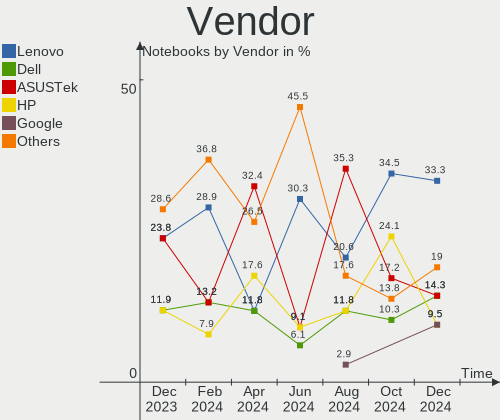
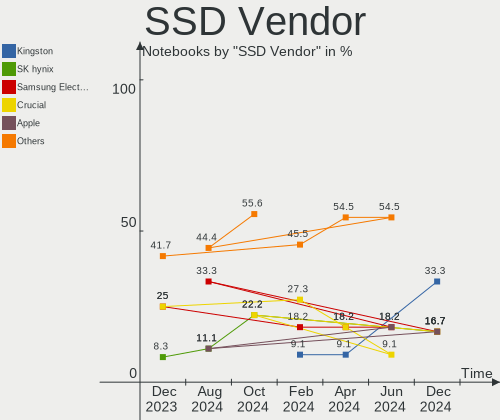
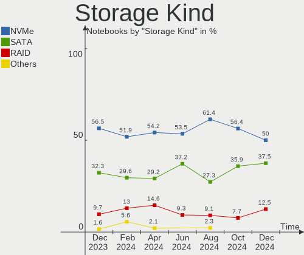
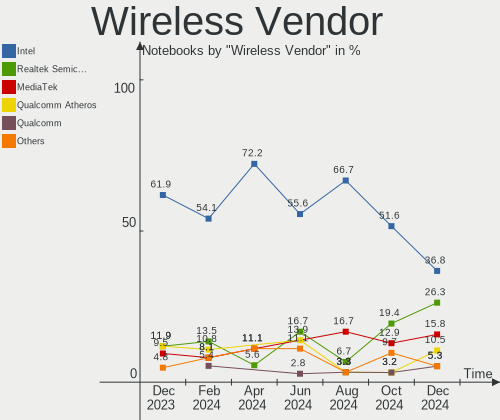
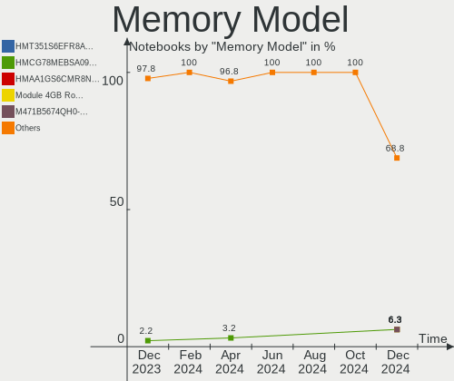

EndeavourOS - Hardware Trends (Notebooks)
-----------------------------------------

A project to identify most popular hardware characteristics and track their change
over time based on data collected by Linux users at https://Linux-Hardware.org.

Anyone can contribute to this report by the [hw-probe](https://github.com/linuxhw/hw-probe) tool:

    sudo -E hw-probe -all -upload

This report is for one last month. Overall report since the beginning of time: [TestCoverage](https://github.com/linuxhw/TestCoverage)

Period: Jul, 2022.

Contents
--------

* [ System ](#system)
  - [ OS                       ](#os)
  - [ OS Family                ](#os-family)
  - [ Kernel                   ](#kernel)
  - [ Kernel Family            ](#kernel-family)
  - [ Kernel Major Ver.        ](#kernel-major-ver)
  - [ Arch                     ](#arch)
  - [ DE                       ](#de)
  - [ Display Server           ](#display-server)
  - [ Display Manager          ](#display-manager)
  - [ OS Lang                  ](#os-lang)
  - [ Boot Mode                ](#boot-mode)
  - [ Filesystem               ](#filesystem)
  - [ Part. scheme             ](#part-scheme)
  - [ Dual Boot with Linux/BSD ](#dual-boot-with-linuxbsd)
  - [ Dual Boot (Win)          ](#dual-boot-win)

* [ Board ](#board)
  - [ Vendor                   ](#vendor)
  - [ Model                    ](#model)
  - [ Model Family             ](#model-family)
  - [ MFG Year                 ](#mfg-year)
  - [ Form Factor              ](#form-factor)
  - [ Secure Boot              ](#secure-boot)
  - [ Coreboot                 ](#coreboot)
  - [ RAM Size                 ](#ram-size)
  - [ RAM Used                 ](#ram-used)
  - [ Total Drives             ](#total-drives)
  - [ Has CD-ROM               ](#has-cd-rom)
  - [ Has Ethernet             ](#has-ethernet)
  - [ Has WiFi                 ](#has-wifi)
  - [ Has Bluetooth            ](#has-bluetooth)

* [ Location ](#location)
  - [ Country                  ](#country)
  - [ City                     ](#city)

* [ Drives ](#drives)
  - [ Drive Vendor             ](#drive-vendor)
  - [ Drive Model              ](#drive-model)
  - [ HDD Vendor               ](#hdd-vendor)
  - [ SSD Vendor               ](#ssd-vendor)
  - [ Drive Kind               ](#drive-kind)
  - [ Drive Connector          ](#drive-connector)
  - [ Drive Size               ](#drive-size)
  - [ Space Total              ](#space-total)
  - [ Space Used               ](#space-used)
  - [ Malfunc. Drives          ](#malfunc-drives)
  - [ Malfunc. Drive Vendor    ](#malfunc-drive-vendor)
  - [ Malfunc. HDD Vendor      ](#malfunc-hdd-vendor)
  - [ Malfunc. Drive Kind      ](#malfunc-drive-kind)
  - [ Failed Drives            ](#failed-drives)
  - [ Failed Drive Vendor      ](#failed-drive-vendor)
  - [ Drive Status             ](#drive-status)

* [ Storage controller ](#storage-controller)
  - [ Storage Vendor           ](#storage-vendor)
  - [ Storage Model            ](#storage-model)
  - [ Storage Kind             ](#storage-kind)

* [ Processor ](#processor)
  - [ CPU Vendor               ](#cpu-vendor)
  - [ CPU Model                ](#cpu-model)
  - [ CPU Model Family         ](#cpu-model-family)
  - [ CPU Cores                ](#cpu-cores)
  - [ CPU Sockets              ](#cpu-sockets)
  - [ CPU Threads              ](#cpu-threads)
  - [ CPU Op-Modes             ](#cpu-op-modes)
  - [ CPU Microcode            ](#cpu-microcode)
  - [ CPU Microarch            ](#cpu-microarch)

* [ Graphics ](#graphics)
  - [ GPU Vendor               ](#gpu-vendor)
  - [ GPU Model                ](#gpu-model)
  - [ GPU Combo                ](#gpu-combo)
  - [ GPU Driver               ](#gpu-driver)
  - [ GPU Memory               ](#gpu-memory)

* [ Monitor ](#monitor)
  - [ Monitor Vendor           ](#monitor-vendor)
  - [ Monitor Model            ](#monitor-model)
  - [ Monitor Resolution       ](#monitor-resolution)
  - [ Monitor Diagonal         ](#monitor-diagonal)
  - [ Monitor Width            ](#monitor-width)
  - [ Aspect Ratio             ](#aspect-ratio)
  - [ Monitor Area             ](#monitor-area)
  - [ Pixel Density            ](#pixel-density)
  - [ Multiple Monitors        ](#multiple-monitors)

* [ Network ](#network)
  - [ Net Controller Vendor    ](#net-controller-vendor)
  - [ Net Controller Model     ](#net-controller-model)
  - [ Wireless Vendor          ](#wireless-vendor)
  - [ Wireless Model           ](#wireless-model)
  - [ Ethernet Vendor          ](#ethernet-vendor)
  - [ Ethernet Model           ](#ethernet-model)
  - [ Net Controller Kind      ](#net-controller-kind)
  - [ Used Controller          ](#used-controller)
  - [ NICs                     ](#nics)
  - [ IPv6                     ](#ipv6)

* [ Bluetooth ](#bluetooth)
  - [ Bluetooth Vendor         ](#bluetooth-vendor)
  - [ Bluetooth Model          ](#bluetooth-model)

* [ Sound ](#sound)
  - [ Sound Vendor             ](#sound-vendor)
  - [ Sound Model              ](#sound-model)

* [ Memory ](#memory)
  - [ Memory Vendor            ](#memory-vendor)
  - [ Memory Model             ](#memory-model)
  - [ Memory Kind              ](#memory-kind)
  - [ Memory Form Factor       ](#memory-form-factor)
  - [ Memory Size              ](#memory-size)
  - [ Memory Speed             ](#memory-speed)

* [ Printers & scanners ](#printers--scanners)
  - [ Printer Vendor           ](#printer-vendor)
  - [ Printer Model            ](#printer-model)
  - [ Scanner Vendor           ](#scanner-vendor)
  - [ Scanner Model            ](#scanner-model)

* [ Camera ](#camera)
  - [ Camera Vendor            ](#camera-vendor)
  - [ Camera Model             ](#camera-model)

* [ Security ](#security)
  - [ Fingerprint Vendor       ](#fingerprint-vendor)
  - [ Fingerprint Model        ](#fingerprint-model)
  - [ Chipcard Vendor          ](#chipcard-vendor)
  - [ Chipcard Model           ](#chipcard-model)

* [ Unsupported ](#unsupported)
  - [ Unsupported Devices      ](#unsupported-devices)
  - [ Unsupported Device Types ](#unsupported-device-types)

System
------

OS
--

Installed operating systems

| Name                | Notebooks | Percent |
|---------------------|-----------|---------|
| EndeavourOS Rolling | 6         | 75%     |
| EndeavourOS         | 2         | 25%     |

OS Family
---------

OS without a version

| Name        | Notebooks | Percent |
|-------------|-----------|---------|
| EndeavourOS | 8         | 100%    |

Kernel
------

Version of the Linux kernel

| Version            | Notebooks | Percent |
|--------------------|-----------|---------|
| 5.18.12-arch1-1    | 3         | 37.5%   |
| 5.18.12-zen1-1-zen | 2         | 25%     |
| 5.18.9-arch1-1     | 1         | 12.5%   |
| 5.18.7-arch1-1     | 1         | 12.5%   |
| 5.18.15-arch1-1    | 1         | 12.5%   |

Kernel Family
-------------

Linux kernel without a distro release

| Version | Notebooks | Percent |
|---------|-----------|---------|
| 5.18.12 | 5         | 62.5%   |
| 5.18.9  | 1         | 12.5%   |
| 5.18.7  | 1         | 12.5%   |
| 5.18.15 | 1         | 12.5%   |

Kernel Major Ver.
-----------------

Linux kernel major version

| Version | Notebooks | Percent |
|---------|-----------|---------|
| 5.18    | 8         | 100%    |

Arch
----

OS architecture (x86_64, i586, etc.)

| Name   | Notebooks | Percent |
|--------|-----------|---------|
| x86_64 | 8         | 100%    |

DE
--

Desktop Environment

| Name            | Notebooks | Percent |
|-----------------|-----------|---------|
| KDE5            | 5         | 62.5%   |
| XFCE            | 1         | 12.5%   |
| GNOME Flashback | 1         | 12.5%   |
| GNOME           | 1         | 12.5%   |

Display Server
--------------

X11 or Wayland

| Name    | Notebooks | Percent |
|---------|-----------|---------|
| X11     | 6         | 75%     |
| Wayland | 2         | 25%     |

Display Manager
---------------

SDDM, LightDM, etc.

| Name    | Notebooks | Percent |
|---------|-----------|---------|
| LightDM | 4         | 50%     |
| SDDM    | 2         | 25%     |
| Unknown | 2         | 25%     |

OS Lang
-------

Language

| Lang  | Notebooks | Percent |
|-------|-----------|---------|
| en_US | 4         | 50%     |
| fi_FI | 1         | 12.5%   |
| en_CA | 1         | 12.5%   |
| en_AG | 1         | 12.5%   |
| de_DE | 1         | 12.5%   |

Boot Mode
---------

EFI or BIOS

| Mode | Notebooks | Percent |
|------|-----------|---------|
| EFI  | 6         | 75%     |
| BIOS | 2         | 25%     |

Filesystem
----------

Type of filesystem

| Type  | Notebooks | Percent |
|-------|-----------|---------|
| Ext4  | 6         | 75%     |
| Xfs   | 1         | 12.5%   |
| Btrfs | 1         | 12.5%   |

Part. scheme
------------

Scheme of partitioning

| Type    | Notebooks | Percent |
|---------|-----------|---------|
| GPT     | 6         | 75%     |
| Unknown | 2         | 25%     |

Dual Boot with Linux/BSD
------------------------

Hosting more than one Linux/BSD

| Dual boot | Notebooks | Percent |
|-----------|-----------|---------|
| No        | 7         | 87.5%   |
| Yes       | 1         | 12.5%   |

Dual Boot (Win)
---------------

Hosting Linux and Windows

| Dual boot | Notebooks | Percent |
|-----------|-----------|---------|
| No        | 7         | 87.5%   |
| Yes       | 1         | 12.5%   |

Board
-----

Vendor
------

Motherboard manufacturer

| Name             | Notebooks | Percent |
|------------------|-----------|---------|
| Lenovo           | 4         | 50%     |
| Hewlett-Packard  | 2         | 25%     |
| ASUSTek Computer | 1         | 12.5%   |
| Acer             | 1         | 12.5%   |

Model
-----

Motherboard model

| Name                             | Notebooks | Percent |
|----------------------------------|-----------|---------|
| Lenovo Yoga Slim 7 14ARE05 82A2  | 1         | 12.5%   |
| Lenovo ThinkPad T460p 20FXS05500 | 1         | 12.5%   |
| Lenovo ThinkPad E595 20NF001HGE  | 1         | 12.5%   |
| Lenovo ThinkBook 14p Gen 2 20YN  | 1         | 12.5%   |
| HP Laptop 14-fq1xxx              | 1         | 12.5%   |
| HP EliteBook 745 G6              | 1         | 12.5%   |
| ASUS GL753VE                     | 1         | 12.5%   |
| Acer Nitro AN515-43              | 1         | 12.5%   |

Model Family
------------

Motherboard model prefix

| Name             | Notebooks | Percent |
|------------------|-----------|---------|
| Lenovo ThinkPad  | 2         | 25%     |
| Lenovo Yoga      | 1         | 12.5%   |
| Lenovo ThinkBook | 1         | 12.5%   |
| HP Laptop        | 1         | 12.5%   |
| HP EliteBook     | 1         | 12.5%   |
| ASUS GL753VE     | 1         | 12.5%   |
| Acer Nitro       | 1         | 12.5%   |

MFG Year
--------

Motherboard manufacture year

| Year | Notebooks | Percent |
|------|-----------|---------|
| 2019 | 3         | 37.5%   |
| 2021 | 2         | 25%     |
| 2020 | 1         | 12.5%   |
| 2017 | 1         | 12.5%   |
| 2016 | 1         | 12.5%   |

Form Factor
-----------

Physical design of the computer

| Name     | Notebooks | Percent |
|----------|-----------|---------|
| Notebook | 8         | 100%    |

Secure Boot
-----------

Enabled or disabled

| State    | Notebooks | Percent |
|----------|-----------|---------|
| Disabled | 8         | 100%    |

Coreboot
--------

Have coreboot on board

| Used | Notebooks | Percent |
|------|-----------|---------|
| No   | 8         | 100%    |

RAM Size
--------

Total RAM memory

| Size in GB | Notebooks | Percent |
|------------|-----------|---------|
| 4.01-8.0   | 2         | 25%     |
| 32.01-64.0 | 2         | 25%     |
| 16.01-24.0 | 2         | 25%     |
| 24.01-32.0 | 1         | 12.5%   |
| 8.01-16.0  | 1         | 12.5%   |

RAM Used
--------

Used RAM memory

| Used GB    | Notebooks | Percent |
|------------|-----------|---------|
| 2.01-3.0   | 4         | 50%     |
| 4.01-8.0   | 1         | 12.5%   |
| 3.01-4.0   | 1         | 12.5%   |
| 16.01-24.0 | 1         | 12.5%   |
| 8.01-16.0  | 1         | 12.5%   |

Total Drives
------------

Number of drives on board

| Drives | Notebooks | Percent |
|--------|-----------|---------|
| 1      | 6         | 75%     |
| 2      | 2         | 25%     |

Has CD-ROM
----------

Has CD-ROM on board

| Presented | Notebooks | Percent |
|-----------|-----------|---------|
| No        | 8         | 100%    |

Has Ethernet
------------

Has Ethernet on board

| Presented | Notebooks | Percent |
|-----------|-----------|---------|
| Yes       | 7         | 87.5%   |
| No        | 1         | 12.5%   |

Has WiFi
--------

Has WiFi module

| Presented | Notebooks | Percent |
|-----------|-----------|---------|
| Yes       | 8         | 100%    |

Has Bluetooth
-------------

Has Bluetooth module

| Presented | Notebooks | Percent |
|-----------|-----------|---------|
| Yes       | 7         | 87.5%   |
| No        | 1         | 12.5%   |

Location
--------

Country
-------

Geographic location (country)

| Country    | Notebooks | Percent |
|------------|-----------|---------|
| USA        | 2         | 25%     |
| Germany    | 2         | 25%     |
| Singapore  | 1         | 12.5%   |
| Finland    | 1         | 12.5%   |
| Bangladesh | 1         | 12.5%   |
| Argentina  | 1         | 12.5%   |

City
----

Geographic location (city)

| City            | Notebooks | Percent |
|-----------------|-----------|---------|
| Wesseling       | 1         | 12.5%   |
| Villa Ballester | 1         | 12.5%   |
| Turku           | 1         | 12.5%   |
| Singapore       | 1         | 12.5%   |
| San Francisco   | 1         | 12.5%   |
| Roseville       | 1         | 12.5%   |
| Mannheim        | 1         | 12.5%   |
| Dhaka           | 1         | 12.5%   |

Drives
------

Drive Vendor
------------

Hard drive vendors

| Vendor              | Notebooks | Drives | Percent |
|---------------------|-----------|--------|---------|
| Samsung Electronics | 5         | 7      | 55.56%  |
| SK hynix            | 1         | 1      | 11.11%  |
| Seagate             | 1         | 1      | 11.11%  |
| Phison              | 1         | 1      | 11.11%  |
| INTEL SS            | 1         | 1      | 11.11%  |

Drive Model
-----------

Hard drive models

| Model                                  | Notebooks | Percent |
|----------------------------------------|-----------|---------|
| SK hynix SKHynix_HFS512GDE9X084N 512GB | 1         | 9.09%   |
| Seagate ST1000LM049-2GH172 1TB         | 1         | 9.09%   |
| Samsung SSD 860 QVO 1TB                | 1         | 9.09%   |
| Samsung SSD 860 EVO 1TB                | 1         | 9.09%   |
| Samsung SSD 850 EVO 500GB              | 1         | 9.09%   |
| Samsung NVMe SSD Drive 256GB           | 1         | 9.09%   |
| Samsung NVMe SSD Drive 1TB             | 1         | 9.09%   |
| Samsung MZVLQ256HAJD-000H1 256GB       | 1         | 9.09%   |
| Samsung MZVLB512HBJQ-000L2 512GB       | 1         | 9.09%   |
| Phison Sabrent Rocket Q4 4TB           | 1         | 9.09%   |
| INTEL SS DPEKKW256G7 256GB             | 1         | 9.09%   |

HDD Vendor
----------

Hard disk drive vendors

| Vendor  | Notebooks | Drives | Percent |
|---------|-----------|--------|---------|
| Seagate | 1         | 1      | 100%    |

SSD Vendor
----------

Solid state drive vendors

| Vendor              | Notebooks | Drives | Percent |
|---------------------|-----------|--------|---------|
| Samsung Electronics | 3         | 3      | 100%    |

Drive Kind
----------

HDD or SSD

| Kind | Notebooks | Drives | Percent |
|------|-----------|--------|---------|
| NVMe | 5         | 7      | 55.56%  |
| SSD  | 3         | 3      | 33.33%  |
| HDD  | 1         | 1      | 11.11%  |

Drive Connector
---------------

SATA, SAS, NVMe, etc.

| Type | Notebooks | Drives | Percent |
|------|-----------|--------|---------|
| NVMe | 5         | 6      | 50%     |
| SATA | 4         | 4      | 40%     |
| SAS  | 1         | 1      | 10%     |

Drive Size
----------

Size of hard drive

| Size in TB | Notebooks | Drives | Percent |
|------------|-----------|--------|---------|
| 0.51-1.0   | 3         | 3      | 75%     |
| 0.01-0.5   | 1         | 1      | 25%     |

Space Total
-----------

Amount of disk space available on the file system

| Size in GB | Notebooks | Percent |
|------------|-----------|---------|
| 251-500    | 3         | 37.5%   |
| 501-1000   | 3         | 37.5%   |
| 101-250    | 1         | 12.5%   |
| Unknown    | 1         | 12.5%   |

Space Used
----------

Amount of used disk space

| Used GB  | Notebooks | Percent |
|----------|-----------|---------|
| 101-250  | 2         | 25%     |
| 1-20     | 2         | 25%     |
| 251-500  | 1         | 12.5%   |
| 21-50    | 1         | 12.5%   |
| 501-1000 | 1         | 12.5%   |
| Unknown  | 1         | 12.5%   |

Malfunc. Drives
---------------

Drive models with a malfunction

Zero info for selected period =(

Malfunc. Drive Vendor
---------------------

Vendors of faulty drives

Zero info for selected period =(

Malfunc. HDD Vendor
-------------------

Vendors of faulty HDD drives

Zero info for selected period =(

Malfunc. Drive Kind
-------------------

Kinds of faulty drives

Zero info for selected period =(

Failed Drives
-------------

Failed drive models

Zero info for selected period =(

Failed Drive Vendor
-------------------

Failed drive vendors

Zero info for selected period =(

Drive Status
------------

Number of failed and malfunc. drives

| Status   | Notebooks | Drives | Percent |
|----------|-----------|--------|---------|
| Works    | 6         | 7      | 66.67%  |
| Detected | 3         | 4      | 33.33%  |

Storage controller
------------------

Storage Vendor
--------------

Storage controller vendors

| Vendor              | Notebooks | Percent |
|---------------------|-----------|---------|
| Samsung Electronics | 3         | 33.33%  |
| Intel               | 2         | 22.22%  |
| AMD                 | 2         | 22.22%  |
| SK hynix            | 1         | 11.11%  |
| Phison Electronics  | 1         | 11.11%  |

Storage Model
-------------

Storage controller models

| Model                                                 | Notebooks | Percent |
|-------------------------------------------------------|-----------|---------|
| Samsung NVMe SSD Controller 980                       | 2         | 22.22%  |
| Intel HM170/QM170 Chipset SATA Controller [AHCI Mode] | 2         | 22.22%  |
| AMD FCH SATA Controller [AHCI mode]                   | 2         | 22.22%  |
| SK hynix Gold P31 SSD                                 | 1         | 11.11%  |
| Samsung NVMe SSD Controller SM981/PM981/PM983         | 1         | 11.11%  |
| Phison E16 PCIe4 NVMe Controller                      | 1         | 11.11%  |

Storage Kind
------------

Kind of storage controller (IDE, SATA, NVMe, SAS, ...)

| Kind | Notebooks | Percent |
|------|-----------|---------|
| NVMe | 5         | 55.56%  |
| SATA | 4         | 44.44%  |

Processor
---------

CPU Vendor
----------

Processor vendors

| Vendor | Notebooks | Percent |
|--------|-----------|---------|
| AMD    | 6         | 75%     |
| Intel  | 2         | 25%     |

CPU Model
---------

Processor models

| Model                                           | Notebooks | Percent |
|-------------------------------------------------|-----------|---------|
| Intel Core i7-7700HQ CPU @ 2.80GHz              | 1         | 12.5%   |
| Intel Core i7-6700HQ CPU @ 2.60GHz              | 1         | 12.5%   |
| AMD Ryzen 7 PRO 3700U w/ Radeon Vega Mobile Gfx | 1         | 12.5%   |
| AMD Ryzen 7 5800H with Radeon Graphics          | 1         | 12.5%   |
| AMD Ryzen 7 4700U with Radeon Graphics          | 1         | 12.5%   |
| AMD Ryzen 5 5500U with Radeon Graphics          | 1         | 12.5%   |
| AMD Ryzen 5 3550H with Radeon Vega Mobile Gfx   | 1         | 12.5%   |
| AMD Ryzen 5 3500U with Radeon Vega Mobile Gfx   | 1         | 12.5%   |

CPU Model Family
----------------

Processor model prefix

| Model           | Notebooks | Percent |
|-----------------|-----------|---------|
| AMD Ryzen 5     | 3         | 37.5%   |
| Intel Core i7   | 2         | 25%     |
| AMD Ryzen 7     | 2         | 25%     |
| AMD Ryzen 7 PRO | 1         | 12.5%   |

CPU Cores
---------

Number of processor cores

| Number | Notebooks | Percent |
|--------|-----------|---------|
| 4      | 5         | 62.5%   |
| 8      | 2         | 25%     |
| 6      | 1         | 12.5%   |

CPU Sockets
-----------

Number of sockets

| Number | Notebooks | Percent |
|--------|-----------|---------|
| 1      | 8         | 100%    |

CPU Threads
-----------

Threads per core (Hyper-Threading)

| Number | Notebooks | Percent |
|--------|-----------|---------|
| 2      | 7         | 87.5%   |
| 1      | 1         | 12.5%   |

CPU Op-Modes
------------

CPU Operation Modes (32-bit, 64-bit)

| Op mode        | Notebooks | Percent |
|----------------|-----------|---------|
| 32-bit, 64-bit | 8         | 100%    |

CPU Microcode
-------------

Microcode number

| Number     | Notebooks | Percent |
|------------|-----------|---------|
| Unknown    | 2         | 25%     |
| 0x906e9    | 1         | 12.5%   |
| 0x506e3    | 1         | 12.5%   |
| 0x0a50000c | 1         | 12.5%   |
| 0x08608103 | 1         | 12.5%   |
| 0x08600106 | 1         | 12.5%   |
| 0x08108109 | 1         | 12.5%   |

CPU Microarch
-------------

Microarchitecture

| Name     | Notebooks | Percent |
|----------|-----------|---------|
| Zen+     | 3         | 37.5%   |
| Zen 3    | 1         | 12.5%   |
| Zen 2    | 1         | 12.5%   |
| Skylake  | 1         | 12.5%   |
| KabyLake | 1         | 12.5%   |
| Unknown  | 1         | 12.5%   |

Graphics
--------

GPU Vendor
----------

Vendors of graphics cards

| Vendor | Notebooks | Percent |
|--------|-----------|---------|
| AMD    | 6         | 60%     |
| Nvidia | 2         | 20%     |
| Intel  | 2         | 20%     |

GPU Model
---------

Graphics card models

| Model                                                                | Notebooks | Percent |
|----------------------------------------------------------------------|-----------|---------|
| AMD Picasso/Raven 2 [Radeon Vega Series / Radeon Vega Mobile Series] | 3         | 27.27%  |
| Nvidia GP107M [GeForce GTX 1050 Ti Mobile]                           | 1         | 9.09%   |
| Nvidia GM108M [GeForce 940MX]                                        | 1         | 9.09%   |
| Intel HD Graphics 630                                                | 1         | 9.09%   |
| Intel HD Graphics 530                                                | 1         | 9.09%   |
| AMD Renoir                                                           | 1         | 9.09%   |
| AMD Lucienne                                                         | 1         | 9.09%   |
| AMD Cezanne                                                          | 1         | 9.09%   |
| AMD Baffin [Radeon RX 460/560D / Pro 450/455/460/555/555X/560/560X]  | 1         | 9.09%   |

GPU Combo
---------

Combinations of graphics cards

| Name           | Notebooks | Percent |
|----------------|-----------|---------|
| 1 x AMD        | 5         | 62.5%   |
| Intel + Nvidia | 2         | 25%     |
| 2 x AMD        | 1         | 12.5%   |

GPU Driver
----------

Free vs proprietary

| Driver      | Notebooks | Percent |
|-------------|-----------|---------|
| Free        | 6         | 75%     |
| Proprietary | 2         | 25%     |

GPU Memory
----------

Total video memory

| Size in GB | Notebooks | Percent |
|------------|-----------|---------|
| Unknown    | 4         | 50%     |
| 0.01-0.5   | 3         | 37.5%   |
| 3.01-4.0   | 1         | 12.5%   |

Monitor
-------

Monitor Vendor
--------------

Monitor vendors

| Vendor              | Notebooks | Percent |
|---------------------|-----------|---------|
| Samsung Electronics | 2         | 18.18%  |
| LG Display          | 2         | 18.18%  |
| AU Optronics        | 2         | 18.18%  |
| Philips             | 1         | 9.09%   |
| Panasonic           | 1         | 9.09%   |
| Lenovo              | 1         | 9.09%   |
| InfoVision          | 1         | 9.09%   |
| Chimei Innolux      | 1         | 9.09%   |

Monitor Model
-------------

Monitor models

| Model                                                              | Notebooks | Percent |
|--------------------------------------------------------------------|-----------|---------|
| Samsung Electronics C49HG9x SAM0E5E 3840x1080 1196x336mm 48.9-inch | 1         | 9.09%   |
| Samsung Electronics C27FG7x SAM0E42 1920x1080 598x337mm 27.0-inch  | 1         | 9.09%   |
| Philips PHL 272P7VU PHL093A 3840x2160 597x336mm 27.0-inch          | 1         | 9.09%   |
| Panasonic TDM13O56 MEI96A2 3000x2000 285x190mm 13.5-inch           | 1         | 9.09%   |
| LG Display LCD Monitor LGD0563 1920x1080 344x194mm 15.5-inch       | 1         | 9.09%   |
| LG Display LCD Monitor LGD04E8 1920x1080 382x215mm 17.3-inch       | 1         | 9.09%   |
| Lenovo LCD Monitor LEN40BA 1920x1080 344x194mm 15.5-inch           | 1         | 9.09%   |
| InfoVision LCD Monitor IVO8C69 1920x1080 309x174mm 14.0-inch       | 1         | 9.09%   |
| Chimei Innolux LCD Monitor CMN14FF 1920x1080 309x173mm 13.9-inch   | 1         | 9.09%   |
| AU Optronics LCD Monitor AUOA195 2240x1400 300x188mm 13.9-inch     | 1         | 9.09%   |
| AU Optronics LCD Monitor AUO683D 1920x1080 309x174mm 14.0-inch     | 1         | 9.09%   |

Monitor Resolution
------------------

Monitor screen resolution

| Resolution      | Notebooks | Percent |
|-----------------|-----------|---------|
| 1920x1080 (FHD) | 7         | 63.64%  |
| 3840x2160 (4K)  | 2         | 18.18%  |
| 3840x1080       | 1         | 9.09%   |
| 2240x1400       | 1         | 9.09%   |

Monitor Diagonal
----------------

Diagonal size in inches

| Inches | Notebooks | Percent |
|--------|-----------|---------|
| 27     | 2         | 18.18%  |
| 17     | 2         | 18.18%  |
| 15     | 2         | 18.18%  |
| 14     | 2         | 18.18%  |
| 13     | 2         | 18.18%  |
| 49     | 1         | 9.09%   |

Monitor Width
-------------

Physical width

| Width in mm | Notebooks | Percent |
|-------------|-----------|---------|
| 301-350     | 5         | 45.45%  |
| 501-600     | 2         | 18.18%  |
| 351-400     | 2         | 18.18%  |
| 201-300     | 1         | 9.09%   |
| 1001-1500   | 1         | 9.09%   |

Aspect Ratio
------------

Proportional relationship between the width and the height

| Ratio | Notebooks | Percent |
|-------|-----------|---------|
| 16/9  | 8         | 80%     |
| 32/9  | 1         | 10%     |
| 16/10 | 1         | 10%     |

Monitor Area
------------

Area in inch²

| Area in inch² | Notebooks | Percent |
|----------------|-----------|---------|
| 81-90          | 4         | 36.36%  |
| 301-350        | 2         | 18.18%  |
| 121-130        | 2         | 18.18%  |
| 101-110        | 2         | 18.18%  |
| 501-1000       | 1         | 9.09%   |

Pixel Density
-------------

Pixels per inch

| Density       | Notebooks | Percent |
|---------------|-----------|---------|
| 121-160       | 6         | 60%     |
| More than 240 | 1         | 10%     |
| 1-50          | 1         | 10%     |
| 161-240       | 1         | 10%     |
| 51-100        | 1         | 10%     |

Multiple Monitors
-----------------

Total monitors connected

| Total | Notebooks | Percent |
|-------|-----------|---------|
| 1     | 5         | 62.5%   |
| 2     | 3         | 37.5%   |

Network
-------

Net Controller Vendor
---------------------

Controller vendors

| Vendor                | Notebooks | Percent |
|-----------------------|-----------|---------|
| Realtek Semiconductor | 7         | 53.85%  |
| Intel                 | 3         | 23.08%  |
| Samsung Electronics   | 1         | 7.69%   |
| Qualcomm Atheros      | 1         | 7.69%   |
| MediaTek              | 1         | 7.69%   |

Net Controller Model
--------------------

Controller models

| Model                                                             | Notebooks | Percent |
|-------------------------------------------------------------------|-----------|---------|
| Realtek RTL8111/8168/8411 PCI Express Gigabit Ethernet Controller | 4         | 26.67%  |
| Samsung Galaxy series, misc. (tethering mode)                     | 1         | 6.67%   |
| Realtek RTL8852AE 802.11ax PCIe Wireless Network Adapter          | 1         | 6.67%   |
| Realtek RTL8822BE 802.11a/b/g/n/ac WiFi adapter                   | 1         | 6.67%   |
| Realtek RTL8153 Gigabit Ethernet Adapter                          | 1         | 6.67%   |
| Realtek Realtek Network controller                                | 1         | 6.67%   |
| Qualcomm Atheros QCA6174 802.11ac Wireless Network Adapter        | 1         | 6.67%   |
| MediaTek MT7921 802.11ax PCI Express Wireless Network Adapter     | 1         | 6.67%   |
| Intel Wireless-AC 9260                                            | 1         | 6.67%   |
| Intel Wireless 8260                                               | 1         | 6.67%   |
| Intel Wireless 7265                                               | 1         | 6.67%   |
| Intel Ethernet Connection (2) I219-LM                             | 1         | 6.67%   |

Wireless Vendor
---------------

Wireless vendors

| Vendor                | Notebooks | Percent |
|-----------------------|-----------|---------|
| Realtek Semiconductor | 3         | 37.5%   |
| Intel                 | 3         | 37.5%   |
| Qualcomm Atheros      | 1         | 12.5%   |
| MediaTek              | 1         | 12.5%   |

Wireless Model
--------------

Wireless models

| Model                                                         | Notebooks | Percent |
|---------------------------------------------------------------|-----------|---------|
| Realtek RTL8852AE 802.11ax PCIe Wireless Network Adapter      | 1         | 12.5%   |
| Realtek RTL8822BE 802.11a/b/g/n/ac WiFi adapter               | 1         | 12.5%   |
| Realtek Realtek Network controller                            | 1         | 12.5%   |
| Qualcomm Atheros QCA6174 802.11ac Wireless Network Adapter    | 1         | 12.5%   |
| MediaTek MT7921 802.11ax PCI Express Wireless Network Adapter | 1         | 12.5%   |
| Intel Wireless-AC 9260                                        | 1         | 12.5%   |
| Intel Wireless 8260                                           | 1         | 12.5%   |
| Intel Wireless 7265                                           | 1         | 12.5%   |

Ethernet Vendor
---------------

Ethernet vendors

| Vendor                | Notebooks | Percent |
|-----------------------|-----------|---------|
| Realtek Semiconductor | 5         | 71.43%  |
| Samsung Electronics   | 1         | 14.29%  |
| Intel                 | 1         | 14.29%  |

Ethernet Model
--------------

Ethernet models

| Model                                                             | Notebooks | Percent |
|-------------------------------------------------------------------|-----------|---------|
| Realtek RTL8111/8168/8411 PCI Express Gigabit Ethernet Controller | 4         | 57.14%  |
| Samsung Galaxy series, misc. (tethering mode)                     | 1         | 14.29%  |
| Realtek RTL8153 Gigabit Ethernet Adapter                          | 1         | 14.29%  |
| Intel Ethernet Connection (2) I219-LM                             | 1         | 14.29%  |

Net Controller Kind
-------------------

Ethernet, WiFi or modem

| Kind     | Notebooks | Percent |
|----------|-----------|---------|
| WiFi     | 8         | 53.33%  |
| Ethernet | 7         | 46.67%  |

Used Controller
---------------

Currently used network controller

| Kind     | Notebooks | Percent |
|----------|-----------|---------|
| WiFi     | 8         | 80%     |
| Ethernet | 2         | 20%     |

NICs
----

Total network controllers on board

| Total | Notebooks | Percent |
|-------|-----------|---------|
| 2     | 5         | 62.5%   |
| 1     | 3         | 37.5%   |

IPv6
----

IPv6 vs IPv4

| Used | Notebooks | Percent |
|------|-----------|---------|
| No   | 5         | 62.5%   |
| Yes  | 3         | 37.5%   |

Bluetooth
---------

Bluetooth Vendor
----------------

Controller vendors

| Vendor                | Notebooks | Percent |
|-----------------------|-----------|---------|
| Realtek Semiconductor | 3         | 42.86%  |
| Intel                 | 2         | 28.57%  |
| Lite-On Technology    | 1         | 14.29%  |
| Foxconn / Hon Hai     | 1         | 14.29%  |

Bluetooth Model
---------------

Controller models

| Model                                   | Notebooks | Percent |
|-----------------------------------------|-----------|---------|
| Realtek Bluetooth Radio                 | 2         | 28.57%  |
| Realtek RTL8822BE Bluetooth 4.2 Adapter | 1         | 14.29%  |
| Lite-On Bluetooth Device                | 1         | 14.29%  |
| Intel Bluetooth wireless interface      | 1         | 14.29%  |
| Intel Bluetooth Device                  | 1         | 14.29%  |
| Foxconn / Hon Hai Wireless_Device       | 1         | 14.29%  |

Sound
-----

Sound Vendor
------------

Sound card vendors

| Vendor | Notebooks | Percent |
|--------|-----------|---------|
| AMD    | 6         | 66.67%  |
| Intel  | 2         | 22.22%  |
| Lenovo | 1         | 11.11%  |

Sound Model
-----------

Sound card models

| Model                                                           | Notebooks | Percent |
|-----------------------------------------------------------------|-----------|---------|
| AMD Family 17h/19h HD Audio Controller                          | 6         | 40%     |
| AMD Renoir Radeon High Definition Audio Controller              | 3         | 20%     |
| AMD Raven/Raven2/Fenghuang HDMI/DP Audio Controller             | 3         | 20%     |
| Lenovo ThinkPad Thunderbolt 3 Dock USB Audio                    | 1         | 6.67%   |
| Intel CM238 HD Audio Controller                                 | 1         | 6.67%   |
| Intel 100 Series/C230 Series Chipset Family HD Audio Controller | 1         | 6.67%   |

Memory
------

Memory Vendor
-------------

Memory module vendors

| Vendor              | Notebooks | Percent |
|---------------------|-----------|---------|
| Micron Technology   | 3         | 37.5%   |
| Samsung Electronics | 2         | 25%     |
| Crucial             | 2         | 25%     |
| SK hynix            | 1         | 12.5%   |

Memory Model
------------

Memory module models

| Model                                                         | Notebooks | Percent |
|---------------------------------------------------------------|-----------|---------|
| SK hynix RAM HMAB2GS6AMR6N-XN 16GB Row Of Chips DDR4 3200MT/s | 1         | 11.11%  |
| Samsung RAM Module 16GB SODIMM DDR4 2667MT/s                  | 1         | 11.11%  |
| Samsung RAM M471A2K43BB1-CPB 16GB SODIMM DDR4 2133MT/s        | 1         | 11.11%  |
| Samsung RAM M471A2K43BB1-CPB 16GB Chip DDR4 2133MT/s          | 1         | 11.11%  |
| Micron RAM Module 4GB Row Of Chips LPDDR4 4266MT/s            | 1         | 11.11%  |
| Micron RAM Module 16GB SODIMM DDR4 2667MT/s                   | 1         | 11.11%  |
| Micron RAM 8ATF1G64HZ-3G2R1 8GB SODIMM DDR4 3200MT/s          | 1         | 11.11%  |
| Crucial RAM CT8G4SFRA32A.C8FP 8GB SODIMM DDR4 3200MT/s        | 1         | 11.11%  |
| Crucial RAM CT16G4SFRA266.C16FR 16GB SODIMM DDR4 2667MT/s     | 1         | 11.11%  |

Memory Kind
-----------

Memory module kinds

| Kind   | Notebooks | Percent |
|--------|-----------|---------|
| DDR4   | 5         | 83.33%  |
| LPDDR4 | 1         | 16.67%  |

Memory Form Factor
------------------

Physical design of the memory module

| Name         | Notebooks | Percent |
|--------------|-----------|---------|
| SODIMM       | 4         | 57.14%  |
| Row Of Chips | 2         | 28.57%  |
| Chip         | 1         | 14.29%  |

Memory Size
-----------

Memory module size

| Size  | Notebooks | Percent |
|-------|-----------|---------|
| 16384 | 4         | 66.67%  |
| 8192  | 1         | 16.67%  |
| 4096  | 1         | 16.67%  |

Memory Speed
------------

Memory module speed

| Speed | Notebooks | Percent |
|-------|-----------|---------|
| 3200  | 2         | 33.33%  |
| 2667  | 2         | 33.33%  |
| 4266  | 1         | 16.67%  |
| 2133  | 1         | 16.67%  |

Printers & scanners
-------------------

Printer Vendor
--------------

Printer device vendors

Zero info for selected period =(

Printer Model
-------------

Printer device models

Zero info for selected period =(

Scanner Vendor
--------------

Scanner device vendors

Zero info for selected period =(

Scanner Model
-------------

Scanner device models

Zero info for selected period =(

Camera
------

Camera Vendor
-------------

Camera device vendors

| Vendor                      | Notebooks | Percent |
|-----------------------------|-----------|---------|
| Quanta                      | 2         | 25%     |
| Luxvisions Innotech Limited | 2         | 25%     |
| IMC Networks                | 2         | 25%     |
| Chicony Electronics         | 1         | 12.5%   |
| Acer                        | 1         | 12.5%   |

Camera Model
------------

Camera device models

| Model                                               | Notebooks | Percent |
|-----------------------------------------------------|-----------|---------|
| Quanta HP HD Camera                                 | 1         | 12.5%   |
| Quanta HD User Facing                               | 1         | 12.5%   |
| Luxvisions Innotech Limited Integrated Camera       | 1         | 12.5%   |
| Luxvisions Innotech Limited HP TrueVision HD Camera | 1         | 12.5%   |
| IMC Networks USB2.0 HD UVC WebCam                   | 1         | 12.5%   |
| IMC Networks Integrated Camera                      | 1         | 12.5%   |
| Chicony Integrated Camera                           | 1         | 12.5%   |
| Acer Integrated Camera                              | 1         | 12.5%   |

Security
--------

Fingerprint Vendor
------------------

Fingerprint sensor vendors

| Vendor           | Notebooks | Percent |
|------------------|-----------|---------|
| Validity Sensors | 1         | 100%    |

Fingerprint Model
-----------------

Fingerprint sensor models

| Model                                             | Notebooks | Percent |
|---------------------------------------------------|-----------|---------|
| Validity Sensors VFS7500 Touch Fingerprint Sensor | 1         | 100%    |

Chipcard Vendor
---------------

Chipcard module vendors

| Vendor      | Notebooks | Percent |
|-------------|-----------|---------|
| Alcor Micro | 1         | 100%    |

Chipcard Model
--------------

Chipcard module models

| Model                               | Notebooks | Percent |
|-------------------------------------|-----------|---------|
| Alcor Micro AU9540 Smartcard Reader | 1         | 100%    |

Unsupported
-----------

Unsupported Devices
-------------------

Total unsupported devices on board

| Total | Notebooks | Percent |
|-------|-----------|---------|
| 0     | 7         | 87.5%   |
| 2     | 1         | 12.5%   |

Unsupported Device Types
------------------------

Types of unsupported devices

| Type               | Notebooks | Percent |
|--------------------|-----------|---------|
| Fingerprint reader | 1         | 50%     |
| Chipcard           | 1         | 50%     |

