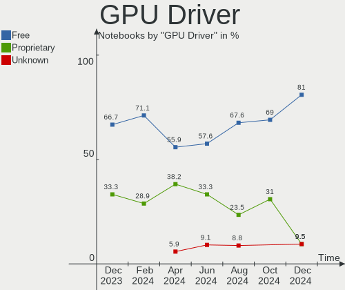
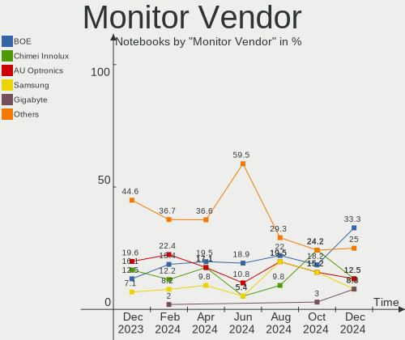
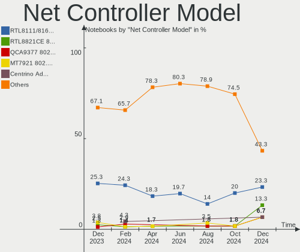
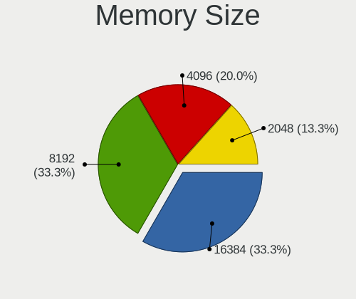

EndeavourOS - Hardware Trends (Notebooks)
-----------------------------------------

A project to identify most popular hardware characteristics and track their change
over time based on data collected by Linux users at https://Linux-Hardware.org.

Anyone can contribute to this report by the [hw-probe](https://github.com/linuxhw/hw-probe) tool:

    sudo -E hw-probe -all -upload

This report is for one last month. Overall report since the beginning of time: [TestDays](https://github.com/linuxhw/TestDays)

Period: Jul, 2023.

Contents
--------

* [ System ](#system)
  - [ OS                       ](#os)
  - [ OS Family                ](#os-family)
  - [ Kernel                   ](#kernel)
  - [ Kernel Family            ](#kernel-family)
  - [ Kernel Major Ver.        ](#kernel-major-ver)
  - [ Arch                     ](#arch)
  - [ DE                       ](#de)
  - [ Display Server           ](#display-server)
  - [ Display Manager          ](#display-manager)
  - [ OS Lang                  ](#os-lang)
  - [ Boot Mode                ](#boot-mode)
  - [ Filesystem               ](#filesystem)
  - [ Part. scheme             ](#part-scheme)
  - [ Dual Boot with Linux/BSD ](#dual-boot-with-linuxbsd)
  - [ Dual Boot (Win)          ](#dual-boot-win)

* [ Board ](#board)
  - [ Vendor                   ](#vendor)
  - [ Model                    ](#model)
  - [ Model Family             ](#model-family)
  - [ MFG Year                 ](#mfg-year)
  - [ Form Factor              ](#form-factor)
  - [ Secure Boot              ](#secure-boot)
  - [ Coreboot                 ](#coreboot)
  - [ RAM Size                 ](#ram-size)
  - [ RAM Used                 ](#ram-used)
  - [ Total Drives             ](#total-drives)
  - [ Has CD-ROM               ](#has-cd-rom)
  - [ Has Ethernet             ](#has-ethernet)
  - [ Has WiFi                 ](#has-wifi)
  - [ Has Bluetooth            ](#has-bluetooth)

* [ Location ](#location)
  - [ Country                  ](#country)
  - [ City                     ](#city)

* [ Drives ](#drives)
  - [ Drive Vendor             ](#drive-vendor)
  - [ Drive Model              ](#drive-model)
  - [ HDD Vendor               ](#hdd-vendor)
  - [ SSD Vendor               ](#ssd-vendor)
  - [ Drive Kind               ](#drive-kind)
  - [ Drive Connector          ](#drive-connector)
  - [ Drive Size               ](#drive-size)
  - [ Space Total              ](#space-total)
  - [ Space Used               ](#space-used)
  - [ Malfunc. Drives          ](#malfunc-drives)
  - [ Malfunc. Drive Vendor    ](#malfunc-drive-vendor)
  - [ Malfunc. HDD Vendor      ](#malfunc-hdd-vendor)
  - [ Malfunc. Drive Kind      ](#malfunc-drive-kind)
  - [ Failed Drives            ](#failed-drives)
  - [ Failed Drive Vendor      ](#failed-drive-vendor)
  - [ Drive Status             ](#drive-status)

* [ Storage controller ](#storage-controller)
  - [ Storage Vendor           ](#storage-vendor)
  - [ Storage Model            ](#storage-model)
  - [ Storage Kind             ](#storage-kind)

* [ Processor ](#processor)
  - [ CPU Vendor               ](#cpu-vendor)
  - [ CPU Model                ](#cpu-model)
  - [ CPU Model Family         ](#cpu-model-family)
  - [ CPU Cores                ](#cpu-cores)
  - [ CPU Sockets              ](#cpu-sockets)
  - [ CPU Threads              ](#cpu-threads)
  - [ CPU Op-Modes             ](#cpu-op-modes)
  - [ CPU Microcode            ](#cpu-microcode)
  - [ CPU Microarch            ](#cpu-microarch)

* [ Graphics ](#graphics)
  - [ GPU Vendor               ](#gpu-vendor)
  - [ GPU Model                ](#gpu-model)
  - [ GPU Combo                ](#gpu-combo)
  - [ GPU Driver               ](#gpu-driver)
  - [ GPU Memory               ](#gpu-memory)

* [ Monitor ](#monitor)
  - [ Monitor Vendor           ](#monitor-vendor)
  - [ Monitor Model            ](#monitor-model)
  - [ Monitor Resolution       ](#monitor-resolution)
  - [ Monitor Diagonal         ](#monitor-diagonal)
  - [ Monitor Width            ](#monitor-width)
  - [ Aspect Ratio             ](#aspect-ratio)
  - [ Monitor Area             ](#monitor-area)
  - [ Pixel Density            ](#pixel-density)
  - [ Multiple Monitors        ](#multiple-monitors)

* [ Network ](#network)
  - [ Net Controller Vendor    ](#net-controller-vendor)
  - [ Net Controller Model     ](#net-controller-model)
  - [ Wireless Vendor          ](#wireless-vendor)
  - [ Wireless Model           ](#wireless-model)
  - [ Ethernet Vendor          ](#ethernet-vendor)
  - [ Ethernet Model           ](#ethernet-model)
  - [ Net Controller Kind      ](#net-controller-kind)
  - [ Used Controller          ](#used-controller)
  - [ NICs                     ](#nics)
  - [ IPv6                     ](#ipv6)

* [ Bluetooth ](#bluetooth)
  - [ Bluetooth Vendor         ](#bluetooth-vendor)
  - [ Bluetooth Model          ](#bluetooth-model)

* [ Sound ](#sound)
  - [ Sound Vendor             ](#sound-vendor)
  - [ Sound Model              ](#sound-model)

* [ Memory ](#memory)
  - [ Memory Vendor            ](#memory-vendor)
  - [ Memory Model             ](#memory-model)
  - [ Memory Kind              ](#memory-kind)
  - [ Memory Form Factor       ](#memory-form-factor)
  - [ Memory Size              ](#memory-size)
  - [ Memory Speed             ](#memory-speed)

* [ Printers & scanners ](#printers--scanners)
  - [ Printer Vendor           ](#printer-vendor)
  - [ Printer Model            ](#printer-model)
  - [ Scanner Vendor           ](#scanner-vendor)
  - [ Scanner Model            ](#scanner-model)

* [ Camera ](#camera)
  - [ Camera Vendor            ](#camera-vendor)
  - [ Camera Model             ](#camera-model)

* [ Security ](#security)
  - [ Fingerprint Vendor       ](#fingerprint-vendor)
  - [ Fingerprint Model        ](#fingerprint-model)
  - [ Chipcard Vendor          ](#chipcard-vendor)
  - [ Chipcard Model           ](#chipcard-model)

* [ Unsupported ](#unsupported)
  - [ Unsupported Devices      ](#unsupported-devices)
  - [ Unsupported Device Types ](#unsupported-device-types)

System
------

OS
--

Installed operating systems

| Name                | Notebooks | Percent |
|---------------------|-----------|---------|
| EndeavourOS Rolling | 42        | 100%    |

OS Family
---------

OS without a version

| Name        | Notebooks | Percent |
|-------------|-----------|---------|
| EndeavourOS | 42        | 100%    |

Kernel
------

Version of the Linux kernel

| Version                      | Notebooks | Percent |
|------------------------------|-----------|---------|
| 6.4.3-arch1-2                | 5         | 11.9%   |
| 6.4.1-arch2-1                | 5         | 11.9%   |
| 6.3.9-arch1-1                | 5         | 11.9%   |
| 6.4.7-arch1-1                | 2         | 4.76%   |
| 6.4.5-arch1-1                | 2         | 4.76%   |
| 6.4.4-arch1-1                | 2         | 4.76%   |
| 6.4.3-arch1-1                | 2         | 4.76%   |
| 6.4.2-arch1-1                | 2         | 4.76%   |
| 6.4.1-zen1-1-zen             | 2         | 4.76%   |
| 6.4.1-arch1-1                | 2         | 4.76%   |
| 6.4.6-arch1-1                | 1         | 2.38%   |
| 6.4.6-1-cachyos-bore         | 1         | 2.38%   |
| 6.4.4-arch1-Yagakimi-T2-1-t2 | 1         | 2.38%   |
| 6.4.4-arch1-1-g14            | 1         | 2.38%   |
| 6.4.3-zen1-2-zen             | 1         | 2.38%   |
| 6.4.3-273-tkg-pds            | 1         | 2.38%   |
| 6.4.0-1-cachyos-bore         | 1         | 2.38%   |
| 6.2.8-arch1-1                | 1         | 2.38%   |
| 6.2.15-lqx1-1-lqx            | 1         | 2.38%   |
| 6.2.13-arch1-1               | 1         | 2.38%   |
| 6.1.39-1-lts                 | 1         | 2.38%   |
| 6.1.38-1-lts                 | 1         | 2.38%   |
| 6.1.36-1-lts                 | 1         | 2.38%   |

Kernel Family
-------------

Linux kernel without a distro release

| Version | Notebooks | Percent |
|---------|-----------|---------|
| 6.4.3   | 9         | 21.43%  |
| 6.4.1   | 9         | 21.43%  |
| 6.3.9   | 5         | 11.9%   |
| 6.4.4   | 4         | 9.52%   |
| 6.4.7   | 2         | 4.76%   |
| 6.4.6   | 2         | 4.76%   |
| 6.4.5   | 2         | 4.76%   |
| 6.4.2   | 2         | 4.76%   |
| 6.4.0   | 1         | 2.38%   |
| 6.2.8   | 1         | 2.38%   |
| 6.2.15  | 1         | 2.38%   |
| 6.2.13  | 1         | 2.38%   |
| 6.1.39  | 1         | 2.38%   |
| 6.1.38  | 1         | 2.38%   |
| 6.1.36  | 1         | 2.38%   |

Kernel Major Ver.
-----------------

Linux kernel major version

| Version | Notebooks | Percent |
|---------|-----------|---------|
| 6.4     | 31        | 73.81%  |
| 6.3     | 5         | 11.9%   |
| 6.2     | 3         | 7.14%   |
| 6.1     | 3         | 7.14%   |

Arch
----

OS architecture (x86_64, i586, etc.)

| Name   | Notebooks | Percent |
|--------|-----------|---------|
| x86_64 | 42        | 100%    |

DE
--

Desktop Environment

| Name     | Notebooks | Percent |
|----------|-----------|---------|
| KDE5     | 18        | 42.86%  |
| GNOME    | 10        | 23.81%  |
| XFCE     | 7         | 16.67%  |
| Budgie   | 2         | 4.76%   |
| sway     | 1         | 2.38%   |
| KDE      | 1         | 2.38%   |
| i3       | 1         | 2.38%   |
| Hyprland | 1         | 2.38%   |
| Unknown  | 1         | 2.38%   |

Display Server
--------------

X11 or Wayland

| Name    | Notebooks | Percent |
|---------|-----------|---------|
| X11     | 26        | 61.9%   |
| Wayland | 15        | 35.71%  |
| Tty     | 1         | 2.38%   |

Display Manager
---------------

SDDM, LightDM, etc.

| Name    | Notebooks | Percent |
|---------|-----------|---------|
| SDDM    | 16        | 38.1%   |
| LightDM | 15        | 35.71%  |
| Unknown | 7         | 16.67%  |
| GDM     | 4         | 9.52%   |

OS Lang
-------

Language

| Lang    | Notebooks | Percent |
|---------|-----------|---------|
| en_US   | 24        | 57.14%  |
| en_GB   | 4         | 9.52%   |
| it_IT   | 3         | 7.14%   |
| de_DE   | 3         | 7.14%   |
| ru_RU   | 1         | 2.38%   |
| pl_PL   | 1         | 2.38%   |
| es_MX   | 1         | 2.38%   |
| es_CO   | 1         | 2.38%   |
| en_PH   | 1         | 2.38%   |
| en_IL   | 1         | 2.38%   |
| en_HK   | 1         | 2.38%   |
| Unknown | 1         | 2.38%   |

Boot Mode
---------

EFI or BIOS

| Mode | Notebooks | Percent |
|------|-----------|---------|
| EFI  | 28        | 66.67%  |
| BIOS | 14        | 33.33%  |

Filesystem
----------

Type of filesystem

| Type    | Notebooks | Percent |
|---------|-----------|---------|
| Ext4    | 19        | 45.24%  |
| Btrfs   | 19        | 45.24%  |
| Xfs     | 2         | 4.76%   |
| Tmpfs   | 1         | 2.38%   |
| Overlay | 1         | 2.38%   |

Part. scheme
------------

Scheme of partitioning

| Type    | Notebooks | Percent |
|---------|-----------|---------|
| GPT     | 30        | 71.43%  |
| MBR     | 6         | 14.29%  |
| Unknown | 6         | 14.29%  |

Dual Boot with Linux/BSD
------------------------

Hosting more than one Linux/BSD

| Dual boot | Notebooks | Percent |
|-----------|-----------|---------|
| No        | 38        | 90.48%  |
| Yes       | 4         | 9.52%   |

Dual Boot (Win)
---------------

Hosting Linux and Windows

| Dual boot | Notebooks | Percent |
|-----------|-----------|---------|
| No        | 32        | 76.19%  |
| Yes       | 10        | 23.81%  |

Board
-----

Vendor
------

Motherboard manufacturer

| Name             | Notebooks | Percent |
|------------------|-----------|---------|
| Lenovo           | 12        | 28.57%  |
| Hewlett-Packard  | 11        | 26.19%  |
| Dell             | 5         | 11.9%   |
| ASUSTek Computer | 5         | 11.9%   |
| Teclast          | 1         | 2.38%   |
| Sony             | 1         | 2.38%   |
| OriginPC         | 1         | 2.38%   |
| Notebook         | 1         | 2.38%   |
| MSI              | 1         | 2.38%   |
| Maibenben        | 1         | 2.38%   |
| Google           | 1         | 2.38%   |
| Apple            | 1         | 2.38%   |
| Acer             | 1         | 2.38%   |

Model
-----

Motherboard model

| Name                                     | Notebooks | Percent |
|------------------------------------------|-----------|---------|
| Teclast F7 Plus                          | 1         | 2.38%   |
| Sony SVE1713X1EB                         | 1         | 2.38%   |
| OriginPC EVO16-S                         | 1         | 2.38%   |
| Notebook NH5x_7xRCx,RDx                  | 1         | 2.38%   |
| MSI GL73 8RE                             | 1         | 2.38%   |
| Maibenben MaiBook M                      | 1         | 2.38%   |
| Lenovo Yoga Slim 7 Pro 16IAH7 82VA       | 1         | 2.38%   |
| Lenovo ThinkPad T490s 20NYS4HL07         | 1         | 2.38%   |
| Lenovo ThinkPad L14 Gen 2a 20X50044GE    | 1         | 2.38%   |
| Lenovo ThinkPad E14 20RBS25S00           | 1         | 2.38%   |
| Lenovo ThinkPad E14 20RAS04C00           | 1         | 2.38%   |
| Lenovo ThinkPad A275 20KCS08C0K          | 1         | 2.38%   |
| Lenovo Legion Y9000X IAH7 82TF           | 1         | 2.38%   |
| Lenovo Legion Y540-17IRH 81Q4            | 1         | 2.38%   |
| Lenovo Legion 5 Pro 16ARH7H 82RG         | 1         | 2.38%   |
| Lenovo IdeaPad S340-14API 81NB           | 1         | 2.38%   |
| Lenovo IdeaPad 5 14ITL05 82FE            | 1         | 2.38%   |
| Lenovo IdeaPad 320-15ISK 80XH            | 1         | 2.38%   |
| HP Victus by Laptop 16-e0xxx             | 1         | 2.38%   |
| HP ProBook 440 G2                        | 1         | 2.38%   |
| HP Pavilion Laptop 15-eh1xxx             | 1         | 2.38%   |
| HP Pavilion dv6                          | 1         | 2.38%   |
| HP OMEN Laptop 15-en0xxx                 | 1         | 2.38%   |
| HP Laptop 15-db0xxx                      | 1         | 2.38%   |
| HP EliteBook 8770w                       | 1         | 2.38%   |
| HP EliteBook 845 G7 Notebook PC          | 1         | 2.38%   |
| HP EliteBook 2540p                       | 1         | 2.38%   |
| HP 250 G3                                | 1         | 2.38%   |
| HP 245 G8 Notebook PC                    | 1         | 2.38%   |
| Google Fleex                             | 1         | 2.38%   |
| Dell XPS L521X                           | 1         | 2.38%   |
| Dell XPS 15 9570                         | 1         | 2.38%   |
| Dell XPS 15 9530                         | 1         | 2.38%   |
| Dell XPS 15 9520                         | 1         | 2.38%   |
| Dell Latitude E5470                      | 1         | 2.38%   |
| ASUS X455LJ                              | 1         | 2.38%   |
| ASUS ROG Zephyrus G14 GA401QM_GA401QM    | 1         | 2.38%   |
| ASUS K53SD                               | 1         | 2.38%   |
| ASUS G551JK                              | 1         | 2.38%   |
| ASUS ASUS TUF Gaming A15 FA507NU_FA507NU | 1         | 2.38%   |

Model Family
------------

Motherboard model prefix

| Name               | Notebooks | Percent |
|--------------------|-----------|---------|
| Lenovo ThinkPad    | 5         | 11.9%   |
| Dell XPS           | 4         | 9.52%   |
| Lenovo Legion      | 3         | 7.14%   |
| Lenovo IdeaPad     | 3         | 7.14%   |
| HP EliteBook       | 3         | 7.14%   |
| HP Pavilion        | 2         | 4.76%   |
| Teclast F7         | 1         | 2.38%   |
| Sony SVE1713X1EB   | 1         | 2.38%   |
| OriginPC EVO16-S   | 1         | 2.38%   |
| Notebook NH5x      | 1         | 2.38%   |
| MSI GL73           | 1         | 2.38%   |
| Maibenben MaiBook  | 1         | 2.38%   |
| Lenovo Yoga        | 1         | 2.38%   |
| HP Victus          | 1         | 2.38%   |
| HP ProBook         | 1         | 2.38%   |
| HP OMEN            | 1         | 2.38%   |
| HP Laptop          | 1         | 2.38%   |
| HP 250             | 1         | 2.38%   |
| HP 245             | 1         | 2.38%   |
| Google Fleex       | 1         | 2.38%   |
| Dell Latitude      | 1         | 2.38%   |
| ASUS X455LJ        | 1         | 2.38%   |
| ASUS ROG           | 1         | 2.38%   |
| ASUS K53SD         | 1         | 2.38%   |
| ASUS G551JK        | 1         | 2.38%   |
| ASUS ASUS          | 1         | 2.38%   |
| Apple MacBookPro16 | 1         | 2.38%   |
| Acer Aspire        | 1         | 2.38%   |

MFG Year
--------

Motherboard manufacture year

| Year | Notebooks | Percent |
|------|-----------|---------|
| 2022 | 7         | 16.67%  |
| 2021 | 5         | 11.9%   |
| 2020 | 5         | 11.9%   |
| 2019 | 5         | 11.9%   |
| 2018 | 4         | 9.52%   |
| 2014 | 3         | 7.14%   |
| 2012 | 3         | 7.14%   |
| 2023 | 2         | 4.76%   |
| 2015 | 2         | 4.76%   |
| 2017 | 1         | 2.38%   |
| 2016 | 1         | 2.38%   |
| 2011 | 1         | 2.38%   |
| 2010 | 1         | 2.38%   |
| 2009 | 1         | 2.38%   |
| 2008 | 1         | 2.38%   |

Form Factor
-----------

Physical design of the computer

| Name     | Notebooks | Percent |
|----------|-----------|---------|
| Notebook | 42        | 100%    |

Secure Boot
-----------

Enabled or disabled

| State    | Notebooks | Percent |
|----------|-----------|---------|
| Disabled | 41        | 97.62%  |
| Enabled  | 1         | 2.38%   |

Coreboot
--------

Have coreboot on board

| Used | Notebooks | Percent |
|------|-----------|---------|
| No   | 41        | 97.62%  |
| Yes  | 1         | 2.38%   |

RAM Size
--------

Total RAM memory

| Size in GB  | Notebooks | Percent |
|-------------|-----------|---------|
| 16.01-24.0  | 13        | 30.95%  |
| 8.01-16.0   | 10        | 23.81%  |
| 32.01-64.0  | 8         | 19.05%  |
| 4.01-8.0    | 6         | 14.29%  |
| 3.01-4.0    | 2         | 4.76%   |
| 64.01-256.0 | 2         | 4.76%   |
| 24.01-32.0  | 1         | 2.38%   |

RAM Used
--------

Used RAM memory

| Used GB   | Notebooks | Percent |
|-----------|-----------|---------|
| 4.01-8.0  | 13        | 30.95%  |
| 3.01-4.0  | 10        | 23.81%  |
| 2.01-3.0  | 9         | 21.43%  |
| 1.01-2.0  | 5         | 11.9%   |
| 8.01-16.0 | 4         | 9.52%   |
| 0.51-1.0  | 1         | 2.38%   |

Total Drives
------------

Number of drives on board

| Drives | Notebooks | Percent |
|--------|-----------|---------|
| 1      | 31        | 73.81%  |
| 2      | 11        | 26.19%  |

Has CD-ROM
----------

Has CD-ROM on board

| Presented | Notebooks | Percent |
|-----------|-----------|---------|
| No        | 32        | 76.19%  |
| Yes       | 10        | 23.81%  |

Has Ethernet
------------

Has Ethernet on board

| Presented | Notebooks | Percent |
|-----------|-----------|---------|
| Yes       | 33        | 78.57%  |
| No        | 9         | 21.43%  |

Has WiFi
--------

Has WiFi module

| Presented | Notebooks | Percent |
|-----------|-----------|---------|
| Yes       | 41        | 97.62%  |
| No        | 1         | 2.38%   |

Has Bluetooth
-------------

Has Bluetooth module

| Presented | Notebooks | Percent |
|-----------|-----------|---------|
| Yes       | 40        | 95.24%  |
| No        | 2         | 4.76%   |

Location
--------

Country
-------

Geographic location (country)

| Country     | Notebooks | Percent |
|-------------|-----------|---------|
| USA         | 8         | 19.05%  |
| Italy       | 6         | 14.29%  |
| Germany     | 5         | 11.9%   |
| Turkey      | 3         | 7.14%   |
| UK          | 2         | 4.76%   |
| Vietnam     | 1         | 2.38%   |
| Switzerland | 1         | 2.38%   |
| Russia      | 1         | 2.38%   |
| Qatar       | 1         | 2.38%   |
| Poland      | 1         | 2.38%   |
| Philippines | 1         | 2.38%   |
| Peru        | 1         | 2.38%   |
| Netherlands | 1         | 2.38%   |
| Kosovo      | 1         | 2.38%   |
| Indonesia   | 1         | 2.38%   |
| Hungary     | 1         | 2.38%   |
| Honduras    | 1         | 2.38%   |
| Finland     | 1         | 2.38%   |
| Czechia     | 1         | 2.38%   |
| Colombia    | 1         | 2.38%   |
| Brazil      | 1         | 2.38%   |
| Bahrain     | 1         | 2.38%   |
| Armenia     | 1         | 2.38%   |

City
----

Geographic location (city)

| City                 | Notebooks | Percent |
|----------------------|-----------|---------|
| Yerevan              | 1         | 2.38%   |
| Wuppertal            | 1         | 2.38%   |
| Vantaa               | 1         | 2.38%   |
| Turin                | 1         | 2.38%   |
| Troy                 | 1         | 2.38%   |
| Treviolo             | 1         | 2.38%   |
| Tegucigalpa          | 1         | 2.38%   |
| St Petersburg        | 1         | 2.38%   |
| St Louis             | 1         | 2.38%   |
| Sao Vicente          | 1         | 2.38%   |
| San Antonio          | 1         | 2.38%   |
| Salerno              | 1         | 2.38%   |
| Roosendaal           | 1         | 2.38%   |
| Rome                 | 1         | 2.38%   |
| Quezon City          | 1         | 2.38%   |
| Pristina             | 1         | 2.38%   |
| Poznan               | 1         | 2.38%   |
| Polatlı             | 1         | 2.38%   |
| Nashville            | 1         | 2.38%   |
| Madinat Hamad        | 1         | 2.38%   |
| Macclesfield         | 1         | 2.38%   |
| Lima                 | 1         | 2.38%   |
| Las Vegas            | 1         | 2.38%   |
| Landau               | 1         | 2.38%   |
| Kralovice            | 1         | 2.38%   |
| Kiel                 | 1         | 2.38%   |
| Istanbul             | 1         | 2.38%   |
| Hopsten              | 1         | 2.38%   |
| Hillsboro            | 1         | 2.38%   |
| Hanoi                | 1         | 2.38%   |
| Funza                | 1         | 2.38%   |
| Florence             | 1         | 2.38%   |
| Elgg                 | 1         | 2.38%   |
| Doha                 | 1         | 2.38%   |
| Depok                | 1         | 2.38%   |
| Castello di Cisterna | 1         | 2.38%   |
| Canton               | 1         | 2.38%   |
| Burton-on-Trent      | 1         | 2.38%   |
| Budapest             | 1         | 2.38%   |
| Berlin               | 1         | 2.38%   |

Drives
------

Drive Vendor
------------

Hard drive vendors

| Vendor                      | Notebooks | Drives | Percent |
|-----------------------------|-----------|--------|---------|
| Samsung Electronics         | 12        | 12     | 23.08%  |
| SK hynix                    | 7         | 7      | 13.46%  |
| Sandisk                     | 5         | 5      | 9.62%   |
| Micron/Crucial Technology   | 3         | 3      | 5.77%   |
| WDC                         | 2         | 2      | 3.85%   |
| Toshiba                     | 2         | 2      | 3.85%   |
| Seagate                     | 2         | 2      | 3.85%   |
| Micron Technology           | 2         | 2      | 3.85%   |
| Kingston                    | 2         | 2      | 3.85%   |
| HGST                        | 2         | 2      | 3.85%   |
| Crucial                     | 2         | 2      | 3.85%   |
| Unknown                     | 1         | 1      | 1.92%   |
| Union Memory (Shenzhen)     | 1         | 1      | 1.92%   |
| Teclast                     | 1         | 1      | 1.92%   |
| TAMMUZ                      | 1         | 2      | 1.92%   |
| Solid State Storage         | 1         | 1      | 1.92%   |
| Realtek                     | 1         | 1      | 1.92%   |
| MAXIO Technology (Hangzhou) | 1         | 1      | 1.92%   |
| LITEONIT                    | 1         | 1      | 1.92%   |
| Hitachi                     | 1         | 1      | 1.92%   |
| Hewlett-Packard             | 1         | 1      | 1.92%   |
| Apple                       | 1         | 1      | 1.92%   |

Drive Model
-----------

Hard drive models

| Model                                               | Notebooks | Percent |
|-----------------------------------------------------|-----------|---------|
| Samsung NVMe SSD Controller SM981/PM981/PM983 500GB | 5         | 9.62%   |
| Sandisk WD Blue SN550 NVMe SSD 250GB                | 2         | 3.85%   |
| Samsung NVMe SSD Controller PM9A1/PM9A3/980PRO 1TB  | 2         | 3.85%   |
| Kingston SKC3000D2048G 2TB                          | 2         | 3.85%   |
| WDC WD7500BPVT-80HXZT3 752GB                        | 1         | 1.92%   |
| WDC WD10SPZX-60Z10T0 1TB                            | 1         | 1.92%   |
| Unknown MMC Card  32GB                              | 1         | 1.92%   |
| Union Memory (Shenzhen) UMIS RPETJ256MGE2MDQ 256GB  | 1         | 1.92%   |
| Toshiba MK2533GSG 250GB                             | 1         | 1.92%   |
| Toshiba BG3 NVMe SSD Controller 256GB               | 1         | 1.92%   |
| Teclast 256GB NA850-2280 SSD                        | 1         | 1.92%   |
| TAMMUZ SSD 500GB                                    | 1         | 1.92%   |
| Solid State Storage SSSTC CL1-4D256-D22 256GB       | 1         | 1.92%   |
| SK hynix SKHynix_HFS001TDE9X084N 1TB                | 1         | 1.92%   |
| SK hynix SHPP41-2000GM 2TB                          | 1         | 1.92%   |
| SK hynix SC300 M.2 2280 256GB SSD                   | 1         | 1.92%   |
| SK hynix PC711 HFS001TDE9X073N 1TB                  | 1         | 1.92%   |
| SK hynix PC401 NVMe Solid State Drive 256GB         | 1         | 1.92%   |
| SK hynix HFM512GD3JX016N 512GB                      | 1         | 1.92%   |
| SK hynix BC711 HFM001TD3JX013N 1TB                  | 1         | 1.92%   |
| Seagate ST9750420AS 752GB                           | 1         | 1.92%   |
| Seagate ST2000LM007-1R8174 2TB                      | 1         | 1.92%   |
| Sandisk WD PC SN540 SDDPNPF-512G                    | 1         | 1.92%   |
| Sandisk WD Black SN850 1TB                          | 1         | 1.92%   |
| Sandisk PC SN520 NVMe SSD 512GB                     | 1         | 1.92%   |
| Samsung SSD 870 QVO 2TB                             | 1         | 1.92%   |
| Samsung SSD 870 EVO 500GB                           | 1         | 1.92%   |
| Samsung SSD 850 EVO 120GB                           | 1         | 1.92%   |
| Samsung MZALQ512HBLU-00BL2 512GB                    | 1         | 1.92%   |
| Samsung MZALQ512HALU-000L1 512GB                    | 1         | 1.92%   |
| Realtek RTL9210B-CG 256GB                           | 1         | 1.92%   |
| Micron/Crucial P2 NVMe PCIe SSD 1TB                 | 1         | 1.92%   |
| Micron/Crucial CT500P5SSD8 500GB                    | 1         | 1.92%   |
| Micron/Crucial CT1000P1SSD8 1TB                     | 1         | 1.92%   |
| Micron MTFDKBA512TFH 512GB                          | 1         | 1.92%   |
| Micron 2400_MTFDKBA512QFM 512GB                     | 1         | 1.92%   |
| MAXIO (Hangzhou) NVMe SSD Controller MAP1202 256GB  | 1         | 1.92%   |
| LITEONIT LCT-512M3S 2.5 7mm 512GB SSD               | 1         | 1.92%   |
| Hitachi HTS545032B9A300 320GB                       | 1         | 1.92%   |
| HGST HTS545050A7E680 500GB                          | 1         | 1.92%   |

HDD Vendor
----------

Hard disk drive vendors

| Vendor  | Notebooks | Drives | Percent |
|---------|-----------|--------|---------|
| WDC     | 2         | 2      | 25%     |
| Seagate | 2         | 2      | 25%     |
| HGST    | 2         | 2      | 25%     |
| Toshiba | 1         | 1      | 12.5%   |
| Hitachi | 1         | 1      | 12.5%   |

SSD Vendor
----------

Solid state drive vendors

| Vendor              | Notebooks | Drives | Percent |
|---------------------|-----------|--------|---------|
| Samsung Electronics | 3         | 3      | 33.33%  |
| Teclast             | 1         | 1      | 11.11%  |
| TAMMUZ              | 1         | 2      | 11.11%  |
| SK hynix            | 1         | 1      | 11.11%  |
| LITEONIT            | 1         | 1      | 11.11%  |
| Hewlett-Packard     | 1         | 1      | 11.11%  |
| Crucial             | 1         | 1      | 11.11%  |

Drive Kind
----------

HDD or SSD

| Kind | Notebooks | Drives | Percent |
|------|-----------|--------|---------|
| NVMe | 27        | 34     | 60%     |
| SSD  | 9         | 10     | 20%     |
| HDD  | 8         | 8      | 17.78%  |
| MMC  | 1         | 1      | 2.22%   |

Drive Connector
---------------

SATA, SAS, NVMe, etc.

| Type | Notebooks | Drives | Percent |
|------|-----------|--------|---------|
| NVMe | 27        | 33     | 60%     |
| SATA | 16        | 18     | 35.56%  |
| SAS  | 1         | 1      | 2.22%   |
| MMC  | 1         | 1      | 2.22%   |

Drive Size
----------

Size of hard drive

| Size in TB | Notebooks | Drives | Percent |
|------------|-----------|--------|---------|
| 0.01-0.5   | 11        | 12     | 64.71%  |
| 0.51-1.0   | 4         | 4      | 23.53%  |
| 1.01-2.0   | 2         | 2      | 11.76%  |

Space Total
-----------

Amount of disk space available on the file system

| Size in GB     | Notebooks | Percent |
|----------------|-----------|---------|
| 1001-2000      | 8         | 19.05%  |
| 251-500        | 7         | 16.67%  |
| 501-1000       | 7         | 16.67%  |
| 101-250        | 6         | 14.29%  |
| 1-20           | 5         | 11.9%   |
| More than 3000 | 4         | 9.52%   |
| 51-100         | 2         | 4.76%   |
| Unknown        | 2         | 4.76%   |
| 2001-3000      | 1         | 2.38%   |

Space Used
----------

Amount of used disk space

| Used GB   | Notebooks | Percent |
|-----------|-----------|---------|
| 101-250   | 10        | 23.81%  |
| 1-20      | 10        | 23.81%  |
| 251-500   | 6         | 14.29%  |
| 21-50     | 5         | 11.9%   |
| 51-100    | 5         | 11.9%   |
| 1001-2000 | 2         | 4.76%   |
| 501-1000  | 2         | 4.76%   |
| Unknown   | 2         | 4.76%   |

Malfunc. Drives
---------------

Drive models with a malfunction

| Model                                 | Notebooks | Drives | Percent |
|---------------------------------------|-----------|--------|---------|
| Toshiba MK2533GSG 250GB               | 1         | 1      | 14.29%  |
| SK hynix PC711 HFS001TDE9X073N 1TB    | 1         | 1      | 14.29%  |
| SK hynix BC711 HFM001TD3JX013N 1TB    | 1         | 1      | 14.29%  |
| Seagate ST9750420AS 752GB             | 1         | 1      | 14.29%  |
| LITEONIT LCT-512M3S 2.5 7mm 512GB SSD | 1         | 1      | 14.29%  |
| HGST HTS545050A7E680 500GB            | 1         | 1      | 14.29%  |
| HGST HTS545050A7E380 500GB            | 1         | 1      | 14.29%  |

Malfunc. Drive Vendor
---------------------

Vendors of faulty drives

| Vendor   | Notebooks | Drives | Percent |
|----------|-----------|--------|---------|
| SK hynix | 2         | 2      | 28.57%  |
| HGST     | 2         | 2      | 28.57%  |
| Toshiba  | 1         | 1      | 14.29%  |
| Seagate  | 1         | 1      | 14.29%  |
| LITEONIT | 1         | 1      | 14.29%  |

Malfunc. HDD Vendor
-------------------

Vendors of faulty HDD drives

| Vendor  | Notebooks | Drives | Percent |
|---------|-----------|--------|---------|
| HGST    | 2         | 2      | 50%     |
| Toshiba | 1         | 1      | 25%     |
| Seagate | 1         | 1      | 25%     |

Malfunc. Drive Kind
-------------------

Kinds of faulty drives

| Kind | Notebooks | Drives | Percent |
|------|-----------|--------|---------|
| HDD  | 4         | 4      | 57.14%  |
| NVMe | 2         | 2      | 28.57%  |
| SSD  | 1         | 1      | 14.29%  |

Failed Drives
-------------

Failed drive models

Zero info for selected period =(

Failed Drive Vendor
-------------------

Failed drive vendors

Zero info for selected period =(

Drive Status
------------

Number of failed and malfunc. drives

| Status   | Notebooks | Drives | Percent |
|----------|-----------|--------|---------|
| Works    | 29        | 35     | 65.91%  |
| Detected | 8         | 11     | 18.18%  |
| Malfunc  | 7         | 7      | 15.91%  |

Storage controller
------------------

Storage Vendor
--------------

Storage controller vendors

| Vendor                         | Notebooks | Percent |
|--------------------------------|-----------|---------|
| Intel                          | 20        | 33.9%   |
| Samsung Electronics            | 9         | 15.25%  |
| SK hynix                       | 6         | 10.17%  |
| SanDisk                        | 5         | 8.47%   |
| AMD                            | 5         | 8.47%   |
| Micron/Crucial Technology      | 4         | 6.78%   |
| Micron Technology              | 2         | 3.39%   |
| Kingston Technology Company    | 2         | 3.39%   |
| Union Memory (Shenzhen)        | 1         | 1.69%   |
| Toshiba America Info Systems   | 1         | 1.69%   |
| Solid State Storage Technology | 1         | 1.69%   |
| MAXIO Technology (Hangzhou)    | 1         | 1.69%   |
| JMicron Technology             | 1         | 1.69%   |
| Apple                          | 1         | 1.69%   |

Storage Model
-------------

Storage controller models

| Model                                                                                  | Notebooks | Percent |
|----------------------------------------------------------------------------------------|-----------|---------|
| Samsung NVMe SSD Controller SM981/PM981/PM983                                          | 5         | 8.2%    |
| AMD FCH SATA Controller [AHCI mode]                                                    | 5         | 8.2%    |
| SK hynix Gold P31/BC711/PC711 NVMe Solid State Drive                                   | 4         | 6.56%   |
| Intel Cannon Lake Mobile PCH SATA AHCI Controller                                      | 4         | 6.56%   |
| SanDisk WD Blue SN550 NVMe SSD                                                         | 2         | 3.28%   |
| Samsung NVMe SSD Controller PM9A1/PM9A3/980PRO                                         | 2         | 3.28%   |
| Samsung NVMe SSD Controller 980                                                        | 2         | 3.28%   |
| Kingston Company KC3000/Renegade NVMe SSD                                              | 2         | 3.28%   |
| Intel Comet Lake SATA AHCI Controller                                                  | 2         | 3.28%   |
| Intel 82801 Mobile SATA Controller [RAID mode]                                         | 2         | 3.28%   |
| Intel 8 Series SATA Controller 1 [AHCI mode]                                           | 2         | 3.28%   |
| Union Memory (Shenzhen) AM630 PCIe 4.0 NVMe SSD 256GB                                  | 1         | 1.64%   |
| Toshiba America Info Systems BG3 NVMe SSD Controller                                   | 1         | 1.64%   |
| Solid State Storage CL1-3D256-Q11 NVMe SSD M.2                                         | 1         | 1.64%   |
| SK hynix Platinum P41/PC801 NVMe Solid State Drive                                     | 1         | 1.64%   |
| SK hynix PC401 NVMe Solid State Drive 256GB                                            | 1         | 1.64%   |
| SanDisk WD PC SN810 / Black SN850 NVMe SSD                                             | 1         | 1.64%   |
| SanDisk WD Green SN350 NVMe SSD 1 TB (DRAM-less)                                       | 1         | 1.64%   |
| SanDisk PC SN520 NVMe SSD                                                              | 1         | 1.64%   |
| Micron/Crucial P5 Plus NVMe PCIe SSD                                                   | 1         | 1.64%   |
| Micron/Crucial P5 NVMe PCIe SSD[SlashP5]                                               | 1         | 1.64%   |
| Micron/Crucial P2 [Nick P2] / P3 / P3 Plus NVMe PCIe SSD (DRAM-less)                   | 1         | 1.64%   |
| Micron/Crucial P1 NVMe PCIe SSD[Frampton2]                                             | 1         | 1.64%   |
| Micron 3400 NVMe SSD [Hendrix]                                                         | 1         | 1.64%   |
| Micron 2400 NVMe SSD (DRAM-less)                                                       | 1         | 1.64%   |
| MAXIO (Hangzhou) NVMe SSD Controller MAP1202                                           | 1         | 1.64%   |
| JMicron JMB360 AHCI Controller                                                         | 1         | 1.64%   |
| Intel Wildcat Point-LP SATA Controller [AHCI Mode]                                     | 1         | 1.64%   |
| Intel Volume Management Device NVMe RAID Controller Intel Corporation                  | 1         | 1.64%   |
| Intel Sunrise Point-LP SATA Controller [AHCI mode]                                     | 1         | 1.64%   |
| Intel Celeron/Pentium Silver Processor SATA Controller                                 | 1         | 1.64%   |
| Intel 8 Series/C220 Series Chipset Family 6-port SATA Controller 1 [AHCI mode]         | 1         | 1.64%   |
| Intel 7 Series Chipset Family 6-port SATA Controller [AHCI mode]                       | 1         | 1.64%   |
| Intel 7 Series Chipset Family 4-port SATA Controller [IDE mode]                        | 1         | 1.64%   |
| Intel 7 Series Chipset Family 2-port SATA Controller [IDE mode]                        | 1         | 1.64%   |
| Intel 6 Series/C200 Series Chipset Family Mobile SATA Controller (IDE mode, ports 4-5) | 1         | 1.64%   |
| Intel 6 Series/C200 Series Chipset Family Mobile SATA Controller (IDE mode, ports 0-3) | 1         | 1.64%   |
| Intel 6 Series/C200 Series Chipset Family 6 port Mobile SATA AHCI Controller           | 1         | 1.64%   |
| Intel 5 Series/3400 Series Chipset 6 port SATA AHCI Controller                         | 1         | 1.64%   |
| Apple ANS2 NVMe Controller                                                             | 1         | 1.64%   |

Storage Kind
------------

Kind of storage controller (IDE, SATA, NVMe, SAS, ...)

| Kind | Notebooks | Percent |
|------|-----------|---------|
| NVMe | 27        | 50.94%  |
| SATA | 21        | 39.62%  |
| RAID | 3         | 5.66%   |
| IDE  | 2         | 3.77%   |

Processor
---------

CPU Vendor
----------

Processor vendors

| Vendor | Notebooks | Percent |
|--------|-----------|---------|
| Intel  | 27        | 64.29%  |
| AMD    | 15        | 35.71%  |

CPU Model
---------

Processor models

| Model                                         | Notebooks | Percent |
|-----------------------------------------------|-----------|---------|
| Intel Core i7-9750H CPU @ 2.60GHz             | 3         | 7.14%   |
| Intel 12th Gen Core i7-12700H                 | 3         | 7.14%   |
| Intel Core i7-8750H CPU @ 2.20GHz             | 2         | 4.76%   |
| Intel Core i7-3632QM CPU @ 2.20GHz            | 2         | 4.76%   |
| Intel Core i5-4210U CPU @ 1.70GHz             | 2         | 4.76%   |
| Intel Core i5-10210U CPU @ 1.60GHz            | 2         | 4.76%   |
| Intel Core i7-8665U CPU @ 1.90GHz             | 1         | 2.38%   |
| Intel Core i7-4710HQ CPU @ 2.50GHz            | 1         | 2.38%   |
| Intel Core i7-3630QM CPU @ 2.40GHz            | 1         | 2.38%   |
| Intel Core i7-2670QM CPU @ 2.20GHz            | 1         | 2.38%   |
| Intel Core i7 CPU L 640 @ 2.13GHz             | 1         | 2.38%   |
| Intel Core i5-6300U CPU @ 2.40GHz             | 1         | 2.38%   |
| Intel Core i5-2450M CPU @ 2.50GHz             | 1         | 2.38%   |
| Intel Core i3-6006U CPU @ 2.00GHz             | 1         | 2.38%   |
| Intel Core i3-5010U CPU @ 2.10GHz             | 1         | 2.38%   |
| Intel Celeron N4100 CPU @ 1.10GHz             | 1         | 2.38%   |
| Intel Celeron N4020 CPU @ 1.10GHz             | 1         | 2.38%   |
| Intel 13th Gen Core i9-13900H                 | 1         | 2.38%   |
| Intel 11th Gen Core i5-1135G7 @ 2.40GHz       | 1         | 2.38%   |
| AMD Ryzen 9 6900HX with Radeon Graphics       | 1         | 2.38%   |
| AMD Ryzen 7 PRO 4750U with Radeon Graphics    | 1         | 2.38%   |
| AMD Ryzen 7 7735HS with Radeon Graphics       | 1         | 2.38%   |
| AMD Ryzen 7 6800H with Radeon Graphics        | 1         | 2.38%   |
| AMD Ryzen 7 5800HS with Radeon Graphics       | 1         | 2.38%   |
| AMD Ryzen 7 5800H with Radeon Graphics        | 1         | 2.38%   |
| AMD Ryzen 7 5700U with Radeon Graphics        | 1         | 2.38%   |
| AMD Ryzen 7 4800H with Radeon Graphics        | 1         | 2.38%   |
| AMD Ryzen 5 PRO 5650U with Radeon Graphics    | 1         | 2.38%   |
| AMD Ryzen 5 5625U with Radeon Graphics        | 1         | 2.38%   |
| AMD Ryzen 5 5500U with Radeon Graphics        | 1         | 2.38%   |
| AMD Ryzen 3 5300U with Radeon Graphics        | 1         | 2.38%   |
| AMD Ryzen 3 3200U with Radeon Vega Mobile Gfx | 1         | 2.38%   |
| AMD PRO A12-8830B R7, 10 COMPUTE CORES 4C+6G  | 1         | 2.38%   |
| AMD A9-9425 RADEON R5, 5 COMPUTE CORES 2C+3G  | 1         | 2.38%   |

CPU Model Family
----------------

Processor model prefix

| Model           | Notebooks | Percent |
|-----------------|-----------|---------|
| Intel Core i7   | 12        | 28.57%  |
| Other           | 7         | 16.67%  |
| Intel Core i5   | 6         | 14.29%  |
| AMD Ryzen 7     | 6         | 14.29%  |
| Intel Core i3   | 2         | 4.76%   |
| Intel Celeron   | 2         | 4.76%   |
| AMD Ryzen 5     | 2         | 4.76%   |
| AMD Ryzen 3     | 2         | 4.76%   |
| AMD Ryzen 9     | 1         | 2.38%   |
| AMD Ryzen 7 PRO | 1         | 2.38%   |
| AMD Ryzen 5 PRO | 1         | 2.38%   |

CPU Cores
---------

Number of processor cores

| Number | Notebooks | Percent |
|--------|-----------|---------|
| 4      | 11        | 26.19%  |
| 2      | 11        | 26.19%  |
| 8      | 8         | 19.05%  |
| 6      | 8         | 19.05%  |
| 14     | 4         | 9.52%   |

CPU Sockets
-----------

Number of sockets

| Number | Notebooks | Percent |
|--------|-----------|---------|
| 1      | 42        | 100%    |

CPU Threads
-----------

Threads per core (Hyper-Threading)

| Number | Notebooks | Percent |
|--------|-----------|---------|
| 2      | 39        | 92.86%  |
| 1      | 3         | 7.14%   |

CPU Op-Modes
------------

CPU Operation Modes (32-bit, 64-bit)

| Op mode        | Notebooks | Percent |
|----------------|-----------|---------|
| 32-bit, 64-bit | 42        | 100%    |

CPU Microcode
-------------

Microcode number

| Number     | Notebooks | Percent |
|------------|-----------|---------|
| Unknown    | 30        | 71.43%  |
| 0x0a404102 | 2         | 4.76%   |
| 0x08608103 | 2         | 4.76%   |
| 0x906a3    | 1         | 2.38%   |
| 0x306a9    | 1         | 2.38%   |
| 0x0a50000d | 1         | 2.38%   |
| 0x0a50000c | 1         | 2.38%   |
| 0x08608104 | 1         | 2.38%   |
| 0x08600106 | 1         | 2.38%   |
| 0x08108109 | 1         | 2.38%   |
| 0x0600611a | 1         | 2.38%   |

CPU Microarch
-------------

Microarchitecture

| Name             | Notebooks | Percent |
|------------------|-----------|---------|
| KabyLake         | 8         | 19.05%  |
| Unknown          | 6         | 14.29%  |
| Zen 3            | 4         | 9.52%   |
| Alderlake Hybrid | 4         | 9.52%   |
| IvyBridge        | 3         | 7.14%   |
| Haswell          | 3         | 7.14%   |
| Zen 2            | 2         | 4.76%   |
| Skylake          | 2         | 4.76%   |
| SandyBridge      | 2         | 4.76%   |
| Goldmont plus    | 2         | 4.76%   |
| Excavator        | 2         | 4.76%   |
| Zen+             | 1         | 2.38%   |
| Westmere         | 1         | 2.38%   |
| TigerLake        | 1         | 2.38%   |
| Broadwell        | 1         | 2.38%   |

Graphics
--------

GPU Vendor
----------

Vendors of graphics cards

| Vendor | Notebooks | Percent |
|--------|-----------|---------|
| Intel  | 23        | 40.35%  |
| AMD    | 18        | 31.58%  |
| Nvidia | 16        | 28.07%  |

GPU Model
---------

Graphics card models

| Model                                                                     | Notebooks | Percent |
|---------------------------------------------------------------------------|-----------|---------|
| Intel CoffeeLake-H GT2 [UHD Graphics 630]                                 | 3         | 5%      |
| Intel Alder Lake-P Integrated Graphics Controller                         | 3         | 5%      |
| AMD Rembrandt [Radeon 680M]                                               | 3         | 5%      |
| AMD Lucienne                                                              | 3         | 5%      |
| AMD Cezanne [Radeon Vega Series / Radeon Vega Mobile Series]              | 3         | 5%      |
| Nvidia TU106M [GeForce RTX 2060 Mobile]                                   | 2         | 3.33%   |
| Nvidia GA106M [GeForce RTX 3060 Mobile / Max-Q]                           | 2         | 3.33%   |
| Intel Haswell-ULT Integrated Graphics Controller                          | 2         | 3.33%   |
| Intel GeminiLake [UHD Graphics 600]                                       | 2         | 3.33%   |
| Intel CometLake-U GT2 [UHD Graphics]                                      | 2         | 3.33%   |
| Intel 2nd Generation Core Processor Family Integrated Graphics Controller | 2         | 3.33%   |
| AMD Renoir                                                                | 2         | 3.33%   |
| AMD Navi 14 [Radeon RX 5500/5500M / Pro 5500M]                            | 2         | 3.33%   |
| Nvidia TU116M [GeForce GTX 1660 Ti Mobile]                                | 1         | 1.67%   |
| Nvidia GP107M [GeForce GTX 1050 Ti Mobile]                                | 1         | 1.67%   |
| Nvidia GP106M [GeForce GTX 1060 Mobile]                                   | 1         | 1.67%   |
| Nvidia GM107M [GeForce GTX 850M]                                          | 1         | 1.67%   |
| Nvidia GK208BM [GeForce 920M]                                             | 1         | 1.67%   |
| Nvidia GK107M [GeForce GT 640M]                                           | 1         | 1.67%   |
| Nvidia GK104GLM [Quadro K3000M]                                           | 1         | 1.67%   |
| Nvidia GF119M [GeForce 610M]                                              | 1         | 1.67%   |
| Nvidia GA107M [GeForce RTX 3050 Ti Mobile]                                | 1         | 1.67%   |
| Nvidia GA104M [Geforce RTX 3070 Ti Laptop GPU]                            | 1         | 1.67%   |
| Nvidia AD107M [GeForce RTX 4060 Max-Q / Mobile]                           | 1         | 1.67%   |
| Nvidia AD107M [GeForce RTX 4050 Max-Q / Mobile]                           | 1         | 1.67%   |
| Intel WhiskeyLake-U GT2 [UHD Graphics 620]                                | 1         | 1.67%   |
| Intel TigerLake-LP GT2 [Iris Xe Graphics]                                 | 1         | 1.67%   |
| Intel Skylake GT2 [HD Graphics 520]                                       | 1         | 1.67%   |
| Intel Raptor Lake-P [Iris Xe Graphics]                                    | 1         | 1.67%   |
| Intel HD Graphics 5500                                                    | 1         | 1.67%   |
| Intel HD Graphics 520                                                     | 1         | 1.67%   |
| Intel DG2 [Arc A370M]                                                     | 1         | 1.67%   |
| Intel Core Processor Integrated Graphics Controller                       | 1         | 1.67%   |
| Intel 4th Gen Core Processor Integrated Graphics Controller               | 1         | 1.67%   |
| Intel 3rd Gen Core processor Graphics Controller                          | 1         | 1.67%   |
| AMD Wani [Radeon R5/R6/R7 Graphics]                                       | 1         | 1.67%   |
| AMD Thames [Radeon HD 7550M/7570M/7650M]                                  | 1         | 1.67%   |
| AMD Stoney [Radeon R2/R3/R4/R5 Graphics]                                  | 1         | 1.67%   |
| AMD Seymour [Radeon HD 6400M/7400M Series]                                | 1         | 1.67%   |
| AMD Picasso/Raven 2 [Radeon Vega Series / Radeon Vega Mobile Series]      | 1         | 1.67%   |

GPU Combo
---------

Combinations of graphics cards

| Name           | Notebooks | Percent |
|----------------|-----------|---------|
| 1 x AMD        | 11        | 26.19%  |
| Intel + Nvidia | 10        | 23.81%  |
| 1 x Intel      | 10        | 23.81%  |
| AMD + Nvidia   | 4         | 9.52%   |
| 2 x AMD        | 2         | 4.76%   |
| 1 x Nvidia     | 2         | 4.76%   |
| Other          | 1         | 2.38%   |
| 2 x Intel      | 1         | 2.38%   |
| Intel + AMD    | 1         | 2.38%   |

GPU Driver
----------

Free vs proprietary

| Driver      | Notebooks | Percent |
|-------------|-----------|---------|
| Free        | 33        | 78.57%  |
| Proprietary | 9         | 21.43%  |

GPU Memory
----------

Total video memory

| Size in GB | Notebooks | Percent |
|------------|-----------|---------|
| Unknown    | 27        | 64.29%  |
| 0.01-0.5   | 7         | 16.67%  |
| 3.01-4.0   | 3         | 7.14%   |
| 1.01-2.0   | 3         | 7.14%   |
| 7.01-8.0   | 1         | 2.38%   |
| 5.01-6.0   | 1         | 2.38%   |

Monitor
-------

Monitor Vendor
--------------

Monitor vendors

| Vendor                  | Notebooks | Percent |
|-------------------------|-----------|---------|
| Chimei Innolux          | 11        | 23.4%   |
| LG Display              | 8         | 17.02%  |
| AU Optronics            | 7         | 14.89%  |
| BOE                     | 5         | 10.64%  |
| Samsung Electronics     | 4         | 8.51%   |
| PANDA                   | 2         | 4.26%   |
| Sharp                   | 1         | 2.13%   |
| Philips                 | 1         | 2.13%   |
| Iiyama                  | 1         | 2.13%   |
| HKC                     | 1         | 2.13%   |
| HIK                     | 1         | 2.13%   |
| Hewlett-Packard         | 1         | 2.13%   |
| Goldstar                | 1         | 2.13%   |
| CSO                     | 1         | 2.13%   |
| Chi Mei Optoelectronics | 1         | 2.13%   |
| Apple                   | 1         | 2.13%   |

Monitor Model
-------------

Monitor models

| Model                                                                    | Notebooks | Percent |
|--------------------------------------------------------------------------|-----------|---------|
| Sharp LCD Monitor SHP148D 3840x2160 344x194mm 15.5-inch                  | 1         | 2.13%   |
| Samsung Electronics SyncMaster SAM0304 1680x1050 494x320mm 23.2-inch     | 1         | 2.13%   |
| Samsung Electronics LCD Monitor SEC4B41 1280x800 261x163mm 12.1-inch     | 1         | 2.13%   |
| Samsung Electronics LCD Monitor SDC414D 3456x2160 336x210mm 15.6-inch    | 1         | 2.13%   |
| Samsung Electronics LCD Monitor SAM0C3C 1366x768 609x347mm 27.6-inch     | 1         | 2.13%   |
| Philips PHL 275M1RZ PHLC227 2560x1440 597x336mm 27.0-inch                | 1         | 2.13%   |
| PANDA LCD Monitor NCP005E 1920x1080 309x174mm 14.0-inch                  | 1         | 2.13%   |
| PANDA LCD Monitor NCP0036 1920x1080 344x194mm 15.5-inch                  | 1         | 2.13%   |
| LG Display LCD Monitor LGD071D 1920x1080 344x194mm 15.5-inch             | 1         | 2.13%   |
| LG Display LCD Monitor LGD06B3 1920x1200 336x210mm 15.6-inch             | 1         | 2.13%   |
| LG Display LCD Monitor LGD05FE 1920x1080 344x194mm 15.5-inch             | 1         | 2.13%   |
| LG Display LCD Monitor LGD0490 1920x1080 310x170mm 13.9-inch             | 1         | 2.13%   |
| LG Display LCD Monitor LGD046B 1366x768 344x194mm 15.5-inch              | 1         | 2.13%   |
| LG Display LCD Monitor LGD042C 1920x1080 345x194mm 15.6-inch             | 1         | 2.13%   |
| LG Display LCD Monitor LGD03FB 1920x1080 382x215mm 17.3-inch             | 1         | 2.13%   |
| LG Display LCD Monitor LGD02DC 1366x768 344x194mm 15.5-inch              | 1         | 2.13%   |
| Iiyama PL2470H IVM615C 1920x1080 527x296mm 23.8-inch                     | 1         | 2.13%   |
| HKC LCD Monitor HKC36BB 1366x768 309x174mm 14.0-inch                     | 1         | 2.13%   |
| HIK 27 Monitor HIK0027 1920x1080 597x336mm 27.0-inch                     | 1         | 2.13%   |
| Hewlett-Packard 24cw HWP3257 1920x1080 527x296mm 23.8-inch               | 1         | 2.13%   |
| Goldstar UltraFine GSM5B11 2560x2880 600x340mm 27.2-inch                 | 1         | 2.13%   |
| CSO LCD Monitor CSO160F 2560x1600 345x215mm 16.0-inch                    | 1         | 2.13%   |
| Chimei Innolux N156HMA-GA1 CMN1556 1920x1080 344x193mm 15.5-inch         | 1         | 2.13%   |
| Chimei Innolux LCD Monitor CMN175C 1920x1080 381x214mm 17.2-inch         | 1         | 2.13%   |
| Chimei Innolux LCD Monitor CMN1735 1920x1080 382x215mm 17.3-inch         | 1         | 2.13%   |
| Chimei Innolux LCD Monitor CMN1609 1920x1080 355x199mm 16.0-inch         | 1         | 2.13%   |
| Chimei Innolux LCD Monitor CMN15E7 1920x1080 344x193mm 15.5-inch         | 1         | 2.13%   |
| Chimei Innolux LCD Monitor CMN14E5 1920x1080 309x173mm 13.9-inch         | 1         | 2.13%   |
| Chimei Innolux LCD Monitor CMN14E4 1920x1080 309x173mm 13.9-inch         | 1         | 2.13%   |
| Chimei Innolux LCD Monitor CMN14C9 1920x1080 309x173mm 13.9-inch         | 1         | 2.13%   |
| Chimei Innolux LCD Monitor CMN1495 1366x768 309x173mm 13.9-inch          | 1         | 2.13%   |
| Chimei Innolux LCD Monitor CMN1480 1366x768 309x174mm 14.0-inch          | 1         | 2.13%   |
| Chimei Innolux LCD Monitor CMN140A 1920x1080 309x173mm 13.9-inch         | 1         | 2.13%   |
| Chi Mei Optoelectronics LCD Monitor CMO15A2 1366x768 344x193mm 15.5-inch | 1         | 2.13%   |
| BOE LCD Monitor BOE0A9B 2560x1600 344x215mm 16.0-inch                    | 1         | 2.13%   |
| BOE LCD Monitor BOE0A1F 2560x1600 344x215mm 16.0-inch                    | 1         | 2.13%   |
| BOE LCD Monitor BOE09F1 1920x1080 355x200mm 16.0-inch                    | 1         | 2.13%   |
| BOE LCD Monitor BOE08E3 1920x1080 309x174mm 14.0-inch                    | 1         | 2.13%   |
| BOE LCD Monitor BOE07C9 1920x1080 309x173mm 13.9-inch                    | 1         | 2.13%   |
| AU Optronics LCD Monitor AUODF87 1920x1080 344x193mm 15.5-inch           | 1         | 2.13%   |

Monitor Resolution
------------------

Monitor screen resolution

| Resolution         | Notebooks | Percent |
|--------------------|-----------|---------|
| 1920x1080 (FHD)    | 24        | 54.55%  |
| 1366x768 (WXGA)    | 9         | 20.45%  |
| 2560x1600          | 3         | 6.82%   |
| 3840x2160 (4K)     | 1         | 2.27%   |
| 3456x2160          | 1         | 2.27%   |
| 3072x1920          | 1         | 2.27%   |
| 2560x1440 (QHD)    | 1         | 2.27%   |
| 1920x1200 (WUXGA)  | 1         | 2.27%   |
| 1680x1050 (WSXGA+) | 1         | 2.27%   |
| 1280x800 (WXGA)    | 1         | 2.27%   |
| Unknown            | 1         | 2.27%   |

Monitor Diagonal
----------------

Diagonal size in inches

| Inches | Notebooks | Percent |
|--------|-----------|---------|
| 15     | 15        | 31.91%  |
| 14     | 8         | 17.02%  |
| 16     | 6         | 12.77%  |
| 13     | 5         | 10.64%  |
| 27     | 3         | 6.38%   |
| 17     | 3         | 6.38%   |
| 24     | 2         | 4.26%   |
| 12     | 2         | 4.26%   |
| 31     | 1         | 2.13%   |
| 23     | 1         | 2.13%   |
| 11     | 1         | 2.13%   |

Monitor Width
-------------

Physical width

| Width in mm | Notebooks | Percent |
|-------------|-----------|---------|
| 301-350     | 32        | 68.09%  |
| 501-600     | 5         | 10.64%  |
| 351-400     | 5         | 10.64%  |
| 201-300     | 3         | 6.38%   |
| 601-700     | 1         | 2.13%   |
| 401-500     | 1         | 2.13%   |

Aspect Ratio
------------

Proportional relationship between the width and the height

| Ratio | Notebooks | Percent |
|-------|-----------|---------|
| 16/9  | 36        | 81.82%  |
| 16/10 | 7         | 15.91%  |
| 3/2   | 1         | 2.27%   |

Monitor Area
------------

Area in inch²

| Area in inch² | Notebooks | Percent |
|----------------|-----------|---------|
| 101-110        | 17        | 36.17%  |
| 81-90          | 13        | 27.66%  |
| 111-120        | 4         | 8.51%   |
| 301-350        | 3         | 6.38%   |
| 201-250        | 3         | 6.38%   |
| 121-130        | 3         | 6.38%   |
| 61-70          | 2         | 4.26%   |
| 51-60          | 1         | 2.13%   |
| 351-500        | 1         | 2.13%   |

Pixel Density
-------------

Pixels per inch

| Density       | Notebooks | Percent |
|---------------|-----------|---------|
| 121-160       | 26        | 55.32%  |
| 101-120       | 7         | 14.89%  |
| 161-240       | 6         | 12.77%  |
| 51-100        | 5         | 10.64%  |
| More than 240 | 2         | 4.26%   |
| 1-50          | 1         | 2.13%   |

Multiple Monitors
-----------------

Total monitors connected

| Total | Notebooks | Percent |
|-------|-----------|---------|
| 1     | 36        | 85.71%  |
| 2     | 6         | 14.29%  |

Network
-------

Net Controller Vendor
---------------------

Controller vendors

| Vendor                | Notebooks | Percent |
|-----------------------|-----------|---------|
| Realtek Semiconductor | 27        | 42.19%  |
| Intel                 | 20        | 31.25%  |
| Qualcomm Atheros      | 9         | 14.06%  |
| MediaTek              | 5         | 7.81%   |
| Ralink                | 1         | 1.56%   |
| Broadcom              | 1         | 1.56%   |
| ASIX Electronics      | 1         | 1.56%   |

Net Controller Model
--------------------

Controller models

| Model                                                             | Notebooks | Percent |
|-------------------------------------------------------------------|-----------|---------|
| Realtek RTL8111/8168/8411 PCI Express Gigabit Ethernet Controller | 22        | 29.73%  |
| Realtek RTL8821CE 802.11ac PCIe Wireless Network Adapter          | 3         | 4.05%   |
| Realtek RTL8153 Gigabit Ethernet Adapter                          | 3         | 4.05%   |
| Intel Cannon Lake PCH CNVi WiFi                                   | 3         | 4.05%   |
| Intel Alder Lake-P PCH CNVi WiFi                                  | 3         | 4.05%   |
| Realtek RTL8822BE 802.11a/b/g/n/ac WiFi adapter                   | 2         | 2.7%    |
| Qualcomm Atheros QCA6174 802.11ac Wireless Network Adapter        | 2         | 2.7%    |
| Qualcomm Atheros AR9462 Wireless Network Adapter                  | 2         | 2.7%    |
| MediaTek MT7921K (RZ608) Wi-Fi 6E 80MHz                           | 2         | 2.7%    |
| MediaTek MT7921 802.11ax PCI Express Wireless Network Adapter     | 2         | 2.7%    |
| Intel Wi-Fi 6 AX200                                               | 2         | 2.7%    |
| Intel Comet Lake PCH-LP CNVi WiFi                                 | 2         | 2.7%    |
| Realtek RTL8852AE 802.11ax PCIe Wireless Network Adapter          | 1         | 1.35%   |
| Realtek RTL8822CE 802.11ac PCIe Wireless Network Adapter          | 1         | 1.35%   |
| Realtek RTL8723BE PCIe Wireless Network Adapter                   | 1         | 1.35%   |
| Realtek RTL810xE PCI Express Fast Ethernet controller             | 1         | 1.35%   |
| Ralink RT3290 Wireless 802.11n 1T/1R PCIe                         | 1         | 1.35%   |
| Qualcomm Atheros QCA9565 / AR9565 Wireless Network Adapter        | 1         | 1.35%   |
| Qualcomm Atheros QCA9377 802.11ac Wireless Network Adapter        | 1         | 1.35%   |
| Qualcomm Atheros QCA8171 Gigabit Ethernet                         | 1         | 1.35%   |
| Qualcomm Atheros AR9485 Wireless Network Adapter                  | 1         | 1.35%   |
| Qualcomm Atheros AR8151 v2.0 Gigabit Ethernet                     | 1         | 1.35%   |
| MediaTek MT7922 802.11ax PCI Express Wireless Network Adapter     | 1         | 1.35%   |
| Intel Wireless 3165                                               | 1         | 1.35%   |
| Intel Wi-Fi 6 AX201                                               | 1         | 1.35%   |
| Intel Raptor Lake PCH CNVi WiFi                                   | 1         | 1.35%   |
| Intel Gemini Lake PCH CNVi WiFi                                   | 1         | 1.35%   |
| Intel Ethernet Connection I219-LM                                 | 1         | 1.35%   |
| Intel Ethernet Connection (6) I219-LM                             | 1         | 1.35%   |
| Intel Centrino Wireless-N 1030 [Rainbow Peak]                     | 1         | 1.35%   |
| Intel Centrino Wireless-N 100                                     | 1         | 1.35%   |
| Intel Centrino Advanced-N 6205 [Taylor Peak]                      | 1         | 1.35%   |
| Intel Centrino Advanced-N 6200                                    | 1         | 1.35%   |
| Intel Cannon Point-LP CNVi [Wireless-AC]                          | 1         | 1.35%   |
| Intel 82579LM Gigabit Network Connection (Lewisville)             | 1         | 1.35%   |
| Intel 82577LM Gigabit Network Connection                          | 1         | 1.35%   |
| Broadcom BCM4364 802.11ac Wireless Network Adapter                | 1         | 1.35%   |
| ASIX AX88179 Gigabit Ethernet                                     | 1         | 1.35%   |

Wireless Vendor
---------------

Wireless vendors

| Vendor                | Notebooks | Percent |
|-----------------------|-----------|---------|
| Intel                 | 19        | 46.34%  |
| Realtek Semiconductor | 8         | 19.51%  |
| Qualcomm Atheros      | 7         | 17.07%  |
| MediaTek              | 5         | 12.2%   |
| Ralink                | 1         | 2.44%   |
| Broadcom              | 1         | 2.44%   |

Wireless Model
--------------

Wireless models

| Model                                                         | Notebooks | Percent |
|---------------------------------------------------------------|-----------|---------|
| Realtek RTL8821CE 802.11ac PCIe Wireless Network Adapter      | 3         | 7.32%   |
| Intel Cannon Lake PCH CNVi WiFi                               | 3         | 7.32%   |
| Intel Alder Lake-P PCH CNVi WiFi                              | 3         | 7.32%   |
| Realtek RTL8822BE 802.11a/b/g/n/ac WiFi adapter               | 2         | 4.88%   |
| Qualcomm Atheros QCA6174 802.11ac Wireless Network Adapter    | 2         | 4.88%   |
| Qualcomm Atheros AR9462 Wireless Network Adapter              | 2         | 4.88%   |
| MediaTek MT7921K (RZ608) Wi-Fi 6E 80MHz                       | 2         | 4.88%   |
| MediaTek MT7921 802.11ax PCI Express Wireless Network Adapter | 2         | 4.88%   |
| Intel Wi-Fi 6 AX200                                           | 2         | 4.88%   |
| Intel Comet Lake PCH-LP CNVi WiFi                             | 2         | 4.88%   |
| Realtek RTL8852AE 802.11ax PCIe Wireless Network Adapter      | 1         | 2.44%   |
| Realtek RTL8822CE 802.11ac PCIe Wireless Network Adapter      | 1         | 2.44%   |
| Realtek RTL8723BE PCIe Wireless Network Adapter               | 1         | 2.44%   |
| Ralink RT3290 Wireless 802.11n 1T/1R PCIe                     | 1         | 2.44%   |
| Qualcomm Atheros QCA9565 / AR9565 Wireless Network Adapter    | 1         | 2.44%   |
| Qualcomm Atheros QCA9377 802.11ac Wireless Network Adapter    | 1         | 2.44%   |
| Qualcomm Atheros AR9485 Wireless Network Adapter              | 1         | 2.44%   |
| MediaTek MT7922 802.11ax PCI Express Wireless Network Adapter | 1         | 2.44%   |
| Intel Wireless 3165                                           | 1         | 2.44%   |
| Intel Wi-Fi 6 AX201                                           | 1         | 2.44%   |
| Intel Raptor Lake PCH CNVi WiFi                               | 1         | 2.44%   |
| Intel Gemini Lake PCH CNVi WiFi                               | 1         | 2.44%   |
| Intel Centrino Wireless-N 1030 [Rainbow Peak]                 | 1         | 2.44%   |
| Intel Centrino Wireless-N 100                                 | 1         | 2.44%   |
| Intel Centrino Advanced-N 6205 [Taylor Peak]                  | 1         | 2.44%   |
| Intel Centrino Advanced-N 6200                                | 1         | 2.44%   |
| Intel Cannon Point-LP CNVi [Wireless-AC]                      | 1         | 2.44%   |
| Broadcom BCM4364 802.11ac Wireless Network Adapter            | 1         | 2.44%   |

Ethernet Vendor
---------------

Ethernet vendors

| Vendor                | Notebooks | Percent |
|-----------------------|-----------|---------|
| Realtek Semiconductor | 25        | 78.13%  |
| Intel                 | 4         | 12.5%   |
| Qualcomm Atheros      | 2         | 6.25%   |
| ASIX Electronics      | 1         | 3.13%   |

Ethernet Model
--------------

Ethernet models

| Model                                                             | Notebooks | Percent |
|-------------------------------------------------------------------|-----------|---------|
| Realtek RTL8111/8168/8411 PCI Express Gigabit Ethernet Controller | 22        | 66.67%  |
| Realtek RTL8153 Gigabit Ethernet Adapter                          | 3         | 9.09%   |
| Realtek RTL810xE PCI Express Fast Ethernet controller             | 1         | 3.03%   |
| Qualcomm Atheros QCA8171 Gigabit Ethernet                         | 1         | 3.03%   |
| Qualcomm Atheros AR8151 v2.0 Gigabit Ethernet                     | 1         | 3.03%   |
| Intel Ethernet Connection I219-LM                                 | 1         | 3.03%   |
| Intel Ethernet Connection (6) I219-LM                             | 1         | 3.03%   |
| Intel 82579LM Gigabit Network Connection (Lewisville)             | 1         | 3.03%   |
| Intel 82577LM Gigabit Network Connection                          | 1         | 3.03%   |
| ASIX AX88179 Gigabit Ethernet                                     | 1         | 3.03%   |

Net Controller Kind
-------------------

Ethernet, WiFi or modem

| Kind     | Notebooks | Percent |
|----------|-----------|---------|
| WiFi     | 41        | 56.94%  |
| Ethernet | 31        | 43.06%  |

Used Controller
---------------

Currently used network controller

| Kind     | Notebooks | Percent |
|----------|-----------|---------|
| WiFi     | 34        | 80.95%  |
| Ethernet | 8         | 19.05%  |

NICs
----

Total network controllers on board

| Total | Notebooks | Percent |
|-------|-----------|---------|
| 2     | 28        | 66.67%  |
| 1     | 14        | 33.33%  |

IPv6
----

IPv6 vs IPv4

| Used | Notebooks | Percent |
|------|-----------|---------|
| No   | 32        | 76.19%  |
| Yes  | 10        | 23.81%  |

Bluetooth
---------

Bluetooth Vendor
----------------

Controller vendors

| Vendor                          | Notebooks | Percent |
|---------------------------------|-----------|---------|
| Intel                           | 16        | 39.02%  |
| Realtek Semiconductor           | 9         | 21.95%  |
| Qualcomm Atheros Communications | 4         | 9.76%   |
| IMC Networks                    | 3         | 7.32%   |
| Foxconn / Hon Hai               | 3         | 7.32%   |
| MediaTek                        | 2         | 4.88%   |
| Ralink                          | 1         | 2.44%   |
| Lite-On Technology              | 1         | 2.44%   |
| Hewlett-Packard                 | 1         | 2.44%   |
| Broadcom                        | 1         | 2.44%   |

Bluetooth Model
---------------

Controller models

| Model                                            | Notebooks | Percent |
|--------------------------------------------------|-----------|---------|
| Realtek Bluetooth Radio                          | 6         | 14.63%  |
| Intel Bluetooth 9460/9560 Jefferson Peak (JfP)   | 5         | 12.2%   |
| Intel Bluetooth Device                           | 4         | 9.76%   |
| Intel AX201 Bluetooth                            | 3         | 7.32%   |
| Realtek RTL8822BE Bluetooth 4.2 Adapter          | 2         | 4.88%   |
| Qualcomm Atheros  Bluetooth Device               | 2         | 4.88%   |
| MediaTek Wireless_Device                         | 2         | 4.88%   |
| Intel AX200 Bluetooth                            | 2         | 4.88%   |
| Realtek  Bluetooth 4.2 Adapter                   | 1         | 2.44%   |
| Ralink RT3290 Bluetooth                          | 1         | 2.44%   |
| Qualcomm Atheros QCA61x4 Bluetooth 4.0           | 1         | 2.44%   |
| Qualcomm Atheros AR3012 Bluetooth 4.0            | 1         | 2.44%   |
| Lite-On Wireless_Device                          | 1         | 2.44%   |
| Intel Centrino Advanced-N 6230 Bluetooth adapter | 1         | 2.44%   |
| Intel Bluetooth wireless interface               | 1         | 2.44%   |
| IMC Networks Wireless_Device                     | 1         | 2.44%   |
| IMC Networks Bluetooth Device                    | 1         | 2.44%   |
| IMC Networks Atheros AR3012 Bluetooth            | 1         | 2.44%   |
| HP Broadcom 2070 Bluetooth Combo                 | 1         | 2.44%   |
| Foxconn / Hon Hai Wireless_Device                | 1         | 2.44%   |
| Foxconn / Hon Hai MediaTek Bluetooth Adapter     | 1         | 2.44%   |
| Foxconn / Hon Hai Bluetooth USB Host Controller  | 1         | 2.44%   |
| Broadcom HP Portable SoftSailing                 | 1         | 2.44%   |

Sound
-----

Sound Vendor
------------

Sound card vendors

| Vendor         | Notebooks | Percent |
|----------------|-----------|---------|
| Intel          | 26        | 47.27%  |
| AMD            | 17        | 30.91%  |
| Nvidia         | 10        | 18.18%  |
| LG Electronics | 1         | 1.82%   |
| Apple          | 1         | 1.82%   |

Sound Model
-----------

Sound card models

| Model                                                                      | Notebooks | Percent |
|----------------------------------------------------------------------------|-----------|---------|
| AMD Family 17h/19h HD Audio Controller                                     | 13        | 17.57%  |
| AMD Renoir Radeon High Definition Audio Controller                         | 8         | 10.81%  |
| Intel Cannon Lake PCH cAVS                                                 | 4         | 5.41%   |
| Intel Alder Lake PCH-P High Definition Audio Controller                    | 3         | 4.05%   |
| Intel 7 Series/C216 Chipset Family High Definition Audio Controller        | 3         | 4.05%   |
| Nvidia TU106 High Definition Audio Controller                              | 2         | 2.7%    |
| Nvidia GA106 High Definition Audio Controller                              | 2         | 2.7%    |
| Intel Sunrise Point-LP HD Audio                                            | 2         | 2.7%    |
| Intel Haswell-ULT HD Audio Controller                                      | 2         | 2.7%    |
| Intel Comet Lake PCH-LP cAVS                                               | 2         | 2.7%    |
| Intel Celeron/Pentium Silver Processor High Definition Audio               | 2         | 2.7%    |
| Intel 8 Series HD Audio Controller                                         | 2         | 2.7%    |
| Intel 6 Series/C200 Series Chipset Family High Definition Audio Controller | 2         | 2.7%    |
| AMD Rembrandt Radeon High Definition Audio Controller                      | 2         | 2.7%    |
| AMD Navi 10 HDMI Audio                                                     | 2         | 2.7%    |
| AMD Family 15h (Models 60h-6fh) Audio Controller                           | 2         | 2.7%    |
| Nvidia TU116 High Definition Audio Controller                              | 1         | 1.35%   |
| Nvidia GP106 High Definition Audio Controller                              | 1         | 1.35%   |
| Nvidia GK107 HDMI Audio Controller                                         | 1         | 1.35%   |
| Nvidia GK104 HDMI Audio Controller                                         | 1         | 1.35%   |
| Nvidia GA104 High Definition Audio Controller                              | 1         | 1.35%   |
| Nvidia Audio device                                                        | 1         | 1.35%   |
| LG Electronics USB Audio                                                   | 1         | 1.35%   |
| Intel Xeon E3-1200 v3/4th Gen Core Processor HD Audio Controller           | 1         | 1.35%   |
| Intel Wildcat Point-LP High Definition Audio Controller                    | 1         | 1.35%   |
| Intel Tiger Lake-LP Smart Sound Technology Audio Controller                | 1         | 1.35%   |
| Intel Raptor Lake-P/U/H cAVS                                               | 1         | 1.35%   |
| Intel Cannon Point-LP High Definition Audio Controller                     | 1         | 1.35%   |
| Intel Broadwell-U Audio Controller                                         | 1         | 1.35%   |
| Intel 8 Series/C220 Series Chipset High Definition Audio Controller        | 1         | 1.35%   |
| Intel 5 Series/3400 Series Chipset High Definition Audio                   | 1         | 1.35%   |
| Apple Audio Device                                                         | 1         | 1.35%   |
| AMD Turks HDMI Audio [Radeon HD 6500/6600 / 6700M Series]                  | 1         | 1.35%   |
| AMD Raven/Raven2/Fenghuang HDMI/DP Audio Controller                        | 1         | 1.35%   |
| AMD Navi 21/23 HDMI/DP Audio Controller                                    | 1         | 1.35%   |
| AMD Kabini HDMI/DP Audio                                                   | 1         | 1.35%   |
| AMD High Definition Audio Controller                                       | 1         | 1.35%   |

Memory
------

Memory Vendor
-------------

Memory module vendors

| Vendor              | Notebooks | Percent |
|---------------------|-----------|---------|
| SK hynix            | 10        | 23.81%  |
| Samsung Electronics | 10        | 23.81%  |
| Micron Technology   | 6         | 14.29%  |
| Crucial             | 4         | 9.52%   |
| Kingston            | 3         | 7.14%   |
| Ramaxel Technology  | 2         | 4.76%   |
| Unknown (ABCD)      | 1         | 2.38%   |
| Unknown             | 1         | 2.38%   |
| Transcend           | 1         | 2.38%   |
| G.Skill             | 1         | 2.38%   |
| ff                  | 1         | 2.38%   |
| Elpida              | 1         | 2.38%   |
| 4ea5                | 1         | 2.38%   |

Memory Model
------------

Memory module models

| Model                                                            | Notebooks | Percent |
|------------------------------------------------------------------|-----------|---------|
| SK hynix RAM HMT451S6BFR8A-PB 4GB SODIMM DDR3 1600MT/s           | 2         | 4.65%   |
| Samsung RAM M471A1K43EB1-CWE 8GB SODIMM DDR4 3200MT/s            | 2         | 4.65%   |
| Unknown RAM Module 16GB SODIMM DDR4 2667MT/s                     | 1         | 2.33%   |
| Unknown (ABCD) RAM 123456789012345678 2GB SODIMM LPDDR4 2400MT/s | 1         | 2.33%   |
| Transcend RAM JM3200HSE-16G 16GB SODIMM DDR4 3200MT/s            | 1         | 2.33%   |
| SK hynix RAM HMT41GS6MFR8C-PB 8GB SODIMM DDR3 1600MT/s           | 1         | 2.33%   |
| SK hynix RAM HMT351S6EFR8A-PB 4GB SODIMM DDR3 1600MT/s           | 1         | 2.33%   |
| SK hynix RAM HMT351S6AFR8C-G7 4GB SODIMM DDR3 1067MT/s           | 1         | 2.33%   |
| SK hynix RAM HMCG66MEBSA092N 8GB SODIMM DDR5 4800MT/s            | 1         | 2.33%   |
| SK hynix RAM HMAG68EXNSA051N 8GB SODIMM DDR4 3200MT/s            | 1         | 2.33%   |
| SK hynix RAM HMA82GS6CJR8N-VK 16GB SODIMM DDR4 2667MT/s          | 1         | 2.33%   |
| SK hynix RAM HMA81GS6JJR8N-VK 8GB SODIMM DDR4 2667MT/s           | 1         | 2.33%   |
| SK hynix RAM HMA81GS6CJR8N-VK 8GB SODIMM DDR4 2667MT/s           | 1         | 2.33%   |
| SK hynix RAM H9HCNNN8KUMLHR-NME 1GB LPDDR4 2400MT/s              | 1         | 2.33%   |
| Samsung RAM M471B5673FH0-CH9 2GB SODIMM DDR3 1334MT/s            | 1         | 2.33%   |
| Samsung RAM M471B1G73QH0-YK0 8GB SODIMM DDR3 1867MT/s            | 1         | 2.33%   |
| Samsung RAM M471B1G73DB0-YK0 8GB SODIMM DDR3 1600MT/s            | 1         | 2.33%   |
| Samsung RAM M471A5244CB0-CTD 4GB SODIMM DDR4 3266MT/s            | 1         | 2.33%   |
| Samsung RAM M471A2K43DB1-CTD 16GB SODIMM DDR4 2667MT/s           | 1         | 2.33%   |
| Samsung RAM M471A2G44AM0-CTD 16GB SODIMM DDR4 2667MT/s           | 1         | 2.33%   |
| Samsung RAM M425R1GB4BB0-CQKOL 8GB SODIMM DDR5 4800MT/s          | 1         | 2.33%   |
| Samsung RAM K3LKCKC@BM-MGCP 4GB Row Of Chips LPDDR5 6400MT/s     | 1         | 2.33%   |
| Ramaxel RAM RMSA3300ME78HBF-2666 16GB SODIMM DDR4 2667MT/s       | 1         | 2.33%   |
| Ramaxel RAM RMSA3260MB78HAF2400 8GB SODIMM DDR4 2400MT/s         | 1         | 2.33%   |
| Micron RAM MTC4C10163S1SC48BA1 8GB Row Of Chips DDR5 4800MT/s    | 1         | 2.33%   |
| Micron RAM MTC16C2085S1SC48BA1 32GB SODIMM DDR5 4800MT/s         | 1         | 2.33%   |
| Micron RAM 4ATF1G64HZ-3G2E1 8GB Row Of Chips DDR4 3200MT/s       | 1         | 2.33%   |
| Micron RAM 16KTF1G64HZ-1G6E1 8GB SODIMM DDR3 1600MT/s            | 1         | 2.33%   |
| Micron RAM 16ATF2G64HZ-2G6E1 16GB SODIMM DDR4 2667MT/s           | 1         | 2.33%   |
| Micron RAM 16ATF1G64HZ-2G1B1 8GB SODIMM DDR4 2133MT/s            | 1         | 2.33%   |
| Kingston RAM KF556S40-16 16GB SODIMM DDR5 5600MT/s               | 1         | 2.33%   |
| Kingston RAM KF3200C20S4/16G 16GB SODIMM DDR4 3200MT/s           | 1         | 2.33%   |
| Kingston RAM 99U5469-048.A00LF 4GB SODIMM DDR3 1600MT/s          | 1         | 2.33%   |
| G.Skill RAM Module 32GB SODIMM DDR4 3200MT/s                     | 1         | 2.33%   |
| ff RAM H9HCNNN8KUMLHR-NME 1GB LPDDR4 2400MT/s                    | 1         | 2.33%   |
| Elpida RAM EBJ41UF8BCS0-DJ-F 4GB SODIMM DDR3 1334MT/s            | 1         | 2.33%   |
| Crucial RAM CT8G4SFS832A.C8FR 8GB SODIMM DDR4 3200MT/s           | 1         | 2.33%   |
| Crucial RAM CT8G48C40S5.M4A1 8GB SODIMM DDR5 4800MT/s            | 1         | 2.33%   |
| Crucial RAM CT32G48C40S5.M16A1 32GB SODIMM 4800MT/s              | 1         | 2.33%   |
| Crucial RAM CB16GS2666.C8ET 16GB SODIMM DDR4 2667MT/s            | 1         | 2.33%   |

Memory Kind
-----------

Memory module kinds

| Kind   | Notebooks | Percent |
|--------|-----------|---------|
| DDR4   | 18        | 51.43%  |
| DDR3   | 9         | 25.71%  |
| DDR5   | 5         | 14.29%  |
| LPDDR4 | 2         | 5.71%   |
| LPDDR5 | 1         | 2.86%   |

Memory Form Factor
------------------

Physical design of the memory module

| Name         | Notebooks | Percent |
|--------------|-----------|---------|
| SODIMM       | 32        | 88.89%  |
| Row Of Chips | 3         | 8.33%   |
| Unknown      | 1         | 2.78%   |

Memory Size
-----------

Memory module size

| Size  | Notebooks | Percent |
|-------|-----------|---------|
| 8192  | 17        | 44.74%  |
| 16384 | 10        | 26.32%  |
| 4096  | 6         | 15.79%  |
| 32768 | 3         | 7.89%   |
| 2048  | 1         | 2.63%   |
| 1024  | 1         | 2.63%   |

Memory Speed
------------

Memory module speed

| Speed | Notebooks | Percent |
|-------|-----------|---------|
| 2667  | 10        | 27.03%  |
| 3200  | 7         | 18.92%  |
| 1600  | 6         | 16.22%  |
| 4800  | 4         | 10.81%  |
| 2400  | 3         | 8.11%   |
| 1334  | 2         | 5.41%   |
| 6400  | 1         | 2.7%    |
| 5600  | 1         | 2.7%    |
| 3266  | 1         | 2.7%    |
| 2133  | 1         | 2.7%    |
| 1067  | 1         | 2.7%    |

Printers & scanners
-------------------

Printer Vendor
--------------

Printer device vendors

Zero info for selected period =(

Printer Model
-------------

Printer device models

Zero info for selected period =(

Scanner Vendor
--------------

Scanner device vendors

Zero info for selected period =(

Scanner Model
-------------

Scanner device models

Zero info for selected period =(

Camera
------

Camera Vendor
-------------

Camera device vendors

| Vendor                                 | Notebooks | Percent |
|----------------------------------------|-----------|---------|
| Microdia                               | 6         | 14.63%  |
| Chicony Electronics                    | 6         | 14.63%  |
| IMC Networks                           | 5         | 12.2%   |
| Quanta                                 | 4         | 9.76%   |
| Luxvisions Innotech Limited            | 3         | 7.32%   |
| Cheng Uei Precision Industry (Foxlink) | 3         | 7.32%   |
| Bison Electronics                      | 3         | 7.32%   |
| Apple                                  | 3         | 7.32%   |
| Acer                                   | 2         | 4.88%   |
| Suyin                                  | 1         | 2.44%   |
| Sunplus Innovation Technology          | 1         | 2.44%   |
| Sonix Technology                       | 1         | 2.44%   |
| OPPO Electronics                       | 1         | 2.44%   |
| LG Electronics                         | 1         | 2.44%   |
| Alcor Micro                            | 1         | 2.44%   |

Camera Model
------------

Camera device models

| Model                                                           | Notebooks | Percent |
|-----------------------------------------------------------------|-----------|---------|
| Microdia Integrated_Webcam_HD                                   | 4         | 9.76%   |
| IMC Networks Integrated Camera                                  | 3         | 7.32%   |
| Apple iPhone 5/5C/5S/6/SE/7/8/X                                 | 3         | 7.32%   |
| Luxvisions Innotech Limited HP Wide Vision HD Camera            | 2         | 4.88%   |
| Chicony Integrated Camera                                       | 2         | 4.88%   |
| Bison Integrated Camera                                         | 2         | 4.88%   |
| Suyin HP TrueVision HD                                          | 1         | 2.44%   |
| Sunplus Dell E5570 integrated webcam                            | 1         | 2.44%   |
| Sonix USB2.0 HD UVC WebCam                                      | 1         | 2.44%   |
| Quanta USB webcam                                               | 1         | 2.44%   |
| Quanta HP TrueVision HD Camera                                  | 1         | 2.44%   |
| Quanta HP HD Camera                                             | 1         | 2.44%   |
| Quanta ACER HD User Facing                                      | 1         | 2.44%   |
| OPPO Oppo N1                                                    | 1         | 2.44%   |
| Microdia Laptop_Integrated_Webcam_1.3M                          | 1         | 2.44%   |
| Microdia Integrated Camera                                      | 1         | 2.44%   |
| Luxvisions Innotech Limited Integrated RGB Camera               | 1         | 2.44%   |
| LG LG UltraFine Display Camera                                  | 1         | 2.44%   |
| IMC Networks UVC VGA Webcam                                     | 1         | 2.44%   |
| IMC Networks USB2.0 UVC HD Webcam                               | 1         | 2.44%   |
| Chicony USB2.0 VGA UVC WebCam                                   | 1         | 2.44%   |
| Chicony ThinkPad T490 Webcam                                    | 1         | 2.44%   |
| Chicony Integrated HP HD Webcam                                 | 1         | 2.44%   |
| Chicony HP HD Webcam                                            | 1         | 2.44%   |
| Cheng Uei Precision Industry (Foxlink) HP Wide Vision HD Camera | 1         | 2.44%   |
| Cheng Uei Precision Industry (Foxlink) HP Webcam                | 1         | 2.44%   |
| Cheng Uei Precision Industry (Foxlink) HP TrueVision HD Camera  | 1         | 2.44%   |
| Bison USB2.0 Camera                                             | 1         | 2.44%   |
| Alcor Micro USB 2.0 Camera                                      | 1         | 2.44%   |
| Acer HD Webcam                                                  | 1         | 2.44%   |
| Acer BisonCam,NB Pro                                            | 1         | 2.44%   |

Security
--------

Fingerprint Vendor
------------------

Fingerprint sensor vendors

| Vendor                     | Notebooks | Percent |
|----------------------------|-----------|---------|
| Validity Sensors           | 3         | 30%     |
| Synaptics                  | 3         | 30%     |
| Shenzhen Goodix Technology | 3         | 30%     |
| Elan Microelectronics      | 1         | 10%     |

Fingerprint Model
-----------------

Fingerprint sensor models

| Model                                                     | Notebooks | Percent |
|-----------------------------------------------------------|-----------|---------|
| Shenzhen Goodix  FingerPrint Device                       | 3         | 30%     |
| Synaptics Prometheus MIS Touch Fingerprint Reader         | 2         | 20%     |
| Validity Sensors VFS495 Fingerprint Reader                | 1         | 10%     |
| Validity Sensors VFS491                                   | 1         | 10%     |
| Validity Sensors Fingerprint scanner                      | 1         | 10%     |
| Synaptics  FS7604 Touch Fingerprint Sensor with PurePrint | 1         | 10%     |
| Elan ELAN:ARM-M4                                          | 1         | 10%     |

Chipcard Vendor
---------------

Chipcard module vendors

| Vendor   | Notebooks | Percent |
|----------|-----------|---------|
| Broadcom | 1         | 100%    |

Chipcard Model
--------------

Chipcard module models

| Model         | Notebooks | Percent |
|---------------|-----------|---------|
| Broadcom 5880 | 1         | 100%    |

Unsupported
-----------

Unsupported Devices
-------------------

Total unsupported devices on board

| Total | Notebooks | Percent |
|-------|-----------|---------|
| 0     | 22        | 52.38%  |
| 1     | 17        | 40.48%  |
| 2     | 3         | 7.14%   |

Unsupported Device Types
------------------------

Types of unsupported devices

| Type                  | Notebooks | Percent |
|-----------------------|-----------|---------|
| Fingerprint reader    | 10        | 45.45%  |
| Graphics card         | 5         | 22.73%  |
| Net/ethernet          | 2         | 9.09%   |
| Multimedia controller | 2         | 9.09%   |
| Chipcard              | 1         | 4.55%   |
| Camera                | 1         | 4.55%   |
| Bluetooth             | 1         | 4.55%   |

