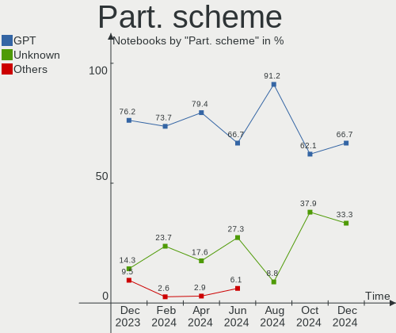
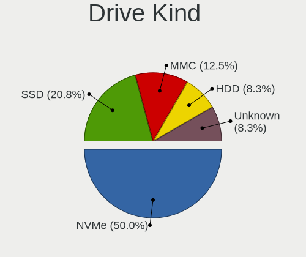
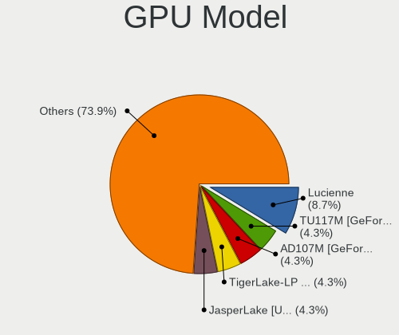
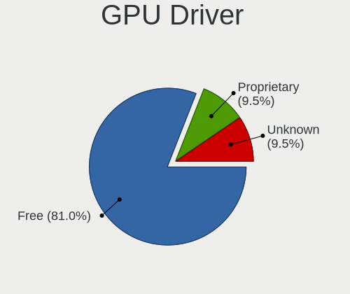
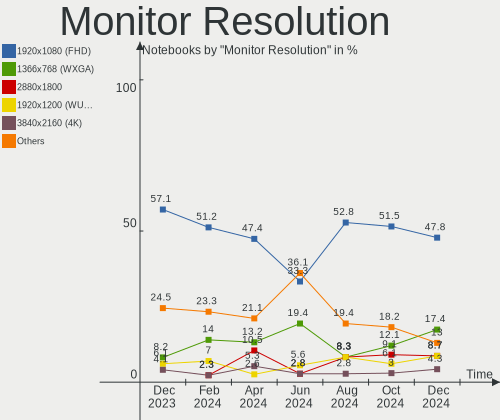
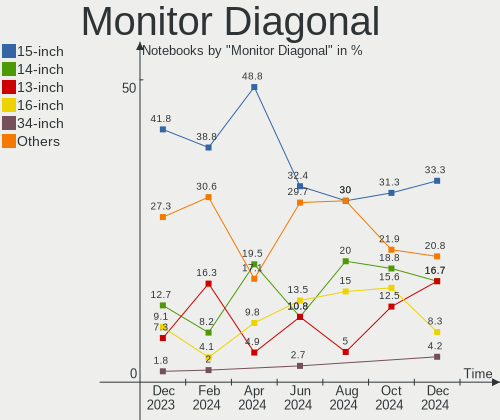
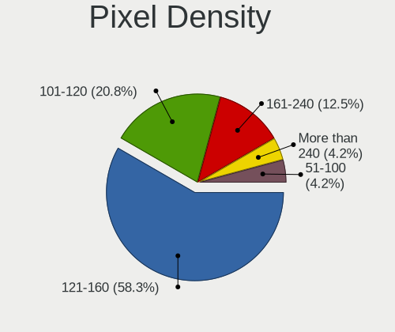
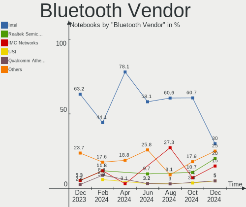

EndeavourOS - Hardware Trends (Notebooks)
-----------------------------------------

A project to identify most popular hardware characteristics and track their change
over time based on data collected by Linux users at https://Linux-Hardware.org.

Anyone can contribute to this report by the [hw-probe](https://github.com/linuxhw/hw-probe) tool:

    sudo -E hw-probe -all -upload

This report is for one last month. Overall report since the beginning of time: [TestDays](https://github.com/linuxhw/TestDays)

Period: Apr, 2023.

Contents
--------

* [ System ](#system)
  - [ OS                       ](#os)
  - [ OS Family                ](#os-family)
  - [ Kernel                   ](#kernel)
  - [ Kernel Family            ](#kernel-family)
  - [ Kernel Major Ver.        ](#kernel-major-ver)
  - [ Arch                     ](#arch)
  - [ DE                       ](#de)
  - [ Display Server           ](#display-server)
  - [ Display Manager          ](#display-manager)
  - [ OS Lang                  ](#os-lang)
  - [ Boot Mode                ](#boot-mode)
  - [ Filesystem               ](#filesystem)
  - [ Part. scheme             ](#part-scheme)
  - [ Dual Boot with Linux/BSD ](#dual-boot-with-linuxbsd)
  - [ Dual Boot (Win)          ](#dual-boot-win)

* [ Board ](#board)
  - [ Vendor                   ](#vendor)
  - [ Model                    ](#model)
  - [ Model Family             ](#model-family)
  - [ MFG Year                 ](#mfg-year)
  - [ Form Factor              ](#form-factor)
  - [ Secure Boot              ](#secure-boot)
  - [ Coreboot                 ](#coreboot)
  - [ RAM Size                 ](#ram-size)
  - [ RAM Used                 ](#ram-used)
  - [ Total Drives             ](#total-drives)
  - [ Has CD-ROM               ](#has-cd-rom)
  - [ Has Ethernet             ](#has-ethernet)
  - [ Has WiFi                 ](#has-wifi)
  - [ Has Bluetooth            ](#has-bluetooth)

* [ Location ](#location)
  - [ Country                  ](#country)
  - [ City                     ](#city)

* [ Drives ](#drives)
  - [ Drive Vendor             ](#drive-vendor)
  - [ Drive Model              ](#drive-model)
  - [ HDD Vendor               ](#hdd-vendor)
  - [ SSD Vendor               ](#ssd-vendor)
  - [ Drive Kind               ](#drive-kind)
  - [ Drive Connector          ](#drive-connector)
  - [ Drive Size               ](#drive-size)
  - [ Space Total              ](#space-total)
  - [ Space Used               ](#space-used)
  - [ Malfunc. Drives          ](#malfunc-drives)
  - [ Malfunc. Drive Vendor    ](#malfunc-drive-vendor)
  - [ Malfunc. HDD Vendor      ](#malfunc-hdd-vendor)
  - [ Malfunc. Drive Kind      ](#malfunc-drive-kind)
  - [ Failed Drives            ](#failed-drives)
  - [ Failed Drive Vendor      ](#failed-drive-vendor)
  - [ Drive Status             ](#drive-status)

* [ Storage controller ](#storage-controller)
  - [ Storage Vendor           ](#storage-vendor)
  - [ Storage Model            ](#storage-model)
  - [ Storage Kind             ](#storage-kind)

* [ Processor ](#processor)
  - [ CPU Vendor               ](#cpu-vendor)
  - [ CPU Model                ](#cpu-model)
  - [ CPU Model Family         ](#cpu-model-family)
  - [ CPU Cores                ](#cpu-cores)
  - [ CPU Sockets              ](#cpu-sockets)
  - [ CPU Threads              ](#cpu-threads)
  - [ CPU Op-Modes             ](#cpu-op-modes)
  - [ CPU Microcode            ](#cpu-microcode)
  - [ CPU Microarch            ](#cpu-microarch)

* [ Graphics ](#graphics)
  - [ GPU Vendor               ](#gpu-vendor)
  - [ GPU Model                ](#gpu-model)
  - [ GPU Combo                ](#gpu-combo)
  - [ GPU Driver               ](#gpu-driver)
  - [ GPU Memory               ](#gpu-memory)

* [ Monitor ](#monitor)
  - [ Monitor Vendor           ](#monitor-vendor)
  - [ Monitor Model            ](#monitor-model)
  - [ Monitor Resolution       ](#monitor-resolution)
  - [ Monitor Diagonal         ](#monitor-diagonal)
  - [ Monitor Width            ](#monitor-width)
  - [ Aspect Ratio             ](#aspect-ratio)
  - [ Monitor Area             ](#monitor-area)
  - [ Pixel Density            ](#pixel-density)
  - [ Multiple Monitors        ](#multiple-monitors)

* [ Network ](#network)
  - [ Net Controller Vendor    ](#net-controller-vendor)
  - [ Net Controller Model     ](#net-controller-model)
  - [ Wireless Vendor          ](#wireless-vendor)
  - [ Wireless Model           ](#wireless-model)
  - [ Ethernet Vendor          ](#ethernet-vendor)
  - [ Ethernet Model           ](#ethernet-model)
  - [ Net Controller Kind      ](#net-controller-kind)
  - [ Used Controller          ](#used-controller)
  - [ NICs                     ](#nics)
  - [ IPv6                     ](#ipv6)

* [ Bluetooth ](#bluetooth)
  - [ Bluetooth Vendor         ](#bluetooth-vendor)
  - [ Bluetooth Model          ](#bluetooth-model)

* [ Sound ](#sound)
  - [ Sound Vendor             ](#sound-vendor)
  - [ Sound Model              ](#sound-model)

* [ Memory ](#memory)
  - [ Memory Vendor            ](#memory-vendor)
  - [ Memory Model             ](#memory-model)
  - [ Memory Kind              ](#memory-kind)
  - [ Memory Form Factor       ](#memory-form-factor)
  - [ Memory Size              ](#memory-size)
  - [ Memory Speed             ](#memory-speed)

* [ Printers & scanners ](#printers--scanners)
  - [ Printer Vendor           ](#printer-vendor)
  - [ Printer Model            ](#printer-model)
  - [ Scanner Vendor           ](#scanner-vendor)
  - [ Scanner Model            ](#scanner-model)

* [ Camera ](#camera)
  - [ Camera Vendor            ](#camera-vendor)
  - [ Camera Model             ](#camera-model)

* [ Security ](#security)
  - [ Fingerprint Vendor       ](#fingerprint-vendor)
  - [ Fingerprint Model        ](#fingerprint-model)
  - [ Chipcard Vendor          ](#chipcard-vendor)
  - [ Chipcard Model           ](#chipcard-model)

* [ Unsupported ](#unsupported)
  - [ Unsupported Devices      ](#unsupported-devices)
  - [ Unsupported Device Types ](#unsupported-device-types)

System
------

OS
--

Installed operating systems

| Name                | Notebooks | Percent |
|---------------------|-----------|---------|
| EndeavourOS Rolling | 34        | 100%    |

OS Family
---------

OS without a version

| Name        | Notebooks | Percent |
|-------------|-----------|---------|
| EndeavourOS | 34        | 100%    |

Kernel
------

Version of the Linux kernel

| Version           | Notebooks | Percent |
|-------------------|-----------|---------|
| 6.2.9-arch1-1     | 7         | 20.59%  |
| 6.2.10-arch1-1    | 7         | 20.59%  |
| 6.2.12-arch1-1    | 5         | 14.71%  |
| 6.2.8-arch1-1     | 4         | 11.76%  |
| 6.2.13-arch1-1    | 2         | 5.88%   |
| 6.2.9-zen1-1-zen  | 1         | 2.94%   |
| 6.2.8-zen1-1-zen  | 1         | 2.94%   |
| 6.2.13-zen-1-zen  | 1         | 2.94%   |
| 6.2.12-zen1-1-zen | 1         | 2.94%   |
| 6.2.11-zen1-1-zen | 1         | 2.94%   |
| 6.2.11-arch1-1    | 1         | 2.94%   |
| 6.1.24-1-lts      | 1         | 2.94%   |
| 6.1.23-1-lts      | 1         | 2.94%   |
| 6.1.22-1-lts      | 1         | 2.94%   |

Kernel Family
-------------

Linux kernel without a distro release

| Version | Notebooks | Percent |
|---------|-----------|---------|
| 6.2.9   | 8         | 23.53%  |
| 6.2.10  | 7         | 20.59%  |
| 6.2.12  | 6         | 17.65%  |
| 6.2.8   | 5         | 14.71%  |
| 6.2.13  | 3         | 8.82%   |
| 6.2.11  | 2         | 5.88%   |
| 6.1.24  | 1         | 2.94%   |
| 6.1.23  | 1         | 2.94%   |
| 6.1.22  | 1         | 2.94%   |

Kernel Major Ver.
-----------------

Linux kernel major version

| Version | Notebooks | Percent |
|---------|-----------|---------|
| 6.2     | 31        | 91.18%  |
| 6.1     | 3         | 8.82%   |

Arch
----

OS architecture (x86_64, i586, etc.)

| Name   | Notebooks | Percent |
|--------|-----------|---------|
| x86_64 | 34        | 100%    |

DE
--

Desktop Environment

| Name       | Notebooks | Percent |
|------------|-----------|---------|
| GNOME      | 10        | 29.41%  |
| KDE5       | 9         | 26.47%  |
| XFCE       | 4         | 11.76%  |
| i3         | 4         | 11.76%  |
| X-Cinnamon | 1         | 2.94%   |
| qtile      | 1         | 2.94%   |
| LXQt       | 1         | 2.94%   |
| LXDE       | 1         | 2.94%   |
| KDE        | 1         | 2.94%   |
| Budgie     | 1         | 2.94%   |
| Unknown    | 1         | 2.94%   |

Display Server
--------------

X11 or Wayland

| Name    | Notebooks | Percent |
|---------|-----------|---------|
| X11     | 21        | 61.76%  |
| Wayland | 12        | 35.29%  |
| Tty     | 1         | 2.94%   |

Display Manager
---------------

SDDM, LightDM, etc.

| Name    | Notebooks | Percent |
|---------|-----------|---------|
| LightDM | 12        | 35.29%  |
| SDDM    | 9         | 26.47%  |
| Unknown | 7         | 20.59%  |
| GDM     | 6         | 17.65%  |

OS Lang
-------

Language

| Lang  | Notebooks | Percent |
|-------|-----------|---------|
| en_US | 18        | 52.94%  |
| it_IT | 3         | 8.82%   |
| de_DE | 3         | 8.82%   |
| nl_NL | 2         | 5.88%   |
| en_IN | 2         | 5.88%   |
| en_CA | 2         | 5.88%   |
| tr_TR | 1         | 2.94%   |
| es_ES | 1         | 2.94%   |
| en_GB | 1         | 2.94%   |
| en_AU | 1         | 2.94%   |

Boot Mode
---------

EFI or BIOS

| Mode | Notebooks | Percent |
|------|-----------|---------|
| EFI  | 25        | 73.53%  |
| BIOS | 9         | 26.47%  |

Filesystem
----------

Type of filesystem

| Type    | Notebooks | Percent |
|---------|-----------|---------|
| Ext4    | 19        | 55.88%  |
| Btrfs   | 10        | 29.41%  |
| Tmpfs   | 2         | 5.88%   |
| Xfs     | 1         | 2.94%   |
| Overlay | 1         | 2.94%   |
| F2fs    | 1         | 2.94%   |

Part. scheme
------------

Scheme of partitioning

| Type    | Notebooks | Percent |
|---------|-----------|---------|
| GPT     | 27        | 79.41%  |
| Unknown | 4         | 11.76%  |
| MBR     | 3         | 8.82%   |

Dual Boot with Linux/BSD
------------------------

Hosting more than one Linux/BSD

| Dual boot | Notebooks | Percent |
|-----------|-----------|---------|
| No        | 27        | 79.41%  |
| Yes       | 7         | 20.59%  |

Dual Boot (Win)
---------------

Hosting Linux and Windows

| Dual boot | Notebooks | Percent |
|-----------|-----------|---------|
| No        | 24        | 70.59%  |
| Yes       | 10        | 29.41%  |

Board
-----

Vendor
------

Motherboard manufacturer

| Name             | Notebooks | Percent |
|------------------|-----------|---------|
| Lenovo           | 9         | 26.47%  |
| Hewlett-Packard  | 4         | 11.76%  |
| ASUSTek Computer | 4         | 11.76%  |
| MSI              | 3         | 8.82%   |
| Dell             | 3         | 8.82%   |
| Apple            | 3         | 8.82%   |
| Notebook         | 2         | 5.88%   |
| Acer             | 2         | 5.88%   |
| Timi             | 1         | 2.94%   |
| Sony             | 1         | 2.94%   |
| PC Specialist    | 1         | 2.94%   |
| HUAWEI           | 1         | 2.94%   |

Model
-----

Motherboard model

| Name                                     | Notebooks | Percent |
|------------------------------------------|-----------|---------|
| Apple MacBookAir7,2                      | 2         | 5.88%   |
| Timi Redmi Book Pro 15 2022              | 1         | 2.94%   |
| Sony SVE1713X1EB                         | 1         | 2.94%   |
| PC Specialist Elimina Iv 17              | 1         | 2.94%   |
| Notebook W65_W67RB                       | 1         | 2.94%   |
| Notebook NH5x_NH7xHP                     | 1         | 2.94%   |
| MSI Modern 15 A11SBU                     | 1         | 2.94%   |
| MSI Modern 14 C7M                        | 1         | 2.94%   |
| MSI GP60 2QE                             | 1         | 2.94%   |
| Lenovo ThinkPad T495s 20QKS2R403         | 1         | 2.94%   |
| Lenovo ThinkPad T490 20N20008US          | 1         | 2.94%   |
| Lenovo ThinkPad T480s 20L8S0ER00         | 1         | 2.94%   |
| Lenovo ThinkPad T450 20BUS0QT04          | 1         | 2.94%   |
| Lenovo ThinkPad T440 20B7S0JC0K          | 1         | 2.94%   |
| Lenovo ThinkPad L14 Gen 3 21C6S08E00     | 1         | 2.94%   |
| Lenovo ThinkBook 16 G4+ ARA 21D1         | 1         | 2.94%   |
| Lenovo ThinkBook 13s G4 ARB 21AS         | 1         | 2.94%   |
| Lenovo IdeaPad 5 Pro 16ACH6 82L5         | 1         | 2.94%   |
| HUAWEI HLYL-WXX9                         | 1         | 2.94%   |
| HP ZBook 17 G2                           | 1         | 2.94%   |
| HP EliteBook 840 G7 Notebook PC          | 1         | 2.94%   |
| HP 250 G4                                | 1         | 2.94%   |
| Dell Latitude 5580                       | 1         | 2.94%   |
| Dell Inspiron 5402                       | 1         | 2.94%   |
| Dell Inspiron 15 3520                    | 1         | 2.94%   |
| ASUS X55A                                | 1         | 2.94%   |
| ASUS VivoBook_ASUSLaptop X515EA_X515EA   | 1         | 2.94%   |
| ASUS ROG Strix G513IM_G513IM             | 1         | 2.94%   |
| ASUS ASUS TUF Gaming A15 FA506IV_FA506IV | 1         | 2.94%   |
| Apple MacBookAir6,2                      | 1         | 2.94%   |
| Acer Aspire E5-575                       | 1         | 2.94%   |
| Acer Aspire A515-45                      | 1         | 2.94%   |
| Unknown                                  | 1         | 2.94%   |

Model Family
------------

Motherboard model prefix

| Name                  | Notebooks | Percent |
|-----------------------|-----------|---------|
| Lenovo ThinkPad       | 6         | 17.65%  |
| MSI Modern            | 2         | 5.88%   |
| Lenovo ThinkBook      | 2         | 5.88%   |
| Dell Inspiron         | 2         | 5.88%   |
| Apple MacBookAir7     | 2         | 5.88%   |
| Acer Aspire           | 2         | 5.88%   |
| Timi Redmi            | 1         | 2.94%   |
| Sony SVE1713X1EB      | 1         | 2.94%   |
| PC Specialist Elimina | 1         | 2.94%   |
| Notebook W65          | 1         | 2.94%   |
| Notebook NH5x         | 1         | 2.94%   |
| MSI GP60              | 1         | 2.94%   |
| Lenovo IdeaPad        | 1         | 2.94%   |
| HUAWEI HLYL-WXX9      | 1         | 2.94%   |
| HP ZBook              | 1         | 2.94%   |
| HP EliteBook          | 1         | 2.94%   |
| HP 250                | 1         | 2.94%   |
| Dell Latitude         | 1         | 2.94%   |
| ASUS X55A             | 1         | 2.94%   |
| ASUS VivoBook         | 1         | 2.94%   |
| ASUS ROG              | 1         | 2.94%   |
| ASUS ASUS             | 1         | 2.94%   |
| Apple MacBookAir6     | 1         | 2.94%   |
| Unknown               | 1         | 2.94%   |

MFG Year
--------

Motherboard manufacture year

| Year | Notebooks | Percent |
|------|-----------|---------|
| 2022 | 8         | 23.53%  |
| 2021 | 6         | 17.65%  |
| 2015 | 5         | 14.71%  |
| 2020 | 3         | 8.82%   |
| 2019 | 2         | 5.88%   |
| 2018 | 2         | 5.88%   |
| 2014 | 2         | 5.88%   |
| 2013 | 2         | 5.88%   |
| 2012 | 2         | 5.88%   |
| 2017 | 1         | 2.94%   |
| 2016 | 1         | 2.94%   |

Form Factor
-----------

Physical design of the computer

| Name     | Notebooks | Percent |
|----------|-----------|---------|
| Notebook | 34        | 100%    |

Secure Boot
-----------

Enabled or disabled

| State    | Notebooks | Percent |
|----------|-----------|---------|
| Disabled | 34        | 100%    |

Coreboot
--------

Have coreboot on board

| Used | Notebooks | Percent |
|------|-----------|---------|
| No   | 34        | 100%    |

RAM Size
--------

Total RAM memory

| Size in GB  | Notebooks | Percent |
|-------------|-----------|---------|
| 8.01-16.0   | 9         | 26.47%  |
| 4.01-8.0    | 7         | 20.59%  |
| 16.01-24.0  | 7         | 20.59%  |
| 32.01-64.0  | 5         | 14.71%  |
| 3.01-4.0    | 3         | 8.82%   |
| 24.01-32.0  | 2         | 5.88%   |
| 64.01-256.0 | 1         | 2.94%   |

RAM Used
--------

Used RAM memory

| Used GB   | Notebooks | Percent |
|-----------|-----------|---------|
| 4.01-8.0  | 12        | 35.29%  |
| 1.01-2.0  | 8         | 23.53%  |
| 3.01-4.0  | 6         | 17.65%  |
| 2.01-3.0  | 5         | 14.71%  |
| 8.01-16.0 | 3         | 8.82%   |

Total Drives
------------

Number of drives on board

| Drives | Notebooks | Percent |
|--------|-----------|---------|
| 1      | 23        | 67.65%  |
| 2      | 9         | 26.47%  |
| 3      | 2         | 5.88%   |

Has CD-ROM
----------

Has CD-ROM on board

| Presented | Notebooks | Percent |
|-----------|-----------|---------|
| No        | 27        | 79.41%  |
| Yes       | 7         | 20.59%  |

Has Ethernet
------------

Has Ethernet on board

| Presented | Notebooks | Percent |
|-----------|-----------|---------|
| Yes       | 22        | 64.71%  |
| No        | 12        | 35.29%  |

Has WiFi
--------

Has WiFi module

| Presented | Notebooks | Percent |
|-----------|-----------|---------|
| Yes       | 34        | 100%    |

Has Bluetooth
-------------

Has Bluetooth module

| Presented | Notebooks | Percent |
|-----------|-----------|---------|
| Yes       | 31        | 91.18%  |
| No        | 3         | 8.82%   |

Location
--------

Country
-------

Geographic location (country)

| Country     | Notebooks | Percent |
|-------------|-----------|---------|
| USA         | 5         | 14.71%  |
| Germany     | 5         | 14.71%  |
| Italy       | 4         | 11.76%  |
| Canada      | 3         | 8.82%   |
| Turkey      | 2         | 5.88%   |
| Spain       | 2         | 5.88%   |
| Poland      | 2         | 5.88%   |
| India       | 2         | 5.88%   |
| Vietnam     | 1         | 2.94%   |
| UK          | 1         | 2.94%   |
| Russia      | 1         | 2.94%   |
| Netherlands | 1         | 2.94%   |
| Mexico      | 1         | 2.94%   |
| Greece      | 1         | 2.94%   |
| Brazil      | 1         | 2.94%   |
| Bangladesh  | 1         | 2.94%   |
| Australia   | 1         | 2.94%   |

City
----

Geographic location (city)

| City              | Notebooks | Percent |
|-------------------|-----------|---------|
| Wroclaw           | 1         | 2.94%   |
| Winnipeg          | 1         | 2.94%   |
| Warsaw            | 1         | 2.94%   |
| Suderbrarup       | 1         | 2.94%   |
| Seymour           | 1         | 2.94%   |
| Rostov-on-Don     | 1         | 2.94%   |
| Richmond Hill     | 1         | 2.94%   |
| Rexburg           | 1         | 2.94%   |
| Piraeus           | 1         | 2.94%   |
| Nuremberg         | 1         | 2.94%   |
| Narayanganj       | 1         | 2.94%   |
| Mesa              | 1         | 2.94%   |
| Melbourne         | 1         | 2.94%   |
| Marino            | 1         | 2.94%   |
| Madrid            | 1         | 2.94%   |
| Ludhiana          | 1         | 2.94%   |
| Laxolo            | 1         | 2.94%   |
| Istanbul          | 1         | 2.94%   |
| Ho Chi Minh City  | 1         | 2.94%   |
| Heythuysen        | 1         | 2.94%   |
| Hamburg           | 1         | 2.94%   |
| Gelsenkirchen     | 1         | 2.94%   |
| Frankfurt am Main | 1         | 2.94%   |
| Fortaleza         | 1         | 2.94%   |
| Edinburgh         | 1         | 2.94%   |
| Cuernavaca        | 1         | 2.94%   |
| Coteau-du-Lac     | 1         | 2.94%   |
| Cessaniti         | 1         | 2.94%   |
| Burlington        | 1         | 2.94%   |
| Breganze          | 1         | 2.94%   |
| Bengaluru         | 1         | 2.94%   |
| Barcelona         | 1         | 2.94%   |
| Antalya           | 1         | 2.94%   |
| Akron             | 1         | 2.94%   |

Drives
------

Drive Vendor
------------

Hard drive vendors

| Vendor              | Notebooks | Drives | Percent |
|---------------------|-----------|--------|---------|
| SanDisk             | 8         | 8      | 17.02%  |
| Samsung Electronics | 8         | 8      | 17.02%  |
| Micron Technology   | 5         | 5      | 10.64%  |
| Seagate             | 4         | 4      | 8.51%   |
| Unknown             | 3         | 3      | 6.38%   |
| Kingston            | 3         | 3      | 6.38%   |
| Crucial             | 3         | 3      | 6.38%   |
| Apple               | 3         | 3      | 6.38%   |
| Silicon Motion      | 2         | 2      | 4.26%   |
| HGST                | 2         | 2      | 4.26%   |
| WDC                 | 1         | 1      | 2.13%   |
| SK hynix            | 1         | 1      | 2.13%   |
| KIOXIA              | 1         | 1      | 2.13%   |
| Intel               | 1         | 1      | 2.13%   |
| Blackpcs            | 1         | 1      | 2.13%   |
| A-DATA Technology   | 1         | 1      | 2.13%   |

Drive Model
-----------

Hard drive models

| Model                                                  | Notebooks | Percent |
|--------------------------------------------------------|-----------|---------|
| Samsung NVMe SSD Controller PM9A1/PM9A3/980PRO 2TB     | 3         | 6.38%   |
| Silicon Motion SM2263EN/SM2263XT SSD Controller 1024GB | 2         | 4.26%   |
| Sandisk WD Blue SN550 NVMe SSD 1024GB                  | 2         | 4.26%   |
| Sandisk WD Black SN750 / PC SN730 NVMe SSD 512GB       | 2         | 4.26%   |
| Crucial CT500MX500SSD1 500GB                           | 2         | 4.26%   |
| Apple SSD SM0128G 121GB                                | 2         | 4.26%   |
| WDC WDS120G2G0A-00JH30 120GB SSD                       | 1         | 2.13%   |
| Unknown MMC Card  64GB                                 | 1         | 2.13%   |
| Unknown MMC Card  16GB                                 | 1         | 2.13%   |
| Unknown MMC Card  128GB                                | 1         | 2.13%   |
| SK hynix SKHynix_HFS512GDE9X084N 512GB                 | 1         | 2.13%   |
| Seagate ST2000LX001-1RG174 2TB                         | 1         | 2.13%   |
| Seagate ST1000LM035-1RK172 970GB                       | 1         | 2.13%   |
| Seagate FireCuda 520 SSD ZP2000GM30002 2TB             | 1         | 2.13%   |
| Seagate Expansion 4TB                                  | 1         | 2.13%   |
| Sandisk WD_BLACK SN750 SE 500GB                        | 1         | 2.13%   |
| Sandisk WDC WDS200T2B0C-00PXH0 2TB                     | 1         | 2.13%   |
| Sandisk WD Black 2018/SN750 / PC SN720 NVMe SSD 500GB  | 1         | 2.13%   |
| SanDisk SD7SB2Q-512G-1006 512GB SSD                    | 1         | 2.13%   |
| Samsung SSD 870 EVO 500GB                              | 1         | 2.13%   |
| Samsung SSD 850 PRO 512GB                              | 1         | 2.13%   |
| Samsung SSD 850 EVO 250GB                              | 1         | 2.13%   |
| Samsung PM9B1 NVMe 512GB                               | 1         | 2.13%   |
| Samsung MZ7LN256HCHP-000L7 256GB SSD                   | 1         | 2.13%   |
| Micron MTFDKCD512TFK 512GB                             | 1         | 2.13%   |
| Micron MTFDKCD256TFK 256GB                             | 1         | 2.13%   |
| Micron MTFDHBA256TDV-1AY1AABHA 256GB                   | 1         | 2.13%   |
| Micron CT1000P5SSD8 1TB                                | 1         | 2.13%   |
| Micron 2400_MTFDKBA512QFM 512GB                        | 1         | 2.13%   |
| KIOXIA KBG50ZNV512G 512GB                              | 1         | 2.13%   |
| Kingston SKC3000S1024G 1TB                             | 1         | 2.13%   |
| Kingston SA400S3 120GB SSD                             | 1         | 2.13%   |
| Kingston OM8PCP31024F-AI1 1TB                          | 1         | 2.13%   |
| Intel SSDPEKNU512GZ 512GB                              | 1         | 2.13%   |
| HGST HTS721010A9E630 1TB                               | 1         | 2.13%   |
| HGST HTS545050A7E680 500GB                             | 1         | 2.13%   |
| Crucial CT240BX500SSD1 240GB                           | 1         | 2.13%   |
| Blackpcs SSDPro 480GB                                  | 1         | 2.13%   |
| Apple SSD SM0128F 121GB                                | 1         | 2.13%   |
| A-DATA IM2P33F3A NVMe 256GB                            | 1         | 2.13%   |

HDD Vendor
----------

Hard disk drive vendors

| Vendor  | Notebooks | Drives | Percent |
|---------|-----------|--------|---------|
| Seagate | 3         | 3      | 60%     |
| HGST    | 2         | 2      | 40%     |

SSD Vendor
----------

Solid state drive vendors

| Vendor              | Notebooks | Drives | Percent |
|---------------------|-----------|--------|---------|
| Samsung Electronics | 4         | 4      | 28.57%  |
| Crucial             | 3         | 3      | 21.43%  |
| Apple               | 3         | 3      | 21.43%  |
| WDC                 | 1         | 1      | 7.14%   |
| SanDisk             | 1         | 1      | 7.14%   |
| Kingston            | 1         | 1      | 7.14%   |
| Blackpcs            | 1         | 1      | 7.14%   |

Drive Kind
----------

HDD or SSD

| Kind | Notebooks | Drives | Percent |
|------|-----------|--------|---------|
| NVMe | 21        | 25     | 50%     |
| SSD  | 13        | 14     | 30.95%  |
| HDD  | 5         | 5      | 11.9%   |
| MMC  | 3         | 3      | 7.14%   |

Drive Connector
---------------

SATA, SAS, NVMe, etc.

| Type | Notebooks | Drives | Percent |
|------|-----------|--------|---------|
| NVMe | 21        | 25     | 51.22%  |
| SATA | 16        | 18     | 39.02%  |
| MMC  | 3         | 3      | 7.32%   |
| SAS  | 1         | 1      | 2.44%   |

Drive Size
----------

Size of hard drive

| Size in TB | Notebooks | Drives | Percent |
|------------|-----------|--------|---------|
| 0.01-0.5   | 12        | 13     | 70.59%  |
| 0.51-1.0   | 3         | 4      | 17.65%  |
| 3.01-4.0   | 1         | 1      | 5.88%   |
| 1.01-2.0   | 1         | 1      | 5.88%   |

Space Total
-----------

Amount of disk space available on the file system

| Size in GB     | Notebooks | Percent |
|----------------|-----------|---------|
| 101-250        | 8         | 23.53%  |
| 1001-2000      | 5         | 14.71%  |
| 1-20           | 5         | 14.71%  |
| 251-500        | 3         | 8.82%   |
| 501-1000       | 3         | 8.82%   |
| 51-100         | 3         | 8.82%   |
| 21-50          | 2         | 5.88%   |
| 2001-3000      | 2         | 5.88%   |
| Unknown        | 2         | 5.88%   |
| More than 3000 | 1         | 2.94%   |

Space Used
----------

Amount of used disk space

| Used GB   | Notebooks | Percent |
|-----------|-----------|---------|
| 1-20      | 12        | 35.29%  |
| 21-50     | 6         | 17.65%  |
| 101-250   | 4         | 11.76%  |
| 1001-2000 | 3         | 8.82%   |
| 51-100    | 3         | 8.82%   |
| 501-1000  | 2         | 5.88%   |
| Unknown   | 2         | 5.88%   |
| 251-500   | 1         | 2.94%   |
| 0         | 1         | 2.94%   |

Malfunc. Drives
---------------

Drive models with a malfunction

| Model                          | Notebooks | Drives | Percent |
|--------------------------------|-----------|--------|---------|
| Seagate ST2000LX001-1RG174 2TB | 1         | 1      | 50%     |
| HGST HTS545050A7E680 500GB     | 1         | 1      | 50%     |

Malfunc. Drive Vendor
---------------------

Vendors of faulty drives

| Vendor  | Notebooks | Drives | Percent |
|---------|-----------|--------|---------|
| Seagate | 1         | 1      | 50%     |
| HGST    | 1         | 1      | 50%     |

Malfunc. HDD Vendor
-------------------

Vendors of faulty HDD drives

| Vendor  | Notebooks | Drives | Percent |
|---------|-----------|--------|---------|
| Seagate | 1         | 1      | 50%     |
| HGST    | 1         | 1      | 50%     |

Malfunc. Drive Kind
-------------------

Kinds of faulty drives

| Kind | Notebooks | Drives | Percent |
|------|-----------|--------|---------|
| HDD  | 2         | 2      | 100%    |

Failed Drives
-------------

Failed drive models

Zero info for selected period =(

Failed Drive Vendor
-------------------

Failed drive vendors

Zero info for selected period =(

Drive Status
------------

Number of failed and malfunc. drives

| Status   | Notebooks | Drives | Percent |
|----------|-----------|--------|---------|
| Works    | 27        | 34     | 69.23%  |
| Detected | 10        | 11     | 25.64%  |
| Malfunc  | 2         | 2      | 5.13%   |

Storage controller
------------------

Storage Vendor
--------------

Storage controller vendors

| Vendor                      | Notebooks | Percent |
|-----------------------------|-----------|---------|
| Intel                       | 15        | 33.33%  |
| SanDisk                     | 7         | 15.56%  |
| Samsung Electronics         | 7         | 15.56%  |
| Micron Technology           | 5         | 11.11%  |
| AMD                         | 3         | 6.67%   |
| Silicon Motion              | 2         | 4.44%   |
| Kingston Technology Company | 2         | 4.44%   |
| SK hynix                    | 1         | 2.22%   |
| Seagate Technology          | 1         | 2.22%   |
| KIOXIA                      | 1         | 2.22%   |
| ADATA Technology            | 1         | 2.22%   |

Storage Model
-------------

Storage controller models

| Model                                                                            | Notebooks | Percent |
|----------------------------------------------------------------------------------|-----------|---------|
| Micron NVMe Storage Controller                                                   | 4         | 8.33%   |
| Samsung NVMe SSD Controller PM9A1/PM9A3/980PRO                                   | 3         | 6.25%   |
| AMD FCH SATA Controller [AHCI mode]                                              | 3         | 6.25%   |
| Silicon Motion SM2263EN/SM2263XT SSD Controller                                  | 2         | 4.17%   |
| SanDisk WD Blue SN550 NVMe SSD                                                   | 2         | 4.17%   |
| SanDisk WD Black SN750 / PC SN730 NVMe SSD                                       | 2         | 4.17%   |
| SanDisk Non-Volatile memory controller                                           | 2         | 4.17%   |
| Samsung Electronics SATA controller                                              | 2         | 4.17%   |
| Kingston Company Company Non-Volatile memory controller                          | 2         | 4.17%   |
| Intel Volume Management Device NVMe RAID Controller                              | 2         | 4.17%   |
| Intel Alder Lake-P SATA AHCI Controller                                          | 2         | 4.17%   |
| Intel 8 Series/C220 Series Chipset Family 6-port SATA Controller 1 [AHCI mode]   | 2         | 4.17%   |
| Intel 7 Series Chipset Family 6-port SATA Controller [AHCI mode]                 | 2         | 4.17%   |
| SK hynix Gold P31/PC711 NVMe Solid State Drive                                   | 1         | 2.08%   |
| Seagate FireCuda 520 SSD                                                         | 1         | 2.08%   |
| SanDisk WD Black 2018/SN750 / PC SN720 NVMe SSD                                  | 1         | 2.08%   |
| Samsung NVMe SSD Controller PM9B1                                                | 1         | 2.08%   |
| Samsung Apple PCIe SSD                                                           | 1         | 2.08%   |
| Micron NVMe Controller                                                           | 1         | 2.08%   |
| KIOXIA Non-Volatile memory controller                                            | 1         | 2.08%   |
| Intel Wildcat Point-LP SATA Controller [AHCI Mode]                               | 1         | 2.08%   |
| Intel Tiger Lake-LP SATA Controller                                              | 1         | 2.08%   |
| Intel Sunrise Point-LP SATA Controller [AHCI mode]                               | 1         | 2.08%   |
| Intel Non-Volatile memory controller                                             | 1         | 2.08%   |
| Intel HM170/QM170 Chipset SATA Controller [AHCI Mode]                            | 1         | 2.08%   |
| Intel Atom/Celeron/Pentium Processor x5-E8000/J3xxx/N3xxx Series SATA Controller | 1         | 2.08%   |
| Intel 82801 Mobile SATA Controller [RAID mode]                                   | 1         | 2.08%   |
| Intel 8 Series SATA Controller 1 [AHCI mode]                                     | 1         | 2.08%   |
| Intel 6 Series/C200 Series Chipset Family 6 port Mobile SATA AHCI Controller     | 1         | 2.08%   |
| Intel 500 Series Chipset Family SATA AHCI Controller                             | 1         | 2.08%   |
| ADATA Non-Volatile memory controller                                             | 1         | 2.08%   |

Storage Kind
------------

Kind of storage controller (IDE, SATA, NVMe, SAS, ...)

| Kind | Notebooks | Percent |
|------|-----------|---------|
| NVMe | 21        | 47.73%  |
| SATA | 20        | 45.45%  |
| RAID | 3         | 6.82%   |

Processor
---------

CPU Vendor
----------

Processor vendors

| Vendor | Notebooks | Percent |
|--------|-----------|---------|
| Intel  | 23        | 67.65%  |
| AMD    | 11        | 32.35%  |

CPU Model
---------

Processor models

| Model                                           | Notebooks | Percent |
|-------------------------------------------------|-----------|---------|
| Intel 11th Gen Core i5-1135G7 @ 2.40GHz         | 2         | 5.88%   |
| AMD Ryzen 7 6800H with Radeon Graphics          | 2         | 5.88%   |
| AMD Ryzen 7 4800H with Radeon Graphics          | 2         | 5.88%   |
| Intel Pentium CPU B980 @ 2.40GHz                | 1         | 2.94%   |
| Intel Core i7-8650U CPU @ 1.90GHz               | 1         | 2.94%   |
| Intel Core i7-7600U CPU @ 2.80GHz               | 1         | 2.94%   |
| Intel Core i7-4720HQ CPU @ 2.60GHz              | 1         | 2.94%   |
| Intel Core i7-4710MQ CPU @ 2.50GHz              | 1         | 2.94%   |
| Intel Core i7-3632QM CPU @ 2.20GHz              | 1         | 2.94%   |
| Intel Core i7-2620M CPU @ 2.70GHz               | 1         | 2.94%   |
| Intel Core i5-8265U CPU @ 1.60GHz               | 1         | 2.94%   |
| Intel Core i5-5350U CPU @ 1.80GHz               | 1         | 2.94%   |
| Intel Core i5-5300U CPU @ 2.30GHz               | 1         | 2.94%   |
| Intel Core i5-5250U CPU @ 1.60GHz               | 1         | 2.94%   |
| Intel Core i5-4300U CPU @ 1.90GHz               | 1         | 2.94%   |
| Intel Core i5-4250U CPU @ 1.30GHz               | 1         | 2.94%   |
| Intel Core i5-10310U CPU @ 1.70GHz              | 1         | 2.94%   |
| Intel Core i3-7100U CPU @ 2.40GHz               | 1         | 2.94%   |
| Intel Core i3-6100H CPU @ 2.70GHz               | 1         | 2.94%   |
| Intel Celeron CPU N3050 @ 1.60GHz               | 1         | 2.94%   |
| Intel 12th Gen Core i7-12700H                   | 1         | 2.94%   |
| Intel 12th Gen Core i3-1215U                    | 1         | 2.94%   |
| Intel 11th Gen Core i7-11800H @ 2.30GHz         | 1         | 2.94%   |
| Intel 11th Gen Core i7-1165G7 @ 2.80GHz         | 1         | 2.94%   |
| AMD Ryzen 7 PRO 5875U with Radeon Graphics      | 1         | 2.94%   |
| AMD Ryzen 7 PRO 3700U w/ Radeon Vega Mobile Gfx | 1         | 2.94%   |
| AMD Ryzen 7 6800U with Radeon Graphics          | 1         | 2.94%   |
| AMD Ryzen 5 7530U with Radeon Graphics          | 1         | 2.94%   |
| AMD Ryzen 5 5600H with Radeon Graphics          | 1         | 2.94%   |
| AMD Ryzen 5 5500U with Radeon Graphics          | 1         | 2.94%   |
| AMD Ryzen 5 4600H with Radeon Graphics          | 1         | 2.94%   |

CPU Model Family
----------------

Processor model prefix

| Model           | Notebooks | Percent |
|-----------------|-----------|---------|
| Intel Core i5   | 7         | 20.59%  |
| Other           | 6         | 17.65%  |
| Intel Core i7   | 6         | 17.65%  |
| AMD Ryzen 7     | 5         | 14.71%  |
| AMD Ryzen 5     | 4         | 11.76%  |
| Intel Core i3   | 2         | 5.88%   |
| AMD Ryzen 7 PRO | 2         | 5.88%   |
| Intel Pentium   | 1         | 2.94%   |
| Intel Celeron   | 1         | 2.94%   |

CPU Cores
---------

Number of processor cores

| Number | Notebooks | Percent |
|--------|-----------|---------|
| 2      | 11        | 32.35%  |
| 4      | 10        | 29.41%  |
| 8      | 7         | 20.59%  |
| 6      | 5         | 14.71%  |
| 14     | 1         | 2.94%   |

CPU Sockets
-----------

Number of sockets

| Number | Notebooks | Percent |
|--------|-----------|---------|
| 1      | 34        | 100%    |

CPU Threads
-----------

Threads per core (Hyper-Threading)

| Number | Notebooks | Percent |
|--------|-----------|---------|
| 2      | 32        | 94.12%  |
| 1      | 2         | 5.88%   |

CPU Op-Modes
------------

CPU Operation Modes (32-bit, 64-bit)

| Op mode        | Notebooks | Percent |
|----------------|-----------|---------|
| 32-bit, 64-bit | 34        | 100%    |

CPU Microcode
-------------

Microcode number

| Number     | Notebooks | Percent |
|------------|-----------|---------|
| Unknown    | 20        | 58.82%  |
| 0x0a50000c | 2         | 5.88%   |
| 0x0a404101 | 2         | 5.88%   |
| 0x08600104 | 2         | 5.88%   |
| 0x806ea    | 1         | 2.94%   |
| 0x806c1    | 1         | 2.94%   |
| 0x206a7    | 1         | 2.94%   |
| 0x0a50000d | 1         | 2.94%   |
| 0x0a404102 | 1         | 2.94%   |
| 0x08608102 | 1         | 2.94%   |
| 0x08600106 | 1         | 2.94%   |
| 0x08108102 | 1         | 2.94%   |

CPU Microarch
-------------

Microarchitecture

| Name             | Notebooks | Percent |
|------------------|-----------|---------|
| KabyLake         | 5         | 14.71%  |
| Unknown          | 5         | 14.71%  |
| Haswell          | 4         | 11.76%  |
| Zen 3            | 3         | 8.82%   |
| Zen 2            | 3         | 8.82%   |
| TigerLake        | 3         | 8.82%   |
| Broadwell        | 3         | 8.82%   |
| SandyBridge      | 2         | 5.88%   |
| Zen+             | 1         | 2.94%   |
| Skylake          | 1         | 2.94%   |
| Silvermont       | 1         | 2.94%   |
| IvyBridge        | 1         | 2.94%   |
| Icelake          | 1         | 2.94%   |
| Alderlake Hybrid | 1         | 2.94%   |

Graphics
--------

GPU Vendor
----------

Vendors of graphics cards

| Vendor | Notebooks | Percent |
|--------|-----------|---------|
| Intel  | 22        | 53.66%  |
| AMD    | 12        | 29.27%  |
| Nvidia | 7         | 17.07%  |

GPU Model
---------

Graphics card models

| Model                                                                                    | Notebooks | Percent |
|------------------------------------------------------------------------------------------|-----------|---------|
| Intel TigerLake-LP GT2 [Iris Xe Graphics]                                                | 3         | 7.32%   |
| AMD Renoir                                                                               | 3         | 7.32%   |
| AMD Rembrandt [Radeon 680M]                                                              | 3         | 7.32%   |
| Nvidia GM108M [GeForce 940M]                                                             | 2         | 4.88%   |
| Intel HD Graphics 620                                                                    | 2         | 4.88%   |
| Intel HD Graphics 6000                                                                   | 2         | 4.88%   |
| Intel Haswell-ULT Integrated Graphics Controller                                         | 2         | 4.88%   |
| Intel 4th Gen Core Processor Integrated Graphics Controller                              | 2         | 4.88%   |
| Intel 2nd Generation Core Processor Family Integrated Graphics Controller                | 2         | 4.88%   |
| AMD Barcelo                                                                              | 2         | 4.88%   |
| Nvidia TU117M [GeForce MX450]                                                            | 1         | 2.44%   |
| Nvidia TU117M [GeForce GTX 1650 Mobile / Max-Q]                                          | 1         | 2.44%   |
| Nvidia TU106M [GeForce RTX 2060 Mobile]                                                  | 1         | 2.44%   |
| Nvidia GK107GLM [Quadro K1100M]                                                          | 1         | 2.44%   |
| Nvidia GA106M [GeForce RTX 3060 Mobile / Max-Q]                                          | 1         | 2.44%   |
| Intel WhiskeyLake-U GT2 [UHD Graphics 620]                                               | 1         | 2.44%   |
| Intel UHD Graphics 620                                                                   | 1         | 2.44%   |
| Intel TigerLake-H GT1 [UHD Graphics]                                                     | 1         | 2.44%   |
| Intel HD Graphics 5500                                                                   | 1         | 2.44%   |
| Intel HD Graphics 530                                                                    | 1         | 2.44%   |
| Intel CometLake-U GT2 [UHD Graphics]                                                     | 1         | 2.44%   |
| Intel Atom/Celeron/Pentium Processor x5-E8000/J3xxx/N3xxx Integrated Graphics Controller | 1         | 2.44%   |
| Intel Alder Lake-UP3 GT1 [UHD Graphics]                                                  | 1         | 2.44%   |
| Intel Alder Lake-P Integrated Graphics Controller                                        | 1         | 2.44%   |
| AMD Thames [Radeon HD 7550M/7570M/7650M]                                                 | 1         | 2.44%   |
| AMD Picasso/Raven 2 [Radeon Vega Series / Radeon Vega Mobile Series]                     | 1         | 2.44%   |
| AMD Lucienne                                                                             | 1         | 2.44%   |
| AMD Cezanne [Radeon Vega Series / Radeon Vega Mobile Series]                             | 1         | 2.44%   |

GPU Combo
---------

Combinations of graphics cards

| Name           | Notebooks | Percent |
|----------------|-----------|---------|
| 1 x Intel      | 17        | 50%     |
| 1 x AMD        | 10        | 29.41%  |
| Intel + Nvidia | 5         | 14.71%  |
| AMD + Nvidia   | 2         | 5.88%   |

GPU Driver
----------

Free vs proprietary

| Driver      | Notebooks | Percent |
|-------------|-----------|---------|
| Free        | 28        | 82.35%  |
| Proprietary | 6         | 17.65%  |

GPU Memory
----------

Total video memory

| Size in GB | Notebooks | Percent |
|------------|-----------|---------|
| Unknown    | 21        | 61.76%  |
| 1.01-2.0   | 5         | 14.71%  |
| 0.01-0.5   | 5         | 14.71%  |
| 5.01-6.0   | 1         | 2.94%   |
| 3.01-4.0   | 1         | 2.94%   |
| 0.51-1.0   | 1         | 2.94%   |

Monitor
-------

Monitor Vendor
--------------

Monitor vendors

| Vendor              | Notebooks | Percent |
|---------------------|-----------|---------|
| Chimei Innolux      | 7         | 17.5%   |
| BOE                 | 6         | 15%     |
| PANDA               | 4         | 10%     |
| LG Display          | 4         | 10%     |
| AU Optronics        | 4         | 10%     |
| Apple               | 3         | 7.5%    |
| Acer                | 3         | 7.5%    |
| TMX                 | 2         | 5%      |
| InfoVision          | 2         | 5%      |
| Toshiba             | 1         | 2.5%    |
| Samsung Electronics | 1         | 2.5%    |
| Pixio               | 1         | 2.5%    |
| Goldstar            | 1         | 2.5%    |
| AOC                 | 1         | 2.5%    |

Monitor Model
-------------

Monitor models

| Model                                                              | Notebooks | Percent |
|--------------------------------------------------------------------|-----------|---------|
| TMX TL156MDMP11-0 TMX1560 3200x2000 336x210mm 15.6-inch            | 2         | 5%      |
| InfoVision LCD Monitor IVO057D 1920x1080 309x174mm 14.0-inch       | 2         | 5%      |
| Apple Color LCD APP9CDF 1440x900 286x179mm 13.3-inch               | 2         | 5%      |
| Toshiba TV TSB0206 1920x1080 886x498mm 40.0-inch                   | 1         | 2.5%    |
| Samsung Electronics LC24RG50 SAM0F90 1920x1080 532x304mm 24.1-inch | 1         | 2.5%    |
| Pixio U29I WAM2900 2560x1080 690x260mm 29.0-inch                   | 1         | 2.5%    |
| PANDA LCD Monitor NCP005F 1920x1080 344x194mm 15.5-inch            | 1         | 2.5%    |
| PANDA LCD Monitor NCP004D 1920x1080 344x194mm 15.5-inch            | 1         | 2.5%    |
| PANDA LCD Monitor NCP002D 1920x1080 344x194mm 15.5-inch            | 1         | 2.5%    |
| PANDA LCD Monitor NCP002B 1920x1080 309x174mm 14.0-inch            | 1         | 2.5%    |
| LG Display LCD Monitor LGD0710 2560x1600 286x179mm 13.3-inch       | 1         | 2.5%    |
| LG Display LCD Monitor LGD046F 1920x1080 345x194mm 15.6-inch       | 1         | 2.5%    |
| LG Display LCD Monitor LGD03FB 1920x1080 382x215mm 17.3-inch       | 1         | 2.5%    |
| LG Display LCD Monitor LGD038E 1366x768 344x194mm 15.5-inch        | 1         | 2.5%    |
| Goldstar HDR 4K GSM7706 3840x2160 600x340mm 27.2-inch              | 1         | 2.5%    |
| Chimei Innolux LCD Monitor CMN1604 1920x1080 355x199mm 16.0-inch   | 1         | 2.5%    |
| Chimei Innolux LCD Monitor CMN15E8 1920x1080 344x193mm 15.5-inch   | 1         | 2.5%    |
| Chimei Innolux LCD Monitor CMN15D2 1920x1080 344x193mm 15.5-inch   | 1         | 2.5%    |
| Chimei Innolux LCD Monitor CMN15BE 1366x768 344x194mm 15.5-inch    | 1         | 2.5%    |
| Chimei Innolux LCD Monitor CMN14D6 1366x768 309x173mm 13.9-inch    | 1         | 2.5%    |
| Chimei Innolux LCD Monitor CMN1482 1600x900 309x174mm 14.0-inch    | 1         | 2.5%    |
| Chimei Innolux LCD Monitor CMN142B 1920x1080 309x173mm 13.9-inch   | 1         | 2.5%    |
| BOE LCD Monitor BOE0AC1 2560x1600 344x215mm 16.0-inch              | 1         | 2.5%    |
| BOE LCD Monitor BOE09B6 2560x1600 345x215mm 16.0-inch              | 1         | 2.5%    |
| BOE LCD Monitor BOE08D6 1920x1080 309x174mm 14.0-inch              | 1         | 2.5%    |
| BOE LCD Monitor BOE0823 1920x1080 382x215mm 17.3-inch              | 1         | 2.5%    |
| BOE LCD Monitor BOE07CB 1920x1080 344x193mm 15.5-inch              | 1         | 2.5%    |
| BOE LCD Monitor BOE0702 1366x768 344x194mm 15.5-inch               | 1         | 2.5%    |
| AU Optronics LCD Monitor AUO818B 1920x1080 309x174mm 14.0-inch     | 1         | 2.5%    |
| AU Optronics LCD Monitor AUO61ED 1920x1080 344x193mm 15.5-inch     | 1         | 2.5%    |
| AU Optronics LCD Monitor AUO313C 1366x768 309x173mm 13.9-inch      | 1         | 2.5%    |
| AU Optronics LCD Monitor AUO303E 1600x900 309x174mm 14.0-inch      | 1         | 2.5%    |
| Apple Color LCD APPA01B 1440x900 286x179mm 13.3-inch               | 1         | 2.5%    |
| AOC AG352UCG6 AOC3525 3440x1440 819x346mm 35.0-inch                | 1         | 2.5%    |
| Acer XB273K GP ACR071C 3840x2160 597x336mm 27.0-inch               | 1         | 2.5%    |
| Acer P206HL ACR01FA 1600x900 443x249mm 20.0-inch                   | 1         | 2.5%    |
| Acer B277U ACR066A 2560x1440 597x336mm 27.0-inch                   | 1         | 2.5%    |

Monitor Resolution
------------------

Monitor screen resolution

| Resolution       | Notebooks | Percent |
|------------------|-----------|---------|
| 1920x1080 (FHD)  | 18        | 46.15%  |
| 1366x768 (WXGA)  | 5         | 12.82%  |
| 2560x1600        | 3         | 7.69%   |
| 1600x900 (HD+)   | 3         | 7.69%   |
| 1440x900 (WXGA+) | 3         | 7.69%   |
| 3840x2160 (4K)   | 2         | 5.13%   |
| 3200x2000        | 2         | 5.13%   |
| 3440x1440        | 1         | 2.56%   |
| 2560x1440 (QHD)  | 1         | 2.56%   |
| 2560x1080        | 1         | 2.56%   |

Monitor Diagonal
----------------

Diagonal size in inches

| Inches | Notebooks | Percent |
|--------|-----------|---------|
| 15     | 13        | 32.5%   |
| 14     | 7         | 17.5%   |
| 13     | 7         | 17.5%   |
| 27     | 3         | 7.5%    |
| 16     | 3         | 7.5%    |
| 17     | 2         | 5%      |
| 74     | 1         | 2.5%    |
| 35     | 1         | 2.5%    |
| 29     | 1         | 2.5%    |
| 24     | 1         | 2.5%    |
| 20     | 1         | 2.5%    |

Monitor Width
-------------

Physical width

| Width in mm | Notebooks | Percent |
|-------------|-----------|---------|
| 301-350     | 25        | 64.1%   |
| 201-300     | 4         | 10.26%  |
| 501-600     | 3         | 7.69%   |
| 351-400     | 3         | 7.69%   |
| 801-900     | 1         | 2.56%   |
| 601-700     | 1         | 2.56%   |
| 401-500     | 1         | 2.56%   |
| 1501-2000   | 1         | 2.56%   |

Aspect Ratio
------------

Proportional relationship between the width and the height

| Ratio | Notebooks | Percent |
|-------|-----------|---------|
| 16/9  | 25        | 69.44%  |
| 16/10 | 9         | 25%     |
| 21/9  | 1         | 2.78%   |
| 2.65  | 1         | 2.78%   |

Monitor Area
------------

Area in inch

| Area in inch | Notebooks | Percent |
|----------------|-----------|---------|
| 101-110        | 14        | 35%     |
| 81-90          | 11        | 27.5%   |
| 71-80          | 3         | 7.5%    |
| 301-350        | 3         | 7.5%    |
| 251-300        | 2         | 5%      |
| 121-130        | 2         | 5%      |
| 111-120        | 2         | 5%      |
| More than 1000 | 1         | 2.5%    |
| 351-500        | 1         | 2.5%    |
| 151-200        | 1         | 2.5%    |

Pixel Density
-------------

Pixels per inch

| Density       | Notebooks | Percent |
|---------------|-----------|---------|
| 121-160       | 22        | 55%     |
| 101-120       | 7         | 17.5%   |
| 161-240       | 5         | 12.5%   |
| 51-100        | 3         | 7.5%    |
| More than 240 | 2         | 5%      |
| 1-50          | 1         | 2.5%    |

Multiple Monitors
-----------------

Total monitors connected

| Total | Notebooks | Percent |
|-------|-----------|---------|
| 1     | 28        | 82.35%  |
| 2     | 5         | 14.71%  |
| 3     | 1         | 2.94%   |

Network
-------

Net Controller Vendor
---------------------

Controller vendors

| Vendor                | Notebooks | Percent |
|-----------------------|-----------|---------|
| Realtek Semiconductor | 17        | 33.33%  |
| Intel                 | 17        | 33.33%  |
| MediaTek              | 6         | 11.76%  |
| Qualcomm Atheros      | 5         | 9.8%    |
| Broadcom Limited      | 3         | 5.88%   |
| Ralink                | 1         | 1.96%   |
| Cypress Semiconductor | 1         | 1.96%   |
| Broadcom              | 1         | 1.96%   |

Net Controller Model
--------------------

Controller models

| Model                                                             | Notebooks | Percent |
|-------------------------------------------------------------------|-----------|---------|
| Realtek RTL8111/8168/8411 PCI Express Gigabit Ethernet Controller | 11        | 18.64%  |
| MediaTek MT7921 802.11ax PCI Express Wireless Network Adapter     | 3         | 5.08%   |
| Broadcom Limited BCM4360 802.11ac Wireless Network Adapter        | 3         | 5.08%   |
| Realtek RTL8822CE 802.11ac PCIe Wireless Network Adapter          | 2         | 3.39%   |
| Realtek RTL8153 Gigabit Ethernet Adapter                          | 2         | 3.39%   |
| MediaTek MT7922 802.11ax PCI Express Wireless Network Adapter     | 2         | 3.39%   |
| Intel Wireless 8265 / 8275                                        | 2         | 3.39%   |
| Intel Wireless 7260                                               | 2         | 3.39%   |
| Intel Wi-Fi 6 AX201                                               | 2         | 3.39%   |
| Intel Ethernet Connection (4) I219-LM                             | 2         | 3.39%   |
| Intel Alder Lake-P PCH CNVi WiFi                                  | 2         | 3.39%   |
| Realtek RTL8852BE PCIe 802.11ax Wireless Network Controller       | 1         | 1.69%   |
| Realtek RTL8821CE 802.11ac PCIe Wireless Network Adapter          | 1         | 1.69%   |
| Realtek RTL8814AU 802.11a/b/g/n/ac Wireless Adapter               | 1         | 1.69%   |
| Realtek RTL810xE PCI Express Fast Ethernet controller             | 1         | 1.69%   |
| Ralink RT3290 Wireless 802.11n 1T/1R PCIe                         | 1         | 1.69%   |
| Qualcomm Atheros QCA9377 802.11ac Wireless Network Adapter        | 1         | 1.69%   |
| Qualcomm Atheros QCA6174 802.11ac Wireless Network Adapter        | 1         | 1.69%   |
| Qualcomm Atheros Killer E220x Gigabit Ethernet Controller         | 1         | 1.69%   |
| Qualcomm Atheros AR9485 Wireless Network Adapter                  | 1         | 1.69%   |
| Qualcomm Atheros AR8161 Gigabit Ethernet                          | 1         | 1.69%   |
| MediaTek MT7921K (RZ608) Wi-Fi 6E 80MHz                           | 1         | 1.69%   |
| Intel Wireless-AC 9260                                            | 1         | 1.69%   |
| Intel Wireless 7265                                               | 1         | 1.69%   |
| Intel Wireless 3160                                               | 1         | 1.69%   |
| Intel Wi-Fi 6 AX210/AX211/AX411 160MHz                            | 1         | 1.69%   |
| Intel Tiger Lake PCH CNVi WiFi                                    | 1         | 1.69%   |
| Intel Ethernet Connection I218-LM                                 | 1         | 1.69%   |
| Intel Ethernet Connection I217-LM                                 | 1         | 1.69%   |
| Intel Ethernet Connection (6) I219-V                              | 1         | 1.69%   |
| Intel Ethernet Connection (3) I218-LM                             | 1         | 1.69%   |
| Intel Comet Lake PCH-LP CNVi WiFi                                 | 1         | 1.69%   |
| Intel Centrino Advanced-N 6205 [Taylor Peak]                      | 1         | 1.69%   |
| Intel Cannon Point-LP CNVi [Wireless-AC]                          | 1         | 1.69%   |
| Intel 82579LM Gigabit Network Connection (Lewisville)             | 1         | 1.69%   |
| Cypress K38231_03                                                 | 1         | 1.69%   |
| Broadcom BCM43142 802.11b/g/n                                     | 1         | 1.69%   |

Wireless Vendor
---------------

Wireless vendors

| Vendor                | Notebooks | Percent |
|-----------------------|-----------|---------|
| Intel                 | 16        | 45.71%  |
| MediaTek              | 6         | 17.14%  |
| Realtek Semiconductor | 5         | 14.29%  |
| Qualcomm Atheros      | 3         | 8.57%   |
| Broadcom Limited      | 3         | 8.57%   |
| Ralink                | 1         | 2.86%   |
| Broadcom              | 1         | 2.86%   |

Wireless Model
--------------

Wireless models

| Model                                                         | Notebooks | Percent |
|---------------------------------------------------------------|-----------|---------|
| MediaTek MT7921 802.11ax PCI Express Wireless Network Adapter | 3         | 8.57%   |
| Broadcom Limited BCM4360 802.11ac Wireless Network Adapter    | 3         | 8.57%   |
| Realtek RTL8822CE 802.11ac PCIe Wireless Network Adapter      | 2         | 5.71%   |
| MediaTek MT7922 802.11ax PCI Express Wireless Network Adapter | 2         | 5.71%   |
| Intel Wireless 8265 / 8275                                    | 2         | 5.71%   |
| Intel Wireless 7260                                           | 2         | 5.71%   |
| Intel Wi-Fi 6 AX201                                           | 2         | 5.71%   |
| Intel Alder Lake-P PCH CNVi WiFi                              | 2         | 5.71%   |
| Realtek RTL8852BE PCIe 802.11ax Wireless Network Controller   | 1         | 2.86%   |
| Realtek RTL8821CE 802.11ac PCIe Wireless Network Adapter      | 1         | 2.86%   |
| Realtek RTL8814AU 802.11a/b/g/n/ac Wireless Adapter           | 1         | 2.86%   |
| Ralink RT3290 Wireless 802.11n 1T/1R PCIe                     | 1         | 2.86%   |
| Qualcomm Atheros QCA9377 802.11ac Wireless Network Adapter    | 1         | 2.86%   |
| Qualcomm Atheros QCA6174 802.11ac Wireless Network Adapter    | 1         | 2.86%   |
| Qualcomm Atheros AR9485 Wireless Network Adapter              | 1         | 2.86%   |
| MediaTek MT7921K (RZ608) Wi-Fi 6E 80MHz                       | 1         | 2.86%   |
| Intel Wireless-AC 9260                                        | 1         | 2.86%   |
| Intel Wireless 7265                                           | 1         | 2.86%   |
| Intel Wireless 3160                                           | 1         | 2.86%   |
| Intel Wi-Fi 6 AX210/AX211/AX411 160MHz                        | 1         | 2.86%   |
| Intel Tiger Lake PCH CNVi WiFi                                | 1         | 2.86%   |
| Intel Comet Lake PCH-LP CNVi WiFi                             | 1         | 2.86%   |
| Intel Centrino Advanced-N 6205 [Taylor Peak]                  | 1         | 2.86%   |
| Intel Cannon Point-LP CNVi [Wireless-AC]                      | 1         | 2.86%   |
| Broadcom BCM43142 802.11b/g/n                                 | 1         | 2.86%   |

Ethernet Vendor
---------------

Ethernet vendors

| Vendor                | Notebooks | Percent |
|-----------------------|-----------|---------|
| Realtek Semiconductor | 14        | 58.33%  |
| Intel                 | 7         | 29.17%  |
| Qualcomm Atheros      | 2         | 8.33%   |
| Cypress Semiconductor | 1         | 4.17%   |

Ethernet Model
--------------

Ethernet models

| Model                                                             | Notebooks | Percent |
|-------------------------------------------------------------------|-----------|---------|
| Realtek RTL8111/8168/8411 PCI Express Gigabit Ethernet Controller | 11        | 45.83%  |
| Realtek RTL8153 Gigabit Ethernet Adapter                          | 2         | 8.33%   |
| Intel Ethernet Connection (4) I219-LM                             | 2         | 8.33%   |
| Realtek RTL810xE PCI Express Fast Ethernet controller             | 1         | 4.17%   |
| Qualcomm Atheros Killer E220x Gigabit Ethernet Controller         | 1         | 4.17%   |
| Qualcomm Atheros AR8161 Gigabit Ethernet                          | 1         | 4.17%   |
| Intel Ethernet Connection I218-LM                                 | 1         | 4.17%   |
| Intel Ethernet Connection I217-LM                                 | 1         | 4.17%   |
| Intel Ethernet Connection (6) I219-V                              | 1         | 4.17%   |
| Intel Ethernet Connection (3) I218-LM                             | 1         | 4.17%   |
| Intel 82579LM Gigabit Network Connection (Lewisville)             | 1         | 4.17%   |
| Cypress K38231_03                                                 | 1         | 4.17%   |

Net Controller Kind
-------------------

Ethernet, WiFi or modem

| Kind     | Notebooks | Percent |
|----------|-----------|---------|
| WiFi     | 34        | 60.71%  |
| Ethernet | 22        | 39.29%  |

Used Controller
---------------

Currently used network controller

| Kind     | Notebooks | Percent |
|----------|-----------|---------|
| WiFi     | 30        | 85.71%  |
| Ethernet | 5         | 14.29%  |

NICs
----

Total network controllers on board

| Total | Notebooks | Percent |
|-------|-----------|---------|
| 2     | 21        | 61.76%  |
| 1     | 13        | 38.24%  |

IPv6
----

IPv6 vs IPv4

| Used | Notebooks | Percent |
|------|-----------|---------|
| No   | 22        | 64.71%  |
| Yes  | 12        | 35.29%  |

Bluetooth
---------

Bluetooth Vendor
----------------

Controller vendors

| Vendor                          | Notebooks | Percent |
|---------------------------------|-----------|---------|
| Intel                           | 14        | 43.75%  |
| Lite-On Technology              | 3         | 9.38%   |
| Foxconn / Hon Hai               | 3         | 9.38%   |
| Apple                           | 3         | 9.38%   |
| IMC Networks                    | 2         | 6.25%   |
| Realtek                         | 1         | 3.13%   |
| Ralink                          | 1         | 3.13%   |
| Qualcomm Atheros Communications | 1         | 3.13%   |
| Opticis                         | 1         | 3.13%   |
| MediaTek                        | 1         | 3.13%   |
| Cambridge Silicon Radio         | 1         | 3.13%   |
| Broadcom                        | 1         | 3.13%   |

Bluetooth Model
---------------

Controller models

| Model                                               | Notebooks | Percent |
|-----------------------------------------------------|-----------|---------|
| Intel Bluetooth wireless interface                  | 6         | 18.75%  |
| Intel AX201 Bluetooth                               | 5         | 15.63%  |
| Foxconn / Hon Hai Wireless_Device                   | 3         | 9.38%   |
| Apple Bluetooth USB Host Controller                 | 3         | 9.38%   |
| Intel Bluetooth 9460/9560 Jefferson Peak (JfP)      | 2         | 6.25%   |
| Realtek 802.11ac WLAN Adapter                       | 1         | 3.13%   |
| Ralink RT3290 Bluetooth                             | 1         | 3.13%   |
| Qualcomm Atheros  Bluetooth Device                  | 1         | 3.13%   |
| Opticis Bluetooth Radio                             | 1         | 3.13%   |
| MediaTek Wireless_Device                            | 1         | 3.13%   |
| Lite-On Wireless_Device                             | 1         | 3.13%   |
| Lite-On Qualcomm Atheros QCA9377 Bluetooth          | 1         | 3.13%   |
| Lite-On Bluetooth Radio                             | 1         | 3.13%   |
| Intel AX210 Bluetooth                               | 1         | 3.13%   |
| IMC Networks Wireless_Device                        | 1         | 3.13%   |
| IMC Networks Bluetooth Radio                        | 1         | 3.13%   |
| Cambridge Silicon Radio Bluetooth Dongle (HCI mode) | 1         | 3.13%   |
| Broadcom BCM43142A0 Bluetooth 4.0                   | 1         | 3.13%   |

Sound
-----

Sound Vendor
------------

Sound card vendors

| Vendor                   | Notebooks | Percent |
|--------------------------|-----------|---------|
| Intel                    | 23        | 52.27%  |
| AMD                      | 12        | 27.27%  |
| Nvidia                   | 3         | 6.82%   |
| Texas Instruments        | 1         | 2.27%   |
| Sony                     | 1         | 2.27%   |
| Lenovo                   | 1         | 2.27%   |
| Kingston Technology      | 1         | 2.27%   |
| Conexant Systems         | 1         | 2.27%   |
| Asahi Kasei Microsystems | 1         | 2.27%   |

Sound Model
-----------

Sound card models

| Model                                                                                             | Notebooks | Percent |
|---------------------------------------------------------------------------------------------------|-----------|---------|
| AMD Family 17h/19h HD Audio Controller                                                            | 11        | 18.03%  |
| AMD Renoir Radeon High Definition Audio Controller                                                | 7         | 11.48%  |
| Intel Wildcat Point-LP High Definition Audio Controller                                           | 3         | 4.92%   |
| Intel Tiger Lake-LP Smart Sound Technology Audio Controller                                       | 3         | 4.92%   |
| Intel Sunrise Point-LP HD Audio                                                                   | 3         | 4.92%   |
| Intel Broadwell-U Audio Controller                                                                | 3         | 4.92%   |
| AMD Rembrandt Radeon High Definition Audio Controller                                             | 3         | 4.92%   |
| Nvidia GA106 High Definition Audio Controller                                                     | 2         | 3.28%   |
| Intel Haswell-ULT HD Audio Controller                                                             | 2         | 3.28%   |
| Intel Alder Lake PCH-P High Definition Audio Controller                                           | 2         | 3.28%   |
| Intel 8 Series/C220 Series Chipset High Definition Audio Controller                               | 2         | 3.28%   |
| Intel 8 Series HD Audio Controller                                                                | 2         | 3.28%   |
| Intel 7 Series/C216 Chipset Family High Definition Audio Controller                               | 2         | 3.28%   |
| Texas Instruments PCM2912A Audio Codec                                                            | 1         | 1.64%   |
| Sony DualSense wireless controller (PS5)                                                          | 1         | 1.64%   |
| Nvidia TU106 High Definition Audio Controller                                                     | 1         | 1.64%   |
| Lenovo ThinkPad Dock Audio                                                                        | 1         | 1.64%   |
| Kingston Technology HyperX 7.1 Audio                                                              | 1         | 1.64%   |
| Intel Xeon E3-1200 v3/4th Gen Core Processor HD Audio Controller                                  | 1         | 1.64%   |
| Intel Tiger Lake-H HD Audio Controller                                                            | 1         | 1.64%   |
| Intel Comet Lake PCH-LP cAVS                                                                      | 1         | 1.64%   |
| Intel Cannon Point-LP High Definition Audio Controller                                            | 1         | 1.64%   |
| Intel Atom/Celeron/Pentium Processor x5-E8000/J3xxx/N3xxx Series High Definition Audio Controller | 1         | 1.64%   |
| Intel 6 Series/C200 Series Chipset Family High Definition Audio Controller                        | 1         | 1.64%   |
| Intel 100 Series/C230 Series Chipset Family HD Audio Controller                                   | 1         | 1.64%   |
| Conexant Systems Hi-Res Audio                                                                     | 1         | 1.64%   |
| Asahi Kasei Microsystems AK5370 I/F A/D Converter                                                 | 1         | 1.64%   |
| AMD Turks HDMI Audio [Radeon HD 6500/6600 / 6700M Series]                                         | 1         | 1.64%   |
| AMD Raven/Raven2/Fenghuang HDMI/DP Audio Controller                                               | 1         | 1.64%   |

Memory
------

Memory Vendor
-------------

Memory module vendors

| Vendor              | Notebooks | Percent |
|---------------------|-----------|---------|
| SK hynix            | 9         | 28.13%  |
| Samsung Electronics | 6         | 18.75%  |
| Micron Technology   | 6         | 18.75%  |
| Crucial             | 4         | 12.5%   |
| Kingston            | 3         | 9.38%   |
| Kllisre             | 1         | 3.13%   |
| Hikvision           | 1         | 3.13%   |
| G.Skill             | 1         | 3.13%   |
| Corsair             | 1         | 3.13%   |

Memory Model
------------

Memory module models

| Model                                                            | Notebooks | Percent |
|------------------------------------------------------------------|-----------|---------|
| SK hynix RAM HMAA1GS6CJR6N-XN 8GB SODIMM DDR4 3200MT/s           | 2         | 6.06%   |
| Micron RAM 16KTF1G64HZ-1G6E1 8192MB SODIMM DDR3 1600MT/s         | 2         | 6.06%   |
| SK hynix RAM Module 16GB SODIMM DDR4 3200MT/s                    | 1         | 3.03%   |
| SK hynix RAM HMT41GS6BFR8A-PB 8GB SODIMM DDR3 1600MT/s           | 1         | 3.03%   |
| SK hynix RAM HMAA2GS6AJR8N-XN 16GB SODIMM DDR4 3200MT/s          | 1         | 3.03%   |
| SK hynix RAM HMA82GS6JJR8N-VK 16GB SODIMM DDR4 2667MT/s          | 1         | 3.03%   |
| SK hynix RAM HMA82GS6DJR8N-VK 16GB SODIMM DDR4 2667MT/s          | 1         | 3.03%   |
| SK hynix RAM HMA81GS6AFR8N-UH 8GB SODIMM DDR4 2400MT/s           | 1         | 3.03%   |
| SK hynix RAM H9JCNNNCP3MLYR-N6E 4GB Row Of Chips LPDDR5 6400MT/s | 1         | 3.03%   |
| Samsung RAM M471B1G73DB0-YK0 8GB SODIMM DDR3 1600MT/s            | 1         | 3.03%   |
| Samsung RAM M471A1K43DB1-CTD 8GB SODIMM DDR4 2667MT/s            | 1         | 3.03%   |
| Samsung RAM M471A1K43BB1-CTD 8GB SODIMM DDR4 2667MT/s            | 1         | 3.03%   |
| Samsung RAM M471A1K43BB1-CRC 8GB SODIMM DDR4 2667MT/s            | 1         | 3.03%   |
| Samsung RAM M471A1G44BB0-CWE 8GB SODIMM DDR4 3200MT/s            | 1         | 3.03%   |
| Samsung RAM M471A1G44AB0-CWE 8GB SODIMM DDR4 3200MT/s            | 1         | 3.03%   |
| Samsung RAM M471A1G44AB0-CTD 8GB Row Of Chips DDR4 2667MT/s      | 1         | 3.03%   |
| Micron RAM MT62F2G32D8DR-031 WT 8GB Row Of Chips LPDDR5 6400MT/s | 1         | 3.03%   |
| Micron RAM MT62F1G32D4DR-031 WT 4GB Row Of Chips LPDDR5 6400MT/s | 1         | 3.03%   |
| Micron RAM 4ATS1G64HZ-2G6E1 8GB SODIMM DDR4 2667MT/s             | 1         | 3.03%   |
| Micron RAM 4ATF11G64HZ-3G2E1 8GB Row Of Chips DDR4 3200MT/s      | 1         | 3.03%   |
| Kllisre RAM M471A3243BB0-CP50 8GB SODIMM DDR4 3200MT/s           | 1         | 3.03%   |
| Kingston RAM Module 16GB SODIMM DDR4 3200MT/s                    | 1         | 3.03%   |
| Kingston RAM HP687515-H66-MCN 4GB SODIMM DDR3 1600MT/s           | 1         | 3.03%   |
| Kingston RAM ASU1600S11-4G-EDEG 4GB SODIMM DDR3 1600MT/s         | 1         | 3.03%   |
| Hikvision RAM HKED4162DAB21G4H9B1 16GB SODIMM DDR4 3200MT/s      | 1         | 3.03%   |
| G.Skill RAM F4-3200C22-32GRS 32GB SODIMM DDR4 3200MT/s           | 1         | 3.03%   |
| Crucial RAM CT8G4SFS832A.M8FR 8GB SODIMM DDR4 3200MT/s           | 1         | 3.03%   |
| Crucial RAM CT16G4SFRA32A.C8FE 16GB SODIMM DDR4 3200MT/s         | 1         | 3.03%   |
| Crucial RAM CT16G4SFD8213.C16FBD 16GB SODIMM DDR4 2133MT/s       | 1         | 3.03%   |
| Crucial RAM BLS8G3N18AES4.16FE 8GB SODIMM DDR3 1867MT/s          | 1         | 3.03%   |
| Corsair RAM CMSX8GX3M1A1600C10 8GB SODIMM DDR3 1600MT/s          | 1         | 3.03%   |

Memory Kind
-----------

Memory module kinds

| Kind   | Notebooks | Percent |
|--------|-----------|---------|
| DDR4   | 18        | 62.07%  |
| DDR3   | 8         | 27.59%  |
| LPDDR5 | 3         | 10.34%  |

Memory Form Factor
------------------

Physical design of the memory module

| Name         | Notebooks | Percent |
|--------------|-----------|---------|
| SODIMM       | 24        | 82.76%  |
| Row Of Chips | 5         | 17.24%  |

Memory Size
-----------

Memory module size

| Size  | Notebooks | Percent |
|-------|-----------|---------|
| 8192  | 17        | 58.62%  |
| 16384 | 7         | 24.14%  |
| 4096  | 4         | 13.79%  |
| 32768 | 1         | 3.45%   |

Memory Speed
------------

Memory module speed

| Speed | Notebooks | Percent |
|-------|-----------|---------|
| 3200  | 11        | 37.93%  |
| 1600  | 7         | 24.14%  |
| 2667  | 5         | 17.24%  |
| 6400  | 3         | 10.34%  |
| 2400  | 1         | 3.45%   |
| 2133  | 1         | 3.45%   |
| 1867  | 1         | 3.45%   |

Printers & scanners
-------------------

Printer Vendor
--------------

Printer device vendors

Zero info for selected period =(

Printer Model
-------------

Printer device models

Zero info for selected period =(

Scanner Vendor
--------------

Scanner device vendors

Zero info for selected period =(

Scanner Model
-------------

Scanner device models

Zero info for selected period =(

Camera
------

Camera Vendor
-------------

Camera device vendors

| Vendor                                 | Notebooks | Percent |
|----------------------------------------|-----------|---------|
| Chicony Electronics                    | 7         | 23.33%  |
| Bison Electronics                      | 6         | 20%     |
| IMC Networks                           | 5         | 16.67%  |
| Sunplus Innovation Technology          | 4         | 13.33%  |
| Luxvisions Innotech Limited            | 2         | 6.67%   |
| Sonix Technology                       | 1         | 3.33%   |
| Logitech                               | 1         | 3.33%   |
| Generalplus Technology                 | 1         | 3.33%   |
| Cheng Uei Precision Industry (Foxlink) | 1         | 3.33%   |
| Apple                                  | 1         | 3.33%   |
| Acer                                   | 1         | 3.33%   |

Camera Model
------------

Camera device models

| Model                                                                    | Notebooks | Percent |
|--------------------------------------------------------------------------|-----------|---------|
| IMC Networks Integrated Camera                                           | 3         | 10%     |
| Sunplus Integrated_Webcam_HD                                             | 2         | 6.67%   |
| Luxvisions Innotech Limited Integrated RGB Camera                        | 2         | 6.67%   |
| Chicony Integrated Camera                                                | 2         | 6.67%   |
| Bison HD Webcam                                                          | 2         | 6.67%   |
| Bison BisonCam,NB Pro                                                    | 2         | 6.67%   |
| Sunplus XiaoMi USB 2.0 Webcam                                            | 1         | 3.33%   |
| Sunplus Asus Webcam                                                      | 1         | 3.33%   |
| Sonix USB2.0 HD UVC WebCam                                               | 1         | 3.33%   |
| Logitech Webcam C930e                                                    | 1         | 3.33%   |
| IMC Networks USB2.0 HD UVC WebCam                                        | 1         | 3.33%   |
| IMC Networks ov9734_azurewave_camera                                     | 1         | 3.33%   |
| Generalplus WEB CAM                                                      | 1         | 3.33%   |
| Chicony Integrated HP HD Webcam                                          | 1         | 3.33%   |
| Chicony Integrated Camera (1280x720@30)                                  | 1         | 3.33%   |
| Chicony HP HD Camera                                                     | 1         | 3.33%   |
| Chicony HD WebCam                                                        | 1         | 3.33%   |
| Chicony HD User Facing                                                   | 1         | 3.33%   |
| Cheng Uei Precision Industry (Foxlink) HP EliteBook integrated HD Webcam | 1         | 3.33%   |
| Bison USB2.0 Camera                                                      | 1         | 3.33%   |
| Bison BisonCam, NB Pro                                                   | 1         | 3.33%   |
| Apple iPhone 5/5C/5S/6/SE/7/8/X                                          | 1         | 3.33%   |
| Acer Integrated Camera                                                   | 1         | 3.33%   |

Security
--------

Fingerprint Vendor
------------------

Fingerprint sensor vendors

| Vendor                     | Notebooks | Percent |
|----------------------------|-----------|---------|
| Synaptics                  | 3         | 60%     |
| Validity Sensors           | 1         | 20%     |
| Shenzhen Goodix Technology | 1         | 20%     |

Fingerprint Model
-----------------

Fingerprint sensor models

| Model                                             | Notebooks | Percent |
|---------------------------------------------------|-----------|---------|
| Synaptics Prometheus MIS Touch Fingerprint Reader | 2         | 40%     |
| Validity Sensors VFS495 Fingerprint Reader        | 1         | 20%     |
| Synaptics Metallica MIS Touch Fingerprint Reader  | 1         | 20%     |
| Shenzhen Goodix Fingerprint Reader                | 1         | 20%     |

Chipcard Vendor
---------------

Chipcard module vendors

Zero info for selected period =(

Chipcard Model
--------------

Chipcard module models

Zero info for selected period =(

Unsupported
-----------

Unsupported Devices
-------------------

Total unsupported devices on board

| Total | Notebooks | Percent |
|-------|-----------|---------|
| 0     | 23        | 67.65%  |
| 1     | 10        | 29.41%  |
| 2     | 1         | 2.94%   |

Unsupported Device Types
------------------------

Types of unsupported devices

| Type                  | Notebooks | Percent |
|-----------------------|-----------|---------|
| Fingerprint reader    | 5         | 41.67%  |
| Multimedia controller | 3         | 25%     |
| Net/wireless          | 2         | 16.67%  |
| Net/ethernet          | 1         | 8.33%   |
| Bluetooth             | 1         | 8.33%   |

