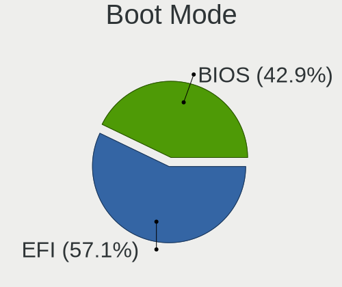
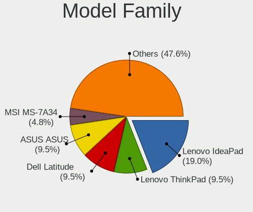
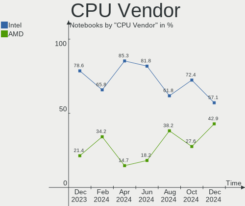
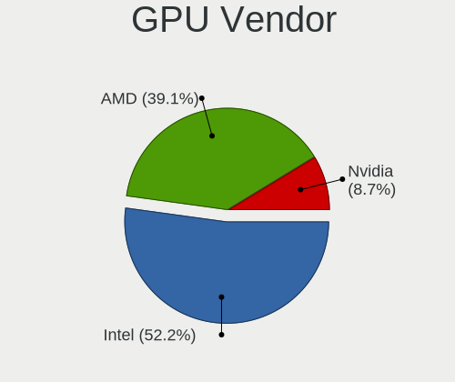
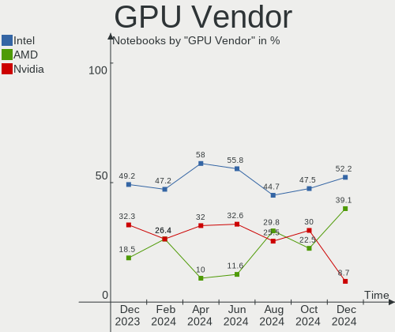
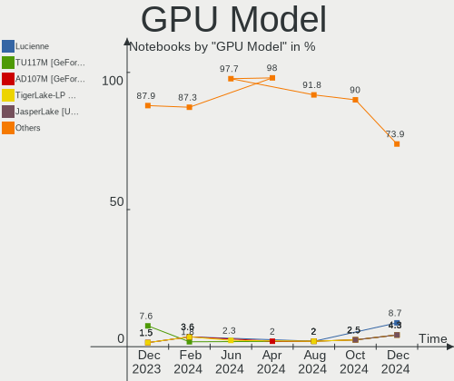
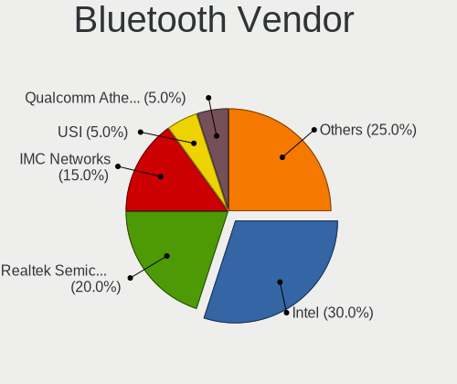
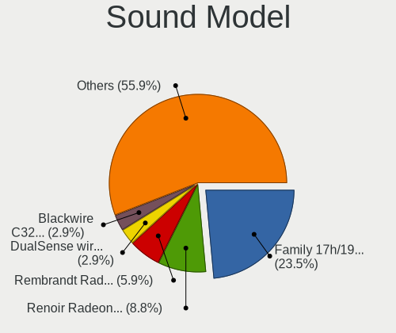
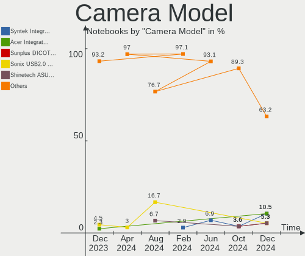
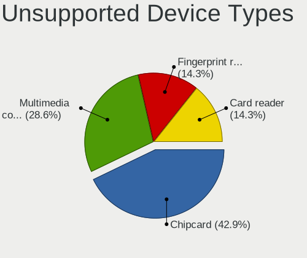

EndeavourOS - Hardware Trends (Notebooks)
-----------------------------------------

A project to identify most popular hardware characteristics and track their change
over time based on data collected by Linux users at https://Linux-Hardware.org.

Anyone can contribute to this report by the [hw-probe](https://github.com/linuxhw/hw-probe) tool:

    sudo -E hw-probe -all -upload

This report is for one last month. Overall report since the beginning of time: [TestCoverage](https://github.com/linuxhw/TestCoverage)

Period: Dec, 2022.

Contents
--------

* [ System ](#system)
  - [ OS                       ](#os)
  - [ OS Family                ](#os-family)
  - [ Kernel                   ](#kernel)
  - [ Kernel Family            ](#kernel-family)
  - [ Kernel Major Ver.        ](#kernel-major-ver)
  - [ Arch                     ](#arch)
  - [ DE                       ](#de)
  - [ Display Server           ](#display-server)
  - [ Display Manager          ](#display-manager)
  - [ OS Lang                  ](#os-lang)
  - [ Boot Mode                ](#boot-mode)
  - [ Filesystem               ](#filesystem)
  - [ Part. scheme             ](#part-scheme)
  - [ Dual Boot with Linux/BSD ](#dual-boot-with-linuxbsd)
  - [ Dual Boot (Win)          ](#dual-boot-win)

* [ Board ](#board)
  - [ Vendor                   ](#vendor)
  - [ Model                    ](#model)
  - [ Model Family             ](#model-family)
  - [ MFG Year                 ](#mfg-year)
  - [ Form Factor              ](#form-factor)
  - [ Secure Boot              ](#secure-boot)
  - [ Coreboot                 ](#coreboot)
  - [ RAM Size                 ](#ram-size)
  - [ RAM Used                 ](#ram-used)
  - [ Total Drives             ](#total-drives)
  - [ Has CD-ROM               ](#has-cd-rom)
  - [ Has Ethernet             ](#has-ethernet)
  - [ Has WiFi                 ](#has-wifi)
  - [ Has Bluetooth            ](#has-bluetooth)

* [ Location ](#location)
  - [ Country                  ](#country)
  - [ City                     ](#city)

* [ Drives ](#drives)
  - [ Drive Vendor             ](#drive-vendor)
  - [ Drive Model              ](#drive-model)
  - [ HDD Vendor               ](#hdd-vendor)
  - [ SSD Vendor               ](#ssd-vendor)
  - [ Drive Kind               ](#drive-kind)
  - [ Drive Connector          ](#drive-connector)
  - [ Drive Size               ](#drive-size)
  - [ Space Total              ](#space-total)
  - [ Space Used               ](#space-used)
  - [ Malfunc. Drives          ](#malfunc-drives)
  - [ Malfunc. Drive Vendor    ](#malfunc-drive-vendor)
  - [ Malfunc. HDD Vendor      ](#malfunc-hdd-vendor)
  - [ Malfunc. Drive Kind      ](#malfunc-drive-kind)
  - [ Failed Drives            ](#failed-drives)
  - [ Failed Drive Vendor      ](#failed-drive-vendor)
  - [ Drive Status             ](#drive-status)

* [ Storage controller ](#storage-controller)
  - [ Storage Vendor           ](#storage-vendor)
  - [ Storage Model            ](#storage-model)
  - [ Storage Kind             ](#storage-kind)

* [ Processor ](#processor)
  - [ CPU Vendor               ](#cpu-vendor)
  - [ CPU Model                ](#cpu-model)
  - [ CPU Model Family         ](#cpu-model-family)
  - [ CPU Cores                ](#cpu-cores)
  - [ CPU Sockets              ](#cpu-sockets)
  - [ CPU Threads              ](#cpu-threads)
  - [ CPU Op-Modes             ](#cpu-op-modes)
  - [ CPU Microcode            ](#cpu-microcode)
  - [ CPU Microarch            ](#cpu-microarch)

* [ Graphics ](#graphics)
  - [ GPU Vendor               ](#gpu-vendor)
  - [ GPU Model                ](#gpu-model)
  - [ GPU Combo                ](#gpu-combo)
  - [ GPU Driver               ](#gpu-driver)
  - [ GPU Memory               ](#gpu-memory)

* [ Monitor ](#monitor)
  - [ Monitor Vendor           ](#monitor-vendor)
  - [ Monitor Model            ](#monitor-model)
  - [ Monitor Resolution       ](#monitor-resolution)
  - [ Monitor Diagonal         ](#monitor-diagonal)
  - [ Monitor Width            ](#monitor-width)
  - [ Aspect Ratio             ](#aspect-ratio)
  - [ Monitor Area             ](#monitor-area)
  - [ Pixel Density            ](#pixel-density)
  - [ Multiple Monitors        ](#multiple-monitors)

* [ Network ](#network)
  - [ Net Controller Vendor    ](#net-controller-vendor)
  - [ Net Controller Model     ](#net-controller-model)
  - [ Wireless Vendor          ](#wireless-vendor)
  - [ Wireless Model           ](#wireless-model)
  - [ Ethernet Vendor          ](#ethernet-vendor)
  - [ Ethernet Model           ](#ethernet-model)
  - [ Net Controller Kind      ](#net-controller-kind)
  - [ Used Controller          ](#used-controller)
  - [ NICs                     ](#nics)
  - [ IPv6                     ](#ipv6)

* [ Bluetooth ](#bluetooth)
  - [ Bluetooth Vendor         ](#bluetooth-vendor)
  - [ Bluetooth Model          ](#bluetooth-model)

* [ Sound ](#sound)
  - [ Sound Vendor             ](#sound-vendor)
  - [ Sound Model              ](#sound-model)

* [ Memory ](#memory)
  - [ Memory Vendor            ](#memory-vendor)
  - [ Memory Model             ](#memory-model)
  - [ Memory Kind              ](#memory-kind)
  - [ Memory Form Factor       ](#memory-form-factor)
  - [ Memory Size              ](#memory-size)
  - [ Memory Speed             ](#memory-speed)

* [ Printers & scanners ](#printers--scanners)
  - [ Printer Vendor           ](#printer-vendor)
  - [ Printer Model            ](#printer-model)
  - [ Scanner Vendor           ](#scanner-vendor)
  - [ Scanner Model            ](#scanner-model)

* [ Camera ](#camera)
  - [ Camera Vendor            ](#camera-vendor)
  - [ Camera Model             ](#camera-model)

* [ Security ](#security)
  - [ Fingerprint Vendor       ](#fingerprint-vendor)
  - [ Fingerprint Model        ](#fingerprint-model)
  - [ Chipcard Vendor          ](#chipcard-vendor)
  - [ Chipcard Model           ](#chipcard-model)

* [ Unsupported ](#unsupported)
  - [ Unsupported Devices      ](#unsupported-devices)
  - [ Unsupported Device Types ](#unsupported-device-types)

System
------

OS
--

Installed operating systems

| Name                | Notebooks | Percent |
|---------------------|-----------|---------|
| EndeavourOS Rolling | 22        | 100%    |

OS Family
---------

OS without a version

| Name        | Notebooks | Percent |
|-------------|-----------|---------|
| EndeavourOS | 22        | 100%    |

Kernel
------

Version of the Linux kernel

| Version           | Notebooks | Percent |
|-------------------|-----------|---------|
| 6.1.1-arch1-1     | 4         | 18.18%  |
| 6.0.12-arch1-1    | 4         | 18.18%  |
| 6.1.1-zen1-1-zen  | 2         | 9.09%   |
| 6.0.12-zen1-1-zen | 2         | 9.09%   |
| 6.0.10-arch2-1    | 2         | 9.09%   |
| 6.1.1-AMD         | 1         | 4.55%   |
| 6.0.9-zen1-1-zen  | 1         | 4.55%   |
| 6.0.9-arch1-1     | 1         | 4.55%   |
| 6.0.11-zen1-1-zen | 1         | 4.55%   |
| 6.0.11-arch1-1    | 1         | 4.55%   |
| 5.19.7-arch1-1    | 1         | 4.55%   |
| 5.18.1-arch1-1    | 1         | 4.55%   |
| 5.15.83-1-lts     | 1         | 4.55%   |

Kernel Family
-------------

Linux kernel without a distro release

| Version | Notebooks | Percent |
|---------|-----------|---------|
| 6.1.1   | 7         | 31.82%  |
| 6.0.12  | 6         | 27.27%  |
| 6.0.9   | 2         | 9.09%   |
| 6.0.11  | 2         | 9.09%   |
| 6.0.10  | 2         | 9.09%   |
| 5.19.7  | 1         | 4.55%   |
| 5.18.1  | 1         | 4.55%   |
| 5.15.83 | 1         | 4.55%   |

Kernel Major Ver.
-----------------

Linux kernel major version

| Version | Notebooks | Percent |
|---------|-----------|---------|
| 6.0     | 12        | 54.55%  |
| 6.1     | 7         | 31.82%  |
| 5.19    | 1         | 4.55%   |
| 5.18    | 1         | 4.55%   |
| 5.15    | 1         | 4.55%   |

Arch
----

OS architecture (x86_64, i586, etc.)

| Name   | Notebooks | Percent |
|--------|-----------|---------|
| x86_64 | 22        | 100%    |

DE
--

Desktop Environment

| Name   | Notebooks | Percent |
|--------|-----------|---------|
| KDE5   | 10        | 45.45%  |
| GNOME  | 4         | 18.18%  |
| i3     | 3         | 13.64%  |
| XFCE   | 2         | 9.09%   |
| sway   | 1         | 4.55%   |
| MATE   | 1         | 4.55%   |
| Budgie | 1         | 4.55%   |

Display Server
--------------

X11 or Wayland

| Name    | Notebooks | Percent |
|---------|-----------|---------|
| X11     | 19        | 86.36%  |
| Wayland | 3         | 13.64%  |

Display Manager
---------------

SDDM, LightDM, etc.

| Name    | Notebooks | Percent |
|---------|-----------|---------|
| LightDM | 9         | 40.91%  |
| SDDM    | 6         | 27.27%  |
| Unknown | 6         | 27.27%  |
| GDM     | 1         | 4.55%   |

OS Lang
-------

Language

| Lang  | Notebooks | Percent |
|-------|-----------|---------|
| en_US | 13        | 59.09%  |
| it_IT | 3         | 13.64%  |
| pt_PT | 1         | 4.55%   |
| fr_FR | 1         | 4.55%   |
| en_IN | 1         | 4.55%   |
| de_DE | 1         | 4.55%   |
| de_CH | 1         | 4.55%   |
| da_DK | 1         | 4.55%   |

Boot Mode
---------

EFI or BIOS

| Mode | Notebooks | Percent |
|------|-----------|---------|
| EFI  | 13        | 59.09%  |
| BIOS | 9         | 40.91%  |

Filesystem
----------

Type of filesystem

| Type  | Notebooks | Percent |
|-------|-----------|---------|
| Ext4  | 16        | 72.73%  |
| Btrfs | 5         | 22.73%  |
| Xfs   | 1         | 4.55%   |

Part. scheme
------------

Scheme of partitioning

| Type    | Notebooks | Percent |
|---------|-----------|---------|
| GPT     | 15        | 68.18%  |
| Unknown | 6         | 27.27%  |
| MBR     | 1         | 4.55%   |

Dual Boot with Linux/BSD
------------------------

Hosting more than one Linux/BSD

| Dual boot | Notebooks | Percent |
|-----------|-----------|---------|
| No        | 19        | 86.36%  |
| Yes       | 3         | 13.64%  |

Dual Boot (Win)
---------------

Hosting Linux and Windows

| Dual boot | Notebooks | Percent |
|-----------|-----------|---------|
| No        | 16        | 72.73%  |
| Yes       | 6         | 27.27%  |

Board
-----

Vendor
------

Motherboard manufacturer

| Name             | Notebooks | Percent |
|------------------|-----------|---------|
| Lenovo           | 9         | 40.91%  |
| Hewlett-Packard  | 4         | 18.18%  |
| ASUSTek Computer | 4         | 18.18%  |
| MSI              | 2         | 9.09%   |
| Sony             | 1         | 4.55%   |
| PC Specialist    | 1         | 4.55%   |
| Acer             | 1         | 4.55%   |

Model
-----

Motherboard model

| Name                                    | Notebooks | Percent |
|-----------------------------------------|-----------|---------|
| Sony VGN-FW11E                          | 1         | 4.55%   |
| PC Specialist Elimina Iv 17             | 1         | 4.55%   |
| MSI Modern 15 A5M                       | 1         | 4.55%   |
| MSI GS75 Stealth 8SG                    | 1         | 4.55%   |
| Lenovo ThinkPad X230 2324KP1            | 1         | 4.55%   |
| Lenovo ThinkPad T480 20L5000UUS         | 1         | 4.55%   |
| Lenovo ThinkPad T14 Gen 3 21CFCTO1WW    | 1         | 4.55%   |
| Lenovo ThinkBook 15 G3 ACL 21A4         | 1         | 4.55%   |
| Lenovo Legion 5 Pro 16ARH7H 82RG        | 1         | 4.55%   |
| Lenovo Legion 5 15ACH6H 82JU            | 1         | 4.55%   |
| Lenovo IdeaPad S340-15API 81NC          | 1         | 4.55%   |
| Lenovo IdeaPad Gaming 3 15ACH6 82K2     | 1         | 4.55%   |
| Lenovo IdeaPad 5 15ARE05 81YQ           | 1         | 4.55%   |
| HP ProBook 450 G7                       | 1         | 4.55%   |
| HP Pavilion Gaming Laptop 15-ec0xxx     | 1         | 4.55%   |
| HP EliteBook 845 14 inch G9 Notebook PC | 1         | 4.55%   |
| HP 15                                   | 1         | 4.55%   |
| ASUS ZenBook UX450FDX_UX480FD           | 1         | 4.55%   |
| ASUS ZenBook UX325EA_UX325EA            | 1         | 4.55%   |
| ASUS VivoBook_ASUSLaptop X512DA_X512DA  | 1         | 4.55%   |
| ASUS ASUS TUF Dash F15 FX516PE_TUF516PE | 1         | 4.55%   |
| Acer Swift SFX14-41G                    | 1         | 4.55%   |

Model Family
------------

Motherboard model prefix

| Name                  | Notebooks | Percent |
|-----------------------|-----------|---------|
| Lenovo ThinkPad       | 3         | 13.64%  |
| Lenovo IdeaPad        | 3         | 13.64%  |
| Lenovo Legion         | 2         | 9.09%   |
| ASUS ZenBook          | 2         | 9.09%   |
| Sony VGN-FW11E        | 1         | 4.55%   |
| PC Specialist Elimina | 1         | 4.55%   |
| MSI Modern            | 1         | 4.55%   |
| MSI GS75              | 1         | 4.55%   |
| Lenovo ThinkBook      | 1         | 4.55%   |
| HP ProBook            | 1         | 4.55%   |
| HP Pavilion           | 1         | 4.55%   |
| HP EliteBook          | 1         | 4.55%   |
| HP 15                 | 1         | 4.55%   |
| ASUS VivoBook         | 1         | 4.55%   |
| ASUS ASUS             | 1         | 4.55%   |
| Acer Swift            | 1         | 4.55%   |

MFG Year
--------

Motherboard manufacture year

| Year | Notebooks | Percent |
|------|-----------|---------|
| 2021 | 6         | 27.27%  |
| 2019 | 5         | 22.73%  |
| 2022 | 4         | 18.18%  |
| 2020 | 3         | 13.64%  |
| 2018 | 1         | 4.55%   |
| 2013 | 1         | 4.55%   |
| 2012 | 1         | 4.55%   |
| 2008 | 1         | 4.55%   |

Form Factor
-----------

Physical design of the computer

| Name     | Notebooks | Percent |
|----------|-----------|---------|
| Notebook | 22        | 100%    |

Secure Boot
-----------

Enabled or disabled

| State    | Notebooks | Percent |
|----------|-----------|---------|
| Disabled | 22        | 100%    |

Coreboot
--------

Have coreboot on board

| Used | Notebooks | Percent |
|------|-----------|---------|
| No   | 22        | 100%    |

RAM Size
--------

Total RAM memory

| Size in GB | Notebooks | Percent |
|------------|-----------|---------|
| 8.01-16.0  | 8         | 36.36%  |
| 4.01-8.0   | 4         | 18.18%  |
| 32.01-64.0 | 4         | 18.18%  |
| 16.01-24.0 | 3         | 13.64%  |
| 24.01-32.0 | 2         | 9.09%   |
| 2.01-3.0   | 1         | 4.55%   |

RAM Used
--------

Used RAM memory

| Used GB    | Notebooks | Percent |
|------------|-----------|---------|
| 4.01-8.0   | 6         | 27.27%  |
| 2.01-3.0   | 6         | 27.27%  |
| 1.01-2.0   | 4         | 18.18%  |
| 3.01-4.0   | 3         | 13.64%  |
| 8.01-16.0  | 2         | 9.09%   |
| 16.01-24.0 | 1         | 4.55%   |

Total Drives
------------

Number of drives on board

| Drives | Notebooks | Percent |
|--------|-----------|---------|
| 1      | 14        | 63.64%  |
| 2      | 8         | 36.36%  |

Has CD-ROM
----------

Has CD-ROM on board

| Presented | Notebooks | Percent |
|-----------|-----------|---------|
| No        | 21        | 95.45%  |
| Yes       | 1         | 4.55%   |

Has Ethernet
------------

Has Ethernet on board

| Presented | Notebooks | Percent |
|-----------|-----------|---------|
| Yes       | 15        | 68.18%  |
| No        | 7         | 31.82%  |

Has WiFi
--------

Has WiFi module

| Presented | Notebooks | Percent |
|-----------|-----------|---------|
| Yes       | 22        | 100%    |

Has Bluetooth
-------------

Has Bluetooth module

| Presented | Notebooks | Percent |
|-----------|-----------|---------|
| Yes       | 22        | 100%    |

Location
--------

Country
-------

Geographic location (country)

| Country     | Notebooks | Percent |
|-------------|-----------|---------|
| USA         | 7         | 31.82%  |
| Italy       | 3         | 13.64%  |
| Taiwan      | 1         | 4.55%   |
| Switzerland | 1         | 4.55%   |
| Romania     | 1         | 4.55%   |
| Portugal    | 1         | 4.55%   |
| Mexico      | 1         | 4.55%   |
| Kazakhstan  | 1         | 4.55%   |
| India       | 1         | 4.55%   |
| Germany     | 1         | 4.55%   |
| France      | 1         | 4.55%   |
| Finland     | 1         | 4.55%   |
| Denmark     | 1         | 4.55%   |
| Bangladesh  | 1         | 4.55%   |

City
----

Geographic location (city)

| City              | Notebooks | Percent |
|-------------------|-----------|---------|
| Zurich            | 1         | 4.55%   |
| Zhongli District  | 1         | 4.55%   |
| West Sacramento   | 1         | 4.55%   |
| Vejle             | 1         | 4.55%   |
| Tempio Pausania   | 1         | 4.55%   |
| Severna Park      | 1         | 4.55%   |
| Missoula          | 1         | 4.55%   |
| Minneapolis       | 1         | 4.55%   |
| Mexico City       | 1         | 4.55%   |
| Mesa              | 1         | 4.55%   |
| Landim            | 1         | 4.55%   |
| L'Haÿ-les-Roses  | 1         | 4.55%   |
| Kingston          | 1         | 4.55%   |
| Khilgaon          | 1         | 4.55%   |
| Helsinki          | 1         | 4.55%   |
| Frankfurt am Main | 1         | 4.55%   |
| Fontaniva         | 1         | 4.55%   |
| Delhi             | 1         | 4.55%   |
| Catanzaro         | 1         | 4.55%   |
| Camarillo         | 1         | 4.55%   |
| Bucharest         | 1         | 4.55%   |
| Astana            | 1         | 4.55%   |

Drives
------

Drive Vendor
------------

Hard drive vendors

| Vendor                       | Notebooks | Drives | Percent |
|------------------------------|-----------|--------|---------|
| Samsung Electronics          | 8         | 10     | 27.59%  |
| SK hynix                     | 4         | 4      | 13.79%  |
| Seagate                      | 2         | 2      | 6.9%    |
| Sandisk                      | 2         | 2      | 6.9%    |
| Crucial                      | 2         | 2      | 6.9%    |
| WALTON                       | 1         | 1      | 3.45%   |
| Union Memory (Shenzhen)      | 1         | 1      | 3.45%   |
| Solid State Storage          | 1         | 1      | 3.45%   |
| Shenzhen Longsys Electronics | 1         | 1      | 3.45%   |
| Mushkin                      | 1         | 1      | 3.45%   |
| Kingston Technology Company  | 1         | 1      | 3.45%   |
| Kingston                     | 1         | 1      | 3.45%   |
| Intel                        | 1         | 1      | 3.45%   |
| Hitachi                      | 1         | 1      | 3.45%   |
| HGST                         | 1         | 1      | 3.45%   |
| A-DATA Technology            | 1         | 1      | 3.45%   |

Drive Model
-----------

Hard drive models

| Model                                               | Notebooks | Percent |
|-----------------------------------------------------|-----------|---------|
| Samsung NVMe SSD Controller SM981/PM981/PM983 500GB | 2         | 6.45%   |
| Samsung NVMe SSD Controller PM9A1/PM9A3/980PRO 2TB  | 2         | 6.45%   |
| Samsung MZVLQ512HALU-000H1 512GB                    | 2         | 6.45%   |
| WALTON WS5256 256GB SSD                             | 1         | 3.23%   |
| Union Memory (Shenzhen) RPFTJ256PDD2MWX 256GB       | 1         | 3.23%   |
| Solid State Storage SSSTC CL1-4D256 256GB           | 1         | 3.23%   |
| SK hynix SKHynix_HFS512GDE9X081N 512GB              | 1         | 3.23%   |
| SK hynix SKHynix_HFM512GD3HX015N 512GB              | 1         | 3.23%   |
| SK hynix SHGP31-1000GM 1TB                          | 1         | 3.23%   |
| SK hynix HFM512GD3JX016N 512GB                      | 1         | 3.23%   |
| Shenzhen Longsys Lexar SSD 512GB                    | 1         | 3.23%   |
| Seagate ST500LT012-1DG142 500GB                     | 1         | 3.23%   |
| Seagate ST1000LM035-1RK172 1TB                      | 1         | 3.23%   |
| Sandisk WD Blue SN550 NVMe SSD 500GB                | 1         | 3.23%   |
| Sandisk WD Blue SN500 / PC SN520 NVMe SSD 256GB     | 1         | 3.23%   |
| Samsung SSD 980 1TB                                 | 1         | 3.23%   |
| Samsung PSSD T7 1TB                                 | 1         | 3.23%   |
| Samsung MZVLQ512HBLU-00B00 512GB                    | 1         | 3.23%   |
| Samsung MZALQ256HBJD-00BL2 256GB                    | 1         | 3.23%   |
| Mushkin MKNSSDVT2TB-D8                              | 1         | 3.23%   |
| Kingston Company U-SNS8154P3 NVMe SSD 512GB         | 1         | 3.23%   |
| Kingston OM8PCP3512F-AI1 512GB                      | 1         | 3.23%   |
| Intel SSD 660P Series 1024GB                        | 1         | 3.23%   |
| Hitachi HTS542525K9SA00 250GB                       | 1         | 3.23%   |
| HGST HTS725032A7E630 320GB                          | 1         | 3.23%   |
| Crucial CT240BX500SSD1 240GB                        | 1         | 3.23%   |
| Crucial CT1000MX500SSD1 1TB                         | 1         | 3.23%   |
| A-DATA ED600 1TB SSD                                | 1         | 3.23%   |

HDD Vendor
----------

Hard disk drive vendors

| Vendor  | Notebooks | Drives | Percent |
|---------|-----------|--------|---------|
| Seagate | 2         | 2      | 50%     |
| Hitachi | 1         | 1      | 25%     |
| HGST    | 1         | 1      | 25%     |

SSD Vendor
----------

Solid state drive vendors

| Vendor              | Notebooks | Drives | Percent |
|---------------------|-----------|--------|---------|
| Crucial             | 2         | 2      | 40%     |
| WALTON              | 1         | 1      | 20%     |
| Samsung Electronics | 1         | 1      | 20%     |
| A-DATA Technology   | 1         | 1      | 20%     |

Drive Kind
----------

HDD or SSD

| Kind | Notebooks | Drives | Percent |
|------|-----------|--------|---------|
| NVMe | 19        | 22     | 67.86%  |
| SSD  | 5         | 5      | 17.86%  |
| HDD  | 4         | 4      | 14.29%  |

Drive Connector
---------------

SATA, SAS, NVMe, etc.

| Type | Notebooks | Drives | Percent |
|------|-----------|--------|---------|
| NVMe | 19        | 22     | 70.37%  |
| SATA | 6         | 7      | 22.22%  |
| SAS  | 2         | 2      | 7.41%   |

Drive Size
----------

Size of hard drive

| Size in TB | Notebooks | Drives | Percent |
|------------|-----------|--------|---------|
| 0.51-1.0   | 4         | 4      | 50%     |
| 0.01-0.5   | 4         | 5      | 50%     |

Space Total
-----------

Amount of disk space available on the file system

| Size in GB     | Notebooks | Percent |
|----------------|-----------|---------|
| 1001-2000      | 6         | 27.27%  |
| 251-500        | 4         | 18.18%  |
| 101-250        | 4         | 18.18%  |
| 51-100         | 3         | 13.64%  |
| 501-1000       | 2         | 9.09%   |
| More than 3000 | 1         | 4.55%   |
| 1-20           | 1         | 4.55%   |
| Unknown        | 1         | 4.55%   |

Space Used
----------

Amount of used disk space

| Used GB        | Notebooks | Percent |
|----------------|-----------|---------|
| 21-50          | 6         | 27.27%  |
| 1-20           | 5         | 22.73%  |
| 501-1000       | 4         | 18.18%  |
| 51-100         | 3         | 13.64%  |
| More than 3000 | 1         | 4.55%   |
| 251-500        | 1         | 4.55%   |
| 101-250        | 1         | 4.55%   |
| Unknown        | 1         | 4.55%   |

Malfunc. Drives
---------------

Drive models with a malfunction

Zero info for selected period =(

Malfunc. Drive Vendor
---------------------

Vendors of faulty drives

Zero info for selected period =(

Malfunc. HDD Vendor
-------------------

Vendors of faulty HDD drives

Zero info for selected period =(

Malfunc. Drive Kind
-------------------

Kinds of faulty drives

Zero info for selected period =(

Failed Drives
-------------

Failed drive models

Zero info for selected period =(

Failed Drive Vendor
-------------------

Failed drive vendors

Zero info for selected period =(

Drive Status
------------

Number of failed and malfunc. drives

| Status   | Notebooks | Drives | Percent |
|----------|-----------|--------|---------|
| Works    | 14        | 21     | 60.87%  |
| Detected | 9         | 10     | 39.13%  |

Storage controller
------------------

Storage Vendor
--------------

Storage controller vendors

| Vendor                         | Notebooks | Percent |
|--------------------------------|-----------|---------|
| Intel                          | 9         | 25%     |
| Samsung Electronics            | 8         | 22.22%  |
| AMD                            | 7         | 19.44%  |
| SK hynix                       | 4         | 11.11%  |
| SanDisk                        | 2         | 5.56%   |
| Kingston Technology Company    | 2         | 5.56%   |
| Union Memory (Shenzhen)        | 1         | 2.78%   |
| Solid State Storage Technology | 1         | 2.78%   |
| Shenzhen Longsys Electronics   | 1         | 2.78%   |
| INNOGRIT                       | 1         | 2.78%   |

Storage Model
-------------

Storage controller models

| Model                                                                 | Notebooks | Percent |
|-----------------------------------------------------------------------|-----------|---------|
| AMD FCH SATA Controller [AHCI mode]                                   | 7         | 18.92%  |
| SK hynix Gold P31/PC711 NVMe Solid State Drive                        | 4         | 10.81%  |
| Samsung NVMe SSD Controller 980                                       | 4         | 10.81%  |
| Samsung NVMe SSD Controller SM981/PM981/PM983                         | 2         | 5.41%   |
| Samsung NVMe SSD Controller PM9A1/PM9A3/980PRO                        | 2         | 5.41%   |
| Intel Volume Management Device NVMe RAID Controller                   | 2         | 5.41%   |
| Union Memory (Shenzhen) Non-Volatile memory controller                | 1         | 2.7%    |
| Solid State Storage Non-Volatile memory controller                    | 1         | 2.7%    |
| Shenzhen Longsys Non-Volatile memory controller                       | 1         | 2.7%    |
| SanDisk WD Blue SN550 NVMe SSD                                        | 1         | 2.7%    |
| SanDisk WD Blue SN500 / PC SN520 NVMe SSD                             | 1         | 2.7%    |
| Kingston Company U-SNS8154P3 NVMe SSD                                 | 1         | 2.7%    |
| Kingston Company Company Non-Volatile memory controller               | 1         | 2.7%    |
| Intel SSD 660P Series                                                 | 1         | 2.7%    |
| Intel Comet Lake SATA AHCI Controller                                 | 1         | 2.7%    |
| Intel Cannon Point-LP SATA Controller [AHCI Mode]                     | 1         | 2.7%    |
| Intel Cannon Lake Mobile PCH SATA AHCI Controller                     | 1         | 2.7%    |
| Intel Alder Lake-P SATA AHCI Controller                               | 1         | 2.7%    |
| Intel 82801IBM/IEM (ICH9M/ICH9M-E) 4 port SATA Controller [AHCI mode] | 1         | 2.7%    |
| Intel 8 Series SATA Controller 1 [AHCI mode]                          | 1         | 2.7%    |
| Intel 7 Series Chipset Family 6-port SATA Controller [AHCI mode]      | 1         | 2.7%    |
| INNOGRIT Non-Volatile memory controller                               | 1         | 2.7%    |

Storage Kind
------------

Kind of storage controller (IDE, SATA, NVMe, SAS, ...)

| Kind | Notebooks | Percent |
|------|-----------|---------|
| NVMe | 19        | 54.29%  |
| SATA | 14        | 40%     |
| RAID | 2         | 5.71%   |

Processor
---------

CPU Vendor
----------

Processor vendors

| Vendor | Notebooks | Percent |
|--------|-----------|---------|
| AMD    | 12        | 54.55%  |
| Intel  | 10        | 45.45%  |

CPU Model
---------

Processor models

| Model                                         | Notebooks | Percent |
|-----------------------------------------------|-----------|---------|
| AMD Ryzen 5 5600H with Radeon Graphics        | 2         | 9.09%   |
| Intel Core i7-8750H CPU @ 2.20GHz             | 1         | 4.55%   |
| Intel Core i7-8550U CPU @ 1.80GHz             | 1         | 4.55%   |
| Intel Core i5-8265U CPU @ 1.60GHz             | 1         | 4.55%   |
| Intel Core i5-4210U CPU @ 1.70GHz             | 1         | 4.55%   |
| Intel Core i5-3320M CPU @ 2.60GHz             | 1         | 4.55%   |
| Intel Core i5-10210U CPU @ 1.60GHz            | 1         | 4.55%   |
| Intel Core 2 Duo CPU P8400 @ 2.26GHz          | 1         | 4.55%   |
| Intel 12th Gen Core i7-12700H                 | 1         | 4.55%   |
| Intel 11th Gen Core i7-1165G7 @ 2.80GHz       | 1         | 4.55%   |
| Intel 11th Gen Core i7-11370H @ 3.30GHz       | 1         | 4.55%   |
| AMD Ryzen 7 PRO 6850HS with Radeon Graphics   | 1         | 4.55%   |
| AMD Ryzen 7 6800H with Radeon Graphics        | 1         | 4.55%   |
| AMD Ryzen 7 5800U with Radeon Graphics        | 1         | 4.55%   |
| AMD Ryzen 7 5700U with Radeon Graphics        | 1         | 4.55%   |
| AMD Ryzen 7 3750H with Radeon Vega Mobile Gfx | 1         | 4.55%   |
| AMD Ryzen 7 3700U with Radeon Vega Mobile Gfx | 1         | 4.55%   |
| AMD Ryzen 5 PRO 6650U with Radeon Graphics    | 1         | 4.55%   |
| AMD Ryzen 5 5500U with Radeon Graphics        | 1         | 4.55%   |
| AMD Ryzen 5 4500U with Radeon Graphics        | 1         | 4.55%   |
| AMD Ryzen 5 3500U with Radeon Vega Mobile Gfx | 1         | 4.55%   |

CPU Model Family
----------------

Processor model prefix

| Model            | Notebooks | Percent |
|------------------|-----------|---------|
| AMD Ryzen 7      | 5         | 22.73%  |
| AMD Ryzen 5      | 5         | 22.73%  |
| Intel Core i5    | 4         | 18.18%  |
| Other            | 3         | 13.64%  |
| Intel Core i7    | 2         | 9.09%   |
| Intel Core 2 Duo | 1         | 4.55%   |
| AMD Ryzen 7 PRO  | 1         | 4.55%   |
| AMD Ryzen 5 PRO  | 1         | 4.55%   |

CPU Cores
---------

Number of processor cores

| Number | Notebooks | Percent |
|--------|-----------|---------|
| 4      | 8         | 36.36%  |
| 6      | 6         | 27.27%  |
| 8      | 4         | 18.18%  |
| 2      | 3         | 13.64%  |
| 14     | 1         | 4.55%   |

CPU Sockets
-----------

Number of sockets

| Number | Notebooks | Percent |
|--------|-----------|---------|
| 1      | 22        | 100%    |

CPU Threads
-----------

Threads per core (Hyper-Threading)

| Number | Notebooks | Percent |
|--------|-----------|---------|
| 2      | 19        | 86.36%  |
| 1      | 3         | 13.64%  |

CPU Op-Modes
------------

CPU Operation Modes (32-bit, 64-bit)

| Op mode        | Notebooks | Percent |
|----------------|-----------|---------|
| 32-bit, 64-bit | 22        | 100%    |

CPU Microcode
-------------

Microcode number

| Number     | Notebooks | Percent |
|------------|-----------|---------|
| Unknown    | 10        | 45.45%  |
| 0x806c1    | 2         | 9.09%   |
| 0x0a50000c | 2         | 9.09%   |
| 0x08608103 | 2         | 9.09%   |
| 0x08108102 | 2         | 9.09%   |
| 0x10676    | 1         | 4.55%   |
| 0x0a404102 | 1         | 4.55%   |
| 0x08600106 | 1         | 4.55%   |
| 0x08108109 | 1         | 4.55%   |

CPU Microarch
-------------

Microarchitecture

| Name      | Notebooks | Percent |
|-----------|-----------|---------|
| Unknown   | 6         | 27.27%  |
| KabyLake  | 4         | 18.18%  |
| Zen+      | 3         | 13.64%  |
| Zen 3     | 3         | 13.64%  |
| TigerLake | 2         | 9.09%   |
| Zen 2     | 1         | 4.55%   |
| Penryn    | 1         | 4.55%   |
| IvyBridge | 1         | 4.55%   |
| Haswell   | 1         | 4.55%   |

Graphics
--------

GPU Vendor
----------

Vendors of graphics cards

| Vendor | Notebooks | Percent |
|--------|-----------|---------|
| AMD    | 13        | 41.94%  |
| Nvidia | 9         | 29.03%  |
| Intel  | 9         | 29.03%  |

GPU Model
---------

Graphics card models

| Model                                                                | Notebooks | Percent |
|----------------------------------------------------------------------|-----------|---------|
| Nvidia TU117M [GeForce GTX 1650 Mobile / Max-Q]                      | 3         | 9.68%   |
| AMD Rembrandt [Radeon 680M]                                          | 3         | 9.68%   |
| AMD Picasso/Raven 2 [Radeon Vega Series / Radeon Vega Mobile Series] | 3         | 9.68%   |
| AMD Cezanne [Radeon Vega Series / Radeon Vega Mobile Series]         | 3         | 9.68%   |
| Nvidia GA106M [GeForce RTX 3060 Mobile / Max-Q]                      | 2         | 6.45%   |
| Intel TigerLake-LP GT2 [Iris Xe Graphics]                            | 2         | 6.45%   |
| AMD Lucienne                                                         | 2         | 6.45%   |
| Nvidia TU104M [GeForce RTX 2080 Mobile]                              | 1         | 3.23%   |
| Nvidia GP107M [GeForce GTX 1050 Mobile]                              | 1         | 3.23%   |
| Nvidia GF117M [GeForce 610M/710M/810M/820M / GT 620M/625M/630M/720M] | 1         | 3.23%   |
| Nvidia GA107M [GeForce RTX 3050 Ti Mobile]                           | 1         | 3.23%   |
| Intel WhiskeyLake-U GT2 [UHD Graphics 620]                           | 1         | 3.23%   |
| Intel UHD Graphics 620                                               | 1         | 3.23%   |
| Intel Haswell-ULT Integrated Graphics Controller                     | 1         | 3.23%   |
| Intel CometLake-U GT2 [UHD Graphics]                                 | 1         | 3.23%   |
| Intel CoffeeLake-H GT2 [UHD Graphics 630]                            | 1         | 3.23%   |
| Intel Alder Lake-P Integrated Graphics Controller                    | 1         | 3.23%   |
| Intel 3rd Gen Core processor Graphics Controller                     | 1         | 3.23%   |
| AMD RV620/M82 [Mobility Radeon HD 3450/3470]                         | 1         | 3.23%   |
| AMD Renoir                                                           | 1         | 3.23%   |

GPU Combo
---------

Combinations of graphics cards

| Name           | Notebooks | Percent |
|----------------|-----------|---------|
| 1 x AMD        | 9         | 40.91%  |
| Intel + Nvidia | 5         | 22.73%  |
| 1 x Intel      | 4         | 18.18%  |
| AMD + Nvidia   | 4         | 18.18%  |

GPU Driver
----------

Free vs proprietary

| Driver      | Notebooks | Percent |
|-------------|-----------|---------|
| Free        | 14        | 63.64%  |
| Proprietary | 8         | 36.36%  |

GPU Memory
----------

Total video memory

| Size in GB | Notebooks | Percent |
|------------|-----------|---------|
| Unknown    | 11        | 50%     |
| 0.01-0.5   | 4         | 18.18%  |
| 1.01-2.0   | 3         | 13.64%  |
| 5.01-6.0   | 2         | 9.09%   |
| 3.01-4.0   | 1         | 4.55%   |
| 0.51-1.0   | 1         | 4.55%   |

Monitor
-------

Monitor Vendor
--------------

Monitor vendors

| Vendor               | Notebooks | Percent |
|----------------------|-----------|---------|
| AU Optronics         | 7         | 25.93%  |
| Chimei Innolux       | 6         | 22.22%  |
| BOE                  | 4         | 14.81%  |
| Samsung Electronics  | 2         | 7.41%   |
| AOC                  | 2         | 7.41%   |
| Pixio                | 1         | 3.7%    |
| PANDA                | 1         | 3.7%    |
| LG Display           | 1         | 3.7%    |
| Dell                 | 1         | 3.7%    |
| BOE Technology Group | 1         | 3.7%    |
| BenQ                 | 1         | 3.7%    |

Monitor Model
-------------

Monitor models

| Model                                                                 | Notebooks | Percent |
|-----------------------------------------------------------------------|-----------|---------|
| Chimei Innolux LCD Monitor CMN15F5 1920x1080 344x193mm 15.5-inch      | 2         | 7.41%   |
| Samsung Electronics LF24T35 SAM707E 1920x1080 528x297mm 23.9-inch     | 1         | 3.7%    |
| Samsung Electronics LCD Monitor SDC4158 1920x1080 294x165mm 13.3-inch | 1         | 3.7%    |
| Pixio U29I WAM2900 2560x1080 690x260mm 29.0-inch                      | 1         | 3.7%    |
| PANDA LCD Monitor NCP004D 1920x1080 344x194mm 15.5-inch               | 1         | 3.7%    |
| LG Display LCD Monitor LGD02D8 1366x768 277x156mm 12.5-inch           | 1         | 3.7%    |
| Dell U2414H DELA0B2 1920x1080 527x296mm 23.8-inch                     | 1         | 3.7%    |
| Chimei Innolux LCD Monitor CMN175C 1920x1080 381x214mm 17.2-inch      | 1         | 3.7%    |
| Chimei Innolux LCD Monitor CMN151E 1920x1080 344x193mm 15.5-inch      | 1         | 3.7%    |
| Chimei Innolux LCD Monitor CMN1515 1920x1080 344x193mm 15.5-inch      | 1         | 3.7%    |
| Chimei Innolux LCD Monitor CMN1408 1920x1080 309x173mm 13.9-inch      | 1         | 3.7%    |
| BOE Technology Group LCD Monitor 2560x1600                            | 1         | 3.7%    |
| BOE LCD Monitor BOE0998 1920x1080 344x194mm 15.5-inch                 | 1         | 3.7%    |
| BOE LCD Monitor BOE0823 1920x1080 382x215mm 17.3-inch                 | 1         | 3.7%    |
| BOE LCD Monitor BOE0791 1920x1080 309x173mm 13.9-inch                 | 1         | 3.7%    |
| BOE LCD Monitor BOE078B 1366x768 344x194mm 15.5-inch                  | 1         | 3.7%    |
| BenQ EW3270U BNQ7950 3840x2160 698x393mm 31.5-inch                    | 1         | 3.7%    |
| AU Optronics LCD Monitor AUOFA9B 1920x1200 301x188mm 14.0-inch        | 1         | 3.7%    |
| AU Optronics LCD Monitor AUOE48D 1920x1080 344x194mm 15.5-inch        | 1         | 3.7%    |
| AU Optronics LCD Monitor AUOA49A 1920x1200 301x188mm 14.0-inch        | 1         | 3.7%    |
| AU Optronics LCD Monitor AUO4A99 1920x1080 344x194mm 15.5-inch        | 1         | 3.7%    |
| AU Optronics LCD Monitor AUO353D 1920x1080 309x174mm 14.0-inch        | 1         | 3.7%    |
| AU Optronics LCD Monitor AUO2E8D 1920x1080 344x194mm 15.5-inch        | 1         | 3.7%    |
| AU Optronics LCD Monitor AUO21ED 1920x1080 344x193mm 15.5-inch        | 1         | 3.7%    |
| AOC AG322QWS4R4 AOC3220 2560x1440 697x392mm 31.5-inch                 | 1         | 3.7%    |
| AOC 2279WH AOC2279 1920x1080 477x268mm 21.5-inch                      | 1         | 3.7%    |

Monitor Resolution
------------------

Monitor screen resolution

| Resolution        | Notebooks | Percent |
|-------------------|-----------|---------|
| 1920x1080 (FHD)   | 17        | 68%     |
| 1920x1200 (WUXGA) | 2         | 8%      |
| 1366x768 (WXGA)   | 2         | 8%      |
| 3840x2160 (4K)    | 1         | 4%      |
| 2560x1600         | 1         | 4%      |
| 2560x1440 (QHD)   | 1         | 4%      |
| 2560x1080         | 1         | 4%      |

Monitor Diagonal
----------------

Diagonal size in inches

| Inches  | Notebooks | Percent |
|---------|-----------|---------|
| 15      | 11        | 40.74%  |
| 14      | 3         | 11.11%  |
| 13      | 3         | 11.11%  |
| 31      | 2         | 7.41%   |
| 17      | 2         | 7.41%   |
| 29      | 1         | 3.7%    |
| 24      | 1         | 3.7%    |
| 23      | 1         | 3.7%    |
| 21      | 1         | 3.7%    |
| 12      | 1         | 3.7%    |
| Unknown | 1         | 3.7%    |

Monitor Width
-------------

Physical width

| Width in mm | Notebooks | Percent |
|-------------|-----------|---------|
| 301-350     | 16        | 59.26%  |
| 601-700     | 3         | 11.11%  |
| 501-600     | 2         | 7.41%   |
| 351-400     | 2         | 7.41%   |
| 201-300     | 2         | 7.41%   |
| 401-500     | 1         | 3.7%    |
| Unknown     | 1         | 3.7%    |

Aspect Ratio
------------

Proportional relationship between the width and the height

| Ratio   | Notebooks | Percent |
|---------|-----------|---------|
| 16/9    | 18        | 81.82%  |
| 16/10   | 2         | 9.09%   |
| 2.65    | 1         | 4.55%   |
| Unknown | 1         | 4.55%   |

Monitor Area
------------

Area in inch²

| Area in inch² | Notebooks | Percent |
|----------------|-----------|---------|
| 101-110        | 11        | 40.74%  |
| 81-90          | 5         | 18.52%  |
| 351-500        | 2         | 7.41%   |
| 201-250        | 2         | 7.41%   |
| 121-130        | 2         | 7.41%   |
| 71-80          | 1         | 3.7%    |
| 61-70          | 1         | 3.7%    |
| 251-300        | 1         | 3.7%    |
| 151-200        | 1         | 3.7%    |
| Unknown        | 1         | 3.7%    |

Pixel Density
-------------

Pixels per inch

| Density | Notebooks | Percent |
|---------|-----------|---------|
| 121-160 | 16        | 61.54%  |
| 51-100  | 4         | 15.38%  |
| 161-240 | 3         | 11.54%  |
| 101-120 | 2         | 7.69%   |
| Unknown | 1         | 3.85%   |

Multiple Monitors
-----------------

Total monitors connected

| Total | Notebooks | Percent |
|-------|-----------|---------|
| 1     | 16        | 72.73%  |
| 2     | 6         | 27.27%  |

Network
-------

Net Controller Vendor
---------------------

Controller vendors

| Vendor                   | Notebooks | Percent |
|--------------------------|-----------|---------|
| Intel                    | 13        | 39.39%  |
| Realtek Semiconductor    | 11        | 33.33%  |
| MediaTek                 | 3         | 9.09%   |
| Qualcomm Atheros         | 2         | 6.06%   |
| Qualcomm                 | 1         | 3.03%   |
| Marvell Technology Group | 1         | 3.03%   |
| Lenovo                   | 1         | 3.03%   |
| Cypress Semiconductor    | 1         | 3.03%   |

Net Controller Model
--------------------

Controller models

| Model                                                             | Notebooks | Percent |
|-------------------------------------------------------------------|-----------|---------|
| Realtek RTL8111/8168/8411 PCI Express Gigabit Ethernet Controller | 9         | 23.08%  |
| Realtek RTL8822CE 802.11ac PCIe Wireless Network Adapter          | 2         | 5.13%   |
| Intel Wireless 8265 / 8275                                        | 2         | 5.13%   |
| Intel Wi-Fi 6 AX210/AX211/AX411 160MHz                            | 2         | 5.13%   |
| Intel Wi-Fi 6 AX201                                               | 2         | 5.13%   |
| Intel Wi-Fi 6 AX200                                               | 2         | 5.13%   |
| Realtek RTL8852AE 802.11ax PCIe Wireless Network Adapter          | 1         | 2.56%   |
| Realtek RTL8723BE PCIe Wireless Network Adapter                   | 1         | 2.56%   |
| Realtek RTL810xE PCI Express Fast Ethernet controller             | 1         | 2.56%   |
| Realtek Realtek Network controller                                | 1         | 2.56%   |
| Qualcomm QCNFA765 Wireless Network Adapter                        | 1         | 2.56%   |
| Qualcomm Atheros QCA9377 802.11ac Wireless Network Adapter        | 1         | 2.56%   |
| Qualcomm Atheros Killer E2500 Gigabit Ethernet Controller         | 1         | 2.56%   |
| MediaTek MT7922 802.11ax PCI Express Wireless Network Adapter     | 1         | 2.56%   |
| MediaTek MT7921K (RZ608) Wi-Fi 6E 80MHz                           | 1         | 2.56%   |
| MediaTek MT7921 802.11ax PCI Express Wireless Network Adapter     | 1         | 2.56%   |
| Marvell Group 88E8055 PCI-E Gigabit Ethernet Controller           | 1         | 2.56%   |
| Lenovo ThinkPad TBT 3 Dock                                        | 1         | 2.56%   |
| Intel WiFi Link 5100                                              | 1         | 2.56%   |
| Intel Ethernet Connection (4) I219-V                              | 1         | 2.56%   |
| Intel Centrino Advanced-N 6205 [Taylor Peak]                      | 1         | 2.56%   |
| Intel Cannon Point-LP CNVi [Wireless-AC]                          | 1         | 2.56%   |
| Intel Cannon Lake PCH CNVi WiFi                                   | 1         | 2.56%   |
| Intel Alder Lake-P PCH CNVi WiFi                                  | 1         | 2.56%   |
| Intel 82579LM Gigabit Network Connection (Lewisville)             | 1         | 2.56%   |
| Cypress K38231_03                                                 | 1         | 2.56%   |

Wireless Vendor
---------------

Wireless vendors

| Vendor                | Notebooks | Percent |
|-----------------------|-----------|---------|
| Intel                 | 13        | 56.52%  |
| Realtek Semiconductor | 5         | 21.74%  |
| MediaTek              | 3         | 13.04%  |
| Qualcomm Atheros      | 1         | 4.35%   |
| Qualcomm              | 1         | 4.35%   |

Wireless Model
--------------

Wireless models

| Model                                                         | Notebooks | Percent |
|---------------------------------------------------------------|-----------|---------|
| Realtek RTL8822CE 802.11ac PCIe Wireless Network Adapter      | 2         | 8.7%    |
| Intel Wireless 8265 / 8275                                    | 2         | 8.7%    |
| Intel Wi-Fi 6 AX210/AX211/AX411 160MHz                        | 2         | 8.7%    |
| Intel Wi-Fi 6 AX201                                           | 2         | 8.7%    |
| Intel Wi-Fi 6 AX200                                           | 2         | 8.7%    |
| Realtek RTL8852AE 802.11ax PCIe Wireless Network Adapter      | 1         | 4.35%   |
| Realtek RTL8723BE PCIe Wireless Network Adapter               | 1         | 4.35%   |
| Realtek Realtek Network controller                            | 1         | 4.35%   |
| Qualcomm QCNFA765 Wireless Network Adapter                    | 1         | 4.35%   |
| Qualcomm Atheros QCA9377 802.11ac Wireless Network Adapter    | 1         | 4.35%   |
| MediaTek MT7922 802.11ax PCI Express Wireless Network Adapter | 1         | 4.35%   |
| MediaTek MT7921K (RZ608) Wi-Fi 6E 80MHz                       | 1         | 4.35%   |
| MediaTek MT7921 802.11ax PCI Express Wireless Network Adapter | 1         | 4.35%   |
| Intel WiFi Link 5100                                          | 1         | 4.35%   |
| Intel Centrino Advanced-N 6205 [Taylor Peak]                  | 1         | 4.35%   |
| Intel Cannon Point-LP CNVi [Wireless-AC]                      | 1         | 4.35%   |
| Intel Cannon Lake PCH CNVi WiFi                               | 1         | 4.35%   |
| Intel Alder Lake-P PCH CNVi WiFi                              | 1         | 4.35%   |

Ethernet Vendor
---------------

Ethernet vendors

| Vendor                   | Notebooks | Percent |
|--------------------------|-----------|---------|
| Realtek Semiconductor    | 10        | 62.5%   |
| Intel                    | 2         | 12.5%   |
| Qualcomm Atheros         | 1         | 6.25%   |
| Marvell Technology Group | 1         | 6.25%   |
| Lenovo                   | 1         | 6.25%   |
| Cypress Semiconductor    | 1         | 6.25%   |

Ethernet Model
--------------

Ethernet models

| Model                                                             | Notebooks | Percent |
|-------------------------------------------------------------------|-----------|---------|
| Realtek RTL8111/8168/8411 PCI Express Gigabit Ethernet Controller | 9         | 56.25%  |
| Realtek RTL810xE PCI Express Fast Ethernet controller             | 1         | 6.25%   |
| Qualcomm Atheros Killer E2500 Gigabit Ethernet Controller         | 1         | 6.25%   |
| Marvell Group 88E8055 PCI-E Gigabit Ethernet Controller           | 1         | 6.25%   |
| Lenovo ThinkPad TBT 3 Dock                                        | 1         | 6.25%   |
| Intel Ethernet Connection (4) I219-V                              | 1         | 6.25%   |
| Intel 82579LM Gigabit Network Connection (Lewisville)             | 1         | 6.25%   |
| Cypress K38231_03                                                 | 1         | 6.25%   |

Net Controller Kind
-------------------

Ethernet, WiFi or modem

| Kind     | Notebooks | Percent |
|----------|-----------|---------|
| WiFi     | 22        | 59.46%  |
| Ethernet | 15        | 40.54%  |

Used Controller
---------------

Currently used network controller

| Kind     | Notebooks | Percent |
|----------|-----------|---------|
| WiFi     | 19        | 79.17%  |
| Ethernet | 5         | 20.83%  |

NICs
----

Total network controllers on board

| Total | Notebooks | Percent |
|-------|-----------|---------|
| 2     | 14        | 63.64%  |
| 1     | 8         | 36.36%  |

IPv6
----

IPv6 vs IPv4

| Used | Notebooks | Percent |
|------|-----------|---------|
| No   | 20        | 90.91%  |
| Yes  | 2         | 9.09%   |

Bluetooth
---------

Bluetooth Vendor
----------------

Controller vendors

| Vendor                          | Notebooks | Percent |
|---------------------------------|-----------|---------|
| Intel                           | 11        | 47.83%  |
| Realtek Semiconductor           | 5         | 21.74%  |
| Foxconn / Hon Hai               | 2         | 8.7%    |
| USI                             | 1         | 4.35%   |
| Qualcomm Atheros Communications | 1         | 4.35%   |
| MediaTek                        | 1         | 4.35%   |
| Broadcom                        | 1         | 4.35%   |
| Alps Electric                   | 1         | 4.35%   |

Bluetooth Model
---------------

Controller models

| Model                                          | Notebooks | Percent |
|------------------------------------------------|-----------|---------|
| Realtek Bluetooth Radio                        | 5         | 21.74%  |
| Intel AX201 Bluetooth                          | 3         | 13.04%  |
| Intel Bluetooth wireless interface             | 2         | 8.7%    |
| Intel Bluetooth 9460/9560 Jefferson Peak (JfP) | 2         | 8.7%    |
| Intel AX210 Bluetooth                          | 2         | 8.7%    |
| Intel AX200 Bluetooth                          | 2         | 8.7%    |
| Foxconn / Hon Hai Wireless_Device              | 2         | 8.7%    |
| USI Bluetooth Device                           | 1         | 4.35%   |
| Qualcomm Atheros  Bluetooth Device             | 1         | 4.35%   |
| MediaTek Wireless_Device                       | 1         | 4.35%   |
| Broadcom BCM20702 Bluetooth 4.0 [ThinkPad]     | 1         | 4.35%   |
| Alps Electric BCM2046 Bluetooth Device         | 1         | 4.35%   |

Sound
-----

Sound Vendor
------------

Sound card vendors

| Vendor            | Notebooks | Percent |
|-------------------|-----------|---------|
| AMD               | 13        | 40.63%  |
| Intel             | 10        | 31.25%  |
| Nvidia            | 6         | 18.75%  |
| Texas Instruments | 1         | 3.13%   |
| ROCCAT            | 1         | 3.13%   |
| Lenovo            | 1         | 3.13%   |

Sound Model
-----------

Sound card models

| Model                                                               | Notebooks | Percent |
|---------------------------------------------------------------------|-----------|---------|
| AMD Family 17h/19h HD Audio Controller                              | 12        | 28.57%  |
| AMD Renoir Radeon High Definition Audio Controller                  | 5         | 11.9%   |
| Nvidia GA106 High Definition Audio Controller                       | 2         | 4.76%   |
| Intel Tiger Lake-LP Smart Sound Technology Audio Controller         | 2         | 4.76%   |
| AMD Rembrandt Radeon High Definition Audio Controller               | 2         | 4.76%   |
| AMD Raven/Raven2/Fenghuang HDMI/DP Audio Controller                 | 2         | 4.76%   |
| Texas Instruments PCM2912A Audio Codec                              | 1         | 2.38%   |
| ROCCAT Elo 7.1 Air                                                  | 1         | 2.38%   |
| Nvidia TU107 GeForce GTX 1650 High Definition Audio Controller      | 1         | 2.38%   |
| Nvidia TU104 HD Audio Controller                                    | 1         | 2.38%   |
| Nvidia GP107GL High Definition Audio Controller                     | 1         | 2.38%   |
| Nvidia Audio device                                                 | 1         | 2.38%   |
| Lenovo ThinkPad Thunderbolt 3 Dock USB Audio                        | 1         | 2.38%   |
| Intel Sunrise Point-LP HD Audio                                     | 1         | 2.38%   |
| Intel Haswell-ULT HD Audio Controller                               | 1         | 2.38%   |
| Intel Comet Lake PCH-LP cAVS                                        | 1         | 2.38%   |
| Intel Cannon Point-LP High Definition Audio Controller              | 1         | 2.38%   |
| Intel Cannon Lake PCH cAVS                                          | 1         | 2.38%   |
| Intel Alder Lake PCH-P High Definition Audio Controller             | 1         | 2.38%   |
| Intel 82801I (ICH9 Family) HD Audio Controller                      | 1         | 2.38%   |
| Intel 8 Series HD Audio Controller                                  | 1         | 2.38%   |
| Intel 7 Series/C216 Chipset Family High Definition Audio Controller | 1         | 2.38%   |
| AMD RV620 HDMI Audio [Radeon HD 3450/3470/3550/3570]                | 1         | 2.38%   |

Memory
------

Memory Vendor
-------------

Memory module vendors

| Vendor              | Notebooks | Percent |
|---------------------|-----------|---------|
| Samsung Electronics | 5         | 26.32%  |
| Micron Technology   | 5         | 26.32%  |
| Crucial             | 4         | 21.05%  |
| SK hynix            | 2         | 10.53%  |
| Unknown             | 1         | 5.26%   |
| CSX                 | 1         | 5.26%   |
| Unknown             | 1         | 5.26%   |

Memory Model
------------

Memory module models

| Model                                                         | Notebooks | Percent |
|---------------------------------------------------------------|-----------|---------|
| Samsung RAM M471A1K43EB1-CWE 8GB SODIMM DDR4 3200MT/s         | 2         | 10%     |
| Unknown RAM Module 2GB SODIMM DDR2                            | 1         | 5%      |
| Unknown RAM Module 1GB SODIMM DDR2                            | 1         | 5%      |
| SK hynix RAM HMAA1GS6CJR6N-XN 8GB SODIMM DDR4 3200MT/s        | 1         | 5%      |
| SK hynix RAM HMA851S6AFR6N-UH 4GB SODIMM DDR4 2400MT/s        | 1         | 5%      |
| Samsung RAM UBE3D4AA-MGCR 2048MB Row Of Chips LPDDR4 4267MT/s | 1         | 5%      |
| Samsung RAM M471A1K43DB1-CTD 8GB SODIMM DDR4 2667MT/s         | 1         | 5%      |
| Samsung RAM M471A1G44AB0-CWE 8GB SODIMM DDR4 3200MT/s         | 1         | 5%      |
| Micron RAM MT53E1G32D2NP-046 8GB SODIMM LPDDR4 4266MT/s       | 1         | 5%      |
| Micron RAM Module 16GB SODIMM DDR4 3200MT/s                   | 1         | 5%      |
| Micron RAM 4ATF51264HZ-3G2J1 4GB Row Of Chips DDR4 3200MT/s   | 1         | 5%      |
| Micron RAM 4ATF51264HZ-2G6E1 4GB SODIMM DDR4 2667MT/s         | 1         | 5%      |
| Micron RAM 4ATF1G64HZ-3G2E1 8GB Row Of Chips DDR4 3200MT/s    | 1         | 5%      |
| CSX RAM V01D4S88GB1G81G82400 8GB SODIMM DDR4 2400MT/s         | 1         | 5%      |
| Crucial RAM CT8G4SFRA32A.M4FE 8GB SODIMM DDR4 3200MT/s        | 1         | 5%      |
| Crucial RAM CT32G4SFD832A.C16FF 32GB SODIMM DDR4 3200MT/s     | 1         | 5%      |
| Crucial RAM CT16G4SFRA32A.C8FE 16GB SODIMM DDR4 3200MT/s      | 1         | 5%      |
| Crucial RAM CT16G4SFD824A.C16FDD 16GB SODIMM DDR4 2400MT/s    | 1         | 5%      |
| Unknown                                                       | 1         | 5%      |

Memory Kind
-----------

Memory module kinds

| Kind   | Notebooks | Percent |
|--------|-----------|---------|
| DDR4   | 10        | 71.43%  |
| LPDDR4 | 2         | 14.29%  |
| DDR5   | 1         | 7.14%   |
| DDR2   | 1         | 7.14%   |

Memory Form Factor
------------------

Physical design of the memory module

| Name         | Notebooks | Percent |
|--------------|-----------|---------|
| SODIMM       | 12        | 80%     |
| Row Of Chips | 3         | 20%     |

Memory Size
-----------

Memory module size

| Size  | Notebooks | Percent |
|-------|-----------|---------|
| 8192  | 8         | 44.44%  |
| 16384 | 4         | 22.22%  |
| 4096  | 3         | 16.67%  |
| 32768 | 1         | 5.56%   |
| 2048  | 1         | 5.56%   |
| 1024  | 1         | 5.56%   |

Memory Speed
------------

Memory module speed

| Speed   | Notebooks | Percent |
|---------|-----------|---------|
| 3200    | 7         | 50%     |
| 2400    | 2         | 14.29%  |
| 4800    | 1         | 7.14%   |
| 4267    | 1         | 7.14%   |
| 4266    | 1         | 7.14%   |
| 2667    | 1         | 7.14%   |
| Unknown | 1         | 7.14%   |

Printers & scanners
-------------------

Printer Vendor
--------------

Printer device vendors

Zero info for selected period =(

Printer Model
-------------

Printer device models

Zero info for selected period =(

Scanner Vendor
--------------

Scanner device vendors

Zero info for selected period =(

Scanner Model
-------------

Scanner device models

Zero info for selected period =(

Camera
------

Camera Vendor
-------------

Camera device vendors

| Vendor                      | Notebooks | Percent |
|-----------------------------|-----------|---------|
| Acer                        | 6         | 31.58%  |
| Chicony Electronics         | 5         | 26.32%  |
| IMC Networks                | 4         | 21.05%  |
| Luxvisions Innotech Limited | 2         | 10.53%  |
| Ricoh                       | 1         | 5.26%   |
| Quanta                      | 1         | 5.26%   |

Camera Model
------------

Camera device models

| Model                                               | Notebooks | Percent |
|-----------------------------------------------------|-----------|---------|
| Chicony Integrated Camera                           | 3         | 15.79%  |
| Acer Integrated Camera                              | 3         | 15.79%  |
| IMC Networks Integrated Camera                      | 2         | 10.53%  |
| Acer HD Webcam                                      | 2         | 10.53%  |
| Ricoh Sony Vaio Integrated Webcam                   | 1         | 5.26%   |
| Quanta USB2.0 HD UVC WebCam                         | 1         | 5.26%   |
| Luxvisions Innotech Limited HP TrueVision HD Camera | 1         | 5.26%   |
| Luxvisions Innotech Limited HP 5MP Camera           | 1         | 5.26%   |
| IMC Networks USB2.0 HD UVC WebCam                   | 1         | 5.26%   |
| IMC Networks USB2.0 HD IR UVC WebCam                | 1         | 5.26%   |
| Chicony HP Truevision HD camera                     | 1         | 5.26%   |
| Chicony HP HD Camera                                | 1         | 5.26%   |
| Acer BisonCam,NB Pro                                | 1         | 5.26%   |

Security
--------

Fingerprint Vendor
------------------

Fingerprint sensor vendors

| Vendor                     | Notebooks | Percent |
|----------------------------|-----------|---------|
| Synaptics                  | 2         | 40%     |
| Shenzhen Goodix Technology | 2         | 40%     |
| Elan Microelectronics      | 1         | 20%     |

Fingerprint Model
-----------------

Fingerprint sensor models

| Model                                            | Notebooks | Percent |
|--------------------------------------------------|-----------|---------|
| Shenzhen Goodix  FingerPrint Device              | 2         | 40%     |
| Synaptics Metallica MIS Touch Fingerprint Reader | 1         | 20%     |
| Elan ELAN:Fingerprint                            | 1         | 20%     |
| Unknown                                          | 1         | 20%     |

Chipcard Vendor
---------------

Chipcard module vendors

| Vendor | Notebooks | Percent |
|--------|-----------|---------|
| Upek   | 1         | 100%    |

Chipcard Model
--------------

Chipcard module models

| Model                                                      | Notebooks | Percent |
|------------------------------------------------------------|-----------|---------|
| Upek TouchChip Fingerprint Coprocessor (WBF advanced mode) | 1         | 100%    |

Unsupported
-----------

Unsupported Devices
-------------------

Total unsupported devices on board

| Total | Notebooks | Percent |
|-------|-----------|---------|
| 0     | 13        | 59.09%  |
| 1     | 8         | 36.36%  |
| 2     | 1         | 4.55%   |

Unsupported Device Types
------------------------

Types of unsupported devices

| Type                  | Notebooks | Percent |
|-----------------------|-----------|---------|
| Fingerprint reader    | 5         | 55.56%  |
| Net/ethernet          | 1         | 11.11%  |
| Multimedia controller | 1         | 11.11%  |
| Graphics card         | 1         | 11.11%  |
| Chipcard              | 1         | 11.11%  |

