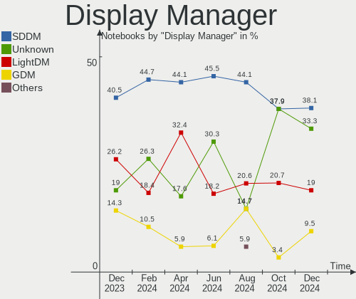
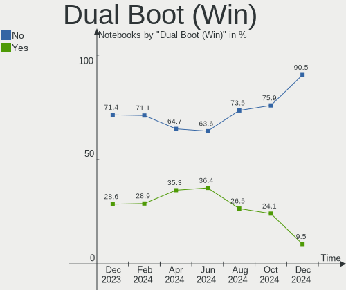
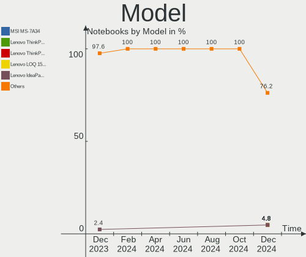
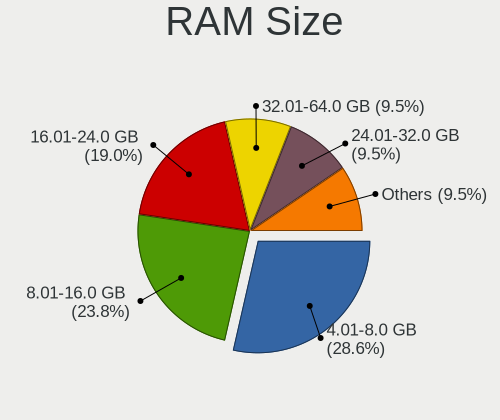
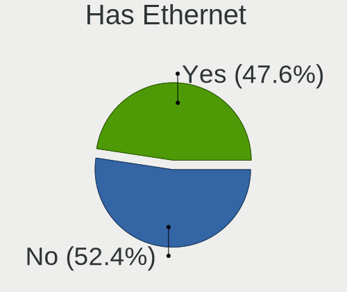
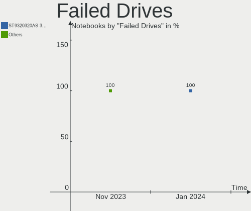
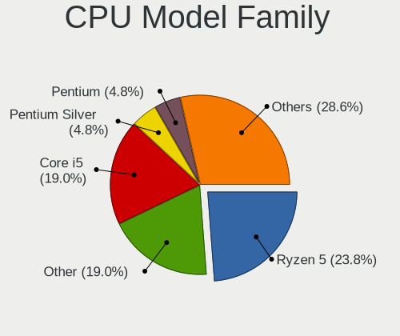
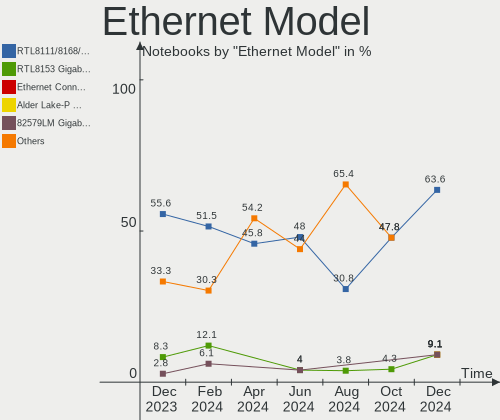
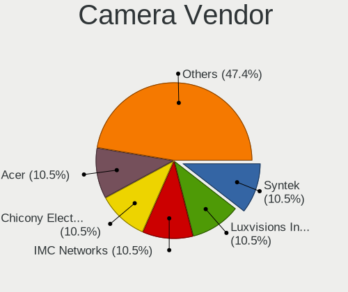
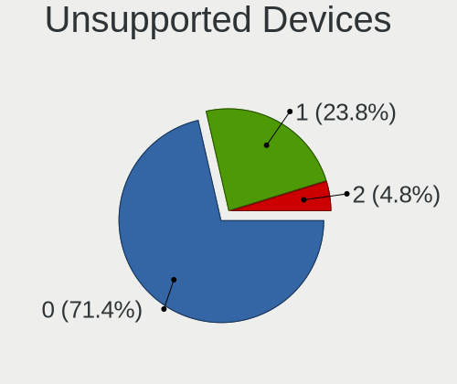

EndeavourOS Hardware Trends (Notebooks)
---------------------------------------

A project to identify most popular hardware characteristics and track their change
over time based on data collected by EndeavourOS users at https://Linux-Hardware.org.

Anyone can contribute to this report by the [hw-probe](https://github.com/linuxhw/hw-probe) tool:

    sudo -E hw-probe -all -upload

Full-feature report is available here: https://linux-hardware.org/?view=trends

Period: Feb, 2022.

Contents
--------

* [ System ](#system)
  - [ OS                       ](#os)
  - [ OS Family                ](#os-family)
  - [ Kernel                   ](#kernel)
  - [ Kernel Family            ](#kernel-family)
  - [ Kernel Major Ver.        ](#kernel-major-ver)
  - [ Arch                     ](#arch)
  - [ DE                       ](#de)
  - [ Display Server           ](#display-server)
  - [ Display Manager          ](#display-manager)
  - [ OS Lang                  ](#os-lang)
  - [ Boot Mode                ](#boot-mode)
  - [ Filesystem               ](#filesystem)
  - [ Part. scheme             ](#part-scheme)
  - [ Dual Boot with Linux/BSD ](#dual-boot-with-linuxbsd)
  - [ Dual Boot (Win)          ](#dual-boot-win)

* [ Board ](#board)
  - [ Vendor                   ](#vendor)
  - [ Model                    ](#model)
  - [ Model Family             ](#model-family)
  - [ MFG Year                 ](#mfg-year)
  - [ Form Factor              ](#form-factor)
  - [ Secure Boot              ](#secure-boot)
  - [ Coreboot                 ](#coreboot)
  - [ RAM Size                 ](#ram-size)
  - [ RAM Used                 ](#ram-used)
  - [ Total Drives             ](#total-drives)
  - [ Has CD-ROM               ](#has-cd-rom)
  - [ Has Ethernet             ](#has-ethernet)
  - [ Has WiFi                 ](#has-wifi)
  - [ Has Bluetooth            ](#has-bluetooth)

* [ Location ](#location)
  - [ Country                  ](#country)
  - [ City                     ](#city)

* [ Drives ](#drives)
  - [ Drive Vendor             ](#drive-vendor)
  - [ Drive Model              ](#drive-model)
  - [ HDD Vendor               ](#hdd-vendor)
  - [ SSD Vendor               ](#ssd-vendor)
  - [ Drive Kind               ](#drive-kind)
  - [ Drive Connector          ](#drive-connector)
  - [ Drive Size               ](#drive-size)
  - [ Space Total              ](#space-total)
  - [ Space Used               ](#space-used)
  - [ Malfunc. Drives          ](#malfunc-drives)
  - [ Malfunc. Drive Vendor    ](#malfunc-drive-vendor)
  - [ Malfunc. HDD Vendor      ](#malfunc-hdd-vendor)
  - [ Malfunc. Drive Kind      ](#malfunc-drive-kind)
  - [ Failed Drives            ](#failed-drives)
  - [ Failed Drive Vendor      ](#failed-drive-vendor)
  - [ Drive Status             ](#drive-status)

* [ Storage controller ](#storage-controller)
  - [ Storage Vendor           ](#storage-vendor)
  - [ Storage Model            ](#storage-model)
  - [ Storage Kind             ](#storage-kind)

* [ Processor ](#processor)
  - [ CPU Vendor               ](#cpu-vendor)
  - [ CPU Model                ](#cpu-model)
  - [ CPU Model Family         ](#cpu-model-family)
  - [ CPU Cores                ](#cpu-cores)
  - [ CPU Sockets              ](#cpu-sockets)
  - [ CPU Threads              ](#cpu-threads)
  - [ CPU Op-Modes             ](#cpu-op-modes)
  - [ CPU Microcode            ](#cpu-microcode)
  - [ CPU Microarch            ](#cpu-microarch)

* [ Graphics ](#graphics)
  - [ GPU Vendor               ](#gpu-vendor)
  - [ GPU Model                ](#gpu-model)
  - [ GPU Combo                ](#gpu-combo)
  - [ GPU Driver               ](#gpu-driver)
  - [ GPU Memory               ](#gpu-memory)

* [ Monitor ](#monitor)
  - [ Monitor Vendor           ](#monitor-vendor)
  - [ Monitor Model            ](#monitor-model)
  - [ Monitor Resolution       ](#monitor-resolution)
  - [ Monitor Diagonal         ](#monitor-diagonal)
  - [ Monitor Width            ](#monitor-width)
  - [ Aspect Ratio             ](#aspect-ratio)
  - [ Monitor Area             ](#monitor-area)
  - [ Pixel Density            ](#pixel-density)
  - [ Multiple Monitors        ](#multiple-monitors)

* [ Network ](#network)
  - [ Net Controller Vendor    ](#net-controller-vendor)
  - [ Net Controller Model     ](#net-controller-model)
  - [ Wireless Vendor          ](#wireless-vendor)
  - [ Wireless Model           ](#wireless-model)
  - [ Ethernet Vendor          ](#ethernet-vendor)
  - [ Ethernet Model           ](#ethernet-model)
  - [ Net Controller Kind      ](#net-controller-kind)
  - [ Used Controller          ](#used-controller)
  - [ NICs                     ](#nics)
  - [ IPv6                     ](#ipv6)

* [ Bluetooth ](#bluetooth)
  - [ Bluetooth Vendor         ](#bluetooth-vendor)
  - [ Bluetooth Model          ](#bluetooth-model)

* [ Sound ](#sound)
  - [ Sound Vendor             ](#sound-vendor)
  - [ Sound Model              ](#sound-model)

* [ Memory ](#memory)
  - [ Memory Vendor            ](#memory-vendor)
  - [ Memory Model             ](#memory-model)
  - [ Memory Kind              ](#memory-kind)
  - [ Memory Form Factor       ](#memory-form-factor)
  - [ Memory Size              ](#memory-size)
  - [ Memory Speed             ](#memory-speed)

* [ Printers & scanners ](#printers--scanners)
  - [ Printer Vendor           ](#printer-vendor)
  - [ Printer Model            ](#printer-model)
  - [ Scanner Vendor           ](#scanner-vendor)
  - [ Scanner Model            ](#scanner-model)

* [ Camera ](#camera)
  - [ Camera Vendor            ](#camera-vendor)
  - [ Camera Model             ](#camera-model)

* [ Security ](#security)
  - [ Fingerprint Vendor       ](#fingerprint-vendor)
  - [ Fingerprint Model        ](#fingerprint-model)
  - [ Chipcard Vendor          ](#chipcard-vendor)
  - [ Chipcard Model           ](#chipcard-model)

* [ Unsupported ](#unsupported)
  - [ Unsupported Devices      ](#unsupported-devices)
  - [ Unsupported Device Types ](#unsupported-device-types)

System
------

OS
--

Installed operating systems

| Name                | Notebooks | Percent |
|---------------------|-----------|---------|
| EndeavourOS Rolling | 22        | 88%     |
| EndeavourOS         | 3         | 12%     |

OS Family
---------

OS without a version

| Name        | Notebooks | Percent |
|-------------|-----------|---------|
| EndeavourOS | 25        | 100%    |

Kernel
------

Version of the Linux kernel

| Version             | Notebooks | Percent |
|---------------------|-----------|---------|
| 5.16.8-arch1-1      | 4         | 16%     |
| 5.16.10-arch1-1     | 4         | 16%     |
| 5.16.4-arch1-1      | 3         | 12%     |
| 5.16.5-arch1-1      | 2         | 8%      |
| 5.15.18-1-lts       | 2         | 8%      |
| 5.16.9-arch1-1      | 1         | 4%      |
| 5.16.8-zen1-2-zen   | 1         | 4%      |
| 5.16.7-lqx1-1-lqx   | 1         | 4%      |
| 5.16.7-arch1-1      | 1         | 4%      |
| 5.16.5-zen1-1.1-zen | 1         | 4%      |
| 5.16.4-zen1-1-zen   | 1         | 4%      |
| 5.16.1-arch1-g14-2  | 1         | 4%      |
| 5.15.23-2-lts       | 1         | 4%      |
| 5.15.19-1-lts       | 1         | 4%      |
| 5.11.14-arch1-1     | 1         | 4%      |

Kernel Family
-------------

Linux kernel without a distro release

| Version | Notebooks | Percent |
|---------|-----------|---------|
| 5.16.8  | 5         | 20%     |
| 5.16.4  | 4         | 16%     |
| 5.16.10 | 4         | 16%     |
| 5.16.5  | 3         | 12%     |
| 5.16.7  | 2         | 8%      |
| 5.15.18 | 2         | 8%      |
| 5.16.9  | 1         | 4%      |
| 5.16.1  | 1         | 4%      |
| 5.15.23 | 1         | 4%      |
| 5.15.19 | 1         | 4%      |
| 5.11.14 | 1         | 4%      |

Kernel Major Ver.
-----------------

Linux kernel major version

| Version | Notebooks | Percent |
|---------|-----------|---------|
| 5.16    | 20        | 80%     |
| 5.15    | 4         | 16%     |
| 5.11    | 1         | 4%      |

Arch
----

OS architecture (x86_64, i586, etc.)

| Name   | Notebooks | Percent |
|--------|-----------|---------|
| x86_64 | 25        | 100%    |

DE
--

Desktop Environment

| Name       | Notebooks | Percent |
|------------|-----------|---------|
| XFCE       | 9         | 36%     |
| KDE5       | 7         | 28%     |
| GNOME      | 6         | 24%     |
| X-Cinnamon | 1         | 4%      |
| MATE       | 1         | 4%      |
| LXDE       | 1         | 4%      |

Display Server
--------------

X11 or Wayland

| Name    | Notebooks | Percent |
|---------|-----------|---------|
| X11     | 19        | 76%     |
| Wayland | 4         | 16%     |
| Tty     | 2         | 8%      |

Display Manager
---------------

SDDM, LightDM, etc.

| Name    | Notebooks | Percent |
|---------|-----------|---------|
| LightDM | 12        | 48%     |
| SDDM    | 6         | 24%     |
| GDM     | 4         | 16%     |
| Unknown | 3         | 12%     |

OS Lang
-------

Language

| Lang  | Notebooks | Percent |
|-------|-----------|---------|
| en_US | 12        | 48%     |
| fr_FR | 3         | 12%     |
| en_GB | 3         | 12%     |
| en_CA | 2         | 8%      |
| nl_BE | 1         | 4%      |
| en_PH | 1         | 4%      |
| en_NZ | 1         | 4%      |
| en_AU | 1         | 4%      |
| de_AT | 1         | 4%      |

Boot Mode
---------

EFI or BIOS

| Mode | Notebooks | Percent |
|------|-----------|---------|
| EFI  | 16        | 64%     |
| BIOS | 9         | 36%     |

Filesystem
----------

Type of filesystem

| Type    | Notebooks | Percent |
|---------|-----------|---------|
| Ext4    | 18        | 72%     |
| Btrfs   | 6         | 24%     |
| Overlay | 1         | 4%      |

Part. scheme
------------

Scheme of partitioning

| Type    | Notebooks | Percent |
|---------|-----------|---------|
| GPT     | 16        | 64%     |
| MBR     | 5         | 20%     |
| Unknown | 4         | 16%     |

Dual Boot with Linux/BSD
------------------------

Hosting more than one Linux/BSD

| Dual boot | Notebooks | Percent |
|-----------|-----------|---------|
| No        | 23        | 92%     |
| Yes       | 2         | 8%      |

Dual Boot (Win)
---------------

Hosting Linux and Windows

| Dual boot | Notebooks | Percent |
|-----------|-----------|---------|
| No        | 19        | 76%     |
| Yes       | 6         | 24%     |

Board
-----

Vendor
------

Motherboard manufacturer

| Name             | Notebooks | Percent |
|------------------|-----------|---------|
| Lenovo           | 6         | 24%     |
| Hewlett-Packard  | 5         | 20%     |
| Dell             | 4         | 16%     |
| ASUSTek Computer | 3         | 12%     |
| HUAWEI           | 2         | 8%      |
| Acer             | 2         | 8%      |
| Radxa            | 1         | 4%      |
| Notebook         | 1         | 4%      |
| Eluktronics      | 1         | 4%      |

Model
-----

Motherboard model

| Name                                  | Notebooks | Percent |
|---------------------------------------|-----------|---------|
| Radxa ROCK Pi X                       | 1         | 4%      |
| Notebook NH5x_7xDPx                   | 1         | 4%      |
| Lenovo ThinkPad T470 W10DG 20JNS0DB00 | 1         | 4%      |
| Lenovo ThinkPad T440p 20AWS0U500      | 1         | 4%      |
| Lenovo ThinkPad E550 20DF0030US       | 1         | 4%      |
| Lenovo ThinkBook 15 G2 ITL 20VE       | 1         | 4%      |
| Lenovo IdeaPad Z510 20287             | 1         | 4%      |
| Lenovo IdeaPad 3 15ITL6 82H8          | 1         | 4%      |
| HUAWEI MACH-WX9                       | 1         | 4%      |
| HUAWEI HLYL-WXX9                      | 1         | 4%      |
| HP Pavilion g6                        | 1         | 4%      |
| HP Pavilion dv7                       | 1         | 4%      |
| HP Pavilion Aero Laptop 13-be0xxx     | 1         | 4%      |
| HP Pavilion 10 TS                     | 1         | 4%      |
| HP 250 G7 Notebook PC                 | 1         | 4%      |
| Eluktronics Prometheus XVII           | 1         | 4%      |
| Dell Latitude E6400                   | 1         | 4%      |
| Dell Latitude E4310                   | 1         | 4%      |
| Dell Latitude 3420                    | 1         | 4%      |
| Dell G3 3500                          | 1         | 4%      |
| ASUS UX490UA                          | 1         | 4%      |
| ASUS ROG Zephyrus M16 GU603HR_GU603HR | 1         | 4%      |
| ASUS ROG Flow X13 GV301QH_GV301QH     | 1         | 4%      |
| Acer Aspire V5-471                    | 1         | 4%      |
| Acer Aspire E1-572G                   | 1         | 4%      |

Model Family
------------

Motherboard model prefix

| Name                   | Notebooks | Percent |
|------------------------|-----------|---------|
| HP Pavilion            | 4         | 16%     |
| Lenovo ThinkPad        | 3         | 12%     |
| Dell Latitude          | 3         | 12%     |
| Lenovo IdeaPad         | 2         | 8%      |
| ASUS ROG               | 2         | 8%      |
| Acer Aspire            | 2         | 8%      |
| Radxa ROCK             | 1         | 4%      |
| Notebook NH5x          | 1         | 4%      |
| Lenovo ThinkBook       | 1         | 4%      |
| HUAWEI MACH-WX9        | 1         | 4%      |
| HUAWEI HLYL-WXX9       | 1         | 4%      |
| HP 250                 | 1         | 4%      |
| Eluktronics Prometheus | 1         | 4%      |
| Dell G3                | 1         | 4%      |
| ASUS UX490UA           | 1         | 4%      |

MFG Year
--------

Motherboard manufacture year

| Year | Notebooks | Percent |
|------|-----------|---------|
| 2021 | 7         | 28%     |
| 2020 | 4         | 16%     |
| 2013 | 4         | 16%     |
| 2018 | 2         | 8%      |
| 2017 | 2         | 8%      |
| 2008 | 2         | 8%      |
| 2014 | 1         | 4%      |
| 2012 | 1         | 4%      |
| 2011 | 1         | 4%      |
| 2010 | 1         | 4%      |

Form Factor
-----------

Physical design of the computer

| Name     | Notebooks | Percent |
|----------|-----------|---------|
| Notebook | 25        | 100%    |

Secure Boot
-----------

Enabled or disabled

| State    | Notebooks | Percent |
|----------|-----------|---------|
| Disabled | 25        | 100%    |

Coreboot
--------

Have coreboot on board

| Used | Notebooks | Percent |
|------|-----------|---------|
| No   | 25        | 100%    |

RAM Size
--------

Total RAM memory

| Size in GB  | Notebooks | Percent |
|-------------|-----------|---------|
| 16.01-24.0  | 6         | 24%     |
| 4.01-8.0    | 5         | 20%     |
| 8.01-16.0   | 5         | 20%     |
| 3.01-4.0    | 4         | 16%     |
| 32.01-64.0  | 2         | 8%      |
| 24.01-32.0  | 1         | 4%      |
| 64.01-256.0 | 1         | 4%      |
| 1.01-2.0    | 1         | 4%      |

RAM Used
--------

Used RAM memory

| Used GB   | Notebooks | Percent |
|-----------|-----------|---------|
| 2.01-3.0  | 7         | 28%     |
| 1.01-2.0  | 5         | 20%     |
| 4.01-8.0  | 4         | 16%     |
| 0.51-1.0  | 4         | 16%     |
| 3.01-4.0  | 3         | 12%     |
| 8.01-16.0 | 2         | 8%      |

Total Drives
------------

Number of drives on board

| Drives | Notebooks | Percent |
|--------|-----------|---------|
| 1      | 19        | 76%     |
| 2      | 6         | 24%     |

Has CD-ROM
----------

Has CD-ROM on board

| Presented | Notebooks | Percent |
|-----------|-----------|---------|
| No        | 17        | 68%     |
| Yes       | 8         | 32%     |

Has Ethernet
------------

Has Ethernet on board

| Presented | Notebooks | Percent |
|-----------|-----------|---------|
| Yes       | 20        | 80%     |
| No        | 5         | 20%     |

Has WiFi
--------

Has WiFi module

| Presented | Notebooks | Percent |
|-----------|-----------|---------|
| Yes       | 25        | 100%    |

Has Bluetooth
-------------

Has Bluetooth module

| Presented | Notebooks | Percent |
|-----------|-----------|---------|
| Yes       | 20        | 80%     |
| No        | 5         | 20%     |

Location
--------

Country
-------

Geographic location (country)

| Country     | Notebooks | Percent |
|-------------|-----------|---------|
| USA         | 6         | 24%     |
| France      | 3         | 12%     |
| Turkey      | 2         | 8%      |
| Canada      | 2         | 8%      |
| Ukraine     | 1         | 4%      |
| UK          | 1         | 4%      |
| Thailand    | 1         | 4%      |
| Spain       | 1         | 4%      |
| Philippines | 1         | 4%      |
| New Zealand | 1         | 4%      |
| Netherlands | 1         | 4%      |
| Finland     | 1         | 4%      |
| Brazil      | 1         | 4%      |
| Belgium     | 1         | 4%      |
| Austria     | 1         | 4%      |
| Australia   | 1         | 4%      |

City
----

Geographic location (city)

| City                 | Notebooks | Percent |
|----------------------|-----------|---------|
| Toms River           | 3         | 12%     |
| Victoria             | 1         | 4%      |
| Tarsus               | 1         | 4%      |
| Sydney               | 1         | 4%      |
| Sint-Amands          | 1         | 4%      |
| Recife               | 1         | 4%      |
| Paris                | 1         | 4%      |
| Makati City          | 1         | 4%      |
| Madrid               | 1         | 4%      |
| Lyon                 | 1         | 4%      |
| Los Angeles          | 1         | 4%      |
| Jenks                | 1         | 4%      |
| Irpin                | 1         | 4%      |
| Innsbruck            | 1         | 4%      |
| Hendon               | 1         | 4%      |
| Helsinki             | 1         | 4%      |
| Edmonton             | 1         | 4%      |
| Del Valle            | 1         | 4%      |
| Boulogne-Billancourt | 1         | 4%      |
| Bodrum               | 1         | 4%      |
| Bangkok              | 1         | 4%      |
| Auckland             | 1         | 4%      |
| Amsterdam            | 1         | 4%      |

Drives
------

Drive Vendor
------------

Hard drive vendors

| Vendor              | Notebooks | Drives | Percent |
|---------------------|-----------|--------|---------|
| Samsung Electronics | 7         | 7      | 24.14%  |
| WDC                 | 5         | 6      | 17.24%  |
| SanDisk             | 3         | 3      | 10.34%  |
| Toshiba             | 2         | 2      | 6.9%    |
| Seagate             | 2         | 2      | 6.9%    |
| XPG                 | 1         | 1      | 3.45%   |
| Unknown             | 1         | 1      | 3.45%   |
| SSSTC               | 1         | 1      | 3.45%   |
| SK Hynix            | 1         | 1      | 3.45%   |
| Phison              | 1         | 1      | 3.45%   |
| Mushkin             | 1         | 1      | 3.45%   |
| LITEON              | 1         | 1      | 3.45%   |
| Kingston            | 1         | 2      | 3.45%   |
| Intel               | 1         | 1      | 3.45%   |
| Fujitsu             | 1         | 1      | 3.45%   |

Drive Model
-----------

Hard drive models

| Model                                | Notebooks | Percent |
|--------------------------------------|-----------|---------|
| XPG NVMe SSD Drive 2TB               | 1         | 3.33%   |
| WDC WD5000LPVT-22G33T0 500GB         | 1         | 3.33%   |
| WDC WD5000BEVT-60ZAT1 500GB          | 1         | 3.33%   |
| WDC WD10SPZX-24Z10 1TB               | 1         | 3.33%   |
| WDC PC SN530 SDBPTPZ-512G-1002 512GB | 1         | 3.33%   |
| WDC PC SN530 SDBPMPZ-256G-1101 256GB | 1         | 3.33%   |
| Unknown SLD64G  64GB                 | 1         | 3.33%   |
| Toshiba THNSNJ128GMCU 128GB SSD      | 1         | 3.33%   |
| Toshiba KBG40ZMT128G MEMORY 128GB    | 1         | 3.33%   |
| SSSTC CL1-3D256-Q11 NVMe 256GB       | 1         | 3.33%   |
| SK Hynix BC511 NVMe 512GB            | 1         | 3.33%   |
| Seagate ST320LT012-1DG14C 320GB      | 1         | 3.33%   |
| Seagate ST2000LM015-2E8174 2TB       | 1         | 3.33%   |
| SanDisk X400 2.5 7MM 128GB SSD       | 1         | 3.33%   |
| SanDisk SD8SN8U256G1002 256GB SSD    | 1         | 3.33%   |
| Sandisk NVMe SSD Drive 2TB           | 1         | 3.33%   |
| Samsung SSD 980 500GB                | 1         | 3.33%   |
| Samsung SSD 970 EVO 500GB            | 1         | 3.33%   |
| Samsung SSD 870 QVO 1TB              | 1         | 3.33%   |
| Samsung SSD 870 EVO 250GB            | 1         | 3.33%   |
| Samsung MZVL21T0HCLR-00B00 1TB       | 1         | 3.33%   |
| Samsung MZALQ512HBLU-00BL2 512GB     | 1         | 3.33%   |
| Samsung MZ7LF192HCGS-000L1 192GB SSD | 1         | 3.33%   |
| Phison NVMe SSD Drive 2TB            | 1         | 3.33%   |
| Mushkin MKNSSDCR480GB                | 1         | 3.33%   |
| LITEON CA3-8D512 512GB               | 1         | 3.33%   |
| Kingston SUV500240G 240GB SSD        | 1         | 3.33%   |
| Kingston HyperX Fury 3D 240GB SSD    | 1         | 3.33%   |
| Intel SSDPEKNW512G8H 512GB           | 1         | 3.33%   |
| Fujitsu MHZ2250BJ FFS G2 250GB       | 1         | 3.33%   |

HDD Vendor
----------

Hard disk drive vendors

| Vendor  | Notebooks | Drives | Percent |
|---------|-----------|--------|---------|
| WDC     | 3         | 4      | 50%     |
| Seagate | 2         | 2      | 33.33%  |
| Fujitsu | 1         | 1      | 16.67%  |

SSD Vendor
----------

Solid state drive vendors

| Vendor              | Notebooks | Drives | Percent |
|---------------------|-----------|--------|---------|
| Samsung Electronics | 3         | 3      | 37.5%   |
| SanDisk             | 2         | 2      | 25%     |
| Toshiba             | 1         | 1      | 12.5%   |
| Mushkin             | 1         | 1      | 12.5%   |
| Kingston            | 1         | 2      | 12.5%   |

Drive Kind
----------

HDD or SSD

| Kind | Notebooks | Drives | Percent |
|------|-----------|--------|---------|
| NVMe | 11        | 14     | 42.31%  |
| SSD  | 8         | 9      | 30.77%  |
| HDD  | 6         | 7      | 23.08%  |
| MMC  | 1         | 1      | 3.85%   |

Drive Connector
---------------

SATA, SAS, NVMe, etc.

| Type | Notebooks | Drives | Percent |
|------|-----------|--------|---------|
| SATA | 13        | 16     | 52%     |
| NVMe | 11        | 14     | 44%     |
| MMC  | 1         | 1      | 4%      |

Drive Size
----------

Size of hard drive

| Size in TB | Notebooks | Drives | Percent |
|------------|-----------|--------|---------|
| 0.01-0.5   | 11        | 13     | 78.57%  |
| 0.51-1.0   | 2         | 2      | 14.29%  |
| 1.01-2.0   | 1         | 1      | 7.14%   |

Space Total
-----------

Amount of disk space available on the file system

| Size in GB | Notebooks | Percent |
|------------|-----------|---------|
| 101-250    | 9         | 36%     |
| 251-500    | 7         | 28%     |
| 1001-2000  | 4         | 16%     |
| 501-1000   | 4         | 16%     |
| Unknown    | 1         | 4%      |

Space Used
----------

Amount of used disk space

| Used GB  | Notebooks | Percent |
|----------|-----------|---------|
| 1-20     | 8         | 32%     |
| 21-50    | 5         | 20%     |
| 51-100   | 5         | 20%     |
| 101-250  | 4         | 16%     |
| 251-500  | 1         | 4%      |
| 501-1000 | 1         | 4%      |
| Unknown  | 1         | 4%      |

Malfunc. Drives
---------------

Drive models with a malfunction

| Model                        | Notebooks | Drives | Percent |
|------------------------------|-----------|--------|---------|
| WDC WD5000LPVT-22G33T0 500GB | 1         | 1      | 100%    |

Malfunc. Drive Vendor
---------------------

Vendors of faulty drives

| Vendor | Notebooks | Drives | Percent |
|--------|-----------|--------|---------|
| WDC    | 1         | 1      | 100%    |

Malfunc. HDD Vendor
-------------------

Vendors of faulty HDD drives

| Vendor | Notebooks | Drives | Percent |
|--------|-----------|--------|---------|
| WDC    | 1         | 1      | 100%    |

Malfunc. Drive Kind
-------------------

Kinds of faulty drives

| Kind | Notebooks | Drives | Percent |
|------|-----------|--------|---------|
| HDD  | 1         | 1      | 100%    |

Failed Drives
-------------

Failed drive models

| Model                  | Notebooks | Drives | Percent |
|------------------------|-----------|--------|---------|
| LITEON CA3-8D512 512GB | 1         | 1      | 100%    |

Failed Drive Vendor
-------------------

Failed drive vendors

| Vendor | Notebooks | Drives | Percent |
|--------|-----------|--------|---------|
| LITEON | 1         | 1      | 100%    |

Drive Status
------------

Number of failed and malfunc. drives

| Status   | Notebooks | Drives | Percent |
|----------|-----------|--------|---------|
| Works    | 18        | 22     | 72%     |
| Detected | 5         | 7      | 20%     |
| Malfunc  | 1         | 1      | 4%      |
| Failed   | 1         | 1      | 4%      |

Storage controller
------------------

Storage Vendor
--------------

Storage controller vendors

| Vendor                         | Notebooks | Percent |
|--------------------------------|-----------|---------|
| Intel                          | 16        | 51.61%  |
| Samsung Electronics            | 4         | 12.9%   |
| Sandisk                        | 3         | 9.68%   |
| AMD                            | 2         | 6.45%   |
| Solid State Storage Technology | 1         | 3.23%   |
| SK Hynix                       | 1         | 3.23%   |
| Phison Electronics             | 1         | 3.23%   |
| Lite-On Technology             | 1         | 3.23%   |
| KIOXIA                         | 1         | 3.23%   |
| ADATA Technology               | 1         | 3.23%   |

Storage Model
-------------

Storage controller models

| Model                                                                          | Notebooks | Percent |
|--------------------------------------------------------------------------------|-----------|---------|
| Intel Tiger Lake-LP SATA Controller [AHCI mode]                                | 3         | 9.09%   |
| Sandisk Non-Volatile memory controller                                         | 2         | 6.06%   |
| Samsung NVMe SSD Controller 980                                                | 2         | 6.06%   |
| Intel 82801IBM/IEM (ICH9M/ICH9M-E) 4 port SATA Controller [AHCI mode]          | 2         | 6.06%   |
| Intel 8 Series/C220 Series Chipset Family 6-port SATA Controller 1 [AHCI mode] | 2         | 6.06%   |
| Solid State Storage Non-Volatile memory controller                             | 1         | 3.03%   |
| SK Hynix BC511                                                                 | 1         | 3.03%   |
| Sandisk WD Black SN750 / PC SN730 NVMe SSD                                     | 1         | 3.03%   |
| Samsung NVMe SSD Controller SM981/PM981/PM983                                  | 1         | 3.03%   |
| Samsung NVMe SSD Controller PM9A1/PM9A3/980PRO                                 | 1         | 3.03%   |
| Phison PS5013 E13 NVMe Controller                                              | 1         | 3.03%   |
| Lite-On Non-Volatile memory controller                                         | 1         | 3.03%   |
| KIOXIA Non-Volatile memory controller                                          | 1         | 3.03%   |
| Intel Wildcat Point-LP SATA Controller [AHCI Mode]                             | 1         | 3.03%   |
| Intel Volume Management Device NVMe RAID Controller                            | 1         | 3.03%   |
| Intel Sunrise Point-LP SATA Controller [AHCI mode]                             | 1         | 3.03%   |
| Intel SSD 660P Series                                                          | 1         | 3.03%   |
| Intel Mobile 4 Series Chipset PT IDER Controller                               | 1         | 3.03%   |
| Intel Comet Lake PCH-H RAID                                                    | 1         | 3.03%   |
| Intel 82801 Mobile SATA Controller [RAID mode]                                 | 1         | 3.03%   |
| Intel 8 Series SATA Controller 1 [AHCI mode]                                   | 1         | 3.03%   |
| Intel 7 Series Chipset Family 6-port SATA Controller [AHCI mode]               | 1         | 3.03%   |
| Intel 5 Series/3400 Series Chipset 6 port SATA AHCI Controller                 | 1         | 3.03%   |
| Intel 400 Series Chipset Family SATA AHCI Controller                           | 1         | 3.03%   |
| AMD SB7x0/SB8x0/SB9x0 SATA Controller [AHCI mode]                              | 1         | 3.03%   |
| AMD FCH SATA Controller [AHCI mode]                                            | 1         | 3.03%   |
| ADATA XPG SX8200 Pro PCIe Gen3x4 M.2 2280 Solid State Drive                    | 1         | 3.03%   |

Storage Kind
------------

Kind of storage controller (IDE, SATA, NVMe, SAS, ...)

| Kind | Notebooks | Percent |
|------|-----------|---------|
| SATA | 15        | 50%     |
| NVMe | 11        | 36.67%  |
| RAID | 3         | 10%     |
| IDE  | 1         | 3.33%   |

Processor
---------

CPU Vendor
----------

Processor vendors

| Vendor | Notebooks | Percent |
|--------|-----------|---------|
| Intel  | 19        | 76%     |
| AMD    | 6         | 24%     |

CPU Model
---------

Processor models

| Model                                   | Notebooks | Percent |
|-----------------------------------------|-----------|---------|
| Intel 11th Gen Core i5-1135G7 @ 2.40GHz | 3         | 12%     |
| Intel Core i7-4702MQ CPU @ 2.20GHz      | 2         | 8%      |
| Intel Core i7-8550U CPU @ 1.80GHz       | 1         | 4%      |
| Intel Core i7-7500U CPU @ 2.70GHz       | 1         | 4%      |
| Intel Core i7-10870H CPU @ 2.20GHz      | 1         | 4%      |
| Intel Core i7-10750H CPU @ 2.60GHz      | 1         | 4%      |
| Intel Core i5-8265U CPU @ 1.60GHz       | 1         | 4%      |
| Intel Core i5-6200U CPU @ 2.30GHz       | 1         | 4%      |
| Intel Core i5-5200U CPU @ 2.20GHz       | 1         | 4%      |
| Intel Core i5-4200U CPU @ 1.60GHz       | 1         | 4%      |
| Intel Core i5-3337U CPU @ 1.80GHz       | 1         | 4%      |
| Intel Core i5 CPU M 520 @ 2.40GHz       | 1         | 4%      |
| Intel Core 2 Duo CPU T9600 @ 2.80GHz    | 1         | 4%      |
| Intel Core 2 Duo CPU P7350 @ 2.00GHz    | 1         | 4%      |
| Intel Atom x5-Z8350 CPU @ 1.44GHz       | 1         | 4%      |
| Intel 11th Gen Core i7-11800H @ 2.30GHz | 1         | 4%      |
| AMD Ryzen 9 5900HX with Radeon Graphics | 1         | 4%      |
| AMD Ryzen 7 5800U with Radeon Graphics  | 1         | 4%      |
| AMD Ryzen 7 5800HS with Radeon Graphics | 1         | 4%      |
| AMD Ryzen 7 4800H with Radeon Graphics  | 1         | 4%      |
| AMD Athlon II P360 Dual-Core Processor  | 1         | 4%      |
| AMD A4-1200 APU with Radeon HD Graphics | 1         | 4%      |

CPU Model Family
----------------

Processor model prefix

| Model            | Notebooks | Percent |
|------------------|-----------|---------|
| Intel Core i7    | 6         | 24%     |
| Intel Core i5    | 6         | 24%     |
| Other            | 4         | 16%     |
| AMD Ryzen 7      | 3         | 12%     |
| Intel Core 2 Duo | 2         | 8%      |
| Intel Atom       | 1         | 4%      |
| AMD Ryzen 9      | 1         | 4%      |
| AMD Athlon II    | 1         | 4%      |
| AMD A4           | 1         | 4%      |

CPU Cores
---------

Number of processor cores

| Number | Notebooks | Percent |
|--------|-----------|---------|
| 2      | 10        | 40%     |
| 4      | 8         | 32%     |
| 8      | 6         | 24%     |
| 6      | 1         | 4%      |

CPU Sockets
-----------

Number of sockets

| Number | Notebooks | Percent |
|--------|-----------|---------|
| 1      | 25        | 100%    |

CPU Threads
-----------

Threads per core (Hyper-Threading)

| Number | Notebooks | Percent |
|--------|-----------|---------|
| 2      | 20        | 80%     |
| 1      | 5         | 20%     |

CPU Op-Modes
------------

CPU Operation Modes (32-bit, 64-bit)

| Op mode        | Notebooks | Percent |
|----------------|-----------|---------|
| 32-bit, 64-bit | 25        | 100%    |

CPU Microcode
-------------

Microcode number

| Number     | Notebooks | Percent |
|------------|-----------|---------|
| Unknown    | 5         | 20%     |
| 0x806c1    | 3         | 12%     |
| 0x0a50000c | 2         | 8%      |
| 0xa0652    | 1         | 4%      |
| 0x806eb    | 1         | 4%      |
| 0x806ea    | 1         | 4%      |
| 0x806e9    | 1         | 4%      |
| 0x806d1    | 1         | 4%      |
| 0x406e3    | 1         | 4%      |
| 0x406c4    | 1         | 4%      |
| 0x40651    | 1         | 4%      |
| 0x306d4    | 1         | 4%      |
| 0x306c3    | 1         | 4%      |
| 0x306a9    | 1         | 4%      |
| 0x20655    | 1         | 4%      |
| 0x1067a    | 1         | 4%      |
| 0x0700010f | 1         | 4%      |
| 0x010000c8 | 1         | 4%      |

CPU Microarch
-------------

Microarchitecture

| Name       | Notebooks | Percent |
|------------|-----------|---------|
| Zen 3      | 3         | 12%     |
| TigerLake  | 3         | 12%     |
| KabyLake   | 3         | 12%     |
| Haswell    | 3         | 12%     |
| Penryn     | 2         | 8%      |
| CometLake  | 2         | 8%      |
| Zen 2      | 1         | 4%      |
| Westmere   | 1         | 4%      |
| Skylake    | 1         | 4%      |
| Silvermont | 1         | 4%      |
| K10        | 1         | 4%      |
| Jaguar     | 1         | 4%      |
| IvyBridge  | 1         | 4%      |
| Icelake    | 1         | 4%      |
| Broadwell  | 1         | 4%      |

Graphics
--------

GPU Vendor
----------

Vendors of graphics cards

| Vendor | Notebooks | Percent |
|--------|-----------|---------|
| Intel  | 17        | 51.52%  |
| Nvidia | 8         | 24.24%  |
| AMD    | 8         | 24.24%  |

GPU Model
---------

Graphics card models

| Model                                                                                    | Notebooks | Percent |
|------------------------------------------------------------------------------------------|-----------|---------|
| Intel TigerLake-LP GT2 [Iris Xe Graphics]                                                | 3         | 9.09%   |
| AMD Cezanne                                                                              | 3         | 9.09%   |
| Intel CometLake-H GT2 [UHD Graphics]                                                     | 2         | 6.06%   |
| Intel 4th Gen Core Processor Integrated Graphics Controller                              | 2         | 6.06%   |
| Nvidia TU117M [GeForce GTX 1650 Mobile / Max-Q]                                          | 1         | 3.03%   |
| Nvidia TU116M [GeForce GTX 1660 Ti Mobile]                                               | 1         | 3.03%   |
| Nvidia GP108M [GeForce MX150]                                                            | 1         | 3.03%   |
| Nvidia GK208M [GeForce GT 740M]                                                          | 1         | 3.03%   |
| Nvidia GA106M [GeForce RTX 3060 Mobile / Max-Q]                                          | 1         | 3.03%   |
| Nvidia GA104M [GeForce RTX 3080 Mobile / Max-Q 8GB/16GB]                                 | 1         | 3.03%   |
| Nvidia GA104M [GeForce RTX 3070 Mobile / Max-Q]                                          | 1         | 3.03%   |
| Nvidia G98M [Quadro NVS 160M]                                                            | 1         | 3.03%   |
| Intel WhiskeyLake-U GT2 [UHD Graphics 620]                                               | 1         | 3.03%   |
| Intel UHD Graphics 620                                                                   | 1         | 3.03%   |
| Intel TigerLake-H GT1 [UHD Graphics]                                                     | 1         | 3.03%   |
| Intel Skylake GT2 [HD Graphics 520]                                                      | 1         | 3.03%   |
| Intel HD Graphics 620                                                                    | 1         | 3.03%   |
| Intel HD Graphics 5500                                                                   | 1         | 3.03%   |
| Intel Haswell-ULT Integrated Graphics Controller                                         | 1         | 3.03%   |
| Intel Core Processor Integrated Graphics Controller                                      | 1         | 3.03%   |
| Intel Atom/Celeron/Pentium Processor x5-E8000/J3xxx/N3xxx Integrated Graphics Controller | 1         | 3.03%   |
| Intel 3rd Gen Core processor Graphics Controller                                         | 1         | 3.03%   |
| AMD Sun XT [Radeon HD 8670A/8670M/8690M / R5 M330 / M430 / Radeon 520 Mobile]            | 1         | 3.03%   |
| AMD RV710/M92 [Mobility Radeon HD 4530/4570/545v]                                        | 1         | 3.03%   |
| AMD RS880M [Mobility Radeon HD 4225/4250]                                                | 1         | 3.03%   |
| AMD Renoir                                                                               | 1         | 3.03%   |
| AMD Kabini [Radeon HD 8180]                                                              | 1         | 3.03%   |

GPU Combo
---------

Combinations of graphics cards

| Name           | Notebooks | Percent |
|----------------|-----------|---------|
| 1 x Intel      | 11        | 44%     |
| Intel + Nvidia | 5         | 20%     |
| 1 x AMD        | 5         | 20%     |
| AMD + Nvidia   | 2         | 8%      |
| 1 x Nvidia     | 1         | 4%      |
| Intel + AMD    | 1         | 4%      |

GPU Driver
----------

Free vs proprietary

| Driver      | Notebooks | Percent |
|-------------|-----------|---------|
| Free        | 19        | 76%     |
| Proprietary | 6         | 24%     |

GPU Memory
----------

Total video memory

| Size in GB | Notebooks | Percent |
|------------|-----------|---------|
| Unknown    | 19        | 76%     |
| 0.01-0.5   | 5         | 20%     |
| 0.51-1.0   | 1         | 4%      |

Monitor
-------

Monitor Vendor
--------------

Monitor vendors

| Vendor              | Notebooks | Percent |
|---------------------|-----------|---------|
| AU Optronics        | 6         | 18.75%  |
| Chimei Innolux      | 5         | 15.63%  |
| LG Display          | 4         | 12.5%   |
| BOE                 | 3         | 9.38%   |
| Samsung Electronics | 2         | 6.25%   |
| Goldstar            | 2         | 6.25%   |
| Sharp               | 1         | 3.13%   |
| Philips             | 1         | 3.13%   |
| LG Philips          | 1         | 3.13%   |
| JDI                 | 1         | 3.13%   |
| Iiyama              | 1         | 3.13%   |
| HKC                 | 1         | 3.13%   |
| Dell                | 1         | 3.13%   |
| BenQ                | 1         | 3.13%   |
| AOC                 | 1         | 3.13%   |
| Acer                | 1         | 3.13%   |

Monitor Model
-------------

Monitor models

| Model                                                                 | Notebooks | Percent |
|-----------------------------------------------------------------------|-----------|---------|
| Sharp LQ134N1JW52 SHP151E 1920x1200 288x180mm 13.4-inch               | 1         | 3.13%   |
| Samsung Electronics LCD Monitor SEC5441 1366x768 344x194mm 15.5-inch  | 1         | 3.13%   |
| Samsung Electronics LCD Monitor SAM0B7C 1920x1080 886x498mm 40.0-inch | 1         | 3.13%   |
| Philips PHL 246E9Q PHLC17C 1920x1080 527x296mm 23.8-inch              | 1         | 3.13%   |
| LG Philips LCD Monitor LPL0140 1440x900 300x190mm 14.0-inch           | 1         | 3.13%   |
| LG Display LCD Monitor LGD065B 1920x1080 382x215mm 17.3-inch          | 1         | 3.13%   |
| LG Display LCD Monitor LGD05E5 1920x1080 344x194mm 15.5-inch          | 1         | 3.13%   |
| LG Display LCD Monitor LGD0521 1920x1080 309x174mm 14.0-inch          | 1         | 3.13%   |
| LG Display LCD Monitor LGD02AC 1366x768 344x194mm 15.5-inch           | 1         | 3.13%   |
| JDI LCD Monitor JDI422A 3000x2000 293x196mm 13.9-inch                 | 1         | 3.13%   |
| Iiyama PL2530H IVM6132 1920x1080 544x303mm 24.5-inch                  | 1         | 3.13%   |
| HKC SG27QC HKC274F 2560x1440 597x336mm 27.0-inch                      | 1         | 3.13%   |
| Goldstar ULTRAWIDE GSM59F1 2560x1080 673x284mm 28.8-inch              | 1         | 3.13%   |
| Goldstar 32GK850G GSM7708 2560x1440 598x336mm 27.0-inch               | 1         | 3.13%   |
| Dell P3421W DELA1A8 3440x1440 800x335mm 34.1-inch                     | 1         | 3.13%   |
| Chimei Innolux LCD Monitor CMN1604 1920x1080 355x199mm 16.0-inch      | 1         | 3.13%   |
| Chimei Innolux LCD Monitor CMN151E 1920x1080 344x193mm 15.5-inch      | 1         | 3.13%   |
| Chimei Innolux LCD Monitor CMN14E6 1366x768 309x173mm 13.9-inch       | 1         | 3.13%   |
| Chimei Innolux LCD Monitor CMN14B1 1920x1080 308x173mm 13.9-inch      | 1         | 3.13%   |
| Chimei Innolux LCD Monitor CMN1040 1366x768 222x125mm 10.0-inch       | 1         | 3.13%   |
| BOE LCD Monitor BOE0977 2560x1440 381x214mm 17.2-inch                 | 1         | 3.13%   |
| BOE LCD Monitor BOE084A 1920x1080 344x194mm 15.5-inch                 | 1         | 3.13%   |
| BOE LCD Monitor BOE06A5 1366x768 344x194mm 15.5-inch                  | 1         | 3.13%   |
| BenQ GL2780 BNQ78EC 1920x1080 598x336mm 27.0-inch                     | 1         | 3.13%   |
| AU Optronics LCD Monitor AUOC199 2560x1600 344x215mm 16.0-inch        | 1         | 3.13%   |
| AU Optronics LCD Monitor AUO6496 1920x1200 286x178mm 13.3-inch        | 1         | 3.13%   |
| AU Optronics LCD Monitor AUO47EC 1366x768 344x193mm 15.5-inch         | 1         | 3.13%   |
| AU Optronics LCD Monitor AUO41EC 1366x768 344x193mm 15.5-inch         | 1         | 3.13%   |
| AU Optronics LCD Monitor AUO383D 1920x1080 309x174mm 14.0-inch        | 1         | 3.13%   |
| AU Optronics LCD Monitor AUO35EC 1366x768 340x190mm 15.3-inch         | 1         | 3.13%   |
| AOC AG241QG4 AOC2410 2560x1440 527x296mm 23.8-inch                    | 1         | 3.13%   |
| Acer S191HQL ACR021C 1366x768 410x230mm 18.5-inch                     | 1         | 3.13%   |

Monitor Resolution
------------------

Monitor screen resolution

| Resolution        | Notebooks | Percent |
|-------------------|-----------|---------|
| 1920x1080 (FHD)   | 12        | 37.5%   |
| 1366x768 (WXGA)   | 9         | 28.13%  |
| 2560x1440 (QHD)   | 4         | 12.5%   |
| 1920x1200 (WUXGA) | 2         | 6.25%   |
| 3440x1440         | 1         | 3.13%   |
| 3000x2000         | 1         | 3.13%   |
| 2560x1600         | 1         | 3.13%   |
| 2560x1080         | 1         | 3.13%   |
| 1440x900 (WXGA+)  | 1         | 3.13%   |

Monitor Diagonal
----------------

Diagonal size in inches

| Inches | Notebooks | Percent |
|--------|-----------|---------|
| 15     | 9         | 28.13%  |
| 13     | 5         | 15.63%  |
| 27     | 3         | 9.38%   |
| 14     | 3         | 9.38%   |
| 34     | 2         | 6.25%   |
| 24     | 2         | 6.25%   |
| 17     | 2         | 6.25%   |
| 16     | 2         | 6.25%   |
| 40     | 1         | 3.13%   |
| 26     | 1         | 3.13%   |
| 18     | 1         | 3.13%   |
| 10     | 1         | 3.13%   |

Monitor Width
-------------

Physical width

| Width in mm | Notebooks | Percent |
|-------------|-----------|---------|
| 301-350     | 14        | 43.75%  |
| 501-600     | 6         | 18.75%  |
| 351-400     | 4         | 12.5%   |
| 201-300     | 4         | 12.5%   |
| 701-800     | 2         | 6.25%   |
| 801-900     | 1         | 3.13%   |
| 401-500     | 1         | 3.13%   |

Aspect Ratio
------------

Proportional relationship between the width and the height

| Ratio | Notebooks | Percent |
|-------|-----------|---------|
| 16/9  | 19        | 70.37%  |
| 16/10 | 4         | 14.81%  |
| 21/9  | 2         | 7.41%   |
| 4/3   | 1         | 3.7%    |
| 3/2   | 1         | 3.7%    |

Monitor Area
------------

Area in inch

| Area in inch | Notebooks | Percent |
|----------------|-----------|---------|
| 101-110        | 10        | 31.25%  |
| 81-90          | 6         | 18.75%  |
| 301-350        | 4         | 12.5%   |
| 71-80          | 2         | 6.25%   |
| 351-500        | 2         | 6.25%   |
| 121-130        | 2         | 6.25%   |
| 41-50          | 1         | 3.13%   |
| 251-300        | 1         | 3.13%   |
| 201-250        | 1         | 3.13%   |
| 141-150        | 1         | 3.13%   |
| 111-120        | 1         | 3.13%   |
| 501-1000       | 1         | 3.13%   |

Pixel Density
-------------

Pixels per inch

| Density       | Notebooks | Percent |
|---------------|-----------|---------|
| 121-160       | 10        | 31.25%  |
| 101-120       | 10        | 31.25%  |
| 51-100        | 7         | 21.88%  |
| 161-240       | 4         | 12.5%   |
| More than 240 | 1         | 3.13%   |

Multiple Monitors
-----------------

Total monitors connected

| Total | Notebooks | Percent |
|-------|-----------|---------|
| 1     | 17        | 68%     |
| 2     | 8         | 32%     |

Network
-------

Net Controller Vendor
---------------------

Controller vendors

| Vendor                            | Notebooks | Percent |
|-----------------------------------|-----------|---------|
| Intel                             | 18        | 43.9%   |
| Realtek Semiconductor             | 16        | 39.02%  |
| Qualcomm Atheros                  | 3         | 7.32%   |
| TP-Link                           | 1         | 2.44%   |
| Ericsson Business Mobile Networks | 1         | 2.44%   |
| Broadcom                          | 1         | 2.44%   |
| ASIX Electronics                  | 1         | 2.44%   |

Net Controller Model
--------------------

Controller models

| Model                                                             | Notebooks | Percent |
|-------------------------------------------------------------------|-----------|---------|
| Realtek RTL8111/8168/8411 PCI Express Gigabit Ethernet Controller | 8         | 16.67%  |
| Intel Wi-Fi 6 AX200                                               | 4         | 8.33%   |
| Realtek RTL810xE PCI Express Fast Ethernet controller             | 3         | 6.25%   |
| Intel Wi-Fi 6 AX201                                               | 3         | 6.25%   |
| Realtek RTL8821CE 802.11ac PCIe Wireless Network Adapter          | 2         | 4.17%   |
| Intel Wireless 8260                                               | 2         | 4.17%   |
| Intel Wireless 7260                                               | 2         | 4.17%   |
| TP-Link Archer T2U PLUS [RTL8821AU]                               | 1         | 2.08%   |
| Realtek RTL8188EE Wireless Network Adapter                        | 1         | 2.08%   |
| Realtek RTL8153 Gigabit Ethernet Adapter                          | 1         | 2.08%   |
| Realtek RTL8125 2.5GbE Controller                                 | 1         | 2.08%   |
| Realtek Killer E2500 Gigabit Ethernet Controller                  | 1         | 2.08%   |
| Realtek 802.11ac NIC                                              | 1         | 2.08%   |
| Qualcomm Atheros QCA9565 / AR9565 Wireless Network Adapter        | 1         | 2.08%   |
| Qualcomm Atheros AR9462 Wireless Network Adapter                  | 1         | 2.08%   |
| Qualcomm Atheros AR9285 Wireless Network Adapter (PCI-Express)    | 1         | 2.08%   |
| Intel Wireless 8265 / 8275                                        | 1         | 2.08%   |
| Intel Wireless 7265                                               | 1         | 2.08%   |
| Intel Wireless 3160                                               | 1         | 2.08%   |
| Intel Wi-Fi 6 AX210/AX211/AX411 160MHz                            | 1         | 2.08%   |
| Intel Ultimate N WiFi Link 5300                                   | 1         | 2.08%   |
| Intel PRO/Wireless 5100 AGN [Shiloh] Network Connection           | 1         | 2.08%   |
| Intel Ethernet Connection I219-V                                  | 1         | 2.08%   |
| Intel Ethernet Connection I217-LM                                 | 1         | 2.08%   |
| Intel Ethernet Connection (3) I218-V                              | 1         | 2.08%   |
| Intel Comet Lake PCH CNVi WiFi                                    | 1         | 2.08%   |
| Intel 82577LM Gigabit Network Connection                          | 1         | 2.08%   |
| Intel 82567LM Gigabit Network Connection                          | 1         | 2.08%   |
| Ericsson Business Mobile Networks N5321 gw                        | 1         | 2.08%   |
| Broadcom NetXtreme BCM57786 Gigabit Ethernet PCIe                 | 1         | 2.08%   |
| ASIX AX88772B Fast Ethernet Controller                            | 1         | 2.08%   |

Wireless Vendor
---------------

Wireless vendors

| Vendor                | Notebooks | Percent |
|-----------------------|-----------|---------|
| Intel                 | 18        | 69.23%  |
| Realtek Semiconductor | 4         | 15.38%  |
| Qualcomm Atheros      | 3         | 11.54%  |
| TP-Link               | 1         | 3.85%   |

Wireless Model
--------------

Wireless models

| Model                                                          | Notebooks | Percent |
|----------------------------------------------------------------|-----------|---------|
| Intel Wi-Fi 6 AX200                                            | 4         | 15.38%  |
| Intel Wi-Fi 6 AX201                                            | 3         | 11.54%  |
| Realtek RTL8821CE 802.11ac PCIe Wireless Network Adapter       | 2         | 7.69%   |
| Intel Wireless 8260                                            | 2         | 7.69%   |
| Intel Wireless 7260                                            | 2         | 7.69%   |
| TP-Link Archer T2U PLUS [RTL8821AU]                            | 1         | 3.85%   |
| Realtek RTL8188EE Wireless Network Adapter                     | 1         | 3.85%   |
| Realtek 802.11ac NIC                                           | 1         | 3.85%   |
| Qualcomm Atheros QCA9565 / AR9565 Wireless Network Adapter     | 1         | 3.85%   |
| Qualcomm Atheros AR9462 Wireless Network Adapter               | 1         | 3.85%   |
| Qualcomm Atheros AR9285 Wireless Network Adapter (PCI-Express) | 1         | 3.85%   |
| Intel Wireless 8265 / 8275                                     | 1         | 3.85%   |
| Intel Wireless 7265                                            | 1         | 3.85%   |
| Intel Wireless 3160                                            | 1         | 3.85%   |
| Intel Wi-Fi 6 AX210/AX211/AX411 160MHz                         | 1         | 3.85%   |
| Intel Ultimate N WiFi Link 5300                                | 1         | 3.85%   |
| Intel PRO/Wireless 5100 AGN [Shiloh] Network Connection        | 1         | 3.85%   |
| Intel Comet Lake PCH CNVi WiFi                                 | 1         | 3.85%   |

Ethernet Vendor
---------------

Ethernet vendors

| Vendor                | Notebooks | Percent |
|-----------------------|-----------|---------|
| Realtek Semiconductor | 14        | 66.67%  |
| Intel                 | 5         | 23.81%  |
| Broadcom              | 1         | 4.76%   |
| ASIX Electronics      | 1         | 4.76%   |

Ethernet Model
--------------

Ethernet models

| Model                                                             | Notebooks | Percent |
|-------------------------------------------------------------------|-----------|---------|
| Realtek RTL8111/8168/8411 PCI Express Gigabit Ethernet Controller | 8         | 38.1%   |
| Realtek RTL810xE PCI Express Fast Ethernet controller             | 3         | 14.29%  |
| Realtek RTL8153 Gigabit Ethernet Adapter                          | 1         | 4.76%   |
| Realtek RTL8125 2.5GbE Controller                                 | 1         | 4.76%   |
| Realtek Killer E2500 Gigabit Ethernet Controller                  | 1         | 4.76%   |
| Intel Ethernet Connection I219-V                                  | 1         | 4.76%   |
| Intel Ethernet Connection I217-LM                                 | 1         | 4.76%   |
| Intel Ethernet Connection (3) I218-V                              | 1         | 4.76%   |
| Intel 82577LM Gigabit Network Connection                          | 1         | 4.76%   |
| Intel 82567LM Gigabit Network Connection                          | 1         | 4.76%   |
| Broadcom NetXtreme BCM57786 Gigabit Ethernet PCIe                 | 1         | 4.76%   |
| ASIX AX88772B Fast Ethernet Controller                            | 1         | 4.76%   |

Net Controller Kind
-------------------

Ethernet, WiFi or modem

| Kind     | Notebooks | Percent |
|----------|-----------|---------|
| WiFi     | 25        | 54.35%  |
| Ethernet | 20        | 43.48%  |
| Modem    | 1         | 2.17%   |

Used Controller
---------------

Currently used network controller

| Kind     | Notebooks | Percent |
|----------|-----------|---------|
| WiFi     | 23        | 79.31%  |
| Ethernet | 6         | 20.69%  |

NICs
----

Total network controllers on board

| Total | Notebooks | Percent |
|-------|-----------|---------|
| 2     | 18        | 72%     |
| 1     | 7         | 28%     |

IPv6
----

IPv6 vs IPv4

| Used | Notebooks | Percent |
|------|-----------|---------|
| No   | 18        | 72%     |
| Yes  | 7         | 28%     |

Bluetooth
---------

Bluetooth Vendor
----------------

Controller vendors

| Vendor                | Notebooks | Percent |
|-----------------------|-----------|---------|
| Intel                 | 16        | 76.19%  |
| Dell                  | 2         | 9.52%   |
| Realtek Semiconductor | 1         | 4.76%   |
| Lite-On Technology    | 1         | 4.76%   |
| Foxconn / Hon Hai     | 1         | 4.76%   |

Bluetooth Model
---------------

Controller models

| Model                                 | Notebooks | Percent |
|---------------------------------------|-----------|---------|
| Intel Bluetooth wireless interface    | 4         | 19.05%  |
| Intel Bluetooth Device                | 4         | 19.05%  |
| Intel AX201 Bluetooth                 | 4         | 19.05%  |
| Intel AX200 Bluetooth                 | 4         | 19.05%  |
| Realtek Bluetooth Radio               | 1         | 4.76%   |
| Lite-On Atheros AR3012 Bluetooth      | 1         | 4.76%   |
| Foxconn / Hon Hai Bluetooth Device    | 1         | 4.76%   |
| Dell Wireless 370 Bluetooth Mini-card | 1         | 4.76%   |
| Dell DW375 Bluetooth Module           | 1         | 4.76%   |

Sound
-----

Sound Vendor
------------

Sound card vendors

| Vendor                | Notebooks | Percent |
|-----------------------|-----------|---------|
| Intel                 | 18        | 52.94%  |
| AMD                   | 7         | 20.59%  |
| Nvidia                | 4         | 11.76%  |
| XMOS                  | 1         | 2.94%   |
| Realtek Semiconductor | 1         | 2.94%   |
| Logitech              | 1         | 2.94%   |
| JMTek                 | 1         | 2.94%   |
| C-Media Electronics   | 1         | 2.94%   |

Sound Model
-----------

Sound card models

| Model                                                               | Notebooks | Percent |
|---------------------------------------------------------------------|-----------|---------|
| AMD Family 17h/19h HD Audio Controller                              | 4         | 9.3%    |
| Intel Tiger Lake-LP Smart Sound Technology Audio Controller         | 3         | 6.98%   |
| Intel Sunrise Point-LP HD Audio                                     | 3         | 6.98%   |
| AMD Renoir Radeon High Definition Audio Controller                  | 3         | 6.98%   |
| Nvidia GA104 High Definition Audio Controller                       | 2         | 4.65%   |
| Intel Xeon E3-1200 v3/4th Gen Core Processor HD Audio Controller    | 2         | 4.65%   |
| Intel Comet Lake PCH cAVS                                           | 2         | 4.65%   |
| Intel 82801I (ICH9 Family) HD Audio Controller                      | 2         | 4.65%   |
| Intel 8 Series/C220 Series Chipset High Definition Audio Controller | 2         | 4.65%   |
| Realtek Semiconductor Realtek USB2.0 Audio                          | 1         | 2.33%   |
| Nvidia TU116 High Definition Audio Controller                       | 1         | 2.33%   |
| Nvidia Audio device                                                 | 1         | 2.33%   |
| Logitech H390 headset with microphone                               | 1         | 2.33%   |
| JMTek USB PnP Audio Device                                          | 1         | 2.33%   |
| Intel Wildcat Point-LP High Definition Audio Controller             | 1         | 2.33%   |
| Intel Tiger Lake-H HD Audio Controller                              | 1         | 2.33%   |
| Intel Haswell-ULT HD Audio Controller                               | 1         | 2.33%   |
| Intel Cannon Point-LP High Definition Audio Controller              | 1         | 2.33%   |
| Intel Broadwell-U Audio Controller                                  | 1         | 2.33%   |
| Intel 8 Series HD Audio Controller                                  | 1         | 2.33%   |
| Intel 7 Series/C216 Chipset Family High Definition Audio Controller | 1         | 2.33%   |
| Intel 5 Series/3400 Series Chipset High Definition Audio            | 1         | 2.33%   |
| C-Media Electronics Audio Adapter (Unitek Y-247A)                   | 1         | 2.33%   |
| AMD SBx00 Azalia (Intel HDA)                                        | 1         | 2.33%   |
| AMD RV710/730 HDMI Audio [Radeon HD 4000 series]                    | 1         | 2.33%   |
| AMD RS880 HDMI Audio [Radeon HD 4200 Series]                        | 1         | 2.33%   |
| AMD Kabini HDMI/DP Audio                                            | 1         | 2.33%   |
| AMD FCH Azalia Controller                                           | 1         | 2.33%   |
| Unknown                                                             | 1         | 2.33%   |

Memory
------

Memory Vendor
-------------

Memory module vendors

| Vendor              | Notebooks | Percent |
|---------------------|-----------|---------|
| Micron Technology   | 8         | 29.63%  |
| SK Hynix            | 7         | 25.93%  |
| Samsung Electronics | 4         | 14.81%  |
| Kingston            | 3         | 11.11%  |
| Crucial             | 2         | 7.41%   |
| Unknown             | 1         | 3.7%    |
| Shenzhen Mic        | 1         | 3.7%    |
| Ramaxel Technology  | 1         | 3.7%    |

Memory Model
------------

Memory module models

| Model                                                          | Notebooks | Percent |
|----------------------------------------------------------------|-----------|---------|
| Unknown RAM Module 8GB SODIMM DDR3 1600MT/s                    | 1         | 3.57%   |
| SK Hynix RAM Module 4GB DIMM DDR3 1600MT/s                     | 1         | 3.57%   |
| SK Hynix RAM HMT451S6MFR8C-PB 4096MB SODIMM DDR3 1600MT/s      | 1         | 3.57%   |
| SK Hynix RAM HMT41GS6BFR8A-PB 8192MB SODIMM DDR3 1600MT/s      | 1         | 3.57%   |
| SK Hynix RAM HMP351S6AFR8C-S6 4GB SODIMM DDR2 800MT/s          | 1         | 3.57%   |
| SK Hynix RAM HMAB2GS6AMR6N-XN 16GB SODIMM DDR4 3200MT/s        | 1         | 3.57%   |
| SK Hynix RAM HMAA2GS6AJR8N-XN 16GB SODIMM DDR4 3200MT/s        | 1         | 3.57%   |
| SK Hynix RAM HMA851S6DJR6N-XN 4GB SODIMM DDR4 3200MT/s         | 1         | 3.57%   |
| Shenzhen Mic RAM MG8A3200C21WE-SA 16GB SODIMM DDR4 3200MT/s    | 1         | 3.57%   |
| Samsung RAM M471B5673FH0-CH9 2048MB SODIMM DDR3 1334MT/s       | 1         | 3.57%   |
| Samsung RAM M471B5173QH0-YK0 4096MB SODIMM DDR3 1600MT/s       | 1         | 3.57%   |
| Samsung RAM M471A1K43DB1-CWE 8GB SODIMM DDR4 3200MT/s          | 1         | 3.57%   |
| Samsung RAM M471A1G44AB0-CWE 8GB Row Of Chips DDR4 3200MT/s    | 1         | 3.57%   |
| Ramaxel RAM RMSA3260MB78HAF2400 8GB SODIMM DDR4 2400MT/s       | 1         | 3.57%   |
| Micron RAM MT53E1G32D2NP-046 8GB SODIMM LPDDR4 4266MT/s        | 1         | 3.57%   |
| Micron RAM MT52L512M32D2PF-09 4GB Row Of Chips LPDDR3 2133MT/s | 1         | 3.57%   |
| Micron RAM MT52L1G32D4PG-093 8GB Row Of Chips LPDDR3 2133MT/s  | 1         | 3.57%   |
| Micron RAM 4KTF25664HZ-1G6E1 2GB SODIMM DDR3 1600MT/s          | 1         | 3.57%   |
| Micron RAM 4ATF51264HZ-3G2J1 4GB Row Of Chips DDR4 3200MT/s    | 1         | 3.57%   |
| Micron RAM 4ATF51264HZ-3G2E1 4GB SODIMM DDR4 3200MT/s          | 1         | 3.57%   |
| Micron RAM 4ATF51264HZ-2G6E1 4GB SODIMM DDR4 2667MT/s          | 1         | 3.57%   |
| Micron RAM 16JSF51264HZ-1G4D1 4GB SODIMM DDR3 1334MT/s         | 1         | 3.57%   |
| Kingston RAM ACR16D3LS1NBG/4G 4GB SODIMM DDR3 1600MT/s         | 1         | 3.57%   |
| Kingston RAM 99U5428-063.A00LF 8GB SODIMM DDR3 1600MT/s        | 1         | 3.57%   |
| Kingston RAM 99U4342-017.A00G 4GB SODIMM DDR3 1600MT/s         | 1         | 3.57%   |
| Kingston RAM 9905428-043.A00LF 4GB SODIMM DDR3 1334MT/s        | 1         | 3.57%   |
| Crucial RAM CT8G4SFS8266.M8FD 8GB SODIMM DDR4 2667MT/s         | 1         | 3.57%   |
| Crucial RAM CT16G4SFRA32A.M16FRS 16GB SODIMM DDR4 3200MT/s     | 1         | 3.57%   |

Memory Kind
-----------

Memory module kinds

| Kind   | Notebooks | Percent |
|--------|-----------|---------|
| DDR3   | 9         | 42.86%  |
| DDR4   | 8         | 38.1%   |
| LPDDR3 | 2         | 9.52%   |
| LPDDR4 | 1         | 4.76%   |
| DDR2   | 1         | 4.76%   |

Memory Form Factor
------------------

Physical design of the memory module

| Name         | Notebooks | Percent |
|--------------|-----------|---------|
| SODIMM       | 18        | 78.26%  |
| Row Of Chips | 4         | 17.39%  |
| DIMM         | 1         | 4.35%   |

Memory Size
-----------

Memory module size

| Size  | Notebooks | Percent |
|-------|-----------|---------|
| 4096  | 11        | 45.83%  |
| 8192  | 8         | 33.33%  |
| 16384 | 3         | 12.5%   |
| 2048  | 2         | 8.33%   |

Memory Speed
------------

Memory module speed

| Speed | Notebooks | Percent |
|-------|-----------|---------|
| 1600  | 7         | 31.82%  |
| 3200  | 6         | 27.27%  |
| 2667  | 2         | 9.09%   |
| 2133  | 2         | 9.09%   |
| 1334  | 2         | 9.09%   |
| 4266  | 1         | 4.55%   |
| 2400  | 1         | 4.55%   |
| 800   | 1         | 4.55%   |

Printers & scanners
-------------------

Printer Vendor
--------------

Printer device vendors

Zero info for selected period =(

Printer Model
-------------

Printer device models

Zero info for selected period =(

Scanner Vendor
--------------

Scanner device vendors

Zero info for selected period =(

Scanner Model
-------------

Scanner device models

Zero info for selected period =(

Camera
------

Camera Vendor
-------------

Camera device vendors

| Vendor                                 | Notebooks | Percent |
|----------------------------------------|-----------|---------|
| IMC Networks                           | 6         | 24%     |
| Chicony Electronics                    | 3         | 12%     |
| Acer                                   | 3         | 12%     |
| Sunplus Innovation Technology          | 2         | 8%      |
| Microdia                               | 2         | 8%      |
| Lite-On Technology                     | 2         | 8%      |
| Cheng Uei Precision Industry (Foxlink) | 2         | 8%      |
| Syntek                                 | 1         | 4%      |
| Primax Electronics                     | 1         | 4%      |
| Logitech                               | 1         | 4%      |
| Google                                 | 1         | 4%      |
| DJKANA1BIF866I                         | 1         | 4%      |

Camera Model
------------

Camera device models

| Model                                               | Notebooks | Percent |
|-----------------------------------------------------|-----------|---------|
| IMC Networks USB2.0 HD UVC WebCam                   | 2         | 8%      |
| IMC Networks Integrated Camera                      | 2         | 8%      |
| Syntek Integrated Camera                            | 1         | 4%      |
| Sunplus Integrated_Webcam_HD                        | 1         | 4%      |
| Sunplus HD WebCam                                   | 1         | 4%      |
| Primax Dell Laptop Integrated Webcam 2Mpix          | 1         | 4%      |
| Microdia Integrated_Webcam_HD                       | 1         | 4%      |
| Microdia Integrated Webcam                          | 1         | 4%      |
| Logitech HD Pro Webcam C920                         | 1         | 4%      |
| Lite-On Integrated Camera                           | 1         | 4%      |
| Lite-On HP Webcam                                   | 1         | 4%      |
| IMC Networks USB2.0 VGA UVC WebCam                  | 1         | 4%      |
| IMC Networks ov9734_azurewave_camera                | 1         | 4%      |
| Google Nexus/Pixel Device (MTP + debug)             | 1         | 4%      |
| DJKANA1BIF866I HP Wide Vision HD Camera             | 1         | 4%      |
| Chicony Lenovo Integrated Webcam                    | 1         | 4%      |
| Chicony HP Integrated Webcam                        | 1         | 4%      |
| Chicony HD Webcam                                   | 1         | 4%      |
| Cheng Uei Precision Industry (Foxlink) HP Webcam-50 | 1         | 4%      |
| Cheng Uei Precision Industry (Foxlink) HD Camera    | 1         | 4%      |
| Acer Lenovo EasyCamera                              | 1         | 4%      |
| Acer HP Webcam                                      | 1         | 4%      |
| Acer BisonCam,NB Pro                                | 1         | 4%      |

Security
--------

Fingerprint Vendor
------------------

Fingerprint sensor vendors

| Vendor                     | Notebooks | Percent |
|----------------------------|-----------|---------|
| Shenzhen Goodix Technology | 3         | 50%     |
| Validity Sensors           | 2         | 33.33%  |
| Elan Microelectronics      | 1         | 16.67%  |

Fingerprint Model
-----------------

Fingerprint sensor models

| Model                                       | Notebooks | Percent |
|---------------------------------------------|-----------|---------|
| Shenzhen Goodix Fingerprint Reader          | 2         | 33.33%  |
| Validity Sensors VFS5011 Fingerprint Reader | 1         | 16.67%  |
| Validity Sensors Synaptics WBDI             | 1         | 16.67%  |
| Shenzhen Goodix  FingerPrint Device         | 1         | 16.67%  |
| Elan ELAN:Fingerprint                       | 1         | 16.67%  |

Chipcard Vendor
---------------

Chipcard module vendors

| Vendor      | Notebooks | Percent |
|-------------|-----------|---------|
| Broadcom    | 2         | 66.67%  |
| Alcor Micro | 1         | 33.33%  |

Chipcard Model
--------------

Chipcard module models

| Model                                                                        | Notebooks | Percent |
|------------------------------------------------------------------------------|-----------|---------|
| Broadcom BCM5880 Secure Applications Processor with fingerprint swipe sensor | 1         | 33.33%  |
| Broadcom BCM5880 Secure Applications Processor                               | 1         | 33.33%  |
| Alcor Micro AU9540 Smartcard Reader                                          | 1         | 33.33%  |

Unsupported
-----------

Unsupported Devices
-------------------

Total unsupported devices on board

| Total | Notebooks | Percent |
|-------|-----------|---------|
| 1     | 11        | 44%     |
| 0     | 11        | 44%     |
| 2     | 3         | 12%     |

Unsupported Device Types
------------------------

Types of unsupported devices

| Type                  | Notebooks | Percent |
|-----------------------|-----------|---------|
| Fingerprint reader    | 6         | 35.29%  |
| Chipcard              | 3         | 17.65%  |
| Net/wireless          | 2         | 11.76%  |
| Multimedia controller | 2         | 11.76%  |
| Graphics card         | 2         | 11.76%  |
| Net/ethernet          | 1         | 5.88%   |
| Camera                | 1         | 5.88%   |

