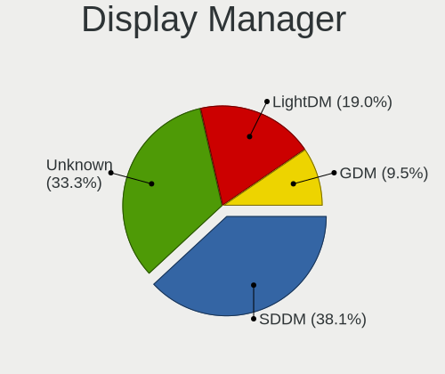
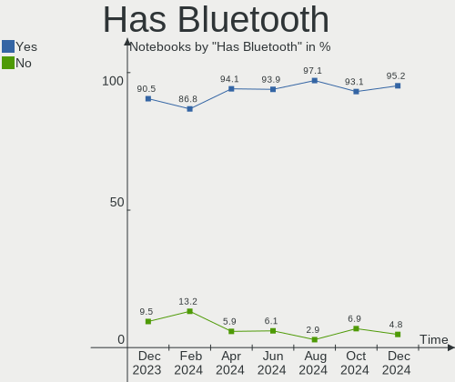
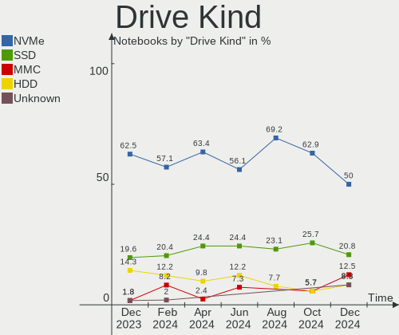
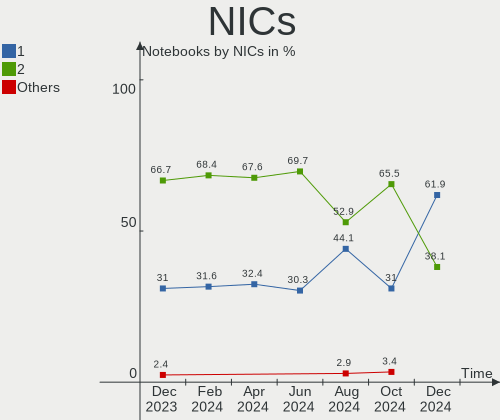

EndeavourOS - Hardware Trends (Notebooks)
-----------------------------------------

A project to identify most popular hardware characteristics and track their change
over time based on data collected by Linux users at https://Linux-Hardware.org.

Anyone can contribute to this report by the [hw-probe](https://github.com/linuxhw/hw-probe) tool:

    sudo -E hw-probe -all -upload

This report is for one last month. Overall report since the beginning of time: [TestCoverage](https://github.com/linuxhw/TestCoverage)

Period: Sep, 2022.

Contents
--------

* [ System ](#system)
  - [ OS                       ](#os)
  - [ OS Family                ](#os-family)
  - [ Kernel                   ](#kernel)
  - [ Kernel Family            ](#kernel-family)
  - [ Kernel Major Ver.        ](#kernel-major-ver)
  - [ Arch                     ](#arch)
  - [ DE                       ](#de)
  - [ Display Server           ](#display-server)
  - [ Display Manager          ](#display-manager)
  - [ OS Lang                  ](#os-lang)
  - [ Boot Mode                ](#boot-mode)
  - [ Filesystem               ](#filesystem)
  - [ Part. scheme             ](#part-scheme)
  - [ Dual Boot with Linux/BSD ](#dual-boot-with-linuxbsd)
  - [ Dual Boot (Win)          ](#dual-boot-win)

* [ Board ](#board)
  - [ Vendor                   ](#vendor)
  - [ Model                    ](#model)
  - [ Model Family             ](#model-family)
  - [ MFG Year                 ](#mfg-year)
  - [ Form Factor              ](#form-factor)
  - [ Secure Boot              ](#secure-boot)
  - [ Coreboot                 ](#coreboot)
  - [ RAM Size                 ](#ram-size)
  - [ RAM Used                 ](#ram-used)
  - [ Total Drives             ](#total-drives)
  - [ Has CD-ROM               ](#has-cd-rom)
  - [ Has Ethernet             ](#has-ethernet)
  - [ Has WiFi                 ](#has-wifi)
  - [ Has Bluetooth            ](#has-bluetooth)

* [ Location ](#location)
  - [ Country                  ](#country)
  - [ City                     ](#city)

* [ Drives ](#drives)
  - [ Drive Vendor             ](#drive-vendor)
  - [ Drive Model              ](#drive-model)
  - [ HDD Vendor               ](#hdd-vendor)
  - [ SSD Vendor               ](#ssd-vendor)
  - [ Drive Kind               ](#drive-kind)
  - [ Drive Connector          ](#drive-connector)
  - [ Drive Size               ](#drive-size)
  - [ Space Total              ](#space-total)
  - [ Space Used               ](#space-used)
  - [ Malfunc. Drives          ](#malfunc-drives)
  - [ Malfunc. Drive Vendor    ](#malfunc-drive-vendor)
  - [ Malfunc. HDD Vendor      ](#malfunc-hdd-vendor)
  - [ Malfunc. Drive Kind      ](#malfunc-drive-kind)
  - [ Failed Drives            ](#failed-drives)
  - [ Failed Drive Vendor      ](#failed-drive-vendor)
  - [ Drive Status             ](#drive-status)

* [ Storage controller ](#storage-controller)
  - [ Storage Vendor           ](#storage-vendor)
  - [ Storage Model            ](#storage-model)
  - [ Storage Kind             ](#storage-kind)

* [ Processor ](#processor)
  - [ CPU Vendor               ](#cpu-vendor)
  - [ CPU Model                ](#cpu-model)
  - [ CPU Model Family         ](#cpu-model-family)
  - [ CPU Cores                ](#cpu-cores)
  - [ CPU Sockets              ](#cpu-sockets)
  - [ CPU Threads              ](#cpu-threads)
  - [ CPU Op-Modes             ](#cpu-op-modes)
  - [ CPU Microcode            ](#cpu-microcode)
  - [ CPU Microarch            ](#cpu-microarch)

* [ Graphics ](#graphics)
  - [ GPU Vendor               ](#gpu-vendor)
  - [ GPU Model                ](#gpu-model)
  - [ GPU Combo                ](#gpu-combo)
  - [ GPU Driver               ](#gpu-driver)
  - [ GPU Memory               ](#gpu-memory)

* [ Monitor ](#monitor)
  - [ Monitor Vendor           ](#monitor-vendor)
  - [ Monitor Model            ](#monitor-model)
  - [ Monitor Resolution       ](#monitor-resolution)
  - [ Monitor Diagonal         ](#monitor-diagonal)
  - [ Monitor Width            ](#monitor-width)
  - [ Aspect Ratio             ](#aspect-ratio)
  - [ Monitor Area             ](#monitor-area)
  - [ Pixel Density            ](#pixel-density)
  - [ Multiple Monitors        ](#multiple-monitors)

* [ Network ](#network)
  - [ Net Controller Vendor    ](#net-controller-vendor)
  - [ Net Controller Model     ](#net-controller-model)
  - [ Wireless Vendor          ](#wireless-vendor)
  - [ Wireless Model           ](#wireless-model)
  - [ Ethernet Vendor          ](#ethernet-vendor)
  - [ Ethernet Model           ](#ethernet-model)
  - [ Net Controller Kind      ](#net-controller-kind)
  - [ Used Controller          ](#used-controller)
  - [ NICs                     ](#nics)
  - [ IPv6                     ](#ipv6)

* [ Bluetooth ](#bluetooth)
  - [ Bluetooth Vendor         ](#bluetooth-vendor)
  - [ Bluetooth Model          ](#bluetooth-model)

* [ Sound ](#sound)
  - [ Sound Vendor             ](#sound-vendor)
  - [ Sound Model              ](#sound-model)

* [ Memory ](#memory)
  - [ Memory Vendor            ](#memory-vendor)
  - [ Memory Model             ](#memory-model)
  - [ Memory Kind              ](#memory-kind)
  - [ Memory Form Factor       ](#memory-form-factor)
  - [ Memory Size              ](#memory-size)
  - [ Memory Speed             ](#memory-speed)

* [ Printers & scanners ](#printers--scanners)
  - [ Printer Vendor           ](#printer-vendor)
  - [ Printer Model            ](#printer-model)
  - [ Scanner Vendor           ](#scanner-vendor)
  - [ Scanner Model            ](#scanner-model)

* [ Camera ](#camera)
  - [ Camera Vendor            ](#camera-vendor)
  - [ Camera Model             ](#camera-model)

* [ Security ](#security)
  - [ Fingerprint Vendor       ](#fingerprint-vendor)
  - [ Fingerprint Model        ](#fingerprint-model)
  - [ Chipcard Vendor          ](#chipcard-vendor)
  - [ Chipcard Model           ](#chipcard-model)

* [ Unsupported ](#unsupported)
  - [ Unsupported Devices      ](#unsupported-devices)
  - [ Unsupported Device Types ](#unsupported-device-types)

System
------

OS
--

Installed operating systems

| Name                | Notebooks | Percent |
|---------------------|-----------|---------|
| EndeavourOS Rolling | 26        | 70.27%  |
| EndeavourOS         | 11        | 29.73%  |

OS Family
---------

OS without a version

| Name        | Notebooks | Percent |
|-------------|-----------|---------|
| EndeavourOS | 37        | 100%    |

Kernel
------

Version of the Linux kernel

| Version                                      | Notebooks | Percent |
|----------------------------------------------|-----------|---------|
| 5.19.11-arch1-1                              | 5         | 13.51%  |
| 5.19.7-arch1-1                               | 4         | 10.81%  |
| 5.19.6-zen1-1-zen                            | 4         | 10.81%  |
| 5.19.9-zen1-1-zen                            | 3         | 8.11%   |
| 5.19.8-zen1-1-zen                            | 2         | 5.41%   |
| 5.19.7-zen2-1-zen                            | 2         | 5.41%   |
| 5.19.5-arch1-1                               | 2         | 5.41%   |
| 5.19.10-arch1-1                              | 2         | 5.41%   |
| 6.0.0-rc2-1-drm-next-git-00356-g2c2d7a67defa | 1         | 2.7%    |
| 5.19.9-arch1-g14-1                           | 1         | 2.7%    |
| 5.19.9-arch1-1                               | 1         | 2.7%    |
| 5.19.6-arch1-1                               | 1         | 2.7%    |
| 5.19.6-269-tkg-pds                           | 1         | 2.7%    |
| 5.19.4-arch1-g14-1                           | 1         | 2.7%    |
| 5.19.4-arch1-1                               | 1         | 2.7%    |
| 5.19.3-arch1-1                               | 1         | 2.7%    |
| 5.19.12-zen1-1-zen                           | 1         | 2.7%    |
| 5.19.12-arch1-1                              | 1         | 2.7%    |
| 5.19.11-zen1-1-zen                           | 1         | 2.7%    |
| 5.18.16-arch1-1                              | 1         | 2.7%    |
| 5.18.11-arch1-1                              | 1         | 2.7%    |

Kernel Family
-------------

Linux kernel without a distro release

| Version | Notebooks | Percent |
|---------|-----------|---------|
| 5.19.7  | 6         | 16.22%  |
| 5.19.6  | 6         | 16.22%  |
| 5.19.11 | 6         | 16.22%  |
| 5.19.9  | 5         | 13.51%  |
| 5.19.8  | 2         | 5.41%   |
| 5.19.5  | 2         | 5.41%   |
| 5.19.4  | 2         | 5.41%   |
| 5.19.12 | 2         | 5.41%   |
| 5.19.10 | 2         | 5.41%   |
| 6.0.0   | 1         | 2.7%    |
| 5.19.3  | 1         | 2.7%    |
| 5.18.16 | 1         | 2.7%    |
| 5.18.11 | 1         | 2.7%    |

Kernel Major Ver.
-----------------

Linux kernel major version

| Version | Notebooks | Percent |
|---------|-----------|---------|
| 5.19    | 34        | 91.89%  |
| 5.18    | 2         | 5.41%   |
| 6.0     | 1         | 2.7%    |

Arch
----

OS architecture (x86_64, i586, etc.)

| Name   | Notebooks | Percent |
|--------|-----------|---------|
| x86_64 | 37        | 100%    |

DE
--

Desktop Environment

| Name     | Notebooks | Percent |
|----------|-----------|---------|
| KDE5     | 17        | 45.95%  |
| GNOME    | 8         | 21.62%  |
| Budgie   | 4         | 10.81%  |
| XFCE     | 3         | 8.11%   |
| i3       | 2         | 5.41%   |
| sway     | 1         | 2.7%    |
| qtile    | 1         | 2.7%    |
| Hyprland | 1         | 2.7%    |

Display Server
--------------

X11 or Wayland

| Name    | Notebooks | Percent |
|---------|-----------|---------|
| X11     | 20        | 54.05%  |
| Wayland | 13        | 35.14%  |
| Tty     | 3         | 8.11%   |
| Unknown | 1         | 2.7%    |

Display Manager
---------------

SDDM, LightDM, etc.

| Name    | Notebooks | Percent |
|---------|-----------|---------|
| LightDM | 12        | 32.43%  |
| Unknown | 11        | 29.73%  |
| SDDM    | 10        | 27.03%  |
| GDM     | 4         | 10.81%  |

OS Lang
-------

Language

| Lang  | Notebooks | Percent |
|-------|-----------|---------|
| en_US | 16        | 43.24%  |
| it_IT | 5         | 13.51%  |
| en_GB | 2         | 5.41%   |
| en_CA | 2         | 5.41%   |
| tr_TR | 1         | 2.7%    |
| sr_RS | 1         | 2.7%    |
| ru_UA | 1         | 2.7%    |
| ru_RU | 1         | 2.7%    |
| pt_BR | 1         | 2.7%    |
| fi_FI | 1         | 2.7%    |
| es_MX | 1         | 2.7%    |
| en_IN | 1         | 2.7%    |
| en_DK | 1         | 2.7%    |
| en_AU | 1         | 2.7%    |
| de_DE | 1         | 2.7%    |
| C     | 1         | 2.7%    |

Boot Mode
---------

EFI or BIOS

| Mode | Notebooks | Percent |
|------|-----------|---------|
| EFI  | 22        | 59.46%  |
| BIOS | 15        | 40.54%  |

Filesystem
----------

Type of filesystem

| Type    | Notebooks | Percent |
|---------|-----------|---------|
| Ext4    | 24        | 64.86%  |
| Btrfs   | 10        | 27.03%  |
| Overlay | 2         | 5.41%   |
| Xfs     | 1         | 2.7%    |

Part. scheme
------------

Scheme of partitioning

| Type    | Notebooks | Percent |
|---------|-----------|---------|
| GPT     | 23        | 62.16%  |
| Unknown | 12        | 32.43%  |
| MBR     | 2         | 5.41%   |

Dual Boot with Linux/BSD
------------------------

Hosting more than one Linux/BSD

| Dual boot | Notebooks | Percent |
|-----------|-----------|---------|
| No        | 33        | 89.19%  |
| Yes       | 4         | 10.81%  |

Dual Boot (Win)
---------------

Hosting Linux and Windows

| Dual boot | Notebooks | Percent |
|-----------|-----------|---------|
| No        | 23        | 62.16%  |
| Yes       | 14        | 37.84%  |

Board
-----

Vendor
------

Motherboard manufacturer

| Name                | Notebooks | Percent |
|---------------------|-----------|---------|
| ASUSTek Computer    | 9         | 24.32%  |
| Lenovo              | 8         | 21.62%  |
| Hewlett-Packard     | 6         | 16.22%  |
| MSI                 | 3         | 8.11%   |
| Acer                | 3         | 8.11%   |
| HUAWEI              | 2         | 5.41%   |
| Timi                | 1         | 2.7%    |
| Schenker            | 1         | 2.7%    |
| Samsung Electronics | 1         | 2.7%    |
| Gigabyte Technology | 1         | 2.7%    |
| Dell                | 1         | 2.7%    |
| Apple               | 1         | 2.7%    |

Model
-----

Motherboard model

| Name                                     | Notebooks | Percent |
|------------------------------------------|-----------|---------|
| Timi TM1703                              | 1         | 2.7%    |
| Schenker XMG FUSION 15 (XFU15M22)        | 1         | 2.7%    |
| Samsung 340XAA/350XAA/550XAA             | 1         | 2.7%    |
| MSI Summit E13FlipEvo A12MT              | 1         | 2.7%    |
| MSI Modern 14 B5M                        | 1         | 2.7%    |
| MSI Alpha 15 B5EEK                       | 1         | 2.7%    |
| Lenovo ThinkPad X200T 7449G6G            | 1         | 2.7%    |
| Lenovo ThinkPad X1 Carbon 6th 20KHCTO1WW | 1         | 2.7%    |
| Lenovo ThinkPad T480 20L6S58700          | 1         | 2.7%    |
| Lenovo ThinkPad T15 Gen 2i 20W40029MX    | 1         | 2.7%    |
| Lenovo ThinkBook 14p Gen 2 20YN          | 1         | 2.7%    |
| Lenovo ThinkBook 14 G2 ITL Ub 20VD       | 1         | 2.7%    |
| Lenovo IdeaPad 5 14ARE05 81YM            | 1         | 2.7%    |
| Lenovo IdeaPad 310-15IKB 80TV            | 1         | 2.7%    |
| HUAWEI NBLB-WAX9N                        | 1         | 2.7%    |
| HUAWEI KLVL-WXX9                         | 1         | 2.7%    |
| HP ProBook 450 G0                        | 1         | 2.7%    |
| HP Pavilion Laptop 15-eg2xxx             | 1         | 2.7%    |
| HP OMEN by Laptop 16z-c000               | 1         | 2.7%    |
| HP Laptop 15-da0xxx                      | 1         | 2.7%    |
| HP EliteBook 745 G6                      | 1         | 2.7%    |
| HP 250 G4                                | 1         | 2.7%    |
| Gigabyte AORUS 15G XC                    | 1         | 2.7%    |
| Dell Vostro 7620                         | 1         | 2.7%    |
| ASUS Zenbook UX5400EA_UX5400EA           | 1         | 2.7%    |
| ASUS X580VN                              | 1         | 2.7%    |
| ASUS TUF Gaming FX505GT_FX505GT          | 1         | 2.7%    |
| ASUS ROG Zephyrus G14 GA402RK_GA402RK    | 1         | 2.7%    |
| ASUS ROG Strix G513QY_G513QY             | 1         | 2.7%    |
| ASUS GL753VE                             | 1         | 2.7%    |
| ASUS GL553VD                             | 1         | 2.7%    |
| ASUS G74Sx                               | 1         | 2.7%    |
| ASUS ASUS TUF Gaming A15 FA506IH_FA506IH | 1         | 2.7%    |
| Apple MacBookPro8,1                      | 1         | 2.7%    |
| Acer Aspire A715-72G                     | 1         | 2.7%    |
| Acer Aspire A515-41G                     | 1         | 2.7%    |
| Acer Aspire A315-22                      | 1         | 2.7%    |

Model Family
------------

Motherboard model prefix

| Name              | Notebooks | Percent |
|-------------------|-----------|---------|
| Lenovo ThinkPad   | 4         | 10.81%  |
| Acer Aspire       | 3         | 8.11%   |
| Lenovo ThinkBook  | 2         | 5.41%   |
| Lenovo IdeaPad    | 2         | 5.41%   |
| ASUS ROG          | 2         | 5.41%   |
| Timi TM1703       | 1         | 2.7%    |
| Schenker XMG      | 1         | 2.7%    |
| Samsung 340XAA    | 1         | 2.7%    |
| MSI Summit        | 1         | 2.7%    |
| MSI Modern        | 1         | 2.7%    |
| MSI Alpha         | 1         | 2.7%    |
| HUAWEI NBLB-WAX9N | 1         | 2.7%    |
| HUAWEI KLVL-WXX9  | 1         | 2.7%    |
| HP ProBook        | 1         | 2.7%    |
| HP Pavilion       | 1         | 2.7%    |
| HP OMEN           | 1         | 2.7%    |
| HP Laptop         | 1         | 2.7%    |
| HP EliteBook      | 1         | 2.7%    |
| HP 250            | 1         | 2.7%    |
| Gigabyte AORUS    | 1         | 2.7%    |
| Dell Vostro       | 1         | 2.7%    |
| ASUS Zenbook      | 1         | 2.7%    |
| ASUS X580VN       | 1         | 2.7%    |
| ASUS TUF          | 1         | 2.7%    |
| ASUS GL753VE      | 1         | 2.7%    |
| ASUS GL553VD      | 1         | 2.7%    |
| ASUS G74Sx        | 1         | 2.7%    |
| ASUS ASUS         | 1         | 2.7%    |
| Apple MacBookPro8 | 1         | 2.7%    |

MFG Year
--------

Motherboard manufacture year

| Year | Notebooks | Percent |
|------|-----------|---------|
| 2021 | 8         | 21.62%  |
| 2020 | 6         | 16.22%  |
| 2018 | 6         | 16.22%  |
| 2022 | 5         | 13.51%  |
| 2017 | 4         | 10.81%  |
| 2019 | 2         | 5.41%   |
| 2011 | 2         | 5.41%   |
| 2016 | 1         | 2.7%    |
| 2015 | 1         | 2.7%    |
| 2013 | 1         | 2.7%    |
| 2008 | 1         | 2.7%    |

Form Factor
-----------

Physical design of the computer

| Name     | Notebooks | Percent |
|----------|-----------|---------|
| Notebook | 37        | 100%    |

Secure Boot
-----------

Enabled or disabled

| State    | Notebooks | Percent |
|----------|-----------|---------|
| Disabled | 37        | 100%    |

Coreboot
--------

Have coreboot on board

| Used | Notebooks | Percent |
|------|-----------|---------|
| No   | 37        | 100%    |

RAM Size
--------

Total RAM memory

| Size in GB | Notebooks | Percent |
|------------|-----------|---------|
| 8.01-16.0  | 11        | 29.73%  |
| 16.01-24.0 | 10        | 27.03%  |
| 4.01-8.0   | 9         | 24.32%  |
| 32.01-64.0 | 3         | 8.11%   |
| 3.01-4.0   | 2         | 5.41%   |
| 24.01-32.0 | 2         | 5.41%   |

RAM Used
--------

Used RAM memory

| Used GB    | Notebooks | Percent |
|------------|-----------|---------|
| 4.01-8.0   | 10        | 27.03%  |
| 3.01-4.0   | 8         | 21.62%  |
| 2.01-3.0   | 7         | 18.92%  |
| 1.01-2.0   | 6         | 16.22%  |
| 8.01-16.0  | 4         | 10.81%  |
| 24.01-32.0 | 1         | 2.7%    |
| 0.51-1.0   | 1         | 2.7%    |

Total Drives
------------

Number of drives on board

| Drives | Notebooks | Percent |
|--------|-----------|---------|
| 1      | 27        | 72.97%  |
| 2      | 9         | 24.32%  |
| 0      | 1         | 2.7%    |

Has CD-ROM
----------

Has CD-ROM on board

| Presented | Notebooks | Percent |
|-----------|-----------|---------|
| No        | 31        | 83.78%  |
| Yes       | 6         | 16.22%  |

Has Ethernet
------------

Has Ethernet on board

| Presented | Notebooks | Percent |
|-----------|-----------|---------|
| Yes       | 29        | 78.38%  |
| No        | 8         | 21.62%  |

Has WiFi
--------

Has WiFi module

| Presented | Notebooks | Percent |
|-----------|-----------|---------|
| Yes       | 37        | 100%    |

Has Bluetooth
-------------

Has Bluetooth module

| Presented | Notebooks | Percent |
|-----------|-----------|---------|
| Yes       | 36        | 97.3%   |
| No        | 1         | 2.7%    |

Location
--------

Country
-------

Geographic location (country)

| Country   | Notebooks | Percent |
|-----------|-----------|---------|
| USA       | 8         | 21.62%  |
| Italy     | 6         | 16.22%  |
| India     | 2         | 5.41%   |
| Finland   | 2         | 5.41%   |
| Ukraine   | 1         | 2.7%    |
| UK        | 1         | 2.7%    |
| Turkey    | 1         | 2.7%    |
| Spain     | 1         | 2.7%    |
| Slovenia  | 1         | 2.7%    |
| Singapore | 1         | 2.7%    |
| Serbia    | 1         | 2.7%    |
| Russia    | 1         | 2.7%    |
| Romania   | 1         | 2.7%    |
| Poland    | 1         | 2.7%    |
| Mexico    | 1         | 2.7%    |
| Hong Kong | 1         | 2.7%    |
| Germany   | 1         | 2.7%    |
| Denmark   | 1         | 2.7%    |
| Canada    | 1         | 2.7%    |
| Brazil    | 1         | 2.7%    |
| Austria   | 1         | 2.7%    |
| Australia | 1         | 2.7%    |
| Algeria   | 1         | 2.7%    |

City
----

Geographic location (city)

| City                      | Notebooks | Percent |
|---------------------------|-----------|---------|
| Villena                   | 1         | 2.7%    |
| Tolyatti                  | 1         | 2.7%    |
| Swaty                     | 1         | 2.7%    |
| Spanish Fork              | 1         | 2.7%    |
| Smarje pri Jelsah         | 1         | 2.7%    |
| Singapore                 | 1         | 2.7%    |
| Seiersberg                | 1         | 2.7%    |
| San Francisco             | 1         | 2.7%    |
| San Fermo della Battaglia | 1         | 2.7%    |
| Potlatch                  | 1         | 2.7%    |
| Perth                     | 1         | 2.7%    |
| Patna                     | 1         | 2.7%    |
| Osasco                    | 1         | 2.7%    |
| Monza                     | 1         | 2.7%    |
| Milan                     | 1         | 2.7%    |
| Mérida                   | 1         | 2.7%    |
| Magalia                   | 1         | 2.7%    |
| Kyiv                      | 1         | 2.7%    |
| Kolkata                   | 1         | 2.7%    |
| Istanbul                  | 1         | 2.7%    |
| Herlufmagle               | 1         | 2.7%    |
| Hendon                    | 1         | 2.7%    |
| Helsinki                  | 1         | 2.7%    |
| Greeley                   | 1         | 2.7%    |
| Grambling                 | 1         | 2.7%    |
| Florence                  | 1         | 2.7%    |
| Espoo                     | 1         | 2.7%    |
| Edmonton                  | 1         | 2.7%    |
| Düsseldorf               | 1         | 2.7%    |
| Clearfield                | 1         | 2.7%    |
| Central                   | 1         | 2.7%    |
| Bountiful                 | 1         | 2.7%    |
| Botosani                  | 1         | 2.7%    |
| Bernareggio               | 1         | 2.7%    |
| Belgrade                  | 1         | 2.7%    |
| Baronissi                 | 1         | 2.7%    |
| Algiers                   | 1         | 2.7%    |

Drives
------

Drive Vendor
------------

Hard drive vendors

| Vendor                      | Notebooks | Drives | Percent |
|-----------------------------|-----------|--------|---------|
| Samsung Electronics         | 11        | 11     | 24.44%  |
| SK hynix                    | 5         | 5      | 11.11%  |
| Sandisk                     | 5         | 5      | 11.11%  |
| WDC                         | 4         | 4      | 8.89%   |
| Micron Technology           | 4         | 4      | 8.89%   |
| Phison Electronics          | 3         | 3      | 6.67%   |
| Kingston Technology Company | 2         | 2      | 4.44%   |
| Kingston                    | 2         | 2      | 4.44%   |
| A-DATA Technology           | 2         | 2      | 4.44%   |
| Toshiba                     | 1         | 1      | 2.22%   |
| Patriot                     | 1         | 1      | 2.22%   |
| Lenovo                      | 1         | 1      | 2.22%   |
| INTEL SS                    | 1         | 1      | 2.22%   |
| HGST                        | 1         | 1      | 2.22%   |
| Crucial                     | 1         | 1      | 2.22%   |
| AS201                       | 1         | 1      | 2.22%   |

Drive Model
-----------

Hard drive models

| Model                                               | Notebooks | Percent |
|-----------------------------------------------------|-----------|---------|
| SK hynix HFS128G39TND-N210A 128GB SSD               | 2         | 4.44%   |
| Samsung NVMe SSD Drive 512GB                        | 2         | 4.44%   |
| Samsung NVMe SSD Controller SM981/PM981/PM983 256GB | 2         | 4.44%   |
| Micron NVMe SSD Drive 1024GB                        | 2         | 4.44%   |
| WDC WDS120G2G0B-00EPW0 120GB SSD                    | 1         | 2.22%   |
| WDC WD7500BPVT-60HXZT3 752GB                        | 1         | 2.22%   |
| WDC WD10SPZX-22Z10T1 1TB                            | 1         | 2.22%   |
| WDC PC SA530 SDASN8Y-256G-1006 256GB SSD            | 1         | 2.22%   |
| Toshiba TR200 480GB SSD                             | 1         | 2.22%   |
| SK hynix SKHynix_HFS512GDE9X084N 512GB              | 1         | 2.22%   |
| SK hynix SKHynix_HFS256GDE9X081N 256GB              | 1         | 2.22%   |
| SK hynix HFM001TD3JX013N 1024GB                     | 1         | 2.22%   |
| Sandisk WDC PC SN530 SDBPMPZ-512G-1101 512GB        | 1         | 2.22%   |
| Sandisk WD Blue SN550 NVMe SSD 1024GB               | 1         | 2.22%   |
| Sandisk WD Black SN750 / PC SN730 NVMe SSD 1024GB   | 1         | 2.22%   |
| SanDisk NVMe SSD Drive 250GB                        | 1         | 2.22%   |
| SanDisk Extreme 55AE 500GB SSD                      | 1         | 2.22%   |
| Samsung SSD 980 1TB                                 | 1         | 2.22%   |
| Samsung SSD 860 PRO 256GB                           | 1         | 2.22%   |
| Samsung SSD 850 EVO 500GB                           | 1         | 2.22%   |
| Samsung NVMe SSD Drive 1024GB                       | 1         | 2.22%   |
| Samsung MZVLQ512HBLU-00B00 512GB                    | 1         | 2.22%   |
| Samsung MZVLQ512HALU-00000 512GB                    | 1         | 2.22%   |
| Samsung HM250HI 250GB                               | 1         | 2.22%   |
| Phison PS5013 E13 NVMe Controller 512GB             | 1         | 2.22%   |
| Phison E16 PCIe4 NVMe Controller 1TB                | 1         | 2.22%   |
| Phison E12 NVMe Controller 1024GB                   | 1         | 2.22%   |
| Patriot P200 256 256GB SSD                          | 1         | 2.22%   |
| Micron MTFDKBA512TFK-1BC1AABHA 512GB                | 1         | 2.22%   |
| Micron 2210_MTFDHBA512QFD 512GB                     | 1         | 2.22%   |
| Lenovo NVMe SSD Drive 256GB                         | 1         | 2.22%   |
| Kingston Company U-SNS8154P3 NVMe SSD 512GB         | 1         | 2.22%   |
| Kingston Company OM3PDP3 NVMe SSD 512GB             | 1         | 2.22%   |
| Kingston SV300S37A120G 120GB SSD                    | 1         | 2.22%   |
| Kingston OM8PCP3512F-AI1 512GB                      | 1         | 2.22%   |
| INTEL SS DPEKKW256G7 256GB                          | 1         | 2.22%   |
| HGST HTS545050A7E680 500GB                          | 1         | 2.22%   |
| Crucial CT240BX200SSD1 240GB                        | 1         | 2.22%   |
| AS201 SSD 240GB                                     | 1         | 2.22%   |
| A-DATA SU720 1TB SSD                                | 1         | 2.22%   |

HDD Vendor
----------

Hard disk drive vendors

| Vendor              | Notebooks | Drives | Percent |
|---------------------|-----------|--------|---------|
| WDC                 | 2         | 2      | 50%     |
| Samsung Electronics | 1         | 1      | 25%     |
| HGST                | 1         | 1      | 25%     |

SSD Vendor
----------

Solid state drive vendors

| Vendor              | Notebooks | Drives | Percent |
|---------------------|-----------|--------|---------|
| WDC                 | 2         | 2      | 14.29%  |
| SK hynix            | 2         | 2      | 14.29%  |
| Samsung Electronics | 2         | 2      | 14.29%  |
| A-DATA Technology   | 2         | 2      | 14.29%  |
| Toshiba             | 1         | 1      | 7.14%   |
| SanDisk             | 1         | 1      | 7.14%   |
| Patriot             | 1         | 1      | 7.14%   |
| Kingston            | 1         | 1      | 7.14%   |
| Crucial             | 1         | 1      | 7.14%   |
| AS201               | 1         | 1      | 7.14%   |

Drive Kind
----------

HDD or SSD

| Kind | Notebooks | Drives | Percent |
|------|-----------|--------|---------|
| NVMe | 25        | 27     | 62.5%   |
| SSD  | 11        | 14     | 27.5%   |
| HDD  | 4         | 4      | 10%     |

Drive Connector
---------------

SATA, SAS, NVMe, etc.

| Type | Notebooks | Drives | Percent |
|------|-----------|--------|---------|
| NVMe | 25        | 26     | 60.98%  |
| SATA | 14        | 17     | 34.15%  |
| SAS  | 2         | 2      | 4.88%   |

Drive Size
----------

Size of hard drive

| Size in TB | Notebooks | Drives | Percent |
|------------|-----------|--------|---------|
| 0.01-0.5   | 11        | 15     | 78.57%  |
| 0.51-1.0   | 3         | 3      | 21.43%  |

Space Total
-----------

Amount of disk space available on the file system

| Size in GB     | Notebooks | Percent |
|----------------|-----------|---------|
| 101-250        | 12        | 32.43%  |
| 251-500        | 9         | 24.32%  |
| 1-20           | 5         | 13.51%  |
| 1001-2000      | 4         | 10.81%  |
| 501-1000       | 3         | 8.11%   |
| Unknown        | 2         | 5.41%   |
| More than 3000 | 1         | 2.7%    |
| 51-100         | 1         | 2.7%    |

Space Used
----------

Amount of used disk space

| Used GB  | Notebooks | Percent |
|----------|-----------|---------|
| 51-100   | 9         | 24.32%  |
| 101-250  | 7         | 18.92%  |
| 1-20     | 7         | 18.92%  |
| 21-50    | 5         | 13.51%  |
| 501-1000 | 3         | 8.11%   |
| 251-500  | 2         | 5.41%   |
| 0        | 2         | 5.41%   |
| Unknown  | 2         | 5.41%   |

Malfunc. Drives
---------------

Drive models with a malfunction

| Model                                    | Notebooks | Drives | Percent |
|------------------------------------------|-----------|--------|---------|
| WDC PC SA530 SDASN8Y-256G-1006 256GB SSD | 1         | 1      | 25%     |
| SK hynix HFS128G39TND-N210A 128GB SSD    | 1         | 1      | 25%     |
| Samsung Electronics SSD 980 1TB          | 1         | 1      | 25%     |
| HGST HTS545050A7E680 500GB               | 1         | 1      | 25%     |

Malfunc. Drive Vendor
---------------------

Vendors of faulty drives

| Vendor              | Notebooks | Drives | Percent |
|---------------------|-----------|--------|---------|
| WDC                 | 1         | 1      | 25%     |
| SK hynix            | 1         | 1      | 25%     |
| Samsung Electronics | 1         | 1      | 25%     |
| HGST                | 1         | 1      | 25%     |

Malfunc. HDD Vendor
-------------------

Vendors of faulty HDD drives

| Vendor | Notebooks | Drives | Percent |
|--------|-----------|--------|---------|
| HGST   | 1         | 1      | 100%    |

Malfunc. Drive Kind
-------------------

Kinds of faulty drives

| Kind | Notebooks | Drives | Percent |
|------|-----------|--------|---------|
| SSD  | 2         | 2      | 50%     |
| NVMe | 1         | 1      | 25%     |
| HDD  | 1         | 1      | 25%     |

Failed Drives
-------------

Failed drive models

Zero info for selected period =(

Failed Drive Vendor
-------------------

Failed drive vendors

Zero info for selected period =(

Drive Status
------------

Number of failed and malfunc. drives

| Status   | Notebooks | Drives | Percent |
|----------|-----------|--------|---------|
| Works    | 23        | 27     | 58.97%  |
| Detected | 12        | 14     | 30.77%  |
| Malfunc  | 4         | 4      | 10.26%  |

Storage controller
------------------

Storage Vendor
--------------

Storage controller vendors

| Vendor                      | Notebooks | Percent |
|-----------------------------|-----------|---------|
| Intel                       | 18        | 38.3%   |
| Samsung Electronics         | 8         | 17.02%  |
| SanDisk                     | 4         | 8.51%   |
| Micron Technology           | 4         | 8.51%   |
| SK hynix                    | 3         | 6.38%   |
| Phison Electronics          | 3         | 6.38%   |
| Kingston Technology Company | 3         | 6.38%   |
| AMD                         | 3         | 6.38%   |
| Lenovo                      | 1         | 2.13%   |

Storage Model
-------------

Storage controller models

| Model                                                                            | Notebooks | Percent |
|----------------------------------------------------------------------------------|-----------|---------|
| Samsung NVMe SSD Controller SM981/PM981/PM983                                    | 4         | 8.51%   |
| Samsung NVMe SSD Controller 980                                                  | 4         | 8.51%   |
| Micron Non-Volatile memory controller                                            | 4         | 8.51%   |
| SK hynix Gold P31 SSD                                                            | 3         | 6.38%   |
| Intel Sunrise Point-LP SATA Controller [AHCI mode]                               | 3         | 6.38%   |
| Intel HM170/QM170 Chipset SATA Controller [AHCI Mode]                            | 3         | 6.38%   |
| AMD FCH SATA Controller [AHCI mode]                                              | 3         | 6.38%   |
| Intel Volume Management Device NVMe RAID Controller                              | 2         | 4.26%   |
| Intel 6 Series/C200 Series Chipset Family 6 port Mobile SATA AHCI Controller     | 2         | 4.26%   |
| SanDisk WD Blue SN550 NVMe SSD                                                   | 1         | 2.13%   |
| SanDisk WD Black SN750 / PC SN730 NVMe SSD                                       | 1         | 2.13%   |
| SanDisk WD Black 2018/SN750 / PC SN720 NVMe SSD                                  | 1         | 2.13%   |
| SanDisk Non-Volatile memory controller                                           | 1         | 2.13%   |
| Phison PS5013 E13 NVMe Controller                                                | 1         | 2.13%   |
| Phison E16 PCIe4 NVMe Controller                                                 | 1         | 2.13%   |
| Phison E12 NVMe Controller                                                       | 1         | 2.13%   |
| Lenovo Non-Volatile memory controller                                            | 1         | 2.13%   |
| Kingston Company U-SNS8154P3 NVMe SSD                                            | 1         | 2.13%   |
| Kingston Company Company Non-Volatile memory controller                          | 1         | 2.13%   |
| Kingston Company OM3PDP3 NVMe SSD                                                | 1         | 2.13%   |
| Intel Tiger Lake-LP SATA Controller                                              | 1         | 2.13%   |
| Intel Comet Lake SATA AHCI Controller                                            | 1         | 2.13%   |
| Intel Celeron/Pentium Silver Processor SATA Controller                           | 1         | 2.13%   |
| Intel Cannon Lake Mobile PCH SATA AHCI Controller                                | 1         | 2.13%   |
| Intel Atom/Celeron/Pentium Processor x5-E8000/J3xxx/N3xxx Series SATA Controller | 1         | 2.13%   |
| Intel 82801IBM/IEM (ICH9M/ICH9M-E) 4 port SATA Controller [AHCI mode]            | 1         | 2.13%   |
| Intel 82801 Mobile SATA Controller [RAID mode]                                   | 1         | 2.13%   |
| Intel 7 Series Chipset Family 6-port SATA Controller [AHCI mode]                 | 1         | 2.13%   |

Storage Kind
------------

Kind of storage controller (IDE, SATA, NVMe, SAS, ...)

| Kind | Notebooks | Percent |
|------|-----------|---------|
| NVMe | 25        | 54.35%  |
| SATA | 18        | 39.13%  |
| RAID | 3         | 6.52%   |

Processor
---------

CPU Vendor
----------

Processor vendors

| Vendor | Notebooks | Percent |
|--------|-----------|---------|
| Intel  | 25        | 67.57%  |
| AMD    | 12        | 32.43%  |

CPU Model
---------

Processor models

| Model                                           | Notebooks | Percent |
|-------------------------------------------------|-----------|---------|
| Intel Core i7-7700HQ CPU @ 2.80GHz              | 3         | 8.11%   |
| AMD Ryzen 7 5800H with Radeon Graphics          | 3         | 8.11%   |
| Intel Core i7-8550U CPU @ 1.80GHz               | 2         | 5.41%   |
| Intel Core i7-8750H CPU @ 2.20GHz               | 1         | 2.7%    |
| Intel Core i7-3632QM CPU @ 2.20GHz              | 1         | 2.7%    |
| Intel Core i7-2670QM CPU @ 2.20GHz              | 1         | 2.7%    |
| Intel Core i7-10870H CPU @ 2.20GHz              | 1         | 2.7%    |
| Intel Core i5-9300H CPU @ 2.40GHz               | 1         | 2.7%    |
| Intel Core i5-8350U CPU @ 1.70GHz               | 1         | 2.7%    |
| Intel Core i5-8250U CPU @ 1.60GHz               | 1         | 2.7%    |
| Intel Core i5-7200U CPU @ 2.50GHz               | 1         | 2.7%    |
| Intel Core i5-2415M CPU @ 2.30GHz               | 1         | 2.7%    |
| Intel Core i5-10210U CPU @ 1.60GHz              | 1         | 2.7%    |
| Intel Core 2 Duo CPU L9400 @ 1.86GHz            | 1         | 2.7%    |
| Intel Celeron N4000 CPU @ 1.10GHz               | 1         | 2.7%    |
| Intel Celeron CPU N3050 @ 1.60GHz               | 1         | 2.7%    |
| Intel 12th Gen Core i7-1280P                    | 1         | 2.7%    |
| Intel 12th Gen Core i7-12700H                   | 1         | 2.7%    |
| Intel 12th Gen Core i7-1255U                    | 1         | 2.7%    |
| Intel 11th Gen Core i7-11800H @ 2.30GHz         | 1         | 2.7%    |
| Intel 11th Gen Core i7-1165G7 @ 2.80GHz         | 1         | 2.7%    |
| Intel 11th Gen Core i5-1135G7 @ 2.40GHz         | 1         | 2.7%    |
| Intel 11th Gen Core i3-1115G4 @ 3.00GHz         | 1         | 2.7%    |
| AMD Ryzen 9 6900HS with Radeon Graphics         | 1         | 2.7%    |
| AMD Ryzen 9 5900HX with Radeon Graphics         | 1         | 2.7%    |
| AMD Ryzen 7 PRO 3700U w/ Radeon Vega Mobile Gfx | 1         | 2.7%    |
| AMD Ryzen 7 5700U with Radeon Graphics          | 1         | 2.7%    |
| AMD Ryzen 7 4800H with Radeon Graphics          | 1         | 2.7%    |
| AMD Ryzen 5 4600H with Radeon Graphics          | 1         | 2.7%    |
| AMD Ryzen 5 4500U with Radeon Graphics          | 1         | 2.7%    |
| AMD A9-9420e RADEON R5, 5 COMPUTE CORES 2C+3G   | 1         | 2.7%    |
| AMD A10-9620P RADEON R5, 10 COMPUTE CORES 4C+6G | 1         | 2.7%    |

CPU Model Family
----------------

Processor model prefix

| Model            | Notebooks | Percent |
|------------------|-----------|---------|
| Intel Core i7    | 9         | 24.32%  |
| Other            | 8         | 21.62%  |
| Intel Core i5    | 6         | 16.22%  |
| AMD Ryzen 7      | 5         | 13.51%  |
| Intel Celeron    | 2         | 5.41%   |
| AMD Ryzen 9      | 2         | 5.41%   |
| AMD Ryzen 5      | 2         | 5.41%   |
| Intel Core 2 Duo | 1         | 2.7%    |
| AMD Ryzen 7 PRO  | 1         | 2.7%    |
| AMD A10          | 1         | 2.7%    |

CPU Cores
---------

Number of processor cores

| Number | Notebooks | Percent |
|--------|-----------|---------|
| 4      | 14        | 37.84%  |
| 8      | 9         | 24.32%  |
| 2      | 8         | 21.62%  |
| 6      | 3         | 8.11%   |
| 14     | 2         | 5.41%   |
| 10     | 1         | 2.7%    |

CPU Sockets
-----------

Number of sockets

| Number | Notebooks | Percent |
|--------|-----------|---------|
| 1      | 37        | 100%    |

CPU Threads
-----------

Threads per core (Hyper-Threading)

| Number | Notebooks | Percent |
|--------|-----------|---------|
| 2      | 32        | 86.49%  |
| 1      | 5         | 13.51%  |

CPU Op-Modes
------------

CPU Operation Modes (32-bit, 64-bit)

| Op mode        | Notebooks | Percent |
|----------------|-----------|---------|
| 32-bit, 64-bit | 37        | 100%    |

CPU Microcode
-------------

Microcode number

| Number     | Notebooks | Percent |
|------------|-----------|---------|
| Unknown    | 12        | 32.43%  |
| 0x906e9    | 3         | 8.11%   |
| 0x0a50000c | 3         | 8.11%   |
| 0x806c1    | 2         | 5.41%   |
| 0x08600104 | 2         | 5.41%   |
| 0xa0652    | 1         | 2.7%    |
| 0x906ed    | 1         | 2.7%    |
| 0x906ea    | 1         | 2.7%    |
| 0x906a4    | 1         | 2.7%    |
| 0x906a3    | 1         | 2.7%    |
| 0x806ec    | 1         | 2.7%    |
| 0x806ea    | 1         | 2.7%    |
| 0x806e9    | 1         | 2.7%    |
| 0x806d1    | 1         | 2.7%    |
| 0x706a1    | 1         | 2.7%    |
| 0x406c3    | 1         | 2.7%    |
| 0x306a9    | 1         | 2.7%    |
| 0x08600106 | 1         | 2.7%    |
| 0x06006705 | 1         | 2.7%    |
| 0x0600611a | 1         | 2.7%    |

CPU Microarch
-------------

Microarchitecture

| Name             | Notebooks | Percent |
|------------------|-----------|---------|
| KabyLake         | 11        | 29.73%  |
| Zen 3            | 4         | 10.81%  |
| Zen 2            | 3         | 8.11%   |
| TigerLake        | 3         | 8.11%   |
| Unknown          | 3         | 8.11%   |
| SandyBridge      | 2         | 5.41%   |
| Excavator        | 2         | 5.41%   |
| Alderlake Hybrid | 2         | 5.41%   |
| Zen+             | 1         | 2.7%    |
| Silvermont       | 1         | 2.7%    |
| Penryn           | 1         | 2.7%    |
| IvyBridge        | 1         | 2.7%    |
| Icelake          | 1         | 2.7%    |
| Goldmont plus    | 1         | 2.7%    |
| CometLake        | 1         | 2.7%    |

Graphics
--------

GPU Vendor
----------

Vendors of graphics cards

| Vendor | Notebooks | Percent |
|--------|-----------|---------|
| Intel  | 24        | 50%     |
| Nvidia | 12        | 25%     |
| AMD    | 12        | 25%     |

GPU Model
---------

Graphics card models

| Model                                                                                    | Notebooks | Percent |
|------------------------------------------------------------------------------------------|-----------|---------|
| Intel UHD Graphics 620                                                                   | 4         | 7.55%   |
| AMD Cezanne                                                                              | 4         | 7.55%   |
| Intel HD Graphics 630                                                                    | 3         | 5.66%   |
| AMD Renoir                                                                               | 3         | 5.66%   |
| Nvidia GP107M [GeForce GTX 1050 Mobile]                                                  | 2         | 3.77%   |
| Intel TigerLake-LP GT2 [Iris Xe Graphics]                                                | 2         | 3.77%   |
| Intel CoffeeLake-H GT2 [UHD Graphics 630]                                                | 2         | 3.77%   |
| Intel Alder Lake-P Integrated Graphics Controller                                        | 2         | 3.77%   |
| AMD Navi 23 [Radeon RX 6600/6600 XT/6600M]                                               | 2         | 3.77%   |
| Nvidia TU117M [GeForce GTX 1650 Mobile / Max-Q]                                          | 1         | 1.89%   |
| Nvidia TU117M                                                                            | 1         | 1.89%   |
| Nvidia GP108M [GeForce MX150]                                                            | 1         | 1.89%   |
| Nvidia GP108BM [GeForce MX250]                                                           | 1         | 1.89%   |
| Nvidia GP107M [GeForce GTX 1050 Ti Mobile]                                               | 1         | 1.89%   |
| Nvidia GM108M [GeForce 920MX]                                                            | 1         | 1.89%   |
| Nvidia GF116M [GeForce GT 560M]                                                          | 1         | 1.89%   |
| Nvidia GA107M [GeForce RTX 3050 Ti Mobile]                                               | 1         | 1.89%   |
| Nvidia GA106M [GeForce RTX 3060 Mobile / Max-Q]                                          | 1         | 1.89%   |
| Nvidia GA104M [GeForce RTX 3070 Mobile / Max-Q]                                          | 1         | 1.89%   |
| Intel TigerLake-H GT1 [UHD Graphics]                                                     | 1         | 1.89%   |
| Intel Tiger Lake UHD Graphics                                                            | 1         | 1.89%   |
| Intel Mobile 4 Series Chipset Integrated Graphics Controller                             | 1         | 1.89%   |
| Intel HD Graphics 620                                                                    | 1         | 1.89%   |
| Intel GeminiLake [UHD Graphics 600]                                                      | 1         | 1.89%   |
| Intel CometLake-U GT2 [UHD Graphics]                                                     | 1         | 1.89%   |
| Intel CometLake-H GT2 [UHD Graphics]                                                     | 1         | 1.89%   |
| Intel Atom/Celeron/Pentium Processor x5-E8000/J3xxx/N3xxx Integrated Graphics Controller | 1         | 1.89%   |
| Intel Alder Lake-UP3 GT2 [Iris Xe Graphics]                                              | 1         | 1.89%   |
| Intel 3rd Gen Core processor Graphics Controller                                         | 1         | 1.89%   |
| Intel 2nd Generation Core Processor Family Integrated Graphics Controller                | 1         | 1.89%   |
| AMD Wani [Radeon R5/R6/R7 Graphics]                                                      | 1         | 1.89%   |
| AMD Stoney [Radeon R2/R3/R4/R5 Graphics]                                                 | 1         | 1.89%   |
| AMD Rembrandt [Radeon 680M]                                                              | 1         | 1.89%   |
| AMD Picasso/Raven 2 [Radeon Vega Series / Radeon Vega Mobile Series]                     | 1         | 1.89%   |
| AMD Navi 23 [Radeon RX 6650 XT]                                                          | 1         | 1.89%   |
| AMD Navi 22 [Radeon RX 6700/6700 XT/6750 XT / 6800M]                                     | 1         | 1.89%   |
| AMD Lucienne                                                                             | 1         | 1.89%   |
| AMD Lexa PRO [Radeon 540/540X/550/550X / RX 540X/550/550X]                               | 1         | 1.89%   |

GPU Combo
---------

Combinations of graphics cards

| Name           | Notebooks | Percent |
|----------------|-----------|---------|
| 1 x Intel      | 14        | 37.84%  |
| Intel + Nvidia | 10        | 27.03%  |
| 1 x AMD        | 6         | 16.22%  |
| 2 x AMD        | 5         | 13.51%  |
| 1 x Nvidia     | 1         | 2.7%    |
| AMD + Nvidia   | 1         | 2.7%    |

GPU Driver
----------

Free vs proprietary

| Driver      | Notebooks | Percent |
|-------------|-----------|---------|
| Free        | 29        | 78.38%  |
| Proprietary | 8         | 21.62%  |

GPU Memory
----------

Total video memory

| Size in GB | Notebooks | Percent |
|------------|-----------|---------|
| Unknown    | 27        | 72.97%  |
| 0.01-0.5   | 5         | 13.51%  |
| 3.01-4.0   | 3         | 8.11%   |
| 7.01-8.0   | 1         | 2.7%    |
| 8.01-16.0  | 1         | 2.7%    |

Monitor
-------

Monitor Vendor
--------------

Monitor vendors

| Vendor                  | Notebooks | Percent |
|-------------------------|-----------|---------|
| AU Optronics            | 9         | 19.15%  |
| BOE                     | 8         | 17.02%  |
| Chimei Innolux          | 6         | 12.77%  |
| LG Display              | 4         | 8.51%   |
| Sharp                   | 3         | 6.38%   |
| Samsung Electronics     | 2         | 4.26%   |
| Philips                 | 2         | 4.26%   |
| Goldstar                | 2         | 4.26%   |
| AOC                     | 2         | 4.26%   |
| Toshiba                 | 1         | 2.13%   |
| TMX                     | 1         | 2.13%   |
| PANDA                   | 1         | 2.13%   |
| Lenovo                  | 1         | 2.13%   |
| InfoVision              | 1         | 2.13%   |
| Dell                    | 1         | 2.13%   |
| Chi Mei Optoelectronics | 1         | 2.13%   |
| Apple                   | 1         | 2.13%   |
| Acer                    | 1         | 2.13%   |

Monitor Model
-------------

Monitor models

| Model                                                                     | Notebooks | Percent |
|---------------------------------------------------------------------------|-----------|---------|
| AU Optronics LCD Monitor AUO38ED 1920x1080 344x193mm 15.5-inch            | 3         | 6.38%   |
| Toshiba ScreenXpert TSB8888 1080x2160                                     | 1         | 2.13%   |
| TMX TL140ADXP01 TMX1481 2560x1600 301x188mm 14.0-inch                     | 1         | 2.13%   |
| Sharp LQ156M1JW25 SHP152C 1920x1080 344x194mm 15.5-inch                   | 1         | 2.13%   |
| Sharp LQ156M1JW03 SHP14C5 1920x1080 344x194mm 15.5-inch                   | 1         | 2.13%   |
| Sharp LQ134N1JW53 SHP1521 1920x1200 288x180mm 13.4-inch                   | 1         | 2.13%   |
| Samsung Electronics S24D330 SAM0D92 1920x1080 531x299mm 24.0-inch         | 1         | 2.13%   |
| Samsung Electronics LCD Monitor SDC4154 2880x1800 302x189mm 14.0-inch     | 1         | 2.13%   |
| Philips PHL 272P7VU PHL093A 3840x2160 597x336mm 27.0-inch                 | 1         | 2.13%   |
| Philips PHL 241B7Q PHL0909 1920x1080 530x300mm 24.0-inch                  | 1         | 2.13%   |
| PANDA LCD Monitor NCP002D 1920x1080 344x194mm 15.5-inch                   | 1         | 2.13%   |
| LG Display LCD Monitor LGD0701 1920x1200 345x215mm 16.0-inch              | 1         | 2.13%   |
| LG Display LCD Monitor LGD0521 1920x1080 309x174mm 14.0-inch              | 1         | 2.13%   |
| LG Display LCD Monitor LGD04E8 1920x1080 382x215mm 17.3-inch              | 1         | 2.13%   |
| LG Display LCD Monitor LGD03D9 1366x768 345x194mm 15.6-inch               | 1         | 2.13%   |
| Lenovo LCD Monitor LEN4011 1280x800 261x163mm 12.1-inch                   | 1         | 2.13%   |
| InfoVision LCD Monitor IVO8C69 1920x1080 309x174mm 14.0-inch              | 1         | 2.13%   |
| Goldstar FULL HD GSM5B55 1920x1080 480x270mm 21.7-inch                    | 1         | 2.13%   |
| Goldstar 24MP55 GSM5A20 1920x1080 510x290mm 23.1-inch                     | 1         | 2.13%   |
| Dell ST2420L DELA068 1920x1080 531x299mm 24.0-inch                        | 1         | 2.13%   |
| Chimei Innolux P140ZKA-BZ1 CMN8C03 2160x1440 296x197mm 14.0-inch          | 1         | 2.13%   |
| Chimei Innolux LCD Monitor CMN1602 1920x1080 355x199mm 16.0-inch          | 1         | 2.13%   |
| Chimei Innolux LCD Monitor CMN15DC 1366x768 344x193mm 15.5-inch           | 1         | 2.13%   |
| Chimei Innolux LCD Monitor CMN15BE 1366x768 344x193mm 15.5-inch           | 1         | 2.13%   |
| Chimei Innolux LCD Monitor CMN1521 1920x1080 344x193mm 15.5-inch          | 1         | 2.13%   |
| Chimei Innolux LCD Monitor CMN14E5 1920x1080 309x173mm 13.9-inch          | 1         | 2.13%   |
| Chi Mei Optoelectronics LCD Monitor CMO1726 1920x1080 382x215mm 17.3-inch | 1         | 2.13%   |
| BOE LCD Monitor BOE0974 2560x1440 344x194mm 15.5-inch                     | 1         | 2.13%   |
| BOE LCD Monitor BOE08D7 1920x1080 309x174mm 14.0-inch                     | 1         | 2.13%   |
| BOE LCD Monitor BOE0877 1920x1080 309x173mm 13.9-inch                     | 1         | 2.13%   |
| BOE LCD Monitor BOE07CE 1366x768 344x193mm 15.5-inch                      | 1         | 2.13%   |
| BOE LCD Monitor BOE06B7 1920x1080 294x165mm 13.3-inch                     | 1         | 2.13%   |
| BOE LCD Monitor BOE06A5 1366x768 344x194mm 15.5-inch                      | 1         | 2.13%   |
| BOE LCD Monitor BOE0661 1366x768 344x194mm 15.5-inch                      | 1         | 2.13%   |
| BOE LCD Monitor BOE065F 1920x1080 344x194mm 15.5-inch                     | 1         | 2.13%   |
| AU Optronics LCD Monitor AUOE48D 1920x1080 344x194mm 15.5-inch            | 1         | 2.13%   |
| AU Optronics LCD Monitor AUOB78F 1920x1080 344x194mm 15.5-inch            | 1         | 2.13%   |
| AU Optronics LCD Monitor AUOA195 2240x1400 300x188mm 13.9-inch            | 1         | 2.13%   |
| AU Optronics LCD Monitor AUO80ED 1920x1080 344x193mm 15.5-inch            | 1         | 2.13%   |
| AU Optronics LCD Monitor AUO403D 1920x1080 309x174mm 14.0-inch            | 1         | 2.13%   |

Monitor Resolution
------------------

Monitor screen resolution

| Resolution        | Notebooks | Percent |
|-------------------|-----------|---------|
| 1920x1080 (FHD)   | 22        | 52.38%  |
| 1366x768 (WXGA)   | 6         | 14.29%  |
| 3840x2160 (4K)    | 3         | 7.14%   |
| 2560x1440 (QHD)   | 2         | 4.76%   |
| 1920x1200 (WUXGA) | 2         | 4.76%   |
| 1280x800 (WXGA)   | 2         | 4.76%   |
| 2880x1800         | 1         | 2.38%   |
| 2560x1600         | 1         | 2.38%   |
| 2240x1400         | 1         | 2.38%   |
| 2160x1440         | 1         | 2.38%   |
| 1280x1024 (SXGA)  | 1         | 2.38%   |

Monitor Diagonal
----------------

Diagonal size in inches

| Inches | Notebooks | Percent |
|--------|-----------|---------|
| 15     | 18        | 38.3%   |
| 14     | 8         | 17.02%  |
| 13     | 6         | 12.77%  |
| 24     | 3         | 6.38%   |
| 23     | 2         | 4.26%   |
| 17     | 2         | 4.26%   |
| 16     | 2         | 4.26%   |
| 31     | 1         | 2.13%   |
| 27     | 1         | 2.13%   |
| 26     | 1         | 2.13%   |
| 21     | 1         | 2.13%   |
| 18     | 1         | 2.13%   |
| 12     | 1         | 2.13%   |

Monitor Width
-------------

Physical width

| Width in mm | Notebooks | Percent |
|-------------|-----------|---------|
| 301-350     | 28        | 59.57%  |
| 501-600     | 7         | 14.89%  |
| 201-300     | 6         | 12.77%  |
| 351-400     | 3         | 6.38%   |
| 401-500     | 2         | 4.26%   |
| 601-700     | 1         | 2.13%   |

Aspect Ratio
------------

Proportional relationship between the width and the height

| Ratio | Notebooks | Percent |
|-------|-----------|---------|
| 16/9  | 32        | 78.05%  |
| 16/10 | 6         | 14.63%  |
| 3/2   | 2         | 4.88%   |
| 4/3   | 1         | 2.44%   |

Monitor Area
------------

Area in inch²

| Area in inch² | Notebooks | Percent |
|----------------|-----------|---------|
| 101-110        | 19        | 41.3%   |
| 81-90          | 12        | 26.09%  |
| 201-250        | 5         | 10.87%  |
| 71-80          | 2         | 4.35%   |
| 301-350        | 2         | 4.35%   |
| 121-130        | 2         | 4.35%   |
| 61-70          | 1         | 2.17%   |
| 351-500        | 1         | 2.17%   |
| 141-150        | 1         | 2.17%   |
| 111-120        | 1         | 2.17%   |

Pixel Density
-------------

Pixels per inch

| Density       | Notebooks | Percent |
|---------------|-----------|---------|
| 121-160       | 22        | 48.89%  |
| 51-100        | 8         | 17.78%  |
| 161-240       | 7         | 15.56%  |
| 101-120       | 7         | 15.56%  |
| More than 240 | 1         | 2.22%   |

Multiple Monitors
-----------------

Total monitors connected

| Total | Notebooks | Percent |
|-------|-----------|---------|
| 1     | 28        | 75.68%  |
| 2     | 7         | 18.92%  |
| 3     | 2         | 5.41%   |

Network
-------

Net Controller Vendor
---------------------

Controller vendors

| Vendor                | Notebooks | Percent |
|-----------------------|-----------|---------|
| Realtek Semiconductor | 24        | 41.38%  |
| Intel                 | 20        | 34.48%  |
| MediaTek              | 6         | 10.34%  |
| Qualcomm Atheros      | 3         | 5.17%   |
| Broadcom              | 2         | 3.45%   |
| Ralink                | 1         | 1.72%   |
| ICS Advent            | 1         | 1.72%   |
| Belkin Components     | 1         | 1.72%   |

Net Controller Model
--------------------

Controller models

| Model                                                                             | Notebooks | Percent |
|-----------------------------------------------------------------------------------|-----------|---------|
| Realtek RTL8111/8168/8411 PCI Express Gigabit Ethernet Controller                 | 18        | 26.09%  |
| Intel Wireless 8265 / 8275                                                        | 4         | 5.8%    |
| Qualcomm Atheros QCA9377 802.11ac Wireless Network Adapter                        | 3         | 4.35%   |
| MediaTek MT7921 802.11ax PCI Express Wireless Network Adapter                     | 3         | 4.35%   |
| Realtek RTL8822CE 802.11ac PCIe Wireless Network Adapter                          | 2         | 2.9%    |
| Realtek RTL8153 Gigabit Ethernet Adapter                                          | 2         | 2.9%    |
| Realtek RTL810xE PCI Express Fast Ethernet controller                             | 2         | 2.9%    |
| MediaTek MT7921K (RZ608) Wi-Fi 6E 80MHz                                           | 2         | 2.9%    |
| Intel Wireless 7265                                                               | 2         | 2.9%    |
| Intel Wi-Fi 6 AX210/AX211/AX411 160MHz                                            | 2         | 2.9%    |
| Intel Wi-Fi 6 AX201                                                               | 2         | 2.9%    |
| Intel Wi-Fi 6 AX200                                                               | 2         | 2.9%    |
| Intel Cannon Lake PCH CNVi WiFi                                                   | 2         | 2.9%    |
| Intel Alder Lake-P PCH CNVi WiFi                                                  | 2         | 2.9%    |
| Realtek RTL8852AE 802.11ax PCIe Wireless Network Adapter                          | 1         | 1.45%   |
| Realtek RTL8821AE 802.11ac PCIe Wireless Network Adapter                          | 1         | 1.45%   |
| Realtek RTL8723DE Wireless Network Adapter                                        | 1         | 1.45%   |
| Realtek RTL8125 2.5GbE Controller                                                 | 1         | 1.45%   |
| Ralink RT3290 Wireless 802.11n 1T/1R PCIe                                         | 1         | 1.45%   |
| MediaTek MT7922 802.11ax PCI Express Wireless Network Adapter                     | 1         | 1.45%   |
| Intel Tiger Lake PCH CNVi WiFi                                                    | 1         | 1.45%   |
| Intel PRO/Wireless 5100 AGN [Shiloh] Network Connection                           | 1         | 1.45%   |
| Intel Ethernet Controller I225-V                                                  | 1         | 1.45%   |
| Intel Ethernet Connection (4) I219-V                                              | 1         | 1.45%   |
| Intel Ethernet Connection (4) I219-LM                                             | 1         | 1.45%   |
| Intel Ethernet Connection (13) I219-V                                             | 1         | 1.45%   |
| Intel Comet Lake PCH-LP CNVi WiFi                                                 | 1         | 1.45%   |
| Intel Centrino Wireless-N 6150                                                    | 1         | 1.45%   |
| Intel Centrino Wireless-N + WiMAX 6150                                            | 1         | 1.45%   |
| Intel 82567LM Gigabit Network Connection                                          | 1         | 1.45%   |
| ICS Advent DM9601 Fast Ethernet Adapter                                           | 1         | 1.45%   |
| Broadcom NetXtreme BCM57765 Gigabit Ethernet PCIe                                 | 1         | 1.45%   |
| Broadcom BCM4331 802.11a/b/g/n                                                    | 1         | 1.45%   |
| Broadcom BCM43142 802.11b/g/n                                                     | 1         | 1.45%   |
| Belkin Components F9L1109v1 802.11a/b/g/n/ac Wireless Adapter [Realtek RTL8812AU] | 1         | 1.45%   |

Wireless Vendor
---------------

Wireless vendors

| Vendor                | Notebooks | Percent |
|-----------------------|-----------|---------|
| Intel                 | 20        | 52.63%  |
| MediaTek              | 6         | 15.79%  |
| Realtek Semiconductor | 5         | 13.16%  |
| Qualcomm Atheros      | 3         | 7.89%   |
| Broadcom              | 2         | 5.26%   |
| Ralink                | 1         | 2.63%   |
| Belkin Components     | 1         | 2.63%   |

Wireless Model
--------------

Wireless models

| Model                                                                             | Notebooks | Percent |
|-----------------------------------------------------------------------------------|-----------|---------|
| Intel Wireless 8265 / 8275                                                        | 4         | 10.26%  |
| Qualcomm Atheros QCA9377 802.11ac Wireless Network Adapter                        | 3         | 7.69%   |
| MediaTek MT7921 802.11ax PCI Express Wireless Network Adapter                     | 3         | 7.69%   |
| Realtek RTL8822CE 802.11ac PCIe Wireless Network Adapter                          | 2         | 5.13%   |
| MediaTek MT7921K (RZ608) Wi-Fi 6E 80MHz                                           | 2         | 5.13%   |
| Intel Wireless 7265                                                               | 2         | 5.13%   |
| Intel Wi-Fi 6 AX210/AX211/AX411 160MHz                                            | 2         | 5.13%   |
| Intel Wi-Fi 6 AX201                                                               | 2         | 5.13%   |
| Intel Wi-Fi 6 AX200                                                               | 2         | 5.13%   |
| Intel Cannon Lake PCH CNVi WiFi                                                   | 2         | 5.13%   |
| Intel Alder Lake-P PCH CNVi WiFi                                                  | 2         | 5.13%   |
| Realtek RTL8852AE 802.11ax PCIe Wireless Network Adapter                          | 1         | 2.56%   |
| Realtek RTL8821AE 802.11ac PCIe Wireless Network Adapter                          | 1         | 2.56%   |
| Realtek RTL8723DE Wireless Network Adapter                                        | 1         | 2.56%   |
| Ralink RT3290 Wireless 802.11n 1T/1R PCIe                                         | 1         | 2.56%   |
| MediaTek MT7922 802.11ax PCI Express Wireless Network Adapter                     | 1         | 2.56%   |
| Intel Tiger Lake PCH CNVi WiFi                                                    | 1         | 2.56%   |
| Intel PRO/Wireless 5100 AGN [Shiloh] Network Connection                           | 1         | 2.56%   |
| Intel Comet Lake PCH-LP CNVi WiFi                                                 | 1         | 2.56%   |
| Intel Centrino Wireless-N 6150                                                    | 1         | 2.56%   |
| Intel Centrino Wireless-N + WiMAX 6150                                            | 1         | 2.56%   |
| Broadcom BCM4331 802.11a/b/g/n                                                    | 1         | 2.56%   |
| Broadcom BCM43142 802.11b/g/n                                                     | 1         | 2.56%   |
| Belkin Components F9L1109v1 802.11a/b/g/n/ac Wireless Adapter [Realtek RTL8812AU] | 1         | 2.56%   |

Ethernet Vendor
---------------

Ethernet vendors

| Vendor                | Notebooks | Percent |
|-----------------------|-----------|---------|
| Realtek Semiconductor | 23        | 76.67%  |
| Intel                 | 5         | 16.67%  |
| ICS Advent            | 1         | 3.33%   |
| Broadcom              | 1         | 3.33%   |

Ethernet Model
--------------

Ethernet models

| Model                                                             | Notebooks | Percent |
|-------------------------------------------------------------------|-----------|---------|
| Realtek RTL8111/8168/8411 PCI Express Gigabit Ethernet Controller | 18        | 60%     |
| Realtek RTL8153 Gigabit Ethernet Adapter                          | 2         | 6.67%   |
| Realtek RTL810xE PCI Express Fast Ethernet controller             | 2         | 6.67%   |
| Realtek RTL8125 2.5GbE Controller                                 | 1         | 3.33%   |
| Intel Ethernet Controller I225-V                                  | 1         | 3.33%   |
| Intel Ethernet Connection (4) I219-V                              | 1         | 3.33%   |
| Intel Ethernet Connection (4) I219-LM                             | 1         | 3.33%   |
| Intel Ethernet Connection (13) I219-V                             | 1         | 3.33%   |
| Intel 82567LM Gigabit Network Connection                          | 1         | 3.33%   |
| ICS Advent DM9601 Fast Ethernet Adapter                           | 1         | 3.33%   |
| Broadcom NetXtreme BCM57765 Gigabit Ethernet PCIe                 | 1         | 3.33%   |

Net Controller Kind
-------------------

Ethernet, WiFi or modem

| Kind     | Notebooks | Percent |
|----------|-----------|---------|
| WiFi     | 37        | 56.06%  |
| Ethernet | 29        | 43.94%  |

Used Controller
---------------

Currently used network controller

| Kind     | Notebooks | Percent |
|----------|-----------|---------|
| WiFi     | 34        | 91.89%  |
| Ethernet | 3         | 8.11%   |

NICs
----

Total network controllers on board

| Total | Notebooks | Percent |
|-------|-----------|---------|
| 2     | 27        | 72.97%  |
| 1     | 10        | 27.03%  |

IPv6
----

IPv6 vs IPv4

| Used | Notebooks | Percent |
|------|-----------|---------|
| No   | 30        | 81.08%  |
| Yes  | 7         | 18.92%  |

Bluetooth
---------

Bluetooth Vendor
----------------

Controller vendors

| Vendor                          | Notebooks | Percent |
|---------------------------------|-----------|---------|
| Intel                           | 18        | 50%     |
| Realtek Semiconductor           | 3         | 8.33%   |
| Lite-On Technology              | 3         | 8.33%   |
| MediaTek                        | 2         | 5.56%   |
| IMC Networks                    | 2         | 5.56%   |
| Foxconn / Hon Hai               | 2         | 5.56%   |
| Broadcom                        | 2         | 5.56%   |
| Realtek                         | 1         | 2.78%   |
| Ralink                          | 1         | 2.78%   |
| Qualcomm Atheros Communications | 1         | 2.78%   |
| Apple                           | 1         | 2.78%   |

Bluetooth Model
---------------

Controller models

| Model                                              | Notebooks | Percent |
|----------------------------------------------------|-----------|---------|
| Intel Bluetooth wireless interface                 | 6         | 16.67%  |
| Intel Bluetooth 9460/9560 Jefferson Peak (JfP)     | 3         | 8.33%   |
| Intel AX201 Bluetooth                              | 3         | 8.33%   |
| Realtek Bluetooth Radio                            | 2         | 5.56%   |
| MediaTek Wireless_Device                           | 2         | 5.56%   |
| Lite-On Qualcomm Atheros QCA9377 Bluetooth         | 2         | 5.56%   |
| Intel Bluetooth Device                             | 2         | 5.56%   |
| Intel AX210 Bluetooth                              | 2         | 5.56%   |
| Intel AX200 Bluetooth                              | 2         | 5.56%   |
| IMC Networks Wireless_Device                       | 2         | 5.56%   |
| Foxconn / Hon Hai Wireless_Device                  | 2         | 5.56%   |
| Realtek  Bluetooth 4.2 Adapter                     | 1         | 2.78%   |
| Realtek Bluetooth Radio                            | 1         | 2.78%   |
| Ralink RT3290 Bluetooth                            | 1         | 2.78%   |
| Qualcomm Atheros  Bluetooth Device                 | 1         | 2.78%   |
| Lite-On Bluetooth Radio                            | 1         | 2.78%   |
| Broadcom BCM43142A0 Bluetooth 4.0                  | 1         | 2.78%   |
| Broadcom BCM2045B (BDC-2.1) [Bluetooth Controller] | 1         | 2.78%   |
| Apple Bluetooth Host Controller                    | 1         | 2.78%   |

Sound
-----

Sound Vendor
------------

Sound card vendors

| Vendor                | Notebooks | Percent |
|-----------------------|-----------|---------|
| Intel                 | 25        | 54.35%  |
| AMD                   | 12        | 26.09%  |
| Nvidia                | 6         | 13.04%  |
| Realtek Semiconductor | 1         | 2.17%   |
| Kingston Technology   | 1         | 2.17%   |
| Corsair               | 1         | 2.17%   |

Sound Model
-----------

Sound card models

| Model                                                                                             | Notebooks | Percent |
|---------------------------------------------------------------------------------------------------|-----------|---------|
| AMD Family 17h/19h HD Audio Controller                                                            | 9         | 14.75%  |
| AMD Renoir Radeon High Definition Audio Controller                                                | 8         | 13.11%  |
| Intel Sunrise Point-LP HD Audio                                                                   | 5         | 8.2%    |
| AMD Navi 21/23 HDMI/DP Audio Controller                                                           | 4         | 6.56%   |
| Intel Tiger Lake-LP Smart Sound Technology Audio Controller                                       | 3         | 4.92%   |
| Intel CM238 HD Audio Controller                                                                   | 3         | 4.92%   |
| Intel Alder Lake PCH-P High Definition Audio Controller                                           | 3         | 4.92%   |
| Nvidia TU107 GeForce GTX 1650 High Definition Audio Controller                                    | 2         | 3.28%   |
| Intel Cannon Lake PCH cAVS                                                                        | 2         | 3.28%   |
| Intel 6 Series/C200 Series Chipset Family High Definition Audio Controller                        | 2         | 3.28%   |
| AMD Family 15h (Models 60h-6fh) Audio Controller                                                  | 2         | 3.28%   |
| Realtek Semiconductor USB Audio                                                                   | 1         | 1.64%   |
| Nvidia GP107GL High Definition Audio Controller                                                   | 1         | 1.64%   |
| Nvidia GF116 High Definition Audio Controller                                                     | 1         | 1.64%   |
| Nvidia GA106 High Definition Audio Controller                                                     | 1         | 1.64%   |
| Nvidia GA104 High Definition Audio Controller                                                     | 1         | 1.64%   |
| Kingston Technology HyperX 7.1 Audio                                                              | 1         | 1.64%   |
| Intel Tiger Lake-H HD Audio Controller                                                            | 1         | 1.64%   |
| Intel Comet Lake PCH-LP cAVS                                                                      | 1         | 1.64%   |
| Intel Comet Lake PCH cAVS                                                                         | 1         | 1.64%   |
| Intel Celeron/Pentium Silver Processor High Definition Audio                                      | 1         | 1.64%   |
| Intel Atom/Celeron/Pentium Processor x5-E8000/J3xxx/N3xxx Series High Definition Audio Controller | 1         | 1.64%   |
| Intel 82801I (ICH9 Family) HD Audio Controller                                                    | 1         | 1.64%   |
| Intel 7 Series/C216 Chipset Family High Definition Audio Controller                               | 1         | 1.64%   |
| Corsair VIRTUOSO SE USB Gaming Headset                                                            | 1         | 1.64%   |
| AMD Rembrandt Radeon High Definition Audio Controller                                             | 1         | 1.64%   |
| AMD Raven/Raven2/Fenghuang HDMI/DP Audio Controller                                               | 1         | 1.64%   |
| AMD Kabini HDMI/DP Audio                                                                          | 1         | 1.64%   |
| AMD High Definition Audio Controller                                                              | 1         | 1.64%   |

Memory
------

Memory Vendor
-------------

Memory module vendors

| Vendor              | Notebooks | Percent |
|---------------------|-----------|---------|
| Samsung Electronics | 12        | 37.5%   |
| Micron Technology   | 8         | 25%     |
| SK hynix            | 4         | 12.5%   |
| Kingston            | 2         | 6.25%   |
| Team                | 1         | 3.13%   |
| G.Skill             | 1         | 3.13%   |
| Crucial             | 1         | 3.13%   |
| Corsair             | 1         | 3.13%   |
| A-DATA Technology   | 1         | 3.13%   |
| Unknown             | 1         | 3.13%   |

Memory Model
------------

Memory module models

| Model                                                         | Notebooks | Percent |
|---------------------------------------------------------------|-----------|---------|
| Samsung RAM M471A5244CB0-CTD 4GB SODIMM DDR4 3266MT/s         | 2         | 6.25%   |
| Team RAM TEAMGROUP-SD4-2666 8GB SODIMM DDR4 2667MT/s          | 1         | 3.13%   |
| SK hynix RAM HMT351S6EFR8A-PB 4GB SODIMM DDR3 1600MT/s        | 1         | 3.13%   |
| SK hynix RAM HMAB2GS6AMR6N-XN 16GB Row Of Chips DDR4 3200MT/s | 1         | 3.13%   |
| SK hynix RAM HMA851S6CJR6N-XN 4GB SODIMM DDR4 3200MT/s        | 1         | 3.13%   |
| SK hynix RAM HMA81GS6JJR8N-VK 8GB SODIMM DDR4 2667MT/s        | 1         | 3.13%   |
| Samsung RAM UBE3D4AA-MGCR 2GB Row Of Chips LPDDR4 4267MT/s    | 1         | 3.13%   |
| Samsung RAM Module 16GB SODIMM DDR4 2667MT/s                  | 1         | 3.13%   |
| Samsung RAM M471A2K43DB1-CWE 16GB SODIMM DDR4 3200MT/s        | 1         | 3.13%   |
| Samsung RAM M471A2K43BB1-CRC 16GB SODIMM DDR4 2400MT/s        | 1         | 3.13%   |
| Samsung RAM M471A2G44AM0-CWE 16GB SODIMM DDR4 3200MT/s        | 1         | 3.13%   |
| Samsung RAM M471A1K43DB1-CWE 8192MB SODIMM DDR4 3200MT/s      | 1         | 3.13%   |
| Samsung RAM M471A1K43CB1-CRC 8GB SODIMM DDR4 2667MT/s         | 1         | 3.13%   |
| Samsung RAM M471A1G44AB0-CWE 8GB Row Of Chips DDR4 3200MT/s   | 1         | 3.13%   |
| Samsung RAM K4EBE304EB-EGCG 8GB Row Of Chips LPDDR3 2133MT/s  | 1         | 3.13%   |
| Samsung RAM K4A8G165WC-BCTD 4GB SODIMM DDR4 2667MT/s          | 1         | 3.13%   |
| Micron RAM MTC4C10163S1SC48BA1 8GB SODIMM DDR5 4800MT/s       | 1         | 3.13%   |
| Micron RAM Module 16GB SODIMM DDR4 2667MT/s                   | 1         | 3.13%   |
| Micron RAM 8ATF1G64HZ-2G6E1 8GB SODIMM DDR4 2667MT/s          | 1         | 3.13%   |
| Micron RAM 4ATF51264HZ-2G6E1 4GB SODIMM DDR4 2667MT/s         | 1         | 3.13%   |
| Micron RAM 4ATF51264HZ-2G3AZ 4GB SODIMM DDR4 2133MT/s         | 1         | 3.13%   |
| Micron RAM 4ATF1G64HZ-3G2F1 8GB SODIMM DDR4 3200MT/s          | 1         | 3.13%   |
| Micron RAM 4ATF1G64HZ-3G2E2 8GB SODIMM DDR4 3200MT/s          | 1         | 3.13%   |
| Micron RAM 4ATF1G64HZ-3G2E1 8192MB SODIMM DDR4 3200MT/s       | 1         | 3.13%   |
| Kingston RAM HP687515-H66-MCN 4GB SODIMM DDR3 1600MT/s        | 1         | 3.13%   |
| Kingston RAM 9905711-035.A00G 8GB SODIMM DDR4 3200MT/s        | 1         | 3.13%   |
| G.Skill RAM F4-2133C15-16GRS 16GB SODIMM DDR4 2667MT/s        | 1         | 3.13%   |
| Crucial RAM CT16G4SFRA266.C16FR 16GB SODIMM DDR4 2667MT/s     | 1         | 3.13%   |
| Corsair RAM CM4X16GF3200C22S2 16GB SODIMM DDR4 3200MT/s       | 1         | 3.13%   |
| A-DATA RAM AO1P21FC8T1-BSKS 8GB SODIMM DDR4 2133MT/s          | 1         | 3.13%   |
| Unknown                                                       | 1         | 3.13%   |

Memory Kind
-----------

Memory module kinds

| Kind   | Notebooks | Percent |
|--------|-----------|---------|
| DDR4   | 21        | 80.77%  |
| DDR3   | 2         | 7.69%   |
| LPDDR4 | 1         | 3.85%   |
| LPDDR3 | 1         | 3.85%   |
| DDR5   | 1         | 3.85%   |

Memory Form Factor
------------------

Physical design of the memory module

| Name         | Notebooks | Percent |
|--------------|-----------|---------|
| SODIMM       | 22        | 84.62%  |
| Row Of Chips | 4         | 15.38%  |

Memory Size
-----------

Memory module size

| Size  | Notebooks | Percent |
|-------|-----------|---------|
| 8192  | 12        | 42.86%  |
| 16384 | 8         | 28.57%  |
| 4096  | 7         | 25%     |
| 32768 | 1         | 3.57%   |

Memory Speed
------------

Memory module speed

| Speed | Notebooks | Percent |
|-------|-----------|---------|
| 3200  | 10        | 35.71%  |
| 2667  | 8         | 28.57%  |
| 2133  | 3         | 10.71%  |
| 3266  | 2         | 7.14%   |
| 1600  | 2         | 7.14%   |
| 4800  | 1         | 3.57%   |
| 4267  | 1         | 3.57%   |
| 2400  | 1         | 3.57%   |

Printers & scanners
-------------------

Printer Vendor
--------------

Printer device vendors

Zero info for selected period =(

Printer Model
-------------

Printer device models

Zero info for selected period =(

Scanner Vendor
--------------

Scanner device vendors

Zero info for selected period =(

Scanner Model
-------------

Scanner device models

Zero info for selected period =(

Camera
------

Camera Vendor
-------------

Camera device vendors

| Vendor                                 | Notebooks | Percent |
|----------------------------------------|-----------|---------|
| IMC Networks                           | 10        | 29.41%  |
| Chicony Electronics                    | 8         | 23.53%  |
| Acer                                   | 4         | 11.76%  |
| Quanta                                 | 2         | 5.88%   |
| Luxvisions Innotech Limited            | 2         | 5.88%   |
| Cheng Uei Precision Industry (Foxlink) | 2         | 5.88%   |
| Silicon Motion                         | 1         | 2.94%   |
| Microdia                               | 1         | 2.94%   |
| Lite-On Technology                     | 1         | 2.94%   |
| Lenovo                                 | 1         | 2.94%   |
| GRANDSTREAM GUV3100                    | 1         | 2.94%   |
| Apple                                  | 1         | 2.94%   |

Camera Model
------------

Camera device models

| Model                                                        | Notebooks | Percent |
|--------------------------------------------------------------|-----------|---------|
| IMC Networks USB2.0 HD UVC WebCam                            | 6         | 17.14%  |
| Luxvisions Innotech Limited Integrated Camera                | 2         | 5.71%   |
| Chicony Integrated Camera                                    | 2         | 5.71%   |
| Chicony HD WebCam                                            | 2         | 5.71%   |
| Silicon Motion Web Camera                                    | 1         | 2.86%   |
| Quanta HP Wide Vision HD Camera                              | 1         | 2.86%   |
| Quanta HP HD Camera                                          | 1         | 2.86%   |
| Microdia Integrated_Webcam_FHD                               | 1         | 2.86%   |
| Lite-On HP HD Webcam                                         | 1         | 2.86%   |
| Lenovo Integrated Webcam                                     | 1         | 2.86%   |
| IMC Networks USB2.0 UVC HD Webcam                            | 1         | 2.86%   |
| IMC Networks Integrated Webcam                               | 1         | 2.86%   |
| IMC Networks Integrated Camera                               | 1         | 2.86%   |
| IMC Networks HD Camera                                       | 1         | 2.86%   |
| GRANDSTREAM GUV3100 GRANDSTREAM GUV3100                      | 1         | 2.86%   |
| Chicony VGA WebCam                                           | 1         | 2.86%   |
| Chicony USB2.0 HD UVC WebCam                                 | 1         | 2.86%   |
| Chicony HP Wide Vision HD Camera                             | 1         | 2.86%   |
| Chicony HP Webcam                                            | 1         | 2.86%   |
| Cheng Uei Precision Industry (Foxlink) XiaoMi USB 2.0 Webcam | 1         | 2.86%   |
| Cheng Uei Precision Industry (Foxlink) HD Camera             | 1         | 2.86%   |
| Apple FaceTime HD Camera                                     | 1         | 2.86%   |
| Acer SunplusIT Integrated Camera                             | 1         | 2.86%   |
| Acer Integrated IR Camera                                    | 1         | 2.86%   |
| Acer Integrated Camera                                       | 1         | 2.86%   |
| Acer FHD Camera                                              | 1         | 2.86%   |
| Acer EasyCamera                                              | 1         | 2.86%   |

Security
--------

Fingerprint Vendor
------------------

Fingerprint sensor vendors

| Vendor                | Notebooks | Percent |
|-----------------------|-----------|---------|
| Synaptics             | 3         | 42.86%  |
| Elan Microelectronics | 2         | 28.57%  |
| Validity Sensors      | 1         | 14.29%  |
| AuthenTec             | 1         | 14.29%  |

Fingerprint Model
-----------------

Fingerprint sensor models

| Model                                             | Notebooks | Percent |
|---------------------------------------------------|-----------|---------|
| Synaptics Metallica MIS Touch Fingerprint Reader  | 2         | 28.57%  |
| Elan ELAN:Fingerprint                             | 2         | 28.57%  |
| Validity Sensors VFS495 Fingerprint Reader        | 1         | 14.29%  |
| Synaptics Prometheus MIS Touch Fingerprint Reader | 1         | 14.29%  |
| AuthenTec AES2810                                 | 1         | 14.29%  |

Chipcard Vendor
---------------

Chipcard module vendors

| Vendor      | Notebooks | Percent |
|-------------|-----------|---------|
| Alcor Micro | 1         | 100%    |

Chipcard Model
--------------

Chipcard module models

| Model                               | Notebooks | Percent |
|-------------------------------------|-----------|---------|
| Alcor Micro AU9540 Smartcard Reader | 1         | 100%    |

Unsupported
-----------

Unsupported Devices
-------------------

Total unsupported devices on board

| Total | Notebooks | Percent |
|-------|-----------|---------|
| 0     | 24        | 64.86%  |
| 1     | 9         | 24.32%  |
| 2     | 3         | 8.11%   |
| 3     | 1         | 2.7%    |

Unsupported Device Types
------------------------

Types of unsupported devices

| Type               | Notebooks | Percent |
|--------------------|-----------|---------|
| Fingerprint reader | 7         | 38.89%  |
| Net/ethernet       | 3         | 16.67%  |
| Graphics card      | 3         | 16.67%  |
| Camera             | 2         | 11.11%  |
| Net/wireless       | 1         | 5.56%   |
| Chipcard           | 1         | 5.56%   |
| Bluetooth          | 1         | 5.56%   |

