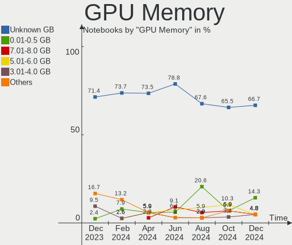
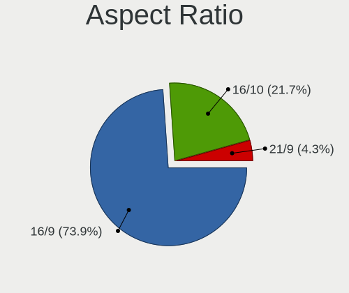

EndeavourOS - Hardware Trends (Notebooks)
-----------------------------------------

A project to identify most popular hardware characteristics and track their change
over time based on data collected by Linux users at https://Linux-Hardware.org.

Anyone can contribute to this report by the [hw-probe](https://github.com/linuxhw/hw-probe) tool:

    sudo -E hw-probe -all -upload

This report is for one last month. Overall report since the beginning of time: [TestCoverage](https://github.com/linuxhw/TestCoverage)

Period: May, 2022.

Contents
--------

* [ System ](#system)
  - [ OS                       ](#os)
  - [ OS Family                ](#os-family)
  - [ Kernel                   ](#kernel)
  - [ Kernel Family            ](#kernel-family)
  - [ Kernel Major Ver.        ](#kernel-major-ver)
  - [ Arch                     ](#arch)
  - [ DE                       ](#de)
  - [ Display Server           ](#display-server)
  - [ Display Manager          ](#display-manager)
  - [ OS Lang                  ](#os-lang)
  - [ Boot Mode                ](#boot-mode)
  - [ Filesystem               ](#filesystem)
  - [ Part. scheme             ](#part-scheme)
  - [ Dual Boot with Linux/BSD ](#dual-boot-with-linuxbsd)
  - [ Dual Boot (Win)          ](#dual-boot-win)

* [ Board ](#board)
  - [ Vendor                   ](#vendor)
  - [ Model                    ](#model)
  - [ Model Family             ](#model-family)
  - [ MFG Year                 ](#mfg-year)
  - [ Form Factor              ](#form-factor)
  - [ Secure Boot              ](#secure-boot)
  - [ Coreboot                 ](#coreboot)
  - [ RAM Size                 ](#ram-size)
  - [ RAM Used                 ](#ram-used)
  - [ Total Drives             ](#total-drives)
  - [ Has CD-ROM               ](#has-cd-rom)
  - [ Has Ethernet             ](#has-ethernet)
  - [ Has WiFi                 ](#has-wifi)
  - [ Has Bluetooth            ](#has-bluetooth)

* [ Location ](#location)
  - [ Country                  ](#country)
  - [ City                     ](#city)

* [ Drives ](#drives)
  - [ Drive Vendor             ](#drive-vendor)
  - [ Drive Model              ](#drive-model)
  - [ HDD Vendor               ](#hdd-vendor)
  - [ SSD Vendor               ](#ssd-vendor)
  - [ Drive Kind               ](#drive-kind)
  - [ Drive Connector          ](#drive-connector)
  - [ Drive Size               ](#drive-size)
  - [ Space Total              ](#space-total)
  - [ Space Used               ](#space-used)
  - [ Malfunc. Drives          ](#malfunc-drives)
  - [ Malfunc. Drive Vendor    ](#malfunc-drive-vendor)
  - [ Malfunc. HDD Vendor      ](#malfunc-hdd-vendor)
  - [ Malfunc. Drive Kind      ](#malfunc-drive-kind)
  - [ Failed Drives            ](#failed-drives)
  - [ Failed Drive Vendor      ](#failed-drive-vendor)
  - [ Drive Status             ](#drive-status)

* [ Storage controller ](#storage-controller)
  - [ Storage Vendor           ](#storage-vendor)
  - [ Storage Model            ](#storage-model)
  - [ Storage Kind             ](#storage-kind)

* [ Processor ](#processor)
  - [ CPU Vendor               ](#cpu-vendor)
  - [ CPU Model                ](#cpu-model)
  - [ CPU Model Family         ](#cpu-model-family)
  - [ CPU Cores                ](#cpu-cores)
  - [ CPU Sockets              ](#cpu-sockets)
  - [ CPU Threads              ](#cpu-threads)
  - [ CPU Op-Modes             ](#cpu-op-modes)
  - [ CPU Microcode            ](#cpu-microcode)
  - [ CPU Microarch            ](#cpu-microarch)

* [ Graphics ](#graphics)
  - [ GPU Vendor               ](#gpu-vendor)
  - [ GPU Model                ](#gpu-model)
  - [ GPU Combo                ](#gpu-combo)
  - [ GPU Driver               ](#gpu-driver)
  - [ GPU Memory               ](#gpu-memory)

* [ Monitor ](#monitor)
  - [ Monitor Vendor           ](#monitor-vendor)
  - [ Monitor Model            ](#monitor-model)
  - [ Monitor Resolution       ](#monitor-resolution)
  - [ Monitor Diagonal         ](#monitor-diagonal)
  - [ Monitor Width            ](#monitor-width)
  - [ Aspect Ratio             ](#aspect-ratio)
  - [ Monitor Area             ](#monitor-area)
  - [ Pixel Density            ](#pixel-density)
  - [ Multiple Monitors        ](#multiple-monitors)

* [ Network ](#network)
  - [ Net Controller Vendor    ](#net-controller-vendor)
  - [ Net Controller Model     ](#net-controller-model)
  - [ Wireless Vendor          ](#wireless-vendor)
  - [ Wireless Model           ](#wireless-model)
  - [ Ethernet Vendor          ](#ethernet-vendor)
  - [ Ethernet Model           ](#ethernet-model)
  - [ Net Controller Kind      ](#net-controller-kind)
  - [ Used Controller          ](#used-controller)
  - [ NICs                     ](#nics)
  - [ IPv6                     ](#ipv6)

* [ Bluetooth ](#bluetooth)
  - [ Bluetooth Vendor         ](#bluetooth-vendor)
  - [ Bluetooth Model          ](#bluetooth-model)

* [ Sound ](#sound)
  - [ Sound Vendor             ](#sound-vendor)
  - [ Sound Model              ](#sound-model)

* [ Memory ](#memory)
  - [ Memory Vendor            ](#memory-vendor)
  - [ Memory Model             ](#memory-model)
  - [ Memory Kind              ](#memory-kind)
  - [ Memory Form Factor       ](#memory-form-factor)
  - [ Memory Size              ](#memory-size)
  - [ Memory Speed             ](#memory-speed)

* [ Printers & scanners ](#printers--scanners)
  - [ Printer Vendor           ](#printer-vendor)
  - [ Printer Model            ](#printer-model)
  - [ Scanner Vendor           ](#scanner-vendor)
  - [ Scanner Model            ](#scanner-model)

* [ Camera ](#camera)
  - [ Camera Vendor            ](#camera-vendor)
  - [ Camera Model             ](#camera-model)

* [ Security ](#security)
  - [ Fingerprint Vendor       ](#fingerprint-vendor)
  - [ Fingerprint Model        ](#fingerprint-model)
  - [ Chipcard Vendor          ](#chipcard-vendor)
  - [ Chipcard Model           ](#chipcard-model)

* [ Unsupported ](#unsupported)
  - [ Unsupported Devices      ](#unsupported-devices)
  - [ Unsupported Device Types ](#unsupported-device-types)

System
------

OS
--

Installed operating systems

| Name                | Notebooks | Percent |
|---------------------|-----------|---------|
| EndeavourOS Rolling | 8         | 53.33%  |
| EndeavourOS         | 7         | 46.67%  |

OS Family
---------

OS without a version

| Name        | Notebooks | Percent |
|-------------|-----------|---------|
| EndeavourOS | 15        | 100%    |

Kernel
------

Version of the Linux kernel

| Version            | Notebooks | Percent |
|--------------------|-----------|---------|
| 5.17.9-arch1-1     | 4         | 26.67%  |
| 5.17.7-arch1-1     | 2         | 13.33%  |
| 5.15.37-1-lts      | 2         | 13.33%  |
| 5.18.0-arch1-1     | 1         | 6.67%   |
| 5.17.6-zen1-1-zen  | 1         | 6.67%   |
| 5.17.5-zen1-1-zen  | 1         | 6.67%   |
| 5.17.5-arch1-2     | 1         | 6.67%   |
| 5.17.5-arch1-1     | 1         | 6.67%   |
| 5.17.2-arch3-g14-1 | 1         | 6.67%   |
| 5.15.38-1-lts      | 1         | 6.67%   |

Kernel Family
-------------

Linux kernel without a distro release

| Version | Notebooks | Percent |
|---------|-----------|---------|
| 5.17.9  | 4         | 26.67%  |
| 5.17.5  | 3         | 20%     |
| 5.17.7  | 2         | 13.33%  |
| 5.15.37 | 2         | 13.33%  |
| 5.18.0  | 1         | 6.67%   |
| 5.17.6  | 1         | 6.67%   |
| 5.17.2  | 1         | 6.67%   |
| 5.15.38 | 1         | 6.67%   |

Kernel Major Ver.
-----------------

Linux kernel major version

| Version | Notebooks | Percent |
|---------|-----------|---------|
| 5.17    | 11        | 73.33%  |
| 5.15    | 3         | 20%     |
| 5.18    | 1         | 6.67%   |

Arch
----

OS architecture (x86_64, i586, etc.)

| Name   | Notebooks | Percent |
|--------|-----------|---------|
| x86_64 | 15        | 100%    |

DE
--

Desktop Environment

| Name    | Notebooks | Percent |
|---------|-----------|---------|
| KDE5    | 6         | 40%     |
| XFCE    | 4         | 26.67%  |
| GNOME   | 4         | 26.67%  |
| Unknown | 1         | 6.67%   |

Display Server
--------------

X11 or Wayland

| Name    | Notebooks | Percent |
|---------|-----------|---------|
| X11     | 12        | 80%     |
| Wayland | 3         | 20%     |

Display Manager
---------------

SDDM, LightDM, etc.

| Name    | Notebooks | Percent |
|---------|-----------|---------|
| Unknown | 7         | 46.67%  |
| SDDM    | 3         | 20%     |
| LightDM | 3         | 20%     |
| GDM     | 2         | 13.33%  |

OS Lang
-------

Language

| Lang  | Notebooks | Percent |
|-------|-----------|---------|
| en_US | 6         | 40%     |
| en_GB | 3         | 20%     |
| nl_NL | 1         | 6.67%   |
| es_AR | 1         | 6.67%   |
| en_ZA | 1         | 6.67%   |
| en_PH | 1         | 6.67%   |
| en_CA | 1         | 6.67%   |
| de_DE | 1         | 6.67%   |

Boot Mode
---------

EFI or BIOS

| Mode | Notebooks | Percent |
|------|-----------|---------|
| BIOS | 8         | 53.33%  |
| EFI  | 7         | 46.67%  |

Filesystem
----------

Type of filesystem

| Type  | Notebooks | Percent |
|-------|-----------|---------|
| Ext4  | 7         | 46.67%  |
| Btrfs | 6         | 40%     |
| F2fs  | 1         | 6.67%   |
| Ext2  | 1         | 6.67%   |

Part. scheme
------------

Scheme of partitioning

| Type    | Notebooks | Percent |
|---------|-----------|---------|
| GPT     | 7         | 46.67%  |
| Unknown | 7         | 46.67%  |
| MBR     | 1         | 6.67%   |

Dual Boot with Linux/BSD
------------------------

Hosting more than one Linux/BSD

| Dual boot | Notebooks | Percent |
|-----------|-----------|---------|
| No        | 14        | 93.33%  |
| Yes       | 1         | 6.67%   |

Dual Boot (Win)
---------------

Hosting Linux and Windows

| Dual boot | Notebooks | Percent |
|-----------|-----------|---------|
| No        | 13        | 86.67%  |
| Yes       | 2         | 13.33%  |

Board
-----

Vendor
------

Motherboard manufacturer

| Name             | Notebooks | Percent |
|------------------|-----------|---------|
| Lenovo           | 3         | 20%     |
| Hewlett-Packard  | 3         | 20%     |
| Dell             | 3         | 20%     |
| Timi             | 1         | 6.67%   |
| Sony             | 1         | 6.67%   |
| Chuwi            | 1         | 6.67%   |
| ASUSTek Computer | 1         | 6.67%   |
| Acer             | 1         | 6.67%   |
| Unknown          | 1         | 6.67%   |

Model
-----

Motherboard model

| Name                                  | Notebooks | Percent |
|---------------------------------------|-----------|---------|
| Timi A35S                             | 1         | 6.67%   |
| Sony VPCCA17FX                        | 1         | 6.67%   |
| Lenovo V14 G2 ITL 82NM                | 1         | 6.67%   |
| Lenovo ThinkPad X270 20HMS12K00       | 1         | 6.67%   |
| Lenovo IdeaPad 3 15ITL6 82H8          | 1         | 6.67%   |
| HP ProBook 440 G4                     | 1         | 6.67%   |
| HP Pavilion Laptop 15-eh0xxx          | 1         | 6.67%   |
| HP Notebook                           | 1         | 6.67%   |
| Dell Latitude E6510                   | 1         | 6.67%   |
| Dell Latitude 5289                    | 1         | 6.67%   |
| Dell Inspiron 3580                    | 1         | 6.67%   |
| Chuwi GemiBook Pro                    | 1         | 6.67%   |
| ASUS ROG Zephyrus G15 GA503QS_GA503QS | 1         | 6.67%   |
| Acer Swift SF314-41                   | 1         | 6.67%   |
| Unknown                               | 1         | 6.67%   |

Model Family
------------

Motherboard model prefix

| Name            | Notebooks | Percent |
|-----------------|-----------|---------|
| Dell Latitude   | 2         | 13.33%  |
| Timi A35S       | 1         | 6.67%   |
| Sony VPCCA17FX  | 1         | 6.67%   |
| Lenovo V14      | 1         | 6.67%   |
| Lenovo ThinkPad | 1         | 6.67%   |
| Lenovo IdeaPad  | 1         | 6.67%   |
| HP ProBook      | 1         | 6.67%   |
| HP Pavilion     | 1         | 6.67%   |
| HP Notebook     | 1         | 6.67%   |
| Dell Inspiron   | 1         | 6.67%   |
| Chuwi GemiBook  | 1         | 6.67%   |
| ASUS ROG        | 1         | 6.67%   |
| Acer Swift      | 1         | 6.67%   |
| Unknown         | 1         | 6.67%   |

MFG Year
--------

Motherboard manufacture year

| Year | Notebooks | Percent |
|------|-----------|---------|
| 2021 | 6         | 40%     |
| 2018 | 2         | 13.33%  |
| 2016 | 2         | 13.33%  |
| 2020 | 1         | 6.67%   |
| 2019 | 1         | 6.67%   |
| 2017 | 1         | 6.67%   |
| 2011 | 1         | 6.67%   |
| 2010 | 1         | 6.67%   |

Form Factor
-----------

Physical design of the computer

| Name     | Notebooks | Percent |
|----------|-----------|---------|
| Notebook | 15        | 100%    |

Secure Boot
-----------

Enabled or disabled

| State    | Notebooks | Percent |
|----------|-----------|---------|
| Disabled | 15        | 100%    |

Coreboot
--------

Have coreboot on board

| Used | Notebooks | Percent |
|------|-----------|---------|
| No   | 15        | 100%    |

RAM Size
--------

Total RAM memory

| Size in GB | Notebooks | Percent |
|------------|-----------|---------|
| 4.01-8.0   | 7         | 46.67%  |
| 8.01-16.0  | 6         | 40%     |
| 16.01-24.0 | 2         | 13.33%  |

RAM Used
--------

Used RAM memory

| Used GB  | Notebooks | Percent |
|----------|-----------|---------|
| 1.01-2.0 | 10        | 66.67%  |
| 4.01-8.0 | 3         | 20%     |
| 3.01-4.0 | 1         | 6.67%   |
| 2.01-3.0 | 1         | 6.67%   |

Total Drives
------------

Number of drives on board

| Drives | Notebooks | Percent |
|--------|-----------|---------|
| 1      | 13        | 86.67%  |
| 2      | 2         | 13.33%  |

Has CD-ROM
----------

Has CD-ROM on board

| Presented | Notebooks | Percent |
|-----------|-----------|---------|
| No        | 11        | 73.33%  |
| Yes       | 4         | 26.67%  |

Has Ethernet
------------

Has Ethernet on board

| Presented | Notebooks | Percent |
|-----------|-----------|---------|
| Yes       | 9         | 60%     |
| No        | 6         | 40%     |

Has WiFi
--------

Has WiFi module

| Presented | Notebooks | Percent |
|-----------|-----------|---------|
| Yes       | 15        | 100%    |

Has Bluetooth
-------------

Has Bluetooth module

| Presented | Notebooks | Percent |
|-----------|-----------|---------|
| Yes       | 13        | 86.67%  |
| No        | 2         | 13.33%  |

Location
--------

Country
-------

Geographic location (country)

| Country      | Notebooks | Percent |
|--------------|-----------|---------|
| Brazil       | 2         | 13.33%  |
| USA          | 1         | 6.67%   |
| UK           | 1         | 6.67%   |
| Switzerland  | 1         | 6.67%   |
| Spain        | 1         | 6.67%   |
| South Africa | 1         | 6.67%   |
| Philippines  | 1         | 6.67%   |
| Netherlands  | 1         | 6.67%   |
| Germany      | 1         | 6.67%   |
| France       | 1         | 6.67%   |
| Colombia     | 1         | 6.67%   |
| Canada       | 1         | 6.67%   |
| Belgium      | 1         | 6.67%   |
| Argentina    | 1         | 6.67%   |

City
----

Geographic location (city)

| City           | Notebooks | Percent |
|----------------|-----------|---------|
| Zurich         | 1         | 6.67%   |
| Victoria       | 1         | 6.67%   |
| Valinhos       | 1         | 6.67%   |
| Sauteyrargues  | 1         | 6.67%   |
| Sao Paulo      | 1         | 6.67%   |
| Rotterdam      | 1         | 6.67%   |
| Montijo        | 1         | 6.67%   |
| Medellín      | 1         | 6.67%   |
| Mannheim       | 1         | 6.67%   |
| London         | 1         | 6.67%   |
| Edegem         | 1         | 6.67%   |
| Danville       | 1         | 6.67%   |
| Cape Town      | 1         | 6.67%   |
| Cagayan de Oro | 1         | 6.67%   |
| Buenos Aires   | 1         | 6.67%   |

Drives
------

Drive Vendor
------------

Hard drive vendors

| Vendor                         | Notebooks | Drives | Percent |
|--------------------------------|-----------|--------|---------|
| Sandisk                        | 3         | 3      | 16.67%  |
| SK Hynix                       | 2         | 2      | 11.11%  |
| Gigabyte Technology            | 2         | 2      | 11.11%  |
| Zheino                         | 1         | 1      | 5.56%   |
| Toshiba                        | 1         | 1      | 5.56%   |
| Teclast                        | 1         | 1      | 5.56%   |
| SPCC                           | 1         | 1      | 5.56%   |
| Solid State Storage Technology | 1         | 1      | 5.56%   |
| Samsung Electronics            | 1         | 1      | 5.56%   |
| Netac                          | 1         | 1      | 5.56%   |
| Micron Technology              | 1         | 1      | 5.56%   |
| KIOXIA                         | 1         | 1      | 5.56%   |
| Intel                          | 1         | 1      | 5.56%   |
| Hikvision                      | 1         | 1      | 5.56%   |

Drive Model
-----------

Hard drive models

| Model                                    | Notebooks | Percent |
|------------------------------------------|-----------|---------|
| Sandisk NVMe SSD Drive 256GB             | 2         | 11.11%  |
| Zheino CHN-25SATAC3-120 120GB            | 1         | 5.56%   |
| Toshiba MQ04ABF100 1TB                   | 1         | 5.56%   |
| Teclast BD256GB SHCA-2280 SSD            | 1         | 5.56%   |
| SPCC Solid State Disk 256GB              | 1         | 5.56%   |
| Solid State Storage NVMe SSD Drive 256GB | 1         | 5.56%   |
| SK Hynix HFM001TD3JX013N 1TB             | 1         | 5.56%   |
| SK Hynix BC511 HFM512GDJTNI-82A0A 512GB  | 1         | 5.56%   |
| SanDisk SDSSDA240G 240GB                 | 1         | 5.56%   |
| Samsung MZVLW256HEHP-000L7 256GB         | 1         | 5.56%   |
| Netac SSD 256GB                          | 1         | 5.56%   |
| Micron NVMe SSD Drive 512GB              | 1         | 5.56%   |
| KIOXIA KBG40ZNV512G 512GB                | 1         | 5.56%   |
| Intel SSDSCKKF256H6 SATA 256GB           | 1         | 5.56%   |
| Hikvision HS-SSD-E2000 256GB             | 1         | 5.56%   |
| Gigabyte GP-GSTFS31480GNTD 480GB SSD     | 1         | 5.56%   |
| Gigabyte GP-GSTFS31100TNTD 1024GB        | 1         | 5.56%   |

HDD Vendor
----------

Hard disk drive vendors

| Vendor  | Notebooks | Drives | Percent |
|---------|-----------|--------|---------|
| Toshiba | 1         | 1      | 100%    |

SSD Vendor
----------

Solid state drive vendors

| Vendor              | Notebooks | Drives | Percent |
|---------------------|-----------|--------|---------|
| Gigabyte Technology | 2         | 2      | 25%     |
| Zheino              | 1         | 1      | 12.5%   |
| Teclast             | 1         | 1      | 12.5%   |
| SPCC                | 1         | 1      | 12.5%   |
| SanDisk             | 1         | 1      | 12.5%   |
| Netac               | 1         | 1      | 12.5%   |
| Intel               | 1         | 1      | 12.5%   |

Drive Kind
----------

HDD or SSD

| Kind | Notebooks | Drives | Percent |
|------|-----------|--------|---------|
| NVMe | 9         | 9      | 50%     |
| SSD  | 8         | 8      | 44.44%  |
| HDD  | 1         | 1      | 5.56%   |

Drive Connector
---------------

SATA, SAS, NVMe, etc.

| Type | Notebooks | Drives | Percent |
|------|-----------|--------|---------|
| NVMe | 9         | 9      | 50%     |
| SATA | 9         | 9      | 50%     |

Drive Size
----------

Size of hard drive

| Size in TB | Notebooks | Drives | Percent |
|------------|-----------|--------|---------|
| 0.01-0.5   | 7         | 7      | 77.78%  |
| 1.01-2.0   | 1         | 1      | 11.11%  |
| 0.51-1.0   | 1         | 1      | 11.11%  |

Space Total
-----------

Amount of disk space available on the file system

| Size in GB | Notebooks | Percent |
|------------|-----------|---------|
| 101-250    | 4         | 26.67%  |
| 501-1000   | 4         | 26.67%  |
| 251-500    | 3         | 20%     |
| 1001-2000  | 2         | 13.33%  |
| Unknown    | 2         | 13.33%  |

Space Used
----------

Amount of used disk space

| Used GB  | Notebooks | Percent |
|----------|-----------|---------|
| 1-20     | 6         | 40%     |
| 21-50    | 2         | 13.33%  |
| 101-250  | 2         | 13.33%  |
| Unknown  | 2         | 13.33%  |
| 251-500  | 1         | 6.67%   |
| 501-1000 | 1         | 6.67%   |
| 51-100   | 1         | 6.67%   |

Malfunc. Drives
---------------

Drive models with a malfunction

| Model                          | Notebooks | Drives | Percent |
|--------------------------------|-----------|--------|---------|
| Intel SSDSCKKF256H6 SATA 256GB | 1         | 1      | 100%    |

Malfunc. Drive Vendor
---------------------

Vendors of faulty drives

| Vendor | Notebooks | Drives | Percent |
|--------|-----------|--------|---------|
| Intel  | 1         | 1      | 100%    |

Malfunc. HDD Vendor
-------------------

Vendors of faulty HDD drives

Zero info for selected period =(

Malfunc. Drive Kind
-------------------

Kinds of faulty drives

| Kind | Notebooks | Drives | Percent |
|------|-----------|--------|---------|
| SSD  | 1         | 1      | 100%    |

Failed Drives
-------------

Failed drive models

Zero info for selected period =(

Failed Drive Vendor
-------------------

Failed drive vendors

Zero info for selected period =(

Drive Status
------------

Number of failed and malfunc. drives

| Status   | Notebooks | Drives | Percent |
|----------|-----------|--------|---------|
| Detected | 8         | 9      | 50%     |
| Works    | 7         | 8      | 43.75%  |
| Malfunc  | 1         | 1      | 6.25%   |

Storage controller
------------------

Storage Vendor
--------------

Storage controller vendors

| Vendor                         | Notebooks | Percent |
|--------------------------------|-----------|---------|
| Intel                          | 10        | 52.63%  |
| SK Hynix                       | 2         | 10.53%  |
| Solid State Storage Technology | 1         | 5.26%   |
| Sandisk                        | 1         | 5.26%   |
| Samsung Electronics            | 1         | 5.26%   |
| Phison Electronics             | 1         | 5.26%   |
| Micron Technology              | 1         | 5.26%   |
| KIOXIA                         | 1         | 5.26%   |
| AMD                            | 1         | 5.26%   |

Storage Model
-------------

Storage controller models

| Model                                                                            | Notebooks | Percent |
|----------------------------------------------------------------------------------|-----------|---------|
| Intel Tiger Lake-LP SATA Controller [AHCI mode]                                  | 2         | 10%     |
| Intel Sunrise Point-LP SATA Controller [AHCI mode]                               | 2         | 10%     |
| Solid State Storage Non-Volatile memory controller                               | 1         | 5%      |
| SK Hynix Gold P31 SSD                                                            | 1         | 5%      |
| SK Hynix BC511                                                                   | 1         | 5%      |
| Sandisk WD Black 2018/SN750 / PC SN720 NVMe SSD                                  | 1         | 5%      |
| Samsung NVMe SSD Controller SM961/PM961/SM963                                    | 1         | 5%      |
| Phison E12 NVMe Controller                                                       | 1         | 5%      |
| Micron Non-Volatile memory controller                                            | 1         | 5%      |
| KIOXIA Non-Volatile memory controller                                            | 1         | 5%      |
| Intel Volume Management Device NVMe RAID Controller                              | 1         | 5%      |
| Intel Jasper Lake SATA AHCI Controller                                           | 1         | 5%      |
| Intel Celeron/Pentium Silver Processor SATA Controller                           | 1         | 5%      |
| Intel Cannon Point-LP SATA Controller [AHCI Mode]                                | 1         | 5%      |
| Intel Atom/Celeron/Pentium Processor x5-E8000/J3xxx/N3xxx Series SATA Controller | 1         | 5%      |
| Intel 6 Series/C200 Series Chipset Family 6 port Mobile SATA AHCI Controller     | 1         | 5%      |
| Intel 5 Series/3400 Series Chipset 6 port SATA AHCI Controller                   | 1         | 5%      |
| AMD FCH SATA Controller [AHCI mode]                                              | 1         | 5%      |

Storage Kind
------------

Kind of storage controller (IDE, SATA, NVMe, SAS, ...)

| Kind | Notebooks | Percent |
|------|-----------|---------|
| SATA | 11        | 55%     |
| NVMe | 8         | 40%     |
| RAID | 1         | 5%      |

Processor
---------

CPU Vendor
----------

Processor vendors

| Vendor | Notebooks | Percent |
|--------|-----------|---------|
| Intel  | 11        | 73.33%  |
| AMD    | 4         | 26.67%  |

CPU Model
---------

Processor models

| Model                                         | Notebooks | Percent |
|-----------------------------------------------|-----------|---------|
| Intel Core i5-7300U CPU @ 2.60GHz             | 2         | 13.33%  |
| Intel 11th Gen Core i5-1135G7 @ 2.40GHz       | 2         | 13.33%  |
| Intel Pentium CPU N3710 @ 1.60GHz             | 1         | 6.67%   |
| Intel Core i5-8265U CPU @ 1.60GHz             | 1         | 6.67%   |
| Intel Core i5-2410M CPU @ 2.30GHz             | 1         | 6.67%   |
| Intel Core i5 CPU M 580 @ 2.67GHz             | 1         | 6.67%   |
| Intel Core i3-7100U CPU @ 2.40GHz             | 1         | 6.67%   |
| Intel Celeron N5100 @ 1.10GHz                 | 1         | 6.67%   |
| Intel Celeron N4120 CPU @ 1.10GHz             | 1         | 6.67%   |
| AMD Ryzen 7 5800HS with Radeon Graphics       | 1         | 6.67%   |
| AMD Ryzen 7 5800H with Radeon Graphics        | 1         | 6.67%   |
| AMD Ryzen 5 4500U with Radeon Graphics        | 1         | 6.67%   |
| AMD Ryzen 5 3500U with Radeon Vega Mobile Gfx | 1         | 6.67%   |

CPU Model Family
----------------

Processor model prefix

| Model         | Notebooks | Percent |
|---------------|-----------|---------|
| Intel Core i5 | 5         | 33.33%  |
| Other         | 2         | 13.33%  |
| Intel Celeron | 2         | 13.33%  |
| AMD Ryzen 7   | 2         | 13.33%  |
| AMD Ryzen 5   | 2         | 13.33%  |
| Intel Pentium | 1         | 6.67%   |
| Intel Core i3 | 1         | 6.67%   |

CPU Cores
---------

Number of processor cores

| Number | Notebooks | Percent |
|--------|-----------|---------|
| 4      | 7         | 46.67%  |
| 2      | 5         | 33.33%  |
| 8      | 2         | 13.33%  |
| 6      | 1         | 6.67%   |

CPU Sockets
-----------

Number of sockets

| Number | Notebooks | Percent |
|--------|-----------|---------|
| 1      | 15        | 100%    |

CPU Threads
-----------

Threads per core (Hyper-Threading)

| Number | Notebooks | Percent |
|--------|-----------|---------|
| 2      | 11        | 73.33%  |
| 1      | 4         | 26.67%  |

CPU Op-Modes
------------

CPU Operation Modes (32-bit, 64-bit)

| Op mode        | Notebooks | Percent |
|----------------|-----------|---------|
| 32-bit, 64-bit | 15        | 100%    |

CPU Microcode
-------------

Microcode number

| Number     | Notebooks | Percent |
|------------|-----------|---------|
| Unknown    | 8         | 53.33%  |
| 0x806e9    | 2         | 13.33%  |
| 0x906c0    | 1         | 6.67%   |
| 0x806ec    | 1         | 6.67%   |
| 0x206a7    | 1         | 6.67%   |
| 0x0a50000c | 1         | 6.67%   |
| 0x08600106 | 1         | 6.67%   |

CPU Microarch
-------------

Microarchitecture

| Name          | Notebooks | Percent |
|---------------|-----------|---------|
| KabyLake      | 4         | 26.67%  |
| Zen 3         | 2         | 13.33%  |
| TigerLake     | 2         | 13.33%  |
| Zen+          | 1         | 6.67%   |
| Zen 2         | 1         | 6.67%   |
| Westmere      | 1         | 6.67%   |
| Tremont       | 1         | 6.67%   |
| Silvermont    | 1         | 6.67%   |
| SandyBridge   | 1         | 6.67%   |
| Goldmont plus | 1         | 6.67%   |

Graphics
--------

GPU Vendor
----------

Vendors of graphics cards

| Vendor | Notebooks | Percent |
|--------|-----------|---------|
| Intel  | 10        | 62.5%   |
| AMD    | 5         | 31.25%  |
| Nvidia | 1         | 6.25%   |

GPU Model
---------

Graphics card models

| Model                                                                                    | Notebooks | Percent |
|------------------------------------------------------------------------------------------|-----------|---------|
| Intel HD Graphics 620                                                                    | 3         | 18.75%  |
| Intel TigerLake-LP GT2 [Iris Xe Graphics]                                                | 2         | 12.5%   |
| AMD Cezanne                                                                              | 2         | 12.5%   |
| Nvidia GT218M [NVS 3100M]                                                                | 1         | 6.25%   |
| Intel WhiskeyLake-U GT2 [UHD Graphics 620]                                               | 1         | 6.25%   |
| Intel JasperLake [UHD Graphics]                                                          | 1         | 6.25%   |
| Intel GeminiLake [UHD Graphics 600]                                                      | 1         | 6.25%   |
| Intel Atom/Celeron/Pentium Processor x5-E8000/J3xxx/N3xxx Integrated Graphics Controller | 1         | 6.25%   |
| Intel 2nd Generation Core Processor Family Integrated Graphics Controller                | 1         | 6.25%   |
| AMD Whistler [Radeon HD 6630M/6650M/6750M/7670M/7690M]                                   | 1         | 6.25%   |
| AMD Renoir                                                                               | 1         | 6.25%   |
| AMD Picasso/Raven 2 [Radeon Vega Series / Radeon Vega Mobile Series]                     | 1         | 6.25%   |

GPU Combo
---------

Combinations of graphics cards

| Name        | Notebooks | Percent |
|-------------|-----------|---------|
| 1 x Intel   | 9         | 60%     |
| 1 x AMD     | 4         | 26.67%  |
| 1 x Nvidia  | 1         | 6.67%   |
| Intel + AMD | 1         | 6.67%   |

GPU Driver
----------

Free vs proprietary

| Driver | Notebooks | Percent |
|--------|-----------|---------|
| Free   | 15        | 100%    |

GPU Memory
----------

Total video memory

| Size in GB | Notebooks | Percent |
|------------|-----------|---------|
| Unknown    | 12        | 80%     |
| 0.01-0.5   | 2         | 13.33%  |
| 0.51-1.0   | 1         | 6.67%   |

Monitor
-------

Monitor Vendor
--------------

Monitor vendors

| Vendor              | Notebooks | Percent |
|---------------------|-----------|---------|
| AU Optronics        | 4         | 25%     |
| Chimei Innolux      | 3         | 18.75%  |
| Samsung Electronics | 2         | 12.5%   |
| BOE                 | 2         | 12.5%   |
| Philips             | 1         | 6.25%   |
| PANDA               | 1         | 6.25%   |
| LG Display          | 1         | 6.25%   |
| InfoVision          | 1         | 6.25%   |
| CPT                 | 1         | 6.25%   |

Monitor Model
-------------

Monitor models

| Model                                                                   | Notebooks | Percent |
|-------------------------------------------------------------------------|-----------|---------|
| Samsung Electronics LCD Monitor SDC4150 3456x2160 336x210mm 15.6-inch   | 1         | 6.25%   |
| Samsung Electronics LCD Monitor SAM0D42 3840x2160 1872x1053mm 84.6-inch | 1         | 6.25%   |
| Philips PHL 276E8V PHLC18F 3840x2160 597x336mm 27.0-inch                | 1         | 6.25%   |
| PANDA LCD Monitor NCP0040 1920x1080 344x194mm 15.5-inch                 | 1         | 6.25%   |
| LG Display LCD Monitor LGD0542 1920x1080 276x156mm 12.5-inch            | 1         | 6.25%   |
| InfoVision LCD Monitor IVO8544 1920x1080 294x165mm 13.3-inch            | 1         | 6.25%   |
| CPT LCD Monitor CPT14C5 1366x768 344x194mm 15.5-inch                    | 1         | 6.25%   |
| Chimei Innolux P140ZKA-BZ1 CMN8C03 2160x1440 296x197mm 14.0-inch        | 1         | 6.25%   |
| Chimei Innolux LCD Monitor CMN15C6 1366x768 344x193mm 15.5-inch         | 1         | 6.25%   |
| Chimei Innolux LCD Monitor CMN152A 2560x1440 344x193mm 15.5-inch        | 1         | 6.25%   |
| BOE LCD Monitor BOE08D5 1920x1080 344x194mm 15.5-inch                   | 1         | 6.25%   |
| BOE LCD Monitor BOE0808 1366x768 344x194mm 15.5-inch                    | 1         | 6.25%   |
| AU Optronics LCD Monitor AUOF390 1366x768 309x173mm 13.9-inch           | 1         | 6.25%   |
| AU Optronics LCD Monitor AUO2E3C 1366x768 309x173mm 13.9-inch           | 1         | 6.25%   |
| AU Optronics LCD Monitor AUO226D 1920x1080 276x155mm 12.5-inch          | 1         | 6.25%   |
| AU Optronics LCD Monitor AUO223C 1366x768 309x173mm 13.9-inch           | 1         | 6.25%   |

Monitor Resolution
------------------

Monitor screen resolution

| Resolution      | Notebooks | Percent |
|-----------------|-----------|---------|
| 1366x768 (WXGA) | 6         | 37.5%   |
| 1920x1080 (FHD) | 5         | 31.25%  |
| 3840x2160 (4K)  | 2         | 12.5%   |
| 3456x2160       | 1         | 6.25%   |
| 2560x1440 (QHD) | 1         | 6.25%   |
| 2160x1440       | 1         | 6.25%   |

Monitor Diagonal
----------------

Diagonal size in inches

| Inches | Notebooks | Percent |
|--------|-----------|---------|
| 15     | 7         | 43.75%  |
| 13     | 4         | 25%     |
| 12     | 2         | 12.5%   |
| 84     | 1         | 6.25%   |
| 27     | 1         | 6.25%   |
| 14     | 1         | 6.25%   |

Monitor Width
-------------

Physical width

| Width in mm | Notebooks | Percent |
|-------------|-----------|---------|
| 301-350     | 10        | 62.5%   |
| 201-300     | 4         | 25%     |
| 501-600     | 1         | 6.25%   |
| 1501-2000   | 1         | 6.25%   |

Aspect Ratio
------------

Proportional relationship between the width and the height

| Ratio | Notebooks | Percent |
|-------|-----------|---------|
| 16/9  | 13        | 86.67%  |
| 3/2   | 1         | 6.67%   |
| 16/10 | 1         | 6.67%   |

Monitor Area
------------

Area in inch²

| Area in inch² | Notebooks | Percent |
|----------------|-----------|---------|
| 101-110        | 7         | 43.75%  |
| 81-90          | 4         | 25%     |
| 61-70          | 2         | 12.5%   |
| More than 1000 | 1         | 6.25%   |
| 71-80          | 1         | 6.25%   |
| 301-350        | 1         | 6.25%   |

Pixel Density
-------------

Pixels per inch

| Density       | Notebooks | Percent |
|---------------|-----------|---------|
| 161-240       | 6         | 37.5%   |
| 101-120       | 6         | 37.5%   |
| 121-160       | 2         | 12.5%   |
| More than 240 | 1         | 6.25%   |
| 51-100        | 1         | 6.25%   |

Multiple Monitors
-----------------

Total monitors connected

| Total | Notebooks | Percent |
|-------|-----------|---------|
| 1     | 14        | 93.33%  |
| 2     | 1         | 6.67%   |

Network
-------

Net Controller Vendor
---------------------

Controller vendors

| Vendor                | Notebooks | Percent |
|-----------------------|-----------|---------|
| Realtek Semiconductor | 8         | 38.1%   |
| Intel                 | 8         | 38.1%   |
| Qualcomm Atheros      | 3         | 14.29%  |
| Fibocom               | 1         | 4.76%   |
| Broadcom              | 1         | 4.76%   |

Net Controller Model
--------------------

Controller models

| Model                                                             | Notebooks | Percent |
|-------------------------------------------------------------------|-----------|---------|
| Realtek RTL8111/8168/8411 PCI Express Gigabit Ethernet Controller | 3         | 12.5%   |
| Realtek RTL8821CE 802.11ac PCIe Wireless Network Adapter          | 2         | 8.33%   |
| Realtek RTL810xE PCI Express Fast Ethernet controller             | 2         | 8.33%   |
| Intel Wireless 8265 / 8275                                        | 2         | 8.33%   |
| Intel Wi-Fi 6 AX200                                               | 2         | 8.33%   |
| Realtek RTL8822CE 802.11ac PCIe Wireless Network Adapter          | 1         | 4.17%   |
| Realtek RTL8723BE PCIe Wireless Network Adapter                   | 1         | 4.17%   |
| Qualcomm Atheros QCA9377 802.11ac Wireless Network Adapter        | 1         | 4.17%   |
| Qualcomm Atheros QCA6174 802.11ac Wireless Network Adapter        | 1         | 4.17%   |
| Qualcomm Atheros AR8151 v2.0 Gigabit Ethernet                     | 1         | 4.17%   |
| Intel Wireless 3165                                               | 1         | 4.17%   |
| Intel Wi-Fi 6 AX201                                               | 1         | 4.17%   |
| Intel Ethernet Connection (4) I219-LM                             | 1         | 4.17%   |
| Intel Centrino Wireless-N 1000 [Condor Peak]                      | 1         | 4.17%   |
| Intel Centrino Advanced-N 6200                                    | 1         | 4.17%   |
| Intel 82577LM Gigabit Network Connection                          | 1         | 4.17%   |
| Fibocom L831-EAU-00                                               | 1         | 4.17%   |
| Broadcom BCM43142 802.11b/g/n                                     | 1         | 4.17%   |

Wireless Vendor
---------------

Wireless vendors

| Vendor                | Notebooks | Percent |
|-----------------------|-----------|---------|
| Intel                 | 8         | 53.33%  |
| Realtek Semiconductor | 4         | 26.67%  |
| Qualcomm Atheros      | 2         | 13.33%  |
| Broadcom              | 1         | 6.67%   |

Wireless Model
--------------

Wireless models

| Model                                                      | Notebooks | Percent |
|------------------------------------------------------------|-----------|---------|
| Realtek RTL8821CE 802.11ac PCIe Wireless Network Adapter   | 2         | 13.33%  |
| Intel Wireless 8265 / 8275                                 | 2         | 13.33%  |
| Intel Wi-Fi 6 AX200                                        | 2         | 13.33%  |
| Realtek RTL8822CE 802.11ac PCIe Wireless Network Adapter   | 1         | 6.67%   |
| Realtek RTL8723BE PCIe Wireless Network Adapter            | 1         | 6.67%   |
| Qualcomm Atheros QCA9377 802.11ac Wireless Network Adapter | 1         | 6.67%   |
| Qualcomm Atheros QCA6174 802.11ac Wireless Network Adapter | 1         | 6.67%   |
| Intel Wireless 3165                                        | 1         | 6.67%   |
| Intel Wi-Fi 6 AX201                                        | 1         | 6.67%   |
| Intel Centrino Wireless-N 1000 [Condor Peak]               | 1         | 6.67%   |
| Intel Centrino Advanced-N 6200                             | 1         | 6.67%   |
| Broadcom BCM43142 802.11b/g/n                              | 1         | 6.67%   |

Ethernet Vendor
---------------

Ethernet vendors

| Vendor                | Notebooks | Percent |
|-----------------------|-----------|---------|
| Realtek Semiconductor | 5         | 55.56%  |
| Intel                 | 2         | 22.22%  |
| Qualcomm Atheros      | 1         | 11.11%  |
| Fibocom               | 1         | 11.11%  |

Ethernet Model
--------------

Ethernet models

| Model                                                             | Notebooks | Percent |
|-------------------------------------------------------------------|-----------|---------|
| Realtek RTL8111/8168/8411 PCI Express Gigabit Ethernet Controller | 3         | 33.33%  |
| Realtek RTL810xE PCI Express Fast Ethernet controller             | 2         | 22.22%  |
| Qualcomm Atheros AR8151 v2.0 Gigabit Ethernet                     | 1         | 11.11%  |
| Intel Ethernet Connection (4) I219-LM                             | 1         | 11.11%  |
| Intel 82577LM Gigabit Network Connection                          | 1         | 11.11%  |
| Fibocom L831-EAU-00                                               | 1         | 11.11%  |

Net Controller Kind
-------------------

Ethernet, WiFi or modem

| Kind     | Notebooks | Percent |
|----------|-----------|---------|
| WiFi     | 15        | 65.22%  |
| Ethernet | 8         | 34.78%  |

Used Controller
---------------

Currently used network controller

| Kind | Notebooks | Percent |
|------|-----------|---------|
| WiFi | 15        | 100%    |

NICs
----

Total network controllers on board

| Total | Notebooks | Percent |
|-------|-----------|---------|
| 2     | 8         | 53.33%  |
| 1     | 7         | 46.67%  |

IPv6
----

IPv6 vs IPv4

| Used | Notebooks | Percent |
|------|-----------|---------|
| No   | 8         | 53.33%  |
| Yes  | 7         | 46.67%  |

Bluetooth
---------

Bluetooth Vendor
----------------

Controller vendors

| Vendor                          | Notebooks | Percent |
|---------------------------------|-----------|---------|
| Intel                           | 6         | 46.15%  |
| Realtek Semiconductor           | 4         | 30.77%  |
| Qualcomm Atheros Communications | 1         | 7.69%   |
| Lite-On Technology              | 1         | 7.69%   |
| Broadcom                        | 1         | 7.69%   |

Bluetooth Model
---------------

Controller models

| Model                                          | Notebooks | Percent |
|------------------------------------------------|-----------|---------|
| Realtek Bluetooth Radio                        | 3         | 23.08%  |
| Intel Bluetooth wireless interface             | 3         | 23.08%  |
| Intel AX200 Bluetooth                          | 2         | 15.38%  |
| Realtek  Bluetooth 4.2 Adapter                 | 1         | 7.69%   |
| Qualcomm Atheros  Bluetooth Device             | 1         | 7.69%   |
| Lite-On Bluetooth Device                       | 1         | 7.69%   |
| Intel Bluetooth 9460/9560 Jefferson Peak (JfP) | 1         | 7.69%   |
| Broadcom BCM43142A0 Bluetooth 4.0              | 1         | 7.69%   |

Sound
-----

Sound Vendor
------------

Sound card vendors

| Vendor | Notebooks | Percent |
|--------|-----------|---------|
| Intel  | 11        | 68.75%  |
| AMD    | 4         | 25%     |
| Nvidia | 1         | 6.25%   |

Sound Model
-----------

Sound card models

| Model                                                                                             | Notebooks | Percent |
|---------------------------------------------------------------------------------------------------|-----------|---------|
| AMD Family 17h/19h HD Audio Controller                                                            | 4         | 20%     |
| Intel Sunrise Point-LP HD Audio                                                                   | 3         | 15%     |
| AMD Renoir Radeon High Definition Audio Controller                                                | 3         | 15%     |
| Intel Tiger Lake-LP Smart Sound Technology Audio Controller                                       | 2         | 10%     |
| Nvidia High Definition Audio Controller                                                           | 1         | 5%      |
| Intel Jasper Lake HD Audio                                                                        | 1         | 5%      |
| Intel Celeron/Pentium Silver Processor High Definition Audio                                      | 1         | 5%      |
| Intel Cannon Point-LP High Definition Audio Controller                                            | 1         | 5%      |
| Intel Atom/Celeron/Pentium Processor x5-E8000/J3xxx/N3xxx Series High Definition Audio Controller | 1         | 5%      |
| Intel 6 Series/C200 Series Chipset Family High Definition Audio Controller                        | 1         | 5%      |
| Intel 5 Series/3400 Series Chipset High Definition Audio                                          | 1         | 5%      |
| AMD Raven/Raven2/Fenghuang HDMI/DP Audio Controller                                               | 1         | 5%      |

Memory
------

Memory Vendor
-------------

Memory module vendors

| Vendor              | Notebooks | Percent |
|---------------------|-----------|---------|
| Micron Technology   | 3         | 37.5%   |
| Unknown             | 2         | 25%     |
| Samsung Electronics | 2         | 25%     |
| SK Hynix            | 1         | 12.5%   |

Memory Model
------------

Memory module models

| Model                                                          | Notebooks | Percent |
|----------------------------------------------------------------|-----------|---------|
| Micron RAM 4ATF1G64HZ-3G2E2 8GB SODIMM DDR4 3200MT/s           | 2         | 20%     |
| Unknown RAM Module 8GB SODIMM DDR3                             | 1         | 10%     |
| Unknown RAM Module 4GB Row Of Chips LPDDR3 1867MT/s            | 1         | 10%     |
| Unknown RAM Module 2GB SODIMM DDR3                             | 1         | 10%     |
| SK Hynix RAM HMA81GS6JJR8N-VK 8GB SODIMM DDR4 2667MT/s         | 1         | 10%     |
| Samsung RAM M471A1K43BB1-CRC 8GB SODIMM DDR4 2667MT/s          | 1         | 10%     |
| Samsung RAM M471A1G44AB0-CWE 8GB Row Of Chips DDR4 3200MT/s    | 1         | 10%     |
| Micron RAM 53E1G32D4NQ-046WTE 4GB Row Of Chips LPDDR4 3200MT/s | 1         | 10%     |
| Micron RAM 4ATF1G64HZ-3G2E1 8GB SODIMM DDR4 3200MT/s           | 1         | 10%     |

Memory Kind
-----------

Memory module kinds

| Kind   | Notebooks | Percent |
|--------|-----------|---------|
| DDR4   | 5         | 62.5%   |
| LPDDR4 | 1         | 12.5%   |
| LPDDR3 | 1         | 12.5%   |
| DDR3   | 1         | 12.5%   |

Memory Form Factor
------------------

Physical design of the memory module

| Name         | Notebooks | Percent |
|--------------|-----------|---------|
| SODIMM       | 5         | 62.5%   |
| Row Of Chips | 3         | 37.5%   |

Memory Size
-----------

Memory module size

| Size | Notebooks | Percent |
|------|-----------|---------|
| 8192 | 6         | 66.67%  |
| 4096 | 2         | 22.22%  |
| 2048 | 1         | 11.11%  |

Memory Speed
------------

Memory module speed

| Speed   | Notebooks | Percent |
|---------|-----------|---------|
| 3200    | 4         | 50%     |
| 2667    | 2         | 25%     |
| 1867    | 1         | 12.5%   |
| Unknown | 1         | 12.5%   |

Printers & scanners
-------------------

Printer Vendor
--------------

Printer device vendors

Zero info for selected period =(

Printer Model
-------------

Printer device models

Zero info for selected period =(

Scanner Vendor
--------------

Scanner device vendors

Zero info for selected period =(

Scanner Model
-------------

Scanner device models

Zero info for selected period =(

Camera
------

Camera Vendor
-------------

Camera device vendors

| Vendor                | Notebooks | Percent |
|-----------------------|-----------|---------|
| Microdia              | 4         | 30.77%  |
| Chicony Electronics   | 3         | 23.08%  |
| Syntek                | 1         | 7.69%   |
| Realtek Semiconductor | 1         | 7.69%   |
| Lite-On Technology    | 1         | 7.69%   |
| IMC Networks          | 1         | 7.69%   |
| Apple                 | 1         | 7.69%   |
| Acer                  | 1         | 7.69%   |

Camera Model
------------

Camera device models

| Model                            | Notebooks | Percent |
|----------------------------------|-----------|---------|
| Microdia Integrated_Webcam_HD    | 2         | 15.38%  |
| Syntek Integrated Camera         | 1         | 7.69%   |
| Realtek MTD Camera               | 1         | 7.69%   |
| Microdia Webcam Vitade AF        | 1         | 7.69%   |
| Microdia USB 2.0 Camera          | 1         | 7.69%   |
| Lite-On HP HD Camera             | 1         | 7.69%   |
| IMC Networks XiaoMi Webcam       | 1         | 7.69%   |
| Chicony Integrated Camera        | 1         | 7.69%   |
| Chicony HP Wide Vision HD Camera | 1         | 7.69%   |
| Chicony HP TrueVision HD         | 1         | 7.69%   |
| Apple iPhone 5/5C/5S/6/SE        | 1         | 7.69%   |
| Acer Integrated Camera           | 1         | 7.69%   |

Security
--------

Fingerprint Vendor
------------------

Fingerprint sensor vendors

| Vendor                | Notebooks | Percent |
|-----------------------|-----------|---------|
| Validity Sensors      | 1         | 33.33%  |
| LighTuning Technology | 1         | 33.33%  |
| Elan Microelectronics | 1         | 33.33%  |

Fingerprint Model
-----------------

Fingerprint sensor models

| Model                                       | Notebooks | Percent |
|---------------------------------------------|-----------|---------|
| Validity Sensors Synaptics WBDI             | 1         | 33.33%  |
| LighTuning EgisTec Touch Fingerprint Sensor | 1         | 33.33%  |
| Elan ELAN:ARM-M4                            | 1         | 33.33%  |

Chipcard Vendor
---------------

Chipcard module vendors

| Vendor      | Notebooks | Percent |
|-------------|-----------|---------|
| Broadcom    | 1         | 50%     |
| Alcor Micro | 1         | 50%     |

Chipcard Model
--------------

Chipcard module models

| Model                                          | Notebooks | Percent |
|------------------------------------------------|-----------|---------|
| Broadcom BCM5880 Secure Applications Processor | 1         | 50%     |
| Alcor Micro AU9540 Smartcard Reader            | 1         | 50%     |

Unsupported
-----------

Unsupported Devices
-------------------

Total unsupported devices on board

| Total | Notebooks | Percent |
|-------|-----------|---------|
| 0     | 10        | 66.67%  |
| 1     | 3         | 20%     |
| 2     | 2         | 13.33%  |

Unsupported Device Types
------------------------

Types of unsupported devices

| Type                  | Notebooks | Percent |
|-----------------------|-----------|---------|
| Fingerprint reader    | 3         | 42.86%  |
| Chipcard              | 2         | 28.57%  |
| Net/ethernet          | 1         | 14.29%  |
| Multimedia controller | 1         | 14.29%  |

