EndeavourOS - Hardware Trends
-----------------------------

A project to identify most popular hardware characteristics and track their change
over time based on data collected by Linux users at https://Linux-Hardware.org.

Anyone can contribute to this report by the [hw-probe](https://github.com/linuxhw/hw-probe) tool:

    sudo -E hw-probe -all -upload

This is a report for all computer types. See also reports for [desktops](/Dist/EndeavourOS/Desktop/README.md) and [notebooks](/Dist/EndeavourOS/Notebook/README.md).

This report is for one last month. Overall report since the beginning of time: [TestDays](https://github.com/linuxhw/TestDays)

Period: Dec, 2025.

Contents
--------

* [ System ](#system)
  - [ OS                       ](#os)
  - [ OS Family                ](#os-family)
  - [ Kernel                   ](#kernel)
  - [ Kernel Family            ](#kernel-family)
  - [ Kernel Major Ver.        ](#kernel-major-ver)
  - [ Arch                     ](#arch)
  - [ DE                       ](#de)
  - [ Display Server           ](#display-server)
  - [ Display Manager          ](#display-manager)
  - [ OS Lang                  ](#os-lang)
  - [ Boot Mode                ](#boot-mode)
  - [ Filesystem               ](#filesystem)
  - [ Part. scheme             ](#part-scheme)
  - [ Dual Boot with Linux/BSD ](#dual-boot-with-linuxbsd)
  - [ Dual Boot (Win)          ](#dual-boot-win)

* [ Board ](#board)
  - [ Vendor                   ](#vendor)
  - [ Model                    ](#model)
  - [ Model Family             ](#model-family)
  - [ MFG Year                 ](#mfg-year)
  - [ Form Factor              ](#form-factor)
  - [ Secure Boot              ](#secure-boot)
  - [ Coreboot                 ](#coreboot)
  - [ RAM Size                 ](#ram-size)
  - [ RAM Used                 ](#ram-used)
  - [ Total Drives             ](#total-drives)
  - [ Has CD-ROM               ](#has-cd-rom)
  - [ Has Ethernet             ](#has-ethernet)
  - [ Has WiFi                 ](#has-wifi)
  - [ Has Bluetooth            ](#has-bluetooth)

* [ Location ](#location)
  - [ Country                  ](#country)
  - [ City                     ](#city)

* [ Drives ](#drives)
  - [ Drive Vendor             ](#drive-vendor)
  - [ Drive Model              ](#drive-model)
  - [ HDD Vendor               ](#hdd-vendor)
  - [ SSD Vendor               ](#ssd-vendor)
  - [ Drive Kind               ](#drive-kind)
  - [ Drive Connector          ](#drive-connector)
  - [ Drive Size               ](#drive-size)
  - [ Space Total              ](#space-total)
  - [ Space Used               ](#space-used)
  - [ Malfunc. Drives          ](#malfunc-drives)
  - [ Malfunc. Drive Vendor    ](#malfunc-drive-vendor)
  - [ Malfunc. HDD Vendor      ](#malfunc-hdd-vendor)
  - [ Malfunc. Drive Kind      ](#malfunc-drive-kind)
  - [ Failed Drives            ](#failed-drives)
  - [ Failed Drive Vendor      ](#failed-drive-vendor)
  - [ Drive Status             ](#drive-status)

* [ Storage controller ](#storage-controller)
  - [ Storage Vendor           ](#storage-vendor)
  - [ Storage Model            ](#storage-model)
  - [ Storage Kind             ](#storage-kind)

* [ Processor ](#processor)
  - [ CPU Vendor               ](#cpu-vendor)
  - [ CPU Model                ](#cpu-model)
  - [ CPU Model Family         ](#cpu-model-family)
  - [ CPU Cores                ](#cpu-cores)
  - [ CPU Sockets              ](#cpu-sockets)
  - [ CPU Threads              ](#cpu-threads)
  - [ CPU Op-Modes             ](#cpu-op-modes)
  - [ CPU Microcode            ](#cpu-microcode)
  - [ CPU Microarch            ](#cpu-microarch)

* [ Graphics ](#graphics)
  - [ GPU Vendor               ](#gpu-vendor)
  - [ GPU Model                ](#gpu-model)
  - [ GPU Combo                ](#gpu-combo)
  - [ GPU Driver               ](#gpu-driver)
  - [ GPU Memory               ](#gpu-memory)

* [ Monitor ](#monitor)
  - [ Monitor Vendor           ](#monitor-vendor)
  - [ Monitor Model            ](#monitor-model)
  - [ Monitor Resolution       ](#monitor-resolution)
  - [ Monitor Diagonal         ](#monitor-diagonal)
  - [ Monitor Width            ](#monitor-width)
  - [ Aspect Ratio             ](#aspect-ratio)
  - [ Monitor Area             ](#monitor-area)
  - [ Pixel Density            ](#pixel-density)
  - [ Multiple Monitors        ](#multiple-monitors)

* [ Network ](#network)
  - [ Net Controller Vendor    ](#net-controller-vendor)
  - [ Net Controller Model     ](#net-controller-model)
  - [ Wireless Vendor          ](#wireless-vendor)
  - [ Wireless Model           ](#wireless-model)
  - [ Ethernet Vendor          ](#ethernet-vendor)
  - [ Ethernet Model           ](#ethernet-model)
  - [ Net Controller Kind      ](#net-controller-kind)
  - [ Used Controller          ](#used-controller)
  - [ NICs                     ](#nics)
  - [ IPv6                     ](#ipv6)

* [ Bluetooth ](#bluetooth)
  - [ Bluetooth Vendor         ](#bluetooth-vendor)
  - [ Bluetooth Model          ](#bluetooth-model)

* [ Sound ](#sound)
  - [ Sound Vendor             ](#sound-vendor)
  - [ Sound Model              ](#sound-model)

* [ Memory ](#memory)
  - [ Memory Vendor            ](#memory-vendor)
  - [ Memory Model             ](#memory-model)
  - [ Memory Kind              ](#memory-kind)
  - [ Memory Form Factor       ](#memory-form-factor)
  - [ Memory Size              ](#memory-size)
  - [ Memory Speed             ](#memory-speed)

* [ Printers & scanners ](#printers--scanners)
  - [ Printer Vendor           ](#printer-vendor)
  - [ Printer Model            ](#printer-model)
  - [ Scanner Vendor           ](#scanner-vendor)
  - [ Scanner Model            ](#scanner-model)

* [ Camera ](#camera)
  - [ Camera Vendor            ](#camera-vendor)
  - [ Camera Model             ](#camera-model)

* [ Security ](#security)
  - [ Fingerprint Vendor       ](#fingerprint-vendor)
  - [ Fingerprint Model        ](#fingerprint-model)
  - [ Chipcard Vendor          ](#chipcard-vendor)
  - [ Chipcard Model           ](#chipcard-model)

* [ Unsupported ](#unsupported)
  - [ Unsupported Devices      ](#unsupported-devices)
  - [ Unsupported Device Types ](#unsupported-device-types)

System
------

OS
--

Installed operating systems

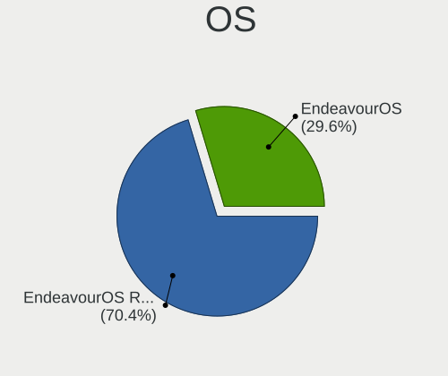

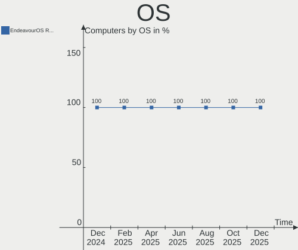

| Name                | Computers | Percent |
|---------------------|-----------|---------|
| EndeavourOS Rolling | 67        | 100%    |

OS Family
---------

OS without a version

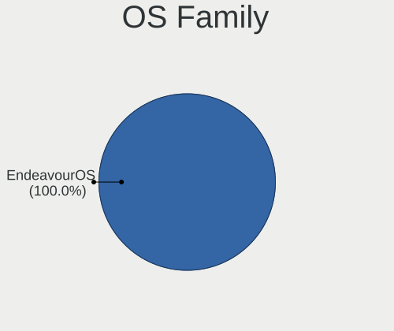

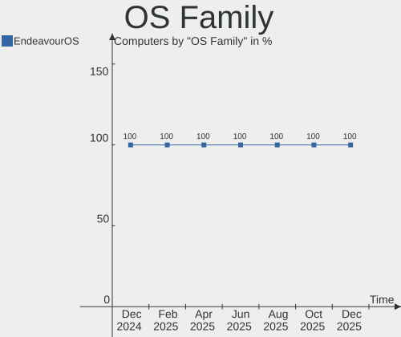

| Name        | Computers | Percent |
|-------------|-----------|---------|
| EndeavourOS | 67        | 100%    |

Kernel
------

Version of the Linux kernel

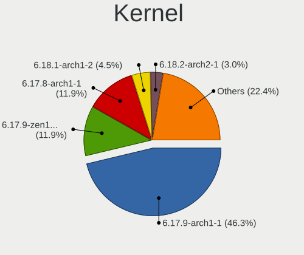

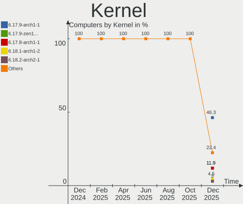

| Version                | Computers | Percent |
|------------------------|-----------|---------|
| 6.17.9-arch1-1         | 31        | 46.27%  |
| 6.17.9-zen1-1-zen      | 8         | 11.94%  |
| 6.17.8-arch1-1         | 8         | 11.94%  |
| 6.18.1-arch1-2         | 3         | 4.48%   |
| 6.18.2-arch2-1         | 2         | 2.99%   |
| 6.18.0-3-cachyos       | 2         | 2.99%   |
| 6.12.63-1-lts          | 2         | 2.99%   |
| 6.12.60-1-lts          | 2         | 2.99%   |
| 6.18.2-zen2-1-zen      | 1         | 1.49%   |
| 6.18.2-2-cachyos       | 1         | 1.49%   |
| 6.18.1-zen1-2-zen      | 1         | 1.49%   |
| 6.18.0-273-tkg-eevdf   | 1         | 1.49%   |
| 6.17.7-arch1-1         | 1         | 1.49%   |
| 6.17.5-arch1-1         | 1         | 1.49%   |
| 6.17.3-arch2-1         | 1         | 1.49%   |
| 6.17.1-arch1-1-surface | 1         | 1.49%   |
| 6.12.59-1-lts          | 1         | 1.49%   |

Kernel Family
-------------

Linux kernel without a distro release

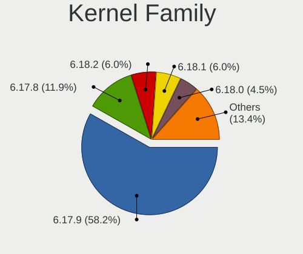

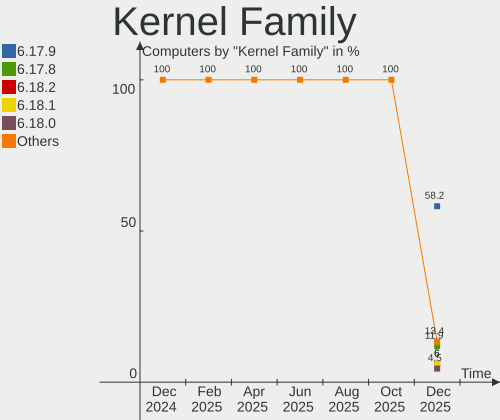

| Version | Computers | Percent |
|---------|-----------|---------|
| 6.17.9  | 39        | 58.21%  |
| 6.17.8  | 8         | 11.94%  |
| 6.18.2  | 4         | 5.97%   |
| 6.18.1  | 4         | 5.97%   |
| 6.18.0  | 3         | 4.48%   |
| 6.12.63 | 2         | 2.99%   |
| 6.12.60 | 2         | 2.99%   |
| 6.17.7  | 1         | 1.49%   |
| 6.17.5  | 1         | 1.49%   |
| 6.17.3  | 1         | 1.49%   |
| 6.17.1  | 1         | 1.49%   |
| 6.12.59 | 1         | 1.49%   |

Kernel Major Ver.
-----------------

Linux kernel major version

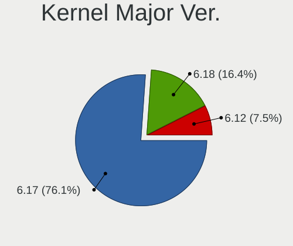

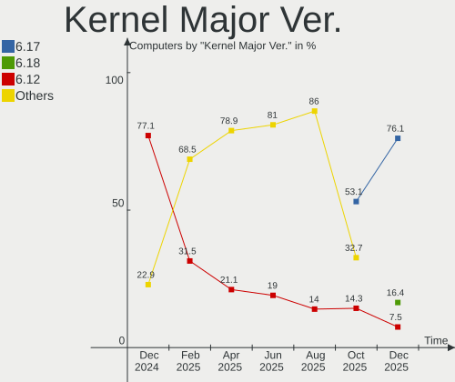

| Version | Computers | Percent |
|---------|-----------|---------|
| 6.17    | 51        | 76.12%  |
| 6.18    | 11        | 16.42%  |
| 6.12    | 5         | 7.46%   |

Arch
----

OS architecture (x86_64, i586, etc.)

| Name   | Computers | Percent |
|--------|-----------|---------|
| x86_64 | 67        | 100%    |

DE
--

Desktop Environment

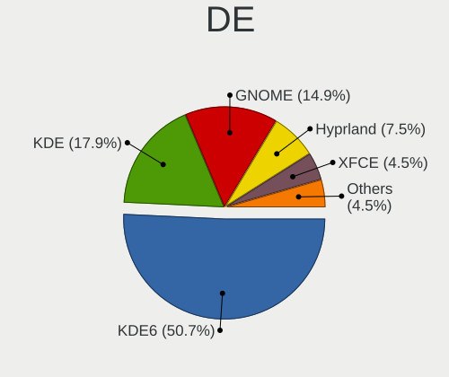

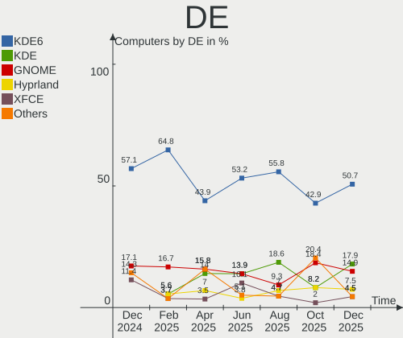

| Name     | Computers | Percent |
|----------|-----------|---------|
| KDE6     | 34        | 50.75%  |
| KDE      | 12        | 17.91%  |
| GNOME    | 10        | 14.93%  |
| Hyprland | 5         | 7.46%   |
| XFCE     | 3         | 4.48%   |
| sway     | 1         | 1.49%   |
| Budgie   | 1         | 1.49%   |
| Unknown  | 1         | 1.49%   |

Display Server
--------------

X11 or Wayland

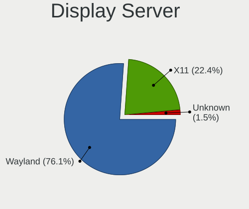

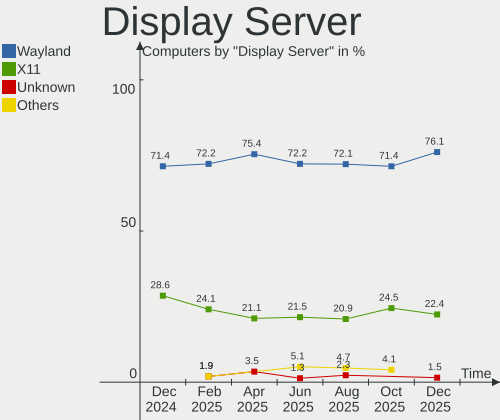

| Name    | Computers | Percent |
|---------|-----------|---------|
| Wayland | 51        | 76.12%  |
| X11     | 15        | 22.39%  |
| Unknown | 1         | 1.49%   |

Display Manager
---------------

SDDM, LightDM, etc.

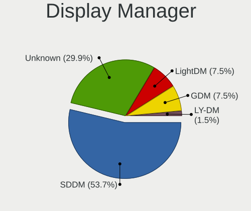

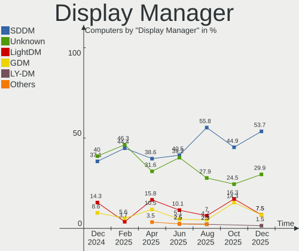

| Name    | Computers | Percent |
|---------|-----------|---------|
| SDDM    | 36        | 53.73%  |
| Unknown | 20        | 29.85%  |
| LightDM | 5         | 7.46%   |
| GDM     | 5         | 7.46%   |
| LY-DM   | 1         | 1.49%   |

OS Lang
-------

Language

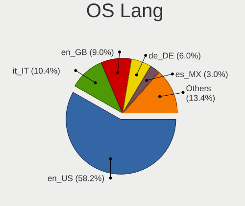

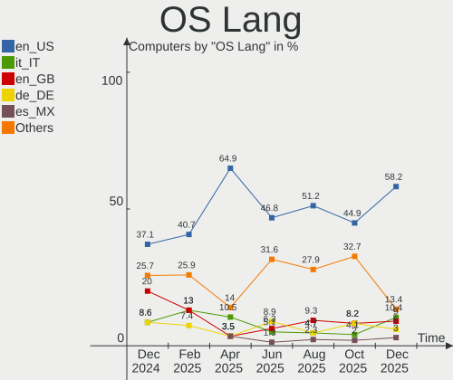

| Lang    | Computers | Percent |
|---------|-----------|---------|
| en_US   | 39        | 58.21%  |
| it_IT   | 7         | 10.45%  |
| en_GB   | 6         | 8.96%   |
| de_DE   | 4         | 5.97%   |
| es_MX   | 2         | 2.99%   |
| es_ES   | 2         | 2.99%   |
| pt_BR   | 1         | 1.49%   |
| es_PE   | 1         | 1.49%   |
| en_ZA   | 1         | 1.49%   |
| en_PH   | 1         | 1.49%   |
| en_DK   | 1         | 1.49%   |
| en_CA   | 1         | 1.49%   |
| Unknown | 1         | 1.49%   |

Boot Mode
---------

EFI or BIOS

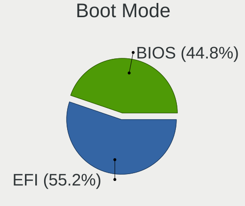

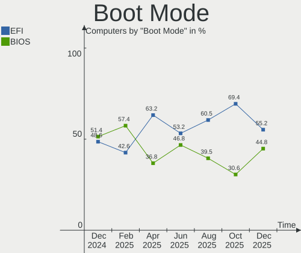

| Mode | Computers | Percent |
|------|-----------|---------|
| EFI  | 37        | 55.22%  |
| BIOS | 30        | 44.78%  |

Filesystem
----------

Type of filesystem

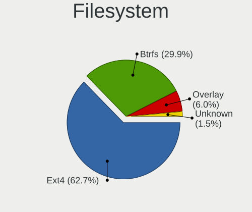

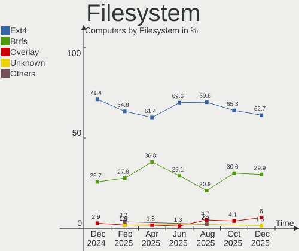

| Type    | Computers | Percent |
|---------|-----------|---------|
| Ext4    | 42        | 62.69%  |
| Btrfs   | 20        | 29.85%  |
| Overlay | 4         | 5.97%   |
| Unknown | 1         | 1.49%   |

Part. scheme
------------

Scheme of partitioning

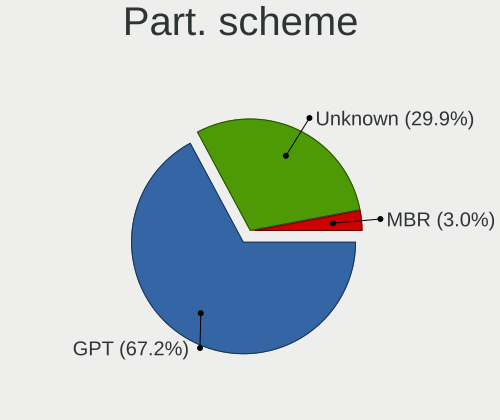

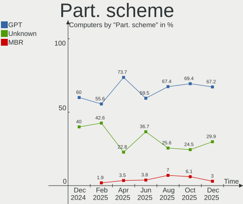

| Type    | Computers | Percent |
|---------|-----------|---------|
| GPT     | 45        | 67.16%  |
| Unknown | 20        | 29.85%  |
| MBR     | 2         | 2.99%   |

Dual Boot with Linux/BSD
------------------------

Hosting more than one Linux/BSD

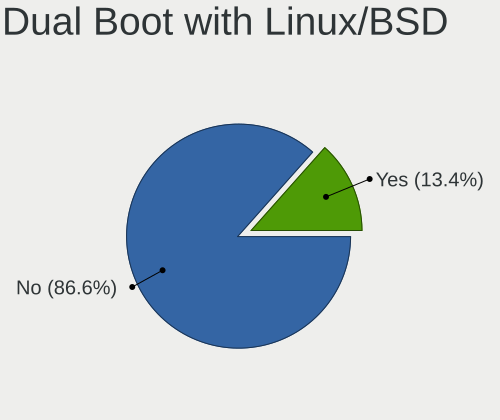

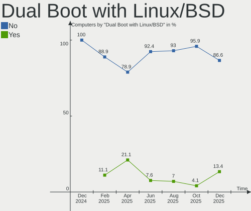

| Dual boot | Computers | Percent |
|-----------|-----------|---------|
| No        | 58        | 86.57%  |
| Yes       | 9         | 13.43%  |

Dual Boot (Win)
---------------

Hosting Linux and Windows

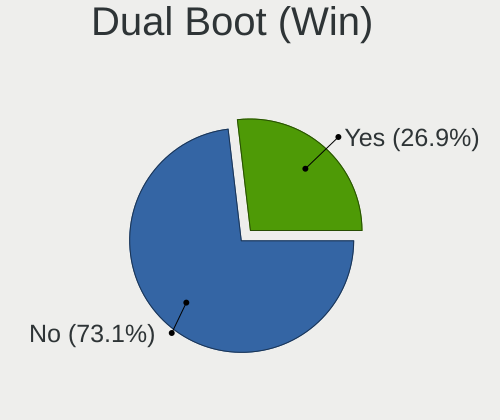

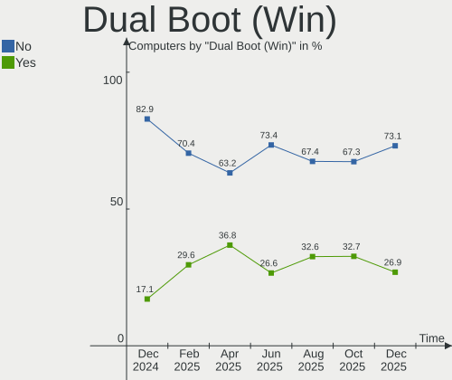

| Dual boot | Computers | Percent |
|-----------|-----------|---------|
| No        | 49        | 73.13%  |
| Yes       | 18        | 26.87%  |

Board
-----

Vendor
------

Motherboard manufacturer

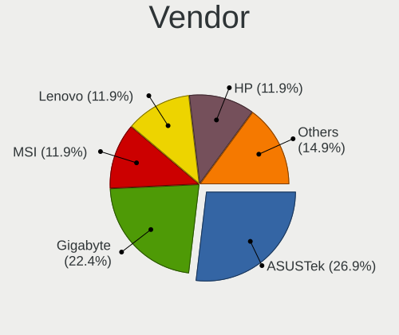

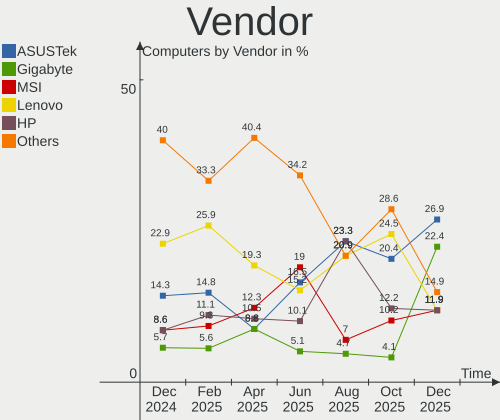

| Name                                 | Computers | Percent |
|--------------------------------------|-----------|---------|
| ASUSTek Computer                     | 18        | 26.87%  |
| Gigabyte Technology                  | 15        | 22.39%  |
| MSI                                  | 8         | 11.94%  |
| Lenovo                               | 8         | 11.94%  |
| Hewlett-Packard                      | 8         | 11.94%  |
| Acer                                 | 3         | 4.48%   |
| ASRock                               | 2         | 2.99%   |
| Standard                             | 1         | 1.49%   |
| Shenzhen Meigao Electronic Equipment | 1         | 1.49%   |
| Samsung Electronics                  | 1         | 1.49%   |
| Microsoft                            | 1         | 1.49%   |
| Intel                                | 1         | 1.49%   |

Model
-----

Motherboard model

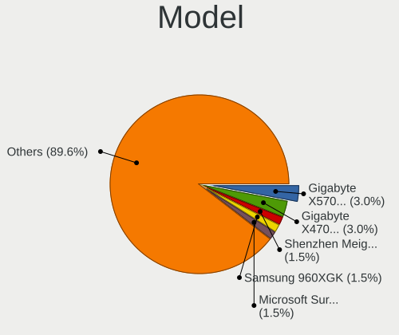

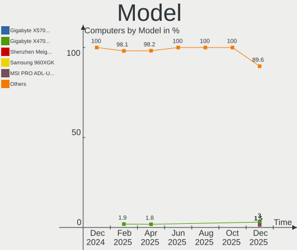

| Name                                       | Computers | Percent |
|--------------------------------------------|-----------|---------|
| Gigabyte X570 AORUS ELITE                  | 2         | 2.99%   |
| Gigabyte X470 AORUS ULTRA GAMING           | 2         | 2.99%   |
| Shenzhen Meigao Electronic Equipment HX99G | 1         | 1.49%   |
| Samsung 960XGK                             | 1         | 1.49%   |
| MSI PRO ADL-U Cubi 5 (MS-B0A8)             | 1         | 1.49%   |
| MSI MS-7E62                                | 1         | 1.49%   |
| MSI MS-7E49                                | 1         | 1.49%   |
| MSI MS-7E16                                | 1         | 1.49%   |
| MSI MS-7D88                                | 1         | 1.49%   |
| MSI MS-7C91                                | 1         | 1.49%   |
| MSI MS-7C37                                | 1         | 1.49%   |
| MSI MS-7C00                                | 1         | 1.49%   |
| Microsoft Surface Laptop Go                | 1         | 1.49%   |
| Lenovo Yoga Slim 7 14ILL10 83JX            | 1         | 1.49%   |
| Lenovo ThinkPad T470p 20J6CTO1WW           | 1         | 1.49%   |
| Lenovo ThinkPad T470 20HES20M0A            | 1         | 1.49%   |
| Lenovo ThinkPad T460 20FN0059US            | 1         | 1.49%   |
| Lenovo ThinkPad L15 Gen 2a 20X7003TGE      | 1         | 1.49%   |
| Lenovo IdeaPad Slim 3 15IRH10R 83K4        | 1         | 1.49%   |
| Lenovo IdeaPad 3 15ALC6 82MF               | 1         | 1.49%   |
| Lenovo G500 20236                          | 1         | 1.49%   |
| Intel E5-A99 V1.2                          | 1         | 1.49%   |
| HP Z2 Mini G9 Workstation Desktop PC       | 1         | 1.49%   |
| HP Victus by Gaming Laptop 15-fa2xxx       | 1         | 1.49%   |
| HP Slim Desktop S01-pF2xxx                 | 1         | 1.49%   |
| HP ProBook 650 G1                          | 1         | 1.49%   |
| HP OMEN Gaming Laptop 16-ap0xxx            | 1         | 1.49%   |
| HP Dragonfly Pro ONE                       | 1         | 1.49%   |
| HP Compaq 8200 Elite SFF PC                | 1         | 1.49%   |
| HP 340S G7 Notebook PC                     | 1         | 1.49%   |
| Gigabyte X870E AORUS MASTER                | 1         | 1.49%   |
| Gigabyte H81M-H                            | 1         | 1.49%   |
| Gigabyte H410M H V3                        | 1         | 1.49%   |
| Gigabyte B760M DS3H AX DDR4                | 1         | 1.49%   |
| Gigabyte B650E AORUS MASTER                | 1         | 1.49%   |
| Gigabyte B650 EAGLE AX                     | 1         | 1.49%   |
| Gigabyte B650 AORUS ELITE AX V2            | 1         | 1.49%   |
| Gigabyte B550 GAMING X V2                  | 1         | 1.49%   |
| Gigabyte B550 AORUS ELITE                  | 1         | 1.49%   |
| Gigabyte B450M DS3H                        | 1         | 1.49%   |

Model Family
------------

Motherboard model prefix

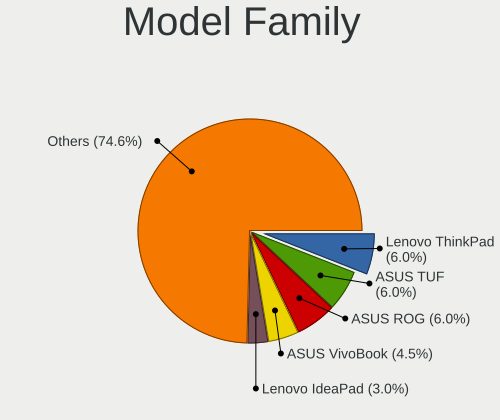

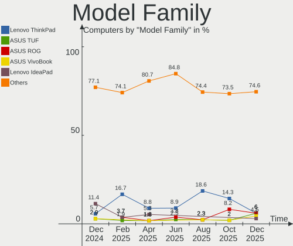

| Name                                       | Computers | Percent |
|--------------------------------------------|-----------|---------|
| Lenovo ThinkPad                            | 4         | 5.97%   |
| ASUS TUF                                   | 4         | 5.97%   |
| ASUS ROG                                   | 4         | 5.97%   |
| ASUS VivoBook                              | 3         | 4.48%   |
| Lenovo IdeaPad                             | 2         | 2.99%   |
| Gigabyte X570                              | 2         | 2.99%   |
| Gigabyte X470                              | 2         | 2.99%   |
| Gigabyte B650                              | 2         | 2.99%   |
| Gigabyte B550                              | 2         | 2.99%   |
| Acer Aspire                                | 2         | 2.99%   |
| Shenzhen Meigao Electronic Equipment HX99G | 1         | 1.49%   |
| Samsung 960XGK                             | 1         | 1.49%   |
| MSI PRO                                    | 1         | 1.49%   |
| MSI MS-7E62                                | 1         | 1.49%   |
| MSI MS-7E49                                | 1         | 1.49%   |
| MSI MS-7E16                                | 1         | 1.49%   |
| MSI MS-7D88                                | 1         | 1.49%   |
| MSI MS-7C91                                | 1         | 1.49%   |
| MSI MS-7C37                                | 1         | 1.49%   |
| MSI MS-7C00                                | 1         | 1.49%   |
| Microsoft Surface                          | 1         | 1.49%   |
| Lenovo Yoga                                | 1         | 1.49%   |
| Lenovo G500                                | 1         | 1.49%   |
| Intel E5-A99                               | 1         | 1.49%   |
| HP Z2                                      | 1         | 1.49%   |
| HP Victus                                  | 1         | 1.49%   |
| HP Slim                                    | 1         | 1.49%   |
| HP ProBook                                 | 1         | 1.49%   |
| HP OMEN                                    | 1         | 1.49%   |
| HP Dragonfly                               | 1         | 1.49%   |
| HP Compaq                                  | 1         | 1.49%   |
| HP 340S                                    | 1         | 1.49%   |
| Gigabyte X870E                             | 1         | 1.49%   |
| Gigabyte H81M-H                            | 1         | 1.49%   |
| Gigabyte H410M                             | 1         | 1.49%   |
| Gigabyte B760M                             | 1         | 1.49%   |
| Gigabyte B650E                             | 1         | 1.49%   |
| Gigabyte B450M                             | 1         | 1.49%   |
| Gigabyte AB350-Gaming                      | 1         | 1.49%   |
| ASUS ZenBook                               | 1         | 1.49%   |

MFG Year
--------

Motherboard manufacture year

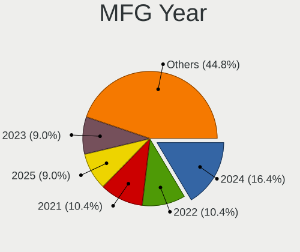

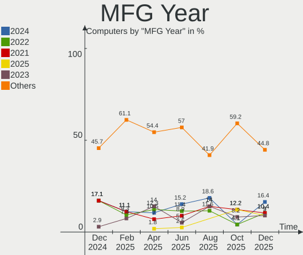

| Year | Computers | Percent |
|------|-----------|---------|
| 2024 | 11        | 16.42%  |
| 2022 | 7         | 10.45%  |
| 2021 | 7         | 10.45%  |
| 2025 | 6         | 8.96%   |
| 2023 | 6         | 8.96%   |
| 2018 | 6         | 8.96%   |
| 2020 | 5         | 7.46%   |
| 2019 | 5         | 7.46%   |
| 2017 | 5         | 7.46%   |
| 2013 | 3         | 4.48%   |
| 2016 | 2         | 2.99%   |
| 2015 | 2         | 2.99%   |
| 2011 | 2         | 2.99%   |

Form Factor
-----------

Physical design of the computer

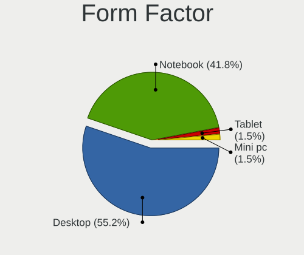

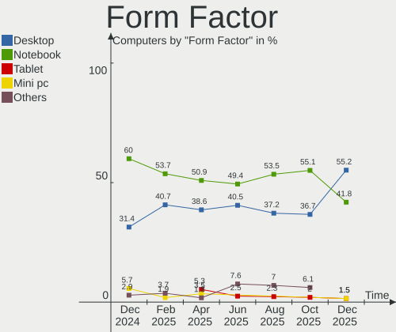

| Name     | Computers | Percent |
|----------|-----------|---------|
| Desktop  | 37        | 55.22%  |
| Notebook | 28        | 41.79%  |
| Tablet   | 1         | 1.49%   |
| Mini pc  | 1         | 1.49%   |

Secure Boot
-----------

Enabled or disabled

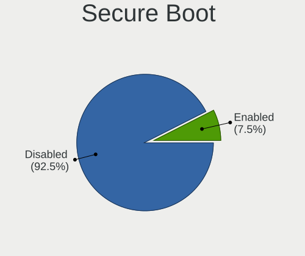

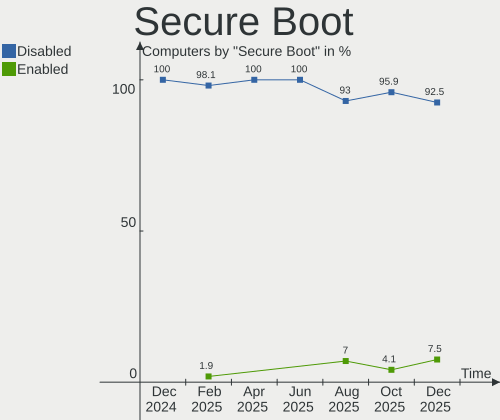

| State    | Computers | Percent |
|----------|-----------|---------|
| Disabled | 62        | 92.54%  |
| Enabled  | 5         | 7.46%   |

Coreboot
--------

Have coreboot on board

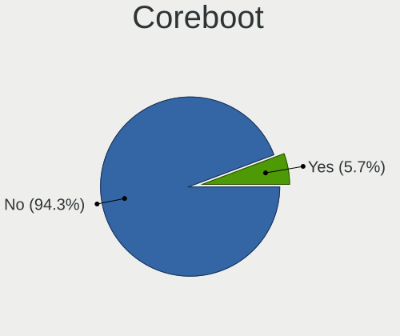

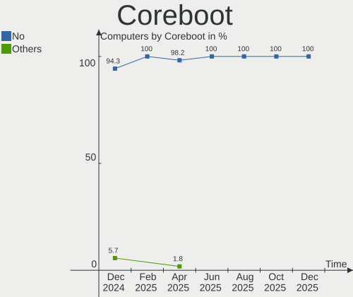

| Used | Computers | Percent |
|------|-----------|---------|
| No   | 67        | 100%    |

RAM Size
--------

Total RAM memory

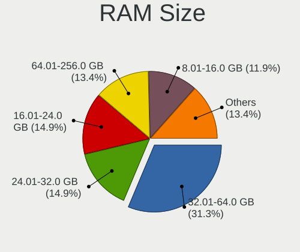

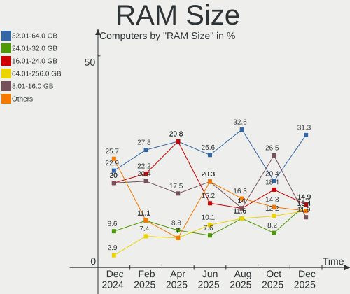

| Size in GB  | Computers | Percent |
|-------------|-----------|---------|
| 32.01-64.0  | 21        | 31.34%  |
| 24.01-32.0  | 10        | 14.93%  |
| 16.01-24.0  | 10        | 14.93%  |
| 64.01-256.0 | 9         | 13.43%  |
| 8.01-16.0   | 8         | 11.94%  |
| 4.01-8.0    | 7         | 10.45%  |
| 3.01-4.0    | 2         | 2.99%   |

RAM Used
--------

Used RAM memory

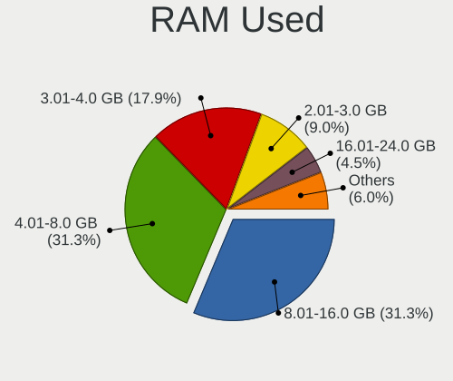

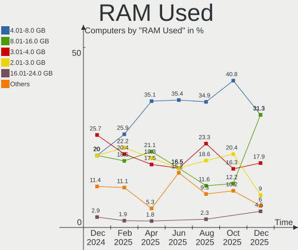

| Used GB    | Computers | Percent |
|------------|-----------|---------|
| 4.01-8.0   | 21        | 31.34%  |
| 8.01-16.0  | 21        | 31.34%  |
| 3.01-4.0   | 12        | 17.91%  |
| 2.01-3.0   | 6         | 8.96%   |
| 16.01-24.0 | 3         | 4.48%   |
| 1.01-2.0   | 3         | 4.48%   |
| 24.01-32.0 | 1         | 1.49%   |

Total Drives
------------

Number of drives on board

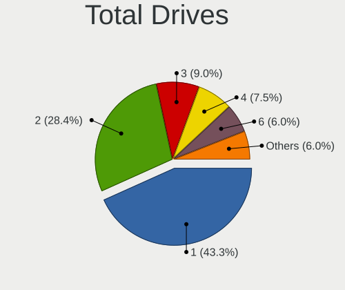

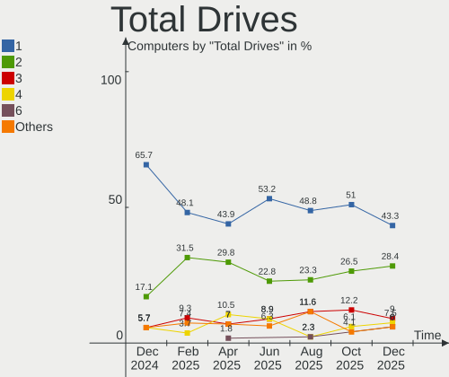

| Drives | Computers | Percent |
|--------|-----------|---------|
| 1      | 29        | 43.28%  |
| 2      | 19        | 28.36%  |
| 3      | 6         | 8.96%   |
| 4      | 5         | 7.46%   |
| 6      | 4         | 5.97%   |
| 5      | 3         | 4.48%   |
| 7      | 1         | 1.49%   |

Has CD-ROM
----------

Has CD-ROM on board

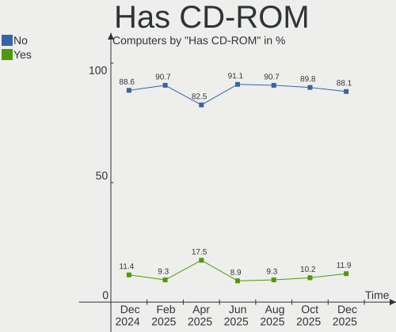

| Presented | Computers | Percent |
|-----------|-----------|---------|
| No        | 59        | 88.06%  |
| Yes       | 8         | 11.94%  |

Has Ethernet
------------

Has Ethernet on board

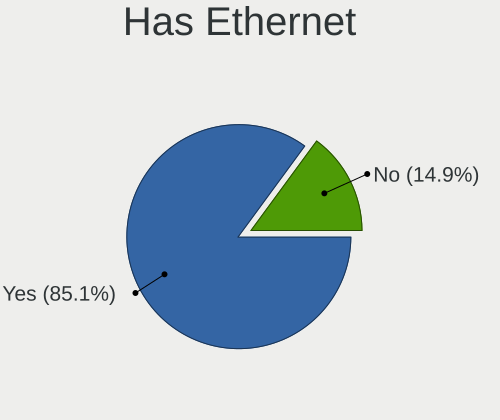

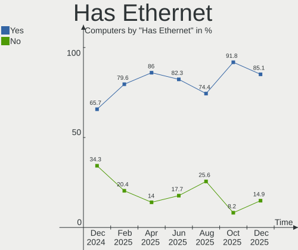

| Presented | Computers | Percent |
|-----------|-----------|---------|
| Yes       | 57        | 85.07%  |
| No        | 10        | 14.93%  |

Has WiFi
--------

Has WiFi module

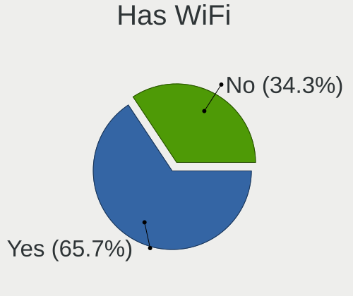

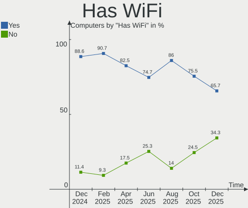

| Presented | Computers | Percent |
|-----------|-----------|---------|
| Yes       | 44        | 65.67%  |
| No        | 23        | 34.33%  |

Has Bluetooth
-------------

Has Bluetooth module

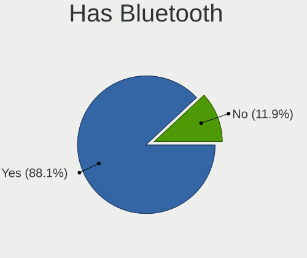

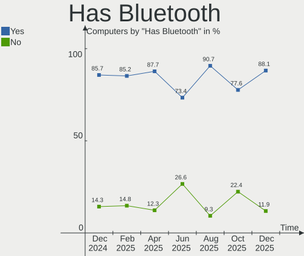

| Presented | Computers | Percent |
|-----------|-----------|---------|
| Yes       | 59        | 88.06%  |
| No        | 8         | 11.94%  |

Location
--------

Country
-------

Geographic location (country)

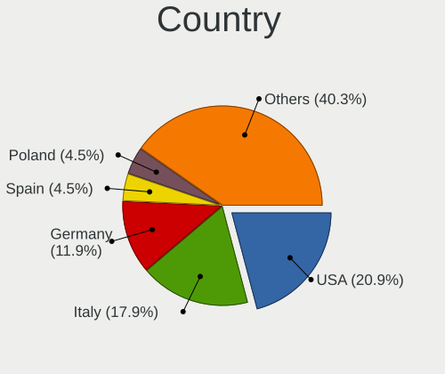

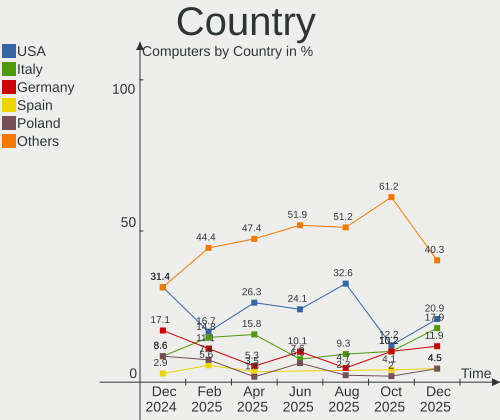

| Country      | Computers | Percent |
|--------------|-----------|---------|
| USA          | 14        | 20.9%   |
| Italy        | 12        | 17.91%  |
| Germany      | 8         | 11.94%  |
| Spain        | 3         | 4.48%   |
| Poland       | 3         | 4.48%   |
| Slovenia     | 2         | 2.99%   |
| Netherlands  | 2         | 2.99%   |
| Colombia     | 2         | 2.99%   |
| Brazil       | 2         | 2.99%   |
| Vietnam      | 1         | 1.49%   |
| UK           | 1         | 1.49%   |
| Switzerland  | 1         | 1.49%   |
| South Africa | 1         | 1.49%   |
| Slovakia     | 1         | 1.49%   |
| Puerto Rico  | 1         | 1.49%   |
| Philippines  | 1         | 1.49%   |
| Peru         | 1         | 1.49%   |
| Malaysia     | 1         | 1.49%   |
| Indonesia    | 1         | 1.49%   |
| Hong Kong    | 1         | 1.49%   |
| Greece       | 1         | 1.49%   |
| France       | 1         | 1.49%   |
| Finland      | 1         | 1.49%   |
| Denmark      | 1         | 1.49%   |
| Canada       | 1         | 1.49%   |
| Bulgaria     | 1         | 1.49%   |
| Belgium      | 1         | 1.49%   |
| Austria      | 1         | 1.49%   |

City
----

Geographic location (city)

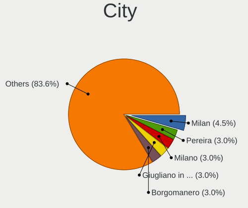

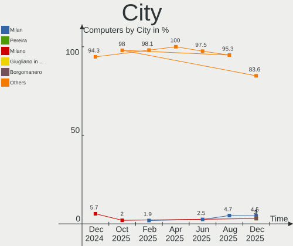

| City                   | Computers | Percent |
|------------------------|-----------|---------|
| Milan                  | 3         | 4.48%   |
| Pereira                | 2         | 2.99%   |
| Milano                 | 2         | 2.99%   |
| Giugliano in Campania  | 2         | 2.99%   |
| Borgomanero            | 2         | 2.99%   |
| Waldachtal             | 1         | 1.49%   |
| Vienna                 | 1         | 1.49%   |
| Udine                  | 1         | 1.49%   |
| Tyczyn                 | 1         | 1.49%   |
| Toulouse               | 1         | 1.49%   |
| Texarkana              | 1         | 1.49%   |
| Teresina               | 1         | 1.49%   |
| Tacoma                 | 1         | 1.49%   |
| Spreitenbach           | 1         | 1.49%   |
| Sparks                 | 1         | 1.49%   |
| Sioux City             | 1         | 1.49%   |
| Sham Shui Po           | 1         | 1.49%   |
| Sempeter pri Gorici    | 1         | 1.49%   |
| Santa Cruz de La Palma | 1         | 1.49%   |
| San Rafael             | 1         | 1.49%   |
| San Juan               | 1         | 1.49%   |
| Salzkotten             | 1         | 1.49%   |
| Saint-Sauveur          | 1         | 1.49%   |
| Saarlouis              | 1         | 1.49%   |
| Rindge                 | 1         | 1.49%   |
| Ravne na Koroskem      | 1         | 1.49%   |
| Quezon City            | 1         | 1.49%   |
| Pruszków              | 1         | 1.49%   |
| Palhoça               | 1         | 1.49%   |
| Palembang              | 1         | 1.49%   |
| Oviedo                 | 1         | 1.49%   |
| Omaha                  | 1         | 1.49%   |
| Mount Airy             | 1         | 1.49%   |
| Madrid                 | 1         | 1.49%   |
| Luton                  | 1         | 1.49%   |
| Lincoln                | 1         | 1.49%   |
| Lima                   | 1         | 1.49%   |
| Leverkusen             | 1         | 1.49%   |
| Lahti                  | 1         | 1.49%   |
| Kuching                | 1         | 1.49%   |

Drives
------

Drive Vendor
------------

Hard drive vendors

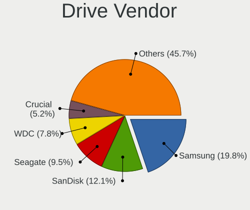

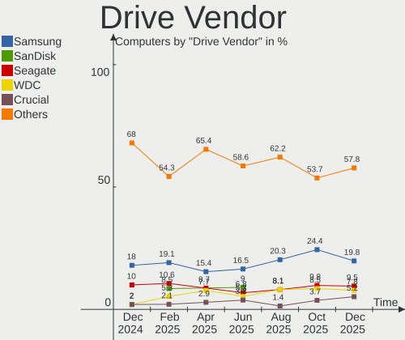

| Vendor                      | Computers | Drives | Percent |
|-----------------------------|-----------|--------|---------|
| Samsung Electronics         | 23        | 41     | 19.83%  |
| SanDisk                     | 14        | 14     | 12.07%  |
| Seagate                     | 11        | 14     | 9.48%   |
| WDC                         | 9         | 12     | 7.76%   |
| Crucial                     | 6         | 7      | 5.17%   |
| Kingston Technology Company | 5         | 5      | 4.31%   |
| Phison Electronics          | 4         | 4      | 3.45%   |
| Micron/Crucial Technology   | 4         | 6      | 3.45%   |
| Hitachi                     | 4         | 6      | 3.45%   |
| Micron Technology           | 3         | 3      | 2.59%   |
| Kingston                    | 3         | 4      | 2.59%   |
| Intel                       | 3         | 4      | 2.59%   |
| Toshiba                     | 2         | 4      | 1.72%   |
| SPCC                        | 2         | 2      | 1.72%   |
| SK hynix                    | 2         | 2      | 1.72%   |
| MAXIO Technology (Hangzhou) | 2         | 2      | 1.72%   |
| KIOXIA                      | 2         | 3      | 1.72%   |
| HGST                        | 2         | 3      | 1.72%   |
| ADATA Technology            | 2         | 2      | 1.72%   |
| TUF                         | 1         | 1      | 0.86%   |
| Transcend                   | 1         | 1      | 0.86%   |
| T-FORCE                     | 1         | 1      | 0.86%   |
| SOLIDIGM                    | 1         | 1      | 0.86%   |
| RESCUE                      | 1         | 1      | 0.86%   |
| Realtek Semiconductor       | 1         | 1      | 0.86%   |
| PNY                         | 1         | 1      | 0.86%   |
| Netac                       | 1         | 1      | 0.86%   |
| Intenso                     | 1         | 1      | 0.86%   |
| Inland                      | 1         | 2      | 0.86%   |
| HGST HTS                    | 1         | 1      | 0.86%   |
| China                       | 1         | 1      | 0.86%   |
| Apple                       | 1         | 1      | 0.86%   |

Drive Model
-----------

Hard drive models

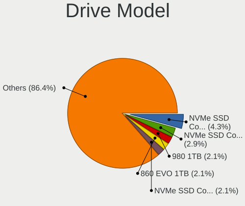

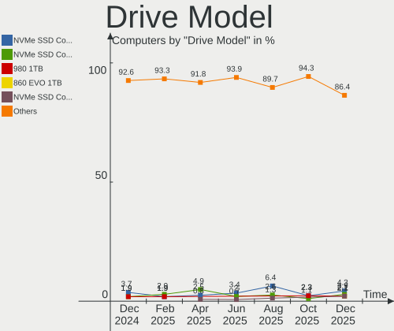

| Model                                                                      | Computers | Percent |
|----------------------------------------------------------------------------|-----------|---------|
| Samsung NVMe SSD Controller SM981/PM981/PM983 1TB                          | 6         | 4.29%   |
| Samsung NVMe SSD Controller PM9A1/PM9A3/980PRO 1TB                         | 4         | 2.86%   |
| Samsung SSD 980 1TB                                                        | 3         | 2.14%   |
| Samsung SSD 860 EVO 1TB                                                    | 3         | 2.14%   |
| Samsung NVMe SSD Controller PM9C1a (DRAM-less) 1TB                         | 3         | 2.14%   |
| Toshiba MQ04ABF100 1TB                                                     | 2         | 1.43%   |
| Seagate ST2000DM008-2UB102 2TB                                             | 2         | 1.43%   |
| Seagate ST2000DM008-2FR102 2TB                                             | 2         | 1.43%   |
| Sandisk WD_BLACK SN850X 4000GB                                             | 2         | 1.43%   |
| Sandisk WD Black SN770 / PC SN740 256GB / PC SN560 (DRAM-less) NVMe SSD    | 2         | 1.43%   |
| Sandisk Extreme Pro / WD Black SN750 / PC SN730 / Red SN700 NVMe SSD 500GB | 2         | 1.43%   |
| Samsung SSD 990 PRO 2TB                                                    | 2         | 1.43%   |
| Samsung NVMe SSD Controller PM9B1 (DRAM-less) 512GB                        | 2         | 1.43%   |
| Micron 2500 NVMe SSD (DRAM-less) 512GB                                     | 2         | 1.43%   |
| Kingston SA400S37240G 240GB SSD                                            | 2         | 1.43%   |
| Hitachi HUS724030ALE641 3TB                                                | 2         | 1.43%   |
| Crucial CT1000BX500SSD1 1TB                                                | 2         | 1.43%   |
| WDC WD3200BPVT-22JJ5T0 320GB                                               | 1         | 0.71%   |
| WDC WD30EZRZ-00GXCB0 3TB                                                   | 1         | 0.71%   |
| WDC WD20EZRX-00D8PB0 2TB                                                   | 1         | 0.71%   |
| WDC WD20EZAZ-00L9GB0 2TB                                                   | 1         | 0.71%   |
| WDC WD20EFRX-68EUZN0 2TB                                                   | 1         | 0.71%   |
| WDC WD2003FZEX-00Z4SA0 2TB                                                 | 1         | 0.71%   |
| WDC WD10SPZX-21Z10T0 1TB                                                   | 1         | 0.71%   |
| WDC WD10SPZX-08Z10 1TB                                                     | 1         | 0.71%   |
| WDC WD10EZEX-22MFCA0 1TB                                                   | 1         | 0.71%   |
| WDC WD10EZEX-08WN4A0 1TB                                                   | 1         | 0.71%   |
| WDC WD10EALX-759BA1 1TB                                                    | 1         | 0.71%   |
| WDC WD Blue SA510 M.2 2280 500GB SSD                                       | 1         | 0.71%   |
| TUF Gaming A2 500GB                                                        | 1         | 0.71%   |
| Transcend TS120GMTS420S 120GB SSD                                          | 1         | 0.71%   |
| Toshiba MQ01ABF050 500GB                                                   | 1         | 0.71%   |
| Toshiba DT01ACA100 1TB                                                     | 1         | 0.71%   |
| T-FORCE SSD 1TB                                                            | 1         | 0.71%   |
| SPCC Solid State Disk 2TB                                                  | 1         | 0.71%   |
| SPCC Solid State Disk 1024GB                                               | 1         | 0.71%   |
| SOLIDIGM NVMe SSD Drive 1024GB                                             | 1         | 0.71%   |
| SK hynix SHPP41-2000GM 2TB                                                 | 1         | 0.71%   |
| SK hynix Gold P31/BC711/PC711 NVMe Solid State Drive 512GB                 | 1         | 0.71%   |
| Seagate ST9750420AS 752GB                                                  | 1         | 0.71%   |

HDD Vendor
----------

Hard disk drive vendors

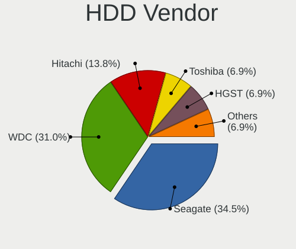

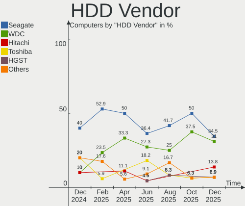

| Vendor   | Computers | Drives | Percent |
|----------|-----------|--------|---------|
| Seagate  | 10        | 12     | 34.48%  |
| WDC      | 9         | 11     | 31.03%  |
| Hitachi  | 4         | 6      | 13.79%  |
| Toshiba  | 2         | 4      | 6.9%    |
| HGST     | 2         | 3      | 6.9%    |
| HGST HTS | 1         | 1      | 3.45%   |
| Apple    | 1         | 1      | 3.45%   |

SSD Vendor
----------

Solid state drive vendors

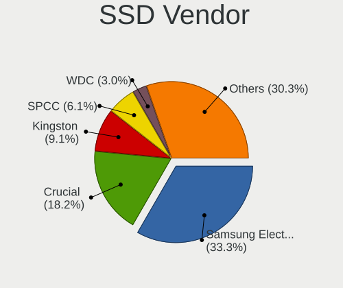

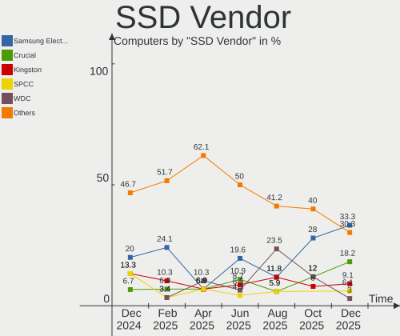

| Vendor              | Computers | Drives | Percent |
|---------------------|-----------|--------|---------|
| Samsung Electronics | 11        | 14     | 33.33%  |
| Crucial             | 6         | 7      | 18.18%  |
| Kingston            | 3         | 4      | 9.09%   |
| SPCC                | 2         | 2      | 6.06%   |
| WDC                 | 1         | 1      | 3.03%   |
| Transcend           | 1         | 1      | 3.03%   |
| T-FORCE             | 1         | 1      | 3.03%   |
| SanDisk             | 1         | 1      | 3.03%   |
| RESCUE              | 1         | 1      | 3.03%   |
| PNY                 | 1         | 1      | 3.03%   |
| Netac               | 1         | 1      | 3.03%   |
| Intenso             | 1         | 1      | 3.03%   |
| Intel               | 1         | 1      | 3.03%   |
| Inland              | 1         | 2      | 3.03%   |
| China               | 1         | 1      | 3.03%   |

Drive Kind
----------

HDD or SSD

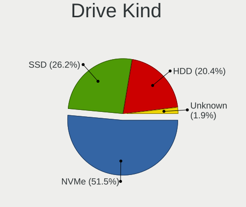

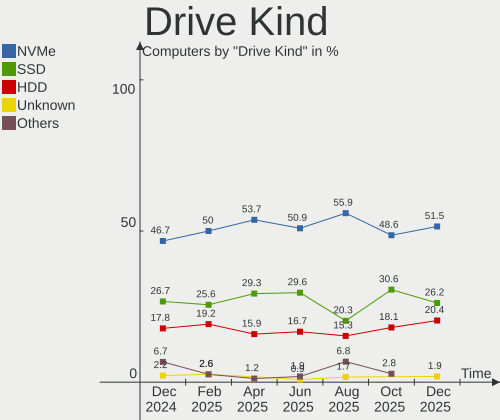

| Kind    | Computers | Drives | Percent |
|---------|-----------|--------|---------|
| NVMe    | 53        | 73     | 51.46%  |
| SSD     | 27        | 39     | 26.21%  |
| HDD     | 21        | 38     | 20.39%  |
| Unknown | 2         | 2      | 1.94%   |

Drive Connector
---------------

SATA, SAS, NVMe, etc.

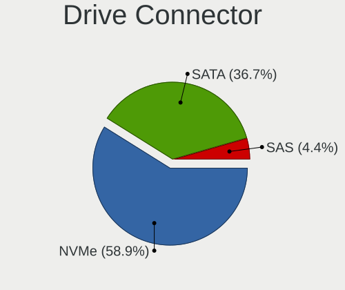

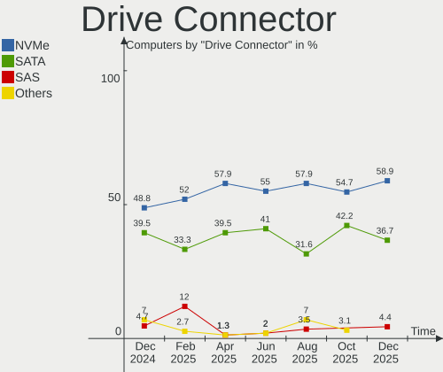

| Type | Computers | Drives | Percent |
|------|-----------|--------|---------|
| NVMe | 53        | 73     | 58.89%  |
| SATA | 33        | 74     | 36.67%  |
| SAS  | 4         | 5      | 4.44%   |

Drive Size
----------

Size of hard drive

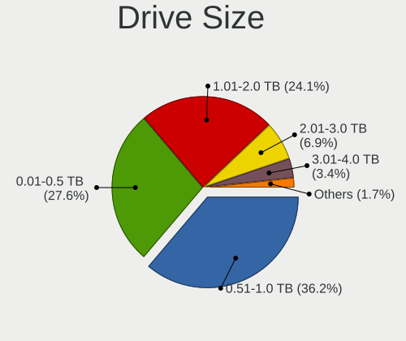

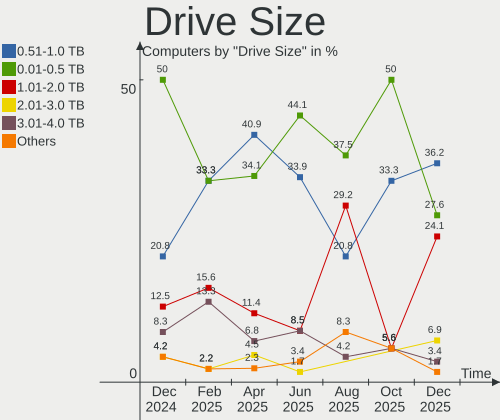

| Size in TB | Computers | Drives | Percent |
|------------|-----------|--------|---------|
| 0.51-1.0   | 21        | 30     | 36.21%  |
| 0.01-0.5   | 16        | 18     | 27.59%  |
| 1.01-2.0   | 14        | 19     | 24.14%  |
| 2.01-3.0   | 4         | 6      | 6.9%    |
| 3.01-4.0   | 2         | 3      | 3.45%   |
| 10.01-20.0 | 1         | 1      | 1.72%   |

Space Total
-----------

Amount of disk space available on the file system

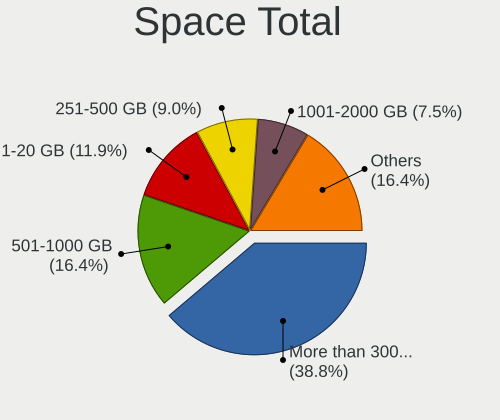

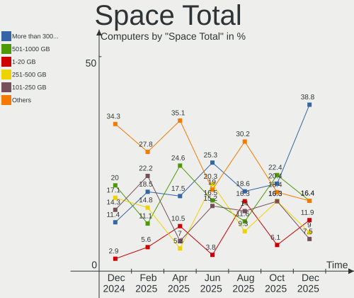

| Size in GB     | Computers | Percent |
|----------------|-----------|---------|
| More than 3000 | 26        | 38.81%  |
| 501-1000       | 11        | 16.42%  |
| 1-20           | 8         | 11.94%  |
| 251-500        | 6         | 8.96%   |
| 101-250        | 5         | 7.46%   |
| 1001-2000      | 5         | 7.46%   |
| 2001-3000      | 2         | 2.99%   |
| 51-100         | 2         | 2.99%   |
| Unknown        | 2         | 2.99%   |

Space Used
----------

Amount of used disk space

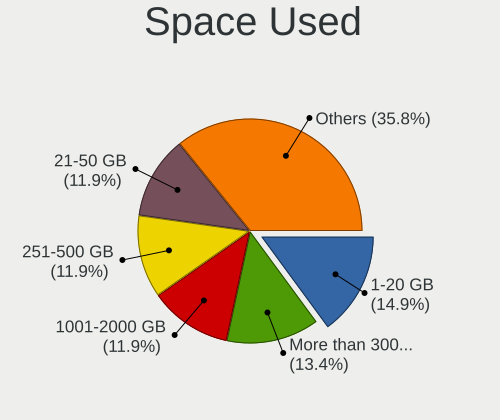

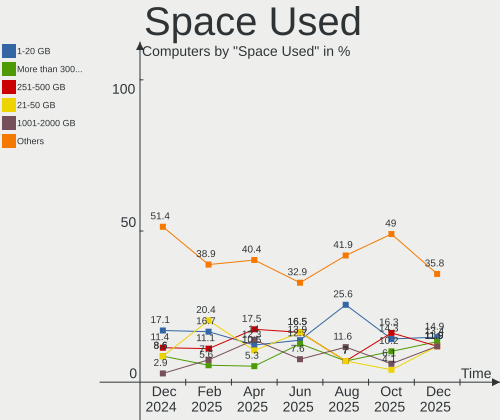

| Used GB        | Computers | Percent |
|----------------|-----------|---------|
| 1-20           | 10        | 14.93%  |
| More than 3000 | 9         | 13.43%  |
| 251-500        | 8         | 11.94%  |
| 21-50          | 8         | 11.94%  |
| 1001-2000      | 8         | 11.94%  |
| 2001-3000      | 7         | 10.45%  |
| 101-250        | 6         | 8.96%   |
| 51-100         | 6         | 8.96%   |
| 501-1000       | 3         | 4.48%   |
| Unknown        | 2         | 2.99%   |

Malfunc. Drives
---------------

Drive models with a malfunction

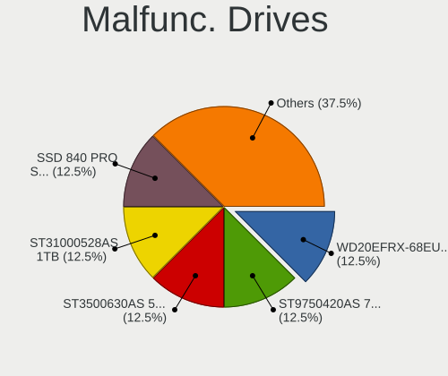

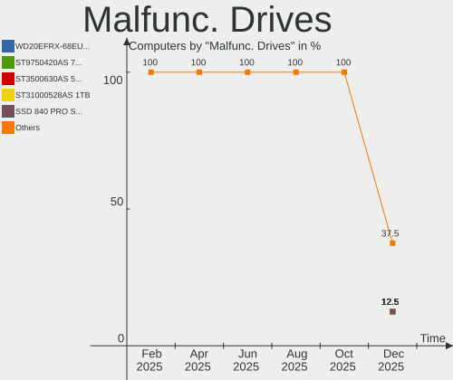

| Model                                                          | Computers | Drives | Percent |
|----------------------------------------------------------------|-----------|--------|---------|
| WDC WD20EFRX-68EUZN0 2TB                                       | 1         | 1      | 12.5%   |
| Seagate ST9750420AS 752GB                                      | 1         | 1      | 12.5%   |
| Seagate ST3500630AS 500GB                                      | 1         | 1      | 12.5%   |
| Seagate ST31000528AS 1TB                                       | 1         | 1      | 12.5%   |
| Samsung Electronics SSD 840 PRO Series 256GB                   | 1         | 1      | 12.5%   |
| Samsung Electronics NVMe SSD Controller SM981/PM981/PM983 1TB  | 1         | 1      | 12.5%   |
| Samsung Electronics NVMe SSD Controller PM9A1/PM9A3/980PRO 1TB | 1         | 1      | 12.5%   |
| Intel SSDSC2KW240H6 240GB                                      | 1         | 1      | 12.5%   |

Malfunc. Drive Vendor
---------------------

Vendors of faulty drives

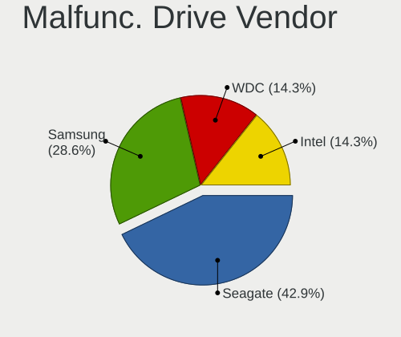

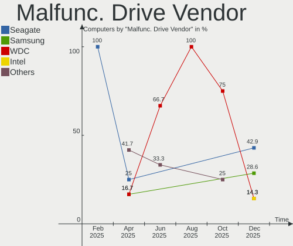

| Vendor              | Computers | Drives | Percent |
|---------------------|-----------|--------|---------|
| Seagate             | 3         | 3      | 42.86%  |
| Samsung Electronics | 2         | 3      | 28.57%  |
| WDC                 | 1         | 1      | 14.29%  |
| Intel               | 1         | 1      | 14.29%  |

Malfunc. HDD Vendor
-------------------

Vendors of faulty HDD drives

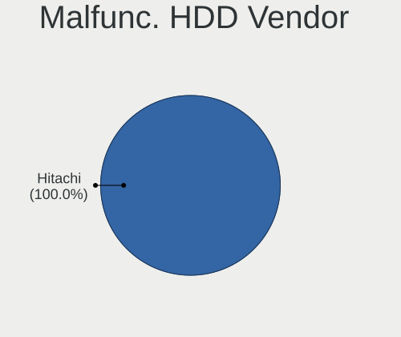

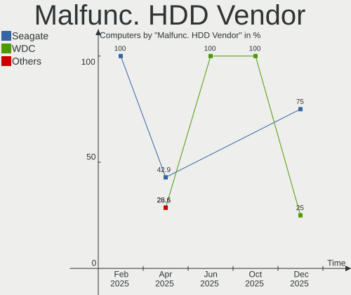

| Vendor  | Computers | Drives | Percent |
|---------|-----------|--------|---------|
| Seagate | 3         | 3      | 75%     |
| WDC     | 1         | 1      | 25%     |

Malfunc. Drive Kind
-------------------

Kinds of faulty drives

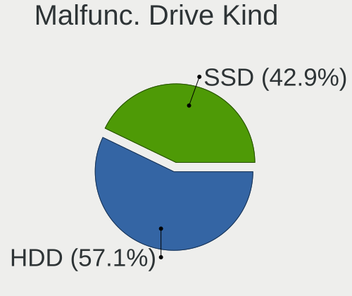

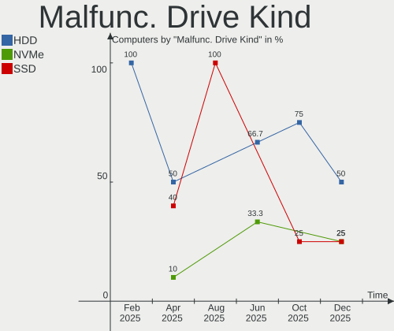

| Kind | Computers | Drives | Percent |
|------|-----------|--------|---------|
| HDD  | 4         | 4      | 50%     |
| NVMe | 2         | 2      | 25%     |
| SSD  | 2         | 2      | 25%     |

Failed Drives
-------------

Failed drive models

Zero info for selected period =(

Failed Drive Vendor
-------------------

Failed drive vendors

Zero info for selected period =(

Drive Status
------------

Number of failed and malfunc. drives

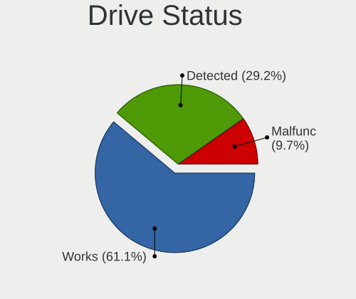

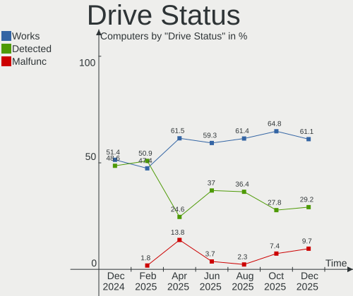

| Status   | Computers | Drives | Percent |
|----------|-----------|--------|---------|
| Works    | 44        | 90     | 61.11%  |
| Detected | 21        | 54     | 29.17%  |
| Malfunc  | 7         | 8      | 9.72%   |

Storage controller
------------------

Storage Vendor
--------------

Storage controller vendors

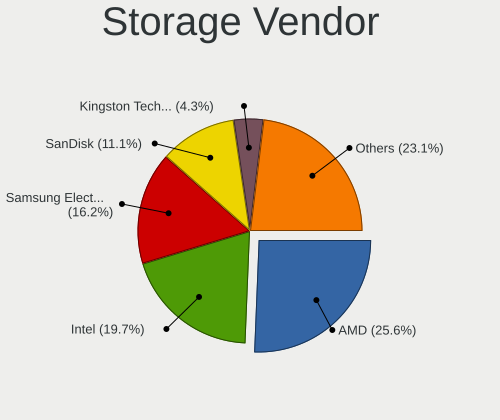

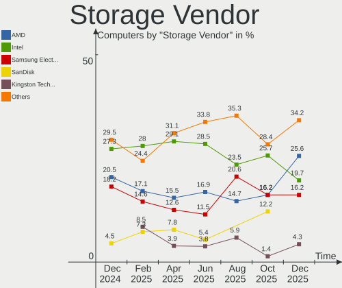

| Vendor                      | Computers | Percent |
|-----------------------------|-----------|---------|
| AMD                         | 30        | 25.64%  |
| Intel                       | 23        | 19.66%  |
| Samsung Electronics         | 19        | 16.24%  |
| SanDisk                     | 13        | 11.11%  |
| Kingston Technology Company | 5         | 4.27%   |
| ASMedia Technology          | 5         | 4.27%   |
| Phison Electronics          | 4         | 3.42%   |
| Micron/Crucial Technology   | 4         | 3.42%   |
| Micron Technology           | 3         | 2.56%   |
| SK hynix                    | 2         | 1.71%   |
| MAXIO Technology (Hangzhou) | 2         | 1.71%   |
| KIOXIA                      | 2         | 1.71%   |
| ADATA Technology            | 2         | 1.71%   |
| Solidigm                    | 1         | 0.85%   |
| Seagate Technology          | 1         | 0.85%   |
| Realtek Semiconductor       | 1         | 0.85%   |

Storage Model
-------------

Storage controller models

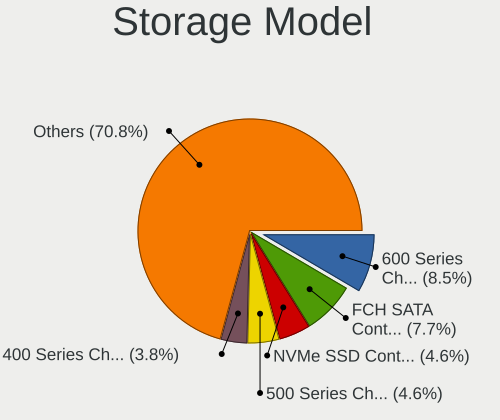

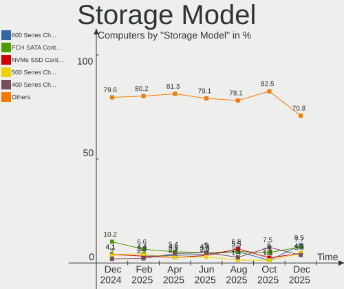

| Model                                                                          | Computers | Percent |
|--------------------------------------------------------------------------------|-----------|---------|
| AMD 600 Series Chipset SATA Controller                                         | 11        | 8.46%   |
| AMD FCH SATA Controller [AHCI mode]                                            | 10        | 7.69%   |
| Samsung NVMe SSD Controller SM981/PM981/PM983                                  | 6         | 4.62%   |
| AMD 500 Series Chipset SATA Controller                                         | 6         | 4.62%   |
| AMD 400 Series Chipset SATA Controller                                         | 5         | 3.85%   |
| Samsung NVMe SSD Controller PM9C1a (DRAM-less)                                 | 4         | 3.08%   |
| Samsung NVMe SSD Controller PM9A1/PM9A3/980PRO                                 | 4         | 3.08%   |
| Samsung NVMe SSD Controller 980 (DRAM-less)                                    | 4         | 3.08%   |
| Intel Sunrise Point-LP SATA Controller [AHCI mode]                             | 4         | 3.08%   |
| ASMedia ASM1061/ASM1062 Serial ATA Controller                                  | 4         | 3.08%   |
| SanDisk WD SN560/SN740/SN770/SN5000 NVMe SSD                                   | 3         | 2.31%   |
| SanDisk Extreme Pro / WD Black SN750 / PC SN730 / Red SN700 NVMe SSD           | 3         | 2.31%   |
| Samsung NVMe SSD Controller S4LV008[Pascal]                                    | 3         | 2.31%   |
| Intel 8 Series/C220 Series Chipset Family 6-port SATA Controller 1 [AHCI mode] | 3         | 2.31%   |
| Sandisk WD Black SN850X NVMe SSD                                               | 2         | 1.54%   |
| Samsung NVMe SSD Controller PM9B1 (DRAM-less)                                  | 2         | 1.54%   |
| Micron/Crucial P2 [Nick P2] / P3 / P3 Plus NVMe PCIe SSD (DRAM-less)           | 2         | 1.54%   |
| Micron 2500 NVMe SSD (DRAM-less)                                               | 2         | 1.54%   |
| Intel Volume Management Device NVMe RAID Controller                            | 2         | 1.54%   |
| Intel Raptor Lake SATA AHCI Controller                                         | 2         | 1.54%   |
| Intel Alder Lake-S PCH SATA Controller [AHCI Mode]                             | 2         | 1.54%   |
| Intel 82801 Mobile SATA Controller [RAID mode]                                 | 2         | 1.54%   |
| Solidigm P41 Plus NVMe SSD (DRAM-less) [Echo Harbor]                           | 1         | 0.77%   |
| SK hynix Platinum P41/PC801 NVMe Solid State Drive                             | 1         | 0.77%   |
| SK hynix Gold P31/BC711/PC711 NVMe Solid State Drive                           | 1         | 0.77%   |
| Seagate E18 PCIe SSD                                                           | 1         | 0.77%   |
| Sandisk WD_BLACK SN7100/WD PC SN7100S M.2 2280 NVMe SSD (DRAM-less)            | 1         | 0.77%   |
| Sandisk WD PC SN7100S M.2 2242 NVMe SSD (DRAM-less)                            | 1         | 0.77%   |
| SanDisk WD PC SN540 / Green SN350 NVMe SSD 1 TB (DRAM-less)                    | 1         | 0.77%   |
| Sandisk WD PC SN5000S M.2 2280 NVMe SSD (DRAM-less)                            | 1         | 0.77%   |
| SanDisk WD Green SN350 240GB (DRAM-less) / SN560E NVMe SSD                     | 1         | 0.77%   |
| Samsung NVMe SSD Controller SM961/PM961/SM963                                  | 1         | 0.77%   |
| Samsung NVMe SSD 9100 PRO [PM9E1]                                              | 1         | 0.77%   |
| Realtek RTS5765DL NVMe SSD Controller (DRAM-less)                              | 1         | 0.77%   |
| Phison PS5021-E21 PCIe4 NVMe Controller (DRAM-less)                            | 1         | 0.77%   |
| Phison E18 PCIe4 NVMe Controller                                               | 1         | 0.77%   |
| Phison E16 PCIe4 NVMe Controller                                               | 1         | 0.77%   |
| Phison E12 NVMe Controller                                                     | 1         | 0.77%   |
| Micron/Crucial T700 NVMe PCIe SSD                                              | 1         | 0.77%   |
| Micron/Crucial P5 NVMe PCIe SSD[SlashP5]                                       | 1         | 0.77%   |

Storage Kind
------------

Kind of storage controller (IDE, SATA, NVMe, SAS, ...)

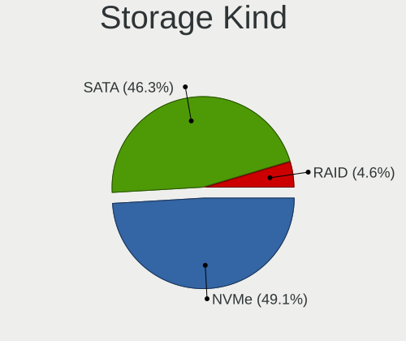

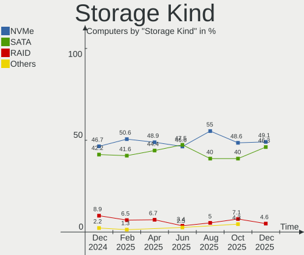

| Kind | Computers | Percent |
|------|-----------|---------|
| NVMe | 53        | 49.07%  |
| SATA | 50        | 46.3%   |
| RAID | 5         | 4.63%   |

Processor
---------

CPU Vendor
----------

Processor vendors

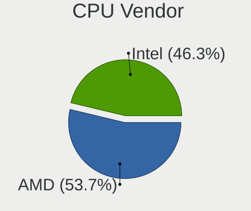

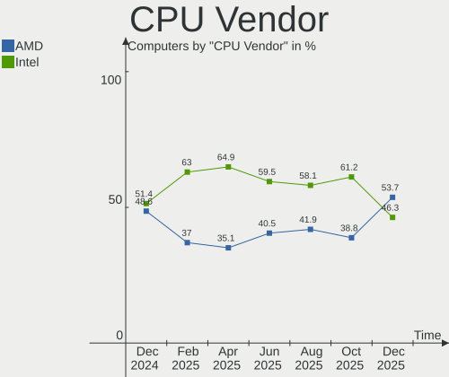

| Vendor | Computers | Percent |
|--------|-----------|---------|
| AMD    | 36        | 53.73%  |
| Intel  | 31        | 46.27%  |

CPU Model
---------

Processor models

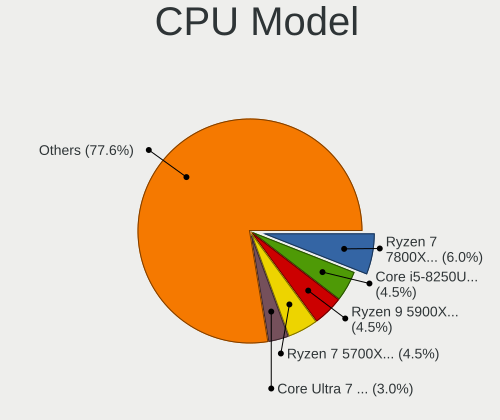

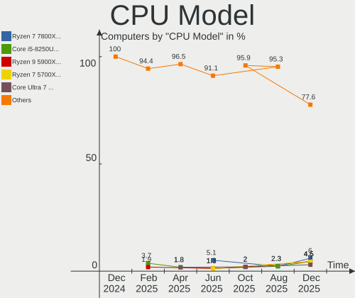

| Model                                      | Computers | Percent |
|--------------------------------------------|-----------|---------|
| AMD Ryzen 7 7800X3D 8-Core Processor       | 4         | 5.97%   |
| Intel Core i5-8250U CPU @ 1.60GHz          | 3         | 4.48%   |
| AMD Ryzen 9 5900X 12-Core Processor        | 3         | 4.48%   |
| AMD Ryzen 7 5700X3D 8-Core Processor       | 3         | 4.48%   |
| Intel Core Ultra 7 258V                    | 2         | 2.99%   |
| AMD Ryzen 9 8940HX with Radeon Graphics    | 2         | 2.99%   |
| AMD Ryzen 7 9800X3D 8-Core Processor       | 2         | 2.99%   |
| AMD Ryzen 7 5800X3D 8-Core Processor       | 2         | 2.99%   |
| Intel Xeon CPU E5-2680 v4 @ 2.40GHz        | 1         | 1.49%   |
| Intel Pentium CPU 2020M @ 2.40GHz          | 1         | 1.49%   |
| Intel Core Ultra 7 155H                    | 1         | 1.49%   |
| Intel Core i9-14900                        | 1         | 1.49%   |
| Intel Core i7-9700KF CPU @ 3.60GHz         | 1         | 1.49%   |
| Intel Core i7-6700 CPU @ 3.40GHz           | 1         | 1.49%   |
| Intel Core i7-6500U CPU @ 2.50GHz          | 1         | 1.49%   |
| Intel Core i7-4790 CPU @ 3.60GHz           | 1         | 1.49%   |
| Intel Core i7-4702MQ CPU @ 2.20GHz         | 1         | 1.49%   |
| Intel Core i7-2630QM CPU @ 2.00GHz         | 1         | 1.49%   |
| Intel Core i7-2600 CPU @ 3.40GHz           | 1         | 1.49%   |
| Intel Core i7-14700F                       | 1         | 1.49%   |
| Intel Core i7-1065G7 CPU @ 1.30GHz         | 1         | 1.49%   |
| Intel Core i5-8300H CPU @ 2.30GHz          | 1         | 1.49%   |
| Intel Core i5-7440HQ CPU @ 2.80GHz         | 1         | 1.49%   |
| Intel Core i5-7200U CPU @ 2.50GHz          | 1         | 1.49%   |
| Intel Core i5-6200U CPU @ 2.30GHz          | 1         | 1.49%   |
| Intel Core i5-1035G1 CPU @ 1.00GHz         | 1         | 1.49%   |
| Intel Core i3-10100F CPU @ 3.60GHz         | 1         | 1.49%   |
| Intel Core 7 240H                          | 1         | 1.49%   |
| Intel 13th Gen Core i9-13900K              | 1         | 1.49%   |
| Intel 13th Gen Core i7-13700F              | 1         | 1.49%   |
| Intel 13th Gen Core i5-13420H              | 1         | 1.49%   |
| Intel 12th Gen Core i5-12400               | 1         | 1.49%   |
| Intel 12th Gen Core i5-1235U               | 1         | 1.49%   |
| Intel 11th Gen Core i5-1135G7 @ 2.40GHz    | 1         | 1.49%   |
| AMD Ryzen 9 9950X3D 16-Core Processor      | 1         | 1.49%   |
| AMD Ryzen 9 9950X 16-Core Processor        | 1         | 1.49%   |
| AMD Ryzen 9 9900X 12-Core Processor        | 1         | 1.49%   |
| AMD Ryzen 9 6900HX with Radeon Graphics    | 1         | 1.49%   |
| AMD Ryzen 7 PRO 5850U with Radeon Graphics | 1         | 1.49%   |
| AMD Ryzen 7 8845HS w/ Radeon 780M Graphics | 1         | 1.49%   |

CPU Model Family
----------------

Processor model prefix

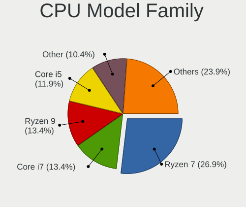

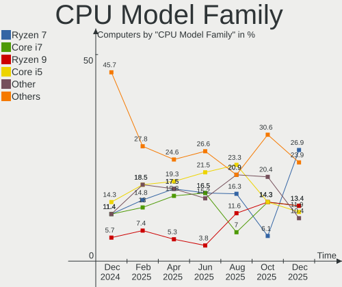

| Model           | Computers | Percent |
|-----------------|-----------|---------|
| AMD Ryzen 7     | 18        | 26.87%  |
| Intel Core i7   | 9         | 13.43%  |
| AMD Ryzen 9     | 9         | 13.43%  |
| Intel Core i5   | 8         | 11.94%  |
| Other           | 7         | 10.45%  |
| AMD Ryzen 5     | 7         | 10.45%  |
| Intel Core      | 4         | 5.97%   |
| Intel Xeon      | 1         | 1.49%   |
| Intel Pentium   | 1         | 1.49%   |
| Intel Core i9   | 1         | 1.49%   |
| Intel Core i3   | 1         | 1.49%   |
| AMD Ryzen 7 PRO | 1         | 1.49%   |

CPU Cores
---------

Number of processor cores

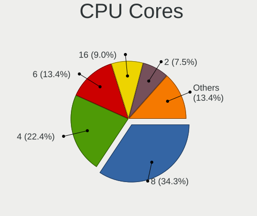

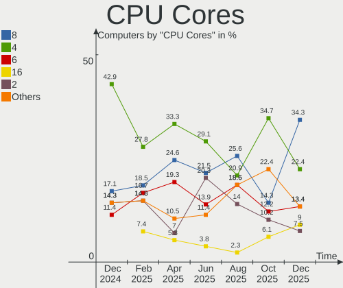

| Number | Computers | Percent |
|--------|-----------|---------|
| 8      | 23        | 34.33%  |
| 4      | 15        | 22.39%  |
| 6      | 9         | 13.43%  |
| 16     | 6         | 8.96%   |
| 2      | 5         | 7.46%   |
| 12     | 3         | 4.48%   |
| 24     | 2         | 2.99%   |
| 10     | 2         | 2.99%   |
| 20     | 1         | 1.49%   |
| 14     | 1         | 1.49%   |

CPU Sockets
-----------

Number of sockets

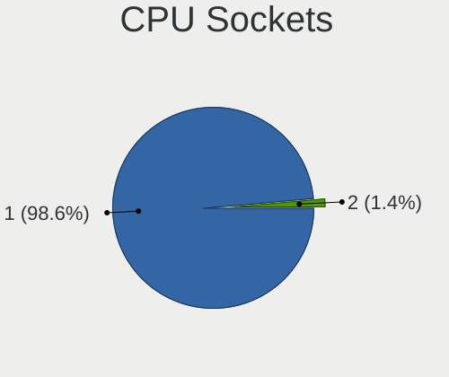

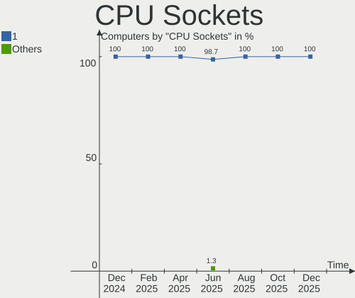

| Number | Computers | Percent |
|--------|-----------|---------|
| 1      | 67        | 100%    |

CPU Threads
-----------

Threads per core (Hyper-Threading)

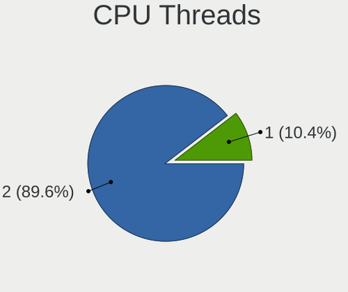

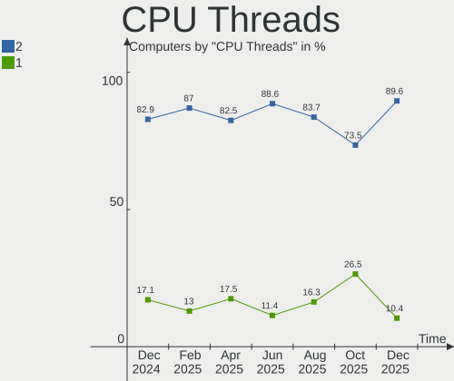

| Number | Computers | Percent |
|--------|-----------|---------|
| 2      | 60        | 89.55%  |
| 1      | 7         | 10.45%  |

CPU Op-Modes
------------

CPU Operation Modes (32-bit, 64-bit)

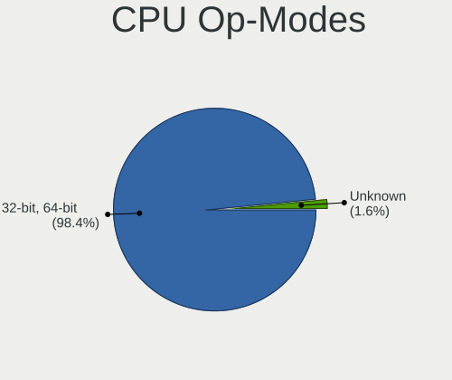

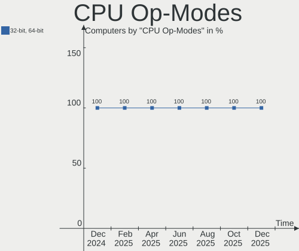

| Op mode        | Computers | Percent |
|----------------|-----------|---------|
| 32-bit, 64-bit | 67        | 100%    |

CPU Microcode
-------------

Microcode number

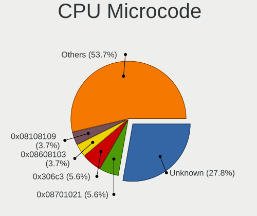

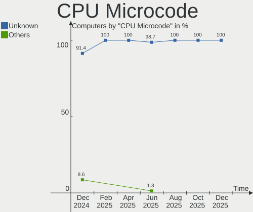

| Number  | Computers | Percent |
|---------|-----------|---------|
| Unknown | 67        | 100%    |

CPU Microarch
-------------

Microarchitecture

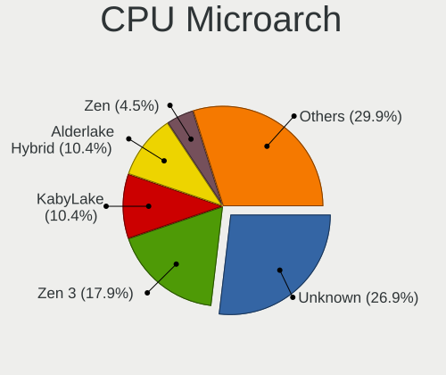

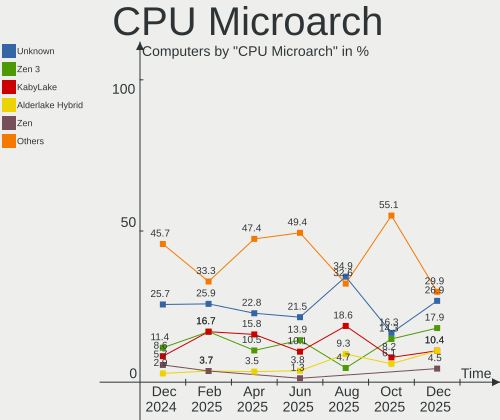

| Name              | Computers | Percent |
|-------------------|-----------|---------|
| Unknown           | 18        | 26.87%  |
| Zen 3             | 12        | 17.91%  |
| KabyLake          | 7         | 10.45%  |
| Alderlake Hybrid  | 7         | 10.45%  |
| Zen               | 3         | 4.48%   |
| Skylake           | 3         | 4.48%   |
| Zen+              | 2         | 2.99%   |
| Zen 2             | 2         | 2.99%   |
| SandyBridge       | 2         | 2.99%   |
| Lunarlake Hybrid  | 2         | 2.99%   |
| IceLake           | 2         | 2.99%   |
| Haswell           | 2         | 2.99%   |
| TigerLake         | 1         | 1.49%   |
| Meteorlake Hybrid | 1         | 1.49%   |
| IvyBridge         | 1         | 1.49%   |
| CometLake         | 1         | 1.49%   |
| Broadwell         | 1         | 1.49%   |

Graphics
--------

GPU Vendor
----------

Vendors of graphics cards

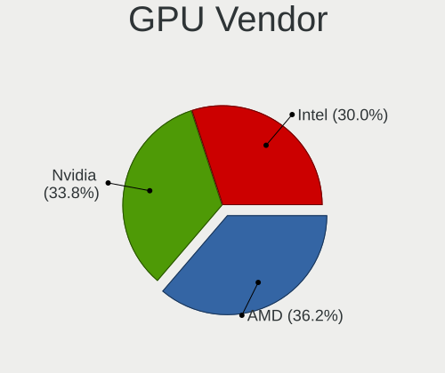

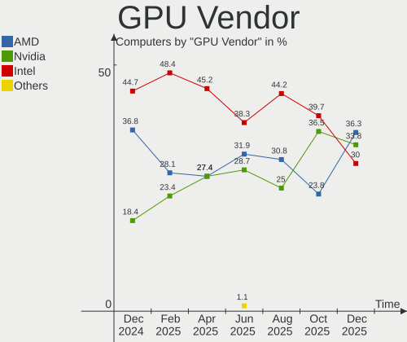

| Vendor | Computers | Percent |
|--------|-----------|---------|
| AMD    | 29        | 36.25%  |
| Nvidia | 27        | 33.75%  |
| Intel  | 24        | 30%     |

GPU Model
---------

Graphics card models

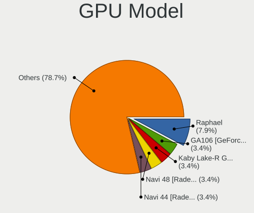

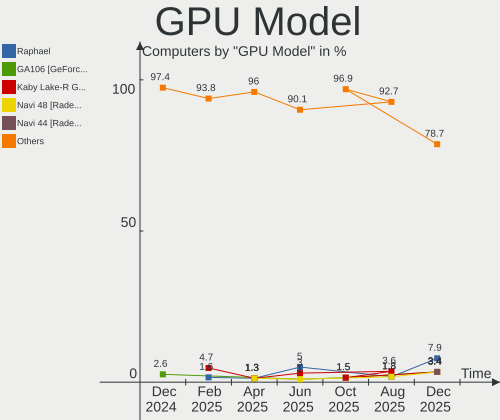

| Model                                                                       | Computers | Percent |
|-----------------------------------------------------------------------------|-----------|---------|
| AMD Raphael                                                                 | 7         | 7.87%   |
| Nvidia GA106 [GeForce RTX 3060 Lite Hash Rate]                              | 3         | 3.37%   |
| Intel Kaby Lake-R GT2 [UHD Graphics 620]                                    | 3         | 3.37%   |
| AMD Navi 48 [Radeon RX 9070/9070 XT/9070 GRE]                               | 3         | 3.37%   |
| AMD Navi 44 [Radeon RX 9060 XT]                                             | 3         | 3.37%   |
| AMD Navi 22 [Radeon RX 6700/6700 XT/6750 XT / 6800M/6850M XT]               | 3         | 3.37%   |
| AMD Granite Ridge [Radeon Graphics]                                         | 3         | 3.37%   |
| Nvidia AD104 [GeForce RTX 4070]                                             | 2         | 2.25%   |
| Intel Skylake-U GT2 [HD Graphics 520]                                       | 2         | 2.25%   |
| Intel Lunar Lake [Intel Arc Graphics 130V / 140V]                           | 2         | 2.25%   |
| AMD Rembrandt [Radeon 680M]                                                 | 2         | 2.25%   |
| AMD Picasso/Raven 2 [Radeon Vega Series / Radeon Vega Mobile Series]        | 2         | 2.25%   |
| AMD Navi 32 [Radeon RX 7700 XT / 7800 XT]                                   | 2         | 2.25%   |
| AMD Navi 21 [Radeon RX 6800/6800 XT / 6900 XT]                              | 2         | 2.25%   |
| AMD Navi 10 [Radeon RX 5600 OEM/5600 XT / 5700/5700 XT]                     | 2         | 2.25%   |
| Nvidia TU117M [GeForce GTX 1650 Mobile / Max-Q]                             | 1         | 1.12%   |
| Nvidia TU106 [GeForce RTX 2070 Rev. A]                                      | 1         | 1.12%   |
| Nvidia TU104 [GeForce RTX 2080]                                             | 1         | 1.12%   |
| Nvidia TU104 [GeForce RTX 2070 SUPER]                                       | 1         | 1.12%   |
| Nvidia NV43 [GeForce 6600]                                                  | 1         | 1.12%   |
| Nvidia GP108M [GeForce MX150]                                               | 1         | 1.12%   |
| Nvidia GP108 [GeForce GT 1030]                                              | 1         | 1.12%   |
| Nvidia GP104 [GeForce GTX 1070]                                             | 1         | 1.12%   |
| Nvidia GM108M [GeForce MX130]                                               | 1         | 1.12%   |
| Nvidia GM108M [GeForce 940M]                                                | 1         | 1.12%   |
| Nvidia GF108M [GeForce GT 540M]                                             | 1         | 1.12%   |
| Nvidia GF106GL [Quadro 2000]                                                | 1         | 1.12%   |
| Nvidia GB206M [GeForce RTX 5070 Max-Q / Mobile]                             | 1         | 1.12%   |
| Nvidia GB206M [GeForce RTX 5060 Max-Q / Mobile]                             | 1         | 1.12%   |
| Nvidia GB203 [GeForce RTX 5080]                                             | 1         | 1.12%   |
| Nvidia GA106 [GeForce RTX 3060]                                             | 1         | 1.12%   |
| Nvidia AD107M [GeForce RTX 4050 Max-Q / Mobile]                             | 1         | 1.12%   |
| Nvidia AD107 [GeForce RTX 4060]                                             | 1         | 1.12%   |
| Nvidia AD106 [GeForce RTX 4060 Ti]                                          | 1         | 1.12%   |
| Nvidia AD104GL [RTX 4000 SFF Ada Generation]                                | 1         | 1.12%   |
| Nvidia AD104 [GeForce RTX 4070 Ti]                                          | 1         | 1.12%   |
| Nvidia AD103 [GeForce RTX 4080 SUPER]                                       | 1         | 1.12%   |
| Intel Xeon E3-1200 v3/4th Gen Core Processor Integrated Graphics Controller | 1         | 1.12%   |
| Intel TigerLake-LP GT2 [Iris Xe Graphics]                                   | 1         | 1.12%   |
| Intel Skylake-S GT2 [HD Graphics 530]                                       | 1         | 1.12%   |

GPU Combo
---------

Combinations of graphics cards

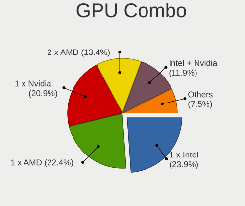

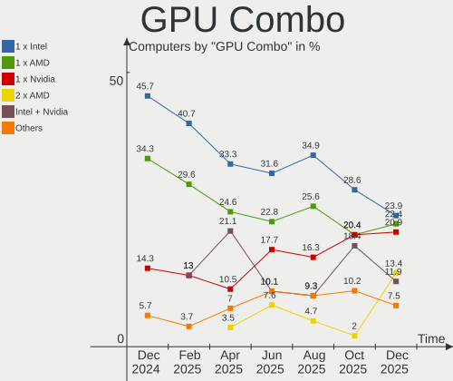

| Name           | Computers | Percent |
|----------------|-----------|---------|
| 1 x Intel      | 16        | 23.88%  |
| 1 x AMD        | 15        | 22.39%  |
| 1 x Nvidia     | 14        | 20.9%   |
| 2 x AMD        | 9         | 13.43%  |
| Intel + Nvidia | 8         | 11.94%  |
| AMD + Nvidia   | 5         | 7.46%   |

GPU Driver
----------

Free vs proprietary

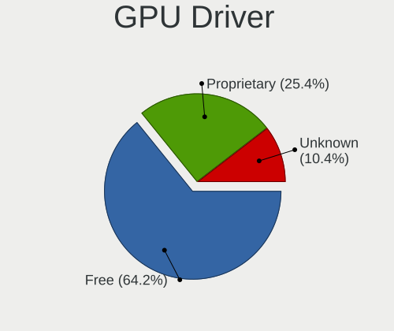

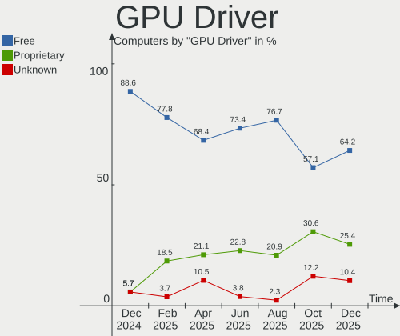

| Driver      | Computers | Percent |
|-------------|-----------|---------|
| Free        | 43        | 64.18%  |
| Proprietary | 17        | 25.37%  |
| Unknown     | 7         | 10.45%  |

GPU Memory
----------

Total video memory

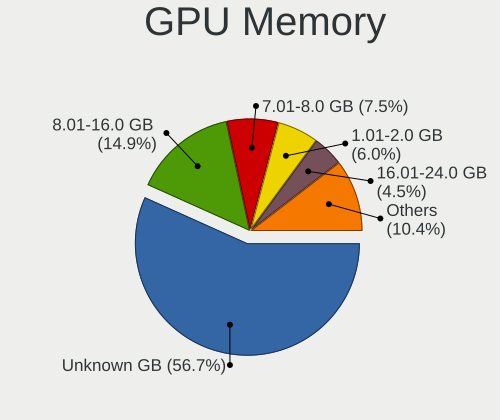

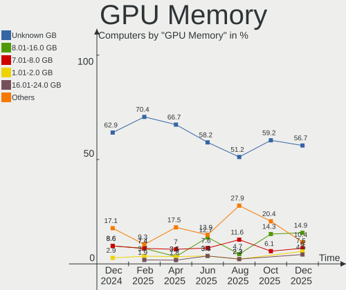

| Size in GB | Computers | Percent |
|------------|-----------|---------|
| Unknown    | 38        | 56.72%  |
| 8.01-16.0  | 10        | 14.93%  |
| 7.01-8.0   | 5         | 7.46%   |
| 1.01-2.0   | 4         | 5.97%   |
| 16.01-24.0 | 3         | 4.48%   |
| 0.01-0.5   | 3         | 4.48%   |
| 5.01-6.0   | 2         | 2.99%   |
| 3.01-4.0   | 1         | 1.49%   |
| 0.51-1.0   | 1         | 1.49%   |

Monitor
-------

Monitor Vendor
--------------

Monitor vendors

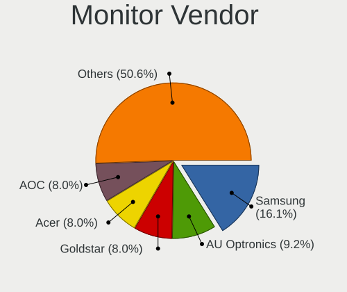

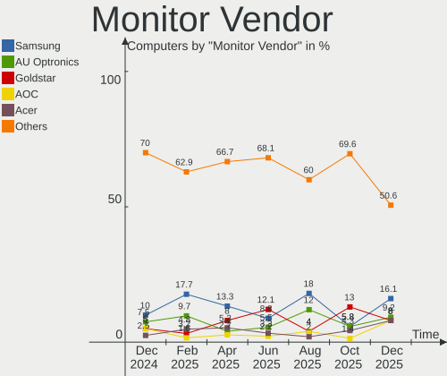

| Vendor               | Computers | Percent |
|----------------------|-----------|---------|
| Samsung Electronics  | 14        | 16.09%  |
| AU Optronics         | 8         | 9.2%    |
| Goldstar             | 7         | 8.05%   |
| AOC                  | 7         | 8.05%   |
| Acer                 | 7         | 8.05%   |
| Dell                 | 5         | 5.75%   |
| LG Display           | 4         | 4.6%    |
| Hewlett-Packard      | 4         | 4.6%    |
| Chimei Innolux       | 4         | 4.6%    |
| BOE                  | 4         | 4.6%    |
| BenQ                 | 4         | 4.6%    |
| MSI                  | 3         | 3.45%   |
| Lenovo               | 2         | 2.3%    |
| Skyworth             | 1         | 1.15%   |
| SKG                  | 1         | 1.15%   |
| Roku                 | 1         | 1.15%   |
| Pixio                | 1         | 1.15%   |
| Philips              | 1         | 1.15%   |
| InfoVision           | 1         | 1.15%   |
| Hitachi              | 1         | 1.15%   |
| Gigabyte Technology  | 1         | 1.15%   |
| DENON                | 1         | 1.15%   |
| CTV                  | 1         | 1.15%   |
| CSW                  | 1         | 1.15%   |
| ASUSTek Computer     | 1         | 1.15%   |
| Ancor Communications | 1         | 1.15%   |
| AIO                  | 1         | 1.15%   |

Monitor Model
-------------

Monitor models

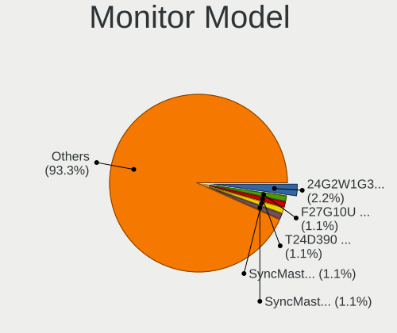

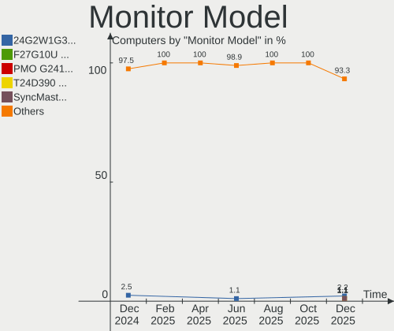

| Model                                                                  | Computers | Percent |
|------------------------------------------------------------------------|-----------|---------|
| AOC 24G2W1G3 AOC2402 1920x1080 527x296mm 23.8-inch                     | 2         | 2.22%   |
| Skyworth F27G10U SKY0627 3840x2160 596x335mm 26.9-inch                 | 1         | 1.11%   |
| SKG PMO G241-FFK SKG2409 1920x1080 600x330mm 27.0-inch                 | 1         | 1.11%   |
| Samsung Electronics T24D390 SAM0B6E 1920x1080 521x293mm 23.5-inch      | 1         | 1.11%   |
| Samsung Electronics SyncMaster SAM058A 1920x1080 530x300mm 24.0-inch   | 1         | 1.11%   |
| Samsung Electronics SyncMaster SAM037C 1680x1050 474x296mm 22.0-inch   | 1         | 1.11%   |
| Samsung Electronics SA300/SA350 SAM078C 1600x900 443x249mm 20.0-inch   | 1         | 1.11%   |
| Samsung Electronics S24R35A SAM729F 1920x1080 521x293mm 23.5-inch      | 1         | 1.11%   |
| Samsung Electronics Odyssey G70B SAM7232 3840x2160 698x392mm 31.5-inch | 1         | 1.11%   |
| Samsung Electronics Odyssey G5 SAM74A7 2560x1440 597x336mm 27.0-inch   | 1         | 1.11%   |
| Samsung Electronics Odyssey G5 SAM7489 2560x1440 698x393mm 31.5-inch   | 1         | 1.11%   |
| Samsung Electronics Odyssey G40B SAM727D 1920x1080 597x336mm 27.0-inch | 1         | 1.11%   |
| Samsung Electronics LCD Monitor SEC544B 1600x900 382x214mm 17.2-inch   | 1         | 1.11%   |
| Samsung Electronics LCD Monitor SDC4752 1366x768 344x194mm 15.5-inch   | 1         | 1.11%   |
| Samsung Electronics LCD Monitor SDC4208 1920x1200 302x189mm 14.0-inch  | 1         | 1.11%   |
| Samsung Electronics LCD Monitor SDC4188 2880x1800 312x195mm 14.5-inch  | 1         | 1.11%   |
| Samsung Electronics LCD Monitor SAM0F13 3840x2160 950x540mm 43.0-inch  | 1         | 1.11%   |
| Samsung Electronics C24F390 SAM0D2C 1920x1080 521x293mm 23.5-inch      | 1         | 1.11%   |
| Roku TV RKU0870 3840x2160 800x450mm 36.1-inch                          | 1         | 1.11%   |
| Pixio ICB MN32U1 ICB7D04 3840x2160 708x398mm 32.0-inch                 | 1         | 1.11%   |
| Philips PHL 246E9Q PHLC17C 1920x1080 527x296mm 23.8-inch               | 1         | 1.11%   |
| MSI MPG271QX OLED MSI3CD7 2560x1440 606x344mm 27.4-inch                | 1         | 1.11%   |
| MSI G27CQ4 MSI3CB0 2560x1440 597x336mm 27.0-inch                       | 1         | 1.11%   |
| MSI G255F MSI3BC0 1920x1080 543x302mm 24.5-inch                        | 1         | 1.11%   |
| LG Display LCD Monitor LGD060F 1920x1080 309x174mm 14.0-inch           | 1         | 1.11%   |
| LG Display LCD Monitor LGD0563 1920x1080 344x194mm 15.5-inch           | 1         | 1.11%   |
| LG Display LCD Monitor LGD0555 2736x1824 260x173mm 12.3-inch           | 1         | 1.11%   |
| LG Display LCD Monitor LGD0551 1920x1080 309x174mm 14.0-inch           | 1         | 1.11%   |
| Lenovo LEN E2054A LEN60DF 1440x900 419x262mm 19.5-inch                 | 1         | 1.11%   |
| Lenovo LCD Monitor LEN40BA 1920x1080 344x194mm 15.5-inch               | 1         | 1.11%   |
| InfoVision LCD Monitor IVO057D 1920x1080 309x174mm 14.0-inch           | 1         | 1.11%   |
| Hitachi CM751 HTCAC13 1600x1200 360x270mm 17.7-inch                    | 1         | 1.11%   |
| Hewlett-Packard vs19b HWP264C 1280x1024 376x301mm 19.0-inch            | 1         | 1.11%   |
| Hewlett-Packard V24v G5 HPN3829 1920x1080 526x296mm 23.8-inch          | 1         | 1.11%   |
| Hewlett-Packard V212a HWP328F 1920x1080 458x258mm 20.7-inch            | 1         | 1.11%   |
| Hewlett-Packard 27f HPN354B 1920x1080 598x336mm 27.0-inch              | 1         | 1.11%   |
| Goldstar ULTRAWIDE GSM9E80 3440x1440 930x390mm 39.7-inch               | 1         | 1.11%   |
| Goldstar ULTRAGEAR+ GSM77BD 3840x2160 597x336mm 27.0-inch              | 1         | 1.11%   |
| Goldstar ULTRAGEAR GSM5BD3 2560x1440 697x392mm 31.5-inch               | 1         | 1.11%   |
| Goldstar ULTRAFINE GSM5BC2 3840x2160 697x392mm 31.5-inch               | 1         | 1.11%   |

Monitor Resolution
------------------

Monitor screen resolution

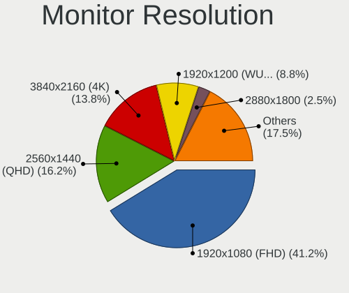

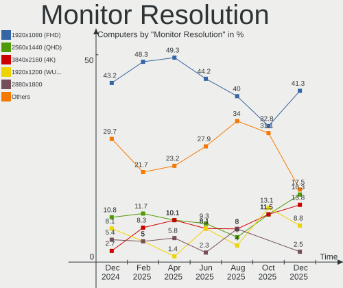

| Resolution         | Computers | Percent |
|--------------------|-----------|---------|
| 1920x1080 (FHD)    | 33        | 41.25%  |
| 2560x1440 (QHD)    | 13        | 16.25%  |
| 3840x2160 (4K)     | 11        | 13.75%  |
| 1920x1200 (WUXGA)  | 7         | 8.75%   |
| 2880x1800          | 2         | 2.5%    |
| 2560x1080          | 2         | 2.5%    |
| 1600x900 (HD+)     | 2         | 2.5%    |
| 1440x900 (WXGA+)   | 2         | 2.5%    |
| 1366x768 (WXGA)    | 2         | 2.5%    |
| 3440x1440          | 1         | 1.25%   |
| 2880x1920          | 1         | 1.25%   |
| 2560x1600          | 1         | 1.25%   |
| 1680x1050 (WSXGA+) | 1         | 1.25%   |
| 1600x1200          | 1         | 1.25%   |
| 1280x1024 (SXGA)   | 1         | 1.25%   |

Monitor Diagonal
----------------

Diagonal size in inches

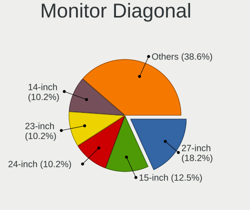

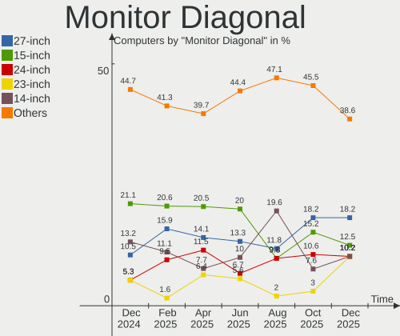

| Inches | Computers | Percent |
|--------|-----------|---------|
| 27     | 16        | 18.18%  |
| 15     | 11        | 12.5%   |
| 24     | 9         | 10.23%  |
| 23     | 9         | 10.23%  |
| 14     | 9         | 10.23%  |
| 31     | 5         | 5.68%   |
| 21     | 3         | 3.41%   |
| 16     | 3         | 3.41%   |
| 13     | 3         | 3.41%   |
| 32     | 2         | 2.27%   |
| 25     | 2         | 2.27%   |
| 20     | 2         | 2.27%   |
| 19     | 2         | 2.27%   |
| 17     | 2         | 2.27%   |
| 99     | 1         | 1.14%   |
| 84     | 1         | 1.14%   |
| 63     | 1         | 1.14%   |
| 39     | 1         | 1.14%   |
| 36     | 1         | 1.14%   |
| 34     | 1         | 1.14%   |
| 33     | 1         | 1.14%   |
| 26     | 1         | 1.14%   |
| 22     | 1         | 1.14%   |
| 18     | 1         | 1.14%   |

Monitor Width
-------------

Physical width

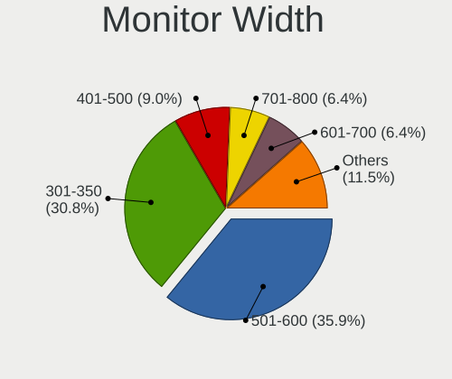

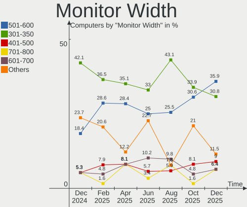

| Width in mm    | Computers | Percent |
|----------------|-----------|---------|
| 501-600        | 28        | 35.9%   |
| 301-350        | 24        | 30.77%  |
| 401-500        | 7         | 8.97%   |
| 701-800        | 5         | 6.41%   |
| 601-700        | 5         | 6.41%   |
| 351-400        | 3         | 3.85%   |
| 201-300        | 2         | 2.56%   |
| More than 2000 | 1         | 1.28%   |
| 1501-2000      | 1         | 1.28%   |
| 1001-1500      | 1         | 1.28%   |
| 901-1000       | 1         | 1.28%   |

Aspect Ratio
------------

Proportional relationship between the width and the height

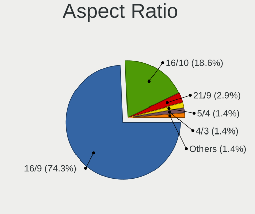

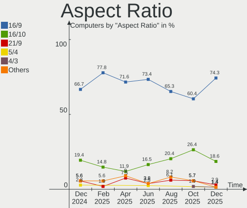

| Ratio | Computers | Percent |
|-------|-----------|---------|
| 16/9  | 52        | 74.29%  |
| 16/10 | 13        | 18.57%  |
| 21/9  | 2         | 2.86%   |
| 5/4   | 1         | 1.43%   |
| 4/3   | 1         | 1.43%   |
| 3/2   | 1         | 1.43%   |

Monitor Area
------------

Area in inch²

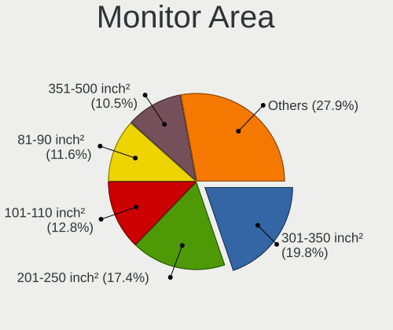

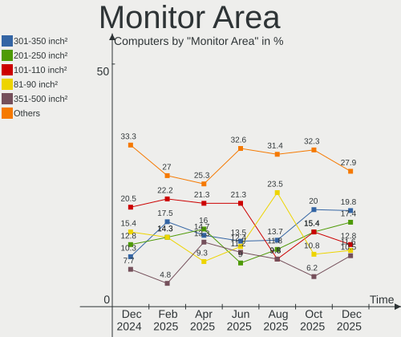

| Area in inch² | Computers | Percent |
|----------------|-----------|---------|
| 301-350        | 17        | 19.77%  |
| 201-250        | 15        | 17.44%  |
| 101-110        | 11        | 12.79%  |
| 81-90          | 10        | 11.63%  |
| 351-500        | 9         | 10.47%  |
| 151-200        | 7         | 8.14%   |
| 251-300        | 6         | 6.98%   |
| More than 1000 | 3         | 3.49%   |
| 111-120        | 3         | 3.49%   |
| 71-80          | 2         | 2.33%   |
| 501-1000       | 2         | 2.33%   |
| 121-130        | 1         | 1.16%   |

Pixel Density
-------------

Pixels per inch

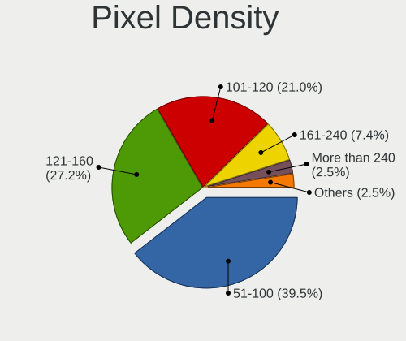

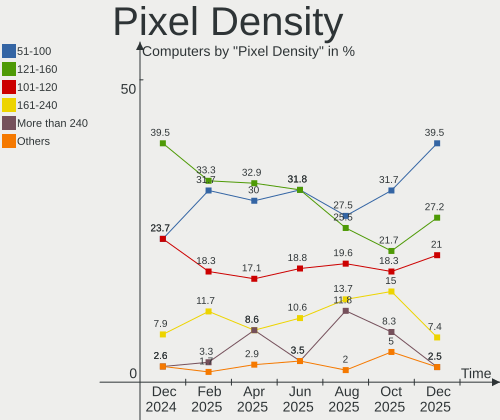

| Density       | Computers | Percent |
|---------------|-----------|---------|
| 51-100        | 32        | 39.51%  |
| 121-160       | 22        | 27.16%  |
| 101-120       | 17        | 20.99%  |
| 161-240       | 6         | 7.41%   |
| More than 240 | 2         | 2.47%   |
| 1-50          | 2         | 2.47%   |

Multiple Monitors
-----------------

Total monitors connected

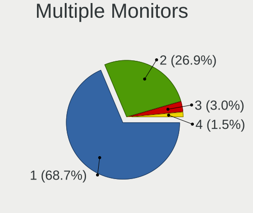

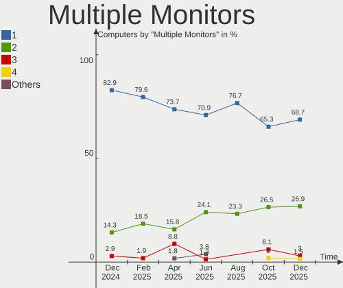

| Total | Computers | Percent |
|-------|-----------|---------|
| 1     | 46        | 68.66%  |
| 2     | 18        | 26.87%  |
| 3     | 2         | 2.99%   |
| 4     | 1         | 1.49%   |

Network
-------

Net Controller Vendor
---------------------

Controller vendors

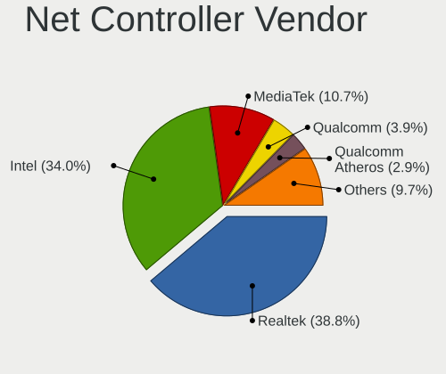

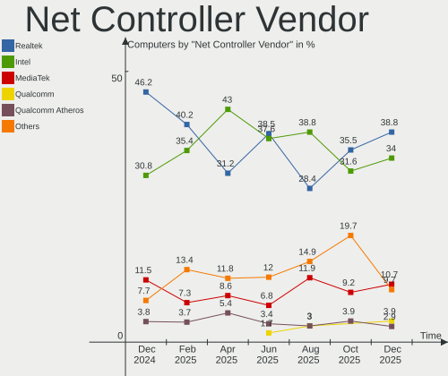

| Vendor                                 | Computers | Percent |
|----------------------------------------|-----------|---------|
| Realtek Semiconductor                  | 40        | 38.83%  |
| Intel                                  | 35        | 33.98%  |
| MediaTek                               | 11        | 10.68%  |
| Qualcomm Technologies                  | 4         | 3.88%   |
| Qualcomm Atheros                       | 3         | 2.91%   |
| Xiaomi                                 | 1         | 0.97%   |
| Suzhou Motorcomm Electronic Technology | 1         | 0.97%   |
| Ralink Technology                      | 1         | 0.97%   |
| Quectel Wireless Solutions             | 1         | 0.97%   |
| Microsoft                              | 1         | 0.97%   |
| Google                                 | 1         | 0.97%   |
| Broadcom                               | 1         | 0.97%   |
| ASIX Electronics                       | 1         | 0.97%   |
| Aquantia                               | 1         | 0.97%   |
| aicsemi                                | 1         | 0.97%   |

Net Controller Model
--------------------

Controller models

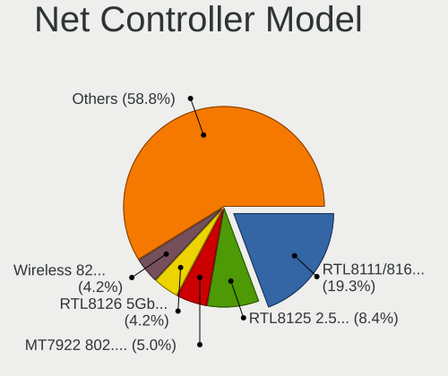

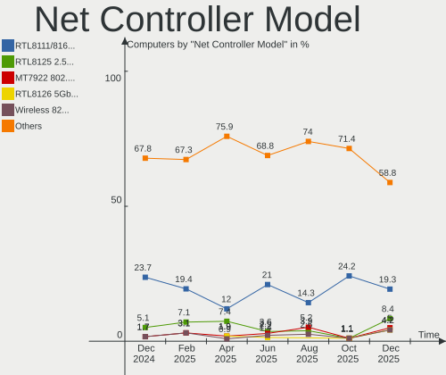

| Model                                                                           | Computers | Percent |
|---------------------------------------------------------------------------------|-----------|---------|
| Realtek RTL8111/8168/8211/8411 PCI Express Gigabit Ethernet Controller          | 23        | 19.33%  |
| Realtek RTL8125 2.5GbE Controller                                               | 10        | 8.4%    |
| MediaTek MT7922 802.11ax PCI Express Wireless Network Adapter                   | 6         | 5.04%   |
| Realtek RTL8126 5GbE Controller                                                 | 5         | 4.2%    |
| Intel Wireless 8265 / 8275                                                      | 5         | 4.2%    |
| Intel I211 Gigabit Network Connection                                           | 4         | 3.36%   |
| Realtek RTL8821CE 802.11ac PCIe Wireless Network Adapter                        | 3         | 2.52%   |
| Qualcomm WCN785x Wi-Fi 7(802.11be) 320MHz 2x2 [FastConnect 7800]                | 3         | 2.52%   |
| Intel Wireless 7265                                                             | 3         | 2.52%   |
| Realtek RTL8852AE 802.11ax PCIe Wireless Network Adapter                        | 2         | 1.68%   |
| Realtek RTL8153 Gigabit Ethernet Adapter                                        | 2         | 1.68%   |
| Intel Wi-Fi 6 AX200                                                             | 2         | 1.68%   |
| Intel Ice Lake-LP PCH CNVi WiFi                                                 | 2         | 1.68%   |
| Intel Ethernet Controller I226-V                                                | 2         | 1.68%   |
| Intel BE201 320MHz                                                              | 2         | 1.68%   |
| Intel Alder Lake-S PCH CNVi WiFi                                                | 2         | 1.68%   |
| Intel 700 Series Chipset CNVi WiFi                                              | 2         | 1.68%   |
| Xiaomi Mi/Redmi series (RNDIS + ADB)                                            | 1         | 0.84%   |
| Suzhou Motorcomm Electronic YT6801 Gigabit Ethernet Controller                  | 1         | 0.84%   |
| Realtek RTL8852CE PCIe 802.11ax Wireless Network Controller                     | 1         | 0.84%   |
| Realtek RTL8852BE-VT PCIe 802.11ax Wireless Network Controller                  | 1         | 0.84%   |
| Realtek RTL8852BE PCIe 802.11ax Wireless Network Controller                     | 1         | 0.84%   |
| Realtek Killer E3000 2.5GbE Controller                                          | 1         | 0.84%   |
| Realtek 802.11be WLAN Adapter                                                   | 1         | 0.84%   |
| Ralink RT5370 Wireless Adapter                                                  | 1         | 0.84%   |
| Quectel Wireless Solutions RG650V-NA                                            | 1         | 0.84%   |
| Qualcomm QCNFA765 Wireless Network Adapter                                      | 1         | 0.84%   |
| Qualcomm Atheros QCA8172 Fast Ethernet                                          | 1         | 0.84%   |
| Qualcomm Atheros AR928X Wireless Network Adapter (PCI-Express)                  | 1         | 0.84%   |
| Qualcomm Atheros AR9285 Wireless Network Adapter (PCI-Express)                  | 1         | 0.84%   |
| Qualcomm Atheros AR8151 v2.0 Gigabit Ethernet                                   | 1         | 0.84%   |
| Microsoft Xbox 360 Wireless Adapter                                             | 1         | 0.84%   |
| MediaTek Network controller                                                     | 1         | 0.84%   |
| MediaTek MT7927 802.11be 320MHz 2x2 PCIe Wireless Network Adapter [Filogic 380] | 1         | 0.84%   |
| MediaTek MT7925 (RZ717) Wi-Fi 7 160MHz                                          | 1         | 0.84%   |
| MediaTek MT7921K (RZ608) Wi-Fi 6E 80MHz                                         | 1         | 0.84%   |
| MediaTek MT7921 802.11ax PCIe Wireless Network Adapter [Filogic 330]            | 1         | 0.84%   |
| Intel Wireless 8260                                                             | 1         | 0.84%   |
| Intel Wi-Fi 6E(802.11ax) AX210/AX1675* 2x2 [Typhoon Peak]                       | 1         | 0.84%   |
| Intel Meteor Lake PCH CNVi WiFi                                                 | 1         | 0.84%   |

Wireless Vendor
---------------

Wireless vendors

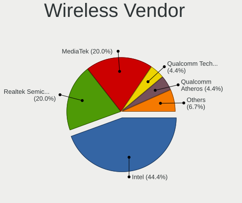

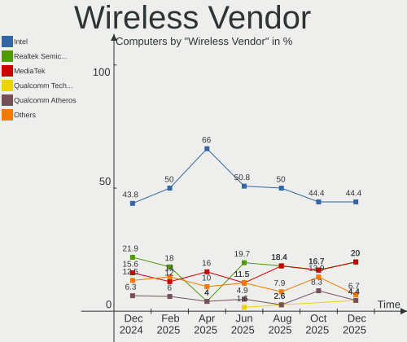

| Vendor                | Computers | Percent |
|-----------------------|-----------|---------|
| Intel                 | 20        | 44.44%  |
| Realtek Semiconductor | 9         | 20%     |
| MediaTek              | 9         | 20%     |
| Qualcomm Technologies | 2         | 4.44%   |
| Qualcomm Atheros      | 2         | 4.44%   |
| Ralink Technology     | 1         | 2.22%   |
| Microsoft             | 1         | 2.22%   |
| Broadcom              | 1         | 2.22%   |

Wireless Model
--------------

Wireless models

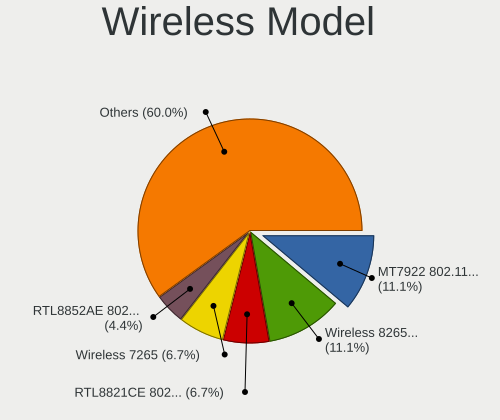

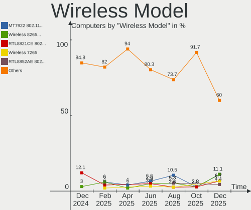

| Model                                                                           | Computers | Percent |
|---------------------------------------------------------------------------------|-----------|---------|
| MediaTek MT7922 802.11ax PCI Express Wireless Network Adapter                   | 5         | 11.11%  |
| Intel Wireless 8265 / 8275                                                      | 5         | 11.11%  |
| Realtek RTL8821CE 802.11ac PCIe Wireless Network Adapter                        | 3         | 6.67%   |
| Intel Wireless 7265                                                             | 3         | 6.67%   |
| Realtek RTL8852AE 802.11ax PCIe Wireless Network Adapter                        | 2         | 4.44%   |
| Intel Wi-Fi 6 AX200                                                             | 2         | 4.44%   |
| Intel Ice Lake-LP PCH CNVi WiFi                                                 | 2         | 4.44%   |
| Intel 700 Series Chipset CNVi WiFi                                              | 2         | 4.44%   |
| Realtek RTL8852CE PCIe 802.11ax Wireless Network Controller                     | 1         | 2.22%   |
| Realtek RTL8852BE-VT PCIe 802.11ax Wireless Network Controller                  | 1         | 2.22%   |
| Realtek RTL8852BE PCIe 802.11ax Wireless Network Controller                     | 1         | 2.22%   |
| Realtek 802.11be WLAN Adapter                                                   | 1         | 2.22%   |
| Ralink RT5370 Wireless Adapter                                                  | 1         | 2.22%   |
| Qualcomm WCN785x Wi-Fi 7(802.11be) 320MHz 2x2 [FastConnect 7800]                | 1         | 2.22%   |
| Qualcomm QCNFA765 Wireless Network Adapter                                      | 1         | 2.22%   |
| Qualcomm Atheros AR928X Wireless Network Adapter (PCI-Express)                  | 1         | 2.22%   |
| Qualcomm Atheros AR9285 Wireless Network Adapter (PCI-Express)                  | 1         | 2.22%   |
| Microsoft Xbox 360 Wireless Adapter                                             | 1         | 2.22%   |
| MediaTek MT7927 802.11be 320MHz 2x2 PCIe Wireless Network Adapter [Filogic 380] | 1         | 2.22%   |
| MediaTek MT7925 (RZ717) Wi-Fi 7 160MHz                                          | 1         | 2.22%   |
| MediaTek MT7921K (RZ608) Wi-Fi 6E 80MHz                                         | 1         | 2.22%   |
| MediaTek MT7921 802.11ax PCIe Wireless Network Adapter [Filogic 330]            | 1         | 2.22%   |
| Intel Wireless 8260                                                             | 1         | 2.22%   |
| Intel Wi-Fi 6E(802.11ax) AX210/AX1675* 2x2 [Typhoon Peak]                       | 1         | 2.22%   |
| Intel Meteor Lake PCH CNVi WiFi                                                 | 1         | 2.22%   |
| Intel Centrino Wireless-N 135                                                   | 1         | 2.22%   |
| Intel BE201 320MHz                                                              | 1         | 2.22%   |
| Intel Alder Lake-P PCH CNVi WiFi                                                | 1         | 2.22%   |
| Broadcom BCM43228 802.11a/b/g/n                                                 | 1         | 2.22%   |

Ethernet Vendor
---------------

Ethernet vendors

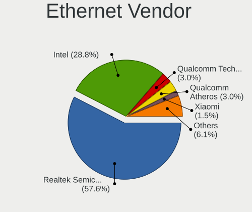

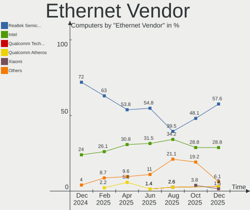

| Vendor                                 | Computers | Percent |
|----------------------------------------|-----------|---------|
| Realtek Semiconductor                  | 38        | 57.58%  |
| Intel                                  | 19        | 28.79%  |
| Qualcomm Technologies                  | 2         | 3.03%   |
| Qualcomm Atheros                       | 2         | 3.03%   |
| Xiaomi                                 | 1         | 1.52%   |
| Suzhou Motorcomm Electronic Technology | 1         | 1.52%   |
| MediaTek                               | 1         | 1.52%   |
| ASIX Electronics                       | 1         | 1.52%   |
| Aquantia                               | 1         | 1.52%   |

Ethernet Model
--------------

Ethernet models

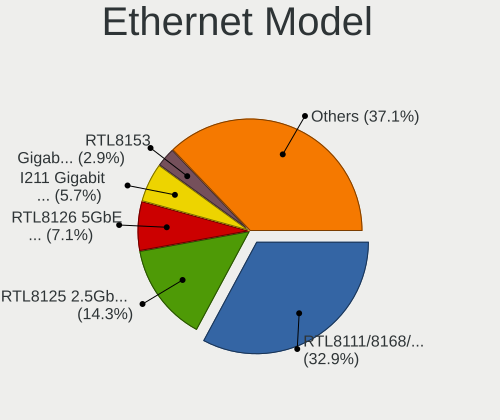

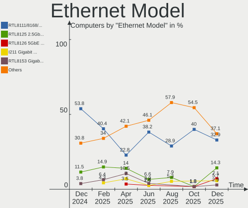

| Model                                                                         | Computers | Percent |
|-------------------------------------------------------------------------------|-----------|---------|
| Realtek RTL8111/8168/8211/8411 PCI Express Gigabit Ethernet Controller        | 23        | 32.86%  |
| Realtek RTL8125 2.5GbE Controller                                             | 10        | 14.29%  |
| Realtek RTL8126 5GbE Controller                                               | 5         | 7.14%   |
| Intel I211 Gigabit Network Connection                                         | 4         | 5.71%   |
| Realtek RTL8153 Gigabit Ethernet Adapter                                      | 2         | 2.86%   |
| Qualcomm WCN785x Wi-Fi 7(802.11be) 320MHz 2x2 [FastConnect 7800]              | 2         | 2.86%   |
| Intel Ethernet Controller I226-V                                              | 2         | 2.86%   |
| Intel Alder Lake-S PCH CNVi WiFi                                              | 2         | 2.86%   |
| Xiaomi Mi/Redmi series (RNDIS + ADB)                                          | 1         | 1.43%   |
| Suzhou Motorcomm Electronic YT6801 Gigabit Ethernet Controller                | 1         | 1.43%   |
| Realtek Killer E3000 2.5GbE Controller                                        | 1         | 1.43%   |
| Qualcomm Atheros QCA8172 Fast Ethernet                                        | 1         | 1.43%   |
| Qualcomm Atheros AR8151 v2.0 Gigabit Ethernet                                 | 1         | 1.43%   |
| MediaTek MT7922 802.11ax PCI Express Wireless Network Adapter                 | 1         | 1.43%   |
| Intel Ethernet Controller I225-V                                              | 1         | 1.43%   |
| Intel Ethernet Controller 10-Gigabit X540-AT2                                 | 1         | 1.43%   |
| Intel Ethernet Connection I219-V                                              | 1         | 1.43%   |
| Intel Ethernet Connection I217-V                                              | 1         | 1.43%   |
| Intel Ethernet Connection (7) I219-V                                          | 1         | 1.43%   |
| Intel Ethernet Connection (5) I219-LM                                         | 1         | 1.43%   |
| Intel Ethernet Connection (4) I219-V                                          | 1         | 1.43%   |
| Intel Ethernet Connection (2) I219-V                                          | 1         | 1.43%   |
| Intel Ethernet Connection (17) I219-LM                                        | 1         | 1.43%   |
| Intel Ethernet Connection (14) I219-V                                         | 1         | 1.43%   |
| Intel BE201 320MHz                                                            | 1         | 1.43%   |
| Intel 82579LM Gigabit Network Connection (Lewisville)                         | 1         | 1.43%   |
| ASIX AX88179 Gigabit Ethernet                                                 | 1         | 1.43%   |
| Aquantia AQtion AQC113 NBase-T/IEEE 802.3an Ethernet Controller [Antigua 10G] | 1         | 1.43%   |

Net Controller Kind
-------------------

Ethernet, WiFi or modem

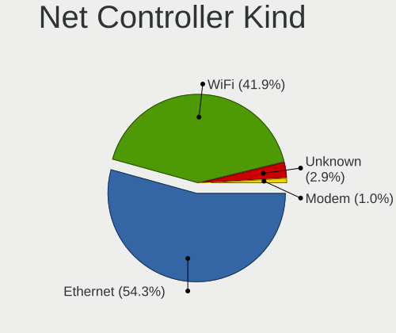

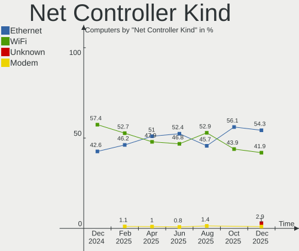

| Kind     | Computers | Percent |
|----------|-----------|---------|
| Ethernet | 57        | 54.29%  |
| WiFi     | 44        | 41.9%   |
| Unknown  | 3         | 2.86%   |
| Modem    | 1         | 0.95%   |

Used Controller
---------------

Currently used network controller

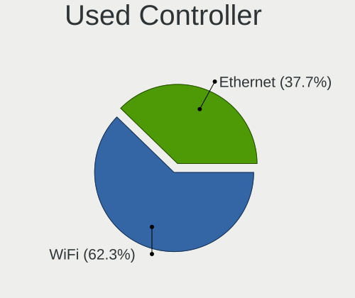

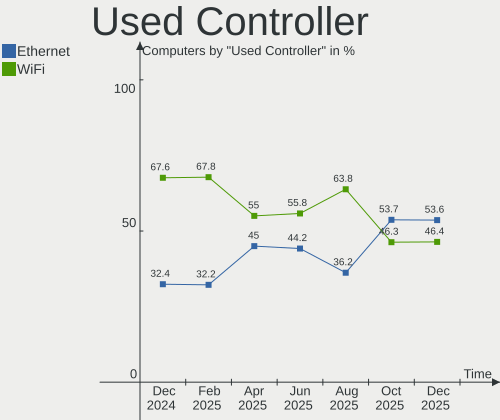

| Kind     | Computers | Percent |
|----------|-----------|---------|
| Ethernet | 37        | 53.62%  |
| WiFi     | 32        | 46.38%  |

NICs
----

Total network controllers on board

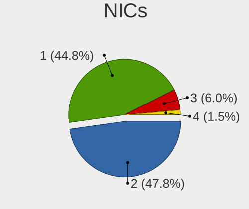

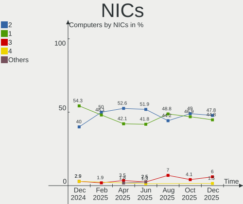

| Total | Computers | Percent |
|-------|-----------|---------|
| 2     | 32        | 47.76%  |
| 1     | 30        | 44.78%  |
| 3     | 4         | 5.97%   |
| 4     | 1         | 1.49%   |

IPv6
----

IPv6 vs IPv4

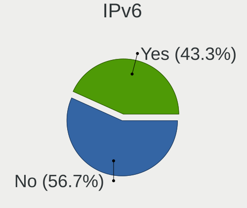

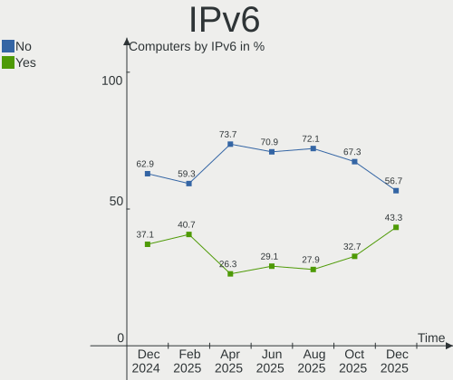

| Used | Computers | Percent |
|------|-----------|---------|
| No   | 38        | 56.72%  |
| Yes  | 29        | 43.28%  |

Bluetooth
---------

Bluetooth Vendor
----------------

Controller vendors

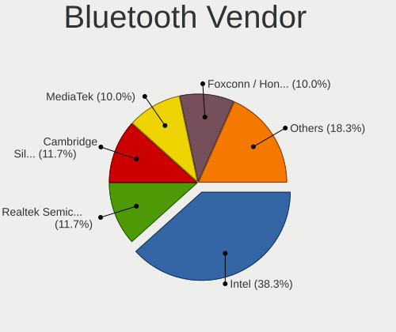

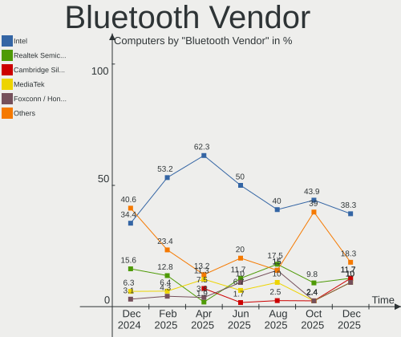

| Vendor                          | Computers | Percent |
|---------------------------------|-----------|---------|
| Intel                           | 23        | 38.33%  |
| Realtek Semiconductor           | 7         | 11.67%  |
| Cambridge Silicon Radio         | 7         | 11.67%  |
| MediaTek                        | 6         | 10%     |
| Foxconn / Hon Hai               | 6         | 10%     |
| IMC Networks                    | 3         | 5%      |
| Broadcom                        | 2         | 3.33%   |
| USI                             | 1         | 1.67%   |
| TP-Link                         | 1         | 1.67%   |
| Qualcomm Atheros Communications | 1         | 1.67%   |
| Lite-On Technology              | 1         | 1.67%   |
| ASUSTek Computer                | 1         | 1.67%   |
| Unknown                         | 1         | 1.67%   |

Bluetooth Model
---------------

Controller models

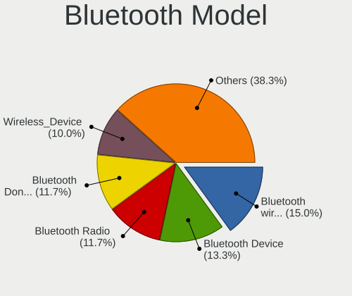

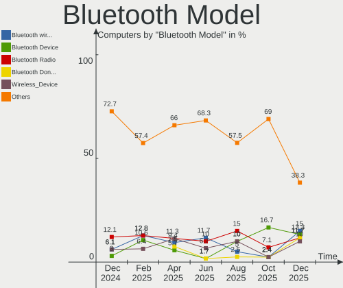

| Model                                               | Computers | Percent |
|-----------------------------------------------------|-----------|---------|
| Intel Bluetooth wireless interface                  | 9         | 15%     |
| Intel Bluetooth Device                              | 8         | 13.33%  |
| Realtek Bluetooth Radio                             | 7         | 11.67%  |
| Cambridge Silicon Radio Bluetooth Dongle (HCI mode) | 7         | 11.67%  |
| MediaTek Wireless_Device                            | 6         | 10%     |
| Foxconn / Hon Hai Wireless_Device                   | 3         | 5%      |
| Foxconn / Hon Hai Bluetooth Device                  | 3         | 5%      |
| Intel AX201 Bluetooth                               | 2         | 3.33%   |
| Intel AX200 Bluetooth                               | 2         | 3.33%   |
| IMC Networks Wireless_Device                        | 2         | 3.33%   |
| USI Bluetooth Device                                | 1         | 1.67%   |
| TP-Link TP-T@- UB500 Adapter                        | 1         | 1.67%   |
| Qualcomm Atheros AR3011 Bluetooth                   | 1         | 1.67%   |
| Lite-On Wireless_Device                             | 1         | 1.67%   |
| Intel Centrino Bluetooth Wireless Transceiver       | 1         | 1.67%   |
| Intel AX210 Bluetooth                               | 1         | 1.67%   |
| IMC Networks Bluetooth Radio                        | 1         | 1.67%   |
| Broadcom HP Portable Bumble Bee                     | 1         | 1.67%   |
| Broadcom Bluetooth 3.0 USB Dongle                   | 1         | 1.67%   |
| ASUS Broadcom BCM20702A0 Bluetooth                  | 1         | 1.67%   |
| Unknown                                             | 1         | 1.67%   |

Sound
-----

Sound Vendor
------------

Sound card vendors

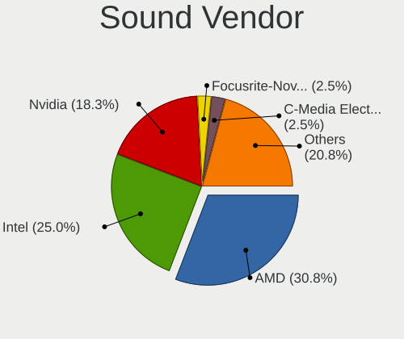

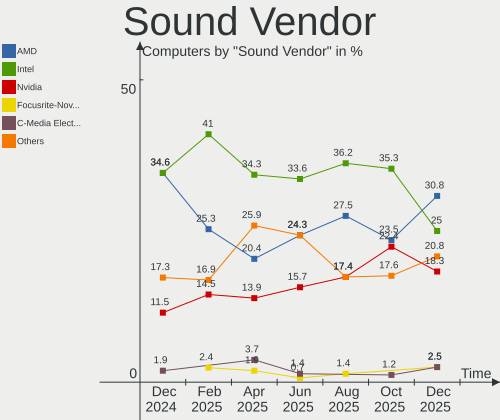

| Vendor                     | Computers | Percent |
|----------------------------|-----------|---------|
| AMD                        | 37        | 30.83%  |
| Intel                      | 30        | 25%     |
| Nvidia                     | 22        | 18.33%  |
| Focusrite-Novation         | 3         | 2.5%    |
| C-Media Electronics        | 3         | 2.5%    |
| Razer USA                  | 2         | 1.67%   |
| Micro Star International   | 2         | 1.67%   |
| Logitech                   | 2         | 1.67%   |
| ASUSTek Computer           | 2         | 1.67%   |
| Yamaha                     | 1         | 0.83%   |
| Weltrend Semiconductor     | 1         | 0.83%   |
| TT AUDIO                   | 1         | 0.83%   |
| Texas Instruments          | 1         | 0.83%   |
| SteelSeries ApS            | 1         | 0.83%   |
| Sony                       | 1         | 0.83%   |
| SOMIC Industrial           | 1         | 0.83%   |
| Shure                      | 1         | 0.83%   |
| Schiit Audio               | 1         | 0.83%   |
| Realtek Semiconductor      | 1         | 0.83%   |
| PreSonus Audio Electronics | 1         | 0.83%   |
| NZXT                       | 1         | 0.83%   |
| Meizu                      | 1         | 0.83%   |
| Kingston Technology        | 1         | 0.83%   |
| JMTek                      | 1         | 0.83%   |
| Corsair                    | 1         | 0.83%   |
| ASRock                     | 1         | 0.83%   |

Sound Model
-----------

Sound card models

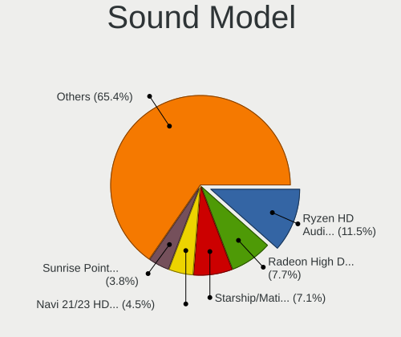

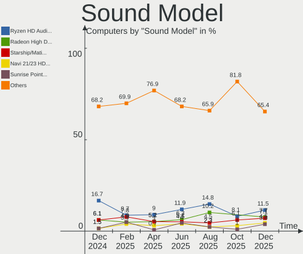

| Model                                                                      | Computers | Percent |
|----------------------------------------------------------------------------|-----------|---------|
| AMD Ryzen HD Audio Controller                                              | 18        | 11.54%  |
| AMD Radeon High Definition Audio Controller                                | 12        | 7.69%   |
| AMD Starship/Matisse HD Audio Controller                                   | 11        | 7.05%   |
| AMD Navi 21/23 HDMI/DP Audio Controller                                    | 7         | 4.49%   |
| Intel Sunrise Point-LP HD Audio                                            | 6         | 3.85%   |
| AMD Navi 48 HDMI/DP Audio Controller                                       | 6         | 3.85%   |
| Nvidia GA106 High Definition Audio Controller                              | 4         | 2.56%   |
| Nvidia AD104 High Definition Audio Controller                              | 4         | 2.56%   |
| AMD Navi 31 HDMI/DP Audio                                                  | 4         | 2.56%   |
| Intel Alder Lake-S HD Audio Controller                                     | 3         | 1.92%   |
| Intel 8 Series/C220 Series Chipset High Definition Audio Controller        | 3         | 1.92%   |
| AMD Renoir/Cezanne HDMI/DP Audio Controller                                | 3         | 1.92%   |
| AMD Family 17h (Models 00h-0fh) HD Audio Controller                        | 3         | 1.92%   |
| Nvidia TU104 HD Audio Controller                                           | 2         | 1.28%   |
| Nvidia GB206 High Definition Audio Controller                              | 2         | 1.28%   |
| Nvidia AD107 High Definition Audio Controller                              | 2         | 1.28%   |
| Micro Star International USB Audio                                         | 2         | 1.28%   |
| Intel Xeon E3-1200 v3/4th Gen Core Processor HD Audio Controller           | 2         | 1.28%   |
| Intel Raptor Lake-P/U/H cAVS                                               | 2         | 1.28%   |
| Intel Raptor Lake High Definition Audio Controller                         | 2         | 1.28%   |
| Intel Lunar Lake-M HD Audio Controller                                     | 2         | 1.28%   |
| Intel Ice Lake-LP Smart Sound Technology Audio Controller                  | 2         | 1.28%   |
| Intel 6 Series/C200 Series Chipset Family High Definition Audio Controller | 2         | 1.28%   |
| ASUSTek Computer USB Audio                                                 | 2         | 1.28%   |
| AMD Raven/Raven2/Fenghuang HDMI/DP Audio Controller                        | 2         | 1.28%   |
| AMD Navi 10 HDMI Audio                                                     | 2         | 1.28%   |
| AMD Ellesmere HDMI Audio [Radeon RX 470/480 / 570/580/590]                 | 2         | 1.28%   |
| Yamaha Steinberg UR12                                                      | 1         | 0.64%   |
| Weltrend Semiconductor H848 Wireless headset                               | 1         | 0.64%   |
| TT AUDIO TT USB AUDIO                                                      | 1         | 0.64%   |
| Texas Instruments PCM2902 Audio Codec                                      | 1         | 0.64%   |
| SteelSeries ApS SteelSeries Arctis Nova 5                                  | 1         | 0.64%   |
| Sony DualSense wireless controller (PS5)                                   | 1         | 0.64%   |
| SOMIC Industrial G941_White_Shark                                          | 1         | 0.64%   |
| Shure MV7                                                                  | 1         | 0.64%   |
| Schiit Audio Schiit Modi+                                                  | 1         | 0.64%   |
| Realtek Semiconductor USB Audio                                            | 1         | 0.64%   |
| Razer USA Razer Seiren Mini                                                | 1         | 0.64%   |
| Razer USA Razer BlackShark V2 X USB                                        | 1         | 0.64%   |
| PreSonus Audio Electronics PreSonus AudioBox iTwo                          | 1         | 0.64%   |

Memory
------

Memory Vendor
-------------

Memory module vendors

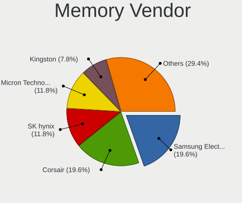

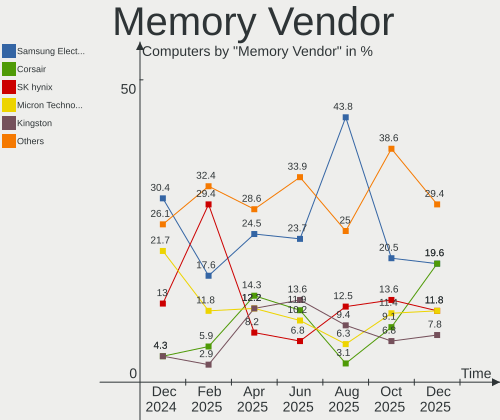

| Vendor              | Computers | Percent |
|---------------------|-----------|---------|
| Samsung Electronics | 10        | 19.61%  |
| Corsair             | 10        | 19.61%  |
| SK hynix            | 6         | 11.76%  |
| Micron Technology   | 6         | 11.76%  |
| Kingston            | 4         | 7.84%   |
| Unknown             | 4         | 7.84%   |
| Unknown             | 2         | 3.92%   |
| Team                | 2         | 3.92%   |
| Patriot             | 2         | 3.92%   |
| G.Skill             | 2         | 3.92%   |
| Crucial             | 1         | 1.96%   |
| Avant               | 1         | 1.96%   |
| A-DATA Technology   | 1         | 1.96%   |

Memory Model
------------

Memory module models

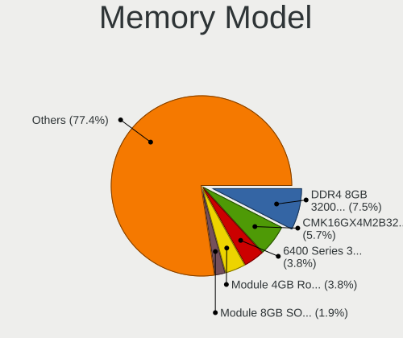

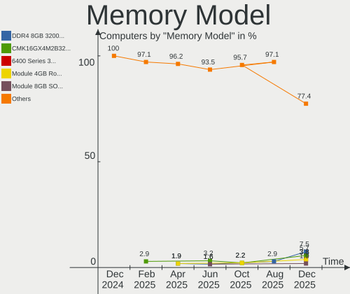

| Model                                                            | Computers | Percent |
|------------------------------------------------------------------|-----------|---------|
| Unknown                                                          | 4         | 7.55%   |
| Corsair RAM CMK16GX4M2B3200C16 8GB DIMM DDR4 3600MT/s            | 3         | 5.66%   |
| Patriot RAM 6400 Series 32GB DIMM DDR5 6400MT/s                  | 2         | 3.77%   |
| Micron RAM Module 4GB Row Of Chips LPDDR5 8533MT/s               | 2         | 3.77%   |
| Unknown RAM Module 8GB SODIMM DDR4 2400MT/s                      | 1         | 1.89%   |
| Unknown RAM 3600 C18 Series 16GB DIMM DDR4 2933MT/s              | 1         | 1.89%   |
| Team RAM UD5-6000 16GB DIMM DDR5 6000MT/s                        | 1         | 1.89%   |
| Team RAM UD.-6000 16GB DIMM DDR5 4800MT/s                        | 1         | 1.89%   |
| Team RAM TEAMGROUP-UD4-3200 8GB DIMM DDR4 3733MT/s               | 1         | 1.89%   |
| SK hynix RAM Module 32GB SODIMM DDR5 5600MT/s                    | 1         | 1.89%   |
| SK hynix RAM HMT451S6BFR8A-PB 4GB SODIMM DDR3 1600MT/s           | 1         | 1.89%   |
| SK hynix RAM HMAA2GS6CJR8N-XN 16GB SODIMM DDR4 3200MT/s          | 1         | 1.89%   |
| SK hynix RAM HMAA1GS6CMR6N-VK 8GB SODIMM DDR4 2667MT/s           | 1         | 1.89%   |
| SK hynix RAM HMA851S6CJR6N-VK 4GB SODIMM DDR4 2667MT/s           | 1         | 1.89%   |
| SK hynix RAM H9CCNNNCLTALAR-NTD 4GB Row Of Chips LPDDR3 1867MT/s | 1         | 1.89%   |
| Samsung RAM Module 8GB DIMM DDR4 3200MT/s                        | 1         | 1.89%   |
| Samsung RAM Module 8GB DIMM DDR3 1333MT/s                        | 1         | 1.89%   |
| Samsung RAM M471B5273CH0-CH9 4GB SODIMM DDR3 1334MT/s            | 1         | 1.89%   |
| Samsung RAM M471B5173QH0-YK0 4GB SODIMM DDR3 1600MT/s            | 1         | 1.89%   |
| Samsung RAM M471A1K43EB1-CWE 8GB SODIMM DDR4 3200MT/s            | 1         | 1.89%   |
| Samsung RAM M471A1K43DB1-CWE 8GB SODIMM DDR4 3200MT/s            | 1         | 1.89%   |
| Samsung RAM M471A1K43CB1-CRC 8GB SODIMM DDR4 8400MT/s            | 1         | 1.89%   |
| Samsung RAM M425R1GB4PB0-CWMT3 8GB Row Of Chips DDR5 5600MT/s    | 1         | 1.89%   |
| Samsung RAM K4UBE3D4AA-MGCL 8GB Row Of Chips LPDDR4 4267MT/s     | 1         | 1.89%   |
| Samsung RAM K3LK6K60BM-BGCP 8GB LPDDR5 6400MT/s                  | 1         | 1.89%   |
| Samsung RAM K3KL8L80CM-MGCT 2GB Row Of Chips LPDDR5 7500MT/s     | 1         | 1.89%   |
| Micron RAM MTC8C1084S1SC56BD1 K 16GiB SODIMM DDR5 5600MT/s       | 1         | 1.89%   |
| Micron RAM MTC4C10163S1SC56BD1 8GB SODIMM DDR5 5600MT/s          | 1         | 1.89%   |
| Micron RAM CP16G56C46U5.C8D 16GB DIMM DDR5 5600MT/s              | 1         | 1.89%   |
| Micron RAM 4ATF51264HZ-3G2R1 4GB SODIMM DDR4 3200MT/s            | 1         | 1.89%   |
| Kingston RAM KHX2400C12D4/8GX 8GiB DIMM DDR4 2400MT/s            | 1         | 1.89%   |
| Kingston RAM KF556C40-32 32GB DIMM DDR5 6000MT/s                 | 1         | 1.89%   |
| Kingston RAM KF3200C20S4/32GX 32GB SODIMM DDR4 3200MT/s          | 1         | 1.89%   |
| Kingston RAM KF2666C16D4/8G 8GB DIMM DDR4 2667MT/s               | 1         | 1.89%   |
| G.Skill RAM F5-6000J3040G32G 32GB DIMM DDR5 6200MT/s             | 1         | 1.89%   |
| G.Skill RAM F4-3600C16-16GVKC 16GB DIMM DDR4 3866MT/s            | 1         | 1.89%   |
| Crucial RAM CT16G4SFD824A 16GB SODIMM DDR4 2400MT/s              | 1         | 1.89%   |
| Corsair RAM CMK64GX5M2B6000Z30 32GB DIMM DDR5 6000MT/s           | 1         | 1.89%   |
| Corsair RAM CMK32GX4M2E3200C16 16GB DIMM DDR4 3600MT/s           | 1         | 1.89%   |
| Corsair RAM CMK32GX4M2B3200C16 16GB DIMM DDR4 3800MT/s           | 1         | 1.89%   |

Memory Kind
-----------

Memory module kinds

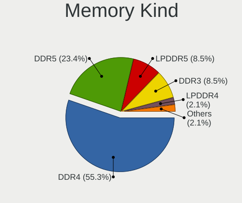

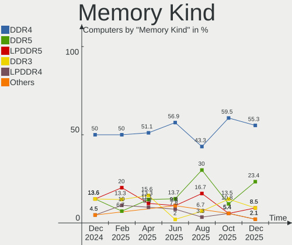

| Kind   | Computers | Percent |
|--------|-----------|---------|
| DDR4   | 26        | 55.32%  |
| DDR5   | 11        | 23.4%   |
| LPDDR5 | 4         | 8.51%   |
| DDR3   | 4         | 8.51%   |
| LPDDR4 | 1         | 2.13%   |
| LPDDR3 | 1         | 2.13%   |

Memory Form Factor
------------------

Physical design of the memory module

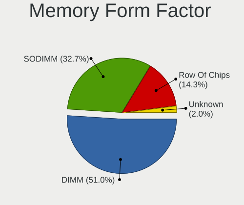

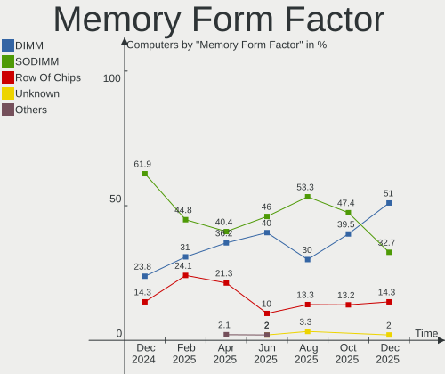

| Name         | Computers | Percent |
|--------------|-----------|---------|
| DIMM         | 25        | 51.02%  |
| SODIMM       | 16        | 32.65%  |
| Row Of Chips | 7         | 14.29%  |
| Unknown      | 1         | 2.04%   |

Memory Size
-----------

Memory module size

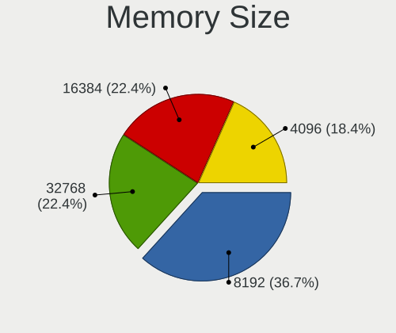

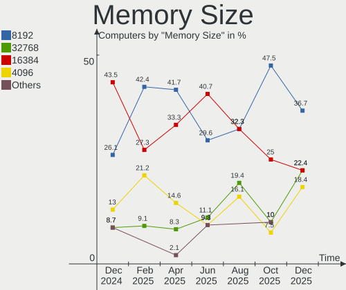

| Size  | Computers | Percent |
|-------|-----------|---------|
| 8192  | 18        | 36.73%  |
| 32768 | 11        | 22.45%  |
| 16384 | 11        | 22.45%  |
| 4096  | 9         | 18.37%  |

Memory Speed
------------

Memory module speed

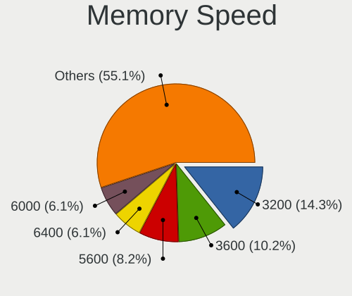

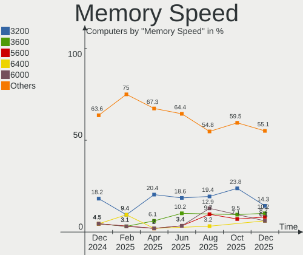

| Speed | Computers | Percent |
|-------|-----------|---------|
| 3200  | 7         | 14.29%  |
| 3600  | 5         | 10.2%   |
| 5600  | 4         | 8.16%   |
| 6400  | 3         | 6.12%   |
| 6000  | 3         | 6.12%   |
| 2667  | 3         | 6.12%   |
| 2400  | 3         | 6.12%   |
| 8533  | 2         | 4.08%   |
| 4800  | 2         | 4.08%   |
| 3866  | 2         | 4.08%   |
| 3100  | 2         | 4.08%   |
| 1600  | 2         | 4.08%   |
| 8400  | 1         | 2.04%   |
| 7500  | 1         | 2.04%   |
| 6200  | 1         | 2.04%   |
| 4267  | 1         | 2.04%   |
| 4000  | 1         | 2.04%   |
| 3800  | 1         | 2.04%   |
| 3733  | 1         | 2.04%   |
| 2133  | 1         | 2.04%   |
| 1867  | 1         | 2.04%   |
| 1334  | 1         | 2.04%   |
| 1333  | 1         | 2.04%   |

Printers & scanners
-------------------

Printer Vendor
--------------

Printer device vendors

Zero info for selected period =(

Printer Model
-------------

Printer device models

Zero info for selected period =(

Scanner Vendor
--------------

Scanner device vendors

Zero info for selected period =(

Scanner Model
-------------

Scanner device models

Zero info for selected period =(

Camera
------

Camera Vendor
-------------

Camera device vendors

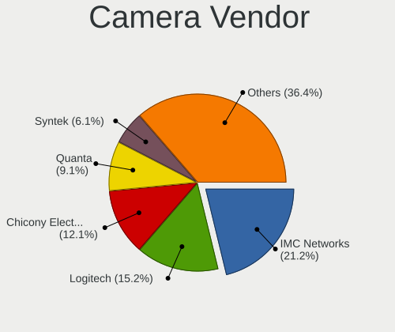

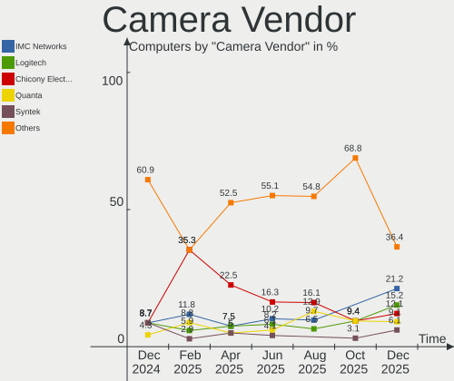

| Vendor                                 | Computers | Percent |
|----------------------------------------|-----------|---------|
| IMC Networks                           | 7         | 21.21%  |
| Logitech                               | 5         | 15.15%  |
| Chicony Electronics                    | 4         | 12.12%  |
| Quanta                                 | 3         | 9.09%   |
| Syntek                                 | 2         | 6.06%   |
| Bison Electronics                      | 2         | 6.06%   |
| Suyin                                  | 1         | 3.03%   |
| Sunplus Innovation Technology          | 1         | 3.03%   |
| Sonix Technology                       | 1         | 3.03%   |
| Realtek Semiconductor                  | 1         | 3.03%   |
| Luxvisions Innotech Limited            | 1         | 3.03%   |
| kingcome                               | 1         | 3.03%   |
| Jieli Technology                       | 1         | 3.03%   |
| Insta360                               | 1         | 3.03%   |
| Cheng Uei Precision Industry (Foxlink) | 1         | 3.03%   |
| BillionPixels                          | 1         | 3.03%   |

Camera Model
------------

Camera device models

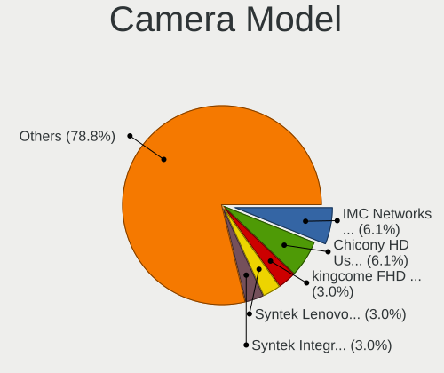

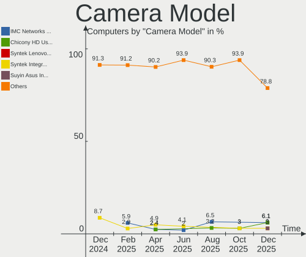

| Model                                                 | Computers | Percent |
|-------------------------------------------------------|-----------|---------|
| IMC Networks Integrated Camera                        | 2         | 6.06%   |
| Chicony HD User Facing                                | 2         | 6.06%   |
| Syntek Lenovo EasyCamera                              | 1         | 3.03%   |
| Syntek Integrated Camera                              | 1         | 3.03%   |
| Suyin Asus Integrated Webcam                          | 1         | 3.03%   |
| Sunplus HP X Camera                                   | 1         | 3.03%   |
| Sonix USB2.0 FHD UVC WebCam                           | 1         | 3.03%   |
| Realtek Integrated Camera                             | 1         | 3.03%   |
| Quanta HP Wide Vision HD Camera                       | 1         | 3.03%   |
| Quanta HP TrueVision HD Camera                        | 1         | 3.03%   |
| Quanta HD Camera                                      | 1         | 3.03%   |
| Luxvisions Innotech Limited HP True Vision FHD Camera | 1         | 3.03%   |
| Logitech Webcam C270                                  | 1         | 3.03%   |
| Logitech StreamCam                                    | 1         | 3.03%   |
| Logitech C922 Pro Stream Webcam                       | 1         | 3.03%   |
| Logitech C920 PRO HD Webcam                           | 1         | 3.03%   |
| Logitech Brio 101                                     | 1         | 3.03%   |
| kingcome FHD WebCam                                   | 1         | 3.03%   |
| Jieli USB Composite Device                            | 1         | 3.03%   |
| Insta360 Link 2                                       | 1         | 3.03%   |
| IMC Networks VGA UVC WebCam                           | 1         | 3.03%   |
| IMC Networks USB2.0 VGA UVC WebCam                    | 1         | 3.03%   |
| IMC Networks USB2.0 HD UVC WebCam                     | 1         | 3.03%   |
| IMC Networks USB2.0 HD IR UVC WebCam                  | 1         | 3.03%   |
| IMC Networks 2M Integrated Webcam                     | 1         | 3.03%   |
| Chicony Integrated Camera                             | 1         | 3.03%   |
| Chicony HD WebCam                                     | 1         | 3.03%   |
| Cheng Uei Precision Industry (Foxlink) HP HD Webcam   | 1         | 3.03%   |
| Bison ThinkPad P50 Integrated Camera                  | 1         | 3.03%   |
| Bison Integrated Camera                               | 1         | 3.03%   |
| BillionPixels USB2.0 FHD UVC WebCam                   | 1         | 3.03%   |

Security
--------

Fingerprint Vendor
------------------

Fingerprint sensor vendors

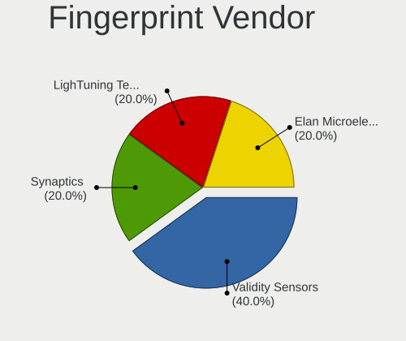

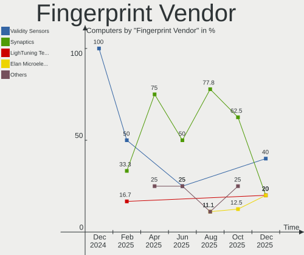

| Vendor                | Computers | Percent |
|-----------------------|-----------|---------|
| Validity Sensors      | 2         | 40%     |
| Synaptics             | 1         | 20%     |
| LighTuning Technology | 1         | 20%     |
| Elan Microelectronics | 1         | 20%     |

Fingerprint Model
-----------------

Fingerprint sensor models

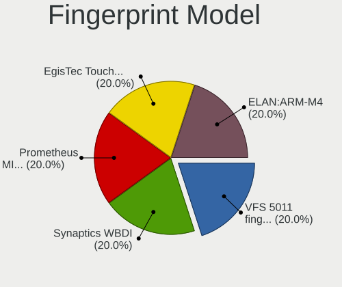

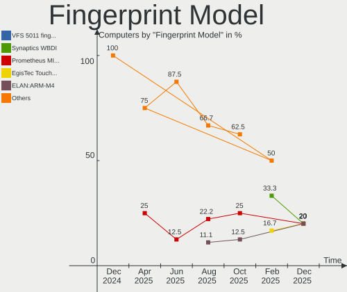

| Model                                             | Computers | Percent |
|---------------------------------------------------|-----------|---------|
| Validity Sensors VFS 5011 fingerprint sensor      | 1         | 20%     |
| Validity Sensors Synaptics WBDI                   | 1         | 20%     |
| Synaptics Prometheus MIS Touch Fingerprint Reader | 1         | 20%     |
| LighTuning EgisTec Touch Fingerprint Sensor       | 1         | 20%     |
| Elan ELAN:ARM-M4                                  | 1         | 20%     |

Chipcard Vendor
---------------

Chipcard module vendors

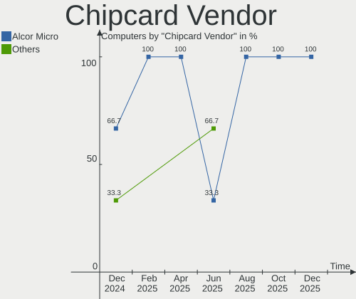

| Vendor      | Computers | Percent |
|-------------|-----------|---------|
| Alcor Micro | 2         | 100%    |

Chipcard Model
--------------

Chipcard module models

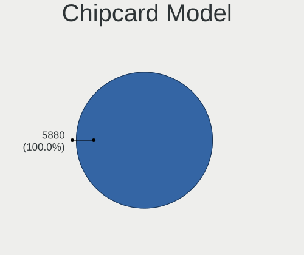

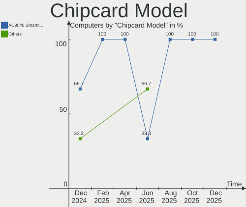

| Model                               | Computers | Percent |
|-------------------------------------|-----------|---------|
| Alcor Micro AU9540 Smartcard Reader | 2         | 100%    |

Unsupported
-----------

Unsupported Devices
-------------------

Total unsupported devices on board

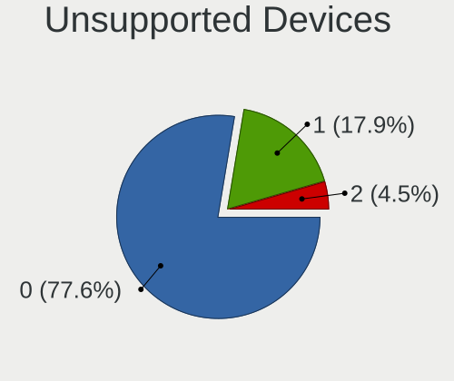

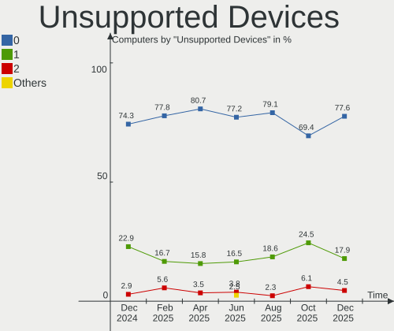

| Total | Computers | Percent |
|-------|-----------|---------|
| 0     | 52        | 77.61%  |
| 1     | 12        | 17.91%  |
| 2     | 3         | 4.48%   |

Unsupported Device Types
------------------------

Types of unsupported devices

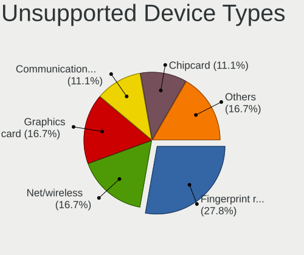

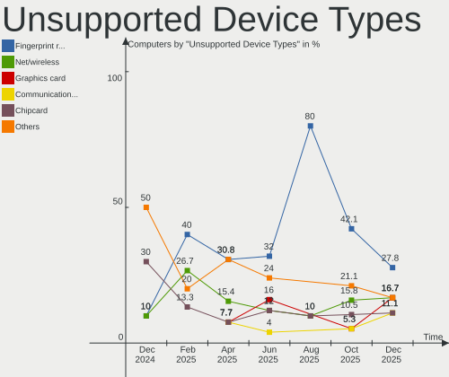

| Type                     | Computers | Percent |
|--------------------------|-----------|---------|
| Fingerprint reader       | 5         | 27.78%  |
| Net/wireless             | 3         | 16.67%  |
| Graphics card            | 3         | 16.67%  |
| Communication controller | 2         | 11.11%  |
| Chipcard                 | 2         | 11.11%  |
| Network                  | 1         | 5.56%   |
| Net/ethernet             | 1         | 5.56%   |
| Multimedia controller    | 1         | 5.56%   |

