EndeavourOS - Hardware Trends
-----------------------------

A project to identify most popular hardware characteristics and track their change
over time based on data collected by Linux users at https://Linux-Hardware.org.

Anyone can contribute to this report by the [hw-probe](https://github.com/linuxhw/hw-probe) tool:

    sudo -E hw-probe -all -upload

This is a report for all computer types. See also reports for [desktops](/Dist/EndeavourOS/Desktop/README.md) and [notebooks](/Dist/EndeavourOS/Notebook/README.md).

This report is for one last month. Overall report since the beginning of time: [TestDays](https://github.com/linuxhw/TestDays)

Period: Apr, 2023.

Contents
--------

* [ System ](#system)
  - [ OS                       ](#os)
  - [ OS Family                ](#os-family)
  - [ Kernel                   ](#kernel)
  - [ Kernel Family            ](#kernel-family)
  - [ Kernel Major Ver.        ](#kernel-major-ver)
  - [ Arch                     ](#arch)
  - [ DE                       ](#de)
  - [ Display Server           ](#display-server)
  - [ Display Manager          ](#display-manager)
  - [ OS Lang                  ](#os-lang)
  - [ Boot Mode                ](#boot-mode)
  - [ Filesystem               ](#filesystem)
  - [ Part. scheme             ](#part-scheme)
  - [ Dual Boot with Linux/BSD ](#dual-boot-with-linuxbsd)
  - [ Dual Boot (Win)          ](#dual-boot-win)

* [ Board ](#board)
  - [ Vendor                   ](#vendor)
  - [ Model                    ](#model)
  - [ Model Family             ](#model-family)
  - [ MFG Year                 ](#mfg-year)
  - [ Form Factor              ](#form-factor)
  - [ Secure Boot              ](#secure-boot)
  - [ Coreboot                 ](#coreboot)
  - [ RAM Size                 ](#ram-size)
  - [ RAM Used                 ](#ram-used)
  - [ Total Drives             ](#total-drives)
  - [ Has CD-ROM               ](#has-cd-rom)
  - [ Has Ethernet             ](#has-ethernet)
  - [ Has WiFi                 ](#has-wifi)
  - [ Has Bluetooth            ](#has-bluetooth)

* [ Location ](#location)
  - [ Country                  ](#country)
  - [ City                     ](#city)

* [ Drives ](#drives)
  - [ Drive Vendor             ](#drive-vendor)
  - [ Drive Model              ](#drive-model)
  - [ HDD Vendor               ](#hdd-vendor)
  - [ SSD Vendor               ](#ssd-vendor)
  - [ Drive Kind               ](#drive-kind)
  - [ Drive Connector          ](#drive-connector)
  - [ Drive Size               ](#drive-size)
  - [ Space Total              ](#space-total)
  - [ Space Used               ](#space-used)
  - [ Malfunc. Drives          ](#malfunc-drives)
  - [ Malfunc. Drive Vendor    ](#malfunc-drive-vendor)
  - [ Malfunc. HDD Vendor      ](#malfunc-hdd-vendor)
  - [ Malfunc. Drive Kind      ](#malfunc-drive-kind)
  - [ Failed Drives            ](#failed-drives)
  - [ Failed Drive Vendor      ](#failed-drive-vendor)
  - [ Drive Status             ](#drive-status)

* [ Storage controller ](#storage-controller)
  - [ Storage Vendor           ](#storage-vendor)
  - [ Storage Model            ](#storage-model)
  - [ Storage Kind             ](#storage-kind)

* [ Processor ](#processor)
  - [ CPU Vendor               ](#cpu-vendor)
  - [ CPU Model                ](#cpu-model)
  - [ CPU Model Family         ](#cpu-model-family)
  - [ CPU Cores                ](#cpu-cores)
  - [ CPU Sockets              ](#cpu-sockets)
  - [ CPU Threads              ](#cpu-threads)
  - [ CPU Op-Modes             ](#cpu-op-modes)
  - [ CPU Microcode            ](#cpu-microcode)
  - [ CPU Microarch            ](#cpu-microarch)

* [ Graphics ](#graphics)
  - [ GPU Vendor               ](#gpu-vendor)
  - [ GPU Model                ](#gpu-model)
  - [ GPU Combo                ](#gpu-combo)
  - [ GPU Driver               ](#gpu-driver)
  - [ GPU Memory               ](#gpu-memory)

* [ Monitor ](#monitor)
  - [ Monitor Vendor           ](#monitor-vendor)
  - [ Monitor Model            ](#monitor-model)
  - [ Monitor Resolution       ](#monitor-resolution)
  - [ Monitor Diagonal         ](#monitor-diagonal)
  - [ Monitor Width            ](#monitor-width)
  - [ Aspect Ratio             ](#aspect-ratio)
  - [ Monitor Area             ](#monitor-area)
  - [ Pixel Density            ](#pixel-density)
  - [ Multiple Monitors        ](#multiple-monitors)

* [ Network ](#network)
  - [ Net Controller Vendor    ](#net-controller-vendor)
  - [ Net Controller Model     ](#net-controller-model)
  - [ Wireless Vendor          ](#wireless-vendor)
  - [ Wireless Model           ](#wireless-model)
  - [ Ethernet Vendor          ](#ethernet-vendor)
  - [ Ethernet Model           ](#ethernet-model)
  - [ Net Controller Kind      ](#net-controller-kind)
  - [ Used Controller          ](#used-controller)
  - [ NICs                     ](#nics)
  - [ IPv6                     ](#ipv6)

* [ Bluetooth ](#bluetooth)
  - [ Bluetooth Vendor         ](#bluetooth-vendor)
  - [ Bluetooth Model          ](#bluetooth-model)

* [ Sound ](#sound)
  - [ Sound Vendor             ](#sound-vendor)
  - [ Sound Model              ](#sound-model)

* [ Memory ](#memory)
  - [ Memory Vendor            ](#memory-vendor)
  - [ Memory Model             ](#memory-model)
  - [ Memory Kind              ](#memory-kind)
  - [ Memory Form Factor       ](#memory-form-factor)
  - [ Memory Size              ](#memory-size)
  - [ Memory Speed             ](#memory-speed)

* [ Printers & scanners ](#printers--scanners)
  - [ Printer Vendor           ](#printer-vendor)
  - [ Printer Model            ](#printer-model)
  - [ Scanner Vendor           ](#scanner-vendor)
  - [ Scanner Model            ](#scanner-model)

* [ Camera ](#camera)
  - [ Camera Vendor            ](#camera-vendor)
  - [ Camera Model             ](#camera-model)

* [ Security ](#security)
  - [ Fingerprint Vendor       ](#fingerprint-vendor)
  - [ Fingerprint Model        ](#fingerprint-model)
  - [ Chipcard Vendor          ](#chipcard-vendor)
  - [ Chipcard Model           ](#chipcard-model)

* [ Unsupported ](#unsupported)
  - [ Unsupported Devices      ](#unsupported-devices)
  - [ Unsupported Device Types ](#unsupported-device-types)

System
------

OS
--

Installed operating systems

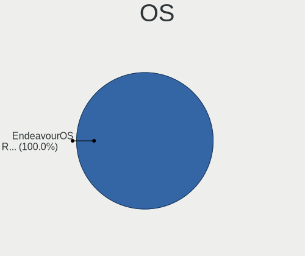

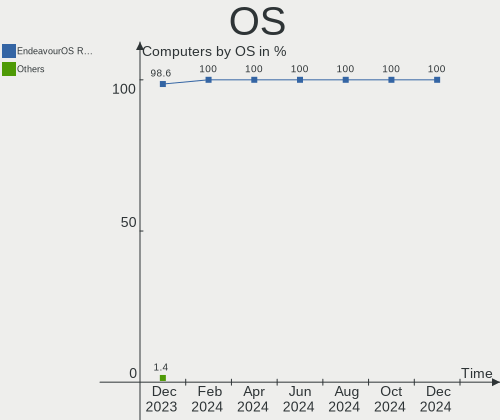

| Name                | Computers | Percent |
|---------------------|-----------|---------|
| EndeavourOS Rolling | 48        | 100%    |

OS Family
---------

OS without a version

| Name        | Computers | Percent |
|-------------|-----------|---------|
| EndeavourOS | 48        | 100%    |

Kernel
------

Version of the Linux kernel

| Version              | Computers | Percent |
|----------------------|-----------|---------|
| 6.2.10-arch1-1       | 9         | 18.75%  |
| 6.2.9-arch1-1        | 8         | 16.67%  |
| 6.2.8-arch1-1        | 6         | 12.5%   |
| 6.2.12-arch1-1       | 5         | 10.42%  |
| 6.2.13-arch1-1       | 4         | 8.33%   |
| 6.2.9-zen1-1-zen     | 2         | 4.17%   |
| 6.2.8-zen1-1-zen     | 2         | 4.17%   |
| 6.2.11-arch1-1       | 2         | 4.17%   |
| 6.2.10-zen1-1-zen    | 2         | 4.17%   |
| 6.1.22-1-lts         | 2         | 4.17%   |
| 6.2.9-arch1-1-custom | 1         | 2.08%   |
| 6.2.13-zen-1-zen     | 1         | 2.08%   |
| 6.2.12-zen1-1-zen    | 1         | 2.08%   |
| 6.2.11-zen1-1-zen    | 1         | 2.08%   |
| 6.1.24-1-lts         | 1         | 2.08%   |
| 6.1.23-1-lts         | 1         | 2.08%   |

Kernel Family
-------------

Linux kernel without a distro release

| Version | Computers | Percent |
|---------|-----------|---------|
| 6.2.9   | 11        | 22.92%  |
| 6.2.10  | 11        | 22.92%  |
| 6.2.8   | 8         | 16.67%  |
| 6.2.12  | 6         | 12.5%   |
| 6.2.13  | 5         | 10.42%  |
| 6.2.11  | 3         | 6.25%   |
| 6.1.22  | 2         | 4.17%   |
| 6.1.24  | 1         | 2.08%   |
| 6.1.23  | 1         | 2.08%   |

Kernel Major Ver.
-----------------

Linux kernel major version

| Version | Computers | Percent |
|---------|-----------|---------|
| 6.2     | 44        | 91.67%  |
| 6.1     | 4         | 8.33%   |

Arch
----

OS architecture (x86_64, i586, etc.)

| Name   | Computers | Percent |
|--------|-----------|---------|
| x86_64 | 48        | 100%    |

DE
--

Desktop Environment

| Name       | Computers | Percent |
|------------|-----------|---------|
| KDE5       | 18        | 37.5%   |
| GNOME      | 11        | 22.92%  |
| XFCE       | 7         | 14.58%  |
| i3         | 4         | 8.33%   |
| X-Cinnamon | 2         | 4.17%   |
| qtile      | 1         | 2.08%   |
| LXQt       | 1         | 2.08%   |
| LXDE       | 1         | 2.08%   |
| KDE        | 1         | 2.08%   |
| Budgie     | 1         | 2.08%   |
| Unknown    | 1         | 2.08%   |

Display Server
--------------

X11 or Wayland

| Name    | Computers | Percent |
|---------|-----------|---------|
| X11     | 32        | 66.67%  |
| Wayland | 13        | 27.08%  |
| Tty     | 2         | 4.17%   |
| Unknown | 1         | 2.08%   |

Display Manager
---------------

SDDM, LightDM, etc.

| Name    | Computers | Percent |
|---------|-----------|---------|
| LightDM | 18        | 37.5%   |
| SDDM    | 15        | 31.25%  |
| Unknown | 8         | 16.67%  |
| GDM     | 7         | 14.58%  |

OS Lang
-------

Language

| Lang  | Computers | Percent |
|-------|-----------|---------|
| en_US | 24        | 50%     |
| it_IT | 4         | 8.33%   |
| de_DE | 4         | 8.33%   |
| en_IN | 3         | 6.25%   |
| en_CA | 3         | 6.25%   |
| nl_NL | 2         | 4.17%   |
| es_ES | 2         | 4.17%   |
| tr_TR | 1         | 2.08%   |
| ru_RU | 1         | 2.08%   |
| en_GB | 1         | 2.08%   |
| en_AU | 1         | 2.08%   |
| de_AT | 1         | 2.08%   |
| C     | 1         | 2.08%   |

Boot Mode
---------

EFI or BIOS

| Mode | Computers | Percent |
|------|-----------|---------|
| EFI  | 37        | 77.08%  |
| BIOS | 11        | 22.92%  |

Filesystem
----------

Type of filesystem

| Type    | Computers | Percent |
|---------|-----------|---------|
| Ext4    | 27        | 56.25%  |
| Btrfs   | 14        | 29.17%  |
| Tmpfs   | 3         | 6.25%   |
| Overlay | 2         | 4.17%   |
| Xfs     | 1         | 2.08%   |
| F2fs    | 1         | 2.08%   |

Part. scheme
------------

Scheme of partitioning

| Type    | Computers | Percent |
|---------|-----------|---------|
| GPT     | 39        | 81.25%  |
| Unknown | 5         | 10.42%  |
| MBR     | 4         | 8.33%   |

Dual Boot with Linux/BSD
------------------------

Hosting more than one Linux/BSD

| Dual boot | Computers | Percent |
|-----------|-----------|---------|
| No        | 37        | 77.08%  |
| Yes       | 11        | 22.92%  |

Dual Boot (Win)
---------------

Hosting Linux and Windows

| Dual boot | Computers | Percent |
|-----------|-----------|---------|
| No        | 28        | 58.33%  |
| Yes       | 20        | 41.67%  |

Board
-----

Vendor
------

Motherboard manufacturer

| Name                | Computers | Percent |
|---------------------|-----------|---------|
| Lenovo              | 10        | 20.83%  |
| MSI                 | 7         | 14.58%  |
| Hewlett-Packard     | 6         | 12.5%   |
| Gigabyte Technology | 5         | 10.42%  |
| ASUSTek Computer    | 4         | 8.33%   |
| Dell                | 3         | 6.25%   |
| Apple               | 3         | 6.25%   |
| Notebook            | 2         | 4.17%   |
| Acer                | 2         | 4.17%   |
| Timi                | 1         | 2.08%   |
| Sony                | 1         | 2.08%   |
| Samsung Electronics | 1         | 2.08%   |
| PC Specialist       | 1         | 2.08%   |
| HUAWEI              | 1         | 2.08%   |
| Unknown             | 1         | 2.08%   |

Model
-----

Motherboard model

| Name                                      | Computers | Percent |
|-------------------------------------------|-----------|---------|
| Apple MacBookAir7,2                       | 2         | 4.17%   |
| Unknown                                   | 2         | 4.17%   |
| Timi Redmi Book Pro 15 2022               | 1         | 2.08%   |
| Sony SVE1713X1EB                          | 1         | 2.08%   |
| Samsung 950QDB                            | 1         | 2.08%   |
| PC Specialist Elimina Iv 17               | 1         | 2.08%   |
| Notebook W65_W67RB                        | 1         | 2.08%   |
| Notebook NH5x_NH7xHP                      | 1         | 2.08%   |
| MSI MS-7D75                               | 1         | 2.08%   |
| MSI MS-7D25                               | 1         | 2.08%   |
| MSI MS-7C52                               | 1         | 2.08%   |
| MSI MS-7B79                               | 1         | 2.08%   |
| MSI Modern 15 A11SBU                      | 1         | 2.08%   |
| MSI Modern 14 C7M                         | 1         | 2.08%   |
| MSI GP60 2QE                              | 1         | 2.08%   |
| Lenovo ThinkPad X13 Yoga Gen 2 20W8003CHH | 1         | 2.08%   |
| Lenovo ThinkPad T495s 20QKS2R403          | 1         | 2.08%   |
| Lenovo ThinkPad T490 20N20008US           | 1         | 2.08%   |
| Lenovo ThinkPad T480s 20L8S0ER00          | 1         | 2.08%   |
| Lenovo ThinkPad T450 20BUS0QT04           | 1         | 2.08%   |
| Lenovo ThinkPad T440 20B7S0JC0K           | 1         | 2.08%   |
| Lenovo ThinkPad L14 Gen 3 21C6S08E00      | 1         | 2.08%   |
| Lenovo ThinkBook 16 G4+ ARA 21D1          | 1         | 2.08%   |
| Lenovo ThinkBook 13s G4 ARB 21AS          | 1         | 2.08%   |
| Lenovo IdeaPad 5 Pro 16ACH6 82L5          | 1         | 2.08%   |
| HUAWEI HLYL-WXX9                          | 1         | 2.08%   |
| HP ZBook 17 G2                            | 1         | 2.08%   |
| HP ProDesk 600 G6 Desktop Mini PC         | 1         | 2.08%   |
| HP EliteDesk 800 G1 TWR                   | 1         | 2.08%   |
| HP EliteBook 840 G7 Notebook PC           | 1         | 2.08%   |
| HP 250 G4                                 | 1         | 2.08%   |
| Gigabyte X670 AORUS ELITE AX              | 1         | 2.08%   |
| Gigabyte X570 AORUS ELITE                 | 1         | 2.08%   |
| Gigabyte H87M-D3H                         | 1         | 2.08%   |
| Gigabyte B450 AORUS ELITE                 | 1         | 2.08%   |
| Gigabyte B365M D3H                        | 1         | 2.08%   |
| Dell Latitude 5580                        | 1         | 2.08%   |
| Dell Inspiron 5402                        | 1         | 2.08%   |
| Dell Inspiron 15 3520                     | 1         | 2.08%   |
| ASUS X55A                                 | 1         | 2.08%   |

Model Family
------------

Motherboard model prefix

| Name                  | Computers | Percent |
|-----------------------|-----------|---------|
| Lenovo ThinkPad       | 7         | 14.58%  |
| MSI Modern            | 2         | 4.17%   |
| Lenovo ThinkBook      | 2         | 4.17%   |
| Dell Inspiron         | 2         | 4.17%   |
| Apple MacBookAir7     | 2         | 4.17%   |
| Acer Aspire           | 2         | 4.17%   |
| Unknown               | 2         | 4.17%   |
| Timi Redmi            | 1         | 2.08%   |
| Sony SVE1713X1EB      | 1         | 2.08%   |
| Samsung 950QDB        | 1         | 2.08%   |
| PC Specialist Elimina | 1         | 2.08%   |
| Notebook W65          | 1         | 2.08%   |
| Notebook NH5x         | 1         | 2.08%   |
| MSI MS-7D75           | 1         | 2.08%   |
| MSI MS-7D25           | 1         | 2.08%   |
| MSI MS-7C52           | 1         | 2.08%   |
| MSI MS-7B79           | 1         | 2.08%   |
| MSI GP60              | 1         | 2.08%   |
| Lenovo IdeaPad        | 1         | 2.08%   |
| HUAWEI HLYL-WXX9      | 1         | 2.08%   |
| HP ZBook              | 1         | 2.08%   |
| HP ProDesk            | 1         | 2.08%   |
| HP EliteDesk          | 1         | 2.08%   |
| HP EliteBook          | 1         | 2.08%   |
| HP 250                | 1         | 2.08%   |
| Gigabyte X670         | 1         | 2.08%   |
| Gigabyte X570         | 1         | 2.08%   |
| Gigabyte H87M-D3H     | 1         | 2.08%   |
| Gigabyte B450         | 1         | 2.08%   |
| Gigabyte B365M        | 1         | 2.08%   |
| Dell Latitude         | 1         | 2.08%   |
| ASUS X55A             | 1         | 2.08%   |
| ASUS VivoBook         | 1         | 2.08%   |
| ASUS ROG              | 1         | 2.08%   |
| ASUS ASUS             | 1         | 2.08%   |
| Apple MacBookAir6     | 1         | 2.08%   |

MFG Year
--------

Motherboard manufacture year

| Year | Computers | Percent |
|------|-----------|---------|
| 2022 | 10        | 20.83%  |
| 2021 | 10        | 20.83%  |
| 2019 | 5         | 10.42%  |
| 2015 | 5         | 10.42%  |
| 2020 | 4         | 8.33%   |
| 2018 | 4         | 8.33%   |
| 2013 | 4         | 8.33%   |
| 2014 | 2         | 4.17%   |
| 2012 | 2         | 4.17%   |
| 2017 | 1         | 2.08%   |
| 2016 | 1         | 2.08%   |

Form Factor
-----------

Physical design of the computer

| Name        | Computers | Percent |
|-------------|-----------|---------|
| Notebook    | 34        | 70.83%  |
| Desktop     | 11        | 22.92%  |
| Convertible | 2         | 4.17%   |
| Mini pc     | 1         | 2.08%   |

Secure Boot
-----------

Enabled or disabled

| State    | Computers | Percent |
|----------|-----------|---------|
| Disabled | 46        | 95.83%  |
| Enabled  | 2         | 4.17%   |

Coreboot
--------

Have coreboot on board

| Used | Computers | Percent |
|------|-----------|---------|
| No   | 48        | 100%    |

RAM Size
--------

Total RAM memory

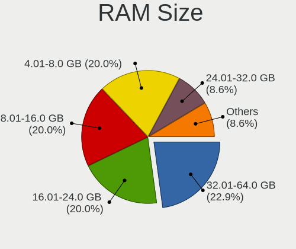

| Size in GB  | Computers | Percent |
|-------------|-----------|---------|
| 8.01-16.0   | 12        | 25%     |
| 16.01-24.0  | 10        | 20.83%  |
| 32.01-64.0  | 9         | 18.75%  |
| 4.01-8.0    | 7         | 14.58%  |
| 24.01-32.0  | 5         | 10.42%  |
| 3.01-4.0    | 3         | 6.25%   |
| 64.01-256.0 | 1         | 2.08%   |
| 1.01-2.0    | 1         | 2.08%   |

RAM Used
--------

Used RAM memory

| Used GB    | Computers | Percent |
|------------|-----------|---------|
| 4.01-8.0   | 16        | 33.33%  |
| 3.01-4.0   | 10        | 20.83%  |
| 1.01-2.0   | 9         | 18.75%  |
| 2.01-3.0   | 7         | 14.58%  |
| 8.01-16.0  | 4         | 8.33%   |
| 16.01-24.0 | 2         | 4.17%   |

Total Drives
------------

Number of drives on board

| Drives | Computers | Percent |
|--------|-----------|---------|
| 1      | 26        | 54.17%  |
| 2      | 13        | 27.08%  |
| 3      | 5         | 10.42%  |
| 6      | 2         | 4.17%   |
| 8      | 1         | 2.08%   |
| 5      | 1         | 2.08%   |

Has CD-ROM
----------

Has CD-ROM on board

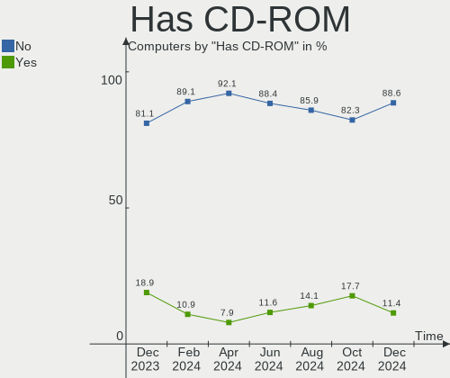

| Presented | Computers | Percent |
|-----------|-----------|---------|
| No        | 40        | 83.33%  |
| Yes       | 8         | 16.67%  |

Has Ethernet
------------

Has Ethernet on board

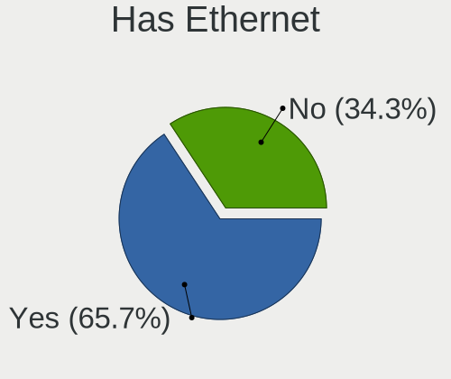

| Presented | Computers | Percent |
|-----------|-----------|---------|
| Yes       | 34        | 70.83%  |
| No        | 14        | 29.17%  |

Has WiFi
--------

Has WiFi module

| Presented | Computers | Percent |
|-----------|-----------|---------|
| Yes       | 42        | 87.5%   |
| No        | 6         | 12.5%   |

Has Bluetooth
-------------

Has Bluetooth module

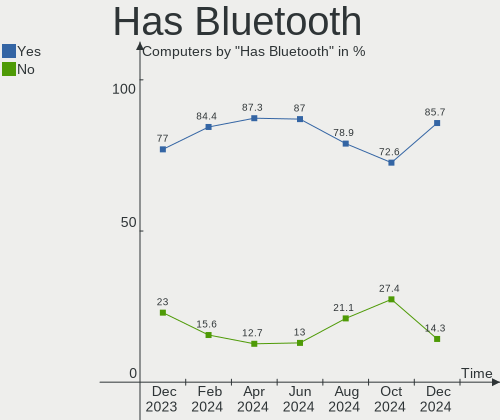

| Presented | Computers | Percent |
|-----------|-----------|---------|
| Yes       | 40        | 83.33%  |
| No        | 8         | 16.67%  |

Location
--------

Country
-------

Geographic location (country)

| Country     | Computers | Percent |
|-------------|-----------|---------|
| USA         | 7         | 14.58%  |
| Germany     | 6         | 12.5%   |
| Italy       | 5         | 10.42%  |
| Canada      | 4         | 8.33%   |
| Spain       | 3         | 6.25%   |
| Poland      | 3         | 6.25%   |
| India       | 3         | 6.25%   |
| Turkey      | 2         | 4.17%   |
| Russia      | 2         | 4.17%   |
| Brazil      | 2         | 4.17%   |
| Bangladesh  | 2         | 4.17%   |
| Vietnam     | 1         | 2.08%   |
| UK          | 1         | 2.08%   |
| UAE         | 1         | 2.08%   |
| Netherlands | 1         | 2.08%   |
| Mexico      | 1         | 2.08%   |
| Hong Kong   | 1         | 2.08%   |
| Greece      | 1         | 2.08%   |
| Austria     | 1         | 2.08%   |
| Australia   | 1         | 2.08%   |

City
----

Geographic location (city)

| City              | Computers | Percent |
|-------------------|-----------|---------|
| Wroclaw           | 1         | 2.08%   |
| Winnipeg          | 1         | 2.08%   |
| Warsaw            | 1         | 2.08%   |
| Suderbrarup       | 1         | 2.08%   |
| Sharjah           | 1         | 2.08%   |
| Seymour           | 1         | 2.08%   |
| Rostov-on-Don     | 1         | 2.08%   |
| Richmond Hill     | 1         | 2.08%   |
| Rexburg           | 1         | 2.08%   |
| Piraeus           | 1         | 2.08%   |
| Nuremberg         | 1         | 2.08%   |
| Narayanganj       | 1         | 2.08%   |
| Montreal          | 1         | 2.08%   |
| Milan             | 1         | 2.08%   |
| Mesa              | 1         | 2.08%   |
| Melbourne         | 1         | 2.08%   |
| Marino            | 1         | 2.08%   |
| Madrid            | 1         | 2.08%   |
| Ludhiana          | 1         | 2.08%   |
| Longmont          | 1         | 2.08%   |
| Laxolo            | 1         | 2.08%   |
| Kiel              | 1         | 2.08%   |
| Kazan’          | 1         | 2.08%   |
| Istanbul          | 1         | 2.08%   |
| Irun              | 1         | 2.08%   |
| Innsbruck         | 1         | 2.08%   |
| Hyderabad         | 1         | 2.08%   |
| Ho Chi Minh City  | 1         | 2.08%   |
| Heythuysen        | 1         | 2.08%   |
| Hamburg           | 1         | 2.08%   |
| Gelsenkirchen     | 1         | 2.08%   |
| Frankfurt am Main | 1         | 2.08%   |
| Fortaleza         | 1         | 2.08%   |
| Fort Lauderdale   | 1         | 2.08%   |
| Edinburgh         | 1         | 2.08%   |
| Dhaka             | 1         | 2.08%   |
| Cuernavaca        | 1         | 2.08%   |
| Coteau-du-Lac     | 1         | 2.08%   |
| Ciele             | 1         | 2.08%   |
| Cessaniti         | 1         | 2.08%   |

Drives
------

Drive Vendor
------------

Hard drive vendors

| Vendor                    | Computers | Drives | Percent |
|---------------------------|-----------|--------|---------|
| Samsung Electronics       | 14        | 16     | 16.47%  |
| Sandisk                   | 12        | 13     | 14.12%  |
| Seagate                   | 8         | 12     | 9.41%   |
| Micron Technology         | 6         | 6      | 7.06%   |
| Kingston                  | 6         | 7      | 7.06%   |
| WDC                       | 5         | 6      | 5.88%   |
| Crucial                   | 5         | 5      | 5.88%   |
| Unknown                   | 3         | 3      | 3.53%   |
| Silicon Motion            | 3         | 3      | 3.53%   |
| HGST                      | 3         | 3      | 3.53%   |
| Apple                     | 3         | 3      | 3.53%   |
| SK hynix                  | 2         | 2      | 2.35%   |
| Phison Electronics        | 2         | 2      | 2.35%   |
| KIOXIA                    | 2         | 2      | 2.35%   |
| Intel                     | 2         | 2      | 2.35%   |
| Timetec                   | 1         | 1      | 1.18%   |
| Super Talent              | 1         | 1      | 1.18%   |
| Realtek                   | 1         | 1      | 1.18%   |
| Micron/Crucial Technology | 1         | 1      | 1.18%   |
| Hitachi                   | 1         | 1      | 1.18%   |
| Blackpcs                  | 1         | 1      | 1.18%   |
| ADATA Technology          | 1         | 1      | 1.18%   |
| A-DATA Technology         | 1         | 1      | 1.18%   |
| Unknown                   | 1         | 1      | 1.18%   |

Drive Model
-----------

Hard drive models

| Model                                                  | Computers | Percent |
|--------------------------------------------------------|-----------|---------|
| Silicon Motion SM2263EN/SM2263XT SSD Controller 1024GB | 3         | 3.23%   |
| Sandisk WD Blue SN550 NVMe SSD 1024GB                  | 3         | 3.23%   |
| Samsung SSD 850 EVO 250GB                              | 3         | 3.23%   |
| Samsung NVMe SSD Controller PM9A1/PM9A3/980PRO 2TB     | 3         | 3.23%   |
| Crucial CT500MX500SSD1 500GB                           | 3         | 3.23%   |
| Seagate ST1000LM035-1RK172 970GB                       | 2         | 2.15%   |
| Sandisk WD_BLACK SN750 SE 500GB                        | 2         | 2.15%   |
| Sandisk WD Black SN750 / PC SN730 NVMe SSD 512GB       | 2         | 2.15%   |
| Kingston SA400S37120G 120GB SSD                        | 2         | 2.15%   |
| HGST HTS545050A7E680 500GB                             | 2         | 2.15%   |
| Crucial CT240BX500SSD1 240GB                           | 2         | 2.15%   |
| Apple SSD SM0128G 121GB                                | 2         | 2.15%   |
| WDC WDS120G2G0A-00JH30 120GB SSD                       | 1         | 1.08%   |
| WDC WD20EARS-42S0XB0 2TB                               | 1         | 1.08%   |
| WDC WD10EZEX-75WN4A1 1TB                               | 1         | 1.08%   |
| WDC WD10EZEX-75M2NA0 1TB                               | 1         | 1.08%   |
| WDC WD10EARS-00MVWB0 1TB                               | 1         | 1.08%   |
| Unknown MMC Card  64GB                                 | 1         | 1.08%   |
| Unknown MMC Card  16GB                                 | 1         | 1.08%   |
| Unknown MMC Card  128GB                                | 1         | 1.08%   |
| Timetec MS05 256GB SSD                                 | 1         | 1.08%   |
| Super Talent FTM1TN325H 1TB SSD                        | 1         | 1.08%   |
| SK hynix SKHynix_HFS512GDE9X084N 512GB                 | 1         | 1.08%   |
| SK hynix BC501 NVMe Solid State Drive 512GB            | 1         | 1.08%   |
| Seagate ST500LT012-1DG142 500GB                        | 1         | 1.08%   |
| Seagate ST500LM021-1KJ152 500GB                        | 1         | 1.08%   |
| Seagate ST500DM002-1BD142 500GB                        | 1         | 1.08%   |
| Seagate ST4000DM004-2U9104 4TB                         | 1         | 1.08%   |
| Seagate ST2000LX001-1RG174 2TB                         | 1         | 1.08%   |
| Seagate ST2000DM008-2UB102 2TB                         | 1         | 1.08%   |
| Seagate ST2000DM008-2FR102 2TB                         | 1         | 1.08%   |
| Seagate ST1000DM003-1ER162 1TB                         | 1         | 1.08%   |
| Seagate FireCuda 520 SSD ZP2000GM30002 2TB             | 1         | 1.08%   |
| Seagate Expansion 4TB                                  | 1         | 1.08%   |
| Sandisk WD_BLACK SN850X HS 2000GB                      | 1         | 1.08%   |
| Sandisk WDC WDS200T2B0C-00PXH0 2TB                     | 1         | 1.08%   |
| Sandisk WD Black SN850 1TB                             | 1         | 1.08%   |
| Sandisk WD Black 2018/SN750 / PC SN720 NVMe SSD 500GB  | 1         | 1.08%   |
| SanDisk SDSSDH3 1T00 1TB                               | 1         | 1.08%   |
| SanDisk SD7SB2Q-512G-1006 512GB SSD                    | 1         | 1.08%   |

HDD Vendor
----------

Hard disk drive vendors

| Vendor              | Computers | Drives | Percent |
|---------------------|-----------|--------|---------|
| Seagate             | 7         | 11     | 43.75%  |
| WDC                 | 4         | 5      | 25%     |
| HGST                | 3         | 3      | 18.75%  |
| Samsung Electronics | 1         | 1      | 6.25%   |
| Hitachi             | 1         | 1      | 6.25%   |

SSD Vendor
----------

Solid state drive vendors

| Vendor              | Computers | Drives | Percent |
|---------------------|-----------|--------|---------|
| Samsung Electronics | 7         | 8      | 25.93%  |
| Crucial             | 5         | 5      | 18.52%  |
| Kingston            | 3         | 4      | 11.11%  |
| Apple               | 3         | 3      | 11.11%  |
| SanDisk             | 2         | 2      | 7.41%   |
| WDC                 | 1         | 1      | 3.7%    |
| Timetec             | 1         | 1      | 3.7%    |
| Super Talent        | 1         | 1      | 3.7%    |
| Micron Technology   | 1         | 1      | 3.7%    |
| Intel               | 1         | 1      | 3.7%    |
| Blackpcs            | 1         | 1      | 3.7%    |
| Unknown             | 1         | 1      | 3.7%    |

Drive Kind
----------

HDD or SSD

| Kind | Computers | Drives | Percent |
|------|-----------|--------|---------|
| NVMe | 31        | 41     | 46.27%  |
| SSD  | 20        | 29     | 29.85%  |
| HDD  | 13        | 21     | 19.4%   |
| MMC  | 3         | 3      | 4.48%   |

Drive Connector
---------------

SATA, SAS, NVMe, etc.

| Type | Computers | Drives | Percent |
|------|-----------|--------|---------|
| NVMe | 31        | 40     | 50.82%  |
| SATA | 25        | 48     | 40.98%  |
| MMC  | 3         | 3      | 4.92%   |
| SAS  | 2         | 3      | 3.28%   |

Drive Size
----------

Size of hard drive

| Size in TB | Computers | Drives | Percent |
|------------|-----------|--------|---------|
| 0.01-0.5   | 20        | 29     | 57.14%  |
| 0.51-1.0   | 9         | 13     | 25.71%  |
| 1.01-2.0   | 4         | 6      | 11.43%  |
| 3.01-4.0   | 2         | 2      | 5.71%   |

Space Total
-----------

Amount of disk space available on the file system

| Size in GB     | Computers | Percent |
|----------------|-----------|---------|
| 101-250        | 8         | 16.67%  |
| 1001-2000      | 7         | 14.58%  |
| 501-1000       | 7         | 14.58%  |
| 1-20           | 6         | 12.5%   |
| 251-500        | 5         | 10.42%  |
| More than 3000 | 4         | 8.33%   |
| 2001-3000      | 4         | 8.33%   |
| 51-100         | 3         | 6.25%   |
| 21-50          | 2         | 4.17%   |
| Unknown        | 2         | 4.17%   |

Space Used
----------

Amount of used disk space

| Used GB        | Computers | Percent |
|----------------|-----------|---------|
| 1-20           | 14        | 29.17%  |
| 21-50          | 7         | 14.58%  |
| 101-250        | 7         | 14.58%  |
| 251-500        | 4         | 8.33%   |
| 1001-2000      | 4         | 8.33%   |
| 51-100         | 4         | 8.33%   |
| 501-1000       | 3         | 6.25%   |
| More than 3000 | 2         | 4.17%   |
| Unknown        | 2         | 4.17%   |
| 0              | 1         | 2.08%   |

Malfunc. Drives
---------------

Drive models with a malfunction

| Model                                 | Computers | Drives | Percent |
|---------------------------------------|-----------|--------|---------|
| HGST HTS545050A7E680 500GB            | 2         | 2      | 25%     |
| WDC WD10EARS-00MVWB0 1TB              | 1         | 1      | 12.5%   |
| Seagate ST500LT012-1DG142 500GB       | 1         | 1      | 12.5%   |
| Seagate ST500LM021-1KJ152 500GB       | 1         | 1      | 12.5%   |
| Seagate ST2000LX001-1RG174 2TB        | 1         | 1      | 12.5%   |
| Micron Technology 1100 SATA 512GB SSD | 1         | 1      | 12.5%   |
| Intel SSDSC2BB480G7 480GB             | 1         | 1      | 12.5%   |

Malfunc. Drive Vendor
---------------------

Vendors of faulty drives

| Vendor            | Computers | Drives | Percent |
|-------------------|-----------|--------|---------|
| Seagate           | 3         | 3      | 37.5%   |
| HGST              | 2         | 2      | 25%     |
| WDC               | 1         | 1      | 12.5%   |
| Micron Technology | 1         | 1      | 12.5%   |
| Intel             | 1         | 1      | 12.5%   |

Malfunc. HDD Vendor
-------------------

Vendors of faulty HDD drives

| Vendor  | Computers | Drives | Percent |
|---------|-----------|--------|---------|
| Seagate | 3         | 3      | 50%     |
| HGST    | 2         | 2      | 33.33%  |
| WDC     | 1         | 1      | 16.67%  |

Malfunc. Drive Kind
-------------------

Kinds of faulty drives

| Kind | Computers | Drives | Percent |
|------|-----------|--------|---------|
| HDD  | 5         | 6      | 83.33%  |
| SSD  | 1         | 2      | 16.67%  |

Failed Drives
-------------

Failed drive models

Zero info for selected period =(

Failed Drive Vendor
-------------------

Failed drive vendors

Zero info for selected period =(

Drive Status
------------

Number of failed and malfunc. drives

| Status   | Computers | Drives | Percent |
|----------|-----------|--------|---------|
| Works    | 39        | 65     | 67.24%  |
| Detected | 14        | 21     | 24.14%  |
| Malfunc  | 5         | 8      | 8.62%   |

Storage controller
------------------

Storage Vendor
--------------

Storage controller vendors

| Vendor                      | Computers | Percent |
|-----------------------------|-----------|---------|
| Intel                       | 21        | 29.17%  |
| SanDisk                     | 11        | 15.28%  |
| Samsung Electronics         | 9         | 12.5%   |
| AMD                         | 9         | 12.5%   |
| Micron Technology           | 5         | 6.94%   |
| Silicon Motion              | 3         | 4.17%   |
| Kingston Technology Company | 3         | 4.17%   |
| SK hynix                    | 2         | 2.78%   |
| Phison Electronics          | 2         | 2.78%   |
| KIOXIA                      | 2         | 2.78%   |
| ADATA Technology            | 2         | 2.78%   |
| Seagate Technology          | 1         | 1.39%   |
| Micron/Crucial Technology   | 1         | 1.39%   |
| ASMedia Technology          | 1         | 1.39%   |

Storage Model
-------------

Storage controller models

| Model                                                                            | Computers | Percent |
|----------------------------------------------------------------------------------|-----------|---------|
| AMD FCH SATA Controller [AHCI mode]                                              | 9         | 11.39%  |
| Micron NVMe Storage Controller                                                   | 4         | 5.06%   |
| Intel 8 Series/C220 Series Chipset Family 6-port SATA Controller 1 [AHCI mode]   | 4         | 5.06%   |
| Silicon Motion SM2263EN/SM2263XT SSD Controller                                  | 3         | 3.8%    |
| SanDisk WD Blue SN550 NVMe SSD                                                   | 3         | 3.8%    |
| SanDisk Non-Volatile memory controller                                           | 3         | 3.8%    |
| Samsung NVMe SSD Controller PM9A1/PM9A3/980PRO                                   | 3         | 3.8%    |
| Kingston Company Company Non-Volatile memory controller                          | 3         | 3.8%    |
| AMD 400 Series Chipset SATA Controller                                           | 3         | 3.8%    |
| SanDisk WD Black SN750 / PC SN730 NVMe SSD                                       | 2         | 2.53%   |
| Samsung NVMe SSD Controller 980                                                  | 2         | 2.53%   |
| Samsung Electronics SATA controller                                              | 2         | 2.53%   |
| KIOXIA Non-Volatile memory controller                                            | 2         | 2.53%   |
| Intel Volume Management Device NVMe RAID Controller                              | 2         | 2.53%   |
| Intel Alder Lake-P SATA AHCI Controller                                          | 2         | 2.53%   |
| Intel 7 Series Chipset Family 6-port SATA Controller [AHCI mode]                 | 2         | 2.53%   |
| SK hynix Gold P31/PC711 NVMe Solid State Drive                                   | 1         | 1.27%   |
| SK hynix BC501 NVMe Solid State Drive                                            | 1         | 1.27%   |
| Seagate FireCuda 520 SSD                                                         | 1         | 1.27%   |
| Sandisk Western Digital WD Black SN850X NVMe SSD                                 | 1         | 1.27%   |
| SanDisk WD PC SN810 / Black SN850 NVMe SSD                                       | 1         | 1.27%   |
| SanDisk WD Black 2018/SN750 / PC SN720 NVMe SSD                                  | 1         | 1.27%   |
| Samsung NVMe SSD Controller SM981/PM981/PM983                                    | 1         | 1.27%   |
| Samsung NVMe SSD Controller PM9B1                                                | 1         | 1.27%   |
| Samsung Apple PCIe SSD                                                           | 1         | 1.27%   |
| Phison E16 PCIe4 NVMe Controller                                                 | 1         | 1.27%   |
| Phison E12 NVMe Controller                                                       | 1         | 1.27%   |
| Micron/Crucial P2 NVMe PCIe SSD                                                  | 1         | 1.27%   |
| Micron NVMe Controller                                                           | 1         | 1.27%   |
| Intel Wildcat Point-LP SATA Controller [AHCI Mode]                               | 1         | 1.27%   |
| Intel Tiger Lake-LP SATA Controller                                              | 1         | 1.27%   |
| Intel Sunrise Point-LP SATA Controller [AHCI mode]                               | 1         | 1.27%   |
| Intel Non-Volatile memory controller                                             | 1         | 1.27%   |
| Intel HM170/QM170 Chipset SATA Controller [AHCI Mode]                            | 1         | 1.27%   |
| Intel Comet Lake SATA AHCI Controller                                            | 1         | 1.27%   |
| Intel Atom/Celeron/Pentium Processor x5-E8000/J3xxx/N3xxx Series SATA Controller | 1         | 1.27%   |
| Intel Alder Lake-S PCH SATA Controller [AHCI Mode]                               | 1         | 1.27%   |
| Intel 82801 Mobile SATA Controller [RAID mode]                                   | 1         | 1.27%   |
| Intel 8 Series SATA Controller 1 [AHCI mode]                                     | 1         | 1.27%   |
| Intel 6 Series/C200 Series Chipset Family 6 port Mobile SATA AHCI Controller     | 1         | 1.27%   |

Storage Kind
------------

Kind of storage controller (IDE, SATA, NVMe, SAS, ...)

| Kind | Computers | Percent |
|------|-----------|---------|
| SATA | 32        | 48.48%  |
| NVMe | 31        | 46.97%  |
| RAID | 3         | 4.55%   |

Processor
---------

CPU Vendor
----------

Processor vendors

| Vendor | Computers | Percent |
|--------|-----------|---------|
| Intel  | 31        | 64.58%  |
| AMD    | 17        | 35.42%  |

CPU Model
---------

Processor models

| Model                                           | Computers | Percent |
|-------------------------------------------------|-----------|---------|
| Intel 11th Gen Core i7-1165G7 @ 2.80GHz         | 3         | 6.25%   |
| Intel 11th Gen Core i5-1135G7 @ 2.40GHz         | 2         | 4.17%   |
| AMD Ryzen 7 6800H with Radeon Graphics          | 2         | 4.17%   |
| AMD Ryzen 7 4800H with Radeon Graphics          | 2         | 4.17%   |
| Intel Pentium CPU G630 @ 2.70GHz                | 1         | 2.08%   |
| Intel Pentium CPU B980 @ 2.40GHz                | 1         | 2.08%   |
| Intel Core i7-9700F CPU @ 3.00GHz               | 1         | 2.08%   |
| Intel Core i7-8650U CPU @ 1.90GHz               | 1         | 2.08%   |
| Intel Core i7-7600U CPU @ 2.80GHz               | 1         | 2.08%   |
| Intel Core i7-4790K CPU @ 4.00GHz               | 1         | 2.08%   |
| Intel Core i7-4790 CPU @ 3.60GHz                | 1         | 2.08%   |
| Intel Core i7-4720HQ CPU @ 2.60GHz              | 1         | 2.08%   |
| Intel Core i7-4710MQ CPU @ 2.50GHz              | 1         | 2.08%   |
| Intel Core i7-3632QM CPU @ 2.20GHz              | 1         | 2.08%   |
| Intel Core i7-2620M CPU @ 2.70GHz               | 1         | 2.08%   |
| Intel Core i5-8265U CPU @ 1.60GHz               | 1         | 2.08%   |
| Intel Core i5-5350U CPU @ 1.80GHz               | 1         | 2.08%   |
| Intel Core i5-5300U CPU @ 2.30GHz               | 1         | 2.08%   |
| Intel Core i5-5250U CPU @ 1.60GHz               | 1         | 2.08%   |
| Intel Core i5-4300U CPU @ 1.90GHz               | 1         | 2.08%   |
| Intel Core i5-4250U CPU @ 1.30GHz               | 1         | 2.08%   |
| Intel Core i5-10500T CPU @ 2.30GHz              | 1         | 2.08%   |
| Intel Core i5-10310U CPU @ 1.70GHz              | 1         | 2.08%   |
| Intel Core i3-7100U CPU @ 2.40GHz               | 1         | 2.08%   |
| Intel Core i3-6100H CPU @ 2.70GHz               | 1         | 2.08%   |
| Intel Celeron CPU N3050 @ 1.60GHz               | 1         | 2.08%   |
| Intel 13th Gen Core i5-13600KF                  | 1         | 2.08%   |
| Intel 12th Gen Core i7-12700H                   | 1         | 2.08%   |
| Intel 12th Gen Core i3-1215U                    | 1         | 2.08%   |
| Intel 11th Gen Core i7-11800H @ 2.30GHz         | 1         | 2.08%   |
| AMD Ryzen 9 7900X 12-Core Processor             | 1         | 2.08%   |
| AMD Ryzen 9 3900X 12-Core Processor             | 1         | 2.08%   |
| AMD Ryzen 7 PRO 5875U with Radeon Graphics      | 1         | 2.08%   |
| AMD Ryzen 7 PRO 3700U w/ Radeon Vega Mobile Gfx | 1         | 2.08%   |
| AMD Ryzen 7 7700X 8-Core Processor              | 1         | 2.08%   |
| AMD Ryzen 7 6800U with Radeon Graphics          | 1         | 2.08%   |
| AMD Ryzen 5 7530U with Radeon Graphics          | 1         | 2.08%   |
| AMD Ryzen 5 5600H with Radeon Graphics          | 1         | 2.08%   |
| AMD Ryzen 5 5600G with Radeon Graphics          | 1         | 2.08%   |
| AMD Ryzen 5 5500U with Radeon Graphics          | 1         | 2.08%   |

CPU Model Family
----------------

Processor model prefix

| Model           | Computers | Percent |
|-----------------|-----------|---------|
| Other           | 9         | 18.75%  |
| Intel Core i7   | 9         | 18.75%  |
| Intel Core i5   | 8         | 16.67%  |
| AMD Ryzen 5     | 7         | 14.58%  |
| AMD Ryzen 7     | 6         | 12.5%   |
| Intel Pentium   | 2         | 4.17%   |
| Intel Core i3   | 2         | 4.17%   |
| AMD Ryzen 9     | 2         | 4.17%   |
| AMD Ryzen 7 PRO | 2         | 4.17%   |
| Intel Celeron   | 1         | 2.08%   |

CPU Cores
---------

Number of processor cores

| Number | Computers | Percent |
|--------|-----------|---------|
| 4      | 15        | 31.25%  |
| 2      | 12        | 25%     |
| 8      | 9         | 18.75%  |
| 6      | 8         | 16.67%  |
| 14     | 2         | 4.17%   |
| 12     | 2         | 4.17%   |

CPU Sockets
-----------

Number of sockets

| Number | Computers | Percent |
|--------|-----------|---------|
| 1      | 48        | 100%    |

CPU Threads
-----------

Threads per core (Hyper-Threading)

| Number | Computers | Percent |
|--------|-----------|---------|
| 2      | 44        | 91.67%  |
| 1      | 4         | 8.33%   |

CPU Op-Modes
------------

CPU Operation Modes (32-bit, 64-bit)

| Op mode        | Computers | Percent |
|----------------|-----------|---------|
| 32-bit, 64-bit | 48        | 100%    |

CPU Microcode
-------------

Microcode number

| Number     | Computers | Percent |
|------------|-----------|---------|
| Unknown    | 27        | 56.25%  |
| 0x0a50000d | 2         | 4.17%   |
| 0x0a50000c | 2         | 4.17%   |
| 0x0a404101 | 2         | 4.17%   |
| 0x08600104 | 2         | 4.17%   |
| 0xb0671    | 1         | 2.08%   |
| 0x806ea    | 1         | 2.08%   |
| 0x806c1    | 1         | 2.08%   |
| 0x206a7    | 1         | 2.08%   |
| 0x0a601203 | 1         | 2.08%   |
| 0x0a601201 | 1         | 2.08%   |
| 0x0a404102 | 1         | 2.08%   |
| 0x08701021 | 1         | 2.08%   |
| 0x08608102 | 1         | 2.08%   |
| 0x08600106 | 1         | 2.08%   |
| 0x08108109 | 1         | 2.08%   |
| 0x08108102 | 1         | 2.08%   |
| 0x0800820d | 1         | 2.08%   |

CPU Microarch
-------------

Microarchitecture

| Name             | Computers | Percent |
|------------------|-----------|---------|
| Unknown          | 7         | 14.58%  |
| KabyLake         | 6         | 12.5%   |
| Haswell          | 6         | 12.5%   |
| TigerLake        | 5         | 10.42%  |
| Zen 3            | 4         | 8.33%   |
| Zen 2            | 4         | 8.33%   |
| Zen+             | 3         | 6.25%   |
| SandyBridge      | 3         | 6.25%   |
| Broadwell        | 3         | 6.25%   |
| Alderlake Hybrid | 2         | 4.17%   |
| Skylake          | 1         | 2.08%   |
| Silvermont       | 1         | 2.08%   |
| IvyBridge        | 1         | 2.08%   |
| Icelake          | 1         | 2.08%   |
| CometLake        | 1         | 2.08%   |

Graphics
--------

GPU Vendor
----------

Vendors of graphics cards

| Vendor | Computers | Percent |
|--------|-----------|---------|
| Intel  | 28        | 49.12%  |
| AMD    | 17        | 29.82%  |
| Nvidia | 12        | 21.05%  |

GPU Model
---------

Graphics card models

| Model                                                                                    | Computers | Percent |
|------------------------------------------------------------------------------------------|-----------|---------|
| Intel TigerLake-LP GT2 [Iris Xe Graphics]                                                | 5         | 8.62%   |
| Intel 2nd Generation Core Processor Family Integrated Graphics Controller                | 3         | 5.17%   |
| AMD Renoir                                                                               | 3         | 5.17%   |
| AMD Rembrandt [Radeon 680M]                                                              | 3         | 5.17%   |
| Nvidia GM108M [GeForce 940M]                                                             | 2         | 3.45%   |
| Intel Xeon E3-1200 v3/4th Gen Core Processor Integrated Graphics Controller              | 2         | 3.45%   |
| Intel HD Graphics 620                                                                    | 2         | 3.45%   |
| Intel HD Graphics 6000                                                                   | 2         | 3.45%   |
| Intel Haswell-ULT Integrated Graphics Controller                                         | 2         | 3.45%   |
| Intel 4th Gen Core Processor Integrated Graphics Controller                              | 2         | 3.45%   |
| AMD Navi 31 [Radeon RX 7900 XT/7900 XTX]                                                 | 2         | 3.45%   |
| AMD Cezanne [Radeon Vega Series / Radeon Vega Mobile Series]                             | 2         | 3.45%   |
| AMD Barcelo                                                                              | 2         | 3.45%   |
| Nvidia TU117M [GeForce MX450]                                                            | 1         | 1.72%   |
| Nvidia TU117M [GeForce GTX 1650 Mobile / Max-Q]                                          | 1         | 1.72%   |
| Nvidia TU116 [GeForce GTX 1660]                                                          | 1         | 1.72%   |
| Nvidia TU106M [GeForce RTX 2060 Mobile]                                                  | 1         | 1.72%   |
| Nvidia TU104 [GeForce RTX 2080 Rev. A]                                                   | 1         | 1.72%   |
| Nvidia GP104 [GeForce GTX 1070 Ti]                                                       | 1         | 1.72%   |
| Nvidia GK107GLM [Quadro K1100M]                                                          | 1         | 1.72%   |
| Nvidia GK104 [GeForce GTX 760]                                                           | 1         | 1.72%   |
| Nvidia GA106M [GeForce RTX 3060 Mobile / Max-Q]                                          | 1         | 1.72%   |
| Nvidia GA104 [GeForce RTX 3060]                                                          | 1         | 1.72%   |
| Intel WhiskeyLake-U GT2 [UHD Graphics 620]                                               | 1         | 1.72%   |
| Intel UHD Graphics 620                                                                   | 1         | 1.72%   |
| Intel TigerLake-H GT1 [UHD Graphics]                                                     | 1         | 1.72%   |
| Intel HD Graphics 5500                                                                   | 1         | 1.72%   |
| Intel HD Graphics 530                                                                    | 1         | 1.72%   |
| Intel CometLake-U GT2 [UHD Graphics]                                                     | 1         | 1.72%   |
| Intel CometLake-S GT2 [UHD Graphics 630]                                                 | 1         | 1.72%   |
| Intel Atom/Celeron/Pentium Processor x5-E8000/J3xxx/N3xxx Integrated Graphics Controller | 1         | 1.72%   |
| Intel Alder Lake-UP3 GT1 [UHD Graphics]                                                  | 1         | 1.72%   |
| Intel Alder Lake-P Integrated Graphics Controller                                        | 1         | 1.72%   |
| AMD Thames [Radeon HD 7550M/7570M/7650M]                                                 | 1         | 1.72%   |
| AMD Raphael                                                                              | 1         | 1.72%   |
| AMD Picasso/Raven 2 [Radeon Vega Series / Radeon Vega Mobile Series]                     | 1         | 1.72%   |
| AMD Navi 10 [Radeon RX 5600 OEM/5600 XT / 5700/5700 XT]                                  | 1         | 1.72%   |
| AMD Lucienne                                                                             | 1         | 1.72%   |
| AMD Lexa PRO [Radeon 540/540X/550/550X / RX 540X/550/550X]                               | 1         | 1.72%   |

GPU Combo
---------

Combinations of graphics cards

| Name           | Computers | Percent |
|----------------|-----------|---------|
| 1 x Intel      | 21        | 43.75%  |
| 1 x AMD        | 13        | 27.08%  |
| Intel + Nvidia | 6         | 12.5%   |
| 1 x Nvidia     | 4         | 8.33%   |
| AMD + Nvidia   | 2         | 4.17%   |
| 2 x AMD        | 1         | 2.08%   |
| Intel + AMD    | 1         | 2.08%   |

GPU Driver
----------

Free vs proprietary

| Driver      | Computers | Percent |
|-------------|-----------|---------|
| Free        | 37        | 77.08%  |
| Proprietary | 11        | 22.92%  |

GPU Memory
----------

Total video memory

| Size in GB | Computers | Percent |
|------------|-----------|---------|
| Unknown    | 26        | 54.17%  |
| 1.01-2.0   | 6         | 12.5%   |
| 0.01-0.5   | 5         | 10.42%  |
| 7.01-8.0   | 3         | 6.25%   |
| 5.01-6.0   | 2         | 4.17%   |
| 3.01-4.0   | 2         | 4.17%   |
| 16.01-24.0 | 2         | 4.17%   |
| 8.01-16.0  | 1         | 2.08%   |
| 0.51-1.0   | 1         | 2.08%   |

Monitor
-------

Monitor Vendor
--------------

Monitor vendors

| Vendor              | Computers | Percent |
|---------------------|-----------|---------|
| Chimei Innolux      | 7         | 12.96%  |
| BOE                 | 6         | 11.11%  |
| AU Optronics        | 5         | 9.26%   |
| Samsung Electronics | 4         | 7.41%   |
| PANDA               | 4         | 7.41%   |
| LG Display          | 4         | 7.41%   |
| Goldstar            | 4         | 7.41%   |
| Acer                | 4         | 7.41%   |
| Apple               | 3         | 5.56%   |
| TMX                 | 2         | 3.7%    |
| InfoVision          | 2         | 3.7%    |
| Toshiba             | 1         | 1.85%   |
| SKY                 | 1         | 1.85%   |
| Pixio               | 1         | 1.85%   |
| Mi                  | 1         | 1.85%   |
| Iiyama              | 1         | 1.85%   |
| Hewlett-Packard     | 1         | 1.85%   |
| Dell                | 1         | 1.85%   |
| CTX                 | 1         | 1.85%   |
| AOC                 | 1         | 1.85%   |

Monitor Model
-------------

Monitor models

| Model                                                                  | Computers | Percent |
|------------------------------------------------------------------------|-----------|---------|
| TMX TL156MDMP11-0 TMX1560 3200x2000 336x210mm 15.6-inch                | 2         | 3.57%   |
| InfoVision LCD Monitor IVO057D 1920x1080 309x174mm 14.0-inch           | 2         | 3.57%   |
| Apple Color LCD APP9CDF 1440x900 286x179mm 13.3-inch                   | 2         | 3.57%   |
| Toshiba TV TSB0206 1920x1080 886x498mm 40.0-inch                       | 1         | 1.79%   |
| SKY TV MONITOR SKY0030 3840x2160 708x398mm 32.0-inch                   | 1         | 1.79%   |
| Samsung Electronics T27C310 SAM0AEB 1920x1080 598x336mm 27.0-inch      | 1         | 1.79%   |
| Samsung Electronics LCD Monitor SDC4159 1920x1080 344x194mm 15.5-inch  | 1         | 1.79%   |
| Samsung Electronics LCD Monitor SAM7245 1920x1080 1210x680mm 54.6-inch | 1         | 1.79%   |
| Samsung Electronics LC24RG50 SAM0F90 1920x1080 532x304mm 24.1-inch     | 1         | 1.79%   |
| Pixio U29I WAM2900 2560x1080 690x260mm 29.0-inch                       | 1         | 1.79%   |
| PANDA LCD Monitor NCP005F 1920x1080 344x194mm 15.5-inch                | 1         | 1.79%   |
| PANDA LCD Monitor NCP004D 1920x1080 344x194mm 15.5-inch                | 1         | 1.79%   |
| PANDA LCD Monitor NCP002D 1920x1080 344x194mm 15.5-inch                | 1         | 1.79%   |
| PANDA LCD Monitor NCP002B 1920x1080 309x174mm 14.0-inch                | 1         | 1.79%   |
| Mi Monitor XMI2701 2560x1440 597x336mm 27.0-inch                       | 1         | 1.79%   |
| LG Display LCD Monitor LGD0710 2560x1600 286x179mm 13.3-inch           | 1         | 1.79%   |
| LG Display LCD Monitor LGD046F 1920x1080 345x194mm 15.6-inch           | 1         | 1.79%   |
| LG Display LCD Monitor LGD03FB 1920x1080 382x215mm 17.3-inch           | 1         | 1.79%   |
| LG Display LCD Monitor LGD038E 1366x768 344x194mm 15.5-inch            | 1         | 1.79%   |
| Iiyama PL2530H IVM6132 1920x1080 544x303mm 24.5-inch                   | 1         | 1.79%   |
| Hewlett-Packard E271i HWP3106 1920x1080 600x340mm 27.2-inch            | 1         | 1.79%   |
| Goldstar ULTRAWIDE GSM5AFB 2560x1080 798x334mm 34.1-inch               | 1         | 1.79%   |
| Goldstar ULTRAWIDE GSM59F1 2560x1080 673x284mm 28.8-inch               | 1         | 1.79%   |
| Goldstar ULTRAGEAR GSM5BB4 2560x1440 597x336mm 27.0-inch               | 1         | 1.79%   |
| Goldstar HDR WFHD GSM7714 2560x1080 798x334mm 34.1-inch                | 1         | 1.79%   |
| Goldstar HDR 4K GSM7706 3840x2160 600x340mm 27.2-inch                  | 1         | 1.79%   |
| Dell U2422H DELA1B8 1920x1080 527x296mm 23.8-inch                      | 1         | 1.79%   |
| Dell U2419HC DEL4168 1920x1080 527x296mm 23.8-inch                     | 1         | 1.79%   |
| CTX 315-HDMI CTX6335 2560x1440 698x393mm 31.5-inch                     | 1         | 1.79%   |
| Chimei Innolux LCD Monitor CMN1604 1920x1080 355x199mm 16.0-inch       | 1         | 1.79%   |
| Chimei Innolux LCD Monitor CMN15E8 1920x1080 344x193mm 15.5-inch       | 1         | 1.79%   |
| Chimei Innolux LCD Monitor CMN15D2 1920x1080 344x193mm 15.5-inch       | 1         | 1.79%   |
| Chimei Innolux LCD Monitor CMN15BE 1366x768 344x194mm 15.5-inch        | 1         | 1.79%   |
| Chimei Innolux LCD Monitor CMN14D6 1366x768 309x173mm 13.9-inch        | 1         | 1.79%   |
| Chimei Innolux LCD Monitor CMN1482 1600x900 309x174mm 14.0-inch        | 1         | 1.79%   |
| Chimei Innolux LCD Monitor CMN142B 1920x1080 309x173mm 13.9-inch       | 1         | 1.79%   |
| BOE LCD Monitor BOE0AC1 2560x1600 344x215mm 16.0-inch                  | 1         | 1.79%   |
| BOE LCD Monitor BOE09B6 2560x1600 345x215mm 16.0-inch                  | 1         | 1.79%   |
| BOE LCD Monitor BOE08D6 1920x1080 309x174mm 14.0-inch                  | 1         | 1.79%   |
| BOE LCD Monitor BOE0823 1920x1080 382x215mm 17.3-inch                  | 1         | 1.79%   |

Monitor Resolution
------------------

Monitor screen resolution

| Resolution        | Computers | Percent |
|-------------------|-----------|---------|
| 1920x1080 (FHD)   | 23        | 44.23%  |
| 1366x768 (WXGA)   | 5         | 9.62%   |
| 2560x1440 (QHD)   | 4         | 7.69%   |
| 2560x1080         | 4         | 7.69%   |
| 3840x2160 (4K)    | 3         | 5.77%   |
| 2560x1600         | 3         | 5.77%   |
| 1600x900 (HD+)    | 3         | 5.77%   |
| 1440x900 (WXGA+)  | 3         | 5.77%   |
| 3200x2000         | 2         | 3.85%   |
| 3440x1440         | 1         | 1.92%   |
| 1920x1200 (WUXGA) | 1         | 1.92%   |

Monitor Diagonal
----------------

Diagonal size in inches

| Inches | Computers | Percent |
|--------|-----------|---------|
| 15     | 14        | 25%     |
| 27     | 8         | 14.29%  |
| 13     | 8         | 14.29%  |
| 14     | 7         | 12.5%   |
| 34     | 3         | 5.36%   |
| 24     | 3         | 5.36%   |
| 16     | 3         | 5.36%   |
| 17     | 2         | 3.57%   |
| 74     | 1         | 1.79%   |
| 54     | 1         | 1.79%   |
| 35     | 1         | 1.79%   |
| 32     | 1         | 1.79%   |
| 31     | 1         | 1.79%   |
| 29     | 1         | 1.79%   |
| 23     | 1         | 1.79%   |
| 20     | 1         | 1.79%   |

Monitor Width
-------------

Physical width

| Width in mm | Computers | Percent |
|-------------|-----------|---------|
| 301-350     | 26        | 50%     |
| 501-600     | 8         | 15.38%  |
| 201-300     | 5         | 9.62%   |
| 701-800     | 4         | 7.69%   |
| 351-400     | 3         | 5.77%   |
| 601-700     | 2         | 3.85%   |
| 801-900     | 1         | 1.92%   |
| 401-500     | 1         | 1.92%   |
| 1501-2000   | 1         | 1.92%   |
| 1001-1500   | 1         | 1.92%   |

Aspect Ratio
------------

Proportional relationship between the width and the height

| Ratio | Computers | Percent |
|-------|-----------|---------|
| 16/9  | 34        | 69.39%  |
| 16/10 | 10        | 20.41%  |
| 21/9  | 4         | 8.16%   |
| 2.65  | 1         | 2.04%   |

Monitor Area
------------

Area in inch²

| Area in inch² | Computers | Percent |
|----------------|-----------|---------|
| 101-110        | 15        | 27.27%  |
| 81-90          | 11        | 20%     |
| 301-350        | 8         | 14.55%  |
| 351-500        | 6         | 10.91%  |
| 71-80          | 4         | 7.27%   |
| 251-300        | 3         | 5.45%   |
| More than 1000 | 2         | 3.64%   |
| 121-130        | 2         | 3.64%   |
| 111-120        | 2         | 3.64%   |
| 201-250        | 1         | 1.82%   |
| 151-200        | 1         | 1.82%   |

Pixel Density
-------------

Pixels per inch

| Density       | Computers | Percent |
|---------------|-----------|---------|
| 121-160       | 23        | 43.4%   |
| 51-100        | 11        | 20.75%  |
| 101-120       | 9         | 16.98%  |
| 161-240       | 6         | 11.32%  |
| More than 240 | 2         | 3.77%   |
| 1-50          | 2         | 3.77%   |

Multiple Monitors
-----------------

Total monitors connected

| Total | Computers | Percent |
|-------|-----------|---------|
| 1     | 39        | 81.25%  |
| 2     | 7         | 14.58%  |
| 3     | 2         | 4.17%   |

Network
-------

Net Controller Vendor
---------------------

Controller vendors

| Vendor                | Computers | Percent |
|-----------------------|-----------|---------|
| Realtek Semiconductor | 25        | 36.23%  |
| Intel                 | 24        | 34.78%  |
| MediaTek              | 8         | 11.59%  |
| Qualcomm Atheros      | 5         | 7.25%   |
| Broadcom Limited      | 3         | 4.35%   |
| Ralink                | 1         | 1.45%   |
| D-Link                | 1         | 1.45%   |
| Cypress Semiconductor | 1         | 1.45%   |
| Broadcom              | 1         | 1.45%   |

Net Controller Model
--------------------

Controller models

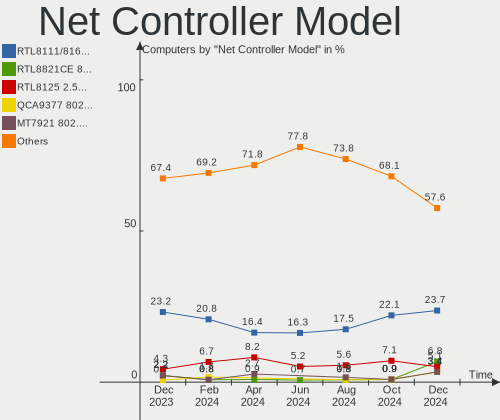

| Model                                                             | Computers | Percent |
|-------------------------------------------------------------------|-----------|---------|
| Realtek RTL8111/8168/8411 PCI Express Gigabit Ethernet Controller | 15        | 18.75%  |
| MediaTek MT7922 802.11ax PCI Express Wireless Network Adapter     | 4         | 5%      |
| Realtek RTL8153 Gigabit Ethernet Adapter                          | 3         | 3.75%   |
| Realtek RTL8125 2.5GbE Controller                                 | 3         | 3.75%   |
| MediaTek MT7921 802.11ax PCI Express Wireless Network Adapter     | 3         | 3.75%   |
| Intel Wi-Fi 6 AX201                                               | 3         | 3.75%   |
| Broadcom Limited BCM4360 802.11ac Wireless Network Adapter        | 3         | 3.75%   |
| Realtek RTL8822CE 802.11ac PCIe Wireless Network Adapter          | 2         | 2.5%    |
| Realtek RTL810xE PCI Express Fast Ethernet controller             | 2         | 2.5%    |
| Intel Wireless 8265 / 8275                                        | 2         | 2.5%    |
| Intel Wireless 7260                                               | 2         | 2.5%    |
| Intel Wi-Fi 6 AX210/AX211/AX411 160MHz                            | 2         | 2.5%    |
| Intel Ethernet Connection I217-LM                                 | 2         | 2.5%    |
| Intel Ethernet Connection (4) I219-LM                             | 2         | 2.5%    |
| Intel Alder Lake-P PCH CNVi WiFi                                  | 2         | 2.5%    |
| Realtek RTL8852BE PCIe 802.11ax Wireless Network Controller       | 1         | 1.25%   |
| Realtek RTL8821CE 802.11ac PCIe Wireless Network Adapter          | 1         | 1.25%   |
| Realtek RTL8814AU 802.11a/b/g/n/ac Wireless Adapter               | 1         | 1.25%   |
| Realtek RTL8812AU 802.11a/b/g/n/ac 2T2R DB WLAN Adapter           | 1         | 1.25%   |
| Ralink RT3290 Wireless 802.11n 1T/1R PCIe                         | 1         | 1.25%   |
| Qualcomm Atheros QCA9377 802.11ac Wireless Network Adapter        | 1         | 1.25%   |
| Qualcomm Atheros QCA6174 802.11ac Wireless Network Adapter        | 1         | 1.25%   |
| Qualcomm Atheros Killer E220x Gigabit Ethernet Controller         | 1         | 1.25%   |
| Qualcomm Atheros AR9485 Wireless Network Adapter                  | 1         | 1.25%   |
| Qualcomm Atheros AR8161 Gigabit Ethernet                          | 1         | 1.25%   |
| MediaTek MT7921K (RZ608) Wi-Fi 6E 80MHz                           | 1         | 1.25%   |
| Intel Wireless-AC 9260                                            | 1         | 1.25%   |
| Intel Wireless 7265                                               | 1         | 1.25%   |
| Intel Wireless 3160                                               | 1         | 1.25%   |
| Intel Tiger Lake PCH CNVi WiFi                                    | 1         | 1.25%   |
| Intel I211 Gigabit Network Connection                             | 1         | 1.25%   |
| Intel Ethernet Controller I225-V                                  | 1         | 1.25%   |
| Intel Ethernet Connection I218-LM                                 | 1         | 1.25%   |
| Intel Ethernet Connection (6) I219-V                              | 1         | 1.25%   |
| Intel Ethernet Connection (3) I218-LM                             | 1         | 1.25%   |
| Intel Ethernet Connection (2) I219-V                              | 1         | 1.25%   |
| Intel Ethernet Connection (11) I219-LM                            | 1         | 1.25%   |
| Intel Comet Lake PCH-LP CNVi WiFi                                 | 1         | 1.25%   |
| Intel Comet Lake PCH CNVi WiFi                                    | 1         | 1.25%   |
| Intel Centrino Advanced-N 6205 [Taylor Peak]                      | 1         | 1.25%   |

Wireless Vendor
---------------

Wireless vendors

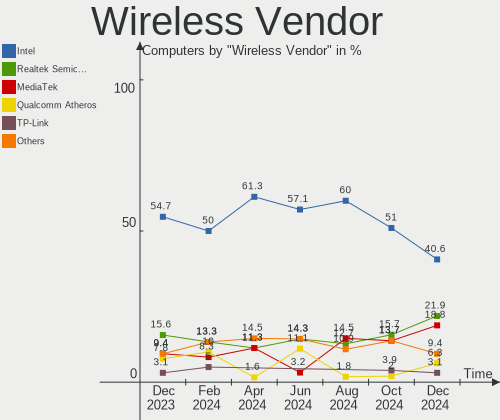

| Vendor                | Computers | Percent |
|-----------------------|-----------|---------|
| Intel                 | 19        | 45.24%  |
| MediaTek              | 8         | 19.05%  |
| Realtek Semiconductor | 6         | 14.29%  |
| Qualcomm Atheros      | 3         | 7.14%   |
| Broadcom Limited      | 3         | 7.14%   |
| Ralink                | 1         | 2.38%   |
| D-Link                | 1         | 2.38%   |
| Broadcom              | 1         | 2.38%   |

Wireless Model
--------------

Wireless models

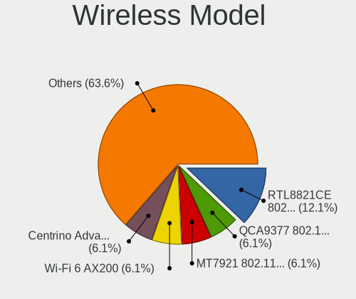

| Model                                                         | Computers | Percent |
|---------------------------------------------------------------|-----------|---------|
| MediaTek MT7922 802.11ax PCI Express Wireless Network Adapter | 4         | 9.52%   |
| MediaTek MT7921 802.11ax PCI Express Wireless Network Adapter | 3         | 7.14%   |
| Intel Wi-Fi 6 AX201                                           | 3         | 7.14%   |
| Broadcom Limited BCM4360 802.11ac Wireless Network Adapter    | 3         | 7.14%   |
| Realtek RTL8822CE 802.11ac PCIe Wireless Network Adapter      | 2         | 4.76%   |
| Intel Wireless 8265 / 8275                                    | 2         | 4.76%   |
| Intel Wireless 7260                                           | 2         | 4.76%   |
| Intel Wi-Fi 6 AX210/AX211/AX411 160MHz                        | 2         | 4.76%   |
| Intel Alder Lake-P PCH CNVi WiFi                              | 2         | 4.76%   |
| Realtek RTL8852BE PCIe 802.11ax Wireless Network Controller   | 1         | 2.38%   |
| Realtek RTL8821CE 802.11ac PCIe Wireless Network Adapter      | 1         | 2.38%   |
| Realtek RTL8814AU 802.11a/b/g/n/ac Wireless Adapter           | 1         | 2.38%   |
| Realtek RTL8812AU 802.11a/b/g/n/ac 2T2R DB WLAN Adapter       | 1         | 2.38%   |
| Ralink RT3290 Wireless 802.11n 1T/1R PCIe                     | 1         | 2.38%   |
| Qualcomm Atheros QCA9377 802.11ac Wireless Network Adapter    | 1         | 2.38%   |
| Qualcomm Atheros QCA6174 802.11ac Wireless Network Adapter    | 1         | 2.38%   |
| Qualcomm Atheros AR9485 Wireless Network Adapter              | 1         | 2.38%   |
| MediaTek MT7921K (RZ608) Wi-Fi 6E 80MHz                       | 1         | 2.38%   |
| Intel Wireless-AC 9260                                        | 1         | 2.38%   |
| Intel Wireless 7265                                           | 1         | 2.38%   |
| Intel Wireless 3160                                           | 1         | 2.38%   |
| Intel Tiger Lake PCH CNVi WiFi                                | 1         | 2.38%   |
| Intel Comet Lake PCH-LP CNVi WiFi                             | 1         | 2.38%   |
| Intel Comet Lake PCH CNVi WiFi                                | 1         | 2.38%   |
| Intel Centrino Advanced-N 6205 [Taylor Peak]                  | 1         | 2.38%   |
| Intel Cannon Point-LP CNVi [Wireless-AC]                      | 1         | 2.38%   |
| D-Link 802.11ac NIC                                           | 1         | 2.38%   |
| Broadcom BCM43142 802.11b/g/n                                 | 1         | 2.38%   |

Ethernet Vendor
---------------

Ethernet vendors

| Vendor                | Computers | Percent |
|-----------------------|-----------|---------|
| Realtek Semiconductor | 22        | 59.46%  |
| Intel                 | 12        | 32.43%  |
| Qualcomm Atheros      | 2         | 5.41%   |
| Cypress Semiconductor | 1         | 2.7%    |

Ethernet Model
--------------

Ethernet models

| Model                                                             | Computers | Percent |
|-------------------------------------------------------------------|-----------|---------|
| Realtek RTL8111/8168/8411 PCI Express Gigabit Ethernet Controller | 15        | 39.47%  |
| Realtek RTL8153 Gigabit Ethernet Adapter                          | 3         | 7.89%   |
| Realtek RTL8125 2.5GbE Controller                                 | 3         | 7.89%   |
| Realtek RTL810xE PCI Express Fast Ethernet controller             | 2         | 5.26%   |
| Intel Ethernet Connection I217-LM                                 | 2         | 5.26%   |
| Intel Ethernet Connection (4) I219-LM                             | 2         | 5.26%   |
| Qualcomm Atheros Killer E220x Gigabit Ethernet Controller         | 1         | 2.63%   |
| Qualcomm Atheros AR8161 Gigabit Ethernet                          | 1         | 2.63%   |
| Intel I211 Gigabit Network Connection                             | 1         | 2.63%   |
| Intel Ethernet Controller I225-V                                  | 1         | 2.63%   |
| Intel Ethernet Connection I218-LM                                 | 1         | 2.63%   |
| Intel Ethernet Connection (6) I219-V                              | 1         | 2.63%   |
| Intel Ethernet Connection (3) I218-LM                             | 1         | 2.63%   |
| Intel Ethernet Connection (2) I219-V                              | 1         | 2.63%   |
| Intel Ethernet Connection (11) I219-LM                            | 1         | 2.63%   |
| Intel 82579LM Gigabit Network Connection (Lewisville)             | 1         | 2.63%   |
| Cypress K38231_03                                                 | 1         | 2.63%   |

Net Controller Kind
-------------------

Ethernet, WiFi or modem

| Kind     | Computers | Percent |
|----------|-----------|---------|
| WiFi     | 41        | 54.67%  |
| Ethernet | 34        | 45.33%  |

Used Controller
---------------

Currently used network controller

| Kind     | Computers | Percent |
|----------|-----------|---------|
| WiFi     | 35        | 70%     |
| Ethernet | 15        | 30%     |

NICs
----

Total network controllers on board

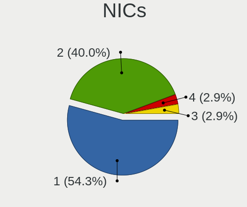

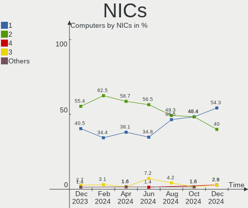

| Total | Computers | Percent |
|-------|-----------|---------|
| 2     | 24        | 50%     |
| 1     | 23        | 47.92%  |
| 3     | 1         | 2.08%   |

IPv6
----

IPv6 vs IPv4

| Used | Computers | Percent |
|------|-----------|---------|
| No   | 34        | 70.83%  |
| Yes  | 14        | 29.17%  |

Bluetooth
---------

Bluetooth Vendor
----------------

Controller vendors

| Vendor                          | Computers | Percent |
|---------------------------------|-----------|---------|
| Intel                           | 17        | 39.53%  |
| Cambridge Silicon Radio         | 4         | 9.3%    |
| MediaTek                        | 3         | 6.98%   |
| Lite-On Technology              | 3         | 6.98%   |
| Foxconn / Hon Hai               | 3         | 6.98%   |
| Apple                           | 3         | 6.98%   |
| Realtek Semiconductor           | 2         | 4.65%   |
| IMC Networks                    | 2         | 4.65%   |
| TP-Link                         | 1         | 2.33%   |
| Realtek                         | 1         | 2.33%   |
| Ralink                          | 1         | 2.33%   |
| Qualcomm Atheros Communications | 1         | 2.33%   |
| Opticis                         | 1         | 2.33%   |
| Broadcom                        | 1         | 2.33%   |

Bluetooth Model
---------------

Controller models

| Model                                               | Computers | Percent |
|-----------------------------------------------------|-----------|---------|
| Intel AX201 Bluetooth                               | 7         | 16.28%  |
| Intel Bluetooth wireless interface                  | 6         | 13.95%  |
| Cambridge Silicon Radio Bluetooth Dongle (HCI mode) | 4         | 9.3%    |
| MediaTek Wireless_Device                            | 3         | 6.98%   |
| Foxconn / Hon Hai Wireless_Device                   | 3         | 6.98%   |
| Apple Bluetooth USB Host Controller                 | 3         | 6.98%   |
| Realtek Bluetooth Radio                             | 2         | 4.65%   |
| Intel Bluetooth 9460/9560 Jefferson Peak (JfP)      | 2         | 4.65%   |
| Intel AX210 Bluetooth                               | 2         | 4.65%   |
| TP-Link UB500 Adapter                               | 1         | 2.33%   |
| Realtek 802.11ac WLAN Adapter                       | 1         | 2.33%   |
| Ralink RT3290 Bluetooth                             | 1         | 2.33%   |
| Qualcomm Atheros  Bluetooth Device                  | 1         | 2.33%   |
| Opticis Bluetooth Radio                             | 1         | 2.33%   |
| Lite-On Wireless_Device                             | 1         | 2.33%   |
| Lite-On Qualcomm Atheros QCA9377 Bluetooth          | 1         | 2.33%   |
| Lite-On Bluetooth Radio                             | 1         | 2.33%   |
| IMC Networks Wireless_Device                        | 1         | 2.33%   |
| IMC Networks Bluetooth Radio                        | 1         | 2.33%   |
| Broadcom BCM43142A0 Bluetooth 4.0                   | 1         | 2.33%   |

Sound
-----

Sound Vendor
------------

Sound card vendors

| Vendor                   | Computers | Percent |
|--------------------------|-----------|---------|
| Intel                    | 31        | 44.29%  |
| AMD                      | 19        | 27.14%  |
| Nvidia                   | 8         | 11.43%  |
| Texas Instruments        | 1         | 1.43%   |
| SteelSeries ApS          | 1         | 1.43%   |
| Sony                     | 1         | 1.43%   |
| Realtek Semiconductor    | 1         | 1.43%   |
| Micro Star International | 1         | 1.43%   |
| Lenovo                   | 1         | 1.43%   |
| Kingston Technology      | 1         | 1.43%   |
| Dell                     | 1         | 1.43%   |
| Conexant Systems         | 1         | 1.43%   |
| C-Media Electronics      | 1         | 1.43%   |
| BEHRINGER International  | 1         | 1.43%   |
| Asahi Kasei Microsystems | 1         | 1.43%   |

Sound Model
-----------

Sound card models

| Model                                                                                             | Computers | Percent |
|---------------------------------------------------------------------------------------------------|-----------|---------|
| AMD Family 17h/19h HD Audio Controller                                                            | 15        | 15.96%  |
| AMD Renoir Radeon High Definition Audio Controller                                                | 8         | 8.51%   |
| Intel Tiger Lake-LP Smart Sound Technology Audio Controller                                       | 5         | 5.32%   |
| Intel 8 Series/C220 Series Chipset High Definition Audio Controller                               | 4         | 4.26%   |
| AMD Rembrandt Radeon High Definition Audio Controller                                             | 4         | 4.26%   |
| Intel Xeon E3-1200 v3/4th Gen Core Processor HD Audio Controller                                  | 3         | 3.19%   |
| Intel Wildcat Point-LP High Definition Audio Controller                                           | 3         | 3.19%   |
| Intel Sunrise Point-LP HD Audio                                                                   | 3         | 3.19%   |
| Intel Broadwell-U Audio Controller                                                                | 3         | 3.19%   |
| Nvidia GA106 High Definition Audio Controller                                                     | 2         | 2.13%   |
| Intel Haswell-ULT HD Audio Controller                                                             | 2         | 2.13%   |
| Intel Alder Lake PCH-P High Definition Audio Controller                                           | 2         | 2.13%   |
| Intel 8 Series HD Audio Controller                                                                | 2         | 2.13%   |
| Intel 7 Series/C216 Chipset Family High Definition Audio Controller                               | 2         | 2.13%   |
| Intel 6 Series/C200 Series Chipset Family High Definition Audio Controller                        | 2         | 2.13%   |
| AMD Navi 31 [Radeon RX 7000 HDMI Audio]                                                           | 2         | 2.13%   |
| Texas Instruments PCM2912A Audio Codec                                                            | 1         | 1.06%   |
| SteelSeries ApS SteelSeries Arctis 7                                                              | 1         | 1.06%   |
| Sony DualSense wireless controller (PS5)                                                          | 1         | 1.06%   |
| Realtek Semiconductor USB SPDIF Adapter                                                           | 1         | 1.06%   |
| Nvidia TU116 High Definition Audio Controller                                                     | 1         | 1.06%   |
| Nvidia TU106 High Definition Audio Controller                                                     | 1         | 1.06%   |
| Nvidia TU104 HD Audio Controller                                                                  | 1         | 1.06%   |
| Nvidia GP104 High Definition Audio Controller                                                     | 1         | 1.06%   |
| Nvidia GK104 HDMI Audio Controller                                                                | 1         | 1.06%   |
| Nvidia GA104 High Definition Audio Controller                                                     | 1         | 1.06%   |
| Micro Star International USB Audio                                                                | 1         | 1.06%   |
| Lenovo ThinkPad Dock Audio                                                                        | 1         | 1.06%   |
| Kingston Technology HyperX 7.1 Audio                                                              | 1         | 1.06%   |
| Intel Tiger Lake-H HD Audio Controller                                                            | 1         | 1.06%   |
| Intel Comet Lake PCH-LP cAVS                                                                      | 1         | 1.06%   |
| Intel Comet Lake PCH cAVS                                                                         | 1         | 1.06%   |
| Intel Cannon Point-LP High Definition Audio Controller                                            | 1         | 1.06%   |
| Intel Atom/Celeron/Pentium Processor x5-E8000/J3xxx/N3xxx Series High Definition Audio Controller | 1         | 1.06%   |
| Intel Alder Lake-S HD Audio Controller                                                            | 1         | 1.06%   |
| Intel 200 Series PCH HD Audio                                                                     | 1         | 1.06%   |
| Intel 100 Series/C230 Series Chipset Family HD Audio Controller                                   | 1         | 1.06%   |
| Dell AC511 Sound Bar                                                                              | 1         | 1.06%   |
| Conexant Systems Hi-Res Audio                                                                     | 1         | 1.06%   |
| C-Media Electronics USB Audio Device                                                              | 1         | 1.06%   |

Memory
------

Memory Vendor
-------------

Memory module vendors

| Vendor              | Computers | Percent |
|---------------------|-----------|---------|
| SK hynix            | 10        | 21.28%  |
| Samsung Electronics | 8         | 17.02%  |
| Micron Technology   | 6         | 12.77%  |
| Kingston            | 6         | 12.77%  |
| G.Skill             | 5         | 10.64%  |
| Crucial             | 4         | 8.51%   |
| Corsair             | 4         | 8.51%   |
| Patriot             | 1         | 2.13%   |
| Nanya Technology    | 1         | 2.13%   |
| Kllisre             | 1         | 2.13%   |
| Hikvision           | 1         | 2.13%   |

Memory Model
------------

Memory module models

| Model                                                            | Computers | Percent |
|------------------------------------------------------------------|-----------|---------|
| SK hynix RAM HMAA1GS6CJR6N-XN 8GB SODIMM DDR4 3200MT/s           | 2         | 4%      |
| Samsung RAM UBE3D4AA-MGCR 2GB Row Of Chips LPDDR4 4267MT/s       | 2         | 4%      |
| Micron RAM 16KTF1G64HZ-1G6E1 8192MB SODIMM DDR3 1600MT/s         | 2         | 4%      |
| SK hynix RAM Module 16GB SODIMM DDR4 3200MT/s                    | 1         | 2%      |
| SK hynix RAM HMT41GU6AFR8C-PB 8GB DIMM DDR3 1600MT/s             | 1         | 2%      |
| SK hynix RAM HMT41GS6BFR8A-PB 8GB SODIMM DDR3 1600MT/s           | 1         | 2%      |
| SK hynix RAM HMAA2GS6AJR8N-XN 16GB SODIMM DDR4 3200MT/s          | 1         | 2%      |
| SK hynix RAM HMA82GS6JJR8N-VK 16GB SODIMM DDR4 2667MT/s          | 1         | 2%      |
| SK hynix RAM HMA82GS6DJR8N-VK 16GB SODIMM DDR4 2667MT/s          | 1         | 2%      |
| SK hynix RAM HMA81GS6AFR8N-UH 8GB SODIMM DDR4 2400MT/s           | 1         | 2%      |
| SK hynix RAM H9JCNNNCP3MLYR-N6E 4GB Row Of Chips LPDDR5 6400MT/s | 1         | 2%      |
| Samsung RAM M471B1G73DB0-YK0 8GB SODIMM DDR3 1600MT/s            | 1         | 2%      |
| Samsung RAM M471A1K43DB1-CTD 8GB SODIMM DDR4 2667MT/s            | 1         | 2%      |
| Samsung RAM M471A1K43BB1-CTD 8GB SODIMM DDR4 2667MT/s            | 1         | 2%      |
| Samsung RAM M471A1K43BB1-CRC 8GB SODIMM DDR4 2667MT/s            | 1         | 2%      |
| Samsung RAM M471A1G44BB0-CWE 8GB SODIMM DDR4 3200MT/s            | 1         | 2%      |
| Samsung RAM M471A1G44AB0-CWE 8GB SODIMM DDR4 3200MT/s            | 1         | 2%      |
| Samsung RAM M471A1G44AB0-CTD 8GB Row Of Chips DDR4 2667MT/s      | 1         | 2%      |
| Patriot RAM PSD34G16002 4GB DIMM DDR3 1648MT/s                   | 1         | 2%      |
| Nanya RAM NT2GC64B88G0NF-CG 2GB DIMM DDR3 1333MT/s               | 1         | 2%      |
| Micron RAM MT62F2G32D8DR-031 WT 8GB Row Of Chips LPDDR5 6400MT/s | 1         | 2%      |
| Micron RAM MT62F1G32D4DR-031 WT 4GB Row Of Chips LPDDR5 6400MT/s | 1         | 2%      |
| Micron RAM 4ATS1G64HZ-2G6E1 8GB SODIMM DDR4 2667MT/s             | 1         | 2%      |
| Micron RAM 4ATF11G64HZ-3G2E1 8GB Row Of Chips DDR4 3200MT/s      | 1         | 2%      |
| Kllisre RAM M471A3243BB0-CP50 8GB SODIMM DDR4 3200MT/s           | 1         | 2%      |
| Kingston RAM Module 16GB SODIMM DDR4 3200MT/s                    | 1         | 2%      |
| Kingston RAM KHX2666C16/8G 8GB DIMM DDR4 3466MT/s                | 1         | 2%      |
| Kingston RAM KHX2400C15/8G 8GB DIMM DDR4 3400MT/s                | 1         | 2%      |
| Kingston RAM KF560C36-16 16GB DIMM DDR5 6000MT/s                 | 1         | 2%      |
| Kingston RAM HP687515-H66-MCN 4GB SODIMM DDR3 1600MT/s           | 1         | 2%      |
| Kingston RAM ASU1600S11-4G-EDEG 4GB SODIMM DDR3 1600MT/s         | 1         | 2%      |
| Kingston RAM 9905700-122.A00G 16GB SODIMM DDR4 3200MT/s          | 1         | 2%      |
| Hikvision RAM HKED4162DAB21G4H9B1 16GB SODIMM DDR4 3200MT/s      | 1         | 2%      |
| G.Skill RAM F5-6000J3238F16G 16GB DIMM DDR5 6000MT/s             | 1         | 2%      |
| G.Skill RAM F4-3600C16-16GTZNC 16GB DIMM DDR4 3600MT/s           | 1         | 2%      |
| G.Skill RAM F4-3200C22-32GRS 32GB SODIMM DDR4 3200MT/s           | 1         | 2%      |
| G.Skill RAM F4-3200C16-8GVGB 8GB DIMM DDR4 3200MT/s              | 1         | 2%      |
| G.Skill RAM F4-3200C16-16GIS 16GB DIMM DDR4 3600MT/s             | 1         | 2%      |
| Crucial RAM CT8G4SFS832A.M8FR 8GB SODIMM DDR4 3200MT/s           | 1         | 2%      |
| Crucial RAM CT16G4SFRA32A.C8FE 16GB SODIMM DDR4 3200MT/s         | 1         | 2%      |

Memory Kind
-----------

Memory module kinds

| Kind   | Computers | Percent |
|--------|-----------|---------|
| DDR4   | 24        | 57.14%  |
| DDR3   | 11        | 26.19%  |
| LPDDR5 | 3         | 7.14%   |
| LPDDR4 | 2         | 4.76%   |
| DDR5   | 2         | 4.76%   |

Memory Form Factor
------------------

Physical design of the memory module

| Name         | Computers | Percent |
|--------------|-----------|---------|
| SODIMM       | 25        | 59.52%  |
| DIMM         | 10        | 23.81%  |
| Row Of Chips | 7         | 16.67%  |

Memory Size
-----------

Memory module size

| Size  | Computers | Percent |
|-------|-----------|---------|
| 8192  | 24        | 54.55%  |
| 16384 | 12        | 27.27%  |
| 4096  | 6         | 13.64%  |
| 32768 | 1         | 2.27%   |
| 2048  | 1         | 2.27%   |

Memory Speed
------------

Memory module speed

| Speed | Computers | Percent |
|-------|-----------|---------|
| 3200  | 14        | 31.11%  |
| 1600  | 9         | 20%     |
| 2667  | 5         | 11.11%  |
| 6400  | 3         | 6.67%   |
| 6000  | 2         | 4.44%   |
| 4267  | 2         | 4.44%   |
| 3600  | 2         | 4.44%   |
| 2400  | 2         | 4.44%   |
| 3466  | 1         | 2.22%   |
| 3400  | 1         | 2.22%   |
| 2133  | 1         | 2.22%   |
| 1867  | 1         | 2.22%   |
| 1648  | 1         | 2.22%   |
| 1333  | 1         | 2.22%   |

Printers & scanners
-------------------

Printer Vendor
--------------

Printer device vendors

Zero info for selected period =(

Printer Model
-------------

Printer device models

Zero info for selected period =(

Scanner Vendor
--------------

Scanner device vendors

Zero info for selected period =(

Scanner Model
-------------

Scanner device models

Zero info for selected period =(

Camera
------

Camera Vendor
-------------

Camera device vendors

| Vendor                                 | Computers | Percent |
|----------------------------------------|-----------|---------|
| Chicony Electronics                    | 8         | 21.05%  |
| Bison Electronics                      | 6         | 15.79%  |
| IMC Networks                           | 5         | 13.16%  |
| Sunplus Innovation Technology          | 4         | 10.53%  |
| Logitech                               | 4         | 10.53%  |
| Luxvisions Innotech Limited            | 2         | 5.26%   |
| Sonix Technology                       | 1         | 2.63%   |
| Shenzhen Kingcome Optoelectronic       | 1         | 2.63%   |
| Samsung Electronics                    | 1         | 2.63%   |
| MacroSilicon                           | 1         | 2.63%   |
| Jieli Technology                       | 1         | 2.63%   |
| Generalplus Technology                 | 1         | 2.63%   |
| Cheng Uei Precision Industry (Foxlink) | 1         | 2.63%   |
| Apple                                  | 1         | 2.63%   |
| Acer                                   | 1         | 2.63%   |

Camera Model
------------

Camera device models

| Model                                                                    | Computers | Percent |
|--------------------------------------------------------------------------|-----------|---------|
| IMC Networks Integrated Camera                                           | 3         | 7.89%   |
| Chicony Integrated Camera                                                | 3         | 7.89%   |
| Sunplus Integrated_Webcam_HD                                             | 2         | 5.26%   |
| Luxvisions Innotech Limited Integrated RGB Camera                        | 2         | 5.26%   |
| Bison HD Webcam                                                          | 2         | 5.26%   |
| Bison BisonCam,NB Pro                                                    | 2         | 5.26%   |
| Sunplus XiaoMi USB 2.0 Webcam                                            | 1         | 2.63%   |
| Sunplus Asus Webcam                                                      | 1         | 2.63%   |
| Sonix USB2.0 HD UVC WebCam                                               | 1         | 2.63%   |
| Shenzhen Kingcome Optoelectronic 720p HD Camera                          | 1         | 2.63%   |
| Samsung Galaxy series, misc. (MTP mode)                                  | 1         | 2.63%   |
| MacroSilicon USB Video                                                   | 1         | 2.63%   |
| Logitech Webcam C930e                                                    | 1         | 2.63%   |
| Logitech Webcam C170                                                     | 1         | 2.63%   |
| Logitech HD Pro Webcam C920                                              | 1         | 2.63%   |
| Logitech C922 Pro Stream Webcam                                          | 1         | 2.63%   |
| Jieli USB PHY 2.0                                                        | 1         | 2.63%   |
| IMC Networks USB2.0 HD UVC WebCam                                        | 1         | 2.63%   |
| IMC Networks ov9734_azurewave_camera                                     | 1         | 2.63%   |
| Generalplus WEB CAM                                                      | 1         | 2.63%   |
| Chicony Integrated HP HD Webcam                                          | 1         | 2.63%   |
| Chicony Integrated Camera (1280x720@30)                                  | 1         | 2.63%   |
| Chicony HP HD Camera                                                     | 1         | 2.63%   |
| Chicony HD WebCam                                                        | 1         | 2.63%   |
| Chicony HD User Facing                                                   | 1         | 2.63%   |
| Cheng Uei Precision Industry (Foxlink) HP EliteBook integrated HD Webcam | 1         | 2.63%   |
| Bison USB2.0 Camera                                                      | 1         | 2.63%   |
| Bison BisonCam, NB Pro                                                   | 1         | 2.63%   |
| Apple iPhone 5/5C/5S/6/SE/7/8/X                                          | 1         | 2.63%   |
| Acer Integrated Camera                                                   | 1         | 2.63%   |

Security
--------

Fingerprint Vendor
------------------

Fingerprint sensor vendors

| Vendor                     | Computers | Percent |
|----------------------------|-----------|---------|
| Synaptics                  | 4         | 66.67%  |
| Validity Sensors           | 1         | 16.67%  |
| Shenzhen Goodix Technology | 1         | 16.67%  |

Fingerprint Model
-----------------

Fingerprint sensor models

| Model                                             | Computers | Percent |
|---------------------------------------------------|-----------|---------|
| Synaptics Prometheus MIS Touch Fingerprint Reader | 2         | 33.33%  |
| Validity Sensors VFS495 Fingerprint Reader        | 1         | 16.67%  |
| Synaptics UWP WBDI Device                         | 1         | 16.67%  |
| Synaptics Metallica MIS Touch Fingerprint Reader  | 1         | 16.67%  |
| Shenzhen Goodix Fingerprint Reader                | 1         | 16.67%  |

Chipcard Vendor
---------------

Chipcard module vendors

| Vendor      | Computers | Percent |
|-------------|-----------|---------|
| Alcor Micro | 1         | 100%    |

Chipcard Model
--------------

Chipcard module models

| Model                        | Computers | Percent |
|------------------------------|-----------|---------|
| Alcor Micro Watchdata W 1981 | 1         | 100%    |

Unsupported
-----------

Unsupported Devices
-------------------

Total unsupported devices on board

| Total | Computers | Percent |
|-------|-----------|---------|
| 0     | 34        | 70.83%  |
| 1     | 12        | 25%     |
| 2     | 2         | 4.17%   |

Unsupported Device Types
------------------------

Types of unsupported devices

| Type                  | Computers | Percent |
|-----------------------|-----------|---------|
| Fingerprint reader    | 6         | 37.5%   |
| Multimedia controller | 3         | 18.75%  |
| Net/wireless          | 2         | 12.5%   |
| Net/ethernet          | 1         | 6.25%   |
| Graphics card         | 1         | 6.25%   |
| Dvb card              | 1         | 6.25%   |
| Chipcard              | 1         | 6.25%   |
| Bluetooth             | 1         | 6.25%   |

