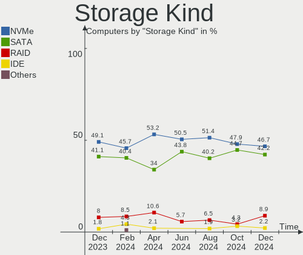
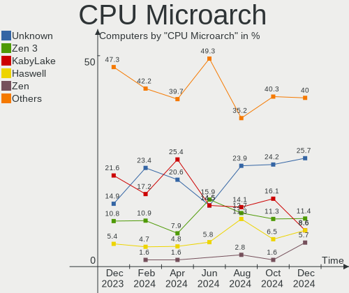
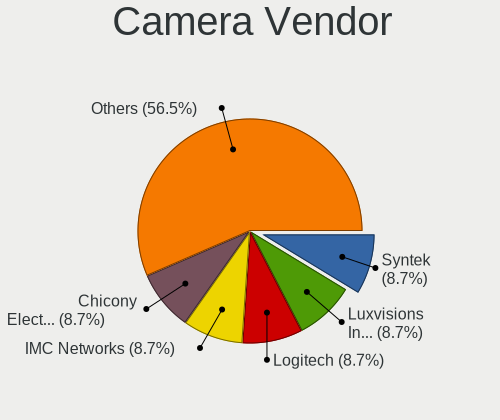

EndeavourOS - Hardware Trends
-----------------------------

A project to identify most popular hardware characteristics and track their change
over time based on data collected by Linux users at https://Linux-Hardware.org.

Anyone can contribute to this report by the [hw-probe](https://github.com/linuxhw/hw-probe) tool:

    sudo -E hw-probe -all -upload

This is a report for all computer types. See also reports for [desktops](/Dist/EndeavourOS/Desktop/README.md) and [notebooks](/Dist/EndeavourOS/Notebook/README.md).

This report is for one last month. Overall report since the beginning of time: [TestCoverage](https://github.com/linuxhw/TestCoverage)

Period: Jul, 2022.

Contents
--------

* [ System ](#system)
  - [ OS                       ](#os)
  - [ OS Family                ](#os-family)
  - [ Kernel                   ](#kernel)
  - [ Kernel Family            ](#kernel-family)
  - [ Kernel Major Ver.        ](#kernel-major-ver)
  - [ Arch                     ](#arch)
  - [ DE                       ](#de)
  - [ Display Server           ](#display-server)
  - [ Display Manager          ](#display-manager)
  - [ OS Lang                  ](#os-lang)
  - [ Boot Mode                ](#boot-mode)
  - [ Filesystem               ](#filesystem)
  - [ Part. scheme             ](#part-scheme)
  - [ Dual Boot with Linux/BSD ](#dual-boot-with-linuxbsd)
  - [ Dual Boot (Win)          ](#dual-boot-win)

* [ Board ](#board)
  - [ Vendor                   ](#vendor)
  - [ Model                    ](#model)
  - [ Model Family             ](#model-family)
  - [ MFG Year                 ](#mfg-year)
  - [ Form Factor              ](#form-factor)
  - [ Secure Boot              ](#secure-boot)
  - [ Coreboot                 ](#coreboot)
  - [ RAM Size                 ](#ram-size)
  - [ RAM Used                 ](#ram-used)
  - [ Total Drives             ](#total-drives)
  - [ Has CD-ROM               ](#has-cd-rom)
  - [ Has Ethernet             ](#has-ethernet)
  - [ Has WiFi                 ](#has-wifi)
  - [ Has Bluetooth            ](#has-bluetooth)

* [ Location ](#location)
  - [ Country                  ](#country)
  - [ City                     ](#city)

* [ Drives ](#drives)
  - [ Drive Vendor             ](#drive-vendor)
  - [ Drive Model              ](#drive-model)
  - [ HDD Vendor               ](#hdd-vendor)
  - [ SSD Vendor               ](#ssd-vendor)
  - [ Drive Kind               ](#drive-kind)
  - [ Drive Connector          ](#drive-connector)
  - [ Drive Size               ](#drive-size)
  - [ Space Total              ](#space-total)
  - [ Space Used               ](#space-used)
  - [ Malfunc. Drives          ](#malfunc-drives)
  - [ Malfunc. Drive Vendor    ](#malfunc-drive-vendor)
  - [ Malfunc. HDD Vendor      ](#malfunc-hdd-vendor)
  - [ Malfunc. Drive Kind      ](#malfunc-drive-kind)
  - [ Failed Drives            ](#failed-drives)
  - [ Failed Drive Vendor      ](#failed-drive-vendor)
  - [ Drive Status             ](#drive-status)

* [ Storage controller ](#storage-controller)
  - [ Storage Vendor           ](#storage-vendor)
  - [ Storage Model            ](#storage-model)
  - [ Storage Kind             ](#storage-kind)

* [ Processor ](#processor)
  - [ CPU Vendor               ](#cpu-vendor)
  - [ CPU Model                ](#cpu-model)
  - [ CPU Model Family         ](#cpu-model-family)
  - [ CPU Cores                ](#cpu-cores)
  - [ CPU Sockets              ](#cpu-sockets)
  - [ CPU Threads              ](#cpu-threads)
  - [ CPU Op-Modes             ](#cpu-op-modes)
  - [ CPU Microcode            ](#cpu-microcode)
  - [ CPU Microarch            ](#cpu-microarch)

* [ Graphics ](#graphics)
  - [ GPU Vendor               ](#gpu-vendor)
  - [ GPU Model                ](#gpu-model)
  - [ GPU Combo                ](#gpu-combo)
  - [ GPU Driver               ](#gpu-driver)
  - [ GPU Memory               ](#gpu-memory)

* [ Monitor ](#monitor)
  - [ Monitor Vendor           ](#monitor-vendor)
  - [ Monitor Model            ](#monitor-model)
  - [ Monitor Resolution       ](#monitor-resolution)
  - [ Monitor Diagonal         ](#monitor-diagonal)
  - [ Monitor Width            ](#monitor-width)
  - [ Aspect Ratio             ](#aspect-ratio)
  - [ Monitor Area             ](#monitor-area)
  - [ Pixel Density            ](#pixel-density)
  - [ Multiple Monitors        ](#multiple-monitors)

* [ Network ](#network)
  - [ Net Controller Vendor    ](#net-controller-vendor)
  - [ Net Controller Model     ](#net-controller-model)
  - [ Wireless Vendor          ](#wireless-vendor)
  - [ Wireless Model           ](#wireless-model)
  - [ Ethernet Vendor          ](#ethernet-vendor)
  - [ Ethernet Model           ](#ethernet-model)
  - [ Net Controller Kind      ](#net-controller-kind)
  - [ Used Controller          ](#used-controller)
  - [ NICs                     ](#nics)
  - [ IPv6                     ](#ipv6)

* [ Bluetooth ](#bluetooth)
  - [ Bluetooth Vendor         ](#bluetooth-vendor)
  - [ Bluetooth Model          ](#bluetooth-model)

* [ Sound ](#sound)
  - [ Sound Vendor             ](#sound-vendor)
  - [ Sound Model              ](#sound-model)

* [ Memory ](#memory)
  - [ Memory Vendor            ](#memory-vendor)
  - [ Memory Model             ](#memory-model)
  - [ Memory Kind              ](#memory-kind)
  - [ Memory Form Factor       ](#memory-form-factor)
  - [ Memory Size              ](#memory-size)
  - [ Memory Speed             ](#memory-speed)

* [ Printers & scanners ](#printers--scanners)
  - [ Printer Vendor           ](#printer-vendor)
  - [ Printer Model            ](#printer-model)
  - [ Scanner Vendor           ](#scanner-vendor)
  - [ Scanner Model            ](#scanner-model)

* [ Camera ](#camera)
  - [ Camera Vendor            ](#camera-vendor)
  - [ Camera Model             ](#camera-model)

* [ Security ](#security)
  - [ Fingerprint Vendor       ](#fingerprint-vendor)
  - [ Fingerprint Model        ](#fingerprint-model)
  - [ Chipcard Vendor          ](#chipcard-vendor)
  - [ Chipcard Model           ](#chipcard-model)

* [ Unsupported ](#unsupported)
  - [ Unsupported Devices      ](#unsupported-devices)
  - [ Unsupported Device Types ](#unsupported-device-types)

System
------

OS
--

Installed operating systems

| Name                | Computers | Percent |
|---------------------|-----------|---------|
| EndeavourOS Rolling | 16        | 66.67%  |
| EndeavourOS         | 8         | 33.33%  |

OS Family
---------

OS without a version

| Name        | Computers | Percent |
|-------------|-----------|---------|
| EndeavourOS | 24        | 100%    |

Kernel
------

Version of the Linux kernel

| Version                 | Computers | Percent |
|-------------------------|-----------|---------|
| 5.18.12-arch1-1         | 7         | 29.17%  |
| 5.18.9-arch1-1          | 3         | 12.5%   |
| 5.18.7-arch1-1          | 3         | 12.5%   |
| 5.18.12-zen1-1-zen      | 3         | 12.5%   |
| 5.18.6-arch1-1          | 1         | 4.17%   |
| 5.18.5-arch1-1          | 1         | 4.17%   |
| 5.18.15-arch1-1         | 1         | 4.17%   |
| 5.18.14-arch1-1         | 1         | 4.17%   |
| 5.18.13-arch1-1         | 1         | 4.17%   |
| 5.18.11-zen1-1-zen      | 1         | 4.17%   |
| 5.18.10-arch1-1-surface | 1         | 4.17%   |
| 5.18.10-arch1-1         | 1         | 4.17%   |

Kernel Family
-------------

Linux kernel without a distro release

| Version | Computers | Percent |
|---------|-----------|---------|
| 5.18.12 | 10        | 41.67%  |
| 5.18.9  | 3         | 12.5%   |
| 5.18.7  | 3         | 12.5%   |
| 5.18.10 | 2         | 8.33%   |
| 5.18.6  | 1         | 4.17%   |
| 5.18.5  | 1         | 4.17%   |
| 5.18.15 | 1         | 4.17%   |
| 5.18.14 | 1         | 4.17%   |
| 5.18.13 | 1         | 4.17%   |
| 5.18.11 | 1         | 4.17%   |

Kernel Major Ver.
-----------------

Linux kernel major version

| Version | Computers | Percent |
|---------|-----------|---------|
| 5.18    | 24        | 100%    |

Arch
----

OS architecture (x86_64, i586, etc.)

| Name   | Computers | Percent |
|--------|-----------|---------|
| x86_64 | 24        | 100%    |

DE
--

Desktop Environment

| Name            | Computers | Percent |
|-----------------|-----------|---------|
| KDE5            | 10        | 41.67%  |
| XFCE            | 8         | 33.33%  |
| GNOME           | 3         | 12.5%   |
| LXQt            | 1         | 4.17%   |
| GNOME Flashback | 1         | 4.17%   |
| Cinnamon        | 1         | 4.17%   |

Display Server
--------------

X11 or Wayland

| Name    | Computers | Percent |
|---------|-----------|---------|
| X11     | 20        | 83.33%  |
| Wayland | 4         | 16.67%  |

Display Manager
---------------

SDDM, LightDM, etc.

| Name    | Computers | Percent |
|---------|-----------|---------|
| LightDM | 11        | 45.83%  |
| Unknown | 8         | 33.33%  |
| SDDM    | 4         | 16.67%  |
| GDM     | 1         | 4.17%   |

OS Lang
-------

Language

| Lang  | Computers | Percent |
|-------|-----------|---------|
| en_US | 10        | 41.67%  |
| en_AG | 4         | 16.67%  |
| de_DE | 3         | 12.5%   |
| nl_NL | 2         | 8.33%   |
| en_CA | 2         | 8.33%   |
| ru_RU | 1         | 4.17%   |
| fr_FR | 1         | 4.17%   |
| fi_FI | 1         | 4.17%   |

Boot Mode
---------

EFI or BIOS

| Mode | Computers | Percent |
|------|-----------|---------|
| EFI  | 13        | 54.17%  |
| BIOS | 11        | 45.83%  |

Filesystem
----------

Type of filesystem

| Type    | Computers | Percent |
|---------|-----------|---------|
| Ext4    | 19        | 79.17%  |
| Btrfs   | 3         | 12.5%   |
| Xfs     | 1         | 4.17%   |
| Overlay | 1         | 4.17%   |

Part. scheme
------------

Scheme of partitioning

| Type    | Computers | Percent |
|---------|-----------|---------|
| GPT     | 13        | 54.17%  |
| Unknown | 9         | 37.5%   |
| MBR     | 2         | 8.33%   |

Dual Boot with Linux/BSD
------------------------

Hosting more than one Linux/BSD

| Dual boot | Computers | Percent |
|-----------|-----------|---------|
| No        | 21        | 87.5%   |
| Yes       | 3         | 12.5%   |

Dual Boot (Win)
---------------

Hosting Linux and Windows

| Dual boot | Computers | Percent |
|-----------|-----------|---------|
| No        | 18        | 75%     |
| Yes       | 6         | 25%     |

Board
-----

Vendor
------

Motherboard manufacturer

| Name                | Computers | Percent |
|---------------------|-----------|---------|
| Gigabyte Technology | 6         | 25%     |
| Lenovo              | 4         | 16.67%  |
| Hewlett-Packard     | 3         | 12.5%   |
| ASUSTek Computer    | 3         | 12.5%   |
| MSI                 | 2         | 8.33%   |
| Microsoft           | 2         | 8.33%   |
| ASRock              | 2         | 8.33%   |
| Samsung Electronics | 1         | 4.17%   |
| Acer                | 1         | 4.17%   |

Model
-----

Motherboard model

| Name                              | Computers | Percent |
|-----------------------------------|-----------|---------|
| Samsung DeskTop System            | 1         | 4.17%   |
| MSI MS-7D25                       | 1         | 4.17%   |
| MSI MS-7C37                       | 1         | 4.17%   |
| Microsoft Surface Pro 4           | 1         | 4.17%   |
| Microsoft Surface Laptop Go       | 1         | 4.17%   |
| Lenovo Yoga Slim 7 14ARE05 82A2   | 1         | 4.17%   |
| Lenovo ThinkPad T460p 20FXS05500  | 1         | 4.17%   |
| Lenovo ThinkPad E595 20NF001HGE   | 1         | 4.17%   |
| Lenovo ThinkBook 14p Gen 2 20YN   | 1         | 4.17%   |
| HP Z820 Workstation               | 1         | 4.17%   |
| HP Laptop 14-fq1xxx               | 1         | 4.17%   |
| HP EliteBook 745 G6               | 1         | 4.17%   |
| Gigabyte Z690 GAMING X DDR4       | 1         | 4.17%   |
| Gigabyte X470 AORUS GAMING 7 WIFI | 1         | 4.17%   |
| Gigabyte P55A-UD3                 | 1         | 4.17%   |
| Gigabyte N3160TN                  | 1         | 4.17%   |
| Gigabyte B550M AORUS PRO          | 1         | 4.17%   |
| Gigabyte B550 AORUS ELITE         | 1         | 4.17%   |
| ASUS TUF Gaming B550-PRO          | 1         | 4.17%   |
| ASUS TUF B450-PLUS GAMING         | 1         | 4.17%   |
| ASUS GL753VE                      | 1         | 4.17%   |
| ASRock B450M Pro4                 | 1         | 4.17%   |
| ASRock A320M-HDV R4.0             | 1         | 4.17%   |
| Acer Nitro AN515-43               | 1         | 4.17%   |

Model Family
------------

Motherboard model prefix

| Name              | Computers | Percent |
|-------------------|-----------|---------|
| Microsoft Surface | 2         | 8.33%   |
| Lenovo ThinkPad   | 2         | 8.33%   |
| ASUS TUF          | 2         | 8.33%   |
| Samsung DeskTop   | 1         | 4.17%   |
| MSI MS-7D25       | 1         | 4.17%   |
| MSI MS-7C37       | 1         | 4.17%   |
| Lenovo Yoga       | 1         | 4.17%   |
| Lenovo ThinkBook  | 1         | 4.17%   |
| HP Z820           | 1         | 4.17%   |
| HP Laptop         | 1         | 4.17%   |
| HP EliteBook      | 1         | 4.17%   |
| Gigabyte Z690     | 1         | 4.17%   |
| Gigabyte X470     | 1         | 4.17%   |
| Gigabyte P55A-UD3 | 1         | 4.17%   |
| Gigabyte N3160TN  | 1         | 4.17%   |
| Gigabyte B550M    | 1         | 4.17%   |
| Gigabyte B550     | 1         | 4.17%   |
| ASUS GL753VE      | 1         | 4.17%   |
| ASRock B450M      | 1         | 4.17%   |
| ASRock A320M-HDV  | 1         | 4.17%   |
| Acer Nitro        | 1         | 4.17%   |

MFG Year
--------

Motherboard manufacture year

| Year | Computers | Percent |
|------|-----------|---------|
| 2021 | 5         | 20.83%  |
| 2020 | 4         | 16.67%  |
| 2019 | 4         | 16.67%  |
| 2018 | 4         | 16.67%  |
| 2017 | 2         | 8.33%   |
| 2016 | 2         | 8.33%   |
| 2009 | 2         | 8.33%   |
| 2012 | 1         | 4.17%   |

Form Factor
-----------

Physical design of the computer

| Name     | Computers | Percent |
|----------|-----------|---------|
| Desktop  | 14        | 58.33%  |
| Notebook | 8         | 33.33%  |
| Tablet   | 2         | 8.33%   |

Secure Boot
-----------

Enabled or disabled

| State    | Computers | Percent |
|----------|-----------|---------|
| Disabled | 23        | 95.83%  |
| Enabled  | 1         | 4.17%   |

Coreboot
--------

Have coreboot on board

| Used | Computers | Percent |
|------|-----------|---------|
| No   | 24        | 100%    |

RAM Size
--------

Total RAM memory

| Size in GB  | Computers | Percent |
|-------------|-----------|---------|
| 32.01-64.0  | 6         | 25%     |
| 8.01-16.0   | 6         | 25%     |
| 16.01-24.0  | 4         | 16.67%  |
| 4.01-8.0    | 3         | 12.5%   |
| 64.01-256.0 | 2         | 8.33%   |
| 3.01-4.0    | 1         | 4.17%   |
| 24.01-32.0  | 1         | 4.17%   |
| 1.01-2.0    | 1         | 4.17%   |

RAM Used
--------

Used RAM memory

| Used GB    | Computers | Percent |
|------------|-----------|---------|
| 2.01-3.0   | 6         | 25%     |
| 4.01-8.0   | 5         | 20.83%  |
| 1.01-2.0   | 5         | 20.83%  |
| 3.01-4.0   | 3         | 12.5%   |
| 0.51-1.0   | 2         | 8.33%   |
| 24.01-32.0 | 1         | 4.17%   |
| 16.01-24.0 | 1         | 4.17%   |
| 8.01-16.0  | 1         | 4.17%   |

Total Drives
------------

Number of drives on board

| Drives | Computers | Percent |
|--------|-----------|---------|
| 1      | 11        | 45.83%  |
| 2      | 6         | 25%     |
| 3      | 4         | 16.67%  |
| 8      | 1         | 4.17%   |
| 5      | 1         | 4.17%   |
| 4      | 1         | 4.17%   |

Has CD-ROM
----------

Has CD-ROM on board

| Presented | Computers | Percent |
|-----------|-----------|---------|
| No        | 23        | 95.83%  |
| Yes       | 1         | 4.17%   |

Has Ethernet
------------

Has Ethernet on board

| Presented | Computers | Percent |
|-----------|-----------|---------|
| Yes       | 22        | 91.67%  |
| No        | 2         | 8.33%   |

Has WiFi
--------

Has WiFi module

| Presented | Computers | Percent |
|-----------|-----------|---------|
| Yes       | 15        | 62.5%   |
| No        | 9         | 37.5%   |

Has Bluetooth
-------------

Has Bluetooth module

| Presented | Computers | Percent |
|-----------|-----------|---------|
| Yes       | 14        | 58.33%  |
| No        | 10        | 41.67%  |

Location
--------

Country
-------

Geographic location (country)

| Country      | Computers | Percent |
|--------------|-----------|---------|
| USA          | 5         | 20.83%  |
| Germany      | 4         | 16.67%  |
| Netherlands  | 3         | 12.5%   |
| Russia       | 2         | 8.33%   |
| Turkey       | 1         | 4.17%   |
| Sri Lanka    | 1         | 4.17%   |
| Singapore    | 1         | 4.17%   |
| Saudi Arabia | 1         | 4.17%   |
| Norway       | 1         | 4.17%   |
| France       | 1         | 4.17%   |
| Finland      | 1         | 4.17%   |
| Canada       | 1         | 4.17%   |
| Bangladesh   | 1         | 4.17%   |
| Argentina    | 1         | 4.17%   |

City
----

Geographic location (city)

| City            | Computers | Percent |
|-----------------|-----------|---------|
| Schiedam        | 2         | 8.33%   |
| Zuidlaren       | 1         | 4.17%   |
| Wesseling       | 1         | 4.17%   |
| Villa Ballester | 1         | 4.17%   |
| Turku           | 1         | 4.17%   |
| The Colony      | 1         | 4.17%   |
| St Petersburg   | 1         | 4.17%   |
| Singapore       | 1         | 4.17%   |
| San Francisco   | 1         | 4.17%   |
| Roseville       | 1         | 4.17%   |
| Riyadh          | 1         | 4.17%   |
| Moscow Oblast   | 1         | 4.17%   |
| Montreal        | 1         | 4.17%   |
| Mannheim        | 1         | 4.17%   |
| Kongsvinger     | 1         | 4.17%   |
| Kastorf         | 1         | 4.17%   |
| Istanbul        | 1         | 4.17%   |
| Houston         | 1         | 4.17%   |
| Hildesheim      | 1         | 4.17%   |
| Hawarden        | 1         | 4.17%   |
| Dhaka           | 1         | 4.17%   |
| Colombo         | 1         | 4.17%   |
| Aubervilliers   | 1         | 4.17%   |

Drives
------

Drive Vendor
------------

Hard drive vendors

| Vendor                | Computers | Drives | Percent |
|-----------------------|-----------|--------|---------|
| Samsung Electronics   | 14        | 18     | 32.56%  |
| Seagate               | 5         | 7      | 11.63%  |
| Crucial               | 4         | 4      | 9.3%    |
| WDC                   | 3         | 4      | 6.98%   |
| Phison                | 2         | 2      | 4.65%   |
| Kingston              | 2         | 3      | 4.65%   |
| Hitachi               | 2         | 2      | 4.65%   |
| Corsair               | 2         | 2      | 4.65%   |
| XPG                   | 1         | 1      | 2.33%   |
| SK hynix              | 1         | 1      | 2.33%   |
| SanDisk               | 1         | 2      | 2.33%   |
| Realtek Semiconductor | 1         | 1      | 2.33%   |
| Lexar                 | 1         | 1      | 2.33%   |
| Leven                 | 1         | 1      | 2.33%   |
| Intenso               | 1         | 2      | 2.33%   |
| INTEL SS              | 1         | 1      | 2.33%   |
| IBM-ESXS              | 1         | 1      | 2.33%   |

Drive Model
-----------

Hard drive models

| Model                                  | Computers | Percent |
|----------------------------------------|-----------|---------|
| Samsung NVMe SSD Drive 1TB             | 3         | 6.25%   |
| Seagate ST4000DM004-2CV104 4TB         | 2         | 4.17%   |
| Samsung HD103SJ 1TB                    | 2         | 4.17%   |
| Corsair MP600 CORE 1TB                 | 2         | 4.17%   |
| XPG GAMMIX S11 480GB                   | 1         | 2.08%   |
| WDC WDS500G2B0A-00SM50 500GB SSD       | 1         | 2.08%   |
| WDC WD20EURX-63T0FY0 2TB               | 1         | 2.08%   |
| WDC WD10EZEX-08WN4A0 1TB               | 1         | 2.08%   |
| SK hynix SKHynix_HFS512GDE9X084N 512GB | 1         | 2.08%   |
| Seagate ST9300605SS 304GB              | 1         | 2.08%   |
| Seagate ST1000LM049-2GH172 1TB         | 1         | 2.08%   |
| Seagate ST1000DM010-2EP102 1TB         | 1         | 2.08%   |
| SanDisk SSD PLUS 240GB                 | 1         | 2.08%   |
| SanDisk SDSSDH3 1T02 1024GB            | 1         | 2.08%   |
| Samsung SSD 980 PRO 1TB                | 1         | 2.08%   |
| Samsung SSD 970 EVO 1TB                | 1         | 2.08%   |
| Samsung SSD 870 QVO 1TB                | 1         | 2.08%   |
| Samsung SSD 860 QVO 1TB                | 1         | 2.08%   |
| Samsung SSD 860 EVO 1TB                | 1         | 2.08%   |
| Samsung SSD 850 EVO 500GB              | 1         | 2.08%   |
| Samsung NVMe SSD Drive 256GB           | 1         | 2.08%   |
| Samsung MZVLQ256HAJD-000H1 256GB       | 1         | 2.08%   |
| Samsung MZVLB512HBJQ-000L2 512GB       | 1         | 2.08%   |
| Samsung MZFLV128HCGR-000MV 128GB       | 1         | 2.08%   |
| Samsung MZ9LQ256HBJQ-00000 256GB       | 1         | 2.08%   |
| Samsung HD252HJ 250GB                  | 1         | 2.08%   |
| Realtek NVMe SSD Drive 1024GB          | 1         | 2.08%   |
| Phison Sabrent Rocket Q4 4TB           | 1         | 2.08%   |
| Phison NVMe SSD Drive 256GB            | 1         | 2.08%   |
| Lexar 128GB SSD                        | 1         | 2.08%   |
| Leven JAJS300M240C 240GB               | 1         | 2.08%   |
| Kingston SUV500MS120G 120GB SSD        | 1         | 2.08%   |
| Kingston NVMe SSD Drive 500GB          | 1         | 2.08%   |
| Kingston NVMe SSD Drive 1TB            | 1         | 2.08%   |
| Intenso SSD 512GB                      | 1         | 2.08%   |
| INTEL SS DPEKKW256G7 256GB             | 1         | 2.08%   |
| IBM-ESXS ST4000NM0023 4TB              | 1         | 2.08%   |
| Hitachi HUC106030CSS600 304GB          | 1         | 2.08%   |
| Hitachi HDT725025VLA380 250GB          | 1         | 2.08%   |
| Crucial CT500MX500SSD1 500GB           | 1         | 2.08%   |
| Crucial CT480BX500SSD1 480GB           | 1         | 2.08%   |
| Crucial CT240BX500SSD1 240GB           | 1         | 2.08%   |
| Crucial CT1000P1SSD8 1TB               | 1         | 2.08%   |

HDD Vendor
----------

Hard disk drive vendors

| Vendor              | Computers | Drives | Percent |
|---------------------|-----------|--------|---------|
| Seagate             | 5         | 7      | 41.67%  |
| Samsung Electronics | 3         | 3      | 25%     |
| WDC                 | 2         | 2      | 16.67%  |
| Hitachi             | 2         | 2      | 16.67%  |

SSD Vendor
----------

Solid state drive vendors

| Vendor              | Computers | Drives | Percent |
|---------------------|-----------|--------|---------|
| Samsung Electronics | 4         | 4      | 30.77%  |
| Crucial             | 3         | 3      | 23.08%  |
| WDC                 | 1         | 2      | 7.69%   |
| SanDisk             | 1         | 2      | 7.69%   |
| Lexar               | 1         | 1      | 7.69%   |
| Leven               | 1         | 1      | 7.69%   |
| Kingston            | 1         | 1      | 7.69%   |
| Intenso             | 1         | 2      | 7.69%   |

Drive Kind
----------

HDD or SSD

| Kind    | Computers | Drives | Percent |
|---------|-----------|--------|---------|
| NVMe    | 14        | 22     | 40%     |
| SSD     | 10        | 16     | 28.57%  |
| HDD     | 10        | 14     | 28.57%  |
| Unknown | 1         | 1      | 2.86%   |

Drive Connector
---------------

SATA, SAS, NVMe, etc.

| Type | Computers | Drives | Percent |
|------|-----------|--------|---------|
| SATA | 15        | 28     | 48.39%  |
| NVMe | 14        | 21     | 45.16%  |
| SAS  | 2         | 4      | 6.45%   |

Drive Size
----------

Size of hard drive

| Size in TB | Computers | Drives | Percent |
|------------|-----------|--------|---------|
| 0.51-1.0   | 9         | 10     | 40.91%  |
| 0.01-0.5   | 9         | 14     | 40.91%  |
| 3.01-4.0   | 2         | 4      | 9.09%   |
| 1.01-2.0   | 2         | 2      | 9.09%   |

Space Total
-----------

Amount of disk space available on the file system

| Size in GB     | Computers | Percent |
|----------------|-----------|---------|
| 501-1000       | 7         | 29.17%  |
| 101-250        | 4         | 16.67%  |
| 1001-2000      | 4         | 16.67%  |
| 251-500        | 3         | 12.5%   |
| More than 3000 | 2         | 8.33%   |
| 1-20           | 2         | 8.33%   |
| Unknown        | 2         | 8.33%   |

Space Used
----------

Amount of used disk space

| Used GB   | Computers | Percent |
|-----------|-----------|---------|
| 101-250   | 5         | 20.83%  |
| 1-20      | 5         | 20.83%  |
| 21-50     | 3         | 12.5%   |
| 1001-2000 | 3         | 12.5%   |
| 501-1000  | 3         | 12.5%   |
| 251-500   | 2         | 8.33%   |
| Unknown   | 2         | 8.33%   |
| 51-100    | 1         | 4.17%   |

Malfunc. Drives
---------------

Drive models with a malfunction

| Model                         | Computers | Drives | Percent |
|-------------------------------|-----------|--------|---------|
| XPG GAMMIX S11 480GB          | 1         | 1      | 33.33%  |
| Hitachi HDT725025VLA380 250GB | 1         | 1      | 33.33%  |
| Crucial CT500MX500SSD1 500GB  | 1         | 1      | 33.33%  |

Malfunc. Drive Vendor
---------------------

Vendors of faulty drives

| Vendor  | Computers | Drives | Percent |
|---------|-----------|--------|---------|
| XPG     | 1         | 1      | 33.33%  |
| Hitachi | 1         | 1      | 33.33%  |
| Crucial | 1         | 1      | 33.33%  |

Malfunc. HDD Vendor
-------------------

Vendors of faulty HDD drives

| Vendor  | Computers | Drives | Percent |
|---------|-----------|--------|---------|
| Hitachi | 1         | 1      | 100%    |

Malfunc. Drive Kind
-------------------

Kinds of faulty drives

| Kind | Computers | Drives | Percent |
|------|-----------|--------|---------|
| NVMe | 1         | 1      | 33.33%  |
| SSD  | 1         | 1      | 33.33%  |
| HDD  | 1         | 1      | 33.33%  |

Failed Drives
-------------

Failed drive models

| Model                             | Computers | Drives | Percent |
|-----------------------------------|-----------|--------|---------|
| Samsung Electronics HD252HJ 250GB | 1         | 1      | 100%    |

Failed Drive Vendor
-------------------

Failed drive vendors

| Vendor              | Computers | Drives | Percent |
|---------------------|-----------|--------|---------|
| Samsung Electronics | 1         | 1      | 100%    |

Drive Status
------------

Number of failed and malfunc. drives

| Status   | Computers | Drives | Percent |
|----------|-----------|--------|---------|
| Works    | 14        | 22     | 50%     |
| Detected | 10        | 27     | 35.71%  |
| Malfunc  | 3         | 3      | 10.71%  |
| Failed   | 1         | 1      | 3.57%   |

Storage controller
------------------

Storage Vendor
--------------

Storage controller vendors

| Vendor                      | Computers | Percent |
|-----------------------------|-----------|---------|
| AMD                         | 10        | 26.32%  |
| Samsung Electronics         | 9         | 23.68%  |
| Intel                       | 7         | 18.42%  |
| Phison Electronics          | 4         | 10.53%  |
| SK hynix                    | 1         | 2.63%   |
| Silicon Motion              | 1         | 2.63%   |
| Realtek Semiconductor       | 1         | 2.63%   |
| Nvidia                      | 1         | 2.63%   |
| Micron/Crucial Technology   | 1         | 2.63%   |
| Kingston Technology Company | 1         | 2.63%   |
| Broadcom / LSI              | 1         | 2.63%   |
| ASMedia Technology          | 1         | 2.63%   |

Storage Model
-------------

Storage controller models

| Model                                                                            | Computers | Percent |
|----------------------------------------------------------------------------------|-----------|---------|
| AMD FCH SATA Controller [AHCI mode]                                              | 6         | 13.33%  |
| Samsung NVMe SSD Controller 980                                                  | 4         | 8.89%   |
| Samsung NVMe SSD Controller SM981/PM981/PM983                                    | 3         | 6.67%   |
| Phison E16 PCIe4 NVMe Controller                                                 | 3         | 6.67%   |
| AMD 500 Series Chipset SATA Controller                                           | 3         | 6.67%   |
| AMD 400 Series Chipset SATA Controller                                           | 3         | 6.67%   |
| Intel HM170/QM170 Chipset SATA Controller [AHCI Mode]                            | 2         | 4.44%   |
| Intel Alder Lake-S PCH SATA Controller [AHCI Mode]                               | 2         | 4.44%   |
| SK hynix Gold P31 SSD                                                            | 1         | 2.22%   |
| Silicon Motion SM2262/SM2262EN SSD Controller                                    | 1         | 2.22%   |
| Samsung NVMe SSD Controller SM951/PM951                                          | 1         | 2.22%   |
| Samsung NVMe SSD Controller PM9A1/PM9A3/980PRO                                   | 1         | 2.22%   |
| Realtek Realtek Non-Volatile memory controller                                   | 1         | 2.22%   |
| Phison E12 NVMe Controller                                                       | 1         | 2.22%   |
| Nvidia MCP73 SATA Controller (IDE mode)                                          | 1         | 2.22%   |
| Nvidia MCP73 IDE Controller                                                      | 1         | 2.22%   |
| Micron/Crucial P1 NVMe PCIe SSD                                                  | 1         | 2.22%   |
| Kingston Company KC2000 NVMe SSD                                                 | 1         | 2.22%   |
| Kingston Company A2000 NVMe SSD                                                  | 1         | 2.22%   |
| Intel C602 chipset 4-Port SATA Storage Control Unit                              | 1         | 2.22%   |
| Intel C600/X79 series chipset SATA RAID Controller                               | 1         | 2.22%   |
| Intel C600/X79 series chipset IDE-r Controller                                   | 1         | 2.22%   |
| Intel Atom/Celeron/Pentium Processor x5-E8000/J3xxx/N3xxx Series SATA Controller | 1         | 2.22%   |
| Intel 5 Series/3400 Series Chipset 6 port SATA AHCI Controller                   | 1         | 2.22%   |
| Broadcom / LSI SAS2308 PCI-Express Fusion-MPT SAS-2                              | 1         | 2.22%   |
| ASMedia ASM1062 Serial ATA Controller                                            | 1         | 2.22%   |
| AMD FCH SATA Controller D                                                        | 1         | 2.22%   |

Storage Kind
------------

Kind of storage controller (IDE, SATA, NVMe, SAS, ...)

| Kind | Computers | Percent |
|------|-----------|---------|
| SATA | 16        | 47.06%  |
| NVMe | 14        | 41.18%  |
| IDE  | 2         | 5.88%   |
| RAID | 1         | 2.94%   |
| SAS  | 1         | 2.94%   |

Processor
---------

CPU Vendor
----------

Processor vendors

| Vendor | Computers | Percent |
|--------|-----------|---------|
| AMD    | 14        | 58.33%  |
| Intel  | 10        | 41.67%  |

CPU Model
---------

Processor models

| Model                                           | Computers | Percent |
|-------------------------------------------------|-----------|---------|
| Intel 12th Gen Core i5-12600K                   | 2         | 8.33%   |
| AMD Ryzen 5 5600X 6-Core Processor              | 2         | 8.33%   |
| Intel Xeon CPU E5-2665 0 @ 2.40GHz              | 1         | 4.17%   |
| Intel Core i7-7700HQ CPU @ 2.80GHz              | 1         | 4.17%   |
| Intel Core i7-6700HQ CPU @ 2.60GHz              | 1         | 4.17%   |
| Intel Core i5-6300U CPU @ 2.40GHz               | 1         | 4.17%   |
| Intel Core i5-1035G1 CPU @ 1.00GHz              | 1         | 4.17%   |
| Intel Core i5 CPU 750 @ 2.67GHz                 | 1         | 4.17%   |
| Intel Core 2 CPU 6400 @ 2.13GHz                 | 1         | 4.17%   |
| Intel Celeron CPU N3160 @ 1.60GHz               | 1         | 4.17%   |
| AMD Ryzen 9 3900XT 12-Core Processor            | 1         | 4.17%   |
| AMD Ryzen 7 PRO 3700U w/ Radeon Vega Mobile Gfx | 1         | 4.17%   |
| AMD Ryzen 7 5800H with Radeon Graphics          | 1         | 4.17%   |
| AMD Ryzen 7 4700U with Radeon Graphics          | 1         | 4.17%   |
| AMD Ryzen 7 2700X Eight-Core Processor          | 1         | 4.17%   |
| AMD Ryzen 7 2700 Eight-Core Processor           | 1         | 4.17%   |
| AMD Ryzen 5 5500U with Radeon Graphics          | 1         | 4.17%   |
| AMD Ryzen 5 3600X 6-Core Processor              | 1         | 4.17%   |
| AMD Ryzen 5 3550H with Radeon Vega Mobile Gfx   | 1         | 4.17%   |
| AMD Ryzen 5 3500U with Radeon Vega Mobile Gfx   | 1         | 4.17%   |
| AMD Ryzen 5 3400G with Radeon Vega Graphics     | 1         | 4.17%   |
| AMD Ryzen 3 2300X Quad-Core Processor           | 1         | 4.17%   |

CPU Model Family
----------------

Processor model prefix

| Model           | Computers | Percent |
|-----------------|-----------|---------|
| AMD Ryzen 5     | 7         | 29.17%  |
| AMD Ryzen 7     | 4         | 16.67%  |
| Intel Core i5   | 3         | 12.5%   |
| Other           | 2         | 8.33%   |
| Intel Core i7   | 2         | 8.33%   |
| Intel Xeon      | 1         | 4.17%   |
| Intel Core 2    | 1         | 4.17%   |
| Intel Celeron   | 1         | 4.17%   |
| AMD Ryzen 9     | 1         | 4.17%   |
| AMD Ryzen 7 PRO | 1         | 4.17%   |
| AMD Ryzen 3     | 1         | 4.17%   |

CPU Cores
---------

Number of processor cores

| Number | Computers | Percent |
|--------|-----------|---------|
| 4      | 10        | 41.67%  |
| 8      | 4         | 16.67%  |
| 6      | 4         | 16.67%  |
| 10     | 2         | 8.33%   |
| 2      | 2         | 8.33%   |
| 16     | 1         | 4.17%   |
| 12     | 1         | 4.17%   |

CPU Sockets
-----------

Number of sockets

| Number | Computers | Percent |
|--------|-----------|---------|
| 1      | 23        | 95.83%  |
| 2      | 1         | 4.17%   |

CPU Threads
-----------

Threads per core (Hyper-Threading)

| Number | Computers | Percent |
|--------|-----------|---------|
| 2      | 19        | 79.17%  |
| 1      | 5         | 20.83%  |

CPU Op-Modes
------------

CPU Operation Modes (32-bit, 64-bit)

| Op mode        | Computers | Percent |
|----------------|-----------|---------|
| 32-bit, 64-bit | 24        | 100%    |

CPU Microcode
-------------

Microcode number

| Number     | Computers | Percent |
|------------|-----------|---------|
| Unknown    | 9         | 37.5%   |
| 0x08701021 | 2         | 8.33%   |
| 0x906e9    | 1         | 4.17%   |
| 0x90672    | 1         | 4.17%   |
| 0x706e5    | 1         | 4.17%   |
| 0x6f2      | 1         | 4.17%   |
| 0x506e3    | 1         | 4.17%   |
| 0x406e3    | 1         | 4.17%   |
| 0x406c4    | 1         | 4.17%   |
| 0x106e5    | 1         | 4.17%   |
| 0x0a50000c | 1         | 4.17%   |
| 0x08608103 | 1         | 4.17%   |
| 0x08600106 | 1         | 4.17%   |
| 0x08108109 | 1         | 4.17%   |
| 0x0800820d | 1         | 4.17%   |

CPU Microarch
-------------

Microarchitecture

| Name             | Computers | Percent |
|------------------|-----------|---------|
| Zen+             | 7         | 29.17%  |
| Zen 3            | 3         | 12.5%   |
| Zen 2            | 3         | 12.5%   |
| Skylake          | 2         | 8.33%   |
| Unknown          | 2         | 8.33%   |
| Silvermont       | 1         | 4.17%   |
| SandyBridge      | 1         | 4.17%   |
| Nehalem          | 1         | 4.17%   |
| KabyLake         | 1         | 4.17%   |
| IceLake          | 1         | 4.17%   |
| Core             | 1         | 4.17%   |
| Alderlake Hybrid | 1         | 4.17%   |

Graphics
--------

GPU Vendor
----------

Vendors of graphics cards

| Vendor | Computers | Percent |
|--------|-----------|---------|
| AMD    | 11        | 39.29%  |
| Nvidia | 10        | 35.71%  |
| Intel  | 7         | 25%     |

GPU Model
---------

Graphics card models

| Model                                                                                    | Computers | Percent |
|------------------------------------------------------------------------------------------|-----------|---------|
| AMD Picasso/Raven 2 [Radeon Vega Series / Radeon Vega Mobile Series]                     | 4         | 13.79%  |
| Intel AlderLake-S GT1                                                                    | 2         | 6.9%    |
| AMD Navi 21 [Radeon RX 6800/6800 XT / 6900 XT]                                           | 2         | 6.9%    |
| AMD Baffin [Radeon RX 460/560D / Pro 450/455/460/555/555X/560/560X]                      | 2         | 6.9%    |
| Nvidia TU106 [GeForce RTX 2060 Rev. A]                                                   | 1         | 3.45%   |
| Nvidia GP107M [GeForce GTX 1050 Ti Mobile]                                               | 1         | 3.45%   |
| Nvidia GP107 [GeForce GTX 1050 Ti]                                                       | 1         | 3.45%   |
| Nvidia GM108M [GeForce 940MX]                                                            | 1         | 3.45%   |
| Nvidia GM107 [GeForce GTX 750 Ti]                                                        | 1         | 3.45%   |
| Nvidia GK104GL [Quadro K5000]                                                            | 1         | 3.45%   |
| Nvidia GA104 [GeForce RTX 3070]                                                          | 1         | 3.45%   |
| Nvidia GA104 [GeForce RTX 3060 Ti]                                                       | 1         | 3.45%   |
| Nvidia GA104 [GeForce RTX 3060 Ti Lite Hash Rate]                                        | 1         | 3.45%   |
| Nvidia C73 [GeForce 7100 / nForce 630i]                                                  | 1         | 3.45%   |
| Intel Skylake GT2 [HD Graphics 520]                                                      | 1         | 3.45%   |
| Intel Iris Plus Graphics G1 (Ice Lake)                                                   | 1         | 3.45%   |
| Intel HD Graphics 630                                                                    | 1         | 3.45%   |
| Intel HD Graphics 530                                                                    | 1         | 3.45%   |
| Intel Atom/Celeron/Pentium Processor x5-E8000/J3xxx/N3xxx Integrated Graphics Controller | 1         | 3.45%   |
| AMD Renoir                                                                               | 1         | 3.45%   |
| AMD Navi 22 [Radeon RX 6700/6700 XT/6750 XT / 6800M]                                     | 1         | 3.45%   |
| AMD Lucienne                                                                             | 1         | 3.45%   |
| AMD Cezanne                                                                              | 1         | 3.45%   |

GPU Combo
---------

Combinations of graphics cards

| Name           | Computers | Percent |
|----------------|-----------|---------|
| 1 x Nvidia     | 8         | 33.33%  |
| 1 x AMD        | 8         | 33.33%  |
| 1 x Intel      | 3         | 12.5%   |
| Intel + Nvidia | 2         | 8.33%   |
| Intel + AMD    | 2         | 8.33%   |
| 2 x AMD        | 1         | 4.17%   |

GPU Driver
----------

Free vs proprietary

| Driver      | Computers | Percent |
|-------------|-----------|---------|
| Free        | 15        | 62.5%   |
| Proprietary | 9         | 37.5%   |

GPU Memory
----------

Total video memory

| Size in GB | Computers | Percent |
|------------|-----------|---------|
| Unknown    | 11        | 45.83%  |
| 0.01-0.5   | 4         | 16.67%  |
| 3.01-4.0   | 3         | 12.5%   |
| 7.01-8.0   | 2         | 8.33%   |
| 8.01-16.0  | 2         | 8.33%   |
| 5.01-6.0   | 1         | 4.17%   |
| 1.01-2.0   | 1         | 4.17%   |

Monitor
-------

Monitor Vendor
--------------

Monitor vendors

| Vendor              | Computers | Percent |
|---------------------|-----------|---------|
| Samsung Electronics | 5         | 17.24%  |
| LG Display          | 4         | 13.79%  |
| Philips             | 3         | 10.34%  |
| Goldstar            | 2         | 6.9%    |
| AU Optronics        | 2         | 6.9%    |
| AOC                 | 2         | 6.9%    |
| VOXICON             | 1         | 3.45%   |
| Panasonic           | 1         | 3.45%   |
| Mi                  | 1         | 3.45%   |
| Lenovo              | 1         | 3.45%   |
| InfoVision          | 1         | 3.45%   |
| Idek Iiyama         | 1         | 3.45%   |
| Gigabyte Technology | 1         | 3.45%   |
| GDH                 | 1         | 3.45%   |
| Chimei Innolux      | 1         | 3.45%   |
| CEX                 | 1         | 3.45%   |
| Acer                | 1         | 3.45%   |

Monitor Model
-------------

Monitor models

| Model                                                                | Computers | Percent |
|----------------------------------------------------------------------|-----------|---------|
| LG Display LCD Monitor LGD0555 1536x1024 263x175mm 12.4-inch         | 2         | 6.67%   |
| VOXICON D32QO DUS3200 2560x1440 708x398mm 32.0-inch                  | 1         | 3.33%   |
| Samsung Electronics S24R65x SAM1023 1920x1080 527x296mm 23.8-inch    | 1         | 3.33%   |
| Samsung Electronics LS27AG500N SAM7181 2560x1440 597x336mm 27.0-inch | 1         | 3.33%   |
| Samsung Electronics C49HG9x SAM0E5E 3840x1080 1196x336mm 48.9-inch   | 1         | 3.33%   |
| Samsung Electronics C32F391 SAM0D34 1920x1080 698x393mm 31.5-inch    | 1         | 3.33%   |
| Samsung Electronics C27FG7x SAM0E42 1920x1080 598x337mm 27.0-inch    | 1         | 3.33%   |
| Philips PHL 272P7VU PHL093A 3840x2160 597x336mm 27.0-inch            | 1         | 3.33%   |
| Philips LCD Monitor 19S 1280x1024                                    | 1         | 3.33%   |
| Philips LCD Monitor 170S 3200x1080                                   | 1         | 3.33%   |
| Panasonic TDM13O56 MEI96A2 3000x2000 285x190mm 13.5-inch             | 1         | 3.33%   |
| Mi Monitor XMI3444 3440x1440 797x334mm 34.0-inch                     | 1         | 3.33%   |
| LG Display LCD Monitor LGD0563 1920x1080 344x194mm 15.5-inch         | 1         | 3.33%   |
| LG Display LCD Monitor LGD04E8 1920x1080 382x215mm 17.3-inch         | 1         | 3.33%   |
| Lenovo LCD Monitor LEN40BA 1920x1080 344x194mm 15.5-inch             | 1         | 3.33%   |
| InfoVision LCD Monitor IVO8C69 1920x1080 309x174mm 14.0-inch         | 1         | 3.33%   |
| Idek Iiyama LCD Monitor PL2770H                                      | 1         | 3.33%   |
| Goldstar ULTRAGEAR GSM5B7F 2560x1440 597x336mm 27.0-inch             | 1         | 3.33%   |
| Goldstar HDR QHD GSM771B 2560x1440 697x392mm 31.5-inch               | 1         | 3.33%   |
| Gigabyte Technology G27Q GBT2709 2560x1440 598x336mm 27.0-inch       | 1         | 3.33%   |
| GDH PHILCO GDH0030 1920x540 708x398mm 32.0-inch                      | 1         | 3.33%   |
| Chimei Innolux LCD Monitor CMN14FF 1920x1080 309x173mm 13.9-inch     | 1         | 3.33%   |
| CEX CX133 CEX1330 2560x1600 600x330mm 27.0-inch                      | 1         | 3.33%   |
| CEX CX133 CEX1250 2560x1600 600x330mm 27.0-inch                      | 1         | 3.33%   |
| AU Optronics LCD Monitor AUOA195 2240x1400 300x188mm 13.9-inch       | 1         | 3.33%   |
| AU Optronics LCD Monitor AUO683D 1920x1080 309x174mm 14.0-inch       | 1         | 3.33%   |
| AOC U2777B AOC2777 3840x2160 597x336mm 27.0-inch                     | 1         | 3.33%   |
| AOC 24G2W1G4 AOC2402 1920x1080 527x296mm 23.8-inch                   | 1         | 3.33%   |
| Acer ED320Q X ACR09A6 1920x1080 698x392mm 31.5-inch                  | 1         | 3.33%   |

Monitor Resolution
------------------

Monitor screen resolution

| Resolution       | Computers | Percent |
|------------------|-----------|---------|
| 1920x1080 (FHD)  | 11        | 39.29%  |
| 3840x2160 (4K)   | 5         | 17.86%  |
| 2560x1440 (QHD)  | 3         | 10.71%  |
| 2736x1824        | 2         | 7.14%   |
| 3840x1080        | 1         | 3.57%   |
| 3440x1440        | 1         | 3.57%   |
| 3200x1080        | 1         | 3.57%   |
| 2560x1600        | 1         | 3.57%   |
| 2240x1400        | 1         | 3.57%   |
| 1280x1024 (SXGA) | 1         | 3.57%   |
| Unknown          | 1         | 3.57%   |

Monitor Diagonal
----------------

Diagonal size in inches

| Inches  | Computers | Percent |
|---------|-----------|---------|
| 27      | 6         | 22.22%  |
| 31      | 3         | 11.11%  |
| 17      | 2         | 7.41%   |
| 15      | 2         | 7.41%   |
| 14      | 2         | 7.41%   |
| 13      | 2         | 7.41%   |
| 12      | 2         | 7.41%   |
| Unknown | 2         | 7.41%   |
| 52      | 1         | 3.7%    |
| 49      | 1         | 3.7%    |
| 34      | 1         | 3.7%    |
| 32      | 1         | 3.7%    |
| 24      | 1         | 3.7%    |
| 23      | 1         | 3.7%    |

Monitor Width
-------------

Physical width

| Width in mm | Computers | Percent |
|-------------|-----------|---------|
| 501-600     | 8         | 29.63%  |
| 301-350     | 5         | 18.52%  |
| 601-700     | 3         | 11.11%  |
| 201-300     | 3         | 11.11%  |
| 701-800     | 2         | 7.41%   |
| 351-400     | 2         | 7.41%   |
| 1001-1500   | 2         | 7.41%   |
| Unknown     | 2         | 7.41%   |

Aspect Ratio
------------

Proportional relationship between the width and the height

| Ratio   | Computers | Percent |
|---------|-----------|---------|
| 16/9    | 18        | 72%     |
| 3/2     | 2         | 8%      |
| Unknown | 2         | 8%      |
| 32/9    | 1         | 4%      |
| 21/9    | 1         | 4%      |
| 16/10   | 1         | 4%      |

Monitor Area
------------

Area in inch

| Area in inch | Computers | Percent |
|----------------|-----------|---------|
| 301-350        | 6         | 23.08%  |
| 81-90          | 4         | 15.38%  |
| 351-500        | 4         | 15.38%  |
| 71-80          | 2         | 7.69%   |
| 201-250        | 2         | 7.69%   |
| 121-130        | 2         | 7.69%   |
| 101-110        | 2         | 7.69%   |
| Unknown        | 2         | 7.69%   |
| More than 1000 | 1         | 3.85%   |
| 501-1000       | 1         | 3.85%   |

Pixel Density
-------------

Pixels per inch

| Density       | Computers | Percent |
|---------------|-----------|---------|
| 121-160       | 8         | 32%     |
| 51-100        | 6         | 24%     |
| 101-120       | 4         | 16%     |
| 1-50          | 2         | 8%      |
| 161-240       | 2         | 8%      |
| Unknown       | 2         | 8%      |
| More than 240 | 1         | 4%      |

Multiple Monitors
-----------------

Total monitors connected

| Total | Computers | Percent |
|-------|-----------|---------|
| 1     | 17        | 70.83%  |
| 2     | 7         | 29.17%  |

Network
-------

Net Controller Vendor
---------------------

Controller vendors

| Vendor                   | Computers | Percent |
|--------------------------|-----------|---------|
| Realtek Semiconductor    | 19        | 54.29%  |
| Intel                    | 8         | 22.86%  |
| Samsung Electronics      | 2         | 5.71%   |
| TP-Link                  | 1         | 2.86%   |
| Ralink Technology        | 1         | 2.86%   |
| Qualcomm Atheros         | 1         | 2.86%   |
| MediaTek                 | 1         | 2.86%   |
| Marvell Technology Group | 1         | 2.86%   |
| D-Link                   | 1         | 2.86%   |

Net Controller Model
--------------------

Controller models

| Model                                                             | Computers | Percent |
|-------------------------------------------------------------------|-----------|---------|
| Realtek RTL8111/8168/8411 PCI Express Gigabit Ethernet Controller | 11        | 26.83%  |
| Realtek RTL8125 2.5GbE Controller                                 | 3         | 7.32%   |
| Samsung Galaxy series, misc. (tethering mode)                     | 2         | 4.88%   |
| Intel Wireless-AC 9260                                            | 2         | 4.88%   |
| TP-Link TL-WN722N v2/v3 [Realtek RTL8188EUS]                      | 1         | 2.44%   |
| Realtek USB 10/100/1G/2.5G LAN                                    | 1         | 2.44%   |
| Realtek RTL8852AE 802.11ax PCIe Wireless Network Adapter          | 1         | 2.44%   |
| Realtek RTL8822BE 802.11a/b/g/n/ac WiFi adapter                   | 1         | 2.44%   |
| Realtek RTL8153 Gigabit Ethernet Adapter                          | 1         | 2.44%   |
| Realtek RTL-8110SC/8169SC Gigabit Ethernet                        | 1         | 2.44%   |
| Realtek Realtek Network controller                                | 1         | 2.44%   |
| Realtek 802.11ac NIC                                              | 1         | 2.44%   |
| Ralink MT7601U Wireless Adapter                                   | 1         | 2.44%   |
| Qualcomm Atheros QCA6174 802.11ac Wireless Network Adapter        | 1         | 2.44%   |
| MediaTek MT7921 802.11ax PCI Express Wireless Network Adapter     | 1         | 2.44%   |
| Marvell Group 88W8897 [AVASTAR] 802.11ac Wireless                 | 1         | 2.44%   |
| Intel Wireless 8260                                               | 1         | 2.44%   |
| Intel Wireless 7265                                               | 1         | 2.44%   |
| Intel Ice Lake-LP PCH CNVi WiFi                                   | 1         | 2.44%   |
| Intel I211 Gigabit Network Connection                             | 1         | 2.44%   |
| Intel Ethernet Controller I225-V                                  | 1         | 2.44%   |
| Intel Ethernet Connection (2) I219-LM                             | 1         | 2.44%   |
| Intel Dual Band Wireless-AC 3168NGW [Stone Peak]                  | 1         | 2.44%   |
| Intel Alder Lake-S PCH CNVi WiFi                                  | 1         | 2.44%   |
| Intel 82579LM Gigabit Network Connection (Lewisville)             | 1         | 2.44%   |
| Intel 82574L Gigabit Network Connection                           | 1         | 2.44%   |
| D-Link 802.11ac NIC                                               | 1         | 2.44%   |

Wireless Vendor
---------------

Wireless vendors

| Vendor                   | Computers | Percent |
|--------------------------|-----------|---------|
| Intel                    | 7         | 41.18%  |
| Realtek Semiconductor    | 4         | 23.53%  |
| TP-Link                  | 1         | 5.88%   |
| Ralink Technology        | 1         | 5.88%   |
| Qualcomm Atheros         | 1         | 5.88%   |
| MediaTek                 | 1         | 5.88%   |
| Marvell Technology Group | 1         | 5.88%   |
| D-Link                   | 1         | 5.88%   |

Wireless Model
--------------

Wireless models

| Model                                                         | Computers | Percent |
|---------------------------------------------------------------|-----------|---------|
| Intel Wireless-AC 9260                                        | 2         | 11.76%  |
| TP-Link TL-WN722N v2/v3 [Realtek RTL8188EUS]                  | 1         | 5.88%   |
| Realtek RTL8852AE 802.11ax PCIe Wireless Network Adapter      | 1         | 5.88%   |
| Realtek RTL8822BE 802.11a/b/g/n/ac WiFi adapter               | 1         | 5.88%   |
| Realtek Realtek Network controller                            | 1         | 5.88%   |
| Realtek 802.11ac NIC                                          | 1         | 5.88%   |
| Ralink MT7601U Wireless Adapter                               | 1         | 5.88%   |
| Qualcomm Atheros QCA6174 802.11ac Wireless Network Adapter    | 1         | 5.88%   |
| MediaTek MT7921 802.11ax PCI Express Wireless Network Adapter | 1         | 5.88%   |
| Marvell Group 88W8897 [AVASTAR] 802.11ac Wireless             | 1         | 5.88%   |
| Intel Wireless 8260                                           | 1         | 5.88%   |
| Intel Wireless 7265                                           | 1         | 5.88%   |
| Intel Ice Lake-LP PCH CNVi WiFi                               | 1         | 5.88%   |
| Intel Dual Band Wireless-AC 3168NGW [Stone Peak]              | 1         | 5.88%   |
| Intel Alder Lake-S PCH CNVi WiFi                              | 1         | 5.88%   |
| D-Link 802.11ac NIC                                           | 1         | 5.88%   |

Ethernet Vendor
---------------

Ethernet vendors

| Vendor                | Computers | Percent |
|-----------------------|-----------|---------|
| Realtek Semiconductor | 17        | 73.91%  |
| Intel                 | 4         | 17.39%  |
| Samsung Electronics   | 2         | 8.7%    |

Ethernet Model
--------------

Ethernet models

| Model                                                             | Computers | Percent |
|-------------------------------------------------------------------|-----------|---------|
| Realtek RTL8111/8168/8411 PCI Express Gigabit Ethernet Controller | 11        | 45.83%  |
| Realtek RTL8125 2.5GbE Controller                                 | 3         | 12.5%   |
| Samsung Galaxy series, misc. (tethering mode)                     | 2         | 8.33%   |
| Realtek USB 10/100/1G/2.5G LAN                                    | 1         | 4.17%   |
| Realtek RTL8153 Gigabit Ethernet Adapter                          | 1         | 4.17%   |
| Realtek RTL-8110SC/8169SC Gigabit Ethernet                        | 1         | 4.17%   |
| Intel I211 Gigabit Network Connection                             | 1         | 4.17%   |
| Intel Ethernet Controller I225-V                                  | 1         | 4.17%   |
| Intel Ethernet Connection (2) I219-LM                             | 1         | 4.17%   |
| Intel 82579LM Gigabit Network Connection (Lewisville)             | 1         | 4.17%   |
| Intel 82574L Gigabit Network Connection                           | 1         | 4.17%   |

Net Controller Kind
-------------------

Ethernet, WiFi or modem

| Kind     | Computers | Percent |
|----------|-----------|---------|
| Ethernet | 22        | 59.46%  |
| WiFi     | 15        | 40.54%  |

Used Controller
---------------

Currently used network controller

| Kind     | Computers | Percent |
|----------|-----------|---------|
| WiFi     | 14        | 50%     |
| Ethernet | 14        | 50%     |

NICs
----

Total network controllers on board

| Total | Computers | Percent |
|-------|-----------|---------|
| 1     | 15        | 62.5%   |
| 2     | 8         | 33.33%  |
| 3     | 1         | 4.17%   |

IPv6
----

IPv6 vs IPv4

| Used | Computers | Percent |
|------|-----------|---------|
| No   | 18        | 75%     |
| Yes  | 6         | 25%     |

Bluetooth
---------

Bluetooth Vendor
----------------

Controller vendors

| Vendor                  | Computers | Percent |
|-------------------------|-----------|---------|
| Intel                   | 5         | 35.71%  |
| Realtek Semiconductor   | 4         | 28.57%  |
| Marvell Semiconductor   | 1         | 7.14%   |
| Lite-On Technology      | 1         | 7.14%   |
| Foxconn / Hon Hai       | 1         | 7.14%   |
| Cambridge Silicon Radio | 1         | 7.14%   |
| ASUSTek Computer        | 1         | 7.14%   |

Bluetooth Model
---------------

Controller models

| Model                                               | Computers | Percent |
|-----------------------------------------------------|-----------|---------|
| Realtek Bluetooth Radio                             | 3         | 21.43%  |
| Intel Bluetooth Device                              | 3         | 21.43%  |
| Realtek RTL8822BE Bluetooth 4.2 Adapter             | 1         | 7.14%   |
| Marvell Bluetooth and Wireless LAN Composite        | 1         | 7.14%   |
| Lite-On Bluetooth Device                            | 1         | 7.14%   |
| Intel Bluetooth wireless interface                  | 1         | 7.14%   |
| Intel AX201 Bluetooth                               | 1         | 7.14%   |
| Foxconn / Hon Hai Wireless_Device                   | 1         | 7.14%   |
| Cambridge Silicon Radio Bluetooth Dongle (HCI mode) | 1         | 7.14%   |
| ASUS Broadcom BCM20702A0 Bluetooth                  | 1         | 7.14%   |

Sound
-----

Sound Vendor
------------

Sound card vendors

| Vendor            | Computers | Percent |
|-------------------|-----------|---------|
| AMD               | 16        | 42.11%  |
| Intel             | 9         | 23.68%  |
| Nvidia            | 8         | 21.05%  |
| Texas Instruments | 1         | 2.63%   |
| SteelSeries ApS   | 1         | 2.63%   |
| NAD Electronics   | 1         | 2.63%   |
| Lenovo            | 1         | 2.63%   |
| Cooler Master     | 1         | 2.63%   |

Sound Model
-----------

Sound card models

| Model                                                                                             | Computers | Percent |
|---------------------------------------------------------------------------------------------------|-----------|---------|
| AMD Family 17h/19h HD Audio Controller                                                            | 7         | 14.89%  |
| AMD Starship/Matisse HD Audio Controller                                                          | 4         | 8.51%   |
| AMD Raven/Raven2/Fenghuang HDMI/DP Audio Controller                                               | 4         | 8.51%   |
| Nvidia GA104 High Definition Audio Controller                                                     | 3         | 6.38%   |
| AMD Renoir Radeon High Definition Audio Controller                                                | 3         | 6.38%   |
| AMD Navi 21/23 HDMI/DP Audio Controller                                                           | 3         | 6.38%   |
| AMD Family 17h (Models 00h-0fh) HD Audio Controller                                               | 3         | 6.38%   |
| Intel Alder Lake-S HD Audio Controller                                                            | 2         | 4.26%   |
| Texas Instruments PCM2902 Audio Codec                                                             | 1         | 2.13%   |
| SteelSeries ApS Arctis Pro Wireless                                                               | 1         | 2.13%   |
| Nvidia TU106 High Definition Audio Controller                                                     | 1         | 2.13%   |
| Nvidia MCP73 High Definition Audio                                                                | 1         | 2.13%   |
| Nvidia GP107GL High Definition Audio Controller                                                   | 1         | 2.13%   |
| Nvidia GM107 High Definition Audio Controller [GeForce 940MX]                                     | 1         | 2.13%   |
| Nvidia GK104 HDMI Audio Controller                                                                | 1         | 2.13%   |
| NAD Electronics USB Audio                                                                         | 1         | 2.13%   |
| Lenovo ThinkPad Thunderbolt 3 Dock USB Audio                                                      | 1         | 2.13%   |
| Intel Sunrise Point-LP HD Audio                                                                   | 1         | 2.13%   |
| Intel Ice Lake-LP Smart Sound Technology Audio Controller                                         | 1         | 2.13%   |
| Intel CM238 HD Audio Controller                                                                   | 1         | 2.13%   |
| Intel C600/X79 series chipset High Definition Audio Controller                                    | 1         | 2.13%   |
| Intel Atom/Celeron/Pentium Processor x5-E8000/J3xxx/N3xxx Series High Definition Audio Controller | 1         | 2.13%   |
| Intel 5 Series/3400 Series Chipset High Definition Audio                                          | 1         | 2.13%   |
| Intel 100 Series/C230 Series Chipset Family HD Audio Controller                                   | 1         | 2.13%   |
| Cooler Master MH752                                                                               | 1         | 2.13%   |
| AMD Baffin HDMI/DP Audio [Radeon RX 550 640SP / RX 560/560X]                                      | 1         | 2.13%   |

Memory
------

Memory Vendor
-------------

Memory module vendors

| Vendor              | Computers | Percent |
|---------------------|-----------|---------|
| Samsung Electronics | 4         | 22.22%  |
| Micron Technology   | 3         | 16.67%  |
| G.Skill             | 3         | 16.67%  |
| Crucial             | 2         | 11.11%  |
| Unknown             | 2         | 11.11%  |
| Unknown             | 1         | 5.56%   |
| SK hynix            | 1         | 5.56%   |
| Corsair             | 1         | 5.56%   |
| AMD                 | 1         | 5.56%   |

Memory Model
------------

Memory module models

| Model                                                         | Computers | Percent |
|---------------------------------------------------------------|-----------|---------|
| Unknown                                                       | 2         | 10%     |
| Unknown RAM Module 1GB DIMM DDR2                              | 1         | 5%      |
| SK hynix RAM HMAB2GS6AMR6N-XN 16GB Row Of Chips DDR4 3200MT/s | 1         | 5%      |
| Samsung RAM Module 2GB Row Of Chips LPDDR3 1867MT/s           | 1         | 5%      |
| Samsung RAM Module 16GB SODIMM DDR4 2667MT/s                  | 1         | 5%      |
| Samsung RAM M471A2K43BB1-CPB 16GB SODIMM DDR4 2133MT/s        | 1         | 5%      |
| Samsung RAM M471A2K43BB1-CPB 16GB Chip DDR4 2133MT/s          | 1         | 5%      |
| Samsung RAM K4UBE3D4AA-MGCL 8GB Row Of Chips LPDDR4 4267MT/s  | 1         | 5%      |
| Micron RAM Module 4GB Row Of Chips LPDDR4 4266MT/s            | 1         | 5%      |
| Micron RAM Module 16GB SODIMM DDR4 2667MT/s                   | 1         | 5%      |
| Micron RAM 8ATF1G64HZ-3G2R1 8GB SODIMM DDR4 3200MT/s          | 1         | 5%      |
| G.Skill RAM F4-3200C16-8GSXFB 8GB DIMM DDR4 2133MT/s          | 1         | 5%      |
| G.Skill RAM F4-3200C16-16GTZN 16GB DIMM DDR4 3200MT/s         | 1         | 5%      |
| G.Skill RAM F4-3200C16-16GIS 16GB DIMM DDR4 3600MT/s          | 1         | 5%      |
| Crucial RAM CT8G4SFRA32A.C8FP 8GB SODIMM DDR4 3200MT/s        | 1         | 5%      |
| Crucial RAM CT16G4SFRA266.C16FR 16GB SODIMM DDR4 2667MT/s     | 1         | 5%      |
| Corsair RAM CMK16GX4M2E3200C16 8GB DIMM DDR4 3200MT/s         | 1         | 5%      |
| Corsair RAM CMK16GX4M2B3200C16 8GB DIMM DDR4 3600MT/s         | 1         | 5%      |
| AMD RAM R534G1601S1SL 4GB DIMM DDR3 1600MT/s                  | 1         | 5%      |

Memory Kind
-----------

Memory module kinds

| Kind    | Computers | Percent |
|---------|-----------|---------|
| DDR4    | 9         | 60%     |
| LPDDR4  | 2         | 13.33%  |
| LPDDR3  | 1         | 6.67%   |
| DDR3    | 1         | 6.67%   |
| DDR2    | 1         | 6.67%   |
| Unknown | 1         | 6.67%   |

Memory Form Factor
------------------

Physical design of the memory module

| Name         | Computers | Percent |
|--------------|-----------|---------|
| DIMM         | 7         | 43.75%  |
| SODIMM       | 4         | 25%     |
| Row Of Chips | 4         | 25%     |
| Chip         | 1         | 6.25%   |

Memory Size
-----------

Memory module size

| Size  | Computers | Percent |
|-------|-----------|---------|
| 16384 | 6         | 37.5%   |
| 8192  | 4         | 25%     |
| 4096  | 3         | 18.75%  |
| 2048  | 2         | 12.5%   |
| 1024  | 1         | 6.25%   |

Memory Speed
------------

Memory module speed

| Speed   | Computers | Percent |
|---------|-----------|---------|
| 3200    | 4         | 23.53%  |
| 3600    | 2         | 11.76%  |
| 2667    | 2         | 11.76%  |
| 2133    | 2         | 11.76%  |
| 65535   | 1         | 5.88%   |
| 4267    | 1         | 5.88%   |
| 4266    | 1         | 5.88%   |
| 1867    | 1         | 5.88%   |
| 1600    | 1         | 5.88%   |
| 1280    | 1         | 5.88%   |
| Unknown | 1         | 5.88%   |

Printers & scanners
-------------------

Printer Vendor
--------------

Printer device vendors

Zero info for selected period =(

Printer Model
-------------

Printer device models

Zero info for selected period =(

Scanner Vendor
--------------

Scanner device vendors

Zero info for selected period =(

Scanner Model
-------------

Scanner device models

Zero info for selected period =(

Camera
------

Camera Vendor
-------------

Camera device vendors

| Vendor                      | Computers | Percent |
|-----------------------------|-----------|---------|
| Quanta                      | 3         | 21.43%  |
| Luxvisions Innotech Limited | 2         | 14.29%  |
| IMC Networks                | 2         | 14.29%  |
| Logitech                    | 1         | 7.14%   |
| Lenovo                      | 1         | 7.14%   |
| Google                      | 1         | 7.14%   |
| GEMBIRD                     | 1         | 7.14%   |
| Chicony Electronics         | 1         | 7.14%   |
| Apple                       | 1         | 7.14%   |
| Acer                        | 1         | 7.14%   |

Camera Model
------------

Camera device models

| Model                                               | Computers | Percent |
|-----------------------------------------------------|-----------|---------|
| Quanta HP HD Camera                                 | 1         | 7.14%   |
| Quanta HD User Facing                               | 1         | 7.14%   |
| Quanta HD Camera                                    | 1         | 7.14%   |
| Luxvisions Innotech Limited Integrated Camera       | 1         | 7.14%   |
| Luxvisions Innotech Limited HP TrueVision HD Camera | 1         | 7.14%   |
| Logitech Webcam C170                                | 1         | 7.14%   |
| Lenovo 500 RGB Camera                               | 1         | 7.14%   |
| IMC Networks USB2.0 HD UVC WebCam                   | 1         | 7.14%   |
| IMC Networks Integrated Camera                      | 1         | 7.14%   |
| Google Nexus/Pixel Device (MTP + debug)             | 1         | 7.14%   |
| GEMBIRD Generic UVC 1.00 camera [AppoTech AX2311]   | 1         | 7.14%   |
| Chicony Integrated Camera                           | 1         | 7.14%   |
| Apple iPhone 5/5C/5S/6/SE                           | 1         | 7.14%   |
| Acer Integrated Camera                              | 1         | 7.14%   |

Security
--------

Fingerprint Vendor
------------------

Fingerprint sensor vendors

| Vendor           | Computers | Percent |
|------------------|-----------|---------|
| Validity Sensors | 1         | 100%    |

Fingerprint Model
-----------------

Fingerprint sensor models

| Model                                             | Computers | Percent |
|---------------------------------------------------|-----------|---------|
| Validity Sensors VFS7500 Touch Fingerprint Sensor | 1         | 100%    |

Chipcard Vendor
---------------

Chipcard module vendors

| Vendor      | Computers | Percent |
|-------------|-----------|---------|
| Alcor Micro | 1         | 100%    |

Chipcard Model
--------------

Chipcard module models

| Model                               | Computers | Percent |
|-------------------------------------|-----------|---------|
| Alcor Micro AU9540 Smartcard Reader | 1         | 100%    |

Unsupported
-----------

Unsupported Devices
-------------------

Total unsupported devices on board

| Total | Computers | Percent |
|-------|-----------|---------|
| 0     | 23        | 95.83%  |
| 2     | 1         | 4.17%   |

Unsupported Device Types
------------------------

Types of unsupported devices

| Type               | Computers | Percent |
|--------------------|-----------|---------|
| Fingerprint reader | 1         | 50%     |
| Chipcard           | 1         | 50%     |

