EndeavourOS - Hardware Trends
-----------------------------

A project to identify most popular hardware characteristics and track their change
over time based on data collected by Linux users at https://Linux-Hardware.org.

Anyone can contribute to this report by the [hw-probe](https://github.com/linuxhw/hw-probe) tool:

    sudo -E hw-probe -all -upload

This is a report for all computer types. See also reports for [desktops](/Dist/EndeavourOS/Desktop/README.md) and [notebooks](/Dist/EndeavourOS/Notebook/README.md).

This report is for one last month. Overall report since the beginning of time: [TestDays](https://github.com/linuxhw/TestDays)

Period: Nov, 2023.

Contents
--------

* [ System ](#system)
  - [ OS                       ](#os)
  - [ OS Family                ](#os-family)
  - [ Kernel                   ](#kernel)
  - [ Kernel Family            ](#kernel-family)
  - [ Kernel Major Ver.        ](#kernel-major-ver)
  - [ Arch                     ](#arch)
  - [ DE                       ](#de)
  - [ Display Server           ](#display-server)
  - [ Display Manager          ](#display-manager)
  - [ OS Lang                  ](#os-lang)
  - [ Boot Mode                ](#boot-mode)
  - [ Filesystem               ](#filesystem)
  - [ Part. scheme             ](#part-scheme)
  - [ Dual Boot with Linux/BSD ](#dual-boot-with-linuxbsd)
  - [ Dual Boot (Win)          ](#dual-boot-win)

* [ Board ](#board)
  - [ Vendor                   ](#vendor)
  - [ Model                    ](#model)
  - [ Model Family             ](#model-family)
  - [ MFG Year                 ](#mfg-year)
  - [ Form Factor              ](#form-factor)
  - [ Secure Boot              ](#secure-boot)
  - [ Coreboot                 ](#coreboot)
  - [ RAM Size                 ](#ram-size)
  - [ RAM Used                 ](#ram-used)
  - [ Total Drives             ](#total-drives)
  - [ Has CD-ROM               ](#has-cd-rom)
  - [ Has Ethernet             ](#has-ethernet)
  - [ Has WiFi                 ](#has-wifi)
  - [ Has Bluetooth            ](#has-bluetooth)

* [ Location ](#location)
  - [ Country                  ](#country)
  - [ City                     ](#city)

* [ Drives ](#drives)
  - [ Drive Vendor             ](#drive-vendor)
  - [ Drive Model              ](#drive-model)
  - [ HDD Vendor               ](#hdd-vendor)
  - [ SSD Vendor               ](#ssd-vendor)
  - [ Drive Kind               ](#drive-kind)
  - [ Drive Connector          ](#drive-connector)
  - [ Drive Size               ](#drive-size)
  - [ Space Total              ](#space-total)
  - [ Space Used               ](#space-used)
  - [ Malfunc. Drives          ](#malfunc-drives)
  - [ Malfunc. Drive Vendor    ](#malfunc-drive-vendor)
  - [ Malfunc. HDD Vendor      ](#malfunc-hdd-vendor)
  - [ Malfunc. Drive Kind      ](#malfunc-drive-kind)
  - [ Failed Drives            ](#failed-drives)
  - [ Failed Drive Vendor      ](#failed-drive-vendor)
  - [ Drive Status             ](#drive-status)

* [ Storage controller ](#storage-controller)
  - [ Storage Vendor           ](#storage-vendor)
  - [ Storage Model            ](#storage-model)
  - [ Storage Kind             ](#storage-kind)

* [ Processor ](#processor)
  - [ CPU Vendor               ](#cpu-vendor)
  - [ CPU Model                ](#cpu-model)
  - [ CPU Model Family         ](#cpu-model-family)
  - [ CPU Cores                ](#cpu-cores)
  - [ CPU Sockets              ](#cpu-sockets)
  - [ CPU Threads              ](#cpu-threads)
  - [ CPU Op-Modes             ](#cpu-op-modes)
  - [ CPU Microcode            ](#cpu-microcode)
  - [ CPU Microarch            ](#cpu-microarch)

* [ Graphics ](#graphics)
  - [ GPU Vendor               ](#gpu-vendor)
  - [ GPU Model                ](#gpu-model)
  - [ GPU Combo                ](#gpu-combo)
  - [ GPU Driver               ](#gpu-driver)
  - [ GPU Memory               ](#gpu-memory)

* [ Monitor ](#monitor)
  - [ Monitor Vendor           ](#monitor-vendor)
  - [ Monitor Model            ](#monitor-model)
  - [ Monitor Resolution       ](#monitor-resolution)
  - [ Monitor Diagonal         ](#monitor-diagonal)
  - [ Monitor Width            ](#monitor-width)
  - [ Aspect Ratio             ](#aspect-ratio)
  - [ Monitor Area             ](#monitor-area)
  - [ Pixel Density            ](#pixel-density)
  - [ Multiple Monitors        ](#multiple-monitors)

* [ Network ](#network)
  - [ Net Controller Vendor    ](#net-controller-vendor)
  - [ Net Controller Model     ](#net-controller-model)
  - [ Wireless Vendor          ](#wireless-vendor)
  - [ Wireless Model           ](#wireless-model)
  - [ Ethernet Vendor          ](#ethernet-vendor)
  - [ Ethernet Model           ](#ethernet-model)
  - [ Net Controller Kind      ](#net-controller-kind)
  - [ Used Controller          ](#used-controller)
  - [ NICs                     ](#nics)
  - [ IPv6                     ](#ipv6)

* [ Bluetooth ](#bluetooth)
  - [ Bluetooth Vendor         ](#bluetooth-vendor)
  - [ Bluetooth Model          ](#bluetooth-model)

* [ Sound ](#sound)
  - [ Sound Vendor             ](#sound-vendor)
  - [ Sound Model              ](#sound-model)

* [ Memory ](#memory)
  - [ Memory Vendor            ](#memory-vendor)
  - [ Memory Model             ](#memory-model)
  - [ Memory Kind              ](#memory-kind)
  - [ Memory Form Factor       ](#memory-form-factor)
  - [ Memory Size              ](#memory-size)
  - [ Memory Speed             ](#memory-speed)

* [ Printers & scanners ](#printers--scanners)
  - [ Printer Vendor           ](#printer-vendor)
  - [ Printer Model            ](#printer-model)
  - [ Scanner Vendor           ](#scanner-vendor)
  - [ Scanner Model            ](#scanner-model)

* [ Camera ](#camera)
  - [ Camera Vendor            ](#camera-vendor)
  - [ Camera Model             ](#camera-model)

* [ Security ](#security)
  - [ Fingerprint Vendor       ](#fingerprint-vendor)
  - [ Fingerprint Model        ](#fingerprint-model)
  - [ Chipcard Vendor          ](#chipcard-vendor)
  - [ Chipcard Model           ](#chipcard-model)

* [ Unsupported ](#unsupported)
  - [ Unsupported Devices      ](#unsupported-devices)
  - [ Unsupported Device Types ](#unsupported-device-types)

System
------

OS
--

Installed operating systems

| Name                | Computers | Percent |
|---------------------|-----------|---------|
| EndeavourOS Rolling | 76        | 100%    |

OS Family
---------

OS without a version

| Name        | Computers | Percent |
|-------------|-----------|---------|
| EndeavourOS | 76        | 100%    |

Kernel
------

Version of the Linux kernel

| Version               | Computers | Percent |
|-----------------------|-----------|---------|
| 6.5.9-arch2-1         | 18        | 23.68%  |
| 6.6.1-arch1-1         | 17        | 22.37%  |
| 6.6.2-arch1-1         | 12        | 15.79%  |
| 6.1.61-1-lts          | 6         | 7.89%   |
| 6.6.2-zen1-1-zen      | 4         | 5.26%   |
| 6.6.1-zen1-1-zen      | 4         | 5.26%   |
| 6.5.9-zen2-1-zen      | 3         | 3.95%   |
| 6.6.3-arch1-1         | 2         | 2.63%   |
| 6.5.8-arch1-1-surface | 2         | 2.63%   |
| 6.1.63-1-lts          | 2         | 2.63%   |
| 6.6.1-1-clear         | 1         | 1.32%   |
| 6.6.0-273-tkg-eevdf   | 1         | 1.32%   |
| 6.4.8-arch1-1         | 1         | 1.32%   |
| 6.1.62-1-lts          | 1         | 1.32%   |
| 6.1.60-1-lts          | 1         | 1.32%   |
| 6.1.58-1-lts          | 1         | 1.32%   |

Kernel Family
-------------

Linux kernel without a distro release

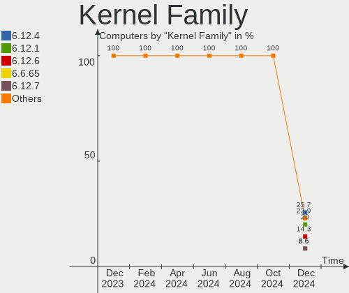

| Version | Computers | Percent |
|---------|-----------|---------|
| 6.6.1   | 22        | 28.95%  |
| 6.5.9   | 21        | 27.63%  |
| 6.6.2   | 16        | 21.05%  |
| 6.1.61  | 6         | 7.89%   |
| 6.6.3   | 2         | 2.63%   |
| 6.5.8   | 2         | 2.63%   |
| 6.1.63  | 2         | 2.63%   |
| 6.6.0   | 1         | 1.32%   |
| 6.4.8   | 1         | 1.32%   |
| 6.1.62  | 1         | 1.32%   |
| 6.1.60  | 1         | 1.32%   |
| 6.1.58  | 1         | 1.32%   |

Kernel Major Ver.
-----------------

Linux kernel major version

| Version | Computers | Percent |
|---------|-----------|---------|
| 6.6     | 41        | 53.95%  |
| 6.5     | 23        | 30.26%  |
| 6.1     | 11        | 14.47%  |
| 6.4     | 1         | 1.32%   |

Arch
----

OS architecture (x86_64, i586, etc.)

| Name   | Computers | Percent |
|--------|-----------|---------|
| x86_64 | 76        | 100%    |

DE
--

Desktop Environment

| Name       | Computers | Percent |
|------------|-----------|---------|
| KDE5       | 39        | 51.32%  |
| GNOME      | 15        | 19.74%  |
| XFCE       | 8         | 10.53%  |
| i3         | 5         | 6.58%   |
| Hyprland   | 2         | 2.63%   |
| Unknown    | 2         | 2.63%   |
| X-Cinnamon | 1         | 1.32%   |
| qtile      | 1         | 1.32%   |
| KDE        | 1         | 1.32%   |
| Deepin     | 1         | 1.32%   |
| Budgie     | 1         | 1.32%   |

Display Server
--------------

X11 or Wayland

| Name    | Computers | Percent |
|---------|-----------|---------|
| X11     | 53        | 69.74%  |
| Wayland | 21        | 27.63%  |
| Tty     | 1         | 1.32%   |
| Unknown | 1         | 1.32%   |

Display Manager
---------------

SDDM, LightDM, etc.

| Name    | Computers | Percent |
|---------|-----------|---------|
| SDDM    | 26        | 34.21%  |
| Unknown | 26        | 34.21%  |
| LightDM | 17        | 22.37%  |
| GDM     | 5         | 6.58%   |
| LY-DM   | 1         | 1.32%   |
| GREETD  | 1         | 1.32%   |

OS Lang
-------

Language

| Lang    | Computers | Percent |
|---------|-----------|---------|
| en_US   | 35        | 46.05%  |
| it_IT   | 7         | 9.21%   |
| de_DE   | 5         | 6.58%   |
| en_GB   | 4         | 5.26%   |
| en_CA   | 4         | 5.26%   |
| nl_NL   | 3         | 3.95%   |
| ru_RU   | 2         | 2.63%   |
| pt_BR   | 2         | 2.63%   |
| fr_FR   | 2         | 2.63%   |
| es_ES   | 2         | 2.63%   |
| en_AU   | 2         | 2.63%   |
| Unknown | 2         | 2.63%   |
| sv_SE   | 1         | 1.32%   |
| pl_PL   | 1         | 1.32%   |
| es_PE   | 1         | 1.32%   |
| en_ZA   | 1         | 1.32%   |
| en_IN   | 1         | 1.32%   |
| de_AT   | 1         | 1.32%   |

Boot Mode
---------

EFI or BIOS

| Mode | Computers | Percent |
|------|-----------|---------|
| EFI  | 47        | 61.84%  |
| BIOS | 29        | 38.16%  |

Filesystem
----------

Type of filesystem

| Type    | Computers | Percent |
|---------|-----------|---------|
| Ext4    | 53        | 69.74%  |
| Btrfs   | 20        | 26.32%  |
| Overlay | 2         | 2.63%   |
| Tmpfs   | 1         | 1.32%   |

Part. scheme
------------

Scheme of partitioning

| Type    | Computers | Percent |
|---------|-----------|---------|
| GPT     | 48        | 63.16%  |
| Unknown | 24        | 31.58%  |
| MBR     | 4         | 5.26%   |

Dual Boot with Linux/BSD
------------------------

Hosting more than one Linux/BSD

| Dual boot | Computers | Percent |
|-----------|-----------|---------|
| No        | 69        | 90.79%  |
| Yes       | 7         | 9.21%   |

Dual Boot (Win)
---------------

Hosting Linux and Windows

| Dual boot | Computers | Percent |
|-----------|-----------|---------|
| No        | 51        | 67.11%  |
| Yes       | 25        | 32.89%  |

Board
-----

Vendor
------

Motherboard manufacturer

| Name                | Computers | Percent |
|---------------------|-----------|---------|
| Lenovo              | 20        | 26.32%  |
| ASUSTek Computer    | 19        | 25%     |
| MSI                 | 8         | 10.53%  |
| Hewlett-Packard     | 7         | 9.21%   |
| Gigabyte Technology | 4         | 5.26%   |
| Microsoft           | 3         | 3.95%   |
| ASRock              | 3         | 3.95%   |
| TUXEDO              | 2         | 2.63%   |
| Dell                | 2         | 2.63%   |
| Apple               | 2         | 2.63%   |
| Acer                | 2         | 2.63%   |
| Sony                | 1         | 1.32%   |
| Medion              | 1         | 1.32%   |
| Fujitsu             | 1         | 1.32%   |
| Unknown             | 1         | 1.32%   |

Model
-----

Motherboard model

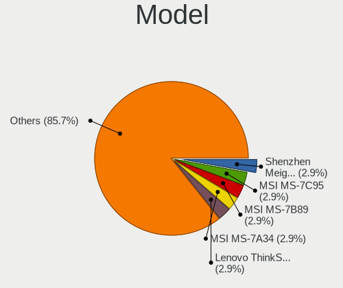

| Name                                  | Computers | Percent |
|---------------------------------------|-----------|---------|
| TUXEDO Pulse 15 Gen1                  | 1         | 1.32%   |
| TUXEDO Gemini Gen2                    | 1         | 1.32%   |
| Sony SVE1713X1EB                      | 1         | 1.32%   |
| MSI MS-7C91                           | 1         | 1.32%   |
| MSI MS-7C84                           | 1         | 1.32%   |
| MSI MS-7B86                           | 1         | 1.32%   |
| MSI MS-7B79                           | 1         | 1.32%   |
| MSI MS-7A38                           | 1         | 1.32%   |
| MSI MS-7816                           | 1         | 1.32%   |
| MSI GV62 8RD                          | 1         | 1.32%   |
| MSI GF65 Thin 10UE                    | 1         | 1.32%   |
| Microsoft Surface Laptop Go 3         | 1         | 1.32%   |
| Microsoft Surface Laptop Go           | 1         | 1.32%   |
| Microsoft Surface Laptop              | 1         | 1.32%   |
| Medion P6681 MD60814                  | 1         | 1.32%   |
| Lenovo Yoga AIO 7 27ARH6 F0FN000NMT   | 1         | 1.32%   |
| Lenovo Yoga 730-15IWL 81JS            | 1         | 1.32%   |
| Lenovo Yoga 3 Pro-1370 80HE           | 1         | 1.32%   |
| Lenovo ThinkPad T460p 20FXS0FS00      | 1         | 1.32%   |
| Lenovo ThinkPad T430s 23553J2         | 1         | 1.32%   |
| Lenovo ThinkPad T16 Gen 1 21BV0096US  | 1         | 1.32%   |
| Lenovo ThinkPad T14s Gen 4 21F80041GE | 1         | 1.32%   |
| Lenovo ThinkPad T14 Gen 1 20UES00L00  | 1         | 1.32%   |
| Lenovo ThinkPad L14 Gen 3 21C5CTO1WW  | 1         | 1.32%   |
| Lenovo ThinkPad E14 20RBS25S00        | 1         | 1.32%   |
| Lenovo ThinkPad E14 20RA001HMZ        | 1         | 1.32%   |
| Lenovo Legion 7 15IMH05 81YT          | 1         | 1.32%   |
| Lenovo Legion 5 Pro 16ACH6H 82JQ      | 1         | 1.32%   |
| Lenovo Legion 5 15ACH6A 82NW          | 1         | 1.32%   |
| Lenovo IdeaPadFlex 5 16ABR8 82XY      | 1         | 1.32%   |
| Lenovo IdeaPad Gaming 3 15ACH6 82K2   | 1         | 1.32%   |
| Lenovo IdeaPad 530S-14IKB 81EU        | 1         | 1.32%   |
| Lenovo IdeaPad 5 Pro 14ITL6 82L3      | 1         | 1.32%   |
| Lenovo IdeaPad 110-15ISK 80UD         | 1         | 1.32%   |
| Lenovo IdeaPad 110-15IBR 80T7         | 1         | 1.32%   |
| HP Victus by Laptop 16-d1xxx          | 1         | 1.32%   |
| HP ProBook x360 435 G8 Notebook PC    | 1         | 1.32%   |
| HP ProBook 430 G1                     | 1         | 1.32%   |
| HP Pavilion Laptop 15-cs0xxx          | 1         | 1.32%   |
| HP EliteBook 745 G4                   | 1         | 1.32%   |

Model Family
------------

Motherboard model prefix

| Name               | Computers | Percent |
|--------------------|-----------|---------|
| Lenovo ThinkPad    | 8         | 10.53%  |
| Lenovo IdeaPad     | 5         | 6.58%   |
| ASUS ROG           | 5         | 6.58%   |
| Microsoft Surface  | 3         | 3.95%   |
| Lenovo Yoga        | 3         | 3.95%   |
| Lenovo Legion      | 3         | 3.95%   |
| ASUS VivoBook      | 3         | 3.95%   |
| HP ProBook         | 2         | 2.63%   |
| HP EliteBook       | 2         | 2.63%   |
| ASUS TUF           | 2         | 2.63%   |
| ASUS ASUS          | 2         | 2.63%   |
| TUXEDO Pulse       | 1         | 1.32%   |
| TUXEDO Gemini      | 1         | 1.32%   |
| Sony SVE1713X1EB   | 1         | 1.32%   |
| MSI MS-7C91        | 1         | 1.32%   |
| MSI MS-7C84        | 1         | 1.32%   |
| MSI MS-7B86        | 1         | 1.32%   |
| MSI MS-7B79        | 1         | 1.32%   |
| MSI MS-7A38        | 1         | 1.32%   |
| MSI MS-7816        | 1         | 1.32%   |
| MSI GV62           | 1         | 1.32%   |
| MSI GF65           | 1         | 1.32%   |
| Medion P6681       | 1         | 1.32%   |
| Lenovo IdeaPadFlex | 1         | 1.32%   |
| HP Victus          | 1         | 1.32%   |
| HP Pavilion        | 1         | 1.32%   |
| HP Compaq          | 1         | 1.32%   |
| Gigabyte P55A-UD3  | 1         | 1.32%   |
| Gigabyte B550M     | 1         | 1.32%   |
| Gigabyte B450M     | 1         | 1.32%   |
| Gigabyte B450      | 1         | 1.32%   |
| Fujitsu FMVC06001  | 1         | 1.32%   |
| Dell XPS           | 1         | 1.32%   |
| Dell G7            | 1         | 1.32%   |
| ASUS Z170M-PLUS    | 1         | 1.32%   |
| ASUS X751LD        | 1         | 1.32%   |
| ASUS UX430UNR      | 1         | 1.32%   |
| ASUS UX370UAR      | 1         | 1.32%   |
| ASUS PRIME         | 1         | 1.32%   |
| ASUS INTEL         | 1         | 1.32%   |

MFG Year
--------

Motherboard manufacture year

| Year | Computers | Percent |
|------|-----------|---------|
| 2020 | 11        | 14.47%  |
| 2018 | 11        | 14.47%  |
| 2022 | 10        | 13.16%  |
| 2021 | 9         | 11.84%  |
| 2019 | 9         | 11.84%  |
| 2023 | 7         | 9.21%   |
| 2016 | 4         | 5.26%   |
| 2014 | 4         | 5.26%   |
| 2017 | 3         | 3.95%   |
| 2012 | 3         | 3.95%   |
| 2013 | 2         | 2.63%   |
| 2015 | 1         | 1.32%   |
| 2009 | 1         | 1.32%   |
| 2008 | 1         | 1.32%   |

Form Factor
-----------

Physical design of the computer

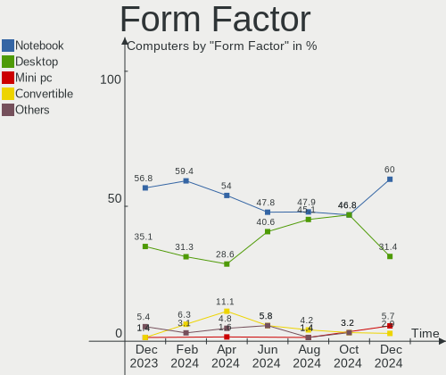

| Name        | Computers | Percent |
|-------------|-----------|---------|
| Notebook    | 43        | 56.58%  |
| Desktop     | 23        | 30.26%  |
| Convertible | 6         | 7.89%   |
| Tablet      | 3         | 3.95%   |
| All in one  | 1         | 1.32%   |

Secure Boot
-----------

Enabled or disabled

| State    | Computers | Percent |
|----------|-----------|---------|
| Disabled | 75        | 98.68%  |
| Enabled  | 1         | 1.32%   |

Coreboot
--------

Have coreboot on board

| Used | Computers | Percent |
|------|-----------|---------|
| No   | 76        | 100%    |

RAM Size
--------

Total RAM memory

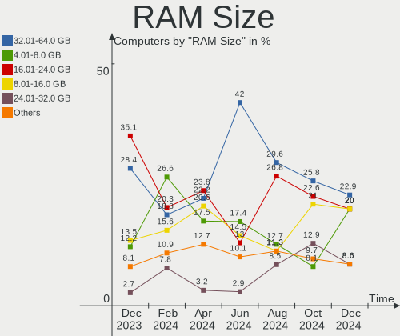

| Size in GB  | Computers | Percent |
|-------------|-----------|---------|
| 8.01-16.0   | 21        | 27.63%  |
| 16.01-24.0  | 19        | 25%     |
| 32.01-64.0  | 16        | 21.05%  |
| 4.01-8.0    | 6         | 7.89%   |
| 24.01-32.0  | 5         | 6.58%   |
| 3.01-4.0    | 4         | 5.26%   |
| 64.01-256.0 | 4         | 5.26%   |
| 1.01-2.0    | 1         | 1.32%   |

RAM Used
--------

Used RAM memory

| Used GB    | Computers | Percent |
|------------|-----------|---------|
| 4.01-8.0   | 29        | 38.16%  |
| 2.01-3.0   | 15        | 19.74%  |
| 3.01-4.0   | 10        | 13.16%  |
| 8.01-16.0  | 10        | 13.16%  |
| 1.01-2.0   | 8         | 10.53%  |
| 24.01-32.0 | 2         | 2.63%   |
| 16.01-24.0 | 1         | 1.32%   |
| 0.51-1.0   | 1         | 1.32%   |

Total Drives
------------

Number of drives on board

| Drives | Computers | Percent |
|--------|-----------|---------|
| 1      | 45        | 59.21%  |
| 2      | 15        | 19.74%  |
| 3      | 8         | 10.53%  |
| 4      | 4         | 5.26%   |
| 6      | 2         | 2.63%   |
| 5      | 1         | 1.32%   |
| 0      | 1         | 1.32%   |

Has CD-ROM
----------

Has CD-ROM on board

| Presented | Computers | Percent |
|-----------|-----------|---------|
| No        | 65        | 85.53%  |
| Yes       | 11        | 14.47%  |

Has Ethernet
------------

Has Ethernet on board

| Presented | Computers | Percent |
|-----------|-----------|---------|
| Yes       | 62        | 81.58%  |
| No        | 14        | 18.42%  |

Has WiFi
--------

Has WiFi module

| Presented | Computers | Percent |
|-----------|-----------|---------|
| Yes       | 64        | 84.21%  |
| No        | 12        | 15.79%  |

Has Bluetooth
-------------

Has Bluetooth module

| Presented | Computers | Percent |
|-----------|-----------|---------|
| Yes       | 59        | 77.63%  |
| No        | 17        | 22.37%  |

Location
--------

Country
-------

Geographic location (country)

| Country      | Computers | Percent |
|--------------|-----------|---------|
| USA          | 14        | 18.42%  |
| Italy        | 10        | 13.16%  |
| Germany      | 10        | 13.16%  |
| Canada       | 4         | 5.26%   |
| UK           | 3         | 3.95%   |
| France       | 3         | 3.95%   |
| Brazil       | 3         | 3.95%   |
| Austria      | 3         | 3.95%   |
| Sweden       | 2         | 2.63%   |
| Spain        | 2         | 2.63%   |
| Poland       | 2         | 2.63%   |
| Netherlands  | 2         | 2.63%   |
| India        | 2         | 2.63%   |
| Australia    | 2         | 2.63%   |
| Turkey       | 1         | 1.32%   |
| Switzerland  | 1         | 1.32%   |
| South Africa | 1         | 1.32%   |
| Serbia       | 1         | 1.32%   |
| Russia       | 1         | 1.32%   |
| Peru         | 1         | 1.32%   |
| Mexico       | 1         | 1.32%   |
| Lithuania    | 1         | 1.32%   |
| Latvia       | 1         | 1.32%   |
| Kazakhstan   | 1         | 1.32%   |
| Hungary      | 1         | 1.32%   |
| Belgium      | 1         | 1.32%   |
| Bangladesh   | 1         | 1.32%   |
| Argentina    | 1         | 1.32%   |

City
----

Geographic location (city)

| City             | Computers | Percent |
|------------------|-----------|---------|
| Wilmington       | 2         | 2.63%   |
| Houston          | 2         | 2.63%   |
| Hamburg          | 2         | 2.63%   |
| Graz             | 2         | 2.63%   |
| Warsaw           | 1         | 1.32%   |
| Vigo             | 1         | 1.32%   |
| Vienna           | 1         | 1.32%   |
| Victoria         | 1         | 1.32%   |
| Tarsus           | 1         | 1.32%   |
| Tacoma           | 1         | 1.32%   |
| Surrey           | 1         | 1.32%   |
| Stockton-on-Tees | 1         | 1.32%   |
| Stockholm        | 1         | 1.32%   |
| Sao Paulo        | 1         | 1.32%   |
| Santos           | 1         | 1.32%   |
| Santa Cruz       | 1         | 1.32%   |
| Saint-Damase     | 1         | 1.32%   |
| Sabadell         | 1         | 1.32%   |
| Roosendaal       | 1         | 1.32%   |
| Rome             | 1         | 1.32%   |
| Rogers           | 1         | 1.32%   |
| Riga             | 1         | 1.32%   |
| Reutlingen       | 1         | 1.32%   |
| Recife           | 1         | 1.32%   |
| Rajshahi         | 1         | 1.32%   |
| Plaisir          | 1         | 1.32%   |
| Parma            | 1         | 1.32%   |
| Parker           | 1         | 1.32%   |
| Pachuca          | 1         | 1.32%   |
| Oakland          | 1         | 1.32%   |
| Nantes           | 1         | 1.32%   |
| Munich           | 1         | 1.32%   |
| Mountville       | 1         | 1.32%   |
| Morsang-sur-Orge | 1         | 1.32%   |
| Mississauga      | 1         | 1.32%   |
| Milano           | 1         | 1.32%   |
| Milan            | 1         | 1.32%   |
| Melbourne        | 1         | 1.32%   |
| Marietta         | 1         | 1.32%   |
| Los Angeles      | 1         | 1.32%   |

Drives
------

Drive Vendor
------------

Hard drive vendors

| Vendor                      | Computers | Drives | Percent |
|-----------------------------|-----------|--------|---------|
| Samsung Electronics         | 28        | 35     | 23.93%  |
| Sandisk                     | 13        | 14     | 11.11%  |
| Seagate                     | 12        | 13     | 10.26%  |
| WDC                         | 10        | 11     | 8.55%   |
| Phison Electronics          | 9         | 11     | 7.69%   |
| Micron Technology           | 5         | 5      | 4.27%   |
| Toshiba                     | 4         | 4      | 3.42%   |
| Crucial                     | 4         | 4      | 3.42%   |
| Unknown                     | 3         | 3      | 2.56%   |
| SK hynix                    | 3         | 3      | 2.56%   |
| KIOXIA                      | 3         | 3      | 2.56%   |
| Kingston                    | 3         | 5      | 2.56%   |
| Patriot                     | 2         | 2      | 1.71%   |
| Micron/Crucial Technology   | 2         | 2      | 1.71%   |
| Kingston Technology Company | 2         | 2      | 1.71%   |
| Intel                       | 2         | 2      | 1.71%   |
| Apple                       | 2         | 2      | 1.71%   |
| Team                        | 1         | 1      | 0.85%   |
| SUNEAST                     | 1         | 1      | 0.85%   |
| Solid State Storage         | 1         | 1      | 0.85%   |
| MAXIO Technology (Hangzhou) | 1         | 1      | 0.85%   |
| Kimtigo                     | 1         | 1      | 0.85%   |
| Intenso                     | 1         | 1      | 0.85%   |
| Hitachi                     | 1         | 1      | 0.85%   |
| HGST                        | 1         | 1      | 0.85%   |
| Hewlett-Packard             | 1         | 1      | 0.85%   |
| DockCase                    | 1         | 1      | 0.85%   |

Drive Model
-----------

Hard drive models

| Model                                               | Computers | Percent |
|-----------------------------------------------------|-----------|---------|
| Samsung NVMe SSD Controller SM981/PM981/PM983 250GB | 8         | 6.25%   |
| Phison E12 NVMe Controller 512GB                    | 6         | 4.69%   |
| Samsung NVMe SSD Controller PM9A1/PM9A3/980PRO 2TB  | 4         | 3.13%   |
| Sandisk WD Black SN750 / PC SN730 NVMe SSD 500GB    | 3         | 2.34%   |
| Samsung SSD 980 1TB                                 | 3         | 2.34%   |
| Unknown NVMe SSD Drive 2TB                          | 2         | 1.56%   |
| Toshiba BG3 NVMe SSD Controller 128GB               | 2         | 1.56%   |
| Seagate ST2000DM008-2FR102 2TB                      | 2         | 1.56%   |
| Seagate ST1000LM024 HN-M101MBB 1TB                  | 2         | 1.56%   |
| Samsung SSD 860 EVO 250GB                           | 2         | 1.56%   |
| Samsung MZALQ512HBLU-00BL2 512GB                    | 2         | 1.56%   |
| Samsung HD103SJ 1TB                                 | 2         | 1.56%   |
| Micron 2210_MTFDHBA512QFD 512GB                     | 2         | 1.56%   |
| Crucial CT500MX500SSD1 500GB                        | 2         | 1.56%   |
| WDC WDS500G2B0B-00YS70 500GB SSD                    | 1         | 0.78%   |
| WDC WDS500G2B0A-00SM50 500GB SSD                    | 1         | 0.78%   |
| WDC WD6003FZBX-00K5WB0 6TB                          | 1         | 0.78%   |
| WDC WD5000LPCX-24VHAT0 500GB                        | 1         | 0.78%   |
| WDC WD2500AAKX-603CA0 250GB                         | 1         | 0.78%   |
| WDC WD20EZRZ-00Z5HB0 2TB                            | 1         | 0.78%   |
| WDC WD1600AAJS-75PSA0 160GB                         | 1         | 0.78%   |
| WDC WD10SPZX-80Z10T2 1TB                            | 1         | 0.78%   |
| WDC WD10SPZX-17Z10T1 1TB                            | 1         | 0.78%   |
| WDC WD10SPZX-08Z10 1TB                              | 1         | 0.78%   |
| WDC WD10EZEX-22MFCA0 1TB                            | 1         | 0.78%   |
| Unknown MMC Card  128GB                             | 1         | 0.78%   |
| Toshiba MK5065GSX 500GB                             | 1         | 0.78%   |
| Toshiba MG09ACA18TE 18TB                            | 1         | 0.78%   |
| Team T253X1120G 120GB SSD                           | 1         | 0.78%   |
| SUNEAST SSD SE800 NGFF 256GB                        | 1         | 0.78%   |
| Solid State Storage SSSTC CL1-4D256-D22 256GB       | 1         | 0.78%   |
| SK hynix PC401 NVMe Solid State Drive 256GB         | 1         | 0.78%   |
| SK hynix HFS256G39TND-N210A 256GB SSD               | 1         | 0.78%   |
| SK hynix BC511 512GB                                | 1         | 0.78%   |
| Seagate ST500LM021-1KJ152 500GB                     | 1         | 0.78%   |
| Seagate ST500DM002-1SB10A 500GB                     | 1         | 0.78%   |
| Seagate ST4000VN006-3CW104 4TB                      | 1         | 0.78%   |
| Seagate ST4000DM004-2CV104 4TB                      | 1         | 0.78%   |
| Seagate ST2000LM007-1R8174 2TB                      | 1         | 0.78%   |
| Seagate ST2000DL003-9VT166 2TB                      | 1         | 0.78%   |

HDD Vendor
----------

Hard disk drive vendors

| Vendor              | Computers | Drives | Percent |
|---------------------|-----------|--------|---------|
| Seagate             | 12        | 13     | 42.86%  |
| WDC                 | 9         | 9      | 32.14%  |
| Samsung Electronics | 3         | 3      | 10.71%  |
| Toshiba             | 2         | 2      | 7.14%   |
| Hitachi             | 1         | 1      | 3.57%   |
| HGST                | 1         | 1      | 3.57%   |

SSD Vendor
----------

Solid state drive vendors

| Vendor              | Computers | Drives | Percent |
|---------------------|-----------|--------|---------|
| Samsung Electronics | 9         | 10     | 28.13%  |
| SanDisk             | 5         | 5      | 15.63%  |
| Crucial             | 4         | 4      | 12.5%   |
| WDC                 | 2         | 2      | 6.25%   |
| Patriot             | 2         | 2      | 6.25%   |
| Kingston            | 2         | 3      | 6.25%   |
| Apple               | 2         | 2      | 6.25%   |
| Team                | 1         | 1      | 3.13%   |
| SUNEAST             | 1         | 1      | 3.13%   |
| SK hynix            | 1         | 1      | 3.13%   |
| Kimtigo             | 1         | 1      | 3.13%   |
| Intel               | 1         | 1      | 3.13%   |
| Hewlett-Packard     | 1         | 1      | 3.13%   |

Drive Kind
----------

HDD or SSD

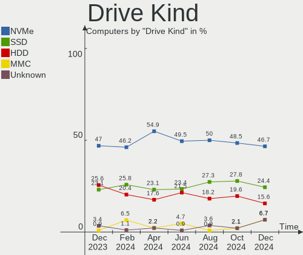

| Kind    | Computers | Drives | Percent |
|---------|-----------|--------|---------|
| NVMe    | 50        | 65     | 47.62%  |
| SSD     | 29        | 34     | 27.62%  |
| HDD     | 23        | 29     | 21.9%   |
| Unknown | 2         | 2      | 1.9%    |
| MMC     | 1         | 1      | 0.95%   |

Drive Connector
---------------

SATA, SAS, NVMe, etc.

| Type | Computers | Drives | Percent |
|------|-----------|--------|---------|
| NVMe | 50        | 65     | 52.63%  |
| SATA | 40        | 61     | 42.11%  |
| SAS  | 4         | 4      | 4.21%   |
| MMC  | 1         | 1      | 1.05%   |

Drive Size
----------

Size of hard drive

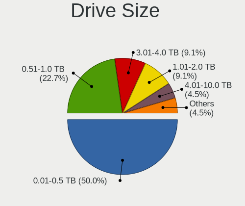

| Size in TB | Computers | Drives | Percent |
|------------|-----------|--------|---------|
| 0.01-0.5   | 28        | 33     | 51.85%  |
| 0.51-1.0   | 17        | 20     | 31.48%  |
| 1.01-2.0   | 5         | 6      | 9.26%   |
| 3.01-4.0   | 2         | 2      | 3.7%    |
| 10.01-20.0 | 1         | 1      | 1.85%   |
| 4.01-10.0  | 1         | 1      | 1.85%   |

Space Total
-----------

Amount of disk space available on the file system

| Size in GB     | Computers | Percent |
|----------------|-----------|---------|
| 251-500        | 15        | 19.74%  |
| 101-250        | 15        | 19.74%  |
| 1001-2000      | 12        | 15.79%  |
| 501-1000       | 11        | 14.47%  |
| More than 3000 | 8         | 10.53%  |
| 1-20           | 5         | 6.58%   |
| Unknown        | 4         | 5.26%   |
| 2001-3000      | 3         | 3.95%   |
| 21-50          | 2         | 2.63%   |
| 51-100         | 1         | 1.32%   |

Space Used
----------

Amount of used disk space

| Used GB        | Computers | Percent |
|----------------|-----------|---------|
| 1-20           | 18        | 23.68%  |
| 101-250        | 11        | 14.47%  |
| 21-50          | 10        | 13.16%  |
| 51-100         | 10        | 13.16%  |
| 1001-2000      | 8         | 10.53%  |
| 251-500        | 6         | 7.89%   |
| 501-1000       | 5         | 6.58%   |
| Unknown        | 4         | 5.26%   |
| More than 3000 | 2         | 2.63%   |
| 2001-3000      | 1         | 1.32%   |
| 0              | 1         | 1.32%   |

Malfunc. Drives
---------------

Drive models with a malfunction

| Model                                                           | Computers | Drives | Percent |
|-----------------------------------------------------------------|-----------|--------|---------|
| Seagate ST4000DM004-2CV104 4TB                                  | 1         | 1      | 16.67%  |
| SanDisk SDSSDX120GG25 120GB                                     | 1         | 1      | 16.67%  |
| Samsung Electronics NVMe SSD Controller SM981/PM981/PM983 250GB | 1         | 1      | 16.67%  |
| Samsung Electronics HD103SI 1TB                                 | 1         | 1      | 16.67%  |
| Patriot P210 256GB SSD                                          | 1         | 1      | 16.67%  |
| Crucial CT500MX500SSD1 500GB                                    | 1         | 1      | 16.67%  |

Malfunc. Drive Vendor
---------------------

Vendors of faulty drives

| Vendor              | Computers | Drives | Percent |
|---------------------|-----------|--------|---------|
| Samsung Electronics | 2         | 2      | 33.33%  |
| Seagate             | 1         | 1      | 16.67%  |
| SanDisk             | 1         | 1      | 16.67%  |
| Patriot             | 1         | 1      | 16.67%  |
| Crucial             | 1         | 1      | 16.67%  |

Malfunc. HDD Vendor
-------------------

Vendors of faulty HDD drives

| Vendor              | Computers | Drives | Percent |
|---------------------|-----------|--------|---------|
| Seagate             | 1         | 1      | 50%     |
| Samsung Electronics | 1         | 1      | 50%     |

Malfunc. Drive Kind
-------------------

Kinds of faulty drives

| Kind | Computers | Drives | Percent |
|------|-----------|--------|---------|
| SSD  | 3         | 3      | 50%     |
| HDD  | 2         | 2      | 33.33%  |
| NVMe | 1         | 1      | 16.67%  |

Failed Drives
-------------

Failed drive models

| Model                                            | Computers | Drives | Percent |
|--------------------------------------------------|-----------|--------|---------|
| Sandisk WD Black SN750 / PC SN730 NVMe SSD 500GB | 1         | 1      | 100%    |

Failed Drive Vendor
-------------------

Failed drive vendors

| Vendor  | Computers | Drives | Percent |
|---------|-----------|--------|---------|
| Sandisk | 1         | 1      | 100%    |

Drive Status
------------

Number of failed and malfunc. drives

| Status   | Computers | Drives | Percent |
|----------|-----------|--------|---------|
| Works    | 49        | 69     | 56.32%  |
| Detected | 31        | 55     | 35.63%  |
| Malfunc  | 6         | 6      | 6.9%    |
| Failed   | 1         | 1      | 1.15%   |

Storage controller
------------------

Storage Vendor
--------------

Storage controller vendors

| Vendor                         | Computers | Percent |
|--------------------------------|-----------|---------|
| Intel                          | 32        | 28.07%  |
| Samsung Electronics            | 20        | 17.54%  |
| AMD                            | 20        | 17.54%  |
| SanDisk                        | 9         | 7.89%   |
| Phison Electronics             | 9         | 7.89%   |
| Micron Technology              | 5         | 4.39%   |
| Kingston Technology Company    | 4         | 3.51%   |
| KIOXIA                         | 3         | 2.63%   |
| Toshiba America Info Systems   | 2         | 1.75%   |
| SK hynix                       | 2         | 1.75%   |
| Nextorage                      | 2         | 1.75%   |
| Micron/Crucial Technology      | 2         | 1.75%   |
| Solid State Storage Technology | 1         | 0.88%   |
| MAXIO Technology (Hangzhou)    | 1         | 0.88%   |
| Marvell Technology Group       | 1         | 0.88%   |
| ASMedia Technology             | 1         | 0.88%   |

Storage Model
-------------

Storage controller models

| Model                                                                   | Computers | Percent |
|-------------------------------------------------------------------------|-----------|---------|
| AMD FCH SATA Controller [AHCI mode]                                     | 13        | 10.74%  |
| Samsung NVMe SSD Controller SM981/PM981/PM983                           | 8         | 6.61%   |
| AMD 400 Series Chipset SATA Controller                                  | 8         | 6.61%   |
| Intel Sunrise Point-LP SATA Controller [AHCI mode]                      | 7         | 5.79%   |
| Phison E12 NVMe Controller                                              | 6         | 4.96%   |
| Samsung NVMe SSD Controller 980 (DRAM-less)                             | 5         | 4.13%   |
| Samsung NVMe SSD Controller PM9A1/PM9A3/980PRO                          | 4         | 3.31%   |
| SanDisk Extreme Pro / WD Black SN750 / PC SN730 / Red SN700 NVMe SSD    | 3         | 2.48%   |
| Micron 2210 NVMe SSD [Cobain]                                           | 3         | 2.48%   |
| Intel Cannon Lake Mobile PCH SATA AHCI Controller                       | 3         | 2.48%   |
| Toshiba America Info Systems BG3 x2 NVMe SSD Controller (DRAM-less)     | 2         | 1.65%   |
| SanDisk Ultra 3D / WD Blue SN570 NVMe SSD (DRAM-less)                   | 2         | 1.65%   |
| Samsung NVMe SSD Controller PM9B1 (DRAM-less)                           | 2         | 1.65%   |
| Phison PS5021-E21 PCIe4 NVMe Controller (DRAM-less)                     | 2         | 1.65%   |
| Nextorage NE1N NVMe SSD                                                 | 2         | 1.65%   |
| Micron/Crucial P5 Plus NVMe PCIe SSD                                    | 2         | 1.65%   |
| KIOXIA NVMe SSD Controller BG4 (DRAM-less)                              | 2         | 1.65%   |
| Kingston Company NV2 NVMe SSD SM2267XT                                  | 2         | 1.65%   |
| Kingston Company KC3000/FURY Renegade NVMe SSD E18                      | 2         | 1.65%   |
| Intel Volume Management Device NVMe RAID Controller                     | 2         | 1.65%   |
| Intel Comet Lake SATA AHCI Controller                                   | 2         | 1.65%   |
| Intel 8 Series SATA Controller 1 [AHCI mode]                            | 2         | 1.65%   |
| Intel 7 Series Chipset Family 6-port SATA Controller [AHCI mode]        | 2         | 1.65%   |
| Intel 400 Series Chipset Family SATA AHCI Controller                    | 2         | 1.65%   |
| AMD 500 Series Chipset SATA Controller                                  | 2         | 1.65%   |
| Solid State Storage CL1-3D256-Q11 NVMe SSD M.2                          | 1         | 0.83%   |
| SK hynix PC401 NVMe Solid State Drive 256GB                             | 1         | 0.83%   |
| SK hynix BC511 NVMe SSD                                                 | 1         | 0.83%   |
| SanDisk WD Black SN770 / PC SN740 256GB / PC SN560 (DRAM-less) NVMe SSD | 1         | 0.83%   |
| SanDisk Ultra 3D / WD Blue SN550 NVMe SSD                               | 1         | 0.83%   |
| SanDisk PC SN520 x2 M.2 2242 NVMe SSD                                   | 1         | 0.83%   |
| SanDisk IX SN530 NVMe SSD (DRAM-less)                                   | 1         | 0.83%   |
| Samsung S4LN053X01 AHCI SSD Controller(Apple slot)                      | 1         | 0.83%   |
| Samsung NVMe SSD Controller S4LV008[Pascal]                             | 1         | 0.83%   |
| Phison PS5019-E19 PCIe4 NVMe Controller (DRAM-less)                     | 1         | 0.83%   |
| Phison E18 PCIe4 NVMe Controller                                        | 1         | 0.83%   |
| Micron 2450 NVMe SSD [HendrixV] (DRAM-less)                             | 1         | 0.83%   |
| Micron 2200S NVMe SSD [Cassandra]                                       | 1         | 0.83%   |
| MAXIO (Hangzhou) NVMe SSD Controller MAP1202                            | 1         | 0.83%   |
| Marvell Group 88SS9183 PCIe SSD Controller                              | 1         | 0.83%   |

Storage Kind
------------

Kind of storage controller (IDE, SATA, NVMe, SAS, ...)

| Kind | Computers | Percent |
|------|-----------|---------|
| SATA | 52        | 49.52%  |
| NVMe | 50        | 47.62%  |
| RAID | 3         | 2.86%   |

Processor
---------

CPU Vendor
----------

Processor vendors

| Vendor | Computers | Percent |
|--------|-----------|---------|
| Intel  | 46        | 60.53%  |
| AMD    | 30        | 39.47%  |

CPU Model
---------

Processor models

| Model                                  | Computers | Percent |
|----------------------------------------|-----------|---------|
| Intel Core i7-10750H CPU @ 2.60GHz     | 4         | 5.26%   |
| AMD Ryzen 7 5800H with Radeon Graphics | 3         | 3.95%   |
| Intel Core i7-8550U CPU @ 1.80GHz      | 2         | 2.63%   |
| Intel Core i7-7500U CPU @ 2.70GHz      | 2         | 2.63%   |
| Intel Core i5-8300H CPU @ 2.30GHz      | 2         | 2.63%   |
| Intel Core i5-8250U CPU @ 1.60GHz      | 2         | 2.63%   |
| AMD Ryzen 7 4800H with Radeon Graphics | 2         | 2.63%   |
| AMD Ryzen 5 3600 6-Core Processor      | 2         | 2.63%   |
| Intel Xeon CPU E5-1680 v2 @ 3.00GHz    | 1         | 1.32%   |
| Intel N95                              | 1         | 1.32%   |
| Intel Core M-5Y71 CPU @ 1.20GHz        | 1         | 1.32%   |
| Intel Core i7-8750H CPU @ 2.20GHz      | 1         | 1.32%   |
| Intel Core i7-8565U CPU @ 1.80GHz      | 1         | 1.32%   |
| Intel Core i7-6500U CPU @ 2.50GHz      | 1         | 1.32%   |
| Intel Core i7-4790 CPU @ 3.60GHz       | 1         | 1.32%   |
| Intel Core i7-3632QM CPU @ 2.20GHz     | 1         | 1.32%   |
| Intel Core i7-10510U CPU @ 1.80GHz     | 1         | 1.32%   |
| Intel Core i5-7200U CPU @ 2.50GHz      | 1         | 1.32%   |
| Intel Core i5-6600K CPU @ 3.50GHz      | 1         | 1.32%   |
| Intel Core i5-6440HQ CPU @ 2.60GHz     | 1         | 1.32%   |
| Intel Core i5-4440 CPU @ 3.10GHz       | 1         | 1.32%   |
| Intel Core i5-4260U CPU @ 1.40GHz      | 1         | 1.32%   |
| Intel Core i5-4200U CPU @ 1.60GHz      | 1         | 1.32%   |
| Intel Core i5-3470 CPU @ 3.20GHz       | 1         | 1.32%   |
| Intel Core i5-3320M CPU @ 2.60GHz      | 1         | 1.32%   |
| Intel Core i5-1035G1 CPU @ 1.00GHz     | 1         | 1.32%   |
| Intel Core i5-10300H CPU @ 2.50GHz     | 1         | 1.32%   |
| Intel Core i5-10210U CPU @ 1.60GHz     | 1         | 1.32%   |
| Intel Core i5 CPU 750 @ 2.67GHz        | 1         | 1.32%   |
| Intel Core i3-4010U CPU @ 1.70GHz      | 1         | 1.32%   |
| Intel Core 2 Duo CPU P8600 @ 2.40GHz   | 1         | 1.32%   |
| Intel Celeron CPU N3060 @ 1.60GHz      | 1         | 1.32%   |
| Intel Celeron CPU 3955U @ 2.00GHz      | 1         | 1.32%   |
| Intel 13th Gen Core i9-13980HX         | 1         | 1.32%   |
| Intel 13th Gen Core i9-13900HX         | 1         | 1.32%   |
| Intel 13th Gen Core i5-13600K          | 1         | 1.32%   |
| Intel 12th Gen Core i7-1270P           | 1         | 1.32%   |
| Intel 12th Gen Core i7-12700KF         | 1         | 1.32%   |
| Intel 12th Gen Core i5-12500H          | 1         | 1.32%   |
| Intel 12th Gen Core i5-1235U           | 1         | 1.32%   |

CPU Model Family
----------------

Processor model prefix

| Model            | Computers | Percent |
|------------------|-----------|---------|
| Intel Core i5    | 16        | 21.05%  |
| Intel Core i7    | 14        | 18.42%  |
| AMD Ryzen 7      | 12        | 15.79%  |
| Other            | 10        | 13.16%  |
| AMD Ryzen 9      | 6         | 7.89%   |
| AMD Ryzen 5      | 6         | 7.89%   |
| AMD Ryzen 7 PRO  | 3         | 3.95%   |
| Intel Celeron    | 2         | 2.63%   |
| Intel Xeon       | 1         | 1.32%   |
| Intel Core M     | 1         | 1.32%   |
| Intel Core i3    | 1         | 1.32%   |
| Intel Core 2 Duo | 1         | 1.32%   |
| AMD Ryzen 3      | 1         | 1.32%   |
| AMD PRO A10      | 1         | 1.32%   |
| AMD Athlon       | 1         | 1.32%   |

CPU Cores
---------

Number of processor cores

| Number | Computers | Percent |
|--------|-----------|---------|
| 4      | 23        | 30.26%  |
| 8      | 18        | 23.68%  |
| 2      | 14        | 18.42%  |
| 6      | 10        | 13.16%  |
| 12     | 5         | 6.58%   |
| 24     | 2         | 2.63%   |
| 16     | 2         | 2.63%   |
| 14     | 1         | 1.32%   |
| 10     | 1         | 1.32%   |

CPU Sockets
-----------

Number of sockets

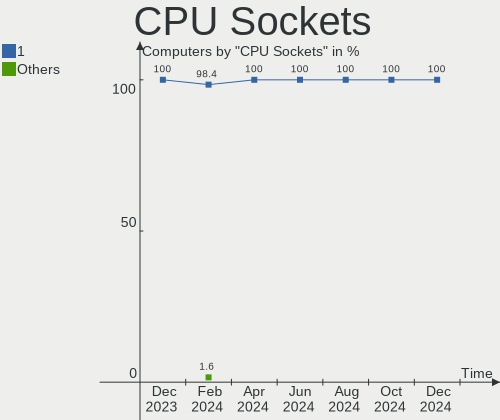

| Number | Computers | Percent |
|--------|-----------|---------|
| 1      | 76        | 100%    |

CPU Threads
-----------

Threads per core (Hyper-Threading)

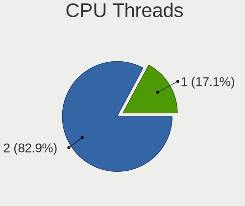

| Number | Computers | Percent |
|--------|-----------|---------|
| 2      | 66        | 86.84%  |
| 1      | 10        | 13.16%  |

CPU Op-Modes
------------

CPU Operation Modes (32-bit, 64-bit)

| Op mode        | Computers | Percent |
|----------------|-----------|---------|
| 32-bit, 64-bit | 76        | 100%    |

CPU Microcode
-------------

Microcode number

| Number     | Computers | Percent |
|------------|-----------|---------|
| Unknown    | 52        | 68.42%  |
| 0x0a201016 | 3         | 3.95%   |
| 0x0a704103 | 2         | 2.63%   |
| 0x0a50000d | 2         | 2.63%   |
| 0x0a50000c | 2         | 2.63%   |
| 0x08701021 | 2         | 2.63%   |
| 0x0800820d | 2         | 2.63%   |
| 0xb0671    | 1         | 1.32%   |
| 0x806ea    | 1         | 1.32%   |
| 0x506e3    | 1         | 1.32%   |
| 0x306c3    | 1         | 1.32%   |
| 0x0a601203 | 1         | 1.32%   |
| 0x0a20102b | 1         | 1.32%   |
| 0x08600106 | 1         | 1.32%   |
| 0x08600103 | 1         | 1.32%   |
| 0x08108109 | 1         | 1.32%   |
| 0x08101016 | 1         | 1.32%   |
| 0x0600611a | 1         | 1.32%   |

CPU Microarch
-------------

Microarchitecture

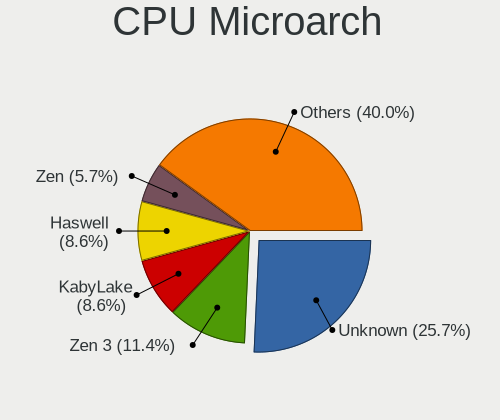

| Name             | Computers | Percent |
|------------------|-----------|---------|
| Zen 3            | 13        | 17.11%  |
| KabyLake         | 13        | 17.11%  |
| Unknown          | 7         | 9.21%   |
| Zen 2            | 6         | 7.89%   |
| Alderlake Hybrid | 6         | 7.89%   |
| Haswell          | 5         | 6.58%   |
| CometLake        | 5         | 6.58%   |
| Zen+             | 4         | 5.26%   |
| Skylake          | 4         | 5.26%   |
| IvyBridge        | 4         | 5.26%   |
| TigerLake        | 2         | 2.63%   |
| Zen              | 1         | 1.32%   |
| Silvermont       | 1         | 1.32%   |
| Penryn           | 1         | 1.32%   |
| Nehalem          | 1         | 1.32%   |
| IceLake          | 1         | 1.32%   |
| Excavator        | 1         | 1.32%   |
| Broadwell        | 1         | 1.32%   |

Graphics
--------

GPU Vendor
----------

Vendors of graphics cards

| Vendor | Computers | Percent |
|--------|-----------|---------|
| Intel  | 38        | 37.25%  |
| Nvidia | 33        | 32.35%  |
| AMD    | 31        | 30.39%  |

GPU Model
---------

Graphics card models

| Model                                                                | Computers | Percent |
|----------------------------------------------------------------------|-----------|---------|
| Intel CometLake-H GT2 [UHD Graphics]                                 | 5         | 4.85%   |
| Intel UHD Graphics 620                                               | 4         | 3.88%   |
| AMD Cezanne [Radeon Vega Series / Radeon Vega Mobile Series]         | 4         | 3.88%   |
| Intel HD Graphics 620                                                | 3         | 2.91%   |
| Intel Haswell-ULT Integrated Graphics Controller                     | 3         | 2.91%   |
| Intel CoffeeLake-H GT2 [UHD Graphics 630]                            | 3         | 2.91%   |
| AMD Renoir [Radeon RX Vega 6 (Ryzen 4000/5000 Mobile Series)]        | 3         | 2.91%   |
| AMD Navi 23 [Radeon RX 6600/6600 XT/6600M]                           | 3         | 2.91%   |
| AMD Navi 22 [Radeon RX 6700/6700 XT/6750 XT / 6800M/6850M XT]        | 3         | 2.91%   |
| Nvidia TU117M [GeForce GTX 1650 Mobile / Max-Q]                      | 2         | 1.94%   |
| Nvidia GP108M [GeForce MX150]                                        | 2         | 1.94%   |
| Nvidia GP107M [GeForce GTX 1050 Ti Mobile]                           | 2         | 1.94%   |
| Nvidia GP107M [GeForce GTX 1050 Mobile]                              | 2         | 1.94%   |
| Nvidia GM108M [GeForce 940MX]                                        | 2         | 1.94%   |
| Nvidia GA107M [GeForce RTX 3050 Mobile]                              | 2         | 1.94%   |
| Nvidia GA106M [GeForce RTX 3060 Mobile / Max-Q]                      | 2         | 1.94%   |
| Nvidia AD107M [GeForce RTX 4060 Max-Q / Mobile]                      | 2         | 1.94%   |
| Intel TigerLake-LP GT2 [Iris Xe Graphics]                            | 2         | 1.94%   |
| Intel Raptor Lake-S UHD Graphics                                     | 2         | 1.94%   |
| Intel CometLake-U GT2 [UHD Graphics]                                 | 2         | 1.94%   |
| Intel Alder Lake-P GT2 [Iris Xe Graphics]                            | 2         | 1.94%   |
| AMD Picasso/Raven 2 [Radeon Vega Series / Radeon Vega Mobile Series] | 2         | 1.94%   |
| AMD Phoenix1                                                         | 2         | 1.94%   |
| AMD Barcelo                                                          | 2         | 1.94%   |
| Nvidia TU106M [GeForce RTX 2070 Mobile / Max-Q Refresh]              | 1         | 0.97%   |
| Nvidia TU106M [GeForce RTX 2060 Mobile]                              | 1         | 0.97%   |
| Nvidia TU104BM [GeForce RTX 2070 SUPER Mobile / Max-Q]               | 1         | 0.97%   |
| Nvidia GP108 [GeForce GT 1030]                                       | 1         | 0.97%   |
| Nvidia GP107M [GeForce GTX 1050 3 GB Max-Q]                          | 1         | 0.97%   |
| Nvidia GP107 [GeForce GTX 1050 Ti]                                   | 1         | 0.97%   |
| Nvidia GP104 [GeForce GTX 1080]                                      | 1         | 0.97%   |
| Nvidia GM206 [GeForce GTX 960]                                       | 1         | 0.97%   |
| Nvidia GM107 [GeForce GTX 750 Ti]                                    | 1         | 0.97%   |
| Nvidia GF117M [GeForce 610M/710M/810M/820M / GT 620M/625M/630M/720M] | 1         | 0.97%   |
| Nvidia GA107M [GeForce RTX 3050 Ti Mobile]                           | 1         | 0.97%   |
| Nvidia GA106 [Geforce RTX 3050]                                      | 1         | 0.97%   |
| Nvidia GA102 [GeForce RTX 3090]                                      | 1         | 0.97%   |
| Nvidia GA102 [GeForce RTX 3080]                                      | 1         | 0.97%   |
| Nvidia GA102 [GeForce RTX 3080 Lite Hash Rate]                       | 1         | 0.97%   |
| Nvidia AD106M [GeForce RTX 4070 Max-Q / Mobile]                      | 1         | 0.97%   |

GPU Combo
---------

Combinations of graphics cards

| Name           | Computers | Percent |
|----------------|-----------|---------|
| 1 x AMD        | 22        | 28.95%  |
| Intel + Nvidia | 18        | 23.68%  |
| 1 x Intel      | 18        | 23.68%  |
| 1 x Nvidia     | 9         | 11.84%  |
| AMD + Nvidia   | 6         | 7.89%   |
| 2 x AMD        | 2         | 2.63%   |
| Intel + AMD    | 1         | 1.32%   |

GPU Driver
----------

Free vs proprietary

| Driver      | Computers | Percent |
|-------------|-----------|---------|
| Free        | 52        | 68.42%  |
| Proprietary | 24        | 31.58%  |

GPU Memory
----------

Total video memory

| Size in GB | Computers | Percent |
|------------|-----------|---------|
| Unknown    | 48        | 63.16%  |
| 0.01-0.5   | 6         | 7.89%   |
| 3.01-4.0   | 5         | 6.58%   |
| 8.01-16.0  | 5         | 6.58%   |
| 1.01-2.0   | 4         | 5.26%   |
| 7.01-8.0   | 3         | 3.95%   |
| 16.01-24.0 | 2         | 2.63%   |
| 0.51-1.0   | 2         | 2.63%   |
| 2.01-3.0   | 1         | 1.32%   |

Monitor
-------

Monitor Vendor
--------------

Monitor vendors

| Vendor               | Computers | Percent |
|----------------------|-----------|---------|
| Samsung Electronics  | 14        | 13.33%  |
| Chimei Innolux       | 10        | 9.52%   |
| LG Display           | 9         | 8.57%   |
| BOE                  | 8         | 7.62%   |
| Goldstar             | 7         | 6.67%   |
| Dell                 | 7         | 6.67%   |
| AU Optronics         | 7         | 6.67%   |
| Lenovo               | 4         | 3.81%   |
| Hewlett-Packard      | 4         | 3.81%   |
| BenQ                 | 4         | 3.81%   |
| Ancor Communications | 4         | 3.81%   |
| Sharp                | 3         | 2.86%   |
| Iiyama               | 3         | 2.86%   |
| AOC                  | 3         | 2.86%   |
| TMX                  | 2         | 1.9%    |
| PANDA                | 2         | 1.9%    |
| ASUSTek Computer     | 2         | 1.9%    |
| Vestel Elektronik    | 1         | 0.95%   |
| Valve                | 1         | 0.95%   |
| Unknown              | 1         | 0.95%   |
| SKY                  | 1         | 0.95%   |
| Philips              | 1         | 0.95%   |
| Panasonic            | 1         | 0.95%   |
| InfoVision           | 1         | 0.95%   |
| HKC                  | 1         | 0.95%   |
| Gigabyte Technology  | 1         | 0.95%   |
| CSO                  | 1         | 0.95%   |
| Apple                | 1         | 0.95%   |
| Acer                 | 1         | 0.95%   |

Monitor Model
-------------

Monitor models

| Model                                                                 | Computers | Percent |
|-----------------------------------------------------------------------|-----------|---------|
| Samsung Electronics S24R65x SAM1023 1920x1080 530x300mm 24.0-inch     | 2         | 1.87%   |
| LG Display LCD Monitor LGD0555 2736x1824 260x173mm 12.3-inch          | 2         | 1.87%   |
| Vestel Elektronik 32W_LCD_TV VES3700 1920x1080 706x398mm 31.9-inch    | 1         | 0.93%   |
| Valve Index HMD VLV91A8                                               | 1         | 0.93%   |
| Unknown LCD Monitor FFFF 2288x1287 2550x2550mm 142.0-inch             | 1         | 0.93%   |
| TMX TL156VDXP0101 TMX1561 1920x1080 344x194mm 15.5-inch               | 1         | 0.93%   |
| TMX TL140ADXP02-0 TMX1401 2560x1600 301x188mm 14.0-inch               | 1         | 0.93%   |
| SKY TV-monitor SKY0402 1920x1080 885x498mm 40.0-inch                  | 1         | 0.93%   |
| Sharp LQ156M1JW01 SHP14C3 1920x1080 344x194mm 15.5-inch               | 1         | 0.93%   |
| Sharp LQ134N1JW52 SHP151E 1920x1200 288x180mm 13.4-inch               | 1         | 0.93%   |
| Sharp LCD Monitor SHP148D 3840x2160 344x194mm 15.5-inch               | 1         | 0.93%   |
| Samsung Electronics U32J59x SAM0F52 3840x2160 697x392mm 31.5-inch     | 1         | 0.93%   |
| Samsung Electronics SyncMaster SAM037C 1680x1050 474x296mm 22.0-inch  | 1         | 0.93%   |
| Samsung Electronics LF24T35 SAM707D 1920x1080 528x297mm 23.9-inch     | 1         | 0.93%   |
| Samsung Electronics LCD Monitor SEC5442 1440x900 303x190mm 14.1-inch  | 1         | 0.93%   |
| Samsung Electronics LCD Monitor SDC434A 3200x1800 293x165mm 13.2-inch | 1         | 0.93%   |
| Samsung Electronics LCD Monitor SDC4193 2880x1800 302x189mm 14.0-inch | 1         | 0.93%   |
| Samsung Electronics LCD Monitor SDC4178 3200x2000 344x215mm 16.0-inch | 1         | 0.93%   |
| Samsung Electronics LCD Monitor SDC364D 1920x1080 309x174mm 14.0-inch | 1         | 0.93%   |
| Samsung Electronics LCD Monitor SDC3350 1920x1080 293x165mm 13.2-inch | 1         | 0.93%   |
| Samsung Electronics LCD Monitor SAM7106 1920x1080 530x300mm 24.0-inch | 1         | 0.93%   |
| Samsung Electronics LCD Monitor SAM0B30 1920x1080 480x270mm 21.7-inch | 1         | 0.93%   |
| Samsung Electronics LC27T55 SAM701E 1920x1080 609x349mm 27.6-inch     | 1         | 0.93%   |
| Philips PHL 242E1GJ PHLC244 1920x1080 530x300mm 24.0-inch             | 1         | 0.93%   |
| PANDA LCD Monitor NCP0061 2560x1600 302x189mm 14.0-inch               | 1         | 0.93%   |
| PANDA LCD Monitor NCP004D 1920x1080 344x194mm 15.5-inch               | 1         | 0.93%   |
| Panasonic LCD Monitor MEI96A2 2880x1620 344x193mm 15.5-inch           | 1         | 0.93%   |
| LG Display LCD Monitor LGD069F 1920x1080 294x165mm 13.3-inch          | 1         | 0.93%   |
| LG Display LCD Monitor LGD05FA 1920x1080 310x170mm 13.9-inch          | 1         | 0.93%   |
| LG Display LCD Monitor LGD0599 1920x1080 309x174mm 14.0-inch          | 1         | 0.93%   |
| LG Display LCD Monitor LGD0590 1920x1080 344x194mm 15.5-inch          | 1         | 0.93%   |
| LG Display LCD Monitor LGD0563 1920x1080 344x194mm 15.5-inch          | 1         | 0.93%   |
| LG Display LCD Monitor LGD0362 1600x900 309x174mm 14.0-inch           | 1         | 0.93%   |
| LG Display LCD Monitor LGD0354 1366x768 293x165mm 13.2-inch           | 1         | 0.93%   |
| Lenovo P24q-10 LEN61A5 2560x1440 527x296mm 23.8-inch                  | 1         | 0.93%   |
| Lenovo LEN-Yoga27-A LEN1000 3840x2160 708x399mm 32.0-inch             | 1         | 0.93%   |
| Lenovo LEN Y27q-20 LEN65EE 2560x1440 597x336mm 27.0-inch              | 1         | 0.93%   |
| Lenovo LEN L24q-30 LEN65FB 2560x1440 527x296mm 23.8-inch              | 1         | 0.93%   |
| InfoVision LCD Monitor IVO0641 1920x1200 345x215mm 16.0-inch          | 1         | 0.93%   |
| Iiyama PL3466WQ IVM761A 3440x1440 800x340mm 34.2-inch                 | 1         | 0.93%   |

Monitor Resolution
------------------

Monitor screen resolution

| Resolution         | Computers | Percent |
|--------------------|-----------|---------|
| 1920x1080 (FHD)    | 45        | 47.87%  |
| 2560x1440 (QHD)    | 12        | 12.77%  |
| 3840x2160 (4K)     | 7         | 7.45%   |
| 2560x1600          | 4         | 4.26%   |
| 1920x1200 (WUXGA)  | 4         | 4.26%   |
| 1600x900 (HD+)     | 3         | 3.19%   |
| 1366x768 (WXGA)    | 3         | 3.19%   |
| 3440x1440          | 2         | 2.13%   |
| 2736x1824          | 2         | 2.13%   |
| 1680x1050 (WSXGA+) | 2         | 2.13%   |
| 1440x900 (WXGA+)   | 2         | 2.13%   |
| 3200x2000          | 1         | 1.06%   |
| 3200x1800 (QHD+)   | 1         | 1.06%   |
| 2880x1800          | 1         | 1.06%   |
| 2560x1080          | 1         | 1.06%   |
| 2288x1287          | 1         | 1.06%   |
| 2240x1400          | 1         | 1.06%   |
| 1280x1024 (SXGA)   | 1         | 1.06%   |
| Unknown            | 1         | 1.06%   |

Monitor Diagonal
----------------

Diagonal size in inches

| Inches  | Computers | Percent |
|---------|-----------|---------|
| 24      | 19        | 17.92%  |
| 15      | 18        | 16.98%  |
| 27      | 12        | 11.32%  |
| 13      | 11        | 10.38%  |
| 14      | 9         | 8.49%   |
| 16      | 6         | 5.66%   |
| 17      | 5         | 4.72%   |
| 23      | 4         | 3.77%   |
| 34      | 3         | 2.83%   |
| 22      | 3         | 2.83%   |
| 54      | 2         | 1.89%   |
| 31      | 2         | 1.89%   |
| 21      | 2         | 1.89%   |
| 12      | 2         | 1.89%   |
| 142     | 1         | 0.94%   |
| 84      | 1         | 0.94%   |
| 72      | 1         | 0.94%   |
| 40      | 1         | 0.94%   |
| 32      | 1         | 0.94%   |
| 20      | 1         | 0.94%   |
| 19      | 1         | 0.94%   |
| Unknown | 1         | 0.94%   |

Monitor Width
-------------

Physical width

| Width in mm    | Computers | Percent |
|----------------|-----------|---------|
| 301-350        | 36        | 36.36%  |
| 501-600        | 26        | 26.26%  |
| 201-300        | 9         | 9.09%   |
| 351-400        | 7         | 7.07%   |
| 401-500        | 6         | 6.06%   |
| 701-800        | 4         | 4.04%   |
| 601-700        | 4         | 4.04%   |
| 1501-2000      | 2         | 2.02%   |
| 1001-1500      | 2         | 2.02%   |
| More than 2000 | 1         | 1.01%   |
| 801-900        | 1         | 1.01%   |
| Unknown        | 1         | 1.01%   |

Aspect Ratio
------------

Proportional relationship between the width and the height

| Ratio   | Computers | Percent |
|---------|-----------|---------|
| 16/9    | 59        | 69.41%  |
| 16/10   | 18        | 21.18%  |
| 21/9    | 3         | 3.53%   |
| 3/2     | 2         | 2.35%   |
| 5/4     | 1         | 1.18%   |
| 1.00    | 1         | 1.18%   |
| Unknown | 1         | 1.18%   |

Monitor Area
------------

Area in inch

| Area in inch | Computers | Percent |
|----------------|-----------|---------|
| 201-250        | 24        | 22.64%  |
| 101-110        | 19        | 17.92%  |
| 81-90          | 14        | 13.21%  |
| 301-350        | 12        | 11.32%  |
| 71-80          | 8         | 7.55%   |
| 351-500        | 6         | 5.66%   |
| More than 1000 | 5         | 4.72%   |
| 111-120        | 5         | 4.72%   |
| 251-300        | 4         | 3.77%   |
| 121-130        | 3         | 2.83%   |
| 151-200        | 2         | 1.89%   |
| 131-140        | 2         | 1.89%   |
| 501-1000       | 1         | 0.94%   |
| Unknown        | 1         | 0.94%   |

Pixel Density
-------------

Pixels per inch

| Density       | Computers | Percent |
|---------------|-----------|---------|
| 121-160       | 36        | 36%     |
| 51-100        | 29        | 29%     |
| 101-120       | 15        | 15%     |
| 161-240       | 12        | 12%     |
| More than 240 | 4         | 4%      |
| 1-50          | 3         | 3%      |
| Unknown       | 1         | 1%      |

Multiple Monitors
-----------------

Total monitors connected

| Total | Computers | Percent |
|-------|-----------|---------|
| 1     | 49        | 64.47%  |
| 2     | 23        | 30.26%  |
| 3     | 3         | 3.95%   |
| 4     | 1         | 1.32%   |

Network
-------

Net Controller Vendor
---------------------

Controller vendors

| Vendor                   | Computers | Percent |
|--------------------------|-----------|---------|
| Realtek Semiconductor    | 47        | 40.52%  |
| Intel                    | 40        | 34.48%  |
| MediaTek                 | 8         | 6.9%    |
| Qualcomm Atheros         | 5         | 4.31%   |
| Broadcom Limited         | 3         | 2.59%   |
| DisplayLink              | 2         | 1.72%   |
| D-Link                   | 2         | 1.72%   |
| Broadcom                 | 2         | 1.72%   |
| Xiaomi                   | 1         | 0.86%   |
| TP-Link                  | 1         | 0.86%   |
| Samsung Electronics      | 1         | 0.86%   |
| Qualcomm                 | 1         | 0.86%   |
| Microsoft                | 1         | 0.86%   |
| Marvell Technology Group | 1         | 0.86%   |
| ASIX Electronics         | 1         | 0.86%   |

Net Controller Model
--------------------

Controller models

| Model                                                             | Computers | Percent |
|-------------------------------------------------------------------|-----------|---------|
| Realtek RTL8111/8168/8411 PCI Express Gigabit Ethernet Controller | 33        | 23.4%   |
| Realtek RTL8153 Gigabit Ethernet Adapter                          | 9         | 6.38%   |
| Intel Wi-Fi 6 AX200                                               | 7         | 4.96%   |
| Realtek RTL8125 2.5GbE Controller                                 | 5         | 3.55%   |
| Realtek RTL8821CE 802.11ac PCIe Wireless Network Adapter          | 3         | 2.13%   |
| MediaTek MT7922 802.11ax PCI Express Wireless Network Adapter     | 3         | 2.13%   |
| MediaTek MT7921 802.11ax PCI Express Wireless Network Adapter     | 3         | 2.13%   |
| Intel Wireless-AC 9260                                            | 3         | 2.13%   |
| Intel Wireless 8260                                               | 3         | 2.13%   |
| Intel Comet Lake PCH CNVi WiFi                                    | 3         | 2.13%   |
| Intel Alder Lake-P PCH CNVi WiFi                                  | 3         | 2.13%   |
| Realtek RTL8852AE 802.11ax PCIe Wireless Network Adapter          | 2         | 1.42%   |
| Realtek RTL8821AE 802.11ac PCIe Wireless Network Adapter          | 2         | 1.42%   |
| Realtek RTL8812AE 802.11ac PCIe Wireless Network Adapter          | 2         | 1.42%   |
| Realtek RTL810xE PCI Express Fast Ethernet controller             | 2         | 1.42%   |
| Intel Wireless 8265 / 8275                                        | 2         | 1.42%   |
| Intel Wireless 7265                                               | 2         | 1.42%   |
| Intel Wi-Fi 6 AX201                                               | 2         | 1.42%   |
| Intel Ethernet Controller I225-V                                  | 2         | 1.42%   |
| Intel Ethernet Controller I219-V                                  | 2         | 1.42%   |
| Intel Comet Lake PCH-LP CNVi WiFi                                 | 2         | 1.42%   |
| Intel 82579LM Gigabit Network Connection (Lewisville)             | 2         | 1.42%   |
| Intel 700 Series Chipset Family Wi-Fi                             | 2         | 1.42%   |
| Xiaomi Mi/Redmi series (RNDIS)                                    | 1         | 0.71%   |
| TP-Link Archer T2U PLUS [RTL8821AU]                               | 1         | 0.71%   |
| Samsung Galaxy series, misc. (tethering mode)                     | 1         | 0.71%   |
| Realtek RTL8822CE 802.11ac PCIe Wireless Network Adapter          | 1         | 0.71%   |
| Realtek RTL8811AU 802.11a/b/g/n/ac WLAN Adapter                   | 1         | 0.71%   |
| Realtek Killer E2500 Gigabit Ethernet Controller                  | 1         | 0.71%   |
| Qualcomm QCNFA765 Wireless Network Adapter                        | 1         | 0.71%   |
| Qualcomm Atheros QCA9565 / AR9565 Wireless Network Adapter        | 1         | 0.71%   |
| Qualcomm Atheros QCA8171 Gigabit Ethernet                         | 1         | 0.71%   |
| Qualcomm Atheros QCA6174 802.11ac Wireless Network Adapter        | 1         | 0.71%   |
| Qualcomm Atheros Killer E220x Gigabit Ethernet Controller         | 1         | 0.71%   |
| Qualcomm Atheros AR9485 Wireless Network Adapter                  | 1         | 0.71%   |
| Microsoft XBOX ACC                                                | 1         | 0.71%   |
| MediaTek Wi-Fi 6E MT7902 Wireless Network Adapter                 | 1         | 0.71%   |
| MediaTek MT7630e 802.11bgn Wireless Network Adapter               | 1         | 0.71%   |
| Marvell Group 88W8897 [AVASTAR] 802.11ac Wireless                 | 1         | 0.71%   |
| Intel Wi-Fi 6 AX210/AX211/AX411 160MHz                            | 1         | 0.71%   |

Wireless Vendor
---------------

Wireless vendors

| Vendor                   | Computers | Percent |
|--------------------------|-----------|---------|
| Intel                    | 35        | 52.24%  |
| Realtek Semiconductor    | 11        | 16.42%  |
| MediaTek                 | 8         | 11.94%  |
| Qualcomm Atheros         | 3         | 4.48%   |
| D-Link                   | 2         | 2.99%   |
| Broadcom Limited         | 2         | 2.99%   |
| Broadcom                 | 2         | 2.99%   |
| TP-Link                  | 1         | 1.49%   |
| Qualcomm                 | 1         | 1.49%   |
| Microsoft                | 1         | 1.49%   |
| Marvell Technology Group | 1         | 1.49%   |

Wireless Model
--------------

Wireless models

| Model                                                                | Computers | Percent |
|----------------------------------------------------------------------|-----------|---------|
| Intel Wi-Fi 6 AX200                                                  | 7         | 10.45%  |
| Realtek RTL8821CE 802.11ac PCIe Wireless Network Adapter             | 3         | 4.48%   |
| MediaTek MT7922 802.11ax PCI Express Wireless Network Adapter        | 3         | 4.48%   |
| MediaTek MT7921 802.11ax PCI Express Wireless Network Adapter        | 3         | 4.48%   |
| Intel Wireless-AC 9260                                               | 3         | 4.48%   |
| Intel Wireless 8260                                                  | 3         | 4.48%   |
| Intel Comet Lake PCH CNVi WiFi                                       | 3         | 4.48%   |
| Intel Alder Lake-P PCH CNVi WiFi                                     | 3         | 4.48%   |
| Realtek RTL8852AE 802.11ax PCIe Wireless Network Adapter             | 2         | 2.99%   |
| Realtek RTL8821AE 802.11ac PCIe Wireless Network Adapter             | 2         | 2.99%   |
| Realtek RTL8812AE 802.11ac PCIe Wireless Network Adapter             | 2         | 2.99%   |
| Intel Wireless 8265 / 8275                                           | 2         | 2.99%   |
| Intel Wireless 7265                                                  | 2         | 2.99%   |
| Intel Wi-Fi 6 AX201                                                  | 2         | 2.99%   |
| Intel Comet Lake PCH-LP CNVi WiFi                                    | 2         | 2.99%   |
| Intel 700 Series Chipset Family Wi-Fi                                | 2         | 2.99%   |
| TP-Link Archer T2U PLUS [RTL8821AU]                                  | 1         | 1.49%   |
| Realtek RTL8822CE 802.11ac PCIe Wireless Network Adapter             | 1         | 1.49%   |
| Realtek RTL8811AU 802.11a/b/g/n/ac WLAN Adapter                      | 1         | 1.49%   |
| Qualcomm QCNFA765 Wireless Network Adapter                           | 1         | 1.49%   |
| Qualcomm Atheros QCA9565 / AR9565 Wireless Network Adapter           | 1         | 1.49%   |
| Qualcomm Atheros QCA6174 802.11ac Wireless Network Adapter           | 1         | 1.49%   |
| Qualcomm Atheros AR9485 Wireless Network Adapter                     | 1         | 1.49%   |
| Microsoft XBOX ACC                                                   | 1         | 1.49%   |
| MediaTek Wi-Fi 6E MT7902 Wireless Network Adapter                    | 1         | 1.49%   |
| MediaTek MT7630e 802.11bgn Wireless Network Adapter                  | 1         | 1.49%   |
| Marvell Group 88W8897 [AVASTAR] 802.11ac Wireless                    | 1         | 1.49%   |
| Intel Wi-Fi 6 AX210/AX211/AX411 160MHz                               | 1         | 1.49%   |
| Intel Ice Lake-LP PCH CNVi WiFi                                      | 1         | 1.49%   |
| Intel Dual Band Wireless-AC 3165 Plus Bluetooth                      | 1         | 1.49%   |
| Intel Centrino Advanced-N 6205 [Taylor Peak]                         | 1         | 1.49%   |
| Intel Cannon Lake PCH CNVi WiFi                                      | 1         | 1.49%   |
| Intel Alder Lake-S PCH CNVi WiFi                                     | 1         | 1.49%   |
| D-Link 802.11ac WLAN Adapter                                         | 1         | 1.49%   |
| D-Link 802.11ac NIC                                                  | 1         | 1.49%   |
| Broadcom Limited BCM4360 802.11ac Dual Band Wireless Network Adapter | 1         | 1.49%   |
| Broadcom Limited BCM4352 802.11ac Dual Band Wireless Network Adapter | 1         | 1.49%   |
| Broadcom BCM4360 802.11ac Dual Band Wireless Network Adapter         | 1         | 1.49%   |
| Broadcom BCM4312 802.11b/g LP-PHY                                    | 1         | 1.49%   |

Ethernet Vendor
---------------

Ethernet vendors

| Vendor                | Computers | Percent |
|-----------------------|-----------|---------|
| Realtek Semiconductor | 44        | 65.67%  |
| Intel                 | 14        | 20.9%   |
| Qualcomm Atheros      | 2         | 2.99%   |
| DisplayLink           | 2         | 2.99%   |
| Xiaomi                | 1         | 1.49%   |
| Samsung Electronics   | 1         | 1.49%   |
| Broadcom Limited      | 1         | 1.49%   |
| Broadcom              | 1         | 1.49%   |
| ASIX Electronics      | 1         | 1.49%   |

Ethernet Model
--------------

Ethernet models

| Model                                                             | Computers | Percent |
|-------------------------------------------------------------------|-----------|---------|
| Realtek RTL8111/8168/8411 PCI Express Gigabit Ethernet Controller | 33        | 44.59%  |
| Realtek RTL8153 Gigabit Ethernet Adapter                          | 9         | 12.16%  |
| Realtek RTL8125 2.5GbE Controller                                 | 5         | 6.76%   |
| Realtek RTL810xE PCI Express Fast Ethernet controller             | 2         | 2.7%    |
| Intel Ethernet Controller I225-V                                  | 2         | 2.7%    |
| Intel Ethernet Controller I219-V                                  | 2         | 2.7%    |
| Intel 82579LM Gigabit Network Connection (Lewisville)             | 2         | 2.7%    |
| Xiaomi Mi/Redmi series (RNDIS)                                    | 1         | 1.35%   |
| Samsung Galaxy series, misc. (tethering mode)                     | 1         | 1.35%   |
| Realtek Killer E2500 Gigabit Ethernet Controller                  | 1         | 1.35%   |
| Qualcomm Atheros QCA8171 Gigabit Ethernet                         | 1         | 1.35%   |
| Qualcomm Atheros Killer E220x Gigabit Ethernet Controller         | 1         | 1.35%   |
| Intel I211 Gigabit Network Connection                             | 1         | 1.35%   |
| Intel Ethernet Controller I226-V                                  | 1         | 1.35%   |
| Intel Ethernet Connection I219-LM                                 | 1         | 1.35%   |
| Intel Ethernet Connection (2) I219-V                              | 1         | 1.35%   |
| Intel Ethernet Connection (2) I219-LM                             | 1         | 1.35%   |
| Intel Ethernet Connection (2) I218-V                              | 1         | 1.35%   |
| Intel Ethernet Connection (16) I219-LM                            | 1         | 1.35%   |
| Intel Ethernet Connection (13) I219-V                             | 1         | 1.35%   |
| Intel 82567LM Gigabit Network Connection                          | 1         | 1.35%   |
| DisplayLink ThinkPad USB 3.0 Ultra Dock                           | 1         | 1.35%   |
| DisplayLink Dell Universal Dock D6000                             | 1         | 1.35%   |
| Broadcom NetXtreme BCM57762 Gigabit Ethernet PCIe                 | 1         | 1.35%   |
| Broadcom Limited NetXtreme BCM5762 Gigabit Ethernet PCIe          | 1         | 1.35%   |
| ASIX AX88179 Gigabit Ethernet                                     | 1         | 1.35%   |

Net Controller Kind
-------------------

Ethernet, WiFi or modem

| Kind     | Computers | Percent |
|----------|-----------|---------|
| WiFi     | 64        | 50.79%  |
| Ethernet | 62        | 49.21%  |

Used Controller
---------------

Currently used network controller

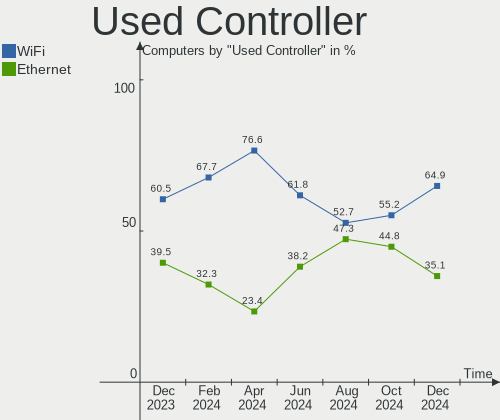

| Kind     | Computers | Percent |
|----------|-----------|---------|
| WiFi     | 55        | 67.07%  |
| Ethernet | 27        | 32.93%  |

NICs
----

Total network controllers on board

| Total | Computers | Percent |
|-------|-----------|---------|
| 2     | 42        | 55.26%  |
| 1     | 31        | 40.79%  |
| 3     | 3         | 3.95%   |

IPv6
----

IPv6 vs IPv4

| Used | Computers | Percent |
|------|-----------|---------|
| No   | 54        | 71.05%  |
| Yes  | 22        | 28.95%  |

Bluetooth
---------

Bluetooth Vendor
----------------

Controller vendors

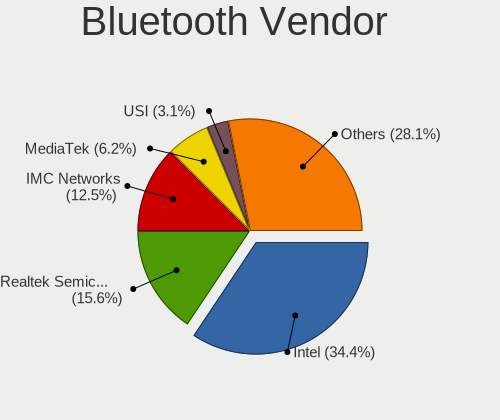

| Vendor                  | Computers | Percent |
|-------------------------|-----------|---------|
| Intel                   | 33        | 55.93%  |
| Realtek Semiconductor   | 6         | 10.17%  |
| Foxconn / Hon Hai       | 6         | 10.17%  |
| IMC Networks            | 5         | 8.47%   |
| Apple                   | 2         | 3.39%   |
| USI                     | 1         | 1.69%   |
| MediaTek                | 1         | 1.69%   |
| Marvell Semiconductor   | 1         | 1.69%   |
| Lite-On Technology      | 1         | 1.69%   |
| Hewlett-Packard         | 1         | 1.69%   |
| Cambridge Silicon Radio | 1         | 1.69%   |
| Broadcom                | 1         | 1.69%   |

Bluetooth Model
---------------

Controller models

| Model                                               | Computers | Percent |
|-----------------------------------------------------|-----------|---------|
| Intel AX201 Bluetooth                               | 10        | 16.95%  |
| Intel Bluetooth wireless interface                  | 8         | 13.56%  |
| Intel AX200 Bluetooth                               | 6         | 10.17%  |
| Realtek Bluetooth Radio                             | 5         | 8.47%   |
| Intel Bluetooth Device                              | 4         | 6.78%   |
| Intel Wireless-AC 9260 Bluetooth Adapter            | 3         | 5.08%   |
| Foxconn / Hon Hai Wireless_Device                   | 3         | 5.08%   |
| IMC Networks Wireless_Device                        | 2         | 3.39%   |
| IMC Networks Bluetooth Radio                        | 2         | 3.39%   |
| Foxconn / Hon Hai MediaTek Bluetooth Adapter        | 2         | 3.39%   |
| USI Bluetooth Device                                | 1         | 1.69%   |
| Realtek 802.11ac WLAN Adapter                       | 1         | 1.69%   |
| MediaTek MT7630e Bluetooth Adapter                  | 1         | 1.69%   |
| Marvell Bluetooth and Wireless LAN Composite        | 1         | 1.69%   |
| Lite-On Bluetooth Device                            | 1         | 1.69%   |
| Intel Bluetooth 9460/9560 Jefferson Peak (JfP)      | 1         | 1.69%   |
| Intel AX210 Bluetooth                               | 1         | 1.69%   |
| IMC Networks Bluetooth Device                       | 1         | 1.69%   |
| HP Bluetooth 2.0 Interface [Broadcom BCM2045]       | 1         | 1.69%   |
| Foxconn / Hon Hai Broadcom BCM20702A1 Bluetooth     | 1         | 1.69%   |
| Cambridge Silicon Radio Bluetooth Dongle (HCI mode) | 1         | 1.69%   |
| Broadcom BCM20702 Bluetooth 4.0 [ThinkPad]          | 1         | 1.69%   |
| Apple Bluetooth USB Host Controller                 | 1         | 1.69%   |
| Apple Bluetooth Host Controller                     | 1         | 1.69%   |

Sound
-----

Sound Vendor
------------

Sound card vendors

| Vendor                                       | Computers | Percent |
|----------------------------------------------|-----------|---------|
| Intel                                        | 46        | 37.4%   |
| AMD                                          | 34        | 27.64%  |
| Nvidia                                       | 19        | 15.45%  |
| C-Media Electronics                          | 3         | 2.44%   |
| SteelSeries ApS                              | 2         | 1.63%   |
| Logitech                                     | 2         | 1.63%   |
| Zoran Co. Personal Media Division (Nogatech) | 1         | 0.81%   |
| Valve Software                               | 1         | 0.81%   |
| USB Audio                                    | 1         | 0.81%   |
| Trust                                        | 1         | 0.81%   |
| Sony                                         | 1         | 0.81%   |
| Realtek Semiconductor                        | 1         | 0.81%   |
| Mackie Designs                               | 1         | 0.81%   |
| Lenovo                                       | 1         | 0.81%   |
| Hewlett-Packard                              | 1         | 0.81%   |
| Generalplus Technology                       | 1         | 0.81%   |
| Focusrite-Novation                           | 1         | 0.81%   |
| fifine Microphones                           | 1         | 0.81%   |
| Dell                                         | 1         | 0.81%   |
| Corsair                                      | 1         | 0.81%   |
| Audient                                      | 1         | 0.81%   |
| Astro Gaming                                 | 1         | 0.81%   |
| Applied Microsystems                         | 1         | 0.81%   |

Sound Model
-----------

Sound card models

| Model                                                               | Computers | Percent |
|---------------------------------------------------------------------|-----------|---------|
| AMD Family 17h/19h HD Audio Controller                              | 19        | 12.67%  |
| Intel Sunrise Point-LP HD Audio                                     | 9         | 6%      |
| AMD Renoir Radeon High Definition Audio Controller                  | 8         | 5.33%   |
| AMD Starship/Matisse HD Audio Controller                            | 7         | 4.67%   |
| AMD Navi 21/23 HDMI/DP Audio Controller                             | 6         | 4%      |
| Nvidia Audio device                                                 | 5         | 3.33%   |
| Intel Comet Lake PCH cAVS                                           | 5         | 3.33%   |
| Nvidia GA102 High Definition Audio Controller                       | 3         | 2%      |
| Intel Haswell-ULT HD Audio Controller                               | 3         | 2%      |
| Intel Cannon Lake PCH cAVS                                          | 3         | 2%      |
| Intel Alder Lake PCH-P High Definition Audio Controller             | 3         | 2%      |
| Intel 8 Series HD Audio Controller                                  | 3         | 2%      |
| Intel 700 Series Chipset Family Precise Touch and Stylus Port #1    | 3         | 2%      |
| Intel 7 Series/C216 Chipset Family High Definition Audio Controller | 3         | 2%      |
| AMD Raven/Raven2/Fenghuang HDMI/DP Audio Controller                 | 3         | 2%      |
| SteelSeries ApS Arctis Pro Wireless                                 | 2         | 1.33%   |
| Nvidia GP107GL High Definition Audio Controller                     | 2         | 1.33%   |
| Nvidia GA106 High Definition Audio Controller                       | 2         | 1.33%   |
| Intel Tiger Lake-LP Smart Sound Technology Audio Controller         | 2         | 1.33%   |
| Intel Comet Lake PCH-LP cAVS                                        | 2         | 1.33%   |
| Intel 100 Series/C230 Series Chipset Family HD Audio Controller     | 2         | 1.33%   |
| AMD Rembrandt Radeon High Definition Audio Controller               | 2         | 1.33%   |
| AMD Family 17h (Models 00h-0fh) HD Audio Controller                 | 2         | 1.33%   |
| AMD Baffin HDMI/DP Audio [Radeon RX 550 640SP / RX 560/560X]        | 2         | 1.33%   |
| Zoran Co. Personal Media Division (Nogatech) USB Audio and HID      | 1         | 0.67%   |
| Valve Software Valve VR Radio & HMD Mic                             | 1         | 0.67%   |
| USB Audio SliverCrest USB Gaming                                    | 1         | 0.67%   |
| Trust GXT 211 Microphone                                            | 1         | 0.67%   |
| Sony INZONE H9 / INZONE H7                                          | 1         | 0.67%   |
| Realtek Semiconductor USB Audio                                     | 1         | 0.67%   |
| Nvidia TU107 GeForce GTX 1650 High Definition Audio Controller      | 1         | 0.67%   |
| Nvidia TU106 High Definition Audio Controller                       | 1         | 0.67%   |
| Nvidia TU104 HD Audio Controller                                    | 1         | 0.67%   |
| Nvidia GP108 High Definition Audio Controller                       | 1         | 0.67%   |
| Nvidia GP104 High Definition Audio Controller                       | 1         | 0.67%   |
| Nvidia GM206 High Definition Audio Controller                       | 1         | 0.67%   |
| Nvidia GM107 High Definition Audio Controller [GeForce 940MX]       | 1         | 0.67%   |
| Mackie Designs Onyx Artist 1-2                                      | 1         | 0.67%   |
| Logitech Z-5 Speakers                                               | 1         | 0.67%   |
| Logitech G433 Gaming Headset                                        | 1         | 0.67%   |

Memory
------

Memory Vendor
-------------

Memory module vendors

| Vendor              | Computers | Percent |
|---------------------|-----------|---------|
| Samsung Electronics | 15        | 24.19%  |
| SK hynix            | 8         | 12.9%   |
| Crucial             | 7         | 11.29%  |
| Corsair             | 7         | 11.29%  |
| Micron Technology   | 6         | 9.68%   |
| Unknown             | 3         | 4.84%   |
| Kingston            | 3         | 4.84%   |
| G.Skill             | 3         | 4.84%   |
| Ramaxel Technology  | 2         | 3.23%   |
| A-DATA Technology   | 2         | 3.23%   |
| Unknown             | 2         | 3.23%   |
| Silicon Power       | 1         | 1.61%   |
| Patriot             | 1         | 1.61%   |
| Lexar               | 1         | 1.61%   |
| KLEVV               | 1         | 1.61%   |

Memory Model
------------

Memory module models

| Model                                                            | Computers | Percent |
|------------------------------------------------------------------|-----------|---------|
| Unknown                                                          | 2         | 3.08%   |
| Unknown RAM Module 8GB SODIMM DDR4 2667MT/s                      | 1         | 1.54%   |
| Unknown RAM Module 4GB SODIMM LPDDR3 1600MT/s                    | 1         | 1.54%   |
| Unknown RAM Module 4GB SODIMM DDR4 2133MT/s                      | 1         | 1.54%   |
| SK hynix RAM Module 8GB SODIMM DDR4 2400MT/s                     | 1         | 1.54%   |
| SK hynix RAM Module 4GB SODIMM DDR3 1600MT/s                     | 1         | 1.54%   |
| SK hynix RAM HMCG78MEBSA092N 16GB SODIMM DDR5 4800MT/s           | 1         | 1.54%   |
| SK hynix RAM HMCG78AGBSA092N 16GB SODIMM DDR5 5600MT/s           | 1         | 1.54%   |
| SK hynix RAM HMCG66MEBSA095N 8GB SODIMM DDR5 4800MT/s            | 1         | 1.54%   |
| SK hynix RAM HMA41GS6AFR8N-TF 8GB SODIMM DDR4 2667MT/s           | 1         | 1.54%   |
| SK hynix RAM H9CCNNNBLTBLAR-NUD 4GB Row Of Chips LPDDR3 1867MT/s | 1         | 1.54%   |
| SK hynix RAM H58G56AK6BX069 8GB Row Of Chips LPDDR5 6400MT/s     | 1         | 1.54%   |
| Silicon Power RAM Module 16GB SODIMM DDR4 3200MT/s               | 1         | 1.54%   |
| Samsung RAM Module 2GB SODIMM DDR3 1600MT/s                      | 1         | 1.54%   |
| Samsung RAM M471A5244CB0-CTD 4GB SODIMM DDR4 3266MT/s            | 1         | 1.54%   |
| Samsung RAM M471A5244BB0-CPB 4GB SODIMM DDR4 2400MT/s            | 1         | 1.54%   |
| Samsung RAM M471A2K43EB1-CWE 16GB SODIMM DDR4 3200MT/s           | 1         | 1.54%   |
| Samsung RAM M471A2K43EB1-CTD 16GB SODIMM DDR4 2667MT/s           | 1         | 1.54%   |
| Samsung RAM M471A2K43DB1-CTD 16GB SODIMM DDR4 2667MT/s           | 1         | 1.54%   |
| Samsung RAM M471A2G44AM0-CWE 16GB SODIMM DDR4 3200MT/s           | 1         | 1.54%   |
| Samsung RAM M471A2G43BB2-CWE 16GB SODIMM DDR4 3200MT/s           | 1         | 1.54%   |
| Samsung RAM M471A1K43BB1-CTD 8GB SODIMM DDR4 2667MT/s            | 1         | 1.54%   |
| Samsung RAM M471A1G44BB0-CWE 8GB SODIMM DDR4 3200MT/s            | 1         | 1.54%   |
| Samsung RAM M471A1G44AB0-CWE 8GB SODIMM DDR4 3200MT/s            | 1         | 1.54%   |
| Samsung RAM M471A1G44AB0-CWE 8GB Row Of Chips DDR4 3200MT/s      | 1         | 1.54%   |
| Samsung RAM M425R1GB4BB0-CQKOL 8GB SODIMM 4800MT/s               | 1         | 1.54%   |
| Samsung RAM K4UBE3D4AA-MGCL 8GB Row Of Chips LPDDR4 4267MT/s     | 1         | 1.54%   |
| Samsung RAM K4E6E304EB-EGCG 4GB Row Of Chips LPDDR3 2133MT/s     | 1         | 1.54%   |
| Ramaxel RAM RMSA3320MJ78HAF-3200 8GB SODIMM DDR4 3200MT/s        | 1         | 1.54%   |
| Ramaxel RAM RMSA3260ME78HAF-2666 8GB SODIMM DDR4 2667MT/s        | 1         | 1.54%   |
| Patriot RAM PSD48G320081S 8GB SODIMM DDR4 3200MT/s               | 1         | 1.54%   |
| Micron RAM MTC8C1084S1SC48BA1 16GB SODIMM DDR5 4800MT/s          | 1         | 1.54%   |
| Micron RAM MT62F2G32D4DS-026 WT 8GB SODIMM LPDDR5 7500MT/s       | 1         | 1.54%   |
| Micron RAM MT53E1G32D4NQ-046 8GB Row Of Chips LPDDR4 4267MT/s    | 1         | 1.54%   |
| Micron RAM MT52L1G32D4PG-093 8GB Row Of Chips LPDDR3 2133MT/s    | 1         | 1.54%   |
| Micron RAM 8ATF1G64HZ-3G2R1 8GB SODIMM DDR4 3200MT/s             | 1         | 1.54%   |
| Micron RAM 8ATF1G64HZ-3G2J1 8GB SODIMM DDR4 3200MT/s             | 1         | 1.54%   |
| Micron RAM 16KTF1G64HZ-1G6E1 8GB SODIMM DDR3 1600MT/s            | 1         | 1.54%   |
| Lexar RAM LD4AS008G-3200ST 8GB SODIMM DDR4 3200MT/s              | 1         | 1.54%   |
| KLEVV RAM KD4AGUA80-36A180U 16GB DIMM DDR4 3200MT/s              | 1         | 1.54%   |

Memory Kind
-----------

Memory module kinds

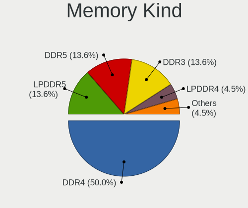

| Kind    | Computers | Percent |
|---------|-----------|---------|
| DDR4    | 31        | 60.78%  |
| DDR5    | 7         | 13.73%  |
| LPDDR3  | 4         | 7.84%   |
| DDR3    | 4         | 7.84%   |
| LPDDR5  | 2         | 3.92%   |
| LPDDR4  | 2         | 3.92%   |
| Unknown | 1         | 1.96%   |

Memory Form Factor
------------------

Physical design of the memory module

| Name         | Computers | Percent |
|--------------|-----------|---------|
| SODIMM       | 29        | 56.86%  |
| DIMM         | 15        | 29.41%  |
| Row Of Chips | 7         | 13.73%  |

Memory Size
-----------

Memory module size

| Size  | Computers | Percent |
|-------|-----------|---------|
| 8192  | 28        | 48.28%  |
| 16384 | 18        | 31.03%  |
| 4096  | 8         | 13.79%  |
| 32768 | 2         | 3.45%   |
| 2048  | 2         | 3.45%   |

Memory Speed
------------

Memory module speed

| Speed | Computers | Percent |
|-------|-----------|---------|
| 3200  | 15        | 25.42%  |
| 2667  | 7         | 11.86%  |
| 1600  | 5         | 8.47%   |
| 4800  | 4         | 6.78%   |
| 3733  | 4         | 6.78%   |
| 3600  | 4         | 6.78%   |
| 2400  | 3         | 5.08%   |
| 2133  | 3         | 5.08%   |
| 5600  | 2         | 3.39%   |
| 4267  | 2         | 3.39%   |
| 7500  | 1         | 1.69%   |
| 6400  | 1         | 1.69%   |
| 5200  | 1         | 1.69%   |
| 3266  | 1         | 1.69%   |
| 3000  | 1         | 1.69%   |
| 2933  | 1         | 1.69%   |
| 2800  | 1         | 1.69%   |
| 2134  | 1         | 1.69%   |
| 1867  | 1         | 1.69%   |
| 1280  | 1         | 1.69%   |

Printers & scanners
-------------------

Printer Vendor
--------------

Printer device vendors

| Vendor          | Computers | Percent |
|-----------------|-----------|---------|
| Hewlett-Packard | 1         | 50%     |
| Canon           | 1         | 50%     |

Printer Model
-------------

Printer device models

| Model               | Computers | Percent |
|---------------------|-----------|---------|
| HP ENVY 5000 series | 1         | 50%     |
| Canon iP4200        | 1         | 50%     |

Scanner Vendor
--------------

Scanner device vendors

Zero info for selected period =(

Scanner Model
-------------

Scanner device models

Zero info for selected period =(

Camera
------

Camera Vendor
-------------

Camera device vendors

| Vendor                                 | Computers | Percent |
|----------------------------------------|-----------|---------|
| Chicony Electronics                    | 15        | 25.42%  |
| IMC Networks                           | 9         | 15.25%  |
| Logitech                               | 7         | 11.86%  |
| Bison Electronics                      | 5         | 8.47%   |
| Syntek                                 | 3         | 5.08%   |
| Sonix Technology                       | 3         | 5.08%   |
| Quanta                                 | 3         | 5.08%   |
| Realtek Semiconductor                  | 2         | 3.39%   |
| Acer                                   | 2         | 3.39%   |
| Valve Software                         | 1         | 1.69%   |
| Trust                                  | 1         | 1.69%   |
| Sunplus Innovation Technology          | 1         | 1.69%   |
| Microsoft                              | 1         | 1.69%   |
| Microdia                               | 1         | 1.69%   |
| Luxvisions Innotech Limited            | 1         | 1.69%   |
| Lenovo                                 | 1         | 1.69%   |
| Cheng Uei Precision Industry (Foxlink) | 1         | 1.69%   |
| ARC International                      | 1         | 1.69%   |
| Apple                                  | 1         | 1.69%   |

Camera Model
------------

Camera device models

| Model                                                                      | Computers | Percent |
|----------------------------------------------------------------------------|-----------|---------|
| IMC Networks USB2.0 HD UVC WebCam                                          | 5         | 8.47%   |
| Chicony Integrated Camera                                                  | 5         | 8.47%   |
| Syntek Integrated Camera                                                   | 2         | 3.39%   |
| Sonix USB2.0 FHD UVC WebCam                                                | 2         | 3.39%   |
| Quanta HD Camera                                                           | 2         | 3.39%   |
| Logitech C920 PRO HD Webcam                                                | 2         | 3.39%   |
| IMC Networks USB2.0 VGA UVC WebCam                                         | 2         | 3.39%   |
| IMC Networks Integrated Camera                                             | 2         | 3.39%   |
| Chicony HP HD Camera                                                       | 2         | 3.39%   |
| Chicony HD Webcam                                                          | 2         | 3.39%   |
| Bison Integrated Camera                                                    | 2         | 3.39%   |
| Valve Software 3D Camera                                                   | 1         | 1.69%   |
| Trust USB Camera                                                           | 1         | 1.69%   |
| Syntek Integrated RGB Camera                                               | 1         | 1.69%   |
| Sunplus Lenovo EasyCamera                                                  | 1         | 1.69%   |
| Sonix USB2.0 HD UVC WebCam                                                 | 1         | 1.69%   |
| Realtek USB2.0 HD UVC WebCam                                               | 1         | 1.69%   |
| Realtek Integrated_Webcam_HD                                               | 1         | 1.69%   |
| Quanta HD User Facing                                                      | 1         | 1.69%   |
| Microsoft LifeCam HD-3000                                                  | 1         | 1.69%   |
| Microdia Integrated_Webcam_HD                                              | 1         | 1.69%   |
| Luxvisions Innotech Limited HP Wide Vision HD Camera                       | 1         | 1.69%   |
| Logitech Webcam C930e                                                      | 1         | 1.69%   |
| Logitech Webcam C270                                                       | 1         | 1.69%   |
| Logitech StreamCam                                                         | 1         | 1.69%   |
| Logitech HD Pro Webcam C920                                                | 1         | 1.69%   |
| Logitech C922 Pro Stream Webcam                                            | 1         | 1.69%   |
| Lenovo FHD Webcam                                                          | 1         | 1.69%   |
| Chicony USB2.0 HD UVC WebCam                                               | 1         | 1.69%   |
| Chicony Integrated RGB Camera                                              | 1         | 1.69%   |
| Chicony HP HD Webcam                                                       | 1         | 1.69%   |
| Chicony FJ Camera                                                          | 1         | 1.69%   |
| Chicony EasyCamera                                                         | 1         | 1.69%   |
| Chicony CKA7216                                                            | 1         | 1.69%   |
| Cheng Uei Precision Industry (Foxlink) HP Wide Vision HD Integrated Webcam | 1         | 1.69%   |
| Bison USB2.0 Camera                                                        | 1         | 1.69%   |
| Bison EasyCamera                                                           | 1         | 1.69%   |
| Bison BisonCam,NB Pro                                                      | 1         | 1.69%   |
| ARC International Camera                                                   | 1         | 1.69%   |
| Apple iPhone 5/5C/5S/6/SE/7/8/X/XR                                         | 1         | 1.69%   |

Security
--------

Fingerprint Vendor
------------------

Fingerprint sensor vendors

| Vendor                     | Computers | Percent |
|----------------------------|-----------|---------|
| Synaptics                  | 5         | 38.46%  |
| Validity Sensors           | 4         | 30.77%  |
| Shenzhen Goodix Technology | 2         | 15.38%  |
| Elan Microelectronics      | 2         | 15.38%  |

Fingerprint Model
-----------------

Fingerprint sensor models

| Model                                                    | Computers | Percent |
|----------------------------------------------------------|-----------|---------|
| Validity Sensors VFS495 Fingerprint Reader               | 2         | 15.38%  |
| Synaptics  WBDI                                          | 2         | 15.38%  |
| Shenzhen Goodix  FingerPrint Device                      | 2         | 15.38%  |
| Elan ELAN:Fingerprint                                    | 2         | 15.38%  |
| Validity Sensors VFS7500 Touch Fingerprint Sensor        | 1         | 7.69%   |
| Validity Sensors Swipe Fingerprint Sensor                | 1         | 7.69%   |
| Synaptics UWP WBDI Device                                | 1         | 7.69%   |
| Synaptics Prometheus MIS Touch Fingerprint Reader        | 1         | 7.69%   |
| Synaptics FS7604 Touch Fingerprint Sensor with PurePrint | 1         | 7.69%   |

Chipcard Vendor
---------------

Chipcard module vendors

| Vendor      | Computers | Percent |
|-------------|-----------|---------|
| Alcor Micro | 2         | 40%     |
| Upek        | 1         | 20%     |
| Lenovo      | 1         | 20%     |
| Cherry      | 1         | 20%     |

Chipcard Model
--------------

Chipcard module models

| Model                                                      | Computers | Percent |
|------------------------------------------------------------|-----------|---------|
| Alcor Micro AU9540 Smartcard Reader                        | 2         | 40%     |
| Upek TouchChip Fingerprint Coprocessor (WBF advanced mode) | 1         | 20%     |
| Lenovo Integrated Smart Card Reader                        | 1         | 20%     |
| Cherry SmartCard Reader Keyboard KC 1000 SC                | 1         | 20%     |

Unsupported
-----------

Unsupported Devices
-------------------

Total unsupported devices on board

| Total | Computers | Percent |
|-------|-----------|---------|
| 0     | 46        | 60.53%  |
| 1     | 20        | 26.32%  |
| 2     | 9         | 11.84%  |
| 3     | 1         | 1.32%   |

Unsupported Device Types
------------------------

Types of unsupported devices

| Type                  | Computers | Percent |
|-----------------------|-----------|---------|
| Fingerprint reader    | 13        | 34.21%  |
| Net/wireless          | 5         | 13.16%  |
| Graphics card         | 5         | 13.16%  |
| Multimedia controller | 4         | 10.53%  |
| Net/ethernet          | 3         | 7.89%   |
| Chipcard              | 3         | 7.89%   |
| Camera                | 2         | 5.26%   |
| Modem                 | 1         | 2.63%   |
| Card reader           | 1         | 2.63%   |
| Bluetooth             | 1         | 2.63%   |

