EndeavourOS - Hardware Trends
-----------------------------

A project to identify most popular hardware characteristics and track their change
over time based on data collected by Linux users at https://Linux-Hardware.org.

Anyone can contribute to this report by the [hw-probe](https://github.com/linuxhw/hw-probe) tool:

    sudo -E hw-probe -all -upload

This is a report for all computer types. See also reports for [desktops](/Dist/EndeavourOS/Desktop/README.md) and [notebooks](/Dist/EndeavourOS/Notebook/README.md).

This report is for one last month. Overall report since the beginning of time: [TestCoverage](https://github.com/linuxhw/TestCoverage)

Period: Sep, 2022.

Contents
--------

* [ System ](#system)
  - [ OS                       ](#os)
  - [ OS Family                ](#os-family)
  - [ Kernel                   ](#kernel)
  - [ Kernel Family            ](#kernel-family)
  - [ Kernel Major Ver.        ](#kernel-major-ver)
  - [ Arch                     ](#arch)
  - [ DE                       ](#de)
  - [ Display Server           ](#display-server)
  - [ Display Manager          ](#display-manager)
  - [ OS Lang                  ](#os-lang)
  - [ Boot Mode                ](#boot-mode)
  - [ Filesystem               ](#filesystem)
  - [ Part. scheme             ](#part-scheme)
  - [ Dual Boot with Linux/BSD ](#dual-boot-with-linuxbsd)
  - [ Dual Boot (Win)          ](#dual-boot-win)

* [ Board ](#board)
  - [ Vendor                   ](#vendor)
  - [ Model                    ](#model)
  - [ Model Family             ](#model-family)
  - [ MFG Year                 ](#mfg-year)
  - [ Form Factor              ](#form-factor)
  - [ Secure Boot              ](#secure-boot)
  - [ Coreboot                 ](#coreboot)
  - [ RAM Size                 ](#ram-size)
  - [ RAM Used                 ](#ram-used)
  - [ Total Drives             ](#total-drives)
  - [ Has CD-ROM               ](#has-cd-rom)
  - [ Has Ethernet             ](#has-ethernet)
  - [ Has WiFi                 ](#has-wifi)
  - [ Has Bluetooth            ](#has-bluetooth)

* [ Location ](#location)
  - [ Country                  ](#country)
  - [ City                     ](#city)

* [ Drives ](#drives)
  - [ Drive Vendor             ](#drive-vendor)
  - [ Drive Model              ](#drive-model)
  - [ HDD Vendor               ](#hdd-vendor)
  - [ SSD Vendor               ](#ssd-vendor)
  - [ Drive Kind               ](#drive-kind)
  - [ Drive Connector          ](#drive-connector)
  - [ Drive Size               ](#drive-size)
  - [ Space Total              ](#space-total)
  - [ Space Used               ](#space-used)
  - [ Malfunc. Drives          ](#malfunc-drives)
  - [ Malfunc. Drive Vendor    ](#malfunc-drive-vendor)
  - [ Malfunc. HDD Vendor      ](#malfunc-hdd-vendor)
  - [ Malfunc. Drive Kind      ](#malfunc-drive-kind)
  - [ Failed Drives            ](#failed-drives)
  - [ Failed Drive Vendor      ](#failed-drive-vendor)
  - [ Drive Status             ](#drive-status)

* [ Storage controller ](#storage-controller)
  - [ Storage Vendor           ](#storage-vendor)
  - [ Storage Model            ](#storage-model)
  - [ Storage Kind             ](#storage-kind)

* [ Processor ](#processor)
  - [ CPU Vendor               ](#cpu-vendor)
  - [ CPU Model                ](#cpu-model)
  - [ CPU Model Family         ](#cpu-model-family)
  - [ CPU Cores                ](#cpu-cores)
  - [ CPU Sockets              ](#cpu-sockets)
  - [ CPU Threads              ](#cpu-threads)
  - [ CPU Op-Modes             ](#cpu-op-modes)
  - [ CPU Microcode            ](#cpu-microcode)
  - [ CPU Microarch            ](#cpu-microarch)

* [ Graphics ](#graphics)
  - [ GPU Vendor               ](#gpu-vendor)
  - [ GPU Model                ](#gpu-model)
  - [ GPU Combo                ](#gpu-combo)
  - [ GPU Driver               ](#gpu-driver)
  - [ GPU Memory               ](#gpu-memory)

* [ Monitor ](#monitor)
  - [ Monitor Vendor           ](#monitor-vendor)
  - [ Monitor Model            ](#monitor-model)
  - [ Monitor Resolution       ](#monitor-resolution)
  - [ Monitor Diagonal         ](#monitor-diagonal)
  - [ Monitor Width            ](#monitor-width)
  - [ Aspect Ratio             ](#aspect-ratio)
  - [ Monitor Area             ](#monitor-area)
  - [ Pixel Density            ](#pixel-density)
  - [ Multiple Monitors        ](#multiple-monitors)

* [ Network ](#network)
  - [ Net Controller Vendor    ](#net-controller-vendor)
  - [ Net Controller Model     ](#net-controller-model)
  - [ Wireless Vendor          ](#wireless-vendor)
  - [ Wireless Model           ](#wireless-model)
  - [ Ethernet Vendor          ](#ethernet-vendor)
  - [ Ethernet Model           ](#ethernet-model)
  - [ Net Controller Kind      ](#net-controller-kind)
  - [ Used Controller          ](#used-controller)
  - [ NICs                     ](#nics)
  - [ IPv6                     ](#ipv6)

* [ Bluetooth ](#bluetooth)
  - [ Bluetooth Vendor         ](#bluetooth-vendor)
  - [ Bluetooth Model          ](#bluetooth-model)

* [ Sound ](#sound)
  - [ Sound Vendor             ](#sound-vendor)
  - [ Sound Model              ](#sound-model)

* [ Memory ](#memory)
  - [ Memory Vendor            ](#memory-vendor)
  - [ Memory Model             ](#memory-model)
  - [ Memory Kind              ](#memory-kind)
  - [ Memory Form Factor       ](#memory-form-factor)
  - [ Memory Size              ](#memory-size)
  - [ Memory Speed             ](#memory-speed)

* [ Printers & scanners ](#printers--scanners)
  - [ Printer Vendor           ](#printer-vendor)
  - [ Printer Model            ](#printer-model)
  - [ Scanner Vendor           ](#scanner-vendor)
  - [ Scanner Model            ](#scanner-model)

* [ Camera ](#camera)
  - [ Camera Vendor            ](#camera-vendor)
  - [ Camera Model             ](#camera-model)

* [ Security ](#security)
  - [ Fingerprint Vendor       ](#fingerprint-vendor)
  - [ Fingerprint Model        ](#fingerprint-model)
  - [ Chipcard Vendor          ](#chipcard-vendor)
  - [ Chipcard Model           ](#chipcard-model)

* [ Unsupported ](#unsupported)
  - [ Unsupported Devices      ](#unsupported-devices)
  - [ Unsupported Device Types ](#unsupported-device-types)

System
------

OS
--

Installed operating systems

| Name                | Computers | Percent |
|---------------------|-----------|---------|
| EndeavourOS Rolling | 40        | 68.97%  |
| EndeavourOS         | 18        | 31.03%  |

OS Family
---------

OS without a version

| Name        | Computers | Percent |
|-------------|-----------|---------|
| EndeavourOS | 58        | 100%    |

Kernel
------

Version of the Linux kernel

| Version                                      | Computers | Percent |
|----------------------------------------------|-----------|---------|
| 5.19.11-arch1-1                              | 6         | 10.34%  |
| 5.19.9-zen1-1-zen                            | 5         | 8.62%   |
| 5.19.7-arch1-1                               | 5         | 8.62%   |
| 5.19.6-zen1-1-zen                            | 5         | 8.62%   |
| 5.19.10-arch1-1                              | 5         | 8.62%   |
| 5.19.8-zen1-1-zen                            | 4         | 6.9%    |
| 5.19.5-arch1-1                               | 4         | 6.9%    |
| 5.19.9-arch1-1                               | 2         | 3.45%   |
| 5.19.7-zen2-1-zen                            | 2         | 3.45%   |
| 5.19.12-arch1-1                              | 2         | 3.45%   |
| 5.15.67-1-lts                                | 2         | 3.45%   |
| 6.0.0-rc2-1-drm-next-git-00356-g2c2d7a67defa | 1         | 1.72%   |
| 5.19.9-arch1-g14-1                           | 1         | 1.72%   |
| 5.19.9-AMD-znver2                            | 1         | 1.72%   |
| 5.19.9-1-clear                               | 1         | 1.72%   |
| 5.19.6-arch1-1                               | 1         | 1.72%   |
| 5.19.6-269-tkg-pds                           | 1         | 1.72%   |
| 5.19.5-zen1-1-zen                            | 1         | 1.72%   |
| 5.19.4-arch1-g14-1                           | 1         | 1.72%   |
| 5.19.4-arch1-1                               | 1         | 1.72%   |
| 5.19.3-arch1-1                               | 1         | 1.72%   |
| 5.19.2-arch1-2                               | 1         | 1.72%   |
| 5.19.12-zen1-1-zen                           | 1         | 1.72%   |
| 5.19.11-zen1-1-zen                           | 1         | 1.72%   |
| 5.18.16-arch1-1                              | 1         | 1.72%   |
| 5.18.11-arch1-1                              | 1         | 1.72%   |
| 5.15.64-1-lts                                | 1         | 1.72%   |

Kernel Family
-------------

Linux kernel without a distro release

| Version | Computers | Percent |
|---------|-----------|---------|
| 5.19.9  | 10        | 17.24%  |
| 5.19.7  | 7         | 12.07%  |
| 5.19.6  | 7         | 12.07%  |
| 5.19.11 | 7         | 12.07%  |
| 5.19.5  | 5         | 8.62%   |
| 5.19.10 | 5         | 8.62%   |
| 5.19.8  | 4         | 6.9%    |
| 5.19.12 | 3         | 5.17%   |
| 5.19.4  | 2         | 3.45%   |
| 5.15.67 | 2         | 3.45%   |
| 6.0.0   | 1         | 1.72%   |
| 5.19.3  | 1         | 1.72%   |
| 5.19.2  | 1         | 1.72%   |
| 5.18.16 | 1         | 1.72%   |
| 5.18.11 | 1         | 1.72%   |
| 5.15.64 | 1         | 1.72%   |

Kernel Major Ver.
-----------------

Linux kernel major version

| Version | Computers | Percent |
|---------|-----------|---------|
| 5.19    | 52        | 89.66%  |
| 5.15    | 3         | 5.17%   |
| 5.18    | 2         | 3.45%   |
| 6.0     | 1         | 1.72%   |

Arch
----

OS architecture (x86_64, i586, etc.)

| Name   | Computers | Percent |
|--------|-----------|---------|
| x86_64 | 58        | 100%    |

DE
--

Desktop Environment

| Name     | Computers | Percent |
|----------|-----------|---------|
| KDE5     | 27        | 46.55%  |
| GNOME    | 13        | 22.41%  |
| XFCE     | 7         | 12.07%  |
| Budgie   | 4         | 6.9%    |
| i3       | 3         | 5.17%   |
| Hyprland | 2         | 3.45%   |
| sway     | 1         | 1.72%   |
| qtile    | 1         | 1.72%   |

Display Server
--------------

X11 or Wayland

| Name    | Computers | Percent |
|---------|-----------|---------|
| X11     | 37        | 63.79%  |
| Wayland | 17        | 29.31%  |
| Tty     | 3         | 5.17%   |
| Unknown | 1         | 1.72%   |

Display Manager
---------------

SDDM, LightDM, etc.

| Name    | Computers | Percent |
|---------|-----------|---------|
| LightDM | 20        | 34.48%  |
| Unknown | 18        | 31.03%  |
| SDDM    | 13        | 22.41%  |
| GDM     | 7         | 12.07%  |

OS Lang
-------

Language

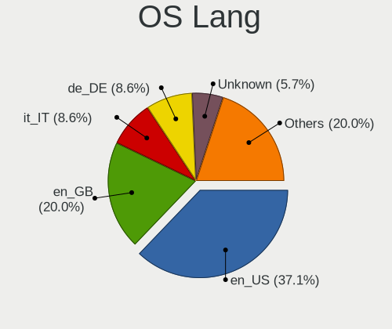

| Lang  | Computers | Percent |
|-------|-----------|---------|
| en_US | 25        | 43.1%   |
| it_IT | 6         | 10.34%  |
| en_CA | 5         | 8.62%   |
| ru_RU | 3         | 5.17%   |
| en_GB | 3         | 5.17%   |
| en_DK | 3         | 5.17%   |
| en_AU | 2         | 3.45%   |
| tr_TR | 1         | 1.72%   |
| sr_RS | 1         | 1.72%   |
| ru_UA | 1         | 1.72%   |
| pt_BR | 1         | 1.72%   |
| nl_NL | 1         | 1.72%   |
| nl_BE | 1         | 1.72%   |
| fi_FI | 1         | 1.72%   |
| es_MX | 1         | 1.72%   |
| en_IN | 1         | 1.72%   |
| de_DE | 1         | 1.72%   |
| C     | 1         | 1.72%   |

Boot Mode
---------

EFI or BIOS

| Mode | Computers | Percent |
|------|-----------|---------|
| EFI  | 34        | 58.62%  |
| BIOS | 24        | 41.38%  |

Filesystem
----------

Type of filesystem

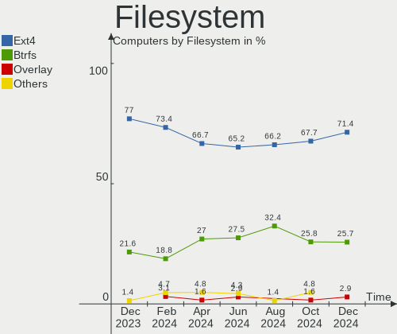

| Type    | Computers | Percent |
|---------|-----------|---------|
| Ext4    | 35        | 60.34%  |
| Btrfs   | 20        | 34.48%  |
| Overlay | 2         | 3.45%   |
| Xfs     | 1         | 1.72%   |

Part. scheme
------------

Scheme of partitioning

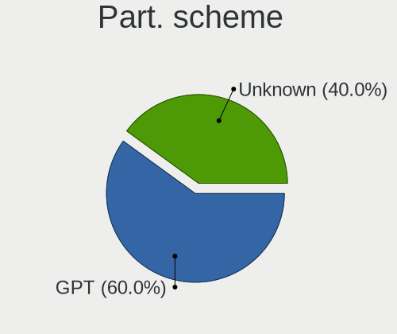

| Type    | Computers | Percent |
|---------|-----------|---------|
| GPT     | 34        | 58.62%  |
| Unknown | 20        | 34.48%  |
| MBR     | 4         | 6.9%    |

Dual Boot with Linux/BSD
------------------------

Hosting more than one Linux/BSD

| Dual boot | Computers | Percent |
|-----------|-----------|---------|
| No        | 52        | 89.66%  |
| Yes       | 6         | 10.34%  |

Dual Boot (Win)
---------------

Hosting Linux and Windows

| Dual boot | Computers | Percent |
|-----------|-----------|---------|
| No        | 39        | 67.24%  |
| Yes       | 19        | 32.76%  |

Board
-----

Vendor
------

Motherboard manufacturer

| Name                | Computers | Percent |
|---------------------|-----------|---------|
| ASUSTek Computer    | 13        | 22.41%  |
| MSI                 | 9         | 15.52%  |
| Lenovo              | 9         | 15.52%  |
| Hewlett-Packard     | 8         | 13.79%  |
| Gigabyte Technology | 3         | 5.17%   |
| Acer                | 3         | 5.17%   |
| HUAWEI              | 2         | 3.45%   |
| Dell                | 2         | 3.45%   |
| ASRock              | 2         | 3.45%   |
| Timi                | 1         | 1.72%   |
| Schenker            | 1         | 1.72%   |
| Samsung Electronics | 1         | 1.72%   |
| Microsoft           | 1         | 1.72%   |
| Huanan              | 1         | 1.72%   |
| AZW                 | 1         | 1.72%   |
| Apple               | 1         | 1.72%   |

Model
-----

Motherboard model

| Name                                     | Computers | Percent |
|------------------------------------------|-----------|---------|
| MSI MS-7C37                              | 3         | 5.17%   |
| Timi TM1703                              | 1         | 1.72%   |
| Schenker XMG FUSION 15 (XFU15M22)        | 1         | 1.72%   |
| Samsung 340XAA/350XAA/550XAA             | 1         | 1.72%   |
| MSI Summit E13FlipEvo A12MT              | 1         | 1.72%   |
| MSI MS-7C91                              | 1         | 1.72%   |
| MSI MS-7B50                              | 1         | 1.72%   |
| MSI MS-7A11                              | 1         | 1.72%   |
| MSI Modern 14 B5M                        | 1         | 1.72%   |
| MSI Alpha 15 B5EEK                       | 1         | 1.72%   |
| Microsoft Surface Laptop Go              | 1         | 1.72%   |
| Lenovo ThinkPad Yoga 370 20JJS1JS00      | 1         | 1.72%   |
| Lenovo ThinkPad X200T 7449G6G            | 1         | 1.72%   |
| Lenovo ThinkPad X1 Carbon 6th 20KHCTO1WW | 1         | 1.72%   |
| Lenovo ThinkPad T480 20L6S58700          | 1         | 1.72%   |
| Lenovo ThinkPad T15 Gen 2i 20W40029MX    | 1         | 1.72%   |
| Lenovo ThinkBook 14p Gen 2 20YN          | 1         | 1.72%   |
| Lenovo ThinkBook 14 G2 ITL Ub 20VD       | 1         | 1.72%   |
| Lenovo IdeaPad 5 14ARE05 81YM            | 1         | 1.72%   |
| Lenovo IdeaPad 310-15IKB 80TV            | 1         | 1.72%   |
| HUAWEI NBLB-WAX9N                        | 1         | 1.72%   |
| HUAWEI KLVL-WXX9                         | 1         | 1.72%   |
| Huanan X99-8M-F V1.3                     | 1         | 1.72%   |
| HP ProBook 450 G0                        | 1         | 1.72%   |
| HP Pavilion Laptop 15-eg2xxx             | 1         | 1.72%   |
| HP OMEN by Laptop 16z-c000               | 1         | 1.72%   |
| HP Laptop 15-da0xxx                      | 1         | 1.72%   |
| HP ENVY x360 Convertible 13-ag0xxx       | 1         | 1.72%   |
| HP EliteDesk 800 G1 SFF                  | 1         | 1.72%   |
| HP EliteBook 745 G6                      | 1         | 1.72%   |
| HP 250 G4                                | 1         | 1.72%   |
| Gigabyte P55A-UD3                        | 1         | 1.72%   |
| Gigabyte GB-BRR7H-4800                   | 1         | 1.72%   |
| Gigabyte AORUS 15G XC                    | 1         | 1.72%   |
| Dell Vostro 7620                         | 1         | 1.72%   |
| Dell OptiPlex 3080                       | 1         | 1.72%   |
| AZW SEi                                  | 1         | 1.72%   |
| ASUS Zenbook UX5400EA_UX5400EA           | 1         | 1.72%   |
| ASUS X580VN                              | 1         | 1.72%   |
| ASUS TUF Gaming FX505GT_FX505GT          | 1         | 1.72%   |

Model Family
------------

Motherboard model prefix

| Name                   | Computers | Percent |
|------------------------|-----------|---------|
| Lenovo ThinkPad        | 5         | 8.62%   |
| MSI MS-7C37            | 3         | 5.17%   |
| Acer Aspire            | 3         | 5.17%   |
| Lenovo ThinkBook       | 2         | 3.45%   |
| Lenovo IdeaPad         | 2         | 3.45%   |
| ASUS ROG               | 2         | 3.45%   |
| ASUS PRIME             | 2         | 3.45%   |
| Timi TM1703            | 1         | 1.72%   |
| Schenker XMG           | 1         | 1.72%   |
| Samsung 340XAA         | 1         | 1.72%   |
| MSI Summit             | 1         | 1.72%   |
| MSI MS-7C91            | 1         | 1.72%   |
| MSI MS-7B50            | 1         | 1.72%   |
| MSI MS-7A11            | 1         | 1.72%   |
| MSI Modern             | 1         | 1.72%   |
| MSI Alpha              | 1         | 1.72%   |
| Microsoft Surface      | 1         | 1.72%   |
| HUAWEI NBLB-WAX9N      | 1         | 1.72%   |
| HUAWEI KLVL-WXX9       | 1         | 1.72%   |
| Huanan X99-8M-F        | 1         | 1.72%   |
| HP ProBook             | 1         | 1.72%   |
| HP Pavilion            | 1         | 1.72%   |
| HP OMEN                | 1         | 1.72%   |
| HP Laptop              | 1         | 1.72%   |
| HP ENVY                | 1         | 1.72%   |
| HP EliteDesk           | 1         | 1.72%   |
| HP EliteBook           | 1         | 1.72%   |
| HP 250                 | 1         | 1.72%   |
| Gigabyte P55A-UD3      | 1         | 1.72%   |
| Gigabyte GB-BRR7H-4800 | 1         | 1.72%   |
| Gigabyte AORUS         | 1         | 1.72%   |
| Dell Vostro            | 1         | 1.72%   |
| Dell OptiPlex          | 1         | 1.72%   |
| AZW SEi                | 1         | 1.72%   |
| ASUS Zenbook           | 1         | 1.72%   |
| ASUS X580VN            | 1         | 1.72%   |
| ASUS TUF               | 1         | 1.72%   |
| ASUS SABERTOOTH        | 1         | 1.72%   |
| ASUS H170M-PLUS        | 1         | 1.72%   |
| ASUS GL753VE           | 1         | 1.72%   |

MFG Year
--------

Motherboard manufacture year

| Year | Computers | Percent |
|------|-----------|---------|
| 2018 | 11        | 18.97%  |
| 2020 | 9         | 15.52%  |
| 2022 | 8         | 13.79%  |
| 2021 | 8         | 13.79%  |
| 2019 | 7         | 12.07%  |
| 2017 | 4         | 6.9%    |
| 2011 | 3         | 5.17%   |
| 2016 | 2         | 3.45%   |
| 2015 | 2         | 3.45%   |
| 2013 | 2         | 3.45%   |
| 2009 | 1         | 1.72%   |
| 2008 | 1         | 1.72%   |

Form Factor
-----------

Physical design of the computer

| Name        | Computers | Percent |
|-------------|-----------|---------|
| Notebook    | 37        | 63.79%  |
| Desktop     | 18        | 31.03%  |
| Convertible | 2         | 3.45%   |
| Tablet      | 1         | 1.72%   |

Secure Boot
-----------

Enabled or disabled

| State    | Computers | Percent |
|----------|-----------|---------|
| Disabled | 58        | 100%    |

Coreboot
--------

Have coreboot on board

| Used | Computers | Percent |
|------|-----------|---------|
| No   | 58        | 100%    |

RAM Size
--------

Total RAM memory

| Size in GB | Computers | Percent |
|------------|-----------|---------|
| 16.01-24.0 | 24        | 41.38%  |
| 8.01-16.0  | 15        | 25.86%  |
| 4.01-8.0   | 10        | 17.24%  |
| 32.01-64.0 | 5         | 8.62%   |
| 3.01-4.0   | 2         | 3.45%   |
| 24.01-32.0 | 2         | 3.45%   |

RAM Used
--------

Used RAM memory

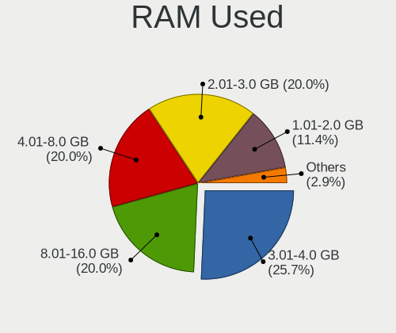

| Used GB    | Computers | Percent |
|------------|-----------|---------|
| 4.01-8.0   | 15        | 25.86%  |
| 3.01-4.0   | 15        | 25.86%  |
| 2.01-3.0   | 9         | 15.52%  |
| 1.01-2.0   | 9         | 15.52%  |
| 8.01-16.0  | 7         | 12.07%  |
| 0.51-1.0   | 2         | 3.45%   |
| 24.01-32.0 | 1         | 1.72%   |

Total Drives
------------

Number of drives on board

| Drives | Computers | Percent |
|--------|-----------|---------|
| 1      | 37        | 63.79%  |
| 2      | 14        | 24.14%  |
| 3      | 4         | 6.9%    |
| 4      | 2         | 3.45%   |
| 0      | 1         | 1.72%   |

Has CD-ROM
----------

Has CD-ROM on board

| Presented | Computers | Percent |
|-----------|-----------|---------|
| No        | 49        | 84.48%  |
| Yes       | 9         | 15.52%  |

Has Ethernet
------------

Has Ethernet on board

| Presented | Computers | Percent |
|-----------|-----------|---------|
| Yes       | 49        | 84.48%  |
| No        | 9         | 15.52%  |

Has WiFi
--------

Has WiFi module

| Presented | Computers | Percent |
|-----------|-----------|---------|
| Yes       | 49        | 84.48%  |
| No        | 9         | 15.52%  |

Has Bluetooth
-------------

Has Bluetooth module

| Presented | Computers | Percent |
|-----------|-----------|---------|
| Yes       | 49        | 84.48%  |
| No        | 9         | 15.52%  |

Location
--------

Country
-------

Geographic location (country)

| Country     | Computers | Percent |
|-------------|-----------|---------|
| USA         | 11        | 18.97%  |
| Italy       | 7         | 12.07%  |
| Canada      | 4         | 6.9%    |
| Russia      | 3         | 5.17%   |
| Germany     | 3         | 5.17%   |
| Denmark     | 3         | 5.17%   |
| Australia   | 3         | 5.17%   |
| Netherlands | 2         | 3.45%   |
| India       | 2         | 3.45%   |
| Finland     | 2         | 3.45%   |
| Austria     | 2         | 3.45%   |
| Ukraine     | 1         | 1.72%   |
| UK          | 1         | 1.72%   |
| Turkey      | 1         | 1.72%   |
| Sweden      | 1         | 1.72%   |
| Spain       | 1         | 1.72%   |
| Slovenia    | 1         | 1.72%   |
| Singapore   | 1         | 1.72%   |
| Serbia      | 1         | 1.72%   |
| Romania     | 1         | 1.72%   |
| Poland      | 1         | 1.72%   |
| Mexico      | 1         | 1.72%   |
| Hong Kong   | 1         | 1.72%   |
| Chile       | 1         | 1.72%   |
| Brazil      | 1         | 1.72%   |
| Belgium     | 1         | 1.72%   |
| Algeria     | 1         | 1.72%   |

City
----

Geographic location (city)

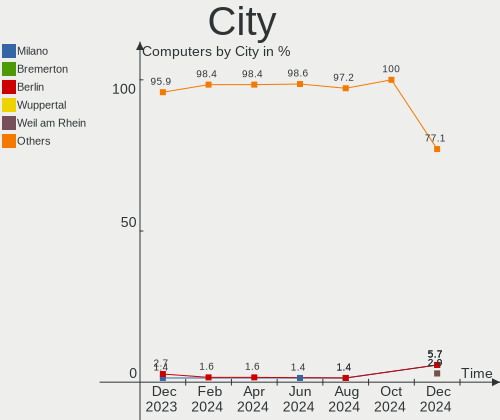

| City                      | Computers | Percent |
|---------------------------|-----------|---------|
| Seiersberg                | 2         | 3.45%   |
| Montreal                  | 2         | 3.45%   |
| Villena                   | 1         | 1.72%   |
| Tolyatti                  | 1         | 1.72%   |
| Sydney                    | 1         | 1.72%   |
| Swaty                     | 1         | 1.72%   |
| St Petersburg             | 1         | 1.72%   |
| Spanish Fork              | 1         | 1.72%   |
| Smarje pri Jelsah         | 1         | 1.72%   |
| Slagelse                  | 1         | 1.72%   |
| Singapore                 | 1         | 1.72%   |
| Saratov                   | 1         | 1.72%   |
| San Francisco             | 1         | 1.72%   |
| San Fermo della Battaglia | 1         | 1.72%   |
| Rozzano                   | 1         | 1.72%   |
| Potlatch                  | 1         | 1.72%   |
| Phoenix                   | 1         | 1.72%   |
| Perth                     | 1         | 1.72%   |
| Patna                     | 1         | 1.72%   |
| Osasco                    | 1         | 1.72%   |
| North Little Rock         | 1         | 1.72%   |
| Monza                     | 1         | 1.72%   |
| Milan                     | 1         | 1.72%   |
| Mérida                   | 1         | 1.72%   |
| Melbourne                 | 1         | 1.72%   |
| Magalia                   | 1         | 1.72%   |
| Los Angeles               | 1         | 1.72%   |
| Kyiv                      | 1         | 1.72%   |
| Kolkata                   | 1         | 1.72%   |
| Istanbul                  | 1         | 1.72%   |
| Herlufmagle               | 1         | 1.72%   |
| Hendon                    | 1         | 1.72%   |
| Helsinki                  | 1         | 1.72%   |
| Greeley                   | 1         | 1.72%   |
| Grambling                 | 1         | 1.72%   |
| Gothenburg                | 1         | 1.72%   |
| Florence                  | 1         | 1.72%   |
| Espoo                     | 1         | 1.72%   |
| Edmonton                  | 1         | 1.72%   |
| Düsseldorf               | 1         | 1.72%   |

Drives
------

Drive Vendor
------------

Hard drive vendors

| Vendor                      | Computers | Drives | Percent |
|-----------------------------|-----------|--------|---------|
| Samsung Electronics         | 21        | 23     | 25.3%   |
| WDC                         | 10        | 11     | 12.05%  |
| Seagate                     | 7         | 7      | 8.43%   |
| Kingston                    | 7         | 7      | 8.43%   |
| SK hynix                    | 6         | 6      | 7.23%   |
| Sandisk                     | 6         | 6      | 7.23%   |
| Phison Electronics          | 4         | 4      | 4.82%   |
| Micron Technology           | 4         | 4      | 4.82%   |
| Crucial                     | 4         | 4      | 4.82%   |
| Kingston Technology Company | 2         | 2      | 2.41%   |
| A-DATA Technology           | 2         | 2      | 2.41%   |
| Toshiba                     | 1         | 1      | 1.2%    |
| Patriot                     | 1         | 1      | 1.2%    |
| Micron/Crucial Technology   | 1         | 1      | 1.2%    |
| Lenovo                      | 1         | 1      | 1.2%    |
| INTEL SS                    | 1         | 1      | 1.2%    |
| Intel                       | 1         | 1      | 1.2%    |
| Hitachi                     | 1         | 1      | 1.2%    |
| HGST                        | 1         | 1      | 1.2%    |
| Corsair                     | 1         | 1      | 1.2%    |
| AS201                       | 1         | 1      | 1.2%    |

Drive Model
-----------

Hard drive models

| Model                                               | Computers | Percent |
|-----------------------------------------------------|-----------|---------|
| Samsung NVMe SSD Controller SM981/PM981/PM983 256GB | 4         | 4.71%   |
| WDC WDS120G2G0B-00EPW0 120GB SSD                    | 2         | 2.35%   |
| SK hynix HFS128G39TND-N210A 128GB SSD               | 2         | 2.35%   |
| Seagate ST2000DM008-2FR102 2TB                      | 2         | 2.35%   |
| Samsung SSD 980 1TB                                 | 2         | 2.35%   |
| Samsung SSD 860 EVO 1TB                             | 2         | 2.35%   |
| Samsung NVMe SSD Drive 512GB                        | 2         | 2.35%   |
| Phison PS5013 E13 NVMe Controller 512GB             | 2         | 2.35%   |
| Micron NVMe SSD Drive 1024GB                        | 2         | 2.35%   |
| Crucial CT500MX500SSD1 500GB                        | 2         | 2.35%   |
| WDC WDS500G2B0A-00SM50 500GB SSD                    | 1         | 1.18%   |
| WDC WD7500BPVT-60HXZT3 752GB                        | 1         | 1.18%   |
| WDC WD5000AACS-00ZUB0 500GB                         | 1         | 1.18%   |
| WDC WD40EFAX-68JH4N1 4TB                            | 1         | 1.18%   |
| WDC WD20EARS-42S0XB0 2TB                            | 1         | 1.18%   |
| WDC WD10SPZX-22Z10T1 1TB                            | 1         | 1.18%   |
| WDC WD10EZEX-08WN4A0 1TB                            | 1         | 1.18%   |
| WDC PC SA530 SDASN8Y-256G-1006 256GB SSD            | 1         | 1.18%   |
| Toshiba TR200 480GB SSD                             | 1         | 1.18%   |
| SK hynix SKHynix_HFS512GDE9X084N 512GB              | 1         | 1.18%   |
| SK hynix SKHynix_HFS256GDE9X081N 256GB              | 1         | 1.18%   |
| SK hynix HFM001TD3JX013N 1024GB                     | 1         | 1.18%   |
| SK hynix BC511 NVMe 256GB                           | 1         | 1.18%   |
| Seagate ST2000LM015-2E8174 2TB                      | 1         | 1.18%   |
| Seagate ST2000DX002-2DV164 2TB                      | 1         | 1.18%   |
| Seagate ST1000NC001-1DY162 1TB                      | 1         | 1.18%   |
| Seagate ST1000LM048-2E7172 1TB                      | 1         | 1.18%   |
| Seagate ST1000DX001-1NS162-SSHD 1TB                 | 1         | 1.18%   |
| Sandisk WDC PC SN530 SDBPMPZ-512G-1101 512GB        | 1         | 1.18%   |
| Sandisk WD Blue SN550 NVMe SSD 1024GB               | 1         | 1.18%   |
| Sandisk WD Black SN750 / PC SN730 NVMe SSD 1024GB   | 1         | 1.18%   |
| SanDisk SDSSDH3512G 512GB                           | 1         | 1.18%   |
| SanDisk NVMe SSD Drive 250GB                        | 1         | 1.18%   |
| SanDisk Extreme 55AE 500GB SSD                      | 1         | 1.18%   |
| Samsung SSD 870 EVO 250GB                           | 1         | 1.18%   |
| Samsung SSD 870 EVO 1TB                             | 1         | 1.18%   |
| Samsung SSD 860 PRO 256GB                           | 1         | 1.18%   |
| Samsung SSD 850 EVO 500GB                           | 1         | 1.18%   |
| Samsung SSD 830 Series 128GB                        | 1         | 1.18%   |
| Samsung NVMe SSD Drive 256GB                        | 1         | 1.18%   |

HDD Vendor
----------

Hard disk drive vendors

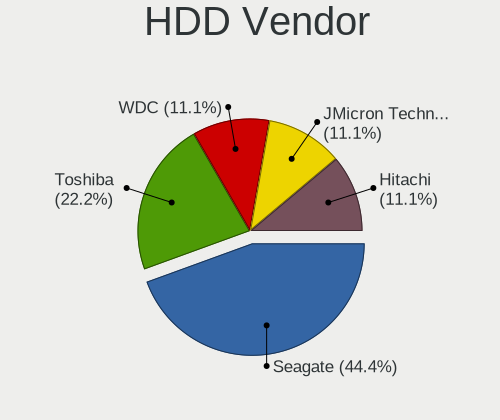

| Vendor              | Computers | Drives | Percent |
|---------------------|-----------|--------|---------|
| Seagate             | 7         | 7      | 41.18%  |
| WDC                 | 6         | 7      | 35.29%  |
| Samsung Electronics | 2         | 2      | 11.76%  |
| Hitachi             | 1         | 1      | 5.88%   |
| HGST                | 1         | 1      | 5.88%   |

SSD Vendor
----------

Solid state drive vendors

| Vendor              | Computers | Drives | Percent |
|---------------------|-----------|--------|---------|
| Samsung Electronics | 6         | 7      | 21.43%  |
| WDC                 | 4         | 4      | 14.29%  |
| Kingston            | 4         | 4      | 14.29%  |
| Crucial             | 4         | 4      | 14.29%  |
| SK hynix            | 2         | 2      | 7.14%   |
| SanDisk             | 2         | 2      | 7.14%   |
| A-DATA Technology   | 2         | 2      | 7.14%   |
| Toshiba             | 1         | 1      | 3.57%   |
| Patriot             | 1         | 1      | 3.57%   |
| Corsair             | 1         | 1      | 3.57%   |
| AS201               | 1         | 1      | 3.57%   |

Drive Kind
----------

HDD or SSD

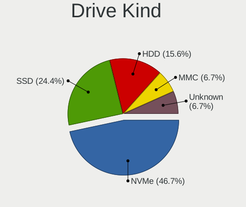

| Kind | Computers | Drives | Percent |
|------|-----------|--------|---------|
| NVMe | 36        | 39     | 48.65%  |
| SSD  | 22        | 29     | 29.73%  |
| HDD  | 16        | 18     | 21.62%  |

Drive Connector
---------------

SATA, SAS, NVMe, etc.

| Type | Computers | Drives | Percent |
|------|-----------|--------|---------|
| NVMe | 36        | 38     | 53.73%  |
| SATA | 29        | 46     | 43.28%  |
| SAS  | 2         | 2      | 2.99%   |

Drive Size
----------

Size of hard drive

| Size in TB | Computers | Drives | Percent |
|------------|-----------|--------|---------|
| 0.01-0.5   | 19        | 27     | 52.78%  |
| 0.51-1.0   | 11        | 13     | 30.56%  |
| 1.01-2.0   | 5         | 6      | 13.89%  |
| 3.01-4.0   | 1         | 1      | 2.78%   |

Space Total
-----------

Amount of disk space available on the file system

| Size in GB     | Computers | Percent |
|----------------|-----------|---------|
| 101-250        | 14        | 24.14%  |
| 251-500        | 13        | 22.41%  |
| 1001-2000      | 9         | 15.52%  |
| 501-1000       | 6         | 10.34%  |
| 1-20           | 5         | 8.62%   |
| More than 3000 | 4         | 6.9%    |
| Unknown        | 4         | 6.9%    |
| 2001-3000      | 2         | 3.45%   |
| 51-100         | 1         | 1.72%   |

Space Used
----------

Amount of used disk space

| Used GB   | Computers | Percent |
|-----------|-----------|---------|
| 101-250   | 12        | 20.69%  |
| 51-100    | 10        | 17.24%  |
| 21-50     | 8         | 13.79%  |
| 1-20      | 8         | 13.79%  |
| 501-1000  | 7         | 12.07%  |
| 1001-2000 | 4         | 6.9%    |
| Unknown   | 4         | 6.9%    |
| 251-500   | 3         | 5.17%   |
| 0         | 2         | 3.45%   |

Malfunc. Drives
---------------

Drive models with a malfunction

| Model                                    | Computers | Drives | Percent |
|------------------------------------------|-----------|--------|---------|
| WDC PC SA530 SDASN8Y-256G-1006 256GB SSD | 1         | 1      | 14.29%  |
| SK hynix HFS128G39TND-N210A 128GB SSD    | 1         | 1      | 14.29%  |
| Seagate ST2000DX002-2DV164 2TB           | 1         | 1      | 14.29%  |
| Samsung Electronics SSD 980 1TB          | 1         | 1      | 14.29%  |
| Hitachi HTS547575A9E384 752GB            | 1         | 1      | 14.29%  |
| HGST HTS545050A7E680 500GB               | 1         | 1      | 14.29%  |
| Crucial CT500MX500SSD1 500GB             | 1         | 1      | 14.29%  |

Malfunc. Drive Vendor
---------------------

Vendors of faulty drives

| Vendor              | Computers | Drives | Percent |
|---------------------|-----------|--------|---------|
| WDC                 | 1         | 1      | 14.29%  |
| SK hynix            | 1         | 1      | 14.29%  |
| Seagate             | 1         | 1      | 14.29%  |
| Samsung Electronics | 1         | 1      | 14.29%  |
| Hitachi             | 1         | 1      | 14.29%  |
| HGST                | 1         | 1      | 14.29%  |
| Crucial             | 1         | 1      | 14.29%  |

Malfunc. HDD Vendor
-------------------

Vendors of faulty HDD drives

| Vendor  | Computers | Drives | Percent |
|---------|-----------|--------|---------|
| Seagate | 1         | 1      | 33.33%  |
| Hitachi | 1         | 1      | 33.33%  |
| HGST    | 1         | 1      | 33.33%  |

Malfunc. Drive Kind
-------------------

Kinds of faulty drives

| Kind | Computers | Drives | Percent |
|------|-----------|--------|---------|
| SSD  | 3         | 3      | 42.86%  |
| HDD  | 3         | 3      | 42.86%  |
| NVMe | 1         | 1      | 14.29%  |

Failed Drives
-------------

Failed drive models

Zero info for selected period =(

Failed Drive Vendor
-------------------

Failed drive vendors

Zero info for selected period =(

Drive Status
------------

Number of failed and malfunc. drives

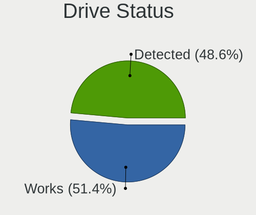

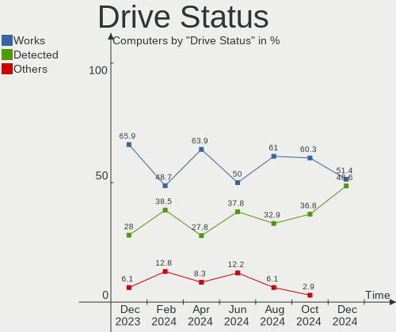

| Status   | Computers | Drives | Percent |
|----------|-----------|--------|---------|
| Works    | 37        | 53     | 57.81%  |
| Detected | 20        | 26     | 31.25%  |
| Malfunc  | 7         | 7      | 10.94%  |

Storage controller
------------------

Storage Vendor
--------------

Storage controller vendors

| Vendor                      | Computers | Percent |
|-----------------------------|-----------|---------|
| Intel                       | 29        | 35.8%   |
| Samsung Electronics         | 13        | 16.05%  |
| AMD                         | 10        | 12.35%  |
| Kingston Technology Company | 5         | 6.17%   |
| SK hynix                    | 4         | 4.94%   |
| SanDisk                     | 4         | 4.94%   |
| Phison Electronics          | 4         | 4.94%   |
| Micron Technology           | 4         | 4.94%   |
| ASMedia Technology          | 4         | 4.94%   |
| Micron/Crucial Technology   | 1         | 1.23%   |
| Marvell Technology Group    | 1         | 1.23%   |
| Lenovo                      | 1         | 1.23%   |
| JMicron Technology          | 1         | 1.23%   |

Storage Model
-------------

Storage controller models

| Model                                                                            | Computers | Percent |
|----------------------------------------------------------------------------------|-----------|---------|
| Samsung NVMe SSD Controller SM981/PM981/PM983                                    | 7         | 8.54%   |
| AMD FCH SATA Controller [AHCI mode]                                              | 7         | 8.54%   |
| Samsung NVMe SSD Controller 980                                                  | 6         | 7.32%   |
| Micron Non-Volatile memory controller                                            | 4         | 4.88%   |
| ASMedia ASM1062 Serial ATA Controller                                            | 4         | 4.88%   |
| SK hynix Gold P31 SSD                                                            | 3         | 3.66%   |
| Kingston Company Company Non-Volatile memory controller                          | 3         | 3.66%   |
| Intel Sunrise Point-LP SATA Controller [AHCI mode]                               | 3         | 3.66%   |
| Intel HM170/QM170 Chipset SATA Controller [AHCI Mode]                            | 3         | 3.66%   |
| Phison PS5013 E13 NVMe Controller                                                | 2         | 2.44%   |
| Intel Volume Management Device NVMe RAID Controller                              | 2         | 2.44%   |
| Intel Q170/Q150/B150/H170/H110/Z170/CM236 Chipset SATA Controller [AHCI Mode]    | 2         | 2.44%   |
| Intel Cannon Lake PCH SATA AHCI Controller                                       | 2         | 2.44%   |
| Intel 8 Series/C220 Series Chipset Family 6-port SATA Controller 1 [AHCI mode]   | 2         | 2.44%   |
| Intel 6 Series/C200 Series Chipset Family 6 port Mobile SATA AHCI Controller     | 2         | 2.44%   |
| AMD 400 Series Chipset SATA Controller                                           | 2         | 2.44%   |
| SK hynix BC511                                                                   | 1         | 1.22%   |
| SanDisk WD Blue SN550 NVMe SSD                                                   | 1         | 1.22%   |
| SanDisk WD Black SN750 / PC SN730 NVMe SSD                                       | 1         | 1.22%   |
| SanDisk WD Black 2018/SN750 / PC SN720 NVMe SSD                                  | 1         | 1.22%   |
| SanDisk Non-Volatile memory controller                                           | 1         | 1.22%   |
| Phison E16 PCIe4 NVMe Controller                                                 | 1         | 1.22%   |
| Phison E12 NVMe Controller                                                       | 1         | 1.22%   |
| Micron/Crucial P2 NVMe PCIe SSD                                                  | 1         | 1.22%   |
| Marvell Group 88SE9172 SATA 6Gb/s Controller                                     | 1         | 1.22%   |
| Lenovo Non-Volatile memory controller                                            | 1         | 1.22%   |
| Kingston Company U-SNS8154P3 NVMe SSD                                            | 1         | 1.22%   |
| Kingston Company OM3PDP3 NVMe SSD                                                | 1         | 1.22%   |
| JMicron JMB362 SATA Controller                                                   | 1         | 1.22%   |
| Intel Tiger Lake-LP SATA Controller                                              | 1         | 1.22%   |
| Intel SSD 660P Series                                                            | 1         | 1.22%   |
| Intel SATA Controller [RAID mode]                                                | 1         | 1.22%   |
| Intel Comet Lake SATA AHCI Controller                                            | 1         | 1.22%   |
| Intel Celeron/Pentium Silver Processor SATA Controller                           | 1         | 1.22%   |
| Intel Cannon Point-LP SATA Controller [AHCI Mode]                                | 1         | 1.22%   |
| Intel Cannon Lake Mobile PCH SATA AHCI Controller                                | 1         | 1.22%   |
| Intel Atom/Celeron/Pentium Processor x5-E8000/J3xxx/N3xxx Series SATA Controller | 1         | 1.22%   |
| Intel 82801IBM/IEM (ICH9M/ICH9M-E) 4 port SATA Controller [AHCI mode]            | 1         | 1.22%   |
| Intel 82801 Mobile SATA Controller [RAID mode]                                   | 1         | 1.22%   |
| Intel 7 Series Chipset Family 6-port SATA Controller [AHCI mode]                 | 1         | 1.22%   |

Storage Kind
------------

Kind of storage controller (IDE, SATA, NVMe, SAS, ...)

| Kind | Computers | Percent |
|------|-----------|---------|
| NVMe | 36        | 48%     |
| SATA | 35        | 46.67%  |
| RAID | 4         | 5.33%   |

Processor
---------

CPU Vendor
----------

Processor vendors

| Vendor | Computers | Percent |
|--------|-----------|---------|
| Intel  | 38        | 65.52%  |
| AMD    | 20        | 34.48%  |

CPU Model
---------

Processor models

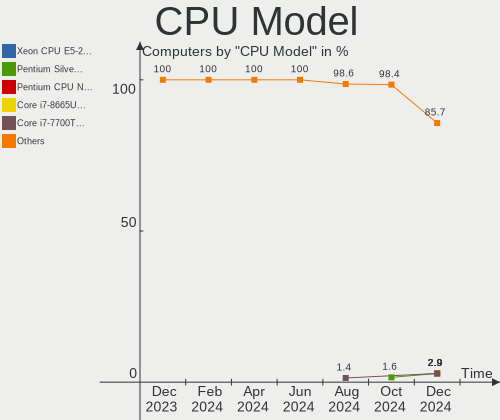

| Model                                           | Computers | Percent |
|-------------------------------------------------|-----------|---------|
| Intel Core i7-7700HQ CPU @ 2.80GHz              | 3         | 5.17%   |
| AMD Ryzen 7 5800H with Radeon Graphics          | 3         | 5.17%   |
| Intel Core i7-8550U CPU @ 1.80GHz               | 2         | 3.45%   |
| Intel Core i5-6600K CPU @ 3.50GHz               | 2         | 3.45%   |
| AMD Ryzen 5 3600 6-Core Processor               | 2         | 3.45%   |
| Intel Xeon CPU E5-2640 v3 @ 2.60GHz             | 1         | 1.72%   |
| Intel Core i9-9900K CPU @ 3.60GHz               | 1         | 1.72%   |
| Intel Core i7-8750H CPU @ 2.20GHz               | 1         | 1.72%   |
| Intel Core i7-4790 CPU @ 3.60GHz                | 1         | 1.72%   |
| Intel Core i7-3632QM CPU @ 2.20GHz              | 1         | 1.72%   |
| Intel Core i7-2670QM CPU @ 2.20GHz              | 1         | 1.72%   |
| Intel Core i7-2600K CPU @ 3.40GHz               | 1         | 1.72%   |
| Intel Core i7-10870H CPU @ 2.20GHz              | 1         | 1.72%   |
| Intel Core i5-9600KF CPU @ 3.70GHz              | 1         | 1.72%   |
| Intel Core i5-9400F CPU @ 2.90GHz               | 1         | 1.72%   |
| Intel Core i5-9300H CPU @ 2.40GHz               | 1         | 1.72%   |
| Intel Core i5-8350U CPU @ 1.70GHz               | 1         | 1.72%   |
| Intel Core i5-8279U CPU @ 2.40GHz               | 1         | 1.72%   |
| Intel Core i5-8250U CPU @ 1.60GHz               | 1         | 1.72%   |
| Intel Core i5-7300U CPU @ 2.60GHz               | 1         | 1.72%   |
| Intel Core i5-7200U CPU @ 2.50GHz               | 1         | 1.72%   |
| Intel Core i5-2415M CPU @ 2.30GHz               | 1         | 1.72%   |
| Intel Core i5-10500 CPU @ 3.10GHz               | 1         | 1.72%   |
| Intel Core i5-1035G1 CPU @ 1.00GHz              | 1         | 1.72%   |
| Intel Core i5-10210U CPU @ 1.60GHz              | 1         | 1.72%   |
| Intel Core i5 CPU 750 @ 2.67GHz                 | 1         | 1.72%   |
| Intel Core 2 Duo CPU L9400 @ 1.86GHz            | 1         | 1.72%   |
| Intel Celeron N4000 CPU @ 1.10GHz               | 1         | 1.72%   |
| Intel Celeron CPU N3050 @ 1.60GHz               | 1         | 1.72%   |
| Intel 12th Gen Core i7-1280P                    | 1         | 1.72%   |
| Intel 12th Gen Core i7-12700H                   | 1         | 1.72%   |
| Intel 12th Gen Core i7-1255U                    | 1         | 1.72%   |
| Intel 11th Gen Core i7-11800H @ 2.30GHz         | 1         | 1.72%   |
| Intel 11th Gen Core i7-1165G7 @ 2.80GHz         | 1         | 1.72%   |
| Intel 11th Gen Core i5-1135G7 @ 2.40GHz         | 1         | 1.72%   |
| Intel 11th Gen Core i3-1115G4 @ 3.00GHz         | 1         | 1.72%   |
| AMD Ryzen 9 6900HS with Radeon Graphics         | 1         | 1.72%   |
| AMD Ryzen 9 5900X 12-Core Processor             | 1         | 1.72%   |
| AMD Ryzen 9 5900HX with Radeon Graphics         | 1         | 1.72%   |
| AMD Ryzen 7 PRO 3700U w/ Radeon Vega Mobile Gfx | 1         | 1.72%   |

CPU Model Family
----------------

Processor model prefix

| Model            | Computers | Percent |
|------------------|-----------|---------|
| Intel Core i5    | 15        | 25.86%  |
| Intel Core i7    | 11        | 18.97%  |
| Other            | 8         | 13.79%  |
| AMD Ryzen 7      | 7         | 12.07%  |
| AMD Ryzen 5      | 7         | 12.07%  |
| AMD Ryzen 9      | 3         | 5.17%   |
| Intel Celeron    | 2         | 3.45%   |
| Intel Xeon       | 1         | 1.72%   |
| Intel Core i9    | 1         | 1.72%   |
| Intel Core 2 Duo | 1         | 1.72%   |
| AMD Ryzen 7 PRO  | 1         | 1.72%   |
| AMD A10          | 1         | 1.72%   |

CPU Cores
---------

Number of processor cores

| Number | Computers | Percent |
|--------|-----------|---------|
| 4      | 22        | 37.93%  |
| 8      | 13        | 22.41%  |
| 6      | 10        | 17.24%  |
| 2      | 9         | 15.52%  |
| 14     | 2         | 3.45%   |
| 12     | 1         | 1.72%   |
| 10     | 1         | 1.72%   |

CPU Sockets
-----------

Number of sockets

| Number | Computers | Percent |
|--------|-----------|---------|
| 1      | 58        | 100%    |

CPU Threads
-----------

Threads per core (Hyper-Threading)

| Number | Computers | Percent |
|--------|-----------|---------|
| 2      | 47        | 81.03%  |
| 1      | 11        | 18.97%  |

CPU Op-Modes
------------

CPU Operation Modes (32-bit, 64-bit)

| Op mode        | Computers | Percent |
|----------------|-----------|---------|
| 32-bit, 64-bit | 58        | 100%    |

CPU Microcode
-------------

Microcode number

| Number     | Computers | Percent |
|------------|-----------|---------|
| Unknown    | 22        | 37.93%  |
| 0x0a50000c | 4         | 6.9%    |
| 0x906e9    | 3         | 5.17%   |
| 0x906ea    | 2         | 3.45%   |
| 0x806c1    | 2         | 3.45%   |
| 0x08701021 | 2         | 3.45%   |
| 0x08600104 | 2         | 3.45%   |
| 0xa0653    | 1         | 1.72%   |
| 0xa0652    | 1         | 1.72%   |
| 0x906ed    | 1         | 1.72%   |
| 0x906a4    | 1         | 1.72%   |
| 0x906a3    | 1         | 1.72%   |
| 0x806ec    | 1         | 1.72%   |
| 0x806ea    | 1         | 1.72%   |
| 0x806e9    | 1         | 1.72%   |
| 0x806d1    | 1         | 1.72%   |
| 0x706e5    | 1         | 1.72%   |
| 0x706a1    | 1         | 1.72%   |
| 0x506e3    | 1         | 1.72%   |
| 0x406c3    | 1         | 1.72%   |
| 0x306f2    | 1         | 1.72%   |
| 0x306a9    | 1         | 1.72%   |
| 0x106e5    | 1         | 1.72%   |
| 0x08600106 | 1         | 1.72%   |
| 0x08600103 | 1         | 1.72%   |
| 0x0810100b | 1         | 1.72%   |
| 0x06006705 | 1         | 1.72%   |
| 0x0600611a | 1         | 1.72%   |

CPU Microarch
-------------

Microarchitecture

| Name             | Computers | Percent |
|------------------|-----------|---------|
| KabyLake         | 16        | 27.59%  |
| Zen 3            | 7         | 12.07%  |
| Zen 2            | 7         | 12.07%  |
| TigerLake        | 3         | 5.17%   |
| SandyBridge      | 3         | 5.17%   |
| Unknown          | 3         | 5.17%   |
| Skylake          | 2         | 3.45%   |
| IceLake          | 2         | 3.45%   |
| Haswell          | 2         | 3.45%   |
| Excavator        | 2         | 3.45%   |
| CometLake        | 2         | 3.45%   |
| Alderlake Hybrid | 2         | 3.45%   |
| Zen+             | 1         | 1.72%   |
| Zen              | 1         | 1.72%   |
| Silvermont       | 1         | 1.72%   |
| Penryn           | 1         | 1.72%   |
| Nehalem          | 1         | 1.72%   |
| IvyBridge        | 1         | 1.72%   |
| Goldmont plus    | 1         | 1.72%   |

Graphics
--------

GPU Vendor
----------

Vendors of graphics cards

| Vendor | Computers | Percent |
|--------|-----------|---------|
| Intel  | 29        | 41.43%  |
| AMD    | 21        | 30%     |
| Nvidia | 20        | 28.57%  |

GPU Model
---------

Graphics card models

| Model                                                                                    | Computers | Percent |
|------------------------------------------------------------------------------------------|-----------|---------|
| AMD Cezanne                                                                              | 5         | 6.67%   |
| Intel UHD Graphics 620                                                                   | 4         | 5.33%   |
| AMD Renoir                                                                               | 4         | 5.33%   |
| Intel HD Graphics 630                                                                    | 3         | 4%      |
| AMD Navi 23 [Radeon RX 6600/6600 XT/6600M]                                               | 3         | 4%      |
| Nvidia GP107M [GeForce GTX 1050 Mobile]                                                  | 2         | 2.67%   |
| Intel TigerLake-LP GT2 [Iris Xe Graphics]                                                | 2         | 2.67%   |
| Intel HD Graphics 620                                                                    | 2         | 2.67%   |
| Intel CoffeeLake-H GT2 [UHD Graphics 630]                                                | 2         | 2.67%   |
| Intel Alder Lake-P Integrated Graphics Controller                                        | 2         | 2.67%   |
| AMD Ellesmere [Radeon RX 470/480/570/570X/580/580X/590]                                  | 2         | 2.67%   |
| Nvidia TU117M [GeForce GTX 1650 Mobile / Max-Q]                                          | 1         | 1.33%   |
| Nvidia TU117M                                                                            | 1         | 1.33%   |
| Nvidia TU117 [GeForce GTX 1650]                                                          | 1         | 1.33%   |
| Nvidia TU116 [GeForce GTX 1660]                                                          | 1         | 1.33%   |
| Nvidia TU116 [GeForce GTX 1660 Ti]                                                       | 1         | 1.33%   |
| Nvidia TU106 [GeForce RTX 2060 SUPER]                                                    | 1         | 1.33%   |
| Nvidia GP108M [GeForce MX150]                                                            | 1         | 1.33%   |
| Nvidia GP108BM [GeForce MX250]                                                           | 1         | 1.33%   |
| Nvidia GP107M [GeForce GTX 1050 Ti Mobile]                                               | 1         | 1.33%   |
| Nvidia GP106 [GeForce GTX 1060 6GB]                                                      | 1         | 1.33%   |
| Nvidia GM204 [GeForce GTX 970]                                                           | 1         | 1.33%   |
| Nvidia GM108M [GeForce 920MX]                                                            | 1         | 1.33%   |
| Nvidia GM107 [GeForce GTX 750 Ti]                                                        | 1         | 1.33%   |
| Nvidia GF116M [GeForce GT 560M]                                                          | 1         | 1.33%   |
| Nvidia GA107M [GeForce RTX 3050 Ti Mobile]                                               | 1         | 1.33%   |
| Nvidia GA106M [GeForce RTX 3060 Mobile / Max-Q]                                          | 1         | 1.33%   |
| Nvidia GA106 [Geforce RTX 3050]                                                          | 1         | 1.33%   |
| Nvidia GA104M [GeForce RTX 3070 Mobile / Max-Q]                                          | 1         | 1.33%   |
| Intel Xeon E3-1200 v3/4th Gen Core Processor Integrated Graphics Controller              | 1         | 1.33%   |
| Intel TigerLake-H GT1 [UHD Graphics]                                                     | 1         | 1.33%   |
| Intel Tiger Lake UHD Graphics                                                            | 1         | 1.33%   |
| Intel Mobile 4 Series Chipset Integrated Graphics Controller                             | 1         | 1.33%   |
| Intel Iris Plus Graphics G1 (Ice Lake)                                                   | 1         | 1.33%   |
| Intel GeminiLake [UHD Graphics 600]                                                      | 1         | 1.33%   |
| Intel CometLake-U GT2 [UHD Graphics]                                                     | 1         | 1.33%   |
| Intel CometLake-S GT2 [UHD Graphics 630]                                                 | 1         | 1.33%   |
| Intel CometLake-H GT2 [UHD Graphics]                                                     | 1         | 1.33%   |
| Intel CoffeeLake-U GT3e [Iris Plus Graphics 655]                                         | 1         | 1.33%   |
| Intel Atom/Celeron/Pentium Processor x5-E8000/J3xxx/N3xxx Integrated Graphics Controller | 1         | 1.33%   |

GPU Combo
---------

Combinations of graphics cards

| Name           | Computers | Percent |
|----------------|-----------|---------|
| 1 x Intel      | 19        | 32.76%  |
| 1 x AMD        | 14        | 24.14%  |
| Intel + Nvidia | 10        | 17.24%  |
| 1 x Nvidia     | 8         | 13.79%  |
| 2 x AMD        | 5         | 8.62%   |
| AMD + Nvidia   | 2         | 3.45%   |

GPU Driver
----------

Free vs proprietary

| Driver      | Computers | Percent |
|-------------|-----------|---------|
| Free        | 43        | 74.14%  |
| Proprietary | 15        | 25.86%  |

GPU Memory
----------

Total video memory

| Size in GB | Computers | Percent |
|------------|-----------|---------|
| Unknown    | 38        | 65.52%  |
| 3.01-4.0   | 7         | 12.07%  |
| 0.01-0.5   | 6         | 10.34%  |
| 7.01-8.0   | 2         | 3.45%   |
| 5.01-6.0   | 2         | 3.45%   |
| 1.01-2.0   | 1         | 1.72%   |
| 8.01-16.0  | 1         | 1.72%   |
| 0.51-1.0   | 1         | 1.72%   |

Monitor
-------

Monitor Vendor
--------------

Monitor vendors

| Vendor                  | Computers | Percent |
|-------------------------|-----------|---------|
| AU Optronics            | 10        | 14.29%  |
| Samsung Electronics     | 8         | 11.43%  |
| BOE                     | 8         | 11.43%  |
| AOC                     | 7         | 10%     |
| LG Display              | 6         | 8.57%   |
| Chimei Innolux          | 6         | 8.57%   |
| Sharp                   | 3         | 4.29%   |
| Philips                 | 3         | 4.29%   |
| Goldstar                | 3         | 4.29%   |
| Dell                    | 2         | 2.86%   |
| Acer                    | 2         | 2.86%   |
| Toshiba                 | 1         | 1.43%   |
| TMX                     | 1         | 1.43%   |
| Sony                    | 1         | 1.43%   |
| PANDA                   | 1         | 1.43%   |
| Lenovo                  | 1         | 1.43%   |
| InfoVision              | 1         | 1.43%   |
| Hewlett-Packard         | 1         | 1.43%   |
| Chi Mei Optoelectronics | 1         | 1.43%   |
| BenQ                    | 1         | 1.43%   |
| AUS                     | 1         | 1.43%   |
| Apple                   | 1         | 1.43%   |
| Ancor Communications    | 1         | 1.43%   |

Monitor Model
-------------

Monitor models

| Model                                                                     | Computers | Percent |
|---------------------------------------------------------------------------|-----------|---------|
| Samsung Electronics S24D330 SAM0D92 1920x1080 531x299mm 24.0-inch         | 3         | 4.29%   |
| AU Optronics LCD Monitor AUO38ED 1920x1080 344x193mm 15.5-inch            | 3         | 4.29%   |
| AOC 27G2G3 AOC2702 1920x1080 598x336mm 27.0-inch                          | 2         | 2.86%   |
| Toshiba ScreenXpert TSB8888 1080x2160                                     | 1         | 1.43%   |
| TMX TL140ADXP01 TMX1481 2560x1600 301x188mm 14.0-inch                     | 1         | 1.43%   |
| Sony TV SNY6804 1600x900                                                  | 1         | 1.43%   |
| Sharp LQ156M1JW25 SHP152C 1920x1080 344x194mm 15.5-inch                   | 1         | 1.43%   |
| Sharp LQ156M1JW03 SHP14C5 1920x1080 344x194mm 15.5-inch                   | 1         | 1.43%   |
| Sharp LQ134N1JW53 SHP1521 1920x1200 288x180mm 13.4-inch                   | 1         | 1.43%   |
| Samsung Electronics S27R65x SAM1045 1920x1080 598x336mm 27.0-inch         | 1         | 1.43%   |
| Samsung Electronics S24R35xFZ SAM71A8 1920x1080 521x293mm 23.5-inch       | 1         | 1.43%   |
| Samsung Electronics LCD Monitor SDC4154 2880x1800 302x189mm 14.0-inch     | 1         | 1.43%   |
| Samsung Electronics LCD Monitor SAM090B 1920x1080 890x500mm 40.2-inch     | 1         | 1.43%   |
| Samsung Electronics LCD Monitor SAM02EB 1920x540                          | 1         | 1.43%   |
| Philips PHL 272P7VU PHL093A 3840x2160 597x336mm 27.0-inch                 | 1         | 1.43%   |
| Philips PHL 241B7Q PHL0909 1920x1080 530x300mm 24.0-inch                  | 1         | 1.43%   |
| Philips 19S PHL0878 1280x1024 376x301mm 19.0-inch                         | 1         | 1.43%   |
| PANDA LCD Monitor NCP002D 1920x1080 344x194mm 15.5-inch                   | 1         | 1.43%   |
| LG Display LCD Monitor LGD0701 1920x1200 345x215mm 16.0-inch              | 1         | 1.43%   |
| LG Display LCD Monitor LGD0561 1920x1080 294x165mm 13.3-inch              | 1         | 1.43%   |
| LG Display LCD Monitor LGD0555 1536x1024 263x175mm 12.4-inch              | 1         | 1.43%   |
| LG Display LCD Monitor LGD0521 1920x1080 309x174mm 14.0-inch              | 1         | 1.43%   |
| LG Display LCD Monitor LGD04E8 1920x1080 382x215mm 17.3-inch              | 1         | 1.43%   |
| LG Display LCD Monitor LGD03D9 1366x768 345x194mm 15.6-inch               | 1         | 1.43%   |
| Lenovo LCD Monitor LEN4011 1280x800 261x163mm 12.1-inch                   | 1         | 1.43%   |
| InfoVision LCD Monitor IVO8C69 1920x1080 309x174mm 14.0-inch              | 1         | 1.43%   |
| Hewlett-Packard 25mx HPN359A 1920x1080 544x303mm 24.5-inch                | 1         | 1.43%   |
| Goldstar FULL HD GSM5B55 1920x1080 480x270mm 21.7-inch                    | 1         | 1.43%   |
| Goldstar 24MP55 GSM5A20 1920x1080 510x290mm 23.1-inch                     | 1         | 1.43%   |
| Goldstar 22MP55 GSM5A24 1920x1080 477x268mm 21.5-inch                     | 1         | 1.43%   |
| Dell U2412M DELA07B 1920x1200 518x324mm 24.1-inch                         | 1         | 1.43%   |
| Dell ST2420L DELA068 1920x1080 531x299mm 24.0-inch                        | 1         | 1.43%   |
| Chimei Innolux P140ZKA-BZ1 CMN8C03 2160x1440 296x197mm 14.0-inch          | 1         | 1.43%   |
| Chimei Innolux LCD Monitor CMN1602 1920x1080 355x199mm 16.0-inch          | 1         | 1.43%   |
| Chimei Innolux LCD Monitor CMN15DC 1366x768 344x193mm 15.5-inch           | 1         | 1.43%   |
| Chimei Innolux LCD Monitor CMN15BE 1366x768 344x193mm 15.5-inch           | 1         | 1.43%   |
| Chimei Innolux LCD Monitor CMN1521 1920x1080 344x193mm 15.5-inch          | 1         | 1.43%   |
| Chimei Innolux LCD Monitor CMN14E5 1920x1080 309x173mm 13.9-inch          | 1         | 1.43%   |
| Chi Mei Optoelectronics LCD Monitor CMO1726 1920x1080 382x215mm 17.3-inch | 1         | 1.43%   |
| BOE LCD Monitor BOE0974 2560x1440 344x194mm 15.5-inch                     | 1         | 1.43%   |

Monitor Resolution
------------------

Monitor screen resolution

| Resolution        | Computers | Percent |
|-------------------|-----------|---------|
| 1920x1080 (FHD)   | 33        | 51.56%  |
| 3840x2160 (4K)    | 6         | 9.38%   |
| 1366x768 (WXGA)   | 6         | 9.38%   |
| 2560x1440 (QHD)   | 5         | 7.81%   |
| 1920x1200 (WUXGA) | 3         | 4.69%   |
| 1280x800 (WXGA)   | 2         | 3.13%   |
| 1280x1024 (SXGA)  | 2         | 3.13%   |
| 2880x1800         | 1         | 1.56%   |
| 2736x1824         | 1         | 1.56%   |
| 2560x1600         | 1         | 1.56%   |
| 2240x1400         | 1         | 1.56%   |
| 2160x1440         | 1         | 1.56%   |
| 1920x540          | 1         | 1.56%   |
| 1600x900 (HD+)    | 1         | 1.56%   |

Monitor Diagonal
----------------

Diagonal size in inches

| Inches  | Computers | Percent |
|---------|-----------|---------|
| 15      | 18        | 25.71%  |
| 24      | 9         | 12.86%  |
| 14      | 8         | 11.43%  |
| 13      | 8         | 11.43%  |
| 27      | 6         | 8.57%   |
| 23      | 3         | 4.29%   |
| 31      | 2         | 2.86%   |
| 21      | 2         | 2.86%   |
| 17      | 2         | 2.86%   |
| 16      | 2         | 2.86%   |
| 12      | 2         | 2.86%   |
| Unknown | 2         | 2.86%   |
| 72      | 1         | 1.43%   |
| 54      | 1         | 1.43%   |
| 33      | 1         | 1.43%   |
| 26      | 1         | 1.43%   |
| 19      | 1         | 1.43%   |
| 18      | 1         | 1.43%   |

Monitor Width
-------------

Physical width

| Width in mm | Computers | Percent |
|-------------|-----------|---------|
| 301-350     | 28        | 40.58%  |
| 501-600     | 18        | 26.09%  |
| 201-300     | 9         | 13.04%  |
| 351-400     | 4         | 5.8%    |
| 401-500     | 3         | 4.35%   |
| 601-700     | 2         | 2.9%    |
| Unknown     | 2         | 2.9%    |
| 701-800     | 1         | 1.45%   |
| 1501-2000   | 1         | 1.45%   |
| 1001-1500   | 1         | 1.45%   |

Aspect Ratio
------------

Proportional relationship between the width and the height

| Ratio   | Computers | Percent |
|---------|-----------|---------|
| 16/9    | 48        | 78.69%  |
| 16/10   | 7         | 11.48%  |
| 3/2     | 3         | 4.92%   |
| 5/4     | 1         | 1.64%   |
| 4/3     | 1         | 1.64%   |
| Unknown | 1         | 1.64%   |

Monitor Area
------------

Area in inch²

| Area in inch² | Computers | Percent |
|----------------|-----------|---------|
| 101-110        | 19        | 27.54%  |
| 81-90          | 12        | 17.39%  |
| 201-250        | 10        | 14.49%  |
| 301-350        | 7         | 10.14%  |
| 71-80          | 5         | 7.25%   |
| 351-500        | 3         | 4.35%   |
| 251-300        | 3         | 4.35%   |
| More than 1000 | 2         | 2.9%    |
| 121-130        | 2         | 2.9%    |
| Unknown        | 2         | 2.9%    |
| 61-70          | 1         | 1.45%   |
| 151-200        | 1         | 1.45%   |
| 141-150        | 1         | 1.45%   |
| 111-120        | 1         | 1.45%   |

Pixel Density
-------------

Pixels per inch

| Density       | Computers | Percent |
|---------------|-----------|---------|
| 121-160       | 23        | 34.85%  |
| 51-100        | 21        | 31.82%  |
| 161-240       | 9         | 13.64%  |
| 101-120       | 8         | 12.12%  |
| 1-50          | 2         | 3.03%   |
| Unknown       | 2         | 3.03%   |
| More than 240 | 1         | 1.52%   |

Multiple Monitors
-----------------

Total monitors connected

| Total | Computers | Percent |
|-------|-----------|---------|
| 1     | 46        | 79.31%  |
| 2     | 10        | 17.24%  |
| 3     | 2         | 3.45%   |

Network
-------

Net Controller Vendor
---------------------

Controller vendors

| Vendor                | Computers | Percent |
|-----------------------|-----------|---------|
| Realtek Semiconductor | 40        | 43.48%  |
| Intel                 | 32        | 34.78%  |
| MediaTek              | 6         | 6.52%   |
| Qualcomm Atheros      | 4         | 4.35%   |
| Broadcom              | 2         | 2.17%   |
| TP-Link               | 1         | 1.09%   |
| Sierra Wireless       | 1         | 1.09%   |
| Ralink                | 1         | 1.09%   |
| ICS Advent            | 1         | 1.09%   |
| DisplayLink           | 1         | 1.09%   |
| D-Link                | 1         | 1.09%   |
| Belkin Components     | 1         | 1.09%   |
| ASIX Electronics      | 1         | 1.09%   |

Net Controller Model
--------------------

Controller models

| Model                                                             | Computers | Percent |
|-------------------------------------------------------------------|-----------|---------|
| Realtek RTL8111/8168/8411 PCI Express Gigabit Ethernet Controller | 29        | 26.85%  |
| Intel Wireless 8265 / 8275                                        | 5         | 4.63%   |
| Intel Wi-Fi 6 AX200                                               | 5         | 4.63%   |
| Realtek RTL8125 2.5GbE Controller                                 | 4         | 3.7%    |
| Realtek RTL8153 Gigabit Ethernet Adapter                          | 3         | 2.78%   |
| Qualcomm Atheros QCA9377 802.11ac Wireless Network Adapter        | 3         | 2.78%   |
| MediaTek MT7921 802.11ax PCI Express Wireless Network Adapter     | 3         | 2.78%   |
| Intel Cannon Lake PCH CNVi WiFi                                   | 3         | 2.78%   |
| Realtek RTL8822CE 802.11ac PCIe Wireless Network Adapter          | 2         | 1.85%   |
| Realtek RTL810xE PCI Express Fast Ethernet controller             | 2         | 1.85%   |
| MediaTek MT7921K (RZ608) Wi-Fi 6E 80MHz                           | 2         | 1.85%   |
| Intel Wireless 7265                                               | 2         | 1.85%   |
| Intel Wi-Fi 6 AX210/AX211/AX411 160MHz                            | 2         | 1.85%   |
| Intel Wi-Fi 6 AX201                                               | 2         | 1.85%   |
| Intel Ethernet Connection (4) I219-LM                             | 2         | 1.85%   |
| Intel Ethernet Connection (2) I219-V                              | 2         | 1.85%   |
| Intel Alder Lake-P PCH CNVi WiFi                                  | 2         | 1.85%   |
| TP-Link TL-WN722N v2/v3 [Realtek RTL8188EUS]                      | 1         | 0.93%   |
| Sierra Wireless EM7455                                            | 1         | 0.93%   |
| Realtek USB 10/100/1G/2.5G LAN                                    | 1         | 0.93%   |
| Realtek RTL8852AE 802.11ax PCIe Wireless Network Adapter          | 1         | 0.93%   |
| Realtek RTL8822BE 802.11a/b/g/n/ac WiFi adapter                   | 1         | 0.93%   |
| Realtek RTL8821AE 802.11ac PCIe Wireless Network Adapter          | 1         | 0.93%   |
| Realtek RTL8723DE Wireless Network Adapter                        | 1         | 0.93%   |
| Realtek RTL8192EU 802.11b/g/n WLAN Adapter                        | 1         | 0.93%   |
| Ralink RT3290 Wireless 802.11n 1T/1R PCIe                         | 1         | 0.93%   |
| Qualcomm Atheros AR9287 Wireless Network Adapter (PCI-Express)    | 1         | 0.93%   |
| MediaTek MT7922 802.11ax PCI Express Wireless Network Adapter     | 1         | 0.93%   |
| Intel Wireless-AC 9260                                            | 1         | 0.93%   |
| Intel Wireless 3165                                               | 1         | 0.93%   |
| Intel Tiger Lake PCH CNVi WiFi                                    | 1         | 0.93%   |
| Intel PRO/Wireless 5100 AGN [Shiloh] Network Connection           | 1         | 0.93%   |
| Intel Ice Lake-LP PCH CNVi WiFi                                   | 1         | 0.93%   |
| Intel Ethernet Controller I225-V                                  | 1         | 0.93%   |
| Intel Ethernet Connection I217-LM                                 | 1         | 0.93%   |
| Intel Ethernet Connection (7) I219-V                              | 1         | 0.93%   |
| Intel Ethernet Connection (4) I219-V                              | 1         | 0.93%   |
| Intel Ethernet Connection (13) I219-V                             | 1         | 0.93%   |
| Intel Comet Lake PCH-LP CNVi WiFi                                 | 1         | 0.93%   |
| Intel Centrino Wireless-N 6150                                    | 1         | 0.93%   |

Wireless Vendor
---------------

Wireless vendors

| Vendor                | Computers | Percent |
|-----------------------|-----------|---------|
| Intel                 | 28        | 53.85%  |
| Realtek Semiconductor | 7         | 13.46%  |
| MediaTek              | 6         | 11.54%  |
| Qualcomm Atheros      | 4         | 7.69%   |
| Broadcom              | 2         | 3.85%   |
| TP-Link               | 1         | 1.92%   |
| Sierra Wireless       | 1         | 1.92%   |
| Ralink                | 1         | 1.92%   |
| D-Link                | 1         | 1.92%   |
| Belkin Components     | 1         | 1.92%   |

Wireless Model
--------------

Wireless models

| Model                                                                             | Computers | Percent |
|-----------------------------------------------------------------------------------|-----------|---------|
| Intel Wireless 8265 / 8275                                                        | 5         | 9.43%   |
| Intel Wi-Fi 6 AX200                                                               | 5         | 9.43%   |
| Qualcomm Atheros QCA9377 802.11ac Wireless Network Adapter                        | 3         | 5.66%   |
| MediaTek MT7921 802.11ax PCI Express Wireless Network Adapter                     | 3         | 5.66%   |
| Intel Cannon Lake PCH CNVi WiFi                                                   | 3         | 5.66%   |
| Realtek RTL8822CE 802.11ac PCIe Wireless Network Adapter                          | 2         | 3.77%   |
| MediaTek MT7921K (RZ608) Wi-Fi 6E 80MHz                                           | 2         | 3.77%   |
| Intel Wireless 7265                                                               | 2         | 3.77%   |
| Intel Wi-Fi 6 AX210/AX211/AX411 160MHz                                            | 2         | 3.77%   |
| Intel Wi-Fi 6 AX201                                                               | 2         | 3.77%   |
| Intel Alder Lake-P PCH CNVi WiFi                                                  | 2         | 3.77%   |
| TP-Link TL-WN722N v2/v3 [Realtek RTL8188EUS]                                      | 1         | 1.89%   |
| Sierra Wireless EM7455                                                            | 1         | 1.89%   |
| Realtek RTL8852AE 802.11ax PCIe Wireless Network Adapter                          | 1         | 1.89%   |
| Realtek RTL8822BE 802.11a/b/g/n/ac WiFi adapter                                   | 1         | 1.89%   |
| Realtek RTL8821AE 802.11ac PCIe Wireless Network Adapter                          | 1         | 1.89%   |
| Realtek RTL8723DE Wireless Network Adapter                                        | 1         | 1.89%   |
| Realtek RTL8192EU 802.11b/g/n WLAN Adapter                                        | 1         | 1.89%   |
| Ralink RT3290 Wireless 802.11n 1T/1R PCIe                                         | 1         | 1.89%   |
| Qualcomm Atheros AR9287 Wireless Network Adapter (PCI-Express)                    | 1         | 1.89%   |
| MediaTek MT7922 802.11ax PCI Express Wireless Network Adapter                     | 1         | 1.89%   |
| Intel Wireless-AC 9260                                                            | 1         | 1.89%   |
| Intel Wireless 3165                                                               | 1         | 1.89%   |
| Intel Tiger Lake PCH CNVi WiFi                                                    | 1         | 1.89%   |
| Intel PRO/Wireless 5100 AGN [Shiloh] Network Connection                           | 1         | 1.89%   |
| Intel Ice Lake-LP PCH CNVi WiFi                                                   | 1         | 1.89%   |
| Intel Comet Lake PCH-LP CNVi WiFi                                                 | 1         | 1.89%   |
| Intel Centrino Wireless-N 6150                                                    | 1         | 1.89%   |
| Intel Centrino Wireless-N + WiMAX 6150                                            | 1         | 1.89%   |
| D-Link 802.11ac NIC                                                               | 1         | 1.89%   |
| Broadcom BCM4331 802.11a/b/g/n                                                    | 1         | 1.89%   |
| Broadcom BCM43142 802.11b/g/n                                                     | 1         | 1.89%   |
| Belkin Components F9L1109v1 802.11a/b/g/n/ac Wireless Adapter [Realtek RTL8812AU] | 1         | 1.89%   |

Ethernet Vendor
---------------

Ethernet vendors

| Vendor                | Computers | Percent |
|-----------------------|-----------|---------|
| Realtek Semiconductor | 38        | 70.37%  |
| Intel                 | 11        | 20.37%  |
| ICS Advent            | 1         | 1.85%   |
| DisplayLink           | 1         | 1.85%   |
| D-Link                | 1         | 1.85%   |
| Broadcom              | 1         | 1.85%   |
| ASIX Electronics      | 1         | 1.85%   |

Ethernet Model
--------------

Ethernet models

| Model                                                             | Computers | Percent |
|-------------------------------------------------------------------|-----------|---------|
| Realtek RTL8111/8168/8411 PCI Express Gigabit Ethernet Controller | 29        | 52.73%  |
| Realtek RTL8125 2.5GbE Controller                                 | 4         | 7.27%   |
| Realtek RTL8153 Gigabit Ethernet Adapter                          | 3         | 5.45%   |
| Realtek RTL810xE PCI Express Fast Ethernet controller             | 2         | 3.64%   |
| Intel Ethernet Connection (4) I219-LM                             | 2         | 3.64%   |
| Intel Ethernet Connection (2) I219-V                              | 2         | 3.64%   |
| Realtek USB 10/100/1G/2.5G LAN                                    | 1         | 1.82%   |
| Intel Ethernet Controller I225-V                                  | 1         | 1.82%   |
| Intel Ethernet Connection I217-LM                                 | 1         | 1.82%   |
| Intel Ethernet Connection (7) I219-V                              | 1         | 1.82%   |
| Intel Ethernet Connection (4) I219-V                              | 1         | 1.82%   |
| Intel Ethernet Connection (13) I219-V                             | 1         | 1.82%   |
| Intel 82579V Gigabit Network Connection                           | 1         | 1.82%   |
| Intel 82567LM Gigabit Network Connection                          | 1         | 1.82%   |
| ICS Advent DM9601 Fast Ethernet Adapter                           | 1         | 1.82%   |
| DisplayLink ThinkPad USB 3.0 Ultra Dock                           | 1         | 1.82%   |
| D-Link DUBE250 2.5GbE Adapter                                     | 1         | 1.82%   |
| Broadcom NetXtreme BCM57765 Gigabit Ethernet PCIe                 | 1         | 1.82%   |
| ASIX AX88179 Gigabit Ethernet                                     | 1         | 1.82%   |

Net Controller Kind
-------------------

Ethernet, WiFi or modem

| Kind     | Computers | Percent |
|----------|-----------|---------|
| WiFi     | 49        | 50%     |
| Ethernet | 49        | 50%     |

Used Controller
---------------

Currently used network controller

| Kind     | Computers | Percent |
|----------|-----------|---------|
| WiFi     | 40        | 67.8%   |
| Ethernet | 19        | 32.2%   |

NICs
----

Total network controllers on board

| Total | Computers | Percent |
|-------|-----------|---------|
| 2     | 35        | 60.34%  |
| 1     | 22        | 37.93%  |
| 3     | 1         | 1.72%   |

IPv6
----

IPv6 vs IPv4

| Used | Computers | Percent |
|------|-----------|---------|
| No   | 45        | 77.59%  |
| Yes  | 13        | 22.41%  |

Bluetooth
---------

Bluetooth Vendor
----------------

Controller vendors

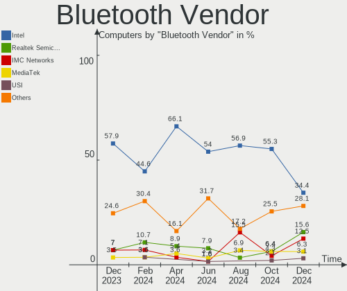

| Vendor                          | Computers | Percent |
|---------------------------------|-----------|---------|
| Intel                           | 27        | 52.94%  |
| Realtek Semiconductor           | 5         | 9.8%    |
| Lite-On Technology              | 3         | 5.88%   |
| Cambridge Silicon Radio         | 3         | 5.88%   |
| MediaTek                        | 2         | 3.92%   |
| IMC Networks                    | 2         | 3.92%   |
| Foxconn / Hon Hai               | 2         | 3.92%   |
| Broadcom                        | 2         | 3.92%   |
| TP-Link                         | 1         | 1.96%   |
| Realtek                         | 1         | 1.96%   |
| Ralink                          | 1         | 1.96%   |
| Qualcomm Atheros Communications | 1         | 1.96%   |
| Apple                           | 1         | 1.96%   |

Bluetooth Model
---------------

Controller models

| Model                                               | Computers | Percent |
|-----------------------------------------------------|-----------|---------|
| Intel Bluetooth wireless interface                  | 8         | 15.69%  |
| Intel AX200 Bluetooth                               | 5         | 9.8%    |
| Intel Bluetooth 9460/9560 Jefferson Peak (JfP)      | 4         | 7.84%   |
| Intel AX201 Bluetooth                               | 4         | 7.84%   |
| Realtek Bluetooth Radio                             | 3         | 5.88%   |
| Cambridge Silicon Radio Bluetooth Dongle (HCI mode) | 3         | 5.88%   |
| Realtek  Bluetooth 4.2 Adapter                      | 2         | 3.92%   |
| MediaTek Wireless_Device                            | 2         | 3.92%   |
| Lite-On Qualcomm Atheros QCA9377 Bluetooth          | 2         | 3.92%   |
| Intel Bluetooth Device                              | 2         | 3.92%   |
| Intel AX210 Bluetooth                               | 2         | 3.92%   |
| IMC Networks Wireless_Device                        | 2         | 3.92%   |
| Foxconn / Hon Hai Wireless_Device                   | 2         | 3.92%   |
| TP-Link UB500 Adapter                               | 1         | 1.96%   |
| Realtek Bluetooth Radio                             | 1         | 1.96%   |
| Ralink RT3290 Bluetooth                             | 1         | 1.96%   |
| Qualcomm Atheros  Bluetooth Device                  | 1         | 1.96%   |
| Lite-On Bluetooth Radio                             | 1         | 1.96%   |
| Intel Wireless-AC 9260 Bluetooth Adapter            | 1         | 1.96%   |
| Intel Wireless-AC 3168 Bluetooth                    | 1         | 1.96%   |
| Broadcom BCM43142A0 Bluetooth 4.0                   | 1         | 1.96%   |
| Broadcom BCM2045B (BDC-2.1) [Bluetooth Controller]  | 1         | 1.96%   |
| Apple Bluetooth Host Controller                     | 1         | 1.96%   |

Sound
-----

Sound Vendor
------------

Sound card vendors

| Vendor                 | Computers | Percent |
|------------------------|-----------|---------|
| Intel                  | 38        | 43.68%  |
| AMD                    | 23        | 26.44%  |
| Nvidia                 | 14        | 16.09%  |
| Texas Instruments      | 1         | 1.15%   |
| SteelSeries ApS        | 1         | 1.15%   |
| Sony                   | 1         | 1.15%   |
| Realtek Semiconductor  | 1         | 1.15%   |
| Logitech               | 1         | 1.15%   |
| Kingston Technology    | 1         | 1.15%   |
| GHW Micro              | 1         | 1.15%   |
| Focusrite-Novation     | 1         | 1.15%   |
| Corsair                | 1         | 1.15%   |
| C-Media Electronics    | 1         | 1.15%   |
| AOKEO                  | 1         | 1.15%   |
| AlfaPlus Semiconductor | 1         | 1.15%   |

Sound Model
-----------

Sound card models

| Model                                                                                             | Computers | Percent |
|---------------------------------------------------------------------------------------------------|-----------|---------|
| AMD Family 17h/19h HD Audio Controller                                                            | 12        | 11.01%  |
| AMD Renoir Radeon High Definition Audio Controller                                                | 10        | 9.17%   |
| Intel Sunrise Point-LP HD Audio                                                                   | 6         | 5.5%    |
| Intel Cannon Lake PCH cAVS                                                                        | 5         | 4.59%   |
| AMD Starship/Matisse HD Audio Controller                                                          | 5         | 4.59%   |
| AMD Navi 21/23 HDMI/DP Audio Controller                                                           | 5         | 4.59%   |
| Nvidia TU107 GeForce GTX 1650 High Definition Audio Controller                                    | 3         | 2.75%   |
| Intel Tiger Lake-LP Smart Sound Technology Audio Controller                                       | 3         | 2.75%   |
| Intel CM238 HD Audio Controller                                                                   | 3         | 2.75%   |
| Intel Alder Lake PCH-P High Definition Audio Controller                                           | 3         | 2.75%   |
| Intel 6 Series/C200 Series Chipset Family High Definition Audio Controller                        | 3         | 2.75%   |
| Nvidia TU116 High Definition Audio Controller                                                     | 2         | 1.83%   |
| Nvidia GA106 High Definition Audio Controller                                                     | 2         | 1.83%   |
| Intel 8 Series/C220 Series Chipset High Definition Audio Controller                               | 2         | 1.83%   |
| Intel 100 Series/C230 Series Chipset Family HD Audio Controller                                   | 2         | 1.83%   |
| AMD Raven/Raven2/Fenghuang HDMI/DP Audio Controller                                               | 2         | 1.83%   |
| AMD Family 15h (Models 60h-6fh) Audio Controller                                                  | 2         | 1.83%   |
| AMD Ellesmere HDMI Audio [Radeon RX 470/480 / 570/580/590]                                        | 2         | 1.83%   |
| Texas Instruments PCM2902 Audio Codec                                                             | 1         | 0.92%   |
| SteelSeries ApS SteelSeries GameDAC                                                               | 1         | 0.92%   |
| Sony DualShock 4 [CUH-ZCT2x]                                                                      | 1         | 0.92%   |
| Realtek Semiconductor USB Audio                                                                   | 1         | 0.92%   |
| Nvidia TU106 High Definition Audio Controller                                                     | 1         | 0.92%   |
| Nvidia GP107GL High Definition Audio Controller                                                   | 1         | 0.92%   |
| Nvidia GP106 High Definition Audio Controller                                                     | 1         | 0.92%   |
| Nvidia GM204 High Definition Audio Controller                                                     | 1         | 0.92%   |
| Nvidia GM107 High Definition Audio Controller [GeForce 940MX]                                     | 1         | 0.92%   |
| Nvidia GF116 High Definition Audio Controller                                                     | 1         | 0.92%   |
| Nvidia GA104 High Definition Audio Controller                                                     | 1         | 0.92%   |
| Logitech G733 Gaming Headset                                                                      | 1         | 0.92%   |
| Kingston Technology HyperX 7.1 Audio                                                              | 1         | 0.92%   |
| Intel Xeon E3-1200 v3/4th Gen Core Processor HD Audio Controller                                  | 1         | 0.92%   |
| Intel Tiger Lake-H HD Audio Controller                                                            | 1         | 0.92%   |
| Intel Ice Lake-LP Smart Sound Technology Audio Controller                                         | 1         | 0.92%   |
| Intel Comet Lake PCH-V cAVS                                                                       | 1         | 0.92%   |
| Intel Comet Lake PCH-LP cAVS                                                                      | 1         | 0.92%   |
| Intel Comet Lake PCH cAVS                                                                         | 1         | 0.92%   |
| Intel Celeron/Pentium Silver Processor High Definition Audio                                      | 1         | 0.92%   |
| Intel Cannon Point-LP High Definition Audio Controller                                            | 1         | 0.92%   |
| Intel Atom/Celeron/Pentium Processor x5-E8000/J3xxx/N3xxx Series High Definition Audio Controller | 1         | 0.92%   |

Memory
------

Memory Vendor
-------------

Memory module vendors

| Vendor              | Computers | Percent |
|---------------------|-----------|---------|
| Samsung Electronics | 15        | 33.33%  |
| Micron Technology   | 8         | 17.78%  |
| SK hynix            | 5         | 11.11%  |
| Kingston            | 3         | 6.67%   |
| G.Skill             | 3         | 6.67%   |
| Team                | 2         | 4.44%   |
| Crucial             | 2         | 4.44%   |
| Corsair             | 2         | 4.44%   |
| Unknown             | 2         | 4.44%   |
| Unknown             | 1         | 2.22%   |
| GOODRAM             | 1         | 2.22%   |
| A-DATA Technology   | 1         | 2.22%   |

Memory Model
------------

Memory module models

| Model                                                           | Computers | Percent |
|-----------------------------------------------------------------|-----------|---------|
| Samsung RAM M471A5244CB0-CTD 4GB SODIMM DDR4 3266MT/s           | 3         | 6.67%   |
| Unknown                                                         | 2         | 4.44%   |
| Unknown RAM Module 8GB DIMM DDR4 2667MT/s                       | 1         | 2.22%   |
| Team RAM TEAMGROUP-UD4-3200 8GB DIMM DDR4 3200MT/s              | 1         | 2.22%   |
| Team RAM TEAMGROUP-SD4-2666 8GB SODIMM DDR4 2667MT/s            | 1         | 2.22%   |
| SK hynix RAM HMT41GU6AFR8C-PB 8GB DIMM DDR3 1600MT/s            | 1         | 2.22%   |
| SK hynix RAM HMT351S6EFR8A-PB 4GB SODIMM DDR3 1600MT/s          | 1         | 2.22%   |
| SK hynix RAM HMAB2GS6AMR6N-XN 16GB Row Of Chips DDR4 3200MT/s   | 1         | 2.22%   |
| SK hynix RAM HMA851S6CJR6N-XN 4GB SODIMM DDR4 3200MT/s          | 1         | 2.22%   |
| SK hynix RAM HMA81GS6JJR8N-VK 8GB SODIMM DDR4 2667MT/s          | 1         | 2.22%   |
| Samsung RAM UBE3D4AA-MGCR 2GB Row Of Chips LPDDR4 4267MT/s      | 1         | 2.22%   |
| Samsung RAM Module 16GB SODIMM DDR4 2667MT/s                    | 1         | 2.22%   |
| Samsung RAM M471A2K43DB1-CWE 16GB SODIMM DDR4 3200MT/s          | 1         | 2.22%   |
| Samsung RAM M471A2K43BB1-CRC 16GB SODIMM DDR4 2400MT/s          | 1         | 2.22%   |
| Samsung RAM M471A2G44AM0-CWE 16GB SODIMM DDR4 3200MT/s          | 1         | 2.22%   |
| Samsung RAM M471A1K43DB1-CWE 8192MB SODIMM DDR4 3200MT/s        | 1         | 2.22%   |
| Samsung RAM M471A1K43CB1-CRC 8GB SODIMM DDR4 2667MT/s           | 1         | 2.22%   |
| Samsung RAM M471A1G44AB0-CWE 8GB Row Of Chips DDR4 3200MT/s     | 1         | 2.22%   |
| Samsung RAM M378A1K43CB2-CRC 8GB DIMM DDR4 3500MT/s             | 1         | 2.22%   |
| Samsung RAM K4UBE3D4AA-MGCL 8192MB Row Of Chips LPDDR4 4267MT/s | 1         | 2.22%   |
| Samsung RAM K4EBE304EB-EGCG 8GB Row Of Chips LPDDR3 2133MT/s    | 1         | 2.22%   |
| Samsung RAM K4A8G165WC-BCTD 4GB SODIMM DDR4 2667MT/s            | 1         | 2.22%   |
| Micron RAM MTC4C10163S1SC48BA1 8GB SODIMM DDR5 4800MT/s         | 1         | 2.22%   |
| Micron RAM Module 16GB SODIMM DDR4 2667MT/s                     | 1         | 2.22%   |
| Micron RAM 8ATF1G64HZ-2G6E1 8GB SODIMM DDR4 2667MT/s            | 1         | 2.22%   |
| Micron RAM 4ATF51264HZ-2G6E1 4GB SODIMM DDR4 2667MT/s           | 1         | 2.22%   |
| Micron RAM 4ATF51264HZ-2G3AZ 4GB SODIMM DDR4 2133MT/s           | 1         | 2.22%   |
| Micron RAM 4ATF1G64HZ-3G2F1 8GB SODIMM DDR4 3200MT/s            | 1         | 2.22%   |
| Micron RAM 4ATF1G64HZ-3G2E2 8GB SODIMM DDR4 3200MT/s            | 1         | 2.22%   |
| Micron RAM 4ATF1G64HZ-3G2E1 8192MB SODIMM DDR4 3200MT/s         | 1         | 2.22%   |
| Kingston RAM HP687515-H66-MCN 4GB SODIMM DDR3 1600MT/s          | 1         | 2.22%   |
| Kingston RAM 9905711-035.A00G 8GB SODIMM DDR4 3200MT/s          | 1         | 2.22%   |
| Kingston RAM 9905622-057.A00G 4GB DIMM DDR4 2133MT/s            | 1         | 2.22%   |
| GOODRAM RAM IRX2666D464L16S/8G 8GB DIMM DDR4 3400MT/s           | 1         | 2.22%   |
| G.Skill RAM F4-3200C16-8GVKB 8GB DIMM DDR4 3200MT/s             | 1         | 2.22%   |
| G.Skill RAM F4-3000C16-8GISB 8GB DIMM DDR4 3200MT/s             | 1         | 2.22%   |
| G.Skill RAM F4-2133C15-16GRS 16GB SODIMM DDR4 2667MT/s          | 1         | 2.22%   |
| Crucial RAM CT8G4SFS832A.C8FN 8GB SODIMM DDR4 3200MT/s          | 1         | 2.22%   |
| Crucial RAM CT16G4SFRA266.C16FR 16GB SODIMM DDR4 2667MT/s       | 1         | 2.22%   |
| Corsair RAM CMSX8GX4M1A3200C22 8GB SODIMM DDR4 3200MT/s         | 1         | 2.22%   |

Memory Kind
-----------

Memory module kinds

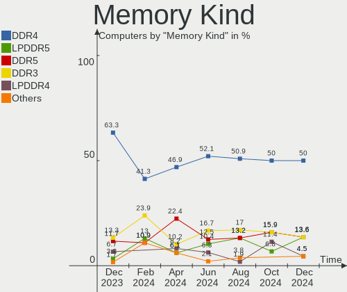

| Kind    | Computers | Percent |
|---------|-----------|---------|
| DDR4    | 31        | 79.49%  |
| DDR3    | 3         | 7.69%   |
| LPDDR4  | 2         | 5.13%   |
| LPDDR3  | 1         | 2.56%   |
| DDR5    | 1         | 2.56%   |
| Unknown | 1         | 2.56%   |

Memory Form Factor
------------------

Physical design of the memory module

| Name         | Computers | Percent |
|--------------|-----------|---------|
| SODIMM       | 25        | 64.1%   |
| DIMM         | 9         | 23.08%  |
| Row Of Chips | 5         | 12.82%  |

Memory Size
-----------

Memory module size

| Size  | Computers | Percent |
|-------|-----------|---------|
| 8192  | 21        | 50%     |
| 4096  | 10        | 23.81%  |
| 16384 | 8         | 19.05%  |
| 32768 | 2         | 4.76%   |
| 2048  | 1         | 2.38%   |

Memory Speed
------------

Memory module speed

| Speed | Computers | Percent |
|-------|-----------|---------|
| 3200  | 14        | 34.15%  |
| 2667  | 9         | 21.95%  |
| 2133  | 4         | 9.76%   |
| 3266  | 3         | 7.32%   |
| 1600  | 3         | 7.32%   |
| 4267  | 2         | 4.88%   |
| 4800  | 1         | 2.44%   |
| 3500  | 1         | 2.44%   |
| 3466  | 1         | 2.44%   |
| 3400  | 1         | 2.44%   |
| 2400  | 1         | 2.44%   |
| 1280  | 1         | 2.44%   |

Printers & scanners
-------------------

Printer Vendor
--------------

Printer device vendors

| Vendor             | Computers | Percent |
|--------------------|-----------|---------|
| Brother Industries | 1         | 100%    |

Printer Model
-------------

Printer device models

| Model               | Computers | Percent |
|---------------------|-----------|---------|
| Brother DCP-9015CDW | 1         | 100%    |

Scanner Vendor
--------------

Scanner device vendors

Zero info for selected period =(

Scanner Model
-------------

Scanner device models

Zero info for selected period =(

Camera
------

Camera Vendor
-------------

Camera device vendors

| Vendor                                 | Computers | Percent |
|----------------------------------------|-----------|---------|
| IMC Networks                           | 11        | 26.19%  |
| Chicony Electronics                    | 8         | 19.05%  |
| Acer                                   | 4         | 9.52%   |
| Quanta                                 | 3         | 7.14%   |
| Microdia                               | 2         | 4.76%   |
| Luxvisions Innotech Limited            | 2         | 4.76%   |
| Logitech                               | 2         | 4.76%   |
| Lite-On Technology                     | 2         | 4.76%   |
| Cheng Uei Precision Industry (Foxlink) | 2         | 4.76%   |
| Apple                                  | 2         | 4.76%   |
| Silicon Motion                         | 1         | 2.38%   |
| Lenovo                                 | 1         | 2.38%   |
| GRANDSTREAM GUV3100                    | 1         | 2.38%   |
| Google                                 | 1         | 2.38%   |

Camera Model
------------

Camera device models

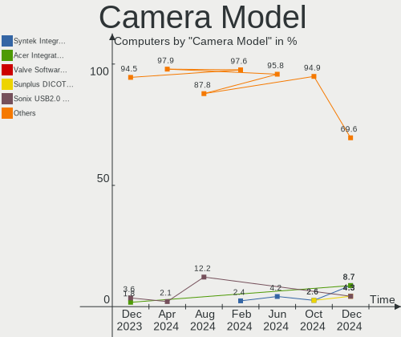

| Model                                                        | Computers | Percent |
|--------------------------------------------------------------|-----------|---------|
| IMC Networks USB2.0 HD UVC WebCam                            | 6         | 13.64%  |
| Luxvisions Innotech Limited Integrated Camera                | 2         | 4.55%   |
| Chicony Integrated Camera                                    | 2         | 4.55%   |
| Chicony HD WebCam                                            | 2         | 4.55%   |
| Silicon Motion Web Camera                                    | 1         | 2.27%   |
| Quanta HP Wide Vision HD Camera                              | 1         | 2.27%   |
| Quanta HP HD Camera                                          | 1         | 2.27%   |
| Quanta HD Camera                                             | 1         | 2.27%   |
| Microdia Integrated_Webcam_FHD                               | 1         | 2.27%   |
| Microdia CameraA                                             | 1         | 2.27%   |
| Logitech HD Webcam C615                                      | 1         | 2.27%   |
| Logitech C922 Pro Stream Webcam                              | 1         | 2.27%   |
| Lite-On HP Wide Vision HD Camera                             | 1         | 2.27%   |
| Lite-On HP IR Camera                                         | 1         | 2.27%   |
| Lite-On HP HD Webcam                                         | 1         | 2.27%   |
| Lenovo Integrated Webcam                                     | 1         | 2.27%   |
| IMC Networks USB2.0 UVC HD Webcam                            | 1         | 2.27%   |
| IMC Networks SunplusIT Integrated Camera                     | 1         | 2.27%   |
| IMC Networks Integrated Webcam                               | 1         | 2.27%   |
| IMC Networks Integrated Camera                               | 1         | 2.27%   |
| IMC Networks HD Camera                                       | 1         | 2.27%   |
| GRANDSTREAM GUV3100 GRANDSTREAM GUV3100                      | 1         | 2.27%   |
| Google Nexus/Pixel Device (MTP + debug)                      | 1         | 2.27%   |
| Chicony VGA WebCam                                           | 1         | 2.27%   |
| Chicony USB2.0 HD UVC WebCam                                 | 1         | 2.27%   |
| Chicony HP Wide Vision HD Camera                             | 1         | 2.27%   |
| Chicony HP Webcam                                            | 1         | 2.27%   |
| Cheng Uei Precision Industry (Foxlink) XiaoMi USB 2.0 Webcam | 1         | 2.27%   |
| Cheng Uei Precision Industry (Foxlink) HD Camera             | 1         | 2.27%   |
| Apple iPhone5/5C/5S/6                                        | 1         | 2.27%   |
| Apple FaceTime HD Camera                                     | 1         | 2.27%   |
| Acer SunplusIT Integrated Camera                             | 1         | 2.27%   |
| Acer Integrated IR Camera                                    | 1         | 2.27%   |
| Acer Integrated Camera                                       | 1         | 2.27%   |
| Acer FHD Camera                                              | 1         | 2.27%   |
| Acer EasyCamera                                              | 1         | 2.27%   |

Security
--------

Fingerprint Vendor
------------------

Fingerprint sensor vendors

| Vendor                | Computers | Percent |
|-----------------------|-----------|---------|
| Synaptics             | 3         | 42.86%  |
| Elan Microelectronics | 2         | 28.57%  |
| Validity Sensors      | 1         | 14.29%  |
| AuthenTec             | 1         | 14.29%  |

Fingerprint Model
-----------------

Fingerprint sensor models

| Model                                             | Computers | Percent |
|---------------------------------------------------|-----------|---------|
| Synaptics Metallica MIS Touch Fingerprint Reader  | 2         | 28.57%  |
| Elan ELAN:Fingerprint                             | 2         | 28.57%  |
| Validity Sensors VFS495 Fingerprint Reader        | 1         | 14.29%  |
| Synaptics Prometheus MIS Touch Fingerprint Reader | 1         | 14.29%  |
| AuthenTec AES2810                                 | 1         | 14.29%  |

Chipcard Vendor
---------------

Chipcard module vendors

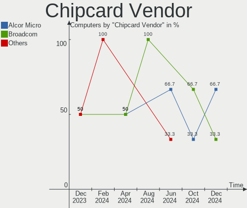

| Vendor      | Computers | Percent |
|-------------|-----------|---------|
| Alcor Micro | 1         | 100%    |

Chipcard Model
--------------

Chipcard module models

| Model                               | Computers | Percent |
|-------------------------------------|-----------|---------|
| Alcor Micro AU9540 Smartcard Reader | 1         | 100%    |

Unsupported
-----------

Unsupported Devices
-------------------

Total unsupported devices on board

| Total | Computers | Percent |
|-------|-----------|---------|
| 0     | 42        | 72.41%  |
| 1     | 11        | 18.97%  |
| 2     | 4         | 6.9%    |
| 3     | 1         | 1.72%   |

Unsupported Device Types
------------------------

Types of unsupported devices

| Type               | Computers | Percent |
|--------------------|-----------|---------|
| Fingerprint reader | 7         | 33.33%  |
| Net/ethernet       | 4         | 19.05%  |
| Graphics card      | 3         | 14.29%  |
| Net/wireless       | 2         | 9.52%   |
| Camera             | 2         | 9.52%   |
| Sound              | 1         | 4.76%   |
| Chipcard           | 1         | 4.76%   |
| Bluetooth          | 1         | 4.76%   |

