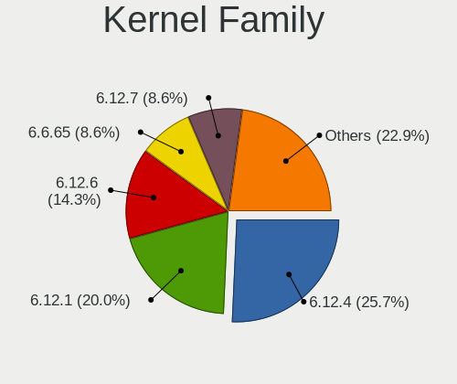
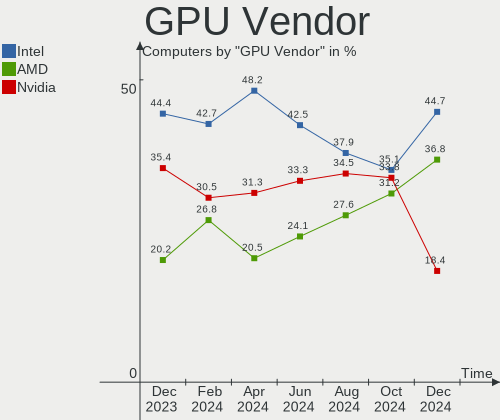
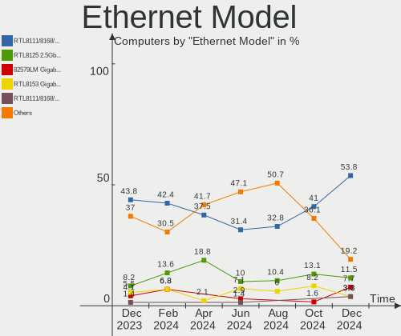
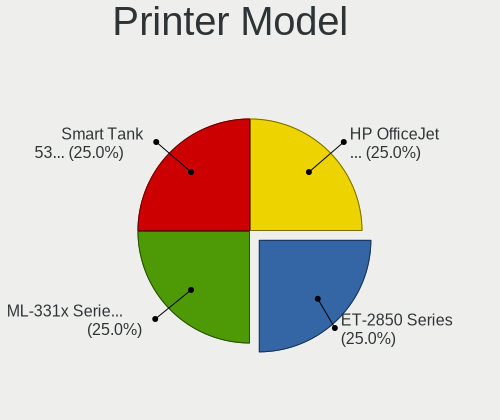

EndeavourOS - Hardware Trends
-----------------------------

A project to identify most popular hardware characteristics and track their change
over time based on data collected by Linux users at https://Linux-Hardware.org.

Anyone can contribute to this report by the [hw-probe](https://github.com/linuxhw/hw-probe) tool:

    sudo -E hw-probe -all -upload

This is a report for all computer types. See also reports for [desktops](/Dist/EndeavourOS/Desktop/README.md) and [notebooks](/Dist/EndeavourOS/Notebook/README.md).

This report is for one last month. Overall report since the beginning of time: [TestCoverage](https://github.com/linuxhw/TestCoverage)

Period: Jan, 2023.

Contents
--------

* [ System ](#system)
  - [ OS                       ](#os)
  - [ OS Family                ](#os-family)
  - [ Kernel                   ](#kernel)
  - [ Kernel Family            ](#kernel-family)
  - [ Kernel Major Ver.        ](#kernel-major-ver)
  - [ Arch                     ](#arch)
  - [ DE                       ](#de)
  - [ Display Server           ](#display-server)
  - [ Display Manager          ](#display-manager)
  - [ OS Lang                  ](#os-lang)
  - [ Boot Mode                ](#boot-mode)
  - [ Filesystem               ](#filesystem)
  - [ Part. scheme             ](#part-scheme)
  - [ Dual Boot with Linux/BSD ](#dual-boot-with-linuxbsd)
  - [ Dual Boot (Win)          ](#dual-boot-win)

* [ Board ](#board)
  - [ Vendor                   ](#vendor)
  - [ Model                    ](#model)
  - [ Model Family             ](#model-family)
  - [ MFG Year                 ](#mfg-year)
  - [ Form Factor              ](#form-factor)
  - [ Secure Boot              ](#secure-boot)
  - [ Coreboot                 ](#coreboot)
  - [ RAM Size                 ](#ram-size)
  - [ RAM Used                 ](#ram-used)
  - [ Total Drives             ](#total-drives)
  - [ Has CD-ROM               ](#has-cd-rom)
  - [ Has Ethernet             ](#has-ethernet)
  - [ Has WiFi                 ](#has-wifi)
  - [ Has Bluetooth            ](#has-bluetooth)

* [ Location ](#location)
  - [ Country                  ](#country)
  - [ City                     ](#city)

* [ Drives ](#drives)
  - [ Drive Vendor             ](#drive-vendor)
  - [ Drive Model              ](#drive-model)
  - [ HDD Vendor               ](#hdd-vendor)
  - [ SSD Vendor               ](#ssd-vendor)
  - [ Drive Kind               ](#drive-kind)
  - [ Drive Connector          ](#drive-connector)
  - [ Drive Size               ](#drive-size)
  - [ Space Total              ](#space-total)
  - [ Space Used               ](#space-used)
  - [ Malfunc. Drives          ](#malfunc-drives)
  - [ Malfunc. Drive Vendor    ](#malfunc-drive-vendor)
  - [ Malfunc. HDD Vendor      ](#malfunc-hdd-vendor)
  - [ Malfunc. Drive Kind      ](#malfunc-drive-kind)
  - [ Failed Drives            ](#failed-drives)
  - [ Failed Drive Vendor      ](#failed-drive-vendor)
  - [ Drive Status             ](#drive-status)

* [ Storage controller ](#storage-controller)
  - [ Storage Vendor           ](#storage-vendor)
  - [ Storage Model            ](#storage-model)
  - [ Storage Kind             ](#storage-kind)

* [ Processor ](#processor)
  - [ CPU Vendor               ](#cpu-vendor)
  - [ CPU Model                ](#cpu-model)
  - [ CPU Model Family         ](#cpu-model-family)
  - [ CPU Cores                ](#cpu-cores)
  - [ CPU Sockets              ](#cpu-sockets)
  - [ CPU Threads              ](#cpu-threads)
  - [ CPU Op-Modes             ](#cpu-op-modes)
  - [ CPU Microcode            ](#cpu-microcode)
  - [ CPU Microarch            ](#cpu-microarch)

* [ Graphics ](#graphics)
  - [ GPU Vendor               ](#gpu-vendor)
  - [ GPU Model                ](#gpu-model)
  - [ GPU Combo                ](#gpu-combo)
  - [ GPU Driver               ](#gpu-driver)
  - [ GPU Memory               ](#gpu-memory)

* [ Monitor ](#monitor)
  - [ Monitor Vendor           ](#monitor-vendor)
  - [ Monitor Model            ](#monitor-model)
  - [ Monitor Resolution       ](#monitor-resolution)
  - [ Monitor Diagonal         ](#monitor-diagonal)
  - [ Monitor Width            ](#monitor-width)
  - [ Aspect Ratio             ](#aspect-ratio)
  - [ Monitor Area             ](#monitor-area)
  - [ Pixel Density            ](#pixel-density)
  - [ Multiple Monitors        ](#multiple-monitors)

* [ Network ](#network)
  - [ Net Controller Vendor    ](#net-controller-vendor)
  - [ Net Controller Model     ](#net-controller-model)
  - [ Wireless Vendor          ](#wireless-vendor)
  - [ Wireless Model           ](#wireless-model)
  - [ Ethernet Vendor          ](#ethernet-vendor)
  - [ Ethernet Model           ](#ethernet-model)
  - [ Net Controller Kind      ](#net-controller-kind)
  - [ Used Controller          ](#used-controller)
  - [ NICs                     ](#nics)
  - [ IPv6                     ](#ipv6)

* [ Bluetooth ](#bluetooth)
  - [ Bluetooth Vendor         ](#bluetooth-vendor)
  - [ Bluetooth Model          ](#bluetooth-model)

* [ Sound ](#sound)
  - [ Sound Vendor             ](#sound-vendor)
  - [ Sound Model              ](#sound-model)

* [ Memory ](#memory)
  - [ Memory Vendor            ](#memory-vendor)
  - [ Memory Model             ](#memory-model)
  - [ Memory Kind              ](#memory-kind)
  - [ Memory Form Factor       ](#memory-form-factor)
  - [ Memory Size              ](#memory-size)
  - [ Memory Speed             ](#memory-speed)

* [ Printers & scanners ](#printers--scanners)
  - [ Printer Vendor           ](#printer-vendor)
  - [ Printer Model            ](#printer-model)
  - [ Scanner Vendor           ](#scanner-vendor)
  - [ Scanner Model            ](#scanner-model)

* [ Camera ](#camera)
  - [ Camera Vendor            ](#camera-vendor)
  - [ Camera Model             ](#camera-model)

* [ Security ](#security)
  - [ Fingerprint Vendor       ](#fingerprint-vendor)
  - [ Fingerprint Model        ](#fingerprint-model)
  - [ Chipcard Vendor          ](#chipcard-vendor)
  - [ Chipcard Model           ](#chipcard-model)

* [ Unsupported ](#unsupported)
  - [ Unsupported Devices      ](#unsupported-devices)
  - [ Unsupported Device Types ](#unsupported-device-types)

System
------

OS
--

Installed operating systems

| Name                | Computers | Percent |
|---------------------|-----------|---------|
| EndeavourOS Rolling | 49        | 100%    |

OS Family
---------

OS without a version

| Name        | Computers | Percent |
|-------------|-----------|---------|
| EndeavourOS | 49        | 100%    |

Kernel
------

Version of the Linux kernel

| Version              | Computers | Percent |
|----------------------|-----------|---------|
| 6.1.1-arch1-1        | 8         | 16.33%  |
| 6.1.7-arch1-1        | 6         | 12.24%  |
| 6.1.4-arch1-1        | 6         | 12.24%  |
| 6.1.5-arch2-1        | 4         | 8.16%   |
| 6.1.8-arch1-1        | 3         | 6.12%   |
| 6.1.1-zen1-1-zen     | 3         | 6.12%   |
| 6.1.7-zen1-1-zen     | 2         | 4.08%   |
| 6.1.6-arch1-3        | 2         | 4.08%   |
| 6.1.6-arch1-1        | 2         | 4.08%   |
| 6.1.4-zen2-1-zen     | 2         | 4.08%   |
| 6.1.3-arch1-1        | 2         | 4.08%   |
| 6.1.2-arch1-1        | 2         | 4.08%   |
| 6.1.8-zen1-1-zen     | 1         | 2.04%   |
| 6.1.5-zen2-1-zen     | 1         | 2.04%   |
| 6.1.5-1-cachyos-bore | 1         | 2.04%   |
| 6.1.1-arch1-g14-1    | 1         | 2.04%   |
| 6.0.2-271-tkg-bore   | 1         | 2.04%   |
| 5.18.14-arch1-1      | 1         | 2.04%   |
| 5.15.88-1-lts        | 1         | 2.04%   |

Kernel Family
-------------

Linux kernel without a distro release

| Version | Computers | Percent |
|---------|-----------|---------|
| 6.1.1   | 12        | 24.49%  |
| 6.1.7   | 8         | 16.33%  |
| 6.1.4   | 8         | 16.33%  |
| 6.1.5   | 6         | 12.24%  |
| 6.1.8   | 4         | 8.16%   |
| 6.1.6   | 4         | 8.16%   |
| 6.1.3   | 2         | 4.08%   |
| 6.1.2   | 2         | 4.08%   |
| 6.0.2   | 1         | 2.04%   |
| 5.18.14 | 1         | 2.04%   |
| 5.15.88 | 1         | 2.04%   |

Kernel Major Ver.
-----------------

Linux kernel major version

| Version | Computers | Percent |
|---------|-----------|---------|
| 6.1     | 46        | 93.88%  |
| 6.0     | 1         | 2.04%   |
| 5.18    | 1         | 2.04%   |
| 5.15    | 1         | 2.04%   |

Arch
----

OS architecture (x86_64, i586, etc.)

| Name   | Computers | Percent |
|--------|-----------|---------|
| x86_64 | 49        | 100%    |

DE
--

Desktop Environment

| Name          | Computers | Percent |
|---------------|-----------|---------|
| KDE5          | 20        | 40.82%  |
| XFCE          | 13        | 26.53%  |
| GNOME         | 9         | 18.37%  |
| i3            | 4         | 8.16%   |
| X-Cinnamon    | 2         | 4.08%   |
| GNOME Classic | 1         | 2.04%   |

Display Server
--------------

X11 or Wayland

| Name    | Computers | Percent |
|---------|-----------|---------|
| X11     | 40        | 81.63%  |
| Wayland | 9         | 18.37%  |

Display Manager
---------------

SDDM, LightDM, etc.

| Name    | Computers | Percent |
|---------|-----------|---------|
| LightDM | 20        | 40.82%  |
| Unknown | 14        | 28.57%  |
| SDDM    | 11        | 22.45%  |
| GDM     | 3         | 6.12%   |
| GREETD  | 1         | 2.04%   |

OS Lang
-------

Language

| Lang  | Computers | Percent |
|-------|-----------|---------|
| en_US | 25        | 51.02%  |
| en_GB | 5         | 10.2%   |
| it_IT | 4         | 8.16%   |
| en_CA | 3         | 6.12%   |
| fi_FI | 2         | 4.08%   |
| de_DE | 2         | 4.08%   |
| zh_CN | 1         | 2.04%   |
| tr_TR | 1         | 2.04%   |
| pt_BR | 1         | 2.04%   |
| nl_NL | 1         | 2.04%   |
| nl_BE | 1         | 2.04%   |
| fr_FR | 1         | 2.04%   |
| en_AU | 1         | 2.04%   |
| de_AT | 1         | 2.04%   |

Boot Mode
---------

EFI or BIOS

| Mode | Computers | Percent |
|------|-----------|---------|
| EFI  | 29        | 59.18%  |
| BIOS | 20        | 40.82%  |

Filesystem
----------

Type of filesystem

| Type  | Computers | Percent |
|-------|-----------|---------|
| Ext4  | 32        | 65.31%  |
| Btrfs | 16        | 32.65%  |
| Xfs   | 1         | 2.04%   |

Part. scheme
------------

Scheme of partitioning

| Type    | Computers | Percent |
|---------|-----------|---------|
| GPT     | 30        | 61.22%  |
| Unknown | 13        | 26.53%  |
| MBR     | 6         | 12.24%  |

Dual Boot with Linux/BSD
------------------------

Hosting more than one Linux/BSD

| Dual boot | Computers | Percent |
|-----------|-----------|---------|
| No        | 42        | 85.71%  |
| Yes       | 7         | 14.29%  |

Dual Boot (Win)
---------------

Hosting Linux and Windows

| Dual boot | Computers | Percent |
|-----------|-----------|---------|
| No        | 30        | 61.22%  |
| Yes       | 19        | 38.78%  |

Board
-----

Vendor
------

Motherboard manufacturer

| Name                | Computers | Percent |
|---------------------|-----------|---------|
| ASUSTek Computer    | 8         | 16.33%  |
| Lenovo              | 7         | 14.29%  |
| Hewlett-Packard     | 7         | 14.29%  |
| Dell                | 6         | 12.24%  |
| MSI                 | 5         | 10.2%   |
| Gigabyte Technology | 5         | 10.2%   |
| Toshiba             | 2         | 4.08%   |
| ASRock              | 2         | 4.08%   |
| Razer               | 1         | 2.04%   |
| Positivo            | 1         | 2.04%   |
| Intel               | 1         | 2.04%   |
| HUAWEI              | 1         | 2.04%   |
| Google              | 1         | 2.04%   |
| Acer                | 1         | 2.04%   |
| Unknown             | 1         | 2.04%   |

Model
-----

Motherboard model

| Name                                     | Computers | Percent |
|------------------------------------------|-----------|---------|
| Toshiba Satellite L755                   | 1         | 2.04%   |
| Toshiba EQUIUM A100                      | 1         | 2.04%   |
| Razer Blade 15 (2022) - RZ09-0421        | 1         | 2.04%   |
| Positivo S14BW01                         | 1         | 2.04%   |
| MSI MS-7D52                              | 1         | 2.04%   |
| MSI MS-7D19                              | 1         | 2.04%   |
| MSI MS-7C02                              | 1         | 2.04%   |
| MSI MS-7B85                              | 1         | 2.04%   |
| MSI MS-7A74                              | 1         | 2.04%   |
| Lenovo ThinkPad X1 Carbon 3rd 20BS00A6GE | 1         | 2.04%   |
| Lenovo ThinkPad E15 Gen 4 21E6006ACD     | 1         | 2.04%   |
| Lenovo ThinkBook 15 G2 ITL 20VE          | 1         | 2.04%   |
| Lenovo Legion 7 16ARHA7 82UH             | 1         | 2.04%   |
| Lenovo Legion 5 Pro 16ACH6H 82JQ         | 1         | 2.04%   |
| Lenovo IdeaPad Gaming 3 15ACH6 82K2      | 1         | 2.04%   |
| Lenovo IdeaPad 5 Pro 16ACH6 82L5         | 1         | 2.04%   |
| Intel Productiva                         | 1         | 2.04%   |
| HUAWEI KLVC-WXX9                         | 1         | 2.04%   |
| HP ZBook 15 G4                           | 1         | 2.04%   |
| HP ProOne 400 G1 AiO                     | 1         | 2.04%   |
| HP Pavilion x2 Detachable                | 1         | 2.04%   |
| HP Pavilion All-in-One 27-d0xxx          | 1         | 2.04%   |
| HP Pavilion Aero Laptop 13-be1xxx        | 1         | 2.04%   |
| HP Laptop 15s-eq2xxx                     | 1         | 2.04%   |
| HP EliteDesk 800 G1 TWR                  | 1         | 2.04%   |
| Google Magpie                            | 1         | 2.04%   |
| Gigabyte X570 AORUS PRO WIFI             | 1         | 2.04%   |
| Gigabyte P55A-UD3                        | 1         | 2.04%   |
| Gigabyte B650I AORUS ULTRA               | 1         | 2.04%   |
| Gigabyte B550 GAMING X V2                | 1         | 2.04%   |
| Gigabyte B450M DS3H                      | 1         | 2.04%   |
| Dell XPS 13 9343                         | 1         | 2.04%   |
| Dell Vostro 410                          | 1         | 2.04%   |
| Dell Precision M4800                     | 1         | 2.04%   |
| Dell OptiPlex 7070                       | 1         | 2.04%   |
| Dell Latitude E5410                      | 1         | 2.04%   |
| Dell Latitude 5400                       | 1         | 2.04%   |
| ASUS TUF Gaming X570-PLUS                | 1         | 2.04%   |
| ASUS ROG Zephyrus G14 GA402RK_GA402RK    | 1         | 2.04%   |
| ASUS PRIME Z690M-PLUS D4                 | 1         | 2.04%   |

Model Family
------------

Motherboard model prefix

| Name              | Computers | Percent |
|-------------------|-----------|---------|
| HP Pavilion       | 3         | 6.12%   |
| ASUS PRIME        | 3         | 6.12%   |
| Lenovo ThinkPad   | 2         | 4.08%   |
| Lenovo Legion     | 2         | 4.08%   |
| Lenovo IdeaPad    | 2         | 4.08%   |
| Dell Latitude     | 2         | 4.08%   |
| Toshiba Satellite | 1         | 2.04%   |
| Toshiba EQUIUM    | 1         | 2.04%   |
| Razer Blade       | 1         | 2.04%   |
| Positivo S14BW01  | 1         | 2.04%   |
| MSI MS-7D52       | 1         | 2.04%   |
| MSI MS-7D19       | 1         | 2.04%   |
| MSI MS-7C02       | 1         | 2.04%   |
| MSI MS-7B85       | 1         | 2.04%   |
| MSI MS-7A74       | 1         | 2.04%   |
| Lenovo ThinkBook  | 1         | 2.04%   |
| Intel Productiva  | 1         | 2.04%   |
| HUAWEI KLVC-WXX9  | 1         | 2.04%   |
| HP ZBook          | 1         | 2.04%   |
| HP ProOne         | 1         | 2.04%   |
| HP Laptop         | 1         | 2.04%   |
| HP EliteDesk      | 1         | 2.04%   |
| Google Magpie     | 1         | 2.04%   |
| Gigabyte X570     | 1         | 2.04%   |
| Gigabyte P55A-UD3 | 1         | 2.04%   |
| Gigabyte B650I    | 1         | 2.04%   |
| Gigabyte B550     | 1         | 2.04%   |
| Gigabyte B450M    | 1         | 2.04%   |
| Dell XPS          | 1         | 2.04%   |
| Dell Vostro       | 1         | 2.04%   |
| Dell Precision    | 1         | 2.04%   |
| Dell OptiPlex     | 1         | 2.04%   |
| ASUS TUF          | 1         | 2.04%   |
| ASUS ROG          | 1         | 2.04%   |
| ASUS M5A99X       | 1         | 2.04%   |
| ASUS GL753VE      | 1         | 2.04%   |
| ASUS ASUS         | 1         | 2.04%   |
| ASRock B450M      | 1         | 2.04%   |
| ASRock AB350      | 1         | 2.04%   |
| Acer Aspire       | 1         | 2.04%   |

MFG Year
--------

Motherboard manufacture year

| Year | Computers | Percent |
|------|-----------|---------|
| 2022 | 7         | 14.29%  |
| 2021 | 7         | 14.29%  |
| 2020 | 7         | 14.29%  |
| 2018 | 5         | 10.2%   |
| 2019 | 3         | 6.12%   |
| 2017 | 3         | 6.12%   |
| 2016 | 3         | 6.12%   |
| 2015 | 3         | 6.12%   |
| 2013 | 2         | 4.08%   |
| 2012 | 2         | 4.08%   |
| 2011 | 2         | 4.08%   |
| 2014 | 1         | 2.04%   |
| 2010 | 1         | 2.04%   |
| 2009 | 1         | 2.04%   |
| 2008 | 1         | 2.04%   |
| 2007 | 1         | 2.04%   |

Form Factor
-----------

Physical design of the computer

| Name       | Computers | Percent |
|------------|-----------|---------|
| Notebook   | 26        | 53.06%  |
| Desktop    | 22        | 44.9%   |
| All in one | 1         | 2.04%   |

Secure Boot
-----------

Enabled or disabled

| State    | Computers | Percent |
|----------|-----------|---------|
| Disabled | 49        | 100%    |

Coreboot
--------

Have coreboot on board

| Used | Computers | Percent |
|------|-----------|---------|
| No   | 48        | 97.96%  |
| Yes  | 1         | 2.04%   |

RAM Size
--------

Total RAM memory

| Size in GB  | Computers | Percent |
|-------------|-----------|---------|
| 32.01-64.0  | 13        | 26.53%  |
| 16.01-24.0  | 12        | 24.49%  |
| 4.01-8.0    | 8         | 16.33%  |
| 8.01-16.0   | 5         | 10.2%   |
| 3.01-4.0    | 4         | 8.16%   |
| 24.01-32.0  | 3         | 6.12%   |
| 64.01-256.0 | 2         | 4.08%   |
| 2.01-3.0    | 1         | 2.04%   |
| 1.01-2.0    | 1         | 2.04%   |

RAM Used
--------

Used RAM memory

| Used GB    | Computers | Percent |
|------------|-----------|---------|
| 2.01-3.0   | 15        | 30.61%  |
| 4.01-8.0   | 13        | 26.53%  |
| 1.01-2.0   | 9         | 18.37%  |
| 3.01-4.0   | 7         | 14.29%  |
| 8.01-16.0  | 3         | 6.12%   |
| 16.01-24.0 | 1         | 2.04%   |
| 0.51-1.0   | 1         | 2.04%   |

Total Drives
------------

Number of drives on board

| Drives | Computers | Percent |
|--------|-----------|---------|
| 2      | 19        | 38.78%  |
| 1      | 18        | 36.73%  |
| 3      | 7         | 14.29%  |
| 4      | 4         | 8.16%   |
| 7      | 1         | 2.04%   |

Has CD-ROM
----------

Has CD-ROM on board

| Presented | Computers | Percent |
|-----------|-----------|---------|
| No        | 38        | 77.55%  |
| Yes       | 11        | 22.45%  |

Has Ethernet
------------

Has Ethernet on board

| Presented | Computers | Percent |
|-----------|-----------|---------|
| Yes       | 41        | 83.67%  |
| No        | 8         | 16.33%  |

Has WiFi
--------

Has WiFi module

| Presented | Computers | Percent |
|-----------|-----------|---------|
| Yes       | 37        | 75.51%  |
| No        | 12        | 24.49%  |

Has Bluetooth
-------------

Has Bluetooth module

| Presented | Computers | Percent |
|-----------|-----------|---------|
| Yes       | 38        | 77.55%  |
| No        | 11        | 22.45%  |

Location
--------

Country
-------

Geographic location (country)

| Country         | Computers | Percent |
|-----------------|-----------|---------|
| USA             | 12        | 24.49%  |
| Italy           | 7         | 14.29%  |
| Germany         | 4         | 8.16%   |
| Canada          | 3         | 6.12%   |
| UK              | 2         | 4.08%   |
| France          | 2         | 4.08%   |
| Finland         | 2         | 4.08%   |
| Australia       | 2         | 4.08%   |
| Ukraine         | 1         | 2.04%   |
| Turkey          | 1         | 2.04%   |
| Spain           | 1         | 2.04%   |
| Russia          | 1         | 2.04%   |
| Romania         | 1         | 2.04%   |
| Poland          | 1         | 2.04%   |
| North Macedonia | 1         | 2.04%   |
| Netherlands     | 1         | 2.04%   |
| Maldives        | 1         | 2.04%   |
| Indonesia       | 1         | 2.04%   |
| China           | 1         | 2.04%   |
| Bulgaria        | 1         | 2.04%   |
| Brazil          | 1         | 2.04%   |
| Belgium         | 1         | 2.04%   |
| Austria         | 1         | 2.04%   |

City
----

Geographic location (city)

| City              | Computers | Percent |
|-------------------|-----------|---------|
| Seattle           | 2         | 4.08%   |
| Waxahachie        | 1         | 2.04%   |
| Warsaw            | 1         | 2.04%   |
| Tver              | 1         | 2.04%   |
| Triggiano         | 1         | 2.04%   |
| Termoli           | 1         | 2.04%   |
| Sydney            | 1         | 2.04%   |
| Surabaya          | 1         | 2.04%   |
| Sofia             | 1         | 2.04%   |
| Skopje            | 1         | 2.04%   |
| Siculiana         | 1         | 2.04%   |
| Shenzhen          | 1         | 2.04%   |
| Sapucaia do Sul   | 1         | 2.04%   |
| Santhià          | 1         | 2.04%   |
| Richmond Hill     | 1         | 2.04%   |
| Renton            | 1         | 2.04%   |
| Pont-Saint-Esprit | 1         | 2.04%   |
| Ossining          | 1         | 2.04%   |
| Ocoee             | 1         | 2.04%   |
| Montreal          | 1         | 2.04%   |
| Middletown        | 1         | 2.04%   |
| Merijärvi        | 1         | 2.04%   |
| Melbourne         | 1         | 2.04%   |
| Marseille         | 1         | 2.04%   |
| Malé             | 1         | 2.04%   |
| Madrid            | 1         | 2.04%   |
| London            | 1         | 2.04%   |
| Khmelnytskyi      | 1         | 2.04%   |
| Kent              | 1         | 2.04%   |
| Karlsruhe         | 1         | 2.04%   |
| Kansas City       | 1         | 2.04%   |
| Innsbruck         | 1         | 2.04%   |
| Huntingtown       | 1         | 2.04%   |
| Helsinki          | 1         | 2.04%   |
| Garbsen           | 1         | 2.04%   |
| Fishkill          | 1         | 2.04%   |
| Edinburgh         | 1         | 2.04%   |
| Cologne           | 1         | 2.04%   |
| Cochrane          | 1         | 2.04%   |
| Cluj-Napoca       | 1         | 2.04%   |

Drives
------

Drive Vendor
------------

Hard drive vendors

| Vendor                    | Computers | Drives | Percent |
|---------------------------|-----------|--------|---------|
| Samsung Electronics       | 23        | 27     | 26.14%  |
| Seagate                   | 12        | 13     | 13.64%  |
| Sandisk                   | 10        | 11     | 11.36%  |
| WDC                       | 8         | 9      | 9.09%   |
| Kingston                  | 7         | 8      | 7.95%   |
| Crucial                   | 6         | 6      | 6.82%   |
| Unknown                   | 4         | 6      | 4.55%   |
| KIOXIA                    | 3         | 3      | 3.41%   |
| Toshiba                   | 2         | 3      | 2.27%   |
| Phison Electronics        | 2         | 2      | 2.27%   |
| Micron Technology         | 2         | 2      | 2.27%   |
| Intel                     | 2         | 2      | 2.27%   |
| Timetec                   | 1         | 1      | 1.14%   |
| Micron/Crucial Technology | 1         | 1      | 1.14%   |
| LITEONIT                  | 1         | 1      | 1.14%   |
| HGST                      | 1         | 1      | 1.14%   |
| Fantom                    | 1         | 1      | 1.14%   |
| China                     | 1         | 1      | 1.14%   |
| Unknown                   | 1         | 1      | 1.14%   |

Drive Model
-----------

Hard drive models

| Model                                                | Computers | Percent |
|------------------------------------------------------|-----------|---------|
| Samsung NVMe SSD Controller SM981/PM981/PM983 500GB  | 8         | 8.33%   |
| Sandisk WD Black SN750 / PC SN730 NVMe SSD 1TB       | 5         | 5.21%   |
| Samsung NVMe SSD Controller PM9A1/PM9A3/980PRO 512GB | 4         | 4.17%   |
| Crucial CT500MX500SSD1 500GB                         | 4         | 4.17%   |
| Samsung SSD 870 QVO 1TB                              | 3         | 3.13%   |
| Unknown MMC Card  32GB                               | 2         | 2.08%   |
| Seagate ST3000DM008-2DM166 3TB                       | 2         | 2.08%   |
| Sandisk WD Blue SN570 1TB                            | 2         | 2.08%   |
| Sandisk WD Blue SN550 NVMe SSD 1TB                   | 2         | 2.08%   |
| Samsung SSD 870 EVO 2TB                              | 2         | 2.08%   |
| Samsung SSD 850 EVO 500GB                            | 2         | 2.08%   |
| Kingston SA400S37120G 120GB SSD                      | 2         | 2.08%   |
| WDC WDS100T2B0A-00SM50 1TB SSD                       | 1         | 1.04%   |
| WDC WD40EZAZ-00ZGHB0 4TB                             | 1         | 1.04%   |
| WDC WD20SPZX-22UA7T0 2TB                             | 1         | 1.04%   |
| WDC WD20EARS-42S0XB0 2TB                             | 1         | 1.04%   |
| WDC WD15EARS-60MVWB0 1TB                             | 1         | 1.04%   |
| WDC WD10EZEX-75WN4A1 1TB                             | 1         | 1.04%   |
| WDC WD10EZEX-22MFCA0 1TB                             | 1         | 1.04%   |
| WDC WD Blue SA510 2.5 1TB SSD                        | 1         | 1.04%   |
| Unknown NVMe SSD Drive 512GB                         | 1         | 1.04%   |
| Unknown MMC Card  64GB                               | 1         | 1.04%   |
| Toshiba MQ01ABD100 1TB                               | 1         | 1.04%   |
| Toshiba HDWD110 1TB                                  | 1         | 1.04%   |
| Toshiba DT01ACA100 1TB                               | 1         | 1.04%   |
| Timetec MS05 256GB SSD                               | 1         | 1.04%   |
| Seagate ST8000VN004-2M2101 8TB                       | 1         | 1.04%   |
| Seagate ST500LM021-1KJ152 500GB                      | 1         | 1.04%   |
| Seagate ST500DM005 HD502HJ 500GB                     | 1         | 1.04%   |
| Seagate ST33000650NS 3TB                             | 1         | 1.04%   |
| Seagate ST2000DM001-1CH164 2TB                       | 1         | 1.04%   |
| Seagate ST1000LM035-1RK172 1TB                       | 1         | 1.04%   |
| Seagate ST1000LM 035-1RK172 1TB                      | 1         | 1.04%   |
| Seagate ST1000DM010-2EP102 1TB                       | 1         | 1.04%   |
| Seagate ST1000DM003-1ER162 1TB                       | 1         | 1.04%   |
| Seagate Expansion HDD 5TB                            | 1         | 1.04%   |
| Seagate Expansion 240GB                              | 1         | 1.04%   |
| Sandisk WDC PC SN530 SDBPMPZ-512G-1101 512GB         | 1         | 1.04%   |
| SanDisk Extreme 55AE 1TB SSD                         | 1         | 1.04%   |
| Samsung SSD PM851 M.2 2280 256GB                     | 1         | 1.04%   |

HDD Vendor
----------

Hard disk drive vendors

| Vendor              | Computers | Drives | Percent |
|---------------------|-----------|--------|---------|
| Seagate             | 12        | 13     | 50%     |
| WDC                 | 6         | 7      | 25%     |
| Toshiba             | 2         | 3      | 8.33%   |
| Samsung Electronics | 1         | 1      | 4.17%   |
| HGST                | 1         | 1      | 4.17%   |
| Fantom              | 1         | 1      | 4.17%   |
| Unknown             | 1         | 1      | 4.17%   |

SSD Vendor
----------

Solid state drive vendors

| Vendor              | Computers | Drives | Percent |
|---------------------|-----------|--------|---------|
| Samsung Electronics | 11        | 13     | 35.48%  |
| Kingston            | 6         | 6      | 19.35%  |
| Crucial             | 6         | 6      | 19.35%  |
| WDC                 | 2         | 2      | 6.45%   |
| Timetec             | 1         | 1      | 3.23%   |
| SanDisk             | 1         | 1      | 3.23%   |
| Micron Technology   | 1         | 1      | 3.23%   |
| LITEONIT            | 1         | 1      | 3.23%   |
| Intel               | 1         | 1      | 3.23%   |
| China               | 1         | 1      | 3.23%   |

Drive Kind
----------

HDD or SSD

| Kind | Computers | Drives | Percent |
|------|-----------|--------|---------|
| NVMe | 28        | 34     | 35.9%   |
| SSD  | 27        | 33     | 34.62%  |
| HDD  | 20        | 27     | 25.64%  |
| MMC  | 3         | 5      | 3.85%   |

Drive Connector
---------------

SATA, SAS, NVMe, etc.

| Type | Computers | Drives | Percent |
|------|-----------|--------|---------|
| SATA | 29        | 54     | 44.62%  |
| NVMe | 28        | 34     | 43.08%  |
| SAS  | 5         | 6      | 7.69%   |
| MMC  | 3         | 5      | 4.62%   |

Drive Size
----------

Size of hard drive

| Size in TB | Computers | Drives | Percent |
|------------|-----------|--------|---------|
| 0.01-0.5   | 20        | 25     | 40%     |
| 0.51-1.0   | 16        | 20     | 32%     |
| 1.01-2.0   | 7         | 8      | 14%     |
| 2.01-3.0   | 3         | 3      | 6%      |
| 4.01-10.0  | 3         | 3      | 6%      |
| 3.01-4.0   | 1         | 1      | 2%      |

Space Total
-----------

Amount of disk space available on the file system

| Size in GB     | Computers | Percent |
|----------------|-----------|---------|
| More than 3000 | 11        | 22.45%  |
| 1001-2000      | 9         | 18.37%  |
| 101-250        | 8         | 16.33%  |
| 251-500        | 6         | 12.24%  |
| 501-1000       | 6         | 12.24%  |
| 2001-3000      | 3         | 6.12%   |
| 1-20           | 3         | 6.12%   |
| 21-50          | 1         | 2.04%   |
| 51-100         | 1         | 2.04%   |
| Unknown        | 1         | 2.04%   |

Space Used
----------

Amount of used disk space

| Used GB        | Computers | Percent |
|----------------|-----------|---------|
| 1-20           | 11        | 22.45%  |
| 501-1000       | 10        | 20.41%  |
| 1001-2000      | 9         | 18.37%  |
| 21-50          | 7         | 14.29%  |
| 51-100         | 6         | 12.24%  |
| More than 3000 | 2         | 4.08%   |
| 101-250        | 2         | 4.08%   |
| 251-500        | 1         | 2.04%   |
| Unknown        | 1         | 2.04%   |

Malfunc. Drives
---------------

Drive models with a malfunction

| Model                           | Computers | Drives | Percent |
|---------------------------------|-----------|--------|---------|
| WDC WD Blue SA510 2.5 1TB SSD   | 1         | 1      | 20%     |
| Toshiba MQ01ABD100 1TB          | 1         | 1      | 20%     |
| Seagate ST500LM021-1KJ152 500GB | 1         | 1      | 20%     |
| Intel SSDSCKJF180A5L 180GB      | 1         | 1      | 20%     |
| Crucial CT500MX500SSD1 500GB    | 1         | 1      | 20%     |

Malfunc. Drive Vendor
---------------------

Vendors of faulty drives

| Vendor  | Computers | Drives | Percent |
|---------|-----------|--------|---------|
| WDC     | 1         | 1      | 20%     |
| Toshiba | 1         | 1      | 20%     |
| Seagate | 1         | 1      | 20%     |
| Intel   | 1         | 1      | 20%     |
| Crucial | 1         | 1      | 20%     |

Malfunc. HDD Vendor
-------------------

Vendors of faulty HDD drives

| Vendor  | Computers | Drives | Percent |
|---------|-----------|--------|---------|
| Toshiba | 1         | 1      | 50%     |
| Seagate | 1         | 1      | 50%     |

Malfunc. Drive Kind
-------------------

Kinds of faulty drives

| Kind | Computers | Drives | Percent |
|------|-----------|--------|---------|
| SSD  | 3         | 3      | 60%     |
| HDD  | 2         | 2      | 40%     |

Failed Drives
-------------

Failed drive models

Zero info for selected period =(

Failed Drive Vendor
-------------------

Failed drive vendors

Zero info for selected period =(

Drive Status
------------

Number of failed and malfunc. drives

| Status   | Computers | Drives | Percent |
|----------|-----------|--------|---------|
| Works    | 31        | 54     | 56.36%  |
| Detected | 19        | 40     | 34.55%  |
| Malfunc  | 5         | 5      | 9.09%   |

Storage controller
------------------

Storage Vendor
--------------

Storage controller vendors

| Vendor                      | Computers | Percent |
|-----------------------------|-----------|---------|
| Intel                       | 24        | 32%     |
| AMD                         | 16        | 21.33%  |
| Samsung Electronics         | 13        | 17.33%  |
| SanDisk                     | 10        | 13.33%  |
| KIOXIA                      | 3         | 4%      |
| Phison Electronics          | 2         | 2.67%   |
| Kingston Technology Company | 2         | 2.67%   |
| ASMedia Technology          | 2         | 2.67%   |
| Transcend                   | 1         | 1.33%   |
| Micron/Crucial Technology   | 1         | 1.33%   |
| Micron Technology           | 1         | 1.33%   |

Storage Model
-------------

Storage controller models

| Model                                                                                   | Computers | Percent |
|-----------------------------------------------------------------------------------------|-----------|---------|
| AMD FCH SATA Controller [AHCI mode]                                                     | 10        | 12.05%  |
| Samsung NVMe SSD Controller SM981/PM981/PM983                                           | 8         | 9.64%   |
| SanDisk WD Black SN750 / PC SN730 NVMe SSD                                              | 5         | 6.02%   |
| Samsung NVMe SSD Controller PM9A1/PM9A3/980PRO                                          | 4         | 4.82%   |
| AMD 400 Series Chipset SATA Controller                                                  | 4         | 4.82%   |
| Intel 8 Series/C220 Series Chipset Family 6-port SATA Controller 1 [AHCI mode]          | 3         | 3.61%   |
| SanDisk WD Blue SN570 NVMe SSD                                                          | 2         | 2.41%   |
| SanDisk WD Blue SN550 NVMe SSD                                                          | 2         | 2.41%   |
| KIOXIA Non-Volatile memory controller                                                   | 2         | 2.41%   |
| Kingston Company Company Non-Volatile memory controller                                 | 2         | 2.41%   |
| Intel Wildcat Point-LP SATA Controller [AHCI Mode]                                      | 2         | 2.41%   |
| Intel Volume Management Device NVMe RAID Controller                                     | 2         | 2.41%   |
| Intel Cannon Lake PCH SATA AHCI Controller                                              | 2         | 2.41%   |
| ASMedia ASM1062 Serial ATA Controller                                                   | 2         | 2.41%   |
| Transcend Non-Volatile memory controller                                                | 1         | 1.2%    |
| SanDisk Non-Volatile memory controller                                                  | 1         | 1.2%    |
| Samsung NVMe SSD Controller 980                                                         | 1         | 1.2%    |
| Phison E16 PCIe4 NVMe Controller                                                        | 1         | 1.2%    |
| Phison E12 NVMe Controller                                                              | 1         | 1.2%    |
| Micron/Crucial P2 NVMe PCIe SSD                                                         | 1         | 1.2%    |
| Micron Non-Volatile memory controller                                                   | 1         | 1.2%    |
| KIOXIA NVMe SSD Controller BG4                                                          | 1         | 1.2%    |
| Intel Tiger Lake-LP SATA Controller                                                     | 1         | 1.2%    |
| Intel Sunrise Point-LP SATA Controller [AHCI mode]                                      | 1         | 1.2%    |
| Intel SSD 660P Series                                                                   | 1         | 1.2%    |
| Intel Q170/Q150/B150/H170/H110/Z170/CM236 Chipset SATA Controller [AHCI Mode]           | 1         | 1.2%    |
| Intel HM170/QM170 Chipset SATA Controller [AHCI Mode]                                   | 1         | 1.2%    |
| Intel Comet Lake SATA AHCI Controller                                                   | 1         | 1.2%    |
| Intel Cannon Point-LP SATA Controller [AHCI Mode]                                       | 1         | 1.2%    |
| Intel Alder Lake-S PCH SATA Controller [AHCI Mode]                                      | 1         | 1.2%    |
| Intel 82801IR/IO/IH (ICH9R/DO/DH) 4 port SATA Controller [IDE mode]                     | 1         | 1.2%    |
| Intel 82801I (ICH9 Family) 2 port SATA Controller [IDE mode]                            | 1         | 1.2%    |
| Intel 82801GBM/GHM (ICH7-M Family) SATA Controller [IDE mode]                           | 1         | 1.2%    |
| Intel 6 Series/C200 Series Chipset Family IDE-r Controller                              | 1         | 1.2%    |
| Intel 6 Series/C200 Series Chipset Family Desktop SATA Controller (IDE mode, ports 4-5) | 1         | 1.2%    |
| Intel 6 Series/C200 Series Chipset Family Desktop SATA Controller (IDE mode, ports 0-3) | 1         | 1.2%    |
| Intel 6 Series/C200 Series Chipset Family 6 port Mobile SATA AHCI Controller            | 1         | 1.2%    |
| Intel 6 Series/C200 Series Chipset Family 6 port Desktop SATA AHCI Controller           | 1         | 1.2%    |
| Intel 500 Series Chipset Family SATA AHCI Controller                                    | 1         | 1.2%    |
| Intel 5 Series/3400 Series Chipset 6 port SATA AHCI Controller                          | 1         | 1.2%    |

Storage Kind
------------

Kind of storage controller (IDE, SATA, NVMe, SAS, ...)

| Kind | Computers | Percent |
|------|-----------|---------|
| SATA | 36        | 51.43%  |
| NVMe | 28        | 40%     |
| RAID | 3         | 4.29%   |
| IDE  | 3         | 4.29%   |

Processor
---------

CPU Vendor
----------

Processor vendors

| Vendor | Computers | Percent |
|--------|-----------|---------|
| Intel  | 29        | 59.18%  |
| AMD    | 20        | 40.82%  |

CPU Model
---------

Processor models

| Model                                   | Computers | Percent |
|-----------------------------------------|-----------|---------|
| Intel Core i7-7700HQ CPU @ 2.80GHz      | 2         | 4.08%   |
| Intel Core i7-10700K CPU @ 3.80GHz      | 2         | 4.08%   |
| AMD Ryzen 7 5800X3D 8-Core Processor    | 2         | 4.08%   |
| AMD Ryzen 7 4800H with Radeon Graphics  | 2         | 4.08%   |
| Intel Xeon CPU E31260L @ 2.40GHz        | 1         | 2.04%   |
| Intel Pentium CPU N3710 @ 1.60GHz       | 1         | 2.04%   |
| Intel Core i7-9700 CPU @ 3.00GHz        | 1         | 2.04%   |
| Intel Core i7-7700 CPU @ 3.60GHz        | 1         | 2.04%   |
| Intel Core i7-5500U CPU @ 2.40GHz       | 1         | 2.04%   |
| Intel Core i7-4800MQ CPU @ 2.70GHz      | 1         | 2.04%   |
| Intel Core i7-4790 CPU @ 3.60GHz        | 1         | 2.04%   |
| Intel Core i7-2600 CPU @ 3.40GHz        | 1         | 2.04%   |
| Intel Core i7 CPU M 640 @ 2.80GHz       | 1         | 2.04%   |
| Intel Core i5-9600KF CPU @ 3.70GHz      | 1         | 2.04%   |
| Intel Core i5-8265U CPU @ 1.60GHz       | 1         | 2.04%   |
| Intel Core i5-7200U CPU @ 2.50GHz       | 1         | 2.04%   |
| Intel Core i5-5200U CPU @ 2.20GHz       | 1         | 2.04%   |
| Intel Core i5-2410M CPU @ 2.30GHz       | 1         | 2.04%   |
| Intel Core i5-10210U CPU @ 1.60GHz      | 1         | 2.04%   |
| Intel Core i5 CPU 750 @ 2.67GHz         | 1         | 2.04%   |
| Intel Core i3-4130T CPU @ 2.90GHz       | 1         | 2.04%   |
| Intel Core 2 Duo CPU E8400 @ 3.00GHz    | 1         | 2.04%   |
| Intel Core 2 CPU T7400 @ 2.16GHz        | 1         | 2.04%   |
| Intel Celeron N4500 @ 1.10GHz           | 1         | 2.04%   |
| Intel Atom x5-Z8300 CPU @ 1.44GHz       | 1         | 2.04%   |
| Intel 12th Gen Core i7-12800H           | 1         | 2.04%   |
| Intel 12th Gen Core i7-12700K           | 1         | 2.04%   |
| Intel 12th Gen Core i5-1240P            | 1         | 2.04%   |
| Intel 11th Gen Core i5-1135G7 @ 2.40GHz | 1         | 2.04%   |
| AMD Ryzen 9 6900HS with Radeon Graphics | 1         | 2.04%   |
| AMD Ryzen 9 5900HX with Radeon Graphics | 1         | 2.04%   |
| AMD Ryzen 9 3900X 12-Core Processor     | 1         | 2.04%   |
| AMD Ryzen 7 7700X 8-Core Processor      | 1         | 2.04%   |
| AMD Ryzen 7 6800H with Radeon Graphics  | 1         | 2.04%   |
| AMD Ryzen 7 5800X 8-Core Processor      | 1         | 2.04%   |
| AMD Ryzen 7 5800H with Radeon Graphics  | 1         | 2.04%   |
| AMD Ryzen 7 3700X 8-Core Processor      | 1         | 2.04%   |
| AMD Ryzen 5 5625U with Radeon Graphics  | 1         | 2.04%   |
| AMD Ryzen 5 5600X 6-Core Processor      | 1         | 2.04%   |
| AMD Ryzen 5 5600H with Radeon Graphics  | 1         | 2.04%   |

CPU Model Family
----------------

Processor model prefix

| Model            | Computers | Percent |
|------------------|-----------|---------|
| Intel Core i7    | 11        | 22.45%  |
| AMD Ryzen 7      | 9         | 18.37%  |
| Intel Core i5    | 7         | 14.29%  |
| AMD Ryzen 5      | 6         | 12.24%  |
| Other            | 4         | 8.16%   |
| AMD Ryzen 9      | 3         | 6.12%   |
| Intel Xeon       | 1         | 2.04%   |
| Intel Pentium    | 1         | 2.04%   |
| Intel Core i3    | 1         | 2.04%   |
| Intel Core 2 Duo | 1         | 2.04%   |
| Intel Core 2     | 1         | 2.04%   |
| Intel Celeron    | 1         | 2.04%   |
| Intel Atom       | 1         | 2.04%   |
| AMD Ryzen 3      | 1         | 2.04%   |
| AMD FX           | 1         | 2.04%   |

CPU Cores
---------

Number of processor cores

| Number | Computers | Percent |
|--------|-----------|---------|
| 4      | 15        | 30.61%  |
| 8      | 14        | 28.57%  |
| 2      | 9         | 18.37%  |
| 6      | 7         | 14.29%  |
| 12     | 3         | 6.12%   |
| 14     | 1         | 2.04%   |

CPU Sockets
-----------

Number of sockets

| Number | Computers | Percent |
|--------|-----------|---------|
| 1      | 49        | 100%    |

CPU Threads
-----------

Threads per core (Hyper-Threading)

| Number | Computers | Percent |
|--------|-----------|---------|
| 2      | 41        | 83.67%  |
| 1      | 8         | 16.33%  |

CPU Op-Modes
------------

CPU Operation Modes (32-bit, 64-bit)

| Op mode        | Computers | Percent |
|----------------|-----------|---------|
| 32-bit, 64-bit | 49        | 100%    |

CPU Microcode
-------------

Microcode number

| Number     | Computers | Percent |
|------------|-----------|---------|
| Unknown    | 16        | 32.65%  |
| 0x0a20120a | 4         | 8.16%   |
| 0x0a50000c | 3         | 6.12%   |
| 0x906e9    | 2         | 4.08%   |
| 0x906a3    | 2         | 4.08%   |
| 0x806ec    | 2         | 4.08%   |
| 0x906c0    | 1         | 2.04%   |
| 0x806c1    | 1         | 2.04%   |
| 0x6f6      | 1         | 2.04%   |
| 0x406c4    | 1         | 2.04%   |
| 0x406c3    | 1         | 2.04%   |
| 0x306d4    | 1         | 2.04%   |
| 0x306c3    | 1         | 2.04%   |
| 0x206a7    | 1         | 2.04%   |
| 0x20655    | 1         | 2.04%   |
| 0x106e5    | 1         | 2.04%   |
| 0x10676    | 1         | 2.04%   |
| 0x0a601201 | 1         | 2.04%   |
| 0x0a50000d | 1         | 2.04%   |
| 0x0a404102 | 1         | 2.04%   |
| 0x08701021 | 1         | 2.04%   |
| 0x08701013 | 1         | 2.04%   |
| 0x08608103 | 1         | 2.04%   |
| 0x08600104 | 1         | 2.04%   |
| 0x08001138 | 1         | 2.04%   |
| 0x06000852 | 1         | 2.04%   |

CPU Microarch
-------------

Microarchitecture

| Name             | Computers | Percent |
|------------------|-----------|---------|
| Zen 3            | 10        | 20.41%  |
| KabyLake         | 8         | 16.33%  |
| Unknown          | 5         | 10.2%   |
| Zen 2            | 4         | 8.16%   |
| SandyBridge      | 3         | 6.12%   |
| Haswell          | 3         | 6.12%   |
| Silvermont       | 2         | 4.08%   |
| CometLake        | 2         | 4.08%   |
| Broadwell        | 2         | 4.08%   |
| Alderlake Hybrid | 2         | 4.08%   |
| Zen              | 1         | 2.04%   |
| Westmere         | 1         | 2.04%   |
| Tremont          | 1         | 2.04%   |
| TigerLake        | 1         | 2.04%   |
| Piledriver       | 1         | 2.04%   |
| Penryn           | 1         | 2.04%   |
| Nehalem          | 1         | 2.04%   |
| Core             | 1         | 2.04%   |

Graphics
--------

GPU Vendor
----------

Vendors of graphics cards

| Vendor | Computers | Percent |
|--------|-----------|---------|
| Intel  | 22        | 36.07%  |
| Nvidia | 21        | 34.43%  |
| AMD    | 18        | 29.51%  |

GPU Model
---------

Graphics card models

| Model                                                                                    | Computers | Percent |
|------------------------------------------------------------------------------------------|-----------|---------|
| AMD Navi 21 [Radeon RX 6800/6800 XT / 6900 XT]                                           | 3         | 4.62%   |
| Nvidia GM107 [GeForce GTX 750 Ti]                                                        | 2         | 3.08%   |
| Nvidia GA107M [GeForce RTX 3050 Mobile]                                                  | 2         | 3.08%   |
| Intel HD Graphics 630                                                                    | 2         | 3.08%   |
| Intel HD Graphics 5500                                                                   | 2         | 3.08%   |
| Intel Atom/Celeron/Pentium Processor x5-E8000/J3xxx/N3xxx Integrated Graphics Controller | 2         | 3.08%   |
| Intel Alder Lake-P Integrated Graphics Controller                                        | 2         | 3.08%   |
| AMD Renoir                                                                               | 2         | 3.08%   |
| AMD Rembrandt [Radeon 680M]                                                              | 2         | 3.08%   |
| AMD Navi 22 [Radeon RX 6700/6700 XT/6750 XT / 6800M]                                     | 2         | 3.08%   |
| AMD Cezanne [Radeon Vega Series / Radeon Vega Mobile Series]                             | 2         | 3.08%   |
| Nvidia TU116M [GeForce GTX 1660 Ti Mobile]                                               | 1         | 1.54%   |
| Nvidia TU106 [GeForce RTX 2070 Rev. A]                                                   | 1         | 1.54%   |
| Nvidia TU106 [GeForce RTX 2060 SUPER]                                                    | 1         | 1.54%   |
| Nvidia GP108 [GeForce GT 1030]                                                           | 1         | 1.54%   |
| Nvidia GP107M [GeForce MX350]                                                            | 1         | 1.54%   |
| Nvidia GP107M [GeForce GTX 1050 Ti Mobile]                                               | 1         | 1.54%   |
| Nvidia GP107 [GeForce GTX 1050]                                                          | 1         | 1.54%   |
| Nvidia GP107 [GeForce GTX 1050 Ti]                                                       | 1         | 1.54%   |
| Nvidia GP104 [GeForce GTX 1080]                                                          | 1         | 1.54%   |
| Nvidia GM206GLM [Quadro M2200 Mobile]                                                    | 1         | 1.54%   |
| Nvidia GM108M [GeForce 940MX]                                                            | 1         | 1.54%   |
| Nvidia GF108M [GeForce GT 525M]                                                          | 1         | 1.54%   |
| Nvidia GA104M [GeForce RTX 3070 Mobile / Max-Q]                                          | 1         | 1.54%   |
| Nvidia GA103M [GeForce RTX 3080 Ti Mobile]                                               | 1         | 1.54%   |
| Nvidia GA102 [GeForce RTX 3080 Ti]                                                       | 1         | 1.54%   |
| Nvidia GA102 [GeForce RTX 3080 Lite Hash Rate]                                           | 1         | 1.54%   |
| Nvidia G92 [GeForce 8800 GT]                                                             | 1         | 1.54%   |
| Intel Xeon E3-1200 v3/4th Gen Core Processor Integrated Graphics Controller              | 1         | 1.54%   |
| Intel Xeon E3-1200 Processor Family Integrated Graphics Controller                       | 1         | 1.54%   |
| Intel WhiskeyLake-U GT2 [UHD Graphics 620]                                               | 1         | 1.54%   |
| Intel TigerLake-LP GT2 [Iris Xe Graphics]                                                | 1         | 1.54%   |
| Intel Mobile 945GM/GMS/GME, 943/940GML Express Integrated Graphics Controller            | 1         | 1.54%   |
| Intel Mobile 945GM/GMS, 943/940GML Express Integrated Graphics Controller                | 1         | 1.54%   |
| Intel JasperLake [UHD Graphics]                                                          | 1         | 1.54%   |
| Intel HD Graphics 620                                                                    | 1         | 1.54%   |
| Intel Core Processor Integrated Graphics Controller                                      | 1         | 1.54%   |
| Intel CometLake-U GT2 [UHD Graphics]                                                     | 1         | 1.54%   |
| Intel CoffeeLake-S GT2 [UHD Graphics 630]                                                | 1         | 1.54%   |
| Intel AlderLake-S GT1                                                                    | 1         | 1.54%   |

GPU Combo
---------

Combinations of graphics cards

| Name           | Computers | Percent |
|----------------|-----------|---------|
| 1 x Intel      | 12        | 24.49%  |
| 1 x Nvidia     | 11        | 22.45%  |
| 1 x AMD        | 10        | 20.41%  |
| Intel + Nvidia | 7         | 14.29%  |
| 2 x AMD        | 3         | 6.12%   |
| AMD + Nvidia   | 3         | 6.12%   |
| Intel + AMD    | 2         | 4.08%   |
| 2 x Intel      | 1         | 2.04%   |

GPU Driver
----------

Free vs proprietary

| Driver      | Computers | Percent |
|-------------|-----------|---------|
| Free        | 34        | 69.39%  |
| Proprietary | 15        | 30.61%  |

GPU Memory
----------

Total video memory

| Size in GB | Computers | Percent |
|------------|-----------|---------|
| Unknown    | 24        | 48.98%  |
| 8.01-16.0  | 6         | 12.24%  |
| 7.01-8.0   | 5         | 10.2%   |
| 3.01-4.0   | 5         | 10.2%   |
| 1.01-2.0   | 4         | 8.16%   |
| 0.01-0.5   | 4         | 8.16%   |
| 16.01-24.0 | 1         | 2.04%   |

Monitor
-------

Monitor Vendor
--------------

Monitor vendors

| Vendor               | Computers | Percent |
|----------------------|-----------|---------|
| AU Optronics         | 9         | 14.29%  |
| BOE                  | 6         | 9.52%   |
| Samsung Electronics  | 5         | 7.94%   |
| Goldstar             | 4         | 6.35%   |
| Dell                 | 4         | 6.35%   |
| Acer                 | 4         | 6.35%   |
| ViewSonic            | 3         | 4.76%   |
| LG Display           | 3         | 4.76%   |
| AOC                  | 3         | 4.76%   |
| TMX                  | 2         | 3.17%   |
| LG Electronics       | 2         | 3.17%   |
| Lenovo               | 2         | 3.17%   |
| Chimei Innolux       | 2         | 3.17%   |
| AOpen                | 2         | 3.17%   |
| Ancor Communications | 2         | 3.17%   |
| Sharp                | 1         | 1.59%   |
| Philips              | 1         | 1.59%   |
| LG Philips           | 1         | 1.59%   |
| HUAWEI               | 1         | 1.59%   |
| Hewlett-Packard      | 1         | 1.59%   |
| Gigabyte Technology  | 1         | 1.59%   |
| FST                  | 1         | 1.59%   |
| Denver               | 1         | 1.59%   |
| CSO                  | 1         | 1.59%   |
| BenQ                 | 1         | 1.59%   |

Monitor Model
-------------

Monitor models

| Model                                                                 | Computers | Percent |
|-----------------------------------------------------------------------|-----------|---------|
| ViewSonic VX2758-Series VSCA738 2560x1440 598x336mm 27.0-inch         | 2         | 3.08%   |
| AOpen 24CH2Y AOP077C 1920x1080 527x296mm 23.8-inch                    | 2         | 3.08%   |
| Ancor Communications ASUS VS229 ACI22D3 1920x1080 475x267mm 21.5-inch | 2         | 3.08%   |
| ViewSonic VX2776 Series VSC3E32 1920x1080 598x336mm 27.0-inch         | 1         | 1.54%   |
| TMX TL156MDMP01-0 TMX1560 3200x2000 336x210mm 15.6-inch               | 1         | 1.54%   |
| TMX TL140ADXP01 TMX1481 2560x1600 301x188mm 14.0-inch                 | 1         | 1.54%   |
| Sharp LCD Monitor SHP1421 3200x1800 294x165mm 13.3-inch               | 1         | 1.54%   |
| Samsung Electronics S24R65x SAM1023 1920x1080 527x296mm 23.8-inch     | 1         | 1.54%   |
| Samsung Electronics S24D590 SAM0B47 1920x1080 521x293mm 23.5-inch     | 1         | 1.54%   |
| Samsung Electronics LCD Monitor SAM0B60 1920x1080 887x500mm 40.1-inch | 1         | 1.54%   |
| Samsung Electronics LCD Monitor S22F350 5760x1080                     | 1         | 1.54%   |
| Samsung Electronics C24FG7x SAM0E43 1920x1080 532x304mm 24.1-inch     | 1         | 1.54%   |
| Philips PHL 322E1 PHLC20F 1920x1080 698x393mm 31.5-inch               | 1         | 1.54%   |
| LG Philips LCD Monitor LPLC800 1280x800 331x207mm 15.4-inch           | 1         | 1.54%   |
| LG Electronics LCD Monitor LG Ultra HD 3840x2160                      | 1         | 1.54%   |
| LG Electronics LCD Monitor LG TV 5760x1080                            | 1         | 1.54%   |
| LG Display LP156WH2-TLAA LGD0230 1366x768 344x194mm 15.5-inch         | 1         | 1.54%   |
| LG Display LCD Monitor LGD057E 1920x1080 344x194mm 15.5-inch          | 1         | 1.54%   |
| LG Display LCD Monitor LGD04E8 1920x1080 382x215mm 17.3-inch          | 1         | 1.54%   |
| Lenovo LEN L174 LEN240B 1280x1024 340x270mm 17.1-inch                 | 1         | 1.54%   |
| Lenovo L27i-30 LEN66BF 1920x1080 597x336mm 27.0-inch                  | 1         | 1.54%   |
| HUAWEI XWU-CBA HWV62F5 2560x1440 597x336mm 27.0-inch                  | 1         | 1.54%   |
| Hewlett-Packard ALL-in-One HPN4033 1920x1080 598x336mm 27.0-inch      | 1         | 1.54%   |
| Goldstar IPS FULLHD GSM5AB8 1920x1080 480x270mm 21.7-inch             | 1         | 1.54%   |
| Goldstar HDR WQHD GSM772E 3440x1440 800x335mm 34.1-inch               | 1         | 1.54%   |
| Goldstar E1942 GSM4C09 1366x768 410x230mm 18.5-inch                   | 1         | 1.54%   |
| Goldstar 22EA63 GSM5990 1920x1080 477x268mm 21.5-inch                 | 1         | 1.54%   |
| Gigabyte Technology AORUS FV43U GBT4300 3840x2160 941x529mm 42.5-inch | 1         | 1.54%   |
| FST V24T-1 LED FST2360 1920x1080 597x336mm 27.0-inch                  | 1         | 1.54%   |
| Denver FQ270 LHC2700 2560x1440 597x336mm 27.0-inch                    | 1         | 1.54%   |
| Dell S2421HGF DELA16E 1920x1080 527x296mm 23.8-inch                   | 1         | 1.54%   |
| Dell S2421HGF DELA16C 1920x1080 527x296mm 23.8-inch                   | 1         | 1.54%   |
| Dell G3223Q DEL4284 3840x2160 708x399mm 32.0-inch                     | 1         | 1.54%   |
| Dell E2414H DEL4090 1920x1080 531x299mm 24.0-inch                     | 1         | 1.54%   |
| Dell D3218HN DEL200B 1920x1080 698x393mm 31.5-inch                    | 1         | 1.54%   |
| Dell AW2521HFA DELA160 1920x1080 544x303mm 24.5-inch                  | 1         | 1.54%   |
| CSO LCD Monitor CSO1610 2560x1600 345x215mm 16.0-inch                 | 1         | 1.54%   |
| Chimei Innolux P140ZKA-BZ1 CMN8C02 2160x1440 296x197mm 14.0-inch      | 1         | 1.54%   |
| Chimei Innolux LCD Monitor CMN15D2 1920x1080 344x193mm 15.5-inch      | 1         | 1.54%   |
| BOE LCD Monitor BOE0997 2560x1600 345x215mm 16.0-inch                 | 1         | 1.54%   |

Monitor Resolution
------------------

Monitor screen resolution

| Resolution        | Computers | Percent |
|-------------------|-----------|---------|
| 1920x1080 (FHD)   | 28        | 50.91%  |
| 3840x2160 (4K)    | 5         | 9.09%   |
| 2560x1440 (QHD)   | 5         | 9.09%   |
| 2560x1600         | 4         | 7.27%   |
| 1366x768 (WXGA)   | 3         | 5.45%   |
| 1440x900 (WXGA+)  | 2         | 3.64%   |
| 1280x800 (WXGA)   | 2         | 3.64%   |
| 5760x1080         | 1         | 1.82%   |
| 3200x2000         | 1         | 1.82%   |
| 3200x1800 (QHD+)  | 1         | 1.82%   |
| 2160x1440         | 1         | 1.82%   |
| 1920x1200 (WUXGA) | 1         | 1.82%   |
| 1280x1024 (SXGA)  | 1         | 1.82%   |

Monitor Diagonal
----------------

Diagonal size in inches

| Inches  | Computers | Percent |
|---------|-----------|---------|
| 15      | 11        | 17.74%  |
| 27      | 9         | 14.52%  |
| 24      | 8         | 12.9%   |
| 23      | 4         | 6.45%   |
| 21      | 4         | 6.45%   |
| 17      | 4         | 6.45%   |
| 14      | 4         | 6.45%   |
| 13      | 4         | 6.45%   |
| 31      | 2         | 3.23%   |
| 16      | 2         | 3.23%   |
| Unknown | 2         | 3.23%   |
| 54      | 1         | 1.61%   |
| 42      | 1         | 1.61%   |
| 34      | 1         | 1.61%   |
| 33      | 1         | 1.61%   |
| 32      | 1         | 1.61%   |
| 19      | 1         | 1.61%   |
| 18      | 1         | 1.61%   |
| 10      | 1         | 1.61%   |

Monitor Width
-------------

Physical width

| Width in mm | Computers | Percent |
|-------------|-----------|---------|
| 301-350     | 19        | 32.2%   |
| 501-600     | 18        | 30.51%  |
| 401-500     | 6         | 10.17%  |
| 201-300     | 4         | 6.78%   |
| 701-800     | 3         | 5.08%   |
| 351-400     | 3         | 5.08%   |
| 601-700     | 2         | 3.39%   |
| Unknown     | 2         | 3.39%   |
| 1001-1500   | 1         | 1.69%   |
| 901-1000    | 1         | 1.69%   |

Aspect Ratio
------------

Proportional relationship between the width and the height

| Ratio   | Computers | Percent |
|---------|-----------|---------|
| 16/9    | 35        | 70%     |
| 16/10   | 10        | 20%     |
| Unknown | 2         | 4%      |
| 5/4     | 1         | 2%      |
| 3/2     | 1         | 2%      |
| 21/9    | 1         | 2%      |

Monitor Area
------------

Area in inch²

| Area in inch² | Computers | Percent |
|----------------|-----------|---------|
| 201-250        | 11        | 18.64%  |
| 101-110        | 10        | 16.95%  |
| 301-350        | 9         | 15.25%  |
| 81-90          | 6         | 10.17%  |
| 351-500        | 4         | 6.78%   |
| 251-300        | 3         | 5.08%   |
| 121-130        | 3         | 5.08%   |
| 111-120        | 3         | 5.08%   |
| 71-80          | 2         | 3.39%   |
| 141-150        | 2         | 3.39%   |
| Unknown        | 2         | 3.39%   |
| More than 1000 | 1         | 1.69%   |
| 41-50          | 1         | 1.69%   |
| 151-200        | 1         | 1.69%   |
| 501-1000       | 1         | 1.69%   |

Pixel Density
-------------

Pixels per inch

| Density       | Computers | Percent |
|---------------|-----------|---------|
| 51-100        | 22        | 37.93%  |
| 121-160       | 15        | 25.86%  |
| 101-120       | 10        | 17.24%  |
| 161-240       | 6         | 10.34%  |
| More than 240 | 2         | 3.45%   |
| Unknown       | 2         | 3.45%   |
| 1-50          | 1         | 1.72%   |

Multiple Monitors
-----------------

Total monitors connected

| Total | Computers | Percent |
|-------|-----------|---------|
| 1     | 34        | 69.39%  |
| 2     | 9         | 18.37%  |
| 3     | 5         | 10.2%   |
| 0     | 1         | 2.04%   |

Network
-------

Net Controller Vendor
---------------------

Controller vendors

| Vendor                        | Computers | Percent |
|-------------------------------|-----------|---------|
| Realtek Semiconductor         | 31        | 39.74%  |
| Intel                         | 28        | 35.9%   |
| MediaTek                      | 3         | 3.85%   |
| Broadcom                      | 3         | 3.85%   |
| Qualcomm Atheros              | 2         | 2.56%   |
| Google                        | 2         | 2.56%   |
| Broadcom Limited              | 2         | 2.56%   |
| ASIX Electronics              | 2         | 2.56%   |
| OnePlus Technology (Shenzhen) | 1         | 1.28%   |
| Microsoft                     | 1         | 1.28%   |
| Lenovo                        | 1         | 1.28%   |
| DisplayLink                   | 1         | 1.28%   |
| D-Link                        | 1         | 1.28%   |

Net Controller Model
--------------------

Controller models

| Model                                                             | Computers | Percent |
|-------------------------------------------------------------------|-----------|---------|
| Realtek RTL8111/8168/8411 PCI Express Gigabit Ethernet Controller | 21        | 23.33%  |
| Realtek RTL8125 2.5GbE Controller                                 | 4         | 4.44%   |
| Intel Wi-Fi 6 AX210/AX211/AX411 160MHz                            | 4         | 4.44%   |
| Intel Wi-Fi 6 AX200                                               | 3         | 3.33%   |
| Realtek RTL8822CE 802.11ac PCIe Wireless Network Adapter          | 2         | 2.22%   |
| Intel Wireless 8265 / 8275                                        | 2         | 2.22%   |
| Intel Wireless 7265                                               | 2         | 2.22%   |
| Intel I211 Gigabit Network Connection                             | 2         | 2.22%   |
| Intel Ethernet Connection I217-LM                                 | 2         | 2.22%   |
| Intel Alder Lake-P PCH CNVi WiFi                                  | 2         | 2.22%   |
| Google Pixel 6                                                    | 2         | 2.22%   |
| Broadcom Limited BCM4352 802.11ac Wireless Network Adapter        | 2         | 2.22%   |
| ASIX AX88179 Gigabit Ethernet                                     | 2         | 2.22%   |
| Realtek RTL88x2bu [AC1200 Techkey]                                | 1         | 1.11%   |
| Realtek RTL8852AE 802.11ax PCIe Wireless Network Adapter          | 1         | 1.11%   |
| Realtek RTL8821CE 802.11ac PCIe Wireless Network Adapter          | 1         | 1.11%   |
| Realtek RTL8192EU 802.11b/g/n WLAN Adapter                        | 1         | 1.11%   |
| Realtek RTL8153 Gigabit Ethernet Adapter                          | 1         | 1.11%   |
| Realtek Realtek Network controller                                | 1         | 1.11%   |
| Realtek 802.11ac NIC                                              | 1         | 1.11%   |
| Qualcomm Atheros QCA9377 802.11ac Wireless Network Adapter        | 1         | 1.11%   |
| Qualcomm Atheros AR9285 Wireless Network Adapter (PCI-Express)    | 1         | 1.11%   |
| Qualcomm Atheros AR8151 v2.0 Gigabit Ethernet                     | 1         | 1.11%   |
| OnePlus (Shenzhen) SM8150-MTP _SN:019B7071                        | 1         | 1.11%   |
| Microsoft Wireless XBox Controller Dongle                         | 1         | 1.11%   |
| MediaTek WLAN controller                                          | 1         | 1.11%   |
| MediaTek MT7922 802.11ax PCI Express Wireless Network Adapter     | 1         | 1.11%   |
| MediaTek MT7921 802.11ax PCI Express Wireless Network Adapter     | 1         | 1.11%   |
| Lenovo Hydra Force Sensor                                         | 1         | 1.11%   |
| Intel Wireless-AC 9260                                            | 1         | 1.11%   |
| Intel Wireless 3165                                               | 1         | 1.11%   |
| Intel Wireless 3160                                               | 1         | 1.11%   |
| Intel Wi-Fi 6 AX201 160MHz                                        | 1         | 1.11%   |
| Intel Wi-Fi 6 AX201                                               | 1         | 1.11%   |
| Intel PRO/Wireless 3945ABG [Golan] Network Connection             | 1         | 1.11%   |
| Intel PRO/100 VE Network Connection                               | 1         | 1.11%   |
| Intel Ethernet Controller I225-V                                  | 1         | 1.11%   |
| Intel Ethernet Connection (7) I219-LM                             | 1         | 1.11%   |
| Intel Ethernet Connection (6) I219-V                              | 1         | 1.11%   |
| Intel Ethernet Connection (3) I218-V                              | 1         | 1.11%   |

Wireless Vendor
---------------

Wireless vendors

| Vendor                | Computers | Percent |
|-----------------------|-----------|---------|
| Intel                 | 20        | 51.28%  |
| Realtek Semiconductor | 8         | 20.51%  |
| MediaTek              | 3         | 7.69%   |
| Qualcomm Atheros      | 2         | 5.13%   |
| Broadcom Limited      | 2         | 5.13%   |
| Broadcom              | 2         | 5.13%   |
| Microsoft             | 1         | 2.56%   |
| D-Link                | 1         | 2.56%   |

Wireless Model
--------------

Wireless models

| Model                                                               | Computers | Percent |
|---------------------------------------------------------------------|-----------|---------|
| Intel Wi-Fi 6 AX210/AX211/AX411 160MHz                              | 4         | 10%     |
| Intel Wi-Fi 6 AX200                                                 | 3         | 7.5%    |
| Realtek RTL8822CE 802.11ac PCIe Wireless Network Adapter            | 2         | 5%      |
| Intel Wireless 8265 / 8275                                          | 2         | 5%      |
| Intel Wireless 7265                                                 | 2         | 5%      |
| Intel Alder Lake-P PCH CNVi WiFi                                    | 2         | 5%      |
| Broadcom Limited BCM4352 802.11ac Wireless Network Adapter          | 2         | 5%      |
| Realtek RTL88x2bu [AC1200 Techkey]                                  | 1         | 2.5%    |
| Realtek RTL8852AE 802.11ax PCIe Wireless Network Adapter            | 1         | 2.5%    |
| Realtek RTL8821CE 802.11ac PCIe Wireless Network Adapter            | 1         | 2.5%    |
| Realtek RTL8192EU 802.11b/g/n WLAN Adapter                          | 1         | 2.5%    |
| Realtek Realtek Network controller                                  | 1         | 2.5%    |
| Realtek 802.11ac NIC                                                | 1         | 2.5%    |
| Qualcomm Atheros QCA9377 802.11ac Wireless Network Adapter          | 1         | 2.5%    |
| Qualcomm Atheros AR9285 Wireless Network Adapter (PCI-Express)      | 1         | 2.5%    |
| Microsoft Wireless XBox Controller Dongle                           | 1         | 2.5%    |
| MediaTek WLAN controller                                            | 1         | 2.5%    |
| MediaTek MT7922 802.11ax PCI Express Wireless Network Adapter       | 1         | 2.5%    |
| MediaTek MT7921 802.11ax PCI Express Wireless Network Adapter       | 1         | 2.5%    |
| Intel Wireless-AC 9260                                              | 1         | 2.5%    |
| Intel Wireless 3165                                                 | 1         | 2.5%    |
| Intel Wireless 3160                                                 | 1         | 2.5%    |
| Intel Wi-Fi 6 AX201 160MHz                                          | 1         | 2.5%    |
| Intel Wi-Fi 6 AX201                                                 | 1         | 2.5%    |
| Intel PRO/Wireless 3945ABG [Golan] Network Connection               | 1         | 2.5%    |
| Intel Comet Lake PCH-LP CNVi WiFi                                   | 1         | 2.5%    |
| Intel Centrino Advanced-N 6200                                      | 1         | 2.5%    |
| D-Link 802.11ac NIC                                                 | 1         | 2.5%    |
| Broadcom BCM43228 802.11a/b/g/n                                     | 1         | 2.5%    |
| Broadcom BCM4318 [AirForce One 54g] 802.11g Wireless LAN Controller | 1         | 2.5%    |

Ethernet Vendor
---------------

Ethernet vendors

| Vendor                | Computers | Percent |
|-----------------------|-----------|---------|
| Realtek Semiconductor | 25        | 53.19%  |
| Intel                 | 15        | 31.91%  |
| Google                | 2         | 4.26%   |
| ASIX Electronics      | 2         | 4.26%   |
| Qualcomm Atheros      | 1         | 2.13%   |
| DisplayLink           | 1         | 2.13%   |
| Broadcom              | 1         | 2.13%   |

Ethernet Model
--------------

Ethernet models

| Model                                                             | Computers | Percent |
|-------------------------------------------------------------------|-----------|---------|
| Realtek RTL8111/8168/8411 PCI Express Gigabit Ethernet Controller | 21        | 43.75%  |
| Realtek RTL8125 2.5GbE Controller                                 | 4         | 8.33%   |
| Intel I211 Gigabit Network Connection                             | 2         | 4.17%   |
| Intel Ethernet Connection I217-LM                                 | 2         | 4.17%   |
| Google Pixel 6                                                    | 2         | 4.17%   |
| ASIX AX88179 Gigabit Ethernet                                     | 2         | 4.17%   |
| Realtek RTL8153 Gigabit Ethernet Adapter                          | 1         | 2.08%   |
| Qualcomm Atheros AR8151 v2.0 Gigabit Ethernet                     | 1         | 2.08%   |
| Intel PRO/100 VE Network Connection                               | 1         | 2.08%   |
| Intel Ethernet Controller I225-V                                  | 1         | 2.08%   |
| Intel Ethernet Connection (7) I219-LM                             | 1         | 2.08%   |
| Intel Ethernet Connection (6) I219-V                              | 1         | 2.08%   |
| Intel Ethernet Connection (3) I218-V                              | 1         | 2.08%   |
| Intel Ethernet Connection (2) I219-LM                             | 1         | 2.08%   |
| Intel Ethernet Connection (17) I219-V                             | 1         | 2.08%   |
| Intel Ethernet Connection (16) I219-V                             | 1         | 2.08%   |
| Intel 82579V Gigabit Network Connection                           | 1         | 2.08%   |
| Intel 82579LM Gigabit Network Connection (Lewisville)             | 1         | 2.08%   |
| Intel 82574L Gigabit Network Connection                           | 1         | 2.08%   |
| DisplayLink USB3.0 5K Graphic Docking                             | 1         | 2.08%   |
| Broadcom NetXtreme BCM5761e Gigabit Ethernet PCIe                 | 1         | 2.08%   |

Net Controller Kind
-------------------

Ethernet, WiFi or modem

| Kind     | Computers | Percent |
|----------|-----------|---------|
| Ethernet | 41        | 51.25%  |
| WiFi     | 37        | 46.25%  |
| Modem    | 1         | 1.25%   |
| Unknown  | 1         | 1.25%   |

Used Controller
---------------

Currently used network controller

| Kind     | Computers | Percent |
|----------|-----------|---------|
| Ethernet | 26        | 52%     |
| WiFi     | 24        | 48%     |

NICs
----

Total network controllers on board

| Total | Computers | Percent |
|-------|-----------|---------|
| 2     | 25        | 51.02%  |
| 1     | 22        | 44.9%   |
| 3     | 2         | 4.08%   |

IPv6
----

IPv6 vs IPv4

| Used | Computers | Percent |
|------|-----------|---------|
| No   | 33        | 67.35%  |
| Yes  | 16        | 32.65%  |

Bluetooth
---------

Bluetooth Vendor
----------------

Controller vendors

| Vendor                  | Computers | Percent |
|-------------------------|-----------|---------|
| Intel                   | 18        | 46.15%  |
| Realtek Semiconductor   | 5         | 12.82%  |
| Cambridge Silicon Radio | 5         | 12.82%  |
| IMC Networks            | 2         | 5.13%   |
| Broadcom                | 2         | 5.13%   |
| ASUSTek Computer        | 2         | 5.13%   |
| TP-Link                 | 1         | 2.56%   |
| MediaTek                | 1         | 2.56%   |
| Lite-On Technology      | 1         | 2.56%   |
| Foxconn / Hon Hai       | 1         | 2.56%   |
| Dell                    | 1         | 2.56%   |

Bluetooth Model
---------------

Controller models

| Model                                               | Computers | Percent |
|-----------------------------------------------------|-----------|---------|
| Intel Bluetooth wireless interface                  | 6         | 15%     |
| Realtek Bluetooth Radio                             | 5         | 12.5%   |
| Cambridge Silicon Radio Bluetooth Dongle (HCI mode) | 5         | 12.5%   |
| Intel Bluetooth Device                              | 4         | 10%     |
| Intel AX210 Bluetooth                               | 4         | 10%     |
| Intel AX200 Bluetooth                               | 3         | 7.5%    |
| TP-Link TPuLink UB500 Adapter                       | 1         | 2.5%    |
| MediaTek Wireless_Device                            | 1         | 2.5%    |
| Lite-On Bluetooth Device                            | 1         | 2.5%    |
| Intel Wireless-AC 9260 Bluetooth Adapter            | 1         | 2.5%    |
| Intel Bluetooth 9460/9560 Jefferson Peak (JfP)      | 1         | 2.5%    |
| IMC Networks Wireless_Device                        | 1         | 2.5%    |
| IMC Networks Bluetooth Radio                        | 1         | 2.5%    |
| Foxconn / Hon Hai Wireless_Device                   | 1         | 2.5%    |
| Dell Broadcom BCM20702A0 Bluetooth                  | 1         | 2.5%    |
| Broadcom HP Portable Bumble Bee                     | 1         | 2.5%    |
| Broadcom BCM20702A0 Bluetooth 4.0                   | 1         | 2.5%    |
| ASUS ASUS USB-BT500                                 | 1         | 2.5%    |
| ASUS 2045 Bluetooth 2.0 Device with trace filter    | 1         | 2.5%    |

Sound
-----

Sound Vendor
------------

Sound card vendors

| Vendor                     | Computers | Percent |
|----------------------------|-----------|---------|
| Intel                      | 28        | 32.18%  |
| AMD                        | 22        | 25.29%  |
| Nvidia                     | 15        | 17.24%  |
| C-Media Electronics        | 3         | 3.45%   |
| XMOS                       | 2         | 2.3%    |
| RODE Microphones           | 2         | 2.3%    |
| Kingston Technology        | 2         | 2.3%    |
| SteelSeries ApS            | 1         | 1.15%   |
| Realtek Semiconductor      | 1         | 1.15%   |
| PreSonus Audio Electronics | 1         | 1.15%   |
| Micro Star International   | 1         | 1.15%   |
| Logitech                   | 1         | 1.15%   |
| JMTek                      | 1         | 1.15%   |
| Jieli Technology           | 1         | 1.15%   |
| Hewlett-Packard            | 1         | 1.15%   |
| Giga-Byte Technology       | 1         | 1.15%   |
| Generalplus Technology     | 1         | 1.15%   |
| Focusrite-Novation         | 1         | 1.15%   |
| Creative Technology        | 1         | 1.15%   |
| Blue Microphones           | 1         | 1.15%   |

Sound Model
-----------

Sound card models

| Model                                                                      | Computers | Percent |
|----------------------------------------------------------------------------|-----------|---------|
| AMD Family 17h/19h HD Audio Controller                                     | 11        | 9.82%   |
| AMD Starship/Matisse HD Audio Controller                                   | 7         | 6.25%   |
| AMD Renoir Radeon High Definition Audio Controller                         | 7         | 6.25%   |
| AMD Navi 21/23 HDMI/DP Audio Controller                                    | 7         | 6.25%   |
| Intel Xeon E3-1200 v3/4th Gen Core Processor HD Audio Controller           | 3         | 2.68%   |
| Intel 8 Series/C220 Series Chipset High Definition Audio Controller        | 3         | 2.68%   |
| Intel 6 Series/C200 Series Chipset Family High Definition Audio Controller | 3         | 2.68%   |
| AMD Rembrandt Radeon High Definition Audio Controller                      | 3         | 2.68%   |
| XMOS D30                                                                   | 2         | 1.79%   |
| RODE Microphones RODE NT-USB Mini                                          | 2         | 1.79%   |
| Nvidia TU106 High Definition Audio Controller                              | 2         | 1.79%   |
| Nvidia GP107GL High Definition Audio Controller                            | 2         | 1.79%   |
| Nvidia GM107 High Definition Audio Controller [GeForce 940MX]              | 2         | 1.79%   |
| Nvidia GA102 High Definition Audio Controller                              | 2         | 1.79%   |
| Intel Wildcat Point-LP High Definition Audio Controller                    | 2         | 1.79%   |
| Intel CM238 HD Audio Controller                                            | 2         | 1.79%   |
| Intel Cannon Lake PCH cAVS                                                 | 2         | 1.79%   |
| Intel Broadwell-U Audio Controller                                         | 2         | 1.79%   |
| Intel Alder Lake PCH-P High Definition Audio Controller                    | 2         | 1.79%   |
| Intel 5 Series/3400 Series Chipset High Definition Audio                   | 2         | 1.79%   |
| SteelSeries ApS Arctis 7+                                                  | 1         | 0.89%   |
| Realtek Semiconductor USB SPDIF Adapter                                    | 1         | 0.89%   |
| PreSonus Audio Electronics AudioBox USB 96                                 | 1         | 0.89%   |
| Nvidia TU116 High Definition Audio Controller                              | 1         | 0.89%   |
| Nvidia GP108 High Definition Audio Controller                              | 1         | 0.89%   |
| Nvidia GP104 High Definition Audio Controller                              | 1         | 0.89%   |
| Nvidia GM206 High Definition Audio Controller                              | 1         | 0.89%   |
| Nvidia GF108 High Definition Audio Controller                              | 1         | 0.89%   |
| Nvidia GA104 High Definition Audio Controller                              | 1         | 0.89%   |
| Nvidia Audio device                                                        | 1         | 0.89%   |
| Micro Star International USB Audio                                         | 1         | 0.89%   |
| Logitech G733 Gaming Headset                                               | 1         | 0.89%   |
| Kingston Technology HyperX QuadCast                                        | 1         | 0.89%   |
| Kingston Technology HyperX 7.1 Audio                                       | 1         | 0.89%   |
| JMTek USB PnP Audio Device                                                 | 1         | 0.89%   |
| Jieli Technology UACDemoV1.0                                               | 1         | 0.89%   |
| Intel Tiger Lake-LP Smart Sound Technology Audio Controller                | 1         | 0.89%   |
| Intel Sunrise Point-LP HD Audio                                            | 1         | 0.89%   |
| Intel NM10/ICH7 Family High Definition Audio Controller                    | 1         | 0.89%   |
| Intel Jasper Lake HD Audio                                                 | 1         | 0.89%   |

Memory
------

Memory Vendor
-------------

Memory module vendors

| Vendor              | Computers | Percent |
|---------------------|-----------|---------|
| SK hynix            | 9         | 22.5%   |
| Samsung Electronics | 9         | 22.5%   |
| Corsair             | 5         | 12.5%   |
| Micron Technology   | 3         | 7.5%    |
| Crucial             | 3         | 7.5%    |
| Unknown             | 2         | 5%      |
| G.Skill             | 2         | 5%      |
| Unknown             | 2         | 5%      |
| Teikon              | 1         | 2.5%    |
| Team                | 1         | 2.5%    |
| Ramaxel Technology  | 1         | 2.5%    |
| Kingston            | 1         | 2.5%    |
| Kingmax             | 1         | 2.5%    |

Memory Model
------------

Memory module models

| Model                                                        | Computers | Percent |
|--------------------------------------------------------------|-----------|---------|
| Samsung RAM M425R2GA3BB0-CQKOL 16GB SODIMM DDR5 4800MT/s     | 2         | 4.88%   |
| Corsair RAM CMK16GX4M2B3200C16 8GB DIMM DDR4 3600MT/s        | 2         | 4.88%   |
| Unknown                                                      | 2         | 4.88%   |
| Unknown RAM Module 8GB DIMM DDR3 1333MT/s                    | 1         | 2.44%   |
| Unknown RAM Module 2GB SODIMM DDR2 667MT/s                   | 1         | 2.44%   |
| Unknown RAM Module 2GB SODIMM DDR2                           | 1         | 2.44%   |
| Teikon RAM TMT451S6BFR8A-PBHC 4GB SODIMM DDR3 1600MT/s       | 1         | 2.44%   |
| Team RAM TEAMGROUP-UD4-3200 8GB DIMM DDR4 3733MT/s           | 1         | 2.44%   |
| SK hynix RAM Module 8GB SODIMM DDR4 2133MT/s                 | 1         | 2.44%   |
| SK hynix RAM HYMP125U64CP8-S6 2GB DIMM DDR2 49926MT/s        | 1         | 2.44%   |
| SK hynix RAM HMT451S6AFR6A-PB N0 2GB Chip DDR3 1600MT/s      | 1         | 2.44%   |
| SK hynix RAM HMT41GU6AFR8C-PB 8GB DIMM DDR3 1600MT/s         | 1         | 2.44%   |
| SK hynix RAM HMT351S6CFR8C-H9 4GB SODIMM DDR3 1334MT/s       | 1         | 2.44%   |
| SK hynix RAM HMAA2GS6CJR8N-XN 16GB SODIMM DDR4 3200MT/s      | 1         | 2.44%   |
| SK hynix RAM HMAA1GS6CMR6N-XN 8GB Row Of Chips DDR4 3200MT/s | 1         | 2.44%   |
| SK hynix RAM HMAA1GS6CJR6N-XN 8GB SODIMM DDR4 3200MT/s       | 1         | 2.44%   |
| SK hynix RAM H5TC4G63CFR-PBA 2GB SODIMM DDR3 1600MT/s        | 1         | 2.44%   |
| Samsung RAM Module 8GB SODIMM DDR4 2133MT/s                  | 1         | 2.44%   |
| Samsung RAM M471B5273DH0-CK0 4GB SODIMM DDR3 1600MT/s        | 1         | 2.44%   |
| Samsung RAM M471B5273CH0-CH9 4GB SODIMM DDR3 1334MT/s        | 1         | 2.44%   |
| Samsung RAM M471A2G44AM0-CWE 16GB Row Of Chips DDR4 3200MT/s | 1         | 2.44%   |
| Samsung RAM M471A2G43AB2-CWE 16GB SODIMM DDR4 3200MT/s       | 1         | 2.44%   |
| Samsung RAM M471A1G44BB0-CWE 8GB SODIMM DDR4 3200MT/s        | 1         | 2.44%   |
| Samsung RAM K4E6E304EC-EGCG 4GB Row Of Chips LPDDR3 2133MT/s | 1         | 2.44%   |
| Ramaxel RAM RMSA3310MB96HAF-3200 8GB SODIMM DDR4 3200MT/s    | 1         | 2.44%   |
| Micron RAM MTC8C1084S1SC48BA1 16GB SODIMM DDR5 4800MT/s      | 1         | 2.44%   |
| Micron RAM Module 4GB Row Of Chips LPDDR4 2933MT/s           | 1         | 2.44%   |
| Micron RAM 8ATF1G64HZ-3G2J1 8GB SODIMM DDR4 3200MT/s         | 1         | 2.44%   |
| Kingston RAM HP32D4S2S8MR-8 8GB SODIMM DDR4 3200MT/s         | 1         | 2.44%   |
| Kingmax RAM KLDE88F-B8KB5 2GB DIMM DDR2 667MT/s              | 1         | 2.44%   |
| G.Skill RAM F4-3600C18-8GVK 8GB DIMM DDR4 3600MT/s           | 1         | 2.44%   |
| G.Skill RAM F4-3200C16-8GTZRX 8GB DIMM DDR4 3200MT/s         | 1         | 2.44%   |
| Crucial RAM CT32G4SFD8266.C16FE 32GB SODIMM DDR4 2667MT/s    | 1         | 2.44%   |
| Crucial RAM CT16G4SFRA266.C16FR 16GB SODIMM DDR4 2667MT/s    | 1         | 2.44%   |
| Crucial RAM CT102464BA160B.C16 8GB DIMM DDR3 1600MT/s        | 1         | 2.44%   |
| Corsair RAM CMW32GX4M2C3200C16 16GB DIMM DDR4 3200MT/s       | 1         | 2.44%   |
| Corsair RAM CMK32GX5M2B5600C36 16GB DIMM DDR5 5800MT/s       | 1         | 2.44%   |
| Corsair RAM CMK16GX4M2B3000C15 8GB DIMM DDR4 3200MT/s        | 1         | 2.44%   |

Memory Kind
-----------

Memory module kinds

| Kind    | Computers | Percent |
|---------|-----------|---------|
| DDR4    | 20        | 55.56%  |
| DDR3    | 8         | 22.22%  |
| DDR5    | 3         | 8.33%   |
| DDR2    | 2         | 5.56%   |
| LPDDR4  | 1         | 2.78%   |
| LPDDR3  | 1         | 2.78%   |
| Unknown | 1         | 2.78%   |

Memory Form Factor
------------------

Physical design of the memory module

| Name         | Computers | Percent |
|--------------|-----------|---------|
| SODIMM       | 17        | 47.22%  |
| DIMM         | 14        | 38.89%  |
| Row Of Chips | 4         | 11.11%  |
| Chip         | 1         | 2.78%   |

Memory Size
-----------

Memory module size

| Size  | Computers | Percent |
|-------|-----------|---------|
| 8192  | 16        | 43.24%  |
| 16384 | 8         | 21.62%  |
| 4096  | 6         | 16.22%  |
| 2048  | 5         | 13.51%  |
| 32768 | 2         | 5.41%   |

Memory Speed
------------

Memory module speed

| Speed   | Computers | Percent |
|---------|-----------|---------|
| 3200    | 11        | 28.21%  |
| 1600    | 6         | 15.38%  |
| 3600    | 3         | 7.69%   |
| 4800    | 2         | 5.13%   |
| 2667    | 2         | 5.13%   |
| 2133    | 2         | 5.13%   |
| 1334    | 2         | 5.13%   |
| 667     | 2         | 5.13%   |
| 49926   | 1         | 2.56%   |
| 5800    | 1         | 2.56%   |
| 3733    | 1         | 2.56%   |
| 3466    | 1         | 2.56%   |
| 2933    | 1         | 2.56%   |
| 2400    | 1         | 2.56%   |
| 1333    | 1         | 2.56%   |
| 1280    | 1         | 2.56%   |
| Unknown | 1         | 2.56%   |

Printers & scanners
-------------------

Printer Vendor
--------------

Printer device vendors

| Vendor             | Computers | Percent |
|--------------------|-----------|---------|
| Hewlett-Packard    | 2         | 66.67%  |
| Brother Industries | 1         | 33.33%  |

Printer Model
-------------

Printer device models

| Model                        | Computers | Percent |
|------------------------------|-----------|---------|
| HP OfficeJet Pro 8020 series | 1         | 33.33%  |
| HP ColorLaserJet M253-M254   | 1         | 33.33%  |
| Brother DCP-9015CDW          | 1         | 33.33%  |

Scanner Vendor
--------------

Scanner device vendors

Zero info for selected period =(

Scanner Model
-------------

Scanner device models

Zero info for selected period =(

Camera
------

Camera Vendor
-------------

Camera device vendors

| Vendor                                 | Computers | Percent |
|----------------------------------------|-----------|---------|
| Chicony Electronics                    | 7         | 21.21%  |
| Microdia                               | 5         | 15.15%  |
| IMC Networks                           | 5         | 15.15%  |
| Logitech                               | 4         | 12.12%  |
| Realtek Semiconductor                  | 2         | 6.06%   |
| Quanta                                 | 2         | 6.06%   |
| MacroSilicon                           | 2         | 6.06%   |
| Luxvisions Innotech Limited            | 2         | 6.06%   |
| Lite-On Technology                     | 2         | 6.06%   |
| Google                                 | 1         | 3.03%   |
| Cheng Uei Precision Industry (Foxlink) | 1         | 3.03%   |

Camera Model
------------

Camera device models

| Model                                                                | Computers | Percent |
|----------------------------------------------------------------------|-----------|---------|
| Chicony Integrated Camera                                            | 3         | 8.82%   |
| MacroSilicon USB Video                                               | 2         | 5.88%   |
| IMC Networks USB2.0 HD UVC WebCam                                    | 2         | 5.88%   |
| Realtek Integrated_Webcam_HD                                         | 1         | 2.94%   |
| Realtek HD WebCam                                                    | 1         | 2.94%   |
| Quanta USB2.0 HD UVC WebCam                                          | 1         | 2.94%   |
| Quanta HP 5M Camera                                                  | 1         | 2.94%   |
| Microdia Webcam Vitade AF                                            | 1         | 2.94%   |
| Microdia USB Live camera                                             | 1         | 2.94%   |
| Microdia Laptop_Integrated_Webcam_FHD                                | 1         | 2.94%   |
| Microdia Integrated Webcam                                           | 1         | 2.94%   |
| Microdia Camera                                                      | 1         | 2.94%   |
| Luxvisions Innotech Limited Integrated RGB Camera                    | 1         | 2.94%   |
| Luxvisions Innotech Limited HP Wide Vision HD Camera                 | 1         | 2.94%   |
| Logitech Webcam C270                                                 | 1         | 2.94%   |
| Logitech StreamCam                                                   | 1         | 2.94%   |
| Logitech HD Webcam C615                                              | 1         | 2.94%   |
| Logitech C922 Pro Stream Webcam                                      | 1         | 2.94%   |
| Logitech C920 PRO HD Webcam                                          | 1         | 2.94%   |
| Lite-On Integrated Camera                                            | 1         | 2.94%   |
| Lite-On HP HD Camera                                                 | 1         | 2.94%   |
| IMC Networks Integrated RGB Camera                                   | 1         | 2.94%   |
| IMC Networks Integrated Camera                                       | 1         | 2.94%   |
| IMC Networks HD Camera                                               | 1         | 2.94%   |
| Google Nexus/Pixel Device (MTP + debug)                              | 1         | 2.94%   |
| Chicony VGA WebCam                                                   | 1         | 2.94%   |
| Chicony HP TrueVision HD Camera                                      | 1         | 2.94%   |
| Chicony HD User Facing                                               | 1         | 2.94%   |
| Chicony CNF9055 Toshiba Webcam                                       | 1         | 2.94%   |
| Cheng Uei Precision Industry (Foxlink) HP High Definition 1MP Webcam | 1         | 2.94%   |

Security
--------

Fingerprint Vendor
------------------

Fingerprint sensor vendors

| Vendor                | Computers | Percent |
|-----------------------|-----------|---------|
| Validity Sensors      | 2         | 66.67%  |
| Elan Microelectronics | 1         | 33.33%  |

Fingerprint Model
-----------------

Fingerprint sensor models

| Model                                        | Computers | Percent |
|----------------------------------------------|-----------|---------|
| Validity Sensors VFS495 Fingerprint Reader   | 1         | 33.33%  |
| Validity Sensors VFS 5011 fingerprint sensor | 1         | 33.33%  |
| Elan ELAN:ARM-M4                             | 1         | 33.33%  |

Chipcard Vendor
---------------

Chipcard module vendors

| Vendor   | Computers | Percent |
|----------|-----------|---------|
| O2 Micro | 1         | 50%     |
| Broadcom | 1         | 50%     |

Chipcard Model
--------------

Chipcard module models

| Model                                          | Computers | Percent |
|------------------------------------------------|-----------|---------|
| O2 Micro OZ776 CCID Smartcard Reader           | 1         | 50%     |
| Broadcom BCM5880 Secure Applications Processor | 1         | 50%     |

Unsupported
-----------

Unsupported Devices
-------------------

Total unsupported devices on board

| Total | Computers | Percent |
|-------|-----------|---------|
| 0     | 36        | 73.47%  |
| 1     | 12        | 24.49%  |
| 2     | 1         | 2.04%   |

Unsupported Device Types
------------------------

Types of unsupported devices

| Type                  | Computers | Percent |
|-----------------------|-----------|---------|
| Net/wireless          | 3         | 23.08%  |
| Fingerprint reader    | 3         | 23.08%  |
| Multimedia controller | 2         | 15.38%  |
| Graphics card         | 2         | 15.38%  |
| Chipcard              | 2         | 15.38%  |
| Sound                 | 1         | 7.69%   |

