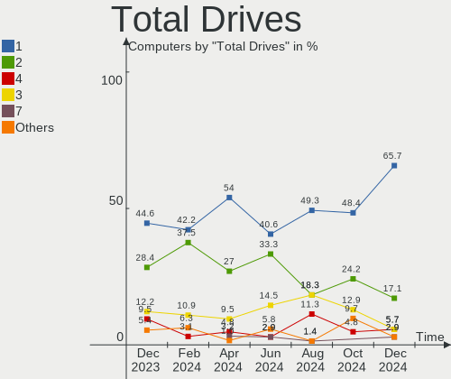
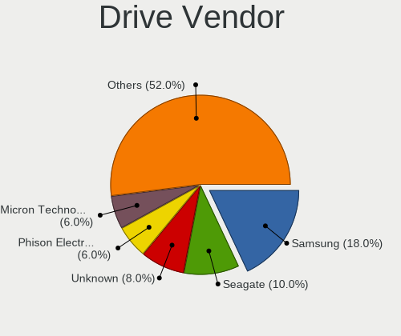
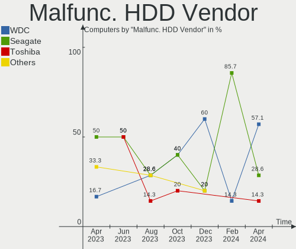
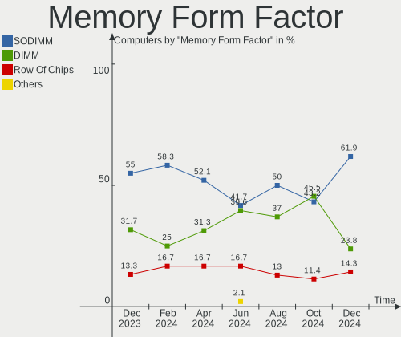
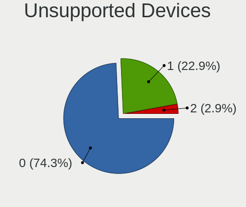

EndeavourOS - Hardware Trends
-----------------------------

A project to identify most popular hardware characteristics and track their change
over time based on data collected by Linux users at https://Linux-Hardware.org.

Anyone can contribute to this report by the [hw-probe](https://github.com/linuxhw/hw-probe) tool:

    sudo -E hw-probe -all -upload

This is a report for all computer types. See also reports for [desktops](/Dist/EndeavourOS/Desktop/README.md) and [notebooks](/Dist/EndeavourOS/Notebook/README.md).

This report is for one last month. Overall report since the beginning of time: [TestDays](https://github.com/linuxhw/TestDays)

Period: Mar, 2023.

Contents
--------

* [ System ](#system)
  - [ OS                       ](#os)
  - [ OS Family                ](#os-family)
  - [ Kernel                   ](#kernel)
  - [ Kernel Family            ](#kernel-family)
  - [ Kernel Major Ver.        ](#kernel-major-ver)
  - [ Arch                     ](#arch)
  - [ DE                       ](#de)
  - [ Display Server           ](#display-server)
  - [ Display Manager          ](#display-manager)
  - [ OS Lang                  ](#os-lang)
  - [ Boot Mode                ](#boot-mode)
  - [ Filesystem               ](#filesystem)
  - [ Part. scheme             ](#part-scheme)
  - [ Dual Boot with Linux/BSD ](#dual-boot-with-linuxbsd)
  - [ Dual Boot (Win)          ](#dual-boot-win)

* [ Board ](#board)
  - [ Vendor                   ](#vendor)
  - [ Model                    ](#model)
  - [ Model Family             ](#model-family)
  - [ MFG Year                 ](#mfg-year)
  - [ Form Factor              ](#form-factor)
  - [ Secure Boot              ](#secure-boot)
  - [ Coreboot                 ](#coreboot)
  - [ RAM Size                 ](#ram-size)
  - [ RAM Used                 ](#ram-used)
  - [ Total Drives             ](#total-drives)
  - [ Has CD-ROM               ](#has-cd-rom)
  - [ Has Ethernet             ](#has-ethernet)
  - [ Has WiFi                 ](#has-wifi)
  - [ Has Bluetooth            ](#has-bluetooth)

* [ Location ](#location)
  - [ Country                  ](#country)
  - [ City                     ](#city)

* [ Drives ](#drives)
  - [ Drive Vendor             ](#drive-vendor)
  - [ Drive Model              ](#drive-model)
  - [ HDD Vendor               ](#hdd-vendor)
  - [ SSD Vendor               ](#ssd-vendor)
  - [ Drive Kind               ](#drive-kind)
  - [ Drive Connector          ](#drive-connector)
  - [ Drive Size               ](#drive-size)
  - [ Space Total              ](#space-total)
  - [ Space Used               ](#space-used)
  - [ Malfunc. Drives          ](#malfunc-drives)
  - [ Malfunc. Drive Vendor    ](#malfunc-drive-vendor)
  - [ Malfunc. HDD Vendor      ](#malfunc-hdd-vendor)
  - [ Malfunc. Drive Kind      ](#malfunc-drive-kind)
  - [ Failed Drives            ](#failed-drives)
  - [ Failed Drive Vendor      ](#failed-drive-vendor)
  - [ Drive Status             ](#drive-status)

* [ Storage controller ](#storage-controller)
  - [ Storage Vendor           ](#storage-vendor)
  - [ Storage Model            ](#storage-model)
  - [ Storage Kind             ](#storage-kind)

* [ Processor ](#processor)
  - [ CPU Vendor               ](#cpu-vendor)
  - [ CPU Model                ](#cpu-model)
  - [ CPU Model Family         ](#cpu-model-family)
  - [ CPU Cores                ](#cpu-cores)
  - [ CPU Sockets              ](#cpu-sockets)
  - [ CPU Threads              ](#cpu-threads)
  - [ CPU Op-Modes             ](#cpu-op-modes)
  - [ CPU Microcode            ](#cpu-microcode)
  - [ CPU Microarch            ](#cpu-microarch)

* [ Graphics ](#graphics)
  - [ GPU Vendor               ](#gpu-vendor)
  - [ GPU Model                ](#gpu-model)
  - [ GPU Combo                ](#gpu-combo)
  - [ GPU Driver               ](#gpu-driver)
  - [ GPU Memory               ](#gpu-memory)

* [ Monitor ](#monitor)
  - [ Monitor Vendor           ](#monitor-vendor)
  - [ Monitor Model            ](#monitor-model)
  - [ Monitor Resolution       ](#monitor-resolution)
  - [ Monitor Diagonal         ](#monitor-diagonal)
  - [ Monitor Width            ](#monitor-width)
  - [ Aspect Ratio             ](#aspect-ratio)
  - [ Monitor Area             ](#monitor-area)
  - [ Pixel Density            ](#pixel-density)
  - [ Multiple Monitors        ](#multiple-monitors)

* [ Network ](#network)
  - [ Net Controller Vendor    ](#net-controller-vendor)
  - [ Net Controller Model     ](#net-controller-model)
  - [ Wireless Vendor          ](#wireless-vendor)
  - [ Wireless Model           ](#wireless-model)
  - [ Ethernet Vendor          ](#ethernet-vendor)
  - [ Ethernet Model           ](#ethernet-model)
  - [ Net Controller Kind      ](#net-controller-kind)
  - [ Used Controller          ](#used-controller)
  - [ NICs                     ](#nics)
  - [ IPv6                     ](#ipv6)

* [ Bluetooth ](#bluetooth)
  - [ Bluetooth Vendor         ](#bluetooth-vendor)
  - [ Bluetooth Model          ](#bluetooth-model)

* [ Sound ](#sound)
  - [ Sound Vendor             ](#sound-vendor)
  - [ Sound Model              ](#sound-model)

* [ Memory ](#memory)
  - [ Memory Vendor            ](#memory-vendor)
  - [ Memory Model             ](#memory-model)
  - [ Memory Kind              ](#memory-kind)
  - [ Memory Form Factor       ](#memory-form-factor)
  - [ Memory Size              ](#memory-size)
  - [ Memory Speed             ](#memory-speed)

* [ Printers & scanners ](#printers--scanners)
  - [ Printer Vendor           ](#printer-vendor)
  - [ Printer Model            ](#printer-model)
  - [ Scanner Vendor           ](#scanner-vendor)
  - [ Scanner Model            ](#scanner-model)

* [ Camera ](#camera)
  - [ Camera Vendor            ](#camera-vendor)
  - [ Camera Model             ](#camera-model)

* [ Security ](#security)
  - [ Fingerprint Vendor       ](#fingerprint-vendor)
  - [ Fingerprint Model        ](#fingerprint-model)
  - [ Chipcard Vendor          ](#chipcard-vendor)
  - [ Chipcard Model           ](#chipcard-model)

* [ Unsupported ](#unsupported)
  - [ Unsupported Devices      ](#unsupported-devices)
  - [ Unsupported Device Types ](#unsupported-device-types)

System
------

OS
--

Installed operating systems

| Name                | Computers | Percent |
|---------------------|-----------|---------|
| EndeavourOS Rolling | 60        | 100%    |

OS Family
---------

OS without a version

| Name        | Computers | Percent |
|-------------|-----------|---------|
| EndeavourOS | 60        | 100%    |

Kernel
------

Version of the Linux kernel

| Version                     | Computers | Percent |
|-----------------------------|-----------|---------|
| 6.2.8-arch1-1               | 12        | 20%     |
| 6.2.2-arch1-1               | 11        | 18.33%  |
| 6.2.7-arch1-1               | 5         | 8.33%   |
| 6.2.6-arch1-1               | 4         | 6.67%   |
| 6.2.5-arch1-1               | 4         | 6.67%   |
| 6.2.1-zen1-1-zen            | 3         | 5%      |
| 6.1.19-1-lts                | 3         | 5%      |
| 6.2.1-arch1-1               | 2         | 3.33%   |
| 6.1.20-1-lts                | 2         | 3.33%   |
| 6.1.15-1-lts                | 2         | 3.33%   |
| 6.2.7-zen1-1-zen            | 1         | 1.67%   |
| 6.2.6-zen1-1-zen            | 1         | 1.67%   |
| 6.2.5-zen1-1-zen            | 1         | 1.67%   |
| 6.2.5-x64v1-xanmod1-1       | 1         | 1.67%   |
| 6.2.2-zen1-1-zen            | 1         | 1.67%   |
| 6.2.2-arch1-g14-1           | 1         | 1.67%   |
| 6.2.2-273-tkg-pds           | 1         | 1.67%   |
| 6.2.1-x64v1-xanmod1-1       | 1         | 1.67%   |
| 6.1.9-arch1-2               | 1         | 1.67%   |
| 6.1.21-1-lts                | 1         | 1.67%   |
| 6.1.20-hardened1-1-hardened | 1         | 1.67%   |
| 6.1.12-arch1-1              | 1         | 1.67%   |

Kernel Family
-------------

Linux kernel without a distro release

| Version | Computers | Percent |
|---------|-----------|---------|
| 6.2.2   | 14        | 23.33%  |
| 6.2.8   | 12        | 20%     |
| 6.2.7   | 6         | 10%     |
| 6.2.5   | 6         | 10%     |
| 6.2.1   | 6         | 10%     |
| 6.2.6   | 5         | 8.33%   |
| 6.1.20  | 3         | 5%      |
| 6.1.19  | 3         | 5%      |
| 6.1.15  | 2         | 3.33%   |
| 6.1.9   | 1         | 1.67%   |
| 6.1.21  | 1         | 1.67%   |
| 6.1.12  | 1         | 1.67%   |

Kernel Major Ver.
-----------------

Linux kernel major version

| Version | Computers | Percent |
|---------|-----------|---------|
| 6.2     | 49        | 81.67%  |
| 6.1     | 11        | 18.33%  |

Arch
----

OS architecture (x86_64, i586, etc.)

| Name   | Computers | Percent |
|--------|-----------|---------|
| x86_64 | 60        | 100%    |

DE
--

Desktop Environment

| Name       | Computers | Percent |
|------------|-----------|---------|
| KDE5       | 19        | 31.67%  |
| XFCE       | 12        | 20%     |
| GNOME      | 11        | 18.33%  |
| X-Cinnamon | 4         | 6.67%   |
| i3         | 3         | 5%      |
| sway       | 2         | 3.33%   |
| KDE        | 2         | 3.33%   |
| Unknown    | 2         | 3.33%   |
| xmonad     | 1         | 1.67%   |
| openbox    | 1         | 1.67%   |
| Hyprland   | 1         | 1.67%   |
| Budgie     | 1         | 1.67%   |
| bspwm      | 1         | 1.67%   |

Display Server
--------------

X11 or Wayland

| Name    | Computers | Percent |
|---------|-----------|---------|
| X11     | 45        | 75%     |
| Wayland | 13        | 21.67%  |
| Tty     | 1         | 1.67%   |
| Unknown | 1         | 1.67%   |

Display Manager
---------------

SDDM, LightDM, etc.

| Name    | Computers | Percent |
|---------|-----------|---------|
| LightDM | 25        | 41.67%  |
| Unknown | 21        | 35%     |
| SDDM    | 7         | 11.67%  |
| GDM     | 6         | 10%     |
| GREETD  | 1         | 1.67%   |

OS Lang
-------

Language

| Lang    | Computers | Percent |
|---------|-----------|---------|
| en_US   | 35        | 58.33%  |
| en_GB   | 5         | 8.33%   |
| de_DE   | 3         | 5%      |
| ru_RU   | 2         | 3.33%   |
| pt_BR   | 2         | 3.33%   |
| nl_NL   | 2         | 3.33%   |
| en_CA   | 2         | 3.33%   |
| de_AT   | 2         | 3.33%   |
| it_IT   | 1         | 1.67%   |
| fr_FR   | 1         | 1.67%   |
| en_SG   | 1         | 1.67%   |
| en_NZ   | 1         | 1.67%   |
| en_IN   | 1         | 1.67%   |
| en_AU   | 1         | 1.67%   |
| Unknown | 1         | 1.67%   |

Boot Mode
---------

EFI or BIOS

| Mode | Computers | Percent |
|------|-----------|---------|
| EFI  | 35        | 58.33%  |
| BIOS | 25        | 41.67%  |

Filesystem
----------

Type of filesystem

| Type    | Computers | Percent |
|---------|-----------|---------|
| Ext4    | 39        | 65%     |
| Btrfs   | 19        | 31.67%  |
| Tmpfs   | 1         | 1.67%   |
| Overlay | 1         | 1.67%   |

Part. scheme
------------

Scheme of partitioning

| Type    | Computers | Percent |
|---------|-----------|---------|
| GPT     | 38        | 63.33%  |
| Unknown | 19        | 31.67%  |
| MBR     | 3         | 5%      |

Dual Boot with Linux/BSD
------------------------

Hosting more than one Linux/BSD

| Dual boot | Computers | Percent |
|-----------|-----------|---------|
| No        | 52        | 86.67%  |
| Yes       | 8         | 13.33%  |

Dual Boot (Win)
---------------

Hosting Linux and Windows

| Dual boot | Computers | Percent |
|-----------|-----------|---------|
| No        | 45        | 75%     |
| Yes       | 15        | 25%     |

Board
-----

Vendor
------

Motherboard manufacturer

| Name                | Computers | Percent |
|---------------------|-----------|---------|
| ASUSTek Computer    | 14        | 23.33%  |
| Hewlett-Packard     | 9         | 15%     |
| Lenovo              | 8         | 13.33%  |
| Dell                | 5         | 8.33%   |
| MSI                 | 3         | 5%      |
| Timi                | 2         | 3.33%   |
| GPD                 | 2         | 3.33%   |
| Gigabyte Technology | 2         | 3.33%   |
| Apple               | 2         | 3.33%   |
| TUXEDO              | 1         | 1.67%   |
| Toshiba             | 1         | 1.67%   |
| Sony                | 1         | 1.67%   |
| Samsung Electronics | 1         | 1.67%   |
| Notebook            | 1         | 1.67%   |
| HUAWEI              | 1         | 1.67%   |
| Google              | 1         | 1.67%   |
| Chuwi               | 1         | 1.67%   |
| AZW                 | 1         | 1.67%   |
| AWOW                | 1         | 1.67%   |
| ASRock              | 1         | 1.67%   |
| Acer                | 1         | 1.67%   |
| Unknown             | 1         | 1.67%   |

Model
-----

Motherboard model

| Name                                       | Computers | Percent |
|--------------------------------------------|-----------|---------|
| ASUS VivoBook_ASUSLaptop S5402ZA_K5402ZA   | 2         | 3.33%   |
| TUXEDO Aura 15 Gen1                        | 1         | 1.67%   |
| Toshiba Satellite C55-C                    | 1         | 1.67%   |
| Timi Xiaomi NoteBook Pro                   | 1         | 1.67%   |
| Timi TM1701                                | 1         | 1.67%   |
| Sony SVE1713X1EB                           | 1         | 1.67%   |
| Samsung 550XDA                             | 1         | 1.67%   |
| Notebook N150ZU                            | 1         | 1.67%   |
| MSI MS-7D54                                | 1         | 1.67%   |
| MSI MS-7A40                                | 1         | 1.67%   |
| MSI MS-7641                                | 1         | 1.67%   |
| Lenovo ThinkPad X1 Yoga 3rd 20LD002KGE     | 1         | 1.67%   |
| Lenovo ThinkPad X1 Carbon Gen 9 20XW007YPB | 1         | 1.67%   |
| Lenovo ThinkPad X1 Carbon 2nd 20A8S0ET00   | 1         | 1.67%   |
| Lenovo ThinkPad T430 23426QU               | 1         | 1.67%   |
| Lenovo ThinkPad S1 Yoga 12 20DKS0E200      | 1         | 1.67%   |
| Lenovo ThinkPad E15 Gen 4 21E6CTO1WW       | 1         | 1.67%   |
| Lenovo ThinkBook 15 G2 ITL 20VE            | 1         | 1.67%   |
| Lenovo IdeaPad Gaming 3 15ARH05 82EY       | 1         | 1.67%   |
| HUAWEI NBLK-WAX9X                          | 1         | 1.67%   |
| HP ProDesk 600 G6 Desktop Mini PC          | 1         | 1.67%   |
| HP Pavilion Laptop 15-eh2xxx               | 1         | 1.67%   |
| HP Pavilion Gaming Desktop TG01-2xxx       | 1         | 1.67%   |
| HP EliteDesk 800 G1 TWR                    | 1         | 1.67%   |
| HP EliteBook 8570p                         | 1         | 1.67%   |
| HP EliteBook 850 G1                        | 1         | 1.67%   |
| HP EliteBook 8460p                         | 1         | 1.67%   |
| HP EliteBook 840 G5                        | 1         | 1.67%   |
| HP 255 15.6 inch G9 Notebook PC            | 1         | 1.67%   |
| GPD G1621-02                               | 1         | 1.67%   |
| GPD G1619-04                               | 1         | 1.67%   |
| Google Rammus                              | 1         | 1.67%   |
| Gigabyte X470 AORUS ULTRA GAMING           | 1         | 1.67%   |
| Gigabyte P55A-UD3                          | 1         | 1.67%   |
| Dell XPS 8700                              | 1         | 1.67%   |
| Dell XPS 15 9520                           | 1         | 1.67%   |
| Dell Precision 7720                        | 1         | 1.67%   |
| Dell OptiPlex 7010                         | 1         | 1.67%   |
| Dell Latitude 5289                         | 1         | 1.67%   |
| Chuwi GemiBook Pro                         | 1         | 1.67%   |

Model Family
------------

Motherboard model prefix

| Name              | Computers | Percent |
|-------------------|-----------|---------|
| Lenovo ThinkPad   | 6         | 10%     |
| HP EliteBook      | 4         | 6.67%   |
| ASUS VivoBook     | 4         | 6.67%   |
| ASUS ROG          | 3         | 5%      |
| HP Pavilion       | 2         | 3.33%   |
| Dell XPS          | 2         | 3.33%   |
| ASUS PRIME        | 2         | 3.33%   |
| TUXEDO Aura       | 1         | 1.67%   |
| Toshiba Satellite | 1         | 1.67%   |
| Timi Xiaomi       | 1         | 1.67%   |
| Timi TM1701       | 1         | 1.67%   |
| Sony SVE1713X1EB  | 1         | 1.67%   |
| Samsung 550XDA    | 1         | 1.67%   |
| Notebook N150ZU   | 1         | 1.67%   |
| MSI MS-7D54       | 1         | 1.67%   |
| MSI MS-7A40       | 1         | 1.67%   |
| MSI MS-7641       | 1         | 1.67%   |
| Lenovo ThinkBook  | 1         | 1.67%   |
| Lenovo IdeaPad    | 1         | 1.67%   |
| HUAWEI NBLK-WAX9X | 1         | 1.67%   |
| HP ProDesk        | 1         | 1.67%   |
| HP EliteDesk      | 1         | 1.67%   |
| HP 255            | 1         | 1.67%   |
| GPD G1621-02      | 1         | 1.67%   |
| GPD G1619-04      | 1         | 1.67%   |
| Google Rammus     | 1         | 1.67%   |
| Gigabyte X470     | 1         | 1.67%   |
| Gigabyte P55A-UD3 | 1         | 1.67%   |
| Dell Precision    | 1         | 1.67%   |
| Dell OptiPlex     | 1         | 1.67%   |
| Dell Latitude     | 1         | 1.67%   |
| Chuwi GemiBook    | 1         | 1.67%   |
| AZW GK35          | 1         | 1.67%   |
| AWOW AL34         | 1         | 1.67%   |
| ASUS ZenBook      | 1         | 1.67%   |
| ASUS UX301LAA     | 1         | 1.67%   |
| ASUS TUF          | 1         | 1.67%   |
| ASUS STRIX        | 1         | 1.67%   |
| ASUS N76VM        | 1         | 1.67%   |
| ASRock B450M      | 1         | 1.67%   |

MFG Year
--------

Motherboard manufacture year

| Year | Computers | Percent |
|------|-----------|---------|
| 2022 | 12        | 20%     |
| 2021 | 11        | 18.33%  |
| 2020 | 8         | 13.33%  |
| 2018 | 6         | 10%     |
| 2014 | 5         | 8.33%   |
| 2012 | 5         | 8.33%   |
| 2017 | 4         | 6.67%   |
| 2013 | 3         | 5%      |
| 2019 | 2         | 3.33%   |
| 2015 | 2         | 3.33%   |
| 2011 | 1         | 1.67%   |
| 2009 | 1         | 1.67%   |

Form Factor
-----------

Physical design of the computer

| Name        | Computers | Percent |
|-------------|-----------|---------|
| Notebook    | 40        | 66.67%  |
| Desktop     | 17        | 28.33%  |
| Convertible | 1         | 1.67%   |
| Mini pc     | 1         | 1.67%   |
| All in one  | 1         | 1.67%   |

Secure Boot
-----------

Enabled or disabled

| State    | Computers | Percent |
|----------|-----------|---------|
| Disabled | 59        | 98.33%  |
| Enabled  | 1         | 1.67%   |

Coreboot
--------

Have coreboot on board

| Used | Computers | Percent |
|------|-----------|---------|
| No   | 59        | 98.33%  |
| Yes  | 1         | 1.67%   |

RAM Size
--------

Total RAM memory

| Size in GB  | Computers | Percent |
|-------------|-----------|---------|
| 32.01-64.0  | 14        | 23.33%  |
| 8.01-16.0   | 14        | 23.33%  |
| 16.01-24.0  | 13        | 21.67%  |
| 4.01-8.0    | 12        | 20%     |
| 3.01-4.0    | 3         | 5%      |
| 24.01-32.0  | 2         | 3.33%   |
| 64.01-256.0 | 2         | 3.33%   |

RAM Used
--------

Used RAM memory

| Used GB   | Computers | Percent |
|-----------|-----------|---------|
| 4.01-8.0  | 19        | 31.67%  |
| 2.01-3.0  | 16        | 26.67%  |
| 3.01-4.0  | 8         | 13.33%  |
| 1.01-2.0  | 8         | 13.33%  |
| 8.01-16.0 | 8         | 13.33%  |
| 0.51-1.0  | 1         | 1.67%   |

Total Drives
------------

Number of drives on board

| Drives | Computers | Percent |
|--------|-----------|---------|
| 1      | 37        | 61.67%  |
| 2      | 11        | 18.33%  |
| 3      | 7         | 11.67%  |
| 4      | 3         | 5%      |
| 7      | 1         | 1.67%   |
| 5      | 1         | 1.67%   |

Has CD-ROM
----------

Has CD-ROM on board

| Presented | Computers | Percent |
|-----------|-----------|---------|
| No        | 53        | 88.33%  |
| Yes       | 7         | 11.67%  |

Has Ethernet
------------

Has Ethernet on board

| Presented | Computers | Percent |
|-----------|-----------|---------|
| Yes       | 43        | 71.67%  |
| No        | 17        | 28.33%  |

Has WiFi
--------

Has WiFi module

| Presented | Computers | Percent |
|-----------|-----------|---------|
| Yes       | 55        | 91.67%  |
| No        | 5         | 8.33%   |

Has Bluetooth
-------------

Has Bluetooth module

| Presented | Computers | Percent |
|-----------|-----------|---------|
| Yes       | 54        | 90%     |
| No        | 6         | 10%     |

Location
--------

Country
-------

Geographic location (country)

| Country     | Computers | Percent |
|-------------|-----------|---------|
| USA         | 14        | 23.33%  |
| Germany     | 8         | 13.33%  |
| Netherlands | 5         | 8.33%   |
| Italy       | 4         | 6.67%   |
| Austria     | 3         | 5%      |
| Russia      | 2         | 3.33%   |
| India       | 2         | 3.33%   |
| France      | 2         | 3.33%   |
| Canada      | 2         | 3.33%   |
| Brazil      | 2         | 3.33%   |
| UK          | 1         | 1.67%   |
| Turkey      | 1         | 1.67%   |
| Sweden      | 1         | 1.67%   |
| Singapore   | 1         | 1.67%   |
| Poland      | 1         | 1.67%   |
| New Zealand | 1         | 1.67%   |
| Moldova     | 1         | 1.67%   |
| Lithuania   | 1         | 1.67%   |
| Kazakhstan  | 1         | 1.67%   |
| Japan       | 1         | 1.67%   |
| Estonia     | 1         | 1.67%   |
| Cyprus      | 1         | 1.67%   |
| Croatia     | 1         | 1.67%   |
| Bulgaria    | 1         | 1.67%   |
| Azerbaijan  | 1         | 1.67%   |
| Australia   | 1         | 1.67%   |

City
----

Geographic location (city)

| City                 | Computers | Percent |
|----------------------|-----------|---------|
| Gera                 | 3         | 5%      |
| Innsbruck            | 2         | 3.33%   |
| Brooklyn             | 2         | 3.33%   |
| Almelo               | 2         | 3.33%   |
| Xirdalan             | 1         | 1.67%   |
| Waterloo             | 1         | 1.67%   |
| Warsaw               | 1         | 1.67%   |
| Waidhaus             | 1         | 1.67%   |
| Vilnius              | 1         | 1.67%   |
| Vienna               | 1         | 1.67%   |
| Tallinn              | 1         | 1.67%   |
| Sydney               | 1         | 1.67%   |
| St Petersburg        | 1         | 1.67%   |
| Singapore            | 1         | 1.67%   |
| Sao Joaquim da Barra | 1         | 1.67%   |
| San Antonio          | 1         | 1.67%   |
| Rotterdam            | 1         | 1.67%   |
| Ringgold             | 1         | 1.67%   |
| Porto Alegre         | 1         | 1.67%   |
| Plovdiv              | 1         | 1.67%   |
| Philadelphia         | 1         | 1.67%   |
| Peize                | 1         | 1.67%   |
| Paris                | 1         | 1.67%   |
| Osijek               | 1         | 1.67%   |
| Nicosia              | 1         | 1.67%   |
| New Port Richey      | 1         | 1.67%   |
| Naples               | 1         | 1.67%   |
| Münster             | 1         | 1.67%   |
| Moscow               | 1         | 1.67%   |
| Montreal             | 1         | 1.67%   |
| Milan                | 1         | 1.67%   |
| Miami                | 1         | 1.67%   |
| Meissen              | 1         | 1.67%   |
| Mauleon              | 1         | 1.67%   |
| Marino               | 1         | 1.67%   |
| Malmo                | 1         | 1.67%   |
| Laval                | 1         | 1.67%   |
| Ichikawa             | 1         | 1.67%   |
| Hyderabad            | 1         | 1.67%   |
| Hamburg              | 1         | 1.67%   |

Drives
------

Drive Vendor
------------

Hard drive vendors

| Vendor                       | Computers | Drives | Percent |
|------------------------------|-----------|--------|---------|
| Samsung Electronics          | 27        | 30     | 28.13%  |
| Seagate                      | 8         | 10     | 8.33%   |
| Kingston                     | 8         | 8      | 8.33%   |
| SanDisk                      | 7         | 8      | 7.29%   |
| Crucial                      | 6         | 6      | 6.25%   |
| Toshiba                      | 5         | 5      | 5.21%   |
| Micron Technology            | 5         | 5      | 5.21%   |
| WDC                          | 4         | 6      | 4.17%   |
| SK hynix                     | 4         | 4      | 4.17%   |
| Unknown                      | 3         | 4      | 3.13%   |
| Phison Electronics           | 3         | 3      | 3.13%   |
| KIOXIA                       | 2         | 2      | 2.08%   |
| Intel                        | 2         | 2      | 2.08%   |
| Apple                        | 2         | 2      | 2.08%   |
| Timetec                      | 1         | 1      | 1.04%   |
| Shenzhen Longsys Electronics | 1         | 1      | 1.04%   |
| PNY                          | 1         | 1      | 1.04%   |
| OCZ                          | 1         | 1      | 1.04%   |
| Netac                        | 1         | 1      | 1.04%   |
| Micron/Crucial Technology    | 1         | 1      | 1.04%   |
| LITEON                       | 1         | 1      | 1.04%   |
| Hitachi                      | 1         | 1      | 1.04%   |
| HGST                         | 1         | 1      | 1.04%   |
| Unknown                      | 1         | 1      | 1.04%   |

Drive Model
-----------

Hard drive models

| Model                                                | Computers | Percent |
|------------------------------------------------------|-----------|---------|
| Samsung NVMe SSD Controller SM981/PM981/PM983 250GB  | 11        | 10.68%  |
| Samsung SSD 860 EVO 1TB                              | 3         | 2.91%   |
| Kingston SA400S37240G 240GB SSD                      | 3         | 2.91%   |
| Toshiba MQ01ABD100 1TB                               | 2         | 1.94%   |
| Seagate ST2000DM008-2FR102 2TB                       | 2         | 1.94%   |
| Seagate ST1000LM035-1RK172 1TB                       | 2         | 1.94%   |
| Seagate ST1000DM003-1SB102 1TB                       | 2         | 1.94%   |
| Samsung SSD 860 EVO M.2 1TB                          | 2         | 1.94%   |
| Samsung NVMe SSD Controller SM961/PM961/SM963 256GB  | 2         | 1.94%   |
| Samsung MZALQ512HALU-000L2 512GB                     | 2         | 1.94%   |
| Samsung HD103SJ 1TB                                  | 2         | 1.94%   |
| Phison E16 PCIe4 NVMe Controller 1TB                 | 2         | 1.94%   |
| Micron 2450_MTFDKBA1T0TFK 1TB                        | 2         | 1.94%   |
| Crucial CT500MX500SSD1 500GB                         | 2         | 1.94%   |
| WDC WDS500G2B0B-00YS70 500GB SSD                     | 1         | 0.97%   |
| WDC WDS100T2B0B-00YS70 1TB SSD                       | 1         | 0.97%   |
| WDC WD20EZRZ-00Z5HB0 2TB                             | 1         | 0.97%   |
| WDC WD20EARS-42S0XB0 2TB                             | 1         | 0.97%   |
| WDC WD10EZEX-08M2NA0 1TB                             | 1         | 0.97%   |
| Unknown SD/MMC 2GB                                   | 1         | 0.97%   |
| Unknown MMC Card  64GB                               | 1         | 0.97%   |
| Unknown MMC Card  32GB                               | 1         | 0.97%   |
| Unknown M.S./M.S.Pro/HG 16GB                         | 1         | 0.97%   |
| Toshiba XG4 NVMe SSD Controller 256GB                | 1         | 0.97%   |
| Toshiba MQ04ABF100 1TB                               | 1         | 0.97%   |
| Toshiba MG06ACA800E 8TB                              | 1         | 0.97%   |
| Timetec MS05 256GB SSD                               | 1         | 0.97%   |
| SK hynix PC801 NVMe 2TB                              | 1         | 0.97%   |
| SK hynix PC401 NVMe Solid State Drive 256GB          | 1         | 0.97%   |
| SK hynix HFM001TD3JX013N 1TB                         | 1         | 0.97%   |
| SK hynix BC501 NVMe Solid State Drive 512GB          | 1         | 0.97%   |
| Shenzhen Longsys SM2263EN/SM2263XT-based OEM SSD 1TB | 1         | 0.97%   |
| Seagate UltraTouch SSD 1TB                           | 1         | 0.97%   |
| Seagate ST500LM021-1KJ152 500GB                      | 1         | 0.97%   |
| Seagate ST4000DM004-2CV104 4TB                       | 1         | 0.97%   |
| Seagate ST3500418AS 500GB                            | 1         | 0.97%   |
| Sandisk WD PC SN740 SDDPNQD-512G-1006 512GB          | 1         | 0.97%   |
| Sandisk WD Blue SN550 NVMe SSD 256GB                 | 1         | 0.97%   |
| Sandisk WD Blue SN500 / PC SN520 NVMe SSD 512GB      | 1         | 0.97%   |
| SanDisk SDSSDA120G 120GB                             | 1         | 0.97%   |

HDD Vendor
----------

Hard disk drive vendors

| Vendor              | Computers | Drives | Percent |
|---------------------|-----------|--------|---------|
| Seagate             | 7         | 9      | 36.84%  |
| Toshiba             | 4         | 4      | 21.05%  |
| Samsung Electronics | 3         | 3      | 15.79%  |
| WDC                 | 2         | 4      | 10.53%  |
| Hitachi             | 1         | 1      | 5.26%   |
| HGST                | 1         | 1      | 5.26%   |
| Apple               | 1         | 1      | 5.26%   |

SSD Vendor
----------

Solid state drive vendors

| Vendor              | Computers | Drives | Percent |
|---------------------|-----------|--------|---------|
| Samsung Electronics | 8         | 8      | 22.22%  |
| Kingston            | 7         | 7      | 19.44%  |
| Crucial             | 6         | 6      | 16.67%  |
| SanDisk             | 4         | 5      | 11.11%  |
| WDC                 | 2         | 2      | 5.56%   |
| Timetec             | 1         | 1      | 2.78%   |
| Seagate             | 1         | 1      | 2.78%   |
| PNY                 | 1         | 1      | 2.78%   |
| OCZ                 | 1         | 1      | 2.78%   |
| Netac               | 1         | 1      | 2.78%   |
| Micron Technology   | 1         | 1      | 2.78%   |
| LITEON              | 1         | 1      | 2.78%   |
| Intel               | 1         | 1      | 2.78%   |
| Apple               | 1         | 1      | 2.78%   |

Drive Kind
----------

HDD or SSD

| Kind    | Computers | Drives | Percent |
|---------|-----------|--------|---------|
| NVMe    | 33        | 40     | 40.74%  |
| SSD     | 27        | 37     | 33.33%  |
| HDD     | 17        | 23     | 20.99%  |
| MMC     | 3         | 3      | 3.7%    |
| Unknown | 1         | 2      | 1.23%   |

Drive Connector
---------------

SATA, SAS, NVMe, etc.

| Type | Computers | Drives | Percent |
|------|-----------|--------|---------|
| SATA | 34        | 57     | 45.95%  |
| NVMe | 33        | 40     | 44.59%  |
| SAS  | 4         | 5      | 5.41%   |
| MMC  | 3         | 3      | 4.05%   |

Drive Size
----------

Size of hard drive

| Size in TB | Computers | Drives | Percent |
|------------|-----------|--------|---------|
| 0.01-0.5   | 20        | 28     | 43.48%  |
| 0.51-1.0   | 19        | 23     | 41.3%   |
| 1.01-2.0   | 5         | 7      | 10.87%  |
| 3.01-4.0   | 1         | 1      | 2.17%   |
| 4.01-10.0  | 1         | 1      | 2.17%   |

Space Total
-----------

Amount of disk space available on the file system

| Size in GB     | Computers | Percent |
|----------------|-----------|---------|
| 1001-2000      | 14        | 23.33%  |
| 501-1000       | 10        | 16.67%  |
| Unknown        | 8         | 13.33%  |
| 101-250        | 7         | 11.67%  |
| More than 3000 | 6         | 10%     |
| 251-500        | 6         | 10%     |
| 1-20           | 6         | 10%     |
| 21-50          | 2         | 3.33%   |
| 51-100         | 1         | 1.67%   |

Space Used
----------

Amount of used disk space

| Used GB        | Computers | Percent |
|----------------|-----------|---------|
| 1-20           | 15        | 25%     |
| 21-50          | 10        | 16.67%  |
| Unknown        | 8         | 13.33%  |
| 51-100         | 7         | 11.67%  |
| 101-250        | 6         | 10%     |
| 1001-2000      | 5         | 8.33%   |
| More than 3000 | 3         | 5%      |
| 251-500        | 3         | 5%      |
| 501-1000       | 3         | 5%      |

Malfunc. Drives
---------------

Drive models with a malfunction

| Model                                                           | Computers | Drives | Percent |
|-----------------------------------------------------------------|-----------|--------|---------|
| Seagate ST500LM021-1KJ152 500GB                                 | 1         | 1      | 20%     |
| Samsung Electronics NVMe SSD Controller SM981/PM981/PM983 250GB | 1         | 1      | 20%     |
| Samsung Electronics NVMe SSD Controller SM961/PM961/SM963 256GB | 1         | 1      | 20%     |
| Crucial CT500MX500SSD1 500GB                                    | 1         | 1      | 20%     |
| Apple SSD TS128E 121GB                                          | 1         | 1      | 20%     |

Malfunc. Drive Vendor
---------------------

Vendors of faulty drives

| Vendor              | Computers | Drives | Percent |
|---------------------|-----------|--------|---------|
| Samsung Electronics | 2         | 2      | 40%     |
| Seagate             | 1         | 1      | 20%     |
| Crucial             | 1         | 1      | 20%     |
| Apple               | 1         | 1      | 20%     |

Malfunc. HDD Vendor
-------------------

Vendors of faulty HDD drives

| Vendor  | Computers | Drives | Percent |
|---------|-----------|--------|---------|
| Seagate | 1         | 1      | 100%    |

Malfunc. Drive Kind
-------------------

Kinds of faulty drives

| Kind | Computers | Drives | Percent |
|------|-----------|--------|---------|
| NVMe | 2         | 2      | 40%     |
| SSD  | 2         | 2      | 40%     |
| HDD  | 1         | 1      | 20%     |

Failed Drives
-------------

Failed drive models

Zero info for selected period =(

Failed Drive Vendor
-------------------

Failed drive vendors

Zero info for selected period =(

Drive Status
------------

Number of failed and malfunc. drives

| Status   | Computers | Drives | Percent |
|----------|-----------|--------|---------|
| Works    | 40        | 61     | 57.97%  |
| Detected | 24        | 39     | 34.78%  |
| Malfunc  | 5         | 5      | 7.25%   |

Storage controller
------------------

Storage Vendor
--------------

Storage controller vendors

| Vendor                       | Computers | Percent |
|------------------------------|-----------|---------|
| Intel                        | 32        | 37.65%  |
| Samsung Electronics          | 19        | 22.35%  |
| AMD                          | 13        | 15.29%  |
| SK hynix                     | 4         | 4.71%   |
| Micron Technology            | 4         | 4.71%   |
| SanDisk                      | 3         | 3.53%   |
| Phison Electronics           | 3         | 3.53%   |
| KIOXIA                       | 2         | 2.35%   |
| Toshiba America Info Systems | 1         | 1.18%   |
| Shenzhen Longsys Electronics | 1         | 1.18%   |
| Micron/Crucial Technology    | 1         | 1.18%   |
| Kingston Technology Company  | 1         | 1.18%   |
| ASMedia Technology           | 1         | 1.18%   |

Storage Model
-------------

Storage controller models

| Model                                                                          | Computers | Percent |
|--------------------------------------------------------------------------------|-----------|---------|
| Samsung NVMe SSD Controller SM981/PM981/PM983                                  | 12        | 13.33%  |
| AMD FCH SATA Controller [AHCI mode]                                            | 11        | 12.22%  |
| Intel 7 Series Chipset Family 6-port SATA Controller [AHCI mode]               | 5         | 5.56%   |
| Samsung NVMe SSD Controller 980                                                | 4         | 4.44%   |
| Micron NVMe Storage Controller                                                 | 3         | 3.33%   |
| Intel 8 Series/C220 Series Chipset Family 6-port SATA Controller 1 [AHCI mode] | 3         | 3.33%   |
| Intel 8 Series SATA Controller 1 [AHCI mode]                                   | 3         | 3.33%   |
| AMD 400 Series Chipset SATA Controller                                         | 3         | 3.33%   |
| Samsung NVMe SSD Controller SM961/PM961/SM963                                  | 2         | 2.22%   |
| Phison E16 PCIe4 NVMe Controller                                               | 2         | 2.22%   |
| KIOXIA Non-Volatile memory controller                                          | 2         | 2.22%   |
| Intel Wildcat Point-LP SATA Controller [AHCI Mode]                             | 2         | 2.22%   |
| Intel Volume Management Device NVMe RAID Controller                            | 2         | 2.22%   |
| Intel Tiger Lake-LP SATA Controller                                            | 2         | 2.22%   |
| Intel 82801 Mobile SATA Controller [RAID mode]                                 | 2         | 2.22%   |
| Toshiba America Info Systems XG4 NVMe SSD Controller                           | 1         | 1.11%   |
| SK hynix Platinum P41 NVMe Solid State Drive 2TB                               | 1         | 1.11%   |
| SK hynix PC401 NVMe Solid State Drive 256GB                                    | 1         | 1.11%   |
| SK hynix Gold P31/PC711 NVMe Solid State Drive                                 | 1         | 1.11%   |
| SK hynix BC501 NVMe Solid State Drive                                          | 1         | 1.11%   |
| Shenzhen Longsys SM2263EN/SM2263XT-based OEM SSD                               | 1         | 1.11%   |
| SanDisk WD Blue SN550 NVMe SSD                                                 | 1         | 1.11%   |
| SanDisk WD Blue SN500 / PC SN520 NVMe SSD                                      | 1         | 1.11%   |
| SanDisk NVMe Controller                                                        | 1         | 1.11%   |
| Samsung NVMe SSD Controller PM9A1/PM9A3/980PRO                                 | 1         | 1.11%   |
| Phison E12 NVMe Controller                                                     | 1         | 1.11%   |
| Micron/Crucial P2 NVMe PCIe SSD                                                | 1         | 1.11%   |
| Micron NVMe Controller                                                         | 1         | 1.11%   |
| Kingston Company Company Non-Volatile memory controller                        | 1         | 1.11%   |
| Intel Sunrise Point-LP SATA Controller [AHCI mode]                             | 1         | 1.11%   |
| Intel SSD 660P Series                                                          | 1         | 1.11%   |
| Intel Q170/Q150/B150/H170/H110/Z170/CM236 Chipset SATA Controller [AHCI Mode]  | 1         | 1.11%   |
| Intel Jasper Lake SATA AHCI Controller                                         | 1         | 1.11%   |
| Intel Comet Lake SATA AHCI Controller                                          | 1         | 1.11%   |
| Intel Celeron/Pentium Silver Processor SATA Controller                         | 1         | 1.11%   |
| Intel Celeron N3350/Pentium N4200/Atom E3900 Series SATA AHCI Controller       | 1         | 1.11%   |
| Intel Cannon Lake PCH SATA AHCI Controller                                     | 1         | 1.11%   |
| Intel 7 Series/C210 Series Chipset Family 6-port SATA Controller [AHCI mode]   | 1         | 1.11%   |
| Intel 6 Series/C200 Series Chipset Family 6 port Mobile SATA AHCI Controller   | 1         | 1.11%   |
| Intel 500 Series Chipset Family SATA AHCI Controller                           | 1         | 1.11%   |

Storage Kind
------------

Kind of storage controller (IDE, SATA, NVMe, SAS, ...)

| Kind | Computers | Percent |
|------|-----------|---------|
| SATA | 41        | 51.9%   |
| NVMe | 33        | 41.77%  |
| RAID | 4         | 5.06%   |
| IDE  | 1         | 1.27%   |

Processor
---------

CPU Vendor
----------

Processor vendors

| Vendor | Computers | Percent |
|--------|-----------|---------|
| Intel  | 41        | 68.33%  |
| AMD    | 19        | 31.67%  |

CPU Model
---------

Processor models

| Model                                   | Computers | Percent |
|-----------------------------------------|-----------|---------|
| Intel 12th Gen Core i7-12700H           | 3         | 5%      |
| Intel Core i7-4790 CPU @ 3.60GHz        | 2         | 3.33%   |
| Intel Core i5-8250U CPU @ 1.60GHz       | 2         | 3.33%   |
| Intel 11th Gen Core i7-1165G7 @ 2.80GHz | 2         | 3.33%   |
| AMD Ryzen 7 4700U with Radeon Graphics  | 2         | 3.33%   |
| Intel Xeon CPU E3-1535M v6 @ 3.10GHz    | 1         | 1.67%   |
| Intel Core m3-8100Y CPU @ 1.10GHz       | 1         | 1.67%   |
| Intel Core i7-9700K CPU @ 3.60GHz       | 1         | 1.67%   |
| Intel Core i7-8650U CPU @ 1.90GHz       | 1         | 1.67%   |
| Intel Core i7-8550U CPU @ 1.80GHz       | 1         | 1.67%   |
| Intel Core i7-7600U CPU @ 2.80GHz       | 1         | 1.67%   |
| Intel Core i7-4600U CPU @ 2.10GHz       | 1         | 1.67%   |
| Intel Core i7-3632QM CPU @ 2.20GHz      | 1         | 1.67%   |
| Intel Core i7-3610QM CPU @ 2.30GHz      | 1         | 1.67%   |
| Intel Core i7-2820QM CPU @ 2.30GHz      | 1         | 1.67%   |
| Intel Core i7-10700F CPU @ 2.90GHz      | 1         | 1.67%   |
| Intel Core i5-8265U CPU @ 1.60GHz       | 1         | 1.67%   |
| Intel Core i5-7600K CPU @ 3.80GHz       | 1         | 1.67%   |
| Intel Core i5-5300U CPU @ 2.30GHz       | 1         | 1.67%   |
| Intel Core i5-4570 CPU @ 3.20GHz        | 1         | 1.67%   |
| Intel Core i5-4300U CPU @ 1.90GHz       | 1         | 1.67%   |
| Intel Core i5-4210U CPU @ 1.70GHz       | 1         | 1.67%   |
| Intel Core i5-3470 CPU @ 3.20GHz        | 1         | 1.67%   |
| Intel Core i5-3427U CPU @ 1.80GHz       | 1         | 1.67%   |
| Intel Core i5-3230M CPU @ 2.60GHz       | 1         | 1.67%   |
| Intel Core i5-3210M CPU @ 2.50GHz       | 1         | 1.67%   |
| Intel Core i5-10500T CPU @ 2.30GHz      | 1         | 1.67%   |
| Intel Core i5 CPU 750 @ 2.67GHz         | 1         | 1.67%   |
| Intel Core i3-5005U CPU @ 2.00GHz       | 1         | 1.67%   |
| Intel Celeron N5100 @ 1.10GHz           | 1         | 1.67%   |
| Intel Celeron J4105 CPU @ 1.50GHz       | 1         | 1.67%   |
| Intel Celeron CPU N3450 @ 1.10GHz       | 1         | 1.67%   |
| Intel 12th Gen Core i7-1255U            | 1         | 1.67%   |
| Intel 12th Gen Core i5-12450H           | 1         | 1.67%   |
| Intel 11th Gen Core i7-1195G7 @ 2.90GHz | 1         | 1.67%   |
| Intel 11th Gen Core i7-11700F @ 2.50GHz | 1         | 1.67%   |
| Intel 11th Gen Core i3-1115G4 @ 3.00GHz | 1         | 1.67%   |
| AMD Ryzen 9 7900X 12-Core Processor     | 1         | 1.67%   |
| AMD Ryzen 9 6900HX with Radeon Graphics | 1         | 1.67%   |
| AMD Ryzen 9 5900HX with Radeon Graphics | 1         | 1.67%   |

CPU Model Family
----------------

Processor model prefix

| Model         | Computers | Percent |
|---------------|-----------|---------|
| Intel Core i5 | 14        | 23.33%  |
| Intel Core i7 | 11        | 18.33%  |
| Other         | 10        | 16.67%  |
| AMD Ryzen 7   | 10        | 16.67%  |
| AMD Ryzen 5   | 5         | 8.33%   |
| Intel Celeron | 3         | 5%      |
| AMD Ryzen 9   | 3         | 5%      |
| Intel Xeon    | 1         | 1.67%   |
| Intel Core m3 | 1         | 1.67%   |
| Intel Core i3 | 1         | 1.67%   |
| AMD FX        | 1         | 1.67%   |

CPU Cores
---------

Number of processor cores

| Number | Computers | Percent |
|--------|-----------|---------|
| 4      | 22        | 36.67%  |
| 8      | 16        | 26.67%  |
| 2      | 11        | 18.33%  |
| 6      | 5         | 8.33%   |
| 14     | 3         | 5%      |
| 12     | 1         | 1.67%   |
| 10     | 1         | 1.67%   |
| 3      | 1         | 1.67%   |

CPU Sockets
-----------

Number of sockets

| Number | Computers | Percent |
|--------|-----------|---------|
| 1      | 60        | 100%    |

CPU Threads
-----------

Threads per core (Hyper-Threading)

| Number | Computers | Percent |
|--------|-----------|---------|
| 2      | 50        | 83.33%  |
| 1      | 10        | 16.67%  |

CPU Op-Modes
------------

CPU Operation Modes (32-bit, 64-bit)

| Op mode        | Computers | Percent |
|----------------|-----------|---------|
| 32-bit, 64-bit | 60        | 100%    |

CPU Microcode
-------------

Microcode number

| Number     | Computers | Percent |
|------------|-----------|---------|
| Unknown    | 41        | 68.33%  |
| 0x0a50000d | 3         | 5%      |
| 0x306a9    | 2         | 3.33%   |
| 0x0800820d | 2         | 3.33%   |
| 0x906c0    | 1         | 1.67%   |
| 0x806ea    | 1         | 1.67%   |
| 0x706a1    | 1         | 1.67%   |
| 0x306d4    | 1         | 1.67%   |
| 0x0a601203 | 1         | 1.67%   |
| 0x0a404102 | 1         | 1.67%   |
| 0x0a20120a | 1         | 1.67%   |
| 0x0a201204 | 1         | 1.67%   |
| 0x08701013 | 1         | 1.67%   |
| 0x08600106 | 1         | 1.67%   |
| 0x08108109 | 1         | 1.67%   |
| 0x06000852 | 1         | 1.67%   |

CPU Microarch
-------------

Microarchitecture

| Name             | Computers | Percent |
|------------------|-----------|---------|
| KabyLake         | 10        | 16.67%  |
| Zen 3            | 7         | 11.67%  |
| IvyBridge        | 6         | 10%     |
| Haswell          | 6         | 10%     |
| Zen 2            | 5         | 8.33%   |
| Unknown          | 5         | 8.33%   |
| TigerLake        | 4         | 6.67%   |
| Alderlake Hybrid | 4         | 6.67%   |
| Zen+             | 3         | 5%      |
| CometLake        | 2         | 3.33%   |
| Broadwell        | 2         | 3.33%   |
| Tremont          | 1         | 1.67%   |
| SandyBridge      | 1         | 1.67%   |
| Piledriver       | 1         | 1.67%   |
| Nehalem          | 1         | 1.67%   |
| Goldmont plus    | 1         | 1.67%   |
| Goldmont         | 1         | 1.67%   |

Graphics
--------

GPU Vendor
----------

Vendors of graphics cards

| Vendor | Computers | Percent |
|--------|-----------|---------|
| Intel  | 33        | 47.14%  |
| Nvidia | 19        | 27.14%  |
| AMD    | 18        | 25.71%  |

GPU Model
---------

Graphics card models

| Model                                                                       | Computers | Percent |
|-----------------------------------------------------------------------------|-----------|---------|
| Intel UHD Graphics 620                                                      | 4         | 5.63%   |
| Intel 3rd Gen Core processor Graphics Controller                            | 4         | 5.63%   |
| Intel TigerLake-LP GT2 [Iris Xe Graphics]                                   | 3         | 4.23%   |
| Intel Haswell-ULT Integrated Graphics Controller                            | 3         | 4.23%   |
| Intel Alder Lake-P Integrated Graphics Controller                           | 3         | 4.23%   |
| AMD Renoir                                                                  | 3         | 4.23%   |
| AMD Barcelo                                                                 | 3         | 4.23%   |
| Nvidia GP108M [GeForce MX150]                                               | 2         | 2.82%   |
| Nvidia GP107 [GeForce GTX 1050 Ti]                                          | 2         | 2.82%   |
| Nvidia GA107M [GeForce RTX 3050 Ti Mobile]                                  | 2         | 2.82%   |
| Intel HD Graphics 5500                                                      | 2         | 2.82%   |
| AMD Rembrandt [Radeon 680M]                                                 | 2         | 2.82%   |
| AMD Cezanne [Radeon Vega Series / Radeon Vega Mobile Series]                | 2         | 2.82%   |
| Nvidia TU117M [GeForce GTX 1650 Ti Mobile]                                  | 1         | 1.41%   |
| Nvidia TU106 [GeForce RTX 2070 Rev. A]                                      | 1         | 1.41%   |
| Nvidia TU106 [GeForce RTX 2060 Rev. A]                                      | 1         | 1.41%   |
| Nvidia TU104 [GeForce RTX 2070 SUPER]                                       | 1         | 1.41%   |
| Nvidia GP104GLM [Quadro P5000 Mobile]                                       | 1         | 1.41%   |
| Nvidia GP104 [GeForce GTX 1070]                                             | 1         | 1.41%   |
| Nvidia GP102 [GeForce GTX 1080 Ti]                                          | 1         | 1.41%   |
| Nvidia GM107 [GeForce GTX 750 Ti]                                           | 1         | 1.41%   |
| Nvidia GK107M [GeForce GT 755M Mac Edition]                                 | 1         | 1.41%   |
| Nvidia GF108M [GeForce GT 620M/630M/635M/640M LE]                           | 1         | 1.41%   |
| Nvidia GA106 [GeForce RTX 3060 Lite Hash Rate]                              | 1         | 1.41%   |
| Nvidia GA103M [GeForce RTX 3080 Ti Mobile]                                  | 1         | 1.41%   |
| Nvidia GA102 [GeForce RTX 3080]                                             | 1         | 1.41%   |
| Intel Xeon E3-1200 v3/4th Gen Core Processor Integrated Graphics Controller | 1         | 1.41%   |
| Intel Xeon E3-1200 v2/3rd Gen Core processor Graphics Controller            | 1         | 1.41%   |
| Intel WhiskeyLake-U GT2 [UHD Graphics 620]                                  | 1         | 1.41%   |
| Intel UHD Graphics 615                                                      | 1         | 1.41%   |
| Intel Tiger Lake-LP GT2 [UHD Graphics G4]                                   | 1         | 1.41%   |
| Intel JasperLake [UHD Graphics]                                             | 1         | 1.41%   |
| Intel HD Graphics P630                                                      | 1         | 1.41%   |
| Intel HD Graphics 620                                                       | 1         | 1.41%   |
| Intel HD Graphics 500                                                       | 1         | 1.41%   |
| Intel GeminiLake [UHD Graphics 600]                                         | 1         | 1.41%   |
| Intel CometLake-S GT2 [UHD Graphics 630]                                    | 1         | 1.41%   |
| Intel Alder Lake-UP3 GT2 [Iris Xe Graphics]                                 | 1         | 1.41%   |
| Intel Alder Lake-P GT1 [UHD Graphics]                                       | 1         | 1.41%   |
| Intel 2nd Generation Core Processor Family Integrated Graphics Controller   | 1         | 1.41%   |

GPU Combo
---------

Combinations of graphics cards

| Name           | Computers | Percent |
|----------------|-----------|---------|
| 1 x Intel      | 26        | 43.33%  |
| 1 x AMD        | 12        | 20%     |
| 1 x Nvidia     | 11        | 18.33%  |
| Intel + Nvidia | 5         | 8.33%   |
| AMD + Nvidia   | 3         | 5%      |
| Intel + AMD    | 2         | 3.33%   |
| 2 x AMD        | 1         | 1.67%   |

GPU Driver
----------

Free vs proprietary

| Driver      | Computers | Percent |
|-------------|-----------|---------|
| Free        | 45        | 75%     |
| Proprietary | 15        | 25%     |

GPU Memory
----------

Total video memory

| Size in GB | Computers | Percent |
|------------|-----------|---------|
| Unknown    | 37        | 61.67%  |
| 3.01-4.0   | 6         | 10%     |
| 7.01-8.0   | 5         | 8.33%   |
| 0.01-0.5   | 4         | 6.67%   |
| 8.01-16.0  | 3         | 5%      |
| 1.01-2.0   | 2         | 3.33%   |
| 0.51-1.0   | 2         | 3.33%   |
| 5.01-6.0   | 1         | 1.67%   |

Monitor
-------

Monitor Vendor
--------------

Monitor vendors

| Vendor                  | Computers | Percent |
|-------------------------|-----------|---------|
| Samsung Electronics     | 13        | 16.88%  |
| AU Optronics            | 8         | 10.39%  |
| Chimei Innolux          | 7         | 9.09%   |
| LG Display              | 4         | 5.19%   |
| Goldstar                | 4         | 5.19%   |
| BOE                     | 4         | 5.19%   |
| Acer                    | 4         | 5.19%   |
| Sharp                   | 3         | 3.9%    |
| Iiyama                  | 3         | 3.9%    |
| BenQ                    | 3         | 3.9%    |
| Philips                 | 2         | 2.6%    |
| Hewlett-Packard         | 2         | 2.6%    |
| Gigabyte Technology     | 2         | 2.6%    |
| Apple                   | 2         | 2.6%    |
| AOC                     | 2         | 2.6%    |
| Vizio                   | 1         | 1.3%    |
| ViewSonic               | 1         | 1.3%    |
| Valve                   | 1         | 1.3%    |
| Unknown (XXX)           | 1         | 1.3%    |
| TOL                     | 1         | 1.3%    |
| PANDA                   | 1         | 1.3%    |
| Lenovo                  | 1         | 1.3%    |
| JDI                     | 1         | 1.3%    |
| ITE                     | 1         | 1.3%    |
| HUAWEI                  | 1         | 1.3%    |
| Dell                    | 1         | 1.3%    |
| CSO                     | 1         | 1.3%    |
| Chi Mei Optoelectronics | 1         | 1.3%    |
| ASUSTek Computer        | 1         | 1.3%    |

Monitor Model
-------------

Monitor models

| Model                                                                 | Computers | Percent |
|-----------------------------------------------------------------------|-----------|---------|
| Samsung Electronics LCD Monitor SDC416D 2880x1800 312x195mm 14.5-inch | 2         | 2.53%   |
| Goldstar 32GK850G GSM7709 2560x1440 697x392mm 31.5-inch               | 2         | 2.53%   |
| Gigabyte Technology M32U GBT3204 3840x2160 697x392mm 31.5-inch        | 2         | 2.53%   |
| Chimei Innolux LCD Monitor CMN15E8 1920x1080 344x193mm 15.5-inch      | 2         | 2.53%   |
| Acer XV272U KV ACR0833 2560x1440 597x336mm 27.0-inch                  | 2         | 2.53%   |
| Vizio M55Q6-J01 VIZ1039 3840x2160 1209x680mm 54.6-inch                | 1         | 1.27%   |
| ViewSonic VX2776 Series VSC3E32 1920x1080 598x336mm 27.0-inch         | 1         | 1.27%   |
| Valve LCD Monitor VLV91A8                                             | 1         | 1.27%   |
| Unknown (XXX) FURRION TV XXX3553 1920x1080 520x290mm 23.4-inch        | 1         | 1.27%   |
| TOL Beyond TV TOL2851 3840x2160 1209x680mm 54.6-inch                  | 1         | 1.27%   |
| Sharp LQ133T1JW14 SHP1406 2560x1440 294x165mm 13.3-inch               | 1         | 1.27%   |
| Sharp LCD Monitor SHP1516 3840x2400 336x210mm 15.6-inch               | 1         | 1.27%   |
| Sharp LCD Monitor SHP1446 3840x2160 382x215mm 17.3-inch               | 1         | 1.27%   |
| Samsung Electronics SMS22A350H SAM07D1 1920x1080 477x268mm 21.5-inch  | 1         | 1.27%   |
| Samsung Electronics S24R65x SAM1023 1920x1080 527x296mm 23.8-inch     | 1         | 1.27%   |
| Samsung Electronics LCD Monitor SEC325A 1366x768 344x194mm 15.5-inch  | 1         | 1.27%   |
| Samsung Electronics LCD Monitor SDC5441 1366x768 309x174mm 14.0-inch  | 1         | 1.27%   |
| Samsung Electronics LCD Monitor SDC4171 2880x1800 302x189mm 14.0-inch | 1         | 1.27%   |
| Samsung Electronics LCD Monitor SDC4154 2880x1800 302x189mm 14.0-inch | 1         | 1.27%   |
| Samsung Electronics LCD Monitor SAM0B7C 1920x1080 886x498mm 40.0-inch | 1         | 1.27%   |
| Samsung Electronics LCD Monitor S24R65x 1920x1080                     | 1         | 1.27%   |
| Samsung Electronics LC32G7xT SAM7058 2560x1440 698x393mm 31.5-inch    | 1         | 1.27%   |
| Samsung Electronics C27FG7x SAM0E41 1920x1080 598x337mm 27.0-inch     | 1         | 1.27%   |
| Samsung Electronics C24FG7x SAM0E43 1920x1080 532x304mm 24.1-inch     | 1         | 1.27%   |
| Philips PHL 234E5 PHLC0C7 1920x1080 509x286mm 23.0-inch               | 1         | 1.27%   |
| Philips 231PQPY PHL08BC 1920x1080 509x286mm 23.0-inch                 | 1         | 1.27%   |
| PANDA LCD Monitor NCP0035 1920x1080 309x174mm 14.0-inch               | 1         | 1.27%   |
| LG Display LCD Monitor LGD05A7 2560x1440 309x174mm 14.0-inch          | 1         | 1.27%   |
| LG Display LCD Monitor LGD04F0 2560x1440 310x174mm 14.0-inch          | 1         | 1.27%   |
| LG Display LCD Monitor LGD0456 1366x768 344x194mm 15.5-inch           | 1         | 1.27%   |
| LG Display LCD Monitor LGD0437 1920x1080 276x156mm 12.5-inch          | 1         | 1.27%   |
| Lenovo P24q-10 LEN61A5 2560x1440 527x296mm 23.8-inch                  | 1         | 1.27%   |
| JDI GPD1001H JDI0031 2560x1600 890x500mm 40.2-inch                    | 1         | 1.27%   |
| ITE DP2VGA V226 ITE6516 1920x1080 600x340mm 27.2-inch                 | 1         | 1.27%   |
| Iiyama PL2792Q IVM6637 2560x1440 597x336mm 27.0-inch                  | 1         | 1.27%   |
| Iiyama PL2788H IVM6628 1920x1080 598x336mm 27.0-inch                  | 1         | 1.27%   |
| Iiyama PL2530H IVM6132 1920x1080 544x303mm 24.5-inch                  | 1         | 1.27%   |
| HUAWEI MateView HWV6E22 3840x2560 596x397mm 28.2-inch                 | 1         | 1.27%   |
| Hewlett-Packard E271i HWP3106 1920x1080 600x340mm 27.2-inch           | 1         | 1.27%   |
| Hewlett-Packard 27q HPN3564 2560x1440 597x336mm 27.0-inch             | 1         | 1.27%   |

Monitor Resolution
------------------

Monitor screen resolution

| Resolution       | Computers | Percent |
|------------------|-----------|---------|
| 1920x1080 (FHD)  | 31        | 45.59%  |
| 2560x1440 (QHD)  | 11        | 16.18%  |
| 3840x2160 (4K)   | 6         | 8.82%   |
| 2880x1800        | 4         | 5.88%   |
| 3840x2400        | 3         | 4.41%   |
| 1366x768 (WXGA)  | 3         | 4.41%   |
| 2560x1600        | 2         | 2.94%   |
| 3840x2560        | 1         | 1.47%   |
| 3840x1100        | 1         | 1.47%   |
| 3440x1440        | 1         | 1.47%   |
| 2560x1080        | 1         | 1.47%   |
| 2160x1440        | 1         | 1.47%   |
| 1600x900 (HD+)   | 1         | 1.47%   |
| 1440x900 (WXGA+) | 1         | 1.47%   |
| Unknown          | 1         | 1.47%   |

Monitor Diagonal
----------------

Diagonal size in inches

| Inches  | Computers | Percent |
|---------|-----------|---------|
| 15      | 16        | 21.05%  |
| 14      | 13        | 17.11%  |
| 27      | 12        | 15.79%  |
| 31      | 5         | 6.58%   |
| 24      | 4         | 5.26%   |
| 23      | 4         | 5.26%   |
| 21      | 3         | 3.95%   |
| 13      | 3         | 3.95%   |
| Unknown | 3         | 3.95%   |
| 17      | 2         | 2.63%   |
| 12      | 2         | 2.63%   |
| 69      | 1         | 1.32%   |
| 58      | 1         | 1.32%   |
| 54      | 1         | 1.32%   |
| 40      | 1         | 1.32%   |
| 36      | 1         | 1.32%   |
| 35      | 1         | 1.32%   |
| 34      | 1         | 1.32%   |
| 28      | 1         | 1.32%   |
| 16      | 1         | 1.32%   |

Monitor Width
-------------

Physical width

| Width in mm | Computers | Percent |
|-------------|-----------|---------|
| 301-350     | 29        | 41.43%  |
| 501-600     | 16        | 22.86%  |
| 601-700     | 5         | 7.14%   |
| 201-300     | 5         | 7.14%   |
| 401-500     | 3         | 4.29%   |
| Unknown     | 3         | 4.29%   |
| 801-900     | 2         | 2.86%   |
| 701-800     | 2         | 2.86%   |
| 351-400     | 2         | 2.86%   |
| 1001-1500   | 2         | 2.86%   |
| 1501-2000   | 1         | 1.43%   |

Aspect Ratio
------------

Proportional relationship between the width and the height

| Ratio   | Computers | Percent |
|---------|-----------|---------|
| 16/9    | 46        | 73.02%  |
| 16/10   | 9         | 14.29%  |
| Unknown | 3         | 4.76%   |
| 3/2     | 2         | 3.17%   |
| 21/9    | 2         | 3.17%   |
| 3.40    | 1         | 1.59%   |

Monitor Area
------------

Area in inch²

| Area in inch² | Computers | Percent |
|----------------|-----------|---------|
| 101-110        | 15        | 20%     |
| 81-90          | 12        | 16%     |
| 301-350        | 12        | 16%     |
| 351-500        | 8         | 10.67%  |
| 201-250        | 5         | 6.67%   |
| More than 1000 | 3         | 4%      |
| 151-200        | 3         | 4%      |
| Unknown        | 3         | 4%      |
| 61-70          | 2         | 2.67%   |
| 251-300        | 2         | 2.67%   |
| 121-130        | 2         | 2.67%   |
| 111-120        | 2         | 2.67%   |
| 501-1000       | 2         | 2.67%   |
| 91-100         | 2         | 2.67%   |
| 71-80          | 1         | 1.33%   |
| 51-60          | 1         | 1.33%   |

Pixel Density
-------------

Pixels per inch

| Density       | Computers | Percent |
|---------------|-----------|---------|
| 121-160       | 22        | 30.56%  |
| 51-100        | 17        | 23.61%  |
| 101-120       | 13        | 18.06%  |
| 161-240       | 10        | 13.89%  |
| More than 240 | 6         | 8.33%   |
| Unknown       | 3         | 4.17%   |
| 1-50          | 1         | 1.39%   |

Multiple Monitors
-----------------

Total monitors connected

| Total | Computers | Percent |
|-------|-----------|---------|
| 1     | 43        | 71.67%  |
| 2     | 12        | 20%     |
| 3     | 4         | 6.67%   |
| 0     | 1         | 1.67%   |

Network
-------

Net Controller Vendor
---------------------

Controller vendors

| Vendor                        | Computers | Percent |
|-------------------------------|-----------|---------|
| Intel                         | 43        | 46.74%  |
| Realtek Semiconductor         | 27        | 29.35%  |
| Qualcomm Atheros              | 4         | 4.35%   |
| Broadcom                      | 4         | 4.35%   |
| MediaTek                      | 3         | 3.26%   |
| D-Link                        | 2         | 2.17%   |
| Sierra Wireless               | 1         | 1.09%   |
| Samsung Electronics           | 1         | 1.09%   |
| OnePlus Technology (Shenzhen) | 1         | 1.09%   |
| Microsoft                     | 1         | 1.09%   |
| Lenovo                        | 1         | 1.09%   |
| Huawei Technologies           | 1         | 1.09%   |
| DisplayLink                   | 1         | 1.09%   |
| Dell                          | 1         | 1.09%   |
| ASIX Electronics              | 1         | 1.09%   |

Net Controller Model
--------------------

Controller models

| Model                                                             | Computers | Percent |
|-------------------------------------------------------------------|-----------|---------|
| Realtek RTL8111/8168/8411 PCI Express Gigabit Ethernet Controller | 19        | 17.12%  |
| Realtek RTL8125 2.5GbE Controller                                 | 5         | 4.5%    |
| Intel Wireless 8265 / 8275                                        | 5         | 4.5%    |
| Intel Wireless 7265                                               | 5         | 4.5%    |
| Intel Wi-Fi 6 AX210/AX211/AX411 160MHz                            | 4         | 3.6%    |
| Intel Alder Lake-P PCH CNVi WiFi                                  | 4         | 3.6%    |
| Realtek RTL8852BE PCIe 802.11ax Wireless Network Controller       | 3         | 2.7%    |
| Intel Wi-Fi 6 AX201                                               | 3         | 2.7%    |
| Intel Wi-Fi 6 AX200                                               | 3         | 2.7%    |
| Intel 82579LM Gigabit Network Connection (Lewisville)             | 3         | 2.7%    |
| Realtek RTL8153 Gigabit Ethernet Adapter                          | 2         | 1.8%    |
| Qualcomm Atheros QCA6174 802.11ac Wireless Network Adapter        | 2         | 1.8%    |
| Qualcomm Atheros AR9485 Wireless Network Adapter                  | 2         | 1.8%    |
| Intel Wireless-AC 9260                                            | 2         | 1.8%    |
| Intel Wireless 7260                                               | 2         | 1.8%    |
| Intel Wireless 3165                                               | 2         | 1.8%    |
| Intel Ethernet Controller I225-V                                  | 2         | 1.8%    |
| Intel Ethernet Connection I218-LM                                 | 2         | 1.8%    |
| Intel Dual Band Wireless-AC 3168NGW [Stone Peak]                  | 2         | 1.8%    |
| Intel Centrino Advanced-N 6205 [Taylor Peak]                      | 2         | 1.8%    |
| Broadcom BCM43142 802.11b/g/n                                     | 2         | 1.8%    |
| Sierra Wireless EM7345 4G LTE                                     | 1         | 0.9%    |
| Samsung GT-I9070 (network tethering, USB debugging enabled)       | 1         | 0.9%    |
| Realtek RTL8822CE 802.11ac PCIe Wireless Network Adapter          | 1         | 0.9%    |
| Realtek RTL8821CE 802.11ac PCIe Wireless Network Adapter          | 1         | 0.9%    |
| Realtek RTL8188EUS 802.11n Wireless Network Adapter               | 1         | 0.9%    |
| Realtek 802.11ac WLAN Adapter                                     | 1         | 0.9%    |
| Realtek 802.11ac NIC                                              | 1         | 0.9%    |
| Qualcomm Atheros AR8161 Gigabit Ethernet                          | 1         | 0.9%    |
| OnePlus (Shenzhen) Android                                        | 1         | 0.9%    |
| Microsoft XBOX ACC                                                | 1         | 0.9%    |
| MediaTek Wi-Fi 6E MT7902 Wireless Network Adapter                 | 1         | 0.9%    |
| MediaTek MT7922 802.11ax PCI Express Wireless Network Adapter     | 1         | 0.9%    |
| MediaTek MT7921K (RZ608) Wi-Fi 6E 80MHz                           | 1         | 0.9%    |
| Lenovo RTL8153 Gigabit Ethernet [ThinkPad OneLink Pro Dock]       | 1         | 0.9%    |
| Intel I211 Gigabit Network Connection                             | 1         | 0.9%    |
| Intel Ethernet Connection I217-LM                                 | 1         | 0.9%    |
| Intel Ethernet Connection (7) I219-V                              | 1         | 0.9%    |
| Intel Ethernet Connection (5) I219-LM                             | 1         | 0.9%    |
| Intel Ethernet Connection (4) I219-V                              | 1         | 0.9%    |

Wireless Vendor
---------------

Wireless vendors

| Vendor                | Computers | Percent |
|-----------------------|-----------|---------|
| Intel                 | 37        | 61.67%  |
| Realtek Semiconductor | 7         | 11.67%  |
| Qualcomm Atheros      | 4         | 6.67%   |
| Broadcom              | 4         | 6.67%   |
| MediaTek              | 3         | 5%      |
| D-Link                | 2         | 3.33%   |
| Sierra Wireless       | 1         | 1.67%   |
| Microsoft             | 1         | 1.67%   |
| Dell                  | 1         | 1.67%   |

Wireless Model
--------------

Wireless models

| Model                                                         | Computers | Percent |
|---------------------------------------------------------------|-----------|---------|
| Intel Wireless 8265 / 8275                                    | 5         | 8.2%    |
| Intel Wireless 7265                                           | 5         | 8.2%    |
| Intel Wi-Fi 6 AX210/AX211/AX411 160MHz                        | 4         | 6.56%   |
| Intel Alder Lake-P PCH CNVi WiFi                              | 4         | 6.56%   |
| Realtek RTL8852BE PCIe 802.11ax Wireless Network Controller   | 3         | 4.92%   |
| Intel Wi-Fi 6 AX201                                           | 3         | 4.92%   |
| Intel Wi-Fi 6 AX200                                           | 3         | 4.92%   |
| Qualcomm Atheros QCA6174 802.11ac Wireless Network Adapter    | 2         | 3.28%   |
| Qualcomm Atheros AR9485 Wireless Network Adapter              | 2         | 3.28%   |
| Intel Wireless-AC 9260                                        | 2         | 3.28%   |
| Intel Wireless 7260                                           | 2         | 3.28%   |
| Intel Wireless 3165                                           | 2         | 3.28%   |
| Intel Dual Band Wireless-AC 3168NGW [Stone Peak]              | 2         | 3.28%   |
| Intel Centrino Advanced-N 6205 [Taylor Peak]                  | 2         | 3.28%   |
| Broadcom BCM43142 802.11b/g/n                                 | 2         | 3.28%   |
| Sierra Wireless EM7345 4G LTE                                 | 1         | 1.64%   |
| Realtek RTL8822CE 802.11ac PCIe Wireless Network Adapter      | 1         | 1.64%   |
| Realtek RTL8821CE 802.11ac PCIe Wireless Network Adapter      | 1         | 1.64%   |
| Realtek RTL8188EUS 802.11n Wireless Network Adapter           | 1         | 1.64%   |
| Realtek 802.11ac WLAN Adapter                                 | 1         | 1.64%   |
| Realtek 802.11ac NIC                                          | 1         | 1.64%   |
| Microsoft XBOX ACC                                            | 1         | 1.64%   |
| MediaTek Wi-Fi 6E MT7902 Wireless Network Adapter             | 1         | 1.64%   |
| MediaTek MT7922 802.11ax PCI Express Wireless Network Adapter | 1         | 1.64%   |
| MediaTek MT7921K (RZ608) Wi-Fi 6E 80MHz                       | 1         | 1.64%   |
| Intel Dual Band Wireless-AC 3165 Plus Bluetooth               | 1         | 1.64%   |
| Intel Comet Lake PCH CNVi WiFi                                | 1         | 1.64%   |
| Intel Centrino Wireless-N 2200                                | 1         | 1.64%   |
| Dell DW5811e Snapdragon™ X7 LTE                          | 1         | 1.64%   |
| D-Link 802.11ac WLAN Adapter                                  | 1         | 1.64%   |
| D-Link 802.11ac NIC                                           | 1         | 1.64%   |
| Broadcom BCM4360 802.11ac Wireless Network Adapter            | 1         | 1.64%   |
| Broadcom BCM43224 802.11a/b/g/n                               | 1         | 1.64%   |

Ethernet Vendor
---------------

Ethernet vendors

| Vendor                        | Computers | Percent |
|-------------------------------|-----------|---------|
| Realtek Semiconductor         | 24        | 51.06%  |
| Intel                         | 16        | 34.04%  |
| Samsung Electronics           | 1         | 2.13%   |
| Qualcomm Atheros              | 1         | 2.13%   |
| OnePlus Technology (Shenzhen) | 1         | 2.13%   |
| Lenovo                        | 1         | 2.13%   |
| DisplayLink                   | 1         | 2.13%   |
| Broadcom                      | 1         | 2.13%   |
| ASIX Electronics              | 1         | 2.13%   |

Ethernet Model
--------------

Ethernet models

| Model                                                             | Computers | Percent |
|-------------------------------------------------------------------|-----------|---------|
| Realtek RTL8111/8168/8411 PCI Express Gigabit Ethernet Controller | 19        | 38.78%  |
| Realtek RTL8125 2.5GbE Controller                                 | 5         | 10.2%   |
| Intel 82579LM Gigabit Network Connection (Lewisville)             | 3         | 6.12%   |
| Realtek RTL8153 Gigabit Ethernet Adapter                          | 2         | 4.08%   |
| Intel Ethernet Controller I225-V                                  | 2         | 4.08%   |
| Intel Ethernet Connection I218-LM                                 | 2         | 4.08%   |
| Samsung GT-I9070 (network tethering, USB debugging enabled)       | 1         | 2.04%   |
| Qualcomm Atheros AR8161 Gigabit Ethernet                          | 1         | 2.04%   |
| OnePlus (Shenzhen) Android                                        | 1         | 2.04%   |
| Lenovo RTL8153 Gigabit Ethernet [ThinkPad OneLink Pro Dock]       | 1         | 2.04%   |
| Intel I211 Gigabit Network Connection                             | 1         | 2.04%   |
| Intel Ethernet Connection I217-LM                                 | 1         | 2.04%   |
| Intel Ethernet Connection (7) I219-V                              | 1         | 2.04%   |
| Intel Ethernet Connection (5) I219-LM                             | 1         | 2.04%   |
| Intel Ethernet Connection (4) I219-V                              | 1         | 2.04%   |
| Intel Ethernet Connection (4) I219-LM                             | 1         | 2.04%   |
| Intel Ethernet Connection (2) I219-V                              | 1         | 2.04%   |
| Intel Ethernet Connection (16) I219-V                             | 1         | 2.04%   |
| Intel Ethernet Connection (11) I219-LM                            | 1         | 2.04%   |
| DisplayLink Dell Universal Dock D6000                             | 1         | 2.04%   |
| Broadcom NetXtreme BCM57766 Gigabit Ethernet PCIe                 | 1         | 2.04%   |
| ASIX AX88179 Gigabit Ethernet                                     | 1         | 2.04%   |

Net Controller Kind
-------------------

Ethernet, WiFi or modem

| Kind     | Computers | Percent |
|----------|-----------|---------|
| WiFi     | 55        | 55.56%  |
| Ethernet | 43        | 43.43%  |
| Modem    | 1         | 1.01%   |

Used Controller
---------------

Currently used network controller

| Kind     | Computers | Percent |
|----------|-----------|---------|
| WiFi     | 45        | 72.58%  |
| Ethernet | 17        | 27.42%  |

NICs
----

Total network controllers on board

| Total | Computers | Percent |
|-------|-----------|---------|
| 2     | 32        | 53.33%  |
| 1     | 26        | 43.33%  |
| 3     | 2         | 3.33%   |

IPv6
----

IPv6 vs IPv4

| Used | Computers | Percent |
|------|-----------|---------|
| No   | 48        | 80%     |
| Yes  | 12        | 20%     |

Bluetooth
---------

Bluetooth Vendor
----------------

Controller vendors

| Vendor                          | Computers | Percent |
|---------------------------------|-----------|---------|
| Intel                           | 33        | 58.93%  |
| Realtek Semiconductor           | 4         | 7.14%   |
| Cambridge Silicon Radio         | 4         | 7.14%   |
| IMC Networks                    | 3         | 5.36%   |
| Broadcom                        | 2         | 3.57%   |
| ASUSTek Computer                | 2         | 3.57%   |
| Apple                           | 2         | 3.57%   |
| TP-Link                         | 1         | 1.79%   |
| Toshiba                         | 1         | 1.79%   |
| Realtek                         | 1         | 1.79%   |
| Qualcomm Atheros Communications | 1         | 1.79%   |
| MediaTek                        | 1         | 1.79%   |
| Foxconn / Hon Hai               | 1         | 1.79%   |

Bluetooth Model
---------------

Controller models

| Model                                               | Computers | Percent |
|-----------------------------------------------------|-----------|---------|
| Intel Bluetooth wireless interface                  | 14        | 25%     |
| Realtek Bluetooth Radio                             | 4         | 7.14%   |
| Intel AX210 Bluetooth                               | 4         | 7.14%   |
| Intel AX201 Bluetooth                               | 4         | 7.14%   |
| Cambridge Silicon Radio Bluetooth Dongle (HCI mode) | 4         | 7.14%   |
| Intel Bluetooth Device                              | 3         | 5.36%   |
| Intel AX200 Bluetooth                               | 3         | 5.36%   |
| Intel Wireless-AC 9260 Bluetooth Adapter            | 2         | 3.57%   |
| Intel Wireless-AC 3168 Bluetooth                    | 2         | 3.57%   |
| TP-Link UB500 Adapter                               | 1         | 1.79%   |
| Toshiba BCM43142A0                                  | 1         | 1.79%   |
| Realtek Bluetooth Radio                             | 1         | 1.79%   |
| Qualcomm Atheros QCA61x4 Bluetooth 4.0              | 1         | 1.79%   |
| MediaTek Wireless_Device                            | 1         | 1.79%   |
| Intel Bluetooth 9460/9560 Jefferson Peak (JfP)      | 1         | 1.79%   |
| IMC Networks Wireless_Device                        | 1         | 1.79%   |
| IMC Networks Bluetooth Radio                        | 1         | 1.79%   |
| IMC Networks Atheros AR3012 Bluetooth 4.0 Adapter   | 1         | 1.79%   |
| Foxconn / Hon Hai Wireless_Device                   | 1         | 1.79%   |
| Broadcom HP Portable SoftSailing                    | 1         | 1.79%   |
| Broadcom BCM43142 Bluetooth 4.0                     | 1         | 1.79%   |
| ASUS Qualcomm Bluetooth 4.1                         | 1         | 1.79%   |
| ASUS ASUS USB-BT500                                 | 1         | 1.79%   |
| Apple Built-in Bluetooth 2.0+EDR HCI                | 1         | 1.79%   |
| Apple Bluetooth Host Controller                     | 1         | 1.79%   |

Sound
-----

Sound Vendor
------------

Sound card vendors

| Vendor                   | Computers | Percent |
|--------------------------|-----------|---------|
| Intel                    | 41        | 40.59%  |
| AMD                      | 22        | 21.78%  |
| Nvidia                   | 15        | 14.85%  |
| Elgato Systems           | 2         | 1.98%   |
| Creative Technology      | 2         | 1.98%   |
| C-Media Electronics      | 2         | 1.98%   |
| Valve Software           | 1         | 0.99%   |
| SteelSeries ApS          | 1         | 0.99%   |
| Sony                     | 1         | 0.99%   |
| Samson Technologies      | 1         | 0.99%   |
| RODE Microphones         | 1         | 0.99%   |
| Realtek Semiconductor    | 1         | 0.99%   |
| Razer USA                | 1         | 0.99%   |
| Micro Star International | 1         | 0.99%   |
| Logitech                 | 1         | 0.99%   |
| KTMicro                  | 1         | 0.99%   |
| Kingston Technology      | 1         | 0.99%   |
| Huawei Technologies      | 1         | 0.99%   |
| Generalplus Technology   | 1         | 0.99%   |
| Cambridge Silicon Radio  | 1         | 0.99%   |
| Blue Microphones         | 1         | 0.99%   |
| Beyerdynamic             | 1         | 0.99%   |
| Anlya.cn                 | 1         | 0.99%   |

Sound Model
-----------

Sound card models

| Model                                                               | Computers | Percent |
|---------------------------------------------------------------------|-----------|---------|
| AMD Family 17h/19h HD Audio Controller                              | 12        | 9.84%   |
| AMD Renoir Radeon High Definition Audio Controller                  | 7         | 5.74%   |
| Intel Sunrise Point-LP HD Audio                                     | 6         | 4.92%   |
| Intel 7 Series/C216 Chipset Family High Definition Audio Controller | 6         | 4.92%   |
| Intel Alder Lake PCH-P High Definition Audio Controller             | 5         | 4.1%    |
| Intel Tiger Lake-LP Smart Sound Technology Audio Controller         | 4         | 3.28%   |
| AMD Starship/Matisse HD Audio Controller                            | 4         | 3.28%   |
| Intel Haswell-ULT HD Audio Controller                               | 3         | 2.46%   |
| Intel 8 Series/C220 Series Chipset High Definition Audio Controller | 3         | 2.46%   |
| Intel 8 Series HD Audio Controller                                  | 3         | 2.46%   |
| AMD Rembrandt Radeon High Definition Audio Controller               | 3         | 2.46%   |
| Nvidia TU106 High Definition Audio Controller                       | 2         | 1.64%   |
| Nvidia GP107GL High Definition Audio Controller                     | 2         | 1.64%   |
| Nvidia GP104 High Definition Audio Controller                       | 2         | 1.64%   |
| Intel Wildcat Point-LP High Definition Audio Controller             | 2         | 1.64%   |
| Intel Broadwell-U Audio Controller                                  | 2         | 1.64%   |
| Elgato Systems Elgato Wave:3                                        | 2         | 1.64%   |
| AMD Navi 21/23 HDMI/DP Audio Controller                             | 2         | 1.64%   |
| AMD Family 17h (Models 00h-0fh) HD Audio Controller                 | 2         | 1.64%   |
| Valve Software Valve VR Radio & HMD Mic                             | 1         | 0.82%   |
| SteelSeries ApS SteelSeries GameDAC                                 | 1         | 0.82%   |
| Sony DualShock 4 [CUH-ZCT2x]                                        | 1         | 0.82%   |
| Samson Technologies G-Track Pro microphone                          | 1         | 0.82%   |
| RODE Microphones RODE NT-USB                                        | 1         | 0.82%   |
| Realtek Semiconductor USB SPDIF Adapter                             | 1         | 0.82%   |
| Razer USA Razer BlackShark V2 Pro                                   | 1         | 0.82%   |
| Nvidia TU107 GeForce GTX 1650 High Definition Audio Controller      | 1         | 0.82%   |
| Nvidia TU104 HD Audio Controller                                    | 1         | 0.82%   |
| Nvidia GP102 HDMI Audio Controller                                  | 1         | 0.82%   |
| Nvidia GM107 High Definition Audio Controller [GeForce 940MX]       | 1         | 0.82%   |
| Nvidia GK107 HDMI Audio Controller                                  | 1         | 0.82%   |
| Nvidia GF108 High Definition Audio Controller                       | 1         | 0.82%   |
| Nvidia GA106 High Definition Audio Controller                       | 1         | 0.82%   |
| Nvidia GA102 High Definition Audio Controller                       | 1         | 0.82%   |
| Nvidia Audio device                                                 | 1         | 0.82%   |
| Micro Star International USB Audio                                  | 1         | 0.82%   |
| Logitech PRO X Wireless Gaming Headset                              | 1         | 0.82%   |
| KTMicro KT USB Audio                                                | 1         | 0.82%   |
| Kingston Technology HyperX Cloud Flight Wireless Headset            | 1         | 0.82%   |
| Intel Xeon E3-1200 v3/4th Gen Core Processor HD Audio Controller    | 1         | 0.82%   |

Memory
------

Memory Vendor
-------------

Memory module vendors

| Vendor              | Computers | Percent |
|---------------------|-----------|---------|
| Samsung Electronics | 11        | 24.44%  |
| SK hynix            | 9         | 20%     |
| Micron Technology   | 7         | 15.56%  |
| Kingston            | 6         | 13.33%  |
| G.Skill             | 5         | 11.11%  |
| Patriot             | 2         | 4.44%   |
| Unknown             | 2         | 4.44%   |
| Unknown             | 1         | 2.22%   |
| Elpida              | 1         | 2.22%   |
| Crucial             | 1         | 2.22%   |

Memory Model
------------

Memory module models

| Model                                                          | Computers | Percent |
|----------------------------------------------------------------|-----------|---------|
| Samsung RAM M471A1K43EB1-CWE 8GB SODIMM DDR4 3200MT/s          | 3         | 6.25%   |
| Samsung RAM M471A1G44BB0-CWE 8GB SODIMM DDR4 3200MT/s          | 3         | 6.25%   |
| Patriot RAM 3200 C16 Series 16GB DIMM DDR4 3266MT/s            | 2         | 4.17%   |
| Unknown                                                        | 2         | 4.17%   |
| Unknown RAM DDR4 NB 8G 2400 8192MB SODIMM DDR4 2667MT/s        | 1         | 2.08%   |
| SK hynix RAM Module 4GB SODIMM DDR3 1600MT/s                   | 1         | 2.08%   |
| SK hynix RAM HMT851S6AMR6R-PB 4GB SODIMM DDR3 1600MT/s         | 1         | 2.08%   |
| SK hynix RAM HMT41GU6AFR8C-PB 8GB DIMM DDR3 1600MT/s           | 1         | 2.08%   |
| SK hynix RAM HMT351S6EFR8A-PB 4GB SODIMM DDR3 1600MT/s         | 1         | 2.08%   |
| SK hynix RAM HMCG78MEBSA092N 16GB SODIMM DDR5 4800MT/s         | 1         | 2.08%   |
| SK hynix RAM HMAA1GS6CJR6N-XN 8GB SODIMM DDR4 3200MT/s         | 1         | 2.08%   |
| SK hynix RAM HMAA1GS6CJR6N-XN 8GB Row Of Chips DDR4 3200MT/s   | 1         | 2.08%   |
| SK hynix RAM HMA81GS6AFR8N-UH 8GB SODIMM DDR4 2667MT/s         | 1         | 2.08%   |
| SK hynix RAM H9JCNNNFA5MLYR-N6E 8GB DIMM LPDDR5 6400MT/s       | 1         | 2.08%   |
| Samsung RAM Module 2GB Row Of Chips LPDDR4 4267MT/s            | 1         | 2.08%   |
| Samsung RAM M471B5674-H0-YK0--- 4GB Chip DDR3 1600MT/s         | 1         | 2.08%   |
| Samsung RAM M471A5244CB0-CTD 4GB Row Of Chips DDR4 2667MT/s    | 1         | 2.08%   |
| Samsung RAM M471A5244BB0-CRC 4GB SODIMM DDR4 2667MT/s          | 1         | 2.08%   |
| Samsung RAM M471A2K43DB1-CWE 16GB SODIMM DDR4 3200MT/s         | 1         | 2.08%   |
| Samsung RAM K4E8E324EB-EGCF 2GB LPDDR3 1867MT/s                | 1         | 2.08%   |
| Samsung RAM K3LKBKB@BM-MGCP 2GB Row Of Chips LPDDR5 6400MT/s   | 1         | 2.08%   |
| Samsung RAM 4G1600HS 4GB SODIMM DDR3 1600MT/s                  | 1         | 2.08%   |
| Micron RAM 8JTF51264AZ-1G6E1 4GB DIMM DDR3 1600MT/s            | 1         | 2.08%   |
| Micron RAM 53E1G32D4NQ-046WTE 4GB Row Of Chips LPDDR4 3200MT/s | 1         | 2.08%   |
| Micron RAM 53E1G32D2NP-046 2GB Row Of Chips LPDDR4 4267MT/s    | 1         | 2.08%   |
| Micron RAM 4ATF1G64HZ-3G2F1 8GB SODIMM DDR4 3200MT/s           | 1         | 2.08%   |
| Micron RAM 4ATF1G64HZ-3G2E1 8GB SODIMM DDR4 3200MT/s           | 1         | 2.08%   |
| Micron RAM 16KTF1G64HZ-1G6E1 8GB SODIMM DDR3 1600MT/s          | 1         | 2.08%   |
| Micron RAM 16ATF2G64HZ-2G3H1 16GB SODIMM DDR4 2400MT/s         | 1         | 2.08%   |
| Kingston RAM TSB16D3LS1MNG/4G 4GB SODIMM DDR3 1600MT/s         | 1         | 2.08%   |
| Kingston RAM Module 8GB SODIMM DDR4 2400MT/s                   | 1         | 2.08%   |
| Kingston RAM KVR32S22S8/8 8GB SODIMM DDR4 3200MT/s             | 1         | 2.08%   |
| Kingston RAM KF3200C20S4/32GX 32GB SODIMM DDR4 3200MT/s        | 1         | 2.08%   |
| Kingston RAM K66GKY-MIN 8GB DIMM DDR3 1600MT/s                 | 1         | 2.08%   |
| Kingston RAM 99U5402-493.A00LF 4GB DIMM 1333MT/s               | 1         | 2.08%   |
| G.Skill RAM F5-6000J3636F16G 16GB DIMM DDR5 6400MT/s           | 1         | 2.08%   |
| G.Skill RAM F4-3600C18-16GTZR 16GB DIMM DDR4 3600MT/s          | 1         | 2.08%   |
| G.Skill RAM F4-3200C16-8GVKB 8GB DIMM DDR4 3866MT/s            | 1         | 2.08%   |
| G.Skill RAM F4-3200C16-16GVK 16GB DIMM DDR4 3600MT/s           | 1         | 2.08%   |
| G.Skill RAM F4-3200C16-16GIS 16GB DIMM DDR4 3600MT/s           | 1         | 2.08%   |

Memory Kind
-----------

Memory module kinds

| Kind    | Computers | Percent |
|---------|-----------|---------|
| DDR4    | 20        | 48.78%  |
| DDR3    | 9         | 21.95%  |
| LPDDR4  | 3         | 7.32%   |
| DDR5    | 3         | 7.32%   |
| LPDDR5  | 2         | 4.88%   |
| LPDDR3  | 2         | 4.88%   |
| Unknown | 2         | 4.88%   |

Memory Form Factor
------------------

Physical design of the memory module

| Name         | Computers | Percent |
|--------------|-----------|---------|
| SODIMM       | 21        | 50%     |
| DIMM         | 12        | 28.57%  |
| Row Of Chips | 7         | 16.67%  |
| Chip         | 1         | 2.38%   |
| Unknown      | 1         | 2.38%   |

Memory Size
-----------

Memory module size

| Size  | Computers | Percent |
|-------|-----------|---------|
| 8192  | 18        | 40.91%  |
| 4096  | 11        | 25%     |
| 16384 | 7         | 15.91%  |
| 32768 | 4         | 9.09%   |
| 2048  | 4         | 9.09%   |

Memory Speed
------------

Memory module speed

| Speed | Computers | Percent |
|-------|-----------|---------|
| 3200  | 9         | 21.95%  |
| 1600  | 9         | 21.95%  |
| 2667  | 4         | 9.76%   |
| 6400  | 3         | 7.32%   |
| 3600  | 3         | 7.32%   |
| 4800  | 2         | 4.88%   |
| 4267  | 2         | 4.88%   |
| 3266  | 2         | 4.88%   |
| 2400  | 2         | 4.88%   |
| 1867  | 2         | 4.88%   |
| 3866  | 1         | 2.44%   |
| 1333  | 1         | 2.44%   |
| 1280  | 1         | 2.44%   |

Printers & scanners
-------------------

Printer Vendor
--------------

Printer device vendors

| Vendor             | Computers | Percent |
|--------------------|-----------|---------|
| Xerox              | 1         | 50%     |
| Brother Industries | 1         | 50%     |

Printer Model
-------------

Printer device models

| Model                      | Computers | Percent |
|----------------------------|-----------|---------|
| Xerox B210                 | 1         | 50%     |
| Brother MFC-L2710DW series | 1         | 50%     |

Scanner Vendor
--------------

Scanner device vendors

Zero info for selected period =(

Scanner Model
-------------

Scanner device models

Zero info for selected period =(

Camera
------

Camera Vendor
-------------

Camera device vendors

| Vendor                                 | Computers | Percent |
|----------------------------------------|-----------|---------|
| IMC Networks                           | 7         | 13.73%  |
| Logitech                               | 6         | 11.76%  |
| Chicony Electronics                    | 6         | 11.76%  |
| Sunplus Innovation Technology          | 5         | 9.8%    |
| Quanta                                 | 4         | 7.84%   |
| Cheng Uei Precision Industry (Foxlink) | 3         | 5.88%   |
| Apple                                  | 3         | 5.88%   |
| Microdia                               | 2         | 3.92%   |
| MacroSilicon                           | 2         | 3.92%   |
| Acer                                   | 2         | 3.92%   |
| Valve Software                         | 1         | 1.96%   |
| Tripath Technology                     | 1         | 1.96%   |
| Syntek                                 | 1         | 1.96%   |
| Realtek Semiconductor                  | 1         | 1.96%   |
| Primax Electronics                     | 1         | 1.96%   |
| Netchip Technology                     | 1         | 1.96%   |
| Microsoft                              | 1         | 1.96%   |
| Lite-On Technology                     | 1         | 1.96%   |
| Cubeternet                             | 1         | 1.96%   |
| Bison Electronics                      | 1         | 1.96%   |
| Alcor Micro                            | 1         | 1.96%   |

Camera Model
------------

Camera device models

| Model                                                               | Computers | Percent |
|---------------------------------------------------------------------|-----------|---------|
| IMC Networks USB2.0 HD UVC WebCam                                   | 4         | 7.84%   |
| Quanta USB2.0 HD UVC WebCam                                         | 3         | 5.88%   |
| MacroSilicon USB Video                                              | 2         | 3.92%   |
| Logitech C922 Pro Stream Webcam                                     | 2         | 3.92%   |
| IMC Networks Integrated Camera                                      | 2         | 3.92%   |
| Apple FaceTime HD Camera (Built-in)                                 | 2         | 3.92%   |
| Valve Software 3D Camera                                            | 1         | 1.96%   |
| Tripath USB Camera                                                  | 1         | 1.96%   |
| Syntek Integrated Camera                                            | 1         | 1.96%   |
| Sunplus XiaoMi USB 2.0 Webcam                                       | 1         | 1.96%   |
| Sunplus Integrated_Webcam_HD                                        | 1         | 1.96%   |
| Sunplus Integrated Camera                                           | 1         | 1.96%   |
| Sunplus HD WebCam                                                   | 1         | 1.96%   |
| Sunplus Asus Webcam                                                 | 1         | 1.96%   |
| Realtek Integrated Webcam_HD                                        | 1         | 1.96%   |
| Quanta HP HD Camera                                                 | 1         | 1.96%   |
| Primax HP HD Webcam [Fixed]                                         | 1         | 1.96%   |
| Netchip Nuroum V11                                                  | 1         | 1.96%   |
| Microsoft LifeCam VX-5000                                           | 1         | 1.96%   |
| Microdia Webcam Vitade AF                                           | 1         | 1.96%   |
| Microdia Integrated_Webcam_HD                                       | 1         | 1.96%   |
| Logitech Webcam C270                                                | 1         | 1.96%   |
| Logitech HD Webcam C615                                             | 1         | 1.96%   |
| Logitech C920 PRO HD Webcam                                         | 1         | 1.96%   |
| Logitech BRIO 4K Stream Edition                                     | 1         | 1.96%   |
| Lite-On Integrated Camera                                           | 1         | 1.96%   |
| IMC Networks ov9734_azurewave_camera                                | 1         | 1.96%   |
| Cubeternet EtronTech CMOS based eSP570 WebCam [Onyx Titanium TC101] | 1         | 1.96%   |
| Chicony USB2.0 Camera                                               | 1         | 1.96%   |
| Chicony Thinkpad T430 camera                                        | 1         | 1.96%   |
| Chicony Integrated Camera                                           | 1         | 1.96%   |
| Chicony HP Wide Vision HD Camera                                    | 1         | 1.96%   |
| Chicony HP HD Webcam                                                | 1         | 1.96%   |
| Chicony HD WebCam                                                   | 1         | 1.96%   |
| Cheng Uei Precision Industry (Foxlink) XiaoMi USB 2.0 Webcam        | 1         | 1.96%   |
| Cheng Uei Precision Industry (Foxlink) VGA Camera                   | 1         | 1.96%   |
| Cheng Uei Precision Industry (Foxlink) HP True Vision HD Camera     | 1         | 1.96%   |
| Bison USB2.0 Camera                                                 | 1         | 1.96%   |
| Apple iPhone 5/5C/5S/6/SE/7/8/X                                     | 1         | 1.96%   |
| Alcor Micro USB 2.0 Camera                                          | 1         | 1.96%   |

Security
--------

Fingerprint Vendor
------------------

Fingerprint sensor vendors

| Vendor                             | Computers | Percent |
|------------------------------------|-----------|---------|
| Validity Sensors                   | 4         | 33.33%  |
| Synaptics                          | 2         | 16.67%  |
| Shenzhen Goodix Technology         | 2         | 16.67%  |
| Realtek USB2.0 Finger Print Bridge | 2         | 16.67%  |
| LighTuning Technology              | 1         | 8.33%   |
| Elan Microelectronics              | 1         | 8.33%   |

Fingerprint Model
-----------------

Fingerprint sensor models

| Model                                                                      | Computers | Percent |
|----------------------------------------------------------------------------|-----------|---------|
| Shenzhen Goodix  FingerPrint Device                                        | 2         | 16.67%  |
| Realtek USB2.0 Finger Print Bridge FocalTech Fingerprint Device            | 2         | 16.67%  |
| Validity Sensors VFS495 Fingerprint Reader                                 | 1         | 8.33%   |
| Validity Sensors VFS491                                                    | 1         | 8.33%   |
| Validity Sensors VFS471 Fingerprint Reader                                 | 1         | 8.33%   |
| Validity Sensors Synaptics VFS7552 Touch Fingerprint Sensor with PurePrint | 1         | 8.33%   |
| Synaptics Metallica MIS Touch Fingerprint Reader                           | 1         | 8.33%   |
| LighTuning EgisTec Touch Fingerprint Sensor                                | 1         | 8.33%   |
| Elan ELAN:Fingerprint                                                      | 1         | 8.33%   |
| Unknown                                                                    | 1         | 8.33%   |

Chipcard Vendor
---------------

Chipcard module vendors

| Vendor   | Computers | Percent |
|----------|-----------|---------|
| Broadcom | 1         | 100%    |

Chipcard Model
--------------

Chipcard module models

| Model         | Computers | Percent |
|---------------|-----------|---------|
| Broadcom 5880 | 1         | 100%    |

Unsupported
-----------

Unsupported Devices
-------------------

Total unsupported devices on board

| Total | Computers | Percent |
|-------|-----------|---------|
| 0     | 40        | 66.67%  |
| 1     | 18        | 30%     |
| 2     | 2         | 3.33%   |

Unsupported Device Types
------------------------

Types of unsupported devices

| Type                  | Computers | Percent |
|-----------------------|-----------|---------|
| Fingerprint reader    | 12        | 54.55%  |
| Net/wireless          | 3         | 13.64%  |
| Multimedia controller | 3         | 13.64%  |
| Graphics card         | 2         | 9.09%   |
| Dvb card              | 1         | 4.55%   |
| Chipcard              | 1         | 4.55%   |

