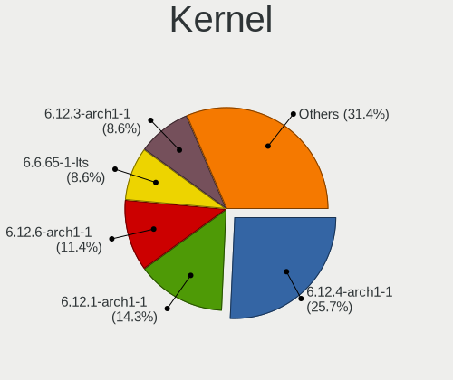
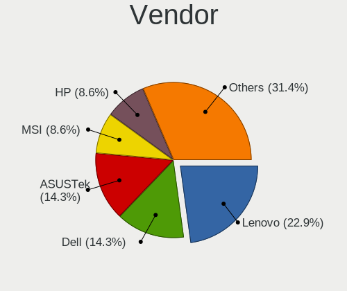
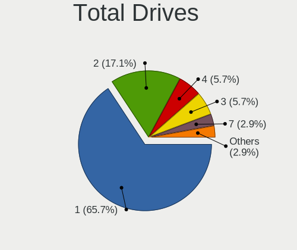
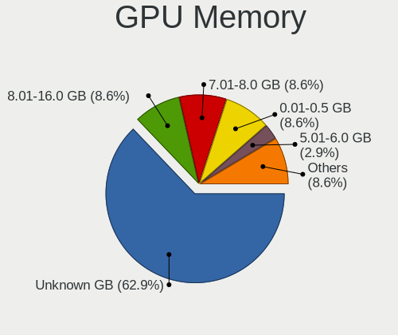
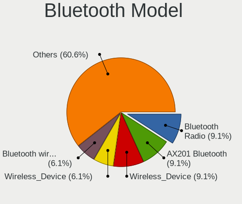
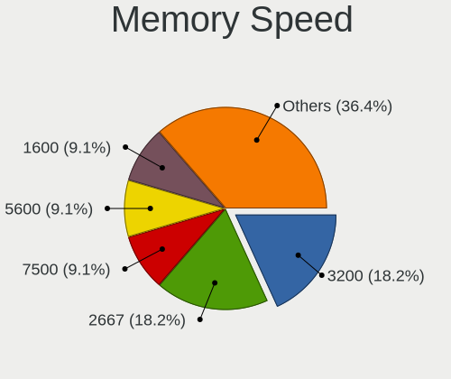
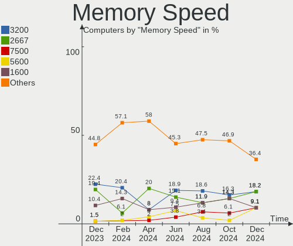

EndeavourOS Hardware Trends
---------------------------

A project to identify most popular hardware characteristics and track their change
over time based on data collected by EndeavourOS users at https://Linux-Hardware.org.

Anyone can contribute to this report by the [hw-probe](https://github.com/linuxhw/hw-probe) tool:

    sudo -E hw-probe -all -upload

This is a report for all computer types. See also reports for [desktops](/Dist/EndeavourOS/Desktop/README.md) and [notebooks](/Dist/EndeavourOS/Notebook/README.md).

Full-feature report is available here: https://linux-hardware.org/?view=trends

Period: Jan, 2022.

Contents
--------

* [ System ](#system)
  - [ OS                       ](#os)
  - [ OS Family                ](#os-family)
  - [ Kernel                   ](#kernel)
  - [ Kernel Family            ](#kernel-family)
  - [ Kernel Major Ver.        ](#kernel-major-ver)
  - [ Arch                     ](#arch)
  - [ DE                       ](#de)
  - [ Display Server           ](#display-server)
  - [ Display Manager          ](#display-manager)
  - [ OS Lang                  ](#os-lang)
  - [ Boot Mode                ](#boot-mode)
  - [ Filesystem               ](#filesystem)
  - [ Part. scheme             ](#part-scheme)
  - [ Dual Boot with Linux/BSD ](#dual-boot-with-linuxbsd)
  - [ Dual Boot (Win)          ](#dual-boot-win)

* [ Board ](#board)
  - [ Vendor                   ](#vendor)
  - [ Model                    ](#model)
  - [ Model Family             ](#model-family)
  - [ MFG Year                 ](#mfg-year)
  - [ Form Factor              ](#form-factor)
  - [ Secure Boot              ](#secure-boot)
  - [ Coreboot                 ](#coreboot)
  - [ RAM Size                 ](#ram-size)
  - [ RAM Used                 ](#ram-used)
  - [ Total Drives             ](#total-drives)
  - [ Has CD-ROM               ](#has-cd-rom)
  - [ Has Ethernet             ](#has-ethernet)
  - [ Has WiFi                 ](#has-wifi)
  - [ Has Bluetooth            ](#has-bluetooth)

* [ Location ](#location)
  - [ Country                  ](#country)
  - [ City                     ](#city)

* [ Drives ](#drives)
  - [ Drive Vendor             ](#drive-vendor)
  - [ Drive Model              ](#drive-model)
  - [ HDD Vendor               ](#hdd-vendor)
  - [ SSD Vendor               ](#ssd-vendor)
  - [ Drive Kind               ](#drive-kind)
  - [ Drive Connector          ](#drive-connector)
  - [ Drive Size               ](#drive-size)
  - [ Space Total              ](#space-total)
  - [ Space Used               ](#space-used)
  - [ Malfunc. Drives          ](#malfunc-drives)
  - [ Malfunc. Drive Vendor    ](#malfunc-drive-vendor)
  - [ Malfunc. HDD Vendor      ](#malfunc-hdd-vendor)
  - [ Malfunc. Drive Kind      ](#malfunc-drive-kind)
  - [ Failed Drives            ](#failed-drives)
  - [ Failed Drive Vendor      ](#failed-drive-vendor)
  - [ Drive Status             ](#drive-status)

* [ Storage controller ](#storage-controller)
  - [ Storage Vendor           ](#storage-vendor)
  - [ Storage Model            ](#storage-model)
  - [ Storage Kind             ](#storage-kind)

* [ Processor ](#processor)
  - [ CPU Vendor               ](#cpu-vendor)
  - [ CPU Model                ](#cpu-model)
  - [ CPU Model Family         ](#cpu-model-family)
  - [ CPU Cores                ](#cpu-cores)
  - [ CPU Sockets              ](#cpu-sockets)
  - [ CPU Threads              ](#cpu-threads)
  - [ CPU Op-Modes             ](#cpu-op-modes)
  - [ CPU Microcode            ](#cpu-microcode)
  - [ CPU Microarch            ](#cpu-microarch)

* [ Graphics ](#graphics)
  - [ GPU Vendor               ](#gpu-vendor)
  - [ GPU Model                ](#gpu-model)
  - [ GPU Combo                ](#gpu-combo)
  - [ GPU Driver               ](#gpu-driver)
  - [ GPU Memory               ](#gpu-memory)

* [ Monitor ](#monitor)
  - [ Monitor Vendor           ](#monitor-vendor)
  - [ Monitor Model            ](#monitor-model)
  - [ Monitor Resolution       ](#monitor-resolution)
  - [ Monitor Diagonal         ](#monitor-diagonal)
  - [ Monitor Width            ](#monitor-width)
  - [ Aspect Ratio             ](#aspect-ratio)
  - [ Monitor Area             ](#monitor-area)
  - [ Pixel Density            ](#pixel-density)
  - [ Multiple Monitors        ](#multiple-monitors)

* [ Network ](#network)
  - [ Net Controller Vendor    ](#net-controller-vendor)
  - [ Net Controller Model     ](#net-controller-model)
  - [ Wireless Vendor          ](#wireless-vendor)
  - [ Wireless Model           ](#wireless-model)
  - [ Ethernet Vendor          ](#ethernet-vendor)
  - [ Ethernet Model           ](#ethernet-model)
  - [ Net Controller Kind      ](#net-controller-kind)
  - [ Used Controller          ](#used-controller)
  - [ NICs                     ](#nics)
  - [ IPv6                     ](#ipv6)

* [ Bluetooth ](#bluetooth)
  - [ Bluetooth Vendor         ](#bluetooth-vendor)
  - [ Bluetooth Model          ](#bluetooth-model)

* [ Sound ](#sound)
  - [ Sound Vendor             ](#sound-vendor)
  - [ Sound Model              ](#sound-model)

* [ Memory ](#memory)
  - [ Memory Vendor            ](#memory-vendor)
  - [ Memory Model             ](#memory-model)
  - [ Memory Kind              ](#memory-kind)
  - [ Memory Form Factor       ](#memory-form-factor)
  - [ Memory Size              ](#memory-size)
  - [ Memory Speed             ](#memory-speed)

* [ Printers & scanners ](#printers--scanners)
  - [ Printer Vendor           ](#printer-vendor)
  - [ Printer Model            ](#printer-model)
  - [ Scanner Vendor           ](#scanner-vendor)
  - [ Scanner Model            ](#scanner-model)

* [ Camera ](#camera)
  - [ Camera Vendor            ](#camera-vendor)
  - [ Camera Model             ](#camera-model)

* [ Security ](#security)
  - [ Fingerprint Vendor       ](#fingerprint-vendor)
  - [ Fingerprint Model        ](#fingerprint-model)
  - [ Chipcard Vendor          ](#chipcard-vendor)
  - [ Chipcard Model           ](#chipcard-model)

* [ Unsupported ](#unsupported)
  - [ Unsupported Devices      ](#unsupported-devices)
  - [ Unsupported Device Types ](#unsupported-device-types)

System
------

OS
--

Installed operating systems

| Name                | Computers | Percent |
|---------------------|-----------|---------|
| EndeavourOS Rolling | 42        | 77.78%  |
| EndeavourOS         | 12        | 22.22%  |

OS Family
---------

OS without a version

| Name        | Computers | Percent |
|-------------|-----------|---------|
| EndeavourOS | 54        | 100%    |

Kernel
------

Version of the Linux kernel

| Version              | Computers | Percent |
|----------------------|-----------|---------|
| 5.15.12-arch1-1      | 19        | 35.19%  |
| 5.16.2-arch1-1       | 7         | 12.96%  |
| 5.16.1-arch1-1       | 3         | 5.56%   |
| 5.15.13-zen1-1-zen   | 3         | 5.56%   |
| 5.16.4-arch1-1       | 2         | 3.7%    |
| 5.16.3-arch1-1       | 2         | 3.7%    |
| 5.16.0-arch1-1       | 2         | 3.7%    |
| 5.15.13-arch1-1      | 2         | 3.7%    |
| 5.15.12-zen1-1-zen   | 2         | 3.7%    |
| 5.10.89-1-lts        | 2         | 3.7%    |
| 5.10.88-2-lts        | 2         | 3.7%    |
| 5.15.15-1-lts        | 1         | 1.85%   |
| 5.15.12-xanmod1-tt-1 | 1         | 1.85%   |
| 5.15.12-lqx1-2-lqx   | 1         | 1.85%   |
| 5.15.12-231-tkg-cfs  | 1         | 1.85%   |
| 5.15.11-arch2-1      | 1         | 1.85%   |
| 5.14.14-arch1-1      | 1         | 1.85%   |
| 5.14.11-arch1-1      | 1         | 1.85%   |
| 5.10.78-1-lts        | 1         | 1.85%   |

Kernel Family
-------------

Linux kernel without a distro release

| Version | Computers | Percent |
|---------|-----------|---------|
| 5.15.12 | 24        | 44.44%  |
| 5.16.2  | 7         | 12.96%  |
| 5.15.13 | 5         | 9.26%   |
| 5.16.1  | 3         | 5.56%   |
| 5.16.4  | 2         | 3.7%    |
| 5.16.3  | 2         | 3.7%    |
| 5.16.0  | 2         | 3.7%    |
| 5.10.89 | 2         | 3.7%    |
| 5.10.88 | 2         | 3.7%    |
| 5.15.15 | 1         | 1.85%   |
| 5.15.11 | 1         | 1.85%   |
| 5.14.14 | 1         | 1.85%   |
| 5.14.11 | 1         | 1.85%   |
| 5.10.78 | 1         | 1.85%   |

Kernel Major Ver.
-----------------

Linux kernel major version

| Version | Computers | Percent |
|---------|-----------|---------|
| 5.15    | 31        | 57.41%  |
| 5.16    | 16        | 29.63%  |
| 5.10    | 5         | 9.26%   |
| 5.14    | 2         | 3.7%    |

Arch
----

OS architecture (x86_64, i586, etc.)

| Name   | Computers | Percent |
|--------|-----------|---------|
| x86_64 | 54        | 100%    |

DE
--

Desktop Environment

| Name       | Computers | Percent |
|------------|-----------|---------|
| KDE5       | 26        | 48.15%  |
| GNOME      | 11        | 20.37%  |
| XFCE       | 6         | 11.11%  |
| i3         | 4         | 7.41%   |
| X-Cinnamon | 2         | 3.7%    |
| Budgie     | 2         | 3.7%    |
| sway       | 1         | 1.85%   |
| LXQt       | 1         | 1.85%   |
| Unknown    | 1         | 1.85%   |

Display Server
--------------

X11 or Wayland

| Name    | Computers | Percent |
|---------|-----------|---------|
| X11     | 39        | 72.22%  |
| Wayland | 12        | 22.22%  |
| Tty     | 2         | 3.7%    |
| Unknown | 1         | 1.85%   |

Display Manager
---------------

SDDM, LightDM, etc.

| Name    | Computers | Percent |
|---------|-----------|---------|
| LightDM | 21        | 38.89%  |
| SDDM    | 17        | 31.48%  |
| Unknown | 11        | 20.37%  |
| GDM     | 5         | 9.26%   |

OS Lang
-------

Language

| Lang  | Computers | Percent |
|-------|-----------|---------|
| en_US | 30        | 55.56%  |
| de_DE | 3         | 5.56%   |
| pl_PL | 2         | 3.7%    |
| en_IN | 2         | 3.7%    |
| en_GB | 2         | 3.7%    |
| en_CA | 2         | 3.7%    |
| en_AU | 2         | 3.7%    |
| ru_RU | 1         | 1.85%   |
| pt_BR | 1         | 1.85%   |
| nl_NL | 1         | 1.85%   |
| it_IT | 1         | 1.85%   |
| hu_HU | 1         | 1.85%   |
| fr_CA | 1         | 1.85%   |
| fi_FI | 1         | 1.85%   |
| es_AR | 1         | 1.85%   |
| eo    | 1         | 1.85%   |
| en_PH | 1         | 1.85%   |
| en_IL | 1         | 1.85%   |

Boot Mode
---------

EFI or BIOS

| Mode | Computers | Percent |
|------|-----------|---------|
| EFI  | 37        | 68.52%  |
| BIOS | 17        | 31.48%  |

Filesystem
----------

Type of filesystem

| Type  | Computers | Percent |
|-------|-----------|---------|
| Ext4  | 38        | 70.37%  |
| Btrfs | 16        | 29.63%  |

Part. scheme
------------

Scheme of partitioning

| Type    | Computers | Percent |
|---------|-----------|---------|
| GPT     | 39        | 72.22%  |
| Unknown | 13        | 24.07%  |
| MBR     | 2         | 3.7%    |

Dual Boot with Linux/BSD
------------------------

Hosting more than one Linux/BSD

| Dual boot | Computers | Percent |
|-----------|-----------|---------|
| No        | 46        | 85.19%  |
| Yes       | 8         | 14.81%  |

Dual Boot (Win)
---------------

Hosting Linux and Windows

| Dual boot | Computers | Percent |
|-----------|-----------|---------|
| No        | 32        | 59.26%  |
| Yes       | 22        | 40.74%  |

Board
-----

Vendor
------

Motherboard manufacturer

| Name                | Computers | Percent |
|---------------------|-----------|---------|
| ASUSTek Computer    | 16        | 29.63%  |
| Lenovo              | 10        | 18.52%  |
| MSI                 | 7         | 12.96%  |
| ASRock              | 5         | 9.26%   |
| Hewlett-Packard     | 3         | 5.56%   |
| Dell                | 3         | 5.56%   |
| Gigabyte Technology | 2         | 3.7%    |
| Acer                | 2         | 3.7%    |
| Timi                | 1         | 1.85%   |
| Schenker            | 1         | 1.85%   |
| Positivo            | 1         | 1.85%   |
| Microsoft           | 1         | 1.85%   |
| HUAWEI              | 1         | 1.85%   |
| BESSTAR Tech        | 1         | 1.85%   |

Model
-----

Motherboard model

| Name                                   | Computers | Percent |
|----------------------------------------|-----------|---------|
| ASUS All Series                        | 2         | 3.7%    |
| Timi A35S                              | 1         | 1.85%   |
| Schenker XMG FUSION 15 (XFU15L19)      | 1         | 1.85%   |
| Positivo POS-PIH81DI                   | 1         | 1.85%   |
| MSI MS-7C75                            | 1         | 1.85%   |
| MSI MS-7A31                            | 1         | 1.85%   |
| MSI MS-7994                            | 1         | 1.85%   |
| MSI MS-7978                            | 1         | 1.85%   |
| MSI MS-7850                            | 1         | 1.85%   |
| MSI MS-7798                            | 1         | 1.85%   |
| MSI GP66 Leopard 10UH                  | 1         | 1.85%   |
| Microsoft Surface Go                   | 1         | 1.85%   |
| Lenovo Yoga 720-13IKB 81C3             | 1         | 1.85%   |
| Lenovo Yoga 700-14ISK 80QD             | 1         | 1.85%   |
| Lenovo Yoga 6 13ALC6 82ND              | 1         | 1.85%   |
| Lenovo ThinkPad X240 20AMA2F8MS        | 1         | 1.85%   |
| Lenovo ThinkPad X1 Yoga 2nd 20JD005WGE | 1         | 1.85%   |
| Lenovo ThinkPad T560 20FJS4FV00        | 1         | 1.85%   |
| Lenovo ThinkPad E550 20DF0030US        | 1         | 1.85%   |
| Lenovo ThinkPad E14 Gen 3 20Y7001LCD   | 1         | 1.85%   |
| Lenovo IdeaPad S340-15IIL 81WL         | 1         | 1.85%   |
| Lenovo IdeaPad 330-15IKB 81DE          | 1         | 1.85%   |
| HUAWEI MACH-WX9                        | 1         | 1.85%   |
| HP Laptop 15-db0xxx                    | 1         | 1.85%   |
| HP EliteBook 2540p                     | 1         | 1.85%   |
| HP Desktop M01-F0xxx                   | 1         | 1.85%   |
| Gigabyte TRX40 AORUS MASTER            | 1         | 1.85%   |
| Gigabyte B550 AORUS ELITE V2           | 1         | 1.85%   |
| Dell Precision Tower 5810              | 1         | 1.85%   |
| Dell Inspiron 5520                     | 1         | 1.85%   |
| Dell Inspiron 3542                     | 1         | 1.85%   |
| BESSTAR Tech X400                      | 1         | 1.85%   |
| ASUS VivoBook_ASUSLaptop X515DA_M515DA | 1         | 1.85%   |
| ASUS TUF Gaming FX505DT_FX505DT        | 1         | 1.85%   |
| ASUS TUF GAMING B560M-PLUS WIFI        | 1         | 1.85%   |
| ASUS TUF GAMING B560-PLUS WIFI         | 1         | 1.85%   |
| ASUS ROG ZENITH EXTREME                | 1         | 1.85%   |
| ASUS ROG STRIX Z370-F GAMING           | 1         | 1.85%   |
| ASUS ROG STRIX X370-F GAMING           | 1         | 1.85%   |
| ASUS ROG CROSSHAIR VIII DARK HERO      | 1         | 1.85%   |
| ASUS P8Z77-V LX                        | 1         | 1.85%   |
| ASUS P8H77-V                           | 1         | 1.85%   |
| ASUS N43SL                             | 1         | 1.85%   |
| ASUS M5A99FX PRO R2.0                  | 1         | 1.85%   |
| ASUS K45VD                             | 1         | 1.85%   |
| ASUS G751JT                            | 1         | 1.85%   |
| ASRock FM2A88X Pro3+                   | 1         | 1.85%   |
| ASRock B550M Steel Legend              | 1         | 1.85%   |
| ASRock B450M Pro4                      | 1         | 1.85%   |
| ASRock B450 Gaming-ITX/ac              | 1         | 1.85%   |
| ASRock A320M-HD                        | 1         | 1.85%   |
| Acer Swift SF514-54T                   | 1         | 1.85%   |
| Acer Aspire A315-56                    | 1         | 1.85%   |

Model Family
------------

Motherboard model prefix

| Name                 | Computers | Percent |
|----------------------|-----------|---------|
| Lenovo ThinkPad      | 5         | 9.26%   |
| ASUS ROG             | 4         | 7.41%   |
| Lenovo Yoga          | 3         | 5.56%   |
| ASUS TUF             | 3         | 5.56%   |
| Lenovo IdeaPad       | 2         | 3.7%    |
| Dell Inspiron        | 2         | 3.7%    |
| ASUS All             | 2         | 3.7%    |
| Timi A35S            | 1         | 1.85%   |
| Schenker XMG         | 1         | 1.85%   |
| Positivo POS-PIH81DI | 1         | 1.85%   |
| MSI MS-7C75          | 1         | 1.85%   |
| MSI MS-7A31          | 1         | 1.85%   |
| MSI MS-7994          | 1         | 1.85%   |
| MSI MS-7978          | 1         | 1.85%   |
| MSI MS-7850          | 1         | 1.85%   |
| MSI MS-7798          | 1         | 1.85%   |
| MSI GP66             | 1         | 1.85%   |
| Microsoft Surface    | 1         | 1.85%   |
| HUAWEI MACH-WX9      | 1         | 1.85%   |
| HP Laptop            | 1         | 1.85%   |
| HP EliteBook         | 1         | 1.85%   |
| HP Desktop           | 1         | 1.85%   |
| Gigabyte TRX40       | 1         | 1.85%   |
| Gigabyte B550        | 1         | 1.85%   |
| Dell Precision       | 1         | 1.85%   |
| BESSTAR Tech X400    | 1         | 1.85%   |
| ASUS VivoBook        | 1         | 1.85%   |
| ASUS P8Z77-V         | 1         | 1.85%   |
| ASUS P8H77-V         | 1         | 1.85%   |
| ASUS N43SL           | 1         | 1.85%   |
| ASUS M5A99FX         | 1         | 1.85%   |
| ASUS K45VD           | 1         | 1.85%   |
| ASUS G751JT          | 1         | 1.85%   |
| ASRock FM2A88X       | 1         | 1.85%   |
| ASRock B550M         | 1         | 1.85%   |
| ASRock B450M         | 1         | 1.85%   |
| ASRock B450          | 1         | 1.85%   |
| ASRock A320M-HD      | 1         | 1.85%   |
| Acer Swift           | 1         | 1.85%   |
| Acer Aspire          | 1         | 1.85%   |

MFG Year
--------

Motherboard manufacture year

| Year | Computers | Percent |
|------|-----------|---------|
| 2021 | 10        | 18.52%  |
| 2018 | 9         | 16.67%  |
| 2020 | 8         | 14.81%  |
| 2014 | 7         | 12.96%  |
| 2012 | 6         | 11.11%  |
| 2017 | 5         | 9.26%   |
| 2019 | 3         | 5.56%   |
| 2015 | 2         | 3.7%    |
| 2016 | 1         | 1.85%   |
| 2013 | 1         | 1.85%   |
| 2011 | 1         | 1.85%   |
| 2010 | 1         | 1.85%   |

Form Factor
-----------

Physical design of the computer

| Name        | Computers | Percent |
|-------------|-----------|---------|
| Desktop     | 27        | 50%     |
| Notebook    | 22        | 40.74%  |
| Convertible | 3         | 5.56%   |
| Tablet      | 1         | 1.85%   |
| Server      | 1         | 1.85%   |

Secure Boot
-----------

Enabled or disabled

| State    | Computers | Percent |
|----------|-----------|---------|
| Disabled | 53        | 98.15%  |
| Enabled  | 1         | 1.85%   |

Coreboot
--------

Have coreboot on board

| Used | Computers | Percent |
|------|-----------|---------|
| No   | 54        | 100%    |

RAM Size
--------

Total RAM memory

| Size in GB  | Computers | Percent |
|-------------|-----------|---------|
| 4.01-8.0    | 14        | 25.93%  |
| 16.01-24.0  | 13        | 24.07%  |
| 32.01-64.0  | 10        | 18.52%  |
| 8.01-16.0   | 10        | 18.52%  |
| 64.01-256.0 | 3         | 5.56%   |
| 3.01-4.0    | 2         | 3.7%    |
| 24.01-32.0  | 2         | 3.7%    |

RAM Used
--------

Used RAM memory

| Used GB    | Computers | Percent |
|------------|-----------|---------|
| 2.01-3.0   | 15        | 27.78%  |
| 1.01-2.0   | 15        | 27.78%  |
| 4.01-8.0   | 12        | 22.22%  |
| 3.01-4.0   | 6         | 11.11%  |
| 8.01-16.0  | 4         | 7.41%   |
| 24.01-32.0 | 1         | 1.85%   |
| 0.51-1.0   | 1         | 1.85%   |

Total Drives
------------

Number of drives on board

| Drives | Computers | Percent |
|--------|-----------|---------|
| 1      | 22        | 40.74%  |
| 2      | 15        | 27.78%  |
| 3      | 6         | 11.11%  |
| 4      | 5         | 9.26%   |
| 5      | 4         | 7.41%   |
| 7      | 1         | 1.85%   |
| 6      | 1         | 1.85%   |

Has CD-ROM
----------

Has CD-ROM on board

| Presented | Computers | Percent |
|-----------|-----------|---------|
| No        | 43        | 79.63%  |
| Yes       | 11        | 20.37%  |

Has Ethernet
------------

Has Ethernet on board

| Presented | Computers | Percent |
|-----------|-----------|---------|
| Yes       | 45        | 83.33%  |
| No        | 9         | 16.67%  |

Has WiFi
--------

Has WiFi module

| Presented | Computers | Percent |
|-----------|-----------|---------|
| Yes       | 41        | 75.93%  |
| No        | 13        | 24.07%  |

Has Bluetooth
-------------

Has Bluetooth module

| Presented | Computers | Percent |
|-----------|-----------|---------|
| Yes       | 38        | 70.37%  |
| No        | 16        | 29.63%  |

Location
--------

Country
-------

Geographic location (country)

| Country     | Computers | Percent |
|-------------|-----------|---------|
| USA         | 14        | 25.93%  |
| Poland      | 4         | 7.41%   |
| Netherlands | 3         | 5.56%   |
| Germany     | 3         | 5.56%   |
| Russia      | 2         | 3.7%    |
| Italy       | 2         | 3.7%    |
| India       | 2         | 3.7%    |
| Finland     | 2         | 3.7%    |
| Canada      | 2         | 3.7%    |
| Brazil      | 2         | 3.7%    |
| Belgium     | 2         | 3.7%    |
| Australia   | 2         | 3.7%    |
| UK          | 1         | 1.85%   |
| Thailand    | 1         | 1.85%   |
| Switzerland | 1         | 1.85%   |
| Sweden      | 1         | 1.85%   |
| Philippines | 1         | 1.85%   |
| Mexico      | 1         | 1.85%   |
| Jordan      | 1         | 1.85%   |
| Israel      | 1         | 1.85%   |
| Indonesia   | 1         | 1.85%   |
| Hungary     | 1         | 1.85%   |
| Georgia     | 1         | 1.85%   |
| France      | 1         | 1.85%   |
| Bulgaria    | 1         | 1.85%   |
| Argentina   | 1         | 1.85%   |

City
----

Geographic location (city)

| City                     | Computers | Percent |
|--------------------------|-----------|---------|
| Zurich                   | 1         | 1.85%   |
| Whiteville               | 1         | 1.85%   |
| Westminster              | 1         | 1.85%   |
| Ulyanovsk                | 1         | 1.85%   |
| Turin                    | 1         | 1.85%   |
| Toronto                  | 1         | 1.85%   |
| Toms River               | 1         | 1.85%   |
| Tervakoski               | 1         | 1.85%   |
| Tel Aviv                 | 1         | 1.85%   |
| Tbilisi                  | 1         | 1.85%   |
| Sydney                   | 1         | 1.85%   |
| Strombeek-Bever          | 1         | 1.85%   |
| Spring                   | 1         | 1.85%   |
| Sofia                    | 1         | 1.85%   |
| Seattle                  | 1         | 1.85%   |
| Sao Joao de Meriti       | 1         | 1.85%   |
| Santa Maria Chimalhuacan | 1         | 1.85%   |
| Saint-Felix-de-Valois    | 1         | 1.85%   |
| Roden                    | 1         | 1.85%   |
| Reggiolo                 | 1         | 1.85%   |
| Ramos Mejia              | 1         | 1.85%   |
| Praia Grande             | 1         | 1.85%   |
| Poznan                   | 1         | 1.85%   |
| Potsdam                  | 1         | 1.85%   |
| Pasadena                 | 1         | 1.85%   |
| Paris                    | 1         | 1.85%   |
| New York                 | 1         | 1.85%   |
| New Haven                | 1         | 1.85%   |
| Nakhon Pathom            | 1         | 1.85%   |
| Moscow                   | 1         | 1.85%   |
| Miami                    | 1         | 1.85%   |
| Melbourne                | 1         | 1.85%   |
| Lodz                     | 1         | 1.85%   |
| Littleton                | 1         | 1.85%   |
| Krakow                   | 1         | 1.85%   |
| Karlstad                 | 1         | 1.85%   |
| Jelenia G??ra            | 1         | 1.85%   |
| Jacksonville             | 1         | 1.85%   |
| Indore                   | 1         | 1.85%   |
| Helsinki                 | 1         | 1.85%   |
| Ghent                    | 1         | 1.85%   |
| Georgetown               | 1         | 1.85%   |
| Eger                     | 1         | 1.85%   |
| Coimbatore               | 1         | 1.85%   |
| Cloppenburg              | 1         | 1.85%   |
| Browning                 | 1         | 1.85%   |
| Brentwood                | 1         | 1.85%   |
| Berlin                   | 1         | 1.85%   |
| Bandung                  | 1         | 1.85%   |
| Angeles City             | 1         | 1.85%   |
| Amsterdam                | 1         | 1.85%   |
| Amstelveen               | 1         | 1.85%   |
| Amman                    | 1         | 1.85%   |
| Akron                    | 1         | 1.85%   |

Drives
------

Drive Vendor
------------

Hard drive vendors

| Vendor              | Computers | Drives | Percent |
|---------------------|-----------|--------|---------|
| Samsung Electronics | 21        | 37     | 21.43%  |
| Seagate             | 15        | 18     | 15.31%  |
| WDC                 | 12        | 13     | 12.24%  |
| Kingston            | 9         | 11     | 9.18%   |
| Toshiba             | 7         | 7      | 7.14%   |
| SanDisk             | 6         | 6      | 6.12%   |
| Crucial             | 3         | 5      | 3.06%   |
| SK Hynix            | 2         | 2      | 2.04%   |
| Phison              | 2         | 2      | 2.04%   |
| Micron Technology   | 2         | 2      | 2.04%   |
| Intel               | 2         | 2      | 2.04%   |
| Hitachi             | 2         | 2      | 2.04%   |
| Unknown             | 1         | 1      | 1.02%   |
| Transcend           | 1         | 1      | 1.02%   |
| StoreJet            | 1         | 1      | 1.02%   |
| SPCC                | 1         | 1      | 1.02%   |
| PNY                 | 1         | 1      | 1.02%   |
| Phison Electronics  | 1         | 1      | 1.02%   |
| LITEONIT            | 1         | 1      | 1.02%   |
| KIOXIA              | 1         | 1      | 1.02%   |
| Kingmax             | 1         | 2      | 1.02%   |
| Intenso             | 1         | 1      | 1.02%   |
| HUAWEI              | 1         | 1      | 1.02%   |
| HGST                | 1         | 1      | 1.02%   |
| GOODRAM             | 1         | 1      | 1.02%   |
| China               | 1         | 1      | 1.02%   |
| ASMedia             | 1         | 1      | 1.02%   |

Drive Model
-----------

Hard drive models

| Model                                       | Computers | Percent |
|---------------------------------------------|-----------|---------|
| Samsung SSD 850 EVO 250GB                   | 4         | 3.39%   |
| Samsung SSD 850 EVO 500GB                   | 3         | 2.54%   |
| Kingston SA400S37480G 480GB SSD             | 3         | 2.54%   |
| Seagate ST1000LM035-1RK172 1TB              | 2         | 1.69%   |
| Samsung SSD 970 EVO Plus 1TB                | 2         | 1.69%   |
| Samsung SSD 860 EVO 500GB                   | 2         | 1.69%   |
| Samsung NVMe SSD Drive 512GB                | 2         | 1.69%   |
| WDC WDS500G1R0A-68A4W0 500GB SSD            | 1         | 0.85%   |
| WDC WDS250G2B0A-00SM50 250GB SSD            | 1         | 0.85%   |
| WDC WDS100T3XHC-00SJG0 1TB                  | 1         | 0.85%   |
| WDC WDS100T3X0C-00SJG0 1TB                  | 1         | 0.85%   |
| WDC WDBA3V0010BNC-WRSN 1TB                  | 1         | 0.85%   |
| WDC WD40EDAZ-11SLVB0 4TB                    | 1         | 0.85%   |
| WDC WD20EZRZ-00Z5HB0 2TB                    | 1         | 0.85%   |
| WDC WD10SPZX-60Z10T0 1TB                    | 1         | 0.85%   |
| WDC WD10EZRX-00A8LB0 1TB                    | 1         | 0.85%   |
| WDC WD10EZEX-00BN5A0 1TB                    | 1         | 0.85%   |
| WDC WD10EALX-009BA0 1TB                     | 1         | 0.85%   |
| WDC WD10EACS-00D6B1 1TB                     | 1         | 0.85%   |
| WDC PC SN530 SDBPMPZ-256G-1101 256GB        | 1         | 0.85%   |
| Unknown SD/MMC/MS PRO 128GB                 | 1         | 0.85%   |
| Transcend TS240GMTS420S 240GB SSD           | 1         | 0.85%   |
| Toshiba MQ04ABF100 1TB                      | 1         | 0.85%   |
| Toshiba KXG50ZNV512G 512GB                  | 1         | 0.85%   |
| Toshiba KBG30ZPZ128G 128GB                  | 1         | 0.85%   |
| Toshiba HDWE140 4TB                         | 1         | 0.85%   |
| Toshiba HDWD130 3TB                         | 1         | 0.85%   |
| Toshiba DT01ACA100 1TB                      | 1         | 0.85%   |
| Toshiba A100 120GB SSD                      | 1         | 0.85%   |
| StoreJet Disk 4TB                           | 1         | 0.85%   |
| SPCC M.2 PCIe SSD 1TB                       | 1         | 0.85%   |
| SK Hynix SKHynix_HFM512GD3HX015N 512GB      | 1         | 0.85%   |
| SK Hynix HFM256GDJTNG-8310A 256GB           | 1         | 0.85%   |
| Seagate ST9500420AS 500GB                   | 1         | 0.85%   |
| Seagate ST9500325AS 500GB                   | 1         | 0.85%   |
| Seagate ST9160821AS 160GB                   | 1         | 0.85%   |
| Seagate ST8000DM0004-1ZC11G 8TB             | 1         | 0.85%   |
| Seagate ST500LX012-SSHD-8GB                 | 1         | 0.85%   |
| Seagate ST500LT012-1DG142 500GB             | 1         | 0.85%   |
| Seagate ST3500312CS 500GB                   | 1         | 0.85%   |
| Seagate ST2000DM001-1ER164 2TB              | 1         | 0.85%   |
| Seagate ST1000VM002-1CT162 1TB              | 1         | 0.85%   |
| Seagate ST1000LM024 HN-M101MBB 1TB          | 1         | 0.85%   |
| Seagate ST1000DX002-2DV162 1TB              | 1         | 0.85%   |
| Seagate ST1000DM003-1SB10C 1TB              | 1         | 0.85%   |
| Seagate ST1000DM003-1CH162 1TB              | 1         | 0.85%   |
| Seagate FireCuda 510 SSD ZP1000GM30001 1TB  | 1         | 0.85%   |
| Seagate Expansion Desk 8TB                  | 1         | 0.85%   |
| Seagate BarraCuda Q1 SSD ZA240CV10001 240GB | 1         | 0.85%   |
| SanDisk SSD PLUS 2000GB                     | 1         | 0.85%   |
| SanDisk SSD PLUS 120GB                      | 1         | 0.85%   |
| SanDisk SDSSDA480G 480GB                    | 1         | 0.85%   |
| SanDisk SD6SB1M128G1002 128GB SSD           | 1         | 0.85%   |
| Sandisk NVMe SSD Drive 1TB                  | 1         | 0.85%   |
| SanDisk Extreme SSD 500GB                   | 1         | 0.85%   |
| Samsung SSD PM841 2.5 7mm 256GB             | 1         | 0.85%   |
| Samsung SSD 980 PRO 500GB                   | 1         | 0.85%   |
| Samsung SSD 970 EVO Plus 500GB              | 1         | 0.85%   |
| Samsung SSD 970 EVO 500GB                   | 1         | 0.85%   |
| Samsung SSD 970 EVO 1TB                     | 1         | 0.85%   |

HDD Vendor
----------

Hard disk drive vendors

| Vendor              | Computers | Drives | Percent |
|---------------------|-----------|--------|---------|
| Seagate             | 14        | 16     | 43.75%  |
| WDC                 | 7         | 7      | 21.88%  |
| Toshiba             | 4         | 4      | 12.5%   |
| Hitachi             | 2         | 2      | 6.25%   |
| Unknown             | 1         | 1      | 3.13%   |
| StoreJet            | 1         | 1      | 3.13%   |
| Samsung Electronics | 1         | 1      | 3.13%   |
| HGST                | 1         | 1      | 3.13%   |
| ASMedia             | 1         | 1      | 3.13%   |

SSD Vendor
----------

Solid state drive vendors

| Vendor              | Computers | Drives | Percent |
|---------------------|-----------|--------|---------|
| Samsung Electronics | 13        | 22     | 33.33%  |
| SanDisk             | 5         | 5      | 12.82%  |
| Kingston            | 5         | 7      | 12.82%  |
| WDC                 | 2         | 2      | 5.13%   |
| Intel               | 2         | 2      | 5.13%   |
| Crucial             | 2         | 2      | 5.13%   |
| Transcend           | 1         | 1      | 2.56%   |
| Toshiba             | 1         | 1      | 2.56%   |
| Seagate             | 1         | 1      | 2.56%   |
| PNY                 | 1         | 1      | 2.56%   |
| Micron Technology   | 1         | 1      | 2.56%   |
| LITEONIT            | 1         | 1      | 2.56%   |
| Kingmax             | 1         | 2      | 2.56%   |
| Intenso             | 1         | 1      | 2.56%   |
| GOODRAM             | 1         | 1      | 2.56%   |
| China               | 1         | 1      | 2.56%   |

Drive Kind
----------

HDD or SSD

| Kind    | Computers | Drives | Percent |
|---------|-----------|--------|---------|
| NVMe    | 28        | 37     | 33.73%  |
| HDD     | 28        | 34     | 33.73%  |
| SSD     | 26        | 51     | 31.33%  |
| Unknown | 1         | 1      | 1.2%    |

Drive Connector
---------------

SATA, SAS, NVMe, etc.

| Type | Computers | Drives | Percent |
|------|-----------|--------|---------|
| SATA | 38        | 80     | 52.78%  |
| NVMe | 28        | 37     | 38.89%  |
| SAS  | 6         | 6      | 8.33%   |

Drive Size
----------

Size of hard drive

| Size in TB | Computers | Drives | Percent |
|------------|-----------|--------|---------|
| 0.01-0.5   | 26        | 50     | 44.07%  |
| 0.51-1.0   | 22        | 24     | 37.29%  |
| 1.01-2.0   | 5         | 5      | 8.47%   |
| 3.01-4.0   | 3         | 3      | 5.08%   |
| 4.01-10.0  | 2         | 2      | 3.39%   |
| 2.01-3.0   | 1         | 1      | 1.69%   |

Space Total
-----------

Amount of disk space available on the file system

| Size in GB     | Computers | Percent |
|----------------|-----------|---------|
| 1001-2000      | 13        | 24.07%  |
| 251-500        | 10        | 18.52%  |
| More than 3000 | 9         | 16.67%  |
| 501-1000       | 9         | 16.67%  |
| 101-250        | 5         | 9.26%   |
| Unknown        | 4         | 7.41%   |
| 51-100         | 2         | 3.7%    |
| 21-50          | 1         | 1.85%   |
| 2001-3000      | 1         | 1.85%   |

Space Used
----------

Amount of used disk space

| Used GB        | Computers | Percent |
|----------------|-----------|---------|
| 101-250        | 10        | 18.52%  |
| 1-20           | 10        | 18.52%  |
| 51-100         | 8         | 14.81%  |
| 251-500        | 5         | 9.26%   |
| 1001-2000      | 5         | 9.26%   |
| 501-1000       | 5         | 9.26%   |
| 21-50          | 4         | 7.41%   |
| Unknown        | 4         | 7.41%   |
| More than 3000 | 3         | 5.56%   |

Malfunc. Drives
---------------

Drive models with a malfunction

| Model                             | Computers | Drives | Percent |
|-----------------------------------|-----------|--------|---------|
| WDC WD10EACS-00D6B1 1TB           | 1         | 1      | 33.33%  |
| Transcend TS240GMTS420S 240GB SSD | 1         | 1      | 33.33%  |
| Seagate ST500LX012-SSHD-8GB       | 1         | 1      | 33.33%  |

Malfunc. Drive Vendor
---------------------

Vendors of faulty drives

| Vendor    | Computers | Drives | Percent |
|-----------|-----------|--------|---------|
| WDC       | 1         | 1      | 33.33%  |
| Transcend | 1         | 1      | 33.33%  |
| Seagate   | 1         | 1      | 33.33%  |

Malfunc. HDD Vendor
-------------------

Vendors of faulty HDD drives

| Vendor  | Computers | Drives | Percent |
|---------|-----------|--------|---------|
| WDC     | 1         | 1      | 50%     |
| Seagate | 1         | 1      | 50%     |

Malfunc. Drive Kind
-------------------

Kinds of faulty drives

| Kind | Computers | Drives | Percent |
|------|-----------|--------|---------|
| HDD  | 2         | 2      | 66.67%  |
| SSD  | 1         | 1      | 33.33%  |

Failed Drives
-------------

Failed drive models

Zero info for selected period =(

Failed Drive Vendor
-------------------

Failed drive vendors

Zero info for selected period =(

Drive Status
------------

Number of failed and malfunc. drives

| Status   | Computers | Drives | Percent |
|----------|-----------|--------|---------|
| Works    | 40        | 79     | 65.57%  |
| Detected | 18        | 41     | 29.51%  |
| Malfunc  | 3         | 3      | 4.92%   |

Storage controller
------------------

Storage Vendor
--------------

Storage controller vendors

| Vendor                       | Computers | Percent |
|------------------------------|-----------|---------|
| Intel                        | 28        | 35%     |
| AMD                          | 17        | 21.25%  |
| Samsung Electronics          | 11        | 13.75%  |
| Sandisk                      | 5         | 6.25%   |
| Kingston Technology Company  | 4         | 5%      |
| Phison Electronics           | 3         | 3.75%   |
| Toshiba America Info Systems | 2         | 2.5%    |
| SK Hynix                     | 2         | 2.5%    |
| Micron/Crucial Technology    | 2         | 2.5%    |
| ASMedia Technology           | 2         | 2.5%    |
| Silicon Motion               | 1         | 1.25%   |
| Seagate Technology           | 1         | 1.25%   |
| Micron Technology            | 1         | 1.25%   |
| KIOXIA                       | 1         | 1.25%   |

Storage Model
-------------

Storage controller models

| Model                                                                            | Computers | Percent |
|----------------------------------------------------------------------------------|-----------|---------|
| AMD FCH SATA Controller [AHCI mode]                                              | 14        | 15.22%  |
| Samsung NVMe SSD Controller SM981/PM981/PM983                                    | 7         | 7.61%   |
| Samsung NVMe SSD Controller SM961/PM961/SM963                                    | 3         | 3.26%   |
| Intel Sunrise Point-LP SATA Controller [AHCI mode]                               | 3         | 3.26%   |
| Intel 7 Series/C210 Series Chipset Family 6-port SATA Controller [AHCI mode]     | 3         | 3.26%   |
| AMD 400 Series Chipset SATA Controller                                           | 3         | 3.26%   |
| Phison E12 NVMe Controller                                                       | 2         | 2.17%   |
| Micron/Crucial P2 NVMe PCIe SSD                                                  | 2         | 2.17%   |
| Intel Q170/Q150/B150/H170/H110/Z170/CM236 Chipset SATA Controller [AHCI Mode]    | 2         | 2.17%   |
| Intel Ice Lake-LP SATA Controller [AHCI mode]                                    | 2         | 2.17%   |
| Intel 9 Series Chipset Family SATA Controller [AHCI Mode]                        | 2         | 2.17%   |
| Intel 8 Series/C220 Series Chipset Family 6-port SATA Controller 1 [AHCI mode]   | 2         | 2.17%   |
| Intel 8 Series SATA Controller 1 [AHCI mode]                                     | 2         | 2.17%   |
| Intel 7 Series Chipset Family 6-port SATA Controller [AHCI mode]                 | 2         | 2.17%   |
| Intel 500 Series Chipset Family SATA AHCI Controller                             | 2         | 2.17%   |
| ASMedia ASM1062 Serial ATA Controller                                            | 2         | 2.17%   |
| AMD X370 Series Chipset SATA Controller                                          | 2         | 2.17%   |
| AMD Starship/Matisse Chipset SATA Controller [AHCI mode]                         | 2         | 2.17%   |
| Toshiba America Info Systems Toshiba America Info Non-Volatile memory controller | 1         | 1.09%   |
| Toshiba America Info Systems BG3 NVMe SSD Controller                             | 1         | 1.09%   |
| SK Hynix Gold P31 SSD                                                            | 1         | 1.09%   |
| SK Hynix BC501 NVMe Solid State Drive                                            | 1         | 1.09%   |
| Silicon Motion SM2262/SM2262EN SSD Controller                                    | 1         | 1.09%   |
| Seagate FireCuda 510 SSD                                                         | 1         | 1.09%   |
| Sandisk WD Blue SN570 NVMe SSD                                                   | 1         | 1.09%   |
| Sandisk WD Blue SN550 NVMe SSD                                                   | 1         | 1.09%   |
| Sandisk WD Black SN750 / PC SN730 NVMe SSD                                       | 1         | 1.09%   |
| Sandisk WD Black 2018/SN750 / PC SN720 NVMe SSD                                  | 1         | 1.09%   |
| Sandisk Non-Volatile memory controller                                           | 1         | 1.09%   |
| Samsung NVMe SSD Controller SM951/PM951                                          | 1         | 1.09%   |
| Samsung NVMe SSD Controller PM9A1/PM9A3/980PRO                                   | 1         | 1.09%   |
| Phison E16 PCIe4 NVMe Controller                                                 | 1         | 1.09%   |
| Micron/Crucial P1 NVMe PCIe SSD                                                  | 1         | 1.09%   |
| Micron Non-Volatile memory controller                                            | 1         | 1.09%   |
| KIOXIA Non-Volatile memory controller                                            | 1         | 1.09%   |
| Kingston Company Company Non-Volatile memory controller                          | 1         | 1.09%   |
| Kingston Company OM3PDP3 NVMe SSD                                                | 1         | 1.09%   |
| Kingston Company KC2000 NVMe SSD                                                 | 1         | 1.09%   |
| Kingston Company A2000 NVMe SSD                                                  | 1         | 1.09%   |
| Intel Wildcat Point-LP SATA Controller [AHCI Mode]                               | 1         | 1.09%   |
| Intel SATA Controller [RAID mode]                                                | 1         | 1.09%   |
| Intel Comet Lake SATA AHCI Controller                                            | 1         | 1.09%   |
| Intel Cannon Lake Mobile PCH SATA AHCI Controller                                | 1         | 1.09%   |
| Intel C610/X99 series chipset sSATA Controller [AHCI mode]                       | 1         | 1.09%   |
| Intel C610/X99 series chipset 6-Port SATA Controller [AHCI mode]                 | 1         | 1.09%   |
| Intel 6 Series/C200 Series Chipset Family 6 port Mobile SATA AHCI Controller     | 1         | 1.09%   |
| Intel 5 Series/3400 Series Chipset 4 port SATA IDE Controller                    | 1         | 1.09%   |
| Intel 5 Series/3400 Series Chipset 2 port SATA IDE Controller                    | 1         | 1.09%   |
| Intel 200 Series PCH SATA controller [AHCI mode]                                 | 1         | 1.09%   |
| AMD X399 Series Chipset SATA Controller                                          | 1         | 1.09%   |
| AMD SB7x0/SB8x0/SB9x0 SATA Controller [AHCI mode]                                | 1         | 1.09%   |
| AMD FCH SATA Controller D                                                        | 1         | 1.09%   |
| AMD FCH IDE Controller                                                           | 1         | 1.09%   |

Storage Kind
------------

Kind of storage controller (IDE, SATA, NVMe, SAS, ...)

| Kind | Computers | Percent |
|------|-----------|---------|
| SATA | 43        | 58.11%  |
| NVMe | 28        | 37.84%  |
| IDE  | 2         | 2.7%    |
| RAID | 1         | 1.35%   |

Processor
---------

CPU Vendor
----------

Processor vendors

| Vendor | Computers | Percent |
|--------|-----------|---------|
| Intel  | 34        | 62.96%  |
| AMD    | 20        | 37.04%  |

CPU Model
---------

Processor models

| Model                                          | Computers | Percent |
|------------------------------------------------|-----------|---------|
| Intel Core i7-8550U CPU @ 1.80GHz              | 2         | 3.7%    |
| Intel Core i5-3570K CPU @ 3.40GHz              | 2         | 3.7%    |
| Intel Core i5-1035G1 CPU @ 1.00GHz             | 2         | 3.7%    |
| Intel Xeon CPU E5-2650 v3 @ 2.30GHz            | 1         | 1.85%   |
| Intel Pentium CPU G3258 @ 3.20GHz              | 1         | 1.85%   |
| Intel Pentium CPU 4415Y @ 1.60GHz              | 1         | 1.85%   |
| Intel Core i7-9750H CPU @ 2.60GHz              | 1         | 1.85%   |
| Intel Core i7-8700K CPU @ 3.70GHz              | 1         | 1.85%   |
| Intel Core i7-7500U CPU @ 2.70GHz              | 1         | 1.85%   |
| Intel Core i7-4790K CPU @ 4.00GHz              | 1         | 1.85%   |
| Intel Core i7-4770K CPU @ 3.50GHz              | 1         | 1.85%   |
| Intel Core i7-4720HQ CPU @ 2.60GHz             | 1         | 1.85%   |
| Intel Core i7-3610QM CPU @ 2.30GHz             | 1         | 1.85%   |
| Intel Core i7-10870H CPU @ 2.20GHz             | 1         | 1.85%   |
| Intel Core i5-6600K CPU @ 3.50GHz              | 1         | 1.85%   |
| Intel Core i5-6500 CPU @ 3.20GHz               | 1         | 1.85%   |
| Intel Core i5-6300U CPU @ 2.40GHz              | 1         | 1.85%   |
| Intel Core i5-6200U CPU @ 2.30GHz              | 1         | 1.85%   |
| Intel Core i5-5200U CPU @ 2.20GHz              | 1         | 1.85%   |
| Intel Core i5-4460 CPU @ 3.20GHz               | 1         | 1.85%   |
| Intel Core i5-4210U CPU @ 1.70GHz              | 1         | 1.85%   |
| Intel Core i5-4200U CPU @ 1.60GHz              | 1         | 1.85%   |
| Intel Core i5-3470 CPU @ 3.20GHz               | 1         | 1.85%   |
| Intel Core i5-3210M CPU @ 2.50GHz              | 1         | 1.85%   |
| Intel Core i5-2430M CPU @ 2.40GHz              | 1         | 1.85%   |
| Intel Core i5-10400 CPU @ 2.90GHz              | 1         | 1.85%   |
| Intel Core i5 CPU M 540 @ 2.53GHz              | 1         | 1.85%   |
| Intel Core i3-8130U CPU @ 2.20GHz              | 1         | 1.85%   |
| Intel Core i3-1005G1 CPU @ 1.20GHz             | 1         | 1.85%   |
| Intel 11th Gen Core i5-11600K @ 3.90GHz        | 1         | 1.85%   |
| Intel 11th Gen Core i5-11400 @ 2.60GHz         | 1         | 1.85%   |
| AMD Ryzen Threadripper 3970X 32-Core Processor | 1         | 1.85%   |
| AMD Ryzen Threadripper 1950X 16-Core Processor | 1         | 1.85%   |
| AMD Ryzen 9 5950X 16-Core Processor            | 1         | 1.85%   |
| AMD Ryzen 9 3900X 12-Core Processor            | 1         | 1.85%   |
| AMD Ryzen 7 PRO 4750G with Radeon Graphics     | 1         | 1.85%   |
| AMD Ryzen 7 5800X 8-Core Processor             | 1         | 1.85%   |
| AMD Ryzen 7 5700U with Radeon Graphics         | 1         | 1.85%   |
| AMD Ryzen 7 3700X 8-Core Processor             | 1         | 1.85%   |
| AMD Ryzen 7 2700 Eight-Core Processor          | 1         | 1.85%   |
| AMD Ryzen 7 1800X Eight-Core Processor         | 1         | 1.85%   |
| AMD Ryzen 5 5600H with Radeon Graphics         | 1         | 1.85%   |
| AMD Ryzen 5 5500U with Radeon Graphics         | 1         | 1.85%   |
| AMD Ryzen 5 3600X 6-Core Processor             | 1         | 1.85%   |
| AMD Ryzen 5 3550H with Radeon Vega Mobile Gfx  | 1         | 1.85%   |
| AMD Ryzen 5 3500U with Radeon Vega Mobile Gfx  | 1         | 1.85%   |
| AMD Ryzen 5 1600 Six-Core Processor            | 1         | 1.85%   |
| AMD Ryzen 3 3200G with Radeon Vega Graphics    | 1         | 1.85%   |
| AMD FX-8320 Eight-Core Processor               | 1         | 1.85%   |
| AMD Athlon X4 860K Quad Core Processor         | 1         | 1.85%   |
| AMD A9-9425 RADEON R5, 5 COMPUTE CORES 2C+3G   | 1         | 1.85%   |

CPU Model Family
----------------

Processor model prefix

| Model                  | Computers | Percent |
|------------------------|-----------|---------|
| Intel Core i5          | 17        | 31.48%  |
| Intel Core i7          | 10        | 18.52%  |
| AMD Ryzen 5            | 6         | 11.11%  |
| AMD Ryzen 7            | 5         | 9.26%   |
| Other                  | 3         | 5.56%   |
| Intel Pentium          | 2         | 3.7%    |
| Intel Core i3          | 2         | 3.7%    |
| AMD Ryzen Threadripper | 2         | 3.7%    |
| AMD Ryzen 9            | 2         | 3.7%    |
| Intel Xeon             | 1         | 1.85%   |
| AMD Ryzen 7 PRO        | 1         | 1.85%   |
| AMD Ryzen 3            | 1         | 1.85%   |
| AMD FX                 | 1         | 1.85%   |
| AMD Athlon X4          | 1         | 1.85%   |

CPU Cores
---------

Number of processor cores

| Number | Computers | Percent |
|--------|-----------|---------|
| 4      | 18        | 33.33%  |
| 2      | 15        | 27.78%  |
| 6      | 9         | 16.67%  |
| 8      | 7         | 12.96%  |
| 16     | 2         | 3.7%    |
| 32     | 1         | 1.85%   |
| 12     | 1         | 1.85%   |
| 10     | 1         | 1.85%   |

CPU Sockets
-----------

Number of sockets

| Number | Computers | Percent |
|--------|-----------|---------|
| 1      | 54        | 100%    |

CPU Threads
-----------

Threads per core (Hyper-Threading)

| Number | Computers | Percent |
|--------|-----------|---------|
| 2      | 45        | 83.33%  |
| 1      | 9         | 16.67%  |

CPU Op-Modes
------------

CPU Operation Modes (32-bit, 64-bit)

| Op mode        | Computers | Percent |
|----------------|-----------|---------|
| 32-bit, 64-bit | 54        | 100%    |

CPU Microcode
-------------

Microcode number

| Number     | Computers | Percent |
|------------|-----------|---------|
| Unknown    | 15        | 27.78%  |
| 0x306c3    | 3         | 5.56%   |
| 0x08701021 | 3         | 5.56%   |
| 0x906ea    | 2         | 3.7%    |
| 0x806ea    | 2         | 3.7%    |
| 0x806e9    | 2         | 3.7%    |
| 0x706e5    | 2         | 3.7%    |
| 0x506e3    | 2         | 3.7%    |
| 0x406e3    | 2         | 3.7%    |
| 0x08608103 | 2         | 3.7%    |
| 0x08108109 | 2         | 3.7%    |
| 0xa0671    | 1         | 1.85%   |
| 0xa0655    | 1         | 1.85%   |
| 0xa0652    | 1         | 1.85%   |
| 0x40651    | 1         | 1.85%   |
| 0x306f2    | 1         | 1.85%   |
| 0x306d4    | 1         | 1.85%   |
| 0x306a9    | 1         | 1.85%   |
| 0x206a7    | 1         | 1.85%   |
| 0x20652    | 1         | 1.85%   |
| 0x0a50000c | 1         | 1.85%   |
| 0x0a201016 | 1         | 1.85%   |
| 0x0a201009 | 1         | 1.85%   |
| 0x08600106 | 1         | 1.85%   |
| 0x08108102 | 1         | 1.85%   |
| 0x0800820d | 1         | 1.85%   |
| 0x08001138 | 1         | 1.85%   |
| 0x06006705 | 1         | 1.85%   |

CPU Microarch
-------------

Microarchitecture

| Name        | Computers | Percent |
|-------------|-----------|---------|
| Haswell     | 8         | 14.81%  |
| KabyLake    | 7         | 12.96%  |
| Zen 2       | 5         | 9.26%   |
| IvyBridge   | 5         | 9.26%   |
| Zen+        | 4         | 7.41%   |
| Skylake     | 4         | 7.41%   |
| IceLake     | 4         | 7.41%   |
| Zen 3       | 3         | 5.56%   |
| Zen         | 3         | 5.56%   |
| Unknown     | 3         | 5.56%   |
| CometLake   | 2         | 3.7%    |
| Westmere    | 1         | 1.85%   |
| Steamroller | 1         | 1.85%   |
| SandyBridge | 1         | 1.85%   |
| Piledriver  | 1         | 1.85%   |
| Excavator   | 1         | 1.85%   |
| Broadwell   | 1         | 1.85%   |

Graphics
--------

GPU Vendor
----------

Vendors of graphics cards

| Vendor | Computers | Percent |
|--------|-----------|---------|
| Intel  | 23        | 36.51%  |
| Nvidia | 21        | 33.33%  |
| AMD    | 19        | 30.16%  |

GPU Model
---------

Graphics card models

| Model                                                                       | Computers | Percent |
|-----------------------------------------------------------------------------|-----------|---------|
| Intel Xeon E3-1200 v3/4th Gen Core Processor Integrated Graphics Controller | 3         | 4.76%   |
| Intel UHD Graphics 620                                                      | 3         | 4.76%   |
| Intel Iris Plus Graphics G1 (Ice Lake)                                      | 3         | 4.76%   |
| AMD Picasso/Raven 2 [Radeon Vega Series / Radeon Vega Mobile Series]        | 3         | 4.76%   |
| AMD Ellesmere [Radeon RX 470/480/570/570X/580/580X/590]                     | 3         | 4.76%   |
| Nvidia GP104 [GeForce GTX 1070]                                             | 2         | 3.17%   |
| Nvidia GP102 [GeForce GTX 1080 Ti]                                          | 2         | 3.17%   |
| Nvidia GK208B [GeForce GT 710]                                              | 2         | 3.17%   |
| Nvidia GA104 [GeForce RTX 3060 Ti]                                          | 2         | 3.17%   |
| Intel Skylake GT2 [HD Graphics 520]                                         | 2         | 3.17%   |
| Intel Haswell-ULT Integrated Graphics Controller                            | 2         | 3.17%   |
| Intel 3rd Gen Core processor Graphics Controller                            | 2         | 3.17%   |
| AMD Navi 10 [Radeon RX 5600 OEM/5600 XT / 5700/5700 XT]                     | 2         | 3.17%   |
| AMD Lucienne                                                                | 2         | 3.17%   |
| AMD Hawaii PRO [Radeon R9 290/390]                                          | 2         | 3.17%   |
| Nvidia TU117M [GeForce GTX 1650 Mobile / Max-Q]                             | 1         | 1.59%   |
| Nvidia TU116M [GeForce GTX 1660 Ti Mobile]                                  | 1         | 1.59%   |
| Nvidia GP108M [GeForce MX250]                                               | 1         | 1.59%   |
| Nvidia GP108M [GeForce MX150]                                               | 1         | 1.59%   |
| Nvidia GP107 [GeForce GTX 1050 Ti]                                          | 1         | 1.59%   |
| Nvidia GP106 [GeForce GTX 1060 6GB]                                         | 1         | 1.59%   |
| Nvidia GP104 [GeForce GTX 1080]                                             | 1         | 1.59%   |
| Nvidia GM204M [GeForce GTX 970M]                                            | 1         | 1.59%   |
| Nvidia GK107 [GeForce GTX 650]                                              | 1         | 1.59%   |
| Nvidia GK104 [GeForce GTX 660 OEM]                                          | 1         | 1.59%   |
| Nvidia GF119M [GeForce 610M]                                                | 1         | 1.59%   |
| Nvidia GF108M [GeForce GT 540M]                                             | 1         | 1.59%   |
| Nvidia GA104M [GeForce RTX 3080 Mobile / Max-Q 8GB/16GB]                    | 1         | 1.59%   |
| Intel RocketLake-S GT1 [UHD Graphics 730]                                   | 1         | 1.59%   |
| Intel HD Graphics 620                                                       | 1         | 1.59%   |
| Intel HD Graphics 615                                                       | 1         | 1.59%   |
| Intel HD Graphics 5500                                                      | 1         | 1.59%   |
| Intel Core Processor Integrated Graphics Controller                         | 1         | 1.59%   |
| Intel CometLake-H GT2 [UHD Graphics]                                        | 1         | 1.59%   |
| Intel CoffeeLake-H GT2 [UHD Graphics 630]                                   | 1         | 1.59%   |
| Intel 2nd Generation Core Processor Family Integrated Graphics Controller   | 1         | 1.59%   |
| AMD Thames [Radeon HD 7500M/7600M Series]                                   | 1         | 1.59%   |
| AMD Stoney [Radeon R2/R3/R4/R5 Graphics]                                    | 1         | 1.59%   |
| AMD Renoir                                                                  | 1         | 1.59%   |
| AMD Navi 21 [Radeon RX 6800/6800 XT / 6900 XT]                              | 1         | 1.59%   |
| AMD Cezanne                                                                 | 1         | 1.59%   |
| AMD Cape Verde PRO [Radeon HD 7750/8740 / R7 250E]                          | 1         | 1.59%   |
| AMD Baffin [Radeon RX 550 640SP / RX 560/560X]                              | 1         | 1.59%   |

GPU Combo
---------

Combinations of graphics cards

| Name           | Computers | Percent |
|----------------|-----------|---------|
| 1 x AMD        | 17        | 31.48%  |
| 1 x Intel      | 15        | 27.78%  |
| 1 x Nvidia     | 13        | 24.07%  |
| Intel + Nvidia | 6         | 11.11%  |
| 2 x Nvidia     | 1         | 1.85%   |
| Intel + AMD    | 1         | 1.85%   |
| AMD + Nvidia   | 1         | 1.85%   |

GPU Driver
----------

Free vs proprietary

| Driver      | Computers | Percent |
|-------------|-----------|---------|
| Free        | 36        | 66.67%  |
| Proprietary | 18        | 33.33%  |

GPU Memory
----------

Total video memory

| Size in GB | Computers | Percent |
|------------|-----------|---------|
| Unknown    | 28        | 51.85%  |
| 7.01-8.0   | 6         | 11.11%  |
| 1.01-2.0   | 6         | 11.11%  |
| 3.01-4.0   | 3         | 5.56%   |
| 8.01-16.0  | 3         | 5.56%   |
| 0.01-0.5   | 3         | 5.56%   |
| 5.01-6.0   | 2         | 3.7%    |
| 0.51-1.0   | 2         | 3.7%    |
| 2.01-3.0   | 1         | 1.85%   |

Monitor
-------

Monitor Vendor
--------------

Monitor vendors

| Vendor               | Computers | Percent |
|----------------------|-----------|---------|
| Samsung Electronics  | 5         | 7.25%   |
| LG Display           | 5         | 7.25%   |
| Goldstar             | 5         | 7.25%   |
| Chimei Innolux       | 5         | 7.25%   |
| AOC                  | 5         | 7.25%   |
| BenQ                 | 4         | 5.8%    |
| AU Optronics         | 4         | 5.8%    |
| Ancor Communications | 4         | 5.8%    |
| ViewSonic            | 3         | 4.35%   |
| Dell                 | 3         | 4.35%   |
| BOE                  | 3         | 4.35%   |
| Vizio                | 2         | 2.9%    |
| Sharp                | 2         | 2.9%    |
| PANDA                | 2         | 2.9%    |
| Hewlett-Packard      | 2         | 2.9%    |
| Acer                 | 2         | 2.9%    |
| Sony                 | 1         | 1.45%   |
| Panasonic            | 1         | 1.45%   |
| Orion                | 1         | 1.45%   |
| Lenovo               | 1         | 1.45%   |
| JDI                  | 1         | 1.45%   |
| InnoLux Display      | 1         | 1.45%   |
| InfoVision           | 1         | 1.45%   |
| Iiyama               | 1         | 1.45%   |
| Grundig              | 1         | 1.45%   |
| Fluid                | 1         | 1.45%   |
| DENON                | 1         | 1.45%   |
| Belinea              | 1         | 1.45%   |
| ASUSTek Computer     | 1         | 1.45%   |

Monitor Model
-------------

Monitor models

| Model                                                                 | Computers | Percent |
|-----------------------------------------------------------------------|-----------|---------|
| AU Optronics LCD Monitor AUO21ED 1920x1080 344x193mm 15.5-inch        | 2         | 2.74%   |
| Vizio V505-G9 VIZ1033 3840x2160 1096x616mm 49.5-inch                  | 1         | 1.37%   |
| Vizio E60-E3 VIZ1018 3840x2160 1330x748mm 60.1-inch                   | 1         | 1.37%   |
| ViewSonic VX3211-2K VSCF634 2560x1440 698x392mm 31.5-inch             | 1         | 1.37%   |
| ViewSonic VX2450 SERIES VSCE226 1920x1080 525x297mm 23.7-inch         | 1         | 1.37%   |
| ViewSonic VX2250 SERIES VSCCB25 1920x1080 477x268mm 21.5-inch         | 1         | 1.37%   |
| Sony TV *00 SNYF503 1920x1080 1218x685mm 55.0-inch                    | 1         | 1.37%   |
| Sharp LQ156M1JW03 SHP14C5 1920x1080 344x194mm 15.5-inch               | 1         | 1.37%   |
| Sharp LQ100P1JX51 SHP14A6 1800x1200 211x141mm 10.0-inch               | 1         | 1.37%   |
| Samsung Electronics S24R65x SAM1023 1920x1080 530x300mm 24.0-inch     | 1         | 1.37%   |
| Samsung Electronics S24F350 SAM0D20 1920x1080 521x293mm 23.5-inch     | 1         | 1.37%   |
| Samsung Electronics S22C300 SAM0A20 1920x1080 477x268mm 21.5-inch     | 1         | 1.37%   |
| Samsung Electronics S22C300 SAM0A1E 1920x1080 477x268mm 21.5-inch     | 1         | 1.37%   |
| Samsung Electronics LCD Monitor SDC4150 3456x2160 336x210mm 15.6-inch | 1         | 1.37%   |
| PANDA LCD Monitor NCP0063 1920x1080 344x194mm 15.5-inch               | 1         | 1.37%   |
| PANDA LCD Monitor NCP0036 1920x1080 340x190mm 15.3-inch               | 1         | 1.37%   |
| Panasonic LCD Monitor TV                                              | 1         | 1.37%   |
| Orion ORION ORN1208 1360x768                                          | 1         | 1.37%   |
| LG Display LCD Monitor LGD046C 1920x1080 382x215mm 17.3-inch          | 1         | 1.37%   |
| LG Display LCD Monitor LGD0437 1920x1080 276x156mm 12.5-inch          | 1         | 1.37%   |
| LG Display LCD Monitor LGD033A 1366x768 344x194mm 15.5-inch           | 1         | 1.37%   |
| LG Display LCD Monitor LGD02F8 1366x768 309x174mm 14.0-inch           | 1         | 1.37%   |
| LG Display LCD Monitor LGD024F 1280x800 260x160mm 12.0-inch           | 1         | 1.37%   |
| Lenovo LCD Monitor LEN4140 2560x1440 310x175mm 14.0-inch              | 1         | 1.37%   |
| JDI LCD Monitor JDI422A 3000x2000 293x196mm 13.9-inch                 | 1         | 1.37%   |
| InnoLux Display LCD Monitor CMI001B 1366x768 309x174mm 14.0-inch      | 1         | 1.37%   |
| InfoVision LCD Monitor IVO8544 1920x1080 294x165mm 13.3-inch          | 1         | 1.37%   |
| Iiyama PL2792Q IVM6637 2560x1440 597x336mm 27.0-inch                  | 1         | 1.37%   |
| Hewlett-Packard L2445w HWP280E 1920x1200 518x324mm 24.1-inch          | 1         | 1.37%   |
| Hewlett-Packard 27ea HPN3395 1920x1080 527x296mm 23.8-inch            | 1         | 1.37%   |
| Grundig UHD GRU4448 3840x2160 1210x680mm 54.6-inch                    | 1         | 1.37%   |
| Goldstar W2486 GSM5729 1920x1080 531x299mm 24.0-inch                  | 1         | 1.37%   |
| Goldstar ULTRAWIDE GSM59F1 2560x1080 677x290mm 29.0-inch              | 1         | 1.37%   |
| Goldstar HDR 4K GSM7707 3840x2160 600x340mm 27.2-inch                 | 1         | 1.37%   |
| Goldstar HDR 4K GSM7706 3840x2160 600x340mm 27.2-inch                 | 1         | 1.37%   |
| Goldstar 38GN950 GSM7754 3840x1600 879x366mm 37.5-inch                | 1         | 1.37%   |
| Fluid 8039786B FLU0F46 1360x768 760x450mm 34.8-inch                   | 1         | 1.37%   |
| DENON AVAMP DON0052 1920x1080 521x293mm 23.5-inch                     | 1         | 1.37%   |
| Dell P2419H DELD0D9 1920x1080 527x296mm 23.8-inch                     | 1         | 1.37%   |
| Dell E2414H DEL4091 1920x1080 531x299mm 24.0-inch                     | 1         | 1.37%   |
| Dell D2721H DEL2013 1920x1080 598x336mm 27.0-inch                     | 1         | 1.37%   |
| Chimei Innolux LCD Monitor CMN15DC 1366x768 344x193mm 15.5-inch       | 1         | 1.37%   |
| Chimei Innolux LCD Monitor CMN15DB 1366x768 344x193mm 15.5-inch       | 1         | 1.37%   |
| Chimei Innolux LCD Monitor CMN15BF 1366x768 344x194mm 15.5-inch       | 1         | 1.37%   |
| Chimei Innolux LCD Monitor CMN14B6 1920x1080 308x173mm 13.9-inch      | 1         | 1.37%   |
| Chimei Innolux LCD Monitor CMN1408 1920x1080 309x173mm 13.9-inch      | 1         | 1.37%   |
| BOE LCD Monitor BOE084D 1920x1080 344x193mm 15.5-inch                 | 1         | 1.37%   |
| BOE LCD Monitor BOE06FA 1920x1080 294x165mm 13.3-inch                 | 1         | 1.37%   |
| BOE LCD Monitor BOE0630 1920x1080 344x194mm 15.5-inch                 | 1         | 1.37%   |
| BenQ XL2411Z BNQ7F32 1920x1080 531x298mm 24.0-inch                    | 1         | 1.37%   |
| BenQ XL2411Z BNQ7F30 1920x1080 531x298mm 24.0-inch                    | 1         | 1.37%   |
| BenQ PD3200U BNQ8025 3840x2160 708x399mm 32.0-inch                    | 1         | 1.37%   |
| BenQ GW2480 BNQ78E7 1920x1080 527x296mm 23.8-inch                     | 1         | 1.37%   |
| BenQ G2420HD BNQ7840 1920x1080 531x299mm 24.0-inch                    | 1         | 1.37%   |
| Belinea B_101725 MAX06B7 1280x1024 340x270mm 17.1-inch                | 1         | 1.37%   |
| AU Optronics LCD Monitor AUO41EC 1366x768 344x193mm 15.5-inch         | 1         | 1.37%   |
| AU Optronics LCD Monitor AUO253D 1920x1080 309x173mm 13.9-inch        | 1         | 1.37%   |
| ASUSTek Computer VG248 AUS24AC 1920x1080 530x300mm 24.0-inch          | 1         | 1.37%   |
| AOC U3277WB AOC3277 3840x2160 698x393mm 31.5-inch                     | 1         | 1.37%   |
| AOC 917W AOC1917 1440x900 410x256mm 19.0-inch                         | 1         | 1.37%   |

Monitor Resolution
------------------

Monitor screen resolution

| Resolution         | Computers | Percent |
|--------------------|-----------|---------|
| 1920x1080 (FHD)    | 33        | 49.25%  |
| 3840x2160 (4K)     | 7         | 10.45%  |
| 1366x768 (WXGA)    | 7         | 10.45%  |
| 2560x1440 (QHD)    | 5         | 7.46%   |
| 1920x1200 (WUXGA)  | 2         | 2.99%   |
| 3840x1600          | 1         | 1.49%   |
| 3840x1200          | 1         | 1.49%   |
| 3456x2160          | 1         | 1.49%   |
| 3000x2000          | 1         | 1.49%   |
| 2560x1080          | 1         | 1.49%   |
| 1920x540           | 1         | 1.49%   |
| 1800x1200          | 1         | 1.49%   |
| 1680x1050 (WSXGA+) | 1         | 1.49%   |
| 1440x900 (WXGA+)   | 1         | 1.49%   |
| 1360x768           | 1         | 1.49%   |
| 1280x800 (WXGA)    | 1         | 1.49%   |
| 1280x1024 (SXGA)   | 1         | 1.49%   |
| Unknown            | 1         | 1.49%   |

Monitor Diagonal
----------------

Diagonal size in inches

| Inches  | Computers | Percent |
|---------|-----------|---------|
| 24      | 16        | 22.54%  |
| 15      | 13        | 18.31%  |
| 27      | 6         | 8.45%   |
| 13      | 5         | 7.04%   |
| 21      | 4         | 5.63%   |
| 14      | 4         | 5.63%   |
| 34      | 2         | 2.82%   |
| 32      | 2         | 2.82%   |
| 23      | 2         | 2.82%   |
| 22      | 2         | 2.82%   |
| 19      | 2         | 2.82%   |
| 17      | 2         | 2.82%   |
| 12      | 2         | 2.82%   |
| Unknown | 2         | 2.82%   |
| 74      | 1         | 1.41%   |
| 69      | 1         | 1.41%   |
| 65      | 1         | 1.41%   |
| 54      | 1         | 1.41%   |
| 37      | 1         | 1.41%   |
| 31      | 1         | 1.41%   |
| 10      | 1         | 1.41%   |

Monitor Width
-------------

Physical width

| Width in mm | Computers | Percent |
|-------------|-----------|---------|
| 501-600     | 21        | 30.88%  |
| 301-350     | 20        | 29.41%  |
| 401-500     | 8         | 11.76%  |
| 201-300     | 6         | 8.82%   |
| 701-800     | 4         | 5.88%   |
| 1501-2000   | 2         | 2.94%   |
| 1001-1500   | 2         | 2.94%   |
| Unknown     | 2         | 2.94%   |
| 801-900     | 1         | 1.47%   |
| 601-700     | 1         | 1.47%   |
| 351-400     | 1         | 1.47%   |

Aspect Ratio
------------

Proportional relationship between the width and the height

| Ratio   | Computers | Percent |
|---------|-----------|---------|
| 16/9    | 43        | 72.88%  |
| 16/10   | 9         | 15.25%  |
| 3/2     | 2         | 3.39%   |
| 21/9    | 2         | 3.39%   |
| 5/4     | 1         | 1.69%   |
| 32/9    | 1         | 1.69%   |
| Unknown | 1         | 1.69%   |

Monitor Area
------------

Area in inch

| Area in inch | Computers | Percent |
|----------------|-----------|---------|
| 201-250        | 19        | 27.14%  |
| 101-110        | 13        | 18.57%  |
| 81-90          | 7         | 10%     |
| 301-350        | 6         | 8.57%   |
| 351-500        | 5         | 7.14%   |
| More than 1000 | 4         | 5.71%   |
| 251-300        | 4         | 5.71%   |
| 71-80          | 2         | 2.86%   |
| 61-70          | 2         | 2.86%   |
| 151-200        | 2         | 2.86%   |
| Unknown        | 2         | 2.86%   |
| 41-50          | 1         | 1.43%   |
| 141-150        | 1         | 1.43%   |
| 121-130        | 1         | 1.43%   |
| 501-1000       | 1         | 1.43%   |

Pixel Density
-------------

Pixels per inch

| Density       | Computers | Percent |
|---------------|-----------|---------|
| 51-100        | 25        | 38.46%  |
| 101-120       | 14        | 21.54%  |
| 121-160       | 13        | 20%     |
| 161-240       | 7         | 10.77%  |
| More than 240 | 2         | 3.08%   |
| 1-50          | 2         | 3.08%   |
| Unknown       | 2         | 3.08%   |

Multiple Monitors
-----------------

Total monitors connected

| Total | Computers | Percent |
|-------|-----------|---------|
| 1     | 37        | 68.52%  |
| 2     | 14        | 25.93%  |
| 3     | 3         | 5.56%   |

Network
-------

Net Controller Vendor
---------------------

Controller vendors

| Vendor                | Computers | Percent |
|-----------------------|-----------|---------|
| Intel                 | 31        | 40.26%  |
| Realtek Semiconductor | 28        | 36.36%  |
| Qualcomm Atheros      | 8         | 10.39%  |
| Aquantia              | 2         | 2.6%    |
| Xiaomi                | 1         | 1.3%    |
| Wilocity              | 1         | 1.3%    |
| TP-Link               | 1         | 1.3%    |
| Sierra Wireless       | 1         | 1.3%    |
| Microsoft             | 1         | 1.3%    |
| MEDIATEK              | 1         | 1.3%    |
| Huawei Technologies   | 1         | 1.3%    |
| Broadcom              | 1         | 1.3%    |

Net Controller Model
--------------------

Controller models

| Model                                                             | Computers | Percent |
|-------------------------------------------------------------------|-----------|---------|
| Realtek RTL8111/8168/8411 PCI Express Gigabit Ethernet Controller | 18        | 18.95%  |
| Realtek RTL8125 2.5GbE Controller                                 | 6         | 6.32%   |
| Intel Wi-Fi 6 AX200                                               | 6         | 6.32%   |
| Intel I211 Gigabit Network Connection                             | 6         | 6.32%   |
| Intel Wireless 8265 / 8275                                        | 4         | 4.21%   |
| Realtek RTL8821CE 802.11ac PCIe Wireless Network Adapter          | 3         | 3.16%   |
| Realtek RTL810xE PCI Express Fast Ethernet controller             | 2         | 2.11%   |
| Qualcomm Atheros QCA6174 802.11ac Wireless Network Adapter        | 2         | 2.11%   |
| Qualcomm Atheros AR9287 Wireless Network Adapter (PCI-Express)    | 2         | 2.11%   |
| Intel Wireless 8260                                               | 2         | 2.11%   |
| Intel Wireless 7260                                               | 2         | 2.11%   |
| Intel Tiger Lake PCH CNVi WiFi                                    | 2         | 2.11%   |
| Intel Ice Lake-LP PCH CNVi WiFi                                   | 2         | 2.11%   |
| Intel Ethernet Connection (2) I219-V                              | 2         | 2.11%   |
| Intel Ethernet Connection (2) I218-V                              | 2         | 2.11%   |
| Xiaomi Mi/Redmi series (RNDIS)                                    | 1         | 1.05%   |
| Wilocity Wil6200 802.11ad Wireless Network Adapter                | 1         | 1.05%   |
| TP-Link TL-WN722N v2/v3 [Realtek RTL8188EUS]                      | 1         | 1.05%   |
| Sierra Wireless EM7455                                            | 1         | 1.05%   |
| Realtek RTL8852AE 802.11ax PCIe Wireless Network Adapter          | 1         | 1.05%   |
| Realtek RTL8812AE 802.11ac PCIe Wireless Network Adapter          | 1         | 1.05%   |
| Realtek RTL8723DE Wireless Network Adapter                        | 1         | 1.05%   |
| Realtek RTL8153 Gigabit Ethernet Adapter                          | 1         | 1.05%   |
| Realtek 802.11ac NIC                                              | 1         | 1.05%   |
| Qualcomm Atheros QCA9565 / AR9565 Wireless Network Adapter        | 1         | 1.05%   |
| Qualcomm Atheros QCA9377 802.11ac Wireless Network Adapter        | 1         | 1.05%   |
| Qualcomm Atheros Killer E2400 Gigabit Ethernet Controller         | 1         | 1.05%   |
| Qualcomm Atheros AR9285 Wireless Network Adapter (PCI-Express)    | 1         | 1.05%   |
| Qualcomm Atheros AR8161 Gigabit Ethernet                          | 1         | 1.05%   |
| Qualcomm Atheros AR8151 v2.0 Gigabit Ethernet                     | 1         | 1.05%   |
| Microsoft Xbox 360 Wireless Adapter                               | 1         | 1.05%   |
| MEDIATEK MT7921 802.11ax PCI Express Wireless Network Adapter     | 1         | 1.05%   |
| Intel Wireless 3160                                               | 1         | 1.05%   |
| Intel Ethernet Controller I225-V                                  | 1         | 1.05%   |
| Intel Ethernet Connection I219-LM                                 | 1         | 1.05%   |
| Intel Ethernet Connection I218-LM                                 | 1         | 1.05%   |
| Intel Ethernet Connection I217-LM                                 | 1         | 1.05%   |
| Intel Ethernet Connection (4) I219-V                              | 1         | 1.05%   |
| Intel Ethernet Connection (3) I218-V                              | 1         | 1.05%   |
| Intel Dual Band Wireless-AC 3168NGW [Stone Peak]                  | 1         | 1.05%   |
| Intel Dual Band Wireless-AC 3165 Plus Bluetooth                   | 1         | 1.05%   |
| Intel Comet Lake PCH CNVi WiFi                                    | 1         | 1.05%   |
| Intel Centrino Wireless-N 1000 [Condor Peak]                      | 1         | 1.05%   |
| Intel Centrino Advanced-N 6200                                    | 1         | 1.05%   |
| Intel 82577LM Gigabit Network Connection                          | 1         | 1.05%   |
| Huawei Modem/Networkcard                                          | 1         | 1.05%   |
| Broadcom BCM43142 802.11b/g/n                                     | 1         | 1.05%   |
| Aquantia AQC111 NBase-T/IEEE 802.3bz Ethernet Controller [AQtion] | 1         | 1.05%   |
| Aquantia AQC107 NBase-T/IEEE 802.3bz Ethernet Controller [AQtion] | 1         | 1.05%   |

Wireless Vendor
---------------

Wireless vendors

| Vendor                | Computers | Percent |
|-----------------------|-----------|---------|
| Intel                 | 24        | 54.55%  |
| Realtek Semiconductor | 7         | 15.91%  |
| Qualcomm Atheros      | 7         | 15.91%  |
| Wilocity              | 1         | 2.27%   |
| TP-Link               | 1         | 2.27%   |
| Sierra Wireless       | 1         | 2.27%   |
| Microsoft             | 1         | 2.27%   |
| MEDIATEK              | 1         | 2.27%   |
| Broadcom              | 1         | 2.27%   |

Wireless Model
--------------

Wireless models

| Model                                                          | Computers | Percent |
|----------------------------------------------------------------|-----------|---------|
| Intel Wi-Fi 6 AX200                                            | 6         | 13.64%  |
| Intel Wireless 8265 / 8275                                     | 4         | 9.09%   |
| Realtek RTL8821CE 802.11ac PCIe Wireless Network Adapter       | 3         | 6.82%   |
| Qualcomm Atheros QCA6174 802.11ac Wireless Network Adapter     | 2         | 4.55%   |
| Qualcomm Atheros AR9287 Wireless Network Adapter (PCI-Express) | 2         | 4.55%   |
| Intel Wireless 8260                                            | 2         | 4.55%   |
| Intel Wireless 7260                                            | 2         | 4.55%   |
| Intel Tiger Lake PCH CNVi WiFi                                 | 2         | 4.55%   |
| Intel Ice Lake-LP PCH CNVi WiFi                                | 2         | 4.55%   |
| Wilocity Wil6200 802.11ad Wireless Network Adapter             | 1         | 2.27%   |
| TP-Link TL-WN722N v2/v3 [Realtek RTL8188EUS]                   | 1         | 2.27%   |
| Sierra Wireless EM7455                                         | 1         | 2.27%   |
| Realtek RTL8852AE 802.11ax PCIe Wireless Network Adapter       | 1         | 2.27%   |
| Realtek RTL8812AE 802.11ac PCIe Wireless Network Adapter       | 1         | 2.27%   |
| Realtek RTL8723DE Wireless Network Adapter                     | 1         | 2.27%   |
| Realtek 802.11ac NIC                                           | 1         | 2.27%   |
| Qualcomm Atheros QCA9565 / AR9565 Wireless Network Adapter     | 1         | 2.27%   |
| Qualcomm Atheros QCA9377 802.11ac Wireless Network Adapter     | 1         | 2.27%   |
| Qualcomm Atheros AR9285 Wireless Network Adapter (PCI-Express) | 1         | 2.27%   |
| Microsoft Xbox 360 Wireless Adapter                            | 1         | 2.27%   |
| MEDIATEK MT7921 802.11ax PCI Express Wireless Network Adapter  | 1         | 2.27%   |
| Intel Wireless 3160                                            | 1         | 2.27%   |
| Intel Dual Band Wireless-AC 3168NGW [Stone Peak]               | 1         | 2.27%   |
| Intel Dual Band Wireless-AC 3165 Plus Bluetooth                | 1         | 2.27%   |
| Intel Comet Lake PCH CNVi WiFi                                 | 1         | 2.27%   |
| Intel Centrino Wireless-N 1000 [Condor Peak]                   | 1         | 2.27%   |
| Intel Centrino Advanced-N 6200                                 | 1         | 2.27%   |
| Broadcom BCM43142 802.11b/g/n                                  | 1         | 2.27%   |

Ethernet Vendor
---------------

Ethernet vendors

| Vendor                | Computers | Percent |
|-----------------------|-----------|---------|
| Realtek Semiconductor | 26        | 53.06%  |
| Intel                 | 17        | 34.69%  |
| Qualcomm Atheros      | 3         | 6.12%   |
| Aquantia              | 2         | 4.08%   |
| Xiaomi                | 1         | 2.04%   |

Ethernet Model
--------------

Ethernet models

| Model                                                             | Computers | Percent |
|-------------------------------------------------------------------|-----------|---------|
| Realtek RTL8111/8168/8411 PCI Express Gigabit Ethernet Controller | 18        | 36%     |
| Realtek RTL8125 2.5GbE Controller                                 | 6         | 12%     |
| Intel I211 Gigabit Network Connection                             | 6         | 12%     |
| Realtek RTL810xE PCI Express Fast Ethernet controller             | 2         | 4%      |
| Intel Ethernet Connection (2) I219-V                              | 2         | 4%      |
| Intel Ethernet Connection (2) I218-V                              | 2         | 4%      |
| Xiaomi Mi/Redmi series (RNDIS)                                    | 1         | 2%      |
| Realtek RTL8153 Gigabit Ethernet Adapter                          | 1         | 2%      |
| Qualcomm Atheros Killer E2400 Gigabit Ethernet Controller         | 1         | 2%      |
| Qualcomm Atheros AR8161 Gigabit Ethernet                          | 1         | 2%      |
| Qualcomm Atheros AR8151 v2.0 Gigabit Ethernet                     | 1         | 2%      |
| Intel Ethernet Controller I225-V                                  | 1         | 2%      |
| Intel Ethernet Connection I219-LM                                 | 1         | 2%      |
| Intel Ethernet Connection I218-LM                                 | 1         | 2%      |
| Intel Ethernet Connection I217-LM                                 | 1         | 2%      |
| Intel Ethernet Connection (4) I219-V                              | 1         | 2%      |
| Intel Ethernet Connection (3) I218-V                              | 1         | 2%      |
| Intel 82577LM Gigabit Network Connection                          | 1         | 2%      |
| Aquantia AQC111 NBase-T/IEEE 802.3bz Ethernet Controller [AQtion] | 1         | 2%      |
| Aquantia AQC107 NBase-T/IEEE 802.3bz Ethernet Controller [AQtion] | 1         | 2%      |

Net Controller Kind
-------------------

Ethernet, WiFi or modem

| Kind     | Computers | Percent |
|----------|-----------|---------|
| Ethernet | 45        | 51.72%  |
| WiFi     | 41        | 47.13%  |
| Modem    | 1         | 1.15%   |

Used Controller
---------------

Currently used network controller

| Kind     | Computers | Percent |
|----------|-----------|---------|
| WiFi     | 31        | 51.67%  |
| Ethernet | 29        | 48.33%  |

NICs
----

Total network controllers on board

| Total | Computers | Percent |
|-------|-----------|---------|
| 2     | 26        | 48.15%  |
| 1     | 24        | 44.44%  |
| 3     | 3         | 5.56%   |
| 4     | 1         | 1.85%   |

IPv6
----

IPv6 vs IPv4

| Used | Computers | Percent |
|------|-----------|---------|
| No   | 37        | 68.52%  |
| Yes  | 17        | 31.48%  |

Bluetooth
---------

Bluetooth Vendor
----------------

Controller vendors

| Vendor                          | Computers | Percent |
|---------------------------------|-----------|---------|
| Intel                           | 21        | 55.26%  |
| Realtek Semiconductor           | 5         | 13.16%  |
| Qualcomm Atheros Communications | 3         | 7.89%   |
| Broadcom                        | 3         | 7.89%   |
| Cambridge Silicon Radio         | 2         | 5.26%   |
| ASUSTek Computer                | 2         | 5.26%   |
| IMC Networks                    | 1         | 2.63%   |
| Foxconn / Hon Hai               | 1         | 2.63%   |

Bluetooth Model
---------------

Controller models

| Model                                               | Computers | Percent |
|-----------------------------------------------------|-----------|---------|
| Intel Bluetooth Device                              | 13        | 34.21%  |
| Intel Bluetooth wireless interface                  | 6         | 15.79%  |
| Realtek Bluetooth Radio                             | 3         | 7.89%   |
| Realtek  Bluetooth 4.2 Adapter                      | 2         | 5.26%   |
| Qualcomm Atheros  Bluetooth Device                  | 2         | 5.26%   |
| Cambridge Silicon Radio Bluetooth Dongle (HCI mode) | 2         | 5.26%   |
| Qualcomm Atheros AR9462 Bluetooth                   | 1         | 2.63%   |
| Intel Wireless-AC 3168 Bluetooth                    | 1         | 2.63%   |
| Intel Bluetooth 9460/9560 Jefferson Peak (JfP)      | 1         | 2.63%   |
| IMC Networks Bluetooth Radio                        | 1         | 2.63%   |
| Foxconn / Hon Hai Wireless_Device                   | 1         | 2.63%   |
| Broadcom BCM43142 Bluetooth 4.0                     | 1         | 2.63%   |
| Broadcom BCM20702A0 Bluetooth 4.0                   | 1         | 2.63%   |
| Broadcom BCM2045 Bluetooth                          | 1         | 2.63%   |
| ASUS Broadcom BCM20702A0 Bluetooth                  | 1         | 2.63%   |
| ASUS Bluetooth Device                               | 1         | 2.63%   |

Sound
-----

Sound Vendor
------------

Sound card vendors

| Vendor                               | Computers | Percent |
|--------------------------------------|-----------|---------|
| Intel                                | 34        | 37.36%  |
| AMD                                  | 22        | 24.18%  |
| Nvidia                               | 18        | 19.78%  |
| SteelSeries ApS                      | 2         | 2.2%    |
| Kingston Technology                  | 2         | 2.2%    |
| JMTek                                | 2         | 2.2%    |
| C-Media Electronics                  | 2         | 2.2%    |
| Thesycon Systemsoftware & Consulting | 1         | 1.1%    |
| Texas Instruments                    | 1         | 1.1%    |
| Sennheiser Communications            | 1         | 1.1%    |
| Samson Technologies                  | 1         | 1.1%    |
| Lenovo                               | 1         | 1.1%    |
| Giga-Byte Technology                 | 1         | 1.1%    |
| FiiO Electronics Technology          | 1         | 1.1%    |
| Creative Technology                  | 1         | 1.1%    |
| Creative Labs                        | 1         | 1.1%    |

Sound Model
-----------

Sound card models

| Model                                                                      | Computers | Percent |
|----------------------------------------------------------------------------|-----------|---------|
| Intel Sunrise Point-LP HD Audio                                            | 7         | 6.36%   |
| AMD Family 17h (Models 10h-1fh) HD Audio Controller                        | 7         | 6.36%   |
| Intel 7 Series/C216 Chipset Family High Definition Audio Controller        | 5         | 4.55%   |
| AMD Starship/Matisse HD Audio Controller                                   | 4         | 3.64%   |
| AMD Renoir Radeon High Definition Audio Controller                         | 4         | 3.64%   |
| AMD Family 17h (Models 00h-0fh) HD Audio Controller                        | 4         | 3.64%   |
| Nvidia GP104 High Definition Audio Controller                              | 3         | 2.73%   |
| Nvidia GA104 High Definition Audio Controller                              | 3         | 2.73%   |
| Intel Xeon E3-1200 v3/4th Gen Core Processor HD Audio Controller           | 3         | 2.73%   |
| Intel Ice Lake-LP Smart Sound Technology Audio Controller                  | 3         | 2.73%   |
| Intel 9 Series Chipset Family HD Audio Controller                          | 3         | 2.73%   |
| AMD Ellesmere HDMI Audio [Radeon RX 470/480 / 570/580/590]                 | 3         | 2.73%   |
| Nvidia GP102 HDMI Audio Controller                                         | 2         | 1.82%   |
| Nvidia GK208 HDMI/DP Audio Controller                                      | 2         | 1.82%   |
| Intel Tiger Lake-H HD Audio Controller                                     | 2         | 1.82%   |
| Intel Haswell-ULT HD Audio Controller                                      | 2         | 1.82%   |
| Intel Comet Lake PCH cAVS                                                  | 2         | 1.82%   |
| Intel 8 Series/C220 Series Chipset High Definition Audio Controller        | 2         | 1.82%   |
| Intel 8 Series HD Audio Controller                                         | 2         | 1.82%   |
| Intel 100 Series/C230 Series Chipset Family HD Audio Controller            | 2         | 1.82%   |
| AMD Raven/Raven2/Fenghuang HDMI/DP Audio Controller                        | 2         | 1.82%   |
| AMD Navi 10 HDMI Audio                                                     | 2         | 1.82%   |
| AMD Hawaii HDMI Audio [Radeon R9 290/290X / 390/390X]                      | 2         | 1.82%   |
| Thesycon Systemsoftware & Consulting E30                                   | 1         | 0.91%   |
| Texas Instruments PCM2707 stereo audio DAC                                 | 1         | 0.91%   |
| SteelSeries ApS Arctis Pro Wireless                                        | 1         | 0.91%   |
| SteelSeries ApS Arctis 7 wireless adapter                                  | 1         | 0.91%   |
| Sennheiser Communications Headset [PC 8]                                   | 1         | 0.91%   |
| Samson Technologies Q1U dynamic microphone                                 | 1         | 0.91%   |
| Nvidia TU116 High Definition Audio Controller                              | 1         | 0.91%   |
| Nvidia TU107 GeForce GTX 1650 High Definition Audio Controller             | 1         | 0.91%   |
| Nvidia GP107GL High Definition Audio Controller                            | 1         | 0.91%   |
| Nvidia GP106 High Definition Audio Controller                              | 1         | 0.91%   |
| Nvidia GM204 High Definition Audio Controller                              | 1         | 0.91%   |
| Nvidia GK107 HDMI Audio Controller                                         | 1         | 0.91%   |
| Nvidia GK104 HDMI Audio Controller                                         | 1         | 0.91%   |
| Nvidia GF108 High Definition Audio Controller                              | 1         | 0.91%   |
| Lenovo ThinkPad Thunderbolt 4 Dock USB Audio                               | 1         | 0.91%   |
| Kingston Technology HyperX Cloud Stinger Wireless                          | 1         | 0.91%   |
| Kingston Technology HyperX 7.1 Audio                                       | 1         | 0.91%   |
| JMTek USB PnP Audio Device                                                 | 1         | 0.91%   |
| JMTek KLIM Talk                                                            | 1         | 0.91%   |
| Intel Wildcat Point-LP High Definition Audio Controller                    | 1         | 0.91%   |
| Intel Cannon Lake PCH cAVS                                                 | 1         | 0.91%   |
| Intel C610/X99 series chipset HD Audio Controller                          | 1         | 0.91%   |
| Intel Broadwell-U Audio Controller                                         | 1         | 0.91%   |
| Intel 6 Series/C200 Series Chipset Family High Definition Audio Controller | 1         | 0.91%   |
| Intel 5 Series/3400 Series Chipset High Definition Audio                   | 1         | 0.91%   |
| Intel 200 Series PCH HD Audio                                              | 1         | 0.91%   |
| Giga-Byte Technology USB Audio                                             | 1         | 0.91%   |
| FiiO Electronics Technology K5 Pro                                         | 1         | 0.91%   |
| Creative Technology Sound BlasterX G6                                      | 1         | 0.91%   |
| Creative Labs EMU10k2/CA0100/CA0102/CA10200 [Sound Blaster Audigy Series]  | 1         | 0.91%   |
| C-Media Electronics USB Audio Device                                       | 1         | 0.91%   |
| C-Media Electronics CMI8788 [Oxygen HD Audio]                              | 1         | 0.91%   |
| AMD SBx00 Azalia (Intel HDA)                                               | 1         | 0.91%   |
| AMD Oland/Hainan/Cape Verde/Pitcairn HDMI Audio [Radeon HD 7000 Series]    | 1         | 0.91%   |
| AMD Navi 21 HDMI Audio [Radeon RX 6800/6800 XT / 6900 XT]                  | 1         | 0.91%   |
| AMD High Definition Audio Controller                                       | 1         | 0.91%   |
| AMD FCH Azalia Controller                                                  | 1         | 0.91%   |

Memory
------

Memory Vendor
-------------

Memory module vendors

| Vendor              | Computers | Percent |
|---------------------|-----------|---------|
| Samsung Electronics | 12        | 24.49%  |
| Corsair             | 10        | 20.41%  |
| SK Hynix            | 7         | 14.29%  |
| Micron Technology   | 6         | 12.24%  |
| Kingston            | 5         | 10.2%   |
| Crucial             | 3         | 6.12%   |
| Unknown             | 2         | 4.08%   |
| G.Skill             | 2         | 4.08%   |
| Patriot             | 1         | 2.04%   |
| GeIL                | 1         | 2.04%   |

Memory Model
------------

Memory module models

| Model                                                               | Computers | Percent |
|---------------------------------------------------------------------|-----------|---------|
| Samsung RAM M471A5244CB0-CTD 4GB SODIMM DDR4 3266MT/s               | 2         | 3.92%   |
| Samsung RAM M471A5244CB0-CRC 4096MB SODIMM DDR4 2667MT/s            | 2         | 3.92%   |
| Corsair RAM CMK16GX4M2B3200C16 8GB DIMM DDR4 3600MT/s               | 2         | 3.92%   |
| Unknown RAM Module 8GB SODIMM DDR3 1600MT/s                         | 1         | 1.96%   |
| Unknown RAM Module 2GB DIMM DDR3 1333MT/s                           | 1         | 1.96%   |
| SK Hynix RAM Module 4GB Row Of Chips LPDDR4 3733MT/s                | 1         | 1.96%   |
| SK Hynix RAM HMT41GS6AFR8A-PB 8192MB SODIMM DDR3 1600MT/s           | 1         | 1.96%   |
| SK Hynix RAM HMT351S6CFR8C-H9 4GB SODIMM DDR3 1600MT/s              | 1         | 1.96%   |
| SK Hynix RAM HMA851S6JJR6N-VK 4GB SODIMM DDR4 2667MT/s              | 1         | 1.96%   |
| SK Hynix RAM HMA851S6CJR6N-VK 4GB SODIMM DDR4 2667MT/s              | 1         | 1.96%   |
| SK Hynix RAM HMA81GS6JJR8N-VK 8192MB SODIMM DDR4 2667MT/s           | 1         | 1.96%   |
| SK Hynix RAM H9CCNNNCPTALBR-NUD 4096MB Row Of Chips LPDDR3 1867MT/s | 1         | 1.96%   |
| Samsung RAM M471B5273DH0-CH9 4GB SODIMM DDR3 1334MT/s               | 1         | 1.96%   |
| Samsung RAM M471B5173EB0-YK0 4GB SODIMM DDR3 1600MT/s               | 1         | 1.96%   |
| Samsung RAM M471B1G73EB0-YK0 8192MB Chip DDR3 1600MT/s              | 1         | 1.96%   |
| Samsung RAM M471B1G73DH0-YK0 8GB SODIMM DDR3 1600MT/s               | 1         | 1.96%   |
| Samsung RAM M471A5244CB0-CWE 4GB SODIMM DDR4 3200MT/s               | 1         | 1.96%   |
| Samsung RAM M471A2G43AB2-CWE 16GB SODIMM DDR4 3200MT/s              | 1         | 1.96%   |
| Samsung RAM M471A1G44AB0-CWE 8GB Row Of Chips DDR4 3200MT/s         | 1         | 1.96%   |
| Samsung RAM M471A1G44AB0-CWE 8192MB SODIMM DDR4 3200MT/s            | 1         | 1.96%   |
| Samsung RAM M378A1G44AB0-CWE 8GB DIMM DDR4 3200MT/s                 | 1         | 1.96%   |
| Patriot RAM 1600 CL9 Series 4GB DIMM DDR3 1600MT/s                  | 1         | 1.96%   |
| Micron RAM MT52L1G32D4PG-093 8192MB Row Of Chips LPDDR3 2133MT/s    | 1         | 1.96%   |
| Micron RAM 4ATF51264HZ-3G2J1 4GB SODIMM DDR4 3200MT/s               | 1         | 1.96%   |
| Micron RAM 4ATF51264HZ-3G2J1 4GB Row Of Chips DDR4 3200MT/s         | 1         | 1.96%   |
| Micron RAM 4ATF1G64HZ-3G2E1 8GB SODIMM DDR4 3200MT/s                | 1         | 1.96%   |
| Micron RAM 18ASF1G72PZ-2G1A2 8GB RIMM DDR4 2133MT/s                 | 1         | 1.96%   |
| Micron RAM 16KTF1G64HZ-1G6E1 8192MB SODIMM DDR3 1600MT/s            | 1         | 1.96%   |
| Kingston RAM KHX2400C15D4/4G 4GB DIMM DDR4 3151MT/s                 | 1         | 1.96%   |
| Kingston RAM CBD32D4S2S1ME-8 8192MB SODIMM DDR4 3200MT/s            | 1         | 1.96%   |
| Kingston RAM 99U5403-467.A00LF 8GB DIMM DDR3 1333MT/s               | 1         | 1.96%   |
| Kingston RAM 99U5403-074.A00LF 4GB DIMM DDR3 1333MT/s               | 1         | 1.96%   |
| Kingston RAM 9905428-085.A00LF 4GB SODIMM DDR3 1600MT/s             | 1         | 1.96%   |
| GeIL RAM CL9-9-9 D3-1600 4GB DIMM DDR3 1600MT/s                     | 1         | 1.96%   |
| G.Skill RAM F4-3600C17-16GTZKW 16GB DIMM DDR4 3600MT/s              | 1         | 1.96%   |
| G.Skill RAM F4-3200C16-16GIS 16GB DIMM DDR4 3600MT/s                | 1         | 1.96%   |
| Crucial RAM BLS8G4D240FSBK.8FBD 8GB DIMM DDR4 2400MT/s              | 1         | 1.96%   |
| Crucial RAM BL8G32C16U4WL.M8FE1 8GB DIMM DDR4 3200MT/s              | 1         | 1.96%   |
| Crucial RAM BL8G32C16U4BL.M8FE 8GB DIMM DDR4 3600MT/s               | 1         | 1.96%   |
| Crucial RAM BL16G32C16U4B.16FE 16384MB DIMM DDR4 3200MT/s           | 1         | 1.96%   |
| Corsair RAM CMX8GX3M2A1333C9 4096MB DIMM DDR3 1333MT/s              | 1         | 1.96%   |
| Corsair RAM CMT64GX4M4E3200C16 16GB DIMM DDR4 3200MT/s              | 1         | 1.96%   |
| Corsair RAM CMSO4GX3M1C1600C11 4GB SODIMM DDR3 1600MT/s             | 1         | 1.96%   |
| Corsair RAM CMK64GX4M2Z4000C18 32GB DIMM DDR4 4000MT/s              | 1         | 1.96%   |
| Corsair RAM CMK32GX4M2E3200C16 16GB DIMM DDR4 3200MT/s              | 1         | 1.96%   |
| Corsair RAM CMK32GX4M2B3200C16 16384MB DIMM DDR4 3400MT/s           | 1         | 1.96%   |
| Corsair RAM CMK16GX4M2B3000C15 8192MB DIMM DDR4 2400MT/s            | 1         | 1.96%   |
| Corsair RAM CM4X8GF2666C18S2 8192MB SODIMM DDR4 3000MT/s            | 1         | 1.96%   |

Memory Kind
-----------

Memory module kinds

| Kind   | Computers | Percent |
|--------|-----------|---------|
| DDR4   | 27        | 65.85%  |
| DDR3   | 11        | 26.83%  |
| LPDDR3 | 2         | 4.88%   |
| LPDDR4 | 1         | 2.44%   |

Memory Form Factor
------------------

Physical design of the memory module

| Name         | Computers | Percent |
|--------------|-----------|---------|
| DIMM         | 18        | 42.86%  |
| SODIMM       | 17        | 40.48%  |
| Row Of Chips | 5         | 11.9%   |
| RIMM         | 1         | 2.38%   |
| Chip         | 1         | 2.38%   |

Memory Size
-----------

Memory module size

| Size  | Computers | Percent |
|-------|-----------|---------|
| 8192  | 20        | 45.45%  |
| 4096  | 15        | 34.09%  |
| 16384 | 7         | 15.91%  |
| 32768 | 1         | 2.27%   |
| 2048  | 1         | 2.27%   |

Memory Speed
------------

Memory module speed

| Speed | Computers | Percent |
|-------|-----------|---------|
| 3200  | 11        | 25%     |
| 1600  | 8         | 18.18%  |
| 3600  | 5         | 11.36%  |
| 2667  | 4         | 9.09%   |
| 1333  | 3         | 6.82%   |
| 3266  | 2         | 4.55%   |
| 2133  | 2         | 4.55%   |
| 4000  | 1         | 2.27%   |
| 3733  | 1         | 2.27%   |
| 3466  | 1         | 2.27%   |
| 3400  | 1         | 2.27%   |
| 3151  | 1         | 2.27%   |
| 3000  | 1         | 2.27%   |
| 2400  | 1         | 2.27%   |
| 1867  | 1         | 2.27%   |
| 1334  | 1         | 2.27%   |

Printers & scanners
-------------------

Printer Vendor
--------------

Printer device vendors

Zero info for selected period =(

Printer Model
-------------

Printer device models

Zero info for selected period =(

Scanner Vendor
--------------

Scanner device vendors

Zero info for selected period =(

Scanner Model
-------------

Scanner device models

Zero info for selected period =(

Camera
------

Camera Vendor
-------------

Camera device vendors

| Vendor                                 | Computers | Percent |
|----------------------------------------|-----------|---------|
| Chicony Electronics                    | 8         | 29.63%  |
| IMC Networks                           | 4         | 14.81%  |
| Logitech                               | 3         | 11.11%  |
| Realtek Semiconductor                  | 2         | 7.41%   |
| Quanta                                 | 2         | 7.41%   |
| Cheng Uei Precision Industry (Foxlink) | 2         | 7.41%   |
| Acer                                   | 2         | 7.41%   |
| Sunplus Innovation Technology          | 1         | 3.7%    |
| Lite-On Technology                     | 1         | 3.7%    |
| Creative Technology                    | 1         | 3.7%    |
| Unknown                                | 1         | 3.7%    |

Camera Model
------------

Camera device models

| Model                                                          | Computers | Percent |
|----------------------------------------------------------------|-----------|---------|
| Chicony Integrated Camera                                      | 2         | 7.41%   |
| Chicony HD WebCam                                              | 2         | 7.41%   |
| Acer EasyCamera                                                | 2         | 7.41%   |
| Sunplus Lenovo EasyCamera                                      | 1         | 3.7%    |
| Realtek Laptop_Integrated_Webcam_HD                            | 1         | 3.7%    |
| Realtek Integrated_Webcam_HD                                   | 1         | 3.7%    |
| Quanta VGA WebCam                                              | 1         | 3.7%    |
| Quanta USB2.0 VGA UVC WebCam                                   | 1         | 3.7%    |
| Logitech Webcam C270                                           | 1         | 3.7%    |
| Logitech HD Pro Webcam C920                                    | 1         | 3.7%    |
| Logitech CrystalCam                                            | 1         | 3.7%    |
| Lite-On Integrated Camera                                      | 1         | 3.7%    |
| IMC Networks XiaoMi Webcam                                     | 1         | 3.7%    |
| IMC Networks USB2.0 UVC 2M WebCam                              | 1         | 3.7%    |
| IMC Networks USB2.0 HD UVC WebCam                              | 1         | 3.7%    |
| IMC Networks Integrated Camera                                 | 1         | 3.7%    |
| Creative Live! Cam Socialize [VF0640]                          | 1         | 3.7%    |
| Chicony USB2.0 HD UVC WebCam                                   | 1         | 3.7%    |
| Chicony USB2.0 0.3M UVC WebCam                                 | 1         | 3.7%    |
| Chicony Lenovo Integrated Webcam                               | 1         | 3.7%    |
| Chicony HP Webcam [2 MP Macro]                                 | 1         | 3.7%    |
| Cheng Uei Precision Industry (Foxlink) HP TrueVision HD Camera | 1         | 3.7%    |
| Cheng Uei Precision Industry (Foxlink) HD Camera               | 1         | 3.7%    |
| Unknown                                                        | 1         | 3.7%    |

Security
--------

Fingerprint Vendor
------------------

Fingerprint sensor vendors

| Vendor                | Computers | Percent |
|-----------------------|-----------|---------|
| Validity Sensors      | 2         | 33.33%  |
| Synaptics             | 2         | 33.33%  |
| LighTuning Technology | 1         | 16.67%  |
| Elan Microelectronics | 1         | 16.67%  |

Fingerprint Model
-----------------

Fingerprint sensor models

| Model                                       | Computers | Percent |
|---------------------------------------------|-----------|---------|
| Validity Sensors VFS5011 Fingerprint Reader | 1         | 16.67%  |
| Validity Sensors Synaptics WBDI             | 1         | 16.67%  |
| Synaptics  WBDI                             | 1         | 16.67%  |
| LighTuning EgisTec Touch Fingerprint Sensor | 1         | 16.67%  |
| Elan ELAN:Fingerprint                       | 1         | 16.67%  |
| Unknown                                     | 1         | 16.67%  |

Chipcard Vendor
---------------

Chipcard module vendors

Zero info for selected period =(

Chipcard Model
--------------

Chipcard module models

Zero info for selected period =(

Unsupported
-----------

Unsupported Devices
-------------------

Total unsupported devices on board

| Total | Computers | Percent |
|-------|-----------|---------|
| 0     | 39        | 72.22%  |
| 1     | 15        | 27.78%  |

Unsupported Device Types
------------------------

Types of unsupported devices

| Type               | Computers | Percent |
|--------------------|-----------|---------|
| Fingerprint reader | 6         | 40%     |
| Graphics card      | 3         | 20%     |
| Network            | 2         | 13.33%  |
| Unassigned class   | 1         | 6.67%   |
| Net/ethernet       | 1         | 6.67%   |
| Camera             | 1         | 6.67%   |
| Bluetooth          | 1         | 6.67%   |

