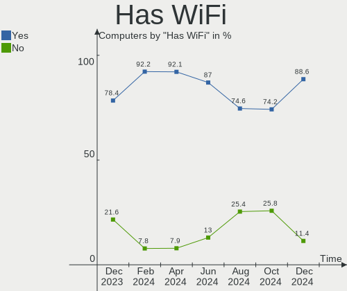
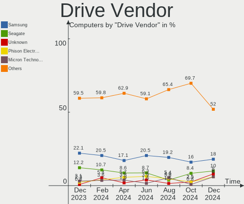
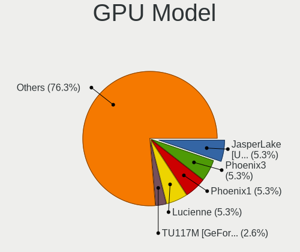
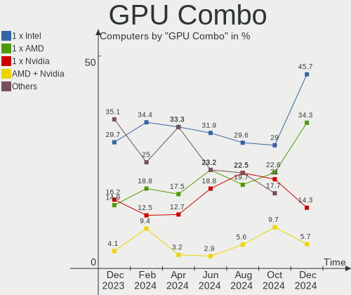
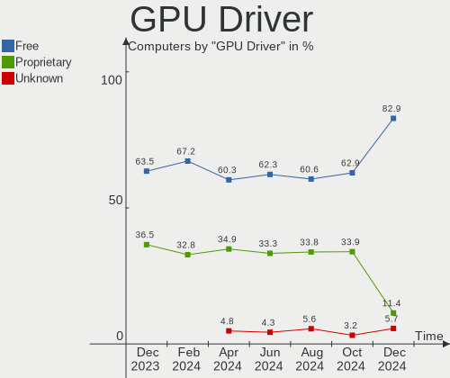
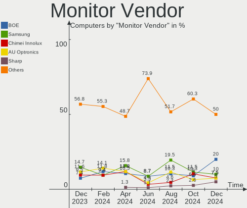

EndeavourOS - Hardware Trends
-----------------------------

A project to identify most popular hardware characteristics and track their change
over time based on data collected by Linux users at https://Linux-Hardware.org.

Anyone can contribute to this report by the [hw-probe](https://github.com/linuxhw/hw-probe) tool:

    sudo -E hw-probe -all -upload

This is a report for all computer types. See also reports for [desktops](/Dist/EndeavourOS/Desktop/README.md) and [notebooks](/Dist/EndeavourOS/Notebook/README.md).

This report is for one last month. Overall report since the beginning of time: [TestCoverage](https://github.com/linuxhw/TestCoverage)

Period: May, 2022.

Contents
--------

* [ System ](#system)
  - [ OS                       ](#os)
  - [ OS Family                ](#os-family)
  - [ Kernel                   ](#kernel)
  - [ Kernel Family            ](#kernel-family)
  - [ Kernel Major Ver.        ](#kernel-major-ver)
  - [ Arch                     ](#arch)
  - [ DE                       ](#de)
  - [ Display Server           ](#display-server)
  - [ Display Manager          ](#display-manager)
  - [ OS Lang                  ](#os-lang)
  - [ Boot Mode                ](#boot-mode)
  - [ Filesystem               ](#filesystem)
  - [ Part. scheme             ](#part-scheme)
  - [ Dual Boot with Linux/BSD ](#dual-boot-with-linuxbsd)
  - [ Dual Boot (Win)          ](#dual-boot-win)

* [ Board ](#board)
  - [ Vendor                   ](#vendor)
  - [ Model                    ](#model)
  - [ Model Family             ](#model-family)
  - [ MFG Year                 ](#mfg-year)
  - [ Form Factor              ](#form-factor)
  - [ Secure Boot              ](#secure-boot)
  - [ Coreboot                 ](#coreboot)
  - [ RAM Size                 ](#ram-size)
  - [ RAM Used                 ](#ram-used)
  - [ Total Drives             ](#total-drives)
  - [ Has CD-ROM               ](#has-cd-rom)
  - [ Has Ethernet             ](#has-ethernet)
  - [ Has WiFi                 ](#has-wifi)
  - [ Has Bluetooth            ](#has-bluetooth)

* [ Location ](#location)
  - [ Country                  ](#country)
  - [ City                     ](#city)

* [ Drives ](#drives)
  - [ Drive Vendor             ](#drive-vendor)
  - [ Drive Model              ](#drive-model)
  - [ HDD Vendor               ](#hdd-vendor)
  - [ SSD Vendor               ](#ssd-vendor)
  - [ Drive Kind               ](#drive-kind)
  - [ Drive Connector          ](#drive-connector)
  - [ Drive Size               ](#drive-size)
  - [ Space Total              ](#space-total)
  - [ Space Used               ](#space-used)
  - [ Malfunc. Drives          ](#malfunc-drives)
  - [ Malfunc. Drive Vendor    ](#malfunc-drive-vendor)
  - [ Malfunc. HDD Vendor      ](#malfunc-hdd-vendor)
  - [ Malfunc. Drive Kind      ](#malfunc-drive-kind)
  - [ Failed Drives            ](#failed-drives)
  - [ Failed Drive Vendor      ](#failed-drive-vendor)
  - [ Drive Status             ](#drive-status)

* [ Storage controller ](#storage-controller)
  - [ Storage Vendor           ](#storage-vendor)
  - [ Storage Model            ](#storage-model)
  - [ Storage Kind             ](#storage-kind)

* [ Processor ](#processor)
  - [ CPU Vendor               ](#cpu-vendor)
  - [ CPU Model                ](#cpu-model)
  - [ CPU Model Family         ](#cpu-model-family)
  - [ CPU Cores                ](#cpu-cores)
  - [ CPU Sockets              ](#cpu-sockets)
  - [ CPU Threads              ](#cpu-threads)
  - [ CPU Op-Modes             ](#cpu-op-modes)
  - [ CPU Microcode            ](#cpu-microcode)
  - [ CPU Microarch            ](#cpu-microarch)

* [ Graphics ](#graphics)
  - [ GPU Vendor               ](#gpu-vendor)
  - [ GPU Model                ](#gpu-model)
  - [ GPU Combo                ](#gpu-combo)
  - [ GPU Driver               ](#gpu-driver)
  - [ GPU Memory               ](#gpu-memory)

* [ Monitor ](#monitor)
  - [ Monitor Vendor           ](#monitor-vendor)
  - [ Monitor Model            ](#monitor-model)
  - [ Monitor Resolution       ](#monitor-resolution)
  - [ Monitor Diagonal         ](#monitor-diagonal)
  - [ Monitor Width            ](#monitor-width)
  - [ Aspect Ratio             ](#aspect-ratio)
  - [ Monitor Area             ](#monitor-area)
  - [ Pixel Density            ](#pixel-density)
  - [ Multiple Monitors        ](#multiple-monitors)

* [ Network ](#network)
  - [ Net Controller Vendor    ](#net-controller-vendor)
  - [ Net Controller Model     ](#net-controller-model)
  - [ Wireless Vendor          ](#wireless-vendor)
  - [ Wireless Model           ](#wireless-model)
  - [ Ethernet Vendor          ](#ethernet-vendor)
  - [ Ethernet Model           ](#ethernet-model)
  - [ Net Controller Kind      ](#net-controller-kind)
  - [ Used Controller          ](#used-controller)
  - [ NICs                     ](#nics)
  - [ IPv6                     ](#ipv6)

* [ Bluetooth ](#bluetooth)
  - [ Bluetooth Vendor         ](#bluetooth-vendor)
  - [ Bluetooth Model          ](#bluetooth-model)

* [ Sound ](#sound)
  - [ Sound Vendor             ](#sound-vendor)
  - [ Sound Model              ](#sound-model)

* [ Memory ](#memory)
  - [ Memory Vendor            ](#memory-vendor)
  - [ Memory Model             ](#memory-model)
  - [ Memory Kind              ](#memory-kind)
  - [ Memory Form Factor       ](#memory-form-factor)
  - [ Memory Size              ](#memory-size)
  - [ Memory Speed             ](#memory-speed)

* [ Printers & scanners ](#printers--scanners)
  - [ Printer Vendor           ](#printer-vendor)
  - [ Printer Model            ](#printer-model)
  - [ Scanner Vendor           ](#scanner-vendor)
  - [ Scanner Model            ](#scanner-model)

* [ Camera ](#camera)
  - [ Camera Vendor            ](#camera-vendor)
  - [ Camera Model             ](#camera-model)

* [ Security ](#security)
  - [ Fingerprint Vendor       ](#fingerprint-vendor)
  - [ Fingerprint Model        ](#fingerprint-model)
  - [ Chipcard Vendor          ](#chipcard-vendor)
  - [ Chipcard Model           ](#chipcard-model)

* [ Unsupported ](#unsupported)
  - [ Unsupported Devices      ](#unsupported-devices)
  - [ Unsupported Device Types ](#unsupported-device-types)

System
------

OS
--

Installed operating systems

| Name                | Computers | Percent |
|---------------------|-----------|---------|
| EndeavourOS Rolling | 22        | 62.86%  |
| EndeavourOS         | 13        | 37.14%  |

OS Family
---------

OS without a version

| Name        | Computers | Percent |
|-------------|-----------|---------|
| EndeavourOS | 35        | 100%    |

Kernel
------

Version of the Linux kernel

| Version            | Computers | Percent |
|--------------------|-----------|---------|
| 5.17.9-arch1-1     | 8         | 22.86%  |
| 5.17.5-arch1-1     | 7         | 20%     |
| 5.17.7-arch1-1     | 3         | 8.57%   |
| 5.15.37-1-lts      | 3         | 8.57%   |
| 5.18.0-arch1-1     | 2         | 5.71%   |
| 5.17.9-zen1-1-zen  | 2         | 5.71%   |
| 5.17.8-arch1-1     | 2         | 5.71%   |
| 5.17.5-zen1-1-zen  | 2         | 5.71%   |
| 5.17.8-zen1-1-zen  | 1         | 2.86%   |
| 5.17.6-zen1-1-zen  | 1         | 2.86%   |
| 5.17.5-arch1-2     | 1         | 2.86%   |
| 5.17.2-arch3-g14-1 | 1         | 2.86%   |
| 5.15.39-1-lts      | 1         | 2.86%   |
| 5.15.38-1-lts      | 1         | 2.86%   |

Kernel Family
-------------

Linux kernel without a distro release

| Version | Computers | Percent |
|---------|-----------|---------|
| 5.17.9  | 10        | 28.57%  |
| 5.17.5  | 10        | 28.57%  |
| 5.17.8  | 3         | 8.57%   |
| 5.17.7  | 3         | 8.57%   |
| 5.15.37 | 3         | 8.57%   |
| 5.18.0  | 2         | 5.71%   |
| 5.17.6  | 1         | 2.86%   |
| 5.17.2  | 1         | 2.86%   |
| 5.15.39 | 1         | 2.86%   |
| 5.15.38 | 1         | 2.86%   |

Kernel Major Ver.
-----------------

Linux kernel major version

| Version | Computers | Percent |
|---------|-----------|---------|
| 5.17    | 28        | 80%     |
| 5.15    | 5         | 14.29%  |
| 5.18    | 2         | 5.71%   |

Arch
----

OS architecture (x86_64, i586, etc.)

| Name   | Computers | Percent |
|--------|-----------|---------|
| x86_64 | 35        | 100%    |

DE
--

Desktop Environment

| Name       | Computers | Percent |
|------------|-----------|---------|
| XFCE       | 11        | 31.43%  |
| KDE5       | 11        | 31.43%  |
| GNOME      | 8         | 22.86%  |
| X-Cinnamon | 3         | 8.57%   |
| Cinnamon   | 1         | 2.86%   |
| Unknown    | 1         | 2.86%   |

Display Server
--------------

X11 or Wayland

| Name    | Computers | Percent |
|---------|-----------|---------|
| X11     | 29        | 82.86%  |
| Wayland | 6         | 17.14%  |

Display Manager
---------------

SDDM, LightDM, etc.

| Name    | Computers | Percent |
|---------|-----------|---------|
| Unknown | 13        | 37.14%  |
| LightDM | 11        | 31.43%  |
| GDM     | 6         | 17.14%  |
| SDDM    | 5         | 14.29%  |

OS Lang
-------

Language

| Lang  | Computers | Percent |
|-------|-----------|---------|
| en_US | 16        | 45.71%  |
| nl_NL | 3         | 8.57%   |
| en_GB | 3         | 8.57%   |
| de_DE | 3         | 8.57%   |
| en_CA | 2         | 5.71%   |
| en_AU | 2         | 5.71%   |
| fi_FI | 1         | 2.86%   |
| es_AR | 1         | 2.86%   |
| en_ZA | 1         | 2.86%   |
| en_PH | 1         | 2.86%   |
| en_DK | 1         | 2.86%   |
| de_CH | 1         | 2.86%   |

Boot Mode
---------

EFI or BIOS

| Mode | Computers | Percent |
|------|-----------|---------|
| EFI  | 19        | 54.29%  |
| BIOS | 16        | 45.71%  |

Filesystem
----------

Type of filesystem

| Type  | Computers | Percent |
|-------|-----------|---------|
| Ext4  | 22        | 62.86%  |
| Btrfs | 11        | 31.43%  |
| F2fs  | 1         | 2.86%   |
| Ext2  | 1         | 2.86%   |

Part. scheme
------------

Scheme of partitioning

| Type    | Computers | Percent |
|---------|-----------|---------|
| GPT     | 19        | 54.29%  |
| Unknown | 13        | 37.14%  |
| MBR     | 3         | 8.57%   |

Dual Boot with Linux/BSD
------------------------

Hosting more than one Linux/BSD

| Dual boot | Computers | Percent |
|-----------|-----------|---------|
| No        | 32        | 91.43%  |
| Yes       | 3         | 8.57%   |

Dual Boot (Win)
---------------

Hosting Linux and Windows

| Dual boot | Computers | Percent |
|-----------|-----------|---------|
| No        | 27        | 77.14%  |
| Yes       | 8         | 22.86%  |

Board
-----

Vendor
------

Motherboard manufacturer

| Name                | Computers | Percent |
|---------------------|-----------|---------|
| Lenovo              | 7         | 20%     |
| Hewlett-Packard     | 7         | 20%     |
| Dell                | 4         | 11.43%  |
| ASRock              | 4         | 11.43%  |
| Gigabyte Technology | 3         | 8.57%   |
| ASUSTek Computer    | 3         | 8.57%   |
| Timi                | 1         | 2.86%   |
| Sony                | 1         | 2.86%   |
| MSI                 | 1         | 2.86%   |
| Microsoft           | 1         | 2.86%   |
| Chuwi               | 1         | 2.86%   |
| Acer                | 1         | 2.86%   |
| Unknown             | 1         | 2.86%   |

Model
-----

Motherboard model

| Name                                   | Computers | Percent |
|----------------------------------------|-----------|---------|
| ASRock B450 Pro4                       | 2         | 5.71%   |
| Timi A35S                              | 1         | 2.86%   |
| Sony VPCCA17FX                         | 1         | 2.86%   |
| MSI MS-7808                            | 1         | 2.86%   |
| Microsoft Surface Laptop Go            | 1         | 2.86%   |
| Lenovo Yoga C930-13IKB 81C4            | 1         | 2.86%   |
| Lenovo Yoga C740-15IML 81TD            | 1         | 2.86%   |
| Lenovo V14 G2 ITL 82NM                 | 1         | 2.86%   |
| Lenovo ThinkPad X270 20HMS12K00        | 1         | 2.86%   |
| Lenovo ThinkCentre M710q 10MR0009US    | 1         | 2.86%   |
| Lenovo IdeaPadFlex 5 81X2              | 1         | 2.86%   |
| Lenovo IdeaPad 3 15ITL6 82H8           | 1         | 2.86%   |
| HP xw8400 Workstation                  | 1         | 2.86%   |
| HP ProBook 440 G4                      | 1         | 2.86%   |
| HP Pavilion x360 Convertible 14-cd0xxx | 1         | 2.86%   |
| HP Pavilion Laptop 15-eh0xxx           | 1         | 2.86%   |
| HP Pavilion Desktop TP01-2xxx          | 1         | 2.86%   |
| HP Notebook                            | 1         | 2.86%   |
| HP Compaq 8000 Elite CMT PC            | 1         | 2.86%   |
| Gigabyte X470 AORUS GAMING 7 WIFI      | 1         | 2.86%   |
| Gigabyte P55A-UD3                      | 1         | 2.86%   |
| Gigabyte B550M AORUS PRO               | 1         | 2.86%   |
| Dell Precision Tower 5810              | 1         | 2.86%   |
| Dell Latitude E6510                    | 1         | 2.86%   |
| Dell Latitude 5289                     | 1         | 2.86%   |
| Dell Inspiron 3580                     | 1         | 2.86%   |
| Chuwi GemiBook Pro                     | 1         | 2.86%   |
| ASUS ROG Zephyrus G15 GA503QS_GA503QS  | 1         | 2.86%   |
| ASUS ROG CROSSHAIR VIII IMPACT         | 1         | 2.86%   |
| ASUS P8H77-M                           | 1         | 2.86%   |
| ASRock B450M Pro4                      | 1         | 2.86%   |
| ASRock A320M/ac                        | 1         | 2.86%   |
| Acer Swift SF314-41                    | 1         | 2.86%   |
| Unknown                                | 1         | 2.86%   |

Model Family
------------

Motherboard model prefix

| Name               | Computers | Percent |
|--------------------|-----------|---------|
| HP Pavilion        | 3         | 8.57%   |
| Lenovo Yoga        | 2         | 5.71%   |
| Dell Latitude      | 2         | 5.71%   |
| ASUS ROG           | 2         | 5.71%   |
| ASRock B450        | 2         | 5.71%   |
| Timi A35S          | 1         | 2.86%   |
| Sony VPCCA17FX     | 1         | 2.86%   |
| MSI MS-7808        | 1         | 2.86%   |
| Microsoft Surface  | 1         | 2.86%   |
| Lenovo V14         | 1         | 2.86%   |
| Lenovo ThinkPad    | 1         | 2.86%   |
| Lenovo ThinkCentre | 1         | 2.86%   |
| Lenovo IdeaPadFlex | 1         | 2.86%   |
| Lenovo IdeaPad     | 1         | 2.86%   |
| HP xw8400          | 1         | 2.86%   |
| HP ProBook         | 1         | 2.86%   |
| HP Notebook        | 1         | 2.86%   |
| HP Compaq          | 1         | 2.86%   |
| Gigabyte X470      | 1         | 2.86%   |
| Gigabyte P55A-UD3  | 1         | 2.86%   |
| Gigabyte B550M     | 1         | 2.86%   |
| Dell Precision     | 1         | 2.86%   |
| Dell Inspiron      | 1         | 2.86%   |
| Chuwi GemiBook     | 1         | 2.86%   |
| ASUS P8H77-M       | 1         | 2.86%   |
| ASRock B450M       | 1         | 2.86%   |
| ASRock A320M       | 1         | 2.86%   |
| Acer Swift         | 1         | 2.86%   |
| Unknown            | 1         | 2.86%   |

MFG Year
--------

Motherboard manufacture year

| Year | Computers | Percent |
|------|-----------|---------|
| 2018 | 8         | 22.86%  |
| 2021 | 7         | 20%     |
| 2020 | 5         | 14.29%  |
| 2019 | 3         | 8.57%   |
| 2017 | 2         | 5.71%   |
| 2016 | 2         | 5.71%   |
| 2012 | 2         | 5.71%   |
| 2009 | 2         | 5.71%   |
| 2014 | 1         | 2.86%   |
| 2011 | 1         | 2.86%   |
| 2010 | 1         | 2.86%   |
| 2007 | 1         | 2.86%   |

Form Factor
-----------

Physical design of the computer

| Name        | Computers | Percent |
|-------------|-----------|---------|
| Desktop     | 15        | 42.86%  |
| Notebook    | 15        | 42.86%  |
| Convertible | 4         | 11.43%  |
| Tablet      | 1         | 2.86%   |

Secure Boot
-----------

Enabled or disabled

| State    | Computers | Percent |
|----------|-----------|---------|
| Disabled | 34        | 97.14%  |
| Enabled  | 1         | 2.86%   |

Coreboot
--------

Have coreboot on board

| Used | Computers | Percent |
|------|-----------|---------|
| No   | 35        | 100%    |

RAM Size
--------

Total RAM memory

| Size in GB  | Computers | Percent |
|-------------|-----------|---------|
| 8.01-16.0   | 11        | 31.43%  |
| 4.01-8.0    | 10        | 28.57%  |
| 16.01-24.0  | 8         | 22.86%  |
| 32.01-64.0  | 4         | 11.43%  |
| 24.01-32.0  | 1         | 2.86%   |
| 64.01-256.0 | 1         | 2.86%   |

RAM Used
--------

Used RAM memory

| Used GB   | Computers | Percent |
|-----------|-----------|---------|
| 1.01-2.0  | 12        | 34.29%  |
| 4.01-8.0  | 8         | 22.86%  |
| 3.01-4.0  | 6         | 17.14%  |
| 2.01-3.0  | 6         | 17.14%  |
| 0.51-1.0  | 2         | 5.71%   |
| 8.01-16.0 | 1         | 2.86%   |

Total Drives
------------

Number of drives on board

| Drives | Computers | Percent |
|--------|-----------|---------|
| 1      | 15        | 42.86%  |
| 2      | 13        | 37.14%  |
| 3      | 4         | 11.43%  |
| 4      | 2         | 5.71%   |
| 8      | 1         | 2.86%   |

Has CD-ROM
----------

Has CD-ROM on board

| Presented | Computers | Percent |
|-----------|-----------|---------|
| No        | 26        | 74.29%  |
| Yes       | 9         | 25.71%  |

Has Ethernet
------------

Has Ethernet on board

| Presented | Computers | Percent |
|-----------|-----------|---------|
| Yes       | 25        | 71.43%  |
| No        | 10        | 28.57%  |

Has WiFi
--------

Has WiFi module

| Presented | Computers | Percent |
|-----------|-----------|---------|
| Yes       | 26        | 74.29%  |
| No        | 9         | 25.71%  |

Has Bluetooth
-------------

Has Bluetooth module

| Presented | Computers | Percent |
|-----------|-----------|---------|
| Yes       | 27        | 77.14%  |
| No        | 8         | 22.86%  |

Location
--------

Country
-------

Geographic location (country)

| Country      | Computers | Percent |
|--------------|-----------|---------|
| USA          | 8         | 22.86%  |
| Netherlands  | 3         | 8.57%   |
| Germany      | 3         | 8.57%   |
| Switzerland  | 2         | 5.71%   |
| Norway       | 2         | 5.71%   |
| Canada       | 2         | 5.71%   |
| Brazil       | 2         | 5.71%   |
| Australia    | 2         | 5.71%   |
| UK           | 1         | 2.86%   |
| Sweden       | 1         | 2.86%   |
| Spain        | 1         | 2.86%   |
| South Africa | 1         | 2.86%   |
| Philippines  | 1         | 2.86%   |
| France       | 1         | 2.86%   |
| Finland      | 1         | 2.86%   |
| Czechia      | 1         | 2.86%   |
| Colombia     | 1         | 2.86%   |
| Belgium      | 1         | 2.86%   |
| Argentina    | 1         | 2.86%   |

City
----

Geographic location (city)

| City               | Computers | Percent |
|--------------------|-----------|---------|
| Zurich             | 2         | 5.71%   |
| Schiedam           | 2         | 5.71%   |
| Victoria           | 1         | 2.86%   |
| Valinhos           | 1         | 2.86%   |
| Tucson             | 1         | 2.86%   |
| Toledo             | 1         | 2.86%   |
| Spring Field       | 1         | 2.86%   |
| Sauteyrargues      | 1         | 2.86%   |
| Sao Paulo          | 1         | 2.86%   |
| Sala               | 1         | 2.86%   |
| Rotterdam          | 1         | 2.86%   |
| Montreal           | 1         | 2.86%   |
| Montijo            | 1         | 2.86%   |
| Medellín          | 1         | 2.86%   |
| McKee              | 1         | 2.86%   |
| Mannheim           | 1         | 2.86%   |
| London             | 1         | 2.86%   |
| Kongsvinger        | 1         | 2.86%   |
| Klasterec nad Ohri | 1         | 2.86%   |
| Jacksonville       | 1         | 2.86%   |
| Hildesheim         | 1         | 2.86%   |
| Helsinki           | 1         | 2.86%   |
| Edegem             | 1         | 2.86%   |
| Denver             | 1         | 2.86%   |
| Danville           | 1         | 2.86%   |
| Cleveland          | 1         | 2.86%   |
| Cape Town          | 1         | 2.86%   |
| Cagayan de Oro     | 1         | 2.86%   |
| Buenos Aires       | 1         | 2.86%   |
| Brownsburg         | 1         | 2.86%   |
| Brownlow Hill      | 1         | 2.86%   |
| Berlin             | 1         | 2.86%   |
| Alta               | 1         | 2.86%   |

Drives
------

Drive Vendor
------------

Hard drive vendors

| Vendor                         | Computers | Drives | Percent |
|--------------------------------|-----------|--------|---------|
| Samsung Electronics            | 11        | 12     | 18.33%  |
| WDC                            | 8         | 12     | 13.33%  |
| Seagate                        | 7         | 9      | 11.67%  |
| SanDisk                        | 4         | 5      | 6.67%   |
| Crucial                        | 4         | 4      | 6.67%   |
| SK Hynix                       | 3         | 3      | 5%      |
| Kingston                       | 3         | 4      | 5%      |
| Toshiba                        | 2         | 2      | 3.33%   |
| Micron Technology              | 2         | 2      | 3.33%   |
| Intel                          | 2         | 3      | 3.33%   |
| Hitachi                        | 2         | 2      | 3.33%   |
| Gigabyte Technology            | 2         | 2      | 3.33%   |
| Zheino                         | 1         | 1      | 1.67%   |
| UMIS                           | 1         | 1      | 1.67%   |
| Teclast                        | 1         | 1      | 1.67%   |
| SPCC                           | 1         | 1      | 1.67%   |
| Solid State Storage Technology | 1         | 1      | 1.67%   |
| OCZ                            | 1         | 1      | 1.67%   |
| Netac                          | 1         | 1      | 1.67%   |
| Leven                          | 1         | 1      | 1.67%   |
| KIOXIA                         | 1         | 1      | 1.67%   |
| Hikvision                      | 1         | 1      | 1.67%   |

Drive Model
-----------

Hard drive models

| Model                                       | Computers | Percent |
|---------------------------------------------|-----------|---------|
| Seagate ST4000DM004-2CV104 4TB              | 3         | 4.48%   |
| Toshiba MQ04ABF100 1TB                      | 2         | 2.99%   |
| Sandisk NVMe SSD Drive 256GB                | 2         | 2.99%   |
| Samsung HD103SJ 1TB                         | 2         | 2.99%   |
| Kingston SA400S37240G 240GB SSD             | 2         | 2.99%   |
| Zheino CHN-25SATAC3-120 120GB               | 1         | 1.49%   |
| WDC WDS500G2B0A-00SM50 500GB SSD            | 1         | 1.49%   |
| WDC WDS100T2G0A-00JH30 1TB SSD              | 1         | 1.49%   |
| WDC WD5000LPLX-08ZNTT0 500GB                | 1         | 1.49%   |
| WDC WD30EZRX-00SPEB0 3TB                    | 1         | 1.49%   |
| WDC WD2500AAKS-60VYA0 250GB                 | 1         | 1.49%   |
| WDC WD2003FZEX-00Z4SA0 2TB                  | 1         | 1.49%   |
| WDC WD2002FYPS-01U1B0 2TB                   | 1         | 1.49%   |
| WDC WD10SPZX-60Z10T0 1TB                    | 1         | 1.49%   |
| WDC WD10JPVX-75JC3T0 1TB                    | 1         | 1.49%   |
| WDC WD10EZEX-00BN5A0 1TB                    | 1         | 1.49%   |
| WDC PC SN530 SDBPNPZ-256G-1006 256GB        | 1         | 1.49%   |
| UMIS RPJTJ256MEE1OWX 256GB                  | 1         | 1.49%   |
| Teclast BD256GB SHCA-2280 SSD               | 1         | 1.49%   |
| SPCC Solid State Disk 256GB                 | 1         | 1.49%   |
| Solid State Storage NVMe SSD Drive 256GB    | 1         | 1.49%   |
| SK Hynix HFS256GD9TNG-62A0A 256GB           | 1         | 1.49%   |
| SK Hynix HFM001TD3JX013N 1TB                | 1         | 1.49%   |
| SK Hynix BC511 HFM512GDJTNI-82A0A 512GB     | 1         | 1.49%   |
| Seagate ST3750640NS 752GB                   | 1         | 1.49%   |
| Seagate ST33000650NS 81Y9799 81Y3865IBM 3TB | 1         | 1.49%   |
| Seagate ST3160318AS 160GB                   | 1         | 1.49%   |
| Seagate ST1000DM010-2EP102 1TB              | 1         | 1.49%   |
| SanDisk SSD PLUS 240GB                      | 1         | 1.49%   |
| SanDisk SDSSDH3 1T02 1024GB                 | 1         | 1.49%   |
| SanDisk SDSSDA240G 240GB                    | 1         | 1.49%   |
| Samsung SSD 970 EVO Plus 1TB                | 1         | 1.49%   |
| Samsung SSD 970 EVO 1TB                     | 1         | 1.49%   |
| Samsung SSD 870 QVO 1TB                     | 1         | 1.49%   |
| Samsung SSD 830 Series 128GB                | 1         | 1.49%   |
| Samsung Portable SSD T5 500GB               | 1         | 1.49%   |
| Samsung NVMe SSD Drive 256GB                | 1         | 1.49%   |
| Samsung MZVLW256HEHP-000L7 256GB            | 1         | 1.49%   |
| Samsung MZVLW256HEHP-000H1 256GB            | 1         | 1.49%   |
| Samsung MZNLN128HAHQ-000H1 128GB SSD        | 1         | 1.49%   |
| Samsung MZ9LQ256HBJQ-00000 256GB            | 1         | 1.49%   |
| OCZ VERTEX3 240GB SSD                       | 1         | 1.49%   |
| Netac SSD 256GB                             | 1         | 1.49%   |
| Micron NVMe SSD Drive 512GB                 | 1         | 1.49%   |
| Micron 1100_MTFDDAK256TBN 256GB SSD         | 1         | 1.49%   |
| Leven JAJS300M240C 240GB                    | 1         | 1.49%   |
| KIOXIA KBG40ZNV512G 512GB                   | 1         | 1.49%   |
| Kingston NVMe SSD Drive 500GB               | 1         | 1.49%   |
| Kingston NVMe SSD Drive 1TB                 | 1         | 1.49%   |
| Intel SSDSCKKF256H6 SATA 256GB              | 1         | 1.49%   |
| Intel NVMe SSD Drive 512GB                  | 1         | 1.49%   |
| Intel NVMe SSD Drive 32GB                   | 1         | 1.49%   |
| Hitachi HDS723020BLA642 2TB                 | 1         | 1.49%   |
| Hitachi HDS722020ALA330 2TB                 | 1         | 1.49%   |
| Hikvision HS-SSD-E2000 256GB                | 1         | 1.49%   |
| Gigabyte GP-GSTFS31480GNTD 480GB SSD        | 1         | 1.49%   |
| Gigabyte GP-GSTFS31100TNTD 1024GB           | 1         | 1.49%   |
| Crucial CT500P2SSD8 500GB                   | 1         | 1.49%   |
| Crucial CT500MX500SSD1 500GB                | 1         | 1.49%   |
| Crucial CT250BX100SSD1 250GB                | 1         | 1.49%   |

HDD Vendor
----------

Hard disk drive vendors

| Vendor              | Computers | Drives | Percent |
|---------------------|-----------|--------|---------|
| Seagate             | 7         | 9      | 36.84%  |
| WDC                 | 6         | 8      | 31.58%  |
| Toshiba             | 2         | 2      | 10.53%  |
| Samsung Electronics | 2         | 2      | 10.53%  |
| Hitachi             | 2         | 2      | 10.53%  |

SSD Vendor
----------

Solid state drive vendors

| Vendor              | Computers | Drives | Percent |
|---------------------|-----------|--------|---------|
| Samsung Electronics | 4         | 4      | 17.39%  |
| Crucial             | 3         | 3      | 13.04%  |
| WDC                 | 2         | 3      | 8.7%    |
| SanDisk             | 2         | 3      | 8.7%    |
| Kingston            | 2         | 2      | 8.7%    |
| Gigabyte Technology | 2         | 2      | 8.7%    |
| Zheino              | 1         | 1      | 4.35%   |
| Teclast             | 1         | 1      | 4.35%   |
| SPCC                | 1         | 1      | 4.35%   |
| OCZ                 | 1         | 1      | 4.35%   |
| Netac               | 1         | 1      | 4.35%   |
| Micron Technology   | 1         | 1      | 4.35%   |
| Leven               | 1         | 1      | 4.35%   |
| Intel               | 1         | 1      | 4.35%   |

Drive Kind
----------

HDD or SSD

| Kind | Computers | Drives | Percent |
|------|-----------|--------|---------|
| NVMe | 20        | 22     | 38.46%  |
| SSD  | 19        | 25     | 36.54%  |
| HDD  | 13        | 23     | 25%     |

Drive Connector
---------------

SATA, SAS, NVMe, etc.

| Type | Computers | Drives | Percent |
|------|-----------|--------|---------|
| SATA | 25        | 46     | 53.19%  |
| NVMe | 20        | 22     | 42.55%  |
| SAS  | 2         | 2      | 4.26%   |

Drive Size
----------

Size of hard drive

| Size in TB | Computers | Drives | Percent |
|------------|-----------|--------|---------|
| 0.01-0.5   | 19        | 24     | 48.72%  |
| 0.51-1.0   | 10        | 11     | 25.64%  |
| 1.01-2.0   | 5         | 6      | 12.82%  |
| 3.01-4.0   | 3         | 5      | 7.69%   |
| 2.01-3.0   | 2         | 2      | 5.13%   |

Space Total
-----------

Amount of disk space available on the file system

| Size in GB     | Computers | Percent |
|----------------|-----------|---------|
| 1001-2000      | 8         | 22.86%  |
| 501-1000       | 7         | 20%     |
| 251-500        | 6         | 17.14%  |
| 101-250        | 6         | 17.14%  |
| More than 3000 | 3         | 8.57%   |
| Unknown        | 3         | 8.57%   |
| 2001-3000      | 1         | 2.86%   |
| 1-20           | 1         | 2.86%   |

Space Used
----------

Amount of used disk space

| Used GB   | Computers | Percent |
|-----------|-----------|---------|
| 1-20      | 9         | 25.71%  |
| 21-50     | 5         | 14.29%  |
| 101-250   | 5         | 14.29%  |
| 1001-2000 | 4         | 11.43%  |
| 501-1000  | 4         | 11.43%  |
| 251-500   | 3         | 8.57%   |
| Unknown   | 3         | 8.57%   |
| 51-100    | 2         | 5.71%   |

Malfunc. Drives
---------------

Drive models with a malfunction

| Model                          | Computers | Drives | Percent |
|--------------------------------|-----------|--------|---------|
| WDC WD2002FYPS-01U1B0 2TB      | 1         | 1      | 25%     |
| OCZ VERTEX3 240GB SSD          | 1         | 1      | 25%     |
| Intel SSDSCKKF256H6 SATA 256GB | 1         | 1      | 25%     |
| Crucial CT500MX500SSD1 500GB   | 1         | 1      | 25%     |

Malfunc. Drive Vendor
---------------------

Vendors of faulty drives

| Vendor  | Computers | Drives | Percent |
|---------|-----------|--------|---------|
| WDC     | 1         | 1      | 25%     |
| OCZ     | 1         | 1      | 25%     |
| Intel   | 1         | 1      | 25%     |
| Crucial | 1         | 1      | 25%     |

Malfunc. HDD Vendor
-------------------

Vendors of faulty HDD drives

| Vendor | Computers | Drives | Percent |
|--------|-----------|--------|---------|
| WDC    | 1         | 1      | 100%    |

Malfunc. Drive Kind
-------------------

Kinds of faulty drives

| Kind | Computers | Drives | Percent |
|------|-----------|--------|---------|
| SSD  | 3         | 3      | 75%     |
| HDD  | 1         | 1      | 25%     |

Failed Drives
-------------

Failed drive models

Zero info for selected period =(

Failed Drive Vendor
-------------------

Failed drive vendors

Zero info for selected period =(

Drive Status
------------

Number of failed and malfunc. drives

| Status   | Computers | Drives | Percent |
|----------|-----------|--------|---------|
| Works    | 21        | 33     | 52.5%   |
| Detected | 15        | 33     | 37.5%   |
| Malfunc  | 4         | 4      | 10%     |

Storage controller
------------------

Storage Vendor
--------------

Storage controller vendors

| Vendor                         | Computers | Percent |
|--------------------------------|-----------|---------|
| Intel                          | 19        | 38.78%  |
| AMD                            | 10        | 20.41%  |
| Samsung Electronics            | 6         | 12.24%  |
| SK Hynix                       | 3         | 6.12%   |
| Sandisk                        | 2         | 4.08%   |
| ASMedia Technology             | 2         | 4.08%   |
| Union Memory (Shenzhen)        | 1         | 2.04%   |
| Solid State Storage Technology | 1         | 2.04%   |
| Phison Electronics             | 1         | 2.04%   |
| Micron/Crucial Technology      | 1         | 2.04%   |
| Micron Technology              | 1         | 2.04%   |
| KIOXIA                         | 1         | 2.04%   |
| Kingston Technology Company    | 1         | 2.04%   |

Storage Model
-------------

Storage controller models

| Model                                                                            | Computers | Percent |
|----------------------------------------------------------------------------------|-----------|---------|
| AMD FCH SATA Controller [AHCI mode]                                              | 8         | 13.11%  |
| AMD 400 Series Chipset SATA Controller                                           | 5         | 8.2%    |
| Samsung NVMe SSD Controller SM961/PM961/SM963                                    | 3         | 4.92%   |
| Intel Sunrise Point-LP SATA Controller [AHCI mode]                               | 3         | 4.92%   |
| Samsung NVMe SSD Controller SM981/PM981/PM983                                    | 2         | 3.28%   |
| Intel Tiger Lake-LP SATA Controller [AHCI mode]                                  | 2         | 3.28%   |
| Intel 7 Series/C210 Series Chipset Family 6-port SATA Controller [AHCI mode]     | 2         | 3.28%   |
| Intel 5 Series/3400 Series Chipset 6 port SATA AHCI Controller                   | 2         | 3.28%   |
| ASMedia ASM1062 Serial ATA Controller                                            | 2         | 3.28%   |
| Union Memory (Shenzhen) Non-Volatile memory controller                           | 1         | 1.64%   |
| Solid State Storage Non-Volatile memory controller                               | 1         | 1.64%   |
| SK Hynix PC401 NVMe Solid State Drive 256GB                                      | 1         | 1.64%   |
| SK Hynix Gold P31 SSD                                                            | 1         | 1.64%   |
| SK Hynix BC511                                                                   | 1         | 1.64%   |
| Sandisk WD Blue SN550 NVMe SSD                                                   | 1         | 1.64%   |
| Sandisk WD Black 2018/SN750 / PC SN720 NVMe SSD                                  | 1         | 1.64%   |
| Samsung NVMe SSD Controller 980                                                  | 1         | 1.64%   |
| Phison E12 NVMe Controller                                                       | 1         | 1.64%   |
| Micron/Crucial P2 NVMe PCIe SSD                                                  | 1         | 1.64%   |
| Micron Non-Volatile memory controller                                            | 1         | 1.64%   |
| KIOXIA Non-Volatile memory controller                                            | 1         | 1.64%   |
| Kingston Company KC2000 NVMe SSD                                                 | 1         | 1.64%   |
| Kingston Company A2000 NVMe SSD                                                  | 1         | 1.64%   |
| Intel Volume Management Device NVMe RAID Controller                              | 1         | 1.64%   |
| Intel Non-Volatile memory controller                                             | 1         | 1.64%   |
| Intel Jasper Lake SATA AHCI Controller                                           | 1         | 1.64%   |
| Intel Celeron/Pentium Silver Processor SATA Controller                           | 1         | 1.64%   |
| Intel Cannon Point-LP SATA Controller [AHCI Mode]                                | 1         | 1.64%   |
| Intel C610/X99 series chipset sSATA Controller [AHCI mode]                       | 1         | 1.64%   |
| Intel C610/X99 series chipset IDE-r Controller                                   | 1         | 1.64%   |
| Intel C610/X99 series chipset 6-Port SATA Controller [AHCI mode]                 | 1         | 1.64%   |
| Intel Atom/Celeron/Pentium Processor x5-E8000/J3xxx/N3xxx Series SATA Controller | 1         | 1.64%   |
| Intel 82801JD/DO (ICH10 Family) SATA AHCI Controller                             | 1         | 1.64%   |
| Intel 82801 Mobile SATA Controller [RAID mode]                                   | 1         | 1.64%   |
| Intel 631xESB/632xESB/3100 Chipset SATA IDE Controller                           | 1         | 1.64%   |
| Intel 631xESB/632xESB IDE Controller                                             | 1         | 1.64%   |
| Intel 6 Series/C200 Series Chipset Family 6 port Mobile SATA AHCI Controller     | 1         | 1.64%   |
| Intel 4 Series Chipset PT IDER Controller                                        | 1         | 1.64%   |
| Intel 200 Series PCH SATA controller [AHCI mode]                                 | 1         | 1.64%   |
| AMD FCH SATA Controller D                                                        | 1         | 1.64%   |
| AMD 500 Series Chipset SATA Controller                                           | 1         | 1.64%   |

Storage Kind
------------

Kind of storage controller (IDE, SATA, NVMe, SAS, ...)

| Kind | Computers | Percent |
|------|-----------|---------|
| SATA | 27        | 52.94%  |
| NVMe | 19        | 37.25%  |
| IDE  | 3         | 5.88%   |
| RAID | 2         | 3.92%   |

Processor
---------

CPU Vendor
----------

Processor vendors

| Vendor | Computers | Percent |
|--------|-----------|---------|
| Intel  | 22        | 62.86%  |
| AMD    | 13        | 37.14%  |

CPU Model
---------

Processor models

| Model                                         | Computers | Percent |
|-----------------------------------------------|-----------|---------|
| Intel Core i7-8550U CPU @ 1.80GHz             | 2         | 5.71%   |
| Intel Core i5-7300U CPU @ 2.60GHz             | 2         | 5.71%   |
| Intel 11th Gen Core i5-1135G7 @ 2.40GHz       | 2         | 5.71%   |
| Intel Xeon CPU E5-2650 v3 @ 2.30GHz           | 1         | 2.86%   |
| Intel Xeon CPU 5160 @ 3.00GHz                 | 1         | 2.86%   |
| Intel Pentium CPU N3710 @ 1.60GHz             | 1         | 2.86%   |
| Intel Core i7-3770 CPU @ 3.40GHz              | 1         | 2.86%   |
| Intel Core i7-2600 CPU @ 3.40GHz              | 1         | 2.86%   |
| Intel Core i7-10510U CPU @ 1.80GHz            | 1         | 2.86%   |
| Intel Core i5-8265U CPU @ 1.60GHz             | 1         | 2.86%   |
| Intel Core i5-7500T CPU @ 2.70GHz             | 1         | 2.86%   |
| Intel Core i5-2410M CPU @ 2.30GHz             | 1         | 2.86%   |
| Intel Core i5-1035G1 CPU @ 1.00GHz            | 1         | 2.86%   |
| Intel Core i5 CPU M 580 @ 2.67GHz             | 1         | 2.86%   |
| Intel Core i5 CPU 750 @ 2.67GHz               | 1         | 2.86%   |
| Intel Core i3-7100U CPU @ 2.40GHz             | 1         | 2.86%   |
| Intel Core 2 Duo CPU E8500 @ 3.16GHz          | 1         | 2.86%   |
| Intel Celeron N5100 @ 1.10GHz                 | 1         | 2.86%   |
| Intel Celeron N4120 CPU @ 1.10GHz             | 1         | 2.86%   |
| AMD Ryzen 9 3900X 12-Core Processor           | 1         | 2.86%   |
| AMD Ryzen 7 5800HS with Radeon Graphics       | 1         | 2.86%   |
| AMD Ryzen 7 5800H with Radeon Graphics        | 1         | 2.86%   |
| AMD Ryzen 7 5700G with Radeon Graphics        | 1         | 2.86%   |
| AMD Ryzen 7 3700X 8-Core Processor            | 1         | 2.86%   |
| AMD Ryzen 7 2700X Eight-Core Processor        | 1         | 2.86%   |
| AMD Ryzen 7 2700 Eight-Core Processor         | 1         | 2.86%   |
| AMD Ryzen 7 1700X Eight-Core Processor        | 1         | 2.86%   |
| AMD Ryzen 5 4500U with Radeon Graphics        | 1         | 2.86%   |
| AMD Ryzen 5 3500X 6-Core Processor            | 1         | 2.86%   |
| AMD Ryzen 5 3500U with Radeon Vega Mobile Gfx | 1         | 2.86%   |
| AMD Ryzen 5 3400G with Radeon Vega Graphics   | 1         | 2.86%   |
| AMD Ryzen 3 4300U with Radeon Graphics        | 1         | 2.86%   |

CPU Model Family
----------------

Processor model prefix

| Model            | Computers | Percent |
|------------------|-----------|---------|
| Intel Core i5    | 8         | 22.86%  |
| AMD Ryzen 7      | 7         | 20%     |
| Intel Core i7    | 5         | 14.29%  |
| AMD Ryzen 5      | 4         | 11.43%  |
| Other            | 2         | 5.71%   |
| Intel Xeon       | 2         | 5.71%   |
| Intel Celeron    | 2         | 5.71%   |
| Intel Pentium    | 1         | 2.86%   |
| Intel Core i3    | 1         | 2.86%   |
| Intel Core 2 Duo | 1         | 2.86%   |
| AMD Ryzen 9      | 1         | 2.86%   |
| AMD Ryzen 3      | 1         | 2.86%   |

CPU Cores
---------

Number of processor cores

| Number | Computers | Percent |
|--------|-----------|---------|
| 4      | 18        | 51.43%  |
| 8      | 7         | 20%     |
| 2      | 6         | 17.14%  |
| 6      | 2         | 5.71%   |
| 12     | 1         | 2.86%   |
| 10     | 1         | 2.86%   |

CPU Sockets
-----------

Number of sockets

| Number | Computers | Percent |
|--------|-----------|---------|
| 1      | 34        | 97.14%  |
| 2      | 1         | 2.86%   |

CPU Threads
-----------

Threads per core (Hyper-Threading)

| Number | Computers | Percent |
|--------|-----------|---------|
| 2      | 25        | 71.43%  |
| 1      | 10        | 28.57%  |

CPU Op-Modes
------------

CPU Operation Modes (32-bit, 64-bit)

| Op mode        | Computers | Percent |
|----------------|-----------|---------|
| 32-bit, 64-bit | 35        | 100%    |

CPU Microcode
-------------

Microcode number

| Number     | Computers | Percent |
|------------|-----------|---------|
| Unknown    | 15        | 42.86%  |
| 0x806e9    | 2         | 5.71%   |
| 0x206a7    | 2         | 5.71%   |
| 0x0a50000c | 2         | 5.71%   |
| 0x906e9    | 1         | 2.86%   |
| 0x906c0    | 1         | 2.86%   |
| 0x806ec    | 1         | 2.86%   |
| 0x806ea    | 1         | 2.86%   |
| 0x706e5    | 1         | 2.86%   |
| 0x6f6      | 1         | 2.86%   |
| 0x306f2    | 1         | 2.86%   |
| 0x106e5    | 1         | 2.86%   |
| 0x08701021 | 1         | 2.86%   |
| 0x08701013 | 1         | 2.86%   |
| 0x08600106 | 1         | 2.86%   |
| 0x08600102 | 1         | 2.86%   |
| 0x0800820d | 1         | 2.86%   |
| 0x08001138 | 1         | 2.86%   |

CPU Microarch
-------------

Microarchitecture

| Name          | Computers | Percent |
|---------------|-----------|---------|
| KabyLake      | 8         | 22.86%  |
| Zen 2         | 5         | 14.29%  |
| Zen+          | 4         | 11.43%  |
| Zen 3         | 3         | 8.57%   |
| TigerLake     | 2         | 5.71%   |
| SandyBridge   | 2         | 5.71%   |
| Zen           | 1         | 2.86%   |
| Westmere      | 1         | 2.86%   |
| Tremont       | 1         | 2.86%   |
| Silvermont    | 1         | 2.86%   |
| Penryn        | 1         | 2.86%   |
| Nehalem       | 1         | 2.86%   |
| IvyBridge     | 1         | 2.86%   |
| IceLake       | 1         | 2.86%   |
| Haswell       | 1         | 2.86%   |
| Goldmont plus | 1         | 2.86%   |
| Core          | 1         | 2.86%   |

Graphics
--------

GPU Vendor
----------

Vendors of graphics cards

| Vendor | Computers | Percent |
|--------|-----------|---------|
| Intel  | 16        | 43.24%  |
| Nvidia | 12        | 32.43%  |
| AMD    | 9         | 24.32%  |

GPU Model
---------

Graphics card models

| Model                                                                                    | Computers | Percent |
|------------------------------------------------------------------------------------------|-----------|---------|
| Intel HD Graphics 620                                                                    | 3         | 8.11%   |
| AMD Cezanne                                                                              | 3         | 8.11%   |
| Nvidia GK208B [GeForce GT 710]                                                           | 2         | 5.41%   |
| Intel UHD Graphics 620                                                                   | 2         | 5.41%   |
| Intel TigerLake-LP GT2 [Iris Xe Graphics]                                                | 2         | 5.41%   |
| AMD Renoir                                                                               | 2         | 5.41%   |
| AMD Picasso/Raven 2 [Radeon Vega Series / Radeon Vega Mobile Series]                     | 2         | 5.41%   |
| Nvidia TU106 [GeForce RTX 2060 Rev. A]                                                   | 1         | 2.7%    |
| Nvidia GT218M [NVS 3100M]                                                                | 1         | 2.7%    |
| Nvidia GP107 [GeForce GTX 1050 Ti]                                                       | 1         | 2.7%    |
| Nvidia GM206 [GeForce GTX 950]                                                           | 1         | 2.7%    |
| Nvidia GM204 [GeForce GTX 970]                                                           | 1         | 2.7%    |
| Nvidia GM108M [GeForce MX130]                                                            | 1         | 2.7%    |
| Nvidia GM107 [GeForce GTX 750 Ti]                                                        | 1         | 2.7%    |
| Nvidia GA104 [GeForce RTX 3070]                                                          | 1         | 2.7%    |
| Nvidia GA102 [GeForce RTX 3080]                                                          | 1         | 2.7%    |
| Nvidia G70GL [Quadro FX 4500]                                                            | 1         | 2.7%    |
| Intel WhiskeyLake-U GT2 [UHD Graphics 620]                                               | 1         | 2.7%    |
| Intel JasperLake [UHD Graphics]                                                          | 1         | 2.7%    |
| Intel Iris Plus Graphics G1 (Ice Lake)                                                   | 1         | 2.7%    |
| Intel HD Graphics 630                                                                    | 1         | 2.7%    |
| Intel GeminiLake [UHD Graphics 600]                                                      | 1         | 2.7%    |
| Intel CometLake-U GT2 [UHD Graphics]                                                     | 1         | 2.7%    |
| Intel Atom/Celeron/Pentium Processor x5-E8000/J3xxx/N3xxx Integrated Graphics Controller | 1         | 2.7%    |
| Intel 4 Series Chipset Integrated Graphics Controller                                    | 1         | 2.7%    |
| Intel 2nd Generation Core Processor Family Integrated Graphics Controller                | 1         | 2.7%    |
| AMD Whistler [Radeon HD 6630M/6650M/6750M/7670M/7690M]                                   | 1         | 2.7%    |
| AMD Ellesmere [Radeon RX 470/480/570/570X/580/580X/590]                                  | 1         | 2.7%    |

GPU Combo
---------

Combinations of graphics cards

| Name           | Computers | Percent |
|----------------|-----------|---------|
| 1 x Intel      | 14        | 40%     |
| 1 x Nvidia     | 11        | 31.43%  |
| 1 x AMD        | 8         | 22.86%  |
| Intel + Nvidia | 1         | 2.86%   |
| Intel + AMD    | 1         | 2.86%   |

GPU Driver
----------

Free vs proprietary

| Driver      | Computers | Percent |
|-------------|-----------|---------|
| Free        | 27        | 77.14%  |
| Proprietary | 8         | 22.86%  |

GPU Memory
----------

Total video memory

| Size in GB | Computers | Percent |
|------------|-----------|---------|
| Unknown    | 21        | 60%     |
| 0.01-0.5   | 5         | 14.29%  |
| 3.01-4.0   | 4         | 11.43%  |
| 1.01-2.0   | 3         | 8.57%   |
| 5.01-6.0   | 1         | 2.86%   |
| 0.51-1.0   | 1         | 2.86%   |

Monitor
-------

Monitor Vendor
--------------

Monitor vendors

| Vendor              | Computers | Percent |
|---------------------|-----------|---------|
| Samsung Electronics | 5         | 12.5%   |
| Chimei Innolux      | 5         | 12.5%   |
| Dell                | 4         | 10%     |
| AU Optronics        | 4         | 10%     |
| Philips             | 3         | 7.5%    |
| LG Display          | 3         | 7.5%    |
| Hewlett-Packard     | 3         | 7.5%    |
| BOE                 | 3         | 7.5%    |
| Goldstar            | 2         | 5%      |
| VOXICON             | 1         | 2.5%    |
| Vizio               | 1         | 2.5%    |
| RTK                 | 1         | 2.5%    |
| Planar              | 1         | 2.5%    |
| PANDA               | 1         | 2.5%    |
| InfoVision          | 1         | 2.5%    |
| CPT                 | 1         | 2.5%    |
| BenQ                | 1         | 2.5%    |

Monitor Model
-------------

Monitor models

| Model                                                                   | Computers | Percent |
|-------------------------------------------------------------------------|-----------|---------|
| VOXICON D32QO DUS3200 2560x1440 708x398mm 32.0-inch                     | 1         | 2.44%   |
| Vizio E322AR VIZ0079 1360x768 700x400mm 31.7-inch                       | 1         | 2.44%   |
| Samsung Electronics SyncMaster SAM0522 1600x900 443x249mm 20.0-inch     | 1         | 2.44%   |
| Samsung Electronics S24R65x SAM1023 1920x1080 527x296mm 23.8-inch       | 1         | 2.44%   |
| Samsung Electronics LCD Monitor SDC4150 3456x2160 336x210mm 15.6-inch   | 1         | 2.44%   |
| Samsung Electronics LCD Monitor SAM0D42 3840x2160 1872x1053mm 84.6-inch | 1         | 2.44%   |
| Samsung Electronics C32F391 SAM0D34 1920x1080 698x393mm 31.5-inch       | 1         | 2.44%   |
| RTK LCD Monitor RTK1D1A 1920x1080 1020x570mm 46.0-inch                  | 1         | 2.44%   |
| Planar PLL2410W PLN2410 1920x1080 521x293mm 23.5-inch                   | 1         | 2.44%   |
| Philips PHL 276E8V PHLC18F 3840x2160 597x336mm 27.0-inch                | 1         | 2.44%   |
| Philips LCD Monitor 19S 1280x1024                                       | 1         | 2.44%   |
| Philips 32PFL3605H PHLD06C 1920x1080 640x360mm 28.9-inch                | 1         | 2.44%   |
| PANDA LCD Monitor NCP0040 1920x1080 344x194mm 15.5-inch                 | 1         | 2.44%   |
| LG Display LCD Monitor LGD05BC 3840x2160 309x174mm 14.0-inch            | 1         | 2.44%   |
| LG Display LCD Monitor LGD0555 1536x1024 263x175mm 12.4-inch            | 1         | 2.44%   |
| LG Display LCD Monitor LGD0542 1920x1080 276x156mm 12.5-inch            | 1         | 2.44%   |
| InfoVision LCD Monitor IVO8544 1920x1080 294x165mm 13.3-inch            | 1         | 2.44%   |
| Hewlett-Packard LCD Monitor L1940 1024x768                              | 1         | 2.44%   |
| Hewlett-Packard LCD Monitor 2211 1024x768                               | 1         | 2.44%   |
| Hewlett-Packard 27m HPN357A 1920x1080 598x336mm 27.0-inch               | 1         | 2.44%   |
| Hewlett-Packard 24m HPN3577 1920x1080 527x297mm 23.8-inch               | 1         | 2.44%   |
| Goldstar IPS FULLHD GSM5AB8 1920x1080 480x270mm 21.7-inch               | 1         | 2.44%   |
| Goldstar HDR QHD GSM771B 2560x1440 697x392mm 31.5-inch                  | 1         | 2.44%   |
| Dell U3415W DELA0A7 3440x1440 798x335mm 34.1-inch                       | 1         | 2.44%   |
| Dell S2721H DEL41F5 1920x1080 598x336mm 27.0-inch                       | 1         | 2.44%   |
| Dell D2721H DEL2013 1920x1080 598x336mm 27.0-inch                       | 1         | 2.44%   |
| Dell 1909W DELA03D 1440x900 408x255mm 18.9-inch                         | 1         | 2.44%   |
| CPT LCD Monitor CPT14C5 1366x768 344x194mm 15.5-inch                    | 1         | 2.44%   |
| Chimei Innolux P140ZKA-BZ1 CMN8C03 2160x1440 296x197mm 14.0-inch        | 1         | 2.44%   |
| Chimei Innolux LCD Monitor CMN15C6 1366x768 344x193mm 15.5-inch         | 1         | 2.44%   |
| Chimei Innolux LCD Monitor CMN152A 2560x1440 344x193mm 15.5-inch        | 1         | 2.44%   |
| Chimei Innolux LCD Monitor CMN14D9 1920x1080 309x173mm 13.9-inch        | 1         | 2.44%   |
| Chimei Innolux LCD Monitor CMN1406 1920x1080 309x173mm 13.9-inch        | 1         | 2.44%   |
| BOE LCD Monitor BOE08D5 1920x1080 344x194mm 15.5-inch                   | 1         | 2.44%   |
| BOE LCD Monitor BOE0847 1920x1080 344x194mm 15.5-inch                   | 1         | 2.44%   |
| BOE LCD Monitor BOE0808 1366x768 344x194mm 15.5-inch                    | 1         | 2.44%   |
| BenQ G2420HD BNQ7840 1920x1080 531x299mm 24.0-inch                      | 1         | 2.44%   |
| AU Optronics LCD Monitor AUOF390 1366x768 309x173mm 13.9-inch           | 1         | 2.44%   |
| AU Optronics LCD Monitor AUO2E3C 1366x768 309x173mm 13.9-inch           | 1         | 2.44%   |
| AU Optronics LCD Monitor AUO226D 1920x1080 276x155mm 12.5-inch          | 1         | 2.44%   |
| AU Optronics LCD Monitor AUO223C 1366x768 309x173mm 13.9-inch           | 1         | 2.44%   |

Monitor Resolution
------------------

Monitor screen resolution

| Resolution       | Computers | Percent |
|------------------|-----------|---------|
| 1920x1080 (FHD)  | 17        | 47.22%  |
| 1366x768 (WXGA)  | 6         | 16.67%  |
| 3840x2160 (4K)   | 3         | 8.33%   |
| 2560x1440 (QHD)  | 2         | 5.56%   |
| 3456x2160        | 1         | 2.78%   |
| 3440x1440        | 1         | 2.78%   |
| 2736x1824        | 1         | 2.78%   |
| 2160x1440        | 1         | 2.78%   |
| 1600x900 (HD+)   | 1         | 2.78%   |
| 1440x900 (WXGA+) | 1         | 2.78%   |
| 1280x1024 (SXGA) | 1         | 2.78%   |
| 1024x768 (XGA)   | 1         | 2.78%   |

Monitor Diagonal
----------------

Diagonal size in inches

| Inches  | Computers | Percent |
|---------|-----------|---------|
| 15      | 8         | 20.51%  |
| 13      | 6         | 15.38%  |
| 27      | 3         | 7.69%   |
| 24      | 3         | 7.69%   |
| 12      | 3         | 7.69%   |
| 31      | 2         | 5.13%   |
| 14      | 2         | 5.13%   |
| Unknown | 2         | 5.13%   |
| 84      | 1         | 2.56%   |
| 54      | 1         | 2.56%   |
| 46      | 1         | 2.56%   |
| 34      | 1         | 2.56%   |
| 32      | 1         | 2.56%   |
| 28      | 1         | 2.56%   |
| 23      | 1         | 2.56%   |
| 21      | 1         | 2.56%   |
| 20      | 1         | 2.56%   |
| 19      | 1         | 2.56%   |

Monitor Width
-------------

Physical width

| Width in mm | Computers | Percent |
|-------------|-----------|---------|
| 301-350     | 14        | 36.84%  |
| 501-600     | 6         | 15.79%  |
| 201-300     | 5         | 13.16%  |
| 601-700     | 3         | 7.89%   |
| 401-500     | 3         | 7.89%   |
| 701-800     | 2         | 5.26%   |
| 1001-1500   | 2         | 5.26%   |
| Unknown     | 2         | 5.26%   |
| 1501-2000   | 1         | 2.63%   |

Aspect Ratio
------------

Proportional relationship between the width and the height

| Ratio   | Computers | Percent |
|---------|-----------|---------|
| 16/9    | 28        | 80%     |
| 3/2     | 2         | 5.71%   |
| 16/10   | 2         | 5.71%   |
| Unknown | 2         | 5.71%   |
| 21/9    | 1         | 2.86%   |

Monitor Area
------------

Area in inch²

| Area in inch² | Computers | Percent |
|----------------|-----------|---------|
| 101-110        | 8         | 21.05%  |
| 81-90          | 7         | 18.42%  |
| 201-250        | 5         | 13.16%  |
| 351-500        | 4         | 10.53%  |
| 301-350        | 3         | 7.89%   |
| More than 1000 | 2         | 5.26%   |
| 71-80          | 2         | 5.26%   |
| 61-70          | 2         | 5.26%   |
| 151-200        | 2         | 5.26%   |
| Unknown        | 2         | 5.26%   |
| 501-1000       | 1         | 2.63%   |

Pixel Density
-------------

Pixels per inch

| Density       | Computers | Percent |
|---------------|-----------|---------|
| 51-100        | 11        | 29.73%  |
| 101-120       | 8         | 21.62%  |
| 161-240       | 6         | 16.22%  |
| 121-160       | 6         | 16.22%  |
| More than 240 | 2         | 5.41%   |
| 1-50          | 2         | 5.41%   |
| Unknown       | 2         | 5.41%   |

Multiple Monitors
-----------------

Total monitors connected

| Total | Computers | Percent |
|-------|-----------|---------|
| 1     | 27        | 77.14%  |
| 2     | 8         | 22.86%  |

Network
-------

Net Controller Vendor
---------------------

Controller vendors

| Vendor                | Computers | Percent |
|-----------------------|-----------|---------|
| Realtek Semiconductor | 19        | 40.43%  |
| Intel                 | 18        | 38.3%   |
| Qualcomm Atheros      | 5         | 10.64%  |
| Broadcom              | 2         | 4.26%   |
| Motorola PCS          | 1         | 2.13%   |
| Fibocom               | 1         | 2.13%   |
| ASIX Electronics      | 1         | 2.13%   |

Net Controller Model
--------------------

Controller models

| Model                                                             | Computers | Percent |
|-------------------------------------------------------------------|-----------|---------|
| Realtek RTL8111/8168/8411 PCI Express Gigabit Ethernet Controller | 12        | 22.64%  |
| Realtek RTL8821CE 802.11ac PCIe Wireless Network Adapter          | 3         | 5.66%   |
| Intel Wi-Fi 6 AX200                                               | 3         | 5.66%   |
| Realtek RTL8822CE 802.11ac PCIe Wireless Network Adapter          | 2         | 3.77%   |
| Realtek RTL810xE PCI Express Fast Ethernet controller             | 2         | 3.77%   |
| Intel Wireless-AC 9260                                            | 2         | 3.77%   |
| Intel Wireless 8265 / 8275                                        | 2         | 3.77%   |
| Intel I211 Gigabit Network Connection                             | 2         | 3.77%   |
| Realtek RTL8723BE PCIe Wireless Network Adapter                   | 1         | 1.89%   |
| Realtek RTL8153 Gigabit Ethernet Adapter                          | 1         | 1.89%   |
| Qualcomm Atheros QCA9377 802.11ac Wireless Network Adapter        | 1         | 1.89%   |
| Qualcomm Atheros QCA6174 802.11ac Wireless Network Adapter        | 1         | 1.89%   |
| Qualcomm Atheros AR93xx Wireless Network Adapter                  | 1         | 1.89%   |
| Qualcomm Atheros AR9285 Wireless Network Adapter (PCI-Express)    | 1         | 1.89%   |
| Qualcomm Atheros AR8151 v2.0 Gigabit Ethernet                     | 1         | 1.89%   |
| Motorola PCS moto g(6) play                                       | 1         | 1.89%   |
| Intel Wireless 7265                                               | 1         | 1.89%   |
| Intel Wireless 3165                                               | 1         | 1.89%   |
| Intel Wi-Fi 6 AX201                                               | 1         | 1.89%   |
| Intel Ice Lake-LP PCH CNVi WiFi                                   | 1         | 1.89%   |
| Intel Ethernet Connection I217-LM                                 | 1         | 1.89%   |
| Intel Ethernet Connection (4) I219-LM                             | 1         | 1.89%   |
| Intel Ethernet Connection (2) I219-V                              | 1         | 1.89%   |
| Intel Dual Band Wireless-AC 3168NGW [Stone Peak]                  | 1         | 1.89%   |
| Intel Comet Lake PCH-LP CNVi WiFi                                 | 1         | 1.89%   |
| Intel Centrino Wireless-N 1000 [Condor Peak]                      | 1         | 1.89%   |
| Intel Centrino Advanced-N 6200                                    | 1         | 1.89%   |
| Intel 82577LM Gigabit Network Connection                          | 1         | 1.89%   |
| Intel 82567LM-3 Gigabit Network Connection                        | 1         | 1.89%   |
| Fibocom L831-EAU-00                                               | 1         | 1.89%   |
| Broadcom NetXtreme BCM5752 Gigabit Ethernet PCI Express           | 1         | 1.89%   |
| Broadcom BCM43142 802.11b/g/n                                     | 1         | 1.89%   |
| ASIX AX88179 Gigabit Ethernet                                     | 1         | 1.89%   |

Wireless Vendor
---------------

Wireless vendors

| Vendor                | Computers | Percent |
|-----------------------|-----------|---------|
| Intel                 | 15        | 57.69%  |
| Realtek Semiconductor | 6         | 23.08%  |
| Qualcomm Atheros      | 4         | 15.38%  |
| Broadcom              | 1         | 3.85%   |

Wireless Model
--------------

Wireless models

| Model                                                          | Computers | Percent |
|----------------------------------------------------------------|-----------|---------|
| Realtek RTL8821CE 802.11ac PCIe Wireless Network Adapter       | 3         | 11.54%  |
| Intel Wi-Fi 6 AX200                                            | 3         | 11.54%  |
| Realtek RTL8822CE 802.11ac PCIe Wireless Network Adapter       | 2         | 7.69%   |
| Intel Wireless-AC 9260                                         | 2         | 7.69%   |
| Intel Wireless 8265 / 8275                                     | 2         | 7.69%   |
| Realtek RTL8723BE PCIe Wireless Network Adapter                | 1         | 3.85%   |
| Qualcomm Atheros QCA9377 802.11ac Wireless Network Adapter     | 1         | 3.85%   |
| Qualcomm Atheros QCA6174 802.11ac Wireless Network Adapter     | 1         | 3.85%   |
| Qualcomm Atheros AR93xx Wireless Network Adapter               | 1         | 3.85%   |
| Qualcomm Atheros AR9285 Wireless Network Adapter (PCI-Express) | 1         | 3.85%   |
| Intel Wireless 7265                                            | 1         | 3.85%   |
| Intel Wireless 3165                                            | 1         | 3.85%   |
| Intel Wi-Fi 6 AX201                                            | 1         | 3.85%   |
| Intel Ice Lake-LP PCH CNVi WiFi                                | 1         | 3.85%   |
| Intel Dual Band Wireless-AC 3168NGW [Stone Peak]               | 1         | 3.85%   |
| Intel Comet Lake PCH-LP CNVi WiFi                              | 1         | 3.85%   |
| Intel Centrino Wireless-N 1000 [Condor Peak]                   | 1         | 3.85%   |
| Intel Centrino Advanced-N 6200                                 | 1         | 3.85%   |
| Broadcom BCM43142 802.11b/g/n                                  | 1         | 3.85%   |

Ethernet Vendor
---------------

Ethernet vendors

| Vendor                | Computers | Percent |
|-----------------------|-----------|---------|
| Realtek Semiconductor | 15        | 55.56%  |
| Intel                 | 7         | 25.93%  |
| Qualcomm Atheros      | 1         | 3.7%    |
| Motorola PCS          | 1         | 3.7%    |
| Fibocom               | 1         | 3.7%    |
| Broadcom              | 1         | 3.7%    |
| ASIX Electronics      | 1         | 3.7%    |

Ethernet Model
--------------

Ethernet models

| Model                                                             | Computers | Percent |
|-------------------------------------------------------------------|-----------|---------|
| Realtek RTL8111/8168/8411 PCI Express Gigabit Ethernet Controller | 12        | 44.44%  |
| Realtek RTL810xE PCI Express Fast Ethernet controller             | 2         | 7.41%   |
| Intel I211 Gigabit Network Connection                             | 2         | 7.41%   |
| Realtek RTL8153 Gigabit Ethernet Adapter                          | 1         | 3.7%    |
| Qualcomm Atheros AR8151 v2.0 Gigabit Ethernet                     | 1         | 3.7%    |
| Motorola PCS moto g(6) play                                       | 1         | 3.7%    |
| Intel Ethernet Connection I217-LM                                 | 1         | 3.7%    |
| Intel Ethernet Connection (4) I219-LM                             | 1         | 3.7%    |
| Intel Ethernet Connection (2) I219-V                              | 1         | 3.7%    |
| Intel 82577LM Gigabit Network Connection                          | 1         | 3.7%    |
| Intel 82567LM-3 Gigabit Network Connection                        | 1         | 3.7%    |
| Fibocom L831-EAU-00                                               | 1         | 3.7%    |
| Broadcom NetXtreme BCM5752 Gigabit Ethernet PCI Express           | 1         | 3.7%    |
| ASIX AX88179 Gigabit Ethernet                                     | 1         | 3.7%    |

Net Controller Kind
-------------------

Ethernet, WiFi or modem

| Kind     | Computers | Percent |
|----------|-----------|---------|
| WiFi     | 26        | 52%     |
| Ethernet | 24        | 48%     |

Used Controller
---------------

Currently used network controller

| Kind     | Computers | Percent |
|----------|-----------|---------|
| WiFi     | 21        | 56.76%  |
| Ethernet | 16        | 43.24%  |

NICs
----

Total network controllers on board

| Total | Computers | Percent |
|-------|-----------|---------|
| 1     | 21        | 60%     |
| 2     | 14        | 40%     |

IPv6
----

IPv6 vs IPv4

| Used | Computers | Percent |
|------|-----------|---------|
| No   | 23        | 65.71%  |
| Yes  | 12        | 34.29%  |

Bluetooth
---------

Bluetooth Vendor
----------------

Controller vendors

| Vendor                          | Computers | Percent |
|---------------------------------|-----------|---------|
| Intel                           | 14        | 51.85%  |
| Realtek Semiconductor           | 6         | 22.22%  |
| Cambridge Silicon Radio         | 3         | 11.11%  |
| Qualcomm Atheros Communications | 1         | 3.7%    |
| Lite-On Technology              | 1         | 3.7%    |
| Broadcom                        | 1         | 3.7%    |
| ASUSTek Computer                | 1         | 3.7%    |

Bluetooth Model
---------------

Controller models

| Model                                               | Computers | Percent |
|-----------------------------------------------------|-----------|---------|
| Realtek Bluetooth Radio                             | 5         | 18.52%  |
| Intel Bluetooth wireless interface                  | 5         | 18.52%  |
| Intel AX200 Bluetooth                               | 3         | 11.11%  |
| Cambridge Silicon Radio Bluetooth Dongle (HCI mode) | 3         | 11.11%  |
| Intel Wireless-AC 9260 Bluetooth Adapter            | 2         | 7.41%   |
| Intel Bluetooth 9460/9560 Jefferson Peak (JfP)      | 2         | 7.41%   |
| Realtek  Bluetooth 4.2 Adapter                      | 1         | 3.7%    |
| Qualcomm Atheros  Bluetooth Device                  | 1         | 3.7%    |
| Lite-On Bluetooth Device                            | 1         | 3.7%    |
| Intel Wireless-AC 3168 Bluetooth                    | 1         | 3.7%    |
| Intel AX201 Bluetooth                               | 1         | 3.7%    |
| Broadcom BCM43142A0 Bluetooth 4.0                   | 1         | 3.7%    |
| ASUS Broadcom BCM20702A0 Bluetooth                  | 1         | 3.7%    |

Sound
-----

Sound Vendor
------------

Sound card vendors

| Vendor              | Computers | Percent |
|---------------------|-----------|---------|
| Intel               | 22        | 43.14%  |
| AMD                 | 13        | 25.49%  |
| Nvidia              | 10        | 19.61%  |
| Trust               | 1         | 1.96%   |
| Texas Instruments   | 1         | 1.96%   |
| SteelSeries ApS     | 1         | 1.96%   |
| Sony                | 1         | 1.96%   |
| C-Media Electronics | 1         | 1.96%   |
| Blue Microphones    | 1         | 1.96%   |

Sound Model
-----------

Sound card models

| Model                                                                                             | Computers | Percent |
|---------------------------------------------------------------------------------------------------|-----------|---------|
| AMD Family 17h/19h HD Audio Controller                                                            | 7         | 11.86%  |
| Intel Sunrise Point-LP HD Audio                                                                   | 5         | 8.47%   |
| AMD Renoir Radeon High Definition Audio Controller                                                | 5         | 8.47%   |
| AMD Starship/Matisse HD Audio Controller                                                          | 3         | 5.08%   |
| AMD Family 17h (Models 00h-0fh) HD Audio Controller                                               | 3         | 5.08%   |
| Nvidia GK208 HDMI/DP Audio Controller                                                             | 2         | 3.39%   |
| Intel Tiger Lake-LP Smart Sound Technology Audio Controller                                       | 2         | 3.39%   |
| Intel 7 Series/C216 Chipset Family High Definition Audio Controller                               | 2         | 3.39%   |
| Intel 5 Series/3400 Series Chipset High Definition Audio                                          | 2         | 3.39%   |
| AMD Raven/Raven2/Fenghuang HDMI/DP Audio Controller                                               | 2         | 3.39%   |
| Trust GXT 232 Microphone                                                                          | 1         | 1.69%   |
| Texas Instruments PCM2902 Audio Codec                                                             | 1         | 1.69%   |
| SteelSeries ApS SteelSeries Siberia 350                                                           | 1         | 1.69%   |
| Sony Wireless Controller                                                                          | 1         | 1.69%   |
| Nvidia TU106 High Definition Audio Controller                                                     | 1         | 1.69%   |
| Nvidia High Definition Audio Controller                                                           | 1         | 1.69%   |
| Nvidia GP107GL High Definition Audio Controller                                                   | 1         | 1.69%   |
| Nvidia GM206 High Definition Audio Controller                                                     | 1         | 1.69%   |
| Nvidia GM204 High Definition Audio Controller                                                     | 1         | 1.69%   |
| Nvidia GM107 High Definition Audio Controller [GeForce 940MX]                                     | 1         | 1.69%   |
| Nvidia GA104 High Definition Audio Controller                                                     | 1         | 1.69%   |
| Nvidia GA102 High Definition Audio Controller                                                     | 1         | 1.69%   |
| Intel Jasper Lake HD Audio                                                                        | 1         | 1.69%   |
| Intel Ice Lake-LP Smart Sound Technology Audio Controller                                         | 1         | 1.69%   |
| Intel Comet Lake PCH-LP cAVS                                                                      | 1         | 1.69%   |
| Intel Celeron/Pentium Silver Processor High Definition Audio                                      | 1         | 1.69%   |
| Intel Cannon Point-LP High Definition Audio Controller                                            | 1         | 1.69%   |
| Intel C610/X99 series chipset HD Audio Controller                                                 | 1         | 1.69%   |
| Intel Atom/Celeron/Pentium Processor x5-E8000/J3xxx/N3xxx Series High Definition Audio Controller | 1         | 1.69%   |
| Intel 82801JD/DO (ICH10 Family) HD Audio Controller                                               | 1         | 1.69%   |
| Intel 631xESB/632xESB High Definition Audio Controller                                            | 1         | 1.69%   |
| Intel 6 Series/C200 Series Chipset Family High Definition Audio Controller                        | 1         | 1.69%   |
| Intel 200 Series PCH HD Audio                                                                     | 1         | 1.69%   |
| C-Media Electronics Audio Adapter (Unitek Y-247A)                                                 | 1         | 1.69%   |
| Blue Microphones Yeti Stereo Microphone                                                           | 1         | 1.69%   |
| AMD Ellesmere HDMI Audio [Radeon RX 470/480 / 570/580/590]                                        | 1         | 1.69%   |

Memory
------

Memory Vendor
-------------

Memory module vendors

| Vendor              | Computers | Percent |
|---------------------|-----------|---------|
| Samsung Electronics | 6         | 25%     |
| Micron Technology   | 5         | 20.83%  |
| SK Hynix            | 3         | 12.5%   |
| Unknown             | 2         | 8.33%   |
| G.Skill             | 2         | 8.33%   |
| Corsair             | 2         | 8.33%   |
| Ramaxel Technology  | 1         | 4.17%   |
| Neo Forza           | 1         | 4.17%   |
| Kingston            | 1         | 4.17%   |
| Unknown             | 1         | 4.17%   |

Memory Model
------------

Memory module models

| Model                                                          | Computers | Percent |
|----------------------------------------------------------------|-----------|---------|
| Micron RAM 4ATF1G64HZ-3G2E2 8GB SODIMM DDR4 3200MT/s           | 2         | 7.41%   |
| Unknown RAM Module 8GB SODIMM DDR3                             | 1         | 3.7%    |
| Unknown RAM Module 4GB Row Of Chips LPDDR3 1867MT/s            | 1         | 3.7%    |
| Unknown RAM Module 2GB SODIMM DDR3                             | 1         | 3.7%    |
| SK Hynix RAM HYMP151F72CP4N3-Y5 4GB FB-DIMM DDR2 667MT/s       | 1         | 3.7%    |
| SK Hynix RAM HYMP151F72CP4D3-Y5 4GB FB-DIMM DDR2 667MT/s       | 1         | 3.7%    |
| SK Hynix RAM HMA81GS6JJR8N-VK 8GB SODIMM DDR4 2667MT/s         | 1         | 3.7%    |
| SK Hynix RAM HMA81GS6CJR8N-VK 8192MB SODIMM DDR4 2667MT/s      | 1         | 3.7%    |
| Samsung RAM M471A1K43DB1-CTD 8GB SODIMM DDR4 2667MT/s          | 1         | 3.7%    |
| Samsung RAM M471A1K43BB1-CTD 8GB SODIMM DDR4 2667MT/s          | 1         | 3.7%    |
| Samsung RAM M471A1K43BB1-CRC 8GB SODIMM DDR4 2667MT/s          | 1         | 3.7%    |
| Samsung RAM M471A1G44AB0-CWE 8GB Row Of Chips DDR4 3200MT/s    | 1         | 3.7%    |
| Samsung RAM M395T5160QZ4-CE66 4GB FB-DIMM DDR2 667MT/s         | 1         | 3.7%    |
| Samsung RAM K4UBE3D4AA-MGCL 8GB Row Of Chips LPDDR4 4267MT/s   | 1         | 3.7%    |
| Ramaxel RAM RMSA3260ME78HAF-2666 8GB SODIMM DDR4 2667MT/s      | 1         | 3.7%    |
| Neo Forza RAM NMUD480E85-3000D 8GB DIMM DDR4 3000MT/s          | 1         | 3.7%    |
| Micron RAM 53E1G32D4NQ-046WTE 4GB Row Of Chips LPDDR4 3200MT/s | 1         | 3.7%    |
| Micron RAM 4ATF51264HZ-3G2J1 4GB Row Of Chips DDR4 3200MT/s    | 1         | 3.7%    |
| Micron RAM 4ATF1G64HZ-3G2E1 8GB SODIMM DDR4 3200MT/s           | 1         | 3.7%    |
| Micron RAM 18ASF1G72PZ-2G1A2 8GB RIMM DDR4 2133MT/s            | 1         | 3.7%    |
| Kingston RAM HP32D4U2S8ME-16 16GB DIMM DDR4 3200MT/s           | 1         | 3.7%    |
| G.Skill RAM F4-3600C16-16GTZNC 16GB DIMM DDR4 3600MT/s         | 1         | 3.7%    |
| G.Skill RAM F4-3200C16-16GIS 16384MB DIMM DDR4 3600MT/s        | 1         | 3.7%    |
| Corsair RAM CML16GX3M2A1600C10 8GB DIMM DDR3 1600MT/s          | 1         | 3.7%    |
| Corsair RAM CMK16GX4M2B3000C15 8GB DIMM DDR4 3000MT/s          | 1         | 3.7%    |
| Unknown                                                        | 1         | 3.7%    |

Memory Kind
-----------

Memory module kinds

| Kind    | Computers | Percent |
|---------|-----------|---------|
| DDR4    | 15        | 68.18%  |
| LPDDR4  | 2         | 9.09%   |
| DDR3    | 2         | 9.09%   |
| LPDDR3  | 1         | 4.55%   |
| DDR2    | 1         | 4.55%   |
| Unknown | 1         | 4.55%   |

Memory Form Factor
------------------

Physical design of the memory module

| Name         | Computers | Percent |
|--------------|-----------|---------|
| SODIMM       | 8         | 36.36%  |
| DIMM         | 7         | 31.82%  |
| Row Of Chips | 5         | 22.73%  |
| RIMM         | 1         | 4.55%   |
| FB-DIMM      | 1         | 4.55%   |

Memory Size
-----------

Memory module size

| Size  | Computers | Percent |
|-------|-----------|---------|
| 8192  | 14        | 58.33%  |
| 4096  | 5         | 20.83%  |
| 16384 | 3         | 12.5%   |
| 2048  | 2         | 8.33%   |

Memory Speed
------------

Memory module speed

| Speed   | Computers | Percent |
|---------|-----------|---------|
| 3200    | 6         | 27.27%  |
| 2667    | 5         | 22.73%  |
| 3600    | 2         | 9.09%   |
| 4267    | 1         | 4.55%   |
| 3466    | 1         | 4.55%   |
| 3000    | 1         | 4.55%   |
| 2133    | 1         | 4.55%   |
| 1867    | 1         | 4.55%   |
| 1600    | 1         | 4.55%   |
| 1280    | 1         | 4.55%   |
| 667     | 1         | 4.55%   |
| Unknown | 1         | 4.55%   |

Printers & scanners
-------------------

Printer Vendor
--------------

Printer device vendors

| Vendor | Computers | Percent |
|--------|-----------|---------|
| Pantum | 1         | 100%    |

Printer Model
-------------

Printer device models

| Model                | Computers | Percent |
|----------------------|-----------|---------|
| Pantum P2500W series | 1         | 100%    |

Scanner Vendor
--------------

Scanner device vendors

Zero info for selected period =(

Scanner Model
-------------

Scanner device models

Zero info for selected period =(

Camera
------

Camera Vendor
-------------

Camera device vendors

| Vendor                | Computers | Percent |
|-----------------------|-----------|---------|
| Microdia              | 5         | 22.73%  |
| Chicony Electronics   | 3         | 13.64%  |
| Syntek                | 2         | 9.09%   |
| Quanta                | 2         | 9.09%   |
| IMC Networks          | 2         | 9.09%   |
| Apple                 | 2         | 9.09%   |
| Acer                  | 2         | 9.09%   |
| Realtek Semiconductor | 1         | 4.55%   |
| Logitech              | 1         | 4.55%   |
| Lite-On Technology    | 1         | 4.55%   |
| GEMBIRD               | 1         | 4.55%   |

Camera Model
------------

Camera device models

| Model                                             | Computers | Percent |
|---------------------------------------------------|-----------|---------|
| Syntek Integrated Camera                          | 2         | 9.09%   |
| Microdia USB 2.0 Camera                           | 2         | 9.09%   |
| Microdia Integrated_Webcam_HD                     | 2         | 9.09%   |
| Apple iPhone 5/5C/5S/6/SE                         | 2         | 9.09%   |
| Acer Integrated Camera                            | 2         | 9.09%   |
| Realtek MTD Camera                                | 1         | 4.55%   |
| Quanta HP Wide Vision HD Camera                   | 1         | 4.55%   |
| Quanta HD Camera                                  | 1         | 4.55%   |
| Microdia Webcam Vitade AF                         | 1         | 4.55%   |
| Logitech Webcam C110                              | 1         | 4.55%   |
| Lite-On HP HD Camera                              | 1         | 4.55%   |
| IMC Networks XiaoMi Webcam                        | 1         | 4.55%   |
| IMC Networks Integrated Camera                    | 1         | 4.55%   |
| GEMBIRD Generic UVC 1.00 camera [AppoTech AX2311] | 1         | 4.55%   |
| Chicony Integrated Camera                         | 1         | 4.55%   |
| Chicony HP Wide Vision HD Camera                  | 1         | 4.55%   |
| Chicony HP TrueVision HD                          | 1         | 4.55%   |

Security
--------

Fingerprint Vendor
------------------

Fingerprint sensor vendors

| Vendor                     | Computers | Percent |
|----------------------------|-----------|---------|
| Validity Sensors           | 1         | 20%     |
| Synaptics                  | 1         | 20%     |
| Shenzhen Goodix Technology | 1         | 20%     |
| LighTuning Technology      | 1         | 20%     |
| Elan Microelectronics      | 1         | 20%     |

Fingerprint Model
-----------------

Fingerprint sensor models

| Model                                       | Computers | Percent |
|---------------------------------------------|-----------|---------|
| Validity Sensors Synaptics WBDI             | 1         | 20%     |
| Synaptics  WBDI                             | 1         | 20%     |
| Shenzhen Goodix Fingerprint Reader          | 1         | 20%     |
| LighTuning EgisTec Touch Fingerprint Sensor | 1         | 20%     |
| Elan ELAN:ARM-M4                            | 1         | 20%     |

Chipcard Vendor
---------------

Chipcard module vendors

| Vendor      | Computers | Percent |
|-------------|-----------|---------|
| Broadcom    | 1         | 50%     |
| Alcor Micro | 1         | 50%     |

Chipcard Model
--------------

Chipcard module models

| Model                                          | Computers | Percent |
|------------------------------------------------|-----------|---------|
| Broadcom BCM5880 Secure Applications Processor | 1         | 50%     |
| Alcor Micro AU9540 Smartcard Reader            | 1         | 50%     |

Unsupported
-----------

Unsupported Devices
-------------------

Total unsupported devices on board

| Total | Computers | Percent |
|-------|-----------|---------|
| 0     | 27        | 77.14%  |
| 1     | 6         | 17.14%  |
| 2     | 2         | 5.71%   |

Unsupported Device Types
------------------------

Types of unsupported devices

| Type                  | Computers | Percent |
|-----------------------|-----------|---------|
| Fingerprint reader    | 5         | 50%     |
| Chipcard              | 2         | 20%     |
| Unassigned class      | 1         | 10%     |
| Net/ethernet          | 1         | 10%     |
| Multimedia controller | 1         | 10%     |

