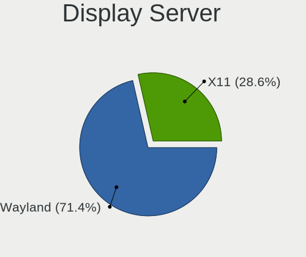
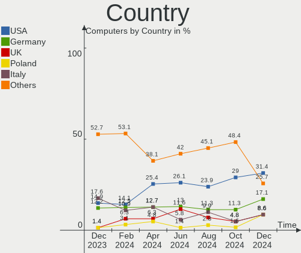
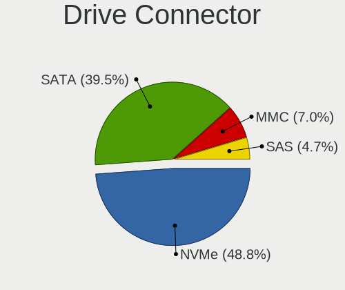
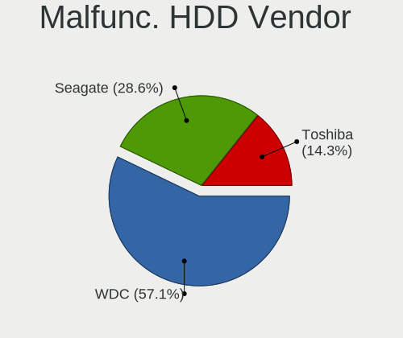
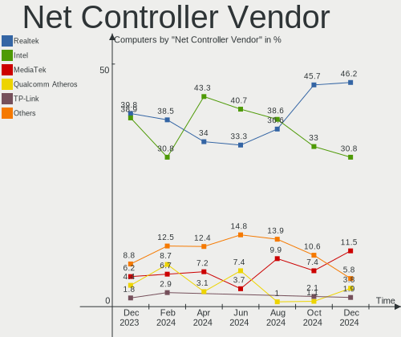
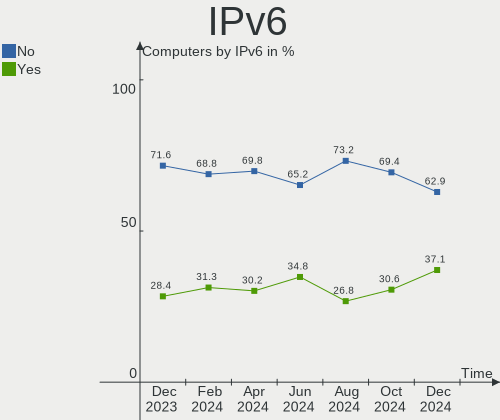
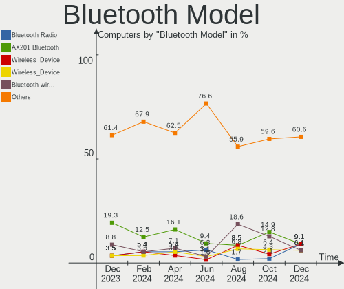
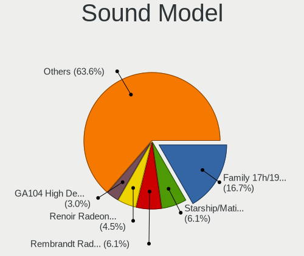
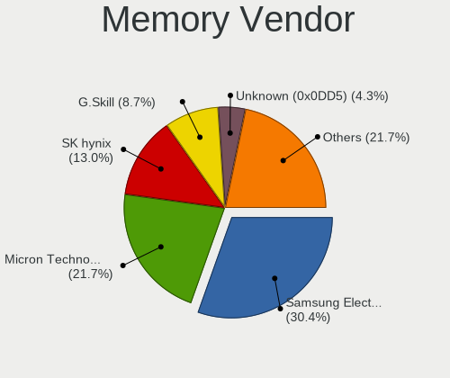

EndeavourOS - Hardware Trends
-----------------------------

A project to identify most popular hardware characteristics and track their change
over time based on data collected by Linux users at https://Linux-Hardware.org.

Anyone can contribute to this report by the [hw-probe](https://github.com/linuxhw/hw-probe) tool:

    sudo -E hw-probe -all -upload

This is a report for all computer types. See also reports for [desktops](/Dist/EndeavourOS/Desktop/README.md) and [notebooks](/Dist/EndeavourOS/Notebook/README.md).

This report is for one last month. Overall report since the beginning of time: [TestDays](https://github.com/linuxhw/TestDays)

Period: Aug, 2023.

Contents
--------

* [ System ](#system)
  - [ OS                       ](#os)
  - [ OS Family                ](#os-family)
  - [ Kernel                   ](#kernel)
  - [ Kernel Family            ](#kernel-family)
  - [ Kernel Major Ver.        ](#kernel-major-ver)
  - [ Arch                     ](#arch)
  - [ DE                       ](#de)
  - [ Display Server           ](#display-server)
  - [ Display Manager          ](#display-manager)
  - [ OS Lang                  ](#os-lang)
  - [ Boot Mode                ](#boot-mode)
  - [ Filesystem               ](#filesystem)
  - [ Part. scheme             ](#part-scheme)
  - [ Dual Boot with Linux/BSD ](#dual-boot-with-linuxbsd)
  - [ Dual Boot (Win)          ](#dual-boot-win)

* [ Board ](#board)
  - [ Vendor                   ](#vendor)
  - [ Model                    ](#model)
  - [ Model Family             ](#model-family)
  - [ MFG Year                 ](#mfg-year)
  - [ Form Factor              ](#form-factor)
  - [ Secure Boot              ](#secure-boot)
  - [ Coreboot                 ](#coreboot)
  - [ RAM Size                 ](#ram-size)
  - [ RAM Used                 ](#ram-used)
  - [ Total Drives             ](#total-drives)
  - [ Has CD-ROM               ](#has-cd-rom)
  - [ Has Ethernet             ](#has-ethernet)
  - [ Has WiFi                 ](#has-wifi)
  - [ Has Bluetooth            ](#has-bluetooth)

* [ Location ](#location)
  - [ Country                  ](#country)
  - [ City                     ](#city)

* [ Drives ](#drives)
  - [ Drive Vendor             ](#drive-vendor)
  - [ Drive Model              ](#drive-model)
  - [ HDD Vendor               ](#hdd-vendor)
  - [ SSD Vendor               ](#ssd-vendor)
  - [ Drive Kind               ](#drive-kind)
  - [ Drive Connector          ](#drive-connector)
  - [ Drive Size               ](#drive-size)
  - [ Space Total              ](#space-total)
  - [ Space Used               ](#space-used)
  - [ Malfunc. Drives          ](#malfunc-drives)
  - [ Malfunc. Drive Vendor    ](#malfunc-drive-vendor)
  - [ Malfunc. HDD Vendor      ](#malfunc-hdd-vendor)
  - [ Malfunc. Drive Kind      ](#malfunc-drive-kind)
  - [ Failed Drives            ](#failed-drives)
  - [ Failed Drive Vendor      ](#failed-drive-vendor)
  - [ Drive Status             ](#drive-status)

* [ Storage controller ](#storage-controller)
  - [ Storage Vendor           ](#storage-vendor)
  - [ Storage Model            ](#storage-model)
  - [ Storage Kind             ](#storage-kind)

* [ Processor ](#processor)
  - [ CPU Vendor               ](#cpu-vendor)
  - [ CPU Model                ](#cpu-model)
  - [ CPU Model Family         ](#cpu-model-family)
  - [ CPU Cores                ](#cpu-cores)
  - [ CPU Sockets              ](#cpu-sockets)
  - [ CPU Threads              ](#cpu-threads)
  - [ CPU Op-Modes             ](#cpu-op-modes)
  - [ CPU Microcode            ](#cpu-microcode)
  - [ CPU Microarch            ](#cpu-microarch)

* [ Graphics ](#graphics)
  - [ GPU Vendor               ](#gpu-vendor)
  - [ GPU Model                ](#gpu-model)
  - [ GPU Combo                ](#gpu-combo)
  - [ GPU Driver               ](#gpu-driver)
  - [ GPU Memory               ](#gpu-memory)

* [ Monitor ](#monitor)
  - [ Monitor Vendor           ](#monitor-vendor)
  - [ Monitor Model            ](#monitor-model)
  - [ Monitor Resolution       ](#monitor-resolution)
  - [ Monitor Diagonal         ](#monitor-diagonal)
  - [ Monitor Width            ](#monitor-width)
  - [ Aspect Ratio             ](#aspect-ratio)
  - [ Monitor Area             ](#monitor-area)
  - [ Pixel Density            ](#pixel-density)
  - [ Multiple Monitors        ](#multiple-monitors)

* [ Network ](#network)
  - [ Net Controller Vendor    ](#net-controller-vendor)
  - [ Net Controller Model     ](#net-controller-model)
  - [ Wireless Vendor          ](#wireless-vendor)
  - [ Wireless Model           ](#wireless-model)
  - [ Ethernet Vendor          ](#ethernet-vendor)
  - [ Ethernet Model           ](#ethernet-model)
  - [ Net Controller Kind      ](#net-controller-kind)
  - [ Used Controller          ](#used-controller)
  - [ NICs                     ](#nics)
  - [ IPv6                     ](#ipv6)

* [ Bluetooth ](#bluetooth)
  - [ Bluetooth Vendor         ](#bluetooth-vendor)
  - [ Bluetooth Model          ](#bluetooth-model)

* [ Sound ](#sound)
  - [ Sound Vendor             ](#sound-vendor)
  - [ Sound Model              ](#sound-model)

* [ Memory ](#memory)
  - [ Memory Vendor            ](#memory-vendor)
  - [ Memory Model             ](#memory-model)
  - [ Memory Kind              ](#memory-kind)
  - [ Memory Form Factor       ](#memory-form-factor)
  - [ Memory Size              ](#memory-size)
  - [ Memory Speed             ](#memory-speed)

* [ Printers & scanners ](#printers--scanners)
  - [ Printer Vendor           ](#printer-vendor)
  - [ Printer Model            ](#printer-model)
  - [ Scanner Vendor           ](#scanner-vendor)
  - [ Scanner Model            ](#scanner-model)

* [ Camera ](#camera)
  - [ Camera Vendor            ](#camera-vendor)
  - [ Camera Model             ](#camera-model)

* [ Security ](#security)
  - [ Fingerprint Vendor       ](#fingerprint-vendor)
  - [ Fingerprint Model        ](#fingerprint-model)
  - [ Chipcard Vendor          ](#chipcard-vendor)
  - [ Chipcard Model           ](#chipcard-model)

* [ Unsupported ](#unsupported)
  - [ Unsupported Devices      ](#unsupported-devices)
  - [ Unsupported Device Types ](#unsupported-device-types)

System
------

OS
--

Installed operating systems

| Name                | Computers | Percent |
|---------------------|-----------|---------|
| EndeavourOS Rolling | 60        | 100%    |

OS Family
---------

OS without a version

| Name        | Computers | Percent |
|-------------|-----------|---------|
| EndeavourOS | 60        | 100%    |

Kernel
------

Version of the Linux kernel

| Version                        | Computers | Percent |
|--------------------------------|-----------|---------|
| 6.4.11-arch2-1                 | 9         | 15%     |
| 6.4.12-arch1-1                 | 8         | 13.33%  |
| 6.4.10-arch1-1                 | 6         | 10%     |
| 6.4.8-arch1-1                  | 4         | 6.67%   |
| 6.4.7-arch1-1                  | 4         | 6.67%   |
| 6.4.7-arch1-3                  | 3         | 5%      |
| 6.4.11-arch1-1                 | 3         | 5%      |
| 6.4.9-arch1-1                  | 2         | 3.33%   |
| 6.4.12-zen1-1-zen              | 2         | 3.33%   |
| 6.4.11-zen2-1-zen              | 2         | 3.33%   |
| 6.4.10-zen2-1-zen              | 2         | 3.33%   |
| 6.1.46-1-lts                   | 2         | 3.33%   |
| 6.4.7-zen1-3-zen               | 1         | 1.67%   |
| 6.4.7-zen1-2-zen               | 1         | 1.67%   |
| 6.4.7-arch1-2                  | 1         | 1.67%   |
| 6.4.6-arch1-1                  | 1         | 1.67%   |
| 6.4.4-arch1-1                  | 1         | 1.67%   |
| 6.4.11-1-cachyos-tt            | 1         | 1.67%   |
| 6.4.10-RAVEN                   | 1         | 1.67%   |
| 6.3.4-arch1-1                  | 1         | 1.67%   |
| 6.1.49-1-lts                   | 1         | 1.67%   |
| 6.1.46-x64v2-rt13-xanmod1-1-rt | 1         | 1.67%   |
| 6.1.39-2-lts                   | 1         | 1.67%   |
| 6.1.39-1-lts                   | 1         | 1.67%   |
| 6.1.36-x64v3-1-shmilee         | 1         | 1.67%   |

Kernel Family
-------------

Linux kernel without a distro release

| Version | Computers | Percent |
|---------|-----------|---------|
| 6.4.11  | 15        | 25%     |
| 6.4.7   | 10        | 16.67%  |
| 6.4.12  | 10        | 16.67%  |
| 6.4.10  | 9         | 15%     |
| 6.4.8   | 4         | 6.67%   |
| 6.1.46  | 3         | 5%      |
| 6.4.9   | 2         | 3.33%   |
| 6.1.39  | 2         | 3.33%   |
| 6.4.6   | 1         | 1.67%   |
| 6.4.4   | 1         | 1.67%   |
| 6.3.4   | 1         | 1.67%   |
| 6.1.49  | 1         | 1.67%   |
| 6.1.36  | 1         | 1.67%   |

Kernel Major Ver.
-----------------

Linux kernel major version

| Version | Computers | Percent |
|---------|-----------|---------|
| 6.4     | 52        | 86.67%  |
| 6.1     | 7         | 11.67%  |
| 6.3     | 1         | 1.67%   |

Arch
----

OS architecture (x86_64, i586, etc.)

| Name   | Computers | Percent |
|--------|-----------|---------|
| x86_64 | 60        | 100%    |

DE
--

Desktop Environment

| Name     | Computers | Percent |
|----------|-----------|---------|
| KDE5     | 32        | 53.33%  |
| GNOME    | 14        | 23.33%  |
| XFCE     | 3         | 5%      |
| i3       | 3         | 5%      |
| Unknown  | 2         | 3.33%   |
| sway     | 1         | 1.67%   |
| MATE     | 1         | 1.67%   |
| LXQt     | 1         | 1.67%   |
| Hyprland | 1         | 1.67%   |
| Cinnamon | 1         | 1.67%   |
| Budgie   | 1         | 1.67%   |

Display Server
--------------

X11 or Wayland

| Name    | Computers | Percent |
|---------|-----------|---------|
| X11     | 33        | 55%     |
| Wayland | 24        | 40%     |
| Tty     | 2         | 3.33%   |
| Unknown | 1         | 1.67%   |

Display Manager
---------------

SDDM, LightDM, etc.

| Name    | Computers | Percent |
|---------|-----------|---------|
| Unknown | 21        | 35%     |
| SDDM    | 18        | 30%     |
| LightDM | 15        | 25%     |
| GDM     | 6         | 10%     |

OS Lang
-------

Language

| Lang       | Computers | Percent |
|------------|-----------|---------|
| en_US      | 22        | 36.67%  |
| it_IT      | 10        | 16.67%  |
| es_ES      | 5         | 8.33%   |
| en_GB      | 5         | 8.33%   |
| en_CA      | 4         | 6.67%   |
| ru_RU      | 3         | 5%      |
| zh_CN      | 1         | 1.67%   |
| tr_TR      | 1         | 1.67%   |
| sv_SE      | 1         | 1.67%   |
| pt_PT      | 1         | 1.67%   |
| pl_PL      | 1         | 1.67%   |
| fr_FR      | 1         | 1.67%   |
| es_CO      | 1         | 1.67%   |
| es_AR      | 1         | 1.67%   |
| en_US.UTF8 | 1         | 1.67%   |
| en_IN      | 1         | 1.67%   |
| de_DE      | 1         | 1.67%   |

Boot Mode
---------

EFI or BIOS

| Mode | Computers | Percent |
|------|-----------|---------|
| EFI  | 36        | 60%     |
| BIOS | 24        | 40%     |

Filesystem
----------

Type of filesystem

| Type  | Computers | Percent |
|-------|-----------|---------|
| Ext4  | 37        | 61.67%  |
| Btrfs | 22        | 36.67%  |
| Tmpfs | 1         | 1.67%   |

Part. scheme
------------

Scheme of partitioning

| Type    | Computers | Percent |
|---------|-----------|---------|
| GPT     | 37        | 61.67%  |
| Unknown | 21        | 35%     |
| MBR     | 2         | 3.33%   |

Dual Boot with Linux/BSD
------------------------

Hosting more than one Linux/BSD

| Dual boot | Computers | Percent |
|-----------|-----------|---------|
| No        | 47        | 78.33%  |
| Yes       | 13        | 21.67%  |

Dual Boot (Win)
---------------

Hosting Linux and Windows

| Dual boot | Computers | Percent |
|-----------|-----------|---------|
| No        | 48        | 80%     |
| Yes       | 12        | 20%     |

Board
-----

Vendor
------

Motherboard manufacturer

| Name                | Computers | Percent |
|---------------------|-----------|---------|
| ASUSTek Computer    | 16        | 26.67%  |
| Lenovo              | 10        | 16.67%  |
| Hewlett-Packard     | 8         | 13.33%  |
| Dell                | 7         | 11.67%  |
| MSI                 | 4         | 6.67%   |
| ASRock              | 3         | 5%      |
| Sony                | 2         | 3.33%   |
| Toshiba             | 1         | 1.67%   |
| Samsung Electronics | 1         | 1.67%   |
| Packard Bell        | 1         | 1.67%   |
| Microsoft           | 1         | 1.67%   |
| Google              | 1         | 1.67%   |
| Gigabyte Technology | 1         | 1.67%   |
| Fujitsu             | 1         | 1.67%   |
| Apple               | 1         | 1.67%   |
| Acer                | 1         | 1.67%   |
| Unknown             | 1         | 1.67%   |

Model
-----

Motherboard model

| Name                                    | Computers | Percent |
|-----------------------------------------|-----------|---------|
| Toshiba PORTEGE R700                    | 1         | 1.67%   |
| Sony VPCSB1V9R                          | 1         | 1.67%   |
| Sony SVE1713X1EB                        | 1         | 1.67%   |
| Samsung 930QCG                          | 1         | 1.67%   |
| Packard Bell EasyNote TJ66              | 1         | 1.67%   |
| MSI MS-7B79                             | 1         | 1.67%   |
| MSI Modern 15 A5M                       | 1         | 1.67%   |
| MSI Katana 15 B13VGK                    | 1         | 1.67%   |
| MSI GL73 8RE                            | 1         | 1.67%   |
| Microsoft Surface Laptop Go             | 1         | 1.67%   |
| Lenovo Yoga Pro 7 14ARP8 83AU           | 1         | 1.67%   |
| Lenovo ThinkPad T16 Gen 1 21BVCTO1WW    | 1         | 1.67%   |
| Lenovo ThinkPad E495 20NES0KM00         | 1         | 1.67%   |
| Lenovo ThinkBook 16p Gen 2 20YM         | 1         | 1.67%   |
| Lenovo Legion 5 15IMH05H 81Y6           | 1         | 1.67%   |
| Lenovo IdeaPadFlex 5 14ALC7 82R9        | 1         | 1.67%   |
| Lenovo IdeaPad Gaming 3 15ACH6 82K2     | 1         | 1.67%   |
| Lenovo IdeaPad 320-15ISK 80XH           | 1         | 1.67%   |
| Lenovo IdeaPad 3 15ITL05 81X8           | 1         | 1.67%   |
| Lenovo IdeaPad 110-15AST 80TR           | 1         | 1.67%   |
| HP Z420 Workstation                     | 1         | 1.67%   |
| HP Victus by Laptop 16-e0xxx            | 1         | 1.67%   |
| HP Pavilion x360 Convertible 14-dw1xxx  | 1         | 1.67%   |
| HP EliteDesk 800 G2 DM 35W              | 1         | 1.67%   |
| HP EliteDesk 800 G1 TWR                 | 1         | 1.67%   |
| HP EliteBook 865 16 inch G9 Notebook PC | 1         | 1.67%   |
| HP EliteBook 645 14 inch G9 Notebook PC | 1         | 1.67%   |
| HP 250 G4                               | 1         | 1.67%   |
| Google Madoo                            | 1         | 1.67%   |
| Gigabyte H77-DS3H                       | 1         | 1.67%   |
| Fujitsu LIFEBOOK U904                   | 1         | 1.67%   |
| Dell XPS 15 9520                        | 1         | 1.67%   |
| Dell Vostro 3500                        | 1         | 1.67%   |
| Dell Precision 3571                     | 1         | 1.67%   |
| Dell OptiPlex 3050                      | 1         | 1.67%   |
| Dell Latitude E5570                     | 1         | 1.67%   |
| Dell Latitude E5470                     | 1         | 1.67%   |
| Dell Inspiron 3542                      | 1         | 1.67%   |
| ASUS Zenbook UX3402ZA_Q409ZA            | 1         | 1.67%   |
| ASUS X550VXK                            | 1         | 1.67%   |

Model Family
------------

Motherboard model prefix

| Name                  | Computers | Percent |
|-----------------------|-----------|---------|
| Lenovo IdeaPad        | 4         | 6.67%   |
| ASUS TUF              | 4         | 6.67%   |
| ASUS ROG              | 4         | 6.67%   |
| ASUS PRIME            | 3         | 5%      |
| Lenovo ThinkPad       | 2         | 3.33%   |
| HP EliteDesk          | 2         | 3.33%   |
| HP EliteBook          | 2         | 3.33%   |
| Dell Latitude         | 2         | 3.33%   |
| Toshiba PORTEGE       | 1         | 1.67%   |
| Sony VPCSB1V9R        | 1         | 1.67%   |
| Sony SVE1713X1EB      | 1         | 1.67%   |
| Samsung 930QCG        | 1         | 1.67%   |
| Packard Bell EasyNote | 1         | 1.67%   |
| MSI MS-7B79           | 1         | 1.67%   |
| MSI Modern            | 1         | 1.67%   |
| MSI Katana            | 1         | 1.67%   |
| MSI GL73              | 1         | 1.67%   |
| Microsoft Surface     | 1         | 1.67%   |
| Lenovo Yoga           | 1         | 1.67%   |
| Lenovo ThinkBook      | 1         | 1.67%   |
| Lenovo Legion         | 1         | 1.67%   |
| Lenovo IdeaPadFlex    | 1         | 1.67%   |
| HP Z420               | 1         | 1.67%   |
| HP Victus             | 1         | 1.67%   |
| HP Pavilion           | 1         | 1.67%   |
| HP 250                | 1         | 1.67%   |
| Google Madoo          | 1         | 1.67%   |
| Gigabyte H77-DS3H     | 1         | 1.67%   |
| Fujitsu LIFEBOOK      | 1         | 1.67%   |
| Dell XPS              | 1         | 1.67%   |
| Dell Vostro           | 1         | 1.67%   |
| Dell Precision        | 1         | 1.67%   |
| Dell OptiPlex         | 1         | 1.67%   |
| Dell Inspiron         | 1         | 1.67%   |
| ASUS Zenbook          | 1         | 1.67%   |
| ASUS X550VXK          | 1         | 1.67%   |
| ASUS VivoBook         | 1         | 1.67%   |
| ASUS M4A88TD-V        | 1         | 1.67%   |
| ASUS ASUS             | 1         | 1.67%   |
| ASRock Z170           | 1         | 1.67%   |

MFG Year
--------

Motherboard manufacture year

| Year | Computers | Percent |
|------|-----------|---------|
| 2022 | 9         | 15%     |
| 2021 | 8         | 13.33%  |
| 2020 | 7         | 11.67%  |
| 2017 | 7         | 11.67%  |
| 2023 | 5         | 8.33%   |
| 2018 | 4         | 6.67%   |
| 2015 | 4         | 6.67%   |
| 2019 | 3         | 5%      |
| 2012 | 3         | 5%      |
| 2010 | 3         | 5%      |
| 2016 | 2         | 3.33%   |
| 2013 | 2         | 3.33%   |
| 2014 | 1         | 1.67%   |
| 2011 | 1         | 1.67%   |
| 2009 | 1         | 1.67%   |

Form Factor
-----------

Physical design of the computer

| Name        | Computers | Percent |
|-------------|-----------|---------|
| Notebook    | 35        | 58.33%  |
| Desktop     | 18        | 30%     |
| Convertible | 4         | 6.67%   |
| Tablet      | 1         | 1.67%   |
| Mini pc     | 1         | 1.67%   |
| All in one  | 1         | 1.67%   |

Secure Boot
-----------

Enabled or disabled

| State    | Computers | Percent |
|----------|-----------|---------|
| Disabled | 59        | 98.33%  |
| Enabled  | 1         | 1.67%   |

Coreboot
--------

Have coreboot on board

| Used | Computers | Percent |
|------|-----------|---------|
| No   | 59        | 98.33%  |
| Yes  | 1         | 1.67%   |

RAM Size
--------

Total RAM memory

| Size in GB  | Computers | Percent |
|-------------|-----------|---------|
| 32.01-64.0  | 14        | 23.33%  |
| 8.01-16.0   | 14        | 23.33%  |
| 16.01-24.0  | 12        | 20%     |
| 4.01-8.0    | 9         | 15%     |
| 3.01-4.0    | 5         | 8.33%   |
| 24.01-32.0  | 3         | 5%      |
| 64.01-256.0 | 3         | 5%      |

RAM Used
--------

Used RAM memory

| Used GB   | Computers | Percent |
|-----------|-----------|---------|
| 4.01-8.0  | 19        | 31.67%  |
| 3.01-4.0  | 17        | 28.33%  |
| 8.01-16.0 | 9         | 15%     |
| 1.01-2.0  | 8         | 13.33%  |
| 2.01-3.0  | 6         | 10%     |
| 0.51-1.0  | 1         | 1.67%   |

Total Drives
------------

Number of drives on board

| Drives | Computers | Percent |
|--------|-----------|---------|
| 1      | 26        | 43.33%  |
| 2      | 22        | 36.67%  |
| 3      | 7         | 11.67%  |
| 4      | 2         | 3.33%   |
| 9      | 1         | 1.67%   |
| 6      | 1         | 1.67%   |
| 5      | 1         | 1.67%   |

Has CD-ROM
----------

Has CD-ROM on board

| Presented | Computers | Percent |
|-----------|-----------|---------|
| No        | 52        | 86.67%  |
| Yes       | 8         | 13.33%  |

Has Ethernet
------------

Has Ethernet on board

| Presented | Computers | Percent |
|-----------|-----------|---------|
| Yes       | 51        | 85%     |
| No        | 9         | 15%     |

Has WiFi
--------

Has WiFi module

| Presented | Computers | Percent |
|-----------|-----------|---------|
| Yes       | 50        | 83.33%  |
| No        | 10        | 16.67%  |

Has Bluetooth
-------------

Has Bluetooth module

| Presented | Computers | Percent |
|-----------|-----------|---------|
| Yes       | 50        | 83.33%  |
| No        | 10        | 16.67%  |

Location
--------

Country
-------

Geographic location (country)

| Country                | Computers | Percent |
|------------------------|-----------|---------|
| USA                    | 11        | 18.33%  |
| Italy                  | 11        | 18.33%  |
| Spain                  | 5         | 8.33%   |
| UK                     | 4         | 6.67%   |
| Germany                | 4         | 6.67%   |
| Canada                 | 4         | 6.67%   |
| Turkey                 | 2         | 3.33%   |
| Switzerland            | 2         | 3.33%   |
| Russia                 | 2         | 3.33%   |
| Vietnam                | 1         | 1.67%   |
| Uruguay                | 1         | 1.67%   |
| Sweden                 | 1         | 1.67%   |
| Slovakia               | 1         | 1.67%   |
| Portugal               | 1         | 1.67%   |
| Poland                 | 1         | 1.67%   |
| Netherlands            | 1         | 1.67%   |
| Mexico                 | 1         | 1.67%   |
| Kazakhstan             | 1         | 1.67%   |
| Japan                  | 1         | 1.67%   |
| India                  | 1         | 1.67%   |
| France                 | 1         | 1.67%   |
| Colombia               | 1         | 1.67%   |
| Bosnia and Herzegovina | 1         | 1.67%   |
| Argentina              | 1         | 1.67%   |

City
----

Geographic location (city)

| City                  | Computers | Percent |
|-----------------------|-----------|---------|
| Milan                 | 3         | 5%      |
| Istanbul              | 2         | 3.33%   |
| Chicoutimi            | 2         | 3.33%   |
| Brighton              | 2         | 3.33%   |
| Zaragoza              | 1         | 1.67%   |
| Yuzhno-Sakhalinsk     | 1         | 1.67%   |
| Xàtiva               | 1         | 1.67%   |
| Wohlen bei Bern       | 1         | 1.67%   |
| Wilmington            | 1         | 1.67%   |
| Warwick               | 1         | 1.67%   |
| Valencia              | 1         | 1.67%   |
| Turin                 | 1         | 1.67%   |
| Taylor                | 1         | 1.67%   |
| Sursee                | 1         | 1.67%   |
| San Luis Potosí City | 1         | 1.67%   |
| Sabadell              | 1         | 1.67%   |
| Rosny-sous-Bois       | 1         | 1.67%   |
| Rosario               | 1         | 1.67%   |
| Rexburg               | 1         | 1.67%   |
| Poznan                | 1         | 1.67%   |
| Pontevico             | 1         | 1.67%   |
| Pontevedra            | 1         | 1.67%   |
| Pocitos               | 1         | 1.67%   |
| Osaka                 | 1         | 1.67%   |
| Nemoli                | 1         | 1.67%   |
| Naples                | 1         | 1.67%   |
| Montreal              | 1         | 1.67%   |
| Montabaur             | 1         | 1.67%   |
| Mississauga           | 1         | 1.67%   |
| Mikhaylovsk           | 1         | 1.67%   |
| Marcus Hook           | 1         | 1.67%   |
| Mannheim              | 1         | 1.67%   |
| Lisbon                | 1         | 1.67%   |
| Landshut              | 1         | 1.67%   |
| Kyzylorda             | 1         | 1.67%   |
| Jacksonville          | 1         | 1.67%   |
| Hoogeveen             | 1         | 1.67%   |
| Hanoi                 | 1         | 1.67%   |
| Halifax               | 1         | 1.67%   |
| Grottaglie            | 1         | 1.67%   |

Drives
------

Drive Vendor
------------

Hard drive vendors

| Vendor                      | Computers | Drives | Percent |
|-----------------------------|-----------|--------|---------|
| Samsung Electronics         | 15        | 19     | 13.51%  |
| Sandisk                     | 12        | 14     | 10.81%  |
| Seagate                     | 7         | 8      | 6.31%   |
| Kingston                    | 7         | 8      | 6.31%   |
| SK hynix                    | 6         | 6      | 5.41%   |
| Micron Technology           | 6         | 6      | 5.41%   |
| WDC                         | 5         | 6      | 4.5%    |
| Intel                       | 5         | 5      | 4.5%    |
| Toshiba                     | 4         | 4      | 3.6%    |
| Crucial                     | 4         | 4      | 3.6%    |
| ADATA Technology            | 4         | 4      | 3.6%    |
| Unknown                     | 3         | 3      | 2.7%    |
| Phison Electronics          | 3         | 4      | 2.7%    |
| Micron/Crucial Technology   | 3         | 3      | 2.7%    |
| Hitachi                     | 3         | 3      | 2.7%    |
| A-DATA Technology           | 3         | 3      | 2.7%    |
| Realtek                     | 2         | 2      | 1.8%    |
| Patriot                     | 2         | 2      | 1.8%    |
| HGST                        | 2         | 2      | 1.8%    |
| China                       | 2         | 2      | 1.8%    |
| Union Memory                | 1         | 1      | 0.9%    |
| Timetec                     | 1         | 1      | 0.9%    |
| Plextor                     | 1         | 1      | 0.9%    |
| Maxtor                      | 1         | 1      | 0.9%    |
| MAXIO Technology (Hangzhou) | 1         | 1      | 0.9%    |
| MaxDigital                  | 1         | 1      | 0.9%    |
| Kingston Technology Company | 1         | 1      | 0.9%    |
| KingFast                    | 1         | 1      | 0.9%    |
| Intenso                     | 1         | 1      | 0.9%    |
| GOODRAM                     | 1         | 1      | 0.9%    |
| Gigabyte Technology         | 1         | 1      | 0.9%    |
| Apple                       | 1         | 1      | 0.9%    |
| Apacer                      | 1         | 1      | 0.9%    |

Drive Model
-----------

Hard drive models

| Model                                                 | Computers | Percent |
|-------------------------------------------------------|-----------|---------|
| Sandisk WD Blue SN550 NVMe SSD 250GB                  | 5         | 4.2%    |
| Samsung NVMe SSD Controller PM9A1/PM9A3/980PRO 1024GB | 3         | 2.52%   |
| Micron/Crucial P2 NVMe PCIe SSD 1TB                   | 3         | 2.52%   |
| Kingston SA400S37240G 240GB SSD                       | 3         | 2.52%   |
| Samsung NVMe SSD Controller SM981/PM981/PM983 500GB   | 2         | 1.68%   |
| Realtek RTL9210B-CG 2TB                               | 2         | 1.68%   |
| Micron MTFDHBA512TDV-1AZ1AABHA 512GB                  | 2         | 1.68%   |
| Kingston SKC3000D2048G 2TB                            | 2         | 1.68%   |
| Intel SSD 660P Series 512GB                           | 2         | 1.68%   |
| HGST HTS545050A7E680 500GB                            | 2         | 1.68%   |
| Crucial CT500MX500SSD1 500GB                          | 2         | 1.68%   |
| ADATA SX6000PNP 512GB                                 | 2         | 1.68%   |
| WDC WDS120G2G0A-00JH30 120GB SSD                      | 1         | 0.84%   |
| WDC WD5000BPVT-60HXZT3 500GB                          | 1         | 0.84%   |
| WDC WD20EARS-42S0XB0 2TB                              | 1         | 0.84%   |
| WDC WD10EARS-00Y5B1 1TB                               | 1         | 0.84%   |
| WDC WD1002FBYS-02A6B0 1TB                             | 1         | 0.84%   |
| Unknown MMC Card  32GB                                | 1         | 0.84%   |
| Unknown MMC Card  196GB                               | 1         | 0.84%   |
| Unknown MMC Card  16GB                                | 1         | 0.84%   |
| Union Memory UMIS RPJTJ256MED1OWX 256GB               | 1         | 0.84%   |
| Toshiba MQ01ABD100 1TB                                | 1         | 0.84%   |
| Toshiba DT01ACA300 3TB                                | 1         | 0.84%   |
| Toshiba DT01ACA100 1TB                                | 1         | 0.84%   |
| Toshiba BG3 NVMe SSD Controller 256GB                 | 1         | 0.84%   |
| Timetec MS05 256GB SSD                                | 1         | 0.84%   |
| SK hynix SKHynix_HFM128GD3HX015N 128GB                | 1         | 0.84%   |
| SK hynix SC308 SATA 256GB SSD                         | 1         | 0.84%   |
| SK hynix PC801 NVMe 1TB                               | 1         | 0.84%   |
| SK hynix HFS128G32TND-N210A 128GB SSD                 | 1         | 0.84%   |
| SK hynix C2S3T/240G 240GB SSD                         | 1         | 0.84%   |
| SK hynix BC501 NVMe Solid State Drive 512GB           | 1         | 0.84%   |
| Seagate ST500LM021-1KJ152 500GB                       | 1         | 0.84%   |
| Seagate ST3200820AS 200GB                             | 1         | 0.84%   |
| Seagate ST3000NM0033-9ZM178 3TB                       | 1         | 0.84%   |
| Seagate ST3000DM001-1ER166 3TB                        | 1         | 0.84%   |
| Seagate ST2000VN004-2E4164 2TB                        | 1         | 0.84%   |
| Seagate ST2000LM007-1R8174 2TB                        | 1         | 0.84%   |
| Seagate ST1000LM035-1RK172 1TB                        | 1         | 0.84%   |
| Seagate ST1000DM003-1CH162 1TB                        | 1         | 0.84%   |

HDD Vendor
----------

Hard disk drive vendors

| Vendor     | Computers | Drives | Percent |
|------------|-----------|--------|---------|
| Seagate    | 7         | 8      | 31.82%  |
| WDC        | 4         | 5      | 18.18%  |
| Toshiba    | 3         | 3      | 13.64%  |
| Hitachi    | 3         | 3      | 13.64%  |
| HGST       | 2         | 2      | 9.09%   |
| Maxtor     | 1         | 1      | 4.55%   |
| MaxDigital | 1         | 1      | 4.55%   |
| Apple      | 1         | 1      | 4.55%   |

SSD Vendor
----------

Solid state drive vendors

| Vendor              | Computers | Drives | Percent |
|---------------------|-----------|--------|---------|
| Samsung Electronics | 11        | 12     | 27.5%   |
| Kingston            | 4         | 4      | 10%     |
| Crucial             | 4         | 4      | 10%     |
| SK hynix            | 3         | 3      | 7.5%    |
| SanDisk             | 3         | 3      | 7.5%    |
| A-DATA Technology   | 3         | 3      | 7.5%    |
| Patriot             | 2         | 2      | 5%      |
| China               | 2         | 2      | 5%      |
| WDC                 | 1         | 1      | 2.5%    |
| Timetec             | 1         | 1      | 2.5%    |
| Plextor             | 1         | 1      | 2.5%    |
| KingFast            | 1         | 1      | 2.5%    |
| Intenso             | 1         | 1      | 2.5%    |
| GOODRAM             | 1         | 1      | 2.5%    |
| Gigabyte Technology | 1         | 1      | 2.5%    |
| Apacer              | 1         | 1      | 2.5%    |

Drive Kind
----------

HDD or SSD

| Kind | Computers | Drives | Percent |
|------|-----------|--------|---------|
| NVMe | 41        | 53     | 45.56%  |
| SSD  | 30        | 41     | 33.33%  |
| HDD  | 16        | 24     | 17.78%  |
| MMC  | 3         | 3      | 3.33%   |

Drive Connector
---------------

SATA, SAS, NVMe, etc.

| Type | Computers | Drives | Percent |
|------|-----------|--------|---------|
| NVMe | 41        | 51     | 50%     |
| SATA | 33        | 61     | 40.24%  |
| SAS  | 5         | 6      | 6.1%    |
| MMC  | 3         | 3      | 3.66%   |

Drive Size
----------

Size of hard drive

| Size in TB | Computers | Drives | Percent |
|------------|-----------|--------|---------|
| 0.01-0.5   | 31        | 41     | 58.49%  |
| 0.51-1.0   | 13        | 13     | 24.53%  |
| 1.01-2.0   | 5         | 6      | 9.43%   |
| 2.01-3.0   | 3         | 3      | 5.66%   |
| 3.01-4.0   | 1         | 2      | 1.89%   |

Space Total
-----------

Amount of disk space available on the file system

| Size in GB     | Computers | Percent |
|----------------|-----------|---------|
| 101-250        | 11        | 18.33%  |
| 501-1000       | 10        | 16.67%  |
| More than 3000 | 9         | 15%     |
| 251-500        | 8         | 13.33%  |
| 1001-2000      | 6         | 10%     |
| Unknown        | 5         | 8.33%   |
| 51-100         | 4         | 6.67%   |
| 2001-3000      | 3         | 5%      |
| 1-20           | 3         | 5%      |
| 21-50          | 1         | 1.67%   |

Space Used
----------

Amount of used disk space

| Used GB        | Computers | Percent |
|----------------|-----------|---------|
| 1-20           | 15        | 25%     |
| 21-50          | 10        | 16.67%  |
| 101-250        | 7         | 11.67%  |
| 501-1000       | 6         | 10%     |
| 1001-2000      | 5         | 8.33%   |
| 51-100         | 5         | 8.33%   |
| Unknown        | 5         | 8.33%   |
| More than 3000 | 4         | 6.67%   |
| 251-500        | 2         | 3.33%   |
| 2001-3000      | 1         | 1.67%   |

Malfunc. Drives
---------------

Drive models with a malfunction

| Model                                 | Computers | Drives | Percent |
|---------------------------------------|-----------|--------|---------|
| HGST HTS545050A7E680 500GB            | 2         | 2      | 22.22%  |
| WDC WDS120G2G0A-00JH30 120GB SSD      | 1         | 1      | 11.11%  |
| WDC WD5000BPVT-60HXZT3 500GB          | 1         | 1      | 11.11%  |
| WDC WD1002FBYS-02A6B0 1TB             | 1         | 1      | 11.11%  |
| Toshiba DT01ACA300 3TB                | 1         | 1      | 11.11%  |
| SK hynix HFS128G32TND-N210A 128GB SSD | 1         | 1      | 11.11%  |
| Seagate ST500LM021-1KJ152 500GB       | 1         | 1      | 11.11%  |
| Seagate ST3200820AS 200GB             | 1         | 1      | 11.11%  |

Malfunc. Drive Vendor
---------------------

Vendors of faulty drives

| Vendor   | Computers | Drives | Percent |
|----------|-----------|--------|---------|
| WDC      | 3         | 3      | 33.33%  |
| Seagate  | 2         | 2      | 22.22%  |
| HGST     | 2         | 2      | 22.22%  |
| Toshiba  | 1         | 1      | 11.11%  |
| SK hynix | 1         | 1      | 11.11%  |

Malfunc. HDD Vendor
-------------------

Vendors of faulty HDD drives

| Vendor  | Computers | Drives | Percent |
|---------|-----------|--------|---------|
| WDC     | 2         | 2      | 28.57%  |
| Seagate | 2         | 2      | 28.57%  |
| HGST    | 2         | 2      | 28.57%  |
| Toshiba | 1         | 1      | 14.29%  |

Malfunc. Drive Kind
-------------------

Kinds of faulty drives

| Kind | Computers | Drives | Percent |
|------|-----------|--------|---------|
| HDD  | 6         | 7      | 75%     |
| SSD  | 2         | 2      | 25%     |

Failed Drives
-------------

Failed drive models

Zero info for selected period =(

Failed Drive Vendor
-------------------

Failed drive vendors

Zero info for selected period =(

Drive Status
------------

Number of failed and malfunc. drives

| Status   | Computers | Drives | Percent |
|----------|-----------|--------|---------|
| Works    | 36        | 62     | 51.43%  |
| Detected | 26        | 50     | 37.14%  |
| Malfunc  | 8         | 9      | 11.43%  |

Storage controller
------------------

Storage Vendor
--------------

Storage controller vendors

| Vendor                       | Computers | Percent |
|------------------------------|-----------|---------|
| Intel                        | 33        | 35.87%  |
| AMD                          | 16        | 17.39%  |
| SanDisk                      | 9         | 9.78%   |
| Samsung Electronics          | 7         | 7.61%   |
| Micron Technology            | 6         | 6.52%   |
| Kingston Technology Company  | 4         | 4.35%   |
| ADATA Technology             | 4         | 4.35%   |
| SK hynix                     | 3         | 3.26%   |
| Phison Electronics           | 3         | 3.26%   |
| Micron/Crucial Technology    | 3         | 3.26%   |
| VIA Technologies             | 1         | 1.09%   |
| Union Memory (Shenzhen)      | 1         | 1.09%   |
| Toshiba America Info Systems | 1         | 1.09%   |
| MAXIO Technology (Hangzhou)  | 1         | 1.09%   |

Storage Model
-------------

Storage controller models

| Model                                                                          | Computers | Percent |
|--------------------------------------------------------------------------------|-----------|---------|
| AMD FCH SATA Controller [AHCI mode]                                            | 11        | 10.58%  |
| SanDisk WD Blue SN550 NVMe SSD                                                 | 5         | 4.81%   |
| Intel Volume Management Device NVMe RAID Controller                            | 5         | 4.81%   |
| Samsung NVMe SSD Controller PM9A1/PM9A3/980PRO                                 | 3         | 2.88%   |
| Micron/Crucial P2 [Nick P2] / P3 / P3 Plus NVMe PCIe SSD (DRAM-less)           | 3         | 2.88%   |
| Micron 2300 NVMe SSD [Santana]                                                 | 3         | 2.88%   |
| Intel Q170/Q150/B150/H170/H110/Z170/CM236 Chipset SATA Controller [AHCI Mode]  | 3         | 2.88%   |
| Samsung NVMe SSD Controller SM981/PM981/PM983                                  | 2         | 1.92%   |
| Kingston Company KC3000/Renegade NVMe SSD                                      | 2         | 1.92%   |
| Intel Volume Management Device NVMe RAID Controller Intel Corporation          | 2         | 1.92%   |
| Intel Tiger Lake-LP SATA Controller                                            | 2         | 1.92%   |
| Intel Sunrise Point-LP SATA Controller [AHCI mode]                             | 2         | 1.92%   |
| Intel SSD 670p Series [Keystone Harbor]                                        | 2         | 1.92%   |
| Intel SSD 660P Series                                                          | 2         | 1.92%   |
| Intel 8 Series/C220 Series Chipset Family 6-port SATA Controller 1 [AHCI mode] | 2         | 1.92%   |
| Intel 8 Series SATA Controller 1 [AHCI mode]                                   | 2         | 1.92%   |
| AMD 400 Series Chipset SATA Controller                                         | 2         | 1.92%   |
| ADATA ADATA XPG GAMMIXS1 1L Media (256 GB SSD)                                 | 2         | 1.92%   |
| VIA VT6415 PATA IDE Host Controller                                            | 1         | 0.96%   |
| Union Memory (Shenzhen) AM611 PCIe 3.0 NVMe SSD 256GB                          | 1         | 0.96%   |
| Toshiba America Info Systems BG3 NVMe SSD Controller                           | 1         | 0.96%   |
| SK hynix Platinum P41/PC801 NVMe Solid State Drive                             | 1         | 0.96%   |
| SK hynix Gold P31/BC711/PC711 NVMe Solid State Drive                           | 1         | 0.96%   |
| SK hynix BC501 NVMe Solid State Drive                                          | 1         | 0.96%   |
| Sandisk Western Digital WD Black SN850X NVMe SSD                               | 1         | 0.96%   |
| SanDisk WD Green SN350 NVMe SSD 1 TB (DRAM-less)                               | 1         | 0.96%   |
| SanDisk WD Black SN770 / PC SN740 256GB / PC SN560 (DRAM-less) NVMe SSD        | 1         | 0.96%   |
| SanDisk WD Black SN750 / PC SN730 NVMe SSD                                     | 1         | 0.96%   |
| SanDisk PC SN735 NVMe SSD (DRAM-less)                                          | 1         | 0.96%   |
| Samsung NVMe SSD Controller PM9B1                                              | 1         | 0.96%   |
| Samsung NVMe SSD Controller 980                                                | 1         | 0.96%   |
| Phison PS5013 E13 NVMe Controller                                              | 1         | 0.96%   |
| Phison E18 PCIe4 NVMe Controller                                               | 1         | 0.96%   |
| Phison E16 PCIe4 NVMe Controller                                               | 1         | 0.96%   |
| Phison E12 NVMe Controller                                                     | 1         | 0.96%   |
| Micron 2450 NVMe SSD [HendrixV] (DRAM-less)                                    | 1         | 0.96%   |
| Micron 2400 NVMe SSD (DRAM-less)                                               | 1         | 0.96%   |
| Micron 2200S NVMe SSD [Cassandra]                                              | 1         | 0.96%   |
| MAXIO (Hangzhou) NVMe SSD Controller MAP1202                                   | 1         | 0.96%   |
| Kingston Company Company Non-Volatile memory controller                        | 1         | 0.96%   |

Storage Kind
------------

Kind of storage controller (IDE, SATA, NVMe, SAS, ...)

| Kind | Computers | Percent |
|------|-----------|---------|
| NVMe | 41        | 45.05%  |
| SATA | 37        | 40.66%  |
| RAID | 10        | 10.99%  |
| IDE  | 2         | 2.2%    |
| SAS  | 1         | 1.1%    |

Processor
---------

CPU Vendor
----------

Processor vendors

| Vendor | Computers | Percent |
|--------|-----------|---------|
| Intel  | 35        | 58.33%  |
| AMD    | 25        | 41.67%  |

CPU Model
---------

Processor models

| Model                                   | Computers | Percent |
|-----------------------------------------|-----------|---------|
| AMD Ryzen 7 3700X 8-Core Processor      | 4         | 6.67%   |
| AMD Ryzen 7 5700U with Radeon Graphics  | 2         | 3.33%   |
| AMD Ryzen 7 1700 Eight-Core Processor   | 2         | 3.33%   |
| AMD Ryzen 5 5600H with Radeon Graphics  | 2         | 3.33%   |
| Intel Xeon CPU E5-1603 0 @ 2.80GHz      | 1         | 1.67%   |
| Intel Pentium Gold 7505 @ 2.00GHz       | 1         | 1.67%   |
| Intel Core i9-9900K CPU @ 3.60GHz       | 1         | 1.67%   |
| Intel Core i7-8750H CPU @ 2.20GHz       | 1         | 1.67%   |
| Intel Core i7-6820HQ CPU @ 2.70GHz      | 1         | 1.67%   |
| Intel Core i7-4790 CPU @ 3.60GHz        | 1         | 1.67%   |
| Intel Core i7-4510U CPU @ 2.00GHz       | 1         | 1.67%   |
| Intel Core i7-3632QM CPU @ 2.20GHz      | 1         | 1.67%   |
| Intel Core i7-10750H CPU @ 2.60GHz      | 1         | 1.67%   |
| Intel Core i7-1065G7 CPU @ 1.30GHz      | 1         | 1.67%   |
| Intel Core i5-7500 CPU @ 3.40GHz        | 1         | 1.67%   |
| Intel Core i5-7300HQ CPU @ 2.50GHz      | 1         | 1.67%   |
| Intel Core i5-6600K CPU @ 3.50GHz       | 1         | 1.67%   |
| Intel Core i5-6500T CPU @ 2.50GHz       | 1         | 1.67%   |
| Intel Core i5-6200U CPU @ 2.30GHz       | 1         | 1.67%   |
| Intel Core i5-4570R CPU @ 2.70GHz       | 1         | 1.67%   |
| Intel Core i5-4200U CPU @ 1.60GHz       | 1         | 1.67%   |
| Intel Core i5-2500K CPU @ 3.30GHz       | 1         | 1.67%   |
| Intel Core i5-2410M CPU @ 2.30GHz       | 1         | 1.67%   |
| Intel Core i5-1035G1 CPU @ 1.00GHz      | 1         | 1.67%   |
| Intel Core i5-10210U CPU @ 1.60GHz      | 1         | 1.67%   |
| Intel Core i5 CPU M 460 @ 2.53GHz       | 1         | 1.67%   |
| Intel Core i3-6006U CPU @ 2.00GHz       | 1         | 1.67%   |
| Intel Core 2 Duo CPU P7450 @ 2.13GHz    | 1         | 1.67%   |
| Intel Celeron N4500 @ 1.10GHz           | 1         | 1.67%   |
| Intel Celeron CPU N3050 @ 1.60GHz       | 1         | 1.67%   |
| Intel 13th Gen Core i9-13900H           | 1         | 1.67%   |
| Intel 13th Gen Core i7-13620H           | 1         | 1.67%   |
| Intel 12th Gen Core i7-12700H           | 1         | 1.67%   |
| Intel 12th Gen Core i7-1260P            | 1         | 1.67%   |
| Intel 12th Gen Core i5-12500H           | 1         | 1.67%   |
| Intel 12th Gen Core i5-1240P            | 1         | 1.67%   |
| Intel 11th Gen Core i7-11370H @ 3.30GHz | 1         | 1.67%   |
| Intel 11th Gen Core i5-1135G7 @ 2.40GHz | 1         | 1.67%   |
| Intel 11th Gen Core i3-1115G4 @ 3.00GHz | 1         | 1.67%   |
| AMD Ryzen 9 5900HX with Radeon Graphics | 1         | 1.67%   |

CPU Model Family
----------------

Processor model prefix

| Model              | Computers | Percent |
|--------------------|-----------|---------|
| Intel Core i5      | 12        | 20%     |
| AMD Ryzen 7        | 12        | 20%     |
| Other              | 10        | 16.67%  |
| Intel Core i7      | 7         | 11.67%  |
| AMD Ryzen 5        | 7         | 11.67%  |
| Intel Celeron      | 2         | 3.33%   |
| AMD Ryzen 7 PRO    | 2         | 3.33%   |
| Intel Xeon         | 1         | 1.67%   |
| Intel Pentium Gold | 1         | 1.67%   |
| Intel Core i9      | 1         | 1.67%   |
| Intel Core i3      | 1         | 1.67%   |
| Intel Core 2 Duo   | 1         | 1.67%   |
| AMD Ryzen 9        | 1         | 1.67%   |
| AMD Ryzen 3        | 1         | 1.67%   |
| AMD Phenom II X6   | 1         | 1.67%   |

CPU Cores
---------

Number of processor cores

| Number | Computers | Percent |
|--------|-----------|---------|
| 4      | 18        | 30%     |
| 8      | 16        | 26.67%  |
| 2      | 12        | 20%     |
| 6      | 7         | 11.67%  |
| 12     | 3         | 5%      |
| 14     | 2         | 3.33%   |
| 10     | 1         | 1.67%   |
| 5      | 1         | 1.67%   |

CPU Sockets
-----------

Number of sockets

| Number | Computers | Percent |
|--------|-----------|---------|
| 1      | 60        | 100%    |

CPU Threads
-----------

Threads per core (Hyper-Threading)

| Number | Computers | Percent |
|--------|-----------|---------|
| 2      | 47        | 78.33%  |
| 1      | 13        | 21.67%  |

CPU Op-Modes
------------

CPU Operation Modes (32-bit, 64-bit)

| Op mode        | Computers | Percent |
|----------------|-----------|---------|
| 32-bit, 64-bit | 60        | 100%    |

CPU Microcode
-------------

Microcode number

| Number     | Computers | Percent |
|------------|-----------|---------|
| Unknown    | 44        | 73.33%  |
| 0x0a50000d | 3         | 5%      |
| 0x0a404102 | 2         | 3.33%   |
| 0x08701030 | 2         | 3.33%   |
| 0x906a3    | 1         | 1.67%   |
| 0x806c1    | 1         | 1.67%   |
| 0x1067a    | 1         | 1.67%   |
| 0x0a601203 | 1         | 1.67%   |
| 0x0a50000c | 1         | 1.67%   |
| 0x08608103 | 1         | 1.67%   |
| 0x08108102 | 1         | 1.67%   |
| 0x08001138 | 1         | 1.67%   |
| 0x06006704 | 1         | 1.67%   |

CPU Microarch
-------------

Microarchitecture

| Name             | Computers | Percent |
|------------------|-----------|---------|
| Zen 3            | 8         | 13.33%  |
| Unknown          | 8         | 13.33%  |
| Zen 2            | 5         | 8.33%   |
| Skylake          | 5         | 8.33%   |
| KabyLake         | 5         | 8.33%   |
| TigerLake        | 4         | 6.67%   |
| Haswell          | 4         | 6.67%   |
| Alderlake Hybrid | 4         | 6.67%   |
| Zen              | 3         | 5%      |
| SandyBridge      | 3         | 5%      |
| Zen+             | 2         | 3.33%   |
| IceLake          | 2         | 3.33%   |
| Westmere         | 1         | 1.67%   |
| Silvermont       | 1         | 1.67%   |
| Penryn           | 1         | 1.67%   |
| K10              | 1         | 1.67%   |
| IvyBridge        | 1         | 1.67%   |
| Excavator        | 1         | 1.67%   |
| CometLake        | 1         | 1.67%   |

Graphics
--------

GPU Vendor
----------

Vendors of graphics cards

| Vendor | Computers | Percent |
|--------|-----------|---------|
| Intel  | 29        | 38.67%  |
| AMD    | 25        | 33.33%  |
| Nvidia | 21        | 28%     |

GPU Model
---------

Graphics card models

| Model                                                                       | Computers | Percent |
|-----------------------------------------------------------------------------|-----------|---------|
| AMD Cezanne [Radeon Vega Series / Radeon Vega Mobile Series]                | 5         | 6.25%   |
| Intel Alder Lake-P Integrated Graphics Controller                           | 4         | 5%      |
| Nvidia GA107M [GeForce RTX 3050 Mobile]                                     | 2         | 2.5%    |
| Nvidia AD106M [GeForce RTX 4070 Max-Q / Mobile]                             | 2         | 2.5%    |
| Intel TigerLake-LP GT2 [Iris Xe Graphics]                                   | 2         | 2.5%    |
| Intel Tiger Lake-LP GT2 [UHD Graphics G4]                                   | 2         | 2.5%    |
| Intel HD Graphics 630                                                       | 2         | 2.5%    |
| Intel HD Graphics 530                                                       | 2         | 2.5%    |
| Intel Haswell-ULT Integrated Graphics Controller                            | 2         | 2.5%    |
| AMD Rembrandt [Radeon 680M]                                                 | 2         | 2.5%    |
| AMD Picasso/Raven 2 [Radeon Vega Series / Radeon Vega Mobile Series]        | 2         | 2.5%    |
| AMD Navi 23 [Radeon RX 6600/6600 XT/6600M]                                  | 2         | 2.5%    |
| AMD Navi 22 [Radeon RX 6700/6700 XT/6750 XT / 6800M/6850M XT]               | 2         | 2.5%    |
| AMD Lucienne                                                                | 2         | 2.5%    |
| AMD Ellesmere [Radeon RX 470/480/570/570X/580/580X/590]                     | 2         | 2.5%    |
| Nvidia TU117GLM [T600 Laptop GPU]                                           | 1         | 1.25%   |
| Nvidia TU116M [GeForce GTX 1660 Ti Mobile]                                  | 1         | 1.25%   |
| Nvidia TU106M [GeForce RTX 2060 Mobile]                                     | 1         | 1.25%   |
| Nvidia TU106 [GeForce RTX 2060 Rev. A]                                      | 1         | 1.25%   |
| Nvidia GT216M [GeForce GT 240M]                                             | 1         | 1.25%   |
| Nvidia GP106M [GeForce GTX 1060 Mobile]                                     | 1         | 1.25%   |
| Nvidia GP104 [GeForce GTX 1070]                                             | 1         | 1.25%   |
| Nvidia GP102 [GeForce GTX 1080 Ti]                                          | 1         | 1.25%   |
| Nvidia GN20-P0-R-K2 [GeForce RTX 3050 6GB Laptop GPU]                       | 1         | 1.25%   |
| Nvidia GM204 [GeForce GTX 980]                                              | 1         | 1.25%   |
| Nvidia GM204 [GeForce GTX 970]                                              | 1         | 1.25%   |
| Nvidia GM108M [GeForce 840M]                                                | 1         | 1.25%   |
| Nvidia GM107M [GeForce GTX 950M]                                            | 1         | 1.25%   |
| Nvidia GK208B [GeForce GT 730]                                              | 1         | 1.25%   |
| Nvidia GF100GL [Quadro 4000]                                                | 1         | 1.25%   |
| Nvidia GA107M [GeForce RTX 3050 Ti Mobile]                                  | 1         | 1.25%   |
| Nvidia GA106M [GeForce RTX 3060 Mobile / Max-Q]                             | 1         | 1.25%   |
| Intel Xeon E3-1200 v3/4th Gen Core Processor Integrated Graphics Controller | 1         | 1.25%   |
| Intel Skylake GT2 [HD Graphics 520]                                         | 1         | 1.25%   |
| Intel Raptor Lake-P [UHD Graphics]                                          | 1         | 1.25%   |
| Intel Raptor Lake-P [Iris Xe Graphics]                                      | 1         | 1.25%   |
| Intel JasperLake [UHD Graphics]                                             | 1         | 1.25%   |
| Intel Iris Plus Graphics G7                                                 | 1         | 1.25%   |
| Intel Iris Plus Graphics G1 (Ice Lake)                                      | 1         | 1.25%   |
| Intel HD Graphics 520                                                       | 1         | 1.25%   |

GPU Combo
---------

Combinations of graphics cards

| Name           | Computers | Percent |
|----------------|-----------|---------|
| 1 x Intel      | 18        | 30%     |
| 1 x AMD        | 14        | 23.33%  |
| Intel + Nvidia | 9         | 15%     |
| 1 x Nvidia     | 8         | 13.33%  |
| 2 x AMD        | 5         | 8.33%   |
| AMD + Nvidia   | 4         | 6.67%   |
| Intel + AMD    | 2         | 3.33%   |

GPU Driver
----------

Free vs proprietary

| Driver      | Computers | Percent |
|-------------|-----------|---------|
| Free        | 45        | 75%     |
| Proprietary | 15        | 25%     |

GPU Memory
----------

Total video memory

| Size in GB | Computers | Percent |
|------------|-----------|---------|
| Unknown    | 37        | 61.67%  |
| 1.01-2.0   | 6         | 10%     |
| 3.01-4.0   | 5         | 8.33%   |
| 0.01-0.5   | 4         | 6.67%   |
| 7.01-8.0   | 3         | 5%      |
| 8.01-16.0  | 3         | 5%      |
| 5.01-6.0   | 1         | 1.67%   |
| 0.51-1.0   | 1         | 1.67%   |

Monitor
-------

Monitor Vendor
--------------

Monitor vendors

| Vendor               | Computers | Percent |
|----------------------|-----------|---------|
| BOE                  | 11        | 14.86%  |
| Samsung Electronics  | 9         | 12.16%  |
| Dell                 | 6         | 8.11%   |
| Chimei Innolux       | 6         | 8.11%   |
| AU Optronics         | 6         | 8.11%   |
| LG Display           | 4         | 5.41%   |
| Lenovo               | 4         | 5.41%   |
| BenQ                 | 3         | 4.05%   |
| PANDA                | 2         | 2.7%    |
| Hewlett-Packard      | 2         | 2.7%    |
| Goldstar             | 2         | 2.7%    |
| Gigabyte Technology  | 2         | 2.7%    |
| AOC                  | 2         | 2.7%    |
| ___                  | 1         | 1.35%   |
| Unknown              | 1         | 1.35%   |
| TMX                  | 1         | 1.35%   |
| Sharp                | 1         | 1.35%   |
| Philips              | 1         | 1.35%   |
| MSI                  | 1         | 1.35%   |
| LG Electronics       | 1         | 1.35%   |
| Iiyama               | 1         | 1.35%   |
| HVR                  | 1         | 1.35%   |
| HSI                  | 1         | 1.35%   |
| CSO                  | 1         | 1.35%   |
| ASUSTek Computer     | 1         | 1.35%   |
| Apple                | 1         | 1.35%   |
| Ancor Communications | 1         | 1.35%   |
| Acer                 | 1         | 1.35%   |

Monitor Model
-------------

Monitor models

| Model                                                                 | Computers | Percent |
|-----------------------------------------------------------------------|-----------|---------|
| BOE LCD Monitor BOE0868 1920x1080 309x174mm 14.0-inch                 | 2         | 2.6%    |
| ___ LCDTV16 ___3393 1920x1080                                         | 1         | 1.3%    |
| Unknown LCDTV16 3393 1920x1080 1600x900mm 72.3-inch                   | 1         | 1.3%    |
| TMX TL156VDXP0101 TMX1561 1920x1080 344x194mm 15.5-inch               | 1         | 1.3%    |
| Sharp LQ140Z1JW01 SHP1401 3200x1800 310x174mm 14.0-inch               | 1         | 1.3%    |
| Samsung Electronics SMXL2270HD SAM072C 1920x1080 476x268mm 21.5-inch  | 1         | 1.3%    |
| Samsung Electronics S24D330 SAM0D92 1920x1080 531x299mm 24.0-inch     | 1         | 1.3%    |
| Samsung Electronics S22D300 SAM0B3F 1920x1080 477x268mm 21.5-inch     | 1         | 1.3%    |
| Samsung Electronics LCD Monitor SDC4171 2880x1800 302x189mm 14.0-inch | 1         | 1.3%    |
| Samsung Electronics LCD Monitor SDC4161 1920x1080 344x194mm 15.5-inch | 1         | 1.3%    |
| Samsung Electronics LCD Monitor SAM7106 1920x1080 600x340mm 27.2-inch | 1         | 1.3%    |
| Samsung Electronics LCD Monitor SAM0C3C 1366x768 609x347mm 27.6-inch  | 1         | 1.3%    |
| Samsung Electronics LC49G95T SAM7053 2560x1440 1193x336mm 48.8-inch   | 1         | 1.3%    |
| Samsung Electronics LC24RG50 SAM0F90 1920x1080 532x304mm 24.1-inch    | 1         | 1.3%    |
| Philips 22PFL3403DEU PHLD058 1680x1050 820x461mm 37.0-inch            | 1         | 1.3%    |
| PANDA LCD Monitor NCP0035 1920x1080 344x194mm 15.5-inch               | 1         | 1.3%    |
| PANDA LCD Monitor NCP002D 1920x1080 344x194mm 15.5-inch               | 1         | 1.3%    |
| MSI G271 MSI3CB5 1920x1080 598x336mm 27.0-inch                        | 1         | 1.3%    |
| LG Electronics LCD Monitor E2242                                      | 1         | 1.3%    |
| LG Display LCD Monitor LGD0709 1920x1080 344x194mm 15.5-inch          | 1         | 1.3%    |
| LG Display LCD Monitor LGD06B3 1920x1200 336x210mm 15.6-inch          | 1         | 1.3%    |
| LG Display LCD Monitor LGD0555 2736x1824 260x173mm 12.3-inch          | 1         | 1.3%    |
| LG Display LCD Monitor LGD0456 1366x768 344x194mm 15.5-inch           | 1         | 1.3%    |
| Lenovo P24q-10 LEN61A5 2560x1440 527x296mm 23.8-inch                  | 1         | 1.3%    |
| Lenovo M14 LEN61DD 1920x1080 309x174mm 14.0-inch                      | 1         | 1.3%    |
| Lenovo LEN P27u-10 LEN61B0 3840x2160 597x336mm 27.0-inch              | 1         | 1.3%    |
| Lenovo LCD Monitor LEN8AAF 3072x1920 312x195mm 14.5-inch              | 1         | 1.3%    |
| Iiyama PL2492H IVM612F 1920x1080 527x296mm 23.8-inch                  | 1         | 1.3%    |
| HVR HTC-VIVE HVRAA01 2160x1200                                        | 1         | 1.3%    |
| HSI LED-TV HSI0001 1920x1080 708x398mm 32.0-inch                      | 1         | 1.3%    |
| Hewlett-Packard LCD Monitor Inc. HP 25x 1920x1080                     | 1         | 1.3%    |
| Hewlett-Packard 27fw HPN3607 1920x1080 598x336mm 27.0-inch            | 1         | 1.3%    |
| Hewlett-Packard 27fw HPN354A 1920x1080 598x336mm 27.0-inch            | 1         | 1.3%    |
| Hewlett-Packard 25x HPN357F 1920x1080 544x303mm 24.5-inch             | 1         | 1.3%    |
| Goldstar ULTRAGEAR GSM5BB4 2560x1440 597x336mm 27.0-inch              | 1         | 1.3%    |
| Goldstar LG UltraFine GSM5B74 3840x2160 600x340mm 27.2-inch           | 1         | 1.3%    |
| Gigabyte Technology M27Q GBT270D 2560x1440 596x335mm 26.9-inch        | 1         | 1.3%    |
| Gigabyte Technology G27Q GBT2709 2560x1440 598x336mm 27.0-inch        | 1         | 1.3%    |
| Dell SE2216H DELF071 1920x1080 476x268mm 21.5-inch                    | 1         | 1.3%    |
| Dell S3422DWG DELD12C 3440x1440 797x334mm 34.0-inch                   | 1         | 1.3%    |

Monitor Resolution
------------------

Monitor screen resolution

| Resolution         | Computers | Percent |
|--------------------|-----------|---------|
| 1920x1080 (FHD)    | 34        | 50.75%  |
| 3840x2160 (4K)     | 5         | 7.46%   |
| 2560x1440 (QHD)    | 5         | 7.46%   |
| 1366x768 (WXGA)    | 4         | 5.97%   |
| 2560x1600          | 3         | 4.48%   |
| 3840x1080          | 2         | 2.99%   |
| 3440x1440          | 2         | 2.99%   |
| 1920x1200 (WUXGA)  | 2         | 2.99%   |
| 1280x1024 (SXGA)   | 2         | 2.99%   |
| 3200x1800 (QHD+)   | 1         | 1.49%   |
| 3072x1920          | 1         | 1.49%   |
| 2880x1800          | 1         | 1.49%   |
| 2736x1824          | 1         | 1.49%   |
| 2240x1400          | 1         | 1.49%   |
| 2160x1200          | 1         | 1.49%   |
| 1680x1050 (WSXGA+) | 1         | 1.49%   |
| Unknown            | 1         | 1.49%   |

Monitor Diagonal
----------------

Diagonal size in inches

| Inches  | Computers | Percent |
|---------|-----------|---------|
| 15      | 16        | 21.92%  |
| 27      | 10        | 13.7%   |
| 14      | 9         | 12.33%  |
| 24      | 6         | 8.22%   |
| 16      | 5         | 6.85%   |
| 31      | 4         | 5.48%   |
| 21      | 4         | 5.48%   |
| Unknown | 4         | 5.48%   |
| 34      | 3         | 4.11%   |
| 13      | 3         | 4.11%   |
| 19      | 2         | 2.74%   |
| 17      | 2         | 2.74%   |
| 72      | 1         | 1.37%   |
| 54      | 1         | 1.37%   |
| 48      | 1         | 1.37%   |
| 37      | 1         | 1.37%   |
| 12      | 1         | 1.37%   |

Monitor Width
-------------

Physical width

| Width in mm | Computers | Percent |
|-------------|-----------|---------|
| 301-350     | 31        | 43.66%  |
| 501-600     | 14        | 19.72%  |
| 351-400     | 5         | 7.04%   |
| 601-700     | 4         | 5.63%   |
| 401-500     | 4         | 5.63%   |
| Unknown     | 4         | 5.63%   |
| 701-800     | 3         | 4.23%   |
| 201-300     | 2         | 2.82%   |
| 1001-1500   | 2         | 2.82%   |
| 801-900     | 1         | 1.41%   |
| 1501-2000   | 1         | 1.41%   |

Aspect Ratio
------------

Proportional relationship between the width and the height

| Ratio   | Computers | Percent |
|---------|-----------|---------|
| 16/9    | 45        | 72.58%  |
| 16/10   | 8         | 12.9%   |
| 21/9    | 3         | 4.84%   |
| Unknown | 2         | 3.23%   |
| 6/5     | 1         | 1.61%   |
| 5/4     | 1         | 1.61%   |
| 32/9    | 1         | 1.61%   |
| 3/2     | 1         | 1.61%   |

Monitor Area
------------

Area in inch²

| Area in inch² | Computers | Percent |
|----------------|-----------|---------|
| 101-110        | 17        | 22.97%  |
| 81-90          | 10        | 13.51%  |
| 301-350        | 10        | 13.51%  |
| 201-250        | 8         | 10.81%  |
| 351-500        | 7         | 9.46%   |
| 111-120        | 4         | 5.41%   |
| Unknown        | 4         | 5.41%   |
| 151-200        | 3         | 4.05%   |
| More than 1000 | 2         | 2.7%    |
| 71-80          | 2         | 2.7%    |
| 251-300        | 2         | 2.7%    |
| 121-130        | 2         | 2.7%    |
| 501-1000       | 2         | 2.7%    |
| 91-100         | 1         | 1.35%   |

Pixel Density
-------------

Pixels per inch

| Density       | Computers | Percent |
|---------------|-----------|---------|
| 121-160       | 25        | 36.23%  |
| 51-100        | 17        | 24.64%  |
| 101-120       | 10        | 14.49%  |
| 161-240       | 7         | 10.14%  |
| Unknown       | 4         | 5.8%    |
| More than 240 | 3         | 4.35%   |
| 1-50          | 3         | 4.35%   |

Multiple Monitors
-----------------

Total monitors connected

| Total | Computers | Percent |
|-------|-----------|---------|
| 1     | 45        | 75%     |
| 2     | 11        | 18.33%  |
| 3     | 4         | 6.67%   |

Network
-------

Net Controller Vendor
---------------------

Controller vendors

| Vendor                          | Computers | Percent |
|---------------------------------|-----------|---------|
| Intel                           | 35        | 37.63%  |
| Realtek Semiconductor           | 31        | 33.33%  |
| Qualcomm Atheros                | 6         | 6.45%   |
| MediaTek                        | 5         | 5.38%   |
| Broadcom                        | 4         | 4.3%    |
| DisplayLink                     | 2         | 2.15%   |
| D-Link                          | 2         | 2.15%   |
| TP-Link                         | 1         | 1.08%   |
| Sierra Wireless                 | 1         | 1.08%   |
| Quectel Wireless Solutions      | 1         | 1.08%   |
| Qualcomm Atheros Communications | 1         | 1.08%   |
| Qualcomm                        | 1         | 1.08%   |
| ICS Advent                      | 1         | 1.08%   |
| ASIX Electronics                | 1         | 1.08%   |
| Aquantia                        | 1         | 1.08%   |

Net Controller Model
--------------------

Controller models

| Model                                                             | Computers | Percent |
|-------------------------------------------------------------------|-----------|---------|
| Realtek RTL8111/8168/8411 PCI Express Gigabit Ethernet Controller | 20        | 17.39%  |
| Realtek RTL8153 Gigabit Ethernet Adapter                          | 5         | 4.35%   |
| Intel Wi-Fi 6 AX200                                               | 5         | 4.35%   |
| MediaTek MT7921 802.11ax PCI Express Wireless Network Adapter     | 4         | 3.48%   |
| Intel I211 Gigabit Network Connection                             | 4         | 3.48%   |
| Intel Alder Lake-P PCH CNVi WiFi                                  | 4         | 3.48%   |
| Realtek RTL8125 2.5GbE Controller                                 | 3         | 2.61%   |
| Realtek RTL810xE PCI Express Fast Ethernet controller             | 3         | 2.61%   |
| Intel Wi-Fi 6 AX210/AX211/AX411 160MHz                            | 3         | 2.61%   |
| Intel Wi-Fi 6 AX201                                               | 3         | 2.61%   |
| Realtek RTL8822CE 802.11ac PCIe Wireless Network Adapter          | 2         | 1.74%   |
| Realtek RTL8821AE 802.11ac PCIe Wireless Network Adapter          | 2         | 1.74%   |
| Intel Wireless-AC 9260                                            | 2         | 1.74%   |
| Intel Wireless 8260                                               | 2         | 1.74%   |
| Intel Raptor Lake PCH CNVi WiFi                                   | 2         | 1.74%   |
| Intel Ice Lake-LP PCH CNVi WiFi                                   | 2         | 1.74%   |
| Intel Ethernet Connection (2) I219-LM                             | 2         | 1.74%   |
| TP-Link TL-WN821N Version 5 RTL8192EU                             | 1         | 0.87%   |
| Sierra Wireless EM7305 Modem                                      | 1         | 0.87%   |
| Realtek USB 10/100/1G/2.5G LAN                                    | 1         | 0.87%   |
| Realtek RTL8852BE PCIe 802.11ax Wireless Network Controller       | 1         | 0.87%   |
| Realtek RTL8852AE 802.11ax PCIe Wireless Network Adapter          | 1         | 0.87%   |
| Realtek RTL8821CE 802.11ac PCIe Wireless Network Adapter          | 1         | 0.87%   |
| Realtek RTL8152 Fast Ethernet Adapter                             | 1         | 0.87%   |
| Realtek 8821CE PCIe 802.11ac Wireless Network Controller          | 1         | 0.87%   |
| Quectel Wireless Solutions EM12G-ACER                             | 1         | 0.87%   |
| Qualcomm QCNFA765 Wireless Network Adapter                        | 1         | 0.87%   |
| Qualcomm Atheros QCA9565 / AR9565 Wireless Network Adapter        | 1         | 0.87%   |
| Qualcomm Atheros QCA9377 802.11ac Wireless Network Adapter        | 1         | 0.87%   |
| Qualcomm Atheros QCA8171 Gigabit Ethernet                         | 1         | 0.87%   |
| Qualcomm Atheros Killer E2400 Gigabit Ethernet Controller         | 1         | 0.87%   |
| Qualcomm Atheros AR9271 802.11n                                   | 1         | 0.87%   |
| Qualcomm Atheros AR9485 Wireless Network Adapter                  | 1         | 0.87%   |
| Qualcomm Atheros AR8151 v2.0 Gigabit Ethernet                     | 1         | 0.87%   |
| MediaTek MT7922 802.11ax PCI Express Wireless Network Adapter     | 1         | 0.87%   |
| Intel Wireless 7260                                               | 1         | 0.87%   |
| Intel WiMAX Connection 2400m                                      | 1         | 0.87%   |
| Intel WiFi Link 5100                                              | 1         | 0.87%   |
| Intel Ethernet Controller I225-V                                  | 1         | 0.87%   |
| Intel Ethernet Connection I218-LM                                 | 1         | 0.87%   |

Wireless Vendor
---------------

Wireless vendors

| Vendor                          | Computers | Percent |
|---------------------------------|-----------|---------|
| Intel                           | 29        | 52.73%  |
| Realtek Semiconductor           | 8         | 14.55%  |
| MediaTek                        | 5         | 9.09%   |
| Qualcomm Atheros                | 3         | 5.45%   |
| Broadcom                        | 3         | 5.45%   |
| D-Link                          | 2         | 3.64%   |
| TP-Link                         | 1         | 1.82%   |
| Sierra Wireless                 | 1         | 1.82%   |
| Quectel Wireless Solutions      | 1         | 1.82%   |
| Qualcomm Atheros Communications | 1         | 1.82%   |
| Qualcomm                        | 1         | 1.82%   |

Wireless Model
--------------

Wireless models

| Model                                                         | Computers | Percent |
|---------------------------------------------------------------|-----------|---------|
| Intel Wi-Fi 6 AX200                                           | 5         | 9.09%   |
| MediaTek MT7921 802.11ax PCI Express Wireless Network Adapter | 4         | 7.27%   |
| Intel Alder Lake-P PCH CNVi WiFi                              | 4         | 7.27%   |
| Intel Wi-Fi 6 AX210/AX211/AX411 160MHz                        | 3         | 5.45%   |
| Intel Wi-Fi 6 AX201                                           | 3         | 5.45%   |
| Realtek RTL8822CE 802.11ac PCIe Wireless Network Adapter      | 2         | 3.64%   |
| Realtek RTL8821AE 802.11ac PCIe Wireless Network Adapter      | 2         | 3.64%   |
| Intel Wireless-AC 9260                                        | 2         | 3.64%   |
| Intel Wireless 8260                                           | 2         | 3.64%   |
| Intel Raptor Lake PCH CNVi WiFi                               | 2         | 3.64%   |
| Intel Ice Lake-LP PCH CNVi WiFi                               | 2         | 3.64%   |
| TP-Link TL-WN821N Version 5 RTL8192EU                         | 1         | 1.82%   |
| Sierra Wireless EM7305 Modem                                  | 1         | 1.82%   |
| Realtek RTL8852BE PCIe 802.11ax Wireless Network Controller   | 1         | 1.82%   |
| Realtek RTL8852AE 802.11ax PCIe Wireless Network Adapter      | 1         | 1.82%   |
| Realtek RTL8821CE 802.11ac PCIe Wireless Network Adapter      | 1         | 1.82%   |
| Realtek 8821CE PCIe 802.11ac Wireless Network Controller      | 1         | 1.82%   |
| Quectel Wireless Solutions EM12G-ACER                         | 1         | 1.82%   |
| Qualcomm QCNFA765 Wireless Network Adapter                    | 1         | 1.82%   |
| Qualcomm Atheros QCA9565 / AR9565 Wireless Network Adapter    | 1         | 1.82%   |
| Qualcomm Atheros QCA9377 802.11ac Wireless Network Adapter    | 1         | 1.82%   |
| Qualcomm Atheros AR9271 802.11n                               | 1         | 1.82%   |
| Qualcomm Atheros AR9485 Wireless Network Adapter              | 1         | 1.82%   |
| MediaTek MT7922 802.11ax PCI Express Wireless Network Adapter | 1         | 1.82%   |
| Intel Wireless 7260                                           | 1         | 1.82%   |
| Intel WiFi Link 5100                                          | 1         | 1.82%   |
| Intel Comet Lake PCH-LP CNVi WiFi                             | 1         | 1.82%   |
| Intel Comet Lake PCH CNVi WiFi                                | 1         | 1.82%   |
| Intel Centrino Advanced-N + WiMAX 6250 [Kilmer Peak]          | 1         | 1.82%   |
| Intel Cannon Lake PCH CNVi WiFi                               | 1         | 1.82%   |
| D-Link 802.11ac WLAN Adapter                                  | 1         | 1.82%   |
| D-Link 802.11ac NIC                                           | 1         | 1.82%   |
| Broadcom BCM4360 802.11ac Wireless Network Adapter            | 1         | 1.82%   |
| Broadcom BCM43142 802.11b/g/n                                 | 1         | 1.82%   |
| Broadcom BCM4313 802.11bgn Wireless Network Adapter           | 1         | 1.82%   |

Ethernet Vendor
---------------

Ethernet vendors

| Vendor                | Computers | Percent |
|-----------------------|-----------|---------|
| Realtek Semiconductor | 30        | 52.63%  |
| Intel                 | 16        | 28.07%  |
| Qualcomm Atheros      | 3         | 5.26%   |
| DisplayLink           | 2         | 3.51%   |
| Broadcom              | 2         | 3.51%   |
| ICS Advent            | 1         | 1.75%   |
| D-Link                | 1         | 1.75%   |
| ASIX Electronics      | 1         | 1.75%   |
| Aquantia              | 1         | 1.75%   |

Ethernet Model
--------------

Ethernet models

| Model                                                             | Computers | Percent |
|-------------------------------------------------------------------|-----------|---------|
| Realtek RTL8111/8168/8411 PCI Express Gigabit Ethernet Controller | 20        | 33.33%  |
| Realtek RTL8153 Gigabit Ethernet Adapter                          | 5         | 8.33%   |
| Intel I211 Gigabit Network Connection                             | 4         | 6.67%   |
| Realtek RTL8125 2.5GbE Controller                                 | 3         | 5%      |
| Realtek RTL810xE PCI Express Fast Ethernet controller             | 3         | 5%      |
| Intel Ethernet Connection (2) I219-LM                             | 2         | 3.33%   |
| Realtek USB 10/100/1G/2.5G LAN                                    | 1         | 1.67%   |
| Realtek RTL8152 Fast Ethernet Adapter                             | 1         | 1.67%   |
| Qualcomm Atheros QCA8171 Gigabit Ethernet                         | 1         | 1.67%   |
| Qualcomm Atheros Killer E2400 Gigabit Ethernet Controller         | 1         | 1.67%   |
| Qualcomm Atheros AR8151 v2.0 Gigabit Ethernet                     | 1         | 1.67%   |
| Intel WiMAX Connection 2400m                                      | 1         | 1.67%   |
| Intel Ethernet Controller I225-V                                  | 1         | 1.67%   |
| Intel Ethernet Connection I218-LM                                 | 1         | 1.67%   |
| Intel Ethernet Connection I217-LM                                 | 1         | 1.67%   |
| Intel Ethernet Connection (7) I219-V                              | 1         | 1.67%   |
| Intel Ethernet Connection (6) I219-LM                             | 1         | 1.67%   |
| Intel Ethernet Connection (16) I219-V                             | 1         | 1.67%   |
| Intel Ethernet Connection (16) I219-LM                            | 1         | 1.67%   |
| Intel 82579LM Gigabit Network Connection (Lewisville)             | 1         | 1.67%   |
| Intel 82577LC Gigabit Network Connection                          | 1         | 1.67%   |
| ICS Advent USB 10/100 LAN                                         | 1         | 1.67%   |
| DisplayLink USB3.0 Display                                        | 1         | 1.67%   |
| DisplayLink ThinkPad USB 3.0 Ultra Dock                           | 1         | 1.67%   |
| D-Link DUBE250 2.5GbE Adapter                                     | 1         | 1.67%   |
| Broadcom NetXtreme BCM57766 Gigabit Ethernet PCIe                 | 1         | 1.67%   |
| Broadcom NetLink BCM5784M Gigabit Ethernet PCIe                   | 1         | 1.67%   |
| ASIX AX88772                                                      | 1         | 1.67%   |
| Aquantia AQC107 NBase-T/IEEE 802.3bz Ethernet Controller [AQtion] | 1         | 1.67%   |

Net Controller Kind
-------------------

Ethernet, WiFi or modem

| Kind     | Computers | Percent |
|----------|-----------|---------|
| WiFi     | 50        | 50%     |
| Ethernet | 50        | 50%     |

Used Controller
---------------

Currently used network controller

| Kind     | Computers | Percent |
|----------|-----------|---------|
| WiFi     | 43        | 65.15%  |
| Ethernet | 23        | 34.85%  |

NICs
----

Total network controllers on board

| Total | Computers | Percent |
|-------|-----------|---------|
| 2     | 35        | 58.33%  |
| 1     | 24        | 40%     |
| 3     | 1         | 1.67%   |

IPv6
----

IPv6 vs IPv4

| Used | Computers | Percent |
|------|-----------|---------|
| No   | 44        | 73.33%  |
| Yes  | 16        | 26.67%  |

Bluetooth
---------

Bluetooth Vendor
----------------

Controller vendors

| Vendor                          | Computers | Percent |
|---------------------------------|-----------|---------|
| Intel                           | 26        | 50%     |
| Foxconn / Hon Hai               | 6         | 11.54%  |
| Realtek Semiconductor           | 5         | 9.62%   |
| IMC Networks                    | 4         | 7.69%   |
| Cambridge Silicon Radio         | 3         | 5.77%   |
| Qualcomm Atheros Communications | 2         | 3.85%   |
| Toshiba                         | 1         | 1.92%   |
| Lite-On Technology              | 1         | 1.92%   |
| HTC (High Tech Computer)        | 1         | 1.92%   |
| Edimax Technology               | 1         | 1.92%   |
| Broadcom                        | 1         | 1.92%   |
| Apple                           | 1         | 1.92%   |

Bluetooth Model
---------------

Controller models

| Model                                                                               | Computers | Percent |
|-------------------------------------------------------------------------------------|-----------|---------|
| Intel Bluetooth Device                                                              | 5         | 9.62%   |
| Intel AX201 Bluetooth                                                               | 5         | 9.62%   |
| Intel AX200 Bluetooth                                                               | 5         | 9.62%   |
| Realtek Bluetooth Radio                                                             | 4         | 7.69%   |
| Intel Bluetooth 9460/9560 Jefferson Peak (JfP)                                      | 4         | 7.69%   |
| Intel Bluetooth wireless interface                                                  | 3         | 5.77%   |
| Cambridge Silicon Radio Bluetooth Dongle (HCI mode)                                 | 3         | 5.77%   |
| Intel Wireless-AC 9260 Bluetooth Adapter                                            | 2         | 3.85%   |
| Intel AX210 Bluetooth                                                               | 2         | 3.85%   |
| IMC Networks Wireless_Device                                                        | 2         | 3.85%   |
| IMC Networks Bluetooth Radio                                                        | 2         | 3.85%   |
| Foxconn / Hon Hai MediaTek Bluetooth Adapter                                        | 2         | 3.85%   |
| Toshiba Askey Bluetooth Module                                                      | 1         | 1.92%   |
| Realtek RTL8821A Bluetooth                                                          | 1         | 1.92%   |
| Qualcomm Atheros  Bluetooth Device                                                  | 1         | 1.92%   |
| Qualcomm Atheros AR9462 Bluetooth                                                   | 1         | 1.92%   |
| Lite-On Bluetooth Radio                                                             | 1         | 1.92%   |
| HTC (High Tech Computer) Vive Hub Bluetooth 4.1 (Broadcom BCM920703)                | 1         | 1.92%   |
| Foxconn / Hon Hai Wireless_Device                                                   | 1         | 1.92%   |
| Foxconn / Hon Hai Foxconn T77H114 BCM2070 [Single-Chip Bluetooth 2.1 + EDR Adapter] | 1         | 1.92%   |
| Foxconn / Hon Hai Bluetooth USB Host Controller                                     | 1         | 1.92%   |
| Foxconn / Hon Hai Bluetooth Device                                                  | 1         | 1.92%   |
| Edimax Bluetooth Adapter                                                            | 1         | 1.92%   |
| Broadcom BCM43142A0 Bluetooth 4.0                                                   | 1         | 1.92%   |
| Apple Bluetooth Host Controller                                                     | 1         | 1.92%   |

Sound
-----

Sound Vendor
------------

Sound card vendors

| Vendor                      | Computers | Percent |
|-----------------------------|-----------|---------|
| Intel                       | 35        | 41.18%  |
| AMD                         | 27        | 31.76%  |
| Nvidia                      | 13        | 15.29%  |
| Logitech                    | 2         | 2.35%   |
| Focusrite-Novation          | 2         | 2.35%   |
| Texas Instruments           | 1         | 1.18%   |
| Samson Technologies         | 1         | 1.18%   |
| Realtek Semiconductor       | 1         | 1.18%   |
| FiiO Electronics Technology | 1         | 1.18%   |
| Arturia                     | 1         | 1.18%   |
| Applied Microsystems        | 1         | 1.18%   |

Sound Model
-----------

Sound card models

| Model                                                               | Computers | Percent |
|---------------------------------------------------------------------|-----------|---------|
| AMD Family 17h/19h HD Audio Controller                              | 15        | 13.27%  |
| AMD Renoir Radeon High Definition Audio Controller                  | 8         | 7.08%   |
| AMD Starship/Matisse HD Audio Controller                            | 6         | 5.31%   |
| AMD Navi 21/23 HDMI/DP Audio Controller                             | 5         | 4.42%   |
| Intel Tiger Lake-LP Smart Sound Technology Audio Controller         | 4         | 3.54%   |
| Intel Alder Lake PCH-P High Definition Audio Controller             | 4         | 3.54%   |
| Intel 100 Series/C230 Series Chipset Family HD Audio Controller     | 3         | 2.65%   |
| AMD Rembrandt Radeon High Definition Audio Controller               | 3         | 2.65%   |
| AMD Raven/Raven2/Fenghuang HDMI/DP Audio Controller                 | 3         | 2.65%   |
| Nvidia TU106 High Definition Audio Controller                       | 2         | 1.77%   |
| Nvidia GM204 High Definition Audio Controller                       | 2         | 1.77%   |
| Intel Sunrise Point-LP HD Audio                                     | 2         | 1.77%   |
| Intel Raptor Lake-P/U/H cAVS                                        | 2         | 1.77%   |
| Intel Ice Lake-LP Smart Sound Technology Audio Controller           | 2         | 1.77%   |
| Intel Haswell-ULT HD Audio Controller                               | 2         | 1.77%   |
| Intel Cannon Lake PCH cAVS                                          | 2         | 1.77%   |
| Intel 8 Series/C220 Series Chipset High Definition Audio Controller | 2         | 1.77%   |
| Intel 8 Series HD Audio Controller                                  | 2         | 1.77%   |
| Intel 7 Series/C216 Chipset Family High Definition Audio Controller | 2         | 1.77%   |
| AMD Family 17h (Models 00h-0fh) HD Audio Controller                 | 2         | 1.77%   |
| AMD Ellesmere HDMI Audio [Radeon RX 470/480 / 570/580/590]          | 2         | 1.77%   |
| Texas Instruments PCM2902 Audio Codec                               | 1         | 0.88%   |
| Samson Technologies Go Mic Video                                    | 1         | 0.88%   |
| Realtek Semiconductor USB SPDIF Adapter                             | 1         | 0.88%   |
| Nvidia TU116 High Definition Audio Controller                       | 1         | 0.88%   |
| Nvidia GT216 HDMI Audio Controller                                  | 1         | 0.88%   |
| Nvidia GP106 High Definition Audio Controller                       | 1         | 0.88%   |
| Nvidia GP104 High Definition Audio Controller                       | 1         | 0.88%   |
| Nvidia GP102 HDMI Audio Controller                                  | 1         | 0.88%   |
| Nvidia GK208 HDMI/DP Audio Controller                               | 1         | 0.88%   |
| Nvidia GF110 High Definition Audio Controller                       | 1         | 0.88%   |
| Nvidia GA106 High Definition Audio Controller                       | 1         | 0.88%   |
| Nvidia Audio device                                                 | 1         | 0.88%   |
| Logitech Z-5 Speakers                                               | 1         | 0.88%   |
| Logitech PRO X 2 LIGHTSPEED                                         | 1         | 0.88%   |
| Intel Xeon E3-1200 v3/4th Gen Core Processor HD Audio Controller    | 1         | 0.88%   |
| Intel Jasper Lake HD Audio                                          | 1         | 0.88%   |
| Intel Crystal Well HD Audio Controller                              | 1         | 0.88%   |
| Intel Comet Lake PCH-LP cAVS                                        | 1         | 0.88%   |
| Intel Comet Lake PCH cAVS                                           | 1         | 0.88%   |

Memory
------

Memory Vendor
-------------

Memory module vendors

| Vendor              | Computers | Percent |
|---------------------|-----------|---------|
| Samsung Electronics | 13        | 30.23%  |
| SK hynix            | 9         | 20.93%  |
| Kingston            | 5         | 11.63%  |
| Micron Technology   | 4         | 9.3%    |
| Corsair             | 4         | 9.3%    |
| G.Skill             | 3         | 6.98%   |
| Crucial             | 3         | 6.98%   |
| Team                | 1         | 2.33%   |
| Silicon Power       | 1         | 2.33%   |

Memory Model
------------

Memory module models

| Model                                                            | Computers | Percent |
|------------------------------------------------------------------|-----------|---------|
| Samsung RAM M471A1K43DB1-CWE 8GB SODIMM DDR4 3200MT/s            | 2         | 4.35%   |
| Samsung RAM M471A1G44AB0-CWE 8GB SODIMM DDR4 3200MT/s            | 2         | 4.35%   |
| Team RAM TEAMGROUP-SD4-2666 16GB SODIMM DDR4 2667MT/s            | 1         | 2.17%   |
| SK hynix RAM Module 4GB SODIMM DDR3 1600MT/s                     | 1         | 2.17%   |
| SK hynix RAM HMT41GU6AFR8C-PB 8GB DIMM DDR3 1600MT/s             | 1         | 2.17%   |
| SK hynix RAM HMCG88MEBSA092N 32GB SODIMM DDR5 4800MT/s           | 1         | 2.17%   |
| SK hynix RAM HMAA1GS6CJR6N-XN 8GB SODIMM DDR4 3200MT/s           | 1         | 2.17%   |
| SK hynix RAM HMA851S6CJR6N-XN 4GB Row Of Chips DDR4 3200MT/s     | 1         | 2.17%   |
| SK hynix RAM HMA82GS6CJR8N-VK 16GB SODIMM DDR4 2667MT/s          | 1         | 2.17%   |
| SK hynix RAM HMA82GS6AFR8N-UH 16GB SODIMM DDR4 2667MT/s          | 1         | 2.17%   |
| SK hynix RAM HMA81GU6AFR8N-UH 8192MB DIMM DDR4 2400MT/s          | 1         | 2.17%   |
| SK hynix RAM HMA81GS6CJR8N-XN 8GB SODIMM DDR4 3200MT/s           | 1         | 2.17%   |
| Silicon Power RAM Module 16GB DIMM DDR4 2666MT/s                 | 1         | 2.17%   |
| Samsung RAM Module 8GB SODIMM DDR5 4800MT/s                      | 1         | 2.17%   |
| Samsung RAM Module 8GB SODIMM DDR4 3200MT/s                      | 1         | 2.17%   |
| Samsung RAM Module 4GB Row Of Chips LPDDR4 2933MT/s              | 1         | 2.17%   |
| Samsung RAM M471B1G73QH0-YK0 8GB SODIMM DDR3 1867MT/s            | 1         | 2.17%   |
| Samsung RAM M471A2G44BM0-CWE 16384MB SODIMM DDR4 3200MT/s        | 1         | 2.17%   |
| Samsung RAM M471A1K43BB1-CRC 8GB SODIMM DDR4 2667MT/s            | 1         | 2.17%   |
| Samsung RAM M471A1G44BB0-CWE 8GB SODIMM DDR4 3200MT/s            | 1         | 2.17%   |
| Samsung RAM M425R2GA3BB0-CQKOD 16GB SODIMM DDR5 4800MT/s         | 1         | 2.17%   |
| Samsung RAM K4UBE3D4AA-MGCL 8GB Row Of Chips LPDDR4 4267MT/s     | 1         | 2.17%   |
| Samsung RAM K4U6E3S4AA-MGCL 4GB Row Of Chips LPDDR4 4267MT/s     | 1         | 2.17%   |
| Micron RAM MT62F1G32D4DR-031 WT 4GB Row Of Chips LPDDR5 6400MT/s | 1         | 2.17%   |
| Micron RAM 8ATF51264HZ-2G1B1 4GB SODIMM DDR4 2667MT/s            | 1         | 2.17%   |
| Micron RAM 16KTF1G64HZ-1G6E1 8GB SODIMM DDR3 1600MT/s            | 1         | 2.17%   |
| Micron RAM 16ATF2G64HZ-2G6J1 16GB SODIMM DDR4 2667MT/s           | 1         | 2.17%   |
| Kingston RAM KF3200C20S4/8G 8GB SODIMM DDR4 3200MT/s             | 1         | 2.17%   |
| Kingston RAM HP687515-H66-MCN 4GB SODIMM DDR3 1600MT/s           | 1         | 2.17%   |
| Kingston RAM ACR256X64D2S800C6 2GB SODIMM DDR2 800MT/s           | 1         | 2.17%   |
| Kingston RAM 99U5471-002.A01LF 2GB DIMM DDR3 1334MT/s            | 1         | 2.17%   |
| Kingston RAM 99U5458-002.A00LF 2GB DIMM DDR3 1333MT/s            | 1         | 2.17%   |
| Kingston RAM 9905744-035.A00G 16GB SODIMM DDR4 3200MT/s          | 1         | 2.17%   |
| Kingston RAM 9905744-027.A00G 16GB SODIMM DDR4 3200MT/s          | 1         | 2.17%   |
| G.Skill RAM F5-6000J3636F16G 16GB DIMM DDR5 6400MT/s             | 1         | 2.17%   |
| G.Skill RAM F4-3200C22-8GRS 8GB SODIMM DDR4 3200MT/s             | 1         | 2.17%   |
| G.Skill RAM F4-3200C16-8GTZSW 8GB DIMM DDR4 2666MT/s             | 1         | 2.17%   |
| Crucial RAM CT8G4SFS824A.M8FR 8192MB SODIMM DDR4 2400MT/s        | 1         | 2.17%   |
| Crucial RAM CT32G48C40S5.M16A1 32GB SODIMM DDR5 4800MT/s         | 1         | 2.17%   |
| Crucial RAM CT16G4SFRA32A.C8FE 16GB SODIMM DDR4 3200MT/s         | 1         | 2.17%   |

Memory Kind
-----------

Memory module kinds

| Kind   | Computers | Percent |
|--------|-----------|---------|
| DDR4   | 23        | 58.97%  |
| DDR3   | 6         | 15.38%  |
| DDR5   | 5         | 12.82%  |
| LPDDR4 | 3         | 7.69%   |
| LPDDR5 | 1         | 2.56%   |
| DDR2   | 1         | 2.56%   |

Memory Form Factor
------------------

Physical design of the memory module

| Name         | Computers | Percent |
|--------------|-----------|---------|
| SODIMM       | 25        | 64.1%   |
| DIMM         | 9         | 23.08%  |
| Row Of Chips | 5         | 12.82%  |

Memory Size
-----------

Memory module size

| Size  | Computers | Percent |
|-------|-----------|---------|
| 8192  | 18        | 42.86%  |
| 16384 | 13        | 30.95%  |
| 4096  | 6         | 14.29%  |
| 32768 | 3         | 7.14%   |
| 2048  | 2         | 4.76%   |

Memory Speed
------------

Memory module speed

| Speed | Computers | Percent |
|-------|-----------|---------|
| 3200  | 11        | 27.5%   |
| 2667  | 7         | 17.5%   |
| 4800  | 4         | 10%     |
| 1600  | 4         | 10%     |
| 6400  | 2         | 5%      |
| 4267  | 2         | 5%      |
| 2666  | 2         | 5%      |
| 2400  | 2         | 5%      |
| 3733  | 1         | 2.5%    |
| 3400  | 1         | 2.5%    |
| 2933  | 1         | 2.5%    |
| 1334  | 1         | 2.5%    |
| 1333  | 1         | 2.5%    |
| 800   | 1         | 2.5%    |

Printers & scanners
-------------------

Printer Vendor
--------------

Printer device vendors

| Vendor          | Computers | Percent |
|-----------------|-----------|---------|
| Hewlett-Packard | 1         | 50%     |
| Canon           | 1         | 50%     |

Printer Model
-------------

Printer device models

| Model                 | Computers | Percent |
|-----------------------|-----------|---------|
| HP ENVY 5000 series   | 1         | 50%     |
| Canon MF260 II Series | 1         | 50%     |

Scanner Vendor
--------------

Scanner device vendors

Zero info for selected period =(

Scanner Model
-------------

Scanner device models

Zero info for selected period =(

Camera
------

Camera Vendor
-------------

Camera device vendors

| Vendor                           | Computers | Percent |
|----------------------------------|-----------|---------|
| Microdia                         | 6         | 13.33%  |
| IMC Networks                     | 6         | 13.33%  |
| Realtek Semiconductor            | 5         | 11.11%  |
| Luxvisions Innotech Limited      | 5         | 11.11%  |
| Logitech                         | 4         | 8.89%   |
| Chicony Electronics              | 4         | 8.89%   |
| Bison Electronics                | 4         | 8.89%   |
| Quanta                           | 3         | 6.67%   |
| Syntek                           | 1         | 2.22%   |
| Sonix Technology                 | 1         | 2.22%   |
| Shenzhen Kingcome Optoelectronic | 1         | 2.22%   |
| Samson Technologies              | 1         | 2.22%   |
| OPPO Electronics                 | 1         | 2.22%   |
| MacroSilicon                     | 1         | 2.22%   |
| Hewlett-Packard                  | 1         | 2.22%   |
| Apple                            | 1         | 2.22%   |

Camera Model
------------

Camera device models

| Model                                                | Computers | Percent |
|------------------------------------------------------|-----------|---------|
| IMC Networks USB2.0 HD UVC WebCam                    | 4         | 8.89%   |
| Chicony Integrated Camera                            | 4         | 8.89%   |
| Microdia Integrated_Webcam_HD                        | 3         | 6.67%   |
| Luxvisions Innotech Limited HP Wide Vision HD Camera | 3         | 6.67%   |
| Realtek Integrated_Webcam_HD                         | 2         | 4.44%   |
| Microdia Webcam Vitade AF                            | 2         | 4.44%   |
| Logitech HD Pro Webcam C920                          | 2         | 4.44%   |
| IMC Networks Integrated Camera                       | 2         | 4.44%   |
| Bison HD Webcam                                      | 2         | 4.44%   |
| Syntek EasyCamera                                    | 1         | 2.22%   |
| Sonix USB2.0 FHD UVC WebCam                          | 1         | 2.22%   |
| Shenzhen Kingcome Optoelectronic 720p HD Camera      | 1         | 2.22%   |
| Samson Go Mic Video                                  | 1         | 2.22%   |
| Realtek USB2.0 VGA UVC WebCam                        | 1         | 2.22%   |
| Realtek FJ Camera                                    | 1         | 2.22%   |
| Realtek 2SF001                                       | 1         | 2.22%   |
| Quanta HP HD Camera                                  | 1         | 2.22%   |
| Quanta HD User Facing                                | 1         | 2.22%   |
| Quanta HD Camera                                     | 1         | 2.22%   |
| OPPO SM6375-QRD _SN:20E26CB1                         | 1         | 2.22%   |
| Microdia USB 2.0 Camera                              | 1         | 2.22%   |
| MacroSilicon USB Video                               | 1         | 2.22%   |
| Luxvisions Innotech Limited Integrated Camera        | 1         | 2.22%   |
| Luxvisions Innotech Limited HP 5MP Camera            | 1         | 2.22%   |
| Logitech StreamCam                                   | 1         | 2.22%   |
| Logitech BRIO 4K Stream Edition                      | 1         | 2.22%   |
| HP 320 FHD Webcam                                    | 1         | 2.22%   |
| Bison USB2.0 Camera                                  | 1         | 2.22%   |
| Bison Integrated Camera                              | 1         | 2.22%   |
| Apple FaceTime HD Camera (Built-in)                  | 1         | 2.22%   |

Security
--------

Fingerprint Vendor
------------------

Fingerprint sensor vendors

| Vendor                     | Computers | Percent |
|----------------------------|-----------|---------|
| Validity Sensors           | 1         | 16.67%  |
| Synaptics                  | 1         | 16.67%  |
| Shenzhen Goodix Technology | 1         | 16.67%  |
| Samsung Electronics        | 1         | 16.67%  |
| Elan Microelectronics      | 1         | 16.67%  |
| AuthenTec                  | 1         | 16.67%  |

Fingerprint Model
-----------------

Fingerprint sensor models

| Model                                                    | Computers | Percent |
|----------------------------------------------------------|-----------|---------|
| Validity Sensors Swipe Fingerprint Sensor                | 1         | 16.67%  |
| Synaptics FS7604 Touch Fingerprint Sensor with PurePrint | 1         | 16.67%  |
| Shenzhen Goodix Fingerprint Reader                       | 1         | 16.67%  |
| Samsung Fingerprint Sensor Device - 730B                 | 1         | 16.67%  |
| Elan ELAN:ARM-M4                                         | 1         | 16.67%  |
| AuthenTec AES1660 Fingerprint Sensor                     | 1         | 16.67%  |

Chipcard Vendor
---------------

Chipcard module vendors

| Vendor      | Computers | Percent |
|-------------|-----------|---------|
| Broadcom    | 2         | 66.67%  |
| Alcor Micro | 1         | 33.33%  |

Chipcard Model
--------------

Chipcard module models

| Model                               | Computers | Percent |
|-------------------------------------|-----------|---------|
| Broadcom 5880                       | 1         | 33.33%  |
| Broadcom 58200                      | 1         | 33.33%  |
| Alcor Micro AU9540 Smartcard Reader | 1         | 33.33%  |

Unsupported
-----------

Unsupported Devices
-------------------

Total unsupported devices on board

| Total | Computers | Percent |
|-------|-----------|---------|
| 0     | 41        | 68.33%  |
| 1     | 18        | 30%     |
| 2     | 1         | 1.67%   |

Unsupported Device Types
------------------------

Types of unsupported devices

| Type                  | Computers | Percent |
|-----------------------|-----------|---------|
| Fingerprint reader    | 6         | 28.57%  |
| Multimedia controller | 3         | 14.29%  |
| Net/wireless          | 2         | 9.52%   |
| Net/ethernet          | 2         | 9.52%   |
| Chipcard              | 2         | 9.52%   |
| Unassigned class      | 1         | 4.76%   |
| Storage/raid          | 1         | 4.76%   |
| Storage               | 1         | 4.76%   |
| Graphics card         | 1         | 4.76%   |
| Camera                | 1         | 4.76%   |
| Bluetooth             | 1         | 4.76%   |

