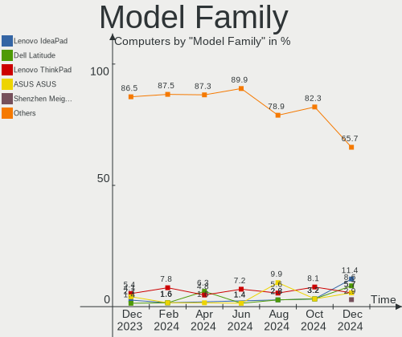
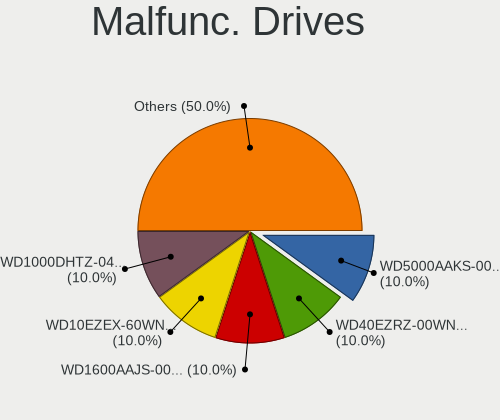
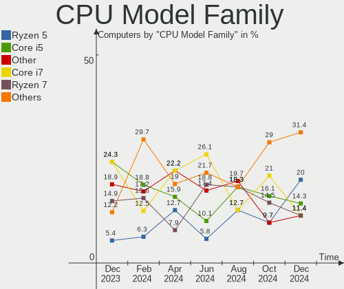
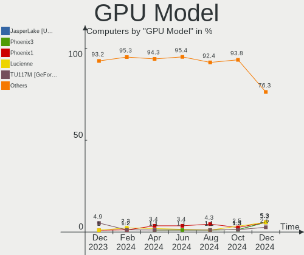
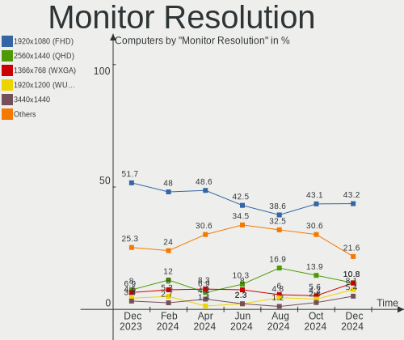
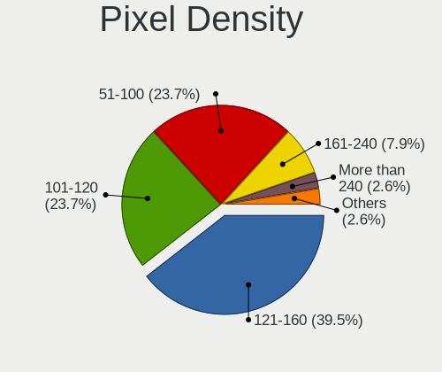

EndeavourOS - Hardware Trends
-----------------------------

A project to identify most popular hardware characteristics and track their change
over time based on data collected by Linux users at https://Linux-Hardware.org.

Anyone can contribute to this report by the [hw-probe](https://github.com/linuxhw/hw-probe) tool:

    sudo -E hw-probe -all -upload

This is a report for all computer types. See also reports for [desktops](/Dist/EndeavourOS/Desktop/README.md) and [notebooks](/Dist/EndeavourOS/Notebook/README.md).

This report is for one last month. Overall report since the beginning of time: [TestCoverage](https://github.com/linuxhw/TestCoverage)

Period: Dec, 2022.

Contents
--------

* [ System ](#system)
  - [ OS                       ](#os)
  - [ OS Family                ](#os-family)
  - [ Kernel                   ](#kernel)
  - [ Kernel Family            ](#kernel-family)
  - [ Kernel Major Ver.        ](#kernel-major-ver)
  - [ Arch                     ](#arch)
  - [ DE                       ](#de)
  - [ Display Server           ](#display-server)
  - [ Display Manager          ](#display-manager)
  - [ OS Lang                  ](#os-lang)
  - [ Boot Mode                ](#boot-mode)
  - [ Filesystem               ](#filesystem)
  - [ Part. scheme             ](#part-scheme)
  - [ Dual Boot with Linux/BSD ](#dual-boot-with-linuxbsd)
  - [ Dual Boot (Win)          ](#dual-boot-win)

* [ Board ](#board)
  - [ Vendor                   ](#vendor)
  - [ Model                    ](#model)
  - [ Model Family             ](#model-family)
  - [ MFG Year                 ](#mfg-year)
  - [ Form Factor              ](#form-factor)
  - [ Secure Boot              ](#secure-boot)
  - [ Coreboot                 ](#coreboot)
  - [ RAM Size                 ](#ram-size)
  - [ RAM Used                 ](#ram-used)
  - [ Total Drives             ](#total-drives)
  - [ Has CD-ROM               ](#has-cd-rom)
  - [ Has Ethernet             ](#has-ethernet)
  - [ Has WiFi                 ](#has-wifi)
  - [ Has Bluetooth            ](#has-bluetooth)

* [ Location ](#location)
  - [ Country                  ](#country)
  - [ City                     ](#city)

* [ Drives ](#drives)
  - [ Drive Vendor             ](#drive-vendor)
  - [ Drive Model              ](#drive-model)
  - [ HDD Vendor               ](#hdd-vendor)
  - [ SSD Vendor               ](#ssd-vendor)
  - [ Drive Kind               ](#drive-kind)
  - [ Drive Connector          ](#drive-connector)
  - [ Drive Size               ](#drive-size)
  - [ Space Total              ](#space-total)
  - [ Space Used               ](#space-used)
  - [ Malfunc. Drives          ](#malfunc-drives)
  - [ Malfunc. Drive Vendor    ](#malfunc-drive-vendor)
  - [ Malfunc. HDD Vendor      ](#malfunc-hdd-vendor)
  - [ Malfunc. Drive Kind      ](#malfunc-drive-kind)
  - [ Failed Drives            ](#failed-drives)
  - [ Failed Drive Vendor      ](#failed-drive-vendor)
  - [ Drive Status             ](#drive-status)

* [ Storage controller ](#storage-controller)
  - [ Storage Vendor           ](#storage-vendor)
  - [ Storage Model            ](#storage-model)
  - [ Storage Kind             ](#storage-kind)

* [ Processor ](#processor)
  - [ CPU Vendor               ](#cpu-vendor)
  - [ CPU Model                ](#cpu-model)
  - [ CPU Model Family         ](#cpu-model-family)
  - [ CPU Cores                ](#cpu-cores)
  - [ CPU Sockets              ](#cpu-sockets)
  - [ CPU Threads              ](#cpu-threads)
  - [ CPU Op-Modes             ](#cpu-op-modes)
  - [ CPU Microcode            ](#cpu-microcode)
  - [ CPU Microarch            ](#cpu-microarch)

* [ Graphics ](#graphics)
  - [ GPU Vendor               ](#gpu-vendor)
  - [ GPU Model                ](#gpu-model)
  - [ GPU Combo                ](#gpu-combo)
  - [ GPU Driver               ](#gpu-driver)
  - [ GPU Memory               ](#gpu-memory)

* [ Monitor ](#monitor)
  - [ Monitor Vendor           ](#monitor-vendor)
  - [ Monitor Model            ](#monitor-model)
  - [ Monitor Resolution       ](#monitor-resolution)
  - [ Monitor Diagonal         ](#monitor-diagonal)
  - [ Monitor Width            ](#monitor-width)
  - [ Aspect Ratio             ](#aspect-ratio)
  - [ Monitor Area             ](#monitor-area)
  - [ Pixel Density            ](#pixel-density)
  - [ Multiple Monitors        ](#multiple-monitors)

* [ Network ](#network)
  - [ Net Controller Vendor    ](#net-controller-vendor)
  - [ Net Controller Model     ](#net-controller-model)
  - [ Wireless Vendor          ](#wireless-vendor)
  - [ Wireless Model           ](#wireless-model)
  - [ Ethernet Vendor          ](#ethernet-vendor)
  - [ Ethernet Model           ](#ethernet-model)
  - [ Net Controller Kind      ](#net-controller-kind)
  - [ Used Controller          ](#used-controller)
  - [ NICs                     ](#nics)
  - [ IPv6                     ](#ipv6)

* [ Bluetooth ](#bluetooth)
  - [ Bluetooth Vendor         ](#bluetooth-vendor)
  - [ Bluetooth Model          ](#bluetooth-model)

* [ Sound ](#sound)
  - [ Sound Vendor             ](#sound-vendor)
  - [ Sound Model              ](#sound-model)

* [ Memory ](#memory)
  - [ Memory Vendor            ](#memory-vendor)
  - [ Memory Model             ](#memory-model)
  - [ Memory Kind              ](#memory-kind)
  - [ Memory Form Factor       ](#memory-form-factor)
  - [ Memory Size              ](#memory-size)
  - [ Memory Speed             ](#memory-speed)

* [ Printers & scanners ](#printers--scanners)
  - [ Printer Vendor           ](#printer-vendor)
  - [ Printer Model            ](#printer-model)
  - [ Scanner Vendor           ](#scanner-vendor)
  - [ Scanner Model            ](#scanner-model)

* [ Camera ](#camera)
  - [ Camera Vendor            ](#camera-vendor)
  - [ Camera Model             ](#camera-model)

* [ Security ](#security)
  - [ Fingerprint Vendor       ](#fingerprint-vendor)
  - [ Fingerprint Model        ](#fingerprint-model)
  - [ Chipcard Vendor          ](#chipcard-vendor)
  - [ Chipcard Model           ](#chipcard-model)

* [ Unsupported ](#unsupported)
  - [ Unsupported Devices      ](#unsupported-devices)
  - [ Unsupported Device Types ](#unsupported-device-types)

System
------

OS
--

Installed operating systems

| Name                | Computers | Percent |
|---------------------|-----------|---------|
| EndeavourOS Rolling | 39        | 100%    |

OS Family
---------

OS without a version

| Name        | Computers | Percent |
|-------------|-----------|---------|
| EndeavourOS | 39        | 100%    |

Kernel
------

Version of the Linux kernel

| Version                | Computers | Percent |
|------------------------|-----------|---------|
| 6.1.1-arch1-1          | 8         | 20.51%  |
| 6.0.12-arch1-1         | 7         | 17.95%  |
| 6.0.11-zen1-1-zen      | 4         | 10.26%  |
| 6.0.12-zen1-1-zen      | 3         | 7.69%   |
| 6.1.1-zen1-1-zen       | 2         | 5.13%   |
| 6.0.9-arch1-1          | 2         | 5.13%   |
| 6.0.10-arch2-1         | 2         | 5.13%   |
| 5.15.85-1-lts          | 2         | 5.13%   |
| 6.1.1-AMD              | 1         | 2.56%   |
| 6.0.9-zen1-1-zen       | 1         | 2.56%   |
| 6.0.11-x64v1-xanmod1-1 | 1         | 2.56%   |
| 6.0.11-arch1-1         | 1         | 2.56%   |
| 6.0.11-AMD-znver2      | 1         | 2.56%   |
| 5.19.7-arch1-1         | 1         | 2.56%   |
| 5.18.1-arch1-1         | 1         | 2.56%   |
| 5.15.83-1-lts          | 1         | 2.56%   |
| 5.15.82-1-lts          | 1         | 2.56%   |

Kernel Family
-------------

Linux kernel without a distro release

| Version | Computers | Percent |
|---------|-----------|---------|
| 6.1.1   | 11        | 28.21%  |
| 6.0.12  | 10        | 25.64%  |
| 6.0.11  | 7         | 17.95%  |
| 6.0.9   | 3         | 7.69%   |
| 6.0.10  | 2         | 5.13%   |
| 5.15.85 | 2         | 5.13%   |
| 5.19.7  | 1         | 2.56%   |
| 5.18.1  | 1         | 2.56%   |
| 5.15.83 | 1         | 2.56%   |
| 5.15.82 | 1         | 2.56%   |

Kernel Major Ver.
-----------------

Linux kernel major version

| Version | Computers | Percent |
|---------|-----------|---------|
| 6.0     | 22        | 56.41%  |
| 6.1     | 11        | 28.21%  |
| 5.15    | 4         | 10.26%  |
| 5.19    | 1         | 2.56%   |
| 5.18    | 1         | 2.56%   |

Arch
----

OS architecture (x86_64, i586, etc.)

| Name   | Computers | Percent |
|--------|-----------|---------|
| x86_64 | 39        | 100%    |

DE
--

Desktop Environment

| Name   | Computers | Percent |
|--------|-----------|---------|
| KDE5   | 19        | 48.72%  |
| GNOME  | 8         | 20.51%  |
| XFCE   | 5         | 12.82%  |
| i3     | 4         | 10.26%  |
| sway   | 1         | 2.56%   |
| MATE   | 1         | 2.56%   |
| Budgie | 1         | 2.56%   |

Display Server
--------------

X11 or Wayland

| Name    | Computers | Percent |
|---------|-----------|---------|
| X11     | 32        | 82.05%  |
| Wayland | 6         | 15.38%  |
| Unknown | 1         | 2.56%   |

Display Manager
---------------

SDDM, LightDM, etc.

| Name    | Computers | Percent |
|---------|-----------|---------|
| LightDM | 15        | 38.46%  |
| Unknown | 11        | 28.21%  |
| SDDM    | 9         | 23.08%  |
| GDM     | 4         | 10.26%  |

OS Lang
-------

Language

| Lang  | Computers | Percent |
|-------|-----------|---------|
| en_US | 20        | 51.28%  |
| it_IT | 4         | 10.26%  |
| en_IN | 3         | 7.69%   |
| en_CA | 2         | 5.13%   |
| de_DE | 2         | 5.13%   |
| sv_SE | 1         | 2.56%   |
| pt_PT | 1         | 2.56%   |
| fr_FR | 1         | 2.56%   |
| fi_FI | 1         | 2.56%   |
| es_ES | 1         | 2.56%   |
| en_GB | 1         | 2.56%   |
| de_CH | 1         | 2.56%   |
| da_DK | 1         | 2.56%   |

Boot Mode
---------

EFI or BIOS

| Mode | Computers | Percent |
|------|-----------|---------|
| EFI  | 25        | 64.1%   |
| BIOS | 14        | 35.9%   |

Filesystem
----------

Type of filesystem

| Type  | Computers | Percent |
|-------|-----------|---------|
| Ext4  | 28        | 71.79%  |
| Btrfs | 9         | 23.08%  |
| Xfs   | 2         | 5.13%   |

Part. scheme
------------

Scheme of partitioning

| Type    | Computers | Percent |
|---------|-----------|---------|
| GPT     | 27        | 69.23%  |
| Unknown | 11        | 28.21%  |
| MBR     | 1         | 2.56%   |

Dual Boot with Linux/BSD
------------------------

Hosting more than one Linux/BSD

| Dual boot | Computers | Percent |
|-----------|-----------|---------|
| No        | 35        | 89.74%  |
| Yes       | 4         | 10.26%  |

Dual Boot (Win)
---------------

Hosting Linux and Windows

| Dual boot | Computers | Percent |
|-----------|-----------|---------|
| No        | 25        | 64.1%   |
| Yes       | 14        | 35.9%   |

Board
-----

Vendor
------

Motherboard manufacturer

| Name                | Computers | Percent |
|---------------------|-----------|---------|
| Lenovo              | 13        | 33.33%  |
| Hewlett-Packard     | 6         | 15.38%  |
| ASUSTek Computer    | 6         | 15.38%  |
| MSI                 | 5         | 12.82%  |
| Gigabyte Technology | 3         | 7.69%   |
| Sony                | 1         | 2.56%   |
| PC Specialist       | 1         | 2.56%   |
| Microsoft           | 1         | 2.56%   |
| ASRock              | 1         | 2.56%   |
| Apple               | 1         | 2.56%   |
| Acer                | 1         | 2.56%   |

Model
-----

Motherboard model

| Name                                    | Computers | Percent |
|-----------------------------------------|-----------|---------|
| Sony VGN-FW11E                          | 1         | 2.56%   |
| PC Specialist Elimina Iv 17             | 1         | 2.56%   |
| MSI MS-7D43                             | 1         | 2.56%   |
| MSI MS-7C52                             | 1         | 2.56%   |
| MSI MS-7808                             | 1         | 2.56%   |
| MSI Modern 15 A5M                       | 1         | 2.56%   |
| MSI GS75 Stealth 8SG                    | 1         | 2.56%   |
| Microsoft Surface Laptop Go             | 1         | 2.56%   |
| Lenovo Yoga C740-14IML 81TC             | 1         | 2.56%   |
| Lenovo Yoga 510-15IKB 80VC              | 1         | 2.56%   |
| Lenovo V50s-07IMB 11EF004KUS            | 1         | 2.56%   |
| Lenovo ThinkPad X230 2324KP1            | 1         | 2.56%   |
| Lenovo ThinkPad T480 20L5000UUS         | 1         | 2.56%   |
| Lenovo ThinkPad T14 Gen 3 21CFCTO1WW    | 1         | 2.56%   |
| Lenovo ThinkBook 15 G3 ACL 21A4         | 1         | 2.56%   |
| Lenovo Legion 5 Pro 16ARH7H 82RG        | 1         | 2.56%   |
| Lenovo Legion 5 15ACH6H 82JU            | 1         | 2.56%   |
| Lenovo IdeaPadFlex 5 14IIL05 81X1       | 1         | 2.56%   |
| Lenovo IdeaPad S340-15API 81NC          | 1         | 2.56%   |
| Lenovo IdeaPad Gaming 3 15ACH6 82K2     | 1         | 2.56%   |
| Lenovo IdeaPad 5 15ARE05 81YQ           | 1         | 2.56%   |
| HP Spectre x360 Convertible 13-aw0xxx   | 1         | 2.56%   |
| HP ProBook 450 G7                       | 1         | 2.56%   |
| HP Pavilion Gaming Laptop 15-ec0xxx     | 1         | 2.56%   |
| HP EliteDesk 800 G1 TWR                 | 1         | 2.56%   |
| HP EliteBook 845 14 inch G9 Notebook PC | 1         | 2.56%   |
| HP 15                                   | 1         | 2.56%   |
| Gigabyte X570S AERO G                   | 1         | 2.56%   |
| Gigabyte H310M S2 2.0                   | 1         | 2.56%   |
| Gigabyte B150M-D2V DDR3-CF              | 1         | 2.56%   |
| ASUS ZenBook UX450FDX_UX480FD           | 1         | 2.56%   |
| ASUS ZenBook UX325EA_UX325EA            | 1         | 2.56%   |
| ASUS VivoBook_ASUSLaptop X512DA_X512DA  | 1         | 2.56%   |
| ASUS TUF Gaming B560M-PLUS              | 1         | 2.56%   |
| ASUS M5A78L/USB3                        | 1         | 2.56%   |
| ASUS ASUS TUF Dash F15 FX516PE_TUF516PE | 1         | 2.56%   |
| ASRock X300M-STX                        | 1         | 2.56%   |
| Apple iMac9,1                           | 1         | 2.56%   |
| Acer Swift SFX14-41G                    | 1         | 2.56%   |

Model Family
------------

Motherboard model prefix

| Name                  | Computers | Percent |
|-----------------------|-----------|---------|
| Lenovo ThinkPad       | 3         | 7.69%   |
| Lenovo IdeaPad        | 3         | 7.69%   |
| Lenovo Yoga           | 2         | 5.13%   |
| Lenovo Legion         | 2         | 5.13%   |
| ASUS ZenBook          | 2         | 5.13%   |
| Sony VGN-FW11E        | 1         | 2.56%   |
| PC Specialist Elimina | 1         | 2.56%   |
| MSI MS-7D43           | 1         | 2.56%   |
| MSI MS-7C52           | 1         | 2.56%   |
| MSI MS-7808           | 1         | 2.56%   |
| MSI Modern            | 1         | 2.56%   |
| MSI GS75              | 1         | 2.56%   |
| Microsoft Surface     | 1         | 2.56%   |
| Lenovo V50s-07IMB     | 1         | 2.56%   |
| Lenovo ThinkBook      | 1         | 2.56%   |
| Lenovo IdeaPadFlex    | 1         | 2.56%   |
| HP Spectre            | 1         | 2.56%   |
| HP ProBook            | 1         | 2.56%   |
| HP Pavilion           | 1         | 2.56%   |
| HP EliteDesk          | 1         | 2.56%   |
| HP EliteBook          | 1         | 2.56%   |
| HP 15                 | 1         | 2.56%   |
| Gigabyte X570S        | 1         | 2.56%   |
| Gigabyte H310M        | 1         | 2.56%   |
| Gigabyte B150M-D2V    | 1         | 2.56%   |
| ASUS VivoBook         | 1         | 2.56%   |
| ASUS TUF              | 1         | 2.56%   |
| ASUS M5A78L           | 1         | 2.56%   |
| ASUS ASUS             | 1         | 2.56%   |
| ASRock X300M-STX      | 1         | 2.56%   |
| Apple iMac9           | 1         | 2.56%   |
| Acer Swift            | 1         | 2.56%   |

MFG Year
--------

Motherboard manufacture year

| Year | Computers | Percent |
|------|-----------|---------|
| 2021 | 9         | 23.08%  |
| 2019 | 8         | 20.51%  |
| 2020 | 6         | 15.38%  |
| 2022 | 5         | 12.82%  |
| 2018 | 2         | 5.13%   |
| 2013 | 2         | 5.13%   |
| 2012 | 2         | 5.13%   |
| 2017 | 1         | 2.56%   |
| 2015 | 1         | 2.56%   |
| 2011 | 1         | 2.56%   |
| 2009 | 1         | 2.56%   |
| 2008 | 1         | 2.56%   |

Form Factor
-----------

Physical design of the computer

| Name        | Computers | Percent |
|-------------|-----------|---------|
| Notebook    | 22        | 56.41%  |
| Desktop     | 11        | 28.21%  |
| Convertible | 4         | 10.26%  |
| Tablet      | 1         | 2.56%   |
| All in one  | 1         | 2.56%   |

Secure Boot
-----------

Enabled or disabled

| State    | Computers | Percent |
|----------|-----------|---------|
| Disabled | 39        | 100%    |

Coreboot
--------

Have coreboot on board

| Used | Computers | Percent |
|------|-----------|---------|
| No   | 39        | 100%    |

RAM Size
--------

Total RAM memory

| Size in GB | Computers | Percent |
|------------|-----------|---------|
| 8.01-16.0  | 13        | 33.33%  |
| 32.01-64.0 | 8         | 20.51%  |
| 16.01-24.0 | 7         | 17.95%  |
| 4.01-8.0   | 6         | 15.38%  |
| 3.01-4.0   | 2         | 5.13%   |
| 24.01-32.0 | 2         | 5.13%   |
| 2.01-3.0   | 1         | 2.56%   |

RAM Used
--------

Used RAM memory

| Used GB    | Computers | Percent |
|------------|-----------|---------|
| 4.01-8.0   | 11        | 28.21%  |
| 2.01-3.0   | 10        | 25.64%  |
| 1.01-2.0   | 8         | 20.51%  |
| 3.01-4.0   | 5         | 12.82%  |
| 8.01-16.0  | 4         | 10.26%  |
| 16.01-24.0 | 1         | 2.56%   |

Total Drives
------------

Number of drives on board

| Drives | Computers | Percent |
|--------|-----------|---------|
| 1      | 20        | 51.28%  |
| 2      | 10        | 25.64%  |
| 3      | 5         | 12.82%  |
| 4      | 3         | 7.69%   |
| 5      | 1         | 2.56%   |

Has CD-ROM
----------

Has CD-ROM on board

| Presented | Computers | Percent |
|-----------|-----------|---------|
| No        | 32        | 82.05%  |
| Yes       | 7         | 17.95%  |

Has Ethernet
------------

Has Ethernet on board

| Presented | Computers | Percent |
|-----------|-----------|---------|
| Yes       | 30        | 76.92%  |
| No        | 9         | 23.08%  |

Has WiFi
--------

Has WiFi module

| Presented | Computers | Percent |
|-----------|-----------|---------|
| Yes       | 34        | 87.18%  |
| No        | 5         | 12.82%  |

Has Bluetooth
-------------

Has Bluetooth module

| Presented | Computers | Percent |
|-----------|-----------|---------|
| Yes       | 34        | 87.18%  |
| No        | 5         | 12.82%  |

Location
--------

Country
-------

Geographic location (country)

| Country         | Computers | Percent |
|-----------------|-----------|---------|
| USA             | 8         | 20.51%  |
| Italy           | 5         | 12.82%  |
| India           | 3         | 7.69%   |
| Sweden          | 2         | 5.13%   |
| Romania         | 2         | 5.13%   |
| Germany         | 2         | 5.13%   |
| Finland         | 2         | 5.13%   |
| Canada          | 2         | 5.13%   |
| Taiwan          | 1         | 2.56%   |
| Switzerland     | 1         | 2.56%   |
| Spain           | 1         | 2.56%   |
| Portugal        | 1         | 2.56%   |
| North Macedonia | 1         | 2.56%   |
| Mexico          | 1         | 2.56%   |
| Latvia          | 1         | 2.56%   |
| Kazakhstan      | 1         | 2.56%   |
| Hungary         | 1         | 2.56%   |
| France          | 1         | 2.56%   |
| Estonia         | 1         | 2.56%   |
| Denmark         | 1         | 2.56%   |
| Bangladesh      | 1         | 2.56%   |

City
----

Geographic location (city)

| City              | Computers | Percent |
|-------------------|-----------|---------|
| Montreal          | 2         | 5.13%   |
| Delhi             | 2         | 5.13%   |
| Zurich            | 1         | 2.56%   |
| Zhongli District  | 1         | 2.56%   |
| West Sacramento   | 1         | 2.56%   |
| Vejle             | 1         | 2.56%   |
| Uimaharju         | 1         | 2.56%   |
| Tempio Pausania   | 1         | 2.56%   |
| Tallinn           | 1         | 2.56%   |
| Stora Vika        | 1         | 2.56%   |
| Skopje            | 1         | 2.56%   |
| Seville           | 1         | 2.56%   |
| Severna Park      | 1         | 2.56%   |
| Riga              | 1         | 2.56%   |
| Nyköping         | 1         | 2.56%   |
| Nagymagocs        | 1         | 2.56%   |
| Missoula          | 1         | 2.56%   |
| Minneapolis       | 1         | 2.56%   |
| Milan             | 1         | 2.56%   |
| Mexico City       | 1         | 2.56%   |
| Mesa              | 1         | 2.56%   |
| Lemnia            | 1         | 2.56%   |
| Las Vegas         | 1         | 2.56%   |
| Landim            | 1         | 2.56%   |
| L'Haÿ-les-Roses  | 1         | 2.56%   |
| Kolkata           | 1         | 2.56%   |
| Kingston          | 1         | 2.56%   |
| Khilgaon          | 1         | 2.56%   |
| Helsinki          | 1         | 2.56%   |
| Frankfurt am Main | 1         | 2.56%   |
| Fontaniva         | 1         | 2.56%   |
| Dolcè            | 1         | 2.56%   |
| Catanzaro         | 1         | 2.56%   |
| Camarillo         | 1         | 2.56%   |
| Bucharest         | 1         | 2.56%   |
| Augsburg          | 1         | 2.56%   |
| Astana            | 1         | 2.56%   |

Drives
------

Drive Vendor
------------

Hard drive vendors

| Vendor                       | Computers | Drives | Percent |
|------------------------------|-----------|--------|---------|
| Samsung Electronics          | 14        | 17     | 21.21%  |
| Seagate                      | 9         | 12     | 13.64%  |
| Kingston                     | 6         | 6      | 9.09%   |
| WDC                          | 5         | 7      | 7.58%   |
| SK hynix                     | 5         | 5      | 7.58%   |
| Crucial                      | 5         | 5      | 7.58%   |
| Sandisk                      | 4         | 4      | 6.06%   |
| Kingston Technology Company  | 2         | 2      | 3.03%   |
| WALTON                       | 1         | 1      | 1.52%   |
| Unknown                      | 1         | 1      | 1.52%   |
| Union Memory (Shenzhen)      | 1         | 1      | 1.52%   |
| Timetec                      | 1         | 1      | 1.52%   |
| Solid State Storage          | 1         | 1      | 1.52%   |
| Silicon Motion               | 1         | 1      | 1.52%   |
| Shenzhen Longsys Electronics | 1         | 1      | 1.52%   |
| SABRENT                      | 1         | 1      | 1.52%   |
| Patriot                      | 1         | 1      | 1.52%   |
| Mushkin                      | 1         | 1      | 1.52%   |
| Micron/Crucial Technology    | 1         | 1      | 1.52%   |
| Intenso                      | 1         | 2      | 1.52%   |
| Intel                        | 1         | 1      | 1.52%   |
| Hitachi                      | 1         | 1      | 1.52%   |
| HGST                         | 1         | 1      | 1.52%   |
| A-DATA Technology            | 1         | 1      | 1.52%   |

Drive Model
-----------

Hard drive models

| Model                                                  | Computers | Percent |
|--------------------------------------------------------|-----------|---------|
| Samsung NVMe SSD Controller SM981/PM981/PM983 500GB    | 4         | 5.48%   |
| Seagate ST1000DM010-2EP102 1TB                         | 2         | 2.74%   |
| Seagate Expansion Desk 5TB                             | 2         | 2.74%   |
| Samsung NVMe SSD Controller PM9A1/PM9A3/980PRO 2TB     | 2         | 2.74%   |
| Samsung MZVLQ512HALU-000H1 512GB                       | 2         | 2.74%   |
| Crucial CT1000MX500SSD1 1TB                            | 2         | 2.74%   |
| WDC WD6400AAKS-40H2B0 640GB                            | 1         | 1.37%   |
| WDC WD20EFRX-68EUZN0 2TB                               | 1         | 1.37%   |
| WDC WD20EARX-00PASB0 2TB                               | 1         | 1.37%   |
| WDC WD20EARS-42S0XB0 2TB                               | 1         | 1.37%   |
| WDC WD10JPVX-22JC3T0 1TB                               | 1         | 1.37%   |
| WALTON WS5256 256GB SSD                                | 1         | 1.37%   |
| Unknown SD/MMC/MS PRO 64GB                             | 1         | 1.37%   |
| Union Memory (Shenzhen) RPFTJ256PDD2MWX 256GB          | 1         | 1.37%   |
| Timetec MS05 256GB SSD                                 | 1         | 1.37%   |
| Solid State Storage SSSTC CL1-4D256 256GB              | 1         | 1.37%   |
| SK hynix SKHynix_HFS512GDE9X081N 512GB                 | 1         | 1.37%   |
| SK hynix SKHynix_HFM512GD3HX015N 512GB                 | 1         | 1.37%   |
| SK hynix SHGP31-1000GM 1TB                             | 1         | 1.37%   |
| SK hynix HFM512GD3JX016N 512GB                         | 1         | 1.37%   |
| SK hynix BC511 256GB                                   | 1         | 1.37%   |
| Silicon Motion SM2263EN/SM2263XT SSD Controller 1024GB | 1         | 1.37%   |
| Shenzhen Longsys Lexar SSD 512GB                       | 1         | 1.37%   |
| Seagate ST500LT012-1DG142 500GB                        | 1         | 1.37%   |
| Seagate ST500LM021-1KJ152 500GB                        | 1         | 1.37%   |
| Seagate ST4000DM004-2CV104 4TB                         | 1         | 1.37%   |
| Seagate ST3160812AS 160GB                              | 1         | 1.37%   |
| Seagate ST2000DM008-2FR102 2TB                         | 1         | 1.37%   |
| Seagate ST1000LM035-1RK172 1TB                         | 1         | 1.37%   |
| Seagate BUP Slim BK 1TB                                | 1         | 1.37%   |
| Seagate Backup+ Hub BK 8TB                             | 1         | 1.37%   |
| Sandisk WD Blue SN570 1TB                              | 1         | 1.37%   |
| Sandisk WD Blue SN550 NVMe SSD 500GB                   | 1         | 1.37%   |
| Sandisk WD Blue SN500 / PC SN520 NVMe SSD 256GB        | 1         | 1.37%   |
| Sandisk WD Black SN750 / PC SN730 NVMe SSD 512GB       | 1         | 1.37%   |
| Samsung SSD 980 1TB                                    | 1         | 1.37%   |
| Samsung SSD 870 EVO 2TB                                | 1         | 1.37%   |
| Samsung SSD 870 EVO 1TB                                | 1         | 1.37%   |
| Samsung SSD 860 EVO 500GB                              | 1         | 1.37%   |
| Samsung SSD 850 EVO 250GB                              | 1         | 1.37%   |

HDD Vendor
----------

Hard disk drive vendors

| Vendor  | Computers | Drives | Percent |
|---------|-----------|--------|---------|
| Seagate | 9         | 12     | 52.94%  |
| WDC     | 5         | 7      | 29.41%  |
| Unknown | 1         | 1      | 5.88%   |
| Hitachi | 1         | 1      | 5.88%   |
| HGST    | 1         | 1      | 5.88%   |

SSD Vendor
----------

Solid state drive vendors

| Vendor              | Computers | Drives | Percent |
|---------------------|-----------|--------|---------|
| Crucial             | 5         | 5      | 27.78%  |
| Samsung Electronics | 4         | 5      | 22.22%  |
| Kingston            | 4         | 4      | 22.22%  |
| WALTON              | 1         | 1      | 5.56%   |
| Timetec             | 1         | 1      | 5.56%   |
| Patriot             | 1         | 1      | 5.56%   |
| Intenso             | 1         | 2      | 5.56%   |
| A-DATA Technology   | 1         | 1      | 5.56%   |

Drive Kind
----------

HDD or SSD

| Kind | Computers | Drives | Percent |
|------|-----------|--------|---------|
| NVMe | 28        | 33     | 50.91%  |
| SSD  | 14        | 20     | 25.45%  |
| HDD  | 13        | 22     | 23.64%  |

Drive Connector
---------------

SATA, SAS, NVMe, etc.

| Type | Computers | Drives | Percent |
|------|-----------|--------|---------|
| NVMe | 28        | 32     | 52.83%  |
| SATA | 18        | 34     | 33.96%  |
| SAS  | 7         | 9      | 13.21%  |

Drive Size
----------

Size of hard drive

| Size in TB | Computers | Drives | Percent |
|------------|-----------|--------|---------|
| 0.01-0.5   | 13        | 19     | 39.39%  |
| 0.51-1.0   | 12        | 12     | 36.36%  |
| 1.01-2.0   | 5         | 7      | 15.15%  |
| 4.01-10.0  | 2         | 3      | 6.06%   |
| 3.01-4.0   | 1         | 1      | 3.03%   |

Space Total
-----------

Amount of disk space available on the file system

| Size in GB     | Computers | Percent |
|----------------|-----------|---------|
| 101-250        | 8         | 20.51%  |
| 1001-2000      | 8         | 20.51%  |
| More than 3000 | 6         | 15.38%  |
| 251-500        | 5         | 12.82%  |
| 501-1000       | 4         | 10.26%  |
| 2001-3000      | 3         | 7.69%   |
| 51-100         | 3         | 7.69%   |
| 1-20           | 1         | 2.56%   |
| Unknown        | 1         | 2.56%   |

Space Used
----------

Amount of used disk space

| Used GB        | Computers | Percent |
|----------------|-----------|---------|
| 21-50          | 8         | 20.51%  |
| 1-20           | 7         | 17.95%  |
| 101-250        | 5         | 12.82%  |
| 1001-2000      | 5         | 12.82%  |
| 501-1000       | 5         | 12.82%  |
| 51-100         | 4         | 10.26%  |
| 2001-3000      | 2         | 5.13%   |
| More than 3000 | 1         | 2.56%   |
| 251-500        | 1         | 2.56%   |
| Unknown        | 1         | 2.56%   |

Malfunc. Drives
---------------

Drive models with a malfunction

| Model                           | Computers | Drives | Percent |
|---------------------------------|-----------|--------|---------|
| WDC WD20EARX-00PASB0 2TB        | 1         | 1      | 16.67%  |
| Seagate ST500LM021-1KJ152 500GB | 1         | 1      | 16.67%  |
| Seagate ST4000DM004-2CV104 4TB  | 1         | 1      | 16.67%  |
| Seagate ST1000DM010-2EP102 1TB  | 1         | 1      | 16.67%  |
| Patriot Burst 480GB SSD         | 1         | 1      | 16.67%  |
| Crucial CT256MX100SSD1 256GB    | 1         | 1      | 16.67%  |

Malfunc. Drive Vendor
---------------------

Vendors of faulty drives

| Vendor  | Computers | Drives | Percent |
|---------|-----------|--------|---------|
| Seagate | 3         | 3      | 50%     |
| WDC     | 1         | 1      | 16.67%  |
| Patriot | 1         | 1      | 16.67%  |
| Crucial | 1         | 1      | 16.67%  |

Malfunc. HDD Vendor
-------------------

Vendors of faulty HDD drives

| Vendor  | Computers | Drives | Percent |
|---------|-----------|--------|---------|
| Seagate | 3         | 3      | 75%     |
| WDC     | 1         | 1      | 25%     |

Malfunc. Drive Kind
-------------------

Kinds of faulty drives

| Kind | Computers | Drives | Percent |
|------|-----------|--------|---------|
| HDD  | 4         | 4      | 80%     |
| SSD  | 1         | 2      | 20%     |

Failed Drives
-------------

Failed drive models

Zero info for selected period =(

Failed Drive Vendor
-------------------

Failed drive vendors

Zero info for selected period =(

Drive Status
------------

Number of failed and malfunc. drives

| Status   | Computers | Drives | Percent |
|----------|-----------|--------|---------|
| Works    | 26        | 46     | 56.52%  |
| Detected | 15        | 23     | 32.61%  |
| Malfunc  | 5         | 6      | 10.87%  |

Storage controller
------------------

Storage Vendor
--------------

Storage controller vendors

| Vendor                         | Computers | Percent |
|--------------------------------|-----------|---------|
| Intel                          | 19        | 31.15%  |
| Samsung Electronics            | 11        | 18.03%  |
| AMD                            | 11        | 18.03%  |
| SK hynix                       | 5         | 8.2%    |
| SanDisk                        | 4         | 6.56%   |
| Kingston Technology Company    | 4         | 6.56%   |
| Union Memory (Shenzhen)        | 1         | 1.64%   |
| Solid State Storage Technology | 1         | 1.64%   |
| Silicon Motion                 | 1         | 1.64%   |
| Shenzhen Longsys Electronics   | 1         | 1.64%   |
| Nvidia                         | 1         | 1.64%   |
| Micron/Crucial Technology      | 1         | 1.64%   |
| INNOGRIT                       | 1         | 1.64%   |

Storage Model
-------------

Storage controller models

| Model                                                                          | Computers | Percent |
|--------------------------------------------------------------------------------|-----------|---------|
| AMD FCH SATA Controller [AHCI mode]                                            | 9         | 14.29%  |
| Samsung NVMe SSD Controller 980                                                | 5         | 7.94%   |
| SK hynix Gold P31/PC711 NVMe Solid State Drive                                 | 4         | 6.35%   |
| Samsung NVMe SSD Controller SM981/PM981/PM983                                  | 4         | 6.35%   |
| Samsung NVMe SSD Controller PM9A1/PM9A3/980PRO                                 | 2         | 3.17%   |
| Kingston Company Company Non-Volatile memory controller                        | 2         | 3.17%   |
| Intel Volume Management Device NVMe RAID Controller                            | 2         | 3.17%   |
| Intel Comet Lake SATA AHCI Controller                                          | 2         | 3.17%   |
| Union Memory (Shenzhen) Non-Volatile memory controller                         | 1         | 1.59%   |
| Solid State Storage Non-Volatile memory controller                             | 1         | 1.59%   |
| SK hynix BC511                                                                 | 1         | 1.59%   |
| Silicon Motion SM2263EN/SM2263XT SSD Controller                                | 1         | 1.59%   |
| Shenzhen Longsys Non-Volatile memory controller                                | 1         | 1.59%   |
| SanDisk WD Blue SN570 NVMe SSD                                                 | 1         | 1.59%   |
| SanDisk WD Blue SN550 NVMe SSD                                                 | 1         | 1.59%   |
| SanDisk WD Blue SN500 / PC SN520 NVMe SSD                                      | 1         | 1.59%   |
| SanDisk WD Black SN750 / PC SN730 NVMe SSD                                     | 1         | 1.59%   |
| Nvidia MCP79 AHCI Controller                                                   | 1         | 1.59%   |
| Micron/Crucial P2 NVMe PCIe SSD                                                | 1         | 1.59%   |
| Kingston Company U-SNS8154P3 NVMe SSD                                          | 1         | 1.59%   |
| Kingston Company A2000 NVMe SSD                                                | 1         | 1.59%   |
| Intel Sunrise Point-LP SATA Controller [AHCI mode]                             | 1         | 1.59%   |
| Intel SSD 660P Series                                                          | 1         | 1.59%   |
| Intel Q170/Q150/B150/H170/H110/Z170/CM236 Chipset SATA Controller [AHCI Mode]  | 1         | 1.59%   |
| Intel Cannon Point-LP SATA Controller [AHCI Mode]                              | 1         | 1.59%   |
| Intel Cannon Lake Mobile PCH SATA AHCI Controller                              | 1         | 1.59%   |
| Intel Alder Lake-S PCH SATA Controller [AHCI Mode]                             | 1         | 1.59%   |
| Intel Alder Lake-P SATA AHCI Controller                                        | 1         | 1.59%   |
| Intel 82801IBM/IEM (ICH9M/ICH9M-E) 4 port SATA Controller [AHCI mode]          | 1         | 1.59%   |
| Intel 82801 Mobile SATA Controller [RAID mode]                                 | 1         | 1.59%   |
| Intel 8 Series/C220 Series Chipset Family 6-port SATA Controller 1 [AHCI mode] | 1         | 1.59%   |
| Intel 8 Series SATA Controller 1 [AHCI mode]                                   | 1         | 1.59%   |
| Intel 7 Series/C210 Series Chipset Family 6-port SATA Controller [AHCI mode]   | 1         | 1.59%   |
| Intel 7 Series Chipset Family 6-port SATA Controller [AHCI mode]               | 1         | 1.59%   |
| Intel 500 Series Chipset Family SATA AHCI Controller                           | 1         | 1.59%   |
| Intel 400 Series Chipset Family SATA AHCI Controller                           | 1         | 1.59%   |
| Intel 200 Series PCH SATA controller [AHCI mode]                               | 1         | 1.59%   |
| INNOGRIT Non-Volatile memory controller                                        | 1         | 1.59%   |
| AMD SB7x0/SB8x0/SB9x0 SATA Controller [IDE mode]                               | 1         | 1.59%   |
| AMD SB7x0/SB8x0/SB9x0 IDE Controller                                           | 1         | 1.59%   |

Storage Kind
------------

Kind of storage controller (IDE, SATA, NVMe, SAS, ...)

| Kind | Computers | Percent |
|------|-----------|---------|
| NVMe | 28        | 46.67%  |
| SATA | 28        | 46.67%  |
| RAID | 3         | 5%      |
| IDE  | 1         | 1.67%   |

Processor
---------

CPU Vendor
----------

Processor vendors

| Vendor | Computers | Percent |
|--------|-----------|---------|
| Intel  | 23        | 58.97%  |
| AMD    | 16        | 41.03%  |

CPU Model
---------

Processor models

| Model                                         | Computers | Percent |
|-----------------------------------------------|-----------|---------|
| Intel Core i5-10210U CPU @ 1.60GHz            | 2         | 5.13%   |
| AMD Ryzen 5 5600H with Radeon Graphics        | 2         | 5.13%   |
| Intel Core i7-8750H CPU @ 2.20GHz             | 1         | 2.56%   |
| Intel Core i7-8550U CPU @ 1.80GHz             | 1         | 2.56%   |
| Intel Core i7-4790 CPU @ 3.60GHz              | 1         | 2.56%   |
| Intel Core i7-2600 CPU @ 3.40GHz              | 1         | 2.56%   |
| Intel Core i7-10700 CPU @ 2.90GHz             | 1         | 2.56%   |
| Intel Core i7-1065G7 CPU @ 1.30GHz            | 1         | 2.56%   |
| Intel Core i5-9400F CPU @ 2.90GHz             | 1         | 2.56%   |
| Intel Core i5-8265U CPU @ 1.60GHz             | 1         | 2.56%   |
| Intel Core i5-7200U CPU @ 2.50GHz             | 1         | 2.56%   |
| Intel Core i5-6400 CPU @ 2.70GHz              | 1         | 2.56%   |
| Intel Core i5-4210U CPU @ 1.70GHz             | 1         | 2.56%   |
| Intel Core i5-3320M CPU @ 2.60GHz             | 1         | 2.56%   |
| Intel Core i5-10400F CPU @ 2.90GHz            | 1         | 2.56%   |
| Intel Core i5-1035G1 CPU @ 1.00GHz            | 1         | 2.56%   |
| Intel Core i3-1005G1 CPU @ 1.20GHz            | 1         | 2.56%   |
| Intel Core 2 Duo CPU P8400 @ 2.26GHz          | 1         | 2.56%   |
| Intel Core 2 Duo CPU E8135 @ 2.66GHz          | 1         | 2.56%   |
| Intel 12th Gen Core i7-12700H                 | 1         | 2.56%   |
| Intel 12th Gen Core i5-12400F                 | 1         | 2.56%   |
| Intel 11th Gen Core i7-1165G7 @ 2.80GHz       | 1         | 2.56%   |
| Intel 11th Gen Core i7-11370H @ 3.30GHz       | 1         | 2.56%   |
| AMD Ryzen 7 PRO 6850HS with Radeon Graphics   | 1         | 2.56%   |
| AMD Ryzen 7 6800H with Radeon Graphics        | 1         | 2.56%   |
| AMD Ryzen 7 5800X 8-Core Processor            | 1         | 2.56%   |
| AMD Ryzen 7 5800U with Radeon Graphics        | 1         | 2.56%   |
| AMD Ryzen 7 5700U with Radeon Graphics        | 1         | 2.56%   |
| AMD Ryzen 7 5700G with Radeon Graphics        | 1         | 2.56%   |
| AMD Ryzen 7 3750H with Radeon Vega Mobile Gfx | 1         | 2.56%   |
| AMD Ryzen 7 3700U with Radeon Vega Mobile Gfx | 1         | 2.56%   |
| AMD Ryzen 5 PRO 6650U with Radeon Graphics    | 1         | 2.56%   |
| AMD Ryzen 5 5500U with Radeon Graphics        | 1         | 2.56%   |
| AMD Ryzen 5 4500U with Radeon Graphics        | 1         | 2.56%   |
| AMD Ryzen 5 3600 6-Core Processor             | 1         | 2.56%   |
| AMD Ryzen 5 3500U with Radeon Vega Mobile Gfx | 1         | 2.56%   |
| AMD FX-4100 Quad-Core Processor               | 1         | 2.56%   |

CPU Model Family
----------------

Processor model prefix

| Model            | Computers | Percent |
|------------------|-----------|---------|
| Intel Core i5    | 10        | 25.64%  |
| AMD Ryzen 7      | 7         | 17.95%  |
| Intel Core i7    | 6         | 15.38%  |
| AMD Ryzen 5      | 6         | 15.38%  |
| Other            | 4         | 10.26%  |
| Intel Core 2 Duo | 2         | 5.13%   |
| Intel Core i3    | 1         | 2.56%   |
| AMD Ryzen 7 PRO  | 1         | 2.56%   |
| AMD Ryzen 5 PRO  | 1         | 2.56%   |
| AMD FX           | 1         | 2.56%   |

CPU Cores
---------

Number of processor cores

| Number | Computers | Percent |
|--------|-----------|---------|
| 4      | 14        | 35.9%   |
| 6      | 10        | 25.64%  |
| 8      | 7         | 17.95%  |
| 2      | 7         | 17.95%  |
| 14     | 1         | 2.56%   |

CPU Sockets
-----------

Number of sockets

| Number | Computers | Percent |
|--------|-----------|---------|
| 1      | 39        | 100%    |

CPU Threads
-----------

Threads per core (Hyper-Threading)

| Number | Computers | Percent |
|--------|-----------|---------|
| 2      | 32        | 82.05%  |
| 1      | 7         | 17.95%  |

CPU Op-Modes
------------

CPU Operation Modes (32-bit, 64-bit)

| Op mode        | Computers | Percent |
|----------------|-----------|---------|
| 32-bit, 64-bit | 39        | 100%    |

CPU Microcode
-------------

Microcode number

| Number     | Computers | Percent |
|------------|-----------|---------|
| Unknown    | 17        | 43.59%  |
| 0x0a50000c | 3         | 7.69%   |
| 0x806c1    | 2         | 5.13%   |
| 0x706e5    | 2         | 5.13%   |
| 0x08608103 | 2         | 5.13%   |
| 0x08108102 | 2         | 5.13%   |
| 0xa0653    | 1         | 2.56%   |
| 0x90672    | 1         | 2.56%   |
| 0x806e9    | 1         | 2.56%   |
| 0x306c3    | 1         | 2.56%   |
| 0x206a7    | 1         | 2.56%   |
| 0x10676    | 1         | 2.56%   |
| 0x0a404102 | 1         | 2.56%   |
| 0x0a201204 | 1         | 2.56%   |
| 0x08701021 | 1         | 2.56%   |
| 0x08600106 | 1         | 2.56%   |
| 0x08108109 | 1         | 2.56%   |

CPU Microarch
-------------

Microarchitecture

| Name             | Computers | Percent |
|------------------|-----------|---------|
| KabyLake         | 7         | 17.95%  |
| Unknown          | 6         | 15.38%  |
| Zen 3            | 5         | 12.82%  |
| Zen+             | 3         | 7.69%   |
| IceLake          | 3         | 7.69%   |
| Zen 2            | 2         | 5.13%   |
| TigerLake        | 2         | 5.13%   |
| Penryn           | 2         | 5.13%   |
| Haswell          | 2         | 5.13%   |
| CometLake        | 2         | 5.13%   |
| Skylake          | 1         | 2.56%   |
| SandyBridge      | 1         | 2.56%   |
| IvyBridge        | 1         | 2.56%   |
| Bulldozer        | 1         | 2.56%   |
| Alderlake Hybrid | 1         | 2.56%   |

Graphics
--------

GPU Vendor
----------

Vendors of graphics cards

| Vendor | Computers | Percent |
|--------|-----------|---------|
| Nvidia | 19        | 38%     |
| Intel  | 16        | 32%     |
| AMD    | 15        | 30%     |

GPU Model
---------

Graphics card models

| Model                                                                       | Computers | Percent |
|-----------------------------------------------------------------------------|-----------|---------|
| AMD Cezanne [Radeon Vega Series / Radeon Vega Mobile Series]                | 4         | 7.84%   |
| Nvidia TU117M [GeForce GTX 1650 Mobile / Max-Q]                             | 3         | 5.88%   |
| AMD Rembrandt [Radeon 680M]                                                 | 3         | 5.88%   |
| AMD Picasso/Raven 2 [Radeon Vega Series / Radeon Vega Mobile Series]        | 3         | 5.88%   |
| Nvidia GA106M [GeForce RTX 3060 Mobile / Max-Q]                             | 2         | 3.92%   |
| Intel TigerLake-LP GT2 [Iris Xe Graphics]                                   | 2         | 3.92%   |
| Intel Iris Plus Graphics G1 (Ice Lake)                                      | 2         | 3.92%   |
| Intel CometLake-U GT2 [UHD Graphics]                                        | 2         | 3.92%   |
| AMD Lucienne                                                                | 2         | 3.92%   |
| Nvidia TU117 [GeForce GTX 1650]                                             | 1         | 1.96%   |
| Nvidia TU106 [GeForce RTX 2060 Rev. A]                                      | 1         | 1.96%   |
| Nvidia TU104M [GeForce RTX 2080 Mobile]                                     | 1         | 1.96%   |
| Nvidia GP108 [GeForce GT 1030]                                              | 1         | 1.96%   |
| Nvidia GP107M [GeForce GTX 1050 Mobile]                                     | 1         | 1.96%   |
| Nvidia GM204 [GeForce GTX 970]                                              | 1         | 1.96%   |
| Nvidia GK208B [GeForce GT 730]                                              | 1         | 1.96%   |
| Nvidia GK208B [GeForce GT 710]                                              | 1         | 1.96%   |
| Nvidia GK104 [GeForce GTX 770]                                              | 1         | 1.96%   |
| Nvidia GF117M [GeForce 610M/710M/810M/820M / GT 620M/625M/630M/720M]        | 1         | 1.96%   |
| Nvidia GF108 [GeForce GT 440]                                               | 1         | 1.96%   |
| Nvidia GA107M [GeForce RTX 3050 Ti Mobile]                                  | 1         | 1.96%   |
| Nvidia GA104 [GeForce RTX 3070 Lite Hash Rate]                              | 1         | 1.96%   |
| Nvidia GA104 [GeForce RTX 3060 Ti Lite Hash Rate]                           | 1         | 1.96%   |
| Nvidia C79 [GeForce 9400]                                                   | 1         | 1.96%   |
| Intel Xeon E3-1200 v3/4th Gen Core Processor Integrated Graphics Controller | 1         | 1.96%   |
| Intel WhiskeyLake-U GT2 [UHD Graphics 620]                                  | 1         | 1.96%   |
| Intel UHD Graphics 620                                                      | 1         | 1.96%   |
| Intel Iris Plus Graphics G7                                                 | 1         | 1.96%   |
| Intel HD Graphics 620                                                       | 1         | 1.96%   |
| Intel Haswell-ULT Integrated Graphics Controller                            | 1         | 1.96%   |
| Intel CometLake-S GT2 [UHD Graphics 630]                                    | 1         | 1.96%   |
| Intel CoffeeLake-H GT2 [UHD Graphics 630]                                   | 1         | 1.96%   |
| Intel Alder Lake-P Integrated Graphics Controller                           | 1         | 1.96%   |
| Intel 3rd Gen Core processor Graphics Controller                            | 1         | 1.96%   |
| AMD RV620/M82 [Mobility Radeon HD 3450/3470]                                | 1         | 1.96%   |
| AMD Renoir                                                                  | 1         | 1.96%   |
| AMD Lexa PRO [Radeon 540/540X/550/550X / RX 540X/550/550X]                  | 1         | 1.96%   |

GPU Combo
---------

Combinations of graphics cards

| Name           | Computers | Percent |
|----------------|-----------|---------|
| 1 x AMD        | 10        | 25.64%  |
| 1 x Intel      | 9         | 23.08%  |
| 1 x Nvidia     | 8         | 20.51%  |
| Intel + Nvidia | 6         | 15.38%  |
| AMD + Nvidia   | 4         | 10.26%  |
| 2 x Nvidia     | 1         | 2.56%   |
| Intel + AMD    | 1         | 2.56%   |

GPU Driver
----------

Free vs proprietary

| Driver      | Computers | Percent |
|-------------|-----------|---------|
| Free        | 25        | 64.1%   |
| Proprietary | 14        | 35.9%   |

GPU Memory
----------

Total video memory

| Size in GB | Computers | Percent |
|------------|-----------|---------|
| Unknown    | 20        | 51.28%  |
| 1.01-2.0   | 7         | 17.95%  |
| 0.01-0.5   | 4         | 10.26%  |
| 5.01-6.0   | 3         | 7.69%   |
| 7.01-8.0   | 2         | 5.13%   |
| 3.01-4.0   | 2         | 5.13%   |
| 0.51-1.0   | 1         | 2.56%   |

Monitor
-------

Monitor Vendor
--------------

Monitor vendors

| Vendor               | Computers | Percent |
|----------------------|-----------|---------|
| Chimei Innolux       | 8         | 16.33%  |
| AU Optronics         | 7         | 14.29%  |
| Samsung Electronics  | 5         | 10.2%   |
| BOE                  | 5         | 10.2%   |
| ASUSTek Computer     | 3         | 6.12%   |
| LG Display           | 2         | 4.08%   |
| Goldstar             | 2         | 4.08%   |
| Dell                 | 2         | 4.08%   |
| BenQ                 | 2         | 4.08%   |
| AOC                  | 2         | 4.08%   |
| Xiaomi               | 1         | 2.04%   |
| ViewSonic            | 1         | 2.04%   |
| Pixio                | 1         | 2.04%   |
| PANDA                | 1         | 2.04%   |
| MSI                  | 1         | 2.04%   |
| Lenovo               | 1         | 2.04%   |
| Hewlett-Packard      | 1         | 2.04%   |
| BOE Technology Group | 1         | 2.04%   |
| Apple                | 1         | 2.04%   |
| Ancor Communications | 1         | 2.04%   |
| Acer                 | 1         | 2.04%   |

Monitor Model
-------------

Monitor models

| Model                                                                 | Computers | Percent |
|-----------------------------------------------------------------------|-----------|---------|
| Chimei Innolux LCD Monitor CMN15F5 1920x1080 344x193mm 15.5-inch      | 2         | 4.08%   |
| Xiaomi Mi TV XMD004A 1920x1080 708x398mm 32.0-inch                    | 1         | 2.04%   |
| ViewSonic VX2776 Series VSC3E32 1920x1080 598x336mm 27.0-inch         | 1         | 2.04%   |
| Samsung Electronics LF24T35 SAM707E 1920x1080 528x297mm 23.9-inch     | 1         | 2.04%   |
| Samsung Electronics LF24T35 SAM707D 1920x1080 528x297mm 23.9-inch     | 1         | 2.04%   |
| Samsung Electronics LCD Monitor SyncMaster 1680x1050                  | 1         | 2.04%   |
| Samsung Electronics LCD Monitor SDC4158 1920x1080 294x165mm 13.3-inch | 1         | 2.04%   |
| Samsung Electronics LCD Monitor SDC4142 3840x2160 294x165mm 13.3-inch | 1         | 2.04%   |
| Pixio U29I WAM2900 2560x1080 690x260mm 29.0-inch                      | 1         | 2.04%   |
| PANDA LCD Monitor NCP004D 1920x1080 344x194mm 15.5-inch               | 1         | 2.04%   |
| MSI G27CQ4 MSI3CB0 2560x1440 597x336mm 27.0-inch                      | 1         | 2.04%   |
| LG Display LCD Monitor LGD0555 1536x1024 263x175mm 12.4-inch          | 1         | 2.04%   |
| LG Display LCD Monitor LGD02D8 1366x768 277x156mm 12.5-inch           | 1         | 2.04%   |
| Lenovo P24q-10 LEN61A5 2560x1440 527x296mm 23.8-inch                  | 1         | 2.04%   |
| Hewlett-Packard 2211 HWP2936 1920x1080 476x268mm 21.5-inch            | 1         | 2.04%   |
| Goldstar L222W GSM5664 1680x1050 474x296mm 22.0-inch                  | 1         | 2.04%   |
| Goldstar HD GSM5ACC 1366x768 410x230mm 18.5-inch                      | 1         | 2.04%   |
| Dell U2414H DELA0B2 1920x1080 527x296mm 23.8-inch                     | 1         | 2.04%   |
| Dell P2010H DEL4056 1600x900 443x249mm 20.0-inch                      | 1         | 2.04%   |
| Chimei Innolux LCD Monitor CMN175C 1920x1080 381x214mm 17.2-inch      | 1         | 2.04%   |
| Chimei Innolux LCD Monitor CMN151E 1920x1080 344x193mm 15.5-inch      | 1         | 2.04%   |
| Chimei Innolux LCD Monitor CMN1515 1920x1080 344x193mm 15.5-inch      | 1         | 2.04%   |
| Chimei Innolux LCD Monitor CMN1408 1920x1080 309x173mm 13.9-inch      | 1         | 2.04%   |
| Chimei Innolux LCD Monitor CMN1406 1920x1080 309x173mm 13.9-inch      | 1         | 2.04%   |
| Chimei Innolux LCD Monitor CMN1402 1920x1080 309x173mm 13.9-inch      | 1         | 2.04%   |
| BOE Technology Group LCD Monitor 2560x1600                            | 1         | 2.04%   |
| BOE LCD Monitor BOE0998 1920x1080 344x194mm 15.5-inch                 | 1         | 2.04%   |
| BOE LCD Monitor BOE0823 1920x1080 382x215mm 17.3-inch                 | 1         | 2.04%   |
| BOE LCD Monitor BOE0791 1920x1080 309x173mm 13.9-inch                 | 1         | 2.04%   |
| BOE LCD Monitor BOE078B 1366x768 344x194mm 15.5-inch                  | 1         | 2.04%   |
| BOE LCD Monitor BOE065E 1920x1080 344x194mm 15.5-inch                 | 1         | 2.04%   |
| BenQ XL2411Z BNQ7F31 1920x1080 531x298mm 24.0-inch                    | 1         | 2.04%   |
| BenQ EW3270U BNQ7950 3840x2160 698x393mm 31.5-inch                    | 1         | 2.04%   |
| AU Optronics LCD Monitor AUOFA9B 1920x1200 301x188mm 14.0-inch        | 1         | 2.04%   |
| AU Optronics LCD Monitor AUOE48D 1920x1080 344x194mm 15.5-inch        | 1         | 2.04%   |
| AU Optronics LCD Monitor AUOA49A 1920x1200 301x188mm 14.0-inch        | 1         | 2.04%   |
| AU Optronics LCD Monitor AUO4A99 1920x1080 344x194mm 15.5-inch        | 1         | 2.04%   |
| AU Optronics LCD Monitor AUO353D 1920x1080 309x174mm 14.0-inch        | 1         | 2.04%   |
| AU Optronics LCD Monitor AUO2E8D 1920x1080 344x194mm 15.5-inch        | 1         | 2.04%   |
| AU Optronics LCD Monitor AUO21ED 1920x1080 344x193mm 15.5-inch        | 1         | 2.04%   |

Monitor Resolution
------------------

Monitor screen resolution

| Resolution         | Computers | Percent |
|--------------------|-----------|---------|
| 1920x1080 (FHD)    | 27        | 57.45%  |
| 3840x2160 (4K)     | 4         | 8.51%   |
| 1920x1200 (WUXGA)  | 3         | 6.38%   |
| 1366x768 (WXGA)    | 3         | 6.38%   |
| 2560x1440 (QHD)    | 2         | 4.26%   |
| 1680x1050 (WSXGA+) | 2         | 4.26%   |
| 3840x1080          | 1         | 2.13%   |
| 2736x1824          | 1         | 2.13%   |
| 2560x1600          | 1         | 2.13%   |
| 2560x1080          | 1         | 2.13%   |
| 1600x900 (HD+)     | 1         | 2.13%   |
| 1440x900 (WXGA+)   | 1         | 2.13%   |

Monitor Diagonal
----------------

Diagonal size in inches

| Inches  | Computers | Percent |
|---------|-----------|---------|
| 15      | 12        | 24.49%  |
| 24      | 6         | 12.24%  |
| 13      | 6         | 12.24%  |
| 23      | 3         | 6.12%   |
| 14      | 3         | 6.12%   |
| 31      | 2         | 4.08%   |
| 27      | 2         | 4.08%   |
| 21      | 2         | 4.08%   |
| 17      | 2         | 4.08%   |
| 12      | 2         | 4.08%   |
| Unknown | 2         | 4.08%   |
| 65      | 1         | 2.04%   |
| 49      | 1         | 2.04%   |
| 29      | 1         | 2.04%   |
| 22      | 1         | 2.04%   |
| 20      | 1         | 2.04%   |
| 19      | 1         | 2.04%   |
| 18      | 1         | 2.04%   |

Monitor Width
-------------

Physical width

| Width in mm | Computers | Percent |
|-------------|-----------|---------|
| 301-350     | 19        | 40.43%  |
| 501-600     | 10        | 21.28%  |
| 401-500     | 5         | 10.64%  |
| 201-300     | 4         | 8.51%   |
| 601-700     | 3         | 6.38%   |
| 351-400     | 2         | 4.26%   |
| 1001-1500   | 2         | 4.26%   |
| Unknown     | 2         | 4.26%   |

Aspect Ratio
------------

Proportional relationship between the width and the height

| Ratio   | Computers | Percent |
|---------|-----------|---------|
| 16/9    | 31        | 77.5%   |
| 16/10   | 4         | 10%     |
| Unknown | 2         | 5%      |
| 32/9    | 1         | 2.5%    |
| 3/2     | 1         | 2.5%    |
| 2.65    | 1         | 2.5%    |

Monitor Area
------------

Area in inch²

| Area in inch² | Computers | Percent |
|----------------|-----------|---------|
| 101-110        | 12        | 24.49%  |
| 201-250        | 9         | 18.37%  |
| 81-90          | 7         | 14.29%  |
| 71-80          | 3         | 6.12%   |
| 251-300        | 3         | 6.12%   |
| 151-200        | 3         | 6.12%   |
| 351-500        | 2         | 4.08%   |
| 301-350        | 2         | 4.08%   |
| 121-130        | 2         | 4.08%   |
| Unknown        | 2         | 4.08%   |
| More than 1000 | 1         | 2.04%   |
| 61-70          | 1         | 2.04%   |
| 141-150        | 1         | 2.04%   |
| 501-1000       | 1         | 2.04%   |

Pixel Density
-------------

Pixels per inch

| Density       | Computers | Percent |
|---------------|-----------|---------|
| 121-160       | 21        | 46.67%  |
| 51-100        | 14        | 31.11%  |
| 161-240       | 3         | 6.67%   |
| 101-120       | 3         | 6.67%   |
| Unknown       | 2         | 4.44%   |
| More than 240 | 1         | 2.22%   |
| 1-50          | 1         | 2.22%   |

Multiple Monitors
-----------------

Total monitors connected

| Total | Computers | Percent |
|-------|-----------|---------|
| 1     | 29        | 74.36%  |
| 2     | 10        | 25.64%  |

Network
-------

Net Controller Vendor
---------------------

Controller vendors

| Vendor                   | Computers | Percent |
|--------------------------|-----------|---------|
| Realtek Semiconductor    | 23        | 35.38%  |
| Intel                    | 22        | 33.85%  |
| MediaTek                 | 4         | 6.15%   |
| Qualcomm Atheros         | 3         | 4.62%   |
| Lenovo                   | 2         | 3.08%   |
| D-Link                   | 2         | 3.08%   |
| ASIX Electronics         | 2         | 3.08%   |
| TP-Link                  | 1         | 1.54%   |
| Qualcomm                 | 1         | 1.54%   |
| Nvidia                   | 1         | 1.54%   |
| Marvell Technology Group | 1         | 1.54%   |
| DisplayLink              | 1         | 1.54%   |
| Cypress Semiconductor    | 1         | 1.54%   |
| Broadcom                 | 1         | 1.54%   |

Net Controller Model
--------------------

Controller models

| Model                                                             | Computers | Percent |
|-------------------------------------------------------------------|-----------|---------|
| Realtek RTL8111/8168/8411 PCI Express Gigabit Ethernet Controller | 17        | 22.97%  |
| Realtek RTL8125 2.5GbE Controller                                 | 3         | 4.05%   |
| Intel Wi-Fi 6 AX200                                               | 3         | 4.05%   |
| Intel Ice Lake-LP PCH CNVi WiFi                                   | 3         | 4.05%   |
| Realtek RTL8822CE 802.11ac PCIe Wireless Network Adapter          | 2         | 2.7%    |
| Realtek RTL8153 Gigabit Ethernet Adapter                          | 2         | 2.7%    |
| Qualcomm Atheros QCA9377 802.11ac Wireless Network Adapter        | 2         | 2.7%    |
| MediaTek MT7921K (RZ608) Wi-Fi 6E 80MHz                           | 2         | 2.7%    |
| Intel Wireless 8265 / 8275                                        | 2         | 2.7%    |
| Intel Wi-Fi 6 AX210/AX211/AX411 160MHz                            | 2         | 2.7%    |
| Intel Wi-Fi 6 AX201                                               | 2         | 2.7%    |
| ASIX AX88179 Gigabit Ethernet                                     | 2         | 2.7%    |
| TP-Link TL-WN722N v2/v3 [Realtek RTL8188EUS]                      | 1         | 1.35%   |
| Realtek USB 10/100/1G/2.5G LAN                                    | 1         | 1.35%   |
| Realtek RTL8852AE 802.11ax PCIe Wireless Network Adapter          | 1         | 1.35%   |
| Realtek RTL8723BE PCIe Wireless Network Adapter                   | 1         | 1.35%   |
| Realtek RTL810xE PCI Express Fast Ethernet controller             | 1         | 1.35%   |
| Realtek Realtek Network controller                                | 1         | 1.35%   |
| Qualcomm QCNFA765 Wireless Network Adapter                        | 1         | 1.35%   |
| Qualcomm Atheros Killer E2500 Gigabit Ethernet Controller         | 1         | 1.35%   |
| Nvidia MCP79 Ethernet                                             | 1         | 1.35%   |
| MediaTek MT7922 802.11ax PCI Express Wireless Network Adapter     | 1         | 1.35%   |
| MediaTek MT7921 802.11ax PCI Express Wireless Network Adapter     | 1         | 1.35%   |
| Marvell Group 88E8055 PCI-E Gigabit Ethernet Controller           | 1         | 1.35%   |
| Lenovo USB-C Dock Ethernet                                        | 1         | 1.35%   |
| Lenovo ThinkPad TBT 3 Dock                                        | 1         | 1.35%   |
| Intel WiFi Link 5100                                              | 1         | 1.35%   |
| Intel Ethernet Controller I225-V                                  | 1         | 1.35%   |
| Intel Ethernet Connection I217-LM                                 | 1         | 1.35%   |
| Intel Ethernet Connection (4) I219-V                              | 1         | 1.35%   |
| Intel Dual Band Wireless-AC 3168NGW [Stone Peak]                  | 1         | 1.35%   |
| Intel Dual Band Wireless-AC 3165 Plus Bluetooth                   | 1         | 1.35%   |
| Intel Comet Lake PCH-LP CNVi WiFi                                 | 1         | 1.35%   |
| Intel Centrino Advanced-N 6205 [Taylor Peak]                      | 1         | 1.35%   |
| Intel Cannon Point-LP CNVi [Wireless-AC]                          | 1         | 1.35%   |
| Intel Cannon Lake PCH CNVi WiFi                                   | 1         | 1.35%   |
| Intel Alder Lake-P PCH CNVi WiFi                                  | 1         | 1.35%   |
| Intel 82579LM Gigabit Network Connection (Lewisville)             | 1         | 1.35%   |
| DisplayLink ThinkPad USB 3.0 Ultra Dock                           | 1         | 1.35%   |
| D-Link DUBE250 2.5GbE Adapter                                     | 1         | 1.35%   |

Wireless Vendor
---------------

Wireless vendors

| Vendor                | Computers | Percent |
|-----------------------|-----------|---------|
| Intel                 | 20        | 55.56%  |
| Realtek Semiconductor | 5         | 13.89%  |
| MediaTek              | 4         | 11.11%  |
| Qualcomm Atheros      | 2         | 5.56%   |
| D-Link                | 2         | 5.56%   |
| TP-Link               | 1         | 2.78%   |
| Qualcomm              | 1         | 2.78%   |
| Broadcom              | 1         | 2.78%   |

Wireless Model
--------------

Wireless models

| Model                                                         | Computers | Percent |
|---------------------------------------------------------------|-----------|---------|
| Intel Wi-Fi 6 AX200                                           | 3         | 8.33%   |
| Intel Ice Lake-LP PCH CNVi WiFi                               | 3         | 8.33%   |
| Realtek RTL8822CE 802.11ac PCIe Wireless Network Adapter      | 2         | 5.56%   |
| Qualcomm Atheros QCA9377 802.11ac Wireless Network Adapter    | 2         | 5.56%   |
| MediaTek MT7921K (RZ608) Wi-Fi 6E 80MHz                       | 2         | 5.56%   |
| Intel Wireless 8265 / 8275                                    | 2         | 5.56%   |
| Intel Wi-Fi 6 AX210/AX211/AX411 160MHz                        | 2         | 5.56%   |
| Intel Wi-Fi 6 AX201                                           | 2         | 5.56%   |
| TP-Link TL-WN722N v2/v3 [Realtek RTL8188EUS]                  | 1         | 2.78%   |
| Realtek RTL8852AE 802.11ax PCIe Wireless Network Adapter      | 1         | 2.78%   |
| Realtek RTL8723BE PCIe Wireless Network Adapter               | 1         | 2.78%   |
| Realtek Realtek Network controller                            | 1         | 2.78%   |
| Qualcomm QCNFA765 Wireless Network Adapter                    | 1         | 2.78%   |
| MediaTek MT7922 802.11ax PCI Express Wireless Network Adapter | 1         | 2.78%   |
| MediaTek MT7921 802.11ax PCI Express Wireless Network Adapter | 1         | 2.78%   |
| Intel WiFi Link 5100                                          | 1         | 2.78%   |
| Intel Dual Band Wireless-AC 3168NGW [Stone Peak]              | 1         | 2.78%   |
| Intel Dual Band Wireless-AC 3165 Plus Bluetooth               | 1         | 2.78%   |
| Intel Comet Lake PCH-LP CNVi WiFi                             | 1         | 2.78%   |
| Intel Centrino Advanced-N 6205 [Taylor Peak]                  | 1         | 2.78%   |
| Intel Cannon Point-LP CNVi [Wireless-AC]                      | 1         | 2.78%   |
| Intel Cannon Lake PCH CNVi WiFi                               | 1         | 2.78%   |
| Intel Alder Lake-P PCH CNVi WiFi                              | 1         | 2.78%   |
| D-Link 802.11ac WLAN Adapter                                  | 1         | 2.78%   |
| D-Link 802.11ac NIC                                           | 1         | 2.78%   |
| Broadcom BCM4322 802.11a/b/g/n Wireless LAN Controller        | 1         | 2.78%   |

Ethernet Vendor
---------------

Ethernet vendors

| Vendor                   | Computers | Percent |
|--------------------------|-----------|---------|
| Realtek Semiconductor    | 22        | 61.11%  |
| Intel                    | 4         | 11.11%  |
| Lenovo                   | 2         | 5.56%   |
| ASIX Electronics         | 2         | 5.56%   |
| Qualcomm Atheros         | 1         | 2.78%   |
| Nvidia                   | 1         | 2.78%   |
| Marvell Technology Group | 1         | 2.78%   |
| DisplayLink              | 1         | 2.78%   |
| D-Link                   | 1         | 2.78%   |
| Cypress Semiconductor    | 1         | 2.78%   |

Ethernet Model
--------------

Ethernet models

| Model                                                             | Computers | Percent |
|-------------------------------------------------------------------|-----------|---------|
| Realtek RTL8111/8168/8411 PCI Express Gigabit Ethernet Controller | 17        | 44.74%  |
| Realtek RTL8125 2.5GbE Controller                                 | 3         | 7.89%   |
| Realtek RTL8153 Gigabit Ethernet Adapter                          | 2         | 5.26%   |
| ASIX AX88179 Gigabit Ethernet                                     | 2         | 5.26%   |
| Realtek USB 10/100/1G/2.5G LAN                                    | 1         | 2.63%   |
| Realtek RTL810xE PCI Express Fast Ethernet controller             | 1         | 2.63%   |
| Qualcomm Atheros Killer E2500 Gigabit Ethernet Controller         | 1         | 2.63%   |
| Nvidia MCP79 Ethernet                                             | 1         | 2.63%   |
| Marvell Group 88E8055 PCI-E Gigabit Ethernet Controller           | 1         | 2.63%   |
| Lenovo USB-C Dock Ethernet                                        | 1         | 2.63%   |
| Lenovo ThinkPad TBT 3 Dock                                        | 1         | 2.63%   |
| Intel Ethernet Controller I225-V                                  | 1         | 2.63%   |
| Intel Ethernet Connection I217-LM                                 | 1         | 2.63%   |
| Intel Ethernet Connection (4) I219-V                              | 1         | 2.63%   |
| Intel 82579LM Gigabit Network Connection (Lewisville)             | 1         | 2.63%   |
| DisplayLink ThinkPad USB 3.0 Ultra Dock                           | 1         | 2.63%   |
| D-Link DUBE250 2.5GbE Adapter                                     | 1         | 2.63%   |
| Cypress K38231_03                                                 | 1         | 2.63%   |

Net Controller Kind
-------------------

Ethernet, WiFi or modem

| Kind     | Computers | Percent |
|----------|-----------|---------|
| WiFi     | 34        | 53.13%  |
| Ethernet | 30        | 46.88%  |

Used Controller
---------------

Currently used network controller

| Kind     | Computers | Percent |
|----------|-----------|---------|
| WiFi     | 30        | 68.18%  |
| Ethernet | 14        | 31.82%  |

NICs
----

Total network controllers on board

| Total | Computers | Percent |
|-------|-----------|---------|
| 2     | 20        | 51.28%  |
| 1     | 18        | 46.15%  |
| 3     | 1         | 2.56%   |

IPv6
----

IPv6 vs IPv4

| Used | Computers | Percent |
|------|-----------|---------|
| No   | 33        | 84.62%  |
| Yes  | 6         | 15.38%  |

Bluetooth
---------

Bluetooth Vendor
----------------

Controller vendors

| Vendor                          | Computers | Percent |
|---------------------------------|-----------|---------|
| Intel                           | 17        | 47.22%  |
| Realtek Semiconductor           | 6         | 16.67%  |
| Qualcomm Atheros Communications | 2         | 5.56%   |
| MediaTek                        | 2         | 5.56%   |
| Foxconn / Hon Hai               | 2         | 5.56%   |
| Broadcom                        | 2         | 5.56%   |
| USI                             | 1         | 2.78%   |
| TP-Link                         | 1         | 2.78%   |
| Cambridge Silicon Radio         | 1         | 2.78%   |
| Apple                           | 1         | 2.78%   |
| Alps Electric                   | 1         | 2.78%   |

Bluetooth Model
---------------

Controller models

| Model                                               | Computers | Percent |
|-----------------------------------------------------|-----------|---------|
| Realtek Bluetooth Radio                             | 6         | 16.67%  |
| Intel AX201 Bluetooth                               | 6         | 16.67%  |
| Intel Bluetooth wireless interface                  | 3         | 8.33%   |
| Intel Bluetooth 9460/9560 Jefferson Peak (JfP)      | 3         | 8.33%   |
| Qualcomm Atheros  Bluetooth Device                  | 2         | 5.56%   |
| MediaTek Wireless_Device                            | 2         | 5.56%   |
| Intel AX210 Bluetooth                               | 2         | 5.56%   |
| Intel AX200 Bluetooth                               | 2         | 5.56%   |
| Foxconn / Hon Hai Wireless_Device                   | 2         | 5.56%   |
| USI Bluetooth Device                                | 1         | 2.78%   |
| TP-Link UB500 Adapter                               | 1         | 2.78%   |
| Intel Wireless-AC 3168 Bluetooth                    | 1         | 2.78%   |
| Cambridge Silicon Radio Bluetooth Dongle (HCI mode) | 1         | 2.78%   |
| Broadcom BCM20702A0 Bluetooth 4.0                   | 1         | 2.78%   |
| Broadcom BCM20702 Bluetooth 4.0 [ThinkPad]          | 1         | 2.78%   |
| Apple Built-in Bluetooth 2.0+EDR HCI                | 1         | 2.78%   |
| Alps Electric BCM2046 Bluetooth Device              | 1         | 2.78%   |

Sound
-----

Sound Vendor
------------

Sound card vendors

| Vendor                | Computers | Percent |
|-----------------------|-----------|---------|
| Intel                 | 22        | 31.43%  |
| AMD                   | 18        | 25.71%  |
| Nvidia                | 16        | 22.86%  |
| Logitech              | 2         | 2.86%   |
| Lenovo                | 2         | 2.86%   |
| Yamaha                | 1         | 1.43%   |
| Trust                 | 1         | 1.43%   |
| Texas Instruments     | 1         | 1.43%   |
| SteelSeries ApS       | 1         | 1.43%   |
| ROCCAT                | 1         | 1.43%   |
| Realtek Semiconductor | 1         | 1.43%   |
| NAD Electronics       | 1         | 1.43%   |
| Kingston Technology   | 1         | 1.43%   |
| Corsair               | 1         | 1.43%   |
| C-Media Electronics   | 1         | 1.43%   |

Sound Model
-----------

Sound card models

| Model                                                               | Computers | Percent |
|---------------------------------------------------------------------|-----------|---------|
| AMD Family 17h/19h HD Audio Controller                              | 13        | 15.66%  |
| AMD Renoir Radeon High Definition Audio Controller                  | 6         | 7.23%   |
| Intel Ice Lake-LP Smart Sound Technology Audio Controller           | 3         | 3.61%   |
| Nvidia TU107 GeForce GTX 1650 High Definition Audio Controller      | 2         | 2.41%   |
| Nvidia GK208 HDMI/DP Audio Controller                               | 2         | 2.41%   |
| Nvidia GA106 High Definition Audio Controller                       | 2         | 2.41%   |
| Nvidia GA104 High Definition Audio Controller                       | 2         | 2.41%   |
| Intel Tiger Lake-LP Smart Sound Technology Audio Controller         | 2         | 2.41%   |
| Intel Sunrise Point-LP HD Audio                                     | 2         | 2.41%   |
| Intel Comet Lake PCH-LP cAVS                                        | 2         | 2.41%   |
| Intel 7 Series/C216 Chipset Family High Definition Audio Controller | 2         | 2.41%   |
| AMD Starship/Matisse HD Audio Controller                            | 2         | 2.41%   |
| AMD Rembrandt Radeon High Definition Audio Controller               | 2         | 2.41%   |
| AMD Raven/Raven2/Fenghuang HDMI/DP Audio Controller                 | 2         | 2.41%   |
| Yamaha Steinberg UR22mkII                                           | 1         | 1.2%    |
| Trust GXT 232 Microphone                                            | 1         | 1.2%    |
| Texas Instruments PCM2912A Audio Codec                              | 1         | 1.2%    |
| SteelSeries ApS SteelSeries Siberia 350                             | 1         | 1.2%    |
| ROCCAT Elo 7.1 Air                                                  | 1         | 1.2%    |
| Realtek Semiconductor USB SPDIF Adapter                             | 1         | 1.2%    |
| Nvidia TU106 High Definition Audio Controller                       | 1         | 1.2%    |
| Nvidia TU104 HD Audio Controller                                    | 1         | 1.2%    |
| Nvidia MCP79 High Definition Audio                                  | 1         | 1.2%    |
| Nvidia GP108 High Definition Audio Controller                       | 1         | 1.2%    |
| Nvidia GP107GL High Definition Audio Controller                     | 1         | 1.2%    |
| Nvidia GM204 High Definition Audio Controller                       | 1         | 1.2%    |
| Nvidia GK104 HDMI Audio Controller                                  | 1         | 1.2%    |
| Nvidia GF108 High Definition Audio Controller                       | 1         | 1.2%    |
| Nvidia Audio device                                                 | 1         | 1.2%    |
| NAD Electronics USB Audio                                           | 1         | 1.2%    |
| Logitech PRO X                                                      | 1         | 1.2%    |
| Logitech G435 Wireless Gaming Headset                               | 1         | 1.2%    |
| Lenovo ThinkPad USB-C Dock Gen2 USB Audio                           | 1         | 1.2%    |
| Lenovo ThinkPad Thunderbolt 3 Dock USB Audio                        | 1         | 1.2%    |
| Kingston Technology HyperX QuadCast                                 | 1         | 1.2%    |
| Intel Xeon E3-1200 v3/4th Gen Core Processor HD Audio Controller    | 1         | 1.2%    |
| Intel Haswell-ULT HD Audio Controller                               | 1         | 1.2%    |
| Intel Comet Lake PCH-V cAVS                                         | 1         | 1.2%    |
| Intel Cannon Point-LP High Definition Audio Controller              | 1         | 1.2%    |
| Intel Cannon Lake PCH cAVS                                          | 1         | 1.2%    |

Memory
------

Memory Vendor
-------------

Memory module vendors

| Vendor              | Computers | Percent |
|---------------------|-----------|---------|
| Samsung Electronics | 7         | 22.58%  |
| Micron Technology   | 6         | 19.35%  |
| Crucial             | 6         | 19.35%  |
| SK hynix            | 4         | 12.9%   |
| Corsair             | 2         | 6.45%   |
| Wilk                | 1         | 3.23%   |
| Unknown             | 1         | 3.23%   |
| Kingston            | 1         | 3.23%   |
| CSX                 | 1         | 3.23%   |
| Avant               | 1         | 3.23%   |
| Unknown             | 1         | 3.23%   |

Memory Model
------------

Memory module models

| Model                                                         | Computers | Percent |
|---------------------------------------------------------------|-----------|---------|
| Samsung RAM M471A1K43EB1-CWE 8GB SODIMM DDR4 3200MT/s         | 2         | 6.25%   |
| Samsung RAM K4UBE3D4AA-MGCL 8GB Row Of Chips LPDDR4 4267MT/s  | 2         | 6.25%   |
| Micron RAM 4ATF51264HZ-3G2J1 4GB Row Of Chips DDR4 3200MT/s   | 2         | 6.25%   |
| Wilk RAM IRX3200D464L16SA/8G 8GB DIMM DDR4 3200MT/s           | 1         | 3.13%   |
| Unknown RAM Module 2GB SODIMM DDR2                            | 1         | 3.13%   |
| Unknown RAM Module 1GB SODIMM DDR2                            | 1         | 3.13%   |
| SK hynix RAM HMT41GU6AFR8C-PB 8GB DIMM DDR3 1600MT/s          | 1         | 3.13%   |
| SK hynix RAM HMAA1GS6CJR6N-XN 8GB SODIMM DDR4 3200MT/s        | 1         | 3.13%   |
| SK hynix RAM HMA851S6AFR6N-UH 4GB SODIMM DDR4 2400MT/s        | 1         | 3.13%   |
| SK hynix RAM HMA81GS6AFR8N-UH 8GB SODIMM DDR4 2667MT/s        | 1         | 3.13%   |
| Samsung RAM UBE3D4AA-MGCR 2048MB Row Of Chips LPDDR4 4267MT/s | 1         | 3.13%   |
| Samsung RAM M471A1K43DB1-CTD 8GB SODIMM DDR4 2667MT/s         | 1         | 3.13%   |
| Samsung RAM M471A1G44AB0-CWE 8GB SODIMM DDR4 3200MT/s         | 1         | 3.13%   |
| Micron RAM MT53E1G32D2NP-046 8GB SODIMM LPDDR4 4266MT/s       | 1         | 3.13%   |
| Micron RAM Module 16GB SODIMM DDR4 3200MT/s                   | 1         | 3.13%   |
| Micron RAM 4ATF51264HZ-2G6E1 4GB SODIMM DDR4 2667MT/s         | 1         | 3.13%   |
| Micron RAM 4ATF1G64HZ-3G2E1 8GB Row Of Chips DDR4 3200MT/s    | 1         | 3.13%   |
| Kingston RAM KF2666C15S4/8G 8192MB SODIMM DDR4 2667MT/s       | 1         | 3.13%   |
| CSX RAM V01D4S88GB1G81G82400 8GB SODIMM DDR4 2400MT/s         | 1         | 3.13%   |
| Crucial RAM CT8G4SFRA32A.M4FE 8GB SODIMM DDR4 3200MT/s        | 1         | 3.13%   |
| Crucial RAM CT32G4SFD832A.C16FF 32GB SODIMM DDR4 3200MT/s     | 1         | 3.13%   |
| Crucial RAM CT16G4SFRA32A.C8FE 16GB SODIMM DDR4 3200MT/s      | 1         | 3.13%   |
| Crucial RAM CT16G4SFD824A.C16FDD 16GB SODIMM DDR4 2400MT/s    | 1         | 3.13%   |
| Crucial RAM BL8G32C16U4BL.M8FE 8GB DIMM DDR4 3600MT/s         | 1         | 3.13%   |
| Crucial RAM BL8G32C16U4B.M8FE 8GB DIMM DDR4 3600MT/s          | 1         | 3.13%   |
| Corsair RAM CMW16GX4M2C3200C16 8GB DIMM DDR4 3733MT/s         | 1         | 3.13%   |
| Corsair RAM CML16GX3M2A1600C10 8GB DIMM DDR3 1600MT/s         | 1         | 3.13%   |
| Avant RAM W644GU44J2320N8 32GB DIMM DDR4 3200MT/s             | 1         | 3.13%   |
| Unknown                                                       | 1         | 3.13%   |

Memory Kind
-----------

Memory module kinds

| Kind   | Computers | Percent |
|--------|-----------|---------|
| DDR4   | 18        | 69.23%  |
| LPDDR4 | 4         | 15.38%  |
| DDR3   | 2         | 7.69%   |
| DDR5   | 1         | 3.85%   |
| DDR2   | 1         | 3.85%   |

Memory Form Factor
------------------

Physical design of the memory module

| Name         | Computers | Percent |
|--------------|-----------|---------|
| SODIMM       | 14        | 51.85%  |
| DIMM         | 7         | 25.93%  |
| Row Of Chips | 6         | 22.22%  |

Memory Size
-----------

Memory module size

| Size  | Computers | Percent |
|-------|-----------|---------|
| 8192  | 18        | 60%     |
| 16384 | 4         | 13.33%  |
| 4096  | 4         | 13.33%  |
| 32768 | 2         | 6.67%   |
| 2048  | 1         | 3.33%   |
| 1024  | 1         | 3.33%   |

Memory Speed
------------

Memory module speed

| Speed   | Computers | Percent |
|---------|-----------|---------|
| 3200    | 10        | 38.46%  |
| 4267    | 3         | 11.54%  |
| 2667    | 3         | 11.54%  |
| 3600    | 2         | 7.69%   |
| 2400    | 2         | 7.69%   |
| 1600    | 2         | 7.69%   |
| 4800    | 1         | 3.85%   |
| 4266    | 1         | 3.85%   |
| 3733    | 1         | 3.85%   |
| Unknown | 1         | 3.85%   |

Printers & scanners
-------------------

Printer Vendor
--------------

Printer device vendors

| Vendor | Computers | Percent |
|--------|-----------|---------|
| Canon  | 1         | 100%    |

Printer Model
-------------

Printer device models

| Model                     | Computers | Percent |
|---------------------------|-----------|---------|
| Canon PIXMA MG2500 Series | 1         | 100%    |

Scanner Vendor
--------------

Scanner device vendors

Zero info for selected period =(

Scanner Model
-------------

Scanner device models

Zero info for selected period =(

Camera
------

Camera Vendor
-------------

Camera device vendors

| Vendor                      | Computers | Percent |
|-----------------------------|-----------|---------|
| Acer                        | 6         | 20%     |
| Chicony Electronics         | 5         | 16.67%  |
| IMC Networks                | 4         | 13.33%  |
| Syntek                      | 3         | 10%     |
| Quanta                      | 2         | 6.67%   |
| Luxvisions Innotech Limited | 2         | 6.67%   |
| Logitech                    | 2         | 6.67%   |
| Google                      | 2         | 6.67%   |
| Apple                       | 2         | 6.67%   |
| Ricoh                       | 1         | 3.33%   |
| MacroSilicon                | 1         | 3.33%   |

Camera Model
------------

Camera device models

| Model                                               | Computers | Percent |
|-----------------------------------------------------|-----------|---------|
| Chicony Integrated Camera                           | 3         | 10%     |
| Acer Integrated Camera                              | 3         | 10%     |
| Syntek Integrated Camera                            | 2         | 6.67%   |
| IMC Networks Integrated Camera                      | 2         | 6.67%   |
| Google Nexus/Pixel Device (MTP + debug)             | 2         | 6.67%   |
| Acer HD Webcam                                      | 2         | 6.67%   |
| Syntek EasyCamera                                   | 1         | 3.33%   |
| Ricoh Sony Vaio Integrated Webcam                   | 1         | 3.33%   |
| Quanta USB2.0 HD UVC WebCam                         | 1         | 3.33%   |
| Quanta HD Camera                                    | 1         | 3.33%   |
| MacroSilicon USB Video                              | 1         | 3.33%   |
| Luxvisions Innotech Limited HP TrueVision HD Camera | 1         | 3.33%   |
| Luxvisions Innotech Limited HP 5MP Camera           | 1         | 3.33%   |
| Logitech Webcam C270                                | 1         | 3.33%   |
| Logitech C922 Pro Stream Webcam                     | 1         | 3.33%   |
| IMC Networks USB2.0 HD UVC WebCam                   | 1         | 3.33%   |
| IMC Networks USB2.0 HD IR UVC WebCam                | 1         | 3.33%   |
| Chicony HP Truevision HD camera                     | 1         | 3.33%   |
| Chicony HP HD Camera                                | 1         | 3.33%   |
| Apple iPhone5/5C/5S/6                               | 1         | 3.33%   |
| Apple Built-in iSight                               | 1         | 3.33%   |
| Acer BisonCam,NB Pro                                | 1         | 3.33%   |

Security
--------

Fingerprint Vendor
------------------

Fingerprint sensor vendors

| Vendor                     | Computers | Percent |
|----------------------------|-----------|---------|
| Synaptics                  | 4         | 57.14%  |
| Shenzhen Goodix Technology | 2         | 28.57%  |
| Elan Microelectronics      | 1         | 14.29%  |

Fingerprint Model
-----------------

Fingerprint sensor models

| Model                                            | Computers | Percent |
|--------------------------------------------------|-----------|---------|
| Unknown                                          | 3         | 42.86%  |
| Shenzhen Goodix  FingerPrint Device              | 2         | 28.57%  |
| Synaptics Metallica MIS Touch Fingerprint Reader | 1         | 14.29%  |
| Elan ELAN:Fingerprint                            | 1         | 14.29%  |

Chipcard Vendor
---------------

Chipcard module vendors

| Vendor | Computers | Percent |
|--------|-----------|---------|
| Upek   | 1         | 100%    |

Chipcard Model
--------------

Chipcard module models

| Model                                                      | Computers | Percent |
|------------------------------------------------------------|-----------|---------|
| Upek TouchChip Fingerprint Coprocessor (WBF advanced mode) | 1         | 100%    |

Unsupported
-----------

Unsupported Devices
-------------------

Total unsupported devices on board

| Total | Computers | Percent |
|-------|-----------|---------|
| 0     | 27        | 69.23%  |
| 1     | 10        | 25.64%  |
| 2     | 2         | 5.13%   |

Unsupported Device Types
------------------------

Types of unsupported devices

| Type                  | Computers | Percent |
|-----------------------|-----------|---------|
| Fingerprint reader    | 7         | 53.85%  |
| Net/wireless          | 1         | 7.69%   |
| Net/ethernet          | 1         | 7.69%   |
| Multimedia controller | 1         | 7.69%   |
| Graphics card         | 1         | 7.69%   |
| Chipcard              | 1         | 7.69%   |
| Card reader           | 1         | 7.69%   |

