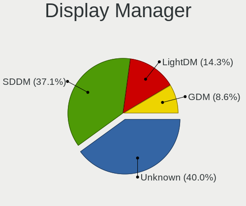
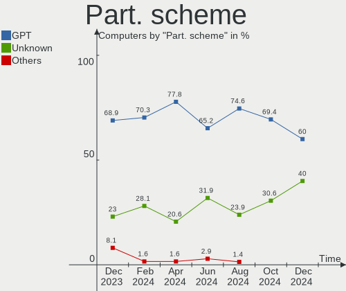
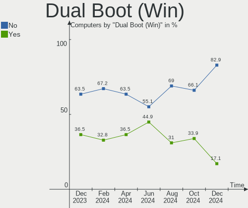
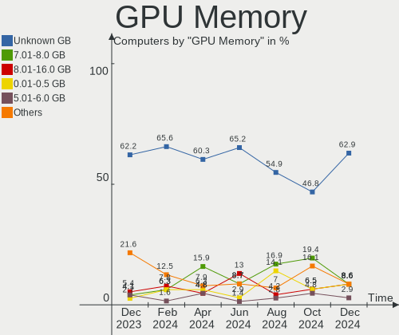
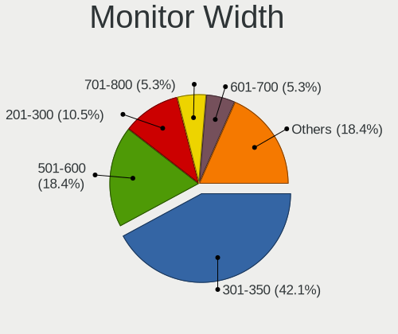
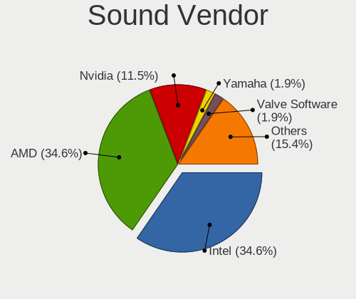

EndeavourOS - Hardware Trends
-----------------------------

A project to identify most popular hardware characteristics and track their change
over time based on data collected by Linux users at https://Linux-Hardware.org.

Anyone can contribute to this report by the [hw-probe](https://github.com/linuxhw/hw-probe) tool:

    sudo -E hw-probe -all -upload

This is a report for all computer types. See also reports for [desktops](/Dist/EndeavourOS/Desktop/README.md) and [notebooks](/Dist/EndeavourOS/Notebook/README.md).

This report is for one last month. Overall report since the beginning of time: [TestDays](https://github.com/linuxhw/TestDays)

Period: Jul, 2023.

Contents
--------

* [ System ](#system)
  - [ OS                       ](#os)
  - [ OS Family                ](#os-family)
  - [ Kernel                   ](#kernel)
  - [ Kernel Family            ](#kernel-family)
  - [ Kernel Major Ver.        ](#kernel-major-ver)
  - [ Arch                     ](#arch)
  - [ DE                       ](#de)
  - [ Display Server           ](#display-server)
  - [ Display Manager          ](#display-manager)
  - [ OS Lang                  ](#os-lang)
  - [ Boot Mode                ](#boot-mode)
  - [ Filesystem               ](#filesystem)
  - [ Part. scheme             ](#part-scheme)
  - [ Dual Boot with Linux/BSD ](#dual-boot-with-linuxbsd)
  - [ Dual Boot (Win)          ](#dual-boot-win)

* [ Board ](#board)
  - [ Vendor                   ](#vendor)
  - [ Model                    ](#model)
  - [ Model Family             ](#model-family)
  - [ MFG Year                 ](#mfg-year)
  - [ Form Factor              ](#form-factor)
  - [ Secure Boot              ](#secure-boot)
  - [ Coreboot                 ](#coreboot)
  - [ RAM Size                 ](#ram-size)
  - [ RAM Used                 ](#ram-used)
  - [ Total Drives             ](#total-drives)
  - [ Has CD-ROM               ](#has-cd-rom)
  - [ Has Ethernet             ](#has-ethernet)
  - [ Has WiFi                 ](#has-wifi)
  - [ Has Bluetooth            ](#has-bluetooth)

* [ Location ](#location)
  - [ Country                  ](#country)
  - [ City                     ](#city)

* [ Drives ](#drives)
  - [ Drive Vendor             ](#drive-vendor)
  - [ Drive Model              ](#drive-model)
  - [ HDD Vendor               ](#hdd-vendor)
  - [ SSD Vendor               ](#ssd-vendor)
  - [ Drive Kind               ](#drive-kind)
  - [ Drive Connector          ](#drive-connector)
  - [ Drive Size               ](#drive-size)
  - [ Space Total              ](#space-total)
  - [ Space Used               ](#space-used)
  - [ Malfunc. Drives          ](#malfunc-drives)
  - [ Malfunc. Drive Vendor    ](#malfunc-drive-vendor)
  - [ Malfunc. HDD Vendor      ](#malfunc-hdd-vendor)
  - [ Malfunc. Drive Kind      ](#malfunc-drive-kind)
  - [ Failed Drives            ](#failed-drives)
  - [ Failed Drive Vendor      ](#failed-drive-vendor)
  - [ Drive Status             ](#drive-status)

* [ Storage controller ](#storage-controller)
  - [ Storage Vendor           ](#storage-vendor)
  - [ Storage Model            ](#storage-model)
  - [ Storage Kind             ](#storage-kind)

* [ Processor ](#processor)
  - [ CPU Vendor               ](#cpu-vendor)
  - [ CPU Model                ](#cpu-model)
  - [ CPU Model Family         ](#cpu-model-family)
  - [ CPU Cores                ](#cpu-cores)
  - [ CPU Sockets              ](#cpu-sockets)
  - [ CPU Threads              ](#cpu-threads)
  - [ CPU Op-Modes             ](#cpu-op-modes)
  - [ CPU Microcode            ](#cpu-microcode)
  - [ CPU Microarch            ](#cpu-microarch)

* [ Graphics ](#graphics)
  - [ GPU Vendor               ](#gpu-vendor)
  - [ GPU Model                ](#gpu-model)
  - [ GPU Combo                ](#gpu-combo)
  - [ GPU Driver               ](#gpu-driver)
  - [ GPU Memory               ](#gpu-memory)

* [ Monitor ](#monitor)
  - [ Monitor Vendor           ](#monitor-vendor)
  - [ Monitor Model            ](#monitor-model)
  - [ Monitor Resolution       ](#monitor-resolution)
  - [ Monitor Diagonal         ](#monitor-diagonal)
  - [ Monitor Width            ](#monitor-width)
  - [ Aspect Ratio             ](#aspect-ratio)
  - [ Monitor Area             ](#monitor-area)
  - [ Pixel Density            ](#pixel-density)
  - [ Multiple Monitors        ](#multiple-monitors)

* [ Network ](#network)
  - [ Net Controller Vendor    ](#net-controller-vendor)
  - [ Net Controller Model     ](#net-controller-model)
  - [ Wireless Vendor          ](#wireless-vendor)
  - [ Wireless Model           ](#wireless-model)
  - [ Ethernet Vendor          ](#ethernet-vendor)
  - [ Ethernet Model           ](#ethernet-model)
  - [ Net Controller Kind      ](#net-controller-kind)
  - [ Used Controller          ](#used-controller)
  - [ NICs                     ](#nics)
  - [ IPv6                     ](#ipv6)

* [ Bluetooth ](#bluetooth)
  - [ Bluetooth Vendor         ](#bluetooth-vendor)
  - [ Bluetooth Model          ](#bluetooth-model)

* [ Sound ](#sound)
  - [ Sound Vendor             ](#sound-vendor)
  - [ Sound Model              ](#sound-model)

* [ Memory ](#memory)
  - [ Memory Vendor            ](#memory-vendor)
  - [ Memory Model             ](#memory-model)
  - [ Memory Kind              ](#memory-kind)
  - [ Memory Form Factor       ](#memory-form-factor)
  - [ Memory Size              ](#memory-size)
  - [ Memory Speed             ](#memory-speed)

* [ Printers & scanners ](#printers--scanners)
  - [ Printer Vendor           ](#printer-vendor)
  - [ Printer Model            ](#printer-model)
  - [ Scanner Vendor           ](#scanner-vendor)
  - [ Scanner Model            ](#scanner-model)

* [ Camera ](#camera)
  - [ Camera Vendor            ](#camera-vendor)
  - [ Camera Model             ](#camera-model)

* [ Security ](#security)
  - [ Fingerprint Vendor       ](#fingerprint-vendor)
  - [ Fingerprint Model        ](#fingerprint-model)
  - [ Chipcard Vendor          ](#chipcard-vendor)
  - [ Chipcard Model           ](#chipcard-model)

* [ Unsupported ](#unsupported)
  - [ Unsupported Devices      ](#unsupported-devices)
  - [ Unsupported Device Types ](#unsupported-device-types)

System
------

OS
--

Installed operating systems

| Name                | Computers | Percent |
|---------------------|-----------|---------|
| EndeavourOS Rolling | 63        | 100%    |

OS Family
---------

OS without a version

| Name        | Computers | Percent |
|-------------|-----------|---------|
| EndeavourOS | 63        | 100%    |

Kernel
------

Version of the Linux kernel

| Version                      | Computers | Percent |
|------------------------------|-----------|---------|
| 6.3.9-arch1-1                | 9         | 14.29%  |
| 6.4.3-arch1-2                | 6         | 9.52%   |
| 6.4.3-arch1-1                | 5         | 7.94%   |
| 6.4.2-arch1-1                | 5         | 7.94%   |
| 6.4.1-arch2-1                | 5         | 7.94%   |
| 6.4.7-arch1-1                | 4         | 6.35%   |
| 6.4.1-arch1-1                | 3         | 4.76%   |
| 6.4.5-arch1-1                | 2         | 3.17%   |
| 6.4.4-arch1-1                | 2         | 3.17%   |
| 6.4.3-zen1-2-zen             | 2         | 3.17%   |
| 6.4.3-273-tkg-pds            | 2         | 3.17%   |
| 6.4.1-zen1-1-zen             | 2         | 3.17%   |
| 6.4.7-1-cachyos-lto          | 1         | 1.59%   |
| 6.4.6-arch1-1                | 1         | 1.59%   |
| 6.4.6-1-cachyos-bore         | 1         | 1.59%   |
| 6.4.4-zen1-1-zen             | 1         | 1.59%   |
| 6.4.4-arch1-Yagakimi-T2-1-t2 | 1         | 1.59%   |
| 6.4.4-arch1-1-g14            | 1         | 1.59%   |
| 6.4.2-arch1-1-surface        | 1         | 1.59%   |
| 6.4.0-1-cachyos-bore         | 1         | 1.59%   |
| 6.3.8-zen1-1-zen             | 1         | 1.59%   |
| 6.3.1-arch2-1                | 1         | 1.59%   |
| 6.2.8-arch1-1                | 1         | 1.59%   |
| 6.2.15-lqx1-1-lqx            | 1         | 1.59%   |
| 6.2.13-arch1-1               | 1         | 1.59%   |
| 6.1.39-1-lts                 | 1         | 1.59%   |
| 6.1.38-1-lts                 | 1         | 1.59%   |
| 6.1.36-1-lts                 | 1         | 1.59%   |

Kernel Family
-------------

Linux kernel without a distro release

| Version | Computers | Percent |
|---------|-----------|---------|
| 6.4.3   | 15        | 23.81%  |
| 6.4.1   | 10        | 15.87%  |
| 6.3.9   | 9         | 14.29%  |
| 6.4.2   | 6         | 9.52%   |
| 6.4.7   | 5         | 7.94%   |
| 6.4.4   | 5         | 7.94%   |
| 6.4.6   | 2         | 3.17%   |
| 6.4.5   | 2         | 3.17%   |
| 6.4.0   | 1         | 1.59%   |
| 6.3.8   | 1         | 1.59%   |
| 6.3.1   | 1         | 1.59%   |
| 6.2.8   | 1         | 1.59%   |
| 6.2.15  | 1         | 1.59%   |
| 6.2.13  | 1         | 1.59%   |
| 6.1.39  | 1         | 1.59%   |
| 6.1.38  | 1         | 1.59%   |
| 6.1.36  | 1         | 1.59%   |

Kernel Major Ver.
-----------------

Linux kernel major version

| Version | Computers | Percent |
|---------|-----------|---------|
| 6.4     | 46        | 73.02%  |
| 6.3     | 11        | 17.46%  |
| 6.2     | 3         | 4.76%   |
| 6.1     | 3         | 4.76%   |

Arch
----

OS architecture (x86_64, i586, etc.)

| Name   | Computers | Percent |
|--------|-----------|---------|
| x86_64 | 63        | 100%    |

DE
--

Desktop Environment

| Name     | Computers | Percent |
|----------|-----------|---------|
| KDE5     | 30        | 47.62%  |
| GNOME    | 13        | 20.63%  |
| XFCE     | 10        | 15.87%  |
| Budgie   | 3         | 4.76%   |
| i3       | 2         | 3.17%   |
| Hyprland | 2         | 3.17%   |
| sway     | 1         | 1.59%   |
| KDE      | 1         | 1.59%   |
| Unknown  | 1         | 1.59%   |

Display Server
--------------

X11 or Wayland

| Name    | Computers | Percent |
|---------|-----------|---------|
| X11     | 42        | 66.67%  |
| Wayland | 20        | 31.75%  |
| Tty     | 1         | 1.59%   |

Display Manager
---------------

SDDM, LightDM, etc.

| Name    | Computers | Percent |
|---------|-----------|---------|
| SDDM    | 24        | 38.1%   |
| LightDM | 21        | 33.33%  |
| Unknown | 11        | 17.46%  |
| GDM     | 7         | 11.11%  |

OS Lang
-------

Language

| Lang    | Computers | Percent |
|---------|-----------|---------|
| en_US   | 36        | 57.14%  |
| it_IT   | 4         | 6.35%   |
| en_GB   | 4         | 6.35%   |
| de_DE   | 3         | 4.76%   |
| nl_NL   | 2         | 3.17%   |
| es_CO   | 2         | 3.17%   |
| ru_RU   | 1         | 1.59%   |
| pt_BR   | 1         | 1.59%   |
| pl_PL   | 1         | 1.59%   |
| hu_HU   | 1         | 1.59%   |
| fr_FR   | 1         | 1.59%   |
| es_MX   | 1         | 1.59%   |
| en_PH   | 1         | 1.59%   |
| en_IL   | 1         | 1.59%   |
| en_HK   | 1         | 1.59%   |
| en_CA   | 1         | 1.59%   |
| de_LU   | 1         | 1.59%   |
| Unknown | 1         | 1.59%   |

Boot Mode
---------

EFI or BIOS

| Mode | Computers | Percent |
|------|-----------|---------|
| EFI  | 41        | 65.08%  |
| BIOS | 22        | 34.92%  |

Filesystem
----------

Type of filesystem

| Type    | Computers | Percent |
|---------|-----------|---------|
| Ext4    | 33        | 52.38%  |
| Btrfs   | 25        | 39.68%  |
| Xfs     | 2         | 3.17%   |
| Tmpfs   | 2         | 3.17%   |
| Overlay | 1         | 1.59%   |

Part. scheme
------------

Scheme of partitioning

| Type    | Computers | Percent |
|---------|-----------|---------|
| GPT     | 46        | 73.02%  |
| Unknown | 10        | 15.87%  |
| MBR     | 7         | 11.11%  |

Dual Boot with Linux/BSD
------------------------

Hosting more than one Linux/BSD

| Dual boot | Computers | Percent |
|-----------|-----------|---------|
| No        | 58        | 92.06%  |
| Yes       | 5         | 7.94%   |

Dual Boot (Win)
---------------

Hosting Linux and Windows

| Dual boot | Computers | Percent |
|-----------|-----------|---------|
| No        | 44        | 69.84%  |
| Yes       | 19        | 30.16%  |

Board
-----

Vendor
------

Motherboard manufacturer

| Name                | Computers | Percent |
|---------------------|-----------|---------|
| Hewlett-Packard     | 14        | 22.22%  |
| Lenovo              | 13        | 20.63%  |
| ASUSTek Computer    | 12        | 19.05%  |
| Dell                | 5         | 7.94%   |
| MSI                 | 4         | 6.35%   |
| Gigabyte Technology | 2         | 3.17%   |
| Teclast             | 1         | 1.59%   |
| Sony                | 1         | 1.59%   |
| Samsung Electronics | 1         | 1.59%   |
| OriginPC            | 1         | 1.59%   |
| Notebook            | 1         | 1.59%   |
| Microsoft           | 1         | 1.59%   |
| Maibenben           | 1         | 1.59%   |
| Google              | 1         | 1.59%   |
| Daten Tecnologia    | 1         | 1.59%   |
| BESSTAR Tech        | 1         | 1.59%   |
| ASRock              | 1         | 1.59%   |
| Apple               | 1         | 1.59%   |
| Acer                | 1         | 1.59%   |

Model
-----

Motherboard model

| Name                                   | Computers | Percent |
|----------------------------------------|-----------|---------|
| Teclast F7 Plus                        | 1         | 1.59%   |
| Sony SVE1713X1EB                       | 1         | 1.59%   |
| Samsung 960QFG                         | 1         | 1.59%   |
| OriginPC EVO16-S                       | 1         | 1.59%   |
| Notebook NH5x_7xRCx,RDx                | 1         | 1.59%   |
| MSI MS-7C56                            | 1         | 1.59%   |
| MSI MS-7A34                            | 1         | 1.59%   |
| MSI MS-7994                            | 1         | 1.59%   |
| MSI GL73 8RE                           | 1         | 1.59%   |
| Microsoft Surface Laptop Go            | 1         | 1.59%   |
| Maibenben MaiBook M                    | 1         | 1.59%   |
| Lenovo Yoga Slim 7 Pro 16IAH7 82VA     | 1         | 1.59%   |
| Lenovo Yoga 730-15IWL 81JS             | 1         | 1.59%   |
| Lenovo ThinkPad T490s 20NYS4HL07       | 1         | 1.59%   |
| Lenovo ThinkPad L14 Gen 2a 20X50044GE  | 1         | 1.59%   |
| Lenovo ThinkPad E14 20RBS25S00         | 1         | 1.59%   |
| Lenovo ThinkPad E14 20RAS04C00         | 1         | 1.59%   |
| Lenovo ThinkPad A275 20KCS08C0K        | 1         | 1.59%   |
| Lenovo Legion Y9000X IAH7 82TF         | 1         | 1.59%   |
| Lenovo Legion Y540-17IRH 81Q4          | 1         | 1.59%   |
| Lenovo Legion 5 Pro 16ARH7H 82RG       | 1         | 1.59%   |
| Lenovo IdeaPad S340-14API 81NB         | 1         | 1.59%   |
| Lenovo IdeaPad 5 14ITL05 82FE          | 1         | 1.59%   |
| Lenovo IdeaPad 320-15ISK 80XH          | 1         | 1.59%   |
| HP Victus by Laptop 16-e0xxx           | 1         | 1.59%   |
| HP ProBook 440 G2                      | 1         | 1.59%   |
| HP Pavilion x360 Convertible 14-dw1xxx | 1         | 1.59%   |
| HP Pavilion Laptop 15-eh1xxx           | 1         | 1.59%   |
| HP Pavilion dv6                        | 1         | 1.59%   |
| HP OMEN Laptop 15-en0xxx               | 1         | 1.59%   |
| HP Laptop 15-db0xxx                    | 1         | 1.59%   |
| HP ENVY x360 Convertible               | 1         | 1.59%   |
| HP EliteBook 8770w                     | 1         | 1.59%   |
| HP EliteBook 845 G7 Notebook PC        | 1         | 1.59%   |
| HP EliteBook 2540p                     | 1         | 1.59%   |
| HP All-in-One 22-dd0xxx                | 1         | 1.59%   |
| HP 250 G3                              | 1         | 1.59%   |
| HP 245 G8 Notebook PC                  | 1         | 1.59%   |
| Google Fleex                           | 1         | 1.59%   |
| Gigabyte P55A-UD3                      | 1         | 1.59%   |

Model Family
------------

Motherboard model prefix

| Name                      | Computers | Percent |
|---------------------------|-----------|---------|
| ASUS ROG                  | 6         | 9.52%   |
| Lenovo ThinkPad           | 5         | 7.94%   |
| Dell XPS                  | 4         | 6.35%   |
| Lenovo Legion             | 3         | 4.76%   |
| Lenovo IdeaPad            | 3         | 4.76%   |
| HP Pavilion               | 3         | 4.76%   |
| HP EliteBook              | 3         | 4.76%   |
| Lenovo Yoga               | 2         | 3.17%   |
| Teclast F7                | 1         | 1.59%   |
| Sony SVE1713X1EB          | 1         | 1.59%   |
| Samsung 960QFG            | 1         | 1.59%   |
| OriginPC EVO16-S          | 1         | 1.59%   |
| Notebook NH5x             | 1         | 1.59%   |
| MSI MS-7C56               | 1         | 1.59%   |
| MSI MS-7A34               | 1         | 1.59%   |
| MSI MS-7994               | 1         | 1.59%   |
| MSI GL73                  | 1         | 1.59%   |
| Microsoft Surface         | 1         | 1.59%   |
| Maibenben MaiBook         | 1         | 1.59%   |
| HP Victus                 | 1         | 1.59%   |
| HP ProBook                | 1         | 1.59%   |
| HP OMEN                   | 1         | 1.59%   |
| HP Laptop                 | 1         | 1.59%   |
| HP ENVY                   | 1         | 1.59%   |
| HP All-in-One             | 1         | 1.59%   |
| HP 250                    | 1         | 1.59%   |
| HP 245                    | 1         | 1.59%   |
| Google Fleex              | 1         | 1.59%   |
| Gigabyte P55A-UD3         | 1         | 1.59%   |
| Gigabyte B550             | 1         | 1.59%   |
| Dell Latitude             | 1         | 1.59%   |
| Daten Tecnologia DH110MXV | 1         | 1.59%   |
| BESSTAR Tech GK41         | 1         | 1.59%   |
| ASUS X455LJ               | 1         | 1.59%   |
| ASUS TUF                  | 1         | 1.59%   |
| ASUS PRIME                | 1         | 1.59%   |
| ASUS K53SD                | 1         | 1.59%   |
| ASUS G551JK               | 1         | 1.59%   |
| ASUS ASUS                 | 1         | 1.59%   |
| ASRock B450M              | 1         | 1.59%   |

MFG Year
--------

Motherboard manufacture year

| Year | Computers | Percent |
|------|-----------|---------|
| 2022 | 9         | 14.29%  |
| 2020 | 9         | 14.29%  |
| 2018 | 8         | 12.7%   |
| 2021 | 7         | 11.11%  |
| 2019 | 5         | 7.94%   |
| 2023 | 4         | 6.35%   |
| 2017 | 4         | 6.35%   |
| 2015 | 3         | 4.76%   |
| 2014 | 3         | 4.76%   |
| 2012 | 3         | 4.76%   |
| 2016 | 2         | 3.17%   |
| 2009 | 2         | 3.17%   |
| 2008 | 2         | 3.17%   |
| 2011 | 1         | 1.59%   |
| 2010 | 1         | 1.59%   |

Form Factor
-----------

Physical design of the computer

| Name        | Computers | Percent |
|-------------|-----------|---------|
| Notebook    | 42        | 66.67%  |
| Desktop     | 13        | 20.63%  |
| Convertible | 4         | 6.35%   |
| Tablet      | 2         | 3.17%   |
| Mini pc     | 1         | 1.59%   |
| All in one  | 1         | 1.59%   |

Secure Boot
-----------

Enabled or disabled

| State    | Computers | Percent |
|----------|-----------|---------|
| Disabled | 61        | 96.83%  |
| Enabled  | 2         | 3.17%   |

Coreboot
--------

Have coreboot on board

| Used | Computers | Percent |
|------|-----------|---------|
| No   | 62        | 98.41%  |
| Yes  | 1         | 1.59%   |

RAM Size
--------

Total RAM memory

| Size in GB  | Computers | Percent |
|-------------|-----------|---------|
| 8.01-16.0   | 18        | 28.57%  |
| 16.01-24.0  | 16        | 25.4%   |
| 32.01-64.0  | 15        | 23.81%  |
| 4.01-8.0    | 7         | 11.11%  |
| 3.01-4.0    | 3         | 4.76%   |
| 64.01-256.0 | 3         | 4.76%   |
| 24.01-32.0  | 1         | 1.59%   |

RAM Used
--------

Used RAM memory

| Used GB   | Computers | Percent |
|-----------|-----------|---------|
| 4.01-8.0  | 19        | 30.16%  |
| 3.01-4.0  | 15        | 23.81%  |
| 2.01-3.0  | 11        | 17.46%  |
| 1.01-2.0  | 8         | 12.7%   |
| 8.01-16.0 | 8         | 12.7%   |
| 0.51-1.0  | 2         | 3.17%   |

Total Drives
------------

Number of drives on board

| Drives | Computers | Percent |
|--------|-----------|---------|
| 1      | 40        | 63.49%  |
| 2      | 15        | 23.81%  |
| 4      | 3         | 4.76%   |
| 6      | 2         | 3.17%   |
| 3      | 2         | 3.17%   |
| 5      | 1         | 1.59%   |

Has CD-ROM
----------

Has CD-ROM on board

| Presented | Computers | Percent |
|-----------|-----------|---------|
| No        | 52        | 82.54%  |
| Yes       | 11        | 17.46%  |

Has Ethernet
------------

Has Ethernet on board

| Presented | Computers | Percent |
|-----------|-----------|---------|
| Yes       | 50        | 79.37%  |
| No        | 13        | 20.63%  |

Has WiFi
--------

Has WiFi module

| Presented | Computers | Percent |
|-----------|-----------|---------|
| Yes       | 57        | 90.48%  |
| No        | 6         | 9.52%   |

Has Bluetooth
-------------

Has Bluetooth module

| Presented | Computers | Percent |
|-----------|-----------|---------|
| Yes       | 54        | 85.71%  |
| No        | 9         | 14.29%  |

Location
--------

Country
-------

Geographic location (country)

| Country     | Computers | Percent |
|-------------|-----------|---------|
| USA         | 17        | 26.98%  |
| Italy       | 7         | 11.11%  |
| Germany     | 6         | 9.52%   |
| Turkey      | 4         | 6.35%   |
| UK          | 2         | 3.17%   |
| Netherlands | 2         | 3.17%   |
| Hungary     | 2         | 3.17%   |
| Czechia     | 2         | 3.17%   |
| Colombia    | 2         | 3.17%   |
| Brazil      | 2         | 3.17%   |
| Vietnam     | 1         | 1.59%   |
| Switzerland | 1         | 1.59%   |
| Russia      | 1         | 1.59%   |
| Qatar       | 1         | 1.59%   |
| Poland      | 1         | 1.59%   |
| Philippines | 1         | 1.59%   |
| Peru        | 1         | 1.59%   |
| Luxembourg  | 1         | 1.59%   |
| Kosovo      | 1         | 1.59%   |
| Indonesia   | 1         | 1.59%   |
| Honduras    | 1         | 1.59%   |
| France      | 1         | 1.59%   |
| Finland     | 1         | 1.59%   |
| Canada      | 1         | 1.59%   |
| Belgium     | 1         | 1.59%   |
| Bahrain     | 1         | 1.59%   |
| Armenia     | 1         | 1.59%   |

City
----

Geographic location (city)

| City              | Computers | Percent |
|-------------------|-----------|---------|
| Istanbul          | 2         | 3.17%   |
| Canton            | 2         | 3.17%   |
| Unknown           | 2         | 3.17%   |
| Yerevan           | 1         | 1.59%   |
| Wuppertal         | 1         | 1.59%   |
| Ventura           | 1         | 1.59%   |
| Vantaa            | 1         | 1.59%   |
| Turin             | 1         | 1.59%   |
| Troy              | 1         | 1.59%   |
| Treviolo          | 1         | 1.59%   |
| Tegucigalpa       | 1         | 1.59%   |
| St Petersburg     | 1         | 1.59%   |
| St Louis          | 1         | 1.59%   |
| Sao Vicente       | 1         | 1.59%   |
| San Antonio       | 1         | 1.59%   |
| Salerno           | 1         | 1.59%   |
| Roosendaal        | 1         | 1.59%   |
| Rome              | 1         | 1.59%   |
| Rekem             | 1         | 1.59%   |
| Quezon City       | 1         | 1.59%   |
| Pristina          | 1         | 1.59%   |
| Prague            | 1         | 1.59%   |
| Poznan            | 1         | 1.59%   |
| Polatlı          | 1         | 1.59%   |
| Parkland          | 1         | 1.59%   |
| Nashville         | 1         | 1.59%   |
| Montreal          | 1         | 1.59%   |
| Madinat Hamad     | 1         | 1.59%   |
| Macclesfield      | 1         | 1.59%   |
| Luxembourg        | 1         | 1.59%   |
| Lima              | 1         | 1.59%   |
| Leander           | 1         | 1.59%   |
| Las Vegas         | 1         | 1.59%   |
| Landau            | 1         | 1.59%   |
| Kralovice         | 1         | 1.59%   |
| Kiel              | 1         | 1.59%   |
| Juazeiro do Norte | 1         | 1.59%   |
| Houston           | 1         | 1.59%   |
| Hopsten           | 1         | 1.59%   |
| Hillsboro         | 1         | 1.59%   |

Drives
------

Drive Vendor
------------

Hard drive vendors

| Vendor                      | Computers | Drives | Percent |
|-----------------------------|-----------|--------|---------|
| Samsung Electronics         | 22        | 28     | 23.4%   |
| SK hynix                    | 9         | 10     | 9.57%   |
| WDC                         | 8         | 10     | 8.51%   |
| SanDisk                     | 8         | 8      | 8.51%   |
| Seagate                     | 6         | 6      | 6.38%   |
| Toshiba                     | 5         | 5      | 5.32%   |
| Micron/Crucial Technology   | 4         | 4      | 4.26%   |
| HGST                        | 4         | 4      | 4.26%   |
| Micron Technology           | 3         | 3      | 3.19%   |
| Crucial                     | 3         | 3      | 3.19%   |
| MAXIO Technology (Hangzhou) | 2         | 2      | 2.13%   |
| Kingston                    | 2         | 2      | 2.13%   |
| Intel                       | 2         | 2      | 2.13%   |
| Hitachi                     | 2         | 2      | 2.13%   |
| Unknown                     | 1         | 1      | 1.06%   |
| Union Memory (Shenzhen)     | 1         | 1      | 1.06%   |
| Teclast                     | 1         | 1      | 1.06%   |
| TAMMUZ                      | 1         | 2      | 1.06%   |
| Solid State Storage         | 1         | 1      | 1.06%   |
| Realtek                     | 1         | 1      | 1.06%   |
| MaxDigital                  | 1         | 1      | 1.06%   |
| LITEONIT                    | 1         | 1      | 1.06%   |
| Kingston Technology Company | 1         | 1      | 1.06%   |
| Kingmax                     | 1         | 2      | 1.06%   |
| Hewlett-Packard             | 1         | 1      | 1.06%   |
| GOFATOO                     | 1         | 1      | 1.06%   |
| Apple                       | 1         | 1      | 1.06%   |
| A-DATA Technology           | 1         | 1      | 1.06%   |

Drive Model
-----------

Hard drive models

| Model                                               | Computers | Percent |
|-----------------------------------------------------|-----------|---------|
| Samsung NVMe SSD Controller SM981/PM981/PM983 500GB | 11        | 10.78%  |
| WDC WDS100T2B0A-00SM50 1TB SSD                      | 2         | 1.96%   |
| SK hynix SHPP41-2000GM 2TB                          | 2         | 1.96%   |
| Sandisk WD Blue SN550 NVMe SSD 250GB                | 2         | 1.96%   |
| Samsung NVMe SSD Controller PM9A1/PM9A3/980PRO 1TB  | 2         | 1.96%   |
| Samsung HD103SJ 1TB                                 | 2         | 1.96%   |
| Micron/Crucial P2 NVMe PCIe SSD 1TB                 | 2         | 1.96%   |
| MAXIO (Hangzhou) NVMe SSD Controller MAP1202 256GB  | 2         | 1.96%   |
| Kingston SKC3000D2048G 2TB                          | 2         | 1.96%   |
| WDC WDS100T2B0B-00YS70 1TB SSD                      | 1         | 0.98%   |
| WDC WD7500BPVT-80HXZT3 752GB                        | 1         | 0.98%   |
| WDC WD5000LPCX-21VHAT0 500GB                        | 1         | 0.98%   |
| WDC WD5000AZRX-00A8LB0 500GB                        | 1         | 0.98%   |
| WDC WD5000AAKX-60U6AA0 500GB                        | 1         | 0.98%   |
| WDC WD3200BPVT-22JJ5T0 320GB                        | 1         | 0.98%   |
| WDC WD10SPZX-60Z10T0 1TB                            | 1         | 0.98%   |
| WDC WD10EZEX-08WN4A0 1TB                            | 1         | 0.98%   |
| Unknown MMC Card  32GB                              | 1         | 0.98%   |
| Union Memory (Shenzhen) UMIS RPETJ256MGE2MDQ 256GB  | 1         | 0.98%   |
| Toshiba MQ01ABD100 1TB                              | 1         | 0.98%   |
| Toshiba MK2533GSG 250GB                             | 1         | 0.98%   |
| Toshiba DT01ACA300 3TB                              | 1         | 0.98%   |
| Toshiba DT01ACA050 500GB                            | 1         | 0.98%   |
| Toshiba BG3 NVMe SSD Controller 256GB               | 1         | 0.98%   |
| Teclast 256GB NA850-2280 SSD                        | 1         | 0.98%   |
| TAMMUZ SSD 500GB                                    | 1         | 0.98%   |
| Solid State Storage SSSTC CL1-4D256-D22 256GB       | 1         | 0.98%   |
| SK hynix SKHynix_HFS001TDE9X084N 1TB                | 1         | 0.98%   |
| SK hynix SHGP31-1000GM 1TB                          | 1         | 0.98%   |
| SK hynix SC300 M.2 2280 256GB SSD                   | 1         | 0.98%   |
| SK hynix PC711 HFS001TDE9X073N 1TB                  | 1         | 0.98%   |
| SK hynix PC401 NVMe Solid State Drive 256GB         | 1         | 0.98%   |
| SK hynix HFM512GD3JX016N 512GB                      | 1         | 0.98%   |
| SK hynix BC711 HFM001TD3JX013N 1TB                  | 1         | 0.98%   |
| SK hynix BC501 NVMe Solid State Drive 512GB         | 1         | 0.98%   |
| Seagate ST9750420AS 752GB                           | 1         | 0.98%   |
| Seagate ST8000VN0022-2EL112 8TB                     | 1         | 0.98%   |
| Seagate ST4000DM004-2CV104 4TB                      | 1         | 0.98%   |
| Seagate ST2000LM007-1R8174 2TB                      | 1         | 0.98%   |
| Seagate ST2000DM006-2DM164 2TB                      | 1         | 0.98%   |

HDD Vendor
----------

Hard disk drive vendors

| Vendor              | Computers | Drives | Percent |
|---------------------|-----------|--------|---------|
| WDC                 | 6         | 7      | 24%     |
| Seagate             | 6         | 6      | 24%     |
| Toshiba             | 4         | 4      | 16%     |
| HGST                | 4         | 4      | 16%     |
| Samsung Electronics | 2         | 2      | 8%      |
| Hitachi             | 2         | 2      | 8%      |
| MaxDigital          | 1         | 1      | 4%      |

SSD Vendor
----------

Solid state drive vendors

| Vendor              | Computers | Drives | Percent |
|---------------------|-----------|--------|---------|
| Samsung Electronics | 8         | 9      | 34.78%  |
| WDC                 | 3         | 3      | 13.04%  |
| Crucial             | 2         | 2      | 8.7%    |
| Teclast             | 1         | 1      | 4.35%   |
| TAMMUZ              | 1         | 2      | 4.35%   |
| SK hynix            | 1         | 1      | 4.35%   |
| SanDisk             | 1         | 1      | 4.35%   |
| LITEONIT            | 1         | 1      | 4.35%   |
| Kingmax             | 1         | 2      | 4.35%   |
| Intel               | 1         | 1      | 4.35%   |
| Hewlett-Packard     | 1         | 1      | 4.35%   |
| GOFATOO             | 1         | 1      | 4.35%   |
| A-DATA Technology   | 1         | 1      | 4.35%   |

Drive Kind
----------

HDD or SSD

| Kind | Computers | Drives | Percent |
|------|-----------|--------|---------|
| NVMe | 40        | 52     | 49.38%  |
| SSD  | 20        | 26     | 24.69%  |
| HDD  | 20        | 26     | 24.69%  |
| MMC  | 1         | 1      | 1.23%   |

Drive Connector
---------------

SATA, SAS, NVMe, etc.

| Type | Computers | Drives | Percent |
|------|-----------|--------|---------|
| NVMe | 40        | 51     | 54.05%  |
| SATA | 31        | 51     | 41.89%  |
| SAS  | 2         | 2      | 2.7%    |
| MMC  | 1         | 1      | 1.35%   |

Drive Size
----------

Size of hard drive

| Size in TB | Computers | Drives | Percent |
|------------|-----------|--------|---------|
| 0.01-0.5   | 21        | 28     | 51.22%  |
| 0.51-1.0   | 12        | 16     | 29.27%  |
| 1.01-2.0   | 4         | 4      | 9.76%   |
| 3.01-4.0   | 2         | 2      | 4.88%   |
| 2.01-3.0   | 1         | 1      | 2.44%   |
| 4.01-10.0  | 1         | 1      | 2.44%   |

Space Total
-----------

Amount of disk space available on the file system

| Size in GB     | Computers | Percent |
|----------------|-----------|---------|
| 1001-2000      | 14        | 22.22%  |
| 251-500        | 10        | 15.87%  |
| 501-1000       | 10        | 15.87%  |
| More than 3000 | 9         | 14.29%  |
| 101-250        | 8         | 12.7%   |
| 1-20           | 6         | 9.52%   |
| 51-100         | 3         | 4.76%   |
| Unknown        | 2         | 3.17%   |
| 2001-3000      | 1         | 1.59%   |

Space Used
----------

Amount of used disk space

| Used GB        | Computers | Percent |
|----------------|-----------|---------|
| 1-20           | 13        | 20.63%  |
| 101-250        | 10        | 15.87%  |
| 251-500        | 9         | 14.29%  |
| 21-50          | 8         | 12.7%   |
| 1001-2000      | 8         | 12.7%   |
| 51-100         | 8         | 12.7%   |
| More than 3000 | 3         | 4.76%   |
| 501-1000       | 2         | 3.17%   |
| Unknown        | 2         | 3.17%   |

Malfunc. Drives
---------------

Drive models with a malfunction

| Model                                                           | Computers | Drives | Percent |
|-----------------------------------------------------------------|-----------|--------|---------|
| Toshiba MK2533GSG 250GB                                         | 1         | 1      | 9.09%   |
| Toshiba DT01ACA300 3TB                                          | 1         | 1      | 9.09%   |
| Toshiba DT01ACA050 500GB                                        | 1         | 1      | 9.09%   |
| SK hynix PC711 HFS001TDE9X073N 1TB                              | 1         | 1      | 9.09%   |
| SK hynix BC711 HFM001TD3JX013N 1TB                              | 1         | 1      | 9.09%   |
| Seagate ST9750420AS 752GB                                       | 1         | 1      | 9.09%   |
| Samsung Electronics NVMe SSD Controller SM981/PM981/PM983 500GB | 1         | 1      | 9.09%   |
| LITEONIT LCT-512M3S 2.5 7mm 512GB SSD                           | 1         | 1      | 9.09%   |
| HGST HTS545050A7E680 500GB                                      | 1         | 1      | 9.09%   |
| HGST HTS545050A7E380 500GB                                      | 1         | 1      | 9.09%   |
| Crucial CT500MX500SSD1 500GB                                    | 1         | 1      | 9.09%   |

Malfunc. Drive Vendor
---------------------

Vendors of faulty drives

| Vendor              | Computers | Drives | Percent |
|---------------------|-----------|--------|---------|
| Toshiba             | 3         | 3      | 27.27%  |
| SK hynix            | 2         | 2      | 18.18%  |
| HGST                | 2         | 2      | 18.18%  |
| Seagate             | 1         | 1      | 9.09%   |
| Samsung Electronics | 1         | 1      | 9.09%   |
| LITEONIT            | 1         | 1      | 9.09%   |
| Crucial             | 1         | 1      | 9.09%   |

Malfunc. HDD Vendor
-------------------

Vendors of faulty HDD drives

| Vendor  | Computers | Drives | Percent |
|---------|-----------|--------|---------|
| Toshiba | 3         | 3      | 50%     |
| HGST    | 2         | 2      | 33.33%  |
| Seagate | 1         | 1      | 16.67%  |

Malfunc. Drive Kind
-------------------

Kinds of faulty drives

| Kind | Computers | Drives | Percent |
|------|-----------|--------|---------|
| HDD  | 6         | 6      | 54.55%  |
| NVMe | 3         | 3      | 27.27%  |
| SSD  | 2         | 2      | 18.18%  |

Failed Drives
-------------

Failed drive models

Zero info for selected period =(

Failed Drive Vendor
-------------------

Failed drive vendors

Zero info for selected period =(

Drive Status
------------

Number of failed and malfunc. drives

| Status   | Computers | Drives | Percent |
|----------|-----------|--------|---------|
| Works    | 44        | 65     | 63.77%  |
| Detected | 14        | 29     | 20.29%  |
| Malfunc  | 11        | 11     | 15.94%  |

Storage controller
------------------

Storage Vendor
--------------

Storage controller vendors

| Vendor                         | Computers | Percent |
|--------------------------------|-----------|---------|
| Intel                          | 30        | 31.91%  |
| Samsung Electronics            | 16        | 17.02%  |
| AMD                            | 13        | 13.83%  |
| SK hynix                       | 8         | 8.51%   |
| SanDisk                        | 7         | 7.45%   |
| Micron/Crucial Technology      | 5         | 5.32%   |
| Micron Technology              | 3         | 3.19%   |
| MAXIO Technology (Hangzhou)    | 3         | 3.19%   |
| Kingston Technology Company    | 3         | 3.19%   |
| Union Memory (Shenzhen)        | 1         | 1.06%   |
| Toshiba America Info Systems   | 1         | 1.06%   |
| Solid State Storage Technology | 1         | 1.06%   |
| JMicron Technology             | 1         | 1.06%   |
| ASMedia Technology             | 1         | 1.06%   |
| Apple                          | 1         | 1.06%   |

Storage Model
-------------

Storage controller models

| Model                                                                         | Computers | Percent |
|-------------------------------------------------------------------------------|-----------|---------|
| Samsung NVMe SSD Controller SM981/PM981/PM983                                 | 11        | 10.58%  |
| AMD FCH SATA Controller [AHCI mode]                                           | 10        | 9.62%   |
| SK hynix Gold P31/BC711/PC711 NVMe Solid State Drive                          | 5         | 4.81%   |
| Intel Cannon Lake Mobile PCH SATA AHCI Controller                             | 4         | 3.85%   |
| Samsung NVMe SSD Controller 980                                               | 3         | 2.88%   |
| Intel Volume Management Device NVMe RAID Controller Intel Corporation         | 3         | 2.88%   |
| AMD 500 Series Chipset SATA Controller                                        | 3         | 2.88%   |
| SK hynix Platinum P41/PC801 NVMe Solid State Drive                            | 2         | 1.92%   |
| SanDisk WD Blue SN550 NVMe SSD                                                | 2         | 1.92%   |
| SanDisk WD Black SN770 / PC SN740 256GB / PC SN560 (DRAM-less) NVMe SSD       | 2         | 1.92%   |
| Samsung NVMe SSD Controller PM9A1/PM9A3/980PRO                                | 2         | 1.92%   |
| Micron/Crucial P2 [Nick P2] / P3 / P3 Plus NVMe PCIe SSD (DRAM-less)          | 2         | 1.92%   |
| Micron 2400 NVMe SSD (DRAM-less)                                              | 2         | 1.92%   |
| MAXIO (Hangzhou) NVMe SSD Controller MAP1202                                  | 2         | 1.92%   |
| Kingston Company KC3000/Renegade NVMe SSD                                     | 2         | 1.92%   |
| Intel Volume Management Device NVMe RAID Controller                           | 2         | 1.92%   |
| Intel Sunrise Point-LP SATA Controller [AHCI mode]                            | 2         | 1.92%   |
| Intel Q170/Q150/B150/H170/H110/Z170/CM236 Chipset SATA Controller [AHCI Mode] | 2         | 1.92%   |
| Intel Comet Lake SATA AHCI Controller                                         | 2         | 1.92%   |
| Intel Celeron/Pentium Silver Processor SATA Controller                        | 2         | 1.92%   |
| Intel 82801 Mobile SATA Controller [RAID mode]                                | 2         | 1.92%   |
| Intel 8 Series SATA Controller 1 [AHCI mode]                                  | 2         | 1.92%   |
| Intel 5 Series/3400 Series Chipset 6 port SATA AHCI Controller                | 2         | 1.92%   |
| AMD 400 Series Chipset SATA Controller                                        | 2         | 1.92%   |
| AMD 300 Series Chipset SATA Controller                                        | 2         | 1.92%   |
| Union Memory (Shenzhen) AM630 PCIe 4.0 NVMe SSD 256GB                         | 1         | 0.96%   |
| Toshiba America Info Systems BG3 NVMe SSD Controller                          | 1         | 0.96%   |
| Solid State Storage CL1-3D256-Q11 NVMe SSD M.2                                | 1         | 0.96%   |
| SK hynix PC401 NVMe Solid State Drive 256GB                                   | 1         | 0.96%   |
| SK hynix BC501 NVMe Solid State Drive                                         | 1         | 0.96%   |
| SanDisk WD PC SN810 / Black SN850 NVMe SSD                                    | 1         | 0.96%   |
| SanDisk WD Green SN350 NVMe SSD 1 TB (DRAM-less)                              | 1         | 0.96%   |
| SanDisk PC SN520 NVMe SSD                                                     | 1         | 0.96%   |
| Micron/Crucial P5 Plus NVMe PCIe SSD                                          | 1         | 0.96%   |
| Micron/Crucial P5 NVMe PCIe SSD[SlashP5]                                      | 1         | 0.96%   |
| Micron/Crucial P1 NVMe PCIe SSD[Frampton2]                                    | 1         | 0.96%   |
| Micron 3400 NVMe SSD [Hendrix]                                                | 1         | 0.96%   |
| MAXIO (Hangzhou) NVMe SSD Controller MAP1602                                  | 1         | 0.96%   |
| Kingston Company A2000 NVMe SSD                                               | 1         | 0.96%   |
| JMicron JMB360 AHCI Controller                                                | 1         | 0.96%   |

Storage Kind
------------

Kind of storage controller (IDE, SATA, NVMe, SAS, ...)

| Kind | Computers | Percent |
|------|-----------|---------|
| NVMe | 40        | 46.51%  |
| SATA | 37        | 43.02%  |
| RAID | 7         | 8.14%   |
| IDE  | 2         | 2.33%   |

Processor
---------

CPU Vendor
----------

Processor vendors

| Vendor | Computers | Percent |
|--------|-----------|---------|
| Intel  | 40        | 63.49%  |
| AMD    | 23        | 36.51%  |

CPU Model
---------

Processor models

| Model                                      | Computers | Percent |
|--------------------------------------------|-----------|---------|
| Intel Core i7-9750H CPU @ 2.60GHz          | 3         | 4.76%   |
| Intel 12th Gen Core i7-12700H              | 3         | 4.76%   |
| Intel Core i7-8750H CPU @ 2.20GHz          | 2         | 3.17%   |
| Intel Core i7-3632QM CPU @ 2.20GHz         | 2         | 3.17%   |
| Intel Core i5-4210U CPU @ 1.70GHz          | 2         | 3.17%   |
| Intel Core i5-10210U CPU @ 1.60GHz         | 2         | 3.17%   |
| Intel 13th Gen Core i9-13900H              | 2         | 3.17%   |
| Intel Pentium Gold 7505 @ 2.00GHz          | 1         | 1.59%   |
| Intel Core i7-8665U CPU @ 1.90GHz          | 1         | 1.59%   |
| Intel Core i7-8565U CPU @ 1.80GHz          | 1         | 1.59%   |
| Intel Core i7-8550U CPU @ 1.80GHz          | 1         | 1.59%   |
| Intel Core i7-8086K CPU @ 4.00GHz          | 1         | 1.59%   |
| Intel Core i7-4710HQ CPU @ 2.50GHz         | 1         | 1.59%   |
| Intel Core i7-3630QM CPU @ 2.40GHz         | 1         | 1.59%   |
| Intel Core i7-2670QM CPU @ 2.20GHz         | 1         | 1.59%   |
| Intel Core i7 CPU L 640 @ 2.13GHz          | 1         | 1.59%   |
| Intel Core i5-6500 CPU @ 3.20GHz           | 1         | 1.59%   |
| Intel Core i5-6300U CPU @ 2.40GHz          | 1         | 1.59%   |
| Intel Core i5-2450M CPU @ 2.50GHz          | 1         | 1.59%   |
| Intel Core i5-1035G1 CPU @ 1.00GHz         | 1         | 1.59%   |
| Intel Core i5 CPU 750 @ 2.67GHz            | 1         | 1.59%   |
| Intel Core i3-6100 CPU @ 3.70GHz           | 1         | 1.59%   |
| Intel Core i3-6006U CPU @ 2.00GHz          | 1         | 1.59%   |
| Intel Core i3-5010U CPU @ 2.10GHz          | 1         | 1.59%   |
| Intel Celeron N4100 CPU @ 1.10GHz          | 1         | 1.59%   |
| Intel Celeron N4020 CPU @ 1.10GHz          | 1         | 1.59%   |
| Intel Celeron J4125 CPU @ 2.00GHz          | 1         | 1.59%   |
| Intel 13th Gen Core i7-13700K              | 1         | 1.59%   |
| Intel 13th Gen Core i7-1360P               | 1         | 1.59%   |
| Intel 12th Gen Core i9-12900K              | 1         | 1.59%   |
| Intel 11th Gen Core i5-1135G7 @ 2.40GHz    | 1         | 1.59%   |
| AMD Ryzen 9 6900HX with Radeon Graphics    | 1         | 1.59%   |
| AMD Ryzen 9 3900X 12-Core Processor        | 1         | 1.59%   |
| AMD Ryzen 7 PRO 4750U with Radeon Graphics | 1         | 1.59%   |
| AMD Ryzen 7 7735HS with Radeon Graphics    | 1         | 1.59%   |
| AMD Ryzen 7 6800H with Radeon Graphics     | 1         | 1.59%   |
| AMD Ryzen 7 5800X 8-Core Processor         | 1         | 1.59%   |
| AMD Ryzen 7 5800HS with Radeon Graphics    | 1         | 1.59%   |
| AMD Ryzen 7 5800H with Radeon Graphics     | 1         | 1.59%   |
| AMD Ryzen 7 5700U with Radeon Graphics     | 1         | 1.59%   |

CPU Model Family
----------------

Processor model prefix

| Model              | Computers | Percent |
|--------------------|-----------|---------|
| Intel Core i7      | 15        | 23.81%  |
| Other              | 11        | 17.46%  |
| AMD Ryzen 7        | 10        | 15.87%  |
| Intel Core i5      | 9         | 14.29%  |
| AMD Ryzen 5        | 4         | 6.35%   |
| Intel Core i3      | 3         | 4.76%   |
| Intel Celeron      | 3         | 4.76%   |
| AMD Ryzen 9        | 2         | 3.17%   |
| AMD Ryzen 3        | 2         | 3.17%   |
| Intel Pentium Gold | 1         | 1.59%   |
| AMD Ryzen 7 PRO    | 1         | 1.59%   |
| AMD Ryzen 5 PRO    | 1         | 1.59%   |
| AMD Athlon         | 1         | 1.59%   |

CPU Cores
---------

Number of processor cores

| Number | Computers | Percent |
|--------|-----------|---------|
| 4      | 17        | 26.98%  |
| 2      | 14        | 22.22%  |
| 8      | 12        | 19.05%  |
| 6      | 11        | 17.46%  |
| 14     | 5         | 7.94%   |
| 16     | 2         | 3.17%   |
| 12     | 2         | 3.17%   |

CPU Sockets
-----------

Number of sockets

| Number | Computers | Percent |
|--------|-----------|---------|
| 1      | 63        | 100%    |

CPU Threads
-----------

Threads per core (Hyper-Threading)

| Number | Computers | Percent |
|--------|-----------|---------|
| 2      | 56        | 88.89%  |
| 1      | 7         | 11.11%  |

CPU Op-Modes
------------

CPU Operation Modes (32-bit, 64-bit)

| Op mode        | Computers | Percent |
|----------------|-----------|---------|
| 32-bit, 64-bit | 63        | 100%    |

CPU Microcode
-------------

Microcode number

| Number     | Computers | Percent |
|------------|-----------|---------|
| Unknown    | 46        | 73.02%  |
| 0x0a404102 | 2         | 3.17%   |
| 0x08608103 | 2         | 3.17%   |
| 0x08001138 | 2         | 3.17%   |
| 0x906a3    | 1         | 1.59%   |
| 0x306a9    | 1         | 1.59%   |
| 0x0a50000d | 1         | 1.59%   |
| 0x0a50000c | 1         | 1.59%   |
| 0x0a201205 | 1         | 1.59%   |
| 0x08701021 | 1         | 1.59%   |
| 0x08608104 | 1         | 1.59%   |
| 0x08600106 | 1         | 1.59%   |
| 0x08108109 | 1         | 1.59%   |
| 0x0800820d | 1         | 1.59%   |
| 0x0600611a | 1         | 1.59%   |

CPU Microarch
-------------

Microarchitecture

| Name             | Computers | Percent |
|------------------|-----------|---------|
| KabyLake         | 11        | 17.46%  |
| Alderlake Hybrid | 7         | 11.11%  |
| Unknown          | 7         | 11.11%  |
| Zen 3            | 5         | 7.94%   |
| Zen 2            | 5         | 7.94%   |
| Skylake          | 4         | 6.35%   |
| Zen+             | 3         | 4.76%   |
| IvyBridge        | 3         | 4.76%   |
| Haswell          | 3         | 4.76%   |
| Goldmont plus    | 3         | 4.76%   |
| Zen              | 2         | 3.17%   |
| TigerLake        | 2         | 3.17%   |
| SandyBridge      | 2         | 3.17%   |
| Excavator        | 2         | 3.17%   |
| Westmere         | 1         | 1.59%   |
| Nehalem          | 1         | 1.59%   |
| IceLake          | 1         | 1.59%   |
| Broadwell        | 1         | 1.59%   |

Graphics
--------

GPU Vendor
----------

Vendors of graphics cards

| Vendor | Computers | Percent |
|--------|-----------|---------|
| Intel  | 33        | 39.76%  |
| AMD    | 27        | 32.53%  |
| Nvidia | 23        | 27.71%  |

GPU Model
---------

Graphics card models

| Model                                                                     | Computers | Percent |
|---------------------------------------------------------------------------|-----------|---------|
| Intel Raptor Lake-P [Iris Xe Graphics]                                    | 3         | 3.45%   |
| Intel GeminiLake [UHD Graphics 600]                                       | 3         | 3.45%   |
| Intel CoffeeLake-H GT2 [UHD Graphics 630]                                 | 3         | 3.45%   |
| Intel Alder Lake-P Integrated Graphics Controller                         | 3         | 3.45%   |
| AMD Rembrandt [Radeon 680M]                                               | 3         | 3.45%   |
| AMD Lucienne                                                              | 3         | 3.45%   |
| AMD Cezanne [Radeon Vega Series / Radeon Vega Mobile Series]              | 3         | 3.45%   |
| Nvidia TU106M [GeForce RTX 2060 Mobile]                                   | 2         | 2.3%    |
| Nvidia GA106M [GeForce RTX 3060 Mobile / Max-Q]                           | 2         | 2.3%    |
| Nvidia AD107M [GeForce RTX 4050 Max-Q / Mobile]                           | 2         | 2.3%    |
| Intel WhiskeyLake-U GT2 [UHD Graphics 620]                                | 2         | 2.3%    |
| Intel Haswell-ULT Integrated Graphics Controller                          | 2         | 2.3%    |
| Intel CometLake-U GT2 [UHD Graphics]                                      | 2         | 2.3%    |
| Intel 2nd Generation Core Processor Family Integrated Graphics Controller | 2         | 2.3%    |
| AMD Renoir                                                                | 2         | 2.3%    |
| AMD Picasso/Raven 2 [Radeon Vega Series / Radeon Vega Mobile Series]      | 2         | 2.3%    |
| AMD Navi 22 [Radeon RX 6700/6700 XT/6750 XT / 6800M/6850M XT]             | 2         | 2.3%    |
| AMD Navi 14 [Radeon RX 5500/5500M / Pro 5500M]                            | 2         | 2.3%    |
| Nvidia TU116M [GeForce GTX 1660 Ti Mobile]                                | 1         | 1.15%   |
| Nvidia GP107M [GeForce GTX 1050 Ti Mobile]                                | 1         | 1.15%   |
| Nvidia GP107M [GeForce GTX 1050 Mobile]                                   | 1         | 1.15%   |
| Nvidia GP107 [GeForce GTX 1050 Ti]                                        | 1         | 1.15%   |
| Nvidia GP106M [GeForce GTX 1060 Mobile]                                   | 1         | 1.15%   |
| Nvidia GP106 [GeForce GTX 1060 6GB]                                       | 1         | 1.15%   |
| Nvidia GM107M [GeForce GTX 850M]                                          | 1         | 1.15%   |
| Nvidia GM107 [GeForce GTX 750 Ti]                                         | 1         | 1.15%   |
| Nvidia GK208BM [GeForce 920M]                                             | 1         | 1.15%   |
| Nvidia GK107M [GeForce GT 640M]                                           | 1         | 1.15%   |
| Nvidia GK104GLM [Quadro K3000M]                                           | 1         | 1.15%   |
| Nvidia GF119M [GeForce 610M]                                              | 1         | 1.15%   |
| Nvidia GA107M [GeForce RTX 3050 Ti Mobile]                                | 1         | 1.15%   |
| Nvidia GA106 [GeForce RTX 3060 Lite Hash Rate]                            | 1         | 1.15%   |
| Nvidia GA104M [Geforce RTX 3070 Ti Laptop GPU]                            | 1         | 1.15%   |
| Nvidia GA102 [GeForce RTX 3080 Ti]                                        | 1         | 1.15%   |
| Nvidia AD107M [GeForce RTX 4060 Max-Q / Mobile]                           | 1         | 1.15%   |
| Intel UHD Graphics 620                                                    | 1         | 1.15%   |
| Intel TigerLake-LP GT2 [Iris Xe Graphics]                                 | 1         | 1.15%   |
| Intel Tiger Lake-LP GT2 [UHD Graphics G4]                                 | 1         | 1.15%   |
| Intel Skylake GT2 [HD Graphics 520]                                       | 1         | 1.15%   |
| Intel Raptor Lake-S GT1 [UHD Graphics 770]                                | 1         | 1.15%   |

GPU Combo
---------

Combinations of graphics cards

| Name           | Computers | Percent |
|----------------|-----------|---------|
| 1 x AMD        | 17        | 26.98%  |
| 1 x Intel      | 16        | 25.4%   |
| Intel + Nvidia | 13        | 20.63%  |
| 1 x Nvidia     | 5         | 7.94%   |
| AMD + Nvidia   | 5         | 7.94%   |
| 2 x AMD        | 3         | 4.76%   |
| Intel + AMD    | 2         | 3.17%   |
| Other          | 1         | 1.59%   |
| 2 x Intel      | 1         | 1.59%   |

GPU Driver
----------

Free vs proprietary

| Driver      | Computers | Percent |
|-------------|-----------|---------|
| Free        | 48        | 76.19%  |
| Proprietary | 15        | 23.81%  |

GPU Memory
----------

Total video memory

| Size in GB | Computers | Percent |
|------------|-----------|---------|
| Unknown    | 38        | 60.32%  |
| 0.01-0.5   | 7         | 11.11%  |
| 3.01-4.0   | 5         | 7.94%   |
| 1.01-2.0   | 4         | 6.35%   |
| 7.01-8.0   | 3         | 4.76%   |
| 5.01-6.0   | 3         | 4.76%   |
| 8.01-16.0  | 2         | 3.17%   |
| 0.51-1.0   | 1         | 1.59%   |

Monitor
-------

Monitor Vendor
--------------

Monitor vendors

| Vendor                  | Computers | Percent |
|-------------------------|-----------|---------|
| Chimei Innolux          | 12        | 15.79%  |
| LG Display              | 10        | 13.16%  |
| Samsung Electronics     | 8         | 10.53%  |
| AU Optronics            | 7         | 9.21%   |
| BOE                     | 6         | 7.89%   |
| Acer                    | 5         | 6.58%   |
| Goldstar                | 3         | 3.95%   |
| Dell                    | 3         | 3.95%   |
| PANDA                   | 2         | 2.63%   |
| Hewlett-Packard         | 2         | 2.63%   |
| AOC                     | 2         | 2.63%   |
| ViewSonic               | 1         | 1.32%   |
| TMX                     | 1         | 1.32%   |
| Sharp                   | 1         | 1.32%   |
| Philips                 | 1         | 1.32%   |
| Lenovo                  | 1         | 1.32%   |
| ITE                     | 1         | 1.32%   |
| Iiyama                  | 1         | 1.32%   |
| Huion                   | 1         | 1.32%   |
| HKC                     | 1         | 1.32%   |
| HIK                     | 1         | 1.32%   |
| GDH                     | 1         | 1.32%   |
| CSO                     | 1         | 1.32%   |
| Chi Mei Optoelectronics | 1         | 1.32%   |
| ASUSTek Computer        | 1         | 1.32%   |
| Apple                   | 1         | 1.32%   |
| Ancor Communications    | 1         | 1.32%   |

Monitor Model
-------------

Monitor models

| Model                                                                 | Computers | Percent |
|-----------------------------------------------------------------------|-----------|---------|
| Samsung Electronics S24R65x SAM1023 1920x1080 530x300mm 24.0-inch     | 2         | 2.6%    |
| ViewSonic XG2401 SERIES VSCBB31 1920x1080 531x299mm 24.0-inch         | 1         | 1.3%    |
| TMX TL134ADXP01-0 TMX0001 2560x1600 288x180mm 13.4-inch               | 1         | 1.3%    |
| Sharp LCD Monitor SHP148D 3840x2160 344x194mm 15.5-inch               | 1         | 1.3%    |
| Samsung Electronics SyncMaster SAM04DD 1920x1080 477x268mm 21.5-inch  | 1         | 1.3%    |
| Samsung Electronics SyncMaster SAM0304 1680x1050 494x320mm 23.2-inch  | 1         | 1.3%    |
| Samsung Electronics LCD Monitor SEC4B41 1280x800 261x163mm 12.1-inch  | 1         | 1.3%    |
| Samsung Electronics LCD Monitor SDC4184 2880x1800 344x215mm 16.0-inch | 1         | 1.3%    |
| Samsung Electronics LCD Monitor SDC414D 3456x2160 336x210mm 15.6-inch | 1         | 1.3%    |
| Samsung Electronics LCD Monitor SAM0C3C 1366x768 609x347mm 27.6-inch  | 1         | 1.3%    |
| Philips PHL 275M1RZ PHLC227 2560x1440 597x336mm 27.0-inch             | 1         | 1.3%    |
| PANDA LCD Monitor NCP005E 1920x1080 309x174mm 14.0-inch               | 1         | 1.3%    |
| PANDA LCD Monitor NCP0036 1920x1080 344x194mm 15.5-inch               | 1         | 1.3%    |
| LG Display LCD Monitor LGD071D 1920x1080 344x194mm 15.5-inch          | 1         | 1.3%    |
| LG Display LCD Monitor LGD06B3 1920x1200 336x210mm 15.6-inch          | 1         | 1.3%    |
| LG Display LCD Monitor LGD05FE 1920x1080 344x194mm 15.5-inch          | 1         | 1.3%    |
| LG Display LCD Monitor LGD0555 2736x1824 260x173mm 12.3-inch          | 1         | 1.3%    |
| LG Display LCD Monitor LGD052F 1920x1080 344x194mm 15.5-inch          | 1         | 1.3%    |
| LG Display LCD Monitor LGD0490 1920x1080 310x170mm 13.9-inch          | 1         | 1.3%    |
| LG Display LCD Monitor LGD046B 1366x768 344x194mm 15.5-inch           | 1         | 1.3%    |
| LG Display LCD Monitor LGD042C 1920x1080 345x194mm 15.6-inch          | 1         | 1.3%    |
| LG Display LCD Monitor LGD03FB 1920x1080 382x215mm 17.3-inch          | 1         | 1.3%    |
| LG Display LCD Monitor LGD02DC 1366x768 344x194mm 15.5-inch           | 1         | 1.3%    |
| Lenovo M14 LEN61DD 1920x1080 310x180mm 14.1-inch                      | 1         | 1.3%    |
| ITE DP2VGA V235 ITE6516 1920x1080 600x340mm 27.2-inch                 | 1         | 1.3%    |
| Iiyama PL2470H IVM615C 1920x1080 527x296mm 23.8-inch                  | 1         | 1.3%    |
| Huion Kamvas Pro 16 HAT1560 1920x1080 345x195mm 15.6-inch             | 1         | 1.3%    |
| HKC LCD Monitor HKC36BB 1366x768 309x174mm 14.0-inch                  | 1         | 1.3%    |
| HIK 27 Monitor HIK0027 1920x1080 597x336mm 27.0-inch                  | 1         | 1.3%    |
| Hewlett-Packard ALL-in-One HPN402F 1920x1080 476x268mm 21.5-inch      | 1         | 1.3%    |
| Hewlett-Packard 24cw HWP3257 1920x1080 527x296mm 23.8-inch            | 1         | 1.3%    |
| Goldstar UltraFine GSM5B11 2560x2880 600x340mm 27.2-inch              | 1         | 1.3%    |
| Goldstar M2362D GSMF0A3 1920x1080 598x336mm 27.0-inch                 | 1         | 1.3%    |
| Goldstar LG IPS FULLHD GSM5AB8 1920x1080 480x270mm 21.7-inch          | 1         | 1.3%    |
| GDH PHILCO GDH0030 1440x900 708x398mm 32.0-inch                       | 1         | 1.3%    |
| Dell P2419H DELD0D9 1920x1080 527x296mm 23.8-inch                     | 1         | 1.3%    |
| Dell P2417H DELA0DB 1920x1080 527x296mm 23.8-inch                     | 1         | 1.3%    |
| Dell E2414H DEL4091 1920x1080 531x299mm 24.0-inch                     | 1         | 1.3%    |
| CSO LCD Monitor CSO160F 2560x1600 345x215mm 16.0-inch                 | 1         | 1.3%    |
| Chimei Innolux N156HMA-GA1 CMN1556 1920x1080 344x193mm 15.5-inch      | 1         | 1.3%    |

Monitor Resolution
------------------

Monitor screen resolution

| Resolution         | Computers | Percent |
|--------------------|-----------|---------|
| 1920x1080 (FHD)    | 40        | 58.82%  |
| 1366x768 (WXGA)    | 9         | 13.24%  |
| 2560x1600          | 4         | 5.88%   |
| 3840x2160 (4K)     | 3         | 4.41%   |
| 2560x1440 (QHD)    | 3         | 4.41%   |
| 3456x2160          | 1         | 1.47%   |
| 3440x1440          | 1         | 1.47%   |
| 3072x1920          | 1         | 1.47%   |
| 2880x1800          | 1         | 1.47%   |
| 2736x1824          | 1         | 1.47%   |
| 1920x1200 (WUXGA)  | 1         | 1.47%   |
| 1680x1050 (WSXGA+) | 1         | 1.47%   |
| 1280x800 (WXGA)    | 1         | 1.47%   |
| Unknown            | 1         | 1.47%   |

Monitor Diagonal
----------------

Diagonal size in inches

| Inches | Computers | Percent |
|--------|-----------|---------|
| 15     | 18        | 23.68%  |
| 24     | 11        | 14.47%  |
| 14     | 10        | 13.16%  |
| 27     | 8         | 10.53%  |
| 16     | 7         | 9.21%   |
| 13     | 6         | 7.89%   |
| 23     | 3         | 3.95%   |
| 17     | 3         | 3.95%   |
| 12     | 3         | 3.95%   |
| 31     | 2         | 2.63%   |
| 21     | 2         | 2.63%   |
| 52     | 1         | 1.32%   |
| 34     | 1         | 1.32%   |
| 11     | 1         | 1.32%   |

Monitor Width
-------------

Physical width

| Width in mm | Computers | Percent |
|-------------|-----------|---------|
| 301-350     | 38        | 52.78%  |
| 501-600     | 17        | 23.61%  |
| 351-400     | 5         | 6.94%   |
| 201-300     | 5         | 6.94%   |
| 401-500     | 3         | 4.17%   |
| 601-700     | 2         | 2.78%   |
| 701-800     | 1         | 1.39%   |
| 1001-1500   | 1         | 1.39%   |

Aspect Ratio
------------

Proportional relationship between the width and the height

| Ratio | Computers | Percent |
|-------|-----------|---------|
| 16/9  | 54        | 81.82%  |
| 16/10 | 9         | 13.64%  |
| 3/2   | 2         | 3.03%   |
| 21/9  | 1         | 1.52%   |

Monitor Area
------------

Area in inch²

| Area in inch² | Computers | Percent |
|----------------|-----------|---------|
| 101-110        | 20        | 26.67%  |
| 81-90          | 15        | 20%     |
| 201-250        | 14        | 18.67%  |
| 301-350        | 8         | 10.67%  |
| 111-120        | 5         | 6.67%   |
| 351-500        | 3         | 4%      |
| 121-130        | 3         | 4%      |
| 71-80          | 2         | 2.67%   |
| 61-70          | 2         | 2.67%   |
| More than 1000 | 1         | 1.33%   |
| 51-60          | 1         | 1.33%   |
| 151-200        | 1         | 1.33%   |

Pixel Density
-------------

Pixels per inch

| Density       | Computers | Percent |
|---------------|-----------|---------|
| 121-160       | 31        | 43.06%  |
| 51-100        | 17        | 23.61%  |
| 101-120       | 11        | 15.28%  |
| 161-240       | 9         | 12.5%   |
| More than 240 | 2         | 2.78%   |
| 1-50          | 2         | 2.78%   |

Multiple Monitors
-----------------

Total monitors connected

| Total | Computers | Percent |
|-------|-----------|---------|
| 1     | 49        | 77.78%  |
| 2     | 13        | 20.63%  |
| 3     | 1         | 1.59%   |

Network
-------

Net Controller Vendor
---------------------

Controller vendors

| Vendor                | Computers | Percent |
|-----------------------|-----------|---------|
| Realtek Semiconductor | 39        | 41.94%  |
| Intel                 | 33        | 35.48%  |
| Qualcomm Atheros      | 10        | 10.75%  |
| MediaTek              | 5         | 5.38%   |
| TP-Link               | 1         | 1.08%   |
| Ralink                | 1         | 1.08%   |
| DisplayLink           | 1         | 1.08%   |
| D-Link                | 1         | 1.08%   |
| Broadcom              | 1         | 1.08%   |
| ASIX Electronics      | 1         | 1.08%   |

Net Controller Model
--------------------

Controller models

| Model                                                             | Computers | Percent |
|-------------------------------------------------------------------|-----------|---------|
| Realtek RTL8111/8168/8411 PCI Express Gigabit Ethernet Controller | 30        | 27.27%  |
| Realtek RTL8153 Gigabit Ethernet Adapter                          | 5         | 4.55%   |
| Realtek RTL8821CE 802.11ac PCIe Wireless Network Adapter          | 4         | 3.64%   |
| Intel Wi-Fi 6 AX200                                               | 4         | 3.64%   |
| Realtek RTL8822BE 802.11a/b/g/n/ac WiFi adapter                   | 3         | 2.73%   |
| Intel Raptor Lake PCH CNVi WiFi                                   | 3         | 2.73%   |
| Intel Ethernet Controller I225-V                                  | 3         | 2.73%   |
| Intel Cannon Lake PCH CNVi WiFi                                   | 3         | 2.73%   |
| Intel Alder Lake-P PCH CNVi WiFi                                  | 3         | 2.73%   |
| Qualcomm Atheros QCA9377 802.11ac Wireless Network Adapter        | 2         | 1.82%   |
| Qualcomm Atheros QCA6174 802.11ac Wireless Network Adapter        | 2         | 1.82%   |
| Qualcomm Atheros AR9462 Wireless Network Adapter                  | 2         | 1.82%   |
| MediaTek MT7921K (RZ608) Wi-Fi 6E 80MHz                           | 2         | 1.82%   |
| MediaTek MT7921 802.11ax PCI Express Wireless Network Adapter     | 2         | 1.82%   |
| Intel Wi-Fi 6 AX201                                               | 2         | 1.82%   |
| Intel Ethernet Connection (2) I219-V                              | 2         | 1.82%   |
| Intel Comet Lake PCH-LP CNVi WiFi                                 | 2         | 1.82%   |
| TP-Link TL-WN722N v2/v3 [Realtek RTL8188EUS]                      | 1         | 0.91%   |
| Realtek RTL8852AE 802.11ax PCIe Wireless Network Adapter          | 1         | 0.91%   |
| Realtek RTL8822CE 802.11ac PCIe Wireless Network Adapter          | 1         | 0.91%   |
| Realtek RTL8723BE PCIe Wireless Network Adapter                   | 1         | 0.91%   |
| Realtek RTL8192EE PCIe Wireless Network Adapter                   | 1         | 0.91%   |
| Realtek RTL8125 2.5GbE Controller                                 | 1         | 0.91%   |
| Realtek RTL810xE PCI Express Fast Ethernet controller             | 1         | 0.91%   |
| Ralink RT3290 Wireless 802.11n 1T/1R PCIe                         | 1         | 0.91%   |
| Qualcomm Atheros QCA9565 / AR9565 Wireless Network Adapter        | 1         | 0.91%   |
| Qualcomm Atheros QCA8171 Gigabit Ethernet                         | 1         | 0.91%   |
| Qualcomm Atheros AR9485 Wireless Network Adapter                  | 1         | 0.91%   |
| Qualcomm Atheros AR8151 v2.0 Gigabit Ethernet                     | 1         | 0.91%   |
| MediaTek MT7922 802.11ax PCI Express Wireless Network Adapter     | 1         | 0.91%   |
| Intel Wireless-AC 9260                                            | 1         | 0.91%   |
| Intel Wireless 7265                                               | 1         | 0.91%   |
| Intel Wireless 3165                                               | 1         | 0.91%   |
| Intel Wi-Fi 6 AX210/AX211/AX411 160MHz                            | 1         | 0.91%   |
| Intel Ice Lake-LP PCH CNVi WiFi                                   | 1         | 0.91%   |
| Intel I211 Gigabit Network Connection                             | 1         | 0.91%   |
| Intel Gemini Lake PCH CNVi WiFi                                   | 1         | 0.91%   |
| Intel Ethernet Controller I226-V                                  | 1         | 0.91%   |
| Intel Ethernet Connection I219-LM                                 | 1         | 0.91%   |
| Intel Ethernet Connection (6) I219-LM                             | 1         | 0.91%   |

Wireless Vendor
---------------

Wireless vendors

| Vendor                | Computers | Percent |
|-----------------------|-----------|---------|
| Intel                 | 30        | 51.72%  |
| Realtek Semiconductor | 11        | 18.97%  |
| Qualcomm Atheros      | 8         | 13.79%  |
| MediaTek              | 5         | 8.62%   |
| TP-Link               | 1         | 1.72%   |
| Ralink                | 1         | 1.72%   |
| D-Link                | 1         | 1.72%   |
| Broadcom              | 1         | 1.72%   |

Wireless Model
--------------

Wireless models

| Model                                                         | Computers | Percent |
|---------------------------------------------------------------|-----------|---------|
| Realtek RTL8821CE 802.11ac PCIe Wireless Network Adapter      | 4         | 6.9%    |
| Intel Wi-Fi 6 AX200                                           | 4         | 6.9%    |
| Realtek RTL8822BE 802.11a/b/g/n/ac WiFi adapter               | 3         | 5.17%   |
| Intel Raptor Lake PCH CNVi WiFi                               | 3         | 5.17%   |
| Intel Cannon Lake PCH CNVi WiFi                               | 3         | 5.17%   |
| Intel Alder Lake-P PCH CNVi WiFi                              | 3         | 5.17%   |
| Qualcomm Atheros QCA9377 802.11ac Wireless Network Adapter    | 2         | 3.45%   |
| Qualcomm Atheros QCA6174 802.11ac Wireless Network Adapter    | 2         | 3.45%   |
| Qualcomm Atheros AR9462 Wireless Network Adapter              | 2         | 3.45%   |
| MediaTek MT7921K (RZ608) Wi-Fi 6E 80MHz                       | 2         | 3.45%   |
| MediaTek MT7921 802.11ax PCI Express Wireless Network Adapter | 2         | 3.45%   |
| Intel Wi-Fi 6 AX201                                           | 2         | 3.45%   |
| Intel Comet Lake PCH-LP CNVi WiFi                             | 2         | 3.45%   |
| TP-Link TL-WN722N v2/v3 [Realtek RTL8188EUS]                  | 1         | 1.72%   |
| Realtek RTL8852AE 802.11ax PCIe Wireless Network Adapter      | 1         | 1.72%   |
| Realtek RTL8822CE 802.11ac PCIe Wireless Network Adapter      | 1         | 1.72%   |
| Realtek RTL8723BE PCIe Wireless Network Adapter               | 1         | 1.72%   |
| Realtek RTL8192EE PCIe Wireless Network Adapter               | 1         | 1.72%   |
| Ralink RT3290 Wireless 802.11n 1T/1R PCIe                     | 1         | 1.72%   |
| Qualcomm Atheros QCA9565 / AR9565 Wireless Network Adapter    | 1         | 1.72%   |
| Qualcomm Atheros AR9485 Wireless Network Adapter              | 1         | 1.72%   |
| MediaTek MT7922 802.11ax PCI Express Wireless Network Adapter | 1         | 1.72%   |
| Intel Wireless-AC 9260                                        | 1         | 1.72%   |
| Intel Wireless 7265                                           | 1         | 1.72%   |
| Intel Wireless 3165                                           | 1         | 1.72%   |
| Intel Wi-Fi 6 AX210/AX211/AX411 160MHz                        | 1         | 1.72%   |
| Intel Ice Lake-LP PCH CNVi WiFi                               | 1         | 1.72%   |
| Intel Gemini Lake PCH CNVi WiFi                               | 1         | 1.72%   |
| Intel Centrino Wireless-N 1030 [Rainbow Peak]                 | 1         | 1.72%   |
| Intel Centrino Wireless-N 100                                 | 1         | 1.72%   |
| Intel Centrino Advanced-N 6205 [Taylor Peak]                  | 1         | 1.72%   |
| Intel Centrino Advanced-N 6200                                | 1         | 1.72%   |
| Intel Cannon Point-LP CNVi [Wireless-AC]                      | 1         | 1.72%   |
| Intel Alder Lake-S PCH CNVi WiFi                              | 1         | 1.72%   |
| Intel 700 Series Chipset Family Wi-Fi                         | 1         | 1.72%   |
| D-Link 802.11ac WLAN Adapter                                  | 1         | 1.72%   |
| Broadcom BCM4364 802.11ac Wireless Network Adapter            | 1         | 1.72%   |

Ethernet Vendor
---------------

Ethernet vendors

| Vendor                | Computers | Percent |
|-----------------------|-----------|---------|
| Realtek Semiconductor | 36        | 70.59%  |
| Intel                 | 11        | 21.57%  |
| Qualcomm Atheros      | 2         | 3.92%   |
| DisplayLink           | 1         | 1.96%   |
| ASIX Electronics      | 1         | 1.96%   |

Ethernet Model
--------------

Ethernet models

| Model                                                             | Computers | Percent |
|-------------------------------------------------------------------|-----------|---------|
| Realtek RTL8111/8168/8411 PCI Express Gigabit Ethernet Controller | 30        | 57.69%  |
| Realtek RTL8153 Gigabit Ethernet Adapter                          | 5         | 9.62%   |
| Intel Ethernet Controller I225-V                                  | 3         | 5.77%   |
| Intel Ethernet Connection (2) I219-V                              | 2         | 3.85%   |
| Realtek RTL8125 2.5GbE Controller                                 | 1         | 1.92%   |
| Realtek RTL810xE PCI Express Fast Ethernet controller             | 1         | 1.92%   |
| Qualcomm Atheros QCA8171 Gigabit Ethernet                         | 1         | 1.92%   |
| Qualcomm Atheros AR8151 v2.0 Gigabit Ethernet                     | 1         | 1.92%   |
| Intel I211 Gigabit Network Connection                             | 1         | 1.92%   |
| Intel Ethernet Controller I226-V                                  | 1         | 1.92%   |
| Intel Ethernet Connection I219-LM                                 | 1         | 1.92%   |
| Intel Ethernet Connection (6) I219-LM                             | 1         | 1.92%   |
| Intel 82579LM Gigabit Network Connection (Lewisville)             | 1         | 1.92%   |
| Intel 82577LM Gigabit Network Connection                          | 1         | 1.92%   |
| DisplayLink ThinkPad USB 3.0 Ultra Dock                           | 1         | 1.92%   |
| ASIX AX88179 Gigabit Ethernet                                     | 1         | 1.92%   |

Net Controller Kind
-------------------

Ethernet, WiFi or modem

| Kind     | Computers | Percent |
|----------|-----------|---------|
| WiFi     | 57        | 54.29%  |
| Ethernet | 48        | 45.71%  |

Used Controller
---------------

Currently used network controller

| Kind     | Computers | Percent |
|----------|-----------|---------|
| WiFi     | 46        | 70.77%  |
| Ethernet | 19        | 29.23%  |

NICs
----

Total network controllers on board

| Total | Computers | Percent |
|-------|-----------|---------|
| 2     | 35        | 55.56%  |
| 1     | 26        | 41.27%  |
| 3     | 2         | 3.17%   |

IPv6
----

IPv6 vs IPv4

| Used | Computers | Percent |
|------|-----------|---------|
| No   | 42        | 66.67%  |
| Yes  | 21        | 33.33%  |

Bluetooth
---------

Bluetooth Vendor
----------------

Controller vendors

| Vendor                          | Computers | Percent |
|---------------------------------|-----------|---------|
| Intel                           | 27        | 49.09%  |
| Realtek Semiconductor           | 10        | 18.18%  |
| Qualcomm Atheros Communications | 4         | 7.27%   |
| IMC Networks                    | 4         | 7.27%   |
| Foxconn / Hon Hai               | 3         | 5.45%   |
| MediaTek                        | 2         | 3.64%   |
| Ralink                          | 1         | 1.82%   |
| Lite-On Technology              | 1         | 1.82%   |
| Hewlett-Packard                 | 1         | 1.82%   |
| Broadcom                        | 1         | 1.82%   |
| ASUSTek Computer                | 1         | 1.82%   |

Bluetooth Model
---------------

Controller models

| Model                                            | Computers | Percent |
|--------------------------------------------------|-----------|---------|
| Intel Bluetooth Device                           | 7         | 12.73%  |
| Realtek Bluetooth Radio                          | 6         | 10.91%  |
| Intel Bluetooth 9460/9560 Jefferson Peak (JfP)   | 6         | 10.91%  |
| Intel AX201 Bluetooth                            | 5         | 9.09%   |
| Intel AX200 Bluetooth                            | 4         | 7.27%   |
| Realtek RTL8822BE Bluetooth 4.2 Adapter          | 2         | 3.64%   |
| Realtek  Bluetooth 4.2 Adapter                   | 2         | 3.64%   |
| Qualcomm Atheros  Bluetooth Device               | 2         | 3.64%   |
| MediaTek Wireless_Device                         | 2         | 3.64%   |
| Intel Bluetooth wireless interface               | 2         | 3.64%   |
| IMC Networks Bluetooth Device                    | 2         | 3.64%   |
| Ralink RT3290 Bluetooth                          | 1         | 1.82%   |
| Qualcomm Atheros QCA61x4 Bluetooth 4.0           | 1         | 1.82%   |
| Qualcomm Atheros AR3012 Bluetooth 4.0            | 1         | 1.82%   |
| Lite-On Wireless_Device                          | 1         | 1.82%   |
| Intel Wireless-AC 9260 Bluetooth Adapter         | 1         | 1.82%   |
| Intel Centrino Advanced-N 6230 Bluetooth adapter | 1         | 1.82%   |
| Intel AX210 Bluetooth                            | 1         | 1.82%   |
| IMC Networks Wireless_Device                     | 1         | 1.82%   |
| IMC Networks Atheros AR3012 Bluetooth            | 1         | 1.82%   |
| HP Broadcom 2070 Bluetooth Combo                 | 1         | 1.82%   |
| Foxconn / Hon Hai Wireless_Device                | 1         | 1.82%   |
| Foxconn / Hon Hai MediaTek Bluetooth Adapter     | 1         | 1.82%   |
| Foxconn / Hon Hai Bluetooth USB Host Controller  | 1         | 1.82%   |
| Broadcom HP Portable SoftSailing                 | 1         | 1.82%   |
| ASUS Bluetooth Radio                             | 1         | 1.82%   |

Sound
-----

Sound Vendor
------------

Sound card vendors

| Vendor              | Computers | Percent |
|---------------------|-----------|---------|
| Intel               | 39        | 39.8%   |
| AMD                 | 28        | 28.57%  |
| Nvidia              | 16        | 16.33%  |
| Logitech            | 2         | 2.04%   |
| Kingston Technology | 2         | 2.04%   |
| C-Media Electronics | 2         | 2.04%   |
| Texas Instruments   | 1         | 1.02%   |
| SteelSeries ApS     | 1         | 1.02%   |
| Samson Technologies | 1         | 1.02%   |
| Medeli Electronics  | 1         | 1.02%   |
| LG Electronics      | 1         | 1.02%   |
| Hewlett-Packard     | 1         | 1.02%   |
| Creative Technology | 1         | 1.02%   |
| ASUSTek Computer    | 1         | 1.02%   |
| Apple               | 1         | 1.02%   |

Sound Model
-----------

Sound card models

| Model                                                                      | Computers | Percent |
|----------------------------------------------------------------------------|-----------|---------|
| AMD Family 17h/19h HD Audio Controller                                     | 14        | 11.2%   |
| AMD Renoir Radeon High Definition Audio Controller                         | 8         | 6.4%    |
| Intel Cannon Lake PCH cAVS                                                 | 4         | 3.2%    |
| AMD Starship/Matisse HD Audio Controller                                   | 4         | 3.2%    |
| AMD Navi 21/23 HDMI/DP Audio Controller                                    | 4         | 3.2%    |
| Nvidia GA106 High Definition Audio Controller                              | 3         | 2.4%    |
| Intel Sunrise Point-LP HD Audio                                            | 3         | 2.4%    |
| Intel Raptor Lake-P/U/H cAVS                                               | 3         | 2.4%    |
| Intel Celeron/Pentium Silver Processor High Definition Audio               | 3         | 2.4%    |
| Intel Alder Lake PCH-P High Definition Audio Controller                    | 3         | 2.4%    |
| Intel 7 Series/C216 Chipset Family High Definition Audio Controller        | 3         | 2.4%    |
| AMD Navi 10 HDMI Audio                                                     | 3         | 2.4%    |
| AMD Family 17h (Models 00h-0fh) HD Audio Controller                        | 3         | 2.4%    |
| Nvidia TU106 High Definition Audio Controller                              | 2         | 1.6%    |
| Nvidia GP106 High Definition Audio Controller                              | 2         | 1.6%    |
| Nvidia Audio device                                                        | 2         | 1.6%    |
| Kingston Technology HyperX 7.1 Audio                                       | 2         | 1.6%    |
| Intel Tiger Lake-LP Smart Sound Technology Audio Controller                | 2         | 1.6%    |
| Intel Haswell-ULT HD Audio Controller                                      | 2         | 1.6%    |
| Intel Comet Lake PCH-LP cAVS                                               | 2         | 1.6%    |
| Intel Cannon Point-LP High Definition Audio Controller                     | 2         | 1.6%    |
| Intel 8 Series HD Audio Controller                                         | 2         | 1.6%    |
| Intel 6 Series/C200 Series Chipset Family High Definition Audio Controller | 2         | 1.6%    |
| Intel 5 Series/3400 Series Chipset High Definition Audio                   | 2         | 1.6%    |
| Intel 100 Series/C230 Series Chipset Family HD Audio Controller            | 2         | 1.6%    |
| AMD Rembrandt Radeon High Definition Audio Controller                      | 2         | 1.6%    |
| AMD Raven/Raven2/Fenghuang HDMI/DP Audio Controller                        | 2         | 1.6%    |
| AMD Oland/Hainan/Cape Verde/Pitcairn HDMI Audio [Radeon HD 7000 Series]    | 2         | 1.6%    |
| AMD Family 15h (Models 60h-6fh) Audio Controller                           | 2         | 1.6%    |
| Texas Instruments PCM2902 Audio Codec                                      | 1         | 0.8%    |
| SteelSeries ApS Arctis Pro Wireless                                        | 1         | 0.8%    |
| Samson Technologies Go Mic Video                                           | 1         | 0.8%    |
| Nvidia TU116 High Definition Audio Controller                              | 1         | 0.8%    |
| Nvidia GP107GL High Definition Audio Controller                            | 1         | 0.8%    |
| Nvidia GM107 High Definition Audio Controller [GeForce 940MX]              | 1         | 0.8%    |
| Nvidia GK107 HDMI Audio Controller                                         | 1         | 0.8%    |
| Nvidia GK104 HDMI Audio Controller                                         | 1         | 0.8%    |
| Nvidia GA104 High Definition Audio Controller                              | 1         | 0.8%    |
| Nvidia GA102 High Definition Audio Controller                              | 1         | 0.8%    |
| Medeli Electronics AudioPro X5 Microphone                                  | 1         | 0.8%    |

Memory
------

Memory Vendor
-------------

Memory module vendors

| Vendor              | Computers | Percent |
|---------------------|-----------|---------|
| Samsung Electronics | 15        | 24.59%  |
| SK hynix            | 11        | 18.03%  |
| Micron Technology   | 7         | 11.48%  |
| Kingston            | 6         | 9.84%   |
| G.Skill             | 6         | 9.84%   |
| Crucial             | 4         | 6.56%   |
| Ramaxel Technology  | 3         | 4.92%   |
| Unknown             | 2         | 3.28%   |
| Unknown (ABCD)      | 1         | 1.64%   |
| Transcend           | 1         | 1.64%   |
| ff                  | 1         | 1.64%   |
| Elpida              | 1         | 1.64%   |
| Corsair             | 1         | 1.64%   |
| 4ea5                | 1         | 1.64%   |
| Unknown             | 1         | 1.64%   |

Memory Model
------------

Memory module models

| Model                                                            | Computers | Percent |
|------------------------------------------------------------------|-----------|---------|
| SK hynix RAM HMT451S6BFR8A-PB 4GB SODIMM DDR3 1600MT/s           | 2         | 3.23%   |
| Samsung RAM M471A1K43EB1-CWE 8GB SODIMM DDR4 3200MT/s            | 2         | 3.23%   |
| Unknown RAM Module 16GB SODIMM DDR4 2667MT/s                     | 1         | 1.61%   |
| Unknown RAM 3600 C18 Series 16GB DIMM DDR4 2933MT/s              | 1         | 1.61%   |
| Unknown (ABCD) RAM 123456789012345678 2GB SODIMM LPDDR4 2400MT/s | 1         | 1.61%   |
| Transcend RAM JM3200HSE-16G 16GB SODIMM DDR4 3200MT/s            | 1         | 1.61%   |
| SK hynix RAM HMT41GS6MFR8C-PB 8GB SODIMM DDR3 1600MT/s           | 1         | 1.61%   |
| SK hynix RAM HMT351S6EFR8A-PB 4GB SODIMM DDR3 1600MT/s           | 1         | 1.61%   |
| SK hynix RAM HMT351S6AFR8C-G7 4GB SODIMM DDR3 1067MT/s           | 1         | 1.61%   |
| SK hynix RAM HMCG66MEBSA092N 8GB SODIMM DDR5 4800MT/s            | 1         | 1.61%   |
| SK hynix RAM HMAG68EXNSA051N 8GB SODIMM DDR4 3200MT/s            | 1         | 1.61%   |
| SK hynix RAM HMA82GS6CJR8N-VK 16GB SODIMM DDR4 2667MT/s          | 1         | 1.61%   |
| SK hynix RAM HMA81GS6JJR8N-VK 8GB SODIMM DDR4 2667MT/s           | 1         | 1.61%   |
| SK hynix RAM HMA81GS6CJR8N-XN 8GB SODIMM DDR4 3200MT/s           | 1         | 1.61%   |
| SK hynix RAM HMA81GS6CJR8N-VK 8GB SODIMM DDR4 2667MT/s           | 1         | 1.61%   |
| SK hynix RAM H9HCNNN8KUMLHR-NME 1GB LPDDR4 2400MT/s              | 1         | 1.61%   |
| Samsung RAM M471B5673FH0-CH9 2GB SODIMM DDR3 1334MT/s            | 1         | 1.61%   |
| Samsung RAM M471B1G73QH0-YK0 8GB SODIMM DDR3 1867MT/s            | 1         | 1.61%   |
| Samsung RAM M471B1G73DB0-YK0 8GB SODIMM DDR3 1600MT/s            | 1         | 1.61%   |
| Samsung RAM M471A5244CB0-CWE 4GB SODIMM DDR4 3200MT/s            | 1         | 1.61%   |
| Samsung RAM M471A5244CB0-CTD 4GB SODIMM DDR4 3266MT/s            | 1         | 1.61%   |
| Samsung RAM M471A5244CB0-CRC 4GB SODIMM DDR4 2667MT/s            | 1         | 1.61%   |
| Samsung RAM M471A2K43DB1-CTD 16GB SODIMM DDR4 2667MT/s           | 1         | 1.61%   |
| Samsung RAM M471A2G44AM0-CTD 16GB SODIMM DDR4 2667MT/s           | 1         | 1.61%   |
| Samsung RAM M471A1K43BB1-CTD 8GB SODIMM DDR4 2667MT/s            | 1         | 1.61%   |
| Samsung RAM M425R1GB4BB0-CQKOL 8GB SODIMM DDR5 4800MT/s          | 1         | 1.61%   |
| Samsung RAM K4UBE3D4AA-MGCL 8GB Row Of Chips LPDDR4 4267MT/s     | 1         | 1.61%   |
| Samsung RAM K3LKCKC@BM-MGCP 4GB Row Of Chips LPDDR5 6400MT/s     | 1         | 1.61%   |
| Samsung RAM K3KL8L80CM-MGCT 2GB Row Of Chips LPDDR5 6400MT/s     | 1         | 1.61%   |
| Ramaxel RAM RMSA3300ME78HBF-2666 16GB SODIMM DDR4 2667MT/s       | 1         | 1.61%   |
| Ramaxel RAM RMSA3260ME78HAF-2666 8GB SODIMM DDR4 2667MT/s        | 1         | 1.61%   |
| Ramaxel RAM RMSA3260MB78HAF2400 8GB SODIMM DDR4 2400MT/s         | 1         | 1.61%   |
| Micron RAM MTC4C10163S1SC48BA1 8GB Row Of Chips DDR5 4800MT/s    | 1         | 1.61%   |
| Micron RAM MTC16C2085S1SC48BA1 32GB SODIMM DDR5 4800MT/s         | 1         | 1.61%   |
| Micron RAM MT62F1G32D4DR-031 2GB Row Of Chips LPDDR5 6400MT/s    | 1         | 1.61%   |
| Micron RAM 4ATF1G64HZ-3G2E1 8GB Row Of Chips DDR4 3200MT/s       | 1         | 1.61%   |
| Micron RAM 16KTF1G64HZ-1G6E1 8GB SODIMM DDR3 1600MT/s            | 1         | 1.61%   |
| Micron RAM 16ATF2G64HZ-2G6E1 16GB SODIMM DDR4 2667MT/s           | 1         | 1.61%   |
| Micron RAM 16ATF1G64HZ-2G1B1 8GB SODIMM DDR4 2133MT/s            | 1         | 1.61%   |
| Kingston RAM KHX2400C15D4/4G 4GB DIMM DDR4 3151MT/s              | 1         | 1.61%   |

Memory Kind
-----------

Memory module kinds

| Kind    | Computers | Percent |
|---------|-----------|---------|
| DDR4    | 30        | 58.82%  |
| DDR3    | 9         | 17.65%  |
| DDR5    | 5         | 9.8%    |
| LPDDR5  | 3         | 5.88%   |
| LPDDR4  | 3         | 5.88%   |
| Unknown | 1         | 1.96%   |

Memory Form Factor
------------------

Physical design of the memory module

| Name         | Computers | Percent |
|--------------|-----------|---------|
| SODIMM       | 36        | 69.23%  |
| DIMM         | 9         | 17.31%  |
| Row Of Chips | 6         | 11.54%  |
| Unknown      | 1         | 1.92%   |

Memory Size
-----------

Memory module size

| Size  | Computers | Percent |
|-------|-----------|---------|
| 8192  | 23        | 41.07%  |
| 16384 | 14        | 25%     |
| 4096  | 9         | 16.07%  |
| 32768 | 5         | 8.93%   |
| 2048  | 4         | 7.14%   |
| 1024  | 1         | 1.79%   |

Memory Speed
------------

Memory module speed

| Speed | Computers | Percent |
|-------|-----------|---------|
| 2667  | 12        | 22.64%  |
| 3200  | 11        | 20.75%  |
| 1600  | 6         | 11.32%  |
| 4800  | 4         | 7.55%   |
| 6400  | 3         | 5.66%   |
| 2400  | 3         | 5.66%   |
| 3600  | 2         | 3.77%   |
| 1334  | 2         | 3.77%   |
| 5600  | 1         | 1.89%   |
| 4267  | 1         | 1.89%   |
| 3866  | 1         | 1.89%   |
| 3666  | 1         | 1.89%   |
| 3266  | 1         | 1.89%   |
| 3151  | 1         | 1.89%   |
| 2666  | 1         | 1.89%   |
| 2133  | 1         | 1.89%   |
| 1280  | 1         | 1.89%   |
| 1067  | 1         | 1.89%   |

Printers & scanners
-------------------

Printer Vendor
--------------

Printer device vendors

| Vendor             | Computers | Percent |
|--------------------|-----------|---------|
| Canon              | 1         | 50%     |
| Brother Industries | 1         | 50%     |

Printer Model
-------------

Printer device models

| Model                 | Computers | Percent |
|-----------------------|-----------|---------|
| Canon MF260 II Series | 1         | 50%     |
| Brother DCP-9020CDW   | 1         | 50%     |

Scanner Vendor
--------------

Scanner device vendors

Zero info for selected period =(

Scanner Model
-------------

Scanner device models

Zero info for selected period =(

Camera
------

Camera Vendor
-------------

Camera device vendors

| Vendor                                 | Computers | Percent |
|----------------------------------------|-----------|---------|
| Microdia                               | 7         | 13.46%  |
| Chicony Electronics                    | 7         | 13.46%  |
| Quanta                                 | 5         | 9.62%   |
| IMC Networks                           | 5         | 9.62%   |
| Luxvisions Innotech Limited            | 4         | 7.69%   |
| Cheng Uei Precision Industry (Foxlink) | 4         | 7.69%   |
| Bison Electronics                      | 3         | 5.77%   |
| Apple                                  | 3         | 5.77%   |
| Acer                                   | 2         | 3.85%   |
| Suyin                                  | 1         | 1.92%   |
| Sunplus Innovation Technology          | 1         | 1.92%   |
| Sonix Technology                       | 1         | 1.92%   |
| Shinetech                              | 1         | 1.92%   |
| Samsung Electronics                    | 1         | 1.92%   |
| Samson Technologies                    | 1         | 1.92%   |
| OPPO Electronics                       | 1         | 1.92%   |
| Logitech                               | 1         | 1.92%   |
| Lite-On Technology                     | 1         | 1.92%   |
| LG Electronics                         | 1         | 1.92%   |
| Google                                 | 1         | 1.92%   |
| Alcor Micro                            | 1         | 1.92%   |

Camera Model
------------

Camera device models

| Model                                                           | Computers | Percent |
|-----------------------------------------------------------------|-----------|---------|
| Microdia Integrated_Webcam_HD                                   | 4         | 7.55%   |
| Luxvisions Innotech Limited HP Wide Vision HD Camera            | 3         | 5.66%   |
| IMC Networks Integrated Camera                                  | 3         | 5.66%   |
| Chicony Integrated Camera                                       | 3         | 5.66%   |
| Apple iPhone 5/5C/5S/6/SE/7/8/X                                 | 3         | 5.66%   |
| Bison Integrated Camera                                         | 2         | 3.77%   |
| Suyin HP TrueVision HD                                          | 1         | 1.89%   |
| Sunplus Dell E5570 integrated webcam                            | 1         | 1.89%   |
| Sonix USB2.0 HD UVC WebCam                                      | 1         | 1.89%   |
| Shinetech USB2.0 5M UVC WebCam                                  | 1         | 1.89%   |
| Samsung Galaxy series, misc. (MTP mode)                         | 1         | 1.89%   |
| Samson Go Mic Video                                             | 1         | 1.89%   |
| Quanta USB webcam                                               | 1         | 1.89%   |
| Quanta HP TrueVision HD Camera                                  | 1         | 1.89%   |
| Quanta HP HD Camera                                             | 1         | 1.89%   |
| Quanta HD Camera                                                | 1         | 1.89%   |
| Quanta ACER HD User Facing                                      | 1         | 1.89%   |
| OPPO Oppo N1                                                    | 1         | 1.89%   |
| Microdia USB 2.0 Camera                                         | 1         | 1.89%   |
| Microdia Laptop_Integrated_Webcam_1.3M                          | 1         | 1.89%   |
| Microdia Integrated Camera                                      | 1         | 1.89%   |
| Luxvisions Innotech Limited Integrated RGB Camera               | 1         | 1.89%   |
| Logitech HD Pro Webcam C920                                     | 1         | 1.89%   |
| Lite-On HP Webcam                                               | 1         | 1.89%   |
| LG LG UltraFine Display Camera                                  | 1         | 1.89%   |
| IMC Networks UVC VGA Webcam                                     | 1         | 1.89%   |
| IMC Networks USB2.0 UVC HD Webcam                               | 1         | 1.89%   |
| Google Nexus/Pixel Device (MTP + debug)                         | 1         | 1.89%   |
| Chicony USB2.0 VGA UVC WebCam                                   | 1         | 1.89%   |
| Chicony ThinkPad T490 Webcam                                    | 1         | 1.89%   |
| Chicony Integrated HP HD Webcam                                 | 1         | 1.89%   |
| Chicony HP HD Webcam                                            | 1         | 1.89%   |
| Cheng Uei Precision Industry (Foxlink) HP Wide Vision HD Camera | 1         | 1.89%   |
| Cheng Uei Precision Industry (Foxlink) HP Webcam                | 1         | 1.89%   |
| Cheng Uei Precision Industry (Foxlink) HP TrueVision HD Camera  | 1         | 1.89%   |
| Cheng Uei Precision Industry (Foxlink) HP TrueVision HD         | 1         | 1.89%   |
| Cheng Uei Precision Industry (Foxlink) HP IR Camera             | 1         | 1.89%   |
| Bison USB2.0 Camera                                             | 1         | 1.89%   |
| Alcor Micro USB 2.0 Camera                                      | 1         | 1.89%   |
| Acer HD Webcam                                                  | 1         | 1.89%   |

Security
--------

Fingerprint Vendor
------------------

Fingerprint sensor vendors

| Vendor                     | Computers | Percent |
|----------------------------|-----------|---------|
| Synaptics                  | 4         | 33.33%  |
| Validity Sensors           | 3         | 25%     |
| Shenzhen Goodix Technology | 3         | 25%     |
| Elan Microelectronics      | 2         | 16.67%  |

Fingerprint Model
-----------------

Fingerprint sensor models

| Model                                                     | Computers | Percent |
|-----------------------------------------------------------|-----------|---------|
| Shenzhen Goodix  FingerPrint Device                       | 3         | 25%     |
| Synaptics Prometheus MIS Touch Fingerprint Reader         | 2         | 16.67%  |
| Elan ELAN:ARM-M4                                          | 2         | 16.67%  |
| Validity Sensors VFS495 Fingerprint Reader                | 1         | 8.33%   |
| Validity Sensors VFS491                                   | 1         | 8.33%   |
| Validity Sensors Fingerprint scanner                      | 1         | 8.33%   |
| Synaptics  WBDI                                           | 1         | 8.33%   |
| Synaptics  FS7604 Touch Fingerprint Sensor with PurePrint | 1         | 8.33%   |

Chipcard Vendor
---------------

Chipcard module vendors

| Vendor   | Computers | Percent |
|----------|-----------|---------|
| Broadcom | 1         | 100%    |

Chipcard Model
--------------

Chipcard module models

| Model         | Computers | Percent |
|---------------|-----------|---------|
| Broadcom 5880 | 1         | 100%    |

Unsupported
-----------

Unsupported Devices
-------------------

Total unsupported devices on board

| Total | Computers | Percent |
|-------|-----------|---------|
| 0     | 37        | 58.73%  |
| 1     | 23        | 36.51%  |
| 2     | 3         | 4.76%   |

Unsupported Device Types
------------------------

Types of unsupported devices

| Type                  | Computers | Percent |
|-----------------------|-----------|---------|
| Fingerprint reader    | 12        | 42.86%  |
| Graphics card         | 6         | 21.43%  |
| Multimedia controller | 4         | 14.29%  |
| Net/ethernet          | 2         | 7.14%   |
| Storage/nvme          | 1         | 3.57%   |
| Chipcard              | 1         | 3.57%   |
| Camera                | 1         | 3.57%   |
| Bluetooth             | 1         | 3.57%   |

