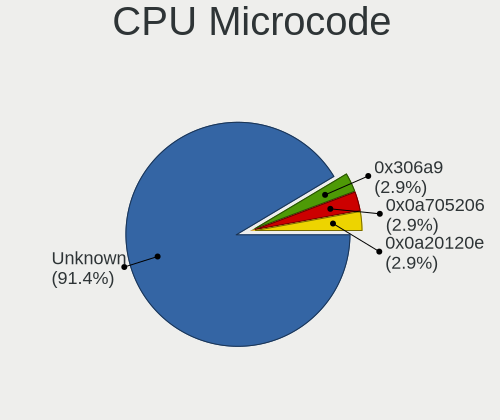
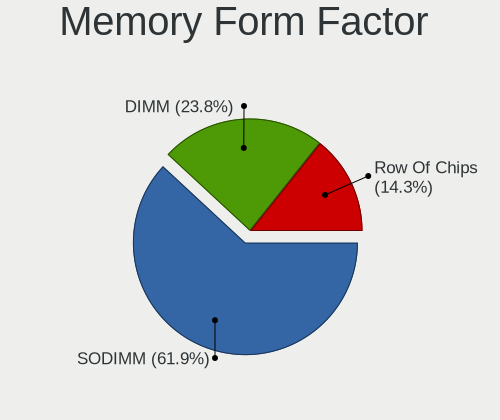

EndeavourOS - Hardware Trends
-----------------------------

A project to identify most popular hardware characteristics and track their change
over time based on data collected by Linux users at https://Linux-Hardware.org.

Anyone can contribute to this report by the [hw-probe](https://github.com/linuxhw/hw-probe) tool:

    sudo -E hw-probe -all -upload

This is a report for all computer types. See also reports for [desktops](/Dist/EndeavourOS/Desktop/README.md) and [notebooks](/Dist/EndeavourOS/Notebook/README.md).

This report is for one last month. Overall report since the beginning of time: [TestCoverage](https://github.com/linuxhw/TestCoverage)

Period: Nov, 2022.

Contents
--------

* [ System ](#system)
  - [ OS                       ](#os)
  - [ OS Family                ](#os-family)
  - [ Kernel                   ](#kernel)
  - [ Kernel Family            ](#kernel-family)
  - [ Kernel Major Ver.        ](#kernel-major-ver)
  - [ Arch                     ](#arch)
  - [ DE                       ](#de)
  - [ Display Server           ](#display-server)
  - [ Display Manager          ](#display-manager)
  - [ OS Lang                  ](#os-lang)
  - [ Boot Mode                ](#boot-mode)
  - [ Filesystem               ](#filesystem)
  - [ Part. scheme             ](#part-scheme)
  - [ Dual Boot with Linux/BSD ](#dual-boot-with-linuxbsd)
  - [ Dual Boot (Win)          ](#dual-boot-win)

* [ Board ](#board)
  - [ Vendor                   ](#vendor)
  - [ Model                    ](#model)
  - [ Model Family             ](#model-family)
  - [ MFG Year                 ](#mfg-year)
  - [ Form Factor              ](#form-factor)
  - [ Secure Boot              ](#secure-boot)
  - [ Coreboot                 ](#coreboot)
  - [ RAM Size                 ](#ram-size)
  - [ RAM Used                 ](#ram-used)
  - [ Total Drives             ](#total-drives)
  - [ Has CD-ROM               ](#has-cd-rom)
  - [ Has Ethernet             ](#has-ethernet)
  - [ Has WiFi                 ](#has-wifi)
  - [ Has Bluetooth            ](#has-bluetooth)

* [ Location ](#location)
  - [ Country                  ](#country)
  - [ City                     ](#city)

* [ Drives ](#drives)
  - [ Drive Vendor             ](#drive-vendor)
  - [ Drive Model              ](#drive-model)
  - [ HDD Vendor               ](#hdd-vendor)
  - [ SSD Vendor               ](#ssd-vendor)
  - [ Drive Kind               ](#drive-kind)
  - [ Drive Connector          ](#drive-connector)
  - [ Drive Size               ](#drive-size)
  - [ Space Total              ](#space-total)
  - [ Space Used               ](#space-used)
  - [ Malfunc. Drives          ](#malfunc-drives)
  - [ Malfunc. Drive Vendor    ](#malfunc-drive-vendor)
  - [ Malfunc. HDD Vendor      ](#malfunc-hdd-vendor)
  - [ Malfunc. Drive Kind      ](#malfunc-drive-kind)
  - [ Failed Drives            ](#failed-drives)
  - [ Failed Drive Vendor      ](#failed-drive-vendor)
  - [ Drive Status             ](#drive-status)

* [ Storage controller ](#storage-controller)
  - [ Storage Vendor           ](#storage-vendor)
  - [ Storage Model            ](#storage-model)
  - [ Storage Kind             ](#storage-kind)

* [ Processor ](#processor)
  - [ CPU Vendor               ](#cpu-vendor)
  - [ CPU Model                ](#cpu-model)
  - [ CPU Model Family         ](#cpu-model-family)
  - [ CPU Cores                ](#cpu-cores)
  - [ CPU Sockets              ](#cpu-sockets)
  - [ CPU Threads              ](#cpu-threads)
  - [ CPU Op-Modes             ](#cpu-op-modes)
  - [ CPU Microcode            ](#cpu-microcode)
  - [ CPU Microarch            ](#cpu-microarch)

* [ Graphics ](#graphics)
  - [ GPU Vendor               ](#gpu-vendor)
  - [ GPU Model                ](#gpu-model)
  - [ GPU Combo                ](#gpu-combo)
  - [ GPU Driver               ](#gpu-driver)
  - [ GPU Memory               ](#gpu-memory)

* [ Monitor ](#monitor)
  - [ Monitor Vendor           ](#monitor-vendor)
  - [ Monitor Model            ](#monitor-model)
  - [ Monitor Resolution       ](#monitor-resolution)
  - [ Monitor Diagonal         ](#monitor-diagonal)
  - [ Monitor Width            ](#monitor-width)
  - [ Aspect Ratio             ](#aspect-ratio)
  - [ Monitor Area             ](#monitor-area)
  - [ Pixel Density            ](#pixel-density)
  - [ Multiple Monitors        ](#multiple-monitors)

* [ Network ](#network)
  - [ Net Controller Vendor    ](#net-controller-vendor)
  - [ Net Controller Model     ](#net-controller-model)
  - [ Wireless Vendor          ](#wireless-vendor)
  - [ Wireless Model           ](#wireless-model)
  - [ Ethernet Vendor          ](#ethernet-vendor)
  - [ Ethernet Model           ](#ethernet-model)
  - [ Net Controller Kind      ](#net-controller-kind)
  - [ Used Controller          ](#used-controller)
  - [ NICs                     ](#nics)
  - [ IPv6                     ](#ipv6)

* [ Bluetooth ](#bluetooth)
  - [ Bluetooth Vendor         ](#bluetooth-vendor)
  - [ Bluetooth Model          ](#bluetooth-model)

* [ Sound ](#sound)
  - [ Sound Vendor             ](#sound-vendor)
  - [ Sound Model              ](#sound-model)

* [ Memory ](#memory)
  - [ Memory Vendor            ](#memory-vendor)
  - [ Memory Model             ](#memory-model)
  - [ Memory Kind              ](#memory-kind)
  - [ Memory Form Factor       ](#memory-form-factor)
  - [ Memory Size              ](#memory-size)
  - [ Memory Speed             ](#memory-speed)

* [ Printers & scanners ](#printers--scanners)
  - [ Printer Vendor           ](#printer-vendor)
  - [ Printer Model            ](#printer-model)
  - [ Scanner Vendor           ](#scanner-vendor)
  - [ Scanner Model            ](#scanner-model)

* [ Camera ](#camera)
  - [ Camera Vendor            ](#camera-vendor)
  - [ Camera Model             ](#camera-model)

* [ Security ](#security)
  - [ Fingerprint Vendor       ](#fingerprint-vendor)
  - [ Fingerprint Model        ](#fingerprint-model)
  - [ Chipcard Vendor          ](#chipcard-vendor)
  - [ Chipcard Model           ](#chipcard-model)

* [ Unsupported ](#unsupported)
  - [ Unsupported Devices      ](#unsupported-devices)
  - [ Unsupported Device Types ](#unsupported-device-types)

System
------

OS
--

Installed operating systems

| Name                | Computers | Percent |
|---------------------|-----------|---------|
| EndeavourOS Rolling | 42        | 100%    |

OS Family
---------

OS without a version

| Name        | Computers | Percent |
|-------------|-----------|---------|
| EndeavourOS | 42        | 100%    |

Kernel
------

Version of the Linux kernel

| Version                    | Computers | Percent |
|----------------------------|-----------|---------|
| 6.0.9-arch1-1              | 9         | 21.43%  |
| 6.0.6-arch1-1              | 6         | 14.29%  |
| 6.0.7-arch1-1              | 4         | 9.52%   |
| 6.0.6-zen1-1-zen           | 4         | 9.52%   |
| 6.0.9-zen1-1-zen           | 3         | 7.14%   |
| 6.0.8-arch1-1              | 3         | 7.14%   |
| 5.15.79-1-lts              | 3         | 7.14%   |
| 6.0.10-arch2-1             | 2         | 4.76%   |
| 6.0.7-zen1-1-zen           | 1         | 2.38%   |
| 6.0.6-Wataten-T2-xanmod1-1 | 1         | 2.38%   |
| 6.0.6-arch1-1-surface      | 1         | 2.38%   |
| 6.0.5-zen1-1-zen           | 1         | 2.38%   |
| 6.0.2-arch1                | 1         | 2.38%   |
| 5.15.78-1-lts              | 1         | 2.38%   |
| 5.15.77-1-lts              | 1         | 2.38%   |
| 5.15.76-1-lts              | 1         | 2.38%   |

Kernel Family
-------------

Linux kernel without a distro release

| Version | Computers | Percent |
|---------|-----------|---------|
| 6.0.9   | 12        | 28.57%  |
| 6.0.6   | 12        | 28.57%  |
| 6.0.7   | 5         | 11.9%   |
| 6.0.8   | 3         | 7.14%   |
| 5.15.79 | 3         | 7.14%   |
| 6.0.10  | 2         | 4.76%   |
| 6.0.5   | 1         | 2.38%   |
| 6.0.2   | 1         | 2.38%   |
| 5.15.78 | 1         | 2.38%   |
| 5.15.77 | 1         | 2.38%   |
| 5.15.76 | 1         | 2.38%   |

Kernel Major Ver.
-----------------

Linux kernel major version

| Version | Computers | Percent |
|---------|-----------|---------|
| 6.0     | 36        | 85.71%  |
| 5.15    | 6         | 14.29%  |

Arch
----

OS architecture (x86_64, i586, etc.)

| Name   | Computers | Percent |
|--------|-----------|---------|
| x86_64 | 42        | 100%    |

DE
--

Desktop Environment

| Name       | Computers | Percent |
|------------|-----------|---------|
| KDE5       | 18        | 42.86%  |
| GNOME      | 11        | 26.19%  |
| XFCE       | 8         | 19.05%  |
| i3         | 3         | 7.14%   |
| X-Cinnamon | 1         | 2.38%   |
| Budgie     | 1         | 2.38%   |

Display Server
--------------

X11 or Wayland

| Name    | Computers | Percent |
|---------|-----------|---------|
| X11     | 33        | 78.57%  |
| Wayland | 7         | 16.67%  |
| Unknown | 2         | 4.76%   |

Display Manager
---------------

SDDM, LightDM, etc.

| Name    | Computers | Percent |
|---------|-----------|---------|
| LightDM | 16        | 38.1%   |
| Unknown | 14        | 33.33%  |
| SDDM    | 7         | 16.67%  |
| GDM     | 5         | 11.9%   |

OS Lang
-------

Language

| Lang  | Computers | Percent |
|-------|-----------|---------|
| en_US | 16        | 38.1%   |
| it_IT | 7         | 16.67%  |
| en_CA | 4         | 9.52%   |
| de_DE | 3         | 7.14%   |
| nl_NL | 2         | 4.76%   |
| es_ES | 2         | 4.76%   |
| en_GB | 2         | 4.76%   |
| pt_PT | 1         | 2.38%   |
| pt_BR | 1         | 2.38%   |
| pl_PL | 1         | 2.38%   |
| ko_KR | 1         | 2.38%   |
| fr_FR | 1         | 2.38%   |
| en_AU | 1         | 2.38%   |

Boot Mode
---------

EFI or BIOS

| Mode | Computers | Percent |
|------|-----------|---------|
| EFI  | 26        | 61.9%   |
| BIOS | 16        | 38.1%   |

Filesystem
----------

Type of filesystem

| Type  | Computers | Percent |
|-------|-----------|---------|
| Ext4  | 30        | 71.43%  |
| Btrfs | 10        | 23.81%  |
| Xfs   | 2         | 4.76%   |

Part. scheme
------------

Scheme of partitioning

| Type    | Computers | Percent |
|---------|-----------|---------|
| GPT     | 27        | 64.29%  |
| Unknown | 13        | 30.95%  |
| MBR     | 2         | 4.76%   |

Dual Boot with Linux/BSD
------------------------

Hosting more than one Linux/BSD

| Dual boot | Computers | Percent |
|-----------|-----------|---------|
| No        | 37        | 88.1%   |
| Yes       | 5         | 11.9%   |

Dual Boot (Win)
---------------

Hosting Linux and Windows

| Dual boot | Computers | Percent |
|-----------|-----------|---------|
| No        | 31        | 73.81%  |
| Yes       | 11        | 26.19%  |

Board
-----

Vendor
------

Motherboard manufacturer

| Name                | Computers | Percent |
|---------------------|-----------|---------|
| Lenovo              | 10        | 23.81%  |
| Hewlett-Packard     | 7         | 16.67%  |
| MSI                 | 6         | 14.29%  |
| ASUSTek Computer    | 6         | 14.29%  |
| Dell                | 3         | 7.14%   |
| Acer                | 3         | 7.14%   |
| ASRock              | 2         | 4.76%   |
| Apple               | 2         | 4.76%   |
| Timi                | 1         | 2.38%   |
| Microsoft           | 1         | 2.38%   |
| Gigabyte Technology | 1         | 2.38%   |

Model
-----

Motherboard model

| Name                                      | Computers | Percent |
|-------------------------------------------|-----------|---------|
| MSI MS-7C37                               | 2         | 4.76%   |
| Lenovo ThinkPad T14 Gen 3 21CFCTO1WW      | 2         | 4.76%   |
| Dell Inspiron 15-3567                     | 2         | 4.76%   |
| Timi RedmiBook Pro 15                     | 1         | 2.38%   |
| MSI Prestige 15 A11SCX                    | 1         | 2.38%   |
| MSI MS-7C71                               | 1         | 2.38%   |
| MSI MS-7B22                               | 1         | 2.38%   |
| MSI Modern 14 B5M                         | 1         | 2.38%   |
| Microsoft Surface Laptop Go               | 1         | 2.38%   |
| Lenovo ThinkPad X250 20CLS3AJ00           | 1         | 2.38%   |
| Lenovo ThinkPad T520 42406AG              | 1         | 2.38%   |
| Lenovo ThinkPad T480 20L6S3H108           | 1         | 2.38%   |
| Lenovo ThinkPad T440s 20ARA12UMZ          | 1         | 2.38%   |
| Lenovo ThinkPad E14 Gen 4 21ECS00000      | 1         | 2.38%   |
| Lenovo ThinkPad E14 Gen 2 20T6000SIX      | 1         | 2.38%   |
| Lenovo ThinkCentre M93p 10AAS4EN00        | 1         | 2.38%   |
| Lenovo IdeaPad L340-15IRH Gaming 81LK     | 1         | 2.38%   |
| HP Pavilion Gaming Laptop 15-ec1xxx       | 1         | 2.38%   |
| HP Pavilion Gaming Laptop 15-cx0xxx       | 1         | 2.38%   |
| HP ENVY 17                                | 1         | 2.38%   |
| HP EliteDesk 800 G1 TWR                   | 1         | 2.38%   |
| HP EliteBook 840 G2                       | 1         | 2.38%   |
| HP Compaq Elite 8300 SFF                  | 1         | 2.38%   |
| HP 15                                     | 1         | 2.38%   |
| Gigabyte P55A-UD3                         | 1         | 2.38%   |
| Dell Wyse 5070 Thin Client                | 1         | 2.38%   |
| ASUS TUF Gaming FX505DY_FX505DY           | 1         | 2.38%   |
| ASUS ROG Zephyrus G15 GA502IU             | 1         | 2.38%   |
| ASUS PRIME B560M-A                        | 1         | 2.38%   |
| ASUS PRIME B460M-A                        | 1         | 2.38%   |
| ASUS ASUS TUF Gaming A15 FA506IV_TUF506IV | 1         | 2.38%   |
| ASUS All Series                           | 1         | 2.38%   |
| ASRock X570M Pro4                         | 1         | 2.38%   |
| ASRock B450M Pro4                         | 1         | 2.38%   |
| Apple MacBookPro16,2                      | 1         | 2.38%   |
| Apple MacBookPro16,1                      | 1         | 2.38%   |
| Acer TravelMate 5730                      | 1         | 2.38%   |
| Acer Aspire A517-52                       | 1         | 2.38%   |
| Acer Aspire A315-22                       | 1         | 2.38%   |

Model Family
------------

Motherboard model prefix

| Name               | Computers | Percent |
|--------------------|-----------|---------|
| Lenovo ThinkPad    | 8         | 19.05%  |
| MSI MS-7C37        | 2         | 4.76%   |
| HP Pavilion        | 2         | 4.76%   |
| Dell Inspiron      | 2         | 4.76%   |
| ASUS PRIME         | 2         | 4.76%   |
| Apple MacBookPro16 | 2         | 4.76%   |
| Acer Aspire        | 2         | 4.76%   |
| Timi RedmiBook     | 1         | 2.38%   |
| MSI Prestige       | 1         | 2.38%   |
| MSI MS-7C71        | 1         | 2.38%   |
| MSI MS-7B22        | 1         | 2.38%   |
| MSI Modern         | 1         | 2.38%   |
| Microsoft Surface  | 1         | 2.38%   |
| Lenovo ThinkCentre | 1         | 2.38%   |
| Lenovo IdeaPad     | 1         | 2.38%   |
| HP ENVY            | 1         | 2.38%   |
| HP EliteDesk       | 1         | 2.38%   |
| HP EliteBook       | 1         | 2.38%   |
| HP Compaq          | 1         | 2.38%   |
| HP 15              | 1         | 2.38%   |
| Gigabyte P55A-UD3  | 1         | 2.38%   |
| Dell Wyse          | 1         | 2.38%   |
| ASUS TUF           | 1         | 2.38%   |
| ASUS ROG           | 1         | 2.38%   |
| ASUS ASUS          | 1         | 2.38%   |
| ASUS All           | 1         | 2.38%   |
| ASRock X570M       | 1         | 2.38%   |
| ASRock B450M       | 1         | 2.38%   |
| Acer TravelMate    | 1         | 2.38%   |

MFG Year
--------

Motherboard manufacture year

| Year | Computers | Percent |
|------|-----------|---------|
| 2020 | 11        | 26.19%  |
| 2019 | 7         | 16.67%  |
| 2018 | 4         | 9.52%   |
| 2022 | 3         | 7.14%   |
| 2021 | 3         | 7.14%   |
| 2015 | 3         | 7.14%   |
| 2013 | 3         | 7.14%   |
| 2016 | 2         | 4.76%   |
| 2014 | 1         | 2.38%   |
| 2012 | 1         | 2.38%   |
| 2011 | 1         | 2.38%   |
| 2010 | 1         | 2.38%   |
| 2009 | 1         | 2.38%   |
| 2008 | 1         | 2.38%   |

Form Factor
-----------

Physical design of the computer

| Name     | Computers | Percent |
|----------|-----------|---------|
| Notebook | 27        | 64.29%  |
| Desktop  | 13        | 30.95%  |
| Tablet   | 1         | 2.38%   |
| Mini pc  | 1         | 2.38%   |

Secure Boot
-----------

Enabled or disabled

| State    | Computers | Percent |
|----------|-----------|---------|
| Disabled | 41        | 97.62%  |
| Enabled  | 1         | 2.38%   |

Coreboot
--------

Have coreboot on board

| Used | Computers | Percent |
|------|-----------|---------|
| No   | 42        | 100%    |

RAM Size
--------

Total RAM memory

| Size in GB | Computers | Percent |
|------------|-----------|---------|
| 16.01-24.0 | 13        | 30.95%  |
| 8.01-16.0  | 11        | 26.19%  |
| 4.01-8.0   | 9         | 21.43%  |
| 32.01-64.0 | 6         | 14.29%  |
| 24.01-32.0 | 2         | 4.76%   |
| 3.01-4.0   | 1         | 2.38%   |

RAM Used
--------

Used RAM memory

| Used GB   | Computers | Percent |
|-----------|-----------|---------|
| 4.01-8.0  | 10        | 23.81%  |
| 3.01-4.0  | 10        | 23.81%  |
| 2.01-3.0  | 9         | 21.43%  |
| 1.01-2.0  | 6         | 14.29%  |
| 8.01-16.0 | 5         | 11.9%   |
| 0.51-1.0  | 2         | 4.76%   |

Total Drives
------------

Number of drives on board

| Drives | Computers | Percent |
|--------|-----------|---------|
| 1      | 24        | 57.14%  |
| 2      | 12        | 28.57%  |
| 4      | 3         | 7.14%   |
| 3      | 2         | 4.76%   |
| 5      | 1         | 2.38%   |

Has CD-ROM
----------

Has CD-ROM on board

| Presented | Computers | Percent |
|-----------|-----------|---------|
| No        | 36        | 85.71%  |
| Yes       | 6         | 14.29%  |

Has Ethernet
------------

Has Ethernet on board

| Presented | Computers | Percent |
|-----------|-----------|---------|
| Yes       | 40        | 95.24%  |
| No        | 2         | 4.76%   |

Has WiFi
--------

Has WiFi module

| Presented | Computers | Percent |
|-----------|-----------|---------|
| Yes       | 37        | 88.1%   |
| No        | 5         | 11.9%   |

Has Bluetooth
-------------

Has Bluetooth module

| Presented | Computers | Percent |
|-----------|-----------|---------|
| Yes       | 34        | 80.95%  |
| No        | 8         | 19.05%  |

Location
--------

Country
-------

Geographic location (country)

| Country     | Computers | Percent |
|-------------|-----------|---------|
| Italy       | 8         | 19.05%  |
| USA         | 7         | 16.67%  |
| Canada      | 4         | 9.52%   |
| Netherlands | 3         | 7.14%   |
| Germany     | 3         | 7.14%   |
| Turkey      | 2         | 4.76%   |
| Spain       | 2         | 4.76%   |
| South Korea | 1         | 2.38%   |
| Russia      | 1         | 2.38%   |
| Portugal    | 1         | 2.38%   |
| Poland      | 1         | 2.38%   |
| Malaysia    | 1         | 2.38%   |
| France      | 1         | 2.38%   |
| Finland     | 1         | 2.38%   |
| Croatia     | 1         | 2.38%   |
| Brazil      | 1         | 2.38%   |
| Belgium     | 1         | 2.38%   |
| Bangladesh  | 1         | 2.38%   |
| Australia   | 1         | 2.38%   |
| Albania     | 1         | 2.38%   |

City
----

Geographic location (city)

| City                   | Computers | Percent |
|------------------------|-----------|---------|
| Rome                   | 2         | 4.76%   |
| North Little Rock      | 2         | 4.76%   |
| Larouche               | 2         | 4.76%   |
| Istanbul               | 2         | 4.76%   |
| Yongin-si              | 1         | 2.38%   |
| Wevelgem               | 1         | 2.38%   |
| Vista                  | 1         | 2.38%   |
| Tubbergen              | 1         | 2.38%   |
| Trenton                | 1         | 2.38%   |
| Toronto                | 1         | 2.38%   |
| Tirana                 | 1         | 2.38%   |
| St Petersburg          | 1         | 2.38%   |
| Srimangal              | 1         | 2.38%   |
| Severna Park           | 1         | 2.38%   |
| Portici                | 1         | 2.38%   |
| Ponta Grossa           | 1         | 2.38%   |
| Piancogno              | 1         | 2.38%   |
| Naples                 | 1         | 2.38%   |
| Mandurah               | 1         | 2.38%   |
| Madrid                 | 1         | 2.38%   |
| Macerata               | 1         | 2.38%   |
| Lovran                 | 1         | 2.38%   |
| Lisbon                 | 1         | 2.38%   |
| Leeuwarden             | 1         | 2.38%   |
| La Ciotat              | 1         | 2.38%   |
| Kuala Lumpur           | 1         | 2.38%   |
| Kriftel                | 1         | 2.38%   |
| Kedzierzyn-Kozle       | 1         | 2.38%   |
| Itzehoe                | 1         | 2.38%   |
| Helsinki               | 1         | 2.38%   |
| Dreieich               | 1         | 2.38%   |
| DeRidder               | 1         | 2.38%   |
| Bellante               | 1         | 2.38%   |
| Barberton              | 1         | 2.38%   |
| Ballwin                | 1         | 2.38%   |
| Amsterdam              | 1         | 2.38%   |
| Alcobendas             | 1         | 2.38%   |
| Albano Sant'Alessandro | 1         | 2.38%   |

Drives
------

Drive Vendor
------------

Hard drive vendors

| Vendor                      | Computers | Drives | Percent |
|-----------------------------|-----------|--------|---------|
| Samsung Electronics         | 14        | 17     | 21.21%  |
| Seagate                     | 9         | 9      | 13.64%  |
| WDC                         | 7         | 10     | 10.61%  |
| Sandisk                     | 3         | 3      | 4.55%   |
| Kingston Technology Company | 3         | 3      | 4.55%   |
| Kingston                    | 3         | 3      | 4.55%   |
| SK hynix                    | 2         | 2      | 3.03%   |
| SABRENT                     | 2         | 2      | 3.03%   |
| Hitachi                     | 2         | 2      | 3.03%   |
| Crucial                     | 2         | 2      | 3.03%   |
| China                       | 2         | 2      | 3.03%   |
| Apple                       | 2         | 2      | 3.03%   |
| Yangtze Memory Technologies | 1         | 1      | 1.52%   |
| WALTON                      | 1         | 1      | 1.52%   |
| Unknown                     | 1         | 1      | 1.52%   |
| Union Memory (Shenzhen)     | 1         | 1      | 1.52%   |
| Transcend                   | 1         | 1      | 1.52%   |
| Toshiba                     | 1         | 1      | 1.52%   |
| Timetec                     | 1         | 1      | 1.52%   |
| Silicon Motion              | 1         | 1      | 1.52%   |
| Phison Electronics          | 1         | 1      | 1.52%   |
| OCZ-VERTEX                  | 1         | 1      | 1.52%   |
| Micron/Crucial Technology   | 1         | 1      | 1.52%   |
| Micron Technology           | 1         | 1      | 1.52%   |
| Intel                       | 1         | 1      | 1.52%   |
| GOODRAM                     | 1         | 1      | 1.52%   |
| Emtec                       | 1         | 1      | 1.52%   |

Drive Model
-----------

Hard drive models

| Model                                                 | Computers | Percent |
|-------------------------------------------------------|-----------|---------|
| Samsung NVMe SSD Controller SM981/PM981/PM983 1TB     | 4         | 5.63%   |
| Seagate ST2000DM008-2FR102 2TB                        | 2         | 2.82%   |
| Seagate Expansion SSD 500GB                           | 2         | 2.82%   |
| Samsung SSD 860 EVO 500GB                             | 2         | 2.82%   |
| Samsung NVMe SSD Controller PM9A1/PM9A3/980PRO 250GB  | 2         | 2.82%   |
| Samsung HD103SJ 1TB                                   | 2         | 2.82%   |
| SABRENT Disk 500GB                                    | 2         | 2.82%   |
| Apple ANS2 NVMe Controller 500GB                      | 2         | 2.82%   |
| Yangtze Memory YMTC PC005 512GB                       | 1         | 1.41%   |
| WDC WDS200T2B0B-00YS70 2TB SSD                        | 1         | 1.41%   |
| WDC WDS120G2G0A-00JH30 120GB SSD                      | 1         | 1.41%   |
| WDC WD5000AVDS-63U7B1 500GB                           | 1         | 1.41%   |
| WDC WD40EZAZ-00ZGHB0 4TB                              | 1         | 1.41%   |
| WDC WD30EFRX-68EUZN0 3TB                              | 1         | 1.41%   |
| WDC WD20EARS-42S0XB0 2TB                              | 1         | 1.41%   |
| WDC WD10EARS-00Y5B1 1TB                               | 1         | 1.41%   |
| WDC WD1003FZEX-00K3CA0 1TB                            | 1         | 1.41%   |
| WDC WD Blue SA510 2.5 500GB                           | 1         | 1.41%   |
| WALTON WS5256 256GB SSD                               | 1         | 1.41%   |
| Unknown MMC Card  16GB                                | 1         | 1.41%   |
| Union Memory (Shenzhen) UMIS RPJTJ512MGE1QDQ 512GB    | 1         | 1.41%   |
| Transcend TS128GMTE110S 128GB                         | 1         | 1.41%   |
| Toshiba HDWD220 2TB                                   | 1         | 1.41%   |
| Timetec MS05 256GB SSD                                | 1         | 1.41%   |
| SK hynix SKHynix_HFS512GDE9X081N 512GB                | 1         | 1.41%   |
| SK hynix BC511 512GB                                  | 1         | 1.41%   |
| Silicon Motion SM2263EN/SM2263XT SSD Controller 128GB | 1         | 1.41%   |
| Seagate ST500LT012-1DG142 500GB                       | 1         | 1.41%   |
| Seagate ST500LM000-1EJ162 500GB                       | 1         | 1.41%   |
| Seagate ST4000DM004-2CV104 4TB                        | 1         | 1.41%   |
| Seagate ST1000LM024 HN-M101MBB 1TB                    | 1         | 1.41%   |
| Seagate ST1000DM003-1ER162 1TB                        | 1         | 1.41%   |
| Sandisk WDC PC SN530 SDBPMPZ-512G-1001 512GB          | 1         | 1.41%   |
| Sandisk WD Blue SN500 / PC SN520 NVMe SSD 512GB       | 1         | 1.41%   |
| SanDisk SDSSDA960G 960GB                              | 1         | 1.41%   |
| Samsung SSD 870 QVO 1TB                               | 1         | 1.41%   |
| Samsung SSD 870 EVO 250GB                             | 1         | 1.41%   |
| Samsung SSD 860 EVO 1TB                               | 1         | 1.41%   |
| Samsung PSSD T7 500GB                                 | 1         | 1.41%   |
| Samsung Portable SSD T5 1TB                           | 1         | 1.41%   |

HDD Vendor
----------

Hard disk drive vendors

| Vendor              | Computers | Drives | Percent |
|---------------------|-----------|--------|---------|
| Seagate             | 7         | 7      | 41.18%  |
| WDC                 | 5         | 7      | 29.41%  |
| Samsung Electronics | 2         | 2      | 11.76%  |
| Hitachi             | 2         | 2      | 11.76%  |
| Toshiba             | 1         | 1      | 5.88%   |

SSD Vendor
----------

Solid state drive vendors

| Vendor              | Computers | Drives | Percent |
|---------------------|-----------|--------|---------|
| Samsung Electronics | 6         | 7      | 25%     |
| WDC                 | 3         | 3      | 12.5%   |
| Kingston            | 3         | 3      | 12.5%   |
| Seagate             | 2         | 2      | 8.33%   |
| Crucial             | 2         | 2      | 8.33%   |
| China               | 2         | 2      | 8.33%   |
| WALTON              | 1         | 1      | 4.17%   |
| Timetec             | 1         | 1      | 4.17%   |
| SanDisk             | 1         | 1      | 4.17%   |
| OCZ-VERTEX          | 1         | 1      | 4.17%   |
| GOODRAM             | 1         | 1      | 4.17%   |
| Emtec               | 1         | 1      | 4.17%   |

Drive Kind
----------

HDD or SSD

| Kind | Computers | Drives | Percent |
|------|-----------|--------|---------|
| NVMe | 25        | 27     | 43.1%   |
| SSD  | 19        | 25     | 32.76%  |
| HDD  | 13        | 19     | 22.41%  |
| MMC  | 1         | 1      | 1.72%   |

Drive Connector
---------------

SATA, SAS, NVMe, etc.

| Type | Computers | Drives | Percent |
|------|-----------|--------|---------|
| SATA | 25        | 40     | 44.64%  |
| NVMe | 24        | 25     | 42.86%  |
| SAS  | 6         | 6      | 10.71%  |
| MMC  | 1         | 1      | 1.79%   |

Drive Size
----------

Size of hard drive

| Size in TB | Computers | Drives | Percent |
|------------|-----------|--------|---------|
| 0.01-0.5   | 17        | 25     | 50%     |
| 0.51-1.0   | 9         | 10     | 26.47%  |
| 1.01-2.0   | 5         | 6      | 14.71%  |
| 3.01-4.0   | 2         | 2      | 5.88%   |
| 2.01-3.0   | 1         | 1      | 2.94%   |

Space Total
-----------

Amount of disk space available on the file system

| Size in GB     | Computers | Percent |
|----------------|-----------|---------|
| 251-500        | 14        | 33.33%  |
| 101-250        | 9         | 21.43%  |
| 1001-2000      | 6         | 14.29%  |
| 501-1000       | 5         | 11.9%   |
| More than 3000 | 4         | 9.52%   |
| 2001-3000      | 3         | 7.14%   |
| Unknown        | 1         | 2.38%   |

Space Used
----------

Amount of used disk space

| Used GB   | Computers | Percent |
|-----------|-----------|---------|
| 251-500   | 9         | 21.43%  |
| 1-20      | 7         | 16.67%  |
| 21-50     | 6         | 14.29%  |
| 101-250   | 6         | 14.29%  |
| 501-1000  | 5         | 11.9%   |
| 51-100    | 4         | 9.52%   |
| 1001-2000 | 3         | 7.14%   |
| 2001-3000 | 1         | 2.38%   |
| Unknown   | 1         | 2.38%   |

Malfunc. Drives
---------------

Drive models with a malfunction

| Model                                                         | Computers | Drives | Percent |
|---------------------------------------------------------------|-----------|--------|---------|
| WDC WDS120G2G0A-00JH30 120GB SSD                              | 1         | 1      | 20%     |
| WDC WD5000AVDS-63U7B1 500GB                                   | 1         | 1      | 20%     |
| Seagate ST1000LM024 HN-M101MBB 1TB                            | 1         | 1      | 20%     |
| Samsung Electronics NVMe SSD Controller SM981/PM981/PM983 1TB | 1         | 1      | 20%     |
| Crucial CT500MX500SSD1 500GB                                  | 1         | 1      | 20%     |

Malfunc. Drive Vendor
---------------------

Vendors of faulty drives

| Vendor              | Computers | Drives | Percent |
|---------------------|-----------|--------|---------|
| WDC                 | 1         | 2      | 25%     |
| Seagate             | 1         | 1      | 25%     |
| Samsung Electronics | 1         | 1      | 25%     |
| Crucial             | 1         | 1      | 25%     |

Malfunc. HDD Vendor
-------------------

Vendors of faulty HDD drives

| Vendor  | Computers | Drives | Percent |
|---------|-----------|--------|---------|
| WDC     | 1         | 1      | 50%     |
| Seagate | 1         | 1      | 50%     |

Malfunc. Drive Kind
-------------------

Kinds of faulty drives

| Kind | Computers | Drives | Percent |
|------|-----------|--------|---------|
| SSD  | 2         | 2      | 40%     |
| HDD  | 2         | 2      | 40%     |
| NVMe | 1         | 1      | 20%     |

Failed Drives
-------------

Failed drive models

Zero info for selected period =(

Failed Drive Vendor
-------------------

Failed drive vendors

Zero info for selected period =(

Drive Status
------------

Number of failed and malfunc. drives

| Status   | Computers | Drives | Percent |
|----------|-----------|--------|---------|
| Works    | 26        | 37     | 54.17%  |
| Detected | 18        | 30     | 37.5%   |
| Malfunc  | 4         | 5      | 8.33%   |

Storage controller
------------------

Storage Vendor
--------------

Storage controller vendors

| Vendor                      | Computers | Percent |
|-----------------------------|-----------|---------|
| Intel                       | 24        | 41.38%  |
| Samsung Electronics         | 8         | 13.79%  |
| AMD                         | 8         | 13.79%  |
| Kingston Technology Company | 3         | 5.17%   |
| SK hynix                    | 2         | 3.45%   |
| SanDisk                     | 2         | 3.45%   |
| ASMedia Technology          | 2         | 3.45%   |
| Apple                       | 2         | 3.45%   |
| Yangtze Memory Technologies | 1         | 1.72%   |
| Union Memory (Shenzhen)     | 1         | 1.72%   |
| Transcend                   | 1         | 1.72%   |
| Silicon Motion              | 1         | 1.72%   |
| Phison Electronics          | 1         | 1.72%   |
| Micron/Crucial Technology   | 1         | 1.72%   |
| Micron Technology           | 1         | 1.72%   |

Storage Model
-------------

Storage controller models

| Model                                                                          | Computers | Percent |
|--------------------------------------------------------------------------------|-----------|---------|
| AMD FCH SATA Controller [AHCI mode]                                            | 8         | 13.33%  |
| Samsung NVMe SSD Controller SM981/PM981/PM983                                  | 4         | 6.67%   |
| Intel Wildcat Point-LP SATA Controller [AHCI Mode]                             | 3         | 5%      |
| Intel Sunrise Point-LP SATA Controller [AHCI mode]                             | 3         | 5%      |
| Intel 8 Series/C220 Series Chipset Family 6-port SATA Controller 1 [AHCI mode] | 3         | 5%      |
| Samsung NVMe SSD Controller PM9A1/PM9A3/980PRO                                 | 2         | 3.33%   |
| Samsung NVMe SSD Controller 980                                                | 2         | 3.33%   |
| Intel Cannon Lake Mobile PCH SATA AHCI Controller                              | 2         | 3.33%   |
| Intel 8 Series SATA Controller 1 [AHCI mode]                                   | 2         | 3.33%   |
| ASMedia ASM1062 Serial ATA Controller                                          | 2         | 3.33%   |
| Apple ANS2 NVMe Controller                                                     | 2         | 3.33%   |
| Yangtze Memory Non-Volatile memory controller                                  | 1         | 1.67%   |
| Union Memory (Shenzhen) AM630 PCIe 4.0 x4 NVMe SSD Controller                  | 1         | 1.67%   |
| Transcend Non-Volatile memory controller                                       | 1         | 1.67%   |
| SK hynix Gold P31/PC711 NVMe Solid State Drive                                 | 1         | 1.67%   |
| SK hynix BC511                                                                 | 1         | 1.67%   |
| Silicon Motion SM2263EN/SM2263XT SSD Controller                                | 1         | 1.67%   |
| SanDisk WD Blue SN500 / PC SN520 NVMe SSD                                      | 1         | 1.67%   |
| SanDisk Non-Volatile memory controller                                         | 1         | 1.67%   |
| Phison E16 PCIe4 NVMe Controller                                               | 1         | 1.67%   |
| Micron/Crucial P2 NVMe PCIe SSD                                                | 1         | 1.67%   |
| Micron Non-Volatile memory controller                                          | 1         | 1.67%   |
| Kingston Company U-SNS8154P3 NVMe SSD                                          | 1         | 1.67%   |
| Kingston Company OM3PDP3 NVMe SSD                                              | 1         | 1.67%   |
| Kingston Company A2000 NVMe SSD                                                | 1         | 1.67%   |
| Intel Volume Management Device NVMe RAID Controller                            | 1         | 1.67%   |
| Intel Tiger Lake-LP SATA Controller                                            | 1         | 1.67%   |
| Intel SSD 660P Series                                                          | 1         | 1.67%   |
| Intel Comet Lake SATA AHCI Controller                                          | 1         | 1.67%   |
| Intel Celeron/Pentium Silver Processor SATA Controller                         | 1         | 1.67%   |
| Intel Cannon Lake PCH SATA AHCI Controller                                     | 1         | 1.67%   |
| Intel 82801IBM/IEM (ICH9M/ICH9M-E) 4 port SATA Controller [AHCI mode]          | 1         | 1.67%   |
| Intel 7 Series/C210 Series Chipset Family 6-port SATA Controller [AHCI mode]   | 1         | 1.67%   |
| Intel 6 Series/C200 Series Chipset Family 6 port Mobile SATA AHCI Controller   | 1         | 1.67%   |
| Intel 500 Series Chipset Family SATA AHCI Controller                           | 1         | 1.67%   |
| Intel 5 Series/3400 Series Chipset 6 port SATA AHCI Controller                 | 1         | 1.67%   |
| Intel 300 Series Chipset Family SATA RAID Controller                           | 1         | 1.67%   |
| AMD 400 Series Chipset SATA Controller                                         | 1         | 1.67%   |

Storage Kind
------------

Kind of storage controller (IDE, SATA, NVMe, SAS, ...)

| Kind | Computers | Percent |
|------|-----------|---------|
| SATA | 30        | 53.57%  |
| NVMe | 24        | 42.86%  |
| RAID | 2         | 3.57%   |

Processor
---------

CPU Vendor
----------

Processor vendors

| Vendor | Computers | Percent |
|--------|-----------|---------|
| Intel  | 28        | 66.67%  |
| AMD    | 14        | 33.33%  |

CPU Model
---------

Processor models

| Model                                         | Computers | Percent |
|-----------------------------------------------|-----------|---------|
| Intel Core i5-7200U CPU @ 2.50GHz             | 2         | 4.76%   |
| Intel Core i5-5200U CPU @ 2.20GHz             | 2         | 4.76%   |
| AMD Ryzen 7 4800H with Radeon Graphics        | 2         | 4.76%   |
| AMD Ryzen 5 5600X 6-Core Processor            | 2         | 4.76%   |
| Intel Core i9-10900 CPU @ 2.80GHz             | 1         | 2.38%   |
| Intel Core i7-9750H CPU @ 2.60GHz             | 1         | 2.38%   |
| Intel Core i7-8650U CPU @ 1.90GHz             | 1         | 2.38%   |
| Intel Core i7-4790 CPU @ 3.60GHz              | 1         | 2.38%   |
| Intel Core i7-10700K CPU @ 3.80GHz            | 1         | 2.38%   |
| Intel Core i5-9300H CPU @ 2.40GHz             | 1         | 2.38%   |
| Intel Core i5-8300H CPU @ 2.30GHz             | 1         | 2.38%   |
| Intel Core i5-5300U CPU @ 2.30GHz             | 1         | 2.38%   |
| Intel Core i5-4690 CPU @ 3.50GHz              | 1         | 2.38%   |
| Intel Core i5-4590T CPU @ 2.00GHz             | 1         | 2.38%   |
| Intel Core i5-4300U CPU @ 1.90GHz             | 1         | 2.38%   |
| Intel Core i5-4210U CPU @ 1.70GHz             | 1         | 2.38%   |
| Intel Core i5-3470 CPU @ 3.20GHz              | 1         | 2.38%   |
| Intel Core i5-2450M CPU @ 2.50GHz             | 1         | 2.38%   |
| Intel Core i5-1038NG7 CPU @ 2.00GHz           | 1         | 2.38%   |
| Intel Core i5-1035G1 CPU @ 1.00GHz            | 1         | 2.38%   |
| Intel Core i5 CPU 750 @ 2.67GHz               | 1         | 2.38%   |
| Intel Core i3-8100 CPU @ 3.60GHz              | 1         | 2.38%   |
| Intel Core 2 Duo CPU P8400 @ 2.26GHz          | 1         | 2.38%   |
| Intel Celeron J4105 CPU @ 1.50GHz             | 1         | 2.38%   |
| Intel 11th Gen Core i7-1185G7 @ 3.00GHz       | 1         | 2.38%   |
| Intel 11th Gen Core i7-11370H @ 3.30GHz       | 1         | 2.38%   |
| Intel 11th Gen Core i5-11600 @ 2.80GHz        | 1         | 2.38%   |
| Intel 11th Gen Core i5-1135G7 @ 2.40GHz       | 1         | 2.38%   |
| AMD Ryzen 7 PRO 6850U with Radeon Graphics    | 1         | 2.38%   |
| AMD Ryzen 7 5700G with Radeon Graphics        | 1         | 2.38%   |
| AMD Ryzen 7 4800HS with Radeon Graphics       | 1         | 2.38%   |
| AMD Ryzen 7 2700 Eight-Core Processor         | 1         | 2.38%   |
| AMD Ryzen 5 PRO 6650U with Radeon Graphics    | 1         | 2.38%   |
| AMD Ryzen 5 5625U with Radeon Graphics        | 1         | 2.38%   |
| AMD Ryzen 5 5500U with Radeon Graphics        | 1         | 2.38%   |
| AMD Ryzen 5 4500U with Radeon Graphics        | 1         | 2.38%   |
| AMD Ryzen 5 3550H with Radeon Vega Mobile Gfx | 1         | 2.38%   |
| AMD A9-9420e RADEON R5, 5 COMPUTE CORES 2C+3G | 1         | 2.38%   |

CPU Model Family
----------------

Processor model prefix

| Model            | Computers | Percent |
|------------------|-----------|---------|
| Intel Core i5    | 16        | 38.1%   |
| AMD Ryzen 5      | 6         | 14.29%  |
| Other            | 5         | 11.9%   |
| AMD Ryzen 7      | 5         | 11.9%   |
| Intel Core i7    | 4         | 9.52%   |
| Intel Core i9    | 1         | 2.38%   |
| Intel Core i3    | 1         | 2.38%   |
| Intel Core 2 Duo | 1         | 2.38%   |
| Intel Celeron    | 1         | 2.38%   |
| AMD Ryzen 7 PRO  | 1         | 2.38%   |
| AMD Ryzen 5 PRO  | 1         | 2.38%   |

CPU Cores
---------

Number of processor cores

| Number | Computers | Percent |
|--------|-----------|---------|
| 4      | 16        | 38.1%   |
| 2      | 10        | 23.81%  |
| 6      | 8         | 19.05%  |
| 8      | 7         | 16.67%  |
| 10     | 1         | 2.38%   |

CPU Sockets
-----------

Number of sockets

| Number | Computers | Percent |
|--------|-----------|---------|
| 1      | 42        | 100%    |

CPU Threads
-----------

Threads per core (Hyper-Threading)

| Number | Computers | Percent |
|--------|-----------|---------|
| 2      | 33        | 78.57%  |
| 1      | 9         | 21.43%  |

CPU Op-Modes
------------

CPU Operation Modes (32-bit, 64-bit)

| Op mode        | Computers | Percent |
|----------------|-----------|---------|
| 32-bit, 64-bit | 42        | 100%    |

CPU Microcode
-------------

Microcode number

| Number     | Computers | Percent |
|------------|-----------|---------|
| Unknown    | 17        | 40.48%  |
| 0x806c1    | 3         | 7.14%   |
| 0x806e9    | 2         | 4.76%   |
| 0x0a50000c | 2         | 4.76%   |
| 0x08600106 | 2         | 4.76%   |
| 0xa0671    | 1         | 2.38%   |
| 0xa0655    | 1         | 2.38%   |
| 0x906ea    | 1         | 2.38%   |
| 0x706e5    | 1         | 2.38%   |
| 0x706a1    | 1         | 2.38%   |
| 0x40651    | 1         | 2.38%   |
| 0x306d4    | 1         | 2.38%   |
| 0x306c3    | 1         | 2.38%   |
| 0x306a9    | 1         | 2.38%   |
| 0x106e5    | 1         | 2.38%   |
| 0x10676    | 1         | 2.38%   |
| 0x0a404102 | 1         | 2.38%   |
| 0x08608103 | 1         | 2.38%   |
| 0x08600104 | 1         | 2.38%   |
| 0x0800820d | 1         | 2.38%   |
| 0x06006705 | 1         | 2.38%   |

CPU Microarch
-------------

Microarchitecture

| Name          | Computers | Percent |
|---------------|-----------|---------|
| KabyLake      | 7         | 16.67%  |
| Haswell       | 5         | 11.9%   |
| Zen 3         | 4         | 9.52%   |
| Zen 2         | 4         | 9.52%   |
| TigerLake     | 3         | 7.14%   |
| Icelake       | 3         | 7.14%   |
| Broadwell     | 3         | 7.14%   |
| Unknown       | 3         | 7.14%   |
| Zen+          | 2         | 4.76%   |
| CometLake     | 2         | 4.76%   |
| SandyBridge   | 1         | 2.38%   |
| Penryn        | 1         | 2.38%   |
| Nehalem       | 1         | 2.38%   |
| IvyBridge     | 1         | 2.38%   |
| Goldmont plus | 1         | 2.38%   |
| Excavator     | 1         | 2.38%   |

Graphics
--------

GPU Vendor
----------

Vendors of graphics cards

| Vendor | Computers | Percent |
|--------|-----------|---------|
| Intel  | 21        | 37.5%   |
| AMD    | 18        | 32.14%  |
| Nvidia | 17        | 30.36%  |

GPU Model
---------

Graphics card models

| Model                                                                         | Computers | Percent |
|-------------------------------------------------------------------------------|-----------|---------|
| AMD Renoir                                                                    | 4         | 7.02%   |
| Nvidia GP107 [GeForce GTX 1050 Ti]                                            | 3         | 5.26%   |
| Intel Xeon E3-1200 v3/4th Gen Core Processor Integrated Graphics Controller   | 3         | 5.26%   |
| Intel TigerLake-LP GT2 [Iris Xe Graphics]                                     | 3         | 5.26%   |
| Intel HD Graphics 5500                                                        | 3         | 5.26%   |
| Nvidia TU117M                                                                 | 2         | 3.51%   |
| Intel HD Graphics 620                                                         | 2         | 3.51%   |
| Intel Haswell-ULT Integrated Graphics Controller                              | 2         | 3.51%   |
| Intel CoffeeLake-H GT2 [UHD Graphics 630]                                     | 2         | 3.51%   |
| AMD Sun XT [Radeon HD 8670A/8670M/8690M / R5 M330 / M430 / Radeon 520 Mobile] | 2         | 3.51%   |
| AMD Rembrandt [Radeon 680M]                                                   | 2         | 3.51%   |
| AMD Navi 23 [Radeon RX 6600/6600 XT/6600M]                                    | 2         | 3.51%   |
| Nvidia TU116M [GeForce GTX 1660 Ti Mobile]                                    | 1         | 1.75%   |
| Nvidia TU106M [GeForce RTX 2060 Mobile]                                       | 1         | 1.75%   |
| Nvidia GP108M [GeForce MX150]                                                 | 1         | 1.75%   |
| Nvidia GP108 [GeForce GT 1030]                                                | 1         | 1.75%   |
| Nvidia GP107M [GeForce GTX 1050 Mobile]                                       | 1         | 1.75%   |
| Nvidia GP107M [GeForce GTX 1050 3 GB Max-Q]                                   | 1         | 1.75%   |
| Nvidia GP104 [GeForce GTX 1070]                                               | 1         | 1.75%   |
| Nvidia GM108M [GeForce 840M]                                                  | 1         | 1.75%   |
| Nvidia GM107 [GeForce GTX 750 Ti]                                             | 1         | 1.75%   |
| Nvidia GF119M [Quadro NVS 4200M]                                              | 1         | 1.75%   |
| Nvidia GF117M [GeForce 610M/710M/810M/820M / GT 620M/625M/630M/720M]          | 1         | 1.75%   |
| Nvidia GA104 [GeForce RTX 3070]                                               | 1         | 1.75%   |
| Intel UHD Graphics 620                                                        | 1         | 1.75%   |
| Intel RocketLake-S GT1 [UHD Graphics 750]                                     | 1         | 1.75%   |
| Intel Iris Plus Graphics G7                                                   | 1         | 1.75%   |
| Intel Iris Plus Graphics G1 (Ice Lake)                                        | 1         | 1.75%   |
| Intel GeminiLake [UHD Graphics 600]                                           | 1         | 1.75%   |
| Intel 2nd Generation Core Processor Family Integrated Graphics Controller     | 1         | 1.75%   |
| AMD Stoney [Radeon R2/R3/R4/R5 Graphics]                                      | 1         | 1.75%   |
| AMD RV620/M82 [Mobility Radeon HD 3450/3470]                                  | 1         | 1.75%   |
| AMD Picasso/Raven 2 [Radeon Vega Series / Radeon Vega Mobile Series]          | 1         | 1.75%   |
| AMD Navi 14 [Radeon RX 5500/5500M / Pro 5500M]                                | 1         | 1.75%   |
| AMD Lucienne                                                                  | 1         | 1.75%   |
| AMD Lexa PRO [Radeon 540/540X/550/550X / RX 540X/550/550X]                    | 1         | 1.75%   |
| AMD Ellesmere [Radeon RX 470/480/570/570X/580/580X/590]                       | 1         | 1.75%   |
| AMD Barcelo                                                                   | 1         | 1.75%   |
| AMD Baffin [Radeon RX 460/560D / Pro 450/455/460/555/555X/560/560X]           | 1         | 1.75%   |

GPU Combo
---------

Combinations of graphics cards

| Name           | Computers | Percent |
|----------------|-----------|---------|
| 1 x AMD        | 11        | 26.19%  |
| 1 x Intel      | 10        | 23.81%  |
| 1 x Nvidia     | 7         | 16.67%  |
| Intel + Nvidia | 7         | 16.67%  |
| Intel + AMD    | 3         | 7.14%   |
| AMD + Nvidia   | 3         | 7.14%   |
| 2 x AMD        | 1         | 2.38%   |

GPU Driver
----------

Free vs proprietary

| Driver      | Computers | Percent |
|-------------|-----------|---------|
| Free        | 30        | 71.43%  |
| Proprietary | 12        | 28.57%  |

GPU Memory
----------

Total video memory

| Size in GB | Computers | Percent |
|------------|-----------|---------|
| Unknown    | 24        | 57.14%  |
| 3.01-4.0   | 6         | 14.29%  |
| 0.01-0.5   | 5         | 11.9%   |
| 1.01-2.0   | 3         | 7.14%   |
| 7.01-8.0   | 2         | 4.76%   |
| 0.51-1.0   | 2         | 4.76%   |

Monitor
-------

Monitor Vendor
--------------

Monitor vendors

| Vendor               | Computers | Percent |
|----------------------|-----------|---------|
| BOE                  | 8         | 18.18%  |
| AU Optronics         | 7         | 15.91%  |
| PANDA                | 4         | 9.09%   |
| Samsung Electronics  | 3         | 6.82%   |
| Chimei Innolux       | 3         | 6.82%   |
| Acer                 | 3         | 6.82%   |
| Goldstar             | 2         | 4.55%   |
| Apple                | 2         | 4.55%   |
| AOC                  | 2         | 4.55%   |
| Ancor Communications | 2         | 4.55%   |
| Toshiba              | 1         | 2.27%   |
| TMX                  | 1         | 2.27%   |
| Sceptre Tech         | 1         | 2.27%   |
| LG Display           | 1         | 2.27%   |
| Lenovo               | 1         | 2.27%   |
| Hewlett-Packard      | 1         | 2.27%   |
| Gigabyte Technology  | 1         | 2.27%   |
| BenQ                 | 1         | 2.27%   |

Monitor Model
-------------

Monitor models

| Model                                                                 | Computers | Percent |
|-----------------------------------------------------------------------|-----------|---------|
| Samsung Electronics S24R65x SAM1023 1920x1080 527x296mm 23.8-inch     | 2         | 4.35%   |
| PANDA LCD Monitor NCP004D 1920x1080 344x194mm 15.5-inch               | 2         | 4.35%   |
| BOE LCD Monitor BOE0671 1366x768 344x194mm 15.5-inch                  | 2         | 4.35%   |
| AU Optronics LCD Monitor AUO403D 1920x1080 309x173mm 13.9-inch        | 2         | 4.35%   |
| Ancor Communications ASUS VP247 ACI24C7 1920x1080 521x293mm 23.5-inch | 2         | 4.35%   |
| Acer R251 ACR0505 1920x1080 553x309mm 24.9-inch                       | 2         | 4.35%   |
| Toshiba TV TSB0110 1920x1080 705x398mm 31.9-inch                      | 1         | 2.17%   |
| TMX TL156VDXP01 TMX1560 1920x1080 344x194mm 15.5-inch                 | 1         | 2.17%   |
| Sceptre Tech Sceptre M27 SPT0ACD 1920x1080 598x336mm 27.0-inch        | 1         | 2.17%   |
| Sceptre Tech Sceptre L24 SPT098C 1920x1080 530x300mm 24.0-inch        | 1         | 2.17%   |
| Samsung Electronics LF22T35 SAM707B 1920x1080 480x270mm 21.7-inch     | 1         | 2.17%   |
| PANDA LCD Monitor NCP0040 1920x1080 344x194mm 15.5-inch               | 1         | 2.17%   |
| PANDA LCD Monitor NCP002D 1920x1080 344x194mm 15.5-inch               | 1         | 2.17%   |
| LG Display LCD Monitor LGD0555 2736x1824 260x173mm 12.3-inch          | 1         | 2.17%   |
| Lenovo LCD Monitor LEN40B1 1600x900 345x194mm 15.6-inch               | 1         | 2.17%   |
| Hewlett-Packard 24f HPN3545 1920x1080 527x296mm 23.8-inch             | 1         | 2.17%   |
| Goldstar ULTRAGEAR GSM7766 2560x1440 697x392mm 31.5-inch              | 1         | 2.17%   |
| Goldstar HD GSM5ACC 1366x768 410x230mm 18.5-inch                      | 1         | 2.17%   |
| Gigabyte Technology G27Q GBT2709 2560x1440 598x336mm 27.0-inch        | 1         | 2.17%   |
| Chimei Innolux LCD Monitor CMN15E8 1920x1080 344x193mm 15.5-inch      | 1         | 2.17%   |
| Chimei Innolux LCD Monitor CMN15E7 1920x1080 344x193mm 15.5-inch      | 1         | 2.17%   |
| Chimei Innolux LCD Monitor CMN1495 1366x768 309x173mm 13.9-inch       | 1         | 2.17%   |
| BOE LCD Monitor BOE08D7 1920x1080 309x174mm 14.0-inch                 | 1         | 2.17%   |
| BOE LCD Monitor BOE084E 1920x1080 382x215mm 17.3-inch                 | 1         | 2.17%   |
| BOE LCD Monitor BOE07CE 1366x768 344x193mm 15.5-inch                  | 1         | 2.17%   |
| BOE LCD Monitor BOE07A1 1920x1080 344x193mm 15.5-inch                 | 1         | 2.17%   |
| BOE LCD Monitor BOE078B 1366x768 344x194mm 15.5-inch                  | 1         | 2.17%   |
| BOE LCD Monitor BOE06C8 1366x768 277x156mm 12.5-inch                  | 1         | 2.17%   |
| BenQ RL2455 BNQ7F1C 1920x1080 531x298mm 24.0-inch                     | 1         | 2.17%   |
| AU Optronics LCD Monitor AUOFA9B 1920x1200 301x188mm 14.0-inch        | 1         | 2.17%   |
| AU Optronics LCD Monitor AUOE3A0 3840x2400 301x188mm 14.0-inch        | 1         | 2.17%   |
| AU Optronics LCD Monitor AUO219D 1920x1080 381x214mm 17.2-inch        | 1         | 2.17%   |
| AU Optronics LCD Monitor AUO123D 1920x1080 309x173mm 13.9-inch        | 1         | 2.17%   |
| AU Optronics LCD Monitor AUO103D 1920x1080 309x173mm 13.9-inch        | 1         | 2.17%   |
| Apple Color LCD APPA044 3072x1920 345x215mm 16.0-inch                 | 1         | 2.17%   |
| Apple Color LCD APPA03D 2560x1600 286x179mm 13.3-inch                 | 1         | 2.17%   |
| Apple Cinema APP9222 1680x1050 433x270mm 20.1-inch                    | 1         | 2.17%   |
| AOC Q27G2G4 AOC2702 2560x1440 597x336mm 27.0-inch                     | 1         | 2.17%   |
| AOC 2369M AOC2369 1920x1080 509x286mm 23.0-inch                       | 1         | 2.17%   |
| Acer AL1916W ACRAD80 1440x900 410x257mm 19.1-inch                     | 1         | 2.17%   |

Monitor Resolution
------------------

Monitor screen resolution

| Resolution         | Computers | Percent |
|--------------------|-----------|---------|
| 1920x1080 (FHD)    | 25        | 56.82%  |
| 1366x768 (WXGA)    | 7         | 15.91%  |
| 2560x1440 (QHD)    | 2         | 4.55%   |
| 3840x2400          | 1         | 2.27%   |
| 3840x2160 (4K)     | 1         | 2.27%   |
| 3200x2000          | 1         | 2.27%   |
| 3072x1920          | 1         | 2.27%   |
| 2736x1824          | 1         | 2.27%   |
| 2560x1600          | 1         | 2.27%   |
| 1920x1200 (WUXGA)  | 1         | 2.27%   |
| 1680x1050 (WSXGA+) | 1         | 2.27%   |
| 1600x900 (HD+)     | 1         | 2.27%   |
| 1440x900 (WXGA+)   | 1         | 2.27%   |

Monitor Diagonal
----------------

Diagonal size in inches

| Inches | Computers | Percent |
|--------|-----------|---------|
| 15     | 13        | 28.26%  |
| 24     | 7         | 15.22%  |
| 14     | 6         | 13.04%  |
| 27     | 3         | 6.52%   |
| 23     | 3         | 6.52%   |
| 13     | 3         | 6.52%   |
| 17     | 2         | 4.35%   |
| 12     | 2         | 4.35%   |
| 50     | 1         | 2.17%   |
| 31     | 1         | 2.17%   |
| 21     | 1         | 2.17%   |
| 20     | 1         | 2.17%   |
| 19     | 1         | 2.17%   |
| 18     | 1         | 2.17%   |
| 16     | 1         | 2.17%   |

Monitor Width
-------------

Physical width

| Width in mm | Computers | Percent |
|-------------|-----------|---------|
| 301-350     | 22        | 48.89%  |
| 501-600     | 12        | 26.67%  |
| 401-500     | 4         | 8.89%   |
| 201-300     | 3         | 6.67%   |
| 351-400     | 2         | 4.44%   |
| 601-700     | 1         | 2.22%   |
| 1001-1500   | 1         | 2.22%   |

Aspect Ratio
------------

Proportional relationship between the width and the height

| Ratio | Computers | Percent |
|-------|-----------|---------|
| 16/9  | 34        | 82.93%  |
| 16/10 | 6         | 14.63%  |
| 3/2   | 1         | 2.44%   |

Monitor Area
------------

Area in inch

| Area in inch | Computers | Percent |
|----------------|-----------|---------|
| 101-110        | 13        | 28.26%  |
| 81-90          | 8         | 17.39%  |
| 201-250        | 8         | 17.39%  |
| 301-350        | 3         | 6.52%   |
| 251-300        | 3         | 6.52%   |
| 71-80          | 2         | 4.35%   |
| 151-200        | 2         | 4.35%   |
| 121-130        | 2         | 4.35%   |
| More than 1000 | 1         | 2.17%   |
| 61-70          | 1         | 2.17%   |
| 351-500        | 1         | 2.17%   |
| 141-150        | 1         | 2.17%   |
| 111-120        | 1         | 2.17%   |

Pixel Density
-------------

Pixels per inch

| Density       | Computers | Percent |
|---------------|-----------|---------|
| 121-160       | 16        | 35.56%  |
| 51-100        | 15        | 33.33%  |
| 101-120       | 8         | 17.78%  |
| 161-240       | 3         | 6.67%   |
| More than 240 | 2         | 4.44%   |
| 1-50          | 1         | 2.22%   |

Multiple Monitors
-----------------

Total monitors connected

| Total | Computers | Percent |
|-------|-----------|---------|
| 1     | 35        | 83.33%  |
| 2     | 6         | 14.29%  |
| 0     | 1         | 2.38%   |

Network
-------

Net Controller Vendor
---------------------

Controller vendors

| Vendor                            | Computers | Percent |
|-----------------------------------|-----------|---------|
| Realtek Semiconductor             | 28        | 39.44%  |
| Intel                             | 22        | 30.99%  |
| Broadcom                          | 5         | 7.04%   |
| Qualcomm Atheros                  | 3         | 4.23%   |
| Qualcomm                          | 2         | 2.82%   |
| D-Link                            | 2         | 2.82%   |
| ASIX Electronics                  | 2         | 2.82%   |
| Apple                             | 2         | 2.82%   |
| Sierra Wireless                   | 1         | 1.41%   |
| MediaTek                          | 1         | 1.41%   |
| Ericsson Business Mobile Networks | 1         | 1.41%   |
| DisplayLink                       | 1         | 1.41%   |
| AVM                               | 1         | 1.41%   |

Net Controller Model
--------------------

Controller models

| Model                                                                                         | Computers | Percent |
|-----------------------------------------------------------------------------------------------|-----------|---------|
| Realtek RTL8111/8168/8411 PCI Express Gigabit Ethernet Controller                             | 19        | 21.59%  |
| Intel Wi-Fi 6 AX200                                                                           | 6         | 6.82%   |
| Realtek RTL8153 Gigabit Ethernet Adapter                                                      | 4         | 4.55%   |
| Realtek RTL810xE PCI Express Fast Ethernet controller                                         | 3         | 3.41%   |
| Qualcomm Atheros QCA9377 802.11ac Wireless Network Adapter                                    | 3         | 3.41%   |
| Realtek RTL8822CE 802.11ac PCIe Wireless Network Adapter                                      | 2         | 2.27%   |
| Realtek RTL8821CE 802.11ac PCIe Wireless Network Adapter                                      | 2         | 2.27%   |
| Realtek RTL8125 2.5GbE Controller                                                             | 2         | 2.27%   |
| Qualcomm QCNFA765 Wireless Network Adapter                                                    | 2         | 2.27%   |
| Intel Wireless 7265                                                                           | 2         | 2.27%   |
| Intel Wi-Fi 6 AX201                                                                           | 2         | 2.27%   |
| Intel Ethernet Connection I217-LM                                                             | 2         | 2.27%   |
| Intel Ethernet Connection (3) I218-LM                                                         | 2         | 2.27%   |
| Intel 82579LM Gigabit Network Connection (Lewisville)                                         | 2         | 2.27%   |
| Broadcom BCM4364 802.11ac Wireless Network Adapter                                            | 2         | 2.27%   |
| ASIX AX88179 Gigabit Ethernet                                                                 | 2         | 2.27%   |
| Apple iBridge                                                                                 | 2         | 2.27%   |
| Sierra Wireless EM7345 4G LTE                                                                 | 1         | 1.14%   |
| Realtek USB 10/100/1G/2.5G LAN                                                                | 1         | 1.14%   |
| Realtek RTL8822BE 802.11a/b/g/n/ac WiFi adapter                                               | 1         | 1.14%   |
| Realtek RTL8723BE PCIe Wireless Network Adapter                                               | 1         | 1.14%   |
| Realtek Realtek Network controller                                                            | 1         | 1.14%   |
| Realtek Realtek 8812AU/8821AU 802.11ac WLAN Adapter [USB Wireless Dual-Band Adapter 2.4/5Ghz] | 1         | 1.14%   |
| Realtek 802.11ac NIC                                                                          | 1         | 1.14%   |
| MediaTek MT7921 802.11ax PCI Express Wireless Network Adapter                                 | 1         | 1.14%   |
| Intel Wireless 8265 / 8275                                                                    | 1         | 1.14%   |
| Intel Wireless 7260                                                                           | 1         | 1.14%   |
| Intel WiFi Link 5100                                                                          | 1         | 1.14%   |
| Intel Ice Lake-LP PCH CNVi WiFi                                                               | 1         | 1.14%   |
| Intel I211 Gigabit Network Connection                                                         | 1         | 1.14%   |
| Intel Ethernet Connection I218-LM                                                             | 1         | 1.14%   |
| Intel Ethernet Connection (7) I219-V                                                          | 1         | 1.14%   |
| Intel Ethernet Connection (4) I219-LM                                                         | 1         | 1.14%   |
| Intel Ethernet Connection (2) I218-V                                                          | 1         | 1.14%   |
| Intel Ethernet Connection (14) I219-V                                                         | 1         | 1.14%   |
| Intel Comet Lake PCH CNVi WiFi                                                                | 1         | 1.14%   |
| Intel Centrino Wireless-N 1000 [Condor Peak]                                                  | 1         | 1.14%   |
| Ericsson Business Mobile Networks F5521gw                                                     | 1         | 1.14%   |
| DisplayLink ThinkPad USB 3.0 Ultra Dock                                                       | 1         | 1.14%   |
| D-Link DUBE250 2.5GbE Adapter                                                                 | 1         | 1.14%   |

Wireless Vendor
---------------

Wireless vendors

| Vendor                | Computers | Percent |
|-----------------------|-----------|---------|
| Intel                 | 16        | 41.03%  |
| Realtek Semiconductor | 9         | 23.08%  |
| Broadcom              | 4         | 10.26%  |
| Qualcomm Atheros      | 3         | 7.69%   |
| Qualcomm              | 2         | 5.13%   |
| D-Link                | 2         | 5.13%   |
| Sierra Wireless       | 1         | 2.56%   |
| MediaTek              | 1         | 2.56%   |
| AVM                   | 1         | 2.56%   |

Wireless Model
--------------

Wireless models

| Model                                                                                         | Computers | Percent |
|-----------------------------------------------------------------------------------------------|-----------|---------|
| Intel Wi-Fi 6 AX200                                                                           | 6         | 15.38%  |
| Qualcomm Atheros QCA9377 802.11ac Wireless Network Adapter                                    | 3         | 7.69%   |
| Realtek RTL8822CE 802.11ac PCIe Wireless Network Adapter                                      | 2         | 5.13%   |
| Realtek RTL8821CE 802.11ac PCIe Wireless Network Adapter                                      | 2         | 5.13%   |
| Qualcomm QCNFA765 Wireless Network Adapter                                                    | 2         | 5.13%   |
| Intel Wireless 7265                                                                           | 2         | 5.13%   |
| Intel Wi-Fi 6 AX201                                                                           | 2         | 5.13%   |
| Broadcom BCM4364 802.11ac Wireless Network Adapter                                            | 2         | 5.13%   |
| Sierra Wireless EM7345 4G LTE                                                                 | 1         | 2.56%   |
| Realtek RTL8822BE 802.11a/b/g/n/ac WiFi adapter                                               | 1         | 2.56%   |
| Realtek RTL8723BE PCIe Wireless Network Adapter                                               | 1         | 2.56%   |
| Realtek Realtek Network controller                                                            | 1         | 2.56%   |
| Realtek Realtek 8812AU/8821AU 802.11ac WLAN Adapter [USB Wireless Dual-Band Adapter 2.4/5Ghz] | 1         | 2.56%   |
| Realtek 802.11ac NIC                                                                          | 1         | 2.56%   |
| MediaTek MT7921 802.11ax PCI Express Wireless Network Adapter                                 | 1         | 2.56%   |
| Intel Wireless 8265 / 8275                                                                    | 1         | 2.56%   |
| Intel Wireless 7260                                                                           | 1         | 2.56%   |
| Intel WiFi Link 5100                                                                          | 1         | 2.56%   |
| Intel Ice Lake-LP PCH CNVi WiFi                                                               | 1         | 2.56%   |
| Intel Comet Lake PCH CNVi WiFi                                                                | 1         | 2.56%   |
| Intel Centrino Wireless-N 1000 [Condor Peak]                                                  | 1         | 2.56%   |
| D-Link 802.11ac WLAN Adapter                                                                  | 1         | 2.56%   |
| D-Link 802.11ac NIC                                                                           | 1         | 2.56%   |
| Broadcom BCM4360 802.11ac Wireless Network Adapter                                            | 1         | 2.56%   |
| Broadcom BCM43142 802.11b/g/n                                                                 | 1         | 2.56%   |
| AVM FRITZ!WLAN AC 860                                                                         | 1         | 2.56%   |

Ethernet Vendor
---------------

Ethernet vendors

| Vendor                | Computers | Percent |
|-----------------------|-----------|---------|
| Realtek Semiconductor | 26        | 57.78%  |
| Intel                 | 12        | 26.67%  |
| ASIX Electronics      | 2         | 4.44%   |
| Apple                 | 2         | 4.44%   |
| DisplayLink           | 1         | 2.22%   |
| D-Link                | 1         | 2.22%   |
| Broadcom              | 1         | 2.22%   |

Ethernet Model
--------------

Ethernet models

| Model                                                             | Computers | Percent |
|-------------------------------------------------------------------|-----------|---------|
| Realtek RTL8111/8168/8411 PCI Express Gigabit Ethernet Controller | 19        | 39.58%  |
| Realtek RTL8153 Gigabit Ethernet Adapter                          | 4         | 8.33%   |
| Realtek RTL810xE PCI Express Fast Ethernet controller             | 3         | 6.25%   |
| Realtek RTL8125 2.5GbE Controller                                 | 2         | 4.17%   |
| Intel Ethernet Connection I217-LM                                 | 2         | 4.17%   |
| Intel Ethernet Connection (3) I218-LM                             | 2         | 4.17%   |
| Intel 82579LM Gigabit Network Connection (Lewisville)             | 2         | 4.17%   |
| ASIX AX88179 Gigabit Ethernet                                     | 2         | 4.17%   |
| Apple iBridge                                                     | 2         | 4.17%   |
| Realtek USB 10/100/1G/2.5G LAN                                    | 1         | 2.08%   |
| Intel I211 Gigabit Network Connection                             | 1         | 2.08%   |
| Intel Ethernet Connection I218-LM                                 | 1         | 2.08%   |
| Intel Ethernet Connection (7) I219-V                              | 1         | 2.08%   |
| Intel Ethernet Connection (4) I219-LM                             | 1         | 2.08%   |
| Intel Ethernet Connection (2) I218-V                              | 1         | 2.08%   |
| Intel Ethernet Connection (14) I219-V                             | 1         | 2.08%   |
| DisplayLink ThinkPad USB 3.0 Ultra Dock                           | 1         | 2.08%   |
| D-Link DUBE250 2.5GbE Adapter                                     | 1         | 2.08%   |
| Broadcom NetXtreme BCM5764M Gigabit Ethernet PCIe                 | 1         | 2.08%   |

Net Controller Kind
-------------------

Ethernet, WiFi or modem

| Kind     | Computers | Percent |
|----------|-----------|---------|
| Ethernet | 40        | 51.28%  |
| WiFi     | 37        | 47.44%  |
| Modem    | 1         | 1.28%   |

Used Controller
---------------

Currently used network controller

| Kind     | Computers | Percent |
|----------|-----------|---------|
| WiFi     | 28        | 60.87%  |
| Ethernet | 18        | 39.13%  |

NICs
----

Total network controllers on board

| Total | Computers | Percent |
|-------|-----------|---------|
| 2     | 27        | 64.29%  |
| 1     | 14        | 33.33%  |
| 3     | 1         | 2.38%   |

IPv6
----

IPv6 vs IPv4

| Used | Computers | Percent |
|------|-----------|---------|
| No   | 30        | 71.43%  |
| Yes  | 12        | 28.57%  |

Bluetooth
---------

Bluetooth Vendor
----------------

Controller vendors

| Vendor                          | Computers | Percent |
|---------------------------------|-----------|---------|
| Intel                           | 14        | 40%     |
| Realtek Semiconductor           | 7         | 20%     |
| USI                             | 2         | 5.71%   |
| Qualcomm Atheros Communications | 2         | 5.71%   |
| Lite-On Technology              | 2         | 5.71%   |
| IMC Networks                    | 2         | 5.71%   |
| Cambridge Silicon Radio         | 2         | 5.71%   |
| Broadcom                        | 2         | 5.71%   |
| ASUSTek Computer                | 2         | 5.71%   |

Bluetooth Model
---------------

Controller models

| Model                                               | Computers | Percent |
|-----------------------------------------------------|-----------|---------|
| Realtek Bluetooth Radio                             | 6         | 17.14%  |
| Intel AX200 Bluetooth                               | 6         | 17.14%  |
| Intel Bluetooth wireless interface                  | 4         | 11.43%  |
| Intel AX201 Bluetooth                               | 4         | 11.43%  |
| USI Bluetooth Device                                | 2         | 5.71%   |
| Qualcomm Atheros  Bluetooth Device                  | 2         | 5.71%   |
| IMC Networks Bluetooth Radio                        | 2         | 5.71%   |
| Cambridge Silicon Radio Bluetooth Dongle (HCI mode) | 2         | 5.71%   |
| Realtek  Bluetooth 4.2 Adapter                      | 1         | 2.86%   |
| Lite-On Wireless_Device                             | 1         | 2.86%   |
| Lite-On Qualcomm Atheros QCA9377 Bluetooth          | 1         | 2.86%   |
| Broadcom BCM43142A0 Bluetooth Device                | 1         | 2.86%   |
| Broadcom BCM2045B (BDC-2.1)                         | 1         | 2.86%   |
| ASUS Broadcom BCM20702A0 Bluetooth                  | 1         | 2.86%   |
| ASUS 2045 Bluetooth 2.0 Device with trace filter    | 1         | 2.86%   |

Sound
-----

Sound Vendor
------------

Sound card vendors

| Vendor              | Computers | Percent |
|---------------------|-----------|---------|
| Intel               | 27        | 36.49%  |
| AMD                 | 18        | 24.32%  |
| Nvidia              | 13        | 17.57%  |
| NAD Electronics     | 2         | 2.7%    |
| GYROCOM C&C         | 2         | 2.7%    |
| C-Media Electronics | 2         | 2.7%    |
| Apple               | 2         | 2.7%    |
| YZ Technology       | 1         | 1.35%   |
| Texas Instruments   | 1         | 1.35%   |
| SteelSeries ApS     | 1         | 1.35%   |
| Meizu               | 1         | 1.35%   |
| Logitech            | 1         | 1.35%   |
| KORG                | 1         | 1.35%   |
| BigBen Interactive  | 1         | 1.35%   |
| AKAI                | 1         | 1.35%   |

Sound Model
-----------

Sound card models

| Model                                                               | Computers | Percent |
|---------------------------------------------------------------------|-----------|---------|
| AMD Family 17h/19h HD Audio Controller                              | 10        | 10.64%  |
| AMD Renoir Radeon High Definition Audio Controller                  | 6         | 6.38%   |
| Nvidia GP107GL High Definition Audio Controller                     | 5         | 5.32%   |
| Intel Xeon E3-1200 v3/4th Gen Core Processor HD Audio Controller    | 3         | 3.19%   |
| Intel Wildcat Point-LP High Definition Audio Controller             | 3         | 3.19%   |
| Intel Tiger Lake-LP Smart Sound Technology Audio Controller         | 3         | 3.19%   |
| Intel Sunrise Point-LP HD Audio                                     | 3         | 3.19%   |
| Intel Cannon Lake PCH cAVS                                          | 3         | 3.19%   |
| Intel Broadwell-U Audio Controller                                  | 3         | 3.19%   |
| Intel 8 Series/C220 Series Chipset High Definition Audio Controller | 3         | 3.19%   |
| NAD Electronics USB Audio                                           | 2         | 2.13%   |
| Intel Haswell-ULT HD Audio Controller                               | 2         | 2.13%   |
| Intel 8 Series HD Audio Controller                                  | 2         | 2.13%   |
| GYROCOM C&C FiiO USB DAC-E07K                                       | 2         | 2.13%   |
| C-Media Electronics CM106 Like Sound Device                         | 2         | 2.13%   |
| Apple Audio Device                                                  | 2         | 2.13%   |
| AMD Starship/Matisse HD Audio Controller                            | 2         | 2.13%   |
| AMD Rembrandt Radeon High Definition Audio Controller               | 2         | 2.13%   |
| AMD Navi 21/23 HDMI/DP Audio Controller                             | 2         | 2.13%   |
| YZ Technology 2.4G Wireless headset                                 | 1         | 1.06%   |
| Texas Instruments PCM2912A Audio Codec                              | 1         | 1.06%   |
| SteelSeries ApS SteelSeries Arctis 5                                | 1         | 1.06%   |
| Nvidia TU116 High Definition Audio Controller                       | 1         | 1.06%   |
| Nvidia TU107 GeForce GTX 1650 High Definition Audio Controller      | 1         | 1.06%   |
| Nvidia TU106 High Definition Audio Controller                       | 1         | 1.06%   |
| Nvidia GP108 High Definition Audio Controller                       | 1         | 1.06%   |
| Nvidia GP104 High Definition Audio Controller                       | 1         | 1.06%   |
| Nvidia GM107 High Definition Audio Controller [GeForce 940MX]       | 1         | 1.06%   |
| Nvidia GF119 HDMI Audio Controller                                  | 1         | 1.06%   |
| Nvidia GA104 High Definition Audio Controller                       | 1         | 1.06%   |
| Meizu HiFi DAC Headphone Amplifier                                  | 1         | 1.06%   |
| Logitech 960 Headset                                                | 1         | 1.06%   |
| KORG nanoKONTROL2 MIDI Controller                                   | 1         | 1.06%   |
| Intel Tiger Lake-H HD Audio Controller                              | 1         | 1.06%   |
| Intel Ice Lake-LP Smart Sound Technology Audio Controller           | 1         | 1.06%   |
| Intel Comet Lake PCH-V cAVS                                         | 1         | 1.06%   |
| Intel Comet Lake PCH cAVS                                           | 1         | 1.06%   |
| Intel Celeron/Pentium Silver Processor High Definition Audio        | 1         | 1.06%   |
| Intel Audio device                                                  | 1         | 1.06%   |
| Intel 82801I (ICH9 Family) HD Audio Controller                      | 1         | 1.06%   |

Memory
------

Memory Vendor
-------------

Memory module vendors

| Vendor              | Computers | Percent |
|---------------------|-----------|---------|
| Samsung Electronics | 12        | 31.58%  |
| SK hynix            | 10        | 26.32%  |
| Micron Technology   | 5         | 13.16%  |
| Kingston            | 5         | 13.16%  |
| G.Skill             | 2         | 5.26%   |
| Team                | 1         | 2.63%   |
| Qimonda             | 1         | 2.63%   |
| Golden Empire       | 1         | 2.63%   |
| Unknown             | 1         | 2.63%   |

Memory Model
------------

Memory module models

| Model                                                            | Computers | Percent |
|------------------------------------------------------------------|-----------|---------|
| SK hynix RAM HMA851S6AFR6N-UH 4GB SODIMM DDR4 2667MT/s           | 3         | 7.69%   |
| Micron RAM 4ATF51264HZ-3G2J1 4GB SODIMM DDR4 3200MT/s            | 2         | 5.13%   |
| Kingston RAM KHX2400C14S4/8G 8GB SODIMM DDR4 2400MT/s            | 2         | 5.13%   |
| Team RAM TEAMGROUP-UD4-3200 16GB DIMM DDR4 3800MT/s              | 1         | 2.56%   |
| SK hynix RAM HMT851S6AMR6A-PB 4GB Chip DDR3 1600MT/s             | 1         | 2.56%   |
| SK hynix RAM HMT41GU6AFR8C-PB 8GB DIMM DDR3 1600MT/s             | 1         | 2.56%   |
| SK hynix RAM HMAA1GS6CMR6N-XN 8GB SODIMM DDR4 3200MT/s           | 1         | 2.56%   |
| SK hynix RAM HMAA1GS6CJR6N-XN 8GB SODIMM DDR4 3200MT/s           | 1         | 2.56%   |
| SK hynix RAM HMA82GS6AFR8N-UH 16384MB SODIMM DDR4 2667MT/s       | 1         | 2.56%   |
| SK hynix RAM HMA81GS6CJR8N-VK 8GB SODIMM DDR4 2667MT/s           | 1         | 2.56%   |
| SK hynix RAM H9HCNNNCPMALHR-NEE 8GB Row Of Chips LPDDR4 4800MT/s | 1         | 2.56%   |
| Samsung RAM M471B1G73QH0-YK0 8GB SODIMM DDR3 1600MT/s            | 1         | 2.56%   |
| Samsung RAM M471B1G73EB0-YK0 8GB SODIMM DDR3 1600MT/s            | 1         | 2.56%   |
| Samsung RAM M471A5244CB0-CTD 4GB SODIMM DDR4 3266MT/s            | 1         | 2.56%   |
| Samsung RAM M471A5143DB0-CPB 4GB SODIMM DDR4 2133MT/s            | 1         | 2.56%   |
| Samsung RAM M471A2G43AB2-CWE 16GB SODIMM DDR4 3200MT/s           | 1         | 2.56%   |
| Samsung RAM M471A1K43EB1-CWE 8GB SODIMM DDR4 3200MT/s            | 1         | 2.56%   |
| Samsung RAM M471A1K43DB1-CWE 8192MB SODIMM DDR4 3200MT/s         | 1         | 2.56%   |
| Samsung RAM M471A1G44BB0-CWE 8GB SODIMM DDR4 3200MT/s            | 1         | 2.56%   |
| Samsung RAM M471A1G44AB0-CWE 8GB Row Of Chips DDR4 3200MT/s      | 1         | 2.56%   |
| Samsung RAM M4 70T5663QZ3-CE6 2GB SODIMM DDR 667MT/s             | 1         | 2.56%   |
| Samsung RAM M378B5773DH0-CH9 2GB DIMM DDR3 1333MT/s              | 1         | 2.56%   |
| Samsung RAM K4UBE3D4AA-MGCL 8GB Row Of Chips LPDDR4 4267MT/s     | 1         | 2.56%   |
| Qimonda RAM 64T256020EDL2.5C2 2GB SODIMM DDR2 2048MT/s           | 1         | 2.56%   |
| Micron RAM MT62F2G32D8DR-031 WT 8GB SODIMM LPDDR5 6400MT/s       | 1         | 2.56%   |
| Micron RAM 8ATF1G64HZ-3G2J1 8GB SODIMM DDR4 3200MT/s             | 1         | 2.56%   |
| Micron RAM 4ATF51264HZ-3G2E1 4GB SODIMM DDR4 3200MT/s            | 1         | 2.56%   |
| Micron RAM 4ATF51264HZ-2G6E1 4GB SODIMM DDR4 2667MT/s            | 1         | 2.56%   |
| Kingston RAM KF3200C16D4/16GX 16GB DIMM DDR4 3200MT/s            | 1         | 2.56%   |
| Kingston RAM 99U5584-007.A00LF 4GB DIMM DDR3 1333MT/s            | 1         | 2.56%   |
| Kingston RAM 9905744-077.A00G 16GB SODIMM DDR4 3200MT/s          | 1         | 2.56%   |
| Golden Empire RAM CL19-19-19 D4-2666 8GB DIMM DDR4 2667MT/s      | 1         | 2.56%   |
| G.Skill RAM F4-3600C18-8GTZRX 8GB DIMM DDR4 3600MT/s             | 1         | 2.56%   |
| G.Skill RAM F4-3200C16-16GIS 16GB DIMM DDR4 3600MT/s             | 1         | 2.56%   |
| Unknown                                                          | 1         | 2.56%   |

Memory Kind
-----------

Memory module kinds

| Kind    | Computers | Percent |
|---------|-----------|---------|
| DDR4    | 19        | 57.58%  |
| LPDDR4  | 5         | 15.15%  |
| DDR3    | 4         | 12.12%  |
| SDRAM   | 2         | 6.06%   |
| LPDDR5  | 1         | 3.03%   |
| DDR2    | 1         | 3.03%   |
| Unknown | 1         | 3.03%   |

Memory Form Factor
------------------

Physical design of the memory module

| Name         | Computers | Percent |
|--------------|-----------|---------|
| SODIMM       | 17        | 58.62%  |
| DIMM         | 8         | 27.59%  |
| Row Of Chips | 3         | 10.34%  |
| Chip         | 1         | 3.45%   |

Memory Size
-----------

Memory module size

| Size  | Computers | Percent |
|-------|-----------|---------|
| 8192  | 17        | 51.52%  |
| 4096  | 7         | 21.21%  |
| 16384 | 5         | 15.15%  |
| 2048  | 3         | 9.09%   |
| 32768 | 1         | 3.03%   |

Memory Speed
------------

Memory module speed

| Speed | Computers | Percent |
|-------|-----------|---------|
| 3200  | 9         | 26.47%  |
| 2667  | 8         | 23.53%  |
| 1600  | 3         | 8.82%   |
| 3600  | 2         | 5.88%   |
| 2400  | 2         | 5.88%   |
| 6400  | 1         | 2.94%   |
| 4800  | 1         | 2.94%   |
| 4267  | 1         | 2.94%   |
| 3800  | 1         | 2.94%   |
| 3266  | 1         | 2.94%   |
| 2133  | 1         | 2.94%   |
| 2048  | 1         | 2.94%   |
| 1333  | 1         | 2.94%   |
| 1280  | 1         | 2.94%   |
| 667   | 1         | 2.94%   |

Printers & scanners
-------------------

Printer Vendor
--------------

Printer device vendors

Zero info for selected period =(

Printer Model
-------------

Printer device models

Zero info for selected period =(

Scanner Vendor
--------------

Scanner device vendors

Zero info for selected period =(

Scanner Model
-------------

Scanner device models

Zero info for selected period =(

Camera
------

Camera Vendor
-------------

Camera device vendors

| Vendor                                 | Computers | Percent |
|----------------------------------------|-----------|---------|
| Chicony Electronics                    | 8         | 23.53%  |
| Acer                                   | 4         | 11.76%  |
| Realtek Semiconductor                  | 3         | 8.82%   |
| Quanta                                 | 3         | 8.82%   |
| Apple                                  | 3         | 8.82%   |
| Samsung Electronics                    | 2         | 5.88%   |
| Logitech                               | 2         | 5.88%   |
| IMC Networks                           | 2         | 5.88%   |
| Cheng Uei Precision Industry (Foxlink) | 2         | 5.88%   |
| WCM_USB                                | 1         | 2.94%   |
| Syntek                                 | 1         | 2.94%   |
| MacroSilicon                           | 1         | 2.94%   |
| Lite-On Technology                     | 1         | 2.94%   |
| Google                                 | 1         | 2.94%   |

Camera Model
------------

Camera device models

| Model                                                                    | Computers | Percent |
|--------------------------------------------------------------------------|-----------|---------|
| Samsung Galaxy series, misc. (MTP mode)                                  | 2         | 5.88%   |
| Realtek Integrated_Webcam_HD                                             | 2         | 5.88%   |
| IMC Networks USB2.0 HD UVC WebCam                                        | 2         | 5.88%   |
| Chicony Integrated Camera                                                | 2         | 5.88%   |
| Apple FaceTime HD Camera (Built-in)                                      | 2         | 5.88%   |
| Acer Integrated Camera                                                   | 2         | 5.88%   |
| WCM_USB WEB CAM                                                          | 1         | 2.94%   |
| Syntek Integrated Camera                                                 | 1         | 2.94%   |
| Realtek HP "Truevision HD" laptop camera                                 | 1         | 2.94%   |
| Quanta HP Wide Vision HD Camera                                          | 1         | 2.94%   |
| Quanta HP TrueVision HD Camera                                           | 1         | 2.94%   |
| Quanta HD Camera                                                         | 1         | 2.94%   |
| MacroSilicon USB Video                                                   | 1         | 2.94%   |
| Logitech Webcam C310                                                     | 1         | 2.94%   |
| Logitech C922 Pro Stream Webcam                                          | 1         | 2.94%   |
| Lite-On Integrated Camera                                                | 1         | 2.94%   |
| Google Nexus/Pixel Device (MTP + debug)                                  | 1         | 2.94%   |
| Chicony VGA WebCam                                                       | 1         | 2.94%   |
| Chicony Lenovo Integrated Camera (0.3MP)                                 | 1         | 2.94%   |
| Chicony Integrated Camera (1280x720@30)                                  | 1         | 2.94%   |
| Chicony HP Truevision HD camera                                          | 1         | 2.94%   |
| Chicony HD User Facing                                                   | 1         | 2.94%   |
| Chicony Acer CrystalEye Webcam                                           | 1         | 2.94%   |
| Cheng Uei Precision Industry (Foxlink) XiaoMi USB 2.0 Webcam             | 1         | 2.94%   |
| Cheng Uei Precision Industry (Foxlink) HP EliteBook integrated HD Webcam | 1         | 2.94%   |
| Apple iPhone 5/5C/5S/6/SE                                                | 1         | 2.94%   |
| Acer Integrated RGB Camera                                               | 1         | 2.94%   |
| Acer HD Camera                                                           | 1         | 2.94%   |

Security
--------

Fingerprint Vendor
------------------

Fingerprint sensor vendors

| Vendor                     | Computers | Percent |
|----------------------------|-----------|---------|
| Validity Sensors           | 2         | 28.57%  |
| Upek                       | 2         | 28.57%  |
| Synaptics                  | 2         | 28.57%  |
| Shenzhen Goodix Technology | 1         | 14.29%  |

Fingerprint Model
-----------------

Fingerprint sensor models

| Model                                                  | Computers | Percent |
|--------------------------------------------------------|-----------|---------|
| Upek Biometric Touchchip/Touchstrip Fingerprint Sensor | 2         | 28.57%  |
| Validity Sensors VFS 5011 fingerprint sensor           | 1         | 14.29%  |
| Validity Sensors Swipe Fingerprint Sensor              | 1         | 14.29%  |
| Synaptics Metallica MIS Touch Fingerprint Reader       | 1         | 14.29%  |
| Shenzhen Goodix  FingerPrint Device                    | 1         | 14.29%  |
| Unknown                                                | 1         | 14.29%  |

Chipcard Vendor
---------------

Chipcard module vendors

| Vendor | Computers | Percent |
|--------|-----------|---------|
| Lenovo | 1         | 100%    |

Chipcard Model
--------------

Chipcard module models

| Model                               | Computers | Percent |
|-------------------------------------|-----------|---------|
| Lenovo Integrated Smart Card Reader | 1         | 100%    |

Unsupported
-----------

Unsupported Devices
-------------------

Total unsupported devices on board

| Total | Computers | Percent |
|-------|-----------|---------|
| 0     | 24        | 57.14%  |
| 1     | 14        | 33.33%  |
| 2     | 4         | 9.52%   |

Unsupported Device Types
------------------------

Types of unsupported devices

| Type                  | Computers | Percent |
|-----------------------|-----------|---------|
| Fingerprint reader    | 7         | 31.82%  |
| Net/wireless          | 5         | 22.73%  |
| Net/ethernet          | 3         | 13.64%  |
| Multimedia controller | 2         | 9.09%   |
| Camera                | 2         | 9.09%   |
| Storage               | 1         | 4.55%   |
| Graphics card         | 1         | 4.55%   |
| Chipcard              | 1         | 4.55%   |

