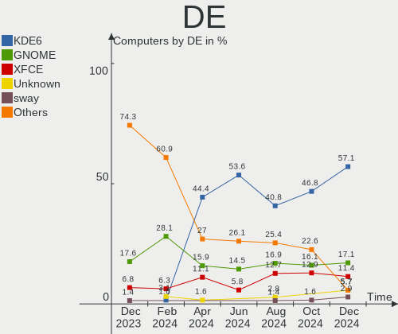
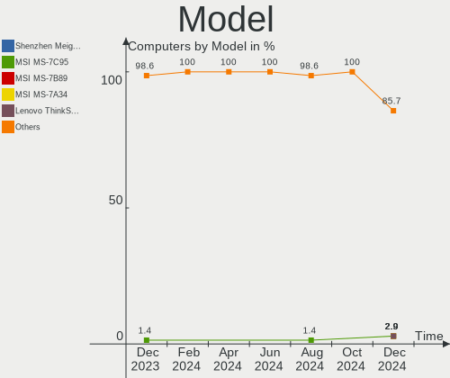
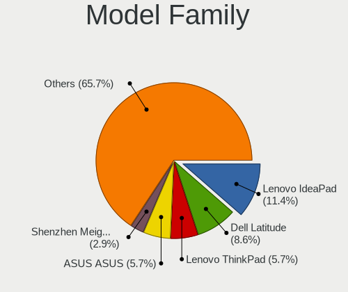
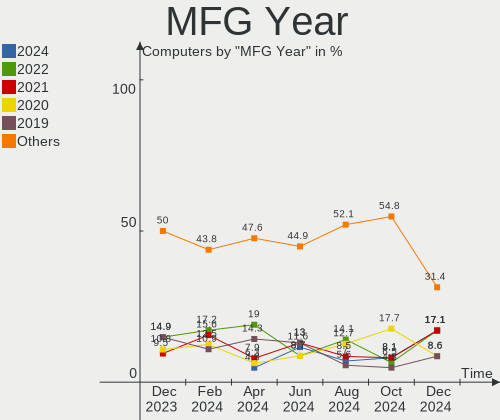
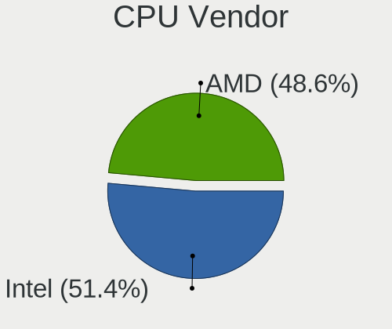
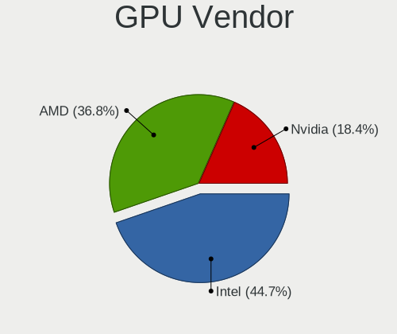
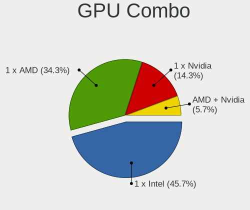
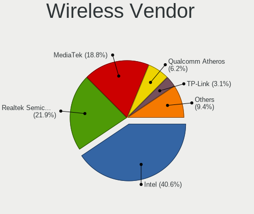
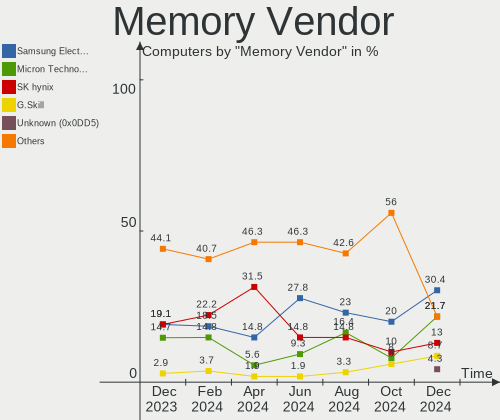
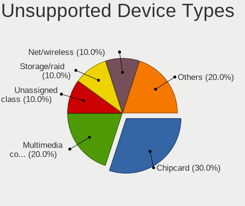

EndeavourOS - Hardware Trends
-----------------------------

A project to identify most popular hardware characteristics and track their change
over time based on data collected by Linux users at https://Linux-Hardware.org.

Anyone can contribute to this report by the [hw-probe](https://github.com/linuxhw/hw-probe) tool:

    sudo -E hw-probe -all -upload

This is a report for all computer types. See also reports for [desktops](/Dist/EndeavourOS/Desktop/README.md) and [notebooks](/Dist/EndeavourOS/Notebook/README.md).

This report is for one last month. Overall report since the beginning of time: [TestCoverage](https://github.com/linuxhw/TestCoverage)

Period: Oct, 2022.

Contents
--------

* [ System ](#system)
  - [ OS                       ](#os)
  - [ OS Family                ](#os-family)
  - [ Kernel                   ](#kernel)
  - [ Kernel Family            ](#kernel-family)
  - [ Kernel Major Ver.        ](#kernel-major-ver)
  - [ Arch                     ](#arch)
  - [ DE                       ](#de)
  - [ Display Server           ](#display-server)
  - [ Display Manager          ](#display-manager)
  - [ OS Lang                  ](#os-lang)
  - [ Boot Mode                ](#boot-mode)
  - [ Filesystem               ](#filesystem)
  - [ Part. scheme             ](#part-scheme)
  - [ Dual Boot with Linux/BSD ](#dual-boot-with-linuxbsd)
  - [ Dual Boot (Win)          ](#dual-boot-win)

* [ Board ](#board)
  - [ Vendor                   ](#vendor)
  - [ Model                    ](#model)
  - [ Model Family             ](#model-family)
  - [ MFG Year                 ](#mfg-year)
  - [ Form Factor              ](#form-factor)
  - [ Secure Boot              ](#secure-boot)
  - [ Coreboot                 ](#coreboot)
  - [ RAM Size                 ](#ram-size)
  - [ RAM Used                 ](#ram-used)
  - [ Total Drives             ](#total-drives)
  - [ Has CD-ROM               ](#has-cd-rom)
  - [ Has Ethernet             ](#has-ethernet)
  - [ Has WiFi                 ](#has-wifi)
  - [ Has Bluetooth            ](#has-bluetooth)

* [ Location ](#location)
  - [ Country                  ](#country)
  - [ City                     ](#city)

* [ Drives ](#drives)
  - [ Drive Vendor             ](#drive-vendor)
  - [ Drive Model              ](#drive-model)
  - [ HDD Vendor               ](#hdd-vendor)
  - [ SSD Vendor               ](#ssd-vendor)
  - [ Drive Kind               ](#drive-kind)
  - [ Drive Connector          ](#drive-connector)
  - [ Drive Size               ](#drive-size)
  - [ Space Total              ](#space-total)
  - [ Space Used               ](#space-used)
  - [ Malfunc. Drives          ](#malfunc-drives)
  - [ Malfunc. Drive Vendor    ](#malfunc-drive-vendor)
  - [ Malfunc. HDD Vendor      ](#malfunc-hdd-vendor)
  - [ Malfunc. Drive Kind      ](#malfunc-drive-kind)
  - [ Failed Drives            ](#failed-drives)
  - [ Failed Drive Vendor      ](#failed-drive-vendor)
  - [ Drive Status             ](#drive-status)

* [ Storage controller ](#storage-controller)
  - [ Storage Vendor           ](#storage-vendor)
  - [ Storage Model            ](#storage-model)
  - [ Storage Kind             ](#storage-kind)

* [ Processor ](#processor)
  - [ CPU Vendor               ](#cpu-vendor)
  - [ CPU Model                ](#cpu-model)
  - [ CPU Model Family         ](#cpu-model-family)
  - [ CPU Cores                ](#cpu-cores)
  - [ CPU Sockets              ](#cpu-sockets)
  - [ CPU Threads              ](#cpu-threads)
  - [ CPU Op-Modes             ](#cpu-op-modes)
  - [ CPU Microcode            ](#cpu-microcode)
  - [ CPU Microarch            ](#cpu-microarch)

* [ Graphics ](#graphics)
  - [ GPU Vendor               ](#gpu-vendor)
  - [ GPU Model                ](#gpu-model)
  - [ GPU Combo                ](#gpu-combo)
  - [ GPU Driver               ](#gpu-driver)
  - [ GPU Memory               ](#gpu-memory)

* [ Monitor ](#monitor)
  - [ Monitor Vendor           ](#monitor-vendor)
  - [ Monitor Model            ](#monitor-model)
  - [ Monitor Resolution       ](#monitor-resolution)
  - [ Monitor Diagonal         ](#monitor-diagonal)
  - [ Monitor Width            ](#monitor-width)
  - [ Aspect Ratio             ](#aspect-ratio)
  - [ Monitor Area             ](#monitor-area)
  - [ Pixel Density            ](#pixel-density)
  - [ Multiple Monitors        ](#multiple-monitors)

* [ Network ](#network)
  - [ Net Controller Vendor    ](#net-controller-vendor)
  - [ Net Controller Model     ](#net-controller-model)
  - [ Wireless Vendor          ](#wireless-vendor)
  - [ Wireless Model           ](#wireless-model)
  - [ Ethernet Vendor          ](#ethernet-vendor)
  - [ Ethernet Model           ](#ethernet-model)
  - [ Net Controller Kind      ](#net-controller-kind)
  - [ Used Controller          ](#used-controller)
  - [ NICs                     ](#nics)
  - [ IPv6                     ](#ipv6)

* [ Bluetooth ](#bluetooth)
  - [ Bluetooth Vendor         ](#bluetooth-vendor)
  - [ Bluetooth Model          ](#bluetooth-model)

* [ Sound ](#sound)
  - [ Sound Vendor             ](#sound-vendor)
  - [ Sound Model              ](#sound-model)

* [ Memory ](#memory)
  - [ Memory Vendor            ](#memory-vendor)
  - [ Memory Model             ](#memory-model)
  - [ Memory Kind              ](#memory-kind)
  - [ Memory Form Factor       ](#memory-form-factor)
  - [ Memory Size              ](#memory-size)
  - [ Memory Speed             ](#memory-speed)

* [ Printers & scanners ](#printers--scanners)
  - [ Printer Vendor           ](#printer-vendor)
  - [ Printer Model            ](#printer-model)
  - [ Scanner Vendor           ](#scanner-vendor)
  - [ Scanner Model            ](#scanner-model)

* [ Camera ](#camera)
  - [ Camera Vendor            ](#camera-vendor)
  - [ Camera Model             ](#camera-model)

* [ Security ](#security)
  - [ Fingerprint Vendor       ](#fingerprint-vendor)
  - [ Fingerprint Model        ](#fingerprint-model)
  - [ Chipcard Vendor          ](#chipcard-vendor)
  - [ Chipcard Model           ](#chipcard-model)

* [ Unsupported ](#unsupported)
  - [ Unsupported Devices      ](#unsupported-devices)
  - [ Unsupported Device Types ](#unsupported-device-types)

System
------

OS
--

Installed operating systems

| Name                | Computers | Percent |
|---------------------|-----------|---------|
| EndeavourOS Rolling | 53        | 100%    |

OS Family
---------

OS without a version

| Name        | Computers | Percent |
|-------------|-----------|---------|
| EndeavourOS | 53        | 100%    |

Kernel
------

Version of the Linux kernel

| Version                 | Computers | Percent |
|-------------------------|-----------|---------|
| 6.0.2-arch1-1           | 11        | 20.75%  |
| 6.0.2-zen1-1-zen        | 9         | 16.98%  |
| 5.19.13-arch1-1         | 5         | 9.43%   |
| 5.19.12-arch1-1         | 5         | 9.43%   |
| 5.15.74-1-lts           | 5         | 9.43%   |
| 5.19.13-zen1-1-zen      | 4         | 7.55%   |
| 5.19.7-arch1-1          | 3         | 5.66%   |
| 6.0.5-zen1-1-zen        | 2         | 3.77%   |
| 6.0.5-arch1-1           | 1         | 1.89%   |
| 6.0.0-zen1-1-zen        | 1         | 1.89%   |
| 6.0.0-arch1-1           | 1         | 1.89%   |
| 5.19.10-arch1-1-surface | 1         | 1.89%   |
| 5.18.14-arch1-1         | 1         | 1.89%   |
| 5.17.6-zen1-1-zen       | 1         | 1.89%   |
| 5.15.75-1-lts           | 1         | 1.89%   |
| 5.15.73-3-lts           | 1         | 1.89%   |
| 5.15.71-1-lts           | 1         | 1.89%   |

Kernel Family
-------------

Linux kernel without a distro release

| Version | Computers | Percent |
|---------|-----------|---------|
| 6.0.2   | 20        | 37.74%  |
| 5.19.13 | 9         | 16.98%  |
| 5.19.12 | 5         | 9.43%   |
| 5.15.74 | 5         | 9.43%   |
| 6.0.5   | 3         | 5.66%   |
| 5.19.7  | 3         | 5.66%   |
| 6.0.0   | 2         | 3.77%   |
| 5.19.10 | 1         | 1.89%   |
| 5.18.14 | 1         | 1.89%   |
| 5.17.6  | 1         | 1.89%   |
| 5.15.75 | 1         | 1.89%   |
| 5.15.73 | 1         | 1.89%   |
| 5.15.71 | 1         | 1.89%   |

Kernel Major Ver.
-----------------

Linux kernel major version

| Version | Computers | Percent |
|---------|-----------|---------|
| 6.0     | 25        | 47.17%  |
| 5.19    | 18        | 33.96%  |
| 5.15    | 8         | 15.09%  |
| 5.18    | 1         | 1.89%   |
| 5.17    | 1         | 1.89%   |

Arch
----

OS architecture (x86_64, i586, etc.)

| Name   | Computers | Percent |
|--------|-----------|---------|
| x86_64 | 53        | 100%    |

DE
--

Desktop Environment

| Name       | Computers | Percent |
|------------|-----------|---------|
| KDE5       | 28        | 52.83%  |
| GNOME      | 9         | 16.98%  |
| XFCE       | 8         | 15.09%  |
| openbox    | 2         | 3.77%   |
| Unknown    | 2         | 3.77%   |
| X-Cinnamon | 1         | 1.89%   |
| LXQt       | 1         | 1.89%   |
| i3         | 1         | 1.89%   |
| Budgie     | 1         | 1.89%   |

Display Server
--------------

X11 or Wayland

| Name    | Computers | Percent |
|---------|-----------|---------|
| X11     | 42        | 79.25%  |
| Wayland | 8         | 15.09%  |
| Tty     | 3         | 5.66%   |

Display Manager
---------------

SDDM, LightDM, etc.

| Name    | Computers | Percent |
|---------|-----------|---------|
| SDDM    | 19        | 35.85%  |
| LightDM | 13        | 24.53%  |
| Unknown | 13        | 24.53%  |
| GDM     | 8         | 15.09%  |

OS Lang
-------

Language

| Lang    | Computers | Percent |
|---------|-----------|---------|
| en_US   | 21        | 39.62%  |
| it_IT   | 11        | 20.75%  |
| en_CA   | 5         | 9.43%   |
| es_ES   | 2         | 3.77%   |
| en_GB   | 2         | 3.77%   |
| en_AU   | 2         | 3.77%   |
| de_DE   | 2         | 3.77%   |
| Unknown | 2         | 3.77%   |
| ru_RU   | 1         | 1.89%   |
| pt_BR   | 1         | 1.89%   |
| fr_FR   | 1         | 1.89%   |
| fr_BE   | 1         | 1.89%   |
| fi_FI   | 1         | 1.89%   |
| en_SG   | 1         | 1.89%   |

Boot Mode
---------

EFI or BIOS

| Mode | Computers | Percent |
|------|-----------|---------|
| EFI  | 33        | 62.26%  |
| BIOS | 20        | 37.74%  |

Filesystem
----------

Type of filesystem

| Type    | Computers | Percent |
|---------|-----------|---------|
| Ext4    | 35        | 66.04%  |
| Btrfs   | 15        | 28.3%   |
| Overlay | 3         | 5.66%   |

Part. scheme
------------

Scheme of partitioning

| Type    | Computers | Percent |
|---------|-----------|---------|
| GPT     | 34        | 64.15%  |
| Unknown | 12        | 22.64%  |
| MBR     | 7         | 13.21%  |

Dual Boot with Linux/BSD
------------------------

Hosting more than one Linux/BSD

| Dual boot | Computers | Percent |
|-----------|-----------|---------|
| No        | 44        | 83.02%  |
| Yes       | 9         | 16.98%  |

Dual Boot (Win)
---------------

Hosting Linux and Windows

| Dual boot | Computers | Percent |
|-----------|-----------|---------|
| No        | 38        | 71.7%   |
| Yes       | 15        | 28.3%   |

Board
-----

Vendor
------

Motherboard manufacturer

| Name                | Computers | Percent |
|---------------------|-----------|---------|
| Hewlett-Packard     | 11        | 20.75%  |
| MSI                 | 7         | 13.21%  |
| Lenovo              | 6         | 11.32%  |
| ASUSTek Computer    | 6         | 11.32%  |
| Gigabyte Technology | 4         | 7.55%   |
| Acer                | 4         | 7.55%   |
| Dell                | 3         | 5.66%   |
| ASRock              | 3         | 5.66%   |
| Toshiba             | 1         | 1.89%   |
| Timi                | 1         | 1.89%   |
| Samsung Electronics | 1         | 1.89%   |
| Packard Bell        | 1         | 1.89%   |
| Microsoft           | 1         | 1.89%   |
| Medion              | 1         | 1.89%   |
| iRU                 | 1         | 1.89%   |
| Google              | 1         | 1.89%   |
| Apple               | 1         | 1.89%   |

Model
-----

Motherboard model

| Name                                  | Computers | Percent |
|---------------------------------------|-----------|---------|
| Toshiba Satellite L500                | 1         | 1.89%   |
| Timi RedmiBook Pro 14S                | 1         | 1.89%   |
| Samsung 340XAA/350XAA/550XAA          | 1         | 1.89%   |
| Packard Bell EasyNote TJ65            | 1         | 1.89%   |
| MSI Prestige 14Evo A12M               | 1         | 1.89%   |
| MSI MS-7C80                           | 1         | 1.89%   |
| MSI MS-7C37                           | 1         | 1.89%   |
| MSI MS-7B98                           | 1         | 1.89%   |
| MSI MS-7A74                           | 1         | 1.89%   |
| MSI GF65 Thin 9SD                     | 1         | 1.89%   |
| MSI GE75 Raider 10SF                  | 1         | 1.89%   |
| Microsoft Surface Laptop Go           | 1         | 1.89%   |
| Medion MD35261                        | 1         | 1.89%   |
| Lenovo Yoga Slim 7 Pro 14ACH5 82MS    | 1         | 1.89%   |
| Lenovo V110-15AST 80TD                | 1         | 1.89%   |
| Lenovo ThinkPad T16 Gen 1 21BVCTO1WW  | 1         | 1.89%   |
| Lenovo ThinkPad T14 Gen 3 21CFCTO1WW  | 1         | 1.89%   |
| Lenovo ThinkCentre M710q 10MR0009US   | 1         | 1.89%   |
| Lenovo IdeaPad 330S-15IKB 81F5        | 1         | 1.89%   |
| iRU P11AP                             | 1         | 1.89%   |
| HP Spectre x360 Convertible 13-aw0xxx | 1         | 1.89%   |
| HP ProDesk 600 G1 SFF                 | 1         | 1.89%   |
| HP Pavilion x360 Convertible          | 1         | 1.89%   |
| HP Pavilion Laptop 14-ce0xxx          | 1         | 1.89%   |
| HP Pavilion Gaming Laptop 15-ec1xxx   | 1         | 1.89%   |
| HP Laptop 15-bs2xx                    | 1         | 1.89%   |
| HP EliteDesk 800 G1 TWR               | 1         | 1.89%   |
| HP 650                                | 1         | 1.89%   |
| HP 340S G7 Notebook PC                | 1         | 1.89%   |
| HP 255 G8 Notebook PC                 | 1         | 1.89%   |
| HP 250 G4                             | 1         | 1.89%   |
| Google Liara                          | 1         | 1.89%   |
| Gigabyte Z390 GAMING X                | 1         | 1.89%   |
| Gigabyte P35C-DS3R                    | 1         | 1.89%   |
| Gigabyte H87M-D3H                     | 1         | 1.89%   |
| Gigabyte H81M-S2PV                    | 1         | 1.89%   |
| Dell OptiPlex 3020                    | 1         | 1.89%   |
| Dell OptiPlex 3010                    | 1         | 1.89%   |
| Dell Inspiron 3464 AIO                | 1         | 1.89%   |
| ASUS Z170 PRO GAMING                  | 1         | 1.89%   |

Model Family
------------

Motherboard model prefix

| Name                  | Computers | Percent |
|-----------------------|-----------|---------|
| HP Pavilion           | 3         | 5.66%   |
| Lenovo ThinkPad       | 2         | 3.77%   |
| Dell OptiPlex         | 2         | 3.77%   |
| ASUS PRIME            | 2         | 3.77%   |
| Toshiba Satellite     | 1         | 1.89%   |
| Timi RedmiBook        | 1         | 1.89%   |
| Samsung 340XAA        | 1         | 1.89%   |
| Packard Bell EasyNote | 1         | 1.89%   |
| MSI Prestige          | 1         | 1.89%   |
| MSI MS-7C80           | 1         | 1.89%   |
| MSI MS-7C37           | 1         | 1.89%   |
| MSI MS-7B98           | 1         | 1.89%   |
| MSI MS-7A74           | 1         | 1.89%   |
| MSI GF65              | 1         | 1.89%   |
| MSI GE75              | 1         | 1.89%   |
| Microsoft Surface     | 1         | 1.89%   |
| Medion MD35261        | 1         | 1.89%   |
| Lenovo Yoga           | 1         | 1.89%   |
| Lenovo V110-15AST     | 1         | 1.89%   |
| Lenovo ThinkCentre    | 1         | 1.89%   |
| Lenovo IdeaPad        | 1         | 1.89%   |
| iRU P11AP             | 1         | 1.89%   |
| HP Spectre            | 1         | 1.89%   |
| HP ProDesk            | 1         | 1.89%   |
| HP Laptop             | 1         | 1.89%   |
| HP EliteDesk          | 1         | 1.89%   |
| HP 650                | 1         | 1.89%   |
| HP 340S               | 1         | 1.89%   |
| HP 255                | 1         | 1.89%   |
| HP 250                | 1         | 1.89%   |
| Google Liara          | 1         | 1.89%   |
| Gigabyte Z390         | 1         | 1.89%   |
| Gigabyte P35C-DS3R    | 1         | 1.89%   |
| Gigabyte H87M-D3H     | 1         | 1.89%   |
| Gigabyte H81M-S2PV    | 1         | 1.89%   |
| Dell Inspiron         | 1         | 1.89%   |
| ASUS Z170             | 1         | 1.89%   |
| ASUS X441SA           | 1         | 1.89%   |
| ASUS S550CA           | 1         | 1.89%   |
| ASUS ROG              | 1         | 1.89%   |

MFG Year
--------

Motherboard manufacture year

| Year | Computers | Percent |
|------|-----------|---------|
| 2018 | 8         | 15.09%  |
| 2020 | 7         | 13.21%  |
| 2019 | 6         | 11.32%  |
| 2022 | 5         | 9.43%   |
| 2021 | 5         | 9.43%   |
| 2016 | 5         | 9.43%   |
| 2013 | 5         | 9.43%   |
| 2015 | 3         | 5.66%   |
| 2017 | 2         | 3.77%   |
| 2012 | 2         | 3.77%   |
| 2009 | 2         | 3.77%   |
| 2014 | 1         | 1.89%   |
| 2011 | 1         | 1.89%   |
| 2007 | 1         | 1.89%   |

Form Factor
-----------

Physical design of the computer

| Name        | Computers | Percent |
|-------------|-----------|---------|
| Notebook    | 26        | 49.06%  |
| Desktop     | 21        | 39.62%  |
| Convertible | 2         | 3.77%   |
| All in one  | 2         | 3.77%   |
| Tablet      | 1         | 1.89%   |
| Mini pc     | 1         | 1.89%   |

Secure Boot
-----------

Enabled or disabled

| State    | Computers | Percent |
|----------|-----------|---------|
| Disabled | 53        | 100%    |

Coreboot
--------

Have coreboot on board

| Used | Computers | Percent |
|------|-----------|---------|
| No   | 52        | 98.11%  |
| Yes  | 1         | 1.89%   |

RAM Size
--------

Total RAM memory

| Size in GB | Computers | Percent |
|------------|-----------|---------|
| 16.01-24.0 | 15        | 28.3%   |
| 8.01-16.0  | 12        | 22.64%  |
| 4.01-8.0   | 9         | 16.98%  |
| 3.01-4.0   | 8         | 15.09%  |
| 32.01-64.0 | 6         | 11.32%  |
| 24.01-32.0 | 3         | 5.66%   |

RAM Used
--------

Used RAM memory

| Used GB   | Computers | Percent |
|-----------|-----------|---------|
| 4.01-8.0  | 17        | 32.08%  |
| 1.01-2.0  | 16        | 30.19%  |
| 3.01-4.0  | 10        | 18.87%  |
| 2.01-3.0  | 9         | 16.98%  |
| 8.01-16.0 | 1         | 1.89%   |

Total Drives
------------

Number of drives on board

| Drives | Computers | Percent |
|--------|-----------|---------|
| 1      | 31        | 58.49%  |
| 2      | 9         | 16.98%  |
| 3      | 6         | 11.32%  |
| 4      | 4         | 7.55%   |
| 6      | 2         | 3.77%   |
| 0      | 1         | 1.89%   |

Has CD-ROM
----------

Has CD-ROM on board

| Presented | Computers | Percent |
|-----------|-----------|---------|
| No        | 36        | 67.92%  |
| Yes       | 17        | 32.08%  |

Has Ethernet
------------

Has Ethernet on board

| Presented | Computers | Percent |
|-----------|-----------|---------|
| Yes       | 45        | 84.91%  |
| No        | 8         | 15.09%  |

Has WiFi
--------

Has WiFi module

| Presented | Computers | Percent |
|-----------|-----------|---------|
| Yes       | 44        | 83.02%  |
| No        | 9         | 16.98%  |

Has Bluetooth
-------------

Has Bluetooth module

| Presented | Computers | Percent |
|-----------|-----------|---------|
| Yes       | 38        | 71.7%   |
| No        | 15        | 28.3%   |

Location
--------

Country
-------

Geographic location (country)

| Country   | Computers | Percent |
|-----------|-----------|---------|
| Italy     | 15        | 28.3%   |
| USA       | 9         | 16.98%  |
| Canada    | 5         | 9.43%   |
| Germany   | 3         | 5.66%   |
| France    | 3         | 5.66%   |
| Spain     | 2         | 3.77%   |
| Finland   | 2         | 3.77%   |
| Brazil    | 2         | 3.77%   |
| Australia | 2         | 3.77%   |
| Ukraine   | 1         | 1.89%   |
| UK        | 1         | 1.89%   |
| Sweden    | 1         | 1.89%   |
| Slovenia  | 1         | 1.89%   |
| Serbia    | 1         | 1.89%   |
| Senegal   | 1         | 1.89%   |
| Russia    | 1         | 1.89%   |
| Malaysia  | 1         | 1.89%   |
| Croatia   | 1         | 1.89%   |
| Belgium   | 1         | 1.89%   |

City
----

Geographic location (city)

| City                      | Computers | Percent |
|---------------------------|-----------|---------|
| Rome                      | 2         | 3.77%   |
| Montreal                  | 2         | 3.77%   |
| Leipzig                   | 2         | 3.77%   |
| Wasmes                    | 1         | 1.89%   |
| Vynohradiv                | 1         | 1.89%   |
| Viggianello               | 1         | 1.89%   |
| Vicar                     | 1         | 1.89%   |
| The Colony                | 1         | 1.89%   |
| Tenna                     | 1         | 1.89%   |
| Suzzara                   | 1         | 1.89%   |
| Stockholm                 | 1         | 1.89%   |
| San Fermo della Battaglia | 1         | 1.89%   |
| Salon-de-Provence         | 1         | 1.89%   |
| Rovereto                  | 1         | 1.89%   |
| Rijeka                    | 1         | 1.89%   |
| Raisio                    | 1         | 1.89%   |
| Porcia                    | 1         | 1.89%   |
| Perth                     | 1         | 1.89%   |
| Paris                     | 1         | 1.89%   |
| Palma                     | 1         | 1.89%   |
| Ottawa                    | 1         | 1.89%   |
| Osasco                    | 1         | 1.89%   |
| Orangeville               | 1         | 1.89%   |
| Omaha                     | 1         | 1.89%   |
| North Vancouver           | 1         | 1.89%   |
| North Little Rock         | 1         | 1.89%   |
| Newcastle                 | 1         | 1.89%   |
| Milan                     | 1         | 1.89%   |
| Melpignano                | 1         | 1.89%   |
| Mainz                     | 1         | 1.89%   |
| Macomb                    | 1         | 1.89%   |
| Ljubljana                 | 1         | 1.89%   |
| Limeil-Brevannes          | 1         | 1.89%   |
| Lenoir City               | 1         | 1.89%   |
| Kovrov                    | 1         | 1.89%   |
| Kings Lynn                | 1         | 1.89%   |
| Helsinki                  | 1         | 1.89%   |
| Greeley                   | 1         | 1.89%   |
| Fruitland                 | 1         | 1.89%   |
| Dallas                    | 1         | 1.89%   |

Drives
------

Drive Vendor
------------

Hard drive vendors

| Vendor                      | Computers | Drives | Percent |
|-----------------------------|-----------|--------|---------|
| Samsung Electronics         | 19        | 23     | 22.35%  |
| Seagate                     | 10        | 13     | 11.76%  |
| Sandisk                     | 10        | 11     | 11.76%  |
| WDC                         | 8         | 9      | 9.41%   |
| Kingston                    | 7         | 7      | 8.24%   |
| Toshiba                     | 6         | 6      | 7.06%   |
| SK hynix                    | 3         | 3      | 3.53%   |
| Unknown                     | 2         | 2      | 2.35%   |
| Micron Technology           | 2         | 2      | 2.35%   |
| Kingston Technology Company | 2         | 2      | 2.35%   |
| Hitachi                     | 2         | 2      | 2.35%   |
| Crucial                     | 2         | 2      | 2.35%   |
| Transcend                   | 1         | 1      | 1.18%   |
| Timetec                     | 1         | 1      | 1.18%   |
| SABRENT                     | 1         | 1      | 1.18%   |
| PNY                         | 1         | 1      | 1.18%   |
| Phison                      | 1         | 1      | 1.18%   |
| OCZ                         | 1         | 1      | 1.18%   |
| Micron/Crucial Technology   | 1         | 1      | 1.18%   |
| KIOXIA                      | 1         | 1      | 1.18%   |
| HGST                        | 1         | 1      | 1.18%   |
| Gigabyte Technology         | 1         | 1      | 1.18%   |
| China                       | 1         | 1      | 1.18%   |
| ASMT                        | 1         | 2      | 1.18%   |

Drive Model
-----------

Hard drive models

| Model                                                | Computers | Percent |
|------------------------------------------------------|-----------|---------|
| Seagate ST2000DM008-2FR102 2TB                       | 5         | 5.43%   |
| Samsung NVMe SSD Controller SM981/PM981/PM983 500GB  | 3         | 3.26%   |
| Kingston SA400S37240G 240GB SSD                      | 3         | 3.26%   |
| Toshiba DT01ACA050 500GB                             | 2         | 2.17%   |
| Sandisk WD Blue SN550 NVMe SSD 1TB                   | 2         | 2.17%   |
| Sandisk WD Black SN750 / PC SN730 NVMe SSD 1TB       | 2         | 2.17%   |
| Samsung SSD 870 QVO 1TB                              | 2         | 2.17%   |
| Samsung NVMe SSD Controller PM9A1/PM9A3/980PRO 250GB | 2         | 2.17%   |
| Kingston Company U-SNS8154P3 NVMe SSD 512GB          | 2         | 2.17%   |
| Kingston SA400S37120G 120GB SSD                      | 2         | 2.17%   |
| Crucial CT120BX500SSD1 120GB                         | 2         | 2.17%   |
| WDC WDS500G2B0A-00SM50 500GB SSD                     | 1         | 1.09%   |
| WDC WDS250G2B0A-00SM50 250GB SSD                     | 1         | 1.09%   |
| WDC WD5000LPLX-08ZNTT0 500GB                         | 1         | 1.09%   |
| WDC WD30EZAZ-00SF3B0 3TB                             | 1         | 1.09%   |
| WDC WD20EARS-42S0XB0 2TB                             | 1         | 1.09%   |
| WDC WD10SPSX-60A6WT0 1TB                             | 1         | 1.09%   |
| WDC WD10EZEX-22MFCA0 1TB                             | 1         | 1.09%   |
| WDC WD10EZEX-08WN4A0 1TB                             | 1         | 1.09%   |
| Unknown MMC Card  64GB                               | 1         | 1.09%   |
| Unknown MMC Card  128GB                              | 1         | 1.09%   |
| Transcend TS128GMTE110S 128GB                        | 1         | 1.09%   |
| Toshiba NVMe Controller 512GB                        | 1         | 1.09%   |
| Toshiba MQ01ABF050 500GB                             | 1         | 1.09%   |
| Toshiba HDWQ140 4TB                                  | 1         | 1.09%   |
| Toshiba HDWD220 2TB                                  | 1         | 1.09%   |
| Timetec MS05 256GB SSD                               | 1         | 1.09%   |
| SK hynix SKHynix_HFS512GDE9X084N 512GB               | 1         | 1.09%   |
| SK hynix SKHynix_HFS512GDE9X081N 512GB               | 1         | 1.09%   |
| SK hynix HFS256G39TND-N210A 256GB SSD                | 1         | 1.09%   |
| Seagate ST500LM021-1KJ152 500GB                      | 1         | 1.09%   |
| Seagate ST1000LM048-2E7172 1TB                       | 1         | 1.09%   |
| Seagate ST1000LM024 HN-M101MBB 1TB                   | 1         | 1.09%   |
| Seagate ST1000DM003-9YN162 1TB                       | 1         | 1.09%   |
| Seagate ST1000DM003-1ER162 1TB                       | 1         | 1.09%   |
| Seagate Expansion 2TB                                | 1         | 1.09%   |
| Seagate BarraCuda 120 SSD ZA500CM10003 500GB         | 1         | 1.09%   |
| Sandisk WD_BLACK SN770 500GB                         | 1         | 1.09%   |
| Sandisk WD PC SN735 SDBPNHH-512G-1002 512GB          | 1         | 1.09%   |
| Sandisk WD Blue SN500 / PC SN520 NVMe SSD 512GB      | 1         | 1.09%   |

HDD Vendor
----------

Hard disk drive vendors

| Vendor              | Computers | Drives | Percent |
|---------------------|-----------|--------|---------|
| Seagate             | 9         | 12     | 33.33%  |
| WDC                 | 6         | 7      | 22.22%  |
| Toshiba             | 5         | 5      | 18.52%  |
| Samsung Electronics | 2         | 2      | 7.41%   |
| Hitachi             | 2         | 2      | 7.41%   |
| SABRENT             | 1         | 1      | 3.7%    |
| HGST                | 1         | 1      | 3.7%    |
| ASMT                | 1         | 2      | 3.7%    |

SSD Vendor
----------

Solid state drive vendors

| Vendor              | Computers | Drives | Percent |
|---------------------|-----------|--------|---------|
| Samsung Electronics | 10        | 10     | 31.25%  |
| Kingston            | 7         | 7      | 21.88%  |
| WDC                 | 2         | 2      | 6.25%   |
| SanDisk             | 2         | 3      | 6.25%   |
| Crucial             | 2         | 2      | 6.25%   |
| Timetec             | 1         | 1      | 3.13%   |
| SK hynix            | 1         | 1      | 3.13%   |
| Seagate             | 1         | 1      | 3.13%   |
| PNY                 | 1         | 1      | 3.13%   |
| Phison              | 1         | 1      | 3.13%   |
| OCZ                 | 1         | 1      | 3.13%   |
| Micron Technology   | 1         | 1      | 3.13%   |
| Gigabyte Technology | 1         | 1      | 3.13%   |
| China               | 1         | 1      | 3.13%   |

Drive Kind
----------

HDD or SSD

| Kind | Computers | Drives | Percent |
|------|-----------|--------|---------|
| NVMe | 26        | 28     | 35.14%  |
| SSD  | 25        | 33     | 33.78%  |
| HDD  | 21        | 32     | 28.38%  |
| MMC  | 2         | 2      | 2.7%    |

Drive Connector
---------------

SATA, SAS, NVMe, etc.

| Type | Computers | Drives | Percent |
|------|-----------|--------|---------|
| SATA | 37        | 61     | 54.41%  |
| NVMe | 26        | 28     | 38.24%  |
| SAS  | 3         | 4      | 4.41%   |
| MMC  | 2         | 2      | 2.94%   |

Drive Size
----------

Size of hard drive

| Size in TB | Computers | Drives | Percent |
|------------|-----------|--------|---------|
| 0.01-0.5   | 27        | 37     | 51.92%  |
| 0.51-1.0   | 14        | 15     | 26.92%  |
| 1.01-2.0   | 8         | 9      | 15.38%  |
| 3.01-4.0   | 2         | 3      | 3.85%   |
| 2.01-3.0   | 1         | 1      | 1.92%   |

Space Total
-----------

Amount of disk space available on the file system

| Size in GB     | Computers | Percent |
|----------------|-----------|---------|
| 101-250        | 10        | 18.87%  |
| 251-500        | 9         | 16.98%  |
| 1001-2000      | 7         | 13.21%  |
| 501-1000       | 7         | 13.21%  |
| 2001-3000      | 5         | 9.43%   |
| More than 3000 | 4         | 7.55%   |
| 51-100         | 4         | 7.55%   |
| 1-20           | 3         | 5.66%   |
| 21-50          | 2         | 3.77%   |
| Unknown        | 2         | 3.77%   |

Space Used
----------

Amount of used disk space

| Used GB   | Computers | Percent |
|-----------|-----------|---------|
| 1-20      | 15        | 28.3%   |
| 101-250   | 11        | 20.75%  |
| 501-1000  | 7         | 13.21%  |
| 21-50     | 5         | 9.43%   |
| 251-500   | 4         | 7.55%   |
| 51-100    | 4         | 7.55%   |
| 1001-2000 | 3         | 5.66%   |
| 2001-3000 | 2         | 3.77%   |
| Unknown   | 2         | 3.77%   |

Malfunc. Drives
---------------

Drive models with a malfunction

| Model                                    | Computers | Drives | Percent |
|------------------------------------------|-----------|--------|---------|
| Seagate ST1000LM024 HN-M101MBB 1TB       | 1         | 1      | 25%     |
| Seagate ST1000DM003-1ER162 1TB           | 1         | 2      | 25%     |
| Samsung Electronics SSD 840 Series 120GB | 1         | 1      | 25%     |
| HGST HTS545050A7E680 500GB               | 1         | 1      | 25%     |

Malfunc. Drive Vendor
---------------------

Vendors of faulty drives

| Vendor              | Computers | Drives | Percent |
|---------------------|-----------|--------|---------|
| Seagate             | 2         | 3      | 50%     |
| Samsung Electronics | 1         | 1      | 25%     |
| HGST                | 1         | 1      | 25%     |

Malfunc. HDD Vendor
-------------------

Vendors of faulty HDD drives

| Vendor  | Computers | Drives | Percent |
|---------|-----------|--------|---------|
| Seagate | 2         | 3      | 66.67%  |
| HGST    | 1         | 1      | 33.33%  |

Malfunc. Drive Kind
-------------------

Kinds of faulty drives

| Kind | Computers | Drives | Percent |
|------|-----------|--------|---------|
| HDD  | 3         | 4      | 75%     |
| SSD  | 1         | 1      | 25%     |

Failed Drives
-------------

Failed drive models

Zero info for selected period =(

Failed Drive Vendor
-------------------

Failed drive vendors

Zero info for selected period =(

Drive Status
------------

Number of failed and malfunc. drives

| Status   | Computers | Drives | Percent |
|----------|-----------|--------|---------|
| Works    | 36        | 56     | 64.29%  |
| Detected | 16        | 34     | 28.57%  |
| Malfunc  | 4         | 5      | 7.14%   |

Storage controller
------------------

Storage Vendor
--------------

Storage controller vendors

| Vendor                       | Computers | Percent |
|------------------------------|-----------|---------|
| Intel                        | 36        | 48%     |
| Samsung Electronics          | 10        | 13.33%  |
| AMD                          | 9         | 12%     |
| SanDisk                      | 8         | 10.67%  |
| SK hynix                     | 2         | 2.67%   |
| Kingston Technology Company  | 2         | 2.67%   |
| ASMedia Technology           | 2         | 2.67%   |
| Transcend                    | 1         | 1.33%   |
| Toshiba America Info Systems | 1         | 1.33%   |
| Micron/Crucial Technology    | 1         | 1.33%   |
| Micron Technology            | 1         | 1.33%   |
| KIOXIA                       | 1         | 1.33%   |
| JMicron Technology           | 1         | 1.33%   |

Storage Model
-------------

Storage controller models

| Model                                                                            | Computers | Percent |
|----------------------------------------------------------------------------------|-----------|---------|
| AMD FCH SATA Controller [AHCI mode]                                              | 8         | 10.26%  |
| Intel Sunrise Point-LP SATA Controller [AHCI mode]                               | 7         | 8.97%   |
| Intel 8 Series/C220 Series Chipset Family 6-port SATA Controller 1 [AHCI mode]   | 5         | 6.41%   |
| Samsung NVMe SSD Controller 980                                                  | 4         | 5.13%   |
| Samsung NVMe SSD Controller SM981/PM981/PM983                                    | 3         | 3.85%   |
| Intel 200 Series PCH SATA controller [AHCI mode]                                 | 3         | 3.85%   |
| SK hynix Gold P31 SSD                                                            | 2         | 2.56%   |
| SanDisk WD Blue SN550 NVMe SSD                                                   | 2         | 2.56%   |
| SanDisk WD Black SN750 / PC SN730 NVMe SSD                                       | 2         | 2.56%   |
| SanDisk Non-Volatile memory controller                                           | 2         | 2.56%   |
| Samsung NVMe SSD Controller PM9A1/PM9A3/980PRO                                   | 2         | 2.56%   |
| Kingston Company U-SNS8154P3 NVMe SSD                                            | 2         | 2.56%   |
| Intel Comet Lake SATA AHCI Controller                                            | 2         | 2.56%   |
| Intel Celeron/Pentium Silver Processor SATA Controller                           | 2         | 2.56%   |
| Intel Cannon Lake PCH SATA AHCI Controller                                       | 2         | 2.56%   |
| Intel Atom/Celeron/Pentium Processor x5-E8000/J3xxx/N3xxx Series SATA Controller | 2         | 2.56%   |
| Intel 82801IBM/IEM (ICH9M/ICH9M-E) 4 port SATA Controller [AHCI mode]            | 2         | 2.56%   |
| Intel 82801 Mobile SATA Controller [RAID mode]                                   | 2         | 2.56%   |
| Intel 7 Series Chipset Family 6-port SATA Controller [AHCI mode]                 | 2         | 2.56%   |
| Intel 6 Series/C200 Series Chipset Family 6 port Desktop SATA AHCI Controller    | 2         | 2.56%   |
| ASMedia ASM1062 Serial ATA Controller                                            | 2         | 2.56%   |
| Transcend Non-Volatile memory controller                                         | 1         | 1.28%   |
| Toshiba America Info Systems NVMe Controller                                     | 1         | 1.28%   |
| SanDisk WD Blue SN500 / PC SN520 NVMe SSD                                        | 1         | 1.28%   |
| SanDisk PC SN520 NVMe SSD                                                        | 1         | 1.28%   |
| Samsung NVMe SSD Controller SM961/PM961/SM963                                    | 1         | 1.28%   |
| Samsung NVMe SSD Controller 172X                                                 | 1         | 1.28%   |
| Micron/Crucial P2 NVMe PCIe SSD                                                  | 1         | 1.28%   |
| Micron Non-Volatile memory controller                                            | 1         | 1.28%   |
| KIOXIA NVMe SSD Controller BG4                                                   | 1         | 1.28%   |
| JMicron JMB363 SATA/IDE Controller                                               | 1         | 1.28%   |
| Intel Q170/Q150/B150/H170/H110/Z170/CM236 Chipset SATA Controller [AHCI Mode]    | 1         | 1.28%   |
| Intel 82801IR/IO/IH (ICH9R/DO/DH) 4 port SATA Controller [IDE mode]              | 1         | 1.28%   |
| Intel 82801I (ICH9 Family) 2 port SATA Controller [IDE mode]                     | 1         | 1.28%   |
| Intel 500 Series Chipset Family SATA AHCI Controller                             | 1         | 1.28%   |
| Intel 400 Series Chipset Family SATA AHCI Controller                             | 1         | 1.28%   |
| Intel 300 Series Chipset Family SATA RAID Controller                             | 1         | 1.28%   |
| AMD FCH SATA Controller D                                                        | 1         | 1.28%   |
| AMD 400 Series Chipset SATA Controller                                           | 1         | 1.28%   |

Storage Kind
------------

Kind of storage controller (IDE, SATA, NVMe, SAS, ...)

| Kind | Computers | Percent |
|------|-----------|---------|
| SATA | 41        | 57.75%  |
| NVMe | 26        | 36.62%  |
| RAID | 3         | 4.23%   |
| IDE  | 1         | 1.41%   |

Processor
---------

CPU Vendor
----------

Processor vendors

| Vendor | Computers | Percent |
|--------|-----------|---------|
| Intel  | 40        | 75.47%  |
| AMD    | 13        | 24.53%  |

CPU Model
---------

Processor models

| Model                                       | Computers | Percent |
|---------------------------------------------|-----------|---------|
| Intel Core i7-4790 CPU @ 3.60GHz            | 2         | 3.77%   |
| Intel Core i7-1065G7 CPU @ 1.30GHz          | 2         | 3.77%   |
| Intel Core i5-8250U CPU @ 1.60GHz           | 2         | 3.77%   |
| AMD Ryzen 5 5600X 6-Core Processor          | 2         | 3.77%   |
| Intel Pentium Dual-Core CPU T4400 @ 2.20GHz | 1         | 1.89%   |
| Intel Pentium CPU G2030 @ 3.00GHz           | 1         | 1.89%   |
| Intel Core i7-8550U CPU @ 1.80GHz           | 1         | 1.89%   |
| Intel Core i7-7700K CPU @ 4.20GHz           | 1         | 1.89%   |
| Intel Core i7-6500U CPU @ 2.50GHz           | 1         | 1.89%   |
| Intel Core i7-4790K CPU @ 4.00GHz           | 1         | 1.89%   |
| Intel Core i7-10750H CPU @ 2.60GHz          | 1         | 1.89%   |
| Intel Core i7-10700K CPU @ 3.80GHz          | 1         | 1.89%   |
| Intel Core i7-10700 CPU @ 2.90GHz           | 1         | 1.89%   |
| Intel Core i5-9600K CPU @ 3.70GHz           | 1         | 1.89%   |
| Intel Core i5-9300H CPU @ 2.40GHz           | 1         | 1.89%   |
| Intel Core i5-8600K CPU @ 3.60GHz           | 1         | 1.89%   |
| Intel Core i5-7500T CPU @ 2.70GHz           | 1         | 1.89%   |
| Intel Core i5-7500 CPU @ 3.40GHz            | 1         | 1.89%   |
| Intel Core i5-7200U CPU @ 2.50GHz           | 1         | 1.89%   |
| Intel Core i5-6600K CPU @ 3.50GHz           | 1         | 1.89%   |
| Intel Core i5-6200U CPU @ 2.30GHz           | 1         | 1.89%   |
| Intel Core i5-4590 CPU @ 3.30GHz            | 1         | 1.89%   |
| Intel Core i5-4430 CPU @ 3.00GHz            | 1         | 1.89%   |
| Intel Core i5-2500S CPU @ 2.70GHz           | 1         | 1.89%   |
| Intel Core i5-10400F CPU @ 2.90GHz          | 1         | 1.89%   |
| Intel Core i5-1035G1 CPU @ 1.00GHz          | 1         | 1.89%   |
| Intel Core i3-6006U CPU @ 2.00GHz           | 1         | 1.89%   |
| Intel Core i3-3217U CPU @ 1.80GHz           | 1         | 1.89%   |
| Intel Core 2 Duo CPU T6500 @ 2.10GHz        | 1         | 1.89%   |
| Intel Core 2 Duo CPU E8400 @ 3.00GHz        | 1         | 1.89%   |
| Intel Celeron N4000 CPU @ 1.10GHz           | 1         | 1.89%   |
| Intel Celeron J4125 CPU @ 2.00GHz           | 1         | 1.89%   |
| Intel Celeron CPU N3060 @ 1.60GHz           | 1         | 1.89%   |
| Intel Celeron CPU N3050 @ 1.60GHz           | 1         | 1.89%   |
| Intel Celeron CPU 1000M @ 1.80GHz           | 1         | 1.89%   |
| Intel 12th Gen Core i7-1280P                | 1         | 1.89%   |
| Intel 12th Gen Core i7-1260P                | 1         | 1.89%   |
| Intel 11th Gen Core i5-11600 @ 2.80GHz      | 1         | 1.89%   |
| AMD Ryzen 9 6900HS with Radeon Graphics     | 1         | 1.89%   |
| AMD Ryzen 7 5700U with Radeon Graphics      | 1         | 1.89%   |

CPU Model Family
----------------

Processor model prefix

| Model                   | Computers | Percent |
|-------------------------|-----------|---------|
| Intel Core i5           | 15        | 28.3%   |
| Intel Core i7           | 11        | 20.75%  |
| Other                   | 5         | 9.43%   |
| Intel Celeron           | 5         | 9.43%   |
| AMD Ryzen 5             | 5         | 9.43%   |
| Intel Core i3           | 2         | 3.77%   |
| Intel Core 2 Duo        | 2         | 3.77%   |
| AMD Ryzen 3             | 2         | 3.77%   |
| Intel Pentium Dual-Core | 1         | 1.89%   |
| Intel Pentium           | 1         | 1.89%   |
| AMD Ryzen 9             | 1         | 1.89%   |
| AMD Ryzen 7             | 1         | 1.89%   |
| AMD Ryzen 5 PRO         | 1         | 1.89%   |
| AMD A4                  | 1         | 1.89%   |

CPU Cores
---------

Number of processor cores

| Number | Computers | Percent |
|--------|-----------|---------|
| 4      | 20        | 37.74%  |
| 2      | 16        | 30.19%  |
| 6      | 11        | 20.75%  |
| 8      | 4         | 7.55%   |
| 14     | 1         | 1.89%   |
| 12     | 1         | 1.89%   |

CPU Sockets
-----------

Number of sockets

| Number | Computers | Percent |
|--------|-----------|---------|
| 1      | 53        | 100%    |

CPU Threads
-----------

Threads per core (Hyper-Threading)

| Number | Computers | Percent |
|--------|-----------|---------|
| 2      | 31        | 58.49%  |
| 1      | 22        | 41.51%  |

CPU Op-Modes
------------

CPU Operation Modes (32-bit, 64-bit)

| Op mode        | Computers | Percent |
|----------------|-----------|---------|
| 32-bit, 64-bit | 53        | 100%    |

CPU Microcode
-------------

Microcode number

| Number     | Computers | Percent |
|------------|-----------|---------|
| Unknown    | 16        | 30.19%  |
| 0x306c3    | 4         | 7.55%   |
| 0x706e5    | 3         | 5.66%   |
| 0x406e3    | 3         | 5.66%   |
| 0x1067a    | 3         | 5.66%   |
| 0x906e9    | 2         | 3.77%   |
| 0x906a3    | 2         | 3.77%   |
| 0x08608103 | 2         | 3.77%   |
| 0x06006705 | 2         | 3.77%   |
| 0xa0655    | 1         | 1.89%   |
| 0xa0653    | 1         | 1.89%   |
| 0x906ed    | 1         | 1.89%   |
| 0x906ec    | 1         | 1.89%   |
| 0x806ea    | 1         | 1.89%   |
| 0x806e9    | 1         | 1.89%   |
| 0x706a8    | 1         | 1.89%   |
| 0x706a1    | 1         | 1.89%   |
| 0x406c4    | 1         | 1.89%   |
| 0x406c3    | 1         | 1.89%   |
| 0x306a9    | 1         | 1.89%   |
| 0x206a7    | 1         | 1.89%   |
| 0x0a50000b | 1         | 1.89%   |
| 0x0a404101 | 1         | 1.89%   |
| 0x0a201016 | 1         | 1.89%   |
| 0x06006704 | 1         | 1.89%   |

CPU Microarch
-------------

Microarchitecture

| Name             | Computers | Percent |
|------------------|-----------|---------|
| KabyLake         | 10        | 18.87%  |
| Haswell          | 5         | 9.43%   |
| Unknown          | 5         | 9.43%   |
| Skylake          | 4         | 7.55%   |
| CometLake        | 4         | 7.55%   |
| Zen 3            | 3         | 5.66%   |
| Penryn           | 3         | 5.66%   |
| IvyBridge        | 3         | 5.66%   |
| IceLake          | 3         | 5.66%   |
| Excavator        | 3         | 5.66%   |
| Zen+             | 2         | 3.77%   |
| Silvermont       | 2         | 3.77%   |
| Goldmont plus    | 2         | 3.77%   |
| Alderlake Hybrid | 2         | 3.77%   |
| Zen 2            | 1         | 1.89%   |
| SandyBridge      | 1         | 1.89%   |

Graphics
--------

GPU Vendor
----------

Vendors of graphics cards

| Vendor | Computers | Percent |
|--------|-----------|---------|
| Intel  | 29        | 46.77%  |
| AMD    | 19        | 30.65%  |
| Nvidia | 14        | 22.58%  |

GPU Model
---------

Graphics card models

| Model                                                                                    | Computers | Percent |
|------------------------------------------------------------------------------------------|-----------|---------|
| Intel Xeon E3-1200 v3/4th Gen Core Processor Integrated Graphics Controller              | 3         | 4.84%   |
| Intel UHD Graphics 620                                                                   | 3         | 4.84%   |
| Intel Skylake GT2 [HD Graphics 520]                                                      | 3         | 4.84%   |
| AMD Stoney [Radeon R2/R3/R4/R5 Graphics]                                                 | 3         | 4.84%   |
| Nvidia GA104 [GeForce RTX 3060 Ti Lite Hash Rate]                                        | 2         | 3.23%   |
| Intel Iris Plus Graphics G7                                                              | 2         | 3.23%   |
| Intel GeminiLake [UHD Graphics 600]                                                      | 2         | 3.23%   |
| Intel Atom/Celeron/Pentium Processor x5-E8000/J3xxx/N3xxx Integrated Graphics Controller | 2         | 3.23%   |
| Intel Alder Lake-P Integrated Graphics Controller                                        | 2         | 3.23%   |
| Intel 3rd Gen Core processor Graphics Controller                                         | 2         | 3.23%   |
| AMD Rembrandt [Radeon 680M]                                                              | 2         | 3.23%   |
| AMD Navi 22 [Radeon RX 6700/6700 XT/6750 XT / 6800M]                                     | 2         | 3.23%   |
| AMD Lucienne                                                                             | 2         | 3.23%   |
| Nvidia TU117M                                                                            | 1         | 1.61%   |
| Nvidia TU116M [GeForce GTX 1660 Ti Mobile]                                               | 1         | 1.61%   |
| Nvidia TU106M [GeForce RTX 2070 Mobile / Max-Q Refresh]                                  | 1         | 1.61%   |
| Nvidia TU106 [GeForce RTX 2070]                                                          | 1         | 1.61%   |
| Nvidia GT218M [GeForce G210M]                                                            | 1         | 1.61%   |
| Nvidia GP106 [GeForce GTX 1060 6GB]                                                      | 1         | 1.61%   |
| Nvidia GP104 [GeForce GTX 1080]                                                          | 1         | 1.61%   |
| Nvidia GP104 [GeForce GTX 1070]                                                          | 1         | 1.61%   |
| Nvidia GK106 [GeForce GTX 660]                                                           | 1         | 1.61%   |
| Nvidia GK104 [GeForce GTX 760]                                                           | 1         | 1.61%   |
| Nvidia GA106M [GeForce RTX 3060 Mobile / Max-Q]                                          | 1         | 1.61%   |
| Nvidia GA104 [GeForce RTX 3070]                                                          | 1         | 1.61%   |
| Intel Xeon E3-1200 v2/3rd Gen Core processor Graphics Controller                         | 1         | 1.61%   |
| Intel RocketLake-S GT1 [UHD Graphics 750]                                                | 1         | 1.61%   |
| Intel Iris Plus Graphics G1 (Ice Lake)                                                   | 1         | 1.61%   |
| Intel HD Graphics 630                                                                    | 1         | 1.61%   |
| Intel HD Graphics 620                                                                    | 1         | 1.61%   |
| Intel HD Graphics 530                                                                    | 1         | 1.61%   |
| Intel CometLake-S GT2 [UHD Graphics 630]                                                 | 1         | 1.61%   |
| Intel CometLake-H GT2 [UHD Graphics]                                                     | 1         | 1.61%   |
| Intel CoffeeLake-H GT2 [UHD Graphics 630]                                                | 1         | 1.61%   |
| Intel 2nd Generation Core Processor Family Integrated Graphics Controller                | 1         | 1.61%   |
| AMD Whistler [Radeon HD 6730M/6770M/7690M XT]                                            | 1         | 1.61%   |
| AMD RV730/M96 [Mobility Radeon HD 4650/5165]                                             | 1         | 1.61%   |
| AMD Renoir                                                                               | 1         | 1.61%   |
| AMD Oland PRO [Radeon R7 240/340 / Radeon 520]                                           | 1         | 1.61%   |
| AMD Navi 23 [Radeon RX 6600/6600 XT/6600M]                                               | 1         | 1.61%   |

GPU Combo
---------

Combinations of graphics cards

| Name           | Computers | Percent |
|----------------|-----------|---------|
| 1 x Intel      | 23        | 43.4%   |
| 1 x AMD        | 14        | 26.42%  |
| 1 x Nvidia     | 9         | 16.98%  |
| Intel + Nvidia | 3         | 5.66%   |
| Intel + AMD    | 2         | 3.77%   |
| AMD + Nvidia   | 2         | 3.77%   |

GPU Driver
----------

Free vs proprietary

| Driver      | Computers | Percent |
|-------------|-----------|---------|
| Free        | 41        | 77.36%  |
| Proprietary | 12        | 22.64%  |

GPU Memory
----------

Total video memory

| Size in GB | Computers | Percent |
|------------|-----------|---------|
| Unknown    | 30        | 56.6%   |
| 7.01-8.0   | 7         | 13.21%  |
| 0.01-0.5   | 7         | 13.21%  |
| 1.01-2.0   | 3         | 5.66%   |
| 5.01-6.0   | 2         | 3.77%   |
| 0.51-1.0   | 2         | 3.77%   |
| 3.01-4.0   | 1         | 1.89%   |
| 8.01-16.0  | 1         | 1.89%   |

Monitor
-------

Monitor Vendor
--------------

Monitor vendors

| Vendor                  | Computers | Percent |
|-------------------------|-----------|---------|
| Samsung Electronics     | 9         | 14.06%  |
| BOE                     | 9         | 14.06%  |
| AU Optronics            | 6         | 9.38%   |
| Chimei Innolux          | 5         | 7.81%   |
| Goldstar                | 4         | 6.25%   |
| Dell                    | 4         | 6.25%   |
| ASUSTek Computer        | 4         | 6.25%   |
| LG Display              | 3         | 4.69%   |
| Acer                    | 3         | 4.69%   |
| Hewlett-Packard         | 2         | 3.13%   |
| Eizo                    | 2         | 3.13%   |
| Ancor Communications    | 2         | 3.13%   |
| UGD                     | 1         | 1.56%   |
| MSI                     | 1         | 1.56%   |
| Lenovo                  | 1         | 1.56%   |
| InnoLux Display         | 1         | 1.56%   |
| InfoVision              | 1         | 1.56%   |
| Iiyama                  | 1         | 1.56%   |
| CSO                     | 1         | 1.56%   |
| Chi Mei Optoelectronics | 1         | 1.56%   |
| CEX                     | 1         | 1.56%   |
| BenQ                    | 1         | 1.56%   |
| Apple                   | 1         | 1.56%   |

Monitor Model
-------------

Monitor models

| Model                                                                    | Computers | Percent |
|--------------------------------------------------------------------------|-----------|---------|
| Samsung Electronics S24F350 SAM0D20 1920x1080 521x293mm 23.5-inch        | 2         | 3.13%   |
| UGD Artist13.3pro UGD1303 1920x1080 294x165mm 13.3-inch                  | 1         | 1.56%   |
| Samsung Electronics T27C310 SAM0AEB 1920x1080 598x336mm 27.0-inch        | 1         | 1.56%   |
| Samsung Electronics SyncMaster SAM030D 1680x1050 474x296mm 22.0-inch     | 1         | 1.56%   |
| Samsung Electronics S24D590 SAM0B47 1920x1080 521x293mm 23.5-inch        | 1         | 1.56%   |
| Samsung Electronics LF24T35 SAM707D 1920x1080 528x297mm 23.9-inch        | 1         | 1.56%   |
| Samsung Electronics LF22T35 SAM707B 1920x1080 477x268mm 21.5-inch        | 1         | 1.56%   |
| Samsung Electronics LCD Monitor SEC325A 1366x768 344x194mm 15.5-inch     | 1         | 1.56%   |
| Samsung Electronics LCD Monitor SDC4142 3840x2160 294x165mm 13.3-inch    | 1         | 1.56%   |
| MSI G271 MSI3CB5 1920x1080 598x336mm 27.0-inch                           | 1         | 1.56%   |
| LG Display LCD Monitor LGD060F 1920x1080 309x174mm 14.0-inch             | 1         | 1.56%   |
| LG Display LCD Monitor LGD0555 2736x1824 260x173mm 12.3-inch             | 1         | 1.56%   |
| LG Display LCD Monitor LGD0494 1366x768 293x165mm 13.2-inch              | 1         | 1.56%   |
| Lenovo LEN T2424pA LEN60C8 1920x1080 527x296mm 23.8-inch                 | 1         | 1.56%   |
| InnoLux Display LCD Monitor INL0005 1366x768 340x190mm 15.3-inch         | 1         | 1.56%   |
| InfoVision LCD Monitor IVO057D 1920x1080 309x174mm 14.0-inch             | 1         | 1.56%   |
| Iiyama PL2283H IVM562E 1920x1080 496x292mm 22.7-inch                     | 1         | 1.56%   |
| Hewlett-Packard LA2205 HWP2848 1680x1050 473x296mm 22.0-inch             | 1         | 1.56%   |
| Hewlett-Packard 24f HPN3545 1920x1080 527x296mm 23.8-inch                | 1         | 1.56%   |
| Goldstar W2043 GSM4E9D 1600x900 443x249mm 20.0-inch                      | 1         | 1.56%   |
| Goldstar ULTRAGEAR GSM7765 2560x1440 697x392mm 31.5-inch                 | 1         | 1.56%   |
| Goldstar HDR WFHD GSM5BA0 2560x1080 798x334mm 34.1-inch                  | 1         | 1.56%   |
| Goldstar HD GSM5ACC 1366x768 410x230mm 18.5-inch                         | 1         | 1.56%   |
| Eizo EV2450 ENC2531 1920x1080 528x297mm 23.9-inch                        | 1         | 1.56%   |
| Eizo EV2450 ENC2530 1920x1080 528x297mm 23.9-inch                        | 1         | 1.56%   |
| Dell U2414H DELA0A4 1920x1080 527x296mm 23.8-inch                        | 1         | 1.56%   |
| Dell S2422HG DELA1BF 1920x1080 521x293mm 23.5-inch                       | 1         | 1.56%   |
| Dell P2210 DEL404D 1680x1050 474x296mm 22.0-inch                         | 1         | 1.56%   |
| Dell Inspiron 3464 DEL4101 1920x1080 527x296mm 23.8-inch                 | 1         | 1.56%   |
| CSO LCD Monitor CSO140C 2880x1800 302x188mm 14.0-inch                    | 1         | 1.56%   |
| Chimei Innolux LCD Monitor CMN176E 1920x1080 381x214mm 17.2-inch         | 1         | 1.56%   |
| Chimei Innolux LCD Monitor CMN15DC 1366x768 344x193mm 15.5-inch          | 1         | 1.56%   |
| Chimei Innolux LCD Monitor CMN15DB 1366x768 344x193mm 15.5-inch          | 1         | 1.56%   |
| Chimei Innolux LCD Monitor CMN15BE 1366x768 344x193mm 15.5-inch          | 1         | 1.56%   |
| Chimei Innolux LCD Monitor CMN1521 1920x1080 344x193mm 15.5-inch         | 1         | 1.56%   |
| Chi Mei Optoelectronics LCD Monitor CMO1558 1366x768 344x193mm 15.5-inch | 1         | 1.56%   |
| CEX CX133 CEX1250 2560x1600 600x330mm 27.0-inch                          | 1         | 1.56%   |
| BOE LCD Monitor BOE0AA7 2560x1600 345x215mm 16.0-inch                    | 1         | 1.56%   |
| BOE LCD Monitor BOE0A46 2560x1600 302x189mm 14.0-inch                    | 1         | 1.56%   |
| BOE LCD Monitor BOE0A07 2560x1440 344x194mm 15.5-inch                    | 1         | 1.56%   |

Monitor Resolution
------------------

Monitor screen resolution

| Resolution         | Computers | Percent |
|--------------------|-----------|---------|
| 1920x1080 (FHD)    | 27        | 47.37%  |
| 1366x768 (WXGA)    | 13        | 22.81%  |
| 2560x1440 (QHD)    | 5         | 8.77%   |
| 2560x1600          | 3         | 5.26%   |
| 1680x1050 (WSXGA+) | 3         | 5.26%   |
| 3840x2160 (4K)     | 1         | 1.75%   |
| 2880x1800          | 1         | 1.75%   |
| 2736x1824          | 1         | 1.75%   |
| 2560x1080          | 1         | 1.75%   |
| 1920x1200 (WUXGA)  | 1         | 1.75%   |
| 1600x900 (HD+)     | 1         | 1.75%   |

Monitor Diagonal
----------------

Diagonal size in inches

| Inches | Computers | Percent |
|--------|-----------|---------|
| 15     | 15        | 24.19%  |
| 27     | 8         | 12.9%   |
| 23     | 8         | 12.9%   |
| 14     | 8         | 12.9%   |
| 24     | 7         | 11.29%  |
| 22     | 4         | 6.45%   |
| 13     | 4         | 6.45%   |
| 34     | 1         | 1.61%   |
| 31     | 1         | 1.61%   |
| 21     | 1         | 1.61%   |
| 20     | 1         | 1.61%   |
| 18     | 1         | 1.61%   |
| 17     | 1         | 1.61%   |
| 16     | 1         | 1.61%   |
| 12     | 1         | 1.61%   |

Monitor Width
-------------

Physical width

| Width in mm | Computers | Percent |
|-------------|-----------|---------|
| 301-350     | 25        | 42.37%  |
| 501-600     | 20        | 33.9%   |
| 401-500     | 7         | 11.86%  |
| 201-300     | 4         | 6.78%   |
| 701-800     | 1         | 1.69%   |
| 601-700     | 1         | 1.69%   |
| 351-400     | 1         | 1.69%   |

Aspect Ratio
------------

Proportional relationship between the width and the height

| Ratio | Computers | Percent |
|-------|-----------|---------|
| 16/9  | 46        | 83.64%  |
| 16/10 | 7         | 12.73%  |
| 3/2   | 1         | 1.82%   |
| 21/9  | 1         | 1.82%   |

Monitor Area
------------

Area in inch

| Area in inch | Computers | Percent |
|----------------|-----------|---------|
| 201-250        | 15        | 25.86%  |
| 101-110        | 15        | 25.86%  |
| 81-90          | 9         | 15.52%  |
| 301-350        | 8         | 13.79%  |
| 71-80          | 4         | 6.9%    |
| 351-500        | 2         | 3.45%   |
| 251-300        | 1         | 1.72%   |
| 151-200        | 1         | 1.72%   |
| 141-150        | 1         | 1.72%   |
| 121-130        | 1         | 1.72%   |
| 111-120        | 1         | 1.72%   |

Pixel Density
-------------

Pixels per inch

| Density       | Computers | Percent |
|---------------|-----------|---------|
| 51-100        | 23        | 40.35%  |
| 101-120       | 16        | 28.07%  |
| 121-160       | 11        | 19.3%   |
| 161-240       | 5         | 8.77%   |
| More than 240 | 2         | 3.51%   |

Multiple Monitors
-----------------

Total monitors connected

| Total | Computers | Percent |
|-------|-----------|---------|
| 1     | 40        | 75.47%  |
| 2     | 12        | 22.64%  |
| 3     | 1         | 1.89%   |

Network
-------

Net Controller Vendor
---------------------

Controller vendors

| Vendor                          | Computers | Percent |
|---------------------------------|-----------|---------|
| Realtek Semiconductor           | 34        | 37.36%  |
| Intel                           | 28        | 30.77%  |
| Qualcomm Atheros                | 10        | 10.99%  |
| Broadcom                        | 5         | 5.49%   |
| MediaTek                        | 3         | 3.3%    |
| ASIX Electronics                | 3         | 3.3%    |
| Microchip Technology            | 2         | 2.2%    |
| Ralink                          | 1         | 1.1%    |
| Qualcomm Atheros Communications | 1         | 1.1%    |
| Qualcomm                        | 1         | 1.1%    |
| OPPO Electronics                | 1         | 1.1%    |
| D-Link System                   | 1         | 1.1%    |
| D-Link                          | 1         | 1.1%    |

Net Controller Model
--------------------

Controller models

| Model                                                                                | Computers | Percent |
|--------------------------------------------------------------------------------------|-----------|---------|
| Realtek RTL8111/8168/8411 PCI Express Gigabit Ethernet Controller                    | 22        | 20.95%  |
| Realtek RTL810xE PCI Express Fast Ethernet controller                                | 6         | 5.71%   |
| Realtek RTL8125 2.5GbE Controller                                                    | 3         | 2.86%   |
| Qualcomm Atheros QCA9377 802.11ac Wireless Network Adapter                           | 3         | 2.86%   |
| Intel Wireless 3165                                                                  | 3         | 2.86%   |
| Intel Wi-Fi 6 AX200                                                                  | 3         | 2.86%   |
| Intel Ice Lake-LP PCH CNVi WiFi                                                      | 3         | 2.86%   |
| Intel Ethernet Connection (7) I219-V                                                 | 3         | 2.86%   |
| Intel Ethernet Connection (2) I219-V                                                 | 3         | 2.86%   |
| ASIX AX88179 Gigabit Ethernet                                                        | 3         | 2.86%   |
| Realtek RTL8192EU 802.11b/g/n WLAN Adapter                                           | 2         | 1.9%    |
| Realtek RTL8188EUS 802.11n Wireless Network Adapter                                  | 2         | 1.9%    |
| Realtek RTL8153 Gigabit Ethernet Adapter                                             | 2         | 1.9%    |
| Qualcomm Atheros QCA6174 802.11ac Wireless Network Adapter                           | 2         | 1.9%    |
| Intel Ethernet Connection I217-LM                                                    | 2         | 1.9%    |
| Intel Dual Band Wireless-AC 3168NGW [Stone Peak]                                     | 2         | 1.9%    |
| Intel Comet Lake PCH CNVi WiFi                                                       | 2         | 1.9%    |
| Intel Alder Lake-P PCH CNVi WiFi                                                     | 2         | 1.9%    |
| Broadcom BCM4360 802.11ac Wireless Network Adapter                                   | 2         | 1.9%    |
| Realtek RTL8852AE 802.11ax PCIe Wireless Network Adapter                             | 1         | 0.95%   |
| Realtek RTL8821CE 802.11ac PCIe Wireless Network Adapter                             | 1         | 0.95%   |
| Realtek RTL8812AU 802.11a/b/g/n/ac 2T2R DB WLAN Adapter                              | 1         | 0.95%   |
| Realtek Realtek Network controller                                                   | 1         | 0.95%   |
| Realtek Killer E2600 Gigabit Ethernet Controller                                     | 1         | 0.95%   |
| Realtek 802.11ac NIC                                                                 | 1         | 0.95%   |
| Ralink RT3290 Wireless 802.11n 1T/1R PCIe                                            | 1         | 0.95%   |
| Qualcomm QCNFA765 Wireless Network Adapter                                           | 1         | 0.95%   |
| Qualcomm Atheros QCA9565 / AR9565 Wireless Network Adapter                           | 1         | 0.95%   |
| Qualcomm Atheros Killer E2500 Gigabit Ethernet Controller                            | 1         | 0.95%   |
| Qualcomm Atheros TP-Link TL-WN821N v3 / TL-WN822N v2 802.11n [Atheros AR7010+AR9287] | 1         | 0.95%   |
| Qualcomm Atheros AR9485 Wireless Network Adapter                                     | 1         | 0.95%   |
| Qualcomm Atheros AR93xx Wireless Network Adapter                                     | 1         | 0.95%   |
| Qualcomm Atheros AR928X Wireless Network Adapter (PCI-Express)                       | 1         | 0.95%   |
| OPPO RMX2180                                                                         | 1         | 0.95%   |
| Microchip MCP2200 USB Serial Port Emulator                                           | 1         | 0.95%   |
| Microchip HTC Hub Controller                                                         | 1         | 0.95%   |
| MediaTek MT7922 802.11ax PCI Express Wireless Network Adapter                        | 1         | 0.95%   |
| MediaTek MT7921 802.11ax PCI Express Wireless Network Adapter                        | 1         | 0.95%   |
| MediaTek moto e(7) power                                                             | 1         | 0.95%   |
| Intel Wireless 3160                                                                  | 1         | 0.95%   |

Wireless Vendor
---------------

Wireless vendors

| Vendor                          | Computers | Percent |
|---------------------------------|-----------|---------|
| Intel                           | 21        | 43.75%  |
| Qualcomm Atheros                | 9         | 18.75%  |
| Realtek Semiconductor           | 8         | 16.67%  |
| Broadcom                        | 3         | 6.25%   |
| MediaTek                        | 2         | 4.17%   |
| Ralink                          | 1         | 2.08%   |
| Qualcomm Atheros Communications | 1         | 2.08%   |
| Qualcomm                        | 1         | 2.08%   |
| D-Link System                   | 1         | 2.08%   |
| D-Link                          | 1         | 2.08%   |

Wireless Model
--------------

Wireless models

| Model                                                                                | Computers | Percent |
|--------------------------------------------------------------------------------------|-----------|---------|
| Qualcomm Atheros QCA9377 802.11ac Wireless Network Adapter                           | 3         | 6.12%   |
| Intel Wireless 3165                                                                  | 3         | 6.12%   |
| Intel Wi-Fi 6 AX200                                                                  | 3         | 6.12%   |
| Intel Ice Lake-LP PCH CNVi WiFi                                                      | 3         | 6.12%   |
| Realtek RTL8192EU 802.11b/g/n WLAN Adapter                                           | 2         | 4.08%   |
| Realtek RTL8188EUS 802.11n Wireless Network Adapter                                  | 2         | 4.08%   |
| Qualcomm Atheros QCA6174 802.11ac Wireless Network Adapter                           | 2         | 4.08%   |
| Intel Dual Band Wireless-AC 3168NGW [Stone Peak]                                     | 2         | 4.08%   |
| Intel Comet Lake PCH CNVi WiFi                                                       | 2         | 4.08%   |
| Intel Alder Lake-P PCH CNVi WiFi                                                     | 2         | 4.08%   |
| Broadcom BCM4360 802.11ac Wireless Network Adapter                                   | 2         | 4.08%   |
| Realtek RTL8852AE 802.11ax PCIe Wireless Network Adapter                             | 1         | 2.04%   |
| Realtek RTL8821CE 802.11ac PCIe Wireless Network Adapter                             | 1         | 2.04%   |
| Realtek RTL8812AU 802.11a/b/g/n/ac 2T2R DB WLAN Adapter                              | 1         | 2.04%   |
| Realtek Realtek Network controller                                                   | 1         | 2.04%   |
| Realtek 802.11ac NIC                                                                 | 1         | 2.04%   |
| Ralink RT3290 Wireless 802.11n 1T/1R PCIe                                            | 1         | 2.04%   |
| Qualcomm QCNFA765 Wireless Network Adapter                                           | 1         | 2.04%   |
| Qualcomm Atheros QCA9565 / AR9565 Wireless Network Adapter                           | 1         | 2.04%   |
| Qualcomm Atheros TP-Link TL-WN821N v3 / TL-WN822N v2 802.11n [Atheros AR7010+AR9287] | 1         | 2.04%   |
| Qualcomm Atheros AR9485 Wireless Network Adapter                                     | 1         | 2.04%   |
| Qualcomm Atheros AR93xx Wireless Network Adapter                                     | 1         | 2.04%   |
| Qualcomm Atheros AR928X Wireless Network Adapter (PCI-Express)                       | 1         | 2.04%   |
| MediaTek MT7922 802.11ax PCI Express Wireless Network Adapter                        | 1         | 2.04%   |
| MediaTek MT7921 802.11ax PCI Express Wireless Network Adapter                        | 1         | 2.04%   |
| Intel Wireless 3160                                                                  | 1         | 2.04%   |
| Intel WiFi Link 5100                                                                 | 1         | 2.04%   |
| Intel Wi-Fi 6 AX210/AX211/AX411 160MHz                                               | 1         | 2.04%   |
| Intel Gemini Lake PCH CNVi WiFi                                                      | 1         | 2.04%   |
| Intel Dual Band Wireless-AC 3165 Plus Bluetooth                                      | 1         | 2.04%   |
| Intel Cannon Lake PCH CNVi WiFi                                                      | 1         | 2.04%   |
| D-Link System AirPlus G DWL-G122 Wireless Adapter(rev.C1) [Ralink RT2571W]           | 1         | 2.04%   |
| D-Link 802.11ac NIC                                                                  | 1         | 2.04%   |
| Broadcom BCM43142 802.11b/g/n                                                        | 1         | 2.04%   |

Ethernet Vendor
---------------

Ethernet vendors

| Vendor                | Computers | Percent |
|-----------------------|-----------|---------|
| Realtek Semiconductor | 33        | 62.26%  |
| Intel                 | 12        | 22.64%  |
| ASIX Electronics      | 3         | 5.66%   |
| Broadcom              | 2         | 3.77%   |
| Qualcomm Atheros      | 1         | 1.89%   |
| OPPO Electronics      | 1         | 1.89%   |
| MediaTek              | 1         | 1.89%   |

Ethernet Model
--------------

Ethernet models

| Model                                                             | Computers | Percent |
|-------------------------------------------------------------------|-----------|---------|
| Realtek RTL8111/8168/8411 PCI Express Gigabit Ethernet Controller | 22        | 40.74%  |
| Realtek RTL810xE PCI Express Fast Ethernet controller             | 6         | 11.11%  |
| Realtek RTL8125 2.5GbE Controller                                 | 3         | 5.56%   |
| Intel Ethernet Connection (7) I219-V                              | 3         | 5.56%   |
| Intel Ethernet Connection (2) I219-V                              | 3         | 5.56%   |
| ASIX AX88179 Gigabit Ethernet                                     | 3         | 5.56%   |
| Realtek RTL8153 Gigabit Ethernet Adapter                          | 2         | 3.7%    |
| Intel Ethernet Connection I217-LM                                 | 2         | 3.7%    |
| Realtek Killer E2600 Gigabit Ethernet Controller                  | 1         | 1.85%   |
| Qualcomm Atheros Killer E2500 Gigabit Ethernet Controller         | 1         | 1.85%   |
| OPPO RMX2180                                                      | 1         | 1.85%   |
| MediaTek moto e(7) power                                          | 1         | 1.85%   |
| Intel I211 Gigabit Network Connection                             | 1         | 1.85%   |
| Intel Ethernet Controller I225-LM                                 | 1         | 1.85%   |
| Intel Ethernet Connection (16) I219-V                             | 1         | 1.85%   |
| Intel Ethernet Connection (14) I219-V                             | 1         | 1.85%   |
| Broadcom NetXtreme BCM57765 Gigabit Ethernet PCIe                 | 1         | 1.85%   |
| Broadcom NetLink BCM5784M Gigabit Ethernet PCIe                   | 1         | 1.85%   |

Net Controller Kind
-------------------

Ethernet, WiFi or modem

| Kind     | Computers | Percent |
|----------|-----------|---------|
| Ethernet | 45        | 49.45%  |
| WiFi     | 44        | 48.35%  |
| Modem    | 2         | 2.2%    |

Used Controller
---------------

Currently used network controller

| Kind     | Computers | Percent |
|----------|-----------|---------|
| WiFi     | 36        | 65.45%  |
| Ethernet | 19        | 34.55%  |

NICs
----

Total network controllers on board

| Total | Computers | Percent |
|-------|-----------|---------|
| 2     | 29        | 54.72%  |
| 1     | 21        | 39.62%  |
| 3     | 2         | 3.77%   |
| 4     | 1         | 1.89%   |

IPv6
----

IPv6 vs IPv4

| Used | Computers | Percent |
|------|-----------|---------|
| No   | 41        | 77.36%  |
| Yes  | 12        | 22.64%  |

Bluetooth
---------

Bluetooth Vendor
----------------

Controller vendors

| Vendor                          | Computers | Percent |
|---------------------------------|-----------|---------|
| Intel                           | 20        | 47.62%  |
| Realtek Semiconductor           | 4         | 9.52%   |
| Qualcomm Atheros Communications | 3         | 7.14%   |
| Foxconn / Hon Hai               | 3         | 7.14%   |
| Cambridge Silicon Radio         | 3         | 7.14%   |
| USI                             | 1         | 2.38%   |
| Ralink                          | 1         | 2.38%   |
| Opticis                         | 1         | 2.38%   |
| Lite-On Technology              | 1         | 2.38%   |
| IMC Networks                    | 1         | 2.38%   |
| HTC (High Tech Computer)        | 1         | 2.38%   |
| Broadcom                        | 1         | 2.38%   |
| ASUSTek Computer                | 1         | 2.38%   |
| Apple                           | 1         | 2.38%   |

Bluetooth Model
---------------

Controller models

| Model                                                                | Computers | Percent |
|----------------------------------------------------------------------|-----------|---------|
| Intel Bluetooth wireless interface                                   | 6         | 14.29%  |
| Intel AX201 Bluetooth                                                | 5         | 11.9%   |
| Realtek Bluetooth Radio                                              | 3         | 7.14%   |
| Intel AX200 Bluetooth                                                | 3         | 7.14%   |
| Cambridge Silicon Radio Bluetooth Dongle (HCI mode)                  | 3         | 7.14%   |
| Qualcomm Atheros  Bluetooth Device                                   | 2         | 4.76%   |
| Intel Bluetooth Device                                               | 2         | 4.76%   |
| Intel Bluetooth 9460/9560 Jefferson Peak (JfP)                       | 2         | 4.76%   |
| Foxconn / Hon Hai Wireless_Device                                    | 2         | 4.76%   |
| USI Bluetooth Device                                                 | 1         | 2.38%   |
| Realtek  Bluetooth 4.2 Adapter                                       | 1         | 2.38%   |
| Ralink RT3290 Bluetooth                                              | 1         | 2.38%   |
| Qualcomm Atheros QCA61x4 Bluetooth 4.0                               | 1         | 2.38%   |
| Opticis Bluetooth Radio                                              | 1         | 2.38%   |
| Lite-On Qualcomm Atheros QCA9377 Bluetooth                           | 1         | 2.38%   |
| Intel Wireless-AC 3168 Bluetooth                                     | 1         | 2.38%   |
| Intel AX210 Bluetooth                                                | 1         | 2.38%   |
| IMC Networks Bluetooth Device                                        | 1         | 2.38%   |
| HTC (High Tech Computer) Vive Hub Bluetooth 4.1 (Broadcom BCM920703) | 1         | 2.38%   |
| Foxconn / Hon Hai Bluetooth Device                                   | 1         | 2.38%   |
| Broadcom BCM43142A0 Bluetooth 4.0                                    | 1         | 2.38%   |
| ASUS Broadcom BCM20702A0 Bluetooth                                   | 1         | 2.38%   |
| Apple Built-in Bluetooth 2.0+EDR HCI                                 | 1         | 2.38%   |

Sound
-----

Sound Vendor
------------

Sound card vendors

| Vendor              | Computers | Percent |
|---------------------|-----------|---------|
| Intel               | 39        | 44.32%  |
| AMD                 | 18        | 20.45%  |
| Nvidia              | 14        | 15.91%  |
| C-Media Electronics | 4         | 4.55%   |
| Razer USA           | 3         | 3.41%   |
| JMTek               | 2         | 2.27%   |
| Focusrite-Novation  | 2         | 2.27%   |
| Sony                | 1         | 1.14%   |
| Pro-Ject            | 1         | 1.14%   |
| NAD Electronics     | 1         | 1.14%   |
| Kingston Technology | 1         | 1.14%   |
| Creative Labs       | 1         | 1.14%   |
| Corsair             | 1         | 1.14%   |

Sound Model
-----------

Sound card models

| Model                                                                                             | Computers | Percent |
|---------------------------------------------------------------------------------------------------|-----------|---------|
| Intel Sunrise Point-LP HD Audio                                                                   | 7         | 6.86%   |
| AMD Family 17h/19h HD Audio Controller                                                            | 7         | 6.86%   |
| Intel 8 Series/C220 Series Chipset High Definition Audio Controller                               | 5         | 4.9%    |
| Nvidia GA104 High Definition Audio Controller                                                     | 3         | 2.94%   |
| Intel Xeon E3-1200 v3/4th Gen Core Processor HD Audio Controller                                  | 3         | 2.94%   |
| Intel Ice Lake-LP Smart Sound Technology Audio Controller                                         | 3         | 2.94%   |
| Intel Comet Lake PCH cAVS                                                                         | 3         | 2.94%   |
| Intel 82801I (ICH9 Family) HD Audio Controller                                                    | 3         | 2.94%   |
| Intel 200 Series PCH HD Audio                                                                     | 3         | 2.94%   |
| AMD Renoir Radeon High Definition Audio Controller                                                | 3         | 2.94%   |
| AMD Navi 21/23 HDMI/DP Audio Controller                                                           | 3         | 2.94%   |
| AMD High Definition Audio Controller                                                              | 3         | 2.94%   |
| Nvidia TU106 High Definition Audio Controller                                                     | 2         | 1.96%   |
| Nvidia GP104 High Definition Audio Controller                                                     | 2         | 1.96%   |
| Intel Celeron/Pentium Silver Processor High Definition Audio                                      | 2         | 1.96%   |
| Intel Cannon Lake PCH cAVS                                                                        | 2         | 1.96%   |
| Intel Atom/Celeron/Pentium Processor x5-E8000/J3xxx/N3xxx Series High Definition Audio Controller | 2         | 1.96%   |
| Intel Alder Lake PCH-P High Definition Audio Controller                                           | 2         | 1.96%   |
| Intel 7 Series/C216 Chipset Family High Definition Audio Controller                               | 2         | 1.96%   |
| Intel 6 Series/C200 Series Chipset Family High Definition Audio Controller                        | 2         | 1.96%   |
| Focusrite-Novation Scarlett 2i2 Camera                                                            | 2         | 1.96%   |
| AMD Starship/Matisse HD Audio Controller                                                          | 2         | 1.96%   |
| AMD Rembrandt Radeon High Definition Audio Controller                                             | 2         | 1.96%   |
| AMD Family 15h (Models 60h-6fh) Audio Controller                                                  | 2         | 1.96%   |
| AMD Baffin HDMI/DP Audio [Radeon RX 550 640SP / RX 560/560X]                                      | 2         | 1.96%   |
| Sony CEVCECM                                                                                      | 1         | 0.98%   |
| Razer USA RC30-026902, Gaming Headset [Nari Essential, Wireless, Receiver]                        | 1         | 0.98%   |
| Razer USA Razer USB Sound Card                                                                    | 1         | 0.98%   |
| Razer USA Razer Kraken V3 X                                                                       | 1         | 0.98%   |
| Pro-Ject Pre Box S2 Digital                                                                       | 1         | 0.98%   |
| Nvidia TU116 High Definition Audio Controller                                                     | 1         | 0.98%   |
| Nvidia TU107 GeForce GTX 1650 High Definition Audio Controller                                    | 1         | 0.98%   |
| Nvidia High Definition Audio Controller                                                           | 1         | 0.98%   |
| Nvidia GP106 High Definition Audio Controller                                                     | 1         | 0.98%   |
| Nvidia GK106 HDMI Audio Controller                                                                | 1         | 0.98%   |
| Nvidia GK104 HDMI Audio Controller                                                                | 1         | 0.98%   |
| Nvidia GA106 High Definition Audio Controller                                                     | 1         | 0.98%   |
| NAD Electronics USB Audio                                                                         | 1         | 0.98%   |
| Kingston Technology HyperX 7.1 Audio                                                              | 1         | 0.98%   |
| JMTek USB PnP Audio Device                                                                        | 1         | 0.98%   |

Memory
------

Memory Vendor
-------------

Memory module vendors

| Vendor              | Computers | Percent |
|---------------------|-----------|---------|
| Samsung Electronics | 18        | 36%     |
| SK hynix            | 7         | 14%     |
| Micron Technology   | 4         | 8%      |
| Crucial             | 4         | 8%      |
| Kingston            | 3         | 6%      |
| Corsair             | 3         | 6%      |
| Ramaxel Technology  | 2         | 4%      |
| Patriot             | 2         | 4%      |
| Unknown (ABCD)      | 1         | 2%      |
| Unknown             | 1         | 2%      |
| Toshiba             | 1         | 2%      |
| Team                | 1         | 2%      |
| GOODRAM             | 1         | 2%      |
| Elpida              | 1         | 2%      |
| Unknown             | 1         | 2%      |

Memory Model
------------

Memory module models

| Model                                                            | Computers | Percent |
|------------------------------------------------------------------|-----------|---------|
| Samsung RAM M471A5244CB0-CTD 4GB SODIMM DDR4 3266MT/s            | 3         | 5.26%   |
| SK hynix RAM HMA81GS6DJR8N-XN 8GB SODIMM DDR4 3200MT/s           | 2         | 3.51%   |
| Samsung RAM M471A1K43CB1-CTD 8GB SODIMM DDR4 2667MT/s            | 2         | 3.51%   |
| Samsung RAM M471A1G44AB0-CWE 8GB Row Of Chips DDR4 3200MT/s      | 2         | 3.51%   |
| Samsung RAM K4UBE3D4AA-MGCL 8GB Row Of Chips LPDDR4 4267MT/s     | 2         | 3.51%   |
| Unknown RAM Module 2GB DIMM 800MT/s                              | 1         | 1.75%   |
| Unknown (ABCD) RAM 123456789012345678 8GB DIMM DDR4 2400MT/s     | 1         | 1.75%   |
| Toshiba RAM 8HTF12864HDY-800G1 2GB SODIMM 1066MT/s               | 1         | 1.75%   |
| Toshiba RAM 64T128020EDL2.5C2 2GB SODIMM 1066MT/s                | 1         | 1.75%   |
| Team RAM TEAMGROUP-SD4-3200 16GB SODIMM DDR4 3200MT/s            | 1         | 1.75%   |
| SK hynix RAM KMKYF9-MIH 8GB SODIMM DDR4 2400MT/s                 | 1         | 1.75%   |
| SK hynix RAM HMT451S6CFR6A-PB 4GB SODIMM DDR3 1600MT/s           | 1         | 1.75%   |
| SK hynix RAM HMT41GU6AFR8C-PB 8GB DIMM DDR3 1600MT/s             | 1         | 1.75%   |
| SK hynix RAM HMA81GS6CJR8N-VK 8GB SODIMM DDR4 2667MT/s           | 1         | 1.75%   |
| SK hynix RAM H9HCNNNCPMMLXR-NEE 2GB Row Of Chips LPDDR4 4267MT/s | 1         | 1.75%   |
| Samsung RAM Module 8GB SODIMM DDR3 1333MT/s                      | 1         | 1.75%   |
| Samsung RAM Module 2GB SODIMM DDR3 1333MT/s                      | 1         | 1.75%   |
| Samsung RAM M471B1G73EB0-YK0 8GB SODIMM DDR3 1600MT/s            | 1         | 1.75%   |
| Samsung RAM M471A5244CB0-CRC 4GB SODIMM DDR4 2667MT/s            | 1         | 1.75%   |
| Samsung RAM M471A5244BB0-CPB 4GB SODIMM DDR4 2400MT/s            | 1         | 1.75%   |
| Samsung RAM M471A2G44BM0-CWE 16GB SODIMM DDR4 3200MT/s           | 1         | 1.75%   |
| Samsung RAM M471A1K43DB1-CWE 8GB SODIMM DDR4 3200MT/s            | 1         | 1.75%   |
| Samsung RAM M471A1K43BB1-CTD 8GB SODIMM DDR4 2667MT/s            | 1         | 1.75%   |
| Samsung RAM M471A1K43BB1-CRC 8GB SODIMM DDR4 2667MT/s            | 1         | 1.75%   |
| Samsung RAM M471A1G44BB0-CWE 8GB SODIMM DDR4 3200MT/s            | 1         | 1.75%   |
| Samsung RAM M378B5173BH0-CK0 4GB DIMM DDR3 1600MT/s              | 1         | 1.75%   |
| Samsung RAM M378A1G44AB0-CWE 8GB DIMM DDR4 3200MT/s              | 1         | 1.75%   |
| Ramaxel RAM RMSA3260ME78HAF-2666 8GB SODIMM DDR4 2667MT/s        | 1         | 1.75%   |
| Ramaxel RAM RMSA3230KE68H9F2133 4GB SODIMM DDR4 2133MT/s         | 1         | 1.75%   |
| Patriot RAM PSD34G16002 4GB DIMM DDR3 1600MT/s                   | 1         | 1.75%   |
| Patriot RAM 1600 CL10 Series 8GB DIMM DDR3 1600MT/s              | 1         | 1.75%   |
| Micron RAM MTC4C10163S1SC48BAY 8GB SODIMM DDR5 4800MT/s          | 1         | 1.75%   |
| Micron RAM MTC4C10163S1SC48BA1 8GB SODIMM DDR5 4800MT/s          | 1         | 1.75%   |
| Micron RAM MT62F2G32D8DR-031 WT 8GB SODIMM LPDDR5 6400MT/s       | 1         | 1.75%   |
| Micron RAM 4ATF51264HZ-2G6E1 4GB SODIMM DDR4 2667MT/s            | 1         | 1.75%   |
| Micron RAM 4ATF51264HZ-2G3B1 4GB SODIMM DDR4 2400MT/s            | 1         | 1.75%   |
| Kingston RAM KHX2133C13D4/4GX 4GB DIMM DDR4 2133MT/s             | 1         | 1.75%   |
| Kingston RAM KF3200C16D4/16GX 16GB DIMM DDR4 3200MT/s            | 1         | 1.75%   |
| Kingston RAM HP687515-H66-MCN 4GB SODIMM DDR3 1600MT/s           | 1         | 1.75%   |
| GOODRAM RAM GR1600D364L11/8G 8GB DIMM DDR3 1600MT/s              | 1         | 1.75%   |

Memory Kind
-----------

Memory module kinds

| Kind    | Computers | Percent |
|---------|-----------|---------|
| DDR4    | 22        | 53.66%  |
| DDR3    | 10        | 24.39%  |
| LPDDR4  | 4         | 9.76%   |
| SDRAM   | 1         | 2.44%   |
| LPDDR5  | 1         | 2.44%   |
| DDR5    | 1         | 2.44%   |
| DDR2    | 1         | 2.44%   |
| Unknown | 1         | 2.44%   |

Memory Form Factor
------------------

Physical design of the memory module

| Name         | Computers | Percent |
|--------------|-----------|---------|
| SODIMM       | 23        | 56.1%   |
| DIMM         | 13        | 31.71%  |
| Row Of Chips | 5         | 12.2%   |

Memory Size
-----------

Memory module size

| Size  | Computers | Percent |
|-------|-----------|---------|
| 8192  | 26        | 55.32%  |
| 4096  | 12        | 25.53%  |
| 16384 | 5         | 10.64%  |
| 2048  | 3         | 6.38%   |
| 32768 | 1         | 2.13%   |

Memory Speed
------------

Memory module speed

| Speed | Computers | Percent |
|-------|-----------|---------|
| 3200  | 10        | 21.74%  |
| 1600  | 9         | 19.57%  |
| 2667  | 7         | 15.22%  |
| 2400  | 4         | 8.7%    |
| 4267  | 3         | 6.52%   |
| 3266  | 3         | 6.52%   |
| 2133  | 2         | 4.35%   |
| 6400  | 1         | 2.17%   |
| 4800  | 1         | 2.17%   |
| 3600  | 1         | 2.17%   |
| 2048  | 1         | 2.17%   |
| 1333  | 1         | 2.17%   |
| 1200  | 1         | 2.17%   |
| 1066  | 1         | 2.17%   |
| 800   | 1         | 2.17%   |

Printers & scanners
-------------------

Printer Vendor
--------------

Printer device vendors

Zero info for selected period =(

Printer Model
-------------

Printer device models

Zero info for selected period =(

Scanner Vendor
--------------

Scanner device vendors

Zero info for selected period =(

Scanner Model
-------------

Scanner device models

Zero info for selected period =(

Camera
------

Camera Vendor
-------------

Camera device vendors

| Vendor                                 | Computers | Percent |
|----------------------------------------|-----------|---------|
| Chicony Electronics                    | 9         | 23.08%  |
| Sunplus Innovation Technology          | 4         | 10.26%  |
| Quanta                                 | 4         | 10.26%  |
| Logitech                               | 4         | 10.26%  |
| IMC Networks                           | 3         | 7.69%   |
| Syntek                                 | 2         | 5.13%   |
| Realtek Semiconductor                  | 2         | 5.13%   |
| Acer                                   | 2         | 5.13%   |
| Suyin                                  | 1         | 2.56%   |
| Sony                                   | 1         | 2.56%   |
| Silicon Motion                         | 1         | 2.56%   |
| MacroSilicon                           | 1         | 2.56%   |
| Lite-On Technology                     | 1         | 2.56%   |
| Hewlett-Packard                        | 1         | 2.56%   |
| GEMBIRD                                | 1         | 2.56%   |
| Cheng Uei Precision Industry (Foxlink) | 1         | 2.56%   |
| Apple                                  | 1         | 2.56%   |

Camera Model
------------

Camera device models

| Model                                                   | Computers | Percent |
|---------------------------------------------------------|-----------|---------|
| Chicony Integrated Camera                               | 3         | 7.69%   |
| Quanta HP TrueVision HD Camera                          | 2         | 5.13%   |
| Syntek Integrated Camera                                | 1         | 2.56%   |
| Syntek EasyCamera                                       | 1         | 2.56%   |
| Suyin HP TrueVision HD Integrated Webcam                | 1         | 2.56%   |
| Sunplus XiaoMi USB 2.0 Webcam                           | 1         | 2.56%   |
| Sunplus Integrated_Webcam_HD                            | 1         | 2.56%   |
| Sunplus Full HD webcam                                  | 1         | 2.56%   |
| Sunplus EKACOM-K30                                      | 1         | 2.56%   |
| Sony CEVCECM                                            | 1         | 2.56%   |
| Silicon Motion Web Camera                               | 1         | 2.56%   |
| Realtek HP Webcam                                       | 1         | 2.56%   |
| Realtek Acer 640 x 480 laptop camera                    | 1         | 2.56%   |
| Quanta HP True Vision HD Camera                         | 1         | 2.56%   |
| Quanta HD Camera                                        | 1         | 2.56%   |
| MacroSilicon USB Video                                  | 1         | 2.56%   |
| Logitech Webcam B500                                    | 1         | 2.56%   |
| Logitech HD Webcam C615                                 | 1         | 2.56%   |
| Logitech HD Pro Webcam C920                             | 1         | 2.56%   |
| Logitech C922 Pro Stream Webcam                         | 1         | 2.56%   |
| Lite-On HP Wide Vision FHD Camera                       | 1         | 2.56%   |
| IMC Networks USB2.0 UVC HD Webcam                       | 1         | 2.56%   |
| IMC Networks USB2.0 HD UVC WebCam                       | 1         | 2.56%   |
| IMC Networks Integrated Camera                          | 1         | 2.56%   |
| HP Webcam 1300                                          | 1         | 2.56%   |
| GEMBIRD USB2.0 PC CAMERA                                | 1         | 2.56%   |
| Chicony VGA WebCam                                      | 1         | 2.56%   |
| Chicony USB2.0 VGA UVC WebCam                           | 1         | 2.56%   |
| Chicony USB2.0 UVC WebCam                               | 1         | 2.56%   |
| Chicony HP TrueVision HD Camera                         | 1         | 2.56%   |
| Chicony HD WebCam                                       | 1         | 2.56%   |
| Chicony Acer CrystalEye Webcam                          | 1         | 2.56%   |
| Cheng Uei Precision Industry (Foxlink) HP Truevision HD | 1         | 2.56%   |
| Apple FaceTime HD Camera (Built-in)                     | 1         | 2.56%   |
| Acer HD Webcam                                          | 1         | 2.56%   |
| Acer HD Camera                                          | 1         | 2.56%   |

Security
--------

Fingerprint Vendor
------------------

Fingerprint sensor vendors

| Vendor                | Computers | Percent |
|-----------------------|-----------|---------|
| Synaptics             | 2         | 50%     |
| LighTuning Technology | 1         | 25%     |
| Elan Microelectronics | 1         | 25%     |

Fingerprint Model
-----------------

Fingerprint sensor models

| Model                                       | Computers | Percent |
|---------------------------------------------|-----------|---------|
| Unknown                                     | 2         | 50%     |
| LighTuning EgisTec Touch Fingerprint Sensor | 1         | 25%     |
| Elan ELAN:ARM-M4                            | 1         | 25%     |

Chipcard Vendor
---------------

Chipcard module vendors

Zero info for selected period =(

Chipcard Model
--------------

Chipcard module models

Zero info for selected period =(

Unsupported
-----------

Unsupported Devices
-------------------

Total unsupported devices on board

| Total | Computers | Percent |
|-------|-----------|---------|
| 0     | 45        | 84.91%  |
| 1     | 7         | 13.21%  |
| 2     | 1         | 1.89%   |

Unsupported Device Types
------------------------

Types of unsupported devices

| Type                  | Computers | Percent |
|-----------------------|-----------|---------|
| Fingerprint reader    | 4         | 44.44%  |
| Net/ethernet          | 1         | 11.11%  |
| Multimedia controller | 1         | 11.11%  |
| Graphics card         | 1         | 11.11%  |
| Camera                | 1         | 11.11%  |
| Bluetooth             | 1         | 11.11%  |

