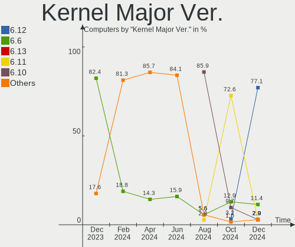
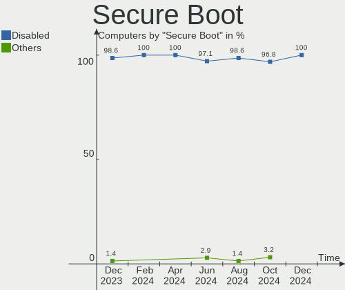
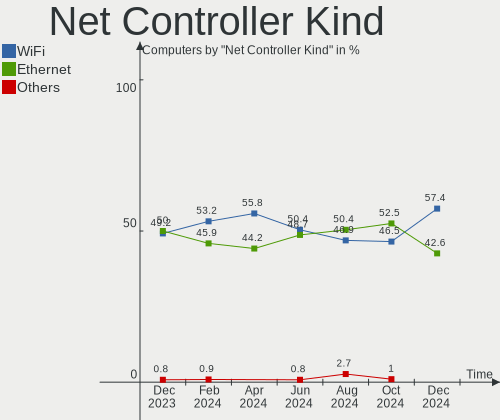

EndeavourOS - Hardware Trends
-----------------------------

A project to identify most popular hardware characteristics and track their change
over time based on data collected by Linux users at https://Linux-Hardware.org.

Anyone can contribute to this report by the [hw-probe](https://github.com/linuxhw/hw-probe) tool:

    sudo -E hw-probe -all -upload

This is a report for all computer types. See also reports for [desktops](/Dist/EndeavourOS/Desktop/README.md) and [notebooks](/Dist/EndeavourOS/Notebook/README.md).

This report is for one last month. Overall report since the beginning of time: [TestDays](https://github.com/linuxhw/TestDays)

Period: Sep, 2023.

Contents
--------

* [ System ](#system)
  - [ OS                       ](#os)
  - [ OS Family                ](#os-family)
  - [ Kernel                   ](#kernel)
  - [ Kernel Family            ](#kernel-family)
  - [ Kernel Major Ver.        ](#kernel-major-ver)
  - [ Arch                     ](#arch)
  - [ DE                       ](#de)
  - [ Display Server           ](#display-server)
  - [ Display Manager          ](#display-manager)
  - [ OS Lang                  ](#os-lang)
  - [ Boot Mode                ](#boot-mode)
  - [ Filesystem               ](#filesystem)
  - [ Part. scheme             ](#part-scheme)
  - [ Dual Boot with Linux/BSD ](#dual-boot-with-linuxbsd)
  - [ Dual Boot (Win)          ](#dual-boot-win)

* [ Board ](#board)
  - [ Vendor                   ](#vendor)
  - [ Model                    ](#model)
  - [ Model Family             ](#model-family)
  - [ MFG Year                 ](#mfg-year)
  - [ Form Factor              ](#form-factor)
  - [ Secure Boot              ](#secure-boot)
  - [ Coreboot                 ](#coreboot)
  - [ RAM Size                 ](#ram-size)
  - [ RAM Used                 ](#ram-used)
  - [ Total Drives             ](#total-drives)
  - [ Has CD-ROM               ](#has-cd-rom)
  - [ Has Ethernet             ](#has-ethernet)
  - [ Has WiFi                 ](#has-wifi)
  - [ Has Bluetooth            ](#has-bluetooth)

* [ Location ](#location)
  - [ Country                  ](#country)
  - [ City                     ](#city)

* [ Drives ](#drives)
  - [ Drive Vendor             ](#drive-vendor)
  - [ Drive Model              ](#drive-model)
  - [ HDD Vendor               ](#hdd-vendor)
  - [ SSD Vendor               ](#ssd-vendor)
  - [ Drive Kind               ](#drive-kind)
  - [ Drive Connector          ](#drive-connector)
  - [ Drive Size               ](#drive-size)
  - [ Space Total              ](#space-total)
  - [ Space Used               ](#space-used)
  - [ Malfunc. Drives          ](#malfunc-drives)
  - [ Malfunc. Drive Vendor    ](#malfunc-drive-vendor)
  - [ Malfunc. HDD Vendor      ](#malfunc-hdd-vendor)
  - [ Malfunc. Drive Kind      ](#malfunc-drive-kind)
  - [ Failed Drives            ](#failed-drives)
  - [ Failed Drive Vendor      ](#failed-drive-vendor)
  - [ Drive Status             ](#drive-status)

* [ Storage controller ](#storage-controller)
  - [ Storage Vendor           ](#storage-vendor)
  - [ Storage Model            ](#storage-model)
  - [ Storage Kind             ](#storage-kind)

* [ Processor ](#processor)
  - [ CPU Vendor               ](#cpu-vendor)
  - [ CPU Model                ](#cpu-model)
  - [ CPU Model Family         ](#cpu-model-family)
  - [ CPU Cores                ](#cpu-cores)
  - [ CPU Sockets              ](#cpu-sockets)
  - [ CPU Threads              ](#cpu-threads)
  - [ CPU Op-Modes             ](#cpu-op-modes)
  - [ CPU Microcode            ](#cpu-microcode)
  - [ CPU Microarch            ](#cpu-microarch)

* [ Graphics ](#graphics)
  - [ GPU Vendor               ](#gpu-vendor)
  - [ GPU Model                ](#gpu-model)
  - [ GPU Combo                ](#gpu-combo)
  - [ GPU Driver               ](#gpu-driver)
  - [ GPU Memory               ](#gpu-memory)

* [ Monitor ](#monitor)
  - [ Monitor Vendor           ](#monitor-vendor)
  - [ Monitor Model            ](#monitor-model)
  - [ Monitor Resolution       ](#monitor-resolution)
  - [ Monitor Diagonal         ](#monitor-diagonal)
  - [ Monitor Width            ](#monitor-width)
  - [ Aspect Ratio             ](#aspect-ratio)
  - [ Monitor Area             ](#monitor-area)
  - [ Pixel Density            ](#pixel-density)
  - [ Multiple Monitors        ](#multiple-monitors)

* [ Network ](#network)
  - [ Net Controller Vendor    ](#net-controller-vendor)
  - [ Net Controller Model     ](#net-controller-model)
  - [ Wireless Vendor          ](#wireless-vendor)
  - [ Wireless Model           ](#wireless-model)
  - [ Ethernet Vendor          ](#ethernet-vendor)
  - [ Ethernet Model           ](#ethernet-model)
  - [ Net Controller Kind      ](#net-controller-kind)
  - [ Used Controller          ](#used-controller)
  - [ NICs                     ](#nics)
  - [ IPv6                     ](#ipv6)

* [ Bluetooth ](#bluetooth)
  - [ Bluetooth Vendor         ](#bluetooth-vendor)
  - [ Bluetooth Model          ](#bluetooth-model)

* [ Sound ](#sound)
  - [ Sound Vendor             ](#sound-vendor)
  - [ Sound Model              ](#sound-model)

* [ Memory ](#memory)
  - [ Memory Vendor            ](#memory-vendor)
  - [ Memory Model             ](#memory-model)
  - [ Memory Kind              ](#memory-kind)
  - [ Memory Form Factor       ](#memory-form-factor)
  - [ Memory Size              ](#memory-size)
  - [ Memory Speed             ](#memory-speed)

* [ Printers & scanners ](#printers--scanners)
  - [ Printer Vendor           ](#printer-vendor)
  - [ Printer Model            ](#printer-model)
  - [ Scanner Vendor           ](#scanner-vendor)
  - [ Scanner Model            ](#scanner-model)

* [ Camera ](#camera)
  - [ Camera Vendor            ](#camera-vendor)
  - [ Camera Model             ](#camera-model)

* [ Security ](#security)
  - [ Fingerprint Vendor       ](#fingerprint-vendor)
  - [ Fingerprint Model        ](#fingerprint-model)
  - [ Chipcard Vendor          ](#chipcard-vendor)
  - [ Chipcard Model           ](#chipcard-model)

* [ Unsupported ](#unsupported)
  - [ Unsupported Devices      ](#unsupported-devices)
  - [ Unsupported Device Types ](#unsupported-device-types)

System
------

OS
--

Installed operating systems

| Name                | Computers | Percent |
|---------------------|-----------|---------|
| EndeavourOS Rolling | 68        | 100%    |

OS Family
---------

OS without a version

| Name        | Computers | Percent |
|-------------|-----------|---------|
| EndeavourOS | 68        | 100%    |

Kernel
------

Version of the Linux kernel

| Version                | Computers | Percent |
|------------------------|-----------|---------|
| 6.4.12-arch1-1         | 15        | 22.06%  |
| 6.5.3-arch1-1          | 12        | 17.65%  |
| 6.5.4-arch2-1          | 6         | 8.82%   |
| 6.4.12-zen1-1-zen      | 4         | 5.88%   |
| 6.5.5-arch1-1          | 3         | 4.41%   |
| 6.5.3-zen1-1-zen       | 3         | 4.41%   |
| 6.5.4-zen2-1.1-zen     | 2         | 2.94%   |
| 6.5.2-arch1-1          | 2         | 2.94%   |
| 6.5.1-1-cachyos        | 2         | 2.94%   |
| 6.4.12-arch1-1-surface | 2         | 2.94%   |
| 6.1.52-1-lts           | 2         | 2.94%   |
| 6.1.50-1-lts           | 2         | 2.94%   |
| 6.5.5-zen1-1-zen       | 1         | 1.47%   |
| 6.5.2-zen1-1-zen       | 1         | 1.47%   |
| 6.5.0-2-cachyos-tt     | 1         | 1.47%   |
| 6.5.0-1-mainline       | 1         | 1.47%   |
| 6.4.8-arch1-1          | 1         | 1.47%   |
| 6.4.4-arch1-1          | 1         | 1.47%   |
| 6.4.2-arch1-1          | 1         | 1.47%   |
| 6.4.14-x64v2-xanmod1-1 | 1         | 1.47%   |
| 6.4.11-arch2-1         | 1         | 1.47%   |
| 6.1.53-1-lts           | 1         | 1.47%   |
| 6.1.38-1-lts           | 1         | 1.47%   |
| 6.1.26-1-lts           | 1         | 1.47%   |
| 6.1.21-1-lts           | 1         | 1.47%   |

Kernel Family
-------------

Linux kernel without a distro release

| Version | Computers | Percent |
|---------|-----------|---------|
| 6.4.12  | 21        | 30.88%  |
| 6.5.3   | 15        | 22.06%  |
| 6.5.4   | 8         | 11.76%  |
| 6.5.5   | 4         | 5.88%   |
| 6.5.2   | 3         | 4.41%   |
| 6.5.1   | 2         | 2.94%   |
| 6.5.0   | 2         | 2.94%   |
| 6.1.52  | 2         | 2.94%   |
| 6.1.50  | 2         | 2.94%   |
| 6.4.8   | 1         | 1.47%   |
| 6.4.4   | 1         | 1.47%   |
| 6.4.2   | 1         | 1.47%   |
| 6.4.14  | 1         | 1.47%   |
| 6.4.11  | 1         | 1.47%   |
| 6.1.53  | 1         | 1.47%   |
| 6.1.38  | 1         | 1.47%   |
| 6.1.26  | 1         | 1.47%   |
| 6.1.21  | 1         | 1.47%   |

Kernel Major Ver.
-----------------

Linux kernel major version

| Version | Computers | Percent |
|---------|-----------|---------|
| 6.5     | 34        | 50%     |
| 6.4     | 26        | 38.24%  |
| 6.1     | 8         | 11.76%  |

Arch
----

OS architecture (x86_64, i586, etc.)

| Name   | Computers | Percent |
|--------|-----------|---------|
| x86_64 | 68        | 100%    |

DE
--

Desktop Environment

| Name       | Computers | Percent |
|------------|-----------|---------|
| KDE5       | 38        | 55.88%  |
| GNOME      | 13        | 19.12%  |
| XFCE       | 8         | 11.76%  |
| i3         | 4         | 5.88%   |
| X-Cinnamon | 2         | 2.94%   |
| MATE       | 1         | 1.47%   |
| Cinnamon   | 1         | 1.47%   |
| Budgie     | 1         | 1.47%   |

Display Server
--------------

X11 or Wayland

| Name    | Computers | Percent |
|---------|-----------|---------|
| X11     | 41        | 60.29%  |
| Wayland | 22        | 32.35%  |
| Unknown | 3         | 4.41%   |
| Tty     | 2         | 2.94%   |

Display Manager
---------------

SDDM, LightDM, etc.

| Name    | Computers | Percent |
|---------|-----------|---------|
| LightDM | 26        | 38.24%  |
| Unknown | 20        | 29.41%  |
| SDDM    | 17        | 25%     |
| GDM     | 4         | 5.88%   |
| LY-DM   | 1         | 1.47%   |

OS Lang
-------

Language

| Lang    | Computers | Percent |
|---------|-----------|---------|
| en_US   | 32        | 47.06%  |
| en_CA   | 6         | 8.82%   |
| en_IN   | 5         | 7.35%   |
| en_GB   | 5         | 7.35%   |
| de_DE   | 4         | 5.88%   |
| ru_RU   | 3         | 4.41%   |
| nl_NL   | 2         | 2.94%   |
| zh_CN   | 1         | 1.47%   |
| pt_BR   | 1         | 1.47%   |
| pl_PL   | 1         | 1.47%   |
| it_IT   | 1         | 1.47%   |
| fr_FR   | 1         | 1.47%   |
| fi_FI   | 1         | 1.47%   |
| es_MX   | 1         | 1.47%   |
| es_CO   | 1         | 1.47%   |
| en_BW   | 1         | 1.47%   |
| de_AT   | 1         | 1.47%   |
| Unknown | 1         | 1.47%   |

Boot Mode
---------

EFI or BIOS

| Mode | Computers | Percent |
|------|-----------|---------|
| EFI  | 43        | 63.24%  |
| BIOS | 25        | 36.76%  |

Filesystem
----------

Type of filesystem

| Type    | Computers | Percent |
|---------|-----------|---------|
| Ext4    | 46        | 67.65%  |
| Btrfs   | 20        | 29.41%  |
| Tmpfs   | 1         | 1.47%   |
| Overlay | 1         | 1.47%   |

Part. scheme
------------

Scheme of partitioning

| Type    | Computers | Percent |
|---------|-----------|---------|
| GPT     | 46        | 67.65%  |
| Unknown | 20        | 29.41%  |
| MBR     | 2         | 2.94%   |

Dual Boot with Linux/BSD
------------------------

Hosting more than one Linux/BSD

| Dual boot | Computers | Percent |
|-----------|-----------|---------|
| No        | 60        | 88.24%  |
| Yes       | 8         | 11.76%  |

Dual Boot (Win)
---------------

Hosting Linux and Windows

| Dual boot | Computers | Percent |
|-----------|-----------|---------|
| No        | 44        | 64.71%  |
| Yes       | 24        | 35.29%  |

Board
-----

Vendor
------

Motherboard manufacturer

| Name                | Computers | Percent |
|---------------------|-----------|---------|
| ASUSTek Computer    | 19        | 27.94%  |
| Lenovo              | 10        | 14.71%  |
| Hewlett-Packard     | 9         | 13.24%  |
| MSI                 | 6         | 8.82%   |
| Gigabyte Technology | 5         | 7.35%   |
| Dell                | 5         | 7.35%   |
| Acer                | 5         | 7.35%   |
| Sony                | 2         | 2.94%   |
| Microsoft           | 2         | 2.94%   |
| ASRock              | 2         | 2.94%   |
| Timi                | 1         | 1.47%   |
| Positivo            | 1         | 1.47%   |
| Apple               | 1         | 1.47%   |

Model
-----

Motherboard model

| Name                                        | Computers | Percent |
|---------------------------------------------|-----------|---------|
| Microsoft Surface Laptop Go                 | 2         | 2.94%   |
| ASUS PRIME A320M-K                          | 2         | 2.94%   |
| Timi Mi NoteBook Ultra                      | 1         | 1.47%   |
| Sony SVE1713X1EB                            | 1         | 1.47%   |
| Sony SVE1513B1EW                            | 1         | 1.47%   |
| Positivo POS-PIH81DI                        | 1         | 1.47%   |
| MSI MS-7D85                                 | 1         | 1.47%   |
| MSI MS-7C94                                 | 1         | 1.47%   |
| MSI MS-7821                                 | 1         | 1.47%   |
| MSI GS75 Stealth 8SG                        | 1         | 1.47%   |
| MSI GS63VR 6RF                              | 1         | 1.47%   |
| MSI GL73 8RE                                | 1         | 1.47%   |
| Lenovo ThinkPad X1 Carbon 6th 20KGS0AB00    | 1         | 1.47%   |
| Lenovo ThinkPad P16s Gen 1 21BTCTO1WW       | 1         | 1.47%   |
| Lenovo ThinkPad P14s Gen 4 21K5CTO1WW       | 1         | 1.47%   |
| Lenovo ThinkPad P14s Gen 4 21HF000KGE       | 1         | 1.47%   |
| Lenovo ThinkPad E495 20NES07V00             | 1         | 1.47%   |
| Lenovo ThinkPad E14 20RAS04C00              | 1         | 1.47%   |
| Lenovo IdeaPad 720S-13IKB 81BV              | 1         | 1.47%   |
| Lenovo IdeaPad 5 14ITL05 82FE               | 1         | 1.47%   |
| Lenovo IdeaPad 320-15ISK 80XH               | 1         | 1.47%   |
| Lenovo IdeaPad 3 15IIL05 81WE               | 1         | 1.47%   |
| HP Z440 Workstation                         | 1         | 1.47%   |
| HP Pavilion Gaming Laptop 17-cd2xxx         | 1         | 1.47%   |
| HP Pavilion Aero Laptop 13z-be200           | 1         | 1.47%   |
| HP EliteBook 865 16 inch G9 Notebook PC     | 1         | 1.47%   |
| HP EliteBook 845 14 inch G10 Notebook PC    | 1         | 1.47%   |
| HP Elite Dragonfly 13.5 inch G3 Notebook PC | 1         | 1.47%   |
| HP Dragonfly Pro                            | 1         | 1.47%   |
| HP 255 G8 Notebook PC                       | 1         | 1.47%   |
| HP 245 14 inch G9 Notebook PC               | 1         | 1.47%   |
| Gigabyte X670 AORUS ELITE AX                | 1         | 1.47%   |
| Gigabyte P55A-UD3                           | 1         | 1.47%   |
| Gigabyte B550 AORUS ELITE V2                | 1         | 1.47%   |
| Gigabyte B250M-D3H                          | 1         | 1.47%   |
| Gigabyte AERO 15-X9                         | 1         | 1.47%   |
| Dell Precision 7710                         | 1         | 1.47%   |
| Dell Latitude E5470                         | 1         | 1.47%   |
| Dell Latitude 5410                          | 1         | 1.47%   |
| Dell G5 5505                                | 1         | 1.47%   |

Model Family
------------

Motherboard model prefix

| Name                 | Computers | Percent |
|----------------------|-----------|---------|
| Lenovo ThinkPad      | 6         | 8.82%   |
| ASUS PRIME           | 6         | 8.82%   |
| Lenovo IdeaPad       | 4         | 5.88%   |
| ASUS ZenBook         | 4         | 5.88%   |
| ASUS ROG             | 3         | 4.41%   |
| Microsoft Surface    | 2         | 2.94%   |
| HP Pavilion          | 2         | 2.94%   |
| HP EliteBook         | 2         | 2.94%   |
| Dell Latitude        | 2         | 2.94%   |
| Dell G5              | 2         | 2.94%   |
| ASUS VivoBook        | 2         | 2.94%   |
| ASUS TUF             | 2         | 2.94%   |
| ASRock B450M         | 2         | 2.94%   |
| Acer Aspire          | 2         | 2.94%   |
| Timi Mi              | 1         | 1.47%   |
| Sony SVE1713X1EB     | 1         | 1.47%   |
| Sony SVE1513B1EW     | 1         | 1.47%   |
| Positivo POS-PIH81DI | 1         | 1.47%   |
| MSI MS-7D85          | 1         | 1.47%   |
| MSI MS-7C94          | 1         | 1.47%   |
| MSI MS-7821          | 1         | 1.47%   |
| MSI GS75             | 1         | 1.47%   |
| MSI GS63VR           | 1         | 1.47%   |
| MSI GL73             | 1         | 1.47%   |
| HP Z440              | 1         | 1.47%   |
| HP Elite             | 1         | 1.47%   |
| HP Dragonfly         | 1         | 1.47%   |
| HP 255               | 1         | 1.47%   |
| HP 245               | 1         | 1.47%   |
| Gigabyte X670        | 1         | 1.47%   |
| Gigabyte P55A-UD3    | 1         | 1.47%   |
| Gigabyte B550        | 1         | 1.47%   |
| Gigabyte B250M-D3H   | 1         | 1.47%   |
| Gigabyte AERO        | 1         | 1.47%   |
| Dell Precision       | 1         | 1.47%   |
| ASUS Z170M-PLUS      | 1         | 1.47%   |
| ASUS N750JV          | 1         | 1.47%   |
| Apple MacBookAir7    | 1         | 1.47%   |
| Acer Switch          | 1         | 1.47%   |
| Acer Swift           | 1         | 1.47%   |

MFG Year
--------

Motherboard manufacture year

| Year | Computers | Percent |
|------|-----------|---------|
| 2020 | 12        | 17.65%  |
| 2022 | 11        | 16.18%  |
| 2023 | 9         | 13.24%  |
| 2019 | 7         | 10.29%  |
| 2017 | 6         | 8.82%   |
| 2021 | 5         | 7.35%   |
| 2018 | 5         | 7.35%   |
| 2016 | 4         | 5.88%   |
| 2015 | 3         | 4.41%   |
| 2013 | 2         | 2.94%   |
| 2012 | 2         | 2.94%   |
| 2014 | 1         | 1.47%   |
| 2009 | 1         | 1.47%   |

Form Factor
-----------

Physical design of the computer

| Name     | Computers | Percent |
|----------|-----------|---------|
| Notebook | 41        | 60.29%  |
| Desktop  | 24        | 35.29%  |
| Tablet   | 3         | 4.41%   |

Secure Boot
-----------

Enabled or disabled

| State    | Computers | Percent |
|----------|-----------|---------|
| Disabled | 67        | 98.53%  |
| Enabled  | 1         | 1.47%   |

Coreboot
--------

Have coreboot on board

| Used | Computers | Percent |
|------|-----------|---------|
| No   | 68        | 100%    |

RAM Size
--------

Total RAM memory

| Size in GB  | Computers | Percent |
|-------------|-----------|---------|
| 32.01-64.0  | 17        | 25%     |
| 16.01-24.0  | 17        | 25%     |
| 8.01-16.0   | 17        | 25%     |
| 4.01-8.0    | 7         | 10.29%  |
| 64.01-256.0 | 5         | 7.35%   |
| 24.01-32.0  | 4         | 5.88%   |
| 3.01-4.0    | 1         | 1.47%   |

RAM Used
--------

Used RAM memory

| Used GB    | Computers | Percent |
|------------|-----------|---------|
| 4.01-8.0   | 25        | 36.76%  |
| 3.01-4.0   | 19        | 27.94%  |
| 2.01-3.0   | 11        | 16.18%  |
| 1.01-2.0   | 5         | 7.35%   |
| 8.01-16.0  | 5         | 7.35%   |
| 16.01-24.0 | 2         | 2.94%   |
| 0.51-1.0   | 1         | 1.47%   |

Total Drives
------------

Number of drives on board

| Drives | Computers | Percent |
|--------|-----------|---------|
| 1      | 32        | 47.06%  |
| 2      | 21        | 30.88%  |
| 4      | 5         | 7.35%   |
| 3      | 5         | 7.35%   |
| 6      | 3         | 4.41%   |
| 5      | 2         | 2.94%   |

Has CD-ROM
----------

Has CD-ROM on board

| Presented | Computers | Percent |
|-----------|-----------|---------|
| No        | 64        | 94.12%  |
| Yes       | 4         | 5.88%   |

Has Ethernet
------------

Has Ethernet on board

| Presented | Computers | Percent |
|-----------|-----------|---------|
| Yes       | 51        | 75%     |
| No        | 17        | 25%     |

Has WiFi
--------

Has WiFi module

| Presented | Computers | Percent |
|-----------|-----------|---------|
| Yes       | 58        | 85.29%  |
| No        | 10        | 14.71%  |

Has Bluetooth
-------------

Has Bluetooth module

| Presented | Computers | Percent |
|-----------|-----------|---------|
| Yes       | 55        | 80.88%  |
| No        | 13        | 19.12%  |

Location
--------

Country
-------

Geographic location (country)

| Country      | Computers | Percent |
|--------------|-----------|---------|
| USA          | 17        | 25%     |
| Germany      | 6         | 8.82%   |
| Mexico       | 5         | 7.35%   |
| India        | 5         | 7.35%   |
| Canada       | 5         | 7.35%   |
| Russia       | 4         | 5.88%   |
| UK           | 3         | 4.41%   |
| Turkey       | 3         | 4.41%   |
| Italy        | 3         | 4.41%   |
| France       | 2         | 2.94%   |
| Colombia     | 2         | 2.94%   |
| Austria      | 2         | 2.94%   |
| Vietnam      | 1         | 1.47%   |
| South Africa | 1         | 1.47%   |
| Slovakia     | 1         | 1.47%   |
| Romania      | 1         | 1.47%   |
| Poland       | 1         | 1.47%   |
| New Zealand  | 1         | 1.47%   |
| Iran         | 1         | 1.47%   |
| Hungary      | 1         | 1.47%   |
| Finland      | 1         | 1.47%   |
| China        | 1         | 1.47%   |
| Brazil       | 1         | 1.47%   |

City
----

Geographic location (city)

| City                  | Computers | Percent |
|-----------------------|-----------|---------|
| San Luis Potosí City | 3         | 4.41%   |
| Frankfurt am Main     | 3         | 4.41%   |
| Vienna                | 2         | 2.94%   |
| Tucson                | 2         | 2.94%   |
| St Petersburg         | 2         | 2.94%   |
| Pierrefonds           | 2         | 2.94%   |
| Orlando               | 2         | 2.94%   |
| Bogotá               | 2         | 2.94%   |
| Yazd                  | 1         | 1.47%   |
| Wolfeboro             | 1         | 1.47%   |
| Waxahachie            | 1         | 1.47%   |
| Vechta                | 1         | 1.47%   |
| Vancouver             | 1         | 1.47%   |
| Turku                 | 1         | 1.47%   |
| Turin                 | 1         | 1.47%   |
| Słupsk               | 1         | 1.47%   |
| Seattle               | 1         | 1.47%   |
| Sao Paulo             | 1         | 1.47%   |
| Rennes                | 1         | 1.47%   |
| Pieve a Nievole       | 1         | 1.47%   |
| Piethen               | 1         | 1.47%   |
| Nadym                 | 1         | 1.47%   |
| Mugla                 | 1         | 1.47%   |
| Moscow                | 1         | 1.47%   |
| Monor                 | 1         | 1.47%   |
| Miami                 | 1         | 1.47%   |
| Mexico City           | 1         | 1.47%   |
| Mesa                  | 1         | 1.47%   |
| Mersin                | 1         | 1.47%   |
| Merced                | 1         | 1.47%   |
| Martinsville          | 1         | 1.47%   |
| Loupian               | 1         | 1.47%   |
| Longueuil             | 1         | 1.47%   |
| Livermore             | 1         | 1.47%   |
| Leicester             | 1         | 1.47%   |
| Kosekoy               | 1         | 1.47%   |
| Kochi                 | 1         | 1.47%   |
| Hyderabad             | 1         | 1.47%   |
| Harringay             | 1         | 1.47%   |
| Hanoi                 | 1         | 1.47%   |

Drives
------

Drive Vendor
------------

Hard drive vendors

| Vendor                       | Computers | Drives | Percent |
|------------------------------|-----------|--------|---------|
| Samsung Electronics          | 24        | 31     | 18.9%   |
| WDC                          | 11        | 12     | 8.66%   |
| SanDisk                      | 11        | 12     | 8.66%   |
| SK hynix                     | 10        | 10     | 7.87%   |
| Seagate                      | 10        | 11     | 7.87%   |
| Kingston                     | 6         | 6      | 4.72%   |
| Intel                        | 6         | 6      | 4.72%   |
| Micron Technology            | 5         | 5      | 3.94%   |
| Unknown                      | 4         | 4      | 3.15%   |
| Toshiba                      | 4         | 4      | 3.15%   |
| KIOXIA                       | 4         | 4      | 3.15%   |
| Crucial                      | 4         | 4      | 3.15%   |
| A-DATA Technology            | 3         | 4      | 2.36%   |
| Patriot                      | 2         | 2      | 1.57%   |
| Micron/Crucial Technology    | 2         | 2      | 1.57%   |
| Kingston Technology Company  | 2         | 2      | 1.57%   |
| Apple                        | 2         | 2      | 1.57%   |
| Yangtze Memory Technologies  | 1         | 1      | 0.79%   |
| SPCC                         | 1         | 1      | 0.79%   |
| Silicon Motion               | 1         | 1      | 0.79%   |
| Shenzhen Longsys Electronics | 1         | 1      | 0.79%   |
| Seagate Technology           | 1         | 1      | 0.79%   |
| Realtek Semiconductor        | 1         | 1      | 0.79%   |
| Realtek                      | 1         | 1      | 0.79%   |
| Phison Electronics           | 1         | 1      | 0.79%   |
| Phison                       | 1         | 1      | 0.79%   |
| MAXIO Technology (Hangzhou)  | 1         | 1      | 0.79%   |
| JMicron Technology           | 1         | 1      | 0.79%   |
| Hitachi                      | 1         | 2      | 0.79%   |
| G-DRIVE                      | 1         | 1      | 0.79%   |
| Corsair                      | 1         | 1      | 0.79%   |
| China                        | 1         | 1      | 0.79%   |
| ASMT                         | 1         | 1      | 0.79%   |
| ADATA Technology             | 1         | 1      | 0.79%   |

Drive Model
-----------

Hard drive models

| Model                                               | Computers | Percent |
|-----------------------------------------------------|-----------|---------|
| Samsung NVMe SSD Controller SM981/PM981/PM983 256GB | 5         | 3.7%    |
| Samsung NVMe SSD Controller PM9A1/PM9A3/980PRO 1TB  | 5         | 3.7%    |
| Kingston SA400S37240G 240GB SSD                     | 5         | 3.7%    |
| Intel SSD Pro 7600p/760p/E 6100p Series 1TB         | 4         | 2.96%   |
| Samsung SSD 980 1TB                                 | 3         | 2.22%   |
| SK hynix SC308 SATA 256GB SSD                       | 2         | 1.48%   |
| SK hynix HFM512GD3JX013N 512GB                      | 2         | 1.48%   |
| SK hynix C2S3T/240G 240GB                           | 2         | 1.48%   |
| SK hynix BC501 NVMe Solid State Drive 512GB         | 2         | 1.48%   |
| Seagate ST500LT012-9WS142 500GB                     | 2         | 1.48%   |
| Seagate ST2000DM008-2FR102 2TB                      | 2         | 1.48%   |
| Sandisk WD Black SN850 1TB                          | 2         | 1.48%   |
| Samsung HD103SJ 1TB                                 | 2         | 1.48%   |
| Patriot Burst Elite 960GB SSD                       | 2         | 1.48%   |
| Micron/Crucial P2 NVMe PCIe SSD 1TB                 | 2         | 1.48%   |
| Kingston Company SNV2S1000G 1TB                     | 2         | 1.48%   |
| A-DATA HV300 500GB SSD                              | 2         | 1.48%   |
| Yangtze Memory YMTC PC005 512GB                     | 1         | 0.74%   |
| WDC WDS240G2G0B-00EPW0 240GB SSD                    | 1         | 0.74%   |
| WDC WDS120G2G0A-00JH30 120GB SSD                    | 1         | 0.74%   |
| WDC WDS100T2B0A-00SM50 1TB SSD                      | 1         | 0.74%   |
| WDC WD4005FZBX-00K5WB0 4TB                          | 1         | 0.74%   |
| WDC WD20PURX-64P6ZY0 2TB                            | 1         | 0.74%   |
| WDC WD20EARX-00PASB0 2TB                            | 1         | 0.74%   |
| WDC WD10SPZX-08Z10 1TB                              | 1         | 0.74%   |
| WDC WD10EZEX-60ZF5A0 1TB                            | 1         | 0.74%   |
| WDC WD10EZEX-22MFCA0 1TB                            | 1         | 0.74%   |
| WDC WD10EZEX-21WN4A0 1TB                            | 1         | 0.74%   |
| WDC WD10EZEX-08WN4A0 1TB                            | 1         | 0.74%   |
| WDC WD10EZEX-00BN5A0 1TB                            | 1         | 0.74%   |
| Unknown SD/MMC/MS PRO 128GB                         | 1         | 0.74%   |
| Unknown MMC Card  64GB                              | 1         | 0.74%   |
| Unknown MMC Card  256GB                             | 1         | 0.74%   |
| Unknown MMC Card  196GB                             | 1         | 0.74%   |
| Toshiba XG6 NVMe SSD Controller 512GB               | 1         | 0.74%   |
| Toshiba MQ01ABD100 1TB                              | 1         | 0.74%   |
| Toshiba MQ01ABD050 500GB                            | 1         | 0.74%   |
| Toshiba BG3 NVMe SSD Controller 512GB               | 1         | 0.74%   |
| SPCC Solid State Disk 1TB                           | 1         | 0.74%   |
| SK hynix SC300 2.5 7MM 128GB SSD                    | 1         | 0.74%   |

HDD Vendor
----------

Hard disk drive vendors

| Vendor              | Computers | Drives | Percent |
|---------------------|-----------|--------|---------|
| Seagate             | 10        | 11     | 40%     |
| WDC                 | 8         | 9      | 32%     |
| Toshiba             | 2         | 2      | 8%      |
| Samsung Electronics | 2         | 2      | 8%      |
| Unknown             | 1         | 1      | 4%      |
| Hitachi             | 1         | 2      | 4%      |
| Apple               | 1         | 1      | 4%      |

SSD Vendor
----------

Solid state drive vendors

| Vendor              | Computers | Drives | Percent |
|---------------------|-----------|--------|---------|
| Samsung Electronics | 8         | 9      | 20%     |
| SK hynix            | 6         | 6      | 15%     |
| Kingston            | 5         | 5      | 12.5%   |
| Crucial             | 4         | 4      | 10%     |
| WDC                 | 3         | 3      | 7.5%    |
| A-DATA Technology   | 3         | 4      | 7.5%    |
| SanDisk             | 2         | 2      | 5%      |
| Patriot             | 2         | 2      | 5%      |
| Micron Technology   | 2         | 2      | 5%      |
| SPCC                | 1         | 1      | 2.5%    |
| Corsair             | 1         | 1      | 2.5%    |
| China               | 1         | 1      | 2.5%    |
| ASMT                | 1         | 1      | 2.5%    |
| Apple               | 1         | 1      | 2.5%    |

Drive Kind
----------

HDD or SSD

| Kind    | Computers | Drives | Percent |
|---------|-----------|--------|---------|
| NVMe    | 52        | 64     | 49.06%  |
| SSD     | 27        | 42     | 25.47%  |
| HDD     | 22        | 28     | 20.75%  |
| MMC     | 3         | 3      | 2.83%   |
| Unknown | 2         | 2      | 1.89%   |

Drive Connector
---------------

SATA, SAS, NVMe, etc.

| Type | Computers | Drives | Percent |
|------|-----------|--------|---------|
| NVMe | 52        | 63     | 54.74%  |
| SATA | 33        | 65     | 34.74%  |
| SAS  | 7         | 8      | 7.37%   |
| MMC  | 3         | 3      | 3.16%   |

Drive Size
----------

Size of hard drive

| Size in TB | Computers | Drives | Percent |
|------------|-----------|--------|---------|
| 0.01-0.5   | 22        | 34     | 42.31%  |
| 0.51-1.0   | 20        | 26     | 38.46%  |
| 1.01-2.0   | 8         | 8      | 15.38%  |
| 3.01-4.0   | 1         | 1      | 1.92%   |
| 10.01-20.0 | 1         | 1      | 1.92%   |

Space Total
-----------

Amount of disk space available on the file system

| Size in GB     | Computers | Percent |
|----------------|-----------|---------|
| 501-1000       | 16        | 23.53%  |
| 101-250        | 14        | 20.59%  |
| 1001-2000      | 14        | 20.59%  |
| 251-500        | 9         | 13.24%  |
| More than 3000 | 6         | 8.82%   |
| 1-20           | 3         | 4.41%   |
| 2001-3000      | 2         | 2.94%   |
| 51-100         | 2         | 2.94%   |
| Unknown        | 2         | 2.94%   |

Space Used
----------

Amount of used disk space

| Used GB        | Computers | Percent |
|----------------|-----------|---------|
| 21-50          | 12        | 17.65%  |
| 251-500        | 11        | 16.18%  |
| 101-250        | 10        | 14.71%  |
| 501-1000       | 10        | 14.71%  |
| 51-100         | 9         | 13.24%  |
| 1-20           | 8         | 11.76%  |
| 1001-2000      | 3         | 4.41%   |
| 2001-3000      | 2         | 2.94%   |
| Unknown        | 2         | 2.94%   |
| More than 3000 | 1         | 1.47%   |

Malfunc. Drives
---------------

Drive models with a malfunction

| Model                                                           | Computers | Drives | Percent |
|-----------------------------------------------------------------|-----------|--------|---------|
| Toshiba MQ01ABD050 500GB                                        | 1         | 1      | 16.67%  |
| Seagate ST500LT012-9WS142 500GB                                 | 1         | 1      | 16.67%  |
| Seagate ST1000LM035-1RK172 1TB                                  | 1         | 1      | 16.67%  |
| Samsung Electronics NVMe SSD Controller SM981/PM981/PM983 256GB | 1         | 1      | 16.67%  |
| Crucial CT500MX500SSD1 500GB                                    | 1         | 1      | 16.67%  |
| Corsair Force LS SSD 120GB                                      | 1         | 1      | 16.67%  |

Malfunc. Drive Vendor
---------------------

Vendors of faulty drives

| Vendor              | Computers | Drives | Percent |
|---------------------|-----------|--------|---------|
| Seagate             | 2         | 2      | 33.33%  |
| Toshiba             | 1         | 1      | 16.67%  |
| Samsung Electronics | 1         | 1      | 16.67%  |
| Crucial             | 1         | 1      | 16.67%  |
| Corsair             | 1         | 1      | 16.67%  |

Malfunc. HDD Vendor
-------------------

Vendors of faulty HDD drives

| Vendor  | Computers | Drives | Percent |
|---------|-----------|--------|---------|
| Seagate | 2         | 2      | 66.67%  |
| Toshiba | 1         | 1      | 33.33%  |

Malfunc. Drive Kind
-------------------

Kinds of faulty drives

| Kind | Computers | Drives | Percent |
|------|-----------|--------|---------|
| HDD  | 3         | 3      | 50%     |
| SSD  | 2         | 2      | 33.33%  |
| NVMe | 1         | 1      | 16.67%  |

Failed Drives
-------------

Failed drive models

Zero info for selected period =(

Failed Drive Vendor
-------------------

Failed drive vendors

Zero info for selected period =(

Drive Status
------------

Number of failed and malfunc. drives

| Status   | Computers | Drives | Percent |
|----------|-----------|--------|---------|
| Works    | 46        | 80     | 60.53%  |
| Detected | 24        | 53     | 31.58%  |
| Malfunc  | 6         | 6      | 7.89%   |

Storage controller
------------------

Storage Vendor
--------------

Storage controller vendors

| Vendor                       | Computers | Percent |
|------------------------------|-----------|---------|
| Intel                        | 35        | 33.02%  |
| Samsung Electronics          | 17        | 16.04%  |
| AMD                          | 17        | 16.04%  |
| SanDisk                      | 9         | 8.49%   |
| SK hynix                     | 4         | 3.77%   |
| KIOXIA                       | 4         | 3.77%   |
| Micron Technology            | 3         | 2.83%   |
| Kingston Technology Company  | 3         | 2.83%   |
| Toshiba America Info Systems | 2         | 1.89%   |
| Phison Electronics           | 2         | 1.89%   |
| Micron/Crucial Technology    | 2         | 1.89%   |
| Yangtze Memory Technologies  | 1         | 0.94%   |
| Silicon Motion               | 1         | 0.94%   |
| Shenzhen Longsys Electronics | 1         | 0.94%   |
| Seagate Technology           | 1         | 0.94%   |
| Realtek Semiconductor        | 1         | 0.94%   |
| MAXIO Technology (Hangzhou)  | 1         | 0.94%   |
| ASMedia Technology           | 1         | 0.94%   |
| ADATA Technology             | 1         | 0.94%   |

Storage Model
-------------

Storage controller models

| Model                                                                          | Computers | Percent |
|--------------------------------------------------------------------------------|-----------|---------|
| AMD FCH SATA Controller [AHCI mode]                                            | 13        | 11.02%  |
| Samsung NVMe SSD Controller 980                                                | 7         | 5.93%   |
| Samsung NVMe SSD Controller SM981/PM981/PM983                                  | 5         | 4.24%   |
| Samsung NVMe SSD Controller PM9A1/PM9A3/980PRO                                 | 5         | 4.24%   |
| Intel Volume Management Device NVMe RAID Controller                            | 5         | 4.24%   |
| Intel SSD DC P4101/Pro 7600p/760p/E 6100p Series                               | 4         | 3.39%   |
| AMD 400 Series Chipset SATA Controller                                         | 4         | 3.39%   |
| KIOXIA NVMe SSD Controller BG4 (DRAM-less)                                     | 3         | 2.54%   |
| Intel Sunrise Point-LP SATA Controller [AHCI mode]                             | 3         | 2.54%   |
| Intel Q170/Q150/B150/H170/H110/Z170/CM236 Chipset SATA Controller [AHCI Mode]  | 3         | 2.54%   |
| Intel Comet Lake SATA AHCI Controller                                          | 3         | 2.54%   |
| Intel Cannon Lake Mobile PCH SATA AHCI Controller                              | 3         | 2.54%   |
| Intel 8 Series/C220 Series Chipset Family 6-port SATA Controller 1 [AHCI mode] | 3         | 2.54%   |
| SK hynix Gold P31/BC711/PC711 NVMe Solid State Drive                           | 2         | 1.69%   |
| SK hynix BC501 NVMe Solid State Drive                                          | 2         | 1.69%   |
| SanDisk WD PC SN810 / Black SN850 NVMe SSD                                     | 2         | 1.69%   |
| SanDisk WD Black SN770 / PC SN740 256GB / PC SN560 (DRAM-less) NVMe SSD        | 2         | 1.69%   |
| Micron/Crucial P2 [Nick P2] / P3 / P3 Plus NVMe PCIe SSD (DRAM-less)           | 2         | 1.69%   |
| Micron 2450 NVMe SSD [HendrixV] (DRAM-less)                                    | 2         | 1.69%   |
| Kingston Company Company Non-Volatile memory controller                        | 2         | 1.69%   |
| Intel 700 Series Chipset Family SATA AHCI Controller                           | 2         | 1.69%   |
| Intel 7 Series Chipset Family 6-port SATA Controller [AHCI mode]               | 2         | 1.69%   |
| AMD FCH SATA Controller D                                                      | 2         | 1.69%   |
| AMD 500 Series Chipset SATA Controller                                         | 2         | 1.69%   |
| Yangtze Memory PC005 NVMe SSD                                                  | 1         | 0.85%   |
| Toshiba America Info Systems XG6 NVMe SSD Controller                           | 1         | 0.85%   |
| Toshiba America Info Systems BG3 NVMe SSD Controller                           | 1         | 0.85%   |
| Silicon Motion SM2263EN/SM2263XT (DRAM-less) NVMe SSD Controllers              | 1         | 0.85%   |
| Shenzhen Longsys Lexar NM620 NVME SSD (DRAM-less)                              | 1         | 0.85%   |
| Seagate Non-Volatile memory controller                                         | 1         | 0.85%   |
| Sandisk Western Digital WD Black SN850X NVMe SSD                               | 1         | 0.85%   |
| SanDisk WD Blue SN550 NVMe SSD                                                 | 1         | 0.85%   |
| SanDisk WD Blue SN500 / PC SN520 NVMe SSD                                      | 1         | 0.85%   |
| SanDisk WD Black SN750 / PC SN730 NVMe SSD                                     | 1         | 0.85%   |
| SanDisk PC SN735 NVMe SSD (DRAM-less)                                          | 1         | 0.85%   |
| Samsung S4LN058A01[SSUBX] AHCI SSD Controller (Apple slot)                     | 1         | 0.85%   |
| Samsung NVMe SSD Controller S4LV008[Pascal]                                    | 1         | 0.85%   |
| Samsung NVMe SSD Controller PM9B1                                              | 1         | 0.85%   |
| Realtek RTS5765DL NVMe SSD Controller (DRAM-less)                              | 1         | 0.85%   |
| Phison PS5013 E13 NVMe Controller                                              | 1         | 0.85%   |

Storage Kind
------------

Kind of storage controller (IDE, SATA, NVMe, SAS, ...)

| Kind | Computers | Percent |
|------|-----------|---------|
| NVMe | 52        | 50.49%  |
| SATA | 45        | 43.69%  |
| RAID | 6         | 5.83%   |

Processor
---------

CPU Vendor
----------

Processor vendors

| Vendor | Computers | Percent |
|--------|-----------|---------|
| Intel  | 41        | 60.29%  |
| AMD    | 27        | 39.71%  |

CPU Model
---------

Processor models

| Model                                         | Computers | Percent |
|-----------------------------------------------|-----------|---------|
| Intel Core i7-8750H CPU @ 2.20GHz             | 3         | 4.41%   |
| Intel 12th Gen Core i5-1240P                  | 3         | 4.41%   |
| Intel Core i7-7700 CPU @ 3.60GHz              | 2         | 2.94%   |
| Intel Core i5-8250U CPU @ 1.60GHz             | 2         | 2.94%   |
| Intel Core i5-1035G1 CPU @ 1.00GHz            | 2         | 2.94%   |
| AMD Ryzen 9 5950X 16-Core Processor           | 2         | 2.94%   |
| AMD Ryzen 5 3600 6-Core Processor             | 2         | 2.94%   |
| AMD Ryzen 3 2200G with Radeon Vega Graphics   | 2         | 2.94%   |
| Intel Xeon CPU E5-1650 v3 @ 3.50GHz           | 1         | 1.47%   |
| Intel Pentium CPU N4200 @ 1.10GHz             | 1         | 1.47%   |
| Intel Pentium CPU 2020M @ 2.40GHz             | 1         | 1.47%   |
| Intel Core i9-9900K CPU @ 3.60GHz             | 1         | 1.47%   |
| Intel Core i7-8550U CPU @ 1.80GHz             | 1         | 1.47%   |
| Intel Core i7-6820HQ CPU @ 2.70GHz            | 1         | 1.47%   |
| Intel Core i7-6700HQ CPU @ 2.60GHz            | 1         | 1.47%   |
| Intel Core i7-4770K CPU @ 3.50GHz             | 1         | 1.47%   |
| Intel Core i7-4700HQ CPU @ 2.40GHz            | 1         | 1.47%   |
| Intel Core i7-3632QM CPU @ 2.20GHz            | 1         | 1.47%   |
| Intel Core i7-10700F CPU @ 2.90GHz            | 1         | 1.47%   |
| Intel Core i5-6600K CPU @ 3.50GHz             | 1         | 1.47%   |
| Intel Core i5-6200U CPU @ 2.30GHz             | 1         | 1.47%   |
| Intel Core i5-5250U CPU @ 1.60GHz             | 1         | 1.47%   |
| Intel Core i5-4460 CPU @ 3.20GHz              | 1         | 1.47%   |
| Intel Core i5-10310U CPU @ 1.70GHz            | 1         | 1.47%   |
| Intel Core i5-10210U CPU @ 1.60GHz            | 1         | 1.47%   |
| Intel Core i5 CPU 750 @ 2.67GHz               | 1         | 1.47%   |
| Intel Core i3-6006U CPU @ 2.00GHz             | 1         | 1.47%   |
| Intel Core i3-1005G1 CPU @ 1.20GHz            | 1         | 1.47%   |
| Intel 13th Gen Core i9-13900K                 | 1         | 1.47%   |
| Intel 13th Gen Core i7-1370P                  | 1         | 1.47%   |
| Intel 13th Gen Core i7-13700KF                | 1         | 1.47%   |
| Intel 12th Gen Core i7-1280P                  | 1         | 1.47%   |
| Intel 12th Gen Core i7-12650H                 | 1         | 1.47%   |
| Intel 12th Gen Core i5-1245U                  | 1         | 1.47%   |
| Intel 11th Gen Core i7-11370H @ 3.30GHz       | 1         | 1.47%   |
| Intel 11th Gen Core i5-1135G7 @ 2.40GHz       | 1         | 1.47%   |
| Intel 11th Gen Core i5-11300H @ 3.10GHz       | 1         | 1.47%   |
| AMD Ryzen 7 PRO 7840U w/ Radeon 780M Graphics | 1         | 1.47%   |
| AMD Ryzen 7 PRO 6850HS with Radeon Graphics   | 1         | 1.47%   |
| AMD Ryzen 7 7736U with Radeon Graphics        | 1         | 1.47%   |

CPU Model Family
----------------

Processor model prefix

| Model           | Computers | Percent |
|-----------------|-----------|---------|
| Other           | 12        | 17.65%  |
| Intel Core i7   | 12        | 17.65%  |
| Intel Core i5   | 11        | 16.18%  |
| AMD Ryzen 5     | 10        | 14.71%  |
| AMD Ryzen 7     | 9         | 13.24%  |
| AMD Ryzen 3     | 4         | 5.88%   |
| Intel Pentium   | 2         | 2.94%   |
| Intel Core i3   | 2         | 2.94%   |
| AMD Ryzen 9     | 2         | 2.94%   |
| AMD Ryzen 7 PRO | 2         | 2.94%   |
| Intel Xeon      | 1         | 1.47%   |
| Intel Core i9   | 1         | 1.47%   |

CPU Cores
---------

Number of processor cores

| Number | Computers | Percent |
|--------|-----------|---------|
| 4      | 24        | 35.29%  |
| 8      | 13        | 19.12%  |
| 6      | 13        | 19.12%  |
| 2      | 7         | 10.29%  |
| 16     | 3         | 4.41%   |
| 12     | 3         | 4.41%   |
| 14     | 2         | 2.94%   |
| 10     | 2         | 2.94%   |
| 24     | 1         | 1.47%   |

CPU Sockets
-----------

Number of sockets

| Number | Computers | Percent |
|--------|-----------|---------|
| 1      | 68        | 100%    |

CPU Threads
-----------

Threads per core (Hyper-Threading)

| Number | Computers | Percent |
|--------|-----------|---------|
| 2      | 59        | 86.76%  |
| 1      | 9         | 13.24%  |

CPU Op-Modes
------------

CPU Operation Modes (32-bit, 64-bit)

| Op mode        | Computers | Percent |
|----------------|-----------|---------|
| 32-bit, 64-bit | 68        | 100%    |

CPU Microcode
-------------

Microcode number

| Number     | Computers | Percent |
|------------|-----------|---------|
| Unknown    | 48        | 70.59%  |
| 0x0a404102 | 3         | 4.41%   |
| 0x08108109 | 3         | 4.41%   |
| 0x0a50000c | 2         | 2.94%   |
| 0x906a3    | 1         | 1.47%   |
| 0x106e5    | 1         | 1.47%   |
| 0x0a704103 | 1         | 1.47%   |
| 0x0a201204 | 1         | 1.47%   |
| 0x0a201025 | 1         | 1.47%   |
| 0x0a201009 | 1         | 1.47%   |
| 0x08701030 | 1         | 1.47%   |
| 0x08701021 | 1         | 1.47%   |
| 0x08600106 | 1         | 1.47%   |
| 0x08101016 | 1         | 1.47%   |
| 0x0800820d | 1         | 1.47%   |
| 0x08001138 | 1         | 1.47%   |

CPU Microarch
-------------

Microarchitecture

| Name             | Computers | Percent |
|------------------|-----------|---------|
| KabyLake         | 11        | 16.18%  |
| Unknown          | 11        | 16.18%  |
| Zen 3            | 9         | 13.24%  |
| Skylake          | 5         | 7.35%   |
| Alderlake Hybrid | 5         | 7.35%   |
| Zen+             | 4         | 5.88%   |
| Zen 2            | 4         | 5.88%   |
| Haswell          | 4         | 5.88%   |
| Zen              | 3         | 4.41%   |
| TigerLake        | 3         | 4.41%   |
| IceLake          | 3         | 4.41%   |
| IvyBridge        | 2         | 2.94%   |
| Nehalem          | 1         | 1.47%   |
| Goldmont         | 1         | 1.47%   |
| CometLake        | 1         | 1.47%   |
| Broadwell        | 1         | 1.47%   |

Graphics
--------

GPU Vendor
----------

Vendors of graphics cards

| Vendor | Computers | Percent |
|--------|-----------|---------|
| Intel  | 31        | 38.27%  |
| Nvidia | 28        | 34.57%  |
| AMD    | 22        | 27.16%  |

GPU Model
---------

Graphics card models

| Model                                                                       | Computers | Percent |
|-----------------------------------------------------------------------------|-----------|---------|
| Intel Alder Lake-P Integrated Graphics Controller                           | 4         | 4.71%   |
| AMD Rembrandt [Radeon 680M]                                                 | 4         | 4.71%   |
| Intel UHD Graphics 620                                                      | 3         | 3.53%   |
| Intel TigerLake-LP GT2 [Iris Xe Graphics]                                   | 3         | 3.53%   |
| Intel Iris Plus Graphics G1 (Ice Lake)                                      | 3         | 3.53%   |
| Intel CoffeeLake-H GT2 [UHD Graphics 630]                                   | 3         | 3.53%   |
| AMD Picasso/Raven 2 [Radeon Vega Series / Radeon Vega Mobile Series]        | 3         | 3.53%   |
| Nvidia TU106 [GeForce RTX 2060 Rev. A]                                      | 2         | 2.35%   |
| Nvidia GP106M [GeForce GTX 1060 Mobile]                                     | 2         | 2.35%   |
| Nvidia AD103 [GeForce RTX 4080]                                             | 2         | 2.35%   |
| Intel Xeon E3-1200 v3/4th Gen Core Processor Integrated Graphics Controller | 2         | 2.35%   |
| Intel HD Graphics 530                                                       | 2         | 2.35%   |
| Intel CometLake-U GT2 [UHD Graphics]                                        | 2         | 2.35%   |
| AMD Raven Ridge [Radeon Vega Series / Radeon Vega Mobile Series]            | 2         | 2.35%   |
| AMD Phoenix1                                                                | 2         | 2.35%   |
| AMD Navi 24 [Radeon RX 6400/6500 XT/6500M]                                  | 2         | 2.35%   |
| AMD Navi 10 [Radeon RX 5600 OEM/5600 XT / 5700/5700 XT]                     | 2         | 2.35%   |
| AMD Cezanne [Radeon Vega Series / Radeon Vega Mobile Series]                | 2         | 2.35%   |
| AMD Bonaire XTX [Radeon R7 260X/360]                                        | 2         | 2.35%   |
| AMD Barcelo                                                                 | 2         | 2.35%   |
| Nvidia TU117GLM [T550 Laptop GPU]                                           | 1         | 1.18%   |
| Nvidia TU116 [GeForce GTX 1660]                                             | 1         | 1.18%   |
| Nvidia TU116 [GeForce GTX 1660 Ti]                                          | 1         | 1.18%   |
| Nvidia TU106M [GeForce RTX 2070 Mobile]                                     | 1         | 1.18%   |
| Nvidia TU104M [GeForce RTX 2080 Mobile]                                     | 1         | 1.18%   |
| Nvidia TU104 [GeForce RTX 2070 SUPER]                                       | 1         | 1.18%   |
| Nvidia GP107 [GeForce GTX 1050 Ti]                                          | 1         | 1.18%   |
| Nvidia GP106 [GeForce GTX 1060 6GB]                                         | 1         | 1.18%   |
| Nvidia GP106 [GeForce GTX 1060 3GB]                                         | 1         | 1.18%   |
| Nvidia GP104 [GeForce GTX 1080]                                             | 1         | 1.18%   |
| Nvidia GM204GLM [Quadro M4000M]                                             | 1         | 1.18%   |
| Nvidia GM204GL [Quadro M4000]                                               | 1         | 1.18%   |
| Nvidia GM107 [GeForce GTX 750 Ti]                                           | 1         | 1.18%   |
| Nvidia GK107M [GeForce GT 750M]                                             | 1         | 1.18%   |
| Nvidia GA107M [GeForce RTX 3050 Ti Mobile]                                  | 1         | 1.18%   |
| Nvidia GA107GLM [RTX A500 Laptop GPU]                                       | 1         | 1.18%   |
| Nvidia GA106M [GeForce RTX 3060 Mobile / Max-Q]                             | 1         | 1.18%   |
| Nvidia GA106 [GeForce RTX 3060 Lite Hash Rate]                              | 1         | 1.18%   |
| Nvidia GA104 [Geforce RTX 3070 Ti Laptop GPU]                               | 1         | 1.18%   |
| Nvidia GA104 [GeForce RTX 3060 Ti Lite Hash Rate]                           | 1         | 1.18%   |

GPU Combo
---------

Combinations of graphics cards

| Name           | Computers | Percent |
|----------------|-----------|---------|
| 1 x Intel      | 20        | 29.41%  |
| 1 x Nvidia     | 16        | 23.53%  |
| 1 x AMD        | 16        | 23.53%  |
| Intel + Nvidia | 10        | 14.71%  |
| 2 x AMD        | 4         | 5.88%   |
| AMD + Nvidia   | 2         | 2.94%   |

GPU Driver
----------

Free vs proprietary

| Driver      | Computers | Percent |
|-------------|-----------|---------|
| Free        | 42        | 61.76%  |
| Proprietary | 26        | 38.24%  |

GPU Memory
----------

Total video memory

| Size in GB | Computers | Percent |
|------------|-----------|---------|
| Unknown    | 39        | 57.35%  |
| 5.01-6.0   | 6         | 8.82%   |
| 1.01-2.0   | 6         | 8.82%   |
| 7.01-8.0   | 5         | 7.35%   |
| 0.01-0.5   | 5         | 7.35%   |
| 8.01-16.0  | 4         | 5.88%   |
| 3.01-4.0   | 2         | 2.94%   |
| 2.01-3.0   | 1         | 1.47%   |

Monitor
-------

Monitor Vendor
--------------

Monitor vendors

| Vendor               | Computers | Percent |
|----------------------|-----------|---------|
| Samsung Electronics  | 14        | 16.67%  |
| LG Display           | 10        | 11.9%   |
| Chimei Innolux       | 9         | 10.71%  |
| AU Optronics         | 8         | 9.52%   |
| Goldstar             | 6         | 7.14%   |
| BOE                  | 5         | 5.95%   |
| Dell                 | 4         | 4.76%   |
| ASUSTek Computer     | 3         | 3.57%   |
| ___                  | 2         | 2.38%   |
| Unknown              | 2         | 2.38%   |
| TMX                  | 2         | 2.38%   |
| Lenovo               | 2         | 2.38%   |
| BenQ                 | 2         | 2.38%   |
| Ancor Communications | 2         | 2.38%   |
| ViewSonic            | 1         | 1.19%   |
| Sceptre Tech         | 1         | 1.19%   |
| Philips              | 1         | 1.19%   |
| PANDA                | 1         | 1.19%   |
| MiTAC                | 1         | 1.19%   |
| InfoVision           | 1         | 1.19%   |
| Hewlett-Packard      | 1         | 1.19%   |
| Gateway              | 1         | 1.19%   |
| Fujitsu Siemens      | 1         | 1.19%   |
| Apple                | 1         | 1.19%   |
| AOC                  | 1         | 1.19%   |
| Acer                 | 1         | 1.19%   |
| Unknown              | 1         | 1.19%   |

Monitor Model
-------------

Monitor models

| Model                                                                   | Computers | Percent |
|-------------------------------------------------------------------------|-----------|---------|
| Samsung Electronics LCD Monitor SDC4171 2880x1800 302x189mm 14.0-inch   | 3         | 3.45%   |
| ___ LCDTV16 ___3393 1920x1080                                           | 2         | 2.3%    |
| Unknown LCDTV16 3393 1920x1080 1600x900mm 72.3-inch                     | 2         | 2.3%    |
| Samsung Electronics S24R65x SAM1023 1920x1080 527x296mm 23.8-inch       | 2         | 2.3%    |
| LG Display LCD Monitor LGD0555 2736x1824 260x173mm 12.3-inch            | 2         | 2.3%    |
| Dell P190S DEL405B 1280x1024 376x301mm 19.0-inch                        | 2         | 2.3%    |
| BOE LCD Monitor BOE0B66 1920x1200 302x188mm 14.0-inch                   | 2         | 2.3%    |
| ASUSTek Computer XG349C AUS346A 3440x1440 800x335mm 34.1-inch           | 2         | 2.3%    |
| ASUSTek Computer XG27AQMR AUS2741 2560x1440 597x336mm 27.0-inch         | 2         | 2.3%    |
| ViewSonic VX2776 Series VSC3E32 1920x1080 600x340mm 27.2-inch           | 1         | 1.15%   |
| TMX TL156MDMP01-0 TMX1560 3200x2000 336x210mm 15.6-inch                 | 1         | 1.15%   |
| TMX TL140ADXP01 TMX1481 2560x1600 301x188mm 14.0-inch                   | 1         | 1.15%   |
| Sceptre Tech E20 SPT080D 1600x900 410x280mm 19.5-inch                   | 1         | 1.15%   |
| Samsung Electronics SMBX2031 SAM076A 1600x900 443x249mm 20.0-inch       | 1         | 1.15%   |
| Samsung Electronics Odyssey G65B SAM7236 2560x1440 698x392mm 31.5-inch  | 1         | 1.15%   |
| Samsung Electronics LCD Monitor SDC8151 1920x1080 382x214mm 17.2-inch   | 1         | 1.15%   |
| Samsung Electronics LCD Monitor SDC4158 1920x1080 294x165mm 13.3-inch   | 1         | 1.15%   |
| Samsung Electronics LCD Monitor SAM0FA1 3840x2160 1872x1053mm 84.6-inch | 1         | 1.15%   |
| Samsung Electronics LCD Monitor SAM0C3C 1360x768 700x390mm 31.5-inch    | 1         | 1.15%   |
| Samsung Electronics LCD Monitor Odyssey G40B 3840x1080                  | 1         | 1.15%   |
| Samsung Electronics LC24RG50 SAM0F90 1920x1080 532x304mm 24.1-inch      | 1         | 1.15%   |
| Samsung Electronics C27F390 SAM0D32 1920x1080 598x336mm 27.0-inch       | 1         | 1.15%   |
| Samsung Electronics C24FG7x SAM0E43 1920x1080 532x304mm 24.1-inch       | 1         | 1.15%   |
| Philips 224E PHLC053 1920x1080 476x268mm 21.5-inch                      | 1         | 1.15%   |
| PANDA LCD Monitor NCP0035 1920x1080 344x194mm 15.5-inch                 | 1         | 1.15%   |
| MiTAC MON-SIS289 MTC0289 1920x1080 930x530mm 42.1-inch                  | 1         | 1.15%   |
| LG Display LCD Monitor LGD0611 1920x1080 382x215mm 17.3-inch            | 1         | 1.15%   |
| LG Display LCD Monitor LGD05F5 1920x1080 309x174mm 14.0-inch            | 1         | 1.15%   |
| LG Display LCD Monitor LGD05C0 1920x1080 344x194mm 15.5-inch            | 1         | 1.15%   |
| LG Display LCD Monitor LGD058B 2560x1440 309x174mm 14.0-inch            | 1         | 1.15%   |
| LG Display LCD Monitor LGD057E 1920x1080 344x194mm 15.5-inch            | 1         | 1.15%   |
| LG Display LCD Monitor LGD04EF 1920x1080 294x165mm 13.3-inch            | 1         | 1.15%   |
| LG Display LCD Monitor LGD04A7 1920x1080 344x194mm 15.5-inch            | 1         | 1.15%   |
| LG Display LCD Monitor LGD039F 1366x768 345x194mm 15.6-inch             | 1         | 1.15%   |
| Lenovo P24q-10 LEN61A5 2560x1440 527x296mm 23.8-inch                    | 1         | 1.15%   |
| Lenovo M14 LEN61DD 1920x1080 309x174mm 14.0-inch                        | 1         | 1.15%   |
| InfoVision LCD Monitor IVO03F4 1366x768 344x193mm 15.5-inch             | 1         | 1.15%   |
| Hewlett-Packard 2011 HWP2934 1600x900 443x249mm 20.0-inch               | 1         | 1.15%   |
| Goldstar ULTRAWIDE GSM59F1 2560x1080 673x284mm 28.8-inch                | 1         | 1.15%   |
| Goldstar ULTRAGEAR GSM7766 2560x1440 697x392mm 31.5-inch                | 1         | 1.15%   |

Monitor Resolution
------------------

Monitor screen resolution

| Resolution        | Computers | Percent |
|-------------------|-----------|---------|
| 1920x1080 (FHD)   | 33        | 40.74%  |
| 2560x1440 (QHD)   | 9         | 11.11%  |
| 1920x1200 (WUXGA) | 7         | 8.64%   |
| 2560x1600         | 4         | 4.94%   |
| 1366x768 (WXGA)   | 4         | 4.94%   |
| 3440x1440         | 3         | 3.7%    |
| 2880x1800         | 3         | 3.7%    |
| 2560x1080         | 3         | 3.7%    |
| 1600x900 (HD+)    | 3         | 3.7%    |
| 1280x1024 (SXGA)  | 3         | 3.7%    |
| 3840x2160 (4K)    | 2         | 2.47%   |
| 2736x1824         | 2         | 2.47%   |
| 3840x1080         | 1         | 1.23%   |
| 3200x2000         | 1         | 1.23%   |
| 1920x1280         | 1         | 1.23%   |
| 1440x900 (WXGA+)  | 1         | 1.23%   |
| Unknown           | 1         | 1.23%   |

Monitor Diagonal
----------------

Diagonal size in inches

| Inches  | Computers | Percent |
|---------|-----------|---------|
| 14      | 12        | 13.95%  |
| 13      | 11        | 12.79%  |
| 15      | 10        | 11.63%  |
| 24      | 8         | 9.3%    |
| 27      | 7         | 8.14%   |
| 34      | 5         | 5.81%   |
| 31      | 5         | 5.81%   |
| 17      | 5         | 5.81%   |
| 16      | 4         | 4.65%   |
| 21      | 3         | 3.49%   |
| Unknown | 3         | 3.49%   |
| 72      | 2         | 2.33%   |
| 20      | 2         | 2.33%   |
| 19      | 2         | 2.33%   |
| 12      | 2         | 2.33%   |
| 84      | 1         | 1.16%   |
| 42      | 1         | 1.16%   |
| 40      | 1         | 1.16%   |
| 28      | 1         | 1.16%   |
| 23      | 1         | 1.16%   |

Monitor Width
-------------

Physical width

| Width in mm | Computers | Percent |
|-------------|-----------|---------|
| 301-350     | 32        | 37.65%  |
| 501-600     | 15        | 17.65%  |
| 351-400     | 7         | 8.24%   |
| 201-300     | 7         | 8.24%   |
| 601-700     | 6         | 7.06%   |
| 401-500     | 5         | 5.88%   |
| 701-800     | 4         | 4.71%   |
| 1501-2000   | 3         | 3.53%   |
| Unknown     | 3         | 3.53%   |
| 801-900     | 2         | 2.35%   |
| 901-1000    | 1         | 1.18%   |

Aspect Ratio
------------

Proportional relationship between the width and the height

| Ratio   | Computers | Percent |
|---------|-----------|---------|
| 16/9    | 48        | 63.16%  |
| 16/10   | 15        | 19.74%  |
| 21/9    | 6         | 7.89%   |
| 3/2     | 3         | 3.95%   |
| 5/4     | 2         | 2.63%   |
| 6/5     | 1         | 1.32%   |
| Unknown | 1         | 1.32%   |

Monitor Area
------------

Area in inch²

| Area in inch² | Computers | Percent |
|----------------|-----------|---------|
| 81-90          | 20        | 23.26%  |
| 351-500        | 10        | 11.63%  |
| 101-110        | 10        | 11.63%  |
| 301-350        | 7         | 8.14%   |
| 201-250        | 7         | 8.14%   |
| 151-200        | 6         | 6.98%   |
| 71-80          | 5         | 5.81%   |
| 121-130        | 5         | 5.81%   |
| 251-300        | 4         | 4.65%   |
| More than 1000 | 3         | 3.49%   |
| 111-120        | 3         | 3.49%   |
| Unknown        | 3         | 3.49%   |
| 501-1000       | 2         | 2.33%   |
| 131-140        | 1         | 1.16%   |

Pixel Density
-------------

Pixels per inch

| Density       | Computers | Percent |
|---------------|-----------|---------|
| 121-160       | 25        | 31.65%  |
| 51-100        | 23        | 29.11%  |
| 161-240       | 11        | 13.92%  |
| 101-120       | 10        | 12.66%  |
| More than 240 | 4         | 5.06%   |
| 1-50          | 3         | 3.8%    |
| Unknown       | 3         | 3.8%    |

Multiple Monitors
-----------------

Total monitors connected

| Total | Computers | Percent |
|-------|-----------|---------|
| 1     | 50        | 73.53%  |
| 2     | 16        | 23.53%  |
| 3     | 2         | 2.94%   |

Network
-------

Net Controller Vendor
---------------------

Controller vendors

| Vendor                          | Computers | Percent |
|---------------------------------|-----------|---------|
| Realtek Semiconductor           | 38        | 36.19%  |
| Intel                           | 35        | 33.33%  |
| Qualcomm Atheros                | 12        | 11.43%  |
| MediaTek                        | 5         | 4.76%   |
| Qualcomm Atheros Communications | 2         | 1.9%    |
| Qualcomm                        | 2         | 1.9%    |
| Aquantia                        | 2         | 1.9%    |
| TP-Link                         | 1         | 0.95%   |
| Sierra Wireless                 | 1         | 0.95%   |
| Qualcomm Technologies           | 1         | 0.95%   |
| Oculus VR                       | 1         | 0.95%   |
| Mellanox Technologies           | 1         | 0.95%   |
| ICS Advent                      | 1         | 0.95%   |
| DisplayLink                     | 1         | 0.95%   |
| D-Link                          | 1         | 0.95%   |
| Broadcom Limited                | 1         | 0.95%   |

Net Controller Model
--------------------

Controller models

| Model                                                             | Computers | Percent |
|-------------------------------------------------------------------|-----------|---------|
| Realtek RTL8111/8168/8411 PCI Express Gigabit Ethernet Controller | 23        | 18.85%  |
| Realtek RTL8125 2.5GbE Controller                                 | 6         | 4.92%   |
| Intel Alder Lake-P PCH CNVi WiFi                                  | 6         | 4.92%   |
| Intel Wi-Fi 6 AX200                                               | 5         | 4.1%    |
| Realtek RTL8153 Gigabit Ethernet Adapter                          | 4         | 3.28%   |
| Qualcomm Atheros QCA9377 802.11ac Wireless Network Adapter        | 4         | 3.28%   |
| MediaTek MT7922 802.11ax PCI Express Wireless Network Adapter     | 4         | 3.28%   |
| Intel Cannon Lake PCH CNVi WiFi                                   | 4         | 3.28%   |
| Intel Ice Lake-LP PCH CNVi WiFi                                   | 3         | 2.46%   |
| Realtek RTL8822CE 802.11ac PCIe Wireless Network Adapter          | 2         | 1.64%   |
| Realtek Killer E2600 Gigabit Ethernet Controller                  | 2         | 1.64%   |
| Realtek 8821CE PCIe 802.11ac Wireless Network Controller          | 2         | 1.64%   |
| Qualcomm QCNFA765 Wireless Network Adapter                        | 2         | 1.64%   |
| Qualcomm Atheros Killer E2500 Gigabit Ethernet Controller         | 2         | 1.64%   |
| Qualcomm Atheros AR9271 802.11n                                   | 2         | 1.64%   |
| Qualcomm Atheros AR9485 Wireless Network Adapter                  | 2         | 1.64%   |
| Intel Wireless 8260                                               | 2         | 1.64%   |
| Intel Wireless 7265                                               | 2         | 1.64%   |
| Intel Wi-Fi 6 AX201                                               | 2         | 1.64%   |
| Intel Ethernet Connection (2) I219-V                              | 2         | 1.64%   |
| Intel Dual Band Wireless-AC 3168NGW [Stone Peak]                  | 2         | 1.64%   |
| TP-Link Archer T2U PLUS [RTL8821AU]                               | 1         | 0.82%   |
| Sierra Wireless EM7455                                            | 1         | 0.82%   |
| Realtek USB 10/100/1G/2.5G LAN                                    | 1         | 0.82%   |
| Realtek RTL88x2bu [AC1200 Techkey]                                | 1         | 0.82%   |
| Realtek RTL8852BE PCIe 802.11ax Wireless Network Controller       | 1         | 0.82%   |
| Realtek RTL8852AE WiFi 6 802.11ax PCIe Adapter                    | 1         | 0.82%   |
| Realtek RTL8822BE 802.11a/b/g/n/ac WiFi adapter                   | 1         | 0.82%   |
| Realtek RTL8821CE 802.11ac PCIe Wireless Network Adapter          | 1         | 0.82%   |
| Realtek RTL8812AU 802.11a/b/g/n/ac 2T2R DB WLAN Adapter           | 1         | 0.82%   |
| Realtek RTL8188FTV 802.11b/g/n 1T1R 2.4G WLAN Adapter             | 1         | 0.82%   |
| Qualcomm QCNFA765 Wireless Network Adapter                        | 1         | 0.82%   |
| Qualcomm Atheros QCA8171 Gigabit Ethernet                         | 1         | 0.82%   |
| Qualcomm Atheros QCA6174 802.11ac Wireless Network Adapter        | 1         | 0.82%   |
| Qualcomm Atheros Killer E2400 Gigabit Ethernet Controller         | 1         | 0.82%   |
| Qualcomm Atheros Killer E220x Gigabit Ethernet Controller         | 1         | 0.82%   |
| Oculus VR Rift S                                                  | 1         | 0.82%   |
| Mellanox MT27500 Family [ConnectX-3]                              | 1         | 0.82%   |
| MediaTek MT7921 802.11ax PCI Express Wireless Network Adapter     | 1         | 0.82%   |
| Intel Wireless-AC 9260                                            | 1         | 0.82%   |

Wireless Vendor
---------------

Wireless vendors

| Vendor                          | Computers | Percent |
|---------------------------------|-----------|---------|
| Intel                           | 30        | 48.39%  |
| Realtek Semiconductor           | 11        | 17.74%  |
| Qualcomm Atheros                | 7         | 11.29%  |
| MediaTek                        | 5         | 8.06%   |
| Qualcomm Atheros Communications | 2         | 3.23%   |
| Qualcomm                        | 2         | 3.23%   |
| TP-Link                         | 1         | 1.61%   |
| Sierra Wireless                 | 1         | 1.61%   |
| Qualcomm Technologies           | 1         | 1.61%   |
| D-Link                          | 1         | 1.61%   |
| Broadcom Limited                | 1         | 1.61%   |

Wireless Model
--------------

Wireless models

| Model                                                         | Computers | Percent |
|---------------------------------------------------------------|-----------|---------|
| Intel Alder Lake-P PCH CNVi WiFi                              | 6         | 9.52%   |
| Intel Wi-Fi 6 AX200                                           | 5         | 7.94%   |
| Qualcomm Atheros QCA9377 802.11ac Wireless Network Adapter    | 4         | 6.35%   |
| MediaTek MT7922 802.11ax PCI Express Wireless Network Adapter | 4         | 6.35%   |
| Intel Cannon Lake PCH CNVi WiFi                               | 4         | 6.35%   |
| Intel Ice Lake-LP PCH CNVi WiFi                               | 3         | 4.76%   |
| Realtek RTL8822CE 802.11ac PCIe Wireless Network Adapter      | 2         | 3.17%   |
| Realtek 8821CE PCIe 802.11ac Wireless Network Controller      | 2         | 3.17%   |
| Qualcomm QCNFA765 Wireless Network Adapter                    | 2         | 3.17%   |
| Qualcomm Atheros AR9271 802.11n                               | 2         | 3.17%   |
| Qualcomm Atheros AR9485 Wireless Network Adapter              | 2         | 3.17%   |
| Intel Wireless 8260                                           | 2         | 3.17%   |
| Intel Wireless 7265                                           | 2         | 3.17%   |
| Intel Wi-Fi 6 AX201                                           | 2         | 3.17%   |
| Intel Dual Band Wireless-AC 3168NGW [Stone Peak]              | 2         | 3.17%   |
| TP-Link Archer T2U PLUS [RTL8821AU]                           | 1         | 1.59%   |
| Sierra Wireless EM7455                                        | 1         | 1.59%   |
| Realtek RTL88x2bu [AC1200 Techkey]                            | 1         | 1.59%   |
| Realtek RTL8852BE PCIe 802.11ax Wireless Network Controller   | 1         | 1.59%   |
| Realtek RTL8852AE WiFi 6 802.11ax PCIe Adapter                | 1         | 1.59%   |
| Realtek RTL8822BE 802.11a/b/g/n/ac WiFi adapter               | 1         | 1.59%   |
| Realtek RTL8821CE 802.11ac PCIe Wireless Network Adapter      | 1         | 1.59%   |
| Realtek RTL8812AU 802.11a/b/g/n/ac 2T2R DB WLAN Adapter       | 1         | 1.59%   |
| Realtek RTL8188FTV 802.11b/g/n 1T1R 2.4G WLAN Adapter         | 1         | 1.59%   |
| Qualcomm QCNFA765 Wireless Network Adapter                    | 1         | 1.59%   |
| Qualcomm Atheros QCA6174 802.11ac Wireless Network Adapter    | 1         | 1.59%   |
| MediaTek MT7921 802.11ax PCI Express Wireless Network Adapter | 1         | 1.59%   |
| Intel Wireless-AC 9260                                        | 1         | 1.59%   |
| Intel Wireless 8265 / 8275                                    | 1         | 1.59%   |
| Intel Raptor Lake PCH CNVi WiFi                               | 1         | 1.59%   |
| Intel Comet Lake PCH-LP CNVi WiFi                             | 1         | 1.59%   |
| Intel 700 Series Chipset Family Wi-Fi                         | 1         | 1.59%   |
| D-Link 802.11ac WLAN Adapter                                  | 1         | 1.59%   |
| Broadcom Limited BCM4360 802.11ac Wireless Network Adapter    | 1         | 1.59%   |

Ethernet Vendor
---------------

Ethernet vendors

| Vendor                | Computers | Percent |
|-----------------------|-----------|---------|
| Realtek Semiconductor | 35        | 61.4%   |
| Intel                 | 12        | 21.05%  |
| Qualcomm Atheros      | 5         | 8.77%   |
| Aquantia              | 2         | 3.51%   |
| Mellanox Technologies | 1         | 1.75%   |
| ICS Advent            | 1         | 1.75%   |
| DisplayLink           | 1         | 1.75%   |

Ethernet Model
--------------

Ethernet models

| Model                                                               | Computers | Percent |
|---------------------------------------------------------------------|-----------|---------|
| Realtek RTL8111/8168/8411 PCI Express Gigabit Ethernet Controller   | 23        | 39.66%  |
| Realtek RTL8125 2.5GbE Controller                                   | 6         | 10.34%  |
| Realtek RTL8153 Gigabit Ethernet Adapter                            | 4         | 6.9%    |
| Realtek Killer E2600 Gigabit Ethernet Controller                    | 2         | 3.45%   |
| Qualcomm Atheros Killer E2500 Gigabit Ethernet Controller           | 2         | 3.45%   |
| Intel Ethernet Connection (2) I219-V                                | 2         | 3.45%   |
| Realtek USB 10/100/1G/2.5G LAN                                      | 1         | 1.72%   |
| Qualcomm Atheros QCA8171 Gigabit Ethernet                           | 1         | 1.72%   |
| Qualcomm Atheros Killer E2400 Gigabit Ethernet Controller           | 1         | 1.72%   |
| Qualcomm Atheros Killer E220x Gigabit Ethernet Controller           | 1         | 1.72%   |
| Mellanox MT27500 Family [ConnectX-3]                                | 1         | 1.72%   |
| Intel I211 Gigabit Network Connection                               | 1         | 1.72%   |
| Intel Ethernet Controller I226-V                                    | 1         | 1.72%   |
| Intel Ethernet Controller I225-V                                    | 1         | 1.72%   |
| Intel Ethernet Controller I219-LM                                   | 1         | 1.72%   |
| Intel Ethernet Connection (7) I219-V                                | 1         | 1.72%   |
| Intel Ethernet Connection (4) I219-V                                | 1         | 1.72%   |
| Intel Ethernet Connection (2) I219-LM                               | 1         | 1.72%   |
| Intel Ethernet Connection (2) I218-LM                               | 1         | 1.72%   |
| Intel Ethernet Connection (16) I219-LM                              | 1         | 1.72%   |
| Intel Ethernet Connection (10) I219-LM                              | 1         | 1.72%   |
| ICS Advent 10/100M LAN                                              | 1         | 1.72%   |
| DisplayLink ThinkPad USB 3.0 Ultra Dock                             | 1         | 1.72%   |
| Aquantia AQC113CS NBase-T/IEEE 802.3bz Ethernet Controller [AQtion] | 1         | 1.72%   |
| Aquantia AQC111 NBase-T/IEEE 802.3bz Ethernet Controller [AQtion]   | 1         | 1.72%   |

Net Controller Kind
-------------------

Ethernet, WiFi or modem

| Kind     | Computers | Percent |
|----------|-----------|---------|
| WiFi     | 58        | 53.21%  |
| Ethernet | 50        | 45.87%  |
| Modem    | 1         | 0.92%   |

Used Controller
---------------

Currently used network controller

| Kind     | Computers | Percent |
|----------|-----------|---------|
| WiFi     | 48        | 64.86%  |
| Ethernet | 26        | 35.14%  |

NICs
----

Total network controllers on board

| Total | Computers | Percent |
|-------|-----------|---------|
| 1     | 34        | 50%     |
| 2     | 30        | 44.12%  |
| 3     | 4         | 5.88%   |

IPv6
----

IPv6 vs IPv4

| Used | Computers | Percent |
|------|-----------|---------|
| No   | 48        | 70.59%  |
| Yes  | 20        | 29.41%  |

Bluetooth
---------

Bluetooth Vendor
----------------

Controller vendors

| Vendor                          | Computers | Percent |
|---------------------------------|-----------|---------|
| Intel                           | 29        | 50.88%  |
| Realtek Semiconductor           | 7         | 12.28%  |
| Cambridge Silicon Radio         | 5         | 8.77%   |
| Qualcomm Atheros Communications | 4         | 7.02%   |
| IMC Networks                    | 3         | 5.26%   |
| USI                             | 2         | 3.51%   |
| Lite-On Technology              | 2         | 3.51%   |
| Foxconn / Hon Hai               | 2         | 3.51%   |
| MediaTek                        | 1         | 1.75%   |
| Apple                           | 1         | 1.75%   |
| Actions                         | 1         | 1.75%   |

Bluetooth Model
---------------

Controller models

| Model                                               | Computers | Percent |
|-----------------------------------------------------|-----------|---------|
| Intel Bluetooth Device                              | 7         | 12.07%  |
| Realtek Bluetooth Radio                             | 6         | 10.34%  |
| Intel Bluetooth wireless interface                  | 5         | 8.62%   |
| Intel Bluetooth 9460/9560 Jefferson Peak (JfP)      | 5         | 8.62%   |
| Intel AX201 Bluetooth                               | 5         | 8.62%   |
| Intel AX200 Bluetooth                               | 5         | 8.62%   |
| Cambridge Silicon Radio Bluetooth Dongle (HCI mode) | 5         | 8.62%   |
| Qualcomm Atheros  Bluetooth Device                  | 4         | 6.9%    |
| USI Bluetooth Device                                | 2         | 3.45%   |
| Intel Wireless-AC 3168 Bluetooth                    | 2         | 3.45%   |
| IMC Networks Wireless_Device                        | 2         | 3.45%   |
| Realtek RTL8822BE Bluetooth 4.2 Adapter             | 1         | 1.72%   |
| MediaTek Wireless_Device                            | 1         | 1.72%   |
| Lite-On Wireless_Device                             | 1         | 1.72%   |
| Lite-On Qualcomm Atheros QCA9377 Bluetooth          | 1         | 1.72%   |
| Intel Wireless-AC 9260 Bluetooth Adapter            | 1         | 1.72%   |
| IMC Networks Bluetooth Radio                        | 1         | 1.72%   |
| Foxconn / Hon Hai Wireless_Device                   | 1         | 1.72%   |
| Foxconn / Hon Hai Bluetooth Device                  | 1         | 1.72%   |
| Apple Bluetooth USB Host Controller                 | 1         | 1.72%   |
| Actions general adapter                             | 1         | 1.72%   |

Sound
-----

Sound Vendor
------------

Sound card vendors

| Vendor                   | Computers | Percent |
|--------------------------|-----------|---------|
| Intel                    | 41        | 37.61%  |
| AMD                      | 28        | 25.69%  |
| Nvidia                   | 23        | 21.1%   |
| SteelSeries ApS          | 2         | 1.83%   |
| Focusrite-Novation       | 2         | 1.83%   |
| C-Media Electronics      | 2         | 1.83%   |
| Realtek Semiconductor    | 1         | 0.92%   |
| Micro Star International | 1         | 0.92%   |
| Logitech                 | 1         | 0.92%   |
| JMTek                    | 1         | 0.92%   |
| DSEA A/S                 | 1         | 0.92%   |
| Creative Technology      | 1         | 0.92%   |
| Creative Labs            | 1         | 0.92%   |
| Corsair                  | 1         | 0.92%   |
| Astro Gaming             | 1         | 0.92%   |
| Applied Microsystems     | 1         | 0.92%   |
| AKG C44-USB Microphone   | 1         | 0.92%   |

Sound Model
-----------

Sound card models

| Model                                                               | Computers | Percent |
|---------------------------------------------------------------------|-----------|---------|
| AMD Family 17h/19h HD Audio Controller                              | 17        | 12.5%   |
| AMD Rembrandt Radeon High Definition Audio Controller               | 7         | 5.15%   |
| Intel Alder Lake PCH-P High Definition Audio Controller             | 6         | 4.41%   |
| AMD Starship/Matisse HD Audio Controller                            | 6         | 4.41%   |
| Intel Sunrise Point-LP HD Audio                                     | 5         | 3.68%   |
| AMD Renoir Radeon High Definition Audio Controller                  | 5         | 3.68%   |
| AMD Raven/Raven2/Fenghuang HDMI/DP Audio Controller                 | 5         | 3.68%   |
| Nvidia GP106 High Definition Audio Controller                       | 4         | 2.94%   |
| Intel Cannon Lake PCH cAVS                                          | 4         | 2.94%   |
| Intel 100 Series/C230 Series Chipset Family HD Audio Controller     | 4         | 2.94%   |
| Intel Xeon E3-1200 v3/4th Gen Core Processor HD Audio Controller    | 3         | 2.21%   |
| Intel Tiger Lake-LP Smart Sound Technology Audio Controller         | 3         | 2.21%   |
| Intel Ice Lake-LP Smart Sound Technology Audio Controller           | 3         | 2.21%   |
| Intel 8 Series/C220 Series Chipset High Definition Audio Controller | 3         | 2.21%   |
| AMD Navi 21/23 HDMI/DP Audio Controller                             | 3         | 2.21%   |
| Nvidia TU116 High Definition Audio Controller                       | 2         | 1.47%   |
| Nvidia TU106 High Definition Audio Controller                       | 2         | 1.47%   |
| Nvidia TU104 HD Audio Controller                                    | 2         | 1.47%   |
| Nvidia GM204 High Definition Audio Controller                       | 2         | 1.47%   |
| Nvidia GA106 High Definition Audio Controller                       | 2         | 1.47%   |
| Nvidia GA104 High Definition Audio Controller                       | 2         | 1.47%   |
| Nvidia GA102 High Definition Audio Controller                       | 2         | 1.47%   |
| Nvidia Audio device                                                 | 2         | 1.47%   |
| Intel Comet Lake PCH-LP cAVS                                        | 2         | 1.47%   |
| Intel 700 Series Chipset Family Precise Touch and Stylus Port #1    | 2         | 1.47%   |
| Intel 7 Series/C216 Chipset Family High Definition Audio Controller | 2         | 1.47%   |
| AMD Tobago HDMI Audio [Radeon R7 360 / R9 360 OEM]                  | 2         | 1.47%   |
| AMD Navi 10 HDMI Audio                                              | 2         | 1.47%   |
| AMD Family 17h (Models 00h-0fh) HD Audio Controller                 | 2         | 1.47%   |
| SteelSeries ApS SteelSeries Arctis 9                                | 1         | 0.74%   |
| SteelSeries ApS Arctis 7+                                           | 1         | 0.74%   |
| Realtek Semiconductor USB Audio                                     | 1         | 0.74%   |
| Nvidia GP107GL High Definition Audio Controller                     | 1         | 0.74%   |
| Nvidia GP104 High Definition Audio Controller                       | 1         | 0.74%   |
| Nvidia GM107 High Definition Audio Controller [GeForce 940MX]       | 1         | 0.74%   |
| Micro Star International USB Audio                                  | 1         | 0.74%   |
| Logitech Z-5 Speakers                                               | 1         | 0.74%   |
| JMTek USB PnP Audio Device                                          | 1         | 0.74%   |
| Intel Wildcat Point-LP High Definition Audio Controller             | 1         | 0.74%   |
| Intel Raptor Lake-P/U/H cAVS                                        | 1         | 0.74%   |

Memory
------

Memory Vendor
-------------

Memory module vendors

| Vendor              | Computers | Percent |
|---------------------|-----------|---------|
| Samsung Electronics | 17        | 30.36%  |
| Micron Technology   | 10        | 17.86%  |
| SK hynix            | 6         | 10.71%  |
| Kingston            | 4         | 7.14%   |
| G.Skill             | 4         | 7.14%   |
| Corsair             | 4         | 7.14%   |
| Unknown             | 2         | 3.57%   |
| Ramaxel Technology  | 2         | 3.57%   |
| Crucial             | 2         | 3.57%   |
| A-DATA Technology   | 2         | 3.57%   |
| Team                | 1         | 1.79%   |
| Patriot             | 1         | 1.79%   |
| Unknown             | 1         | 1.79%   |

Memory Model
------------

Memory module models

| Model                                                         | Computers | Percent |
|---------------------------------------------------------------|-----------|---------|
| Samsung RAM M471A1K43EB1-CWE 8GB SODIMM DDR4 3200MT/s         | 3         | 5.17%   |
| SK hynix RAM HMA851S6AFR6N-UH 4GB SODIMM DDR4 2667MT/s        | 2         | 3.45%   |
| Samsung RAM K4UBE3D4AA-MGCL 8GB Row Of Chips LPDDR4 4267MT/s  | 2         | 3.45%   |
| Unknown RAM Module 8GB SODIMM DDR3                            | 1         | 1.72%   |
| Unknown RAM Module 4GB SODIMM DDR3                            | 1         | 1.72%   |
| Unknown RAM Module 1GB SODIMM LPDDR3 1600MT/s                 | 1         | 1.72%   |
| Team RAM TEAMGROUP-UD4-3200 8GB DIMM DDR4 3733MT/s            | 1         | 1.72%   |
| SK hynix RAM HMA82GS6CJR8N-VK 16GB SODIMM DDR4 2667MT/s       | 1         | 1.72%   |
| SK hynix RAM HMA81GS6AFR8N-UH 8GB SODIMM DDR4 2667MT/s        | 1         | 1.72%   |
| SK hynix RAM H9HCNNNCPMMLXR-NEE 8GB SODIMM LPDDR4 4266MT/s    | 1         | 1.72%   |
| SK hynix RAM H58G56AK6BX069N 4GB Row Of Chips LPDDR5 6400MT/s | 1         | 1.72%   |
| Samsung RAM Module 8GB SODIMM DDR5 4800MT/s                   | 1         | 1.72%   |
| Samsung RAM Module 32GB SODIMM DDR5 5600MT/s                  | 1         | 1.72%   |
| Samsung RAM Module 2GB Row Of Chips LPDDR5 6400MT/s           | 1         | 1.72%   |
| Samsung RAM M471A5244CB0-CTD 4GB Row Of Chips DDR4 2667MT/s   | 1         | 1.72%   |
| Samsung RAM M471A5143SB1-CRC 4GB SODIMM DDR4 2400MT/s         | 1         | 1.72%   |
| Samsung RAM M471A2K43CB1-CTD 16GB SODIMM DDR4 8400MT/s        | 1         | 1.72%   |
| Samsung RAM M471A1K43DB1-CWE 8GB SODIMM DDR4 3200MT/s         | 1         | 1.72%   |
| Samsung RAM M471A1K43DB1-CTD 8GB SODIMM DDR4 2667MT/s         | 1         | 1.72%   |
| Samsung RAM M471A1G44AB0-CWE 8GB Row Of Chips DDR4 3200MT/s   | 1         | 1.72%   |
| Samsung RAM M425R1GB4BB0-CQKOL 8GB SODIMM DDR5 4800MT/s       | 1         | 1.72%   |
| Samsung RAM M393A2G40EB1-CPB 16GB DIMM DDR4 2133MT/s          | 1         | 1.72%   |
| Samsung RAM K4EBE304EB-EGCG 8GB Row Of Chips LPDDR3 2133MT/s  | 1         | 1.72%   |
| Ramaxel RAM RMSA3300ME78HBF-2666 16GB SODIMM DDR4 2667MT/s    | 1         | 1.72%   |
| Ramaxel RAM RMSA3270ME86H9F-2666 4GB SODIMM DDR4 2667MT/s     | 1         | 1.72%   |
| Patriot RAM PSD416G320081S 16GB SODIMM DDR4 3200MT/s          | 1         | 1.72%   |
| Micron RAM MTC4C10163S1SC48BA1 8GB SODIMM DDR5 4800MT/s       | 1         | 1.72%   |
| Micron RAM MT62F4G32D8DV-026 WT 16GB SODIMM LPDDR5 6400MT/s   | 1         | 1.72%   |
| Micron RAM MT62F4G32D8DV-026 8GB SODIMM LPDDR5 7400MT/s       | 1         | 1.72%   |
| Micron RAM MT53E1G32D2NP-046 2GB Row Of Chips LPDDR4 4267MT/s | 1         | 1.72%   |
| Micron RAM 8ATF1G64HZ-3G2R1 8GB SODIMM DDR4 3200MT/s          | 1         | 1.72%   |
| Micron RAM 4ATS1G64HZ-2G3E1 8GB SODIMM DDR4 2667MT/s          | 1         | 1.72%   |
| Micron RAM 4ATS1G64HZ-2G3A1 8GB SODIMM DDR4 2400MT/s          | 1         | 1.72%   |
| Micron RAM 4ATF51264HZ-2G3B1 4GB SODIMM DDR4 3200MT/s         | 1         | 1.72%   |
| Micron RAM 4ATF1G64HZ-3G2E1 8GB Row Of Chips DDR4 3200MT/s    | 1         | 1.72%   |
| Micron RAM 16KTF1G64HZ-1G6E1 8GB SODIMM DDR3 1600MT/s         | 1         | 1.72%   |
| Kingston RAM KHX3200C16D4/8GX 8GB DIMM DDR4 3600MT/s          | 1         | 1.72%   |
| Kingston RAM KHX3000C15D4/8GX 8GB DIMM DDR4 3400MT/s          | 1         | 1.72%   |
| Kingston RAM KF2666C16D4/8G 8GB DIMM DDR4 2667MT/s            | 1         | 1.72%   |
| Kingston RAM 9905744-066.A00G 32GB SODIMM DDR4 3200MT/s       | 1         | 1.72%   |

Memory Kind
-----------

Memory module kinds

| Kind    | Computers | Percent |
|---------|-----------|---------|
| DDR4    | 30        | 60%     |
| LPDDR4  | 6         | 12%     |
| DDR5    | 5         | 10%     |
| LPDDR5  | 4         | 8%      |
| LPDDR3  | 2         | 4%      |
| DDR3    | 2         | 4%      |
| Unknown | 1         | 2%      |

Memory Form Factor
------------------

Physical design of the memory module

| Name         | Computers | Percent |
|--------------|-----------|---------|
| SODIMM       | 25        | 51.02%  |
| DIMM         | 15        | 30.61%  |
| Row Of Chips | 9         | 18.37%  |

Memory Size
-----------

Memory module size

| Size  | Computers | Percent |
|-------|-----------|---------|
| 8192  | 28        | 50%     |
| 16384 | 13        | 23.21%  |
| 4096  | 6         | 10.71%  |
| 32768 | 5         | 8.93%   |
| 2048  | 2         | 3.57%   |
| 49152 | 1         | 1.79%   |
| 1024  | 1         | 1.79%   |

Memory Speed
------------

Memory module speed

| Speed   | Computers | Percent |
|---------|-----------|---------|
| 3200    | 14        | 25.45%  |
| 2667    | 9         | 16.36%  |
| 3600    | 4         | 7.27%   |
| 6400    | 3         | 5.45%   |
| 4267    | 3         | 5.45%   |
| 2400    | 3         | 5.45%   |
| 5600    | 2         | 3.64%   |
| 4800    | 2         | 3.64%   |
| 3733    | 2         | 3.64%   |
| 2133    | 2         | 3.64%   |
| 1600    | 2         | 3.64%   |
| 8400    | 1         | 1.82%   |
| 7400    | 1         | 1.82%   |
| 6000    | 1         | 1.82%   |
| 4266    | 1         | 1.82%   |
| 3533    | 1         | 1.82%   |
| 3400    | 1         | 1.82%   |
| 2800    | 1         | 1.82%   |
| 1280    | 1         | 1.82%   |
| Unknown | 1         | 1.82%   |

Printers & scanners
-------------------

Printer Vendor
--------------

Printer device vendors

| Vendor | Computers | Percent |
|--------|-----------|---------|
| Xerox  | 1         | 100%    |

Printer Model
-------------

Printer device models

| Model      | Computers | Percent |
|------------|-----------|---------|
| Xerox B210 | 1         | 100%    |

Scanner Vendor
--------------

Scanner device vendors

Zero info for selected period =(

Scanner Model
-------------

Scanner device models

Zero info for selected period =(

Camera
------

Camera Vendor
-------------

Camera device vendors

| Vendor                                 | Computers | Percent |
|----------------------------------------|-----------|---------|
| Bison Electronics                      | 8         | 17.02%  |
| IMC Networks                           | 6         | 12.77%  |
| Sunplus Innovation Technology          | 4         | 8.51%   |
| Quanta                                 | 4         | 8.51%   |
| Sonix Technology                       | 3         | 6.38%   |
| Microsoft                              | 3         | 6.38%   |
| Luxvisions Innotech Limited            | 3         | 6.38%   |
| Logitech                               | 3         | 6.38%   |
| Chicony Electronics                    | 3         | 6.38%   |
| Microdia                               | 2         | 4.26%   |
| Cheng Uei Precision Industry (Foxlink) | 2         | 4.26%   |
| Syntek                                 | 1         | 2.13%   |
| Realtek Semiconductor                  | 1         | 2.13%   |
| MacroSilicon                           | 1         | 2.13%   |
| Lite-On Technology                     | 1         | 2.13%   |
| Hewlett-Packard                        | 1         | 2.13%   |
| Generalplus Technology                 | 1         | 2.13%   |

Camera Model
------------

Camera device models

| Model                                                        | Computers | Percent |
|--------------------------------------------------------------|-----------|---------|
| Sonix USB2.0 FHD UVC WebCam                                  | 3         | 6.38%   |
| Logitech HD Pro Webcam C920                                  | 3         | 6.38%   |
| Sunplus HD WebCam                                            | 2         | 4.26%   |
| Quanta HD Camera                                             | 2         | 4.26%   |
| Microdia Integrated_Webcam_HD                                | 2         | 4.26%   |
| IMC Networks USB2.0 HD UVC WebCam                            | 2         | 4.26%   |
| IMC Networks Integrated Camera                               | 2         | 4.26%   |
| Chicony Integrated Camera                                    | 2         | 4.26%   |
| Bison USB2.0 Camera                                          | 2         | 4.26%   |
| Bison Integrated Camera                                      | 2         | 4.26%   |
| Bison HD Webcam                                              | 2         | 4.26%   |
| Syntek Integrated Camera                                     | 1         | 2.13%   |
| Sunplus HP X Camera                                          | 1         | 2.13%   |
| Sunplus Dell E5570 integrated webcam                         | 1         | 2.13%   |
| Realtek Integrated_Webcam_HD                                 | 1         | 2.13%   |
| Quanta USB2.0 HD UVC WebCam                                  | 1         | 2.13%   |
| Quanta HD User Facing                                        | 1         | 2.13%   |
| Microsoft LifeCam VX-5000                                    | 1         | 2.13%   |
| Microsoft LifeCam HD-3000                                    | 1         | 2.13%   |
| Microsoft LifeCam Cinema                                     | 1         | 2.13%   |
| MacroSilicon USB3. 0 capture                                 | 1         | 2.13%   |
| Luxvisions Innotech Limited HP Wide Vision HD Camera         | 1         | 2.13%   |
| Luxvisions Innotech Limited HP TrueVision HD Camera          | 1         | 2.13%   |
| Luxvisions Innotech Limited HP 5MP Camera                    | 1         | 2.13%   |
| Lite-On HP Wide Vision HD Camera                             | 1         | 2.13%   |
| IMC Networks USB2.0 VGA UVC WebCam                           | 1         | 2.13%   |
| IMC Networks USB2.0 UVC HD Webcam                            | 1         | 2.13%   |
| HP 320 FHD Webcam                                            | 1         | 2.13%   |
| Generalplus CAMERA - UVC                                     | 1         | 2.13%   |
| Chicony EasyCamera                                           | 1         | 2.13%   |
| Cheng Uei Precision Industry (Foxlink) XiaoMi USB 2.0 Webcam | 1         | 2.13%   |
| Cheng Uei Precision Industry (Foxlink) HP 5MP Camera         | 1         | 2.13%   |
| Bison NEC HD WebCam                                          | 1         | 2.13%   |
| Bison Integrated RGB Camera                                  | 1         | 2.13%   |

Security
--------

Fingerprint Vendor
------------------

Fingerprint sensor vendors

| Vendor                             | Computers | Percent |
|------------------------------------|-----------|---------|
| Synaptics                          | 3         | 50%     |
| Shenzhen Goodix Technology         | 1         | 16.67%  |
| Realtek USB2.0 Finger Print Bridge | 1         | 16.67%  |
| Elan Microelectronics              | 1         | 16.67%  |

Fingerprint Model
-----------------

Fingerprint sensor models

| Model                                                           | Computers | Percent |
|-----------------------------------------------------------------|-----------|---------|
| Synaptics FS7604 Touch Fingerprint Sensor with PurePrint        | 2         | 33.33%  |
| Synaptics Metallica MIS Touch Fingerprint Reader                | 1         | 16.67%  |
| Shenzhen Goodix  FingerPrint Device                             | 1         | 16.67%  |
| Realtek USB2.0 Finger Print Bridge FocalTech Fingerprint Device | 1         | 16.67%  |
| Elan ELAN:ARM-M4                                                | 1         | 16.67%  |

Chipcard Vendor
---------------

Chipcard module vendors

| Vendor      | Computers | Percent |
|-------------|-----------|---------|
| Broadcom    | 2         | 66.67%  |
| Alcor Micro | 1         | 33.33%  |

Chipcard Model
--------------

Chipcard module models

| Model                               | Computers | Percent |
|-------------------------------------|-----------|---------|
| Broadcom 5880                       | 1         | 33.33%  |
| Broadcom 58200                      | 1         | 33.33%  |
| Alcor Micro AU9540 Smartcard Reader | 1         | 33.33%  |

Unsupported
-----------

Unsupported Devices
-------------------

Total unsupported devices on board

| Total | Computers | Percent |
|-------|-----------|---------|
| 0     | 45        | 66.18%  |
| 1     | 23        | 33.82%  |

Unsupported Device Types
------------------------

Types of unsupported devices

| Type                  | Computers | Percent |
|-----------------------|-----------|---------|
| Fingerprint reader    | 6         | 27.27%  |
| Multimedia controller | 5         | 22.73%  |
| Net/ethernet          | 3         | 13.64%  |
| Chipcard              | 3         | 13.64%  |
| Graphics card         | 2         | 9.09%   |
| Unassigned class      | 1         | 4.55%   |
| Net/wireless          | 1         | 4.55%   |
| Dvb card              | 1         | 4.55%   |

