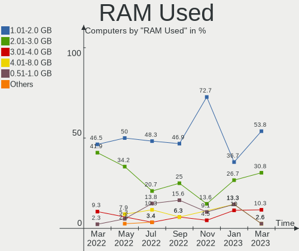
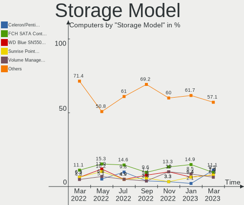
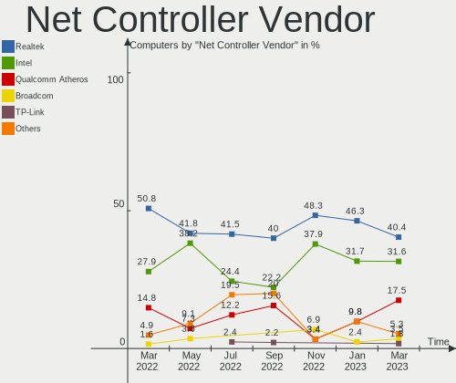
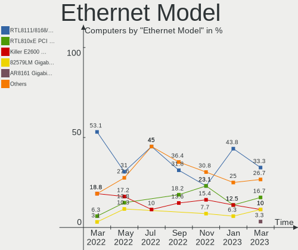
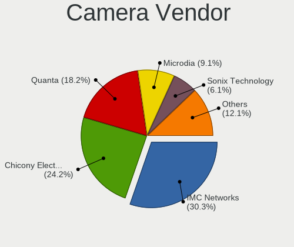

Endless - Hardware Trends
-------------------------

A project to identify most popular hardware characteristics and track their change
over time based on data collected by Linux users at https://Linux-Hardware.org.

Anyone can contribute to this report by the [hw-probe](https://github.com/linuxhw/hw-probe) tool:

    sudo -E hw-probe -all -upload

This is a report for all computer types. See also reports for [desktops](/Dist/Endless/Desktop/README.md) and [notebooks](/Dist/Endless/Notebook/README.md).

This report is for one last month. Overall report since the beginning of time: [TestCoverage](https://github.com/linuxhw/TestCoverage)

Period: Aug, 2022.

Contents
--------

* [ System ](#system)
  - [ OS                       ](#os)
  - [ OS Family                ](#os-family)
  - [ Kernel                   ](#kernel)
  - [ Kernel Family            ](#kernel-family)
  - [ Kernel Major Ver.        ](#kernel-major-ver)
  - [ Arch                     ](#arch)
  - [ DE                       ](#de)
  - [ Display Server           ](#display-server)
  - [ Display Manager          ](#display-manager)
  - [ OS Lang                  ](#os-lang)
  - [ Boot Mode                ](#boot-mode)
  - [ Filesystem               ](#filesystem)
  - [ Part. scheme             ](#part-scheme)
  - [ Dual Boot with Linux/BSD ](#dual-boot-with-linuxbsd)
  - [ Dual Boot (Win)          ](#dual-boot-win)

* [ Board ](#board)
  - [ Vendor                   ](#vendor)
  - [ Model                    ](#model)
  - [ Model Family             ](#model-family)
  - [ MFG Year                 ](#mfg-year)
  - [ Form Factor              ](#form-factor)
  - [ Secure Boot              ](#secure-boot)
  - [ Coreboot                 ](#coreboot)
  - [ RAM Size                 ](#ram-size)
  - [ RAM Used                 ](#ram-used)
  - [ Total Drives             ](#total-drives)
  - [ Has CD-ROM               ](#has-cd-rom)
  - [ Has Ethernet             ](#has-ethernet)
  - [ Has WiFi                 ](#has-wifi)
  - [ Has Bluetooth            ](#has-bluetooth)

* [ Location ](#location)
  - [ Country                  ](#country)
  - [ City                     ](#city)

* [ Drives ](#drives)
  - [ Drive Vendor             ](#drive-vendor)
  - [ Drive Model              ](#drive-model)
  - [ HDD Vendor               ](#hdd-vendor)
  - [ SSD Vendor               ](#ssd-vendor)
  - [ Drive Kind               ](#drive-kind)
  - [ Drive Connector          ](#drive-connector)
  - [ Drive Size               ](#drive-size)
  - [ Space Total              ](#space-total)
  - [ Space Used               ](#space-used)
  - [ Malfunc. Drives          ](#malfunc-drives)
  - [ Malfunc. Drive Vendor    ](#malfunc-drive-vendor)
  - [ Malfunc. HDD Vendor      ](#malfunc-hdd-vendor)
  - [ Malfunc. Drive Kind      ](#malfunc-drive-kind)
  - [ Failed Drives            ](#failed-drives)
  - [ Failed Drive Vendor      ](#failed-drive-vendor)
  - [ Drive Status             ](#drive-status)

* [ Storage controller ](#storage-controller)
  - [ Storage Vendor           ](#storage-vendor)
  - [ Storage Model            ](#storage-model)
  - [ Storage Kind             ](#storage-kind)

* [ Processor ](#processor)
  - [ CPU Vendor               ](#cpu-vendor)
  - [ CPU Model                ](#cpu-model)
  - [ CPU Model Family         ](#cpu-model-family)
  - [ CPU Cores                ](#cpu-cores)
  - [ CPU Sockets              ](#cpu-sockets)
  - [ CPU Threads              ](#cpu-threads)
  - [ CPU Op-Modes             ](#cpu-op-modes)
  - [ CPU Microcode            ](#cpu-microcode)
  - [ CPU Microarch            ](#cpu-microarch)

* [ Graphics ](#graphics)
  - [ GPU Vendor               ](#gpu-vendor)
  - [ GPU Model                ](#gpu-model)
  - [ GPU Combo                ](#gpu-combo)
  - [ GPU Driver               ](#gpu-driver)
  - [ GPU Memory               ](#gpu-memory)

* [ Monitor ](#monitor)
  - [ Monitor Vendor           ](#monitor-vendor)
  - [ Monitor Model            ](#monitor-model)
  - [ Monitor Resolution       ](#monitor-resolution)
  - [ Monitor Diagonal         ](#monitor-diagonal)
  - [ Monitor Width            ](#monitor-width)
  - [ Aspect Ratio             ](#aspect-ratio)
  - [ Monitor Area             ](#monitor-area)
  - [ Pixel Density            ](#pixel-density)
  - [ Multiple Monitors        ](#multiple-monitors)

* [ Network ](#network)
  - [ Net Controller Vendor    ](#net-controller-vendor)
  - [ Net Controller Model     ](#net-controller-model)
  - [ Wireless Vendor          ](#wireless-vendor)
  - [ Wireless Model           ](#wireless-model)
  - [ Ethernet Vendor          ](#ethernet-vendor)
  - [ Ethernet Model           ](#ethernet-model)
  - [ Net Controller Kind      ](#net-controller-kind)
  - [ Used Controller          ](#used-controller)
  - [ NICs                     ](#nics)
  - [ IPv6                     ](#ipv6)

* [ Bluetooth ](#bluetooth)
  - [ Bluetooth Vendor         ](#bluetooth-vendor)
  - [ Bluetooth Model          ](#bluetooth-model)

* [ Sound ](#sound)
  - [ Sound Vendor             ](#sound-vendor)
  - [ Sound Model              ](#sound-model)

* [ Memory ](#memory)
  - [ Memory Vendor            ](#memory-vendor)
  - [ Memory Model             ](#memory-model)
  - [ Memory Kind              ](#memory-kind)
  - [ Memory Form Factor       ](#memory-form-factor)
  - [ Memory Size              ](#memory-size)
  - [ Memory Speed             ](#memory-speed)

* [ Printers & scanners ](#printers--scanners)
  - [ Printer Vendor           ](#printer-vendor)
  - [ Printer Model            ](#printer-model)
  - [ Scanner Vendor           ](#scanner-vendor)
  - [ Scanner Model            ](#scanner-model)

* [ Camera ](#camera)
  - [ Camera Vendor            ](#camera-vendor)
  - [ Camera Model             ](#camera-model)

* [ Security ](#security)
  - [ Fingerprint Vendor       ](#fingerprint-vendor)
  - [ Fingerprint Model        ](#fingerprint-model)
  - [ Chipcard Vendor          ](#chipcard-vendor)
  - [ Chipcard Model           ](#chipcard-model)

* [ Unsupported ](#unsupported)
  - [ Unsupported Devices      ](#unsupported-devices)
  - [ Unsupported Device Types ](#unsupported-device-types)

System
------

OS
--

Installed operating systems

| Name                   | Computers | Percent |
|------------------------|-----------|---------|
| Endless 4.0.8          | 10        | 30.3%   |
| Endless 4.0.7          | 9         | 27.27%  |
| Endless 4.0.4          | 3         | 9.09%   |
| Endless 4.0.6          | 2         | 6.06%   |
| Endless 3.9.7          | 2         | 6.06%   |
| Endless 3.9.1          | 2         | 6.06%   |
| Endless 4.0.3          | 1         | 3.03%   |
| Endless 3.9.3-nexthw1  | 1         | 3.03%   |
| Endless 3.9.1-nexthw2  | 1         | 3.03%   |
| Endless 3.7.7-nexthw1  | 1         | 3.03%   |
| Endless 3.3.16-nexthw1 | 1         | 3.03%   |

OS Family
---------

OS without a version

| Name    | Computers | Percent |
|---------|-----------|---------|
| Endless | 33        | 100%    |

Kernel
------

Version of the Linux kernel

| Version           | Computers | Percent |
|-------------------|-----------|---------|
| 5.11.0-35-generic | 25        | 75.76%  |
| 5.8.0-14-generic  | 4         | 12.12%  |
| 5.4.0-7-generic   | 1         | 3.03%   |
| 5.11.0-12-generic | 1         | 3.03%   |
| 5.10.0-10-generic | 1         | 3.03%   |
| 4.15.0-12-generic | 1         | 3.03%   |

Kernel Family
-------------

Linux kernel without a distro release

| Version | Computers | Percent |
|---------|-----------|---------|
| 5.11.0  | 26        | 78.79%  |
| 5.8.0   | 4         | 12.12%  |
| 5.4.0   | 1         | 3.03%   |
| 5.10.0  | 1         | 3.03%   |
| 4.15.0  | 1         | 3.03%   |

Kernel Major Ver.
-----------------

Linux kernel major version

| Version | Computers | Percent |
|---------|-----------|---------|
| 5.11    | 26        | 78.79%  |
| 5.8     | 4         | 12.12%  |
| 5.4     | 1         | 3.03%   |
| 5.10    | 1         | 3.03%   |
| 4.15    | 1         | 3.03%   |

Arch
----

OS architecture (x86_64, i586, etc.)

| Name   | Computers | Percent |
|--------|-----------|---------|
| x86_64 | 33        | 100%    |

DE
--

Desktop Environment

| Name  | Computers | Percent |
|-------|-----------|---------|
| GNOME | 33        | 100%    |

Display Server
--------------

X11 or Wayland

| Name | Computers | Percent |
|------|-----------|---------|
| X11  | 33        | 100%    |

Display Manager
---------------

SDDM, LightDM, etc.

| Name    | Computers | Percent |
|---------|-----------|---------|
| Unknown | 33        | 100%    |

OS Lang
-------

Language

| Lang  | Computers | Percent |
|-------|-----------|---------|
| pt_BR | 15        | 45.45%  |
| en_US | 12        | 36.36%  |
| ro_RO | 2         | 6.06%   |
| sr_RS | 1         | 3.03%   |
| es_MX | 1         | 3.03%   |
| es_CO | 1         | 3.03%   |
| en_GB | 1         | 3.03%   |

Boot Mode
---------

EFI or BIOS

| Mode | Computers | Percent |
|------|-----------|---------|
| EFI  | 21        | 63.64%  |
| BIOS | 12        | 36.36%  |

Filesystem
----------

Type of filesystem

| Type  | Computers | Percent |
|-------|-----------|---------|
| Ext4  | 31        | 93.94%  |
| Tmpfs | 2         | 6.06%   |

Part. scheme
------------

Scheme of partitioning

| Type    | Computers | Percent |
|---------|-----------|---------|
| Unknown | 33        | 100%    |

Dual Boot with Linux/BSD
------------------------

Hosting more than one Linux/BSD

| Dual boot | Computers | Percent |
|-----------|-----------|---------|
| No        | 33        | 100%    |

Dual Boot (Win)
---------------

Hosting Linux and Windows

| Dual boot | Computers | Percent |
|-----------|-----------|---------|
| No        | 33        | 100%    |

Board
-----

Vendor
------

Motherboard manufacturer

| Name                | Computers | Percent |
|---------------------|-----------|---------|
| ASUSTek Computer    | 11        | 33.33%  |
| Acer                | 10        | 30.3%   |
| Hewlett-Packard     | 3         | 9.09%   |
| Positivo            | 2         | 6.06%   |
| Lenovo              | 2         | 6.06%   |
| Dell                | 2         | 6.06%   |
| Gigabyte Technology | 1         | 3.03%   |
| Fujitsu             | 1         | 3.03%   |
| ECS                 | 1         | 3.03%   |

Model
-----

Motherboard model

| Name                                    | Computers | Percent |
|-----------------------------------------|-----------|---------|
| Acer Nitro AN515-44                     | 4         | 12.12%  |
| ASUS VivoBook_ASUSLaptop X515DA_X515DA  | 2         | 6.06%   |
| ASUS VivoBook_ASUSLaptop X513EAN_K513EA | 2         | 6.06%   |
| ASUS VivoBook 15_ASUS Laptop X540UAR    | 2         | 6.06%   |
| Acer Nitro AN515-54                     | 2         | 6.06%   |
| Positivo S14CT01                        | 1         | 3.03%   |
| Positivo C14CR21                        | 1         | 3.03%   |
| Lenovo ThinkPad Edge 0578A25            | 1         | 3.03%   |
| Lenovo G50-45 80E3                      | 1         | 3.03%   |
| HP OMEN by Laptop 16-b0xxx              | 1         | 3.03%   |
| HP EliteDesk 705 G2 MINI                | 1         | 3.03%   |
| HP Compaq dc7100 USDT(EC932ES)          | 1         | 3.03%   |
| Gigabyte X570 I AORUS PRO WIFI          | 1         | 3.03%   |
| Fujitsu ESPRIMO P2560                   | 1         | 3.03%   |
| ECS A320AM4-M3D                         | 1         | 3.03%   |
| Dell Latitude E6530                     | 1         | 3.03%   |
| Dell Inspiron 1545                      | 1         | 3.03%   |
| ASUS VivoBook_ASUSLaptop X515JA_X515JA  | 1         | 3.03%   |
| ASUS VivoBook_ASUSLaptop X515EA_X515EA  | 1         | 3.03%   |
| ASUS ROG Maximus X CODE                 | 1         | 3.03%   |
| ASUS M5A78L-M/USB3                      | 1         | 3.03%   |
| ASUS ASUSPRO D340MC-C_D340MC            | 1         | 3.03%   |
| Acer Aspire V3-571G                     | 1         | 3.03%   |
| Acer Aspire A517-51                     | 1         | 3.03%   |
| Acer Aspire A315-53                     | 1         | 3.03%   |
| Acer Aspire 7750ZG                      | 1         | 3.03%   |

Model Family
------------

Motherboard model prefix

| Name             | Computers | Percent |
|------------------|-----------|---------|
| ASUS VivoBook    | 8         | 24.24%  |
| Acer Nitro       | 6         | 18.18%  |
| Acer Aspire      | 4         | 12.12%  |
| Positivo S14CT01 | 1         | 3.03%   |
| Positivo C14CR21 | 1         | 3.03%   |
| Lenovo ThinkPad  | 1         | 3.03%   |
| Lenovo G50-45    | 1         | 3.03%   |
| HP OMEN          | 1         | 3.03%   |
| HP EliteDesk     | 1         | 3.03%   |
| HP Compaq        | 1         | 3.03%   |
| Gigabyte X570    | 1         | 3.03%   |
| Fujitsu ESPRIMO  | 1         | 3.03%   |
| ECS A320AM4-M3D  | 1         | 3.03%   |
| Dell Latitude    | 1         | 3.03%   |
| Dell Inspiron    | 1         | 3.03%   |
| ASUS ROG         | 1         | 3.03%   |
| ASUS M5A78L-M    | 1         | 3.03%   |
| ASUS ASUSPRO     | 1         | 3.03%   |

MFG Year
--------

Motherboard manufacture year

| Year | Computers | Percent |
|------|-----------|---------|
| 2021 | 6         | 18.18%  |
| 2020 | 6         | 18.18%  |
| 2019 | 4         | 12.12%  |
| 2018 | 4         | 12.12%  |
| 2012 | 3         | 9.09%   |
| 2017 | 2         | 6.06%   |
| 2011 | 2         | 6.06%   |
| 2010 | 2         | 6.06%   |
| 2016 | 1         | 3.03%   |
| 2014 | 1         | 3.03%   |
| 2008 | 1         | 3.03%   |
| 2004 | 1         | 3.03%   |

Form Factor
-----------

Physical design of the computer

| Name     | Computers | Percent |
|----------|-----------|---------|
| Notebook | 25        | 75.76%  |
| Desktop  | 8         | 24.24%  |

Secure Boot
-----------

Enabled or disabled

| State    | Computers | Percent |
|----------|-----------|---------|
| Disabled | 27        | 81.82%  |
| Enabled  | 6         | 18.18%  |

Coreboot
--------

Have coreboot on board

| Used | Computers | Percent |
|------|-----------|---------|
| No   | 33        | 100%    |

RAM Size
--------

Total RAM memory

| Size in GB | Computers | Percent |
|------------|-----------|---------|
| 4.01-8.0   | 16        | 48.48%  |
| 3.01-4.0   | 9         | 27.27%  |
| 1.01-2.0   | 3         | 9.09%   |
| 8.01-16.0  | 3         | 9.09%   |
| 32.01-64.0 | 1         | 3.03%   |
| 16.01-24.0 | 1         | 3.03%   |

RAM Used
--------

Used RAM memory

| Used GB  | Computers | Percent |
|----------|-----------|---------|
| 1.01-2.0 | 19        | 57.58%  |
| 2.01-3.0 | 7         | 21.21%  |
| 3.01-4.0 | 5         | 15.15%  |
| 4.01-8.0 | 1         | 3.03%   |
| 0.51-1.0 | 1         | 3.03%   |

Total Drives
------------

Number of drives on board

| Drives | Computers | Percent |
|--------|-----------|---------|
| 1      | 23        | 69.7%   |
| 2      | 10        | 30.3%   |

Has CD-ROM
----------

Has CD-ROM on board

| Presented | Computers | Percent |
|-----------|-----------|---------|
| No        | 21        | 63.64%  |
| Yes       | 12        | 36.36%  |

Has Ethernet
------------

Has Ethernet on board

| Presented | Computers | Percent |
|-----------|-----------|---------|
| Yes       | 25        | 75.76%  |
| No        | 8         | 24.24%  |

Has WiFi
--------

Has WiFi module

| Presented | Computers | Percent |
|-----------|-----------|---------|
| Yes       | 30        | 90.91%  |
| No        | 3         | 9.09%   |

Has Bluetooth
-------------

Has Bluetooth module

| Presented | Computers | Percent |
|-----------|-----------|---------|
| Yes       | 21        | 63.64%  |
| No        | 12        | 36.36%  |

Location
--------

Country
-------

Geographic location (country)

| Country  | Computers | Percent |
|----------|-----------|---------|
| Brazil   | 15        | 45.45%  |
| USA      | 4         | 12.12%  |
| UK       | 2         | 6.06%   |
| Romania  | 2         | 6.06%   |
| India    | 2         | 6.06%   |
| Georgia  | 2         | 6.06%   |
| Serbia   | 1         | 3.03%   |
| Russia   | 1         | 3.03%   |
| Mexico   | 1         | 3.03%   |
| Egypt    | 1         | 3.03%   |
| Colombia | 1         | 3.03%   |
| Belarus  | 1         | 3.03%   |

City
----

Geographic location (city)

| City                | Computers | Percent |
|---------------------|-----------|---------|
| Rio de Janeiro      | 2         | 6.06%   |
| Volta Redonda       | 1         | 3.03%   |
| Vijayawada          | 1         | 3.03%   |
| Valparaiso de Goias | 1         | 3.03%   |
| Urziceni            | 1         | 3.03%   |
| Tbilisi             | 1         | 3.03%   |
| Sao Paulo           | 1         | 3.03%   |
| Sao Jose            | 1         | 3.03%   |
| Sao Cristovao       | 1         | 3.03%   |
| Redditch            | 1         | 3.03%   |
| Pune                | 1         | 3.03%   |
| Propria             | 1         | 3.03%   |
| Poole               | 1         | 3.03%   |
| Moscow              | 1         | 3.03%   |
| Madison             | 1         | 3.03%   |
| Londrina            | 1         | 3.03%   |
| Limeira             | 1         | 3.03%   |
| Laguna Beach        | 1         | 3.03%   |
| Lagos de Moreno     | 1         | 3.03%   |
| Juara               | 1         | 3.03%   |
| Goose Creek         | 1         | 3.03%   |
| Goias               | 1         | 3.03%   |
| Francisco Morato    | 1         | 3.03%   |
| Dallas              | 1         | 3.03%   |
| Caxias do Sul       | 1         | 3.03%   |
| Cairo               | 1         | 3.03%   |
| Bucharest           | 1         | 3.03%   |
| Bogotá             | 1         | 3.03%   |
| Belgrade            | 1         | 3.03%   |
| Batumi              | 1         | 3.03%   |
| Baranovichi         | 1         | 3.03%   |
| Americana           | 1         | 3.03%   |

Drives
------

Drive Vendor
------------

Hard drive vendors

| Vendor              | Computers | Drives | Percent |
|---------------------|-----------|--------|---------|
| Seagate             | 8         | 8      | 20.51%  |
| SanDisk             | 5         | 5      | 12.82%  |
| Samsung Electronics | 4         | 5      | 10.26%  |
| ADATA Technology    | 4         | 4      | 10.26%  |
| WDC                 | 3         | 3      | 7.69%   |
| Micron Technology   | 3         | 3      | 7.69%   |
| Unknown             | 2         | 2      | 5.13%   |
| Phison              | 2         | 2      | 5.13%   |
| Maxtor              | 2         | 2      | 5.13%   |
| Win Memory          | 1         | 1      | 2.56%   |
| Timetec             | 1         | 1      | 2.56%   |
| Intel               | 1         | 1      | 2.56%   |
| Crucial             | 1         | 1      | 2.56%   |
| China               | 1         | 1      | 2.56%   |
| ASMedia             | 1         | 1      | 2.56%   |

Drive Model
-----------

Hard drive models

| Model                               | Computers | Percent |
|-------------------------------------|-----------|---------|
| SanDisk NVMe SSD Drive 512GB        | 4         | 10.26%  |
| WDC WD10SPZX-21Z10T0 1TB            | 3         | 7.69%   |
| ADATA NVMe SSD Drive 256GB          | 3         | 7.69%   |
| Seagate ST1000LM035-1RK172 1TB      | 2         | 5.13%   |
| Seagate ST1000DM010-2EP102 1TB      | 2         | 5.13%   |
| Micron NVMe SSD Drive 512GB         | 2         | 5.13%   |
| Win Memory SWR256G-301II 256GB      | 1         | 2.56%   |
| Unknown MMC Card  32GB              | 1         | 2.56%   |
| Unknown MMC Card  238MB             | 1         | 2.56%   |
| Timetec 30TT253X2-512G              | 1         | 2.56%   |
| Seagate ST9250410AS 250GB           | 1         | 2.56%   |
| Seagate ST500LM021-1KJ152 500GB     | 1         | 2.56%   |
| Seagate ST500DM002-1BD142 500GB     | 1         | 2.56%   |
| Seagate ST3500312CS 500GB           | 1         | 2.56%   |
| SanDisk SD7SB6S-128G-1006 128GB SSD | 1         | 2.56%   |
| Samsung SSD 850 EVO 250GB           | 1         | 2.56%   |
| Samsung SSD 750 EVO 250GB           | 1         | 2.56%   |
| Samsung NVMe SSD Drive 512GB        | 1         | 2.56%   |
| Samsung NVMe SSD Drive 500GB        | 1         | 2.56%   |
| Phison NVMe SSD Drive 256GB         | 1         | 2.56%   |
| Phison NVMe SSD Drive 1024GB        | 1         | 2.56%   |
| Micron 1100_MTFDDAV256TBN 256GB SSD | 1         | 2.56%   |
| Maxtor Z1 SSD 480GB                 | 1         | 2.56%   |
| Maxtor 6Y080M0 81GB                 | 1         | 2.56%   |
| Intel NVMe SSD Drive 512GB          | 1         | 2.56%   |
| Crucial CT240BX500SSD1 240GB        | 1         | 2.56%   |
| China SSD 240GB                     | 1         | 2.56%   |
| ASMedia ASM105x 240GB               | 1         | 2.56%   |
| ADATA NVMe SSD Drive 128GB          | 1         | 2.56%   |

HDD Vendor
----------

Hard disk drive vendors

| Vendor  | Computers | Drives | Percent |
|---------|-----------|--------|---------|
| Seagate | 8         | 8      | 66.67%  |
| WDC     | 3         | 3      | 25%     |
| Maxtor  | 1         | 1      | 8.33%   |

SSD Vendor
----------

Solid state drive vendors

| Vendor              | Computers | Drives | Percent |
|---------------------|-----------|--------|---------|
| Samsung Electronics | 2         | 2      | 22.22%  |
| Win Memory          | 1         | 1      | 11.11%  |
| SanDisk             | 1         | 1      | 11.11%  |
| Micron Technology   | 1         | 1      | 11.11%  |
| Maxtor              | 1         | 1      | 11.11%  |
| Crucial             | 1         | 1      | 11.11%  |
| China               | 1         | 1      | 11.11%  |
| ASMedia             | 1         | 1      | 11.11%  |

Drive Kind
----------

HDD or SSD

| Kind    | Computers | Drives | Percent |
|---------|-----------|--------|---------|
| NVMe    | 15        | 16     | 38.46%  |
| HDD     | 12        | 12     | 30.77%  |
| SSD     | 9         | 9      | 23.08%  |
| MMC     | 2         | 2      | 5.13%   |
| Unknown | 1         | 1      | 2.56%   |

Drive Connector
---------------

SATA, SAS, NVMe, etc.

| Type | Computers | Drives | Percent |
|------|-----------|--------|---------|
| SATA | 19        | 21     | 51.35%  |
| NVMe | 15        | 16     | 40.54%  |
| MMC  | 2         | 2      | 5.41%   |
| SAS  | 1         | 1      | 2.7%    |

Drive Size
----------

Size of hard drive

| Size in TB | Computers | Drives | Percent |
|------------|-----------|--------|---------|
| 0.01-0.5   | 13        | 14     | 65%     |
| 0.51-1.0   | 7         | 7      | 35%     |

Space Total
-----------

Amount of disk space available on the file system

| Size in GB | Computers | Percent |
|------------|-----------|---------|
| 251-500    | 12        | 36.36%  |
| 101-250    | 10        | 30.3%   |
| 501-1000   | 5         | 15.15%  |
| 1001-2000  | 2         | 6.06%   |
| 21-50      | 1         | 3.03%   |
| 2001-3000  | 1         | 3.03%   |
| 1-20       | 1         | 3.03%   |
| 51-100     | 1         | 3.03%   |

Space Used
----------

Amount of used disk space

| Used GB  | Computers | Percent |
|----------|-----------|---------|
| 21-50    | 18        | 54.55%  |
| 251-500  | 4         | 12.12%  |
| 101-250  | 4         | 12.12%  |
| 51-100   | 4         | 12.12%  |
| 1-20     | 2         | 6.06%   |
| 501-1000 | 1         | 3.03%   |

Malfunc. Drives
---------------

Drive models with a malfunction

Zero info for selected period =(

Malfunc. Drive Vendor
---------------------

Vendors of faulty drives

Zero info for selected period =(

Malfunc. HDD Vendor
-------------------

Vendors of faulty HDD drives

Zero info for selected period =(

Malfunc. Drive Kind
-------------------

Kinds of faulty drives

Zero info for selected period =(

Failed Drives
-------------

Failed drive models

Zero info for selected period =(

Failed Drive Vendor
-------------------

Failed drive vendors

Zero info for selected period =(

Drive Status
------------

Number of failed and malfunc. drives

| Status   | Computers | Drives | Percent |
|----------|-----------|--------|---------|
| Detected | 33        | 40     | 100%    |

Storage controller
------------------

Storage Vendor
--------------

Storage controller vendors

| Vendor              | Computers | Percent |
|---------------------|-----------|---------|
| Intel               | 21        | 45.65%  |
| AMD                 | 11        | 23.91%  |
| SanDisk             | 4         | 8.7%    |
| ADATA Technology    | 4         | 8.7%    |
| Samsung Electronics | 2         | 4.35%   |
| Phison Electronics  | 2         | 4.35%   |
| Micron Technology   | 2         | 4.35%   |

Storage Model
-------------

Storage controller models

| Model                                                                        | Computers | Percent |
|------------------------------------------------------------------------------|-----------|---------|
| AMD FCH SATA Controller [AHCI mode]                                          | 10        | 18.87%  |
| SanDisk WD Blue SN550 NVMe SSD                                               | 4         | 7.55%   |
| Intel Volume Management Device NVMe RAID Controller                          | 4         | 7.55%   |
| Intel Sunrise Point-LP SATA Controller [AHCI mode]                           | 4         | 7.55%   |
| Intel Tiger Lake-LP SATA Controller                                          | 3         | 5.66%   |
| Intel 82801 Mobile SATA Controller [RAID mode]                               | 3         | 5.66%   |
| ADATA A Non-Volatile memory controller                                       | 3         | 5.66%   |
| Micron Non-Volatile memory controller                                        | 2         | 3.77%   |
| Intel 7 Series Chipset Family 6-port SATA Controller [AHCI mode]             | 2         | 3.77%   |
| Intel 200 Series PCH SATA controller [AHCI mode]                             | 2         | 3.77%   |
| Samsung NVMe SSD Controller SM981/PM981/PM983                                | 1         | 1.89%   |
| Samsung NVMe SSD Controller PM9A1/PM9A3/980PRO                               | 1         | 1.89%   |
| Phison PS5013 E13 NVMe Controller                                            | 1         | 1.89%   |
| Phison E12 NVMe Controller                                                   | 1         | 1.89%   |
| Intel PROSet/Wireless WiFi Software extension                                | 1         | 1.89%   |
| Intel NM10/ICH7 Family SATA Controller [IDE mode]                            | 1         | 1.89%   |
| Intel Cannon Lake Mobile PCH SATA AHCI Controller                            | 1         | 1.89%   |
| Intel 82801IBM/IEM (ICH9M/ICH9M-E) 4 port SATA Controller [AHCI mode]        | 1         | 1.89%   |
| Intel 82801FB/FW (ICH6/ICH6W) SATA Controller                                | 1         | 1.89%   |
| Intel 82801FB/FBM/FR/FW/FRW (ICH6 Family) IDE Controller                     | 1         | 1.89%   |
| Intel 6 Series/C200 Series Chipset Family 6 port Mobile SATA AHCI Controller | 1         | 1.89%   |
| Intel 5 Series/3400 Series Chipset 4 port SATA AHCI Controller               | 1         | 1.89%   |
| AMD SB7x0/SB8x0/SB9x0 SATA Controller [IDE mode]                             | 1         | 1.89%   |
| AMD SB7x0/SB8x0/SB9x0 IDE Controller                                         | 1         | 1.89%   |
| AMD FCH SATA Controller D                                                    | 1         | 1.89%   |
| ADATA Non-Volatile memory controller                                         | 1         | 1.89%   |

Storage Kind
------------

Kind of storage controller (IDE, SATA, NVMe, SAS, ...)

| Kind | Computers | Percent |
|------|-----------|---------|
| SATA | 27        | 52.94%  |
| NVMe | 15        | 29.41%  |
| RAID | 6         | 11.76%  |
| IDE  | 3         | 5.88%   |

Processor
---------

CPU Vendor
----------

Processor vendors

| Vendor | Computers | Percent |
|--------|-----------|---------|
| Intel  | 22        | 66.67%  |
| AMD    | 11        | 33.33%  |

CPU Model
---------

Processor models

| Model                                         | Computers | Percent |
|-----------------------------------------------|-----------|---------|
| AMD Ryzen 7 4800H with Radeon Graphics        | 4         | 12.12%  |
| Intel Core i5-9300H CPU @ 2.40GHz             | 2         | 6.06%   |
| Intel Core i3-7020U CPU @ 2.30GHz             | 2         | 6.06%   |
| Intel 11th Gen Core i5-1135G7 @ 2.40GHz       | 2         | 6.06%   |
| AMD Ryzen 5 3500U with Radeon Vega Mobile Gfx | 2         | 6.06%   |
| Intel Pentium Dual-Core CPU T4400 @ 2.20GHz   | 1         | 3.03%   |
| Intel Pentium CPU B960 @ 2.20GHz              | 1         | 3.03%   |
| Intel Pentium CPU B950 @ 2.10GHz              | 1         | 3.03%   |
| Intel Pentium 4 CPU 3.20GHz                   | 1         | 3.03%   |
| Intel Core i7-8700K CPU @ 3.70GHz             | 1         | 3.03%   |
| Intel Core i7-3520M CPU @ 2.90GHz             | 1         | 3.03%   |
| Intel Core i5-8250U CPU @ 1.60GHz             | 1         | 3.03%   |
| Intel Core i5-3210M CPU @ 2.50GHz             | 1         | 3.03%   |
| Intel Core i3-9100 CPU @ 3.60GHz              | 1         | 3.03%   |
| Intel Core i3-6006U CPU @ 2.00GHz             | 1         | 3.03%   |
| Intel Core i3-1005G1 CPU @ 1.20GHz            | 1         | 3.03%   |
| Intel Core i3 CPU M 350 @ 2.27GHz             | 1         | 3.03%   |
| Intel Core 2 Duo CPU E7300 @ 2.66GHz          | 1         | 3.03%   |
| Intel Atom x5-Z8350 CPU @ 1.44GHz             | 1         | 3.03%   |
| Intel 11th Gen Core i5-11400H @ 2.70GHz       | 1         | 3.03%   |
| Intel 11th Gen Core i3-1115G4 @ 3.00GHz       | 1         | 3.03%   |
| AMD Ryzen 5 3600X 6-Core Processor            | 1         | 3.03%   |
| AMD PRO A8-8600B R6, 10 Compute Cores 4C+6G   | 1         | 3.03%   |
| AMD Phenom II X6 1055T Processor              | 1         | 3.03%   |
| AMD A8-9600 RADEON R7, 10 COMPUTE CORES 4C+6G | 1         | 3.03%   |
| AMD A8-6410 APU with AMD Radeon R5 Graphics   | 1         | 3.03%   |

CPU Model Family
----------------

Processor model prefix

| Model                   | Computers | Percent |
|-------------------------|-----------|---------|
| Intel Core i3           | 6         | 18.18%  |
| Other                   | 4         | 12.12%  |
| Intel Core i5           | 4         | 12.12%  |
| AMD Ryzen 7             | 4         | 12.12%  |
| AMD Ryzen 5             | 3         | 9.09%   |
| Intel Pentium           | 2         | 6.06%   |
| Intel Core i7           | 2         | 6.06%   |
| AMD A8                  | 2         | 6.06%   |
| Intel Pentium Dual-Core | 1         | 3.03%   |
| Intel Pentium 4         | 1         | 3.03%   |
| Intel Core 2 Duo        | 1         | 3.03%   |
| Intel Atom              | 1         | 3.03%   |
| AMD PRO A8              | 1         | 3.03%   |
| AMD Phenom II X6        | 1         | 3.03%   |

CPU Cores
---------

Number of processor cores

| Number | Computers | Percent |
|--------|-----------|---------|
| 2      | 14        | 42.42%  |
| 4      | 10        | 30.3%   |
| 8      | 4         | 12.12%  |
| 6      | 4         | 12.12%  |
| 1      | 1         | 3.03%   |

CPU Sockets
-----------

Number of sockets

| Number | Computers | Percent |
|--------|-----------|---------|
| 1      | 33        | 100%    |

CPU Threads
-----------

Threads per core (Hyper-Threading)

| Number | Computers | Percent |
|--------|-----------|---------|
| 2      | 25        | 75.76%  |
| 1      | 8         | 24.24%  |

CPU Op-Modes
------------

CPU Operation Modes (32-bit, 64-bit)

| Op mode        | Computers | Percent |
|----------------|-----------|---------|
| 32-bit, 64-bit | 33        | 100%    |

CPU Microcode
-------------

Microcode number

| Number     | Computers | Percent |
|------------|-----------|---------|
| 0x08600103 | 4         | 12.12%  |
| 0x806c1    | 3         | 9.09%   |
| 0x906ed    | 2         | 6.06%   |
| 0x806e9    | 2         | 6.06%   |
| 0x306a9    | 2         | 6.06%   |
| 0x206a7    | 2         | 6.06%   |
| 0x08108109 | 2         | 6.06%   |
| 0x0600611a | 2         | 6.06%   |
| 0xf41      | 1         | 3.03%   |
| 0x906eb    | 1         | 3.03%   |
| 0x906ea    | 1         | 3.03%   |
| 0x806d1    | 1         | 3.03%   |
| 0x706e5    | 1         | 3.03%   |
| 0x406e3    | 1         | 3.03%   |
| 0x406c4    | 1         | 3.03%   |
| 0x20652    | 1         | 3.03%   |
| 0x1067a    | 1         | 3.03%   |
| 0x10676    | 1         | 3.03%   |
| 0x08701021 | 1         | 3.03%   |
| 0x07030105 | 1         | 3.03%   |
| 0x010000dc | 1         | 3.03%   |
| Unknown    | 1         | 3.03%   |

CPU Microarch
-------------

Microarchitecture

| Name        | Computers | Percent |
|-------------|-----------|---------|
| KabyLake    | 7         | 21.21%  |
| Zen 2       | 5         | 15.15%  |
| TigerLake   | 3         | 9.09%   |
| Zen+        | 2         | 6.06%   |
| SandyBridge | 2         | 6.06%   |
| Penryn      | 2         | 6.06%   |
| IvyBridge   | 2         | 6.06%   |
| IceLake     | 2         | 6.06%   |
| Excavator   | 2         | 6.06%   |
| Westmere    | 1         | 3.03%   |
| Skylake     | 1         | 3.03%   |
| Silvermont  | 1         | 3.03%   |
| Puma        | 1         | 3.03%   |
| NetBurst    | 1         | 3.03%   |
| K10         | 1         | 3.03%   |

Graphics
--------

GPU Vendor
----------

Vendors of graphics cards

| Vendor | Computers | Percent |
|--------|-----------|---------|
| Intel  | 21        | 48.84%  |
| Nvidia | 11        | 25.58%  |
| AMD    | 11        | 25.58%  |

GPU Model
---------

Graphics card models

| Model                                                                                    | Computers | Percent |
|------------------------------------------------------------------------------------------|-----------|---------|
| Nvidia TU117M                                                                            | 4         | 9.09%   |
| AMD Renoir                                                                               | 4         | 9.09%   |
| Nvidia TU117M [GeForce GTX 1650 Mobile / Max-Q]                                          | 2         | 4.55%   |
| Intel TigerLake-LP GT2 [Iris Xe Graphics]                                                | 2         | 4.55%   |
| Intel CoffeeLake-H GT2 [UHD Graphics 630]                                                | 2         | 4.55%   |
| Intel 3rd Gen Core processor Graphics Controller                                         | 2         | 4.55%   |
| Intel 2nd Generation Core Processor Family Integrated Graphics Controller                | 2         | 4.55%   |
| AMD Wani [Radeon R5/R6/R7 Graphics]                                                      | 2         | 4.55%   |
| AMD Picasso/Raven 2 [Radeon Vega Series / Radeon Vega Mobile Series]                     | 2         | 4.55%   |
| Nvidia GP102 [GeForce GTX 1080 Ti]                                                       | 1         | 2.27%   |
| Nvidia GF108M [GeForce GT 620M/630M/635M/640M LE]                                        | 1         | 2.27%   |
| Nvidia GF108GLM [NVS 5200M]                                                              | 1         | 2.27%   |
| Nvidia GA106M [GeForce RTX 3060 Mobile / Max-Q]                                          | 1         | 2.27%   |
| Nvidia G92 [GeForce 9800 GT]                                                             | 1         | 2.27%   |
| Intel UHD Graphics 620                                                                   | 1         | 2.27%   |
| Intel TigerLake-H GT1 [UHD Graphics]                                                     | 1         | 2.27%   |
| Intel Tiger Lake UHD Graphics                                                            | 1         | 2.27%   |
| Intel Skylake GT2 [HD Graphics 520]                                                      | 1         | 2.27%   |
| Intel Mobile 4 Series Chipset Integrated Graphics Controller                             | 1         | 2.27%   |
| Intel Kaby Lake-U GT2f HD 620 Graphics Controller                                        | 1         | 2.27%   |
| Intel Iris Plus Graphics G1 (Ice Lake)                                                   | 1         | 2.27%   |
| Intel HD Graphics 620                                                                    | 1         | 2.27%   |
| Intel Core Processor Integrated Graphics Controller                                      | 1         | 2.27%   |
| Intel CoffeeLake-S GT2 [UHD Graphics 630]                                                | 1         | 2.27%   |
| Intel Atom/Celeron/Pentium Processor x5-E8000/J3xxx/N3xxx Integrated Graphics Controller | 1         | 2.27%   |
| Intel 82915G/GV/910GL Integrated Graphics Controller                                     | 1         | 2.27%   |
| Intel 4 Series Chipset Integrated Graphics Controller                                    | 1         | 2.27%   |
| AMD VGA compatible controller                                                            | 1         | 2.27%   |
| AMD Sun LE [Radeon HD 8550M / R5 M230]                                                   | 1         | 2.27%   |
| AMD Navi 21 [Radeon RX 6800/6800 XT / 6900 XT]                                           | 1         | 2.27%   |
| AMD Mullins [Radeon R4/R5 Graphics]                                                      | 1         | 2.27%   |

GPU Combo
---------

Combinations of graphics cards

| Name           | Computers | Percent |
|----------------|-----------|---------|
| 1 x Intel      | 15        | 45.45%  |
| Intel + Nvidia | 5         | 15.15%  |
| 1 x AMD        | 5         | 15.15%  |
| AMD + Nvidia   | 4         | 12.12%  |
| 1 x Nvidia     | 2         | 6.06%   |
| 2 x AMD        | 1         | 3.03%   |
| Intel + AMD    | 1         | 3.03%   |

GPU Driver
----------

Free vs proprietary

| Driver      | Computers | Percent |
|-------------|-----------|---------|
| Free        | 25        | 75.76%  |
| Proprietary | 8         | 24.24%  |

GPU Memory
----------

Total video memory

| Size in GB | Computers | Percent |
|------------|-----------|---------|
| Unknown    | 19        | 57.58%  |
| 0.01-0.5   | 5         | 15.15%  |
| 0.51-1.0   | 4         | 12.12%  |
| 1.01-2.0   | 3         | 9.09%   |
| 3.01-4.0   | 1         | 3.03%   |
| 8.01-16.0  | 1         | 3.03%   |

Monitor
-------

Monitor Vendor
--------------

Monitor vendors

| Vendor                  | Computers | Percent |
|-------------------------|-----------|---------|
| BOE                     | 8         | 22.86%  |
| LG Display              | 6         | 17.14%  |
| PANDA                   | 4         | 11.43%  |
| Samsung Electronics     | 3         | 8.57%   |
| Dell                    | 2         | 5.71%   |
| Chimei Innolux          | 2         | 5.71%   |
| AU Optronics            | 2         | 5.71%   |
| VOR                     | 1         | 2.86%   |
| ViewSonic               | 1         | 2.86%   |
| Philips                 | 1         | 2.86%   |
| Lenovo                  | 1         | 2.86%   |
| Goldstar                | 1         | 2.86%   |
| Chi Mei Optoelectronics | 1         | 2.86%   |
| Ancor Communications    | 1         | 2.86%   |
| Acer                    | 1         | 2.86%   |

Monitor Model
-------------

Monitor models

| Model                                                                    | Computers | Percent |
|--------------------------------------------------------------------------|-----------|---------|
| PANDA LCD Monitor NCP004D 1920x1080 344x194mm 15.5-inch                  | 3         | 8.57%   |
| BOE LCD Monitor BOE07AA 1366x768 344x194mm 15.5-inch                     | 3         | 8.57%   |
| VOR LED21300 VOR2150 1920x1080 476x268mm 21.5-inch                       | 1         | 2.86%   |
| ViewSonic VA2407 Series VSC8C31 1920x1080 521x293mm 23.5-inch            | 1         | 2.86%   |
| Samsung Electronics SyncMaster SAM011E 1280x1024 338x270mm 17.0-inch     | 1         | 2.86%   |
| Samsung Electronics SMB2230 SAM063F 1920x1080 477x268mm 21.5-inch        | 1         | 2.86%   |
| Samsung Electronics LCD Monitor SDC4161 1920x1080 344x194mm 15.5-inch    | 1         | 2.86%   |
| Philips 215Vw PHL2151 1920x1080 476x268mm 21.5-inch                      | 1         | 2.86%   |
| PANDA LCD Monitor NCP0046 1920x1080 344x194mm 15.5-inch                  | 1         | 2.86%   |
| LG Display LCD Monitor LGD065A 1920x1080 344x194mm 15.5-inch             | 1         | 2.86%   |
| LG Display LCD Monitor LGD056D 1920x1080 382x215mm 17.3-inch             | 1         | 2.86%   |
| LG Display LCD Monitor LGD0456 1366x768 344x194mm 15.5-inch              | 1         | 2.86%   |
| LG Display LCD Monitor LGD032C 1920x1080 344x194mm 15.5-inch             | 1         | 2.86%   |
| LG Display LCD Monitor LGD02DC 1366x768 344x194mm 15.5-inch              | 1         | 2.86%   |
| LG Display LCD Monitor LGD0266 1366x768 344x194mm 15.5-inch              | 1         | 2.86%   |
| Lenovo LCD Monitor LEN40A0 1366x768 309x174mm 14.0-inch                  | 1         | 2.86%   |
| Goldstar ULTRAGEAR GSM7766 2560x1440 697x392mm 31.5-inch                 | 1         | 2.86%   |
| Dell E2417H DELA0E1 1920x1080 527x296mm 23.8-inch                        | 1         | 2.86%   |
| Dell 1707FP DEL4012 1280x1024 338x270mm 17.0-inch                        | 1         | 2.86%   |
| Chimei Innolux LCD Monitor CMN15F5 1920x1080 344x193mm 15.5-inch         | 1         | 2.86%   |
| Chimei Innolux LCD Monitor CMN1498 1366x768 309x174mm 14.0-inch          | 1         | 2.86%   |
| Chi Mei Optoelectronics LCD Monitor CMO1711 1600x900 382x215mm 17.3-inch | 1         | 2.86%   |
| BOE LCD Monitor BOE0AAE 1920x1080 355x200mm 16.0-inch                    | 1         | 2.86%   |
| BOE LCD Monitor BOE0818 1920x1080 344x194mm 15.5-inch                    | 1         | 2.86%   |
| BOE LCD Monitor BOE06A5 1366x768 344x194mm 15.5-inch                     | 1         | 2.86%   |
| BOE LCD Monitor BOE0696 1366x768 309x173mm 13.9-inch                     | 1         | 2.86%   |
| BOE LCD Monitor BOE0672 1366x768 344x194mm 15.5-inch                     | 1         | 2.86%   |
| AU Optronics LCD Monitor AUOAF90 1920x1080 344x193mm 15.5-inch           | 1         | 2.86%   |
| AU Optronics LCD Monitor AUO71EC 1366x768 344x193mm 15.5-inch            | 1         | 2.86%   |
| Ancor Communications VC279 ACI27C4 1920x1080 598x336mm 27.0-inch         | 1         | 2.86%   |
| Acer HA240Y ACR0583 1920x1080 527x296mm 23.8-inch                        | 1         | 2.86%   |

Monitor Resolution
------------------

Monitor screen resolution

| Resolution       | Computers | Percent |
|------------------|-----------|---------|
| 1920x1080 (FHD)  | 18        | 52.94%  |
| 1366x768 (WXGA)  | 12        | 35.29%  |
| 1280x1024 (SXGA) | 2         | 5.88%   |
| 2560x1440 (QHD)  | 1         | 2.94%   |
| 1600x900 (HD+)   | 1         | 2.94%   |

Monitor Diagonal
----------------

Diagonal size in inches

| Inches | Computers | Percent |
|--------|-----------|---------|
| 15     | 19        | 55.88%  |
| 17     | 4         | 11.76%  |
| 23     | 2         | 5.88%   |
| 21     | 2         | 5.88%   |
| 14     | 2         | 5.88%   |
| 31     | 1         | 2.94%   |
| 27     | 1         | 2.94%   |
| 24     | 1         | 2.94%   |
| 16     | 1         | 2.94%   |
| 13     | 1         | 2.94%   |

Monitor Width
-------------

Physical width

| Width in mm | Computers | Percent |
|-------------|-----------|---------|
| 301-350     | 24        | 70.59%  |
| 501-600     | 4         | 11.76%  |
| 351-400     | 3         | 8.82%   |
| 401-500     | 2         | 5.88%   |
| 601-700     | 1         | 2.94%   |

Aspect Ratio
------------

Proportional relationship between the width and the height

| Ratio | Computers | Percent |
|-------|-----------|---------|
| 16/9  | 31        | 93.94%  |
| 5/4   | 2         | 6.06%   |

Monitor Area
------------

Area in inch²

| Area in inch² | Computers | Percent |
|----------------|-----------|---------|
| 101-110        | 20        | 58.82%  |
| 81-90          | 3         | 8.82%   |
| 201-250        | 3         | 8.82%   |
| 151-200        | 2         | 5.88%   |
| 141-150        | 2         | 5.88%   |
| 351-500        | 1         | 2.94%   |
| 301-350        | 1         | 2.94%   |
| 131-140        | 1         | 2.94%   |
| 121-130        | 1         | 2.94%   |

Pixel Density
-------------

Pixels per inch

| Density | Computers | Percent |
|---------|-----------|---------|
| 101-120 | 15        | 44.12%  |
| 121-160 | 12        | 35.29%  |
| 51-100  | 7         | 20.59%  |

Multiple Monitors
-----------------

Total monitors connected

| Total | Computers | Percent |
|-------|-----------|---------|
| 1     | 31        | 93.94%  |
| 2     | 2         | 6.06%   |

Network
-------

Net Controller Vendor
---------------------

Controller vendors

| Vendor                          | Computers | Percent |
|---------------------------------|-----------|---------|
| Realtek Semiconductor           | 21        | 40.38%  |
| Intel                           | 16        | 30.77%  |
| Qualcomm Atheros                | 4         | 7.69%   |
| Broadcom                        | 4         | 7.69%   |
| Samsung Electronics             | 1         | 1.92%   |
| Ralink Technology               | 1         | 1.92%   |
| Qualcomm Atheros Communications | 1         | 1.92%   |
| Microsoft                       | 1         | 1.92%   |
| Marvell Technology Group        | 1         | 1.92%   |
| JMicron Technology              | 1         | 1.92%   |
| Broadcom Limited                | 1         | 1.92%   |

Net Controller Model
--------------------

Controller models

| Model                                                                         | Computers | Percent |
|-------------------------------------------------------------------------------|-----------|---------|
| Realtek RTL8111/8168/8411 PCI Express Gigabit Ethernet Controller             | 11        | 18.33%  |
| Intel Wi-Fi 6 AX200                                                           | 7         | 11.67%  |
| Realtek Killer E2600 Gigabit Ethernet Controller                              | 4         | 6.67%   |
| Realtek RTL8821CE 802.11ac PCIe Wireless Network Adapter                      | 3         | 5%      |
| Intel Wi-Fi 6 AX201                                                           | 3         | 5%      |
| Qualcomm Atheros QCA9377 802.11ac Wireless Network Adapter                    | 2         | 3.33%   |
| Samsung GT-I9070 (network tethering, USB debugging enabled)                   | 1         | 1.67%   |
| Realtek RTL88x2bu [AC1200 Techkey]                                            | 1         | 1.67%   |
| Realtek RTL8822BE 802.11a/b/g/n/ac WiFi adapter                               | 1         | 1.67%   |
| Realtek RTL8723BE PCIe Wireless Network Adapter                               | 1         | 1.67%   |
| Realtek RTL8188EUS 802.11n Wireless Network Adapter                           | 1         | 1.67%   |
| Realtek RTL8188EE Wireless Network Adapter                                    | 1         | 1.67%   |
| Realtek RTL8188CE 802.11b/g/n WiFi Adapter                                    | 1         | 1.67%   |
| Realtek RTL8125 2.5GbE Controller                                             | 1         | 1.67%   |
| Realtek 802.11ac NIC                                                          | 1         | 1.67%   |
| Ralink MT7601U Wireless Adapter                                               | 1         | 1.67%   |
| Qualcomm Atheros TP-Link TL-WN322G v3 / TL-WN422G v2 802.11g [Atheros AR9271] | 1         | 1.67%   |
| Qualcomm Atheros AR9462 Wireless Network Adapter                              | 1         | 1.67%   |
| Qualcomm Atheros AR8151 v2.0 Gigabit Ethernet                                 | 1         | 1.67%   |
| Microsoft XBOX ACC                                                            | 1         | 1.67%   |
| Marvell Group 88E8040 PCI-E Fast Ethernet Controller                          | 1         | 1.67%   |
| JMicron JMC250 PCI Express Gigabit Ethernet Controller                        | 1         | 1.67%   |
| Intel Wireless 8265 / 8275                                                    | 1         | 1.67%   |
| Intel Wi-Fi 6 AX210/AX211/AX411 160MHz                                        | 1         | 1.67%   |
| Intel Tiger Lake PCH CNVi WiFi                                                | 1         | 1.67%   |
| Intel Ice Lake-LP PCH CNVi WiFi                                               | 1         | 1.67%   |
| Intel I211 Gigabit Network Connection                                         | 1         | 1.67%   |
| Intel Ethernet Connection (2) I219-V                                          | 1         | 1.67%   |
| Intel Centrino Wireless-N 1000 [Condor Peak]                                  | 1         | 1.67%   |
| Intel Centrino Ultimate-N 6300                                                | 1         | 1.67%   |
| Intel 82579LM Gigabit Network Connection (Lewisville)                         | 1         | 1.67%   |
| Broadcom NetXtreme BCM5762 Gigabit Ethernet PCIe                              | 1         | 1.67%   |
| Broadcom NetXtreme BCM5751 Gigabit Ethernet PCI Express                       | 1         | 1.67%   |
| Broadcom NetLink BCM57785 Gigabit Ethernet PCIe                               | 1         | 1.67%   |
| Broadcom Limited BCM4312 802.11b/g LP-PHY                                     | 1         | 1.67%   |
| Broadcom BCM43227 802.11b/g/n                                                 | 1         | 1.67%   |

Wireless Vendor
---------------

Wireless vendors

| Vendor                          | Computers | Percent |
|---------------------------------|-----------|---------|
| Intel                           | 16        | 47.06%  |
| Realtek Semiconductor           | 10        | 29.41%  |
| Qualcomm Atheros                | 3         | 8.82%   |
| Ralink Technology               | 1         | 2.94%   |
| Qualcomm Atheros Communications | 1         | 2.94%   |
| Microsoft                       | 1         | 2.94%   |
| Broadcom Limited                | 1         | 2.94%   |
| Broadcom                        | 1         | 2.94%   |

Wireless Model
--------------

Wireless models

| Model                                                                         | Computers | Percent |
|-------------------------------------------------------------------------------|-----------|---------|
| Intel Wi-Fi 6 AX200                                                           | 7         | 20.59%  |
| Realtek RTL8821CE 802.11ac PCIe Wireless Network Adapter                      | 3         | 8.82%   |
| Intel Wi-Fi 6 AX201                                                           | 3         | 8.82%   |
| Qualcomm Atheros QCA9377 802.11ac Wireless Network Adapter                    | 2         | 5.88%   |
| Realtek RTL88x2bu [AC1200 Techkey]                                            | 1         | 2.94%   |
| Realtek RTL8822BE 802.11a/b/g/n/ac WiFi adapter                               | 1         | 2.94%   |
| Realtek RTL8723BE PCIe Wireless Network Adapter                               | 1         | 2.94%   |
| Realtek RTL8188EUS 802.11n Wireless Network Adapter                           | 1         | 2.94%   |
| Realtek RTL8188EE Wireless Network Adapter                                    | 1         | 2.94%   |
| Realtek RTL8188CE 802.11b/g/n WiFi Adapter                                    | 1         | 2.94%   |
| Realtek 802.11ac NIC                                                          | 1         | 2.94%   |
| Ralink MT7601U Wireless Adapter                                               | 1         | 2.94%   |
| Qualcomm Atheros TP-Link TL-WN322G v3 / TL-WN422G v2 802.11g [Atheros AR9271] | 1         | 2.94%   |
| Qualcomm Atheros AR9462 Wireless Network Adapter                              | 1         | 2.94%   |
| Microsoft XBOX ACC                                                            | 1         | 2.94%   |
| Intel Wireless 8265 / 8275                                                    | 1         | 2.94%   |
| Intel Wi-Fi 6 AX210/AX211/AX411 160MHz                                        | 1         | 2.94%   |
| Intel Tiger Lake PCH CNVi WiFi                                                | 1         | 2.94%   |
| Intel Ice Lake-LP PCH CNVi WiFi                                               | 1         | 2.94%   |
| Intel Centrino Wireless-N 1000 [Condor Peak]                                  | 1         | 2.94%   |
| Intel Centrino Ultimate-N 6300                                                | 1         | 2.94%   |
| Broadcom Limited BCM4312 802.11b/g LP-PHY                                     | 1         | 2.94%   |
| Broadcom BCM43227 802.11b/g/n                                                 | 1         | 2.94%   |

Ethernet Vendor
---------------

Ethernet vendors

| Vendor                   | Computers | Percent |
|--------------------------|-----------|---------|
| Realtek Semiconductor    | 16        | 61.54%  |
| Intel                    | 3         | 11.54%  |
| Broadcom                 | 3         | 11.54%  |
| Samsung Electronics      | 1         | 3.85%   |
| Qualcomm Atheros         | 1         | 3.85%   |
| Marvell Technology Group | 1         | 3.85%   |
| JMicron Technology       | 1         | 3.85%   |

Ethernet Model
--------------

Ethernet models

| Model                                                             | Computers | Percent |
|-------------------------------------------------------------------|-----------|---------|
| Realtek RTL8111/8168/8411 PCI Express Gigabit Ethernet Controller | 11        | 42.31%  |
| Realtek Killer E2600 Gigabit Ethernet Controller                  | 4         | 15.38%  |
| Samsung GT-I9070 (network tethering, USB debugging enabled)       | 1         | 3.85%   |
| Realtek RTL8125 2.5GbE Controller                                 | 1         | 3.85%   |
| Qualcomm Atheros AR8151 v2.0 Gigabit Ethernet                     | 1         | 3.85%   |
| Marvell Group 88E8040 PCI-E Fast Ethernet Controller              | 1         | 3.85%   |
| JMicron JMC250 PCI Express Gigabit Ethernet Controller            | 1         | 3.85%   |
| Intel I211 Gigabit Network Connection                             | 1         | 3.85%   |
| Intel Ethernet Connection (2) I219-V                              | 1         | 3.85%   |
| Intel 82579LM Gigabit Network Connection (Lewisville)             | 1         | 3.85%   |
| Broadcom NetXtreme BCM5762 Gigabit Ethernet PCIe                  | 1         | 3.85%   |
| Broadcom NetXtreme BCM5751 Gigabit Ethernet PCI Express           | 1         | 3.85%   |
| Broadcom NetLink BCM57785 Gigabit Ethernet PCIe                   | 1         | 3.85%   |

Net Controller Kind
-------------------

Ethernet, WiFi or modem

| Kind     | Computers | Percent |
|----------|-----------|---------|
| WiFi     | 30        | 54.55%  |
| Ethernet | 25        | 45.45%  |

Used Controller
---------------

Currently used network controller

| Kind     | Computers | Percent |
|----------|-----------|---------|
| WiFi     | 26        | 78.79%  |
| Ethernet | 7         | 21.21%  |

NICs
----

Total network controllers on board

| Total | Computers | Percent |
|-------|-----------|---------|
| 2     | 18        | 54.55%  |
| 1     | 13        | 39.39%  |
| 4     | 1         | 3.03%   |
| 0     | 1         | 3.03%   |

IPv6
----

IPv6 vs IPv4

| Used | Computers | Percent |
|------|-----------|---------|
| No   | 20        | 60.61%  |
| Yes  | 13        | 39.39%  |

Bluetooth
---------

Bluetooth Vendor
----------------

Controller vendors

| Vendor                | Computers | Percent |
|-----------------------|-----------|---------|
| Intel                 | 13        | 61.9%   |
| IMC Networks          | 3         | 14.29%  |
| Lite-On Technology    | 2         | 9.52%   |
| Realtek Semiconductor | 1         | 4.76%   |
| Foxconn / Hon Hai     | 1         | 4.76%   |
| ASUSTek Computer      | 1         | 4.76%   |

Bluetooth Model
---------------

Controller models

| Model                                          | Computers | Percent |
|------------------------------------------------|-----------|---------|
| Intel AX200 Bluetooth                          | 7         | 33.33%  |
| Intel AX201 Bluetooth                          | 3         | 14.29%  |
| IMC Networks Bluetooth Radio                   | 3         | 14.29%  |
| Lite-On Qualcomm Atheros QCA9377 Bluetooth     | 2         | 9.52%   |
| Intel Bluetooth 9460/9560 Jefferson Peak (JfP) | 2         | 9.52%   |
| Realtek RTL8723B Bluetooth                     | 1         | 4.76%   |
| Intel Bluetooth wireless interface             | 1         | 4.76%   |
| Foxconn / Hon Hai Acer Module                  | 1         | 4.76%   |
| ASUS Bluetooth Radio                           | 1         | 4.76%   |

Sound
-----

Sound Vendor
------------

Sound card vendors

| Vendor              | Computers | Percent |
|---------------------|-----------|---------|
| Intel               | 21        | 48.84%  |
| AMD                 | 11        | 25.58%  |
| Nvidia              | 10        | 23.26%  |
| Creative Technology | 1         | 2.33%   |

Sound Model
-----------

Sound card models

| Model                                                                      | Computers | Percent |
|----------------------------------------------------------------------------|-----------|---------|
| Nvidia TU107 GeForce GTX 1650 High Definition Audio Controller             | 6         | 12.24%  |
| AMD Family 17h/19h HD Audio Controller                                     | 6         | 12.24%  |
| Intel Sunrise Point-LP HD Audio                                            | 4         | 8.16%   |
| Intel Tiger Lake-LP Smart Sound Technology Audio Controller                | 3         | 6.12%   |
| Intel 7 Series/C216 Chipset Family High Definition Audio Controller        | 3         | 6.12%   |
| AMD Kabini HDMI/DP Audio                                                   | 3         | 6.12%   |
| Nvidia GF108 High Definition Audio Controller                              | 2         | 4.08%   |
| Intel Cannon Lake PCH cAVS                                                 | 2         | 4.08%   |
| Intel 200 Series PCH HD Audio                                              | 2         | 4.08%   |
| AMD Raven/Raven2/Fenghuang HDMI/DP Audio Controller                        | 2         | 4.08%   |
| AMD Family 15h (Models 60h-6fh) Audio Controller                           | 2         | 4.08%   |
| Nvidia GP102 HDMI Audio Controller                                         | 1         | 2.04%   |
| Nvidia GA106 High Definition Audio Controller                              | 1         | 2.04%   |
| Intel Tiger Lake-H HD Audio Controller                                     | 1         | 2.04%   |
| Intel NM10/ICH7 Family High Definition Audio Controller                    | 1         | 2.04%   |
| Intel Ice Lake-LP Smart Sound Technology Audio Controller                  | 1         | 2.04%   |
| Intel 82801I (ICH9 Family) HD Audio Controller                             | 1         | 2.04%   |
| Intel 82801FB/FBM/FR/FW/FRW (ICH6 Family) AC'97 Audio Controller           | 1         | 2.04%   |
| Intel 6 Series/C200 Series Chipset Family High Definition Audio Controller | 1         | 2.04%   |
| Intel 5 Series/3400 Series Chipset High Definition Audio                   | 1         | 2.04%   |
| Creative Technology Sound Blaster Play! 3                                  | 1         | 2.04%   |
| AMD Starship/Matisse HD Audio Controller                                   | 1         | 2.04%   |
| AMD SBx00 Azalia (Intel HDA)                                               | 1         | 2.04%   |
| AMD Navi 21/23 HDMI/DP Audio Controller                                    | 1         | 2.04%   |
| AMD FCH Azalia Controller                                                  | 1         | 2.04%   |

Memory
------

Memory Vendor
-------------

Memory module vendors

Zero info for selected period =(

Memory Model
------------

Memory module models

Zero info for selected period =(

Memory Kind
-----------

Memory module kinds

Zero info for selected period =(

Memory Form Factor
------------------

Physical design of the memory module

Zero info for selected period =(

Memory Size
-----------

Memory module size

Zero info for selected period =(

Memory Speed
------------

Memory module speed

Zero info for selected period =(

Printers & scanners
-------------------

Printer Vendor
--------------

Printer device vendors

| Vendor      | Computers | Percent |
|-------------|-----------|---------|
| Seiko Epson | 1         | 100%    |

Printer Model
-------------

Printer device models

| Model                    | Computers | Percent |
|--------------------------|-----------|---------|
| Seiko Epson L3200 Series | 1         | 100%    |

Scanner Vendor
--------------

Scanner device vendors

| Vendor | Computers | Percent |
|--------|-----------|---------|
| Canon  | 1         | 100%    |

Scanner Model
-------------

Scanner device models

| Model                         | Computers | Percent |
|-------------------------------|-----------|---------|
| Canon CanoScan N1240U/LiDE 30 | 1         | 100%    |

Camera
------

Camera Vendor
-------------

Camera device vendors

| Vendor                | Computers | Percent |
|-----------------------|-----------|---------|
| Quanta                | 9         | 34.62%  |
| Chicony Electronics   | 5         | 19.23%  |
| Sonix Technology      | 4         | 15.38%  |
| Microdia              | 2         | 7.69%   |
| IMC Networks          | 2         | 7.69%   |
| Suyin                 | 1         | 3.85%   |
| Ricoh                 | 1         | 3.85%   |
| Realtek Semiconductor | 1         | 3.85%   |
| Apple                 | 1         | 3.85%   |

Camera Model
------------

Camera device models

| Model                              | Computers | Percent |
|------------------------------------|-----------|---------|
| Quanta HD User Facing              | 5         | 19.23%  |
| Sonix USB2.0 HD UVC WebCam         | 4         | 15.38%  |
| Quanta USB2.0 HD UVC WebCam        | 2         | 7.69%   |
| IMC Networks USB2.0 VGA UVC WebCam | 2         | 7.69%   |
| Suyin 1.3M HD WebCam               | 1         | 3.85%   |
| Ricoh Integrated Webcam            | 1         | 3.85%   |
| Realtek Lenovo EasyCamera          | 1         | 3.85%   |
| Quanta VGA WebCam                  | 1         | 3.85%   |
| Quanta HD Webcam                   | 1         | 3.85%   |
| Microdia Integrated Camera         | 1         | 3.85%   |
| Microdia Dell Integrated HD Webcam | 1         | 3.85%   |
| Chicony VGA WebCam                 | 1         | 3.85%   |
| Chicony USB 2.0 Camera             | 1         | 3.85%   |
| Chicony HP Wide Vision HD Camera   | 1         | 3.85%   |
| Chicony HD User Facing             | 1         | 3.85%   |
| Chicony 1.3M HD WebCam             | 1         | 3.85%   |
| Apple iPhone 5/5C/5S/6/SE          | 1         | 3.85%   |

Security
--------

Fingerprint Vendor
------------------

Fingerprint sensor vendors

Zero info for selected period =(

Fingerprint Model
-----------------

Fingerprint sensor models

Zero info for selected period =(

Chipcard Vendor
---------------

Chipcard module vendors

| Vendor   | Computers | Percent |
|----------|-----------|---------|
| Broadcom | 1         | 100%    |

Chipcard Model
--------------

Chipcard module models

| Model                                                                        | Computers | Percent |
|------------------------------------------------------------------------------|-----------|---------|
| Broadcom BCM5880 Secure Applications Processor with fingerprint swipe sensor | 1         | 100%    |

Unsupported
-----------

Unsupported Devices
-------------------

Total unsupported devices on board

| Total | Computers | Percent |
|-------|-----------|---------|
| 0     | 22        | 66.67%  |
| 1     | 11        | 33.33%  |

Unsupported Device Types
------------------------

Types of unsupported devices

| Type                  | Computers | Percent |
|-----------------------|-----------|---------|
| Multimedia controller | 6         | 54.55%  |
| Net/wireless          | 2         | 18.18%  |
| Storage/nvme          | 1         | 9.09%   |
| Graphics card         | 1         | 9.09%   |
| Chipcard              | 1         | 9.09%   |

