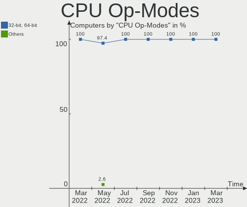
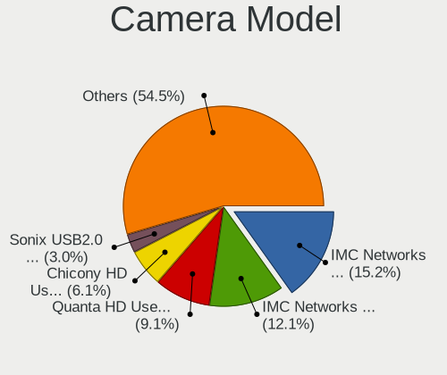

Endless Hardware Trends
-----------------------

A project to identify most popular hardware characteristics and track their change
over time based on data collected by Endless users at https://Linux-Hardware.org.

Anyone can contribute to this report by the [hw-probe](https://github.com/linuxhw/hw-probe) tool:

    sudo -E hw-probe -all -upload

This is a report for all computer types. See also reports for [desktops](/Dist/Endless/Desktop/README.md) and [notebooks](/Dist/Endless/Notebook/README.md).

Full-feature report is available here: https://linux-hardware.org/?view=trends

Period: Aug, 2021.

Contents
--------

* [ System ](#system)
  - [ OS                       ](#os)
  - [ OS Family                ](#os-family)
  - [ Kernel                   ](#kernel)
  - [ Kernel Family            ](#kernel-family)
  - [ Kernel Major Ver.        ](#kernel-major-ver)
  - [ Arch                     ](#arch)
  - [ DE                       ](#de)
  - [ Display Server           ](#display-server)
  - [ Display Manager          ](#display-manager)
  - [ OS Lang                  ](#os-lang)
  - [ Boot Mode                ](#boot-mode)
  - [ Filesystem               ](#filesystem)
  - [ Part. scheme             ](#part-scheme)
  - [ Dual Boot with Linux/BSD ](#dual-boot-with-linuxbsd)
  - [ Dual Boot (Win)          ](#dual-boot-win)

* [ Board ](#board)
  - [ Vendor                   ](#vendor)
  - [ Model                    ](#model)
  - [ Model Family             ](#model-family)
  - [ MFG Year                 ](#mfg-year)
  - [ Form Factor              ](#form-factor)
  - [ Secure Boot              ](#secure-boot)
  - [ Coreboot                 ](#coreboot)
  - [ RAM Size                 ](#ram-size)
  - [ RAM Used                 ](#ram-used)
  - [ Total Drives             ](#total-drives)
  - [ Has CD-ROM               ](#has-cd-rom)
  - [ Has Ethernet             ](#has-ethernet)
  - [ Has WiFi                 ](#has-wifi)
  - [ Has Bluetooth            ](#has-bluetooth)

* [ Location ](#location)
  - [ Country                  ](#country)
  - [ City                     ](#city)

* [ Drives ](#drives)
  - [ Drive Vendor             ](#drive-vendor)
  - [ Drive Model              ](#drive-model)
  - [ HDD Vendor               ](#hdd-vendor)
  - [ SSD Vendor               ](#ssd-vendor)
  - [ Drive Kind               ](#drive-kind)
  - [ Drive Connector          ](#drive-connector)
  - [ Drive Size               ](#drive-size)
  - [ Space Total              ](#space-total)
  - [ Space Used               ](#space-used)
  - [ Malfunc. Drives          ](#malfunc-drives)
  - [ Malfunc. Drive Vendor    ](#malfunc-drive-vendor)
  - [ Malfunc. HDD Vendor      ](#malfunc-hdd-vendor)
  - [ Malfunc. Drive Kind      ](#malfunc-drive-kind)
  - [ Failed Drives            ](#failed-drives)
  - [ Failed Drive Vendor      ](#failed-drive-vendor)
  - [ Drive Status             ](#drive-status)

* [ Storage controller ](#storage-controller)
  - [ Storage Vendor           ](#storage-vendor)
  - [ Storage Model            ](#storage-model)
  - [ Storage Kind             ](#storage-kind)

* [ Processor ](#processor)
  - [ CPU Vendor               ](#cpu-vendor)
  - [ CPU Model                ](#cpu-model)
  - [ CPU Model Family         ](#cpu-model-family)
  - [ CPU Cores                ](#cpu-cores)
  - [ CPU Sockets              ](#cpu-sockets)
  - [ CPU Threads              ](#cpu-threads)
  - [ CPU Op-Modes             ](#cpu-op-modes)
  - [ CPU Microcode            ](#cpu-microcode)
  - [ CPU Microarch            ](#cpu-microarch)

* [ Graphics ](#graphics)
  - [ GPU Vendor               ](#gpu-vendor)
  - [ GPU Model                ](#gpu-model)
  - [ GPU Combo                ](#gpu-combo)
  - [ GPU Driver               ](#gpu-driver)
  - [ GPU Memory               ](#gpu-memory)

* [ Monitor ](#monitor)
  - [ Monitor Vendor           ](#monitor-vendor)
  - [ Monitor Model            ](#monitor-model)
  - [ Monitor Resolution       ](#monitor-resolution)
  - [ Monitor Diagonal         ](#monitor-diagonal)
  - [ Monitor Width            ](#monitor-width)
  - [ Aspect Ratio             ](#aspect-ratio)
  - [ Monitor Area             ](#monitor-area)
  - [ Pixel Density            ](#pixel-density)
  - [ Multiple Monitors        ](#multiple-monitors)

* [ Network ](#network)
  - [ Net Controller Vendor    ](#net-controller-vendor)
  - [ Net Controller Model     ](#net-controller-model)
  - [ Wireless Vendor          ](#wireless-vendor)
  - [ Wireless Model           ](#wireless-model)
  - [ Ethernet Vendor          ](#ethernet-vendor)
  - [ Ethernet Model           ](#ethernet-model)
  - [ Net Controller Kind      ](#net-controller-kind)
  - [ Used Controller          ](#used-controller)
  - [ NICs                     ](#nics)
  - [ IPv6                     ](#ipv6)

* [ Bluetooth ](#bluetooth)
  - [ Bluetooth Vendor         ](#bluetooth-vendor)
  - [ Bluetooth Model          ](#bluetooth-model)

* [ Sound ](#sound)
  - [ Sound Vendor             ](#sound-vendor)
  - [ Sound Model              ](#sound-model)

* [ Memory ](#memory)
  - [ Memory Vendor            ](#memory-vendor)
  - [ Memory Model             ](#memory-model)
  - [ Memory Kind              ](#memory-kind)
  - [ Memory Form Factor       ](#memory-form-factor)
  - [ Memory Size              ](#memory-size)
  - [ Memory Speed             ](#memory-speed)

* [ Printers & scanners ](#printers--scanners)
  - [ Printer Vendor           ](#printer-vendor)
  - [ Printer Model            ](#printer-model)
  - [ Scanner Vendor           ](#scanner-vendor)
  - [ Scanner Model            ](#scanner-model)

* [ Camera ](#camera)
  - [ Camera Vendor            ](#camera-vendor)
  - [ Camera Model             ](#camera-model)

* [ Security ](#security)
  - [ Fingerprint Vendor       ](#fingerprint-vendor)
  - [ Fingerprint Model        ](#fingerprint-model)
  - [ Chipcard Vendor          ](#chipcard-vendor)
  - [ Chipcard Model           ](#chipcard-model)

* [ Unsupported ](#unsupported)
  - [ Unsupported Devices      ](#unsupported-devices)
  - [ Unsupported Device Types ](#unsupported-device-types)

System
------

OS
--

Installed operating systems

| Name                  | Computers | Percent |
|-----------------------|-----------|---------|
| Endless 3.9.5         | 52        | 81.25%  |
| Endless 3.8.7         | 3         | 4.69%   |
| Endless 3.9.3         | 1         | 1.56%   |
| Endless 3.9.2         | 1         | 1.56%   |
| Endless 3.9.1-nexthw2 | 1         | 1.56%   |
| Endless 3.9.1         | 1         | 1.56%   |
| Endless 3.8.7-nexthw2 | 1         | 1.56%   |
| Endless 3.8.4         | 1         | 1.56%   |
| Endless 3.7.7-nexthw1 | 1         | 1.56%   |
| Endless 3.7.4         | 1         | 1.56%   |
| Endless 3.4.2-nexthw1 | 1         | 1.56%   |

OS Family
---------

OS without a version

| Name    | Computers | Percent |
|---------|-----------|---------|
| Endless | 64        | 100%    |

Kernel
------

Version of the Linux kernel

| Version           | Computers | Percent |
|-------------------|-----------|---------|
| 5.8.0-14-generic  | 56        | 87.5%   |
| 5.4.0-42-generic  | 3         | 4.69%   |
| 5.4.0-7-generic   | 1         | 1.56%   |
| 5.4.0-19-generic  | 1         | 1.56%   |
| 5.3.0-19-generic  | 1         | 1.56%   |
| 5.10.0-10-generic | 1         | 1.56%   |
| 4.16.0-4-generic  | 1         | 1.56%   |

Kernel Family
-------------

Linux kernel without a distro release

| Version | Computers | Percent |
|---------|-----------|---------|
| 5.8.0   | 56        | 87.5%   |
| 5.4.0   | 5         | 7.81%   |
| 5.3.0   | 1         | 1.56%   |
| 5.10.0  | 1         | 1.56%   |
| 4.16.0  | 1         | 1.56%   |

Kernel Major Ver.
-----------------

Linux kernel major version

| Version | Computers | Percent |
|---------|-----------|---------|
| 5.8     | 56        | 87.5%   |
| 5.4     | 5         | 7.81%   |
| 5.3     | 1         | 1.56%   |
| 5.10    | 1         | 1.56%   |
| 4.16    | 1         | 1.56%   |

Arch
----

OS architecture (x86_64, i586, etc.)

| Name   | Computers | Percent |
|--------|-----------|---------|
| x86_64 | 64        | 100%    |

DE
--

Desktop Environment

| Name  | Computers | Percent |
|-------|-----------|---------|
| GNOME | 64        | 100%    |

Display Server
--------------

X11 or Wayland

| Name | Computers | Percent |
|------|-----------|---------|
| X11  | 64        | 100%    |

Display Manager
---------------

SDDM, LightDM, etc.

| Name    | Computers | Percent |
|---------|-----------|---------|
| Unknown | 64        | 100%    |

OS Lang
-------

Language

| Lang        | Computers | Percent |
|-------------|-----------|---------|
| pt_BR       | 28        | 43.75%  |
| en_US       | 13        | 20.31%  |
| es_MX       | 4         | 6.25%   |
| ru_RU.UTF_8 | 2         | 3.13%   |
| ro_RO       | 2         | 3.13%   |
| hr_HR       | 2         | 3.13%   |
| es_CO       | 2         | 3.13%   |
| de_DE       | 2         | 3.13%   |
| tr_TR       | 1         | 1.56%   |
| th_TH       | 1         | 1.56%   |
| ru_UA       | 1         | 1.56%   |
| ru_RU       | 1         | 1.56%   |
| hu_HU       | 1         | 1.56%   |
| es_ES       | 1         | 1.56%   |
| en_IN       | 1         | 1.56%   |
| en_IE       | 1         | 1.56%   |
| el_GR       | 1         | 1.56%   |

Boot Mode
---------

EFI or BIOS

| Mode | Computers | Percent |
|------|-----------|---------|
| EFI  | 46        | 71.88%  |
| BIOS | 18        | 28.13%  |

Filesystem
----------

Type of filesystem

| Type  | Computers | Percent |
|-------|-----------|---------|
| Ext4  | 63        | 98.44%  |
| Tmpfs | 1         | 1.56%   |

Part. scheme
------------

Scheme of partitioning

| Type    | Computers | Percent |
|---------|-----------|---------|
| Unknown | 64        | 100%    |

Dual Boot with Linux/BSD
------------------------

Hosting more than one Linux/BSD

| Dual boot | Computers | Percent |
|-----------|-----------|---------|
| No        | 64        | 100%    |

Dual Boot (Win)
---------------

Hosting Linux and Windows

| Dual boot | Computers | Percent |
|-----------|-----------|---------|
| No        | 64        | 100%    |

Board
-----

Vendor
------

Motherboard manufacturer

| Name                  | Computers | Percent |
|-----------------------|-----------|---------|
| Acer                  | 23        | 35.94%  |
| ASUSTek Computer      | 15        | 23.44%  |
| Hewlett-Packard       | 6         | 9.38%   |
| Toshiba               | 2         | 3.13%   |
| Positivo              | 2         | 3.13%   |
| Lenovo                | 2         | 3.13%   |
| Gigabyte Technology   | 2         | 3.13%   |
| Fujitsu Siemens       | 2         | 3.13%   |
| Sony                  | 1         | 1.56%   |
| Samsung Electronics   | 1         | 1.56%   |
| Positivo Bahia - VAIO | 1         | 1.56%   |
| Pegatron              | 1         | 1.56%   |
| LG Electronics        | 1         | 1.56%   |
| iRU                   | 1         | 1.56%   |
| Intel                 | 1         | 1.56%   |
| Dell                  | 1         | 1.56%   |
| ASRock                | 1         | 1.56%   |
| Unknown               | 1         | 1.56%   |

Model
-----

Motherboard model

| Name                                    | Computers | Percent |
|-----------------------------------------|-----------|---------|
| Acer Nitro AN515-44                     | 6         | 9.38%   |
| Acer Nitro AN515-54                     | 4         | 6.25%   |
| ASUS VivoBook 15_ASUS Laptop X540UAR    | 3         | 4.69%   |
| Acer Nitro AN515-43                     | 2         | 3.13%   |
| Acer Aspire A515-54G                    | 2         | 3.13%   |
| Acer Aspire A315-34                     | 2         | 3.13%   |
| Toshiba Satellite L850-B4S              | 1         | 1.56%   |
| Toshiba Satellite C55-C                 | 1         | 1.56%   |
| Sony VPCCB35FG                          | 1         | 1.56%   |
| Samsung 800G5M/800G5W                   | 1         | 1.56%   |
| Positivo WCBT1013                       | 1         | 1.56%   |
| Positivo P5VD2-MX                       | 1         | 1.56%   |
| Positivo Bahia - VAIO VJFE41F11X        | 1         | 1.56%   |
| Pegatron 23-b030la                      | 1         | 1.56%   |
| LG N450-P.BE55P1                        | 1         | 1.56%   |
| Lenovo ThinkCentre M78 10BTA00ELM       | 1         | 1.56%   |
| Lenovo IdeaPad 330-15IGM 81D1           | 1         | 1.56%   |
| iRU J2335                               | 1         | 1.56%   |
| Intel MAGNUM GX                         | 1         | 1.56%   |
| HP Z230 Tower Workstation               | 1         | 1.56%   |
| HP Pavilion x2 Detachable               | 1         | 1.56%   |
| HP Pavilion Gaming Laptop 15-dk1xxx     | 1         | 1.56%   |
| HP CQ2902EQ                             | 1         | 1.56%   |
| HP All-in-One                           | 1         | 1.56%   |
| HP 2000                                 | 1         | 1.56%   |
| Gigabyte P75-D3                         | 1         | 1.56%   |
| Gigabyte GA-78LMT-USB3 6.0              | 1         | 1.56%   |
| Fujitsu Siemens ESPRIMO Mobile V5535    | 1         | 1.56%   |
| Fujitsu Siemens ESPRIMO Mobile M9410    | 1         | 1.56%   |
| Dell Inspiron One 2320                  | 1         | 1.56%   |
| ASUS X450CP                             | 1         | 1.56%   |
| ASUS VivoBook_ASUSLaptop X712FA_X712FA  | 1         | 1.56%   |
| ASUS VivoBook_ASUSLaptop X513EP_X513EP  | 1         | 1.56%   |
| ASUS VivoBook_ASUSLaptop X509JA_X509JA  | 1         | 1.56%   |
| ASUS VivoBook_ASUSLaptop X509FA_X509FA  | 1         | 1.56%   |
| ASUS VivoBook_ASUSLaptop X415EA_X415EA  | 1         | 1.56%   |
| ASUS VivoBook_ASUS Laptop E410MA_E410MA | 1         | 1.56%   |
| ASUS VivoBook 15_ASUS Laptop X540UBR    | 1         | 1.56%   |
| ASUS VivoBook 15_ASUS Laptop X540BA     | 1         | 1.56%   |
| ASUS TUF Gaming FX505DT_FX505DT         | 1         | 1.56%   |
| ASUS M2N68-AM Plus                      | 1         | 1.56%   |
| ASUS K30BF_M32BF_A_F_K31BF              | 1         | 1.56%   |
| ASRock A88M-G                           | 1         | 1.56%   |
| Acer Veriton N4660G                     | 1         | 1.56%   |
| Acer Predator G3-571                    | 1         | 1.56%   |
| Acer Nitro AN517-51                     | 1         | 1.56%   |
| Acer Aspire A517-51G                    | 1         | 1.56%   |
| Acer Aspire A515-54                     | 1         | 1.56%   |
| Acer Aspire A315-54K                    | 1         | 1.56%   |
| Acer Aspire A315-33                     | 1         | 1.56%   |
| Unknown                                 | 1         | 1.56%   |

Model Family
------------

Motherboard model prefix

| Name                             | Computers | Percent |
|----------------------------------|-----------|---------|
| Acer Nitro                       | 13        | 20.31%  |
| ASUS VivoBook                    | 11        | 17.19%  |
| Acer Aspire                      | 8         | 12.5%   |
| Toshiba Satellite                | 2         | 3.13%   |
| HP Pavilion                      | 2         | 3.13%   |
| Fujitsu Siemens ESPRIMO          | 2         | 3.13%   |
| Sony VPCCB35FG                   | 1         | 1.56%   |
| Samsung 800G5M                   | 1         | 1.56%   |
| Positivo WCBT1013                | 1         | 1.56%   |
| Positivo P5VD2-MX                | 1         | 1.56%   |
| Positivo Bahia - VAIO VJFE41F11X | 1         | 1.56%   |
| Pegatron 23-b030la               | 1         | 1.56%   |
| LG N450-P.BE55P1                 | 1         | 1.56%   |
| Lenovo ThinkCentre               | 1         | 1.56%   |
| Lenovo IdeaPad                   | 1         | 1.56%   |
| iRU J2335                        | 1         | 1.56%   |
| Intel MAGNUM                     | 1         | 1.56%   |
| HP Z230                          | 1         | 1.56%   |
| HP CQ2902EQ                      | 1         | 1.56%   |
| HP All-in-One                    | 1         | 1.56%   |
| HP 2000                          | 1         | 1.56%   |
| Gigabyte P75-D3                  | 1         | 1.56%   |
| Gigabyte GA-78LMT-USB3           | 1         | 1.56%   |
| Dell Inspiron                    | 1         | 1.56%   |
| ASUS X450CP                      | 1         | 1.56%   |
| ASUS TUF                         | 1         | 1.56%   |
| ASUS M2N68-AM                    | 1         | 1.56%   |
| ASUS K30BF                       | 1         | 1.56%   |
| ASRock A88M-G                    | 1         | 1.56%   |
| Acer Veriton                     | 1         | 1.56%   |
| Acer Predator                    | 1         | 1.56%   |
| Unknown                          | 1         | 1.56%   |

MFG Year
--------

Motherboard manufacture year

| Year | Computers | Percent |
|------|-----------|---------|
| 2020 | 16        | 25%     |
| 2019 | 13        | 20.31%  |
| 2021 | 9         | 14.06%  |
| 2012 | 5         | 7.81%   |
| 2018 | 4         | 6.25%   |
| 2014 | 4         | 6.25%   |
| 2015 | 3         | 4.69%   |
| 2013 | 2         | 3.13%   |
| 2011 | 2         | 3.13%   |
| 2009 | 2         | 3.13%   |
| 2007 | 2         | 3.13%   |
| 2016 | 1         | 1.56%   |
| 2010 | 1         | 1.56%   |

Form Factor
-----------

Physical design of the computer

| Name       | Computers | Percent |
|------------|-----------|---------|
| Notebook   | 49        | 76.56%  |
| Desktop    | 12        | 18.75%  |
| All in one | 3         | 4.69%   |

Secure Boot
-----------

Enabled or disabled

| State    | Computers | Percent |
|----------|-----------|---------|
| Disabled | 40        | 62.5%   |
| Enabled  | 24        | 37.5%   |

Coreboot
--------

Have coreboot on board

| Used | Computers | Percent |
|------|-----------|---------|
| No   | 64        | 100%    |

RAM Size
--------

Total RAM memory

| Size in GB | Computers | Percent |
|------------|-----------|---------|
| 4.01-8.0   | 22        | 34.38%  |
| 3.01-4.0   | 18        | 28.13%  |
| 8.01-16.0  | 15        | 23.44%  |
| 16.01-24.0 | 3         | 4.69%   |
| 1.01-2.0   | 3         | 4.69%   |
| 0.51-1.0   | 2         | 3.13%   |
| 2.01-3.0   | 1         | 1.56%   |

RAM Used
--------

Used RAM memory

| Used GB  | Computers | Percent |
|----------|-----------|---------|
| 1.01-2.0 | 35        | 54.69%  |
| 2.01-3.0 | 14        | 21.88%  |
| 0.51-1.0 | 7         | 10.94%  |
| 4.01-8.0 | 4         | 6.25%   |
| 3.01-4.0 | 3         | 4.69%   |
| 0.01-0.5 | 1         | 1.56%   |

Total Drives
------------

Number of drives on board

| Drives | Computers | Percent |
|--------|-----------|---------|
| 1      | 50        | 78.13%  |
| 2      | 11        | 17.19%  |
| 3      | 2         | 3.13%   |
| 5      | 1         | 1.56%   |

Has CD-ROM
----------

Has CD-ROM on board

| Presented | Computers | Percent |
|-----------|-----------|---------|
| No        | 48        | 75%     |
| Yes       | 16        | 25%     |

Has Ethernet
------------

Has Ethernet on board

| Presented | Computers | Percent |
|-----------|-----------|---------|
| Yes       | 48        | 75%     |
| No        | 16        | 25%     |

Has WiFi
--------

Has WiFi module

| Presented | Computers | Percent |
|-----------|-----------|---------|
| Yes       | 55        | 85.94%  |
| No        | 9         | 14.06%  |

Has Bluetooth
-------------

Has Bluetooth module

| Presented | Computers | Percent |
|-----------|-----------|---------|
| Yes       | 50        | 78.13%  |
| No        | 14        | 21.88%  |

Location
--------

Country
-------

Geographic location (country)

| Country  | Computers | Percent |
|----------|-----------|---------|
| Brazil   | 28        | 43.75%  |
| Romania  | 8         | 12.5%   |
| USA      | 6         | 9.38%   |
| Russia   | 3         | 4.69%   |
| Mexico   | 3         | 4.69%   |
| Colombia | 3         | 4.69%   |
| Germany  | 2         | 3.13%   |
| Croatia  | 2         | 3.13%   |
| Ukraine  | 1         | 1.56%   |
| Turkey   | 1         | 1.56%   |
| Thailand | 1         | 1.56%   |
| Spain    | 1         | 1.56%   |
| Ireland  | 1         | 1.56%   |
| India    | 1         | 1.56%   |
| Hungary  | 1         | 1.56%   |
| Greece   | 1         | 1.56%   |
| Belarus  | 1         | 1.56%   |

City
----

Geographic location (city)

| City                   | Computers | Percent |
|------------------------|-----------|---------|
| Popesti-Leordeni       | 4         | 6.25%   |
| Bogot??                | 3         | 4.69%   |
| S??o Paulo             | 2         | 3.13%   |
| Quer?©taro City        | 2         | 3.13%   |
| Bucyrus                | 2         | 3.13%   |
| Zagreb                 | 1         | 1.56%   |
| Voskresenske           | 1         | 1.56%   |
| Varginha               | 1         | 1.56%   |
| Van                    | 1         | 1.56%   |
| Thessaloniki           | 1         | 1.56%   |
| Teresina               | 1         | 1.56%   |
| St Petersburg          | 1         | 1.56%   |
| Shannon                | 1         | 1.56%   |
| S??o Mateus            | 1         | 1.56%   |
| S??o Jos?© dos Pinhais | 1         | 1.56%   |
| Sao Jose               | 1         | 1.56%   |
| Santo ?‚ngelo          | 1         | 1.56%   |
| Santo Andr?©           | 1         | 1.56%   |
| Santa Rosa             | 1         | 1.56%   |
| Salvador               | 1         | 1.56%   |
| Rolandia               | 1         | 1.56%   |
| Rio de Janeiro         | 1         | 1.56%   |
| Presidente Figueiredo  | 1         | 1.56%   |
| Porto Velho            | 1         | 1.56%   |
| Port Townsend          | 1         | 1.56%   |
| Passos                 | 1         | 1.56%   |
| Paranagu??             | 1         | 1.56%   |
| Ourinhos               | 1         | 1.56%   |
| Osasco                 | 1         | 1.56%   |
| Novokuznetsk           | 1         | 1.56%   |
| Newnan                 | 1         | 1.56%   |
| Moscow                 | 1         | 1.56%   |
| Minsk                  | 1         | 1.56%   |
| Media??                | 1         | 1.56%   |
| Madrid                 | 1         | 1.56%   |
| Londrina               | 1         | 1.56%   |
| Leipzig                | 1         | 1.56%   |
| Le??n                  | 1         | 1.56%   |
| Labin                  | 1         | 1.56%   |
| Johnstown              | 1         | 1.56%   |
| Jamshedpur             | 1         | 1.56%   |
| Hamburg                | 1         | 1.56%   |
| Fortaleza              | 1         | 1.56%   |
| Florian??polis         | 1         | 1.56%   |
| Eldorado               | 1         | 1.56%   |
| Divin??polis           | 1         | 1.56%   |
| Dacula                 | 1         | 1.56%   |
| Contagem               | 1         | 1.56%   |
| Chitila                | 1         | 1.56%   |
| Caransebes             | 1         | 1.56%   |
| Campo Grande           | 1         | 1.56%   |
| Campinas               | 1         | 1.56%   |
| Budapest               | 1         | 1.56%   |
| Bucharest              | 1         | 1.56%   |
| Bangkok                | 1         | 1.56%   |
| Avare                  | 1         | 1.56%   |

Drives
------

Drive Vendor
------------

Hard drive vendors

| Vendor              | Computers | Drives | Percent |
|---------------------|-----------|--------|---------|
| WDC                 | 17        | 17     | 21.79%  |
| Kingston            | 10        | 10     | 12.82%  |
| Intel               | 10        | 10     | 12.82%  |
| Sandisk             | 9         | 9      | 11.54%  |
| Seagate             | 7         | 9      | 8.97%   |
| Unknown             | 4         | 4      | 5.13%   |
| Hitachi             | 3         | 3      | 3.85%   |
| Toshiba             | 2         | 3      | 2.56%   |
| SK Hynix            | 2         | 2      | 2.56%   |
| Micron Technology   | 2         | 2      | 2.56%   |
| ADATA Technology    | 2         | 2      | 2.56%   |
| Synopsys            | 1         | 1      | 1.28%   |
| Silicon Motion      | 1         | 1      | 1.28%   |
| Samsung Electronics | 1         | 1      | 1.28%   |
| PNY                 | 1         | 1      | 1.28%   |
| Lite-On             | 1         | 1      | 1.28%   |
| KIOXIA              | 1         | 1      | 1.28%   |
| KingDian            | 1         | 1      | 1.28%   |
| Crucial             | 1         | 1      | 1.28%   |
| China               | 1         | 1      | 1.28%   |
| A-DATA Technology   | 1         | 1      | 1.28%   |

Drive Model
-----------

Hard drive models

| Model                                 | Computers | Percent |
|---------------------------------------|-----------|---------|
| Intel NVMe SSD Drive 512GB            | 7         | 8.64%   |
| WDC WD10SPZX-21Z10T0 1TB              | 6         | 7.41%   |
| Sandisk NVMe SSD Drive 512GB          | 5         | 6.17%   |
| Kingston RBUSC180DS37256GJ 256GB SSD  | 3         | 3.7%    |
| WDC WD5000LPCX-21VHAT0 500GB          | 2         | 2.47%   |
| Seagate ST500DM002-1BD142 500GB       | 2         | 2.47%   |
| Kingston SV300S37A120G 120GB SSD      | 2         | 2.47%   |
| Kingston SA400S37240G 240GB SSD       | 2         | 2.47%   |
| Intel NVMe SSD Drive 256GB            | 2         | 2.47%   |
| Hitachi HTS545050A7E380 500GB         | 2         | 2.47%   |
| ADATA NVMe SSD Drive 128GB            | 2         | 2.47%   |
| WDC WD5000LPZX-08Z10 500GB            | 1         | 1.23%   |
| WDC WD5000BPVT-60HXZT1 500GB          | 1         | 1.23%   |
| WDC WD5000BPVT-00HXZT1 500GB          | 1         | 1.23%   |
| WDC WD5000AAKX-60U6AA0 500GB          | 1         | 1.23%   |
| WDC WD2500BEVS-75UST0 250GB           | 1         | 1.23%   |
| WDC WD10SPZX-80Z10T2 1TB              | 1         | 1.23%   |
| WDC WD10JPVX-75JC3T0 1TB              | 1         | 1.23%   |
| WDC WD10EZEX-60WN4A0 1TB              | 1         | 1.23%   |
| WDC WD10EARS-00Y5B1 1TB               | 1         | 1.23%   |
| Unknown SD/MMC/MS PRO 128GB           | 1         | 1.23%   |
| Unknown MMC Card  32GB                | 1         | 1.23%   |
| Unknown MMC Card  16GB                | 1         | 1.23%   |
| Unknown MMC Card  128GB               | 1         | 1.23%   |
| Toshiba MQ01ABD100 1TB                | 1         | 1.23%   |
| Toshiba HDWD110 1TB                   | 1         | 1.23%   |
| Toshiba DT01ACA200 2TB                | 1         | 1.23%   |
| Synopsys NVMe SSD Drive 1024MB        | 1         | 1.23%   |
| SK Hynix NVMe SSD Drive 256GB         | 1         | 1.23%   |
| SK Hynix HFS256G39TND-N210A 256GB SSD | 1         | 1.23%   |
| Silicon Motion NVMe SSD Drive 256GB   | 1         | 1.23%   |
| Seagate ST9160821AS 160GB             | 1         | 1.23%   |
| Seagate ST3300822AS 304GB             | 1         | 1.23%   |
| Seagate ST320LT012-9WS14C 320GB       | 1         | 1.23%   |
| Seagate ST31000524AS 1TB              | 1         | 1.23%   |
| Seagate ST2000LM007-1R8174 2TB        | 1         | 1.23%   |
| Seagate ST1000LM035-1RK172 1TB        | 1         | 1.23%   |
| Seagate ST1000DM003-1CH162 1TB        | 1         | 1.23%   |
| SanDisk SD9SN8W256G1014 256GB SSD     | 1         | 1.23%   |
| SanDisk SD9SB8W256G1102 256GB SSD     | 1         | 1.23%   |
| Sandisk NVMe SSD Drive 500GB          | 1         | 1.23%   |
| Sandisk NVMe SSD Drive 256GB          | 1         | 1.23%   |
| Samsung HD252HJ 250GB                 | 1         | 1.23%   |
| PNY CS900 240GB SSD                   | 1         | 1.23%   |
| Micron NVMe SSD Drive 512GB           | 1         | 1.23%   |
| Micron 1300_MTFDDAK256TDL 256GB SSD   | 1         | 1.23%   |
| Lite-On NVMe SSD Drive 256GB          | 1         | 1.23%   |
| KIOXIA NVMe SSD Drive 256GB           | 1         | 1.23%   |
| Kingston SV300S37A60G 64GB SSD        | 1         | 1.23%   |
| Kingston SA400S37480G 480GB SSD       | 1         | 1.23%   |
| Kingston NVMe SSD Drive 256GB         | 1         | 1.23%   |
| KingDian S200 120GB                   | 1         | 1.23%   |
| Intel NVMe SSD Drive 128GB            | 1         | 1.23%   |
| Hitachi HDS721616PLA380 160GB         | 1         | 1.23%   |
| Crucial CT120BX500SSD1 120GB          | 1         | 1.23%   |
| China SATA SSD 20GB                   | 1         | 1.23%   |
| A-DATA SU800 1024GB SSD               | 1         | 1.23%   |

HDD Vendor
----------

Hard disk drive vendors

| Vendor              | Computers | Drives | Percent |
|---------------------|-----------|--------|---------|
| WDC                 | 17        | 17     | 56.67%  |
| Seagate             | 7         | 9      | 23.33%  |
| Hitachi             | 3         | 3      | 10%     |
| Toshiba             | 2         | 3      | 6.67%   |
| Samsung Electronics | 1         | 1      | 3.33%   |

SSD Vendor
----------

Solid state drive vendors

| Vendor            | Computers | Drives | Percent |
|-------------------|-----------|--------|---------|
| Kingston          | 9         | 9      | 50%     |
| SanDisk           | 2         | 2      | 11.11%  |
| SK Hynix          | 1         | 1      | 5.56%   |
| PNY               | 1         | 1      | 5.56%   |
| Micron Technology | 1         | 1      | 5.56%   |
| KingDian          | 1         | 1      | 5.56%   |
| Crucial           | 1         | 1      | 5.56%   |
| China             | 1         | 1      | 5.56%   |
| A-DATA Technology | 1         | 1      | 5.56%   |

Drive Kind
----------

HDD or SSD

| Kind    | Computers | Drives | Percent |
|---------|-----------|--------|---------|
| HDD     | 27        | 33     | 36%     |
| NVMe    | 26        | 26     | 34.67%  |
| SSD     | 18        | 18     | 24%     |
| MMC     | 3         | 3      | 4%      |
| Unknown | 1         | 1      | 1.33%   |

Drive Connector
---------------

SATA, SAS, NVMe, etc.

| Type | Computers | Drives | Percent |
|------|-----------|--------|---------|
| SATA | 42        | 51     | 58.33%  |
| NVMe | 26        | 26     | 36.11%  |
| MMC  | 3         | 3      | 4.17%   |
| SAS  | 1         | 1      | 1.39%   |

Drive Size
----------

Size of hard drive

| Size in TB | Computers | Drives | Percent |
|------------|-----------|--------|---------|
| 0.01-0.5   | 31        | 33     | 65.96%  |
| 0.51-1.0   | 13        | 15     | 27.66%  |
| 1.01-2.0   | 3         | 3      | 6.38%   |

Space Total
-----------

Amount of disk space available on the file system

| Size in GB | Computers | Percent |
|------------|-----------|---------|
| 101-250    | 23        | 35.94%  |
| 251-500    | 20        | 31.25%  |
| 501-1000   | 7         | 10.94%  |
| 51-100     | 4         | 6.25%   |
| 21-50      | 3         | 4.69%   |
| 1-20       | 3         | 4.69%   |
| 1001-2000  | 2         | 3.13%   |
| 2001-3000  | 1         | 1.56%   |
| Unknown    | 1         | 1.56%   |

Space Used
----------

Amount of used disk space

| Used GB   | Computers | Percent |
|-----------|-----------|---------|
| 21-50     | 31        | 48.44%  |
| 51-100    | 14        | 21.88%  |
| 1-20      | 10        | 15.63%  |
| 101-250   | 6         | 9.38%   |
| 251-500   | 1         | 1.56%   |
| 2001-3000 | 1         | 1.56%   |
| Unknown   | 1         | 1.56%   |

Malfunc. Drives
---------------

Drive models with a malfunction

Zero info for selected period =(

Malfunc. Drive Vendor
---------------------

Vendors of faulty drives

Zero info for selected period =(

Malfunc. HDD Vendor
-------------------

Vendors of faulty HDD drives

Zero info for selected period =(

Malfunc. Drive Kind
-------------------

Kinds of faulty drives

Zero info for selected period =(

Failed Drives
-------------

Failed drive models

Zero info for selected period =(

Failed Drive Vendor
-------------------

Failed drive vendors

Zero info for selected period =(

Drive Status
------------

Number of failed and malfunc. drives

| Status   | Computers | Drives | Percent |
|----------|-----------|--------|---------|
| Detected | 64        | 81     | 100%    |

Storage controller
------------------

Storage Vendor
--------------

Storage controller vendors

| Vendor                           | Computers | Percent |
|----------------------------------|-----------|---------|
| Intel                            | 42        | 53.85%  |
| AMD                              | 16        | 20.51%  |
| Sandisk                          | 7         | 8.97%   |
| ADATA Technology                 | 2         | 2.56%   |
| VIA Technologies                 | 1         | 1.28%   |
| Synopsys                         | 1         | 1.28%   |
| SK Hynix                         | 1         | 1.28%   |
| Silicon Motion                   | 1         | 1.28%   |
| Silicon Integrated Systems [SiS] | 1         | 1.28%   |
| Nvidia                           | 1         | 1.28%   |
| Micron Technology                | 1         | 1.28%   |
| Marvell Technology Group         | 1         | 1.28%   |
| Lite-On Technology               | 1         | 1.28%   |
| KIOXIA                           | 1         | 1.28%   |
| Kingston Technology Company      | 1         | 1.28%   |

Storage Model
-------------

Storage controller models

| Model                                                                            | Computers | Percent |
|----------------------------------------------------------------------------------|-----------|---------|
| AMD FCH SATA Controller [AHCI mode]                                              | 15        | 15.46%  |
| Intel 82801 Mobile SATA Controller [RAID mode]                                   | 13        | 13.4%   |
| Intel PROSet/Wireless WiFi Software extension                                    | 10        | 10.31%  |
| Sandisk WD Blue SN550 NVMe SSD                                                   | 7         | 7.22%   |
| Intel Sunrise Point-LP SATA Controller [AHCI mode]                               | 6         | 6.19%   |
| Intel Celeron/Pentium Silver Processor SATA Controller                           | 5         | 5.15%   |
| Intel Volume Management Device NVMe RAID Controller                              | 2         | 2.06%   |
| Intel Tiger Lake-LP SATA Controller [AHCI mode]                                  | 2         | 2.06%   |
| Intel HM170/QM170 Chipset SATA Controller [AHCI Mode]                            | 2         | 2.06%   |
| Intel 7 Series Chipset Family 6-port SATA Controller [AHCI mode]                 | 2         | 2.06%   |
| Intel 6 Series/C200 Series Chipset Family 6 port Desktop SATA AHCI Controller    | 2         | 2.06%   |
| ADATA Non-Volatile memory controller                                             | 2         | 2.06%   |
| VIA VT82C586A/B/VT82C686/A/B/VT823x/A/C PIPC Bus Master IDE                      | 1         | 1.03%   |
| VIA Serial ATA Controller                                                        | 1         | 1.03%   |
| Synopsys Non-Volatile memory controller                                          | 1         | 1.03%   |
| SK Hynix BC511                                                                   | 1         | 1.03%   |
| Silicon Motion SM2263EN/SM2263XT SSD Controller                                  | 1         | 1.03%   |
| Silicon Integrated Systems [SiS] SATA Controller / IDE mode                      | 1         | 1.03%   |
| Silicon Integrated Systems [SiS] 5513 IDE Controller                             | 1         | 1.03%   |
| Nvidia MCP61 SATA Controller                                                     | 1         | 1.03%   |
| Nvidia MCP61 IDE                                                                 | 1         | 1.03%   |
| Micron Non-Volatile memory controller                                            | 1         | 1.03%   |
| Marvell Group 88SE6111/6121 SATA II / PATA Controller                            | 1         | 1.03%   |
| Lite-On NVMe Controller                                                          | 1         | 1.03%   |
| KIOXIA Non-Volatile memory controller                                            | 1         | 1.03%   |
| Kingston Company U-SNS8154P3 NVMe SSD                                            | 1         | 1.03%   |
| Intel Wildcat Point-LP SATA Controller [AHCI Mode]                               | 1         | 1.03%   |
| Intel SATA Controller [RAID mode]                                                | 1         | 1.03%   |
| Intel Cannon Lake PCH SATA AHCI Controller                                       | 1         | 1.03%   |
| Intel Atom/Celeron/Pentium Processor x5-E8000/J3xxx/N3xxx Series SATA Controller | 1         | 1.03%   |
| Intel 82801JI (ICH10 Family) SATA AHCI Controller                                | 1         | 1.03%   |
| Intel 82801IBM/IEM (ICH9M/ICH9M-E) 4 port SATA Controller [AHCI mode]            | 1         | 1.03%   |
| Intel 7 Series/C210 Series Chipset Family 6-port SATA Controller [AHCI mode]     | 1         | 1.03%   |
| Intel 7 Series Chipset Family 4-port SATA Controller [IDE mode]                  | 1         | 1.03%   |
| Intel 7 Series Chipset Family 2-port SATA Controller [IDE mode]                  | 1         | 1.03%   |
| Intel 6 Series/C200 Series Chipset Family 6 port Mobile SATA AHCI Controller     | 1         | 1.03%   |
| Intel 5 Series/3400 Series Chipset 4 port SATA AHCI Controller                   | 1         | 1.03%   |
| AMD SB7x0/SB8x0/SB9x0 SATA Controller [IDE mode]                                 | 1         | 1.03%   |
| AMD SB7x0/SB8x0/SB9x0 IDE Controller                                             | 1         | 1.03%   |
| AMD FCH SATA Controller D                                                        | 1         | 1.03%   |
| AMD FCH IDE Controller                                                           | 1         | 1.03%   |

Storage Kind
------------

Kind of storage controller (IDE, SATA, NVMe, SAS, ...)

| Kind | Computers | Percent |
|------|-----------|---------|
| SATA | 53        | 57.61%  |
| NVMe | 26        | 28.26%  |
| RAID | 7         | 7.61%   |
| IDE  | 6         | 6.52%   |

Processor
---------

CPU Vendor
----------

Processor vendors

| Vendor | Computers | Percent |
|--------|-----------|---------|
| Intel  | 46        | 71.88%  |
| AMD    | 18        | 28.13%  |

CPU Model
---------

Processor models

| Model                                           | Computers | Percent |
|-------------------------------------------------|-----------|---------|
| Intel Core i5-9300H CPU @ 2.40GHz               | 5         | 7.81%   |
| AMD Ryzen 5 4600H with Radeon Graphics          | 4         | 6.25%   |
| Intel Core i3-7020U CPU @ 2.30GHz               | 3         | 4.69%   |
| Intel Core i7-10510U CPU @ 1.80GHz              | 2         | 3.13%   |
| AMD Ryzen 7 4800H with Radeon Graphics          | 2         | 3.13%   |
| AMD Ryzen 7 3750H with Radeon Vega Mobile Gfx   | 2         | 3.13%   |
| Intel Xeon CPU E3-1271 v3 @ 3.60GHz             | 1         | 1.56%   |
| Intel Pentium Silver N5030 CPU @ 1.10GHz        | 1         | 1.56%   |
| Intel Pentium Silver N5000 CPU @ 1.10GHz        | 1         | 1.56%   |
| Intel Pentium Dual CPU E2180 @ 2.00GHz          | 1         | 1.56%   |
| Intel Pentium CPU G645T @ 2.50GHz               | 1         | 1.56%   |
| Intel Pentium CPU 4417U @ 2.30GHz               | 1         | 1.56%   |
| Intel Core i7-8565U CPU @ 1.80GHz               | 1         | 1.56%   |
| Intel Core i7-7700HQ CPU @ 2.80GHz              | 1         | 1.56%   |
| Intel Core i7-3610QM CPU @ 2.30GHz              | 1         | 1.56%   |
| Intel Core i7 CPU 920 @ 2.67GHz                 | 1         | 1.56%   |
| Intel Core i5-7300HQ CPU @ 2.50GHz              | 1         | 1.56%   |
| Intel Core i5-5200U CPU @ 2.20GHz               | 1         | 1.56%   |
| Intel Core i5-3337U CPU @ 1.80GHz               | 1         | 1.56%   |
| Intel Core i5-3210M CPU @ 2.50GHz               | 1         | 1.56%   |
| Intel Core i5-2430M CPU @ 2.40GHz               | 1         | 1.56%   |
| Intel Core i5-1035G1 CPU @ 1.00GHz              | 1         | 1.56%   |
| Intel Core i5-10300H CPU @ 2.50GHz              | 1         | 1.56%   |
| Intel Core i5-10210U CPU @ 1.60GHz              | 1         | 1.56%   |
| Intel Core i5 CPU M 450 @ 2.40GHz               | 1         | 1.56%   |
| Intel Core i3-8145U CPU @ 2.10GHz               | 1         | 1.56%   |
| Intel Core i3-8130U CPU @ 2.20GHz               | 1         | 1.56%   |
| Intel Core i3-8100 CPU @ 3.60GHz                | 1         | 1.56%   |
| Intel Core i3-6100U CPU @ 2.30GHz               | 1         | 1.56%   |
| Intel Core i3-6006U CPU @ 2.00GHz               | 1         | 1.56%   |
| Intel Core i3-3240 CPU @ 3.40GHz                | 1         | 1.56%   |
| Intel Core i3-2120 CPU @ 3.30GHz                | 1         | 1.56%   |
| Intel Core 2 Duo CPU T5550 @ 1.83GHz            | 1         | 1.56%   |
| Intel Core 2 Duo CPU P8700 @ 2.53GHz            | 1         | 1.56%   |
| Intel Celeron N4020 CPU @ 1.10GHz               | 1         | 1.56%   |
| Intel Celeron N4000 CPU @ 1.10GHz               | 1         | 1.56%   |
| Intel Celeron J4005 CPU @ 2.00GHz               | 1         | 1.56%   |
| Intel Celeron CPU N3060 @ 1.60GHz               | 1         | 1.56%   |
| Intel Atom x5-Z8300 CPU @ 1.44GHz               | 1         | 1.56%   |
| Intel Atom CPU Z3735G @ 1.33GHz                 | 1         | 1.56%   |
| Intel 11th Gen Core i7-1165G7 @ 2.80GHz         | 1         | 1.56%   |
| Intel 11th Gen Core i3-1115G4 @ 3.00GHz         | 1         | 1.56%   |
| AMD Ryzen 5 3550H with Radeon Vega Mobile Gfx   | 1         | 1.56%   |
| AMD Ryzen 5 3400G with Radeon Vega Graphics     | 1         | 1.56%   |
| AMD FX-6300 Six-Core Processor                  | 1         | 1.56%   |
| AMD E-300 APU with Radeon HD Graphics           | 1         | 1.56%   |
| AMD Athlon II X2 240 Processor                  | 1         | 1.56%   |
| AMD A8-6500 APU with Radeon HD Graphics         | 1         | 1.56%   |
| AMD A6-9225 RADEON R4, 5 COMPUTE CORES 2C+3G    | 1         | 1.56%   |
| AMD A6-5400B APU with Radeon HD Graphics        | 1         | 1.56%   |
| AMD A4-5300 APU with Radeon HD Graphics         | 1         | 1.56%   |
| AMD A10-7850K Radeon R7, 12 Compute Cores 4C+8G | 1         | 1.56%   |

CPU Model Family
----------------

Processor model prefix

| Model                | Computers | Percent |
|----------------------|-----------|---------|
| Intel Core i5        | 14        | 21.88%  |
| Intel Core i3        | 10        | 15.63%  |
| Intel Core i7        | 6         | 9.38%   |
| AMD Ryzen 5          | 6         | 9.38%   |
| Intel Celeron        | 4         | 6.25%   |
| AMD Ryzen 7          | 4         | 6.25%   |
| Other                | 2         | 3.13%   |
| Intel Pentium Silver | 2         | 3.13%   |
| Intel Pentium        | 2         | 3.13%   |
| Intel Core 2 Duo     | 2         | 3.13%   |
| Intel Atom           | 2         | 3.13%   |
| AMD A6               | 2         | 3.13%   |
| Intel Xeon           | 1         | 1.56%   |
| Intel Pentium Dual   | 1         | 1.56%   |
| AMD FX               | 1         | 1.56%   |
| AMD E                | 1         | 1.56%   |
| AMD Athlon II X2     | 1         | 1.56%   |
| AMD A8               | 1         | 1.56%   |
| AMD A4               | 1         | 1.56%   |
| AMD A10              | 1         | 1.56%   |

CPU Cores
---------

Number of processor cores

| Number | Computers | Percent |
|--------|-----------|---------|
| 2      | 29        | 45.31%  |
| 4      | 26        | 40.63%  |
| 6      | 4         | 6.25%   |
| 8      | 2         | 3.13%   |
| 1      | 2         | 3.13%   |
| 3      | 1         | 1.56%   |

CPU Sockets
-----------

Number of sockets

| Number | Computers | Percent |
|--------|-----------|---------|
| 1      | 64        | 100%    |

CPU Threads
-----------

Threads per core (Hyper-Threading)

| Number | Computers | Percent |
|--------|-----------|---------|
| 2      | 47        | 73.44%  |
| 1      | 17        | 26.56%  |

CPU Op-Modes
------------

CPU Operation Modes (32-bit, 64-bit)

| Op mode        | Computers | Percent |
|----------------|-----------|---------|
| 32-bit, 64-bit | 64        | 100%    |

CPU Microcode
-------------

Microcode number

| Number     | Computers | Percent |
|------------|-----------|---------|
| 0x08600103 | 6         | 9.38%   |
| 0x906ea    | 4         | 6.25%   |
| 0x306a9    | 4         | 6.25%   |
| Unknown    | 4         | 6.25%   |
| 0x806ec    | 3         | 4.69%   |
| 0x706a1    | 3         | 4.69%   |
| 0x206a7    | 3         | 4.69%   |
| 0x08108109 | 3         | 4.69%   |
| 0x06001119 | 3         | 4.69%   |
| 0x906e9    | 2         | 3.13%   |
| 0x806ea    | 2         | 3.13%   |
| 0x806e9    | 2         | 3.13%   |
| 0x806c1    | 2         | 3.13%   |
| 0x706a8    | 2         | 3.13%   |
| 0x406e3    | 2         | 3.13%   |
| 0xa0652    | 1         | 1.56%   |
| 0x906ed    | 1         | 1.56%   |
| 0x906eb    | 1         | 1.56%   |
| 0x806eb    | 1         | 1.56%   |
| 0x706e5    | 1         | 1.56%   |
| 0x6fd      | 1         | 1.56%   |
| 0x406c4    | 1         | 1.56%   |
| 0x406c3    | 1         | 1.56%   |
| 0x306d4    | 1         | 1.56%   |
| 0x306c3    | 1         | 1.56%   |
| 0x30678    | 1         | 1.56%   |
| 0x20655    | 1         | 1.56%   |
| 0x106a4    | 1         | 1.56%   |
| 0x1067a    | 1         | 1.56%   |
| 0x08108102 | 1         | 1.56%   |
| 0x06006705 | 1         | 1.56%   |
| 0x06003106 | 1         | 1.56%   |
| 0x06000852 | 1         | 1.56%   |
| 0x05000119 | 1         | 1.56%   |

CPU Microarch
-------------

Microarchitecture

| Name          | Computers | Percent |
|---------------|-----------|---------|
| KabyLake      | 18        | 28.13%  |
| Zen 2         | 6         | 9.38%   |
| Goldmont plus | 5         | 7.81%   |
| Zen+          | 4         | 6.25%   |
| Piledriver    | 4         | 6.25%   |
| IvyBridge     | 4         | 6.25%   |
| Silvermont    | 3         | 4.69%   |
| SandyBridge   | 3         | 4.69%   |
| TigerLake     | 2         | 3.13%   |
| Skylake       | 2         | 3.13%   |
| Core          | 2         | 3.13%   |
| Westmere      | 1         | 1.56%   |
| Steamroller   | 1         | 1.56%   |
| Penryn        | 1         | 1.56%   |
| Nehalem       | 1         | 1.56%   |
| K10           | 1         | 1.56%   |
| IceLake       | 1         | 1.56%   |
| Haswell       | 1         | 1.56%   |
| Excavator     | 1         | 1.56%   |
| CometLake     | 1         | 1.56%   |
| Broadwell     | 1         | 1.56%   |
| Bobcat        | 1         | 1.56%   |

Graphics
--------

GPU Vendor
----------

Vendors of graphics cards

| Vendor                           | Computers | Percent |
|----------------------------------|-----------|---------|
| Intel                            | 41        | 46.07%  |
| Nvidia                           | 27        | 30.34%  |
| AMD                              | 19        | 21.35%  |
| VIA Technologies                 | 1         | 1.12%   |
| Silicon Integrated Systems [SiS] | 1         | 1.12%   |

GPU Model
---------

Graphics card models

| Model                                                                                    | Computers | Percent |
|------------------------------------------------------------------------------------------|-----------|---------|
| Nvidia TU117M [GeForce GTX 1650 Mobile / Max-Q]                                          | 8         | 8.99%   |
| Nvidia TU117M                                                                            | 7         | 7.87%   |
| AMD Renoir                                                                               | 6         | 6.74%   |
| Intel CoffeeLake-H GT2 [UHD Graphics 630]                                                | 5         | 5.62%   |
| AMD Picasso                                                                              | 4         | 4.49%   |
| Intel GeminiLake [UHD Graphics 600]                                                      | 3         | 3.37%   |
| Intel CometLake-U GT2 [UHD Graphics]                                                     | 3         | 3.37%   |
| Intel 3rd Gen Core processor Graphics Controller                                         | 3         | 3.37%   |
| Intel 2nd Generation Core Processor Family Integrated Graphics Controller                | 3         | 3.37%   |
| Nvidia GT218 [GeForce 210]                                                               | 2         | 2.25%   |
| Nvidia GP108M [GeForce MX250]                                                            | 2         | 2.25%   |
| Intel WhiskeyLake-U GT2 [UHD Graphics 620]                                               | 2         | 2.25%   |
| Intel Skylake GT2 [HD Graphics 520]                                                      | 2         | 2.25%   |
| Intel Kaby Lake-U GT2f HD 620 Graphics Controller                                        | 2         | 2.25%   |
| Intel HD Graphics 630                                                                    | 2         | 2.25%   |
| Intel GeminiLake [UHD Graphics 605]                                                      | 2         | 2.25%   |
| Intel Atom/Celeron/Pentium Processor x5-E8000/J3xxx/N3xxx Integrated Graphics Controller | 2         | 2.25%   |
| VIA Technologies P4M890 [S3 UniChrome Pro]                                               | 1         | 1.12%   |
| Silicon Integrated Systems [SiS] 771/671 PCIE VGA Display Adapter                        | 1         | 1.12%   |
| Nvidia GP108M [GeForce MX330]                                                            | 1         | 1.12%   |
| Nvidia GP107M [GeForce GTX 1050 Mobile]                                                  | 1         | 1.12%   |
| Nvidia GP106M [GeForce GTX 1060 Mobile]                                                  | 1         | 1.12%   |
| Nvidia GP106 [GeForce GTX 1060 6GB]                                                      | 1         | 1.12%   |
| Nvidia GM108M [GeForce MX130]                                                            | 1         | 1.12%   |
| Nvidia GM108M [GeForce MX110]                                                            | 1         | 1.12%   |
| Nvidia GM107GL [Quadro K620]                                                             | 1         | 1.12%   |
| Nvidia G92 [GeForce 9800 GT]                                                             | 1         | 1.12%   |
| Intel UHD Graphics 620                                                                   | 1         | 1.12%   |
| Intel TigerLake-LP GT2 [Iris Xe Graphics]                                                | 1         | 1.12%   |
| Intel Tiger Lake UHD Graphics                                                            | 1         | 1.12%   |
| Intel Mobile 4 Series Chipset Integrated Graphics Controller                             | 1         | 1.12%   |
| Intel Kaby Lake-U GT1 Integrated Graphics Controller                                     | 1         | 1.12%   |
| Intel Iris Plus Graphics G1 (Ice Lake)                                                   | 1         | 1.12%   |
| Intel HD Graphics 620                                                                    | 1         | 1.12%   |
| Intel HD Graphics 5500                                                                   | 1         | 1.12%   |
| Intel Core Processor Integrated Graphics Controller                                      | 1         | 1.12%   |
| Intel CometLake-H GT2 [UHD Graphics]                                                     | 1         | 1.12%   |
| Intel CoffeeLake-S GT2 [UHD Graphics 630]                                                | 1         | 1.12%   |
| Intel Atom Processor Z36xxx/Z37xxx Series Graphics & Display                             | 1         | 1.12%   |
| AMD Wrestler [Radeon HD 6310]                                                            | 1         | 1.12%   |
| AMD Whistler [Radeon HD 6630M/6650M/6750M/7670M/7690M]                                   | 1         | 1.12%   |
| AMD Trinity 2 [Radeon HD 7540D]                                                          | 1         | 1.12%   |
| AMD Trinity 2 [Radeon HD 7480D]                                                          | 1         | 1.12%   |
| AMD Thames [Radeon HD 7550M/7570M/7650M]                                                 | 1         | 1.12%   |
| AMD Stoney [Radeon R2/R3/R4/R5 Graphics]                                                 | 1         | 1.12%   |
| AMD Mars LE [Radeon HD 8530M / R5 M240]                                                  | 1         | 1.12%   |
| AMD Kaveri [Radeon R7 Graphics]                                                          | 1         | 1.12%   |
| AMD Hawaii PRO [Radeon R9 290/390]                                                       | 1         | 1.12%   |

GPU Combo
---------

Combinations of graphics cards

| Name           | Computers | Percent |
|----------------|-----------|---------|
| 1 x Intel      | 25        | 39.06%  |
| Intel + Nvidia | 13        | 20.31%  |
| AMD + Nvidia   | 9         | 14.06%  |
| 1 x AMD        | 7         | 10.94%  |
| 1 x Nvidia     | 5         | 7.81%   |
| Intel + AMD    | 3         | 4.69%   |
| 1 x VIA        | 1         | 1.56%   |
| 1 x SiS        | 1         | 1.56%   |

GPU Driver
----------

Free vs proprietary

| Driver      | Computers | Percent |
|-------------|-----------|---------|
| Free        | 38        | 59.38%  |
| Proprietary | 24        | 37.5%   |
| Unknown     | 2         | 3.13%   |

GPU Memory
----------

Total video memory

| Size in GB | Computers | Percent |
|------------|-----------|---------|
| Unknown    | 42        | 65.63%  |
| 0.01-0.5   | 11        | 17.19%  |
| 0.51-1.0   | 5         | 7.81%   |
| 1.01-2.0   | 4         | 6.25%   |
| 7.01-8.0   | 1         | 1.56%   |
| 3.01-4.0   | 1         | 1.56%   |

Monitor
-------

Monitor Vendor
--------------

Monitor vendors

| Vendor               | Computers | Percent |
|----------------------|-----------|---------|
| BOE                  | 12        | 19.05%  |
| Chimei Innolux       | 10        | 15.87%  |
| AU Optronics         | 9         | 14.29%  |
| LG Display           | 8         | 12.7%   |
| Samsung Electronics  | 5         | 7.94%   |
| PANDA                | 5         | 7.94%   |
| Hewlett-Packard      | 3         | 4.76%   |
| Dell                 | 3         | 4.76%   |
| Acer                 | 3         | 4.76%   |
| Vestel Elektronik    | 1         | 1.59%   |
| RTK                  | 1         | 1.59%   |
| Panasonic            | 1         | 1.59%   |
| AOC                  | 1         | 1.59%   |
| Ancor Communications | 1         | 1.59%   |

Monitor Model
-------------

Monitor models

| Model                                                                  | Computers | Percent |
|------------------------------------------------------------------------|-----------|---------|
| PANDA LCD Monitor NCP004D 1920x1080 344x194mm 15.5-inch                | 4         | 6.25%   |
| LG Display LCD Monitor LGD065A 1920x1080 344x194mm 15.5-inch           | 3         | 4.69%   |
| Chimei Innolux LCD Monitor CMN15E6 1366x768 344x193mm 15.5-inch        | 3         | 4.69%   |
| BOE LCD Monitor BOE0818 1920x1080 344x194mm 15.5-inch                  | 3         | 4.69%   |
| AU Optronics LCD Monitor AUO61ED 1920x1080 340x190mm 15.3-inch         | 3         | 4.69%   |
| Samsung Electronics U28D590 SAM0B81 3840x2160 608x345mm 27.5-inch      | 2         | 3.13%   |
| Dell 20 DELF112 1600x900 443x249mm 20.0-inch                           | 2         | 3.13%   |
| Chimei Innolux LCD Monitor CMN15F5 1920x1080 344x193mm 15.5-inch       | 2         | 3.13%   |
| Chimei Innolux LCD Monitor CMN15D5 1920x1080 340x190mm 15.3-inch       | 2         | 3.13%   |
| Chimei Innolux LCD Monitor CMN14E5 1920x1080 309x173mm 13.9-inch       | 2         | 3.13%   |
| AU Optronics LCD Monitor AUOAF90 1920x1080 344x193mm 15.5-inch         | 2         | 3.13%   |
| AU Optronics LCD Monitor AUO71EC 1366x768 340x190mm 15.3-inch          | 2         | 3.13%   |
| Vestel Elektronik 50UHD_LCD_TV VES3700 3840x2160 1872x1053mm 84.6-inch | 1         | 1.56%   |
| Samsung Electronics LCD Monitor SEC5244 1600x900 360x210mm 16.4-inch   | 1         | 1.56%   |
| Samsung Electronics LCD Monitor SEC4742 1280x800 303x190mm 14.1-inch   | 1         | 1.56%   |
| Samsung Electronics LCD Monitor SEC315A 1366x768 344x194mm 15.5-inch   | 1         | 1.56%   |
| RTK LCD Monitor RTK2136 1280x800 473x296mm 22.0-inch                   | 1         | 1.56%   |
| PANDA LCD Monitor NCP0036 1920x1080 344x194mm 15.5-inch                | 1         | 1.56%   |
| Panasonic TV MEIC30C 1920x540 698x392mm 31.5-inch                      | 1         | 1.56%   |
| LG Display LCD Monitor LGD062E 1920x1080 344x194mm 15.5-inch           | 1         | 1.56%   |
| LG Display LCD Monitor LGD04D0 1366x768 344x194mm 15.5-inch            | 1         | 1.56%   |
| LG Display LCD Monitor LGD033C 1366x768 309x174mm 14.0-inch            | 1         | 1.56%   |
| LG Display LCD Monitor LGD01E9 1920x1080 345x194mm 15.6-inch           | 1         | 1.56%   |
| LG Display LCD Monitor LGD018B 1366x768 310x174mm 14.0-inch            | 1         | 1.56%   |
| Hewlett-Packard TouchSmart HWP4221 1920x1080 509x286mm 23.0-inch       | 1         | 1.56%   |
| Hewlett-Packard E201 HWP305F 1600x900 443x249mm 20.0-inch              | 1         | 1.56%   |
| Hewlett-Packard ALL-in-One HWP425B 1920x1080 435x239mm 19.5-inch       | 1         | 1.56%   |
| Dell SE2419HR DELF113 1920x1080 527x296mm 23.8-inch                    | 1         | 1.56%   |
| Dell INSPIRON ONE DELB123 1920x1080 510x287mm 23.0-inch                | 1         | 1.56%   |
| Chimei Innolux LCD Monitor CMN1480 1366x768 310x170mm 13.9-inch        | 1         | 1.56%   |
| BOE LCD Monitor BOE084E 1920x1080 382x215mm 17.3-inch                  | 1         | 1.56%   |
| BOE LCD Monitor BOE0839 1920x1080 382x215mm 17.3-inch                  | 1         | 1.56%   |
| BOE LCD Monitor BOE07F6 1920x1080 309x174mm 14.0-inch                  | 1         | 1.56%   |
| BOE LCD Monitor BOE07CE 1366x768 344x193mm 15.5-inch                   | 1         | 1.56%   |
| BOE LCD Monitor BOE06B9 1920x1080 344x194mm 15.5-inch                  | 1         | 1.56%   |
| BOE LCD Monitor BOE06A4 1366x768 344x194mm 15.5-inch                   | 1         | 1.56%   |
| BOE LCD Monitor BOE069C 1920x1080 344x193mm 15.5-inch                  | 1         | 1.56%   |
| BOE LCD Monitor BOE0675 1366x768 344x194mm 15.5-inch                   | 1         | 1.56%   |
| BOE LCD Monitor BOE03F2 1280x800 217x136mm 10.1-inch                   | 1         | 1.56%   |
| AU Optronics LCD Monitor AUO81EC 1366x768 344x193mm 15.5-inch          | 1         | 1.56%   |
| AU Optronics LCD Monitor AUO119D 1920x1080 381x214mm 17.2-inch         | 1         | 1.56%   |
| AOC 2343 AOC2343 1920x1080 509x286mm 23.0-inch                         | 1         | 1.56%   |
| Ancor Communications VX238 ACI23C1 1920x1080 510x290mm 23.1-inch       | 1         | 1.56%   |
| Acer X203H ACR0075 1600x900 443x249mm 20.0-inch                        | 1         | 1.56%   |
| Acer P205H ACR00C5 1600x900 440x250mm 19.9-inch                        | 1         | 1.56%   |
| Acer KA220HQ ACR0497 1920x1080 477x268mm 21.5-inch                     | 1         | 1.56%   |

Monitor Resolution
------------------

Monitor screen resolution

| Resolution      | Computers | Percent |
|-----------------|-----------|---------|
| 1920x1080 (FHD) | 38        | 61.29%  |
| 1366x768 (WXGA) | 14        | 22.58%  |
| 1600x900 (HD+)  | 4         | 6.45%   |
| 3840x2160 (4K)  | 3         | 4.84%   |
| 1280x800 (WXGA) | 2         | 3.23%   |
| 1920x540        | 1         | 1.61%   |

Monitor Diagonal
----------------

Diagonal size in inches

| Inches | Computers | Percent |
|--------|-----------|---------|
| 15     | 35        | 54.69%  |
| 23     | 7         | 10.94%  |
| 14     | 5         | 7.81%   |
| 20     | 3         | 4.69%   |
| 17     | 3         | 4.69%   |
| 27     | 2         | 3.13%   |
| 13     | 2         | 3.13%   |
| 84     | 1         | 1.56%   |
| 31     | 1         | 1.56%   |
| 24     | 1         | 1.56%   |
| 21     | 1         | 1.56%   |
| 19     | 1         | 1.56%   |
| 16     | 1         | 1.56%   |
| 10     | 1         | 1.56%   |

Monitor Width
-------------

Physical width

| Width in mm | Computers | Percent |
|-------------|-----------|---------|
| 301-350     | 42        | 66.67%  |
| 501-600     | 7         | 11.11%  |
| 401-500     | 5         | 7.94%   |
| 351-400     | 4         | 6.35%   |
| 601-700     | 3         | 4.76%   |
| 201-300     | 1         | 1.59%   |
| 1501-2000   | 1         | 1.59%   |

Aspect Ratio
------------

Proportional relationship between the width and the height

| Ratio | Computers | Percent |
|-------|-----------|---------|
| 16/9  | 58        | 96.67%  |
| 16/10 | 2         | 3.33%   |

Monitor Area
------------

Area in inch²

| Area in inch² | Computers | Percent |
|----------------|-----------|---------|
| 101-110        | 35        | 55.56%  |
| 201-250        | 8         | 12.7%   |
| 81-90          | 7         | 11.11%  |
| 151-200        | 4         | 6.35%   |
| 121-130        | 3         | 4.76%   |
| 301-350        | 2         | 3.17%   |
| More than 1000 | 1         | 1.59%   |
| 351-500        | 1         | 1.59%   |
| 41-50          | 1         | 1.59%   |
| 111-120        | 1         | 1.59%   |

Pixel Density
-------------

Pixels per inch

| Density | Computers | Percent |
|---------|-----------|---------|
| 121-160 | 33        | 52.38%  |
| 101-120 | 18        | 28.57%  |
| 51-100  | 12        | 19.05%  |

Multiple Monitors
-----------------

Total monitors connected

| Total | Computers | Percent |
|-------|-----------|---------|
| 1     | 59        | 92.19%  |
| 2     | 3         | 4.69%   |
| 0     | 2         | 3.13%   |

Network
-------

Net Controller Vendor
---------------------

Controller vendors

| Vendor                           | Computers | Percent |
|----------------------------------|-----------|---------|
| Realtek Semiconductor            | 48        | 47.52%  |
| Intel                            | 22        | 21.78%  |
| Qualcomm Atheros                 | 20        | 19.8%   |
| Ralink Technology                | 3         | 2.97%   |
| Ralink                           | 2         | 1.98%   |
| Broadcom                         | 2         | 1.98%   |
| Xiaomi                           | 1         | 0.99%   |
| VIA Technologies                 | 1         | 0.99%   |
| Silicon Integrated Systems [SiS] | 1         | 0.99%   |
| Hangzhou Silan Microelectronics  | 1         | 0.99%   |

Net Controller Model
--------------------

Controller models

| Model                                                                   | Computers | Percent |
|-------------------------------------------------------------------------|-----------|---------|
| Realtek RTL8111/8168/8411 PCI Express Gigabit Ethernet Controller       | 31        | 28.97%  |
| Intel Wi-Fi 6 AX200                                                     | 11        | 10.28%  |
| Qualcomm Atheros QCA9377 802.11ac Wireless Network Adapter              | 10        | 9.35%   |
| Realtek RTL8821CE 802.11ac PCIe Wireless Network Adapter                | 8         | 7.48%   |
| Realtek Killer E2600 Gigabit Ethernet Controller                        | 6         | 5.61%   |
| Qualcomm Atheros QCA6174 802.11ac Wireless Network Adapter              | 4         | 3.74%   |
| Realtek RTL810xE PCI Express Fast Ethernet controller                   | 3         | 2.8%    |
| Ralink MT7601U Wireless Adapter                                         | 2         | 1.87%   |
| Qualcomm Atheros AR9485 Wireless Network Adapter                        | 2         | 1.87%   |
| Intel Wi-Fi 6 AX201                                                     | 2         | 1.87%   |
| Intel Dual Band Wireless-AC 3168NGW [Stone Peak]                        | 2         | 1.87%   |
| Xiaomi Mi/Redmi series (RNDIS + ADB)                                    | 1         | 0.93%   |
| VIA VT6102/VT6103 [Rhine-II]                                            | 1         | 0.93%   |
| Silicon Integrated Systems [SiS] 191 Gigabit Ethernet Adapter           | 1         | 0.93%   |
| Realtek RTL8822CE 802.11ac PCIe Wireless Network Adapter                | 1         | 0.93%   |
| Realtek RTL8723AE PCIe Wireless Network Adapter                         | 1         | 0.93%   |
| Realtek RTL8188EUS 802.11n Wireless Network Adapter                     | 1         | 0.93%   |
| Realtek RTL8188CUS 802.11n WLAN Adapter                                 | 1         | 0.93%   |
| Realtek RTL8188CE 802.11b/g/n WiFi Adapter                              | 1         | 0.93%   |
| Ralink RT5370 Wireless Adapter                                          | 1         | 0.93%   |
| Ralink RT5390R 802.11bgn PCIe Wireless Network Adapter                  | 1         | 0.93%   |
| Ralink RT3290 Wireless 802.11n 1T/1R PCIe                               | 1         | 0.93%   |
| Qualcomm Atheros AR9285 Wireless Network Adapter (PCI-Express)          | 1         | 0.93%   |
| Qualcomm Atheros AR8161 Gigabit Ethernet                                | 1         | 0.93%   |
| Qualcomm Atheros AR8152 v2.0 Fast Ethernet                              | 1         | 0.93%   |
| Qualcomm Atheros AR8151 v2.0 Gigabit Ethernet                           | 1         | 0.93%   |
| Qualcomm Atheros AR242x / AR542x Wireless Network Adapter (PCI-Express) | 1         | 0.93%   |
| Intel Wireless 7260                                                     | 1         | 0.93%   |
| Intel Ice Lake-LP PCH CNVi WiFi                                         | 1         | 0.93%   |
| Intel Gemini Lake PCH CNVi WiFi                                         | 1         | 0.93%   |
| Intel Ethernet Connection I217-LM                                       | 1         | 0.93%   |
| Intel Cannon Point-LP CNVi [Wireless-AC]                                | 1         | 0.93%   |
| Intel 82567LM-2 Gigabit Network Connection                              | 1         | 0.93%   |
| Intel 82567LF Gigabit Network Connection                                | 1         | 0.93%   |
| Hangzhou Silan RTL8139D [Realtek] PCI 10/100BaseTX ethernet adaptor     | 1         | 0.93%   |
| Broadcom BCM4322 802.11a/b/g/n Wireless LAN Controller                  | 1         | 0.93%   |
| Broadcom BCM43142 802.11b/g/n                                           | 1         | 0.93%   |

Wireless Vendor
---------------

Wireless vendors

| Vendor                | Computers | Percent |
|-----------------------|-----------|---------|
| Intel                 | 19        | 33.93%  |
| Qualcomm Atheros      | 18        | 32.14%  |
| Realtek Semiconductor | 12        | 21.43%  |
| Ralink Technology     | 3         | 5.36%   |
| Ralink                | 2         | 3.57%   |
| Broadcom              | 2         | 3.57%   |

Wireless Model
--------------

Wireless models

| Model                                                                   | Computers | Percent |
|-------------------------------------------------------------------------|-----------|---------|
| Intel Wi-Fi 6 AX200                                                     | 11        | 19.64%  |
| Qualcomm Atheros QCA9377 802.11ac Wireless Network Adapter              | 10        | 17.86%  |
| Realtek RTL8821CE 802.11ac PCIe Wireless Network Adapter                | 8         | 14.29%  |
| Qualcomm Atheros QCA6174 802.11ac Wireless Network Adapter              | 4         | 7.14%   |
| Ralink MT7601U Wireless Adapter                                         | 2         | 3.57%   |
| Qualcomm Atheros AR9485 Wireless Network Adapter                        | 2         | 3.57%   |
| Intel Wi-Fi 6 AX201                                                     | 2         | 3.57%   |
| Intel Dual Band Wireless-AC 3168NGW [Stone Peak]                        | 2         | 3.57%   |
| Realtek RTL8723AE PCIe Wireless Network Adapter                         | 1         | 1.79%   |
| Realtek RTL8188EUS 802.11n Wireless Network Adapter                     | 1         | 1.79%   |
| Realtek RTL8188CUS 802.11n WLAN Adapter                                 | 1         | 1.79%   |
| Realtek RTL8188CE 802.11b/g/n WiFi Adapter                              | 1         | 1.79%   |
| Ralink RT5370 Wireless Adapter                                          | 1         | 1.79%   |
| Ralink RT5390R 802.11bgn PCIe Wireless Network Adapter                  | 1         | 1.79%   |
| Ralink RT3290 Wireless 802.11n 1T/1R PCIe                               | 1         | 1.79%   |
| Qualcomm Atheros AR9285 Wireless Network Adapter (PCI-Express)          | 1         | 1.79%   |
| Qualcomm Atheros AR242x / AR542x Wireless Network Adapter (PCI-Express) | 1         | 1.79%   |
| Intel Wireless 7260                                                     | 1         | 1.79%   |
| Intel Ice Lake-LP PCH CNVi WiFi                                         | 1         | 1.79%   |
| Intel Gemini Lake PCH CNVi WiFi                                         | 1         | 1.79%   |
| Intel Cannon Point-LP CNVi [Wireless-AC]                                | 1         | 1.79%   |
| Broadcom BCM4322 802.11a/b/g/n Wireless LAN Controller                  | 1         | 1.79%   |
| Broadcom BCM43142 802.11b/g/n                                           | 1         | 1.79%   |

Ethernet Vendor
---------------

Ethernet vendors

| Vendor                           | Computers | Percent |
|----------------------------------|-----------|---------|
| Realtek Semiconductor            | 40        | 80%     |
| Qualcomm Atheros                 | 3         | 6%      |
| Intel                            | 3         | 6%      |
| Xiaomi                           | 1         | 2%      |
| VIA Technologies                 | 1         | 2%      |
| Silicon Integrated Systems [SiS] | 1         | 2%      |
| Hangzhou Silan Microelectronics  | 1         | 2%      |

Ethernet Model
--------------

Ethernet models

| Model                                                               | Computers | Percent |
|---------------------------------------------------------------------|-----------|---------|
| Realtek RTL8111/8168/8411 PCI Express Gigabit Ethernet Controller   | 31        | 60.78%  |
| Realtek Killer E2600 Gigabit Ethernet Controller                    | 6         | 11.76%  |
| Realtek RTL810xE PCI Express Fast Ethernet controller               | 3         | 5.88%   |
| Xiaomi Mi/Redmi series (RNDIS + ADB)                                | 1         | 1.96%   |
| VIA VT6102/VT6103 [Rhine-II]                                        | 1         | 1.96%   |
| Silicon Integrated Systems [SiS] 191 Gigabit Ethernet Adapter       | 1         | 1.96%   |
| Realtek RTL8822CE 802.11ac PCIe Wireless Network Adapter            | 1         | 1.96%   |
| Qualcomm Atheros AR8161 Gigabit Ethernet                            | 1         | 1.96%   |
| Qualcomm Atheros AR8152 v2.0 Fast Ethernet                          | 1         | 1.96%   |
| Qualcomm Atheros AR8151 v2.0 Gigabit Ethernet                       | 1         | 1.96%   |
| Intel Ethernet Connection I217-LM                                   | 1         | 1.96%   |
| Intel 82567LM-2 Gigabit Network Connection                          | 1         | 1.96%   |
| Intel 82567LF Gigabit Network Connection                            | 1         | 1.96%   |
| Hangzhou Silan RTL8139D [Realtek] PCI 10/100BaseTX ethernet adaptor | 1         | 1.96%   |

Net Controller Kind
-------------------

Ethernet, WiFi or modem

| Kind     | Computers | Percent |
|----------|-----------|---------|
| WiFi     | 55        | 53.4%   |
| Ethernet | 48        | 46.6%   |

Used Controller
---------------

Currently used network controller

| Kind     | Computers | Percent |
|----------|-----------|---------|
| WiFi     | 54        | 52.94%  |
| Ethernet | 48        | 47.06%  |

NICs
----

Total network controllers on board

| Total | Computers | Percent |
|-------|-----------|---------|
| 2     | 40        | 62.5%   |
| 1     | 21        | 32.81%  |
| 0     | 3         | 4.69%   |

IPv6
----

IPv6 vs IPv4

| Used | Computers | Percent |
|------|-----------|---------|
| No   | 46        | 71.88%  |
| Yes  | 18        | 28.13%  |

Bluetooth
---------

Bluetooth Vendor
----------------

Controller vendors

| Vendor                          | Computers | Percent |
|---------------------------------|-----------|---------|
| Intel                           | 19        | 37.25%  |
| Lite-On Technology              | 12        | 23.53%  |
| IMC Networks                    | 6         | 11.76%  |
| Cambridge Silicon Radio         | 5         | 9.8%    |
| Realtek Semiconductor           | 3         | 5.88%   |
| Qualcomm Atheros Communications | 3         | 5.88%   |
| Toshiba                         | 2         | 3.92%   |
| Ralink                          | 1         | 1.96%   |

Bluetooth Model
---------------

Controller models

| Model                                               | Computers | Percent |
|-----------------------------------------------------|-----------|---------|
| Intel AX200 Bluetooth                               | 11        | 21.57%  |
| Lite-On Qualcomm Atheros QCA9377 Bluetooth          | 7         | 13.73%  |
| IMC Networks Bluetooth Radio                        | 6         | 11.76%  |
| Lite-On Bluetooth Device                            | 5         | 9.8%    |
| Intel Bluetooth 9460/9560 Jefferson Peak (JfP)      | 5         | 9.8%    |
| Cambridge Silicon Radio Bluetooth Dongle (HCI mode) | 5         | 9.8%    |
| Realtek Bluetooth Radio                             | 3         | 5.88%   |
| Qualcomm Atheros  Bluetooth Device                  | 2         | 3.92%   |
| Intel Wireless-AC 3168 Bluetooth                    | 2         | 3.92%   |
| Toshiba RT Bluetooth Radio                          | 1         | 1.96%   |
| Toshiba BCM43142A0                                  | 1         | 1.96%   |
| Ralink RT3290 Bluetooth                             | 1         | 1.96%   |
| Qualcomm Atheros AR3011 Bluetooth                   | 1         | 1.96%   |
| Intel Bluetooth wireless interface                  | 1         | 1.96%   |

Sound
-----

Sound Vendor
------------

Sound card vendors

| Vendor                           | Computers | Percent |
|----------------------------------|-----------|---------|
| Intel                            | 42        | 51.85%  |
| Nvidia                           | 18        | 22.22%  |
| AMD                              | 17        | 20.99%  |
| VIA Technologies                 | 1         | 1.23%   |
| Silicon Integrated Systems [SiS] | 1         | 1.23%   |
| Samsung Electronics              | 1         | 1.23%   |
| Logitech                         | 1         | 1.23%   |

Sound Model
-----------

Sound card models

| Model                                                                                             | Computers | Percent |
|---------------------------------------------------------------------------------------------------|-----------|---------|
| Nvidia TU107 GeForce GTX 1650 High Definition Audio Controller                                    | 13        | 14.29%  |
| AMD Family 17h (Models 10h-1fh) HD Audio Controller                                               | 10        | 10.99%  |
| Intel Sunrise Point-LP HD Audio                                                                   | 7         | 7.69%   |
| Intel Cannon Lake PCH cAVS                                                                        | 6         | 6.59%   |
| Intel Celeron/Pentium Silver Processor High Definition Audio                                      | 5         | 5.49%   |
| AMD FCH Azalia Controller                                                                         | 5         | 5.49%   |
| Intel 7 Series/C216 Chipset Family High Definition Audio Controller                               | 4         | 4.4%    |
| Intel Comet Lake PCH-LP cAVS                                                                      | 3         | 3.3%    |
| Intel 6 Series/C200 Series Chipset Family High Definition Audio Controller                        | 3         | 3.3%    |
| AMD Raven/Raven2/Fenghuang HDMI/DP Audio Controller                                               | 3         | 3.3%    |
| Nvidia High Definition Audio Controller                                                           | 2         | 2.2%    |
| Nvidia GP106 High Definition Audio Controller                                                     | 2         | 2.2%    |
| Intel Tiger Lake-LP Smart Sound Technology Audio Controller                                       | 2         | 2.2%    |
| Intel CM238 HD Audio Controller                                                                   | 2         | 2.2%    |
| Intel Cannon Point-LP High Definition Audio Controller                                            | 2         | 2.2%    |
| VIA Technologies VX900/VT8xxx High Definition Audio Controller                                    | 1         | 1.1%    |
| Silicon Integrated Systems [SiS] Azalia Audio Controller                                          | 1         | 1.1%    |
| Samsung Electronics USBC Headset                                                                  | 1         | 1.1%    |
| Nvidia MCP61 High Definition Audio                                                                | 1         | 1.1%    |
| Nvidia GM107 High Definition Audio Controller [GeForce 940MX]                                     | 1         | 1.1%    |
| Logitech Headset H340                                                                             | 1         | 1.1%    |
| Intel Wildcat Point-LP High Definition Audio Controller                                           | 1         | 1.1%    |
| Intel Ice Lake-LP Smart Sound Technology Audio Controller                                         | 1         | 1.1%    |
| Intel Comet Lake PCH cAVS                                                                         | 1         | 1.1%    |
| Intel Broadwell-U Audio Controller                                                                | 1         | 1.1%    |
| Intel Atom/Celeron/Pentium Processor x5-E8000/J3xxx/N3xxx Series High Definition Audio Controller | 1         | 1.1%    |
| Intel 82801JI (ICH10 Family) HD Audio Controller                                                  | 1         | 1.1%    |
| Intel 82801I (ICH9 Family) HD Audio Controller                                                    | 1         | 1.1%    |
| Intel 8 Series/C220 Series Chipset High Definition Audio Controller                               | 1         | 1.1%    |
| Intel 5 Series/3400 Series Chipset High Definition Audio                                          | 1         | 1.1%    |
| AMD Wrestler HDMI Audio                                                                           | 1         | 1.1%    |
| AMD Trinity HDMI Audio Controller                                                                 | 1         | 1.1%    |
| AMD SBx00 Azalia (Intel HDA)                                                                      | 1         | 1.1%    |
| AMD Kaveri HDMI/DP Audio Controller                                                               | 1         | 1.1%    |
| AMD High Definition Audio Controller                                                              | 1         | 1.1%    |
| AMD Hawaii HDMI Audio [Radeon R9 290/290X / 390/390X]                                             | 1         | 1.1%    |
| AMD Family 15h (Models 60h-6fh) Audio Controller                                                  | 1         | 1.1%    |

Memory
------

Memory Vendor
-------------

Memory module vendors

Zero info for selected period =(

Memory Model
------------

Memory module models

Zero info for selected period =(

Memory Kind
-----------

Memory module kinds

Zero info for selected period =(

Memory Form Factor
------------------

Physical design of the memory module

Zero info for selected period =(

Memory Size
-----------

Memory module size

Zero info for selected period =(

Memory Speed
------------

Memory module speed

Zero info for selected period =(

Printers & scanners
-------------------

Printer Vendor
--------------

Printer device vendors

| Vendor             | Computers | Percent |
|--------------------|-----------|---------|
| STMicroelectronics | 1         | 50%     |
| Brother Industries | 1         | 50%     |

Printer Model
-------------

Printer device models

| Model                            | Computers | Percent |
|----------------------------------|-----------|---------|
| STMicroelectronics USB Printer P | 1         | 50%     |
| Brother DCP-T710W                | 1         | 50%     |

Scanner Vendor
--------------

Scanner device vendors

Zero info for selected period =(

Scanner Model
-------------

Scanner device models

Zero info for selected period =(

Camera
------

Camera Vendor
-------------

Camera device vendors

| Vendor                        | Computers | Percent |
|-------------------------------|-----------|---------|
| Quanta                        | 19        | 38.78%  |
| IMC Networks                  | 14        | 28.57%  |
| Chicony Electronics           | 7         | 14.29%  |
| Sunplus Innovation Technology | 2         | 4.08%   |
| Microdia                      | 2         | 4.08%   |
| Silicon Motion                | 1         | 2.04%   |
| Samsung Electronics           | 1         | 2.04%   |
| Ricoh                         | 1         | 2.04%   |
| Logitech                      | 1         | 2.04%   |
| Alcor Micro                   | 1         | 2.04%   |

Camera Model
------------

Camera device models

| Model                                   | Computers | Percent |
|-----------------------------------------|-----------|---------|
| Quanta HD User Facing                   | 13        | 26.53%  |
| IMC Networks USB2.0 VGA UVC WebCam      | 8         | 16.33%  |
| Quanta VGA WebCam                       | 3         | 6.12%   |
| IMC Networks USB2.0 HD UVC WebCam       | 3         | 6.12%   |
| Chicony HD User Facing                  | 3         | 6.12%   |
| Sunplus HP Truevision HD                | 1         | 2.04%   |
| Sunplus HD WebCam                       | 1         | 2.04%   |
| Silicon Motion Web Camera               | 1         | 2.04%   |
| Samsung Galaxy series, misc. (MTP mode) | 1         | 2.04%   |
| Ricoh USB2.0 Camera                     | 1         | 2.04%   |
| Quanta USB2.0 VGA UVC WebCam            | 1         | 2.04%   |
| Quanta HP Integrated Webcam             | 1         | 2.04%   |
| Quanta HD Webcam                        | 1         | 2.04%   |
| Microdia USB 2.0 Camera                 | 1         | 2.04%   |
| Microdia HDP Webcam USB                 | 1         | 2.04%   |
| Logitech Webcam C270                    | 1         | 2.04%   |
| IMC Networks USB2.0 UVC HD Webcam       | 1         | 2.04%   |
| IMC Networks TOSHIBA Web Camera - HD    | 1         | 2.04%   |
| IMC Networks EasyCamera                 | 1         | 2.04%   |
| Chicony VGA WebCam                      | 1         | 2.04%   |
| Chicony Laptop_Integrated_Webcam_HD     | 1         | 2.04%   |
| Chicony HP Wide Vision HD Camera        | 1         | 2.04%   |
| Chicony HP High Definition 1MP Webcam   | 1         | 2.04%   |
| Alcor Micro USB 2.0 PC Camera           | 1         | 2.04%   |

Security
--------

Fingerprint Vendor
------------------

Fingerprint sensor vendors

Zero info for selected period =(

Fingerprint Model
-----------------

Fingerprint sensor models

Zero info for selected period =(

Chipcard Vendor
---------------

Chipcard module vendors

| Vendor        | Computers | Percent |
|---------------|-----------|---------|
| O2 Micro      | 1         | 50%     |
| Kobil Systems | 1         | 50%     |

Chipcard Model
--------------

Chipcard module models

| Model                                | Computers | Percent |
|--------------------------------------|-----------|---------|
| O2 Micro OZ776 CCID Smartcard Reader | 1         | 50%     |
| Kobil Systems KOBIL Class 3 Reader   | 1         | 50%     |

Unsupported
-----------

Unsupported Devices
-------------------

Total unsupported devices on board

| Total | Computers | Percent |
|-------|-----------|---------|
| 0     | 51        | 79.69%  |
| 1     | 13        | 20.31%  |

Unsupported Device Types
------------------------

Types of unsupported devices

| Type                  | Computers | Percent |
|-----------------------|-----------|---------|
| Multimedia controller | 7         | 53.85%  |
| Graphics card         | 2         | 15.38%  |
| Chipcard              | 2         | 15.38%  |
| Net/wireless          | 1         | 7.69%   |
| Bluetooth             | 1         | 7.69%   |

