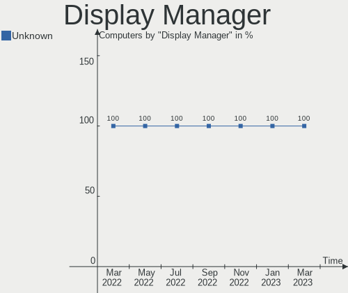
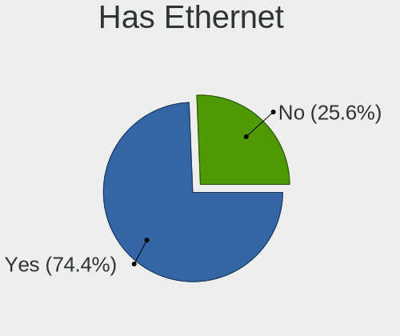
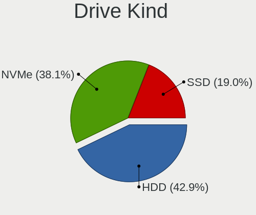
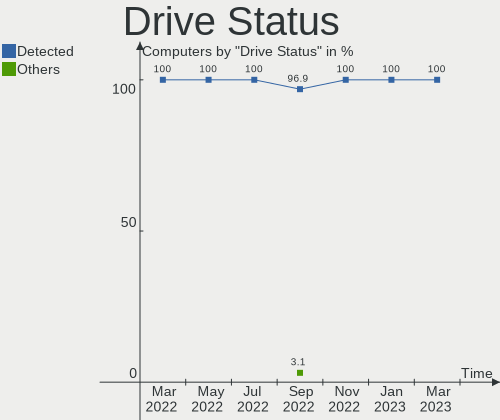

Endless Hardware Trends
-----------------------

A project to identify most popular hardware characteristics and track their change
over time based on data collected by Endless users at https://Linux-Hardware.org.

Anyone can contribute to this report by the [hw-probe](https://github.com/linuxhw/hw-probe) tool:

    sudo -E hw-probe -all -upload

This is a report for all computer types. See also reports for [desktops](/Dist/Endless/Desktop/README.md) and [notebooks](/Dist/Endless/Notebook/README.md).

Full-feature report is available here: https://linux-hardware.org/?view=trends

Period: Sep, 2021.

Contents
--------

* [ System ](#system)
  - [ OS                       ](#os)
  - [ OS Family                ](#os-family)
  - [ Kernel                   ](#kernel)
  - [ Kernel Family            ](#kernel-family)
  - [ Kernel Major Ver.        ](#kernel-major-ver)
  - [ Arch                     ](#arch)
  - [ DE                       ](#de)
  - [ Display Server           ](#display-server)
  - [ Display Manager          ](#display-manager)
  - [ OS Lang                  ](#os-lang)
  - [ Boot Mode                ](#boot-mode)
  - [ Filesystem               ](#filesystem)
  - [ Part. scheme             ](#part-scheme)
  - [ Dual Boot with Linux/BSD ](#dual-boot-with-linuxbsd)
  - [ Dual Boot (Win)          ](#dual-boot-win)

* [ Board ](#board)
  - [ Vendor                   ](#vendor)
  - [ Model                    ](#model)
  - [ Model Family             ](#model-family)
  - [ MFG Year                 ](#mfg-year)
  - [ Form Factor              ](#form-factor)
  - [ Secure Boot              ](#secure-boot)
  - [ Coreboot                 ](#coreboot)
  - [ RAM Size                 ](#ram-size)
  - [ RAM Used                 ](#ram-used)
  - [ Total Drives             ](#total-drives)
  - [ Has CD-ROM               ](#has-cd-rom)
  - [ Has Ethernet             ](#has-ethernet)
  - [ Has WiFi                 ](#has-wifi)
  - [ Has Bluetooth            ](#has-bluetooth)

* [ Location ](#location)
  - [ Country                  ](#country)
  - [ City                     ](#city)

* [ Drives ](#drives)
  - [ Drive Vendor             ](#drive-vendor)
  - [ Drive Model              ](#drive-model)
  - [ HDD Vendor               ](#hdd-vendor)
  - [ SSD Vendor               ](#ssd-vendor)
  - [ Drive Kind               ](#drive-kind)
  - [ Drive Connector          ](#drive-connector)
  - [ Drive Size               ](#drive-size)
  - [ Space Total              ](#space-total)
  - [ Space Used               ](#space-used)
  - [ Malfunc. Drives          ](#malfunc-drives)
  - [ Malfunc. Drive Vendor    ](#malfunc-drive-vendor)
  - [ Malfunc. HDD Vendor      ](#malfunc-hdd-vendor)
  - [ Malfunc. Drive Kind      ](#malfunc-drive-kind)
  - [ Failed Drives            ](#failed-drives)
  - [ Failed Drive Vendor      ](#failed-drive-vendor)
  - [ Drive Status             ](#drive-status)

* [ Storage controller ](#storage-controller)
  - [ Storage Vendor           ](#storage-vendor)
  - [ Storage Model            ](#storage-model)
  - [ Storage Kind             ](#storage-kind)

* [ Processor ](#processor)
  - [ CPU Vendor               ](#cpu-vendor)
  - [ CPU Model                ](#cpu-model)
  - [ CPU Model Family         ](#cpu-model-family)
  - [ CPU Cores                ](#cpu-cores)
  - [ CPU Sockets              ](#cpu-sockets)
  - [ CPU Threads              ](#cpu-threads)
  - [ CPU Op-Modes             ](#cpu-op-modes)
  - [ CPU Microcode            ](#cpu-microcode)
  - [ CPU Microarch            ](#cpu-microarch)

* [ Graphics ](#graphics)
  - [ GPU Vendor               ](#gpu-vendor)
  - [ GPU Model                ](#gpu-model)
  - [ GPU Combo                ](#gpu-combo)
  - [ GPU Driver               ](#gpu-driver)
  - [ GPU Memory               ](#gpu-memory)

* [ Monitor ](#monitor)
  - [ Monitor Vendor           ](#monitor-vendor)
  - [ Monitor Model            ](#monitor-model)
  - [ Monitor Resolution       ](#monitor-resolution)
  - [ Monitor Diagonal         ](#monitor-diagonal)
  - [ Monitor Width            ](#monitor-width)
  - [ Aspect Ratio             ](#aspect-ratio)
  - [ Monitor Area             ](#monitor-area)
  - [ Pixel Density            ](#pixel-density)
  - [ Multiple Monitors        ](#multiple-monitors)

* [ Network ](#network)
  - [ Net Controller Vendor    ](#net-controller-vendor)
  - [ Net Controller Model     ](#net-controller-model)
  - [ Wireless Vendor          ](#wireless-vendor)
  - [ Wireless Model           ](#wireless-model)
  - [ Ethernet Vendor          ](#ethernet-vendor)
  - [ Ethernet Model           ](#ethernet-model)
  - [ Net Controller Kind      ](#net-controller-kind)
  - [ Used Controller          ](#used-controller)
  - [ NICs                     ](#nics)
  - [ IPv6                     ](#ipv6)

* [ Bluetooth ](#bluetooth)
  - [ Bluetooth Vendor         ](#bluetooth-vendor)
  - [ Bluetooth Model          ](#bluetooth-model)

* [ Sound ](#sound)
  - [ Sound Vendor             ](#sound-vendor)
  - [ Sound Model              ](#sound-model)

* [ Memory ](#memory)
  - [ Memory Vendor            ](#memory-vendor)
  - [ Memory Model             ](#memory-model)
  - [ Memory Kind              ](#memory-kind)
  - [ Memory Form Factor       ](#memory-form-factor)
  - [ Memory Size              ](#memory-size)
  - [ Memory Speed             ](#memory-speed)

* [ Printers & scanners ](#printers--scanners)
  - [ Printer Vendor           ](#printer-vendor)
  - [ Printer Model            ](#printer-model)
  - [ Scanner Vendor           ](#scanner-vendor)
  - [ Scanner Model            ](#scanner-model)

* [ Camera ](#camera)
  - [ Camera Vendor            ](#camera-vendor)
  - [ Camera Model             ](#camera-model)

* [ Security ](#security)
  - [ Fingerprint Vendor       ](#fingerprint-vendor)
  - [ Fingerprint Model        ](#fingerprint-model)
  - [ Chipcard Vendor          ](#chipcard-vendor)
  - [ Chipcard Model           ](#chipcard-model)

* [ Unsupported ](#unsupported)
  - [ Unsupported Devices      ](#unsupported-devices)
  - [ Unsupported Device Types ](#unsupported-device-types)

System
------

OS
--

Installed operating systems

| Name                  | Computers | Percent |
|-----------------------|-----------|---------|
| Endless 3.9.5         | 40        | 80%     |
| Endless 3.7.6         | 3         | 6%      |
| Endless 4.0.0         | 1         | 2%      |
| Endless 3.8.7         | 1         | 2%      |
| Endless 3.8.3-nexthw1 | 1         | 2%      |
| Endless 3.7.4         | 1         | 2%      |
| Endless 3.6.2         | 1         | 2%      |
| Endless 3.4.2-nexthw1 | 1         | 2%      |
| Endless 3.3.15        | 1         | 2%      |

OS Family
---------

OS without a version

| Name    | Computers | Percent |
|---------|-----------|---------|
| Endless | 50        | 100%    |

Kernel
------

Version of the Linux kernel

| Version           | Computers | Percent |
|-------------------|-----------|---------|
| 5.8.0-14-generic  | 40        | 80%     |
| 5.3.0-23-generic  | 3         | 6%      |
| 5.6.0-7-generic   | 1         | 2%      |
| 5.4.0-42-generic  | 1         | 2%      |
| 5.3.0-19-generic  | 1         | 2%      |
| 5.11.0-35-generic | 1         | 2%      |
| 5.0.0-20-generic  | 1         | 2%      |
| 4.16.0-4-generic  | 1         | 2%      |
| 4.13.0-32-generic | 1         | 2%      |

Kernel Family
-------------

Linux kernel without a distro release

| Version | Computers | Percent |
|---------|-----------|---------|
| 5.8.0   | 40        | 80%     |
| 5.3.0   | 4         | 8%      |
| 5.6.0   | 1         | 2%      |
| 5.4.0   | 1         | 2%      |
| 5.11.0  | 1         | 2%      |
| 5.0.0   | 1         | 2%      |
| 4.16.0  | 1         | 2%      |
| 4.13.0  | 1         | 2%      |

Kernel Major Ver.
-----------------

Linux kernel major version

| Version | Computers | Percent |
|---------|-----------|---------|
| 5.8     | 40        | 80%     |
| 5.3     | 4         | 8%      |
| 5.6     | 1         | 2%      |
| 5.4     | 1         | 2%      |
| 5.11    | 1         | 2%      |
| 5.0     | 1         | 2%      |
| 4.16    | 1         | 2%      |
| 4.13    | 1         | 2%      |

Arch
----

OS architecture (x86_64, i586, etc.)

| Name   | Computers | Percent |
|--------|-----------|---------|
| x86_64 | 50        | 100%    |

DE
--

Desktop Environment

| Name    | Computers | Percent |
|---------|-----------|---------|
| GNOME   | 49        | 98%     |
| Unknown | 1         | 2%      |

Display Server
--------------

X11 or Wayland

| Name    | Computers | Percent |
|---------|-----------|---------|
| X11     | 49        | 98%     |
| Unknown | 1         | 2%      |

Display Manager
---------------

SDDM, LightDM, etc.

| Name    | Computers | Percent |
|---------|-----------|---------|
| Unknown | 50        | 100%    |

OS Lang
-------

Language

| Lang        | Computers | Percent |
|-------------|-----------|---------|
| pt_BR       | 15        | 30%     |
| en_US       | 14        | 28%     |
| ru_RU       | 6         | 12%     |
| es_MX       | 4         | 8%      |
| hu_HU       | 3         | 6%      |
| ru_RU.UTF_8 | 2         | 4%      |
| ro_RO       | 1         | 2%      |
| pl_PL       | 1         | 2%      |
| hr_HR       | 1         | 2%      |
| en_GB       | 1         | 2%      |
| de_DE       | 1         | 2%      |
| Unknown     | 1         | 2%      |

Boot Mode
---------

EFI or BIOS

| Mode | Computers | Percent |
|------|-----------|---------|
| EFI  | 31        | 62%     |
| BIOS | 19        | 38%     |

Filesystem
----------

Type of filesystem

| Type  | Computers | Percent |
|-------|-----------|---------|
| Ext4  | 48        | 96%     |
| Tmpfs | 2         | 4%      |

Part. scheme
------------

Scheme of partitioning

| Type    | Computers | Percent |
|---------|-----------|---------|
| Unknown | 50        | 100%    |

Dual Boot with Linux/BSD
------------------------

Hosting more than one Linux/BSD

| Dual boot | Computers | Percent |
|-----------|-----------|---------|
| No        | 50        | 100%    |

Dual Boot (Win)
---------------

Hosting Linux and Windows

| Dual boot | Computers | Percent |
|-----------|-----------|---------|
| No        | 50        | 100%    |

Board
-----

Vendor
------

Motherboard manufacturer

| Name                | Computers | Percent |
|---------------------|-----------|---------|
| ASUSTek Computer    | 15        | 30%     |
| Acer                | 15        | 30%     |
| Hewlett-Packard     | 5         | 10%     |
| Lenovo              | 4         | 8%      |
| Dell                | 3         | 6%      |
| Sony                | 2         | 4%      |
| Positivo            | 1         | 2%      |
| MSI                 | 1         | 2%      |
| Microsoft           | 1         | 2%      |
| HARDKERNEL          | 1         | 2%      |
| Gigabyte Technology | 1         | 2%      |
| Gateway             | 1         | 2%      |

Model
-----

Motherboard model

| Name                                       | Computers | Percent |
|--------------------------------------------|-----------|---------|
| Acer Nitro AN515-54                        | 4         | 8%      |
| ASUS VivoBook 15_ASUS Laptop X540UAR       | 2         | 4%      |
| Acer Nitro AN515-44                        | 2         | 4%      |
| Sony VPCEA47FX                             | 1         | 2%      |
| Sony VPCCB3P1E                             | 1         | 2%      |
| Positivo S14CT01                           | 1         | 2%      |
| MSI MS-7817                                | 1         | 2%      |
| Microsoft Surface Pro 3                    | 1         | 2%      |
| Lenovo ThinkCentre M78 10BTA00ELM          | 1         | 2%      |
| Lenovo ThinkCentre M58e 7303AS6            | 1         | 2%      |
| Lenovo IdeaPad 330-15IGM 81D1              | 1         | 2%      |
| Lenovo IdeaPad 3 14IIL05 81WD              | 1         | 2%      |
| HP Stream x360 Convertible PC 11           | 1         | 2%      |
| HP Pavilion x2 Detachable PC 10            | 1         | 2%      |
| HP Pavilion g4                             | 1         | 2%      |
| HP Notebook                                | 1         | 2%      |
| HP All-in-One 24-f0xx                      | 1         | 2%      |
| HARDKERNEL ODROID-H2                       | 1         | 2%      |
| Gigabyte F2A68HM-DS2                       | 1         | 2%      |
| Gateway NV47H                              | 1         | 2%      |
| Dell PowerEdge T310                        | 1         | 2%      |
| Dell Latitude E7450                        | 1         | 2%      |
| Dell Latitude E5520                        | 1         | 2%      |
| ASUS ZenBook UX431DA_UM431DA               | 1         | 2%      |
| ASUS X541UAK                               | 1         | 2%      |
| ASUS X510UN                                | 1         | 2%      |
| ASUS VivoBook_ASUSLaptop X540MAR_X543MA    | 1         | 2%      |
| ASUS VivoBook_ASUSLaptop X513EA_K513EA     | 1         | 2%      |
| ASUS VivoBook_ASUSLaptop X509MA            | 1         | 2%      |
| ASUS VivoBook 15_ASUS Laptop X540MA_X543MA | 1         | 2%      |
| ASUS VivoBook 15_ASUS Laptop X540BA        | 1         | 2%      |
| ASUS VivoBook 15_ASUS Laptop X507MA_X507MA | 1         | 2%      |
| ASUS Vivo AIO 24 V241FF_A6521FF            | 1         | 2%      |
| ASUS Vivo AIO 22 V222FA_A6432FA            | 1         | 2%      |
| ASUS P8H61-M LE/USB3                       | 1         | 2%      |
| ASUS P8H61-M LE                            | 1         | 2%      |
| Acer Extensa 2540                          | 1         | 2%      |
| Acer Aspire TC-885                         | 1         | 2%      |
| Acer Aspire C22-963                        | 1         | 2%      |
| Acer Aspire A515-54G                       | 1         | 2%      |
| Acer Aspire A515-54                        | 1         | 2%      |
| Acer Aspire A315-54                        | 1         | 2%      |
| Acer Aspire A315-21                        | 1         | 2%      |
| Acer Aspire 5715Z                          | 1         | 2%      |
| Unknown                                    | 1         | 2%      |

Model Family
------------

Motherboard model prefix

| Name                 | Computers | Percent |
|----------------------|-----------|---------|
| ASUS VivoBook        | 8         | 16%     |
| Acer Aspire          | 7         | 14%     |
| Acer Nitro           | 6         | 12%     |
| Lenovo ThinkCentre   | 2         | 4%      |
| Lenovo IdeaPad       | 2         | 4%      |
| HP Pavilion          | 2         | 4%      |
| Dell Latitude        | 2         | 4%      |
| ASUS Vivo            | 2         | 4%      |
| ASUS P8H61-M         | 2         | 4%      |
| Sony VPCEA47FX       | 1         | 2%      |
| Sony VPCCB3P1E       | 1         | 2%      |
| Positivo S14CT01     | 1         | 2%      |
| MSI MS-7817          | 1         | 2%      |
| Microsoft Surface    | 1         | 2%      |
| HP Stream            | 1         | 2%      |
| HP Notebook          | 1         | 2%      |
| HP All-in-One        | 1         | 2%      |
| HARDKERNEL ODROID-H2 | 1         | 2%      |
| Gigabyte F2A68HM-DS2 | 1         | 2%      |
| Gateway NV47H        | 1         | 2%      |
| Dell PowerEdge       | 1         | 2%      |
| ASUS ZenBook         | 1         | 2%      |
| ASUS X541UAK         | 1         | 2%      |
| ASUS X510UN          | 1         | 2%      |
| Acer Extensa         | 1         | 2%      |
| Unknown              | 1         | 2%      |

MFG Year
--------

Motherboard manufacture year

| Year | Computers | Percent |
|------|-----------|---------|
| 2020 | 13        | 26%     |
| 2019 | 8         | 16%     |
| 2018 | 8         | 16%     |
| 2021 | 3         | 6%      |
| 2017 | 3         | 6%      |
| 2013 | 3         | 6%      |
| 2011 | 3         | 6%      |
| 2015 | 2         | 4%      |
| 2014 | 2         | 4%      |
| 2012 | 2         | 4%      |
| 2010 | 1         | 2%      |
| 2009 | 1         | 2%      |
| 2008 | 1         | 2%      |

Form Factor
-----------

Physical design of the computer

| Name        | Computers | Percent |
|-------------|-----------|---------|
| Notebook    | 35        | 70%     |
| Desktop     | 8         | 16%     |
| All in one  | 4         | 8%      |
| Tablet      | 1         | 2%      |
| Convertible | 1         | 2%      |
| Server      | 1         | 2%      |

Secure Boot
-----------

Enabled or disabled

| State    | Computers | Percent |
|----------|-----------|---------|
| Disabled | 39        | 78%     |
| Enabled  | 11        | 22%     |

Coreboot
--------

Have coreboot on board

| Used | Computers | Percent |
|------|-----------|---------|
| No   | 50        | 100%    |

RAM Size
--------

Total RAM memory

| Size in GB | Computers | Percent |
|------------|-----------|---------|
| 4.01-8.0   | 19        | 38%     |
| 3.01-4.0   | 19        | 38%     |
| 1.01-2.0   | 6         | 12%     |
| 8.01-16.0  | 5         | 10%     |
| 16.01-24.0 | 1         | 2%      |

RAM Used
--------

Used RAM memory

| Used GB  | Computers | Percent |
|----------|-----------|---------|
| 1.01-2.0 | 25        | 50%     |
| 2.01-3.0 | 10        | 20%     |
| 3.01-4.0 | 6         | 12%     |
| 0.51-1.0 | 6         | 12%     |
| 4.01-8.0 | 3         | 6%      |

Total Drives
------------

Number of drives on board

| Drives | Computers | Percent |
|--------|-----------|---------|
| 1      | 40        | 80%     |
| 2      | 9         | 18%     |
| 6      | 1         | 2%      |

Has CD-ROM
----------

Has CD-ROM on board

| Presented | Computers | Percent |
|-----------|-----------|---------|
| No        | 32        | 64%     |
| Yes       | 18        | 36%     |

Has Ethernet
------------

Has Ethernet on board

| Presented | Computers | Percent |
|-----------|-----------|---------|
| Yes       | 37        | 74%     |
| No        | 13        | 26%     |

Has WiFi
--------

Has WiFi module

| Presented | Computers | Percent |
|-----------|-----------|---------|
| Yes       | 42        | 84%     |
| No        | 8         | 16%     |

Has Bluetooth
-------------

Has Bluetooth module

| Presented | Computers | Percent |
|-----------|-----------|---------|
| Yes       | 37        | 74%     |
| No        | 13        | 26%     |

Location
--------

Country
-------

Geographic location (country)

| Country     | Computers | Percent |
|-------------|-----------|---------|
| Brazil      | 15        | 30%     |
| Russia      | 6         | 12%     |
| Romania     | 4         | 8%      |
| UK          | 3         | 6%      |
| Thailand    | 3         | 6%      |
| Mexico      | 3         | 6%      |
| Hungary     | 3         | 6%      |
| USA         | 2         | 4%      |
| Germany     | 2         | 4%      |
| Ukraine     | 1         | 2%      |
| Poland      | 1         | 2%      |
| Philippines | 1         | 2%      |
| Malaysia    | 1         | 2%      |
| Iran        | 1         | 2%      |
| Estonia     | 1         | 2%      |
| Croatia     | 1         | 2%      |
| Colombia    | 1         | 2%      |
| Argentina   | 1         | 2%      |

City
----

Geographic location (city)

| City                        | Computers | Percent |
|-----------------------------|-----------|---------|
| Moscow                      | 3         | 6%      |
| Quer?©taro City             | 2         | 4%      |
| Prachantakham               | 2         | 4%      |
| Fortaleza                   | 2         | 4%      |
| Belo Horizonte              | 2         | 4%      |
| Waterlooville               | 1         | 2%      |
| Vit??ria da Conquista       | 1         | 2%      |
| Valledupar                  | 1         | 2%      |
| Tula                        | 1         | 2%      |
| Tehran                      | 1         | 2%      |
| T??rgu Mure??               | 1         | 2%      |
| Subang Jaya                 | 1         | 2%      |
| S??o Paulo                  | 1         | 2%      |
| Sao Francisco de Itabapoana | 1         | 2%      |
| Santo Andr?©                | 1         | 2%      |
| San Miguel                  | 1         | 2%      |
| Rio Tercero                 | 1         | 2%      |
| Rietberg                    | 1         | 2%      |
| Recife                      | 1         | 2%      |
| Raynes Park                 | 1         | 2%      |
| Rapla                       | 1         | 2%      |
| Ploie??ti                   | 1         | 2%      |
| Petr??polis                 | 1         | 2%      |
| Orenburg                    | 1         | 2%      |
| Ocoee                       | 1         | 2%      |
| New York                    | 1         | 2%      |
| Nagyvenyim                  | 1         | 2%      |
| Marjanci                    | 1         | 2%      |
| Manaus                      | 1         | 2%      |
| Kakhovka                    | 1         | 2%      |
| Jaworzno                    | 1         | 2%      |
| Itu                         | 1         | 2%      |
| Ipatinga                    | 1         | 2%      |
| Hermosillo                  | 1         | 2%      |
| Hendon                      | 1         | 2%      |
| G?¶rlitz                    | 1         | 2%      |
| Duna??jv??ros               | 1         | 2%      |
| Cocal do Sul                | 1         | 2%      |
| Caransebes                  | 1         | 2%      |
| Campinas                    | 1         | 2%      |
| Bucharest                   | 1         | 2%      |
| Bangkok                     | 1         | 2%      |
| ?‰rd                        | 1         | 2%      |
| Arkhangelsk                 | 1         | 2%      |

Drives
------

Drive Vendor
------------

Hard drive vendors

| Vendor              | Computers | Drives | Percent |
|---------------------|-----------|--------|---------|
| WDC                 | 10        | 10     | 16.39%  |
| Seagate             | 8         | 9      | 13.11%  |
| Intel               | 8         | 8      | 13.11%  |
| Unknown             | 7         | 8      | 11.48%  |
| Toshiba             | 6         | 6      | 9.84%   |
| Samsung Electronics | 6         | 6      | 9.84%   |
| SK Hynix            | 4         | 4      | 6.56%   |
| Sandisk             | 4         | 4      | 6.56%   |
| Micron Technology   | 3         | 3      | 4.92%   |
| Hitachi             | 2         | 3      | 3.28%   |
| Kingston            | 1         | 1      | 1.64%   |
| HGST                | 1         | 1      | 1.64%   |
| Fujitsu             | 1         | 1      | 1.64%   |

Drive Model
-----------

Hard drive models

| Model                                 | Computers | Percent |
|---------------------------------------|-----------|---------|
| WDC WD10SPZX-21Z10T0 1TB              | 4         | 6.35%   |
| Unknown MMC Card  32GB                | 3         | 4.76%   |
| Intel NVMe SSD Drive 512GB            | 3         | 4.76%   |
| Intel NVMe SSD Drive 128GB            | 3         | 4.76%   |
| Unknown SD/MMC/MS PRO 128GB           | 2         | 3.17%   |
| Toshiba MQ04ABF100 1TB                | 2         | 3.17%   |
| Toshiba MQ01ABF050 500GB              | 2         | 3.17%   |
| Seagate ST500DM002-1BD142 500GB       | 2         | 3.17%   |
| Sandisk NVMe SSD Drive 512GB          | 2         | 3.17%   |
| Sandisk NVMe SSD Drive 256GB          | 2         | 3.17%   |
| Samsung HD080HJ 80GB                  | 2         | 3.17%   |
| Micron 1300_MTFDDAK256TDL 256GB SSD   | 2         | 3.17%   |
| Hitachi HTS547564A9E384 640GB         | 2         | 3.17%   |
| WDC WD3200AAJS-00L7A0 320GB           | 1         | 1.59%   |
| WDC WD2500YD-01NVB1 256GB             | 1         | 1.59%   |
| WDC WD2500AAJS-08L7A0 250GB           | 1         | 1.59%   |
| WDC WD1600AAJS-07WAA0 160GB           | 1         | 1.59%   |
| WDC WD10SPZX-80Z10T2 1TB              | 1         | 1.59%   |
| WDC WD10EZEX-08WN4A0 1TB              | 1         | 1.59%   |
| Unknown SWR256G-301II 256GB           | 1         | 1.59%   |
| Unknown MMC Card  1GB                 | 1         | 1.59%   |
| Toshiba MK1646GSX 160GB               | 1         | 1.59%   |
| Toshiba DT01ACA100 1TB                | 1         | 1.59%   |
| SK Hynix NVMe SSD Drive 512GB         | 1         | 1.59%   |
| SK Hynix NVMe SSD Drive 256GB         | 1         | 1.59%   |
| SK Hynix HFS256G39TND-N210A 256GB SSD | 1         | 1.59%   |
| SK Hynix HFS128G39TND-N210A 128GB SSD | 1         | 1.59%   |
| Seagate ST9500325AS 500GB             | 1         | 1.59%   |
| Seagate ST9250410AS 250GB             | 1         | 1.59%   |
| Seagate ST9250315AS 250GB             | 1         | 1.59%   |
| Seagate ST500LT012-1DG142 500GB       | 1         | 1.59%   |
| Seagate ST500LM012 HN-M500MBB 500GB   | 1         | 1.59%   |
| Seagate ST1000DM003-1SB102 1TB        | 1         | 1.59%   |
| Seagate ST1000DM003-1CH162 1TB        | 1         | 1.59%   |
| Samsung SSD 860 QVO 2TB               | 1         | 1.59%   |
| Samsung NVMe SSD Drive 256GB          | 1         | 1.59%   |
| Samsung MZMTE256HMHP-000MV 256GB SSD  | 1         | 1.59%   |
| Samsung HM641JI 640GB                 | 1         | 1.59%   |
| Micron 1300_MTFDDAV512TDL 512GB SSD   | 1         | 1.59%   |
| Kingston SA400S37240G 240GB SSD       | 1         | 1.59%   |
| Intel SSDSC2BW120H6 120GB             | 1         | 1.59%   |
| Intel NVMe SSD Drive 256GB            | 1         | 1.59%   |
| Hitachi HTS545050A7E380 500GB         | 1         | 1.59%   |
| HGST HTS545050A7E680 500GB            | 1         | 1.59%   |
| Fujitsu MHV2120BH PL 120GB            | 1         | 1.59%   |

HDD Vendor
----------

Hard disk drive vendors

| Vendor              | Computers | Drives | Percent |
|---------------------|-----------|--------|---------|
| WDC                 | 10        | 10     | 30.3%   |
| Seagate             | 8         | 9      | 24.24%  |
| Toshiba             | 6         | 6      | 18.18%  |
| Samsung Electronics | 3         | 3      | 9.09%   |
| Unknown             | 2         | 2      | 6.06%   |
| Hitachi             | 2         | 3      | 6.06%   |
| HGST                | 1         | 1      | 3.03%   |
| Fujitsu             | 1         | 1      | 3.03%   |

SSD Vendor
----------

Solid state drive vendors

| Vendor              | Computers | Drives | Percent |
|---------------------|-----------|--------|---------|
| Micron Technology   | 3         | 3      | 33.33%  |
| SK Hynix            | 2         | 2      | 22.22%  |
| Samsung Electronics | 2         | 2      | 22.22%  |
| Kingston            | 1         | 1      | 11.11%  |
| Intel               | 1         | 1      | 11.11%  |

Drive Kind
----------

HDD or SSD

| Kind    | Computers | Drives | Percent |
|---------|-----------|--------|---------|
| HDD     | 27        | 35     | 49.09%  |
| NVMe    | 14        | 14     | 25.45%  |
| SSD     | 9         | 9      | 16.36%  |
| MMC     | 4         | 5      | 7.27%   |
| Unknown | 1         | 1      | 1.82%   |

Drive Connector
---------------

SATA, SAS, NVMe, etc.

| Type | Computers | Drives | Percent |
|------|-----------|--------|---------|
| SATA | 37        | 43     | 64.91%  |
| NVMe | 14        | 14     | 24.56%  |
| MMC  | 4         | 5      | 7.02%   |
| SAS  | 2         | 2      | 3.51%   |

Drive Size
----------

Size of hard drive

| Size in TB | Computers | Drives | Percent |
|------------|-----------|--------|---------|
| 0.01-0.5   | 24        | 28     | 60%     |
| 0.51-1.0   | 15        | 15     | 37.5%   |
| 1.01-2.0   | 1         | 1      | 2.5%    |

Space Total
-----------

Amount of disk space available on the file system

| Size in GB | Computers | Percent |
|------------|-----------|---------|
| 251-500    | 15        | 30%     |
| 101-250    | 14        | 28%     |
| 501-1000   | 9         | 18%     |
| 1-20       | 4         | 8%      |
| 21-50      | 3         | 6%      |
| 51-100     | 3         | 6%      |
| Unknown    | 2         | 4%      |

Space Used
----------

Amount of used disk space

| Used GB  | Computers | Percent |
|----------|-----------|---------|
| 21-50    | 25        | 50%     |
| 1-20     | 13        | 26%     |
| 101-250  | 5         | 10%     |
| 251-500  | 2         | 4%      |
| 51-100   | 2         | 4%      |
| Unknown  | 2         | 4%      |
| 501-1000 | 1         | 2%      |

Malfunc. Drives
---------------

Drive models with a malfunction

Zero info for selected period =(

Malfunc. Drive Vendor
---------------------

Vendors of faulty drives

Zero info for selected period =(

Malfunc. HDD Vendor
-------------------

Vendors of faulty HDD drives

Zero info for selected period =(

Malfunc. Drive Kind
-------------------

Kinds of faulty drives

Zero info for selected period =(

Failed Drives
-------------

Failed drive models

Zero info for selected period =(

Failed Drive Vendor
-------------------

Failed drive vendors

Zero info for selected period =(

Drive Status
------------

Number of failed and malfunc. drives

| Status   | Computers | Drives | Percent |
|----------|-----------|--------|---------|
| Detected | 50        | 64     | 100%    |

Storage controller
------------------

Storage Vendor
--------------

Storage controller vendors

| Vendor                    | Computers | Percent |
|---------------------------|-----------|---------|
| Intel                     | 39        | 69.64%  |
| AMD                       | 8         | 14.29%  |
| Sandisk                   | 4         | 7.14%   |
| SK Hynix                  | 2         | 3.57%   |
| Silicon Image             | 1         | 1.79%   |
| Samsung Electronics       | 1         | 1.79%   |
| LSI Logic / Symbios Logic | 1         | 1.79%   |

Storage Model
-------------

Storage controller models

| Model                                                                          | Computers | Percent |
|--------------------------------------------------------------------------------|-----------|---------|
| Intel 82801 Mobile SATA Controller [RAID mode]                                 | 9         | 13.43%  |
| Intel PROSet/Wireless WiFi Software extension                                  | 7         | 10.45%  |
| AMD FCH SATA Controller [AHCI mode]                                            | 7         | 10.45%  |
| Intel Sunrise Point-LP SATA Controller [AHCI mode]                             | 6         | 8.96%   |
| Intel Celeron/Pentium Silver Processor SATA Controller                         | 6         | 8.96%   |
| Sandisk WD Blue SN550 NVMe SSD                                                 | 3         | 4.48%   |
| Intel 6 Series/C200 Series Chipset Family 6 port Mobile SATA AHCI Controller   | 3         | 4.48%   |
| SK Hynix BC501 NVMe Solid State Drive                                          | 2         | 2.99%   |
| Intel Ice Lake-LP SATA Controller [AHCI mode]                                  | 2         | 2.99%   |
| Intel 7 Series Chipset Family 6-port SATA Controller [AHCI mode]               | 2         | 2.99%   |
| Intel 6 Series/C200 Series Chipset Family 6 port Desktop SATA AHCI Controller  | 2         | 2.99%   |
| Silicon Image SiI 3512 [SATALink/SATARaid] Serial ATA Controller               | 1         | 1.49%   |
| Sandisk Non-Volatile memory controller                                         | 1         | 1.49%   |
| Samsung NVMe SSD Controller 980                                                | 1         | 1.49%   |
| LSI Logic / Symbios Logic SAS1068E PCI-Express Fusion-MPT SAS                  | 1         | 1.49%   |
| Intel Volume Management Device NVMe RAID Controller                            | 1         | 1.49%   |
| Intel Tiger Lake-LP SATA Controller [AHCI mode]                                | 1         | 1.49%   |
| Intel NM10/ICH7 Family SATA Controller [IDE mode]                              | 1         | 1.49%   |
| Intel Comet Lake SATA AHCI Controller                                          | 1         | 1.49%   |
| Intel Cannon Lake PCH SATA AHCI Controller                                     | 1         | 1.49%   |
| Intel 82801HM/HEM (ICH8M/ICH8M-E) SATA Controller [AHCI mode]                  | 1         | 1.49%   |
| Intel 82801HM/HEM (ICH8M/ICH8M-E) IDE Controller                               | 1         | 1.49%   |
| Intel 82801G (ICH7 Family) IDE Controller                                      | 1         | 1.49%   |
| Intel 8 Series/C220 Series Chipset Family 6-port SATA Controller 1 [AHCI mode] | 1         | 1.49%   |
| Intel 8 Series SATA Controller 1 [AHCI mode]                                   | 1         | 1.49%   |
| Intel 5 Series/3400 Series Chipset 4 port SATA IDE Controller                  | 1         | 1.49%   |
| Intel 5 Series/3400 Series Chipset 4 port SATA AHCI Controller                 | 1         | 1.49%   |
| Intel 5 Series/3400 Series Chipset 2 port SATA IDE Controller                  | 1         | 1.49%   |
| AMD FCH SATA Controller [IDE mode]                                             | 1         | 1.49%   |

Storage Kind
------------

Kind of storage controller (IDE, SATA, NVMe, SAS, ...)

| Kind | Computers | Percent |
|------|-----------|---------|
| SATA | 39        | 60%     |
| NVMe | 14        | 21.54%  |
| RAID | 8         | 12.31%  |
| IDE  | 3         | 4.62%   |
| SCSI | 1         | 1.54%   |

Processor
---------

CPU Vendor
----------

Processor vendors

| Vendor | Computers | Percent |
|--------|-----------|---------|
| Intel  | 42        | 84%     |
| AMD    | 8         | 16%     |

CPU Model
---------

Processor models

| Model                                           | Computers | Percent |
|-------------------------------------------------|-----------|---------|
| Intel Core i5-9300H CPU @ 2.40GHz               | 3         | 6%      |
| Intel Core i5-10210U CPU @ 1.60GHz              | 2         | 4%      |
| Intel Core i3-7020U CPU @ 2.30GHz               | 2         | 4%      |
| Intel Core i3-2310M CPU @ 2.10GHz               | 2         | 4%      |
| Intel Core i3-1005G1 CPU @ 1.20GHz              | 2         | 4%      |
| Intel Celeron N4020 CPU @ 1.10GHz               | 2         | 4%      |
| Intel Celeron N4000 CPU @ 1.10GHz               | 2         | 4%      |
| Intel Xeon CPU X3430 @ 2.40GHz                  | 1         | 2%      |
| Intel Pentium CPU G620 @ 2.60GHz                | 1         | 2%      |
| Intel Core i7-9750H CPU @ 2.60GHz               | 1         | 2%      |
| Intel Core i7-5600U CPU @ 2.60GHz               | 1         | 2%      |
| Intel Core i7-4770 CPU @ 3.40GHz                | 1         | 2%      |
| Intel Core i7-4650U CPU @ 1.70GHz               | 1         | 2%      |
| Intel Core i7-10510U CPU @ 1.80GHz              | 1         | 2%      |
| Intel Core i5-8400 CPU @ 2.80GHz                | 1         | 2%      |
| Intel Core i5-7200U CPU @ 2.50GHz               | 1         | 2%      |
| Intel Core i5-2430M CPU @ 2.40GHz               | 1         | 2%      |
| Intel Core i3-8145U CPU @ 2.10GHz               | 1         | 2%      |
| Intel Core i3-8130U CPU @ 2.20GHz               | 1         | 2%      |
| Intel Core i3-7100U CPU @ 2.40GHz               | 1         | 2%      |
| Intel Core i3-6006U CPU @ 2.00GHz               | 1         | 2%      |
| Intel Core i3-3110M CPU @ 2.40GHz               | 1         | 2%      |
| Intel Core i3-2328M CPU @ 2.20GHz               | 1         | 2%      |
| Intel Core i3-2130 CPU @ 3.40GHz                | 1         | 2%      |
| Intel Core i3-10110U CPU @ 2.10GHz              | 1         | 2%      |
| Intel Core i3 CPU M 380 @ 2.53GHz               | 1         | 2%      |
| Intel Core 2 Duo CPU T9500 @ 2.60GHz            | 1         | 2%      |
| Intel Core 2 Duo CPU E7400 @ 2.80GHz            | 1         | 2%      |
| Intel Celeron N4100 CPU @ 1.10GHz               | 1         | 2%      |
| Intel Celeron J4105 CPU @ 1.50GHz               | 1         | 2%      |
| Intel Celeron CPU N2840 @ 2.16GHz               | 1         | 2%      |
| Intel Atom x5-Z8300 CPU @ 1.44GHz               | 1         | 2%      |
| Intel Atom CPU Z3736F @ 1.33GHz                 | 1         | 2%      |
| Intel 11th Gen Core i3-1115G4 @ 3.00GHz         | 1         | 2%      |
| AMD Ryzen 7 4800H with Radeon Graphics          | 1         | 2%      |
| AMD Ryzen 7 3700U with Radeon Vega Mobile Gfx   | 1         | 2%      |
| AMD Ryzen 5 4600H with Radeon Graphics          | 1         | 2%      |
| AMD E2-9000 RADEON R2, 4 COMPUTE CORES 2C+2G    | 1         | 2%      |
| AMD A9-9420 RADEON R5, 5 COMPUTE CORES 2C+3G    | 1         | 2%      |
| AMD A6-5400B APU with Radeon HD Graphics        | 1         | 2%      |
| AMD A6-5200 APU with Radeon HD Graphics         | 1         | 2%      |
| AMD A10-7700K Radeon R7, 10 Compute Cores 4C+6G | 1         | 2%      |

CPU Model Family
----------------

Processor model prefix

| Model            | Computers | Percent |
|------------------|-----------|---------|
| Intel Core i3    | 15        | 30%     |
| Intel Core i5    | 8         | 16%     |
| Intel Celeron    | 7         | 14%     |
| Intel Core i7    | 5         | 10%     |
| Other            | 2         | 4%      |
| Intel Core 2 Duo | 2         | 4%      |
| Intel Atom       | 2         | 4%      |
| AMD Ryzen 7      | 2         | 4%      |
| AMD A6           | 2         | 4%      |
| Intel Xeon       | 1         | 2%      |
| Intel Pentium    | 1         | 2%      |
| AMD Ryzen 5      | 1         | 2%      |
| AMD E2           | 1         | 2%      |
| AMD A10          | 1         | 2%      |

CPU Cores
---------

Number of processor cores

| Number | Computers | Percent |
|--------|-----------|---------|
| 2      | 31        | 62%     |
| 4      | 14        | 28%     |
| 6      | 3         | 6%      |
| 8      | 1         | 2%      |
| 1      | 1         | 2%      |

CPU Sockets
-----------

Number of sockets

| Number | Computers | Percent |
|--------|-----------|---------|
| 1      | 50        | 100%    |

CPU Threads
-----------

Threads per core (Hyper-Threading)

| Number | Computers | Percent |
|--------|-----------|---------|
| 2      | 33        | 66%     |
| 1      | 17        | 34%     |

CPU Op-Modes
------------

CPU Operation Modes (32-bit, 64-bit)

| Op mode        | Computers | Percent |
|----------------|-----------|---------|
| 32-bit, 64-bit | 49        | 98%     |
| Unknown        | 1         | 2%      |

CPU Microcode
-------------

Microcode number

| Number     | Computers | Percent |
|------------|-----------|---------|
| 0x206a7    | 6         | 12%     |
| 0x806ec    | 4         | 8%      |
| 0x806e9    | 4         | 8%      |
| 0x906ea    | 3         | 6%      |
| 0x706a1    | 3         | 6%      |
| Unknown    | 3         | 6%      |
| 0x906ed    | 2         | 4%      |
| 0x706e5    | 2         | 4%      |
| 0x30678    | 2         | 4%      |
| 0x08600103 | 2         | 4%      |
| 0x06006705 | 2         | 4%      |
| 0x806ea    | 1         | 2%      |
| 0x806c1    | 1         | 2%      |
| 0x706a8    | 1         | 2%      |
| 0x406e3    | 1         | 2%      |
| 0x406c3    | 1         | 2%      |
| 0x40651    | 1         | 2%      |
| 0x306d4    | 1         | 2%      |
| 0x306c3    | 1         | 2%      |
| 0x306a9    | 1         | 2%      |
| 0x20655    | 1         | 2%      |
| 0x106e5    | 1         | 2%      |
| 0x1067a    | 1         | 2%      |
| 0x10676    | 1         | 2%      |
| 0x08108102 | 1         | 2%      |
| 0x0700010f | 1         | 2%      |
| 0x06003106 | 1         | 2%      |
| 0x06001119 | 1         | 2%      |

CPU Microarch
-------------

Microarchitecture

| Name          | Computers | Percent |
|---------------|-----------|---------|
| KabyLake      | 15        | 30%     |
| SandyBridge   | 6         | 12%     |
| Goldmont plus | 6         | 12%     |
| Silvermont    | 3         | 6%      |
| Zen 2         | 2         | 4%      |
| Penryn        | 2         | 4%      |
| IceLake       | 2         | 4%      |
| Haswell       | 2         | 4%      |
| Excavator     | 2         | 4%      |
| Zen+          | 1         | 2%      |
| Westmere      | 1         | 2%      |
| TigerLake     | 1         | 2%      |
| Steamroller   | 1         | 2%      |
| Skylake       | 1         | 2%      |
| Piledriver    | 1         | 2%      |
| Nehalem       | 1         | 2%      |
| Jaguar        | 1         | 2%      |
| IvyBridge     | 1         | 2%      |
| Broadwell     | 1         | 2%      |

Graphics
--------

GPU Vendor
----------

Vendors of graphics cards

| Vendor | Computers | Percent |
|--------|-----------|---------|
| Intel  | 38        | 62.3%   |
| Nvidia | 14        | 22.95%  |
| AMD    | 9         | 14.75%  |

GPU Model
---------

Graphics card models

| Model                                                                                    | Computers | Percent |
|------------------------------------------------------------------------------------------|-----------|---------|
| Intel GeminiLake [UHD Graphics 600]                                                      | 6         | 9.68%   |
| Intel 2nd Generation Core Processor Family Integrated Graphics Controller                | 5         | 8.06%   |
| Nvidia TU117M [GeForce GTX 1650 Mobile / Max-Q]                                          | 4         | 6.45%   |
| Intel HD Graphics 620                                                                    | 4         | 6.45%   |
| Intel CometLake-U GT2 [UHD Graphics]                                                     | 4         | 6.45%   |
| Intel CoffeeLake-H GT2 [UHD Graphics 630]                                                | 4         | 6.45%   |
| Nvidia TU117M                                                                            | 2         | 3.23%   |
| Intel Iris Plus Graphics G1 (Ice Lake)                                                   | 2         | 3.23%   |
| Intel Atom Processor Z36xxx/Z37xxx Series Graphics & Display                             | 2         | 3.23%   |
| AMD Stoney [Radeon R2/R3/R4/R5 Graphics]                                                 | 2         | 3.23%   |
| AMD Renoir                                                                               | 2         | 3.23%   |
| Nvidia GT216 [GeForce GT 220]                                                            | 1         | 1.61%   |
| Nvidia GP108M [GeForce MX250]                                                            | 1         | 1.61%   |
| Nvidia GP108M [GeForce MX150]                                                            | 1         | 1.61%   |
| Nvidia GP108 [GeForce GT 1030]                                                           | 1         | 1.61%   |
| Nvidia GM108M [GeForce MX130]                                                            | 1         | 1.61%   |
| Nvidia GK208B [GeForce GT 730]                                                           | 1         | 1.61%   |
| Nvidia GK106 [GeForce GTX 660]                                                           | 1         | 1.61%   |
| Nvidia G98 [GeForce 8400 GS Rev. 2]                                                      | 1         | 1.61%   |
| Intel WhiskeyLake-U GT2 [UHD Graphics 620]                                               | 1         | 1.61%   |
| Intel UHD Graphics 620                                                                   | 1         | 1.61%   |
| Intel Tiger Lake UHD Graphics                                                            | 1         | 1.61%   |
| Intel Skylake GT2 [HD Graphics 520]                                                      | 1         | 1.61%   |
| Intel Mobile GM965/GL960 Integrated Graphics Controller (secondary)                      | 1         | 1.61%   |
| Intel Mobile GM965/GL960 Integrated Graphics Controller (primary)                        | 1         | 1.61%   |
| Intel HD Graphics 5500                                                                   | 1         | 1.61%   |
| Intel Haswell-ULT Integrated Graphics Controller                                         | 1         | 1.61%   |
| Intel Core Processor Integrated Graphics Controller                                      | 1         | 1.61%   |
| Intel Atom/Celeron/Pentium Processor x5-E8000/J3xxx/N3xxx Integrated Graphics Controller | 1         | 1.61%   |
| Intel 4 Series Chipset Integrated Graphics Controller                                    | 1         | 1.61%   |
| Intel 3rd Gen Core processor Graphics Controller                                         | 1         | 1.61%   |
| AMD Trinity 2 [Radeon HD 7540D]                                                          | 1         | 1.61%   |
| AMD Seymour [Radeon HD 6400M/7400M Series]                                               | 1         | 1.61%   |
| AMD Picasso                                                                              | 1         | 1.61%   |
| AMD Kaveri [Radeon R7 Graphics]                                                          | 1         | 1.61%   |
| AMD Kabini [Radeon HD 8400 / R3 Series]                                                  | 1         | 1.61%   |

GPU Combo
---------

Combinations of graphics cards

| Name           | Computers | Percent |
|----------------|-----------|---------|
| 1 x Intel      | 30        | 60%     |
| Intel + Nvidia | 8         | 16%     |
| 1 x AMD        | 6         | 12%     |
| 1 x Nvidia     | 3         | 6%      |
| AMD + Nvidia   | 3         | 6%      |

GPU Driver
----------

Free vs proprietary

| Driver      | Computers | Percent |
|-------------|-----------|---------|
| Free        | 38        | 76%     |
| Proprietary | 12        | 24%     |

GPU Memory
----------

Total video memory

| Size in GB | Computers | Percent |
|------------|-----------|---------|
| Unknown    | 39        | 78%     |
| 0.01-0.5   | 6         | 12%     |
| 1.01-2.0   | 2         | 4%      |
| 0.51-1.0   | 2         | 4%      |
| 3.01-4.0   | 1         | 2%      |

Monitor
-------

Monitor Vendor
--------------

Monitor vendors

| Vendor                  | Computers | Percent |
|-------------------------|-----------|---------|
| Chimei Innolux          | 9         | 18.37%  |
| AU Optronics            | 9         | 18.37%  |
| BOE                     | 5         | 10.2%   |
| Samsung Electronics     | 4         | 8.16%   |
| Hewlett-Packard         | 4         | 8.16%   |
| PANDA                   | 3         | 6.12%   |
| LG Display              | 3         | 6.12%   |
| BenQ                    | 2         | 4.08%   |
| Acer                    | 2         | 4.08%   |
| Vestel Elektronik       | 1         | 2.04%   |
| Insignia                | 1         | 2.04%   |
| InnoLux Display         | 1         | 2.04%   |
| HKC                     | 1         | 2.04%   |
| Gateway                 | 1         | 2.04%   |
| Dell                    | 1         | 2.04%   |
| Chi Mei Optoelectronics | 1         | 2.04%   |
| ASUSTek Computer        | 1         | 2.04%   |

Monitor Model
-------------

Monitor models

| Model                                                                    | Computers | Percent |
|--------------------------------------------------------------------------|-----------|---------|
| Chimei Innolux LCD Monitor CMN15DB 1366x768 344x193mm 15.5-inch          | 3         | 6.12%   |
| LG Display LCD Monitor LGD065A 1920x1080 344x194mm 15.5-inch             | 2         | 4.08%   |
| Chimei Innolux LCD Monitor CMN15E6 1366x768 344x193mm 15.5-inch          | 2         | 4.08%   |
| BenQ LCD BNQ801B 2560x1440 527x296mm 23.8-inch                           | 2         | 4.08%   |
| AU Optronics LCD Monitor AUO38ED 1920x1080 340x190mm 15.3-inch           | 2         | 4.08%   |
| AU Optronics LCD Monitor AUO21ED 1920x1080 344x194mm 15.5-inch           | 2         | 4.08%   |
| Vestel Elektronik 50UHD_LCD_TV VES3700 3840x2160 1872x1053mm 84.6-inch   | 1         | 2.04%   |
| Samsung Electronics LCD Monitor SEC3542 2160x1440 250x170mm 11.9-inch    | 1         | 2.04%   |
| Samsung Electronics LCD Monitor SEC335A 1366x768 309x174mm 14.0-inch     | 1         | 2.04%   |
| Samsung Electronics LCD Monitor SDC4E51 1366x768 340x190mm 15.3-inch     | 1         | 2.04%   |
| Samsung Electronics LCD Monitor SAM0D4F 1920x1080 1210x680mm 54.6-inch   | 1         | 2.04%   |
| PANDA LCD Monitor NCP004D 1920x1080 344x194mm 15.5-inch                  | 1         | 2.04%   |
| PANDA LCD Monitor NCP0046 1920x1080 344x194mm 15.5-inch                  | 1         | 2.04%   |
| PANDA LCD Monitor NCP0035 1920x1080 309x174mm 14.0-inch                  | 1         | 2.04%   |
| LG Display LCD Monitor LGD0486 1920x1080 309x174mm 14.0-inch             | 1         | 2.04%   |
| Insignia NS-32D310NA17 BBY0050 1360x768 760x450mm 34.8-inch              | 1         | 2.04%   |
| InnoLux Display LCD Monitor INL0016 1366x768 309x174mm 14.0-inch         | 1         | 2.04%   |
| HKC Checksum: 0x2a (valid) HKC2160 1920x1080 360x270mm 17.7-inch         | 1         | 2.04%   |
| Hewlett-Packard ZR2440w HWP2956 1920x1200 518x324mm 24.1-inch            | 1         | 2.04%   |
| Hewlett-Packard ZR2440w HWP2955 1920x1080 520x320mm 24.0-inch            | 1         | 2.04%   |
| Hewlett-Packard E201 HWP305F 1600x900 443x249mm 20.0-inch                | 1         | 2.04%   |
| Hewlett-Packard ALL-in-One HPN4018 1920x1080 527x297mm 23.8-inch         | 1         | 2.04%   |
| Gateway FHX2152L GWY01DC 1920x1080 477x268mm 21.5-inch                   | 1         | 2.04%   |
| Dell P1913S DELA084 1280x1024 376x301mm 19.0-inch                        | 1         | 2.04%   |
| Chimei Innolux LCD Monitor CMN15F5 1920x1080 344x193mm 15.5-inch         | 1         | 2.04%   |
| Chimei Innolux LCD Monitor CMN15D5 1920x1080 340x190mm 15.3-inch         | 1         | 2.04%   |
| Chimei Innolux LCD Monitor CMN14E5 1920x1080 309x173mm 13.9-inch         | 1         | 2.04%   |
| Chimei Innolux LCD Monitor CMN1493 1366x768 310x170mm 13.9-inch          | 1         | 2.04%   |
| Chi Mei Optoelectronics LCD Monitor CMO15A3 1366x768 344x193mm 15.5-inch | 1         | 2.04%   |
| BOE LCD Monitor BOE0818 1920x1080 344x194mm 15.5-inch                    | 1         | 2.04%   |
| BOE LCD Monitor BOE07CB 1920x1080 344x193mm 15.5-inch                    | 1         | 2.04%   |
| BOE LCD Monitor BOE06BA 1920x1080 344x193mm 15.5-inch                    | 1         | 2.04%   |
| BOE LCD Monitor BOE0675 1366x768 344x194mm 15.5-inch                     | 1         | 2.04%   |
| BOE LCD Monitor BOE061C 1366x768 256x144mm 11.6-inch                     | 1         | 2.04%   |
| AU Optronics LCD Monitor AUOAF90 1920x1080 344x193mm 15.5-inch           | 1         | 2.04%   |
| AU Optronics LCD Monitor AUO81EC 1366x768 344x193mm 15.5-inch            | 1         | 2.04%   |
| AU Optronics LCD Monitor AUO8174 1280x800 331x207mm 15.4-inch            | 1         | 2.04%   |
| AU Optronics LCD Monitor AUO71EC 1366x768 340x190mm 15.3-inch            | 1         | 2.04%   |
| AU Optronics LCD Monitor AUO183C 1366x768 309x173mm 13.9-inch            | 1         | 2.04%   |
| ASUSTek Computer V241FA ASU282C 1920x1080 527x296mm 23.8-inch            | 1         | 2.04%   |
| Acer SA270 ACR0580 1920x1080 598x336mm 27.0-inch                         | 1         | 2.04%   |
| Acer LCD Monitor ACR1234 1920x1080 476x267mm 21.5-inch                   | 1         | 2.04%   |

Monitor Resolution
------------------

Monitor screen resolution

| Resolution        | Computers | Percent |
|-------------------|-----------|---------|
| 1920x1080 (FHD)   | 25        | 52.08%  |
| 1366x768 (WXGA)   | 15        | 31.25%  |
| 2560x1440 (QHD)   | 2         | 4.17%   |
| 3840x2160 (4K)    | 1         | 2.08%   |
| 2160x1440         | 1         | 2.08%   |
| 1920x1200 (WUXGA) | 1         | 2.08%   |
| 1600x900 (HD+)    | 1         | 2.08%   |
| 1280x800 (WXGA)   | 1         | 2.08%   |
| 1280x1024 (SXGA)  | 1         | 2.08%   |

Monitor Diagonal
----------------

Diagonal size in inches

| Inches | Computers | Percent |
|--------|-----------|---------|
| 15     | 27        | 55.1%   |
| 24     | 4         | 8.16%   |
| 14     | 4         | 8.16%   |
| 23     | 2         | 4.08%   |
| 21     | 2         | 4.08%   |
| 13     | 2         | 4.08%   |
| 84     | 1         | 2.04%   |
| 54     | 1         | 2.04%   |
| 34     | 1         | 2.04%   |
| 27     | 1         | 2.04%   |
| 20     | 1         | 2.04%   |
| 19     | 1         | 2.04%   |
| 17     | 1         | 2.04%   |
| 11     | 1         | 2.04%   |

Monitor Width
-------------

Physical width

| Width in mm | Computers | Percent |
|-------------|-----------|---------|
| 301-350     | 33        | 67.35%  |
| 501-600     | 7         | 14.29%  |
| 401-500     | 3         | 6.12%   |
| 351-400     | 2         | 4.08%   |
| 701-800     | 1         | 2.04%   |
| 201-300     | 1         | 2.04%   |
| 1501-2000   | 1         | 2.04%   |
| 1001-1500   | 1         | 2.04%   |

Aspect Ratio
------------

Proportional relationship between the width and the height

| Ratio | Computers | Percent |
|-------|-----------|---------|
| 16/9  | 41        | 89.13%  |
| 16/10 | 3         | 6.52%   |
| 5/4   | 1         | 2.17%   |
| 4/3   | 1         | 2.17%   |

Monitor Area
------------

Area in inch²

| Area in inch² | Computers | Percent |
|----------------|-----------|---------|
| 101-110        | 27        | 55.1%   |
| 81-90          | 6         | 12.24%  |
| 151-200        | 5         | 10.2%   |
| 201-250        | 4         | 8.16%   |
| More than 1000 | 2         | 4.08%   |
| 251-300        | 2         | 4.08%   |
| 51-60          | 1         | 2.04%   |
| 301-350        | 1         | 2.04%   |
| 501-1000       | 1         | 2.04%   |

Pixel Density
-------------

Pixels per inch

| Density | Computers | Percent |
|---------|-----------|---------|
| 121-160 | 21        | 42.86%  |
| 101-120 | 16        | 32.65%  |
| 51-100  | 10        | 20.41%  |
| 1-50    | 2         | 4.08%   |

Multiple Monitors
-----------------

Total monitors connected

| Total | Computers | Percent |
|-------|-----------|---------|
| 1     | 43        | 86%     |
| 0     | 4         | 8%      |
| 2     | 3         | 6%      |

Network
-------

Net Controller Vendor
---------------------

Controller vendors

| Vendor                   | Computers | Percent |
|--------------------------|-----------|---------|
| Realtek Semiconductor    | 33        | 42.86%  |
| Intel                    | 18        | 23.38%  |
| Qualcomm Atheros         | 13        | 16.88%  |
| Broadcom                 | 6         | 7.79%   |
| Marvell Technology Group | 3         | 3.9%    |
| VIA Technologies         | 1         | 1.3%    |
| Ralink Technology        | 1         | 1.3%    |
| ICS Advent               | 1         | 1.3%    |
| Huawei Technologies      | 1         | 1.3%    |

Net Controller Model
--------------------

Controller models

| Model                                                                          | Computers | Percent |
|--------------------------------------------------------------------------------|-----------|---------|
| Realtek RTL8111/8168/8411 PCI Express Gigabit Ethernet Controller              | 21        | 25.93%  |
| Qualcomm Atheros QCA9377 802.11ac Wireless Network Adapter                     | 7         | 8.64%   |
| Realtek RTL8821CE 802.11ac PCIe Wireless Network Adapter                       | 6         | 7.41%   |
| Intel Wi-Fi 6 AX200                                                            | 6         | 7.41%   |
| Realtek RTL810xE PCI Express Fast Ethernet controller                          | 5         | 6.17%   |
| Qualcomm Atheros AR9485 Wireless Network Adapter                               | 3         | 3.7%    |
| Realtek Killer E2600 Gigabit Ethernet Controller                               | 2         | 2.47%   |
| Intel Wireless 8265 / 8275                                                     | 2         | 2.47%   |
| Intel Wireless 7265                                                            | 2         | 2.47%   |
| Broadcom BCM43142 802.11b/g/n                                                  | 2         | 2.47%   |
| VIA VT6105/VT6106S [Rhine-III]                                                 | 1         | 1.23%   |
| Realtek RTL8723BE PCIe Wireless Network Adapter                                | 1         | 1.23%   |
| Ralink MT7601U Wireless Adapter                                                | 1         | 1.23%   |
| Qualcomm Atheros QCA9565 / AR9565 Wireless Network Adapter                     | 1         | 1.23%   |
| Qualcomm Atheros AR9287 Wireless Network Adapter (PCI-Express)                 | 1         | 1.23%   |
| Qualcomm Atheros AR9285 Wireless Network Adapter (PCI-Express)                 | 1         | 1.23%   |
| Qualcomm Atheros AR8151 v2.0 Gigabit Ethernet                                  | 1         | 1.23%   |
| Marvell Group Yukon Optima 88E8059 [PCIe Gigabit Ethernet Controller with AVB] | 1         | 1.23%   |
| Marvell Group 88W8897 [AVASTAR] 802.11ac Wireless                              | 1         | 1.23%   |
| Marvell Group 88E8057 PCI-E Gigabit Ethernet Controller                        | 1         | 1.23%   |
| Intel Wi-Fi 6 AX201                                                            | 1         | 1.23%   |
| Intel Ice Lake-LP PCH CNVi WiFi                                                | 1         | 1.23%   |
| Intel Ethernet Connection (3) I218-LM                                          | 1         | 1.23%   |
| Intel Dual Band Wireless-AC 3168NGW [Stone Peak]                               | 1         | 1.23%   |
| Intel Comet Lake PCH-LP CNVi WiFi                                              | 1         | 1.23%   |
| Intel Centrino Wireless-N 1000 [Condor Peak]                                   | 1         | 1.23%   |
| Intel Centrino Advanced-N 6205 [Taylor Peak]                                   | 1         | 1.23%   |
| Intel Cannon Point-LP CNVi [Wireless-AC]                                       | 1         | 1.23%   |
| Intel Cannon Lake PCH CNVi WiFi                                                | 1         | 1.23%   |
| ICS Advent DM9601 Fast Ethernet Adapter                                        | 1         | 1.23%   |
| Huawei ANE-LX1                                                                 | 1         | 1.23%   |
| Broadcom NetXtreme II BCM5716 Gigabit Ethernet                                 | 1         | 1.23%   |
| Broadcom NetXtreme BCM5761 Gigabit Ethernet PCIe                               | 1         | 1.23%   |
| Broadcom NetLink BCM5906M Fast Ethernet PCI Express                            | 1         | 1.23%   |
| Broadcom NetLink BCM57785 Gigabit Ethernet PCIe                                | 1         | 1.23%   |

Wireless Vendor
---------------

Wireless vendors

| Vendor                   | Computers | Percent |
|--------------------------|-----------|---------|
| Intel                    | 18        | 42.86%  |
| Qualcomm Atheros         | 13        | 30.95%  |
| Realtek Semiconductor    | 7         | 16.67%  |
| Broadcom                 | 2         | 4.76%   |
| Ralink Technology        | 1         | 2.38%   |
| Marvell Technology Group | 1         | 2.38%   |

Wireless Model
--------------

Wireless models

| Model                                                          | Computers | Percent |
|----------------------------------------------------------------|-----------|---------|
| Qualcomm Atheros QCA9377 802.11ac Wireless Network Adapter     | 7         | 16.67%  |
| Realtek RTL8821CE 802.11ac PCIe Wireless Network Adapter       | 6         | 14.29%  |
| Intel Wi-Fi 6 AX200                                            | 6         | 14.29%  |
| Qualcomm Atheros AR9485 Wireless Network Adapter               | 3         | 7.14%   |
| Intel Wireless 8265 / 8275                                     | 2         | 4.76%   |
| Intel Wireless 7265                                            | 2         | 4.76%   |
| Broadcom BCM43142 802.11b/g/n                                  | 2         | 4.76%   |
| Realtek RTL8723BE PCIe Wireless Network Adapter                | 1         | 2.38%   |
| Ralink MT7601U Wireless Adapter                                | 1         | 2.38%   |
| Qualcomm Atheros QCA9565 / AR9565 Wireless Network Adapter     | 1         | 2.38%   |
| Qualcomm Atheros AR9287 Wireless Network Adapter (PCI-Express) | 1         | 2.38%   |
| Qualcomm Atheros AR9285 Wireless Network Adapter (PCI-Express) | 1         | 2.38%   |
| Marvell Group 88W8897 [AVASTAR] 802.11ac Wireless              | 1         | 2.38%   |
| Intel Wi-Fi 6 AX201                                            | 1         | 2.38%   |
| Intel Ice Lake-LP PCH CNVi WiFi                                | 1         | 2.38%   |
| Intel Dual Band Wireless-AC 3168NGW [Stone Peak]               | 1         | 2.38%   |
| Intel Comet Lake PCH-LP CNVi WiFi                              | 1         | 2.38%   |
| Intel Centrino Wireless-N 1000 [Condor Peak]                   | 1         | 2.38%   |
| Intel Centrino Advanced-N 6205 [Taylor Peak]                   | 1         | 2.38%   |
| Intel Cannon Point-LP CNVi [Wireless-AC]                       | 1         | 2.38%   |
| Intel Cannon Lake PCH CNVi WiFi                                | 1         | 2.38%   |

Ethernet Vendor
---------------

Ethernet vendors

| Vendor                   | Computers | Percent |
|--------------------------|-----------|---------|
| Realtek Semiconductor    | 28        | 71.79%  |
| Broadcom                 | 4         | 10.26%  |
| Marvell Technology Group | 2         | 5.13%   |
| VIA Technologies         | 1         | 2.56%   |
| Qualcomm Atheros         | 1         | 2.56%   |
| Intel                    | 1         | 2.56%   |
| ICS Advent               | 1         | 2.56%   |
| Huawei Technologies      | 1         | 2.56%   |

Ethernet Model
--------------

Ethernet models

| Model                                                                          | Computers | Percent |
|--------------------------------------------------------------------------------|-----------|---------|
| Realtek RTL8111/8168/8411 PCI Express Gigabit Ethernet Controller              | 21        | 53.85%  |
| Realtek RTL810xE PCI Express Fast Ethernet controller                          | 5         | 12.82%  |
| Realtek Killer E2600 Gigabit Ethernet Controller                               | 2         | 5.13%   |
| VIA VT6105/VT6106S [Rhine-III]                                                 | 1         | 2.56%   |
| Qualcomm Atheros AR8151 v2.0 Gigabit Ethernet                                  | 1         | 2.56%   |
| Marvell Group Yukon Optima 88E8059 [PCIe Gigabit Ethernet Controller with AVB] | 1         | 2.56%   |
| Marvell Group 88E8057 PCI-E Gigabit Ethernet Controller                        | 1         | 2.56%   |
| Intel Ethernet Connection (3) I218-LM                                          | 1         | 2.56%   |
| ICS Advent DM9601 Fast Ethernet Adapter                                        | 1         | 2.56%   |
| Huawei ANE-LX1                                                                 | 1         | 2.56%   |
| Broadcom NetXtreme II BCM5716 Gigabit Ethernet                                 | 1         | 2.56%   |
| Broadcom NetXtreme BCM5761 Gigabit Ethernet PCIe                               | 1         | 2.56%   |
| Broadcom NetLink BCM5906M Fast Ethernet PCI Express                            | 1         | 2.56%   |
| Broadcom NetLink BCM57785 Gigabit Ethernet PCIe                                | 1         | 2.56%   |

Net Controller Kind
-------------------

Ethernet, WiFi or modem

| Kind     | Computers | Percent |
|----------|-----------|---------|
| WiFi     | 42        | 53.16%  |
| Ethernet | 37        | 46.84%  |

Used Controller
---------------

Currently used network controller

| Kind     | Computers | Percent |
|----------|-----------|---------|
| WiFi     | 41        | 52.56%  |
| Ethernet | 37        | 47.44%  |

NICs
----

Total network controllers on board

| Total | Computers | Percent |
|-------|-----------|---------|
| 2     | 32        | 64%     |
| 1     | 16        | 32%     |
| 0     | 2         | 4%      |

IPv6
----

IPv6 vs IPv4

| Used | Computers | Percent |
|------|-----------|---------|
| No   | 27        | 54%     |
| Yes  | 23        | 46%     |

Bluetooth
---------

Bluetooth Vendor
----------------

Controller vendors

| Vendor                          | Computers | Percent |
|---------------------------------|-----------|---------|
| Intel                           | 16        | 43.24%  |
| IMC Networks                    | 7         | 18.92%  |
| Lite-On Technology              | 5         | 13.51%  |
| Realtek Semiconductor           | 2         | 5.41%   |
| Cambridge Silicon Radio         | 2         | 5.41%   |
| Broadcom                        | 2         | 5.41%   |
| Qualcomm Atheros Communications | 1         | 2.7%    |
| Marvell Semiconductor           | 1         | 2.7%    |
| Foxconn / Hon Hai               | 1         | 2.7%    |

Bluetooth Model
---------------

Controller models

| Model                                                                               | Computers | Percent |
|-------------------------------------------------------------------------------------|-----------|---------|
| Intel AX200 Bluetooth                                                               | 6         | 16.22%  |
| Lite-On Qualcomm Atheros QCA9377 Bluetooth                                          | 5         | 13.51%  |
| IMC Networks Bluetooth Radio                                                        | 5         | 13.51%  |
| Intel Bluetooth Device                                                              | 3         | 8.11%   |
| Intel Bluetooth 9460/9560 Jefferson Peak (JfP)                                      | 3         | 8.11%   |
| Intel Bluetooth wireless interface                                                  | 2         | 5.41%   |
| Intel AX201 Bluetooth                                                               | 2         | 5.41%   |
| IMC Networks Bluetooth Device                                                       | 2         | 5.41%   |
| Cambridge Silicon Radio Bluetooth Dongle (HCI mode)                                 | 2         | 5.41%   |
| Realtek  Bluetooth 4.2 Adapter                                                      | 1         | 2.7%    |
| Realtek Bluetooth Radio                                                             | 1         | 2.7%    |
| Qualcomm Atheros  Bluetooth Device                                                  | 1         | 2.7%    |
| Marvell Bluetooth and Wireless LAN Composite Device                                 | 1         | 2.7%    |
| Foxconn / Hon Hai Foxconn T77H114 BCM2070 [Single-Chip Bluetooth 2.1 + EDR Adapter] | 1         | 2.7%    |
| Broadcom BCM43142A0 Bluetooth Device                                                | 1         | 2.7%    |
| Broadcom BCM43142A0 Bluetooth 4.0                                                   | 1         | 2.7%    |

Sound
-----

Sound Vendor
------------

Sound card vendors

| Vendor                 | Computers | Percent |
|------------------------|-----------|---------|
| Intel                  | 40        | 66.67%  |
| Nvidia                 | 10        | 16.67%  |
| AMD                    | 9         | 15%     |
| Generalplus Technology | 1         | 1.67%   |

Sound Model
-----------

Sound card models

| Model                                                                             | Computers | Percent |
|-----------------------------------------------------------------------------------|-----------|---------|
| Nvidia TU107 GeForce GTX 1650 High Definition Audio Controller                    | 6         | 8.82%   |
| Intel Sunrise Point-LP HD Audio                                                   | 6         | 8.82%   |
| Intel Celeron/Pentium Silver Processor High Definition Audio                      | 6         | 8.82%   |
| Intel Cannon Lake PCH cAVS                                                        | 5         | 7.35%   |
| Intel 6 Series/C200 Series Chipset Family High Definition Audio Controller        | 5         | 7.35%   |
| Intel Comet Lake PCH-LP cAVS                                                      | 4         | 5.88%   |
| AMD FCH Azalia Controller                                                         | 3         | 4.41%   |
| AMD Family 17h (Models 10h-1fh) HD Audio Controller                               | 3         | 4.41%   |
| Intel Ice Lake-LP Smart Sound Technology Audio Controller                         | 2         | 2.94%   |
| Intel 7 Series/C216 Chipset Family High Definition Audio Controller               | 2         | 2.94%   |
| AMD High Definition Audio Controller                                              | 2         | 2.94%   |
| AMD Family 15h (Models 60h-6fh) Audio Controller                                  | 2         | 2.94%   |
| Nvidia GT216 HDMI Audio Controller                                                | 1         | 1.47%   |
| Nvidia GP108 High Definition Audio Controller                                     | 1         | 1.47%   |
| Nvidia GK208 HDMI/DP Audio Controller                                             | 1         | 1.47%   |
| Nvidia GK106 HDMI Audio Controller                                                | 1         | 1.47%   |
| Intel Wildcat Point-LP High Definition Audio Controller                           | 1         | 1.47%   |
| Intel USB PnP Sound Device                                                        | 1         | 1.47%   |
| Intel Tiger Lake-LP Smart Sound Technology Audio Controller                       | 1         | 1.47%   |
| Intel NM10/ICH7 Family High Definition Audio Controller                           | 1         | 1.47%   |
| Intel Haswell-ULT HD Audio Controller                                             | 1         | 1.47%   |
| Intel Cannon Point-LP High Definition Audio Controller                            | 1         | 1.47%   |
| Intel Broadwell-U Audio Controller                                                | 1         | 1.47%   |
| Intel Atom Processor Z36xxx/Z37xxx Series High Definition Audio Controller        | 1         | 1.47%   |
| Intel 82801H (ICH8 Family) HD Audio Controller                                    | 1         | 1.47%   |
| Intel 8 Series/C220 Series Chipset High Definition Audio Controller               | 1         | 1.47%   |
| Intel 8 Series HD Audio Controller                                                | 1         | 1.47%   |
| Intel 5 Series/3400 Series Chipset High Definition Audio                          | 1         | 1.47%   |
| Generalplus Technology Usb Audio Device                                           | 1         | 1.47%   |
| AMD Trinity HDMI Audio Controller                                                 | 1         | 1.47%   |
| AMD Raven/Raven2/Fenghuang HDMI/DP Audio Controller                               | 1         | 1.47%   |
| AMD Kaveri HDMI/DP Audio Controller                                               | 1         | 1.47%   |
| AMD Kabini HDMI/DP Audio                                                          | 1         | 1.47%   |
| AMD Caicos HDMI Audio [Radeon HD 6450 / 7450/8450/8490 OEM / R5 230/235/235X OEM] | 1         | 1.47%   |

Memory
------

Memory Vendor
-------------

Memory module vendors

Zero info for selected period =(

Memory Model
------------

Memory module models

Zero info for selected period =(

Memory Kind
-----------

Memory module kinds

Zero info for selected period =(

Memory Form Factor
------------------

Physical design of the memory module

Zero info for selected period =(

Memory Size
-----------

Memory module size

Zero info for selected period =(

Memory Speed
------------

Memory module speed

Zero info for selected period =(

Printers & scanners
-------------------

Printer Vendor
--------------

Printer device vendors

| Vendor             | Computers | Percent |
|--------------------|-----------|---------|
| Hewlett-Packard    | 1         | 50%     |
| Brother Industries | 1         | 50%     |

Printer Model
-------------

Printer device models

| Model                  | Computers | Percent |
|------------------------|-----------|---------|
| HP OfficeJet Pro 69    | 1         | 50%     |
| Brother HL-1110 series | 1         | 50%     |

Scanner Vendor
--------------

Scanner device vendors

Zero info for selected period =(

Scanner Model
-------------

Scanner device models

Zero info for selected period =(

Camera
------

Camera Vendor
-------------

Camera device vendors

| Vendor                                 | Computers | Percent |
|----------------------------------------|-----------|---------|
| IMC Networks                           | 14        | 35%     |
| Quanta                                 | 9         | 22.5%   |
| Chicony Electronics                    | 4         | 10%     |
| Cheng Uei Precision Industry (Foxlink) | 3         | 7.5%    |
| Suyin                                  | 2         | 5%      |
| Sunplus Innovation Technology          | 2         | 5%      |
| Microdia                               | 2         | 5%      |
| Samsung Electronics                    | 1         | 2.5%    |
| Ricoh                                  | 1         | 2.5%    |
| Microsoft                              | 1         | 2.5%    |
| Acer                                   | 1         | 2.5%    |

Camera Model
------------

Camera device models

| Model                                                          | Computers | Percent |
|----------------------------------------------------------------|-----------|---------|
| IMC Networks USB2.0 VGA UVC WebCam                             | 9         | 21.95%  |
| Quanta HD User Facing                                          | 7         | 17.07%  |
| IMC Networks USB2.0 HD UVC WebCam                              | 4         | 9.76%   |
| Quanta VGA WebCam                                              | 2         | 4.88%   |
| Cheng Uei Precision Industry (Foxlink) HP Truevision HD        | 2         | 4.88%   |
| Suyin USB 2.0 Camera                                           | 1         | 2.44%   |
| Suyin 1.3M HD WebCam                                           | 1         | 2.44%   |
| Sunplus Laptop_Integrated_Webcam_FHD                           | 1         | 2.44%   |
| Sunplus Integrated_Webcam_HD                                   | 1         | 2.44%   |
| Samsung Galaxy A5 (MTP)                                        | 1         | 2.44%   |
| Ricoh USB2.0 Camera                                            | 1         | 2.44%   |
| Microsoft LifeCam Rear                                         | 1         | 2.44%   |
| Microsoft LifeCam Front                                        | 1         | 2.44%   |
| Microdia USB 2.0 Camera                                        | 1         | 2.44%   |
| Microdia Defender G-Lens 2577 HD720p Camera                    | 1         | 2.44%   |
| IMC Networks EasyCamera                                        | 1         | 2.44%   |
| Chicony VGA Webcam                                             | 1         | 2.44%   |
| Chicony Integrated Camera                                      | 1         | 2.44%   |
| Chicony HP Truevision HD camera                                | 1         | 2.44%   |
| Chicony HD User Facing                                         | 1         | 2.44%   |
| Cheng Uei Precision Industry (Foxlink) HP TrueVision HD Camera | 1         | 2.44%   |
| Acer VGA WebCam                                                | 1         | 2.44%   |

Security
--------

Fingerprint Vendor
------------------

Fingerprint sensor vendors

Zero info for selected period =(

Fingerprint Model
-----------------

Fingerprint sensor models

Zero info for selected period =(

Chipcard Vendor
---------------

Chipcard module vendors

Zero info for selected period =(

Chipcard Model
--------------

Chipcard module models

Zero info for selected period =(

Unsupported
-----------

Unsupported Devices
-------------------

Total unsupported devices on board

| Total | Computers | Percent |
|-------|-----------|---------|
| 0     | 44        | 88%     |
| 1     | 6         | 12%     |

Unsupported Device Types
------------------------

Types of unsupported devices

| Type                  | Computers | Percent |
|-----------------------|-----------|---------|
| Multimedia controller | 4         | 66.67%  |
| Storage               | 1         | 16.67%  |
| Net/wireless          | 1         | 16.67%  |

