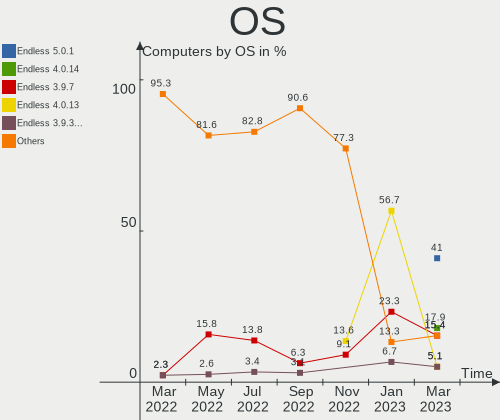
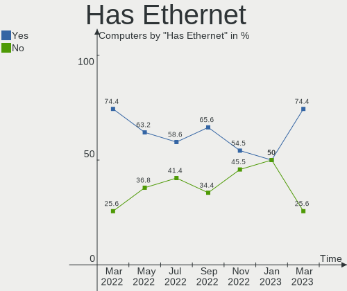
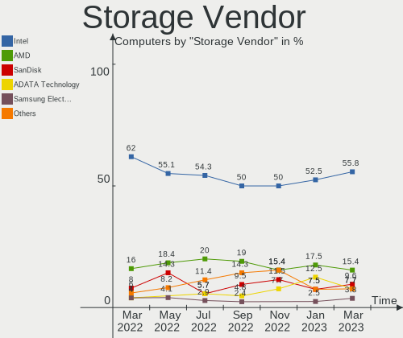
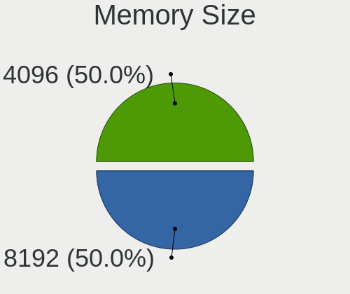
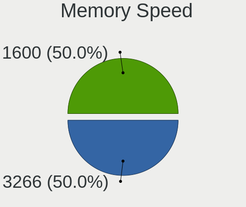

Endless Hardware Trends
-----------------------

A project to identify most popular hardware characteristics and track their change
over time based on data collected by Endless users at https://Linux-Hardware.org.

Anyone can contribute to the study by uploading probes of their computers by
the [hw-probe](https://github.com/linuxhw/hw-probe) tool:

    sudo -E hw-probe -all -upload

This is a report for all computer types. See also reports for [desktops](/Dist/Endless/Desktop/README.md) and [notebooks](/Dist/Endless/Notebook/README.md).

Full-feature report is available here: https://linux-hardware.org/?view=trends

Period: Sep, 2020.

Contents
--------

- [ OS                       ](#os)
- [ OS Family                ](#os-family)
- [ Kernel                   ](#kernel)
- [ Kernel Family            ](#kernel-family)
- [ Kernel Major Ver.        ](#kernel-major-ver)
- [ Arch                     ](#arch)
- [ DE                       ](#de)
- [ Display Server           ](#display-server)
- [ Display Manager          ](#display-manager)
- [ OS Lang                  ](#os-lang)
- [ Boot Mode                ](#boot-mode)
- [ Filesystem               ](#filesystem)
- [ Part. scheme             ](#part-scheme)
- [ Dual Boot with Linux/BSD ](#dual-boot-with-linux/bsd)
- [ Dual Boot (Win)          ](#dual-boot-win)
- [ Country                  ](#country)
- [ City                     ](#city)
- [ Vendor                   ](#vendor)
- [ Model                    ](#model)
- [ Model Family             ](#model-family)
- [ MFG Year                 ](#mfg-year)
- [ Form Factor              ](#form-factor)
- [ Secure Boot              ](#secure-boot)
- [ Coreboot                 ](#coreboot)
- [ RAM Size                 ](#ram-size)
- [ RAM Used                 ](#ram-used)
- [ Has CD-ROM               ](#has-cd-rom)
- [ Total Drives             ](#total-drives)
- [ Has Ethernet             ](#has-ethernet)
- [ Drive Vendor             ](#drive-vendor)
- [ HDD Vendor               ](#hdd-vendor)
- [ SSD Vendor               ](#ssd-vendor)
- [ Drive Model              ](#drive-model)
- [ Drive Kind               ](#drive-kind)
- [ Drive Connector          ](#drive-connector)
- [ Drive Size               ](#drive-size)
- [ Space Total              ](#space-total)
- [ Space Used               ](#space-used)
- [ Malfunc. Drives          ](#malfunc-drives)
- [ Malfunc. Drive Vendor    ](#malfunc-drive-vendor)
- [ Malfunc. HDD Vendor      ](#malfunc-hdd-vendor)
- [ Malfunc. Drive Kind      ](#malfunc-drive-kind)
- [ Failed Drives            ](#failed-drives)
- [ Failed Drive Vendor      ](#failed-drive-vendor)
- [ Drive Status             ](#drive-status)
- [ Storage Vendor           ](#storage-vendor)
- [ Storage Model            ](#storage-model)
- [ Storage Kind             ](#storage-kind)
- [ CPU Vendor               ](#cpu-vendor)
- [ CPU Model                ](#cpu-model)
- [ CPU Model Family         ](#cpu-model-family)
- [ CPU Cores                ](#cpu-cores)
- [ CPU Sockets              ](#cpu-sockets)
- [ CPU Threads              ](#cpu-threads)
- [ CPU Op-Modes             ](#cpu-op-modes)
- [ CPU Microcode            ](#cpu-microcode)
- [ CPU Microarch            ](#cpu-microarch)
- [ GPU Vendor               ](#gpu-vendor)
- [ GPU Model                ](#gpu-model)
- [ GPU Combo                ](#gpu-combo)
- [ GPU Driver               ](#gpu-driver)
- [ GPU Memory               ](#gpu-memory)
- [ Monitor Vendor           ](#monitor-vendor)
- [ Monitor Model            ](#monitor-model)
- [ Monitor Resolution       ](#monitor-resolution)
- [ Monitor Diagonal         ](#monitor-diagonal)
- [ Monitor Width            ](#monitor-width)
- [ Aspect Ratio             ](#aspect-ratio)
- [ Monitor Area             ](#monitor-area)
- [ Pixel Density            ](#pixel-density)
- [ Multiple Monitors        ](#multiple-monitors)
- [ Net Controller Vendor    ](#net-controller-vendor)
- [ Net Controller Model     ](#net-controller-model)
- [ Wireless Vendor          ](#wireless-vendor)
- [ Wireless Model           ](#wireless-model)
- [ Ethernet Vendor          ](#ethernet-vendor)
- [ Ethernet Model           ](#ethernet-model)
- [ Net Controller Kind      ](#net-controller-kind)
- [ Used Controller          ](#used-controller)
- [ NICs                     ](#nics)
- [ Memory Vendor            ](#memory-vendor)
- [ Memory Model             ](#memory-model)
- [ Memory Kind              ](#memory-kind)
- [ Memory Form Factor       ](#memory-form-factor)
- [ Memory Size              ](#memory-size)
- [ Memory Speed             ](#memory-speed)
- [ Sound Vendor             ](#sound-vendor)
- [ Sound Model              ](#sound-model)
- [ Camera Vendor            ](#camera-vendor)
- [ Camera Model             ](#camera-model)
- [ Fingerprint Vendor       ](#fingerprint-vendor)
- [ Fingerprint Model        ](#fingerprint-model)
- [ Chipcard Vendor          ](#chipcard-vendor)
- [ Chipcard Model           ](#chipcard-model)
- [ Printer Vendor           ](#printer-vendor)
- [ Printer Model            ](#printer-model)
- [ Scanner Vendor           ](#scanner-vendor)
- [ Scanner Model            ](#scanner-model)
- [ Bluetooth Vendor         ](#bluetooth-vendor)
- [ Bluetooth Model          ](#bluetooth-model)
- [ Unsupported Devices      ](#unsupported-devices)
- [ Unsupported Device Types ](#unsupported-device-types)

OS
--

Installed operating systems

| Name                  | Computers | Percent |
|-----------------------|-----------|---------|
| Endless 3.8.6         | 107       | 75.35%  |
| Endless 3.8.5         | 15        | 10.56%  |
| Endless 3.7.4         | 3         | 2.11%   |
| Endless 3.8.4         | 2         | 1.41%   |
| Endless 3.8.3         | 2         | 1.41%   |
| Endless 3.7.7-nexthw1 | 2         | 1.41%   |
| Endless 3.7.5-nexthw1 | 2         | 1.41%   |
| Endless 3.8.1         | 1         | 0.7%    |
| Endless 3.8.0         | 1         | 0.7%    |
| Endless 3.7.8         | 1         | 0.7%    |
| Endless 3.7.3         | 1         | 0.7%    |
| Endless 3.6.4         | 1         | 0.7%    |
| Endless 3.6.3-nexthw1 | 1         | 0.7%    |
| Endless 3.6.0-nexthw1 | 1         | 0.7%    |
| Endless 3.4.6         | 1         | 0.7%    |
| Endless 3.4.2-nexthw1 | 1         | 0.7%    |

OS Family
---------

OS without a version

| Name    | Computers | Percent |
|---------|-----------|---------|
| Endless | 142       | 100%    |

Kernel
------

Version of the Linux kernel

| Version           | Computers | Percent |
|-------------------|-----------|---------|
| 5.4.0-42-generic  | 107       | 75.35%  |
| 5.4.0-39-generic  | 15        | 10.56%  |
| 5.4.0-19-generic  | 6         | 4.23%   |
| 5.3.0-19-generic  | 3         | 2.11%   |
| 5.4.0-7-generic   | 2         | 1.41%   |
| 5.3.0-23-generic  | 2         | 1.41%   |
| 5.3.0-12-generic  | 2         | 1.41%   |
| 5.3.0-28-generic  | 1         | 0.7%    |
| 5.1.0-2-generic   | 1         | 0.7%    |
| 5.0.0-25-generic  | 1         | 0.7%    |
| 4.16.0-4-generic  | 1         | 0.7%    |
| 4.15.0-23-generic | 1         | 0.7%    |

Kernel Family
-------------

Linux kernel without a distro release

| Version | Computers | Percent |
|---------|-----------|---------|
| 5.4.0   | 130       | 91.55%  |
| 5.3.0   | 8         | 5.63%   |
| 5.1.0   | 1         | 0.7%    |
| 5.0.0   | 1         | 0.7%    |
| 4.16.0  | 1         | 0.7%    |
| 4.15.0  | 1         | 0.7%    |

Kernel Major Ver.
-----------------

Linux kernel major version

| Version | Computers | Percent |
|---------|-----------|---------|
| 5.4     | 130       | 91.55%  |
| 5.3     | 8         | 5.63%   |
| 5.1     | 1         | 0.7%    |
| 5.0     | 1         | 0.7%    |
| 4.16    | 1         | 0.7%    |
| 4.15    | 1         | 0.7%    |

Arch
----

OS architecture (x86_64, i586, etc.)

| Name   | Computers | Percent |
|--------|-----------|---------|
| x86_64 | 142       | 100%    |

DE
--

Desktop Environment

| Name    | Computers | Percent |
|---------|-----------|---------|
| GNOME   | 141       | 99.3%   |
| Unknown | 1         | 0.7%    |

Display Server
--------------

X11 or Wayland

| Name    | Computers | Percent |
|---------|-----------|---------|
| X11     | 141       | 99.3%   |
| Unknown | 1         | 0.7%    |

Display Manager
---------------

SDDM, LightDM, etc.

| Name    | Computers | Percent |
|---------|-----------|---------|
| Unknown | 142       | 100%    |

OS Lang
-------

Language

| Lang       | Computers | Percent |
|------------|-----------|---------|
| pt_BR.utf8 | 36        | 25.35%  |
| en_US.utf8 | 24        | 16.9%   |
| pt_BR      | 20        | 14.08%  |
| es_ES      | 10        | 7.04%   |
| ro_RO      | 7         | 4.93%   |
| ru_RU      | 5         | 3.52%   |
| de_DE      | 5         | 3.52%   |
| ru_UA      | 4         | 2.82%   |
| hu_HU      | 4         | 2.82%   |
| en_US      | 4         | 2.82%   |
| pt_PT      | 2         | 1.41%   |
| it_IT      | 2         | 1.41%   |
| fr_FR      | 2         | 1.41%   |
| es_MX.utf8 | 2         | 1.41%   |
| es_CO      | 2         | 1.41%   |
| es_AR      | 2         | 1.41%   |
| en_IN      | 2         | 1.41%   |
| vi_VN      | 1         | 0.7%    |
| uk_UA      | 1         | 0.7%    |
| tr_TR      | 1         | 0.7%    |
| pl_PL      | 1         | 0.7%    |
| nl_NL      | 1         | 0.7%    |
| id_ID      | 1         | 0.7%    |
| et_EE      | 1         | 0.7%    |
| bg_BG      | 1         | 0.7%    |
| anp_IN     | 1         | 0.7%    |

Boot Mode
---------

EFI or BIOS

| Mode | Computers | Percent |
|------|-----------|---------|
| EFI  | 85        | 59.86%  |
| BIOS | 57        | 40.14%  |

Filesystem
----------

Type of filesystem

| Type  | Computers | Percent |
|-------|-----------|---------|
| Ext4  | 141       | 99.3%   |
| Tmpfs | 1         | 0.7%    |

Part. scheme
------------

Scheme of partitioning

| Type    | Computers | Percent |
|---------|-----------|---------|
| Unknown | 140       | 98.59%  |
| GPT     | 2         | 1.41%   |

Dual Boot with Linux/BSD
------------------------

Hosting more than one Linux/BSD

| Dual boot | Computers | Percent |
|-----------|-----------|---------|
| No        | 142       | 100%    |

Dual Boot (Win)
---------------

Hosting Linux and Windows

| Dual boot | Computers | Percent |
|-----------|-----------|---------|
| No        | 141       | 99.3%   |
| Yes       | 1         | 0.7%    |

Country
-------

Geographic location (country)

| Country      | Computers | Percent |
|--------------|-----------|---------|
| Brazil       | 55        | 38.73%  |
| Romania      | 14        | 9.86%   |
| USA          | 10        | 7.04%   |
| Spain        | 9         | 6.34%   |
| Germany      | 6         | 4.23%   |
| Ukraine      | 5         | 3.52%   |
| Russia       | 4         | 2.82%   |
| Hungary      | 4         | 2.82%   |
| UK           | 2         | 1.41%   |
| Portugal     | 2         | 1.41%   |
| Mexico       | 2         | 1.41%   |
| Italy        | 2         | 1.41%   |
| India        | 2         | 1.41%   |
| Colombia     | 2         | 1.41%   |
| Turkey       | 1         | 0.7%    |
| Switzerland  | 1         | 0.7%    |
| South Korea  | 1         | 0.7%    |
| South Africa | 1         | 0.7%    |
| Serbia       | 1         | 0.7%    |
| Poland       | 1         | 0.7%    |
| Netherlands  | 1         | 0.7%    |
| Macedonia    | 1         | 0.7%    |
| Liberia      | 1         | 0.7%    |
| Kosovo       | 1         | 0.7%    |
| Japan        | 1         | 0.7%    |
| Indonesia    | 1         | 0.7%    |
| Greece       | 1         | 0.7%    |
| Georgia      | 1         | 0.7%    |
| France       | 1         | 0.7%    |
| Estonia      | 1         | 0.7%    |
| Croatia      | 1         | 0.7%    |
| Canada       | 1         | 0.7%    |
| Bulgaria     | 1         | 0.7%    |
| Belarus      | 1         | 0.7%    |
| Australia    | 1         | 0.7%    |
| Argentina    | 1         | 0.7%    |
| Unknown      | 1         | 0.7%    |

City
----

Geographic location (city)

| City                    | Computers | Percent |
|-------------------------|-----------|---------|
| São Paulo              | 5         | 3.52%   |
| Curitiba                | 4         | 2.82%   |
| Rio de Janeiro          | 3         | 2.11%   |
| Villingen-Schwenningen  | 2         | 1.41%   |
| Valencia                | 2         | 1.41%   |
| São José dos Campos   | 2         | 1.41%   |
| Porto Alegre            | 2         | 1.41%   |
| Niterói                | 2         | 1.41%   |
| Madrid                  | 2         | 1.41%   |
| Kyiv                    | 2         | 1.41%   |
| Green Bay               | 2         | 1.41%   |
| Chaves                  | 2         | 1.41%   |
| Budapest                | 2         | 1.41%   |
| Bucharest               | 2         | 1.41%   |
| Belo Horizonte          | 2         | 1.41%   |
| Bacau                   | 2         | 1.41%   |
| Warendorf               | 1         | 0.7%    |
| Vijayawada              | 1         | 0.7%    |
| Vargem Grande do Sul    | 1         | 0.7%    |
| Usol'ye-Sibirskoye      | 1         | 0.7%    |
| Ufa                     | 1         | 0.7%    |
| Uberlândia             | 1         | 0.7%    |
| Târgu Jiu              | 1         | 0.7%    |
| Tucurui                 | 1         | 0.7%    |
| Toronto                 | 1         | 0.7%    |
| Ternopil                | 1         | 0.7%    |
| Teodoro Sampaio         | 1         | 0.7%    |
| Tbilisi                 | 1         | 0.7%    |
| Tallinn                 | 1         | 0.7%    |
| Szombathely             | 1         | 0.7%    |
| Szolnok                 | 1         | 0.7%    |
| Split                   | 1         | 0.7%    |
| Sofia                   | 1         | 0.7%    |
| Sincelejo               | 1         | 0.7%    |
| Sibiu                   | 1         | 0.7%    |
| Shtip                   | 1         | 0.7%    |
| Sector 3                | 1         | 0.7%    |
| Schaffhausen            | 1         | 0.7%    |
| Saquarema               | 1         | 0.7%    |
| Sao Pedro da Aldeia     | 1         | 0.7%    |
| Sao Joao da Boa Vista   | 1         | 0.7%    |
| Santo André            | 1         | 0.7%    |
| Santa Cruz do Sul       | 1         | 0.7%    |
| Santa Cruz do Rio Pardo | 1         | 0.7%    |
| San Juan del Río       | 1         | 0.7%    |
| Roznov                  | 1         | 0.7%    |
| Rome                    | 1         | 0.7%    |
| Rocafort                | 1         | 0.7%    |
| Pristina                | 1         | 0.7%    |
| Pozzo d'Adda            | 1         | 0.7%    |
| Portao                  | 1         | 0.7%    |
| Port de Sagunt          | 1         | 0.7%    |
| Popesti-Leordeni        | 1         | 0.7%    |
| Pohang                  | 1         | 0.7%    |
| Plaintel                | 1         | 0.7%    |
| Piteşti                | 1         | 0.7%    |
| Paulinia                | 1         | 0.7%    |
| Pasto                   | 1         | 0.7%    |
| Oradea                  | 1         | 0.7%    |
| Olympia                 | 1         | 0.7%    |

Vendor
------

Motherboard manufacturer

| Name                | Computers | Percent |
|---------------------|-----------|---------|
| Acer                | 45        | 31.69%  |
| ASUSTek Computer    | 44        | 30.99%  |
| Lenovo              | 9         | 6.34%   |
| Hewlett-Packard     | 9         | 6.34%   |
| Dell                | 7         | 4.93%   |
| Sony                | 3         | 2.11%   |
| Positivo            | 3         | 2.11%   |
| Toshiba             | 2         | 1.41%   |
| Intel               | 2         | 1.41%   |
| Gigabyte Technology | 2         | 1.41%   |
| Fujitsu Siemens     | 2         | 1.41%   |
| Biostar             | 2         | 1.41%   |
| Semp Toshiba        | 1         | 0.7%    |
| Samsung Electronics | 1         | 0.7%    |
| Phitronics          | 1         | 0.7%    |
| PCWare              | 1         | 0.7%    |
| Megaware            | 1         | 0.7%    |
| LG Electronics      | 1         | 0.7%    |
| Itautec             | 1         | 0.7%    |
| ECS                 | 1         | 0.7%    |
| Digibras            | 1         | 0.7%    |
| Compal              | 1         | 0.7%    |
| Apple               | 1         | 0.7%    |
| AMI                 | 1         | 0.7%    |

Model
-----

Motherboard model

| Name                                       | Computers | Percent |
|--------------------------------------------|-----------|---------|
| Acer Nitro AN515-54                        | 9         | 6.34%   |
| Acer Aspire A315-54                        | 7         | 4.93%   |
| Acer Nitro AN517-51                        | 5         | 3.52%   |
| Acer Aspire A315-53                        | 5         | 3.52%   |
| ASUS VivoBook 15_ASUS Laptop X540MA_X543MA | 3         | 2.11%   |
| ASUS VivoBook 15_ASUS Laptop X540MA_R540MA | 3         | 2.11%   |
| Acer Aspire A315-34                        | 3         | 2.11%   |
| HP 2000                                    | 2         | 1.41%   |
| ASUS ZenBook UX462DA                       | 2         | 1.41%   |
| ASUS VivoBook_ASUSLaptop X512DA_A512DA     | 2         | 1.41%   |
| ASUS VivoBook_ASUSLaptop X509JA_X509JA     | 2         | 1.41%   |
| ASUS VivoBook_ASUSLaptop X409DA_M409DA     | 2         | 1.41%   |
| Acer Nitro AN515-43                        | 2         | 1.41%   |
| Toshiba Satellite L730                     | 1         | 0.7%    |
| Toshiba Satellite C55-C                    | 1         | 0.7%    |
| Sony VPCSB2L1E                             | 1         | 0.7%    |
| Sony VGN-Z570AN                            | 1         | 0.7%    |
| Sony VGC-JS210J                            | 1         | 0.7%    |
| Semp Toshiba IS 1462B                      | 1         | 0.7%    |
| Samsung Electronics R519/R719              | 1         | 0.7%    |
| Positivo S14CT01                           | 1         | 0.7%    |
| Positivo POS-PIG41BO                       | 1         | 0.7%    |
| Positivo C14CU51                           | 1         | 0.7%    |
| Phitronics P7I45GC-M+                      | 1         | 0.7%    |
| PCWare CAPE7 847                           | 1         | 0.7%    |
| Megaware MW-G41T-M7                        | 1         | 0.7%    |
| LG Electronics A410-G.BC48P1               | 1         | 0.7%    |
| Lenovo ThinkPad S3-S440 20AYCTO1WW         | 1         | 0.7%    |
| Lenovo ThinkCentre M92 3235H3G             | 1         | 0.7%    |
| Lenovo IdeaPad Z570 HuronRiver Platform    | 1         | 0.7%    |
| Lenovo IdeaPad S400 Touch VIUS3            | 1         | 0.7%    |
| Lenovo IdeaPad S340-14API 81NB             | 1         | 0.7%    |
| Lenovo IdeaPad L340-15IRH Gaming 81TR      | 1         | 0.7%    |
| Lenovo IdeaPad G485 QAWGE                  | 1         | 0.7%    |
| Lenovo IdeaCentre B300 10051               | 1         | 0.7%    |
| Lenovo B50-30 20382                        | 1         | 0.7%    |
| Itautec Infoway                            | 1         | 0.7%    |
| Intel RM DESKTOP 310                       | 1         | 0.7%    |
| Intel DH55PJ AAE93812-302                  | 1         | 0.7%    |
| HP WE228AA-ABE MS228es                     | 1         | 0.7%    |
| HP ProBook 6570b                           | 1         | 0.7%    |
| HP ProBook 440 G3                          | 1         | 0.7%    |
| HP Pavilion g6                             | 1         | 0.7%    |
| HP Pavilion dm1                            | 1         | 0.7%    |
| HP Notebook                                | 1         | 0.7%    |
| HP 18-5200br                               | 1         | 0.7%    |
| Gigabyte H81M-S2H                          | 1         | 0.7%    |
| Gigabyte B360M AORUS Gaming 3              | 1         | 0.7%    |
| Fujitsu Siemens ESPRIMO P5925              | 1         | 0.7%    |
| Fujitsu Siemens ESPRIMO Mobile V5535       | 1         | 0.7%    |
| ECS BSWI-D2                                | 1         | 0.7%    |
| Digibras NH4CU53                           | 1         | 0.7%    |
| Dell OptiPlex 7010                         | 1         | 0.7%    |
| Dell OptiPlex 390                          | 1         | 0.7%    |
| Dell Latitude E5520                        | 1         | 0.7%    |
| Dell Latitude E4300                        | 1         | 0.7%    |
| Dell Latitude 3550                         | 1         | 0.7%    |
| Dell Inspiron 5555                         | 1         | 0.7%    |
| Dell Inspiron 14-3452                      | 1         | 0.7%    |
| Compal PBL0001                             | 1         | 0.7%    |

Model Family
------------

Motherboard model prefix

| Name                         | Computers | Percent |
|------------------------------|-----------|---------|
| ASUS VivoBook                | 27        | 19.01%  |
| Acer Aspire                  | 24        | 16.9%   |
| Acer Nitro                   | 17        | 11.97%  |
| Lenovo IdeaPad               | 5         | 3.52%   |
| Dell Latitude                | 3         | 2.11%   |
| ASUS ZenBook                 | 3         | 2.11%   |
| Toshiba Satellite            | 2         | 1.41%   |
| HP ProBook                   | 2         | 1.41%   |
| HP Pavilion                  | 2         | 1.41%   |
| HP 2000                      | 2         | 1.41%   |
| Fujitsu Siemens ESPRIMO      | 2         | 1.41%   |
| Dell OptiPlex                | 2         | 1.41%   |
| Dell Inspiron                | 2         | 1.41%   |
| Acer TravelMate              | 2         | 1.41%   |
| Sony VPCSB2L1E               | 1         | 0.7%    |
| Sony VGN-Z570AN              | 1         | 0.7%    |
| Sony VGC-JS210J              | 1         | 0.7%    |
| Semp Toshiba IS              | 1         | 0.7%    |
| Samsung Electronics R519     | 1         | 0.7%    |
| Positivo S14CT01             | 1         | 0.7%    |
| Positivo POS-PIG41BO         | 1         | 0.7%    |
| Positivo C14CU51             | 1         | 0.7%    |
| Phitronics P7I45GC-M+        | 1         | 0.7%    |
| PCWare CAPE7                 | 1         | 0.7%    |
| Megaware MW-G41T-M7          | 1         | 0.7%    |
| LG Electronics A410-G.BC48P1 | 1         | 0.7%    |
| Lenovo ThinkPad              | 1         | 0.7%    |
| Lenovo ThinkCentre           | 1         | 0.7%    |
| Lenovo IdeaCentre            | 1         | 0.7%    |
| Lenovo B50-30                | 1         | 0.7%    |
| Itautec Infoway              | 1         | 0.7%    |
| Intel RM                     | 1         | 0.7%    |
| Intel DH55PJ                 | 1         | 0.7%    |
| HP WE228AA-ABE               | 1         | 0.7%    |
| HP Notebook                  | 1         | 0.7%    |
| HP 18-5200br                 | 1         | 0.7%    |
| Gigabyte H81M-S2H            | 1         | 0.7%    |
| Gigabyte B360M               | 1         | 0.7%    |
| ECS BSWI-D2                  | 1         | 0.7%    |
| Digibras NH4CU53             | 1         | 0.7%    |
| Compal PBL0001               | 1         | 0.7%    |
| Biostar NM70I-1037U          | 1         | 0.7%    |
| Biostar G31M                 | 1         | 0.7%    |
| ASUS Z550SA                  | 1         | 0.7%    |
| ASUS X542UQR                 | 1         | 0.7%    |
| ASUS X541UAK                 | 1         | 0.7%    |
| ASUS X541NA                  | 1         | 0.7%    |
| ASUS X540LA                  | 1         | 0.7%    |
| ASUS Vivo                    | 1         | 0.7%    |
| ASUS TP410UAR                | 1         | 0.7%    |
| ASUS P5VD2-VM                | 1         | 0.7%    |
| ASUS M5A78L-M                | 1         | 0.7%    |
| ASUS M2V                     | 1         | 0.7%    |
| ASUS K52JU                   | 1         | 0.7%    |
| ASUS K50AB                   | 1         | 0.7%    |
| ASUS GL753VD                 | 1         | 0.7%    |
| ASUS All                     | 1         | 0.7%    |
| Apple MacBook2               | 1         | 0.7%    |
| AMI Aptio                    | 1         | 0.7%    |
| Acer Swift                   | 1         | 0.7%    |

MFG Year
--------

Motherboard manufacture year

| Year | Computers | Percent |
|------|-----------|---------|
| 2020 | 36        | 25.35%  |
| 2019 | 31        | 21.83%  |
| 2018 | 10        | 7.04%   |
| 2013 | 9         | 6.34%   |
| 2017 | 8         | 5.63%   |
| 2010 | 8         | 5.63%   |
| 2016 | 7         | 4.93%   |
| 2014 | 7         | 4.93%   |
| 2011 | 6         | 4.23%   |
| 2009 | 6         | 4.23%   |
| 2007 | 5         | 3.52%   |
| 2012 | 4         | 2.82%   |
| 2015 | 3         | 2.11%   |
| 2008 | 2         | 1.41%   |

Form Factor
-----------

Physical design of the computer

| Name        | Computers | Percent |
|-------------|-----------|---------|
| Notebook    | 112       | 78.87%  |
| Desktop     | 20        | 14.08%  |
| All in one  | 6         | 4.23%   |
| Convertible | 3         | 2.11%   |
| Mini pc     | 1         | 0.7%    |

Secure Boot
-----------

Enabled or disabled

| State    | Computers | Percent |
|----------|-----------|---------|
| Disabled | 104       | 73.24%  |
| Enabled  | 38        | 26.76%  |

Coreboot
--------

Have coreboot on board

| Used | Computers | Percent |
|------|-----------|---------|
| No   | 142       | 100%    |

RAM Size
--------

Total RAM memory

| Size in GB  | Computers | Percent |
|-------------|-----------|---------|
| 4.01-8.0    | 57        | 40.14%  |
| 3.01-4.0    | 53        | 37.32%  |
| 1.01-2.0    | 13        | 9.15%   |
| 8.01-16.0   | 10        | 7.04%   |
| 16.01-24.0  | 4         | 2.82%   |
| 2.01-3.0    | 3         | 2.11%   |
| 32.01-64.0  | 1         | 0.7%    |
| 64.01-256.0 | 1         | 0.7%    |

RAM Used
--------

Used RAM memory

| Used GB  | Computers | Percent |
|----------|-----------|---------|
| 1.01-2.0 | 83        | 58.45%  |
| 2.01-3.0 | 32        | 22.54%  |
| 0.01-1.0 | 20        | 14.08%  |
| 3.01-4.0 | 4         | 2.82%   |
| 4.01-8.0 | 3         | 2.11%   |

Has CD-ROM
----------

Has CD-ROM on board

| Presented | Computers | Percent |
|-----------|-----------|---------|
| No        | 99        | 69.72%  |
| Yes       | 43        | 30.28%  |

Total Drives
------------

Number of drives on board

| Drives | Computers | Percent |
|--------|-----------|---------|
| 1      | 104       | 73.24%  |
| 2      | 36        | 25.35%  |
| 3      | 2         | 1.41%   |

Has Ethernet
------------

Has Ethernet on board

| Presented | Computers | Percent |
|-----------|-----------|---------|
| Yes       | 109       | 76.76%  |
| No        | 33        | 23.24%  |

Drive Vendor
------------

Hard drive vendors

| Vendor              | Computers | Drives  | Percent |
|---------------------|-----------|---------|---------|
| WDC                 | 41        | 41      | 22.28%  |
| Seagate             | 27        | 27      | 14.67%  |
| Intel               | 24        | 24      | 13.04%  |
| Kingston            | 21        | 21      | 11.41%  |
| Toshiba             | 16        | 16      | 8.7%    |
| Samsung Electronics | 11        | 12      | 5.98%   |
| SanDisk             | 9         | 10      | 4.89%   |
| Unknown             | 8         | 9       | 4.35%   |
| SK Hynix            | 4         | 4       | 2.17%   |
| HL-DT-ST            | 4         | Unknown | 2.17%   |
| Hitachi             | 4         | 4       | 2.17%   |
| A-DATA Technology   | 4         | 4       | 2.17%   |
| MAXTOR              | 2         | 2       | 1.09%   |
| HGST                | 2         | 2       | 1.09%   |
| PNY                 | 1         | 1       | 0.54%   |
| LITEON              | 1         | 1       | 0.54%   |
| Hewlett-Packard     | 1         | 1       | 0.54%   |
| GOODRAM             | 1         | 1       | 0.54%   |
| Fujitsu             | 1         | 1       | 0.54%   |
| Crucial             | 1         | 1       | 0.54%   |
| China               | 1         | 1       | 0.54%   |

HDD Vendor
----------

Hard disk drive vendors

| Vendor              | Computers | Drives | Percent |
|---------------------|-----------|--------|---------|
| WDC                 | 40        | 40     | 42.55%  |
| Seagate             | 27        | 27     | 28.72%  |
| Toshiba             | 13        | 13     | 13.83%  |
| Samsung Electronics | 6         | 6      | 6.38%   |
| Hitachi             | 4         | 4      | 4.26%   |
| HGST                | 2         | 2      | 2.13%   |
| MAXTOR              | 1         | 1      | 1.06%   |
| Fujitsu             | 1         | 1      | 1.06%   |

SSD Vendor
----------

Solid state drive vendors

| Vendor              | Computers | Drives | Percent |
|---------------------|-----------|--------|---------|
| Kingston            | 17        | 17     | 39.53%  |
| SanDisk             | 6         | 7      | 13.95%  |
| A-DATA Technology   | 4         | 4      | 9.3%    |
| Toshiba             | 3         | 3      | 6.98%   |
| Samsung Electronics | 3         | 3      | 6.98%   |
| SK Hynix            | 2         | 2      | 4.65%   |
| Unknown             | 1         | 1      | 2.33%   |
| PNY                 | 1         | 1      | 2.33%   |
| Maxtor              | 1         | 1      | 2.33%   |
| LITEON              | 1         | 1      | 2.33%   |
| Hewlett-Packard     | 1         | 1      | 2.33%   |
| GOODRAM             | 1         | 1      | 2.33%   |
| Crucial             | 1         | 1      | 2.33%   |
| China               | 1         | 1      | 2.33%   |

Drive Model
-----------

Hard drive models

| Model                       | Computers | Percent |
|-----------------------------|-----------|---------|
| WD10SPZX-21Z10T0 1TB        | 26        | 13.98%  |
| NVMe SSD Drive 512GB        | 15        | 8.06%   |
| NVMe SSD Drive 128GB        | 12        | 6.45%   |
| NVMe SSD Drive 256GB        | 9         | 4.84%   |
| ST1000LM035-1RK172 1TB      | 6         | 3.23%   |
| RBUSC180DS37256GJ 256GB SSD | 5         | 2.69%   |
| MQ01ABF050 500GB            | 5         | 2.69%   |
| IM2S3338-128GD2 128GB SSD   | 4         | 2.15%   |
| ST500LM012 HN-M500MBB 500GB | 3         | 1.61%   |
| SA400S37240G 240GB SSD      | 3         | 1.61%   |
| MQ04ABF100 1TB              | 3         | 1.61%   |
| MMC Card  32GB              | 3         | 1.61%   |
| DVDRAM GUE1N 3GB            | 3         | 1.61%   |
| SV300S37A120G 120GB SSD     | 2         | 1.08%   |
| SUV400S37120G 120GB SSD     | 2         | 1.08%   |
| ST500LT012-1DG142 500GB     | 2         | 1.08%   |
| MQ01ABD100 1TB              | 2         | 1.08%   |
| Z1 SSD 240GB                | 1         | 0.54%   |
| WD7500BPVT-24HXZT3 752GB    | 1         | 0.54%   |
| WD5000LPVT-08G33T1 500GB    | 1         | 0.54%   |
| WD5000LPCX-80VHAT0 500GB    | 1         | 0.54%   |
| WD5000LPCX-21VHAT0 500GB    | 1         | 0.54%   |
| WD5000AAKS-00E4A0 500GB     | 1         | 0.54%   |
| WD5000AAKS-00D2B0 500GB     | 1         | 0.54%   |
| WD3200BPVT-60JJ5T0 320GB    | 1         | 0.54%   |
| WD3200BEVT-22ZCT0 320GB     | 1         | 0.54%   |
| WD3200AAJS-56M0A0 320GB     | 1         | 0.54%   |
| WD2500BEKT-60PVMT0 250GB    | 1         | 0.54%   |
| WD1600BEVT-22ZCT0 160GB     | 1         | 0.54%   |
| WD1600AAJS-08L7A0 160GB     | 1         | 0.54%   |
| WD10SPZX-24Z10 1TB          | 1         | 0.54%   |
| WD10EZEX-75M2NA0 1TB        | 1         | 0.54%   |
| TR150 240GB SSD             | 1         | 0.54%   |
| THNSNK128GVN8 128GB SSD     | 1         | 0.54%   |
| THNSNJ128GCST 128GB SSD     | 1         | 0.54%   |
| SVP200S3120G 120GB SSD      | 1         | 0.54%   |
| SV300S37A60G 64GB SSD       | 1         | 0.54%   |
| STM380215AS 80GB            | 1         | 0.54%   |
| ST980210AS 80GB             | 1         | 0.54%   |
| ST9500325AS 500GB           | 1         | 0.54%   |
| ST9250410AS 250GB           | 1         | 0.54%   |
| ST9250315AS 250GB           | 1         | 0.54%   |
| ST9200420AS 200GB           | 1         | 0.54%   |
| ST9160821AS 160GB           | 1         | 0.54%   |
| ST500LM021-1KJ152 500GB     | 1         | 0.54%   |
| ST500DM002-1BD142 500GB     | 1         | 0.54%   |
| ST3320613AS 320GB           | 1         | 0.54%   |
| ST3320418AS 320GB           | 1         | 0.54%   |
| ST320LT007-9ZV142 320GB     | 1         | 0.54%   |
| ST3200827AS 200GB           | 1         | 0.54%   |
| ST2000LM007-1R8174 2TB      | 1         | 0.54%   |
| ST1000LM024 HN-M101MBB 1TB  | 1         | 0.54%   |
| ST1000DM003-1ER162 1TB      | 1         | 0.54%   |
| SSDPR-CL100-240 240GB       | 1         | 0.54%   |
| SSD U100 64GB               | 1         | 0.54%   |
| SSD S700 500GB              | 1         | 0.54%   |
| SSD PLUS 240GB              | 1         | 0.54%   |
| SSD 860 QVO 1TB             | 1         | 0.54%   |
| SSD 860 EVO 250GB           | 1         | 0.54%   |
| SSD 850 PRO 512GB           | 1         | 0.54%   |

Drive Kind
----------

HDD or SSD

| Kind    | Computers | Drives  | Percent |
|---------|-----------|---------|---------|
| HDD     | 91        | 94      | 50.84%  |
| SSD     | 41        | 44      | 22.91%  |
| NVMe    | 38        | 39      | 21.23%  |
| MMC     | 5         | 6       | 2.79%   |
| Unknown | 4         | Unknown | 2.23%   |

Drive Connector
---------------

SATA, SAS, NVMe, etc.

| Type | Computers | Drives | Percent |
|------|-----------|--------|---------|
| SATA | 117       | 137    | 70.91%  |
| NVMe | 38        | 39     | 23.03%  |
| SAS  | 5         | 1      | 3.03%   |
| MMC  | 5         | 6      | 3.03%   |

Drive Size
----------

Size of hard drive

| Size in TB | Computers | Drives | Percent |
|------------|-----------|--------|---------|
| 0.01-0.5   | 103       | 117    | 61.31%  |
| 0.51-1.0   | 63        | 64     | 37.5%   |
| 1.01-2.0   | 2         | 2      | 1.19%   |

Space Total
-----------

Amount of disk space available on the file system

| Size in GB | Computers | Percent |
|------------|-----------|---------|
| 101-250    | 44        | 30.99%  |
| 251-500    | 38        | 26.76%  |
| 501-1000   | 33        | 23.24%  |
| 21-50      | 11        | 7.75%   |
| 51-100     | 8         | 5.63%   |
| 1001-2000  | 4         | 2.82%   |
| 1-20       | 4         | 2.82%   |

Space Used
----------

Amount of used disk space

| Used GB  | Computers | Percent |
|----------|-----------|---------|
| 21-50    | 88        | 61.97%  |
| 1-20     | 29        | 20.42%  |
| 51-100   | 14        | 9.86%   |
| 101-250  | 7         | 4.93%   |
| 251-500  | 2         | 1.41%   |
| 501-1000 | 2         | 1.41%   |

Malfunc. Drives
---------------

Drive models with a malfunction

Zero info for selected period =(

Malfunc. Drive Vendor
---------------------

Vendors of faulty drives

Zero info for selected period =(

Malfunc. HDD Vendor
-------------------

Vendors of faulty HDD drives

Zero info for selected period =(

Malfunc. Drive Kind
-------------------

Kinds of faulty drives

Zero info for selected period =(

Failed Drives
-------------

Failed drive models

Zero info for selected period =(

Failed Drive Vendor
-------------------

Failed drive vendors

Zero info for selected period =(

Drive Status
------------

Number of failed and malfunc. drives

| Status   | Computers | Drives | Percent |
|----------|-----------|--------|---------|
| Detected | 141       | 181    | 98.6%   |
| Works    | 2         | 2      | 1.4%    |

Storage Vendor
--------------

Storage controller vendors

| Vendor                           | Computers | Percent |
|----------------------------------|-----------|---------|
| Intel                            | 111       | 71.61%  |
| AMD                              | 24        | 15.48%  |
| Sandisk                          | 4         | 2.58%   |
| Kingston Technology Company      | 4         | 2.58%   |
| VIA Technologies                 | 3         | 1.94%   |
| Samsung Electronics              | 3         | 1.94%   |
| SK Hynix                         | 2         | 1.29%   |
| ADATA Technology                 | 2         | 1.29%   |
| Silicon Integrated Systems [SiS] | 1         | 0.65%   |
| Marvell Technology Group         | 1         | 0.65%   |

Storage Model
-------------

Storage controller models

| Model                                                                             | Computers | Percent |
|-----------------------------------------------------------------------------------|-----------|---------|
| 82801 Mobile SATA Controller [RAID mode]                                          | 32        | 16.24%  |
| PROSet/Wireless WiFi Software extension                                           | 22        | 11.17%  |
| FCH SATA Controller [AHCI mode]                                                   | 19        | 9.64%   |
| SATA controller                                                                   | 14        | 7.11%   |
| Sunrise Point-LP SATA Controller [AHCI mode]                                      | 10        | 5.08%   |
| Non-Volatile memory controller                                                    | 6         | 3.05%   |
| 6 Series/C200 Series Chipset Family 6 port Mobile SATA AHCI Controller            | 6         | 3.05%   |
| NM10/ICH7 Family SATA Controller [IDE mode]                                       | 5         | 2.54%   |
| Celeron N3350/Pentium N4200/Atom E3900 Series SATA AHCI Controller                | 5         | 2.54%   |
| 82801G (ICH7 Family) IDE Controller                                               | 5         | 2.54%   |
| 7 Series Chipset Family 6-port SATA Controller [AHCI mode]                        | 5         | 2.54%   |
| Wildcat Point-LP SATA Controller [AHCI Mode]                                      | 4         | 2.03%   |
| SB7x0/SB8x0/SB9x0 SATA Controller [AHCI mode]                                     | 4         | 2.03%   |
| Atom/Celeron/Pentium Processor x5-E8000/J3xxx/N3xxx Series SATA Controller        | 4         | 2.03%   |
| WD Black 2018/PC SN520 NVMe SSD                                                   | 3         | 1.52%   |
| VT82C586A/B/VT82C686/A/B/VT823x/A/C PIPC Bus Master IDE                           | 3         | 1.52%   |
| Cannon Lake Mobile PCH SATA AHCI Controller                                       | 3         | 1.52%   |
| 82801IBM/IEM (ICH9M/ICH9M-E) 4 port SATA Controller [AHCI mode]                   | 3         | 1.52%   |
| VT8237A SATA 2-Port Controller                                                    | 2         | 1.02%   |
| SSD 660P Series                                                                   | 2         | 1.02%   |
| NVMe SSD Controller SM981/PM981/PM983                                             | 2         | 1.02%   |
| BC501 NVMe Solid State Drive 512GB                                                | 2         | 1.02%   |
| 7 Series/C210 Series Chipset Family 6-port SATA Controller [AHCI mode]            | 2         | 1.02%   |
| 6 Series/C200 Series Chipset Family Desktop SATA Controller (IDE mode, ports 4-5) | 2         | 1.02%   |
| 6 Series/C200 Series Chipset Family Desktop SATA Controller (IDE mode, ports 0-3) | 2         | 1.02%   |
| 5 Series/3400 Series Chipset 4 port SATA AHCI Controller                          | 2         | 1.02%   |
| VT8237/8251 Serial ATA Controller                                                 | 1         | 0.51%   |
| Technology Company Non-Volatile memory controller                                 | 1         | 0.51%   |
| SB7x0/SB8x0/SB9x0 SATA Controller [IDE mode]                                      | 1         | 0.51%   |
| SB7x0/SB8x0/SB9x0 IDE Controller                                                  | 1         | 0.51%   |
| SATA Controller / IDE mode                                                        | 1         | 0.51%   |
| Mobile 4 Series Chipset PT IDER Controller                                        | 1         | 0.51%   |
| HM170/QM170 Chipset SATA Controller [AHCI Mode]                                   | 1         | 0.51%   |
| Electronics Non-Volatile memory controller                                        | 1         | 0.51%   |
| Comet Lake PCH-LP SATA RAID Premium Controller                                    | 1         | 0.51%   |
| Cannon Lake PCH SATA AHCI Controller                                              | 1         | 0.51%   |
| C610/X99 series chipset sSATA Controller [AHCI mode]                              | 1         | 0.51%   |
| C610/X99 series chipset 6-Port SATA Controller [AHCI mode]                        | 1         | 0.51%   |
| Atom Processor E3800 Series SATA AHCI Controller                                  | 1         | 0.51%   |
| 88SE6111/6121 SATA II / PATA Controller                                           | 1         | 0.51%   |
| 82Q35 Express PT IDER Controller                                                  | 1         | 0.51%   |
| 82801JI (ICH10 Family) 4 port SATA IDE Controller #1                              | 1         | 0.51%   |
| 82801IR/IO/IH (ICH9R/DO/DH) 4 port SATA Controller [IDE mode]                     | 1         | 0.51%   |
| 82801IBM/IEM (ICH9M/ICH9M-E) 2 port SATA Controller [IDE mode]                    | 1         | 0.51%   |
| 82801I (ICH9 Family) 2 port SATA Controller [IDE mode]                            | 1         | 0.51%   |
| 82801GBM/GHM (ICH7-M Family) SATA Controller [AHCI mode]                          | 1         | 0.51%   |
| 8 Series/C220 Series Chipset Family 6-port SATA Controller 1 [AHCI mode]          | 1         | 0.51%   |
| 8 Series SATA Controller 1 [AHCI mode]                                            | 1         | 0.51%   |
| 7 Series Chipset Family 4-port SATA Controller [IDE mode]                         | 1         | 0.51%   |
| 7 Series Chipset Family 2-port SATA Controller [IDE mode]                         | 1         | 0.51%   |
| 6 Series/C200 Series Chipset Family IDE-r Controller                              | 1         | 0.51%   |
| 5513 IDE Controller                                                               | 1         | 0.51%   |
| 5 Series/3400 Series Chipset PT IDER Controller                                   | 1         | 0.51%   |
| 5 Series/3400 Series Chipset 4 port SATA IDE Controller                           | 1         | 0.51%   |

Storage Kind
------------

Kind of storage controller (IDE, SATA, NVMe, SAS, ...)

| Kind | Computers | Percent |
|------|-----------|---------|
| SATA | 100       | 56.18%  |
| NVMe | 38        | 21.35%  |
| RAID | 21        | 11.8%   |
| IDE  | 19        | 10.67%  |

CPU Vendor
----------

Processor vendors

| Vendor | Computers | Percent |
|--------|-----------|---------|
| Intel  | 116       | 81.69%  |
| AMD    | 26        | 18.31%  |

CPU Model
---------

Processor models

| Model                                         | Computers | Percent |
|-----------------------------------------------|-----------|---------|
| Intel Celeron N4000 CPU @ 1.10GHz             | 13        | 9.15%   |
| Intel Core i5-9300H CPU @ 2.40GHz             | 9         | 6.34%   |
| Intel Core i5-10210U CPU @ 1.60GHz            | 8         | 5.63%   |
| AMD Ryzen 5 3500U with Radeon Vega Mobile Gfx | 7         | 4.93%   |
| Intel Core i7-9750H CPU @ 2.60GHz             | 6         | 4.23%   |
| Intel Core i3-8145U CPU @ 2.10GHz             | 4         | 2.82%   |
| Intel Core i5-7200U CPU @ 2.50GHz             | 3         | 2.11%   |
| Intel Core i3-5005U CPU @ 2.00GHz             | 3         | 2.11%   |
| Intel Celeron CPU N3350 @ 1.10GHz             | 3         | 2.11%   |
| Intel Pentium Dual-Core CPU E5800 @ 3.20GHz   | 2         | 1.41%   |
| Intel Core i7-8550U CPU @ 1.80GHz             | 2         | 1.41%   |
| Intel Core i5-2410M CPU @ 2.30GHz             | 2         | 1.41%   |
| Intel Core i5-1035G1 CPU @ 1.00GHz            | 2         | 1.41%   |
| Intel Core i3-8130U CPU @ 2.20GHz             | 2         | 1.41%   |
| Intel Core i3-2310M CPU @ 2.10GHz             | 2         | 1.41%   |
| Intel Core i3-1005G1 CPU @ 1.20GHz            | 2         | 1.41%   |
| Intel Celeron CPU N3450 @ 1.10GHz             | 2         | 1.41%   |
| Intel Celeron CPU 1037U @ 1.80GHz             | 2         | 1.41%   |
| Intel Celeron CPU 1007U @ 1.50GHz             | 2         | 1.41%   |
| Intel Pentium Dual-Core CPU T4300 @ 2.10GHz   | 1         | 0.7%    |
| Intel Pentium Dual-Core CPU E5200 @ 2.50GHz   | 1         | 0.7%    |
| Intel Pentium Dual CPU T3400 @ 2.16GHz        | 1         | 0.7%    |
| Intel Pentium Dual CPU E2160 @ 1.80GHz        | 1         | 0.7%    |
| Intel Pentium Dual CPU E2140 @ 1.60GHz        | 1         | 0.7%    |
| Intel Pentium CPU N3700 @ 1.60GHz             | 1         | 0.7%    |
| Intel Core i7-8565U CPU @ 1.80GHz             | 1         | 0.7%    |
| Intel Core i7-5820K CPU @ 3.30GHz             | 1         | 0.7%    |
| Intel Core i7-10510U CPU @ 1.80GHz            | 1         | 0.7%    |
| Intel Core i5-9400F CPU @ 2.90GHz             | 1         | 0.7%    |
| Intel Core i5-8250U CPU @ 1.60GHz             | 1         | 0.7%    |
| Intel Core i5-7300HQ CPU @ 2.50GHz            | 1         | 0.7%    |
| Intel Core i5-6300U CPU @ 2.40GHz             | 1         | 0.7%    |
| Intel Core i5-5200U CPU @ 2.20GHz             | 1         | 0.7%    |
| Intel Core i5-3470 CPU @ 3.20GHz              | 1         | 0.7%    |
| Intel Core i5-3210M CPU @ 2.50GHz             | 1         | 0.7%    |
| Intel Core i5-2500K CPU @ 3.30GHz             | 1         | 0.7%    |
| Intel Core i5-2400 CPU @ 3.10GHz              | 1         | 0.7%    |
| Intel Core i5 CPU M 480 @ 2.67GHz             | 1         | 0.7%    |
| Intel Core i3-7020U CPU @ 2.30GHz             | 1         | 0.7%    |
| Intel Core i3-6006U CPU @ 2.00GHz             | 1         | 0.7%    |
| Intel Core i3-4160 CPU @ 3.60GHz              | 1         | 0.7%    |
| Intel Core i3-4030U CPU @ 1.90GHz             | 1         | 0.7%    |
| Intel Core i3-3240T CPU @ 2.90GHz             | 1         | 0.7%    |
| Intel Core i3-2350M CPU @ 2.30GHz             | 1         | 0.7%    |
| Intel Core i3-2330M CPU @ 2.20GHz             | 1         | 0.7%    |
| Intel Core i3-10110U CPU @ 2.10GHz            | 1         | 0.7%    |
| Intel Core i3 CPU M 390 @ 2.67GHz             | 1         | 0.7%    |
| Intel Core i3 CPU 540 @ 3.07GHz               | 1         | 0.7%    |
| Intel Core 2 Duo CPU T6670 @ 2.20GHz          | 1         | 0.7%    |
| Intel Core 2 Duo CPU T5550 @ 1.83GHz          | 1         | 0.7%    |
| Intel Core 2 Duo CPU P9400 @ 2.40GHz          | 1         | 0.7%    |
| Intel Core 2 Duo CPU P8600 @ 2.40GHz          | 1         | 0.7%    |
| Intel Core 2 Duo CPU E8400 @ 3.00GHz          | 1         | 0.7%    |
| Intel Core 2 Duo CPU E7300 @ 2.66GHz          | 1         | 0.7%    |
| Intel Core 2 CPU T7400 @ 2.16GHz              | 1         | 0.7%    |
| Intel Core 2 CPU T5500 @ 1.66GHz              | 1         | 0.7%    |
| Intel Celeron N4000C CPU @ 1.10GHz            | 1         | 0.7%    |
| Intel Celeron J4005 CPU @ 2.00GHz             | 1         | 0.7%    |
| Intel Celeron CPU N3160 @ 1.60GHz             | 1         | 0.7%    |
| Intel Celeron CPU N3060 @ 1.60GHz             | 1         | 0.7%    |

CPU Model Family
----------------

Processor model prefix

| Model                          | Computers | Percent |
|--------------------------------|-----------|---------|
| Intel Core i5                  | 34        | 23.94%  |
| Intel Celeron                  | 31        | 21.83%  |
| Intel Core i3                  | 23        | 16.2%   |
| Intel Core i7                  | 11        | 7.75%   |
| AMD Ryzen 5                    | 9         | 6.34%   |
| Intel Core 2 Duo               | 6         | 4.23%   |
| Intel Pentium Dual-Core        | 4         | 2.82%   |
| Intel Pentium Dual             | 3         | 2.11%   |
| AMD Ryzen 7                    | 3         | 2.11%   |
| Intel Core 2                   | 2         | 1.41%   |
| AMD E                          | 2         | 1.41%   |
| Other                          | 1         | 0.7%    |
| Intel Pentium                  | 1         | 0.7%    |
| Intel Atom                     | 1         | 0.7%    |
| AMD V120                       | 1         | 0.7%    |
| AMD Turion X2 Dual-Core Mobile | 1         | 0.7%    |
| AMD Ryzen 3                    | 1         | 0.7%    |
| AMD FX                         | 1         | 0.7%    |
| AMD E2                         | 1         | 0.7%    |
| AMD E1                         | 1         | 0.7%    |
| AMD C-70                       | 1         | 0.7%    |
| AMD Athlon II X2               | 1         | 0.7%    |
| AMD Athlon 64 X2               | 1         | 0.7%    |
| AMD A8                         | 1         | 0.7%    |
| AMD A10                        | 1         | 0.7%    |

CPU Cores
---------

Number of processor cores

| Number | Computers | Percent |
|--------|-----------|---------|
| 2      | 87        | 61.27%  |
| 4      | 45        | 31.69%  |
| 6      | 8         | 5.63%   |
| 8      | 1         | 0.7%    |
| 1      | 1         | 0.7%    |

CPU Sockets
-----------

Number of sockets

| Number | Computers | Percent |
|--------|-----------|---------|
| 1      | 142       | 100%    |

CPU Threads
-----------

Threads per core (Hyper-Threading)

| Number | Computers | Percent |
|--------|-----------|---------|
| 2      | 78        | 54.93%  |
| 1      | 64        | 45.07%  |

CPU Op-Modes
------------

CPU Operation Modes (32-bit, 64-bit)

| Op mode        | Computers | Percent |
|----------------|-----------|---------|
| 32-bit, 64-bit | 142       | 100%    |

CPU Microcode
-------------

Microcode number

| Number     | Computers | Percent |
|------------|-----------|---------|
| Unknown    | 25        | 17.61%  |
| 0x906ea    | 16        | 11.27%  |
| 0x706a1    | 14        | 9.86%   |
| 0x806ec    | 13        | 9.15%   |
| 0x806ea    | 6         | 4.23%   |
| 0x306a9    | 6         | 4.23%   |
| 0x1067a    | 6         | 4.23%   |
| 0x08108102 | 6         | 4.23%   |
| 0x506c9    | 5         | 3.52%   |
| 0x08108109 | 5         | 3.52%   |
| 0x706e5    | 4         | 2.82%   |
| 0x206a7    | 4         | 2.82%   |
| 0x6fd      | 3         | 2.11%   |
| 0x406c3    | 3         | 2.11%   |
| 0x306d4    | 3         | 2.11%   |
| 0x05000119 | 3         | 2.11%   |
| 0x806eb    | 2         | 1.41%   |
| 0x806e9    | 2         | 1.41%   |
| 0x406e3    | 2         | 1.41%   |
| 0x10676    | 2         | 1.41%   |
| 0x906e9    | 1         | 0.7%    |
| 0x6f6      | 1         | 0.7%    |
| 0x406c4    | 1         | 0.7%    |
| 0x40651    | 1         | 0.7%    |
| 0x306c3    | 1         | 0.7%    |
| 0x20655    | 1         | 0.7%    |
| 0x20652    | 1         | 0.7%    |
| 0x08600103 | 1         | 0.7%    |
| 0x0810100b | 1         | 0.7%    |
| 0x06006705 | 1         | 0.7%    |
| 0x06000852 | 1         | 0.7%    |
| 0x010000c8 | 1         | 0.7%    |

CPU Microarch
-------------

Microarchitecture

| Name            | Computers | Percent |
|-----------------|-----------|---------|
| Skylake         | 41        | 28.87%  |
| Goldmont plus   | 15        | 10.56%  |
| Core            | 14        | 9.86%   |
| Zen+            | 11        | 7.75%   |
| SandyBridge     | 9         | 6.34%   |
| Silvermont      | 7         | 4.93%   |
| IvyBridge       | 7         | 4.93%   |
| Goldmont        | 5         | 3.52%   |
| Icelake         | 4         | 2.82%   |
| Broadwell       | 4         | 2.82%   |
| Bobcat          | 4         | 2.82%   |
| Westmere        | 3         | 2.11%   |
| Haswell         | 3         | 2.11%   |
| Puma            | 2         | 1.41%   |
| Penryn          | 2         | 1.41%   |
| KabyLake        | 2         | 1.41%   |
| K10             | 2         | 1.41%   |
| Excavator       | 2         | 1.41%   |
| Zen 2           | 1         | 0.7%    |
| Zen             | 1         | 0.7%    |
| Piledriver      | 1         | 0.7%    |
| K8 Hammer       | 1         | 0.7%    |
| K8 & K10 hybrid | 1         | 0.7%    |

GPU Vendor
----------

Vendors of graphics cards

| Vendor                           | Computers | Percent |
|----------------------------------|-----------|---------|
| Intel                            | 108       | 62.79%  |
| Nvidia                           | 33        | 19.19%  |
| AMD                              | 28        | 16.28%  |
| VIA Technologies                 | 2         | 1.16%   |
| Silicon Integrated Systems [SiS] | 1         | 0.58%   |

GPU Model
---------

Graphics card models

| Model                                                                              | Computers | Percent |
|------------------------------------------------------------------------------------|-----------|---------|
| UHD Graphics 630 (Mobile)                                                          | 15        | 8.57%   |
| UHD Graphics 605                                                                   | 15        | 8.57%   |
| TU117M [GeForce GTX 1650 Mobile / Max-Q]                                           | 15        | 8.57%   |
| Picasso                                                                            | 11        | 6.29%   |
| UHD Graphics                                                                       | 10        | 5.71%   |
| 2nd Generation Core Processor Family Integrated Graphics Controller                | 8         | 4.57%   |
| Atom/Celeron/Pentium Processor x5-E8000/J3xxx/N3xxx Integrated Graphics Controller | 6         | 3.43%   |
| UHD Graphics 620 (Whiskey Lake)                                                    | 5         | 2.86%   |
| UHD Graphics 620                                                                   | 5         | 2.86%   |
| Mobile 4 Series Chipset Integrated Graphics Controller                             | 5         | 2.86%   |
| HD Graphics 500                                                                    | 5         | 2.86%   |
| 3rd Gen Core processor Graphics Controller                                         | 5         | 2.86%   |
| Iris Plus Graphics G1 (Ice Lake)                                                   | 4         | 2.29%   |
| HD Graphics 620                                                                    | 4         | 2.29%   |
| HD Graphics 5500                                                                   | 4         | 2.29%   |
| 4 Series Chipset Integrated Graphics Controller                                    | 3         | 1.71%   |
| Xeon E3-1200 v2/3rd Gen Core processor Graphics Controller                         | 2         | 1.14%   |
| Skylake GT2 [HD Graphics 520]                                                      | 2         | 1.14%   |
| RS780M [Mobility Radeon HD 3200]                                                   | 2         | 1.14%   |
| GP107M [GeForce GTX 1050 Mobile]                                                   | 2         | 1.14%   |
| GP107M [GeForce GTX 1050 3 GB Max-Q]                                               | 2         | 1.14%   |
| Core Processor Integrated Graphics Controller                                      | 2         | 1.14%   |
| CN896/VN896/P4M900 [Chrome 9 HC]                                                   | 2         | 1.14%   |
| Wrestler [Radeon HD 7340]                                                          | 1         | 0.57%   |
| Wrestler [Radeon HD 7290]                                                          | 1         | 0.57%   |
| Wrestler [Radeon HD 6320]                                                          | 1         | 0.57%   |
| Wrestler [Radeon HD 6310]                                                          | 1         | 0.57%   |
| Wani [Radeon R5/R6/R7 Graphics]                                                    | 1         | 0.57%   |
| VGA compatible controller                                                          | 1         | 0.57%   |
| TU117M [GeForce GTX 1650 Ti Mobile]                                                | 1         | 0.57%   |
| TU117 [GeForce GTX 1650]                                                           | 1         | 0.57%   |
| Sun XT [Radeon HD 8670A/8670M/8690M / R5 M330 / M430 / Radeon 520 Mobile]          | 1         | 0.57%   |
| Stoney [Radeon R2/R3/R4/R5 Graphics]                                               | 1         | 0.57%   |
| Seymour [Radeon HD 6400M/7400M Series]                                             | 1         | 0.57%   |
| RS880M [Mobility Radeon HD 4225/4250]                                              | 1         | 0.57%   |
| Robson CE [Radeon HD 6370M/7370M]                                                  | 1         | 0.57%   |
| Renoir                                                                             | 1         | 0.57%   |
| Raven Ridge [Radeon Vega Series / Radeon Vega Mobile Series]                       | 1         | 0.57%   |
| NV44 [GeForce 7100 GS]                                                             | 1         | 0.57%   |
| Mullins [Radeon R4/R5 Graphics]                                                    | 1         | 0.57%   |
| Mullins [Radeon R2 Graphics]                                                       | 1         | 0.57%   |
| Mobile 945GM/GMS/GME, 943/940GML Express Integrated Graphics Controller            | 1         | 0.57%   |
| Mobile 945GM/GMS, 943/940GML Express Integrated Graphics Controller                | 1         | 0.57%   |
| Juniper XT [Radeon HD 6770]                                                        | 1         | 0.57%   |
| HD Graphics 630                                                                    | 1         | 0.57%   |
| Haswell-ULT Integrated Graphics Controller                                         | 1         | 0.57%   |
| GP108M [GeForce MX330]                                                             | 1         | 0.57%   |
| GP108M [GeForce MX250]                                                             | 1         | 0.57%   |
| GP108M [GeForce MX150]                                                             | 1         | 0.57%   |
| GP108 [GeForce GT 1030]                                                            | 1         | 0.57%   |
| GP104 [GeForce GTX 1080]                                                           | 1         | 0.57%   |
| GM108M [GeForce MX130]                                                             | 1         | 0.57%   |
| GM108M [GeForce MX110]                                                             | 1         | 0.57%   |
| GM108M [GeForce 940MX]                                                             | 1         | 0.57%   |
| GF119M [GeForce GT 520M]                                                           | 1         | 0.57%   |
| GF116 [GeForce GTX 550 Ti]                                                         | 1         | 0.57%   |
| G98M [GeForce 9300M GS]                                                            | 1         | 0.57%   |
| Ellesmere [Radeon RX 470/480/570/570X/580/580X/590]                                | 1         | 0.57%   |
| Atom Processor Z36xxx/Z37xxx Series Graphics & Display                             | 1         | 0.57%   |
| 82Q35 Express Integrated Graphics Controller                                       | 1         | 0.57%   |

GPU Combo
---------

Combinations of graphics cards

| Name           | Computers | Percent |
|----------------|-----------|---------|
| 1 x Intel      | 82        | 57.75%  |
| Intel + Nvidia | 25        | 17.61%  |
| 1 x AMD        | 21        | 14.79%  |
| 1 x Nvidia     | 4         | 2.82%   |
| AMD + Nvidia   | 4         | 2.82%   |
| 2 x AMD        | 2         | 1.41%   |
| 1 x VIA        | 2         | 1.41%   |
| 1 x SiS        | 1         | 0.7%    |
| Intel + AMD    | 1         | 0.7%    |

GPU Driver
----------

Free vs proprietary

| Driver      | Computers | Percent |
|-------------|-----------|---------|
| Free        | 111       | 78.17%  |
| Proprietary | 28        | 19.72%  |
| Unknown     | 3         | 2.11%   |

GPU Memory
----------

Total video memory

| Size in GB | Computers | Percent |
|------------|-----------|---------|
| Unknown    | 118       | 83.1%   |
| 1.01-2.0   | 10        | 7.04%   |
| 0.01-0.5   | 8         | 5.63%   |
| 0.51-1.0   | 4         | 2.82%   |
| 7.01-8.0   | 1         | 0.7%    |
| 3.01-4.0   | 1         | 0.7%    |

Monitor Vendor
--------------

Monitor vendors

| Vendor                  | Computers | Percent |
|-------------------------|-----------|---------|
| AU Optronics            | 30        | 22.06%  |
| BOE                     | 28        | 20.59%  |
| Chimei Innolux          | 25        | 18.38%  |
| Samsung Electronics     | 10        | 7.35%   |
| LG Display              | 10        | 7.35%   |
| PANDA                   | 6         | 4.41%   |
| Hewlett-Packard         | 4         | 2.94%   |
| Goldstar                | 4         | 2.94%   |
| Dell                    | 3         | 2.21%   |
| Chi Mei Optoelectronics | 3         | 2.21%   |
| Sony                    | 1         | 0.74%   |
| SKY                     | 1         | 0.74%   |
| Philips                 | 1         | 0.74%   |
| MTD                     | 1         | 0.74%   |
| LOE                     | 1         | 0.74%   |
| Lenovo                  | 1         | 0.74%   |
| Insignia                | 1         | 0.74%   |
| InfoVision              | 1         | 0.74%   |
| CCE                     | 1         | 0.74%   |
| ASUSTek Computer        | 1         | 0.74%   |
| Apple                   | 1         | 0.74%   |
| Ancor Communications    | 1         | 0.74%   |
| Acer                    | 1         | 0.74%   |

Monitor Model
-------------

Monitor models

| Model                                               | Computers | Percent |
|-----------------------------------------------------|-----------|---------|
| LCD Monitor BOE07CE 1366x768 344x193mm 15.5-inch    | 9         | 6.57%   |
| LCD Monitor AUO21ED 1920x1080 344x194mm 15.5-inch   | 9         | 6.57%   |
| LCD Monitor CMN15DB 1366x768 344x193mm 15.5-inch    | 6         | 4.38%   |
| LCD Monitor BOE0839 1920x1080 382x215mm 17.3-inch   | 5         | 3.65%   |
| LCD Monitor CMN15E6 1366x768 344x193mm 15.5-inch    | 3         | 2.19%   |
| LCD Monitor BOE0672 1366x768 344x194mm 15.5-inch    | 3         | 2.19%   |
| LCD Monitor AUO70EC 1366x768 340x190mm 15.3-inch    | 3         | 2.19%   |
| LCD Monitor AUO38ED 1920x1080 340x190mm 15.3-inch   | 3         | 2.19%   |
| LCD Monitor NCP0046 1920x1080 344x194mm 15.5-inch   | 2         | 1.46%   |
| LCD Monitor LGD033C 1366x768 309x174mm 14.0-inch    | 2         | 1.46%   |
| LCD Monitor CMN15F5 1920x1080 344x193mm 15.5-inch   | 2         | 1.46%   |
| LCD Monitor CMN15DC 1366x768 344x193mm 15.5-inch    | 2         | 1.46%   |
| LCD Monitor CMN14E5 1920x1080 309x173mm 13.9-inch   | 2         | 1.46%   |
| LCD Monitor CMN14D6 1366x768 309x173mm 13.9-inch    | 2         | 1.46%   |
| LCD Monitor CMN14D4 1920x1080 309x173mm 13.9-inch   | 2         | 1.46%   |
| LCD Monitor BOE0818 1920x1080 344x194mm 15.5-inch   | 2         | 1.46%   |
| LCD Monitor BOE07E9 1920x1080 309x174mm 14.0-inch   | 2         | 1.46%   |
| LCD Monitor BOE06A5 1366x768 344x194mm 15.5-inch    | 2         | 1.46%   |
| LCD Monitor AUO333C 1366x768 309x173mm 13.9-inch    | 2         | 1.46%   |
| W2252 GSM567D 1680x1050 474x296mm 22.0-inch         | 1         | 0.73%   |
| W1943 GSM4BAD 1024x768 410x230mm 18.5-inch          | 1         | 0.73%   |
| W1942 GSM4B6F 1440x900 408x255mm 18.9-inch          | 1         | 0.73%   |
| V241FA ASU282C 1920x1080 527x296mm 23.8-inch        | 1         | 0.73%   |
| TV-monitor SKY0001 1920x1080 697x392mm 31.5-inch    | 1         | 0.73%   |
| SyncMaster SAM0598 1360x768 410x230mm 18.5-inch     | 1         | 0.73%   |
| SyncMaster SAM027C 1680x1050 433x271mm 20.1-inch    | 1         | 0.73%   |
| SDM-S95AR/ER SNY8A00 1280x1024 376x301mm 19.0-inch  | 1         | 0.73%   |
| S3220DGF DELD0F4 2560x1440 697x392mm 31.5-inch      | 1         | 0.73%   |
| P2418D DELD0C1 2560x1440 526x296mm 23.8-inch        | 1         | 0.73%   |
| NS-39D310NA15 BBY3533 1680x1050 708x398mm 32.0-inch | 1         | 0.73%   |
| M237WA GSM5724 1920x1080 509x286mm 23.0-inch        | 1         | 0.73%   |
| M140NWR2 R1 IVO057A 1366x768 309x174mm 14.0-inch    | 1         | 0.73%   |
| LOEWE HDMI TV LOEF411 1920x540 700x394mm 31.6-inch  | 1         | 0.73%   |
| LM1701 CCE1314 1280x800 337x270mm 17.0-inch         | 1         | 0.73%   |
| LM156LF1L03 NCP001C 1920x1080 344x194mm 15.5-inch   | 1         | 0.73%   |
| LM133LF5L01 NCP0020 1920x1080 294x165mm 13.3-inch   | 1         | 0.73%   |
| LCD Monitor SEC325A 1366x768 344x194mm 15.5-inch    | 1         | 0.73%   |
| LCD Monitor SEC3254 1600x900 367x230mm 17.1-inch    | 1         | 0.73%   |
| LCD Monitor SEC3245 1366x768 344x194mm 15.5-inch    | 1         | 0.73%   |
| LCD Monitor SEC315A 1366x768 344x194mm 15.5-inch    | 1         | 0.73%   |
| LCD Monitor SDC280F 1366x768 344x193mm 15.5-inch    | 1         | 0.73%   |
| LCD Monitor SAM0C3C 1920x1080 700x390mm 31.5-inch   | 1         | 0.73%   |
| LCD Monitor SAM0399 1280x720                        | 1         | 0.73%   |
| LCD Monitor NCP004D 1920x1080 344x194mm 15.5-inch   | 1         | 0.73%   |
| LCD Monitor NCP0035 1920x1080 309x174mm 14.0-inch   | 1         | 0.73%   |
| LCD Monitor MTD0001 1280x800 303x190mm 14.1-inch    | 1         | 0.73%   |
| LCD Monitor LGD4601 1280x800 286x179mm 13.3-inch    | 1         | 0.73%   |
| LCD Monitor LGD11F9 1280x800 290x180mm 13.4-inch    | 1         | 0.73%   |
| LCD Monitor LGD04E8 1920x1080 382x215mm 17.3-inch   | 1         | 0.73%   |
| LCD Monitor LGD04D0 1366x768 344x194mm 15.5-inch    | 1         | 0.73%   |
| LCD Monitor LGD0439 1366x768 340x190mm 15.3-inch    | 1         | 0.73%   |
| LCD Monitor LGD033A 1366x768 340x190mm 15.3-inch    | 1         | 0.73%   |
| LCD Monitor LGD02F2 1366x768 344x194mm 15.5-inch    | 1         | 0.73%   |
| LCD Monitor LGD02E9 1366x768 309x174mm 14.0-inch    | 1         | 0.73%   |
| LCD Monitor LGD01DA 1366x768 294x166mm 13.3-inch    | 1         | 0.73%   |
| LCD Monitor HWP4103 1366x768 409x230mm 18.5-inch    | 1         | 0.73%   |
| LCD Monitor CMO15A3 1366x768 344x193mm 15.5-inch    | 1         | 0.73%   |
| LCD Monitor CMO1592 1366x768 344x193mm 15.5-inch    | 1         | 0.73%   |
| LCD Monitor CMO1107 1366x768 256x144mm 11.6-inch    | 1         | 0.73%   |
| LCD Monitor CMN15D5 1920x1080 340x190mm 15.3-inch   | 1         | 0.73%   |

Monitor Resolution
------------------

Monitor screen resolution

| Resolution         | Computers | Percent |
|--------------------|-----------|---------|
| 1366x768 (WXGA)    | 66        | 48.89%  |
| 1920x1080 (FHD)    | 47        | 34.81%  |
| 1280x800 (WXGA)    | 5         | 3.7%    |
| 1360x768           | 4         | 2.96%   |
| 1680x1050 (WSXGA+) | 3         | 2.22%   |
| 1600x900 (HD+)     | 3         | 2.22%   |
| 2560x1440 (QHD)    | 2         | 1.48%   |
| 1280x1024 (SXGA)   | 2         | 1.48%   |
| 1920x540           | 1         | 0.74%   |
| 1280x960           | 1         | 0.74%   |
| 1280x720 (HD)      | 1         | 0.74%   |

Monitor Diagonal
----------------

Diagonal size in inches

| Inches  | Computers | Percent |
|---------|-----------|---------|
| 15      | 70        | 51.47%  |
| 13      | 19        | 13.97%  |
| 17      | 11        | 8.09%   |
| 14      | 10        | 7.35%   |
| 18      | 6         | 4.41%   |
| 11      | 4         | 2.94%   |
| 31      | 3         | 2.21%   |
| 23      | 3         | 2.21%   |
| 20      | 2         | 1.47%   |
| 65      | 1         | 0.74%   |
| 40      | 1         | 0.74%   |
| 32      | 1         | 0.74%   |
| 27      | 1         | 0.74%   |
| 22      | 1         | 0.74%   |
| 21      | 1         | 0.74%   |
| 19      | 1         | 0.74%   |
| Unknown | 1         | 0.74%   |

Monitor Width
-------------

Physical width

| Width in mm | Computers | Percent |
|-------------|-----------|---------|
| 301-350     | 97        | 71.32%  |
| 401-500     | 10        | 7.35%   |
| 351-400     | 9         | 6.62%   |
| 201-300     | 9         | 6.62%   |
| 601-700     | 4         | 2.94%   |
| 501-600     | 3         | 2.21%   |
| 801-900     | 1         | 0.74%   |
| 701-800     | 1         | 0.74%   |
| 1001-1500   | 1         | 0.74%   |
| Unknown     | 1         | 0.74%   |

Aspect Ratio
------------

Proportional relationship between the width and the height

| Ratio | Computers | Percent |
|-------|-----------|---------|
| 16/9  | 120       | 91.6%   |
| 16/10 | 7         | 5.34%   |
| 5/4   | 4         | 3.05%   |

Monitor Area
------------

Area in inch²

| Area in inch² | Computers | Percent |
|----------------|-----------|---------|
| 101-110        | 70        | 51.09%  |
| 81-90          | 25        | 18.25%  |
| 141-150        | 8         | 5.84%   |
| 121-130        | 8         | 5.84%   |
| 71-80          | 5         | 3.65%   |
| 151-200        | 5         | 3.65%   |
| 51-60          | 4         | 2.92%   |
| 351-500        | 4         | 2.92%   |
| 201-250        | 4         | 2.92%   |
| More than 1000 | 1         | 0.73%   |
| 301-350        | 1         | 0.73%   |
| 501-1000       | 1         | 0.73%   |
| Unknown        | 1         | 0.73%   |

Pixel Density
-------------

Pixels per inch

| Density | Computers | Percent |
|---------|-----------|---------|
| 101-120 | 64        | 47.41%  |
| 121-160 | 47        | 34.81%  |
| 51-100  | 19        | 14.07%  |
| 1-50    | 3         | 2.22%   |
| 161-240 | 1         | 0.74%   |
| Unknown | 1         | 0.74%   |

Multiple Monitors
-----------------

Total monitors connected

| Total | Computers | Percent |
|-------|-----------|---------|
| 1     | 125       | 88.03%  |
| 0     | 11        | 7.75%   |
| 2     | 6         | 4.23%   |

Net Controller Vendor
---------------------

Controller vendors

| Vendor                           | Computers | Percent |
|----------------------------------|-----------|---------|
| Realtek Semiconductor            | 96        | 42.29%  |
| Qualcomm Atheros                 | 53        | 23.35%  |
| Intel                            | 53        | 23.35%  |
| Broadcom Inc. and subsidiaries   | 7         | 3.08%   |
| Ralink Technology                | 3         | 1.32%   |
| VIA Technologies                 | 2         | 0.88%   |
| Marvell Technology Group         | 2         | 0.88%   |
| Broadcom Limited                 | 2         | 0.88%   |
| TP-Link                          | 1         | 0.44%   |
| Silicon Integrated Systems [SiS] | 1         | 0.44%   |
| Samsung Electronics              | 1         | 0.44%   |
| Ralink                           | 1         | 0.44%   |
| Microsoft                        | 1         | 0.44%   |
| JMicron Technology               | 1         | 0.44%   |
| D-Link                           | 1         | 0.44%   |
| Broadcom                         | 1         | 0.44%   |
| ASIX Electronics                 | 1         | 0.44%   |

Net Controller Model
--------------------

Controller models

| Model                                                                | Computers | Percent |
|----------------------------------------------------------------------|-----------|---------|
| RTL8111/8168/8411 PCI Express Gigabit Ethernet Controller            | 64        | 26.78%  |
| QCA9377 802.11ac Wireless Network Adapter                            | 29        | 12.13%  |
| RTL810xE PCI Express Fast Ethernet controller                        | 19        | 7.95%   |
| Wi-Fi 6 AX200                                                        | 15        | 6.28%   |
| RTL8723BE PCIe Wireless Network Adapter                              | 6         | 2.51%   |
| AR9285 Wireless Network Adapter (PCI-Express)                        | 6         | 2.51%   |
| QCA9565 / AR9565 Wireless Network Adapter                            | 5         | 2.09%   |
| AR9485 Wireless Network Adapter                                      | 5         | 2.09%   |
| Wireless 8265 / 8275                                                 | 4         | 1.67%   |
| RTL8821CE 802.11ac PCIe Wireless Network Adapter                     | 4         | 1.67%   |
| Killer Wi-Fi 6 AX1650i 160MHz Wireless Network Adapter (201NGW)      | 4         | 1.67%   |
| BCM4313 802.11bgn Wireless Network Adapter                           | 4         | 1.67%   |
| WiFi Link 5100                                                       | 3         | 1.26%   |
| RTL8822BE 802.11a/b/g/n/ac WiFi adapter                              | 3         | 1.26%   |
| Dual Band Wireless-AC 3168NGW [Stone Peak]                           | 3         | 1.26%   |
| Cannon Point-LP CNVi [Wireless-AC]                                   | 3         | 1.26%   |
| 82579LM Gigabit Network Connection (Lewisville)                      | 3         | 1.26%   |
| Wireless 7265                                                        | 2         | 0.84%   |
| VT6102/VT6103 [Rhine-II]                                             | 2         | 0.84%   |
| RTL8822CE 802.11ac PCIe Wireless Network Adapter                     | 2         | 0.84%   |
| QCA6174 802.11ac Wireless Network Adapter                            | 2         | 0.84%   |
| MT7601U Wireless Adapter                                             | 2         | 0.84%   |
| Comet Lake PCH-LP CNVi WiFi                                          | 2         | 0.84%   |
| AR242x / AR542x Wireless Network Adapter (PCI-Express)               | 2         | 0.84%   |
| AC 1550i Wireless                                                    | 2         | 0.84%   |
| 82567LM Gigabit Network Connection                                   | 2         | 0.84%   |
| Xbox 360 Wireless Adapter                                            | 1         | 0.42%   |
| Wireless N Nano USB Adapter                                          | 1         | 0.42%   |
| Wireless 7260                                                        | 1         | 0.42%   |
| Wireless 3165                                                        | 1         | 0.42%   |
| Wireless 3160                                                        | 1         | 0.42%   |
| UE300 10/100/1000 LAN (ethernet mode) [Realtek RTL8153]              | 1         | 0.42%   |
| RTL8188EE Wireless Network Adapter                                   | 1         | 0.42%   |
| RTL8188CE 802.11b/g/n WiFi Adapter                                   | 1         | 0.42%   |
| RTL8187B Wireless 802.11g 54Mbps Network Adapter                     | 1         | 0.42%   |
| RTL8169 PCI Gigabit Ethernet Controller                              | 1         | 0.42%   |
| RTL8152 Fast Ethernet Adapter                                        | 1         | 0.42%   |
| RTL-8100/8101L/8139 PCI Fast Ethernet Adapter                        | 1         | 0.42%   |
| RT3090 Wireless 802.11n 1T/1R PCIe                                   | 1         | 0.42%   |
| RT2870/RT3070 Wireless Adapter                                       | 1         | 0.42%   |
| NetXtreme BCM5764M Gigabit Ethernet PCIe                             | 1         | 0.42%   |
| NetXtreme BCM5761 Gigabit Ethernet PCIe                              | 1         | 0.42%   |
| NetLink BCM57780 Gigabit Ethernet PCIe                               | 1         | 0.42%   |
| Killer E2600 Gigabit Ethernet Controller                             | 1         | 0.42%   |
| JMC250 PCI Express Gigabit Ethernet Controller                       | 1         | 0.42%   |
| Galaxy series, misc. (tethering mode)                                | 1         | 0.42%   |
| Ethernet Connection (7) I219-V                                       | 1         | 0.42%   |
| Ethernet Connection (2) I218-V                                       | 1         | 0.42%   |
| Dual Band Wireless-AC 3165 Plus Bluetooth                            | 1         | 0.42%   |
| Centrino Wireless-N 1000 [Condor Peak]                               | 1         | 0.42%   |
| Centrino Advanced-N 6205 [Taylor Peak]                               | 1         | 0.42%   |
| BCM43228 802.11a/b/g/n                                               | 1         | 0.42%   |
| BCM43225 802.11b/g/n                                                 | 1         | 0.42%   |
| BCM43142 802.11b/g/n                                                 | 1         | 0.42%   |
| AX88179 Gigabit Ethernet                                             | 1         | 0.42%   |
| Attansic L1 Gigabit Ethernet                                         | 1         | 0.42%   |
| AR928X Wireless Network Adapter (PCI-Express)                        | 1         | 0.42%   |
| AR8151 v2.0 Gigabit Ethernet                                         | 1         | 0.42%   |
| AR5418 Wireless Network Adapter [AR5008E 802.11(a)bgn] (PCI-Express) | 1         | 0.42%   |
| AR2413/AR2414 Wireless Network Adapter [AR5005G(S) 802.11bg]         | 1         | 0.42%   |

Wireless Vendor
---------------

Wireless vendors

| Vendor                         | Computers | Percent |
|--------------------------------|-----------|---------|
| Qualcomm Atheros               | 52        | 40.94%  |
| Intel                          | 44        | 34.65%  |
| Realtek Semiconductor          | 18        | 14.17%  |
| Broadcom Inc. and subsidiaries | 5         | 3.94%   |
| Ralink Technology              | 3         | 2.36%   |
| Ralink                         | 1         | 0.79%   |
| Microsoft                      | 1         | 0.79%   |
| D-Link                         | 1         | 0.79%   |
| Broadcom Limited               | 1         | 0.79%   |
| Broadcom                       | 1         | 0.79%   |

Wireless Model
--------------

Wireless models

| Model                                                                | Computers | Percent |
|----------------------------------------------------------------------|-----------|---------|
| QCA9377 802.11ac Wireless Network Adapter                            | 29        | 22.83%  |
| Wi-Fi 6 AX200                                                        | 15        | 11.81%  |
| RTL8723BE PCIe Wireless Network Adapter                              | 6         | 4.72%   |
| AR9285 Wireless Network Adapter (PCI-Express)                        | 6         | 4.72%   |
| QCA9565 / AR9565 Wireless Network Adapter                            | 5         | 3.94%   |
| AR9485 Wireless Network Adapter                                      | 5         | 3.94%   |
| Wireless 8265 / 8275                                                 | 4         | 3.15%   |
| RTL8821CE 802.11ac PCIe Wireless Network Adapter                     | 4         | 3.15%   |
| Killer Wi-Fi 6 AX1650i 160MHz Wireless Network Adapter (201NGW)      | 4         | 3.15%   |
| BCM4313 802.11bgn Wireless Network Adapter                           | 4         | 3.15%   |
| WiFi Link 5100                                                       | 3         | 2.36%   |
| RTL8822BE 802.11a/b/g/n/ac WiFi adapter                              | 3         | 2.36%   |
| Dual Band Wireless-AC 3168NGW [Stone Peak]                           | 3         | 2.36%   |
| Cannon Point-LP CNVi [Wireless-AC]                                   | 3         | 2.36%   |
| Wireless 7265                                                        | 2         | 1.57%   |
| RTL8822CE 802.11ac PCIe Wireless Network Adapter                     | 2         | 1.57%   |
| QCA6174 802.11ac Wireless Network Adapter                            | 2         | 1.57%   |
| MT7601U Wireless Adapter                                             | 2         | 1.57%   |
| Comet Lake PCH-LP CNVi WiFi                                          | 2         | 1.57%   |
| AR242x / AR542x Wireless Network Adapter (PCI-Express)               | 2         | 1.57%   |
| AC 1550i Wireless                                                    | 2         | 1.57%   |
| Xbox 360 Wireless Adapter                                            | 1         | 0.79%   |
| Wireless N Nano USB Adapter                                          | 1         | 0.79%   |
| Wireless 7260                                                        | 1         | 0.79%   |
| Wireless 3165                                                        | 1         | 0.79%   |
| Wireless 3160                                                        | 1         | 0.79%   |
| RTL8188EE Wireless Network Adapter                                   | 1         | 0.79%   |
| RTL8188CE 802.11b/g/n WiFi Adapter                                   | 1         | 0.79%   |
| RTL8187B Wireless 802.11g 54Mbps Network Adapter                     | 1         | 0.79%   |
| RT3090 Wireless 802.11n 1T/1R PCIe                                   | 1         | 0.79%   |
| RT2870/RT3070 Wireless Adapter                                       | 1         | 0.79%   |
| Dual Band Wireless-AC 3165 Plus Bluetooth                            | 1         | 0.79%   |
| Centrino Wireless-N 1000 [Condor Peak]                               | 1         | 0.79%   |
| Centrino Advanced-N 6205 [Taylor Peak]                               | 1         | 0.79%   |
| BCM43228 802.11a/b/g/n                                               | 1         | 0.79%   |
| BCM43225 802.11b/g/n                                                 | 1         | 0.79%   |
| BCM43142 802.11b/g/n                                                 | 1         | 0.79%   |
| AR928X Wireless Network Adapter (PCI-Express)                        | 1         | 0.79%   |
| AR5418 Wireless Network Adapter [AR5008E 802.11(a)bgn] (PCI-Express) | 1         | 0.79%   |
| AR2413/AR2414 Wireless Network Adapter [AR5005G(S) 802.11bg]         | 1         | 0.79%   |

Ethernet Vendor
---------------

Ethernet vendors

| Vendor                           | Computers | Percent |
|----------------------------------|-----------|---------|
| Realtek Semiconductor            | 86        | 77.48%  |
| Intel                            | 11        | 9.91%   |
| VIA Technologies                 | 2         | 1.8%    |
| Qualcomm Atheros                 | 2         | 1.8%    |
| Marvell Technology Group         | 2         | 1.8%    |
| Broadcom Inc. and subsidiaries   | 2         | 1.8%    |
| TP-Link                          | 1         | 0.9%    |
| Silicon Integrated Systems [SiS] | 1         | 0.9%    |
| Samsung Electronics              | 1         | 0.9%    |
| JMicron Technology               | 1         | 0.9%    |
| Broadcom Limited                 | 1         | 0.9%    |
| ASIX Electronics                 | 1         | 0.9%    |

Ethernet Model
--------------

Ethernet models

| Model                                                     | Computers | Percent |
|-----------------------------------------------------------|-----------|---------|
| RTL8111/8168/8411 PCI Express Gigabit Ethernet Controller | 64        | 57.14%  |
| RTL810xE PCI Express Fast Ethernet controller             | 19        | 16.96%  |
| 82579LM Gigabit Network Connection (Lewisville)           | 3         | 2.68%   |
| VT6102/VT6103 [Rhine-II]                                  | 2         | 1.79%   |
| 82567LM Gigabit Network Connection                        | 2         | 1.79%   |
| UE300 10/100/1000 LAN (ethernet mode) [Realtek RTL8153]   | 1         | 0.89%   |
| RTL8169 PCI Gigabit Ethernet Controller                   | 1         | 0.89%   |
| RTL8152 Fast Ethernet Adapter                             | 1         | 0.89%   |
| RTL-8100/8101L/8139 PCI Fast Ethernet Adapter             | 1         | 0.89%   |
| NetXtreme BCM5764M Gigabit Ethernet PCIe                  | 1         | 0.89%   |
| NetXtreme BCM5761 Gigabit Ethernet PCIe                   | 1         | 0.89%   |
| NetLink BCM57780 Gigabit Ethernet PCIe                    | 1         | 0.89%   |
| Killer E2600 Gigabit Ethernet Controller                  | 1         | 0.89%   |
| JMC250 PCI Express Gigabit Ethernet Controller            | 1         | 0.89%   |
| Galaxy series, misc. (tethering mode)                     | 1         | 0.89%   |
| Ethernet Connection (7) I219-V                            | 1         | 0.89%   |
| Ethernet Connection (2) I218-V                            | 1         | 0.89%   |
| AX88179 Gigabit Ethernet                                  | 1         | 0.89%   |
| Attansic L1 Gigabit Ethernet                              | 1         | 0.89%   |
| AR8151 v2.0 Gigabit Ethernet                              | 1         | 0.89%   |
| 88E8055 PCI-E Gigabit Ethernet Controller                 | 1         | 0.89%   |
| 88E8053 PCI-E Gigabit Ethernet Controller                 | 1         | 0.89%   |
| 82579V Gigabit Network Connection                         | 1         | 0.89%   |
| 82578DC Gigabit Network Connection                        | 1         | 0.89%   |
| 82567V-2 Gigabit Network Connection                       | 1         | 0.89%   |
| 82566DM-2 Gigabit Network Connection                      | 1         | 0.89%   |
| 191 Gigabit Ethernet Adapter                              | 1         | 0.89%   |

Net Controller Kind
-------------------

Ethernet, WiFi or modem

| Kind     | Computers | Percent |
|----------|-----------|---------|
| WiFi     | 127       | 53.81%  |
| Ethernet | 109       | 46.19%  |

Used Controller
---------------

Currently used network controller

| Kind     | Computers | Percent |
|----------|-----------|---------|
| WiFi     | 125       | 53.42%  |
| Ethernet | 109       | 46.58%  |

NICs
----

Total network controllers on board

| Total | Computers | Percent |
|-------|-----------|---------|
| 2     | 89        | 62.68%  |
| 1     | 51        | 35.92%  |
| 0     | 2         | 1.41%   |

Memory Vendor
-------------

Memory module vendors

| Vendor   | Computers | Percent |
|----------|-----------|---------|
| Smart    | 1         | 50%     |
| SK Hynix | 1         | 50%     |

Memory Model
------------

Memory module models

| Model                                              | Computers | Percent |
|----------------------------------------------------|-----------|---------|
| RAM SH564128FJ8NWRNSQG 4096MB SODIMM DDR3 1600MT/s | 1         | 50%     |
| RAM HMAA2GS6AJR8N-XN 16384MB SODIMM DDR4 3200MT/s  | 1         | 50%     |

Memory Kind
-----------

Memory module kinds

| Kind | Computers | Percent |
|------|-----------|---------|
| DDR4 | 1         | 50%     |
| DDR3 | 1         | 50%     |

Memory Form Factor
------------------

Physical design of the memory module

| Name   | Computers | Percent |
|--------|-----------|---------|
| SODIMM | 2         | 100%    |

Memory Size
-----------

Memory module size

| Size  | Computers | Percent |
|-------|-----------|---------|
| 16384 | 1         | 50%     |
| 4096  | 1         | 50%     |

Memory Speed
------------

Memory module speed

| Speed | Computers | Percent |
|-------|-----------|---------|
| 3200  | 1         | 50%     |
| 1333  | 1         | 50%     |

Sound Vendor
------------

Sound card vendors

| Vendor                           | Computers | Percent |
|----------------------------------|-----------|---------|
| Intel                            | 112       | 68.71%  |
| AMD                              | 27        | 16.56%  |
| Nvidia                           | 20        | 12.27%  |
| VIA Technologies                 | 2         | 1.23%   |
| Silicon Integrated Systems [SiS] | 1         | 0.61%   |
| Creative Labs                    | 1         | 0.61%   |

Sound Model
-----------

Sound card models

| Model                                                                                       | Computers | Percent |
|---------------------------------------------------------------------------------------------|-----------|---------|
| Cannon Lake PCH cAVS                                                                        | 16        | 8.38%   |
| TU107 GeForce GTX 1650 High Definition Audio Controller                                     | 15        | 7.85%   |
| Celeron/Pentium Silver Processor High Definition Audio                                      | 15        | 7.85%   |
| Family 17h (Models 10h-1fh) HD Audio Controller                                             | 13        | 6.81%   |
| Raven/Raven2/Fenghuang HDMI/DP Audio Controller                                             | 12        | 6.28%   |
| Sunrise Point-LP HD Audio                                                                   | 11        | 5.76%   |
| Comet Lake PCH-LP cAVS                                                                      | 10        | 5.24%   |
| 7 Series/C216 Chipset Family High Definition Audio Controller                               | 8         | 4.19%   |
| 6 Series/C200 Series Chipset Family High Definition Audio Controller                        | 8         | 4.19%   |
| NM10/ICH7 Family High Definition Audio Controller                                           | 6         | 3.14%   |
| 82801I (ICH9 Family) HD Audio Controller                                                    | 6         | 3.14%   |
| SBx00 Azalia (Intel HDA)                                                                    | 5         | 2.62%   |
| FCH Azalia Controller                                                                       | 5         | 2.62%   |
| Celeron N3350/Pentium N4200/Atom E3900 Series Audio Cluster                                 | 5         | 2.62%   |
| Cannon Point-LP High Definition Audio Controller                                            | 5         | 2.62%   |
| Atom/Celeron/Pentium Processor x5-E8000/J3xxx/N3xxx Series High Definition Audio Controller | 5         | 2.62%   |
| Wrestler HDMI Audio                                                                         | 4         | 2.09%   |
| Wildcat Point-LP High Definition Audio Controller                                           | 4         | 2.09%   |
| Smart Sound Technology Audio Controller                                                     | 4         | 2.09%   |
| Broadwell-U Audio Controller                                                                | 4         | 2.09%   |
| Kabini HDMI/DP Audio                                                                        | 3         | 1.57%   |
| 5 Series/3400 Series Chipset High Definition Audio                                          | 3         | 1.57%   |
| VT8237A/VT8251 HDA Controller                                                               | 2         | 1.05%   |
| GP107GL High Definition Audio Controller                                                    | 2         | 1.05%   |
| Family 15h (Models 60h-6fh) Audio Controller                                                | 2         | 1.05%   |
| Xeon E3-1200 v3/4th Gen Core Processor HD Audio Controller                                  | 1         | 0.52%   |
| RS880 HDMI Audio [Radeon HD 4200 Series]                                                    | 1         | 0.52%   |
| Juniper HDMI Audio [Radeon HD 5700 Series]                                                  | 1         | 0.52%   |
| High Definition Audio Controller                                                            | 1         | 0.52%   |
| Haswell-ULT HD Audio Controller                                                             | 1         | 0.52%   |
| GP108 High Definition Audio Controller                                                      | 1         | 0.52%   |
| GP104 High Definition Audio Controller                                                      | 1         | 0.52%   |
| GF116 High Definition Audio Controller                                                      | 1         | 0.52%   |
| EMU10k1 [Sound Blaster Live! Series]                                                        | 1         | 0.52%   |
| Ellesmere HDMI Audio [Radeon RX 470/480 / 570/580/590]                                      | 1         | 0.52%   |
| CM238 HD Audio Controller                                                                   | 1         | 0.52%   |
| Cedar HDMI Audio [Radeon HD 5400/6300/7300 Series]                                          | 1         | 0.52%   |
| C610/X99 series chipset HD Audio Controller                                                 | 1         | 0.52%   |
| Azalia Audio Controller                                                                     | 1         | 0.52%   |
| Atom Processor Z36xxx/Z37xxx Series High Definition Audio Controller                        | 1         | 0.52%   |
| 82801JI (ICH10 Family) HD Audio Controller                                                  | 1         | 0.52%   |
| 8 Series/C220 Series Chipset High Definition Audio Controller                               | 1         | 0.52%   |
| 8 Series HD Audio Controller                                                                | 1         | 0.52%   |

Camera Vendor
-------------

Camera device vendors

| Vendor                                 | Computers | Percent |
|----------------------------------------|-----------|---------|
| Chicony Electronics                    | 39        | 33.05%  |
| IMC Networks                           | 30        | 25.42%  |
| Quanta                                 | 20        | 16.95%  |
| Realtek Semiconductor                  | 6         | 5.08%   |
| Acer                                   | 5         | 4.24%   |
| Suyin                                  | 4         | 3.39%   |
| Z-Star Microelectronics                | 2         | 1.69%   |
| Sunplus Innovation Technology          | 2         | 1.69%   |
| Ricoh                                  | 2         | 1.69%   |
| Microsoft                              | 2         | 1.69%   |
| Logitech                               | 2         | 1.69%   |
| Microdia                               | 1         | 0.85%   |
| Cheng Uei Precision Industry (Foxlink) | 1         | 0.85%   |
| ALi                                    | 1         | 0.85%   |
| Alcor Micro                            | 1         | 0.85%   |

Camera Model
------------

Camera device models

| Model                              | Computers | Percent |
|------------------------------------|-----------|---------|
| USB2.0 VGA UVC WebCam              | 25        | 21.19%  |
| VGA WebCam                         | 20        | 16.95%  |
| HD User Facing                     | 18        | 15.25%  |
| USB2.0 HD UVC WebCam               | 10        | 8.47%   |
| Lenovo EasyCamera                  | 4         | 3.39%   |
| Integrated_Webcam_HD               | 3         | 2.54%   |
| HD Webcam                          | 3         | 2.54%   |
| USB2.0 HD IR UVC WebCam            | 2         | 1.69%   |
| Sony Vaio Integrated Webcam        | 2         | 1.69%   |
| Integrated Camera                  | 2         | 1.69%   |
| HP TrueVision HD Integrated Webcam | 2         | 1.69%   |
| HP TrueVision HD                   | 2         | 1.69%   |
| WebCam SCB-0320N                   | 1         | 0.85%   |
| Webcam C270                        | 1         | 0.85%   |
| USB2.0 Camera                      | 1         | 0.85%   |
| USB Live camera                    | 1         | 0.85%   |
| USB Camera                         | 1         | 0.85%   |
| USB 2.0 PC Camera                  | 1         | 0.85%   |
| TOSHIBA Web Camera - HD            | 1         | 0.85%   |
| LifeCam VX-800                     | 1         | 0.85%   |
| LifeCam HD-3000                    | 1         | 0.85%   |
| Lenovo USB2.0 UVC Camera           | 1         | 0.85%   |
| Laptop_Integrated_Webcam_FHD       | 1         | 0.85%   |
| Integrated Webcam                  | 1         | 0.85%   |
| Integrated HP HD Webcam            | 1         | 0.85%   |
| Integrated Camera 2M               | 1         | 0.85%   |
| HP Webcam-101                      | 1         | 0.85%   |
| HP Webcam                          | 1         | 0.85%   |
| HP Integrated Webcam               | 1         | 0.85%   |
| HP HD Camera                       | 1         | 0.85%   |
| HD Webcam C510                     | 1         | 0.85%   |
| Gateway Webcam                     | 1         | 0.85%   |
| CNF9055 Toshiba Webcam             | 1         | 0.85%   |
| BisonCam, NB Pro                   | 1         | 0.85%   |
| Acer/HP Integrated Webcam [CN0314] | 1         | 0.85%   |
| Acer 640 x 480 laptop camera       | 1         | 0.85%   |
| 2.0M UVC Webcam / CNF7129          | 1         | 0.85%   |

Fingerprint Vendor
------------------

Fingerprint sensor vendors

| Vendor                | Computers | Percent |
|-----------------------|-----------|---------|
| Validity Sensors      | 2         | 33.33%  |
| Upek                  | 2         | 33.33%  |
| LighTuning Technology | 1         | 16.67%  |
| Elan Microelectronics | 1         | 16.67%  |

Fingerprint Model
-----------------

Fingerprint sensor models

| Model                                             | Computers | Percent |
|---------------------------------------------------|-----------|---------|
| Biometric Touchchip/Touchstrip Fingerprint Sensor | 2         | 33.33%  |
| VFS5011 Fingerprint Reader                        | 1         | 16.67%  |
| VFS491                                            | 1         | 16.67%  |
| ELAN:Fingerprint                                  | 1         | 16.67%  |
| EgisTec Touch Fingerprint Sensor                  | 1         | 16.67%  |

Chipcard Vendor
---------------

Chipcard module vendors

| Vendor   | Computers | Percent |
|----------|-----------|---------|
| Broadcom | 1         | 100%    |

Chipcard Model
--------------

Chipcard module models

| Model                                                               | Computers | Percent |
|---------------------------------------------------------------------|-----------|---------|
| BCM5880 Secure Applications Processor with fingerprint swipe sensor | 1         | 100%    |

Printer Vendor
--------------

Printer device vendors

| Vendor          | Computers | Percent |
|-----------------|-----------|---------|
| Hewlett-Packard | 5         | 83.33%  |
| Canon           | 1         | 16.67%  |

Printer Model
-------------

Printer device models

| Model                  | Computers | Percent |
|------------------------|-----------|---------|
| PIXMA MG5600 Series    | 1         | 16.67%  |
| LaserJet Pro M404-M405 | 1         | 16.67%  |
| DeskJet F4200 series   | 1         | 16.67%  |
| DeskJet F300 series    | 1         | 16.67%  |
| DeskJet 2130 series    | 1         | 16.67%  |
| Deskjet 1510           | 1         | 16.67%  |

Scanner Vendor
--------------

Scanner device vendors

Zero info for selected period =(

Scanner Model
-------------

Scanner device models

Zero info for selected period =(

Bluetooth Vendor
----------------

Controller vendors

| Vendor                          | Computers | Percent |
|---------------------------------|-----------|---------|
| Intel                           | 38        | 38.78%  |
| Lite-On Technology              | 22        | 22.45%  |
| IMC Networks                    | 18        | 18.37%  |
| Realtek Semiconductor           | 6         | 6.12%   |
| Qualcomm Atheros Communications | 5         | 5.1%    |
| Broadcom                        | 4         | 4.08%   |
| Cambridge Silicon Radio         | 2         | 2.04%   |
| Toshiba                         | 1         | 1.02%   |
| Apple                           | 1         | 1.02%   |
| Alps Electric                   | 1         | 1.02%   |

Bluetooth Model
---------------

Controller models

| Model                             | Computers | Percent |
|-----------------------------------|-----------|---------|
| Bluetooth Device                  | 66        | 67.35%  |
| Bluetooth Radio                   | 14        | 14.29%  |
| Qualcomm Atheros Bluetooth Device | 4         | 4.08%   |
| Wireless-AC 3168 Bluetooth        | 3         | 3.06%   |
| HP Portable Valentine             | 2         | 2.04%   |
| Bluetooth Dongle (HCI mode)       | 2         | 2.04%   |
| Qualcomm Atheros Bluetooth        | 1         | 1.02%   |
| HP Portable SoftSailing           | 1         | 1.02%   |
| Bluetooth HCI                     | 1         | 1.02%   |
| BCM43142A0                        | 1         | 1.02%   |
| BCM2070 Bluetooth Device          | 1         | 1.02%   |
| BCM2046 Bluetooth Device          | 1         | 1.02%   |
| AR3011 Bluetooth                  | 1         | 1.02%   |

Unsupported Devices
-------------------

Total unsupported devices on board

| Total | Computers | Percent |
|-------|-----------|---------|
| 0     | 122       | 85.92%  |
| 1     | 18        | 12.68%  |
| 2     | 2         | 1.41%   |

Unsupported Device Types
------------------------

Types of unsupported devices

| Type                     | Computers | Percent |
|--------------------------|-----------|---------|
| Graphics card            | 5         | 22.73%  |
| Fingerprint reader       | 5         | 22.73%  |
| Multimedia controller    | 3         | 13.64%  |
| Storage                  | 2         | 9.09%   |
| Net/wireless             | 2         | 9.09%   |
| Communication controller | 2         | 9.09%   |
| Unassigned class         | 1         | 4.55%   |
| Storage/ide              | 1         | 4.55%   |
| Chipcard                 | 1         | 4.55%   |

