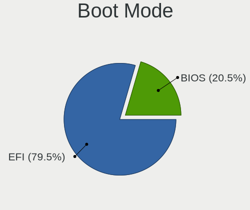
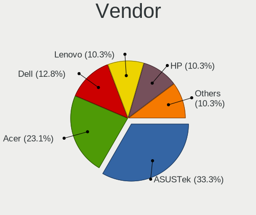
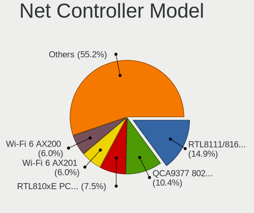
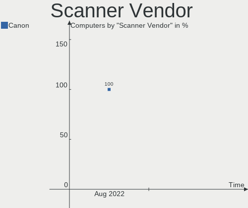

Endless Hardware Trends
-----------------------

A project to identify most popular hardware characteristics and track their change
over time based on data collected by Endless users at https://Linux-Hardware.org.

Anyone can contribute to the study by uploading probes of their computers by
the [hw-probe](https://github.com/linuxhw/hw-probe) tool:

    sudo -E hw-probe -all -upload

This is a report for all computer types. See also reports for [desktops](/Dist/Endless/Desktop/README.md) and [notebooks](/Dist/Endless/Notebook/README.md).

Full-feature report is available here: https://linux-hardware.org/?view=trends

Period: Nov, 2020.

Contents
--------

- [ OS                       ](#os)
- [ OS Family                ](#os-family)
- [ Kernel                   ](#kernel)
- [ Kernel Family            ](#kernel-family)
- [ Kernel Major Ver.        ](#kernel-major-ver)
- [ Arch                     ](#arch)
- [ DE                       ](#de)
- [ Display Server           ](#display-server)
- [ Display Manager          ](#display-manager)
- [ OS Lang                  ](#os-lang)
- [ Boot Mode                ](#boot-mode)
- [ Filesystem               ](#filesystem)
- [ Part. scheme             ](#part-scheme)
- [ Dual Boot with Linux/BSD ](#dual-boot-with-linux/bsd)
- [ Dual Boot (Win)          ](#dual-boot-win)
- [ Country                  ](#country)
- [ City                     ](#city)
- [ Vendor                   ](#vendor)
- [ Model                    ](#model)
- [ Model Family             ](#model-family)
- [ MFG Year                 ](#mfg-year)
- [ Form Factor              ](#form-factor)
- [ Secure Boot              ](#secure-boot)
- [ Coreboot                 ](#coreboot)
- [ RAM Size                 ](#ram-size)
- [ RAM Used                 ](#ram-used)
- [ Has CD-ROM               ](#has-cd-rom)
- [ Total Drives             ](#total-drives)
- [ Has Ethernet             ](#has-ethernet)
- [ Drive Vendor             ](#drive-vendor)
- [ Drive Model              ](#drive-model)
- [ HDD Vendor               ](#hdd-vendor)
- [ SSD Vendor               ](#ssd-vendor)
- [ Drive Kind               ](#drive-kind)
- [ Drive Connector          ](#drive-connector)
- [ Drive Size               ](#drive-size)
- [ Space Total              ](#space-total)
- [ Space Used               ](#space-used)
- [ Malfunc. Drives          ](#malfunc-drives)
- [ Malfunc. Drive Vendor    ](#malfunc-drive-vendor)
- [ Malfunc. HDD Vendor      ](#malfunc-hdd-vendor)
- [ Malfunc. Drive Kind      ](#malfunc-drive-kind)
- [ Failed Drives            ](#failed-drives)
- [ Failed Drive Vendor      ](#failed-drive-vendor)
- [ Drive Status             ](#drive-status)
- [ Storage Vendor           ](#storage-vendor)
- [ Storage Model            ](#storage-model)
- [ Storage Kind             ](#storage-kind)
- [ CPU Vendor               ](#cpu-vendor)
- [ CPU Model                ](#cpu-model)
- [ CPU Model Family         ](#cpu-model-family)
- [ CPU Cores                ](#cpu-cores)
- [ CPU Sockets              ](#cpu-sockets)
- [ CPU Threads              ](#cpu-threads)
- [ CPU Op-Modes             ](#cpu-op-modes)
- [ CPU Microcode            ](#cpu-microcode)
- [ CPU Microarch            ](#cpu-microarch)
- [ GPU Vendor               ](#gpu-vendor)
- [ GPU Model                ](#gpu-model)
- [ GPU Combo                ](#gpu-combo)
- [ GPU Driver               ](#gpu-driver)
- [ GPU Memory               ](#gpu-memory)
- [ Monitor Vendor           ](#monitor-vendor)
- [ Monitor Model            ](#monitor-model)
- [ Monitor Resolution       ](#monitor-resolution)
- [ Monitor Diagonal         ](#monitor-diagonal)
- [ Monitor Width            ](#monitor-width)
- [ Aspect Ratio             ](#aspect-ratio)
- [ Monitor Area             ](#monitor-area)
- [ Pixel Density            ](#pixel-density)
- [ Multiple Monitors        ](#multiple-monitors)
- [ Net Controller Vendor    ](#net-controller-vendor)
- [ Net Controller Model     ](#net-controller-model)
- [ Wireless Vendor          ](#wireless-vendor)
- [ Wireless Model           ](#wireless-model)
- [ Ethernet Vendor          ](#ethernet-vendor)
- [ Ethernet Model           ](#ethernet-model)
- [ Net Controller Kind      ](#net-controller-kind)
- [ Used Controller          ](#used-controller)
- [ NICs                     ](#nics)
- [ Memory Vendor            ](#memory-vendor)
- [ Memory Model             ](#memory-model)
- [ Memory Kind              ](#memory-kind)
- [ Memory Form Factor       ](#memory-form-factor)
- [ Memory Size              ](#memory-size)
- [ Memory Speed             ](#memory-speed)
- [ Sound Vendor             ](#sound-vendor)
- [ Sound Model              ](#sound-model)
- [ Camera Vendor            ](#camera-vendor)
- [ Camera Model             ](#camera-model)
- [ Fingerprint Vendor       ](#fingerprint-vendor)
- [ Fingerprint Model        ](#fingerprint-model)
- [ Chipcard Vendor          ](#chipcard-vendor)
- [ Chipcard Model           ](#chipcard-model)
- [ Printer Vendor           ](#printer-vendor)
- [ Printer Model            ](#printer-model)
- [ Scanner Vendor           ](#scanner-vendor)
- [ Scanner Model            ](#scanner-model)
- [ Bluetooth Vendor         ](#bluetooth-vendor)
- [ Bluetooth Model          ](#bluetooth-model)
- [ Unsupported Devices      ](#unsupported-devices)
- [ Unsupported Device Types ](#unsupported-device-types)

OS
--

Installed operating systems

| Name                   | Computers | Percent |
|------------------------|-----------|---------|
| Endless 3.9.0          | 73        | 52.52%  |
| Endless 3.8.7          | 53        | 38.13%  |
| Endless 3.8.6          | 2         | 1.44%   |
| Endless 3.8.7-nexthw2  | 1         | 0.72%   |
| Endless 3.8.7-nexthw1  | 1         | 0.72%   |
| Endless 3.8.4          | 1         | 0.72%   |
| Endless 3.7.8          | 1         | 0.72%   |
| Endless 3.7.6          | 1         | 0.72%   |
| Endless 3.7.4          | 1         | 0.72%   |
| Endless 3.6.0-nexthw1  | 1         | 0.72%   |
| Endless 3.4.8          | 1         | 0.72%   |
| Endless 3.4.6-nexthw2  | 1         | 0.72%   |
| Endless 3.4.3-nexthw1  | 1         | 0.72%   |
| Endless 3.3.20-nexthw1 | 1         | 0.72%   |

OS Family
---------

OS without a version

| Name    | Computers | Percent |
|---------|-----------|---------|
| Endless | 139       | 100%    |

Kernel
------

Version of the Linux kernel

| Version           | Computers | Percent |
|-------------------|-----------|---------|
| 5.8.0-14-generic  | 75        | 53.96%  |
| 5.4.0-42-generic  | 55        | 39.57%  |
| 5.4.0-19-generic  | 1         | 0.72%   |
| 5.3.0-28-generic  | 1         | 0.72%   |
| 5.3.0-23-generic  | 1         | 0.72%   |
| 5.3.0-19-generic  | 1         | 0.72%   |
| 5.1.0-2-generic   | 1         | 0.72%   |
| 4.18.0-7-generic  | 1         | 0.72%   |
| 4.16.0-4-generic  | 1         | 0.72%   |
| 4.15.0-34-generic | 1         | 0.72%   |
| 4.15.0-15-generic | 1         | 0.72%   |

Kernel Family
-------------

Linux kernel without a distro release

| Version | Computers | Percent |
|---------|-----------|---------|
| 5.8.0   | 75        | 53.96%  |
| 5.4.0   | 56        | 40.29%  |
| 5.3.0   | 3         | 2.16%   |
| 4.15.0  | 2         | 1.44%   |
| 5.1.0   | 1         | 0.72%   |
| 4.18.0  | 1         | 0.72%   |
| 4.16.0  | 1         | 0.72%   |

Kernel Major Ver.
-----------------

Linux kernel major version

| Version | Computers | Percent |
|---------|-----------|---------|
| 5.8     | 75        | 53.96%  |
| 5.4     | 56        | 40.29%  |
| 5.3     | 3         | 2.16%   |
| 4.15    | 2         | 1.44%   |
| 5.1     | 1         | 0.72%   |
| 4.18    | 1         | 0.72%   |
| 4.16    | 1         | 0.72%   |

Arch
----

OS architecture (x86_64, i586, etc.)

| Name    | Computers | Percent |
|---------|-----------|---------|
| x86_64  | 138       | 99.28%  |
| aarch64 | 1         | 0.72%   |

DE
--

Desktop Environment

| Name    | Computers | Percent |
|---------|-----------|---------|
| GNOME   | 138       | 99.28%  |
| Unknown | 1         | 0.72%   |

Display Server
--------------

X11 or Wayland

| Name    | Computers | Percent |
|---------|-----------|---------|
| X11     | 138       | 99.28%  |
| Unknown | 1         | 0.72%   |

Display Manager
---------------

SDDM, LightDM, etc.

| Name    | Computers | Percent |
|---------|-----------|---------|
| Unknown | 139       | 100%    |

OS Lang
-------

Language

| Lang        | Computers | Percent |
|-------------|-----------|---------|
| pt_BR.utf8  | 25        | 17.99%  |
| en_US.utf8  | 25        | 17.99%  |
| ro_RO       | 14        | 10.07%  |
| pt_BR       | 12        | 8.63%   |
| ru_RU       | 10        | 7.19%   |
| de_DE       | 6         | 4.32%   |
| es_ES       | 5         | 3.6%    |
| en_US       | 5         | 3.6%    |
| uk_UA       | 4         | 2.88%   |
| ru_UA       | 3         | 2.16%   |
| hu_HU       | 3         | 2.16%   |
| es_MX       | 3         | 2.16%   |
| sr_RS@latin | 2         | 1.44%   |
| pl_PL       | 2         | 1.44%   |
| it_IT       | 2         | 1.44%   |
| es_MX.utf8  | 2         | 1.44%   |
| ar_AE       | 2         | 1.44%   |
| zh_CN       | 1         | 0.72%   |
| tr_TR       | 1         | 0.72%   |
| sl_SI       | 1         | 0.72%   |
| ru_RU.UTF_8 | 1         | 0.72%   |
| fr_FR.utf8  | 1         | 0.72%   |
| fr_FR       | 1         | 0.72%   |
| es_CO       | 1         | 0.72%   |
| es_AR       | 1         | 0.72%   |
| en_GB       | 1         | 0.72%   |
| en_BW       | 1         | 0.72%   |
| el_GR       | 1         | 0.72%   |
| de_AT       | 1         | 0.72%   |
| bg_BG       | 1         | 0.72%   |
| Unknown     | 1         | 0.72%   |

Boot Mode
---------

EFI or BIOS

| Mode | Computers | Percent |
|------|-----------|---------|
| EFI  | 82        | 58.99%  |
| BIOS | 57        | 41.01%  |

Filesystem
----------

Type of filesystem

| Type  | Computers | Percent |
|-------|-----------|---------|
| Ext4  | 135       | 97.12%  |
| Tmpfs | 4         | 2.88%   |

Part. scheme
------------

Scheme of partitioning

| Type    | Computers | Percent |
|---------|-----------|---------|
| Unknown | 139       | 100%    |

Dual Boot with Linux/BSD
------------------------

Hosting more than one Linux/BSD

| Dual boot | Computers | Percent |
|-----------|-----------|---------|
| No        | 139       | 100%    |

Dual Boot (Win)
---------------

Hosting Linux and Windows

| Dual boot | Computers | Percent |
|-----------|-----------|---------|
| No        | 139       | 100%    |

Country
-------

Geographic location (country)

| Country      | Computers | Percent |
|--------------|-----------|---------|
| Brazil       | 39        | 28.06%  |
| Romania      | 19        | 13.67%  |
| Ukraine      | 8         | 5.76%   |
| USA          | 7         | 5.04%   |
| Russia       | 7         | 5.04%   |
| Germany      | 7         | 5.04%   |
| Spain        | 6         | 4.32%   |
| Canada       | 6         | 4.32%   |
| Hungary      | 4         | 2.88%   |
| Saudi Arabia | 3         | 2.16%   |
| Mexico       | 3         | 2.16%   |
| Colombia     | 3         | 2.16%   |
| Poland       | 2         | 1.44%   |
| Macedonia    | 2         | 1.44%   |
| Italy        | 2         | 1.44%   |
| India        | 2         | 1.44%   |
| France       | 2         | 1.44%   |
| Belarus      | 2         | 1.44%   |
| Turkey       | 1         | 0.72%   |
| Slovenia     | 1         | 0.72%   |
| Serbia       | 1         | 0.72%   |
| Philippines  | 1         | 0.72%   |
| Nepal        | 1         | 0.72%   |
| Luxembourg   | 1         | 0.72%   |
| Lithuania    | 1         | 0.72%   |
| Kenya        | 1         | 0.72%   |
| Greece       | 1         | 0.72%   |
| Georgia      | 1         | 0.72%   |
| Egypt        | 1         | 0.72%   |
| China        | 1         | 0.72%   |
| Bulgaria     | 1         | 0.72%   |
| Austria      | 1         | 0.72%   |
| Argentina    | 1         | 0.72%   |

City
----

Geographic location (city)

| City                   | Computers | Percent |
|------------------------|-----------|---------|
| Bucharest              | 4         | 2.88%   |
| São Paulo             | 3         | 2.16%   |
| Moscow                 | 3         | 2.16%   |
| Jeddah                 | 3         | 2.16%   |
| Edmonton               | 3         | 2.16%   |
| Rio de Janeiro         | 2         | 1.44%   |
| Ribeirão Preto        | 2         | 1.44%   |
| Piteşti               | 2         | 1.44%   |
| Kharkiv                | 2         | 1.44%   |
| Florianópolis         | 2         | 1.44%   |
| Ekaterinburg           | 2         | 1.44%   |
| Cluj-Napoca            | 2         | 1.44%   |
| Budapest               | 2         | 1.44%   |
| Brovary                | 2         | 1.44%   |
| Belo Horizonte         | 2         | 1.44%   |
| Žetale                | 1         | 0.72%   |
| Zarnesti               | 1         | 0.72%   |
| Wilkesboro             | 1         | 0.72%   |
| Wachtberg              | 1         | 0.72%   |
| Valencia               | 1         | 0.72%   |
| Useldange              | 1         | 0.72%   |
| Urussanga              | 1         | 0.72%   |
| União da Vitória     | 1         | 0.72%   |
| Târgu Jiu             | 1         | 0.72%   |
| Torrelavega            | 1         | 0.72%   |
| Thrissur               | 1         | 0.72%   |
| Tbilisi                | 1         | 0.72%   |
| Taboao da Serra        | 1         | 0.72%   |
| São Carlos            | 1         | 0.72%   |
| Szeged                 | 1         | 0.72%   |
| Swift Current          | 1         | 0.72%   |
| Strasbourg             | 1         | 0.72%   |
| Sterling               | 1         | 0.72%   |
| St Petersburg          | 1         | 0.72%   |
| Sofia                  | 1         | 0.72%   |
| Skopje                 | 1         | 0.72%   |
| Sincelejo              | 1         | 0.72%   |
| Shostka                | 1         | 0.72%   |
| Sherbrooke             | 1         | 0.72%   |
| Shanghai               | 1         | 0.72%   |
| Sevastopol             | 1         | 0.72%   |
| Sao Pedro da Aldeia    | 1         | 0.72%   |
| Santiago               | 1         | 0.72%   |
| Santa Fe               | 1         | 0.72%   |
| Santa Cruz de La Palma | 1         | 0.72%   |
| San Juan de los Lagos  | 1         | 0.72%   |
| Salzburg               | 1         | 0.72%   |
| Râşnov               | 1         | 0.72%   |
| Ruda Śląska          | 1         | 0.72%   |
| Roznov                 | 1         | 0.72%   |
| Rostock                | 1         | 0.72%   |
| Rio Grande             | 1         | 0.72%   |
| Ribeirao Pires         | 1         | 0.72%   |
| Ratingen               | 1         | 0.72%   |
| Puerto Vallarta        | 1         | 0.72%   |
| Praia Grande           | 1         | 0.72%   |
| Porto Seguro           | 1         | 0.72%   |
| Pontevedra             | 1         | 0.72%   |
| Ploieşti              | 1         | 0.72%   |
| Ploen                  | 1         | 0.72%   |

Vendor
------

Motherboard manufacturer

| Name                    | Computers | Percent |
|-------------------------|-----------|---------|
| ASUSTek Computer        | 55        | 39.57%  |
| Acer                    | 38        | 27.34%  |
| Hewlett-Packard         | 11        | 7.91%   |
| Dell                    | 7         | 5.04%   |
| Lenovo                  | 6         | 4.32%   |
| Apple                   | 3         | 2.16%   |
| Sony                    | 2         | 1.44%   |
| Gigabyte Technology     | 2         | 1.44%   |
| ECS                     | 2         | 1.44%   |
| Toshiba                 | 1         | 0.72%   |
| Raspberry Pi Foundation | 1         | 0.72%   |
| PCWare                  | 1         | 0.72%   |
| OEM                     | 1         | 0.72%   |
| Notebook                | 1         | 0.72%   |
| Megaware                | 1         | 0.72%   |
| Medion                  | 1         | 0.72%   |
| IPRODA                  | 1         | 0.72%   |
| Intel                   | 1         | 0.72%   |
| Fujitsu                 | 1         | 0.72%   |
| eMachines               | 1         | 0.72%   |
| ASRock                  | 1         | 0.72%   |
| Unknown                 | 1         | 0.72%   |

Model
-----

Motherboard model

| Name                                       | Computers | Percent |
|--------------------------------------------|-----------|---------|
| ASUS VivoBook 15_ASUS Laptop X540MA_X543MA | 6         | 4.32%   |
| ASUS X541UAK                               | 5         | 3.6%    |
| Acer Aspire A315-34                        | 5         | 3.6%    |
| ASUS ZenBook UX431DA_UM431DA               | 4         | 2.88%   |
| Acer Nitro AN515-54                        | 4         | 2.88%   |
| Acer Nitro AN515-43                        | 4         | 2.88%   |
| Acer Nitro AN517-51                        | 3         | 2.16%   |
| Acer Aspire A315-54K                       | 3         | 2.16%   |
| Unknown                                    | 3         | 2.16%   |
| ECS A320AM4-M3D                            | 2         | 1.44%   |
| ASUS VivoBook_ASUSLaptop X509FA_X509FA     | 2         | 1.44%   |
| ASUS VivoBook_ASUSLaptop X403JA_X403JA     | 2         | 1.44%   |
| ASUS VivoBook 15_ASUS Laptop X540UAR       | 2         | 1.44%   |
| ASUS VivoBook 14_ASUS Laptop X441MA_X441MA | 2         | 1.44%   |
| ASUS Vivo AIO 22 V222GA_V222GA             | 2         | 1.44%   |
| ASUS P8H61-M LX                            | 2         | 1.44%   |
| Apple iMac7,1                              | 2         | 1.44%   |
| Acer Aspire C22-820                        | 2         | 1.44%   |
| Acer Aspire A515-41G                       | 2         | 1.44%   |
| Acer Aspire A315-53                        | 2         | 1.44%   |
| Toshiba Satellite P855                     | 1         | 0.72%   |
| Sony VPCZ115FC                             | 1         | 0.72%   |
| Sony VGN-CR320E                            | 1         | 0.72%   |
| RPi Raspberry Pi 4 Model B                 | 1         | 0.72%   |
| PCWare PW-945GCX                           | 1         | 0.72%   |
| OEM B250                                   | 1         | 0.72%   |
| Notebook NB50TJ1_TK1                       | 1         | 0.72%   |
| Medion E1239T MD60791                      | 1         | 0.72%   |
| Lenovo V130-20IGM AIO 10RX001MRU           | 1         | 0.72%   |
| Lenovo ThinkPad S3-S440 20AYCTO1WW         | 1         | 0.72%   |
| Lenovo IdeaPad Slim 1-11AST-05 81VR        | 1         | 0.72%   |
| Lenovo IdeaPad 5 14IIL05 81YH              | 1         | 0.72%   |
| Lenovo IdeaPad 330-15IKB 81DE              | 1         | 0.72%   |
| Lenovo IdeaPad 3 15ADA05 81W1              | 1         | 0.72%   |
| IPRODA M1499C                              | 1         | 0.72%   |
| Intel HM65DESK                             | 1         | 0.72%   |
| HP ProBook 6450b                           | 1         | 0.72%   |
| HP Pavilion dv4                            | 1         | 0.72%   |
| HP ENVY Laptop 13-ah0xxx                   | 1         | 0.72%   |
| HP EliteDesk 800 G1 SFF                    | 1         | 0.72%   |
| HP EliteBook 8440p                         | 1         | 0.72%   |
| HP Compaq Pro 6300 SFF                     | 1         | 0.72%   |
| HP Compaq 6735s                            | 1         | 0.72%   |
| HP 290 G2 MT Business PC                   | 1         | 0.72%   |
| HP 255 G7 Notebook PC                      | 1         | 0.72%   |
| HP 250 G6 Notebook PC                      | 1         | 0.72%   |
| Gigabyte X470 AORUS GAMING 5 WIFI          | 1         | 0.72%   |
| Gigabyte H410M S2                          | 1         | 0.72%   |
| Fujitsu ESPRIMO E510                       | 1         | 0.72%   |
| eMachines E725                             | 1         | 0.72%   |
| Dell Vostro 1000                           | 1         | 0.72%   |
| Dell OptiPlex 745                          | 1         | 0.72%   |
| Dell Latitude E6430                        | 1         | 0.72%   |
| Dell Latitude D430                         | 1         | 0.72%   |
| Dell Inspiron 410                          | 1         | 0.72%   |
| Dell Inspiron 3542                         | 1         | 0.72%   |
| Dell Inspiron 3442                         | 1         | 0.72%   |
| ASUS Z550SA                                | 1         | 0.72%   |
| ASUS X541UJ                                | 1         | 0.72%   |
| ASUS X541NA                                | 1         | 0.72%   |

Model Family
------------

Motherboard model prefix

| Name              | Computers | Percent |
|-------------------|-----------|---------|
| ASUS VivoBook     | 27        | 19.42%  |
| Acer Aspire       | 26        | 18.71%  |
| Acer Nitro        | 11        | 7.91%   |
| ASUS X541UAK      | 5         | 3.6%    |
| Lenovo IdeaPad    | 4         | 2.88%   |
| ASUS ZenBook      | 4         | 2.88%   |
| Dell Inspiron     | 3         | 2.16%   |
| Unknown           | 3         | 2.16%   |
| HP Compaq         | 2         | 1.44%   |
| ECS A320AM4-M3D   | 2         | 1.44%   |
| Dell Latitude     | 2         | 1.44%   |
| ASUS Vivo         | 2         | 1.44%   |
| ASUS P8H61-M      | 2         | 1.44%   |
| Apple iMac7       | 2         | 1.44%   |
| Toshiba Satellite | 1         | 0.72%   |
| Sony VPCZ115FC    | 1         | 0.72%   |
| Sony VGN-CR320E   | 1         | 0.72%   |
| RPi Raspberry     | 1         | 0.72%   |
| PCWare PW-945GCX  | 1         | 0.72%   |
| OEM B250          | 1         | 0.72%   |
| Notebook NB50TJ1  | 1         | 0.72%   |
| Medion E1239T     | 1         | 0.72%   |
| Lenovo V130-20IGM | 1         | 0.72%   |
| Lenovo ThinkPad   | 1         | 0.72%   |
| IPRODA M1499C     | 1         | 0.72%   |
| Intel HM65DESK    | 1         | 0.72%   |
| HP ProBook        | 1         | 0.72%   |
| HP Pavilion       | 1         | 0.72%   |
| HP ENVY           | 1         | 0.72%   |
| HP EliteDesk      | 1         | 0.72%   |
| HP EliteBook      | 1         | 0.72%   |
| HP 290            | 1         | 0.72%   |
| HP 255            | 1         | 0.72%   |
| HP 250            | 1         | 0.72%   |
| Gigabyte X470     | 1         | 0.72%   |
| Gigabyte H410M    | 1         | 0.72%   |
| Fujitsu ESPRIMO   | 1         | 0.72%   |
| eMachines E725    | 1         | 0.72%   |
| Dell Vostro       | 1         | 0.72%   |
| Dell OptiPlex     | 1         | 0.72%   |
| ASUS Z550SA       | 1         | 0.72%   |
| ASUS X541UJ       | 1         | 0.72%   |
| ASUS X541NA       | 1         | 0.72%   |
| ASUS X540NA       | 1         | 0.72%   |
| ASUS X441NA       | 1         | 0.72%   |
| ASUS UX410UAK     | 1         | 0.72%   |
| ASUS Strix        | 1         | 0.72%   |
| ASUS M5A78L-M     | 1         | 0.72%   |
| ASUS M3A78-EM     | 1         | 0.72%   |
| ASUS K45A         | 1         | 0.72%   |
| ASUS GL553VD      | 1         | 0.72%   |
| ASUS E402NA       | 1         | 0.72%   |
| ASUS B121         | 1         | 0.72%   |
| ASUS All          | 1         | 0.72%   |
| ASUS 1015PE       | 1         | 0.72%   |
| ASRock 960GM      | 1         | 0.72%   |
| Apple iMac9       | 1         | 0.72%   |
| Acer AO722        | 1         | 0.72%   |

MFG Year
--------

Motherboard manufacture year

| Year    | Computers | Percent |
|---------|-----------|---------|
| 2019    | 40        | 28.78%  |
| 2020    | 32        | 23.02%  |
| 2018    | 14        | 10.07%  |
| 2017    | 14        | 10.07%  |
| 2011    | 7         | 5.04%   |
| 2010    | 7         | 5.04%   |
| 2008    | 7         | 5.04%   |
| 2013    | 5         | 3.6%    |
| 2009    | 3         | 2.16%   |
| 2016    | 2         | 1.44%   |
| 2014    | 2         | 1.44%   |
| 2012    | 2         | 1.44%   |
| 2015    | 1         | 0.72%   |
| 2007    | 1         | 0.72%   |
| 2006    | 1         | 0.72%   |
| Unknown | 1         | 0.72%   |

Form Factor
-----------

Physical design of the computer

| Name           | Computers | Percent |
|----------------|-----------|---------|
| Notebook       | 105       | 75.54%  |
| Desktop        | 22        | 15.83%  |
| All in one     | 9         | 6.47%   |
| Tablet         | 2         | 1.44%   |
| System on chip | 1         | 0.72%   |

Secure Boot
-----------

Enabled or disabled

| State    | Computers | Percent |
|----------|-----------|---------|
| Disabled | 112       | 80.58%  |
| Enabled  | 27        | 19.42%  |

Coreboot
--------

Have coreboot on board

| Used | Computers | Percent |
|------|-----------|---------|
| No   | 139       | 100%    |

RAM Size
--------

Total RAM memory

| Size in GB | Computers | Percent |
|------------|-----------|---------|
| 3.01-4.0   | 66        | 47.48%  |
| 4.01-8.0   | 42        | 30.22%  |
| 1.01-2.0   | 12        | 8.63%   |
| 16.01-24.0 | 8         | 5.76%   |
| 8.01-16.0  | 8         | 5.76%   |
| 2.01-3.0   | 2         | 1.44%   |
| 32.01-64.0 | 1         | 0.72%   |

RAM Used
--------

Used RAM memory

| Used GB  | Computers | Percent |
|----------|-----------|---------|
| 1.01-2.0 | 73        | 52.52%  |
| 2.01-3.0 | 30        | 21.58%  |
| 0.01-1.0 | 22        | 15.83%  |
| 4.01-8.0 | 8         | 5.76%   |
| 3.01-4.0 | 6         | 4.32%   |

Has CD-ROM
----------

Has CD-ROM on board

| Presented | Computers | Percent |
|-----------|-----------|---------|
| No        | 94        | 67.63%  |
| Yes       | 45        | 32.37%  |

Total Drives
------------

Number of drives on board

| Drives | Computers | Percent |
|--------|-----------|---------|
| 1      | 118       | 84.89%  |
| 2      | 18        | 12.95%  |
| 3      | 2         | 1.44%   |
| 7      | 1         | 0.72%   |

Has Ethernet
------------

Has Ethernet on board

| Presented | Computers | Percent |
|-----------|-----------|---------|
| Yes       | 104       | 74.82%  |
| No        | 35        | 25.18%  |

Drive Vendor
------------

Hard drive vendors

| Vendor                | Computers | Drives | Percent |
|-----------------------|-----------|--------|---------|
| WDC                   | 33        | 35     | 20.5%   |
| Seagate               | 24        | 27     | 14.91%  |
| Kingston              | 24        | 25     | 14.91%  |
| Toshiba               | 13        | 13     | 8.07%   |
| Intel                 | 13        | 13     | 8.07%   |
| SanDisk               | 10        | 10     | 6.21%   |
| Unknown               | 7         | 8      | 4.35%   |
| Samsung Electronics   | 7         | 7      | 4.35%   |
| SK Hynix              | 5         | 5      | 3.11%   |
| Hitachi               | 3         | 3      | 1.86%   |
| ADATA Technology      | 3         | 3      | 1.86%   |
| Patriot               | 2         | 2      | 1.24%   |
| China                 | 2         | 2      | 1.24%   |
| Zheino                | 1         | 1      | 0.62%   |
| XPG                   | 1         | 1      | 0.62%   |
| USB3.0                | 1         | 1      | 0.62%   |
| Realtek Semiconductor | 1         | 1      | 0.62%   |
| Phison                | 1         | 1      | 0.62%   |
| Netac                 | 1         | 1      | 0.62%   |
| Maxtor                | 1         | 1      | 0.62%   |
| LITEONIT              | 1         | 1      | 0.62%   |
| Leven                 | 1         | 1      | 0.62%   |
| HGST                  | 1         | 1      | 0.62%   |
| Gigaston              | 1         | 1      | 0.62%   |
| EMTEC                 | 1         | 1      | 0.62%   |
| Dogfish               | 1         | 1      | 0.62%   |
| Crucial               | 1         | 1      | 0.62%   |
| A-DATA Technology     | 1         | 1      | 0.62%   |

Drive Model
-----------

Hard drive models

| Model                                | Computers | Percent |
|--------------------------------------|-----------|---------|
| WDC WD10SPZX-21Z10T0 1TB             | 18        | 10.71%  |
| Kingston RBUSC180DS37256GJ 256GB SSD | 10        | 5.95%   |
| Seagate ST1000LM035-1RK172 1TB       | 7         | 4.17%   |
| Intel NVMe SSD Drive 512GB           | 6         | 3.57%   |
| Intel NVMe SSD Drive 256GB           | 5         | 2.98%   |
| Toshiba MQ04ABF100 1TB               | 4         | 2.38%   |
| Seagate ST500LM030-1RK17D 500GB      | 4         | 2.38%   |
| Kingston SA400S37240G 240GB SSD      | 4         | 2.38%   |
| Unknown MMC Card  32GB               | 3         | 1.79%   |
| SK Hynix NVMe SSD Drive 512GB        | 3         | 1.79%   |
| SanDisk SD8SB8U128G1002 128GB SSD    | 3         | 1.79%   |
| Kingston SA400S37120G 120GB SSD      | 3         | 1.79%   |
| ADATA NVMe SSD Drive 128GB           | 3         | 1.79%   |
| WDC WD5000LPCX-21VHAT0 500GB         | 2         | 1.19%   |
| Unknown MMC Card  64GB               | 2         | 1.19%   |
| Toshiba MQ01ABF050 500GB             | 2         | 1.19%   |
| SK Hynix NVMe SSD Drive 256GB        | 2         | 1.19%   |
| Seagate ST1000DM010-2EP102 1TB       | 2         | 1.19%   |
| Sandisk NVMe SSD Drive 256GB         | 2         | 1.19%   |
| Samsung SSD 860 EVO 250GB            | 2         | 1.19%   |
| Patriot Burst 120GB SSD              | 2         | 1.19%   |
| Kingston NVMe SSD Drive 256GB        | 2         | 1.19%   |
| Zheino CHN-mSATAM3-256 256GB         | 1         | 0.6%    |
| XPG NVMe SSD Drive 1024GB            | 1         | 0.6%    |
| WDC WDS240G2G0B-00EPW0 240GB SSD     | 1         | 0.6%    |
| WDC WDS240G2G0A-00JH30 240GB SSD     | 1         | 0.6%    |
| WDC WDS100T2B0A-00SM50 1TB SSD       | 1         | 0.6%    |
| WDC WD7500BPVT-80HXZT3 752GB         | 1         | 0.6%    |
| WDC WD7500AAKS-00RBA0 752GB          | 1         | 0.6%    |
| WDC WD5000LPLX-08ZNTT0 500GB         | 1         | 0.6%    |
| WDC WD5000LPCX-80VHAT0 500GB         | 1         | 0.6%    |
| WDC WD5000AAKX-003CA0 500GB          | 1         | 0.6%    |
| WDC WD5000AAKS-00YGA0 500GB          | 1         | 0.6%    |
| WDC WD3200BEVT-60ZCT1 320GB          | 1         | 0.6%    |
| WDC WD20EZRX-22D8PB0 2TB             | 1         | 0.6%    |
| WDC WD10JPVX-75JC3T0 1TB             | 1         | 0.6%    |
| WDC WD10JPVX-60JC3T1 1TB             | 1         | 0.6%    |
| WDC WD10EZEX-21WN4A0 1TB             | 1         | 0.6%    |
| WDC WD10EADS-00M2B0 1TB              | 1         | 0.6%    |
| USB3.0 Super Speed 500GB             | 1         | 0.6%    |
| Unknown MMC Card  256GB              | 1         | 0.6%    |
| Unknown MMC Card  128GB              | 1         | 0.6%    |
| Unknown EM200AA001-9VY132 200GB      | 1         | 0.6%    |
| Toshiba NVMe SSD Drive 256GB         | 1         | 0.6%    |
| Toshiba MQ01ABD100 1TB               | 1         | 0.6%    |
| Toshiba MK3275GSX 320GB              | 1         | 0.6%    |
| Toshiba MK3252GSX 320GB              | 1         | 0.6%    |
| Toshiba MK2555GSX 250GB              | 1         | 0.6%    |
| Toshiba MK1059GSM 1TB                | 1         | 0.6%    |
| Toshiba DT01ACA050 500GB             | 1         | 0.6%    |
| Seagate ST980811AS 80GB              | 1         | 0.6%    |
| Seagate ST95005620AS 500GB           | 1         | 0.6%    |
| Seagate ST9320423AS 320GB            | 1         | 0.6%    |
| Seagate ST9250410AS 250GB            | 1         | 0.6%    |
| Seagate ST500LT012-1DG142 500GB      | 1         | 0.6%    |
| Seagate ST500LM000-1EJ162 500GB      | 1         | 0.6%    |
| Seagate ST3250820AS Q 250GB          | 1         | 0.6%    |
| Seagate ST3160815AS 160GB            | 1         | 0.6%    |
| Seagate ST31000524AS 1TB             | 1         | 0.6%    |
| Seagate ST2000LM007-1R8174 2TB       | 1         | 0.6%    |

HDD Vendor
----------

Hard disk drive vendors

| Vendor              | Computers | Drives | Percent |
|---------------------|-----------|--------|---------|
| WDC                 | 32        | 32     | 42.11%  |
| Seagate             | 24        | 27     | 31.58%  |
| Toshiba             | 12        | 12     | 15.79%  |
| Hitachi             | 3         | 3      | 3.95%   |
| Samsung Electronics | 2         | 2      | 2.63%   |
| USB3.0              | 1         | 1      | 1.32%   |
| Maxtor              | 1         | 1      | 1.32%   |
| HGST                | 1         | 1      | 1.32%   |

SSD Vendor
----------

Solid state drive vendors

| Vendor              | Computers | Drives | Percent |
|---------------------|-----------|--------|---------|
| Kingston            | 22        | 23     | 48.89%  |
| SanDisk             | 7         | 7      | 15.56%  |
| WDC                 | 3         | 3      | 6.67%   |
| Samsung Electronics | 3         | 3      | 6.67%   |
| Patriot             | 2         | 2      | 4.44%   |
| China               | 2         | 2      | 4.44%   |
| Netac               | 1         | 1      | 2.22%   |
| LITEONIT            | 1         | 1      | 2.22%   |
| Intel               | 1         | 1      | 2.22%   |
| Dogfish             | 1         | 1      | 2.22%   |
| Crucial             | 1         | 1      | 2.22%   |
| A-DATA Technology   | 1         | 1      | 2.22%   |

Drive Kind
----------

HDD or SSD

| Kind    | Computers | Drives | Percent |
|---------|-----------|--------|---------|
| HDD     | 72        | 79     | 45.86%  |
| SSD     | 44        | 46     | 28.03%  |
| NVMe    | 30        | 31     | 19.11%  |
| MMC     | 6         | 7      | 3.82%   |
| Unknown | 5         | 5      | 3.18%   |

Drive Connector
---------------

SATA, SAS, NVMe, etc.

| Type | Computers | Drives | Percent |
|------|-----------|--------|---------|
| SATA | 113       | 129    | 75.33%  |
| NVMe | 30        | 31     | 20%     |
| MMC  | 6         | 7      | 4%      |
| SAS  | 1         | 1      | 0.67%   |

Drive Size
----------

Size of hard drive

| Size in TB | Computers | Drives | Percent |
|------------|-----------|--------|---------|
| 0.01-0.5   | 70        | 76     | 61.4%   |
| 0.51-1.0   | 42        | 46     | 36.84%  |
| 1.01-2.0   | 2         | 3      | 1.75%   |

Space Total
-----------

Amount of disk space available on the file system

| Size in GB | Computers | Percent |
|------------|-----------|---------|
| 101-250    | 56        | 40.29%  |
| 501-1000   | 37        | 26.62%  |
| 251-500    | 28        | 20.14%  |
| 1-20       | 6         | 4.32%   |
| 51-100     | 5         | 3.6%    |
| 21-50      | 4         | 2.88%   |
| 2001-3000  | 1         | 0.72%   |
| 1001-2000  | 1         | 0.72%   |
| Unknown    | 1         | 0.72%   |

Space Used
----------

Amount of used disk space

| Used GB  | Computers | Percent |
|----------|-----------|---------|
| 21-50    | 62        | 44.6%   |
| 1-20     | 33        | 23.74%  |
| 51-100   | 25        | 17.99%  |
| 101-250  | 16        | 11.51%  |
| 251-500  | 1         | 0.72%   |
| 501-1000 | 1         | 0.72%   |
| Unknown  | 1         | 0.72%   |

Malfunc. Drives
---------------

Drive models with a malfunction

Zero info for selected period =(

Malfunc. Drive Vendor
---------------------

Vendors of faulty drives

Zero info for selected period =(

Malfunc. HDD Vendor
-------------------

Vendors of faulty HDD drives

Zero info for selected period =(

Malfunc. Drive Kind
-------------------

Kinds of faulty drives

Zero info for selected period =(

Failed Drives
-------------

Failed drive models

Zero info for selected period =(

Failed Drive Vendor
-------------------

Failed drive vendors

Zero info for selected period =(

Drive Status
------------

Number of failed and malfunc. drives

| Status   | Computers | Drives | Percent |
|----------|-----------|--------|---------|
| Detected | 139       | 168    | 100%    |

Storage Vendor
--------------

Storage controller vendors

| Vendor                       | Computers | Percent |
|------------------------------|-----------|---------|
| Intel                        | 106       | 67.52%  |
| AMD                          | 27        | 17.2%   |
| SK Hynix                     | 5         | 3.18%   |
| ADATA Technology             | 4         | 2.55%   |
| Sandisk                      | 3         | 1.91%   |
| Samsung Electronics          | 2         | 1.27%   |
| Nvidia                       | 2         | 1.27%   |
| Kingston Technology Company  | 2         | 1.27%   |
| VIA Technologies             | 1         | 0.64%   |
| Toshiba America Info Systems | 1         | 0.64%   |
| Silicon Image                | 1         | 0.64%   |
| Realtek Semiconductor        | 1         | 0.64%   |
| Phison Electronics           | 1         | 0.64%   |
| ASMedia Technology           | 1         | 0.64%   |

Storage Model
-------------

Storage controller models

| Model                                                                            | Computers | Percent |
|----------------------------------------------------------------------------------|-----------|---------|
| Intel SATA controller                                                            | 23        | 12.5%   |
| Intel 82801 Mobile SATA Controller [RAID mode]                                   | 21        | 11.41%  |
| AMD FCH SATA Controller [AHCI mode]                                              | 19        | 10.33%  |
| Intel Sunrise Point-LP SATA Controller [AHCI mode]                               | 16        | 8.7%    |
| Intel PROSet/Wireless WiFi Software extension                                    | 12        | 6.52%   |
| Intel Celeron N3350/Pentium N4200/Atom E3900 Series SATA AHCI Controller         | 6         | 3.26%   |
| SK Hynix BC501 NVMe Solid State Drive 512GB                                      | 5         | 2.72%   |
| AMD SB7x0/SB8x0/SB9x0 SATA Controller [AHCI mode]                                | 5         | 2.72%   |
| Intel 82801IBM/IEM (ICH9M/ICH9M-E) 4 port SATA Controller [AHCI mode]            | 3         | 1.63%   |
| Intel 82801HM/HEM (ICH8M/ICH8M-E) SATA Controller [AHCI mode]                    | 3         | 1.63%   |
| Intel 82801HM/HEM (ICH8M/ICH8M-E) IDE Controller                                 | 3         | 1.63%   |
| Intel 82801G (ICH7 Family) IDE Controller                                        | 3         | 1.63%   |
| Intel 8 Series SATA Controller 1 [AHCI mode]                                     | 3         | 1.63%   |
| Intel 7 Series Chipset Family 6-port SATA Controller [AHCI mode]                 | 3         | 1.63%   |
| AMD SB7x0/SB8x0/SB9x0 IDE Controller                                             | 3         | 1.63%   |
| ADATA Technology Non-Volatile memory controller                                  | 3         | 1.63%   |
| Sandisk WD Black 2018 / PC SN520 NVMe SSD                                        | 2         | 1.09%   |
| Kingston Technology Company Non-Volatile memory controller                       | 2         | 1.09%   |
| Intel NM10/ICH7 Family SATA Controller [IDE mode]                                | 2         | 1.09%   |
| Intel Cannon Lake PCH SATA AHCI Controller                                       | 2         | 1.09%   |
| Intel Atom/Celeron/Pentium Processor x5-E8000/J3xxx/N3xxx Series SATA Controller | 2         | 1.09%   |
| Intel 7 Series/C210 Series Chipset Family 6-port SATA Controller [AHCI mode]     | 2         | 1.09%   |
| Intel 6 Series/C200 Series Chipset Family 6 port Mobile SATA AHCI Controller     | 2         | 1.09%   |
| Intel 6 Series/C200 Series Chipset Family 6 port Desktop SATA AHCI Controller    | 2         | 1.09%   |
| Intel 5 Series/3400 Series Chipset 6 port SATA AHCI Controller                   | 2         | 1.09%   |
| Intel 400 Series Chipset Family SATA AHCI Controller                             | 2         | 1.09%   |
| AMD SB7x0/SB8x0/SB9x0 SATA Controller [IDE mode]                                 | 2         | 1.09%   |
| AMD FCH SATA Controller D                                                        | 2         | 1.09%   |
| VIA Technologies RAID bus controller                                             | 1         | 0.54%   |
| Toshiba America Info Systems Toshiba America Info Non-Volatile memory controller | 1         | 0.54%   |
| Silicon Image SiI 3132 Serial ATA Raid II Controller                             | 1         | 0.54%   |
| Sandisk WD Blue SN550 NVMe SSD                                                   | 1         | 0.54%   |
| Samsung Electronics NVMe SSD Controller SM961/PM961                              | 1         | 0.54%   |
| Samsung Electronics Electronics Non-Volatile memory controller                   | 1         | 0.54%   |
| Realtek Semiconductor Realtek Non-Volatile memory controller                     | 1         | 0.54%   |
| Phison Electronics E12 NVMe Controller                                           | 1         | 0.54%   |
| Nvidia MCP79 AHCI Controller                                                     | 1         | 0.54%   |
| Nvidia MCP65 SATA Controller                                                     | 1         | 0.54%   |
| Nvidia MCP65 IDE                                                                 | 1         | 0.54%   |
| Intel NM10/ICH7 Family SATA Controller [AHCI mode]                               | 1         | 0.54%   |
| Intel Ice Lake-LP SATA Controller [AHCI mode]                                    | 1         | 0.54%   |
| Intel HM170/QM170 Chipset SATA Controller [AHCI Mode]                            | 1         | 0.54%   |
| Intel Cannon Lake Mobile PCH SATA AHCI Controller                                | 1         | 0.54%   |
| Intel Atom Processor E3800 Series SATA AHCI Controller                           | 1         | 0.54%   |
| Intel 82801HR/HO/HH (ICH8R/DO/DH) 2 port SATA Controller [IDE mode]              | 1         | 0.54%   |
| Intel 82801HM/HEM (ICH8M/ICH8M-E) SATA Controller [IDE mode]                     | 1         | 0.54%   |
| Intel 82801H (ICH8 Family) 4 port SATA Controller [IDE mode]                     | 1         | 0.54%   |
| Intel 8 Series/C220 Series Chipset Family 6-port SATA Controller 1 [AHCI mode]   | 1         | 0.54%   |
| Intel 5 Series/3400 Series Chipset 4 port SATA IDE Controller                    | 1         | 0.54%   |
| Intel 5 Series/3400 Series Chipset 4 port SATA AHCI Controller                   | 1         | 0.54%   |
| Intel 5 Series/3400 Series Chipset 2 port SATA IDE Controller                    | 1         | 0.54%   |
| Intel 200 Series PCH SATA controller [AHCI mode]                                 | 1         | 0.54%   |
| ASMedia Technology ASM1061 SATA IDE Controller                                   | 1         | 0.54%   |
| AMD SB600 Non-Raid-5 SATA                                                        | 1         | 0.54%   |
| AMD SB600 IDE                                                                    | 1         | 0.54%   |
| AMD 400 Series Chipset SATA Controller                                           | 1         | 0.54%   |
| ADATA Technology XPG SX8200 Pro PCIe Gen3x4 M.2 2280 Solid State Drive           | 1         | 0.54%   |

Storage Kind
------------

Kind of storage controller (IDE, SATA, NVMe, SAS, ...)

| Kind | Computers | Percent |
|------|-----------|---------|
| SATA | 117       | 67.24%  |
| NVMe | 30        | 17.24%  |
| IDE  | 14        | 8.05%   |
| RAID | 13        | 7.47%   |

CPU Vendor
----------

Processor vendors

| Vendor | Computers | Percent |
|--------|-----------|---------|
| Intel  | 110       | 79.14%  |
| AMD    | 28        | 20.14%  |
| ARM    | 1         | 0.72%   |

CPU Model
---------

Processor models

| Model                                         | Computers | Percent |
|-----------------------------------------------|-----------|---------|
| Intel Celeron N4000 CPU @ 1.10GHz             | 10        | 7.19%   |
| Intel Core i3-6006U CPU @ 2.00GHz             | 6         | 4.32%   |
| Intel Celeron N4000C CPU @ 1.10GHz            | 6         | 4.32%   |
| Intel Core i7-9750H CPU @ 2.60GHz             | 5         | 3.6%    |
| Intel Celeron CPU N3350 @ 1.10GHz             | 5         | 3.6%    |
| Intel Core i5-1035G1 CPU @ 1.00GHz            | 4         | 2.88%   |
| Intel Core i3-8145U CPU @ 2.10GHz             | 4         | 2.88%   |
| Intel Core i3-7020U CPU @ 2.30GHz             | 4         | 2.88%   |
| AMD Ryzen 7 3750H with Radeon Vega Mobile Gfx | 4         | 2.88%   |
| Intel Core i5-7200U CPU @ 2.50GHz             | 3         | 2.16%   |
| Intel Core i5 CPU M 520 @ 2.40GHz             | 3         | 2.16%   |
| Intel Core i3-8130U CPU @ 2.20GHz             | 3         | 2.16%   |
| Intel Pentium Silver J5005 CPU @ 1.50GHz      | 2         | 1.44%   |
| Intel Pentium Dual-Core CPU T4300 @ 2.10GHz   | 2         | 1.44%   |
| Intel Core i5-9300H CPU @ 2.40GHz             | 2         | 1.44%   |
| Intel Core i5-2410M CPU @ 2.30GHz             | 2         | 1.44%   |
| Intel Core i3-4005U CPU @ 1.70GHz             | 2         | 1.44%   |
| Intel Core i3-2100 CPU @ 3.10GHz              | 2         | 1.44%   |
| Intel Core i3-10100 CPU @ 3.60GHz             | 2         | 1.44%   |
| Intel Core 2 Duo CPU T7300 @ 2.00GHz          | 2         | 1.44%   |
| Intel Celeron J4005 CPU @ 2.00GHz             | 2         | 1.44%   |
| Intel Atom x5-Z8350 CPU @ 1.44GHz             | 2         | 1.44%   |
| AMD Ryzen 7 3700U with Radeon Vega Mobile Gfx | 2         | 1.44%   |
| AMD Ryzen 5 3500U with Radeon Vega Mobile Gfx | 2         | 1.44%   |
| AMD A8-9600 RADEON R7, 10 COMPUTE CORES 4C+6G | 2         | 1.44%   |
| Intel Pentium Silver N5000 CPU @ 1.10GHz      | 1         | 0.72%   |
| Intel Pentium Dual CPU E2220 @ 2.40GHz        | 1         | 0.72%   |
| Intel Pentium CPU N4200 @ 1.10GHz             | 1         | 0.72%   |
| Intel Genuine CPU U4100 @ 1.30GHz             | 1         | 0.72%   |
| Intel Core i7-8750H CPU @ 2.20GHz             | 1         | 0.72%   |
| Intel Core i7-8700 CPU @ 3.20GHz              | 1         | 0.72%   |
| Intel Core i7-8565U CPU @ 1.80GHz             | 1         | 0.72%   |
| Intel Core i7-8550U CPU @ 1.80GHz             | 1         | 0.72%   |
| Intel Core i7-7500U CPU @ 2.70GHz             | 1         | 0.72%   |
| Intel Core i7-3770 CPU @ 3.40GHz              | 1         | 0.72%   |
| Intel Core i7-3720QM CPU @ 2.60GHz            | 1         | 0.72%   |
| Intel Core i7-3610QM CPU @ 2.30GHz            | 1         | 0.72%   |
| Intel Core i5-9400 CPU @ 2.90GHz              | 1         | 0.72%   |
| Intel Core i5-8265U CPU @ 1.60GHz             | 1         | 0.72%   |
| Intel Core i5-7300HQ CPU @ 2.50GHz            | 1         | 0.72%   |
| Intel Core i5-6400 CPU @ 2.70GHz              | 1         | 0.72%   |
| Intel Core i5-4590 CPU @ 3.30GHz              | 1         | 0.72%   |
| Intel Core i5-3470 CPU @ 3.20GHz              | 1         | 0.72%   |
| Intel Core i5-3210M CPU @ 2.50GHz             | 1         | 0.72%   |
| Intel Core i5-10210U CPU @ 1.60GHz            | 1         | 0.72%   |
| Intel Core i5 CPU U 470 @ 1.33GHz             | 1         | 0.72%   |
| Intel Core i5 CPU 650 @ 3.20GHz               | 1         | 0.72%   |
| Intel Core i3-7100U CPU @ 2.40GHz             | 1         | 0.72%   |
| Intel Core i3-4030U CPU @ 1.90GHz             | 1         | 0.72%   |
| Intel Core 2 Duo CPU T8300 @ 2.40GHz          | 1         | 0.72%   |
| Intel Core 2 Duo CPU T7250 @ 2.00GHz          | 1         | 0.72%   |
| Intel Core 2 Duo CPU P7350 @ 2.00GHz          | 1         | 0.72%   |
| Intel Core 2 CPU U7600 @ 1.20GHz              | 1         | 0.72%   |
| Intel Core 2 CPU 6300 @ 1.86GHz               | 1         | 0.72%   |
| Intel Celeron N4020 CPU @ 1.10GHz             | 1         | 0.72%   |
| Intel Celeron J4025 CPU @ 2.00GHz             | 1         | 0.72%   |
| Intel Celeron CPU N3160 @ 1.60GHz             | 1         | 0.72%   |
| Intel Celeron CPU N3060 @ 1.60GHz             | 1         | 0.72%   |
| Intel Celeron CPU J1800 @ 2.41GHz             | 1         | 0.72%   |
| Intel Celeron CPU 3867U @ 1.80GHz             | 1         | 0.72%   |

CPU Model Family
----------------

Processor model prefix

| Model                   | Computers | Percent |
|-------------------------|-----------|---------|
| Intel Celeron           | 29        | 20.86%  |
| Intel Core i3           | 25        | 17.99%  |
| Intel Core i5           | 24        | 17.27%  |
| Intel Core i7           | 13        | 9.35%   |
| AMD Ryzen 7             | 7         | 5.04%   |
| Intel Core 2 Duo        | 5         | 3.6%    |
| Intel Atom              | 4         | 2.88%   |
| Intel Pentium Silver    | 3         | 2.16%   |
| AMD Ryzen 5             | 3         | 2.16%   |
| AMD Ryzen 3             | 3         | 2.16%   |
| AMD FX                  | 3         | 2.16%   |
| Intel Pentium Dual-Core | 2         | 1.44%   |
| Intel Core 2            | 2         | 1.44%   |
| AMD A8                  | 2         | 1.44%   |
| AMD A6                  | 2         | 1.44%   |
| Other                   | 1         | 0.72%   |
| Intel Pentium Dual      | 1         | 0.72%   |
| Intel Pentium           | 1         | 0.72%   |
| Intel Genuine           | 1         | 0.72%   |
| AMD V160                | 1         | 0.72%   |
| AMD Turion 64 X2 Mobile | 1         | 0.72%   |
| AMD Turion              | 1         | 0.72%   |
| AMD Phenom II X4        | 1         | 0.72%   |
| AMD Mobile Sempron      | 1         | 0.72%   |
| AMD C-60                | 1         | 0.72%   |
| AMD Athlon II           | 1         | 0.72%   |
| AMD A12                 | 1         | 0.72%   |

CPU Cores
---------

Number of processor cores

| Number | Computers | Percent |
|--------|-----------|---------|
| 2      | 89        | 64.03%  |
| 4      | 37        | 26.62%  |
| 6      | 8         | 5.76%   |
| 1      | 3         | 2.16%   |
| 8      | 1         | 0.72%   |
| 3      | 1         | 0.72%   |

CPU Sockets
-----------

Number of sockets

| Number | Computers | Percent |
|--------|-----------|---------|
| 1      | 139       | 100%    |

CPU Threads
-----------

Threads per core (Hyper-Threading)

| Number | Computers | Percent |
|--------|-----------|---------|
| 2      | 78        | 56.12%  |
| 1      | 61        | 43.88%  |

CPU Op-Modes
------------

CPU Operation Modes (32-bit, 64-bit)

| Op mode        | Computers | Percent |
|----------------|-----------|---------|
| 32-bit, 64-bit | 137       | 98.56%  |
| 64-bit         | 1         | 0.72%   |
| Unknown        | 1         | 0.72%   |

CPU Microcode
-------------

Microcode number

| Number     | Computers | Percent |
|------------|-----------|---------|
| Unknown    | 21        | 15.11%  |
| 0x706a1    | 16        | 11.51%  |
| 0x906ea    | 9         | 6.47%   |
| 0x806e9    | 8         | 5.76%   |
| 0x806ea    | 6         | 4.32%   |
| 0x506c9    | 5         | 3.6%    |
| 0x406e3    | 5         | 3.6%    |
| 0x08108109 | 5         | 3.6%    |
| 0x706e5    | 4         | 2.88%   |
| 0x406c4    | 4         | 2.88%   |
| 0x08108102 | 4         | 2.88%   |
| 0x806ec    | 3         | 2.16%   |
| 0x40651    | 3         | 2.16%   |
| 0x306a9    | 3         | 2.16%   |
| 0x206a7    | 3         | 2.16%   |
| 0x20652    | 3         | 2.16%   |
| 0x1067a    | 3         | 2.16%   |
| 0x0600611a | 3         | 2.16%   |
| 0xa0653    | 2         | 1.44%   |
| 0x806eb    | 2         | 1.44%   |
| 0x706a8    | 2         | 1.44%   |
| 0x6fd      | 2         | 1.44%   |
| 0x6fa      | 2         | 1.44%   |
| 0x6f2      | 2         | 1.44%   |
| 0x20655    | 2         | 1.44%   |
| 0x08101007 | 2         | 1.44%   |
| 0x010000c8 | 2         | 1.44%   |
| 0x906e9    | 1         | 0.72%   |
| 0x506e3    | 1         | 0.72%   |
| 0x106ca    | 1         | 0.72%   |
| 0x106c2    | 1         | 0.72%   |
| 0x10676    | 1         | 0.72%   |
| 0x08701013 | 1         | 0.72%   |
| 0x06006705 | 1         | 0.72%   |
| 0x06006118 | 1         | 0.72%   |
| 0x06000852 | 1         | 0.72%   |
| 0x0600063e | 1         | 0.72%   |
| 0x05000119 | 1         | 0.72%   |
| 0x02000032 | 1         | 0.72%   |
| 0x010000db | 1         | 0.72%   |

CPU Microarch
-------------

Microarchitecture

| Name            | Computers | Percent |
|-----------------|-----------|---------|
| KabyLake        | 32        | 23.02%  |
| Goldmont plus   | 23        | 16.55%  |
| Zen+            | 10        | 7.19%   |
| Skylake         | 7         | 5.04%   |
| Goldmont        | 6         | 4.32%   |
| Excavator       | 6         | 4.32%   |
| Core            | 6         | 4.32%   |
| Westmere        | 5         | 3.6%    |
| Silvermont      | 5         | 3.6%    |
| Penryn          | 5         | 3.6%    |
| IvyBridge       | 5         | 3.6%    |
| SandyBridge     | 4         | 2.88%   |
| IceLake         | 4         | 2.88%   |
| Haswell         | 4         | 2.88%   |
| K10             | 3         | 2.16%   |
| Zen             | 2         | 1.44%   |
| K8 Hammer       | 2         | 1.44%   |
| CometLake       | 2         | 1.44%   |
| Bonnell         | 2         | 1.44%   |
| Zen 2           | 1         | 0.72%   |
| Piledriver      | 1         | 0.72%   |
| K8 & K10 hybrid | 1         | 0.72%   |
| Bulldozer       | 1         | 0.72%   |
| Bobcat          | 1         | 0.72%   |
| Unknown         | 1         | 0.72%   |

GPU Vendor
----------

Vendors of graphics cards

| Vendor | Computers | Percent |
|--------|-----------|---------|
| Intel  | 100       | 62.5%   |
| AMD    | 31        | 19.38%  |
| Nvidia | 29        | 18.13%  |

GPU Model
---------

Graphics card models

| Model                                                                                    | Computers | Percent |
|------------------------------------------------------------------------------------------|-----------|---------|
| Intel UHD Graphics 605                                                                   | 23        | 14.02%  |
| Nvidia TU117M [GeForce GTX 1650 Mobile / Max-Q]                                          | 11        | 6.71%   |
| AMD Picasso                                                                              | 10        | 6.1%    |
| Intel UHD Graphics 630 (Mobile)                                                          | 7         | 4.27%   |
| Intel UHD Graphics 620 (Whiskey Lake)                                                    | 6         | 3.66%   |
| Intel Skylake GT2 [HD Graphics 520]                                                      | 6         | 3.66%   |
| Intel HD Graphics 620                                                                    | 6         | 3.66%   |
| Intel HD Graphics 500                                                                    | 5         | 3.05%   |
| Intel Core Processor Integrated Graphics Controller                                      | 5         | 3.05%   |
| Intel UHD Graphics 620                                                                   | 4         | 2.44%   |
| Intel Iris Plus Graphics G1 (Ice Lake)                                                   | 4         | 2.44%   |
| Intel Atom/Celeron/Pentium Processor x5-E8000/J3xxx/N3xxx Integrated Graphics Controller | 4         | 2.44%   |
| AMD Wani [Radeon R5/R6/R7 Graphics]                                                      | 4         | 2.44%   |
| Intel Mobile 4 Series Chipset Integrated Graphics Controller                             | 3         | 1.83%   |
| Intel Kaby Lake-U GT2f Integrated Graphics Controller                                    | 3         | 1.83%   |
| Intel Haswell-ULT Integrated Graphics Controller                                         | 3         | 1.83%   |
| Intel 3rd Gen Core processor Graphics Controller                                         | 3         | 1.83%   |
| Nvidia GP107M [GeForce GTX 1050 Mobile]                                                  | 2         | 1.22%   |
| Nvidia GK208BM [GeForce 920M]                                                            | 2         | 1.22%   |
| Intel Xeon E3-1200 v2/3rd Gen Core processor Graphics Controller                         | 2         | 1.22%   |
| Intel 82945G/GZ Integrated Graphics Controller                                           | 2         | 1.22%   |
| Intel 2nd Generation Core Processor Family Integrated Graphics Controller                | 2         | 1.22%   |
| AMD Stoney [Radeon R2/R3/R4/R5 Graphics]                                                 | 2         | 1.22%   |
| AMD RS880M [Mobility Radeon HD 4225/4250]                                                | 2         | 1.22%   |
| AMD Raven Ridge [Radeon Vega Series / Radeon Vega Mobile Series]                         | 2         | 1.22%   |
| AMD Lexa PRO [Radeon 540/540X/550/550X / RX 540X/550/550X]                               | 2         | 1.22%   |
| AMD Cedar [Radeon HD 5000/6000/7350/8350 Series]                                         | 2         | 1.22%   |
| Nvidia TU117 [GeForce GTX 1650]                                                          | 1         | 0.61%   |
| Nvidia GT216M [GeForce GT 330M]                                                          | 1         | 0.61%   |
| Nvidia GP106M [GeForce GTX 1060 Mobile]                                                  | 1         | 0.61%   |
| Nvidia GM108M [GeForce MX110]                                                            | 1         | 0.61%   |
| Nvidia GM108M [GeForce 940MX]                                                            | 1         | 0.61%   |
| Nvidia GM107 [GeForce GTX 750]                                                           | 1         | 0.61%   |
| Nvidia GM107 [GeForce GTX 750 Ti]                                                        | 1         | 0.61%   |
| Nvidia GK208B [GeForce GT 730]                                                           | 1         | 0.61%   |
| Nvidia GF119 [GeForce GT 610]                                                            | 1         | 0.61%   |
| Nvidia GF108M [GeForce GT 620M/630M/635M/640M LE]                                        | 1         | 0.61%   |
| Nvidia GF108GLM [NVS 5200M]                                                              | 1         | 0.61%   |
| Nvidia GF108 [GeForce GT 430]                                                            | 1         | 0.61%   |
| Nvidia G86M [GeForce 8400M GS]                                                           | 1         | 0.61%   |
| Nvidia C79 [GeForce 9400]                                                                | 1         | 0.61%   |
| Intel Xeon E3-1200 v3/4th Gen Core Processor Integrated Graphics Controller              | 1         | 0.61%   |
| Intel UHD Graphics 630 (Desktop)                                                         | 1         | 0.61%   |
| Intel UHD Graphics 630                                                                   | 1         | 0.61%   |
| Intel UHD Graphics                                                                       | 1         | 0.61%   |
| Intel Mobile GM965/GL960 Integrated Graphics Controller (secondary)                      | 1         | 0.61%   |
| Intel Mobile GM965/GL960 Integrated Graphics Controller (primary)                        | 1         | 0.61%   |
| Intel Mobile 945GM/GMS/GME, 943/940GML Express Integrated Graphics Controller            | 1         | 0.61%   |
| Intel Mobile 945GM/GMS, 943/940GML Express Integrated Graphics Controller                | 1         | 0.61%   |
| Intel Kaby Lake-U GT1 Integrated Graphics Controller                                     | 1         | 0.61%   |
| Intel HD Graphics 630                                                                    | 1         | 0.61%   |
| Intel Celeron N3350/Pentium N4200/Atom E3900 Series Integrated Graphics Controller       | 1         | 0.61%   |
| Intel Atom Processor Z36xxx/Z37xxx Series Graphics & Display                             | 1         | 0.61%   |
| Intel Atom Processor D4xx/D5xx/N4xx/N5xx Integrated Graphics Controller                  | 1         | 0.61%   |
| Intel 82Q963/Q965 Integrated Graphics Controller                                         | 1         | 0.61%   |
| AMD Wrestler [Radeon HD 6290]                                                            | 1         | 0.61%   |
| AMD Tonga PRO [Radeon R9 285/380]                                                        | 1         | 0.61%   |
| AMD Sun XT [Radeon HD 8670A/8670M/8690M / R5 M330 / M430 / Radeon 520 Mobile]            | 1         | 0.61%   |
| AMD RV710/M92 [Mobility Radeon HD 4330/4350/4550]                                        | 1         | 0.61%   |
| AMD RV630/M76 [Mobility Radeon HD 2600 XT/2700]                                          | 1         | 0.61%   |

GPU Combo
---------

Combinations of graphics cards

| Name           | Computers | Percent |
|----------------|-----------|---------|
| 1 x Intel      | 82        | 58.99%  |
| 1 x AMD        | 23        | 16.55%  |
| Intel + Nvidia | 16        | 11.51%  |
| 1 x Nvidia     | 9         | 6.47%   |
| AMD + Nvidia   | 4         | 2.88%   |
| 2 x AMD        | 2         | 1.44%   |
| Intel + AMD    | 2         | 1.44%   |
| Other          | 1         | 0.72%   |

GPU Driver
----------

Free vs proprietary

| Driver      | Computers | Percent |
|-------------|-----------|---------|
| Free        | 116       | 83.45%  |
| Proprietary | 22        | 15.83%  |
| Unknown     | 1         | 0.72%   |

GPU Memory
----------

Total video memory

| Size in GB | Computers | Percent |
|------------|-----------|---------|
| Unknown    | 102       | 73.38%  |
| 0.01-0.5   | 14        | 10.07%  |
| 1.01-2.0   | 11        | 7.91%   |
| 0.51-1.0   | 10        | 7.19%   |
| 3.01-4.0   | 2         | 1.44%   |

Monitor Vendor
--------------

Monitor vendors

| Vendor                  | Computers | Percent |
|-------------------------|-----------|---------|
| BOE                     | 40        | 29.41%  |
| Chimei Innolux          | 25        | 18.38%  |
| AU Optronics            | 16        | 11.76%  |
| Samsung Electronics     | 13        | 9.56%   |
| PANDA                   | 5         | 3.68%   |
| LG Display              | 3         | 2.21%   |
| Goldstar                | 3         | 2.21%   |
| Apple                   | 3         | 2.21%   |
| AOC                     | 3         | 2.21%   |
| PNP                     | 2         | 1.47%   |
| LG Philips              | 2         | 1.47%   |
| InfoVision              | 2         | 1.47%   |
| Hewlett-Packard         | 2         | 1.47%   |
| Chi Mei Optoelectronics | 2         | 1.47%   |
| ___                     | 1         | 0.74%   |
| VOR                     | 1         | 0.74%   |
| Vizio                   | 1         | 0.74%   |
| Unknown                 | 1         | 0.74%   |
| Sony                    | 1         | 0.74%   |
| Philips                 | 1         | 0.74%   |
| ONN                     | 1         | 0.74%   |
| NEC Computers           | 1         | 0.74%   |
| Lenovo                  | 1         | 0.74%   |
| HannStar                | 1         | 0.74%   |
| DTV                     | 1         | 0.74%   |
| Dell                    | 1         | 0.74%   |
| Daewoo                  | 1         | 0.74%   |
| Ancor Communications    | 1         | 0.74%   |
| Acer                    | 1         | 0.74%   |

Monitor Model
-------------

Monitor models

| Model                                                                                 | Computers | Percent |
|---------------------------------------------------------------------------------------|-----------|---------|
| BOE LCD Monitor BOE06A5 1366x768 344x194mm 15.5-inch                                  | 8         | 5.84%   |
| BOE LCD Monitor BOE07CE 1366x768 344x193mm 15.5-inch                                  | 7         | 5.11%   |
| Chimei Innolux LCD Monitor CMN15DB 1366x768 344x193mm 15.5-inch                       | 5         | 3.65%   |
| BOE LCD Monitor BOE0818 1920x1080 344x194mm 15.5-inch                                 | 5         | 3.65%   |
| BOE LCD Monitor BOE069C 1920x1080 344x193mm 15.5-inch                                 | 5         | 3.65%   |
| PANDA LCD Monitor NCP0035 1920x1080 309x174mm 14.0-inch                               | 4         | 2.92%   |
| AU Optronics LCD Monitor AUO21ED 1920x1080 344x194mm 15.5-inch                        | 4         | 2.92%   |
| Chimei Innolux LCD Monitor CMN15F5 1920x1080 344x193mm 15.5-inch                      | 3         | 2.19%   |
| Chimei Innolux LCD Monitor CMN15E6 1366x768 344x193mm 15.5-inch                       | 3         | 2.19%   |
| Chimei Innolux LCD Monitor CMN14C4 1366x768 309x173mm 13.9-inch                       | 3         | 2.19%   |
| BOE LCD Monitor BOE0839 1920x1080 382x215mm 17.3-inch                                 | 3         | 2.19%   |
| AU Optronics LCD Monitor AUO61ED 1920x1080 340x190mm 15.3-inch                        | 3         | 2.19%   |
| PNP LCD Monitor PNP0010 1360x768                                                      | 2         | 1.46%   |
| Chimei Innolux LCD Monitor CMN15DC 1366x768 344x193mm 15.5-inch                       | 2         | 1.46%   |
| Chimei Innolux LCD Monitor CMN14D5 1920x1080 309x173mm 13.9-inch                      | 2         | 1.46%   |
| BOE LCD Monitor BOE06A4 1366x768 344x194mm 15.5-inch                                  | 2         | 1.46%   |
| AU Optronics LCD Monitor AUO22EC 1366x768 344x193mm 15.5-inch                         | 2         | 1.46%   |
| Apple Cinema HD APP921C 1920x1200 490x310mm 22.8-inch                                 | 2         | 1.46%   |
| ___ Monitor ranges (GTF): 48-62Hz V, 14-68kHz H, max dotclock 150MHz ___9000 1440x900 | 1         | 0.73%   |
| VOR LED21300 VOR2150 1920x1080 476x268mm 21.5-inch                                    | 1         | 0.73%   |
| Vizio VO370M VIZ0050 1920x1080 820x460mm 37.0-inch                                    | 1         | 0.73%   |
| Unknown LCD TV 9000 1360x768 1600x900mm 72.3-inch                                     | 1         | 0.73%   |
| Sony Nvidia Defaul t Flat Panel SNY06FA 1600x900 360x200mm 16.2-inch                  | 1         | 0.73%   |
| Samsung Electronics SyncMaster SAM0564 1024x768 410x230mm 18.5-inch                   | 1         | 0.73%   |
| Samsung Electronics SyncMaster SAM04D3 1920x1080 531x298mm 24.0-inch                  | 1         | 0.73%   |
| Samsung Electronics S24F350 SAM0D21 1680x1050 520x290mm 23.4-inch                     | 1         | 0.73%   |
| Samsung Electronics S24E650 SAM0CB8 1920x1080 521x293mm 23.5-inch                     | 1         | 0.73%   |
| Samsung Electronics LCD Monitor SEC5842 1366x768 309x174mm 14.0-inch                  | 1         | 0.73%   |
| Samsung Electronics LCD Monitor SEC5441 1366x768 344x194mm 15.5-inch                  | 1         | 0.73%   |
| Samsung Electronics LCD Monitor SEC5142 1280x800 303x190mm 14.1-inch                  | 1         | 0.73%   |
| Samsung Electronics LCD Monitor SEC4E45 1280x800 331x207mm 15.4-inch                  | 1         | 0.73%   |
| Samsung Electronics LCD Monitor SEC3358 1280x800 331x207mm 15.4-inch                  | 1         | 0.73%   |
| Samsung Electronics LCD Monitor SEC3150 1366x768 344x193mm 15.5-inch                  | 1         | 0.73%   |
| Samsung Electronics LCD Monitor SAM0AC6 1920x1080 700x390mm 31.5-inch                 | 1         | 0.73%   |
| Samsung Electronics LCD Monitor SAM090B 1920x1080 1020x570mm 46.0-inch                | 1         | 0.73%   |
| Samsung Electronics LCD Monitor SAM07C0 1920x1080 700x390mm 31.5-inch                 | 1         | 0.73%   |
| Philips PHL 328E9Q PHLC180 1920x1080 698x393mm 31.5-inch                              | 1         | 0.73%   |
| PANDA LM156LF1L03 NCP001C 1920x1080 344x194mm 15.5-inch                               | 1         | 0.73%   |
| ONN ONA18HO015 ONN0101 1920x1080 698x393mm 31.5-inch                                  | 1         | 0.73%   |
| NEC Computers LCD2060NX NEC6637 1600x1200 408x306mm 20.1-inch                         | 1         | 0.73%   |
| LG Philips LP154WX4-TLC8 LPL0120 1280x800 331x207mm 15.4-inch                         | 1         | 0.73%   |
| LG Philips LCD Monitor LPLA002 1440x900 367x230mm 17.1-inch                           | 1         | 0.73%   |
| LG Display LP156WH1-TLA3 LGD01C2 1366x768 344x194mm 15.5-inch                         | 1         | 0.73%   |
| LG Display LCD Monitor LGD033E 1366x768 309x174mm 14.0-inch                           | 1         | 0.73%   |
| LG Display LCD Monitor LGD02F8 1366x768 309x174mm 14.0-inch                           | 1         | 0.73%   |
| Lenovo LEN-AIO310-E LEN0017 1440x900 520x320mm 24.0-inch                              | 1         | 0.73%   |
| InfoVision LCD Monitor IVO0535 1920x1080 294x165mm 13.3-inch                          | 1         | 0.73%   |
| InfoVision LCD Monitor IVO048E 1366x768 256x144mm 11.6-inch                           | 1         | 0.73%   |
| Hewlett-Packard 27wm HWP3355 1920x1080 598x336mm 27.0-inch                            | 1         | 0.73%   |
| Hewlett-Packard 20kh HPN357C 1600x900 452x263mm 20.6-inch                             | 1         | 0.73%   |
| HannStar LCD Monitor HSD03E9 1024x600 220x129mm 10.0-inch                             | 1         | 0.73%   |
| Goldstar L1552S GSM3BAE 1024x768 304x228mm 15.0-inch                                  | 1         | 0.73%   |
| Goldstar 2D HD LG TV GSM59CA 1920x1080 510x290mm 23.1-inch                            | 1         | 0.73%   |
| Goldstar 22MP55PJ GSM5B79 1920x1080 480x270mm 21.7-inch                               | 1         | 0.73%   |
| DTV STI DTV0030 1600x1200 708x398mm 32.0-inch                                         | 1         | 0.73%   |
| Dell P190S DEL405A 1280x1024 376x301mm 19.0-inch                                      | 1         | 0.73%   |
| Daewoo LM1610W DWE1610 1360x768 340x190mm 15.3-inch                                   | 1         | 0.73%   |
| Chimei Innolux LCD Monitor CMN1745 1600x900 380x210mm 17.1-inch                       | 1         | 0.73%   |
| Chimei Innolux LCD Monitor CMN15D5 1920x1080 340x190mm 15.3-inch                      | 1         | 0.73%   |
| Chimei Innolux LCD Monitor CMN15D2 1920x1080 340x190mm 15.3-inch                      | 1         | 0.73%   |

Monitor Resolution
------------------

Monitor screen resolution

| Resolution         | Computers | Percent |
|--------------------|-----------|---------|
| 1366x768 (WXGA)    | 53        | 39.55%  |
| 1920x1080 (FHD)    | 52        | 38.81%  |
| 1360x768           | 5         | 3.73%   |
| 1280x800 (WXGA)    | 5         | 3.73%   |
| 1600x900 (HD+)     | 4         | 2.99%   |
| 1920x1200 (WUXGA)  | 3         | 2.24%   |
| 1440x900 (WXGA+)   | 3         | 2.24%   |
| 1280x1024 (SXGA)   | 3         | 2.24%   |
| 1680x1050 (WSXGA+) | 2         | 1.49%   |
| 1024x768 (XGA)     | 2         | 1.49%   |
| 1600x1200          | 1         | 0.75%   |
| 1024x600           | 1         | 0.75%   |

Monitor Diagonal
----------------

Diagonal size in inches

| Inches  | Computers | Percent |
|---------|-----------|---------|
| 15      | 71        | 51.82%  |
| 13      | 12        | 8.76%   |
| 14      | 10        | 7.3%    |
| 17      | 9         | 6.57%   |
| 23      | 6         | 4.38%   |
| 20      | 4         | 2.92%   |
| 18      | 3         | 2.19%   |
| Unknown | 3         | 2.19%   |
| 40      | 2         | 1.46%   |
| 31      | 2         | 1.46%   |
| 24      | 2         | 1.46%   |
| 21      | 2         | 1.46%   |
| 11      | 2         | 1.46%   |
| 10      | 2         | 1.46%   |
| 72      | 1         | 0.73%   |
| 54      | 1         | 0.73%   |
| 41      | 1         | 0.73%   |
| 32      | 1         | 0.73%   |
| 27      | 1         | 0.73%   |
| 19      | 1         | 0.73%   |
| 12      | 1         | 0.73%   |

Monitor Width
-------------

Physical width

| Width in mm | Computers | Percent |
|-------------|-----------|---------|
| 301-350     | 92        | 67.65%  |
| 401-500     | 10        | 7.35%   |
| 351-400     | 10        | 7.35%   |
| 501-600     | 7         | 5.15%   |
| 201-300     | 6         | 4.41%   |
| Unknown     | 3         | 2.21%   |
| 801-900     | 2         | 1.47%   |
| 601-700     | 2         | 1.47%   |
| 701-800     | 1         | 0.74%   |
| 1501-2000   | 1         | 0.74%   |
| 1001-1500   | 1         | 0.74%   |
| 901-1000    | 1         | 0.74%   |

Aspect Ratio
------------

Proportional relationship between the width and the height

| Ratio | Computers | Percent |
|-------|-----------|---------|
| 16/9  | 113       | 87.6%   |
| 16/10 | 11        | 8.53%   |
| 4/3   | 3         | 2.33%   |
| 5/4   | 2         | 1.55%   |

Monitor Area
------------

Area in inch²

| Area in inch² | Computers | Percent |
|----------------|-----------|---------|
| 101-110        | 70        | 51.09%  |
| 81-90          | 21        | 15.33%  |
| 201-250        | 8         | 5.84%   |
| 121-130        | 7         | 5.11%   |
| 151-200        | 6         | 4.38%   |
| 141-150        | 4         | 2.92%   |
| 351-500        | 3         | 2.19%   |
| 501-1000       | 3         | 2.19%   |
| Unknown        | 3         | 2.19%   |
| More than 1000 | 2         | 1.46%   |
| 51-60          | 2         | 1.46%   |
| 41-50          | 2         | 1.46%   |
| 71-80          | 1         | 0.73%   |
| 61-70          | 1         | 0.73%   |
| 301-350        | 1         | 0.73%   |
| 251-300        | 1         | 0.73%   |
| 131-140        | 1         | 0.73%   |
| 91-100         | 1         | 0.73%   |

Pixel Density
-------------

Pixels per inch

| Density | Computers | Percent |
|---------|-----------|---------|
| 101-120 | 54        | 40%     |
| 121-160 | 44        | 32.59%  |
| 51-100  | 30        | 22.22%  |
| Unknown | 3         | 2.22%   |
| 1-50    | 2         | 1.48%   |
| 161-240 | 2         | 1.48%   |

Multiple Monitors
-----------------

Total monitors connected

| Total | Computers | Percent |
|-------|-----------|---------|
| 1     | 123       | 88.49%  |
| 2     | 8         | 5.76%   |
| 0     | 8         | 5.76%   |

Net Controller Vendor
---------------------

Controller vendors

| Vendor                          | Computers | Percent |
|---------------------------------|-----------|---------|
| Realtek Semiconductor           | 93        | 43.06%  |
| Intel                           | 49        | 22.69%  |
| Qualcomm Atheros                | 40        | 18.52%  |
| Broadcom Inc. and subsidiaries  | 11        | 5.09%   |
| Ralink Technology               | 3         | 1.39%   |
| Marvell Technology Group        | 3         | 1.39%   |
| Broadcom Limited                | 3         | 1.39%   |
| Ralink                          | 2         | 0.93%   |
| Nvidia                          | 2         | 0.93%   |
| ICS Advent                      | 2         | 0.93%   |
| Broadcom                        | 2         | 0.93%   |
| Xiaomi                          | 1         | 0.46%   |
| U.S. Robotics                   | 1         | 0.46%   |
| TP-Link                         | 1         | 0.46%   |
| Qualcomm Atheros Communications | 1         | 0.46%   |
| IMC Networks                    | 1         | 0.46%   |
| ASUSTek Computer                | 1         | 0.46%   |

Net Controller Model
--------------------

Controller models

| Model                                                                  | Computers | Percent |
|------------------------------------------------------------------------|-----------|---------|
| Realtek RTL8111/8168/8411 PCI Express Gigabit Ethernet Controller      | 59        | 25.11%  |
| Qualcomm Atheros QCA9377 802.11ac Wireless Network Adapter             | 21        | 8.94%   |
| Realtek RTL810xE PCI Express Fast Ethernet controller                  | 19        | 8.09%   |
| Intel Wireless 8265 / 8275                                             | 9         | 3.83%   |
| Realtek RTL8822BE 802.11a/b/g/n/ac WiFi adapter                        | 8         | 3.4%    |
| Realtek RTL8723BE PCIe Wireless Network Adapter                        | 7         | 2.98%   |
| Qualcomm Atheros QCA9565 / AR9565 Wireless Network Adapter             | 7         | 2.98%   |
| Intel Wi-Fi 6 AX200                                                    | 7         | 2.98%   |
| Intel Dual Band Wireless-AC 3168NGW [Stone Peak]                       | 6         | 2.55%   |
| Realtek RTL8821CE 802.11ac PCIe Wireless Network Adapter               | 5         | 2.13%   |
| Qualcomm Atheros QCA6174 802.11ac Wireless Network Adapter             | 4         | 1.7%    |
| Ralink MT7601U Wireless Adapter                                        | 3         | 1.28%   |
| Intel Killer Wi-Fi 6 AX1650i 160MHz Wireless Network Adapter (201NGW)  | 3         | 1.28%   |
| Realtek RTL8822CE 802.11ac PCIe Wireless Network Adapter               | 2         | 0.85%   |
| Realtek RTL8188EE Wireless Network Adapter                             | 2         | 0.85%   |
| Qualcomm Atheros AR9485 Wireless Network Adapter                       | 2         | 0.85%   |
| Qualcomm Atheros AR9285 Wireless Network Adapter (PCI-Express)         | 2         | 0.85%   |
| Qualcomm Atheros AR8132 Fast Ethernet                                  | 2         | 0.85%   |
| Marvell Group 88E8058 PCI-E Gigabit Ethernet Controller                | 2         | 0.85%   |
| Intel Wireless-AC 9560 [Jefferson Peak]                                | 2         | 0.85%   |
| Intel Wireless 7265                                                    | 2         | 0.85%   |
| Intel Wireless 3165                                                    | 2         | 0.85%   |
| Intel PRO/Wireless 4965 AG or AGN [Kedron] Network Connection          | 2         | 0.85%   |
| Intel Centrino Advanced-N 6200                                         | 2         | 0.85%   |
| Intel Cannon Point-LP CNVi [Wireless-AC]                               | 2         | 0.85%   |
| Intel 82579LM Gigabit Network Connection (Lewisville)                  | 2         | 0.85%   |
| Intel 82577LC Gigabit Network Connection                               | 2         | 0.85%   |
| ICS Advent DM9601 Fast Ethernet Adapter                                | 2         | 0.85%   |
| Broadcom Inc. and subsidiaries BCM4321 802.11a/b/g/n                   | 2         | 0.85%   |
| Broadcom Inc. and subsidiaries BCM4312 802.11b/g LP-PHY                | 2         | 0.85%   |
| Xiaomi Mi/Redmi series (RNDIS + ADB)                                   | 1         | 0.43%   |
| U.S. Robotics USR5423 802.11bg Wireless Adapter [ZyDAS ZD1211B]        | 1         | 0.43%   |
| TP-Link UE300 10/100/1000 LAN (ethernet mode) [Realtek RTL8153]        | 1         | 0.43%   |
| Realtek RTL8821AE 802.11ac PCIe Wireless Network Adapter               | 1         | 0.43%   |
| Realtek RTL8192EE PCIe Wireless Network Adapter                        | 1         | 0.43%   |
| Realtek RTL8188EUS 802.11n Wireless Network Adapter                    | 1         | 0.43%   |
| Realtek RTL8152 Fast Ethernet Adapter                                  | 1         | 0.43%   |
| Ralink RT5390 [802.11 b/g/n 1T1R G-band PCI Express Single Chip]       | 1         | 0.43%   |
| Ralink RT2790 Wireless 802.11n 1T/2R PCIe                              | 1         | 0.43%   |
| Qualcomm Atheros AR9271 802.11n                                        | 1         | 0.43%   |
| Qualcomm Atheros AR9287 Wireless Network Adapter (PCI-Express)         | 1         | 0.43%   |
| Qualcomm Atheros AR8152 v2.0 Fast Ethernet                             | 1         | 0.43%   |
| Qualcomm Atheros AR8151 v1.0 Gigabit Ethernet                          | 1         | 0.43%   |
| Qualcomm Atheros AR8131 Gigabit Ethernet                               | 1         | 0.43%   |
| Nvidia MCP79 Ethernet                                                  | 1         | 0.43%   |
| Nvidia MCP65 Ethernet                                                  | 1         | 0.43%   |
| Marvell Group 88E8042 PCI-E Fast Ethernet Controller                   | 1         | 0.43%   |
| Intel Wireless-AC 9260                                                 | 1         | 0.43%   |
| Intel Wireless 8260                                                    | 1         | 0.43%   |
| Intel Wireless 7260                                                    | 1         | 0.43%   |
| Intel PRO/Wireless 3945ABG [Golan] Network Connection                  | 1         | 0.43%   |
| Intel I211 Gigabit Network Connection                                  | 1         | 0.43%   |
| Intel Ethernet Connection I217-LM                                      | 1         | 0.43%   |
| Intel Dual Band Wireless-AC 3165 Plus Bluetooth                        | 1         | 0.43%   |
| Intel Centrino Wireless-N 2230                                         | 1         | 0.43%   |
| Intel Centrino Wireless-N 1000 [Condor Peak]                           | 1         | 0.43%   |
| Intel Centrino Ultimate-N 6300                                         | 1         | 0.43%   |
| Intel 82578DC Gigabit Network Connection                               | 1         | 0.43%   |
| Intel 82577LM Gigabit Network Connection                               | 1         | 0.43%   |
| IMC Networks AW-NU222 802.11bgn Wireless Module [Ralink RT2770+RT2720] | 1         | 0.43%   |

Wireless Vendor
---------------

Wireless vendors

| Vendor                          | Computers | Percent |
|---------------------------------|-----------|---------|
| Intel                           | 45        | 35.16%  |
| Qualcomm Atheros                | 37        | 28.91%  |
| Realtek Semiconductor           | 27        | 21.09%  |
| Broadcom Inc. and subsidiaries  | 8         | 6.25%   |
| Ralink Technology               | 3         | 2.34%   |
| Ralink                          | 2         | 1.56%   |
| U.S. Robotics                   | 1         | 0.78%   |
| Qualcomm Atheros Communications | 1         | 0.78%   |
| IMC Networks                    | 1         | 0.78%   |
| Broadcom Limited                | 1         | 0.78%   |
| Broadcom                        | 1         | 0.78%   |
| ASUSTek Computer                | 1         | 0.78%   |

Wireless Model
--------------

Wireless models

| Model                                                                     | Computers | Percent |
|---------------------------------------------------------------------------|-----------|---------|
| Qualcomm Atheros QCA9377 802.11ac Wireless Network Adapter                | 21        | 16.41%  |
| Intel Wireless 8265 / 8275                                                | 9         | 7.03%   |
| Realtek RTL8822BE 802.11a/b/g/n/ac WiFi adapter                           | 8         | 6.25%   |
| Realtek RTL8723BE PCIe Wireless Network Adapter                           | 7         | 5.47%   |
| Qualcomm Atheros QCA9565 / AR9565 Wireless Network Adapter                | 7         | 5.47%   |
| Intel Wi-Fi 6 AX200                                                       | 7         | 5.47%   |
| Intel Dual Band Wireless-AC 3168NGW [Stone Peak]                          | 6         | 4.69%   |
| Realtek RTL8821CE 802.11ac PCIe Wireless Network Adapter                  | 5         | 3.91%   |
| Qualcomm Atheros QCA6174 802.11ac Wireless Network Adapter                | 4         | 3.13%   |
| Ralink MT7601U Wireless Adapter                                           | 3         | 2.34%   |
| Intel Killer Wi-Fi 6 AX1650i 160MHz Wireless Network Adapter (201NGW)     | 3         | 2.34%   |
| Realtek RTL8822CE 802.11ac PCIe Wireless Network Adapter                  | 2         | 1.56%   |
| Realtek RTL8188EE Wireless Network Adapter                                | 2         | 1.56%   |
| Qualcomm Atheros AR9485 Wireless Network Adapter                          | 2         | 1.56%   |
| Qualcomm Atheros AR9285 Wireless Network Adapter (PCI-Express)            | 2         | 1.56%   |
| Intel Wireless-AC 9560 [Jefferson Peak]                                   | 2         | 1.56%   |
| Intel Wireless 7265                                                       | 2         | 1.56%   |
| Intel Wireless 3165                                                       | 2         | 1.56%   |
| Intel PRO/Wireless 4965 AG or AGN [Kedron] Network Connection             | 2         | 1.56%   |
| Intel Centrino Advanced-N 6200                                            | 2         | 1.56%   |
| Intel Cannon Point-LP CNVi [Wireless-AC]                                  | 2         | 1.56%   |
| Broadcom Inc. and subsidiaries BCM4321 802.11a/b/g/n                      | 2         | 1.56%   |
| Broadcom Inc. and subsidiaries BCM4312 802.11b/g LP-PHY                   | 2         | 1.56%   |
| U.S. Robotics USR5423 802.11bg Wireless Adapter [ZyDAS ZD1211B]           | 1         | 0.78%   |
| Realtek RTL8821AE 802.11ac PCIe Wireless Network Adapter                  | 1         | 0.78%   |
| Realtek RTL8192EE PCIe Wireless Network Adapter                           | 1         | 0.78%   |
| Realtek RTL8188EUS 802.11n Wireless Network Adapter                       | 1         | 0.78%   |
| Ralink RT5390 [802.11 b/g/n 1T1R G-band PCI Express Single Chip]          | 1         | 0.78%   |
| Ralink RT2790 Wireless 802.11n 1T/2R PCIe                                 | 1         | 0.78%   |
| Qualcomm Atheros AR9271 802.11n                                           | 1         | 0.78%   |
| Qualcomm Atheros AR9287 Wireless Network Adapter (PCI-Express)            | 1         | 0.78%   |
| Intel Wireless-AC 9260                                                    | 1         | 0.78%   |
| Intel Wireless 8260                                                       | 1         | 0.78%   |
| Intel Wireless 7260                                                       | 1         | 0.78%   |
| Intel PRO/Wireless 3945ABG [Golan] Network Connection                     | 1         | 0.78%   |
| Intel Dual Band Wireless-AC 3165 Plus Bluetooth                           | 1         | 0.78%   |
| Intel Centrino Wireless-N 2230                                            | 1         | 0.78%   |
| Intel Centrino Wireless-N 1000 [Condor Peak]                              | 1         | 0.78%   |
| Intel Centrino Ultimate-N 6300                                            | 1         | 0.78%   |
| IMC Networks AW-NU222 802.11bgn Wireless Module [Ralink RT2770+RT2720]    | 1         | 0.78%   |
| Broadcom Limited BCM4312 802.11b/g LP-PHY                                 | 1         | 0.78%   |
| Broadcom Inc. and subsidiaries BCM43225 802.11b/g/n                       | 1         | 0.78%   |
| Broadcom Inc. and subsidiaries BCM43142 802.11b/g/n                       | 1         | 0.78%   |
| Broadcom Inc. and subsidiaries BCM4313 802.11bgn Wireless Network Adapter | 1         | 0.78%   |
| Broadcom Inc. and subsidiaries BCM4311 802.11b/g WLAN                     | 1         | 0.78%   |
| Broadcom BCM4321 802.11a/b/g/n                                            | 1         | 0.78%   |
| ASUS 802.11n NIC                                                          | 1         | 0.78%   |

Ethernet Vendor
---------------

Ethernet vendors

| Vendor                         | Computers | Percent |
|--------------------------------|-----------|---------|
| Realtek Semiconductor          | 79        | 73.83%  |
| Intel                          | 8         | 7.48%   |
| Qualcomm Atheros               | 5         | 4.67%   |
| Marvell Technology Group       | 3         | 2.8%    |
| Broadcom Inc. and subsidiaries | 3         | 2.8%    |
| Nvidia                         | 2         | 1.87%   |
| ICS Advent                     | 2         | 1.87%   |
| Broadcom Limited               | 2         | 1.87%   |
| Xiaomi                         | 1         | 0.93%   |
| TP-Link                        | 1         | 0.93%   |
| Broadcom                       | 1         | 0.93%   |

Ethernet Model
--------------

Ethernet models

| Model                                                                         | Computers | Percent |
|-------------------------------------------------------------------------------|-----------|---------|
| Realtek RTL8111/8168/8411 PCI Express Gigabit Ethernet Controller             | 59        | 55.14%  |
| Realtek RTL810xE PCI Express Fast Ethernet controller                         | 19        | 17.76%  |
| Qualcomm Atheros AR8132 Fast Ethernet                                         | 2         | 1.87%   |
| Marvell Group 88E8058 PCI-E Gigabit Ethernet Controller                       | 2         | 1.87%   |
| Intel 82579LM Gigabit Network Connection (Lewisville)                         | 2         | 1.87%   |
| Intel 82577LC Gigabit Network Connection                                      | 2         | 1.87%   |
| ICS Advent DM9601 Fast Ethernet Adapter                                       | 2         | 1.87%   |
| Xiaomi Mi/Redmi series (RNDIS + ADB)                                          | 1         | 0.93%   |
| TP-Link UE300 10/100/1000 LAN (ethernet mode) [Realtek RTL8153]               | 1         | 0.93%   |
| Realtek RTL8152 Fast Ethernet Adapter                                         | 1         | 0.93%   |
| Qualcomm Atheros AR8152 v2.0 Fast Ethernet                                    | 1         | 0.93%   |
| Qualcomm Atheros AR8151 v1.0 Gigabit Ethernet                                 | 1         | 0.93%   |
| Qualcomm Atheros AR8131 Gigabit Ethernet                                      | 1         | 0.93%   |
| Nvidia MCP79 Ethernet                                                         | 1         | 0.93%   |
| Nvidia MCP65 Ethernet                                                         | 1         | 0.93%   |
| Marvell Group 88E8042 PCI-E Fast Ethernet Controller                          | 1         | 0.93%   |
| Intel I211 Gigabit Network Connection                                         | 1         | 0.93%   |
| Intel Ethernet Connection I217-LM                                             | 1         | 0.93%   |
| Intel 82578DC Gigabit Network Connection                                      | 1         | 0.93%   |
| Intel 82577LM Gigabit Network Connection                                      | 1         | 0.93%   |
| Broadcom NetXtreme BCM5752 Gigabit Ethernet PCI Express                       | 1         | 0.93%   |
| Broadcom Limited NetLink BCM57780 Gigabit Ethernet PCIe                       | 1         | 0.93%   |
| Broadcom Limited BCM4401-B0 100Base-TX                                        | 1         | 0.93%   |
| Broadcom Inc. and subsidiaries NetXtreme BCM5754 Gigabit Ethernet PCI Express | 1         | 0.93%   |
| Broadcom Inc. and subsidiaries NetLink BCM5787M Gigabit Ethernet PCI Express  | 1         | 0.93%   |
| Broadcom Inc. and subsidiaries NetLink BCM57785 Gigabit Ethernet PCIe         | 1         | 0.93%   |

Net Controller Kind
-------------------

Ethernet, WiFi or modem

| Kind     | Computers | Percent |
|----------|-----------|---------|
| WiFi     | 123       | 54.19%  |
| Ethernet | 104       | 45.81%  |

Used Controller
---------------

Currently used network controller

| Kind     | Computers | Percent |
|----------|-----------|---------|
| WiFi     | 122       | 54.22%  |
| Ethernet | 103       | 45.78%  |

NICs
----

Total network controllers on board

| Total | Computers | Percent |
|-------|-----------|---------|
| 2     | 85        | 61.15%  |
| 1     | 52        | 37.41%  |
| 0     | 2         | 1.44%   |

Memory Vendor
-------------

Memory module vendors

Zero info for selected period =(

Memory Model
------------

Memory module models

Zero info for selected period =(

Memory Kind
-----------

Memory module kinds

Zero info for selected period =(

Memory Form Factor
------------------

Physical design of the memory module

Zero info for selected period =(

Memory Size
-----------

Memory module size

Zero info for selected period =(

Memory Speed
------------

Memory module speed

Zero info for selected period =(

Sound Vendor
------------

Sound card vendors

| Vendor              | Computers | Percent |
|---------------------|-----------|---------|
| Intel               | 107       | 66.05%  |
| AMD                 | 30        | 18.52%  |
| Nvidia              | 21        | 12.96%  |
| C-Media Electronics | 3         | 1.85%   |
| Plantronics         | 1         | 0.62%   |

Sound Model
-----------

Sound card models

| Model                                                                                             | Computers | Percent |
|---------------------------------------------------------------------------------------------------|-----------|---------|
| Intel Celeron/Pentium Silver Processor High Definition Audio                                      | 23        | 12.17%  |
| Intel Sunrise Point-LP HD Audio                                                                   | 20        | 10.58%  |
| AMD Raven/Raven2/Fenghuang HDMI/DP Audio Controller                                               | 12        | 6.35%   |
| AMD Family 17h (Models 10h-1fh) HD Audio Controller                                               | 12        | 6.35%   |
| Intel Cannon Lake PCH cAVS                                                                        | 10        | 5.29%   |
| Nvidia TU107 GeForce GTX 1650 High Definition Audio Controller                                    | 8         | 4.23%   |
| AMD SBx00 Azalia (Intel HDA)                                                                      | 8         | 4.23%   |
| Intel Celeron N3350/Pentium N4200/Atom E3900 Series Audio Cluster                                 | 6         | 3.17%   |
| Intel Cannon Point-LP High Definition Audio Controller                                            | 6         | 3.17%   |
| AMD Family 15h (Models 60h-6fh) Audio Controller                                                  | 6         | 3.17%   |
| Intel 82801H (ICH8 Family) HD Audio Controller                                                    | 5         | 2.65%   |
| Intel 7 Series/C216 Chipset Family High Definition Audio Controller                               | 5         | 2.65%   |
| Intel 5 Series/3400 Series Chipset High Definition Audio                                          | 5         | 2.65%   |
| Intel Smart Sound Technology Audio Controller                                                     | 4         | 2.12%   |
| Intel NM10/ICH7 Family High Definition Audio Controller                                           | 4         | 2.12%   |
| Intel 6 Series/C200 Series Chipset Family High Definition Audio Controller                        | 4         | 2.12%   |
| AMD Kabini HDMI/DP Audio                                                                          | 4         | 2.12%   |
| Nvidia GK208 HDMI/DP Audio Controller                                                             | 3         | 1.59%   |
| Nvidia GF108 High Definition Audio Controller                                                     | 3         | 1.59%   |
| Intel Haswell-ULT HD Audio Controller                                                             | 3         | 1.59%   |
| Intel 82801I (ICH9 Family) HD Audio Controller                                                    | 3         | 1.59%   |
| Intel 8 Series HD Audio Controller                                                                | 3         | 1.59%   |
| Nvidia GM107 High Definition Audio Controller [GeForce 940MX]                                     | 2         | 1.06%   |
| Intel Audio device                                                                                | 2         | 1.06%   |
| Intel Atom/Celeron/Pentium Processor x5-E8000/J3xxx/N3xxx Series High Definition Audio Controller | 2         | 1.06%   |
| C-Media Electronics CM108 Audio Controller                                                        | 2         | 1.06%   |
| AMD RS880 HDMI Audio [Radeon HD 4200 Series]                                                      | 2         | 1.06%   |
| AMD High Definition Audio Controller                                                              | 2         | 1.06%   |
| AMD Cedar HDMI Audio [Radeon HD 5400/6300/7300 Series]                                            | 2         | 1.06%   |
| Plantronics C320-M                                                                                | 1         | 0.53%   |
| Nvidia MCP79 High Definition Audio                                                                | 1         | 0.53%   |
| Nvidia MCP65 High Definition Audio                                                                | 1         | 0.53%   |
| Nvidia GT216 HDMI Audio Controller                                                                | 1         | 0.53%   |
| Nvidia GP107GL High Definition Audio Controller                                                   | 1         | 0.53%   |
| Nvidia GF119 HDMI Audio Controller                                                                | 1         | 0.53%   |
| Intel Xeon E3-1200 v3/4th Gen Core Processor HD Audio Controller                                  | 1         | 0.53%   |
| Intel USB PnP Sound Device                                                                        | 1         | 0.53%   |
| Intel Comet Lake PCH-LP cAVS                                                                      | 1         | 0.53%   |
| Intel CM238 HD Audio Controller                                                                   | 1         | 0.53%   |
| Intel Atom Processor Z36xxx/Z37xxx Series High Definition Audio Controller                        | 1         | 0.53%   |
| Intel 8 Series/C220 Series Chipset High Definition Audio Controller                               | 1         | 0.53%   |
| Intel 200 Series PCH HD Audio                                                                     | 1         | 0.53%   |
| C-Media Electronics Audio Adapter                                                                 | 1         | 0.53%   |
| AMD Wrestler HDMI Audio                                                                           | 1         | 0.53%   |
| AMD Tonga HDMI Audio [Radeon R9 285/380]                                                          | 1         | 0.53%   |
| AMD Starship/Matisse HD Audio Controller                                                          | 1         | 0.53%   |
| AMD RV710/730 HDMI Audio [Radeon HD 4000 series]                                                  | 1         | 0.53%   |

Camera Vendor
-------------

Camera device vendors

| Vendor                                 | Computers | Percent |
|----------------------------------------|-----------|---------|
| IMC Networks                           | 42        | 37.84%  |
| Chicony Electronics                    | 24        | 21.62%  |
| Quanta                                 | 18        | 16.22%  |
| Suyin                                  | 5         | 4.5%    |
| Realtek Semiconductor                  | 5         | 4.5%    |
| Microdia                               | 3         | 2.7%    |
| Apple                                  | 3         | 2.7%    |
| Syntek                                 | 2         | 1.8%    |
| Ricoh                                  | 2         | 1.8%    |
| Logitech                               | 2         | 1.8%    |
| Microsoft                              | 1         | 0.9%    |
| GEMBIRD                                | 1         | 0.9%    |
| Cheng Uei Precision Industry (Foxlink) | 1         | 0.9%    |
| Alcor Micro                            | 1         | 0.9%    |
| Acer                                   | 1         | 0.9%    |

Camera Model
------------

Camera device models

| Model                                                       | Computers | Percent |
|-------------------------------------------------------------|-----------|---------|
| IMC Networks USB2.0 VGA UVC WebCam                          | 25        | 22.52%  |
| IMC Networks USB2.0 HD UVC WebCam                           | 13        | 11.71%  |
| Quanta VGA WebCam                                           | 10        | 9.01%   |
| Chicony HD User Facing                                      | 9         | 8.11%   |
| Chicony USB2.0 VGA UVC WebCam                               | 5         | 4.5%    |
| Chicony VGA WebCam                                          | 4         | 3.6%    |
| Quanta HD Webcam                                            | 3         | 2.7%    |
| Apple Built-in iSight                                       | 3         | 2.7%    |
| Quanta HD User Facing                                       | 2         | 1.8%    |
| IMC Networks UVC VGA Webcam                                 | 2         | 1.8%    |
| Syntek Integrated Camera                                    | 1         | 0.9%    |
| Syntek EasyCamera                                           | 1         | 0.9%    |
| Suyin WebCam                                                | 1         | 0.9%    |
| Suyin Integrated_Webcam_HD                                  | 1         | 0.9%    |
| Suyin HP Webcam                                             | 1         | 0.9%    |
| Suyin Acer/HP Integrated Webcam [CN0314]                    | 1         | 0.9%    |
| Suyin 1.3M WebCam (notebook emachines E730, Acer sub-brand) | 1         | 0.9%    |
| Ricoh Visual Communication Camera VGP-VCC6 [R5U870]         | 1         | 0.9%    |
| Ricoh Sony Visual Communication Camera                      | 1         | 0.9%    |
| Realtek USB2.0 VGA UVC WebCam                               | 1         | 0.9%    |
| Realtek USB2.0 HD UVC WebCam                                | 1         | 0.9%    |
| Realtek Integrated Camera 2M                                | 1         | 0.9%    |
| Realtek Integrated Camera                                   | 1         | 0.9%    |
| Realtek EasyCamera                                          | 1         | 0.9%    |
| Quanta USB2.0 VGA UVC WebCam                                | 1         | 0.9%    |
| Quanta HP Webcam                                            | 1         | 0.9%    |
| Quanta HP TrueVision HD Camera                              | 1         | 0.9%    |
| Microsoft LifeCam HD-3000                                   | 1         | 0.9%    |
| Microdia USB 2.0 Camera                                     | 1         | 0.9%    |
| Microdia Integrated_Webcam_HD                               | 1         | 0.9%    |
| Microdia Integrated Camera                                  | 1         | 0.9%    |
| Logitech Webcam C270                                        | 1         | 0.9%    |
| Logitech QuickCam Pro 5000                                  | 1         | 0.9%    |
| IMC Networks USB2.0 UVC 2M WebCam                           | 1         | 0.9%    |
| IMC Networks Integrated Camera                              | 1         | 0.9%    |
| GEMBIRD USB2.0 PC CAMERA                                    | 1         | 0.9%    |
| Chicony USB2.0 HD UVC WebCam                                | 1         | 0.9%    |
| Chicony USB2.0 Camera                                       | 1         | 0.9%    |
| Chicony TOSHIBA Web Camera - FHD                            | 1         | 0.9%    |
| Chicony HP Wide Vision HD Camera                            | 1         | 0.9%    |
| Chicony CNF9113                                             | 1         | 0.9%    |
| Chicony CKF7063 Webcam (HP)                                 | 1         | 0.9%    |
| Cheng Uei Precision Industry (Foxlink) HP Webcam            | 1         | 0.9%    |
| Alcor Micro Acer Integrated Webcam                          | 1         | 0.9%    |
| Acer Integrated Camera                                      | 1         | 0.9%    |

Fingerprint Vendor
------------------

Fingerprint sensor vendors

| Vendor                | Computers | Percent |
|-----------------------|-----------|---------|
| Validity Sensors      | 3         | 42.86%  |
| Elan Microelectronics | 2         | 28.57%  |
| Upek                  | 1         | 14.29%  |
| AuthenTec             | 1         | 14.29%  |

Fingerprint Model
-----------------

Fingerprint sensor models

| Model                                       | Computers | Percent |
|---------------------------------------------|-----------|---------|
| Elan ELAN:Fingerprint                       | 2         | 28.57%  |
| Validity Sensors VFS5011 Fingerprint Reader | 1         | 14.29%  |
| Validity Sensors VFS451 Fingerprint Reader  | 1         | 14.29%  |
| Validity Sensors VFS101 Fingerprint Reader  | 1         | 14.29%  |
| Upek TCS5B Fingerprint sensor               | 1         | 14.29%  |
| AuthenTec AES2501 Fingerprint Sensor        | 1         | 14.29%  |

Chipcard Vendor
---------------

Chipcard module vendors

| Vendor   | Computers | Percent |
|----------|-----------|---------|
| O2 Micro | 1         | 100%    |

Chipcard Model
--------------

Chipcard module models

| Model                           | Computers | Percent |
|---------------------------------|-----------|---------|
| O2 Micro Oz776 SmartCard Reader | 1         | 100%    |

Printer Vendor
--------------

Printer device vendors

| Vendor          | Computers | Percent |
|-----------------|-----------|---------|
| Hewlett-Packard | 5         | 71.43%  |
| Canon           | 2         | 28.57%  |

Printer Model
-------------

Printer device models

| Model                       | Computers | Percent |
|-----------------------------|-----------|---------|
| HP LaserJet 1018            | 1         | 14.29%  |
| HP Laser 107a               | 1         | 14.29%  |
| HP Deskjet 3050 J610 series | 1         | 14.29%  |
| HP Deskjet 2540 series      | 1         | 14.29%  |
| HP Deskjet 1510             | 1         | 14.29%  |
| Canon PIXMA MP240           | 1         | 14.29%  |
| Canon G3000 series          | 1         | 14.29%  |

Scanner Vendor
--------------

Scanner device vendors

| Vendor | Computers | Percent |
|--------|-----------|---------|
| Canon  | 1         | 100%    |

Scanner Model
-------------

Scanner device models

| Model                   | Computers | Percent |
|-------------------------|-----------|---------|
| Canon CanoScan LiDE 100 | 1         | 100%    |

Bluetooth Vendor
----------------

Controller vendors

| Vendor                          | Computers | Percent |
|---------------------------------|-----------|---------|
| Intel                           | 37        | 35.92%  |
| IMC Networks                    | 23        | 22.33%  |
| Lite-On Technology              | 20        | 19.42%  |
| Realtek Semiconductor           | 10        | 9.71%   |
| Qualcomm Atheros Communications | 3         | 2.91%   |
| Cambridge Silicon Radio         | 2         | 1.94%   |
| Broadcom                        | 2         | 1.94%   |
| Apple                           | 2         | 1.94%   |
| Ralink Technology               | 1         | 0.97%   |
| Hewlett-Packard                 | 1         | 0.97%   |
| Dell                            | 1         | 0.97%   |
| Alps Electric                   | 1         | 0.97%   |

Bluetooth Model
---------------

Controller models

| Model                                               | Computers | Percent |
|-----------------------------------------------------|-----------|---------|
| Lite-On Bluetooth Device                            | 20        | 19.42%  |
| Intel Bluetooth wireless interface                  | 16        | 15.53%  |
| IMC Networks Bluetooth Radio                        | 13        | 12.62%  |
| IMC Networks Bluetooth Device                       | 10        | 9.71%   |
| Realtek Bluetooth Radio                             | 9         | 8.74%   |
| Intel AX200 Bluetooth                               | 7         | 6.8%    |
| Intel Wireless-AC 3168 Bluetooth                    | 6         | 5.83%   |
| Intel Bluetooth 9460/9560 Jefferson Peak (JfP)      | 4         | 3.88%   |
| Intel Bluetooth Device                              | 3         | 2.91%   |
| Cambridge Silicon Radio Bluetooth Dongle (HCI mode) | 2         | 1.94%   |
| Apple Bluetooth HCI                                 | 2         | 1.94%   |
| Realtek  Bluetooth 4.2 Adapter                      | 1         | 0.97%   |
| Ralink CSR BS8510                                   | 1         | 0.97%   |
| Qualcomm Atheros  Bluetooth Device                  | 1         | 0.97%   |
| Qualcomm Atheros AR9462 Bluetooth                   | 1         | 0.97%   |
| Qualcomm Atheros AR3011 Bluetooth                   | 1         | 0.97%   |
| Intel Wireless-AC 9260 Bluetooth Adapter            | 1         | 0.97%   |
| HP Bluetooth 2.0 Interface [Broadcom BCM2045]       | 1         | 0.97%   |
| Dell BCM20702A0 Bluetooth Module                    | 1         | 0.97%   |
| Broadcom BCM43142 Bluetooth 4.0                     | 1         | 0.97%   |
| Broadcom BCM2045 Bluetooth                          | 1         | 0.97%   |
| Alps Electric Bluetooth Adapter                     | 1         | 0.97%   |

Unsupported Devices
-------------------

Total unsupported devices on board

| Total | Computers | Percent |
|-------|-----------|---------|
| 0     | 125       | 89.93%  |
| 1     | 14        | 10.07%  |

Unsupported Device Types
------------------------

Types of unsupported devices

| Type                  | Computers | Percent |
|-----------------------|-----------|---------|
| Fingerprint reader    | 7         | 50%     |
| Multimedia controller | 3         | 21.43%  |
| Storage/raid          | 1         | 7.14%   |
| Net/wireless          | 1         | 7.14%   |
| Chipcard              | 1         | 7.14%   |
| Camera                | 1         | 7.14%   |

