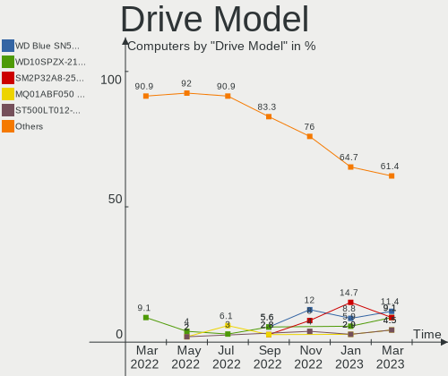
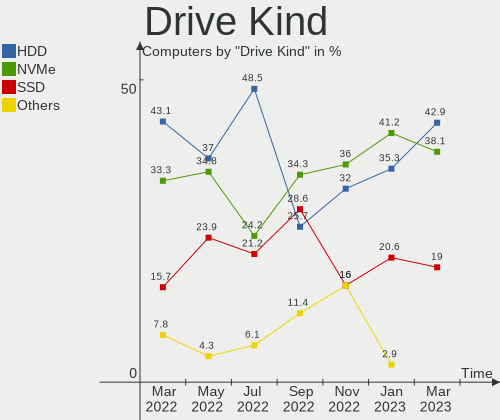
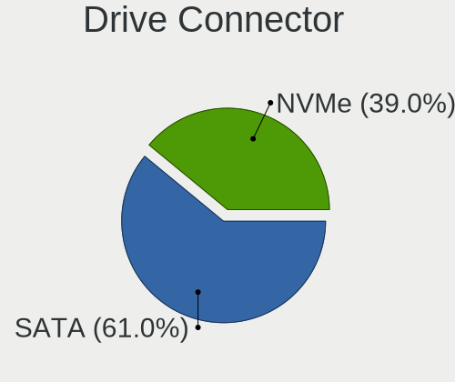
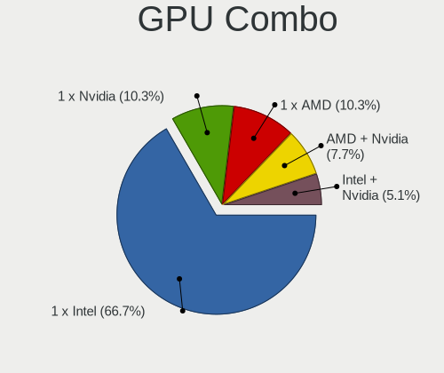
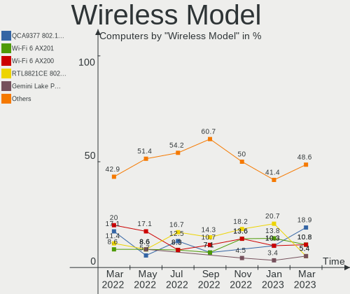

Endless Hardware Trends
-----------------------

A project to identify most popular hardware characteristics and track their change
over time based on data collected by Endless users at https://Linux-Hardware.org.

Anyone can contribute to the study by uploading probes of their computers by
the [hw-probe](https://github.com/linuxhw/hw-probe) tool:

    sudo -E hw-probe -all -upload

This is a report for all computer types. See also reports for [desktops](/Dist/Endless/Desktop/README.md) and [notebooks](/Dist/Endless/Notebook/README.md).

Full-feature report is available here: https://linux-hardware.org/?view=trends

Period: Oct, 2020.

Contents
--------

- [ OS                       ](#os)
- [ OS Family                ](#os-family)
- [ Kernel                   ](#kernel)
- [ Kernel Family            ](#kernel-family)
- [ Kernel Major Ver.        ](#kernel-major-ver)
- [ Arch                     ](#arch)
- [ DE                       ](#de)
- [ Display Server           ](#display-server)
- [ Display Manager          ](#display-manager)
- [ OS Lang                  ](#os-lang)
- [ Boot Mode                ](#boot-mode)
- [ Filesystem               ](#filesystem)
- [ Part. scheme             ](#part-scheme)
- [ Dual Boot with Linux/BSD ](#dual-boot-with-linux/bsd)
- [ Dual Boot (Win)          ](#dual-boot-win)
- [ Country                  ](#country)
- [ City                     ](#city)
- [ Vendor                   ](#vendor)
- [ Model                    ](#model)
- [ Model Family             ](#model-family)
- [ MFG Year                 ](#mfg-year)
- [ Form Factor              ](#form-factor)
- [ Secure Boot              ](#secure-boot)
- [ Coreboot                 ](#coreboot)
- [ RAM Size                 ](#ram-size)
- [ RAM Used                 ](#ram-used)
- [ Has CD-ROM               ](#has-cd-rom)
- [ Total Drives             ](#total-drives)
- [ Has Ethernet             ](#has-ethernet)
- [ Drive Vendor             ](#drive-vendor)
- [ HDD Vendor               ](#hdd-vendor)
- [ SSD Vendor               ](#ssd-vendor)
- [ Drive Model              ](#drive-model)
- [ Drive Kind               ](#drive-kind)
- [ Drive Connector          ](#drive-connector)
- [ Drive Size               ](#drive-size)
- [ Space Total              ](#space-total)
- [ Space Used               ](#space-used)
- [ Malfunc. Drives          ](#malfunc-drives)
- [ Malfunc. Drive Vendor    ](#malfunc-drive-vendor)
- [ Malfunc. HDD Vendor      ](#malfunc-hdd-vendor)
- [ Malfunc. Drive Kind      ](#malfunc-drive-kind)
- [ Failed Drives            ](#failed-drives)
- [ Failed Drive Vendor      ](#failed-drive-vendor)
- [ Drive Status             ](#drive-status)
- [ Storage Vendor           ](#storage-vendor)
- [ Storage Model            ](#storage-model)
- [ Storage Kind             ](#storage-kind)
- [ CPU Vendor               ](#cpu-vendor)
- [ CPU Model                ](#cpu-model)
- [ CPU Model Family         ](#cpu-model-family)
- [ CPU Cores                ](#cpu-cores)
- [ CPU Sockets              ](#cpu-sockets)
- [ CPU Threads              ](#cpu-threads)
- [ CPU Op-Modes             ](#cpu-op-modes)
- [ CPU Microcode            ](#cpu-microcode)
- [ CPU Microarch            ](#cpu-microarch)
- [ GPU Vendor               ](#gpu-vendor)
- [ GPU Model                ](#gpu-model)
- [ GPU Combo                ](#gpu-combo)
- [ GPU Driver               ](#gpu-driver)
- [ GPU Memory               ](#gpu-memory)
- [ Monitor Vendor           ](#monitor-vendor)
- [ Monitor Model            ](#monitor-model)
- [ Monitor Resolution       ](#monitor-resolution)
- [ Monitor Diagonal         ](#monitor-diagonal)
- [ Monitor Width            ](#monitor-width)
- [ Aspect Ratio             ](#aspect-ratio)
- [ Monitor Area             ](#monitor-area)
- [ Pixel Density            ](#pixel-density)
- [ Multiple Monitors        ](#multiple-monitors)
- [ Net Controller Vendor    ](#net-controller-vendor)
- [ Net Controller Model     ](#net-controller-model)
- [ Wireless Vendor          ](#wireless-vendor)
- [ Wireless Model           ](#wireless-model)
- [ Ethernet Vendor          ](#ethernet-vendor)
- [ Ethernet Model           ](#ethernet-model)
- [ Net Controller Kind      ](#net-controller-kind)
- [ Used Controller          ](#used-controller)
- [ NICs                     ](#nics)
- [ Memory Vendor            ](#memory-vendor)
- [ Memory Model             ](#memory-model)
- [ Memory Kind              ](#memory-kind)
- [ Memory Form Factor       ](#memory-form-factor)
- [ Memory Size              ](#memory-size)
- [ Memory Speed             ](#memory-speed)
- [ Sound Vendor             ](#sound-vendor)
- [ Sound Model              ](#sound-model)
- [ Camera Vendor            ](#camera-vendor)
- [ Camera Model             ](#camera-model)
- [ Fingerprint Vendor       ](#fingerprint-vendor)
- [ Fingerprint Model        ](#fingerprint-model)
- [ Chipcard Vendor          ](#chipcard-vendor)
- [ Chipcard Model           ](#chipcard-model)
- [ Printer Vendor           ](#printer-vendor)
- [ Printer Model            ](#printer-model)
- [ Scanner Vendor           ](#scanner-vendor)
- [ Scanner Model            ](#scanner-model)
- [ Bluetooth Vendor         ](#bluetooth-vendor)
- [ Bluetooth Model          ](#bluetooth-model)
- [ Unsupported Devices      ](#unsupported-devices)
- [ Unsupported Device Types ](#unsupported-device-types)

OS
--

Installed operating systems

| Name                   | Computers | Percent |
|------------------------|-----------|---------|
| Endless 3.8.7          | 87        | 61.7%   |
| Endless 3.8.6          | 28        | 19.86%  |
| Endless 3.7.8          | 7         | 4.96%   |
| Endless 3.8.5          | 3         | 2.13%   |
| Endless 3.8.3          | 2         | 1.42%   |
| Endless 3.6.4          | 2         | 1.42%   |
| Endless 3.3.20-nexthw1 | 2         | 1.42%   |
| Endless 3.9.0          | 1         | 0.71%   |
| Endless 3.8.0          | 1         | 0.71%   |
| Endless 3.7.7-nexthw1  | 1         | 0.71%   |
| Endless 3.7.6          | 1         | 0.71%   |
| Endless 3.7.5-nexthw1  | 1         | 0.71%   |
| Endless 3.7.5          | 1         | 0.71%   |
| Endless 3.6.3-nexthw1  | 1         | 0.71%   |
| Endless 3.6.0-nexthw1  | 1         | 0.71%   |
| Endless 3.4.3-nexthw1  | 1         | 0.71%   |
| Endless 3.3.14         | 1         | 0.71%   |

OS Family
---------

OS without a version

| Name    | Computers | Percent |
|---------|-----------|---------|
| Endless | 141       | 100%    |

Kernel
------

Version of the Linux kernel

| Version           | Computers | Percent |
|-------------------|-----------|---------|
| 5.4.0-42-generic  | 115       | 81.56%  |
| 5.3.0-28-generic  | 7         | 4.96%   |
| 5.4.0-39-generic  | 3         | 2.13%   |
| 5.4.0-19-generic  | 3         | 2.13%   |
| 5.3.0-23-generic  | 3         | 2.13%   |
| 5.0.0-25-generic  | 2         | 1.42%   |
| 4.15.0-15-generic | 2         | 1.42%   |
| 5.8.0-14-generic  | 1         | 0.71%   |
| 5.4.0-7-generic   | 1         | 0.71%   |
| 5.3.0-12-generic  | 1         | 0.71%   |
| 5.1.0-2-generic   | 1         | 0.71%   |
| 4.16.0-4-generic  | 1         | 0.71%   |
| 4.13.0-32-generic | 1         | 0.71%   |

Kernel Family
-------------

Linux kernel without a distro release

| Version | Computers | Percent |
|---------|-----------|---------|
| 5.4.0   | 122       | 86.52%  |
| 5.3.0   | 11        | 7.8%    |
| 5.0.0   | 2         | 1.42%   |
| 4.15.0  | 2         | 1.42%   |
| 5.8.0   | 1         | 0.71%   |
| 5.1.0   | 1         | 0.71%   |
| 4.16.0  | 1         | 0.71%   |
| 4.13.0  | 1         | 0.71%   |

Kernel Major Ver.
-----------------

Linux kernel major version

| Version | Computers | Percent |
|---------|-----------|---------|
| 5.4     | 122       | 86.52%  |
| 5.3     | 11        | 7.8%    |
| 5.0     | 2         | 1.42%   |
| 4.15    | 2         | 1.42%   |
| 5.8     | 1         | 0.71%   |
| 5.1     | 1         | 0.71%   |
| 4.16    | 1         | 0.71%   |
| 4.13    | 1         | 0.71%   |

Arch
----

OS architecture (x86_64, i586, etc.)

| Name   | Computers | Percent |
|--------|-----------|---------|
| x86_64 | 141       | 100%    |

DE
--

Desktop Environment

| Name    | Computers | Percent |
|---------|-----------|---------|
| GNOME   | 140       | 99.29%  |
| Unknown | 1         | 0.71%   |

Display Server
--------------

X11 or Wayland

| Name    | Computers | Percent |
|---------|-----------|---------|
| X11     | 140       | 99.29%  |
| Unknown | 1         | 0.71%   |

Display Manager
---------------

SDDM, LightDM, etc.

| Name    | Computers | Percent |
|---------|-----------|---------|
| Unknown | 141       | 100%    |

OS Lang
-------

Language

| Lang        | Computers | Percent |
|-------------|-----------|---------|
| pt_BR.utf8  | 41        | 29.08%  |
| en_US.utf8  | 24        | 17.02%  |
| pt_BR       | 13        | 9.22%   |
| ru_RU       | 11        | 7.8%    |
| ro_RO       | 9         | 6.38%   |
| en_US       | 6         | 4.26%   |
| ru_RU.UTF_8 | 3         | 2.13%   |
| es_ES       | 3         | 2.13%   |
| es_AR       | 3         | 2.13%   |
| de_DE       | 3         | 2.13%   |
| tr_TR       | 2         | 1.42%   |
| it_IT       | 2         | 1.42%   |
| fr_FR.utf8  | 2         | 1.42%   |
| es_MX       | 2         | 1.42%   |
| es_CO       | 2         | 1.42%   |
| vi_VN       | 1         | 0.71%   |
| sr_RS@latin | 1         | 0.71%   |
| pl_PL       | 1         | 0.71%   |
| nl_NL       | 1         | 0.71%   |
| ko_KR       | 1         | 0.71%   |
| hu_HU       | 1         | 0.71%   |
| hr_HR       | 1         | 0.71%   |
| fr_FR       | 1         | 0.71%   |
| fr_BE       | 1         | 0.71%   |
| fi_FI       | 1         | 0.71%   |
| es_UY       | 1         | 0.71%   |
| es_MX.utf8  | 1         | 0.71%   |
| ca_ES       | 1         | 0.71%   |
| bg_BG       | 1         | 0.71%   |
| Unknown     | 1         | 0.71%   |

Boot Mode
---------

EFI or BIOS

| Mode | Computers | Percent |
|------|-----------|---------|
| EFI  | 90        | 63.83%  |
| BIOS | 51        | 36.17%  |

Filesystem
----------

Type of filesystem

| Type  | Computers | Percent |
|-------|-----------|---------|
| Ext4  | 138       | 97.87%  |
| Tmpfs | 3         | 2.13%   |

Part. scheme
------------

Scheme of partitioning

| Type    | Computers | Percent |
|---------|-----------|---------|
| Unknown | 141       | 100%    |

Dual Boot with Linux/BSD
------------------------

Hosting more than one Linux/BSD

| Dual boot | Computers | Percent |
|-----------|-----------|---------|
| No        | 141       | 100%    |

Dual Boot (Win)
---------------

Hosting Linux and Windows

| Dual boot | Computers | Percent |
|-----------|-----------|---------|
| No        | 141       | 100%    |

Country
-------

Geographic location (country)

| Country            | Computers | Percent |
|--------------------|-----------|---------|
| Brazil             | 56        | 39.72%  |
| Russia             | 14        | 9.93%   |
| Romania            | 12        | 8.51%   |
| USA                | 7         | 4.96%   |
| Spain              | 5         | 3.55%   |
| Serbia             | 4         | 2.84%   |
| India              | 4         | 2.84%   |
| Germany            | 4         | 2.84%   |
| Colombia           | 4         | 2.84%   |
| Italy              | 3         | 2.13%   |
| France             | 3         | 2.13%   |
| Bulgaria           | 3         | 2.13%   |
| Uruguay            | 2         | 1.42%   |
| Philippines        | 2         | 1.42%   |
| Mexico             | 2         | 1.42%   |
| Canada             | 2         | 1.42%   |
| Vietnam            | 1         | 0.71%   |
| Turkey             | 1         | 0.71%   |
| Portugal           | 1         | 0.71%   |
| Poland             | 1         | 0.71%   |
| New Zealand        | 1         | 0.71%   |
| Netherlands        | 1         | 0.71%   |
| Korea, Republic of | 1         | 0.71%   |
| Indonesia          | 1         | 0.71%   |
| Hungary            | 1         | 0.71%   |
| Georgia            | 1         | 0.71%   |
| Finland            | 1         | 0.71%   |
| Croatia            | 1         | 0.71%   |
| Belgium            | 1         | 0.71%   |
| Belarus            | 1         | 0.71%   |

City
----

Geographic location (city)

| City                     | Computers | Percent |
|--------------------------|-----------|---------|
| São Paulo               | 9         | 6.38%   |
| Bucharest                | 6         | 4.26%   |
| Sofia                    | 3         | 2.13%   |
| Rio de Janeiro           | 3         | 2.13%   |
| Moscow                   | 3         | 2.13%   |
| Guarulhos                | 3         | 2.13%   |
| Valencia                 | 2         | 1.42%   |
| Recife                   | 2         | 1.42%   |
| Porto Alegre             | 2         | 1.42%   |
| Krasnodar                | 2         | 1.42%   |
| Fortaleza                | 2         | 1.42%   |
| Edmonton                 | 2         | 1.42%   |
| Cluj-Napoca              | 2         | 1.42%   |
| Brasília                | 2         | 1.42%   |
| Zonguldak                | 1         | 0.71%   |
| Zagreb                   | 1         | 0.71%   |
| Warsaw                   | 1         | 0.71%   |
| Wachtberg                | 1         | 0.71%   |
| Voronezh                 | 1         | 0.71%   |
| Volgograd                | 1         | 0.71%   |
| Vitória                 | 1         | 0.71%   |
| Trino                    | 1         | 0.71%   |
| Teófilo Otoni           | 1         | 0.71%   |
| Tbilisi                  | 1         | 0.71%   |
| Talence                  | 1         | 0.71%   |
| Taboao da Serra          | 1         | 0.71%   |
| São Carlos              | 1         | 0.71%   |
| Surabaya                 | 1         | 0.71%   |
| St Petersburg            | 1         | 0.71%   |
| Smolensk                 | 1         | 0.71%   |
| Sao Goncalo              | 1         | 0.71%   |
| Santiago de Cali         | 1         | 0.71%   |
| Santa Marta              | 1         | 0.71%   |
| Santa Maria Chimalhuacan | 1         | 0.71%   |
| San Juan del Río        | 1         | 0.71%   |
| Samara                   | 1         | 0.71%   |
| Sallent de Gallego       | 1         | 0.71%   |
| Roznov                   | 1         | 0.71%   |
| Rionegro                 | 1         | 0.71%   |
| Rio Tinto                | 1         | 0.71%   |
| Pune                     | 1         | 0.71%   |
| Puerto Real              | 1         | 0.71%   |
| Pinhais                  | 1         | 0.71%   |
| Petrópolis              | 1         | 0.71%   |
| Pedreiras                | 1         | 0.71%   |
| Pasig                    | 1         | 0.71%   |
| Paris                    | 1         | 0.71%   |
| Pando                    | 1         | 0.71%   |
| Palanka                  | 1         | 0.71%   |
| Ourinhos                 | 1         | 0.71%   |
| Noblesville              | 1         | 0.71%   |
| Nizhniy Novgorod         | 1         | 0.71%   |
| Niterói                 | 1         | 0.71%   |
| Naunhof                  | 1         | 0.71%   |
| Muhlhausen-Ehingen       | 1         | 0.71%   |
| Montes Claros            | 1         | 0.71%   |
| Montenegro               | 1         | 0.71%   |
| Minsk                    | 1         | 0.71%   |
| Manila                   | 1         | 0.71%   |
| Manaus                   | 1         | 0.71%   |

Vendor
------

Motherboard manufacturer

| Name                                   | Computers | Percent |
|----------------------------------------|-----------|---------|
| ASUSTek Computer                       | 50        | 35.46%  |
| Acer                                   | 47        | 33.33%  |
| Hewlett-Packard                        | 8         | 5.67%   |
| Positivo                               | 5         | 3.55%   |
| Gigabyte Technology                    | 5         | 3.55%   |
| Dell                                   | 5         | 3.55%   |
| Lenovo                                 | 4         | 2.84%   |
| Fujitsu Siemens                        | 2         | 1.42%   |
| ASRock                                 | 2         | 1.42%   |
| Apple                                  | 2         | 1.42%   |
| Semp Toshiba                           | 1         | 0.71%   |
| Samsung Electronics                    | 1         | 0.71%   |
| Pegatron                               | 1         | 0.71%   |
| PCWare                                 | 1         | 0.71%   |
| MSI                                    | 1         | 0.71%   |
| MPS Mayorista de Colombia SA           | 1         | 0.71%   |
| Intel                                  | 1         | 0.71%   |
| Huanan                                 | 1         | 0.71%   |
| Foxconn                                | 1         | 0.71%   |
| Digibras                               | 1         | 0.71%   |
| Desenvolvido para Positivo Informatica | 1         | 0.71%   |

Model
-----

Motherboard model

| Name                                            | Computers | Percent |
|-------------------------------------------------|-----------|---------|
| Acer Nitro AN515-43                             | 15        | 10.64%  |
| ASUS X541NA                                     | 5         | 3.55%   |
| Acer Nitro AN517-51                             | 5         | 3.55%   |
| Acer Nitro AN515-54                             | 5         | 3.55%   |
| Acer Aspire A515-54G                            | 4         | 2.84%   |
| Acer Aspire A315-34                             | 4         | 2.84%   |
| Positivo Mobile                                 | 3         | 2.13%   |
| Gigabyte B360M AORUS Gaming 3                   | 3         | 2.13%   |
| ASUS X540NA                                     | 3         | 2.13%   |
| ASUS VivoBook 15_ASUS Laptop X540MA_X543MA      | 3         | 2.13%   |
| ASUS VivoBook 15_ASUS Laptop X540MA_X540MA      | 3         | 2.13%   |
| ASUS ZenBook UX431DA_UM431DA                    | 2         | 1.42%   |
| ASUS Z550SA                                     | 2         | 1.42%   |
| ASUS X541UAK                                    | 2         | 1.42%   |
| ASUS VivoBook_ASUSLaptop X512DA_X512DA          | 2         | 1.42%   |
| ASUS VivoBook_ASUSLaptop X509MA                 | 2         | 1.42%   |
| ASUS VivoBook_ASUSLaptop X509FA_X509FA          | 2         | 1.42%   |
| Apple iMac7,1                                   | 2         | 1.42%   |
| Acer Aspire A315-31                             | 2         | 1.42%   |
| Semp Toshiba IS 1462B                           | 1         | 0.71%   |
| Samsung Electronics 400B4B/400B5B/200B4B/200B5B | 1         | 0.71%   |
| Positivo POS-MIG31AG                            | 1         | 0.71%   |
| Positivo A14CR6A                                | 1         | 0.71%   |
| Pegatron C15A                                   | 1         | 0.71%   |
| PCWare IPX1800E2                                | 1         | 0.71%   |
| MSI MS-7A62                                     | 1         | 0.71%   |
| MPS Mayorista de Colombia SA COIN ST800EDU      | 1         | 0.71%   |
| Lenovo ThinkPad X230 2325KZ5                    | 1         | 0.71%   |
| Lenovo ThinkPad X201 4492W3C                    | 1         | 0.71%   |
| Lenovo ThinkCentre M92 3235H3G                  | 1         | 0.71%   |
| Lenovo IdeaPad 100S-14IBR 80R9                  | 1         | 0.71%   |
| Intel Intel Education Tablet                    | 1         | 0.71%   |
| Huanan X99-TF                                   | 1         | 0.71%   |
| HP TouchSmart tx2                               | 1         | 0.71%   |
| HP Pavilion TS Sleekbook 15                     | 1         | 0.71%   |
| HP EliteBook 8440p                              | 1         | 0.71%   |
| HP EliteBook 840 G1                             | 1         | 0.71%   |
| HP Compaq Elite 8300 SFF                        | 1         | 0.71%   |
| HP Compaq 6735s                                 | 1         | 0.71%   |
| HP Compaq 6005 Pro SFF PC                       | 1         | 0.71%   |
| HP 635                                          | 1         | 0.71%   |
| Gigabyte F2A75M-D3H                             | 1         | 0.71%   |
| Gigabyte 945PL-S3P                              | 1         | 0.71%   |
| Fujitsu Siemens ESPRIMO Mobile V5535            | 1         | 0.71%   |
| Fujitsu Siemens ESPRIMO Mobile D9510            | 1         | 0.71%   |
| Foxconn G31MXP FAB:1.1                          | 1         | 0.71%   |
| Digibras NH4CU53                                | 1         | 0.71%   |
| Desenvolvido para Positivo Informatica P5VD2-MX | 1         | 0.71%   |
| Dell Vostro 3350                                | 1         | 0.71%   |
| Dell OptiPlex 780                               | 1         | 0.71%   |
| Dell Inspiron One 2320                          | 1         | 0.71%   |
| Dell Inspiron 3464 AIO                          | 1         | 0.71%   |
| Dell Inspiron 1545                              | 1         | 0.71%   |
| ASUS ZenBook UX462DA                            | 1         | 0.71%   |
| ASUS X550LN                                     | 1         | 0.71%   |
| ASUS X540LA                                     | 1         | 0.71%   |
| ASUS VivoBook_ASUSLaptop X512DA_A512DA          | 1         | 0.71%   |
| ASUS VivoBook_ASUSLaptop X509JB_X509JB          | 1         | 0.71%   |
| ASUS VivoBook_ASUSLaptop X509JA_X509JA          | 1         | 0.71%   |
| ASUS VivoBook_ASUSLaptop X409DA_M409DA          | 1         | 0.71%   |

Model Family
------------

Motherboard model prefix

| Name                                            | Computers | Percent |
|-------------------------------------------------|-----------|---------|
| Acer Nitro                                      | 25        | 17.73%  |
| ASUS VivoBook                                   | 23        | 16.31%  |
| Acer Aspire                                     | 16        | 11.35%  |
| ASUS X541NA                                     | 5         | 3.55%   |
| Positivo MOBILE                                 | 3         | 2.13%   |
| HP Compaq                                       | 3         | 2.13%   |
| Gigabyte B360M                                  | 3         | 2.13%   |
| Dell Inspiron                                   | 3         | 2.13%   |
| ASUS ZenBook                                    | 3         | 2.13%   |
| ASUS X540NA                                     | 3         | 2.13%   |
| Lenovo ThinkPad                                 | 2         | 1.42%   |
| HP EliteBook                                    | 2         | 1.42%   |
| Fujitsu Siemens ESPRIMO                         | 2         | 1.42%   |
| ASUS Z550SA                                     | 2         | 1.42%   |
| ASUS X541UAK                                    | 2         | 1.42%   |
| ASUS Vivo                                       | 2         | 1.42%   |
| Apple iMac7                                     | 2         | 1.42%   |
| Acer Swift                                      | 2         | 1.42%   |
| Semp Toshiba IS                                 | 1         | 0.71%   |
| Samsung Electronics 400B4B                      | 1         | 0.71%   |
| Positivo POS-MIG31AG                            | 1         | 0.71%   |
| Positivo A14CR6A                                | 1         | 0.71%   |
| Pegatron C15A                                   | 1         | 0.71%   |
| PCWare IPX1800E2                                | 1         | 0.71%   |
| MSI MS-7A62                                     | 1         | 0.71%   |
| MPS Mayorista de Colombia SA COIN               | 1         | 0.71%   |
| Lenovo ThinkCentre                              | 1         | 0.71%   |
| Lenovo IdeaPad                                  | 1         | 0.71%   |
| Intel Intel                                     | 1         | 0.71%   |
| Huanan X99-TF                                   | 1         | 0.71%   |
| HP TouchSmart                                   | 1         | 0.71%   |
| HP Pavilion                                     | 1         | 0.71%   |
| HP 635                                          | 1         | 0.71%   |
| Gigabyte F2A75M-D3H                             | 1         | 0.71%   |
| Gigabyte 945PL-S3P                              | 1         | 0.71%   |
| Foxconn G31MXP                                  | 1         | 0.71%   |
| Digibras NH4CU53                                | 1         | 0.71%   |
| Desenvolvido para Positivo Informatica P5VD2-MX | 1         | 0.71%   |
| Dell Vostro                                     | 1         | 0.71%   |
| Dell OptiPlex                                   | 1         | 0.71%   |
| ASUS X550LN                                     | 1         | 0.71%   |
| ASUS X540LA                                     | 1         | 0.71%   |
| ASUS V221IC                                     | 1         | 0.71%   |
| ASUS U31SD                                      | 1         | 0.71%   |
| ASUS S551LN                                     | 1         | 0.71%   |
| ASUS P5KPL-AM                                   | 1         | 0.71%   |
| ASUS M2V                                        | 1         | 0.71%   |
| ASUS GL552JX                                    | 1         | 0.71%   |
| ASUS ASUSPRO                                    | 1         | 0.71%   |
| ASUS All                                        | 1         | 0.71%   |
| ASRock N68C-GS                                  | 1         | 0.71%   |
| ASRock A88M-G                                   | 1         | 0.71%   |
| Acer TravelMate                                 | 1         | 0.71%   |
| Acer Spin                                       | 1         | 0.71%   |
| Acer Extensa                                    | 1         | 0.71%   |
| Acer A315-53                                    | 1         | 0.71%   |

MFG Year
--------

Motherboard manufacture year

| Year | Computers | Percent |
|------|-----------|---------|
| 2020 | 41        | 29.08%  |
| 2019 | 29        | 20.57%  |
| 2017 | 13        | 9.22%   |
| 2018 | 12        | 8.51%   |
| 2013 | 8         | 5.67%   |
| 2009 | 7         | 4.96%   |
| 2016 | 5         | 3.55%   |
| 2011 | 5         | 3.55%   |
| 2008 | 5         | 3.55%   |
| 2014 | 4         | 2.84%   |
| 2010 | 4         | 2.84%   |
| 2015 | 3         | 2.13%   |
| 2007 | 3         | 2.13%   |
| 2012 | 2         | 1.42%   |

Form Factor
-----------

Physical design of the computer

| Name        | Computers | Percent |
|-------------|-----------|---------|
| Notebook    | 109       | 77.3%   |
| Desktop     | 20        | 14.18%  |
| All in one  | 9         | 6.38%   |
| Convertible | 2         | 1.42%   |
| Tablet      | 1         | 0.71%   |

Secure Boot
-----------

Enabled or disabled

| State    | Computers | Percent |
|----------|-----------|---------|
| Disabled | 99        | 70.21%  |
| Enabled  | 42        | 29.79%  |

Coreboot
--------

Have coreboot on board

| Used | Computers | Percent |
|------|-----------|---------|
| No   | 141       | 100%    |

RAM Size
--------

Total RAM memory

| Size in GB  | Computers | Percent |
|-------------|-----------|---------|
| 3.01-4.0    | 60        | 42.55%  |
| 4.01-8.0    | 55        | 39.01%  |
| 1.01-2.0    | 10        | 7.09%   |
| 8.01-16.0   | 6         | 4.26%   |
| 2.01-3.0    | 3         | 2.13%   |
| 64.01-256.0 | 3         | 2.13%   |
| 16.01-24.0  | 3         | 2.13%   |
| 0.01-1.0    | 1         | 0.71%   |

RAM Used
--------

Used RAM memory

| Used GB  | Computers | Percent |
|----------|-----------|---------|
| 1.01-2.0 | 62        | 43.97%  |
| 2.01-3.0 | 37        | 26.24%  |
| 0.01-1.0 | 28        | 19.86%  |
| 3.01-4.0 | 9         | 6.38%   |
| 4.01-8.0 | 5         | 3.55%   |

Has CD-ROM
----------

Has CD-ROM on board

| Presented | Computers | Percent |
|-----------|-----------|---------|
| No        | 100       | 70.92%  |
| Yes       | 41        | 29.08%  |

Total Drives
------------

Number of drives on board

| Drives | Computers | Percent |
|--------|-----------|---------|
| 1      | 99        | 70.21%  |
| 2      | 33        | 23.4%   |
| 3      | 5         | 3.55%   |
| 5      | 2         | 1.42%   |
| 0      | 2         | 1.42%   |

Has Ethernet
------------

Has Ethernet on board

| Presented | Computers | Percent |
|-----------|-----------|---------|
| Yes       | 109       | 77.3%   |
| No        | 32        | 22.7%   |

Drive Vendor
------------

Hard drive vendors

| Vendor              | Computers | Drives | Percent |
|---------------------|-----------|--------|---------|
| WDC                 | 40        | 43     | 22.35%  |
| Seagate             | 21        | 22     | 11.73%  |
| Intel               | 18        | 18     | 10.06%  |
| Samsung Electronics | 15        | 19     | 8.38%   |
| Toshiba             | 13        | 13     | 7.26%   |
| Sandisk             | 12        | 12     | 6.7%    |
| Kingston            | 12        | 12     | 6.7%    |
| SK Hynix            | 11        | 11     | 6.15%   |
| Unknown             | 9         | 9      | 5.03%   |
| A-DATA Technology   | 8         | 8      | 4.47%   |
| HGST                | 6         | 6      | 3.35%   |
| Hitachi             | 5         | 5      | 2.79%   |
| KingDian            | 2         | 2      | 1.12%   |
| Silicon Motion      | 1         | 1      | 0.56%   |
| PNY                 | 1         | 1      | 0.56%   |
| Micron Technology   | 1         | 1      | 0.56%   |
| GOODRAM             | 1         | 1      | 0.56%   |
| China               | 1         | 1      | 0.56%   |
| Apple               | 1         | 1      | 0.56%   |
| ADATA Technology    | 1         | 1      | 0.56%   |

HDD Vendor
----------

Hard disk drive vendors

| Vendor              | Computers | Drives | Percent |
|---------------------|-----------|--------|---------|
| WDC                 | 39        | 40     | 42.86%  |
| Seagate             | 21        | 22     | 23.08%  |
| Toshiba             | 12        | 12     | 13.19%  |
| Samsung Electronics | 8         | 9      | 8.79%   |
| HGST                | 6         | 6      | 6.59%   |
| Hitachi             | 5         | 5      | 5.49%   |

SSD Vendor
----------

Solid state drive vendors

| Vendor              | Computers | Drives | Percent |
|---------------------|-----------|--------|---------|
| Kingston            | 10        | 10     | 25%     |
| A-DATA Technology   | 8         | 8      | 20%     |
| SanDisk             | 7         | 7      | 17.5%   |
| Samsung Electronics | 5         | 5      | 12.5%   |
| KingDian            | 2         | 2      | 5%      |
| WDC                 | 1         | 1      | 2.5%    |
| Toshiba             | 1         | 1      | 2.5%    |
| SK Hynix            | 1         | 1      | 2.5%    |
| PNY                 | 1         | 1      | 2.5%    |
| Micron Technology   | 1         | 1      | 2.5%    |
| GOODRAM             | 1         | 1      | 2.5%    |
| China               | 1         | 1      | 2.5%    |
| Apple               | 1         | 1      | 2.5%    |

Drive Model
-----------

Hard drive models

| Model                        | Computers | Percent |
|------------------------------|-----------|---------|
| WD10SPZX-21Z10T0 1TB         | 27        | 14.75%  |
| NVMe SSD Drive 512GB         | 18        | 9.84%   |
| NVMe SSD Drive 256GB         | 16        | 8.74%   |
| NVMe SSD Drive 128GB         | 8         | 4.37%   |
| MQ01ABF050 500GB             | 7         | 3.83%   |
| IM2S3338-128GD2 128GB SSD    | 7         | 3.83%   |
| ST1000LM035-1RK172 1TB       | 5         | 2.73%   |
| MMC Card  32GB               | 4         | 2.19%   |
| RBUSC180DS37256GJ 256GB SSD  | 3         | 1.64%   |
| MQ01ABD100 1TB               | 3         | 1.64%   |
| HTS545050B7E660 500GB        | 3         | 1.64%   |
| HTS545050A7E380 500GB        | 3         | 1.64%   |
| WD5000LPCX-80VHAT0 500GB     | 2         | 1.09%   |
| WD5000LPCX-21VHAT0 500GB     | 2         | 1.09%   |
| ST500LT012-1DG142 500GB      | 2         | 1.09%   |
| SSD 860 EVO 250GB            | 2         | 1.09%   |
| SD9SB8W256G1002 256GB SSD    | 2         | 1.09%   |
| SA400S37120G 120GB SSD       | 2         | 1.09%   |
| HN-M490MBB 500GB             | 2         | 1.09%   |
| WDS240G1G0B-00RC30 240GB SSD | 1         | 0.55%   |
| WD800JD-60LSA5 80GB          | 1         | 0.55%   |
| WD5000LPCX-80VHAT1 500GB     | 1         | 0.55%   |
| WD5000BPVT-22HXZT3 500GB     | 1         | 0.55%   |
| WD3200BEVT-75ZCT2 320GB      | 1         | 0.55%   |
| WD3200AAKS-00SBA0 320GB      | 1         | 0.55%   |
| WD1200BEVS-00UST0 120GB      | 1         | 0.55%   |
| WD10EALS-00Z8A0 1TB          | 1         | 0.55%   |
| WD10EACS-00D6B0 1TB          | 1         | 0.55%   |
| WD My Book ES 500GB          | 1         | 0.55%   |
| THNS128GG4BBAA 128GB SSD     | 1         | 0.55%   |
| SV300S37A120G 120GB SSD      | 1         | 0.55%   |
| SU650 240GB SSD              | 1         | 0.55%   |
| ST9500325AS 500GB            | 1         | 0.55%   |
| ST9320325AS 320GB            | 1         | 0.55%   |
| ST9250410AS 250GB            | 1         | 0.55%   |
| ST9160821AS 160GB            | 1         | 0.55%   |
| ST750LM022 HN-M750MBB 752GB  | 1         | 0.55%   |
| ST500LM030-1RK17D 500GB      | 1         | 0.55%   |
| ST500LM012 HN-M500MBB 500GB  | 1         | 0.55%   |
| ST500DM002-1BD142 500GB      | 1         | 0.55%   |
| ST3250820AS Q 250GB          | 1         | 0.55%   |
| ST3250312AS 250GB            | 1         | 0.55%   |
| ST3160813AS 160GB            | 1         | 0.55%   |
| ST31000524AS 1TB             | 1         | 0.55%   |
| ST3000DM008-2DM166 3TB       | 1         | 0.55%   |
| ST1000LM048-2E7172 1TB       | 1         | 0.55%   |
| ST1000DM003-1CH162 1TB       | 1         | 0.55%   |
| SSDPR-CX400-256 256GB        | 1         | 0.55%   |
| SSD U100 24GB                | 1         | 0.55%   |
| SSD SM128E 121GB             | 1         | 0.55%   |
| SSD PM810 2.5 7mm 128GB      | 1         | 0.55%   |
| SSD PLUS 480GB               | 1         | 0.55%   |
| SSD 850 EVO 250GB            | 1         | 0.55%   |
| SP0411N 40GB                 | 1         | 0.55%   |
| SHFS37A120G 120GB SSD        | 1         | 0.55%   |
| SDSSDHII240G 240GB           | 1         | 0.55%   |
| SD9SN8W512G1102 512GB SSD    | 1         | 0.55%   |
| SD9SN8W256G1102 256GB SSD    | 1         | 0.55%   |
| SD/MMC/MS PRO 32GB           | 1         | 0.55%   |
| SC311 SATA 128GB SSD         | 1         | 0.55%   |

Drive Kind
----------

HDD or SSD

| Kind    | Computers | Drives | Percent |
|---------|-----------|--------|---------|
| HDD     | 87        | 94     | 49.71%  |
| NVMe    | 45        | 46     | 25.71%  |
| SSD     | 37        | 40     | 21.14%  |
| MMC     | 4         | 4      | 2.29%   |
| Unknown | 2         | 3      | 1.14%   |

Drive Connector
---------------

SATA, SAS, NVMe, etc.

| Type | Computers | Drives | Percent |
|------|-----------|--------|---------|
| SATA | 112       | 136    | 69.14%  |
| NVMe | 45        | 46     | 27.78%  |
| MMC  | 4         | 4      | 2.47%   |
| SAS  | 1         | 1      | 0.62%   |

Drive Size
----------

Size of hard drive

| Size in TB | Computers | Drives | Percent |
|------------|-----------|--------|---------|
| 0.01-0.5   | 80        | 87     | 64.52%  |
| 0.51-1.0   | 43        | 46     | 34.68%  |
| 2.01-3.0   | 1         | 1      | 0.81%   |

Space Total
-----------

Amount of disk space available on the file system

| Size in GB | Computers | Percent |
|------------|-----------|---------|
| 251-500    | 46        | 32.62%  |
| 101-250    | 45        | 31.91%  |
| 501-1000   | 36        | 25.53%  |
| 21-50      | 9         | 6.38%   |
| 1-20       | 3         | 2.13%   |
| 2001-3000  | 1         | 0.71%   |
| 1001-2000  | 1         | 0.71%   |

Space Used
----------

Amount of used disk space

| Used GB   | Computers | Percent |
|-----------|-----------|---------|
| 21-50     | 77        | 54.61%  |
| 1-20      | 24        | 17.02%  |
| 51-100    | 20        | 14.18%  |
| 101-250   | 11        | 7.8%    |
| 251-500   | 6         | 4.26%   |
| 501-1000  | 2         | 1.42%   |
| 2001-3000 | 1         | 0.71%   |

Malfunc. Drives
---------------

Drive models with a malfunction

Zero info for selected period =(

Malfunc. Drive Vendor
---------------------

Vendors of faulty drives

Zero info for selected period =(

Malfunc. HDD Vendor
-------------------

Vendors of faulty HDD drives

Zero info for selected period =(

Malfunc. Drive Kind
-------------------

Kinds of faulty drives

Zero info for selected period =(

Failed Drives
-------------

Failed drive models

Zero info for selected period =(

Failed Drive Vendor
-------------------

Failed drive vendors

Zero info for selected period =(

Drive Status
------------

Number of failed and malfunc. drives

| Status   | Computers | Drives | Percent |
|----------|-----------|--------|---------|
| Detected | 140       | 187    | 100%    |

Storage Vendor
--------------

Storage controller vendors

| Vendor                           | Computers | Percent |
|----------------------------------|-----------|---------|
| Intel                            | 104       | 61.54%  |
| AMD                              | 30        | 17.75%  |
| SK Hynix                         | 10        | 5.92%   |
| Sandisk                          | 5         | 2.96%   |
| Samsung Electronics              | 5         | 2.96%   |
| ADATA Technology                 | 5         | 2.96%   |
| Silicon Integrated Systems [SiS] | 3         | 1.78%   |
| VIA Technologies                 | 2         | 1.18%   |
| Kingston Technology Company      | 2         | 1.18%   |
| Silicon Motion                   | 1         | 0.59%   |
| Nvidia                           | 1         | 0.59%   |
| Marvell Technology Group         | 1         | 0.59%   |

Storage Model
-------------

Storage controller models

| Model                                                                      | Computers | Percent |
|----------------------------------------------------------------------------|-----------|---------|
| FCH SATA Controller [AHCI mode]                                            | 25        | 12.44%  |
| 82801 Mobile SATA Controller [RAID mode]                                   | 21        | 10.45%  |
| SATA controller                                                            | 18        | 8.96%   |
| PROSet/Wireless WiFi Software extension                                    | 17        | 8.46%   |
| Sunrise Point-LP SATA Controller [AHCI mode]                               | 11        | 5.47%   |
| Celeron N3350/Pentium N4200/Atom E3900 Series SATA AHCI Controller         | 11        | 5.47%   |
| BC501 NVMe Solid State Drive 512GB                                         | 10        | 4.98%   |
| Non-Volatile memory controller                                             | 8         | 3.98%   |
| SB7x0/SB8x0/SB9x0 SATA Controller [AHCI mode]                              | 4         | 1.99%   |
| NVMe SSD Controller SM981/PM981/PM983                                      | 4         | 1.99%   |
| Atom/Celeron/Pentium Processor x5-E8000/J3xxx/N3xxx Series SATA Controller | 4         | 1.99%   |
| 7 Series Chipset Family 6-port SATA Controller [AHCI mode]                 | 4         | 1.99%   |
| WD Black 2018 / PC SN520 NVMe SSD                                          | 3         | 1.49%   |
| NM10/ICH7 Family SATA Controller [IDE mode]                                | 3         | 1.49%   |
| Cannon Lake PCH SATA AHCI Controller                                       | 3         | 1.49%   |
| 82801IBM/IEM (ICH9M/ICH9M-E) 4 port SATA Controller [AHCI mode]            | 3         | 1.49%   |
| 82801G (ICH7 Family) IDE Controller                                        | 3         | 1.49%   |
| 8 Series SATA Controller 1 [AHCI mode]                                     | 3         | 1.49%   |
| 6 Series/C200 Series Chipset Family 6 port Mobile SATA AHCI Controller     | 3         | 1.49%   |
| 5513 IDE Controller                                                        | 3         | 1.49%   |
| VT82C586A/B/VT82C686/A/B/VT823x/A/C PIPC Bus Master IDE                    | 2         | 1%      |
| SATA Controller / IDE mode                                                 | 2         | 1%      |
| Cannon Lake Mobile PCH SATA AHCI Controller                                | 2         | 1%      |
| 82801HM/HEM (ICH8M/ICH8M-E) SATA Controller [AHCI mode]                    | 2         | 1%      |
| 82801HM/HEM (ICH8M/ICH8M-E) IDE Controller                                 | 2         | 1%      |
| 8 Series/C220 Series Chipset Family 6-port SATA Controller 1 [AHCI mode]   | 2         | 1%      |
| 7 Series/C210 Series Chipset Family 6-port SATA Controller [AHCI mode]     | 2         | 1%      |
| Wildcat Point-LP SATA Controller [AHCI Mode]                               | 1         | 0.5%    |
| WD Blue SN550 NVMe SSD                                                     | 1         | 0.5%    |
| WD Black 2018 / PC SN720 NVMe SSD                                          | 1         | 0.5%    |
| VT8237A SATA 2-Port Controller                                             | 1         | 0.5%    |
| SSD 660P Series                                                            | 1         | 0.5%    |
| Serial ATA Controller                                                      | 1         | 0.5%    |
| SB7x0/SB8x0/SB9x0 IDE Controller                                           | 1         | 0.5%    |
| SATA Controller [RAID mode]                                                | 1         | 0.5%    |
| MCP61 SATA Controller                                                      | 1         | 0.5%    |
| MCP61 IDE                                                                  | 1         | 0.5%    |
| FCH SATA Controller [IDE mode]                                             | 1         | 0.5%    |
| FCH IDE Controller                                                         | 1         | 0.5%    |
| Electronics Non-Volatile memory controller                                 | 1         | 0.5%    |
| Comet Lake PCH-LP SATA RAID Premium Controller                             | 1         | 0.5%    |
| C610/X99 series chipset sSATA Controller [AHCI mode]                       | 1         | 0.5%    |
| C610/X99 series chipset 6-Port SATA Controller [AHCI mode]                 | 1         | 0.5%    |
| Atom Processor E3800 Series SATA AHCI Controller                           | 1         | 0.5%    |
| AHCI IDE Controller (0106)                                                 | 1         | 0.5%    |
| 88SE6111/6121 SATA II / PATA Controller                                    | 1         | 0.5%    |
| 82801JD/DO (ICH10 Family) SATA AHCI Controller                             | 1         | 0.5%    |
| 82801IBM/IEM (ICH9M/ICH9M-E) 2 port SATA Controller [IDE mode]             | 1         | 0.5%    |
| 6 Series/C200 Series Chipset Family 6 port Desktop SATA AHCI Controller    | 1         | 0.5%    |
| 5 Series/3400 Series Chipset 6 port SATA AHCI Controller                   | 1         | 0.5%    |
| 5 Series/3400 Series Chipset 4 port SATA IDE Controller                    | 1         | 0.5%    |
| 5 Series/3400 Series Chipset 2 port SATA IDE Controller                    | 1         | 0.5%    |
| 4 Series Chipset PT IDER Controller                                        | 1         | 0.5%    |

Storage Kind
------------

Kind of storage controller (IDE, SATA, NVMe, SAS, ...)

| Kind | Computers | Percent |
|------|-----------|---------|
| SATA | 123       | 64.74%  |
| NVMe | 45        | 23.68%  |
| IDE  | 17        | 8.95%   |
| RAID | 5         | 2.63%   |

CPU Vendor
----------

Processor vendors

| Vendor | Computers | Percent |
|--------|-----------|---------|
| Intel  | 109       | 77.3%   |
| AMD    | 32        | 22.7%   |

CPU Model
---------

Processor models

| Model                                         | Computers | Percent |
|-----------------------------------------------|-----------|---------|
| AMD Ryzen 7 3750H with Radeon Vega Mobile Gfx | 9         | 6.38%   |
| Intel Celeron N4000 CPU @ 1.10GHz             | 8         | 5.67%   |
| Intel Core i5-9300H CPU @ 2.40GHz             | 7         | 4.96%   |
| Intel Celeron CPU N3350 @ 1.10GHz             | 7         | 4.96%   |
| AMD Ryzen 5 3550H with Radeon Vega Mobile Gfx | 6         | 4.26%   |
| Intel Core i7-10510U CPU @ 1.80GHz            | 4         | 2.84%   |
| Intel Celeron N4000C CPU @ 1.10GHz            | 4         | 2.84%   |
| AMD Ryzen 5 3500U with Radeon Vega Mobile Gfx | 4         | 2.84%   |
| Intel Core i7-9750H CPU @ 2.60GHz             | 3         | 2.13%   |
| Intel Core i5-9400F CPU @ 2.90GHz             | 3         | 2.13%   |
| Intel Core i5-7200U CPU @ 2.50GHz             | 3         | 2.13%   |
| Intel Core i3-7100U CPU @ 2.40GHz             | 3         | 2.13%   |
| Intel Celeron CPU N3450 @ 1.10GHz             | 3         | 2.13%   |
| AMD Ryzen 3 3200U with Radeon Vega Mobile Gfx | 3         | 2.13%   |
| Intel Pentium Silver N5000 CPU @ 1.10GHz      | 2         | 1.42%   |
| Intel Pentium Dual-Core CPU T4500 @ 2.30GHz   | 2         | 1.42%   |
| Intel Pentium Dual CPU T3400 @ 2.16GHz        | 2         | 1.42%   |
| Intel Pentium Dual CPU E2180 @ 2.00GHz        | 2         | 1.42%   |
| Intel Core i7-1065G7 CPU @ 1.30GHz            | 2         | 1.42%   |
| Intel Core i5-1035G1 CPU @ 1.00GHz            | 2         | 1.42%   |
| Intel Core i5 CPU M 520 @ 2.40GHz             | 2         | 1.42%   |
| Intel Core i3-8145U CPU @ 2.10GHz             | 2         | 1.42%   |
| Intel Core i3-6006U CPU @ 2.00GHz             | 2         | 1.42%   |
| Intel Core 2 Quad CPU Q6600 @ 2.40GHz         | 2         | 1.42%   |
| Intel Celeron CPU N3160 @ 1.60GHz             | 2         | 1.42%   |
| Intel Celeron CPU N3060 @ 1.60GHz             | 2         | 1.42%   |
| Intel Atom CPU Z3735F @ 1.33GHz               | 2         | 1.42%   |
| Intel Xeon CPU E5-2678 v3 @ 2.50GHz           | 1         | 0.71%   |
| Intel Pentium Dual-Core CPU E5500 @ 2.80GHz   | 1         | 0.71%   |
| Intel Pentium Dual CPU E2220 @ 2.40GHz        | 1         | 0.71%   |
| Intel Pentium CPU N4200 @ 1.10GHz             | 1         | 0.71%   |
| Intel Pentium CPU G4560 @ 3.50GHz             | 1         | 0.71%   |
| Intel Pentium CPU 4417U @ 2.30GHz             | 1         | 0.71%   |
| Intel Core i7-4750HQ CPU @ 2.00GHz            | 1         | 0.71%   |
| Intel Core i7-2640M CPU @ 2.80GHz             | 1         | 0.71%   |
| Intel Core i5-8265U CPU @ 1.60GHz             | 1         | 0.71%   |
| Intel Core i5-8250U CPU @ 1.60GHz             | 1         | 0.71%   |
| Intel Core i5-4570 CPU @ 3.20GHz              | 1         | 0.71%   |
| Intel Core i5-4300U CPU @ 1.90GHz             | 1         | 0.71%   |
| Intel Core i5-4210U CPU @ 1.70GHz             | 1         | 0.71%   |
| Intel Core i5-3470 CPU @ 3.20GHz              | 1         | 0.71%   |
| Intel Core i5-3320M CPU @ 2.60GHz             | 1         | 0.71%   |
| Intel Core i5-2410M CPU @ 2.30GHz             | 1         | 0.71%   |
| Intel Core i3-8130U CPU @ 2.20GHz             | 1         | 0.71%   |
| Intel Core i3-7020U CPU @ 2.30GHz             | 1         | 0.71%   |
| Intel Core i3-5005U CPU @ 2.00GHz             | 1         | 0.71%   |
| Intel Core i3-4010U CPU @ 1.70GHz             | 1         | 0.71%   |
| Intel Core i3-3240T CPU @ 2.90GHz             | 1         | 0.71%   |
| Intel Core i3-3110M CPU @ 2.40GHz             | 1         | 0.71%   |
| Intel Core i3-2370M CPU @ 2.40GHz             | 1         | 0.71%   |
| Intel Core i3-2310M CPU @ 2.10GHz             | 1         | 0.71%   |
| Intel Core i3-2120 CPU @ 3.30GHz              | 1         | 0.71%   |
| Intel Core i3-10110U CPU @ 2.10GHz            | 1         | 0.71%   |
| Intel Core i3-1005G1 CPU @ 1.20GHz            | 1         | 0.71%   |
| Intel Core 2 Duo CPU T8300 @ 2.40GHz          | 1         | 0.71%   |
| Intel Core 2 Duo CPU T7300 @ 2.00GHz          | 1         | 0.71%   |
| Intel Core 2 Duo CPU T6600 @ 2.20GHz          | 1         | 0.71%   |
| Intel Core 2 Duo CPU T5550 @ 1.83GHz          | 1         | 0.71%   |
| Intel Core 2 Duo CPU P8700 @ 2.53GHz          | 1         | 0.71%   |
| Intel Celeron N4100 CPU @ 1.10GHz             | 1         | 0.71%   |

CPU Model Family
----------------

Processor model prefix

| Model                          | Computers | Percent |
|--------------------------------|-----------|---------|
| Intel Celeron                  | 32        | 22.7%   |
| Intel Core i5                  | 25        | 17.73%  |
| Intel Core i3                  | 18        | 12.77%  |
| Intel Core i7                  | 11        | 7.8%    |
| AMD Ryzen 5                    | 10        | 7.09%   |
| AMD Ryzen 7                    | 9         | 6.38%   |
| Intel Pentium Dual             | 5         | 3.55%   |
| Intel Core 2 Duo               | 5         | 3.55%   |
| Intel Pentium Dual-Core        | 3         | 2.13%   |
| Intel Pentium                  | 3         | 2.13%   |
| AMD Ryzen 3                    | 3         | 2.13%   |
| Intel Pentium Silver           | 2         | 1.42%   |
| Intel Core 2 Quad              | 2         | 1.42%   |
| Intel Atom                     | 2         | 1.42%   |
| AMD A6                         | 2         | 1.42%   |
| Intel Xeon                     | 1         | 0.71%   |
| AMD Turion X2 Dual-Core Mobile | 1         | 0.71%   |
| AMD Turion                     | 1         | 0.71%   |
| AMD Phenom                     | 1         | 0.71%   |
| AMD E                          | 1         | 0.71%   |
| AMD Athlon II X2               | 1         | 0.71%   |
| AMD Athlon 64 X2               | 1         | 0.71%   |
| AMD A4                         | 1         | 0.71%   |
| AMD A10                        | 1         | 0.71%   |

CPU Cores
---------

Number of processor cores

| Number | Computers | Percent |
|--------|-----------|---------|
| 2      | 79        | 56.03%  |
| 4      | 52        | 36.88%  |
| 6      | 6         | 4.26%   |
| 1      | 2         | 1.42%   |
| 12     | 1         | 0.71%   |
| 3      | 1         | 0.71%   |

CPU Sockets
-----------

Number of sockets

| Number | Computers | Percent |
|--------|-----------|---------|
| 1      | 141       | 100%    |

CPU Threads
-----------

Threads per core (Hyper-Threading)

| Number | Computers | Percent |
|--------|-----------|---------|
| 2      | 77        | 54.61%  |
| 1      | 64        | 45.39%  |

CPU Op-Modes
------------

CPU Operation Modes (32-bit, 64-bit)

| Op mode        | Computers | Percent |
|----------------|-----------|---------|
| 32-bit, 64-bit | 140       | 99.29%  |
| Unknown        | 1         | 0.71%   |

CPU Microcode
-------------

Microcode number

| Number     | Computers | Percent |
|------------|-----------|---------|
| Unknown    | 29        | 20.57%  |
| 0x08108109 | 16        | 11.35%  |
| 0x706a1    | 14        | 9.93%   |
| 0x906ea    | 13        | 9.22%   |
| 0x506c9    | 9         | 6.38%   |
| 0x806ec    | 7         | 4.96%   |
| 0x08108102 | 6         | 4.26%   |
| 0x706e5    | 5         | 3.55%   |
| 0x806e9    | 4         | 2.84%   |
| 0x6fd      | 4         | 2.84%   |
| 0x406c4    | 4         | 2.84%   |
| 0x206a7    | 4         | 2.84%   |
| 0x806ea    | 3         | 2.13%   |
| 0x306a9    | 3         | 2.13%   |
| 0x30678    | 3         | 2.13%   |
| 0x406e3    | 2         | 1.42%   |
| 0x40651    | 2         | 1.42%   |
| 0x906e9    | 1         | 0.71%   |
| 0x806eb    | 1         | 0.71%   |
| 0x706a8    | 1         | 0.71%   |
| 0x6fa      | 1         | 0.71%   |
| 0x306f2    | 1         | 0.71%   |
| 0x306d4    | 1         | 0.71%   |
| 0x306c3    | 1         | 0.71%   |
| 0x20655    | 1         | 0.71%   |
| 0x20652    | 1         | 0.71%   |
| 0x10676    | 1         | 0.71%   |
| 0x06003106 | 1         | 0.71%   |
| 0x06001119 | 1         | 0.71%   |
| 0x010000c8 | 1         | 0.71%   |

CPU Microarch
-------------

Microarchitecture

| Name            | Computers | Percent |
|-----------------|-----------|---------|
| KabyLake        | 32        | 22.7%   |
| Zen+            | 22        | 15.6%   |
| Goldmont plus   | 18        | 12.77%  |
| Goldmont        | 11        | 7.8%    |
| Core            | 9         | 6.38%   |
| Silvermont      | 7         | 4.96%   |
| Penryn          | 6         | 4.26%   |
| Haswell         | 6         | 4.26%   |
| SandyBridge     | 5         | 3.55%   |
| IvyBridge       | 5         | 3.55%   |
| IceLake         | 5         | 3.55%   |
| Westmere        | 2         | 1.42%   |
| Skylake         | 2         | 1.42%   |
| Piledriver      | 2         | 1.42%   |
| K8 & K10 hybrid | 2         | 1.42%   |
| K10             | 2         | 1.42%   |
| Steamroller     | 1         | 0.71%   |
| K8 Hammer       | 1         | 0.71%   |
| Excavator       | 1         | 0.71%   |
| Broadwell       | 1         | 0.71%   |
| Bobcat          | 1         | 0.71%   |

GPU Vendor
----------

Vendors of graphics cards

| Vendor                           | Computers | Percent |
|----------------------------------|-----------|---------|
| Intel                            | 93        | 51.38%  |
| Nvidia                           | 47        | 25.97%  |
| AMD                              | 37        | 20.44%  |
| Silicon Integrated Systems [SiS] | 3         | 1.66%   |
| VIA Technologies                 | 1         | 0.55%   |

GPU Model
---------

Graphics card models

| Model                                                                              | Computers | Percent |
|------------------------------------------------------------------------------------|-----------|---------|
| TU117M [GeForce GTX 1650 Mobile / Max-Q]                                           | 25        | 13.74%  |
| Picasso                                                                            | 22        | 12.09%  |
| UHD Graphics 605                                                                   | 18        | 9.89%   |
| UHD Graphics 630 (Mobile)                                                          | 10        | 5.49%   |
| HD Graphics 500                                                                    | 10        | 5.49%   |
| HD Graphics 620                                                                    | 6         | 3.3%    |
| UHD Graphics                                                                       | 5         | 2.75%   |
| 2nd Generation Core Processor Family Integrated Graphics Controller                | 5         | 2.75%   |
| Mobile 4 Series Chipset Integrated Graphics Controller                             | 4         | 2.2%    |
| GP108M [GeForce MX250]                                                             | 4         | 2.2%    |
| Atom/Celeron/Pentium Processor x5-E8000/J3xxx/N3xxx Integrated Graphics Controller | 4         | 2.2%    |
| UHD Graphics 620 (Whiskey Lake)                                                    | 3         | 1.65%   |
| TU117 [GeForce GTX 1650]                                                           | 3         | 1.65%   |
| Iris Plus Graphics G1 (Ice Lake)                                                   | 3         | 1.65%   |
| Haswell-ULT Integrated Graphics Controller                                         | 3         | 1.65%   |
| Atom Processor Z36xxx/Z37xxx Series Graphics & Display                             | 3         | 1.65%   |
| 771/671 PCIE VGA Display Adapter                                                   | 3         | 1.65%   |
| 3rd Gen Core processor Graphics Controller                                         | 3         | 1.65%   |
| UHD Graphics 620                                                                   | 2         | 1.1%    |
| Skylake GT2 [HD Graphics 520]                                                      | 2         | 1.1%    |
| RS780M [Mobility Radeon HD 3200]                                                   | 2         | 1.1%    |
| Iris Plus Graphics G7                                                              | 2         | 1.1%    |
| GM108M [GeForce MX110]                                                             | 2         | 1.1%    |
| GM108M [GeForce 840M]                                                              | 2         | 1.1%    |
| Core Processor Integrated Graphics Controller                                      | 2         | 1.1%    |
| Xeon E3-1200 v2/3rd Gen Core processor Graphics Controller                         | 1         | 0.55%   |
| Wrestler [Radeon HD 6310]                                                          | 1         | 0.55%   |
| Trinity 2 [Radeon HD 7540D]                                                        | 1         | 0.55%   |
| Trinity 2 [Radeon HD 7400G]                                                        | 1         | 0.55%   |
| Stoney [Radeon R2/R3/R4/R5 Graphics]                                               | 1         | 0.55%   |
| Seymour [Radeon HD 6400M/7400M Series]                                             | 1         | 0.55%   |
| RV630/M76 [Mobility Radeon HD 2600 XT/2700]                                        | 1         | 0.55%   |
| RV610/M74 [Mobility Radeon HD 2400 XT]                                             | 1         | 0.55%   |
| RV516 [Radeon X1300/X1550 Series] (Secondary)                                      | 1         | 0.55%   |
| RV516 [Radeon X1300/X1550 Series]                                                  | 1         | 0.55%   |
| RS880 [Radeon HD 4200]                                                             | 1         | 0.55%   |
| P4M890 [S3 UniChrome Pro]                                                          | 1         | 0.55%   |
| Oland PRO [Radeon R7 240/340]                                                      | 1         | 0.55%   |
| NV44 [GeForce 7100 GS]                                                             | 1         | 0.55%   |
| Kaby Lake-U GT2f Integrated Graphics Controller                                    | 1         | 0.55%   |
| Kaby Lake-U GT1 Integrated Graphics Controller                                     | 1         | 0.55%   |
| HD Graphics 610                                                                    | 1         | 0.55%   |
| HD Graphics 5500                                                                   | 1         | 0.55%   |
| GP106 [GeForce GTX 1060 6GB]                                                       | 1         | 0.55%   |
| GM204 [GeForce GTX 970]                                                            | 1         | 0.55%   |
| GM108M [GeForce MX130]                                                             | 1         | 0.55%   |
| GM107M [GeForce GTX 950M]                                                          | 1         | 0.55%   |
| GK208M [GeForce GT 740M]                                                           | 1         | 0.55%   |
| GK208B [GeForce GT 730]                                                            | 1         | 0.55%   |
| GK208B [GeForce GT 710]                                                            | 1         | 0.55%   |
| GK107 [GeForce GT 740]                                                             | 1         | 0.55%   |
| GF119M [Quadro NVS 4200M]                                                          | 1         | 0.55%   |
| GF119M [GeForce GT 520M]                                                           | 1         | 0.55%   |
| Ellesmere [Radeon RX 470/480/570/570X/580/580X/590]                                | 1         | 0.55%   |
| Curacao PRO [Radeon R7 370 / R9 270/370 OEM]                                       | 1         | 0.55%   |
| Crystal Well Integrated Graphics Controller                                        | 1         | 0.55%   |
| Celeron N3350/Pentium N4200/Atom E3900 Series Integrated Graphics Controller       | 1         | 0.55%   |
| Caicos [Radeon HD 6450/7450/8450 / R5 230 OEM]                                     | 1         | 0.55%   |
| 82G33/G31 Express Integrated Graphics Controller                                   | 1         | 0.55%   |

GPU Combo
---------

Combinations of graphics cards

| Name           | Computers | Percent |
|----------------|-----------|---------|
| 1 x Intel      | 68        | 48.23%  |
| Intel + Nvidia | 23        | 16.31%  |
| 1 x AMD        | 20        | 14.18%  |
| AMD + Nvidia   | 15        | 10.64%  |
| 1 x Nvidia     | 9         | 6.38%   |
| 1 x SiS        | 3         | 2.13%   |
| 2 x AMD        | 1         | 0.71%   |
| 1 x VIA        | 1         | 0.71%   |
| Intel + AMD    | 1         | 0.71%   |

GPU Driver
----------

Free vs proprietary

| Driver      | Computers | Percent |
|-------------|-----------|---------|
| Free        | 93        | 65.96%  |
| Proprietary | 44        | 31.21%  |
| Unknown     | 4         | 2.84%   |

GPU Memory
----------

Total video memory

| Size in GB | Computers | Percent |
|------------|-----------|---------|
| Unknown    | 106       | 75.18%  |
| 1.01-2.0   | 22        | 15.6%   |
| 0.01-0.5   | 8         | 5.67%   |
| 3.01-4.0   | 3         | 2.13%   |
| 7.01-8.0   | 1         | 0.71%   |
| 0.51-1.0   | 1         | 0.71%   |

Monitor Vendor
--------------

Monitor vendors

| Vendor                  | Computers | Percent |
|-------------------------|-----------|---------|
| BOE                     | 37        | 27.01%  |
| AU Optronics            | 29        | 21.17%  |
| Chimei Innolux          | 24        | 17.52%  |
| Samsung Electronics     | 9         | 6.57%   |
| LG Display              | 7         | 5.11%   |
| Goldstar                | 6         | 4.38%   |
| Dell                    | 5         | 3.65%   |
| Hewlett-Packard         | 4         | 2.92%   |
| PANDA                   | 3         | 2.19%   |
| Apple                   | 2         | 1.46%   |
| Sony                    | 1         | 0.73%   |
| MTD                     | 1         | 0.73%   |
| MStar                   | 1         | 0.73%   |
| Lenovo                  | 1         | 0.73%   |
| ECS                     | 1         | 0.73%   |
| CHO                     | 1         | 0.73%   |
| Chi Mei Optoelectronics | 1         | 0.73%   |
| BenQ                    | 1         | 0.73%   |
| ASUSTek Computer        | 1         | 0.73%   |
| AOC                     | 1         | 0.73%   |
| Acer                    | 1         | 0.73%   |

Monitor Model
-------------

Monitor models

| Model                                               | Computers | Percent |
|-----------------------------------------------------|-----------|---------|
| LCD Monitor BOE0818 1920x1080 344x194mm 15.5-inch   | 15        | 10.79%  |
| LCD Monitor AUO21ED 1920x1080 344x194mm 15.5-inch   | 7         | 5.04%   |
| LCD Monitor CMN15DB 1366x768 344x193mm 15.5-inch    | 6         | 4.32%   |
| LCD Monitor AUO81EC 1366x768 344x193mm 15.5-inch    | 6         | 4.32%   |
| LCD Monitor AUO70EC 1366x768 340x190mm 15.3-inch    | 6         | 4.32%   |
| LCD Monitor BOE0839 1920x1080 382x215mm 17.3-inch   | 5         | 3.6%    |
| LCD Monitor CMN15DC 1366x768 344x193mm 15.5-inch    | 4         | 2.88%   |
| LCD Monitor BOE06A4 1366x768 344x194mm 15.5-inch    | 4         | 2.88%   |
| P2418D DELD0C1 2560x1440 526x296mm 23.8-inch        | 3         | 2.16%   |
| LCD Monitor CMN15F5 1920x1080 344x193mm 15.5-inch   | 3         | 2.16%   |
| LCD Monitor BOE07CE 1366x768 344x193mm 15.5-inch    | 3         | 2.16%   |
| LCD Monitor NCP0035 1920x1080 309x174mm 14.0-inch   | 2         | 1.44%   |
| LCD Monitor LGD0385 1366x768 309x174mm 14.0-inch    | 2         | 1.44%   |
| LCD Monitor CMN15CA 1366x768 340x190mm 15.3-inch    | 2         | 1.44%   |
| LCD Monitor BOE06A5 1366x768 344x194mm 15.5-inch    | 2         | 1.44%   |
| LCD Monitor BOE069C 1920x1080 344x193mm 15.5-inch   | 2         | 1.44%   |
| LCD Monitor AUO61ED 1920x1080 340x190mm 15.3-inch   | 2         | 1.44%   |
| ZR2440w HWP2956 1920x1200 518x324mm 24.1-inch       | 1         | 0.72%   |
| V241FA ASU282C 1920x1080 527x296mm 23.8-inch        | 1         | 0.72%   |
| Ultra HD GSM5B09 3840x2160 600x340mm 27.2-inch      | 1         | 0.72%   |
| Ultra HD GSM5B08 3840x2160 600x340mm 27.2-inch      | 1         | 0.72%   |
| TV_MONITOR MST0030 1440x900 1150x650mm 52.0-inch    | 1         | 0.72%   |
| TV SNYA301 1920x1080 1600x900mm 72.3-inch           | 1         | 0.72%   |
| SyncMaster SAM0608 1920x1080 510x290mm 23.1-inch    | 1         | 0.72%   |
| SyncMaster SAM0598 1360x768 410x230mm 18.5-inch     | 1         | 0.72%   |
| Smart TV CHO0030 1920x1080 708x398mm 32.0-inch      | 1         | 0.72%   |
| LG FULL HD GSM5AB9 1680x1050 480x270mm 21.7-inch    | 1         | 0.72%   |
| LCD Monitor SEC4E45 1280x800 331x207mm 15.4-inch    | 1         | 0.72%   |
| LCD Monitor SEC4945 1280x800 330x210mm 15.4-inch    | 1         | 0.72%   |
| LCD Monitor SEC4351 1366x768 344x194mm 15.5-inch    | 1         | 0.72%   |
| LCD Monitor SEC3149 1600x900 309x174mm 14.0-inch    | 1         | 0.72%   |
| LCD Monitor SAM0FF0 3840x2160 1872x1053mm 84.6-inch | 1         | 0.72%   |
| LCD Monitor SAM090B 1920x1080 1020x570mm 46.0-inch  | 1         | 0.72%   |
| LCD Monitor SAM07C0 1920x1080 700x390mm 31.5-inch   | 1         | 0.72%   |
| LCD Monitor NCP0046 1920x1080 344x194mm 15.5-inch   | 1         | 0.72%   |
| LCD Monitor MTD0001 1280x800 303x190mm 14.1-inch    | 1         | 0.72%   |
| LCD Monitor LGD7001 1366x768 344x194mm 15.5-inch    | 1         | 0.72%   |
| LCD Monitor LGD05F6 1920x1080 309x174mm 14.0-inch   | 1         | 0.72%   |
| LCD Monitor LGD039F 1366x768 345x194mm 15.6-inch    | 1         | 0.72%   |
| LCD Monitor LGD02E9 1366x768 309x174mm 14.0-inch    | 1         | 0.72%   |
| LCD Monitor LGD02D8 1366x768 277x156mm 12.5-inch    | 1         | 0.72%   |
| LCD Monitor LEN4011 1280x800 261x163mm 12.1-inch    | 1         | 0.72%   |
| LCD Monitor ECS2136 1280x800 220x140mm 10.3-inch    | 1         | 0.72%   |
| LCD Monitor CMO1463 1366x768 309x174mm 14.0-inch    | 1         | 0.72%   |
| LCD Monitor CMN15E6 1366x768 344x193mm 15.5-inch    | 1         | 0.72%   |
| LCD Monitor CMN15D5 1920x1080 340x190mm 15.3-inch   | 1         | 0.72%   |
| LCD Monitor CMN15D2 1920x1080 340x190mm 15.3-inch   | 1         | 0.72%   |
| LCD Monitor CMN15C4 1920x1080 344x193mm 15.5-inch   | 1         | 0.72%   |
| LCD Monitor CMN15AB 1366x768 350x190mm 15.7-inch    | 1         | 0.72%   |
| LCD Monitor CMN14D6 1366x768 309x173mm 13.9-inch    | 1         | 0.72%   |
| LCD Monitor CMN14D5 1920x1080 309x173mm 13.9-inch   | 1         | 0.72%   |
| LCD Monitor CMN14C9 1920x1080 309x173mm 13.9-inch   | 1         | 0.72%   |
| LCD Monitor CMN1132 1366x768 260x140mm 11.6-inch    | 1         | 0.72%   |
| LCD Monitor BOE08BC 2256x1504 285x190mm 13.5-inch   | 1         | 0.72%   |
| LCD Monitor BOE07F1 1920x1080 344x193mm 15.5-inch   | 1         | 0.72%   |
| LCD Monitor BOE07E9 1920x1080 309x174mm 14.0-inch   | 1         | 0.72%   |
| LCD Monitor BOE0698 1366x768 309x173mm 13.9-inch    | 1         | 0.72%   |
| LCD Monitor BOE0675 1366x768 344x194mm 15.5-inch    | 1         | 0.72%   |
| LCD Monitor BOE0672 1366x768 344x194mm 15.5-inch    | 1         | 0.72%   |
| LCD Monitor AUO9214 1280x800 261x163mm 12.1-inch    | 1         | 0.72%   |

Monitor Resolution
------------------

Monitor screen resolution

| Resolution         | Computers | Percent |
|--------------------|-----------|---------|
| 1920x1080 (FHD)    | 58        | 42.96%  |
| 1366x768 (WXGA)    | 54        | 40%     |
| 1280x800 (WXGA)    | 6         | 4.44%   |
| 3840x2160 (4K)     | 4         | 2.96%   |
| 2560x1440 (QHD)    | 3         | 2.22%   |
| 1680x1050 (WSXGA+) | 2         | 1.48%   |
| 1600x900 (HD+)     | 2         | 1.48%   |
| 1360x768           | 2         | 1.48%   |
| 1280x1024 (SXGA)   | 2         | 1.48%   |
| 2256x1504          | 1         | 0.74%   |
| 1920x1200 (WUXGA)  | 1         | 0.74%   |

Monitor Diagonal
----------------

Diagonal size in inches

| Inches | Computers | Percent |
|--------|-----------|---------|
| 15     | 81        | 59.12%  |
| 13     | 9         | 6.57%   |
| 14     | 8         | 5.84%   |
| 17     | 7         | 5.11%   |
| 23     | 6         | 4.38%   |
| 24     | 4         | 2.92%   |
| 20     | 3         | 2.19%   |
| 18     | 3         | 2.19%   |
| 12     | 3         | 2.19%   |
| 27     | 2         | 1.46%   |
| 21     | 2         | 1.46%   |
| 84     | 1         | 0.73%   |
| 72     | 1         | 0.73%   |
| 54     | 1         | 0.73%   |
| 52     | 1         | 0.73%   |
| 40     | 1         | 0.73%   |
| 32     | 1         | 0.73%   |
| 31     | 1         | 0.73%   |
| 11     | 1         | 0.73%   |
| 10     | 1         | 0.73%   |

Monitor Width
-------------

Physical width

| Width in mm | Computers | Percent |
|-------------|-----------|---------|
| 301-350     | 96        | 71.11%  |
| 501-600     | 10        | 7.41%   |
| 401-500     | 9         | 6.67%   |
| 201-300     | 8         | 5.93%   |
| 351-400     | 5         | 3.7%    |
| 1501-2000   | 2         | 1.48%   |
| 1001-1500   | 2         | 1.48%   |
| 801-900     | 1         | 0.74%   |
| 701-800     | 1         | 0.74%   |
| 601-700     | 1         | 0.74%   |

Aspect Ratio
------------

Proportional relationship between the width and the height

| Ratio | Computers | Percent |
|-------|-----------|---------|
| 16/9  | 118       | 90.08%  |
| 16/10 | 9         | 6.87%   |
| 5/4   | 2         | 1.53%   |
| 3/2   | 2         | 1.53%   |

Monitor Area
------------

Area in inch²

| Area in inch² | Computers | Percent |
|----------------|-----------|---------|
| 101-110        | 81        | 59.12%  |
| 81-90          | 15        | 10.95%  |
| 201-250        | 11        | 8.03%   |
| 141-150        | 5         | 3.65%   |
| 121-130        | 5         | 3.65%   |
| More than 1000 | 4         | 2.92%   |
| 61-70          | 3         | 2.19%   |
| 151-200        | 3         | 2.19%   |
| 71-80          | 2         | 1.46%   |
| 351-500        | 2         | 1.46%   |
| 301-350        | 2         | 1.46%   |
| 51-60          | 1         | 0.73%   |
| 41-50          | 1         | 0.73%   |
| 251-300        | 1         | 0.73%   |
| 501-1000       | 1         | 0.73%   |

Pixel Density
-------------

Pixels per inch

| Density | Computers | Percent |
|---------|-----------|---------|
| 121-160 | 56        | 40.88%  |
| 101-120 | 52        | 37.96%  |
| 51-100  | 24        | 17.52%  |
| 1-50    | 3         | 2.19%   |
| 161-240 | 2         | 1.46%   |

Multiple Monitors
-----------------

Total monitors connected

| Total | Computers | Percent |
|-------|-----------|---------|
| 1     | 123       | 87.23%  |
| 0     | 10        | 7.09%   |
| 2     | 8         | 5.67%   |

Net Controller Vendor
---------------------

Controller vendors

| Vendor                           | Computers | Percent |
|----------------------------------|-----------|---------|
| Realtek Semiconductor            | 94        | 43.12%  |
| Qualcomm Atheros                 | 53        | 24.31%  |
| Intel                            | 45        | 20.64%  |
| Broadcom Inc. and subsidiaries   | 6         | 2.75%   |
| Marvell Technology Group         | 5         | 2.29%   |
| Silicon Integrated Systems [SiS] | 3         | 1.38%   |
| JMicron Technology               | 2         | 0.92%   |
| Broadcom                         | 2         | 0.92%   |
| Samsung Electronics              | 1         | 0.46%   |
| Ralink Technology                | 1         | 0.46%   |
| Ralink                           | 1         | 0.46%   |
| Nvidia                           | 1         | 0.46%   |
| MEDIATEK                         | 1         | 0.46%   |
| Huawei Technologies              | 1         | 0.46%   |
| Hangzhou Silan Microelectronics  | 1         | 0.46%   |
| Broadcom Limited                 | 1         | 0.46%   |

Net Controller Model
--------------------

Controller models

| Model                                                           | Computers | Percent |
|-----------------------------------------------------------------|-----------|---------|
| RTL8111/8168/8411 PCI Express Gigabit Ethernet Controller       | 63        | 27.04%  |
| QCA9377 802.11ac Wireless Network Adapter                       | 24        | 10.3%   |
| QCA6174 802.11ac Wireless Network Adapter                       | 15        | 6.44%   |
| RTL810xE PCI Express Fast Ethernet controller                   | 14        | 6.01%   |
| Wi-Fi 6 AX200                                                   | 10        | 4.29%   |
| RTL8723BE PCIe Wireless Network Adapter                         | 8         | 3.43%   |
| Wireless 8265 / 8275                                            | 6         | 2.58%   |
| RTL8822BE 802.11a/b/g/n/ac WiFi adapter                         | 5         | 2.15%   |
| QCA9565 / AR9565 Wireless Network Adapter                       | 5         | 2.15%   |
| Killer Wi-Fi 6 AX1650i 160MHz Wireless Network Adapter (201NGW) | 5         | 2.15%   |
| Wireless 7265                                                   | 3         | 1.29%   |
| RTL8821CE 802.11ac PCIe Wireless Network Adapter                | 3         | 1.29%   |
| RTL8187B Wireless 802.11g 54Mbps Network Adapter                | 3         | 1.29%   |
| Ethernet Connection (7) I219-V                                  | 3         | 1.29%   |
| Dual Band Wireless-AC 3168NGW [Stone Peak]                      | 3         | 1.29%   |
| 82579LM Gigabit Network Connection (Lewisville)                 | 3         | 1.29%   |
| 191 Gigabit Ethernet Adapter                                    | 3         | 1.29%   |
| Wireless 7260                                                   | 2         | 0.86%   |
| RTL8723AE PCIe Wireless Network Adapter                         | 2         | 0.86%   |
| RTL8188CE 802.11b/g/n WiFi Adapter                              | 2         | 0.86%   |
| BCM4321 802.11a/b/g/n                                           | 2         | 0.86%   |
| BCM4312 802.11b/g LP-PHY                                        | 2         | 0.86%   |
| AR242x / AR542x Wireless Network Adapter (PCI-Express)          | 2         | 0.86%   |
| 88E8058 PCI-E Gigabit Ethernet Controller                       | 2         | 0.86%   |
| 82577LM Gigabit Network Connection                              | 2         | 0.86%   |
| Wireless 3165                                                   | 1         | 0.43%   |
| Wireless 3160                                                   | 1         | 0.43%   |
| RTL8822CE 802.11ac PCIe Wireless Network Adapter                | 1         | 0.43%   |
| RTL8191SEvA Wireless LAN Controller                             | 1         | 0.43%   |
| RTL8188EUS 802.11n Wireless Network Adapter                     | 1         | 0.43%   |
| RTL8188CUS 802.11n WLAN Adapter                                 | 1         | 0.43%   |
| RTL8153 Gigabit Ethernet Adapter                                | 1         | 0.43%   |
| RTL8139D [Realtek] PCI 10/100BaseTX ethernet adaptor            | 1         | 0.43%   |
| RT3290 Wireless 802.11n 1T/1R PCIe                              | 1         | 0.43%   |
| RT2870/RT3070 Wireless Adapter                                  | 1         | 0.43%   |
| PRO/Wireless 4965 AG or AGN [Kedron] Network Connection         | 1         | 0.43%   |
| NetXtreme BCM5761 Gigabit Ethernet PCIe                         | 1         | 0.43%   |
| MT7630e 802.11bgn Wireless Network Adapter                      | 1         | 0.43%   |
| MCP61 Ethernet                                                  | 1         | 0.43%   |
| Killer E2500 Gigabit Ethernet Controller                        | 1         | 0.43%   |
| Kiera                                                           | 1         | 0.43%   |
| JMC260 PCI Express Fast Ethernet Controller                     | 1         | 0.43%   |
| JMC250 PCI Express Gigabit Ethernet Controller                  | 1         | 0.43%   |
| Ethernet Connection I218-LM                                     | 1         | 0.43%   |
| E353/E3131                                                      | 1         | 0.43%   |
| Comet Lake PCH-LP CNVi WiFi                                     | 1         | 0.43%   |
| Centrino Wireless-N 1030 [Rainbow Peak]                         | 1         | 0.43%   |
| Centrino Ultimate-N 6300                                        | 1         | 0.43%   |
| Centrino Advanced-N 6205 [Taylor Peak]                          | 1         | 0.43%   |
| Centrino Advanced-N 6200                                        | 1         | 0.43%   |
| Cannon Point-LP CNVi [Wireless-AC]                              | 1         | 0.43%   |
| BCM4360 802.11ac Wireless Network Adapter                       | 1         | 0.43%   |
| BCM4322 802.11a/b/g/n Wireless LAN Controller                   | 1         | 0.43%   |
| BCM43142 802.11b/g/n                                            | 1         | 0.43%   |
| BCM4313 802.11bgn Wireless Network Adapter                      | 1         | 0.43%   |
| Attansic L1 Gigabit Ethernet                                    | 1         | 0.43%   |
| AR9485 Wireless Network Adapter                                 | 1         | 0.43%   |
| AR9285 Wireless Network Adapter (PCI-Express)                   | 1         | 0.43%   |
| AR8151 v2.0 Gigabit Ethernet                                    | 1         | 0.43%   |
| AR8121/AR8113/AR8114 Gigabit or Fast Ethernet                   | 1         | 0.43%   |

Wireless Vendor
---------------

Wireless vendors

| Vendor                         | Computers | Percent |
|--------------------------------|-----------|---------|
| Qualcomm Atheros               | 49        | 39.2%   |
| Intel                          | 38        | 30.4%   |
| Realtek Semiconductor          | 27        | 21.6%   |
| Broadcom Inc. and subsidiaries | 5         | 4%      |
| Broadcom                       | 2         | 1.6%    |
| Ralink Technology              | 1         | 0.8%    |
| Ralink                         | 1         | 0.8%    |
| MEDIATEK                       | 1         | 0.8%    |
| Broadcom Limited               | 1         | 0.8%    |

Wireless Model
--------------

Wireless models

| Model                                                           | Computers | Percent |
|-----------------------------------------------------------------|-----------|---------|
| QCA9377 802.11ac Wireless Network Adapter                       | 24        | 19.2%   |
| QCA6174 802.11ac Wireless Network Adapter                       | 15        | 12%     |
| Wi-Fi 6 AX200                                                   | 10        | 8%      |
| RTL8723BE PCIe Wireless Network Adapter                         | 8         | 6.4%    |
| Wireless 8265 / 8275                                            | 6         | 4.8%    |
| RTL8822BE 802.11a/b/g/n/ac WiFi adapter                         | 5         | 4%      |
| QCA9565 / AR9565 Wireless Network Adapter                       | 5         | 4%      |
| Killer Wi-Fi 6 AX1650i 160MHz Wireless Network Adapter (201NGW) | 5         | 4%      |
| Wireless 7265                                                   | 3         | 2.4%    |
| RTL8821CE 802.11ac PCIe Wireless Network Adapter                | 3         | 2.4%    |
| RTL8187B Wireless 802.11g 54Mbps Network Adapter                | 3         | 2.4%    |
| Dual Band Wireless-AC 3168NGW [Stone Peak]                      | 3         | 2.4%    |
| Wireless 7260                                                   | 2         | 1.6%    |
| RTL8723AE PCIe Wireless Network Adapter                         | 2         | 1.6%    |
| RTL8188CE 802.11b/g/n WiFi Adapter                              | 2         | 1.6%    |
| BCM4321 802.11a/b/g/n                                           | 2         | 1.6%    |
| BCM4312 802.11b/g LP-PHY                                        | 2         | 1.6%    |
| AR242x / AR542x Wireless Network Adapter (PCI-Express)          | 2         | 1.6%    |
| Wireless 3165                                                   | 1         | 0.8%    |
| Wireless 3160                                                   | 1         | 0.8%    |
| RTL8822CE 802.11ac PCIe Wireless Network Adapter                | 1         | 0.8%    |
| RTL8191SEvA Wireless LAN Controller                             | 1         | 0.8%    |
| RTL8188EUS 802.11n Wireless Network Adapter                     | 1         | 0.8%    |
| RTL8188CUS 802.11n WLAN Adapter                                 | 1         | 0.8%    |
| RT3290 Wireless 802.11n 1T/1R PCIe                              | 1         | 0.8%    |
| RT2870/RT3070 Wireless Adapter                                  | 1         | 0.8%    |
| PRO/Wireless 4965 AG or AGN [Kedron] Network Connection         | 1         | 0.8%    |
| MT7630e 802.11bgn Wireless Network Adapter                      | 1         | 0.8%    |
| Comet Lake PCH-LP CNVi WiFi                                     | 1         | 0.8%    |
| Centrino Wireless-N 1030 [Rainbow Peak]                         | 1         | 0.8%    |
| Centrino Ultimate-N 6300                                        | 1         | 0.8%    |
| Centrino Advanced-N 6205 [Taylor Peak]                          | 1         | 0.8%    |
| Centrino Advanced-N 6200                                        | 1         | 0.8%    |
| Cannon Point-LP CNVi [Wireless-AC]                              | 1         | 0.8%    |
| BCM4360 802.11ac Wireless Network Adapter                       | 1         | 0.8%    |
| BCM4322 802.11a/b/g/n Wireless LAN Controller                   | 1         | 0.8%    |
| BCM43142 802.11b/g/n                                            | 1         | 0.8%    |
| BCM4313 802.11bgn Wireless Network Adapter                      | 1         | 0.8%    |
| AR9485 Wireless Network Adapter                                 | 1         | 0.8%    |
| AR9285 Wireless Network Adapter (PCI-Express)                   | 1         | 0.8%    |
| AR5212/5213/2414 Wireless Network Adapter                       | 1         | 0.8%    |

Ethernet Vendor
---------------

Ethernet vendors

| Vendor                           | Computers | Percent |
|----------------------------------|-----------|---------|
| Realtek Semiconductor            | 78        | 72.22%  |
| Intel                            | 11        | 10.19%  |
| Marvell Technology Group         | 5         | 4.63%   |
| Qualcomm Atheros                 | 4         | 3.7%    |
| Silicon Integrated Systems [SiS] | 3         | 2.78%   |
| JMicron Technology               | 2         | 1.85%   |
| Samsung Electronics              | 1         | 0.93%   |
| Nvidia                           | 1         | 0.93%   |
| Huawei Technologies              | 1         | 0.93%   |
| Hangzhou Silan Microelectronics  | 1         | 0.93%   |
| Broadcom Inc. and subsidiaries   | 1         | 0.93%   |

Ethernet Model
--------------

Ethernet models

| Model                                                     | Computers | Percent |
|-----------------------------------------------------------|-----------|---------|
| RTL8111/8168/8411 PCI Express Gigabit Ethernet Controller | 63        | 58.33%  |
| RTL810xE PCI Express Fast Ethernet controller             | 14        | 12.96%  |
| Ethernet Connection (7) I219-V                            | 3         | 2.78%   |
| 82579LM Gigabit Network Connection (Lewisville)           | 3         | 2.78%   |
| 191 Gigabit Ethernet Adapter                              | 3         | 2.78%   |
| 88E8058 PCI-E Gigabit Ethernet Controller                 | 2         | 1.85%   |
| 82577LM Gigabit Network Connection                        | 2         | 1.85%   |
| RTL8153 Gigabit Ethernet Adapter                          | 1         | 0.93%   |
| RTL8139D [Realtek] PCI 10/100BaseTX ethernet adaptor      | 1         | 0.93%   |
| NetXtreme BCM5761 Gigabit Ethernet PCIe                   | 1         | 0.93%   |
| MCP61 Ethernet                                            | 1         | 0.93%   |
| Killer E2500 Gigabit Ethernet Controller                  | 1         | 0.93%   |
| Kiera                                                     | 1         | 0.93%   |
| JMC260 PCI Express Fast Ethernet Controller               | 1         | 0.93%   |
| JMC250 PCI Express Gigabit Ethernet Controller            | 1         | 0.93%   |
| Ethernet Connection I218-LM                               | 1         | 0.93%   |
| E353/E3131                                                | 1         | 0.93%   |
| Attansic L1 Gigabit Ethernet                              | 1         | 0.93%   |
| AR8151 v2.0 Gigabit Ethernet                              | 1         | 0.93%   |
| AR8121/AR8113/AR8114 Gigabit or Fast Ethernet             | 1         | 0.93%   |
| 88E8055 PCI-E Gigabit Ethernet Controller                 | 1         | 0.93%   |
| 88E8042 PCI-E Fast Ethernet Controller                    | 1         | 0.93%   |
| 88E8040 PCI-E Fast Ethernet Controller                    | 1         | 0.93%   |
| 82567LM-3 Gigabit Network Connection                      | 1         | 0.93%   |
| 82567LF Gigabit Network Connection                        | 1         | 0.93%   |

Net Controller Kind
-------------------

Ethernet, WiFi or modem

| Kind     | Computers | Percent |
|----------|-----------|---------|
| WiFi     | 124       | 53.68%  |
| Ethernet | 107       | 46.32%  |

Used Controller
---------------

Currently used network controller

| Kind     | Computers | Percent |
|----------|-----------|---------|
| WiFi     | 123       | 53.71%  |
| Ethernet | 106       | 46.29%  |

NICs
----

Total network controllers on board

| Total | Computers | Percent |
|-------|-----------|---------|
| 2     | 85        | 60.28%  |
| 1     | 53        | 37.59%  |
| 0     | 3         | 2.13%   |

Memory Vendor
-------------

Memory module vendors

Zero info for selected period =(

Memory Model
------------

Memory module models

Zero info for selected period =(

Memory Kind
-----------

Memory module kinds

Zero info for selected period =(

Memory Form Factor
------------------

Physical design of the memory module

Zero info for selected period =(

Memory Size
-----------

Memory module size

Zero info for selected period =(

Memory Speed
------------

Memory module speed

Zero info for selected period =(

Sound Vendor
------------

Sound card vendors

| Vendor                                          | Computers | Percent |
|-------------------------------------------------|-----------|---------|
| Intel                                           | 103       | 63.19%  |
| AMD                                             | 32        | 19.63%  |
| Nvidia                                          | 21        | 12.88%  |
| Silicon Integrated Systems [SiS]                | 3         | 1.84%   |
| VIA Technologies                                | 1         | 0.61%   |
| Licensed by Sony Computer Entertainment America | 1         | 0.61%   |
| Creative Labs                                   | 1         | 0.61%   |
| Corsair                                         | 1         | 0.61%   |

Sound Model
-----------

Sound card models

| Model                                                                                       | Computers | Percent |
|---------------------------------------------------------------------------------------------|-----------|---------|
| Raven/Raven2/Fenghuang HDMI/DP Audio Controller                                             | 21        | 10.82%  |
| Family 17h (Models 10h-1fh) HD Audio Controller                                             | 21        | 10.82%  |
| Celeron/Pentium Silver Processor High Definition Audio                                      | 18        | 9.28%   |
| TU107 GeForce GTX 1650 High Definition Audio Controller                                     | 13        | 6.7%    |
| Cannon Lake PCH cAVS                                                                        | 13        | 6.7%    |
| Sunrise Point-LP HD Audio                                                                   | 12        | 6.19%   |
| Celeron N3350/Pentium N4200/Atom E3900 Series Audio Cluster                                 | 11        | 5.67%   |
| 7 Series/C216 Chipset Family High Definition Audio Controller                               | 6         | 3.09%   |
| Smart Sound Technology Audio Controller                                                     | 5         | 2.58%   |
| Comet Lake PCH-LP cAVS                                                                      | 5         | 2.58%   |
| SBx00 Azalia (Intel HDA)                                                                    | 4         | 2.06%   |
| NM10/ICH7 Family High Definition Audio Controller                                           | 4         | 2.06%   |
| Atom/Celeron/Pentium Processor x5-E8000/J3xxx/N3xxx Series High Definition Audio Controller | 4         | 2.06%   |
| 82801I (ICH9 Family) HD Audio Controller                                                    | 4         | 2.06%   |
| 6 Series/C200 Series Chipset Family High Definition Audio Controller                        | 4         | 2.06%   |
| Haswell-ULT HD Audio Controller                                                             | 3         | 1.55%   |
| FCH Azalia Controller                                                                       | 3         | 1.55%   |
| Cannon Point-LP High Definition Audio Controller                                            | 3         | 1.55%   |
| Azalia Audio Controller                                                                     | 3         | 1.55%   |
| 8 Series HD Audio Controller                                                                | 3         | 1.55%   |
| Trinity HDMI Audio Controller                                                               | 2         | 1.03%   |
| Oland/Hainan/Cape Verde/Pitcairn HDMI Audio [Radeon HD 7000 Series]                         | 2         | 1.03%   |
| GK208 HDMI/DP Audio Controller                                                              | 2         | 1.03%   |
| GF119 HDMI Audio Controller                                                                 | 2         | 1.03%   |
| 82801H (ICH8 Family) HD Audio Controller                                                    | 2         | 1.03%   |
| 8 Series/C220 Series Chipset High Definition Audio Controller                               | 2         | 1.03%   |
| 5 Series/3400 Series Chipset High Definition Audio                                          | 2         | 1.03%   |
| Wrestler HDMI Audio                                                                         | 1         | 0.52%   |
| Wireless Stereo Headset                                                                     | 1         | 0.52%   |
| Wildcat Point-LP High Definition Audio Controller                                           | 1         | 0.52%   |
| VT8237A/VT8251 HDA Controller                                                               | 1         | 0.52%   |
| VOID PRO Wireless Gaming Headset                                                            | 1         | 0.52%   |
| MCP61 High Definition Audio                                                                 | 1         | 0.52%   |
| High Definition Audio Controller                                                            | 1         | 0.52%   |
| GP106 High Definition Audio Controller                                                      | 1         | 0.52%   |
| GM204 High Definition Audio Controller                                                      | 1         | 0.52%   |
| GK107 HDMI Audio Controller                                                                 | 1         | 0.52%   |
| Family 15h (Models 60h-6fh) Audio Controller                                                | 1         | 0.52%   |
| EMU10k1 [Sound Blaster Live! Series]                                                        | 1         | 0.52%   |
| Ellesmere HDMI Audio [Radeon RX 470/480 / 570/580/590]                                      | 1         | 0.52%   |
| Crystal Well HD Audio Controller                                                            | 1         | 0.52%   |
| Caicos HDMI Audio [Radeon HD 6450 / 7450/8450/8490 OEM / R5 230/235/235X OEM]               | 1         | 0.52%   |
| C610/X99 series chipset HD Audio Controller                                                 | 1         | 0.52%   |
| Broadwell-U Audio Controller                                                                | 1         | 0.52%   |
| Atom Processor Z36xxx/Z37xxx Series High Definition Audio Controller                        | 1         | 0.52%   |
| 82801JD/DO (ICH10 Family) HD Audio Controller                                               | 1         | 0.52%   |
| 200 Series PCH HD Audio                                                                     | 1         | 0.52%   |

Camera Vendor
-------------

Camera device vendors

| Vendor                                 | Computers | Percent |
|----------------------------------------|-----------|---------|
| Chicony Electronics                    | 40        | 35.09%  |
| IMC Networks                           | 34        | 29.82%  |
| Quanta                                 | 19        | 16.67%  |
| Realtek Semiconductor                  | 6         | 5.26%   |
| Apple                                  | 4         | 3.51%   |
| Microsoft                              | 2         | 1.75%   |
| Microdia                               | 2         | 1.75%   |
| Suyin                                  | 1         | 0.88%   |
| Silicon Motion                         | 1         | 0.88%   |
| Lenovo                                 | 1         | 0.88%   |
| Cheng Uei Precision Industry (Foxlink) | 1         | 0.88%   |
| ALi                                    | 1         | 0.88%   |
| Alcor Micro                            | 1         | 0.88%   |
| Acer                                   | 1         | 0.88%   |

Camera Model
------------

Camera device models

| Model                               | Computers | Percent |
|-------------------------------------|-----------|---------|
| USB2.0 VGA UVC WebCam               | 32        | 28.07%  |
| HD User Facing                      | 29        | 25.44%  |
| USB2.0 HD UVC WebCam                | 9         | 7.89%   |
| VGA WebCam                          | 8         | 7.02%   |
| HD WebCam                           | 7         | 6.14%   |
| USB Camera                          | 2         | 1.75%   |
| LifeCam VX-2000                     | 2         | 1.75%   |
| Laptop_Integrated_Webcam_HD         | 2         | 1.75%   |
| iPhone 5/5C/5S/6/SE                 | 2         | 1.75%   |
| Built-in iSight                     | 2         | 1.75%   |
| WebCam SC-13HDN10939N               | 1         | 0.88%   |
| UVC VGA Webcam                      | 1         | 0.88%   |
| USB2.0 UVC HD Webcam                | 1         | 0.88%   |
| USB2.0 HD IR UVC WebCam             | 1         | 0.88%   |
| USB 2.0 PC Camera                   | 1         | 0.88%   |
| M5606 Video Camera Controller [UVC] | 1         | 0.88%   |
| Lenovo EasyCamera                   | 1         | 0.88%   |
| Integrated_Webcam_HD                | 1         | 0.88%   |
| Integrated_Webcam_1.3M              | 1         | 0.88%   |
| Integrated Webcam                   | 1         | 0.88%   |
| Integrated Camera 2M                | 1         | 0.88%   |
| HP Webcam-101                       | 1         | 0.88%   |
| HP Webcam                           | 1         | 0.88%   |
| HP Truevision HD                    | 1         | 0.88%   |
| HP HD Webcam                        | 1         | 0.88%   |
| Full HD Webcam                      | 1         | 0.88%   |
| CKF7063 Webcam (HP)                 | 1         | 0.88%   |
| BisonCam, NB Pro                    | 1         | 0.88%   |
| Acer 640 x 480 laptop camera        | 1         | 0.88%   |

Fingerprint Vendor
------------------

Fingerprint sensor vendors

| Vendor                | Computers | Percent |
|-----------------------|-----------|---------|
| Validity Sensors      | 4         | 40%     |
| LighTuning Technology | 3         | 30%     |
| Upek                  | 1         | 10%     |
| Elan Microelectronics | 1         | 10%     |
| AuthenTec             | 1         | 10%     |

Fingerprint Model
-----------------

Fingerprint sensor models

| Model                                             | Computers | Percent |
|---------------------------------------------------|-----------|---------|
| EgisTec Touch Fingerprint Sensor                  | 2         | 20%     |
| VFS5011 Fingerprint Reader                        | 1         | 10%     |
| VFS495 Fingerprint Reader                         | 1         | 10%     |
| VFS451 Fingerprint Reader                         | 1         | 10%     |
| VFS Fingerprint sensor                            | 1         | 10%     |
| Fingerprint Sensor                                | 1         | 10%     |
| ES603 Swipe Fingerprint Sensor                    | 1         | 10%     |
| ELAN:Fingerprint                                  | 1         | 10%     |
| Biometric Touchchip/Touchstrip Fingerprint Sensor | 1         | 10%     |

Chipcard Vendor
---------------

Chipcard module vendors

| Vendor      | Computers | Percent |
|-------------|-----------|---------|
| Alcor Micro | 4         | 80%     |
| O2 Micro    | 1         | 20%     |

Chipcard Model
--------------

Chipcard module models

| Model                       | Computers | Percent |
|-----------------------------|-----------|---------|
| AU9540 Smartcard Reader     | 4         | 80%     |
| OZ776 CCID Smartcard Reader | 1         | 20%     |

Printer Vendor
--------------

Printer device vendors

| Vendor             | Computers | Percent |
|--------------------|-----------|---------|
| Canon              | 3         | 50%     |
| Seiko Epson        | 1         | 16.67%  |
| Hewlett-Packard    | 1         | 16.67%  |
| Brother Industries | 1         | 16.67%  |

Printer Model
-------------

Printer device models

| Model               | Computers | Percent |
|---------------------|-----------|---------|
| TS3100 series       | 1         | 16.67%  |
| PIXMA MG2500 Series | 1         | 16.67%  |
| LBP6030/6030B/6018L | 1         | 16.67%  |
| LaserJet 1018       | 1         | 16.67%  |
| ET-2710 Series      | 1         | 16.67%  |
| DCP-1510            | 1         | 16.67%  |

Scanner Vendor
--------------

Scanner device vendors

Zero info for selected period =(

Scanner Model
-------------

Scanner device models

Zero info for selected period =(

Bluetooth Vendor
----------------

Controller vendors

| Vendor                          | Computers | Percent |
|---------------------------------|-----------|---------|
| Lite-On Technology              | 35        | 33.98%  |
| Intel                           | 34        | 33.01%  |
| IMC Networks                    | 16        | 15.53%  |
| Realtek Semiconductor           | 9         | 8.74%   |
| Broadcom                        | 3         | 2.91%   |
| Apple                           | 2         | 1.94%   |
| Ralink                          | 1         | 0.97%   |
| Qualcomm Atheros Communications | 1         | 0.97%   |
| Hewlett-Packard                 | 1         | 0.97%   |
| Foxconn / Hon Hai               | 1         | 0.97%   |

Bluetooth Model
---------------

Controller models

| Model                                      | Computers | Percent |
|--------------------------------------------|-----------|---------|
| Bluetooth Device                           | 31        | 30.1%   |
| Bluetooth Radio                            | 15        | 14.56%  |
| Qualcomm Atheros QCA9377 Bluetooth         | 14        | 13.59%  |
| Bluetooth wireless interface               | 13        | 12.62%  |
| AX200 Bluetooth                            | 10        | 9.71%   |
| Bluetooth 9460/9560 Jefferson Peak (JfP)   | 4         | 3.88%   |
| Wireless-AC 3168 Bluetooth                 | 3         | 2.91%   |
| Bluetooth HCI                              | 2         | 1.94%   |
| RTL8723A Bluetooth                         | 1         | 0.97%   |
| RT3290 Bluetooth                           | 1         | 0.97%   |
| Centrino Advanced-N 6230 Bluetooth adapter | 1         | 0.97%   |
| BT                                         | 1         | 0.97%   |
| Bluetooth 2.0 Interface [Broadcom BCM2045] | 1         | 0.97%   |
| Bluetooth                                  | 1         | 0.97%   |
| BCM43142A0 Bluetooth                       | 1         | 0.97%   |
| BCM20702 Bluetooth 4.0 [ThinkPad]          | 1         | 0.97%   |
| BCM2045B (BDC-2.1)                         | 1         | 0.97%   |
| Atheros Bluetooth                          | 1         | 0.97%   |
| AR3011 Bluetooth                           | 1         | 0.97%   |

Unsupported Devices
-------------------

Total unsupported devices on board

| Total | Computers | Percent |
|-------|-----------|---------|
| 0     | 116       | 82.27%  |
| 1     | 23        | 16.31%  |
| 2     | 2         | 1.42%   |

Unsupported Device Types
------------------------

Types of unsupported devices

| Type                  | Computers | Percent |
|-----------------------|-----------|---------|
| Fingerprint reader    | 10        | 37.04%  |
| Graphics card         | 5         | 18.52%  |
| Chipcard              | 5         | 18.52%  |
| Multimedia controller | 3         | 11.11%  |
| Bluetooth             | 2         | 7.41%   |
| Unassigned class      | 1         | 3.7%    |
| Net/wireless          | 1         | 3.7%    |

