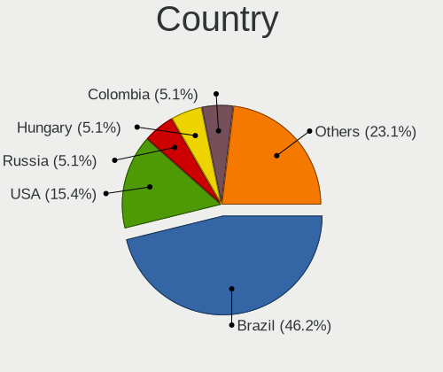
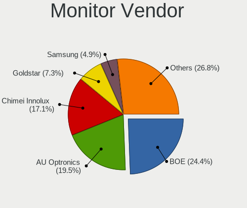
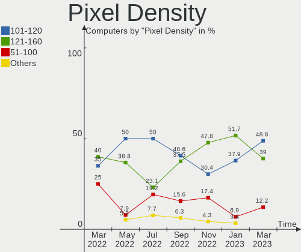
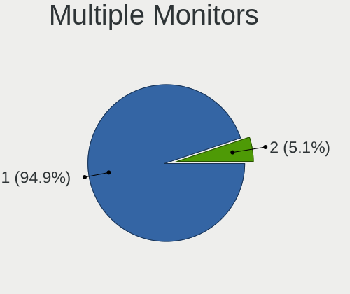
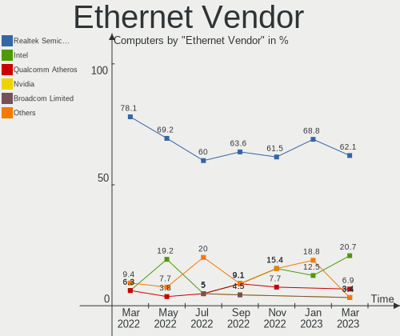
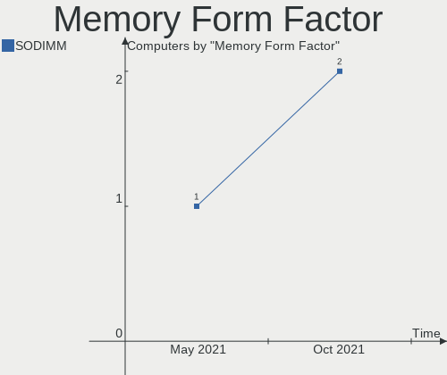
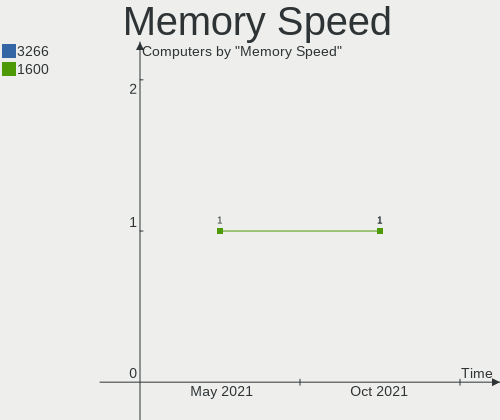
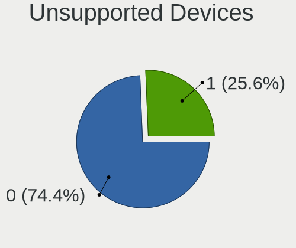

Endless Hardware Trends
-----------------------

A project to identify most popular hardware characteristics and track their change
over time based on data collected by Endless users at https://Linux-Hardware.org.

Anyone can contribute to the study by uploading probes of their computers by
the [hw-probe](https://github.com/linuxhw/hw-probe) tool:

    sudo -E hw-probe -all -upload

This is a report for all computer types. See also reports for [desktops](/Dist/Endless/Desktop/README.md) and [notebooks](/Dist/Endless/Notebook/README.md).

Full-feature report is available here: https://linux-hardware.org/?view=trends

Period: May, 2021.

Contents
--------

- [ OS                       ](#os)
- [ OS Family                ](#os-family)
- [ Kernel                   ](#kernel)
- [ Kernel Family            ](#kernel-family)
- [ Kernel Major Ver.        ](#kernel-major-ver)
- [ Arch                     ](#arch)
- [ DE                       ](#de)
- [ Display Server           ](#display-server)
- [ Display Manager          ](#display-manager)
- [ OS Lang                  ](#os-lang)
- [ Boot Mode                ](#boot-mode)
- [ Filesystem               ](#filesystem)
- [ Part. scheme             ](#part-scheme)
- [ Dual Boot with Linux/BSD ](#dual-boot-with-linux/bsd)
- [ Dual Boot (Win)          ](#dual-boot-win)
- [ Country                  ](#country)
- [ City                     ](#city)
- [ Vendor                   ](#vendor)
- [ Model                    ](#model)
- [ Model Family             ](#model-family)
- [ MFG Year                 ](#mfg-year)
- [ Form Factor              ](#form-factor)
- [ Secure Boot              ](#secure-boot)
- [ Coreboot                 ](#coreboot)
- [ RAM Size                 ](#ram-size)
- [ RAM Used                 ](#ram-used)
- [ Has CD-ROM               ](#has-cd-rom)
- [ Total Drives             ](#total-drives)
- [ Has Ethernet             ](#has-ethernet)
- [ Has WiFi                 ](#has-wifi)
- [ Has Bluetooth            ](#has-bluetooth)
- [ Drive Vendor             ](#drive-vendor)
- [ Drive Model              ](#drive-model)
- [ HDD Vendor               ](#hdd-vendor)
- [ SSD Vendor               ](#ssd-vendor)
- [ Drive Kind               ](#drive-kind)
- [ Drive Connector          ](#drive-connector)
- [ Drive Size               ](#drive-size)
- [ Space Total              ](#space-total)
- [ Space Used               ](#space-used)
- [ Malfunc. Drives          ](#malfunc-drives)
- [ Malfunc. Drive Vendor    ](#malfunc-drive-vendor)
- [ Malfunc. HDD Vendor      ](#malfunc-hdd-vendor)
- [ Malfunc. Drive Kind      ](#malfunc-drive-kind)
- [ Failed Drives            ](#failed-drives)
- [ Failed Drive Vendor      ](#failed-drive-vendor)
- [ Drive Status             ](#drive-status)
- [ Storage Vendor           ](#storage-vendor)
- [ Storage Model            ](#storage-model)
- [ Storage Kind             ](#storage-kind)
- [ CPU Vendor               ](#cpu-vendor)
- [ CPU Model                ](#cpu-model)
- [ CPU Model Family         ](#cpu-model-family)
- [ CPU Cores                ](#cpu-cores)
- [ CPU Sockets              ](#cpu-sockets)
- [ CPU Threads              ](#cpu-threads)
- [ CPU Op-Modes             ](#cpu-op-modes)
- [ CPU Microcode            ](#cpu-microcode)
- [ CPU Microarch            ](#cpu-microarch)
- [ GPU Vendor               ](#gpu-vendor)
- [ GPU Model                ](#gpu-model)
- [ GPU Combo                ](#gpu-combo)
- [ GPU Driver               ](#gpu-driver)
- [ GPU Memory               ](#gpu-memory)
- [ Monitor Vendor           ](#monitor-vendor)
- [ Monitor Model            ](#monitor-model)
- [ Monitor Resolution       ](#monitor-resolution)
- [ Monitor Diagonal         ](#monitor-diagonal)
- [ Monitor Width            ](#monitor-width)
- [ Aspect Ratio             ](#aspect-ratio)
- [ Monitor Area             ](#monitor-area)
- [ Pixel Density            ](#pixel-density)
- [ Multiple Monitors        ](#multiple-monitors)
- [ Net Controller Vendor    ](#net-controller-vendor)
- [ Net Controller Model     ](#net-controller-model)
- [ Wireless Vendor          ](#wireless-vendor)
- [ Wireless Model           ](#wireless-model)
- [ Ethernet Vendor          ](#ethernet-vendor)
- [ Ethernet Model           ](#ethernet-model)
- [ Net Controller Kind      ](#net-controller-kind)
- [ Used Controller          ](#used-controller)
- [ NICs                     ](#nics)
- [ IPv6                     ](#ipv6)
- [ Memory Vendor            ](#memory-vendor)
- [ Memory Model             ](#memory-model)
- [ Memory Kind              ](#memory-kind)
- [ Memory Form Factor       ](#memory-form-factor)
- [ Memory Size              ](#memory-size)
- [ Memory Speed             ](#memory-speed)
- [ Sound Vendor             ](#sound-vendor)
- [ Sound Model              ](#sound-model)
- [ Camera Vendor            ](#camera-vendor)
- [ Camera Model             ](#camera-model)
- [ Fingerprint Vendor       ](#fingerprint-vendor)
- [ Fingerprint Model        ](#fingerprint-model)
- [ Chipcard Vendor          ](#chipcard-vendor)
- [ Chipcard Model           ](#chipcard-model)
- [ Printer Vendor           ](#printer-vendor)
- [ Printer Model            ](#printer-model)
- [ Scanner Vendor           ](#scanner-vendor)
- [ Scanner Model            ](#scanner-model)
- [ Bluetooth Vendor         ](#bluetooth-vendor)
- [ Bluetooth Model          ](#bluetooth-model)
- [ Unsupported Devices      ](#unsupported-devices)
- [ Unsupported Device Types ](#unsupported-device-types)

OS
--

Installed operating systems

| Name                  | Computers | Percent |
|-----------------------|-----------|---------|
| Endless 3.9.4         | 54        | 78.26%  |
| Endless 3.9.3         | 6         | 8.7%    |
| Endless 3.7.8         | 3         | 4.35%   |
| Endless 3.9.0         | 2         | 2.9%    |
| Endless 3.8.7         | 1         | 1.45%   |
| Endless 3.8.6         | 1         | 1.45%   |
| Endless 3.4.3-nexthw1 | 1         | 1.45%   |
| Endless 3.4.3         | 1         | 1.45%   |

OS Family
---------

OS without a version

| Name    | Computers | Percent |
|---------|-----------|---------|
| Endless | 69        | 100%    |

Kernel
------

Version of the Linux kernel

| Version           | Computers | Percent |
|-------------------|-----------|---------|
| 5.8.0-14-generic  | 62        | 89.86%  |
| 5.3.0-28-generic  | 3         | 4.35%   |
| 5.4.0-42-generic  | 2         | 2.9%    |
| 4.16.0-4-generic  | 1         | 1.45%   |
| 4.15.0-22-generic | 1         | 1.45%   |

Kernel Family
-------------

Linux kernel without a distro release

| Version | Computers | Percent |
|---------|-----------|---------|
| 5.8.0   | 62        | 89.86%  |
| 5.3.0   | 3         | 4.35%   |
| 5.4.0   | 2         | 2.9%    |
| 4.16.0  | 1         | 1.45%   |
| 4.15.0  | 1         | 1.45%   |

Kernel Major Ver.
-----------------

Linux kernel major version

| Version | Computers | Percent |
|---------|-----------|---------|
| 5.8     | 62        | 89.86%  |
| 5.3     | 3         | 4.35%   |
| 5.4     | 2         | 2.9%    |
| 4.16    | 1         | 1.45%   |
| 4.15    | 1         | 1.45%   |

Arch
----

OS architecture (x86_64, i586, etc.)

| Name   | Computers | Percent |
|--------|-----------|---------|
| x86_64 | 69        | 100%    |

DE
--

Desktop Environment

| Name  | Computers | Percent |
|-------|-----------|---------|
| GNOME | 69        | 100%    |

Display Server
--------------

X11 or Wayland

| Name | Computers | Percent |
|------|-----------|---------|
| X11  | 69        | 100%    |

Display Manager
---------------

SDDM, LightDM, etc.

| Name    | Computers | Percent |
|---------|-----------|---------|
| Unknown | 69        | 100%    |

OS Lang
-------

Language

| Lang   | Computers | Percent |
|--------|-----------|---------|
| pt_BR  | 26        | 37.68%  |
| en_US  | 9         | 13.04%  |
| ro_RO  | 4         | 5.8%    |
| es_MX  | 4         | 5.8%    |
| ru_RU  | 3         | 4.35%   |
| it_IT  | 3         | 4.35%   |
| id_ID  | 3         | 4.35%   |
| hu_HU  | 3         | 4.35%   |
| tr_TR  | 2         | 2.9%    |
| es_AR  | 2         | 2.9%    |
| de_DE  | 2         | 2.9%    |
| uk_UA  | 1         | 1.45%   |
| ru_UA  | 1         | 1.45%   |
| nds_DE | 1         | 1.45%   |
| es_ES  | 1         | 1.45%   |
| es_EC  | 1         | 1.45%   |
| es_CL  | 1         | 1.45%   |
| en_GB  | 1         | 1.45%   |
| bg_BG  | 1         | 1.45%   |

Boot Mode
---------

EFI or BIOS

| Mode | Computers | Percent |
|------|-----------|---------|
| EFI  | 53        | 76.81%  |
| BIOS | 16        | 23.19%  |

Filesystem
----------

Type of filesystem

| Type  | Computers | Percent |
|-------|-----------|---------|
| Ext4  | 68        | 98.55%  |
| Tmpfs | 1         | 1.45%   |

Part. scheme
------------

Scheme of partitioning

| Type    | Computers | Percent |
|---------|-----------|---------|
| Unknown | 69        | 100%    |

Dual Boot with Linux/BSD
------------------------

Hosting more than one Linux/BSD

| Dual boot | Computers | Percent |
|-----------|-----------|---------|
| No        | 69        | 100%    |

Dual Boot (Win)
---------------

Hosting Linux and Windows

| Dual boot | Computers | Percent |
|-----------|-----------|---------|
| No        | 69        | 100%    |

Country
-------

Geographic location (country)

| Country     | Computers | Percent |
|-------------|-----------|---------|
| Brazil      | 27        | 39.13%  |
| Romania     | 5         | 7.25%   |
| Russia      | 4         | 5.8%    |
| Mexico      | 3         | 4.35%   |
| Italy       | 3         | 4.35%   |
| Indonesia   | 3         | 4.35%   |
| Hungary     | 3         | 4.35%   |
| Germany     | 3         | 4.35%   |
| Ukraine     | 2         | 2.9%    |
| Turkey      | 2         | 2.9%    |
| Georgia     | 2         | 2.9%    |
| Argentina   | 2         | 2.9%    |
| USA         | 1         | 1.45%   |
| Spain       | 1         | 1.45%   |
| South Korea | 1         | 1.45%   |
| Serbia      | 1         | 1.45%   |
| Philippines | 1         | 1.45%   |
| Ecuador     | 1         | 1.45%   |
| Chile       | 1         | 1.45%   |
| Canada      | 1         | 1.45%   |
| Bulgaria    | 1         | 1.45%   |
| Belarus     | 1         | 1.45%   |

City
----

Geographic location (city)

| City                   | Computers | Percent |
|------------------------|-----------|---------|
| São Paulo             | 4         | 5.8%    |
| Tbilisi                | 2         | 2.9%    |
| Santo André           | 2         | 2.9%    |
| Rio de Janeiro         | 2         | 2.9%    |
| Istanbul               | 2         | 2.9%    |
| Brasília              | 2         | 2.9%    |
| Vladimir               | 1         | 1.45%   |
| Vera Cruz              | 1         | 1.45%   |
| Urlati                 | 1         | 1.45%   |
| Ulyanovsk              | 1         | 1.45%   |
| Ubatuba                | 1         | 1.45%   |
| Trento                 | 1         | 1.45%   |
| São José dos Pinhais | 1         | 1.45%   |
| Sofia                  | 1         | 1.45%   |
| Sao Carlos             | 1         | 1.45%   |
| Rosario                | 1         | 1.45%   |
| Rome                   | 1         | 1.45%   |
| Porto Alegre           | 1         | 1.45%   |
| Pelotas                | 1         | 1.45%   |
| Pasig                  | 1         | 1.45%   |
| Orikhiv                | 1         | 1.45%   |
| Oelsberg               | 1         | 1.45%   |
| Oaxaca City            | 1         | 1.45%   |
| New York               | 1         | 1.45%   |
| Natal                  | 1         | 1.45%   |
| Nagykovacsi            | 1         | 1.45%   |
| Moscow                 | 1         | 1.45%   |
| Minsk                  | 1         | 1.45%   |
| Mexico City            | 1         | 1.45%   |
| Marília               | 1         | 1.45%   |
| Lübeck                | 1         | 1.45%   |
| Llica d'Amunt          | 1         | 1.45%   |
| Lanus                  | 1         | 1.45%   |
| La Serena              | 1         | 1.45%   |
| Kyiv                   | 1         | 1.45%   |
| Kineshma               | 1         | 1.45%   |
| Jakarta                | 1         | 1.45%   |
| Itarare                | 1         | 1.45%   |
| Itaqui                 | 1         | 1.45%   |
| Imperatriz             | 1         | 1.45%   |
| Iasi                   | 1         | 1.45%   |
| Guayaquil              | 1         | 1.45%   |
| Guadalajara            | 1         | 1.45%   |
| Garut                  | 1         | 1.45%   |
| Fazenda Rio Grande     | 1         | 1.45%   |
| Edmonton               | 1         | 1.45%   |
| Curitiba               | 1         | 1.45%   |
| Crato                  | 1         | 1.45%   |
| Coburg                 | 1         | 1.45%   |
| Cidade Ocidental       | 1         | 1.45%   |
| Chapecó               | 1         | 1.45%   |
| Caransebes             | 1         | 1.45%   |
| Cacoal                 | 1         | 1.45%   |
| Budapest               | 1         | 1.45%   |
| Bucharest              | 1         | 1.45%   |
| Brasov                 | 1         | 1.45%   |
| Belgrade               | 1         | 1.45%   |
| Bekasi                 | 1         | 1.45%   |
| Balassagyarmat         | 1         | 1.45%   |
| Aprilia                | 1         | 1.45%   |

Vendor
------

Motherboard manufacturer

| Name                | Computers | Percent |
|---------------------|-----------|---------|
| Acer                | 30        | 43.48%  |
| ASUSTek Computer    | 20        | 28.99%  |
| Hewlett-Packard     | 3         | 4.35%   |
| Samsung Electronics | 2         | 2.9%    |
| Positivo            | 2         | 2.9%    |
| Lenovo              | 2         | 2.9%    |
| Gigabyte Technology | 2         | 2.9%    |
| Dell                | 2         | 2.9%    |
| Apple               | 2         | 2.9%    |
| Toshiba             | 1         | 1.45%   |
| MSI                 | 1         | 1.45%   |
| IP3 Tech            | 1         | 1.45%   |
| ECS                 | 1         | 1.45%   |

Model
-----

Motherboard model

| Name                                       | Computers | Percent |
|--------------------------------------------|-----------|---------|
| Acer Nitro AN517-51                        | 8         | 11.59%  |
| Acer Nitro AN515-54                        | 3         | 4.35%   |
| Acer Aspire A315-56                        | 3         | 4.35%   |
| ASUS X541NA                                | 2         | 2.9%    |
| ASUS VivoBook_ASUSLaptop X509JA_X509JA     | 2         | 2.9%    |
| ASUS VivoBook 15_ASUS Laptop X540MA_X543MA | 2         | 2.9%    |
| Acer Aspire A315-34                        | 2         | 2.9%    |
| Toshiba Satellite P855                     | 1         | 1.45%   |
| Samsung RV415                              | 1         | 1.45%   |
| Samsung 340XAA/350XAA/550XAA               | 1         | 1.45%   |
| Positivo Smash                             | 1         | 1.45%   |
| Positivo CHT14B                            | 1         | 1.45%   |
| MSI MS-7A15                                | 1         | 1.45%   |
| Lenovo ThinkCentre M58e 7303AS6            | 1         | 1.45%   |
| Lenovo 720-15IKB 81CQ                      | 1         | 1.45%   |
| IP3 Tech Endless                           | 1         | 1.45%   |
| HP ProBook 445 G7                          | 1         | 1.45%   |
| HP Pavilion dv5                            | 1         | 1.45%   |
| HP 255 G7 Notebook PC                      | 1         | 1.45%   |
| Gigabyte 965GM-S2                          | 1         | 1.45%   |
| Gigabyte 945GCM-S2C                        | 1         | 1.45%   |
| ECS APLD-I                                 | 1         | 1.45%   |
| Dell Latitude E7450                        | 1         | 1.45%   |
| Dell Latitude E6400                        | 1         | 1.45%   |
| ASUS X550JX                                | 1         | 1.45%   |
| ASUS X541UJ                                | 1         | 1.45%   |
| ASUS X441NA                                | 1         | 1.45%   |
| ASUS VivoBook_ASUSLaptop X712FA_X712FA     | 1         | 1.45%   |
| ASUS VivoBook_ASUSLaptop X705FD            | 1         | 1.45%   |
| ASUS VivoBook 15_ASUS Laptop X540UAR       | 1         | 1.45%   |
| ASUS VivoBook 15_ASUS Laptop X540MA_R540MA | 1         | 1.45%   |
| ASUS VivoBook 15_ASUS Laptop X540MA_F543MA | 1         | 1.45%   |
| ASUS VivoBook 15_ASUS Laptop X540BA        | 1         | 1.45%   |
| ASUS VivoBook 15_ASUS Laptop X507UF        | 1         | 1.45%   |
| ASUS VivoBook 14_ASUS Laptop X407UAR       | 1         | 1.45%   |
| ASUS GL553VE                               | 1         | 1.45%   |
| ASUS ASUS Vivo AIO V241EA_V241EA           | 1         | 1.45%   |
| ASUS All Series                            | 1         | 1.45%   |
| Apple iMac7,1                              | 1         | 1.45%   |
| Apple iMac10,1                             | 1         | 1.45%   |
| Acer Veriton M2611                         | 1         | 1.45%   |
| Acer TravelMate B117-M                     | 1         | 1.45%   |
| Acer Switch One SW1-011                    | 1         | 1.45%   |
| Acer Nitro N50-610                         | 1         | 1.45%   |
| Acer Nitro AN515-52                        | 1         | 1.45%   |
| Acer Extensa 2519                          | 1         | 1.45%   |
| Acer Aspire X1900                          | 1         | 1.45%   |
| Acer Aspire V5-121                         | 1         | 1.45%   |
| Acer Aspire ES1-332                        | 1         | 1.45%   |
| Acer Aspire C22-865                        | 1         | 1.45%   |
| Acer Aspire A517-51                        | 1         | 1.45%   |
| Acer Aspire A317-51G                       | 1         | 1.45%   |
| Acer Aspire A315-53                        | 1         | 1.45%   |
| Acer Aspire A315-33                        | 1         | 1.45%   |

Model Family
------------

Motherboard model prefix

| Name                | Computers | Percent |
|---------------------|-----------|---------|
| Acer Nitro          | 13        | 18.84%  |
| Acer Aspire         | 13        | 18.84%  |
| ASUS VivoBook       | 12        | 17.39%  |
| Dell Latitude       | 2         | 2.9%    |
| ASUS X541NA         | 2         | 2.9%    |
| Toshiba Satellite   | 1         | 1.45%   |
| Samsung RV415       | 1         | 1.45%   |
| Samsung 340XAA      | 1         | 1.45%   |
| Positivo Smash      | 1         | 1.45%   |
| Positivo CHT14B     | 1         | 1.45%   |
| MSI MS-7A15         | 1         | 1.45%   |
| Lenovo ThinkCentre  | 1         | 1.45%   |
| Lenovo 720-15IKB    | 1         | 1.45%   |
| IP3 Tech Endless    | 1         | 1.45%   |
| HP ProBook          | 1         | 1.45%   |
| HP Pavilion         | 1         | 1.45%   |
| HP 255              | 1         | 1.45%   |
| Gigabyte 965GM-S2   | 1         | 1.45%   |
| Gigabyte 945GCM-S2C | 1         | 1.45%   |
| ECS APLD-I          | 1         | 1.45%   |
| ASUS X550JX         | 1         | 1.45%   |
| ASUS X541UJ         | 1         | 1.45%   |
| ASUS X441NA         | 1         | 1.45%   |
| ASUS GL553VE        | 1         | 1.45%   |
| ASUS ASUS           | 1         | 1.45%   |
| ASUS All            | 1         | 1.45%   |
| Apple iMac7         | 1         | 1.45%   |
| Apple iMac10        | 1         | 1.45%   |
| Acer Veriton        | 1         | 1.45%   |
| Acer TravelMate     | 1         | 1.45%   |
| Acer Switch         | 1         | 1.45%   |
| Acer Extensa        | 1         | 1.45%   |

MFG Year
--------

Motherboard manufacture year

| Year | Computers | Percent |
|------|-----------|---------|
| 2020 | 21        | 30.43%  |
| 2019 | 19        | 27.54%  |
| 2018 | 8         | 11.59%  |
| 2017 | 7         | 10.14%  |
| 2015 | 2         | 2.9%    |
| 2013 | 2         | 2.9%    |
| 2009 | 2         | 2.9%    |
| 2008 | 2         | 2.9%    |
| 2021 | 1         | 1.45%   |
| 2016 | 1         | 1.45%   |
| 2012 | 1         | 1.45%   |
| 2011 | 1         | 1.45%   |
| 2010 | 1         | 1.45%   |
| 2007 | 1         | 1.45%   |

Form Factor
-----------

Physical design of the computer

| Name       | Computers | Percent |
|------------|-----------|---------|
| Notebook   | 55        | 79.71%  |
| Desktop    | 9         | 13.04%  |
| All in one | 4         | 5.8%    |
| Mini pc    | 1         | 1.45%   |

Secure Boot
-----------

Enabled or disabled

| State    | Computers | Percent |
|----------|-----------|---------|
| Disabled | 46        | 66.67%  |
| Enabled  | 23        | 33.33%  |

Coreboot
--------

Have coreboot on board

| Used | Computers | Percent |
|------|-----------|---------|
| No   | 69        | 100%    |

RAM Size
--------

Total RAM memory

| Size in GB | Computers | Percent |
|------------|-----------|---------|
| 3.01-4.0   | 35        | 50.72%  |
| 4.01-8.0   | 22        | 31.88%  |
| 1.01-2.0   | 4         | 5.8%    |
| 8.01-16.0  | 4         | 5.8%    |
| 16.01-24.0 | 3         | 4.35%   |
| 24.01-32.0 | 1         | 1.45%   |

RAM Used
--------

Used RAM memory

| Used GB  | Computers | Percent |
|----------|-----------|---------|
| 1.01-2.0 | 42        | 60.87%  |
| 2.01-3.0 | 14        | 20.29%  |
| 0.51-1.0 | 6         | 8.7%    |
| 3.01-4.0 | 4         | 5.8%    |
| 4.01-8.0 | 3         | 4.35%   |

Has CD-ROM
----------

Has CD-ROM on board

| Presented | Computers | Percent |
|-----------|-----------|---------|
| No        | 56        | 81.16%  |
| Yes       | 13        | 18.84%  |

Total Drives
------------

Number of drives on board

| Drives | Computers | Percent |
|--------|-----------|---------|
| 1      | 53        | 76.81%  |
| 2      | 15        | 21.74%  |
| 3      | 1         | 1.45%   |

Has Ethernet
------------

Has Ethernet on board

| Presented | Computers | Percent |
|-----------|-----------|---------|
| Yes       | 55        | 79.71%  |
| No        | 14        | 20.29%  |

Has WiFi
--------

Has WiFi module

| Presented | Computers | Percent |
|-----------|-----------|---------|
| Yes       | 58        | 84.06%  |
| No        | 11        | 15.94%  |

Has Bluetooth
-------------

Has Bluetooth module

| Presented | Computers | Percent |
|-----------|-----------|---------|
| Yes       | 53        | 76.81%  |
| No        | 16        | 23.19%  |

Drive Vendor
------------

Hard drive vendors

| Vendor              | Computers | Drives | Percent |
|---------------------|-----------|--------|---------|
| WDC                 | 18        | 19     | 21.43%  |
| Intel               | 16        | 16     | 19.05%  |
| Seagate             | 12        | 12     | 14.29%  |
| Kingston            | 8         | 8      | 9.52%   |
| Toshiba             | 7         | 7      | 8.33%   |
| Samsung Electronics | 5         | 5      | 5.95%   |
| Unknown             | 4         | 6      | 4.76%   |
| SanDisk             | 4         | 4      | 4.76%   |
| SK Hynix            | 2         | 2      | 2.38%   |
| A-DATA Technology   | 2         | 2      | 2.38%   |
| TSA                 | 1         | 1      | 1.19%   |
| Smart               | 1         | 1      | 1.19%   |
| LITEON              | 1         | 1      | 1.19%   |
| KingDian            | 1         | 1      | 1.19%   |
| Hitachi             | 1         | 1      | 1.19%   |
| Crucial             | 1         | 1      | 1.19%   |

Drive Model
-----------

Hard drive models

| Model                                 | Computers | Percent |
|---------------------------------------|-----------|---------|
| WDC WD10SPZX-21Z10T0 1TB              | 11        | 12.79%  |
| Intel NVMe SSD Drive 128GB            | 8         | 9.3%    |
| Seagate ST1000LM035-1RK172 1TB        | 7         | 8.14%   |
| Kingston RBUSC180DS37256GJ 256GB SSD  | 5         | 5.81%   |
| Intel NVMe SSD Drive 256GB            | 5         | 5.81%   |
| Unknown MMC Card  32GB                | 3         | 3.49%   |
| Toshiba MQ04ABF100 1TB                | 3         | 3.49%   |
| Toshiba MQ01ABF050 500GB              | 3         | 3.49%   |
| Intel NVMe SSD Drive 512GB            | 3         | 3.49%   |
| Samsung NVMe SSD Drive 256GB          | 2         | 2.33%   |
| WDC WD5000LPZX-60Z10T0 500GB          | 1         | 1.16%   |
| WDC WD5000LPVX-22V0TT0 500GB          | 1         | 1.16%   |
| WDC WD5000LPCX-21VHAT0 500GB          | 1         | 1.16%   |
| WDC WD5000AVVS-63M8B0 500GB           | 1         | 1.16%   |
| WDC WD3200AAJS-22L7A0 320GB           | 1         | 1.16%   |
| WDC WD2500AAJS-08L7A0 250GB           | 1         | 1.16%   |
| WDC WD10JPVX-75JC3T0 1TB              | 1         | 1.16%   |
| WDC WD Elements 2TB                   | 1         | 1.16%   |
| Unknown MMC Card  7GB                 | 1         | 1.16%   |
| Unknown MMC Card  64GB                | 1         | 1.16%   |
| TSA SSD 64GB                          | 1         | 1.16%   |
| Toshiba MQ01ABF050R 500GB             | 1         | 1.16%   |
| Smart 120GB                           | 1         | 1.16%   |
| SK Hynix HFS256G39TND-N210A 256GB SSD | 1         | 1.16%   |
| SK Hynix HFS128G32TND-N210A 128GB SSD | 1         | 1.16%   |
| Seagate ST3500418ASQ 500GB            | 1         | 1.16%   |
| Seagate ST3250823A 250GB              | 1         | 1.16%   |
| Seagate ST320LM001 HN-M320MBB 320GB   | 1         | 1.16%   |
| Seagate ST2000LM007-1R8174 2TB        | 1         | 1.16%   |
| Seagate ST1000LM048-2E7172 1TB        | 1         | 1.16%   |
| SanDisk SD9SN8W256G1014 256GB SSD     | 1         | 1.16%   |
| SanDisk SD9SB8W128G1014 128GB SSD     | 1         | 1.16%   |
| SanDisk SD8SBAT128G1002 128GB SSD     | 1         | 1.16%   |
| Sandisk NVMe SSD Drive 512GB          | 1         | 1.16%   |
| Samsung SSD 860 QVO 2TB               | 1         | 1.16%   |
| Samsung NVMe SSD Drive 250GB          | 1         | 1.16%   |
| Samsung HM320JI 320GB                 | 1         | 1.16%   |
| LITEON CV3-8D128 128GB SSD            | 1         | 1.16%   |
| Kingston SV300S37A120G 120GB SSD      | 1         | 1.16%   |
| Kingston SA400S37480G 480GB SSD       | 1         | 1.16%   |
| Kingston NVMe SSD Drive 512GB         | 1         | 1.16%   |
| KingDian S280 1TB SSD                 | 1         | 1.16%   |
| Hitachi HTS543225L9A300 250GB         | 1         | 1.16%   |
| Crucial CT500MX500SSD1 500GB          | 1         | 1.16%   |
| A-DATA SU630 960GB SSD                | 1         | 1.16%   |
| A-DATA IM2S3338-128GD2 128GB SSD      | 1         | 1.16%   |

HDD Vendor
----------

Hard disk drive vendors

| Vendor              | Computers | Drives | Percent |
|---------------------|-----------|--------|---------|
| WDC                 | 18        | 18     | 46.15%  |
| Seagate             | 12        | 12     | 30.77%  |
| Toshiba             | 7         | 7      | 17.95%  |
| Samsung Electronics | 1         | 1      | 2.56%   |
| Hitachi             | 1         | 1      | 2.56%   |

SSD Vendor
----------

Solid state drive vendors

| Vendor              | Computers | Drives | Percent |
|---------------------|-----------|--------|---------|
| Kingston            | 7         | 7      | 36.84%  |
| SanDisk             | 3         | 3      | 15.79%  |
| SK Hynix            | 2         | 2      | 10.53%  |
| A-DATA Technology   | 2         | 2      | 10.53%  |
| TSA                 | 1         | 1      | 5.26%   |
| Samsung Electronics | 1         | 1      | 5.26%   |
| LITEON              | 1         | 1      | 5.26%   |
| KingDian            | 1         | 1      | 5.26%   |
| Crucial             | 1         | 1      | 5.26%   |

Drive Kind
----------

HDD or SSD

| Kind    | Computers | Drives | Percent |
|---------|-----------|--------|---------|
| HDD     | 38        | 39     | 46.34%  |
| NVMe    | 20        | 21     | 24.39%  |
| SSD     | 18        | 19     | 21.95%  |
| MMC     | 4         | 6      | 4.88%   |
| Unknown | 2         | 2      | 2.44%   |

Drive Connector
---------------

SATA, SAS, NVMe, etc.

| Type | Computers | Drives | Percent |
|------|-----------|--------|---------|
| SATA | 55        | 59     | 68.75%  |
| NVMe | 20        | 21     | 25%     |
| MMC  | 4         | 6      | 5%      |
| SAS  | 1         | 1      | 1.25%   |

Drive Size
----------

Size of hard drive

| Size in TB | Computers | Drives | Percent |
|------------|-----------|--------|---------|
| 0.01-0.5   | 30        | 31     | 53.57%  |
| 0.51-1.0   | 24        | 25     | 42.86%  |
| 1.01-2.0   | 2         | 2      | 3.57%   |

Space Total
-----------

Amount of disk space available on the file system

| Size in GB | Computers | Percent |
|------------|-----------|---------|
| 101-250    | 21        | 30.43%  |
| 501-1000   | 20        | 28.99%  |
| 251-500    | 14        | 20.29%  |
| 51-100     | 5         | 7.25%   |
| 21-50      | 4         | 5.8%    |
| 1001-2000  | 2         | 2.9%    |
| 2001-3000  | 1         | 1.45%   |
| 1-20       | 1         | 1.45%   |
| Unknown    | 1         | 1.45%   |

Space Used
----------

Amount of used disk space

| Used GB   | Computers | Percent |
|-----------|-----------|---------|
| 21-50     | 33        | 47.83%  |
| 51-100    | 15        | 21.74%  |
| 1-20      | 10        | 14.49%  |
| 101-250   | 7         | 10.14%  |
| 251-500   | 1         | 1.45%   |
| 1001-2000 | 1         | 1.45%   |
| 501-1000  | 1         | 1.45%   |
| Unknown   | 1         | 1.45%   |

Malfunc. Drives
---------------

Drive models with a malfunction

Zero info for selected period =(

Malfunc. Drive Vendor
---------------------

Vendors of faulty drives

Zero info for selected period =(

Malfunc. HDD Vendor
-------------------

Vendors of faulty HDD drives

Zero info for selected period =(

Malfunc. Drive Kind
-------------------

Kinds of faulty drives

Zero info for selected period =(

Failed Drives
-------------

Failed drive models

Zero info for selected period =(

Failed Drive Vendor
-------------------

Failed drive vendors

Zero info for selected period =(

Drive Status
------------

Number of failed and malfunc. drives

| Status   | Computers | Drives | Percent |
|----------|-----------|--------|---------|
| Detected | 69        | 87     | 100%    |

Storage Vendor
--------------

Storage controller vendors

| Vendor                      | Computers | Percent |
|-----------------------------|-----------|---------|
| Intel                       | 60        | 83.33%  |
| AMD                         | 5         | 6.94%   |
| Samsung Electronics         | 3         | 4.17%   |
| Sandisk                     | 1         | 1.39%   |
| Nvidia                      | 1         | 1.39%   |
| Kingston Technology Company | 1         | 1.39%   |
| JMicron Technology          | 1         | 1.39%   |

Storage Model
-------------

Storage controller models

| Model                                                                            | Computers | Percent |
|----------------------------------------------------------------------------------|-----------|---------|
| Intel 82801 Mobile SATA Controller [RAID mode]                                   | 22        | 23.4%   |
| Intel PROSet/Wireless WiFi Software extension                                    | 16        | 17.02%  |
| Intel Sunrise Point-LP SATA Controller [AHCI mode]                               | 7         | 7.45%   |
| Intel Celeron/Pentium Silver Processor SATA Controller                           | 6         | 6.38%   |
| Intel Celeron N3350/Pentium N4200/Atom E3900 Series SATA AHCI Controller         | 6         | 6.38%   |
| AMD FCH SATA Controller [AHCI mode]                                              | 4         | 4.26%   |
| Intel NM10/ICH7 Family SATA Controller [IDE mode]                                | 3         | 3.19%   |
| Intel Atom/Celeron/Pentium Processor x5-E8000/J3xxx/N3xxx Series SATA Controller | 3         | 3.19%   |
| Samsung NVMe Controller                                                          | 2         | 2.13%   |
| Intel HM170/QM170 Chipset SATA Controller [AHCI Mode]                            | 2         | 2.13%   |
| Intel Cannon Lake Mobile PCH SATA AHCI Controller                                | 2         | 2.13%   |
| Intel 82801G (ICH7 Family) IDE Controller                                        | 2         | 2.13%   |
| Sandisk WD Blue SN500 / PC SN520 NVMe SSD                                        | 1         | 1.06%   |
| Samsung NVMe SSD Controller SM981/PM981/PM983                                    | 1         | 1.06%   |
| Nvidia MCP79 AHCI Controller                                                     | 1         | 1.06%   |
| Kingston Company Company Non-Volatile memory controller                          | 1         | 1.06%   |
| JMicron JMB363 SATA/IDE Controller                                               | 1         | 1.06%   |
| Intel Volume Management Device NVMe RAID Controller                              | 1         | 1.06%   |
| Intel Tiger Lake-LP SATA Controller [AHCI mode]                                  | 1         | 1.06%   |
| Intel Q170/Q150/B150/H170/H110/Z170/CM236 Chipset SATA Controller [AHCI Mode]    | 1         | 1.06%   |
| Intel Comet Lake SATA AHCI Controller                                            | 1         | 1.06%   |
| Intel Atom Processor E3800 Series SATA AHCI Controller                           | 1         | 1.06%   |
| Intel 82801IBM/IEM (ICH9M/ICH9M-E) 4 port SATA Controller [AHCI mode]            | 1         | 1.06%   |
| Intel 82801HR/HO/HH (ICH8R/DO/DH) 2 port SATA Controller [IDE mode]              | 1         | 1.06%   |
| Intel 82801HM/HEM (ICH8M/ICH8M-E) SATA Controller [AHCI mode]                    | 1         | 1.06%   |
| Intel 82801HM/HEM (ICH8M/ICH8M-E) IDE Controller                                 | 1         | 1.06%   |
| Intel 82801H (ICH8 Family) 4 port SATA Controller [IDE mode]                     | 1         | 1.06%   |
| Intel 8 Series/C220 Series Chipset Family 6-port SATA Controller 1 [AHCI mode]   | 1         | 1.06%   |
| Intel 7 Series Chipset Family 6-port SATA Controller [AHCI mode]                 | 1         | 1.06%   |
| Intel 6 Series/C200 Series Chipset Family 6 port Desktop SATA AHCI Controller    | 1         | 1.06%   |
| AMD SB7x0/SB8x0/SB9x0 SATA Controller [IDE mode]                                 | 1         | 1.06%   |

Storage Kind
------------

Kind of storage controller (IDE, SATA, NVMe, SAS, ...)

| Kind | Computers | Percent |
|------|-----------|---------|
| SATA | 57        | 64.77%  |
| NVMe | 20        | 22.73%  |
| RAID | 6         | 6.82%   |
| IDE  | 5         | 5.68%   |

CPU Vendor
----------

Processor vendors

| Vendor | Computers | Percent |
|--------|-----------|---------|
| Intel  | 64        | 92.75%  |
| AMD    | 5         | 7.25%   |

CPU Model
---------

Processor models

| Model                                        | Computers | Percent |
|----------------------------------------------|-----------|---------|
| Intel Core i5-9300H CPU @ 2.40GHz            | 11        | 15.94%  |
| Intel Core i5-1035G1 CPU @ 1.00GHz           | 4         | 5.8%    |
| Intel Celeron N4000 CPU @ 1.10GHz            | 4         | 5.8%    |
| Intel Core i3-8130U CPU @ 2.20GHz            | 3         | 4.35%   |
| Intel Core i3-7020U CPU @ 2.30GHz            | 3         | 4.35%   |
| Intel Core i7-8565U CPU @ 1.80GHz            | 2         | 2.9%    |
| Intel Core i7-7700HQ CPU @ 2.80GHz           | 2         | 2.9%    |
| Intel Celeron N4000C CPU @ 1.10GHz           | 2         | 2.9%    |
| Intel Celeron CPU N3450 @ 1.10GHz            | 2         | 2.9%    |
| Intel Celeron CPU N3350 @ 1.10GHz            | 2         | 2.9%    |
| Intel Atom x5-Z8350 CPU @ 1.44GHz            | 2         | 2.9%    |
| Intel Pentium Dual-Core CPU E5700 @ 3.00GHz  | 1         | 1.45%   |
| Intel Pentium CPU N4200 @ 1.10GHz            | 1         | 1.45%   |
| Intel Pentium CPU G4560 @ 3.50GHz            | 1         | 1.45%   |
| Intel Pentium CPU G2030 @ 3.00GHz            | 1         | 1.45%   |
| Intel Core i7-5600U CPU @ 2.60GHz            | 1         | 1.45%   |
| Intel Core i7-4720HQ CPU @ 2.60GHz           | 1         | 1.45%   |
| Intel Core i7-3610QM CPU @ 2.30GHz           | 1         | 1.45%   |
| Intel Core i5-8300H CPU @ 2.30GHz            | 1         | 1.45%   |
| Intel Core i5-8250U CPU @ 1.60GHz            | 1         | 1.45%   |
| Intel Core i5-10400F CPU @ 2.90GHz           | 1         | 1.45%   |
| Intel Core i5-10210U CPU @ 1.60GHz           | 1         | 1.45%   |
| Intel Core i3-6006U CPU @ 2.00GHz            | 1         | 1.45%   |
| Intel Core i3-1005G1 CPU @ 1.20GHz           | 1         | 1.45%   |
| Intel Core 2 Duo CPU T7300 @ 2.00GHz         | 1         | 1.45%   |
| Intel Core 2 Duo CPU T5800 @ 2.00GHz         | 1         | 1.45%   |
| Intel Core 2 Duo CPU P8700 @ 2.53GHz         | 1         | 1.45%   |
| Intel Core 2 Duo CPU E8400 @ 3.00GHz         | 1         | 1.45%   |
| Intel Core 2 Duo CPU E7600 @ 3.06GHz         | 1         | 1.45%   |
| Intel Core 2 Duo CPU E7400 @ 2.80GHz         | 1         | 1.45%   |
| Intel Core 2 CPU 6600 @ 2.40GHz              | 1         | 1.45%   |
| Intel Celeron CPU N3160 @ 1.60GHz            | 1         | 1.45%   |
| Intel Celeron CPU N3060 @ 1.60GHz            | 1         | 1.45%   |
| Intel Celeron CPU J3355 @ 2.00GHz            | 1         | 1.45%   |
| Intel Celeron CPU J1800 @ 2.41GHz            | 1         | 1.45%   |
| Intel Atom x5-Z8330 CPU @ 1.44GHz            | 1         | 1.45%   |
| Intel Atom x5-E8000 CPU @ 1.04GHz            | 1         | 1.45%   |
| Intel 11th Gen Core i5-1135G7 @ 2.40GHz      | 1         | 1.45%   |
| AMD Ryzen 5 4500U with Radeon Graphics       | 1         | 1.45%   |
| AMD E-300 APU with Radeon HD Graphics        | 1         | 1.45%   |
| AMD C-70 APU with Radeon HD Graphics         | 1         | 1.45%   |
| AMD Athlon Silver 3050U with Radeon Graphics | 1         | 1.45%   |
| AMD A6-9225 RADEON R4, 5 COMPUTE CORES 2C+3G | 1         | 1.45%   |

CPU Model Family
----------------

Processor model prefix

| Model                   | Computers | Percent |
|-------------------------|-----------|---------|
| Intel Core i5           | 19        | 27.54%  |
| Intel Celeron           | 14        | 20.29%  |
| Intel Core i3           | 8         | 11.59%  |
| Intel Core i7           | 7         | 10.14%  |
| Intel Core 2 Duo        | 6         | 8.7%    |
| Intel Atom              | 4         | 5.8%    |
| Intel Pentium           | 3         | 4.35%   |
| Other                   | 1         | 1.45%   |
| Intel Pentium Dual-Core | 1         | 1.45%   |
| Intel Core 2            | 1         | 1.45%   |
| AMD Ryzen 5             | 1         | 1.45%   |
| AMD E                   | 1         | 1.45%   |
| AMD C-70                | 1         | 1.45%   |
| AMD Athlon              | 1         | 1.45%   |
| AMD A6                  | 1         | 1.45%   |

CPU Cores
---------

Number of processor cores

| Number | Computers | Percent |
|--------|-----------|---------|
| 2      | 34        | 49.28%  |
| 4      | 33        | 47.83%  |
| 6      | 2         | 2.9%    |

CPU Sockets
-----------

Number of sockets

| Number | Computers | Percent |
|--------|-----------|---------|
| 1      | 69        | 100%    |

CPU Threads
-----------

Threads per core (Hyper-Threading)

| Number | Computers | Percent |
|--------|-----------|---------|
| 2      | 36        | 52.17%  |
| 1      | 33        | 47.83%  |

CPU Op-Modes
------------

CPU Operation Modes (32-bit, 64-bit)

| Op mode        | Computers | Percent |
|----------------|-----------|---------|
| 32-bit, 64-bit | 69        | 100%    |

CPU Microcode
-------------

Microcode number

| Number     | Computers | Percent |
|------------|-----------|---------|
| 0x906ed    | 8         | 11.59%  |
| 0x506c9    | 6         | 8.7%    |
| 0x406c4    | 6         | 8.7%    |
| 0x806ea    | 5         | 7.25%   |
| 0x706e5    | 5         | 7.25%   |
| 0x706a1    | 5         | 7.25%   |
| 0x1067a    | 5         | 7.25%   |
| 0x906ea    | 4         | 5.8%    |
| 0x906e9    | 3         | 4.35%   |
| 0x806eb    | 2         | 2.9%    |
| 0x306a9    | 2         | 2.9%    |
| 0x05000119 | 2         | 2.9%    |
| Unknown    | 2         | 2.9%    |
| 0xa0653    | 1         | 1.45%   |
| 0x806ec    | 1         | 1.45%   |
| 0x806e9    | 1         | 1.45%   |
| 0x806c1    | 1         | 1.45%   |
| 0x6fd      | 1         | 1.45%   |
| 0x6fa      | 1         | 1.45%   |
| 0x6f6      | 1         | 1.45%   |
| 0x406e3    | 1         | 1.45%   |
| 0x306d4    | 1         | 1.45%   |
| 0x306c3    | 1         | 1.45%   |
| 0x30679    | 1         | 1.45%   |
| 0x08600106 | 1         | 1.45%   |
| 0x08108109 | 1         | 1.45%   |
| 0x06006705 | 1         | 1.45%   |

CPU Microarch
-------------

Microarchitecture

| Name          | Computers | Percent |
|---------------|-----------|---------|
| KabyLake      | 25        | 36.23%  |
| Silvermont    | 7         | 10.14%  |
| Goldmont plus | 6         | 8.7%    |
| Goldmont      | 6         | 8.7%    |
| Penryn        | 5         | 7.25%   |
| IceLake       | 5         | 7.25%   |
| Core          | 3         | 4.35%   |
| IvyBridge     | 2         | 2.9%    |
| Bobcat        | 2         | 2.9%    |
| Zen+          | 1         | 1.45%   |
| Zen 2         | 1         | 1.45%   |
| TigerLake     | 1         | 1.45%   |
| Skylake       | 1         | 1.45%   |
| Haswell       | 1         | 1.45%   |
| Excavator     | 1         | 1.45%   |
| CometLake     | 1         | 1.45%   |
| Broadwell     | 1         | 1.45%   |

GPU Vendor
----------

Vendors of graphics cards

| Vendor | Computers | Percent |
|--------|-----------|---------|
| Intel  | 59        | 66.29%  |
| Nvidia | 24        | 26.97%  |
| AMD    | 6         | 6.74%   |

GPU Model
---------

Graphics card models

| Model                                                                                    | Computers | Percent |
|------------------------------------------------------------------------------------------|-----------|---------|
| Intel CoffeeLake-H GT2 [UHD Graphics 630]                                                | 12        | 13.48%  |
| Nvidia TU117M [GeForce GTX 1650 Mobile / Max-Q]                                          | 11        | 12.36%  |
| Intel GeminiLake [UHD Graphics 600]                                                      | 6         | 6.74%   |
| Intel Atom/Celeron/Pentium Processor x5-E8000/J3xxx/N3xxx Integrated Graphics Controller | 6         | 6.74%   |
| Intel Iris Plus Graphics G1 (Ice Lake)                                                   | 5         | 5.62%   |
| Intel HD Graphics 500                                                                    | 5         | 5.62%   |
| Intel UHD Graphics 620                                                                   | 4         | 4.49%   |
| Nvidia GP107M [GeForce GTX 1050 Mobile]                                                  | 2         | 2.25%   |
| Intel WhiskeyLake-U GT2 [UHD Graphics 620]                                               | 2         | 2.25%   |
| Intel Kaby Lake-U GT2f HD 620 Graphics Controller                                        | 2         | 2.25%   |
| Intel HD Graphics 630                                                                    | 2         | 2.25%   |
| Intel 4 Series Chipset Integrated Graphics Controller                                    | 2         | 2.25%   |
| Nvidia TU117 [GeForce GTX 1650]                                                          | 1         | 1.12%   |
| Nvidia MCP7A [GeForce 9400]                                                              | 1         | 1.12%   |
| Nvidia GP108M [GeForce MX230]                                                            | 1         | 1.12%   |
| Nvidia GP108 [GeForce GT 1030]                                                           | 1         | 1.12%   |
| Nvidia GP107M [GeForce GTX 1050 Ti Mobile]                                               | 1         | 1.12%   |
| Nvidia GP106M [GeForce GTX 1060 Mobile]                                                  | 1         | 1.12%   |
| Nvidia GM108M [GeForce MX130]                                                            | 1         | 1.12%   |
| Nvidia GM107M [GeForce GTX 950M]                                                         | 1         | 1.12%   |
| Nvidia GK208BM [GeForce 920M]                                                            | 1         | 1.12%   |
| Nvidia GF108M [GeForce GT 620M/630M/635M/640M LE]                                        | 1         | 1.12%   |
| Nvidia G98M [GeForce 9200M GS]                                                           | 1         | 1.12%   |
| Intel Xeon E3-1200 v2/3rd Gen Core processor Graphics Controller                         | 1         | 1.12%   |
| Intel TigerLake-LP GT2 [Iris Xe Graphics]                                                | 1         | 1.12%   |
| Intel Skylake GT2 [HD Graphics 520]                                                      | 1         | 1.12%   |
| Intel Mobile 4 Series Chipset Integrated Graphics Controller                             | 1         | 1.12%   |
| Intel HD Graphics 620                                                                    | 1         | 1.12%   |
| Intel HD Graphics 5500                                                                   | 1         | 1.12%   |
| Intel CometLake-U GT2 [UHD Graphics]                                                     | 1         | 1.12%   |
| Intel Celeron N3350/Pentium N4200/Atom E3900 Series Integrated Graphics Controller       | 1         | 1.12%   |
| Intel Atom Processor Z36xxx/Z37xxx Series Graphics & Display                             | 1         | 1.12%   |
| Intel 82G965 Integrated Graphics Controller                                              | 1         | 1.12%   |
| Intel 82945G/GZ Integrated Graphics Controller                                           | 1         | 1.12%   |
| Intel 4th Gen Core Processor Integrated Graphics Controller                              | 1         | 1.12%   |
| Intel 3rd Gen Core processor Graphics Controller                                         | 1         | 1.12%   |
| AMD Wrestler [Radeon HD 7290]                                                            | 1         | 1.12%   |
| AMD Wrestler [Radeon HD 6310]                                                            | 1         | 1.12%   |
| AMD Stoney [Radeon R2/R3/R4/R5 Graphics]                                                 | 1         | 1.12%   |
| AMD RV610/M74 [Mobility Radeon HD 2400 XT]                                               | 1         | 1.12%   |
| AMD Renoir                                                                               | 1         | 1.12%   |
| AMD Picasso                                                                              | 1         | 1.12%   |

GPU Combo
---------

Combinations of graphics cards

| Name           | Computers | Percent |
|----------------|-----------|---------|
| 1 x Intel      | 39        | 56.52%  |
| Intel + Nvidia | 20        | 28.99%  |
| 1 x AMD        | 6         | 8.7%    |
| 1 x Nvidia     | 4         | 5.8%    |

GPU Driver
----------

Free vs proprietary

| Driver      | Computers | Percent |
|-------------|-----------|---------|
| Free        | 49        | 71.01%  |
| Proprietary | 20        | 28.99%  |

GPU Memory
----------

Total video memory

| Size in GB | Computers | Percent |
|------------|-----------|---------|
| Unknown    | 57        | 82.61%  |
| 0.01-0.5   | 7         | 10.14%  |
| 1.01-2.0   | 3         | 4.35%   |
| 3.01-4.0   | 2         | 2.9%    |

Monitor Vendor
--------------

Monitor vendors

| Vendor              | Computers | Percent |
|---------------------|-----------|---------|
| BOE                 | 21        | 30.88%  |
| Chimei Innolux      | 13        | 19.12%  |
| AU Optronics        | 9         | 13.24%  |
| Samsung Electronics | 6         | 8.82%   |
| LG Display          | 5         | 7.35%   |
| Goldstar            | 2         | 2.94%   |
| Apple               | 2         | 2.94%   |
| SLD                 | 1         | 1.47%   |
| SAC                 | 1         | 1.47%   |
| Philips             | 1         | 1.47%   |
| PANDA               | 1         | 1.47%   |
| LG Philips          | 1         | 1.47%   |
| Hewlett-Packard     | 1         | 1.47%   |
| eMachines           | 1         | 1.47%   |
| Dell                | 1         | 1.47%   |
| ASUSTek Computer    | 1         | 1.47%   |
| Acer                | 1         | 1.47%   |

Monitor Model
-------------

Monitor models

| Model                                                                | Computers | Percent |
|----------------------------------------------------------------------|-----------|---------|
| BOE LCD Monitor BOE0839 1920x1080 382x215mm 17.3-inch                | 6         | 8.82%   |
| BOE LCD Monitor BOE07CE 1366x768 344x193mm 15.5-inch                 | 4         | 5.88%   |
| Chimei Innolux LCD Monitor CMN15DB 1366x768 344x193mm 15.5-inch      | 3         | 4.41%   |
| BOE LCD Monitor BOE0818 1920x1080 344x194mm 15.5-inch                | 3         | 4.41%   |
| LG Display LCD Monitor LGD0621 1920x1080 382x215mm 17.3-inch         | 2         | 2.94%   |
| Chimei Innolux LCD Monitor CMN15E6 1366x768 344x193mm 15.5-inch      | 2         | 2.94%   |
| BOE LCD Monitor BOE06A5 1366x768 344x194mm 15.5-inch                 | 2         | 2.94%   |
| AU Optronics LCD Monitor AUO70EC 1366x768 340x190mm 15.3-inch        | 2         | 2.94%   |
| AU Optronics LCD Monitor AUO61ED 1920x1080 340x190mm 15.3-inch       | 2         | 2.94%   |
| AU Optronics LCD Monitor AUO38ED 1920x1080 340x190mm 15.3-inch       | 2         | 2.94%   |
| SLD LCD Monitor SLD003C 1366x768 309x173mm 13.9-inch                 | 1         | 1.47%   |
| Samsung Electronics T24B350 SAM093E 1920x1080 531x299mm 24.0-inch    | 1         | 1.47%   |
| Samsung Electronics T24B300 SAM092E 1920x1080 521x293mm 23.5-inch    | 1         | 1.47%   |
| Samsung Electronics S22D300 SAM0B3F 1920x1080 477x268mm 21.5-inch    | 1         | 1.47%   |
| Samsung Electronics LCD Monitor SEC5441 1366x768 344x194mm 15.5-inch | 1         | 1.47%   |
| Samsung Electronics LCD Monitor SEC4249 1366x768 309x174mm 14.0-inch | 1         | 1.47%   |
| Samsung Electronics LCD Monitor SEC3150 1366x768 344x193mm 15.5-inch | 1         | 1.47%   |
| SAC LED MONITOR SAC2213 1600x900 477x268mm 21.5-inch                 | 1         | 1.47%   |
| Philips 190S PHL083F 1280x1024 376x301mm 19.0-inch                   | 1         | 1.47%   |
| PANDA LCD Monitor NCP004F 1920x1080 309x174mm 14.0-inch              | 1         | 1.47%   |
| LG Philips LP154WX4-TLCB LPL3101 1280x800 331x207mm 15.4-inch        | 1         | 1.47%   |
| LG Display LCD Monitor LGD04E8 1920x1080 382x215mm 17.3-inch         | 1         | 1.47%   |
| LG Display LCD Monitor LGD0486 1920x1080 309x174mm 14.0-inch         | 1         | 1.47%   |
| LG Display LCD Monitor LGD046F 1920x1080 344x194mm 15.5-inch         | 1         | 1.47%   |
| Hewlett-Packard 23xi HWP3032 1920x1080 510x290mm 23.1-inch           | 1         | 1.47%   |
| Goldstar HD GSM5ACB 1366x768 410x230mm 18.5-inch                     | 1         | 1.47%   |
| Goldstar FULL HD GSM5B55 1920x1080 480x270mm 21.7-inch               | 1         | 1.47%   |
| eMachines E192HQV EMA01E9 1366x768 410x230mm 18.5-inch               | 1         | 1.47%   |
| Dell P1913S DELA084 1280x1024 376x301mm 19.0-inch                    | 1         | 1.47%   |
| Chimei Innolux LCD Monitor CMN15F5 1920x1080 344x193mm 15.5-inch     | 1         | 1.47%   |
| Chimei Innolux LCD Monitor CMN15DC 1366x768 344x193mm 15.5-inch      | 1         | 1.47%   |
| Chimei Innolux LCD Monitor CMN15D3 1920x1080 344x193mm 15.5-inch     | 1         | 1.47%   |
| Chimei Innolux LCD Monitor CMN15CA 1366x768 340x190mm 15.3-inch      | 1         | 1.47%   |
| Chimei Innolux LCD Monitor CMN14D6 1366x768 309x173mm 13.9-inch      | 1         | 1.47%   |
| Chimei Innolux LCD Monitor CMN1493 1366x768 310x170mm 13.9-inch      | 1         | 1.47%   |
| Chimei Innolux LCD Monitor CMN1362 1366x768 290x160mm 13.0-inch      | 1         | 1.47%   |
| Chimei Innolux LCD Monitor CMN1132 1366x768 260x140mm 11.6-inch      | 1         | 1.47%   |
| BOE LCD Monitor BOE084E 1920x1080 382x215mm 17.3-inch                | 1         | 1.47%   |
| BOE LCD Monitor BOE0788 1920x1080 381x214mm 17.2-inch                | 1         | 1.47%   |
| BOE LCD Monitor BOE072A 1366x768 309x173mm 13.9-inch                 | 1         | 1.47%   |
| BOE LCD Monitor BOE06A4 1366x768 344x194mm 15.5-inch                 | 1         | 1.47%   |
| BOE LCD Monitor BOE0687 1920x1080 344x193mm 15.5-inch                | 1         | 1.47%   |
| BOE LCD Monitor BOE0675 1366x768 344x194mm 15.5-inch                 | 1         | 1.47%   |
| AU Optronics LCD Monitor AUO46EC 1366x768 344x193mm 15.5-inch        | 1         | 1.47%   |
| AU Optronics LCD Monitor AUO325C 1366x768 256x144mm 11.6-inch        | 1         | 1.47%   |
| AU Optronics LCD Monitor AUO139D 1920x1080 381x214mm 17.2-inch       | 1         | 1.47%   |
| ASUSTek Computer V241FA ASU282C 1920x1080 527x296mm 23.8-inch        | 1         | 1.47%   |
| Apple Color LCD APP9CBC 1920x1080 475x267mm 21.5-inch                | 1         | 1.47%   |
| Apple Color LCD APP9C8D 1920x1200 520x320mm 24.0-inch                | 1         | 1.47%   |
| Acer AIO LCD ACR40B0 1920x1080 476x267mm 21.5-inch                   | 1         | 1.47%   |

Monitor Resolution
------------------

Monitor screen resolution

| Resolution        | Computers | Percent |
|-------------------|-----------|---------|
| 1920x1080 (FHD)   | 31        | 46.27%  |
| 1366x768 (WXGA)   | 30        | 44.78%  |
| 1280x1024 (SXGA)  | 2         | 2.99%   |
| 3840x2160 (4K)    | 1         | 1.49%   |
| 1920x1200 (WUXGA) | 1         | 1.49%   |
| 1600x900 (HD+)    | 1         | 1.49%   |
| 1280x800 (WXGA)   | 1         | 1.49%   |

Monitor Diagonal
----------------

Diagonal size in inches

| Inches | Computers | Percent |
|--------|-----------|---------|
| 15     | 32        | 47.06%  |
| 17     | 12        | 17.65%  |
| 23     | 4         | 5.88%   |
| 21     | 4         | 5.88%   |
| 14     | 4         | 5.88%   |
| 13     | 4         | 5.88%   |
| 24     | 2         | 2.94%   |
| 19     | 2         | 2.94%   |
| 18     | 2         | 2.94%   |
| 11     | 2         | 2.94%   |

Monitor Width
-------------

Physical width

| Width in mm | Computers | Percent |
|-------------|-----------|---------|
| 301-350     | 38        | 55.88%  |
| 351-400     | 15        | 22.06%  |
| 501-600     | 6         | 8.82%   |
| 401-500     | 6         | 8.82%   |
| 201-300     | 3         | 4.41%   |

Aspect Ratio
------------

Proportional relationship between the width and the height

| Ratio | Computers | Percent |
|-------|-----------|---------|
| 16/9  | 63        | 94.03%  |
| 5/4   | 2         | 2.99%   |
| 16/10 | 2         | 2.99%   |

Monitor Area
------------

Area in inch²

| Area in inch² | Computers | Percent |
|----------------|-----------|---------|
| 101-110        | 32        | 47.06%  |
| 121-130        | 12        | 17.65%  |
| 201-250        | 8         | 11.76%  |
| 81-90          | 7         | 10.29%  |
| 151-200        | 3         | 4.41%   |
| 51-60          | 2         | 2.94%   |
| 141-150        | 2         | 2.94%   |
| 71-80          | 1         | 1.47%   |
| 251-300        | 1         | 1.47%   |

Pixel Density
-------------

Pixels per inch

| Density | Computers | Percent |
|---------|-----------|---------|
| 101-120 | 28        | 41.79%  |
| 121-160 | 27        | 40.3%   |
| 51-100  | 12        | 17.91%  |

Multiple Monitors
-----------------

Total monitors connected

| Total | Computers | Percent |
|-------|-----------|---------|
| 1     | 64        | 92.75%  |
| 0     | 3         | 4.35%   |
| 2     | 2         | 2.9%    |

Net Controller Vendor
---------------------

Controller vendors

| Vendor                   | Computers | Percent |
|--------------------------|-----------|---------|
| Realtek Semiconductor    | 53        | 48.18%  |
| Intel                    | 28        | 25.45%  |
| Qualcomm Atheros         | 20        | 18.18%  |
| Marvell Technology Group | 3         | 2.73%   |
| Broadcom                 | 2         | 1.82%   |
| Xiaomi                   | 1         | 0.91%   |
| Nvidia                   | 1         | 0.91%   |
| Motorola PCS             | 1         | 0.91%   |
| Broadcom Limited         | 1         | 0.91%   |

Net Controller Model
--------------------

Controller models

| Model                                                             | Computers | Percent |
|-------------------------------------------------------------------|-----------|---------|
| Realtek RTL8111/8168/8411 PCI Express Gigabit Ethernet Controller | 40        | 34.78%  |
| Intel Wi-Fi 6 AX200                                               | 12        | 10.43%  |
| Qualcomm Atheros QCA9377 802.11ac Wireless Network Adapter        | 10        | 8.7%    |
| Realtek RTL810xE PCI Express Fast Ethernet controller             | 8         | 6.96%   |
| Qualcomm Atheros QCA9565 / AR9565 Wireless Network Adapter        | 5         | 4.35%   |
| Realtek RTL8821CE 802.11ac PCIe Wireless Network Adapter          | 3         | 2.61%   |
| Intel Wireless 7265                                               | 3         | 2.61%   |
| Intel Ice Lake-LP PCH CNVi WiFi                                   | 3         | 2.61%   |
| Realtek RTL8822BE 802.11a/b/g/n/ac WiFi adapter                   | 2         | 1.74%   |
| Realtek RTL8723BE PCIe Wireless Network Adapter                   | 2         | 1.74%   |
| Qualcomm Atheros AR928X Wireless Network Adapter (PCI-Express)    | 2         | 1.74%   |
| Intel Dual Band Wireless-AC 3168NGW [Stone Peak]                  | 2         | 1.74%   |
| Intel Cannon Point-LP CNVi [Wireless-AC]                          | 2         | 1.74%   |
| Xiaomi Mi/Redmi series (RNDIS)                                    | 1         | 0.87%   |
| Realtek RTL8822CE 802.11ac PCIe Wireless Network Adapter          | 1         | 0.87%   |
| Realtek RTL8821AE 802.11ac PCIe Wireless Network Adapter          | 1         | 0.87%   |
| Qualcomm Atheros QCA6174 802.11ac Wireless Network Adapter        | 1         | 0.87%   |
| Qualcomm Atheros AR9485 Wireless Network Adapter                  | 1         | 0.87%   |
| Qualcomm Atheros AR9285 Wireless Network Adapter (PCI-Express)    | 1         | 0.87%   |
| Nvidia MCP79 Ethernet                                             | 1         | 0.87%   |
| Motorola PCS W180 Mobile                                          | 1         | 0.87%   |
| Marvell Group 88E8058 PCI-E Gigabit Ethernet Controller           | 1         | 0.87%   |
| Marvell Group 88E8057 PCI-E Gigabit Ethernet Controller           | 1         | 0.87%   |
| Marvell Group 88E8056 PCI-E Gigabit Ethernet Controller           | 1         | 0.87%   |
| Intel Wireless 3165                                               | 1         | 0.87%   |
| Intel Wi-Fi 6 AX201                                               | 1         | 0.87%   |
| Intel Ethernet Connection (3) I218-LM                             | 1         | 0.87%   |
| Intel Comet Lake PCH CNVi WiFi                                    | 1         | 0.87%   |
| Intel Centrino Wireless-N 2230                                    | 1         | 0.87%   |
| Intel Cannon Lake PCH CNVi WiFi                                   | 1         | 0.87%   |
| Intel 82567LM Gigabit Network Connection                          | 1         | 0.87%   |
| Broadcom Limited BCM4321 802.11a/b/g/n                            | 1         | 0.87%   |
| Broadcom BCM4322 802.11a/b/g/n Wireless LAN Controller            | 1         | 0.87%   |
| Broadcom BCM4312 802.11b/g LP-PHY                                 | 1         | 0.87%   |

Wireless Vendor
---------------

Wireless vendors

| Vendor                | Computers | Percent |
|-----------------------|-----------|---------|
| Intel                 | 27        | 45.76%  |
| Qualcomm Atheros      | 20        | 33.9%   |
| Realtek Semiconductor | 9         | 15.25%  |
| Broadcom              | 2         | 3.39%   |
| Broadcom Limited      | 1         | 1.69%   |

Wireless Model
--------------

Wireless models

| Model                                                          | Computers | Percent |
|----------------------------------------------------------------|-----------|---------|
| Intel Wi-Fi 6 AX200                                            | 12        | 20.34%  |
| Qualcomm Atheros QCA9377 802.11ac Wireless Network Adapter     | 10        | 16.95%  |
| Qualcomm Atheros QCA9565 / AR9565 Wireless Network Adapter     | 5         | 8.47%   |
| Realtek RTL8821CE 802.11ac PCIe Wireless Network Adapter       | 3         | 5.08%   |
| Intel Wireless 7265                                            | 3         | 5.08%   |
| Intel Ice Lake-LP PCH CNVi WiFi                                | 3         | 5.08%   |
| Realtek RTL8822BE 802.11a/b/g/n/ac WiFi adapter                | 2         | 3.39%   |
| Realtek RTL8723BE PCIe Wireless Network Adapter                | 2         | 3.39%   |
| Qualcomm Atheros AR928X Wireless Network Adapter (PCI-Express) | 2         | 3.39%   |
| Intel Dual Band Wireless-AC 3168NGW [Stone Peak]               | 2         | 3.39%   |
| Intel Cannon Point-LP CNVi [Wireless-AC]                       | 2         | 3.39%   |
| Realtek RTL8822CE 802.11ac PCIe Wireless Network Adapter       | 1         | 1.69%   |
| Realtek RTL8821AE 802.11ac PCIe Wireless Network Adapter       | 1         | 1.69%   |
| Qualcomm Atheros QCA6174 802.11ac Wireless Network Adapter     | 1         | 1.69%   |
| Qualcomm Atheros AR9485 Wireless Network Adapter               | 1         | 1.69%   |
| Qualcomm Atheros AR9285 Wireless Network Adapter (PCI-Express) | 1         | 1.69%   |
| Intel Wireless 3165                                            | 1         | 1.69%   |
| Intel Wi-Fi 6 AX201                                            | 1         | 1.69%   |
| Intel Comet Lake PCH CNVi WiFi                                 | 1         | 1.69%   |
| Intel Centrino Wireless-N 2230                                 | 1         | 1.69%   |
| Intel Cannon Lake PCH CNVi WiFi                                | 1         | 1.69%   |
| Broadcom Limited BCM4321 802.11a/b/g/n                         | 1         | 1.69%   |
| Broadcom BCM4322 802.11a/b/g/n Wireless LAN Controller         | 1         | 1.69%   |
| Broadcom BCM4312 802.11b/g LP-PHY                              | 1         | 1.69%   |

Ethernet Vendor
---------------

Ethernet vendors

| Vendor                   | Computers | Percent |
|--------------------------|-----------|---------|
| Realtek Semiconductor    | 48        | 87.27%  |
| Marvell Technology Group | 3         | 5.45%   |
| Intel                    | 2         | 3.64%   |
| Xiaomi                   | 1         | 1.82%   |
| Nvidia                   | 1         | 1.82%   |

Ethernet Model
--------------

Ethernet models

| Model                                                             | Computers | Percent |
|-------------------------------------------------------------------|-----------|---------|
| Realtek RTL8111/8168/8411 PCI Express Gigabit Ethernet Controller | 40        | 72.73%  |
| Realtek RTL810xE PCI Express Fast Ethernet controller             | 8         | 14.55%  |
| Xiaomi Mi/Redmi series (RNDIS)                                    | 1         | 1.82%   |
| Nvidia MCP79 Ethernet                                             | 1         | 1.82%   |
| Marvell Group 88E8058 PCI-E Gigabit Ethernet Controller           | 1         | 1.82%   |
| Marvell Group 88E8057 PCI-E Gigabit Ethernet Controller           | 1         | 1.82%   |
| Marvell Group 88E8056 PCI-E Gigabit Ethernet Controller           | 1         | 1.82%   |
| Intel Ethernet Connection (3) I218-LM                             | 1         | 1.82%   |
| Intel 82567LM Gigabit Network Connection                          | 1         | 1.82%   |

Net Controller Kind
-------------------

Ethernet, WiFi or modem

| Kind     | Computers | Percent |
|----------|-----------|---------|
| WiFi     | 58        | 50.88%  |
| Ethernet | 55        | 48.25%  |
| Modem    | 1         | 0.88%   |

Used Controller
---------------

Currently used network controller

| Kind     | Computers | Percent |
|----------|-----------|---------|
| WiFi     | 58        | 51.79%  |
| Ethernet | 54        | 48.21%  |

NICs
----

Total network controllers on board

| Total | Computers | Percent |
|-------|-----------|---------|
| 2     | 46        | 66.67%  |
| 1     | 20        | 28.99%  |
| 0     | 3         | 4.35%   |

IPv6
----

IPv6 vs IPv4

| Used | Computers | Percent |
|------|-----------|---------|
| No   | 50        | 72.46%  |
| Yes  | 19        | 27.54%  |

Memory Vendor
-------------

Memory module vendors

| Vendor  | Computers | Percent |
|---------|-----------|---------|
| Unknown | 1         | 100%    |

Memory Model
------------

Memory module models

| Model                                       | Computers | Percent |
|---------------------------------------------|-----------|---------|
| Unknown RAM Module 4GB SODIMM DDR3 1600MT/s | 1         | 100%    |

Memory Kind
-----------

Memory module kinds

| Kind | Computers | Percent |
|------|-----------|---------|
| DDR3 | 1         | 100%    |

Memory Form Factor
------------------

Physical design of the memory module

| Name   | Computers | Percent |
|--------|-----------|---------|
| SODIMM | 1         | 100%    |

Memory Size
-----------

Memory module size

| Size | Computers | Percent |
|------|-----------|---------|
| 4096 | 1         | 100%    |

Memory Speed
------------

Memory module speed

| Speed | Computers | Percent |
|-------|-----------|---------|
| 1600  | 1         | 100%    |

Sound Vendor
------------

Sound card vendors

| Vendor              | Computers | Percent |
|---------------------|-----------|---------|
| Intel               | 59        | 69.41%  |
| Nvidia              | 18        | 21.18%  |
| AMD                 | 5         | 5.88%   |
| Tdlasunnic          | 1         | 1.18%   |
| Kingston Technology | 1         | 1.18%   |
| EasyPass Industrial | 1         | 1.18%   |

Sound Model
-----------

Sound card models

| Model                                                                                             | Computers | Percent |
|---------------------------------------------------------------------------------------------------|-----------|---------|
| Nvidia TU107 GeForce GTX 1650 High Definition Audio Controller                                    | 12        | 13.04%  |
| Intel Cannon Lake PCH cAVS                                                                        | 12        | 13.04%  |
| Intel Sunrise Point-LP HD Audio                                                                   | 8         | 8.7%    |
| Intel Celeron/Pentium Silver Processor High Definition Audio                                      | 6         | 6.52%   |
| Intel Celeron N3350/Pentium N4200/Atom E3900 Series Audio Cluster                                 | 6         | 6.52%   |
| Intel Ice Lake-LP Smart Sound Technology Audio Controller                                         | 5         | 5.43%   |
| Intel Atom/Celeron/Pentium Processor x5-E8000/J3xxx/N3xxx Series High Definition Audio Controller | 3         | 3.26%   |
| Intel NM10/ICH7 Family High Definition Audio Controller                                           | 2         | 2.17%   |
| Intel CM238 HD Audio Controller                                                                   | 2         | 2.17%   |
| Intel Cannon Point-LP High Definition Audio Controller                                            | 2         | 2.17%   |
| Intel 82801I (ICH9 Family) HD Audio Controller                                                    | 2         | 2.17%   |
| Intel 82801H (ICH8 Family) HD Audio Controller                                                    | 2         | 2.17%   |
| AMD Wrestler HDMI Audio                                                                           | 2         | 2.17%   |
| AMD Family 17h (Models 10h-1fh) HD Audio Controller                                               | 2         | 2.17%   |
| Tdlasunnic Sharkoon Gaming DAC Pro S                                                              | 1         | 1.09%   |
| Nvidia MCP79 High Definition Audio                                                                | 1         | 1.09%   |
| Nvidia GP108 High Definition Audio Controller                                                     | 1         | 1.09%   |
| Nvidia GP107GL High Definition Audio Controller                                                   | 1         | 1.09%   |
| Nvidia GP106 High Definition Audio Controller                                                     | 1         | 1.09%   |
| Nvidia GK208 HDMI/DP Audio Controller                                                             | 1         | 1.09%   |
| Nvidia GF108 High Definition Audio Controller                                                     | 1         | 1.09%   |
| Kingston Technology HyperX QuadCast                                                               | 1         | 1.09%   |
| Intel Xeon E3-1200 v3/4th Gen Core Processor HD Audio Controller                                  | 1         | 1.09%   |
| Intel Wildcat Point-LP High Definition Audio Controller                                           | 1         | 1.09%   |
| Intel Tiger Lake-LP Smart Sound Technology Audio Controller                                       | 1         | 1.09%   |
| Intel Comet Lake PCH-LP cAVS                                                                      | 1         | 1.09%   |
| Intel Comet Lake PCH cAVS                                                                         | 1         | 1.09%   |
| Intel Broadwell-U Audio Controller                                                                | 1         | 1.09%   |
| Intel Atom Processor Z36xxx/Z37xxx Series High Definition Audio Controller                        | 1         | 1.09%   |
| Intel 8 Series/C220 Series Chipset High Definition Audio Controller                               | 1         | 1.09%   |
| Intel 7 Series/C216 Chipset Family High Definition Audio Controller                               | 1         | 1.09%   |
| Intel 6 Series/C200 Series Chipset Family High Definition Audio Controller                        | 1         | 1.09%   |
| Intel 100 Series/C230 Series Chipset Family HD Audio Controller                                   | 1         | 1.09%   |
| EasyPass Industrial Audioengine D1                                                                | 1         | 1.09%   |
| AMD SBx00 Azalia (Intel HDA)                                                                      | 1         | 1.09%   |
| AMD Renoir Radeon High Definition Audio Controller                                                | 1         | 1.09%   |
| AMD Raven/Raven2/Fenghuang HDMI/DP Audio Controller                                               | 1         | 1.09%   |
| AMD High Definition Audio Controller                                                              | 1         | 1.09%   |
| AMD FCH Azalia Controller                                                                         | 1         | 1.09%   |
| AMD Family 15h (Models 60h-6fh) Audio Controller                                                  | 1         | 1.09%   |

Camera Vendor
-------------

Camera device vendors

| Vendor                                 | Computers | Percent |
|----------------------------------------|-----------|---------|
| Quanta                                 | 15        | 24.59%  |
| Chicony Electronics                    | 15        | 24.59%  |
| IMC Networks                           | 12        | 19.67%  |
| Realtek Semiconductor                  | 4         | 6.56%   |
| Silicon Motion                         | 2         | 3.28%   |
| Logitech                               | 2         | 3.28%   |
| Apple                                  | 2         | 3.28%   |
| Alcor Micro                            | 2         | 3.28%   |
| Unknown                                | 1         | 1.64%   |
| Suyin                                  | 1         | 1.64%   |
| Sunplus Innovation Technology          | 1         | 1.64%   |
| Samsung Electronics                    | 1         | 1.64%   |
| Lite-On Technology                     | 1         | 1.64%   |
| Cheng Uei Precision Industry (Foxlink) | 1         | 1.64%   |
| Acer                                   | 1         | 1.64%   |

Camera Model
------------

Camera device models

| Model                                            | Computers | Percent |
|--------------------------------------------------|-----------|---------|
| IMC Networks USB2.0 VGA UVC WebCam               | 11        | 18.03%  |
| Chicony HD User Facing                           | 7         | 11.48%  |
| Quanta VGA WebCam                                | 6         | 9.84%   |
| Quanta HD User Facing                            | 5         | 8.2%    |
| Chicony USB2.0 VGA UVC WebCam                    | 4         | 6.56%   |
| Chicony VGA WebCam                               | 3         | 4.92%   |
| Apple Built-in iSight                            | 2         | 3.28%   |
| Alcor Micro USB 2.0 WebCamera                    | 2         | 3.28%   |
| Unknown HD camera                                | 1         | 1.64%   |
| Suyin HD WebCam                                  | 1         | 1.64%   |
| Sunplus Integrated_Webcam_HD                     | 1         | 1.64%   |
| Silicon Motion WebCam SCB-1100N                  | 1         | 1.64%   |
| Silicon Motion Web Camera                        | 1         | 1.64%   |
| Samsung Galaxy A5 (MTP)                          | 1         | 1.64%   |
| Realtek USB2.0 HD UVC WebCam                     | 1         | 1.64%   |
| Realtek USB Camera                               | 1         | 1.64%   |
| Realtek HD WebCam                                | 1         | 1.64%   |
| Realtek Acer 640 x 480 laptop camera             | 1         | 1.64%   |
| Quanta USB2.0 HD UVC WebCam                      | 1         | 1.64%   |
| Quanta HP Webcam                                 | 1         | 1.64%   |
| Quanta HP TrueVision HD Camera                   | 1         | 1.64%   |
| Quanta HD Webcam                                 | 1         | 1.64%   |
| Logitech HD Pro Webcam C920                      | 1         | 1.64%   |
| Logitech C922 Pro Stream Webcam                  | 1         | 1.64%   |
| Lite-On HP HD Camera                             | 1         | 1.64%   |
| IMC Networks USB2.0 HD UVC WebCam                | 1         | 1.64%   |
| Chicony TOSHIBA Web Camera - FHD                 | 1         | 1.64%   |
| Cheng Uei Precision Industry (Foxlink) HD Camera | 1         | 1.64%   |
| Acer EasyCamera                                  | 1         | 1.64%   |

Fingerprint Vendor
------------------

Fingerprint sensor vendors

Zero info for selected period =(

Fingerprint Model
-----------------

Fingerprint sensor models

Zero info for selected period =(

Chipcard Vendor
---------------

Chipcard module vendors

| Vendor   | Computers | Percent |
|----------|-----------|---------|
| Broadcom | 1         | 100%    |

Chipcard Model
--------------

Chipcard module models

| Model                                                                        | Computers | Percent |
|------------------------------------------------------------------------------|-----------|---------|
| Broadcom BCM5880 Secure Applications Processor with fingerprint swipe sensor | 1         | 100%    |

Printer Vendor
--------------

Printer device vendors

| Vendor              | Computers | Percent |
|---------------------|-----------|---------|
| Samsung Electronics | 1         | 20%     |
| Pantum              | 1         | 20%     |
| Hewlett-Packard     | 1         | 20%     |
| Canon               | 1         | 20%     |
| Brother Industries  | 1         | 20%     |

Printer Model
-------------

Printer device models

| Model                    | Computers | Percent |
|--------------------------|-----------|---------|
| Samsung M2070 Series     | 1         | 20%     |
| Pantum M6500W series     | 1         | 20%     |
| HP OfficeJet 4650 series | 1         | 20%     |
| Canon MF3110             | 1         | 20%     |
| Brother HL-3140CW series | 1         | 20%     |

Scanner Vendor
--------------

Scanner device vendors

Zero info for selected period =(

Scanner Model
-------------

Scanner device models

Zero info for selected period =(

Bluetooth Vendor
----------------

Controller vendors

| Vendor                          | Computers | Percent |
|---------------------------------|-----------|---------|
| Intel                           | 26        | 49.06%  |
| Lite-On Technology              | 11        | 20.75%  |
| IMC Networks                    | 9         | 16.98%  |
| Realtek Semiconductor           | 3         | 5.66%   |
| Qualcomm Atheros Communications | 2         | 3.77%   |
| Apple                           | 2         | 3.77%   |

Bluetooth Model
---------------

Controller models

| Model                                          | Computers | Percent |
|------------------------------------------------|-----------|---------|
| Intel AX200 Bluetooth                          | 12        | 22.64%  |
| Lite-On Qualcomm Atheros QCA9377 Bluetooth     | 8         | 15.09%  |
| Intel Bluetooth 9460/9560 Jefferson Peak (JfP) | 7         | 13.21%  |
| IMC Networks Bluetooth Radio                   | 6         | 11.32%  |
| Intel Bluetooth Device                         | 5         | 9.43%   |
| Realtek Bluetooth Radio                        | 3         | 5.66%   |
| IMC Networks Bluetooth Device                  | 3         | 5.66%   |
| Qualcomm Atheros  Bluetooth Device             | 2         | 3.77%   |
| Lite-On Bluetooth Device                       | 2         | 3.77%   |
| Intel Wireless-AC 3168 Bluetooth               | 2         | 3.77%   |
| Lite-On Atheros AR3012 Bluetooth               | 1         | 1.89%   |
| Apple Built-in Bluetooth 2.0+EDR HCI           | 1         | 1.89%   |
| Apple Bluetooth HCI                            | 1         | 1.89%   |

Unsupported Devices
-------------------

Total unsupported devices on board

| Total | Computers | Percent |
|-------|-----------|---------|
| 0     | 62        | 89.86%  |
| 1     | 7         | 10.14%  |

Unsupported Device Types
------------------------

Types of unsupported devices

| Type                  | Computers | Percent |
|-----------------------|-----------|---------|
| Multimedia controller | 4         | 57.14%  |
| Net/wireless          | 1         | 14.29%  |
| Modem                 | 1         | 14.29%  |
| Chipcard              | 1         | 14.29%  |

