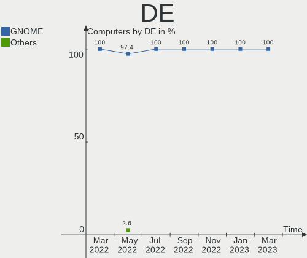
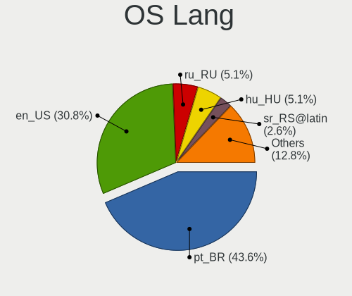
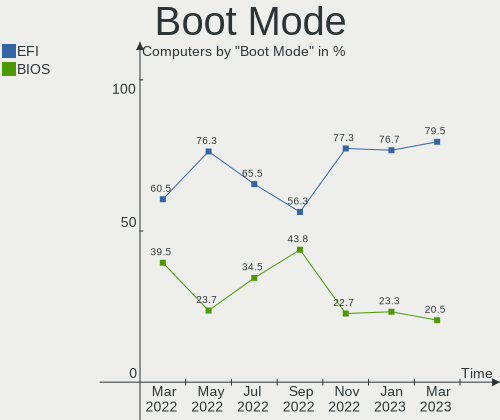
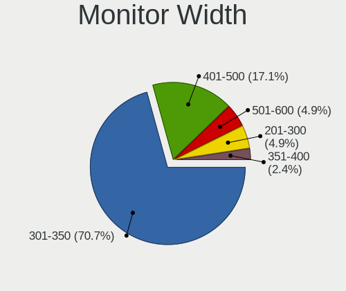

Endless Hardware Trends
-----------------------

A project to identify most popular hardware characteristics and track their change
over time based on data collected by Endless users at https://Linux-Hardware.org.

Anyone can contribute to the study by uploading probes of their computers by
the [hw-probe](https://github.com/linuxhw/hw-probe) tool:

    sudo hw-probe -all -upload

This is a report for all computer types. See also reports for [desktops](/Dist/Endless/Desktop/README.md) and [notebooks](/Dist/Endless/Notebook/README.md).

Full-feature report is available here: https://linux-hardware.org/?view=trends

Period: Apr, 2020.

Contents
--------

- [ OS                       ](#os)
- [ OS Family                ](#os-family)
- [ Kernel                   ](#kernel)
- [ Kernel Family            ](#kernel-family)
- [ Kernel Major Ver.        ](#kernel-major-ver)
- [ Arch                     ](#arch)
- [ DE                       ](#de)
- [ Display Server           ](#display-server)
- [ Display Manager          ](#display-manager)
- [ OS Lang                  ](#os-lang)
- [ Boot Mode                ](#boot-mode)
- [ Filesystem               ](#filesystem)
- [ Dual Boot with Linux/BSD ](#dual-boot-with-linux/bsd)
- [ Dual Boot (Win)          ](#dual-boot-win)
- [ Country                  ](#country)
- [ City                     ](#city)
- [ Vendor                   ](#vendor)
- [ Model                    ](#model)
- [ Model Family             ](#model-family)
- [ MFG Year                 ](#mfg-year)
- [ Form Factor              ](#form-factor)
- [ Secure Boot              ](#secure-boot)
- [ Coreboot                 ](#coreboot)
- [ RAM Size                 ](#ram-size)
- [ RAM Used                 ](#ram-used)
- [ Drive Vendor             ](#drive-vendor)
- [ Drive Model              ](#drive-model)
- [ Drive Kind               ](#drive-kind)
- [ Drive Connector          ](#drive-connector)
- [ Drive Size               ](#drive-size)
- [ Space Total              ](#space-total)
- [ Space Used               ](#space-used)
- [ Malfunc. Drives          ](#malfunc-drives)
- [ Malfunc. Drive Vendor    ](#malfunc-drive-vendor)
- [ Malfunc. Drive Kind      ](#malfunc-drive-kind)
- [ Failed Drives            ](#failed-drives)
- [ Failed Drive Vendor      ](#failed-drive-vendor)
- [ Drive Status             ](#drive-status)
- [ Storage Vendor           ](#storage-vendor)
- [ Storage Model            ](#storage-model)
- [ Storage Kind             ](#storage-kind)
- [ CPU Vendor               ](#cpu-vendor)
- [ CPU Model                ](#cpu-model)
- [ CPU Model Family         ](#cpu-model-family)
- [ CPU Cores                ](#cpu-cores)
- [ CPU Sockets              ](#cpu-sockets)
- [ CPU Threads              ](#cpu-threads)
- [ CPU Op-Modes             ](#cpu-op-modes)
- [ CPU Microarch            ](#cpu-microarch)
- [ CPU Microcode            ](#cpu-microcode)
- [ GPU Vendor               ](#gpu-vendor)
- [ GPU Model                ](#gpu-model)
- [ GPU Combo                ](#gpu-combo)
- [ GPU Driver               ](#gpu-driver)
- [ GPU Memory               ](#gpu-memory)
- [ Monitor Vendor           ](#monitor-vendor)
- [ Monitor Model            ](#monitor-model)
- [ Monitor Resolution       ](#monitor-resolution)
- [ Monitor Diagonal         ](#monitor-diagonal)
- [ Monitor Width            ](#monitor-width)
- [ Aspect Ratio             ](#aspect-ratio)
- [ Monitor Area             ](#monitor-area)
- [ Pixel Density            ](#pixel-density)
- [ Multiple Monitors        ](#multiple-monitors)
- [ Net Controller Vendor    ](#net-controller-vendor)
- [ Net Controller Model     ](#net-controller-model)
- [ Net Controller Kind      ](#net-controller-kind)
- [ Used Controller          ](#used-controller)
- [ NICs                     ](#nics)
- [ Unsupported Devices      ](#unsupported-devices)
- [ Unsupported Device Types ](#unsupported-device-types)

OS
--

Installed operating systems

| Name                   | Computers | Percent |
|------------------------|-----------|---------|
| Endless 3.7.8          | 164       | 78.1%   |
| Endless 3.8.0          | 9         | 4.29%   |
| Endless 3.7.6          | 5         | 2.38%   |
| Endless 3.4.2-nexthw1  | 5         | 2.38%   |
| Endless 3.3.20-nexthw1 | 5         | 2.38%   |
| Endless                | 5         | 2.38%   |
| Endless 3.6.1-nexthw1  | 2         | 0.95%   |
| Endless 3.5.8          | 2         | 0.95%   |
| Endless 3.4.6          | 2         | 0.95%   |
| Endless 3.4.3-nexthw1  | 2         | 0.95%   |
| Endless 3.3.20         | 2         | 0.95%   |
| Endless 3.7.7-nexthw1  | 1         | 0.48%   |
| Endless 3.7.7          | 1         | 0.48%   |
| Endless 3.7.5          | 1         | 0.48%   |
| Endless 3.7.4          | 1         | 0.48%   |
| Endless 3.6.1          | 1         | 0.48%   |
| Endless 3.6.0-nexthw1  | 1         | 0.48%   |
| Endless 3.3.7          | 1         | 0.48%   |

OS Family
---------

OS without a version

| Name    | Computers | Percent |
|---------|-----------|---------|
| Endless | 210       | 100%    |

Kernel
------

Version of the Linux kernel

| Version           | Computers | Percent |
|-------------------|-----------|---------|
| 5.3.0-28-generic  | 167       | 79.52%  |
| 5.4.0-19-generic  | 9         | 4.29%   |
| 4.16.0-4-generic  | 8         | 3.81%   |
| 4.15.0-15-generic | 7         | 3.33%   |
| 5.3.0-23-generic  | 6         | 2.86%   |
| 5.1.0-2-generic   | 3         | 1.43%   |
| 4.18.0-15-generic | 2         | 0.95%   |
| 4.15.0-23-generic | 2         | 0.95%   |
| 4.13.0-32-generic | 2         | 0.95%   |
| 5.4.0-7-generic   | 1         | 0.48%   |
| 5.3.0-19-generic  | 1         | 0.48%   |
| 5.0.0-17-generic  | 1         | 0.48%   |
| 4.13.0-19-generic | 1         | 0.48%   |

Kernel Family
-------------

Linux kernel without a distro release

| Version | Computers | Percent |
|---------|-----------|---------|
| 5.3.0   | 174       | 82.86%  |
| 5.4.0   | 10        | 4.76%   |
| 4.15.0  | 9         | 4.29%   |
| 4.16.0  | 8         | 3.81%   |
| 5.1.0   | 3         | 1.43%   |
| 4.13.0  | 3         | 1.43%   |
| 4.18.0  | 2         | 0.95%   |
| 5.0.0   | 1         | 0.48%   |

Kernel Major Ver.
-----------------

Linux kernel major version

| Version | Computers | Percent |
|---------|-----------|---------|
| 5.3     | 174       | 82.86%  |
| 5.4     | 10        | 4.76%   |
| 4.15    | 9         | 4.29%   |
| 4.16    | 8         | 3.81%   |
| 5.1     | 3         | 1.43%   |
| 4.13    | 3         | 1.43%   |
| 4.18    | 2         | 0.95%   |
| 5.0     | 1         | 0.48%   |

Arch
----

OS architecture (x86_64, i586, etc.)

| Name   | Computers | Percent |
|--------|-----------|---------|
| x86_64 | 210       | 100%    |

DE
--

Desktop Environment

| Name  | Computers | Percent |
|-------|-----------|---------|
| GNOME | 210       | 100%    |

Display Server
--------------

X11 or Wayland

| Name | Computers | Percent |
|------|-----------|---------|
| X11  | 210       | 100%    |

Display Manager
---------------

SDDM, LightDM, etc.

| Name    | Computers | Percent |
|---------|-----------|---------|
| Unknown | 210       | 100%    |

OS Lang
-------

Language

| Lang        | Computers | Percent |
|-------------|-----------|---------|
| en_US.utf8  | 80        | 38.1%   |
| ru_RU       | 19        | 9.05%   |
| pt_BR.utf8  | 19        | 9.05%   |
| pt_BR       | 13        | 6.19%   |
| es_ES       | 9         | 4.29%   |
| de_DE       | 9         | 4.29%   |
| ro_RO       | 7         | 3.33%   |
| en_GB       | 7         | 3.33%   |
| it_IT       | 5         | 2.38%   |
| es_MX       | 5         | 2.38%   |
| en_US       | 5         | 2.38%   |
| ru_RU.UTF_8 | 3         | 1.43%   |
| hu_HU       | 3         | 1.43%   |
| fr_FR       | 3         | 1.43%   |
| ru_UA       | 2         | 0.95%   |
| pt_PT       | 2         | 0.95%   |
| pl_PL       | 2         | 0.95%   |
| es_AR       | 2         | 0.95%   |
| en_IN       | 2         | 0.95%   |
| cs_CZ       | 2         | 0.95%   |
| ar_EG       | 2         | 0.95%   |
| uk_UA       | 1         | 0.48%   |
| lt_LT       | 1         | 0.48%   |
| es_CO       | 1         | 0.48%   |
| en_PH       | 1         | 0.48%   |
| en_IE       | 1         | 0.48%   |
| en_BW       | 1         | 0.48%   |
| en_AU       | 1         | 0.48%   |
| ca_ES       | 1         | 0.48%   |
| ar_AE       | 1         | 0.48%   |

Boot Mode
---------

EFI or BIOS

| Mode | Computers | Percent |
|------|-----------|---------|
| EFI  | 115       | 54.76%  |
| BIOS | 95        | 45.24%  |

Filesystem
----------

Type of filesystem

| Type  | Computers | Percent |
|-------|-----------|---------|
| Ext4  | 199       | 94.76%  |
| Tmpfs | 11        | 5.24%   |

Dual Boot with Linux/BSD
------------------------

Hosting more than one Linux/BSD

| Dual boot | Computers | Percent |
|-----------|-----------|---------|
| No        | 210       | 100%    |

Dual Boot (Win)
---------------

Hosting Linux and Windows

| Dual boot | Computers | Percent |
|-----------|-----------|---------|
| No        | 210       | 100%    |

Country
-------

Geographic location (country)

| Country              | Computers | Percent |
|----------------------|-----------|---------|
| USA                  | 47        | 22.38%  |
| Brazil               | 29        | 13.81%  |
| Russia               | 22        | 10.48%  |
| Romania              | 14        | 6.67%   |
| Spain                | 11        | 5.24%   |
| Germany              | 11        | 5.24%   |
| UK                   | 8         | 3.81%   |
| India                | 6         | 2.86%   |
| Ukraine              | 5         | 2.38%   |
| Saudi Arabia         | 4         | 1.9%    |
| Italy                | 4         | 1.9%    |
| Portugal             | 3         | 1.43%   |
| Poland               | 3         | 1.43%   |
| Philippines          | 3         | 1.43%   |
| Hungary              | 3         | 1.43%   |
| Croatia              | 3         | 1.43%   |
| Australia            | 3         | 1.43%   |
| Mexico               | 2         | 0.95%   |
| Japan                | 2         | 0.95%   |
| France               | 2         | 0.95%   |
| Czech Republic       | 2         | 0.95%   |
| Canada               | 2         | 0.95%   |
| Argentina            | 2         | 0.95%   |
| Uruguay              | 1         | 0.48%   |
| South Africa         | 1         | 0.48%   |
| Puerto Rico          | 1         | 0.48%   |
| Pakistan             | 1         | 0.48%   |
| Nigeria              | 1         | 0.48%   |
| New Zealand          | 1         | 0.48%   |
| Morocco              | 1         | 0.48%   |
| Moldova, Republic of | 1         | 0.48%   |
| Lithuania            | 1         | 0.48%   |
| Korea, Republic of   | 1         | 0.48%   |
| Israel               | 1         | 0.48%   |
| Ireland              | 1         | 0.48%   |
| Iran                 | 1         | 0.48%   |
| Georgia              | 1         | 0.48%   |
| Estonia              | 1         | 0.48%   |
| Denmark              | 1         | 0.48%   |
| Colombia             | 1         | 0.48%   |
| Angola               | 1         | 0.48%   |
| Albania              | 1         | 0.48%   |

City
----

Geographic location (city)

| City                  | Computers | Percent |
|-----------------------|-----------|---------|
| Moscow                | 8         | 3.81%   |
| Sacramento            | 6         | 2.86%   |
| Rio de Janeiro        | 4         | 1.9%    |
| Madrid                | 3         | 1.43%   |
| Kyiv                  | 3         | 1.43%   |
| Bucharest             | 3         | 1.43%   |
| São Paulo            | 2         | 0.95%   |
| Portland              | 2         | 0.95%   |
| Modesto               | 2         | 0.95%   |
| Makati City           | 2         | 0.95%   |
| Lisbon                | 2         | 0.95%   |
| Krasnodar             | 2         | 0.95%   |
| Jundiaí              | 2         | 0.95%   |
| Jeddah                | 2         | 0.95%   |
| Chicago               | 2         | 0.95%   |
| Budapest              | 2         | 0.95%   |
| Birmingham            | 2         | 0.95%   |
| Zaporizhia            | 1         | 0.48%   |
| Zagreb                | 1         | 0.48%   |
| Zabrze                | 1         | 0.48%   |
| Winter Garden         | 1         | 0.48%   |
| Wimbledon             | 1         | 0.48%   |
| Wassenberg            | 1         | 0.48%   |
| Warsaw                | 1         | 0.48%   |
| Vologda               | 1         | 0.48%   |
| Visakhapatnam         | 1         | 0.48%   |
| Victoria              | 1         | 0.48%   |
| Viana                 | 1         | 0.48%   |
| Vegreville            | 1         | 0.48%   |
| Vaslui                | 1         | 0.48%   |
| Utica                 | 1         | 0.48%   |
| Urlati                | 1         | 0.48%   |
| União da Vitória    | 1         | 0.48%   |
| Uji                   | 1         | 0.48%   |
| Târgu Mureş         | 1         | 0.48%   |
| Tver                  | 1         | 0.48%   |
| Turre                 | 1         | 0.48%   |
| Turin                 | 1         | 0.48%   |
| Tulsa                 | 1         | 0.48%   |
| Tula                  | 1         | 0.48%   |
| Torre de Benagalbon   | 1         | 0.48%   |
| Tempe                 | 1         | 0.48%   |
| Tehran                | 1         | 0.48%   |
| Tbilisi               | 1         | 0.48%   |
| Talmont-Saint-Hilaire | 1         | 0.48%   |
| Tallinn               | 1         | 0.48%   |
| Ta'if                 | 1         | 0.48%   |
| Székesfehérvár     | 1         | 0.48%   |
| Sydney                | 1         | 0.48%   |
| Suzano                | 1         | 0.48%   |
| Studley               | 1         | 0.48%   |
| Stafford              | 1         | 0.48%   |
| St Petersburg         | 1         | 0.48%   |
| Spring                | 1         | 0.48%   |
| Sobradinho            | 1         | 0.48%   |
| Sergiyev Posad        | 1         | 0.48%   |
| Sergach               | 1         | 0.48%   |
| Seodaemun-gu          | 1         | 0.48%   |
| Seattle               | 1         | 0.48%   |
| Sao Roque             | 1         | 0.48%   |

Vendor
------

Motherboard manufacturer

| Name                | Computers | Percent |
|---------------------|-----------|---------|
| ASUSTek Computer    | 73        | 34.76%  |
| Acer                | 31        | 14.76%  |
| Hewlett-Packard     | 21        | 10%     |
| Dell                | 21        | 10%     |
| Lenovo              | 12        | 5.71%   |
| Toshiba             | 8         | 3.81%   |
| Gigabyte Technology | 6         | 2.86%   |
| Apple               | 4         | 1.9%    |
| MSI                 | 3         | 1.43%   |
| Intel               | 3         | 1.43%   |
| eMachines           | 3         | 1.43%   |
| ASRock              | 3         | 1.43%   |
| Unknown             | 3         | 1.43%   |
| ZOTAC               | 2         | 0.95%   |
| Samsung Electronics | 2         | 0.95%   |
| Positivo            | 2         | 0.95%   |
| TriGem Computer     | 1         | 0.48%   |
| Sony                | 1         | 0.48%   |
| Shuttle             | 1         | 0.48%   |
| Philco              | 1         | 0.48%   |
| Pegatron Computer   | 1         | 0.48%   |
| Packard Bell        | 1         | 0.48%   |
| Megaware            | 1         | 0.48%   |
| Itautec             | 1         | 0.48%   |
| HARDKERNEL          | 1         | 0.48%   |
| ECS                 | 1         | 0.48%   |
| Cube                | 1         | 0.48%   |
| Clevo               | 1         | 0.48%   |
| BESSTAR Tech        | 1         | 0.48%   |

Model
-----

Motherboard model

| Name                                                          | Computers | Percent |
|---------------------------------------------------------------|-----------|---------|
| ASUS VivoBook 15_ASUS Laptop X540BA                           | 6         | 2.86%   |
| ASUS VivoBook 15_ASUS Laptop X540MA_X540MA                    | 5         | 2.38%   |
| ASUS ZenBook UX431DA_UM431DA                                  | 4         | 1.9%    |
| ASUS VivoBook 15_ASUS Laptop X540UAR                          | 4         | 1.9%    |
| ASUS VivoBook 15_ASUS Laptop X540MA_X543MA                    | 4         | 1.9%    |
| Acer Nitro AN515-52                                           | 4         | 1.9%    |
| Dell Inspiron 11-3168                                         | 3         | 1.43%   |
| Acer Aspire A315-53                                           | 3         | 1.43%   |
| Unknown                                                       | 3         | 1.43%   |
| Gigabyte Z68X-UD3H-B3                                         | 2         | 0.95%   |
| Dell OptiPlex 390                                             | 2         | 0.95%   |
| ASUS X541NA                                                   | 2         | 0.95%   |
| ASUS VivoBook_ASUS Laptop X509UA                              | 2         | 0.95%   |
| ASUS VivoBook_ASUS Laptop E406MA_E406MA                       | 2         | 0.95%   |
| ASUS VivoBook 15_ASUS Laptop X507UF                           | 2         | 0.95%   |
| ASUS VivoBook 14_ASUS Laptop X441MA_X441MA                    | 2         | 0.95%   |
| Acer Veriton EX2620G                                          | 2         | 0.95%   |
| Acer Aspire C22-820                                           | 2         | 0.95%   |
| Acer Aspire A515-51                                           | 2         | 0.95%   |
| ZOTAC ZBOX-MA320                                              | 1         | 0.48%   |
| ZOTAC ZBOX-BI324                                              | 1         | 0.48%   |
| TriGem Computer DreamSys                                      | 1         | 0.48%   |
| Toshiba Satellite P870                                        | 1         | 0.48%   |
| Toshiba Satellite P75-A                                       | 1         | 0.48%   |
| Toshiba Satellite P70-A                                       | 1         | 0.48%   |
| Toshiba Satellite L750                                        | 1         | 0.48%   |
| Toshiba Satellite L40                                         | 1         | 0.48%   |
| Toshiba Satellite L300                                        | 1         | 0.48%   |
| Toshiba Satellite C855D                                       | 1         | 0.48%   |
| Toshiba NB255                                                 | 1         | 0.48%   |
| Sony VGN-CR320E                                               | 1         | 0.48%   |
| Shuttle SG41                                                  | 1         | 0.48%   |
| Samsung Electronics RV420/RV520/RV720/E3530/S3530/E3420/E3520 | 1         | 0.48%   |
| Samsung Electronics 300E5K/300E5Q                             | 1         | 0.48%   |
| Positivo Mobile                                               | 1         | 0.48%   |
| Positivo C14CU51                                              | 1         | 0.48%   |
| Philco 14M-W549                                               | 1         | 0.48%   |
| Pegatron Computer RM ASCEND 2040A                             | 1         | 0.48%   |
| Packard Bell EasyNote TS44HR                                  | 1         | 0.48%   |
| MSI MS-7593                                                   | 1         | 0.48%   |
| MSI MS-7309                                                   | 1         | 0.48%   |
| MSI MS-7267                                                   | 1         | 0.48%   |
| Megaware MW-H61H2-M2                                          | 1         | 0.48%   |
| Lenovo ThinkPad X220 42914CG                                  | 1         | 0.48%   |
| Lenovo ThinkPad T500 2055RU3                                  | 1         | 0.48%   |
| Lenovo ThinkPad T410 2516CTO                                  | 1         | 0.48%   |
| Lenovo ThinkPad SL410 2842A67                                 | 1         | 0.48%   |
| Lenovo ThinkPad E420 114157U                                  | 1         | 0.48%   |
| Lenovo ThinkPad 8 20BNA00GKR                                  | 1         | 0.48%   |
| Lenovo ThinkCentre M57p 6073BA4                               | 1         | 0.48%   |
| Lenovo ThinkCentre A62 9625A71                                | 1         | 0.48%   |
| Lenovo IdeaPad FLEX-14API 81SS                                | 1         | 0.48%   |
| Lenovo G405                                                   | 1         | 0.48%   |
| Lenovo G40-45 80E1                                            | 1         | 0.48%   |
| Lenovo C240 10113                                             | 1         | 0.48%   |
| Itautec Infoway                                               | 1         | 0.48%   |
| Intel P61A-D3                                                 | 1         | 0.48%   |
| Intel Intel Education Tablet                                  | 1         | 0.48%   |
| Intel DH77EB AAG39073-304                                     | 1         | 0.48%   |
| HP ProDesk 600 G2 DM                                          | 1         | 0.48%   |

Model Family
------------

Motherboard model prefix

| Name                       | Computers | Percent |
|----------------------------|-----------|---------|
| ASUS VivoBook              | 42        | 20%     |
| Acer Aspire                | 18        | 8.57%   |
| Dell Inspiron              | 8         | 3.81%   |
| Toshiba Satellite          | 7         | 3.33%   |
| Lenovo ThinkPad            | 6         | 2.86%   |
| Dell OptiPlex              | 6         | 2.86%   |
| Dell Latitude              | 6         | 2.86%   |
| ASUS ZenBook               | 6         | 2.86%   |
| Acer Nitro                 | 4         | 1.9%    |
| HP Pavilion                | 3         | 1.43%   |
| HP Laptop                  | 3         | 1.43%   |
| HP Compaq                  | 3         | 1.43%   |
| Acer Swift                 | 3         | 1.43%   |
| Unknown                    | 3         | 1.43%   |
| Lenovo ThinkCentre         | 2         | 0.95%   |
| HP EliteBook               | 2         | 0.95%   |
| HP 250                     | 2         | 0.95%   |
| Gigabyte Z68X-UD3H-B3      | 2         | 0.95%   |
| ASUS X541NA                | 2         | 0.95%   |
| Acer Veriton               | 2         | 0.95%   |
| ZOTAC ZBOX-MA320           | 1         | 0.48%   |
| ZOTAC ZBOX-BI324           | 1         | 0.48%   |
| TriGem Computer DreamSys   | 1         | 0.48%   |
| Toshiba NB255              | 1         | 0.48%   |
| Sony VGN-CR320E            | 1         | 0.48%   |
| Shuttle SG41               | 1         | 0.48%   |
| Samsung Electronics RV420  | 1         | 0.48%   |
| Samsung Electronics 300E5K | 1         | 0.48%   |
| Positivo Mobile            | 1         | 0.48%   |
| Positivo C14CU51           | 1         | 0.48%   |
| Philco 14M-W549            | 1         | 0.48%   |
| Pegatron Computer RM       | 1         | 0.48%   |
| Packard Bell EasyNote      | 1         | 0.48%   |
| MSI MS-7593                | 1         | 0.48%   |
| MSI MS-7309                | 1         | 0.48%   |
| MSI MS-7267                | 1         | 0.48%   |
| Megaware MW-H61H2-M2       | 1         | 0.48%   |
| Lenovo IdeaPad             | 1         | 0.48%   |
| Lenovo G405                | 1         | 0.48%   |
| Lenovo G40-45              | 1         | 0.48%   |
| Lenovo C240                | 1         | 0.48%   |
| Itautec Infoway            | 1         | 0.48%   |
| Intel P61A-D3              | 1         | 0.48%   |
| Intel Intel                | 1         | 0.48%   |
| Intel DH77EB               | 1         | 0.48%   |
| HP ProDesk                 | 1         | 0.48%   |
| HP OMEN                    | 1         | 0.48%   |
| HP EliteDesk               | 1         | 0.48%   |
| HP All-in-One              | 1         | 0.48%   |
| HP 620                     | 1         | 0.48%   |
| HP 610-1050f               | 1         | 0.48%   |
| HP 2000                    | 1         | 0.48%   |
| HP 14                      | 1         | 0.48%   |
| HARDKERNEL ODROID-H2       | 1         | 0.48%   |
| Gigabyte J3455N-D3H        | 1         | 0.48%   |
| Gigabyte GA-78LMT-USB3     | 1         | 0.48%   |
| Gigabyte F2A88XM-D3H       | 1         | 0.48%   |
| Gigabyte B450              | 1         | 0.48%   |
| eMachines ET1331G          | 1         | 0.48%   |
| eMachines EL1358           | 1         | 0.48%   |

MFG Year
--------

Motherboard manufacture year

| Year | Computers | Percent |
|------|-----------|---------|
| 2019 | 71        | 33.81%  |
| 2018 | 29        | 13.81%  |
| 2013 | 15        | 7.14%   |
| 2008 | 15        | 7.14%   |
| 2017 | 12        | 5.71%   |
| 2011 | 12        | 5.71%   |
| 2012 | 10        | 4.76%   |
| 2010 | 10        | 4.76%   |
| 2015 | 9         | 4.29%   |
| 2014 | 9         | 4.29%   |
| 2009 | 9         | 4.29%   |
| 2016 | 5         | 2.38%   |
| 2007 | 3         | 1.43%   |
| 2020 | 1         | 0.48%   |

Form Factor
-----------

Physical design of the computer

| Name       | Computers | Percent |
|------------|-----------|---------|
| Notebook   | 152       | 72.38%  |
| Desktop    | 44        | 20.95%  |
| All in one | 7         | 3.33%   |
| Tablet     | 4         | 1.9%    |
| Mini pc    | 3         | 1.43%   |

Secure Boot
-----------

Enabled or disabled

| State    | Computers | Percent |
|----------|-----------|---------|
| Disabled | 180       | 85.71%  |
| Enabled  | 30        | 14.29%  |

Coreboot
--------

Have coreboot on board

| Used | Computers | Percent |
|------|-----------|---------|
| No   | 210       | 100%    |

RAM Size
--------

Total RAM memory

| Size in GB | Computers | Percent |
|------------|-----------|---------|
| 3.01-4.0   | 86        | 40.95%  |
| 4.01-8.0   | 56        | 26.67%  |
| 1.01-2.0   | 24        | 11.43%  |
| 8.01-16.0  | 23        | 10.95%  |
| 16.01-24.0 | 10        | 4.76%   |
| 2.01-3.0   | 6         | 2.86%   |
| 32.01-64.0 | 2         | 0.95%   |
| 24.01-32.0 | 2         | 0.95%   |
| Unknown    | 1         | 0.48%   |

RAM Used
--------

Used RAM memory

| Used GB  | Computers | Percent |
|----------|-----------|---------|
| 1.01-2.0 | 114       | 54.29%  |
| 0.01-1.0 | 44        | 20.95%  |
| 2.01-3.0 | 32        | 15.24%  |
| 3.01-4.0 | 16        | 7.62%   |
| 4.01-8.0 | 3         | 1.43%   |
| Unknown  | 1         | 0.48%   |

Drive Vendor
------------

Hard drive vendors

| Vendor              | Computers | Drives  | Percent |
|---------------------|-----------|---------|---------|
| Seagate             | 46        | 48      | 19.49%  |
| WDC                 | 44        | 44      | 18.64%  |
| Toshiba             | 31        | 31      | 13.14%  |
| SanDisk             | 14        | 14      | 5.93%   |
| Kingston            | 13        | 13      | 5.51%   |
| HL-DT-ST            | 13        | Unknown | 5.51%   |
| Unknown             | 12        | 12      | 5.08%   |
| Hitachi             | 8         | 8       | 3.39%   |
| Samsung Electronics | 7         | 7       | 2.97%   |
| Micron Technology   | 6         | 6       | 2.54%   |
| HGST                | 6         | 6       | 2.54%   |
| Crucial             | 4         | 5       | 1.69%   |
| OCZ                 | 3         | 3       | 1.27%   |
| Fujitsu             | 3         | 3       | 1.27%   |
| A-DATA Technology   | 3         | 3       | 1.27%   |
| SPCC                | 2         | 2       | 0.85%   |
| Intel               | 2         | 2       | 0.85%   |
| Hewlett-Packard     | 2         | 2       | 0.85%   |
| Generic             | 2         | 2       | 0.85%   |
| ASMT                | 2         | 2       | 0.85%   |
| TCSUNBOW            | 1         | 1       | 0.42%   |
| SK Hynix            | 1         | 1       | 0.42%   |
| KINGMAX             | 1         | 1       | 0.42%   |
| KingFast            | 1         | 1       | 0.42%   |
| KingDian            | 1         | 1       | 0.42%   |
| HUAWEI              | 1         | 1       | 0.42%   |
| Golden              | 1         | 1       | 0.42%   |
| FORESEE             | 1         | 1       | 0.42%   |
| DREVO               | 1         | 1       | 0.42%   |
| Dogfish             | 1         | 1       | 0.42%   |
| China               | 1         | 1       | 0.42%   |
| AS25                | 1         | 1       | 0.42%   |
| Apacer              | 1         | 1       | 0.42%   |

Drive Model
-----------

Hard drive models

| Model                        | Computers | Percent |
|------------------------------|-----------|---------|
| ST1000LM035-1RK172 1TB       | 17        | 7.11%   |
| MQ01ABF050 500GB             | 16        | 6.69%   |
| DVDRAM GUE1N 3GB             | 12        | 5.02%   |
| WD10SPZX-21Z10T0 1TB         | 7         | 2.93%   |
| RBUSC180DS37256GJ 256GB SSD  | 4         | 1.67%   |
| MQ04ABF100 1TB               | 4         | 1.67%   |
| MMC Card  64GB               | 4         | 1.67%   |
| SD9SN8W256G1102 256GB SSD    | 3         | 1.26%   |
| RBUSNS8180DS3128GJ 128GB SSD | 3         | 1.26%   |
| MQ01ABD100 1TB               | 3         | 1.26%   |
| MMC Card  32GB               | 3         | 1.26%   |
| IM2S3338-128GD2 128GB SSD    | 3         | 1.26%   |
| 1100_MTFDDAV256TBN 256GB SSD | 3         | 1.26%   |
| WDS240G2G0B-00EPW0 240GB SSD | 2         | 0.84%   |
| WDBNCE5000PNC 500GB SSD      | 2         | 0.84%   |
| WD6400BEVT-22A0RT0 640GB     | 2         | 0.84%   |
| WD10EZEX-08WN4A0 1TB         | 2         | 0.84%   |
| SV300S37A120G 120GB SSD      | 2         | 0.84%   |
| ST9500325AS 500GB            | 2         | 0.84%   |
| ST9250315AS 250GB            | 2         | 0.84%   |
| ST500DM002-1BD142 500GB      | 2         | 0.84%   |
| ST3160318AS 160GB            | 2         | 0.84%   |
| ST2000LX001-1RG174 2TB       | 2         | 0.84%   |
| SSD PLUS 240GB               | 2         | 0.84%   |
| SSD 120GB                    | 2         | 0.84%   |
| Solid State Disk 64GB        | 2         | 0.84%   |
| SD9SN8W128G1102 128GB SSD    | 2         | 0.84%   |
| SD9SB8W256G1102 256GB SSD    | 2         | 0.84%   |
| SD/MMC/MS PRO 64GB           | 2         | 0.84%   |
| RBUSNS8180DS3256GJ 256GB SSD | 2         | 0.84%   |
| MMC Card  16GB               | 2         | 0.84%   |
| HTS721010A9E630 1TB          | 2         | 0.84%   |
| X3 240GB                     | 1         | 0.42%   |
| X1 SSD 120GB                 | 1         | 0.42%   |
| WDS240G2G0A-00JH30 240GB SSD | 1         | 0.42%   |
| WD800JD-08MSA1 80GB          | 1         | 0.42%   |
| WD6401AALS-00L3B2 640GB      | 1         | 0.42%   |
| WD6400AAKS-40H2B0 640GB      | 1         | 0.42%   |
| WD5000LUCT-61C26Y0 500GB     | 1         | 0.42%   |
| WD5000LPVX-80V0TT0 500GB     | 1         | 0.42%   |
| WD5000LPVX-60V0TT0 500GB     | 1         | 0.42%   |
| WD5000LPVX-28V0TT0 500GB     | 1         | 0.42%   |
| WD5000LPVX-22V0TT0 500GB     | 1         | 0.42%   |
| WD5000LPCX-60VHAT1 500GB     | 1         | 0.42%   |
| WD5000BPVT-22HXZT3 500GB     | 1         | 0.42%   |
| WD5000BEVT-22A0RT0 500GB     | 1         | 0.42%   |
| WD5000AURX-63UY4Y0 500GB     | 1         | 0.42%   |
| WD5000AAKS-00V0A0 500GB      | 1         | 0.42%   |
| WD3200BPVT-22JJ5T0 320GB     | 1         | 0.42%   |
| WD3200BPVT-00JJ5T0 320GB     | 1         | 0.42%   |
| WD3200BEVT-22ZCT0 320GB      | 1         | 0.42%   |
| WD3200BEKT-75PVMT1 320GB     | 1         | 0.42%   |
| WD3200AAJS-65B4A0 320GB      | 1         | 0.42%   |
| WD2500LPCX-24C6HT0 250GB     | 1         | 0.42%   |
| WD2500BEVT-75ZCT2 250GB      | 1         | 0.42%   |
| WD1600HLFS-75G6U1 160GB      | 1         | 0.42%   |
| WD1600BEVT-08A23T1 160GB     | 1         | 0.42%   |
| WD1600BEVS-08VAT2 160GB      | 1         | 0.42%   |
| WD10SPZX-60Z10T0 1TB         | 1         | 0.42%   |
| WD10JPVX-60JC3T1 1TB         | 1         | 0.42%   |

Drive Kind
----------

HDD or SSD

| Kind    | Computers | Drives | Percent |
|---------|-----------|--------|---------|
| HDD     | 131       | 138    | 57.71%  |
| SSD     | 64        | 68     | 28.19%  |
| Unknown | 22        | 10     | 9.69%   |
| MMC     | 10        | 10     | 4.41%   |

Drive Connector
---------------

SATA, SAS, NVMe, etc.

| Type | Computers | Drives | Percent |
|------|-----------|--------|---------|
| SATA | 183       | 208    | 85.51%  |
| SAS  | 21        | 8      | 9.81%   |
| MMC  | 10        | 10     | 4.67%   |

Drive Size
----------

Size of hard drive

| Size in TB | Computers | Drives | Percent |
|------------|-----------|--------|---------|
| 0.01-0.5   | 154       | 160    | 70.64%  |
| 0.51-1.0   | 57        | 59     | 26.15%  |
| 1.01-2.0   | 5         | 5      | 2.29%   |
| 3.01-4.0   | 1         | 1      | 0.46%   |
| 2.01-3.0   | 1         | 1      | 0.46%   |

Space Total
-----------

Amount of disk space available on the file system

| Size in GB | Computers | Percent |
|------------|-----------|---------|
| 101-250    | 74        | 35.24%  |
| 251-500    | 45        | 21.43%  |
| 501-1000   | 36        | 17.14%  |
| 21-50      | 18        | 8.57%   |
| 51-100     | 18        | 8.57%   |
| 1001-2000  | 8         | 3.81%   |
| 1-20       | 7         | 3.33%   |
| 2001-3000  | 4         | 1.9%    |

Space Used
----------

Amount of used disk space

| Used GB   | Computers | Percent |
|-----------|-----------|---------|
| 21-50     | 114       | 54.29%  |
| 1-20      | 51        | 24.29%  |
| 51-100    | 27        | 12.86%  |
| 101-250   | 7         | 3.33%   |
| 251-500   | 5         | 2.38%   |
| 1001-2000 | 3         | 1.43%   |
| 501-1000  | 3         | 1.43%   |

Malfunc. Drives
---------------

Drive models with a malfunction

Zero info for selected period =(

Malfunc. Drive Vendor
---------------------

Vendors of faulty drives

Zero info for selected period =(

Malfunc. Drive Kind
-------------------

Kinds of faulty drives

Zero info for selected period =(

Failed Drives
-------------

Failed drive models

Zero info for selected period =(

Failed Drive Vendor
-------------------

Failed drive vendors

Zero info for selected period =(

Drive Status
------------

Number of failed and malfunc. drives

| Status   | Computers | Drives | Percent |
|----------|-----------|--------|---------|
| Detected | 191       | 225    | 99.48%  |
| Works    | 1         | 1      | 0.52%   |

Storage Vendor
--------------

Storage controller vendors

| Vendor                           | Computers | Percent |
|----------------------------------|-----------|---------|
| Intel                            | 158       | 68.7%   |
| AMD                              | 40        | 17.39%  |
| SK Hynix                         | 6         | 2.61%   |
| Nvidia                           | 5         | 2.17%   |
| Marvell Technology Group         | 4         | 1.74%   |
| Kingston Technology Company      | 4         | 1.74%   |
| JMicron Technology               | 4         | 1.74%   |
| ASMedia Technology               | 2         | 0.87%   |
| Toshiba America Info Systems     | 1         | 0.43%   |
| Silicon Integrated Systems [SiS] | 1         | 0.43%   |
| Sandisk                          | 1         | 0.43%   |
| Samsung Electronics              | 1         | 0.43%   |
| Realtek Semiconductor            | 1         | 0.43%   |
| Phison Electronics               | 1         | 0.43%   |
| Adaptec                          | 1         | 0.43%   |

Storage Model
-------------

Storage controller models

| Model                                                                             | Computers | Percent |
|-----------------------------------------------------------------------------------|-----------|---------|
| FCH SATA Controller [AHCI mode]                                                   | 31        | 11.11%  |
| Sunrise Point-LP SATA Controller [AHCI mode]                                      | 24        | 8.6%    |
| SATA controller                                                                   | 24        | 8.6%    |
| 82801 Mobile SATA Controller [RAID mode]                                          | 20        | 7.17%   |
| 82801HM/HEM (ICH8M/ICH8M-E) IDE Controller                                        | 10        | 3.58%   |
| 82801IBM/IEM (ICH9M/ICH9M-E) 4 port SATA Controller [AHCI mode]                   | 8         | 2.87%   |
| 82801HM/HEM (ICH8M/ICH8M-E) SATA Controller [AHCI mode]                           | 8         | 2.87%   |
| PROSet/Wireless WiFi Software extension                                           | 6         | 2.15%   |
| Non-Volatile memory controller                                                    | 6         | 2.15%   |
| Celeron N3350/Pentium N4200/Atom E3900 Series SATA AHCI Controller                | 6         | 2.15%   |
| Atom/Celeron/Pentium Processor x5-E8000/J3xxx/N3xxx Series SATA Controller        | 6         | 2.15%   |
| 6 Series/C200 Series Chipset Family 6 port Mobile SATA AHCI Controller            | 6         | 2.15%   |
| 6 Series/C200 Series Chipset Family 6 port Desktop SATA AHCI Controller           | 6         | 2.15%   |
| NM10/ICH7 Family SATA Controller [IDE mode]                                       | 5         | 1.79%   |
| BC501 NVMe Solid State Drive 512GB                                                | 5         | 1.79%   |
| 82801G (ICH7 Family) IDE Controller                                               | 5         | 1.79%   |
| 7 Series Chipset Family 6-port SATA Controller [AHCI mode]                        | 5         | 1.79%   |
| SB7x0/SB8x0/SB9x0 SATA Controller [AHCI mode]                                     | 4         | 1.43%   |
| SB7x0/SB8x0/SB9x0 IDE Controller                                                  | 4         | 1.43%   |
| FCH IDE Controller                                                                | 4         | 1.43%   |
| 8 Series/C220 Series Chipset Family 6-port SATA Controller 1 [AHCI mode]          | 4         | 1.43%   |
| SB7x0/SB8x0/SB9x0 SATA Controller [IDE mode]                                      | 3         | 1.08%   |
| MCP61 SATA Controller                                                             | 3         | 1.08%   |
| HM170/QM170 Chipset SATA Controller [AHCI Mode]                                   | 3         | 1.08%   |
| 82801HM/HEM (ICH8M/ICH8M-E) SATA Controller [IDE mode]                            | 3         | 1.08%   |
| 6 Series/C200 Series Chipset Family Desktop SATA Controller (IDE mode, ports 4-5) | 3         | 1.08%   |
| 6 Series/C200 Series Chipset Family Desktop SATA Controller (IDE mode, ports 0-3) | 3         | 1.08%   |
| Q170/Q150/B150/H170/H110/Z170/CM236 Chipset SATA Controller [AHCI Mode]           | 2         | 0.72%   |
| MCP67 IDE Controller                                                              | 2         | 0.72%   |
| MCP61 IDE                                                                         | 2         | 0.72%   |
| Cannon Point-LP SATA Controller [AHCI Mode]                                       | 2         | 0.72%   |
| Cannon Lake Mobile PCH SATA AHCI Controller                                       | 2         | 0.72%   |
| Atom Processor E3800 Series SATA AHCI Controller                                  | 2         | 0.72%   |
| 88SE9172 SATA III 6Gb/s RAID Controller                                           | 2         | 0.72%   |
| 7 Series/C210 Series Chipset Family 6-port SATA Controller [AHCI mode]            | 2         | 0.72%   |
| 5 Series/3400 Series Chipset 6 port SATA AHCI Controller                          | 2         | 0.72%   |
| 5 Series/3400 Series Chipset 4 port SATA AHCI Controller                          | 2         | 0.72%   |
| Wildcat Point-LP SATA Controller [AHCI Mode]                                      | 1         | 0.36%   |
| WD Black 2018/PC SN520 NVMe SSD                                                   | 1         | 0.36%   |
| Toshiba America Info Non-Volatile memory controller                               | 1         | 0.36%   |
| SSD 600P Series                                                                   | 1         | 0.36%   |
| SB600 Non-Raid-5 SATA                                                             | 1         | 0.36%   |
| SB600 IDE                                                                         | 1         | 0.36%   |
| SATA Controller [RAID mode]                                                       | 1         | 0.36%   |
| SATA Controller / IDE mode                                                        | 1         | 0.36%   |
| Realtek Non-Volatile memory controller                                            | 1         | 0.36%   |
| NVMe SSD Controller SM981/PM981/PM983                                             | 1         | 0.36%   |
| NM10/ICH7 Family SATA Controller [AHCI mode]                                      | 1         | 0.36%   |
| MCP67 SATA Controller                                                             | 1         | 0.36%   |
| MCP67 AHCI Controller                                                             | 1         | 0.36%   |
| JMB368 IDE controller                                                             | 1         | 0.36%   |
| JMB363 SATA/IDE Controller                                                        | 1         | 0.36%   |
| JMB362 SATA Controller                                                            | 1         | 0.36%   |
| JMB360 AHCI Controller                                                            | 1         | 0.36%   |
| FCH SATA Controller [IDE mode]                                                    | 1         | 0.36%   |
| FCH SATA Controller D                                                             | 1         | 0.36%   |
| Atom Processor E3800 Series SATA IDE Controller                                   | 1         | 0.36%   |
| ASM1062 Serial ATA Controller                                                     | 1         | 0.36%   |
| ASM1061 SATA IDE Controller                                                       | 1         | 0.36%   |
| AAC-RAID                                                                          | 1         | 0.36%   |

Storage Kind
------------

Kind of storage controller (IDE, SATA, NVMe, SAS, ...)

| Kind | Computers | Percent |
|------|-----------|---------|
| SATA | 162       | 65.59%  |
| IDE  | 44        | 17.81%  |
| NVMe | 22        | 8.91%   |
| RAID | 19        | 7.69%   |

CPU Vendor
----------

Processor vendors

| Vendor | Computers | Percent |
|--------|-----------|---------|
| Intel  | 165       | 78.57%  |
| AMD    | 45        | 21.43%  |

CPU Model
---------

Processor models

| Model                                         | Computers | Percent |
|-----------------------------------------------|-----------|---------|
| Intel Celeron N4000 CPU @ 1.10GHz             | 15        | 7.14%   |
| Intel Core i5-8250U CPU @ 1.60GHz             | 7         | 3.33%   |
| Intel Core i3-7020U CPU @ 2.30GHz             | 6         | 2.86%   |
| Intel Pentium CPU 4417U @ 2.30GHz             | 5         | 2.38%   |
| Intel Celeron CPU N3350 @ 1.10GHz             | 5         | 2.38%   |
| Intel Pentium Silver N5000 CPU @ 1.10GHz      | 4         | 1.9%    |
| Intel Core i3-8145U CPU @ 2.10GHz             | 4         | 1.9%    |
| Intel Core i3-6006U CPU @ 2.00GHz             | 4         | 1.9%    |
| AMD Ryzen 7 3700U with Radeon Vega Mobile Gfx | 4         | 1.9%    |
| AMD A6-9225 RADEON R4, 5 COMPUTE CORES 2C+3G  | 4         | 1.9%    |
| Intel Pentium CPU N3710 @ 1.60GHz             | 3         | 1.43%   |
| Intel Core i7-8750H CPU @ 2.20GHz             | 3         | 1.43%   |
| Intel Core i5-8265U CPU @ 1.60GHz             | 3         | 1.43%   |
| Intel Core i3-2100 CPU @ 3.10GHz              | 3         | 1.43%   |
| Intel Celeron J4005 CPU @ 2.00GHz             | 3         | 1.43%   |
| Intel Atom CPU Z3735F @ 1.33GHz               | 3         | 1.43%   |
| AMD Ryzen 5 3500U with Radeon Vega Mobile Gfx | 3         | 1.43%   |
| Intel Pentium Dual-Core CPU T4400 @ 2.20GHz   | 2         | 0.95%   |
| Intel Pentium Dual-Core CPU T4300 @ 2.10GHz   | 2         | 0.95%   |
| Intel Core i7-7500U CPU @ 2.70GHz             | 2         | 0.95%   |
| Intel Core i7-4700MQ CPU @ 2.40GHz            | 2         | 0.95%   |
| Intel Core i7-2600K CPU @ 3.40GHz             | 2         | 0.95%   |
| Intel Core i5-8300H CPU @ 2.30GHz             | 2         | 0.95%   |
| Intel Core i5-7300HQ CPU @ 2.50GHz            | 2         | 0.95%   |
| Intel Core i5-4590 CPU @ 3.30GHz              | 2         | 0.95%   |
| Intel Core i5-2500K CPU @ 3.30GHz             | 2         | 0.95%   |
| Intel Core i5-2450M CPU @ 2.50GHz             | 2         | 0.95%   |
| Intel Core i3-6100U CPU @ 2.30GHz             | 2         | 0.95%   |
| Intel Core 2 Duo CPU T7700 @ 2.40GHz          | 2         | 0.95%   |
| Intel Core 2 Duo CPU E8400 @ 3.00GHz          | 2         | 0.95%   |
| Intel Celeron CPU 1007U @ 1.50GHz             | 2         | 0.95%   |
| AMD C-70 APU with Radeon HD Graphics          | 2         | 0.95%   |
| AMD A4-9125 RADEON R3, 4 COMPUTE CORES 2C+2G  | 2         | 0.95%   |
| Intel Pentium Silver J5005 CPU @ 1.50GHz      | 1         | 0.48%   |
| Intel Pentium Dual-Core CPU T4200 @ 2.00GHz   | 1         | 0.48%   |
| Intel Pentium Dual-Core CPU E6500 @ 2.93GHz   | 1         | 0.48%   |
| Intel Pentium Dual CPU T2310 @ 1.46GHz        | 1         | 0.48%   |
| Intel Pentium Dual CPU E2180 @ 2.00GHz        | 1         | 0.48%   |
| Intel Pentium CPU P6200 @ 2.13GHz             | 1         | 0.48%   |
| Intel Pentium CPU J3710 @ 1.60GHz             | 1         | 0.48%   |
| Intel Pentium CPU B960 @ 2.20GHz              | 1         | 0.48%   |
| Intel Pentium CPU B940 @ 2.00GHz              | 1         | 0.48%   |
| Intel Genuine CPU 2140 @ 1.60GHz              | 1         | 0.48%   |
| Intel Core m3-7Y30 CPU @ 1.00GHz              | 1         | 0.48%   |
| Intel Core i7-9700KF CPU @ 3.60GHz            | 1         | 0.48%   |
| Intel Core i7-7820HK CPU @ 2.90GHz            | 1         | 0.48%   |
| Intel Core i7-7700HQ CPU @ 2.80GHz            | 1         | 0.48%   |
| Intel Core i7-6700 CPU @ 3.40GHz              | 1         | 0.48%   |
| Intel Core i7-4800MQ CPU @ 2.70GHz            | 1         | 0.48%   |
| Intel Core i7-3610QM CPU @ 2.30GHz            | 1         | 0.48%   |
| Intel Core i7-2640M CPU @ 2.80GHz             | 1         | 0.48%   |
| Intel Core i7-2620M CPU @ 2.70GHz             | 1         | 0.48%   |
| Intel Core i7-10510U CPU @ 1.80GHz            | 1         | 0.48%   |
| Intel Core i7 CPU M 620 @ 2.67GHz             | 1         | 0.48%   |
| Intel Core i7 CPU 920 @ 2.67GHz               | 1         | 0.48%   |
| Intel Core i5-7300U CPU @ 2.60GHz             | 1         | 0.48%   |
| Intel Core i5-7200U CPU @ 2.50GHz             | 1         | 0.48%   |
| Intel Core i5-3330 CPU @ 3.00GHz              | 1         | 0.48%   |
| Intel Core i5-3230M CPU @ 2.60GHz             | 1         | 0.48%   |
| Intel Core i5-2520M CPU @ 2.50GHz             | 1         | 0.48%   |

CPU Model Family
----------------

Processor model prefix

| Model                   | Computers | Percent |
|-------------------------|-----------|---------|
| Intel Celeron           | 34        | 16.19%  |
| Intel Core i5           | 29        | 13.81%  |
| Intel Core i3           | 29        | 13.81%  |
| Intel Core i7           | 20        | 9.52%   |
| Intel Core 2 Duo        | 17        | 8.1%    |
| Intel Pentium           | 12        | 5.71%   |
| Intel Atom              | 7         | 3.33%   |
| AMD A6                  | 7         | 3.33%   |
| Intel Pentium Dual-Core | 6         | 2.86%   |
| Intel Pentium Silver    | 5         | 2.38%   |
| AMD Ryzen 5             | 5         | 2.38%   |
| AMD Ryzen 7             | 4         | 1.9%    |
| AMD A4                  | 4         | 1.9%    |
| AMD Ryzen 3             | 3         | 1.43%   |
| Intel Pentium Dual      | 2         | 0.95%   |
| AMD C-70                | 2         | 0.95%   |
| AMD Athlon II X2        | 2         | 0.95%   |
| AMD A10                 | 2         | 0.95%   |
| Other                   | 1         | 0.48%   |
| Intel Genuine           | 1         | 0.48%   |
| Intel Core m3           | 1         | 0.48%   |
| Intel Core 2 Extreme    | 1         | 0.48%   |
| Intel Core 2            | 1         | 0.48%   |
| AMD Turion 64 X2 Mobile | 1         | 0.48%   |
| AMD Phenom II X6        | 1         | 0.48%   |
| AMD Phenom II X4        | 1         | 0.48%   |
| AMD Phenom II X2        | 1         | 0.48%   |
| AMD Phenom II           | 1         | 0.48%   |
| AMD FX                  | 1         | 0.48%   |
| AMD E2                  | 1         | 0.48%   |
| AMD E1                  | 1         | 0.48%   |
| AMD E                   | 1         | 0.48%   |
| AMD C-50                | 1         | 0.48%   |
| AMD Athlon X2           | 1         | 0.48%   |
| AMD Athlon II           | 1         | 0.48%   |
| AMD Athlon Dual Core    | 1         | 0.48%   |
| AMD A8                  | 1         | 0.48%   |
| AMD A12                 | 1         | 0.48%   |

CPU Cores
---------

Number of processor cores

| Number | Computers | Percent |
|--------|-----------|---------|
| 2      | 137       | 65.24%  |
| 4      | 64        | 30.48%  |
| 6      | 4         | 1.9%    |
| 1      | 4         | 1.9%    |
| 8      | 1         | 0.48%   |

CPU Sockets
-----------

Number of sockets

| Number | Computers | Percent |
|--------|-----------|---------|
| 1      | 210       | 100%    |

CPU Threads
-----------

Threads per core (Hyper-Threading)

| Number | Computers | Percent |
|--------|-----------|---------|
| 1      | 117       | 55.71%  |
| 2      | 93        | 44.29%  |

CPU Op-Modes
------------

CPU Operation Modes (32-bit, 64-bit)

| Op mode        | Computers | Percent |
|----------------|-----------|---------|
| 32-bit, 64-bit | 210       | 100%    |

CPU Microarch
-------------

Microarchitecture

| Name          | Computers | Percent |
|---------------|-----------|---------|
| Skylake       | 47        | 22.38%  |
| Core          | 26        | 12.38%  |
| Goldmont plus | 24        | 11.43%  |
| SandyBridge   | 20        | 9.52%   |
| Silvermont    | 14        | 6.67%   |
| Excavator     | 10        | 4.76%   |
| Zen+          | 8         | 3.81%   |
| K10           | 7         | 3.33%   |
| IvyBridge     | 7         | 3.33%   |
| Haswell       | 6         | 2.86%   |
| Goldmont      | 6         | 2.86%   |
| Westmere      | 5         | 2.38%   |
| Zen           | 4         | 1.9%    |
| Bobcat        | 4         | 1.9%    |
| Penryn        | 3         | 1.43%   |
| K8 Hammer     | 3         | 1.43%   |
| Steamroller   | 2         | 0.95%   |
| Puma          | 2         | 0.95%   |
| KabyLake      | 2         | 0.95%   |
| Jaguar        | 2         | 0.95%   |
| Bonnell       | 2         | 0.95%   |
| Piledriver    | 1         | 0.48%   |
| Nehalem       | 1         | 0.48%   |
| K10 Llano     | 1         | 0.48%   |
| Icelake       | 1         | 0.48%   |
| Bulldozer     | 1         | 0.48%   |
| Broadwell     | 1         | 0.48%   |

CPU Microcode
-------------

Microcode number

| Number     | Computers | Percent |
|------------|-----------|---------|
| Unknown    | 22        | 10.48%  |
| 0x706a1    | 21        | 10%     |
| 0x206a7    | 19        | 9.05%   |
| 0x806ea    | 12        | 5.71%   |
| 0x806e9    | 11        | 5.24%   |
| 0x1067a    | 8         | 3.81%   |
| 0x806ec    | 7         | 3.33%   |
| 0x306a9    | 7         | 3.33%   |
| 0x08108102 | 7         | 3.33%   |
| 0x506c9    | 6         | 2.86%   |
| 0x406c4    | 6         | 2.86%   |
| 0x30678    | 6         | 2.86%   |
| 0x10676    | 6         | 2.86%   |
| 0x06006705 | 6         | 2.86%   |
| 0x906ea    | 5         | 2.38%   |
| 0x6fd      | 5         | 2.38%   |
| 0x306c3    | 5         | 2.38%   |
| 0x6fb      | 4         | 1.9%    |
| 0x406e3    | 4         | 1.9%    |
| 0x010000c8 | 4         | 1.9%    |
| 0x906e9    | 3         | 1.43%   |
| 0x20655    | 3         | 1.43%   |
| 0x05000119 | 3         | 1.43%   |
| 0x106ca    | 2         | 0.95%   |
| 0x08101007 | 2         | 0.95%   |
| 0x07030105 | 2         | 0.95%   |
| 0x0700010f | 2         | 0.95%   |
| 0x06003106 | 2         | 0.95%   |
| 0x906ed    | 1         | 0.48%   |
| 0x806eb    | 1         | 0.48%   |
| 0x706e5    | 1         | 0.48%   |
| 0x6fa      | 1         | 0.48%   |
| 0x6f6      | 1         | 0.48%   |
| 0x406c3    | 1         | 0.48%   |
| 0x306d4    | 1         | 0.48%   |
| 0x30673    | 1         | 0.48%   |
| 0x20652    | 1         | 0.48%   |
| 0x106a5    | 1         | 0.48%   |
| 0x08108109 | 1         | 0.48%   |
| 0x0810100b | 1         | 0.48%   |
| 0x06006704 | 1         | 0.48%   |
| 0x0600611a | 1         | 0.48%   |
| 0x06001119 | 1         | 0.48%   |
| 0x0600063e | 1         | 0.48%   |
| 0x05000029 | 1         | 0.48%   |
| 0x03000027 | 1         | 0.48%   |
| 0x010000dc | 1         | 0.48%   |
| 0x010000c7 | 1         | 0.48%   |

GPU Vendor
----------

Vendors of graphics cards

| Vendor                           | Computers | Percent |
|----------------------------------|-----------|---------|
| Intel                            | 144       | 61.02%  |
| AMD                              | 52        | 22.03%  |
| Nvidia                           | 39        | 16.53%  |
| Silicon Integrated Systems [SiS] | 1         | 0.42%   |

GPU Model
---------

Graphics card models

| Model                                                                              | Computers | Percent |
|------------------------------------------------------------------------------------|-----------|---------|
| UHD Graphics 605                                                                   | 24        | 9.6%    |
| 2nd Generation Core Processor Family Integrated Graphics Controller                | 16        | 6.4%    |
| Stoney [Radeon R2/R3/R4/R5 Graphics]                                               | 9         | 3.6%    |
| UHD Graphics 620                                                                   | 8         | 3.2%    |
| Picasso                                                                            | 8         | 3.2%    |
| Mobile 4 Series Chipset Integrated Graphics Controller                             | 8         | 3.2%    |
| UHD Graphics 620 (Whiskey Lake)                                                    | 7         | 2.8%    |
| Atom/Celeron/Pentium Processor x5-E8000/J3xxx/N3xxx Integrated Graphics Controller | 7         | 2.8%    |
| Atom Processor Z36xxx/Z37xxx Series Graphics & Display                             | 7         | 2.8%    |
| Skylake GT2 [HD Graphics 520]                                                      | 6         | 2.4%    |
| Kaby Lake-U GT2f Integrated Graphics Controller                                    | 6         | 2.4%    |
| HD Graphics 500                                                                    | 6         | 2.4%    |
| UHD Graphics 630 (Mobile)                                                          | 5         | 2%      |
| Mobile GM965/GL960 Integrated Graphics Controller (secondary)                      | 5         | 2%      |
| Mobile GM965/GL960 Integrated Graphics Controller (primary)                        | 5         | 2%      |
| Kaby Lake-U GT1 Integrated Graphics Controller                                     | 5         | 2%      |
| GM108M [GeForce MX110]                                                             | 5         | 2%      |
| Core Processor Integrated Graphics Controller                                      | 5         | 2%      |
| 3rd Gen Core processor Graphics Controller                                         | 5         | 2%      |
| HD Graphics 620                                                                    | 4         | 1.6%    |
| GP107M [GeForce GTX 1050 Mobile]                                                   | 4         | 1.6%    |
| Raven Ridge [Radeon Vega Series / Radeon Vega Mobile Series]                       | 3         | 1.2%    |
| HD Graphics 630                                                                    | 3         | 1.2%    |
| C61 [GeForce 6150SE nForce 430]                                                    | 3         | 1.2%    |
| 4th Gen Core Processor Integrated Graphics Controller                              | 3         | 1.2%    |
| Xeon E3-1200 v3/4th Gen Core Processor Integrated Graphics Controller              | 2         | 0.8%    |
| Wrestler [Radeon HD 7290]                                                          | 2         | 0.8%    |
| Sun XT [Radeon HD 8670A/8670M/8690M / R5 M330 / M430 / Radeon 520 Mobile]          | 2         | 0.8%    |
| Seymour [Radeon HD 6400M/7400M Series]                                             | 2         | 0.8%    |
| RV635/M86 [Mobility Radeon HD 3650]                                                | 2         | 0.8%    |
| Mullins [Radeon R4/R5 Graphics]                                                    | 2         | 0.8%    |
| GP108M [GeForce MX150]                                                             | 2         | 0.8%    |
| GP107M [GeForce GTX 1050 Ti Mobile]                                                | 2         | 0.8%    |
| GM108M [GeForce MX130]                                                             | 2         | 0.8%    |
| GK208B [GeForce GT 710]                                                            | 2         | 0.8%    |
| GF119 [GeForce GT 610]                                                             | 2         | 0.8%    |
| Atom Processor D4xx/D5xx/N4xx/N5xx Integrated Graphics Controller                  | 2         | 0.8%    |
| 4 Series Chipset Integrated Graphics Controller                                    | 2         | 0.8%    |
| Wrestler [Radeon HD 6310]                                                          | 1         | 0.4%    |
| Wrestler [Radeon HD 6250]                                                          | 1         | 0.4%    |
| Wani [Radeon R5/R6/R7 Graphics]                                                    | 1         | 0.4%    |
| UHD Graphics                                                                       | 1         | 0.4%    |
| TU117M [GeForce GTX 1650 Mobile / Max-Q]                                           | 1         | 0.4%    |
| Trinity 2 [Radeon HD 7520G]                                                        | 1         | 0.4%    |
| Sun LE [Radeon HD 8550M / R5 M230]                                                 | 1         | 0.4%    |
| Sumo [Radeon HD 6530D]                                                             | 1         | 0.4%    |
| RV630/M76 [Mobility Radeon HD 2600]                                                | 1         | 0.4%    |
| RV630/M76 [Mobility Radeon HD 2600 XT/2700]                                        | 1         | 0.4%    |
| RV620/M82 [Mobility Radeon HD 3410/3430]                                           | 1         | 0.4%    |
| RV620 PRO [Radeon HD 3470]                                                         | 1         | 0.4%    |
| RV530 [Radeon X1600] (Secondary)                                                   | 1         | 0.4%    |
| RV530 [Radeon X1600 PRO]                                                           | 1         | 0.4%    |
| RS880M [Mobility Radeon HD 4225/4250]                                              | 1         | 0.4%    |
| RS780M [Mobility Radeon HD 3200]                                                   | 1         | 0.4%    |
| RS780L [Radeon 3000]                                                               | 1         | 0.4%    |
| Park [Mobility Radeon HD 5430]                                                     | 1         | 0.4%    |
| Oland XT [Radeon HD 8670 / R7 250/350]                                             | 1         | 0.4%    |
| Mobile 945GM/GMS/GME, 943/940GML Express Integrated Graphics Controller            | 1         | 0.4%    |
| Mobile 945GM/GMS, 943/940GML Express Integrated Graphics Controller                | 1         | 0.4%    |
| Mars XTX [Radeon HD 8790M]                                                         | 1         | 0.4%    |

GPU Combo
---------

Combinations of graphics cards

| Name           | Computers | Percent |
|----------------|-----------|---------|
| 1 x Intel      | 120       | 57.14%  |
| 1 x AMD        | 42        | 20%     |
| Intel + Nvidia | 20        | 9.52%   |
| 1 x Nvidia     | 18        | 8.57%   |
| 2 x AMD        | 6         | 2.86%   |
| Intel + AMD    | 3         | 1.43%   |
| 1 x SiS        | 1         | 0.48%   |

GPU Driver
----------

Free vs proprietary

| Driver      | Computers | Percent |
|-------------|-----------|---------|
| Free        | 187       | 89.05%  |
| Proprietary | 21        | 10%     |
| Unknown     | 2         | 0.95%   |

GPU Memory
----------

Total video memory

| Size in GB | Computers | Percent |
|------------|-----------|---------|
| Unknown    | 140       | 66.67%  |
| 0.01-0.5   | 27        | 12.86%  |
| 1.01-2.0   | 17        | 8.1%    |
| 0.51-1.0   | 16        | 7.62%   |
| 3.01-4.0   | 10        | 4.76%   |

Monitor Vendor
--------------

Monitor vendors

| Vendor                  | Computers | Percent |
|-------------------------|-----------|---------|
| AU Optronics            | 37        | 18.14%  |
| Chimei Innolux          | 34        | 16.67%  |
| BOE                     | 27        | 13.24%  |
| Samsung Electronics     | 19        | 9.31%   |
| LG Display              | 17        | 8.33%   |
| Goldstar                | 7         | 3.43%   |
| Dell                    | 7         | 3.43%   |
| Hewlett-Packard         | 5         | 2.45%   |
| Chi Mei Optoelectronics | 5         | 2.45%   |
| AOC                     | 5         | 2.45%   |
| PANDA                   | 4         | 1.96%   |
| Lenovo                  | 4         | 1.96%   |
| Acer                    | 4         | 1.96%   |
| NEC Computers           | 3         | 1.47%   |
| LG Philips              | 3         | 1.47%   |
| Apple                   | 3         | 1.47%   |
| Toshiba                 | 2         | 0.98%   |
| Sony                    | 2         | 0.98%   |
| InfoVision              | 2         | 0.98%   |
| IBM                     | 2         | 0.98%   |
| HannStar                | 2         | 0.98%   |
| WST                     | 1         | 0.49%   |
| ONN                     | 1         | 0.49%   |
| OEM                     | 1         | 0.49%   |
| Insignia                | 1         | 0.49%   |
| Iiyama                  | 1         | 0.49%   |
| Hitachi                 | 1         | 0.49%   |
| eMachines               | 1         | 0.49%   |
| ECS                     | 1         | 0.49%   |
| BenQ                    | 1         | 0.49%   |
| ASU                     | 1         | 0.49%   |

Monitor Model
-------------

Monitor models

| Model                                              | Computers | Percent |
|----------------------------------------------------|-----------|---------|
| LCD Monitor AUO61ED 1920x1080 340x190mm 15.3-inch  | 8         | 3.9%    |
| LCD Monitor CMN15DC 1366x768 344x193mm 15.5-inch   | 7         | 3.41%   |
| LCD Monitor CMN15DB 1366x768 344x193mm 15.5-inch   | 5         | 2.44%   |
| LCD Monitor BOE06A5 1366x768 344x194mm 15.5-inch   | 5         | 2.44%   |
| LCD Monitor BOE069C 1920x1080 344x193mm 15.5-inch  | 5         | 2.44%   |
| LCD Monitor NCP0035 1920x1080 309x174mm 14.0-inch  | 4         | 1.95%   |
| LCD Monitor CMN15E6 1366x768 344x193mm 15.5-inch   | 4         | 1.95%   |
| LCD Monitor BOE0672 1366x768 344x194mm 15.5-inch   | 4         | 1.95%   |
| LCD Monitor AUO70EC 1366x768 340x190mm 15.3-inch   | 4         | 1.95%   |
| LCD Monitor CMN15D5 1920x1080 340x190mm 15.3-inch  | 3         | 1.46%   |
| LCD Monitor CMN14D4 1920x1080 309x173mm 13.9-inch  | 3         | 1.46%   |
| LCD Monitor BOE06AB 1366x768 256x144mm 11.6-inch   | 3         | 1.46%   |
| LCD Monitor BOE06A4 1366x768 344x194mm 15.5-inch   | 3         | 1.46%   |
| LCD Monitor AUO71EC 1366x768 340x190mm 15.3-inch   | 3         | 1.46%   |
| LCD Monitor AUO38ED 1920x1080 340x190mm 15.3-inch  | 3         | 1.46%   |
| LCD Monitor AUO21ED 1920x1080 344x194mm 15.5-inch  | 3         | 1.46%   |
| TV SNYEE01 1920x1080 1600x900mm 72.3-inch          | 2         | 0.98%   |
| M140NWR2 R1 IVO057A 1366x768 309x174mm 14.0-inch   | 2         | 0.98%   |
| LCD Monitor SEC5441 1366x768 344x194mm 15.5-inch   | 2         | 0.98%   |
| LCD Monitor LGD05AB 1920x1080 309x174mm 14.0-inch  | 2         | 0.98%   |
| LCD Monitor LGD04E8 1920x1080 382x215mm 17.3-inch  | 2         | 0.98%   |
| LCD Monitor LGD02DC 1366x768 344x194mm 15.5-inch   | 2         | 0.98%   |
| LCD Monitor CMN15F5 1920x1080 344x193mm 15.5-inch  | 2         | 0.98%   |
| LCD Monitor AUO193C 1366x768 309x173mm 13.9-inch   | 2         | 0.98%   |
| X203H ACR009D 1600x900 443x249mm 20.0-inch         | 1         | 0.49%   |
| w2216 HWP280C 1680x1050 465x291mm 21.6-inch        | 1         | 0.49%   |
| V241FA ASU282C 1920x1080 527x296mm 23.8-inch       | 1         | 0.49%   |
| V223W ACR001B 1680x1050 474x296mm 22.0-inch        | 1         | 0.49%   |
| V221W NEC6771 1920x1080 477x268mm 21.5-inch        | 1         | 0.49%   |
| ULTRAWIDE GSM76F9 2560x1080 531x298mm 24.0-inch    | 1         | 0.49%   |
| TV TSB0206 1920x1080 886x498mm 40.0-inch           | 1         | 0.49%   |
| TouchSmart HWP4204 1920x1080 510x287mm 23.0-inch   | 1         | 0.49%   |
| SyncMaster SAM0598 1360x768 410x230mm 18.5-inch    | 1         | 0.49%   |
| SyncMaster SAM0285 1440x900 410x257mm 19.1-inch    | 1         | 0.49%   |
| SyncMaster SAM027E 1680x1050 474x296mm 22.0-inch   | 1         | 0.49%   |
| ST2310 DELF01B 1920x1080 510x290mm 23.1-inch       | 1         | 0.49%   |
| SE2419HR DELF113 1920x1080 527x296mm 23.8-inch     | 1         | 0.49%   |
| ScreenXpert TSB8888 1080x2160                      | 1         | 0.49%   |
| S24E390 SAM0C19 1920x1080 521x293mm 23.5-inch      | 1         | 0.49%   |
| PL2377 IVM561D 1920x1080 510x287mm 23.0-inch       | 1         | 0.49%   |
| P2317H DEL40F2 1920x1080 509x286mm 23.0-inch       | 1         | 0.49%   |
| ONA18HO015 ONN0101 1920x1080 698x393mm 31.5-inch   | 1         | 0.49%   |
| NS-32D310NA17 BBY0050 1360x768 760x450mm 34.8-inch | 1         | 0.49%   |
| M2794S GSM5795 1920x1080 598x336mm 27.0-inch       | 1         | 0.49%   |
| LP154WX4-TLC8 LPL0120 1280x800 331x207mm 15.4-inch | 1         | 0.49%   |
| LM522 AOCA522 1024x768 304x228mm 15.0-inch         | 1         | 0.49%   |
| LG ULTRAWIDE GSM59F1 1920x1080 580x240mm 24.7-inch | 1         | 0.49%   |
| LEN P27h-10 LEN61AF 2560x1440 597x336mm 27.0-inch  | 1         | 0.49%   |
| LEN L172 LEN114C 1280x1024 338x270mm 17.0-inch     | 1         | 0.49%   |
| LCD Monitor WST4416 2160x1440 254x169mm 12.0-inch  | 1         | 0.49%   |
| LCD Monitor SEC544E 1024x600 223x125mm 10.1-inch   | 1         | 0.49%   |
| LCD Monitor SEC4D42 1280x800 303x190mm 14.1-inch   | 1         | 0.49%   |
| LCD Monitor SEC3945 1280x800 331x207mm 15.4-inch   | 1         | 0.49%   |
| LCD Monitor SEC3842 1366x768 309x174mm 14.0-inch   | 1         | 0.49%   |
| LCD Monitor SEC3651 1366x768 344x194mm 15.5-inch   | 1         | 0.49%   |
| LCD Monitor SEC3358 1280x800 331x207mm 15.4-inch   | 1         | 0.49%   |
| LCD Monitor SEC3242 1920x1080 230x130mm 10.4-inch  | 1         | 0.49%   |
| LCD Monitor SEC315A 1366x768 344x194mm 15.5-inch   | 1         | 0.49%   |
| LCD Monitor SDC414D 1366x768 309x174mm 14.0-inch   | 1         | 0.49%   |
| LCD Monitor SAM0E33 1920x1080 1210x680mm 54.6-inch | 1         | 0.49%   |

Monitor Resolution
------------------

Monitor screen resolution

| Resolution         | Computers | Percent |
|--------------------|-----------|---------|
| 1366x768 (WXGA)    | 79        | 38.54%  |
| 1920x1080 (FHD)    | 75        | 36.59%  |
| 1280x800 (WXGA)    | 13        | 6.34%   |
| 1600x900 (HD+)     | 8         | 3.9%    |
| 1280x1024 (SXGA)   | 6         | 2.93%   |
| 1680x1050 (WSXGA+) | 5         | 2.44%   |
| 1440x900 (WXGA+)   | 5         | 2.44%   |
| 1360x768           | 3         | 1.46%   |
| 1024x768 (XGA)     | 3         | 1.46%   |
| 2560x1080          | 2         | 0.98%   |
| 2560x1440 (QHD)    | 1         | 0.49%   |
| 2160x1440          | 1         | 0.49%   |
| 1920x540           | 1         | 0.49%   |
| 1920x1200 (WUXGA)  | 1         | 0.49%   |
| 1080x2160          | 1         | 0.49%   |
| 1024x600           | 1         | 0.49%   |

Monitor Diagonal
----------------

Diagonal size in inches

| Inches  | Computers | Percent |
|---------|-----------|---------|
| 15      | 91        | 44.39%  |
| 14      | 22        | 10.73%  |
| 13      | 15        | 7.32%   |
| 17      | 14        | 6.83%   |
| 23      | 13        | 6.34%   |
| 19      | 6         | 2.93%   |
| 11      | 6         | 2.93%   |
| 18      | 5         | 2.44%   |
| 24      | 4         | 1.95%   |
| 21      | 4         | 1.95%   |
| 10      | 4         | 1.95%   |
| 27      | 3         | 1.46%   |
| 22      | 3         | 1.46%   |
| 72      | 2         | 0.98%   |
| 32      | 2         | 0.98%   |
| 20      | 2         | 0.98%   |
| 12      | 2         | 0.98%   |
| 74      | 1         | 0.49%   |
| 54      | 1         | 0.49%   |
| 40      | 1         | 0.49%   |
| 31      | 1         | 0.49%   |
| 28      | 1         | 0.49%   |
| 5       | 1         | 0.49%   |
| Unknown | 1         | 0.49%   |

Monitor Width
-------------

Physical width

| Width in mm | Computers | Percent |
|-------------|-----------|---------|
| 301-350     | 125       | 60.98%  |
| 501-600     | 20        | 9.76%   |
| 401-500     | 17        | 8.29%   |
| 351-400     | 16        | 7.8%    |
| 201-300     | 16        | 7.8%    |
| 1501-2000   | 3         | 1.46%   |
| 701-800     | 2         | 0.98%   |
| 601-700     | 2         | 0.98%   |
| 801-900     | 1         | 0.49%   |
| 1001-1500   | 1         | 0.49%   |
| 1-100       | 1         | 0.49%   |
| Unknown     | 1         | 0.49%   |

Aspect Ratio
------------

Proportional relationship between the width and the height

| Ratio | Computers | Percent |
|-------|-----------|---------|
| 16/9  | 164       | 80.79%  |
| 16/10 | 26        | 12.81%  |
| 4/3   | 5         | 2.46%   |
| 5/4   | 4         | 1.97%   |
| 32/9  | 1         | 0.49%   |
| 3/2   | 1         | 0.49%   |
| 21/9  | 1         | 0.49%   |
| 0.50  | 1         | 0.49%   |

Monitor Area
------------

Area in inch²

| Area in inch² | Computers | Percent |
|----------------|-----------|---------|
| 101-110        | 91        | 44.39%  |
| 81-90          | 34        | 16.59%  |
| 201-250        | 18        | 8.78%   |
| 151-200        | 12        | 5.85%   |
| 121-130        | 11        | 5.37%   |
| 51-60          | 6         | 2.93%   |
| 141-150        | 6         | 2.93%   |
| More than 1000 | 4         | 1.95%   |
| 41-50          | 4         | 1.95%   |
| 251-300        | 4         | 1.95%   |
| 71-80          | 3         | 1.46%   |
| 351-500        | 3         | 1.46%   |
| 301-350        | 3         | 1.46%   |
| 61-70          | 2         | 0.98%   |
| 1-40           | 1         | 0.49%   |
| 131-140        | 1         | 0.49%   |
| 501-1000       | 1         | 0.49%   |
| Unknown        | 1         | 0.49%   |

Pixel Density
-------------

Pixels per inch

| Density       | Computers | Percent |
|---------------|-----------|---------|
| 101-120       | 87        | 42.86%  |
| 121-160       | 59        | 29.06%  |
| 51-100        | 48        | 23.65%  |
| 1-50          | 5         | 2.46%   |
| 161-240       | 2         | 0.99%   |
| More than 240 | 1         | 0.49%   |
| Unknown       | 1         | 0.49%   |

Multiple Monitors
-----------------

Total monitors connected

| Total | Computers | Percent |
|-------|-----------|---------|
| 1     | 195       | 92.86%  |
| 0     | 8         | 3.81%   |
| 2     | 6         | 2.86%   |
| 3     | 1         | 0.48%   |

Net Controller Vendor
---------------------

Controller vendors

| Vendor                                            | Computers | Percent |
|---------------------------------------------------|-----------|---------|
| Intel                                             | 16        | 47.06%  |
| Realtek Semiconductor                             | 3         | 8.82%   |
| Nvidia                                            | 3         | 8.82%   |
| NetGear                                           | 3         | 8.82%   |
| Huawei Technologies                               | 2         | 5.88%   |
| Kontron (Industrial Computer Source / ICS Advent) | 1         | 2.94%   |
| Ericsson Business Mobile Networks                 | 1         | 2.94%   |
| Dell                                              | 1         | 2.94%   |
| Broadcom Limited                                  | 1         | 2.94%   |
| ASIX Electronics                                  | 1         | 2.94%   |
| Apple                                             | 1         | 2.94%   |
| ADMtek                                            | 1         | 2.94%   |

Net Controller Model
--------------------

Controller models

| Model                                           | Computers | Percent |
|-------------------------------------------------|-----------|---------|
| 82579LM Gigabit Network Connection (Lewisville) | 7         | 18.42%  |
| Centrino Advanced-N 6205 [Taylor Peak]          | 4         | 10.53%  |
| MCP61 Ethernet                                  | 3         | 7.89%   |
| A6210                                           | 3         | 7.89%   |
| RTL8723DE Wireless Network Adapter              | 2         | 5.26%   |
| 82579V Gigabit Network Connection               | 2         | 5.26%   |
| RTL8153 Gigabit Ethernet Adapter                | 1         | 2.63%   |
| iPad                                            | 1         | 2.63%   |
| I211 Gigabit Network Connection                 | 1         | 2.63%   |
| F5521gw                                         | 1         | 2.63%   |
| E398 LTE/UMTS/GSM Modem/Networkcard             | 1         | 2.63%   |
| E173 3G Modem (modem-mode)                      | 1         | 2.63%   |
| DW5550                                          | 1         | 2.63%   |
| DM9601 Fast Ethernet Adapter                    | 1         | 2.63%   |
| Centrino Advanced-N 6235                        | 1         | 2.63%   |
| Centrino Advanced-N + WiMAX 6250 [Kilmer Peak]  | 1         | 2.63%   |
| BCM4401-B0 100Base-TX                           | 1         | 2.63%   |
| AX88179 Gigabit Ethernet                        | 1         | 2.63%   |
| AN986 Pegasus Ethernet                          | 1         | 2.63%   |
| 82577LM Gigabit Network Connection              | 1         | 2.63%   |
| 82567LM-3 Gigabit Network Connection            | 1         | 2.63%   |
| 82567LM Gigabit Network Connection              | 1         | 2.63%   |
| 82566DM-2 Gigabit Network Connection            | 1         | 2.63%   |

Net Controller Kind
-------------------

Ethernet, WiFi or modem

| Kind     | Computers | Percent |
|----------|-----------|---------|
| Ethernet | 23        | 60.53%  |
| WiFi     | 11        | 28.95%  |
| Modem    | 4         | 10.53%  |

Used Controller
---------------

Currently used network controller

| Kind     | Computers | Percent |
|----------|-----------|---------|
| Ethernet | 14        | 63.64%  |
| WiFi     | 8         | 36.36%  |

NICs
----

Total network controllers on board

| Total | Computers | Percent |
|-------|-----------|---------|
| 2     | 112       | 53.33%  |
| 1     | 92        | 43.81%  |
| 0     | 6         | 2.86%   |

Unsupported Devices
-------------------

Total unsupported devices on board

| Total | Computers | Percent |
|-------|-----------|---------|
| 0     | 177       | 84.29%  |
| 1     | 26        | 12.38%  |
| 2     | 7         | 3.33%   |

Unsupported Device Types
------------------------

Types of unsupported devices

| Type                     | Computers | Percent |
|--------------------------|-----------|---------|
| Fingerprint reader       | 17        | 42.5%   |
| Multimedia controller    | 8         | 20%     |
| Chipcard                 | 5         | 12.5%   |
| Graphics card            | 3         | 7.5%    |
| Net/wireless             | 2         | 5%      |
| Camera                   | 2         | 5%      |
| Storage/ide              | 1         | 2.5%    |
| Storage                  | 1         | 2.5%    |
| Communication controller | 1         | 2.5%    |

