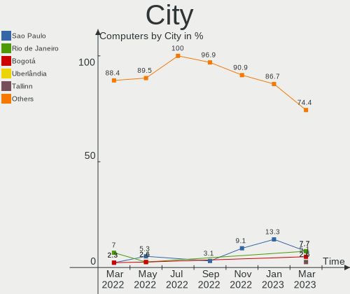
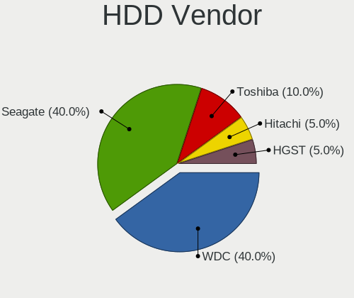
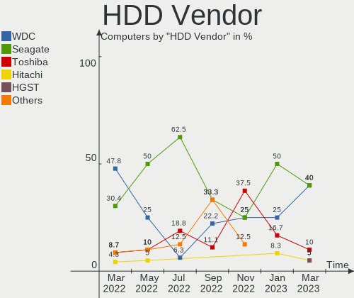
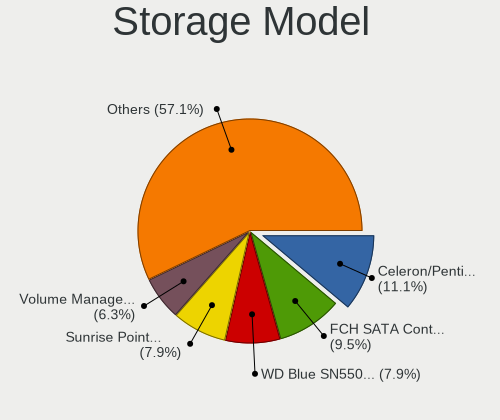
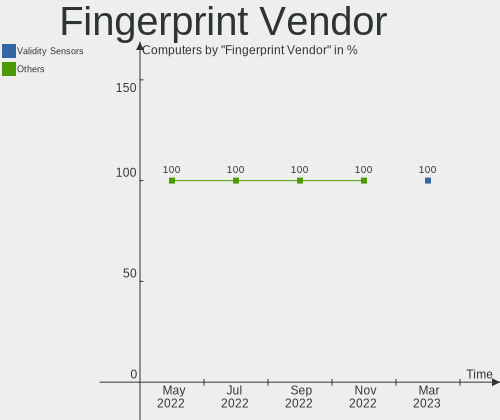

Endless Hardware Trends
-----------------------

A project to identify most popular hardware characteristics and track their change
over time based on data collected by Endless users at https://Linux-Hardware.org.

Anyone can contribute to the study by uploading probes of their computers by
the [hw-probe](https://github.com/linuxhw/hw-probe) tool:

    sudo -E hw-probe -all -upload

This is a report for all computer types. See also reports for [desktops](/Dist/Endless/Desktop/README.md) and [notebooks](/Dist/Endless/Notebook/README.md).

Full-feature report is available here: https://linux-hardware.org/?view=trends

Period: Apr, 2021.

Contents
--------

- [ OS                       ](#os)
- [ OS Family                ](#os-family)
- [ Kernel                   ](#kernel)
- [ Kernel Family            ](#kernel-family)
- [ Kernel Major Ver.        ](#kernel-major-ver)
- [ Arch                     ](#arch)
- [ DE                       ](#de)
- [ Display Server           ](#display-server)
- [ Display Manager          ](#display-manager)
- [ OS Lang                  ](#os-lang)
- [ Boot Mode                ](#boot-mode)
- [ Filesystem               ](#filesystem)
- [ Part. scheme             ](#part-scheme)
- [ Dual Boot with Linux/BSD ](#dual-boot-with-linux/bsd)
- [ Dual Boot (Win)          ](#dual-boot-win)
- [ Country                  ](#country)
- [ City                     ](#city)
- [ Vendor                   ](#vendor)
- [ Model                    ](#model)
- [ Model Family             ](#model-family)
- [ MFG Year                 ](#mfg-year)
- [ Form Factor              ](#form-factor)
- [ Secure Boot              ](#secure-boot)
- [ Coreboot                 ](#coreboot)
- [ RAM Size                 ](#ram-size)
- [ RAM Used                 ](#ram-used)
- [ Has CD-ROM               ](#has-cd-rom)
- [ Total Drives             ](#total-drives)
- [ Has Ethernet             ](#has-ethernet)
- [ Has WiFi                 ](#has-wifi)
- [ Has Bluetooth            ](#has-bluetooth)
- [ Drive Vendor             ](#drive-vendor)
- [ Drive Model              ](#drive-model)
- [ HDD Vendor               ](#hdd-vendor)
- [ SSD Vendor               ](#ssd-vendor)
- [ Drive Kind               ](#drive-kind)
- [ Drive Connector          ](#drive-connector)
- [ Drive Size               ](#drive-size)
- [ Space Total              ](#space-total)
- [ Space Used               ](#space-used)
- [ Malfunc. Drives          ](#malfunc-drives)
- [ Malfunc. Drive Vendor    ](#malfunc-drive-vendor)
- [ Malfunc. HDD Vendor      ](#malfunc-hdd-vendor)
- [ Malfunc. Drive Kind      ](#malfunc-drive-kind)
- [ Failed Drives            ](#failed-drives)
- [ Failed Drive Vendor      ](#failed-drive-vendor)
- [ Drive Status             ](#drive-status)
- [ Storage Vendor           ](#storage-vendor)
- [ Storage Model            ](#storage-model)
- [ Storage Kind             ](#storage-kind)
- [ CPU Vendor               ](#cpu-vendor)
- [ CPU Model                ](#cpu-model)
- [ CPU Model Family         ](#cpu-model-family)
- [ CPU Cores                ](#cpu-cores)
- [ CPU Sockets              ](#cpu-sockets)
- [ CPU Threads              ](#cpu-threads)
- [ CPU Op-Modes             ](#cpu-op-modes)
- [ CPU Microcode            ](#cpu-microcode)
- [ CPU Microarch            ](#cpu-microarch)
- [ GPU Vendor               ](#gpu-vendor)
- [ GPU Model                ](#gpu-model)
- [ GPU Combo                ](#gpu-combo)
- [ GPU Driver               ](#gpu-driver)
- [ GPU Memory               ](#gpu-memory)
- [ Monitor Vendor           ](#monitor-vendor)
- [ Monitor Model            ](#monitor-model)
- [ Monitor Resolution       ](#monitor-resolution)
- [ Monitor Diagonal         ](#monitor-diagonal)
- [ Monitor Width            ](#monitor-width)
- [ Aspect Ratio             ](#aspect-ratio)
- [ Monitor Area             ](#monitor-area)
- [ Pixel Density            ](#pixel-density)
- [ Multiple Monitors        ](#multiple-monitors)
- [ Net Controller Vendor    ](#net-controller-vendor)
- [ Net Controller Model     ](#net-controller-model)
- [ Wireless Vendor          ](#wireless-vendor)
- [ Wireless Model           ](#wireless-model)
- [ Ethernet Vendor          ](#ethernet-vendor)
- [ Ethernet Model           ](#ethernet-model)
- [ Net Controller Kind      ](#net-controller-kind)
- [ Used Controller          ](#used-controller)
- [ NICs                     ](#nics)
- [ IPv6                     ](#ipv6)
- [ Memory Vendor            ](#memory-vendor)
- [ Memory Model             ](#memory-model)
- [ Memory Kind              ](#memory-kind)
- [ Memory Form Factor       ](#memory-form-factor)
- [ Memory Size              ](#memory-size)
- [ Memory Speed             ](#memory-speed)
- [ Sound Vendor             ](#sound-vendor)
- [ Sound Model              ](#sound-model)
- [ Camera Vendor            ](#camera-vendor)
- [ Camera Model             ](#camera-model)
- [ Fingerprint Vendor       ](#fingerprint-vendor)
- [ Fingerprint Model        ](#fingerprint-model)
- [ Chipcard Vendor          ](#chipcard-vendor)
- [ Chipcard Model           ](#chipcard-model)
- [ Printer Vendor           ](#printer-vendor)
- [ Printer Model            ](#printer-model)
- [ Scanner Vendor           ](#scanner-vendor)
- [ Scanner Model            ](#scanner-model)
- [ Bluetooth Vendor         ](#bluetooth-vendor)
- [ Bluetooth Model          ](#bluetooth-model)
- [ Unsupported Devices      ](#unsupported-devices)
- [ Unsupported Device Types ](#unsupported-device-types)

OS
--

Installed operating systems

| Name                  | Computers | Percent |
|-----------------------|-----------|---------|
| Endless 3.9.3         | 45        | 65.22%  |
| Endless 3.9.4         | 11        | 15.94%  |
| Endless 3.9.1         | 3         | 4.35%   |
| Endless 3.7.8         | 2         | 2.9%    |
| Endless 3.7.4         | 2         | 2.9%    |
| Endless 3.9.2         | 1         | 1.45%   |
| Endless 3.8.7         | 1         | 1.45%   |
| Endless 3.8.5         | 1         | 1.45%   |
| Endless 3.8.4         | 1         | 1.45%   |
| Endless 3.8.3-nexthw1 | 1         | 1.45%   |
| Endless 3.5.4         | 1         | 1.45%   |

OS Family
---------

OS without a version

| Name    | Computers | Percent |
|---------|-----------|---------|
| Endless | 69        | 100%    |

Kernel
------

Version of the Linux kernel

| Version           | Computers | Percent |
|-------------------|-----------|---------|
| 5.8.0-14-generic  | 60        | 86.96%  |
| 5.3.0-28-generic  | 2         | 2.9%    |
| 5.3.0-19-generic  | 2         | 2.9%    |
| 5.6.0-7-generic   | 1         | 1.45%   |
| 5.4.0-42-generic  | 1         | 1.45%   |
| 5.4.0-39-generic  | 1         | 1.45%   |
| 5.4.0-19-generic  | 1         | 1.45%   |
| 4.18.0-12-generic | 1         | 1.45%   |

Kernel Family
-------------

Linux kernel without a distro release

| Version | Computers | Percent |
|---------|-----------|---------|
| 5.8.0   | 60        | 86.96%  |
| 5.3.0   | 4         | 5.8%    |
| 5.4.0   | 3         | 4.35%   |
| 5.6.0   | 1         | 1.45%   |
| 4.18.0  | 1         | 1.45%   |

Kernel Major Ver.
-----------------

Linux kernel major version

| Version | Computers | Percent |
|---------|-----------|---------|
| 5.8     | 60        | 86.96%  |
| 5.3     | 4         | 5.8%    |
| 5.4     | 3         | 4.35%   |
| 5.6     | 1         | 1.45%   |
| 4.18    | 1         | 1.45%   |

Arch
----

OS architecture (x86_64, i586, etc.)

| Name   | Computers | Percent |
|--------|-----------|---------|
| x86_64 | 69        | 100%    |

DE
--

Desktop Environment

| Name  | Computers | Percent |
|-------|-----------|---------|
| GNOME | 69        | 100%    |

Display Server
--------------

X11 or Wayland

| Name | Computers | Percent |
|------|-----------|---------|
| X11  | 69        | 100%    |

Display Manager
---------------

SDDM, LightDM, etc.

| Name    | Computers | Percent |
|---------|-----------|---------|
| Unknown | 69        | 100%    |

OS Lang
-------

Language

| Lang        | Computers | Percent |
|-------------|-----------|---------|
| pt_BR       | 19        | 27.54%  |
| en_US       | 18        | 26.09%  |
| ru_UA       | 4         | 5.8%    |
| ru_RU       | 3         | 4.35%   |
| es_MX       | 3         | 4.35%   |
| ro_RO       | 2         | 2.9%    |
| pt_PT       | 2         | 2.9%    |
| fr_FR       | 2         | 2.9%    |
| es_ES       | 2         | 2.9%    |
| es_AR       | 2         | 2.9%    |
| tr_TR       | 1         | 1.45%   |
| th_TH       | 1         | 1.45%   |
| sl_SI       | 1         | 1.45%   |
| ru_RU.UTF_8 | 1         | 1.45%   |
| pl_PL       | 1         | 1.45%   |
| it_IT       | 1         | 1.45%   |
| id_ID       | 1         | 1.45%   |
| hu_HU       | 1         | 1.45%   |
| hr_HR       | 1         | 1.45%   |
| en_PH       | 1         | 1.45%   |
| de_DE       | 1         | 1.45%   |
| bg_BG       | 1         | 1.45%   |

Boot Mode
---------

EFI or BIOS

| Mode | Computers | Percent |
|------|-----------|---------|
| EFI  | 51        | 73.91%  |
| BIOS | 18        | 26.09%  |

Filesystem
----------

Type of filesystem

| Type  | Computers | Percent |
|-------|-----------|---------|
| Ext4  | 68        | 98.55%  |
| Tmpfs | 1         | 1.45%   |

Part. scheme
------------

Scheme of partitioning

| Type    | Computers | Percent |
|---------|-----------|---------|
| Unknown | 69        | 100%    |

Dual Boot with Linux/BSD
------------------------

Hosting more than one Linux/BSD

| Dual boot | Computers | Percent |
|-----------|-----------|---------|
| No        | 69        | 100%    |

Dual Boot (Win)
---------------

Hosting Linux and Windows

| Dual boot | Computers | Percent |
|-----------|-----------|---------|
| No        | 69        | 100%    |

Country
-------

Geographic location (country)

| Country     | Computers | Percent |
|-------------|-----------|---------|
| Brazil      | 20        | 28.99%  |
| USA         | 6         | 8.7%    |
| Romania     | 6         | 8.7%    |
| Ukraine     | 4         | 5.8%    |
| Russia      | 3         | 4.35%   |
| Spain       | 2         | 2.9%    |
| Philippines | 2         | 2.9%    |
| Hungary     | 2         | 2.9%    |
| France      | 2         | 2.9%    |
| Croatia     | 2         | 2.9%    |
| Belarus     | 2         | 2.9%    |
| Argentina   | 2         | 2.9%    |
| Turkey      | 1         | 1.45%   |
| Thailand    | 1         | 1.45%   |
| Slovenia    | 1         | 1.45%   |
| Serbia      | 1         | 1.45%   |
| Portugal    | 1         | 1.45%   |
| Poland      | 1         | 1.45%   |
| New Zealand | 1         | 1.45%   |
| Mexico      | 1         | 1.45%   |
| Luxembourg  | 1         | 1.45%   |
| Kenya       | 1         | 1.45%   |
| Italy       | 1         | 1.45%   |
| Indonesia   | 1         | 1.45%   |
| India       | 1         | 1.45%   |
| Colombia    | 1         | 1.45%   |
| Canada      | 1         | 1.45%   |
| Bulgaria    | 1         | 1.45%   |

City
----

Geographic location (city)

| City                       | Computers | Percent |
|----------------------------|-----------|---------|
| Zagreb                     | 2         | 2.9%    |
| São Paulo                 | 2         | 2.9%    |
| San Francisco              | 2         | 2.9%    |
| Rio de Janeiro             | 2         | 2.9%    |
| Yekaterinburg              | 1         | 1.45%   |
| Voskresenske               | 1         | 1.45%   |
| Vitebsk                    | 1         | 1.45%   |
| Veliki Izvor               | 1         | 1.45%   |
| Târgu Mureş              | 1         | 1.45%   |
| Teresina                   | 1         | 1.45%   |
| Tagbilaran                 | 1         | 1.45%   |
| São Luís                 | 1         | 1.45%   |
| São José dos Campos      | 1         | 1.45%   |
| São Bento do Sul          | 1         | 1.45%   |
| Syeverodonets'k            | 1         | 1.45%   |
| Sorocaba                   | 1         | 1.45%   |
| Sao Joao Evangelista       | 1         | 1.45%   |
| San Lorenzo de la Parrilla | 1         | 1.45%   |
| Ruen                       | 1         | 1.45%   |
| Rosario                    | 1         | 1.45%   |
| Rivne                      | 1         | 1.45%   |
| Reynosa                    | 1         | 1.45%   |
| Quilmes                    | 1         | 1.45%   |
| Quezon City                | 1         | 1.45%   |
| Popesti-Leordeni           | 1         | 1.45%   |
| Ploieşti                  | 1         | 1.45%   |
| Piatra Neamţ              | 1         | 1.45%   |
| Noida                      | 1         | 1.45%   |
| New York                   | 1         | 1.45%   |
| Neronde                    | 1         | 1.45%   |
| Nairobi                    | 1         | 1.45%   |
| Moscow                     | 1         | 1.45%   |
| Minsk                      | 1         | 1.45%   |
| Marília                   | 1         | 1.45%   |
| Marica                     | 1         | 1.45%   |
| Maracaju                   | 1         | 1.45%   |
| Luxembourg                 | 1         | 1.45%   |
| Loei                       | 1         | 1.45%   |
| Lodz                       | 1         | 1.45%   |
| Kherson                    | 1         | 1.45%   |
| Kazan’                   | 1         | 1.45%   |
| Kamnik                     | 1         | 1.45%   |
| Jakarta                    | 1         | 1.45%   |
| Istanbul                   | 1         | 1.45%   |
| Iguatu                     | 1         | 1.45%   |
| Igrejinha                  | 1         | 1.45%   |
| Herriman                   | 1         | 1.45%   |
| Harsova                    | 1         | 1.45%   |
| Dunaújváros              | 1         | 1.45%   |
| Cottage Grove              | 1         | 1.45%   |
| Cocal do Sul               | 1         | 1.45%   |
| Cluj-Napoca                | 1         | 1.45%   |
| Budapest                   | 1         | 1.45%   |
| Bucyrus                    | 1         | 1.45%   |
| Brasília                  | 1         | 1.45%   |
| Bonchamp-les-Laval         | 1         | 1.45%   |
| Bolzano                    | 1         | 1.45%   |
| Bogotá                    | 1         | 1.45%   |
| Belo Jardim                | 1         | 1.45%   |
| Belo Horizonte             | 1         | 1.45%   |

Vendor
------

Motherboard manufacturer

| Name                | Computers | Percent |
|---------------------|-----------|---------|
| Acer                | 26        | 37.68%  |
| ASUSTek Computer    | 25        | 36.23%  |
| Lenovo              | 4         | 5.8%    |
| Hewlett-Packard     | 4         | 5.8%    |
| Dell                | 3         | 4.35%   |
| Positivo            | 2         | 2.9%    |
| Samsung Electronics | 1         | 1.45%   |
| Gigabyte Technology | 1         | 1.45%   |
| AWOW Techonology    | 1         | 1.45%   |
| ASRock              | 1         | 1.45%   |
| AMI                 | 1         | 1.45%   |

Model
-----

Motherboard model

| Name                                       | Computers | Percent |
|--------------------------------------------|-----------|---------|
| Acer Aspire A315-34                        | 4         | 5.8%    |
| ASUS X541UAK                               | 3         | 4.35%   |
| Acer Nitro AN517-51                        | 3         | 4.35%   |
| Acer Nitro AN515-54                        | 3         | 4.35%   |
| Acer Aspire A315-21                        | 3         | 4.35%   |
| Samsung 300E5EV/300E4EV/270E5EV/270E4EV    | 1         | 1.45%   |
| Positivo EC10IS1                           | 1         | 1.45%   |
| Positivo C14CR21                           | 1         | 1.45%   |
| Lenovo YB1-X91F                            | 1         | 1.45%   |
| Lenovo ThinkPad S3-S440 20AYCTO1WW         | 1         | 1.45%   |
| Lenovo ThinkCentre A70 7099S3A             | 1         | 1.45%   |
| Lenovo IdeaPad 3 15IML05 81WB              | 1         | 1.45%   |
| HP x2 210 G2                               | 1         | 1.45%   |
| HP G62                                     | 1         | 1.45%   |
| HP 290 G2 SFF Business PC                  | 1         | 1.45%   |
| HP 2000                                    | 1         | 1.45%   |
| Gigabyte H97M-D3H                          | 1         | 1.45%   |
| Dell Vostro 3500                           | 1         | 1.45%   |
| Dell Latitude E7450                        | 1         | 1.45%   |
| Dell Latitude E6420                        | 1         | 1.45%   |
| AWOW Techonology AK41                      | 1         | 1.45%   |
| ASUS X541NA                                | 1         | 1.45%   |
| ASUS VivoBook_ASUSLaptop X512DA_X512DA     | 1         | 1.45%   |
| ASUS VivoBook_ASUSLaptop X509JA_X509JA     | 1         | 1.45%   |
| ASUS VivoBook_ASUSLaptop X509FB_F509FB     | 1         | 1.45%   |
| ASUS VivoBook_ASUSLaptop X509FA_X509FA     | 1         | 1.45%   |
| ASUS VivoBook_ASUSLaptop X509BA_M509BA     | 1         | 1.45%   |
| ASUS VivoBook_ASUSLaptop X415JA_F415JA     | 1         | 1.45%   |
| ASUS VivoBook 17_ASUS Laptop X705MA_X705MA | 1         | 1.45%   |
| ASUS VivoBook 15_ASUS Laptop X540UBR       | 1         | 1.45%   |
| ASUS VivoBook 15_ASUS Laptop X540MA_X543MA | 1         | 1.45%   |
| ASUS VivoBook 15_ASUS Laptop X540MA_X540MA | 1         | 1.45%   |
| ASUS VivoBook 15_ASUS Laptop X540MA_R540MA | 1         | 1.45%   |
| ASUS VivoBook 15_ASUS Laptop X507MA_X507MA | 1         | 1.45%   |
| ASUS PRIME A320M-K                         | 1         | 1.45%   |
| ASUS P8Z77-M                               | 1         | 1.45%   |
| ASUS P5Q SE                                | 1         | 1.45%   |
| ASUS M5A99X EVO R2.0                       | 1         | 1.45%   |
| ASUS K73SV                                 | 1         | 1.45%   |
| ASUS GL552JX                               | 1         | 1.45%   |
| ASUS EX-B365M-V5                           | 1         | 1.45%   |
| ASUS ASUSPRO P3540FB_P3540FB               | 1         | 1.45%   |
| ASUS ASUSPRO P1440FAC_P1440FA              | 1         | 1.45%   |
| ASRock A88M-G                              | 1         | 1.45%   |
| AMI Cherry Trail CR                        | 1         | 1.45%   |
| Acer Veriton X2665G                        | 1         | 1.45%   |
| Acer Predator PH315-53                     | 1         | 1.45%   |
| Acer Nitro N50-610                         | 1         | 1.45%   |
| Acer Nitro AN515-43                        | 1         | 1.45%   |
| Acer Aspire XC-605G                        | 1         | 1.45%   |
| Acer Aspire TC-895                         | 1         | 1.45%   |
| Acer Aspire ES1-132                        | 1         | 1.45%   |
| Acer Aspire C27-962                        | 1         | 1.45%   |
| Acer Aspire A515-54G                       | 1         | 1.45%   |
| Acer Aspire A315-56                        | 1         | 1.45%   |
| Acer Aspire A315-42G                       | 1         | 1.45%   |
| Acer Aspire A315-31                        | 1         | 1.45%   |
| Acer Aspire A314-31                        | 1         | 1.45%   |

Model Family
------------

Motherboard model prefix

| Name                  | Computers | Percent |
|-----------------------|-----------|---------|
| Acer Aspire           | 16        | 23.19%  |
| ASUS VivoBook         | 12        | 17.39%  |
| Acer Nitro            | 8         | 11.59%  |
| ASUS X541UAK          | 3         | 4.35%   |
| Dell Latitude         | 2         | 2.9%    |
| ASUS ASUSPRO          | 2         | 2.9%    |
| Samsung 300E5EV       | 1         | 1.45%   |
| Positivo EC10IS1      | 1         | 1.45%   |
| Positivo C14CR21      | 1         | 1.45%   |
| Lenovo YB1-X91F       | 1         | 1.45%   |
| Lenovo ThinkPad       | 1         | 1.45%   |
| Lenovo ThinkCentre    | 1         | 1.45%   |
| Lenovo IdeaPad        | 1         | 1.45%   |
| HP x2                 | 1         | 1.45%   |
| HP G62                | 1         | 1.45%   |
| HP 290                | 1         | 1.45%   |
| HP 2000               | 1         | 1.45%   |
| Gigabyte H97M-D3H     | 1         | 1.45%   |
| Dell Vostro           | 1         | 1.45%   |
| AWOW Techonology AK41 | 1         | 1.45%   |
| ASUS X541NA           | 1         | 1.45%   |
| ASUS PRIME            | 1         | 1.45%   |
| ASUS P8Z77-M          | 1         | 1.45%   |
| ASUS P5Q              | 1         | 1.45%   |
| ASUS M5A99X           | 1         | 1.45%   |
| ASUS K73SV            | 1         | 1.45%   |
| ASUS GL552JX          | 1         | 1.45%   |
| ASUS EX-B365M-V5      | 1         | 1.45%   |
| ASRock A88M-G         | 1         | 1.45%   |
| AMI Cherry            | 1         | 1.45%   |
| Acer Veriton          | 1         | 1.45%   |
| Acer Predator         | 1         | 1.45%   |

MFG Year
--------

Motherboard manufacture year

| Year | Computers | Percent |
|------|-----------|---------|
| 2020 | 24        | 34.78%  |
| 2019 | 14        | 20.29%  |
| 2017 | 8         | 11.59%  |
| 2014 | 5         | 7.25%   |
| 2018 | 4         | 5.8%    |
| 2015 | 3         | 4.35%   |
| 2021 | 2         | 2.9%    |
| 2016 | 2         | 2.9%    |
| 2011 | 2         | 2.9%    |
| 2010 | 2         | 2.9%    |
| 2013 | 1         | 1.45%   |
| 2012 | 1         | 1.45%   |
| 2009 | 1         | 1.45%   |

Form Factor
-----------

Physical design of the computer

| Name        | Computers | Percent |
|-------------|-----------|---------|
| Notebook    | 52        | 75.36%  |
| Desktop     | 14        | 20.29%  |
| Tablet      | 1         | 1.45%   |
| Convertible | 1         | 1.45%   |
| All in one  | 1         | 1.45%   |

Secure Boot
-----------

Enabled or disabled

| State    | Computers | Percent |
|----------|-----------|---------|
| Disabled | 48        | 69.57%  |
| Enabled  | 21        | 30.43%  |

Coreboot
--------

Have coreboot on board

| Used | Computers | Percent |
|------|-----------|---------|
| No   | 69        | 100%    |

RAM Size
--------

Total RAM memory

| Size in GB | Computers | Percent |
|------------|-----------|---------|
| 3.01-4.0   | 34        | 49.28%  |
| 4.01-8.0   | 22        | 31.88%  |
| 8.01-16.0  | 6         | 8.7%    |
| 16.01-24.0 | 4         | 5.8%    |
| 1.01-2.0   | 3         | 4.35%   |

RAM Used
--------

Used RAM memory

| Used GB  | Computers | Percent |
|----------|-----------|---------|
| 1.01-2.0 | 43        | 62.32%  |
| 2.01-3.0 | 15        | 21.74%  |
| 0.51-1.0 | 6         | 8.7%    |
| 3.01-4.0 | 5         | 7.25%   |

Has CD-ROM
----------

Has CD-ROM on board

| Presented | Computers | Percent |
|-----------|-----------|---------|
| No        | 53        | 76.81%  |
| Yes       | 16        | 23.19%  |

Total Drives
------------

Number of drives on board

| Drives | Computers | Percent |
|--------|-----------|---------|
| 1      | 51        | 73.91%  |
| 2      | 12        | 17.39%  |
| 4      | 2         | 2.9%    |
| 3      | 2         | 2.9%    |
| 0      | 2         | 2.9%    |

Has Ethernet
------------

Has Ethernet on board

| Presented | Computers | Percent |
|-----------|-----------|---------|
| Yes       | 54        | 78.26%  |
| No        | 15        | 21.74%  |

Has WiFi
--------

Has WiFi module

| Presented | Computers | Percent |
|-----------|-----------|---------|
| Yes       | 61        | 88.41%  |
| No        | 8         | 11.59%  |

Has Bluetooth
-------------

Has Bluetooth module

| Presented | Computers | Percent |
|-----------|-----------|---------|
| Yes       | 51        | 73.91%  |
| No        | 18        | 26.09%  |

Drive Vendor
------------

Hard drive vendors

| Vendor                | Computers | Drives | Percent |
|-----------------------|-----------|--------|---------|
| WDC                   | 16        | 18     | 19.75%  |
| Intel                 | 13        | 13     | 16.05%  |
| Seagate               | 11        | 13     | 13.58%  |
| Kingston              | 9         | 9      | 11.11%  |
| Toshiba               | 8         | 8      | 9.88%   |
| Unknown               | 6         | 8      | 7.41%   |
| Samsung Electronics   | 6         | 6      | 7.41%   |
| SK Hynix              | 2         | 2      | 2.47%   |
| Micron Technology     | 2         | 2      | 2.47%   |
| HGST                  | 2         | 2      | 2.47%   |
| Crucial               | 2         | 2      | 2.47%   |
| S3+                   | 1         | 2      | 1.23%   |
| Realtek Semiconductor | 1         | 1      | 1.23%   |
| Hitachi               | 1         | 1      | 1.23%   |
| ADATA Technology      | 1         | 1      | 1.23%   |

Drive Model
-----------

Hard drive models

| Model                                       | Computers | Percent |
|---------------------------------------------|-----------|---------|
| WDC WD10SPZX-21Z10T0 1TB                    | 10        | 11.63%  |
| Toshiba MQ01ABF050 500GB                    | 5         | 5.81%   |
| Intel NVMe SSD Drive 512GB                  | 5         | 5.81%   |
| Intel NVMe SSD Drive 256GB                  | 5         | 5.81%   |
| Kingston NVMe SSD Drive 512GB               | 4         | 4.65%   |
| Unknown MMC Card  64GB                      | 3         | 3.49%   |
| Kingston RBUSC180DS37256GJ 256GB SSD        | 3         | 3.49%   |
| Intel NVMe SSD Drive 128GB                  | 3         | 3.49%   |
| Toshiba MQ04ABF100 1TB                      | 2         | 2.33%   |
| SK Hynix NVMe SSD Drive 256GB               | 2         | 2.33%   |
| Seagate ST500LT012-1DG142 500GB             | 2         | 2.33%   |
| Seagate ST1000LM035-1RK172 1TB              | 2         | 2.33%   |
| WDC WD5000LPCX-21VHAT0 500GB                | 1         | 1.16%   |
| WDC WD5000AAKX-00U6AA0 500GB                | 1         | 1.16%   |
| WDC WD3200BPVT-60JJ5T0 320GB                | 1         | 1.16%   |
| WDC WD3200BPVT-00JJ5T0 320GB                | 1         | 1.16%   |
| WDC WD3200BEKT-75PVMT0 320GB                | 1         | 1.16%   |
| WDC WD2500AAJS-22B4A0 250GB                 | 1         | 1.16%   |
| WDC WD10SPZX-08Z10 1TB                      | 1         | 1.16%   |
| WDC WD10EZEX-08WN4A0 1TB                    | 1         | 1.16%   |
| Unknown SD/MMC/MS PRO 32GB                  | 1         | 1.16%   |
| Unknown NVMe SSD Drive 128GB                | 1         | 1.16%   |
| Unknown MMC Card  32GB                      | 1         | 1.16%   |
| Unknown MMC Card  16GB                      | 1         | 1.16%   |
| Toshiba MQ01ABD032 320GB                    | 1         | 1.16%   |
| Seagate ST9320325AS 320GB                   | 1         | 1.16%   |
| Seagate ST500LT012-9WS142 500GB             | 1         | 1.16%   |
| Seagate ST500LM012 HN-M500MBB 500GB         | 1         | 1.16%   |
| Seagate ST3750330NS 752GB                   | 1         | 1.16%   |
| Seagate ST3250620AS 250GB                   | 1         | 1.16%   |
| Seagate ST3160318AS 160GB                   | 1         | 1.16%   |
| Seagate ST2000LX001-1RG174 2TB              | 1         | 1.16%   |
| Seagate ST1000DM003-1CH162 1TB              | 1         | 1.16%   |
| Seagate BarraCuda Q1 SSD ZA240CV10001 240GB | 1         | 1.16%   |
| Samsung SSD 860 QVO 2TB                     | 1         | 1.16%   |
| Samsung SSD 860 EVO 250GB                   | 1         | 1.16%   |
| Samsung SSD 850 EVO 250GB                   | 1         | 1.16%   |
| Samsung NVMe SSD Drive 256GB                | 1         | 1.16%   |
| Samsung MZNLF128HCHP-00004 128GB SSD        | 1         | 1.16%   |
| Samsung HM500JI 500GB                       | 1         | 1.16%   |
| S3+ S3SSDC240 240GB                         | 1         | 1.16%   |
| Realtek NVMe SSD Drive 128GB                | 1         | 1.16%   |
| Micron NVMe SSD Drive 256GB                 | 1         | 1.16%   |
| Micron 1100_MTFDDAV256TBN 256GB SSD         | 1         | 1.16%   |
| Kingston SV300S37A120G 120GB SSD            | 1         | 1.16%   |
| Kingston NVMe SSD Drive 256GB               | 1         | 1.16%   |
| Hitachi HDS5C3020ALA632 2TB                 | 1         | 1.16%   |
| HGST HTS545050A7E680 500GB                  | 1         | 1.16%   |
| HGST HTS541010A9E680 1TB                    | 1         | 1.16%   |
| Crucial CT240BX500SSD1 240GB                | 1         | 1.16%   |
| Crucial C300-CTFDDAC256MAG 256GB SSD        | 1         | 1.16%   |
| ADATA NVMe SSD Drive 128GB                  | 1         | 1.16%   |

HDD Vendor
----------

Hard disk drive vendors

| Vendor              | Computers | Drives | Percent |
|---------------------|-----------|--------|---------|
| WDC                 | 16        | 18     | 41.03%  |
| Seagate             | 11        | 12     | 28.21%  |
| Toshiba             | 8         | 8      | 20.51%  |
| HGST                | 2         | 2      | 5.13%   |
| Samsung Electronics | 1         | 1      | 2.56%   |
| Hitachi             | 1         | 1      | 2.56%   |

SSD Vendor
----------

Solid state drive vendors

| Vendor              | Computers | Drives | Percent |
|---------------------|-----------|--------|---------|
| Samsung Electronics | 4         | 4      | 30.77%  |
| Kingston            | 4         | 4      | 30.77%  |
| Crucial             | 2         | 2      | 15.38%  |
| Seagate             | 1         | 1      | 7.69%   |
| S3+                 | 1         | 2      | 7.69%   |
| Micron Technology   | 1         | 1      | 7.69%   |

Drive Kind
----------

HDD or SSD

| Kind    | Computers | Drives | Percent |
|---------|-----------|--------|---------|
| HDD     | 37        | 42     | 46.25%  |
| NVMe    | 25        | 25     | 31.25%  |
| SSD     | 12        | 14     | 15%     |
| MMC     | 5         | 6      | 6.25%   |
| Unknown | 1         | 1      | 1.25%   |

Drive Connector
---------------

SATA, SAS, NVMe, etc.

| Type | Computers | Drives | Percent |
|------|-----------|--------|---------|
| SATA | 46        | 56     | 59.74%  |
| NVMe | 25        | 25     | 32.47%  |
| MMC  | 5         | 6      | 6.49%   |
| SAS  | 1         | 1      | 1.3%    |

Drive Size
----------

Size of hard drive

| Size in TB | Computers | Drives | Percent |
|------------|-----------|--------|---------|
| 0.01-0.5   | 28        | 34     | 56%     |
| 0.51-1.0   | 19        | 19     | 38%     |
| 1.01-2.0   | 3         | 3      | 6%      |

Space Total
-----------

Amount of disk space available on the file system

| Size in GB | Computers | Percent |
|------------|-----------|---------|
| 251-500    | 27        | 39.13%  |
| 101-250    | 18        | 26.09%  |
| 501-1000   | 13        | 18.84%  |
| 21-50      | 3         | 4.35%   |
| 2001-3000  | 2         | 2.9%    |
| 1001-2000  | 2         | 2.9%    |
| 51-100     | 2         | 2.9%    |
| 1-20       | 1         | 1.45%   |
| Unknown    | 1         | 1.45%   |

Space Used
----------

Amount of used disk space

| Used GB  | Computers | Percent |
|----------|-----------|---------|
| 21-50    | 33        | 47.83%  |
| 101-250  | 13        | 18.84%  |
| 1-20     | 12        | 17.39%  |
| 51-100   | 5         | 7.25%   |
| 251-500  | 3         | 4.35%   |
| 501-1000 | 2         | 2.9%    |
| Unknown  | 1         | 1.45%   |

Malfunc. Drives
---------------

Drive models with a malfunction

Zero info for selected period =(

Malfunc. Drive Vendor
---------------------

Vendors of faulty drives

Zero info for selected period =(

Malfunc. HDD Vendor
-------------------

Vendors of faulty HDD drives

Zero info for selected period =(

Malfunc. Drive Kind
-------------------

Kinds of faulty drives

Zero info for selected period =(

Failed Drives
-------------

Failed drive models

Zero info for selected period =(

Failed Drive Vendor
-------------------

Failed drive vendors

Zero info for selected period =(

Drive Status
------------

Number of failed and malfunc. drives

| Status   | Computers | Drives | Percent |
|----------|-----------|--------|---------|
| Detected | 67        | 88     | 100%    |

Storage Vendor
--------------

Storage controller vendors

| Vendor                       | Computers | Percent |
|------------------------------|-----------|---------|
| Intel                        | 54        | 68.35%  |
| AMD                          | 11        | 13.92%  |
| Kingston Technology Company  | 5         | 6.33%   |
| SK Hynix                     | 2         | 2.53%   |
| Shenzhen Longsys Electronics | 1         | 1.27%   |
| Samsung Electronics          | 1         | 1.27%   |
| Realtek Semiconductor        | 1         | 1.27%   |
| Micron Technology            | 1         | 1.27%   |
| Marvell Technology Group     | 1         | 1.27%   |
| ASMedia Technology           | 1         | 1.27%   |
| ADATA Technology             | 1         | 1.27%   |

Storage Model
-------------

Storage controller models

| Model                                                                                  | Computers | Percent |
|----------------------------------------------------------------------------------------|-----------|---------|
| Intel 82801 Mobile SATA Controller [RAID mode]                                         | 15        | 15.63%  |
| Intel PROSet/Wireless WiFi Software extension                                          | 12        | 12.5%   |
| Intel Celeron/Pentium Silver Processor SATA Controller                                 | 10        | 10.42%  |
| AMD FCH SATA Controller [AHCI mode]                                                    | 10        | 10.42%  |
| Kingston Company U-SNS8154P3 NVMe SSD                                                  | 4         | 4.17%   |
| Intel Sunrise Point-LP SATA Controller [AHCI mode]                                     | 4         | 4.17%   |
| Intel Celeron N3350/Pentium N4200/Atom E3900 Series SATA AHCI Controller               | 4         | 4.17%   |
| Intel Comet Lake SATA AHCI Controller                                                  | 3         | 3.13%   |
| SK Hynix BC501 NVMe Solid State Drive 512GB                                            | 2         | 2.08%   |
| Intel NM10/ICH7 Family SATA Controller [IDE mode]                                      | 2         | 2.08%   |
| Intel 8 Series/C220 Series Chipset Family 6-port SATA Controller 1 [AHCI mode]         | 2         | 2.08%   |
| Intel 7 Series Chipset Family 6-port SATA Controller [AHCI mode]                       | 2         | 2.08%   |
| Intel 6 Series/C200 Series Chipset Family Mobile SATA Controller (IDE mode, ports 4-5) | 2         | 2.08%   |
| Intel 6 Series/C200 Series Chipset Family Mobile SATA Controller (IDE mode, ports 0-3) | 2         | 2.08%   |
| Intel 200 Series PCH SATA controller [AHCI mode]                                       | 2         | 2.08%   |
| Shenzhen Longsys Non-Volatile memory controller                                        | 1         | 1.04%   |
| Samsung NVMe Controller                                                                | 1         | 1.04%   |
| Realtek Realtek Non-Volatile memory controller                                         | 1         | 1.04%   |
| Micron Non-Volatile memory controller                                                  | 1         | 1.04%   |
| Marvell Group 88SE6101/6102 single-port PATA133 interface                              | 1         | 1.04%   |
| Kingston Company Company Non-Volatile memory controller                                | 1         | 1.04%   |
| Intel SSD 660P Series                                                                  | 1         | 1.04%   |
| Intel Cannon Point-LP SATA Controller [AHCI Mode]                                      | 1         | 1.04%   |
| Intel 9 Series Chipset Family SATA Controller [AHCI Mode]                              | 1         | 1.04%   |
| Intel 82801JI (ICH10 Family) SATA AHCI Controller                                      | 1         | 1.04%   |
| Intel 8 Series SATA Controller 1 [AHCI mode]                                           | 1         | 1.04%   |
| Intel 7 Series/C210 Series Chipset Family 6-port SATA Controller [AHCI mode]           | 1         | 1.04%   |
| Intel 5 Series/3400 Series Chipset 6 port SATA AHCI Controller                         | 1         | 1.04%   |
| Intel 5 Series/3400 Series Chipset 4 port SATA AHCI Controller                         | 1         | 1.04%   |
| Intel 400 Series Chipset Family SATA AHCI Controller                                   | 1         | 1.04%   |
| ASMedia ASM1062 Serial ATA Controller                                                  | 1         | 1.04%   |
| AMD SB7x0/SB8x0/SB9x0 SATA Controller [AHCI mode]                                      | 1         | 1.04%   |
| AMD FCH SATA Controller D                                                              | 1         | 1.04%   |
| AMD FCH IDE Controller                                                                 | 1         | 1.04%   |
| ADATA Non-Volatile memory controller                                                   | 1         | 1.04%   |

Storage Kind
------------

Kind of storage controller (IDE, SATA, NVMe, SAS, ...)

| Kind | Computers | Percent |
|------|-----------|---------|
| SATA | 57        | 61.96%  |
| NVMe | 25        | 27.17%  |
| IDE  | 6         | 6.52%   |
| RAID | 4         | 4.35%   |

CPU Vendor
----------

Processor vendors

| Vendor | Computers | Percent |
|--------|-----------|---------|
| Intel  | 58        | 84.06%  |
| AMD    | 11        | 15.94%  |

CPU Model
---------

Processor models

| Model                                         | Computers | Percent |
|-----------------------------------------------|-----------|---------|
| Intel Core i5-9300H CPU @ 2.40GHz             | 5         | 7.25%   |
| Intel Celeron N4000 CPU @ 1.10GHz             | 5         | 7.25%   |
| Intel Core i5-1035G1 CPU @ 1.00GHz            | 4         | 5.8%    |
| Intel Celeron N4020 CPU @ 1.10GHz             | 3         | 4.35%   |
| Intel Celeron CPU N3350 @ 1.10GHz             | 3         | 4.35%   |
| Intel Core i5-9500 CPU @ 3.00GHz              | 2         | 2.9%    |
| Intel Core i5-10400F CPU @ 2.90GHz            | 2         | 2.9%    |
| Intel Core i3-8145U CPU @ 2.10GHz             | 2         | 2.9%    |
| AMD Ryzen 5 3500U with Radeon Vega Mobile Gfx | 2         | 2.9%    |
| Intel Pentium Silver N5000 CPU @ 1.10GHz      | 1         | 1.45%   |
| Intel Pentium CPU 6405U @ 2.40GHz             | 1         | 1.45%   |
| Intel Pentium CPU 4417U @ 2.30GHz             | 1         | 1.45%   |
| Intel Pentium CPU 2117U @ 1.80GHz             | 1         | 1.45%   |
| Intel Core i7-9750H CPU @ 2.60GHz             | 1         | 1.45%   |
| Intel Core i7-5600U CPU @ 2.60GHz             | 1         | 1.45%   |
| Intel Core i7-4750HQ CPU @ 2.00GHz            | 1         | 1.45%   |
| Intel Core i7-2620M CPU @ 2.70GHz             | 1         | 1.45%   |
| Intel Core i7-2600 CPU @ 3.40GHz              | 1         | 1.45%   |
| Intel Core i7-10750H CPU @ 2.60GHz            | 1         | 1.45%   |
| Intel Core i7-10510U CPU @ 1.80GHz            | 1         | 1.45%   |
| Intel Core i5-8265U CPU @ 1.60GHz             | 1         | 1.45%   |
| Intel Core i5-7200U CPU @ 2.50GHz             | 1         | 1.45%   |
| Intel Core i5-4460 CPU @ 3.20GHz              | 1         | 1.45%   |
| Intel Core i5-2410M CPU @ 2.30GHz             | 1         | 1.45%   |
| Intel Core i5 CPU M 480 @ 2.67GHz             | 1         | 1.45%   |
| Intel Core i3-9100F CPU @ 3.60GHz             | 1         | 1.45%   |
| Intel Core i3-7100U CPU @ 2.40GHz             | 1         | 1.45%   |
| Intel Core i3-6006U CPU @ 2.00GHz             | 1         | 1.45%   |
| Intel Core i3-4160 CPU @ 3.60GHz              | 1         | 1.45%   |
| Intel Core i3-4030U CPU @ 1.90GHz             | 1         | 1.45%   |
| Intel Core i3-10110U CPU @ 2.10GHz            | 1         | 1.45%   |
| Intel Core i3 CPU M 350 @ 2.27GHz             | 1         | 1.45%   |
| Intel Core 2 Quad CPU Q6600 @ 2.40GHz         | 1         | 1.45%   |
| Intel Core 2 Duo CPU E6750 @ 2.66GHz          | 1         | 1.45%   |
| Intel Celeron J4125 CPU @ 2.00GHz             | 1         | 1.45%   |
| Intel Celeron CPU N3450 @ 1.10GHz             | 1         | 1.45%   |
| Intel Celeron CPU B800 @ 1.50GHz              | 1         | 1.45%   |
| Intel Atom x5-Z8550 CPU @ 1.44GHz             | 1         | 1.45%   |
| Intel Atom x5-Z8350 CPU @ 1.44GHz             | 1         | 1.45%   |
| Intel Atom x5-Z8300 CPU @ 1.44GHz             | 1         | 1.45%   |
| Intel Atom CPU N2600 @ 1.60GHz                | 1         | 1.45%   |
| AMD Ryzen 7 3750H with Radeon Vega Mobile Gfx | 1         | 1.45%   |
| AMD Ryzen 3 2200G with Radeon Vega Graphics   | 1         | 1.45%   |
| AMD FX-8150 Eight-Core Processor              | 1         | 1.45%   |
| AMD E2-9000 RADEON R2, 4 COMPUTE CORES 2C+2G  | 1         | 1.45%   |
| AMD E-300 APU with Radeon HD Graphics         | 1         | 1.45%   |
| AMD A9-9425 RADEON R5, 5 COMPUTE CORES 2C+3G  | 1         | 1.45%   |
| AMD A9-9420e RADEON R5, 5 COMPUTE CORES 2C+3G | 1         | 1.45%   |
| AMD A9-9420 RADEON R5, 5 COMPUTE CORES 2C+3G  | 1         | 1.45%   |
| AMD A10-5800K APU with Radeon HD Graphics     | 1         | 1.45%   |

CPU Model Family
----------------

Processor model prefix

| Model                | Computers | Percent |
|----------------------|-----------|---------|
| Intel Core i5        | 18        | 26.09%  |
| Intel Celeron        | 14        | 20.29%  |
| Intel Core i3        | 9         | 13.04%  |
| Intel Core i7        | 7         | 10.14%  |
| Intel Atom           | 4         | 5.8%    |
| Other                | 3         | 4.35%   |
| Intel Pentium        | 3         | 4.35%   |
| AMD Ryzen 5          | 2         | 2.9%    |
| Intel Pentium Silver | 1         | 1.45%   |
| Intel Core 2 Quad    | 1         | 1.45%   |
| Intel Core 2 Duo     | 1         | 1.45%   |
| AMD Ryzen 7          | 1         | 1.45%   |
| AMD Ryzen 3          | 1         | 1.45%   |
| AMD FX               | 1         | 1.45%   |
| AMD E2               | 1         | 1.45%   |
| AMD E                | 1         | 1.45%   |
| AMD A10              | 1         | 1.45%   |

CPU Cores
---------

Number of processor cores

| Number | Computers | Percent |
|--------|-----------|---------|
| 2      | 36        | 52.17%  |
| 4      | 27        | 39.13%  |
| 6      | 6         | 8.7%    |

CPU Sockets
-----------

Number of sockets

| Number | Computers | Percent |
|--------|-----------|---------|
| 1      | 69        | 100%    |

CPU Threads
-----------

Threads per core (Hyper-Threading)

| Number | Computers | Percent |
|--------|-----------|---------|
| 2      | 38        | 55.07%  |
| 1      | 31        | 44.93%  |

CPU Op-Modes
------------

CPU Operation Modes (32-bit, 64-bit)

| Op mode        | Computers | Percent |
|----------------|-----------|---------|
| 32-bit, 64-bit | 69        | 100%    |

CPU Microcode
-------------

Microcode number

| Number     | Computers | Percent |
|------------|-----------|---------|
| 0x706a1    | 6         | 8.7%    |
| 0x906ea    | 5         | 7.25%   |
| Unknown    | 5         | 7.25%   |
| 0x906ed    | 4         | 5.8%    |
| 0x806ec    | 4         | 5.8%    |
| 0x706e5    | 4         | 5.8%    |
| 0x706a8    | 4         | 5.8%    |
| 0x206a7    | 4         | 5.8%    |
| 0x506c9    | 3         | 4.35%   |
| 0xa0653    | 2         | 2.9%    |
| 0x806e9    | 2         | 2.9%    |
| 0x6fb      | 2         | 2.9%    |
| 0x406c4    | 2         | 2.9%    |
| 0x306c3    | 2         | 2.9%    |
| 0x20655    | 2         | 2.9%    |
| 0x08108109 | 2         | 2.9%    |
| 0x06006705 | 2         | 2.9%    |
| 0x06006704 | 2         | 2.9%    |
| 0xa0652    | 1         | 1.45%   |
| 0x406e3    | 1         | 1.45%   |
| 0x406c3    | 1         | 1.45%   |
| 0x40651    | 1         | 1.45%   |
| 0x306d4    | 1         | 1.45%   |
| 0x306a9    | 1         | 1.45%   |
| 0x30661    | 1         | 1.45%   |
| 0x08108102 | 1         | 1.45%   |
| 0x08101016 | 1         | 1.45%   |
| 0x06001119 | 1         | 1.45%   |
| 0x0600063e | 1         | 1.45%   |
| 0x05000119 | 1         | 1.45%   |

CPU Microarch
-------------

Microarchitecture

| Name          | Computers | Percent |
|---------------|-----------|---------|
| KabyLake      | 18        | 26.09%  |
| Goldmont plus | 10        | 14.49%  |
| SandyBridge   | 4         | 5.8%    |
| IceLake       | 4         | 5.8%    |
| Haswell       | 4         | 5.8%    |
| Goldmont      | 4         | 5.8%    |
| Excavator     | 4         | 5.8%    |
| Zen+          | 3         | 4.35%   |
| Silvermont    | 3         | 4.35%   |
| CometLake     | 3         | 4.35%   |
| Westmere      | 2         | 2.9%    |
| Core          | 2         | 2.9%    |
| Zen           | 1         | 1.45%   |
| Skylake       | 1         | 1.45%   |
| Piledriver    | 1         | 1.45%   |
| IvyBridge     | 1         | 1.45%   |
| Bulldozer     | 1         | 1.45%   |
| Broadwell     | 1         | 1.45%   |
| Bonnell       | 1         | 1.45%   |
| Bobcat        | 1         | 1.45%   |

GPU Vendor
----------

Vendors of graphics cards

| Vendor | Computers | Percent |
|--------|-----------|---------|
| Intel  | 53        | 60.92%  |
| Nvidia | 23        | 26.44%  |
| AMD    | 11        | 12.64%  |

GPU Model
---------

Graphics card models

| Model                                                                                    | Computers | Percent |
|------------------------------------------------------------------------------------------|-----------|---------|
| Intel GeminiLake [UHD Graphics 600]                                                      | 9         | 10.34%  |
| Nvidia TU117M [GeForce GTX 1650 Mobile / Max-Q]                                          | 7         | 8.05%   |
| Intel CoffeeLake-H GT2 [UHD Graphics 630]                                                | 6         | 6.9%    |
| Intel Iris Plus Graphics G1 (Ice Lake)                                                   | 4         | 4.6%    |
| Intel HD Graphics 500                                                                    | 4         | 4.6%    |
| AMD Stoney [Radeon R2/R3/R4/R5 Graphics]                                                 | 4         | 4.6%    |
| Nvidia GM108M [GeForce MX110]                                                            | 3         | 3.45%   |
| Intel WhiskeyLake-U GT2 [UHD Graphics 620]                                               | 3         | 3.45%   |
| Intel Atom/Celeron/Pentium Processor x5-E8000/J3xxx/N3xxx Integrated Graphics Controller | 3         | 3.45%   |
| Intel 2nd Generation Core Processor Family Integrated Graphics Controller                | 3         | 3.45%   |
| AMD Picasso                                                                              | 3         | 3.45%   |
| Nvidia TU117 [GeForce GTX 1650]                                                          | 2         | 2.3%    |
| Nvidia GM108M [GeForce MX130]                                                            | 2         | 2.3%    |
| Intel HD Graphics 620                                                                    | 2         | 2.3%    |
| Intel Core Processor Integrated Graphics Controller                                      | 2         | 2.3%    |
| Intel CometLake-U GT2 [UHD Graphics]                                                     | 2         | 2.3%    |
| Intel CometLake-S GT2 [UHD Graphics 630]                                                 | 2         | 2.3%    |
| Nvidia TU106M [GeForce RTX 2070 Mobile / Max-Q Refresh]                                  | 1         | 1.15%   |
| Nvidia TU106 [GeForce GTX 1650]                                                          | 1         | 1.15%   |
| Nvidia GT218M [GeForce 310M]                                                             | 1         | 1.15%   |
| Nvidia GP108M [GeForce MX250]                                                            | 1         | 1.15%   |
| Nvidia GP107 [GeForce GTX 1050 Ti]                                                       | 1         | 1.15%   |
| Nvidia GP106 [GeForce GTX 1060 3GB]                                                      | 1         | 1.15%   |
| Nvidia GM107M [GeForce GTX 950M]                                                         | 1         | 1.15%   |
| Nvidia GF116 [GeForce GTX 550 Ti]                                                        | 1         | 1.15%   |
| Nvidia GF108M [GeForce GT 540M]                                                          | 1         | 1.15%   |
| Intel Xeon E3-1200 v3/4th Gen Core Processor Integrated Graphics Controller              | 1         | 1.15%   |
| Intel Skylake GT2 [HD Graphics 520]                                                      | 1         | 1.15%   |
| Intel Kaby Lake-U GT1 Integrated Graphics Controller                                     | 1         | 1.15%   |
| Intel HD Graphics 5500                                                                   | 1         | 1.15%   |
| Intel Haswell-ULT Integrated Graphics Controller                                         | 1         | 1.15%   |
| Intel GeminiLake [UHD Graphics 605]                                                      | 1         | 1.15%   |
| Intel Crystal Well Integrated Graphics Controller                                        | 1         | 1.15%   |
| Intel CometLake-H GT2 [UHD Graphics]                                                     | 1         | 1.15%   |
| Intel Comet Lake UHD Graphics                                                            | 1         | 1.15%   |
| Intel Atom Processor D2xxx/N2xxx Integrated Graphics Controller                          | 1         | 1.15%   |
| Intel 4th Generation Core Processor Family Integrated Graphics Controller                | 1         | 1.15%   |
| Intel 4 Series Chipset Integrated Graphics Controller                                    | 1         | 1.15%   |
| Intel 3rd Gen Core processor Graphics Controller                                         | 1         | 1.15%   |
| AMD Wrestler [Radeon HD 6310]                                                            | 1         | 1.15%   |
| AMD Raven Ridge [Radeon Vega Series / Radeon Vega Mobile Series]                         | 1         | 1.15%   |
| AMD Juniper XT [Radeon HD 5770]                                                          | 1         | 1.15%   |
| AMD Cypress PRO [Radeon HD 5850]                                                         | 1         | 1.15%   |

GPU Combo
---------

Combinations of graphics cards

| Name           | Computers | Percent |
|----------------|-----------|---------|
| 1 x Intel      | 36        | 52.17%  |
| Intel + Nvidia | 16        | 23.19%  |
| 1 x AMD        | 9         | 13.04%  |
| 1 x Nvidia     | 6         | 8.7%    |
| Intel + AMD    | 1         | 1.45%   |
| AMD + Nvidia   | 1         | 1.45%   |

GPU Driver
----------

Free vs proprietary

| Driver      | Computers | Percent |
|-------------|-----------|---------|
| Free        | 49        | 71.01%  |
| Proprietary | 20        | 28.99%  |

GPU Memory
----------

Total video memory

| Size in GB | Computers | Percent |
|------------|-----------|---------|
| Unknown    | 56        | 81.16%  |
| 0.01-0.5   | 6         | 8.7%    |
| 1.01-2.0   | 4         | 5.8%    |
| 0.51-1.0   | 3         | 4.35%   |

Monitor Vendor
--------------

Monitor vendors

| Vendor                  | Computers | Percent |
|-------------------------|-----------|---------|
| Chimei Innolux          | 15        | 22.39%  |
| BOE                     | 13        | 19.4%   |
| Samsung Electronics     | 10        | 14.93%  |
| AU Optronics            | 10        | 14.93%  |
| LG Display              | 7         | 10.45%  |
| Ancor Communications    | 2         | 2.99%   |
| Acer                    | 2         | 2.99%   |
| SKY                     | 1         | 1.49%   |
| Philips                 | 1         | 1.49%   |
| PANDA                   | 1         | 1.49%   |
| InfoVision              | 1         | 1.49%   |
| Eizo                    | 1         | 1.49%   |
| Dell                    | 1         | 1.49%   |
| Chi Mei Optoelectronics | 1         | 1.49%   |
| ASUSTek Computer        | 1         | 1.49%   |

Monitor Model
-------------

Monitor models

| Model                                                                    | Computers | Percent |
|--------------------------------------------------------------------------|-----------|---------|
| LG Display LCD Monitor LGD0621 1920x1080 382x215mm 17.3-inch             | 3         | 4.41%   |
| Chimei Innolux LCD Monitor CMN15F5 1920x1080 344x193mm 15.5-inch         | 3         | 4.41%   |
| AU Optronics LCD Monitor AUO81EC 1366x768 344x193mm 15.5-inch            | 3         | 4.41%   |
| Samsung Electronics LCD Monitor SAM0C26 1920x1080 1209x680mm 54.6-inch   | 2         | 2.94%   |
| Chimei Innolux LCD Monitor CMN15E6 1366x768 344x193mm 15.5-inch          | 2         | 2.94%   |
| Chimei Innolux LCD Monitor CMN15DB 1366x768 344x193mm 15.5-inch          | 2         | 2.94%   |
| Chimei Innolux LCD Monitor CMN15D5 1920x1080 340x190mm 15.3-inch         | 2         | 2.94%   |
| BOE LCD Monitor BOE0818 1920x1080 344x194mm 15.5-inch                    | 2         | 2.94%   |
| AU Optronics LCD Monitor AUO61ED 1920x1080 340x190mm 15.3-inch           | 2         | 2.94%   |
| SKY TV-monitor SKY0001 1920x1080 697x392mm 31.5-inch                     | 1         | 1.47%   |
| Samsung Electronics U28D590 SAM0B81 3840x2160 608x345mm 27.5-inch        | 1         | 1.47%   |
| Samsung Electronics U28D590 SAM0B80 3840x2160 607x345mm 27.5-inch        | 1         | 1.47%   |
| Samsung Electronics SyncMaster SAM0841 1920x1080 885x498mm 40.0-inch     | 1         | 1.47%   |
| Samsung Electronics SyncMaster SAM0161 1280x1024 338x270mm 17.0-inch     | 1         | 1.47%   |
| Samsung Electronics LCD Monitor SEC544B 1600x900 382x214mm 17.2-inch     | 1         | 1.47%   |
| Samsung Electronics LCD Monitor SEC5441 1366x768 344x194mm 15.5-inch     | 1         | 1.47%   |
| Samsung Electronics LCD Monitor SEC4151 1366x768 344x194mm 15.5-inch     | 1         | 1.47%   |
| Samsung Electronics LCD Monitor SEC315A 1366x768 344x194mm 15.5-inch     | 1         | 1.47%   |
| Samsung Electronics C27F390 SAM0D32 1920x1080 600x340mm 27.2-inch        | 1         | 1.47%   |
| Philips PHL 163V5 PHLC0CC 1366x768 344x194mm 15.5-inch                   | 1         | 1.47%   |
| PANDA LCD Monitor NCP0046 1920x1080 344x194mm 15.5-inch                  | 1         | 1.47%   |
| LG Display LCD Monitor LGD065A 1920x1080 344x194mm 15.5-inch             | 1         | 1.47%   |
| LG Display LCD Monitor LGD0563 1920x1080 344x194mm 15.5-inch             | 1         | 1.47%   |
| LG Display LCD Monitor LGD0486 1920x1080 309x174mm 14.0-inch             | 1         | 1.47%   |
| LG Display LCD Monitor LGD028A 1366x768 344x194mm 15.5-inch              | 1         | 1.47%   |
| InfoVision LCD Monitor IVO03F4 1920x1200 263x164mm 12.2-inch             | 1         | 1.47%   |
| Eizo L367 ENC1679 1024x768 304x228mm 15.0-inch                           | 1         | 1.47%   |
| Dell DEL 1908FPBLK DEL4047 1280x1024 376x301mm 19.0-inch                 | 1         | 1.47%   |
| Chimei Innolux LCD Monitor CMN1745 1600x900 380x210mm 17.1-inch          | 1         | 1.47%   |
| Chimei Innolux LCD Monitor CMN15CA 1366x768 340x190mm 15.3-inch          | 1         | 1.47%   |
| Chimei Innolux LCD Monitor CMN15C4 1920x1080 344x193mm 15.5-inch         | 1         | 1.47%   |
| Chimei Innolux LCD Monitor CMN1521 1920x1080 344x193mm 15.5-inch         | 1         | 1.47%   |
| Chimei Innolux LCD Monitor CMN1482 1600x900 309x174mm 14.0-inch          | 1         | 1.47%   |
| Chimei Innolux LCD Monitor CMN1132 1366x768 260x140mm 11.6-inch          | 1         | 1.47%   |
| Chi Mei Optoelectronics LCD Monitor CMO15A3 1366x768 344x193mm 15.5-inch | 1         | 1.47%   |
| BOE LCD Monitor BOE0903 1920x1080 344x194mm 15.5-inch                    | 1         | 1.47%   |
| BOE LCD Monitor BOE07F7 1920x1080 309x174mm 14.0-inch                    | 1         | 1.47%   |
| BOE LCD Monitor BOE07CE 1366x768 344x193mm 15.5-inch                     | 1         | 1.47%   |
| BOE LCD Monitor BOE0704 1366x768 344x194mm 15.5-inch                     | 1         | 1.47%   |
| BOE LCD Monitor BOE06BA 1920x1080 344x193mm 15.5-inch                    | 1         | 1.47%   |
| BOE LCD Monitor BOE06A5 1366x768 344x194mm 15.5-inch                     | 1         | 1.47%   |
| BOE LCD Monitor BOE06A4 1366x768 344x194mm 15.5-inch                     | 1         | 1.47%   |
| BOE LCD Monitor BOE069C 1920x1080 344x193mm 15.5-inch                    | 1         | 1.47%   |
| BOE LCD Monitor BOE0698 1366x768 309x173mm 13.9-inch                     | 1         | 1.47%   |
| BOE LCD Monitor BOE0675 1366x768 344x194mm 15.5-inch                     | 1         | 1.47%   |
| BOE LCD Monitor BOE05B1 1366x768 309x173mm 13.9-inch                     | 1         | 1.47%   |
| AU Optronics LCD Monitor AUO70EC 1366x768 340x190mm 15.3-inch            | 1         | 1.47%   |
| AU Optronics LCD Monitor AUO38ED 1920x1080 340x190mm 15.3-inch           | 1         | 1.47%   |
| AU Optronics LCD Monitor AUO2E3C 1366x768 309x173mm 13.9-inch            | 1         | 1.47%   |
| AU Optronics LCD Monitor AUO21ED 1920x1080 344x194mm 15.5-inch           | 1         | 1.47%   |
| AU Optronics LCD Monitor AUO18D4 1280x800 216x135mm 10.0-inch            | 1         | 1.47%   |
| ASUSTek Computer VG248 AUS24C2 1920x1080 531x299mm 24.0-inch             | 1         | 1.47%   |
| Ancor Communications VG248 ACI24A5 1920x1080 531x299mm 24.0-inch         | 1         | 1.47%   |
| Ancor Communications ASUS VH168D ACI16E1 1366x768 359x210mm 16.4-inch    | 1         | 1.47%   |
| Acer X222W ACRAD98 1680x1050 474x296mm 22.0-inch                         | 1         | 1.47%   |
| Acer V206HQLB ACR051A 1366x768 434x236mm 19.4-inch                       | 1         | 1.47%   |

Monitor Resolution
------------------

Monitor screen resolution

| Resolution         | Computers | Percent |
|--------------------|-----------|---------|
| 1920x1080 (FHD)    | 31        | 46.27%  |
| 1366x768 (WXGA)    | 26        | 38.81%  |
| 1600x900 (HD+)     | 3         | 4.48%   |
| 1280x1024 (SXGA)   | 2         | 2.99%   |
| 3840x2160 (4K)     | 1         | 1.49%   |
| 1920x1200 (WUXGA)  | 1         | 1.49%   |
| 1680x1050 (WSXGA+) | 1         | 1.49%   |
| 1280x800 (WXGA)    | 1         | 1.49%   |
| 1024x768 (XGA)     | 1         | 1.49%   |

Monitor Diagonal
----------------

Diagonal size in inches

| Inches | Computers | Percent |
|--------|-----------|---------|
| 15     | 41        | 61.19%  |
| 17     | 6         | 8.96%   |
| 14     | 3         | 4.48%   |
| 13     | 3         | 4.48%   |
| 54     | 2         | 2.99%   |
| 40     | 2         | 2.99%   |
| 27     | 2         | 2.99%   |
| 24     | 2         | 2.99%   |
| 19     | 2         | 2.99%   |
| 22     | 1         | 1.49%   |
| 16     | 1         | 1.49%   |
| 11     | 1         | 1.49%   |
| 10     | 1         | 1.49%   |

Monitor Width
-------------

Physical width

| Width in mm | Computers | Percent |
|-------------|-----------|---------|
| 301-350     | 46        | 69.7%   |
| 351-400     | 8         | 12.12%  |
| 501-600     | 3         | 4.55%   |
| 801-900     | 2         | 3.03%   |
| 401-500     | 2         | 3.03%   |
| 201-300     | 2         | 3.03%   |
| 1001-1500   | 2         | 3.03%   |
| 601-700     | 1         | 1.52%   |

Aspect Ratio
------------

Proportional relationship between the width and the height

| Ratio | Computers | Percent |
|-------|-----------|---------|
| 16/9  | 61        | 92.42%  |
| 5/4   | 2         | 3.03%   |
| 16/10 | 2         | 3.03%   |
| 4/3   | 1         | 1.52%   |

Monitor Area
------------

Area in inch²

| Area in inch² | Computers | Percent |
|----------------|-----------|---------|
| 101-110        | 41        | 61.19%  |
| 81-90          | 6         | 8.96%   |
| 121-130        | 5         | 7.46%   |
| 201-250        | 3         | 4.48%   |
| More than 1000 | 2         | 2.99%   |
| 301-350        | 2         | 2.99%   |
| 151-200        | 2         | 2.99%   |
| 501-1000       | 2         | 2.99%   |
| 51-60          | 1         | 1.49%   |
| 41-50          | 1         | 1.49%   |
| 141-150        | 1         | 1.49%   |
| 111-120        | 1         | 1.49%   |

Pixel Density
-------------

Pixels per inch

| Density | Computers | Percent |
|---------|-----------|---------|
| 121-160 | 28        | 41.79%  |
| 101-120 | 24        | 35.82%  |
| 51-100  | 12        | 17.91%  |
| 1-50    | 3         | 4.48%   |

Multiple Monitors
-----------------

Total monitors connected

| Total | Computers | Percent |
|-------|-----------|---------|
| 1     | 63        | 91.3%   |
| 2     | 4         | 5.8%    |
| 0     | 2         | 2.9%    |

Net Controller Vendor
---------------------

Controller vendors

| Vendor                     | Computers | Percent |
|----------------------------|-----------|---------|
| Realtek Semiconductor      | 55        | 48.67%  |
| Qualcomm Atheros           | 23        | 20.35%  |
| Intel                      | 23        | 20.35%  |
| ZTE WCDMA Technologies MSM | 1         | 0.88%   |
| TP-Link                    | 1         | 0.88%   |
| Samsung Electronics        | 1         | 0.88%   |
| Ralink                     | 1         | 0.88%   |
| Qualcomm                   | 1         | 0.88%   |
| JMicron Technology         | 1         | 0.88%   |
| Broadcom Limited           | 1         | 0.88%   |
| Broadcom                   | 1         | 0.88%   |
| Belkin Components          | 1         | 0.88%   |
| ASUSTek Computer           | 1         | 0.88%   |
| ASIX Electronics           | 1         | 0.88%   |
| AboCom Systems             | 1         | 0.88%   |

Net Controller Model
--------------------

Controller models

| Model                                                                       | Computers | Percent |
|-----------------------------------------------------------------------------|-----------|---------|
| Realtek RTL8111/8168/8411 PCI Express Gigabit Ethernet Controller           | 40        | 32.52%  |
| Qualcomm Atheros QCA9377 802.11ac Wireless Network Adapter                  | 17        | 13.82%  |
| Realtek RTL810xE PCI Express Fast Ethernet controller                       | 8         | 6.5%    |
| Intel Wi-Fi 6 AX200                                                         | 6         | 4.88%   |
| Realtek RTL8821CE 802.11ac PCIe Wireless Network Adapter                    | 4         | 3.25%   |
| Realtek RTL8723BE PCIe Wireless Network Adapter                             | 3         | 2.44%   |
| Intel Wireless 7265                                                         | 3         | 2.44%   |
| Realtek RTL8188EE Wireless Network Adapter                                  | 2         | 1.63%   |
| Qualcomm Atheros AR9485 Wireless Network Adapter                            | 2         | 1.63%   |
| Intel Killer Wi-Fi 6 AX1650i 160MHz Wireless Network Adapter (201NGW)       | 2         | 1.63%   |
| Intel Dual Band Wireless-AC 3168NGW [Stone Peak]                            | 2         | 1.63%   |
| Intel Comet Lake PCH-LP CNVi WiFi                                           | 2         | 1.63%   |
| Intel Comet Lake PCH CNVi WiFi                                              | 2         | 1.63%   |
| Intel AC 1550i Wireless                                                     | 2         | 1.63%   |
| ZTE WCDMA MSM ZXIC Mobile Boardband                                         | 1         | 0.81%   |
| TP-Link UE300 10/100/1000 LAN (ethernet mode) [Realtek RTL8153]             | 1         | 0.81%   |
| Samsung Galaxy series, misc. (tethering mode)                               | 1         | 0.81%   |
| Realtek RTL8822BE 802.11a/b/g/n/ac WiFi adapter                             | 1         | 0.81%   |
| Realtek RTL8192CU 802.11n WLAN Adapter                                      | 1         | 0.81%   |
| Realtek RTL8188EUS 802.11n Wireless Network Adapter                         | 1         | 0.81%   |
| Realtek Killer E2600 Gigabit Ethernet Controller                            | 1         | 0.81%   |
| Ralink RT5390 Wireless 802.11n 1T/1R PCIe                                   | 1         | 0.81%   |
| Qualcomm Redmi Note 7                                                       | 1         | 0.81%   |
| Qualcomm Atheros QCA9565 / AR9565 Wireless Network Adapter                  | 1         | 0.81%   |
| Qualcomm Atheros QCA6174 802.11ac Wireless Network Adapter                  | 1         | 0.81%   |
| Qualcomm Atheros AR9462 Wireless Network Adapter                            | 1         | 0.81%   |
| Qualcomm Atheros AR8151 v2.0 Gigabit Ethernet                               | 1         | 0.81%   |
| Qualcomm Atheros AR8121/AR8113/AR8114 Gigabit or Fast Ethernet              | 1         | 0.81%   |
| JMicron JMC250 PCI Express Gigabit Ethernet Controller                      | 1         | 0.81%   |
| Intel Wireless-AC 9260                                                      | 1         | 0.81%   |
| Intel Wireless 7260                                                         | 1         | 0.81%   |
| Intel WiMAX Connection 2400m                                                | 1         | 0.81%   |
| Intel Ethernet Connection (3) I218-LM                                       | 1         | 0.81%   |
| Intel Centrino Advanced-N + WiMAX 6250 [Kilmer Peak]                        | 1         | 0.81%   |
| Intel Cannon Point-LP CNVi [Wireless-AC]                                    | 1         | 0.81%   |
| Intel 82579LM Gigabit Network Connection (Lewisville)                       | 1         | 0.81%   |
| Broadcom Limited BCM4356 802.11ac Wireless Network Adapter                  | 1         | 0.81%   |
| Broadcom BCM4313 802.11bgn Wireless Network Adapter                         | 1         | 0.81%   |
| Belkin Components F5D7050 Wireless G Adapter v1000/v2000 [Intersil ISL3887] | 1         | 0.81%   |
| ASUS USB-N13 802.11n Network Adapter (rev. B1) [Realtek RTL8192CU]          | 1         | 0.81%   |
| ASIX AX88179 Gigabit Ethernet                                               | 1         | 0.81%   |
| AboCom Systems 802.11n NIC                                                  | 1         | 0.81%   |

Wireless Vendor
---------------

Wireless vendors

| Vendor                | Computers | Percent |
|-----------------------|-----------|---------|
| Intel                 | 23        | 36.51%  |
| Qualcomm Atheros      | 22        | 34.92%  |
| Realtek Semiconductor | 12        | 19.05%  |
| Ralink                | 1         | 1.59%   |
| Broadcom Limited      | 1         | 1.59%   |
| Broadcom              | 1         | 1.59%   |
| Belkin Components     | 1         | 1.59%   |
| ASUSTek Computer      | 1         | 1.59%   |
| AboCom Systems        | 1         | 1.59%   |

Wireless Model
--------------

Wireless models

| Model                                                                       | Computers | Percent |
|-----------------------------------------------------------------------------|-----------|---------|
| Qualcomm Atheros QCA9377 802.11ac Wireless Network Adapter                  | 17        | 26.98%  |
| Intel Wi-Fi 6 AX200                                                         | 6         | 9.52%   |
| Realtek RTL8821CE 802.11ac PCIe Wireless Network Adapter                    | 4         | 6.35%   |
| Realtek RTL8723BE PCIe Wireless Network Adapter                             | 3         | 4.76%   |
| Intel Wireless 7265                                                         | 3         | 4.76%   |
| Realtek RTL8188EE Wireless Network Adapter                                  | 2         | 3.17%   |
| Qualcomm Atheros AR9485 Wireless Network Adapter                            | 2         | 3.17%   |
| Intel Killer Wi-Fi 6 AX1650i 160MHz Wireless Network Adapter (201NGW)       | 2         | 3.17%   |
| Intel Dual Band Wireless-AC 3168NGW [Stone Peak]                            | 2         | 3.17%   |
| Intel Comet Lake PCH-LP CNVi WiFi                                           | 2         | 3.17%   |
| Intel Comet Lake PCH CNVi WiFi                                              | 2         | 3.17%   |
| Intel AC 1550i Wireless                                                     | 2         | 3.17%   |
| Realtek RTL8822BE 802.11a/b/g/n/ac WiFi adapter                             | 1         | 1.59%   |
| Realtek RTL8192CU 802.11n WLAN Adapter                                      | 1         | 1.59%   |
| Realtek RTL8188EUS 802.11n Wireless Network Adapter                         | 1         | 1.59%   |
| Ralink RT5390 Wireless 802.11n 1T/1R PCIe                                   | 1         | 1.59%   |
| Qualcomm Atheros QCA9565 / AR9565 Wireless Network Adapter                  | 1         | 1.59%   |
| Qualcomm Atheros QCA6174 802.11ac Wireless Network Adapter                  | 1         | 1.59%   |
| Qualcomm Atheros AR9462 Wireless Network Adapter                            | 1         | 1.59%   |
| Intel Wireless-AC 9260                                                      | 1         | 1.59%   |
| Intel Wireless 7260                                                         | 1         | 1.59%   |
| Intel Centrino Advanced-N + WiMAX 6250 [Kilmer Peak]                        | 1         | 1.59%   |
| Intel Cannon Point-LP CNVi [Wireless-AC]                                    | 1         | 1.59%   |
| Broadcom Limited BCM4356 802.11ac Wireless Network Adapter                  | 1         | 1.59%   |
| Broadcom BCM4313 802.11bgn Wireless Network Adapter                         | 1         | 1.59%   |
| Belkin Components F5D7050 Wireless G Adapter v1000/v2000 [Intersil ISL3887] | 1         | 1.59%   |
| ASUS USB-N13 802.11n Network Adapter (rev. B1) [Realtek RTL8192CU]          | 1         | 1.59%   |
| AboCom Systems 802.11n NIC                                                  | 1         | 1.59%   |

Ethernet Vendor
---------------

Ethernet vendors

| Vendor                     | Computers | Percent |
|----------------------------|-----------|---------|
| Realtek Semiconductor      | 49        | 83.05%  |
| Qualcomm Atheros           | 2         | 3.39%   |
| Intel                      | 2         | 3.39%   |
| ZTE WCDMA Technologies MSM | 1         | 1.69%   |
| TP-Link                    | 1         | 1.69%   |
| Samsung Electronics        | 1         | 1.69%   |
| Qualcomm                   | 1         | 1.69%   |
| JMicron Technology         | 1         | 1.69%   |
| ASIX Electronics           | 1         | 1.69%   |

Ethernet Model
--------------

Ethernet models

| Model                                                             | Computers | Percent |
|-------------------------------------------------------------------|-----------|---------|
| Realtek RTL8111/8168/8411 PCI Express Gigabit Ethernet Controller | 40        | 66.67%  |
| Realtek RTL810xE PCI Express Fast Ethernet controller             | 8         | 13.33%  |
| ZTE WCDMA MSM ZXIC Mobile Boardband                               | 1         | 1.67%   |
| TP-Link UE300 10/100/1000 LAN (ethernet mode) [Realtek RTL8153]   | 1         | 1.67%   |
| Samsung Galaxy series, misc. (tethering mode)                     | 1         | 1.67%   |
| Realtek Killer E2600 Gigabit Ethernet Controller                  | 1         | 1.67%   |
| Qualcomm Redmi Note 7                                             | 1         | 1.67%   |
| Qualcomm Atheros AR8151 v2.0 Gigabit Ethernet                     | 1         | 1.67%   |
| Qualcomm Atheros AR8121/AR8113/AR8114 Gigabit or Fast Ethernet    | 1         | 1.67%   |
| JMicron JMC250 PCI Express Gigabit Ethernet Controller            | 1         | 1.67%   |
| Intel WiMAX Connection 2400m                                      | 1         | 1.67%   |
| Intel Ethernet Connection (3) I218-LM                             | 1         | 1.67%   |
| Intel 82579LM Gigabit Network Connection (Lewisville)             | 1         | 1.67%   |
| ASIX AX88179 Gigabit Ethernet                                     | 1         | 1.67%   |

Net Controller Kind
-------------------

Ethernet, WiFi or modem

| Kind     | Computers | Percent |
|----------|-----------|---------|
| WiFi     | 61        | 53.04%  |
| Ethernet | 54        | 46.96%  |

Used Controller
---------------

Currently used network controller

| Kind     | Computers | Percent |
|----------|-----------|---------|
| WiFi     | 61        | 53.51%  |
| Ethernet | 53        | 46.49%  |

NICs
----

Total network controllers on board

| Total | Computers | Percent |
|-------|-----------|---------|
| 2     | 44        | 63.77%  |
| 1     | 24        | 34.78%  |
| 0     | 1         | 1.45%   |

IPv6
----

IPv6 vs IPv4

| Used | Computers | Percent |
|------|-----------|---------|
| No   | 55        | 79.71%  |
| Yes  | 14        | 20.29%  |

Memory Vendor
-------------

Memory module vendors

Zero info for selected period =(

Memory Model
------------

Memory module models

Zero info for selected period =(

Memory Kind
-----------

Memory module kinds

Zero info for selected period =(

Memory Form Factor
------------------

Physical design of the memory module

Zero info for selected period =(

Memory Size
-----------

Memory module size

Zero info for selected period =(

Memory Speed
------------

Memory module speed

Zero info for selected period =(

Sound Vendor
------------

Sound card vendors

| Vendor              | Computers | Percent |
|---------------------|-----------|---------|
| Intel               | 55        | 64.71%  |
| Nvidia              | 15        | 17.65%  |
| AMD                 | 13        | 15.29%  |
| EasyPass Industrial | 1         | 1.18%   |
| C-Media Electronics | 1         | 1.18%   |

Sound Model
-----------

Sound card models

| Model                                                                      | Computers | Percent |
|----------------------------------------------------------------------------|-----------|---------|
| Intel Celeron/Pentium Silver Processor High Definition Audio               | 10        | 10.1%   |
| Nvidia TU107 GeForce GTX 1650 High Definition Audio Controller             | 8         | 8.08%   |
| Intel Cannon Lake PCH cAVS                                                 | 6         | 6.06%   |
| Intel Sunrise Point-LP HD Audio                                            | 4         | 4.04%   |
| Intel Ice Lake-LP Smart Sound Technology Audio Controller                  | 4         | 4.04%   |
| Intel Celeron N3350/Pentium N4200/Atom E3900 Series Audio Cluster          | 4         | 4.04%   |
| AMD Raven/Raven2/Fenghuang HDMI/DP Audio Controller                        | 4         | 4.04%   |
| AMD High Definition Audio Controller                                       | 4         | 4.04%   |
| AMD Family 17h (Models 10h-1fh) HD Audio Controller                        | 4         | 4.04%   |
| AMD Family 15h (Models 60h-6fh) Audio Controller                           | 4         | 4.04%   |
| Intel Comet Lake PCH-LP cAVS                                               | 3         | 3.03%   |
| Intel Cannon Point-LP High Definition Audio Controller                     | 3         | 3.03%   |
| Intel 7 Series/C216 Chipset Family High Definition Audio Controller        | 3         | 3.03%   |
| Intel 200 Series PCH HD Audio                                              | 3         | 3.03%   |
| Nvidia TU106 High Definition Audio Controller                              | 2         | 2.02%   |
| Intel Xeon E3-1200 v3/4th Gen Core Processor HD Audio Controller           | 2         | 2.02%   |
| Intel NM10/ICH7 Family High Definition Audio Controller                    | 2         | 2.02%   |
| Intel Comet Lake PCH cAVS                                                  | 2         | 2.02%   |
| Intel 8 Series/C220 Series Chipset High Definition Audio Controller        | 2         | 2.02%   |
| Intel 6 Series/C200 Series Chipset Family High Definition Audio Controller | 2         | 2.02%   |
| Intel 5 Series/3400 Series Chipset High Definition Audio                   | 2         | 2.02%   |
| AMD FCH Azalia Controller                                                  | 2         | 2.02%   |
| Nvidia High Definition Audio Controller                                    | 1         | 1.01%   |
| Nvidia GP107GL High Definition Audio Controller                            | 1         | 1.01%   |
| Nvidia GP106 High Definition Audio Controller                              | 1         | 1.01%   |
| Nvidia GF116 High Definition Audio Controller                              | 1         | 1.01%   |
| Nvidia GF108 High Definition Audio Controller                              | 1         | 1.01%   |
| Intel Wildcat Point-LP High Definition Audio Controller                    | 1         | 1.01%   |
| Intel Haswell-ULT HD Audio Controller                                      | 1         | 1.01%   |
| Intel Crystal Well HD Audio Controller                                     | 1         | 1.01%   |
| Intel Comet Lake PCH-V Smart Sound Technology Audio Controller             | 1         | 1.01%   |
| Intel Broadwell-U Audio Controller                                         | 1         | 1.01%   |
| Intel 9 Series Chipset Family HD Audio Controller                          | 1         | 1.01%   |
| Intel 82801JI (ICH10 Family) HD Audio Controller                           | 1         | 1.01%   |
| Intel 8 Series HD Audio Controller                                         | 1         | 1.01%   |
| EasyPass Industrial Audioengine D1                                         | 1         | 1.01%   |
| C-Media Electronics USB Audio Device                                       | 1         | 1.01%   |
| AMD Wrestler HDMI Audio                                                    | 1         | 1.01%   |
| AMD SBx00 Azalia (Intel HDA)                                               | 1         | 1.01%   |
| AMD Juniper HDMI Audio [Radeon HD 5700 Series]                             | 1         | 1.01%   |
| AMD Cypress HDMI Audio [Radeon HD 5830/5850/5870 / 6850/6870 Rebrand]      | 1         | 1.01%   |

Camera Vendor
-------------

Camera device vendors

| Vendor                        | Computers | Percent |
|-------------------------------|-----------|---------|
| Quanta                        | 17        | 30.91%  |
| IMC Networks                  | 15        | 27.27%  |
| Chicony Electronics           | 10        | 18.18%  |
| Silicon Motion                | 2         | 3.64%   |
| Samsung Electronics           | 2         | 3.64%   |
| Alcor Micro                   | 2         | 3.64%   |
| Acer                          | 2         | 3.64%   |
| Suyin                         | 1         | 1.82%   |
| Sunplus Innovation Technology | 1         | 1.82%   |
| Ricoh                         | 1         | 1.82%   |
| Realtek Semiconductor         | 1         | 1.82%   |
| Microdia                      | 1         | 1.82%   |

Camera Model
------------

Camera device models

| Model                                    | Computers | Percent |
|------------------------------------------|-----------|---------|
| IMC Networks USB2.0 VGA UVC WebCam       | 12        | 21.82%  |
| Quanta VGA WebCam                        | 8         | 14.55%  |
| Quanta HD User Facing                    | 8         | 14.55%  |
| Chicony VGA WebCam                       | 4         | 7.27%   |
| Chicony USB2.0 VGA UVC WebCam            | 3         | 5.45%   |
| Samsung Galaxy A5 (MTP)                  | 2         | 3.64%   |
| IMC Networks USB2.0 HD UVC WebCam        | 2         | 3.64%   |
| Suyin HP TrueVision HD Integrated Webcam | 1         | 1.82%   |
| Sunplus Integrated_Webcam_HD             | 1         | 1.82%   |
| Silicon Motion WebCam SC-10HDD12636N     | 1         | 1.82%   |
| Silicon Motion HP Webcam-101             | 1         | 1.82%   |
| Ricoh Laptop_Integrated_Webcam_FHD       | 1         | 1.82%   |
| Realtek Integrated Camera                | 1         | 1.82%   |
| Quanta USB2.0 HD UVC WebCam              | 1         | 1.82%   |
| Microdia Laptop_Integrated_Webcam_2M     | 1         | 1.82%   |
| IMC Networks Integrated Camera           | 1         | 1.82%   |
| Chicony USB2.0 HD UVC WebCam             | 1         | 1.82%   |
| Chicony HP TrueVision HD                 | 1         | 1.82%   |
| Chicony HD User Facing                   | 1         | 1.82%   |
| Alcor Micro USB 2.0 PC Camera            | 1         | 1.82%   |
| Alcor Micro Asus Integrated Webcam       | 1         | 1.82%   |
| Acer USB Camera                          | 1         | 1.82%   |
| Acer HD Webcam                           | 1         | 1.82%   |

Fingerprint Vendor
------------------

Fingerprint sensor vendors

| Vendor           | Computers | Percent |
|------------------|-----------|---------|
| Validity Sensors | 2         | 100%    |

Fingerprint Model
-----------------

Fingerprint sensor models

| Model                                       | Computers | Percent |
|---------------------------------------------|-----------|---------|
| Validity Sensors VFS5011 Fingerprint Reader | 1         | 50%     |
| Validity Sensors VFS300 Fingerprint Reader  | 1         | 50%     |

Chipcard Vendor
---------------

Chipcard module vendors

| Vendor   | Computers | Percent |
|----------|-----------|---------|
| Broadcom | 1         | 100%    |

Chipcard Model
--------------

Chipcard module models

| Model                                                                        | Computers | Percent |
|------------------------------------------------------------------------------|-----------|---------|
| Broadcom BCM5880 Secure Applications Processor with fingerprint swipe sensor | 1         | 100%    |

Printer Vendor
--------------

Printer device vendors

| Vendor             | Computers | Percent |
|--------------------|-----------|---------|
| Seiko Epson        | 2         | 40%     |
| Brother Industries | 2         | 40%     |
| Dymo-CoStar        | 1         | 20%     |

Printer Model
-------------

Printer device models

| Model                                       | Computers | Percent |
|---------------------------------------------|-----------|---------|
| Seiko Epson L3150 Series                    | 1         | 20%     |
| Seiko Epson L120 Series                     | 1         | 20%     |
| Dymo-CoStar DYMO LabelWriter 450 Twin Turbo | 1         | 20%     |
| Brother DCP-T710W                           | 1         | 20%     |
| Brother DCP-L2540DW                         | 1         | 20%     |

Scanner Vendor
--------------

Scanner device vendors

Zero info for selected period =(

Scanner Model
-------------

Scanner device models

Zero info for selected period =(

Bluetooth Vendor
----------------

Controller vendors

| Vendor                          | Computers | Percent |
|---------------------------------|-----------|---------|
| Intel                           | 20        | 39.22%  |
| Lite-On Technology              | 13        | 25.49%  |
| IMC Networks                    | 12        | 23.53%  |
| Realtek Semiconductor           | 3         | 5.88%   |
| Dell                            | 2         | 3.92%   |
| Qualcomm Atheros Communications | 1         | 1.96%   |

Bluetooth Model
---------------

Controller models

| Model                                          | Computers | Percent |
|------------------------------------------------|-----------|---------|
| Lite-On Qualcomm Atheros QCA9377 Bluetooth     | 11        | 21.57%  |
| Intel Bluetooth Device                         | 9         | 17.65%  |
| Intel Bluetooth 9460/9560 Jefferson Peak (JfP) | 7         | 13.73%  |
| IMC Networks Bluetooth Device                  | 7         | 13.73%  |
| IMC Networks Bluetooth Radio                   | 5         | 9.8%    |
| Realtek Bluetooth Radio                        | 3         | 5.88%   |
| Intel Bluetooth wireless interface             | 3         | 5.88%   |
| Lite-On Bluetooth Device                       | 2         | 3.92%   |
| Qualcomm Atheros AR3012 Bluetooth 4.0          | 1         | 1.96%   |
| Intel Wireless-AC 9260 Bluetooth Adapter       | 1         | 1.96%   |
| Dell Wireless 365 Bluetooth                    | 1         | 1.96%   |
| Dell DW375 Bluetooth Module                    | 1         | 1.96%   |

Unsupported Devices
-------------------

Total unsupported devices on board

| Total | Computers | Percent |
|-------|-----------|---------|
| 0     | 61        | 88.41%  |
| 1     | 7         | 10.14%  |
| 2     | 1         | 1.45%   |

Unsupported Device Types
------------------------

Types of unsupported devices

| Type                  | Computers | Percent |
|-----------------------|-----------|---------|
| Multimedia controller | 5         | 55.56%  |
| Fingerprint reader    | 2         | 22.22%  |
| Storage               | 1         | 11.11%  |
| Chipcard              | 1         | 11.11%  |

