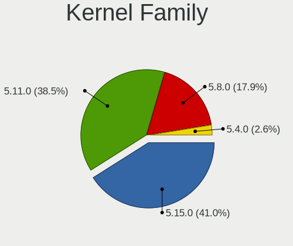
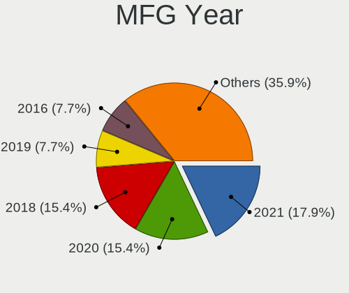
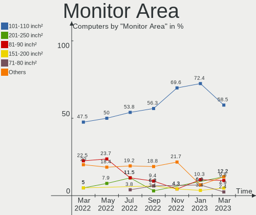

Endless Hardware Trends
-----------------------

A project to identify most popular hardware characteristics and track their change
over time based on data collected by Endless users at https://Linux-Hardware.org.

Anyone can contribute to the study by uploading probes of their computers by
the [hw-probe](https://github.com/linuxhw/hw-probe) tool:

    sudo hw-probe -all -upload

This is a report for all computer types. See also reports for [desktops](/Dist/Endless/Desktop/README.md) and [notebooks](/Dist/Endless/Notebook/README.md).

Full-feature report is available here: https://linux-hardware.org/?view=trends

Period: Mar, 2020.

Contents
--------

- [ OS                       ](#os)
- [ OS Family                ](#os-family)
- [ Kernel                   ](#kernel)
- [ Kernel Family            ](#kernel-family)
- [ Kernel Major Ver.        ](#kernel-major-ver)
- [ Arch                     ](#arch)
- [ DE                       ](#de)
- [ Display Server           ](#display-server)
- [ OS Lang                  ](#os-lang)
- [ Boot Mode                ](#boot-mode)
- [ Filesystem               ](#filesystem)
- [ Dual Boot with Linux     ](#dual-boot-with-linux)
- [ Dual Boot (Win)          ](#dual-boot-win)
- [ Country                  ](#country)
- [ City                     ](#city)
- [ Vendor                   ](#vendor)
- [ Model                    ](#model)
- [ Model Family             ](#model-family)
- [ MFG Year                 ](#mfg-year)
- [ Form Factor              ](#form-factor)
- [ Secure Boot              ](#secure-boot)
- [ Coreboot                 ](#coreboot)
- [ RAM Size                 ](#ram-size)
- [ RAM Used                 ](#ram-used)
- [ Drive Vendor             ](#drive-vendor)
- [ Drive Model              ](#drive-model)
- [ Drive Kind               ](#drive-kind)
- [ Drive Connector          ](#drive-connector)
- [ Drive Size               ](#drive-size)
- [ Space Total              ](#space-total)
- [ Space Used               ](#space-used)
- [ Malfunc. Drives          ](#malfunc-drives)
- [ Malfunc. Drive Vendor    ](#malfunc-drive-vendor)
- [ Malfunc. Drive Kind      ](#malfunc-drive-kind)
- [ Failed Drives            ](#failed-drives)
- [ Failed Drive Vendor      ](#failed-drive-vendor)
- [ Drive Status             ](#drive-status)
- [ Storage Vendor           ](#storage-vendor)
- [ Storage Model            ](#storage-model)
- [ Storage Kind             ](#storage-kind)
- [ CPU Vendor               ](#cpu-vendor)
- [ CPU Model                ](#cpu-model)
- [ CPU Model Family         ](#cpu-model-family)
- [ CPU Cores                ](#cpu-cores)
- [ CPU Sockets              ](#cpu-sockets)
- [ CPU Threads              ](#cpu-threads)
- [ CPU Op-Modes             ](#cpu-op-modes)
- [ CPU Microarch            ](#cpu-microarch)
- [ CPU Microcode            ](#cpu-microcode)
- [ GPU Vendor               ](#gpu-vendor)
- [ GPU Model                ](#gpu-model)
- [ GPU Combo                ](#gpu-combo)
- [ GPU Driver               ](#gpu-driver)
- [ GPU Memory               ](#gpu-memory)
- [ Monitor Vendor           ](#monitor-vendor)
- [ Monitor Model            ](#monitor-model)
- [ Monitor Resolution       ](#monitor-resolution)
- [ Monitor Diagonal         ](#monitor-diagonal)
- [ Monitor Width            ](#monitor-width)
- [ Aspect Ratio             ](#aspect-ratio)
- [ Monitor Area             ](#monitor-area)
- [ Pixel Density            ](#pixel-density)
- [ Multiple Monitors        ](#multiple-monitors)
- [ Net Controller Vendor    ](#net-controller-vendor)
- [ Net Controller Model     ](#net-controller-model)
- [ Net Controller Kind      ](#net-controller-kind)
- [ Used Controller          ](#used-controller)
- [ NICs                     ](#nics)
- [ Unsupported Devices      ](#unsupported-devices)
- [ Unsupported Device Types ](#unsupported-device-types)

OS
--

Installed operating systems

| Name                   | Computers | Percent |
|------------------------|-----------|---------|
| Endless 3.7.8          | 150       | 73.17%  |
| Endless 3.7.7          | 29        | 14.15%  |
| Endless 3.7.6          | 4         | 1.95%   |
| Endless 3.3.20         | 4         | 1.95%   |
| Endless 3.3.20-nexthw1 | 3         | 1.46%   |
| Endless 3.6.4          | 2         | 0.98%   |
| Endless 3.3.16-nexthw1 | 2         | 0.98%   |
| Endless 3.7.5          | 1         | 0.49%   |
| Endless 3.6.1-nexthw1  | 1         | 0.49%   |
| Endless 3.6.0-nexthw1  | 1         | 0.49%   |
| Endless 3.6.0          | 1         | 0.49%   |
| Endless 3.5.6          | 1         | 0.49%   |
| Endless 3.5.2          | 1         | 0.49%   |
| Endless 3.4.7          | 1         | 0.49%   |
| Endless 3.4.6-nexthw2  | 1         | 0.49%   |
| Endless 3.4.3-nexthw1  | 1         | 0.49%   |
| Endless 3.4.2-nexthw1  | 1         | 0.49%   |
| Endless 3.3.7          | 1         | 0.49%   |

OS Family
---------

OS without a version

| Name    | Computers | Percent |
|---------|-----------|---------|
| Endless | 205       | 100%    |

Kernel
------

Version of the Linux kernel

| Version           | Computers | Percent |
|-------------------|-----------|---------|
| 5.3.0-28-generic  | 177       | 86.34%  |
| 5.3.0-23-generic  | 5         | 2.44%   |
| 4.13.0-32-generic | 4         | 1.95%   |
| 4.15.0-15-generic | 3         | 1.46%   |
| 5.4.0-7-generic   | 2         | 0.98%   |
| 5.1.0-2-generic   | 2         | 0.98%   |
| 5.0.0-25-generic  | 2         | 0.98%   |
| 4.16.0-4-generic  | 2         | 0.98%   |
| 4.15.0-12-generic | 2         | 0.98%   |
| 5.0.0-15-generic  | 1         | 0.49%   |
| 4.18.0-7-generic  | 1         | 0.49%   |
| 4.18.0-12-generic | 1         | 0.49%   |
| 4.18.0-11-generic | 1         | 0.49%   |
| 4.15.0-33-generic | 1         | 0.49%   |
| 4.13.0-19-generic | 1         | 0.49%   |

Kernel Family
-------------

Linux kernel without a distro release

| Version | Computers | Percent |
|---------|-----------|---------|
| 5.3.0   | 182       | 88.78%  |
| 4.15.0  | 6         | 2.93%   |
| 4.13.0  | 5         | 2.44%   |
| 5.0.0   | 3         | 1.46%   |
| 4.18.0  | 3         | 1.46%   |
| 5.4.0   | 2         | 0.98%   |
| 5.1.0   | 2         | 0.98%   |
| 4.16.0  | 2         | 0.98%   |

Kernel Major Ver.
-----------------

Linux kernel major version

| Version | Computers | Percent |
|---------|-----------|---------|
| 5.3     | 182       | 88.78%  |
| 4.15    | 6         | 2.93%   |
| 4.13    | 5         | 2.44%   |
| 5.0     | 3         | 1.46%   |
| 4.18    | 3         | 1.46%   |
| 5.4     | 2         | 0.98%   |
| 5.1     | 2         | 0.98%   |
| 4.16    | 2         | 0.98%   |

Arch
----

OS architecture (x86_64, i586, etc.)

| Name    | Computers | Percent |
|---------|-----------|---------|
| x86_64  | 203       | 99.02%  |
| aarch64 | 2         | 0.98%   |

DE
--

Desktop Environment

| Name    | Computers | Percent |
|---------|-----------|---------|
| GNOME   | 203       | 99.02%  |
| Unknown | 2         | 0.98%   |

Display Server
--------------

X11 or Wayland

| Name    | Computers | Percent |
|---------|-----------|---------|
| X11     | 203       | 99.02%  |
| Unknown | 2         | 0.98%   |

OS Lang
-------

Language

| Lang        | Computers | Percent |
|-------------|-----------|---------|
| en_US.utf8  | 95        | 46.34%  |
| ru_RU       | 18        | 8.78%   |
| pt_BR       | 13        | 6.34%   |
| en_GB       | 11        | 5.37%   |
| de_DE       | 11        | 5.37%   |
| pt_BR.utf8  | 10        | 4.88%   |
| ro_RO       | 6         | 2.93%   |
| es_ES       | 5         | 2.44%   |
| en_US       | 5         | 2.44%   |
| hu_HU       | 4         | 1.95%   |
| ru_UA       | 3         | 1.46%   |
| en_PH       | 3         | 1.46%   |
| ru_RU.UTF_8 | 2         | 0.98%   |
| pt_PT       | 2         | 0.98%   |
| fr_FR       | 2         | 0.98%   |
| uk_UA       | 1         | 0.49%   |
| sv_SE       | 1         | 0.49%   |
| sk_SK       | 1         | 0.49%   |
| nl_BE       | 1         | 0.49%   |
| hr_HR       | 1         | 0.49%   |
| fr_FR.utf8  | 1         | 0.49%   |
| es_AR       | 1         | 0.49%   |
| en_IL       | 1         | 0.49%   |
| en_CA       | 1         | 0.49%   |
| en_AU       | 1         | 0.49%   |
| de_LU       | 1         | 0.49%   |
| cs_CZ       | 1         | 0.49%   |
| ca_ES       | 1         | 0.49%   |
| bg_BG       | 1         | 0.49%   |
| Unknown     | 1         | 0.49%   |

Boot Mode
---------

EFI or BIOS

| Mode | Computers | Percent |
|------|-----------|---------|
| EFI  | 104       | 50.73%  |
| BIOS | 101       | 49.27%  |

Filesystem
----------

Type of filesystem

| Type  | Computers | Percent |
|-------|-----------|---------|
| Ext4  | 187       | 91.22%  |
| Tmpfs | 17        | 8.29%   |
| Btrfs | 1         | 0.49%   |

Dual Boot with Linux
--------------------

Hosting more than one Linux

| Dual boot | Computers | Percent |
|-----------|-----------|---------|
| No        | 205       | 100%    |

Dual Boot (Win)
---------------

Hosting Linux and Windows

| Dual boot | Computers | Percent |
|-----------|-----------|---------|
| No        | 203       | 99.02%  |
| Yes       | 2         | 0.98%   |

Country
-------

Geographic location (country)

| Country                | Computers | Percent |
|------------------------|-----------|---------|
| USA                    | 52        | 25.37%  |
| Brazil                 | 23        | 11.22%  |
| Russia                 | 15        | 7.32%   |
| UK                     | 13        | 6.34%   |
| Romania                | 13        | 6.34%   |
| Germany                | 11        | 5.37%   |
| Spain                  | 6         | 2.93%   |
| Canada                 | 6         | 2.93%   |
| Australia              | 6         | 2.93%   |
| Philippines            | 5         | 2.44%   |
| Ukraine                | 4         | 1.95%   |
| Portugal               | 4         | 1.95%   |
| Hungary                | 4         | 1.95%   |
| Kazakhstan             | 3         | 1.46%   |
| India                  | 3         | 1.46%   |
| Croatia                | 3         | 1.46%   |
| Thailand               | 2         | 0.98%   |
| Israel                 | 2         | 0.98%   |
| Ireland                | 2         | 0.98%   |
| Georgia                | 2         | 0.98%   |
| France                 | 2         | 0.98%   |
| Bosnia and Herzegovina | 2         | 0.98%   |
| Belarus                | 2         | 0.98%   |
| Argentina              | 2         | 0.98%   |
| Vietnam                | 1         | 0.49%   |
| Tunisia                | 1         | 0.49%   |
| Sweden                 | 1         | 0.49%   |
| Slovakia               | 1         | 0.49%   |
| New Zealand            | 1         | 0.49%   |
| Montenegro             | 1         | 0.49%   |
| Moldova, Republic of   | 1         | 0.49%   |
| Luxembourg             | 1         | 0.49%   |
| Latvia                 | 1         | 0.49%   |
| Jamaica                | 1         | 0.49%   |
| Iran                   | 1         | 0.49%   |
| Indonesia              | 1         | 0.49%   |
| Denmark                | 1         | 0.49%   |
| Czech Republic         | 1         | 0.49%   |
| Cyprus                 | 1         | 0.49%   |
| Costa Rica             | 1         | 0.49%   |
| Bulgaria               | 1         | 0.49%   |
| Belgium                | 1         | 0.49%   |

City
----

Geographic location (city)

| City                   | Computers | Percent |
|------------------------|-----------|---------|
| Brisbane               | 5         | 2.44%   |
| Moscow                 | 4         | 1.95%   |
| Budapest               | 4         | 1.95%   |
| Bucharest              | 4         | 1.95%   |
| Taguig                 | 3         | 1.46%   |
| St Petersburg          | 3         | 1.46%   |
| Kyiv                   | 3         | 1.46%   |
| Vila Velha             | 2         | 0.98%   |
| São Paulo             | 2         | 0.98%   |
| Sunderland             | 2         | 0.98%   |
| Sacramento             | 2         | 0.98%   |
| Mitcham                | 2         | 0.98%   |
| Londrina               | 2         | 0.98%   |
| Lisbon                 | 2         | 0.98%   |
| Kerrville              | 2         | 0.98%   |
| Columbus               | 2         | 0.98%   |
| Columbia               | 2         | 0.98%   |
| Cluj-Napoca            | 2         | 0.98%   |
| Zugdidi                | 1         | 0.49%   |
| Zagreb                 | 1         | 0.49%   |
| Yuma                   | 1         | 0.49%   |
| Wittighausen           | 1         | 0.49%   |
| Winston-Salem          | 1         | 0.49%   |
| Wichita                | 1         | 0.49%   |
| West Nyack             | 1         | 0.49%   |
| West Chicago           | 1         | 0.49%   |
| West Babylon           | 1         | 0.49%   |
| Waterlooville          | 1         | 0.49%   |
| Waldesch               | 1         | 0.49%   |
| Volgodonsk             | 1         | 0.49%   |
| Visakhapatnam          | 1         | 0.49%   |
| Virmond                | 1         | 0.49%   |
| Valencia               | 1         | 0.49%   |
| Ust-Kamenogorsk        | 1         | 0.49%   |
| Upper Marlboro         | 1         | 0.49%   |
| Tunis                  | 1         | 0.49%   |
| Toronto                | 1         | 0.49%   |
| Toledo                 | 1         | 0.49%   |
| Thrissur               | 1         | 0.49%   |
| Terrassa               | 1         | 0.49%   |
| Tel Aviv               | 1         | 0.49%   |
| Tehran                 | 1         | 0.49%   |
| Tbilisi                | 1         | 0.49%   |
| Taguatinga             | 1         | 0.49%   |
| São Luís             | 1         | 0.49%   |
| São Bernardo do Campo | 1         | 0.49%   |
| Surrey                 | 1         | 0.49%   |
| Surprise               | 1         | 0.49%   |
| Supply                 | 1         | 0.49%   |
| Stockton-on-Tees       | 1         | 0.49%   |
| Sofia                  | 1         | 0.49%   |
| Shelbyville            | 1         | 0.49%   |
| Shallotte              | 1         | 0.49%   |
| Sfantu Gheorghe        | 1         | 0.49%   |
| Sayreville             | 1         | 0.49%   |
| Sarajevo               | 1         | 0.49%   |
| San José              | 1         | 0.49%   |
| San Carlos             | 1         | 0.49%   |
| San Antonio            | 1         | 0.49%   |
| Saint-Constant         | 1         | 0.49%   |

Vendor
------

Motherboard manufacturer

| Name                    | Computers | Percent |
|-------------------------|-----------|---------|
| ASUSTek Computer        | 58        | 28.29%  |
| Acer                    | 28        | 13.66%  |
| Hewlett-Packard         | 19        | 9.27%   |
| Dell                    | 19        | 9.27%   |
| Lenovo                  | 16        | 7.8%    |
| Gigabyte Technology     | 11        | 5.37%   |
| Toshiba                 | 8         | 3.9%    |
| MSI                     | 6         | 2.93%   |
| ASRock                  | 5         | 2.44%   |
| Sony                    | 3         | 1.46%   |
| Positivo                | 3         | 1.46%   |
| Packard Bell            | 3         | 1.46%   |
| AAEON                   | 3         | 1.46%   |
| Unknown                 | 3         | 1.46%   |
| Samsung Electronics     | 2         | 0.98%   |
| Raspberry Pi Foundation | 2         | 0.98%   |
| Intel                   | 2         | 0.98%   |
| ZOTAC                   | 1         | 0.49%   |
| Phoenix/SiS             | 1         | 0.49%   |
| OEM                     | 1         | 0.49%   |
| Notebook                | 1         | 0.49%   |
| Medion                  | 1         | 0.49%   |
| LIVEFAN                 | 1         | 0.49%   |
| IBM                     | 1         | 0.49%   |
| HUAWEI                  | 1         | 0.49%   |
| Fujitsu Siemens         | 1         | 0.49%   |
| Fujitsu                 | 1         | 0.49%   |
| Foxconn                 | 1         | 0.49%   |
| ECS                     | 1         | 0.49%   |
| Biostar                 | 1         | 0.49%   |
| AMI                     | 1         | 0.49%   |

Model
-----

Motherboard model

| Name                                                | Computers | Percent |
|-----------------------------------------------------|-----------|---------|
| Unknown                                             | 4         | 1.95%   |
| MSI MS-7309                                         | 3         | 1.46%   |
| ASUS VivoBook 15_ASUS Laptop X540UAR                | 3         | 1.46%   |
| ASUS VivoBook 15_ASUS Laptop X540MA_X540MA          | 3         | 1.46%   |
| ASUS VivoBook 15_ASUS Laptop X540MA_R540MA          | 3         | 1.46%   |
| AAEON MF-001                                        | 3         | 1.46%   |
| RPi Raspberry Pi 4 Model B                          | 2         | 0.98%   |
| HP Laptop 15-da0xxx                                 | 2         | 0.98%   |
| ASUS ZenBook UX431DA_UM431DA                        | 2         | 0.98%   |
| ASUS VivoBook_ASUSLaptop X509DA_M509DA              | 2         | 0.98%   |
| ASUS GL553VE                                        | 2         | 0.98%   |
| Acer Nitro AN515-52                                 | 2         | 0.98%   |
| Acer Nitro AN515-51                                 | 2         | 0.98%   |
| Acer Aspire A515-51                                 | 2         | 0.98%   |
| Acer Aspire A315-53                                 | 2         | 0.98%   |
| Acer Aspire A315-51                                 | 2         | 0.98%   |
| ZOTAC AMD M1                                        | 1         | 0.49%   |
| Toshiba Satellite L850                              | 1         | 0.49%   |
| Toshiba Satellite L755D                             | 1         | 0.49%   |
| Toshiba Satellite L305                              | 1         | 0.49%   |
| Toshiba Satellite C855D                             | 1         | 0.49%   |
| Toshiba Satellite C650D                             | 1         | 0.49%   |
| Toshiba Satellite C55-C                             | 1         | 0.49%   |
| Toshiba Satellite C55-B                             | 1         | 0.49%   |
| Toshiba NB510                                       | 1         | 0.49%   |
| Sony VPCEH35FM                                      | 1         | 0.49%   |
| Sony VPCEH1AFX                                      | 1         | 0.49%   |
| Sony SVT1311M1RS                                    | 1         | 0.49%   |
| Samsung Electronics NC208/NC108                     | 1         | 0.49%   |
| Samsung Electronics 300E5EV/300E4EV/270E5EV/270E4EV | 1         | 0.49%   |
| Positivo S14CT01                                    | 1         | 0.49%   |
| Positivo S14BW01                                    | 1         | 0.49%   |
| Positivo C14CR21                                    | 1         | 0.49%   |
| Phoenix/SiS M7x0S                                   | 1         | 0.49%   |
| Packard Bell iMedia S3730                           | 1         | 0.49%   |
| Packard Bell EasyNote TS44HR                        | 1         | 0.49%   |
| Packard Bell EasyNote ML65                          | 1         | 0.49%   |
| Notebook W65_W67RB                                  | 1         | 0.49%   |
| MSI MS-7913                                         | 1         | 0.49%   |
| MSI MS-7877                                         | 1         | 0.49%   |
| MSI MS-7846                                         | 1         | 0.49%   |
| Medion P6618                                        | 1         | 0.49%   |
| LIVEFAN C116B                                       | 1         | 0.49%   |
| Lenovo Yoga 3 Pro-1370 80HE                         | 1         | 0.49%   |
| Lenovo ThinkPad X1 Carbon 3rd 20BTS0H200            | 1         | 0.49%   |
| Lenovo ThinkPad T61 765912G                         | 1         | 0.49%   |
| Lenovo ThinkPad T480 20L5S1S100                     | 1         | 0.49%   |
| Lenovo ThinkPad T420 4180JH1                        | 1         | 0.49%   |
| Lenovo ThinkPad 8 20BN002DUK                        | 1         | 0.49%   |
| Lenovo ThinkCentre M53 10DE001HUS                   | 1         | 0.49%   |
| Lenovo S21e-20 80M4                                 | 1         | 0.49%   |
| Lenovo IdeaPad Z510 20287                           | 1         | 0.49%   |
| Lenovo IdeaPad S145-15IWL 81MV                      | 1         | 0.49%   |
| Lenovo IdeaPad S145-14AST 81ST                      | 1         | 0.49%   |
| Lenovo IdeaPad 330-15IKB 81DE                       | 1         | 0.49%   |
| Lenovo IdeaPad 330-15ARR 81D2                       | 1         | 0.49%   |
| Lenovo G550 20023                                   | 1         | 0.49%   |
| Lenovo B570 1068A8U                                 | 1         | 0.49%   |
| Lenovo 100-14IBY 80R7                               | 1         | 0.49%   |
| Intel NUC5CPYB H61145-404                           | 1         | 0.49%   |

Model Family
------------

Motherboard model prefix

| Name                        | Computers | Percent |
|-----------------------------|-----------|---------|
| ASUS VivoBook               | 32        | 15.61%  |
| Acer Aspire                 | 18        | 8.78%   |
| Dell Inspiron               | 9         | 4.39%   |
| Toshiba Satellite           | 7         | 3.41%   |
| HP Pavilion                 | 6         | 2.93%   |
| Lenovo ThinkPad             | 5         | 2.44%   |
| Lenovo IdeaPad              | 5         | 2.44%   |
| Dell Latitude               | 5         | 2.44%   |
| HP Laptop                   | 4         | 1.95%   |
| ASUS ZenBook                | 4         | 1.95%   |
| Acer Nitro                  | 4         | 1.95%   |
| Unknown                     | 4         | 1.95%   |
| MSI MS-7309                 | 3         | 1.46%   |
| HP Stream                   | 3         | 1.46%   |
| Dell OptiPlex               | 3         | 1.46%   |
| AAEON MF-001                | 3         | 1.46%   |
| RPi Raspberry               | 2         | 0.98%   |
| Packard Bell EasyNote       | 2         | 0.98%   |
| HP Compaq                   | 2         | 0.98%   |
| ASUS PRIME                  | 2         | 0.98%   |
| ASUS GL553VE                | 2         | 0.98%   |
| ASUS A88XM-A                | 2         | 0.98%   |
| Acer TravelMate             | 2         | 0.98%   |
| Acer Swift                  | 2         | 0.98%   |
| ZOTAC AMD                   | 1         | 0.49%   |
| Toshiba NB510               | 1         | 0.49%   |
| Sony VPCEH35FM              | 1         | 0.49%   |
| Sony VPCEH1AFX              | 1         | 0.49%   |
| Sony SVT1311M1RS            | 1         | 0.49%   |
| Samsung Electronics NC208   | 1         | 0.49%   |
| Samsung Electronics 300E5EV | 1         | 0.49%   |
| Positivo S14CT01            | 1         | 0.49%   |
| Positivo S14BW01            | 1         | 0.49%   |
| Positivo C14CR21            | 1         | 0.49%   |
| Phoenix/SiS M7x0S           | 1         | 0.49%   |
| Packard Bell iMedia         | 1         | 0.49%   |
| Notebook W65                | 1         | 0.49%   |
| MSI MS-7913                 | 1         | 0.49%   |
| MSI MS-7877                 | 1         | 0.49%   |
| MSI MS-7846                 | 1         | 0.49%   |
| Medion P6618                | 1         | 0.49%   |
| LIVEFAN C116B               | 1         | 0.49%   |
| Lenovo Yoga                 | 1         | 0.49%   |
| Lenovo ThinkCentre          | 1         | 0.49%   |
| Lenovo S21e-20              | 1         | 0.49%   |
| Lenovo G550                 | 1         | 0.49%   |
| Lenovo B570                 | 1         | 0.49%   |
| Lenovo 100-14IBY            | 1         | 0.49%   |
| Intel NUC5CPYB              | 1         | 0.49%   |
| Intel H61                   | 1         | 0.49%   |
| IBM 8215ZCL                 | 1         | 0.49%   |
| HUAWEI KPL-W0X              | 1         | 0.49%   |
| HP ProBook                  | 1         | 0.49%   |
| HP G71                      | 1         | 0.49%   |
| HP 255                      | 1         | 0.49%   |
| HP 2000                     | 1         | 0.49%   |
| Gigabyte MZGLKAP-00         | 1         | 0.49%   |
| Gigabyte H61M-S1            | 1         | 0.49%   |
| Gigabyte H310M              | 1         | 0.49%   |
| Gigabyte GA-MA770-UD3       | 1         | 0.49%   |

MFG Year
--------

Motherboard manufacture year

| Year    | Computers | Percent |
|---------|-----------|---------|
| 2019    | 65        | 31.71%  |
| 2018    | 29        | 14.15%  |
| 2013    | 18        | 8.78%   |
| 2017    | 13        | 6.34%   |
| 2016    | 11        | 5.37%   |
| 2015    | 9         | 4.39%   |
| 2014    | 9         | 4.39%   |
| 2012    | 9         | 4.39%   |
| 2010    | 9         | 4.39%   |
| 2009    | 9         | 4.39%   |
| 2011    | 8         | 3.9%    |
| 2008    | 7         | 3.41%   |
| 2007    | 5         | 2.44%   |
| Unknown | 3         | 1.46%   |
| 2020    | 1         | 0.49%   |

Form Factor
-----------

Physical design of the computer

| Name           | Computers | Percent |
|----------------|-----------|---------|
| Notebook       | 140       | 68.29%  |
| Desktop        | 54        | 26.34%  |
| All in one     | 4         | 1.95%   |
| System on chip | 2         | 0.98%   |
| Convertible    | 2         | 0.98%   |
| Mini pc        | 2         | 0.98%   |
| Tablet         | 1         | 0.49%   |

Secure Boot
-----------

Enabled or disabled

| State    | Computers | Percent |
|----------|-----------|---------|
| Disabled | 177       | 86.34%  |
| Enabled  | 28        | 13.66%  |

Coreboot
--------

Have coreboot on board

| Used | Computers | Percent |
|------|-----------|---------|
| No   | 205       | 100%    |

RAM Size
--------

Total RAM memory

| Size in GB | Computers | Percent |
|------------|-----------|---------|
| 3.01-4.0   | 81        | 39.51%  |
| 4.01-8.0   | 63        | 30.73%  |
| 8.01-16.0  | 22        | 10.73%  |
| 1.01-2.0   | 19        | 9.27%   |
| 16.01-24.0 | 18        | 8.78%   |
| 24.01-32.0 | 1         | 0.49%   |
| 2.01-3.0   | 1         | 0.49%   |

RAM Used
--------

Used RAM memory

| Used GB  | Computers | Percent |
|----------|-----------|---------|
| 1.01-2.0 | 110       | 53.66%  |
| 2.01-3.0 | 43        | 20.98%  |
| 0.01-1.0 | 33        | 16.1%   |
| 3.01-4.0 | 15        | 7.32%   |
| 4.01-8.0 | 4         | 1.95%   |

Drive Vendor
------------

Hard drive vendors

| Vendor              | Computers | Drives  | Percent |
|---------------------|-----------|---------|---------|
| Seagate             | 41        | 45      | 17.6%   |
| WDC                 | 35        | 37      | 15.02%  |
| Toshiba             | 26        | 26      | 11.16%  |
| Samsung Electronics | 17        | 17      | 7.3%    |
| Unknown             | 16        | 18      | 6.87%   |
| Kingston            | 16        | 17      | 6.87%   |
| Hitachi             | 15        | 15      | 6.44%   |
| SanDisk             | 10        | 10      | 4.29%   |
| HGST                | 7         | 7       | 3%      |
| HL-DT-ST            | 6         | Unknown | 2.58%   |
| Micron Technology   | 5         | 5       | 2.15%   |
| A-DATA Technology   | 5         | 5       | 2.15%   |
| Crucial             | 4         | 6       | 1.72%   |
| SPCC                | 3         | 3       | 1.29%   |
| SK Hynix            | 3         | 3       | 1.29%   |
| Intel               | 3         | 3       | 1.29%   |
| Transcend           | 2         | 3       | 0.86%   |
| Fujitsu             | 2         | 2       | 0.86%   |
| Team                | 1         | 1       | 0.43%   |
| SABRENT             | 1         | 1       | 0.43%   |
| PNY                 | 1         | 1       | 0.43%   |
| Patriot             | 1         | 1       | 0.43%   |
| OCZ                 | 1         | 1       | 0.43%   |
| LONDISK             | 1         | 1       | 0.43%   |
| lntenso             | 1         | 1       | 0.43%   |
| LITEON              | 1         | 1       | 0.43%   |
| KingFast            | 1         | 1       | 0.43%   |
| Integral            | 1         | 1       | 0.43%   |
| GOODRAM             | 1         | 1       | 0.43%   |
| Gigabyte Technology | 1         | 1       | 0.43%   |
| Generic             | 1         | 1       | 0.43%   |
| Emtec               | 1         | 1       | 0.43%   |
| Dogfish             | 1         | 1       | 0.43%   |
| Apacer              | 1         | 1       | 0.43%   |
| AMD                 | 1         | 1       | 0.43%   |

Drive Model
-----------

Hard drive models

| Model                        | Computers | Percent |
|------------------------------|-----------|---------|
| WD10SPZX-21Z10T0 1TB         | 8         | 3.32%   |
| ST1000LM035-1RK172 1TB       | 8         | 3.32%   |
| MMC Card  32GB               | 7         | 2.9%    |
| RBUSC180DS37256GJ 256GB SSD  | 6         | 2.49%   |
| MQ01ABF050 500GB             | 6         | 2.49%   |
| DVDRAM GUE1N 3GB             | 6         | 2.49%   |
| MQ04ABF100 1TB               | 5         | 2.07%   |
| SV300S37A120G 120GB SSD      | 4         | 1.66%   |
| ST500LT012-1DG142 500GB      | 4         | 1.66%   |
| MQ01ABD100 1TB               | 4         | 1.66%   |
| MMC Card  64GB               | 4         | 1.66%   |
| 1100_MTFDDAV256TBN 256GB SSD | 4         | 1.66%   |
| ST500LM012 HN-M500MBB 500GB  | 3         | 1.24%   |
| SSD 840 EVO 120GB            | 3         | 1.24%   |
| SD9SN8W256G1102 256GB SSD    | 3         | 1.24%   |
| MMC Card  16GB               | 3         | 1.24%   |
| IM2S3338-128GD2 128GB SSD    | 3         | 1.24%   |
| HDS721616PLA380 164GB        | 3         | 1.24%   |
| WD10EZEX-08WN4A0 1TB         | 2         | 0.83%   |
| ST2000LM007-1R8174 2TB       | 2         | 0.83%   |
| ST2000DM001-1ER164 2TB       | 2         | 0.83%   |
| ST1000LM024 HN-M101MBB 1TB   | 2         | 0.83%   |
| ST1000LM014-1EJ164 1TB       | 2         | 0.83%   |
| SSD 850 EVO 250GB            | 2         | 0.83%   |
| SDSSDA240G 240GB             | 2         | 0.83%   |
| SD9SN8W256G1014 256GB SSD    | 2         | 0.83%   |
| RBUSNS8180DS3128GJ 128GB SSD | 2         | 0.83%   |
| HTS721010A9E630 1TB          | 2         | 0.83%   |
| HTS545050A7E380 500GB        | 2         | 0.83%   |
| HTS543232A7A384 320GB        | 2         | 0.83%   |
| HFS256G39TND-N210A 256GB SSD | 2         | 0.83%   |
| HDWD130 3TB                  | 2         | 0.83%   |
| DT01ACA050 500GB             | 2         | 0.83%   |
| CT500MX500SSD1 500GB         | 2         | 0.83%   |
| CT256MX100SSD1 256GB         | 2         | 0.83%   |
| X150 480GB                   | 1         | 0.41%   |
| WDS240G2G0B-00EPW0 240GB SSD | 1         | 0.41%   |
| WDS120G2G0B-00EPW0 120GB SSD | 1         | 0.41%   |
| WD7500BPKX-00HPJT0 752GB     | 1         | 0.41%   |
| WD5000LPVX-80V0TT0 500GB     | 1         | 0.41%   |
| WD5000LPVX-22V0TT0 500GB     | 1         | 0.41%   |
| WD5000LPCX-60VHAT1 500GB     | 1         | 0.41%   |
| WD5000LPCX-21VHAT0 500GB     | 1         | 0.41%   |
| WD5000BPVT-75HXZT3 500GB     | 1         | 0.41%   |
| WD5000BPVT-24HXZT3 500GB     | 1         | 0.41%   |
| WD5000AAKX-22ERMA0 500GB     | 1         | 0.41%   |
| WD3200BEVT-22ZCT0 320GB      | 1         | 0.41%   |
| WD3200AVVS-63L2B0 320GB      | 1         | 0.41%   |
| WD3200AAKS-00L9A0 320GB      | 1         | 0.41%   |
| WD2500BEVS-26VAT0 250GB      | 1         | 0.41%   |
| WD2500AAKX-083CA1 250GB      | 1         | 0.41%   |
| WD1600AVVS-63L2B0 160GB      | 1         | 0.41%   |
| WD1600AVBS-63SVA0 160GB      | 1         | 0.41%   |
| WD1600AAJS-08L7A0 160GB      | 1         | 0.41%   |
| WD1200BEVS-00UST0 120GB      | 1         | 0.41%   |
| WD10SPZX-60Z10T0 1TB         | 1         | 0.41%   |
| WD10JPVX-22JC3T0 1TB         | 1         | 0.41%   |
| WD10JPVX-11JC3T0 1TB         | 1         | 0.41%   |
| WD10EZEX-22MFCA0 1TB         | 1         | 0.41%   |
| WD10EZEX-08M2NA0 1TB         | 1         | 0.41%   |

Drive Kind
----------

HDD or SSD

| Kind    | Computers | Drives | Percent |
|---------|-----------|--------|---------|
| HDD     | 118       | 129    | 52.91%  |
| SSD     | 79        | 86     | 35.43%  |
| MMC     | 15        | 16     | 6.73%   |
| Unknown | 10        | 7      | 4.48%   |
| NVMe    | 1         | 1      | 0.45%   |

Drive Connector
---------------

SATA, SAS, NVMe, etc.

| Type | Computers | Drives | Percent |
|------|-----------|--------|---------|
| SATA | 176       | 214    | 86.7%   |
| MMC  | 15        | 16     | 7.39%   |
| SAS  | 11        | 8      | 5.42%   |
| NVMe | 1         | 1      | 0.49%   |

Drive Size
----------

Size of hard drive

| Size in TB | Computers | Drives | Percent |
|------------|-----------|--------|---------|
| 0.01-0.5   | 152       | 167    | 69.09%  |
| 0.51-1.0   | 54        | 55     | 24.55%  |
| 1.01-2.0   | 10        | 10     | 4.55%   |
| 2.01-3.0   | 2         | 2      | 0.91%   |
| 3.01-4.0   | 1         | 1      | 0.45%   |
| 4.01-10.0  | 1         | 4      | 0.45%   |

Space Total
-----------

Amount of disk space available on the file system

| Size in GB     | Computers | Percent |
|----------------|-----------|---------|
| 101-250        | 62        | 30.24%  |
| 251-500        | 43        | 20.98%  |
| 501-1000       | 33        | 16.1%   |
| 21-50          | 27        | 13.17%  |
| 51-100         | 15        | 7.32%   |
| 1-20           | 13        | 6.34%   |
| 1001-2000      | 9         | 4.39%   |
| More than 3000 | 2         | 0.98%   |
| 2001-3000      | 1         | 0.49%   |

Space Used
----------

Amount of used disk space

| Used GB        | Computers | Percent |
|----------------|-----------|---------|
| 21-50          | 93        | 45.37%  |
| 1-20           | 64        | 31.22%  |
| 51-100         | 21        | 10.24%  |
| 101-250        | 15        | 7.32%   |
| 501-1000       | 5         | 2.44%   |
| 251-500        | 3         | 1.46%   |
| 1001-2000      | 3         | 1.46%   |
| More than 3000 | 1         | 0.49%   |

Malfunc. Drives
---------------

Drive models with a malfunction

| Model                    | Computers | Drives | Percent |
|--------------------------|-----------|--------|---------|
| MZVPW128HEGM-00000 128GB | 1         | 1      | 100%    |

Malfunc. Drive Vendor
---------------------

Vendors of faulty drives

| Vendor              | Computers | Drives | Percent |
|---------------------|-----------|--------|---------|
| Samsung Electronics | 1         | 1      | 100%    |

Malfunc. Drive Kind
-------------------

Kinds of faulty drives

| Kind | Computers | Drives | Percent |
|------|-----------|--------|---------|
| NVMe | 1         | 1      | 100%    |

Failed Drives
-------------

Failed drive models

Zero info for selected period =(

Failed Drive Vendor
-------------------

Failed drive vendors

Zero info for selected period =(

Drive Status
------------

Number of failed and malfunc. drives

| Status   | Computers | Drives | Percent |
|----------|-----------|--------|---------|
| Detected | 190       | 237    | 98.96%  |
| Malfunc  | 1         | 1      | 0.52%   |
| Works    | 1         | 1      | 0.52%   |

Storage Vendor
--------------

Storage controller vendors

| Vendor                           | Computers | Percent |
|----------------------------------|-----------|---------|
| Intel                            | 138       | 66.35%  |
| AMD                              | 41        | 19.71%  |
| Nvidia                           | 9         | 4.33%   |
| Sandisk                          | 4         | 1.92%   |
| SK Hynix                         | 3         | 1.44%   |
| Kingston Technology Company      | 3         | 1.44%   |
| ASMedia Technology               | 3         | 1.44%   |
| Samsung Electronics              | 2         | 0.96%   |
| Toshiba America Info Systems     | 1         | 0.48%   |
| Silicon Motion                   | 1         | 0.48%   |
| Silicon Integrated Systems [SiS] | 1         | 0.48%   |
| Realtek Semiconductor            | 1         | 0.48%   |
| Lite-On Technology               | 1         | 0.48%   |

Storage Model
-------------

Storage controller models

| Model                                                                             | Computers | Percent |
|-----------------------------------------------------------------------------------|-----------|---------|
| FCH SATA Controller [AHCI mode]                                                   | 27        | 11.02%  |
| Sunrise Point-LP SATA Controller [AHCI mode]                                      | 23        | 9.39%   |
| SATA controller                                                                   | 16        | 6.53%   |
| 82801 Mobile SATA Controller [RAID mode]                                          | 15        | 6.12%   |
| SB7x0/SB8x0/SB9x0 SATA Controller [AHCI mode]                                     | 11        | 4.49%   |
| 6 Series/C200 Series Chipset Family 6 port Mobile SATA AHCI Controller            | 8         | 3.27%   |
| Celeron N3350/Pentium N4200/Atom E3900 Series SATA AHCI Controller                | 6         | 2.45%   |
| 8 Series SATA Controller 1 [AHCI mode]                                            | 6         | 2.45%   |
| SB7x0/SB8x0/SB9x0 IDE Controller                                                  | 5         | 2.04%   |
| Non-Volatile memory controller                                                    | 5         | 2.04%   |
| MCP61 SATA Controller                                                             | 5         | 2.04%   |
| MCP61 IDE                                                                         | 5         | 2.04%   |
| HM170/QM170 Chipset SATA Controller [AHCI Mode]                                   | 5         | 2.04%   |
| Atom/Celeron/Pentium Processor x5-E8000/J3xxx/N3xxx Series SATA Controller        | 5         | 2.04%   |
| 82801IBM/IEM (ICH9M/ICH9M-E) 4 port SATA Controller [AHCI mode]                   | 5         | 2.04%   |
| 8 Series/C220 Series Chipset Family 6-port SATA Controller 1 [AHCI mode]          | 5         | 2.04%   |
| 7 Series Chipset Family 6-port SATA Controller [AHCI mode]                        | 5         | 2.04%   |
| Wildcat Point-LP SATA Controller [AHCI Mode]                                      | 4         | 1.63%   |
| NM10/ICH7 Family SATA Controller [IDE mode]                                       | 4         | 1.63%   |
| Atom Processor E3800 Series SATA AHCI Controller                                  | 4         | 1.63%   |
| 6 Series/C200 Series Chipset Family 6 port Desktop SATA AHCI Controller           | 4         | 1.63%   |
| WD Black 2018/PC SN520 NVMe SSD                                                   | 3         | 1.22%   |
| FCH IDE Controller                                                                | 3         | 1.22%   |
| BC501 NVMe Solid State Drive 512GB                                                | 3         | 1.22%   |
| ASM1062 Serial ATA Controller                                                     | 3         | 1.22%   |
| 82801HM/HEM (ICH8M/ICH8M-E) IDE Controller                                        | 3         | 1.22%   |
| SSD 660P Series                                                                   | 2         | 0.82%   |
| Q170/Q150/B150/H170/H110/Z170/CM236 Chipset SATA Controller [AHCI Mode]           | 2         | 0.82%   |
| PROSet/Wireless WiFi Software extension                                           | 2         | 0.82%   |
| NM10/ICH7 Family SATA Controller [AHCI mode]                                      | 2         | 0.82%   |
| MCP51 Serial ATA Controller                                                       | 2         | 0.82%   |
| MCP51 IDE                                                                         | 2         | 0.82%   |
| FCH SATA Controller [IDE mode]                                                    | 2         | 0.82%   |
| Cannon Point-LP SATA Controller [AHCI Mode]                                       | 2         | 0.82%   |
| 82801HM/HEM (ICH8M/ICH8M-E) SATA Controller [IDE mode]                            | 2         | 0.82%   |
| 82801HM/HEM (ICH8M/ICH8M-E) SATA Controller [AHCI mode]                           | 2         | 0.82%   |
| 82801G (ICH7 Family) IDE Controller                                               | 2         | 0.82%   |
| 6 Series/C200 Series Chipset Family Desktop SATA Controller (IDE mode, ports 4-5) | 2         | 0.82%   |
| 6 Series/C200 Series Chipset Family Desktop SATA Controller (IDE mode, ports 0-3) | 2         | 0.82%   |
| 400 Series Chipset SATA Controller                                                | 2         | 0.82%   |
| WD Black NVMe SSD                                                                 | 1         | 0.41%   |
| Toshiba America Info Non-Volatile memory controller                               | 1         | 0.41%   |
| SB7x0/SB8x0/SB9x0 SATA Controller [Non-RAID5 mode]                                | 1         | 0.41%   |
| SATA Controller [RAID mode]                                                       | 1         | 0.41%   |
| SATA Controller / IDE mode                                                        | 1         | 0.41%   |
| Realtek Non-Volatile memory controller                                            | 1         | 0.41%   |
| NVMe SSD Controller SM981/PM981/PM983                                             | 1         | 0.41%   |
| NVMe SSD Controller SM961/PM961                                                   | 1         | 0.41%   |
| Mobile PM965/GM965 PT IDER Controller                                             | 1         | 0.41%   |
| Mobile 4 Series Chipset PT IDER Controller                                        | 1         | 0.41%   |
| MCP67 SATA Controller                                                             | 1         | 0.41%   |
| MCP67 IDE Controller                                                              | 1         | 0.41%   |
| MCP04 Serial ATA Controller                                                       | 1         | 0.41%   |
| MCP04 IDE                                                                         | 1         | 0.41%   |
| FCH SATA Controller D                                                             | 1         | 0.41%   |
| Cannon Lake PCH SATA AHCI Controller                                              | 1         | 0.41%   |
| Cannon Lake Mobile PCH SATA AHCI Controller                                       | 1         | 0.41%   |
| 9 Series Chipset Family SATA Controller [AHCI Mode]                               | 1         | 0.41%   |
| 82801JI (ICH10 Family) SATA AHCI Controller                                       | 1         | 0.41%   |
| 82801JI (ICH10 Family) 4 port SATA IDE Controller #1                              | 1         | 0.41%   |

Storage Kind
------------

Kind of storage controller (IDE, SATA, NVMe, SAS, ...)

| Kind | Computers | Percent |
|------|-----------|---------|
| SATA | 154       | 69.37%  |
| IDE  | 32        | 14.41%  |
| NVMe | 20        | 9.01%   |
| RAID | 16        | 7.21%   |

CPU Vendor
----------

Processor vendors

| Vendor | Computers | Percent |
|--------|-----------|---------|
| Intel  | 154       | 75.12%  |
| AMD    | 49        | 23.9%   |
| ARM    | 2         | 0.98%   |

CPU Model
---------

Processor models

| Model                                           | Computers | Percent |
|-------------------------------------------------|-----------|---------|
| Intel Celeron N4000 CPU @ 1.10GHz               | 10        | 4.88%   |
| Intel Core i5-8250U CPU @ 1.60GHz               | 7         | 3.41%   |
| Intel Core i7-7700HQ CPU @ 2.80GHz              | 4         | 1.95%   |
| Intel Core i5-8265U CPU @ 1.60GHz               | 4         | 1.95%   |
| Intel Core i5-7200U CPU @ 2.50GHz               | 4         | 1.95%   |
| Intel Core i3-8145U CPU @ 2.10GHz               | 4         | 1.95%   |
| Intel Core i3-6006U CPU @ 2.00GHz               | 4         | 1.95%   |
| Intel Atom x5-Z8350 CPU @ 1.44GHz               | 4         | 1.95%   |
| Intel Pentium Silver N5000 CPU @ 1.10GHz        | 3         | 1.46%   |
| Intel Core i7-7500U CPU @ 2.70GHz               | 3         | 1.46%   |
| Intel Core i3-7020U CPU @ 2.30GHz               | 3         | 1.46%   |
| Intel Core 2 Duo CPU T6600 @ 2.20GHz            | 3         | 1.46%   |
| Intel Celeron CPU N2840 @ 2.16GHz               | 3         | 1.46%   |
| AMD Sempron Processor LE-1100                   | 3         | 1.46%   |
| AMD Ryzen 7 3700U with Radeon Vega Mobile Gfx   | 3         | 1.46%   |
| AMD Ryzen 5 3500U with Radeon Vega Mobile Gfx   | 3         | 1.46%   |
| AMD E-350 Processor                             | 3         | 1.46%   |
| Intel Pentium Dual CPU T3400 @ 2.16GHz          | 2         | 0.98%   |
| Intel Pentium CPU N4200 @ 1.10GHz               | 2         | 0.98%   |
| Intel Pentium CPU B940 @ 2.00GHz                | 2         | 0.98%   |
| Intel Pentium CPU 4417U @ 2.30GHz               | 2         | 0.98%   |
| Intel Core i7-8550U CPU @ 1.80GHz               | 2         | 0.98%   |
| Intel Core i7-4500U CPU @ 1.80GHz               | 2         | 0.98%   |
| Intel Core i5-5200U CPU @ 2.20GHz               | 2         | 0.98%   |
| Intel Core i5-4210U CPU @ 1.70GHz               | 2         | 0.98%   |
| Intel Core i3-3220 CPU @ 3.30GHz                | 2         | 0.98%   |
| Intel Celeron CPU N3350 @ 1.10GHz               | 2         | 0.98%   |
| Intel Celeron CPU N3060 @ 1.60GHz               | 2         | 0.98%   |
| Intel Celeron CPU N3050 @ 1.60GHz               | 2         | 0.98%   |
| Intel Celeron CPU J1800 @ 2.41GHz               | 2         | 0.98%   |
| ARM Processor                                   | 2         | 0.98%   |
| AMD Ryzen 5 2600 Six-Core Processor             | 2         | 0.98%   |
| AMD Ryzen 5 2500U with Radeon Vega Mobile Gfx   | 2         | 0.98%   |
| AMD A6-9225 RADEON R4, 5 COMPUTE CORES 2C+3G    | 2         | 0.98%   |
| AMD A10-7850K Radeon R7, 12 Compute Cores 4C+8G | 2         | 0.98%   |
| Intel Xeon CPU X5670 @ 2.93GHz                  | 1         | 0.49%   |
| Intel Pentium Silver J5005 CPU @ 1.50GHz        | 1         | 0.49%   |
| Intel Pentium Dual-Core CPU E5700 @ 3.00GHz     | 1         | 0.49%   |
| Intel Pentium Dual-Core CPU E5500 @ 2.80GHz     | 1         | 0.49%   |
| Intel Pentium Dual CPU T2410 @ 2.00GHz          | 1         | 0.49%   |
| Intel Pentium D CPU 3.40GHz                     | 1         | 0.49%   |
| Intel Pentium CPU N3710 @ 1.60GHz               | 1         | 0.49%   |
| Intel Pentium CPU N3700 @ 1.60GHz               | 1         | 0.49%   |
| Intel Pentium CPU J3710 @ 1.60GHz               | 1         | 0.49%   |
| Intel Pentium CPU B960 @ 2.20GHz                | 1         | 0.49%   |
| Intel Pentium 4 CPU 3.00GHz                     | 1         | 0.49%   |
| Intel Core M-5Y71 CPU @ 1.20GHz                 | 1         | 0.49%   |
| Intel Core i7-8750H CPU @ 2.20GHz               | 1         | 0.49%   |
| Intel Core i7-8565U CPU @ 1.80GHz               | 1         | 0.49%   |
| Intel Core i7-6700T CPU @ 2.80GHz               | 1         | 0.49%   |
| Intel Core i7-6700 CPU @ 3.40GHz                | 1         | 0.49%   |
| Intel Core i7-5500U CPU @ 2.40GHz               | 1         | 0.49%   |
| Intel Core i7-4790 CPU @ 3.60GHz                | 1         | 0.49%   |
| Intel Core i7-4720HQ CPU @ 2.60GHz              | 1         | 0.49%   |
| Intel Core i7-4702MQ CPU @ 2.20GHz              | 1         | 0.49%   |
| Intel Core i7-4600U CPU @ 2.10GHz               | 1         | 0.49%   |
| Intel Core i7-3630QM CPU @ 2.40GHz              | 1         | 0.49%   |
| Intel Core i7-2760QM CPU @ 2.40GHz              | 1         | 0.49%   |
| Intel Core i7-2640M CPU @ 2.80GHz               | 1         | 0.49%   |
| Intel Core i7-2630QM CPU @ 2.00GHz              | 1         | 0.49%   |

CPU Model Family
----------------

Processor model prefix

| Model                                | Computers | Percent |
|--------------------------------------|-----------|---------|
| Intel Core i5                        | 34        | 16.59%  |
| Intel Celeron                        | 30        | 14.63%  |
| Intel Core i7                        | 24        | 11.71%  |
| Intel Core i3                        | 21        | 10.24%  |
| Intel Core 2 Duo                     | 12        | 5.85%   |
| Intel Pentium                        | 10        | 4.88%   |
| Intel Atom                           | 9         | 4.39%   |
| AMD Ryzen 5                          | 9         | 4.39%   |
| AMD A6                               | 6         | 2.93%   |
| AMD Sempron                          | 5         | 2.44%   |
| Intel Pentium Silver                 | 4         | 1.95%   |
| AMD A10                              | 4         | 1.95%   |
| Intel Pentium Dual                   | 3         | 1.46%   |
| AMD Ryzen 7                          | 3         | 1.46%   |
| AMD Ryzen 3                          | 3         | 1.46%   |
| AMD Phenom II X4                     | 3         | 1.46%   |
| AMD E                                | 3         | 1.46%   |
| Other                                | 2         | 0.98%   |
| Intel Pentium Dual-Core              | 2         | 0.98%   |
| AMD Turion 64 X2 Mobile              | 2         | 0.98%   |
| AMD E1                               | 2         | 0.98%   |
| Intel Xeon                           | 1         | 0.49%   |
| Intel Pentium D                      | 1         | 0.49%   |
| Intel Pentium 4                      | 1         | 0.49%   |
| Intel Core M                         | 1         | 0.49%   |
| Intel Core 2 Quad                    | 1         | 0.49%   |
| AMD V120                             | 1         | 0.49%   |
| AMD Turion II Ultra Dual-Core Mobile | 1         | 0.49%   |
| AMD Turion 64 Mobile                 | 1         | 0.49%   |
| AMD Phenom II X2                     | 1         | 0.49%   |
| AMD Phenom II                        | 1         | 0.49%   |
| AMD FX                               | 1         | 0.49%   |
| AMD Athlon II Neo                    | 1         | 0.49%   |
| AMD A4                               | 1         | 0.49%   |
| AMD A12                              | 1         | 0.49%   |

CPU Cores
---------

Number of processor cores

| Number | Computers | Percent |
|--------|-----------|---------|
| 2      | 114       | 55.61%  |
| 4      | 73        | 35.61%  |
| 1      | 11        | 5.37%   |
| 6      | 7         | 3.41%   |

CPU Sockets
-----------

Number of sockets

| Number | Computers | Percent |
|--------|-----------|---------|
| 1      | 205       | 100%    |

CPU Threads
-----------

Threads per core (Hyper-Threading)

| Number | Computers | Percent |
|--------|-----------|---------|
| 1      | 107       | 52.2%   |
| 2      | 98        | 47.8%   |

CPU Op-Modes
------------

CPU Operation Modes (32-bit, 64-bit)

| Op mode        | Computers | Percent |
|----------------|-----------|---------|
| 32-bit, 64-bit | 202       | 98.54%  |
| Unknown        | 3         | 1.46%   |

CPU Microarch
-------------

Microarchitecture

| Name          | Computers | Percent |
|---------------|-----------|---------|
| Skylake       | 44        | 21.46%  |
| Silvermont    | 20        | 9.76%   |
| Core          | 18        | 8.78%   |
| Goldmont plus | 17        | 8.29%   |
| SandyBridge   | 15        | 7.32%   |
| Haswell       | 12        | 5.85%   |
| Zen+          | 9         | 4.39%   |
| K10           | 9         | 4.39%   |
| IvyBridge     | 8         | 3.9%    |
| K8 Hammer     | 7         | 3.41%   |
| Zen           | 6         | 2.93%   |
| Goldmont      | 6         | 2.93%   |
| KabyLake      | 5         | 2.44%   |
| Bobcat        | 5         | 2.44%   |
| Steamroller   | 4         | 1.95%   |
| Excavator     | 4         | 1.95%   |
| Broadwell     | 4         | 1.95%   |
| Piledriver    | 3         | 1.46%   |
| NetBurst      | 2         | 0.98%   |
| K10 Llano     | 2         | 0.98%   |
| Bonnell       | 2         | 0.98%   |
| Unknown       | 2         | 0.98%   |
| Westmere      | 1         | 0.49%   |

CPU Microcode
-------------

Microcode number

| Number     | Computers | Percent |
|------------|-----------|---------|
| Unknown    | 26        | 12.68%  |
| 0x706a1    | 14        | 6.83%   |
| 0x206a7    | 14        | 6.83%   |
| 0x806e9    | 11        | 5.37%   |
| 0x1067a    | 10        | 4.88%   |
| 0x806ea    | 9         | 4.39%   |
| 0x406c4    | 8         | 3.9%    |
| 0x306a9    | 8         | 3.9%    |
| 0x806ec    | 6         | 2.93%   |
| 0x506c9    | 6         | 2.93%   |
| 0x40651    | 6         | 2.93%   |
| 0x306c3    | 6         | 2.93%   |
| 0x406e3    | 5         | 2.44%   |
| 0x406c3    | 5         | 2.44%   |
| 0x30678    | 5         | 2.44%   |
| 0x010000c8 | 5         | 2.44%   |
| 0x906e9    | 4         | 1.95%   |
| 0x6fd      | 4         | 1.95%   |
| 0x306d4    | 4         | 1.95%   |
| 0x08108102 | 4         | 1.95%   |
| 0x906ea    | 3         | 1.46%   |
| 0x806eb    | 3         | 1.46%   |
| 0x506e3    | 3         | 1.46%   |
| 0x06006705 | 3         | 1.46%   |
| 0x06003106 | 3         | 1.46%   |
| 0x05000029 | 3         | 1.46%   |
| 0xf65      | 2         | 0.98%   |
| 0x08108109 | 2         | 0.98%   |
| 0x0810100b | 2         | 0.98%   |
| 0x0800820d | 2         | 0.98%   |
| 0x06001119 | 2         | 0.98%   |
| 0x05000119 | 2         | 0.98%   |
| 0x03000027 | 2         | 0.98%   |
| 0x010000db | 2         | 0.98%   |
| 0x6fb      | 1         | 0.49%   |
| 0x30673    | 1         | 0.49%   |
| 0x30661    | 1         | 0.49%   |
| 0x206c2    | 1         | 0.49%   |
| 0x106ca    | 1         | 0.49%   |
| 0x10676    | 1         | 0.49%   |
| 0x08101016 | 1         | 0.49%   |
| 0x08101007 | 1         | 0.49%   |
| 0x08001138 | 1         | 0.49%   |
| 0x06003104 | 1         | 0.49%   |
| 0x06000852 | 1         | 0.49%   |

GPU Vendor
----------

Vendors of graphics cards

| Vendor                           | Computers | Percent |
|----------------------------------|-----------|---------|
| Intel                            | 134       | 56.07%  |
| Nvidia                           | 62        | 25.94%  |
| AMD                              | 42        | 17.57%  |
| Silicon Integrated Systems [SiS] | 1         | 0.42%   |

GPU Model
---------

Graphics card models

| Model                                                                              | Computers | Percent |
|------------------------------------------------------------------------------------|-----------|---------|
| UHD Graphics 605                                                                   | 17        | 6.83%   |
| Atom/Celeron/Pentium Processor x5-E8000/J3xxx/N3xxx Integrated Graphics Controller | 14        | 5.62%   |
| 2nd Generation Core Processor Family Integrated Graphics Controller                | 14        | 5.62%   |
| UHD Graphics 620                                                                   | 10        | 4.02%   |
| UHD Graphics 620 (Whiskey Lake)                                                    | 9         | 3.61%   |
| HD Graphics 620                                                                    | 9         | 3.61%   |
| Picasso                                                                            | 7         | 2.81%   |
| GM108M [GeForce MX110]                                                             | 7         | 2.81%   |
| Haswell-ULT Integrated Graphics Controller                                         | 6         | 2.41%   |
| Atom Processor Z36xxx/Z37xxx Series Graphics & Display                             | 6         | 2.41%   |
| Skylake GT2 [HD Graphics 520]                                                      | 5         | 2.01%   |
| Raven Ridge [Radeon Vega Series / Radeon Vega Mobile Series]                       | 4         | 1.61%   |
| Mobile GM965/GL960 Integrated Graphics Controller (secondary)                      | 4         | 1.61%   |
| Mobile GM965/GL960 Integrated Graphics Controller (primary)                        | 4         | 1.61%   |
| HD Graphics 630                                                                    | 4         | 1.61%   |
| HD Graphics 500                                                                    | 4         | 1.61%   |
| GP107M [GeForce GTX 1050 Ti Mobile]                                                | 4         | 1.61%   |
| GP107M [GeForce GTX 1050 Mobile]                                                   | 4         | 1.61%   |
| G72 [GeForce 7200 GS / 7300 SE]                                                    | 4         | 1.61%   |
| Ellesmere [Radeon RX 470/480/570/570X/580/580X/590]                                | 4         | 1.61%   |
| 3rd Gen Core processor Graphics Controller                                         | 4         | 1.61%   |
| Xeon E3-1200 v2/3rd Gen Core processor Graphics Controller                         | 3         | 1.2%    |
| Wrestler [Radeon HD 6310]                                                          | 3         | 1.2%    |
| Stoney [Radeon R2/R3/R4/R5 Graphics]                                               | 3         | 1.2%    |
| RS880M [Mobility Radeon HD 4225/4250]                                              | 3         | 1.2%    |
| HD Graphics 5500                                                                   | 3         | 1.2%    |
| GP106 [GeForce GTX 1060 6GB]                                                       | 3         | 1.2%    |
| C61 [GeForce 6150SE nForce 430]                                                    | 3         | 1.2%    |
| 4 Series Chipset Integrated Graphics Controller                                    | 3         | 1.2%    |
| Wrestler [Radeon HD 7310]                                                          | 2         | 0.8%    |
| UHD Graphics 630 (Mobile)                                                          | 2         | 0.8%    |
| Turks [Radeon HD 7600 Series]                                                      | 2         | 0.8%    |
| Topaz XT [Radeon R7 M260/M265 / M340/M360 / M440/M445 / 530/535 / 620/625 Mobile]  | 2         | 0.8%    |
| Mobile 4 Series Chipset Integrated Graphics Controller                             | 2         | 0.8%    |
| Lexa PRO [Radeon 540/540X/550/550X / RX 540X/550/550X]                             | 2         | 0.8%    |
| Kaby Lake-U GT2f Integrated Graphics Controller                                    | 2         | 0.8%    |
| Kaby Lake-U GT1 Integrated Graphics Controller                                     | 2         | 0.8%    |
| GP108M [GeForce MX150]                                                             | 2         | 0.8%    |
| GK208B [GeForce GT 710]                                                            | 2         | 0.8%    |
| GF119M [NVS 4200M]                                                                 | 2         | 0.8%    |
| GF117M [GeForce 610M/710M/810M/820M / GT 620M/625M/630M/720M]                      | 2         | 0.8%    |
| Celeron N3350/Pentium N4200/Atom E3900 Series Integrated Graphics Controller       | 2         | 0.8%    |
| Cedar [Radeon HD 5000/6000/7350/8350 Series]                                       | 2         | 0.8%    |
| 4th Gen Core Processor Integrated Graphics Controller                              | 2         | 0.8%    |
| Xeon E3-1200 v3/4th Gen Core Processor Integrated Graphics Controller              | 1         | 0.4%    |
| Wani [Radeon R5/R6/R7 Graphics]                                                    | 1         | 0.4%    |
| Venus PRO [Radeon HD 8850M / R9 M265X]                                             | 1         | 0.4%    |
| Turks [Radeon HD 7650A/7670A]                                                      | 1         | 0.4%    |
| TU106 [GeForce RTX 2060 SUPER]                                                     | 1         | 0.4%    |
| Sun LE [Radeon HD 8550M / R5 M230]                                                 | 1         | 0.4%    |
| Sumo [Radeon HD 6520G]                                                             | 1         | 0.4%    |
| RV730/M96 [Mobility Radeon HD 4650/5165]                                           | 1         | 0.4%    |
| RV620/M82 [Mobility Radeon HD 3410/3430]                                           | 1         | 0.4%    |
| RS880 [Radeon HD 4250]                                                             | 1         | 0.4%    |
| RS880 [Radeon HD 4200]                                                             | 1         | 0.4%    |
| Madison [Mobility Radeon HD 5650/5750 / 6530M/6550M]                               | 1         | 0.4%    |
| Kaveri [Radeon R7 Graphics]                                                        | 1         | 0.4%    |
| Kaveri [Radeon R5 Graphics]                                                        | 1         | 0.4%    |
| Juniper XT [Radeon HD 6770]                                                        | 1         | 0.4%    |
| HD Graphics 5300                                                                   | 1         | 0.4%    |

GPU Combo
---------

Combinations of graphics cards

| Name           | Computers | Percent |
|----------------|-----------|---------|
| 1 x Intel      | 101       | 49.27%  |
| 1 x AMD        | 31        | 15.12%  |
| Intel + Nvidia | 30        | 14.63%  |
| 1 x Nvidia     | 29        | 14.15%  |
| 2 x AMD        | 5         | 2.44%   |
| Intel + AMD    | 3         | 1.46%   |
| Other          | 2         | 0.98%   |
| AMD + Nvidia   | 2         | 0.98%   |
| 2 x Nvidia     | 1         | 0.49%   |
| 1 x SiS        | 1         | 0.49%   |

GPU Driver
----------

Free vs proprietary

| Driver      | Computers | Percent |
|-------------|-----------|---------|
| Free        | 172       | 83.9%   |
| Proprietary | 28        | 13.66%  |
| Unknown     | 5         | 2.44%   |

GPU Memory
----------

Total video memory

| Size in GB | Computers | Percent |
|------------|-----------|---------|
| Unknown    | 133       | 64.88%  |
| 0.01-0.5   | 27        | 13.17%  |
| 1.01-2.0   | 16        | 7.8%    |
| 0.51-1.0   | 16        | 7.8%    |
| 3.01-4.0   | 10        | 4.88%   |
| 7.01-8.0   | 3         | 1.46%   |

Monitor Vendor
--------------

Monitor vendors

| Vendor                  | Computers | Percent |
|-------------------------|-----------|---------|
| AU Optronics            | 35        | 17.68%  |
| BOE                     | 34        | 17.17%  |
| Samsung Electronics     | 27        | 13.64%  |
| Chimei Innolux          | 22        | 11.11%  |
| LG Display              | 19        | 9.6%    |
| Dell                    | 10        | 5.05%   |
| PANDA                   | 6         | 3.03%   |
| LG Philips              | 5         | 2.53%   |
| Goldstar                | 5         | 2.53%   |
| Lenovo                  | 4         | 2.02%   |
| AOC                     | 4         | 2.02%   |
| Vestel Elektronik       | 3         | 1.52%   |
| Sony                    | 2         | 1.01%   |
| RTK                     | 2         | 1.01%   |
| Philips                 | 2         | 1.01%   |
| InfoVision              | 2         | 1.01%   |
| Eizo                    | 2         | 1.01%   |
| Chi Mei Optoelectronics | 2         | 1.01%   |
| BenQ                    | 2         | 1.01%   |
| Toshiba                 | 1         | 0.51%   |
| Sun                     | 1         | 0.51%   |
| Planar                  | 1         | 0.51%   |
| Panasonic               | 1         | 0.51%   |
| Mitac                   | 1         | 0.51%   |
| Hewlett-Packard         | 1         | 0.51%   |
| GBT                     | 1         | 0.51%   |
| CPT                     | 1         | 0.51%   |
| Ancor Communications    | 1         | 0.51%   |
| Acer                    | 1         | 0.51%   |

Monitor Model
-------------

Monitor models

| Model                                                | Computers | Percent |
|------------------------------------------------------|-----------|---------|
| LCD Monitor AUO61ED 1920x1080 340x190mm 15.3-inch    | 6         | 3.03%   |
| LCD Monitor BOE069C 1920x1080 344x193mm 15.5-inch    | 5         | 2.53%   |
| LCD Monitor AUO38ED 1920x1080 340x190mm 15.3-inch    | 5         | 2.53%   |
| LCD Monitor CMN15D5 1920x1080 340x190mm 15.3-inch    | 4         | 2.02%   |
| LCD Monitor BOE06A5 1366x768 344x194mm 15.5-inch     | 4         | 2.02%   |
| LCD Monitor BOE06A4 1366x768 344x194mm 15.5-inch     | 4         | 2.02%   |
| LCD Monitor AUO21ED 1920x1080 344x194mm 15.5-inch    | 4         | 2.02%   |
| LCD Monitor NCP0035 1920x1080 309x174mm 14.0-inch    | 3         | 1.52%   |
| LCD Monitor CMN15F5 1920x1080 344x193mm 15.5-inch    | 3         | 1.52%   |
| LCD Monitor CMN15DB 1366x768 344x193mm 15.5-inch     | 3         | 1.52%   |
| LCD Monitor BOE0672 1366x768 344x194mm 15.5-inch     | 3         | 1.52%   |
| 50UHD_LCD_TV VES3700 3840x2160 1872x1053mm 84.6-inch | 3         | 1.52%   |
| SE177FP DELF001 1280x1024 338x270mm 17.0-inch        | 2         | 1.01%   |
| LM156LF1L03 NCP001C 1920x1080 344x194mm 15.5-inch    | 2         | 1.01%   |
| LCD Monitor SAM0C44 3840x2160 890x500mm 40.2-inch    | 2         | 1.01%   |
| LCD Monitor LEN40B0 1366x768 344x194mm 15.5-inch     | 2         | 1.01%   |
| LCD Monitor CMN1745 1600x900 380x210mm 17.1-inch     | 2         | 1.01%   |
| LCD Monitor CMN14D4 1920x1080 309x173mm 13.9-inch    | 2         | 1.01%   |
| LCD Monitor BOE084E 1920x1080 382x215mm 17.3-inch    | 2         | 1.01%   |
| LCD Monitor BOE07F1 1920x1080 344x193mm 15.5-inch    | 2         | 1.01%   |
| LCD Monitor BOE07E9 1920x1080 309x174mm 14.0-inch    | 2         | 1.01%   |
| LCD Monitor BOE0696 1366x768 309x173mm 13.9-inch     | 2         | 1.01%   |
| LCD Monitor AUO70EC 1366x768 340x190mm 15.3-inch     | 2         | 1.01%   |
| LCD Monitor AUO40EC 1366x768 340x190mm 15.3-inch     | 2         | 1.01%   |
| W2243 GSM56FE 1920x1080 477x269mm 21.6-inch          | 1         | 0.51%   |
| W1642 GSM3E86 1360x768 344x194mm 15.5-inch           | 1         | 0.51%   |
| VG270 ACR06C0 1920x1080 598x336mm 27.0-inch          | 1         | 0.51%   |
| U2414H DELA0A3 1920x1080 530x300mm 24.0-inch         | 1         | 0.51%   |
| U2412M DELA07A 1920x1200 518x324mm 24.1-inch         | 1         | 0.51%   |
| TV TSB0110 1920x1080 1103x623mm 49.9-inch            | 1         | 0.51%   |
| TV SNYFF00 1360x768 1600x900mm 72.3-inch             | 1         | 0.51%   |
| TV MEIC303 1920x1080 698x392mm 31.5-inch             | 1         | 0.51%   |
| T27B550 SAM095C 1920x1080 598x336mm 27.0-inch        | 1         | 0.51%   |
| SyncMaster SAM0589 1920x1080 521x293mm 23.5-inch     | 1         | 0.51%   |
| SyncMaster SAM026E 1280x1024 376x301mm 19.0-inch     | 1         | 0.51%   |
| SyncMaster SAM021B 1400x1050 408x300mm 19.9-inch     | 1         | 0.51%   |
| SyncMaster SAM01B9 1280x1024 338x270mm 17.0-inch     | 1         | 0.51%   |
| SyncMaster SAM01AB 1280x1024 312x234mm 15.4-inch     | 1         | 0.51%   |
| ST2420L DELA068 1920x1080 531x299mm 24.0-inch        | 1         | 0.51%   |
| SCEI MONITOR SCE0301 1920x1080 522x294mm 23.6-inch   | 1         | 0.51%   |
| S24E390 SAM0C1A 1920x1080 520x290mm 23.4-inch        | 1         | 0.51%   |
| S19D300 SAM0B36 1366x768 410x230mm 18.5-inch         | 1         | 0.51%   |
| PORPOISE RTKBC32 1920x1080 344x195mm 15.6-inch       | 1         | 0.51%   |
| PLL2410W PLN2410 1920x1080 521x293mm 23.5-inch       | 1         | 0.51%   |
| PHL 276E8V PHLC18F 3840x2160 597x336mm 27.0-inch     | 1         | 0.51%   |
| PHL 224E5 PHLC0C6 1920x1080 480x270mm 21.7-inch      | 1         | 0.51%   |
| PANASONIC-TV SNY6B03 1280x720 1434x806mm 64.8-inch   | 1         | 0.51%   |
| P221 HWP3058 1920x1080 476x268mm 21.5-inch           | 1         | 0.51%   |
| ML2441 BNQ7588 1920x1080 521x293mm 23.5-inch         | 1         | 0.51%   |
| M140NWR2 R1 IVO057A 1366x768 309x174mm 14.0-inch     | 1         | 0.51%   |
| LP156WH2-TLAA LGD0230 1366x768 344x194mm 15.5-inch   | 1         | 0.51%   |
| LP154WX4-TLC8 LPL0120 1280x800 331x207mm 15.4-inch   | 1         | 0.51%   |
| LM133LF5L01 NCP0020 1920x1080 294x165mm 13.3-inch    | 1         | 0.51%   |
| LG ULTRAWIDE GSM59F1 1920x1080 580x240mm 24.7-inch   | 1         | 0.51%   |
| LEDTV SZM0001 1920x1080 1150x650mm 52.0-inch         | 1         | 0.51%   |
| LCD Monitor SEC4D42 1280x800 303x190mm 14.1-inch     | 1         | 0.51%   |
| LCD Monitor SEC374E 1024x600 223x125mm 10.1-inch     | 1         | 0.51%   |
| LCD Monitor SEC3651 1366x768 344x194mm 15.5-inch     | 1         | 0.51%   |
| LCD Monitor SEC3242 1920x1080 230x130mm 10.4-inch    | 1         | 0.51%   |
| LCD Monitor SEC3154 1366x768 293x165mm 13.2-inch     | 1         | 0.51%   |

Monitor Resolution
------------------

Monitor screen resolution

| Resolution         | Computers | Percent |
|--------------------|-----------|---------|
| 1920x1080 (FHD)    | 88        | 44.9%   |
| 1366x768 (WXGA)    | 68        | 34.69%  |
| 1280x1024 (SXGA)   | 9         | 4.59%   |
| 1600x900 (HD+)     | 7         | 3.57%   |
| 1280x800 (WXGA)    | 7         | 3.57%   |
| 3840x2160 (4K)     | 5         | 2.55%   |
| 1440x900 (WXGA+)   | 3         | 1.53%   |
| 1360x768           | 2         | 1.02%   |
| 3200x1800 (QHD+)   | 1         | 0.51%   |
| 2560x1440 (QHD)    | 1         | 0.51%   |
| 2560x1080          | 1         | 0.51%   |
| 1920x1200 (WUXGA)  | 1         | 0.51%   |
| 1680x1050 (WSXGA+) | 1         | 0.51%   |
| 1400x1050          | 1         | 0.51%   |
| 1024x600           | 1         | 0.51%   |

Monitor Diagonal
----------------

Diagonal size in inches

| Inches | Computers | Percent |
|--------|-----------|---------|
| 15     | 88        | 44.44%  |
| 14     | 18        | 9.09%   |
| 17     | 17        | 8.59%   |
| 13     | 17        | 8.59%   |
| 23     | 12        | 6.06%   |
| 27     | 6         | 3.03%   |
| 19     | 6         | 3.03%   |
| 84     | 5         | 2.53%   |
| 21     | 4         | 2.02%   |
| 11     | 4         | 2.02%   |
| 57     | 3         | 1.52%   |
| 24     | 3         | 1.52%   |
| 18     | 3         | 1.52%   |
| 31     | 2         | 1.01%   |
| 10     | 2         | 1.01%   |
| 72     | 1         | 0.51%   |
| 52     | 1         | 0.51%   |
| 40     | 1         | 0.51%   |
| 39     | 1         | 0.51%   |
| 28     | 1         | 0.51%   |
| 26     | 1         | 0.51%   |
| 22     | 1         | 0.51%   |
| 20     | 1         | 0.51%   |

Monitor Width
-------------

Physical width

| Width in mm | Computers | Percent |
|-------------|-----------|---------|
| 301-350     | 122       | 61.62%  |
| 501-600     | 21        | 10.61%  |
| 351-400     | 15        | 7.58%   |
| 401-500     | 12        | 6.06%   |
| 201-300     | 12        | 6.06%   |
| 1501-2000   | 6         | 3.03%   |
| 601-700     | 4         | 2.02%   |
| 1001-1500   | 4         | 2.02%   |
| 801-900     | 2         | 1.01%   |

Aspect Ratio
------------

Proportional relationship between the width and the height

| Ratio | Computers | Percent |
|-------|-----------|---------|
| 16/9  | 168       | 87.96%  |
| 16/10 | 12        | 6.28%   |
| 5/4   | 8         | 4.19%   |
| 4/3   | 2         | 1.05%   |
| 21/9  | 1         | 0.52%   |

Monitor Area
------------

Area in inch²

| Area in inch² | Computers | Percent |
|----------------|-----------|---------|
| 101-110        | 86        | 43.43%  |
| 81-90          | 29        | 14.65%  |
| 201-250        | 15        | 7.58%   |
| 151-200        | 12        | 6.06%   |
| 121-130        | 11        | 5.56%   |
| More than 1000 | 10        | 5.05%   |
| 301-350        | 7         | 3.54%   |
| 141-150        | 7         | 3.54%   |
| 71-80          | 6         | 3.03%   |
| 51-60          | 4         | 2.02%   |
| 351-500        | 2         | 1.01%   |
| 41-50          | 2         | 1.01%   |
| 251-300        | 2         | 1.01%   |
| 501-1000       | 2         | 1.01%   |
| 131-140        | 1         | 0.51%   |
| 111-120        | 1         | 0.51%   |
| 91-100         | 1         | 0.51%   |

Pixel Density
-------------

Pixels per inch

| Density       | Computers | Percent |
|---------------|-----------|---------|
| 101-120       | 77        | 39.29%  |
| 121-160       | 61        | 31.12%  |
| 51-100        | 47        | 23.98%  |
| 1-50          | 6         | 3.06%   |
| 161-240       | 4         | 2.04%   |
| More than 240 | 1         | 0.51%   |

Multiple Monitors
-----------------

Total monitors connected

| Total | Computers | Percent |
|-------|-----------|---------|
| 1     | 184       | 89.76%  |
| 0     | 11        | 5.37%   |
| 2     | 10        | 4.88%   |

Net Controller Vendor
---------------------

Controller vendors

| Vendor                            | Computers | Percent |
|-----------------------------------|-----------|---------|
| Intel                             | 11        | 37.93%  |
| Nvidia                            | 7         | 24.14%  |
| Realtek Semiconductor             | 6         | 20.69%  |
| NetGear                           | 1         | 3.45%   |
| MediaTek                          | 1         | 3.45%   |
| Lenovo                            | 1         | 3.45%   |
| Ericsson Business Mobile Networks | 1         | 3.45%   |
| D-Link                            | 1         | 3.45%   |

Net Controller Model
--------------------

Controller models

| Model                                           | Computers | Percent |
|-------------------------------------------------|-----------|---------|
| MCP61 Ethernet                                  | 5         | 16.13%  |
| 82579LM Gigabit Network Connection (Lewisville) | 4         | 12.9%   |
| RTL8723DE Wireless Network Adapter              | 3         | 9.68%   |
| MCP51 Ethernet Controller                       | 2         | 6.45%   |
| Centrino Advanced-N 6205 [Taylor Peak]          | 2         | 6.45%   |
| 82567LM-3 Gigabit Network Connection            | 2         | 6.45%   |
| Wireless 8265 / 8275                            | 1         | 3.23%   |
| ThinkPad Dock Giga                              | 1         | 3.23%   |
| RTL8187 Wireless LAN Adapter                    | 1         | 3.23%   |
| RTL8153 Gigabit Ethernet Adapter                | 1         | 3.23%   |
| RTL8152 Fast Ethernet Adapter                   | 1         | 3.23%   |
| F5521gw                                         | 1         | 3.23%   |
| DWA-123 11n Adapter                             | 1         | 3.23%   |
| CPH1717                                         | 1         | 3.23%   |
| A6210                                           | 1         | 3.23%   |
| 82567V-2 Gigabit Network Connection             | 1         | 3.23%   |
| 82567LM Gigabit Network Connection              | 1         | 3.23%   |
| 82566MM Gigabit Network Connection              | 1         | 3.23%   |
| 82562V-2 10/100 Network Connection              | 1         | 3.23%   |

Net Controller Kind
-------------------

Ethernet, WiFi or modem

| Kind     | Computers | Percent |
|----------|-----------|---------|
| Ethernet | 21        | 67.74%  |
| WiFi     | 9         | 29.03%  |
| Modem    | 1         | 3.23%   |

Used Controller
---------------

Currently used network controller

| Kind     | Computers | Percent |
|----------|-----------|---------|
| Ethernet | 15        | 71.43%  |
| WiFi     | 6         | 28.57%  |

NICs
----

Total network controllers on board

| Total | Computers | Percent |
|-------|-----------|---------|
| 2     | 101       | 49.27%  |
| 1     | 99        | 48.29%  |
| 0     | 5         | 2.44%   |

Unsupported Devices
-------------------

Total unsupported devices on board

| Total | Computers | Percent |
|-------|-----------|---------|
| 0     | 163       | 79.51%  |
| 1     | 32        | 15.61%  |
| 2     | 9         | 4.39%   |
| 3     | 1         | 0.49%   |

Unsupported Device Types
------------------------

Types of unsupported devices

| Type                     | Computers | Percent |
|--------------------------|-----------|---------|
| Fingerprint reader       | 14        | 26.42%  |
| Multimedia controller    | 9         | 16.98%  |
| Net/wireless             | 8         | 15.09%  |
| Graphics card            | 8         | 15.09%  |
| Chipcard                 | 6         | 11.32%  |
| Storage                  | 3         | 5.66%   |
| Communication controller | 2         | 3.77%   |
| Storage/ide              | 1         | 1.89%   |
| Flash memory             | 1         | 1.89%   |
| Bluetooth                | 1         | 1.89%   |

