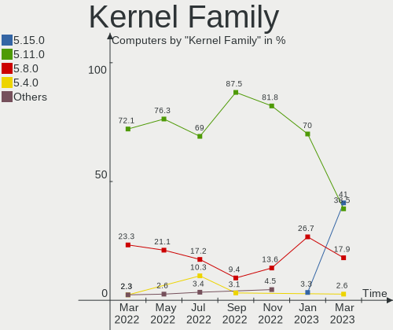
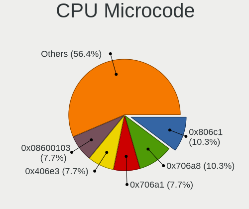
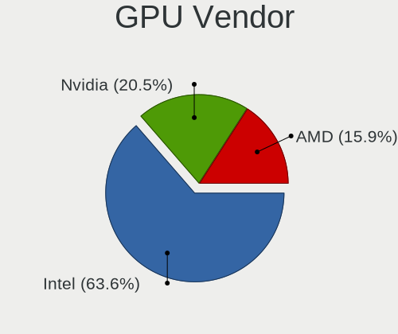

Endless Hardware Trends
-----------------------

A project to identify most popular hardware characteristics and track their change
over time based on data collected by Linux users at https://Linux-Hardware.org.

Anyone can contribute to this report by the [hw-probe](https://github.com/linuxhw/hw-probe) tool:

    sudo -E hw-probe -all -upload

This is a report for all computer types. See also reports for [desktops](/Dist/Endless/Desktop/README.md) and [notebooks](/Dist/Endless/Notebook/README.md).

Full-feature report is available here: https://linux-hardware.org/?view=trends

Period: Jul, 2021.

Contents
--------

* [ System ](#system)
  - [ OS                       ](#os)
  - [ OS Family                ](#os-family)
  - [ Kernel                   ](#kernel)
  - [ Kernel Family            ](#kernel-family)
  - [ Kernel Major Ver.        ](#kernel-major-ver)
  - [ Arch                     ](#arch)
  - [ DE                       ](#de)
  - [ Display Server           ](#display-server)
  - [ Display Manager          ](#display-manager)
  - [ OS Lang                  ](#os-lang)
  - [ Boot Mode                ](#boot-mode)
  - [ Filesystem               ](#filesystem)
  - [ Part. scheme             ](#part-scheme)
  - [ Dual Boot with Linux/BSD ](#dual-boot-with-linuxbsd)
  - [ Dual Boot (Win)          ](#dual-boot-win)

* [ Board ](#board)
  - [ Vendor                   ](#vendor)
  - [ Model                    ](#model)
  - [ Model Family             ](#model-family)
  - [ MFG Year                 ](#mfg-year)
  - [ Form Factor              ](#form-factor)
  - [ Secure Boot              ](#secure-boot)
  - [ Coreboot                 ](#coreboot)
  - [ RAM Size                 ](#ram-size)
  - [ RAM Used                 ](#ram-used)
  - [ Total Drives             ](#total-drives)
  - [ Has CD-ROM               ](#has-cd-rom)
  - [ Has Ethernet             ](#has-ethernet)
  - [ Has WiFi                 ](#has-wifi)
  - [ Has Bluetooth            ](#has-bluetooth)

* [ Location ](#location)
  - [ Country                  ](#country)
  - [ City                     ](#city)

* [ Drives ](#drives)
  - [ Drive Vendor             ](#drive-vendor)
  - [ Drive Model              ](#drive-model)
  - [ HDD Vendor               ](#hdd-vendor)
  - [ SSD Vendor               ](#ssd-vendor)
  - [ Drive Kind               ](#drive-kind)
  - [ Drive Connector          ](#drive-connector)
  - [ Drive Size               ](#drive-size)
  - [ Space Total              ](#space-total)
  - [ Space Used               ](#space-used)
  - [ Malfunc. Drives          ](#malfunc-drives)
  - [ Malfunc. Drive Vendor    ](#malfunc-drive-vendor)
  - [ Malfunc. HDD Vendor      ](#malfunc-hdd-vendor)
  - [ Malfunc. Drive Kind      ](#malfunc-drive-kind)
  - [ Failed Drives            ](#failed-drives)
  - [ Failed Drive Vendor      ](#failed-drive-vendor)
  - [ Drive Status             ](#drive-status)

* [ Storage controller ](#storage-controller)
  - [ Storage Vendor           ](#storage-vendor)
  - [ Storage Model            ](#storage-model)
  - [ Storage Kind             ](#storage-kind)

* [ Processor ](#processor)
  - [ CPU Vendor               ](#cpu-vendor)
  - [ CPU Model                ](#cpu-model)
  - [ CPU Model Family         ](#cpu-model-family)
  - [ CPU Cores                ](#cpu-cores)
  - [ CPU Sockets              ](#cpu-sockets)
  - [ CPU Threads              ](#cpu-threads)
  - [ CPU Op-Modes             ](#cpu-op-modes)
  - [ CPU Microcode            ](#cpu-microcode)
  - [ CPU Microarch            ](#cpu-microarch)

* [ Graphics ](#graphics)
  - [ GPU Vendor               ](#gpu-vendor)
  - [ GPU Model                ](#gpu-model)
  - [ GPU Combo                ](#gpu-combo)
  - [ GPU Driver               ](#gpu-driver)
  - [ GPU Memory               ](#gpu-memory)

* [ Monitor ](#monitor)
  - [ Monitor Vendor           ](#monitor-vendor)
  - [ Monitor Model            ](#monitor-model)
  - [ Monitor Resolution       ](#monitor-resolution)
  - [ Monitor Diagonal         ](#monitor-diagonal)
  - [ Monitor Width            ](#monitor-width)
  - [ Aspect Ratio             ](#aspect-ratio)
  - [ Monitor Area             ](#monitor-area)
  - [ Pixel Density            ](#pixel-density)
  - [ Multiple Monitors        ](#multiple-monitors)

* [ Network ](#network)
  - [ Net Controller Vendor    ](#net-controller-vendor)
  - [ Net Controller Model     ](#net-controller-model)
  - [ Wireless Vendor          ](#wireless-vendor)
  - [ Wireless Model           ](#wireless-model)
  - [ Ethernet Vendor          ](#ethernet-vendor)
  - [ Ethernet Model           ](#ethernet-model)
  - [ Net Controller Kind      ](#net-controller-kind)
  - [ Used Controller          ](#used-controller)
  - [ NICs                     ](#nics)
  - [ IPv6                     ](#ipv6)

* [ Bluetooth ](#bluetooth)
  - [ Bluetooth Vendor         ](#bluetooth-vendor)
  - [ Bluetooth Model          ](#bluetooth-model)

* [ Sound ](#sound)
  - [ Sound Vendor             ](#sound-vendor)
  - [ Sound Model              ](#sound-model)

* [ Memory ](#memory)
  - [ Memory Vendor            ](#memory-vendor)
  - [ Memory Model             ](#memory-model)
  - [ Memory Kind              ](#memory-kind)
  - [ Memory Form Factor       ](#memory-form-factor)
  - [ Memory Size              ](#memory-size)
  - [ Memory Speed             ](#memory-speed)

* [ Printers & scanners ](#printers-&-scanners)
  - [ Printer Vendor           ](#printer-vendor)
  - [ Printer Model            ](#printer-model)
  - [ Scanner Vendor           ](#scanner-vendor)
  - [ Scanner Model            ](#scanner-model)

* [ Camera ](#camera)
  - [ Camera Vendor            ](#camera-vendor)
  - [ Camera Model             ](#camera-model)

* [ Security ](#security)
  - [ Fingerprint Vendor       ](#fingerprint-vendor)
  - [ Fingerprint Model        ](#fingerprint-model)
  - [ Chipcard Vendor          ](#chipcard-vendor)
  - [ Chipcard Model           ](#chipcard-model)

* [ Unsupported ](#unsupported)
  - [ Unsupported Devices      ](#unsupported-devices)
  - [ Unsupported Device Types ](#unsupported-device-types)

System
------

OS
--

Installed operating systems

| Name                  | Computers | Percent |
|-----------------------|-----------|---------|
| Endless 3.9.5         | 47        | 81.03%  |
| Endless 3.9.4         | 7         | 12.07%  |
| Endless 3.9.0         | 1         | 1.72%   |
| Endless 3.8.7-nexthw2 | 1         | 1.72%   |
| Endless 3.8.4         | 1         | 1.72%   |
| Endless 3.7.4         | 1         | 1.72%   |

OS Family
---------

OS without a version

| Name    | Computers | Percent |
|---------|-----------|---------|
| Endless | 58        | 100%    |

Kernel
------

Version of the Linux kernel

| Version          | Computers | Percent |
|------------------|-----------|---------|
| 5.8.0-14-generic | 56        | 96.55%  |
| 5.4.0-19-generic | 1         | 1.72%   |
| 5.3.0-19-generic | 1         | 1.72%   |

Kernel Family
-------------

Linux kernel without a distro release

| Version | Computers | Percent |
|---------|-----------|---------|
| 5.8.0   | 56        | 96.55%  |
| 5.4.0   | 1         | 1.72%   |
| 5.3.0   | 1         | 1.72%   |

Kernel Major Ver.
-----------------

Linux kernel major version

| Version | Computers | Percent |
|---------|-----------|---------|
| 5.8     | 56        | 96.55%  |
| 5.4     | 1         | 1.72%   |
| 5.3     | 1         | 1.72%   |

Arch
----

OS architecture (x86_64, i586, etc.)

| Name   | Computers | Percent |
|--------|-----------|---------|
| x86_64 | 58        | 100%    |

DE
--

Desktop Environment

| Name  | Computers | Percent |
|-------|-----------|---------|
| GNOME | 58        | 100%    |

Display Server
--------------

X11 or Wayland

| Name | Computers | Percent |
|------|-----------|---------|
| X11  | 58        | 100%    |

Display Manager
---------------

SDDM, LightDM, etc.

| Name    | Computers | Percent |
|---------|-----------|---------|
| Unknown | 58        | 100%    |

OS Lang
-------

Language

| Lang        | Computers | Percent |
|-------------|-----------|---------|
| en_US       | 17        | 29.31%  |
| pt_BR       | 15        | 25.86%  |
| ro_RO       | 3         | 5.17%   |
| hu_HU       | 3         | 5.17%   |
| zh_TW       | 2         | 3.45%   |
| pt_PT       | 2         | 3.45%   |
| es_CO       | 2         | 3.45%   |
| tr_TR       | 1         | 1.72%   |
| ru_UA       | 1         | 1.72%   |
| ru_RU.UTF_8 | 1         | 1.72%   |
| ru_RU       | 1         | 1.72%   |
| it_IT       | 1         | 1.72%   |
| fr_BE       | 1         | 1.72%   |
| es_MX       | 1         | 1.72%   |
| es_AR       | 1         | 1.72%   |
| en_IN       | 1         | 1.72%   |
| en_GB       | 1         | 1.72%   |
| en_CA       | 1         | 1.72%   |
| el_GR       | 1         | 1.72%   |
| de_DE       | 1         | 1.72%   |
| de_AT       | 1         | 1.72%   |

Boot Mode
---------

EFI or BIOS

| Mode | Computers | Percent |
|------|-----------|---------|
| EFI  | 36        | 62.07%  |
| BIOS | 22        | 37.93%  |

Filesystem
----------

Type of filesystem

| Type  | Computers | Percent |
|-------|-----------|---------|
| Ext4  | 55        | 94.83%  |
| Tmpfs | 3         | 5.17%   |

Part. scheme
------------

Scheme of partitioning

| Type    | Computers | Percent |
|---------|-----------|---------|
| Unknown | 58        | 100%    |

Dual Boot with Linux/BSD
------------------------

Hosting more than one Linux/BSD

| Dual boot | Computers | Percent |
|-----------|-----------|---------|
| No        | 58        | 100%    |

Dual Boot (Win)
---------------

Hosting Linux and Windows

| Dual boot | Computers | Percent |
|-----------|-----------|---------|
| No        | 58        | 100%    |

Board
-----

Vendor
------

Motherboard manufacturer

| Name                | Computers | Percent |
|---------------------|-----------|---------|
| ASUSTek Computer    | 19        | 32.76%  |
| Acer                | 13        | 22.41%  |
| Lenovo              | 6         | 10.34%  |
| Dell                | 4         | 6.9%    |
| Positivo            | 3         | 5.17%   |
| Hewlett-Packard     | 3         | 5.17%   |
| Gigabyte Technology | 3         | 5.17%   |
| Toshiba             | 2         | 3.45%   |
| Standard            | 1         | 1.72%   |
| Packard Bell        | 1         | 1.72%   |
| iRULU               | 1         | 1.72%   |
| Intel               | 1         | 1.72%   |
| AMI                 | 1         | 1.72%   |

Model
-----

Motherboard model

| Name                                     | Computers | Percent |
|------------------------------------------|-----------|---------|
| Acer Nitro AN515-54                      | 4         | 6.9%    |
| ASUS VivoBook_ASUSLaptop X513EP_X513EP   | 2         | 3.45%   |
| ASUS VivoBook 15_ASUS Laptop X540UAR     | 2         | 3.45%   |
| Toshiba Satellite P775                   | 1         | 1.72%   |
| Toshiba Satellite L755                   | 1         | 1.72%   |
| Standard AHV                             | 1         | 1.72%   |
| Positivo S14CT01                         | 1         | 1.72%   |
| Positivo H14BT58                         | 1         | 1.72%   |
| Positivo DC8CR01                         | 1         | 1.72%   |
| Packard Bell EasyNote TM98               | 1         | 1.72%   |
| Lenovo ThinkPad X220 4286A35             | 1         | 1.72%   |
| Lenovo IdeaPad Z500 20202                | 1         | 1.72%   |
| Lenovo IdeaPad 330-15ARR 81D2            | 1         | 1.72%   |
| Lenovo IdeaPad 3 15IIL05 81WE            | 1         | 1.72%   |
| Lenovo IdeaPad 3 14IIL05 81WD            | 1         | 1.72%   |
| Lenovo G460e 1049                        | 1         | 1.72%   |
| iRULU W1004                              | 1         | 1.72%   |
| Intel H61                                | 1         | 1.72%   |
| HP ProBook 450 G1                        | 1         | 1.72%   |
| HP All-in-One 24-f0xx                    | 1         | 1.72%   |
| HP 15                                    | 1         | 1.72%   |
| Gigabyte H81M-HD3                        | 1         | 1.72%   |
| Gigabyte H410M S2                        | 1         | 1.72%   |
| Gigabyte H110M-H-CF                      | 1         | 1.72%   |
| Dell OptiPlex 990                        | 1         | 1.72%   |
| Dell Inspiron One 2320                   | 1         | 1.72%   |
| Dell Inspiron 620                        | 1         | 1.72%   |
| Dell Inspiron 1420                       | 1         | 1.72%   |
| ASUS X540UA                              | 1         | 1.72%   |
| ASUS X441NA                              | 1         | 1.72%   |
| ASUS X406UAR                             | 1         | 1.72%   |
| ASUS VivoBook_ASUSLaptop X712FA_X712FA   | 1         | 1.72%   |
| ASUS VivoBook_ASUSLaptop X515JA_P1511CJA | 1         | 1.72%   |
| ASUS VivoBook_ASUSLaptop X513EA_K513EA   | 1         | 1.72%   |
| ASUS VivoBook_ASUSLaptop X509MA          | 1         | 1.72%   |
| ASUS VivoBook_ASUSLaptop X415JA_X415JA   | 1         | 1.72%   |
| ASUS PRIME H310T2 R2.0                   | 1         | 1.72%   |
| ASUS N53SV                               | 1         | 1.72%   |
| ASUS M5A97 EVO                           | 1         | 1.72%   |
| ASUS K30BF_M32BF_A_F_K31BF               | 1         | 1.72%   |
| ASUS E203NA                              | 1         | 1.72%   |
| ASUS ASUSPRO D642MF_D642MF               | 1         | 1.72%   |
| ASUS A68HM-PLUS                          | 1         | 1.72%   |
| AMI EC-200                               | 1         | 1.72%   |
| Acer Predator PH315-52                   | 1         | 1.72%   |
| Acer Nitro AN517-51                      | 1         | 1.72%   |
| Acer Aspire XC-895                       | 1         | 1.72%   |
| Acer Aspire C22-865                      | 1         | 1.72%   |
| Acer Aspire A515-54G                     | 1         | 1.72%   |
| Acer Aspire A315-54K                     | 1         | 1.72%   |
| Acer Aspire A315-53                      | 1         | 1.72%   |
| Acer Aspire A315-34                      | 1         | 1.72%   |
| Acer Aspire A315-21G                     | 1         | 1.72%   |

Model Family
------------

Motherboard model prefix

| Name                  | Computers | Percent |
|-----------------------|-----------|---------|
| ASUS VivoBook         | 9         | 15.52%  |
| Acer Aspire           | 7         | 12.07%  |
| Acer Nitro            | 5         | 8.62%   |
| Lenovo IdeaPad        | 4         | 6.9%    |
| Dell Inspiron         | 3         | 5.17%   |
| Toshiba Satellite     | 2         | 3.45%   |
| Standard AHV          | 1         | 1.72%   |
| Positivo S14CT01      | 1         | 1.72%   |
| Positivo H14BT58      | 1         | 1.72%   |
| Positivo DC8CR01      | 1         | 1.72%   |
| Packard Bell EasyNote | 1         | 1.72%   |
| Lenovo ThinkPad       | 1         | 1.72%   |
| Lenovo G460e          | 1         | 1.72%   |
| iRULU W1004           | 1         | 1.72%   |
| Intel H61             | 1         | 1.72%   |
| HP ProBook            | 1         | 1.72%   |
| HP All-in-One         | 1         | 1.72%   |
| HP 15                 | 1         | 1.72%   |
| Gigabyte H81M-HD3     | 1         | 1.72%   |
| Gigabyte H410M        | 1         | 1.72%   |
| Gigabyte H110M-H-CF   | 1         | 1.72%   |
| Dell OptiPlex         | 1         | 1.72%   |
| ASUS X540UA           | 1         | 1.72%   |
| ASUS X441NA           | 1         | 1.72%   |
| ASUS X406UAR          | 1         | 1.72%   |
| ASUS PRIME            | 1         | 1.72%   |
| ASUS N53SV            | 1         | 1.72%   |
| ASUS M5A97            | 1         | 1.72%   |
| ASUS K30BF            | 1         | 1.72%   |
| ASUS E203NA           | 1         | 1.72%   |
| ASUS ASUSPRO          | 1         | 1.72%   |
| ASUS A68HM-PLUS       | 1         | 1.72%   |
| AMI EC-200            | 1         | 1.72%   |
| Acer Predator         | 1         | 1.72%   |

MFG Year
--------

Motherboard manufacture year

| Year | Computers | Percent |
|------|-----------|---------|
| 2020 | 19        | 32.76%  |
| 2019 | 10        | 17.24%  |
| 2011 | 6         | 10.34%  |
| 2012 | 4         | 6.9%    |
| 2017 | 3         | 5.17%   |
| 2015 | 3         | 5.17%   |
| 2014 | 3         | 5.17%   |
| 2021 | 2         | 3.45%   |
| 2018 | 2         | 3.45%   |
| 2016 | 2         | 3.45%   |
| 2013 | 2         | 3.45%   |
| 2010 | 1         | 1.72%   |
| 2008 | 1         | 1.72%   |

Form Factor
-----------

Physical design of the computer

| Name       | Computers | Percent |
|------------|-----------|---------|
| Notebook   | 41        | 70.69%  |
| Desktop    | 12        | 20.69%  |
| All in one | 4         | 6.9%    |
| Mini pc    | 1         | 1.72%   |

Secure Boot
-----------

Enabled or disabled

| State    | Computers | Percent |
|----------|-----------|---------|
| Disabled | 42        | 72.41%  |
| Enabled  | 16        | 27.59%  |

Coreboot
--------

Have coreboot on board

| Used | Computers | Percent |
|------|-----------|---------|
| No   | 58        | 100%    |

RAM Size
--------

Total RAM memory

| Size in GB | Computers | Percent |
|------------|-----------|---------|
| 4.01-8.0   | 23        | 39.66%  |
| 3.01-4.0   | 20        | 34.48%  |
| 16.01-24.0 | 5         | 8.62%   |
| 1.01-2.0   | 5         | 8.62%   |
| 8.01-16.0  | 5         | 8.62%   |

RAM Used
--------

Used RAM memory

| Used GB  | Computers | Percent |
|----------|-----------|---------|
| 1.01-2.0 | 32        | 55.17%  |
| 2.01-3.0 | 11        | 18.97%  |
| 0.51-1.0 | 8         | 13.79%  |
| 3.01-4.0 | 4         | 6.9%    |
| 4.01-8.0 | 3         | 5.17%   |

Total Drives
------------

Number of drives on board

| Drives | Computers | Percent |
|--------|-----------|---------|
| 1      | 45        | 77.59%  |
| 2      | 13        | 22.41%  |

Has CD-ROM
----------

Has CD-ROM on board

| Presented | Computers | Percent |
|-----------|-----------|---------|
| No        | 39        | 67.24%  |
| Yes       | 19        | 32.76%  |

Has Ethernet
------------

Has Ethernet on board

| Presented | Computers | Percent |
|-----------|-----------|---------|
| Yes       | 42        | 72.41%  |
| No        | 16        | 27.59%  |

Has WiFi
--------

Has WiFi module

| Presented | Computers | Percent |
|-----------|-----------|---------|
| Yes       | 50        | 86.21%  |
| No        | 8         | 13.79%  |

Has Bluetooth
-------------

Has Bluetooth module

| Presented | Computers | Percent |
|-----------|-----------|---------|
| Yes       | 36        | 62.07%  |
| No        | 22        | 37.93%  |

Location
--------

Country
-------

Geographic location (country)

| Country     | Computers | Percent |
|-------------|-----------|---------|
| Brazil      | 18        | 31.03%  |
| USA         | 6         | 10.34%  |
| Romania     | 5         | 8.62%   |
| India       | 5         | 8.62%   |
| Hungary     | 3         | 5.17%   |
| Turkey      | 2         | 3.45%   |
| Taiwan      | 2         | 3.45%   |
| Russia      | 2         | 3.45%   |
| Colombia    | 2         | 3.45%   |
| Canada      | 2         | 3.45%   |
| Ukraine     | 1         | 1.72%   |
| UK          | 1         | 1.72%   |
| Spain       | 1         | 1.72%   |
| New Zealand | 1         | 1.72%   |
| Mexico      | 1         | 1.72%   |
| Italy       | 1         | 1.72%   |
| Greece      | 1         | 1.72%   |
| Germany     | 1         | 1.72%   |
| Bahamas     | 1         | 1.72%   |
| Austria     | 1         | 1.72%   |
| Argentina   | 1         | 1.72%   |

City
----

Geographic location (city)

| City                   | Computers | Percent |
|------------------------|-----------|---------|
| Taichung               | 2         | 3.45%   |
| Popesti-Leordeni       | 2         | 3.45%   |
| Budapest               | 2         | 3.45%   |
| Bucharest              | 2         | 3.45%   |
| Bogot√°                | 2         | 3.45%   |
| Belo Horizonte         | 2         | 3.45%   |
| Volgograd              | 1         | 1.72%   |
| Vienna                 | 1         | 1.72%   |
| Tijuana                | 1         | 1.72%   |
| São Luís             | 1         | 1.72%   |
| S√£o Bernardo do Campo | 1         | 1.72%   |
| Surrey                 | 1         | 1.72%   |
| Suquamish              | 1         | 1.72%   |
| Summerland             | 1         | 1.72%   |
| St Petersburg          | 1         | 1.72%   |
| Seminole               | 1         | 1.72%   |
| Sant Cugat del Vallès | 1         | 1.72%   |
| Salvador               | 1         | 1.72%   |
| Rome                   | 1         | 1.72%   |
| Rio de Janeiro         | 1         | 1.72%   |
| Porangaba              | 1         | 1.72%   |
| Paulo Afonso           | 1         | 1.72%   |
| Paranavai              | 1         | 1.72%   |
| Osasco                 | 1         | 1.72%   |
| Orikhiv                | 1         | 1.72%   |
| Olean                  | 1         | 1.72%   |
| Nicholl’s Town       | 1         | 1.72%   |
| Mersin                 | 1         | 1.72%   |
| Kollam                 | 1         | 1.72%   |
| Kolkata                | 1         | 1.72%   |
| Knoxville              | 1         | 1.72%   |
| Jogbani                | 1         | 1.72%   |
| Jaipur                 | 1         | 1.72%   |
| Itu                    | 1         | 1.72%   |
| Hendon                 | 1         | 1.72%   |
| Hamburg                | 1         | 1.72%   |
| Estancia Velha         | 1         | 1.72%   |
| Detroit                | 1         | 1.72%   |
| Da??ard?±              | 1         | 1.72%   |
| Cuiab√°                | 1         | 1.72%   |
| Contagem               | 1         | 1.72%   |
| Christchurch           | 1         | 1.72%   |
| Chennai                | 1         | 1.72%   |
| Ceres                  | 1         | 1.72%   |
| Cegled                 | 1         | 1.72%   |
| Campinas               | 1         | 1.72%   |
| Buenos Aires           | 1         | 1.72%   |
| Bucyrus                | 1         | 1.72%   |
| Brasília              | 1         | 1.72%   |
| Bras?≠lia              | 1         | 1.72%   |
| Botosani               | 1         | 1.72%   |
| Athens                 | 1         | 1.72%   |

Drives
------

Drive Vendor
------------

Hard drive vendors

| Vendor              | Computers | Drives | Percent |
|---------------------|-----------|--------|---------|
| WDC                 | 12        | 12     | 17.91%  |
| Toshiba             | 8         | 8      | 11.94%  |
| Seagate             | 8         | 8      | 11.94%  |
| Intel               | 8         | 8      | 11.94%  |
| Unknown             | 7         | 8      | 10.45%  |
| SK Hynix            | 5         | 5      | 7.46%   |
| Kingston            | 4         | 4      | 5.97%   |
| HGST                | 3         | 3      | 4.48%   |
| Silicon Motion      | 2         | 2      | 2.99%   |
| Sandisk             | 2         | 2      | 2.99%   |
| Samsung Electronics | 2         | 2      | 2.99%   |
| StoreJet            | 1         | 1      | 1.49%   |
| SPCC                | 1         | 1      | 1.49%   |
| Hitachi             | 1         | 1      | 1.49%   |
| Fujitsu             | 1         | 1      | 1.49%   |
| China               | 1         | 1      | 1.49%   |
| A-DATA Technology   | 1         | 1      | 1.49%   |

Drive Model
-----------

Hard drive models

| Model                                 | Computers | Percent |
|---------------------------------------|-----------|---------|
| WDC WD10SPZX-21Z10T0 1TB              | 7         | 10.45%  |
| Intel NVMe SSD Drive 512GB            | 4         | 5.97%   |
| Unknown MMC Card  32GB                | 3         | 4.48%   |
| Unknown SD/MMC/MS PRO 128GB           | 2         | 2.99%   |
| Toshiba MQ01ABD050 500GB              | 2         | 2.99%   |
| SK Hynix HFS256G39TND-N210A 256GB SSD | 2         | 2.99%   |
| Silicon Motion NVMe SSD Drive 256GB   | 2         | 2.99%   |
| Seagate ST1000LM035-1RK172 1TB        | 2         | 2.99%   |
| Sandisk NVMe SSD Drive 256GB          | 2         | 2.99%   |
| Intel NVMe SSD Drive 256GB            | 2         | 2.99%   |
| Intel NVMe SSD Drive 128GB            | 2         | 2.99%   |
| WDC WDS240G2G0A-00JH30 240GB SSD      | 1         | 1.49%   |
| WDC WD2500AAKX-083CA1 250GB           | 1         | 1.49%   |
| WDC WD10JPVX-22JC3T0 1TB              | 1         | 1.49%   |
| WDC WD10EZEX-22BN5A0 1TB              | 1         | 1.49%   |
| WDC WD10EZEX-00WN4A0 1TB              | 1         | 1.49%   |
| Unknown S320-1T                       | 1         | 1.49%   |
| Unknown MMC Card  16GB                | 1         | 1.49%   |
| Toshiba MQ04ABF100 1TB                | 1         | 1.49%   |
| Toshiba MQ01ABF050 500GB              | 1         | 1.49%   |
| Toshiba MQ01ABF032 320GB              | 1         | 1.49%   |
| Toshiba MK6475GSX 640GB               | 1         | 1.49%   |
| Toshiba MK3275GSX 320GB               | 1         | 1.49%   |
| Toshiba DT01ACA100 1TB                | 1         | 1.49%   |
| StoreJet Disk 240GB                   | 1         | 1.49%   |
| SPCC Solid State Disk 128GB           | 1         | 1.49%   |
| SK Hynix NVMe SSD Drive 512GB         | 1         | 1.49%   |
| SK Hynix HFS128G32TNF-N3A0A 128GB SSD | 1         | 1.49%   |
| SK Hynix HFS128G32TND-N210A 128GB SSD | 1         | 1.49%   |
| Seagate ST9160823ASG 160GB            | 1         | 1.49%   |
| Seagate ST2000LM007-1R8174 2TB        | 1         | 1.49%   |
| Seagate ST1000NM0008-2F2100 1TB       | 1         | 1.49%   |
| Seagate ST1000LM024 HN-M101MBB 1TB    | 1         | 1.49%   |
| Seagate ST1000DM003-1SB102 1TB        | 1         | 1.49%   |
| Seagate Expansion 4TB                 | 1         | 1.49%   |
| Samsung SSD 860 QVO 1TB               | 1         | 1.49%   |
| Samsung NVMe SSD Drive 256GB          | 1         | 1.49%   |
| Kingston SV300S37A120G 120GB SSD      | 1         | 1.49%   |
| Kingston SA400S37480G 480GB SSD       | 1         | 1.49%   |
| Kingston SA400S37240G 240GB SSD       | 1         | 1.49%   |
| Kingston RBUSC180DS37256GJ 256GB SSD  | 1         | 1.49%   |
| Hitachi HDS721050CLA362 500GB         | 1         | 1.49%   |
| HGST HTS545050A7E680 500GB            | 1         | 1.49%   |
| HGST HTS541010B7E610 1TB              | 1         | 1.49%   |
| HGST HTS541010A9E680 1TB              | 1         | 1.49%   |
| Fujitsu MHZ2320BH G2 320GB            | 1         | 1.49%   |
| China SATA SSD 120GB                  | 1         | 1.49%   |
| A-DATA SU800 256GB SSD                | 1         | 1.49%   |

HDD Vendor
----------

Hard disk drive vendors

| Vendor  | Computers | Drives | Percent |
|---------|-----------|--------|---------|
| WDC     | 11        | 11     | 34.38%  |
| Toshiba | 8         | 8      | 25%     |
| Seagate | 8         | 8      | 25%     |
| HGST    | 3         | 3      | 9.38%   |
| Hitachi | 1         | 1      | 3.13%   |
| Fujitsu | 1         | 1      | 3.13%   |

SSD Vendor
----------

Solid state drive vendors

| Vendor              | Computers | Drives | Percent |
|---------------------|-----------|--------|---------|
| SK Hynix            | 4         | 4      | 30.77%  |
| Kingston            | 4         | 4      | 30.77%  |
| WDC                 | 1         | 1      | 7.69%   |
| SPCC                | 1         | 1      | 7.69%   |
| Samsung Electronics | 1         | 1      | 7.69%   |
| China               | 1         | 1      | 7.69%   |
| A-DATA Technology   | 1         | 1      | 7.69%   |

Drive Kind
----------

HDD or SSD

| Kind    | Computers | Drives | Percent |
|---------|-----------|--------|---------|
| HDD     | 32        | 32     | 47.76%  |
| NVMe    | 14        | 14     | 20.9%   |
| SSD     | 13        | 13     | 19.4%   |
| MMC     | 4         | 5      | 5.97%   |
| Unknown | 4         | 4      | 5.97%   |

Drive Connector
---------------

SATA, SAS, NVMe, etc.

| Type | Computers | Drives | Percent |
|------|-----------|--------|---------|
| SATA | 44        | 45     | 66.67%  |
| NVMe | 14        | 14     | 21.21%  |
| SAS  | 4         | 4      | 6.06%   |
| MMC  | 4         | 5      | 6.06%   |

Drive Size
----------

Size of hard drive

| Size in TB | Computers | Drives | Percent |
|------------|-----------|--------|---------|
| 0.01-0.5   | 22        | 22     | 48.89%  |
| 0.51-1.0   | 21        | 21     | 46.67%  |
| 3.01-4.0   | 1         | 1      | 2.22%   |
| 1.01-2.0   | 1         | 1      | 2.22%   |

Space Total
-----------

Amount of disk space available on the file system

| Size in GB     | Computers | Percent |
|----------------|-----------|---------|
| 501-1000       | 15        | 25.86%  |
| 101-250        | 13        | 22.41%  |
| 251-500        | 12        | 20.69%  |
| 21-50          | 7         | 12.07%  |
| 2001-3000      | 3         | 5.17%   |
| 1001-2000      | 3         | 5.17%   |
| 1-20           | 2         | 3.45%   |
| 51-100         | 2         | 3.45%   |
| More than 3000 | 1         | 1.72%   |

Space Used
----------

Amount of used disk space

| Used GB        | Computers | Percent |
|----------------|-----------|---------|
| 21-50          | 25        | 43.1%   |
| 1-20           | 14        | 24.14%  |
| 51-100         | 7         | 12.07%  |
| 101-250        | 5         | 8.62%   |
| 251-500        | 3         | 5.17%   |
| 1001-2000      | 2         | 3.45%   |
| More than 3000 | 1         | 1.72%   |
| 501-1000       | 1         | 1.72%   |

Malfunc. Drives
---------------

Drive models with a malfunction

Zero info for selected period =(

Malfunc. Drive Vendor
---------------------

Vendors of faulty drives

Zero info for selected period =(

Malfunc. HDD Vendor
-------------------

Vendors of faulty HDD drives

Zero info for selected period =(

Malfunc. Drive Kind
-------------------

Kinds of faulty drives

Zero info for selected period =(

Failed Drives
-------------

Failed drive models

Zero info for selected period =(

Failed Drive Vendor
-------------------

Failed drive vendors

Zero info for selected period =(

Drive Status
------------

Number of failed and malfunc. drives

| Status   | Computers | Drives | Percent |
|----------|-----------|--------|---------|
| Detected | 58        | 68     | 100%    |

Storage controller
------------------

Storage Vendor
--------------

Storage controller vendors

| Vendor              | Computers | Percent |
|---------------------|-----------|---------|
| Intel               | 51        | 80.95%  |
| AMD                 | 5         | 7.94%   |
| Silicon Motion      | 2         | 3.17%   |
| Sandisk             | 2         | 3.17%   |
| SK Hynix            | 1         | 1.59%   |
| Samsung Electronics | 1         | 1.59%   |
| JMicron Technology  | 1         | 1.59%   |

Storage Model
-------------

Storage controller models

| Model                                                                                   | Computers | Percent |
|-----------------------------------------------------------------------------------------|-----------|---------|
| Intel 82801 Mobile SATA Controller [RAID mode]                                          | 11        | 14.47%  |
| Intel Sunrise Point-LP SATA Controller [AHCI mode]                                      | 7         | 9.21%   |
| Intel PROSet/Wireless WiFi Software extension                                           | 7         | 9.21%   |
| Intel 6 Series/C200 Series Chipset Family 6 port Mobile SATA AHCI Controller            | 5         | 6.58%   |
| AMD FCH SATA Controller [AHCI mode]                                                     | 4         | 5.26%   |
| Intel Volume Management Device NVMe RAID Controller                                     | 3         | 3.95%   |
| Intel Tiger Lake-LP SATA Controller [AHCI mode]                                         | 3         | 3.95%   |
| Silicon Motion SM2263EN/SM2263XT SSD Controller                                         | 2         | 2.63%   |
| Sandisk WD Blue SN550 NVMe SSD                                                          | 2         | 2.63%   |
| Intel SATA Controller [RAID mode]                                                       | 2         | 2.63%   |
| Intel Ice Lake-LP SATA Controller [AHCI mode]                                           | 2         | 2.63%   |
| Intel Celeron/Pentium Silver Processor SATA Controller                                  | 2         | 2.63%   |
| Intel Celeron N3350/Pentium N4200/Atom E3900 Series SATA AHCI Controller                | 2         | 2.63%   |
| Intel Atom Processor E3800 Series SATA AHCI Controller                                  | 2         | 2.63%   |
| Intel 8 Series/C220 Series Chipset Family 6-port SATA Controller 1 [AHCI mode]          | 2         | 2.63%   |
| Intel 7 Series Chipset Family 6-port SATA Controller [AHCI mode]                        | 2         | 2.63%   |
| Intel 6 Series/C200 Series Chipset Family 6 port Desktop SATA AHCI Controller           | 2         | 2.63%   |
| Intel 400 Series Chipset Family SATA AHCI Controller                                    | 2         | 2.63%   |
| SK Hynix BC511                                                                          | 1         | 1.32%   |
| Samsung NVMe Controller                                                                 | 1         | 1.32%   |
| JMicron JMB362 SATA Controller                                                          | 1         | 1.32%   |
| Intel SSD 660P Series                                                                   | 1         | 1.32%   |
| Intel Q170/Q150/B150/H170/H110/Z170/CM236 Chipset SATA Controller [AHCI Mode]           | 1         | 1.32%   |
| Intel 82801IBM/IEM (ICH9M/ICH9M-E) 4 port SATA Controller [AHCI mode]                   | 1         | 1.32%   |
| Intel 82801HM/HEM (ICH8M/ICH8M-E) SATA Controller [AHCI mode]                           | 1         | 1.32%   |
| Intel 82801HM/HEM (ICH8M/ICH8M-E) IDE Controller                                        | 1         | 1.32%   |
| Intel 8 Series SATA Controller 1 [AHCI mode]                                            | 1         | 1.32%   |
| Intel 6 Series/C200 Series Chipset Family Desktop SATA Controller (IDE mode, ports 4-5) | 1         | 1.32%   |
| Intel 6 Series/C200 Series Chipset Family Desktop SATA Controller (IDE mode, ports 0-3) | 1         | 1.32%   |
| Intel 5 Series/3400 Series Chipset 4 port SATA AHCI Controller                          | 1         | 1.32%   |
| Intel 200 Series PCH SATA controller [AHCI mode]                                        | 1         | 1.32%   |
| AMD SB7x0/SB8x0/SB9x0 SATA Controller [AHCI mode]                                       | 1         | 1.32%   |

Storage Kind
------------

Kind of storage controller (IDE, SATA, NVMe, SAS, ...)

| Kind | Computers | Percent |
|------|-----------|---------|
| SATA | 48        | 64.86%  |
| NVMe | 14        | 18.92%  |
| RAID | 10        | 13.51%  |
| IDE  | 2         | 2.7%    |

Processor
---------

CPU Vendor
----------

Processor vendors

| Vendor | Computers | Percent |
|--------|-----------|---------|
| Intel  | 53        | 91.38%  |
| AMD    | 5         | 8.62%   |

CPU Model
---------

Processor models

| Model                                         | Computers | Percent |
|-----------------------------------------------|-----------|---------|
| Intel Core i5-9300H CPU @ 2.40GHz             | 4         | 6.9%    |
| Intel Core i3-8130U CPU @ 2.20GHz             | 4         | 6.9%    |
| Intel Core i3-1005G1 CPU @ 1.20GHz            | 3         | 5.17%   |
| Intel Core i7-9750H CPU @ 2.60GHz             | 2         | 3.45%   |
| Intel Core i3-2310M CPU @ 2.10GHz             | 2         | 3.45%   |
| Intel Core i3-2120 CPU @ 3.30GHz              | 2         | 3.45%   |
| Intel Celeron N4020 CPU @ 1.10GHz             | 2         | 3.45%   |
| Intel Celeron CPU N2807 @ 1.58GHz             | 2         | 3.45%   |
| Intel 11th Gen Core i7-1165G7 @ 2.80GHz       | 2         | 3.45%   |
| Intel Pentium Dual-Core CPU T4500 @ 2.30GHz   | 1         | 1.72%   |
| Intel Pentium CPU G3220 @ 3.00GHz             | 1         | 1.72%   |
| Intel Pentium CPU 4417U @ 2.30GHz             | 1         | 1.72%   |
| Intel Core i7-8565U CPU @ 1.80GHz             | 1         | 1.72%   |
| Intel Core i7-4702MQ CPU @ 2.20GHz            | 1         | 1.72%   |
| Intel Core i7-2670QM CPU @ 2.20GHz            | 1         | 1.72%   |
| Intel Core i7-10510U CPU @ 1.80GHz            | 1         | 1.72%   |
| Intel Core i5-9500 CPU @ 3.00GHz              | 1         | 1.72%   |
| Intel Core i5-9400 CPU @ 2.90GHz              | 1         | 1.72%   |
| Intel Core i5-8250U CPU @ 1.60GHz             | 1         | 1.72%   |
| Intel Core i5-3230M CPU @ 2.60GHz             | 1         | 1.72%   |
| Intel Core i5-2410M CPU @ 2.30GHz             | 1         | 1.72%   |
| Intel Core i5-2400 CPU @ 3.10GHz              | 1         | 1.72%   |
| Intel Core i5-10400 CPU @ 2.90GHz             | 1         | 1.72%   |
| Intel Core i5-1035G1 CPU @ 1.00GHz            | 1         | 1.72%   |
| Intel Core i5 CPU M 460 @ 2.53GHz             | 1         | 1.72%   |
| Intel Core i3-7020U CPU @ 2.30GHz             | 1         | 1.72%   |
| Intel Core i3-6100 CPU @ 3.70GHz              | 1         | 1.72%   |
| Intel Core i3-6006U CPU @ 2.00GHz             | 1         | 1.72%   |
| Intel Core i3-4005U CPU @ 1.70GHz             | 1         | 1.72%   |
| Intel Core i3-3110M CPU @ 2.40GHz             | 1         | 1.72%   |
| Intel Core i3-2330M CPU @ 2.20GHz             | 1         | 1.72%   |
| Intel Core i3-2100 CPU @ 3.10GHz              | 1         | 1.72%   |
| Intel Core i3-10100 CPU @ 3.60GHz             | 1         | 1.72%   |
| Intel Core 2 Duo CPU T5750 @ 2.00GHz          | 1         | 1.72%   |
| Intel Celeron CPU N3450 @ 1.10GHz             | 1         | 1.72%   |
| Intel Celeron CPU N3350 @ 1.10GHz             | 1         | 1.72%   |
| Intel Atom x5-Z8300 CPU @ 1.44GHz             | 1         | 1.72%   |
| Intel Atom CPU Z3735F @ 1.33GHz               | 1         | 1.72%   |
| Intel 11th Gen Core i3-1115G4 @ 3.00GHz       | 1         | 1.72%   |
| AMD Ryzen 3 2200U with Radeon Vega Mobile Gfx | 1         | 1.72%   |
| AMD Phenom II X6 1090T Processor              | 1         | 1.72%   |
| AMD A4-9120 RADEON R3, 4 COMPUTE CORES 2C+2G  | 1         | 1.72%   |
| AMD A4-5300 APU with Radeon HD Graphics       | 1         | 1.72%   |
| AMD A10-5800K APU with Radeon HD Graphics     | 1         | 1.72%   |

CPU Model Family
----------------

Processor model prefix

| Model                   | Computers | Percent |
|-------------------------|-----------|---------|
| Intel Core i3           | 19        | 32.76%  |
| Intel Core i5           | 13        | 22.41%  |
| Intel Core i7           | 6         | 10.34%  |
| Intel Celeron           | 6         | 10.34%  |
| Other                   | 3         | 5.17%   |
| Intel Pentium           | 2         | 3.45%   |
| Intel Atom              | 2         | 3.45%   |
| AMD A4                  | 2         | 3.45%   |
| Intel Pentium Dual-Core | 1         | 1.72%   |
| Intel Core 2 Duo        | 1         | 1.72%   |
| AMD Ryzen 3             | 1         | 1.72%   |
| AMD Phenom II X6        | 1         | 1.72%   |
| AMD A10                 | 1         | 1.72%   |

CPU Cores
---------

Number of processor cores

| Number | Computers | Percent |
|--------|-----------|---------|
| 2      | 34        | 58.62%  |
| 4      | 17        | 29.31%  |
| 6      | 6         | 10.34%  |
| 1      | 1         | 1.72%   |

CPU Sockets
-----------

Number of sockets

| Number | Computers | Percent |
|--------|-----------|---------|
| 1      | 58        | 100%    |

CPU Threads
-----------

Threads per core (Hyper-Threading)

| Number | Computers | Percent |
|--------|-----------|---------|
| 2      | 42        | 72.41%  |
| 1      | 16        | 27.59%  |

CPU Op-Modes
------------

CPU Operation Modes (32-bit, 64-bit)

| Op mode        | Computers | Percent |
|----------------|-----------|---------|
| 32-bit, 64-bit | 58        | 100%    |

CPU Microcode
-------------

Microcode number

| Number     | Computers | Percent |
|------------|-----------|---------|
| 0x206a7    | 9         | 15.52%  |
| 0x906ed    | 4         | 6.9%    |
| 0x906ea    | 4         | 6.9%    |
| 0x806ea    | 4         | 6.9%    |
| Unknown    | 4         | 6.9%    |
| 0x806c1    | 3         | 5.17%   |
| 0x706e5    | 3         | 5.17%   |
| 0x30678    | 3         | 5.17%   |
| 0xa0653    | 2         | 3.45%   |
| 0x706a8    | 2         | 3.45%   |
| 0x506c9    | 2         | 3.45%   |
| 0x306a9    | 2         | 3.45%   |
| 0x806ec    | 1         | 1.72%   |
| 0x806eb    | 1         | 1.72%   |
| 0x806e9    | 1         | 1.72%   |
| 0x6fd      | 1         | 1.72%   |
| 0x506e3    | 1         | 1.72%   |
| 0x406e3    | 1         | 1.72%   |
| 0x406c3    | 1         | 1.72%   |
| 0x40651    | 1         | 1.72%   |
| 0x306c3    | 1         | 1.72%   |
| 0x20655    | 1         | 1.72%   |
| 0x1067a    | 1         | 1.72%   |
| 0x08101007 | 1         | 1.72%   |
| 0x06006705 | 1         | 1.72%   |
| 0x06003106 | 1         | 1.72%   |
| 0x06001119 | 1         | 1.72%   |
| 0x010000dc | 1         | 1.72%   |

CPU Microarch
-------------

Microarchitecture

| Name          | Computers | Percent |
|---------------|-----------|---------|
| KabyLake      | 17        | 29.31%  |
| SandyBridge   | 9         | 15.52%  |
| Silvermont    | 4         | 6.9%    |
| IceLake       | 4         | 6.9%    |
| TigerLake     | 3         | 5.17%   |
| Haswell       | 3         | 5.17%   |
| Skylake       | 2         | 3.45%   |
| Piledriver    | 2         | 3.45%   |
| IvyBridge     | 2         | 3.45%   |
| Goldmont plus | 2         | 3.45%   |
| Goldmont      | 2         | 3.45%   |
| CometLake     | 2         | 3.45%   |
| Zen           | 1         | 1.72%   |
| Westmere      | 1         | 1.72%   |
| Penryn        | 1         | 1.72%   |
| K10           | 1         | 1.72%   |
| Excavator     | 1         | 1.72%   |
| Core          | 1         | 1.72%   |

Graphics
--------

GPU Vendor
----------

Vendors of graphics cards

| Vendor | Computers | Percent |
|--------|-----------|---------|
| Intel  | 49        | 69.01%  |
| Nvidia | 17        | 23.94%  |
| AMD    | 5         | 7.04%   |

GPU Model
---------

Graphics card models

| Model                                                                                    | Computers | Percent |
|------------------------------------------------------------------------------------------|-----------|---------|
| Intel 2nd Generation Core Processor Family Integrated Graphics Controller                | 7         | 9.46%   |
| Intel CoffeeLake-H GT2 [UHD Graphics 630]                                                | 6         | 8.11%   |
| Nvidia TU117M [GeForce GTX 1650 Mobile / Max-Q]                                          | 5         | 6.76%   |
| Intel UHD Graphics 620                                                                   | 5         | 6.76%   |
| Intel Iris Plus Graphics G1 (Ice Lake)                                                   | 4         | 5.41%   |
| Intel CometLake-S GT2 [UHD Graphics 630]                                                 | 4         | 5.41%   |
| Intel Atom Processor Z36xxx/Z37xxx Series Graphics & Display                             | 3         | 4.05%   |
| Nvidia GP108M [GeForce MX330]                                                            | 2         | 2.7%    |
| Intel TigerLake-LP GT2 [Iris Xe Graphics]                                                | 2         | 2.7%    |
| Intel HD Graphics 500                                                                    | 2         | 2.7%    |
| Intel GeminiLake [UHD Graphics 600]                                                      | 2         | 2.7%    |
| Intel 3rd Gen Core processor Graphics Controller                                         | 2         | 2.7%    |
| Nvidia TU106M [GeForce RTX 2060 Mobile]                                                  | 1         | 1.35%   |
| Nvidia GP108M [GeForce MX250]                                                            | 1         | 1.35%   |
| Nvidia GP106 [GeForce GTX 1060 3GB]                                                      | 1         | 1.35%   |
| Nvidia GM206 [GeForce GTX 960]                                                           | 1         | 1.35%   |
| Nvidia GM107 [GeForce GTX 750 Ti]                                                        | 1         | 1.35%   |
| Nvidia GK208M [GeForce GT 740M]                                                          | 1         | 1.35%   |
| Nvidia GF119 [GeForce GT 610]                                                            | 1         | 1.35%   |
| Nvidia GF117M [GeForce 610M/710M/810M/820M / GT 620M/625M/630M/720M]                     | 1         | 1.35%   |
| Nvidia GF108M [GeForce GT 540M]                                                          | 1         | 1.35%   |
| Nvidia GF108M [GeForce GT 420M]                                                          | 1         | 1.35%   |
| Nvidia GF104 [GeForce GTX 460]                                                           | 1         | 1.35%   |
| Intel Xeon E3-1200 v3/4th Gen Core Processor Integrated Graphics Controller              | 1         | 1.35%   |
| Intel WhiskeyLake-U GT2 [UHD Graphics 620]                                               | 1         | 1.35%   |
| Intel Tiger Lake UHD Graphics                                                            | 1         | 1.35%   |
| Intel Skylake GT2 [HD Graphics 520]                                                      | 1         | 1.35%   |
| Intel Mobile GM965/GL960 Integrated Graphics Controller (secondary)                      | 1         | 1.35%   |
| Intel Mobile GM965/GL960 Integrated Graphics Controller (primary)                        | 1         | 1.35%   |
| Intel Mobile 4 Series Chipset Integrated Graphics Controller                             | 1         | 1.35%   |
| Intel Kaby Lake-U GT2f HD 620 Graphics Controller                                        | 1         | 1.35%   |
| Intel Kaby Lake-U GT1 Integrated Graphics Controller                                     | 1         | 1.35%   |
| Intel Haswell-ULT Integrated Graphics Controller                                         | 1         | 1.35%   |
| Intel CometLake-U GT2 [UHD Graphics]                                                     | 1         | 1.35%   |
| Intel Atom/Celeron/Pentium Processor x5-E8000/J3xxx/N3xxx Integrated Graphics Controller | 1         | 1.35%   |
| Intel 4th Gen Core Processor Integrated Graphics Controller                              | 1         | 1.35%   |
| AMD Trinity 2 [Radeon HD 7480D]                                                          | 1         | 1.35%   |
| AMD Stoney [Radeon R2/R3/R4/R5 Graphics]                                                 | 1         | 1.35%   |
| AMD Raven Ridge [Radeon Vega Series / Radeon Vega Mobile Series]                         | 1         | 1.35%   |
| AMD Mars [Radeon HD 8670A/8670M/8750M / R7 M370]                                         | 1         | 1.35%   |
| AMD Jet PRO [Radeon R5 M230 / R7 M260DX / Radeon 520 Mobile]                             | 1         | 1.35%   |
| AMD Cedar [Radeon HD 5000/6000/7350/8350 Series]                                         | 1         | 1.35%   |

GPU Combo
---------

Combinations of graphics cards

| Name           | Computers | Percent |
|----------------|-----------|---------|
| 1 x Intel      | 36        | 62.07%  |
| Intel + Nvidia | 12        | 20.69%  |
| 1 x Nvidia     | 5         | 8.62%   |
| 1 x AMD        | 3         | 5.17%   |
| 2 x AMD        | 1         | 1.72%   |
| Intel + AMD    | 1         | 1.72%   |

GPU Driver
----------

Free vs proprietary

| Driver      | Computers | Percent |
|-------------|-----------|---------|
| Free        | 56        | 96.55%  |
| Proprietary | 2         | 3.45%   |

GPU Memory
----------

Total video memory

| Size in GB | Computers | Percent |
|------------|-----------|---------|
| Unknown    | 48        | 82.76%  |
| 0.51-1.0   | 5         | 8.62%   |
| 0.01-0.5   | 3         | 5.17%   |
| 1.01-2.0   | 2         | 3.45%   |

Monitor
-------

Monitor Vendor
--------------

Monitor vendors

| Vendor               | Computers | Percent |
|----------------------|-----------|---------|
| BOE                  | 10        | 18.52%  |
| AU Optronics         | 10        | 18.52%  |
| Chimei Innolux       | 9         | 16.67%  |
| Samsung Electronics  | 6         | 11.11%  |
| LG Display           | 5         | 9.26%   |
| Goldstar             | 4         | 7.41%   |
| PANDA                | 2         | 3.7%    |
| Hewlett-Packard      | 2         | 3.7%    |
| Dell                 | 2         | 3.7%    |
| Philips              | 1         | 1.85%   |
| Envision Peripherals | 1         | 1.85%   |
| Element              | 1         | 1.85%   |
| Acer                 | 1         | 1.85%   |

Monitor Model
-------------

Monitor models

| Model                                                                 | Computers | Percent |
|-----------------------------------------------------------------------|-----------|---------|
| LG Display LCD Monitor LGD065A 1920x1080 344x194mm 15.5-inch          | 3         | 5.45%   |
| BOE LCD Monitor BOE0903 1920x1080 344x194mm 15.5-inch                 | 3         | 5.45%   |
| PANDA LCD Monitor NCP0046 1920x1080 344x194mm 15.5-inch               | 2         | 3.64%   |
| Chimei Innolux LCD Monitor CMN15E6 1366x768 344x193mm 15.5-inch       | 2         | 3.64%   |
| Chimei Innolux LCD Monitor CMN1493 1366x768 310x170mm 13.9-inch       | 2         | 3.64%   |
| AU Optronics LCD Monitor AUO38ED 1920x1080 340x190mm 15.3-inch        | 2         | 3.64%   |
| Samsung Electronics U28D590 SAM0B81 3840x2160 608x345mm 27.5-inch     | 1         | 1.82%   |
| Samsung Electronics U28D590 SAM0B80 3840x2160 607x345mm 27.5-inch     | 1         | 1.82%   |
| Samsung Electronics LCD Monitor SEC5441 1366x768 344x194mm 15.5-inch  | 1         | 1.82%   |
| Samsung Electronics LCD Monitor SEC3157 1280x800 300x190mm 14.0-inch  | 1         | 1.82%   |
| Samsung Electronics LCD Monitor SEC3047 1366x768 277x156mm 12.5-inch  | 1         | 1.82%   |
| Samsung Electronics LCD Monitor SDC4951 1366x768 344x194mm 15.5-inch  | 1         | 1.82%   |
| Samsung Electronics LC24RG50 SAM0F90 1920x1080 532x304mm 24.1-inch    | 1         | 1.82%   |
| Philips 190X PHLC010 1280x1024 376x301mm 19.0-inch                    | 1         | 1.82%   |
| LG Display LCD Monitor LGD03B3 1366x768 309x174mm 14.0-inch           | 1         | 1.82%   |
| LG Display LCD Monitor LGD02DC 1366x768 344x194mm 15.5-inch           | 1         | 1.82%   |
| Hewlett-Packard ALL-in-One HPN4018 1920x1080 527x297mm 23.8-inch      | 1         | 1.82%   |
| Hewlett-Packard 20kh HPN357C 1600x900 452x263mm 20.6-inch             | 1         | 1.82%   |
| Goldstar LG FULL HD GSM5AB9 1680x1050 480x270mm 21.7-inch             | 1         | 1.82%   |
| Goldstar L1942 GSM4B85 1280x1024 376x301mm 19.0-inch                  | 1         | 1.82%   |
| Goldstar HDR QHD GSM5B96 2560x1440 698x392mm 31.5-inch                | 1         | 1.82%   |
| Goldstar FULL HD GSM5B54 1920x1080 480x270mm 21.7-inch                | 1         | 1.82%   |
| Envision Peripherals LED H963wLs ENV1963 1366x768 410x230mm 18.5-inch | 1         | 1.82%   |
| Element ELCFT262 ELE0101 1366x768 580x320mm 26.1-inch                 | 1         | 1.82%   |
| Dell INSPIRON ONE DELB123 1920x1080 510x287mm 23.0-inch               | 1         | 1.82%   |
| Dell IN2030M DELF03C 1600x900 443x249mm 20.0-inch                     | 1         | 1.82%   |
| Chimei Innolux LCD Monitor CMN15F5 1920x1080 344x193mm 15.5-inch      | 1         | 1.82%   |
| Chimei Innolux LCD Monitor CMN15E8 1920x1080 344x193mm 15.5-inch      | 1         | 1.82%   |
| Chimei Innolux LCD Monitor CMN15DC 1366x768 344x193mm 15.5-inch       | 1         | 1.82%   |
| Chimei Innolux LCD Monitor CMN15B6 1366x768 340x190mm 15.3-inch       | 1         | 1.82%   |
| Chimei Innolux LCD Monitor CMN14E5 1920x1080 309x173mm 13.9-inch      | 1         | 1.82%   |
| BOE LCD Monitor BOE08F2 1920x1080 310x174mm 14.0-inch                 | 1         | 1.82%   |
| BOE LCD Monitor BOE084E 1920x1080 382x215mm 17.3-inch                 | 1         | 1.82%   |
| BOE LCD Monitor BOE0839 1920x1080 382x215mm 17.3-inch                 | 1         | 1.82%   |
| BOE LCD Monitor BOE0818 1920x1080 344x194mm 15.5-inch                 | 1         | 1.82%   |
| BOE LCD Monitor BOE0718 1920x1080 309x173mm 13.9-inch                 | 1         | 1.82%   |
| BOE LCD Monitor BOE06A4 1366x768 344x194mm 15.5-inch                  | 1         | 1.82%   |
| BOE LCD Monitor BOE0672 1366x768 344x194mm 15.5-inch                  | 1         | 1.82%   |
| AU Optronics LCD Monitor AUO81EC 1366x768 344x193mm 15.5-inch         | 1         | 1.82%   |
| AU Optronics LCD Monitor AUO71EC 1366x768 340x190mm 15.3-inch         | 1         | 1.82%   |
| AU Optronics LCD Monitor AUO56D4 1280x800 216x135mm 10.0-inch         | 1         | 1.82%   |
| AU Optronics LCD Monitor AUO46EC 1366x768 344x193mm 15.5-inch         | 1         | 1.82%   |
| AU Optronics LCD Monitor AUO22EC 1366x768 344x193mm 15.5-inch         | 1         | 1.82%   |
| AU Optronics LCD Monitor AUO225C 1366x768 256x144mm 11.6-inch         | 1         | 1.82%   |
| AU Optronics LCD Monitor AUO139E 1600x900 382x214mm 17.2-inch         | 1         | 1.82%   |
| AU Optronics LCD Monitor AUO103C 1366x768 310x170mm 13.9-inch         | 1         | 1.82%   |
| Acer AIO LCD ACR40B0 1920x1080 476x267mm 21.5-inch                    | 1         | 1.82%   |

Monitor Resolution
------------------

Monitor screen resolution

| Resolution       | Computers | Percent |
|------------------|-----------|---------|
| 1920x1080 (FHD)  | 24        | 44.44%  |
| 1366x768 (WXGA)  | 21        | 38.89%  |
| 1600x900 (HD+)   | 3         | 5.56%   |
| 1280x1024 (SXGA) | 2         | 3.7%    |
| 3840x2160 (4K)   | 1         | 1.85%   |
| 2560x1440 (QHD)  | 1         | 1.85%   |
| 1440x900 (WXGA+) | 1         | 1.85%   |
| 1280x800 (WXGA)  | 1         | 1.85%   |

Monitor Diagonal
----------------

Diagonal size in inches

| Inches | Computers | Percent |
|--------|-----------|---------|
| 15     | 26        | 48.15%  |
| 14     | 5         | 9.26%   |
| 23     | 3         | 5.56%   |
| 17     | 3         | 5.56%   |
| 13     | 3         | 5.56%   |
| 21     | 2         | 3.7%    |
| 20     | 2         | 3.7%    |
| 19     | 2         | 3.7%    |
| 31     | 1         | 1.85%   |
| 27     | 1         | 1.85%   |
| 26     | 1         | 1.85%   |
| 24     | 1         | 1.85%   |
| 18     | 1         | 1.85%   |
| 12     | 1         | 1.85%   |
| 11     | 1         | 1.85%   |
| 10     | 1         | 1.85%   |

Monitor Width
-------------

Physical width

| Width in mm | Computers | Percent |
|-------------|-----------|---------|
| 301-350     | 33        | 61.11%  |
| 351-400     | 6         | 11.11%  |
| 501-600     | 5         | 9.26%   |
| 401-500     | 5         | 9.26%   |
| 201-300     | 3         | 5.56%   |
| 601-700     | 2         | 3.7%    |

Aspect Ratio
------------

Proportional relationship between the width and the height

| Ratio | Computers | Percent |
|-------|-----------|---------|
| 16/9  | 49        | 92.45%  |
| 5/4   | 2         | 3.77%   |
| 16/10 | 2         | 3.77%   |

Monitor Area
------------

Area in inch²

| Area in inch² | Computers | Percent |
|----------------|-----------|---------|
| 101-110        | 26        | 48.15%  |
| 81-90          | 8         | 14.81%  |
| 201-250        | 5         | 9.26%   |
| 151-200        | 4         | 7.41%   |
| 121-130        | 3         | 5.56%   |
| 251-300        | 2         | 3.7%    |
| 61-70          | 1         | 1.85%   |
| 51-60          | 1         | 1.85%   |
| 351-500        | 1         | 1.85%   |
| 41-50          | 1         | 1.85%   |
| 301-350        | 1         | 1.85%   |
| 141-150        | 1         | 1.85%   |

Pixel Density
-------------

Pixels per inch

| Density | Computers | Percent |
|---------|-----------|---------|
| 121-160 | 22        | 40.74%  |
| 101-120 | 20        | 37.04%  |
| 51-100  | 12        | 22.22%  |

Multiple Monitors
-----------------

Total monitors connected

| Total | Computers | Percent |
|-------|-----------|---------|
| 1     | 54        | 93.1%   |
| 0     | 3         | 5.17%   |
| 2     | 1         | 1.72%   |

Network
-------

Net Controller Vendor
---------------------

Controller vendors

| Vendor                          | Computers | Percent |
|---------------------------------|-----------|---------|
| Realtek Semiconductor           | 40        | 45.45%  |
| Intel                           | 19        | 21.59%  |
| Qualcomm Atheros                | 15        | 17.05%  |
| TP-Link                         | 2         | 2.27%   |
| Ralink Technology               | 2         | 2.27%   |
| OPPO Electronics                | 2         | 2.27%   |
| JMicron Technology              | 2         | 2.27%   |
| Broadcom                        | 2         | 2.27%   |
| Samsung Electronics             | 1         | 1.14%   |
| Qualcomm Atheros Communications | 1         | 1.14%   |
| Huawei Technologies             | 1         | 1.14%   |
| D-Link                          | 1         | 1.14%   |

Net Controller Model
--------------------

Controller models

| Model                                                                         | Computers | Percent |
|-------------------------------------------------------------------------------|-----------|---------|
| Realtek RTL8111/8168/8411 PCI Express Gigabit Ethernet Controller             | 28        | 28.57%  |
| Qualcomm Atheros QCA9377 802.11ac Wireless Network Adapter                    | 8         | 8.16%   |
| Realtek RTL8821CE 802.11ac PCIe Wireless Network Adapter                      | 7         | 7.14%   |
| Intel Wi-Fi 6 AX200                                                           | 5         | 5.1%    |
| Realtek RTL810xE PCI Express Fast Ethernet controller                         | 4         | 4.08%   |
| Realtek RTL8188CE 802.11b/g/n WiFi Adapter                                    | 3         | 3.06%   |
| Qualcomm Atheros AR9285 Wireless Network Adapter (PCI-Express)                | 3         | 3.06%   |
| Intel Wi-Fi 6 AX201                                                           | 3         | 3.06%   |
| Realtek RTL8188EE Wireless Network Adapter                                    | 2         | 2.04%   |
| Qualcomm Atheros AR8152 v2.0 Fast Ethernet                                    | 2         | 2.04%   |
| OPPO X50 5G                                                                   | 2         | 2.04%   |
| JMicron JMC250 PCI Express Gigabit Ethernet Controller                        | 2         | 2.04%   |
| Intel Ice Lake-LP PCH CNVi WiFi                                               | 2         | 2.04%   |
| Intel 82579LM Gigabit Network Connection (Lewisville)                         | 2         | 2.04%   |
| TP-Link TL-WN821N Version 5 RTL8192EU                                         | 1         | 1.02%   |
| TP-Link Archer T2U PLUS [RTL8821AU]                                           | 1         | 1.02%   |
| Samsung Galaxy series, misc. (tethering mode)                                 | 1         | 1.02%   |
| Realtek RTL8821AE 802.11ac PCIe Wireless Network Adapter                      | 1         | 1.02%   |
| Realtek RTL8723BE PCIe Wireless Network Adapter                               | 1         | 1.02%   |
| Realtek RTL8192CU 802.11n WLAN Adapter                                        | 1         | 1.02%   |
| Ralink RT5370 Wireless Adapter                                                | 1         | 1.02%   |
| Ralink MT7601U Wireless Adapter                                               | 1         | 1.02%   |
| Qualcomm Atheros QCA9565 / AR9565 Wireless Network Adapter                    | 1         | 1.02%   |
| Qualcomm Atheros Killer E2500 Gigabit Ethernet Controller                     | 1         | 1.02%   |
| Qualcomm Atheros TP-Link TL-WN322G v3 / TL-WN422G v2 802.11g [Atheros AR9271] | 1         | 1.02%   |
| Qualcomm Atheros AR9485 Wireless Network Adapter                              | 1         | 1.02%   |
| Intel Wireless 8265 / 8275                                                    | 1         | 1.02%   |
| Intel Wireless 7260                                                           | 1         | 1.02%   |
| Intel Ethernet Connection (2) I219-V                                          | 1         | 1.02%   |
| Intel Dual Band Wireless-AC 3168NGW [Stone Peak]                              | 1         | 1.02%   |
| Intel Centrino Wireless-N 6150                                                | 1         | 1.02%   |
| Intel Centrino Wireless-N + WiMAX 6150                                        | 1         | 1.02%   |
| Intel Cannon Point-LP CNVi [Wireless-AC]                                      | 1         | 1.02%   |
| Intel Cannon Lake PCH CNVi WiFi                                               | 1         | 1.02%   |
| Huawei EM770W miniPCI WCDMA Modem                                             | 1         | 1.02%   |
| D-Link 802.11ac NIC                                                           | 1         | 1.02%   |
| Broadcom NetLink BCM5906M Fast Ethernet PCI Express                           | 1         | 1.02%   |
| Broadcom NetLink BCM57780 Gigabit Ethernet PCIe                               | 1         | 1.02%   |
| Broadcom BCM4312 802.11b/g LP-PHY                                             | 1         | 1.02%   |

Wireless Vendor
---------------

Wireless vendors

| Vendor                          | Computers | Percent |
|---------------------------------|-----------|---------|
| Intel                           | 16        | 32%     |
| Realtek Semiconductor           | 14        | 28%     |
| Qualcomm Atheros                | 13        | 26%     |
| TP-Link                         | 2         | 4%      |
| Ralink Technology               | 2         | 4%      |
| Qualcomm Atheros Communications | 1         | 2%      |
| D-Link                          | 1         | 2%      |
| Broadcom                        | 1         | 2%      |

Wireless Model
--------------

Wireless models

| Model                                                                         | Computers | Percent |
|-------------------------------------------------------------------------------|-----------|---------|
| Qualcomm Atheros QCA9377 802.11ac Wireless Network Adapter                    | 8         | 15.38%  |
| Realtek RTL8821CE 802.11ac PCIe Wireless Network Adapter                      | 7         | 13.46%  |
| Intel Wi-Fi 6 AX200                                                           | 5         | 9.62%   |
| Realtek RTL8188CE 802.11b/g/n WiFi Adapter                                    | 3         | 5.77%   |
| Qualcomm Atheros AR9285 Wireless Network Adapter (PCI-Express)                | 3         | 5.77%   |
| Intel Wi-Fi 6 AX201                                                           | 3         | 5.77%   |
| Realtek RTL8188EE Wireless Network Adapter                                    | 2         | 3.85%   |
| Intel Ice Lake-LP PCH CNVi WiFi                                               | 2         | 3.85%   |
| TP-Link TL-WN821N Version 5 RTL8192EU                                         | 1         | 1.92%   |
| TP-Link Archer T2U PLUS [RTL8821AU]                                           | 1         | 1.92%   |
| Realtek RTL8821AE 802.11ac PCIe Wireless Network Adapter                      | 1         | 1.92%   |
| Realtek RTL8723BE PCIe Wireless Network Adapter                               | 1         | 1.92%   |
| Realtek RTL8192CU 802.11n WLAN Adapter                                        | 1         | 1.92%   |
| Ralink RT5370 Wireless Adapter                                                | 1         | 1.92%   |
| Ralink MT7601U Wireless Adapter                                               | 1         | 1.92%   |
| Qualcomm Atheros QCA9565 / AR9565 Wireless Network Adapter                    | 1         | 1.92%   |
| Qualcomm Atheros TP-Link TL-WN322G v3 / TL-WN422G v2 802.11g [Atheros AR9271] | 1         | 1.92%   |
| Qualcomm Atheros AR9485 Wireless Network Adapter                              | 1         | 1.92%   |
| Intel Wireless 8265 / 8275                                                    | 1         | 1.92%   |
| Intel Wireless 7260                                                           | 1         | 1.92%   |
| Intel Dual Band Wireless-AC 3168NGW [Stone Peak]                              | 1         | 1.92%   |
| Intel Centrino Wireless-N 6150                                                | 1         | 1.92%   |
| Intel Centrino Wireless-N + WiMAX 6150                                        | 1         | 1.92%   |
| Intel Cannon Point-LP CNVi [Wireless-AC]                                      | 1         | 1.92%   |
| Intel Cannon Lake PCH CNVi WiFi                                               | 1         | 1.92%   |
| D-Link 802.11ac NIC                                                           | 1         | 1.92%   |
| Broadcom BCM4312 802.11b/g LP-PHY                                             | 1         | 1.92%   |

Ethernet Vendor
---------------

Ethernet vendors

| Vendor                | Computers | Percent |
|-----------------------|-----------|---------|
| Realtek Semiconductor | 32        | 71.11%  |
| Qualcomm Atheros      | 3         | 6.67%   |
| Intel                 | 3         | 6.67%   |
| OPPO Electronics      | 2         | 4.44%   |
| JMicron Technology    | 2         | 4.44%   |
| Broadcom              | 2         | 4.44%   |
| Samsung Electronics   | 1         | 2.22%   |

Ethernet Model
--------------

Ethernet models

| Model                                                             | Computers | Percent |
|-------------------------------------------------------------------|-----------|---------|
| Realtek RTL8111/8168/8411 PCI Express Gigabit Ethernet Controller | 28        | 62.22%  |
| Realtek RTL810xE PCI Express Fast Ethernet controller             | 4         | 8.89%   |
| Qualcomm Atheros AR8152 v2.0 Fast Ethernet                        | 2         | 4.44%   |
| OPPO X50 5G                                                       | 2         | 4.44%   |
| JMicron JMC250 PCI Express Gigabit Ethernet Controller            | 2         | 4.44%   |
| Intel 82579LM Gigabit Network Connection (Lewisville)             | 2         | 4.44%   |
| Samsung Galaxy series, misc. (tethering mode)                     | 1         | 2.22%   |
| Qualcomm Atheros Killer E2500 Gigabit Ethernet Controller         | 1         | 2.22%   |
| Intel Ethernet Connection (2) I219-V                              | 1         | 2.22%   |
| Broadcom NetLink BCM5906M Fast Ethernet PCI Express               | 1         | 2.22%   |
| Broadcom NetLink BCM57780 Gigabit Ethernet PCIe                   | 1         | 2.22%   |

Net Controller Kind
-------------------

Ethernet, WiFi or modem

| Kind     | Computers | Percent |
|----------|-----------|---------|
| WiFi     | 50        | 53.76%  |
| Ethernet | 42        | 45.16%  |
| Modem    | 1         | 1.08%   |

Used Controller
---------------

Currently used network controller

| Kind     | Computers | Percent |
|----------|-----------|---------|
| WiFi     | 48        | 53.93%  |
| Ethernet | 41        | 46.07%  |

NICs
----

Total network controllers on board

| Total | Computers | Percent |
|-------|-----------|---------|
| 2     | 29        | 50%     |
| 1     | 27        | 46.55%  |
| 0     | 2         | 3.45%   |

IPv6
----

IPv6 vs IPv4

| Used | Computers | Percent |
|------|-----------|---------|
| No   | 41        | 70.69%  |
| Yes  | 17        | 29.31%  |

Bluetooth
---------

Bluetooth Vendor
----------------

Controller vendors

| Vendor                          | Computers | Percent |
|---------------------------------|-----------|---------|
| Intel                           | 13        | 36.11%  |
| IMC Networks                    | 8         | 22.22%  |
| Lite-On Technology              | 5         | 13.89%  |
| Qualcomm Atheros Communications | 4         | 11.11%  |
| Realtek Semiconductor           | 3         | 8.33%   |
| Dell                            | 1         | 2.78%   |
| Cambridge Silicon Radio         | 1         | 2.78%   |
| Broadcom                        | 1         | 2.78%   |

Bluetooth Model
---------------

Controller models

| Model                                               | Computers | Percent |
|-----------------------------------------------------|-----------|---------|
| Lite-On Qualcomm Atheros QCA9377 Bluetooth          | 5         | 13.89%  |
| Intel Bluetooth 9460/9560 Jefferson Peak (JfP)      | 5         | 13.89%  |
| Intel AX200 Bluetooth                               | 5         | 13.89%  |
| IMC Networks Bluetooth Radio                        | 5         | 13.89%  |
| IMC Networks Bluetooth Device                       | 3         | 8.33%   |
| Realtek Bluetooth Radio                             | 2         | 5.56%   |
| Qualcomm Atheros AR3011 Bluetooth                   | 2         | 5.56%   |
| Realtek  Bluetooth 4.2 Adapter                      | 1         | 2.78%   |
| Qualcomm Atheros AR3012 Bluetooth 4.0               | 1         | 2.78%   |
| Qualcomm Atheros AR3012 Bluetooth                   | 1         | 2.78%   |
| Intel Wireless-AC 3168 Bluetooth                    | 1         | 2.78%   |
| Intel Bluetooth wireless interface                  | 1         | 2.78%   |
| Intel AX201 Bluetooth                               | 1         | 2.78%   |
| Dell Wireless 355 Bluetooth                         | 1         | 2.78%   |
| Cambridge Silicon Radio Bluetooth Dongle (HCI mode) | 1         | 2.78%   |
| Broadcom BCM20702A0 Bluetooth 4.0                   | 1         | 2.78%   |

Sound
-----

Sound Vendor
------------

Sound card vendors

| Vendor        | Computers | Percent |
|---------------|-----------|---------|
| Intel         | 51        | 73.91%  |
| Nvidia        | 12        | 17.39%  |
| AMD           | 5         | 7.25%   |
| Creative Labs | 1         | 1.45%   |

Sound Model
-----------

Sound card models

| Model                                                                      | Computers | Percent |
|----------------------------------------------------------------------------|-----------|---------|
| Intel 6 Series/C200 Series Chipset Family High Definition Audio Controller | 9         | 11.84%  |
| Intel Sunrise Point-LP HD Audio                                            | 8         | 10.53%  |
| Intel Cannon Lake PCH cAVS                                                 | 6         | 7.89%   |
| Nvidia TU107 GeForce GTX 1650 High Definition Audio Controller             | 5         | 6.58%   |
| Intel Ice Lake-LP Smart Sound Technology Audio Controller                  | 4         | 5.26%   |
| Intel Tiger Lake-LP Smart Sound Technology Audio Controller                | 3         | 3.95%   |
| Nvidia GF108 High Definition Audio Controller                              | 2         | 2.63%   |
| Intel Xeon E3-1200 v3/4th Gen Core Processor HD Audio Controller           | 2         | 2.63%   |
| Intel Comet Lake PCH-V Smart Sound Technology Audio Controller             | 2         | 2.63%   |
| Intel Celeron/Pentium Silver Processor High Definition Audio               | 2         | 2.63%   |
| Intel Celeron N3350/Pentium N4200/Atom E3900 Series Audio Cluster          | 2         | 2.63%   |
| Intel Atom Processor Z36xxx/Z37xxx Series High Definition Audio Controller | 2         | 2.63%   |
| Intel 8 Series/C220 Series Chipset High Definition Audio Controller        | 2         | 2.63%   |
| Intel 7 Series/C216 Chipset Family High Definition Audio Controller        | 2         | 2.63%   |
| Intel 200 Series PCH HD Audio                                              | 2         | 2.63%   |
| AMD FCH Azalia Controller                                                  | 2         | 2.63%   |
| Nvidia TU106 High Definition Audio Controller                              | 1         | 1.32%   |
| Nvidia GP106 High Definition Audio Controller                              | 1         | 1.32%   |
| Nvidia GM206 High Definition Audio Controller                              | 1         | 1.32%   |
| Nvidia GM107 High Definition Audio Controller [GeForce 940MX]              | 1         | 1.32%   |
| Nvidia GF119 HDMI Audio Controller                                         | 1         | 1.32%   |
| Nvidia GF104 High Definition Audio Controller                              | 1         | 1.32%   |
| Intel Haswell-ULT HD Audio Controller                                      | 1         | 1.32%   |
| Intel Comet Lake PCH-LP cAVS                                               | 1         | 1.32%   |
| Intel Cannon Point-LP High Definition Audio Controller                     | 1         | 1.32%   |
| Intel 82801I (ICH9 Family) HD Audio Controller                             | 1         | 1.32%   |
| Intel 82801H (ICH8 Family) HD Audio Controller                             | 1         | 1.32%   |
| Intel 8 Series HD Audio Controller                                         | 1         | 1.32%   |
| Intel 5 Series/3400 Series Chipset High Definition Audio                   | 1         | 1.32%   |
| Intel 100 Series/C230 Series Chipset Family HD Audio Controller            | 1         | 1.32%   |
| Creative Labs Sound Core3D [Sound Blaster Recon3D / Z-Series]              | 1         | 1.32%   |
| AMD Trinity HDMI Audio Controller                                          | 1         | 1.32%   |
| AMD SBx00 Azalia (Intel HDA)                                               | 1         | 1.32%   |
| AMD Raven/Raven2/Fenghuang HDMI/DP Audio Controller                        | 1         | 1.32%   |
| AMD High Definition Audio Controller                                       | 1         | 1.32%   |
| AMD Family 17h (Models 10h-1fh) HD Audio Controller                        | 1         | 1.32%   |
| AMD Family 15h (Models 60h-6fh) Audio Controller                           | 1         | 1.32%   |

Memory
------

Memory Vendor
-------------

Memory module vendors

Zero info for selected period =(

Memory Model
------------

Memory module models

Zero info for selected period =(

Memory Kind
-----------

Memory module kinds

Zero info for selected period =(

Memory Form Factor
------------------

Physical design of the memory module

Zero info for selected period =(

Memory Size
-----------

Memory module size

Zero info for selected period =(

Memory Speed
------------

Memory module speed

Zero info for selected period =(

Printers & scanners
-------------------

Printer Vendor
--------------

Printer device vendors

Zero info for selected period =(

Printer Model
-------------

Printer device models

Zero info for selected period =(

Scanner Vendor
--------------

Scanner device vendors

Zero info for selected period =(

Scanner Model
-------------

Scanner device models

Zero info for selected period =(

Camera
------

Camera Vendor
-------------

Camera device vendors

| Vendor                                 | Computers | Percent |
|----------------------------------------|-----------|---------|
| IMC Networks                           | 13        | 29.55%  |
| Chicony Electronics                    | 12        | 27.27%  |
| Quanta                                 | 4         | 9.09%   |
| Acer                                   | 4         | 9.09%   |
| Samsung Electronics                    | 2         | 4.55%   |
| Realtek Semiconductor                  | 2         | 4.55%   |
| Cheng Uei Precision Industry (Foxlink) | 2         | 4.55%   |
| Syntek                                 | 1         | 2.27%   |
| Philips (or NXP)                       | 1         | 2.27%   |
| OmniVision Technologies                | 1         | 2.27%   |
| Logitech                               | 1         | 2.27%   |
| Alcor Micro                            | 1         | 2.27%   |

Camera Model
------------

Camera device models

| Model                                                          | Computers | Percent |
|----------------------------------------------------------------|-----------|---------|
| IMC Networks USB2.0 VGA UVC WebCam                             | 6         | 13.64%  |
| IMC Networks USB2.0 HD UVC WebCam                              | 5         | 11.36%  |
| Chicony HD User Facing                                         | 4         | 9.09%   |
| Quanta HD User Facing                                          | 3         | 6.82%   |
| Samsung Galaxy A5 (MTP)                                        | 2         | 4.55%   |
| Chicony VGA WebCam                                             | 2         | 4.55%   |
| Acer HD Webcam                                                 | 2         | 4.55%   |
| Syntek Lenovo EasyCamera                                       | 1         | 2.27%   |
| Realtek VGA WebCam                                             | 1         | 2.27%   |
| Realtek HP Truevision HD integrated webcam                     | 1         | 2.27%   |
| Quanta VGA WebCam                                              | 1         | 2.27%   |
| Philips (or NXP) SPZ2000 Webcam [PixArt PAC7332]               | 1         | 2.27%   |
| OmniVision OV2640 Webcam                                       | 1         | 2.27%   |
| Logitech C922 Pro Stream Webcam                                | 1         | 2.27%   |
| IMC Networks Integrated Camera                                 | 1         | 2.27%   |
| IMC Networks 2M Integrated Webcam                              | 1         | 2.27%   |
| Chicony USB2.0 VGA UVC WebCam                                  | 1         | 2.27%   |
| Chicony TOSHIBA Web Camera - MP                                | 1         | 2.27%   |
| Chicony Lenovo Integrated Camera (0.3MP)                       | 1         | 2.27%   |
| Chicony Laptop_Integrated_Webcam_HD                            | 1         | 2.27%   |
| Chicony HP HD Webcam                                           | 1         | 2.27%   |
| Chicony EasyCamera                                             | 1         | 2.27%   |
| Cheng Uei Precision Industry (Foxlink) HP TrueVision HD Camera | 1         | 2.27%   |
| Cheng Uei Precision Industry (Foxlink) HD Camera               | 1         | 2.27%   |
| Alcor Micro TOSHIBA Web Camera - MP                            | 1         | 2.27%   |
| Acer VGA WebCam                                                | 1         | 2.27%   |
| Acer Integrated Camera                                         | 1         | 2.27%   |

Security
--------

Fingerprint Vendor
------------------

Fingerprint sensor vendors

Zero info for selected period =(

Fingerprint Model
-----------------

Fingerprint sensor models

Zero info for selected period =(

Chipcard Vendor
---------------

Chipcard module vendors

Zero info for selected period =(

Chipcard Model
--------------

Chipcard module models

Zero info for selected period =(

Unsupported
-----------

Unsupported Devices
-------------------

Total unsupported devices on board

| Total | Computers | Percent |
|-------|-----------|---------|
| 0     | 55        | 94.83%  |
| 1     | 3         | 5.17%   |

Unsupported Device Types
------------------------

Types of unsupported devices

| Type                  | Computers | Percent |
|-----------------------|-----------|---------|
| Net/wireless          | 2         | 66.67%  |
| Multimedia controller | 1         | 33.33%  |

