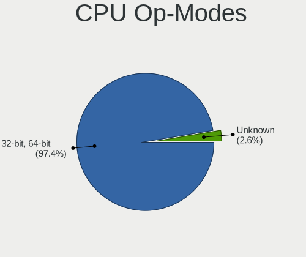
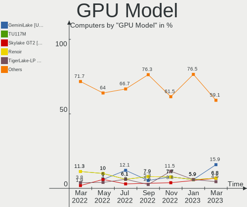
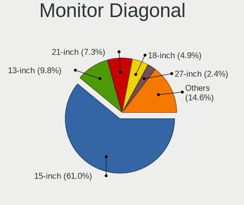
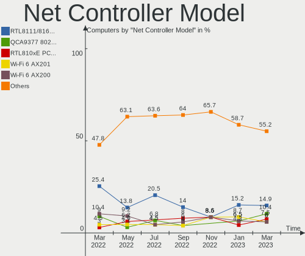

Endless - Hardware Trends
-------------------------

A project to identify most popular hardware characteristics and track their change
over time based on data collected by Linux users at https://Linux-Hardware.org.

Anyone can contribute to this report by the [hw-probe](https://github.com/linuxhw/hw-probe) tool:

    sudo -E hw-probe -all -upload

This is a report for all computer types. See also reports for [desktops](/Dist/Endless/Desktop/README.md) and [notebooks](/Dist/Endless/Notebook/README.md).

This report is for one last month. Overall report since the beginning of time: [TestCoverage](https://github.com/linuxhw/TestCoverage)

Period: Nov, 2022.

Contents
--------

* [ System ](#system)
  - [ OS                       ](#os)
  - [ OS Family                ](#os-family)
  - [ Kernel                   ](#kernel)
  - [ Kernel Family            ](#kernel-family)
  - [ Kernel Major Ver.        ](#kernel-major-ver)
  - [ Arch                     ](#arch)
  - [ DE                       ](#de)
  - [ Display Server           ](#display-server)
  - [ Display Manager          ](#display-manager)
  - [ OS Lang                  ](#os-lang)
  - [ Boot Mode                ](#boot-mode)
  - [ Filesystem               ](#filesystem)
  - [ Part. scheme             ](#part-scheme)
  - [ Dual Boot with Linux/BSD ](#dual-boot-with-linuxbsd)
  - [ Dual Boot (Win)          ](#dual-boot-win)

* [ Board ](#board)
  - [ Vendor                   ](#vendor)
  - [ Model                    ](#model)
  - [ Model Family             ](#model-family)
  - [ MFG Year                 ](#mfg-year)
  - [ Form Factor              ](#form-factor)
  - [ Secure Boot              ](#secure-boot)
  - [ Coreboot                 ](#coreboot)
  - [ RAM Size                 ](#ram-size)
  - [ RAM Used                 ](#ram-used)
  - [ Total Drives             ](#total-drives)
  - [ Has CD-ROM               ](#has-cd-rom)
  - [ Has Ethernet             ](#has-ethernet)
  - [ Has WiFi                 ](#has-wifi)
  - [ Has Bluetooth            ](#has-bluetooth)

* [ Location ](#location)
  - [ Country                  ](#country)
  - [ City                     ](#city)

* [ Drives ](#drives)
  - [ Drive Vendor             ](#drive-vendor)
  - [ Drive Model              ](#drive-model)
  - [ HDD Vendor               ](#hdd-vendor)
  - [ SSD Vendor               ](#ssd-vendor)
  - [ Drive Kind               ](#drive-kind)
  - [ Drive Connector          ](#drive-connector)
  - [ Drive Size               ](#drive-size)
  - [ Space Total              ](#space-total)
  - [ Space Used               ](#space-used)
  - [ Malfunc. Drives          ](#malfunc-drives)
  - [ Malfunc. Drive Vendor    ](#malfunc-drive-vendor)
  - [ Malfunc. HDD Vendor      ](#malfunc-hdd-vendor)
  - [ Malfunc. Drive Kind      ](#malfunc-drive-kind)
  - [ Failed Drives            ](#failed-drives)
  - [ Failed Drive Vendor      ](#failed-drive-vendor)
  - [ Drive Status             ](#drive-status)

* [ Storage controller ](#storage-controller)
  - [ Storage Vendor           ](#storage-vendor)
  - [ Storage Model            ](#storage-model)
  - [ Storage Kind             ](#storage-kind)

* [ Processor ](#processor)
  - [ CPU Vendor               ](#cpu-vendor)
  - [ CPU Model                ](#cpu-model)
  - [ CPU Model Family         ](#cpu-model-family)
  - [ CPU Cores                ](#cpu-cores)
  - [ CPU Sockets              ](#cpu-sockets)
  - [ CPU Threads              ](#cpu-threads)
  - [ CPU Op-Modes             ](#cpu-op-modes)
  - [ CPU Microcode            ](#cpu-microcode)
  - [ CPU Microarch            ](#cpu-microarch)

* [ Graphics ](#graphics)
  - [ GPU Vendor               ](#gpu-vendor)
  - [ GPU Model                ](#gpu-model)
  - [ GPU Combo                ](#gpu-combo)
  - [ GPU Driver               ](#gpu-driver)
  - [ GPU Memory               ](#gpu-memory)

* [ Monitor ](#monitor)
  - [ Monitor Vendor           ](#monitor-vendor)
  - [ Monitor Model            ](#monitor-model)
  - [ Monitor Resolution       ](#monitor-resolution)
  - [ Monitor Diagonal         ](#monitor-diagonal)
  - [ Monitor Width            ](#monitor-width)
  - [ Aspect Ratio             ](#aspect-ratio)
  - [ Monitor Area             ](#monitor-area)
  - [ Pixel Density            ](#pixel-density)
  - [ Multiple Monitors        ](#multiple-monitors)

* [ Network ](#network)
  - [ Net Controller Vendor    ](#net-controller-vendor)
  - [ Net Controller Model     ](#net-controller-model)
  - [ Wireless Vendor          ](#wireless-vendor)
  - [ Wireless Model           ](#wireless-model)
  - [ Ethernet Vendor          ](#ethernet-vendor)
  - [ Ethernet Model           ](#ethernet-model)
  - [ Net Controller Kind      ](#net-controller-kind)
  - [ Used Controller          ](#used-controller)
  - [ NICs                     ](#nics)
  - [ IPv6                     ](#ipv6)

* [ Bluetooth ](#bluetooth)
  - [ Bluetooth Vendor         ](#bluetooth-vendor)
  - [ Bluetooth Model          ](#bluetooth-model)

* [ Sound ](#sound)
  - [ Sound Vendor             ](#sound-vendor)
  - [ Sound Model              ](#sound-model)

* [ Memory ](#memory)
  - [ Memory Vendor            ](#memory-vendor)
  - [ Memory Model             ](#memory-model)
  - [ Memory Kind              ](#memory-kind)
  - [ Memory Form Factor       ](#memory-form-factor)
  - [ Memory Size              ](#memory-size)
  - [ Memory Speed             ](#memory-speed)

* [ Printers & scanners ](#printers--scanners)
  - [ Printer Vendor           ](#printer-vendor)
  - [ Printer Model            ](#printer-model)
  - [ Scanner Vendor           ](#scanner-vendor)
  - [ Scanner Model            ](#scanner-model)

* [ Camera ](#camera)
  - [ Camera Vendor            ](#camera-vendor)
  - [ Camera Model             ](#camera-model)

* [ Security ](#security)
  - [ Fingerprint Vendor       ](#fingerprint-vendor)
  - [ Fingerprint Model        ](#fingerprint-model)
  - [ Chipcard Vendor          ](#chipcard-vendor)
  - [ Chipcard Model           ](#chipcard-model)

* [ Unsupported ](#unsupported)
  - [ Unsupported Devices      ](#unsupported-devices)
  - [ Unsupported Device Types ](#unsupported-device-types)

System
------

OS
--

Installed operating systems

| Name                  | Computers | Percent |
|-----------------------|-----------|---------|
| Endless 4.0.11        | 6         | 27.27%  |
| Endless 4.0.12        | 4         | 18.18%  |
| Endless 4.0.10        | 4         | 18.18%  |
| Endless 4.0.13        | 3         | 13.64%  |
| Endless 3.9.7         | 2         | 9.09%   |
| Endless 4.0.4         | 1         | 4.55%   |
| Endless 3.8.7-nexthw2 | 1         | 4.55%   |
| Endless 3.8.3-nexthw1 | 1         | 4.55%   |

OS Family
---------

OS without a version

| Name    | Computers | Percent |
|---------|-----------|---------|
| Endless | 22        | 100%    |

Kernel
------

Version of the Linux kernel

| Version           | Computers | Percent |
|-------------------|-----------|---------|
| 5.11.0-35-generic | 18        | 81.82%  |
| 5.8.0-14-generic  | 3         | 13.64%  |
| 5.6.0-7-generic   | 1         | 4.55%   |

Kernel Family
-------------

Linux kernel without a distro release

| Version | Computers | Percent |
|---------|-----------|---------|
| 5.11.0  | 18        | 81.82%  |
| 5.8.0   | 3         | 13.64%  |
| 5.6.0   | 1         | 4.55%   |

Kernel Major Ver.
-----------------

Linux kernel major version

| Version | Computers | Percent |
|---------|-----------|---------|
| 5.11    | 18        | 81.82%  |
| 5.8     | 3         | 13.64%  |
| 5.6     | 1         | 4.55%   |

Arch
----

OS architecture (x86_64, i586, etc.)

| Name   | Computers | Percent |
|--------|-----------|---------|
| x86_64 | 22        | 100%    |

DE
--

Desktop Environment

| Name  | Computers | Percent |
|-------|-----------|---------|
| GNOME | 22        | 100%    |

Display Server
--------------

X11 or Wayland

| Name | Computers | Percent |
|------|-----------|---------|
| X11  | 22        | 100%    |

Display Manager
---------------

SDDM, LightDM, etc.

| Name    | Computers | Percent |
|---------|-----------|---------|
| Unknown | 22        | 100%    |

OS Lang
-------

Language

| Lang        | Computers | Percent |
|-------------|-----------|---------|
| pt_BR       | 6         | 27.27%  |
| en_US       | 5         | 22.73%  |
| ru_RU.UTF_8 | 2         | 9.09%   |
| ro_RO       | 2         | 9.09%   |
| it_IT       | 2         | 9.09%   |
| de_DE       | 2         | 9.09%   |
| hu_HU       | 1         | 4.55%   |
| es_MX       | 1         | 4.55%   |
| en_GB       | 1         | 4.55%   |

Boot Mode
---------

EFI or BIOS

| Mode | Computers | Percent |
|------|-----------|---------|
| EFI  | 17        | 77.27%  |
| BIOS | 5         | 22.73%  |

Filesystem
----------

Type of filesystem

| Type  | Computers | Percent |
|-------|-----------|---------|
| Ext4  | 21        | 95.45%  |
| Tmpfs | 1         | 4.55%   |

Part. scheme
------------

Scheme of partitioning

| Type    | Computers | Percent |
|---------|-----------|---------|
| Unknown | 22        | 100%    |

Dual Boot with Linux/BSD
------------------------

Hosting more than one Linux/BSD

| Dual boot | Computers | Percent |
|-----------|-----------|---------|
| No        | 22        | 100%    |

Dual Boot (Win)
---------------

Hosting Linux and Windows

| Dual boot | Computers | Percent |
|-----------|-----------|---------|
| No        | 22        | 100%    |

Board
-----

Vendor
------

Motherboard manufacturer

| Name                | Computers | Percent |
|---------------------|-----------|---------|
| ASUSTek Computer    | 8         | 36.36%  |
| Acer                | 4         | 18.18%  |
| Hewlett-Packard     | 3         | 13.64%  |
| Gigabyte Technology | 2         | 9.09%   |
| PCBOX-H             | 1         | 4.55%   |
| Medion              | 1         | 4.55%   |
| Intel               | 1         | 4.55%   |
| Google              | 1         | 4.55%   |
| Dell                | 1         | 4.55%   |

Model
-----

Motherboard model

| Name                                       | Computers | Percent |
|--------------------------------------------|-----------|---------|
| ASUS VivoBook_ASUSLaptop X515JA_X515JA     | 2         | 9.09%   |
| ASUS VivoBook_ASUSLaptop X513EAN_X513EAN   | 2         | 9.09%   |
| Acer Nitro AN515-44                        | 2         | 9.09%   |
| PCBOX-H BayTrail                           | 1         | 4.55%   |
| Medion Akoya P2214T                        | 1         | 4.55%   |
| Intel powered classmate PC                 | 1         | 4.55%   |
| HP Pavilion g6                             | 1         | 4.55%   |
| HP Laptop 15-dy2xxx                        | 1         | 4.55%   |
| HP 255 G8 Notebook PC                      | 1         | 4.55%   |
| Google Volet                               | 1         | 4.55%   |
| Gigabyte X570 I AORUS PRO WIFI             | 1         | 4.55%   |
| Gigabyte B75M-D3H                          | 1         | 4.55%   |
| Dell Latitude E6530                        | 1         | 4.55%   |
| ASUS X541UAK                               | 1         | 4.55%   |
| ASUS VivoBook 15_ASUS Laptop X540MA_A540MA | 1         | 4.55%   |
| ASUS VivoBook 12_ASUS Laptop E203MA_E203MA | 1         | 4.55%   |
| ASUS ASUSPRO P1440FAC_P1440FA              | 1         | 4.55%   |
| Acer Aspire 5738                           | 1         | 4.55%   |
| Acer Aspire 5720Z                          | 1         | 4.55%   |

Model Family
------------

Motherboard model prefix

| Name              | Computers | Percent |
|-------------------|-----------|---------|
| ASUS VivoBook     | 6         | 27.27%  |
| Acer Nitro        | 2         | 9.09%   |
| Acer Aspire       | 2         | 9.09%   |
| PCBOX-H BayTrail  | 1         | 4.55%   |
| Medion Akoya      | 1         | 4.55%   |
| Intel powered     | 1         | 4.55%   |
| HP Pavilion       | 1         | 4.55%   |
| HP Laptop         | 1         | 4.55%   |
| HP 255            | 1         | 4.55%   |
| Google Volet      | 1         | 4.55%   |
| Gigabyte X570     | 1         | 4.55%   |
| Gigabyte B75M-D3H | 1         | 4.55%   |
| Dell Latitude     | 1         | 4.55%   |
| ASUS X541UAK      | 1         | 4.55%   |
| ASUS ASUSPRO      | 1         | 4.55%   |

MFG Year
--------

Motherboard manufacture year

| Year | Computers | Percent |
|------|-----------|---------|
| 2020 | 5         | 22.73%  |
| 2021 | 4         | 18.18%  |
| 2012 | 3         | 13.64%  |
| 2018 | 2         | 9.09%   |
| 2022 | 1         | 4.55%   |
| 2019 | 1         | 4.55%   |
| 2016 | 1         | 4.55%   |
| 2015 | 1         | 4.55%   |
| 2014 | 1         | 4.55%   |
| 2011 | 1         | 4.55%   |
| 2009 | 1         | 4.55%   |
| 2007 | 1         | 4.55%   |

Form Factor
-----------

Physical design of the computer

| Name     | Computers | Percent |
|----------|-----------|---------|
| Notebook | 20        | 90.91%  |
| Desktop  | 2         | 9.09%   |

Secure Boot
-----------

Enabled or disabled

| State    | Computers | Percent |
|----------|-----------|---------|
| Disabled | 19        | 86.36%  |
| Enabled  | 3         | 13.64%  |

Coreboot
--------

Have coreboot on board

| Used | Computers | Percent |
|------|-----------|---------|
| No   | 21        | 95.45%  |
| Yes  | 1         | 4.55%   |

RAM Size
--------

Total RAM memory

| Size in GB | Computers | Percent |
|------------|-----------|---------|
| 4.01-8.0   | 12        | 54.55%  |
| 3.01-4.0   | 7         | 31.82%  |
| 16.01-24.0 | 1         | 4.55%   |
| 1.01-2.0   | 1         | 4.55%   |
| 0.51-1.0   | 1         | 4.55%   |

RAM Used
--------

Used RAM memory

| Used GB  | Computers | Percent |
|----------|-----------|---------|
| 1.01-2.0 | 16        | 72.73%  |
| 2.01-3.0 | 3         | 13.64%  |
| 0.51-1.0 | 2         | 9.09%   |
| 3.01-4.0 | 1         | 4.55%   |

Total Drives
------------

Number of drives on board

| Drives | Computers | Percent |
|--------|-----------|---------|
| 1      | 18        | 81.82%  |
| 2      | 4         | 18.18%  |

Has CD-ROM
----------

Has CD-ROM on board

| Presented | Computers | Percent |
|-----------|-----------|---------|
| No        | 16        | 72.73%  |
| Yes       | 6         | 27.27%  |

Has Ethernet
------------

Has Ethernet on board

| Presented | Computers | Percent |
|-----------|-----------|---------|
| Yes       | 12        | 54.55%  |
| No        | 10        | 45.45%  |

Has WiFi
--------

Has WiFi module

| Presented | Computers | Percent |
|-----------|-----------|---------|
| Yes       | 20        | 90.91%  |
| No        | 2         | 9.09%   |

Has Bluetooth
-------------

Has Bluetooth module

| Presented | Computers | Percent |
|-----------|-----------|---------|
| Yes       | 17        | 77.27%  |
| No        | 5         | 22.73%  |

Location
--------

Country
-------

Geographic location (country)

| Country    | Computers | Percent |
|------------|-----------|---------|
| Brazil     | 7         | 31.82%  |
| USA        | 2         | 9.09%   |
| Russia     | 2         | 9.09%   |
| Romania    | 2         | 9.09%   |
| Italy      | 2         | 9.09%   |
| Germany    | 2         | 9.09%   |
| UK         | 1         | 4.55%   |
| Hungary    | 1         | 4.55%   |
| Georgia    | 1         | 4.55%   |
| Bangladesh | 1         | 4.55%   |
| Argentina  | 1         | 4.55%   |

City
----

Geographic location (city)

| City              | Computers | Percent |
|-------------------|-----------|---------|
| Sao Paulo         | 2         | 9.09%   |
| Szombathely       | 1         | 4.55%   |
| Rosario           | 1         | 4.55%   |
| Pskov             | 1         | 4.55%   |
| Poole             | 1         | 4.55%   |
| Pescantina        | 1         | 4.55%   |
| Mura Mare         | 1         | 4.55%   |
| Moscow            | 1         | 4.55%   |
| Mena              | 1         | 4.55%   |
| K'alak'i T'bilisi | 1         | 4.55%   |
| Igarassu          | 1         | 4.55%   |
| Fortaleza         | 1         | 4.55%   |
| Dhaka             | 1         | 4.55%   |
| Dallas            | 1         | 4.55%   |
| Cuiabá           | 1         | 4.55%   |
| Cluj-Napoca       | 1         | 4.55%   |
| Campina Grande    | 1         | 4.55%   |
| Bologna           | 1         | 4.55%   |
| Bochum            | 1         | 4.55%   |
| Berlin            | 1         | 4.55%   |
| Araguaína        | 1         | 4.55%   |

Drives
------

Drive Vendor
------------

Hard drive vendors

| Vendor              | Computers | Drives | Percent |
|---------------------|-----------|--------|---------|
| Unknown             | 3         | 3      | 12%     |
| Toshiba             | 3         | 3      | 12%     |
| Sandisk             | 3         | 3      | 12%     |
| WDC                 | 2         | 2      | 8%      |
| Seagate             | 2         | 2      | 8%      |
| ADATA Technology    | 2         | 2      | 8%      |
| SK hynix            | 1         | 1      | 4%      |
| Silicon Motion      | 1         | 1      | 4%      |
| Samsung Electronics | 1         | 1      | 4%      |
| Phison              | 1         | 1      | 4%      |
| Micron Technology   | 1         | 1      | 4%      |
| Kingston            | 1         | 1      | 4%      |
| IB-1816M            | 1         | 1      | 4%      |
| Crucial             | 1         | 1      | 4%      |
| ASMedia             | 1         | 1      | 4%      |
| A-DATA Technology   | 1         | 1      | 4%      |

Drive Model
-----------

Hard drive models

| Model                                                 | Computers | Percent |
|-------------------------------------------------------|-----------|---------|
| Sandisk WD Blue SN550 NVMe SSD 1TB                    | 3         | 12%     |
| Unknown MMC Card  64GB                                | 2         | 8%      |
| Toshiba MQ04ABF100 1TB                                | 2         | 8%      |
| ADATA SM2P32A8-256GC1 256GB                           | 2         | 8%      |
| WDC WD2500BEVT-22A23T0 250GB                          | 1         | 4%      |
| WDC WD10EZEX-00BN5A0 1TB                              | 1         | 4%      |
| Unknown MMC Card  16GB                                | 1         | 4%      |
| Toshiba MQ01ABD050 500GB                              | 1         | 4%      |
| SK hynix HFM512GD3JX016N 512GB                        | 1         | 4%      |
| Silicon Motion SM2263EN/SM2263XT SSD Controller 128GB | 1         | 4%      |
| Seagate ST500LT012-1DG142 500GB                       | 1         | 4%      |
| Seagate ST500LM030-1RK17D 500GB                       | 1         | 4%      |
| Samsung SSD 750 EVO 250GB                             | 1         | 4%      |
| Phison NVMe SSD Drive 1024GB                          | 1         | 4%      |
| Micron MTFDHBA256TCK-1AS1AABHA 256GB                  | 1         | 4%      |
| Kingston SUV300S37A240G 240GB SSD                     | 1         | 4%      |
| IB-1816M C31 500GB                                    | 1         | 4%      |
| Crucial CT240BX500SSD1 240GB                          | 1         | 4%      |
| ASMedia ASM105x 8TB                                   | 1         | 4%      |
| A-DATA SSD 32GB                                       | 1         | 4%      |

HDD Vendor
----------

Hard disk drive vendors

| Vendor  | Computers | Drives | Percent |
|---------|-----------|--------|---------|
| Toshiba | 3         | 3      | 37.5%   |
| WDC     | 2         | 2      | 25%     |
| Seagate | 2         | 2      | 25%     |
| ASMedia | 1         | 1      | 12.5%   |

SSD Vendor
----------

Solid state drive vendors

| Vendor              | Computers | Drives | Percent |
|---------------------|-----------|--------|---------|
| Samsung Electronics | 1         | 1      | 25%     |
| Kingston            | 1         | 1      | 25%     |
| Crucial             | 1         | 1      | 25%     |
| A-DATA Technology   | 1         | 1      | 25%     |

Drive Kind
----------

HDD or SSD

| Kind    | Computers | Drives | Percent |
|---------|-----------|--------|---------|
| NVMe    | 9         | 9      | 36%     |
| HDD     | 8         | 8      | 32%     |
| SSD     | 4         | 4      | 16%     |
| MMC     | 3         | 3      | 12%     |
| Unknown | 1         | 1      | 4%      |

Drive Connector
---------------

SATA, SAS, NVMe, etc.

| Type | Computers | Drives | Percent |
|------|-----------|--------|---------|
| SATA | 10        | 11     | 41.67%  |
| NVMe | 9         | 9      | 37.5%   |
| MMC  | 3         | 3      | 12.5%   |
| SAS  | 2         | 2      | 8.33%   |

Drive Size
----------

Size of hard drive

| Size in TB | Computers | Drives | Percent |
|------------|-----------|--------|---------|
| 0.01-0.5   | 8         | 8      | 66.67%  |
| 0.51-1.0   | 3         | 3      | 25%     |
| 4.01-10.0  | 1         | 1      | 8.33%   |

Space Total
-----------

Amount of disk space available on the file system

| Size in GB | Computers | Percent |
|------------|-----------|---------|
| 251-500    | 8         | 36.36%  |
| 101-250    | 5         | 22.73%  |
| 501-1000   | 4         | 18.18%  |
| 1-20       | 2         | 9.09%   |
| 51-100     | 2         | 9.09%   |
| 21-50      | 1         | 4.55%   |

Space Used
----------

Amount of used disk space

| Used GB  | Computers | Percent |
|----------|-----------|---------|
| 21-50    | 8         | 36.36%  |
| 1-20     | 6         | 27.27%  |
| 51-100   | 4         | 18.18%  |
| 101-250  | 2         | 9.09%   |
| 251-500  | 1         | 4.55%   |
| 501-1000 | 1         | 4.55%   |

Malfunc. Drives
---------------

Drive models with a malfunction

Zero info for selected period =(

Malfunc. Drive Vendor
---------------------

Vendors of faulty drives

Zero info for selected period =(

Malfunc. HDD Vendor
-------------------

Vendors of faulty HDD drives

Zero info for selected period =(

Malfunc. Drive Kind
-------------------

Kinds of faulty drives

Zero info for selected period =(

Failed Drives
-------------

Failed drive models

Zero info for selected period =(

Failed Drive Vendor
-------------------

Failed drive vendors

Zero info for selected period =(

Drive Status
------------

Number of failed and malfunc. drives

| Status   | Computers | Drives | Percent |
|----------|-----------|--------|---------|
| Detected | 22        | 25     | 100%    |

Storage controller
------------------

Storage Vendor
--------------

Storage controller vendors

| Vendor             | Computers | Percent |
|--------------------|-----------|---------|
| Intel              | 13        | 50%     |
| AMD                | 4         | 15.38%  |
| SanDisk            | 3         | 11.54%  |
| ADATA Technology   | 2         | 7.69%   |
| SK hynix           | 1         | 3.85%   |
| Silicon Motion     | 1         | 3.85%   |
| Phison Electronics | 1         | 3.85%   |
| Micron Technology  | 1         | 3.85%   |

Storage Model
-------------

Storage controller models

| Model                                                                       | Computers | Percent |
|-----------------------------------------------------------------------------|-----------|---------|
| AMD FCH SATA Controller [AHCI mode]                                         | 4         | 13.33%  |
| SanDisk WD Blue SN550 NVMe SSD                                              | 3         | 10%     |
| Intel Volume Management Device NVMe RAID Controller                         | 3         | 10%     |
| Intel 82801 Mobile SATA Controller [RAID mode]                              | 3         | 10%     |
| Intel Tiger Lake-LP SATA Controller                                         | 2         | 6.67%   |
| ADATA A Non-Volatile memory controller                                      | 2         | 6.67%   |
| SK hynix Gold P31/PC711 NVMe Solid State Drive                              | 1         | 3.33%   |
| Silicon Motion SM2263EN/SM2263XT SSD Controller                             | 1         | 3.33%   |
| Phison E12 NVMe Controller                                                  | 1         | 3.33%   |
| Micron Non-Volatile memory controller                                       | 1         | 3.33%   |
| Intel Sunrise Point-LP SATA Controller [AHCI mode]                          | 1         | 3.33%   |
| Intel NM10/ICH7 Family SATA Controller [IDE mode]                           | 1         | 3.33%   |
| Intel Comet Lake SATA AHCI Controller                                       | 1         | 3.33%   |
| Intel Celeron/Pentium Silver Processor SATA Controller                      | 1         | 3.33%   |
| Intel 82801IBM/IEM (ICH9M/ICH9M-E) 4 port SATA Controller [AHCI mode]       | 1         | 3.33%   |
| Intel 82801HM/HEM (ICH8M/ICH8M-E) SATA Controller [AHCI mode]               | 1         | 3.33%   |
| Intel 82801HM/HEM (ICH8M/ICH8M-E) IDE Controller                            | 1         | 3.33%   |
| Intel 7 Series/C210 Series Chipset Family 4-port SATA Controller [IDE mode] | 1         | 3.33%   |
| Intel 7 Series/C210 Series Chipset Family 2-port SATA Controller [IDE mode] | 1         | 3.33%   |

Storage Kind
------------

Kind of storage controller (IDE, SATA, NVMe, SAS, ...)

| Kind | Computers | Percent |
|------|-----------|---------|
| SATA | 11        | 37.93%  |
| NVMe | 9         | 31.03%  |
| RAID | 6         | 20.69%  |
| IDE  | 3         | 10.34%  |

Processor
---------

CPU Vendor
----------

Processor vendors

| Vendor | Computers | Percent |
|--------|-----------|---------|
| Intel  | 17        | 77.27%  |
| AMD    | 5         | 22.73%  |

CPU Model
---------

Processor models

| Model                                    | Computers | Percent |
|------------------------------------------|-----------|---------|
| Intel Celeron N4000 CPU @ 1.10GHz        | 2         | 9.09%   |
| Intel 11th Gen Core i7-1165G7 @ 2.80GHz  | 2         | 9.09%   |
| AMD Ryzen 7 4800H with Radeon Graphics   | 2         | 9.09%   |
| Intel Core i7-3520M CPU @ 2.90GHz        | 1         | 4.55%   |
| Intel Core i5-1035G1 CPU @ 1.00GHz       | 1         | 4.55%   |
| Intel Core i3-6006U CPU @ 2.00GHz        | 1         | 4.55%   |
| Intel Core i3-3240 CPU @ 3.40GHz         | 1         | 4.55%   |
| Intel Core i3-10110U CPU @ 2.10GHz       | 1         | 4.55%   |
| Intel Core i3-1005G1 CPU @ 1.20GHz       | 1         | 4.55%   |
| Intel Core 2 Duo CPU T8100 @ 2.10GHz     | 1         | 4.55%   |
| Intel Core 2 Duo CPU T6400 @ 2.00GHz     | 1         | 4.55%   |
| Intel Celeron CPU N2940 @ 1.83GHz        | 1         | 4.55%   |
| Intel Atom CPU Z3735F @ 1.33GHz          | 1         | 4.55%   |
| Intel Atom CPU N2600 @ 1.60GHz           | 1         | 4.55%   |
| Intel 11th Gen Core i5-1135G7 @ 2.40GHz  | 1         | 4.55%   |
| Intel 11th Gen Core i3-1115G4 @ 3.00GHz  | 1         | 4.55%   |
| AMD Ryzen 5 3600X 6-Core Processor       | 1         | 4.55%   |
| AMD A6-3400M APU with Radeon HD Graphics | 1         | 4.55%   |
| AMD 3020e with Radeon Graphics           | 1         | 4.55%   |

CPU Model Family
----------------

Processor model prefix

| Model            | Computers | Percent |
|------------------|-----------|---------|
| Other            | 5         | 22.73%  |
| Intel Core i3    | 4         | 18.18%  |
| Intel Celeron    | 3         | 13.64%  |
| Intel Core 2 Duo | 2         | 9.09%   |
| Intel Atom       | 2         | 9.09%   |
| AMD Ryzen 7      | 2         | 9.09%   |
| Intel Core i7    | 1         | 4.55%   |
| Intel Core i5    | 1         | 4.55%   |
| AMD Ryzen 5      | 1         | 4.55%   |
| AMD A6           | 1         | 4.55%   |

CPU Cores
---------

Number of processor cores

| Number | Computers | Percent |
|--------|-----------|---------|
| 2      | 12        | 54.55%  |
| 4      | 7         | 31.82%  |
| 8      | 2         | 9.09%   |
| 6      | 1         | 4.55%   |

CPU Sockets
-----------

Number of sockets

| Number | Computers | Percent |
|--------|-----------|---------|
| 1      | 22        | 100%    |

CPU Threads
-----------

Threads per core (Hyper-Threading)

| Number | Computers | Percent |
|--------|-----------|---------|
| 2      | 14        | 63.64%  |
| 1      | 8         | 36.36%  |

CPU Op-Modes
------------

CPU Operation Modes (32-bit, 64-bit)

| Op mode        | Computers | Percent |
|----------------|-----------|---------|
| 32-bit, 64-bit | 22        | 100%    |

CPU Microcode
-------------

Microcode number

| Number     | Computers | Percent |
|------------|-----------|---------|
| 0x806c1    | 4         | 18.18%  |
| 0x706e5    | 2         | 9.09%   |
| 0x706a1    | 2         | 9.09%   |
| 0x306a9    | 2         | 9.09%   |
| 0x30678    | 2         | 9.09%   |
| 0x08600103 | 2         | 9.09%   |
| 0x806ec    | 1         | 4.55%   |
| 0x406e3    | 1         | 4.55%   |
| 0x30661    | 1         | 4.55%   |
| 0x1067a    | 1         | 4.55%   |
| 0x10676    | 1         | 4.55%   |
| 0x08701021 | 1         | 4.55%   |
| 0x08200103 | 1         | 4.55%   |
| 0x03000027 | 1         | 4.55%   |

CPU Microarch
-------------

Microarchitecture

| Name          | Computers | Percent |
|---------------|-----------|---------|
| TigerLake     | 4         | 18.18%  |
| Zen 2         | 3         | 13.64%  |
| Silvermont    | 2         | 9.09%   |
| Penryn        | 2         | 9.09%   |
| IvyBridge     | 2         | 9.09%   |
| IceLake       | 2         | 9.09%   |
| Goldmont plus | 2         | 9.09%   |
| Zen           | 1         | 4.55%   |
| Skylake       | 1         | 4.55%   |
| KabyLake      | 1         | 4.55%   |
| K10 Llano     | 1         | 4.55%   |
| Bonnell       | 1         | 4.55%   |

Graphics
--------

GPU Vendor
----------

Vendors of graphics cards

| Vendor | Computers | Percent |
|--------|-----------|---------|
| Intel  | 15        | 60%     |
| Nvidia | 5         | 20%     |
| AMD    | 5         | 20%     |

GPU Model
---------

Graphics card models

| Model                                                                | Computers | Percent |
|----------------------------------------------------------------------|-----------|---------|
| Intel TigerLake-LP GT2 [Iris Xe Graphics]                            | 3         | 11.54%  |
| Nvidia TU117M                                                        | 2         | 7.69%   |
| Intel Iris Plus Graphics G1 (Ice Lake)                               | 2         | 7.69%   |
| Intel GeminiLake [UHD Graphics 600]                                  | 2         | 7.69%   |
| Intel Atom Processor Z36xxx/Z37xxx Series Graphics & Display         | 2         | 7.69%   |
| AMD Renoir                                                           | 2         | 7.69%   |
| Nvidia GF108GLM [NVS 5200M]                                          | 1         | 3.85%   |
| Nvidia G98M [GeForce G 105M]                                         | 1         | 3.85%   |
| Nvidia G86M [GeForce 8600M GS]                                       | 1         | 3.85%   |
| Intel Xeon E3-1200 v2/3rd Gen Core processor Graphics Controller     | 1         | 3.85%   |
| Intel Tiger Lake-LP GT2 [UHD Graphics G4]                            | 1         | 3.85%   |
| Intel Skylake GT2 [HD Graphics 520]                                  | 1         | 3.85%   |
| Intel CometLake-U GT2 [UHD Graphics]                                 | 1         | 3.85%   |
| Intel Atom Processor D2xxx/N2xxx Integrated Graphics Controller      | 1         | 3.85%   |
| Intel 3rd Gen Core processor Graphics Controller                     | 1         | 3.85%   |
| AMD Sumo [Radeon HD 6520G]                                           | 1         | 3.85%   |
| AMD Seymour [Radeon HD 6400M/7400M Series]                           | 1         | 3.85%   |
| AMD Picasso/Raven 2 [Radeon Vega Series / Radeon Vega Mobile Series] | 1         | 3.85%   |
| AMD Navi 21 [Radeon RX 6800/6800 XT / 6900 XT]                       | 1         | 3.85%   |

GPU Combo
---------

Combinations of graphics cards

| Name           | Computers | Percent |
|----------------|-----------|---------|
| 1 x Intel      | 14        | 63.64%  |
| 1 x Nvidia     | 2         | 9.09%   |
| AMD + Nvidia   | 2         | 9.09%   |
| 1 x AMD        | 2         | 9.09%   |
| 2 x AMD        | 1         | 4.55%   |
| Intel + Nvidia | 1         | 4.55%   |

GPU Driver
----------

Free vs proprietary

| Driver      | Computers | Percent |
|-------------|-----------|---------|
| Free        | 20        | 90.91%  |
| Proprietary | 2         | 9.09%   |

GPU Memory
----------

Total video memory

| Size in GB | Computers | Percent |
|------------|-----------|---------|
| Unknown    | 14        | 63.64%  |
| 0.01-0.5   | 5         | 22.73%  |
| 1.01-2.0   | 1         | 4.55%   |
| 8.01-16.0  | 1         | 4.55%   |
| 0.51-1.0   | 1         | 4.55%   |

Monitor
-------

Monitor Vendor
--------------

Monitor vendors

| Vendor              | Computers | Percent |
|---------------------|-----------|---------|
| AU Optronics        | 6         | 26.09%  |
| Chimei Innolux      | 5         | 21.74%  |
| LG Display          | 3         | 13.04%  |
| PANDA               | 2         | 8.7%    |
| BOE                 | 2         | 8.7%    |
| STA                 | 1         | 4.35%   |
| Samsung Electronics | 1         | 4.35%   |
| InfoVision          | 1         | 4.35%   |
| Hitachi             | 1         | 4.35%   |
| ASUSTek Computer    | 1         | 4.35%   |

Monitor Model
-------------

Monitor models

| Model                                                             | Computers | Percent |
|-------------------------------------------------------------------|-----------|---------|
| Chimei Innolux LCD Monitor CMN15F5 1920x1080 344x193mm 15.5-inch  | 3         | 13.04%  |
| STA SEMP LEDTV STA0030 1920x540                                   | 1         | 4.35%   |
| Samsung Electronics SMBX2050 SAM0717 1600x900 443x249mm 20.0-inch | 1         | 4.35%   |
| PANDA LCD Monitor NCP004D 1920x1080 344x194mm 15.5-inch           | 1         | 4.35%   |
| PANDA LCD Monitor NCP0046 1920x1080 344x194mm 15.5-inch           | 1         | 4.35%   |
| LG Display LP156WH2-TLE1 LGDCF01 1366x768 344x194mm 15.5-inch     | 1         | 4.35%   |
| LG Display LCD Monitor LGD062B 1920x1080 344x194mm 15.5-inch      | 1         | 4.35%   |
| LG Display LCD Monitor LGD032C 1920x1080 344x194mm 15.5-inch      | 1         | 4.35%   |
| InfoVision LCD Monitor IVO03F4 1920x1080 344x193mm 15.5-inch      | 1         | 4.35%   |
| Hitachi HISENSE HEC0030 3840x2160 1872x1053mm 84.6-inch           | 1         | 4.35%   |
| Chimei Innolux LCD Monitor CMN15CA 1366x768 344x193mm 15.5-inch   | 1         | 4.35%   |
| Chimei Innolux LCD Monitor CMN1130 1366x768 256x144mm 11.6-inch   | 1         | 4.35%   |
| BOE LCD Monitor BOE0A61 1920x1080 344x194mm 15.5-inch             | 1         | 4.35%   |
| BOE LCD Monitor BOE06A4 1366x768 344x194mm 15.5-inch              | 1         | 4.35%   |
| AU Optronics LCD Monitor AUOAF90 1920x1080 344x193mm 15.5-inch    | 1         | 4.35%   |
| AU Optronics LCD Monitor AUO499F 1920x1080 344x194mm 15.5-inch    | 1         | 4.35%   |
| AU Optronics LCD Monitor AUO315D 1920x1080 256x144mm 11.6-inch    | 1         | 4.35%   |
| AU Optronics LCD Monitor AUO2E3C 1366x768 309x173mm 13.9-inch     | 1         | 4.35%   |
| AU Optronics LCD Monitor AUO2774 1280x800 331x207mm 15.4-inch     | 1         | 4.35%   |
| AU Optronics LCD Monitor AUO22EC 1366x768 344x193mm 15.5-inch     | 1         | 4.35%   |
| ASUSTek Computer VG27AQ1A AUS2707 2560x1440 597x336mm 27.0-inch   | 1         | 4.35%   |

Monitor Resolution
------------------

Monitor screen resolution

| Resolution        | Computers | Percent |
|-------------------|-----------|---------|
| 1920x1080 (FHD)   | 11        | 47.83%  |
| 1366x768 (WXGA)   | 6         | 26.09%  |
| 3840x2160 (4K)    | 1         | 4.35%   |
| 2560x1440 (QHD)   | 1         | 4.35%   |
| 1920x540          | 1         | 4.35%   |
| 1920x1200 (WUXGA) | 1         | 4.35%   |
| 1600x900 (HD+)    | 1         | 4.35%   |
| 1280x800 (WXGA)   | 1         | 4.35%   |

Monitor Diagonal
----------------

Diagonal size in inches

| Inches | Computers | Percent |
|--------|-----------|---------|
| 15     | 16        | 69.57%  |
| 11     | 2         | 8.7%    |
| 84     | 1         | 4.35%   |
| 37     | 1         | 4.35%   |
| 27     | 1         | 4.35%   |
| 20     | 1         | 4.35%   |
| 13     | 1         | 4.35%   |

Monitor Width
-------------

Physical width

| Width in mm | Computers | Percent |
|-------------|-----------|---------|
| 301-350     | 17        | 73.91%  |
| 201-300     | 2         | 8.7%    |
| 801-900     | 1         | 4.35%   |
| 501-600     | 1         | 4.35%   |
| 401-500     | 1         | 4.35%   |
| 1501-2000   | 1         | 4.35%   |

Aspect Ratio
------------

Proportional relationship between the width and the height

| Ratio | Computers | Percent |
|-------|-----------|---------|
| 16/9  | 20        | 95.24%  |
| 16/10 | 1         | 4.76%   |

Monitor Area
------------

Area in inch²

| Area in inch² | Computers | Percent |
|----------------|-----------|---------|
| 101-110        | 16        | 69.57%  |
| 51-60          | 2         | 8.7%    |
| More than 1000 | 1         | 4.35%   |
| 81-90          | 1         | 4.35%   |
| 301-350        | 1         | 4.35%   |
| 151-200        | 1         | 4.35%   |
| 501-1000       | 1         | 4.35%   |

Pixel Density
-------------

Pixels per inch

| Density | Computers | Percent |
|---------|-----------|---------|
| 121-160 | 11        | 47.83%  |
| 101-120 | 7         | 30.43%  |
| 51-100  | 4         | 17.39%  |
| 161-240 | 1         | 4.35%   |

Multiple Monitors
-----------------

Total monitors connected

| Total | Computers | Percent |
|-------|-----------|---------|
| 1     | 19        | 86.36%  |
| 2     | 2         | 9.09%   |
| 0     | 1         | 4.55%   |

Network
-------

Net Controller Vendor
---------------------

Controller vendors

| Vendor                | Computers | Percent |
|-----------------------|-----------|---------|
| Realtek Semiconductor | 14        | 48.28%  |
| Intel                 | 11        | 37.93%  |
| Broadcom              | 2         | 6.9%    |
| Qualcomm Atheros      | 1         | 3.45%   |
| Microsoft             | 1         | 3.45%   |

Net Controller Model
--------------------

Controller models

| Model                                                             | Computers | Percent |
|-------------------------------------------------------------------|-----------|---------|
| Realtek RTL8821CE 802.11ac PCIe Wireless Network Adapter          | 4         | 11.43%  |
| Realtek RTL8188CE 802.11b/g/n WiFi Adapter                        | 3         | 8.57%   |
| Realtek RTL8111/8168/8411 PCI Express Gigabit Ethernet Controller | 3         | 8.57%   |
| Realtek RTL810xE PCI Express Fast Ethernet controller             | 3         | 8.57%   |
| Intel Wi-Fi 6 AX201                                               | 3         | 8.57%   |
| Intel Wi-Fi 6 AX200                                               | 3         | 8.57%   |
| Realtek Killer E2600 Gigabit Ethernet Controller                  | 2         | 5.71%   |
| Realtek RTL8822BE 802.11a/b/g/n/ac WiFi adapter                   | 1         | 2.86%   |
| Realtek RTL8723BE PCIe Wireless Network Adapter                   | 1         | 2.86%   |
| Realtek RTL8188EUS 802.11n Wireless Network Adapter               | 1         | 2.86%   |
| Qualcomm Atheros Osprey Emulation Wireless Network Adapter        | 1         | 2.86%   |
| Microsoft XBOX ACC                                                | 1         | 2.86%   |
| Intel Wireless 3160                                               | 1         | 2.86%   |
| Intel WiFi Link 5100                                              | 1         | 2.86%   |
| Intel I211 Gigabit Network Connection                             | 1         | 2.86%   |
| Intel Gemini Lake PCH CNVi WiFi                                   | 1         | 2.86%   |
| Intel Comet Lake PCH-LP CNVi WiFi                                 | 1         | 2.86%   |
| Intel Centrino Ultimate-N 6300                                    | 1         | 2.86%   |
| Intel 82579LM Gigabit Network Connection (Lewisville)             | 1         | 2.86%   |
| Broadcom NetLink BCM5787M Gigabit Ethernet PCI Express            | 1         | 2.86%   |
| Broadcom NetLink BCM5784M Gigabit Ethernet PCIe                   | 1         | 2.86%   |

Wireless Vendor
---------------

Wireless vendors

| Vendor                | Computers | Percent |
|-----------------------|-----------|---------|
| Intel                 | 11        | 50%     |
| Realtek Semiconductor | 10        | 45.45%  |
| Microsoft             | 1         | 4.55%   |

Wireless Model
--------------

Wireless models

| Model                                                    | Computers | Percent |
|----------------------------------------------------------|-----------|---------|
| Realtek RTL8821CE 802.11ac PCIe Wireless Network Adapter | 4         | 18.18%  |
| Realtek RTL8188CE 802.11b/g/n WiFi Adapter               | 3         | 13.64%  |
| Intel Wi-Fi 6 AX201                                      | 3         | 13.64%  |
| Intel Wi-Fi 6 AX200                                      | 3         | 13.64%  |
| Realtek RTL8822BE 802.11a/b/g/n/ac WiFi adapter          | 1         | 4.55%   |
| Realtek RTL8723BE PCIe Wireless Network Adapter          | 1         | 4.55%   |
| Realtek RTL8188EUS 802.11n Wireless Network Adapter      | 1         | 4.55%   |
| Microsoft XBOX ACC                                       | 1         | 4.55%   |
| Intel Wireless 3160                                      | 1         | 4.55%   |
| Intel WiFi Link 5100                                     | 1         | 4.55%   |
| Intel Gemini Lake PCH CNVi WiFi                          | 1         | 4.55%   |
| Intel Comet Lake PCH-LP CNVi WiFi                        | 1         | 4.55%   |
| Intel Centrino Ultimate-N 6300                           | 1         | 4.55%   |

Ethernet Vendor
---------------

Ethernet vendors

| Vendor                | Computers | Percent |
|-----------------------|-----------|---------|
| Realtek Semiconductor | 8         | 61.54%  |
| Intel                 | 2         | 15.38%  |
| Broadcom              | 2         | 15.38%  |
| Qualcomm Atheros      | 1         | 7.69%   |

Ethernet Model
--------------

Ethernet models

| Model                                                             | Computers | Percent |
|-------------------------------------------------------------------|-----------|---------|
| Realtek RTL8111/8168/8411 PCI Express Gigabit Ethernet Controller | 3         | 23.08%  |
| Realtek RTL810xE PCI Express Fast Ethernet controller             | 3         | 23.08%  |
| Realtek Killer E2600 Gigabit Ethernet Controller                  | 2         | 15.38%  |
| Qualcomm Atheros Osprey Emulation Wireless Network Adapter        | 1         | 7.69%   |
| Intel I211 Gigabit Network Connection                             | 1         | 7.69%   |
| Intel 82579LM Gigabit Network Connection (Lewisville)             | 1         | 7.69%   |
| Broadcom NetLink BCM5787M Gigabit Ethernet PCI Express            | 1         | 7.69%   |
| Broadcom NetLink BCM5784M Gigabit Ethernet PCIe                   | 1         | 7.69%   |

Net Controller Kind
-------------------

Ethernet, WiFi or modem

| Kind     | Computers | Percent |
|----------|-----------|---------|
| WiFi     | 20        | 62.5%   |
| Ethernet | 12        | 37.5%   |

Used Controller
---------------

Currently used network controller

| Kind     | Computers | Percent |
|----------|-----------|---------|
| WiFi     | 19        | 86.36%  |
| Ethernet | 3         | 13.64%  |

NICs
----

Total network controllers on board

| Total | Computers | Percent |
|-------|-----------|---------|
| 2     | 10        | 45.45%  |
| 1     | 10        | 45.45%  |
| 3     | 1         | 4.55%   |
| 0     | 1         | 4.55%   |

IPv6
----

IPv6 vs IPv4

| Used | Computers | Percent |
|------|-----------|---------|
| Yes  | 12        | 54.55%  |
| No   | 10        | 45.45%  |

Bluetooth
---------

Bluetooth Vendor
----------------

Controller vendors

| Vendor                | Computers | Percent |
|-----------------------|-----------|---------|
| Intel                 | 9         | 52.94%  |
| IMC Networks          | 4         | 23.53%  |
| Realtek Semiconductor | 3         | 17.65%  |
| Dell                  | 1         | 5.88%   |

Bluetooth Model
---------------

Controller models

| Model                                             | Computers | Percent |
|---------------------------------------------------|-----------|---------|
| Intel Bluetooth 9460/9560 Jefferson Peak (JfP)    | 4         | 23.53%  |
| Intel AX200 Bluetooth                             | 3         | 17.65%  |
| IMC Networks Bluetooth Radio                      | 3         | 17.65%  |
| Realtek Bluetooth Radio                           | 2         | 11.76%  |
| Realtek  Bluetooth 4.2 Adapter                    | 1         | 5.88%   |
| Intel Bluetooth wireless interface                | 1         | 5.88%   |
| Intel AX201 Bluetooth                             | 1         | 5.88%   |
| IMC Networks Atheros AR3012 Bluetooth 4.0 Adapter | 1         | 5.88%   |
| Dell BCM20702A0 Bluetooth Module                  | 1         | 5.88%   |

Sound
-----

Sound Vendor
------------

Sound card vendors

| Vendor | Computers | Percent |
|--------|-----------|---------|
| Intel  | 16        | 66.67%  |
| AMD    | 5         | 20.83%  |
| Nvidia | 3         | 12.5%   |

Sound Model
-----------

Sound card models

| Model                                                                      | Computers | Percent |
|----------------------------------------------------------------------------|-----------|---------|
| Intel Tiger Lake-LP Smart Sound Technology Audio Controller                | 4         | 14.81%  |
| AMD Family 17h/19h HD Audio Controller                                     | 3         | 11.11%  |
| Nvidia TU107 GeForce GTX 1650 High Definition Audio Controller             | 2         | 7.41%   |
| Intel Ice Lake-LP Smart Sound Technology Audio Controller                  | 2         | 7.41%   |
| Intel Celeron/Pentium Silver Processor High Definition Audio               | 2         | 7.41%   |
| Intel 7 Series/C216 Chipset Family High Definition Audio Controller        | 2         | 7.41%   |
| Nvidia GF108 High Definition Audio Controller                              | 1         | 3.7%    |
| Intel Sunrise Point-LP HD Audio                                            | 1         | 3.7%    |
| Intel NM10/ICH7 Family High Definition Audio Controller                    | 1         | 3.7%    |
| Intel Comet Lake PCH-LP cAVS                                               | 1         | 3.7%    |
| Intel Atom Processor Z36xxx/Z37xxx Series High Definition Audio Controller | 1         | 3.7%    |
| Intel 82801I (ICH9 Family) HD Audio Controller                             | 1         | 3.7%    |
| Intel 82801H (ICH8 Family) HD Audio Controller                             | 1         | 3.7%    |
| AMD Starship/Matisse HD Audio Controller                                   | 1         | 3.7%    |
| AMD Raven/Raven2/Fenghuang HDMI/DP Audio Controller                        | 1         | 3.7%    |
| AMD Navi 21/23 HDMI/DP Audio Controller                                    | 1         | 3.7%    |
| AMD FCH Azalia Controller                                                  | 1         | 3.7%    |
| AMD BeaverCreek HDMI Audio [Radeon HD 6500D and 6400G-6600G series]        | 1         | 3.7%    |

Memory
------

Memory Vendor
-------------

Memory module vendors

Zero info for selected period =(

Memory Model
------------

Memory module models

Zero info for selected period =(

Memory Kind
-----------

Memory module kinds

Zero info for selected period =(

Memory Form Factor
------------------

Physical design of the memory module

Zero info for selected period =(

Memory Size
-----------

Memory module size

Zero info for selected period =(

Memory Speed
------------

Memory module speed

Zero info for selected period =(

Printers & scanners
-------------------

Printer Vendor
--------------

Printer device vendors

| Vendor          | Computers | Percent |
|-----------------|-----------|---------|
| Pantum          | 1         | 50%     |
| Hewlett-Packard | 1         | 50%     |

Printer Model
-------------

Printer device models

| Model                  | Computers | Percent |
|------------------------|-----------|---------|
| Pantum PMF22 series    | 1         | 50%     |
| HP DeskJet 2300 series | 1         | 50%     |

Scanner Vendor
--------------

Scanner device vendors

Zero info for selected period =(

Scanner Model
-------------

Scanner device models

Zero info for selected period =(

Camera
------

Camera Vendor
-------------

Camera device vendors

| Vendor                      | Computers | Percent |
|-----------------------------|-----------|---------|
| IMC Networks                | 5         | 26.32%  |
| Quanta                      | 4         | 21.05%  |
| Suyin                       | 3         | 15.79%  |
| Luxvisions Innotech Limited | 2         | 10.53%  |
| Chicony Electronics         | 2         | 10.53%  |
| Sonix Technology            | 1         | 5.26%   |
| Microdia                    | 1         | 5.26%   |
| Alcor Micro                 | 1         | 5.26%   |

Camera Model
------------

Camera device models

| Model                                               | Computers | Percent |
|-----------------------------------------------------|-----------|---------|
| IMC Networks USB2.0 VGA UVC WebCam                  | 5         | 26.32%  |
| Quanta USB2.0 HD UVC WebCam                         | 2         | 10.53%  |
| Quanta HD User Facing                               | 2         | 10.53%  |
| Luxvisions Innotech Limited HP TrueVision HD Camera | 2         | 10.53%  |
| Suyin USB 2.0 Camera                                | 1         | 5.26%   |
| Suyin Acer/HP Integrated Webcam [CN0314]            | 1         | 5.26%   |
| Suyin Acer CrystalEye Webcam                        | 1         | 5.26%   |
| Sonix USB2.0 HD UVC WebCam                          | 1         | 5.26%   |
| Microdia Dell Integrated HD Webcam                  | 1         | 5.26%   |
| Chicony USB2.0 HD UVC WebCam                        | 1         | 5.26%   |
| Chicony HD User Facing                              | 1         | 5.26%   |
| Alcor Micro HP Webcam-101                           | 1         | 5.26%   |

Security
--------

Fingerprint Vendor
------------------

Fingerprint sensor vendors

| Vendor                | Computers | Percent |
|-----------------------|-----------|---------|
| Elan Microelectronics | 1         | 100%    |

Fingerprint Model
-----------------

Fingerprint sensor models

| Model            | Computers | Percent |
|------------------|-----------|---------|
| Elan ELAN:ARM-M4 | 1         | 100%    |

Chipcard Vendor
---------------

Chipcard module vendors

| Vendor   | Computers | Percent |
|----------|-----------|---------|
| Broadcom | 1         | 100%    |

Chipcard Model
--------------

Chipcard module models

| Model                                                                        | Computers | Percent |
|------------------------------------------------------------------------------|-----------|---------|
| Broadcom BCM5880 Secure Applications Processor with fingerprint swipe sensor | 1         | 100%    |

Unsupported
-----------

Unsupported Devices
-------------------

Total unsupported devices on board

| Total | Computers | Percent |
|-------|-----------|---------|
| 0     | 17        | 77.27%  |
| 1     | 5         | 22.73%  |

Unsupported Device Types
------------------------

Types of unsupported devices

| Type                  | Computers | Percent |
|-----------------------|-----------|---------|
| Multimedia controller | 2         | 40%     |
| Net/ethernet          | 1         | 20%     |
| Fingerprint reader    | 1         | 20%     |
| Chipcard              | 1         | 20%     |

