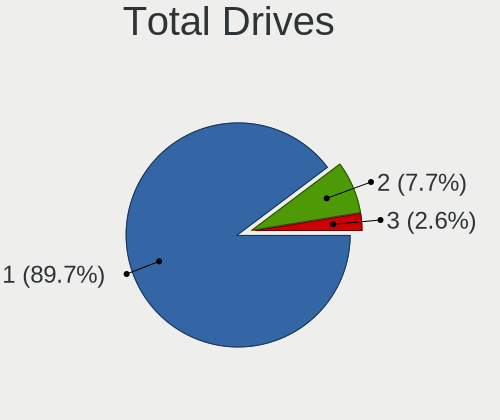
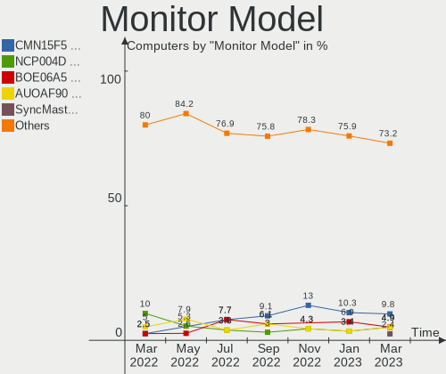
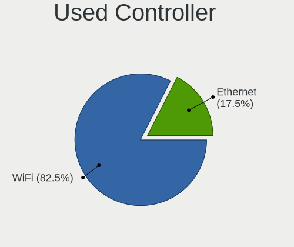
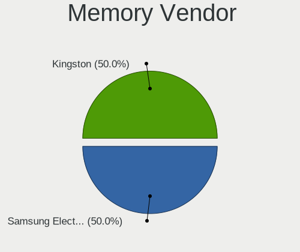
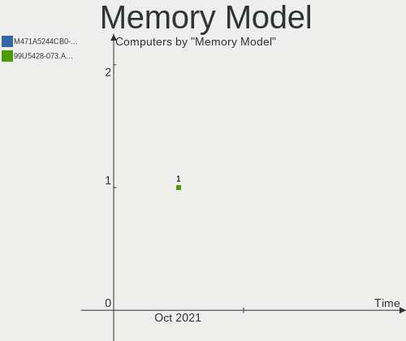
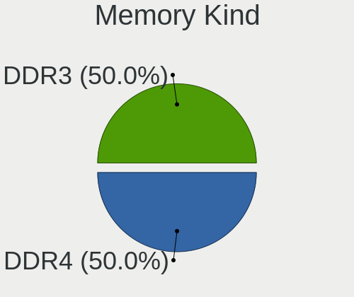
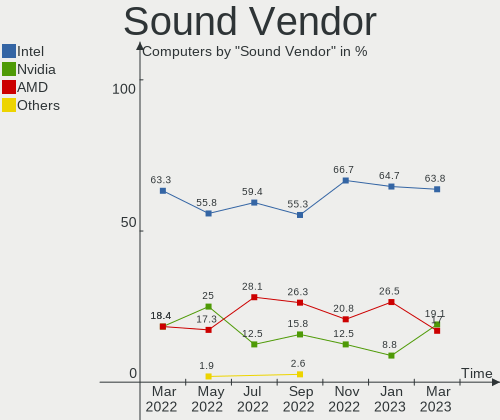

Endless Hardware Trends
-----------------------

A project to identify most popular hardware characteristics and track their change
over time based on data collected by Endless users at https://Linux-Hardware.org.

Anyone can contribute to the study by uploading probes of their computers by
the [hw-probe](https://github.com/linuxhw/hw-probe) tool:

    sudo -E hw-probe -all -upload

This is a report for all computer types. See also reports for [desktops](/Dist/Endless/Desktop/README.md) and [notebooks](/Dist/Endless/Notebook/README.md).

Full-feature report is available here: https://linux-hardware.org/?view=trends

Period: Feb, 2021.

Contents
--------

- [ OS                       ](#os)
- [ OS Family                ](#os-family)
- [ Kernel                   ](#kernel)
- [ Kernel Family            ](#kernel-family)
- [ Kernel Major Ver.        ](#kernel-major-ver)
- [ Arch                     ](#arch)
- [ DE                       ](#de)
- [ Display Server           ](#display-server)
- [ Display Manager          ](#display-manager)
- [ OS Lang                  ](#os-lang)
- [ Boot Mode                ](#boot-mode)
- [ Filesystem               ](#filesystem)
- [ Part. scheme             ](#part-scheme)
- [ Dual Boot with Linux/BSD ](#dual-boot-with-linux/bsd)
- [ Dual Boot (Win)          ](#dual-boot-win)
- [ Country                  ](#country)
- [ City                     ](#city)
- [ Vendor                   ](#vendor)
- [ Model                    ](#model)
- [ Model Family             ](#model-family)
- [ MFG Year                 ](#mfg-year)
- [ Form Factor              ](#form-factor)
- [ Secure Boot              ](#secure-boot)
- [ Coreboot                 ](#coreboot)
- [ RAM Size                 ](#ram-size)
- [ RAM Used                 ](#ram-used)
- [ Has CD-ROM               ](#has-cd-rom)
- [ Total Drives             ](#total-drives)
- [ Has Ethernet             ](#has-ethernet)
- [ Drive Vendor             ](#drive-vendor)
- [ Drive Model              ](#drive-model)
- [ HDD Vendor               ](#hdd-vendor)
- [ SSD Vendor               ](#ssd-vendor)
- [ Drive Kind               ](#drive-kind)
- [ Drive Connector          ](#drive-connector)
- [ Drive Size               ](#drive-size)
- [ Space Total              ](#space-total)
- [ Space Used               ](#space-used)
- [ Malfunc. Drives          ](#malfunc-drives)
- [ Malfunc. Drive Vendor    ](#malfunc-drive-vendor)
- [ Malfunc. HDD Vendor      ](#malfunc-hdd-vendor)
- [ Malfunc. Drive Kind      ](#malfunc-drive-kind)
- [ Failed Drives            ](#failed-drives)
- [ Failed Drive Vendor      ](#failed-drive-vendor)
- [ Drive Status             ](#drive-status)
- [ Storage Vendor           ](#storage-vendor)
- [ Storage Model            ](#storage-model)
- [ Storage Kind             ](#storage-kind)
- [ CPU Vendor               ](#cpu-vendor)
- [ CPU Model                ](#cpu-model)
- [ CPU Model Family         ](#cpu-model-family)
- [ CPU Cores                ](#cpu-cores)
- [ CPU Sockets              ](#cpu-sockets)
- [ CPU Threads              ](#cpu-threads)
- [ CPU Op-Modes             ](#cpu-op-modes)
- [ CPU Microcode            ](#cpu-microcode)
- [ CPU Microarch            ](#cpu-microarch)
- [ GPU Vendor               ](#gpu-vendor)
- [ GPU Model                ](#gpu-model)
- [ GPU Combo                ](#gpu-combo)
- [ GPU Driver               ](#gpu-driver)
- [ GPU Memory               ](#gpu-memory)
- [ Monitor Vendor           ](#monitor-vendor)
- [ Monitor Model            ](#monitor-model)
- [ Monitor Resolution       ](#monitor-resolution)
- [ Monitor Diagonal         ](#monitor-diagonal)
- [ Monitor Width            ](#monitor-width)
- [ Aspect Ratio             ](#aspect-ratio)
- [ Monitor Area             ](#monitor-area)
- [ Pixel Density            ](#pixel-density)
- [ Multiple Monitors        ](#multiple-monitors)
- [ Net Controller Vendor    ](#net-controller-vendor)
- [ Net Controller Model     ](#net-controller-model)
- [ Wireless Vendor          ](#wireless-vendor)
- [ Wireless Model           ](#wireless-model)
- [ Ethernet Vendor          ](#ethernet-vendor)
- [ Ethernet Model           ](#ethernet-model)
- [ Net Controller Kind      ](#net-controller-kind)
- [ Used Controller          ](#used-controller)
- [ NICs                     ](#nics)
- [ Memory Vendor            ](#memory-vendor)
- [ Memory Model             ](#memory-model)
- [ Memory Kind              ](#memory-kind)
- [ Memory Form Factor       ](#memory-form-factor)
- [ Memory Size              ](#memory-size)
- [ Memory Speed             ](#memory-speed)
- [ Sound Vendor             ](#sound-vendor)
- [ Sound Model              ](#sound-model)
- [ Camera Vendor            ](#camera-vendor)
- [ Camera Model             ](#camera-model)
- [ Fingerprint Vendor       ](#fingerprint-vendor)
- [ Fingerprint Model        ](#fingerprint-model)
- [ Chipcard Vendor          ](#chipcard-vendor)
- [ Chipcard Model           ](#chipcard-model)
- [ Printer Vendor           ](#printer-vendor)
- [ Printer Model            ](#printer-model)
- [ Scanner Vendor           ](#scanner-vendor)
- [ Scanner Model            ](#scanner-model)
- [ Bluetooth Vendor         ](#bluetooth-vendor)
- [ Bluetooth Model          ](#bluetooth-model)
- [ Unsupported Devices      ](#unsupported-devices)
- [ Unsupported Device Types ](#unsupported-device-types)

OS
--

Installed operating systems

| Name                   | Computers | Percent |
|------------------------|-----------|---------|
| Endless 3.9.2          | 49        | 53.85%  |
| Endless 3.9.3          | 17        | 18.68%  |
| Endless 3.9.1          | 5         | 5.49%   |
| Endless 3.7.4          | 5         | 5.49%   |
| Endless 3.8.7          | 3         | 3.3%    |
| Endless 3.8.3          | 2         | 2.2%    |
| Endless 3.7.8          | 2         | 2.2%    |
| Endless 3.7.6          | 2         | 2.2%    |
| Endless 3.7.3          | 2         | 2.2%    |
| Endless 3.8.7-nexthw2  | 1         | 1.1%    |
| Endless 3.8.3-nexthw1  | 1         | 1.1%    |
| Endless 3.8.0          | 1         | 1.1%    |
| Endless 3.3.20-nexthw1 | 1         | 1.1%    |

OS Family
---------

OS without a version

| Name    | Computers | Percent |
|---------|-----------|---------|
| Endless | 91        | 100%    |

Kernel
------

Version of the Linux kernel

| Version           | Computers | Percent |
|-------------------|-----------|---------|
| 5.8.0-14-generic  | 71        | 78.02%  |
| 5.3.0-19-generic  | 5         | 5.49%   |
| 5.4.0-42-generic  | 3         | 3.3%    |
| 5.4.0-19-generic  | 3         | 3.3%    |
| 5.3.0-28-generic  | 2         | 2.2%    |
| 5.3.0-23-generic  | 2         | 2.2%    |
| 5.3.0-12-generic  | 2         | 2.2%    |
| 5.6.0-7-generic   | 1         | 1.1%    |
| 4.15.0-15-generic | 1         | 1.1%    |
| Unknown           | 1         | 1.1%    |

Kernel Family
-------------

Linux kernel without a distro release

| Version | Computers | Percent |
|---------|-----------|---------|
| 5.8.0   | 71        | 78.02%  |
| 5.3.0   | 11        | 12.09%  |
| 5.4.0   | 6         | 6.59%   |
| 5.6.0   | 1         | 1.1%    |
| 4.15.0  | 1         | 1.1%    |
| Unknown | 1         | 1.1%    |

Kernel Major Ver.
-----------------

Linux kernel major version

| Version | Computers | Percent |
|---------|-----------|---------|
| 5.8     | 71        | 78.02%  |
| 5.3     | 11        | 12.09%  |
| 5.4     | 6         | 6.59%   |
| 5.6     | 1         | 1.1%    |
| 4.15    | 1         | 1.1%    |
| Unknown | 1         | 1.1%    |

Arch
----

OS architecture (x86_64, i586, etc.)

| Name   | Computers | Percent |
|--------|-----------|---------|
| x86_64 | 91        | 100%    |

DE
--

Desktop Environment

| Name    | Computers | Percent |
|---------|-----------|---------|
| GNOME   | 90        | 98.9%   |
| Unknown | 1         | 1.1%    |

Display Server
--------------

X11 or Wayland

| Name | Computers | Percent |
|------|-----------|---------|
| X11  | 91        | 100%    |

Display Manager
---------------

SDDM, LightDM, etc.

| Name    | Computers | Percent |
|---------|-----------|---------|
| Unknown | 91        | 100%    |

OS Lang
-------

Language

| Lang        | Computers | Percent |
|-------------|-----------|---------|
| pt_BR       | 33        | 36.26%  |
| en_US       | 19        | 20.88%  |
| ro_RO       | 5         | 5.49%   |
| tr_TR       | 4         | 4.4%    |
| ru_RU       | 4         | 4.4%    |
| es_MX       | 4         | 4.4%    |
| pl_PL       | 3         | 3.3%    |
| es_AR       | 3         | 3.3%    |
| nl_BE       | 2         | 2.2%    |
| hu_HU       | 2         | 2.2%    |
| en_GB       | 2         | 2.2%    |
| zh_TW       | 1         | 1.1%    |
| uk_UA       | 1         | 1.1%    |
| sk_SK       | 1         | 1.1%    |
| ru_UA       | 1         | 1.1%    |
| ru_RU.UTF_8 | 1         | 1.1%    |
| it_IT       | 1         | 1.1%    |
| es_CO       | 1         | 1.1%    |
| de_AT       | 1         | 1.1%    |
| bg_BG       | 1         | 1.1%    |
| Unknown     | 1         | 1.1%    |

Boot Mode
---------

EFI or BIOS

| Mode | Computers | Percent |
|------|-----------|---------|
| EFI  | 62        | 68.13%  |
| BIOS | 29        | 31.87%  |

Filesystem
----------

Type of filesystem

| Type  | Computers | Percent |
|-------|-----------|---------|
| Ext4  | 87        | 95.6%   |
| Tmpfs | 4         | 4.4%    |

Part. scheme
------------

Scheme of partitioning

| Type    | Computers | Percent |
|---------|-----------|---------|
| Unknown | 91        | 100%    |

Dual Boot with Linux/BSD
------------------------

Hosting more than one Linux/BSD

| Dual boot | Computers | Percent |
|-----------|-----------|---------|
| No        | 91        | 100%    |

Dual Boot (Win)
---------------

Hosting Linux and Windows

| Dual boot | Computers | Percent |
|-----------|-----------|---------|
| No        | 91        | 100%    |

Country
-------

Geographic location (country)

| Country     | Computers | Percent |
|-------------|-----------|---------|
| Brazil      | 33        | 36.26%  |
| Romania     | 11        | 12.09%  |
| USA         | 8         | 8.79%   |
| Turkey      | 4         | 4.4%    |
| Russia      | 4         | 4.4%    |
| Mexico      | 4         | 4.4%    |
| UK          | 3         | 3.3%    |
| Poland      | 3         | 3.3%    |
| Ukraine     | 2         | 2.2%    |
| Kenya       | 2         | 2.2%    |
| Hungary     | 2         | 2.2%    |
| Argentina   | 2         | 2.2%    |
| Taiwan      | 1         | 1.1%    |
| Spain       | 1         | 1.1%    |
| Slovakia    | 1         | 1.1%    |
| Netherlands | 1         | 1.1%    |
| Italy       | 1         | 1.1%    |
| Iran        | 1         | 1.1%    |
| India       | 1         | 1.1%    |
| Colombia    | 1         | 1.1%    |
| Bulgaria    | 1         | 1.1%    |
| Belgium     | 1         | 1.1%    |
| Belarus     | 1         | 1.1%    |
| Austria     | 1         | 1.1%    |
| Angola      | 1         | 1.1%    |

City
----

Geographic location (city)

| City                   | Computers | Percent |
|------------------------|-----------|---------|
| Bucharest              | 5         | 5.49%   |
| Rio de Janeiro         | 3         | 3.3%    |
| Moscow                 | 3         | 3.3%    |
| Warsaw                 | 2         | 2.2%    |
| Nairobi                | 2         | 2.2%    |
| Brasov                 | 2         | 2.2%    |
| Zonguldak              | 1         | 1.1%    |
| Wilde                  | 1         | 1.1%    |
| Weston                 | 1         | 1.1%    |
| West Jordan            | 1         | 1.1%    |
| Vitória               | 1         | 1.1%    |
| UEbelbach              | 1         | 1.1%    |
| Tijuana                | 1         | 1.1%    |
| Tepatitlán de Morelos | 1         | 1.1%    |
| Tehran                 | 1         | 1.1%    |
| Tegelen                | 1         | 1.1%    |
| Taipei                 | 1         | 1.1%    |
| São Paulo             | 1         | 1.1%    |
| São José dos Campos  | 1         | 1.1%    |
| St Petersburg          | 1         | 1.1%    |
| Sofia                  | 1         | 1.1%    |
| Smyrna                 | 1         | 1.1%    |
| Sao Jose do Rio Preto  | 1         | 1.1%    |
| Sao Jose do Alegre     | 1         | 1.1%    |
| Sao Joao da Barra      | 1         | 1.1%    |
| Roy                    | 1         | 1.1%    |
| Rome                   | 1         | 1.1%    |
| Recife                 | 1         | 1.1%    |
| Presidente Prudente    | 1         | 1.1%    |
| Ploieşti              | 1         | 1.1%    |
| Palma Sola             | 1         | 1.1%    |
| Ourinhos               | 1         | 1.1%    |
| Onda Verde             | 1         | 1.1%    |
| Odesa                  | 1         | 1.1%    |
| Nitra                  | 1         | 1.1%    |
| Milisauti              | 1         | 1.1%    |
| Mediaş                | 1         | 1.1%    |
| Medellín              | 1         | 1.1%    |
| Mason                  | 1         | 1.1%    |
| Macaé                 | 1         | 1.1%    |
| Lutsk                  | 1         | 1.1%    |
| Luanda                 | 1         | 1.1%    |
| Lida                   | 1         | 1.1%    |
| Lagoa dos Tres Cantos  | 1         | 1.1%    |
| Kütahya               | 1         | 1.1%    |
| Knoxville              | 1         | 1.1%    |
| Kew                    | 1         | 1.1%    |
| Jundiaí               | 1         | 1.1%    |
| Jaragua                | 1         | 1.1%    |
| Jammu                  | 1         | 1.1%    |
| Itapira                | 1         | 1.1%    |
| Itabira                | 1         | 1.1%    |
| Istanbul               | 1         | 1.1%    |
| Ibirama                | 1         | 1.1%    |
| Gödöllő             | 1         | 1.1%    |
| Guarulhos              | 1         | 1.1%    |
| Glasgow                | 1         | 1.1%    |
| Everett                | 1         | 1.1%    |
| Duque de Caxias        | 1         | 1.1%    |
| Deva                   | 1         | 1.1%    |

Vendor
------

Motherboard manufacturer

| Name                | Computers | Percent |
|---------------------|-----------|---------|
| Acer                | 32        | 35.16%  |
| ASUSTek Computer    | 28        | 30.77%  |
| Dell                | 7         | 7.69%   |
| Lenovo              | 5         | 5.49%   |
| Hewlett-Packard     | 5         | 5.49%   |
| Toshiba             | 2         | 2.2%    |
| Positivo            | 2         | 2.2%    |
| MSI                 | 2         | 2.2%    |
| Sony                | 1         | 1.1%    |
| Samsung Electronics | 1         | 1.1%    |
| Pegatron            | 1         | 1.1%    |
| Itautec             | 1         | 1.1%    |
| Gigabyte Technology | 1         | 1.1%    |
| ECS                 | 1         | 1.1%    |
| Compal              | 1         | 1.1%    |
| AMI                 | 1         | 1.1%    |

Model
-----

Motherboard model

| Name                                       | Computers | Percent |
|--------------------------------------------|-----------|---------|
| Acer Nitro AN515-54                        | 10        | 10.99%  |
| ASUS VivoBook 15_ASUS Laptop X540MA_X543MA | 5         | 5.49%   |
| ASUS VivoBook 15_ASUS Laptop X540UAR       | 4         | 4.4%    |
| Acer Aspire A315-34                        | 4         | 4.4%    |
| Acer Aspire A315-53                        | 2         | 2.2%    |
| Toshiba Satellite P75-A                    | 1         | 1.1%    |
| Toshiba Satellite L755                     | 1         | 1.1%    |
| Sony VGN-CR41Z_R                           | 1         | 1.1%    |
| Samsung 300E5EV/300E4EV/270E5EV/270E4EV    | 1         | 1.1%    |
| Positivo EC10IS1                           | 1         | 1.1%    |
| Positivo A14CR6A                           | 1         | 1.1%    |
| Pegatron BSW-P1                            | 1         | 1.1%    |
| MSI MS-7C04                                | 1         | 1.1%    |
| MSI FX610                                  | 1         | 1.1%    |
| Lenovo ThinkPad X200 Tablet 7453BA3        | 1         | 1.1%    |
| Lenovo IdeaPad 5 15IIL05 81YK              | 1         | 1.1%    |
| Lenovo IdeaPad 330-15IKB 81DE              | 1         | 1.1%    |
| Lenovo IdeaPad 320-15IKB 80YH              | 1         | 1.1%    |
| Lenovo IdeaPad 320-14IAP 80XQ              | 1         | 1.1%    |
| Itautec Infoway                            | 1         | 1.1%    |
| HP ProBook 4730s                           | 1         | 1.1%    |
| HP ProBook 450 G2                          | 1         | 1.1%    |
| HP EliteBook 8470p                         | 1         | 1.1%    |
| HP Compaq dc7800p Small Form Factor        | 1         | 1.1%    |
| HP All-in-One 24-f0xx                      | 1         | 1.1%    |
| Gigabyte 970A-UD3P                         | 1         | 1.1%    |
| ECS A320AM4-M3D                            | 1         | 1.1%    |
| Dell OptiPlex 9010                         | 1         | 1.1%    |
| Dell OptiPlex 3030 AIO                     | 1         | 1.1%    |
| Dell Latitude E6420                        | 1         | 1.1%    |
| Dell Latitude E6400                        | 1         | 1.1%    |
| Dell Latitude E5540                        | 1         | 1.1%    |
| Dell Inspiron 3593                         | 1         | 1.1%    |
| Dell Inspiron 3464 AIO                     | 1         | 1.1%    |
| Compal NCL60/61                            | 1         | 1.1%    |
| ASUS X751SA                                | 1         | 1.1%    |
| ASUS X541UAK                               | 1         | 1.1%    |
| ASUS X541UA                                | 1         | 1.1%    |
| ASUS X540NV                                | 1         | 1.1%    |
| ASUS X540NA                                | 1         | 1.1%    |
| ASUS X505BA                                | 1         | 1.1%    |
| ASUS VivoBook_ASUSLaptop X712FA_X712FA     | 1         | 1.1%    |
| ASUS VivoBook_ASUSLaptop X540MAR_X543MA    | 1         | 1.1%    |
| ASUS VivoBook_ASUSLaptop X513EA_K513EA     | 1         | 1.1%    |
| ASUS VivoBook_ASUSLaptop X509JB_X509JB     | 1         | 1.1%    |
| ASUS VivoBook_ASUSLaptop X509JA_X509JA     | 1         | 1.1%    |
| ASUS VivoBook_ASUSLaptop X509JA_F509JA     | 1         | 1.1%    |
| ASUS VivoBook_ASUS Laptop E406MA_E406MA    | 1         | 1.1%    |
| ASUS VivoBook_ASUS Laptop E210MA_E210MA    | 1         | 1.1%    |
| ASUS VivoBook 15_ASUS Laptop X540MA_R540MA | 1         | 1.1%    |
| ASUS UX310UAK                              | 1         | 1.1%    |
| ASUS GL553VE                               | 1         | 1.1%    |
| ASUS ASUSPRO P2540FAC_P2540FA              | 1         | 1.1%    |
| ASUS 1015PN                                | 1         | 1.1%    |
| AMI EC-200                                 | 1         | 1.1%    |
| Acer Veriton L4630G                        | 1         | 1.1%    |
| Acer Veriton EX2620G                       | 1         | 1.1%    |
| Acer Swift SF113-31                        | 1         | 1.1%    |
| Acer Predator PH315-52                     | 1         | 1.1%    |
| Acer Predator G3-571                       | 1         | 1.1%    |

Model Family
------------

Motherboard model prefix

| Name               | Computers | Percent |
|--------------------|-----------|---------|
| ASUS VivoBook      | 18        | 19.78%  |
| Acer Aspire        | 13        | 14.29%  |
| Acer Nitro         | 12        | 13.19%  |
| Lenovo IdeaPad     | 4         | 4.4%    |
| Dell Latitude      | 3         | 3.3%    |
| Toshiba Satellite  | 2         | 2.2%    |
| HP ProBook         | 2         | 2.2%    |
| Dell OptiPlex      | 2         | 2.2%    |
| Dell Inspiron      | 2         | 2.2%    |
| Acer Veriton       | 2         | 2.2%    |
| Acer Predator      | 2         | 2.2%    |
| Acer Extensa       | 2         | 2.2%    |
| Sony VGN-CR41Z     | 1         | 1.1%    |
| Samsung 300E5EV    | 1         | 1.1%    |
| Positivo EC10IS1   | 1         | 1.1%    |
| Positivo A14CR6A   | 1         | 1.1%    |
| Pegatron BSW-P1    | 1         | 1.1%    |
| MSI MS-7C04        | 1         | 1.1%    |
| MSI FX610          | 1         | 1.1%    |
| Lenovo ThinkPad    | 1         | 1.1%    |
| Itautec Infoway    | 1         | 1.1%    |
| HP EliteBook       | 1         | 1.1%    |
| HP Compaq          | 1         | 1.1%    |
| HP All-in-One      | 1         | 1.1%    |
| Gigabyte 970A-UD3P | 1         | 1.1%    |
| ECS A320AM4-M3D    | 1         | 1.1%    |
| Compal NCL60       | 1         | 1.1%    |
| ASUS X751SA        | 1         | 1.1%    |
| ASUS X541UAK       | 1         | 1.1%    |
| ASUS X541UA        | 1         | 1.1%    |
| ASUS X540NV        | 1         | 1.1%    |
| ASUS X540NA        | 1         | 1.1%    |
| ASUS X505BA        | 1         | 1.1%    |
| ASUS UX310UAK      | 1         | 1.1%    |
| ASUS GL553VE       | 1         | 1.1%    |
| ASUS ASUSPRO       | 1         | 1.1%    |
| ASUS 1015PN        | 1         | 1.1%    |
| AMI EC-200         | 1         | 1.1%    |
| Acer Swift         | 1         | 1.1%    |

MFG Year
--------

Motherboard manufacture year

| Year | Computers | Percent |
|------|-----------|---------|
| 2020 | 31        | 34.07%  |
| 2019 | 22        | 24.18%  |
| 2017 | 8         | 8.79%   |
| 2018 | 7         | 7.69%   |
| 2014 | 5         | 5.49%   |
| 2016 | 4         | 4.4%    |
| 2013 | 4         | 4.4%    |
| 2010 | 3         | 3.3%    |
| 2012 | 2         | 2.2%    |
| 2015 | 1         | 1.1%    |
| 2009 | 1         | 1.1%    |
| 2008 | 1         | 1.1%    |
| 2007 | 1         | 1.1%    |
| 2006 | 1         | 1.1%    |

Form Factor
-----------

Physical design of the computer

| Name       | Computers | Percent |
|------------|-----------|---------|
| Notebook   | 75        | 82.42%  |
| Desktop    | 11        | 12.09%  |
| All in one | 4         | 4.4%    |
| Mini pc    | 1         | 1.1%    |

Secure Boot
-----------

Enabled or disabled

| State    | Computers | Percent |
|----------|-----------|---------|
| Disabled | 65        | 71.43%  |
| Enabled  | 26        | 28.57%  |

Coreboot
--------

Have coreboot on board

| Used | Computers | Percent |
|------|-----------|---------|
| No   | 91        | 100%    |

RAM Size
--------

Total RAM memory

| Size in GB | Computers | Percent |
|------------|-----------|---------|
| 3.01-4.0   | 36        | 39.56%  |
| 4.01-8.0   | 34        | 37.36%  |
| 16.01-24.0 | 8         | 8.79%   |
| 8.01-16.0  | 6         | 6.59%   |
| 1.01-2.0   | 5         | 5.49%   |
| 32.01-64.0 | 1         | 1.1%    |
| 2.01-3.0   | 1         | 1.1%    |

RAM Used
--------

Used RAM memory

| Used GB  | Computers | Percent |
|----------|-----------|---------|
| 1.01-2.0 | 45        | 49.45%  |
| 2.01-3.0 | 24        | 26.37%  |
| 0.51-1.0 | 11        | 12.09%  |
| 3.01-4.0 | 7         | 7.69%   |
| 4.01-8.0 | 4         | 4.4%    |

Has CD-ROM
----------

Has CD-ROM on board

| Presented | Computers | Percent |
|-----------|-----------|---------|
| No        | 62        | 68.13%  |
| Yes       | 29        | 31.87%  |

Total Drives
------------

Number of drives on board

| Drives | Computers | Percent |
|--------|-----------|---------|
| 1      | 69        | 75.82%  |
| 2      | 20        | 21.98%  |
| 3      | 2         | 2.2%    |

Has Ethernet
------------

Has Ethernet on board

| Presented | Computers | Percent |
|-----------|-----------|---------|
| Yes       | 68        | 74.73%  |
| No        | 23        | 25.27%  |

Drive Vendor
------------

Hard drive vendors

| Vendor              | Computers | Drives | Percent |
|---------------------|-----------|--------|---------|
| WDC                 | 24        | 24     | 21.43%  |
| Intel               | 17        | 17     | 15.18%  |
| Seagate             | 16        | 16     | 14.29%  |
| Toshiba             | 10        | 10     | 8.93%   |
| Kingston            | 9         | 9      | 8.04%   |
| Unknown             | 6         | 8      | 5.36%   |
| SK Hynix            | 5         | 5      | 4.46%   |
| HGST                | 5         | 5      | 4.46%   |
| Sandisk             | 3         | 3      | 2.68%   |
| Samsung Electronics | 3         | 6      | 2.68%   |
| Hitachi             | 3         | 3      | 2.68%   |
| Hewlett-Packard     | 2         | 2      | 1.79%   |
| A-DATA Technology   | 2         | 2      | 1.79%   |
| Transcend           | 1         | 1      | 0.89%   |
| Patriot             | 1         | 1      | 0.89%   |
| Micron Technology   | 1         | 1      | 0.89%   |
| KIOXIA-EXCERIA      | 1         | 1      | 0.89%   |
| KIOXIA              | 1         | 1      | 0.89%   |
| Crucial             | 1         | 1      | 0.89%   |
| ADATA Technology    | 1         | 1      | 0.89%   |

Drive Model
-----------

Hard drive models

| Model                                 | Computers | Percent |
|---------------------------------------|-----------|---------|
| WDC WD10SPZX-21Z10T0 1TB              | 14        | 12.07%  |
| Intel NVMe SSD Drive 512GB            | 11        | 9.48%   |
| Seagate ST1000LM035-1RK172 1TB        | 7         | 6.03%   |
| Toshiba MQ01ABF050 500GB              | 3         | 2.59%   |
| Kingston RBUSC180DS37256GJ 256GB SSD  | 3         | 2.59%   |
| Intel NVMe SSD Drive 256GB            | 3         | 2.59%   |
| Intel NVMe SSD Drive 128GB            | 3         | 2.59%   |
| WDC WD10SPZX-80Z10T2 1TB              | 2         | 1.72%   |
| Unknown MMC Card  64GB                | 2         | 1.72%   |
| Toshiba MQ04ABF100 1TB                | 2         | 1.72%   |
| SK Hynix HFS256G39TND-N210A 256GB SSD | 2         | 1.72%   |
| Seagate ST2000LM007-1R8174 2TB        | 2         | 1.72%   |
| Sandisk NVMe SSD Drive 256GB          | 2         | 1.72%   |
| WDC WDS500G2B0A 500GB SSD             | 1         | 0.86%   |
| WDC WD800JD-75MSA3 80GB               | 1         | 0.86%   |
| WDC WD7500BPKX-22HPJT0 752GB          | 1         | 0.86%   |
| WDC WD5000LPCX-80VHAT1 500GB          | 1         | 0.86%   |
| WDC WD3200BUCT-63TWBY0 320GB          | 1         | 0.86%   |
| WDC WD2500BEVT-80A23T0 250GB          | 1         | 0.86%   |
| WDC WD1600AAJS-00L7A0 160GB           | 1         | 0.86%   |
| WDC WD10SPZX-08Z10 1TB                | 1         | 0.86%   |
| Unknown SD/MMC/MS PRO 64GB            | 1         | 0.86%   |
| Unknown MMC Card  971MB               | 1         | 0.86%   |
| Unknown MMC Card  8GB                 | 1         | 0.86%   |
| Unknown MMC Card  16GB                | 1         | 0.86%   |
| Unknown MMC Card  128GB               | 1         | 0.86%   |
| Transcend TS240GSSD220S 240GB         | 1         | 0.86%   |
| Toshiba MQ01ABF0 500GB                | 1         | 0.86%   |
| Toshiba MQ01ABD100 1TB                | 1         | 0.86%   |
| Toshiba MQ01ABD050V 500GB             | 1         | 0.86%   |
| Toshiba MQ01ABD032 320GB              | 1         | 0.86%   |
| Toshiba MK6475GSX 640GB               | 1         | 0.86%   |
| SK Hynix NVMe SSD Drive 256GB         | 1         | 0.86%   |
| SK Hynix HFS256G32TND-N210A 256GB SSD | 1         | 0.86%   |
| SK Hynix HFS128G39TND-N210A 128GB SSD | 1         | 0.86%   |
| Seagate ST750LM022 HN-M750MBB 752GB   | 1         | 0.86%   |
| Seagate ST500LT012-9WS142 500GB       | 1         | 0.86%   |
| Seagate ST500LM000-1EJ162-SSHD 500GB  | 1         | 0.86%   |
| Seagate ST2000LM003 HN-M201RAD 2TB    | 1         | 0.86%   |
| Seagate ST1000DM010-2EP102 1TB        | 1         | 0.86%   |
| Seagate ST1000DM003-1SB102 1TB        | 1         | 0.86%   |
| Seagate Expansion 500GB               | 1         | 0.86%   |
| Sandisk NVMe SSD Drive 500GB          | 1         | 0.86%   |
| Samsung SSD 970 PRO 512GB             | 1         | 0.86%   |
| Samsung SSD 970 EVO Plus 1TB          | 1         | 0.86%   |
| Samsung SSD 840 EVO 120GB             | 1         | 0.86%   |
| Samsung NVMe SSD Drive 512GB          | 1         | 0.86%   |
| Samsung NVMe SSD Drive 1TB            | 1         | 0.86%   |
| Samsung HM160HI 160GB                 | 1         | 0.86%   |
| Patriot Solid 128GB SSD               | 1         | 0.86%   |
| Micron 1100_MTFDDAV256TBN 256GB SSD   | 1         | 0.86%   |
| KIOXIA-EXCERIA SATA SSD 480GB         | 1         | 0.86%   |
| KIOXIA NVMe SSD Drive 128GB           | 1         | 0.86%   |
| Kingston SV300S37A120G 120GB SSD      | 1         | 0.86%   |
| Kingston SA400S37120G 120GB SSD       | 1         | 0.86%   |
| Kingston RBUSNS8180S3128GI1 128GB SSD | 1         | 0.86%   |
| Kingston RBUSC180DS37128GJ 128GB SSD  | 1         | 0.86%   |
| Kingston NVMe SSD Drive 500GB         | 1         | 0.86%   |
| Kingston NVMe SSD Drive 128GB         | 1         | 0.86%   |
| Hitachi HTS725050A9A364 500GB         | 1         | 0.86%   |

HDD Vendor
----------

Hard disk drive vendors

| Vendor              | Computers | Drives | Percent |
|---------------------|-----------|--------|---------|
| WDC                 | 23        | 23     | 39.66%  |
| Seagate             | 16        | 16     | 27.59%  |
| Toshiba             | 10        | 10     | 17.24%  |
| HGST                | 5         | 5      | 8.62%   |
| Hitachi             | 3         | 3      | 5.17%   |
| Samsung Electronics | 1         | 1      | 1.72%   |

SSD Vendor
----------

Solid state drive vendors

| Vendor              | Computers | Drives | Percent |
|---------------------|-----------|--------|---------|
| Kingston            | 7         | 7      | 31.82%  |
| SK Hynix            | 4         | 4      | 18.18%  |
| Hewlett-Packard     | 2         | 2      | 9.09%   |
| A-DATA Technology   | 2         | 2      | 9.09%   |
| WDC                 | 1         | 1      | 4.55%   |
| Transcend           | 1         | 1      | 4.55%   |
| Samsung Electronics | 1         | 1      | 4.55%   |
| Patriot             | 1         | 1      | 4.55%   |
| Micron Technology   | 1         | 1      | 4.55%   |
| KIOXIA-EXCERIA      | 1         | 1      | 4.55%   |
| Crucial             | 1         | 1      | 4.55%   |

Drive Kind
----------

HDD or SSD

| Kind    | Computers | Drives | Percent |
|---------|-----------|--------|---------|
| HDD     | 57        | 58     | 51.82%  |
| NVMe    | 26        | 29     | 23.64%  |
| SSD     | 21        | 22     | 19.09%  |
| MMC     | 5         | 7      | 4.55%   |
| Unknown | 1         | 1      | 0.91%   |

Drive Connector
---------------

SATA, SAS, NVMe, etc.

| Type | Computers | Drives | Percent |
|------|-----------|--------|---------|
| SATA | 71        | 78     | 67.62%  |
| NVMe | 26        | 29     | 24.76%  |
| MMC  | 5         | 7      | 4.76%   |
| SAS  | 3         | 3      | 2.86%   |

Drive Size
----------

Size of hard drive

| Size in TB | Computers | Drives | Percent |
|------------|-----------|--------|---------|
| 0.01-0.5   | 39        | 42     | 50.65%  |
| 0.51-1.0   | 35        | 35     | 45.45%  |
| 1.01-2.0   | 3         | 3      | 3.9%    |

Space Total
-----------

Amount of disk space available on the file system

| Size in GB | Computers | Percent |
|------------|-----------|---------|
| 501-1000   | 28        | 30.77%  |
| 251-500    | 24        | 26.37%  |
| 101-250    | 21        | 23.08%  |
| 51-100     | 6         | 6.59%   |
| 21-50      | 4         | 4.4%    |
| 2001-3000  | 4         | 4.4%    |
| 1001-2000  | 2         | 2.2%    |
| 1-20       | 2         | 2.2%    |

Space Used
----------

Amount of used disk space

| Used GB   | Computers | Percent |
|-----------|-----------|---------|
| 21-50     | 47        | 51.65%  |
| 1-20      | 18        | 19.78%  |
| 51-100    | 8         | 8.79%   |
| 101-250   | 6         | 6.59%   |
| 251-500   | 5         | 5.49%   |
| 1001-2000 | 4         | 4.4%    |
| 501-1000  | 3         | 3.3%    |

Malfunc. Drives
---------------

Drive models with a malfunction

Zero info for selected period =(

Malfunc. Drive Vendor
---------------------

Vendors of faulty drives

Zero info for selected period =(

Malfunc. HDD Vendor
-------------------

Vendors of faulty HDD drives

Zero info for selected period =(

Malfunc. Drive Kind
-------------------

Kinds of faulty drives

Zero info for selected period =(

Failed Drives
-------------

Failed drive models

Zero info for selected period =(

Failed Drive Vendor
-------------------

Failed drive vendors

Zero info for selected period =(

Drive Status
------------

Number of failed and malfunc. drives

| Status   | Computers | Drives | Percent |
|----------|-----------|--------|---------|
| Detected | 91        | 115    | 98.91%  |
| Works    | 1         | 2      | 1.09%   |

Storage Vendor
--------------

Storage controller vendors

| Vendor                      | Computers | Percent |
|-----------------------------|-----------|---------|
| Intel                       | 84        | 84%     |
| AMD                         | 7         | 7%      |
| Sandisk                     | 3         | 3%      |
| Kingston Technology Company | 2         | 2%      |
| SK Hynix                    | 1         | 1%      |
| Samsung Electronics         | 1         | 1%      |
| KIOXIA                      | 1         | 1%      |
| ADATA Technology            | 1         | 1%      |

Storage Model
-------------

Storage controller models

| Model                                                                            | Computers | Percent |
|----------------------------------------------------------------------------------|-----------|---------|
| Intel 82801 Mobile SATA Controller [RAID mode]                                   | 20        | 16%     |
| Intel Sunrise Point-LP SATA Controller [AHCI mode]                               | 16        | 12.8%   |
| Intel PROSet/Wireless WiFi Software extension                                    | 16        | 12.8%   |
| Intel Celeron/Pentium Silver Processor SATA Controller                           | 15        | 12%     |
| AMD FCH SATA Controller [AHCI mode]                                              | 5         | 4%      |
| Intel Celeron N3350/Pentium N4200/Atom E3900 Series SATA AHCI Controller         | 4         | 3.2%    |
| Intel 8 Series/C220 Series Chipset Family 6-port SATA Controller 1 [AHCI mode]   | 3         | 2.4%    |
| Intel 7 Series Chipset Family 6-port SATA Controller [AHCI mode]                 | 3         | 2.4%    |
| Intel 6 Series/C200 Series Chipset Family 6 port Mobile SATA AHCI Controller     | 3         | 2.4%    |
| Sandisk WD Blue SN550 NVMe SSD                                                   | 2         | 1.6%    |
| Intel NM10/ICH7 Family SATA Controller [IDE mode]                                | 2         | 1.6%    |
| Intel Mobile 4 Series Chipset PT IDER Controller                                 | 2         | 1.6%    |
| Intel HM170/QM170 Chipset SATA Controller [AHCI Mode]                            | 2         | 1.6%    |
| Intel Atom/Celeron/Pentium Processor x5-E8000/J3xxx/N3xxx Series SATA Controller | 2         | 1.6%    |
| Intel 82801IBM/IEM (ICH9M/ICH9M-E) 4 port SATA Controller [AHCI mode]            | 2         | 1.6%    |
| AMD SB7x0/SB8x0/SB9x0 IDE Controller                                             | 2         | 1.6%    |
| SK Hynix BC501 NVMe Solid State Drive 512GB                                      | 1         | 0.8%    |
| Sandisk WD Blue SN500 / PC SN520 NVMe SSD                                        | 1         | 0.8%    |
| Samsung NVMe SSD Controller SM981/PM981/PM983                                    | 1         | 0.8%    |
| KIOXIA Non-Volatile memory controller                                            | 1         | 0.8%    |
| Kingston Company U-SNS8154P3 NVMe SSD                                            | 1         | 0.8%    |
| Kingston Company A2000 NVMe SSD                                                  | 1         | 0.8%    |
| Intel Wildcat Point-LP SATA Controller [AHCI Mode]                               | 1         | 0.8%    |
| Intel Volume Management Device NVMe RAID Controller                              | 1         | 0.8%    |
| Intel SSD 660P Series                                                            | 1         | 0.8%    |
| Intel SATA Controller [RAID mode]                                                | 1         | 0.8%    |
| Intel SATA controller                                                            | 1         | 0.8%    |
| Intel NM10/ICH7 Family SATA Controller [AHCI mode]                               | 1         | 0.8%    |
| Intel Ice Lake-LP SATA Controller [AHCI mode]                                    | 1         | 0.8%    |
| Intel Comet Lake SATA AHCI Controller                                            | 1         | 0.8%    |
| Intel Cannon Lake PCH SATA AHCI Controller                                       | 1         | 0.8%    |
| Intel Atom Processor E3800 Series SATA AHCI Controller                           | 1         | 0.8%    |
| Intel 82Q35 Express PT IDER Controller                                           | 1         | 0.8%    |
| Intel 82801IR/IO/IH (ICH9R/DO/DH) 4 port SATA Controller [IDE mode]              | 1         | 0.8%    |
| Intel 82801I (ICH9 Family) 2 port SATA Controller [IDE mode]                     | 1         | 0.8%    |
| Intel 82801HM/HEM (ICH8M/ICH8M-E) SATA Controller [IDE mode]                     | 1         | 0.8%    |
| Intel 5 Series/3400 Series Chipset 4 port SATA IDE Controller                    | 1         | 0.8%    |
| Intel 200 Series PCH SATA controller [AHCI mode]                                 | 1         | 0.8%    |
| AMD SB7x0/SB8x0/SB9x0 SATA Controller [IDE mode]                                 | 1         | 0.8%    |
| AMD SB7x0/SB8x0/SB9x0 SATA Controller [AHCI mode]                                | 1         | 0.8%    |
| AMD FCH SATA Controller D                                                        | 1         | 0.8%    |
| ADATA Non-Volatile memory controller                                             | 1         | 0.8%    |

Storage Kind
------------

Kind of storage controller (IDE, SATA, NVMe, SAS, ...)

| Kind | Computers | Percent |
|------|-----------|---------|
| SATA | 82        | 67.21%  |
| NVMe | 26        | 21.31%  |
| IDE  | 9         | 7.38%   |
| RAID | 5         | 4.1%    |

CPU Vendor
----------

Processor vendors

| Vendor | Computers | Percent |
|--------|-----------|---------|
| Intel  | 84        | 92.31%  |
| AMD    | 7         | 7.69%   |

CPU Model
---------

Processor models

| Model                                          | Computers | Percent |
|------------------------------------------------|-----------|---------|
| Intel Core i5-9300H CPU @ 2.40GHz              | 9         | 9.89%   |
| Intel Celeron N4020 CPU @ 1.10GHz              | 6         | 6.59%   |
| Intel Core i7-9750H CPU @ 2.60GHz              | 3         | 3.3%    |
| Intel Core i5-7200U CPU @ 2.50GHz              | 3         | 3.3%    |
| Intel Core i5-1035G1 CPU @ 1.00GHz             | 3         | 3.3%    |
| Intel Celeron N4000C CPU @ 1.10GHz             | 3         | 3.3%    |
| Intel Celeron N4000 CPU @ 1.10GHz              | 3         | 3.3%    |
| Intel Pentium CPU N4200 @ 1.10GHz              | 2         | 2.2%    |
| Intel Core i7-7700HQ CPU @ 2.80GHz             | 2         | 2.2%    |
| Intel Core i7-10510U CPU @ 1.80GHz             | 2         | 2.2%    |
| Intel Core i3-8130U CPU @ 2.20GHz              | 2         | 2.2%    |
| Intel Core i3-7100U CPU @ 2.40GHz              | 2         | 2.2%    |
| Intel Core i3-7020U CPU @ 2.30GHz              | 2         | 2.2%    |
| Intel Core i3-6100U CPU @ 2.30GHz              | 2         | 2.2%    |
| Intel Core i3-1005G1 CPU @ 1.20GHz             | 2         | 2.2%    |
| Intel Celeron CPU N3350 @ 1.10GHz              | 2         | 2.2%    |
| Intel Pentium Silver N5000 CPU @ 1.10GHz       | 1         | 1.1%    |
| Intel Pentium D CPU 3.40GHz                    | 1         | 1.1%    |
| Intel Pentium CPU N3700 @ 1.60GHz              | 1         | 1.1%    |
| Intel Pentium CPU 2117U @ 1.80GHz              | 1         | 1.1%    |
| Intel Core i7-9700KF CPU @ 3.60GHz             | 1         | 1.1%    |
| Intel Core i7-8565U CPU @ 1.80GHz              | 1         | 1.1%    |
| Intel Core i7-7500U CPU @ 2.70GHz              | 1         | 1.1%    |
| Intel Core i7-4700MQ CPU @ 2.40GHz             | 1         | 1.1%    |
| Intel Core i7-2640M CPU @ 2.80GHz              | 1         | 1.1%    |
| Intel Core i7-2600 CPU @ 3.40GHz               | 1         | 1.1%    |
| Intel Core i5-9400 CPU @ 2.90GHz               | 1         | 1.1%    |
| Intel Core i5-6200U CPU @ 2.30GHz              | 1         | 1.1%    |
| Intel Core i5-5200U CPU @ 2.20GHz              | 1         | 1.1%    |
| Intel Core i5-4460S CPU @ 2.90GHz              | 1         | 1.1%    |
| Intel Core i5-4210U CPU @ 1.70GHz              | 1         | 1.1%    |
| Intel Core i5-3340M CPU @ 2.70GHz              | 1         | 1.1%    |
| Intel Core i5-3210M CPU @ 2.50GHz              | 1         | 1.1%    |
| Intel Core i5-10210U CPU @ 1.60GHz             | 1         | 1.1%    |
| Intel Core i5 CPU M 480 @ 2.67GHz              | 1         | 1.1%    |
| Intel Core i3-7130U CPU @ 2.70GHz              | 1         | 1.1%    |
| Intel Core i3-6006U CPU @ 2.00GHz              | 1         | 1.1%    |
| Intel Core i3-4150 CPU @ 3.50GHz               | 1         | 1.1%    |
| Intel Core i3-2330M CPU @ 2.20GHz              | 1         | 1.1%    |
| Intel Core i3-2310M CPU @ 2.10GHz              | 1         | 1.1%    |
| Intel Core 2 Duo CPU T9600 @ 2.80GHz           | 1         | 1.1%    |
| Intel Core 2 Duo CPU T8300 @ 2.40GHz           | 1         | 1.1%    |
| Intel Core 2 Duo CPU L9300 @ 1.60GHz           | 1         | 1.1%    |
| Intel Core 2 Duo CPU E6550 @ 2.33GHz           | 1         | 1.1%    |
| Intel Celeron J4025 CPU @ 2.00GHz              | 1         | 1.1%    |
| Intel Celeron J4005 CPU @ 2.00GHz              | 1         | 1.1%    |
| Intel Celeron CPU N2807 @ 1.58GHz              | 1         | 1.1%    |
| Intel Celeron CPU J3160 @ 1.60GHz              | 1         | 1.1%    |
| Intel Celeron CPU 3867U @ 1.80GHz              | 1         | 1.1%    |
| Intel Atom CPU N550 @ 1.50GHz                  | 1         | 1.1%    |
| Intel Atom CPU N2600 @ 1.60GHz                 | 1         | 1.1%    |
| Intel 11th Gen Core i3-1115G4 @ 3.00GHz        | 1         | 1.1%    |
| AMD Ryzen 7 3750H with Radeon Vega Mobile Gfx  | 1         | 1.1%    |
| AMD Phenom II P840 Triple-Core Processor       | 1         | 1.1%    |
| AMD FX-9800P RADEON R7, 12 COMPUTE CORES 4C+8G | 1         | 1.1%    |
| AMD FX-8350 Eight-Core Processor               | 1         | 1.1%    |
| AMD A9-9420e RADEON R5, 5 COMPUTE CORES 2C+3G  | 1         | 1.1%    |
| AMD A9-9420 RADEON R5, 5 COMPUTE CORES 2C+3G   | 1         | 1.1%    |
| AMD A8-9600 RADEON R7, 10 COMPUTE CORES 4C+6G  | 1         | 1.1%    |

CPU Model Family
----------------

Processor model prefix

| Model                | Computers | Percent |
|----------------------|-----------|---------|
| Intel Core i5        | 24        | 26.37%  |
| Intel Celeron        | 19        | 20.88%  |
| Intel Core i3        | 15        | 16.48%  |
| Intel Core i7        | 13        | 14.29%  |
| Intel Pentium        | 4         | 4.4%    |
| Intel Core 2 Duo     | 4         | 4.4%    |
| Other                | 3         | 3.3%    |
| Intel Atom           | 2         | 2.2%    |
| AMD FX               | 2         | 2.2%    |
| Intel Pentium Silver | 1         | 1.1%    |
| Intel Pentium D      | 1         | 1.1%    |
| AMD Ryzen 7          | 1         | 1.1%    |
| AMD Phenom II        | 1         | 1.1%    |
| AMD A8               | 1         | 1.1%    |

CPU Cores
---------

Number of processor cores

| Number | Computers | Percent |
|--------|-----------|---------|
| 2      | 57        | 62.64%  |
| 4      | 28        | 30.77%  |
| 6      | 4         | 4.4%    |
| 8      | 1         | 1.1%    |
| 3      | 1         | 1.1%    |

CPU Sockets
-----------

Number of sockets

| Number | Computers | Percent |
|--------|-----------|---------|
| 1      | 91        | 100%    |

CPU Threads
-----------

Threads per core (Hyper-Threading)

| Number | Computers | Percent |
|--------|-----------|---------|
| 2      | 55        | 60.44%  |
| 1      | 36        | 39.56%  |

CPU Op-Modes
------------

CPU Operation Modes (32-bit, 64-bit)

| Op mode        | Computers | Percent |
|----------------|-----------|---------|
| 32-bit, 64-bit | 91        | 100%    |

CPU Microcode
-------------

Microcode number

| Number     | Computers | Percent |
|------------|-----------|---------|
| 0x906ea    | 11        | 12.09%  |
| 0x806e9    | 7         | 7.69%   |
| 0x706a8    | 7         | 7.69%   |
| 0x706a1    | 7         | 7.69%   |
| Unknown    | 7         | 7.69%   |
| 0x706e5    | 5         | 5.49%   |
| 0x506c9    | 4         | 4.4%    |
| 0x406e3    | 4         | 4.4%    |
| 0x206a7    | 4         | 4.4%    |
| 0x806ec    | 3         | 3.3%    |
| 0x806ea    | 3         | 3.3%    |
| 0x306a9    | 3         | 3.3%    |
| 0x906ed    | 2         | 2.2%    |
| 0x906e9    | 2         | 2.2%    |
| 0x306c3    | 2         | 2.2%    |
| 0x06006705 | 2         | 2.2%    |
| 0x0600611a | 2         | 2.2%    |
| 0xf65      | 1         | 1.1%    |
| 0x906ec    | 1         | 1.1%    |
| 0x806eb    | 1         | 1.1%    |
| 0x806c1    | 1         | 1.1%    |
| 0x6fb      | 1         | 1.1%    |
| 0x406c4    | 1         | 1.1%    |
| 0x406c3    | 1         | 1.1%    |
| 0x40651    | 1         | 1.1%    |
| 0x306d4    | 1         | 1.1%    |
| 0x30678    | 1         | 1.1%    |
| 0x20655    | 1         | 1.1%    |
| 0x106ca    | 1         | 1.1%    |
| 0x1067a    | 1         | 1.1%    |
| 0x10676    | 1         | 1.1%    |
| 0x06000852 | 1         | 1.1%    |
| 0x010000c8 | 1         | 1.1%    |

CPU Microarch
-------------

Microarchitecture

| Name          | Computers | Percent |
|---------------|-----------|---------|
| KabyLake      | 32        | 35.16%  |
| Goldmont plus | 15        | 16.48%  |
| IceLake       | 5         | 5.49%   |
| Skylake       | 4         | 4.4%    |
| SandyBridge   | 4         | 4.4%    |
| Haswell       | 4         | 4.4%    |
| Goldmont      | 4         | 4.4%    |
| Excavator     | 4         | 4.4%    |
| Silvermont    | 3         | 3.3%    |
| Penryn        | 3         | 3.3%    |
| IvyBridge     | 3         | 3.3%    |
| Bonnell       | 2         | 2.2%    |
| Zen+          | 1         | 1.1%    |
| Westmere      | 1         | 1.1%    |
| TigerLake     | 1         | 1.1%    |
| Piledriver    | 1         | 1.1%    |
| NetBurst      | 1         | 1.1%    |
| K10           | 1         | 1.1%    |
| Core          | 1         | 1.1%    |
| Broadwell     | 1         | 1.1%    |

GPU Vendor
----------

Vendors of graphics cards

| Vendor | Computers | Percent |
|--------|-----------|---------|
| Intel  | 77        | 68.14%  |
| Nvidia | 26        | 23.01%  |
| AMD    | 10        | 8.85%   |

GPU Model
---------

Graphics card models

| Model                                                                                    | Computers | Percent |
|------------------------------------------------------------------------------------------|-----------|---------|
| Intel GeminiLake [UHD Graphics 600]                                                      | 14        | 12.07%  |
| Nvidia TU117M [GeForce GTX 1650 Mobile / Max-Q]                                          | 12        | 10.34%  |
| Intel CoffeeLake-H GT2 [UHD Graphics 630]                                                | 12        | 10.34%  |
| Intel HD Graphics 620                                                                    | 7         | 6.03%   |
| Intel Iris Plus Graphics G1 (Ice Lake)                                                   | 5         | 4.31%   |
| Intel Skylake GT2 [HD Graphics 520]                                                      | 4         | 3.45%   |
| Intel CometLake-U GT2 [UHD Graphics]                                                     | 3         | 2.59%   |
| Nvidia GM108M [GeForce 940MX]                                                            | 2         | 1.72%   |
| Intel UHD Graphics 620                                                                   | 2         | 1.72%   |
| Intel Kaby Lake-U GT2f Integrated Graphics Controller                                    | 2         | 1.72%   |
| Intel HD Graphics 630                                                                    | 2         | 1.72%   |
| Intel HD Graphics 500                                                                    | 2         | 1.72%   |
| Intel Celeron N3350/Pentium N4200/Atom E3900 Series Integrated Graphics Controller       | 2         | 1.72%   |
| Intel Atom/Celeron/Pentium Processor x5-E8000/J3xxx/N3xxx Integrated Graphics Controller | 2         | 1.72%   |
| Intel 3rd Gen Core processor Graphics Controller                                         | 2         | 1.72%   |
| Intel 2nd Generation Core Processor Family Integrated Graphics Controller                | 2         | 1.72%   |
| AMD Wani [Radeon R5/R6/R7 Graphics]                                                      | 2         | 1.72%   |
| AMD Topaz XT [Radeon R7 M260/M265 / M340/M360 / M440/M445 / 530/535 / 620/625 Mobile]    | 2         | 1.72%   |
| AMD Stoney [Radeon R2/R3/R4/R5 Graphics]                                                 | 2         | 1.72%   |
| Nvidia TU106M [GeForce RTX 2060 Mobile]                                                  | 1         | 0.86%   |
| Nvidia TU104 [GeForce RTX 2070 SUPER]                                                    | 1         | 0.86%   |
| Nvidia GT218M [ION]                                                                      | 1         | 0.86%   |
| Nvidia GP108M [GeForce MX250]                                                            | 1         | 0.86%   |
| Nvidia GP108 [GeForce GT 1030]                                                           | 1         | 0.86%   |
| Nvidia GP107M [GeForce MX350]                                                            | 1         | 0.86%   |
| Nvidia GP107M [GeForce GTX 1050 Ti Mobile]                                               | 1         | 0.86%   |
| Nvidia GP104 [GeForce GTX 1070]                                                          | 1         | 0.86%   |
| Nvidia GM108M [GeForce MX110]                                                            | 1         | 0.86%   |
| Nvidia GM108M [GeForce 920MX]                                                            | 1         | 0.86%   |
| Nvidia GF119M [NVS 4200M]                                                                | 1         | 0.86%   |
| Nvidia G98M [Quadro NVS 160M]                                                            | 1         | 0.86%   |
| Intel Xeon E3-1200 v3/4th Gen Core Processor Integrated Graphics Controller              | 1         | 0.86%   |
| Intel WhiskeyLake-U GT2 [UHD Graphics 620]                                               | 1         | 0.86%   |
| Intel VGA compatible controller                                                          | 1         | 0.86%   |
| Intel Mobile 4 Series Chipset Integrated Graphics Controller                             | 1         | 0.86%   |
| Intel Kaby Lake-U GT1 Integrated Graphics Controller                                     | 1         | 0.86%   |
| Intel HD Graphics 5500                                                                   | 1         | 0.86%   |
| Intel Haswell-ULT Integrated Graphics Controller                                         | 1         | 0.86%   |
| Intel GeminiLake [UHD Graphics 605]                                                      | 1         | 0.86%   |
| Intel Core Processor Integrated Graphics Controller                                      | 1         | 0.86%   |
| Intel CometLake-S GT2 [UHD Graphics 630]                                                 | 1         | 0.86%   |
| Intel Atom Processor Z36xxx/Z37xxx Series Graphics & Display                             | 1         | 0.86%   |
| Intel Atom Processor D2xxx/N2xxx Integrated Graphics Controller                          | 1         | 0.86%   |
| Intel 82Q35 Express Integrated Graphics Controller                                       | 1         | 0.86%   |
| Intel 82945G/GZ Integrated Graphics Controller                                           | 1         | 0.86%   |
| Intel 4th Generation Core Processor Family Integrated Graphics Controller                | 1         | 0.86%   |
| Intel 4th Gen Core Processor Integrated Graphics Controller                              | 1         | 0.86%   |
| AMD Thames [Radeon HD 7550M/7570M/7650M]                                                 | 1         | 0.86%   |
| AMD Seymour [Radeon HD 6400M/7400M Series]                                               | 1         | 0.86%   |
| AMD RV516/M64 [Mobility Radeon X2300]                                                    | 1         | 0.86%   |
| AMD RS880M [Mobility Radeon HD 4225/4250]                                                | 1         | 0.86%   |
| AMD Picasso                                                                              | 1         | 0.86%   |
| AMD Park [Mobility Radeon HD 5430/5450/5470]                                             | 1         | 0.86%   |
| AMD Cedar [Radeon HD 5000/6000/7350/8350 Series]                                         | 1         | 0.86%   |

GPU Combo
---------

Combinations of graphics cards

| Name           | Computers | Percent |
|----------------|-----------|---------|
| 1 x Intel      | 57        | 62.64%  |
| Intel + Nvidia | 19        | 20.88%  |
| 1 x Nvidia     | 5         | 5.49%   |
| 1 x AMD        | 5         | 5.49%   |
| 2 x AMD        | 3         | 3.3%    |
| Intel + AMD    | 1         | 1.1%    |
| AMD + Nvidia   | 1         | 1.1%    |

GPU Driver
----------

Free vs proprietary

| Driver      | Computers | Percent |
|-------------|-----------|---------|
| Free        | 68        | 74.73%  |
| Proprietary | 23        | 25.27%  |

GPU Memory
----------

Total video memory

| Size in GB | Computers | Percent |
|------------|-----------|---------|
| Unknown    | 77        | 84.62%  |
| 0.01-0.5   | 9         | 9.89%   |
| 3.01-4.0   | 2         | 2.2%    |
| 0.51-1.0   | 2         | 2.2%    |
| 1.01-2.0   | 1         | 1.1%    |

Monitor Vendor
--------------

Monitor vendors

| Vendor                  | Computers | Percent |
|-------------------------|-----------|---------|
| BOE                     | 22        | 23.4%   |
| Chimei Innolux          | 17        | 18.09%  |
| AU Optronics            | 17        | 18.09%  |
| LG Display              | 12        | 12.77%  |
| Samsung Electronics     | 3         | 3.19%   |
| Dell                    | 3         | 3.19%   |
| AOC                     | 3         | 3.19%   |
| Hewlett-Packard         | 2         | 2.13%   |
| Goldstar                | 2         | 2.13%   |
| Ancor Communications    | 2         | 2.13%   |
| Acer                    | 2         | 2.13%   |
| VOR                     | 1         | 1.06%   |
| S2-Tek                  | 1         | 1.06%   |
| Philips                 | 1         | 1.06%   |
| PANDA                   | 1         | 1.06%   |
| Lenovo                  | 1         | 1.06%   |
| InfoVision              | 1         | 1.06%   |
| HannStar                | 1         | 1.06%   |
| Element                 | 1         | 1.06%   |
| Chi Mei Optoelectronics | 1         | 1.06%   |

Monitor Model
-------------

Monitor models

| Model                                                                    | Computers | Percent |
|--------------------------------------------------------------------------|-----------|---------|
| BOE LCD Monitor BOE0818 1920x1080 344x194mm 15.5-inch                    | 5         | 5.32%   |
| BOE LCD Monitor BOE06A5 1366x768 344x194mm 15.5-inch                     | 5         | 5.32%   |
| LG Display LCD Monitor LGD065A 1920x1080 344x194mm 15.5-inch             | 4         | 4.26%   |
| Chimei Innolux LCD Monitor CMN15DB 1366x768 344x193mm 15.5-inch          | 4         | 4.26%   |
| Chimei Innolux LCD Monitor CMN15E6 1366x768 344x193mm 15.5-inch          | 3         | 3.19%   |
| AU Optronics LCD Monitor AUO61ED 1920x1080 340x190mm 15.3-inch           | 3         | 3.19%   |
| BOE LCD Monitor BOE07CE 1366x768 344x193mm 15.5-inch                     | 2         | 2.13%   |
| BOE LCD Monitor BOE06A4 1366x768 344x194mm 15.5-inch                     | 2         | 2.13%   |
| BOE LCD Monitor BOE069C 1920x1080 344x193mm 15.5-inch                    | 2         | 2.13%   |
| BOE LCD Monitor BOE0672 1366x768 344x194mm 15.5-inch                     | 2         | 2.13%   |
| AU Optronics LCD Monitor AUO81EC 1366x768 344x193mm 15.5-inch            | 2         | 2.13%   |
| AU Optronics LCD Monitor AUO38ED 1920x1080 340x190mm 15.3-inch           | 2         | 2.13%   |
| AU Optronics LCD Monitor AUO21ED 1920x1080 344x194mm 15.5-inch           | 2         | 2.13%   |
| VOR LED21300 VOR2150 1920x1080 476x268mm 21.5-inch                       | 1         | 1.06%   |
| Samsung Electronics T24E310 SAM0DBA 1366x768 521x293mm 23.5-inch         | 1         | 1.06%   |
| Samsung Electronics SyncMaster SAM0161 1280x1024 338x270mm 17.0-inch     | 1         | 1.06%   |
| Samsung Electronics LCD Monitor SEC3651 1366x768 344x194mm 15.5-inch     | 1         | 1.06%   |
| S2-Tek TV STK531A 1920x1080 930x530mm 42.1-inch                          | 1         | 1.06%   |
| Philips 234CL PHLC066 1920x1080 509x286mm 23.0-inch                      | 1         | 1.06%   |
| PANDA LM133LF5L01 NCP0020 1920x1080 294x165mm 13.3-inch                  | 1         | 1.06%   |
| LG Display LCD Monitor LGD0621 1920x1080 382x215mm 17.3-inch             | 1         | 1.06%   |
| LG Display LCD Monitor LGD05AB 1920x1080 309x174mm 14.0-inch             | 1         | 1.06%   |
| LG Display LCD Monitor LGD046F 1920x1080 344x194mm 15.5-inch             | 1         | 1.06%   |
| LG Display LCD Monitor LGD02EB 1366x768 309x174mm 14.0-inch              | 1         | 1.06%   |
| LG Display LCD Monitor LGD02DC 1366x768 344x194mm 15.5-inch              | 1         | 1.06%   |
| LG Display LCD Monitor LGD027B 1600x900 382x215mm 17.3-inch              | 1         | 1.06%   |
| LG Display LCD Monitor LGD0251 1366x768 310x174mm 14.0-inch              | 1         | 1.06%   |
| LG Display LCD Monitor LGD01F5 1280x800 304x190mm 14.1-inch              | 1         | 1.06%   |
| Lenovo LCD Monitor LEN4011 1280x800 261x163mm 12.1-inch                  | 1         | 1.06%   |
| InfoVision LCD Monitor IVO03F4 1920x1200 263x164mm 12.2-inch             | 1         | 1.06%   |
| Hewlett-Packard ALL-in-One HPN4018 1920x1080 527x297mm 23.8-inch         | 1         | 1.06%   |
| Hewlett-Packard 24o HPN337C 1920x1080 531x299mm 24.0-inch                | 1         | 1.06%   |
| HannStar LCD Monitor HSD03E9 1024x600 220x129mm 10.0-inch                | 1         | 1.06%   |
| Goldstar W1752 GSM4491 1440x900 370x232mm 17.2-inch                      | 1         | 1.06%   |
| Goldstar L1750S GSM43CC 1280x1024 338x270mm 17.0-inch                    | 1         | 1.06%   |
| Element ELCFT262 ELE0101 1366x768 580x320mm 26.1-inch                    | 1         | 1.06%   |
| Dell OptiPlex 3030 DEL40B0 1600x900 443x249mm 20.0-inch                  | 1         | 1.06%   |
| Dell Inspiron 3464 DEL4101 1920x1080 527x296mm 23.8-inch                 | 1         | 1.06%   |
| Dell E2011H DEL406C 1600x900 443x249mm 20.0-inch                         | 1         | 1.06%   |
| Chimei Innolux LCD Monitor CMN1734 1600x900 382x214mm 17.2-inch          | 1         | 1.06%   |
| Chimei Innolux LCD Monitor CMN15E8 1920x1080 344x193mm 15.5-inch         | 1         | 1.06%   |
| Chimei Innolux LCD Monitor CMN15E7 1920x1080 344x193mm 15.5-inch         | 1         | 1.06%   |
| Chimei Innolux LCD Monitor CMN15DC 1366x768 344x193mm 15.5-inch          | 1         | 1.06%   |
| Chimei Innolux LCD Monitor CMN15D5 1920x1080 340x190mm 15.3-inch         | 1         | 1.06%   |
| Chimei Innolux LCD Monitor CMN15D3 1920x1080 344x193mm 15.5-inch         | 1         | 1.06%   |
| Chimei Innolux LCD Monitor CMN15D2 1920x1080 340x190mm 15.3-inch         | 1         | 1.06%   |
| Chimei Innolux LCD Monitor CMN15C4 1920x1080 344x193mm 15.5-inch         | 1         | 1.06%   |
| Chimei Innolux LCD Monitor CMN15C2 1920x1080 344x194mm 15.5-inch         | 1         | 1.06%   |
| Chimei Innolux LCD Monitor CMN1132 1366x768 260x140mm 11.6-inch          | 1         | 1.06%   |
| Chi Mei Optoelectronics LCD Monitor CMO15A3 1366x768 344x193mm 15.5-inch | 1         | 1.06%   |
| BOE LCD Monitor BOE084E 1920x1080 382x215mm 17.3-inch                    | 1         | 1.06%   |
| BOE LCD Monitor BOE0704 1366x768 344x194mm 15.5-inch                     | 1         | 1.06%   |
| BOE LCD Monitor BOE06BD 1366x768 309x173mm 13.9-inch                     | 1         | 1.06%   |
| BOE LCD Monitor BOE05B1 1366x768 309x173mm 13.9-inch                     | 1         | 1.06%   |
| AU Optronics LCD Monitor AUOE48D 1920x1080 344x194mm 15.5-inch           | 1         | 1.06%   |
| AU Optronics LCD Monitor AUO71EC 1366x768 340x190mm 15.3-inch            | 1         | 1.06%   |
| AU Optronics LCD Monitor AUO33ED 1920x1080 344x193mm 15.5-inch           | 1         | 1.06%   |
| AU Optronics LCD Monitor AUO272D 1920x1080 293x165mm 13.2-inch           | 1         | 1.06%   |
| AU Optronics LCD Monitor AUO223E 1600x900 309x174mm 14.0-inch            | 1         | 1.06%   |
| AU Optronics LCD Monitor AUO209D 1920x1080 380x210mm 17.1-inch           | 1         | 1.06%   |

Monitor Resolution
------------------

Monitor screen resolution

| Resolution        | Computers | Percent |
|-------------------|-----------|---------|
| 1920x1080 (FHD)   | 46        | 48.94%  |
| 1366x768 (WXGA)   | 34        | 36.17%  |
| 1600x900 (HD+)    | 5         | 5.32%   |
| 1440x900 (WXGA+)  | 2         | 2.13%   |
| 1280x800 (WXGA)   | 2         | 2.13%   |
| 1280x1024 (SXGA)  | 2         | 2.13%   |
| 2560x1440 (QHD)   | 1         | 1.06%   |
| 1920x1200 (WUXGA) | 1         | 1.06%   |
| 1024x600          | 1         | 1.06%   |

Monitor Diagonal
----------------

Diagonal size in inches

| Inches | Computers | Percent |
|--------|-----------|---------|
| 15     | 56        | 59.57%  |
| 17     | 9         | 9.57%   |
| 23     | 5         | 5.32%   |
| 14     | 5         | 5.32%   |
| 13     | 4         | 4.26%   |
| 21     | 3         | 3.19%   |
| 24     | 2         | 2.13%   |
| 20     | 2         | 2.13%   |
| 42     | 1         | 1.06%   |
| 31     | 1         | 1.06%   |
| 26     | 1         | 1.06%   |
| 19     | 1         | 1.06%   |
| 18     | 1         | 1.06%   |
| 12     | 1         | 1.06%   |
| 11     | 1         | 1.06%   |
| 10     | 1         | 1.06%   |

Monitor Width
-------------

Physical width

| Width in mm | Computers | Percent |
|-------------|-----------|---------|
| 301-350     | 64        | 68.82%  |
| 501-600     | 8         | 8.6%    |
| 401-500     | 7         | 7.53%   |
| 351-400     | 7         | 7.53%   |
| 201-300     | 5         | 5.38%   |
| 601-700     | 1         | 1.08%   |
| 901-1000    | 1         | 1.08%   |

Aspect Ratio
------------

Proportional relationship between the width and the height

| Ratio | Computers | Percent |
|-------|-----------|---------|
| 16/9  | 87        | 94.57%  |
| 5/4   | 2         | 2.17%   |
| 16/10 | 2         | 2.17%   |
| 3/2   | 1         | 1.09%   |

Monitor Area
------------

Area in inch²

| Area in inch² | Computers | Percent |
|----------------|-----------|---------|
| 101-110        | 56        | 59.57%  |
| 201-250        | 9         | 9.57%   |
| 81-90          | 7         | 7.45%   |
| 121-130        | 6         | 6.38%   |
| 151-200        | 4         | 4.26%   |
| 141-150        | 3         | 3.19%   |
| 71-80          | 2         | 2.13%   |
| 61-70          | 1         | 1.06%   |
| 51-60          | 1         | 1.06%   |
| 351-500        | 1         | 1.06%   |
| 41-50          | 1         | 1.06%   |
| 251-300        | 1         | 1.06%   |
| 131-140        | 1         | 1.06%   |
| 501-1000       | 1         | 1.06%   |

Pixel Density
-------------

Pixels per inch

| Density | Computers | Percent |
|---------|-----------|---------|
| 121-160 | 37        | 39.78%  |
| 101-120 | 37        | 39.78%  |
| 51-100  | 17        | 18.28%  |
| 161-240 | 2         | 2.15%   |

Multiple Monitors
-----------------

Total monitors connected

| Total | Computers | Percent |
|-------|-----------|---------|
| 1     | 87        | 95.6%   |
| 2     | 3         | 3.3%    |
| 0     | 1         | 1.1%    |

Net Controller Vendor
---------------------

Controller vendors

| Vendor                          | Computers | Percent |
|---------------------------------|-----------|---------|
| Realtek Semiconductor           | 65        | 42.76%  |
| Intel                           | 39        | 25.66%  |
| Qualcomm Atheros                | 33        | 21.71%  |
| Ralink Technology               | 5         | 3.29%   |
| Huawei Technologies             | 3         | 1.97%   |
| Broadcom Inc. and subsidiaries  | 2         | 1.32%   |
| Ralink                          | 1         | 0.66%   |
| Qualcomm Atheros Communications | 1         | 0.66%   |
| Marvell Technology Group        | 1         | 0.66%   |
| JMicron Technology              | 1         | 0.66%   |
| Dell                            | 1         | 0.66%   |

Net Controller Model
--------------------

Controller models

| Model                                                                     | Computers | Percent |
|---------------------------------------------------------------------------|-----------|---------|
| Realtek RTL8111/8168/8411 PCI Express Gigabit Ethernet Controller         | 47        | 28.66%  |
| Qualcomm Atheros QCA9377 802.11ac Wireless Network Adapter                | 21        | 12.8%   |
| Intel Wi-Fi 6 AX200                                                       | 11        | 6.71%   |
| Realtek RTL810xE PCI Express Fast Ethernet controller                     | 8         | 4.88%   |
| Realtek RTL8821CE 802.11ac PCIe Wireless Network Adapter                  | 5         | 3.05%   |
| Intel Killer Wi-Fi 6 AX1650i 160MHz Wireless Network Adapter (201NGW)     | 4         | 2.44%   |
| Realtek RTL8822BE 802.11a/b/g/n/ac WiFi adapter                           | 3         | 1.83%   |
| Realtek RTL8188EE Wireless Network Adapter                                | 3         | 1.83%   |
| Ralink MT7601U Wireless Adapter                                           | 3         | 1.83%   |
| Intel 82579LM Gigabit Network Connection (Lewisville)                     | 3         | 1.83%   |
| Qualcomm Atheros QCA9565 / AR9565 Wireless Network Adapter                | 2         | 1.22%   |
| Qualcomm Atheros QCA6174 802.11ac Wireless Network Adapter                | 2         | 1.22%   |
| Intel Wireless-AC 9560 [Jefferson Peak]                                   | 2         | 1.22%   |
| Intel Wireless 8265 / 8275                                                | 2         | 1.22%   |
| Intel Wireless 7265                                                       | 2         | 1.22%   |
| Intel Wireless 7260                                                       | 2         | 1.22%   |
| Intel Dual Band Wireless-AC 3168NGW [Stone Peak]                          | 2         | 1.22%   |
| Intel 82567LM Gigabit Network Connection                                  | 2         | 1.22%   |
| Broadcom Inc. and subsidiaries BCM4313 802.11bgn Wireless Network Adapter | 2         | 1.22%   |
| Realtek RTL88x2bu [AC1200 Techkey]                                        | 1         | 0.61%   |
| Realtek RTL8821AE 802.11ac PCIe Wireless Network Adapter                  | 1         | 0.61%   |
| Realtek RTL8812AU 802.11a/b/g/n/ac 2T2R DB WLAN Adapter                   | 1         | 0.61%   |
| Realtek RTL8723BE PCIe Wireless Network Adapter                           | 1         | 0.61%   |
| Realtek RTL8723AE PCIe Wireless Network Adapter                           | 1         | 0.61%   |
| Realtek RTL8192CU 802.11n WLAN Adapter                                    | 1         | 0.61%   |
| Realtek RTL8188CE 802.11b/g/n WiFi Adapter                                | 1         | 0.61%   |
| Ralink RT5572 Wireless Adapter                                            | 1         | 0.61%   |
| Ralink RT5370 Wireless Adapter                                            | 1         | 0.61%   |
| Ralink RT3090 Wireless 802.11n 1T/1R PCIe                                 | 1         | 0.61%   |
| Qualcomm Atheros Osprey Emulation Wireless Network Adapter                | 1         | 0.61%   |
| Qualcomm Atheros Killer E2500 Gigabit Ethernet Controller                 | 1         | 0.61%   |
| Qualcomm Atheros AR9271 802.11n                                           | 1         | 0.61%   |
| Qualcomm Atheros AR9485 Wireless Network Adapter                          | 1         | 0.61%   |
| Qualcomm Atheros AR9287 Wireless Network Adapter (PCI-Express)            | 1         | 0.61%   |
| Qualcomm Atheros AR9285 Wireless Network Adapter (PCI-Express)            | 1         | 0.61%   |
| Qualcomm Atheros AR8161 Gigabit Ethernet                                  | 1         | 0.61%   |
| Qualcomm Atheros AR8152 v2.0 Fast Ethernet                                | 1         | 0.61%   |
| Qualcomm Atheros AR8132 Fast Ethernet                                     | 1         | 0.61%   |
| Marvell Group 88E8053 PCI-E Gigabit Ethernet Controller                   | 1         | 0.61%   |
| JMicron JMC250 PCI Express Gigabit Ethernet Controller                    | 1         | 0.61%   |
| Intel Wireless 8260                                                       | 1         | 0.61%   |
| Intel Wireless 3165                                                       | 1         | 0.61%   |
| Intel Wireless 3160                                                       | 1         | 0.61%   |
| Intel Wi-Fi 6 AX201                                                       | 1         | 0.61%   |
| Intel Ultimate N WiFi Link 5300                                           | 1         | 0.61%   |
| Intel PRO/Wireless 5100 AGN [Shiloh] Network Connection                   | 1         | 0.61%   |
| Intel PRO/Wireless 4965 AG or AGN [Kedron] Network Connection             | 1         | 0.61%   |
| Intel Ethernet Connection I218-LM                                         | 1         | 0.61%   |
| Intel Comet Lake PCH-LP CNVi WiFi                                         | 1         | 0.61%   |
| Intel Centrino Wireless-N 2230                                            | 1         | 0.61%   |
| Intel Centrino Advanced-N 6205 [Taylor Peak]                              | 1         | 0.61%   |
| Intel Cannon Point-LP CNVi [Wireless-AC]                                  | 1         | 0.61%   |
| Intel 82566DM-2 Gigabit Network Connection                                | 1         | 0.61%   |
| Huawei JNY-LX1                                                            | 1         | 0.61%   |
| Huawei Ideos (tethering mode)                                             | 1         | 0.61%   |
| Huawei E353/E3131                                                         | 1         | 0.61%   |
| Dell F3507g Mobile Broadband Module                                       | 1         | 0.61%   |

Wireless Vendor
---------------

Wireless vendors

| Vendor                          | Computers | Percent |
|---------------------------------|-----------|---------|
| Intel                           | 36        | 39.56%  |
| Qualcomm Atheros                | 28        | 30.77%  |
| Realtek Semiconductor           | 18        | 19.78%  |
| Ralink Technology               | 5         | 5.49%   |
| Broadcom Inc. and subsidiaries  | 2         | 2.2%    |
| Ralink                          | 1         | 1.1%    |
| Qualcomm Atheros Communications | 1         | 1.1%    |

Wireless Model
--------------

Wireless models

| Model                                                                     | Computers | Percent |
|---------------------------------------------------------------------------|-----------|---------|
| Qualcomm Atheros QCA9377 802.11ac Wireless Network Adapter                | 21        | 23.08%  |
| Intel Wi-Fi 6 AX200                                                       | 11        | 12.09%  |
| Realtek RTL8821CE 802.11ac PCIe Wireless Network Adapter                  | 5         | 5.49%   |
| Intel Killer Wi-Fi 6 AX1650i 160MHz Wireless Network Adapter (201NGW)     | 4         | 4.4%    |
| Realtek RTL8822BE 802.11a/b/g/n/ac WiFi adapter                           | 3         | 3.3%    |
| Realtek RTL8188EE Wireless Network Adapter                                | 3         | 3.3%    |
| Ralink MT7601U Wireless Adapter                                           | 3         | 3.3%    |
| Qualcomm Atheros QCA9565 / AR9565 Wireless Network Adapter                | 2         | 2.2%    |
| Qualcomm Atheros QCA6174 802.11ac Wireless Network Adapter                | 2         | 2.2%    |
| Intel Wireless-AC 9560 [Jefferson Peak]                                   | 2         | 2.2%    |
| Intel Wireless 8265 / 8275                                                | 2         | 2.2%    |
| Intel Wireless 7265                                                       | 2         | 2.2%    |
| Intel Wireless 7260                                                       | 2         | 2.2%    |
| Intel Dual Band Wireless-AC 3168NGW [Stone Peak]                          | 2         | 2.2%    |
| Broadcom Inc. and subsidiaries BCM4313 802.11bgn Wireless Network Adapter | 2         | 2.2%    |
| Realtek RTL88x2bu [AC1200 Techkey]                                        | 1         | 1.1%    |
| Realtek RTL8821AE 802.11ac PCIe Wireless Network Adapter                  | 1         | 1.1%    |
| Realtek RTL8812AU 802.11a/b/g/n/ac 2T2R DB WLAN Adapter                   | 1         | 1.1%    |
| Realtek RTL8723BE PCIe Wireless Network Adapter                           | 1         | 1.1%    |
| Realtek RTL8723AE PCIe Wireless Network Adapter                           | 1         | 1.1%    |
| Realtek RTL8192CU 802.11n WLAN Adapter                                    | 1         | 1.1%    |
| Realtek RTL8188CE 802.11b/g/n WiFi Adapter                                | 1         | 1.1%    |
| Ralink RT5572 Wireless Adapter                                            | 1         | 1.1%    |
| Ralink RT5370 Wireless Adapter                                            | 1         | 1.1%    |
| Ralink RT3090 Wireless 802.11n 1T/1R PCIe                                 | 1         | 1.1%    |
| Qualcomm Atheros AR9271 802.11n                                           | 1         | 1.1%    |
| Qualcomm Atheros AR9485 Wireless Network Adapter                          | 1         | 1.1%    |
| Qualcomm Atheros AR9287 Wireless Network Adapter (PCI-Express)            | 1         | 1.1%    |
| Qualcomm Atheros AR9285 Wireless Network Adapter (PCI-Express)            | 1         | 1.1%    |
| Intel Wireless 8260                                                       | 1         | 1.1%    |
| Intel Wireless 3165                                                       | 1         | 1.1%    |
| Intel Wireless 3160                                                       | 1         | 1.1%    |
| Intel Wi-Fi 6 AX201                                                       | 1         | 1.1%    |
| Intel Ultimate N WiFi Link 5300                                           | 1         | 1.1%    |
| Intel PRO/Wireless 5100 AGN [Shiloh] Network Connection                   | 1         | 1.1%    |
| Intel PRO/Wireless 4965 AG or AGN [Kedron] Network Connection             | 1         | 1.1%    |
| Intel Comet Lake PCH-LP CNVi WiFi                                         | 1         | 1.1%    |
| Intel Centrino Wireless-N 2230                                            | 1         | 1.1%    |
| Intel Centrino Advanced-N 6205 [Taylor Peak]                              | 1         | 1.1%    |
| Intel Cannon Point-LP CNVi [Wireless-AC]                                  | 1         | 1.1%    |

Ethernet Vendor
---------------

Ethernet vendors

| Vendor                   | Computers | Percent |
|--------------------------|-----------|---------|
| Realtek Semiconductor    | 55        | 76.39%  |
| Intel                    | 7         | 9.72%   |
| Qualcomm Atheros         | 5         | 6.94%   |
| Huawei Technologies      | 3         | 4.17%   |
| Marvell Technology Group | 1         | 1.39%   |
| JMicron Technology       | 1         | 1.39%   |

Ethernet Model
--------------

Ethernet models

| Model                                                             | Computers | Percent |
|-------------------------------------------------------------------|-----------|---------|
| Realtek RTL8111/8168/8411 PCI Express Gigabit Ethernet Controller | 47        | 65.28%  |
| Realtek RTL810xE PCI Express Fast Ethernet controller             | 8         | 11.11%  |
| Intel 82579LM Gigabit Network Connection (Lewisville)             | 3         | 4.17%   |
| Intel 82567LM Gigabit Network Connection                          | 2         | 2.78%   |
| Qualcomm Atheros Osprey Emulation Wireless Network Adapter        | 1         | 1.39%   |
| Qualcomm Atheros Killer E2500 Gigabit Ethernet Controller         | 1         | 1.39%   |
| Qualcomm Atheros AR8161 Gigabit Ethernet                          | 1         | 1.39%   |
| Qualcomm Atheros AR8152 v2.0 Fast Ethernet                        | 1         | 1.39%   |
| Qualcomm Atheros AR8132 Fast Ethernet                             | 1         | 1.39%   |
| Marvell Group 88E8053 PCI-E Gigabit Ethernet Controller           | 1         | 1.39%   |
| JMicron JMC250 PCI Express Gigabit Ethernet Controller            | 1         | 1.39%   |
| Intel Ethernet Connection I218-LM                                 | 1         | 1.39%   |
| Intel 82566DM-2 Gigabit Network Connection                        | 1         | 1.39%   |
| Huawei JNY-LX1                                                    | 1         | 1.39%   |
| Huawei Ideos (tethering mode)                                     | 1         | 1.39%   |
| Huawei E353/E3131                                                 | 1         | 1.39%   |

Net Controller Kind
-------------------

Ethernet, WiFi or modem

| Kind     | Computers | Percent |
|----------|-----------|---------|
| WiFi     | 88        | 56.05%  |
| Ethernet | 68        | 43.31%  |
| Modem    | 1         | 0.64%   |

Used Controller
---------------

Currently used network controller

| Kind     | Computers | Percent |
|----------|-----------|---------|
| WiFi     | 88        | 56.05%  |
| Ethernet | 68        | 43.31%  |
| Modem    | 1         | 0.64%   |

NICs
----

Total network controllers on board

| Total | Computers | Percent |
|-------|-----------|---------|
| 2     | 60        | 65.93%  |
| 1     | 31        | 34.07%  |

Memory Vendor
-------------

Memory module vendors

| Vendor  | Computers | Percent |
|---------|-----------|---------|
| G.Skill | 1         | 100%    |

Memory Model
------------

Memory module models

| Model                                                  | Computers | Percent |
|--------------------------------------------------------|-----------|---------|
| G.Skill RAM F4-4000C19-16GTZSW 16GB DIMM DDR4 2133MT/s | 1         | 100%    |

Memory Kind
-----------

Memory module kinds

| Kind | Computers | Percent |
|------|-----------|---------|
| DDR4 | 1         | 100%    |

Memory Form Factor
------------------

Physical design of the memory module

| Name | Computers | Percent |
|------|-----------|---------|
| DIMM | 1         | 100%    |

Memory Size
-----------

Memory module size

| Size  | Computers | Percent |
|-------|-----------|---------|
| 16384 | 1         | 100%    |

Memory Speed
------------

Memory module speed

| Speed | Computers | Percent |
|-------|-----------|---------|
| 2133  | 1         | 100%    |

Sound Vendor
------------

Sound card vendors

| Vendor              | Computers | Percent |
|---------------------|-----------|---------|
| Intel               | 84        | 75%     |
| Nvidia              | 17        | 15.18%  |
| AMD                 | 8         | 7.14%   |
| Samson Technologies | 1         | 0.89%   |
| JMTek               | 1         | 0.89%   |
| Creative Technology | 1         | 0.89%   |

Sound Model
-----------

Sound card models

| Model                                                                                             | Computers | Percent |
|---------------------------------------------------------------------------------------------------|-----------|---------|
| Intel Sunrise Point-LP HD Audio                                                                   | 16        | 13.01%  |
| Intel Celeron/Pentium Silver Processor High Definition Audio                                      | 15        | 12.2%   |
| Intel Cannon Lake PCH cAVS                                                                        | 13        | 10.57%  |
| Nvidia TU107 GeForce GTX 1650 High Definition Audio Controller                                    | 11        | 8.94%   |
| Intel Ice Lake-LP Smart Sound Technology Audio Controller                                         | 5         | 4.07%   |
| Intel Celeron N3350/Pentium N4200/Atom E3900 Series Audio Cluster                                 | 4         | 3.25%   |
| Intel 7 Series/C216 Chipset Family High Definition Audio Controller                               | 4         | 3.25%   |
| AMD Family 15h (Models 60h-6fh) Audio Controller                                                  | 4         | 3.25%   |
| Intel NM10/ICH7 Family High Definition Audio Controller                                           | 3         | 2.44%   |
| Intel Comet Lake PCH-LP cAVS                                                                      | 3         | 2.44%   |
| Intel 82801I (ICH9 Family) HD Audio Controller                                                    | 3         | 2.44%   |
| Intel 8 Series/C220 Series Chipset High Definition Audio Controller                               | 3         | 2.44%   |
| Intel 6 Series/C200 Series Chipset Family High Definition Audio Controller                        | 3         | 2.44%   |
| Intel Xeon E3-1200 v3/4th Gen Core Processor HD Audio Controller                                  | 2         | 1.63%   |
| Intel CM238 HD Audio Controller                                                                   | 2         | 1.63%   |
| Intel Atom/Celeron/Pentium Processor x5-E8000/J3xxx/N3xxx Series High Definition Audio Controller | 2         | 1.63%   |
| AMD SBx00 Azalia (Intel HDA)                                                                      | 2         | 1.63%   |
| AMD Kabini HDMI/DP Audio                                                                          | 2         | 1.63%   |
| AMD High Definition Audio Controller                                                              | 2         | 1.63%   |
| Samson Technologies GoMic compact condenser mic                                                   | 1         | 0.81%   |
| Nvidia TU106 High Definition Audio Controller                                                     | 1         | 0.81%   |
| Nvidia TU104 HD Audio Controller                                                                  | 1         | 0.81%   |
| Nvidia High Definition Audio Controller                                                           | 1         | 0.81%   |
| Nvidia GP108 High Definition Audio Controller                                                     | 1         | 0.81%   |
| Nvidia GP104 High Definition Audio Controller                                                     | 1         | 0.81%   |
| Nvidia GF119 HDMI Audio Controller                                                                | 1         | 0.81%   |
| JMTek USB PnP Audio Device                                                                        | 1         | 0.81%   |
| Intel Wildcat Point-LP High Definition Audio Controller                                           | 1         | 0.81%   |
| Intel Tiger Lake-LP Smart Sound Technology Audio Controller                                       | 1         | 0.81%   |
| Intel Haswell-ULT HD Audio Controller                                                             | 1         | 0.81%   |
| Intel Cannon Point-LP High Definition Audio Controller                                            | 1         | 0.81%   |
| Intel Broadwell-U Audio Controller                                                                | 1         | 0.81%   |
| Intel Atom Processor Z36xxx/Z37xxx Series High Definition Audio Controller                        | 1         | 0.81%   |
| Intel 82801H (ICH8 Family) HD Audio Controller                                                    | 1         | 0.81%   |
| Intel 8 Series HD Audio Controller                                                                | 1         | 0.81%   |
| Intel 5 Series/3400 Series Chipset High Definition Audio                                          | 1         | 0.81%   |
| Intel 200 Series PCH HD Audio                                                                     | 1         | 0.81%   |
| Creative Technology Sound Blaster JAM                                                             | 1         | 0.81%   |
| AMD Turks HDMI Audio [Radeon HD 6500/6600 / 6700M Series]                                         | 1         | 0.81%   |
| AMD RS880 HDMI Audio [Radeon HD 4200 Series]                                                      | 1         | 0.81%   |
| AMD Raven/Raven2/Fenghuang HDMI/DP Audio Controller                                               | 1         | 0.81%   |
| AMD Family 17h (Models 10h-1fh) HD Audio Controller                                               | 1         | 0.81%   |
| AMD Cedar HDMI Audio [Radeon HD 5400/6300/7300 Series]                                            | 1         | 0.81%   |

Camera Vendor
-------------

Camera device vendors

| Vendor                                 | Computers | Percent |
|----------------------------------------|-----------|---------|
| IMC Networks                           | 22        | 27.85%  |
| Chicony Electronics                    | 19        | 24.05%  |
| Quanta                                 | 11        | 13.92%  |
| Realtek Semiconductor                  | 4         | 5.06%   |
| Acer                                   | 4         | 5.06%   |
| Syntek                                 | 3         | 3.8%    |
| Sunplus Innovation Technology          | 3         | 3.8%    |
| Cheng Uei Precision Industry (Foxlink) | 3         | 3.8%    |
| Microdia                               | 2         | 2.53%   |
| Logitech                               | 2         | 2.53%   |
| Generalplus Technology                 | 2         | 2.53%   |
| Suyin                                  | 1         | 1.27%   |
| Silicon Motion                         | 1         | 1.27%   |
| Ricoh                                  | 1         | 1.27%   |
| Lite-On Technology                     | 1         | 1.27%   |

Camera Model
------------

Camera device models

| Model                                                                    | Computers | Percent |
|--------------------------------------------------------------------------|-----------|---------|
| IMC Networks USB2.0 VGA UVC WebCam                                       | 17        | 21.52%  |
| Chicony HD User Facing                                                   | 9         | 11.39%  |
| Quanta VGA WebCam                                                        | 5         | 6.33%   |
| Quanta HD User Facing                                                    | 5         | 6.33%   |
| IMC Networks USB2.0 HD UVC WebCam                                        | 3         | 3.8%    |
| Chicony VGA WebCam                                                       | 3         | 3.8%    |
| Chicony USB2.0 VGA UVC WebCam                                            | 3         | 3.8%    |
| Syntek EasyCamera                                                        | 2         | 2.53%   |
| Logitech Webcam C270                                                     | 2         | 2.53%   |
| Generalplus GENERAL WEBCAM                                               | 2         | 2.53%   |
| Chicony HD WebCam                                                        | 2         | 2.53%   |
| Syntek USB Video Device                                                  | 1         | 1.27%   |
| Suyin Full HD Webcam                                                     | 1         | 1.27%   |
| Sunplus Integrated_Webcam_HD                                             | 1         | 1.27%   |
| Sunplus HP HD Webcam [Fixed]                                             | 1         | 1.27%   |
| Sunplus Full HD webcam                                                   | 1         | 1.27%   |
| Silicon Motion WebCam SC-10HDD12636N                                     | 1         | 1.27%   |
| Ricoh Visual Communication Camera VGP-VCC6 [R5U870]                      | 1         | 1.27%   |
| Realtek USB2.0 VGA UVC WebCam                                            | 1         | 1.27%   |
| Realtek USB2.0 HD UVC WebCam                                             | 1         | 1.27%   |
| Realtek USB Boot                                                         | 1         | 1.27%   |
| Realtek Integrated_Webcam_HD                                             | 1         | 1.27%   |
| Quanta HD Webcam                                                         | 1         | 1.27%   |
| Microdia Integrated_Webcam_HD                                            | 1         | 1.27%   |
| Microdia Integrated Webcam                                               | 1         | 1.27%   |
| Lite-On TOSHIBA Web Camera - HD                                          | 1         | 1.27%   |
| IMC Networks VGA UVC WebCam                                              | 1         | 1.27%   |
| IMC Networks UVC VGA Webcam                                              | 1         | 1.27%   |
| Chicony USB2.0 HD UVC WebCam                                             | 1         | 1.27%   |
| Chicony TOSHIBA Web Camera - MP                                          | 1         | 1.27%   |
| Cheng Uei Precision Industry (Foxlink) HP TrueVision HD Camera           | 1         | 1.27%   |
| Cheng Uei Precision Industry (Foxlink) HP EliteBook integrated HD Webcam | 1         | 1.27%   |
| Cheng Uei Precision Industry (Foxlink) HD Webcam                         | 1         | 1.27%   |
| Acer USB Camera                                                          | 1         | 1.27%   |
| Acer Integrated Camera                                                   | 1         | 1.27%   |
| Acer EasyCamera                                                          | 1         | 1.27%   |
| Acer BisonCam, NB Pro                                                    | 1         | 1.27%   |

Fingerprint Vendor
------------------

Fingerprint sensor vendors

| Vendor                | Computers | Percent |
|-----------------------|-----------|---------|
| Validity Sensors      | 2         | 40%     |
| LighTuning Technology | 2         | 40%     |
| AuthenTec             | 1         | 20%     |

Fingerprint Model
-----------------

Fingerprint sensor models

| Model                                       | Computers | Percent |
|---------------------------------------------|-----------|---------|
| Validity Sensors VFS495 Fingerprint Reader  | 1         | 20%     |
| Validity Sensors VFS471 Fingerprint Reader  | 1         | 20%     |
| LighTuning ES603 Swipe Fingerprint Sensor   | 1         | 20%     |
| LighTuning EgisTec Touch Fingerprint Sensor | 1         | 20%     |
| AuthenTec AES2810                           | 1         | 20%     |

Chipcard Vendor
---------------

Chipcard module vendors

| Vendor   | Computers | Percent |
|----------|-----------|---------|
| Broadcom | 2         | 100%    |

Chipcard Model
--------------

Chipcard module models

| Model                                          | Computers | Percent |
|------------------------------------------------|-----------|---------|
| Broadcom BCM5880 Secure Applications Processor | 2         | 100%    |

Printer Vendor
--------------

Printer device vendors

| Vendor             | Computers | Percent |
|--------------------|-----------|---------|
| Seiko Epson        | 2         | 40%     |
| Pantum             | 1         | 20%     |
| Hewlett-Packard    | 1         | 20%     |
| Brother Industries | 1         | 20%     |

Printer Model
-------------

Printer device models

| Model                                        | Computers | Percent |
|----------------------------------------------|-----------|---------|
| Seiko Epson ME 320/330 Series [Stylus SX125] | 1         | 20%     |
| Seiko Epson L6170 Series                     | 1         | 20%     |
| Pantum P2200 series                          | 1         | 20%     |
| HP ENVY Pro 6400 series                      | 1         | 20%     |
| Brother HL-1200 series                       | 1         | 20%     |

Scanner Vendor
--------------

Scanner device vendors

Zero info for selected period =(

Scanner Model
-------------

Scanner device models

Zero info for selected period =(

Bluetooth Vendor
----------------

Controller vendors

| Vendor                          | Computers | Percent |
|---------------------------------|-----------|---------|
| Intel                           | 30        | 40.54%  |
| Lite-On Technology              | 17        | 22.97%  |
| IMC Networks                    | 13        | 17.57%  |
| Qualcomm Atheros Communications | 7         | 9.46%   |
| Realtek Semiconductor           | 4         | 5.41%   |
| Dell                            | 1         | 1.35%   |
| Cambridge Silicon Radio         | 1         | 1.35%   |
| Alps Electric                   | 1         | 1.35%   |

Bluetooth Model
---------------

Controller models

| Model                                               | Computers | Percent |
|-----------------------------------------------------|-----------|---------|
| Lite-On Qualcomm Atheros QCA9377 Bluetooth          | 12        | 16.22%  |
| Intel AX200 Bluetooth                               | 11        | 14.86%  |
| Intel Bluetooth wireless interface                  | 8         | 10.81%  |
| Intel Bluetooth 9460/9560 Jefferson Peak (JfP)      | 7         | 9.46%   |
| IMC Networks Bluetooth Radio                        | 7         | 9.46%   |
| Lite-On Bluetooth Device                            | 5         | 6.76%   |
| IMC Networks Bluetooth Device                       | 5         | 6.76%   |
| Qualcomm Atheros  Bluetooth Device                  | 3         | 4.05%   |
| Realtek Bluetooth Radio                             | 2         | 2.7%    |
| Qualcomm Atheros AR3011 Bluetooth                   | 2         | 2.7%    |
| Intel Wireless-AC 3168 Bluetooth                    | 2         | 2.7%    |
| Intel Bluetooth Device                              | 2         | 2.7%    |
| Realtek RTL8723A Bluetooth                          | 1         | 1.35%   |
| Realtek  Bluetooth 4.2 Adapter                      | 1         | 1.35%   |
| Qualcomm Atheros Bluetooth                          | 1         | 1.35%   |
| Qualcomm Atheros AR3012 Bluetooth 4.0               | 1         | 1.35%   |
| IMC Networks Bluetooth module                       | 1         | 1.35%   |
| Dell Wireless 370 Bluetooth Mini-card               | 1         | 1.35%   |
| Cambridge Silicon Radio Bluetooth Dongle (HCI mode) | 1         | 1.35%   |
| Alps Electric Bluetooth Adapter                     | 1         | 1.35%   |

Unsupported Devices
-------------------

Total unsupported devices on board

| Total | Computers | Percent |
|-------|-----------|---------|
| 0     | 78        | 85.71%  |
| 1     | 12        | 13.19%  |
| 2     | 1         | 1.1%    |

Unsupported Device Types
------------------------

Types of unsupported devices

| Type                     | Computers | Percent |
|--------------------------|-----------|---------|
| Fingerprint reader       | 5         | 35.71%  |
| Net/wireless             | 2         | 14.29%  |
| Chipcard                 | 2         | 14.29%  |
| Camera                   | 2         | 14.29%  |
| Storage                  | 1         | 7.14%   |
| Net/ethernet             | 1         | 7.14%   |
| Communication controller | 1         | 7.14%   |

