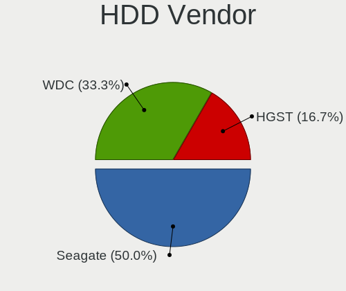
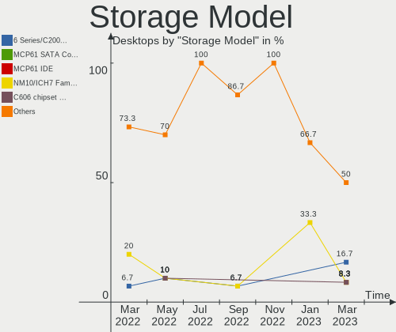
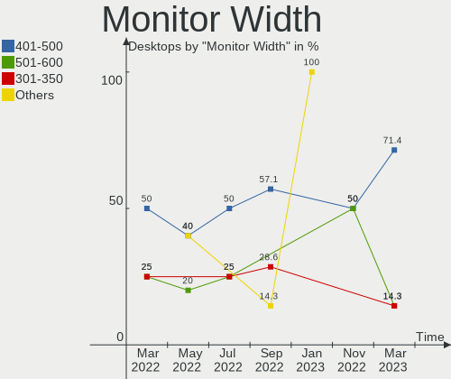
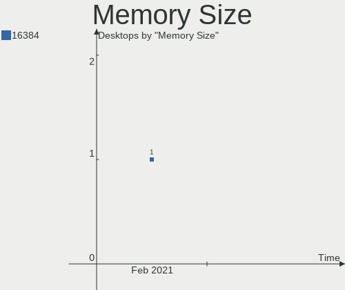

Endless Hardware Trends (Desktop)
---------------------------------

A project to identify most popular hardware characteristics and track their change
over time based on data collected by Endless users at https://Linux-Hardware.org.

Anyone can contribute to the study by uploading probes of their computers by
the [hw-probe](https://github.com/linuxhw/hw-probe) tool:

    sudo -E hw-probe -all -upload

Full-feature report is available here: https://linux-hardware.org/?view=trends&formfactor=desktop

Period: Feb, 2021.

Contents
--------

- [ OS                       ](#os)
- [ OS Family                ](#os-family)
- [ Kernel                   ](#kernel)
- [ Kernel Family            ](#kernel-family)
- [ Kernel Major Ver.        ](#kernel-major-ver)
- [ Arch                     ](#arch)
- [ DE                       ](#de)
- [ Display Server           ](#display-server)
- [ Display Manager          ](#display-manager)
- [ OS Lang                  ](#os-lang)
- [ Boot Mode                ](#boot-mode)
- [ Filesystem               ](#filesystem)
- [ Part. scheme             ](#part-scheme)
- [ Dual Boot with Linux/BSD ](#dual-boot-with-linux/bsd)
- [ Dual Boot (Win)          ](#dual-boot-win)
- [ Country                  ](#country)
- [ City                     ](#city)
- [ Vendor                   ](#vendor)
- [ Model                    ](#model)
- [ Model Family             ](#model-family)
- [ MFG Year                 ](#mfg-year)
- [ Form Factor              ](#form-factor)
- [ Secure Boot              ](#secure-boot)
- [ Coreboot                 ](#coreboot)
- [ RAM Size                 ](#ram-size)
- [ RAM Used                 ](#ram-used)
- [ Has CD-ROM               ](#has-cd-rom)
- [ Total Drives             ](#total-drives)
- [ Has Ethernet             ](#has-ethernet)
- [ Drive Vendor             ](#drive-vendor)
- [ Drive Model              ](#drive-model)
- [ HDD Vendor               ](#hdd-vendor)
- [ SSD Vendor               ](#ssd-vendor)
- [ Drive Kind               ](#drive-kind)
- [ Drive Connector          ](#drive-connector)
- [ Drive Size               ](#drive-size)
- [ Space Total              ](#space-total)
- [ Space Used               ](#space-used)
- [ Malfunc. Drives          ](#malfunc-drives)
- [ Malfunc. Drive Vendor    ](#malfunc-drive-vendor)
- [ Malfunc. HDD Vendor      ](#malfunc-hdd-vendor)
- [ Malfunc. Drive Kind      ](#malfunc-drive-kind)
- [ Failed Drives            ](#failed-drives)
- [ Failed Drive Vendor      ](#failed-drive-vendor)
- [ Drive Status             ](#drive-status)
- [ Storage Vendor           ](#storage-vendor)
- [ Storage Model            ](#storage-model)
- [ Storage Kind             ](#storage-kind)
- [ CPU Vendor               ](#cpu-vendor)
- [ CPU Model                ](#cpu-model)
- [ CPU Model Family         ](#cpu-model-family)
- [ CPU Cores                ](#cpu-cores)
- [ CPU Sockets              ](#cpu-sockets)
- [ CPU Threads              ](#cpu-threads)
- [ CPU Op-Modes             ](#cpu-op-modes)
- [ CPU Microcode            ](#cpu-microcode)
- [ CPU Microarch            ](#cpu-microarch)
- [ GPU Vendor               ](#gpu-vendor)
- [ GPU Model                ](#gpu-model)
- [ GPU Combo                ](#gpu-combo)
- [ GPU Driver               ](#gpu-driver)
- [ GPU Memory               ](#gpu-memory)
- [ Monitor Vendor           ](#monitor-vendor)
- [ Monitor Model            ](#monitor-model)
- [ Monitor Resolution       ](#monitor-resolution)
- [ Monitor Diagonal         ](#monitor-diagonal)
- [ Monitor Width            ](#monitor-width)
- [ Aspect Ratio             ](#aspect-ratio)
- [ Monitor Area             ](#monitor-area)
- [ Pixel Density            ](#pixel-density)
- [ Multiple Monitors        ](#multiple-monitors)
- [ Net Controller Vendor    ](#net-controller-vendor)
- [ Net Controller Model     ](#net-controller-model)
- [ Wireless Vendor          ](#wireless-vendor)
- [ Wireless Model           ](#wireless-model)
- [ Ethernet Vendor          ](#ethernet-vendor)
- [ Ethernet Model           ](#ethernet-model)
- [ Net Controller Kind      ](#net-controller-kind)
- [ Used Controller          ](#used-controller)
- [ NICs                     ](#nics)
- [ Memory Vendor            ](#memory-vendor)
- [ Memory Model             ](#memory-model)
- [ Memory Kind              ](#memory-kind)
- [ Memory Form Factor       ](#memory-form-factor)
- [ Memory Size              ](#memory-size)
- [ Memory Speed             ](#memory-speed)
- [ Sound Vendor             ](#sound-vendor)
- [ Sound Model              ](#sound-model)
- [ Camera Vendor            ](#camera-vendor)
- [ Camera Model             ](#camera-model)
- [ Fingerprint Vendor       ](#fingerprint-vendor)
- [ Fingerprint Model        ](#fingerprint-model)
- [ Chipcard Vendor          ](#chipcard-vendor)
- [ Chipcard Model           ](#chipcard-model)
- [ Printer Vendor           ](#printer-vendor)
- [ Printer Model            ](#printer-model)
- [ Scanner Vendor           ](#scanner-vendor)
- [ Scanner Model            ](#scanner-model)
- [ Bluetooth Vendor         ](#bluetooth-vendor)
- [ Bluetooth Model          ](#bluetooth-model)
- [ Unsupported Devices      ](#unsupported-devices)
- [ Unsupported Device Types ](#unsupported-device-types)

OS
--

Installed operating systems

| Name          | Desktops | Percent |
|---------------|----------|---------|
| Endless 3.9.2 | 8        | 72.73%  |
| Endless 3.9.3 | 1        | 9.09%   |
| Endless 3.8.7 | 1        | 9.09%   |
| Endless 3.7.3 | 1        | 9.09%   |

OS Family
---------

OS without a version

| Name    | Desktops | Percent |
|---------|----------|---------|
| Endless | 11       | 100%    |

Kernel
------

Version of the Linux kernel

| Version          | Desktops | Percent |
|------------------|----------|---------|
| 5.8.0-14-generic | 9        | 81.82%  |
| 5.4.0-42-generic | 1        | 9.09%   |
| 5.3.0-12-generic | 1        | 9.09%   |

Kernel Family
-------------

Linux kernel without a distro release

| Version | Desktops | Percent |
|---------|----------|---------|
| 5.8.0   | 9        | 81.82%  |
| 5.4.0   | 1        | 9.09%   |
| 5.3.0   | 1        | 9.09%   |

Kernel Major Ver.
-----------------

Linux kernel major version

| Version | Desktops | Percent |
|---------|----------|---------|
| 5.8     | 9        | 81.82%  |
| 5.4     | 1        | 9.09%   |
| 5.3     | 1        | 9.09%   |

Arch
----

OS architecture (x86_64, i586, etc.)

| Name   | Desktops | Percent |
|--------|----------|---------|
| x86_64 | 11       | 100%    |

DE
--

Desktop Environment

| Name  | Desktops | Percent |
|-------|----------|---------|
| GNOME | 11       | 100%    |

Display Server
--------------

X11 or Wayland

| Name | Desktops | Percent |
|------|----------|---------|
| X11  | 11       | 100%    |

Display Manager
---------------

SDDM, LightDM, etc.

| Name    | Desktops | Percent |
|---------|----------|---------|
| Unknown | 11       | 100%    |

OS Lang
-------

Language

| Lang        | Desktops | Percent |
|-------------|----------|---------|
| pt_BR       | 3        | 27.27%  |
| pl_PL       | 2        | 18.18%  |
| es_MX       | 2        | 18.18%  |
| zh_TW       | 1        | 9.09%   |
| ru_RU.UTF_8 | 1        | 9.09%   |
| it_IT       | 1        | 9.09%   |
| en_US       | 1        | 9.09%   |

Boot Mode
---------

EFI or BIOS

| Mode | Desktops | Percent |
|------|----------|---------|
| EFI  | 6        | 54.55%  |
| BIOS | 5        | 45.45%  |

Filesystem
----------

Type of filesystem

| Type  | Desktops | Percent |
|-------|----------|---------|
| Ext4  | 10       | 90.91%  |
| Tmpfs | 1        | 9.09%   |

Part. scheme
------------

Scheme of partitioning

| Type    | Desktops | Percent |
|---------|----------|---------|
| Unknown | 11       | 100%    |

Dual Boot with Linux/BSD
------------------------

Hosting more than one Linux/BSD

| Dual boot | Desktops | Percent |
|-----------|----------|---------|
| No        | 11       | 100%    |

Dual Boot (Win)
---------------

Hosting Linux and Windows

| Dual boot | Desktops | Percent |
|-----------|----------|---------|
| No        | 11       | 100%    |

Country
-------

Geographic location (country)

| Country | Desktops | Percent |
|---------|----------|---------|
| Brazil  | 3        | 27.27%  |
| Poland  | 2        | 18.18%  |
| Mexico  | 2        | 18.18%  |
| USA     | 1        | 9.09%   |
| Taiwan  | 1        | 9.09%   |
| Russia  | 1        | 9.09%   |
| Italy   | 1        | 9.09%   |

City
----

Geographic location (city)

| City                   | Desktops | Percent |
|------------------------|----------|---------|
| Warsaw                 | 2        | 18.18%  |
| Tepatitlán de Morelos | 1        | 9.09%   |
| Taipei                 | 1        | 9.09%   |
| Rome                   | 1        | 9.09%   |
| Moscow                 | 1        | 9.09%   |
| Mason                  | 1        | 9.09%   |
| Macaé                 | 1        | 9.09%   |
| Itabira                | 1        | 9.09%   |
| Coyoacán              | 1        | 9.09%   |
| Capinzal               | 1        | 9.09%   |

Vendor
------

Motherboard manufacturer

| Name                | Desktops | Percent |
|---------------------|----------|---------|
| Acer                | 4        | 36.36%  |
| Pegatron            | 1        | 9.09%   |
| MSI                 | 1        | 9.09%   |
| Itautec             | 1        | 9.09%   |
| Hewlett-Packard     | 1        | 9.09%   |
| Gigabyte Technology | 1        | 9.09%   |
| ECS                 | 1        | 9.09%   |
| Dell                | 1        | 9.09%   |

Model
-----

Motherboard model

| Name                                | Desktops | Percent |
|-------------------------------------|----------|---------|
| Pegatron BSW-P1                     | 1        | 9.09%   |
| MSI MS-7C04                         | 1        | 9.09%   |
| Itautec Infoway                     | 1        | 9.09%   |
| HP Compaq dc7800p Small Form Factor | 1        | 9.09%   |
| Gigabyte 970A-UD3P                  | 1        | 9.09%   |
| ECS A320AM4-M3D                     | 1        | 9.09%   |
| Dell OptiPlex 9010                  | 1        | 9.09%   |
| Acer Veriton L4630G                 | 1        | 9.09%   |
| Acer Veriton EX2620G                | 1        | 9.09%   |
| Acer Aspire XC-886                  | 1        | 9.09%   |
| Acer Aspire XC-830                  | 1        | 9.09%   |

Model Family
------------

Motherboard model prefix

| Name               | Desktops | Percent |
|--------------------|----------|---------|
| Acer Veriton       | 2        | 18.18%  |
| Acer Aspire        | 2        | 18.18%  |
| Pegatron BSW-P1    | 1        | 9.09%   |
| MSI MS-7C04        | 1        | 9.09%   |
| Itautec Infoway    | 1        | 9.09%   |
| HP Compaq          | 1        | 9.09%   |
| Gigabyte 970A-UD3P | 1        | 9.09%   |
| ECS A320AM4-M3D    | 1        | 9.09%   |
| Dell OptiPlex      | 1        | 9.09%   |

MFG Year
--------

Motherboard manufacture year

| Year | Desktops | Percent |
|------|----------|---------|
| 2020 | 2        | 18.18%  |
| 2019 | 2        | 18.18%  |
| 2018 | 2        | 18.18%  |
| 2017 | 1        | 9.09%   |
| 2016 | 1        | 9.09%   |
| 2014 | 1        | 9.09%   |
| 2007 | 1        | 9.09%   |
| 2006 | 1        | 9.09%   |

Form Factor
-----------

Physical design of the computer

| Name    | Desktops | Percent |
|---------|----------|---------|
| Desktop | 11       | 100%    |

Secure Boot
-----------

Enabled or disabled

| State    | Desktops | Percent |
|----------|----------|---------|
| Disabled | 11       | 100%    |

Coreboot
--------

Have coreboot on board

| Used | Desktops | Percent |
|------|----------|---------|
| No   | 11       | 100%    |

RAM Size
--------

Total RAM memory

| Size in GB | Desktops | Percent |
|------------|----------|---------|
| 3.01-4.0   | 4        | 36.36%  |
| 4.01-8.0   | 3        | 27.27%  |
| 16.01-24.0 | 2        | 18.18%  |
| 32.01-64.0 | 1        | 9.09%   |
| 2.01-3.0   | 1        | 9.09%   |

RAM Used
--------

Used RAM memory

| Used GB  | Desktops | Percent |
|----------|----------|---------|
| 1.01-2.0 | 6        | 54.55%  |
| 2.01-3.0 | 2        | 18.18%  |
| 0.51-1.0 | 2        | 18.18%  |
| 3.01-4.0 | 1        | 9.09%   |

Has CD-ROM
----------

Has CD-ROM on board

| Presented | Desktops | Percent |
|-----------|----------|---------|
| Yes       | 6        | 54.55%  |
| No        | 5        | 45.45%  |

Total Drives
------------

Number of drives on board

| Drives | Desktops | Percent |
|--------|----------|---------|
| 1      | 8        | 72.73%  |
| 2      | 3        | 27.27%  |

Has Ethernet
------------

Has Ethernet on board

| Presented | Desktops | Percent |
|-----------|----------|---------|
| Yes       | 11       | 100%    |

Drive Vendor
------------

Hard drive vendors

| Vendor              | Desktops | Drives | Percent |
|---------------------|----------|--------|---------|
| WDC                 | 2        | 2      | 15.38%  |
| Samsung Electronics | 2        | 5      | 15.38%  |
| Kingston            | 2        | 2      | 15.38%  |
| SK Hynix            | 1        | 1      | 7.69%   |
| Seagate             | 1        | 1      | 7.69%   |
| Sandisk             | 1        | 1      | 7.69%   |
| KIOXIA-EXCERIA      | 1        | 1      | 7.69%   |
| Hitachi             | 1        | 1      | 7.69%   |
| Hewlett-Packard     | 1        | 1      | 7.69%   |
| A-DATA Technology   | 1        | 1      | 7.69%   |

Drive Model
-----------

Hard drive models

| Model                            | Desktops | Percent |
|----------------------------------|----------|---------|
| WDC WD800JD-75MSA3 80GB          | 1        | 6.25%   |
| WDC WD1600AAJS-00L7A0 160GB      | 1        | 6.25%   |
| SK Hynix NVMe SSD Drive 256GB    | 1        | 6.25%   |
| Seagate ST1000DM010-2EP102 1TB   | 1        | 6.25%   |
| Sandisk NVMe SSD Drive 500GB     | 1        | 6.25%   |
| Samsung SSD 970 PRO 512GB        | 1        | 6.25%   |
| Samsung SSD 970 EVO Plus 1TB     | 1        | 6.25%   |
| Samsung NVMe SSD Drive 512GB     | 1        | 6.25%   |
| Samsung NVMe SSD Drive 1TB       | 1        | 6.25%   |
| Samsung HM160HI 160GB            | 1        | 6.25%   |
| KIOXIA-EXCERIA SATA SSD 480GB    | 1        | 6.25%   |
| Kingston SV300S37A120G 120GB SSD | 1        | 6.25%   |
| Kingston NVMe SSD Drive 128GB    | 1        | 6.25%   |
| Hitachi HTS725050A9A364 500GB    | 1        | 6.25%   |
| HP SSD S700 1TB                  | 1        | 6.25%   |
| A-DATA SU650 120GB SSD           | 1        | 6.25%   |

HDD Vendor
----------

Hard disk drive vendors

| Vendor              | Desktops | Drives | Percent |
|---------------------|----------|--------|---------|
| WDC                 | 2        | 2      | 40%     |
| Seagate             | 1        | 1      | 20%     |
| Samsung Electronics | 1        | 1      | 20%     |
| Hitachi             | 1        | 1      | 20%     |

SSD Vendor
----------

Solid state drive vendors

| Vendor            | Desktops | Drives | Percent |
|-------------------|----------|--------|---------|
| KIOXIA-EXCERIA    | 1        | 1      | 25%     |
| Kingston          | 1        | 1      | 25%     |
| Hewlett-Packard   | 1        | 1      | 25%     |
| A-DATA Technology | 1        | 1      | 25%     |

Drive Kind
----------

HDD or SSD

| Kind | Desktops | Drives | Percent |
|------|----------|--------|---------|
| NVMe | 4        | 7      | 33.33%  |
| SSD  | 4        | 4      | 33.33%  |
| HDD  | 4        | 5      | 33.33%  |

Drive Connector
---------------

SATA, SAS, NVMe, etc.

| Type | Desktops | Drives | Percent |
|------|----------|--------|---------|
| SATA | 8        | 9      | 66.67%  |
| NVMe | 4        | 7      | 33.33%  |

Drive Size
----------

Size of hard drive

| Size in TB | Desktops | Drives | Percent |
|------------|----------|--------|---------|
| 0.01-0.5   | 6        | 7      | 75%     |
| 0.51-1.0   | 2        | 2      | 25%     |

Space Total
-----------

Amount of disk space available on the file system

| Size in GB | Desktops | Percent |
|------------|----------|---------|
| 101-250    | 5        | 45.45%  |
| 251-500    | 3        | 27.27%  |
| 501-1000   | 2        | 18.18%  |
| 51-100     | 1        | 9.09%   |

Space Used
----------

Amount of used disk space

| Used GB | Desktops | Percent |
|---------|----------|---------|
| 21-50   | 8        | 72.73%  |
| 101-250 | 2        | 18.18%  |
| 1-20    | 1        | 9.09%   |

Malfunc. Drives
---------------

Drive models with a malfunction

Zero info for selected period =(

Malfunc. Drive Vendor
---------------------

Vendors of faulty drives

Zero info for selected period =(

Malfunc. HDD Vendor
-------------------

Vendors of faulty HDD drives

Zero info for selected period =(

Malfunc. Drive Kind
-------------------

Kinds of faulty drives

Zero info for selected period =(

Failed Drives
-------------

Failed drive models

Zero info for selected period =(

Failed Drive Vendor
-------------------

Failed drive vendors

Zero info for selected period =(

Drive Status
------------

Number of failed and malfunc. drives

| Status   | Desktops | Drives | Percent |
|----------|----------|--------|---------|
| Detected | 11       | 14     | 91.67%  |
| Works    | 1        | 2      | 8.33%   |

Storage Vendor
--------------

Storage controller vendors

| Vendor                      | Desktops | Percent |
|-----------------------------|----------|---------|
| Intel                       | 9        | 60%     |
| AMD                         | 2        | 13.33%  |
| SK Hynix                    | 1        | 6.67%   |
| Sandisk                     | 1        | 6.67%   |
| Samsung Electronics         | 1        | 6.67%   |
| Kingston Technology Company | 1        | 6.67%   |

Storage Model
-------------

Storage controller models

| Model                                                                            | Desktops | Percent |
|----------------------------------------------------------------------------------|----------|---------|
| Intel Celeron/Pentium Silver Processor SATA Controller                           | 2        | 10.53%  |
| SK Hynix BC501 NVMe Solid State Drive 512GB                                      | 1        | 5.26%   |
| Sandisk WD Blue SN550 NVMe SSD                                                   | 1        | 5.26%   |
| Samsung NVMe SSD Controller SM981/PM981/PM983                                    | 1        | 5.26%   |
| Kingston Company U-SNS8154P3 NVMe SSD                                            | 1        | 5.26%   |
| Intel SATA Controller [RAID mode]                                                | 1        | 5.26%   |
| Intel NM10/ICH7 Family SATA Controller [IDE mode]                                | 1        | 5.26%   |
| Intel Cannon Lake PCH SATA AHCI Controller                                       | 1        | 5.26%   |
| Intel Atom/Celeron/Pentium Processor x5-E8000/J3xxx/N3xxx Series SATA Controller | 1        | 5.26%   |
| Intel 82Q35 Express PT IDER Controller                                           | 1        | 5.26%   |
| Intel 82801IR/IO/IH (ICH9R/DO/DH) 4 port SATA Controller [IDE mode]              | 1        | 5.26%   |
| Intel 82801I (ICH9 Family) 2 port SATA Controller [IDE mode]                     | 1        | 5.26%   |
| Intel 8 Series/C220 Series Chipset Family 6-port SATA Controller 1 [AHCI mode]   | 1        | 5.26%   |
| Intel 200 Series PCH SATA controller [AHCI mode]                                 | 1        | 5.26%   |
| AMD SB7x0/SB8x0/SB9x0 SATA Controller [AHCI mode]                                | 1        | 5.26%   |
| AMD SB7x0/SB8x0/SB9x0 IDE Controller                                             | 1        | 5.26%   |
| AMD FCH SATA Controller [AHCI mode]                                              | 1        | 5.26%   |
| AMD FCH SATA Controller D                                                        | 1        | 5.26%   |

Storage Kind
------------

Kind of storage controller (IDE, SATA, NVMe, SAS, ...)

| Kind | Desktops | Percent |
|------|----------|---------|
| SATA | 8        | 50%     |
| NVMe | 4        | 25%     |
| IDE  | 3        | 18.75%  |
| RAID | 1        | 6.25%   |

CPU Vendor
----------

Processor vendors

| Vendor | Desktops | Percent |
|--------|----------|---------|
| Intel  | 9        | 81.82%  |
| AMD    | 2        | 18.18%  |

CPU Model
---------

Processor models

| Model                                         | Desktops | Percent |
|-----------------------------------------------|----------|---------|
| Intel Pentium D CPU 3.40GHz                   | 1        | 9.09%   |
| Intel Core i7-9700KF CPU @ 3.60GHz            | 1        | 9.09%   |
| Intel Core i7-2600 CPU @ 3.40GHz              | 1        | 9.09%   |
| Intel Core i5-9400 CPU @ 2.90GHz              | 1        | 9.09%   |
| Intel Core i5-4460S CPU @ 2.90GHz             | 1        | 9.09%   |
| Intel Core 2 Duo CPU E6550 @ 2.33GHz          | 1        | 9.09%   |
| Intel Celeron J4025 CPU @ 2.00GHz             | 1        | 9.09%   |
| Intel Celeron J4005 CPU @ 2.00GHz             | 1        | 9.09%   |
| Intel Celeron CPU J3160 @ 1.60GHz             | 1        | 9.09%   |
| AMD FX-8350 Eight-Core Processor              | 1        | 9.09%   |
| AMD A8-9600 RADEON R7, 10 COMPUTE CORES 4C+6G | 1        | 9.09%   |

CPU Model Family
----------------

Processor model prefix

| Model            | Desktops | Percent |
|------------------|----------|---------|
| Intel Celeron    | 3        | 27.27%  |
| Intel Core i7    | 2        | 18.18%  |
| Intel Core i5    | 2        | 18.18%  |
| Intel Pentium D  | 1        | 9.09%   |
| Intel Core 2 Duo | 1        | 9.09%   |
| AMD FX           | 1        | 9.09%   |
| AMD A8           | 1        | 9.09%   |

CPU Cores
---------

Number of processor cores

| Number | Desktops | Percent |
|--------|----------|---------|
| 2      | 5        | 45.45%  |
| 4      | 4        | 36.36%  |
| 8      | 1        | 9.09%   |
| 6      | 1        | 9.09%   |

CPU Sockets
-----------

Number of sockets

| Number | Desktops | Percent |
|--------|----------|---------|
| 1      | 11       | 100%    |

CPU Threads
-----------

Threads per core (Hyper-Threading)

| Number | Desktops | Percent |
|--------|----------|---------|
| 1      | 8        | 72.73%  |
| 2      | 3        | 27.27%  |

CPU Op-Modes
------------

CPU Operation Modes (32-bit, 64-bit)

| Op mode        | Desktops | Percent |
|----------------|----------|---------|
| 32-bit, 64-bit | 11       | 100%    |

CPU Microcode
-------------

Microcode number

| Number     | Desktops | Percent |
|------------|----------|---------|
| 0xf65      | 1        | 9.09%   |
| 0x906ec    | 1        | 9.09%   |
| 0x906ea    | 1        | 9.09%   |
| 0x706a8    | 1        | 9.09%   |
| 0x706a1    | 1        | 9.09%   |
| 0x6fb      | 1        | 9.09%   |
| 0x406c4    | 1        | 9.09%   |
| 0x206a7    | 1        | 9.09%   |
| 0x0600611a | 1        | 9.09%   |
| 0x06000852 | 1        | 9.09%   |
| Unknown    | 1        | 9.09%   |

CPU Microarch
-------------

Microarchitecture

| Name          | Desktops | Percent |
|---------------|----------|---------|
| KabyLake      | 2        | 18.18%  |
| Goldmont plus | 2        | 18.18%  |
| Silvermont    | 1        | 9.09%   |
| SandyBridge   | 1        | 9.09%   |
| Piledriver    | 1        | 9.09%   |
| NetBurst      | 1        | 9.09%   |
| Haswell       | 1        | 9.09%   |
| Excavator     | 1        | 9.09%   |
| Core          | 1        | 9.09%   |

GPU Vendor
----------

Vendors of graphics cards

| Vendor | Desktops | Percent |
|--------|----------|---------|
| Intel  | 7        | 58.33%  |
| Nvidia | 3        | 25%     |
| AMD    | 2        | 16.67%  |

GPU Model
---------

Graphics card models

| Model                                                                                    | Desktops | Percent |
|------------------------------------------------------------------------------------------|----------|---------|
| Intel GeminiLake [UHD Graphics 600]                                                      | 2        | 16.67%  |
| Nvidia TU104 [GeForce RTX 2070 SUPER]                                                    | 1        | 8.33%   |
| Nvidia GP108 [GeForce GT 1030]                                                           | 1        | 8.33%   |
| Nvidia GP104 [GeForce GTX 1070]                                                          | 1        | 8.33%   |
| Intel Xeon E3-1200 v3/4th Gen Core Processor Integrated Graphics Controller              | 1        | 8.33%   |
| Intel CometLake-S GT2 [UHD Graphics 630]                                                 | 1        | 8.33%   |
| Intel Atom/Celeron/Pentium Processor x5-E8000/J3xxx/N3xxx Integrated Graphics Controller | 1        | 8.33%   |
| Intel 82Q35 Express Integrated Graphics Controller                                       | 1        | 8.33%   |
| Intel 82945G/GZ Integrated Graphics Controller                                           | 1        | 8.33%   |
| AMD Wani [Radeon R5/R6/R7 Graphics]                                                      | 1        | 8.33%   |
| AMD Cedar [Radeon HD 5000/6000/7350/8350 Series]                                         | 1        | 8.33%   |

GPU Combo
---------

Combinations of graphics cards

| Name       | Desktops | Percent |
|------------|----------|---------|
| 1 x Intel  | 7        | 63.64%  |
| 1 x Nvidia | 2        | 18.18%  |
| 1 x AMD    | 2        | 18.18%  |

GPU Driver
----------

Free vs proprietary

| Driver      | Desktops | Percent |
|-------------|----------|---------|
| Free        | 8        | 72.73%  |
| Proprietary | 3        | 27.27%  |

GPU Memory
----------

Total video memory

| Size in GB | Desktops | Percent |
|------------|----------|---------|
| Unknown    | 9        | 81.82%  |
| 1.01-2.0   | 1        | 9.09%   |
| 0.51-1.0   | 1        | 9.09%   |

Monitor Vendor
--------------

Monitor vendors

| Vendor               | Desktops | Percent |
|----------------------|----------|---------|
| AOC                  | 3        | 25%     |
| VOR                  | 1        | 8.33%   |
| Samsung Electronics  | 1        | 8.33%   |
| S2-Tek               | 1        | 8.33%   |
| Philips              | 1        | 8.33%   |
| Hewlett-Packard      | 1        | 8.33%   |
| Goldstar             | 1        | 8.33%   |
| Dell                 | 1        | 8.33%   |
| Ancor Communications | 1        | 8.33%   |
| Acer                 | 1        | 8.33%   |

Monitor Model
-------------

Monitor models

| Model                                                                 | Desktops | Percent |
|-----------------------------------------------------------------------|----------|---------|
| VOR LED21300 VOR2150 1920x1080 476x268mm 21.5-inch                    | 1        | 8.33%   |
| Samsung Electronics T24E310 SAM0DBA 1366x768 521x293mm 23.5-inch      | 1        | 8.33%   |
| S2-Tek TV STK531A 1920x1080 930x530mm 42.1-inch                       | 1        | 8.33%   |
| Philips 234CL PHLC066 1920x1080 509x286mm 23.0-inch                   | 1        | 8.33%   |
| Hewlett-Packard 24o HPN337C 1920x1080 531x299mm 24.0-inch             | 1        | 8.33%   |
| Goldstar L1750S GSM43CC 1280x1024 338x270mm 17.0-inch                 | 1        | 8.33%   |
| Dell E2011H DEL406C 1600x900 443x249mm 20.0-inch                      | 1        | 8.33%   |
| AOC LE22H138 AOC2218 1920x1080 480x270mm 21.7-inch                    | 1        | 8.33%   |
| AOC F19 AOC1900 1366x768 410x230mm 18.5-inch                          | 1        | 8.33%   |
| AOC AG322FWG4 AOC3220 1920x1080 698x393mm 31.5-inch                   | 1        | 8.33%   |
| Ancor Communications ASUS VS228 ACI22FD 1920x1080 476x268mm 21.5-inch | 1        | 8.33%   |
| Acer V193W ACR001A 1440x900 410x256mm 19.0-inch                       | 1        | 8.33%   |

Monitor Resolution
------------------

Monitor screen resolution

| Resolution       | Desktops | Percent |
|------------------|----------|---------|
| 1920x1080 (FHD)  | 6        | 50%     |
| 1366x768 (WXGA)  | 2        | 16.67%  |
| 2560x1440 (QHD)  | 1        | 8.33%   |
| 1600x900 (HD+)   | 1        | 8.33%   |
| 1440x900 (WXGA+) | 1        | 8.33%   |
| 1280x1024 (SXGA) | 1        | 8.33%   |

Monitor Diagonal
----------------

Diagonal size in inches

| Inches | Desktops | Percent |
|--------|----------|---------|
| 21     | 3        | 25%     |
| 23     | 2        | 16.67%  |
| 42     | 1        | 8.33%   |
| 31     | 1        | 8.33%   |
| 24     | 1        | 8.33%   |
| 20     | 1        | 8.33%   |
| 19     | 1        | 8.33%   |
| 18     | 1        | 8.33%   |
| 17     | 1        | 8.33%   |

Monitor Width
-------------

Physical width

| Width in mm | Desktops | Percent |
|-------------|----------|---------|
| 401-500     | 6        | 50%     |
| 501-600     | 3        | 25%     |
| 601-700     | 1        | 8.33%   |
| 301-350     | 1        | 8.33%   |
| 901-1000    | 1        | 8.33%   |

Aspect Ratio
------------

Proportional relationship between the width and the height

| Ratio | Desktops | Percent |
|-------|----------|---------|
| 16/9  | 10       | 83.33%  |
| 5/4   | 1        | 8.33%   |
| 16/10 | 1        | 8.33%   |

Monitor Area
------------

Area in inch²

| Area in inch² | Desktops | Percent |
|----------------|----------|---------|
| 201-250        | 5        | 41.67%  |
| 151-200        | 3        | 25%     |
| 141-150        | 2        | 16.67%  |
| 351-500        | 1        | 8.33%   |
| 501-1000       | 1        | 8.33%   |

Pixel Density
-------------

Pixels per inch

| Density | Desktops | Percent |
|---------|----------|---------|
| 51-100  | 8        | 72.73%  |
| 101-120 | 3        | 27.27%  |

Multiple Monitors
-----------------

Total monitors connected

| Total | Desktops | Percent |
|-------|----------|---------|
| 1     | 11       | 100%    |

Net Controller Vendor
---------------------

Controller vendors

| Vendor                   | Desktops | Percent |
|--------------------------|----------|---------|
| Realtek Semiconductor    | 9        | 47.37%  |
| Ralink Technology        | 4        | 21.05%  |
| Intel                    | 4        | 21.05%  |
| Marvell Technology Group | 1        | 5.26%   |
| Huawei Technologies      | 1        | 5.26%   |

Net Controller Model
--------------------

Controller models

| Model                                                             | Desktops | Percent |
|-------------------------------------------------------------------|----------|---------|
| Realtek RTL8111/8168/8411 PCI Express Gigabit Ethernet Controller | 8        | 36.36%  |
| Realtek RTL8188EE Wireless Network Adapter                        | 2        | 9.09%   |
| Ralink MT7601U Wireless Adapter                                   | 2        | 9.09%   |
| Realtek RTL88x2bu [AC1200 Techkey]                                | 1        | 4.55%   |
| Realtek RTL8192CU 802.11n WLAN Adapter                            | 1        | 4.55%   |
| Ralink RT5572 Wireless Adapter                                    | 1        | 4.55%   |
| Ralink RT5370 Wireless Adapter                                    | 1        | 4.55%   |
| Marvell Group 88E8053 PCI-E Gigabit Ethernet Controller           | 1        | 4.55%   |
| Intel Wireless-AC 9560 [Jefferson Peak]                           | 1        | 4.55%   |
| Intel Dual Band Wireless-AC 3168NGW [Stone Peak]                  | 1        | 4.55%   |
| Intel 82579LM Gigabit Network Connection (Lewisville)             | 1        | 4.55%   |
| Intel 82566DM-2 Gigabit Network Connection                        | 1        | 4.55%   |
| Huawei Ideos (tethering mode)                                     | 1        | 4.55%   |

Wireless Vendor
---------------

Wireless vendors

| Vendor                | Desktops | Percent |
|-----------------------|----------|---------|
| Realtek Semiconductor | 4        | 40%     |
| Ralink Technology     | 4        | 40%     |
| Intel                 | 2        | 20%     |

Wireless Model
--------------

Wireless models

| Model                                            | Desktops | Percent |
|--------------------------------------------------|----------|---------|
| Realtek RTL8188EE Wireless Network Adapter       | 2        | 20%     |
| Ralink MT7601U Wireless Adapter                  | 2        | 20%     |
| Realtek RTL88x2bu [AC1200 Techkey]               | 1        | 10%     |
| Realtek RTL8192CU 802.11n WLAN Adapter           | 1        | 10%     |
| Ralink RT5572 Wireless Adapter                   | 1        | 10%     |
| Ralink RT5370 Wireless Adapter                   | 1        | 10%     |
| Intel Wireless-AC 9560 [Jefferson Peak]          | 1        | 10%     |
| Intel Dual Band Wireless-AC 3168NGW [Stone Peak] | 1        | 10%     |

Ethernet Vendor
---------------

Ethernet vendors

| Vendor                   | Desktops | Percent |
|--------------------------|----------|---------|
| Realtek Semiconductor    | 8        | 66.67%  |
| Intel                    | 2        | 16.67%  |
| Marvell Technology Group | 1        | 8.33%   |
| Huawei Technologies      | 1        | 8.33%   |

Ethernet Model
--------------

Ethernet models

| Model                                                             | Desktops | Percent |
|-------------------------------------------------------------------|----------|---------|
| Realtek RTL8111/8168/8411 PCI Express Gigabit Ethernet Controller | 8        | 66.67%  |
| Marvell Group 88E8053 PCI-E Gigabit Ethernet Controller           | 1        | 8.33%   |
| Intel 82579LM Gigabit Network Connection (Lewisville)             | 1        | 8.33%   |
| Intel 82566DM-2 Gigabit Network Connection                        | 1        | 8.33%   |
| Huawei Ideos (tethering mode)                                     | 1        | 8.33%   |

Net Controller Kind
-------------------

Ethernet, WiFi or modem

| Kind     | Desktops | Percent |
|----------|----------|---------|
| Ethernet | 11       | 55%     |
| WiFi     | 9        | 45%     |

Used Controller
---------------

Currently used network controller

| Kind     | Desktops | Percent |
|----------|----------|---------|
| Ethernet | 11       | 55%     |
| WiFi     | 9        | 45%     |

NICs
----

Total network controllers on board

| Total | Desktops | Percent |
|-------|----------|---------|
| 1     | 7        | 63.64%  |
| 2     | 4        | 36.36%  |

Memory Vendor
-------------

Memory module vendors

| Vendor  | Desktops | Percent |
|---------|----------|---------|
| G.Skill | 1        | 100%    |

Memory Model
------------

Memory module models

| Model                                                  | Desktops | Percent |
|--------------------------------------------------------|----------|---------|
| G.Skill RAM F4-4000C19-16GTZSW 16GB DIMM DDR4 2133MT/s | 1        | 100%    |

Memory Kind
-----------

Memory module kinds

| Kind | Desktops | Percent |
|------|----------|---------|
| DDR4 | 1        | 100%    |

Memory Form Factor
------------------

Physical design of the memory module

| Name | Desktops | Percent |
|------|----------|---------|
| DIMM | 1        | 100%    |

Memory Size
-----------

Memory module size

| Size  | Desktops | Percent |
|-------|----------|---------|
| 16384 | 1        | 100%    |

Memory Speed
------------

Memory module speed

| Speed | Desktops | Percent |
|-------|----------|---------|
| 2133  | 1        | 100%    |

Sound Vendor
------------

Sound card vendors

| Vendor              | Desktops | Percent |
|---------------------|----------|---------|
| Intel               | 9        | 52.94%  |
| Nvidia              | 3        | 17.65%  |
| AMD                 | 2        | 11.76%  |
| Samson Technologies | 1        | 5.88%   |
| JMTek               | 1        | 5.88%   |
| Creative Technology | 1        | 5.88%   |

Sound Model
-----------

Sound card models

| Model                                                                                             | Desktops | Percent |
|---------------------------------------------------------------------------------------------------|----------|---------|
| Intel Celeron/Pentium Silver Processor High Definition Audio                                      | 2        | 10%     |
| Samson Technologies GoMic compact condenser mic                                                   | 1        | 5%      |
| Nvidia TU104 HD Audio Controller                                                                  | 1        | 5%      |
| Nvidia GP108 High Definition Audio Controller                                                     | 1        | 5%      |
| Nvidia GP104 High Definition Audio Controller                                                     | 1        | 5%      |
| JMTek USB PnP Audio Device                                                                        | 1        | 5%      |
| Intel Xeon E3-1200 v3/4th Gen Core Processor HD Audio Controller                                  | 1        | 5%      |
| Intel NM10/ICH7 Family High Definition Audio Controller                                           | 1        | 5%      |
| Intel Cannon Lake PCH cAVS                                                                        | 1        | 5%      |
| Intel Atom/Celeron/Pentium Processor x5-E8000/J3xxx/N3xxx Series High Definition Audio Controller | 1        | 5%      |
| Intel 82801I (ICH9 Family) HD Audio Controller                                                    | 1        | 5%      |
| Intel 8 Series/C220 Series Chipset High Definition Audio Controller                               | 1        | 5%      |
| Intel 7 Series/C216 Chipset Family High Definition Audio Controller                               | 1        | 5%      |
| Intel 200 Series PCH HD Audio                                                                     | 1        | 5%      |
| Creative Technology Sound Blaster JAM                                                             | 1        | 5%      |
| AMD SBx00 Azalia (Intel HDA)                                                                      | 1        | 5%      |
| AMD Kabini HDMI/DP Audio                                                                          | 1        | 5%      |
| AMD Family 15h (Models 60h-6fh) Audio Controller                                                  | 1        | 5%      |
| AMD Cedar HDMI Audio [Radeon HD 5400/6300/7300 Series]                                            | 1        | 5%      |

Camera Vendor
-------------

Camera device vendors

| Vendor                        | Desktops | Percent |
|-------------------------------|----------|---------|
| Generalplus Technology        | 2        | 50%     |
| Sunplus Innovation Technology | 1        | 25%     |
| Logitech                      | 1        | 25%     |

Camera Model
------------

Camera device models

| Model                      | Desktops | Percent |
|----------------------------|----------|---------|
| Generalplus GENERAL WEBCAM | 2        | 50%     |
| Sunplus Full HD webcam     | 1        | 25%     |
| Logitech Webcam C270       | 1        | 25%     |

Fingerprint Vendor
------------------

Fingerprint sensor vendors

Zero info for selected period =(

Fingerprint Model
-----------------

Fingerprint sensor models

Zero info for selected period =(

Chipcard Vendor
---------------

Chipcard module vendors

Zero info for selected period =(

Chipcard Model
--------------

Chipcard module models

Zero info for selected period =(

Printer Vendor
--------------

Printer device vendors

| Vendor      | Desktops | Percent |
|-------------|----------|---------|
| Seiko Epson | 1        | 50%     |
| Pantum      | 1        | 50%     |

Printer Model
-------------

Printer device models

| Model                    | Desktops | Percent |
|--------------------------|----------|---------|
| Seiko Epson L6170 Series | 1        | 50%     |
| Pantum P2200 series      | 1        | 50%     |

Scanner Vendor
--------------

Scanner device vendors

Zero info for selected period =(

Scanner Model
-------------

Scanner device models

Zero info for selected period =(

Bluetooth Vendor
----------------

Controller vendors

| Vendor                          | Desktops | Percent |
|---------------------------------|----------|---------|
| Intel                           | 2        | 50%     |
| Qualcomm Atheros Communications | 1        | 25%     |
| Cambridge Silicon Radio         | 1        | 25%     |

Bluetooth Model
---------------

Controller models

| Model                                               | Desktops | Percent |
|-----------------------------------------------------|----------|---------|
| Qualcomm Atheros AR3011 Bluetooth                   | 1        | 25%     |
| Intel Wireless-AC 3168 Bluetooth                    | 1        | 25%     |
| Intel Bluetooth 9460/9560 Jefferson Peak (JfP)      | 1        | 25%     |
| Cambridge Silicon Radio Bluetooth Dongle (HCI mode) | 1        | 25%     |

Unsupported Devices
-------------------

Total unsupported devices on board

| Total | Desktops | Percent |
|-------|----------|---------|
| 0     | 10       | 90.91%  |
| 1     | 1        | 9.09%   |

Unsupported Device Types
------------------------

Types of unsupported devices

| Type         | Desktops | Percent |
|--------------|----------|---------|
| Net/wireless | 1        | 100%    |

