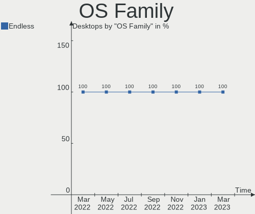
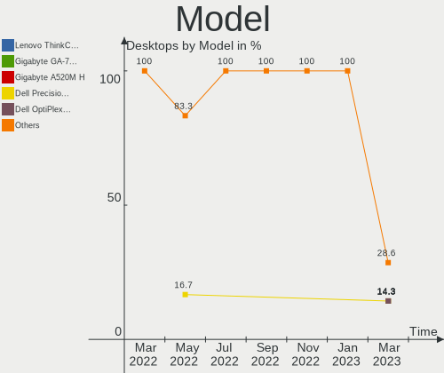
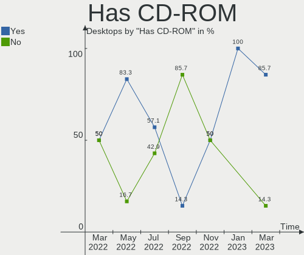
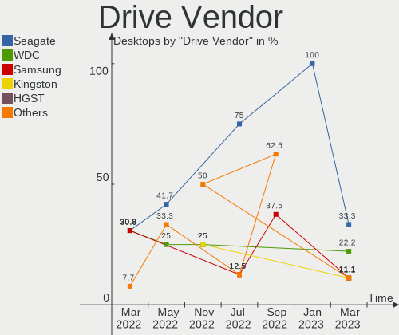

Endless Hardware Trends (Desktop)
---------------------------------

A project to identify most popular hardware characteristics and track their change
over time based on data collected by Endless users at https://Linux-Hardware.org.

Anyone can contribute to the study by uploading probes of their computers by
the [hw-probe](https://github.com/linuxhw/hw-probe) tool:

    sudo -E hw-probe -all -upload

Full-feature report is available here: https://linux-hardware.org/?view=trends&formfactor=desktop

Period: Sep, 2020.

Contents
--------

- [ OS                       ](#os)
- [ OS Family                ](#os-family)
- [ Kernel                   ](#kernel)
- [ Kernel Family            ](#kernel-family)
- [ Kernel Major Ver.        ](#kernel-major-ver)
- [ Arch                     ](#arch)
- [ DE                       ](#de)
- [ Display Server           ](#display-server)
- [ Display Manager          ](#display-manager)
- [ OS Lang                  ](#os-lang)
- [ Boot Mode                ](#boot-mode)
- [ Filesystem               ](#filesystem)
- [ Part. scheme             ](#part-scheme)
- [ Dual Boot with Linux/BSD ](#dual-boot-with-linux/bsd)
- [ Dual Boot (Win)          ](#dual-boot-win)
- [ Country                  ](#country)
- [ City                     ](#city)
- [ Vendor                   ](#vendor)
- [ Model                    ](#model)
- [ Model Family             ](#model-family)
- [ MFG Year                 ](#mfg-year)
- [ Form Factor              ](#form-factor)
- [ Secure Boot              ](#secure-boot)
- [ Coreboot                 ](#coreboot)
- [ RAM Size                 ](#ram-size)
- [ RAM Used                 ](#ram-used)
- [ Has CD-ROM               ](#has-cd-rom)
- [ Total Drives             ](#total-drives)
- [ Has Ethernet             ](#has-ethernet)
- [ Drive Vendor             ](#drive-vendor)
- [ HDD Vendor               ](#hdd-vendor)
- [ SSD Vendor               ](#ssd-vendor)
- [ Drive Model              ](#drive-model)
- [ Drive Kind               ](#drive-kind)
- [ Drive Connector          ](#drive-connector)
- [ Drive Size               ](#drive-size)
- [ Space Total              ](#space-total)
- [ Space Used               ](#space-used)
- [ Malfunc. Drives          ](#malfunc-drives)
- [ Malfunc. Drive Vendor    ](#malfunc-drive-vendor)
- [ Malfunc. HDD Vendor      ](#malfunc-hdd-vendor)
- [ Malfunc. Drive Kind      ](#malfunc-drive-kind)
- [ Failed Drives            ](#failed-drives)
- [ Failed Drive Vendor      ](#failed-drive-vendor)
- [ Drive Status             ](#drive-status)
- [ Storage Vendor           ](#storage-vendor)
- [ Storage Model            ](#storage-model)
- [ Storage Kind             ](#storage-kind)
- [ CPU Vendor               ](#cpu-vendor)
- [ CPU Model                ](#cpu-model)
- [ CPU Model Family         ](#cpu-model-family)
- [ CPU Cores                ](#cpu-cores)
- [ CPU Sockets              ](#cpu-sockets)
- [ CPU Threads              ](#cpu-threads)
- [ CPU Op-Modes             ](#cpu-op-modes)
- [ CPU Microcode            ](#cpu-microcode)
- [ CPU Microarch            ](#cpu-microarch)
- [ GPU Vendor               ](#gpu-vendor)
- [ GPU Model                ](#gpu-model)
- [ GPU Combo                ](#gpu-combo)
- [ GPU Driver               ](#gpu-driver)
- [ GPU Memory               ](#gpu-memory)
- [ Monitor Vendor           ](#monitor-vendor)
- [ Monitor Model            ](#monitor-model)
- [ Monitor Resolution       ](#monitor-resolution)
- [ Monitor Diagonal         ](#monitor-diagonal)
- [ Monitor Width            ](#monitor-width)
- [ Aspect Ratio             ](#aspect-ratio)
- [ Monitor Area             ](#monitor-area)
- [ Pixel Density            ](#pixel-density)
- [ Multiple Monitors        ](#multiple-monitors)
- [ Net Controller Vendor    ](#net-controller-vendor)
- [ Net Controller Model     ](#net-controller-model)
- [ Wireless Vendor          ](#wireless-vendor)
- [ Wireless Model           ](#wireless-model)
- [ Ethernet Vendor          ](#ethernet-vendor)
- [ Ethernet Model           ](#ethernet-model)
- [ Net Controller Kind      ](#net-controller-kind)
- [ Used Controller          ](#used-controller)
- [ NICs                     ](#nics)
- [ Memory Vendor            ](#memory-vendor)
- [ Memory Model             ](#memory-model)
- [ Memory Kind              ](#memory-kind)
- [ Memory Form Factor       ](#memory-form-factor)
- [ Memory Size              ](#memory-size)
- [ Memory Speed             ](#memory-speed)
- [ Sound Vendor             ](#sound-vendor)
- [ Sound Model              ](#sound-model)
- [ Camera Vendor            ](#camera-vendor)
- [ Camera Model             ](#camera-model)
- [ Fingerprint Vendor       ](#fingerprint-vendor)
- [ Fingerprint Model        ](#fingerprint-model)
- [ Chipcard Vendor          ](#chipcard-vendor)
- [ Chipcard Model           ](#chipcard-model)
- [ Printer Vendor           ](#printer-vendor)
- [ Printer Model            ](#printer-model)
- [ Scanner Vendor           ](#scanner-vendor)
- [ Scanner Model            ](#scanner-model)
- [ Bluetooth Vendor         ](#bluetooth-vendor)
- [ Bluetooth Model          ](#bluetooth-model)
- [ Unsupported Devices      ](#unsupported-devices)
- [ Unsupported Device Types ](#unsupported-device-types)

OS
--

Installed operating systems

| Name          | Desktops | Percent |
|---------------|----------|---------|
| Endless 3.8.6 | 15       | 75%     |
| Endless 3.8.5 | 2        | 10%     |
| Endless 3.8.3 | 1        | 5%      |
| Endless 3.8.1 | 1        | 5%      |
| Endless 3.8.0 | 1        | 5%      |

OS Family
---------

OS without a version

| Name    | Desktops | Percent |
|---------|----------|---------|
| Endless | 20       | 100%    |

Kernel
------

Version of the Linux kernel

| Version          | Desktops | Percent |
|------------------|----------|---------|
| 5.4.0-42-generic | 15       | 75%     |
| 5.4.0-19-generic | 3        | 15%     |
| 5.4.0-39-generic | 2        | 10%     |

Kernel Family
-------------

Linux kernel without a distro release

| Version | Desktops | Percent |
|---------|----------|---------|
| 5.4.0   | 20       | 100%    |

Kernel Major Ver.
-----------------

Linux kernel major version

| Version | Desktops | Percent |
|---------|----------|---------|
| 5.4     | 20       | 100%    |

Arch
----

OS architecture (x86_64, i586, etc.)

| Name   | Desktops | Percent |
|--------|----------|---------|
| x86_64 | 20       | 100%    |

DE
--

Desktop Environment

| Name  | Desktops | Percent |
|-------|----------|---------|
| GNOME | 20       | 100%    |

Display Server
--------------

X11 or Wayland

| Name | Desktops | Percent |
|------|----------|---------|
| X11  | 20       | 100%    |

Display Manager
---------------

SDDM, LightDM, etc.

| Name    | Desktops | Percent |
|---------|----------|---------|
| Unknown | 20       | 100%    |

OS Lang
-------

Language

| Lang       | Desktops | Percent |
|------------|----------|---------|
| pt_BR.utf8 | 6        | 30%     |
| en_US.utf8 | 4        | 20%     |
| pt_BR      | 3        | 15%     |
| es_MX.utf8 | 2        | 10%     |
| es_ES      | 2        | 10%     |
| de_DE      | 2        | 10%     |
| en_US      | 1        | 5%      |

Boot Mode
---------

EFI or BIOS

| Mode | Desktops | Percent |
|------|----------|---------|
| BIOS | 17       | 85%     |
| EFI  | 3        | 15%     |

Filesystem
----------

Type of filesystem

| Type | Desktops | Percent |
|------|----------|---------|
| Ext4 | 20       | 100%    |

Part. scheme
------------

Scheme of partitioning

| Type    | Desktops | Percent |
|---------|----------|---------|
| Unknown | 20       | 100%    |

Dual Boot with Linux/BSD
------------------------

Hosting more than one Linux/BSD

| Dual boot | Desktops | Percent |
|-----------|----------|---------|
| No        | 20       | 100%    |

Dual Boot (Win)
---------------

Hosting Linux and Windows

| Dual boot | Desktops | Percent |
|-----------|----------|---------|
| No        | 20       | 100%    |

Country
-------

Geographic location (country)

| Country | Desktops | Percent |
|---------|----------|---------|
| Brazil  | 9        | 45%     |
| USA     | 3        | 15%     |
| Spain   | 2        | 10%     |
| Mexico  | 2        | 10%     |
| Germany | 2        | 10%     |
| UK      | 1        | 5%      |
| Romania | 1        | 5%      |

City
----

Geographic location (city)

| City                   | Desktops | Percent |
|------------------------|----------|---------|
| Warendorf              | 1        | 5%      |
| Villingen-Schwenningen | 1        | 5%      |
| Valencia               | 1        | 5%      |
| São Paulo             | 1        | 5%      |
| São José dos Campos  | 1        | 5%      |
| Saquarema              | 1        | 5%      |
| San Juan del Río      | 1        | 5%      |
| Rocafort               | 1        | 5%      |
| Oradea                 | 1        | 5%      |
| Nottingham             | 1        | 5%      |
| Mirassol               | 1        | 5%      |
| Mexico City            | 1        | 5%      |
| Jacareí               | 1        | 5%      |
| Hudson                 | 1        | 5%      |
| Garanhuns              | 1        | 5%      |
| Galion                 | 1        | 5%      |
| Cottage Grove          | 1        | 5%      |
| Belo Horizonte         | 1        | 5%      |
| Assis                  | 1        | 5%      |
| Andradina              | 1        | 5%      |

Vendor
------

Motherboard manufacturer

| Name                | Desktops | Percent |
|---------------------|----------|---------|
| ASUSTek Computer    | 4        | 20%     |
| Intel               | 2        | 10%     |
| Gigabyte Technology | 2        | 10%     |
| Dell                | 2        | 10%     |
| Biostar             | 2        | 10%     |
| Positivo            | 1        | 5%      |
| Phitronics          | 1        | 5%      |
| PCWare              | 1        | 5%      |
| Megaware            | 1        | 5%      |
| Lenovo              | 1        | 5%      |
| Hewlett-Packard     | 1        | 5%      |
| Fujitsu Siemens     | 1        | 5%      |
| ECS                 | 1        | 5%      |

Model
-----

Motherboard model

| Name                           | Desktops | Percent |
|--------------------------------|----------|---------|
| Positivo POS-PIG41BO           | 1        | 5%      |
| Phitronics P7I45GC-M+          | 1        | 5%      |
| PCWare CAPE7 847               | 1        | 5%      |
| Megaware MW-G41T-M7            | 1        | 5%      |
| Lenovo ThinkCentre M92 3235H3G | 1        | 5%      |
| Intel RM DESKTOP 310           | 1        | 5%      |
| Intel DH55PJ AAE93812-302      | 1        | 5%      |
| HP WE228AA-ABE MS228es         | 1        | 5%      |
| Gigabyte H81M-S2H              | 1        | 5%      |
| Gigabyte B360M AORUS Gaming 3  | 1        | 5%      |
| Fujitsu Siemens ESPRIMO P5925  | 1        | 5%      |
| ECS BSWI-D2                    | 1        | 5%      |
| Dell OptiPlex 7010             | 1        | 5%      |
| Dell OptiPlex 390              | 1        | 5%      |
| Biostar NM70I-1037U            | 1        | 5%      |
| Biostar G31M                   | 1        | 5%      |
| ASUS P5VD2-VM SE               | 1        | 5%      |
| ASUS M5A78L-M LX PLUS          | 1        | 5%      |
| ASUS M2V                       | 1        | 5%      |
| ASUS All Series                | 1        | 5%      |

Model Family
------------

Motherboard model prefix

| Name                    | Desktops | Percent |
|-------------------------|----------|---------|
| Dell OptiPlex           | 2        | 10%     |
| Positivo POS-PIG41BO    | 1        | 5%      |
| Phitronics P7I45GC-M+   | 1        | 5%      |
| PCWare CAPE7            | 1        | 5%      |
| Megaware MW-G41T-M7     | 1        | 5%      |
| Lenovo ThinkCentre      | 1        | 5%      |
| Intel RM                | 1        | 5%      |
| Intel DH55PJ            | 1        | 5%      |
| HP WE228AA-ABE          | 1        | 5%      |
| Gigabyte H81M-S2H       | 1        | 5%      |
| Gigabyte B360M          | 1        | 5%      |
| Fujitsu Siemens ESPRIMO | 1        | 5%      |
| ECS BSWI-D2             | 1        | 5%      |
| Biostar NM70I-1037U     | 1        | 5%      |
| Biostar G31M            | 1        | 5%      |
| ASUS P5VD2-VM           | 1        | 5%      |
| ASUS M5A78L-M           | 1        | 5%      |
| ASUS M2V                | 1        | 5%      |
| ASUS All                | 1        | 5%      |

MFG Year
--------

Motherboard manufacture year

| Year | Desktops | Percent |
|------|----------|---------|
| 2010 | 4        | 20%     |
| 2014 | 3        | 15%     |
| 2012 | 3        | 15%     |
| 2018 | 2        | 10%     |
| 2013 | 2        | 10%     |
| 2009 | 2        | 10%     |
| 2007 | 2        | 10%     |
| 2011 | 1        | 5%      |
| 2008 | 1        | 5%      |

Form Factor
-----------

Physical design of the computer

| Name    | Desktops | Percent |
|---------|----------|---------|
| Desktop | 20       | 100%    |

Secure Boot
-----------

Enabled or disabled

| State    | Desktops | Percent |
|----------|----------|---------|
| Disabled | 20       | 100%    |

Coreboot
--------

Have coreboot on board

| Used | Desktops | Percent |
|------|----------|---------|
| No   | 20       | 100%    |

RAM Size
--------

Total RAM memory

| Size in GB  | Desktops | Percent |
|-------------|----------|---------|
| 3.01-4.0    | 5        | 25%     |
| 1.01-2.0    | 5        | 25%     |
| 8.01-16.0   | 4        | 20%     |
| 4.01-8.0    | 3        | 15%     |
| 32.01-64.0  | 1        | 5%      |
| 64.01-256.0 | 1        | 5%      |
| 16.01-24.0  | 1        | 5%      |

RAM Used
--------

Used RAM memory

| Used GB  | Desktops | Percent |
|----------|----------|---------|
| 1.01-2.0 | 10       | 50%     |
| 2.01-3.0 | 5        | 25%     |
| 0.01-1.0 | 4        | 20%     |
| 3.01-4.0 | 1        | 5%      |

Has CD-ROM
----------

Has CD-ROM on board

| Presented | Desktops | Percent |
|-----------|----------|---------|
| Yes       | 11       | 55%     |
| No        | 9        | 45%     |

Total Drives
------------

Number of drives on board

| Drives | Desktops | Percent |
|--------|----------|---------|
| 1      | 14       | 70%     |
| 2      | 4        | 20%     |
| 3      | 2        | 10%     |

Has Ethernet
------------

Has Ethernet on board

| Presented | Desktops | Percent |
|-----------|----------|---------|
| Yes       | 20       | 100%    |

Drive Vendor
------------

Hard drive vendors

| Vendor              | Desktops | Drives | Percent |
|---------------------|----------|--------|---------|
| WDC                 | 6        | 6      | 20.69%  |
| Seagate             | 5        | 5      | 17.24%  |
| Samsung Electronics | 4        | 5      | 13.79%  |
| Kingston            | 4        | 4      | 13.79%  |
| Hitachi             | 3        | 3      | 10.34%  |
| SanDisk             | 2        | 2      | 6.9%    |
| MAXTOR              | 2        | 2      | 6.9%    |
| Toshiba             | 1        | 1      | 3.45%   |
| Fujitsu             | 1        | 1      | 3.45%   |
| China               | 1        | 1      | 3.45%   |

HDD Vendor
----------

Hard disk drive vendors

| Vendor              | Desktops | Drives | Percent |
|---------------------|----------|--------|---------|
| WDC                 | 6        | 6      | 30%     |
| Seagate             | 5        | 5      | 25%     |
| Samsung Electronics | 3        | 3      | 15%     |
| Hitachi             | 3        | 3      | 15%     |
| Toshiba             | 1        | 1      | 5%      |
| MAXTOR              | 1        | 1      | 5%      |
| Fujitsu             | 1        | 1      | 5%      |

SSD Vendor
----------

Solid state drive vendors

| Vendor              | Desktops | Drives | Percent |
|---------------------|----------|--------|---------|
| Kingston            | 4        | 4      | 44.44%  |
| SanDisk             | 2        | 2      | 22.22%  |
| Samsung Electronics | 1        | 1      | 11.11%  |
| Maxtor              | 1        | 1      | 11.11%  |
| China               | 1        | 1      | 11.11%  |

Drive Model
-----------

Hard drive models

| Model                       | Desktops | Percent |
|-----------------------------|----------|---------|
| SV300S37A120G 120GB SSD     | 2        | 6.67%   |
| Z1 SSD 240GB                | 1        | 3.33%   |
| WD5000AAKS-00E4A0 500GB     | 1        | 3.33%   |
| WD5000AAKS-00D2B0 500GB     | 1        | 3.33%   |
| WD3200BEVT-22ZCT0 320GB     | 1        | 3.33%   |
| WD3200AAJS-56M0A0 320GB     | 1        | 3.33%   |
| WD1600AAJS-08L7A0 160GB     | 1        | 3.33%   |
| WD10EZEX-75M2NA0 1TB        | 1        | 3.33%   |
| STM380215AS 80GB            | 1        | 3.33%   |
| ST980210AS 80GB             | 1        | 3.33%   |
| ST500LM012 HN-M500MBB 500GB | 1        | 3.33%   |
| ST3320613AS 320GB           | 1        | 3.33%   |
| ST3200827AS 200GB           | 1        | 3.33%   |
| ST1000DM003-1ER162 1TB      | 1        | 3.33%   |
| SSD PLUS 240GB              | 1        | 3.33%   |
| SSD 850 PRO 512GB           | 1        | 3.33%   |
| SP0411N 40GB                | 1        | 3.33%   |
| SDSSDHII240G 240GB          | 1        | 3.33%   |
| SATA SSD 120GB              | 1        | 3.33%   |
| SA400S37960G 960GB SSD      | 1        | 3.33%   |
| SA400S37240G 240GB SSD      | 1        | 3.33%   |
| NVMe SSD Drive 512GB        | 1        | 3.33%   |
| MK6461GSYN 640GB            | 1        | 3.33%   |
| MHZ2160BH G2 160GB          | 1        | 3.33%   |
| HTS545050A7E380 500GB       | 1        | 3.33%   |
| HN-M490MBB 500GB            | 1        | 3.33%   |
| HDS721025CLA382 250GB       | 1        | 3.33%   |
| HDP725025GLA380 250GB       | 1        | 3.33%   |
| HD161HJ 160GB               | 1        | 3.33%   |

Drive Kind
----------

HDD or SSD

| Kind | Desktops | Drives | Percent |
|------|----------|--------|---------|
| HDD  | 17       | 20     | 62.96%  |
| SSD  | 9        | 9      | 33.33%  |
| NVMe | 1        | 1      | 3.7%    |

Drive Connector
---------------

SATA, SAS, NVMe, etc.

| Type | Desktops | Drives | Percent |
|------|----------|--------|---------|
| SATA | 21       | 29     | 95.45%  |
| NVMe | 1        | 1      | 4.55%   |

Drive Size
----------

Size of hard drive

| Size in TB | Desktops | Drives | Percent |
|------------|----------|--------|---------|
| 0.01-0.5   | 17       | 24     | 77.27%  |
| 0.51-1.0   | 5        | 6      | 22.73%  |

Space Total
-----------

Amount of disk space available on the file system

| Size in GB | Desktops | Percent |
|------------|----------|---------|
| 101-250    | 7        | 35%     |
| 251-500    | 5        | 25%     |
| 21-50      | 3        | 15%     |
| 51-100     | 3        | 15%     |
| 501-1000   | 2        | 10%     |

Space Used
----------

Amount of used disk space

| Used GB | Desktops | Percent |
|---------|----------|---------|
| 21-50   | 16       | 80%     |
| 1-20    | 3        | 15%     |
| 51-100  | 1        | 5%      |

Malfunc. Drives
---------------

Drive models with a malfunction

Zero info for selected period =(

Malfunc. Drive Vendor
---------------------

Vendors of faulty drives

Zero info for selected period =(

Malfunc. HDD Vendor
-------------------

Vendors of faulty HDD drives

Zero info for selected period =(

Malfunc. Drive Kind
-------------------

Kinds of faulty drives

Zero info for selected period =(

Failed Drives
-------------

Failed drive models

Zero info for selected period =(

Failed Drive Vendor
-------------------

Failed drive vendors

Zero info for selected period =(

Drive Status
------------

Number of failed and malfunc. drives

| Status   | Desktops | Drives | Percent |
|----------|----------|--------|---------|
| Detected | 21       | 30     | 100%    |

Storage Vendor
--------------

Storage controller vendors

| Vendor                   | Desktops | Percent |
|--------------------------|----------|---------|
| Intel                    | 16       | 72.73%  |
| VIA Technologies         | 2        | 9.09%   |
| AMD                      | 2        | 9.09%   |
| Samsung Electronics      | 1        | 4.55%   |
| Marvell Technology Group | 1        | 4.55%   |

Storage Model
-------------

Storage controller models

| Model                                                                             | Desktops | Percent |
|-----------------------------------------------------------------------------------|----------|---------|
| NM10/ICH7 Family SATA Controller [IDE mode]                                       | 4        | 10.81%  |
| 82801G (ICH7 Family) IDE Controller                                               | 4        | 10.81%  |
| VT82C586A/B/VT82C686/A/B/VT823x/A/C PIPC Bus Master IDE                           | 2        | 5.41%   |
| 7 Series/C210 Series Chipset Family 6-port SATA Controller [AHCI mode]            | 2        | 5.41%   |
| 6 Series/C200 Series Chipset Family Desktop SATA Controller (IDE mode, ports 4-5) | 2        | 5.41%   |
| 6 Series/C200 Series Chipset Family Desktop SATA Controller (IDE mode, ports 0-3) | 2        | 5.41%   |
| VT8237A SATA 2-Port Controller                                                    | 1        | 2.7%    |
| VT8237/8251 Serial ATA Controller                                                 | 1        | 2.7%    |
| SB7x0/SB8x0/SB9x0 SATA Controller [IDE mode]                                      | 1        | 2.7%    |
| SB7x0/SB8x0/SB9x0 SATA Controller [AHCI mode]                                     | 1        | 2.7%    |
| SB7x0/SB8x0/SB9x0 IDE Controller                                                  | 1        | 2.7%    |
| NVMe SSD Controller SM981/PM981/PM983                                             | 1        | 2.7%    |
| Cannon Lake PCH SATA AHCI Controller                                              | 1        | 2.7%    |
| C610/X99 series chipset sSATA Controller [AHCI mode]                              | 1        | 2.7%    |
| C610/X99 series chipset 6-Port SATA Controller [AHCI mode]                        | 1        | 2.7%    |
| Atom/Celeron/Pentium Processor x5-E8000/J3xxx/N3xxx Series SATA Controller        | 1        | 2.7%    |
| 88SE6111/6121 SATA II / PATA Controller                                           | 1        | 2.7%    |
| 82Q35 Express PT IDER Controller                                                  | 1        | 2.7%    |
| 82801IR/IO/IH (ICH9R/DO/DH) 4 port SATA Controller [IDE mode]                     | 1        | 2.7%    |
| 82801I (ICH9 Family) 2 port SATA Controller [IDE mode]                            | 1        | 2.7%    |
| 8 Series/C220 Series Chipset Family 6-port SATA Controller 1 [AHCI mode]          | 1        | 2.7%    |
| 7 Series Chipset Family 6-port SATA Controller [AHCI mode]                        | 1        | 2.7%    |
| 7 Series Chipset Family 4-port SATA Controller [IDE mode]                         | 1        | 2.7%    |
| 7 Series Chipset Family 2-port SATA Controller [IDE mode]                         | 1        | 2.7%    |
| 6 Series/C200 Series Chipset Family IDE-r Controller                              | 1        | 2.7%    |
| 5 Series/3400 Series Chipset PT IDER Controller                                   | 1        | 2.7%    |
| 5 Series/3400 Series Chipset 4 port SATA IDE Controller                           | 1        | 2.7%    |

Storage Kind
------------

Kind of storage controller (IDE, SATA, NVMe, SAS, ...)

| Kind | Desktops | Percent |
|------|----------|---------|
| IDE  | 12       | 54.55%  |
| SATA | 9        | 40.91%  |
| NVMe | 1        | 4.55%   |

CPU Vendor
----------

Processor vendors

| Vendor | Desktops | Percent |
|--------|----------|---------|
| Intel  | 17       | 85%     |
| AMD    | 3        | 15%     |

CPU Model
---------

Processor models

| Model                                       | Desktops | Percent |
|---------------------------------------------|----------|---------|
| Intel Celeron CPU 1037U @ 1.80GHz           | 2        | 10%     |
| Intel Pentium Dual-Core CPU E5800 @ 3.20GHz | 1        | 5%      |
| Intel Pentium Dual CPU E2160 @ 1.80GHz      | 1        | 5%      |
| Intel Pentium Dual CPU E2140 @ 1.60GHz      | 1        | 5%      |
| Intel Core i7-5820K CPU @ 3.30GHz           | 1        | 5%      |
| Intel Core i5-9400F CPU @ 2.90GHz           | 1        | 5%      |
| Intel Core i5-3470 CPU @ 3.20GHz            | 1        | 5%      |
| Intel Core i5-2500K CPU @ 3.30GHz           | 1        | 5%      |
| Intel Core i5-2400 CPU @ 3.10GHz            | 1        | 5%      |
| Intel Core i3-4160 CPU @ 3.60GHz            | 1        | 5%      |
| Intel Core i3-3240T CPU @ 2.90GHz           | 1        | 5%      |
| Intel Core i3 CPU 540 @ 3.07GHz             | 1        | 5%      |
| Intel Core 2 Duo CPU E8400 @ 3.00GHz        | 1        | 5%      |
| Intel Core 2 Duo CPU E7300 @ 2.66GHz        | 1        | 5%      |
| Intel Celeron CPU J3060 @ 1.60GHz           | 1        | 5%      |
| Intel Celeron CPU E3300 @ 2.50GHz           | 1        | 5%      |
| AMD FX-4300 Quad-Core Processor             | 1        | 5%      |
| AMD Athlon II X2 250                        | 1        | 5%      |
| AMD Athlon 64 X2 Dual Core Processor 4400+  | 1        | 5%      |

CPU Model Family
----------------

Processor model prefix

| Model                   | Desktops | Percent |
|-------------------------|----------|---------|
| Intel Core i5           | 4        | 20%     |
| Intel Celeron           | 4        | 20%     |
| Intel Core i3           | 3        | 15%     |
| Intel Pentium Dual      | 2        | 10%     |
| Intel Core 2 Duo        | 2        | 10%     |
| Intel Pentium Dual-Core | 1        | 5%      |
| Intel Core i7           | 1        | 5%      |
| AMD FX                  | 1        | 5%      |
| AMD Athlon II X2        | 1        | 5%      |
| AMD Athlon 64 X2        | 1        | 5%      |

CPU Cores
---------

Number of processor cores

| Number | Desktops | Percent |
|--------|----------|---------|
| 2      | 15       | 75%     |
| 4      | 3        | 15%     |
| 6      | 2        | 10%     |

CPU Sockets
-----------

Number of sockets

| Number | Desktops | Percent |
|--------|----------|---------|
| 1      | 20       | 100%    |

CPU Threads
-----------

Threads per core (Hyper-Threading)

| Number | Desktops | Percent |
|--------|----------|---------|
| 1      | 15       | 75%     |
| 2      | 5        | 25%     |

CPU Op-Modes
------------

CPU Operation Modes (32-bit, 64-bit)

| Op mode        | Desktops | Percent |
|----------------|----------|---------|
| 32-bit, 64-bit | 20       | 100%    |

CPU Microcode
-------------

Microcode number

| Number     | Desktops | Percent |
|------------|----------|---------|
| Unknown    | 6        | 30%     |
| 0x306a9    | 3        | 15%     |
| 0x1067a    | 3        | 15%     |
| 0x906ea    | 1        | 5%      |
| 0x6fd      | 1        | 5%      |
| 0x406c4    | 1        | 5%      |
| 0x306c3    | 1        | 5%      |
| 0x206a7    | 1        | 5%      |
| 0x20652    | 1        | 5%      |
| 0x10676    | 1        | 5%      |
| 0x06000852 | 1        | 5%      |

CPU Microarch
-------------

Microarchitecture

| Name        | Desktops | Percent |
|-------------|----------|---------|
| Core        | 6        | 30%     |
| IvyBridge   | 4        | 20%     |
| SandyBridge | 2        | 10%     |
| Haswell     | 2        | 10%     |
| Westmere    | 1        | 5%      |
| Skylake     | 1        | 5%      |
| Silvermont  | 1        | 5%      |
| Piledriver  | 1        | 5%      |
| K8 Hammer   | 1        | 5%      |
| K10         | 1        | 5%      |

GPU Vendor
----------

Vendors of graphics cards

| Vendor           | Desktops | Percent |
|------------------|----------|---------|
| Intel            | 12       | 57.14%  |
| Nvidia           | 5        | 23.81%  |
| AMD              | 3        | 14.29%  |
| VIA Technologies | 1        | 4.76%   |

GPU Model
---------

Graphics card models

| Model                                                                              | Desktops | Percent |
|------------------------------------------------------------------------------------|----------|---------|
| Xeon E3-1200 v2/3rd Gen Core processor Graphics Controller                         | 2        | 9.52%   |
| 3rd Gen Core processor Graphics Controller                                         | 2        | 9.52%   |
| TU117 [GeForce GTX 1650]                                                           | 1        | 4.76%   |
| RS780M [Mobility Radeon HD 3200]                                                   | 1        | 4.76%   |
| NV44 [GeForce 7100 GS]                                                             | 1        | 4.76%   |
| Juniper XT [Radeon HD 6770]                                                        | 1        | 4.76%   |
| GP108 [GeForce GT 1030]                                                            | 1        | 4.76%   |
| GP104 [GeForce GTX 1080]                                                           | 1        | 4.76%   |
| GF116 [GeForce GTX 550 Ti]                                                         | 1        | 4.76%   |
| Ellesmere [Radeon RX 470/480/570/570X/580/580X/590]                                | 1        | 4.76%   |
| Core Processor Integrated Graphics Controller                                      | 1        | 4.76%   |
| CN896/VN896/P4M900 [Chrome 9 HC]                                                   | 1        | 4.76%   |
| Atom/Celeron/Pentium Processor x5-E8000/J3xxx/N3xxx Integrated Graphics Controller | 1        | 4.76%   |
| 82Q35 Express Integrated Graphics Controller                                       | 1        | 4.76%   |
| 82G33/G31 Express Integrated Graphics Controller                                   | 1        | 4.76%   |
| 82945G/GZ Integrated Graphics Controller                                           | 1        | 4.76%   |
| 4th Generation Core Processor Family Integrated Graphics Controller                | 1        | 4.76%   |
| 4 Series Chipset Integrated Graphics Controller                                    | 1        | 4.76%   |
| 2nd Generation Core Processor Family Integrated Graphics Controller                | 1        | 4.76%   |

GPU Combo
---------

Combinations of graphics cards

| Name           | Desktops | Percent |
|----------------|----------|---------|
| 1 x Intel      | 11       | 55%     |
| 1 x Nvidia     | 4        | 20%     |
| 1 x AMD        | 3        | 15%     |
| 1 x VIA        | 1        | 5%      |
| Intel + Nvidia | 1        | 5%      |

GPU Driver
----------

Free vs proprietary

| Driver      | Desktops | Percent |
|-------------|----------|---------|
| Free        | 16       | 80%     |
| Proprietary | 3        | 15%     |
| Unknown     | 1        | 5%      |

GPU Memory
----------

Total video memory

| Size in GB | Desktops | Percent |
|------------|----------|---------|
| Unknown    | 16       | 80%     |
| 0.51-1.0   | 2        | 10%     |
| 7.01-8.0   | 1        | 5%      |
| 0.01-0.5   | 1        | 5%      |

Monitor Vendor
--------------

Monitor vendors

| Vendor              | Desktops | Percent |
|---------------------|----------|---------|
| Samsung Electronics | 5        | 29.41%  |
| Hewlett-Packard     | 3        | 17.65%  |
| Goldstar            | 3        | 17.65%  |
| Dell                | 2        | 11.76%  |
| Sony                | 1        | 5.88%   |
| Philips             | 1        | 5.88%   |
| CCE                 | 1        | 5.88%   |
| Acer                | 1        | 5.88%   |

Monitor Model
-------------

Monitor models

| Model                                              | Desktops | Percent |
|----------------------------------------------------|----------|---------|
| W2252 GSM567D 1680x1050 474x296mm 22.0-inch        | 1        | 5.88%   |
| W1942 GSM4B6F 1440x900 408x255mm 18.9-inch         | 1        | 5.88%   |
| SyncMaster SAM0598 1360x768 410x230mm 18.5-inch    | 1        | 5.88%   |
| SyncMaster SAM027C 1680x1050 433x271mm 20.1-inch   | 1        | 5.88%   |
| SDM-S95AR/ER SNY8A00 1280x1024 376x301mm 19.0-inch | 1        | 5.88%   |
| S3220DGF DELD0F4 2560x1440 697x392mm 31.5-inch     | 1        | 5.88%   |
| P2418D DELD0C1 2560x1440 526x296mm 23.8-inch       | 1        | 5.88%   |
| M237WA GSM5724 1920x1080 509x286mm 23.0-inch       | 1        | 5.88%   |
| LM1701 CCE1314 1280x800 337x270mm 17.0-inch        | 1        | 5.88%   |
| LCD Monitor SAM0C3C 1920x1080 700x390mm 31.5-inch  | 1        | 5.88%   |
| LCD Monitor SAM0399 1280x720                       | 1        | 5.88%   |
| LCD Monitor HWP4103 1366x768 409x230mm 18.5-inch   | 1        | 5.88%   |
| LA1751 HWP2858 1280x1024 340x270mm 17.1-inch       | 1        | 5.88%   |
| G196HQL ACR0325 1366x768 410x230mm 18.5-inch       | 1        | 5.88%   |
| FTV PHL01EA 1920x1080 1440x810mm 65.0-inch         | 1        | 5.88%   |
| f1723 HWP2609 1280x1024 338x270mm 17.0-inch        | 1        | 5.88%   |
| C32F39M SAM100B 1920x1080 698x393mm 31.5-inch      | 1        | 5.88%   |

Monitor Resolution
------------------

Monitor screen resolution

| Resolution         | Desktops | Percent |
|--------------------|----------|---------|
| 1920x1080 (FHD)    | 3        | 17.65%  |
| 1680x1050 (WSXGA+) | 3        | 17.65%  |
| 1366x768 (WXGA)    | 3        | 17.65%  |
| 2560x1440 (QHD)    | 2        | 11.76%  |
| 1280x1024 (SXGA)   | 2        | 11.76%  |
| 1360x768           | 1        | 5.88%   |
| 1280x960           | 1        | 5.88%   |
| 1280x800 (WXGA)    | 1        | 5.88%   |
| 1280x720 (HD)      | 1        | 5.88%   |

Monitor Diagonal
----------------

Diagonal size in inches

| Inches  | Desktops | Percent |
|---------|----------|---------|
| 18      | 4        | 23.53%  |
| 17      | 3        | 17.65%  |
| 31      | 2        | 11.76%  |
| 23      | 2        | 11.76%  |
| 65      | 1        | 5.88%   |
| 27      | 1        | 5.88%   |
| 22      | 1        | 5.88%   |
| 20      | 1        | 5.88%   |
| 19      | 1        | 5.88%   |
| Unknown | 1        | 5.88%   |

Monitor Width
-------------

Physical width

| Width in mm | Desktops | Percent |
|-------------|----------|---------|
| 401-500     | 6        | 35.29%  |
| 601-700     | 3        | 17.65%  |
| 301-350     | 3        | 17.65%  |
| 501-600     | 2        | 11.76%  |
| 351-400     | 1        | 5.88%   |
| 1001-1500   | 1        | 5.88%   |
| Unknown     | 1        | 5.88%   |

Aspect Ratio
------------

Proportional relationship between the width and the height

| Ratio | Desktops | Percent |
|-------|----------|---------|
| 16/9  | 10       | 58.82%  |
| 5/4   | 4        | 23.53%  |
| 16/10 | 3        | 17.65%  |

Monitor Area
------------

Area in inch²

| Area in inch² | Desktops | Percent |
|----------------|----------|---------|
| 141-150        | 6        | 35.29%  |
| 201-250        | 3        | 17.65%  |
| 151-200        | 3        | 17.65%  |
| 351-500        | 2        | 11.76%  |
| More than 1000 | 1        | 5.88%   |
| 301-350        | 1        | 5.88%   |
| Unknown        | 1        | 5.88%   |

Pixel Density
-------------

Pixels per inch

| Density | Desktops | Percent |
|---------|----------|---------|
| 51-100  | 13       | 76.47%  |
| 1-50    | 1        | 5.88%   |
| 121-160 | 1        | 5.88%   |
| 101-120 | 1        | 5.88%   |
| Unknown | 1        | 5.88%   |

Multiple Monitors
-----------------

Total monitors connected

| Total | Desktops | Percent |
|-------|----------|---------|
| 1     | 17       | 85%     |
| 0     | 3        | 15%     |

Net Controller Vendor
---------------------

Controller vendors

| Vendor                | Desktops | Percent |
|-----------------------|----------|---------|
| Realtek Semiconductor | 11       | 40.74%  |
| Intel                 | 7        | 25.93%  |
| Ralink Technology     | 3        | 11.11%  |
| Qualcomm Atheros      | 3        | 11.11%  |
| VIA Technologies      | 1        | 3.7%    |
| Microsoft             | 1        | 3.7%    |
| D-Link                | 1        | 3.7%    |

Net Controller Model
--------------------

Controller models

| Model                                                     | Desktops | Percent |
|-----------------------------------------------------------|----------|---------|
| RTL8111/8168/8411 PCI Express Gigabit Ethernet Controller | 7        | 25%     |
| RTL810xE PCI Express Fast Ethernet controller             | 3        | 10.71%  |
| 82579LM Gigabit Network Connection (Lewisville)           | 3        | 10.71%  |
| MT7601U Wireless Adapter                                  | 2        | 7.14%   |
| Xbox 360 Wireless Adapter                                 | 1        | 3.57%   |
| Wireless N Nano USB Adapter                               | 1        | 3.57%   |
| VT6102/VT6103 [Rhine-II]                                  | 1        | 3.57%   |
| RTL8169 PCI Gigabit Ethernet Controller                   | 1        | 3.57%   |
| RTL-8100/8101L/8139 PCI Fast Ethernet Adapter             | 1        | 3.57%   |
| RT2870/RT3070 Wireless Adapter                            | 1        | 3.57%   |
| Ethernet Connection (7) I219-V                            | 1        | 3.57%   |
| Ethernet Connection (2) I218-V                            | 1        | 3.57%   |
| Attansic L1 Gigabit Ethernet                              | 1        | 3.57%   |
| AR9485 Wireless Network Adapter                           | 1        | 3.57%   |
| AR242x / AR542x Wireless Network Adapter (PCI-Express)    | 1        | 3.57%   |
| 82578DC Gigabit Network Connection                        | 1        | 3.57%   |
| 82566DM-2 Gigabit Network Connection                      | 1        | 3.57%   |

Wireless Vendor
---------------

Wireless vendors

| Vendor            | Desktops | Percent |
|-------------------|----------|---------|
| Ralink Technology | 3        | 42.86%  |
| Qualcomm Atheros  | 2        | 28.57%  |
| Microsoft         | 1        | 14.29%  |
| D-Link            | 1        | 14.29%  |

Wireless Model
--------------

Wireless models

| Model                                                  | Desktops | Percent |
|--------------------------------------------------------|----------|---------|
| MT7601U Wireless Adapter                               | 2        | 28.57%  |
| Xbox 360 Wireless Adapter                              | 1        | 14.29%  |
| Wireless N Nano USB Adapter                            | 1        | 14.29%  |
| RT2870/RT3070 Wireless Adapter                         | 1        | 14.29%  |
| AR9485 Wireless Network Adapter                        | 1        | 14.29%  |
| AR242x / AR542x Wireless Network Adapter (PCI-Express) | 1        | 14.29%  |

Ethernet Vendor
---------------

Ethernet vendors

| Vendor                | Desktops | Percent |
|-----------------------|----------|---------|
| Realtek Semiconductor | 11       | 55%     |
| Intel                 | 7        | 35%     |
| VIA Technologies      | 1        | 5%      |
| Qualcomm Atheros      | 1        | 5%      |

Ethernet Model
--------------

Ethernet models

| Model                                                     | Desktops | Percent |
|-----------------------------------------------------------|----------|---------|
| RTL8111/8168/8411 PCI Express Gigabit Ethernet Controller | 7        | 33.33%  |
| RTL810xE PCI Express Fast Ethernet controller             | 3        | 14.29%  |
| 82579LM Gigabit Network Connection (Lewisville)           | 3        | 14.29%  |
| VT6102/VT6103 [Rhine-II]                                  | 1        | 4.76%   |
| RTL8169 PCI Gigabit Ethernet Controller                   | 1        | 4.76%   |
| RTL-8100/8101L/8139 PCI Fast Ethernet Adapter             | 1        | 4.76%   |
| Ethernet Connection (7) I219-V                            | 1        | 4.76%   |
| Ethernet Connection (2) I218-V                            | 1        | 4.76%   |
| Attansic L1 Gigabit Ethernet                              | 1        | 4.76%   |
| 82578DC Gigabit Network Connection                        | 1        | 4.76%   |
| 82566DM-2 Gigabit Network Connection                      | 1        | 4.76%   |

Net Controller Kind
-------------------

Ethernet, WiFi or modem

| Kind     | Desktops | Percent |
|----------|----------|---------|
| Ethernet | 20       | 74.07%  |
| WiFi     | 7        | 25.93%  |

Used Controller
---------------

Currently used network controller

| Kind     | Desktops | Percent |
|----------|----------|---------|
| Ethernet | 20       | 74.07%  |
| WiFi     | 7        | 25.93%  |

NICs
----

Total network controllers on board

| Total | Desktops | Percent |
|-------|----------|---------|
| 1     | 17       | 85%     |
| 2     | 3        | 15%     |

Memory Vendor
-------------

Memory module vendors

Zero info for selected period =(

Memory Model
------------

Memory module models

Zero info for selected period =(

Memory Kind
-----------

Memory module kinds

Zero info for selected period =(

Memory Form Factor
------------------

Physical design of the memory module

Zero info for selected period =(

Memory Size
-----------

Memory module size

Zero info for selected period =(

Memory Speed
------------

Memory module speed

Zero info for selected period =(

Sound Vendor
------------

Sound card vendors

| Vendor           | Desktops | Percent |
|------------------|----------|---------|
| Intel            | 16       | 64%     |
| Nvidia           | 4        | 16%     |
| AMD              | 3        | 12%     |
| VIA Technologies | 1        | 4%      |
| Creative Labs    | 1        | 4%      |

Sound Model
-----------

Sound card models

| Model                                                                                       | Desktops | Percent |
|---------------------------------------------------------------------------------------------|----------|---------|
| NM10/ICH7 Family High Definition Audio Controller                                           | 4        | 14.81%  |
| 7 Series/C216 Chipset Family High Definition Audio Controller                               | 4        | 14.81%  |
| SBx00 Azalia (Intel HDA)                                                                    | 2        | 7.41%   |
| 6 Series/C200 Series Chipset Family High Definition Audio Controller                        | 2        | 7.41%   |
| Xeon E3-1200 v3/4th Gen Core Processor HD Audio Controller                                  | 1        | 3.7%    |
| VT8237A/VT8251 HDA Controller                                                               | 1        | 3.7%    |
| TU107 GeForce GTX 1650 High Definition Audio Controller                                     | 1        | 3.7%    |
| Juniper HDMI Audio [Radeon HD 5700 Series]                                                  | 1        | 3.7%    |
| GP108 High Definition Audio Controller                                                      | 1        | 3.7%    |
| GP104 High Definition Audio Controller                                                      | 1        | 3.7%    |
| GF116 High Definition Audio Controller                                                      | 1        | 3.7%    |
| EMU10k1 [Sound Blaster Live! Series]                                                        | 1        | 3.7%    |
| Ellesmere HDMI Audio [Radeon RX 470/480 / 570/580/590]                                      | 1        | 3.7%    |
| Cannon Lake PCH cAVS                                                                        | 1        | 3.7%    |
| C610/X99 series chipset HD Audio Controller                                                 | 1        | 3.7%    |
| Atom/Celeron/Pentium Processor x5-E8000/J3xxx/N3xxx Series High Definition Audio Controller | 1        | 3.7%    |
| 82801I (ICH9 Family) HD Audio Controller                                                    | 1        | 3.7%    |
| 8 Series/C220 Series Chipset High Definition Audio Controller                               | 1        | 3.7%    |
| 5 Series/3400 Series Chipset High Definition Audio                                          | 1        | 3.7%    |

Camera Vendor
-------------

Camera device vendors

| Vendor              | Desktops | Percent |
|---------------------|----------|---------|
| Microsoft           | 1        | 33.33%  |
| Logitech            | 1        | 33.33%  |
| Chicony Electronics | 1        | 33.33%  |

Camera Model
------------

Camera device models

| Model          | Desktops | Percent |
|----------------|----------|---------|
| LifeCam VX-800 | 1        | 33.33%  |
| HP Webcam      | 1        | 33.33%  |
| HD Webcam C510 | 1        | 33.33%  |

Fingerprint Vendor
------------------

Fingerprint sensor vendors

Zero info for selected period =(

Fingerprint Model
-----------------

Fingerprint sensor models

Zero info for selected period =(

Chipcard Vendor
---------------

Chipcard module vendors

Zero info for selected period =(

Chipcard Model
--------------

Chipcard module models

Zero info for selected period =(

Printer Vendor
--------------

Printer device vendors

| Vendor          | Desktops | Percent |
|-----------------|----------|---------|
| Hewlett-Packard | 1        | 100%    |

Printer Model
-------------

Printer device models

| Model                | Desktops | Percent |
|----------------------|----------|---------|
| DeskJet F4200 series | 1        | 100%    |

Scanner Vendor
--------------

Scanner device vendors

Zero info for selected period =(

Scanner Model
-------------

Scanner device models

Zero info for selected period =(

Bluetooth Vendor
----------------

Controller vendors

| Vendor                  | Desktops | Percent |
|-------------------------|----------|---------|
| Cambridge Silicon Radio | 2        | 100%    |

Bluetooth Model
---------------

Controller models

| Model                       | Desktops | Percent |
|-----------------------------|----------|---------|
| Bluetooth Dongle (HCI mode) | 2        | 100%    |

Unsupported Devices
-------------------

Total unsupported devices on board

| Total | Desktops | Percent |
|-------|----------|---------|
| 0     | 17       | 85%     |
| 1     | 3        | 15%     |

Unsupported Device Types
------------------------

Types of unsupported devices

| Type             | Desktops | Percent |
|------------------|----------|---------|
| Unassigned class | 1        | 33.33%  |
| Storage/ide      | 1        | 33.33%  |
| Graphics card    | 1        | 33.33%  |

