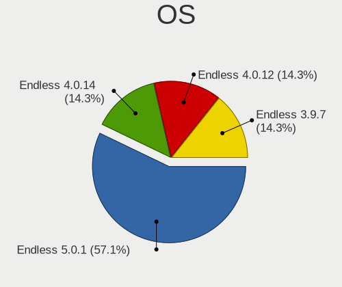
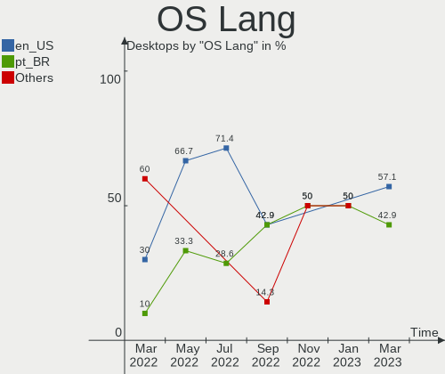
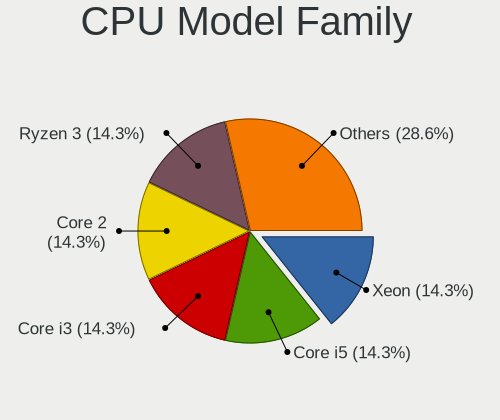
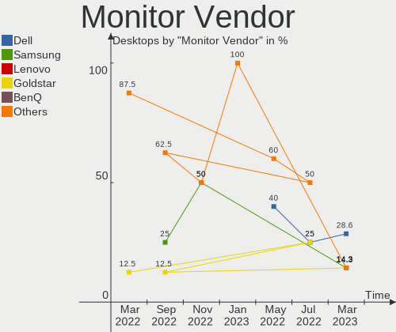
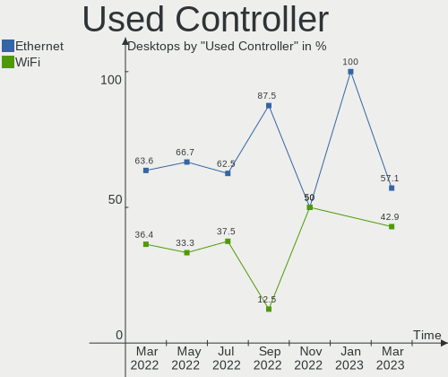

Endless Hardware Trends (Desktop)
---------------------------------

A project to identify most popular hardware characteristics and track their change
over time based on data collected by Endless users at https://Linux-Hardware.org.

Anyone can contribute to the study by uploading probes of their computers by
the [hw-probe](https://github.com/linuxhw/hw-probe) tool:

    sudo hw-probe -all -upload

Full-feature report is available here: https://linux-hardware.org/?view=trends&formfactor=desktop

Period: Feb, 2020.

Contents
--------

- [ OS                       ](#os)
- [ OS Family                ](#os-family)
- [ Kernel                   ](#kernel)
- [ Kernel Family            ](#kernel-family)
- [ Kernel Major Ver.        ](#kernel-major-ver)
- [ Arch                     ](#arch)
- [ DE                       ](#de)
- [ Display Server           ](#display-server)
- [ OS Lang                  ](#os-lang)
- [ Boot Mode                ](#boot-mode)
- [ Filesystem               ](#filesystem)
- [ Dual Boot with Linux     ](#dual-boot-with-linux)
- [ Dual Boot (Win)          ](#dual-boot-win)
- [ Country                  ](#country)
- [ City                     ](#city)
- [ Vendor                   ](#vendor)
- [ Model                    ](#model)
- [ Model Family             ](#model-family)
- [ MFG Year                 ](#mfg-year)
- [ Form Factor              ](#form-factor)
- [ Secure Boot              ](#secure-boot)
- [ Coreboot                 ](#coreboot)
- [ RAM Size                 ](#ram-size)
- [ RAM Used                 ](#ram-used)
- [ Drive Vendor             ](#drive-vendor)
- [ Drive Model              ](#drive-model)
- [ Drive Kind               ](#drive-kind)
- [ Drive Connector          ](#drive-connector)
- [ Drive Size               ](#drive-size)
- [ Space Total              ](#space-total)
- [ Space Used               ](#space-used)
- [ Malfunc. Drives          ](#malfunc-drives)
- [ Malfunc. Drive Vendor    ](#malfunc-drive-vendor)
- [ Malfunc. Drive Kind      ](#malfunc-drive-kind)
- [ Failed Drives            ](#failed-drives)
- [ Failed Drive Vendor      ](#failed-drive-vendor)
- [ Drive Status             ](#drive-status)
- [ Storage Vendor           ](#storage-vendor)
- [ Storage Model            ](#storage-model)
- [ Storage Kind             ](#storage-kind)
- [ CPU Vendor               ](#cpu-vendor)
- [ CPU Model                ](#cpu-model)
- [ CPU Model Family         ](#cpu-model-family)
- [ CPU Cores                ](#cpu-cores)
- [ CPU Sockets              ](#cpu-sockets)
- [ CPU Threads              ](#cpu-threads)
- [ CPU Op-Modes             ](#cpu-op-modes)
- [ CPU Microarch            ](#cpu-microarch)
- [ CPU Microcode            ](#cpu-microcode)
- [ GPU Vendor               ](#gpu-vendor)
- [ GPU Model                ](#gpu-model)
- [ GPU Combo                ](#gpu-combo)
- [ GPU Driver               ](#gpu-driver)
- [ GPU Memory               ](#gpu-memory)
- [ Monitor Vendor           ](#monitor-vendor)
- [ Monitor Model            ](#monitor-model)
- [ Monitor Resolution       ](#monitor-resolution)
- [ Monitor Diagonal         ](#monitor-diagonal)
- [ Monitor Width            ](#monitor-width)
- [ Aspect Ratio             ](#aspect-ratio)
- [ Monitor Area             ](#monitor-area)
- [ Pixel Density            ](#pixel-density)
- [ Multiple Monitors        ](#multiple-monitors)
- [ Net Controller Vendor    ](#net-controller-vendor)
- [ Net Controller Model     ](#net-controller-model)
- [ Net Controller Kind      ](#net-controller-kind)
- [ Used Controller          ](#used-controller)
- [ NICs                     ](#nics)
- [ Unsupported Devices      ](#unsupported-devices)
- [ Unsupported Device Types ](#unsupported-device-types)

OS
--

Installed operating systems

| Name          | Computers | Percent |
|---------------|-----------|---------|
| Endless 3.7.7 | 14        | 46.67%  |
| Endless 3.7.6 | 11        | 36.67%  |
| Endless 3.7.5 | 1         | 3.33%   |
| Endless 3.7.3 | 1         | 3.33%   |
| Endless 3.5.4 | 1         | 3.33%   |
| Endless 3.4.5 | 1         | 3.33%   |
| Endless       | 1         | 3.33%   |

OS Family
---------

OS without a version

| Name    | Computers | Percent |
|---------|-----------|---------|
| Endless | 30        | 100%    |

Kernel
------

Version of the Linux kernel

| Version           | Computers | Percent |
|-------------------|-----------|---------|
| 5.3.0-28-generic  | 14        | 46.67%  |
| 5.3.0-23-generic  | 12        | 40%     |
| 5.3.0-12-generic  | 1         | 3.33%   |
| 4.18.0-12-generic | 1         | 3.33%   |
| 4.15.0-23-generic | 1         | 3.33%   |
| 4.15.0-15-generic | 1         | 3.33%   |

Kernel Family
-------------

Linux kernel without a distro release

| Version | Computers | Percent |
|---------|-----------|---------|
| 5.3.0   | 27        | 90%     |
| 4.15.0  | 2         | 6.67%   |
| 4.18.0  | 1         | 3.33%   |

Kernel Major Ver.
-----------------

Linux kernel major version

| Version | Computers | Percent |
|---------|-----------|---------|
| 5.3     | 27        | 90%     |
| 4.15    | 2         | 6.67%   |
| 4.18    | 1         | 3.33%   |

Arch
----

OS architecture (x86_64, i586, etc.)

| Name   | Computers | Percent |
|--------|-----------|---------|
| x86_64 | 30        | 100%    |

DE
--

Desktop Environment

| Name    | Computers | Percent |
|---------|-----------|---------|
| GNOME   | 29        | 96.67%  |
| Unknown | 1         | 3.33%   |

Display Server
--------------

X11 or Wayland

| Name    | Computers | Percent |
|---------|-----------|---------|
| X11     | 29        | 96.67%  |
| Unknown | 1         | 3.33%   |

OS Lang
-------

Language

| Lang       | Computers | Percent |
|------------|-----------|---------|
| en_US.utf8 | 6         | 20%     |
| ru_RU      | 5         | 16.67%  |
| pt_BR.utf8 | 5         | 16.67%  |
| pt_BR      | 4         | 13.33%  |
| ru_UA      | 1         | 3.33%   |
| ro_RO      | 1         | 3.33%   |
| nl_NL      | 1         | 3.33%   |
| lt_LT      | 1         | 3.33%   |
| it_IT      | 1         | 3.33%   |
| es_MX.utf8 | 1         | 3.33%   |
| en_US      | 1         | 3.33%   |
| en_PH      | 1         | 3.33%   |
| en_GB      | 1         | 3.33%   |
| Unknown    | 1         | 3.33%   |

Boot Mode
---------

EFI or BIOS

| Mode | Computers | Percent |
|------|-----------|---------|
| BIOS | 21        | 70%     |
| EFI  | 9         | 30%     |

Filesystem
----------

Type of filesystem

| Type  | Computers | Percent |
|-------|-----------|---------|
| Ext4  | 28        | 93.33%  |
| Tmpfs | 2         | 6.67%   |

Dual Boot with Linux
--------------------

Hosting more than one Linux

| Dual boot | Computers | Percent |
|-----------|-----------|---------|
| No        | 30        | 100%    |

Dual Boot (Win)
---------------

Hosting Linux and Windows

| Dual boot | Computers | Percent |
|-----------|-----------|---------|
| No        | 30        | 100%    |

Country
-------

Geographic location (country)

| Country     | Computers | Percent |
|-------------|-----------|---------|
| Brazil      | 9         | 30%     |
| Russia      | 6         | 20%     |
| USA         | 4         | 13.33%  |
| Romania     | 2         | 6.67%   |
| UK          | 1         | 3.33%   |
| Thailand    | 1         | 3.33%   |
| Spain       | 1         | 3.33%   |
| Philippines | 1         | 3.33%   |
| New Zealand | 1         | 3.33%   |
| Netherlands | 1         | 3.33%   |
| Mexico      | 1         | 3.33%   |
| Lithuania   | 1         | 3.33%   |
| Italy       | 1         | 3.33%   |

City
----

Geographic location (city)

| City          | Computers | Percent |
|---------------|-----------|---------|
| Galion        | 3         | 10%     |
| Cascavel      | 2         | 6.67%   |
| Vilnius       | 1         | 3.33%   |
| Valencia      | 1         | 3.33%   |
| São Paulo    | 1         | 3.33%   |
| Stockton      | 1         | 3.33%   |
| St Petersburg | 1         | 3.33%   |
| Rome          | 1         | 3.33%   |
| Rochdale      | 1         | 3.33%   |
| Pervouralsk   | 1         | 3.33%   |
| Monterrey     | 1         | 3.33%   |
| Maua          | 1         | 3.33%   |
| Manila        | 1         | 3.33%   |
| Mafra         | 1         | 3.33%   |
| Krasnodar     | 1         | 3.33%   |
| Kirov         | 1         | 3.33%   |
| Goiânia      | 1         | 3.33%   |
| Crateus       | 1         | 3.33%   |
| Cluj-Napoca   | 1         | 3.33%   |
| Claudio       | 1         | 3.33%   |
| Christchurch  | 1         | 3.33%   |
| Chiang Mai    | 1         | 3.33%   |
| Cheboksary    | 1         | 3.33%   |
| Catanduva     | 1         | 3.33%   |
| Bucharest     | 1         | 3.33%   |
| Barnaul       | 1         | 3.33%   |
| Amsterdam     | 1         | 3.33%   |

Vendor
------

Motherboard manufacturer

| Name                | Computers | Percent |
|---------------------|-----------|---------|
| ASUSTek Computer    | 11        | 36.67%  |
| MSI                 | 3         | 10%     |
| Hewlett-Packard     | 3         | 10%     |
| Intel               | 2         | 6.67%   |
| ASRock              | 2         | 6.67%   |
| Acer                | 2         | 6.67%   |
| Unknown             | 2         | 6.67%   |
| Semp Toshiba        | 1         | 3.33%   |
| Gigabyte Technology | 1         | 3.33%   |
| Foxconn             | 1         | 3.33%   |
| ECS                 | 1         | 3.33%   |
| Dell                | 1         | 3.33%   |

Model
-----

Motherboard model

| Name                         | Computers | Percent |
|------------------------------|-----------|---------|
| ASUS M5A97 R2.0              | 2         | 6.67%   |
| ASUS M2N68-AM SE2            | 2         | 6.67%   |
| Unknown                      | 2         | 6.67%   |
| Semp Toshiba STI             | 1         | 3.33%   |
| MSI WE167AA-ABU p6320uk      | 1         | 3.33%   |
| MSI MS-7A33                  | 1         | 3.33%   |
| MSI MS-7309                  | 1         | 3.33%   |
| Intel P61A-D3                | 1         | 3.33%   |
| Intel H61                    | 1         | 3.33%   |
| HP Compaq Elite 8300 USDT    | 1         | 3.33%   |
| HP Compaq 8200 Elite USDT PC | 1         | 3.33%   |
| HP 550-153w                  | 1         | 3.33%   |
| Gigabyte H310M H 2.0         | 1         | 3.33%   |
| Foxconn G31MX Series         | 1         | 3.33%   |
| ECS H61H2-M17                | 1         | 3.33%   |
| Dell OptiPlex 790            | 1         | 3.33%   |
| ASUS P8Z68-V LX              | 1         | 3.33%   |
| ASUS P8H67                   | 1         | 3.33%   |
| ASUS P5QL-ASUS-SE            | 1         | 3.33%   |
| ASUS P5GC-MX/CKD/POST/SI     | 1         | 3.33%   |
| ASUS M3A                     | 1         | 3.33%   |
| ASUS CM1740                  | 1         | 3.33%   |
| ASUS All Series              | 1         | 3.33%   |
| ASRock H110M                 | 1         | 3.33%   |
| ASRock A88M-G                | 1         | 3.33%   |
| Acer Aspire XC-830           | 1         | 3.33%   |
| Acer Aspire XC-330           | 1         | 3.33%   |

Model Family
------------

Motherboard model prefix

| Name              | Computers | Percent |
|-------------------|-----------|---------|
| HP Compaq         | 2         | 6.67%   |
| ASUS M5A97        | 2         | 6.67%   |
| ASUS M2N68-AM     | 2         | 6.67%   |
| Acer Aspire       | 2         | 6.67%   |
| Unknown           | 2         | 6.67%   |
| Semp Toshiba STI  | 1         | 3.33%   |
| MSI WE167AA-ABU   | 1         | 3.33%   |
| MSI MS-7A33       | 1         | 3.33%   |
| MSI MS-7309       | 1         | 3.33%   |
| Intel P61A-D3     | 1         | 3.33%   |
| Intel H61         | 1         | 3.33%   |
| HP 550-153w       | 1         | 3.33%   |
| Gigabyte H310M    | 1         | 3.33%   |
| Foxconn G31MX     | 1         | 3.33%   |
| ECS H61H2-M17     | 1         | 3.33%   |
| Dell OptiPlex     | 1         | 3.33%   |
| ASUS P8Z68-V      | 1         | 3.33%   |
| ASUS P8H67        | 1         | 3.33%   |
| ASUS P5QL-ASUS-SE | 1         | 3.33%   |
| ASUS P5GC-MX      | 1         | 3.33%   |
| ASUS M3A          | 1         | 3.33%   |
| ASUS CM1740       | 1         | 3.33%   |
| ASUS All          | 1         | 3.33%   |
| ASRock H110M      | 1         | 3.33%   |
| ASRock A88M-G     | 1         | 3.33%   |

MFG Year
--------

Motherboard manufacture year

| Year | Computers | Percent |
|------|-----------|---------|
| 2010 | 6         | 20%     |
| 2013 | 4         | 13.33%  |
| 2011 | 4         | 13.33%  |
| 2017 | 3         | 10%     |
| 2019 | 2         | 6.67%   |
| 2018 | 2         | 6.67%   |
| 2015 | 2         | 6.67%   |
| 2012 | 2         | 6.67%   |
| 2016 | 1         | 3.33%   |
| 2014 | 1         | 3.33%   |
| 2009 | 1         | 3.33%   |
| 2008 | 1         | 3.33%   |
| 2007 | 1         | 3.33%   |

Form Factor
-----------

Physical design of the computer

| Name    | Computers | Percent |
|---------|-----------|---------|
| Desktop | 30        | 100%    |

Secure Boot
-----------

Enabled or disabled

| State    | Computers | Percent |
|----------|-----------|---------|
| Disabled | 29        | 96.67%  |
| Enabled  | 1         | 3.33%   |

Coreboot
--------

Have coreboot on board

| Used | Computers | Percent |
|------|-----------|---------|
| No   | 30        | 100%    |

RAM Size
--------

Total RAM memory

| Size in GB | Computers | Percent |
|------------|-----------|---------|
| 3.01-4.0   | 10        | 33.33%  |
| 4.01-8.0   | 8         | 26.67%  |
| 8.01-16.0  | 7         | 23.33%  |
| 2.01-3.0   | 2         | 6.67%   |
| 32.01-64.0 | 1         | 3.33%   |
| 16.01-24.0 | 1         | 3.33%   |
| 1.01-2.0   | 1         | 3.33%   |

RAM Used
--------

Used RAM memory

| Used GB  | Computers | Percent |
|----------|-----------|---------|
| 0.01-1.0 | 12        | 40%     |
| 1.01-2.0 | 9         | 30%     |
| 2.01-3.0 | 6         | 20%     |
| 3.01-4.0 | 3         | 10%     |

Drive Vendor
------------

Hard drive vendors

| Vendor              | Computers | Drives | Percent |
|---------------------|-----------|--------|---------|
| Seagate             | 11        | 12     | 26.19%  |
| Samsung Electronics | 8         | 10     | 19.05%  |
| Kingston            | 7         | 7      | 16.67%  |
| WDC                 | 4         | 4      | 9.52%   |
| Toshiba             | 3         | 3      | 7.14%   |
| Generic             | 2         | 2      | 4.76%   |
| Crucial             | 2         | 2      | 4.76%   |
| SanDisk             | 1         | 1      | 2.38%   |
| KINGMAX             | 1         | 1      | 2.38%   |
| Intel               | 1         | 1      | 2.38%   |
| Hitachi             | 1         | 1      | 2.38%   |
| HGST                | 1         | 1      | 2.38%   |

Drive Model
-----------

Hard drive models

| Model                      | Computers | Percent |
|----------------------------|-----------|---------|
| SV300S37A120G 120GB SSD    | 3         | 6.67%   |
| HD103SJ 1TB                | 3         | 6.67%   |
| ST500DM002-1BD142 500GB    | 2         | 4.44%   |
| ST2000DM001-1CH164 2TB     | 2         | 4.44%   |
| SD/MMC/MS PRO 64GB         | 2         | 4.44%   |
| DT01ACA100 1TB             | 2         | 4.44%   |
| WDS100T2B0A-00SM50 1TB SSD | 1         | 2.22%   |
| WD5000AVDS-63U7B1 500GB    | 1         | 2.22%   |
| WD5000AAKX-003CA0 500GB    | 1         | 2.22%   |
| WD10EFRX-68JCSN0 1TB       | 1         | 2.22%   |
| SV300S37A60G 64GB SSD      | 1         | 2.22%   |
| SUV400S37120G 120GB SSD    | 1         | 2.22%   |
| SUV300S37A240G 240GB SSD   | 1         | 2.22%   |
| ST3500414CS 500GB          | 1         | 2.22%   |
| ST340014A 40GB             | 1         | 2.22%   |
| ST3160815A 160GB           | 1         | 2.22%   |
| ST3160812AS 160GB          | 1         | 2.22%   |
| ST3120813AS 120GB          | 1         | 2.22%   |
| ST1000DM010-2EP102 1TB     | 1         | 2.22%   |
| ST1000DM003-1ER162 1TB     | 1         | 2.22%   |
| ST1000DM003-1CH162 1TB     | 1         | 2.22%   |
| SSDSA2CW080G3 80GB         | 1         | 2.22%   |
| SSD PLUS 120 GB            | 1         | 2.22%   |
| SSD 860 EVO M.2 1TB        | 1         | 2.22%   |
| SSD 860 EVO 500GB          | 1         | 2.22%   |
| SSD 850 EVO M.2 1TB        | 1         | 2.22%   |
| SSD 850 EVO 500GB          | 1         | 2.22%   |
| SSD 850 EVO 120GB          | 1         | 2.22%   |
| SSD 120GB                  | 1         | 2.22%   |
| SMS200S3120G 120GB SSD     | 1         | 2.22%   |
| HTS721010A9E630 1TB        | 1         | 2.22%   |
| HDP725050GLA360 500GB      | 1         | 2.22%   |
| HD103SI 1TB                | 1         | 2.22%   |
| HD080HJ 80GB               | 1         | 2.22%   |
| DT01ACA050 500GB           | 1         | 2.22%   |
| CT240BX500SSD1 240GB       | 1         | 2.22%   |
| CT1050MX300SSD4 1050GB     | 1         | 2.22%   |

Drive Kind
----------

HDD or SSD

| Kind    | Computers | Drives | Percent |
|---------|-----------|--------|---------|
| HDD     | 23        | 25     | 60.53%  |
| SSD     | 13        | 18     | 34.21%  |
| Unknown | 2         | 2      | 5.26%   |

Drive Connector
---------------

SATA, SAS, NVMe, etc.

| Type | Computers | Drives | Percent |
|------|-----------|--------|---------|
| SATA | 30        | 43     | 93.75%  |
| SAS  | 2         | 2      | 6.25%   |

Drive Size
----------

Size of hard drive

| Size in TB | Computers | Drives | Percent |
|------------|-----------|--------|---------|
| 0.01-0.5   | 24        | 28     | 63.16%  |
| 0.51-1.0   | 11        | 14     | 28.95%  |
| 1.01-2.0   | 3         | 3      | 7.89%   |

Space Total
-----------

Amount of disk space available on the file system

| Size in GB | Computers | Percent |
|------------|-----------|---------|
| 101-250    | 8         | 26.67%  |
| 501-1000   | 8         | 26.67%  |
| 251-500    | 4         | 13.33%  |
| 51-100     | 4         | 13.33%  |
| 21-50      | 3         | 10%     |
| 2001-3000  | 2         | 6.67%   |
| 1-20       | 1         | 3.33%   |

Space Used
----------

Amount of used disk space

| Used GB   | Computers | Percent |
|-----------|-----------|---------|
| 21-50     | 14        | 46.67%  |
| 1-20      | 12        | 40%     |
| 51-100    | 2         | 6.67%   |
| 1001-2000 | 1         | 3.33%   |
| 501-1000  | 1         | 3.33%   |

Malfunc. Drives
---------------

Drive models with a malfunction

Zero info for selected period =(

Malfunc. Drive Vendor
---------------------

Vendors of faulty drives

Zero info for selected period =(

Malfunc. Drive Kind
-------------------

Kinds of faulty drives

Zero info for selected period =(

Failed Drives
-------------

Failed drive models

Zero info for selected period =(

Failed Drive Vendor
-------------------

Failed drive vendors

Zero info for selected period =(

Drive Status
------------

Number of failed and malfunc. drives

| Status   | Computers | Drives | Percent |
|----------|-----------|--------|---------|
| Detected | 30        | 45     | 100%    |

Storage Vendor
--------------

Storage controller vendors

| Vendor                   | Computers | Percent |
|--------------------------|-----------|---------|
| Intel                    | 18        | 52.94%  |
| AMD                      | 8         | 23.53%  |
| Nvidia                   | 4         | 11.76%  |
| Marvell Technology Group | 2         | 5.88%   |
| VIA Technologies         | 1         | 2.94%   |
| JMicron Technology       | 1         | 2.94%   |

Storage Model
-------------

Storage controller models

| Model                                                                             | Computers | Percent |
|-----------------------------------------------------------------------------------|-----------|---------|
| 6 Series/C200 Series Chipset Family 6 port Desktop SATA AHCI Controller           | 6         | 13.04%  |
| MCP61 SATA Controller                                                             | 4         | 8.7%    |
| MCP61 IDE                                                                         | 4         | 8.7%    |
| FCH SATA Controller [AHCI mode]                                                   | 4         | 8.7%    |
| SB7x0/SB8x0/SB9x0 SATA Controller [AHCI mode]                                     | 3         | 6.52%   |
| NM10/ICH7 Family SATA Controller [IDE mode]                                       | 2         | 4.35%   |
| 82801G (ICH7 Family) IDE Controller                                               | 2         | 4.35%   |
| X370 Series Chipset SATA Controller                                               | 1         | 2.17%   |
| VT6415 PATA IDE Host Controller                                                   | 1         | 2.17%   |
| SB7x0/SB8x0/SB9x0 IDE Controller                                                  | 1         | 2.17%   |
| SB600 Non-Raid-5 SATA                                                             | 1         | 2.17%   |
| SB600 IDE                                                                         | 1         | 2.17%   |
| SATA Controller [RAID mode]                                                       | 1         | 2.17%   |
| SATA controller                                                                   | 1         | 2.17%   |
| Q170/Q150/B150/H170/H110/Z170/CM236 Chipset SATA Controller [AHCI Mode]           | 1         | 2.17%   |
| JMB368 IDE controller                                                             | 1         | 2.17%   |
| FCH IDE Controller                                                                | 1         | 2.17%   |
| Atom Processor E3800 Series SATA IDE Controller                                   | 1         | 2.17%   |
| 92xx SATA 6G Controller                                                           | 1         | 2.17%   |
| 88SE9172 SATA 6Gb/s Controller                                                    | 1         | 2.17%   |
| 82801JI (ICH10 Family) 4 port SATA IDE Controller #1                              | 1         | 2.17%   |
| 82801JI (ICH10 Family) 2 port SATA IDE Controller #2                              | 1         | 2.17%   |
| 8 Series/C220 Series Chipset Family 6-port SATA Controller 1 [AHCI mode]          | 1         | 2.17%   |
| 7 Series/C210 Series Chipset Family 6-port SATA Controller [AHCI mode]            | 1         | 2.17%   |
| 6 Series/C200 Series Chipset Family Desktop SATA Controller (IDE mode, ports 4-5) | 1         | 2.17%   |
| 6 Series/C200 Series Chipset Family Desktop SATA Controller (IDE mode, ports 0-3) | 1         | 2.17%   |
| 5 Series/3400 Series Chipset 6 port SATA AHCI Controller                          | 1         | 2.17%   |
| 200 Series PCH SATA controller [AHCI mode]                                        | 1         | 2.17%   |

Storage Kind
------------

Kind of storage controller (IDE, SATA, NVMe, SAS, ...)

| Kind | Computers | Percent |
|------|-----------|---------|
| SATA | 20        | 58.82%  |
| IDE  | 13        | 38.24%  |
| RAID | 1         | 2.94%   |

CPU Vendor
----------

Processor vendors

| Vendor | Computers | Percent |
|--------|-----------|---------|
| Intel  | 18        | 60%     |
| AMD    | 12        | 40%     |

CPU Model
---------

Processor models

| Model                                           | Computers | Percent |
|-------------------------------------------------|-----------|---------|
| Intel Core i5-2500 CPU @ 3.30GHz                | 3         | 10%     |
| AMD Athlon 64 X2 Dual Core Processor 5000+      | 2         | 6.67%   |
| Intel Pentium Silver J5005 CPU @ 1.50GHz        | 1         | 3.33%   |
| Intel Pentium Dual-Core CPU E5200 @ 2.50GHz     | 1         | 3.33%   |
| Intel Pentium Dual CPU E2140 @ 1.60GHz          | 1         | 3.33%   |
| Intel Core i7-2600K CPU @ 3.40GHz               | 1         | 3.33%   |
| Intel Core i5-8400 CPU @ 2.80GHz                | 1         | 3.33%   |
| Intel Core i5-7400 CPU @ 3.00GHz                | 1         | 3.33%   |
| Intel Core i5-2400S CPU @ 2.50GHz               | 1         | 3.33%   |
| Intel Core i5 CPU 650 @ 3.20GHz                 | 1         | 3.33%   |
| Intel Core i3-4370 CPU @ 3.80GHz                | 1         | 3.33%   |
| Intel Core i3-3240 CPU @ 3.40GHz                | 1         | 3.33%   |
| Intel Core i3-2120 CPU @ 3.30GHz                | 1         | 3.33%   |
| Intel Core i3-2100 CPU @ 3.10GHz                | 1         | 3.33%   |
| Intel Core 2 Duo CPU E7500 @ 2.93GHz            | 1         | 3.33%   |
| Intel Celeron G4900 CPU @ 3.10GHz               | 1         | 3.33%   |
| Intel Celeron CPU J1800 @ 2.41GHz               | 1         | 3.33%   |
| AMD Ryzen 5 2600X Six-Core Processor            | 1         | 3.33%   |
| AMD Phenom II X4 945 Processor                  | 1         | 3.33%   |
| AMD FX-6300 Six-Core Processor                  | 1         | 3.33%   |
| AMD FX-4350 Quad-Core Processor                 | 1         | 3.33%   |
| AMD E2-3200 APU with Radeon HD Graphics         | 1         | 3.33%   |
| AMD C-70 APU with Radeon HD Graphics            | 1         | 3.33%   |
| AMD Athlon II X3 440 Processor                  | 1         | 3.33%   |
| AMD Athlon 64 X2 Dual Core Processor 4200+      | 1         | 3.33%   |
| AMD A4-9120 RADEON R3, 4 COMPUTE CORES 2C+2G    | 1         | 3.33%   |
| AMD A10-7850K Radeon R7, 12 Compute Cores 4C+8G | 1         | 3.33%   |

CPU Model Family
----------------

Processor model prefix

| Model                   | Computers | Percent |
|-------------------------|-----------|---------|
| Intel Core i5           | 7         | 23.33%  |
| Intel Core i3           | 4         | 13.33%  |
| AMD Athlon 64 X2        | 3         | 10%     |
| Intel Celeron           | 2         | 6.67%   |
| AMD FX                  | 2         | 6.67%   |
| Intel Pentium Silver    | 1         | 3.33%   |
| Intel Pentium Dual-Core | 1         | 3.33%   |
| Intel Pentium Dual      | 1         | 3.33%   |
| Intel Core i7           | 1         | 3.33%   |
| Intel Core 2 Duo        | 1         | 3.33%   |
| AMD Ryzen 5             | 1         | 3.33%   |
| AMD Phenom II X4        | 1         | 3.33%   |
| AMD E2                  | 1         | 3.33%   |
| AMD C-70                | 1         | 3.33%   |
| AMD Athlon II X3        | 1         | 3.33%   |
| AMD A4                  | 1         | 3.33%   |
| AMD A10                 | 1         | 3.33%   |

CPU Cores
---------

Number of processor cores

| Number | Computers | Percent |
|--------|-----------|---------|
| 2      | 18        | 60%     |
| 4      | 8         | 26.67%  |
| 6      | 2         | 6.67%   |
| 3      | 2         | 6.67%   |

CPU Sockets
-----------

Number of sockets

| Number | Computers | Percent |
|--------|-----------|---------|
| 1      | 30        | 100%    |

CPU Threads
-----------

Threads per core (Hyper-Threading)

| Number | Computers | Percent |
|--------|-----------|---------|
| 1      | 20        | 66.67%  |
| 2      | 10        | 33.33%  |

CPU Op-Modes
------------

CPU Operation Modes (32-bit, 64-bit)

| Op mode        | Computers | Percent |
|----------------|-----------|---------|
| 32-bit, 64-bit | 29        | 96.67%  |
| Unknown        | 1         | 3.33%   |

CPU Microarch
-------------

Microarchitecture

| Name          | Computers | Percent |
|---------------|-----------|---------|
| SandyBridge   | 7         | 23.33%  |
| Skylake       | 3         | 10%     |
| K8 Hammer     | 3         | 10%     |
| Core          | 3         | 10%     |
| Piledriver    | 2         | 6.67%   |
| K10           | 2         | 6.67%   |
| Zen+          | 1         | 3.33%   |
| Westmere      | 1         | 3.33%   |
| Steamroller   | 1         | 3.33%   |
| Silvermont    | 1         | 3.33%   |
| K10 Llano     | 1         | 3.33%   |
| IvyBridge     | 1         | 3.33%   |
| Haswell       | 1         | 3.33%   |
| Goldmont plus | 1         | 3.33%   |
| Excavator     | 1         | 3.33%   |
| Bobcat        | 1         | 3.33%   |

CPU Microcode
-------------

Microcode number

| Number     | Computers | Percent |
|------------|-----------|---------|
| 0x206a7    | 7         | 23.33%  |
| Unknown    | 3         | 10%     |
| 0x06000852 | 2         | 6.67%   |
| 0x906eb    | 1         | 3.33%   |
| 0x906ea    | 1         | 3.33%   |
| 0x906e9    | 1         | 3.33%   |
| 0x706a1    | 1         | 3.33%   |
| 0x6fd      | 1         | 3.33%   |
| 0x306c3    | 1         | 3.33%   |
| 0x306a9    | 1         | 3.33%   |
| 0x30678    | 1         | 3.33%   |
| 0x20652    | 1         | 3.33%   |
| 0x1067a    | 1         | 3.33%   |
| 0x10676    | 1         | 3.33%   |
| 0x0800820b | 1         | 3.33%   |
| 0x06006704 | 1         | 3.33%   |
| 0x06003106 | 1         | 3.33%   |
| 0x05000119 | 1         | 3.33%   |
| 0x03000027 | 1         | 3.33%   |
| 0x010000db | 1         | 3.33%   |
| 0x010000c8 | 1         | 3.33%   |

GPU Vendor
----------

Vendors of graphics cards

| Vendor | Computers | Percent |
|--------|-----------|---------|
| Intel  | 11        | 35.48%  |
| Nvidia | 10        | 32.26%  |
| AMD    | 10        | 32.26%  |

GPU Model
---------

Graphics card models

| Model                                                               | Computers | Percent |
|---------------------------------------------------------------------|-----------|---------|
| 2nd Generation Core Processor Family Integrated Graphics Controller | 5         | 16.13%  |
| Cape Verde XT [Radeon HD 7770/8760 / R7 250X]                       | 3         | 9.68%   |
| C61 [GeForce 7025 / nForce 630a]                                    | 3         | 9.68%   |
| Cedar [Radeon HD 5000/6000/7350/8350 Series]                        | 2         | 6.45%   |
| Wrestler [Radeon HD 7290]                                           | 1         | 3.23%   |
| UHD Graphics 630 (Desktop)                                          | 1         | 3.23%   |
| UHD Graphics 605                                                    | 1         | 3.23%   |
| Turks PRO [Radeon HD 6570/7570/8550]                                | 1         | 3.23%   |
| Stoney [Radeon R2/R3/R4/R5 Graphics]                                | 1         | 3.23%   |
| HD Graphics 630                                                     | 1         | 3.23%   |
| GK208B [GeForce GT 710]                                             | 1         | 3.23%   |
| GK107 [GeForce GT 640]                                              | 1         | 3.23%   |
| GF119 [GeForce GT 610]                                              | 1         | 3.23%   |
| GF119 [GeForce GT 520]                                              | 1         | 3.23%   |
| GF114 [GeForce GTX 560]                                             | 1         | 3.23%   |
| GF104 [GeForce GTX 460]                                             | 1         | 3.23%   |
| Ellesmere [Radeon RX 470/480/570/570X/580/580X/590]                 | 1         | 3.23%   |
| C61 [GeForce 6150SE nForce 430]                                     | 1         | 3.23%   |
| Baffin [Radeon RX 550 640SP / RX 560/560X]                          | 1         | 3.23%   |
| Atom Processor Z36xxx/Z37xxx Series Graphics & Display              | 1         | 3.23%   |
| 82G33/G31 Express Integrated Graphics Controller                    | 1         | 3.23%   |
| 82945G/GZ Integrated Graphics Controller                            | 1         | 3.23%   |

GPU Combo
---------

Combinations of graphics cards

| Name       | Computers | Percent |
|------------|-----------|---------|
| 1 x Nvidia | 10        | 33.33%  |
| 1 x Intel  | 10        | 33.33%  |
| 1 x AMD    | 10        | 33.33%  |

GPU Driver
----------

Free vs proprietary

| Driver      | Computers | Percent |
|-------------|-----------|---------|
| Free        | 28        | 93.33%  |
| Proprietary | 2         | 6.67%   |

GPU Memory
----------

Total video memory

| Size in GB | Computers | Percent |
|------------|-----------|---------|
| Unknown    | 10        | 33.33%  |
| 0.51-1.0   | 9         | 30%     |
| 0.01-0.5   | 6         | 20%     |
| 3.01-4.0   | 2         | 6.67%   |
| 1.01-2.0   | 2         | 6.67%   |
| 7.01-8.0   | 1         | 3.33%   |

Monitor Vendor
--------------

Monitor vendors

| Vendor               | Computers | Percent |
|----------------------|-----------|---------|
| Samsung Electronics  | 11        | 37.93%  |
| Philips              | 3         | 10.34%  |
| Goldstar             | 3         | 10.34%  |
| Dell                 | 2         | 6.9%    |
| BenQ                 | 2         | 6.9%    |
| Ancor Communications | 2         | 6.9%    |
| ViewSonic            | 1         | 3.45%   |
| QBell                | 1         | 3.45%   |
| Lenovo               | 1         | 3.45%   |
| BBK                  | 1         | 3.45%   |
| AOC                  | 1         | 3.45%   |
| Acer                 | 1         | 3.45%   |

Monitor Model
-------------

Monitor models

| Model                                               | Computers | Percent |
|-----------------------------------------------------|-----------|---------|
| C32F39M SAM100B 1920x1080 698x393mm 31.5-inch       | 3         | 9.68%   |
| W2243 GSM56FE 1920x1080 477x269mm 21.6-inch         | 1         | 3.23%   |
| W2043 GSM4E9E 1600x900 443x249mm 20.0-inch          | 1         | 3.23%   |
| VW195 ACI19AB 1440x900 410x260mm 19.1-inch          | 1         | 3.23%   |
| VP2365 SERIES VSC7C28 1920x1080 509x286mm 23.0-inch | 1         | 3.23%   |
| TV BBK1366 1366x768 760x450mm 34.8-inch             | 1         | 3.23%   |
| SyncMaster SAM0569 1680x1050 459x296mm 21.5-inch    | 1         | 3.23%   |
| SyncMaster SAM03E0 1440x900 410x257mm 19.1-inch     | 1         | 3.23%   |
| SyncMaster SAM0108 1280x1024 312x234mm 15.4-inch    | 1         | 3.23%   |
| S22F350 SAM0D1B 1920x1080 477x268mm 21.5-inch       | 1         | 3.23%   |
| S200HQL ACR0359 1600x900 432x239mm 19.4-inch        | 1         | 3.23%   |
| S19B300 SAM08A6 1366x768 410x230mm 18.5-inch        | 1         | 3.23%   |
| RL2455 BNQ7F1C 1920x1080 531x298mm 24.0-inch        | 1         | 3.23%   |
| QB.19F-4W QBL19C6 1440x900 410x257mm 19.1-inch      | 1         | 3.23%   |
| PHL 223V5 PHLC0CF 1920x1080 480x270mm 21.7-inch     | 1         | 3.23%   |
| PDP SAM007B 1024x768 920x518mm 41.6-inch            | 1         | 3.23%   |
| P170S DEL4058 1280x1024 338x270mm 17.0-inch         | 1         | 3.23%   |
| LM722 AOCA722 1280x1024 340x270mm 17.1-inch         | 1         | 3.23%   |
| LCD Monitor SAM07BF 1920x1080 886x498mm 40.0-inch   | 1         | 3.23%   |
| LCD Monitor PHLC081 1920x1080 480x270mm 21.7-inch   | 1         | 3.23%   |
| L197 Wide LEN1152 1440x900 410x257mm 19.1-inch      | 1         | 3.23%   |
| L1751SQ GSM43F1 1280x1024 338x270mm 17.0-inch       | 1         | 3.23%   |
| GW2765 BNQ78D6 1920x1080 600x340mm 27.2-inch        | 1         | 3.23%   |
| E1911 DELF037 1440x900 408x255mm 18.9-inch          | 1         | 3.23%   |
| E1910 DELD035 1440x900 410x260mm 19.1-inch          | 1         | 3.23%   |
| C27F591 SAM0D37 1920x1080 598x336mm 27.0-inch       | 1         | 3.23%   |
| ASUS VS197 ACI19F2 1366x768 410x230mm 18.5-inch     | 1         | 3.23%   |
| 241E PHLC035 1920x1080 520x290mm 23.4-inch          | 1         | 3.23%   |
| 1908WFP DELF008 1440x900 408x255mm 18.9-inch        | 1         | 3.23%   |

Monitor Resolution
------------------

Monitor screen resolution

| Resolution         | Computers | Percent |
|--------------------|-----------|---------|
| 1920x1080 (FHD)    | 11        | 39.29%  |
| 1440x900 (WXGA+)   | 5         | 17.86%  |
| 1366x768 (WXGA)    | 4         | 14.29%  |
| 1280x1024 (SXGA)   | 4         | 14.29%  |
| 2560x1440 (QHD)    | 1         | 3.57%   |
| 1680x1050 (WSXGA+) | 1         | 3.57%   |
| 1600x900 (HD+)     | 1         | 3.57%   |
| 1024x768 (XGA)     | 1         | 3.57%   |

Monitor Diagonal
----------------

Diagonal size in inches

| Inches | Computers | Percent |
|--------|-----------|---------|
| 21     | 5         | 17.24%  |
| 19     | 4         | 13.79%  |
| 18     | 4         | 13.79%  |
| 31     | 3         | 10.34%  |
| 17     | 3         | 10.34%  |
| 27     | 2         | 6.9%    |
| 23     | 2         | 6.9%    |
| 41     | 1         | 3.45%   |
| 40     | 1         | 3.45%   |
| 34     | 1         | 3.45%   |
| 24     | 1         | 3.45%   |
| 20     | 1         | 3.45%   |
| 15     | 1         | 3.45%   |

Monitor Width
-------------

Physical width

| Width in mm | Computers | Percent |
|-------------|-----------|---------|
| 401-500     | 14        | 48.28%  |
| 501-600     | 5         | 17.24%  |
| 301-350     | 4         | 13.79%  |
| 601-700     | 3         | 10.34%  |
| 801-900     | 1         | 3.45%   |
| 701-800     | 1         | 3.45%   |
| 901-1000    | 1         | 3.45%   |

Aspect Ratio
------------

Proportional relationship between the width and the height

| Ratio | Computers | Percent |
|-------|-----------|---------|
| 16/9  | 17        | 62.96%  |
| 16/10 | 6         | 22.22%  |
| 5/4   | 3         | 11.11%  |
| 4/3   | 1         | 3.7%    |

Monitor Area
------------

Area in inch²

| Area in inch² | Computers | Percent |
|----------------|-----------|---------|
| 151-200        | 10        | 34.48%  |
| 201-250        | 5         | 17.24%  |
| 141-150        | 5         | 17.24%  |
| 351-500        | 3         | 10.34%  |
| 501-1000       | 3         | 10.34%  |
| 301-350        | 2         | 6.9%    |
| 111-120        | 1         | 3.45%   |

Pixel Density
-------------

Pixels per inch

| Density | Computers | Percent |
|---------|-----------|---------|
| 51-100  | 19        | 70.37%  |
| 101-120 | 6         | 22.22%  |
| 1-50    | 2         | 7.41%   |

Multiple Monitors
-----------------

Total monitors connected

| Total | Computers | Percent |
|-------|-----------|---------|
| 1     | 23        | 76.67%  |
| 2     | 3         | 10%     |
| 0     | 3         | 10%     |
| 3     | 1         | 3.33%   |

Net Controller Vendor
---------------------

Controller vendors

| Vendor                     | Computers | Percent |
|----------------------------|-----------|---------|
| Nvidia                     | 4         | 40%     |
| Intel                      | 3         | 30%     |
| ZTE WCDMA Technologies MSM | 1         | 10%     |
| Huawei Technologies        | 1         | 10%     |
| Giga-Byte Technology       | 1         | 10%     |

Net Controller Model
--------------------

Controller models

| Model                                           | Computers | Percent |
|-------------------------------------------------|-----------|---------|
| MCP61 Ethernet                                  | 4         | 40%     |
| 82579LM Gigabit Network Connection (Lewisville) | 3         | 30%     |
| ZTE Mobile Broadband Station                    | 1         | 10%     |
| MT65xx Android Phone                            | 1         | 10%     |
| DLI-TL20                                        | 1         | 10%     |

Net Controller Kind
-------------------

Ethernet, WiFi or modem

| Kind     | Computers | Percent |
|----------|-----------|---------|
| Ethernet | 10        | 100%    |

Used Controller
---------------

Currently used network controller

| Kind     | Computers | Percent |
|----------|-----------|---------|
| Ethernet | 9         | 100%    |

NICs
----

Total network controllers on board

| Total | Computers | Percent |
|-------|-----------|---------|
| 1     | 26        | 86.67%  |
| 2     | 3         | 10%     |
| 0     | 1         | 3.33%   |

Unsupported Devices
-------------------

Total unsupported devices on board

| Total | Computers | Percent |
|-------|-----------|---------|
| 0     | 30        | 100%    |

Unsupported Device Types
------------------------

Types of unsupported devices

Zero info for selected period =(

