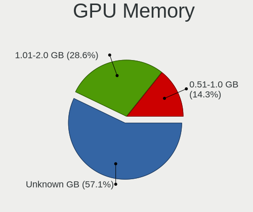
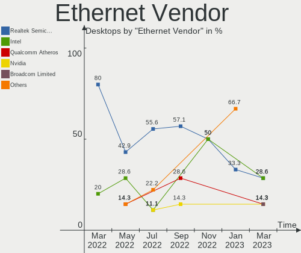

Endless Hardware Trends (Desktops)
----------------------------------

A project to identify most popular hardware characteristics and track their change
over time based on data collected by Linux users at https://Linux-Hardware.org.

Anyone can contribute to this report by the [hw-probe](https://github.com/linuxhw/hw-probe) tool:

    sudo -E hw-probe -all -upload

Full-feature report is available here: https://linux-hardware.org/?view=trends&formfactor=desktop

Period: Jul, 2021.

Contents
--------

* [ System ](#system)
  - [ OS                       ](#os)
  - [ OS Family                ](#os-family)
  - [ Kernel                   ](#kernel)
  - [ Kernel Family            ](#kernel-family)
  - [ Kernel Major Ver.        ](#kernel-major-ver)
  - [ Arch                     ](#arch)
  - [ DE                       ](#de)
  - [ Display Server           ](#display-server)
  - [ Display Manager          ](#display-manager)
  - [ OS Lang                  ](#os-lang)
  - [ Boot Mode                ](#boot-mode)
  - [ Filesystem               ](#filesystem)
  - [ Part. scheme             ](#part-scheme)
  - [ Dual Boot with Linux/BSD ](#dual-boot-with-linuxbsd)
  - [ Dual Boot (Win)          ](#dual-boot-win)

* [ Board ](#board)
  - [ Vendor                   ](#vendor)
  - [ Model                    ](#model)
  - [ Model Family             ](#model-family)
  - [ MFG Year                 ](#mfg-year)
  - [ Form Factor              ](#form-factor)
  - [ Secure Boot              ](#secure-boot)
  - [ Coreboot                 ](#coreboot)
  - [ RAM Size                 ](#ram-size)
  - [ RAM Used                 ](#ram-used)
  - [ Total Drives             ](#total-drives)
  - [ Has CD-ROM               ](#has-cd-rom)
  - [ Has Ethernet             ](#has-ethernet)
  - [ Has WiFi                 ](#has-wifi)
  - [ Has Bluetooth            ](#has-bluetooth)

* [ Location ](#location)
  - [ Country                  ](#country)
  - [ City                     ](#city)

* [ Drives ](#drives)
  - [ Drive Vendor             ](#drive-vendor)
  - [ Drive Model              ](#drive-model)
  - [ HDD Vendor               ](#hdd-vendor)
  - [ SSD Vendor               ](#ssd-vendor)
  - [ Drive Kind               ](#drive-kind)
  - [ Drive Connector          ](#drive-connector)
  - [ Drive Size               ](#drive-size)
  - [ Space Total              ](#space-total)
  - [ Space Used               ](#space-used)
  - [ Malfunc. Drives          ](#malfunc-drives)
  - [ Malfunc. Drive Vendor    ](#malfunc-drive-vendor)
  - [ Malfunc. HDD Vendor      ](#malfunc-hdd-vendor)
  - [ Malfunc. Drive Kind      ](#malfunc-drive-kind)
  - [ Failed Drives            ](#failed-drives)
  - [ Failed Drive Vendor      ](#failed-drive-vendor)
  - [ Drive Status             ](#drive-status)

* [ Storage controller ](#storage-controller)
  - [ Storage Vendor           ](#storage-vendor)
  - [ Storage Model            ](#storage-model)
  - [ Storage Kind             ](#storage-kind)

* [ Processor ](#processor)
  - [ CPU Vendor               ](#cpu-vendor)
  - [ CPU Model                ](#cpu-model)
  - [ CPU Model Family         ](#cpu-model-family)
  - [ CPU Cores                ](#cpu-cores)
  - [ CPU Sockets              ](#cpu-sockets)
  - [ CPU Threads              ](#cpu-threads)
  - [ CPU Op-Modes             ](#cpu-op-modes)
  - [ CPU Microcode            ](#cpu-microcode)
  - [ CPU Microarch            ](#cpu-microarch)

* [ Graphics ](#graphics)
  - [ GPU Vendor               ](#gpu-vendor)
  - [ GPU Model                ](#gpu-model)
  - [ GPU Combo                ](#gpu-combo)
  - [ GPU Driver               ](#gpu-driver)
  - [ GPU Memory               ](#gpu-memory)

* [ Monitor ](#monitor)
  - [ Monitor Vendor           ](#monitor-vendor)
  - [ Monitor Model            ](#monitor-model)
  - [ Monitor Resolution       ](#monitor-resolution)
  - [ Monitor Diagonal         ](#monitor-diagonal)
  - [ Monitor Width            ](#monitor-width)
  - [ Aspect Ratio             ](#aspect-ratio)
  - [ Monitor Area             ](#monitor-area)
  - [ Pixel Density            ](#pixel-density)
  - [ Multiple Monitors        ](#multiple-monitors)

* [ Network ](#network)
  - [ Net Controller Vendor    ](#net-controller-vendor)
  - [ Net Controller Model     ](#net-controller-model)
  - [ Wireless Vendor          ](#wireless-vendor)
  - [ Wireless Model           ](#wireless-model)
  - [ Ethernet Vendor          ](#ethernet-vendor)
  - [ Ethernet Model           ](#ethernet-model)
  - [ Net Controller Kind      ](#net-controller-kind)
  - [ Used Controller          ](#used-controller)
  - [ NICs                     ](#nics)
  - [ IPv6                     ](#ipv6)

* [ Bluetooth ](#bluetooth)
  - [ Bluetooth Vendor         ](#bluetooth-vendor)
  - [ Bluetooth Model          ](#bluetooth-model)

* [ Sound ](#sound)
  - [ Sound Vendor             ](#sound-vendor)
  - [ Sound Model              ](#sound-model)

* [ Memory ](#memory)
  - [ Memory Vendor            ](#memory-vendor)
  - [ Memory Model             ](#memory-model)
  - [ Memory Kind              ](#memory-kind)
  - [ Memory Form Factor       ](#memory-form-factor)
  - [ Memory Size              ](#memory-size)
  - [ Memory Speed             ](#memory-speed)

* [ Printers & scanners ](#printers-&-scanners)
  - [ Printer Vendor           ](#printer-vendor)
  - [ Printer Model            ](#printer-model)
  - [ Scanner Vendor           ](#scanner-vendor)
  - [ Scanner Model            ](#scanner-model)

* [ Camera ](#camera)
  - [ Camera Vendor            ](#camera-vendor)
  - [ Camera Model             ](#camera-model)

* [ Security ](#security)
  - [ Fingerprint Vendor       ](#fingerprint-vendor)
  - [ Fingerprint Model        ](#fingerprint-model)
  - [ Chipcard Vendor          ](#chipcard-vendor)
  - [ Chipcard Model           ](#chipcard-model)

* [ Unsupported ](#unsupported)
  - [ Unsupported Devices      ](#unsupported-devices)
  - [ Unsupported Device Types ](#unsupported-device-types)

System
------

OS
--

Installed operating systems

| Name          | Desktops | Percent |
|---------------|----------|---------|
| Endless 3.9.5 | 10       | 83.33%  |
| Endless 3.9.0 | 1        | 8.33%   |
| Endless 3.8.4 | 1        | 8.33%   |

OS Family
---------

OS without a version

| Name    | Desktops | Percent |
|---------|----------|---------|
| Endless | 12       | 100%    |

Kernel
------

Version of the Linux kernel

| Version          | Desktops | Percent |
|------------------|----------|---------|
| 5.8.0-14-generic | 11       | 91.67%  |
| 5.4.0-19-generic | 1        | 8.33%   |

Kernel Family
-------------

Linux kernel without a distro release

| Version | Desktops | Percent |
|---------|----------|---------|
| 5.8.0   | 11       | 91.67%  |
| 5.4.0   | 1        | 8.33%   |

Kernel Major Ver.
-----------------

Linux kernel major version

| Version | Desktops | Percent |
|---------|----------|---------|
| 5.8     | 11       | 91.67%  |
| 5.4     | 1        | 8.33%   |

Arch
----

OS architecture (x86_64, i586, etc.)

| Name   | Desktops | Percent |
|--------|----------|---------|
| x86_64 | 12       | 100%    |

DE
--

Desktop Environment

| Name  | Desktops | Percent |
|-------|----------|---------|
| GNOME | 12       | 100%    |

Display Server
--------------

X11 or Wayland

| Name | Desktops | Percent |
|------|----------|---------|
| X11  | 12       | 100%    |

Display Manager
---------------

SDDM, LightDM, etc.

| Name    | Desktops | Percent |
|---------|----------|---------|
| Unknown | 12       | 100%    |

OS Lang
-------

Language

| Lang  | Desktops | Percent |
|-------|----------|---------|
| en_US | 7        | 58.33%  |
| zh_TW | 1        | 8.33%   |
| ru_RU | 1        | 8.33%   |
| pt_PT | 1        | 8.33%   |
| it_IT | 1        | 8.33%   |
| en_IN | 1        | 8.33%   |

Boot Mode
---------

EFI or BIOS

| Mode | Desktops | Percent |
|------|----------|---------|
| BIOS | 7        | 58.33%  |
| EFI  | 5        | 41.67%  |

Filesystem
----------

Type of filesystem

| Type  | Desktops | Percent |
|-------|----------|---------|
| Ext4  | 11       | 91.67%  |
| Tmpfs | 1        | 8.33%   |

Part. scheme
------------

Scheme of partitioning

| Type    | Desktops | Percent |
|---------|----------|---------|
| Unknown | 12       | 100%    |

Dual Boot with Linux/BSD
------------------------

Hosting more than one Linux/BSD

| Dual boot | Desktops | Percent |
|-----------|----------|---------|
| No        | 12       | 100%    |

Dual Boot (Win)
---------------

Hosting Linux and Windows

| Dual boot | Desktops | Percent |
|-----------|----------|---------|
| No        | 12       | 100%    |

Board
-----

Vendor
------

Motherboard manufacturer

| Name                | Desktops | Percent |
|---------------------|----------|---------|
| ASUSTek Computer    | 5        | 41.67%  |
| Gigabyte Technology | 3        | 25%     |
| Dell                | 2        | 16.67%  |
| Intel               | 1        | 8.33%   |
| Acer                | 1        | 8.33%   |

Model
-----

Motherboard model

| Name                       | Desktops | Percent |
|----------------------------|----------|---------|
| Intel H61                  | 1        | 8.33%   |
| Gigabyte H81M-HD3          | 1        | 8.33%   |
| Gigabyte H410M S2          | 1        | 8.33%   |
| Gigabyte H110M-H-CF        | 1        | 8.33%   |
| Dell OptiPlex 990          | 1        | 8.33%   |
| Dell Inspiron 620          | 1        | 8.33%   |
| ASUS PRIME H310T2 R2.0     | 1        | 8.33%   |
| ASUS M5A97 EVO             | 1        | 8.33%   |
| ASUS K30BF_M32BF_A_F_K31BF | 1        | 8.33%   |
| ASUS ASUSPRO D642MF_D642MF | 1        | 8.33%   |
| ASUS A68HM-PLUS            | 1        | 8.33%   |
| Acer Aspire XC-895         | 1        | 8.33%   |

Model Family
------------

Motherboard model prefix

| Name                | Desktops | Percent |
|---------------------|----------|---------|
| Intel H61           | 1        | 8.33%   |
| Gigabyte H81M-HD3   | 1        | 8.33%   |
| Gigabyte H410M      | 1        | 8.33%   |
| Gigabyte H110M-H-CF | 1        | 8.33%   |
| Dell OptiPlex       | 1        | 8.33%   |
| Dell Inspiron       | 1        | 8.33%   |
| ASUS PRIME          | 1        | 8.33%   |
| ASUS M5A97          | 1        | 8.33%   |
| ASUS K30BF          | 1        | 8.33%   |
| ASUS ASUSPRO        | 1        | 8.33%   |
| ASUS A68HM-PLUS     | 1        | 8.33%   |
| Acer Aspire         | 1        | 8.33%   |

MFG Year
--------

Motherboard manufacture year

| Year | Desktops | Percent |
|------|----------|---------|
| 2020 | 3        | 25%     |
| 2019 | 2        | 16.67%  |
| 2016 | 2        | 16.67%  |
| 2011 | 2        | 16.67%  |
| 2015 | 1        | 8.33%   |
| 2014 | 1        | 8.33%   |
| 2012 | 1        | 8.33%   |

Form Factor
-----------

Physical design of the computer

| Name    | Desktops | Percent |
|---------|----------|---------|
| Desktop | 12       | 100%    |

Secure Boot
-----------

Enabled or disabled

| State    | Desktops | Percent |
|----------|----------|---------|
| Disabled | 10       | 83.33%  |
| Enabled  | 2        | 16.67%  |

Coreboot
--------

Have coreboot on board

| Used | Desktops | Percent |
|------|----------|---------|
| No   | 12       | 100%    |

RAM Size
--------

Total RAM memory

| Size in GB | Desktops | Percent |
|------------|----------|---------|
| 4.01-8.0   | 7        | 58.33%  |
| 16.01-24.0 | 2        | 16.67%  |
| 8.01-16.0  | 2        | 16.67%  |
| 3.01-4.0   | 1        | 8.33%   |

RAM Used
--------

Used RAM memory

| Used GB  | Desktops | Percent |
|----------|----------|---------|
| 1.01-2.0 | 6        | 50%     |
| 2.01-3.0 | 2        | 16.67%  |
| 0.51-1.0 | 2        | 16.67%  |
| 4.01-8.0 | 1        | 8.33%   |
| 3.01-4.0 | 1        | 8.33%   |

Total Drives
------------

Number of drives on board

| Drives | Desktops | Percent |
|--------|----------|---------|
| 1      | 8        | 66.67%  |
| 2      | 4        | 33.33%  |

Has CD-ROM
----------

Has CD-ROM on board

| Presented | Desktops | Percent |
|-----------|----------|---------|
| Yes       | 6        | 50%     |
| No        | 6        | 50%     |

Has Ethernet
------------

Has Ethernet on board

| Presented | Desktops | Percent |
|-----------|----------|---------|
| Yes       | 12       | 100%    |

Has WiFi
--------

Has WiFi module

| Presented | Desktops | Percent |
|-----------|----------|---------|
| Yes       | 6        | 50%     |
| No        | 6        | 50%     |

Has Bluetooth
-------------

Has Bluetooth module

| Presented | Desktops | Percent |
|-----------|----------|---------|
| No        | 11       | 91.67%  |
| Yes       | 1        | 8.33%   |

Location
--------

Country
-------

Geographic location (country)

| Country     | Desktops | Percent |
|-------------|----------|---------|
| USA         | 3        | 25%     |
| India       | 2        | 16.67%  |
| Turkey      | 1        | 8.33%   |
| Taiwan      | 1        | 8.33%   |
| Russia      | 1        | 8.33%   |
| New Zealand | 1        | 8.33%   |
| Italy       | 1        | 8.33%   |
| Canada      | 1        | 8.33%   |
| Brazil      | 1        | 8.33%   |

City
----

Geographic location (city)

| City          | Desktops | Percent |
|---------------|----------|---------|
| Taichung      | 1        | 8.33%   |
| Summerland    | 1        | 8.33%   |
| St Petersburg | 1        | 8.33%   |
| Seminole      | 1        | 8.33%   |
| Rome          | 1        | 8.33%   |
| Paulo Afonso  | 1        | 8.33%   |
| Mersin        | 1        | 8.33%   |
| Kollam        | 1        | 8.33%   |
| Jaipur        | 1        | 8.33%   |
| Detroit       | 1        | 8.33%   |
| Christchurch  | 1        | 8.33%   |
| Bucyrus       | 1        | 8.33%   |

Drives
------

Drive Vendor
------------

Hard drive vendors

| Vendor              | Desktops | Drives | Percent |
|---------------------|----------|--------|---------|
| WDC                 | 4        | 4      | 28.57%  |
| Unknown             | 2        | 2      | 14.29%  |
| Toshiba             | 2        | 2      | 14.29%  |
| Samsung Electronics | 2        | 2      | 14.29%  |
| Seagate             | 1        | 1      | 7.14%   |
| Kingston            | 1        | 1      | 7.14%   |
| Hitachi             | 1        | 1      | 7.14%   |
| A-DATA Technology   | 1        | 1      | 7.14%   |

Drive Model
-----------

Hard drive models

| Model                            | Desktops | Percent |
|----------------------------------|----------|---------|
| WDC WDS240G2G0A-00JH30 240GB SSD | 1        | 7.14%   |
| WDC WD2500AAKX-083CA1 250GB      | 1        | 7.14%   |
| WDC WD10EZEX-22BN5A0 1TB         | 1        | 7.14%   |
| WDC WD10EZEX-00WN4A0 1TB         | 1        | 7.14%   |
| Unknown SD/MMC/MS PRO 128GB      | 1        | 7.14%   |
| Unknown S320-1T                  | 1        | 7.14%   |
| Toshiba MQ01ABD050 500GB         | 1        | 7.14%   |
| Toshiba DT01ACA100 1TB           | 1        | 7.14%   |
| Seagate ST1000NM0008-2F2100 1TB  | 1        | 7.14%   |
| Samsung SSD 860 QVO 1TB          | 1        | 7.14%   |
| Samsung NVMe SSD Drive 256GB     | 1        | 7.14%   |
| Kingston SV300S37A120G 120GB SSD | 1        | 7.14%   |
| Hitachi HDS721050CLA362 500GB    | 1        | 7.14%   |
| A-DATA SU800 256GB SSD           | 1        | 7.14%   |

HDD Vendor
----------

Hard disk drive vendors

| Vendor  | Desktops | Drives | Percent |
|---------|----------|--------|---------|
| WDC     | 3        | 3      | 42.86%  |
| Toshiba | 2        | 2      | 28.57%  |
| Seagate | 1        | 1      | 14.29%  |
| Hitachi | 1        | 1      | 14.29%  |

SSD Vendor
----------

Solid state drive vendors

| Vendor              | Desktops | Drives | Percent |
|---------------------|----------|--------|---------|
| WDC                 | 1        | 1      | 25%     |
| Samsung Electronics | 1        | 1      | 25%     |
| Kingston            | 1        | 1      | 25%     |
| A-DATA Technology   | 1        | 1      | 25%     |

Drive Kind
----------

HDD or SSD

| Kind    | Desktops | Drives | Percent |
|---------|----------|--------|---------|
| HDD     | 7        | 7      | 50%     |
| SSD     | 4        | 4      | 28.57%  |
| Unknown | 2        | 2      | 14.29%  |
| NVMe    | 1        | 1      | 7.14%   |

Drive Connector
---------------

SATA, SAS, NVMe, etc.

| Type | Desktops | Drives | Percent |
|------|----------|--------|---------|
| SATA | 11       | 12     | 84.62%  |
| SAS  | 1        | 1      | 7.69%   |
| NVMe | 1        | 1      | 7.69%   |

Drive Size
----------

Size of hard drive

| Size in TB | Desktops | Drives | Percent |
|------------|----------|--------|---------|
| 0.01-0.5   | 6        | 6      | 54.55%  |
| 0.51-1.0   | 5        | 5      | 45.45%  |

Space Total
-----------

Amount of disk space available on the file system

| Size in GB     | Desktops | Percent |
|----------------|----------|---------|
| 501-1000       | 5        | 41.67%  |
| 101-250        | 3        | 25%     |
| More than 3000 | 1        | 8.33%   |
| 251-500        | 1        | 8.33%   |
| 21-50          | 1        | 8.33%   |
| 51-100         | 1        | 8.33%   |

Space Used
----------

Amount of used disk space

| Used GB        | Desktops | Percent |
|----------------|----------|---------|
| 21-50          | 6        | 50%     |
| 1-20           | 2        | 16.67%  |
| 51-100         | 2        | 16.67%  |
| More than 3000 | 1        | 8.33%   |
| 251-500        | 1        | 8.33%   |

Malfunc. Drives
---------------

Drive models with a malfunction

Zero info for selected period =(

Malfunc. Drive Vendor
---------------------

Vendors of faulty drives

Zero info for selected period =(

Malfunc. HDD Vendor
-------------------

Vendors of faulty HDD drives

Zero info for selected period =(

Malfunc. Drive Kind
-------------------

Kinds of faulty drives

Zero info for selected period =(

Failed Drives
-------------

Failed drive models

Zero info for selected period =(

Failed Drive Vendor
-------------------

Failed drive vendors

Zero info for selected period =(

Drive Status
------------

Number of failed and malfunc. drives

| Status   | Desktops | Drives | Percent |
|----------|----------|--------|---------|
| Detected | 12       | 14     | 100%    |

Storage controller
------------------

Storage Vendor
--------------

Storage controller vendors

| Vendor              | Desktops | Percent |
|---------------------|----------|---------|
| Intel               | 9        | 64.29%  |
| AMD                 | 3        | 21.43%  |
| Samsung Electronics | 1        | 7.14%   |
| JMicron Technology  | 1        | 7.14%   |

Storage Model
-------------

Storage controller models

| Model                                                                                   | Desktops | Percent |
|-----------------------------------------------------------------------------------------|----------|---------|
| Intel SATA Controller [RAID mode]                                                       | 2        | 13.33%  |
| Intel 400 Series Chipset Family SATA AHCI Controller                                    | 2        | 13.33%  |
| AMD FCH SATA Controller [AHCI mode]                                                     | 2        | 13.33%  |
| Samsung NVMe Controller                                                                 | 1        | 6.67%   |
| JMicron JMB362 SATA Controller                                                          | 1        | 6.67%   |
| Intel Q170/Q150/B150/H170/H110/Z170/CM236 Chipset SATA Controller [AHCI Mode]           | 1        | 6.67%   |
| Intel 8 Series/C220 Series Chipset Family 6-port SATA Controller 1 [AHCI mode]          | 1        | 6.67%   |
| Intel 6 Series/C200 Series Chipset Family Desktop SATA Controller (IDE mode, ports 4-5) | 1        | 6.67%   |
| Intel 6 Series/C200 Series Chipset Family Desktop SATA Controller (IDE mode, ports 0-3) | 1        | 6.67%   |
| Intel 6 Series/C200 Series Chipset Family 6 port Desktop SATA AHCI Controller           | 1        | 6.67%   |
| Intel 200 Series PCH SATA controller [AHCI mode]                                        | 1        | 6.67%   |
| AMD SB7x0/SB8x0/SB9x0 SATA Controller [AHCI mode]                                       | 1        | 6.67%   |

Storage Kind
------------

Kind of storage controller (IDE, SATA, NVMe, SAS, ...)

| Kind | Desktops | Percent |
|------|----------|---------|
| SATA | 9        | 69.23%  |
| RAID | 2        | 15.38%  |
| NVMe | 1        | 7.69%   |
| IDE  | 1        | 7.69%   |

Processor
---------

CPU Vendor
----------

Processor vendors

| Vendor | Desktops | Percent |
|--------|----------|---------|
| Intel  | 9        | 75%     |
| AMD    | 3        | 25%     |

CPU Model
---------

Processor models

| Model                                     | Desktops | Percent |
|-------------------------------------------|----------|---------|
| Intel Pentium CPU G3220 @ 3.00GHz         | 1        | 8.33%   |
| Intel Core i5-9500 CPU @ 3.00GHz          | 1        | 8.33%   |
| Intel Core i5-9400 CPU @ 2.90GHz          | 1        | 8.33%   |
| Intel Core i5-2400 CPU @ 3.10GHz          | 1        | 8.33%   |
| Intel Core i5-10400 CPU @ 2.90GHz         | 1        | 8.33%   |
| Intel Core i3-6100 CPU @ 3.70GHz          | 1        | 8.33%   |
| Intel Core i3-2120 CPU @ 3.30GHz          | 1        | 8.33%   |
| Intel Core i3-2100 CPU @ 3.10GHz          | 1        | 8.33%   |
| Intel Core i3-10100 CPU @ 3.60GHz         | 1        | 8.33%   |
| AMD Phenom II X6 1090T Processor          | 1        | 8.33%   |
| AMD A4-5300 APU with Radeon HD Graphics   | 1        | 8.33%   |
| AMD A10-5800K APU with Radeon HD Graphics | 1        | 8.33%   |

CPU Model Family
----------------

Processor model prefix

| Model            | Desktops | Percent |
|------------------|----------|---------|
| Intel Core i5    | 4        | 33.33%  |
| Intel Core i3    | 4        | 33.33%  |
| Intel Pentium    | 1        | 8.33%   |
| AMD Phenom II X6 | 1        | 8.33%   |
| AMD A4           | 1        | 8.33%   |
| AMD A10          | 1        | 8.33%   |

CPU Cores
---------

Number of processor cores

| Number | Desktops | Percent |
|--------|----------|---------|
| 2      | 5        | 41.67%  |
| 6      | 4        | 33.33%  |
| 4      | 2        | 16.67%  |
| 1      | 1        | 8.33%   |

CPU Sockets
-----------

Number of sockets

| Number | Desktops | Percent |
|--------|----------|---------|
| 1      | 12       | 100%    |

CPU Threads
-----------

Threads per core (Hyper-Threading)

| Number | Desktops | Percent |
|--------|----------|---------|
| 2      | 7        | 58.33%  |
| 1      | 5        | 41.67%  |

CPU Op-Modes
------------

CPU Operation Modes (32-bit, 64-bit)

| Op mode        | Desktops | Percent |
|----------------|----------|---------|
| 32-bit, 64-bit | 12       | 100%    |

CPU Microcode
-------------

Microcode number

| Number     | Desktops | Percent |
|------------|----------|---------|
| 0x206a7    | 3        | 25%     |
| 0xa0653    | 2        | 16.67%  |
| 0x906ea    | 2        | 16.67%  |
| 0x506e3    | 1        | 8.33%   |
| 0x06003106 | 1        | 8.33%   |
| 0x06001119 | 1        | 8.33%   |
| 0x010000dc | 1        | 8.33%   |
| Unknown    | 1        | 8.33%   |

CPU Microarch
-------------

Microarchitecture

| Name        | Desktops | Percent |
|-------------|----------|---------|
| SandyBridge | 3        | 25%     |
| Piledriver  | 2        | 16.67%  |
| KabyLake    | 2        | 16.67%  |
| CometLake   | 2        | 16.67%  |
| Skylake     | 1        | 8.33%   |
| K10         | 1        | 8.33%   |
| Haswell     | 1        | 8.33%   |

Graphics
--------

GPU Vendor
----------

Vendors of graphics cards

| Vendor | Desktops | Percent |
|--------|----------|---------|
| Intel  | 6        | 50%     |
| Nvidia | 4        | 33.33%  |
| AMD    | 2        | 16.67%  |

GPU Model
---------

Graphics card models

| Model                                                                       | Desktops | Percent |
|-----------------------------------------------------------------------------|----------|---------|
| Intel CometLake-S GT2 [UHD Graphics 630]                                    | 4        | 30.77%  |
| Nvidia GP106 [GeForce GTX 1060 3GB]                                         | 1        | 7.69%   |
| Nvidia GM206 [GeForce GTX 960]                                              | 1        | 7.69%   |
| Nvidia GM107 [GeForce GTX 750 Ti]                                           | 1        | 7.69%   |
| Nvidia GF119 [GeForce GT 610]                                               | 1        | 7.69%   |
| Nvidia GF104 [GeForce GTX 460]                                              | 1        | 7.69%   |
| Intel Xeon E3-1200 v3/4th Gen Core Processor Integrated Graphics Controller | 1        | 7.69%   |
| Intel 2nd Generation Core Processor Family Integrated Graphics Controller   | 1        | 7.69%   |
| AMD Trinity 2 [Radeon HD 7480D]                                             | 1        | 7.69%   |
| AMD Cedar [Radeon HD 5000/6000/7350/8350 Series]                            | 1        | 7.69%   |

GPU Combo
---------

Combinations of graphics cards

| Name       | Desktops | Percent |
|------------|----------|---------|
| 1 x Intel  | 6        | 50%     |
| 1 x Nvidia | 4        | 33.33%  |
| 1 x AMD    | 2        | 16.67%  |

GPU Driver
----------

Free vs proprietary

| Driver      | Desktops | Percent |
|-------------|----------|---------|
| Free        | 10       | 83.33%  |
| Proprietary | 2        | 16.67%  |

GPU Memory
----------

Total video memory

| Size in GB | Desktops | Percent |
|------------|----------|---------|
| Unknown    | 8        | 66.67%  |
| 0.51-1.0   | 2        | 16.67%  |
| 1.01-2.0   | 1        | 8.33%   |
| 0.01-0.5   | 1        | 8.33%   |

Monitor
-------

Monitor Vendor
--------------

Monitor vendors

| Vendor               | Desktops | Percent |
|----------------------|----------|---------|
| Goldstar             | 3        | 33.33%  |
| Samsung Electronics  | 2        | 22.22%  |
| Philips              | 1        | 11.11%  |
| Hewlett-Packard      | 1        | 11.11%  |
| Envision Peripherals | 1        | 11.11%  |
| Dell                 | 1        | 11.11%  |

Monitor Model
-------------

Monitor models

| Model                                                                 | Desktops | Percent |
|-----------------------------------------------------------------------|----------|---------|
| Samsung Electronics U28D590 SAM0B81 3840x2160 608x345mm 27.5-inch     | 1        | 10%     |
| Samsung Electronics U28D590 SAM0B80 3840x2160 607x345mm 27.5-inch     | 1        | 10%     |
| Samsung Electronics LC24RG50 SAM0F90 1920x1080 532x304mm 24.1-inch    | 1        | 10%     |
| Philips 190X PHLC010 1280x1024 376x301mm 19.0-inch                    | 1        | 10%     |
| Hewlett-Packard 20kh HPN357C 1600x900 452x263mm 20.6-inch             | 1        | 10%     |
| Goldstar LG FULL HD GSM5AB9 1680x1050 480x270mm 21.7-inch             | 1        | 10%     |
| Goldstar L1942 GSM4B85 1280x1024 376x301mm 19.0-inch                  | 1        | 10%     |
| Goldstar HDR QHD GSM5B96 2560x1440 698x392mm 31.5-inch                | 1        | 10%     |
| Envision Peripherals LED H963wLs ENV1963 1366x768 410x230mm 18.5-inch | 1        | 10%     |
| Dell IN2030M DELF03C 1600x900 443x249mm 20.0-inch                     | 1        | 10%     |

Monitor Resolution
------------------

Monitor screen resolution

| Resolution       | Desktops | Percent |
|------------------|----------|---------|
| 1920x1080 (FHD)  | 2        | 22.22%  |
| 1600x900 (HD+)   | 2        | 22.22%  |
| 1280x1024 (SXGA) | 2        | 22.22%  |
| 3840x2160 (4K)   | 1        | 11.11%  |
| 2560x1440 (QHD)  | 1        | 11.11%  |
| 1366x768 (WXGA)  | 1        | 11.11%  |

Monitor Diagonal
----------------

Diagonal size in inches

| Inches | Desktops | Percent |
|--------|----------|---------|
| 20     | 2        | 22.22%  |
| 19     | 2        | 22.22%  |
| 31     | 1        | 11.11%  |
| 27     | 1        | 11.11%  |
| 24     | 1        | 11.11%  |
| 21     | 1        | 11.11%  |
| 18     | 1        | 11.11%  |

Monitor Width
-------------

Physical width

| Width in mm | Desktops | Percent |
|-------------|----------|---------|
| 401-500     | 4        | 44.44%  |
| 601-700     | 2        | 22.22%  |
| 351-400     | 2        | 22.22%  |
| 501-600     | 1        | 11.11%  |

Aspect Ratio
------------

Proportional relationship between the width and the height

| Ratio | Desktops | Percent |
|-------|----------|---------|
| 16/9  | 7        | 77.78%  |
| 5/4   | 2        | 22.22%  |

Monitor Area
------------

Area in inch²

| Area in inch² | Desktops | Percent |
|----------------|----------|---------|
| 151-200        | 4        | 44.44%  |
| 351-500        | 1        | 11.11%  |
| 301-350        | 1        | 11.11%  |
| 251-300        | 1        | 11.11%  |
| 201-250        | 1        | 11.11%  |
| 141-150        | 1        | 11.11%  |

Pixel Density
-------------

Pixels per inch

| Density | Desktops | Percent |
|---------|----------|---------|
| 51-100  | 7        | 77.78%  |
| 121-160 | 1        | 11.11%  |
| 101-120 | 1        | 11.11%  |

Multiple Monitors
-----------------

Total monitors connected

| Total | Desktops | Percent |
|-------|----------|---------|
| 1     | 11       | 91.67%  |
| 0     | 1        | 8.33%   |

Network
-------

Net Controller Vendor
---------------------

Controller vendors

| Vendor                          | Desktops | Percent |
|---------------------------------|----------|---------|
| Realtek Semiconductor           | 10       | 52.63%  |
| TP-Link                         | 2        | 10.53%  |
| OPPO Electronics                | 2        | 10.53%  |
| Intel                           | 2        | 10.53%  |
| Ralink Technology               | 1        | 5.26%   |
| Qualcomm Atheros Communications | 1        | 5.26%   |
| D-Link                          | 1        | 5.26%   |

Net Controller Model
--------------------

Controller models

| Model                                                                         | Desktops | Percent |
|-------------------------------------------------------------------------------|----------|---------|
| Realtek RTL8111/8168/8411 PCI Express Gigabit Ethernet Controller             | 9        | 45%     |
| OPPO X50 5G                                                                   | 2        | 10%     |
| TP-Link TL-WN821N Version 5 RTL8192EU                                         | 1        | 5%      |
| TP-Link Archer T2U PLUS [RTL8821AU]                                           | 1        | 5%      |
| Realtek RTL8821CE 802.11ac PCIe Wireless Network Adapter                      | 1        | 5%      |
| Realtek RTL810xE PCI Express Fast Ethernet controller                         | 1        | 5%      |
| Ralink RT5370 Wireless Adapter                                                | 1        | 5%      |
| Qualcomm Atheros TP-Link TL-WN322G v3 / TL-WN422G v2 802.11g [Atheros AR9271] | 1        | 5%      |
| Intel Ethernet Connection (2) I219-V                                          | 1        | 5%      |
| Intel 82579LM Gigabit Network Connection (Lewisville)                         | 1        | 5%      |
| D-Link 802.11ac NIC                                                           | 1        | 5%      |

Wireless Vendor
---------------

Wireless vendors

| Vendor                          | Desktops | Percent |
|---------------------------------|----------|---------|
| TP-Link                         | 2        | 33.33%  |
| Realtek Semiconductor           | 1        | 16.67%  |
| Ralink Technology               | 1        | 16.67%  |
| Qualcomm Atheros Communications | 1        | 16.67%  |
| D-Link                          | 1        | 16.67%  |

Wireless Model
--------------

Wireless models

| Model                                                                         | Desktops | Percent |
|-------------------------------------------------------------------------------|----------|---------|
| TP-Link TL-WN821N Version 5 RTL8192EU                                         | 1        | 16.67%  |
| TP-Link Archer T2U PLUS [RTL8821AU]                                           | 1        | 16.67%  |
| Realtek RTL8821CE 802.11ac PCIe Wireless Network Adapter                      | 1        | 16.67%  |
| Ralink RT5370 Wireless Adapter                                                | 1        | 16.67%  |
| Qualcomm Atheros TP-Link TL-WN322G v3 / TL-WN422G v2 802.11g [Atheros AR9271] | 1        | 16.67%  |
| D-Link 802.11ac NIC                                                           | 1        | 16.67%  |

Ethernet Vendor
---------------

Ethernet vendors

| Vendor                | Desktops | Percent |
|-----------------------|----------|---------|
| Realtek Semiconductor | 10       | 71.43%  |
| OPPO Electronics      | 2        | 14.29%  |
| Intel                 | 2        | 14.29%  |

Ethernet Model
--------------

Ethernet models

| Model                                                             | Desktops | Percent |
|-------------------------------------------------------------------|----------|---------|
| Realtek RTL8111/8168/8411 PCI Express Gigabit Ethernet Controller | 9        | 64.29%  |
| OPPO X50 5G                                                       | 2        | 14.29%  |
| Realtek RTL810xE PCI Express Fast Ethernet controller             | 1        | 7.14%   |
| Intel Ethernet Connection (2) I219-V                              | 1        | 7.14%   |
| Intel 82579LM Gigabit Network Connection (Lewisville)             | 1        | 7.14%   |

Net Controller Kind
-------------------

Ethernet, WiFi or modem

| Kind     | Desktops | Percent |
|----------|----------|---------|
| Ethernet | 12       | 66.67%  |
| WiFi     | 6        | 33.33%  |

Used Controller
---------------

Currently used network controller

| Kind     | Desktops | Percent |
|----------|----------|---------|
| Ethernet | 11       | 73.33%  |
| WiFi     | 4        | 26.67%  |

NICs
----

Total network controllers on board

| Total | Desktops | Percent |
|-------|----------|---------|
| 1     | 11       | 91.67%  |
| 2     | 1        | 8.33%   |

IPv6
----

IPv6 vs IPv4

| Used | Desktops | Percent |
|------|----------|---------|
| No   | 10       | 83.33%  |
| Yes  | 2        | 16.67%  |

Bluetooth
---------

Bluetooth Vendor
----------------

Controller vendors

| Vendor                  | Desktops | Percent |
|-------------------------|----------|---------|
| Cambridge Silicon Radio | 1        | 100%    |

Bluetooth Model
---------------

Controller models

| Model                                               | Desktops | Percent |
|-----------------------------------------------------|----------|---------|
| Cambridge Silicon Radio Bluetooth Dongle (HCI mode) | 1        | 100%    |

Sound
-----

Sound Vendor
------------

Sound card vendors

| Vendor        | Desktops | Percent |
|---------------|----------|---------|
| Intel         | 9        | 52.94%  |
| Nvidia        | 4        | 23.53%  |
| AMD           | 3        | 17.65%  |
| Creative Labs | 1        | 5.88%   |

Sound Model
-----------

Sound card models

| Model                                                                      | Desktops | Percent |
|----------------------------------------------------------------------------|----------|---------|
| Intel 6 Series/C200 Series Chipset Family High Definition Audio Controller | 3        | 15%     |
| Intel Comet Lake PCH-V Smart Sound Technology Audio Controller             | 2        | 10%     |
| Intel 200 Series PCH HD Audio                                              | 2        | 10%     |
| AMD FCH Azalia Controller                                                  | 2        | 10%     |
| Nvidia GP106 High Definition Audio Controller                              | 1        | 5%      |
| Nvidia GM206 High Definition Audio Controller                              | 1        | 5%      |
| Nvidia GM107 High Definition Audio Controller [GeForce 940MX]              | 1        | 5%      |
| Nvidia GF119 HDMI Audio Controller                                         | 1        | 5%      |
| Nvidia GF104 High Definition Audio Controller                              | 1        | 5%      |
| Intel Xeon E3-1200 v3/4th Gen Core Processor HD Audio Controller           | 1        | 5%      |
| Intel 8 Series/C220 Series Chipset High Definition Audio Controller        | 1        | 5%      |
| Intel 100 Series/C230 Series Chipset Family HD Audio Controller            | 1        | 5%      |
| Creative Labs Sound Core3D [Sound Blaster Recon3D / Z-Series]              | 1        | 5%      |
| AMD Trinity HDMI Audio Controller                                          | 1        | 5%      |
| AMD SBx00 Azalia (Intel HDA)                                               | 1        | 5%      |

Memory
------

Memory Vendor
-------------

Memory module vendors

Zero info for selected period =(

Memory Model
------------

Memory module models

Zero info for selected period =(

Memory Kind
-----------

Memory module kinds

Zero info for selected period =(

Memory Form Factor
------------------

Physical design of the memory module

Zero info for selected period =(

Memory Size
-----------

Memory module size

Zero info for selected period =(

Memory Speed
------------

Memory module speed

Zero info for selected period =(

Printers & scanners
-------------------

Printer Vendor
--------------

Printer device vendors

Zero info for selected period =(

Printer Model
-------------

Printer device models

Zero info for selected period =(

Scanner Vendor
--------------

Scanner device vendors

Zero info for selected period =(

Scanner Model
-------------

Scanner device models

Zero info for selected period =(

Camera
------

Camera Vendor
-------------

Camera device vendors

| Vendor              | Desktops | Percent |
|---------------------|----------|---------|
| Samsung Electronics | 1        | 100%    |

Camera Model
------------

Camera device models

| Model                   | Desktops | Percent |
|-------------------------|----------|---------|
| Samsung Galaxy A5 (MTP) | 1        | 100%    |

Security
--------

Fingerprint Vendor
------------------

Fingerprint sensor vendors

Zero info for selected period =(

Fingerprint Model
-----------------

Fingerprint sensor models

Zero info for selected period =(

Chipcard Vendor
---------------

Chipcard module vendors

Zero info for selected period =(

Chipcard Model
--------------

Chipcard module models

Zero info for selected period =(

Unsupported
-----------

Unsupported Devices
-------------------

Total unsupported devices on board

| Total | Desktops | Percent |
|-------|----------|---------|
| 0     | 10       | 83.33%  |
| 1     | 2        | 16.67%  |

Unsupported Device Types
------------------------

Types of unsupported devices

| Type         | Desktops | Percent |
|--------------|----------|---------|
| Net/wireless | 2        | 100%    |

