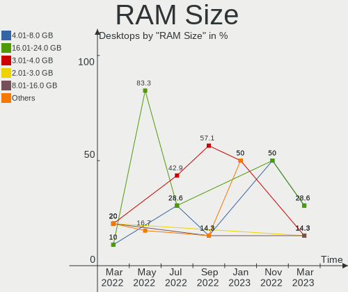
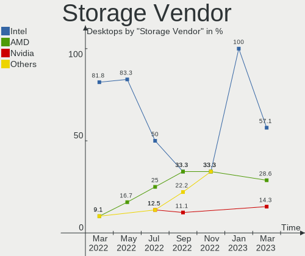
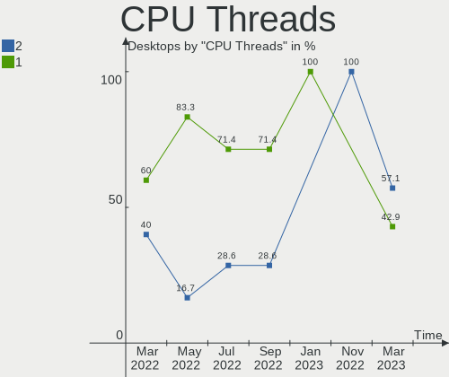
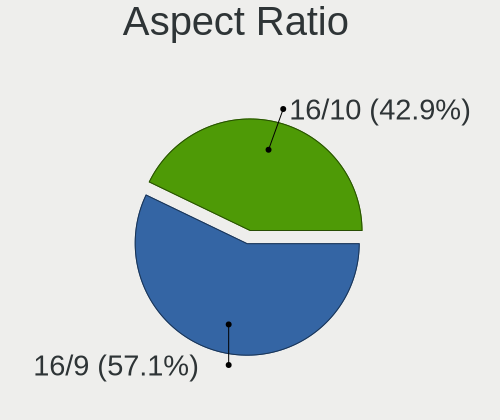
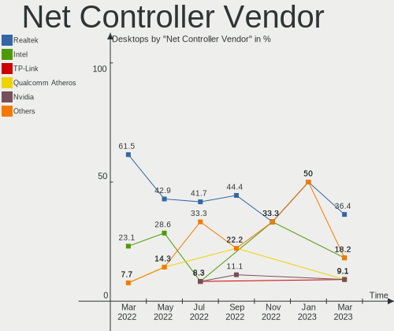
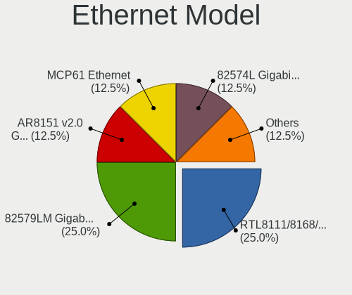

Endless Hardware Trends (Desktop)
---------------------------------

A project to identify most popular hardware characteristics and track their change
over time based on data collected by Endless users at https://Linux-Hardware.org.

Anyone can contribute to the study by uploading probes of their computers by
the [hw-probe](https://github.com/linuxhw/hw-probe) tool:

    sudo -E hw-probe -all -upload

Full-feature report is available here: https://linux-hardware.org/?view=trends&formfactor=desktop

Period: May, 2020.

Contents
--------

- [ OS                       ](#os)
- [ OS Family                ](#os-family)
- [ Kernel                   ](#kernel)
- [ Kernel Family            ](#kernel-family)
- [ Kernel Major Ver.        ](#kernel-major-ver)
- [ Arch                     ](#arch)
- [ DE                       ](#de)
- [ Display Server           ](#display-server)
- [ Display Manager          ](#display-manager)
- [ OS Lang                  ](#os-lang)
- [ Boot Mode                ](#boot-mode)
- [ Filesystem               ](#filesystem)
- [ Part. scheme             ](#part-scheme)
- [ Dual Boot with Linux/BSD ](#dual-boot-with-linux/bsd)
- [ Dual Boot (Win)          ](#dual-boot-win)
- [ Country                  ](#country)
- [ City                     ](#city)
- [ Vendor                   ](#vendor)
- [ Model                    ](#model)
- [ Model Family             ](#model-family)
- [ MFG Year                 ](#mfg-year)
- [ Form Factor              ](#form-factor)
- [ Secure Boot              ](#secure-boot)
- [ Coreboot                 ](#coreboot)
- [ RAM Size                 ](#ram-size)
- [ RAM Used                 ](#ram-used)
- [ Drive Vendor             ](#drive-vendor)
- [ Drive Model              ](#drive-model)
- [ Drive Kind               ](#drive-kind)
- [ Drive Connector          ](#drive-connector)
- [ Drive Size               ](#drive-size)
- [ Space Total              ](#space-total)
- [ Space Used               ](#space-used)
- [ Malfunc. Drives          ](#malfunc-drives)
- [ Malfunc. Drive Vendor    ](#malfunc-drive-vendor)
- [ Malfunc. HDD Vendor      ](#malfunc-hdd-vendor)
- [ Malfunc. Drive Kind      ](#malfunc-drive-kind)
- [ Failed Drives            ](#failed-drives)
- [ Failed Drive Vendor      ](#failed-drive-vendor)
- [ Drive Status             ](#drive-status)
- [ Storage Vendor           ](#storage-vendor)
- [ Storage Model            ](#storage-model)
- [ Storage Kind             ](#storage-kind)
- [ CPU Vendor               ](#cpu-vendor)
- [ CPU Model                ](#cpu-model)
- [ CPU Model Family         ](#cpu-model-family)
- [ CPU Cores                ](#cpu-cores)
- [ CPU Sockets              ](#cpu-sockets)
- [ CPU Threads              ](#cpu-threads)
- [ CPU Op-Modes             ](#cpu-op-modes)
- [ CPU Microcode            ](#cpu-microcode)
- [ CPU Microarch            ](#cpu-microarch)
- [ GPU Vendor               ](#gpu-vendor)
- [ GPU Model                ](#gpu-model)
- [ GPU Combo                ](#gpu-combo)
- [ GPU Driver               ](#gpu-driver)
- [ GPU Memory               ](#gpu-memory)
- [ Monitor Vendor           ](#monitor-vendor)
- [ Monitor Model            ](#monitor-model)
- [ Monitor Resolution       ](#monitor-resolution)
- [ Monitor Diagonal         ](#monitor-diagonal)
- [ Monitor Width            ](#monitor-width)
- [ Aspect Ratio             ](#aspect-ratio)
- [ Monitor Area             ](#monitor-area)
- [ Pixel Density            ](#pixel-density)
- [ Multiple Monitors        ](#multiple-monitors)
- [ Net Controller Vendor    ](#net-controller-vendor)
- [ Net Controller Model     ](#net-controller-model)
- [ Wireless Vendor          ](#wireless-vendor)
- [ Wireless Model           ](#wireless-model)
- [ Ethernet Vendor          ](#ethernet-vendor)
- [ Ethernet Model           ](#ethernet-model)
- [ Net Controller Kind      ](#net-controller-kind)
- [ Used Controller          ](#used-controller)
- [ NICs                     ](#nics)
- [ Bluetooth Vendor         ](#bluetooth-vendor)
- [ Bluetooth Model          ](#bluetooth-model)
- [ Unsupported Devices      ](#unsupported-devices)
- [ Unsupported Device Types ](#unsupported-device-types)

OS
--

Installed operating systems

| Name          | Computers | Percent |
|---------------|-----------|---------|
| Endless 3.8.0 | 17        | 58.62%  |
| Endless 3.8.1 | 9         | 31.03%  |
| Endless 3.7.8 | 3         | 10.34%  |

OS Family
---------

OS without a version

| Name    | Computers | Percent |
|---------|-----------|---------|
| Endless | 29        | 100%    |

Kernel
------

Version of the Linux kernel

| Version          | Computers | Percent |
|------------------|-----------|---------|
| 5.4.0-19-generic | 26        | 89.66%  |
| 5.3.0-28-generic | 3         | 10.34%  |

Kernel Family
-------------

Linux kernel without a distro release

| Version | Computers | Percent |
|---------|-----------|---------|
| 5.4.0   | 26        | 89.66%  |
| 5.3.0   | 3         | 10.34%  |

Kernel Major Ver.
-----------------

Linux kernel major version

| Version | Computers | Percent |
|---------|-----------|---------|
| 5.4     | 26        | 89.66%  |
| 5.3     | 3         | 10.34%  |

Arch
----

OS architecture (x86_64, i586, etc.)

| Name   | Computers | Percent |
|--------|-----------|---------|
| x86_64 | 29        | 100%    |

DE
--

Desktop Environment

| Name  | Computers | Percent |
|-------|-----------|---------|
| GNOME | 29        | 100%    |

Display Server
--------------

X11 or Wayland

| Name | Computers | Percent |
|------|-----------|---------|
| X11  | 29        | 100%    |

Display Manager
---------------

SDDM, LightDM, etc.

| Name    | Computers | Percent |
|---------|-----------|---------|
| Unknown | 29        | 100%    |

OS Lang
-------

Language

| Lang        | Computers | Percent |
|-------------|-----------|---------|
| en_US.utf8  | 11        | 37.93%  |
| pt_BR       | 2         | 6.9%    |
| es_ES       | 2         | 6.9%    |
| en_IN       | 2         | 6.9%    |
| en_GB       | 2         | 6.9%    |
| de_DE       | 2         | 6.9%    |
| ru_RU.UTF_8 | 1         | 3.45%   |
| pt_BR.utf8  | 1         | 3.45%   |
| nl_NL       | 1         | 3.45%   |
| es_MX       | 1         | 3.45%   |
| en_US       | 1         | 3.45%   |
| en_BW       | 1         | 3.45%   |
| en_AU       | 1         | 3.45%   |
| cs_CZ       | 1         | 3.45%   |

Boot Mode
---------

EFI or BIOS

| Mode | Computers | Percent |
|------|-----------|---------|
| BIOS | 22        | 75.86%  |
| EFI  | 7         | 24.14%  |

Filesystem
----------

Type of filesystem

| Type | Computers | Percent |
|------|-----------|---------|
| Ext4 | 29        | 100%    |

Part. scheme
------------

Scheme of partitioning

| Type    | Computers | Percent |
|---------|-----------|---------|
| Unknown | 29        | 100%    |

Dual Boot with Linux/BSD
------------------------

Hosting more than one Linux/BSD

| Dual boot | Computers | Percent |
|-----------|-----------|---------|
| No        | 29        | 100%    |

Dual Boot (Win)
---------------

Hosting Linux and Windows

| Dual boot | Computers | Percent |
|-----------|-----------|---------|
| No        | 29        | 100%    |

Country
-------

Geographic location (country)

| Country        | Computers | Percent |
|----------------|-----------|---------|
| USA            | 9         | 31.03%  |
| India          | 4         | 13.79%  |
| Brazil         | 3         | 10.34%  |
| UK             | 2         | 6.9%    |
| Spain          | 2         | 6.9%    |
| Germany        | 2         | 6.9%    |
| Saudi Arabia   | 1         | 3.45%   |
| Russia         | 1         | 3.45%   |
| Romania        | 1         | 3.45%   |
| Netherlands    | 1         | 3.45%   |
| Czech Republic | 1         | 3.45%   |
| Australia      | 1         | 3.45%   |
| Argentina      | 1         | 3.45%   |

City
----

Geographic location (city)

| City                   | Computers | Percent |
|------------------------|-----------|---------|
| Galion                 | 2         | 6.9%    |
| Chennai                | 2         | 6.9%    |
| Windsor                | 1         | 3.45%   |
| Villingen-Schwenningen | 1         | 3.45%   |
| Varanasi               | 1         | 3.45%   |
| Tempe                  | 1         | 3.45%   |
| Spring                 | 1         | 3.45%   |
| Socorro                | 1         | 3.45%   |
| Seville                | 1         | 3.45%   |
| Santana do Livramento  | 1         | 3.45%   |
| Rincon de la Victoria  | 1         | 3.45%   |
| Orpington              | 1         | 3.45%   |
| Oradea                 | 1         | 3.45%   |
| Moscow                 | 1         | 3.45%   |
| Modesto                | 1         | 3.45%   |
| Mesquite               | 1         | 3.45%   |
| Mainz                  | 1         | 3.45%   |
| Khobar                 | 1         | 3.45%   |
| Ibitinga               | 1         | 3.45%   |
| Houston                | 1         | 3.45%   |
| Dubnany                | 1         | 3.45%   |
| Deventer               | 1         | 3.45%   |
| Delhi                  | 1         | 3.45%   |
| Coraopolis             | 1         | 3.45%   |
| Cinco Saltos           | 1         | 3.45%   |
| Aldinga Beach          | 1         | 3.45%   |
| Abilene                | 1         | 3.45%   |

Vendor
------

Motherboard manufacturer

| Name                | Computers | Percent |
|---------------------|-----------|---------|
| MSI                 | 3         | 10.34%  |
| Hewlett-Packard     | 3         | 10.34%  |
| Dell                | 3         | 10.34%  |
| ASUSTek Computer    | 3         | 10.34%  |
| ASRock              | 3         | 10.34%  |
| Lenovo              | 2         | 6.9%    |
| Intel               | 2         | 6.9%    |
| Gigabyte Technology | 2         | 6.9%    |
| Pegatron            | 1         | 3.45%   |
| OEM_MB              | 1         | 3.45%   |
| Medion              | 1         | 3.45%   |
| Fujitsu             | 1         | 3.45%   |
| eMachines           | 1         | 3.45%   |
| AMD                 | 1         | 3.45%   |
| Acer                | 1         | 3.45%   |
| Unknown             | 1         | 3.45%   |

Model
-----

Motherboard model

| Name                           | Computers | Percent |
|--------------------------------|-----------|---------|
| Pegatron FL449AA-ACB IQ512ru   | 1         | 3.45%   |
| OEM_MB FR650AA-ABF s3642fr     | 1         | 3.45%   |
| MSI MS-7A71                    | 1         | 3.45%   |
| MSI MS-7A69                    | 1         | 3.45%   |
| MSI MS-7593                    | 1         | 3.45%   |
| Medion MS-7748                 | 1         | 3.45%   |
| Lenovo ThinkCentre M92 3235H3G | 1         | 3.45%   |
| Lenovo ThinkCentre M58 7359WK5 | 1         | 3.45%   |
| Intel MAHOBAY                  | 1         | 3.45%   |
| Intel DG41RQ AAE54511-203      | 1         | 3.45%   |
| HP EliteDesk 800 G1 SFF        | 1         | 3.45%   |
| HP Compaq Pro 4300 SFF PC      | 1         | 3.45%   |
| HP 510-a010                    | 1         | 3.45%   |
| Gigabyte H61M-S2P              | 1         | 3.45%   |
| Gigabyte GA-78LMT-USB3 6.0     | 1         | 3.45%   |
| Fujitsu ESPRIMO Q520           | 1         | 3.45%   |
| eMachines ET1331G              | 1         | 3.45%   |
| Dell PowerEdge T40             | 1         | 3.45%   |
| Dell OptiPlex 3020             | 1         | 3.45%   |
| Dell OptiPlex 3010             | 1         | 3.45%   |
| ASUS PRIME B450M-K             | 1         | 3.45%   |
| ASUS M5A78L-M PLUS/USB3        | 1         | 3.45%   |
| ASUS CM1740                    | 1         | 3.45%   |
| ASRock Z77 Extreme4-M          | 1         | 3.45%   |
| ASRock G31M-S                  | 1         | 3.45%   |
| ASRock A88M-G                  | 1         | 3.45%   |
| AMD CA201MA                    | 1         | 3.45%   |
| Acer Aspire XC-830             | 1         | 3.45%   |
| Unknown                        | 1         | 3.45%   |

Model Family
------------

Motherboard model prefix

| Name                   | Computers | Percent |
|------------------------|-----------|---------|
| Lenovo ThinkCentre     | 2         | 6.9%    |
| Dell OptiPlex          | 2         | 6.9%    |
| Pegatron FL449AA-ACB   | 1         | 3.45%   |
| OEM_MB FR650AA-ABF     | 1         | 3.45%   |
| MSI MS-7A71            | 1         | 3.45%   |
| MSI MS-7A69            | 1         | 3.45%   |
| MSI MS-7593            | 1         | 3.45%   |
| Medion MS-7748         | 1         | 3.45%   |
| Intel MAHOBAY          | 1         | 3.45%   |
| Intel DG41RQ           | 1         | 3.45%   |
| HP EliteDesk           | 1         | 3.45%   |
| HP Compaq              | 1         | 3.45%   |
| HP 510-a010            | 1         | 3.45%   |
| Gigabyte H61M-S2P      | 1         | 3.45%   |
| Gigabyte GA-78LMT-USB3 | 1         | 3.45%   |
| Fujitsu ESPRIMO        | 1         | 3.45%   |
| eMachines ET1331G      | 1         | 3.45%   |
| Dell PowerEdge         | 1         | 3.45%   |
| ASUS PRIME             | 1         | 3.45%   |
| ASUS M5A78L-M          | 1         | 3.45%   |
| ASUS CM1740            | 1         | 3.45%   |
| ASRock Z77             | 1         | 3.45%   |
| ASRock G31M-S          | 1         | 3.45%   |
| ASRock A88M-G          | 1         | 3.45%   |
| AMD CA201MA            | 1         | 3.45%   |
| Acer Aspire            | 1         | 3.45%   |
| Unknown                | 1         | 3.45%   |

MFG Year
--------

Motherboard manufacture year

| Year | Computers | Percent |
|------|-----------|---------|
| 2019 | 4         | 13.79%  |
| 2012 | 4         | 13.79%  |
| 2018 | 3         | 10.34%  |
| 2016 | 3         | 10.34%  |
| 2013 | 3         | 10.34%  |
| 2017 | 2         | 6.9%    |
| 2011 | 2         | 6.9%    |
| 2010 | 2         | 6.9%    |
| 2009 | 2         | 6.9%    |
| 2008 | 2         | 6.9%    |
| 2015 | 1         | 3.45%   |
| 2014 | 1         | 3.45%   |

Form Factor
-----------

Physical design of the computer

| Name    | Computers | Percent |
|---------|-----------|---------|
| Desktop | 29        | 100%    |

Secure Boot
-----------

Enabled or disabled

| State    | Computers | Percent |
|----------|-----------|---------|
| Disabled | 29        | 100%    |

Coreboot
--------

Have coreboot on board

| Used | Computers | Percent |
|------|-----------|---------|
| No   | 29        | 100%    |

RAM Size
--------

Total RAM memory

| Size in GB | Computers | Percent |
|------------|-----------|---------|
| 3.01-4.0   | 7         | 24.14%  |
| 16.01-24.0 | 6         | 20.69%  |
| 8.01-16.0  | 6         | 20.69%  |
| 4.01-8.0   | 5         | 17.24%  |
| 1.01-2.0   | 4         | 13.79%  |
| 24.01-32.0 | 1         | 3.45%   |

RAM Used
--------

Used RAM memory

| Used GB  | Computers | Percent |
|----------|-----------|---------|
| 0.01-1.0 | 13        | 44.83%  |
| 1.01-2.0 | 11        | 37.93%  |
| 2.01-3.0 | 4         | 13.79%  |
| 3.01-4.0 | 1         | 3.45%   |

Drive Vendor
------------

Hard drive vendors

| Vendor              | Computers | Drives | Percent |
|---------------------|-----------|--------|---------|
| Seagate             | 8         | 11     | 23.53%  |
| WDC                 | 7         | 10     | 20.59%  |
| Samsung Electronics | 4         | 4      | 11.76%  |
| SanDisk             | 3         | 3      | 8.82%   |
| Kingston            | 3         | 3      | 8.82%   |
| Hitachi             | 2         | 2      | 5.88%   |
| Crucial             | 2         | 4      | 5.88%   |
| Unknown             | 1         | 1      | 2.94%   |
| Toshiba             | 1         | 1      | 2.94%   |
| OCZ                 | 1         | 1      | 2.94%   |
| Intel               | 1         | 1      | 2.94%   |
| HGST                | 1         | 1      | 2.94%   |

Drive Model
-----------

Hard drive models

| Model                        | Computers | Percent |
|------------------------------|-----------|---------|
| SV300S37A120G 120GB SSD      | 3         | 7.14%   |
| WD2500LPCX-24C6HT0 250GB     | 2         | 4.76%   |
| CT240BX500SSD1 240GB         | 2         | 4.76%   |
| WDS240G2G0A-00JH30 240GB SSD | 1         | 2.38%   |
| WDS120G2G0A-00JH30 120GB SSD | 1         | 2.38%   |
| WD5000AAKX-001CA0 500GB      | 1         | 2.38%   |
| WD3200AAKS-61L9A0 320GB      | 1         | 2.38%   |
| WD3200AAJS-56B4A0 320GB      | 1         | 2.38%   |
| WD30EZRZ-00Z5HB0 3TB         | 1         | 2.38%   |
| WD10EZEX-75WN4A0 1TB         | 1         | 2.38%   |
| WD10EARX-00N0YB0 1TB         | 1         | 2.38%   |
| VERTEX 32GB SSD              | 1         | 2.38%   |
| ST9250320AS 250GB            | 1         | 2.38%   |
| ST500DM002-1BD142 500GB      | 1         | 2.38%   |
| ST3808110AS 80GB             | 1         | 2.38%   |
| ST3750528AS 752GB            | 1         | 2.38%   |
| ST3640330AS 640GB            | 1         | 2.38%   |
| ST3500418AS 500GB            | 1         | 2.38%   |
| ST3160815AS 160GB            | 1         | 2.38%   |
| ST31000528AS 1TB             | 1         | 2.38%   |
| ST2000DM001-1CH164 2TB       | 1         | 2.38%   |
| ST1000DM010-2EP102 1TB       | 1         | 2.38%   |
| SSDSC2BF180A4H 180GB         | 1         | 2.38%   |
| SSD 850 EVO 500GB            | 1         | 2.38%   |
| SDSSDHII240G 240GB           | 1         | 2.38%   |
| SD8SBAT128G1122 128GB SSD    | 1         | 2.38%   |
| SD7TB3Q-128G-1006 128GB SSD  | 1         | 2.38%   |
| SD/MMC/MS PRO 32GB           | 1         | 2.38%   |
| HTS725050A7E635 500GB        | 1         | 2.38%   |
| HM500JI 500GB                | 1         | 2.38%   |
| HM250HI 250GB                | 1         | 2.38%   |
| HDT721050SLA360 500GB        | 1         | 2.38%   |
| HDS721064CLA332 640GB        | 1         | 2.38%   |
| HD160JJ 160GB                | 1         | 2.38%   |
| Expansion Desk 8TB           | 1         | 2.38%   |
| DT01ACA100 1TB               | 1         | 2.38%   |
| CT500MX500SSD1 500GB         | 1         | 2.38%   |
| CT120BX500SSD1 120GB         | 1         | 2.38%   |

Drive Kind
----------

HDD or SSD

| Kind    | Computers | Drives | Percent |
|---------|-----------|--------|---------|
| HDD     | 20        | 26     | 58.82%  |
| SSD     | 13        | 15     | 38.24%  |
| Unknown | 1         | 1      | 2.94%   |

Drive Connector
---------------

SATA, SAS, NVMe, etc.

| Type | Computers | Drives | Percent |
|------|-----------|--------|---------|
| SATA | 27        | 40     | 93.1%   |
| SAS  | 2         | 2      | 6.9%    |

Drive Size
----------

Size of hard drive

| Size in TB | Computers | Drives | Percent |
|------------|-----------|--------|---------|
| 0.01-0.5   | 25        | 31     | 73.53%  |
| 0.51-1.0   | 6         | 8      | 17.65%  |
| 2.01-3.0   | 1         | 1      | 2.94%   |
| 1.01-2.0   | 1         | 1      | 2.94%   |
| 4.01-10.0  | 1         | 1      | 2.94%   |

Space Total
-----------

Amount of disk space available on the file system

| Size in GB     | Computers | Percent |
|----------------|-----------|---------|
| 101-250        | 14        | 48.28%  |
| 251-500        | 4         | 13.79%  |
| 1001-2000      | 4         | 13.79%  |
| 21-50          | 2         | 6.9%    |
| 501-1000       | 2         | 6.9%    |
| More than 3000 | 1         | 3.45%   |
| 1-20           | 1         | 3.45%   |
| 51-100         | 1         | 3.45%   |

Space Used
----------

Amount of used disk space

| Used GB        | Computers | Percent |
|----------------|-----------|---------|
| 21-50          | 11        | 37.93%  |
| 1-20           | 9         | 31.03%  |
| 101-250        | 3         | 10.34%  |
| 501-1000       | 2         | 6.9%    |
| 51-100         | 2         | 6.9%    |
| More than 3000 | 1         | 3.45%   |
| 1001-2000      | 1         | 3.45%   |

Malfunc. Drives
---------------

Drive models with a malfunction

Zero info for selected period =(

Malfunc. Drive Vendor
---------------------

Vendors of faulty drives

Zero info for selected period =(

Malfunc. HDD Vendor
-------------------

Vendors of faulty HDD drives

Zero info for selected period =(

Malfunc. Drive Kind
-------------------

Kinds of faulty drives

Zero info for selected period =(

Failed Drives
-------------

Failed drive models

Zero info for selected period =(

Failed Drive Vendor
-------------------

Failed drive vendors

Zero info for selected period =(

Drive Status
------------

Number of failed and malfunc. drives

| Status   | Computers | Drives | Percent |
|----------|-----------|--------|---------|
| Detected | 27        | 42     | 100%    |

Storage Vendor
--------------

Storage controller vendors

| Vendor                      | Computers | Percent |
|-----------------------------|-----------|---------|
| Intel                       | 20        | 60.61%  |
| AMD                         | 8         | 24.24%  |
| Nvidia                      | 2         | 6.06%   |
| Kingston Technology Company | 1         | 3.03%   |
| JMicron Technology          | 1         | 3.03%   |
| ASMedia Technology          | 1         | 3.03%   |

Storage Model
-------------

Storage controller models

| Model                                                                             | Computers | Percent |
|-----------------------------------------------------------------------------------|-----------|---------|
| FCH SATA Controller [AHCI mode]                                                   | 5         | 10.87%  |
| NM10/ICH7 Family SATA Controller [IDE mode]                                       | 3         | 6.52%   |
| 82801G (ICH7 Family) IDE Controller                                               | 3         | 6.52%   |
| 8 Series/C220 Series Chipset Family 6-port SATA Controller 1 [AHCI mode]          | 3         | 6.52%   |
| SB7x0/SB8x0/SB9x0 SATA Controller [AHCI mode]                                     | 2         | 4.35%   |
| SB7x0/SB8x0/SB9x0 IDE Controller                                                  | 2         | 4.35%   |
| MCP61 SATA Controller                                                             | 2         | 4.35%   |
| MCP61 IDE                                                                         | 2         | 4.35%   |
| 7 Series/C210 Series Chipset Family 6-port SATA Controller [AHCI mode]            | 2         | 4.35%   |
| 6 Series/C200 Series Chipset Family Desktop SATA Controller (IDE mode, ports 4-5) | 2         | 4.35%   |
| 6 Series/C200 Series Chipset Family Desktop SATA Controller (IDE mode, ports 0-3) | 2         | 4.35%   |
| 6 Series/C200 Series Chipset Family 6 port Desktop SATA AHCI Controller           | 2         | 4.35%   |
| 200 Series PCH SATA controller [AHCI mode]                                        | 2         | 4.35%   |
| SB7x0/SB8x0/SB9x0 SATA Controller [IDE mode]                                      | 1         | 2.17%   |
| SATA Controller [RAID mode]                                                       | 1         | 2.17%   |
| SATA controller                                                                   | 1         | 2.17%   |
| Non-Volatile memory controller                                                    | 1         | 2.17%   |
| JMB363 SATA/IDE Controller                                                        | 1         | 2.17%   |
| Cannon Lake PCH SATA AHCI Controller                                              | 1         | 2.17%   |
| ASM1062 Serial ATA Controller                                                     | 1         | 2.17%   |
| 82801JI (ICH10 Family) 4 port SATA IDE Controller #1                              | 1         | 2.17%   |
| 82801JI (ICH10 Family) 2 port SATA IDE Controller #2                              | 1         | 2.17%   |
| 82801JD/DO (ICH10 Family) SATA AHCI Controller                                    | 1         | 2.17%   |
| 82801HM/HEM (ICH8M/ICH8M-E) SATA Controller [AHCI mode]                           | 1         | 2.17%   |
| 82801HM/HEM (ICH8M/ICH8M-E) IDE Controller                                        | 1         | 2.17%   |
| 400 Series Chipset SATA Controller                                                | 1         | 2.17%   |
| 4 Series Chipset PT IDER Controller                                               | 1         | 2.17%   |

Storage Kind
------------

Kind of storage controller (IDE, SATA, NVMe, SAS, ...)

| Kind | Computers | Percent |
|------|-----------|---------|
| SATA | 21        | 60%     |
| IDE  | 12        | 34.29%  |
| RAID | 1         | 2.86%   |
| NVMe | 1         | 2.86%   |

CPU Vendor
----------

Processor vendors

| Vendor | Computers | Percent |
|--------|-----------|---------|
| Intel  | 19        | 65.52%  |
| AMD    | 10        | 34.48%  |

CPU Model
---------

Processor models

| Model                                           | Computers | Percent |
|-------------------------------------------------|-----------|---------|
| Intel Core i5-3470S CPU @ 2.90GHz               | 2         | 6.9%    |
| Intel Xeon E-2224G CPU @ 3.50GHz                | 1         | 3.45%   |
| Intel Pentium Silver J5005 CPU @ 1.50GHz        | 1         | 3.45%   |
| Intel Pentium Dual-Core CPU E5500 @ 2.80GHz     | 1         | 3.45%   |
| Intel Core i7 CPU 920 @ 2.67GHz                 | 1         | 3.45%   |
| Intel Core i5-7600 CPU @ 3.50GHz                | 1         | 3.45%   |
| Intel Core i5-6500 CPU @ 3.20GHz                | 1         | 3.45%   |
| Intel Core i5-4590 CPU @ 3.30GHz                | 1         | 3.45%   |
| Intel Core i5-3570K CPU @ 3.40GHz               | 1         | 3.45%   |
| Intel Core i5-3475S CPU @ 2.90GHz               | 1         | 3.45%   |
| Intel Core i3-4170T CPU @ 3.20GHz               | 1         | 3.45%   |
| Intel Core i3-4160 CPU @ 3.60GHz                | 1         | 3.45%   |
| Intel Core i3-3240T CPU @ 2.90GHz               | 1         | 3.45%   |
| Intel Core i3-2120 CPU @ 3.30GHz                | 1         | 3.45%   |
| Intel Core 2 Quad CPU Q9400 @ 2.66GHz           | 1         | 3.45%   |
| Intel Core 2 Quad CPU Q8200 @ 2.33GHz           | 1         | 3.45%   |
| Intel Core 2 Duo CPU T7250 @ 2.00GHz            | 1         | 3.45%   |
| Intel Core 2 Duo CPU E7200 @ 2.53GHz            | 1         | 3.45%   |
| AMD Ryzen 5 2600 Six-Core Processor             | 1         | 3.45%   |
| AMD Phenom 8250e Triple-Core Processor          | 1         | 3.45%   |
| AMD FX-8300 Eight-Core Processor                | 1         | 3.45%   |
| AMD FX-8150 Eight-Core Processor                | 1         | 3.45%   |
| AMD E2-3200 APU with Radeon HD Graphics         | 1         | 3.45%   |
| AMD E-350 Processor                             | 1         | 3.45%   |
| AMD Athlon II X2 250u Processor                 | 1         | 3.45%   |
| AMD A8-7410 APU with AMD Radeon R5 Graphics     | 1         | 3.45%   |
| AMD A8-3800 APU with Radeon HD Graphics         | 1         | 3.45%   |
| AMD A10-7850K Radeon R7, 12 Compute Cores 4C+8G | 1         | 3.45%   |

CPU Model Family
----------------

Processor model prefix

| Model                   | Computers | Percent |
|-------------------------|-----------|---------|
| Intel Core i5           | 7         | 24.14%  |
| Intel Core i3           | 4         | 13.79%  |
| Intel Core 2 Quad       | 2         | 6.9%    |
| Intel Core 2 Duo        | 2         | 6.9%    |
| AMD FX                  | 2         | 6.9%    |
| AMD A8                  | 2         | 6.9%    |
| Intel Xeon              | 1         | 3.45%   |
| Intel Pentium Silver    | 1         | 3.45%   |
| Intel Pentium Dual-Core | 1         | 3.45%   |
| Intel Core i7           | 1         | 3.45%   |
| AMD Ryzen 5             | 1         | 3.45%   |
| AMD Phenom              | 1         | 3.45%   |
| AMD E2                  | 1         | 3.45%   |
| AMD E                   | 1         | 3.45%   |
| AMD Athlon II X2        | 1         | 3.45%   |
| AMD A10                 | 1         | 3.45%   |

CPU Cores
---------

Number of processor cores

| Number | Computers | Percent |
|--------|-----------|---------|
| 4      | 16        | 55.17%  |
| 2      | 11        | 37.93%  |
| 6      | 1         | 3.45%   |
| 3      | 1         | 3.45%   |

CPU Sockets
-----------

Number of sockets

| Number | Computers | Percent |
|--------|-----------|---------|
| 1      | 29        | 100%    |

CPU Threads
-----------

Threads per core (Hyper-Threading)

| Number | Computers | Percent |
|--------|-----------|---------|
| 1      | 20        | 68.97%  |
| 2      | 9         | 31.03%  |

CPU Op-Modes
------------

CPU Operation Modes (32-bit, 64-bit)

| Op mode        | Computers | Percent |
|----------------|-----------|---------|
| 32-bit, 64-bit | 29        | 100%    |

CPU Microcode
-------------

Microcode number

| Number     | Computers | Percent |
|------------|-----------|---------|
| Unknown    | 7         | 24.14%  |
| 0x306a9    | 5         | 17.24%  |
| 0x306c3    | 3         | 10.34%  |
| 0x906ea    | 1         | 3.45%   |
| 0x906e9    | 1         | 3.45%   |
| 0x706a1    | 1         | 3.45%   |
| 0x6fd      | 1         | 3.45%   |
| 0x206a7    | 1         | 3.45%   |
| 0x106a5    | 1         | 3.45%   |
| 0x1067a    | 1         | 3.45%   |
| 0x10677    | 1         | 3.45%   |
| 0x10676    | 1         | 3.45%   |
| 0x0800820d | 1         | 3.45%   |
| 0x06003106 | 1         | 3.45%   |
| 0x0600063e | 1         | 3.45%   |
| 0x03000027 | 1         | 3.45%   |
| 0x01000083 | 1         | 3.45%   |

CPU Microarch
-------------

Microarchitecture

| Name          | Computers | Percent |
|---------------|-----------|---------|
| IvyBridge     | 5         | 17.24%  |
| Core          | 4         | 13.79%  |
| Skylake       | 3         | 10.34%  |
| Haswell       | 3         | 10.34%  |
| K10 Llano     | 2         | 6.9%    |
| K10           | 2         | 6.9%    |
| Zen+          | 1         | 3.45%   |
| Steamroller   | 1         | 3.45%   |
| SandyBridge   | 1         | 3.45%   |
| Puma          | 1         | 3.45%   |
| Piledriver    | 1         | 3.45%   |
| Penryn        | 1         | 3.45%   |
| Nehalem       | 1         | 3.45%   |
| Goldmont plus | 1         | 3.45%   |
| Bulldozer     | 1         | 3.45%   |
| Bobcat        | 1         | 3.45%   |

GPU Vendor
----------

Vendors of graphics cards

| Vendor | Computers | Percent |
|--------|-----------|---------|
| Intel  | 12        | 38.71%  |
| AMD    | 12        | 38.71%  |
| Nvidia | 7         | 22.58%  |

GPU Model
---------

Graphics card models

| Model                                                                 | Computers | Percent |
|-----------------------------------------------------------------------|-----------|---------|
| Xeon E3-1200 v2/3rd Gen Core processor Graphics Controller            | 5         | 15.15%  |
| GP106 [GeForce GTX 1060 3GB]                                          | 2         | 6.06%   |
| 4th Generation Core Processor Family Integrated Graphics Controller   | 2         | 6.06%   |
| Xeon E3-1200 v3/4th Gen Core Processor Integrated Graphics Controller | 1         | 3.03%   |
| Wrestler [Radeon HD 6310]                                             | 1         | 3.03%   |
| UHD Graphics 605                                                      | 1         | 3.03%   |
| Tahiti PRO [Radeon HD 7950/8950 OEM / R9 280]                         | 1         | 3.03%   |
| Sumo [Radeon HD 6550D]                                                | 1         | 3.03%   |
| RV730 PRO [Radeon HD 4650]                                            | 1         | 3.03%   |
| RV530 [Radeon X1600] (Secondary)                                      | 1         | 3.03%   |
| RV530 [Radeon X1600 PRO]                                              | 1         | 3.03%   |
| RV505 [Radeon X1550 Series] (Secondary)                               | 1         | 3.03%   |
| RV505 [Radeon X1300/X1550 Series]                                     | 1         | 3.03%   |
| RS780L [Radeon 3000]                                                  | 1         | 3.03%   |
| Oland PRO [Radeon R7 240/340]                                         | 1         | 3.03%   |
| Mullins [Radeon R4/R5 Graphics]                                       | 1         | 3.03%   |
| HD Graphics P630                                                      | 1         | 3.03%   |
| GT218 [GeForce 210]                                                   | 1         | 3.03%   |
| GP106 [GeForce GTX 1060 6GB]                                          | 1         | 3.03%   |
| GF119 [GeForce GT 610]                                                | 1         | 3.03%   |
| GF108 [GeForce GT 630]                                                | 1         | 3.03%   |
| G98M [GeForce 9300M GS]                                               | 1         | 3.03%   |
| Ellesmere [Radeon RX 470/480/570/570X/580/580X/590]                   | 1         | 3.03%   |
| Cape Verde XT [Radeon HD 7770/8760 / R7 250X]                         | 1         | 3.03%   |
| Baffin [Radeon RX 550 640SP / RX 560/560X]                            | 1         | 3.03%   |
| 4 Series Chipset Integrated Graphics Controller                       | 1         | 3.03%   |
| 2nd Generation Core Processor Family Integrated Graphics Controller   | 1         | 3.03%   |

GPU Combo
---------

Combinations of graphics cards

| Name       | Computers | Percent |
|------------|-----------|---------|
| 1 x Intel  | 10        | 34.48%  |
| 1 x AMD    | 10        | 34.48%  |
| 1 x Nvidia | 7         | 24.14%  |
| 2 x AMD    | 2         | 6.9%    |

GPU Driver
----------

Free vs proprietary

| Driver      | Computers | Percent |
|-------------|-----------|---------|
| Free        | 26        | 89.66%  |
| Proprietary | 3         | 10.34%  |

GPU Memory
----------

Total video memory

| Size in GB | Computers | Percent |
|------------|-----------|---------|
| Unknown    | 18        | 62.07%  |
| 0.51-1.0   | 4         | 13.79%  |
| 0.01-0.5   | 3         | 10.34%  |
| 7.01-8.0   | 1         | 3.45%   |
| 3.01-4.0   | 1         | 3.45%   |
| 2.01-3.0   | 1         | 3.45%   |
| 1.01-2.0   | 1         | 3.45%   |

Monitor Vendor
--------------

Monitor vendors

| Vendor               | Computers | Percent |
|----------------------|-----------|---------|
| Samsung Electronics  | 7         | 25%     |
| Sony                 | 3         | 10.71%  |
| Goldstar             | 2         | 7.14%   |
| Dell                 | 2         | 7.14%   |
| AOC                  | 2         | 7.14%   |
| Acer                 | 2         | 7.14%   |
| Vizio                | 1         | 3.57%   |
| Toshiba              | 1         | 3.57%   |
| MStar                | 1         | 3.57%   |
| Mitac                | 1         | 3.57%   |
| Lite-On              | 1         | 3.57%   |
| Iiyama               | 1         | 3.57%   |
| HannStar             | 1         | 3.57%   |
| Fujitsu Siemens      | 1         | 3.57%   |
| BenQ                 | 1         | 3.57%   |
| Ancor Communications | 1         | 3.57%   |

Monitor Model
-------------

Monitor models

| Model                                             | Computers | Percent |
|---------------------------------------------------|-----------|---------|
| TV SNYEE01 1920x1080 1600x900mm 72.3-inch         | 2         | 7.14%   |
| C32F39M SAM100B 1920x1080 698x393mm 31.5-inch     | 2         | 7.14%   |
| VS278 ACI27A1 1920x1080 598x336mm 27.0-inch       | 1         | 3.57%   |
| TV_MONITOR MST0030 1440x900 1150x650mm 52.0-inch  | 1         | 3.57%   |
| TV TSB0206 1920x1080 886x498mm 40.0-inch          | 1         | 3.57%   |
| TV SNYEF03 1680x1050 1600x900mm 72.3-inch         | 1         | 3.57%   |
| T954we AOC1954 1360x768 409x230mm 18.5-inch       | 1         | 3.57%   |
| SyncMaster SAM030C 1680x1050 474x296mm 22.0-inch  | 1         | 3.57%   |
| SyncMaster SAM0304 1680x1050 494x320mm 23.2-inch  | 1         | 3.57%   |
| ST2310 DELF01B 1920x1080 510x290mm 23.1-inch      | 1         | 3.57%   |
| SMS19A100 SAM0867 1366x768 410x230mm 18.5-inch    | 1         | 3.57%   |
| S22F350 SAM0D1A 1920x1080 480x270mm 21.7-inch     | 1         | 3.57%   |
| S/M 550v SAM12B6 1024x768 267x200mm 13.1-inch     | 1         | 3.57%   |
| PLE1900WS IVM482D 1440x900 410x257mm 19.1-inch    | 1         | 3.57%   |
| P22W-5 FUS07B9 1680x1050 473x296mm 22.0-inch      | 1         | 3.57%   |
| MTC26T42 MTC0B01 1920x1080 700x390mm 31.5-inch    | 1         | 3.57%   |
| M550NV VIZ0063 1920x1080 1210x680mm 54.6-inch     | 1         | 3.57%   |
| LG FULL HD GSM5ABB 1920x1080 480x270mm 21.7-inch  | 1         | 3.57%   |
| K272HUL ACR0524 2560x1440 598x336mm 27.0-inch     | 1         | 3.57%   |
| J15AAC/3/U/R LTN0214 1024x768 304x228mm 15.0-inch | 1         | 3.57%   |
| HSG1074 HSP0019 1920x1080 543x305mm 24.5-inch     | 1         | 3.57%   |
| G196HQL ACR0325 1366x768 410x230mm 18.5-inch      | 1         | 3.57%   |
| EW2775ZH BNQ7944 1920x1080 598x336mm 27.0-inch    | 1         | 3.57%   |
| E1709W DELD022 1440x900 370x230mm 17.2-inch       | 1         | 3.57%   |
| E1641 GSM8B3E 1366x768 344x194mm 15.5-inch        | 1         | 3.57%   |
| CA201MA OTSAAAA 1600x900 443x249mm 20.0-inch      | 1         | 3.57%   |

Monitor Resolution
------------------

Monitor screen resolution

| Resolution         | Computers | Percent |
|--------------------|-----------|---------|
| 1920x1080 (FHD)    | 11        | 40.74%  |
| 1680x1050 (WSXGA+) | 3         | 11.11%  |
| 1366x768 (WXGA)    | 3         | 11.11%  |
| 1600x900 (HD+)     | 2         | 7.41%   |
| 1440x900 (WXGA+)   | 2         | 7.41%   |
| 1360x768           | 2         | 7.41%   |
| 1024x768 (XGA)     | 2         | 7.41%   |
| 2560x1440 (QHD)    | 1         | 3.7%    |
| 1920x540           | 1         | 3.7%    |

Monitor Diagonal
----------------

Diagonal size in inches

| Inches | Computers | Percent |
|--------|-----------|---------|
| 72     | 3         | 11.11%  |
| 27     | 3         | 11.11%  |
| 18     | 3         | 11.11%  |
| 32     | 2         | 7.41%   |
| 31     | 2         | 7.41%   |
| 23     | 2         | 7.41%   |
| 22     | 2         | 7.41%   |
| 15     | 2         | 7.41%   |
| 74     | 1         | 3.7%    |
| 54     | 1         | 3.7%    |
| 24     | 1         | 3.7%    |
| 21     | 1         | 3.7%    |
| 20     | 1         | 3.7%    |
| 19     | 1         | 3.7%    |
| 17     | 1         | 3.7%    |
| 13     | 1         | 3.7%    |

Monitor Width
-------------

Physical width

| Width in mm | Computers | Percent |
|-------------|-----------|---------|
| 401-500     | 9         | 33.33%  |
| 501-600     | 5         | 18.52%  |
| 1501-2000   | 4         | 14.81%  |
| 701-800     | 2         | 7.41%   |
| 601-700     | 2         | 7.41%   |
| 301-350     | 2         | 7.41%   |
| 351-400     | 1         | 3.7%    |
| 201-300     | 1         | 3.7%    |
| 1001-1500   | 1         | 3.7%    |

Aspect Ratio
------------

Proportional relationship between the width and the height

| Ratio | Computers | Percent |
|-------|-----------|---------|
| 16/9  | 19        | 70.37%  |
| 16/10 | 5         | 18.52%  |
| 4/3   | 2         | 7.41%   |
| 3/2   | 1         | 3.7%    |

Monitor Area
------------

Area in inch²

| Area in inch² | Computers | Percent |
|----------------|-----------|---------|
| More than 1000 | 5         | 17.86%  |
| 201-250        | 5         | 17.86%  |
| 351-500        | 4         | 14.29%  |
| 301-350        | 3         | 10.71%  |
| 151-200        | 3         | 10.71%  |
| 141-150        | 3         | 10.71%  |
| 101-110        | 2         | 7.14%   |
| 81-90          | 1         | 3.57%   |
| 251-300        | 1         | 3.57%   |
| 131-140        | 1         | 3.57%   |

Pixel Density
-------------

Pixels per inch

| Density | Computers | Percent |
|---------|-----------|---------|
| 51-100  | 19        | 70.37%  |
| 1-50    | 5         | 18.52%  |
| 101-120 | 3         | 11.11%  |

Multiple Monitors
-----------------

Total monitors connected

| Total | Computers | Percent |
|-------|-----------|---------|
| 1     | 26        | 89.66%  |
| 0     | 2         | 6.9%    |
| 2     | 1         | 3.45%   |

Net Controller Vendor
---------------------

Controller vendors

| Vendor                          | Computers | Percent |
|---------------------------------|-----------|---------|
| Realtek Semiconductor           | 19        | 45.24%  |
| Intel                           | 8         | 19.05%  |
| Ralink Technology               | 3         | 7.14%   |
| Qualcomm Atheros                | 3         | 7.14%   |
| Nvidia                          | 2         | 4.76%   |
| Sitecom Europe                  | 1         | 2.38%   |
| Ralink                          | 1         | 2.38%   |
| Qualcomm Atheros Communications | 1         | 2.38%   |
| NetGear                         | 1         | 2.38%   |
| IMC Networks                    | 1         | 2.38%   |
| Broadcom Limited                | 1         | 2.38%   |
| Broadcom Inc. and subsidiaries  | 1         | 2.38%   |

Net Controller Model
--------------------

Controller models

| Model                                                     | Computers | Percent |
|-----------------------------------------------------------|-----------|---------|
| RTL8111/8168/8411 PCI Express Gigabit Ethernet Controller | 16        | 36.36%  |
| RTL810xE PCI Express Fast Ethernet controller             | 3         | 6.82%   |
| MT7601U Wireless Adapter                                  | 3         | 6.82%   |
| MCP61 Ethernet                                            | 2         | 4.55%   |
| WL-345 Wireless USB adapter 300N X3                       | 1         | 2.27%   |
| Wireless 7260                                             | 1         | 2.27%   |
| Wireless 3165                                             | 1         | 2.27%   |
| WG111v3 54 Mbps Wireless [realtek RTL8187B]               | 1         | 2.27%   |
| RTL8188CE 802.11b/g/n WiFi Adapter                        | 1         | 2.27%   |
| RT2790 Wireless 802.11n 1T/2R PCIe                        | 1         | 2.27%   |
| NetLink BCM57788 Gigabit Ethernet PCIe                    | 1         | 2.27%   |
| Mediao 802.11n WLAN [Realtek RTL8191SU]                   | 1         | 2.27%   |
| Ethernet Connection I217-V                                | 1         | 2.27%   |
| Ethernet Connection I217-LM                               | 1         | 2.27%   |
| Ethernet Connection (7) I219-LM                           | 1         | 2.27%   |
| Ethernet Connection (2) I219-V                            | 1         | 2.27%   |
| Dual Band Wireless-AC 3168NGW [Stone Peak]                | 1         | 2.27%   |
| BCM4321 802.11b/g/n                                       | 1         | 2.27%   |
| AR9485 Wireless Network Adapter                           | 1         | 2.27%   |
| AR928X Wireless Network Adapter (PCI-Express)             | 1         | 2.27%   |
| AR9271 802.11n                                            | 1         | 2.27%   |
| AR8151 v2.0 Gigabit Ethernet                              | 1         | 2.27%   |
| 82579LM Gigabit Network Connection (Lewisville)           | 1         | 2.27%   |
| 82567LM-3 Gigabit Network Connection                      | 1         | 2.27%   |

Wireless Vendor
---------------

Wireless vendors

| Vendor                          | Computers | Percent |
|---------------------------------|-----------|---------|
| Ralink Technology               | 3         | 20%     |
| Intel                           | 3         | 20%     |
| Qualcomm Atheros                | 2         | 13.33%  |
| Sitecom Europe                  | 1         | 6.67%   |
| Realtek Semiconductor           | 1         | 6.67%   |
| Ralink                          | 1         | 6.67%   |
| Qualcomm Atheros Communications | 1         | 6.67%   |
| NetGear                         | 1         | 6.67%   |
| IMC Networks                    | 1         | 6.67%   |
| Broadcom Inc. and subsidiaries  | 1         | 6.67%   |

Wireless Model
--------------

Wireless models

| Model                                         | Computers | Percent |
|-----------------------------------------------|-----------|---------|
| MT7601U Wireless Adapter                      | 3         | 20%     |
| WL-345 Wireless USB adapter 300N X3           | 1         | 6.67%   |
| Wireless 7260                                 | 1         | 6.67%   |
| Wireless 3165                                 | 1         | 6.67%   |
| WG111v3 54 Mbps Wireless [realtek RTL8187B]   | 1         | 6.67%   |
| RTL8188CE 802.11b/g/n WiFi Adapter            | 1         | 6.67%   |
| RT2790 Wireless 802.11n 1T/2R PCIe            | 1         | 6.67%   |
| Mediao 802.11n WLAN [Realtek RTL8191SU]       | 1         | 6.67%   |
| Dual Band Wireless-AC 3168NGW [Stone Peak]    | 1         | 6.67%   |
| BCM4321 802.11b/g/n                           | 1         | 6.67%   |
| AR9485 Wireless Network Adapter               | 1         | 6.67%   |
| AR928X Wireless Network Adapter (PCI-Express) | 1         | 6.67%   |
| AR9271 802.11n                                | 1         | 6.67%   |

Ethernet Vendor
---------------

Ethernet vendors

| Vendor                | Computers | Percent |
|-----------------------|-----------|---------|
| Realtek Semiconductor | 19        | 65.52%  |
| Intel                 | 6         | 20.69%  |
| Nvidia                | 2         | 6.9%    |
| Qualcomm Atheros      | 1         | 3.45%   |
| Broadcom Limited      | 1         | 3.45%   |

Ethernet Model
--------------

Ethernet models

| Model                                                     | Computers | Percent |
|-----------------------------------------------------------|-----------|---------|
| RTL8111/8168/8411 PCI Express Gigabit Ethernet Controller | 16        | 55.17%  |
| RTL810xE PCI Express Fast Ethernet controller             | 3         | 10.34%  |
| MCP61 Ethernet                                            | 2         | 6.9%    |
| NetLink BCM57788 Gigabit Ethernet PCIe                    | 1         | 3.45%   |
| Ethernet Connection I217-V                                | 1         | 3.45%   |
| Ethernet Connection I217-LM                               | 1         | 3.45%   |
| Ethernet Connection (7) I219-LM                           | 1         | 3.45%   |
| Ethernet Connection (2) I219-V                            | 1         | 3.45%   |
| AR8151 v2.0 Gigabit Ethernet                              | 1         | 3.45%   |
| 82579LM Gigabit Network Connection (Lewisville)           | 1         | 3.45%   |
| 82567LM-3 Gigabit Network Connection                      | 1         | 3.45%   |

Net Controller Kind
-------------------

Ethernet, WiFi or modem

| Kind     | Computers | Percent |
|----------|-----------|---------|
| Ethernet | 29        | 67.44%  |
| WiFi     | 14        | 32.56%  |

Used Controller
---------------

Currently used network controller

| Kind     | Computers | Percent |
|----------|-----------|---------|
| Ethernet | 19        | 61.29%  |
| WiFi     | 12        | 38.71%  |

NICs
----

Total network controllers on board

| Total | Computers | Percent |
|-------|-----------|---------|
| 1     | 21        | 72.41%  |
| 2     | 7         | 24.14%  |
| 3     | 1         | 3.45%   |

Bluetooth Vendor
----------------

Controller vendors

| Vendor          | Computers | Percent |
|-----------------|-----------|---------|
| Intel           | 3         | 75%     |
| Hewlett-Packard | 1         | 25%     |

Bluetooth Model
---------------

Controller models

| Model                                      | Computers | Percent |
|--------------------------------------------|-----------|---------|
| Bluetooth Device                           | 3         | 75%     |
| Bluetooth 2.0 Interface [Broadcom BCM2045] | 1         | 25%     |

Unsupported Devices
-------------------

Total unsupported devices on board

| Total | Computers | Percent |
|-------|-----------|---------|
| 0     | 27        | 93.1%   |
| 1     | 2         | 6.9%    |

Unsupported Device Types
------------------------

Types of unsupported devices

| Type                  | Computers | Percent |
|-----------------------|-----------|---------|
| Storage/ide           | 1         | 50%     |
| Multimedia controller | 1         | 50%     |

