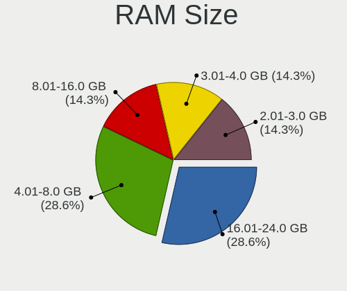
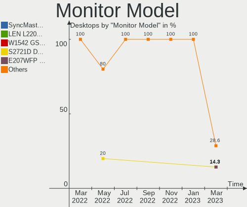
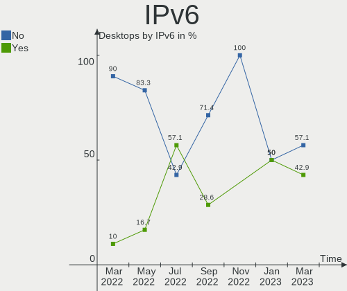
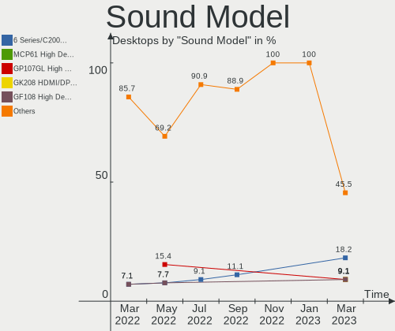

Endless - Hardware Trends (Desktops)
------------------------------------

A project to identify most popular hardware characteristics and track their change
over time based on data collected by Linux users at https://Linux-Hardware.org.

Anyone can contribute to this report by the [hw-probe](https://github.com/linuxhw/hw-probe) tool:

    sudo -E hw-probe -all -upload

This report is for one last month. Overall report since the beginning of time: [TestDays](https://github.com/linuxhw/TestDays)

Period: Feb, 2023.

Contents
--------

* [ System ](#system)
  - [ OS                       ](#os)
  - [ OS Family                ](#os-family)
  - [ Kernel                   ](#kernel)
  - [ Kernel Family            ](#kernel-family)
  - [ Kernel Major Ver.        ](#kernel-major-ver)
  - [ Arch                     ](#arch)
  - [ DE                       ](#de)
  - [ Display Server           ](#display-server)
  - [ Display Manager          ](#display-manager)
  - [ OS Lang                  ](#os-lang)
  - [ Boot Mode                ](#boot-mode)
  - [ Filesystem               ](#filesystem)
  - [ Part. scheme             ](#part-scheme)
  - [ Dual Boot with Linux/BSD ](#dual-boot-with-linuxbsd)
  - [ Dual Boot (Win)          ](#dual-boot-win)

* [ Board ](#board)
  - [ Vendor                   ](#vendor)
  - [ Model                    ](#model)
  - [ Model Family             ](#model-family)
  - [ MFG Year                 ](#mfg-year)
  - [ Form Factor              ](#form-factor)
  - [ Secure Boot              ](#secure-boot)
  - [ Coreboot                 ](#coreboot)
  - [ RAM Size                 ](#ram-size)
  - [ RAM Used                 ](#ram-used)
  - [ Total Drives             ](#total-drives)
  - [ Has CD-ROM               ](#has-cd-rom)
  - [ Has Ethernet             ](#has-ethernet)
  - [ Has WiFi                 ](#has-wifi)
  - [ Has Bluetooth            ](#has-bluetooth)

* [ Location ](#location)
  - [ Country                  ](#country)
  - [ City                     ](#city)

* [ Drives ](#drives)
  - [ Drive Vendor             ](#drive-vendor)
  - [ Drive Model              ](#drive-model)
  - [ HDD Vendor               ](#hdd-vendor)
  - [ SSD Vendor               ](#ssd-vendor)
  - [ Drive Kind               ](#drive-kind)
  - [ Drive Connector          ](#drive-connector)
  - [ Drive Size               ](#drive-size)
  - [ Space Total              ](#space-total)
  - [ Space Used               ](#space-used)
  - [ Malfunc. Drives          ](#malfunc-drives)
  - [ Malfunc. Drive Vendor    ](#malfunc-drive-vendor)
  - [ Malfunc. HDD Vendor      ](#malfunc-hdd-vendor)
  - [ Malfunc. Drive Kind      ](#malfunc-drive-kind)
  - [ Failed Drives            ](#failed-drives)
  - [ Failed Drive Vendor      ](#failed-drive-vendor)
  - [ Drive Status             ](#drive-status)

* [ Storage controller ](#storage-controller)
  - [ Storage Vendor           ](#storage-vendor)
  - [ Storage Model            ](#storage-model)
  - [ Storage Kind             ](#storage-kind)

* [ Processor ](#processor)
  - [ CPU Vendor               ](#cpu-vendor)
  - [ CPU Model                ](#cpu-model)
  - [ CPU Model Family         ](#cpu-model-family)
  - [ CPU Cores                ](#cpu-cores)
  - [ CPU Sockets              ](#cpu-sockets)
  - [ CPU Threads              ](#cpu-threads)
  - [ CPU Op-Modes             ](#cpu-op-modes)
  - [ CPU Microcode            ](#cpu-microcode)
  - [ CPU Microarch            ](#cpu-microarch)

* [ Graphics ](#graphics)
  - [ GPU Vendor               ](#gpu-vendor)
  - [ GPU Model                ](#gpu-model)
  - [ GPU Combo                ](#gpu-combo)
  - [ GPU Driver               ](#gpu-driver)
  - [ GPU Memory               ](#gpu-memory)

* [ Monitor ](#monitor)
  - [ Monitor Vendor           ](#monitor-vendor)
  - [ Monitor Model            ](#monitor-model)
  - [ Monitor Resolution       ](#monitor-resolution)
  - [ Monitor Diagonal         ](#monitor-diagonal)
  - [ Monitor Width            ](#monitor-width)
  - [ Aspect Ratio             ](#aspect-ratio)
  - [ Monitor Area             ](#monitor-area)
  - [ Pixel Density            ](#pixel-density)
  - [ Multiple Monitors        ](#multiple-monitors)

* [ Network ](#network)
  - [ Net Controller Vendor    ](#net-controller-vendor)
  - [ Net Controller Model     ](#net-controller-model)
  - [ Wireless Vendor          ](#wireless-vendor)
  - [ Wireless Model           ](#wireless-model)
  - [ Ethernet Vendor          ](#ethernet-vendor)
  - [ Ethernet Model           ](#ethernet-model)
  - [ Net Controller Kind      ](#net-controller-kind)
  - [ Used Controller          ](#used-controller)
  - [ NICs                     ](#nics)
  - [ IPv6                     ](#ipv6)

* [ Bluetooth ](#bluetooth)
  - [ Bluetooth Vendor         ](#bluetooth-vendor)
  - [ Bluetooth Model          ](#bluetooth-model)

* [ Sound ](#sound)
  - [ Sound Vendor             ](#sound-vendor)
  - [ Sound Model              ](#sound-model)

* [ Memory ](#memory)
  - [ Memory Vendor            ](#memory-vendor)
  - [ Memory Model             ](#memory-model)
  - [ Memory Kind              ](#memory-kind)
  - [ Memory Form Factor       ](#memory-form-factor)
  - [ Memory Size              ](#memory-size)
  - [ Memory Speed             ](#memory-speed)

* [ Printers & scanners ](#printers--scanners)
  - [ Printer Vendor           ](#printer-vendor)
  - [ Printer Model            ](#printer-model)
  - [ Scanner Vendor           ](#scanner-vendor)
  - [ Scanner Model            ](#scanner-model)

* [ Camera ](#camera)
  - [ Camera Vendor            ](#camera-vendor)
  - [ Camera Model             ](#camera-model)

* [ Security ](#security)
  - [ Fingerprint Vendor       ](#fingerprint-vendor)
  - [ Fingerprint Model        ](#fingerprint-model)
  - [ Chipcard Vendor          ](#chipcard-vendor)
  - [ Chipcard Model           ](#chipcard-model)

* [ Unsupported ](#unsupported)
  - [ Unsupported Devices      ](#unsupported-devices)
  - [ Unsupported Device Types ](#unsupported-device-types)

System
------

OS
--

Installed operating systems

| Name           | Desktops | Percent |
|----------------|----------|---------|
| Endless 5.0.0  | 4        | 57.14%  |
| Endless 5.0.1  | 1        | 14.29%  |
| Endless 4.0.14 | 1        | 14.29%  |
| Endless 4.0.13 | 1        | 14.29%  |

OS Family
---------

OS without a version

| Name    | Desktops | Percent |
|---------|----------|---------|
| Endless | 7        | 100%    |

Kernel
------

Version of the Linux kernel

| Version           | Desktops | Percent |
|-------------------|----------|---------|
| 5.15.0-47-generic | 5        | 71.43%  |
| 5.11.0-35-generic | 2        | 28.57%  |

Kernel Family
-------------

Linux kernel without a distro release

| Version | Desktops | Percent |
|---------|----------|---------|
| 5.15.0  | 5        | 71.43%  |
| 5.11.0  | 2        | 28.57%  |

Kernel Major Ver.
-----------------

Linux kernel major version

| Version | Desktops | Percent |
|---------|----------|---------|
| 5.15    | 5        | 71.43%  |
| 5.11    | 2        | 28.57%  |

Arch
----

OS architecture (x86_64, i586, etc.)

| Name   | Desktops | Percent |
|--------|----------|---------|
| x86_64 | 7        | 100%    |

DE
--

Desktop Environment

| Name  | Desktops | Percent |
|-------|----------|---------|
| GNOME | 7        | 100%    |

Display Server
--------------

X11 or Wayland

| Name    | Desktops | Percent |
|---------|----------|---------|
| Wayland | 5        | 71.43%  |
| X11     | 2        | 28.57%  |

Display Manager
---------------

SDDM, LightDM, etc.

| Name    | Desktops | Percent |
|---------|----------|---------|
| Unknown | 7        | 100%    |

OS Lang
-------

Language

| Lang  | Desktops | Percent |
|-------|----------|---------|
| en_US | 4        | 57.14%  |
| pt_BR | 2        | 28.57%  |
| nl_NL | 1        | 14.29%  |

Boot Mode
---------

EFI or BIOS

| Mode | Desktops | Percent |
|------|----------|---------|
| BIOS | 5        | 71.43%  |
| EFI  | 2        | 28.57%  |

Filesystem
----------

Type of filesystem

| Type | Desktops | Percent |
|------|----------|---------|
| Ext4 | 7        | 100%    |

Part. scheme
------------

Scheme of partitioning

| Type    | Desktops | Percent |
|---------|----------|---------|
| Unknown | 7        | 100%    |

Dual Boot with Linux/BSD
------------------------

Hosting more than one Linux/BSD

| Dual boot | Desktops | Percent |
|-----------|----------|---------|
| No        | 7        | 100%    |

Dual Boot (Win)
---------------

Hosting Linux and Windows

| Dual boot | Desktops | Percent |
|-----------|----------|---------|
| No        | 7        | 100%    |

Board
-----

Vendor
------

Motherboard manufacturer

| Name             | Desktops | Percent |
|------------------|----------|---------|
| Dell             | 3        | 42.86%  |
| Lenovo           | 1        | 14.29%  |
| Hewlett-Packard  | 1        | 14.29%  |
| ASUSTek Computer | 1        | 14.29%  |
| Unknown          | 1        | 14.29%  |

Model
-----

Motherboard model

| Name                            | Desktops | Percent |
|---------------------------------|----------|---------|
| Lenovo ThinkCentre M57p 6073AG7 | 1        | 14.29%  |
| HP 290 G1 SFF Business PC       | 1        | 14.29%  |
| Dell OptiPlex 755               | 1        | 14.29%  |
| Dell OptiPlex 390               | 1        | 14.29%  |
| Dell OptiPlex 330               | 1        | 14.29%  |
| ASUS ROG STRIX X570-E GAMING    | 1        | 14.29%  |
| Unknown                         | 1        | 14.29%  |

Model Family
------------

Motherboard model prefix

| Name               | Desktops | Percent |
|--------------------|----------|---------|
| Dell OptiPlex      | 3        | 42.86%  |
| Lenovo ThinkCentre | 1        | 14.29%  |
| HP 290             | 1        | 14.29%  |
| ASUS ROG           | 1        | 14.29%  |
| Unknown            | 1        | 14.29%  |

MFG Year
--------

Motherboard manufacture year

| Year | Desktops | Percent |
|------|----------|---------|
| 2019 | 2        | 28.57%  |
| 2008 | 2        | 28.57%  |
| 2020 | 1        | 14.29%  |
| 2011 | 1        | 14.29%  |
| 2007 | 1        | 14.29%  |

Form Factor
-----------

Physical design of the computer

| Name    | Desktops | Percent |
|---------|----------|---------|
| Desktop | 7        | 100%    |

Secure Boot
-----------

Enabled or disabled

| State    | Desktops | Percent |
|----------|----------|---------|
| Disabled | 7        | 100%    |

Coreboot
--------

Have coreboot on board

| Used | Desktops | Percent |
|------|----------|---------|
| No   | 7        | 100%    |

RAM Size
--------

Total RAM memory

| Size in GB | Desktops | Percent |
|------------|----------|---------|
| 4.01-8.0   | 3        | 42.86%  |
| 3.01-4.0   | 2        | 28.57%  |
| 2.01-3.0   | 1        | 14.29%  |
| 16.01-24.0 | 1        | 14.29%  |

RAM Used
--------

Used RAM memory

| Used GB  | Desktops | Percent |
|----------|----------|---------|
| 1.01-2.0 | 5        | 71.43%  |
| 2.01-3.0 | 2        | 28.57%  |

Total Drives
------------

Number of drives on board

| Drives | Desktops | Percent |
|--------|----------|---------|
| 1      | 5        | 71.43%  |
| 3      | 1        | 14.29%  |
| 2      | 1        | 14.29%  |

Has CD-ROM
----------

Has CD-ROM on board

| Presented | Desktops | Percent |
|-----------|----------|---------|
| No        | 4        | 57.14%  |
| Yes       | 3        | 42.86%  |

Has Ethernet
------------

Has Ethernet on board

| Presented | Desktops | Percent |
|-----------|----------|---------|
| Yes       | 7        | 100%    |

Has WiFi
--------

Has WiFi module

| Presented | Desktops | Percent |
|-----------|----------|---------|
| No        | 4        | 57.14%  |
| Yes       | 3        | 42.86%  |

Has Bluetooth
-------------

Has Bluetooth module

| Presented | Desktops | Percent |
|-----------|----------|---------|
| No        | 6        | 85.71%  |
| Yes       | 1        | 14.29%  |

Location
--------

Country
-------

Geographic location (country)

| Country     | Desktops | Percent |
|-------------|----------|---------|
| Brazil      | 2        | 28.57%  |
| USA         | 1        | 14.29%  |
| Netherlands | 1        | 14.29%  |
| Greece      | 1        | 14.29%  |
| Germany     | 1        | 14.29%  |
| Algeria     | 1        | 14.29%  |

City
----

Geographic location (city)

| City           | Desktops | Percent |
|----------------|----------|---------|
| Rio de Janeiro | 2        | 28.57%  |
| Tolga          | 1        | 14.29%  |
| Kassel         | 1        | 14.29%  |
| Eureka Springs | 1        | 14.29%  |
| Enkhuizen      | 1        | 14.29%  |
| Athens         | 1        | 14.29%  |

Drives
------

Drive Vendor
------------

Hard drive vendors

| Vendor              | Desktops | Drives | Percent |
|---------------------|----------|--------|---------|
| WDC                 | 4        | 5      | 44.44%  |
| Seagate             | 1        | 1      | 11.11%  |
| Samsung Electronics | 1        | 1      | 11.11%  |
| PNY                 | 1        | 1      | 11.11%  |
| Phison Electronics  | 1        | 1      | 11.11%  |
| A-DATA Technology   | 1        | 1      | 11.11%  |

Drive Model
-----------

Hard drive models

| Model                             | Desktops | Percent |
|-----------------------------------|----------|---------|
| WDC WDS120G2G0A-00JH30 120GB SSD  | 1        | 10%     |
| WDC WDS120G1G0A-00SS50 120GB SSD  | 1        | 10%     |
| WDC WD5000AAKX-001CA0 500GB       | 1        | 10%     |
| WDC WD2500BEVT-75ZCT2 250GB       | 1        | 10%     |
| WDC WD10EZEX-75WN4A0 1TB          | 1        | 10%     |
| Seagate ST500DM002-1BD142 500GB   | 1        | 10%     |
| Samsung SSD 980 500GB             | 1        | 10%     |
| PNY CS900 1TB SSD                 | 1        | 10%     |
| Phison E12 NVMe Controller 1024GB | 1        | 10%     |
| A-DATA SU630 240GB SSD            | 1        | 10%     |

HDD Vendor
----------

Hard disk drive vendors

| Vendor  | Desktops | Drives | Percent |
|---------|----------|--------|---------|
| WDC     | 3        | 3      | 75%     |
| Seagate | 1        | 1      | 25%     |

SSD Vendor
----------

Solid state drive vendors

| Vendor            | Desktops | Drives | Percent |
|-------------------|----------|--------|---------|
| WDC               | 2        | 2      | 50%     |
| PNY               | 1        | 1      | 25%     |
| A-DATA Technology | 1        | 1      | 25%     |

Drive Kind
----------

HDD or SSD

| Kind | Desktops | Drives | Percent |
|------|----------|--------|---------|
| SSD  | 4        | 4      | 40%     |
| HDD  | 4        | 4      | 40%     |
| NVMe | 2        | 2      | 20%     |

Drive Connector
---------------

SATA, SAS, NVMe, etc.

| Type | Desktops | Drives | Percent |
|------|----------|--------|---------|
| SATA | 6        | 8      | 75%     |
| NVMe | 2        | 2      | 25%     |

Drive Size
----------

Size of hard drive

| Size in TB | Desktops | Drives | Percent |
|------------|----------|--------|---------|
| 0.01-0.5   | 5        | 6      | 71.43%  |
| 0.51-1.0   | 2        | 2      | 28.57%  |

Space Total
-----------

Amount of disk space available on the file system

| Size in GB | Desktops | Percent |
|------------|----------|---------|
| 1-20       | 3        | 42.86%  |
| 101-250    | 2        | 28.57%  |
| 251-500    | 1        | 14.29%  |
| 501-1000   | 1        | 14.29%  |

Space Used
----------

Amount of used disk space

| Used GB | Desktops | Percent |
|---------|----------|---------|
| 1-20    | 6        | 85.71%  |
| 21-50   | 1        | 14.29%  |

Malfunc. Drives
---------------

Drive models with a malfunction

Zero info for selected period =(

Malfunc. Drive Vendor
---------------------

Vendors of faulty drives

Zero info for selected period =(

Malfunc. HDD Vendor
-------------------

Vendors of faulty HDD drives

Zero info for selected period =(

Malfunc. Drive Kind
-------------------

Kinds of faulty drives

Zero info for selected period =(

Failed Drives
-------------

Failed drive models

Zero info for selected period =(

Failed Drive Vendor
-------------------

Failed drive vendors

Zero info for selected period =(

Drive Status
------------

Number of failed and malfunc. drives

| Status   | Desktops | Drives | Percent |
|----------|----------|--------|---------|
| Detected | 7        | 10     | 100%    |

Storage controller
------------------

Storage Vendor
--------------

Storage controller vendors

| Vendor              | Desktops | Percent |
|---------------------|----------|---------|
| Intel               | 6        | 66.67%  |
| Samsung Electronics | 1        | 11.11%  |
| Phison Electronics  | 1        | 11.11%  |
| AMD                 | 1        | 11.11%  |

Storage Model
-------------

Storage controller models

| Model                                                                                   | Desktops | Percent |
|-----------------------------------------------------------------------------------------|----------|---------|
| Intel 82Q35 Express PT IDER Controller                                                  | 2        | 14.29%  |
| Samsung NVMe SSD Controller 980                                                         | 1        | 7.14%   |
| Phison E12 NVMe Controller                                                              | 1        | 7.14%   |
| Intel NM10/ICH7 Family SATA Controller [AHCI mode]                                      | 1        | 7.14%   |
| Intel Cannon Lake PCH SATA AHCI Controller                                              | 1        | 7.14%   |
| Intel 82801IR/IO/IH (ICH9R/DO/DH) 6 port SATA Controller [AHCI mode]                    | 1        | 7.14%   |
| Intel 82801IR/IO/IH (ICH9R/DO/DH) 4 port SATA Controller [IDE mode]                     | 1        | 7.14%   |
| Intel 82801I (ICH9 Family) 2 port SATA Controller [IDE mode]                            | 1        | 7.14%   |
| Intel 82801G (ICH7 Family) IDE Controller                                               | 1        | 7.14%   |
| Intel 6 Series/C200 Series Chipset Family Desktop SATA Controller (IDE mode, ports 4-5) | 1        | 7.14%   |
| Intel 6 Series/C200 Series Chipset Family Desktop SATA Controller (IDE mode, ports 0-3) | 1        | 7.14%   |
| Intel 6 Series/C200 Series Chipset Family 6 port Desktop SATA AHCI Controller           | 1        | 7.14%   |
| AMD FCH SATA Controller [AHCI mode]                                                     | 1        | 7.14%   |

Storage Kind
------------

Kind of storage controller (IDE, SATA, NVMe, SAS, ...)

| Kind | Desktops | Percent |
|------|----------|---------|
| SATA | 5        | 45.45%  |
| IDE  | 4        | 36.36%  |
| NVMe | 2        | 18.18%  |

Processor
---------

CPU Vendor
----------

Processor vendors

| Vendor | Desktops | Percent |
|--------|----------|---------|
| Intel  | 6        | 85.71%  |
| AMD    | 1        | 14.29%  |

CPU Model
---------

Processor models

| Model                                 | Desktops | Percent |
|---------------------------------------|----------|---------|
| Intel Core i5-3470 CPU @ 3.20GHz      | 1        | 14.29%  |
| Intel Core i3-8100 CPU @ 3.60GHz      | 1        | 14.29%  |
| Intel Core i3-2125 CPU @ 3.30GHz      | 1        | 14.29%  |
| Intel Core 2 Quad CPU Q6700 @ 2.66GHz | 1        | 14.29%  |
| Intel Core 2 Duo CPU E8400 @ 3.00GHz  | 1        | 14.29%  |
| Intel Core 2 CPU 6600 @ 2.40GHz       | 1        | 14.29%  |
| AMD Ryzen 7 3700X 8-Core Processor    | 1        | 14.29%  |

CPU Model Family
----------------

Processor model prefix

| Model             | Desktops | Percent |
|-------------------|----------|---------|
| Intel Core i3     | 2        | 28.57%  |
| Intel Core i5     | 1        | 14.29%  |
| Intel Core 2 Quad | 1        | 14.29%  |
| Intel Core 2 Duo  | 1        | 14.29%  |
| Intel Core 2      | 1        | 14.29%  |
| AMD Ryzen 7       | 1        | 14.29%  |

CPU Cores
---------

Number of processor cores

| Number | Desktops | Percent |
|--------|----------|---------|
| 4      | 3        | 42.86%  |
| 2      | 3        | 42.86%  |
| 8      | 1        | 14.29%  |

CPU Sockets
-----------

Number of sockets

| Number | Desktops | Percent |
|--------|----------|---------|
| 1      | 7        | 100%    |

CPU Threads
-----------

Threads per core (Hyper-Threading)

| Number | Desktops | Percent |
|--------|----------|---------|
| 1      | 5        | 71.43%  |
| 2      | 2        | 28.57%  |

CPU Op-Modes
------------

CPU Operation Modes (32-bit, 64-bit)

| Op mode        | Desktops | Percent |
|----------------|----------|---------|
| 32-bit, 64-bit | 7        | 100%    |

CPU Microcode
-------------

Microcode number

| Number     | Desktops | Percent |
|------------|----------|---------|
| 0x906eb    | 1        | 14.29%  |
| 0x6fb      | 1        | 14.29%  |
| 0x6f6      | 1        | 14.29%  |
| 0x306a9    | 1        | 14.29%  |
| 0x206a7    | 1        | 14.29%  |
| 0x10676    | 1        | 14.29%  |
| 0x08701021 | 1        | 14.29%  |

CPU Microarch
-------------

Microarchitecture

| Name        | Desktops | Percent |
|-------------|----------|---------|
| Core        | 2        | 28.57%  |
| Zen 2       | 1        | 14.29%  |
| SandyBridge | 1        | 14.29%  |
| Penryn      | 1        | 14.29%  |
| KabyLake    | 1        | 14.29%  |
| IvyBridge   | 1        | 14.29%  |

Graphics
--------

GPU Vendor
----------

Vendors of graphics cards

| Vendor | Desktops | Percent |
|--------|----------|---------|
| Intel  | 5        | 71.43%  |
| AMD    | 2        | 28.57%  |

GPU Model
---------

Graphics card models

| Model                                                                     | Desktops | Percent |
|---------------------------------------------------------------------------|----------|---------|
| Intel Xeon E3-1200 v2/3rd Gen Core processor Graphics Controller          | 1        | 14.29%  |
| Intel CoffeeLake-S GT2 [UHD Graphics 630]                                 | 1        | 14.29%  |
| Intel 82Q35 Express Integrated Graphics Controller                        | 1        | 14.29%  |
| Intel 82G33/G31 Express Integrated Graphics Controller                    | 1        | 14.29%  |
| Intel 2nd Generation Core Processor Family Integrated Graphics Controller | 1        | 14.29%  |
| AMD Navi 21 [Radeon RX 6800/6800 XT / 6900 XT]                            | 1        | 14.29%  |
| AMD Caicos [Radeon HD 6450/7450/8450 / R5 230 OEM]                        | 1        | 14.29%  |

GPU Combo
---------

Combinations of graphics cards

| Name      | Desktops | Percent |
|-----------|----------|---------|
| 1 x Intel | 5        | 71.43%  |
| 1 x AMD   | 2        | 28.57%  |

GPU Driver
----------

Free vs proprietary

| Driver | Desktops | Percent |
|--------|----------|---------|
| Free   | 7        | 100%    |

GPU Memory
----------

Total video memory

| Size in GB | Desktops | Percent |
|------------|----------|---------|
| Unknown    | 5        | 71.43%  |
| 1.01-2.0   | 1        | 14.29%  |
| 8.01-16.0  | 1        | 14.29%  |

Monitor
-------

Monitor Vendor
--------------

Monitor vendors

| Vendor                  | Desktops | Percent |
|-------------------------|----------|---------|
| Goldstar                | 2        | 28.57%  |
| Samsung Electronics     | 1        | 14.29%  |
| Lenovo                  | 1        | 14.29%  |
| Chi Mei Optoelectronics | 1        | 14.29%  |
| ASUSTek Computer        | 1        | 14.29%  |
| Acer                    | 1        | 14.29%  |

Monitor Model
-------------

Monitor models

| Model                                                                 | Desktops | Percent |
|-----------------------------------------------------------------------|----------|---------|
| Goldstar W1542 GSM3BB1 1280x720 332x187mm 15.0-inch                   | 2        | 28.57%  |
| Samsung Electronics SyncMaster SAM0487 1920x1080                      | 1        | 14.29%  |
| Lenovo C24-25 LEN66B0 1920x1080 527x296mm 23.8-inch                   | 1        | 14.29%  |
| Chi Mei Optoelectronics CMC 19AW CMO2198 1440x900 408x255mm 18.9-inch | 1        | 14.29%  |
| ASUSTek Computer XG32V AUS32B1 2560x1440 697x393mm 31.5-inch          | 1        | 14.29%  |
| Acer KA220HQ ACR0497 1920x1080 477x268mm 21.5-inch                    | 1        | 14.29%  |

Monitor Resolution
------------------

Monitor screen resolution

| Resolution       | Desktops | Percent |
|------------------|----------|---------|
| 1920x1080 (FHD)  | 3        | 42.86%  |
| 1280x720 (HD)    | 2        | 28.57%  |
| 2560x1440 (QHD)  | 1        | 14.29%  |
| 1440x900 (WXGA+) | 1        | 14.29%  |

Monitor Diagonal
----------------

Diagonal size in inches

| Inches  | Desktops | Percent |
|---------|----------|---------|
| 15      | 2        | 28.57%  |
| 31      | 1        | 14.29%  |
| 23      | 1        | 14.29%  |
| 21      | 1        | 14.29%  |
| 19      | 1        | 14.29%  |
| Unknown | 1        | 14.29%  |

Monitor Width
-------------

Physical width

| Width in mm | Desktops | Percent |
|-------------|----------|---------|
| 401-500     | 2        | 28.57%  |
| 301-350     | 2        | 28.57%  |
| 601-700     | 1        | 14.29%  |
| 501-600     | 1        | 14.29%  |
| Unknown     | 1        | 14.29%  |

Aspect Ratio
------------

Proportional relationship between the width and the height

| Ratio | Desktops | Percent |
|-------|----------|---------|
| 16/9  | 6        | 85.71%  |
| 16/10 | 1        | 14.29%  |

Monitor Area
------------

Area in inch²

| Area in inch² | Desktops | Percent |
|----------------|----------|---------|
| 201-250        | 2        | 28.57%  |
| 91-100         | 2        | 28.57%  |
| 351-500        | 1        | 14.29%  |
| 151-200        | 1        | 14.29%  |
| Unknown        | 1        | 14.29%  |

Pixel Density
-------------

Pixels per inch

| Density | Desktops | Percent |
|---------|----------|---------|
| 51-100  | 5        | 71.43%  |
| 101-120 | 1        | 14.29%  |
| Unknown | 1        | 14.29%  |

Multiple Monitors
-----------------

Total monitors connected

| Total | Desktops | Percent |
|-------|----------|---------|
| 1     | 7        | 100%    |

Network
-------

Net Controller Vendor
---------------------

Controller vendors

| Vendor                          | Desktops | Percent |
|---------------------------------|----------|---------|
| Realtek Semiconductor           | 5        | 50%     |
| Intel                           | 3        | 30%     |
| Qualcomm Atheros Communications | 1        | 10%     |
| Broadcom Limited                | 1        | 10%     |

Net Controller Model
--------------------

Controller models

| Model                                                             | Desktops | Percent |
|-------------------------------------------------------------------|----------|---------|
| Realtek RTL8111/8168/8411 PCI Express Gigabit Ethernet Controller | 2        | 18.18%  |
| Intel 82566DM-2 Gigabit Network Connection                        | 2        | 18.18%  |
| Realtek RTL8188EUS 802.11n Wireless Network Adapter               | 1        | 9.09%   |
| Realtek RTL8125 2.5GbE Controller                                 | 1        | 9.09%   |
| Realtek RTL810xE PCI Express Fast Ethernet controller             | 1        | 9.09%   |
| Qualcomm Atheros AR9271 802.11n                                   | 1        | 9.09%   |
| Intel Wi-Fi 6 AX200                                               | 1        | 9.09%   |
| Intel I211 Gigabit Network Connection                             | 1        | 9.09%   |
| Broadcom Limited NetLink BCM5787 Gigabit Ethernet PCI Express     | 1        | 9.09%   |

Wireless Vendor
---------------

Wireless vendors

| Vendor                          | Desktops | Percent |
|---------------------------------|----------|---------|
| Realtek Semiconductor           | 1        | 33.33%  |
| Qualcomm Atheros Communications | 1        | 33.33%  |
| Intel                           | 1        | 33.33%  |

Wireless Model
--------------

Wireless models

| Model                                               | Desktops | Percent |
|-----------------------------------------------------|----------|---------|
| Realtek RTL8188EUS 802.11n Wireless Network Adapter | 1        | 33.33%  |
| Qualcomm Atheros AR9271 802.11n                     | 1        | 33.33%  |
| Intel Wi-Fi 6 AX200                                 | 1        | 33.33%  |

Ethernet Vendor
---------------

Ethernet vendors

| Vendor                | Desktops | Percent |
|-----------------------|----------|---------|
| Realtek Semiconductor | 4        | 50%     |
| Intel                 | 3        | 37.5%   |
| Broadcom Limited      | 1        | 12.5%   |

Ethernet Model
--------------

Ethernet models

| Model                                                             | Desktops | Percent |
|-------------------------------------------------------------------|----------|---------|
| Realtek RTL8111/8168/8411 PCI Express Gigabit Ethernet Controller | 2        | 25%     |
| Intel 82566DM-2 Gigabit Network Connection                        | 2        | 25%     |
| Realtek RTL8125 2.5GbE Controller                                 | 1        | 12.5%   |
| Realtek RTL810xE PCI Express Fast Ethernet controller             | 1        | 12.5%   |
| Intel I211 Gigabit Network Connection                             | 1        | 12.5%   |
| Broadcom Limited NetLink BCM5787 Gigabit Ethernet PCI Express     | 1        | 12.5%   |

Net Controller Kind
-------------------

Ethernet, WiFi or modem

| Kind     | Desktops | Percent |
|----------|----------|---------|
| Ethernet | 7        | 70%     |
| WiFi     | 3        | 30%     |

Used Controller
---------------

Currently used network controller

| Kind     | Desktops | Percent |
|----------|----------|---------|
| Ethernet | 4        | 57.14%  |
| WiFi     | 3        | 42.86%  |

NICs
----

Total network controllers on board

| Total | Desktops | Percent |
|-------|----------|---------|
| 1     | 6        | 85.71%  |
| 3     | 1        | 14.29%  |

IPv6
----

IPv6 vs IPv4

| Used | Desktops | Percent |
|------|----------|---------|
| No   | 5        | 71.43%  |
| Yes  | 2        | 28.57%  |

Bluetooth
---------

Bluetooth Vendor
----------------

Controller vendors

| Vendor | Desktops | Percent |
|--------|----------|---------|
| Intel  | 1        | 100%    |

Bluetooth Model
---------------

Controller models

| Model                 | Desktops | Percent |
|-----------------------|----------|---------|
| Intel AX200 Bluetooth | 1        | 100%    |

Sound
-----

Sound Vendor
------------

Sound card vendors

| Vendor | Desktops | Percent |
|--------|----------|---------|
| Intel  | 6        | 75%     |
| AMD    | 2        | 25%     |

Sound Model
-----------

Sound card models

| Model                                                                             | Desktops | Percent |
|-----------------------------------------------------------------------------------|----------|---------|
| Intel 82801I (ICH9 Family) HD Audio Controller                                    | 2        | 22.22%  |
| Intel 6 Series/C200 Series Chipset Family High Definition Audio Controller        | 2        | 22.22%  |
| Intel NM10/ICH7 Family High Definition Audio Controller                           | 1        | 11.11%  |
| Intel Cannon Lake PCH cAVS                                                        | 1        | 11.11%  |
| AMD Starship/Matisse HD Audio Controller                                          | 1        | 11.11%  |
| AMD Navi 21/23 HDMI/DP Audio Controller                                           | 1        | 11.11%  |
| AMD Caicos HDMI Audio [Radeon HD 6450 / 7450/8450/8490 OEM / R5 230/235/235X OEM] | 1        | 11.11%  |

Memory
------

Memory Vendor
-------------

Memory module vendors

Zero info for selected period =(

Memory Model
------------

Memory module models

Zero info for selected period =(

Memory Kind
-----------

Memory module kinds

Zero info for selected period =(

Memory Form Factor
------------------

Physical design of the memory module

Zero info for selected period =(

Memory Size
-----------

Memory module size

Zero info for selected period =(

Memory Speed
------------

Memory module speed

Zero info for selected period =(

Printers & scanners
-------------------

Printer Vendor
--------------

Printer device vendors

Zero info for selected period =(

Printer Model
-------------

Printer device models

Zero info for selected period =(

Scanner Vendor
--------------

Scanner device vendors

Zero info for selected period =(

Scanner Model
-------------

Scanner device models

Zero info for selected period =(

Camera
------

Camera Vendor
-------------

Camera device vendors

| Vendor         | Desktops | Percent |
|----------------|----------|---------|
| LG Electronics | 1        | 100%    |

Camera Model
------------

Camera device models

| Model                                                 | Desktops | Percent |
|-------------------------------------------------------|----------|---------|
| LG LM-X420xxx/G2/G3 Android Phone (MTP/download mode) | 1        | 100%    |

Security
--------

Fingerprint Vendor
------------------

Fingerprint sensor vendors

Zero info for selected period =(

Fingerprint Model
-----------------

Fingerprint sensor models

Zero info for selected period =(

Chipcard Vendor
---------------

Chipcard module vendors

Zero info for selected period =(

Chipcard Model
--------------

Chipcard module models

Zero info for selected period =(

Unsupported
-----------

Unsupported Devices
-------------------

Total unsupported devices on board

| Total | Desktops | Percent |
|-------|----------|---------|
| 0     | 6        | 85.71%  |
| 1     | 1        | 14.29%  |

Unsupported Device Types
------------------------

Types of unsupported devices

| Type        | Desktops | Percent |
|-------------|----------|---------|
| Storage/ide | 1        | 100%    |

