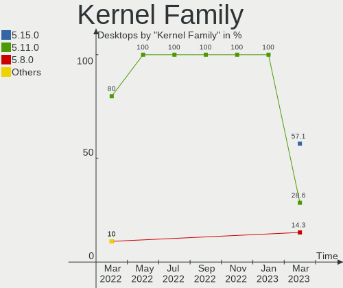
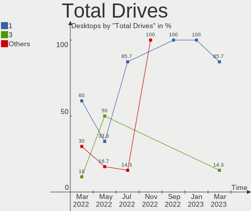

Endless Hardware Trends (Desktop)
---------------------------------

A project to identify most popular hardware characteristics and track their change
over time based on data collected by Endless users at https://Linux-Hardware.org.

Anyone can contribute to the study by uploading probes of their computers by
the [hw-probe](https://github.com/linuxhw/hw-probe) tool:

    sudo -E hw-probe -all -upload

Full-feature report is available here: https://linux-hardware.org/?view=trends&formfactor=desktop

Period: Apr, 2021.

Contents
--------

- [ OS                       ](#os)
- [ OS Family                ](#os-family)
- [ Kernel                   ](#kernel)
- [ Kernel Family            ](#kernel-family)
- [ Kernel Major Ver.        ](#kernel-major-ver)
- [ Arch                     ](#arch)
- [ DE                       ](#de)
- [ Display Server           ](#display-server)
- [ Display Manager          ](#display-manager)
- [ OS Lang                  ](#os-lang)
- [ Boot Mode                ](#boot-mode)
- [ Filesystem               ](#filesystem)
- [ Part. scheme             ](#part-scheme)
- [ Dual Boot with Linux/BSD ](#dual-boot-with-linux/bsd)
- [ Dual Boot (Win)          ](#dual-boot-win)
- [ Country                  ](#country)
- [ City                     ](#city)
- [ Vendor                   ](#vendor)
- [ Model                    ](#model)
- [ Model Family             ](#model-family)
- [ MFG Year                 ](#mfg-year)
- [ Form Factor              ](#form-factor)
- [ Secure Boot              ](#secure-boot)
- [ Coreboot                 ](#coreboot)
- [ RAM Size                 ](#ram-size)
- [ RAM Used                 ](#ram-used)
- [ Has CD-ROM               ](#has-cd-rom)
- [ Total Drives             ](#total-drives)
- [ Has Ethernet             ](#has-ethernet)
- [ Has WiFi                 ](#has-wifi)
- [ Has Bluetooth            ](#has-bluetooth)
- [ Drive Vendor             ](#drive-vendor)
- [ Drive Model              ](#drive-model)
- [ HDD Vendor               ](#hdd-vendor)
- [ SSD Vendor               ](#ssd-vendor)
- [ Drive Kind               ](#drive-kind)
- [ Drive Connector          ](#drive-connector)
- [ Drive Size               ](#drive-size)
- [ Space Total              ](#space-total)
- [ Space Used               ](#space-used)
- [ Malfunc. Drives          ](#malfunc-drives)
- [ Malfunc. Drive Vendor    ](#malfunc-drive-vendor)
- [ Malfunc. HDD Vendor      ](#malfunc-hdd-vendor)
- [ Malfunc. Drive Kind      ](#malfunc-drive-kind)
- [ Failed Drives            ](#failed-drives)
- [ Failed Drive Vendor      ](#failed-drive-vendor)
- [ Drive Status             ](#drive-status)
- [ Storage Vendor           ](#storage-vendor)
- [ Storage Model            ](#storage-model)
- [ Storage Kind             ](#storage-kind)
- [ CPU Vendor               ](#cpu-vendor)
- [ CPU Model                ](#cpu-model)
- [ CPU Model Family         ](#cpu-model-family)
- [ CPU Cores                ](#cpu-cores)
- [ CPU Sockets              ](#cpu-sockets)
- [ CPU Threads              ](#cpu-threads)
- [ CPU Op-Modes             ](#cpu-op-modes)
- [ CPU Microcode            ](#cpu-microcode)
- [ CPU Microarch            ](#cpu-microarch)
- [ GPU Vendor               ](#gpu-vendor)
- [ GPU Model                ](#gpu-model)
- [ GPU Combo                ](#gpu-combo)
- [ GPU Driver               ](#gpu-driver)
- [ GPU Memory               ](#gpu-memory)
- [ Monitor Vendor           ](#monitor-vendor)
- [ Monitor Model            ](#monitor-model)
- [ Monitor Resolution       ](#monitor-resolution)
- [ Monitor Diagonal         ](#monitor-diagonal)
- [ Monitor Width            ](#monitor-width)
- [ Aspect Ratio             ](#aspect-ratio)
- [ Monitor Area             ](#monitor-area)
- [ Pixel Density            ](#pixel-density)
- [ Multiple Monitors        ](#multiple-monitors)
- [ Net Controller Vendor    ](#net-controller-vendor)
- [ Net Controller Model     ](#net-controller-model)
- [ Wireless Vendor          ](#wireless-vendor)
- [ Wireless Model           ](#wireless-model)
- [ Ethernet Vendor          ](#ethernet-vendor)
- [ Ethernet Model           ](#ethernet-model)
- [ Net Controller Kind      ](#net-controller-kind)
- [ Used Controller          ](#used-controller)
- [ NICs                     ](#nics)
- [ IPv6                     ](#ipv6)
- [ Memory Vendor            ](#memory-vendor)
- [ Memory Model             ](#memory-model)
- [ Memory Kind              ](#memory-kind)
- [ Memory Form Factor       ](#memory-form-factor)
- [ Memory Size              ](#memory-size)
- [ Memory Speed             ](#memory-speed)
- [ Sound Vendor             ](#sound-vendor)
- [ Sound Model              ](#sound-model)
- [ Camera Vendor            ](#camera-vendor)
- [ Camera Model             ](#camera-model)
- [ Fingerprint Vendor       ](#fingerprint-vendor)
- [ Fingerprint Model        ](#fingerprint-model)
- [ Chipcard Vendor          ](#chipcard-vendor)
- [ Chipcard Model           ](#chipcard-model)
- [ Printer Vendor           ](#printer-vendor)
- [ Printer Model            ](#printer-model)
- [ Scanner Vendor           ](#scanner-vendor)
- [ Scanner Model            ](#scanner-model)
- [ Bluetooth Vendor         ](#bluetooth-vendor)
- [ Bluetooth Model          ](#bluetooth-model)
- [ Unsupported Devices      ](#unsupported-devices)
- [ Unsupported Device Types ](#unsupported-device-types)

OS
--

Installed operating systems

| Name          | Desktops | Percent |
|---------------|----------|---------|
| Endless 3.9.3 | 10       | 71.43%  |
| Endless 3.9.4 | 2        | 14.29%  |
| Endless 3.9.1 | 1        | 7.14%   |
| Endless 3.8.5 | 1        | 7.14%   |

OS Family
---------

OS without a version

| Name    | Desktops | Percent |
|---------|----------|---------|
| Endless | 14       | 100%    |

Kernel
------

Version of the Linux kernel

| Version          | Desktops | Percent |
|------------------|----------|---------|
| 5.8.0-14-generic | 13       | 92.86%  |
| 5.4.0-39-generic | 1        | 7.14%   |

Kernel Family
-------------

Linux kernel without a distro release

| Version | Desktops | Percent |
|---------|----------|---------|
| 5.8.0   | 13       | 92.86%  |
| 5.4.0   | 1        | 7.14%   |

Kernel Major Ver.
-----------------

Linux kernel major version

| Version | Desktops | Percent |
|---------|----------|---------|
| 5.8     | 13       | 92.86%  |
| 5.4     | 1        | 7.14%   |

Arch
----

OS architecture (x86_64, i586, etc.)

| Name   | Desktops | Percent |
|--------|----------|---------|
| x86_64 | 14       | 100%    |

DE
--

Desktop Environment

| Name  | Desktops | Percent |
|-------|----------|---------|
| GNOME | 14       | 100%    |

Display Server
--------------

X11 or Wayland

| Name | Desktops | Percent |
|------|----------|---------|
| X11  | 14       | 100%    |

Display Manager
---------------

SDDM, LightDM, etc.

| Name    | Desktops | Percent |
|---------|----------|---------|
| Unknown | 14       | 100%    |

OS Lang
-------

Language

| Lang  | Desktops | Percent |
|-------|----------|---------|
| en_US | 5        | 35.71%  |
| th_TH | 1        | 7.14%   |
| sl_SI | 1        | 7.14%   |
| ru_RU | 1        | 7.14%   |
| pt_BR | 1        | 7.14%   |
| pl_PL | 1        | 7.14%   |
| it_IT | 1        | 7.14%   |
| id_ID | 1        | 7.14%   |
| es_MX | 1        | 7.14%   |
| en_PH | 1        | 7.14%   |

Boot Mode
---------

EFI or BIOS

| Mode | Desktops | Percent |
|------|----------|---------|
| EFI  | 10       | 71.43%  |
| BIOS | 4        | 28.57%  |

Filesystem
----------

Type of filesystem

| Type | Desktops | Percent |
|------|----------|---------|
| Ext4 | 14       | 100%    |

Part. scheme
------------

Scheme of partitioning

| Type    | Desktops | Percent |
|---------|----------|---------|
| Unknown | 14       | 100%    |

Dual Boot with Linux/BSD
------------------------

Hosting more than one Linux/BSD

| Dual boot | Desktops | Percent |
|-----------|----------|---------|
| No        | 14       | 100%    |

Dual Boot (Win)
---------------

Hosting Linux and Windows

| Dual boot | Desktops | Percent |
|-----------|----------|---------|
| No        | 14       | 100%    |

Country
-------

Geographic location (country)

| Country     | Desktops | Percent |
|-------------|----------|---------|
| USA         | 5        | 35.71%  |
| Thailand    | 1        | 7.14%   |
| Slovenia    | 1        | 7.14%   |
| Russia      | 1        | 7.14%   |
| Poland      | 1        | 7.14%   |
| Philippines | 1        | 7.14%   |
| Mexico      | 1        | 7.14%   |
| Italy       | 1        | 7.14%   |
| Indonesia   | 1        | 7.14%   |
| Brazil      | 1        | 7.14%   |

City
----

Geographic location (city)

| City          | Desktops | Percent |
|---------------|----------|---------|
| San Francisco | 2        | 14.29%  |
| Reynosa       | 1        | 7.14%   |
| Quezon City   | 1        | 7.14%   |
| Loei          | 1        | 7.14%   |
| Lodz          | 1        | 7.14%   |
| Kazan’      | 1        | 7.14%   |
| Kamnik        | 1        | 7.14%   |
| Jakarta       | 1        | 7.14%   |
| Iguatu        | 1        | 7.14%   |
| Herriman      | 1        | 7.14%   |
| Cottage Grove | 1        | 7.14%   |
| Bucyrus       | 1        | 7.14%   |
| Bolzano       | 1        | 7.14%   |

Vendor
------

Motherboard manufacturer

| Name                | Desktops | Percent |
|---------------------|----------|---------|
| ASUSTek Computer    | 5        | 35.71%  |
| Acer                | 4        | 28.57%  |
| Lenovo              | 1        | 7.14%   |
| Hewlett-Packard     | 1        | 7.14%   |
| Gigabyte Technology | 1        | 7.14%   |
| AWOW Techonology    | 1        | 7.14%   |
| ASRock              | 1        | 7.14%   |

Model
-----

Motherboard model

| Name                           | Desktops | Percent |
|--------------------------------|----------|---------|
| Lenovo ThinkCentre A70 7099S3A | 1        | 7.14%   |
| HP 290 G2 SFF Business PC      | 1        | 7.14%   |
| Gigabyte H97M-D3H              | 1        | 7.14%   |
| AWOW Techonology AK41          | 1        | 7.14%   |
| ASUS PRIME A320M-K             | 1        | 7.14%   |
| ASUS P8Z77-M                   | 1        | 7.14%   |
| ASUS P5Q SE                    | 1        | 7.14%   |
| ASUS M5A99X EVO R2.0           | 1        | 7.14%   |
| ASUS EX-B365M-V5               | 1        | 7.14%   |
| ASRock A88M-G                  | 1        | 7.14%   |
| Acer Veriton X2665G            | 1        | 7.14%   |
| Acer Nitro N50-610             | 1        | 7.14%   |
| Acer Aspire XC-605G            | 1        | 7.14%   |
| Acer Aspire TC-895             | 1        | 7.14%   |

Model Family
------------

Motherboard model prefix

| Name                  | Desktops | Percent |
|-----------------------|----------|---------|
| Acer Aspire           | 2        | 14.29%  |
| Lenovo ThinkCentre    | 1        | 7.14%   |
| HP 290                | 1        | 7.14%   |
| Gigabyte H97M-D3H     | 1        | 7.14%   |
| AWOW Techonology AK41 | 1        | 7.14%   |
| ASUS PRIME            | 1        | 7.14%   |
| ASUS P8Z77-M          | 1        | 7.14%   |
| ASUS P5Q              | 1        | 7.14%   |
| ASUS M5A99X           | 1        | 7.14%   |
| ASUS EX-B365M-V5      | 1        | 7.14%   |
| ASRock A88M-G         | 1        | 7.14%   |
| Acer Veriton          | 1        | 7.14%   |
| Acer Nitro            | 1        | 7.14%   |

MFG Year
--------

Motherboard manufacture year

| Year | Desktops | Percent |
|------|----------|---------|
| 2020 | 5        | 35.71%  |
| 2015 | 2        | 14.29%  |
| 2014 | 2        | 14.29%  |
| 2021 | 1        | 7.14%   |
| 2019 | 1        | 7.14%   |
| 2016 | 1        | 7.14%   |
| 2010 | 1        | 7.14%   |
| 2009 | 1        | 7.14%   |

Form Factor
-----------

Physical design of the computer

| Name    | Desktops | Percent |
|---------|----------|---------|
| Desktop | 14       | 100%    |

Secure Boot
-----------

Enabled or disabled

| State    | Desktops | Percent |
|----------|----------|---------|
| Disabled | 11       | 78.57%  |
| Enabled  | 3        | 21.43%  |

Coreboot
--------

Have coreboot on board

| Used | Desktops | Percent |
|------|----------|---------|
| No   | 14       | 100%    |

RAM Size
--------

Total RAM memory

| Size in GB | Desktops | Percent |
|------------|----------|---------|
| 3.01-4.0   | 5        | 35.71%  |
| 8.01-16.0  | 4        | 28.57%  |
| 4.01-8.0   | 3        | 21.43%  |
| 16.01-24.0 | 2        | 14.29%  |

RAM Used
--------

Used RAM memory

| Used GB  | Desktops | Percent |
|----------|----------|---------|
| 1.01-2.0 | 7        | 50%     |
| 2.01-3.0 | 4        | 28.57%  |
| 3.01-4.0 | 2        | 14.29%  |
| 0.51-1.0 | 1        | 7.14%   |

Has CD-ROM
----------

Has CD-ROM on board

| Presented | Desktops | Percent |
|-----------|----------|---------|
| No        | 8        | 57.14%  |
| Yes       | 6        | 42.86%  |

Total Drives
------------

Number of drives on board

| Drives | Desktops | Percent |
|--------|----------|---------|
| 1      | 8        | 57.14%  |
| 4      | 2        | 14.29%  |
| 0      | 2        | 14.29%  |
| 3      | 1        | 7.14%   |
| 2      | 1        | 7.14%   |

Has Ethernet
------------

Has Ethernet on board

| Presented | Desktops | Percent |
|-----------|----------|---------|
| Yes       | 14       | 100%    |

Has WiFi
--------

Has WiFi module

| Presented | Desktops | Percent |
|-----------|----------|---------|
| Yes       | 7        | 50%     |
| No        | 7        | 50%     |

Has Bluetooth
-------------

Has Bluetooth module

| Presented | Desktops | Percent |
|-----------|----------|---------|
| No        | 10       | 71.43%  |
| Yes       | 4        | 28.57%  |

Drive Vendor
------------

Hard drive vendors

| Vendor                | Desktops | Drives | Percent |
|-----------------------|----------|--------|---------|
| Seagate               | 4        | 5      | 23.53%  |
| Kingston              | 3        | 3      | 17.65%  |
| WDC                   | 2        | 4      | 11.76%  |
| Unknown               | 2        | 3      | 11.76%  |
| Crucial               | 2        | 2      | 11.76%  |
| SK Hynix              | 1        | 1      | 5.88%   |
| Realtek Semiconductor | 1        | 1      | 5.88%   |
| Micron Technology     | 1        | 1      | 5.88%   |
| Hitachi               | 1        | 1      | 5.88%   |

Drive Model
-----------

Hard drive models

| Model                                | Desktops | Percent |
|--------------------------------------|----------|---------|
| Kingston NVMe SSD Drive 512GB        | 2        | 9.52%   |
| WDC WD5000AAKX-00U6AA0 500GB         | 1        | 4.76%   |
| WDC WD3200BPVT-00JJ5T0 320GB         | 1        | 4.76%   |
| WDC WD2500AAJS-22B4A0 250GB          | 1        | 4.76%   |
| WDC WD10EZEX-08WN4A0 1TB             | 1        | 4.76%   |
| Unknown SD/MMC/MS PRO 32GB           | 1        | 4.76%   |
| Unknown NVMe SSD Drive 128GB         | 1        | 4.76%   |
| Unknown MMC Card  32GB               | 1        | 4.76%   |
| SK Hynix NVMe SSD Drive 256GB        | 1        | 4.76%   |
| Seagate ST500LM012 HN-M500MBB 500GB  | 1        | 4.76%   |
| Seagate ST3750330NS 752GB            | 1        | 4.76%   |
| Seagate ST3250620AS 250GB            | 1        | 4.76%   |
| Seagate ST3160318AS 160GB            | 1        | 4.76%   |
| Seagate ST1000DM003-1CH162 1TB       | 1        | 4.76%   |
| Realtek NVMe SSD Drive 128GB         | 1        | 4.76%   |
| Micron NVMe SSD Drive 256GB          | 1        | 4.76%   |
| Kingston SV300S37A120G 120GB SSD     | 1        | 4.76%   |
| Hitachi HDS5C3020ALA632 2TB          | 1        | 4.76%   |
| Crucial CT240BX500SSD1 240GB         | 1        | 4.76%   |
| Crucial C300-CTFDDAC256MAG 256GB SSD | 1        | 4.76%   |

HDD Vendor
----------

Hard disk drive vendors

| Vendor  | Desktops | Drives | Percent |
|---------|----------|--------|---------|
| Seagate | 4        | 5      | 57.14%  |
| WDC     | 2        | 4      | 28.57%  |
| Hitachi | 1        | 1      | 14.29%  |

SSD Vendor
----------

Solid state drive vendors

| Vendor   | Desktops | Drives | Percent |
|----------|----------|--------|---------|
| Crucial  | 2        | 2      | 66.67%  |
| Kingston | 1        | 1      | 33.33%  |

Drive Kind
----------

HDD or SSD

| Kind    | Desktops | Drives | Percent |
|---------|----------|--------|---------|
| NVMe    | 6        | 6      | 37.5%   |
| HDD     | 5        | 10     | 31.25%  |
| SSD     | 3        | 3      | 18.75%  |
| MMC     | 1        | 1      | 6.25%   |
| Unknown | 1        | 1      | 6.25%   |

Drive Connector
---------------

SATA, SAS, NVMe, etc.

| Type | Desktops | Drives | Percent |
|------|----------|--------|---------|
| SATA | 7        | 13     | 46.67%  |
| NVMe | 6        | 6      | 40%     |
| SAS  | 1        | 1      | 6.67%   |
| MMC  | 1        | 1      | 6.67%   |

Drive Size
----------

Size of hard drive

| Size in TB | Desktops | Drives | Percent |
|------------|----------|--------|---------|
| 0.01-0.5   | 5        | 9      | 55.56%  |
| 0.51-1.0   | 3        | 3      | 33.33%  |
| 1.01-2.0   | 1        | 1      | 11.11%  |

Space Total
-----------

Amount of disk space available on the file system

| Size in GB | Desktops | Percent |
|------------|----------|---------|
| 101-250    | 6        | 42.86%  |
| 251-500    | 5        | 35.71%  |
| 2001-3000  | 1        | 7.14%   |
| 1001-2000  | 1        | 7.14%   |
| 501-1000   | 1        | 7.14%   |

Space Used
----------

Amount of used disk space

| Used GB  | Desktops | Percent |
|----------|----------|---------|
| 21-50    | 8        | 57.14%  |
| 101-250  | 2        | 14.29%  |
| 1-20     | 2        | 14.29%  |
| 251-500  | 1        | 7.14%   |
| 501-1000 | 1        | 7.14%   |

Malfunc. Drives
---------------

Drive models with a malfunction

Zero info for selected period =(

Malfunc. Drive Vendor
---------------------

Vendors of faulty drives

Zero info for selected period =(

Malfunc. HDD Vendor
-------------------

Vendors of faulty HDD drives

Zero info for selected period =(

Malfunc. Drive Kind
-------------------

Kinds of faulty drives

Zero info for selected period =(

Failed Drives
-------------

Failed drive models

Zero info for selected period =(

Failed Drive Vendor
-------------------

Failed drive vendors

Zero info for selected period =(

Drive Status
------------

Number of failed and malfunc. drives

| Status   | Desktops | Drives | Percent |
|----------|----------|--------|---------|
| Detected | 12       | 21     | 100%    |

Storage Vendor
--------------

Storage controller vendors

| Vendor                       | Desktops | Percent |
|------------------------------|----------|---------|
| Intel                        | 10       | 47.62%  |
| AMD                          | 3        | 14.29%  |
| Kingston Technology Company  | 2        | 9.52%   |
| SK Hynix                     | 1        | 4.76%   |
| Shenzhen Longsys Electronics | 1        | 4.76%   |
| Realtek Semiconductor        | 1        | 4.76%   |
| Micron Technology            | 1        | 4.76%   |
| Marvell Technology Group     | 1        | 4.76%   |
| ASMedia Technology           | 1        | 4.76%   |

Storage Model
-------------

Storage controller models

| Model                                                                          | Desktops | Percent |
|--------------------------------------------------------------------------------|----------|---------|
| Kingston Company U-SNS8154P3 NVMe SSD                                          | 2        | 8.7%    |
| Intel 200 Series PCH SATA controller [AHCI mode]                               | 2        | 8.7%    |
| AMD FCH SATA Controller [AHCI mode]                                            | 2        | 8.7%    |
| SK Hynix BC501 NVMe Solid State Drive 512GB                                    | 1        | 4.35%   |
| Shenzhen Longsys Non-Volatile memory controller                                | 1        | 4.35%   |
| Realtek Realtek Non-Volatile memory controller                                 | 1        | 4.35%   |
| Micron Non-Volatile memory controller                                          | 1        | 4.35%   |
| Marvell Group 88SE6101/6102 single-port PATA133 interface                      | 1        | 4.35%   |
| Intel NM10/ICH7 Family SATA Controller [IDE mode]                              | 1        | 4.35%   |
| Intel Comet Lake SATA AHCI Controller                                          | 1        | 4.35%   |
| Intel Celeron/Pentium Silver Processor SATA Controller                         | 1        | 4.35%   |
| Intel 9 Series Chipset Family SATA Controller [AHCI Mode]                      | 1        | 4.35%   |
| Intel 82801JI (ICH10 Family) SATA AHCI Controller                              | 1        | 4.35%   |
| Intel 8 Series/C220 Series Chipset Family 6-port SATA Controller 1 [AHCI mode] | 1        | 4.35%   |
| Intel 7 Series/C210 Series Chipset Family 6-port SATA Controller [AHCI mode]   | 1        | 4.35%   |
| Intel 400 Series Chipset Family SATA AHCI Controller                           | 1        | 4.35%   |
| ASMedia ASM1062 Serial ATA Controller                                          | 1        | 4.35%   |
| AMD SB7x0/SB8x0/SB9x0 SATA Controller [AHCI mode]                              | 1        | 4.35%   |
| AMD FCH SATA Controller D                                                      | 1        | 4.35%   |
| AMD FCH IDE Controller                                                         | 1        | 4.35%   |

Storage Kind
------------

Kind of storage controller (IDE, SATA, NVMe, SAS, ...)

| Kind | Desktops | Percent |
|------|----------|---------|
| SATA | 12       | 57.14%  |
| NVMe | 6        | 28.57%  |
| IDE  | 3        | 14.29%  |

CPU Vendor
----------

Processor vendors

| Vendor | Desktops | Percent |
|--------|----------|---------|
| Intel  | 11       | 78.57%  |
| AMD    | 3        | 21.43%  |

CPU Model
---------

Processor models

| Model                                       | Desktops | Percent |
|---------------------------------------------|----------|---------|
| Intel Core i5-9500 CPU @ 3.00GHz            | 2        | 14.29%  |
| Intel Core i5-10400F CPU @ 2.90GHz          | 2        | 14.29%  |
| Intel Core i7-2600 CPU @ 3.40GHz            | 1        | 7.14%   |
| Intel Core i5-4460 CPU @ 3.20GHz            | 1        | 7.14%   |
| Intel Core i3-9100F CPU @ 3.60GHz           | 1        | 7.14%   |
| Intel Core i3-4160 CPU @ 3.60GHz            | 1        | 7.14%   |
| Intel Core 2 Quad CPU Q6600 @ 2.40GHz       | 1        | 7.14%   |
| Intel Core 2 Duo CPU E6750 @ 2.66GHz        | 1        | 7.14%   |
| Intel Celeron J4125 CPU @ 2.00GHz           | 1        | 7.14%   |
| AMD Ryzen 3 2200G with Radeon Vega Graphics | 1        | 7.14%   |
| AMD FX-8150 Eight-Core Processor            | 1        | 7.14%   |
| AMD A10-5800K APU with Radeon HD Graphics   | 1        | 7.14%   |

CPU Model Family
----------------

Processor model prefix

| Model             | Desktops | Percent |
|-------------------|----------|---------|
| Intel Core i5     | 5        | 35.71%  |
| Intel Core i3     | 2        | 14.29%  |
| Intel Core i7     | 1        | 7.14%   |
| Intel Core 2 Quad | 1        | 7.14%   |
| Intel Core 2 Duo  | 1        | 7.14%   |
| Intel Celeron     | 1        | 7.14%   |
| AMD Ryzen 3       | 1        | 7.14%   |
| AMD FX            | 1        | 7.14%   |
| AMD A10           | 1        | 7.14%   |

CPU Cores
---------

Number of processor cores

| Number | Desktops | Percent |
|--------|----------|---------|
| 4      | 7        | 50%     |
| 6      | 4        | 28.57%  |
| 2      | 3        | 21.43%  |

CPU Sockets
-----------

Number of sockets

| Number | Desktops | Percent |
|--------|----------|---------|
| 1      | 14       | 100%    |

CPU Threads
-----------

Threads per core (Hyper-Threading)

| Number | Desktops | Percent |
|--------|----------|---------|
| 1      | 8        | 57.14%  |
| 2      | 6        | 42.86%  |

CPU Op-Modes
------------

CPU Operation Modes (32-bit, 64-bit)

| Op mode        | Desktops | Percent |
|----------------|----------|---------|
| 32-bit, 64-bit | 14       | 100%    |

CPU Microcode
-------------

Microcode number

| Number     | Desktops | Percent |
|------------|----------|---------|
| 0x906ea    | 3        | 21.43%  |
| 0xa0653    | 2        | 14.29%  |
| 0x6fb      | 2        | 14.29%  |
| 0x306c3    | 2        | 14.29%  |
| 0x706a8    | 1        | 7.14%   |
| 0x206a7    | 1        | 7.14%   |
| 0x08101016 | 1        | 7.14%   |
| 0x06001119 | 1        | 7.14%   |
| 0x0600063e | 1        | 7.14%   |

CPU Microarch
-------------

Microarchitecture

| Name          | Desktops | Percent |
|---------------|----------|---------|
| KabyLake      | 3        | 21.43%  |
| Haswell       | 2        | 14.29%  |
| Core          | 2        | 14.29%  |
| CometLake     | 2        | 14.29%  |
| Zen           | 1        | 7.14%   |
| SandyBridge   | 1        | 7.14%   |
| Piledriver    | 1        | 7.14%   |
| Goldmont plus | 1        | 7.14%   |
| Bulldozer     | 1        | 7.14%   |

GPU Vendor
----------

Vendors of graphics cards

| Vendor | Desktops | Percent |
|--------|----------|---------|
| Nvidia | 6        | 40%     |
| Intel  | 6        | 40%     |
| AMD    | 3        | 20%     |

GPU Model
---------

Graphics card models

| Model                                                                       | Desktops | Percent |
|-----------------------------------------------------------------------------|----------|---------|
| Nvidia TU117 [GeForce GTX 1650]                                             | 2        | 13.33%  |
| Intel CometLake-S GT2 [UHD Graphics 630]                                    | 2        | 13.33%  |
| Nvidia TU106 [GeForce GTX 1650]                                             | 1        | 6.67%   |
| Nvidia GP107 [GeForce GTX 1050 Ti]                                          | 1        | 6.67%   |
| Nvidia GP106 [GeForce GTX 1060 3GB]                                         | 1        | 6.67%   |
| Nvidia GF116 [GeForce GTX 550 Ti]                                           | 1        | 6.67%   |
| Intel Xeon E3-1200 v3/4th Gen Core Processor Integrated Graphics Controller | 1        | 6.67%   |
| Intel GeminiLake [UHD Graphics 600]                                         | 1        | 6.67%   |
| Intel 4th Generation Core Processor Family Integrated Graphics Controller   | 1        | 6.67%   |
| Intel 4 Series Chipset Integrated Graphics Controller                       | 1        | 6.67%   |
| AMD Raven Ridge [Radeon Vega Series / Radeon Vega Mobile Series]            | 1        | 6.67%   |
| AMD Juniper XT [Radeon HD 5770]                                             | 1        | 6.67%   |
| AMD Cypress PRO [Radeon HD 5850]                                            | 1        | 6.67%   |

GPU Combo
---------

Combinations of graphics cards

| Name        | Desktops | Percent |
|-------------|----------|---------|
| 1 x Nvidia  | 6        | 42.86%  |
| 1 x Intel   | 5        | 35.71%  |
| 1 x AMD     | 2        | 14.29%  |
| Intel + AMD | 1        | 7.14%   |

GPU Driver
----------

Free vs proprietary

| Driver      | Desktops | Percent |
|-------------|----------|---------|
| Free        | 9        | 64.29%  |
| Proprietary | 5        | 35.71%  |

GPU Memory
----------

Total video memory

| Size in GB | Desktops | Percent |
|------------|----------|---------|
| Unknown    | 10       | 71.43%  |
| 0.51-1.0   | 2        | 14.29%  |
| 1.01-2.0   | 1        | 7.14%   |
| 0.01-0.5   | 1        | 7.14%   |

Monitor Vendor
--------------

Monitor vendors

| Vendor               | Desktops | Percent |
|----------------------|----------|---------|
| Samsung Electronics  | 5        | 41.67%  |
| Ancor Communications | 2        | 16.67%  |
| Philips              | 1        | 8.33%   |
| Eizo                 | 1        | 8.33%   |
| Dell                 | 1        | 8.33%   |
| ASUSTek Computer     | 1        | 8.33%   |
| Acer                 | 1        | 8.33%   |

Monitor Model
-------------

Monitor models

| Model                                                                  | Desktops | Percent |
|------------------------------------------------------------------------|----------|---------|
| Samsung Electronics LCD Monitor SAM0C26 1920x1080 1209x680mm 54.6-inch | 2        | 15.38%  |
| Samsung Electronics U28D590 SAM0B81 3840x2160 608x345mm 27.5-inch      | 1        | 7.69%   |
| Samsung Electronics U28D590 SAM0B80 3840x2160 607x345mm 27.5-inch      | 1        | 7.69%   |
| Samsung Electronics SyncMaster SAM0841 1920x1080 885x498mm 40.0-inch   | 1        | 7.69%   |
| Samsung Electronics C27F390 SAM0D32 1920x1080 600x340mm 27.2-inch      | 1        | 7.69%   |
| Philips PHL 163V5 PHLC0CC 1366x768 344x194mm 15.5-inch                 | 1        | 7.69%   |
| Eizo L367 ENC1679 1024x768 304x228mm 15.0-inch                         | 1        | 7.69%   |
| Dell DEL 1908FPBLK DEL4047 1280x1024 376x301mm 19.0-inch               | 1        | 7.69%   |
| ASUSTek Computer VG248 AUS24C2 1920x1080 531x299mm 24.0-inch           | 1        | 7.69%   |
| Ancor Communications VG248 ACI24A5 1920x1080 531x299mm 24.0-inch       | 1        | 7.69%   |
| Ancor Communications ASUS VH168D ACI16E1 1366x768 359x210mm 16.4-inch  | 1        | 7.69%   |
| Acer V206HQLB ACR051A 1366x768 434x236mm 19.4-inch                     | 1        | 7.69%   |

Monitor Resolution
------------------

Monitor screen resolution

| Resolution       | Desktops | Percent |
|------------------|----------|---------|
| 1920x1080 (FHD)  | 6        | 50%     |
| 1366x768 (WXGA)  | 3        | 25%     |
| 3840x2160 (4K)   | 1        | 8.33%   |
| 1280x1024 (SXGA) | 1        | 8.33%   |
| 1024x768 (XGA)   | 1        | 8.33%   |

Monitor Diagonal
----------------

Diagonal size in inches

| Inches | Desktops | Percent |
|--------|----------|---------|
| 54     | 2        | 16.67%  |
| 27     | 2        | 16.67%  |
| 24     | 2        | 16.67%  |
| 19     | 2        | 16.67%  |
| 15     | 2        | 16.67%  |
| 40     | 1        | 8.33%   |
| 16     | 1        | 8.33%   |

Monitor Width
-------------

Physical width

| Width in mm | Desktops | Percent |
|-------------|----------|---------|
| 501-600     | 3        | 25%     |
| 351-400     | 2        | 16.67%  |
| 301-350     | 2        | 16.67%  |
| 1001-1500   | 2        | 16.67%  |
| 801-900     | 1        | 8.33%   |
| 601-700     | 1        | 8.33%   |
| 401-500     | 1        | 8.33%   |

Aspect Ratio
------------

Proportional relationship between the width and the height

| Ratio | Desktops | Percent |
|-------|----------|---------|
| 16/9  | 10       | 83.33%  |
| 5/4   | 1        | 8.33%   |
| 4/3   | 1        | 8.33%   |

Monitor Area
------------

Area in inch²

| Area in inch² | Desktops | Percent |
|----------------|----------|---------|
| More than 1000 | 2        | 16.67%  |
| 301-350        | 2        | 16.67%  |
| 201-250        | 2        | 16.67%  |
| 151-200        | 2        | 16.67%  |
| 101-110        | 2        | 16.67%  |
| 111-120        | 1        | 8.33%   |
| 501-1000       | 1        | 8.33%   |

Pixel Density
-------------

Pixels per inch

| Density | Desktops | Percent |
|---------|----------|---------|
| 51-100  | 8        | 66.67%  |
| 1-50    | 2        | 16.67%  |
| 121-160 | 1        | 8.33%   |
| 101-120 | 1        | 8.33%   |

Multiple Monitors
-----------------

Total monitors connected

| Total | Desktops | Percent |
|-------|----------|---------|
| 1     | 14       | 100%    |

Net Controller Vendor
---------------------

Controller vendors

| Vendor                | Desktops | Percent |
|-----------------------|----------|---------|
| Realtek Semiconductor | 13       | 54.17%  |
| Intel                 | 3        | 12.5%   |
| Qualcomm Atheros      | 2        | 8.33%   |
| Samsung Electronics   | 1        | 4.17%   |
| Qualcomm              | 1        | 4.17%   |
| Belkin Components     | 1        | 4.17%   |
| ASUSTek Computer      | 1        | 4.17%   |
| ASIX Electronics      | 1        | 4.17%   |
| AboCom Systems        | 1        | 4.17%   |

Net Controller Model
--------------------

Controller models

| Model                                                                       | Desktops | Percent |
|-----------------------------------------------------------------------------|----------|---------|
| Realtek RTL8111/8168/8411 PCI Express Gigabit Ethernet Controller           | 13       | 52%     |
| Samsung Galaxy series, misc. (tethering mode)                               | 1        | 4%      |
| Realtek RTL8188EUS 802.11n Wireless Network Adapter                         | 1        | 4%      |
| Qualcomm Redmi Note 7                                                       | 1        | 4%      |
| Qualcomm Atheros AR9462 Wireless Network Adapter                            | 1        | 4%      |
| Qualcomm Atheros AR8121/AR8113/AR8114 Gigabit or Fast Ethernet              | 1        | 4%      |
| Intel Wireless-AC 9260                                                      | 1        | 4%      |
| Intel Comet Lake PCH CNVi WiFi                                              | 1        | 4%      |
| Intel AC 1550i Wireless                                                     | 1        | 4%      |
| Belkin Components F5D7050 Wireless G Adapter v1000/v2000 [Intersil ISL3887] | 1        | 4%      |
| ASUS USB-N13 802.11n Network Adapter (rev. B1) [Realtek RTL8192CU]          | 1        | 4%      |
| ASIX AX88179 Gigabit Ethernet                                               | 1        | 4%      |
| AboCom Systems 802.11n NIC                                                  | 1        | 4%      |

Wireless Vendor
---------------

Wireless vendors

| Vendor                | Desktops | Percent |
|-----------------------|----------|---------|
| Intel                 | 3        | 37.5%   |
| Realtek Semiconductor | 1        | 12.5%   |
| Qualcomm Atheros      | 1        | 12.5%   |
| Belkin Components     | 1        | 12.5%   |
| ASUSTek Computer      | 1        | 12.5%   |
| AboCom Systems        | 1        | 12.5%   |

Wireless Model
--------------

Wireless models

| Model                                                                       | Desktops | Percent |
|-----------------------------------------------------------------------------|----------|---------|
| Realtek RTL8188EUS 802.11n Wireless Network Adapter                         | 1        | 12.5%   |
| Qualcomm Atheros AR9462 Wireless Network Adapter                            | 1        | 12.5%   |
| Intel Wireless-AC 9260                                                      | 1        | 12.5%   |
| Intel Comet Lake PCH CNVi WiFi                                              | 1        | 12.5%   |
| Intel AC 1550i Wireless                                                     | 1        | 12.5%   |
| Belkin Components F5D7050 Wireless G Adapter v1000/v2000 [Intersil ISL3887] | 1        | 12.5%   |
| ASUS USB-N13 802.11n Network Adapter (rev. B1) [Realtek RTL8192CU]          | 1        | 12.5%   |
| AboCom Systems 802.11n NIC                                                  | 1        | 12.5%   |

Ethernet Vendor
---------------

Ethernet vendors

| Vendor                | Desktops | Percent |
|-----------------------|----------|---------|
| Realtek Semiconductor | 13       | 76.47%  |
| Samsung Electronics   | 1        | 5.88%   |
| Qualcomm Atheros      | 1        | 5.88%   |
| Qualcomm              | 1        | 5.88%   |
| ASIX Electronics      | 1        | 5.88%   |

Ethernet Model
--------------

Ethernet models

| Model                                                             | Desktops | Percent |
|-------------------------------------------------------------------|----------|---------|
| Realtek RTL8111/8168/8411 PCI Express Gigabit Ethernet Controller | 13       | 76.47%  |
| Samsung Galaxy series, misc. (tethering mode)                     | 1        | 5.88%   |
| Qualcomm Redmi Note 7                                             | 1        | 5.88%   |
| Qualcomm Atheros AR8121/AR8113/AR8114 Gigabit or Fast Ethernet    | 1        | 5.88%   |
| ASIX AX88179 Gigabit Ethernet                                     | 1        | 5.88%   |

Net Controller Kind
-------------------

Ethernet, WiFi or modem

| Kind     | Desktops | Percent |
|----------|----------|---------|
| Ethernet | 14       | 66.67%  |
| WiFi     | 7        | 33.33%  |

Used Controller
---------------

Currently used network controller

| Kind     | Desktops | Percent |
|----------|----------|---------|
| Ethernet | 14       | 66.67%  |
| WiFi     | 7        | 33.33%  |

NICs
----

Total network controllers on board

| Total | Desktops | Percent |
|-------|----------|---------|
| 1     | 10       | 71.43%  |
| 2     | 4        | 28.57%  |

IPv6
----

IPv6 vs IPv4

| Used | Desktops | Percent |
|------|----------|---------|
| No   | 10       | 71.43%  |
| Yes  | 4        | 28.57%  |

Memory Vendor
-------------

Memory module vendors

Zero info for selected period =(

Memory Model
------------

Memory module models

Zero info for selected period =(

Memory Kind
-----------

Memory module kinds

Zero info for selected period =(

Memory Form Factor
------------------

Physical design of the memory module

Zero info for selected period =(

Memory Size
-----------

Memory module size

Zero info for selected period =(

Memory Speed
------------

Memory module speed

Zero info for selected period =(

Sound Vendor
------------

Sound card vendors

| Vendor              | Desktops | Percent |
|---------------------|----------|---------|
| Intel               | 11       | 47.83%  |
| Nvidia              | 6        | 26.09%  |
| AMD                 | 5        | 21.74%  |
| C-Media Electronics | 1        | 4.35%   |

Sound Model
-----------

Sound card models

| Model                                                                 | Desktops | Percent |
|-----------------------------------------------------------------------|----------|---------|
| Intel 200 Series PCH HD Audio                                         | 3        | 11.54%  |
| Nvidia TU107 GeForce GTX 1650 High Definition Audio Controller        | 2        | 7.69%   |
| Intel Xeon E3-1200 v3/4th Gen Core Processor HD Audio Controller      | 2        | 7.69%   |
| Nvidia TU106 High Definition Audio Controller                         | 1        | 3.85%   |
| Nvidia GP107GL High Definition Audio Controller                       | 1        | 3.85%   |
| Nvidia GP106 High Definition Audio Controller                         | 1        | 3.85%   |
| Nvidia GF116 High Definition Audio Controller                         | 1        | 3.85%   |
| Intel NM10/ICH7 Family High Definition Audio Controller               | 1        | 3.85%   |
| Intel Comet Lake PCH-V Smart Sound Technology Audio Controller        | 1        | 3.85%   |
| Intel Comet Lake PCH cAVS                                             | 1        | 3.85%   |
| Intel Celeron/Pentium Silver Processor High Definition Audio          | 1        | 3.85%   |
| Intel 9 Series Chipset Family HD Audio Controller                     | 1        | 3.85%   |
| Intel 82801JI (ICH10 Family) HD Audio Controller                      | 1        | 3.85%   |
| Intel 8 Series/C220 Series Chipset High Definition Audio Controller   | 1        | 3.85%   |
| Intel 7 Series/C216 Chipset Family High Definition Audio Controller   | 1        | 3.85%   |
| C-Media Electronics USB Audio Device                                  | 1        | 3.85%   |
| AMD SBx00 Azalia (Intel HDA)                                          | 1        | 3.85%   |
| AMD Raven/Raven2/Fenghuang HDMI/DP Audio Controller                   | 1        | 3.85%   |
| AMD Juniper HDMI Audio [Radeon HD 5700 Series]                        | 1        | 3.85%   |
| AMD FCH Azalia Controller                                             | 1        | 3.85%   |
| AMD Family 17h (Models 10h-1fh) HD Audio Controller                   | 1        | 3.85%   |
| AMD Cypress HDMI Audio [Radeon HD 5830/5850/5870 / 6850/6870 Rebrand] | 1        | 3.85%   |

Camera Vendor
-------------

Camera device vendors

| Vendor              | Desktops | Percent |
|---------------------|----------|---------|
| Samsung Electronics | 1        | 100%    |

Camera Model
------------

Camera device models

| Model                   | Desktops | Percent |
|-------------------------|----------|---------|
| Samsung Galaxy A5 (MTP) | 1        | 100%    |

Fingerprint Vendor
------------------

Fingerprint sensor vendors

Zero info for selected period =(

Fingerprint Model
-----------------

Fingerprint sensor models

Zero info for selected period =(

Chipcard Vendor
---------------

Chipcard module vendors

Zero info for selected period =(

Chipcard Model
--------------

Chipcard module models

Zero info for selected period =(

Printer Vendor
--------------

Printer device vendors

| Vendor             | Desktops | Percent |
|--------------------|----------|---------|
| Seiko Epson        | 1        | 33.33%  |
| Dymo-CoStar        | 1        | 33.33%  |
| Brother Industries | 1        | 33.33%  |

Printer Model
-------------

Printer device models

| Model                                       | Desktops | Percent |
|---------------------------------------------|----------|---------|
| Seiko Epson L120 Series                     | 1        | 33.33%  |
| Dymo-CoStar DYMO LabelWriter 450 Twin Turbo | 1        | 33.33%  |
| Brother DCP-L2540DW                         | 1        | 33.33%  |

Scanner Vendor
--------------

Scanner device vendors

Zero info for selected period =(

Scanner Model
-------------

Scanner device models

Zero info for selected period =(

Bluetooth Vendor
----------------

Controller vendors

| Vendor             | Desktops | Percent |
|--------------------|----------|---------|
| Intel              | 3        | 75%     |
| Lite-On Technology | 1        | 25%     |

Bluetooth Model
---------------

Controller models

| Model                                          | Desktops | Percent |
|------------------------------------------------|----------|---------|
| Lite-On Bluetooth Device                       | 1        | 25%     |
| Intel Wireless-AC 9260 Bluetooth Adapter       | 1        | 25%     |
| Intel Bluetooth Device                         | 1        | 25%     |
| Intel Bluetooth 9460/9560 Jefferson Peak (JfP) | 1        | 25%     |

Unsupported Devices
-------------------

Total unsupported devices on board

| Total | Desktops | Percent |
|-------|----------|---------|
| 0     | 14       | 100%    |

Unsupported Device Types
------------------------

Types of unsupported devices

Zero info for selected period =(

