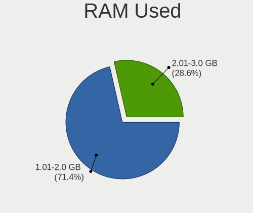

Endless Hardware Trends (Desktop)
---------------------------------

A project to identify most popular hardware characteristics and track their change
over time based on data collected by Endless users at https://Linux-Hardware.org.

Anyone can contribute to the study by uploading probes of their computers by
the [hw-probe](https://github.com/linuxhw/hw-probe) tool:

    sudo -E hw-probe -all -upload

Full-feature report is available here: https://linux-hardware.org/?view=trends&formfactor=desktop

Period: Jun, 2021.

Contents
--------

- [ OS                       ](#os)
- [ OS Family                ](#os-family)
- [ Kernel                   ](#kernel)
- [ Kernel Family            ](#kernel-family)
- [ Kernel Major Ver.        ](#kernel-major-ver)
- [ Arch                     ](#arch)
- [ DE                       ](#de)
- [ Display Server           ](#display-server)
- [ Display Manager          ](#display-manager)
- [ OS Lang                  ](#os-lang)
- [ Boot Mode                ](#boot-mode)
- [ Filesystem               ](#filesystem)
- [ Part. scheme             ](#part-scheme)
- [ Dual Boot with Linux/BSD ](#dual-boot-with-linux/bsd)
- [ Dual Boot (Win)          ](#dual-boot-win)
- [ Country                  ](#country)
- [ City                     ](#city)
- [ Vendor                   ](#vendor)
- [ Model                    ](#model)
- [ Model Family             ](#model-family)
- [ MFG Year                 ](#mfg-year)
- [ Form Factor              ](#form-factor)
- [ Secure Boot              ](#secure-boot)
- [ Coreboot                 ](#coreboot)
- [ RAM Size                 ](#ram-size)
- [ RAM Used                 ](#ram-used)
- [ Has CD-ROM               ](#has-cd-rom)
- [ Total Drives             ](#total-drives)
- [ Has Ethernet             ](#has-ethernet)
- [ Has WiFi                 ](#has-wifi)
- [ Has Bluetooth            ](#has-bluetooth)
- [ Drive Vendor             ](#drive-vendor)
- [ Drive Model              ](#drive-model)
- [ HDD Vendor               ](#hdd-vendor)
- [ SSD Vendor               ](#ssd-vendor)
- [ Drive Kind               ](#drive-kind)
- [ Drive Connector          ](#drive-connector)
- [ Drive Size               ](#drive-size)
- [ Space Total              ](#space-total)
- [ Space Used               ](#space-used)
- [ Malfunc. Drives          ](#malfunc-drives)
- [ Malfunc. Drive Vendor    ](#malfunc-drive-vendor)
- [ Malfunc. HDD Vendor      ](#malfunc-hdd-vendor)
- [ Malfunc. Drive Kind      ](#malfunc-drive-kind)
- [ Failed Drives            ](#failed-drives)
- [ Failed Drive Vendor      ](#failed-drive-vendor)
- [ Drive Status             ](#drive-status)
- [ Storage Vendor           ](#storage-vendor)
- [ Storage Model            ](#storage-model)
- [ Storage Kind             ](#storage-kind)
- [ CPU Vendor               ](#cpu-vendor)
- [ CPU Model                ](#cpu-model)
- [ CPU Model Family         ](#cpu-model-family)
- [ CPU Cores                ](#cpu-cores)
- [ CPU Sockets              ](#cpu-sockets)
- [ CPU Threads              ](#cpu-threads)
- [ CPU Op-Modes             ](#cpu-op-modes)
- [ CPU Microcode            ](#cpu-microcode)
- [ CPU Microarch            ](#cpu-microarch)
- [ GPU Vendor               ](#gpu-vendor)
- [ GPU Model                ](#gpu-model)
- [ GPU Combo                ](#gpu-combo)
- [ GPU Driver               ](#gpu-driver)
- [ GPU Memory               ](#gpu-memory)
- [ Monitor Vendor           ](#monitor-vendor)
- [ Monitor Model            ](#monitor-model)
- [ Monitor Resolution       ](#monitor-resolution)
- [ Monitor Diagonal         ](#monitor-diagonal)
- [ Monitor Width            ](#monitor-width)
- [ Aspect Ratio             ](#aspect-ratio)
- [ Monitor Area             ](#monitor-area)
- [ Pixel Density            ](#pixel-density)
- [ Multiple Monitors        ](#multiple-monitors)
- [ Net Controller Vendor    ](#net-controller-vendor)
- [ Net Controller Model     ](#net-controller-model)
- [ Wireless Vendor          ](#wireless-vendor)
- [ Wireless Model           ](#wireless-model)
- [ Ethernet Vendor          ](#ethernet-vendor)
- [ Ethernet Model           ](#ethernet-model)
- [ Net Controller Kind      ](#net-controller-kind)
- [ Used Controller          ](#used-controller)
- [ NICs                     ](#nics)
- [ IPv6                     ](#ipv6)
- [ Memory Vendor            ](#memory-vendor)
- [ Memory Model             ](#memory-model)
- [ Memory Kind              ](#memory-kind)
- [ Memory Form Factor       ](#memory-form-factor)
- [ Memory Size              ](#memory-size)
- [ Memory Speed             ](#memory-speed)
- [ Sound Vendor             ](#sound-vendor)
- [ Sound Model              ](#sound-model)
- [ Camera Vendor            ](#camera-vendor)
- [ Camera Model             ](#camera-model)
- [ Fingerprint Vendor       ](#fingerprint-vendor)
- [ Fingerprint Model        ](#fingerprint-model)
- [ Chipcard Vendor          ](#chipcard-vendor)
- [ Chipcard Model           ](#chipcard-model)
- [ Printer Vendor           ](#printer-vendor)
- [ Printer Model            ](#printer-model)
- [ Scanner Vendor           ](#scanner-vendor)
- [ Scanner Model            ](#scanner-model)
- [ Bluetooth Vendor         ](#bluetooth-vendor)
- [ Bluetooth Model          ](#bluetooth-model)
- [ Unsupported Devices      ](#unsupported-devices)
- [ Unsupported Device Types ](#unsupported-device-types)

OS
--

Installed operating systems

| Name          | Desktops | Percent |
|---------------|----------|---------|
| Endless 3.9.4 | 12       | 100%    |

OS Family
---------

OS without a version

| Name    | Desktops | Percent |
|---------|----------|---------|
| Endless | 12       | 100%    |

Kernel
------

Version of the Linux kernel

| Version          | Desktops | Percent |
|------------------|----------|---------|
| 5.8.0-14-generic | 12       | 100%    |

Kernel Family
-------------

Linux kernel without a distro release

| Version | Desktops | Percent |
|---------|----------|---------|
| 5.8.0   | 12       | 100%    |

Kernel Major Ver.
-----------------

Linux kernel major version

| Version | Desktops | Percent |
|---------|----------|---------|
| 5.8     | 12       | 100%    |

Arch
----

OS architecture (x86_64, i586, etc.)

| Name   | Desktops | Percent |
|--------|----------|---------|
| x86_64 | 12       | 100%    |

DE
--

Desktop Environment

| Name  | Desktops | Percent |
|-------|----------|---------|
| GNOME | 12       | 100%    |

Display Server
--------------

X11 or Wayland

| Name | Desktops | Percent |
|------|----------|---------|
| X11  | 12       | 100%    |

Display Manager
---------------

SDDM, LightDM, etc.

| Name    | Desktops | Percent |
|---------|----------|---------|
| Unknown | 12       | 100%    |

OS Lang
-------

Language

| Lang  | Desktops | Percent |
|-------|----------|---------|
| en_US | 7        | 58.33%  |
| pt_BR | 2        | 16.67%  |
| tr_TR | 1        | 8.33%   |
| si_LK | 1        | 8.33%   |
| en_IN | 1        | 8.33%   |

Boot Mode
---------

EFI or BIOS

| Mode | Desktops | Percent |
|------|----------|---------|
| BIOS | 8        | 66.67%  |
| EFI  | 4        | 33.33%  |

Filesystem
----------

Type of filesystem

| Type | Desktops | Percent |
|------|----------|---------|
| Ext4 | 12       | 100%    |

Part. scheme
------------

Scheme of partitioning

| Type    | Desktops | Percent |
|---------|----------|---------|
| Unknown | 12       | 100%    |

Dual Boot with Linux/BSD
------------------------

Hosting more than one Linux/BSD

| Dual boot | Desktops | Percent |
|-----------|----------|---------|
| No        | 12       | 100%    |

Dual Boot (Win)
---------------

Hosting Linux and Windows

| Dual boot | Desktops | Percent |
|-----------|----------|---------|
| No        | 12       | 100%    |

Country
-------

Geographic location (country)

| Country     | Desktops | Percent |
|-------------|----------|---------|
| USA         | 4        | 33.33%  |
| Turkey      | 2        | 16.67%  |
| Brazil      | 2        | 16.67%  |
| Sri Lanka   | 1        | 8.33%   |
| New Zealand | 1        | 8.33%   |
| Indonesia   | 1        | 8.33%   |
| India       | 1        | 8.33%   |

City
----

Geographic location (city)

| City           | Desktops | Percent |
|----------------|----------|---------|
| Bucyrus        | 4        | 33.33%  |
| São Paulo     | 2        | 16.67%  |
| Istanbul       | 2        | 16.67%  |
| Pegangsaan Dua | 1        | 8.33%   |
| Mumbai         | 1        | 8.33%   |
| Kegalle        | 1        | 8.33%   |
| Christchurch   | 1        | 8.33%   |

Vendor
------

Motherboard manufacturer

| Name             | Desktops | Percent |
|------------------|----------|---------|
| ASUSTek Computer | 4        | 33.33%  |
| ASRock           | 2        | 16.67%  |
| Semp Toshiba     | 1        | 8.33%   |
| Lenovo           | 1        | 8.33%   |
| Foxconn          | 1        | 8.33%   |
| Dell             | 1        | 8.33%   |
| Acer             | 1        | 8.33%   |
| Unknown          | 1        | 8.33%   |

Model
-----

Motherboard model

| Name                                | Desktops | Percent |
|-------------------------------------|----------|---------|
| ASRock A88M-G                       | 2        | 16.67%  |
| Semp Toshiba STI                    | 1        | 8.33%   |
| Lenovo ThinkCentre M710t 10MAS4XY00 | 1        | 8.33%   |
| Foxconn G31MX Series                | 1        | 8.33%   |
| Dell Inspiron 620                   | 1        | 8.33%   |
| ASUS M5A78L-M LX PLUS               | 1        | 8.33%   |
| ASUS K30BF_M32BF                    | 1        | 8.33%   |
| ASUS F2A85-M LE                     | 1        | 8.33%   |
| ASUS ASUSPRO D642MF_D642MF          | 1        | 8.33%   |
| Acer Nitro N50-610                  | 1        | 8.33%   |
| Unknown                             | 1        | 8.33%   |

Model Family
------------

Motherboard model prefix

| Name               | Desktops | Percent |
|--------------------|----------|---------|
| ASRock A88M-G      | 2        | 16.67%  |
| Semp Toshiba STI   | 1        | 8.33%   |
| Lenovo ThinkCentre | 1        | 8.33%   |
| Foxconn G31MX      | 1        | 8.33%   |
| Dell Inspiron      | 1        | 8.33%   |
| ASUS M5A78L-M      | 1        | 8.33%   |
| ASUS K30BF         | 1        | 8.33%   |
| ASUS F2A85-M       | 1        | 8.33%   |
| ASUS ASUSPRO       | 1        | 8.33%   |
| Acer Nitro         | 1        | 8.33%   |
| Unknown            | 1        | 8.33%   |

MFG Year
--------

Motherboard manufacture year

| Year | Desktops | Percent |
|------|----------|---------|
| 2014 | 3        | 25%     |
| 2011 | 3        | 25%     |
| 2016 | 2        | 16.67%  |
| 2020 | 1        | 8.33%   |
| 2019 | 1        | 8.33%   |
| 2018 | 1        | 8.33%   |
| 2009 | 1        | 8.33%   |

Form Factor
-----------

Physical design of the computer

| Name    | Desktops | Percent |
|---------|----------|---------|
| Desktop | 12       | 100%    |

Secure Boot
-----------

Enabled or disabled

| State    | Desktops | Percent |
|----------|----------|---------|
| Disabled | 11       | 91.67%  |
| Enabled  | 1        | 8.33%   |

Coreboot
--------

Have coreboot on board

| Used | Desktops | Percent |
|------|----------|---------|
| No   | 12       | 100%    |

RAM Size
--------

Total RAM memory

| Size in GB | Desktops | Percent |
|------------|----------|---------|
| 8.01-16.0  | 4        | 33.33%  |
| 4.01-8.0   | 3        | 25%     |
| 3.01-4.0   | 3        | 25%     |
| 2.01-3.0   | 1        | 8.33%   |
| 16.01-24.0 | 1        | 8.33%   |

RAM Used
--------

Used RAM memory

| Used GB  | Desktops | Percent |
|----------|----------|---------|
| 1.01-2.0 | 9        | 75%     |
| 0.51-1.0 | 2        | 16.67%  |
| 3.01-4.0 | 1        | 8.33%   |

Has CD-ROM
----------

Has CD-ROM on board

| Presented | Desktops | Percent |
|-----------|----------|---------|
| No        | 7        | 58.33%  |
| Yes       | 5        | 41.67%  |

Total Drives
------------

Number of drives on board

| Drives | Desktops | Percent |
|--------|----------|---------|
| 1      | 8        | 66.67%  |
| 2      | 3        | 25%     |
| 0      | 1        | 8.33%   |

Has Ethernet
------------

Has Ethernet on board

| Presented | Desktops | Percent |
|-----------|----------|---------|
| Yes       | 12       | 100%    |

Has WiFi
--------

Has WiFi module

| Presented | Desktops | Percent |
|-----------|----------|---------|
| No        | 9        | 75%     |
| Yes       | 3        | 25%     |

Has Bluetooth
-------------

Has Bluetooth module

| Presented | Desktops | Percent |
|-----------|----------|---------|
| No        | 10       | 83.33%  |
| Yes       | 2        | 16.67%  |

Drive Vendor
------------

Hard drive vendors

| Vendor              | Desktops | Drives | Percent |
|---------------------|----------|--------|---------|
| Kingston            | 4        | 4      | 33.33%  |
| WDC                 | 2        | 2      | 16.67%  |
| Toshiba             | 2        | 2      | 16.67%  |
| Samsung Electronics | 2        | 2      | 16.67%  |
| Seagate             | 1        | 1      | 8.33%   |
| AFOX                | 1        | 1      | 8.33%   |

Drive Model
-----------

Hard drive models

| Model                               | Desktops | Percent |
|-------------------------------------|----------|---------|
| Kingston SV300S37A120G 120GB SSD    | 4        | 33.33%  |
| WDC WD5000LPCX-08VHA 500GB          | 1        | 8.33%   |
| WDC WD1600AAJS-60B4A0 160GB         | 1        | 8.33%   |
| Toshiba THNS128GG4BBAA 128GB SSD    | 1        | 8.33%   |
| Toshiba DT01ACA100 1TB              | 1        | 8.33%   |
| Seagate ST320LM001 HN-M320MBB 320GB | 1        | 8.33%   |
| Samsung NVMe SSD Drive 256GB        | 1        | 8.33%   |
| Samsung HD322HJ 320GB               | 1        | 8.33%   |
| AFOX 120GB                          | 1        | 8.33%   |

HDD Vendor
----------

Hard disk drive vendors

| Vendor              | Desktops | Drives | Percent |
|---------------------|----------|--------|---------|
| WDC                 | 2        | 2      | 40%     |
| Toshiba             | 1        | 1      | 20%     |
| Seagate             | 1        | 1      | 20%     |
| Samsung Electronics | 1        | 1      | 20%     |

SSD Vendor
----------

Solid state drive vendors

| Vendor   | Desktops | Drives | Percent |
|----------|----------|--------|---------|
| Kingston | 4        | 4      | 80%     |
| Toshiba  | 1        | 1      | 20%     |

Drive Kind
----------

HDD or SSD

| Kind    | Desktops | Drives | Percent |
|---------|----------|--------|---------|
| SSD     | 5        | 5      | 45.45%  |
| HDD     | 4        | 5      | 36.36%  |
| NVMe    | 1        | 1      | 9.09%   |
| Unknown | 1        | 1      | 9.09%   |

Drive Connector
---------------

SATA, SAS, NVMe, etc.

| Type | Desktops | Drives | Percent |
|------|----------|--------|---------|
| SATA | 10       | 11     | 90.91%  |
| NVMe | 1        | 1      | 9.09%   |

Drive Size
----------

Size of hard drive

| Size in TB | Desktops | Drives | Percent |
|------------|----------|--------|---------|
| 0.01-0.5   | 8        | 9      | 88.89%  |
| 0.51-1.0   | 1        | 1      | 11.11%  |

Space Total
-----------

Amount of disk space available on the file system

| Size in GB | Desktops | Percent |
|------------|----------|---------|
| 101-250    | 9        | 75%     |
| 251-500    | 2        | 16.67%  |
| 501-1000   | 1        | 8.33%   |

Space Used
----------

Amount of used disk space

| Used GB | Desktops | Percent |
|---------|----------|---------|
| 21-50   | 10       | 83.33%  |
| 1-20    | 1        | 8.33%   |
| 51-100  | 1        | 8.33%   |

Malfunc. Drives
---------------

Drive models with a malfunction

Zero info for selected period =(

Malfunc. Drive Vendor
---------------------

Vendors of faulty drives

Zero info for selected period =(

Malfunc. HDD Vendor
-------------------

Vendors of faulty HDD drives

Zero info for selected period =(

Malfunc. Drive Kind
-------------------

Kinds of faulty drives

Zero info for selected period =(

Failed Drives
-------------

Failed drive models

Zero info for selected period =(

Failed Drive Vendor
-------------------

Failed drive vendors

Zero info for selected period =(

Drive Status
------------

Number of failed and malfunc. drives

| Status   | Desktops | Drives | Percent |
|----------|----------|--------|---------|
| Detected | 11       | 12     | 100%    |

Storage Vendor
--------------

Storage controller vendors

| Vendor              | Desktops | Percent |
|---------------------|----------|---------|
| Intel               | 7        | 53.85%  |
| AMD                 | 5        | 38.46%  |
| Samsung Electronics | 1        | 7.69%   |

Storage Model
-------------

Storage controller models

| Model                                                                                   | Desktops | Percent |
|-----------------------------------------------------------------------------------------|----------|---------|
| AMD FCH SATA Controller [AHCI mode]                                                     | 4        | 21.05%  |
| AMD FCH IDE Controller                                                                  | 2        | 10.53%  |
| Samsung NVMe Controller                                                                 | 1        | 5.26%   |
| Intel SATA Controller [RAID mode]                                                       | 1        | 5.26%   |
| Intel NM10/ICH7 Family SATA Controller [IDE mode]                                       | 1        | 5.26%   |
| Intel NM10/ICH7 Family SATA Controller [AHCI mode]                                      | 1        | 5.26%   |
| Intel Comet Lake SATA AHCI Controller                                                   | 1        | 5.26%   |
| Intel 82801G (ICH7 Family) IDE Controller                                               | 1        | 5.26%   |
| Intel 6 Series/C200 Series Chipset Family Desktop SATA Controller (IDE mode, ports 4-5) | 1        | 5.26%   |
| Intel 6 Series/C200 Series Chipset Family Desktop SATA Controller (IDE mode, ports 0-3) | 1        | 5.26%   |
| Intel 6 Series/C200 Series Chipset Family 6 port Desktop SATA AHCI Controller           | 1        | 5.26%   |
| Intel 200 Series PCH SATA controller [AHCI mode]                                        | 1        | 5.26%   |
| AMD SB7x0/SB8x0/SB9x0 SATA Controller [IDE mode]                                        | 1        | 5.26%   |
| AMD SB7x0/SB8x0/SB9x0 SATA Controller [AHCI mode]                                       | 1        | 5.26%   |
| AMD SB7x0/SB8x0/SB9x0 IDE Controller                                                    | 1        | 5.26%   |

Storage Kind
------------

Kind of storage controller (IDE, SATA, NVMe, SAS, ...)

| Kind | Desktops | Percent |
|------|----------|---------|
| SATA | 9        | 56.25%  |
| IDE  | 5        | 31.25%  |
| RAID | 1        | 6.25%   |
| NVMe | 1        | 6.25%   |

CPU Vendor
----------

Processor vendors

| Vendor | Desktops | Percent |
|--------|----------|---------|
| Intel  | 7        | 58.33%  |
| AMD    | 5        | 41.67%  |

CPU Model
---------

Processor models

| Model                                           | Desktops | Percent |
|-------------------------------------------------|----------|---------|
| Intel Pentium CPU G620 @ 2.60GHz                | 1        | 8.33%   |
| Intel Core i5-9400 CPU @ 2.90GHz                | 1        | 8.33%   |
| Intel Core i5-7400 CPU @ 3.00GHz                | 1        | 8.33%   |
| Intel Core i5-10400F CPU @ 2.90GHz              | 1        | 8.33%   |
| Intel Core i3-2120 CPU @ 3.30GHz                | 1        | 8.33%   |
| Intel Core 2 Duo CPU E8400 @ 3.00GHz            | 1        | 8.33%   |
| Intel Atom CPU D425 @ 1.80GHz                   | 1        | 8.33%   |
| AMD FX-4300 Quad-Core Processor                 | 1        | 8.33%   |
| AMD A8-6500 APU with Radeon HD Graphics         | 1        | 8.33%   |
| AMD A6-6400K APU with Radeon HD Graphics        | 1        | 8.33%   |
| AMD A10-7850K Radeon R7, 12 Compute Cores 4C+8G | 1        | 8.33%   |
| AMD A10-5800K APU with Radeon HD Graphics       | 1        | 8.33%   |

CPU Model Family
----------------

Processor model prefix

| Model            | Desktops | Percent |
|------------------|----------|---------|
| Intel Core i5    | 3        | 25%     |
| AMD A10          | 2        | 16.67%  |
| Intel Pentium    | 1        | 8.33%   |
| Intel Core i3    | 1        | 8.33%   |
| Intel Core 2 Duo | 1        | 8.33%   |
| Intel Atom       | 1        | 8.33%   |
| AMD FX           | 1        | 8.33%   |
| AMD A8           | 1        | 8.33%   |
| AMD A6           | 1        | 8.33%   |

CPU Cores
---------

Number of processor cores

| Number | Desktops | Percent |
|--------|----------|---------|
| 2      | 7        | 58.33%  |
| 6      | 2        | 16.67%  |
| 1      | 2        | 16.67%  |
| 4      | 1        | 8.33%   |

CPU Sockets
-----------

Number of sockets

| Number | Desktops | Percent |
|--------|----------|---------|
| 1      | 12       | 100%    |

CPU Threads
-----------

Threads per core (Hyper-Threading)

| Number | Desktops | Percent |
|--------|----------|---------|
| 2      | 8        | 66.67%  |
| 1      | 4        | 33.33%  |

CPU Op-Modes
------------

CPU Operation Modes (32-bit, 64-bit)

| Op mode        | Desktops | Percent |
|----------------|----------|---------|
| 32-bit, 64-bit | 12       | 100%    |

CPU Microcode
-------------

Microcode number

| Number     | Desktops | Percent |
|------------|----------|---------|
| 0x06001119 | 3        | 25%     |
| 0x206a7    | 2        | 16.67%  |
| 0xa0653    | 1        | 8.33%   |
| 0x906ea    | 1        | 8.33%   |
| 0x906e9    | 1        | 8.33%   |
| 0x106ca    | 1        | 8.33%   |
| 0x1067a    | 1        | 8.33%   |
| 0x06003106 | 1        | 8.33%   |
| 0x06000852 | 1        | 8.33%   |

CPU Microarch
-------------

Microarchitecture

| Name        | Desktops | Percent |
|-------------|----------|---------|
| Piledriver  | 4        | 33.33%  |
| SandyBridge | 2        | 16.67%  |
| KabyLake    | 2        | 16.67%  |
| Steamroller | 1        | 8.33%   |
| Penryn      | 1        | 8.33%   |
| CometLake   | 1        | 8.33%   |
| Bonnell     | 1        | 8.33%   |

GPU Vendor
----------

Vendors of graphics cards

| Vendor | Desktops | Percent |
|--------|----------|---------|
| Nvidia | 5        | 35.71%  |
| Intel  | 5        | 35.71%  |
| AMD    | 4        | 28.57%  |

GPU Model
---------

Graphics card models

| Model                                                                     | Desktops | Percent |
|---------------------------------------------------------------------------|----------|---------|
| AMD Hawaii PRO [Radeon R9 290/390]                                        | 3        | 20%     |
| Nvidia GP106 [GeForce GTX 1060 3GB]                                       | 2        | 13.33%  |
| Nvidia TU117 [GeForce GTX 1650]                                           | 1        | 6.67%   |
| Nvidia GF104 [GeForce GTX 460]                                            | 1        | 6.67%   |
| Nvidia G96C [GeForce 9500 GT]                                             | 1        | 6.67%   |
| Intel HD Graphics 630                                                     | 1        | 6.67%   |
| Intel CometLake-S GT2 [UHD Graphics 630]                                  | 1        | 6.67%   |
| Intel Atom Processor D4xx/D5xx/N4xx/N5xx Integrated Graphics Controller   | 1        | 6.67%   |
| Intel 82G33/G31 Express Integrated Graphics Controller                    | 1        | 6.67%   |
| Intel 2nd Generation Core Processor Family Integrated Graphics Controller | 1        | 6.67%   |
| AMD Richland [Radeon HD 8570D]                                            | 1        | 6.67%   |
| AMD Richland [Radeon HD 8470D]                                            | 1        | 6.67%   |

GPU Combo
---------

Combinations of graphics cards

| Name       | Desktops | Percent |
|------------|----------|---------|
| 1 x Nvidia | 5        | 41.67%  |
| 1 x Intel  | 5        | 41.67%  |
| 1 x AMD    | 2        | 16.67%  |

GPU Driver
----------

Free vs proprietary

| Driver      | Desktops | Percent |
|-------------|----------|---------|
| Free        | 9        | 75%     |
| Proprietary | 3        | 25%     |

GPU Memory
----------

Total video memory

| Size in GB | Desktops | Percent |
|------------|----------|---------|
| Unknown    | 8        | 66.67%  |
| 0.51-1.0   | 4        | 33.33%  |

Monitor Vendor
--------------

Monitor vendors

| Vendor              | Desktops | Percent |
|---------------------|----------|---------|
| Samsung Electronics | 6        | 54.55%  |
| Goldstar            | 2        | 18.18%  |
| Philips             | 1        | 9.09%   |
| Lenovo              | 1        | 9.09%   |
| GRN                 | 1        | 9.09%   |

Monitor Model
-------------

Monitor models

| Model                                                                 | Desktops | Percent |
|-----------------------------------------------------------------------|----------|---------|
| Samsung Electronics U28D590 SAM0B81 3840x2160 608x345mm 27.5-inch     | 4        | 36.36%  |
| Samsung Electronics SyncMaster SAM050B 1920x1080 477x268mm 21.5-inch  | 1        | 9.09%   |
| Samsung Electronics LCD Monitor SAM0A7C 1920x1080 700x390mm 31.5-inch | 1        | 9.09%   |
| Philips PHL 226E9Q PHLC17D 1920x1080 476x268mm 21.5-inch              | 1        | 9.09%   |
| Lenovo LEN T22i-10 LEN61A9 1920x1080 476x268mm 21.5-inch              | 1        | 9.09%   |
| GRN GH-AAG203SDL GRNC275 1600x900 440x250mm 19.9-inch                 | 1        | 9.09%   |
| Goldstar LG FULL HD GSM5AB9 1680x1050 480x270mm 21.7-inch             | 1        | 9.09%   |
| Goldstar FULL HD GSM5B55 1920x1080 480x270mm 21.7-inch                | 1        | 9.09%   |

Monitor Resolution
------------------

Monitor screen resolution

| Resolution      | Desktops | Percent |
|-----------------|----------|---------|
| 3840x2160 (4K)  | 5        | 45.45%  |
| 1920x1080 (FHD) | 4        | 36.36%  |
| 1600x900 (HD+)  | 1        | 9.09%   |
| 1366x768 (WXGA) | 1        | 9.09%   |

Monitor Diagonal
----------------

Diagonal size in inches

| Inches | Desktops | Percent |
|--------|----------|---------|
| 21     | 5        | 45.45%  |
| 27     | 4        | 36.36%  |
| 31     | 1        | 9.09%   |
| 19     | 1        | 9.09%   |

Monitor Width
-------------

Physical width

| Width in mm | Desktops | Percent |
|-------------|----------|---------|
| 401-500     | 6        | 54.55%  |
| 601-700     | 5        | 45.45%  |

Aspect Ratio
------------

Proportional relationship between the width and the height

| Ratio | Desktops | Percent |
|-------|----------|---------|
| 16/9  | 11       | 100%    |

Monitor Area
------------

Area in inch²

| Area in inch² | Desktops | Percent |
|----------------|----------|---------|
| 301-350        | 4        | 36.36%  |
| 201-250        | 4        | 36.36%  |
| 151-200        | 2        | 18.18%  |
| 351-500        | 1        | 9.09%   |

Pixel Density
-------------

Pixels per inch

| Density | Desktops | Percent |
|---------|----------|---------|
| 101-120 | 5        | 45.45%  |
| 121-160 | 4        | 36.36%  |
| 1-50    | 1        | 9.09%   |
| 51-100  | 1        | 9.09%   |

Multiple Monitors
-----------------

Total monitors connected

| Total | Desktops | Percent |
|-------|----------|---------|
| 1     | 11       | 91.67%  |
| 0     | 1        | 8.33%   |

Net Controller Vendor
---------------------

Controller vendors

| Vendor                | Desktops | Percent |
|-----------------------|----------|---------|
| Realtek Semiconductor | 11       | 68.75%  |
| Intel                 | 2        | 12.5%   |
| Ralink Technology     | 1        | 6.25%   |
| Qualcomm Atheros      | 1        | 6.25%   |
| MediaTek              | 1        | 6.25%   |

Net Controller Model
--------------------

Controller models

| Model                                                             | Desktops | Percent |
|-------------------------------------------------------------------|----------|---------|
| Realtek RTL8111/8168/8411 PCI Express Gigabit Ethernet Controller | 9        | 52.94%  |
| Realtek RTL8188FTV 802.11b/g/n 1T1R 2.4G WLAN Adapter             | 2        | 11.76%  |
| Realtek RTL810xE PCI Express Fast Ethernet controller             | 1        | 5.88%   |
| Ralink MT7601U Wireless Adapter                                   | 1        | 5.88%   |
| Qualcomm Atheros AR8151 v2.0 Gigabit Ethernet                     | 1        | 5.88%   |
| MediaTek WP6                                                      | 1        | 5.88%   |
| Intel Ethernet Connection (2) I219-V                              | 1        | 5.88%   |
| Intel Comet Lake PCH CNVi WiFi                                    | 1        | 5.88%   |

Wireless Vendor
---------------

Wireless vendors

| Vendor                | Desktops | Percent |
|-----------------------|----------|---------|
| Realtek Semiconductor | 2        | 50%     |
| Ralink Technology     | 1        | 25%     |
| Intel                 | 1        | 25%     |

Wireless Model
--------------

Wireless models

| Model                                                 | Desktops | Percent |
|-------------------------------------------------------|----------|---------|
| Realtek RTL8188FTV 802.11b/g/n 1T1R 2.4G WLAN Adapter | 2        | 50%     |
| Ralink MT7601U Wireless Adapter                       | 1        | 25%     |
| Intel Comet Lake PCH CNVi WiFi                        | 1        | 25%     |

Ethernet Vendor
---------------

Ethernet vendors

| Vendor                | Desktops | Percent |
|-----------------------|----------|---------|
| Realtek Semiconductor | 10       | 76.92%  |
| Qualcomm Atheros      | 1        | 7.69%   |
| MediaTek              | 1        | 7.69%   |
| Intel                 | 1        | 7.69%   |

Ethernet Model
--------------

Ethernet models

| Model                                                             | Desktops | Percent |
|-------------------------------------------------------------------|----------|---------|
| Realtek RTL8111/8168/8411 PCI Express Gigabit Ethernet Controller | 9        | 69.23%  |
| Realtek RTL810xE PCI Express Fast Ethernet controller             | 1        | 7.69%   |
| Qualcomm Atheros AR8151 v2.0 Gigabit Ethernet                     | 1        | 7.69%   |
| MediaTek WP6                                                      | 1        | 7.69%   |
| Intel Ethernet Connection (2) I219-V                              | 1        | 7.69%   |

Net Controller Kind
-------------------

Ethernet, WiFi or modem

| Kind     | Desktops | Percent |
|----------|----------|---------|
| Ethernet | 12       | 80%     |
| WiFi     | 3        | 20%     |

Used Controller
---------------

Currently used network controller

| Kind     | Desktops | Percent |
|----------|----------|---------|
| Ethernet | 12       | 85.71%  |
| WiFi     | 2        | 14.29%  |

NICs
----

Total network controllers on board

| Total | Desktops | Percent |
|-------|----------|---------|
| 1     | 11       | 91.67%  |
| 2     | 1        | 8.33%   |

IPv6
----

IPv6 vs IPv4

| Used | Desktops | Percent |
|------|----------|---------|
| Yes  | 6        | 50%     |
| No   | 6        | 50%     |

Memory Vendor
-------------

Memory module vendors

Zero info for selected period =(

Memory Model
------------

Memory module models

Zero info for selected period =(

Memory Kind
-----------

Memory module kinds

Zero info for selected period =(

Memory Form Factor
------------------

Physical design of the memory module

Zero info for selected period =(

Memory Size
-----------

Memory module size

Zero info for selected period =(

Memory Speed
------------

Memory module speed

Zero info for selected period =(

Sound Vendor
------------

Sound card vendors

| Vendor           | Desktops | Percent |
|------------------|----------|---------|
| Intel            | 7        | 41.18%  |
| AMD              | 5        | 29.41%  |
| Nvidia           | 4        | 23.53%  |
| ASUSTek Computer | 1        | 5.88%   |

Sound Model
-----------

Sound card models

| Model                                                                      | Desktops | Percent |
|----------------------------------------------------------------------------|----------|---------|
| AMD FCH Azalia Controller                                                  | 4        | 18.18%  |
| AMD Hawaii HDMI Audio [Radeon R9 290/290X / 390/390X]                      | 3        | 13.64%  |
| Nvidia GP106 High Definition Audio Controller                              | 2        | 9.09%   |
| Intel NM10/ICH7 Family High Definition Audio Controller                    | 2        | 9.09%   |
| Intel 6 Series/C200 Series Chipset Family High Definition Audio Controller | 2        | 9.09%   |
| Intel 200 Series PCH HD Audio                                              | 2        | 9.09%   |
| AMD Trinity HDMI Audio Controller                                          | 2        | 9.09%   |
| Nvidia TU107 GeForce GTX 1650 High Definition Audio Controller             | 1        | 4.55%   |
| Nvidia GF104 High Definition Audio Controller                              | 1        | 4.55%   |
| Intel Comet Lake PCH cAVS                                                  | 1        | 4.55%   |
| ASUSTek Computer SDM636-QRD _SN:DC3A25C8                                   | 1        | 4.55%   |
| AMD SBx00 Azalia (Intel HDA)                                               | 1        | 4.55%   |

Camera Vendor
-------------

Camera device vendors

| Vendor   | Desktops | Percent |
|----------|----------|---------|
| Microdia | 1        | 33.33%  |
| Logitech | 1        | 33.33%  |
| Apple    | 1        | 33.33%  |

Camera Model
------------

Camera device models

| Model                                 | Desktops | Percent |
|---------------------------------------|----------|---------|
| Microdia Laptop_Integrated_Webcam_FHD | 1        | 33.33%  |
| Logitech Webcam C310                  | 1        | 33.33%  |
| Apple iPhone 5/5C/5S/6/SE             | 1        | 33.33%  |

Fingerprint Vendor
------------------

Fingerprint sensor vendors

Zero info for selected period =(

Fingerprint Model
-----------------

Fingerprint sensor models

Zero info for selected period =(

Chipcard Vendor
---------------

Chipcard module vendors

Zero info for selected period =(

Chipcard Model
--------------

Chipcard module models

Zero info for selected period =(

Printer Vendor
--------------

Printer device vendors

Zero info for selected period =(

Printer Model
-------------

Printer device models

Zero info for selected period =(

Scanner Vendor
--------------

Scanner device vendors

Zero info for selected period =(

Scanner Model
-------------

Scanner device models

Zero info for selected period =(

Bluetooth Vendor
----------------

Controller vendors

| Vendor                  | Desktops | Percent |
|-------------------------|----------|---------|
| Intel                   | 1        | 50%     |
| Cambridge Silicon Radio | 1        | 50%     |

Bluetooth Model
---------------

Controller models

| Model                                               | Desktops | Percent |
|-----------------------------------------------------|----------|---------|
| Intel Bluetooth Device                              | 1        | 50%     |
| Cambridge Silicon Radio Bluetooth Dongle (HCI mode) | 1        | 50%     |

Unsupported Devices
-------------------

Total unsupported devices on board

| Total | Desktops | Percent |
|-------|----------|---------|
| 0     | 10       | 83.33%  |
| 1     | 2        | 16.67%  |

Unsupported Device Types
------------------------

Types of unsupported devices

| Type         | Desktops | Percent |
|--------------|----------|---------|
| Net/wireless | 2        | 100%    |

