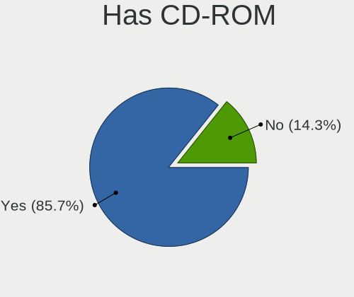
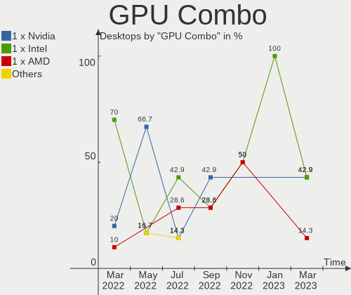
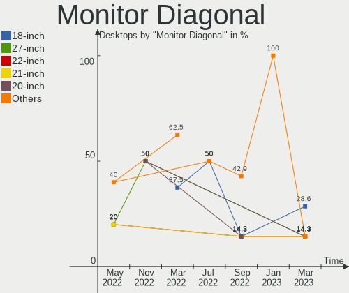
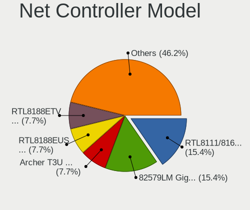
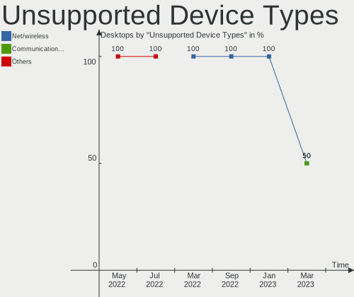

Endless Hardware Trends (Desktops)
----------------------------------

A project to identify most popular hardware characteristics and track their change
over time based on data collected by Endless users at https://Linux-Hardware.org.

Anyone can contribute to this report by the [hw-probe](https://github.com/linuxhw/hw-probe) tool:

    sudo -E hw-probe -all -upload

This report is for one last month. Overall report since the beginning of time: [TestCoverage](https://github.com/linuxhw/TestCoverage)

Period: Apr, 2022.

Contents
--------

* [ System ](#system)
  - [ OS                       ](#os)
  - [ OS Family                ](#os-family)
  - [ Kernel                   ](#kernel)
  - [ Kernel Family            ](#kernel-family)
  - [ Kernel Major Ver.        ](#kernel-major-ver)
  - [ Arch                     ](#arch)
  - [ DE                       ](#de)
  - [ Display Server           ](#display-server)
  - [ Display Manager          ](#display-manager)
  - [ OS Lang                  ](#os-lang)
  - [ Boot Mode                ](#boot-mode)
  - [ Filesystem               ](#filesystem)
  - [ Part. scheme             ](#part-scheme)
  - [ Dual Boot with Linux/BSD ](#dual-boot-with-linuxbsd)
  - [ Dual Boot (Win)          ](#dual-boot-win)

* [ Board ](#board)
  - [ Vendor                   ](#vendor)
  - [ Model                    ](#model)
  - [ Model Family             ](#model-family)
  - [ MFG Year                 ](#mfg-year)
  - [ Form Factor              ](#form-factor)
  - [ Secure Boot              ](#secure-boot)
  - [ Coreboot                 ](#coreboot)
  - [ RAM Size                 ](#ram-size)
  - [ RAM Used                 ](#ram-used)
  - [ Total Drives             ](#total-drives)
  - [ Has CD-ROM               ](#has-cd-rom)
  - [ Has Ethernet             ](#has-ethernet)
  - [ Has WiFi                 ](#has-wifi)
  - [ Has Bluetooth            ](#has-bluetooth)

* [ Location ](#location)
  - [ Country                  ](#country)
  - [ City                     ](#city)

* [ Drives ](#drives)
  - [ Drive Vendor             ](#drive-vendor)
  - [ Drive Model              ](#drive-model)
  - [ HDD Vendor               ](#hdd-vendor)
  - [ SSD Vendor               ](#ssd-vendor)
  - [ Drive Kind               ](#drive-kind)
  - [ Drive Connector          ](#drive-connector)
  - [ Drive Size               ](#drive-size)
  - [ Space Total              ](#space-total)
  - [ Space Used               ](#space-used)
  - [ Malfunc. Drives          ](#malfunc-drives)
  - [ Malfunc. Drive Vendor    ](#malfunc-drive-vendor)
  - [ Malfunc. HDD Vendor      ](#malfunc-hdd-vendor)
  - [ Malfunc. Drive Kind      ](#malfunc-drive-kind)
  - [ Failed Drives            ](#failed-drives)
  - [ Failed Drive Vendor      ](#failed-drive-vendor)
  - [ Drive Status             ](#drive-status)

* [ Storage controller ](#storage-controller)
  - [ Storage Vendor           ](#storage-vendor)
  - [ Storage Model            ](#storage-model)
  - [ Storage Kind             ](#storage-kind)

* [ Processor ](#processor)
  - [ CPU Vendor               ](#cpu-vendor)
  - [ CPU Model                ](#cpu-model)
  - [ CPU Model Family         ](#cpu-model-family)
  - [ CPU Cores                ](#cpu-cores)
  - [ CPU Sockets              ](#cpu-sockets)
  - [ CPU Threads              ](#cpu-threads)
  - [ CPU Op-Modes             ](#cpu-op-modes)
  - [ CPU Microcode            ](#cpu-microcode)
  - [ CPU Microarch            ](#cpu-microarch)

* [ Graphics ](#graphics)
  - [ GPU Vendor               ](#gpu-vendor)
  - [ GPU Model                ](#gpu-model)
  - [ GPU Combo                ](#gpu-combo)
  - [ GPU Driver               ](#gpu-driver)
  - [ GPU Memory               ](#gpu-memory)

* [ Monitor ](#monitor)
  - [ Monitor Vendor           ](#monitor-vendor)
  - [ Monitor Model            ](#monitor-model)
  - [ Monitor Resolution       ](#monitor-resolution)
  - [ Monitor Diagonal         ](#monitor-diagonal)
  - [ Monitor Width            ](#monitor-width)
  - [ Aspect Ratio             ](#aspect-ratio)
  - [ Monitor Area             ](#monitor-area)
  - [ Pixel Density            ](#pixel-density)
  - [ Multiple Monitors        ](#multiple-monitors)

* [ Network ](#network)
  - [ Net Controller Vendor    ](#net-controller-vendor)
  - [ Net Controller Model     ](#net-controller-model)
  - [ Wireless Vendor          ](#wireless-vendor)
  - [ Wireless Model           ](#wireless-model)
  - [ Ethernet Vendor          ](#ethernet-vendor)
  - [ Ethernet Model           ](#ethernet-model)
  - [ Net Controller Kind      ](#net-controller-kind)
  - [ Used Controller          ](#used-controller)
  - [ NICs                     ](#nics)
  - [ IPv6                     ](#ipv6)

* [ Bluetooth ](#bluetooth)
  - [ Bluetooth Vendor         ](#bluetooth-vendor)
  - [ Bluetooth Model          ](#bluetooth-model)

* [ Sound ](#sound)
  - [ Sound Vendor             ](#sound-vendor)
  - [ Sound Model              ](#sound-model)

* [ Memory ](#memory)
  - [ Memory Vendor            ](#memory-vendor)
  - [ Memory Model             ](#memory-model)
  - [ Memory Kind              ](#memory-kind)
  - [ Memory Form Factor       ](#memory-form-factor)
  - [ Memory Size              ](#memory-size)
  - [ Memory Speed             ](#memory-speed)

* [ Printers & scanners ](#printers--scanners)
  - [ Printer Vendor           ](#printer-vendor)
  - [ Printer Model            ](#printer-model)
  - [ Scanner Vendor           ](#scanner-vendor)
  - [ Scanner Model            ](#scanner-model)

* [ Camera ](#camera)
  - [ Camera Vendor            ](#camera-vendor)
  - [ Camera Model             ](#camera-model)

* [ Security ](#security)
  - [ Fingerprint Vendor       ](#fingerprint-vendor)
  - [ Fingerprint Model        ](#fingerprint-model)
  - [ Chipcard Vendor          ](#chipcard-vendor)
  - [ Chipcard Model           ](#chipcard-model)

* [ Unsupported ](#unsupported)
  - [ Unsupported Devices      ](#unsupported-devices)
  - [ Unsupported Device Types ](#unsupported-device-types)

System
------

OS
--

Installed operating systems

| Name          | Desktops | Percent |
|---------------|----------|---------|
| Endless 4.0.4 | 5        | 55.56%  |
| Endless 4.0.6 | 2        | 22.22%  |
| Endless 4.0.5 | 1        | 11.11%  |
| Endless 4.0.3 | 1        | 11.11%  |

OS Family
---------

OS without a version

| Name    | Desktops | Percent |
|---------|----------|---------|
| Endless | 9        | 100%    |

Kernel
------

Version of the Linux kernel

| Version           | Desktops | Percent |
|-------------------|----------|---------|
| 5.11.0-35-generic | 9        | 100%    |

Kernel Family
-------------

Linux kernel without a distro release

| Version | Desktops | Percent |
|---------|----------|---------|
| 5.11.0  | 9        | 100%    |

Kernel Major Ver.
-----------------

Linux kernel major version

| Version | Desktops | Percent |
|---------|----------|---------|
| 5.11    | 9        | 100%    |

Arch
----

OS architecture (x86_64, i586, etc.)

| Name   | Desktops | Percent |
|--------|----------|---------|
| x86_64 | 9        | 100%    |

DE
--

Desktop Environment

| Name  | Desktops | Percent |
|-------|----------|---------|
| GNOME | 9        | 100%    |

Display Server
--------------

X11 or Wayland

| Name | Desktops | Percent |
|------|----------|---------|
| X11  | 9        | 100%    |

Display Manager
---------------

SDDM, LightDM, etc.

| Name    | Desktops | Percent |
|---------|----------|---------|
| Unknown | 9        | 100%    |

OS Lang
-------

Language

| Lang  | Desktops | Percent |
|-------|----------|---------|
| en_US | 3        | 33.33%  |
| pt_BR | 2        | 22.22%  |
| de_DE | 2        | 22.22%  |
| tr_TR | 1        | 11.11%  |
| it_IT | 1        | 11.11%  |

Boot Mode
---------

EFI or BIOS

| Mode | Desktops | Percent |
|------|----------|---------|
| EFI  | 6        | 66.67%  |
| BIOS | 3        | 33.33%  |

Filesystem
----------

Type of filesystem

| Type  | Desktops | Percent |
|-------|----------|---------|
| Ext4  | 8        | 88.89%  |
| Tmpfs | 1        | 11.11%  |

Part. scheme
------------

Scheme of partitioning

| Type    | Desktops | Percent |
|---------|----------|---------|
| Unknown | 9        | 100%    |

Dual Boot with Linux/BSD
------------------------

Hosting more than one Linux/BSD

| Dual boot | Desktops | Percent |
|-----------|----------|---------|
| No        | 9        | 100%    |

Dual Boot (Win)
---------------

Hosting Linux and Windows

| Dual boot | Desktops | Percent |
|-----------|----------|---------|
| No        | 9        | 100%    |

Board
-----

Vendor
------

Motherboard manufacturer

| Name                | Desktops | Percent |
|---------------------|----------|---------|
| Lenovo              | 2        | 22.22%  |
| Dell                | 2        | 22.22%  |
| ASUSTek Computer    | 2        | 22.22%  |
| Hewlett-Packard     | 1        | 11.11%  |
| Gigabyte Technology | 1        | 11.11%  |
| Unknown             | 1        | 11.11%  |

Model
-----

Motherboard model

| Name                               | Desktops | Percent |
|------------------------------------|----------|---------|
| Lenovo ThinkCentre M93p 10A8S0E800 | 1        | 11.11%  |
| Lenovo H50-50 90B60081IX           | 1        | 11.11%  |
| HP ProDesk 490 G2 MT               | 1        | 11.11%  |
| Gigabyte B360M AORUS Gaming 3      | 1        | 11.11%  |
| Dell XPS 8950                      | 1        | 11.11%  |
| Dell Precision T1600               | 1        | 11.11%  |
| ASUS H61M-PRO                      | 1        | 11.11%  |
| ASUS A0000001                      | 1        | 11.11%  |
| Unknown                            | 1        | 11.11%  |

Model Family
------------

Motherboard model prefix

| Name               | Desktops | Percent |
|--------------------|----------|---------|
| Lenovo ThinkCentre | 1        | 11.11%  |
| Lenovo H50-50      | 1        | 11.11%  |
| HP ProDesk         | 1        | 11.11%  |
| Gigabyte B360M     | 1        | 11.11%  |
| Dell XPS           | 1        | 11.11%  |
| Dell Precision     | 1        | 11.11%  |
| ASUS H61M-PRO      | 1        | 11.11%  |
| ASUS A0000001      | 1        | 11.11%  |
| Unknown            | 1        | 11.11%  |

MFG Year
--------

Motherboard manufacture year

| Year | Desktops | Percent |
|------|----------|---------|
| 2014 | 3        | 33.33%  |
| 2018 | 2        | 22.22%  |
| 2011 | 2        | 22.22%  |
| 2021 | 1        | 11.11%  |
| 2013 | 1        | 11.11%  |

Form Factor
-----------

Physical design of the computer

| Name    | Desktops | Percent |
|---------|----------|---------|
| Desktop | 9        | 100%    |

Secure Boot
-----------

Enabled or disabled

| State    | Desktops | Percent |
|----------|----------|---------|
| Disabled | 7        | 77.78%  |
| Enabled  | 2        | 22.22%  |

Coreboot
--------

Have coreboot on board

| Used | Desktops | Percent |
|------|----------|---------|
| No   | 9        | 100%    |

RAM Size
--------

Total RAM memory

| Size in GB | Desktops | Percent |
|------------|----------|---------|
| 16.01-24.0 | 3        | 33.33%  |
| 4.01-8.0   | 2        | 22.22%  |
| 3.01-4.0   | 2        | 22.22%  |
| 32.01-64.0 | 1        | 11.11%  |
| 8.01-16.0  | 1        | 11.11%  |

RAM Used
--------

Used RAM memory

| Used GB  | Desktops | Percent |
|----------|----------|---------|
| 2.01-3.0 | 5        | 55.56%  |
| 1.01-2.0 | 4        | 44.44%  |

Total Drives
------------

Number of drives on board

| Drives | Desktops | Percent |
|--------|----------|---------|
| 1      | 4        | 44.44%  |
| 3      | 2        | 22.22%  |
| 2      | 2        | 22.22%  |
| 0      | 1        | 11.11%  |

Has CD-ROM
----------

Has CD-ROM on board

| Presented | Desktops | Percent |
|-----------|----------|---------|
| Yes       | 7        | 77.78%  |
| No        | 2        | 22.22%  |

Has Ethernet
------------

Has Ethernet on board

| Presented | Desktops | Percent |
|-----------|----------|---------|
| Yes       | 9        | 100%    |

Has WiFi
--------

Has WiFi module

| Presented | Desktops | Percent |
|-----------|----------|---------|
| No        | 5        | 55.56%  |
| Yes       | 4        | 44.44%  |

Has Bluetooth
-------------

Has Bluetooth module

| Presented | Desktops | Percent |
|-----------|----------|---------|
| No        | 7        | 77.78%  |
| Yes       | 2        | 22.22%  |

Location
--------

Country
-------

Geographic location (country)

| Country     | Desktops | Percent |
|-------------|----------|---------|
| USA         | 2        | 22.22%  |
| Germany     | 2        | 22.22%  |
| Brazil      | 2        | 22.22%  |
| Turkey      | 1        | 11.11%  |
| Netherlands | 1        | 11.11%  |
| Italy       | 1        | 11.11%  |

City
----

Geographic location (city)

| City                | Desktops | Percent |
|---------------------|----------|---------|
| Vught               | 1        | 11.11%  |
| Teixeira de Freitas | 1        | 11.11%  |
| Louisville          | 1        | 11.11%  |
| Durham              | 1        | 11.11%  |
| Duque de Caxias     | 1        | 11.11%  |
| Cupello             | 1        | 11.11%  |
| Berlin              | 1        | 11.11%  |
| Altentreptow        | 1        | 11.11%  |
| Adana               | 1        | 11.11%  |

Drives
------

Drive Vendor
------------

Hard drive vendors

| Vendor              | Desktops | Drives | Percent |
|---------------------|----------|--------|---------|
| Seagate             | 4        | 4      | 33.33%  |
| Samsung Electronics | 3        | 5      | 25%     |
| Toshiba             | 1        | 1      | 8.33%   |
| Team                | 1        | 1      | 8.33%   |
| SanDisk             | 1        | 1      | 8.33%   |
| MAXTOR              | 1        | 1      | 8.33%   |
| Kingston            | 1        | 1      | 8.33%   |

Drive Model
-----------

Hard drive models

| Model                           | Desktops | Percent |
|---------------------------------|----------|---------|
| Seagate ST500DM002-1BD142 500GB | 2        | 14.29%  |
| Toshiba MK3265GSX 320GB         | 1        | 7.14%   |
| Team TEAML5Lite3D120G 120GB SSD | 1        | 7.14%   |
| Seagate ST2000DM008-2FR102 2TB  | 1        | 7.14%   |
| Seagate ST1000DM003-1SB10C 1TB  | 1        | 7.14%   |
| SanDisk SDSSDA240G 240GB        | 1        | 7.14%   |
| Samsung SSD 860 QVO 1TB         | 1        | 7.14%   |
| Samsung SSD 860 EVO 250GB       | 1        | 7.14%   |
| Samsung NVMe SSD Drive 512GB    | 1        | 7.14%   |
| Samsung NVMe SSD Drive 2TB      | 1        | 7.14%   |
| Samsung HD502HJ 500GB           | 1        | 7.14%   |
| MAXTOR STM380815AS 80GB         | 1        | 7.14%   |
| Kingston SA400S37240G 240GB SSD | 1        | 7.14%   |

HDD Vendor
----------

Hard disk drive vendors

| Vendor              | Desktops | Drives | Percent |
|---------------------|----------|--------|---------|
| Seagate             | 4        | 4      | 57.14%  |
| Toshiba             | 1        | 1      | 14.29%  |
| Samsung Electronics | 1        | 1      | 14.29%  |
| MAXTOR              | 1        | 1      | 14.29%  |

SSD Vendor
----------

Solid state drive vendors

| Vendor              | Desktops | Drives | Percent |
|---------------------|----------|--------|---------|
| Samsung Electronics | 2        | 2      | 40%     |
| Team                | 1        | 1      | 20%     |
| SanDisk             | 1        | 1      | 20%     |
| Kingston            | 1        | 1      | 20%     |

Drive Kind
----------

HDD or SSD

| Kind | Desktops | Drives | Percent |
|------|----------|--------|---------|
| HDD  | 6        | 7      | 50%     |
| SSD  | 5        | 5      | 41.67%  |
| NVMe | 1        | 2      | 8.33%   |

Drive Connector
---------------

SATA, SAS, NVMe, etc.

| Type | Desktops | Drives | Percent |
|------|----------|--------|---------|
| SATA | 8        | 12     | 88.89%  |
| NVMe | 1        | 2      | 11.11%  |

Drive Size
----------

Size of hard drive

| Size in TB | Desktops | Drives | Percent |
|------------|----------|--------|---------|
| 0.01-0.5   | 6        | 9      | 75%     |
| 1.01-2.0   | 1        | 1      | 12.5%   |
| 0.51-1.0   | 1        | 2      | 12.5%   |

Space Total
-----------

Amount of disk space available on the file system

| Size in GB | Desktops | Percent |
|------------|----------|---------|
| 101-250    | 3        | 33.33%  |
| 251-500    | 2        | 22.22%  |
| 51-100     | 2        | 22.22%  |
| 1001-2000  | 1        | 11.11%  |
| Unknown    | 1        | 11.11%  |

Space Used
----------

Amount of used disk space

| Used GB | Desktops | Percent |
|---------|----------|---------|
| 21-50   | 3        | 33.33%  |
| 51-100  | 3        | 33.33%  |
| 101-250 | 1        | 11.11%  |
| 1-20    | 1        | 11.11%  |
| Unknown | 1        | 11.11%  |

Malfunc. Drives
---------------

Drive models with a malfunction

Zero info for selected period =(

Malfunc. Drive Vendor
---------------------

Vendors of faulty drives

Zero info for selected period =(

Malfunc. HDD Vendor
-------------------

Vendors of faulty HDD drives

Zero info for selected period =(

Malfunc. Drive Kind
-------------------

Kinds of faulty drives

Zero info for selected period =(

Failed Drives
-------------

Failed drive models

Zero info for selected period =(

Failed Drive Vendor
-------------------

Failed drive vendors

Zero info for selected period =(

Drive Status
------------

Number of failed and malfunc. drives

| Status   | Desktops | Drives | Percent |
|----------|----------|--------|---------|
| Detected | 8        | 14     | 100%    |

Storage controller
------------------

Storage Vendor
--------------

Storage controller vendors

| Vendor              | Desktops | Percent |
|---------------------|----------|---------|
| Intel               | 8        | 80%     |
| Samsung Electronics | 1        | 10%     |
| AMD                 | 1        | 10%     |

Storage Model
-------------

Storage controller models

| Model                                                                          | Desktops | Percent |
|--------------------------------------------------------------------------------|----------|---------|
| Intel 6 Series/C200 Series Chipset Family 6 port Desktop SATA AHCI Controller  | 2        | 15.38%  |
| Samsung NVMe SSD Controller SM981/PM981/PM983                                  | 1        | 7.69%   |
| Samsung NVMe SSD Controller PM9A1/PM9A3/980PRO                                 | 1        | 7.69%   |
| Intel NM10/ICH7 Family SATA Controller [IDE mode]                              | 1        | 7.69%   |
| Intel Cannon Lake PCH SATA AHCI Controller                                     | 1        | 7.69%   |
| Intel Alder Lake-S PCH SATA Controller [AHCI Mode]                             | 1        | 7.69%   |
| Intel 9 Series Chipset Family SATA Controller [AHCI Mode]                      | 1        | 7.69%   |
| Intel 8 Series/C220 Series Chipset Family 6-port SATA Controller 1 [AHCI mode] | 1        | 7.69%   |
| Intel 8 Series/C220 Series Chipset Family 4-port SATA Controller 1 [IDE mode]  | 1        | 7.69%   |
| Intel 8 Series/C220 Series Chipset Family 2-port SATA Controller 2 [IDE mode]  | 1        | 7.69%   |
| AMD FCH SATA Controller [AHCI mode]                                            | 1        | 7.69%   |
| AMD FCH SATA Controller D                                                      | 1        | 7.69%   |

Storage Kind
------------

Kind of storage controller (IDE, SATA, NVMe, SAS, ...)

| Kind | Desktops | Percent |
|------|----------|---------|
| SATA | 7        | 70%     |
| IDE  | 2        | 20%     |
| NVMe | 1        | 10%     |

Processor
---------

CPU Vendor
----------

Processor vendors

| Vendor | Desktops | Percent |
|--------|----------|---------|
| Intel  | 8        | 88.89%  |
| AMD    | 1        | 11.11%  |

CPU Model
---------

Processor models

| Model                                         | Desktops | Percent |
|-----------------------------------------------|----------|---------|
| Intel Core i7-4790 CPU @ 3.60GHz              | 1        | 11.11%  |
| Intel Core i7-2600 CPU @ 3.40GHz              | 1        | 11.11%  |
| Intel Core i5-4570 CPU @ 3.20GHz              | 1        | 11.11%  |
| Intel Core i5-3570 CPU @ 3.40GHz              | 1        | 11.11%  |
| Intel Core i3-8100 CPU @ 3.60GHz              | 1        | 11.11%  |
| Intel Core i3-4160 CPU @ 3.60GHz              | 1        | 11.11%  |
| Intel Atom CPU D425 @ 1.80GHz                 | 1        | 11.11%  |
| Intel 12th Gen Core i7-12700K                 | 1        | 11.11%  |
| AMD A8-9600 RADEON R7, 10 COMPUTE CORES 4C+6G | 1        | 11.11%  |

CPU Model Family
----------------

Processor model prefix

| Model         | Desktops | Percent |
|---------------|----------|---------|
| Intel Core i7 | 2        | 22.22%  |
| Intel Core i5 | 2        | 22.22%  |
| Intel Core i3 | 2        | 22.22%  |
| Other         | 1        | 11.11%  |
| Intel Atom    | 1        | 11.11%  |
| AMD A8        | 1        | 11.11%  |

CPU Cores
---------

Number of processor cores

| Number | Desktops | Percent |
|--------|----------|---------|
| 4      | 5        | 55.56%  |
| 2      | 2        | 22.22%  |
| 12     | 1        | 11.11%  |
| 1      | 1        | 11.11%  |

CPU Sockets
-----------

Number of sockets

| Number | Desktops | Percent |
|--------|----------|---------|
| 1      | 9        | 100%    |

CPU Threads
-----------

Threads per core (Hyper-Threading)

| Number | Desktops | Percent |
|--------|----------|---------|
| 2      | 5        | 55.56%  |
| 1      | 4        | 44.44%  |

CPU Op-Modes
------------

CPU Operation Modes (32-bit, 64-bit)

| Op mode        | Desktops | Percent |
|----------------|----------|---------|
| 32-bit, 64-bit | 9        | 100%    |

CPU Microcode
-------------

Microcode number

| Number     | Desktops | Percent |
|------------|----------|---------|
| 0x306c3    | 3        | 33.33%  |
| 0x906eb    | 1        | 11.11%  |
| 0x90672    | 1        | 11.11%  |
| 0x306a9    | 1        | 11.11%  |
| 0x206a7    | 1        | 11.11%  |
| 0x106ca    | 1        | 11.11%  |
| 0x0600611a | 1        | 11.11%  |

CPU Microarch
-------------

Microarchitecture

| Name        | Desktops | Percent |
|-------------|----------|---------|
| Haswell     | 3        | 33.33%  |
| SandyBridge | 1        | 11.11%  |
| KabyLake    | 1        | 11.11%  |
| IvyBridge   | 1        | 11.11%  |
| Excavator   | 1        | 11.11%  |
| Bonnell     | 1        | 11.11%  |
| Unknown     | 1        | 11.11%  |

Graphics
--------

GPU Vendor
----------

Vendors of graphics cards

| Vendor | Desktops | Percent |
|--------|----------|---------|
| Nvidia | 6        | 66.67%  |
| Intel  | 3        | 33.33%  |

GPU Model
---------

Graphics card models

| Model                                                                       | Desktops | Percent |
|-----------------------------------------------------------------------------|----------|---------|
| Nvidia GM107 [GeForce GTX 750 Ti]                                           | 1        | 11.11%  |
| Nvidia GK107 [GeForce GT 640 OEM]                                           | 1        | 11.11%  |
| Nvidia GK107 [GeForce GT 630 OEM]                                           | 1        | 11.11%  |
| Nvidia GK104 [GeForce GTX 660 Ti]                                           | 1        | 11.11%  |
| Nvidia GF108 [GeForce GT 730]                                               | 1        | 11.11%  |
| Nvidia GA104 [GeForce RTX 3060 Ti Lite Hash Rate]                           | 1        | 11.11%  |
| Intel Xeon E3-1200 v3/4th Gen Core Processor Integrated Graphics Controller | 1        | 11.11%  |
| Intel CoffeeLake-S GT2 [UHD Graphics 630]                                   | 1        | 11.11%  |
| Intel Atom Processor D4xx/D5xx/N4xx/N5xx Integrated Graphics Controller     | 1        | 11.11%  |

GPU Combo
---------

Combinations of graphics cards

| Name       | Desktops | Percent |
|------------|----------|---------|
| 1 x Nvidia | 6        | 66.67%  |
| 1 x Intel  | 3        | 33.33%  |

GPU Driver
----------

Free vs proprietary

| Driver      | Desktops | Percent |
|-------------|----------|---------|
| Proprietary | 5        | 55.56%  |
| Free        | 4        | 44.44%  |

GPU Memory
----------

Total video memory

| Size in GB | Desktops | Percent |
|------------|----------|---------|
| Unknown    | 8        | 88.89%  |
| 3.01-4.0   | 1        | 11.11%  |

Monitor
-------

Monitor Vendor
--------------

Monitor vendors

| Vendor               | Desktops | Percent |
|----------------------|----------|---------|
| Dell                 | 2        | 22.22%  |
| Philips              | 1        | 11.11%  |
| MiTAC                | 1        | 11.11%  |
| Goldstar             | 1        | 11.11%  |
| Eizo                 | 1        | 11.11%  |
| ASUSTek Computer     | 1        | 11.11%  |
| AOC                  | 1        | 11.11%  |
| Ancor Communications | 1        | 11.11%  |

Monitor Model
-------------

Monitor models

| Model                                                                | Desktops | Percent |
|----------------------------------------------------------------------|----------|---------|
| Philips PHL 272B8Q PHL0918 2560x1440 597x336mm 27.0-inch             | 1        | 11.11%  |
| MiTAC MON-SIS289 MTC0289 1920x1080 930x530mm 42.1-inch               | 1        | 11.11%  |
| Goldstar L1953H GSM4B3D 1280x1024 338x270mm 17.0-inch                | 1        | 11.11%  |
| Eizo S2202W ENC1975 1680x1050 474x297mm 22.0-inch                    | 1        | 11.11%  |
| Dell P2014H DEL4097 1600x900 434x236mm 19.4-inch                     | 1        | 11.11%  |
| Dell E176FP DELA014 1280x1024 338x270mm 17.0-inch                    | 1        | 11.11%  |
| ASUSTek Computer VA27EHE AUS27D2 1920x1080 598x336mm 27.0-inch       | 1        | 11.11%  |
| AOC 1950w AOC1950 1366x768 410x230mm 18.5-inch                       | 1        | 11.11%  |
| Ancor Communications ASUS VS208 ACI20D9 1600x900 443x249mm 20.0-inch | 1        | 11.11%  |

Monitor Resolution
------------------

Monitor screen resolution

| Resolution         | Desktops | Percent |
|--------------------|----------|---------|
| 1920x1080 (FHD)    | 2        | 22.22%  |
| 1600x900 (HD+)     | 2        | 22.22%  |
| 1280x1024 (SXGA)   | 2        | 22.22%  |
| 2560x1440 (QHD)    | 1        | 11.11%  |
| 1680x1050 (WSXGA+) | 1        | 11.11%  |
| 1366x768 (WXGA)    | 1        | 11.11%  |

Monitor Diagonal
----------------

Diagonal size in inches

| Inches | Desktops | Percent |
|--------|----------|---------|
| 27     | 2        | 22.22%  |
| 17     | 2        | 22.22%  |
| 42     | 1        | 11.11%  |
| 22     | 1        | 11.11%  |
| 20     | 1        | 11.11%  |
| 19     | 1        | 11.11%  |
| 18     | 1        | 11.11%  |

Monitor Width
-------------

Physical width

| Width in mm | Desktops | Percent |
|-------------|----------|---------|
| 401-500     | 4        | 44.44%  |
| 501-600     | 2        | 22.22%  |
| 301-350     | 2        | 22.22%  |
| 901-1000    | 1        | 11.11%  |

Aspect Ratio
------------

Proportional relationship between the width and the height

| Ratio | Desktops | Percent |
|-------|----------|---------|
| 16/9  | 6        | 66.67%  |
| 5/4   | 2        | 22.22%  |
| 16/10 | 1        | 11.11%  |

Monitor Area
------------

Area in inch²

| Area in inch² | Desktops | Percent |
|----------------|----------|---------|
| 141-150        | 3        | 33.33%  |
| 301-350        | 2        | 22.22%  |
| 151-200        | 2        | 22.22%  |
| 201-250        | 1        | 11.11%  |
| 501-1000       | 1        | 11.11%  |

Pixel Density
-------------

Pixels per inch

| Density | Desktops | Percent |
|---------|----------|---------|
| 51-100  | 8        | 88.89%  |
| 101-120 | 1        | 11.11%  |

Multiple Monitors
-----------------

Total monitors connected

| Total | Desktops | Percent |
|-------|----------|---------|
| 1     | 9        | 100%    |

Network
-------

Net Controller Vendor
---------------------

Controller vendors

| Vendor                | Desktops | Percent |
|-----------------------|----------|---------|
| Realtek Semiconductor | 7        | 58.33%  |
| Intel                 | 4        | 33.33%  |
| TP-Link               | 1        | 8.33%   |

Net Controller Model
--------------------

Controller models

| Model                                                             | Desktops | Percent |
|-------------------------------------------------------------------|----------|---------|
| Realtek RTL8111/8168/8411 PCI Express Gigabit Ethernet Controller | 4        | 30.77%  |
| TP-Link AC600 wireless Realtek RTL8811AU [Archer T2U Nano]        | 1        | 7.69%   |
| Realtek RTL8192EU 802.11b/g/n WLAN Adapter                        | 1        | 7.69%   |
| Realtek RTL810xE PCI Express Fast Ethernet controller             | 1        | 7.69%   |
| Realtek Killer E3000 2.5GbE Controller                            | 1        | 7.69%   |
| Intel Wireless 7260                                               | 1        | 7.69%   |
| Intel Wi-Fi 6 AX210/AX211/AX411 160MHz                            | 1        | 7.69%   |
| Intel Ethernet Connection I217-LM                                 | 1        | 7.69%   |
| Intel Ethernet Connection (7) I219-V                              | 1        | 7.69%   |
| Intel 82579LM Gigabit Network Connection (Lewisville)             | 1        | 7.69%   |

Wireless Vendor
---------------

Wireless vendors

| Vendor                | Desktops | Percent |
|-----------------------|----------|---------|
| Intel                 | 2        | 50%     |
| TP-Link               | 1        | 25%     |
| Realtek Semiconductor | 1        | 25%     |

Wireless Model
--------------

Wireless models

| Model                                                      | Desktops | Percent |
|------------------------------------------------------------|----------|---------|
| TP-Link AC600 wireless Realtek RTL8811AU [Archer T2U Nano] | 1        | 25%     |
| Realtek RTL8192EU 802.11b/g/n WLAN Adapter                 | 1        | 25%     |
| Intel Wireless 7260                                        | 1        | 25%     |
| Intel Wi-Fi 6 AX210/AX211/AX411 160MHz                     | 1        | 25%     |

Ethernet Vendor
---------------

Ethernet vendors

| Vendor                | Desktops | Percent |
|-----------------------|----------|---------|
| Realtek Semiconductor | 6        | 66.67%  |
| Intel                 | 3        | 33.33%  |

Ethernet Model
--------------

Ethernet models

| Model                                                             | Desktops | Percent |
|-------------------------------------------------------------------|----------|---------|
| Realtek RTL8111/8168/8411 PCI Express Gigabit Ethernet Controller | 4        | 44.44%  |
| Realtek RTL810xE PCI Express Fast Ethernet controller             | 1        | 11.11%  |
| Realtek Killer E3000 2.5GbE Controller                            | 1        | 11.11%  |
| Intel Ethernet Connection I217-LM                                 | 1        | 11.11%  |
| Intel Ethernet Connection (7) I219-V                              | 1        | 11.11%  |
| Intel 82579LM Gigabit Network Connection (Lewisville)             | 1        | 11.11%  |

Net Controller Kind
-------------------

Ethernet, WiFi or modem

| Kind     | Desktops | Percent |
|----------|----------|---------|
| Ethernet | 9        | 69.23%  |
| WiFi     | 4        | 30.77%  |

Used Controller
---------------

Currently used network controller

| Kind     | Desktops | Percent |
|----------|----------|---------|
| Ethernet | 8        | 88.89%  |
| WiFi     | 1        | 11.11%  |

NICs
----

Total network controllers on board

| Total | Desktops | Percent |
|-------|----------|---------|
| 1     | 7        | 77.78%  |
| 2     | 2        | 22.22%  |

IPv6
----

IPv6 vs IPv4

| Used | Desktops | Percent |
|------|----------|---------|
| No   | 5        | 55.56%  |
| Yes  | 4        | 44.44%  |

Bluetooth
---------

Bluetooth Vendor
----------------

Controller vendors

| Vendor                  | Desktops | Percent |
|-------------------------|----------|---------|
| Intel                   | 1        | 50%     |
| Cambridge Silicon Radio | 1        | 50%     |

Bluetooth Model
---------------

Controller models

| Model                                               | Desktops | Percent |
|-----------------------------------------------------|----------|---------|
| Intel AX210 Bluetooth                               | 1        | 50%     |
| Cambridge Silicon Radio Bluetooth Dongle (HCI mode) | 1        | 50%     |

Sound
-----

Sound Vendor
------------

Sound card vendors

| Vendor              | Desktops | Percent |
|---------------------|----------|---------|
| Intel               | 8        | 47.06%  |
| Nvidia              | 6        | 35.29%  |
| Logitech            | 1        | 5.88%   |
| C-Media Electronics | 1        | 5.88%   |
| AMD                 | 1        | 5.88%   |

Sound Model
-----------

Sound card models

| Model                                                                      | Desktops | Percent |
|----------------------------------------------------------------------------|----------|---------|
| Nvidia GK107 HDMI Audio Controller                                         | 2        | 11.11%  |
| Intel 8 Series/C220 Series Chipset High Definition Audio Controller        | 2        | 11.11%  |
| Intel 6 Series/C200 Series Chipset Family High Definition Audio Controller | 2        | 11.11%  |
| Nvidia GM107 High Definition Audio Controller [GeForce 940MX]              | 1        | 5.56%   |
| Nvidia GK104 HDMI Audio Controller                                         | 1        | 5.56%   |
| Nvidia GF108 High Definition Audio Controller                              | 1        | 5.56%   |
| Nvidia GA104 High Definition Audio Controller                              | 1        | 5.56%   |
| Logitech Headset H390                                                      | 1        | 5.56%   |
| Intel Xeon E3-1200 v3/4th Gen Core Processor HD Audio Controller           | 1        | 5.56%   |
| Intel NM10/ICH7 Family High Definition Audio Controller                    | 1        | 5.56%   |
| Intel Cannon Lake PCH cAVS                                                 | 1        | 5.56%   |
| Intel Alder Lake-S HD Audio Controller                                     | 1        | 5.56%   |
| Intel 9 Series Chipset Family HD Audio Controller                          | 1        | 5.56%   |
| C-Media Electronics CMI8788 [Oxygen HD Audio]                              | 1        | 5.56%   |
| AMD Family 15h (Models 60h-6fh) Audio Controller                           | 1        | 5.56%   |

Memory
------

Memory Vendor
-------------

Memory module vendors

Zero info for selected period =(

Memory Model
------------

Memory module models

Zero info for selected period =(

Memory Kind
-----------

Memory module kinds

Zero info for selected period =(

Memory Form Factor
------------------

Physical design of the memory module

Zero info for selected period =(

Memory Size
-----------

Memory module size

Zero info for selected period =(

Memory Speed
------------

Memory module speed

Zero info for selected period =(

Printers & scanners
-------------------

Printer Vendor
--------------

Printer device vendors

Zero info for selected period =(

Printer Model
-------------

Printer device models

Zero info for selected period =(

Scanner Vendor
--------------

Scanner device vendors

Zero info for selected period =(

Scanner Model
-------------

Scanner device models

Zero info for selected period =(

Camera
------

Camera Vendor
-------------

Camera device vendors

| Vendor   | Desktops | Percent |
|----------|----------|---------|
| Microdia | 2        | 66.67%  |
| Logitech | 1        | 33.33%  |

Camera Model
------------

Camera device models

| Model                                 | Desktops | Percent |
|---------------------------------------|----------|---------|
| Microdia Webcam Vitade AF             | 1        | 33.33%  |
| Microdia Laptop_Integrated_Webcam_FHD | 1        | 33.33%  |
| Logitech QuickCam Pro for Notebooks   | 1        | 33.33%  |

Security
--------

Fingerprint Vendor
------------------

Fingerprint sensor vendors

Zero info for selected period =(

Fingerprint Model
-----------------

Fingerprint sensor models

Zero info for selected period =(

Chipcard Vendor
---------------

Chipcard module vendors

| Vendor              | Desktops | Percent |
|---------------------|----------|---------|
| Chicony Electronics | 1        | 100%    |

Chipcard Model
--------------

Chipcard module models

| Model                                                | Desktops | Percent |
|------------------------------------------------------|----------|---------|
| Chicony Electronics HP Skylab USB Smartcard Keyboard | 1        | 100%    |

Unsupported
-----------

Unsupported Devices
-------------------

Total unsupported devices on board

| Total | Desktops | Percent |
|-------|----------|---------|
| 0     | 7        | 77.78%  |
| 2     | 1        | 11.11%  |
| 1     | 1        | 11.11%  |

Unsupported Device Types
------------------------

Types of unsupported devices

| Type                     | Desktops | Percent |
|--------------------------|----------|---------|
| Net/wireless             | 2        | 66.67%  |
| Communication controller | 1        | 33.33%  |

