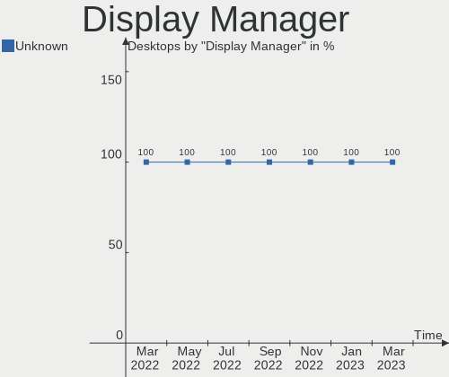
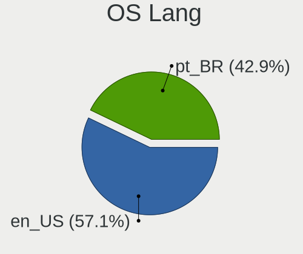
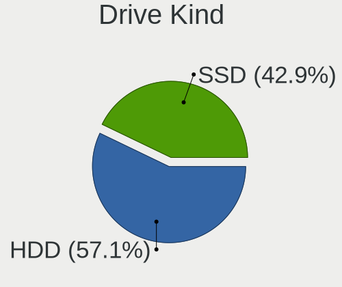
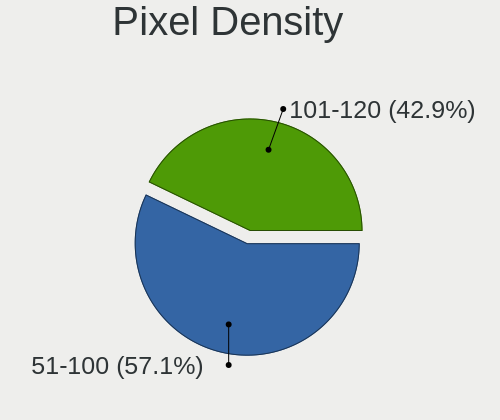

Endless Hardware Trends (Desktops)
----------------------------------

A project to identify most popular hardware characteristics and track their change
over time based on data collected by Endless users at https://Linux-Hardware.org.

Anyone can contribute to this report by the [hw-probe](https://github.com/linuxhw/hw-probe) tool:

    sudo -E hw-probe -all -upload

Full-feature report is available here: https://linux-hardware.org/?view=trends&formfactor=desktop

Period: Sep, 2021.

Contents
--------

* [ System ](#system)
  - [ OS                       ](#os)
  - [ OS Family                ](#os-family)
  - [ Kernel                   ](#kernel)
  - [ Kernel Family            ](#kernel-family)
  - [ Kernel Major Ver.        ](#kernel-major-ver)
  - [ Arch                     ](#arch)
  - [ DE                       ](#de)
  - [ Display Server           ](#display-server)
  - [ Display Manager          ](#display-manager)
  - [ OS Lang                  ](#os-lang)
  - [ Boot Mode                ](#boot-mode)
  - [ Filesystem               ](#filesystem)
  - [ Part. scheme             ](#part-scheme)
  - [ Dual Boot with Linux/BSD ](#dual-boot-with-linuxbsd)
  - [ Dual Boot (Win)          ](#dual-boot-win)

* [ Board ](#board)
  - [ Vendor                   ](#vendor)
  - [ Model                    ](#model)
  - [ Model Family             ](#model-family)
  - [ MFG Year                 ](#mfg-year)
  - [ Form Factor              ](#form-factor)
  - [ Secure Boot              ](#secure-boot)
  - [ Coreboot                 ](#coreboot)
  - [ RAM Size                 ](#ram-size)
  - [ RAM Used                 ](#ram-used)
  - [ Total Drives             ](#total-drives)
  - [ Has CD-ROM               ](#has-cd-rom)
  - [ Has Ethernet             ](#has-ethernet)
  - [ Has WiFi                 ](#has-wifi)
  - [ Has Bluetooth            ](#has-bluetooth)

* [ Location ](#location)
  - [ Country                  ](#country)
  - [ City                     ](#city)

* [ Drives ](#drives)
  - [ Drive Vendor             ](#drive-vendor)
  - [ Drive Model              ](#drive-model)
  - [ HDD Vendor               ](#hdd-vendor)
  - [ SSD Vendor               ](#ssd-vendor)
  - [ Drive Kind               ](#drive-kind)
  - [ Drive Connector          ](#drive-connector)
  - [ Drive Size               ](#drive-size)
  - [ Space Total              ](#space-total)
  - [ Space Used               ](#space-used)
  - [ Malfunc. Drives          ](#malfunc-drives)
  - [ Malfunc. Drive Vendor    ](#malfunc-drive-vendor)
  - [ Malfunc. HDD Vendor      ](#malfunc-hdd-vendor)
  - [ Malfunc. Drive Kind      ](#malfunc-drive-kind)
  - [ Failed Drives            ](#failed-drives)
  - [ Failed Drive Vendor      ](#failed-drive-vendor)
  - [ Drive Status             ](#drive-status)

* [ Storage controller ](#storage-controller)
  - [ Storage Vendor           ](#storage-vendor)
  - [ Storage Model            ](#storage-model)
  - [ Storage Kind             ](#storage-kind)

* [ Processor ](#processor)
  - [ CPU Vendor               ](#cpu-vendor)
  - [ CPU Model                ](#cpu-model)
  - [ CPU Model Family         ](#cpu-model-family)
  - [ CPU Cores                ](#cpu-cores)
  - [ CPU Sockets              ](#cpu-sockets)
  - [ CPU Threads              ](#cpu-threads)
  - [ CPU Op-Modes             ](#cpu-op-modes)
  - [ CPU Microcode            ](#cpu-microcode)
  - [ CPU Microarch            ](#cpu-microarch)

* [ Graphics ](#graphics)
  - [ GPU Vendor               ](#gpu-vendor)
  - [ GPU Model                ](#gpu-model)
  - [ GPU Combo                ](#gpu-combo)
  - [ GPU Driver               ](#gpu-driver)
  - [ GPU Memory               ](#gpu-memory)

* [ Monitor ](#monitor)
  - [ Monitor Vendor           ](#monitor-vendor)
  - [ Monitor Model            ](#monitor-model)
  - [ Monitor Resolution       ](#monitor-resolution)
  - [ Monitor Diagonal         ](#monitor-diagonal)
  - [ Monitor Width            ](#monitor-width)
  - [ Aspect Ratio             ](#aspect-ratio)
  - [ Monitor Area             ](#monitor-area)
  - [ Pixel Density            ](#pixel-density)
  - [ Multiple Monitors        ](#multiple-monitors)

* [ Network ](#network)
  - [ Net Controller Vendor    ](#net-controller-vendor)
  - [ Net Controller Model     ](#net-controller-model)
  - [ Wireless Vendor          ](#wireless-vendor)
  - [ Wireless Model           ](#wireless-model)
  - [ Ethernet Vendor          ](#ethernet-vendor)
  - [ Ethernet Model           ](#ethernet-model)
  - [ Net Controller Kind      ](#net-controller-kind)
  - [ Used Controller          ](#used-controller)
  - [ NICs                     ](#nics)
  - [ IPv6                     ](#ipv6)

* [ Bluetooth ](#bluetooth)
  - [ Bluetooth Vendor         ](#bluetooth-vendor)
  - [ Bluetooth Model          ](#bluetooth-model)

* [ Sound ](#sound)
  - [ Sound Vendor             ](#sound-vendor)
  - [ Sound Model              ](#sound-model)

* [ Memory ](#memory)
  - [ Memory Vendor            ](#memory-vendor)
  - [ Memory Model             ](#memory-model)
  - [ Memory Kind              ](#memory-kind)
  - [ Memory Form Factor       ](#memory-form-factor)
  - [ Memory Size              ](#memory-size)
  - [ Memory Speed             ](#memory-speed)

* [ Printers & scanners ](#printers--scanners)
  - [ Printer Vendor           ](#printer-vendor)
  - [ Printer Model            ](#printer-model)
  - [ Scanner Vendor           ](#scanner-vendor)
  - [ Scanner Model            ](#scanner-model)

* [ Camera ](#camera)
  - [ Camera Vendor            ](#camera-vendor)
  - [ Camera Model             ](#camera-model)

* [ Security ](#security)
  - [ Fingerprint Vendor       ](#fingerprint-vendor)
  - [ Fingerprint Model        ](#fingerprint-model)
  - [ Chipcard Vendor          ](#chipcard-vendor)
  - [ Chipcard Model           ](#chipcard-model)

* [ Unsupported ](#unsupported)
  - [ Unsupported Devices      ](#unsupported-devices)
  - [ Unsupported Device Types ](#unsupported-device-types)

System
------

OS
--

Installed operating systems

| Name          | Desktops | Percent |
|---------------|----------|---------|
| Endless 3.9.5 | 6        | 75%     |
| Endless 3.7.6 | 2        | 25%     |

OS Family
---------

OS without a version

| Name    | Desktops | Percent |
|---------|----------|---------|
| Endless | 8        | 100%    |

Kernel
------

Version of the Linux kernel

| Version          | Desktops | Percent |
|------------------|----------|---------|
| 5.8.0-14-generic | 6        | 75%     |
| 5.3.0-23-generic | 2        | 25%     |

Kernel Family
-------------

Linux kernel without a distro release

| Version | Desktops | Percent |
|---------|----------|---------|
| 5.8.0   | 6        | 75%     |
| 5.3.0   | 2        | 25%     |

Kernel Major Ver.
-----------------

Linux kernel major version

| Version | Desktops | Percent |
|---------|----------|---------|
| 5.8     | 6        | 75%     |
| 5.3     | 2        | 25%     |

Arch
----

OS architecture (x86_64, i586, etc.)

| Name   | Desktops | Percent |
|--------|----------|---------|
| x86_64 | 8        | 100%    |

DE
--

Desktop Environment

| Name  | Desktops | Percent |
|-------|----------|---------|
| GNOME | 8        | 100%    |

Display Server
--------------

X11 or Wayland

| Name | Desktops | Percent |
|------|----------|---------|
| X11  | 8        | 100%    |

Display Manager
---------------

SDDM, LightDM, etc.

| Name    | Desktops | Percent |
|---------|----------|---------|
| Unknown | 8        | 100%    |

OS Lang
-------

Language

| Lang        | Desktops | Percent |
|-------------|----------|---------|
| en_US       | 3        | 37.5%   |
| ru_RU.UTF_8 | 2        | 25%     |
| es_MX       | 2        | 25%     |
| de_DE       | 1        | 12.5%   |

Boot Mode
---------

EFI or BIOS

| Mode | Desktops | Percent |
|------|----------|---------|
| BIOS | 5        | 62.5%   |
| EFI  | 3        | 37.5%   |

Filesystem
----------

Type of filesystem

| Type | Desktops | Percent |
|------|----------|---------|
| Ext4 | 8        | 100%    |

Part. scheme
------------

Scheme of partitioning

| Type    | Desktops | Percent |
|---------|----------|---------|
| Unknown | 8        | 100%    |

Dual Boot with Linux/BSD
------------------------

Hosting more than one Linux/BSD

| Dual boot | Desktops | Percent |
|-----------|----------|---------|
| No        | 8        | 100%    |

Dual Boot (Win)
---------------

Hosting Linux and Windows

| Dual boot | Desktops | Percent |
|-----------|----------|---------|
| No        | 8        | 100%    |

Board
-----

Vendor
------

Motherboard manufacturer

| Name                | Desktops | Percent |
|---------------------|----------|---------|
| Lenovo              | 2        | 25%     |
| ASUSTek Computer    | 2        | 25%     |
| MSI                 | 1        | 12.5%   |
| HARDKERNEL          | 1        | 12.5%   |
| Gigabyte Technology | 1        | 12.5%   |
| Acer                | 1        | 12.5%   |

Model
-----

Motherboard model

| Name                              | Desktops | Percent |
|-----------------------------------|----------|---------|
| MSI MS-7817                       | 1        | 12.5%   |
| Lenovo ThinkCentre M78 10BTA00ELM | 1        | 12.5%   |
| Lenovo ThinkCentre M58e 7303AS6   | 1        | 12.5%   |
| HARDKERNEL ODROID-H2              | 1        | 12.5%   |
| Gigabyte F2A68HM-DS2              | 1        | 12.5%   |
| ASUS P8H61-M LE/USB3              | 1        | 12.5%   |
| ASUS P8H61-M LE                   | 1        | 12.5%   |
| Acer Aspire TC-885                | 1        | 12.5%   |

Model Family
------------

Motherboard model prefix

| Name                 | Desktops | Percent |
|----------------------|----------|---------|
| Lenovo ThinkCentre   | 2        | 25%     |
| ASUS P8H61-M         | 2        | 25%     |
| MSI MS-7817          | 1        | 12.5%   |
| HARDKERNEL ODROID-H2 | 1        | 12.5%   |
| Gigabyte F2A68HM-DS2 | 1        | 12.5%   |
| Acer Aspire          | 1        | 12.5%   |

MFG Year
--------

Motherboard manufacture year

| Year | Desktops | Percent |
|------|----------|---------|
| 2018 | 3        | 37.5%   |
| 2013 | 2        | 25%     |
| 2014 | 1        | 12.5%   |
| 2011 | 1        | 12.5%   |
| 2009 | 1        | 12.5%   |

Form Factor
-----------

Physical design of the computer

| Name    | Desktops | Percent |
|---------|----------|---------|
| Desktop | 8        | 100%    |

Secure Boot
-----------

Enabled or disabled

| State    | Desktops | Percent |
|----------|----------|---------|
| Disabled | 8        | 100%    |

Coreboot
--------

Have coreboot on board

| Used | Desktops | Percent |
|------|----------|---------|
| No   | 8        | 100%    |

RAM Size
--------

Total RAM memory

| Size in GB | Desktops | Percent |
|------------|----------|---------|
| 3.01-4.0   | 4        | 50%     |
| 4.01-8.0   | 3        | 37.5%   |
| 8.01-16.0  | 1        | 12.5%   |

RAM Used
--------

Used RAM memory

| Used GB  | Desktops | Percent |
|----------|----------|---------|
| 1.01-2.0 | 4        | 50%     |
| 2.01-3.0 | 3        | 37.5%   |
| 0.51-1.0 | 1        | 12.5%   |

Total Drives
------------

Number of drives on board

| Drives | Desktops | Percent |
|--------|----------|---------|
| 1      | 6        | 75%     |
| 2      | 2        | 25%     |

Has CD-ROM
----------

Has CD-ROM on board

| Presented | Desktops | Percent |
|-----------|----------|---------|
| Yes       | 5        | 62.5%   |
| No        | 3        | 37.5%   |

Has Ethernet
------------

Has Ethernet on board

| Presented | Desktops | Percent |
|-----------|----------|---------|
| Yes       | 8        | 100%    |

Has WiFi
--------

Has WiFi module

| Presented | Desktops | Percent |
|-----------|----------|---------|
| No        | 5        | 62.5%   |
| Yes       | 3        | 37.5%   |

Has Bluetooth
-------------

Has Bluetooth module

| Presented | Desktops | Percent |
|-----------|----------|---------|
| No        | 5        | 62.5%   |
| Yes       | 3        | 37.5%   |

Location
--------

Country
-------

Geographic location (country)

| Country  | Desktops | Percent |
|----------|----------|---------|
| Thailand | 2        | 25%     |
| Russia   | 2        | 25%     |
| Mexico   | 2        | 25%     |
| USA      | 1        | 12.5%   |
| Germany  | 1        | 12.5%   |

City
----

Geographic location (city)

| City            | Desktops | Percent |
|-----------------|----------|---------|
| Moscow          | 2        | 25%     |
| Rietberg        | 1        | 12.5%   |
| Quer?©taro City | 1        | 12.5%   |
| Prachantakham   | 1        | 12.5%   |
| Ocoee           | 1        | 12.5%   |
| Hermosillo      | 1        | 12.5%   |
| Bangkok         | 1        | 12.5%   |

Drives
------

Drive Vendor
------------

Hard drive vendors

| Vendor              | Desktops | Drives | Percent |
|---------------------|----------|--------|---------|
| WDC                 | 4        | 4      | 40%     |
| Toshiba             | 2        | 2      | 20%     |
| Seagate             | 2        | 2      | 20%     |
| Unknown             | 1        | 1      | 10%     |
| Samsung Electronics | 1        | 1      | 10%     |

Drive Model
-----------

Hard drive models

| Model                           | Desktops | Percent |
|---------------------------------|----------|---------|
| WDC WD2500YD-01NVB1 256GB       | 1        | 10%     |
| WDC WD2500AAJS-08L7A0 250GB     | 1        | 10%     |
| WDC WD1600AAJS-07WAA0 160GB     | 1        | 10%     |
| WDC WD10EZEX-08WN4A0 1TB        | 1        | 10%     |
| Unknown SD/MMC/MS PRO 128GB     | 1        | 10%     |
| Toshiba MK1646GSX 160GB         | 1        | 10%     |
| Toshiba DT01ACA100 1TB          | 1        | 10%     |
| Seagate ST500DM002-1BD142 500GB | 1        | 10%     |
| Seagate ST1000DM003-1CH162 1TB  | 1        | 10%     |
| Samsung HD080HJ 80GB            | 1        | 10%     |

HDD Vendor
----------

Hard disk drive vendors

| Vendor              | Desktops | Drives | Percent |
|---------------------|----------|--------|---------|
| WDC                 | 4        | 4      | 40%     |
| Toshiba             | 2        | 2      | 20%     |
| Seagate             | 2        | 2      | 20%     |
| Unknown             | 1        | 1      | 10%     |
| Samsung Electronics | 1        | 1      | 10%     |

SSD Vendor
----------

Solid state drive vendors

Zero info for selected period =(

Drive Kind
----------

HDD or SSD

| Kind | Desktops | Drives | Percent |
|------|----------|--------|---------|
| HDD  | 8        | 10     | 100%    |

Drive Connector
---------------

SATA, SAS, NVMe, etc.

| Type | Desktops | Drives | Percent |
|------|----------|--------|---------|
| SATA | 8        | 9      | 88.89%  |
| SAS  | 1        | 1      | 11.11%  |

Drive Size
----------

Size of hard drive

| Size in TB | Desktops | Drives | Percent |
|------------|----------|--------|---------|
| 0.01-0.5   | 7        | 7      | 70%     |
| 0.51-1.0   | 3        | 3      | 30%     |

Space Total
-----------

Amount of disk space available on the file system

| Size in GB | Desktops | Percent |
|------------|----------|---------|
| 501-1000   | 3        | 37.5%   |
| 101-250    | 2        | 25%     |
| 251-500    | 1        | 12.5%   |
| 51-100     | 1        | 12.5%   |
| Unknown    | 1        | 12.5%   |

Space Used
----------

Amount of used disk space

| Used GB  | Desktops | Percent |
|----------|----------|---------|
| 21-50    | 2        | 25%     |
| 1-20     | 2        | 25%     |
| 101-250  | 1        | 12.5%   |
| 501-1000 | 1        | 12.5%   |
| 51-100   | 1        | 12.5%   |
| Unknown  | 1        | 12.5%   |

Malfunc. Drives
---------------

Drive models with a malfunction

Zero info for selected period =(

Malfunc. Drive Vendor
---------------------

Vendors of faulty drives

Zero info for selected period =(

Malfunc. HDD Vendor
-------------------

Vendors of faulty HDD drives

Zero info for selected period =(

Malfunc. Drive Kind
-------------------

Kinds of faulty drives

Zero info for selected period =(

Failed Drives
-------------

Failed drive models

Zero info for selected period =(

Failed Drive Vendor
-------------------

Failed drive vendors

Zero info for selected period =(

Drive Status
------------

Number of failed and malfunc. drives

| Status   | Desktops | Drives | Percent |
|----------|----------|--------|---------|
| Detected | 8        | 10     | 100%    |

Storage controller
------------------

Storage Vendor
--------------

Storage controller vendors

| Vendor        | Desktops | Percent |
|---------------|----------|---------|
| Intel         | 6        | 66.67%  |
| AMD           | 2        | 22.22%  |
| Silicon Image | 1        | 11.11%  |

Storage Model
-------------

Storage controller models

| Model                                                                          | Desktops | Percent |
|--------------------------------------------------------------------------------|----------|---------|
| Intel 6 Series/C200 Series Chipset Family 6 port Desktop SATA AHCI Controller  | 2        | 20%     |
| Silicon Image SiI 3512 [SATALink/SATARaid] Serial ATA Controller               | 1        | 10%     |
| Intel NM10/ICH7 Family SATA Controller [IDE mode]                              | 1        | 10%     |
| Intel Celeron/Pentium Silver Processor SATA Controller                         | 1        | 10%     |
| Intel Cannon Lake PCH SATA AHCI Controller                                     | 1        | 10%     |
| Intel 82801G (ICH7 Family) IDE Controller                                      | 1        | 10%     |
| Intel 8 Series/C220 Series Chipset Family 6-port SATA Controller 1 [AHCI mode] | 1        | 10%     |
| AMD FCH SATA Controller [IDE mode]                                             | 1        | 10%     |
| AMD FCH SATA Controller [AHCI mode]                                            | 1        | 10%     |

Storage Kind
------------

Kind of storage controller (IDE, SATA, NVMe, SAS, ...)

| Kind | Desktops | Percent |
|------|----------|---------|
| SATA | 7        | 77.78%  |
| RAID | 1        | 11.11%  |
| IDE  | 1        | 11.11%  |

Processor
---------

CPU Vendor
----------

Processor vendors

| Vendor | Desktops | Percent |
|--------|----------|---------|
| Intel  | 6        | 75%     |
| AMD    | 2        | 25%     |

CPU Model
---------

Processor models

| Model                                           | Desktops | Percent |
|-------------------------------------------------|----------|---------|
| Intel Pentium CPU G620 @ 2.60GHz                | 1        | 12.5%   |
| Intel Core i7-4770 CPU @ 3.40GHz                | 1        | 12.5%   |
| Intel Core i5-8400 CPU @ 2.80GHz                | 1        | 12.5%   |
| Intel Core i3-2130 CPU @ 3.40GHz                | 1        | 12.5%   |
| Intel Core 2 Duo CPU E7400 @ 2.80GHz            | 1        | 12.5%   |
| Intel Celeron J4105 CPU @ 1.50GHz               | 1        | 12.5%   |
| AMD A6-5400B APU with Radeon HD Graphics        | 1        | 12.5%   |
| AMD A10-7700K Radeon R7, 10 Compute Cores 4C+6G | 1        | 12.5%   |

CPU Model Family
----------------

Processor model prefix

| Model            | Desktops | Percent |
|------------------|----------|---------|
| Intel Pentium    | 1        | 12.5%   |
| Intel Core i7    | 1        | 12.5%   |
| Intel Core i5    | 1        | 12.5%   |
| Intel Core i3    | 1        | 12.5%   |
| Intel Core 2 Duo | 1        | 12.5%   |
| Intel Celeron    | 1        | 12.5%   |
| AMD A6           | 1        | 12.5%   |
| AMD A10          | 1        | 12.5%   |

CPU Cores
---------

Number of processor cores

| Number | Desktops | Percent |
|--------|----------|---------|
| 2      | 4        | 50%     |
| 4      | 2        | 25%     |
| 6      | 1        | 12.5%   |
| 1      | 1        | 12.5%   |

CPU Sockets
-----------

Number of sockets

| Number | Desktops | Percent |
|--------|----------|---------|
| 1      | 8        | 100%    |

CPU Threads
-----------

Threads per core (Hyper-Threading)

| Number | Desktops | Percent |
|--------|----------|---------|
| 2      | 4        | 50%     |
| 1      | 4        | 50%     |

CPU Op-Modes
------------

CPU Operation Modes (32-bit, 64-bit)

| Op mode        | Desktops | Percent |
|----------------|----------|---------|
| 32-bit, 64-bit | 8        | 100%    |

CPU Microcode
-------------

Microcode number

| Number     | Desktops | Percent |
|------------|----------|---------|
| 0x206a7    | 2        | 25%     |
| 0x906ea    | 1        | 12.5%   |
| 0x306c3    | 1        | 12.5%   |
| 0x1067a    | 1        | 12.5%   |
| 0x06003106 | 1        | 12.5%   |
| 0x06001119 | 1        | 12.5%   |
| Unknown    | 1        | 12.5%   |

CPU Microarch
-------------

Microarchitecture

| Name          | Desktops | Percent |
|---------------|----------|---------|
| SandyBridge   | 2        | 25%     |
| Steamroller   | 1        | 12.5%   |
| Piledriver    | 1        | 12.5%   |
| Penryn        | 1        | 12.5%   |
| KabyLake      | 1        | 12.5%   |
| Haswell       | 1        | 12.5%   |
| Goldmont plus | 1        | 12.5%   |

Graphics
--------

GPU Vendor
----------

Vendors of graphics cards

| Vendor | Desktops | Percent |
|--------|----------|---------|
| Nvidia | 4        | 40%     |
| Intel  | 4        | 40%     |
| AMD    | 2        | 20%     |

GPU Model
---------

Graphics card models

| Model                                                                     | Desktops | Percent |
|---------------------------------------------------------------------------|----------|---------|
| Intel 2nd Generation Core Processor Family Integrated Graphics Controller | 2        | 20%     |
| Nvidia GT216 [GeForce GT 220]                                             | 1        | 10%     |
| Nvidia GP108 [GeForce GT 1030]                                            | 1        | 10%     |
| Nvidia GK208B [GeForce GT 730]                                            | 1        | 10%     |
| Nvidia GK106 [GeForce GTX 660]                                            | 1        | 10%     |
| Intel GeminiLake [UHD Graphics 600]                                       | 1        | 10%     |
| Intel 4 Series Chipset Integrated Graphics Controller                     | 1        | 10%     |
| AMD Trinity 2 [Radeon HD 7540D]                                           | 1        | 10%     |
| AMD Kaveri [Radeon R7 Graphics]                                           | 1        | 10%     |

GPU Combo
---------

Combinations of graphics cards

| Name           | Desktops | Percent |
|----------------|----------|---------|
| 1 x Intel      | 3        | 37.5%   |
| 1 x Nvidia     | 2        | 25%     |
| Intel + Nvidia | 1        | 12.5%   |
| AMD + Nvidia   | 1        | 12.5%   |
| 1 x AMD        | 1        | 12.5%   |

GPU Driver
----------

Free vs proprietary

| Driver      | Desktops | Percent |
|-------------|----------|---------|
| Free        | 5        | 62.5%   |
| Proprietary | 3        | 37.5%   |

GPU Memory
----------

Total video memory

| Size in GB | Desktops | Percent |
|------------|----------|---------|
| Unknown    | 5        | 62.5%   |
| 0.51-1.0   | 2        | 25%     |
| 1.01-2.0   | 1        | 12.5%   |

Monitor
-------

Monitor Vendor
--------------

Monitor vendors

| Vendor          | Desktops | Percent |
|-----------------|----------|---------|
| Hewlett-Packard | 2        | 25%     |
| BenQ            | 2        | 25%     |
| Insignia        | 1        | 12.5%   |
| HKC             | 1        | 12.5%   |
| Gateway         | 1        | 12.5%   |
| Dell            | 1        | 12.5%   |

Monitor Model
-------------

Monitor models

| Model                                                            | Desktops | Percent |
|------------------------------------------------------------------|----------|---------|
| BenQ LCD BNQ801B 2560x1440 527x296mm 23.8-inch                   | 2        | 25%     |
| Insignia NS-32D310NA17 BBY0050 1360x768 760x450mm 34.8-inch      | 1        | 12.5%   |
| HKC Checksum: 0x2a (valid) HKC2160 1920x1080 360x270mm 17.7-inch | 1        | 12.5%   |
| Hewlett-Packard ZR2440w HWP2956 1920x1200 518x324mm 24.1-inch    | 1        | 12.5%   |
| Hewlett-Packard E201 HWP305F 1600x900 443x249mm 20.0-inch        | 1        | 12.5%   |
| Gateway FHX2152L GWY01DC 1920x1080 477x268mm 21.5-inch           | 1        | 12.5%   |
| Dell P1913S DELA084 1280x1024 376x301mm 19.0-inch                | 1        | 12.5%   |

Monitor Resolution
------------------

Monitor screen resolution

| Resolution       | Desktops | Percent |
|------------------|----------|---------|
| 1920x1080 (FHD)  | 4        | 50%     |
| 2560x1440 (QHD)  | 2        | 25%     |
| 1600x900 (HD+)   | 1        | 12.5%   |
| 1280x1024 (SXGA) | 1        | 12.5%   |

Monitor Diagonal
----------------

Diagonal size in inches

| Inches | Desktops | Percent |
|--------|----------|---------|
| 24     | 3        | 37.5%   |
| 34     | 1        | 12.5%   |
| 21     | 1        | 12.5%   |
| 20     | 1        | 12.5%   |
| 19     | 1        | 12.5%   |
| 17     | 1        | 12.5%   |

Monitor Width
-------------

Physical width

| Width in mm | Desktops | Percent |
|-------------|----------|---------|
| 501-600     | 3        | 37.5%   |
| 401-500     | 2        | 25%     |
| 351-400     | 2        | 25%     |
| 701-800     | 1        | 12.5%   |

Aspect Ratio
------------

Proportional relationship between the width and the height

| Ratio | Desktops | Percent |
|-------|----------|---------|
| 16/9  | 5        | 62.5%   |
| 5/4   | 1        | 12.5%   |
| 4/3   | 1        | 12.5%   |
| 16/10 | 1        | 12.5%   |

Monitor Area
------------

Area in inch²

| Area in inch² | Desktops | Percent |
|----------------|----------|---------|
| 151-200        | 4        | 50%     |
| 201-250        | 2        | 25%     |
| 251-300        | 1        | 12.5%   |
| 501-1000       | 1        | 12.5%   |

Pixel Density
-------------

Pixels per inch

| Density | Desktops | Percent |
|---------|----------|---------|
| 121-160 | 3        | 37.5%   |
| 51-100  | 3        | 37.5%   |
| 1-50    | 1        | 12.5%   |
| 101-120 | 1        | 12.5%   |

Multiple Monitors
-----------------

Total monitors connected

| Total | Desktops | Percent |
|-------|----------|---------|
| 1     | 8        | 100%    |

Network
-------

Net Controller Vendor
---------------------

Controller vendors

| Vendor                   | Desktops | Percent |
|--------------------------|----------|---------|
| Realtek Semiconductor    | 7        | 58.33%  |
| Intel                    | 2        | 16.67%  |
| VIA Technologies         | 1        | 8.33%   |
| Ralink Technology        | 1        | 8.33%   |
| Marvell Technology Group | 1        | 8.33%   |

Net Controller Model
--------------------

Controller models

| Model                                                             | Desktops | Percent |
|-------------------------------------------------------------------|----------|---------|
| Realtek RTL8111/8168/8411 PCI Express Gigabit Ethernet Controller | 7        | 58.33%  |
| VIA VT6105/VT6106S [Rhine-III]                                    | 1        | 8.33%   |
| Ralink MT7601U Wireless Adapter                                   | 1        | 8.33%   |
| Marvell Group 88E8057 PCI-E Gigabit Ethernet Controller           | 1        | 8.33%   |
| Intel Wireless 7265                                               | 1        | 8.33%   |
| Intel Cannon Lake PCH CNVi WiFi                                   | 1        | 8.33%   |

Wireless Vendor
---------------

Wireless vendors

| Vendor            | Desktops | Percent |
|-------------------|----------|---------|
| Intel             | 2        | 66.67%  |
| Ralink Technology | 1        | 33.33%  |

Wireless Model
--------------

Wireless models

| Model                           | Desktops | Percent |
|---------------------------------|----------|---------|
| Ralink MT7601U Wireless Adapter | 1        | 33.33%  |
| Intel Wireless 7265             | 1        | 33.33%  |
| Intel Cannon Lake PCH CNVi WiFi | 1        | 33.33%  |

Ethernet Vendor
---------------

Ethernet vendors

| Vendor                   | Desktops | Percent |
|--------------------------|----------|---------|
| Realtek Semiconductor    | 7        | 77.78%  |
| VIA Technologies         | 1        | 11.11%  |
| Marvell Technology Group | 1        | 11.11%  |

Ethernet Model
--------------

Ethernet models

| Model                                                             | Desktops | Percent |
|-------------------------------------------------------------------|----------|---------|
| Realtek RTL8111/8168/8411 PCI Express Gigabit Ethernet Controller | 7        | 77.78%  |
| VIA VT6105/VT6106S [Rhine-III]                                    | 1        | 11.11%  |
| Marvell Group 88E8057 PCI-E Gigabit Ethernet Controller           | 1        | 11.11%  |

Net Controller Kind
-------------------

Ethernet, WiFi or modem

| Kind     | Desktops | Percent |
|----------|----------|---------|
| Ethernet | 8        | 72.73%  |
| WiFi     | 3        | 27.27%  |

Used Controller
---------------

Currently used network controller

| Kind     | Desktops | Percent |
|----------|----------|---------|
| Ethernet | 8        | 72.73%  |
| WiFi     | 3        | 27.27%  |

NICs
----

Total network controllers on board

| Total | Desktops | Percent |
|-------|----------|---------|
| 2     | 4        | 50%     |
| 1     | 4        | 50%     |

IPv6
----

IPv6 vs IPv4

| Used | Desktops | Percent |
|------|----------|---------|
| Yes  | 4        | 50%     |
| No   | 4        | 50%     |

Bluetooth
---------

Bluetooth Vendor
----------------

Controller vendors

| Vendor                  | Desktops | Percent |
|-------------------------|----------|---------|
| Intel                   | 2        | 66.67%  |
| Cambridge Silicon Radio | 1        | 33.33%  |

Bluetooth Model
---------------

Controller models

| Model                                               | Desktops | Percent |
|-----------------------------------------------------|----------|---------|
| Intel Bluetooth Device                              | 1        | 33.33%  |
| Intel Bluetooth 9460/9560 Jefferson Peak (JfP)      | 1        | 33.33%  |
| Cambridge Silicon Radio Bluetooth Dongle (HCI mode) | 1        | 33.33%  |

Sound
-----

Sound Vendor
------------

Sound card vendors

| Vendor | Desktops | Percent |
|--------|----------|---------|
| Intel  | 6        | 50%     |
| Nvidia | 4        | 33.33%  |
| AMD    | 2        | 16.67%  |

Sound Model
-----------

Sound card models

| Model                                                                      | Desktops | Percent |
|----------------------------------------------------------------------------|----------|---------|
| Intel 6 Series/C200 Series Chipset Family High Definition Audio Controller | 2        | 14.29%  |
| AMD FCH Azalia Controller                                                  | 2        | 14.29%  |
| Nvidia GT216 HDMI Audio Controller                                         | 1        | 7.14%   |
| Nvidia GP108 High Definition Audio Controller                              | 1        | 7.14%   |
| Nvidia GK208 HDMI/DP Audio Controller                                      | 1        | 7.14%   |
| Nvidia GK106 HDMI Audio Controller                                         | 1        | 7.14%   |
| Intel NM10/ICH7 Family High Definition Audio Controller                    | 1        | 7.14%   |
| Intel Celeron/Pentium Silver Processor High Definition Audio               | 1        | 7.14%   |
| Intel Cannon Lake PCH cAVS                                                 | 1        | 7.14%   |
| Intel 8 Series/C220 Series Chipset High Definition Audio Controller        | 1        | 7.14%   |
| AMD Trinity HDMI Audio Controller                                          | 1        | 7.14%   |
| AMD Kaveri HDMI/DP Audio Controller                                        | 1        | 7.14%   |

Memory
------

Memory Vendor
-------------

Memory module vendors

Zero info for selected period =(

Memory Model
------------

Memory module models

Zero info for selected period =(

Memory Kind
-----------

Memory module kinds

Zero info for selected period =(

Memory Form Factor
------------------

Physical design of the memory module

Zero info for selected period =(

Memory Size
-----------

Memory module size

Zero info for selected period =(

Memory Speed
------------

Memory module speed

Zero info for selected period =(

Printers & scanners
-------------------

Printer Vendor
--------------

Printer device vendors

| Vendor          | Desktops | Percent |
|-----------------|----------|---------|
| Hewlett-Packard | 1        | 100%    |

Printer Model
-------------

Printer device models

| Model               | Desktops | Percent |
|---------------------|----------|---------|
| HP OfficeJet Pro 69 | 1        | 100%    |

Scanner Vendor
--------------

Scanner device vendors

Zero info for selected period =(

Scanner Model
-------------

Scanner device models

Zero info for selected period =(

Camera
------

Camera Vendor
-------------

Camera device vendors

| Vendor              | Desktops | Percent |
|---------------------|----------|---------|
| Samsung Electronics | 1        | 50%     |
| Microdia            | 1        | 50%     |

Camera Model
------------

Camera device models

| Model                                       | Desktops | Percent |
|---------------------------------------------|----------|---------|
| Samsung Galaxy A5 (MTP)                     | 1        | 50%     |
| Microdia Defender G-Lens 2577 HD720p Camera | 1        | 50%     |

Security
--------

Fingerprint Vendor
------------------

Fingerprint sensor vendors

Zero info for selected period =(

Fingerprint Model
-----------------

Fingerprint sensor models

Zero info for selected period =(

Chipcard Vendor
---------------

Chipcard module vendors

Zero info for selected period =(

Chipcard Model
--------------

Chipcard module models

Zero info for selected period =(

Unsupported
-----------

Unsupported Devices
-------------------

Total unsupported devices on board

| Total | Desktops | Percent |
|-------|----------|---------|
| 0     | 8        | 100%    |

Unsupported Device Types
------------------------

Types of unsupported devices

Zero info for selected period =(

