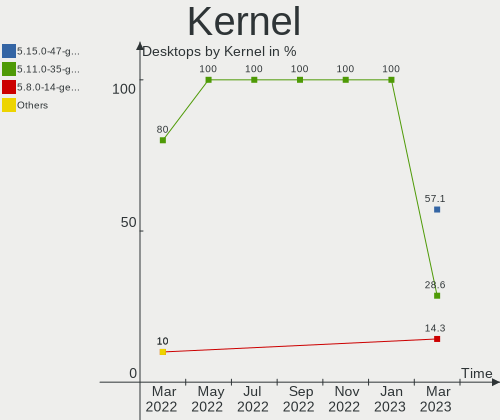
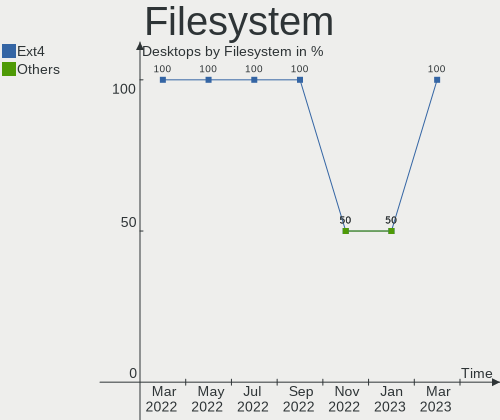
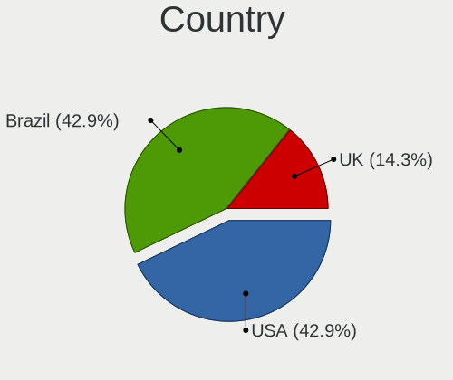
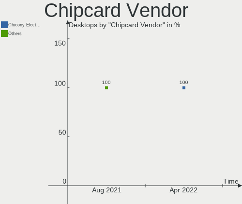

Endless Hardware Trends (Desktop)
---------------------------------

A project to identify most popular hardware characteristics and track their change
over time based on data collected by Endless users at https://Linux-Hardware.org.

Anyone can contribute to the study by uploading probes of their computers by
the [hw-probe](https://github.com/linuxhw/hw-probe) tool:

    sudo -E hw-probe -all -upload

Full-feature report is available here: https://linux-hardware.org/?view=trends&formfactor=desktop

Period: Oct, 2020.

Contents
--------

- [ OS                       ](#os)
- [ OS Family                ](#os-family)
- [ Kernel                   ](#kernel)
- [ Kernel Family            ](#kernel-family)
- [ Kernel Major Ver.        ](#kernel-major-ver)
- [ Arch                     ](#arch)
- [ DE                       ](#de)
- [ Display Server           ](#display-server)
- [ Display Manager          ](#display-manager)
- [ OS Lang                  ](#os-lang)
- [ Boot Mode                ](#boot-mode)
- [ Filesystem               ](#filesystem)
- [ Part. scheme             ](#part-scheme)
- [ Dual Boot with Linux/BSD ](#dual-boot-with-linux/bsd)
- [ Dual Boot (Win)          ](#dual-boot-win)
- [ Country                  ](#country)
- [ City                     ](#city)
- [ Vendor                   ](#vendor)
- [ Model                    ](#model)
- [ Model Family             ](#model-family)
- [ MFG Year                 ](#mfg-year)
- [ Form Factor              ](#form-factor)
- [ Secure Boot              ](#secure-boot)
- [ Coreboot                 ](#coreboot)
- [ RAM Size                 ](#ram-size)
- [ RAM Used                 ](#ram-used)
- [ Has CD-ROM               ](#has-cd-rom)
- [ Total Drives             ](#total-drives)
- [ Has Ethernet             ](#has-ethernet)
- [ Drive Vendor             ](#drive-vendor)
- [ HDD Vendor               ](#hdd-vendor)
- [ SSD Vendor               ](#ssd-vendor)
- [ Drive Model              ](#drive-model)
- [ Drive Kind               ](#drive-kind)
- [ Drive Connector          ](#drive-connector)
- [ Drive Size               ](#drive-size)
- [ Space Total              ](#space-total)
- [ Space Used               ](#space-used)
- [ Malfunc. Drives          ](#malfunc-drives)
- [ Malfunc. Drive Vendor    ](#malfunc-drive-vendor)
- [ Malfunc. HDD Vendor      ](#malfunc-hdd-vendor)
- [ Malfunc. Drive Kind      ](#malfunc-drive-kind)
- [ Failed Drives            ](#failed-drives)
- [ Failed Drive Vendor      ](#failed-drive-vendor)
- [ Drive Status             ](#drive-status)
- [ Storage Vendor           ](#storage-vendor)
- [ Storage Model            ](#storage-model)
- [ Storage Kind             ](#storage-kind)
- [ CPU Vendor               ](#cpu-vendor)
- [ CPU Model                ](#cpu-model)
- [ CPU Model Family         ](#cpu-model-family)
- [ CPU Cores                ](#cpu-cores)
- [ CPU Sockets              ](#cpu-sockets)
- [ CPU Threads              ](#cpu-threads)
- [ CPU Op-Modes             ](#cpu-op-modes)
- [ CPU Microcode            ](#cpu-microcode)
- [ CPU Microarch            ](#cpu-microarch)
- [ GPU Vendor               ](#gpu-vendor)
- [ GPU Model                ](#gpu-model)
- [ GPU Combo                ](#gpu-combo)
- [ GPU Driver               ](#gpu-driver)
- [ GPU Memory               ](#gpu-memory)
- [ Monitor Vendor           ](#monitor-vendor)
- [ Monitor Model            ](#monitor-model)
- [ Monitor Resolution       ](#monitor-resolution)
- [ Monitor Diagonal         ](#monitor-diagonal)
- [ Monitor Width            ](#monitor-width)
- [ Aspect Ratio             ](#aspect-ratio)
- [ Monitor Area             ](#monitor-area)
- [ Pixel Density            ](#pixel-density)
- [ Multiple Monitors        ](#multiple-monitors)
- [ Net Controller Vendor    ](#net-controller-vendor)
- [ Net Controller Model     ](#net-controller-model)
- [ Wireless Vendor          ](#wireless-vendor)
- [ Wireless Model           ](#wireless-model)
- [ Ethernet Vendor          ](#ethernet-vendor)
- [ Ethernet Model           ](#ethernet-model)
- [ Net Controller Kind      ](#net-controller-kind)
- [ Used Controller          ](#used-controller)
- [ NICs                     ](#nics)
- [ Memory Vendor            ](#memory-vendor)
- [ Memory Model             ](#memory-model)
- [ Memory Kind              ](#memory-kind)
- [ Memory Form Factor       ](#memory-form-factor)
- [ Memory Size              ](#memory-size)
- [ Memory Speed             ](#memory-speed)
- [ Sound Vendor             ](#sound-vendor)
- [ Sound Model              ](#sound-model)
- [ Camera Vendor            ](#camera-vendor)
- [ Camera Model             ](#camera-model)
- [ Fingerprint Vendor       ](#fingerprint-vendor)
- [ Fingerprint Model        ](#fingerprint-model)
- [ Chipcard Vendor          ](#chipcard-vendor)
- [ Chipcard Model           ](#chipcard-model)
- [ Printer Vendor           ](#printer-vendor)
- [ Printer Model            ](#printer-model)
- [ Scanner Vendor           ](#scanner-vendor)
- [ Scanner Model            ](#scanner-model)
- [ Bluetooth Vendor         ](#bluetooth-vendor)
- [ Bluetooth Model          ](#bluetooth-model)
- [ Unsupported Devices      ](#unsupported-devices)
- [ Unsupported Device Types ](#unsupported-device-types)

OS
--

Installed operating systems

| Name          | Desktops | Percent |
|---------------|----------|---------|
| Endless 3.8.7 | 15       | 75%     |
| Endless 3.8.6 | 4        | 20%     |
| Endless 3.8.3 | 1        | 5%      |

OS Family
---------

OS without a version

| Name    | Desktops | Percent |
|---------|----------|---------|
| Endless | 20       | 100%    |

Kernel
------

Version of the Linux kernel

| Version          | Desktops | Percent |
|------------------|----------|---------|
| 5.4.0-42-generic | 19       | 95%     |
| 5.4.0-19-generic | 1        | 5%      |

Kernel Family
-------------

Linux kernel without a distro release

| Version | Desktops | Percent |
|---------|----------|---------|
| 5.4.0   | 20       | 100%    |

Kernel Major Ver.
-----------------

Linux kernel major version

| Version | Desktops | Percent |
|---------|----------|---------|
| 5.4     | 20       | 100%    |

Arch
----

OS architecture (x86_64, i586, etc.)

| Name   | Desktops | Percent |
|--------|----------|---------|
| x86_64 | 20       | 100%    |

DE
--

Desktop Environment

| Name  | Desktops | Percent |
|-------|----------|---------|
| GNOME | 20       | 100%    |

Display Server
--------------

X11 or Wayland

| Name | Desktops | Percent |
|------|----------|---------|
| X11  | 20       | 100%    |

Display Manager
---------------

SDDM, LightDM, etc.

| Name    | Desktops | Percent |
|---------|----------|---------|
| Unknown | 20       | 100%    |

OS Lang
-------

Language

| Lang        | Desktops | Percent |
|-------------|----------|---------|
| en_US.utf8  | 5        | 25%     |
| pt_BR.utf8  | 4        | 20%     |
| pt_BR       | 4        | 20%     |
| ru_RU.UTF_8 | 1        | 5%      |
| it_IT       | 1        | 5%      |
| fr_FR       | 1        | 5%      |
| es_MX.utf8  | 1        | 5%      |
| es_ES       | 1        | 5%      |
| es_AR       | 1        | 5%      |
| de_DE       | 1        | 5%      |

Boot Mode
---------

EFI or BIOS

| Mode | Desktops | Percent |
|------|----------|---------|
| BIOS | 12       | 60%     |
| EFI  | 8        | 40%     |

Filesystem
----------

Type of filesystem

| Type  | Desktops | Percent |
|-------|----------|---------|
| Ext4  | 18       | 90%     |
| Tmpfs | 2        | 10%     |

Part. scheme
------------

Scheme of partitioning

| Type    | Desktops | Percent |
|---------|----------|---------|
| Unknown | 20       | 100%    |

Dual Boot with Linux/BSD
------------------------

Hosting more than one Linux/BSD

| Dual boot | Desktops | Percent |
|-----------|----------|---------|
| No        | 20       | 100%    |

Dual Boot (Win)
---------------

Hosting Linux and Windows

| Dual boot | Desktops | Percent |
|-----------|----------|---------|
| No        | 20       | 100%    |

Country
-------

Geographic location (country)

| Country     | Desktops | Percent |
|-------------|----------|---------|
| Brazil      | 8        | 40%     |
| USA         | 2        | 10%     |
| Uruguay     | 1        | 5%      |
| Spain       | 1        | 5%      |
| Serbia      | 1        | 5%      |
| Russia      | 1        | 5%      |
| Romania     | 1        | 5%      |
| New Zealand | 1        | 5%      |
| Mexico      | 1        | 5%      |
| Italy       | 1        | 5%      |
| Germany     | 1        | 5%      |
| France      | 1        | 5%      |

City
----

Geographic location (city)

| City                    | Desktops | Percent |
|-------------------------|----------|---------|
| São Paulo              | 3        | 15%     |
| Volgograd               | 1        | 5%      |
| Valencia                | 1        | 5%      |
| Trino                   | 1        | 5%      |
| Talence                 | 1        | 5%      |
| San Juan del Río       | 1        | 5%      |
| Ourinhos                | 1        | 5%      |
| Montenegro              | 1        | 5%      |
| Kukujevci               | 1        | 5%      |
| Jaboatao dos Guararapes | 1        | 5%      |
| Galion                  | 1        | 5%      |
| Divinópolis            | 1        | 5%      |
| Concord                 | 1        | 5%      |
| Christchurch            | 1        | 5%      |
| Cerros Azules           | 1        | 5%      |
| Buende                  | 1        | 5%      |
| Bucharest               | 1        | 5%      |
| Bauru                   | 1        | 5%      |

Vendor
------

Motherboard manufacturer

| Name                                   | Desktops | Percent |
|----------------------------------------|----------|---------|
| Gigabyte Technology                    | 5        | 25%     |
| ASUSTek Computer                       | 3        | 15%     |
| Hewlett-Packard                        | 2        | 10%     |
| ASRock                                 | 2        | 10%     |
| Positivo                               | 1        | 5%      |
| PCWare                                 | 1        | 5%      |
| MSI                                    | 1        | 5%      |
| Lenovo                                 | 1        | 5%      |
| Huanan                                 | 1        | 5%      |
| Foxconn                                | 1        | 5%      |
| Desenvolvido para Positivo Informatica | 1        | 5%      |
| Dell                                   | 1        | 5%      |

Model
-----

Motherboard model

| Name                                            | Desktops | Percent |
|-------------------------------------------------|----------|---------|
| Gigabyte B360M AORUS Gaming 3                   | 3        | 15%     |
| Positivo POS-MIG31AG                            | 1        | 5%      |
| PCWare IPX1800E2                                | 1        | 5%      |
| MSI MS-7A62                                     | 1        | 5%      |
| Lenovo ThinkCentre M92 3235H3G                  | 1        | 5%      |
| Huanan X99-TF                                   | 1        | 5%      |
| HP Compaq Elite 8300 SFF                        | 1        | 5%      |
| HP Compaq 6005 Pro SFF PC                       | 1        | 5%      |
| Gigabyte F2A75M-D3H                             | 1        | 5%      |
| Gigabyte 945PL-S3P                              | 1        | 5%      |
| Foxconn G31MXP FAB:1.1                          | 1        | 5%      |
| Desenvolvido para Positivo Informatica P5VD2-MX | 1        | 5%      |
| Dell OptiPlex 780                               | 1        | 5%      |
| ASUS P5KPL-AM EPU                               | 1        | 5%      |
| ASUS M2V                                        | 1        | 5%      |
| ASUS All Series                                 | 1        | 5%      |
| ASRock N68C-GS FX                               | 1        | 5%      |
| ASRock A88M-G                                   | 1        | 5%      |

Model Family
------------

Motherboard model prefix

| Name                                            | Desktops | Percent |
|-------------------------------------------------|----------|---------|
| Gigabyte B360M                                  | 3        | 15%     |
| HP Compaq                                       | 2        | 10%     |
| Positivo POS-MIG31AG                            | 1        | 5%      |
| PCWare IPX1800E2                                | 1        | 5%      |
| MSI MS-7A62                                     | 1        | 5%      |
| Lenovo ThinkCentre                              | 1        | 5%      |
| Huanan X99-TF                                   | 1        | 5%      |
| Gigabyte F2A75M-D3H                             | 1        | 5%      |
| Gigabyte 945PL-S3P                              | 1        | 5%      |
| Foxconn G31MXP                                  | 1        | 5%      |
| Desenvolvido para Positivo Informatica P5VD2-MX | 1        | 5%      |
| Dell OptiPlex                                   | 1        | 5%      |
| ASUS P5KPL-AM                                   | 1        | 5%      |
| ASUS M2V                                        | 1        | 5%      |
| ASUS All                                        | 1        | 5%      |
| ASRock N68C-GS                                  | 1        | 5%      |
| ASRock A88M-G                                   | 1        | 5%      |

MFG Year
--------

Motherboard manufacture year

| Year | Desktops | Percent |
|------|----------|---------|
| 2018 | 4        | 20%     |
| 2013 | 3        | 15%     |
| 2010 | 2        | 10%     |
| 2009 | 2        | 10%     |
| 2008 | 2        | 10%     |
| 2007 | 2        | 10%     |
| 2020 | 1        | 5%      |
| 2017 | 1        | 5%      |
| 2016 | 1        | 5%      |
| 2014 | 1        | 5%      |
| 2012 | 1        | 5%      |

Form Factor
-----------

Physical design of the computer

| Name    | Desktops | Percent |
|---------|----------|---------|
| Desktop | 20       | 100%    |

Secure Boot
-----------

Enabled or disabled

| State    | Desktops | Percent |
|----------|----------|---------|
| Disabled | 19       | 95%     |
| Enabled  | 1        | 5%      |

Coreboot
--------

Have coreboot on board

| Used | Desktops | Percent |
|------|----------|---------|
| No   | 20       | 100%    |

RAM Size
--------

Total RAM memory

| Size in GB  | Desktops | Percent |
|-------------|----------|---------|
| 3.01-4.0    | 5        | 25%     |
| 8.01-16.0   | 4        | 20%     |
| 64.01-256.0 | 3        | 15%     |
| 1.01-2.0    | 3        | 15%     |
| 4.01-8.0    | 2        | 10%     |
| 16.01-24.0  | 2        | 10%     |
| 2.01-3.0    | 1        | 5%      |

RAM Used
--------

Used RAM memory

| Used GB  | Desktops | Percent |
|----------|----------|---------|
| 1.01-2.0 | 8        | 40%     |
| 0.01-1.0 | 6        | 30%     |
| 2.01-3.0 | 5        | 25%     |
| 3.01-4.0 | 1        | 5%      |

Has CD-ROM
----------

Has CD-ROM on board

| Presented | Desktops | Percent |
|-----------|----------|---------|
| No        | 13       | 65%     |
| Yes       | 7        | 35%     |

Total Drives
------------

Number of drives on board

| Drives | Desktops | Percent |
|--------|----------|---------|
| 1      | 10       | 50%     |
| 2      | 5        | 25%     |
| 5      | 2        | 10%     |
| 3      | 2        | 10%     |
| 0      | 1        | 5%      |

Has Ethernet
------------

Has Ethernet on board

| Presented | Desktops | Percent |
|-----------|----------|---------|
| Yes       | 20       | 100%    |

Drive Vendor
------------

Hard drive vendors

| Vendor              | Desktops | Drives | Percent |
|---------------------|----------|--------|---------|
| Samsung Electronics | 8        | 12     | 28.57%  |
| WDC                 | 6        | 9      | 21.43%  |
| Seagate             | 5        | 6      | 17.86%  |
| SanDisk             | 2        | 2      | 7.14%   |
| Kingston            | 2        | 2      | 7.14%   |
| Hitachi             | 2        | 2      | 7.14%   |
| Toshiba             | 1        | 1      | 3.57%   |
| Silicon Motion      | 1        | 1      | 3.57%   |
| PNY                 | 1        | 1      | 3.57%   |

HDD Vendor
----------

Hard disk drive vendors

| Vendor              | Desktops | Drives | Percent |
|---------------------|----------|--------|---------|
| Samsung Electronics | 6        | 7      | 33.33%  |
| WDC                 | 5        | 6      | 27.78%  |
| Seagate             | 5        | 6      | 27.78%  |
| Hitachi             | 2        | 2      | 11.11%  |

SSD Vendor
----------

Solid state drive vendors

| Vendor              | Desktops | Drives | Percent |
|---------------------|----------|--------|---------|
| SanDisk             | 2        | 2      | 25%     |
| Kingston            | 2        | 2      | 25%     |
| WDC                 | 1        | 1      | 12.5%   |
| Toshiba             | 1        | 1      | 12.5%   |
| Samsung Electronics | 1        | 1      | 12.5%   |
| PNY                 | 1        | 1      | 12.5%   |

Drive Model
-----------

Hard drive models

| Model                        | Desktops | Percent |
|------------------------------|----------|---------|
| NVMe SSD Drive 512GB         | 3        | 9.38%   |
| HTS545050A7E380 500GB        | 2        | 6.25%   |
| HN-M490MBB 500GB             | 2        | 6.25%   |
| WDS240G1G0B-00RC30 240GB SSD | 1        | 3.13%   |
| WD800JD-60LSA5 80GB          | 1        | 3.13%   |
| WD3200AAKS-00SBA0 320GB      | 1        | 3.13%   |
| WD1200BEVS-00UST0 120GB      | 1        | 3.13%   |
| WD10EALS-00Z8A0 1TB          | 1        | 3.13%   |
| WD10EACS-00D6B0 1TB          | 1        | 3.13%   |
| WD My Book ES 500GB          | 1        | 3.13%   |
| THNS128GG4BBAA 128GB SSD     | 1        | 3.13%   |
| SV300S37A120G 120GB SSD      | 1        | 3.13%   |
| ST9500325AS 500GB            | 1        | 3.13%   |
| ST500DM002-1BD142 500GB      | 1        | 3.13%   |
| ST3250312AS 250GB            | 1        | 3.13%   |
| ST3160813AS 160GB            | 1        | 3.13%   |
| ST3000DM008-2DM166 3TB       | 1        | 3.13%   |
| ST1000DM003-1CH162 1TB       | 1        | 3.13%   |
| SSD PLUS 480GB               | 1        | 3.13%   |
| SSD 850 EVO 250GB            | 1        | 3.13%   |
| SP0411N 40GB                 | 1        | 3.13%   |
| SDSSDHII240G 240GB           | 1        | 3.13%   |
| SA400S37120G 120GB SSD       | 1        | 3.13%   |
| NVMe SSD Drive 250GB         | 1        | 3.13%   |
| HE103UJ 1TB                  | 1        | 3.13%   |
| HD321KJ 320GB                | 1        | 3.13%   |
| HD252HJ 250GB                | 1        | 3.13%   |
| CS900 240GB SSD              | 1        | 3.13%   |

Drive Kind
----------

HDD or SSD

| Kind    | Desktops | Drives | Percent |
|---------|----------|--------|---------|
| HDD     | 14       | 21     | 56%     |
| SSD     | 6        | 8      | 24%     |
| NVMe    | 4        | 5      | 16%     |
| Unknown | 1        | 2      | 4%      |

Drive Connector
---------------

SATA, SAS, NVMe, etc.

| Type | Desktops | Drives | Percent |
|------|----------|--------|---------|
| SATA | 18       | 31     | 81.82%  |
| NVMe | 4        | 5      | 18.18%  |

Drive Size
----------

Size of hard drive

| Size in TB | Desktops | Drives | Percent |
|------------|----------|--------|---------|
| 0.01-0.5   | 16       | 22     | 80%     |
| 0.51-1.0   | 3        | 6      | 15%     |
| 2.01-3.0   | 1        | 1      | 5%      |

Space Total
-----------

Amount of disk space available on the file system

| Size in GB | Desktops | Percent |
|------------|----------|---------|
| 101-250    | 9        | 45%     |
| 251-500    | 6        | 30%     |
| 21-50      | 2        | 10%     |
| 501-1000   | 2        | 10%     |
| 1-20       | 1        | 5%      |

Space Used
----------

Amount of used disk space

| Used GB | Desktops | Percent |
|---------|----------|---------|
| 21-50   | 10       | 50%     |
| 101-250 | 4        | 20%     |
| 1-20    | 4        | 20%     |
| 251-500 | 1        | 5%      |
| 51-100  | 1        | 5%      |

Malfunc. Drives
---------------

Drive models with a malfunction

Zero info for selected period =(

Malfunc. Drive Vendor
---------------------

Vendors of faulty drives

Zero info for selected period =(

Malfunc. HDD Vendor
-------------------

Vendors of faulty HDD drives

Zero info for selected period =(

Malfunc. Drive Kind
-------------------

Kinds of faulty drives

Zero info for selected period =(

Failed Drives
-------------

Failed drive models

Zero info for selected period =(

Failed Drive Vendor
-------------------

Failed drive vendors

Zero info for selected period =(

Drive Status
------------

Number of failed and malfunc. drives

| Status   | Desktops | Drives | Percent |
|----------|----------|--------|---------|
| Detected | 19       | 36     | 100%    |

Storage Vendor
--------------

Storage controller vendors

| Vendor                   | Desktops | Percent |
|--------------------------|----------|---------|
| Intel                    | 14       | 53.85%  |
| Samsung Electronics      | 4        | 15.38%  |
| AMD                      | 3        | 11.54%  |
| VIA Technologies         | 2        | 7.69%   |
| Silicon Motion           | 1        | 3.85%   |
| Nvidia                   | 1        | 3.85%   |
| Marvell Technology Group | 1        | 3.85%   |

Storage Model
-------------

Storage controller models

| Model                                                                    | Desktops | Percent |
|--------------------------------------------------------------------------|----------|---------|
| NVMe SSD Controller SM981/PM981/PM983                                    | 4        | 11.76%  |
| NM10/ICH7 Family SATA Controller [IDE mode]                              | 3        | 8.82%   |
| Cannon Lake PCH SATA AHCI Controller                                     | 3        | 8.82%   |
| 82801G (ICH7 Family) IDE Controller                                      | 3        | 8.82%   |
| VT82C586A/B/VT82C686/A/B/VT823x/A/C PIPC Bus Master IDE                  | 2        | 5.88%   |
| 7 Series/C210 Series Chipset Family 6-port SATA Controller [AHCI mode]   | 2        | 5.88%   |
| VT8237A SATA 2-Port Controller                                           | 1        | 2.94%   |
| Serial ATA Controller                                                    | 1        | 2.94%   |
| SB7x0/SB8x0/SB9x0 SATA Controller [AHCI mode]                            | 1        | 2.94%   |
| SATA Controller [RAID mode]                                              | 1        | 2.94%   |
| Non-Volatile memory controller                                           | 1        | 2.94%   |
| MCP61 SATA Controller                                                    | 1        | 2.94%   |
| MCP61 IDE                                                                | 1        | 2.94%   |
| FCH SATA Controller [IDE mode]                                           | 1        | 2.94%   |
| FCH SATA Controller [AHCI mode]                                          | 1        | 2.94%   |
| FCH IDE Controller                                                       | 1        | 2.94%   |
| C610/X99 series chipset sSATA Controller [AHCI mode]                     | 1        | 2.94%   |
| C610/X99 series chipset 6-Port SATA Controller [AHCI mode]               | 1        | 2.94%   |
| Atom Processor E3800 Series SATA AHCI Controller                         | 1        | 2.94%   |
| 88SE6111/6121 SATA II / PATA Controller                                  | 1        | 2.94%   |
| 82801JD/DO (ICH10 Family) SATA AHCI Controller                           | 1        | 2.94%   |
| 8 Series/C220 Series Chipset Family 6-port SATA Controller 1 [AHCI mode] | 1        | 2.94%   |
| 4 Series Chipset PT IDER Controller                                      | 1        | 2.94%   |

Storage Kind
------------

Kind of storage controller (IDE, SATA, NVMe, SAS, ...)

| Kind | Desktops | Percent |
|------|----------|---------|
| SATA | 12       | 46.15%  |
| IDE  | 9        | 34.62%  |
| NVMe | 4        | 15.38%  |
| RAID | 1        | 3.85%   |

CPU Vendor
----------

Processor vendors

| Vendor | Desktops | Percent |
|--------|----------|---------|
| Intel  | 15       | 75%     |
| AMD    | 5        | 25%     |

CPU Model
---------

Processor models

| Model                                           | Desktops | Percent |
|-------------------------------------------------|----------|---------|
| Intel Core i5-9400F CPU @ 2.90GHz               | 3        | 15%     |
| Intel Pentium Dual CPU E2180 @ 2.00GHz          | 2        | 10%     |
| Intel Core 2 Quad CPU Q6600 @ 2.40GHz           | 2        | 10%     |
| Intel Xeon CPU E5-2678 v3 @ 2.50GHz             | 1        | 5%      |
| Intel Pentium Dual-Core CPU E5500 @ 2.80GHz     | 1        | 5%      |
| Intel Pentium Dual CPU E2220 @ 2.40GHz          | 1        | 5%      |
| Intel Pentium CPU G4560 @ 3.50GHz               | 1        | 5%      |
| Intel Core i5-4570 CPU @ 3.20GHz                | 1        | 5%      |
| Intel Core i5-3470 CPU @ 3.20GHz                | 1        | 5%      |
| Intel Core i3-3240T CPU @ 2.90GHz               | 1        | 5%      |
| Intel Celeron CPU J1800 @ 2.41GHz               | 1        | 5%      |
| AMD Phenom 8650 Triple-Core Processor           | 1        | 5%      |
| AMD Athlon II X2 220 Processor                  | 1        | 5%      |
| AMD Athlon 64 X2 Dual Core Processor 4400+      | 1        | 5%      |
| AMD A6-5400K APU with Radeon HD Graphics        | 1        | 5%      |
| AMD A10-7850K Radeon R7, 12 Compute Cores 4C+8G | 1        | 5%      |

CPU Model Family
----------------

Processor model prefix

| Model                   | Desktops | Percent |
|-------------------------|----------|---------|
| Intel Core i5           | 5        | 25%     |
| Intel Pentium Dual      | 3        | 15%     |
| Intel Core 2 Quad       | 2        | 10%     |
| Intel Xeon              | 1        | 5%      |
| Intel Pentium Dual-Core | 1        | 5%      |
| Intel Pentium           | 1        | 5%      |
| Intel Core i3           | 1        | 5%      |
| Intel Celeron           | 1        | 5%      |
| AMD Phenom              | 1        | 5%      |
| AMD Athlon II X2        | 1        | 5%      |
| AMD Athlon 64 X2        | 1        | 5%      |
| AMD A6                  | 1        | 5%      |
| AMD A10                 | 1        | 5%      |

CPU Cores
---------

Number of processor cores

| Number | Desktops | Percent |
|--------|----------|---------|
| 2      | 10       | 50%     |
| 4      | 4        | 20%     |
| 6      | 3        | 15%     |
| 12     | 1        | 5%      |
| 3      | 1        | 5%      |
| 1      | 1        | 5%      |

CPU Sockets
-----------

Number of sockets

| Number | Desktops | Percent |
|--------|----------|---------|
| 1      | 20       | 100%    |

CPU Threads
-----------

Threads per core (Hyper-Threading)

| Number | Desktops | Percent |
|--------|----------|---------|
| 1      | 15       | 75%     |
| 2      | 5        | 25%     |

CPU Op-Modes
------------

CPU Operation Modes (32-bit, 64-bit)

| Op mode        | Desktops | Percent |
|----------------|----------|---------|
| 32-bit, 64-bit | 20       | 100%    |

CPU Microcode
-------------

Microcode number

| Number     | Desktops | Percent |
|------------|----------|---------|
| Unknown    | 6        | 30%     |
| 0x906ea    | 3        | 15%     |
| 0x6fd      | 3        | 15%     |
| 0x306a9    | 2        | 10%     |
| 0x906e9    | 1        | 5%      |
| 0x306f2    | 1        | 5%      |
| 0x306c3    | 1        | 5%      |
| 0x30678    | 1        | 5%      |
| 0x06003106 | 1        | 5%      |
| 0x010000c8 | 1        | 5%      |

CPU Microarch
-------------

Microarchitecture

| Name        | Desktops | Percent |
|-------------|----------|---------|
| Core        | 5        | 25%     |
| KabyLake    | 4        | 20%     |
| K10         | 2        | 10%     |
| IvyBridge   | 2        | 10%     |
| Haswell     | 2        | 10%     |
| Steamroller | 1        | 5%      |
| Silvermont  | 1        | 5%      |
| Piledriver  | 1        | 5%      |
| Penryn      | 1        | 5%      |
| K8 Hammer   | 1        | 5%      |

GPU Vendor
----------

Vendors of graphics cards

| Vendor           | Desktops | Percent |
|------------------|----------|---------|
| Nvidia           | 9        | 42.86%  |
| AMD              | 7        | 33.33%  |
| Intel            | 4        | 19.05%  |
| VIA Technologies | 1        | 4.76%   |

GPU Model
---------

Graphics card models

| Model                                                      | Desktops | Percent |
|------------------------------------------------------------|----------|---------|
| TU117 [GeForce GTX 1650]                                   | 3        | 13.64%  |
| Xeon E3-1200 v2/3rd Gen Core processor Graphics Controller | 1        | 4.55%   |
| Trinity 2 [Radeon HD 7540D]                                | 1        | 4.55%   |
| RV516 [Radeon X1300/X1550 Series] (Secondary)              | 1        | 4.55%   |
| RV516 [Radeon X1300/X1550 Series]                          | 1        | 4.55%   |
| RS880 [Radeon HD 4200]                                     | 1        | 4.55%   |
| P4M890 [S3 UniChrome Pro]                                  | 1        | 4.55%   |
| Oland PRO [Radeon R7 240/340]                              | 1        | 4.55%   |
| NV44 [GeForce 7100 GS]                                     | 1        | 4.55%   |
| HD Graphics 610                                            | 1        | 4.55%   |
| GP106 [GeForce GTX 1060 6GB]                               | 1        | 4.55%   |
| GM204 [GeForce GTX 970]                                    | 1        | 4.55%   |
| GK208B [GeForce GT 730]                                    | 1        | 4.55%   |
| GK208B [GeForce GT 710]                                    | 1        | 4.55%   |
| GK107 [GeForce GT 740]                                     | 1        | 4.55%   |
| Ellesmere [Radeon RX 470/480/570/570X/580/580X/590]        | 1        | 4.55%   |
| Curacao PRO [Radeon R7 370 / R9 270/370 OEM]               | 1        | 4.55%   |
| Caicos [Radeon HD 6450/7450/8450 / R5 230 OEM]             | 1        | 4.55%   |
| Atom Processor Z36xxx/Z37xxx Series Graphics & Display     | 1        | 4.55%   |
| 82G33/G31 Express Integrated Graphics Controller           | 1        | 4.55%   |

GPU Combo
---------

Combinations of graphics cards

| Name       | Desktops | Percent |
|------------|----------|---------|
| 1 x Nvidia | 9        | 45%     |
| 1 x AMD    | 6        | 30%     |
| 1 x Intel  | 3        | 15%     |
| 2 x AMD    | 1        | 5%      |
| 1 x VIA    | 1        | 5%      |

GPU Driver
----------

Free vs proprietary

| Driver      | Desktops | Percent |
|-------------|----------|---------|
| Free        | 11       | 55%     |
| Proprietary | 8        | 40%     |
| Unknown     | 1        | 5%      |

GPU Memory
----------

Total video memory

| Size in GB | Desktops | Percent |
|------------|----------|---------|
| Unknown    | 15       | 75%     |
| 0.01-0.5   | 3        | 15%     |
| 7.01-8.0   | 1        | 5%      |
| 1.01-2.0   | 1        | 5%      |

Monitor Vendor
--------------

Monitor vendors

| Vendor              | Desktops | Percent |
|---------------------|----------|---------|
| Goldstar            | 5        | 29.41%  |
| Hewlett-Packard     | 4        | 23.53%  |
| Samsung Electronics | 3        | 17.65%  |
| Dell                | 3        | 17.65%  |
| MStar               | 1        | 5.88%   |
| Acer                | 1        | 5.88%   |

Monitor Model
-------------

Monitor models

| Model                                             | Desktops | Percent |
|---------------------------------------------------|----------|---------|
| P2418D DELD0C1 2560x1440 526x296mm 23.8-inch      | 3        | 15.79%  |
| ZR2440w HWP2956 1920x1200 518x324mm 24.1-inch     | 1        | 5.26%   |
| Ultra HD GSM5B09 3840x2160 600x340mm 27.2-inch    | 1        | 5.26%   |
| Ultra HD GSM5B08 3840x2160 600x340mm 27.2-inch    | 1        | 5.26%   |
| TV_MONITOR MST0030 1440x900 1150x650mm 52.0-inch  | 1        | 5.26%   |
| SyncMaster SAM0608 1920x1080 510x290mm 23.1-inch  | 1        | 5.26%   |
| SyncMaster SAM0598 1360x768 410x230mm 18.5-inch   | 1        | 5.26%   |
| LG FULL HD GSM5AB9 1680x1050 480x270mm 21.7-inch  | 1        | 5.26%   |
| LCD Monitor SAM07C0 1920x1080 700x390mm 31.5-inch | 1        | 5.26%   |
| LA2006 HWP2945 1600x900 443x249mm 20.0-inch       | 1        | 5.26%   |
| L1734 GSM4495 1280x1024 338x270mm 17.0-inch       | 1        | 5.26%   |
| IPS235 GSM587D 1920x1080 510x290mm 23.1-inch      | 1        | 5.26%   |
| G196HQL ACR0325 1366x768 410x230mm 18.5-inch      | 1        | 5.26%   |
| f2105 HWP2655 1680x1050 433x271mm 20.1-inch       | 1        | 5.26%   |
| E1960 GSM4BE5 1360x768 406x229mm 18.4-inch        | 1        | 5.26%   |
| 27w HPN3494 1920x1080 598x336mm 27.0-inch         | 1        | 5.26%   |
| 27MP35 GSM5A5B 1920x1080 598x337mm 27.0-inch      | 1        | 5.26%   |

Monitor Resolution
------------------

Monitor screen resolution

| Resolution         | Desktops | Percent |
|--------------------|----------|---------|
| 1920x1080 (FHD)    | 6        | 35.29%  |
| 2560x1440 (QHD)    | 3        | 17.65%  |
| 3840x2160 (4K)     | 2        | 11.76%  |
| 1360x768           | 2        | 11.76%  |
| 1680x1050 (WSXGA+) | 1        | 5.88%   |
| 1600x900 (HD+)     | 1        | 5.88%   |
| 1366x768 (WXGA)    | 1        | 5.88%   |
| 1280x1024 (SXGA)   | 1        | 5.88%   |

Monitor Diagonal
----------------

Diagonal size in inches

| Inches | Desktops | Percent |
|--------|----------|---------|
| 24     | 4        | 23.53%  |
| 18     | 3        | 17.65%  |
| 27     | 2        | 11.76%  |
| 23     | 2        | 11.76%  |
| 20     | 2        | 11.76%  |
| 52     | 1        | 5.88%   |
| 40     | 1        | 5.88%   |
| 21     | 1        | 5.88%   |
| 17     | 1        | 5.88%   |

Monitor Width
-------------

Physical width

| Width in mm | Desktops | Percent |
|-------------|----------|---------|
| 501-600     | 7        | 43.75%  |
| 401-500     | 6        | 37.5%   |
| 801-900     | 1        | 6.25%   |
| 301-350     | 1        | 6.25%   |
| 1001-1500   | 1        | 6.25%   |

Aspect Ratio
------------

Proportional relationship between the width and the height

| Ratio | Desktops | Percent |
|-------|----------|---------|
| 16/9  | 13       | 81.25%  |
| 16/10 | 2        | 12.5%   |
| 5/4   | 1        | 6.25%   |

Monitor Area
------------

Area in inch²

| Area in inch² | Desktops | Percent |
|----------------|----------|---------|
| 201-250        | 6        | 35.29%  |
| 141-150        | 4        | 23.53%  |
| 301-350        | 2        | 11.76%  |
| 151-200        | 2        | 11.76%  |
| More than 1000 | 1        | 5.88%   |
| 251-300        | 1        | 5.88%   |
| 501-1000       | 1        | 5.88%   |

Pixel Density
-------------

Pixels per inch

| Density | Desktops | Percent |
|---------|----------|---------|
| 51-100  | 11       | 64.71%  |
| 121-160 | 3        | 17.65%  |
| 1-50    | 1        | 5.88%   |
| 161-240 | 1        | 5.88%   |
| 101-120 | 1        | 5.88%   |

Multiple Monitors
-----------------

Total monitors connected

| Total | Desktops | Percent |
|-------|----------|---------|
| 1     | 15       | 75%     |
| 0     | 3        | 15%     |
| 2     | 2        | 10%     |

Net Controller Vendor
---------------------

Controller vendors

| Vendor                          | Desktops | Percent |
|---------------------------------|----------|---------|
| Realtek Semiconductor           | 10       | 38.46%  |
| Intel                           | 7        | 26.92%  |
| Qualcomm Atheros                | 4        | 15.38%  |
| Broadcom Inc. and subsidiaries  | 2        | 7.69%   |
| Nvidia                          | 1        | 3.85%   |
| Hangzhou Silan Microelectronics | 1        | 3.85%   |
| Broadcom                        | 1        | 3.85%   |

Net Controller Model
--------------------

Controller models

| Model                                                     | Desktops | Percent |
|-----------------------------------------------------------|----------|---------|
| RTL8111/8168/8411 PCI Express Gigabit Ethernet Controller | 7        | 26.92%  |
| Ethernet Connection (7) I219-V                            | 3        | 11.54%  |
| 82579LM Gigabit Network Connection (Lewisville)           | 2        | 7.69%   |
| RTL8188EUS 802.11n Wireless Network Adapter               | 1        | 3.85%   |
| RTL8188CUS 802.11n WLAN Adapter                           | 1        | 3.85%   |
| RTL8139D [Realtek] PCI 10/100BaseTX ethernet adaptor      | 1        | 3.85%   |
| RTL810xE PCI Express Fast Ethernet controller             | 1        | 3.85%   |
| PRO/Wireless 4965 AG or AGN [Kedron] Network Connection   | 1        | 3.85%   |
| NetXtreme BCM5761 Gigabit Ethernet PCIe                   | 1        | 3.85%   |
| MCP61 Ethernet                                            | 1        | 3.85%   |
| Killer E2500 Gigabit Ethernet Controller                  | 1        | 3.85%   |
| BCM4360 802.11ac Wireless Network Adapter                 | 1        | 3.85%   |
| BCM43142 802.11b/g/n                                      | 1        | 3.85%   |
| Attansic L1 Gigabit Ethernet                              | 1        | 3.85%   |
| AR8121/AR8113/AR8114 Gigabit or Fast Ethernet             | 1        | 3.85%   |
| AR5212/5213/2414 Wireless Network Adapter                 | 1        | 3.85%   |
| 82567LM-3 Gigabit Network Connection                      | 1        | 3.85%   |

Wireless Vendor
---------------

Wireless vendors

| Vendor                         | Desktops | Percent |
|--------------------------------|----------|---------|
| Realtek Semiconductor          | 2        | 33.33%  |
| Qualcomm Atheros               | 1        | 16.67%  |
| Intel                          | 1        | 16.67%  |
| Broadcom Inc. and subsidiaries | 1        | 16.67%  |
| Broadcom                       | 1        | 16.67%  |

Wireless Model
--------------

Wireless models

| Model                                                   | Desktops | Percent |
|---------------------------------------------------------|----------|---------|
| RTL8188EUS 802.11n Wireless Network Adapter             | 1        | 16.67%  |
| RTL8188CUS 802.11n WLAN Adapter                         | 1        | 16.67%  |
| PRO/Wireless 4965 AG or AGN [Kedron] Network Connection | 1        | 16.67%  |
| BCM4360 802.11ac Wireless Network Adapter               | 1        | 16.67%  |
| BCM43142 802.11b/g/n                                    | 1        | 16.67%  |
| AR5212/5213/2414 Wireless Network Adapter               | 1        | 16.67%  |

Ethernet Vendor
---------------

Ethernet vendors

| Vendor                          | Desktops | Percent |
|---------------------------------|----------|---------|
| Realtek Semiconductor           | 8        | 40%     |
| Intel                           | 6        | 30%     |
| Qualcomm Atheros                | 3        | 15%     |
| Nvidia                          | 1        | 5%      |
| Hangzhou Silan Microelectronics | 1        | 5%      |
| Broadcom Inc. and subsidiaries  | 1        | 5%      |

Ethernet Model
--------------

Ethernet models

| Model                                                     | Desktops | Percent |
|-----------------------------------------------------------|----------|---------|
| RTL8111/8168/8411 PCI Express Gigabit Ethernet Controller | 7        | 35%     |
| Ethernet Connection (7) I219-V                            | 3        | 15%     |
| 82579LM Gigabit Network Connection (Lewisville)           | 2        | 10%     |
| RTL8139D [Realtek] PCI 10/100BaseTX ethernet adaptor      | 1        | 5%      |
| RTL810xE PCI Express Fast Ethernet controller             | 1        | 5%      |
| NetXtreme BCM5761 Gigabit Ethernet PCIe                   | 1        | 5%      |
| MCP61 Ethernet                                            | 1        | 5%      |
| Killer E2500 Gigabit Ethernet Controller                  | 1        | 5%      |
| Attansic L1 Gigabit Ethernet                              | 1        | 5%      |
| AR8121/AR8113/AR8114 Gigabit or Fast Ethernet             | 1        | 5%      |
| 82567LM-3 Gigabit Network Connection                      | 1        | 5%      |

Net Controller Kind
-------------------

Ethernet, WiFi or modem

| Kind     | Desktops | Percent |
|----------|----------|---------|
| Ethernet | 20       | 80%     |
| WiFi     | 5        | 20%     |

Used Controller
---------------

Currently used network controller

| Kind     | Desktops | Percent |
|----------|----------|---------|
| Ethernet | 20       | 83.33%  |
| WiFi     | 4        | 16.67%  |

NICs
----

Total network controllers on board

| Total | Desktops | Percent |
|-------|----------|---------|
| 1     | 17       | 85%     |
| 2     | 3        | 15%     |

Memory Vendor
-------------

Memory module vendors

Zero info for selected period =(

Memory Model
------------

Memory module models

Zero info for selected period =(

Memory Kind
-----------

Memory module kinds

Zero info for selected period =(

Memory Form Factor
------------------

Physical design of the memory module

Zero info for selected period =(

Memory Size
-----------

Memory module size

Zero info for selected period =(

Memory Speed
------------

Memory module speed

Zero info for selected period =(

Sound Vendor
------------

Sound card vendors

| Vendor           | Desktops | Percent |
|------------------|----------|---------|
| Intel            | 14       | 45.16%  |
| Nvidia           | 9        | 29.03%  |
| AMD              | 6        | 19.35%  |
| VIA Technologies | 1        | 3.23%   |
| Creative Labs    | 1        | 3.23%   |

Sound Model
-----------

Sound card models

| Model                                                                         | Desktops | Percent |
|-------------------------------------------------------------------------------|----------|---------|
| NM10/ICH7 Family High Definition Audio Controller                             | 4        | 12.12%  |
| TU107 GeForce GTX 1650 High Definition Audio Controller                       | 3        | 9.09%   |
| Cannon Lake PCH cAVS                                                          | 3        | 9.09%   |
| Oland/Hainan/Cape Verde/Pitcairn HDMI Audio [Radeon HD 7000 Series]           | 2        | 6.06%   |
| GK208 HDMI/DP Audio Controller                                                | 2        | 6.06%   |
| FCH Azalia Controller                                                         | 2        | 6.06%   |
| 7 Series/C216 Chipset Family High Definition Audio Controller                 | 2        | 6.06%   |
| VT8237A/VT8251 HDA Controller                                                 | 1        | 3.03%   |
| Trinity HDMI Audio Controller                                                 | 1        | 3.03%   |
| SBx00 Azalia (Intel HDA)                                                      | 1        | 3.03%   |
| MCP61 High Definition Audio                                                   | 1        | 3.03%   |
| GP106 High Definition Audio Controller                                        | 1        | 3.03%   |
| GM204 High Definition Audio Controller                                        | 1        | 3.03%   |
| GK107 HDMI Audio Controller                                                   | 1        | 3.03%   |
| EMU10k1 [Sound Blaster Live! Series]                                          | 1        | 3.03%   |
| Ellesmere HDMI Audio [Radeon RX 470/480 / 570/580/590]                        | 1        | 3.03%   |
| Caicos HDMI Audio [Radeon HD 6450 / 7450/8450/8490 OEM / R5 230/235/235X OEM] | 1        | 3.03%   |
| C610/X99 series chipset HD Audio Controller                                   | 1        | 3.03%   |
| Atom Processor Z36xxx/Z37xxx Series High Definition Audio Controller          | 1        | 3.03%   |
| 82801JD/DO (ICH10 Family) HD Audio Controller                                 | 1        | 3.03%   |
| 8 Series/C220 Series Chipset High Definition Audio Controller                 | 1        | 3.03%   |
| 200 Series PCH HD Audio                                                       | 1        | 3.03%   |

Camera Vendor
-------------

Camera device vendors

| Vendor    | Desktops | Percent |
|-----------|----------|---------|
| Microsoft | 2        | 100%    |

Camera Model
------------

Camera device models

| Model           | Desktops | Percent |
|-----------------|----------|---------|
| LifeCam VX-2000 | 2        | 100%    |

Fingerprint Vendor
------------------

Fingerprint sensor vendors

Zero info for selected period =(

Fingerprint Model
-----------------

Fingerprint sensor models

Zero info for selected period =(

Chipcard Vendor
---------------

Chipcard module vendors

| Vendor      | Desktops | Percent |
|-------------|----------|---------|
| Alcor Micro | 3        | 100%    |

Chipcard Model
--------------

Chipcard module models

| Model                   | Desktops | Percent |
|-------------------------|----------|---------|
| AU9540 Smartcard Reader | 3        | 100%    |

Printer Vendor
--------------

Printer device vendors

| Vendor             | Desktops | Percent |
|--------------------|----------|---------|
| Brother Industries | 1        | 100%    |

Printer Model
-------------

Printer device models

| Model    | Desktops | Percent |
|----------|----------|---------|
| DCP-1510 | 1        | 100%    |

Scanner Vendor
--------------

Scanner device vendors

Zero info for selected period =(

Scanner Model
-------------

Scanner device models

Zero info for selected period =(

Bluetooth Vendor
----------------

Controller vendors

| Vendor   | Desktops | Percent |
|----------|----------|---------|
| Broadcom | 1        | 100%    |

Bluetooth Model
---------------

Controller models

| Model                | Desktops | Percent |
|----------------------|----------|---------|
| BCM43142A0 Bluetooth | 1        | 100%    |

Unsupported Devices
-------------------

Total unsupported devices on board

| Total | Desktops | Percent |
|-------|----------|---------|
| 0     | 14       | 70%     |
| 1     | 6        | 30%     |

Unsupported Device Types
------------------------

Types of unsupported devices

| Type             | Desktops | Percent |
|------------------|----------|---------|
| Chipcard         | 3        | 50%     |
| Unassigned class | 1        | 16.67%  |
| Net/wireless     | 1        | 16.67%  |
| Graphics card    | 1        | 16.67%  |

