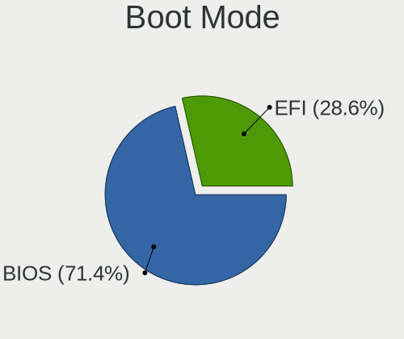
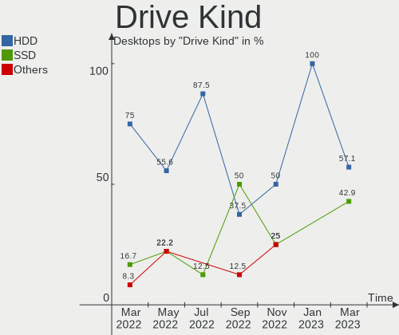
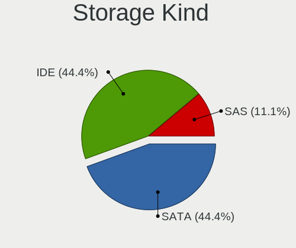

Endless - Hardware Trends (Desktops)
------------------------------------

A project to identify most popular hardware characteristics and track their change
over time based on data collected by Linux users at https://Linux-Hardware.org.

Anyone can contribute to this report by the [hw-probe](https://github.com/linuxhw/hw-probe) tool:

    sudo -E hw-probe -all -upload

This report is for one last month. Overall report since the beginning of time: [TestCoverage](https://github.com/linuxhw/TestCoverage)

Period: May, 2022.

Contents
--------

* [ System ](#system)
  - [ OS                       ](#os)
  - [ OS Family                ](#os-family)
  - [ Kernel                   ](#kernel)
  - [ Kernel Family            ](#kernel-family)
  - [ Kernel Major Ver.        ](#kernel-major-ver)
  - [ Arch                     ](#arch)
  - [ DE                       ](#de)
  - [ Display Server           ](#display-server)
  - [ Display Manager          ](#display-manager)
  - [ OS Lang                  ](#os-lang)
  - [ Boot Mode                ](#boot-mode)
  - [ Filesystem               ](#filesystem)
  - [ Part. scheme             ](#part-scheme)
  - [ Dual Boot with Linux/BSD ](#dual-boot-with-linuxbsd)
  - [ Dual Boot (Win)          ](#dual-boot-win)

* [ Board ](#board)
  - [ Vendor                   ](#vendor)
  - [ Model                    ](#model)
  - [ Model Family             ](#model-family)
  - [ MFG Year                 ](#mfg-year)
  - [ Form Factor              ](#form-factor)
  - [ Secure Boot              ](#secure-boot)
  - [ Coreboot                 ](#coreboot)
  - [ RAM Size                 ](#ram-size)
  - [ RAM Used                 ](#ram-used)
  - [ Total Drives             ](#total-drives)
  - [ Has CD-ROM               ](#has-cd-rom)
  - [ Has Ethernet             ](#has-ethernet)
  - [ Has WiFi                 ](#has-wifi)
  - [ Has Bluetooth            ](#has-bluetooth)

* [ Location ](#location)
  - [ Country                  ](#country)
  - [ City                     ](#city)

* [ Drives ](#drives)
  - [ Drive Vendor             ](#drive-vendor)
  - [ Drive Model              ](#drive-model)
  - [ HDD Vendor               ](#hdd-vendor)
  - [ SSD Vendor               ](#ssd-vendor)
  - [ Drive Kind               ](#drive-kind)
  - [ Drive Connector          ](#drive-connector)
  - [ Drive Size               ](#drive-size)
  - [ Space Total              ](#space-total)
  - [ Space Used               ](#space-used)
  - [ Malfunc. Drives          ](#malfunc-drives)
  - [ Malfunc. Drive Vendor    ](#malfunc-drive-vendor)
  - [ Malfunc. HDD Vendor      ](#malfunc-hdd-vendor)
  - [ Malfunc. Drive Kind      ](#malfunc-drive-kind)
  - [ Failed Drives            ](#failed-drives)
  - [ Failed Drive Vendor      ](#failed-drive-vendor)
  - [ Drive Status             ](#drive-status)

* [ Storage controller ](#storage-controller)
  - [ Storage Vendor           ](#storage-vendor)
  - [ Storage Model            ](#storage-model)
  - [ Storage Kind             ](#storage-kind)

* [ Processor ](#processor)
  - [ CPU Vendor               ](#cpu-vendor)
  - [ CPU Model                ](#cpu-model)
  - [ CPU Model Family         ](#cpu-model-family)
  - [ CPU Cores                ](#cpu-cores)
  - [ CPU Sockets              ](#cpu-sockets)
  - [ CPU Threads              ](#cpu-threads)
  - [ CPU Op-Modes             ](#cpu-op-modes)
  - [ CPU Microcode            ](#cpu-microcode)
  - [ CPU Microarch            ](#cpu-microarch)

* [ Graphics ](#graphics)
  - [ GPU Vendor               ](#gpu-vendor)
  - [ GPU Model                ](#gpu-model)
  - [ GPU Combo                ](#gpu-combo)
  - [ GPU Driver               ](#gpu-driver)
  - [ GPU Memory               ](#gpu-memory)

* [ Monitor ](#monitor)
  - [ Monitor Vendor           ](#monitor-vendor)
  - [ Monitor Model            ](#monitor-model)
  - [ Monitor Resolution       ](#monitor-resolution)
  - [ Monitor Diagonal         ](#monitor-diagonal)
  - [ Monitor Width            ](#monitor-width)
  - [ Aspect Ratio             ](#aspect-ratio)
  - [ Monitor Area             ](#monitor-area)
  - [ Pixel Density            ](#pixel-density)
  - [ Multiple Monitors        ](#multiple-monitors)

* [ Network ](#network)
  - [ Net Controller Vendor    ](#net-controller-vendor)
  - [ Net Controller Model     ](#net-controller-model)
  - [ Wireless Vendor          ](#wireless-vendor)
  - [ Wireless Model           ](#wireless-model)
  - [ Ethernet Vendor          ](#ethernet-vendor)
  - [ Ethernet Model           ](#ethernet-model)
  - [ Net Controller Kind      ](#net-controller-kind)
  - [ Used Controller          ](#used-controller)
  - [ NICs                     ](#nics)
  - [ IPv6                     ](#ipv6)

* [ Bluetooth ](#bluetooth)
  - [ Bluetooth Vendor         ](#bluetooth-vendor)
  - [ Bluetooth Model          ](#bluetooth-model)

* [ Sound ](#sound)
  - [ Sound Vendor             ](#sound-vendor)
  - [ Sound Model              ](#sound-model)

* [ Memory ](#memory)
  - [ Memory Vendor            ](#memory-vendor)
  - [ Memory Model             ](#memory-model)
  - [ Memory Kind              ](#memory-kind)
  - [ Memory Form Factor       ](#memory-form-factor)
  - [ Memory Size              ](#memory-size)
  - [ Memory Speed             ](#memory-speed)

* [ Printers & scanners ](#printers--scanners)
  - [ Printer Vendor           ](#printer-vendor)
  - [ Printer Model            ](#printer-model)
  - [ Scanner Vendor           ](#scanner-vendor)
  - [ Scanner Model            ](#scanner-model)

* [ Camera ](#camera)
  - [ Camera Vendor            ](#camera-vendor)
  - [ Camera Model             ](#camera-model)

* [ Security ](#security)
  - [ Fingerprint Vendor       ](#fingerprint-vendor)
  - [ Fingerprint Model        ](#fingerprint-model)
  - [ Chipcard Vendor          ](#chipcard-vendor)
  - [ Chipcard Model           ](#chipcard-model)

* [ Unsupported ](#unsupported)
  - [ Unsupported Devices      ](#unsupported-devices)
  - [ Unsupported Device Types ](#unsupported-device-types)

System
------

OS
--

Installed operating systems

| Name          | Desktops | Percent |
|---------------|----------|---------|
| Endless 4.0.6 | 5        | 83.33%  |
| Endless 4.0.4 | 1        | 16.67%  |

OS Family
---------

OS without a version

| Name    | Desktops | Percent |
|---------|----------|---------|
| Endless | 6        | 100%    |

Kernel
------

Version of the Linux kernel

| Version           | Desktops | Percent |
|-------------------|----------|---------|
| 5.11.0-35-generic | 6        | 100%    |

Kernel Family
-------------

Linux kernel without a distro release

| Version | Desktops | Percent |
|---------|----------|---------|
| 5.11.0  | 6        | 100%    |

Kernel Major Ver.
-----------------

Linux kernel major version

| Version | Desktops | Percent |
|---------|----------|---------|
| 5.11    | 6        | 100%    |

Arch
----

OS architecture (x86_64, i586, etc.)

| Name   | Desktops | Percent |
|--------|----------|---------|
| x86_64 | 6        | 100%    |

DE
--

Desktop Environment

| Name  | Desktops | Percent |
|-------|----------|---------|
| GNOME | 6        | 100%    |

Display Server
--------------

X11 or Wayland

| Name | Desktops | Percent |
|------|----------|---------|
| X11  | 6        | 100%    |

Display Manager
---------------

SDDM, LightDM, etc.

| Name    | Desktops | Percent |
|---------|----------|---------|
| Unknown | 6        | 100%    |

OS Lang
-------

Language

| Lang  | Desktops | Percent |
|-------|----------|---------|
| en_US | 4        | 66.67%  |
| pt_BR | 2        | 33.33%  |

Boot Mode
---------

EFI or BIOS

| Mode | Desktops | Percent |
|------|----------|---------|
| BIOS | 3        | 50%     |
| EFI  | 3        | 50%     |

Filesystem
----------

Type of filesystem

| Type | Desktops | Percent |
|------|----------|---------|
| Ext4 | 6        | 100%    |

Part. scheme
------------

Scheme of partitioning

| Type    | Desktops | Percent |
|---------|----------|---------|
| Unknown | 6        | 100%    |

Dual Boot with Linux/BSD
------------------------

Hosting more than one Linux/BSD

| Dual boot | Desktops | Percent |
|-----------|----------|---------|
| No        | 6        | 100%    |

Dual Boot (Win)
---------------

Hosting Linux and Windows

| Dual boot | Desktops | Percent |
|-----------|----------|---------|
| No        | 6        | 100%    |

Board
-----

Vendor
------

Motherboard manufacturer

| Name             | Desktops | Percent |
|------------------|----------|---------|
| Dell             | 4        | 66.67%  |
| Positivo         | 1        | 16.67%  |
| ASUSTek Computer | 1        | 16.67%  |

Model
-----

Motherboard model

| Name                  | Desktops | Percent |
|-----------------------|----------|---------|
| Positivo POS-MI945AA  | 1        | 16.67%  |
| Dell XPS 8930         | 1        | 16.67%  |
| Dell Precision T7600  | 1        | 16.67%  |
| Dell OptiPlex 790     | 1        | 16.67%  |
| Dell OptiPlex 3020    | 1        | 16.67%  |
| ASUS PRIME A320M-K/BR | 1        | 16.67%  |

Model Family
------------

Motherboard model prefix

| Name                 | Desktops | Percent |
|----------------------|----------|---------|
| Dell OptiPlex        | 2        | 33.33%  |
| Positivo POS-MI945AA | 1        | 16.67%  |
| Dell XPS             | 1        | 16.67%  |
| Dell Precision       | 1        | 16.67%  |
| ASUS PRIME           | 1        | 16.67%  |

MFG Year
--------

Motherboard manufacture year

| Year | Desktops | Percent |
|------|----------|---------|
| 2017 | 2        | 33.33%  |
| 2019 | 1        | 16.67%  |
| 2014 | 1        | 16.67%  |
| 2011 | 1        | 16.67%  |
| 2007 | 1        | 16.67%  |

Form Factor
-----------

Physical design of the computer

| Name    | Desktops | Percent |
|---------|----------|---------|
| Desktop | 6        | 100%    |

Secure Boot
-----------

Enabled or disabled

| State    | Desktops | Percent |
|----------|----------|---------|
| Disabled | 5        | 83.33%  |
| Enabled  | 1        | 16.67%  |

Coreboot
--------

Have coreboot on board

| Used | Desktops | Percent |
|------|----------|---------|
| No   | 6        | 100%    |

RAM Size
--------

Total RAM memory

| Size in GB | Desktops | Percent |
|------------|----------|---------|
| 16.01-24.0 | 5        | 83.33%  |
| 1.01-2.0   | 1        | 16.67%  |

RAM Used
--------

Used RAM memory

| Used GB  | Desktops | Percent |
|----------|----------|---------|
| 1.01-2.0 | 5        | 83.33%  |
| 2.01-3.0 | 1        | 16.67%  |

Total Drives
------------

Number of drives on board

| Drives | Desktops | Percent |
|--------|----------|---------|
| 3      | 3        | 50%     |
| 1      | 2        | 33.33%  |
| 2      | 1        | 16.67%  |

Has CD-ROM
----------

Has CD-ROM on board

| Presented | Desktops | Percent |
|-----------|----------|---------|
| Yes       | 5        | 83.33%  |
| No        | 1        | 16.67%  |

Has Ethernet
------------

Has Ethernet on board

| Presented | Desktops | Percent |
|-----------|----------|---------|
| Yes       | 6        | 100%    |

Has WiFi
--------

Has WiFi module

| Presented | Desktops | Percent |
|-----------|----------|---------|
| Yes       | 3        | 50%     |
| No        | 3        | 50%     |

Has Bluetooth
-------------

Has Bluetooth module

| Presented | Desktops | Percent |
|-----------|----------|---------|
| No        | 4        | 66.67%  |
| Yes       | 2        | 33.33%  |

Location
--------

Country
-------

Geographic location (country)

| Country | Desktops | Percent |
|---------|----------|---------|
| USA     | 4        | 66.67%  |
| Brazil  | 2        | 33.33%  |

City
----

Geographic location (city)

| City                | Desktops | Percent |
|---------------------|----------|---------|
| Várzea Grande      | 1        | 16.67%  |
| Presidente Prudente | 1        | 16.67%  |
| Lawrenceville       | 1        | 16.67%  |
| Gibsonburg          | 1        | 16.67%  |
| Coraopolis          | 1        | 16.67%  |
| Aliso Viejo         | 1        | 16.67%  |

Drives
------

Drive Vendor
------------

Hard drive vendors

| Vendor  | Desktops | Drives | Percent |
|---------|----------|--------|---------|
| Seagate | 5        | 6      | 41.67%  |
| WDC     | 3        | 3      | 25%     |
| Intel   | 1        | 1      | 8.33%   |
| Hitachi | 1        | 1      | 8.33%   |
| Crucial | 1        | 1      | 8.33%   |
| China   | 1        | 1      | 8.33%   |

Drive Model
-----------

Hard drive models

| Model                            | Desktops | Percent |
|----------------------------------|----------|---------|
| Seagate ST1000DM010-2EP102 1TB   | 3        | 23.08%  |
| WDC WDS240G2G0B-00EPW0 240GB SSD | 1        | 7.69%   |
| WDC WD800JD-75MSA1 80GB          | 1        | 7.69%   |
| WDC WD1001FALS-00U9B0 1TB        | 1        | 7.69%   |
| Seagate ST500DM002-1SB10A 500GB  | 1        | 7.69%   |
| Seagate ST500DM002-1BD142 500GB  | 1        | 7.69%   |
| Seagate Backup+ Desk 5TB         | 1        | 7.69%   |
| Intel SSDPEKKW256G7 256GB        | 1        | 7.69%   |
| Hitachi HUA722020ALA330 2TB      | 1        | 7.69%   |
| Crucial CT240BX500SSD1 240GB     | 1        | 7.69%   |
| China SSD 60GB                   | 1        | 7.69%   |

HDD Vendor
----------

Hard disk drive vendors

| Vendor  | Desktops | Drives | Percent |
|---------|----------|--------|---------|
| Seagate | 5        | 5      | 62.5%   |
| WDC     | 2        | 2      | 25%     |
| Hitachi | 1        | 1      | 12.5%   |

SSD Vendor
----------

Solid state drive vendors

| Vendor  | Desktops | Drives | Percent |
|---------|----------|--------|---------|
| WDC     | 1        | 1      | 33.33%  |
| Crucial | 1        | 1      | 33.33%  |
| China   | 1        | 1      | 33.33%  |

Drive Kind
----------

HDD or SSD

| Kind    | Desktops | Drives | Percent |
|---------|----------|--------|---------|
| HDD     | 5        | 8      | 55.56%  |
| SSD     | 2        | 3      | 22.22%  |
| NVMe    | 1        | 1      | 11.11%  |
| Unknown | 1        | 1      | 11.11%  |

Drive Connector
---------------

SATA, SAS, NVMe, etc.

| Type | Desktops | Drives | Percent |
|------|----------|--------|---------|
| SATA | 6        | 11     | 75%     |
| SAS  | 1        | 1      | 12.5%   |
| NVMe | 1        | 1      | 12.5%   |

Drive Size
----------

Size of hard drive

| Size in TB | Desktops | Drives | Percent |
|------------|----------|--------|---------|
| 0.51-1.0   | 4        | 4      | 44.44%  |
| 0.01-0.5   | 4        | 6      | 44.44%  |
| 1.01-2.0   | 1        | 1      | 11.11%  |

Space Total
-----------

Amount of disk space available on the file system

| Size in GB     | Desktops | Percent |
|----------------|----------|---------|
| 51-100         | 2        | 33.33%  |
| More than 3000 | 1        | 16.67%  |
| 251-500        | 1        | 16.67%  |
| 101-250        | 1        | 16.67%  |
| 501-1000       | 1        | 16.67%  |

Space Used
----------

Amount of used disk space

| Used GB   | Desktops | Percent |
|-----------|----------|---------|
| 1-20      | 3        | 50%     |
| 21-50     | 1        | 16.67%  |
| 1001-2000 | 1        | 16.67%  |
| 501-1000  | 1        | 16.67%  |

Malfunc. Drives
---------------

Drive models with a malfunction

Zero info for selected period =(

Malfunc. Drive Vendor
---------------------

Vendors of faulty drives

Zero info for selected period =(

Malfunc. HDD Vendor
-------------------

Vendors of faulty HDD drives

Zero info for selected period =(

Malfunc. Drive Kind
-------------------

Kinds of faulty drives

Zero info for selected period =(

Failed Drives
-------------

Failed drive models

Zero info for selected period =(

Failed Drive Vendor
-------------------

Failed drive vendors

Zero info for selected period =(

Drive Status
------------

Number of failed and malfunc. drives

| Status   | Desktops | Drives | Percent |
|----------|----------|--------|---------|
| Detected | 6        | 13     | 100%    |

Storage controller
------------------

Storage Vendor
--------------

Storage controller vendors

| Vendor | Desktops | Percent |
|--------|----------|---------|
| Intel  | 5        | 83.33%  |
| AMD    | 1        | 16.67%  |

Storage Model
-------------

Storage controller models

| Model                                                                          | Desktops | Percent |
|--------------------------------------------------------------------------------|----------|---------|
| Intel SATA Controller [RAID mode]                                              | 1        | 10%     |
| Intel PROSet/Wireless WiFi Software extension                                  | 1        | 10%     |
| Intel NM10/ICH7 Family SATA Controller [IDE mode]                              | 1        | 10%     |
| Intel C606 chipset Dual 4-Port SATA/SAS Storage Control Unit                   | 1        | 10%     |
| Intel C600/X79 series chipset 6-Port SATA AHCI Controller                      | 1        | 10%     |
| Intel 82801G (ICH7 Family) IDE Controller                                      | 1        | 10%     |
| Intel 8 Series/C220 Series Chipset Family 6-port SATA Controller 1 [AHCI mode] | 1        | 10%     |
| Intel 6 Series/C200 Series Chipset Family 6 port Desktop SATA AHCI Controller  | 1        | 10%     |
| AMD FCH SATA Controller [AHCI mode]                                            | 1        | 10%     |
| AMD FCH SATA Controller D                                                      | 1        | 10%     |

Storage Kind
------------

Kind of storage controller (IDE, SATA, NVMe, SAS, ...)

| Kind | Desktops | Percent |
|------|----------|---------|
| SATA | 5        | 62.5%   |
| SAS  | 1        | 12.5%   |
| NVMe | 1        | 12.5%   |
| IDE  | 1        | 12.5%   |

Processor
---------

CPU Vendor
----------

Processor vendors

| Vendor | Desktops | Percent |
|--------|----------|---------|
| Intel  | 5        | 83.33%  |
| AMD    | 1        | 16.67%  |

CPU Model
---------

Processor models

| Model                                       | Desktops | Percent |
|---------------------------------------------|----------|---------|
| Intel Xeon CPU E5-2650 0 @ 2.00GHz          | 1        | 16.67%  |
| Intel Core i7-9700 CPU @ 3.00GHz            | 1        | 16.67%  |
| Intel Core i5-4570 CPU @ 3.20GHz            | 1        | 16.67%  |
| Intel Core i5-2400 CPU @ 3.10GHz            | 1        | 16.67%  |
| Intel Core 2 Duo CPU E4500 @ 2.20GHz        | 1        | 16.67%  |
| AMD Ryzen 3 3200G with Radeon Vega Graphics | 1        | 16.67%  |

CPU Model Family
----------------

Processor model prefix

| Model            | Desktops | Percent |
|------------------|----------|---------|
| Intel Core i5    | 2        | 33.33%  |
| Intel Xeon       | 1        | 16.67%  |
| Intel Core i7    | 1        | 16.67%  |
| Intel Core 2 Duo | 1        | 16.67%  |
| AMD Ryzen 3      | 1        | 16.67%  |

CPU Cores
---------

Number of processor cores

| Number | Desktops | Percent |
|--------|----------|---------|
| 4      | 3        | 50%     |
| 8      | 2        | 33.33%  |
| 2      | 1        | 16.67%  |

CPU Sockets
-----------

Number of sockets

| Number | Desktops | Percent |
|--------|----------|---------|
| 1      | 6        | 100%    |

CPU Threads
-----------

Threads per core (Hyper-Threading)

| Number | Desktops | Percent |
|--------|----------|---------|
| 1      | 5        | 83.33%  |
| 2      | 1        | 16.67%  |

CPU Op-Modes
------------

CPU Operation Modes (32-bit, 64-bit)

| Op mode        | Desktops | Percent |
|----------------|----------|---------|
| 32-bit, 64-bit | 6        | 100%    |

CPU Microcode
-------------

Microcode number

| Number     | Desktops | Percent |
|------------|----------|---------|
| 0x906ed    | 1        | 16.67%  |
| 0x6fd      | 1        | 16.67%  |
| 0x306c3    | 1        | 16.67%  |
| 0x206d7    | 1        | 16.67%  |
| 0x206a7    | 1        | 16.67%  |
| 0x08108109 | 1        | 16.67%  |

CPU Microarch
-------------

Microarchitecture

| Name        | Desktops | Percent |
|-------------|----------|---------|
| SandyBridge | 2        | 33.33%  |
| Zen+        | 1        | 16.67%  |
| KabyLake    | 1        | 16.67%  |
| Haswell     | 1        | 16.67%  |
| Core        | 1        | 16.67%  |

Graphics
--------

GPU Vendor
----------

Vendors of graphics cards

| Vendor | Desktops | Percent |
|--------|----------|---------|
| Nvidia | 5        | 62.5%   |
| Intel  | 2        | 25%     |
| AMD    | 1        | 12.5%   |

GPU Model
---------

Graphics card models

| Model                                                                       | Desktops | Percent |
|-----------------------------------------------------------------------------|----------|---------|
| Nvidia GT218 [GeForce 210]                                                  | 1        | 12.5%   |
| Nvidia GP108 [GeForce GT 1030]                                              | 1        | 12.5%   |
| Nvidia GP107GL [Quadro P600]                                                | 1        | 12.5%   |
| Nvidia GP107 [GeForce GTX 1050 Ti]                                          | 1        | 12.5%   |
| Nvidia GF108 [GeForce GT 630]                                               | 1        | 12.5%   |
| Intel Xeon E3-1200 v3/4th Gen Core Processor Integrated Graphics Controller | 1        | 12.5%   |
| Intel CoffeeLake-S GT2 [UHD Graphics 630]                                   | 1        | 12.5%   |
| AMD Picasso/Raven 2 [Radeon Vega Series / Radeon Vega Mobile Series]        | 1        | 12.5%   |

GPU Combo
---------

Combinations of graphics cards

| Name         | Desktops | Percent |
|--------------|----------|---------|
| 1 x Nvidia   | 4        | 66.67%  |
| 1 x Intel    | 1        | 16.67%  |
| AMD + Nvidia | 1        | 16.67%  |

GPU Driver
----------

Free vs proprietary

| Driver      | Desktops | Percent |
|-------------|----------|---------|
| Proprietary | 3        | 50%     |
| Free        | 3        | 50%     |

GPU Memory
----------

Total video memory

| Size in GB | Desktops | Percent |
|------------|----------|---------|
| Unknown    | 4        | 66.67%  |
| 1.01-2.0   | 1        | 16.67%  |
| 0.51-1.0   | 1        | 16.67%  |

Monitor
-------

Monitor Vendor
--------------

Monitor vendors

| Vendor    | Desktops | Percent |
|-----------|----------|---------|
| Dell      | 2        | 40%     |
| ViewSonic | 1        | 20%     |
| GDH       | 1        | 20%     |
| Acer      | 1        | 20%     |

Monitor Model
-------------

Monitor models

| Model                                                      | Desktops | Percent |
|------------------------------------------------------------|----------|---------|
| ViewSonic VS2210-FHD VSC1939 1920x1080 476x268mm 21.5-inch | 1        | 20%     |
| GDH TV PHILCO GDH0030 1920x540                             | 1        | 20%     |
| Dell S2721D DELA19A 2560x1440 597x336mm 27.0-inch          | 1        | 20%     |
| Dell P2210 DEL404C 1680x1050 474x296mm 22.0-inch           | 1        | 20%     |
| Acer Z35P ACR0579 3440x1440 819x346mm 35.0-inch            | 1        | 20%     |

Monitor Resolution
------------------

Monitor screen resolution

| Resolution         | Desktops | Percent |
|--------------------|----------|---------|
| 3840x2160 (4K)     | 1        | 20%     |
| 3440x1440          | 1        | 20%     |
| 2560x1440 (QHD)    | 1        | 20%     |
| 1920x1080 (FHD)    | 1        | 20%     |
| 1680x1050 (WSXGA+) | 1        | 20%     |

Monitor Diagonal
----------------

Diagonal size in inches

| Inches | Desktops | Percent |
|--------|----------|---------|
| 35     | 1        | 20%     |
| 32     | 1        | 20%     |
| 27     | 1        | 20%     |
| 22     | 1        | 20%     |
| 21     | 1        | 20%     |

Monitor Width
-------------

Physical width

| Width in mm | Desktops | Percent |
|-------------|----------|---------|
| 401-500     | 2        | 40%     |
| 801-900     | 1        | 20%     |
| 701-800     | 1        | 20%     |
| 501-600     | 1        | 20%     |

Aspect Ratio
------------

Proportional relationship between the width and the height

| Ratio | Desktops | Percent |
|-------|----------|---------|
| 16/9  | 3        | 60%     |
| 21/9  | 1        | 20%     |
| 16/10 | 1        | 20%     |

Monitor Area
------------

Area in inch²

| Area in inch² | Desktops | Percent |
|----------------|----------|---------|
| 351-500        | 2        | 40%     |
| 201-250        | 2        | 40%     |
| 301-350        | 1        | 20%     |

Pixel Density
-------------

Pixels per inch

| Density | Desktops | Percent |
|---------|----------|---------|
| 101-120 | 3        | 60%     |
| 121-160 | 1        | 20%     |
| 51-100  | 1        | 20%     |

Multiple Monitors
-----------------

Total monitors connected

| Total | Desktops | Percent |
|-------|----------|---------|
| 1     | 6        | 100%    |

Network
-------

Net Controller Vendor
---------------------

Controller vendors

| Vendor                | Desktops | Percent |
|-----------------------|----------|---------|
| Realtek Semiconductor | 3        | 42.86%  |
| Intel                 | 2        | 28.57%  |
| Qualcomm Atheros      | 1        | 14.29%  |
| ASUSTek Computer      | 1        | 14.29%  |

Net Controller Model
--------------------

Controller models

| Model                                                             | Desktops | Percent |
|-------------------------------------------------------------------|----------|---------|
| Realtek RTL8111/8168/8411 PCI Express Gigabit Ethernet Controller | 2        | 16.67%  |
| Intel 82579LM Gigabit Network Connection (Lewisville)             | 2        | 16.67%  |
| Realtek RTL8191SU 802.11n WLAN Adapter                            | 1        | 8.33%   |
| Realtek RTL8153 Gigabit Ethernet Adapter                          | 1        | 8.33%   |
| Realtek RTL810xE PCI Express Fast Ethernet controller             | 1        | 8.33%   |
| Qualcomm Atheros QCA9377 802.11ac Wireless Network Adapter        | 1        | 8.33%   |
| Qualcomm Atheros Killer E2400 Gigabit Ethernet Controller         | 1        | 8.33%   |
| Intel Wireless 7265                                               | 1        | 8.33%   |
| Intel 82574L Gigabit Network Connection                           | 1        | 8.33%   |
| ASUS USB 10/100/1G/2.5G LAN                                       | 1        | 8.33%   |

Wireless Vendor
---------------

Wireless vendors

| Vendor                | Desktops | Percent |
|-----------------------|----------|---------|
| Realtek Semiconductor | 1        | 33.33%  |
| Qualcomm Atheros      | 1        | 33.33%  |
| Intel                 | 1        | 33.33%  |

Wireless Model
--------------

Wireless models

| Model                                                      | Desktops | Percent |
|------------------------------------------------------------|----------|---------|
| Realtek RTL8191SU 802.11n WLAN Adapter                     | 1        | 33.33%  |
| Qualcomm Atheros QCA9377 802.11ac Wireless Network Adapter | 1        | 33.33%  |
| Intel Wireless 7265                                        | 1        | 33.33%  |

Ethernet Vendor
---------------

Ethernet vendors

| Vendor                | Desktops | Percent |
|-----------------------|----------|---------|
| Realtek Semiconductor | 3        | 42.86%  |
| Intel                 | 2        | 28.57%  |
| Qualcomm Atheros      | 1        | 14.29%  |
| ASUSTek Computer      | 1        | 14.29%  |

Ethernet Model
--------------

Ethernet models

| Model                                                             | Desktops | Percent |
|-------------------------------------------------------------------|----------|---------|
| Realtek RTL8111/8168/8411 PCI Express Gigabit Ethernet Controller | 2        | 22.22%  |
| Intel 82579LM Gigabit Network Connection (Lewisville)             | 2        | 22.22%  |
| Realtek RTL8153 Gigabit Ethernet Adapter                          | 1        | 11.11%  |
| Realtek RTL810xE PCI Express Fast Ethernet controller             | 1        | 11.11%  |
| Qualcomm Atheros Killer E2400 Gigabit Ethernet Controller         | 1        | 11.11%  |
| Intel 82574L Gigabit Network Connection                           | 1        | 11.11%  |
| ASUS USB 10/100/1G/2.5G LAN                                       | 1        | 11.11%  |

Net Controller Kind
-------------------

Ethernet, WiFi or modem

| Kind     | Desktops | Percent |
|----------|----------|---------|
| Ethernet | 6        | 66.67%  |
| WiFi     | 3        | 33.33%  |

Used Controller
---------------

Currently used network controller

| Kind     | Desktops | Percent |
|----------|----------|---------|
| Ethernet | 4        | 66.67%  |
| WiFi     | 2        | 33.33%  |

NICs
----

Total network controllers on board

| Total | Desktops | Percent |
|-------|----------|---------|
| 2     | 3        | 50%     |
| 1     | 3        | 50%     |

IPv6
----

IPv6 vs IPv4

| Used | Desktops | Percent |
|------|----------|---------|
| No   | 5        | 83.33%  |
| Yes  | 1        | 16.67%  |

Bluetooth
---------

Bluetooth Vendor
----------------

Controller vendors

| Vendor                          | Desktops | Percent |
|---------------------------------|----------|---------|
| Qualcomm Atheros Communications | 1        | 50%     |
| Intel                           | 1        | 50%     |

Bluetooth Model
---------------

Controller models

| Model                              | Desktops | Percent |
|------------------------------------|----------|---------|
| Qualcomm Atheros  Bluetooth Device | 1        | 50%     |
| Intel Bluetooth wireless interface | 1        | 50%     |

Sound
-----

Sound Vendor
------------

Sound card vendors

| Vendor | Desktops | Percent |
|--------|----------|---------|
| Nvidia | 5        | 45.45%  |
| Intel  | 5        | 45.45%  |
| AMD    | 1        | 9.09%   |

Sound Model
-----------

Sound card models

| Model                                                                      | Desktops | Percent |
|----------------------------------------------------------------------------|----------|---------|
| Nvidia GP107GL High Definition Audio Controller                            | 2        | 15.38%  |
| Nvidia High Definition Audio Controller                                    | 1        | 7.69%   |
| Nvidia GP108 High Definition Audio Controller                              | 1        | 7.69%   |
| Nvidia GF108 High Definition Audio Controller                              | 1        | 7.69%   |
| Intel Xeon E3-1200 v3/4th Gen Core Processor HD Audio Controller           | 1        | 7.69%   |
| Intel NM10/ICH7 Family High Definition Audio Controller                    | 1        | 7.69%   |
| Intel C600/X79 series chipset High Definition Audio Controller             | 1        | 7.69%   |
| Intel 8 Series/C220 Series Chipset High Definition Audio Controller        | 1        | 7.69%   |
| Intel 6 Series/C200 Series Chipset Family High Definition Audio Controller | 1        | 7.69%   |
| Intel 200 Series PCH HD Audio                                              | 1        | 7.69%   |
| AMD Raven/Raven2/Fenghuang HDMI/DP Audio Controller                        | 1        | 7.69%   |
| AMD Family 17h/19h HD Audio Controller                                     | 1        | 7.69%   |

Memory
------

Memory Vendor
-------------

Memory module vendors

Zero info for selected period =(

Memory Model
------------

Memory module models

Zero info for selected period =(

Memory Kind
-----------

Memory module kinds

Zero info for selected period =(

Memory Form Factor
------------------

Physical design of the memory module

Zero info for selected period =(

Memory Size
-----------

Memory module size

Zero info for selected period =(

Memory Speed
------------

Memory module speed

Zero info for selected period =(

Printers & scanners
-------------------

Printer Vendor
--------------

Printer device vendors

| Vendor          | Desktops | Percent |
|-----------------|----------|---------|
| Hewlett-Packard | 2        | 100%    |

Printer Model
-------------

Printer device models

| Model                | Desktops | Percent |
|----------------------|----------|---------|
| HP OfficeJet 6950    | 1        | 50%     |
| HP Deskjet 2050 J510 | 1        | 50%     |

Scanner Vendor
--------------

Scanner device vendors

Zero info for selected period =(

Scanner Model
-------------

Scanner device models

Zero info for selected period =(

Camera
------

Camera Vendor
-------------

Camera device vendors

| Vendor   | Desktops | Percent |
|----------|----------|---------|
| Logitech | 1        | 100%    |

Camera Model
------------

Camera device models

| Model                | Desktops | Percent |
|----------------------|----------|---------|
| Logitech Webcam C270 | 1        | 100%    |

Security
--------

Fingerprint Vendor
------------------

Fingerprint sensor vendors

Zero info for selected period =(

Fingerprint Model
-----------------

Fingerprint sensor models

Zero info for selected period =(

Chipcard Vendor
---------------

Chipcard module vendors

Zero info for selected period =(

Chipcard Model
--------------

Chipcard module models

Zero info for selected period =(

Unsupported
-----------

Unsupported Devices
-------------------

Total unsupported devices on board

| Total | Desktops | Percent |
|-------|----------|---------|
| 0     | 5        | 83.33%  |
| 1     | 1        | 16.67%  |

Unsupported Device Types
------------------------

Types of unsupported devices

| Type          | Desktops | Percent |
|---------------|----------|---------|
| Graphics card | 1        | 100%    |

