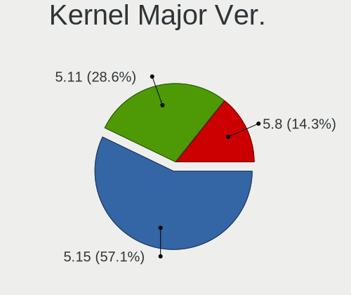
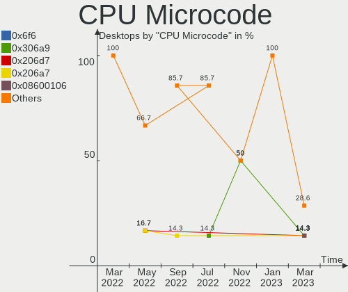
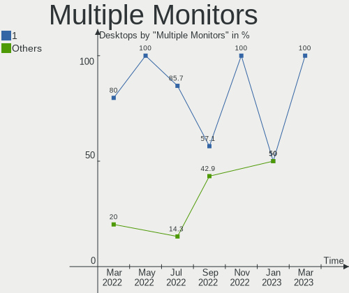

Endless Hardware Trends (Desktop)
---------------------------------

A project to identify most popular hardware characteristics and track their change
over time based on data collected by Endless users at https://Linux-Hardware.org.

Anyone can contribute to the study by uploading probes of their computers by
the [hw-probe](https://github.com/linuxhw/hw-probe) tool:

    sudo hw-probe -all -upload

Full-feature report is available here: https://linux-hardware.org/?view=trends&formfactor=desktop

Period: Jan, 2020.

Contents
--------

- [ OS                       ](#os)
- [ OS Family                ](#os-family)
- [ Kernel                   ](#kernel)
- [ Kernel Family            ](#kernel-family)
- [ Kernel Major Ver.        ](#kernel-major-ver)
- [ Arch                     ](#arch)
- [ DE                       ](#de)
- [ Display Server           ](#display-server)
- [ OS Lang                  ](#os-lang)
- [ Boot Mode                ](#boot-mode)
- [ Filesystem               ](#filesystem)
- [ Dual Boot with Linux     ](#dual-boot-with-linux)
- [ Dual Boot (Win)          ](#dual-boot-win)
- [ Country                  ](#country)
- [ City                     ](#city)
- [ Vendor                   ](#vendor)
- [ Model                    ](#model)
- [ Model Family             ](#model-family)
- [ MFG Year                 ](#mfg-year)
- [ Form Factor              ](#form-factor)
- [ Secure Boot              ](#secure-boot)
- [ Coreboot                 ](#coreboot)
- [ RAM Size                 ](#ram-size)
- [ RAM Used                 ](#ram-used)
- [ Drive Vendor             ](#drive-vendor)
- [ Drive Model              ](#drive-model)
- [ Drive Kind               ](#drive-kind)
- [ Drive Connector          ](#drive-connector)
- [ Drive Size               ](#drive-size)
- [ Space Total              ](#space-total)
- [ Space Used               ](#space-used)
- [ Malfunc. Drives          ](#malfunc-drives)
- [ Malfunc. Drive Vendor    ](#malfunc-drive-vendor)
- [ Malfunc. Drive Kind      ](#malfunc-drive-kind)
- [ Failed Drives            ](#failed-drives)
- [ Failed Drive Vendor      ](#failed-drive-vendor)
- [ Drive Status             ](#drive-status)
- [ CPU Vendor               ](#cpu-vendor)
- [ CPU Model                ](#cpu-model)
- [ CPU Model Family         ](#cpu-model-family)
- [ CPU Cores                ](#cpu-cores)
- [ CPU Sockets              ](#cpu-sockets)
- [ CPU Threads              ](#cpu-threads)
- [ CPU Op-Modes             ](#cpu-op-modes)
- [ CPU Microarch            ](#cpu-microarch)
- [ CPU Microcode            ](#cpu-microcode)
- [ GPU Vendor               ](#gpu-vendor)
- [ GPU Model                ](#gpu-model)
- [ GPU Combo                ](#gpu-combo)
- [ GPU Driver               ](#gpu-driver)
- [ GPU Memory               ](#gpu-memory)
- [ Monitor Vendor           ](#monitor-vendor)
- [ Monitor Model            ](#monitor-model)
- [ Monitor Resolution       ](#monitor-resolution)
- [ Monitor Diagonal         ](#monitor-diagonal)
- [ Monitor Width            ](#monitor-width)
- [ Aspect Ratio             ](#aspect-ratio)
- [ Monitor Area             ](#monitor-area)
- [ Pixel Density            ](#pixel-density)
- [ Multiple Monitors        ](#multiple-monitors)
- [ Net Controller Vendor    ](#net-controller-vendor)
- [ Net Controller Model     ](#net-controller-model)
- [ Net Controller Kind      ](#net-controller-kind)
- [ Used Controller          ](#used-controller)
- [ NICs                     ](#nics)
- [ Unsupported Devices      ](#unsupported-devices)
- [ Unsupported Device Types ](#unsupported-device-types)

OS
--

Installed operating systems

| Name           | Computers | Percent |
|----------------|-----------|---------|
| Endless 3.7.6  | 13        | 76.47%  |
| Endless 3.7.5  | 3         | 17.65%  |
| Endless 3.3.20 | 1         | 5.88%   |

OS Family
---------

OS without a version

| Name    | Computers | Percent |
|---------|-----------|---------|
| Endless | 17        | 100%    |

Kernel
------

Version of the Linux kernel

| Version           | Computers | Percent |
|-------------------|-----------|---------|
| 5.3.0-23-generic  | 16        | 94.12%  |
| 4.13.0-32-generic | 1         | 5.88%   |

Kernel Family
-------------

Linux kernel without a distro release

| Version | Computers | Percent |
|---------|-----------|---------|
| 5.3.0   | 16        | 94.12%  |
| 4.13.0  | 1         | 5.88%   |

Kernel Major Ver.
-----------------

Linux kernel major version

| Version | Computers | Percent |
|---------|-----------|---------|
| 5.3     | 16        | 94.12%  |
| 4.13    | 1         | 5.88%   |

Arch
----

OS architecture (x86_64, i586, etc.)

| Name   | Computers | Percent |
|--------|-----------|---------|
| x86_64 | 17        | 100%    |

DE
--

Desktop Environment

| Name  | Computers | Percent |
|-------|-----------|---------|
| GNOME | 17        | 100%    |

Display Server
--------------

X11 or Wayland

| Name | Computers | Percent |
|------|-----------|---------|
| X11  | 17        | 100%    |

OS Lang
-------

Language

| Lang       | Computers | Percent |
|------------|-----------|---------|
| en_US.utf8 | 6         | 35.29%  |
| en_PH      | 3         | 17.65%  |
| pt_BR.utf8 | 2         | 11.76%  |
| pt_BR      | 2         | 11.76%  |
| ru_RU      | 1         | 5.88%   |
| ro_RO      | 1         | 5.88%   |
| pt_PT      | 1         | 5.88%   |
| es_ES      | 1         | 5.88%   |

Boot Mode
---------

EFI or BIOS

| Mode | Computers | Percent |
|------|-----------|---------|
| BIOS | 10        | 58.82%  |
| EFI  | 7         | 41.18%  |

Filesystem
----------

Type of filesystem

| Type | Computers | Percent |
|------|-----------|---------|
| Ext4 | 17        | 100%    |

Dual Boot with Linux
--------------------

Hosting more than one Linux

| Dual boot | Computers | Percent |
|-----------|-----------|---------|
| No        | 17        | 100%    |

Dual Boot (Win)
---------------

Hosting Linux and Windows

| Dual boot | Computers | Percent |
|-----------|-----------|---------|
| No        | 17        | 100%    |

Country
-------

Geographic location (country)

| Country                   | Computers | Percent |
|---------------------------|-----------|---------|
| Philippines               | 4         | 23.53%  |
| Brazil                    | 4         | 23.53%  |
| USA                       | 3         | 17.65%  |
| Trinidad and Tobago       | 1         | 5.88%   |
| Spain                     | 1         | 5.88%   |
| Russia                    | 1         | 5.88%   |
| Romania                   | 1         | 5.88%   |
| Portugal                  | 1         | 5.88%   |
| Iran, Islamic Republic of | 1         | 5.88%   |

City
----

Geographic location (city)

| City                      | Computers | Percent |
|---------------------------|-----------|---------|
| Manila                    | 3         | 17.65%  |
| Galion                    | 2         | 11.76%  |
| Tucson                    | 1         | 5.88%   |
| Tehran                    | 1         | 5.88%   |
| St Petersburg             | 1         | 5.88%   |
| Sete Lagoas               | 1         | 5.88%   |
| San Fernando              | 1         | 5.88%   |
| Ribeirao Pires            | 1         | 5.88%   |
| Quezon City               | 1         | 5.88%   |
| Porto Alegre              | 1         | 5.88%   |
| Lisbon                    | 1         | 5.88%   |
| Les Franqueses del Valles | 1         | 5.88%   |
| Contagem                  | 1         | 5.88%   |
| Bucharest                 | 1         | 5.88%   |

Vendor
------

Motherboard manufacturer

| Name                | Computers | Percent |
|---------------------|-----------|---------|
| Foxconn             | 4         | 23.53%  |
| Acer                | 3         | 17.65%  |
| Hewlett-Packard     | 2         | 11.76%  |
| Semp Toshiba        | 1         | 5.88%   |
| MSI                 | 1         | 5.88%   |
| Huanan              | 1         | 5.88%   |
| Gigabyte Technology | 1         | 5.88%   |
| Digiboard           | 1         | 5.88%   |
| ASUSTek Computer    | 1         | 5.88%   |
| ASRock              | 1         | 5.88%   |
| Unknown             | 1         | 5.88%   |

Model
-----

Motherboard model

| Name                 | Computers | Percent |
|----------------------|-----------|---------|
| G31MX Series         | 2         | 11.76%  |
| Aspire TC-885        | 2         | 11.76%  |
| 500B Microtower      | 2         | 11.76%  |
| X79 VAA1             | 1         | 5.88%   |
| STI                  | 1         | 5.88%   |
| MS-7C37              | 1         | 5.88%   |
| MPxx                 | 1         | 5.88%   |
| M61SME-S2L           | 1         | 5.88%   |
| M5A78L-M PLUS/USB3   | 1         | 5.88%   |
| EliteDesk 800 G2 SFF | 1         | 5.88%   |
| Aspire XC-830        | 1         | 5.88%   |
| A88M-G               | 1         | 5.88%   |
| 550-153w             | 1         | 5.88%   |
| Unknown              | 1         | 5.88%   |

Model Family
------------

Motherboard model prefix

| Name                | Computers | Percent |
|---------------------|-----------|---------|
| Acer Aspire         | 3         | 17.65%  |
| Foxconn G31MX       | 2         | 11.76%  |
| Foxconn 500B        | 2         | 11.76%  |
| Semp Toshiba STI    | 1         | 5.88%   |
| MSI MS-7C37         | 1         | 5.88%   |
| Huanan X79          | 1         | 5.88%   |
| HP EliteDesk        | 1         | 5.88%   |
| HP 550-153w         | 1         | 5.88%   |
| Gigabyte M61SME-S2L | 1         | 5.88%   |
| Digiboard MPxx      | 1         | 5.88%   |
| ASUS M5A78L-M       | 1         | 5.88%   |
| ASRock A88M-G       | 1         | 5.88%   |
| Unknown             | 1         | 5.88%   |

MFG Year
--------

Motherboard manufacture year

| Year | Computers | Percent |
|------|-----------|---------|
| 2019 | 4         | 23.53%  |
| 2016 | 3         | 17.65%  |
| 2018 | 2         | 11.76%  |
| 2010 | 2         | 11.76%  |
| 2009 | 2         | 11.76%  |
| 2015 | 1         | 5.88%   |
| 2014 | 1         | 5.88%   |
| 2008 | 1         | 5.88%   |
| 2007 | 1         | 5.88%   |

Form Factor
-----------

Physical design of the computer

| Name    | Computers | Percent |
|---------|-----------|---------|
| Desktop | 17        | 100%    |

Secure Boot
-----------

Enabled or disabled

| State    | Computers | Percent |
|----------|-----------|---------|
| Disabled | 14        | 82.35%  |
| Unknown  | 3         | 17.65%  |

Coreboot
--------

Have coreboot on board

| Used | Computers | Percent |
|------|-----------|---------|
| No   | 17        | 100%    |

RAM Size
--------

Total RAM memory

| Size in GB | Computers | Percent |
|------------|-----------|---------|
| 8.01-16.0  | 5         | 29.41%  |
| 3.01-4.0   | 4         | 23.53%  |
| 32.01-64.0 | 2         | 11.76%  |
| 2.01-3.0   | 2         | 11.76%  |
| 1.01-2.0   | 2         | 11.76%  |
| 4.01-8.0   | 1         | 5.88%   |
| 16.01-24.0 | 1         | 5.88%   |

RAM Used
--------

Used RAM memory

| Used GB  | Computers | Percent |
|----------|-----------|---------|
| 2.01-3.0 | 6         | 35.29%  |
| 0.01-1.0 | 5         | 29.41%  |
| 1.01-2.0 | 4         | 23.53%  |
| 4.01-8.0 | 1         | 5.88%   |
| 3.01-4.0 | 1         | 5.88%   |

Drive Vendor
------------

Hard drive vendors

| Vendor              | Computers | Drives | Percent |
|---------------------|-----------|--------|---------|
| Seagate             | 7         | 7      | 33.33%  |
| Toshiba             | 3         | 3      | 14.29%  |
| Kingston            | 3         | 3      | 14.29%  |
| Samsung Electronics | 2         | 2      | 9.52%   |
| Hitachi             | 2         | 2      | 9.52%   |
| Generic             | 2         | 2      | 9.52%   |
| faspeed             | 1         | 1      | 4.76%   |
| Crucial             | 1         | 1      | 4.76%   |

Drive Model
-----------

Hard drive models

| Model                   | Computers | Percent |
|-------------------------|-----------|---------|
| SV300S37A120G 120GB SSD | 2         | 9.52%   |
| ST3160812AS 160GB       | 2         | 9.52%   |
| SD/MMC/MS PRO 31GB      | 2         | 9.52%   |
| HDT722525DLA380 250GB   | 2         | 9.52%   |
| DT01ACA100 1TB          | 2         | 9.52%   |
| ST500DM002-1BD142 500GB | 1         | 4.76%   |
| ST2000DX002-2DV164 2TB  | 1         | 4.76%   |
| ST2000DM001-1ER164 2TB  | 1         | 4.76%   |
| ST1000DM010-2EP102 1TB  | 1         | 4.76%   |
| SKC400S37256G 256GB SSD | 1         | 4.76%   |
| MQ01ABD032 320GB        | 1         | 4.76%   |
| HD250HJ 250GB           | 1         | 4.76%   |
| HD161GJ 160GB           | 1         | 4.76%   |
| H5-60G PLUS             | 1         | 4.76%   |
| CT240BX200SSD1 240GB    | 1         | 4.76%   |
| Backup+ Hub BK 160GB    | 1         | 4.76%   |

Drive Kind
----------

HDD or SSD

| Kind    | Computers | Drives | Percent |
|---------|-----------|--------|---------|
| HDD     | 13        | 13     | 65%     |
| SSD     | 4         | 5      | 20%     |
| Unknown | 3         | 3      | 15%     |

Drive Connector
---------------

SATA, SAS, NVMe, etc.

| Type | Computers | Drives | Percent |
|------|-----------|--------|---------|
| SATA | 16        | 18     | 84.21%  |
| SAS  | 3         | 3      | 15.79%  |

Drive Size
----------

Size of hard drive

| Size in TB | Computers | Drives | Percent |
|------------|-----------|--------|---------|
| 0.01-0.5   | 14        | 16     | 73.68%  |
| 0.51-1.0   | 3         | 3      | 15.79%  |
| 1.01-2.0   | 2         | 2      | 10.53%  |

Space Total
-----------

Amount of disk space available on the file system

| Size in GB     | Computers | Percent |
|----------------|-----------|---------|
| 101-250        | 8         | 47.06%  |
| More than 3000 | 2         | 11.76%  |
| 251-500        | 2         | 11.76%  |
| 501-1000       | 2         | 11.76%  |
| 51-100         | 2         | 11.76%  |
| 1001-2000      | 1         | 5.88%   |

Space Used
----------

Amount of used disk space

| Used GB        | Computers | Percent |
|----------------|-----------|---------|
| 21-50          | 8         | 47.06%  |
| 1-20           | 4         | 23.53%  |
| 101-250        | 2         | 11.76%  |
| More than 3000 | 1         | 5.88%   |
| 501-1000       | 1         | 5.88%   |
| 51-100         | 1         | 5.88%   |

Malfunc. Drives
---------------

Drive models with a malfunction

Zero info for selected period =(

Malfunc. Drive Vendor
---------------------

Vendors of faulty drives

Zero info for selected period =(

Malfunc. Drive Kind
-------------------

Kinds of faulty drives

Zero info for selected period =(

Failed Drives
-------------

Failed drive models

Zero info for selected period =(

Failed Drive Vendor
-------------------

Failed drive vendors

Zero info for selected period =(

Drive Status
------------

Number of failed and malfunc. drives

| Status   | Computers | Drives | Percent |
|----------|-----------|--------|---------|
| Detected | 16        | 21     | 100%    |

CPU Vendor
----------

Processor vendors

| Vendor | Computers | Percent |
|--------|-----------|---------|
| Intel  | 12        | 70.59%  |
| AMD    | 5         | 29.41%  |

CPU Model
---------

Processor models

| Model                                           | Computers | Percent |
|-------------------------------------------------|-----------|---------|
| Intel Core 2 Duo CPU E7500 @ 2.93GHz            | 4         | 23.53%  |
| Intel Xeon CPU E5-2670 0 @ 2.60GHz              | 1         | 5.88%   |
| Intel Pentium Silver J5005 CPU @ 1.50GHz        | 1         | 5.88%   |
| Intel Core i5-9400F CPU @ 2.90GHz               | 1         | 5.88%   |
| Intel Core i5-8400 CPU @ 2.80GHz                | 1         | 5.88%   |
| Intel Core i5-6400 CPU @ 2.70GHz                | 1         | 5.88%   |
| Intel Core i3-4370 CPU @ 3.80GHz                | 1         | 5.88%   |
| Intel Core 2 CPU 4300 @ 1.80GHz                 | 1         | 5.88%   |
| Intel Celeron CPU J1800 @ 2.41GHz               | 1         | 5.88%   |
| AMD Sempron Processor LE-1150                   | 1         | 5.88%   |
| AMD Ryzen 5 3600 6-Core Processor               | 1         | 5.88%   |
| AMD Phenom II X2 570 Processor                  | 1         | 5.88%   |
| AMD FX-8350 Eight-Core Processor                | 1         | 5.88%   |
| AMD A10-7850K Radeon R7, 12 Compute Cores 4C+8G | 1         | 5.88%   |

CPU Model Family
----------------

Processor model prefix

| Model                | Computers | Percent |
|----------------------|-----------|---------|
| Intel Core 2 Duo     | 4         | 23.53%  |
| Intel Core i5        | 3         | 17.65%  |
| Intel Xeon           | 1         | 5.88%   |
| Intel Pentium Silver | 1         | 5.88%   |
| Intel Core i3        | 1         | 5.88%   |
| Intel Core 2         | 1         | 5.88%   |
| Intel Celeron        | 1         | 5.88%   |
| AMD Sempron          | 1         | 5.88%   |
| AMD Ryzen 5          | 1         | 5.88%   |
| AMD Phenom II X2     | 1         | 5.88%   |
| AMD FX               | 1         | 5.88%   |
| AMD A10              | 1         | 5.88%   |

CPU Cores
---------

Number of processor cores

| Number | Computers | Percent |
|--------|-----------|---------|
| 2      | 9         | 52.94%  |
| 6      | 3         | 17.65%  |
| 4      | 3         | 17.65%  |
| 16     | 1         | 5.88%   |
| 1      | 1         | 5.88%   |

CPU Sockets
-----------

Number of sockets

| Number | Computers | Percent |
|--------|-----------|---------|
| 1      | 16        | 94.12%  |
| 2      | 1         | 5.88%   |

CPU Threads
-----------

Threads per core (Hyper-Threading)

| Number | Computers | Percent |
|--------|-----------|---------|
| 1      | 12        | 70.59%  |
| 2      | 5         | 29.41%  |

CPU Op-Modes
------------

CPU Operation Modes (32-bit, 64-bit)

| Op mode        | Computers | Percent |
|----------------|-----------|---------|
| 32-bit, 64-bit | 17        | 100%    |

CPU Microarch
-------------

Microarchitecture

| Name          | Computers | Percent |
|---------------|-----------|---------|
| Core          | 5         | 29.41%  |
| Skylake       | 3         | 17.65%  |
| Zen 2         | 1         | 5.88%   |
| Steamroller   | 1         | 5.88%   |
| Silvermont    | 1         | 5.88%   |
| SandyBridge   | 1         | 5.88%   |
| Piledriver    | 1         | 5.88%   |
| K8 Hammer     | 1         | 5.88%   |
| K10           | 1         | 5.88%   |
| Haswell       | 1         | 5.88%   |
| Goldmont plus | 1         | 5.88%   |

CPU Microcode
-------------

Microcode number

| Number     | Computers | Percent |
|------------|-----------|---------|
| 0x1067a    | 4         | 23.53%  |
| 0x906ea    | 2         | 11.76%  |
| 0x706a1    | 1         | 5.88%   |
| 0x6f2      | 1         | 5.88%   |
| 0x506e3    | 1         | 5.88%   |
| 0x306c3    | 1         | 5.88%   |
| 0x30673    | 1         | 5.88%   |
| 0x206d7    | 1         | 5.88%   |
| 0x08701013 | 1         | 5.88%   |
| 0x06003106 | 1         | 5.88%   |
| 0x06000852 | 1         | 5.88%   |
| 0x010000c8 | 1         | 5.88%   |
| Unknown    | 1         | 5.88%   |

GPU Vendor
----------

Vendors of graphics cards

| Vendor | Computers | Percent |
|--------|-----------|---------|
| Nvidia | 7         | 38.89%  |
| Intel  | 6         | 33.33%  |
| AMD    | 5         | 27.78%  |

GPU Model
---------

Graphics card models

| Model                                                  | Computers | Percent |
|--------------------------------------------------------|-----------|---------|
| Cape Verde XT [Radeon HD 7770/8760 / R7 250X]          | 3         | 16.67%  |
| G72 [GeForce 7200 GS / 7300 SE]                        | 2         | 11.11%  |
| 4 Series Chipset Integrated Graphics Controller        | 2         | 11.11%  |
| UHD Graphics 605                                       | 1         | 5.56%   |
| TU117 [GeForce GTX 1650]                               | 1         | 5.56%   |
| RV635 [Radeon HD 3650/3750/4570/4580]                  | 1         | 5.56%   |
| Radeon R7 240 Series                                   | 1         | 5.56%   |
| HD Graphics 530                                        | 1         | 5.56%   |
| GP107 [GeForce GTX 1050]                               | 1         | 5.56%   |
| GP104 [GeForce GTX 1080]                               | 1         | 5.56%   |
| GP102 [GeForce GTX 1080 Ti]                            | 1         | 5.56%   |
| C61 [GeForce 6100 nForce 405]                          | 1         | 5.56%   |
| Atom Processor Z36xxx/Z37xxx Series Graphics & Display | 1         | 5.56%   |
| 82G33/G31 Express Integrated Graphics Controller       | 1         | 5.56%   |

GPU Combo
---------

Combinations of graphics cards

| Name       | Computers | Percent |
|------------|-----------|---------|
| 1 x Nvidia | 6         | 35.29%  |
| 1 x Intel  | 6         | 35.29%  |
| 1 x AMD    | 5         | 29.41%  |

GPU Driver
----------

Free vs proprietary

| Driver      | Computers | Percent |
|-------------|-----------|---------|
| Free        | 13        | 76.47%  |
| Proprietary | 4         | 23.53%  |

GPU Memory
----------

Total video memory

| Size in GB | Computers | Percent |
|------------|-----------|---------|
| Unknown    | 9         | 52.94%  |
| 0.01-0.5   | 4         | 23.53%  |
| 0.51-1.0   | 3         | 17.65%  |
| 1.01-2.0   | 1         | 5.88%   |

Monitor Vendor
--------------

Monitor vendors

| Vendor              | Computers | Percent |
|---------------------|-----------|---------|
| Dell                | 5         | 33.33%  |
| Goldstar            | 3         | 20%     |
| Samsung Electronics | 2         | 13.33%  |
| Sony                | 1         | 6.67%   |
| RTK                 | 1         | 6.67%   |
| Philips             | 1         | 6.67%   |
| Lenovo              | 1         | 6.67%   |
| BenQ                | 1         | 6.67%   |

Monitor Model
-------------

Monitor models

| Model                                               | Computers | Percent |
|-----------------------------------------------------|-----------|---------|
| SE177FP DELF001 1280x1024 338x270mm 17.0-inch       | 2         | 13.33%  |
| P170S DEL4058 1280x1024 338x270mm 17.0-inch         | 2         | 13.33%  |
| C32F39M SAM100B 1920x1080 698x393mm 31.5-inch       | 2         | 13.33%  |
| TV PHL3234 1920x1080 640x360mm 28.9-inch            | 1         | 6.67%   |
| SDM-E76D SNYB200 1280x1024 338x270mm 17.0-inch      | 1         | 6.67%   |
| MP59G GSM5B34 1920x1080 480x270mm 21.7-inch         | 1         | 6.67%   |
| LG FULL HD GSM5ABB 1920x1080 480x270mm 21.7-inch    | 1         | 6.67%   |
| LEN LT2323pwA LEN0BD0 1920x1080 510x287mm 23.0-inch | 1         | 6.67%   |
| LCD Monitor RTK1D1A 1920x1080 1020x570mm 46.0-inch  | 1         | 6.67%   |
| L1752S GSM4432 1280x1024 338x270mm 17.0-inch        | 1         | 6.67%   |
| G2010W BNQ7811 1680x1050 474x296mm 22.0-inch        | 1         | 6.67%   |
| E2416H DELA0CA 1920x1080 531x299mm 24.0-inch        | 1         | 6.67%   |

Monitor Resolution
------------------

Monitor screen resolution

| Resolution         | Computers | Percent |
|--------------------|-----------|---------|
| 1920x1080 (FHD)    | 7         | 50%     |
| 1280x1024 (SXGA)   | 6         | 42.86%  |
| 1680x1050 (WSXGA+) | 1         | 7.14%   |

Monitor Diagonal
----------------

Diagonal size in inches

| Inches | Computers | Percent |
|--------|-----------|---------|
| 17     | 6         | 40%     |
| 31     | 2         | 13.33%  |
| 21     | 2         | 13.33%  |
| 46     | 1         | 6.67%   |
| 28     | 1         | 6.67%   |
| 24     | 1         | 6.67%   |
| 23     | 1         | 6.67%   |
| 22     | 1         | 6.67%   |

Monitor Width
-------------

Physical width

| Width in mm | Computers | Percent |
|-------------|-----------|---------|
| 301-350     | 6         | 40%     |
| 601-700     | 3         | 20%     |
| 401-500     | 3         | 20%     |
| 501-600     | 2         | 13.33%  |
| 1001-1500   | 1         | 6.67%   |

Aspect Ratio
------------

Proportional relationship between the width and the height

| Ratio | Computers | Percent |
|-------|-----------|---------|
| 16/9  | 7         | 50%     |
| 5/4   | 6         | 42.86%  |
| 16/10 | 1         | 7.14%   |

Monitor Area
------------

Area in inch²

| Area in inch² | Computers | Percent |
|----------------|-----------|---------|
| 141-150        | 6         | 40%     |
| 201-250        | 5         | 33.33%  |
| 351-500        | 3         | 20%     |
| 501-1000       | 1         | 6.67%   |

Pixel Density
-------------

Pixels per inch

| Density | Computers | Percent |
|---------|-----------|---------|
| 51-100  | 12        | 80%     |
| 101-120 | 2         | 13.33%  |
| 1-50    | 1         | 6.67%   |

Multiple Monitors
-----------------

Total monitors connected

| Total | Computers | Percent |
|-------|-----------|---------|
| 1     | 14        | 82.35%  |
| 0     | 2         | 11.76%  |
| 2     | 1         | 5.88%   |

Net Controller Vendor
---------------------

Controller vendors

| Vendor              | Computers | Percent |
|---------------------|-----------|---------|
| Samsung Electronics | 2         | 66.67%  |
| Gemtek              | 1         | 33.33%  |

Net Controller Model
--------------------

Controller models

| Model                           | Computers | Percent |
|---------------------------------|-----------|---------|
| E2530 Phone (Samsung Kies mode) | 2         | 66.67%  |
| WLTUBA-107 [Yota 4G LTE]        | 1         | 33.33%  |

Net Controller Kind
-------------------

Ethernet, WiFi or modem

| Kind     | Computers | Percent |
|----------|-----------|---------|
| Modem    | 2         | 66.67%  |
| Ethernet | 1         | 33.33%  |

Used Controller
---------------

Currently used network controller

| Kind     | Computers | Percent |
|----------|-----------|---------|
| Ethernet | 1         | 100%    |

NICs
----

Total network controllers on board

| Total | Computers | Percent |
|-------|-----------|---------|
| 1     | 15        | 88.24%  |
| 2     | 2         | 11.76%  |

Unsupported Devices
-------------------

Total unsupported devices on board

| Total | Computers | Percent |
|-------|-----------|---------|
| 0     | 17        | 100%    |

Unsupported Device Types
------------------------

Types of unsupported devices

Zero info for selected period =(

