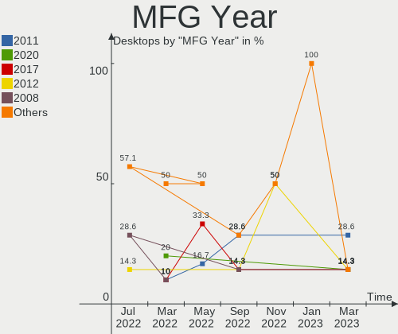
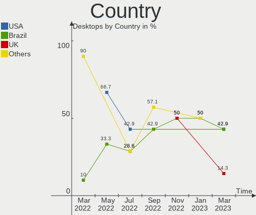
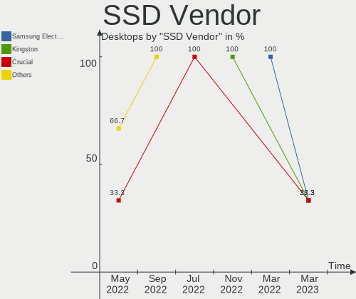
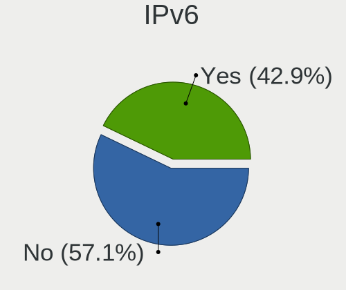
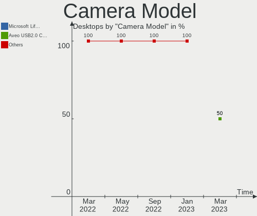

Endless Hardware Trends (Desktops)
----------------------------------

A project to identify most popular hardware characteristics and track their change
over time based on data collected by Endless users at https://Linux-Hardware.org.

Anyone can contribute to this report by the [hw-probe](https://github.com/linuxhw/hw-probe) tool:

    sudo -E hw-probe -all -upload

Full-feature report is available here: https://linux-hardware.org/?view=trends&formfactor=desktop

Period: Aug, 2021.

Contents
--------

* [ System ](#system)
  - [ OS                       ](#os)
  - [ OS Family                ](#os-family)
  - [ Kernel                   ](#kernel)
  - [ Kernel Family            ](#kernel-family)
  - [ Kernel Major Ver.        ](#kernel-major-ver)
  - [ Arch                     ](#arch)
  - [ DE                       ](#de)
  - [ Display Server           ](#display-server)
  - [ Display Manager          ](#display-manager)
  - [ OS Lang                  ](#os-lang)
  - [ Boot Mode                ](#boot-mode)
  - [ Filesystem               ](#filesystem)
  - [ Part. scheme             ](#part-scheme)
  - [ Dual Boot with Linux/BSD ](#dual-boot-with-linuxbsd)
  - [ Dual Boot (Win)          ](#dual-boot-win)

* [ Board ](#board)
  - [ Vendor                   ](#vendor)
  - [ Model                    ](#model)
  - [ Model Family             ](#model-family)
  - [ MFG Year                 ](#mfg-year)
  - [ Form Factor              ](#form-factor)
  - [ Secure Boot              ](#secure-boot)
  - [ Coreboot                 ](#coreboot)
  - [ RAM Size                 ](#ram-size)
  - [ RAM Used                 ](#ram-used)
  - [ Total Drives             ](#total-drives)
  - [ Has CD-ROM               ](#has-cd-rom)
  - [ Has Ethernet             ](#has-ethernet)
  - [ Has WiFi                 ](#has-wifi)
  - [ Has Bluetooth            ](#has-bluetooth)

* [ Location ](#location)
  - [ Country                  ](#country)
  - [ City                     ](#city)

* [ Drives ](#drives)
  - [ Drive Vendor             ](#drive-vendor)
  - [ Drive Model              ](#drive-model)
  - [ HDD Vendor               ](#hdd-vendor)
  - [ SSD Vendor               ](#ssd-vendor)
  - [ Drive Kind               ](#drive-kind)
  - [ Drive Connector          ](#drive-connector)
  - [ Drive Size               ](#drive-size)
  - [ Space Total              ](#space-total)
  - [ Space Used               ](#space-used)
  - [ Malfunc. Drives          ](#malfunc-drives)
  - [ Malfunc. Drive Vendor    ](#malfunc-drive-vendor)
  - [ Malfunc. HDD Vendor      ](#malfunc-hdd-vendor)
  - [ Malfunc. Drive Kind      ](#malfunc-drive-kind)
  - [ Failed Drives            ](#failed-drives)
  - [ Failed Drive Vendor      ](#failed-drive-vendor)
  - [ Drive Status             ](#drive-status)

* [ Storage controller ](#storage-controller)
  - [ Storage Vendor           ](#storage-vendor)
  - [ Storage Model            ](#storage-model)
  - [ Storage Kind             ](#storage-kind)

* [ Processor ](#processor)
  - [ CPU Vendor               ](#cpu-vendor)
  - [ CPU Model                ](#cpu-model)
  - [ CPU Model Family         ](#cpu-model-family)
  - [ CPU Cores                ](#cpu-cores)
  - [ CPU Sockets              ](#cpu-sockets)
  - [ CPU Threads              ](#cpu-threads)
  - [ CPU Op-Modes             ](#cpu-op-modes)
  - [ CPU Microcode            ](#cpu-microcode)
  - [ CPU Microarch            ](#cpu-microarch)

* [ Graphics ](#graphics)
  - [ GPU Vendor               ](#gpu-vendor)
  - [ GPU Model                ](#gpu-model)
  - [ GPU Combo                ](#gpu-combo)
  - [ GPU Driver               ](#gpu-driver)
  - [ GPU Memory               ](#gpu-memory)

* [ Monitor ](#monitor)
  - [ Monitor Vendor           ](#monitor-vendor)
  - [ Monitor Model            ](#monitor-model)
  - [ Monitor Resolution       ](#monitor-resolution)
  - [ Monitor Diagonal         ](#monitor-diagonal)
  - [ Monitor Width            ](#monitor-width)
  - [ Aspect Ratio             ](#aspect-ratio)
  - [ Monitor Area             ](#monitor-area)
  - [ Pixel Density            ](#pixel-density)
  - [ Multiple Monitors        ](#multiple-monitors)

* [ Network ](#network)
  - [ Net Controller Vendor    ](#net-controller-vendor)
  - [ Net Controller Model     ](#net-controller-model)
  - [ Wireless Vendor          ](#wireless-vendor)
  - [ Wireless Model           ](#wireless-model)
  - [ Ethernet Vendor          ](#ethernet-vendor)
  - [ Ethernet Model           ](#ethernet-model)
  - [ Net Controller Kind      ](#net-controller-kind)
  - [ Used Controller          ](#used-controller)
  - [ NICs                     ](#nics)
  - [ IPv6                     ](#ipv6)

* [ Bluetooth ](#bluetooth)
  - [ Bluetooth Vendor         ](#bluetooth-vendor)
  - [ Bluetooth Model          ](#bluetooth-model)

* [ Sound ](#sound)
  - [ Sound Vendor             ](#sound-vendor)
  - [ Sound Model              ](#sound-model)

* [ Memory ](#memory)
  - [ Memory Vendor            ](#memory-vendor)
  - [ Memory Model             ](#memory-model)
  - [ Memory Kind              ](#memory-kind)
  - [ Memory Form Factor       ](#memory-form-factor)
  - [ Memory Size              ](#memory-size)
  - [ Memory Speed             ](#memory-speed)

* [ Printers & scanners ](#printers--scanners)
  - [ Printer Vendor           ](#printer-vendor)
  - [ Printer Model            ](#printer-model)
  - [ Scanner Vendor           ](#scanner-vendor)
  - [ Scanner Model            ](#scanner-model)

* [ Camera ](#camera)
  - [ Camera Vendor            ](#camera-vendor)
  - [ Camera Model             ](#camera-model)

* [ Security ](#security)
  - [ Fingerprint Vendor       ](#fingerprint-vendor)
  - [ Fingerprint Model        ](#fingerprint-model)
  - [ Chipcard Vendor          ](#chipcard-vendor)
  - [ Chipcard Model           ](#chipcard-model)

* [ Unsupported ](#unsupported)
  - [ Unsupported Devices      ](#unsupported-devices)
  - [ Unsupported Device Types ](#unsupported-device-types)

System
------

OS
--

Installed operating systems

| Name          | Desktops | Percent |
|---------------|----------|---------|
| Endless 3.9.5 | 10       | 83.33%  |
| Endless 3.8.7 | 1        | 8.33%   |
| Endless 3.8.4 | 1        | 8.33%   |

OS Family
---------

OS without a version

| Name    | Desktops | Percent |
|---------|----------|---------|
| Endless | 12       | 100%    |

Kernel
------

Version of the Linux kernel

| Version          | Desktops | Percent |
|------------------|----------|---------|
| 5.8.0-14-generic | 10       | 83.33%  |
| 5.4.0-42-generic | 1        | 8.33%   |
| 5.4.0-19-generic | 1        | 8.33%   |

Kernel Family
-------------

Linux kernel without a distro release

| Version | Desktops | Percent |
|---------|----------|---------|
| 5.8.0   | 10       | 83.33%  |
| 5.4.0   | 2        | 16.67%  |

Kernel Major Ver.
-----------------

Linux kernel major version

| Version | Desktops | Percent |
|---------|----------|---------|
| 5.8     | 10       | 83.33%  |
| 5.4     | 2        | 16.67%  |

Arch
----

OS architecture (x86_64, i586, etc.)

| Name   | Desktops | Percent |
|--------|----------|---------|
| x86_64 | 12       | 100%    |

DE
--

Desktop Environment

| Name  | Desktops | Percent |
|-------|----------|---------|
| GNOME | 12       | 100%    |

Display Server
--------------

X11 or Wayland

| Name | Desktops | Percent |
|------|----------|---------|
| X11  | 12       | 100%    |

Display Manager
---------------

SDDM, LightDM, etc.

| Name    | Desktops | Percent |
|---------|----------|---------|
| Unknown | 12       | 100%    |

OS Lang
-------

Language

| Lang        | Desktops | Percent |
|-------------|----------|---------|
| en_US       | 4        | 33.33%  |
| es_MX       | 3        | 25%     |
| th_TH       | 1        | 8.33%   |
| ru_RU.UTF_8 | 1        | 8.33%   |
| pt_BR       | 1        | 8.33%   |
| es_CO       | 1        | 8.33%   |
| de_DE       | 1        | 8.33%   |

Boot Mode
---------

EFI or BIOS

| Mode | Desktops | Percent |
|------|----------|---------|
| BIOS | 6        | 50%     |
| EFI  | 6        | 50%     |

Filesystem
----------

Type of filesystem

| Type  | Desktops | Percent |
|-------|----------|---------|
| Ext4  | 11       | 91.67%  |
| Tmpfs | 1        | 8.33%   |

Part. scheme
------------

Scheme of partitioning

| Type    | Desktops | Percent |
|---------|----------|---------|
| Unknown | 12       | 100%    |

Dual Boot with Linux/BSD
------------------------

Hosting more than one Linux/BSD

| Dual boot | Desktops | Percent |
|-----------|----------|---------|
| No        | 12       | 100%    |

Dual Boot (Win)
---------------

Hosting Linux and Windows

| Dual boot | Desktops | Percent |
|-----------|----------|---------|
| No        | 12       | 100%    |

Board
-----

Vendor
------

Motherboard manufacturer

| Name                | Desktops | Percent |
|---------------------|----------|---------|
| Hewlett-Packard     | 2        | 16.67%  |
| Gigabyte Technology | 2        | 16.67%  |
| ASUSTek Computer    | 2        | 16.67%  |
| Positivo            | 1        | 8.33%   |
| Pegatron            | 1        | 8.33%   |
| Lenovo              | 1        | 8.33%   |
| Intel               | 1        | 8.33%   |
| ASRock              | 1        | 8.33%   |
| Acer                | 1        | 8.33%   |

Model
-----

Motherboard model

| Name                              | Desktops | Percent |
|-----------------------------------|----------|---------|
| Positivo P5VD2-MX                 | 1        | 8.33%   |
| Pegatron 23-b030la                | 1        | 8.33%   |
| Lenovo ThinkCentre M78 10BTA00ELM | 1        | 8.33%   |
| Intel MAGNUM GX                   | 1        | 8.33%   |
| HP Z230 Tower Workstation         | 1        | 8.33%   |
| HP CQ2902EQ                       | 1        | 8.33%   |
| Gigabyte P75-D3                   | 1        | 8.33%   |
| Gigabyte GA-78LMT-USB3 6.0        | 1        | 8.33%   |
| ASUS M2N68-AM Plus                | 1        | 8.33%   |
| ASUS K30BF_M32BF_A_F_K31BF        | 1        | 8.33%   |
| ASRock A88M-G                     | 1        | 8.33%   |
| Acer Veriton N4660G               | 1        | 8.33%   |

Model Family
------------

Motherboard model prefix

| Name                   | Desktops | Percent |
|------------------------|----------|---------|
| Positivo P5VD2-MX      | 1        | 8.33%   |
| Pegatron 23-b030la     | 1        | 8.33%   |
| Lenovo ThinkCentre     | 1        | 8.33%   |
| Intel MAGNUM           | 1        | 8.33%   |
| HP Z230                | 1        | 8.33%   |
| HP CQ2902EQ            | 1        | 8.33%   |
| Gigabyte P75-D3        | 1        | 8.33%   |
| Gigabyte GA-78LMT-USB3 | 1        | 8.33%   |
| ASUS M2N68-AM          | 1        | 8.33%   |
| ASUS K30BF             | 1        | 8.33%   |
| ASRock A88M-G          | 1        | 8.33%   |
| Acer Veriton           | 1        | 8.33%   |

MFG Year
--------

Motherboard manufacture year

| Year | Desktops | Percent |
|------|----------|---------|
| 2014 | 3        | 25%     |
| 2012 | 3        | 25%     |
| 2019 | 1        | 8.33%   |
| 2018 | 1        | 8.33%   |
| 2016 | 1        | 8.33%   |
| 2013 | 1        | 8.33%   |
| 2009 | 1        | 8.33%   |
| 2007 | 1        | 8.33%   |

Form Factor
-----------

Physical design of the computer

| Name    | Desktops | Percent |
|---------|----------|---------|
| Desktop | 12       | 100%    |

Secure Boot
-----------

Enabled or disabled

| State    | Desktops | Percent |
|----------|----------|---------|
| Disabled | 10       | 83.33%  |
| Enabled  | 2        | 16.67%  |

Coreboot
--------

Have coreboot on board

| Used | Desktops | Percent |
|------|----------|---------|
| No   | 12       | 100%    |

RAM Size
--------

Total RAM memory

| Size in GB | Desktops | Percent |
|------------|----------|---------|
| 8.01-16.0  | 4        | 33.33%  |
| 3.01-4.0   | 3        | 25%     |
| 4.01-8.0   | 2        | 16.67%  |
| 2.01-3.0   | 1        | 8.33%   |
| 16.01-24.0 | 1        | 8.33%   |
| 0.51-1.0   | 1        | 8.33%   |

RAM Used
--------

Used RAM memory

| Used GB  | Desktops | Percent |
|----------|----------|---------|
| 1.01-2.0 | 6        | 50%     |
| 3.01-4.0 | 2        | 16.67%  |
| 2.01-3.0 | 2        | 16.67%  |
| 0.51-1.0 | 1        | 8.33%   |
| 0.01-0.5 | 1        | 8.33%   |

Total Drives
------------

Number of drives on board

| Drives | Desktops | Percent |
|--------|----------|---------|
| 1      | 7        | 58.33%  |
| 2      | 3        | 25%     |
| 5      | 1        | 8.33%   |
| 3      | 1        | 8.33%   |

Has CD-ROM
----------

Has CD-ROM on board

| Presented | Desktops | Percent |
|-----------|----------|---------|
| Yes       | 7        | 58.33%  |
| No        | 5        | 41.67%  |

Has Ethernet
------------

Has Ethernet on board

| Presented | Desktops | Percent |
|-----------|----------|---------|
| Yes       | 11       | 91.67%  |
| No        | 1        | 8.33%   |

Has WiFi
--------

Has WiFi module

| Presented | Desktops | Percent |
|-----------|----------|---------|
| No        | 7        | 58.33%  |
| Yes       | 5        | 41.67%  |

Has Bluetooth
-------------

Has Bluetooth module

| Presented | Desktops | Percent |
|-----------|----------|---------|
| No        | 9        | 75%     |
| Yes       | 3        | 25%     |

Location
--------

Country
-------

Geographic location (country)

| Country  | Desktops | Percent |
|----------|----------|---------|
| Mexico   | 3        | 25%     |
| USA      | 2        | 16.67%  |
| Romania  | 2        | 16.67%  |
| Thailand | 1        | 8.33%   |
| Germany  | 1        | 8.33%   |
| Colombia | 1        | 8.33%   |
| Brazil   | 1        | 8.33%   |
| Belarus  | 1        | 8.33%   |

City
----

Geographic location (city)

| City             | Desktops | Percent |
|------------------|----------|---------|
| Quer?©taro City  | 2        | 16.67%  |
| Popesti-Leordeni | 2        | 16.67%  |
| Bucyrus          | 2        | 16.67%  |
| Ourinhos         | 1        | 8.33%   |
| Minsk            | 1        | 8.33%   |
| Leipzig          | 1        | 8.33%   |
| Le??n            | 1        | 8.33%   |
| Bogot??          | 1        | 8.33%   |
| Bangkok          | 1        | 8.33%   |

Drives
------

Drive Vendor
------------

Hard drive vendors

| Vendor              | Desktops | Drives | Percent |
|---------------------|----------|--------|---------|
| WDC                 | 4        | 4      | 23.53%  |
| Seagate             | 3        | 5      | 17.65%  |
| Kingston            | 2        | 2      | 11.76%  |
| Hitachi             | 2        | 2      | 11.76%  |
| Toshiba             | 1        | 2      | 5.88%   |
| Synopsys            | 1        | 1      | 5.88%   |
| Samsung Electronics | 1        | 1      | 5.88%   |
| KingDian            | 1        | 1      | 5.88%   |
| China               | 1        | 1      | 5.88%   |
| A-DATA Technology   | 1        | 1      | 5.88%   |

Drive Model
-----------

Hard drive models

| Model                            | Desktops | Percent |
|----------------------------------|----------|---------|
| Seagate ST500DM002-1BD142 500GB  | 2        | 10%     |
| Kingston SV300S37A120G 120GB SSD | 2        | 10%     |
| WDC WD5000LPCX-21VHAT0 500GB     | 1        | 5%      |
| WDC WD5000BPVT-60HXZT1 500GB     | 1        | 5%      |
| WDC WD5000AAKX-60U6AA0 500GB     | 1        | 5%      |
| WDC WD10EARS-00Y5B1 1TB          | 1        | 5%      |
| Toshiba HDWD110 1TB              | 1        | 5%      |
| Toshiba DT01ACA200 2TB           | 1        | 5%      |
| Synopsys NVMe SSD Drive 1024MB   | 1        | 5%      |
| Seagate ST3300822AS 304GB        | 1        | 5%      |
| Seagate ST31000524AS 1TB         | 1        | 5%      |
| Seagate ST1000DM003-1CH162 1TB   | 1        | 5%      |
| Samsung HD252HJ 250GB            | 1        | 5%      |
| KingDian S200 120GB              | 1        | 5%      |
| Hitachi HTS545050A7E380 500GB    | 1        | 5%      |
| Hitachi HDS721616PLA380 160GB    | 1        | 5%      |
| China SATA SSD 20GB              | 1        | 5%      |
| A-DATA SU800 1024GB SSD          | 1        | 5%      |

HDD Vendor
----------

Hard disk drive vendors

| Vendor              | Desktops | Drives | Percent |
|---------------------|----------|--------|---------|
| WDC                 | 4        | 4      | 36.36%  |
| Seagate             | 3        | 5      | 27.27%  |
| Hitachi             | 2        | 2      | 18.18%  |
| Toshiba             | 1        | 2      | 9.09%   |
| Samsung Electronics | 1        | 1      | 9.09%   |

SSD Vendor
----------

Solid state drive vendors

| Vendor            | Desktops | Drives | Percent |
|-------------------|----------|--------|---------|
| Kingston          | 2        | 2      | 40%     |
| KingDian          | 1        | 1      | 20%     |
| China             | 1        | 1      | 20%     |
| A-DATA Technology | 1        | 1      | 20%     |

Drive Kind
----------

HDD or SSD

| Kind | Desktops | Drives | Percent |
|------|----------|--------|---------|
| HDD  | 8        | 14     | 57.14%  |
| SSD  | 5        | 5      | 35.71%  |
| NVMe | 1        | 1      | 7.14%   |

Drive Connector
---------------

SATA, SAS, NVMe, etc.

| Type | Desktops | Drives | Percent |
|------|----------|--------|---------|
| SATA | 12       | 19     | 92.31%  |
| NVMe | 1        | 1      | 7.69%   |

Drive Size
----------

Size of hard drive

| Size in TB | Desktops | Drives | Percent |
|------------|----------|--------|---------|
| 0.01-0.5   | 11       | 13     | 73.33%  |
| 1.01-2.0   | 2        | 2      | 13.33%  |
| 0.51-1.0   | 2        | 4      | 13.33%  |

Space Total
-----------

Amount of disk space available on the file system

| Size in GB | Desktops | Percent |
|------------|----------|---------|
| 101-250    | 5        | 41.67%  |
| 251-500    | 4        | 33.33%  |
| 1-20       | 1        | 8.33%   |
| 501-1000   | 1        | 8.33%   |
| 51-100     | 1        | 8.33%   |

Space Used
----------

Amount of used disk space

| Used GB | Desktops | Percent |
|---------|----------|---------|
| 21-50   | 5        | 41.67%  |
| 51-100  | 4        | 33.33%  |
| 1-20    | 3        | 25%     |

Malfunc. Drives
---------------

Drive models with a malfunction

Zero info for selected period =(

Malfunc. Drive Vendor
---------------------

Vendors of faulty drives

Zero info for selected period =(

Malfunc. HDD Vendor
-------------------

Vendors of faulty HDD drives

Zero info for selected period =(

Malfunc. Drive Kind
-------------------

Kinds of faulty drives

Zero info for selected period =(

Failed Drives
-------------

Failed drive models

Zero info for selected period =(

Failed Drive Vendor
-------------------

Failed drive vendors

Zero info for selected period =(

Drive Status
------------

Number of failed and malfunc. drives

| Status   | Desktops | Drives | Percent |
|----------|----------|--------|---------|
| Detected | 12       | 20     | 100%    |

Storage controller
------------------

Storage Vendor
--------------

Storage controller vendors

| Vendor                   | Desktops | Percent |
|--------------------------|----------|---------|
| Intel                    | 5        | 35.71%  |
| AMD                      | 5        | 35.71%  |
| VIA Technologies         | 1        | 7.14%   |
| Synopsys                 | 1        | 7.14%   |
| Nvidia                   | 1        | 7.14%   |
| Marvell Technology Group | 1        | 7.14%   |

Storage Model
-------------

Storage controller models

| Model                                                                         | Desktops | Percent |
|-------------------------------------------------------------------------------|----------|---------|
| AMD FCH SATA Controller [AHCI mode]                                           | 4        | 22.22%  |
| VIA VT82C586A/B/VT82C686/A/B/VT823x/A/C PIPC Bus Master IDE                   | 1        | 5.56%   |
| VIA Serial ATA Controller                                                     | 1        | 5.56%   |
| Synopsys Non-Volatile memory controller                                       | 1        | 5.56%   |
| Nvidia MCP61 SATA Controller                                                  | 1        | 5.56%   |
| Nvidia MCP61 IDE                                                              | 1        | 5.56%   |
| Marvell Group 88SE6111/6121 SATA II / PATA Controller                         | 1        | 5.56%   |
| Intel SATA Controller [RAID mode]                                             | 1        | 5.56%   |
| Intel Cannon Lake PCH SATA AHCI Controller                                    | 1        | 5.56%   |
| Intel 82801JI (ICH10 Family) SATA AHCI Controller                             | 1        | 5.56%   |
| Intel 7 Series/C210 Series Chipset Family 6-port SATA Controller [AHCI mode]  | 1        | 5.56%   |
| Intel 6 Series/C200 Series Chipset Family 6 port Desktop SATA AHCI Controller | 1        | 5.56%   |
| AMD SB7x0/SB8x0/SB9x0 SATA Controller [IDE mode]                              | 1        | 5.56%   |
| AMD SB7x0/SB8x0/SB9x0 IDE Controller                                          | 1        | 5.56%   |
| AMD FCH IDE Controller                                                        | 1        | 5.56%   |

Storage Kind
------------

Kind of storage controller (IDE, SATA, NVMe, SAS, ...)

| Kind | Desktops | Percent |
|------|----------|---------|
| SATA | 9        | 56.25%  |
| IDE  | 4        | 25%     |
| RAID | 2        | 12.5%   |
| NVMe | 1        | 6.25%   |

Processor
---------

CPU Vendor
----------

Processor vendors

| Vendor | Desktops | Percent |
|--------|----------|---------|
| Intel  | 6        | 50%     |
| AMD    | 6        | 50%     |

CPU Model
---------

Processor models

| Model                                           | Desktops | Percent |
|-------------------------------------------------|----------|---------|
| Intel Xeon CPU E3-1271 v3 @ 3.60GHz             | 1        | 8.33%   |
| Intel Pentium Dual CPU E2180 @ 2.00GHz          | 1        | 8.33%   |
| Intel Pentium CPU G645T @ 2.50GHz               | 1        | 8.33%   |
| Intel Core i7 CPU 920 @ 2.67GHz                 | 1        | 8.33%   |
| Intel Core i3-8100 CPU @ 3.60GHz                | 1        | 8.33%   |
| Intel Core i3-3240 CPU @ 3.40GHz                | 1        | 8.33%   |
| AMD FX-6300 Six-Core Processor                  | 1        | 8.33%   |
| AMD Athlon II X2 240 Processor                  | 1        | 8.33%   |
| AMD A8-6500 APU with Radeon HD Graphics         | 1        | 8.33%   |
| AMD A6-5400B APU with Radeon HD Graphics        | 1        | 8.33%   |
| AMD A4-5300 APU with Radeon HD Graphics         | 1        | 8.33%   |
| AMD A10-7850K Radeon R7, 12 Compute Cores 4C+8G | 1        | 8.33%   |

CPU Model Family
----------------

Processor model prefix

| Model              | Desktops | Percent |
|--------------------|----------|---------|
| Intel Core i3      | 2        | 16.67%  |
| Intel Xeon         | 1        | 8.33%   |
| Intel Pentium Dual | 1        | 8.33%   |
| Intel Pentium      | 1        | 8.33%   |
| Intel Core i7      | 1        | 8.33%   |
| AMD FX             | 1        | 8.33%   |
| AMD Athlon II X2   | 1        | 8.33%   |
| AMD A8             | 1        | 8.33%   |
| AMD A6             | 1        | 8.33%   |
| AMD A4             | 1        | 8.33%   |
| AMD A10            | 1        | 8.33%   |

CPU Cores
---------

Number of processor cores

| Number | Desktops | Percent |
|--------|----------|---------|
| 2      | 6        | 50%     |
| 4      | 3        | 25%     |
| 1      | 2        | 16.67%  |
| 3      | 1        | 8.33%   |

CPU Sockets
-----------

Number of sockets

| Number | Desktops | Percent |
|--------|----------|---------|
| 1      | 12       | 100%    |

CPU Threads
-----------

Threads per core (Hyper-Threading)

| Number | Desktops | Percent |
|--------|----------|---------|
| 2      | 8        | 66.67%  |
| 1      | 4        | 33.33%  |

CPU Op-Modes
------------

CPU Operation Modes (32-bit, 64-bit)

| Op mode        | Desktops | Percent |
|----------------|----------|---------|
| 32-bit, 64-bit | 12       | 100%    |

CPU Microcode
-------------

Microcode number

| Number     | Desktops | Percent |
|------------|----------|---------|
| 0x06001119 | 3        | 25%     |
| 0x906eb    | 1        | 8.33%   |
| 0x6fd      | 1        | 8.33%   |
| 0x306c3    | 1        | 8.33%   |
| 0x306a9    | 1        | 8.33%   |
| 0x206a7    | 1        | 8.33%   |
| 0x106a4    | 1        | 8.33%   |
| 0x06003106 | 1        | 8.33%   |
| 0x06000852 | 1        | 8.33%   |
| Unknown    | 1        | 8.33%   |

CPU Microarch
-------------

Microarchitecture

| Name        | Desktops | Percent |
|-------------|----------|---------|
| Piledriver  | 4        | 33.33%  |
| Steamroller | 1        | 8.33%   |
| SandyBridge | 1        | 8.33%   |
| Nehalem     | 1        | 8.33%   |
| KabyLake    | 1        | 8.33%   |
| K10         | 1        | 8.33%   |
| IvyBridge   | 1        | 8.33%   |
| Haswell     | 1        | 8.33%   |
| Core        | 1        | 8.33%   |

Graphics
--------

GPU Vendor
----------

Vendors of graphics cards

| Vendor           | Desktops | Percent |
|------------------|----------|---------|
| Nvidia           | 5        | 41.67%  |
| AMD              | 4        | 33.33%  |
| Intel            | 2        | 16.67%  |
| VIA Technologies | 1        | 8.33%   |

GPU Model
---------

Graphics card models

| Model                                                                     | Desktops | Percent |
|---------------------------------------------------------------------------|----------|---------|
| Nvidia GT218 [GeForce 210]                                                | 2        | 16.67%  |
| VIA Technologies P4M890 [S3 UniChrome Pro]                                | 1        | 8.33%   |
| Nvidia GP106 [GeForce GTX 1060 6GB]                                       | 1        | 8.33%   |
| Nvidia GM107GL [Quadro K620]                                              | 1        | 8.33%   |
| Nvidia G92 [GeForce 9800 GT]                                              | 1        | 8.33%   |
| Intel CoffeeLake-S GT2 [UHD Graphics 630]                                 | 1        | 8.33%   |
| Intel 2nd Generation Core Processor Family Integrated Graphics Controller | 1        | 8.33%   |
| AMD Trinity 2 [Radeon HD 7540D]                                           | 1        | 8.33%   |
| AMD Trinity 2 [Radeon HD 7480D]                                           | 1        | 8.33%   |
| AMD Kaveri [Radeon R7 Graphics]                                           | 1        | 8.33%   |
| AMD Hawaii PRO [Radeon R9 290/390]                                        | 1        | 8.33%   |

GPU Combo
---------

Combinations of graphics cards

| Name       | Desktops | Percent |
|------------|----------|---------|
| 1 x Nvidia | 5        | 41.67%  |
| 1 x AMD    | 4        | 33.33%  |
| 1 x Intel  | 2        | 16.67%  |
| 1 x VIA    | 1        | 8.33%   |

GPU Driver
----------

Free vs proprietary

| Driver      | Desktops | Percent |
|-------------|----------|---------|
| Free        | 9        | 75%     |
| Proprietary | 2        | 16.67%  |
| Unknown     | 1        | 8.33%   |

GPU Memory
----------

Total video memory

| Size in GB | Desktops | Percent |
|------------|----------|---------|
| Unknown    | 6        | 50%     |
| 0.01-0.5   | 3        | 25%     |
| 0.51-1.0   | 2        | 16.67%  |
| 7.01-8.0   | 1        | 8.33%   |

Monitor
-------

Monitor Vendor
--------------

Monitor vendors

| Vendor              | Desktops | Percent |
|---------------------|----------|---------|
| Acer                | 3        | 30%     |
| Samsung Electronics | 2        | 20%     |
| Hewlett-Packard     | 2        | 20%     |
| Dell                | 2        | 20%     |
| AOC                 | 1        | 10%     |

Monitor Model
-------------

Monitor models

| Model                                                             | Desktops | Percent |
|-------------------------------------------------------------------|----------|---------|
| Samsung Electronics U28D590 SAM0B81 3840x2160 608x345mm 27.5-inch | 2        | 18.18%  |
| Dell 20 DELF112 1600x900 443x249mm 20.0-inch                      | 2        | 18.18%  |
| Hewlett-Packard TouchSmart HWP4221 1920x1080 509x286mm 23.0-inch  | 1        | 9.09%   |
| Hewlett-Packard E201 HWP305F 1600x900 443x249mm 20.0-inch         | 1        | 9.09%   |
| Dell SE2419HR DELF113 1920x1080 527x296mm 23.8-inch               | 1        | 9.09%   |
| AOC 2343 AOC2343 1920x1080 509x286mm 23.0-inch                    | 1        | 9.09%   |
| Acer X203H ACR0075 1600x900 443x249mm 20.0-inch                   | 1        | 9.09%   |
| Acer P205H ACR00C5 1600x900 440x250mm 19.9-inch                   | 1        | 9.09%   |
| Acer KA220HQ ACR0497 1920x1080 477x268mm 21.5-inch                | 1        | 9.09%   |

Monitor Resolution
------------------

Monitor screen resolution

| Resolution      | Desktops | Percent |
|-----------------|----------|---------|
| 1920x1080 (FHD) | 5        | 50%     |
| 1600x900 (HD+)  | 3        | 30%     |
| 3840x2160 (4K)  | 2        | 20%     |

Monitor Diagonal
----------------

Diagonal size in inches

| Inches | Desktops | Percent |
|--------|----------|---------|
| 23     | 4        | 36.36%  |
| 20     | 3        | 27.27%  |
| 27     | 2        | 18.18%  |
| 24     | 1        | 9.09%   |
| 21     | 1        | 9.09%   |

Monitor Width
-------------

Physical width

| Width in mm | Desktops | Percent |
|-------------|----------|---------|
| 501-600     | 4        | 40%     |
| 401-500     | 4        | 40%     |
| 601-700     | 2        | 20%     |

Aspect Ratio
------------

Proportional relationship between the width and the height

| Ratio | Desktops | Percent |
|-------|----------|---------|
| 16/9  | 10       | 100%    |

Monitor Area
------------

Area in inch²

| Area in inch² | Desktops | Percent |
|----------------|----------|---------|
| 201-250        | 5        | 50%     |
| 151-200        | 3        | 30%     |
| 301-350        | 2        | 20%     |

Pixel Density
-------------

Pixels per inch

| Density | Desktops | Percent |
|---------|----------|---------|
| 51-100  | 7        | 70%     |
| 121-160 | 2        | 20%     |
| 101-120 | 1        | 10%     |

Multiple Monitors
-----------------

Total monitors connected

| Total | Desktops | Percent |
|-------|----------|---------|
| 1     | 11       | 91.67%  |
| 0     | 1        | 8.33%   |

Network
-------

Net Controller Vendor
---------------------

Controller vendors

| Vendor                          | Desktops | Percent |
|---------------------------------|----------|---------|
| Realtek Semiconductor           | 9        | 50%     |
| Ralink Technology               | 2        | 11.11%  |
| Qualcomm Atheros                | 2        | 11.11%  |
| Intel                           | 2        | 11.11%  |
| VIA Technologies                | 1        | 5.56%   |
| Ralink                          | 1        | 5.56%   |
| Hangzhou Silan Microelectronics | 1        | 5.56%   |

Net Controller Model
--------------------

Controller models

| Model                                                               | Desktops | Percent |
|---------------------------------------------------------------------|----------|---------|
| Realtek RTL8111/8168/8411 PCI Express Gigabit Ethernet Controller   | 7        | 38.89%  |
| VIA VT6102/VT6103 [Rhine-II]                                        | 1        | 5.56%   |
| Realtek RTL8188EUS 802.11n Wireless Network Adapter                 | 1        | 5.56%   |
| Realtek RTL8188CUS 802.11n WLAN Adapter                             | 1        | 5.56%   |
| Ralink RT5370 Wireless Adapter                                      | 1        | 5.56%   |
| Ralink MT7601U Wireless Adapter                                     | 1        | 5.56%   |
| Ralink RT5390R 802.11bgn PCIe Wireless Network Adapter              | 1        | 5.56%   |
| Qualcomm Atheros QCA6174 802.11ac Wireless Network Adapter          | 1        | 5.56%   |
| Qualcomm Atheros AR8152 v2.0 Fast Ethernet                          | 1        | 5.56%   |
| Intel Ethernet Connection I217-LM                                   | 1        | 5.56%   |
| Intel 82567LM-2 Gigabit Network Connection                          | 1        | 5.56%   |
| Hangzhou Silan RTL8139D [Realtek] PCI 10/100BaseTX ethernet adaptor | 1        | 5.56%   |

Wireless Vendor
---------------

Wireless vendors

| Vendor                | Desktops | Percent |
|-----------------------|----------|---------|
| Realtek Semiconductor | 2        | 33.33%  |
| Ralink Technology     | 2        | 33.33%  |
| Ralink                | 1        | 16.67%  |
| Qualcomm Atheros      | 1        | 16.67%  |

Wireless Model
--------------

Wireless models

| Model                                                      | Desktops | Percent |
|------------------------------------------------------------|----------|---------|
| Realtek RTL8188EUS 802.11n Wireless Network Adapter        | 1        | 16.67%  |
| Realtek RTL8188CUS 802.11n WLAN Adapter                    | 1        | 16.67%  |
| Ralink RT5370 Wireless Adapter                             | 1        | 16.67%  |
| Ralink MT7601U Wireless Adapter                            | 1        | 16.67%  |
| Ralink RT5390R 802.11bgn PCIe Wireless Network Adapter     | 1        | 16.67%  |
| Qualcomm Atheros QCA6174 802.11ac Wireless Network Adapter | 1        | 16.67%  |

Ethernet Vendor
---------------

Ethernet vendors

| Vendor                          | Desktops | Percent |
|---------------------------------|----------|---------|
| Realtek Semiconductor           | 7        | 58.33%  |
| Intel                           | 2        | 16.67%  |
| VIA Technologies                | 1        | 8.33%   |
| Qualcomm Atheros                | 1        | 8.33%   |
| Hangzhou Silan Microelectronics | 1        | 8.33%   |

Ethernet Model
--------------

Ethernet models

| Model                                                               | Desktops | Percent |
|---------------------------------------------------------------------|----------|---------|
| Realtek RTL8111/8168/8411 PCI Express Gigabit Ethernet Controller   | 7        | 58.33%  |
| VIA VT6102/VT6103 [Rhine-II]                                        | 1        | 8.33%   |
| Qualcomm Atheros AR8152 v2.0 Fast Ethernet                          | 1        | 8.33%   |
| Intel Ethernet Connection I217-LM                                   | 1        | 8.33%   |
| Intel 82567LM-2 Gigabit Network Connection                          | 1        | 8.33%   |
| Hangzhou Silan RTL8139D [Realtek] PCI 10/100BaseTX ethernet adaptor | 1        | 8.33%   |

Net Controller Kind
-------------------

Ethernet, WiFi or modem

| Kind     | Desktops | Percent |
|----------|----------|---------|
| Ethernet | 11       | 68.75%  |
| WiFi     | 5        | 31.25%  |

Used Controller
---------------

Currently used network controller

| Kind     | Desktops | Percent |
|----------|----------|---------|
| Ethernet | 11       | 68.75%  |
| WiFi     | 5        | 31.25%  |

NICs
----

Total network controllers on board

| Total | Desktops | Percent |
|-------|----------|---------|
| 1     | 8        | 66.67%  |
| 2     | 3        | 25%     |
| 0     | 1        | 8.33%   |

IPv6
----

IPv6 vs IPv4

| Used | Desktops | Percent |
|------|----------|---------|
| No   | 8        | 66.67%  |
| Yes  | 4        | 33.33%  |

Bluetooth
---------

Bluetooth Vendor
----------------

Controller vendors

| Vendor                  | Desktops | Percent |
|-------------------------|----------|---------|
| Cambridge Silicon Radio | 2        | 66.67%  |
| Lite-On Technology      | 1        | 33.33%  |

Bluetooth Model
---------------

Controller models

| Model                                               | Desktops | Percent |
|-----------------------------------------------------|----------|---------|
| Cambridge Silicon Radio Bluetooth Dongle (HCI mode) | 2        | 66.67%  |
| Lite-On Bluetooth Device                            | 1        | 33.33%  |

Sound
-----

Sound Vendor
------------

Sound card vendors

| Vendor           | Desktops | Percent |
|------------------|----------|---------|
| Intel            | 5        | 31.25%  |
| AMD              | 5        | 31.25%  |
| Nvidia           | 4        | 25%     |
| VIA Technologies | 1        | 6.25%   |
| Logitech         | 1        | 6.25%   |

Sound Model
-----------

Sound card models

| Model                                                                      | Desktops | Percent |
|----------------------------------------------------------------------------|----------|---------|
| AMD FCH Azalia Controller                                                  | 4        | 20%     |
| Nvidia High Definition Audio Controller                                    | 2        | 10%     |
| VIA Technologies VX900/VT8xxx High Definition Audio Controller             | 1        | 5%      |
| Nvidia MCP61 High Definition Audio                                         | 1        | 5%      |
| Nvidia GP106 High Definition Audio Controller                              | 1        | 5%      |
| Nvidia GM107 High Definition Audio Controller [GeForce 940MX]              | 1        | 5%      |
| Logitech Headset H340                                                      | 1        | 5%      |
| Intel Cannon Lake PCH cAVS                                                 | 1        | 5%      |
| Intel 82801JI (ICH10 Family) HD Audio Controller                           | 1        | 5%      |
| Intel 8 Series/C220 Series Chipset High Definition Audio Controller        | 1        | 5%      |
| Intel 7 Series/C216 Chipset Family High Definition Audio Controller        | 1        | 5%      |
| Intel 6 Series/C200 Series Chipset Family High Definition Audio Controller | 1        | 5%      |
| AMD Trinity HDMI Audio Controller                                          | 1        | 5%      |
| AMD SBx00 Azalia (Intel HDA)                                               | 1        | 5%      |
| AMD Kaveri HDMI/DP Audio Controller                                        | 1        | 5%      |
| AMD Hawaii HDMI Audio [Radeon R9 290/290X / 390/390X]                      | 1        | 5%      |

Memory
------

Memory Vendor
-------------

Memory module vendors

Zero info for selected period =(

Memory Model
------------

Memory module models

Zero info for selected period =(

Memory Kind
-----------

Memory module kinds

Zero info for selected period =(

Memory Form Factor
------------------

Physical design of the memory module

Zero info for selected period =(

Memory Size
-----------

Memory module size

Zero info for selected period =(

Memory Speed
------------

Memory module speed

Zero info for selected period =(

Printers & scanners
-------------------

Printer Vendor
--------------

Printer device vendors

| Vendor             | Desktops | Percent |
|--------------------|----------|---------|
| STMicroelectronics | 1        | 50%     |
| Brother Industries | 1        | 50%     |

Printer Model
-------------

Printer device models

| Model                            | Desktops | Percent |
|----------------------------------|----------|---------|
| STMicroelectronics USB Printer P | 1        | 50%     |
| Brother DCP-T710W                | 1        | 50%     |

Scanner Vendor
--------------

Scanner device vendors

Zero info for selected period =(

Scanner Model
-------------

Scanner device models

Zero info for selected period =(

Camera
------

Camera Vendor
-------------

Camera device vendors

| Vendor              | Desktops | Percent |
|---------------------|----------|---------|
| Samsung Electronics | 1        | 25%     |
| Microdia            | 1        | 25%     |
| Logitech            | 1        | 25%     |
| Chicony Electronics | 1        | 25%     |

Camera Model
------------

Camera device models

| Model                                   | Desktops | Percent |
|-----------------------------------------|----------|---------|
| Samsung Galaxy series, misc. (MTP mode) | 1        | 25%     |
| Microdia HDP Webcam USB                 | 1        | 25%     |
| Logitech Webcam C270                    | 1        | 25%     |
| Chicony HP High Definition 1MP Webcam   | 1        | 25%     |

Security
--------

Fingerprint Vendor
------------------

Fingerprint sensor vendors

Zero info for selected period =(

Fingerprint Model
-----------------

Fingerprint sensor models

Zero info for selected period =(

Chipcard Vendor
---------------

Chipcard module vendors

| Vendor        | Desktops | Percent |
|---------------|----------|---------|
| Kobil Systems | 1        | 100%    |

Chipcard Model
--------------

Chipcard module models

| Model                              | Desktops | Percent |
|------------------------------------|----------|---------|
| Kobil Systems KOBIL Class 3 Reader | 1        | 100%    |

Unsupported
-----------

Unsupported Devices
-------------------

Total unsupported devices on board

| Total | Desktops | Percent |
|-------|----------|---------|
| 0     | 10       | 83.33%  |
| 1     | 2        | 16.67%  |

Unsupported Device Types
------------------------

Types of unsupported devices

| Type          | Desktops | Percent |
|---------------|----------|---------|
| Graphics card | 1        | 50%     |
| Chipcard      | 1        | 50%     |

